# Parent Section Magnitude-Probability Distributions

Only fault sections with at least one triggered aftershock are plotted. Sections are sorted by total supraseismogenic trigger rate (decreasing)

## Table Of Contents

* [Garlock (Central)](#garlock-central)
* [Tank Canyon](#tank-canyon)
* [Owl Lake](#owl-lake)
* [Little Lake](#little-lake)
* [Airport Lake](#airport-lake)
* [Panamint Valley](#panamint-valley)
* [Garlock (East)](#garlock-east)
* [Hunter Mountain-Saline Valley](#hunter-mountain-saline-valley)
* [Ash Hill](#ash-hill)
* [Blackwater](#blackwater)
* [Garlock (West)](#garlock-west)
* [McLean Lake](#mclean-lake)
* [Goldstone Lake](#goldstone-lake)
* [Gravel Hills-Harper Lk](#gravel-hills-harper-lk)
* [So Sierra Nevada](#so-sierra-nevada)
* [Death Valley (So)](#death-valley-so)
* [San Andreas (Mojave S)](#san-andreas-mojave-s)
* [Coyote Canyon](#coyote-canyon)
* [Nelson Lake](#nelson-lake)
* [San Andreas (Mojave N)](#san-andreas-mojave-n)
* [Towne Pass](#towne-pass)
* [Lenwood-Lockhart-Old Woman Springs](#lenwood-lockhart-old-woman-springs)
* [Bicycle Lake](#bicycle-lake)
* [Paradise](#paradise)
* [San Andreas (San Bernardino N)](#san-andreas-san-bernardino-n)
* [Garlic Springs](#garlic-springs)
* [Death Valley (Black Mtns Frontal)](#death-valley-black-mtns-frontal)
* [San Andreas (San Bernardino S)](#san-andreas-san-bernardino-s)
* [Coyote Lake](#coyote-lake)
* [Helendale-So Lockhart](#helendale-so-lockhart)
* [San Andreas (Big Bend)](#san-andreas-big-bend)
* [Sierra Nevada  (No Extension)](#sierra-nevada--no-extension)
* [Death Valley (No)](#death-valley-no)
* [Red Pass](#red-pass)
* [San Andreas (Parkfield)](#san-andreas-parkfield)
* [San Andreas (San Gorgonio Pass-Garnet HIll)](#san-andreas-san-gorgonio-pass-garnet-hill)
* [Death Valley (Fish Lake Valley)](#death-valley-fish-lake-valley)
* [Calico-Hidalgo](#calico-hidalgo)
* [Manix-Afton Hills](#manix-afton-hills)
* [San Andreas (Cholame) rev](#san-andreas-cholame-rev)
* [Cady](#cady)
* [Scodie Lineament](#scodie-lineament)
* [San Andreas (Carrizo) rev](#san-andreas-carrizo-rev)
* [Lake Isabella (Seismicity)](#lake-isabella-seismicity)
* [Baker](#baker)
* [Ludlow](#ludlow)
* [San Andreas (Coachella) rev](#san-andreas-coachella-rev)
* [Elsinore (Glen Ivy) rev](#elsinore-glen-ivy-rev)
* [San Andreas (North Branch Mill Creek)](#san-andreas-north-branch-mill-creek)
* [Owens Valley](#owens-valley)
* [White Wolf (Extension)](#white-wolf-extension)
* [San Jacinto (San Bernardino)](#san-jacinto-san-bernardino)
* [Santa Ynez (East)](#santa-ynez-east)
* [Independence rev 2011](#independence-rev-2011)
* [Cleghorn Lake](#cleghorn-lake)
* [Santa Rosa Island](#santa-rosa-island)
* [Kern Canyon (North Kern) 2011](#kern-canyon-north-kern-2011)
* [White Mountains](#white-mountains)
* [Cleghorn Pass](#cleghorn-pass)
* [San Jacinto (San Jacinto Valley) rev](#san-jacinto-san-jacinto-valley-rev)
* [Chino alt 1](#chino-alt-1)
* [San Clemente](#san-clemente)
* [Mission Creek](#mission-creek)
* [Channel Islands Thrust](#channel-islands-thrust)
* [Ventura-Pitas Point](#ventura-pitas-point)
* [Mission Ridge-Arroyo Parida-Santa Ana](#mission-ridge-arroyo-parida-santa-ana)
* [Santa Ynez (West)](#santa-ynez-west)
* [San Andreas (Creeping Section) 2011 CFM](#san-andreas-creeping-section-2011-cfm)
* [Pinto Mtn](#pinto-mtn)
* [Blue Cut](#blue-cut)
* [Pisgah-Bullion Mtn-Mesquite Lk](#pisgah-bullion-mtn-mesquite-lk)
* [Big Pine (Central)](#big-pine-central)
* [San Jacinto (Stepovers Combined)](#san-jacinto-stepovers-combined)
* [San Jacinto (Anza) rev](#san-jacinto-anza-rev)
* [Tin Mountain](#tin-mountain)
* [Dry Mountain](#dry-mountain)
* [Red Mountain](#red-mountain)
* [Lost Hills](#lost-hills)
* [San Jacinto (Lytle Creek connector)](#san-jacinto-lytle-creek-connector)
* [Deep Springs](#deep-springs)
* [Kern Canyon (Lake Isabella) 2011](#kern-canyon-lake-isabella-2011)
* [Brawley (Seismic Zone) alt 1](#brawley-seismic-zone-alt-1)
* [Camp Rock 2011](#camp-rock-2011)
* [San Jacinto (Borrego)](#san-jacinto-borrego)
* [Pleito](#pleito)
* [Imperial](#imperial)
* [Whittier alt 1](#whittier-alt-1)
* [Cleghorn](#cleghorn)
* [Big Pine (East)](#big-pine-east)
* [San Jacinto (Coyote Creek)](#san-jacinto-coyote-creek)
* [Green Valley 2011 CFM](#green-valley-2011-cfm)
* [Hosgri](#hosgri)
* [Bullion Mountains](#bullion-mountains)
* [Hosgri (Extension)](#hosgri-extension)
* [Great Valley 09 (Laguna Seca)](#great-valley-09-laguna-seca)
* [Raymond](#raymond)
* [San Pedro Basin](#san-pedro-basin)
* [San Jacinto (Clark) rev](#san-jacinto-clark-rev)
* [Santa Cruz Island](#santa-cruz-island)
* [San Jacinto (Superstition Mtn)](#san-jacinto-superstition-mtn)
* [Mono Lake 2011 CFM](#mono-lake-2011-cfm)
* [Santa Ynez River](#santa-ynez-river)
* [Elysian Park (Upper)](#elysian-park-upper)
* [Pitas Point (Lower West)](#pitas-point-lower-west)
* [San Cayetano](#san-cayetano)
* [Rose Canyon](#rose-canyon)
* [San Diego Trough north alt1](#san-diego-trough-north-alt1)
* [Honey Lake 2011 CFM](#honey-lake-2011-cfm)
* [San Diego Trough south](#san-diego-trough-south)
* [Oceanic - West Huasna](#oceanic---west-huasna)
* [San Gorgonio Pass](#san-gorgonio-pass)
* [Great Valley 10 (Panoche)](#great-valley-10-panoche)
* [Calaveras (So) 2011 CFM](#calaveras-so-2011-cfm)
* [Los Alamos 2011 CFM](#los-alamos-2011-cfm)
* [Mount Diablo Thrust South](#mount-diablo-thrust-south)
* [San Juan](#san-juan)
* [White Wolf](#white-wolf)
* [West Napa 2011 CFM](#west-napa-2011-cfm)
* [Los Alamos extension](#los-alamos-extension)
* [Likely 2011 CFM](#likely-2011-cfm)
* [San Gabriel](#san-gabriel)
* [Malibu Coast alt 1](#malibu-coast-alt-1)
* [Greenville (So) 2011 CFM](#greenville-so-2011-cfm)
* [Greenville (No) 2011 CFM](#greenville-no-2011-cfm)
* [Quien Sabe 2011 CFM](#quien-sabe-2011-cfm)
* [Coronado Bank alt1](#coronado-bank-alt1)
* [Palos Verdes](#palos-verdes)
* [Davis Creek](#davis-creek)
* [Superstition Hills](#superstition-hills)
* [Great Valley 11](#great-valley-11)
* [Kern Canyon (South Kern) 2011](#kern-canyon-south-kern-2011)
* [Pitas Point (Lower)-Montalvo](#pitas-point-lower-montalvo)
* [Channel Islands Western Deep Ramp](#channel-islands-western-deep-ramp)
* [Great Valley 08 (Quinto)](#great-valley-08-quinto)
* [Northridge](#northridge)
* [Peralta Hills](#peralta-hills)
* [Calaveras (So) - Paicines extension 2011 CFM](#calaveras-so---paicines-extension-2011-cfm)
* [Calaveras (No) 2011 CFM](#calaveras-no-2011-cfm)
* [Concord 2011 CFM](#concord-2011-cfm)
* [San Gabriel (Extension)](#san-gabriel-extension)
* [Cucamonga](#cucamonga)
* [Monterey Bay-Tularcitos](#monterey-bay-tularcitos)
* [San Jose](#san-jose)
* [San Luis Range 2011 CFM](#san-luis-range-2011-cfm)
* [Ortigalita (South)](#ortigalita-south)
* [Eaton Roughs 2011 CFM](#eaton-roughs-2011-cfm)
* [Oak Ridge (Onshore)](#oak-ridge-onshore)
* [Santa Cruz Catalina Ridge alt1](#santa-cruz-catalina-ridge-alt1)
* [North Salt Lake](#north-salt-lake)
* [Owens Valley Keough Hot Springs](#owens-valley-keough-hot-springs)
* [Elsinore (Temecula) rev](#elsinore-temecula-rev)
* [Pine Mtn](#pine-mtn)
* [La Panza 2011](#la-panza-2011)
* [Contra Costa Shear Zone (connector) 2011 CFM](#contra-costa-shear-zone-connector-2011-cfm)
* [Ortigalita (North)](#ortigalita-north)
* [Casmalia 2011 CFM](#casmalia-2011-cfm)
* [Los Medanos - Roe Island](#los-medanos---roe-island)
* [Newport-Inglewood alt 1](#newport-inglewood-alt-1)
* [Emerson-Copper Mtn 2011](#emerson-copper-mtn-2011)
* [Newport-Inglewood (Offshore)](#newport-inglewood-offshore)
* [Malibu Coast (Extension) alt 1](#malibu-coast-extension-alt-1)
* [Mount Diablo Thrust North CFM](#mount-diablo-thrust-north-cfm)
* [Hollywood](#hollywood)
* [Puente Hills](#puente-hills)
* [Robinson Creek](#robinson-creek)
* [Clamshell-Sawpit](#clamshell-sawpit)
* [Great Valley 07 (Orestimba)](#great-valley-07-orestimba)
* [North Frontal  (West)](#north-frontal--west)
* [Simi-Santa Rosa](#simi-santa-rosa)
* [Round Valley](#round-valley)
* [San Gregorio (North) 2011 CFM](#san-gregorio-north-2011-cfm)
* [Clayton](#clayton)
* [Fontana (Seismicity)](#fontana-seismicity)
* [San Gregorio (South) 2011 CFM](#san-gregorio-south-2011-cfm)
* [San Luis Range - Oceano 2011 CFM](#san-luis-range---oceano-2011-cfm)
* [Great Valley 05 Pittsburg - Kirby Hills alt1](#great-valley-05-pittsburg---kirby-hills-alt1)
* [Redondo Canyon alt 1](#redondo-canyon-alt-1)
* [Hector Mine](#hector-mine)
* [Sheephole](#sheephole)
* [Cerro Prieto](#cerro-prieto)
* [Shoreline](#shoreline)
* [Rinconada 2011 CFM](#rinconada-2011-cfm)
* [Great Valley 03 Mysterious Ridge](#great-valley-03-mysterious-ridge)
* [Breckenridge 2011](#breckenridge-2011)
* [Elsinore (Coyote Mountains)](#elsinore-coyote-mountains)
* [North Frontal  (East)](#north-frontal--east)

## Garlock (Central)
*[(top)](#table-of-contents)*

| 1 Week | 1 Month | 1 Year | 10 Year |
|-----|-----|-----|-----|
|  |  |  |  |

| Magnitude | 1 wk TI Prob | 1 wk TD Prob | 1 wk ETAS Prob | 1 wk ETAS/TD Gain | 1 wk ETAS Triggered Only | 1 mo TI Prob | 1 mo TD Prob | 1 mo ETAS Prob | 1 mo ETAS/TD Gain | 1 mo ETAS Triggered Only | 1 yr TI Prob | 1 yr TD Prob | 1 yr ETAS Prob | 1 yr ETAS/TD Gain | 1 yr ETAS Triggered Only | 10 yr TI Prob | 10 yr TD Prob | 10 yr ETAS Prob | 10 yr ETAS/TD Gain | 10 yr ETAS Triggered Only |
|-----|-----|-----|-----|-----|-----|-----|-----|-----|-----|-----|-----|-----|-----|-----|-----|-----|-----|-----|-----|-----|
| 6.0 | 5.5131142E-5 | 7.0252936E-5 | 0.010679508 | 152.0151 | 0.01061 | 2.3625491E-4 | 3.0104961E-4 | 0.026753085 | 88.86603 | 0.02646 | 0.0028726095 | 0.0036591832 | 0.06807262 | 18.603228 | 0.06465 | 0.028357591 | 0.0361412 | 0.13228612 | 3.660258 | 0.09975 |
| 6.1 | 5.5131142E-5 | 7.0252936E-5 | 0.010679508 | 152.0151 | 0.01061 | 2.3625491E-4 | 3.0104961E-4 | 0.026753085 | 88.86603 | 0.02646 | 0.0028726095 | 0.0036591832 | 0.06807262 | 18.603228 | 0.06465 | 0.028357591 | 0.0361412 | 0.13228612 | 3.660258 | 0.09975 |
| 6.2 | 4.216245E-5 | 5.166702E-5 | 0.006671325 | 129.12154 | 0.00662 | 1.806837E-4 | 2.2141145E-4 | 0.016427822 | 74.1959 | 0.01621 | 0.0021976046 | 0.0026923835 | 0.042664472 | 15.846358 | 0.04008 | 0.021759989 | 0.026704067 | 0.08726254 | 3.267762 | 0.06222 |
| 6.3 | 4.216245E-5 | 5.166702E-5 | 0.006671325 | 129.12154 | 0.00662 | 1.806837E-4 | 2.2141145E-4 | 0.016427822 | 74.1959 | 0.01621 | 0.0021976046 | 0.0026923835 | 0.042664472 | 15.846358 | 0.04008 | 0.021759989 | 0.026704067 | 0.08726254 | 3.267762 | 0.06222 |
| 6.4 | 3.6858168E-5 | 4.411544E-5 | 0.0053038835 | 120.22737 | 0.00526 | 1.5795401E-4 | 1.890526E-4 | 0.012866655 | 68.0586 | 0.01268 | 0.0019213937 | 0.0022993109 | 0.033696953 | 14.655239 | 0.03147 | 0.019048655 | 0.022868566 | 0.07064052 | 3.088979 | 0.04889 |
| 6.5 | 3.39199E-5 | 4.0023602E-5 | 0.0049398276 | 123.42286 | 0.0049 | 1.453629E-4 | 1.7151856E-4 | 0.011809522 | 68.85273 | 0.01164 | 0.0017683565 | 0.0020862604 | 0.030606635 | 14.670573 | 0.02858 | 0.017543508 | 0.020761253 | 0.0641807 | 3.0913692 | 0.04434 |
| 6.6 | 3.3571985E-5 | 3.9477756E-5 | 0.0049292846 | 124.862335 | 0.00489 | 1.4387199E-4 | 1.6917953E-4 | 0.011787213 | 69.67281 | 0.01162 | 0.0017502342 | 0.0020578366 | 0.030519146 | 14.830695 | 0.02852 | 0.017365133 | 0.020482505 | 0.06382615 | 3.1161304 | 0.04425 |
| 6.7 | 3.2580007E-5 | 3.8094186E-5 | 0.004717916 | 123.84871 | 0.00468 | 1.3962112E-4 | 1.632507E-4 | 0.011321429 | 69.34995 | 0.01116 | 0.0016985617 | 0.001985787 | 0.029411217 | 14.810863 | 0.02748 | 0.016856372 | 0.019771622 | 0.061499942 | 3.1105158 | 0.04257 |
| 6.8 | 3.2185937E-5 | 3.7521368E-5 | 0.0045973505 | 122.52619 | 0.00456 | 1.3793244E-4 | 1.6079607E-4 | 0.01107904 | 68.901184 | 0.01092 | 0.0016780337 | 0.0019559558 | 0.028743457 | 14.695352 | 0.02684 | 0.016654192 | 0.01947876 | 0.06033708 | 3.097583 | 0.04167 |
| 6.9 | 3.165394E-5 | 3.672589E-5 | 0.0044565634 | 121.34664 | 0.00442 | 1.3565269E-4 | 1.573873E-4 | 0.0107957125 | 68.59329 | 0.01064 | 0.0016503202 | 0.0019145276 | 0.028064366 | 14.658638 | 0.0262 | 0.01638118 | 0.01907232 | 0.058848936 | 3.085568 | 0.04055 |
| 7.0 | 3.0903822E-5 | 3.5631027E-5 | 0.0042854794 | 120.27382 | 0.00425 | 1.3243823E-4 | 1.5269557E-4 | 0.010461121 | 68.50966 | 0.01031 | 0.0016112428 | 0.0018575046 | 0.027340082 | 14.718716 | 0.02553 | 0.015996104 | 0.018513773 | 0.057272665 | 3.0935166 | 0.03949 |
| 7.1 | 3.0069863E-5 | 3.439724E-5 | 0.0040442594 | 117.57512 | 0.00401 | 1.2886449E-4 | 1.4740853E-4 | 0.009885972 | 67.06514 | 0.00974 | 0.0015677959 | 0.0017932425 | 0.025999757 | 14.49874 | 0.02425 | 0.01556781 | 0.017881477 | 0.05471092 | 3.059642 | 0.0375 |
| 7.2 | 2.7957109E-5 | 3.1286352E-5 | 0.0033411828 | 106.79362 | 0.00331 | 1.1981068E-4 | 1.3407759E-4 | 0.008103009 | 60.435223 | 0.00797 | 0.0014577188 | 0.0016311919 | 0.021418862 | 13.130804 | 0.01982 | 0.014481937 | 0.01628507 | 0.04651463 | 2.8562746 | 0.03073 |
| 7.3 | 2.4519275E-5 | 2.6719234E-5 | 0.0022666594 | 84.832504 | 0.00224 | 1.0507837E-4 | 1.1450605E-4 | 0.005633874 | 49.201538 | 0.00552 | 0.0012785783 | 0.0013932344 | 0.015233924 | 10.934216 | 0.01386 | 0.012712469 | 0.013929329 | 0.035376366 | 2.5397036 | 0.02175 |
| 7.4 | 2.3225532E-5 | 2.52037E-5 | 0.002035153 | 80.748184 | 0.00201 | 9.95342E-5 | 1.08011474E-4 | 0.0051174704 | 47.378952 | 0.00501 | 0.0012111551 | 0.0013142608 | 0.013787846 | 10.490951 | 0.01249 | 0.012045753 | 0.013146927 | 0.032558326 | 2.4764972 | 0.01967 |
| 7.5 | 2.097765E-5 | 2.2487684E-5 | 0.001612452 | 71.70378 | 0.00159 | 8.9901114E-5 | 9.637229E-5 | 0.0039859973 | 41.36041 | 0.00389 | 0.0010939965 | 0.0011727129 | 0.010881314 | 9.278754 | 0.00972 | 0.010886264 | 0.011741684 | 0.02672368 | 2.2759666 | 0.01516 |
| 7.6 | 1.511254E-5 | 1.599496E-5 | 8.5598155E-4 | 53.515705 | 8.4E-4 | 6.476642E-5 | 6.854807E-5 | 0.0021684042 | 31.633337 | 0.0021 | 7.882459E-4 | 8.34261E-4 | 0.0061598145 | 7.383558 | 0.00533 | 0.007854558 | 0.008384922 | 0.016664907 | 1.9874853 | 0.00835 |
| 7.7 | 9.934069E-6 | 1.0682194E-5 | 2.3067984E-4 | 21.594799 | 2.2E-4 | 4.2573887E-5 | 4.578003E-5 | 6.8575074E-4 | 14.979255 | 6.4E-4 | 5.182138E-4 | 5.5722974E-4 | 0.002126355 | 3.8159394 | 0.00157 | 0.00517007 | 0.0056296214 | 0.007926617 | 1.4080195 | 0.00231 |
| 7.8 | 6.7562896E-6 | 8.431359E-6 | 1.7842992E-4 | 21.162653 | 1.7E-4 | 2.8955206E-5 | 3.6133893E-5 | 4.4611908E-4 | 12.346277 | 4.1E-4 | 3.5247262E-4 | 4.3984153E-4 | 0.0014593928 | 3.317997 | 0.00102 | 0.0035191406 | 0.004448285 | 0.0059017907 | 1.3267564 | 0.00146 |
| 7.9 | 3.975453E-6 | 5.3728804E-6 | 1.2537223E-4 | 23.33427 | 1.2E-4 | 1.7037546E-5 | 2.3026427E-5 | 3.1301976E-4 | 13.593935 | 2.9E-4 | 2.0741238E-4 | 2.8031078E-4 | 8.50151E-4 | 3.0328872 | 5.7E-4 | 0.002072189 | 0.00283465 | 0.003612439 | 1.2743863 | 7.8E-4 |
| 8.0 | 1.6729537E-6 | 2.0781215E-6 | 4.2078038E-5 | 20.248114 | 4.0E-5 | 7.169782E-6 | 8.906205E-6 | 1.1890523E-4 | 13.35083 | 1.1E-4 | 8.7288594E-5 | 1.0842768E-4 | 3.08406E-4 | 2.8443475 | 2.0E-4 | 8.7254314E-4 | 0.0010973068 | 0.0013470325 | 1.2275805 | 2.5E-4 |
| 8.1 | 3.6733252E-7 | 3.1497066E-7 | 3.1497066E-7 | 1.0 | 0.0 | 1.5742813E-6 | 1.3498736E-6 | 1.3498736E-6 | 1.0 | 0.0 | 1.9166706E-5 | 1.6434604E-5 | 1.6434604E-5 | 1.0 | 0.0 | 1.9165053E-4 | 1.6648426E-4 | 1.764826E-4 | 1.0600557 | 1.0E-5 |

## Tank Canyon
*[(top)](#table-of-contents)*

| 1 Week | 1 Month | 1 Year | 10 Year |
|-----|-----|-----|-----|
|  | 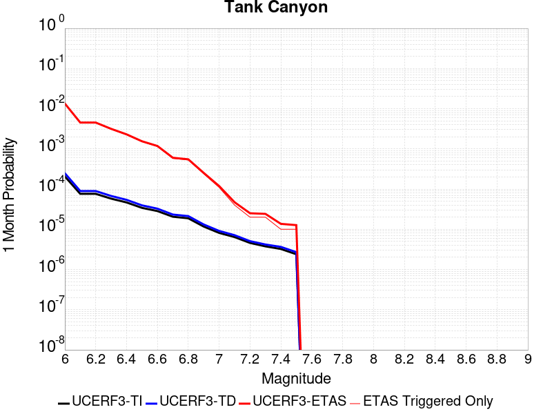 |  |  |

| Magnitude | 1 wk TI Prob | 1 wk TD Prob | 1 wk ETAS Prob | 1 wk ETAS/TD Gain | 1 wk ETAS Triggered Only | 1 mo TI Prob | 1 mo TD Prob | 1 mo ETAS Prob | 1 mo ETAS/TD Gain | 1 mo ETAS Triggered Only | 1 yr TI Prob | 1 yr TD Prob | 1 yr ETAS Prob | 1 yr ETAS/TD Gain | 1 yr ETAS Triggered Only | 10 yr TI Prob | 10 yr TD Prob | 10 yr ETAS Prob | 10 yr ETAS/TD Gain | 10 yr ETAS Triggered Only |
|-----|-----|-----|-----|-----|-----|-----|-----|-----|-----|-----|-----|-----|-----|-----|-----|-----|-----|-----|-----|-----|
| 6.0 | 4.8284557E-5 | 5.7965928E-5 | 0.004917684 | 84.837494 | 0.00486 | 2.0691741E-4 | 2.484056E-4 | 0.013475119 | 54.24644 | 0.01323 | 0.0025163088 | 0.00302081 | 0.038612965 | 12.782323 | 0.0357 | 0.02488006 | 0.029864373 | 0.09061427 | 3.0341928 | 0.06262 |
| 6.1 | 1.7796336E-5 | 2.0873778E-5 | 0.0016308401 | 78.12865 | 0.00161 | 7.626778E-5 | 8.94562E-5 | 0.004529059 | 50.628784 | 0.00444 | 9.281647E-4 | 0.0010886233 | 0.0137548195 | 12.635059 | 0.01268 | 0.009242975 | 0.010836863 | 0.033597507 | 3.1002982 | 0.02301 |
| 6.2 | 1.7796336E-5 | 2.0873778E-5 | 0.0016308401 | 78.12865 | 0.00161 | 7.626778E-5 | 8.94562E-5 | 0.004529059 | 50.628784 | 0.00444 | 9.281647E-4 | 0.0010886233 | 0.0137548195 | 12.635059 | 0.01268 | 0.009242975 | 0.010836863 | 0.033597507 | 3.1002982 | 0.02301 |
| 6.3 | 1.3515912E-5 | 1.575992E-5 | 0.0011157426 | 70.7962 | 0.0011 | 5.792405E-5 | 6.754091E-5 | 0.0031573323 | 46.746964 | 0.00309 | 7.049971E-4 | 8.2202395E-4 | 0.010094396 | 12.279928 | 0.00928 | 0.007027647 | 0.00819231 | 0.024705907 | 3.0157437 | 0.01665 |
| 6.4 | 1.0870146E-5 | 1.2618305E-5 | 7.426091E-4 | 58.85173 | 7.3E-4 | 4.658551E-5 | 5.407743E-5 | 0.0023039558 | 42.604755 | 0.00225 | 5.67031E-4 | 6.5821153E-4 | 0.007503703 | 11.400139 | 0.00685 | 0.005655863 | 0.006564494 | 0.019002307 | 2.8947098 | 0.01252 |
| 6.5 | 7.964826E-6 | 9.196297E-6 | 5.391914E-4 | 58.631363 | 5.3E-4 | 3.4134522E-5 | 3.9412163E-5 | 0.0015493527 | 39.311535 | 0.00151 | 4.1550855E-4 | 4.79748E-4 | 0.0051375125 | 10.708773 | 0.00466 | 0.0041473247 | 0.004788282 | 0.012909209 | 2.6960003 | 0.00816 |
| 6.6 | 6.6317E-6 | 7.6124547E-6 | 4.2760925E-4 | 56.17232 | 4.2E-4 | 2.8421264E-5 | 3.2624448E-5 | 0.0011825869 | 36.24849 | 0.00115 | 3.4597394E-4 | 3.9713932E-4 | 0.004055686 | 10.212249 | 0.00366 | 0.0034543579 | 0.0039653047 | 0.010290125 | 2.59504 | 0.00635 |
| 6.7 | 4.793663E-6 | 5.4308844E-6 | 2.1542974E-4 | 39.667526 | 2.1E-4 | 2.0544108E-5 | 2.3275035E-5 | 6.032615E-4 | 25.918823 | 5.8E-4 | 2.500958E-4 | 2.833411E-4 | 0.0021928 | 7.739082 | 0.00191 | 0.0024981452 | 0.0028303456 | 0.006200779 | 2.1908205 | 0.00338 |
| 6.8 | 4.382823E-6 | 4.969349E-6 | 1.9496841E-4 | 39.23419 | 1.9E-4 | 1.8783392E-5 | 2.129706E-5 | 5.5128575E-4 | 25.885532 | 5.3E-4 | 2.286638E-4 | 2.5926513E-4 | 0.001948827 | 7.5167336 | 0.00169 | 0.0022842865 | 0.0025901678 | 0.00561232 | 2.1667783 | 0.00303 |
| 6.9 | 2.729601E-6 | 3.0735978E-6 | 8.3073355E-5 | 27.02805 | 8.0E-5 | 1.1698237E-5 | 1.3172503E-5 | 2.5316933E-4 | 19.219532 | 2.4E-4 | 1.4241673E-4 | 1.6036464E-4 | 7.702668E-4 | 4.803221 | 6.1E-4 | 0.001423255 | 0.0016027512 | 0.002710972 | 1.6914492 | 0.00111 |
| 7.0 | 1.8987357E-6 | 2.1269796E-6 | 5.2126874E-5 | 24.507463 | 5.0E-5 | 8.137413E-6 | 9.115598E-6 | 1.1911459E-4 | 13.067118 | 1.1E-4 | 9.90685E-5 | 1.1097746E-4 | 4.2094305E-4 | 3.79305 | 3.1E-4 | 9.902435E-4 | 0.001109289 | 0.0016686679 | 1.5042678 | 5.6E-4 |
| 7.1 | 1.4928986E-6 | 1.6641586E-6 | 1.1664142E-5 | 7.0090322 | 1.0E-5 | 6.398121E-6 | 7.1320924E-6 | 4.7131805E-5 | 6.6084123 | 4.0E-5 | 7.789434E-5 | 8.6830354E-5 | 2.3681733E-4 | 2.7273564 | 1.5E-4 | 7.786704E-4 | 8.6802215E-4 | 0.0011877444 | 1.3683342 | 3.2E-4 |
| 7.2 | 1.069082E-6 | 1.1828818E-6 | 1.11828695E-5 | 9.45392 | 1.0E-5 | 4.581772E-6 | 5.069486E-6 | 2.5069385E-5 | 4.9451528 | 2.0E-5 | 5.5781646E-5 | 6.171978E-5 | 1.4171485E-4 | 2.2961009 | 8.0E-5 | 5.576765E-4 | 6.170787E-4 | 8.269491E-4 | 1.3401031 | 2.1E-4 |
| 7.3 | 8.776551E-7 | 9.770191E-7 | 1.0977009E-5 | 11.235204 | 1.0E-5 | 3.7613736E-6 | 4.1872213E-6 | 2.4187137E-5 | 5.7764177 | 2.0E-5 | 4.579376E-5 | 5.0978742E-5 | 1.10975685E-4 | 2.176901 | 6.0E-5 | 4.5784327E-4 | 5.097215E-4 | 6.396553E-4 | 1.2549112 | 1.3E-4 |
| 7.4 | 7.55721E-7 | 8.510419E-7 | 1.0851033E-5 | 12.750293 | 1.0E-5 | 3.2388E-6 | 3.64732E-6 | 1.3647284E-5 | 3.741729 | 1.0E-5 | 3.9431678E-5 | 4.4405737E-5 | 9.440351E-5 | 2.1259305 | 5.0E-5 | 3.942468E-4 | 4.4401948E-4 | 5.339795E-4 | 1.2026038 | 9.0E-5 |
| 7.5 | 5.587665E-7 | 6.3057325E-7 | 1.0630567E-5 | 16.858576 | 1.0E-5 | 2.3947114E-6 | 2.7024569E-6 | 1.270243E-5 | 4.7003264 | 1.0E-5 | 2.915522E-5 | 3.290241E-5 | 6.2901425E-5 | 1.9117572 | 3.0E-5 | 2.9151395E-4 | 3.2902413E-4 | 3.890044E-4 | 1.1822975 | 6.0E-5 |

## Owl Lake
*[(top)](#table-of-contents)*

| 1 Week | 1 Month | 1 Year | 10 Year |
|-----|-----|-----|-----|
|  |  | 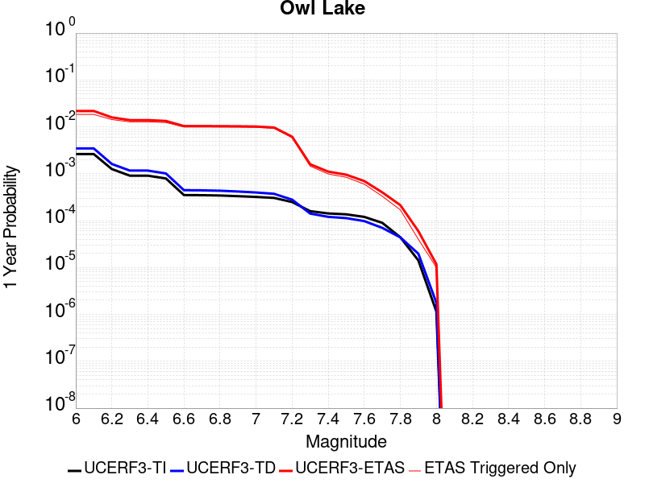 | 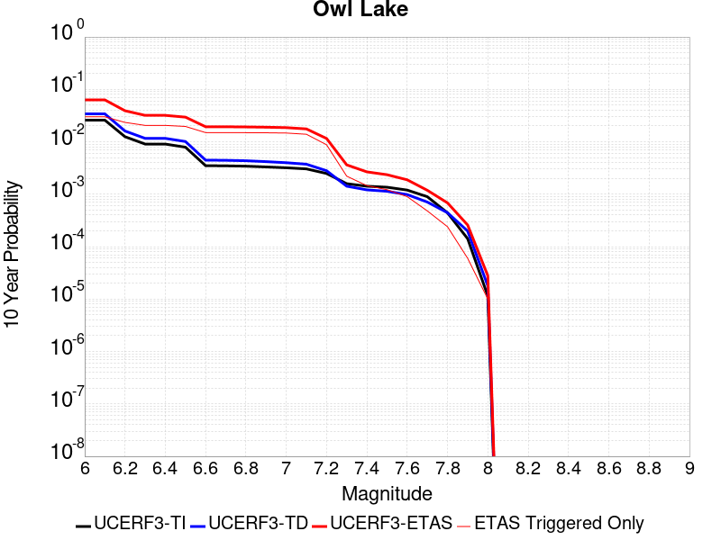 |

| Magnitude | 1 wk TI Prob | 1 wk TD Prob | 1 wk ETAS Prob | 1 wk ETAS/TD Gain | 1 wk ETAS Triggered Only | 1 mo TI Prob | 1 mo TD Prob | 1 mo ETAS Prob | 1 mo ETAS/TD Gain | 1 mo ETAS Triggered Only | 1 yr TI Prob | 1 yr TD Prob | 1 yr ETAS Prob | 1 yr ETAS/TD Gain | 1 yr ETAS Triggered Only | 10 yr TI Prob | 10 yr TD Prob | 10 yr ETAS Prob | 10 yr ETAS/TD Gain | 10 yr ETAS Triggered Only |
|-----|-----|-----|-----|-----|-----|-----|-----|-----|-----|-----|-----|-----|-----|-----|-----|-----|-----|-----|-----|-----|
| 6.0 | 5.0320643E-5 | 6.636041E-5 | 0.0028061785 | 42.286938 | 0.00274 | 2.1564208E-4 | 2.84377E-4 | 0.0074123493 | 26.065222 | 0.00713 | 0.0026222812 | 0.0034577118 | 0.021784125 | 6.3001566 | 0.01839 | 0.02591553 | 0.034142397 | 0.06307949 | 1.8475413 | 0.02996 |
| 6.1 | 5.0320643E-5 | 6.636041E-5 | 0.0028061785 | 42.286938 | 0.00274 | 2.1564208E-4 | 2.84377E-4 | 0.0074123493 | 26.065222 | 0.00713 | 0.0026222812 | 0.0034577118 | 0.021784125 | 6.3001566 | 0.01839 | 0.02591553 | 0.034142397 | 0.06307949 | 1.8475413 | 0.02996 |
| 6.2 | 2.4125871E-5 | 3.098217E-5 | 0.0022809124 | 73.62017 | 0.00225 | 1.0339249E-4 | 1.3277512E-4 | 0.0058620144 | 44.149944 | 0.00573 | 0.0012580766 | 0.0016155102 | 0.015902393 | 9.843573 | 0.01431 | 0.012509781 | 0.016071098 | 0.03913439 | 2.4350789 | 0.02344 |
| 6.3 | 1.7433485E-5 | 2.2356866E-5 | 0.0021123101 | 94.48149 | 0.00209 | 7.471279E-5 | 9.58125E-5 | 0.0052953144 | 55.267467 | 0.0052 | 9.0924866E-4 | 0.0011660301 | 0.01392114 | 11.93892 | 0.01277 | 0.009055373 | 0.011629325 | 0.03194034 | 2.7465346 | 0.02055 |
| 6.4 | 1.7433485E-5 | 2.2356866E-5 | 0.0021123101 | 94.48149 | 0.00209 | 7.471279E-5 | 9.58125E-5 | 0.0052953144 | 55.267467 | 0.0052 | 9.0924866E-4 | 0.0011660301 | 0.01392114 | 11.93892 | 0.01277 | 0.009055373 | 0.011629325 | 0.03194034 | 2.7465346 | 0.02055 |
| 6.5 | 1.5182742E-5 | 1.9430483E-5 | 0.001999392 | 102.89976 | 0.00198 | 6.506727E-5 | 8.32717E-5 | 0.0051028538 | 61.27957 | 0.00502 | 7.919061E-4 | 0.0010134967 | 0.01335098 | 13.173185 | 0.01235 | 0.0078909 | 0.010118797 | 0.029550167 | 2.9203238 | 0.01963 |
| 6.6 | 6.7271576E-6 | 8.548313E-6 | 0.0017085337 | 199.86794 | 0.0017 | 2.8830356E-5 | 3.6635145E-5 | 0.0042564804 | 116.185715 | 0.00422 | 3.5095305E-4 | 4.4594728E-4 | 0.010381514 | 23.27969 | 0.00994 | 0.0035039932 | 0.004467926 | 0.019380996 | 4.3378057 | 0.01498 |
| 6.7 | 6.682835E-6 | 8.480754E-6 | 0.0017084663 | 201.45216 | 0.0017 | 2.8640408E-5 | 3.6345617E-5 | 0.004256192 | 117.10332 | 0.00422 | 3.4864116E-4 | 4.4242368E-4 | 0.010378026 | 23.457212 | 0.00994 | 0.003480947 | 0.00443287 | 0.019346466 | 4.3643203 | 0.01498 |
| 6.8 | 6.5774975E-6 | 8.32722E-6 | 0.001708313 | 205.14807 | 0.0017 | 2.8188972E-5 | 3.5687626E-5 | 0.004255537 | 119.24405 | 0.00422 | 3.4314668E-4 | 4.3441588E-4 | 0.010330115 | 23.779322 | 0.0099 | 0.0034261728 | 0.0043530487 | 0.019208102 | 4.412563 | 0.01492 |
| 6.9 | 6.363419E-6 | 8.000376E-6 | 0.0017079868 | 213.48833 | 0.0017 | 2.727151E-5 | 3.4286906E-5 | 0.0042541423 | 124.074844 | 0.00422 | 3.3198006E-4 | 4.173687E-4 | 0.010273254 | 24.614336 | 0.00986 | 0.0033148455 | 0.004183012 | 0.018990811 | 4.5399847 | 0.01487 |
| 7.0 | 6.1342453E-6 | 7.632552E-6 | 0.0016876197 | 221.10818 | 0.00168 | 2.6289357E-5 | 3.271056E-5 | 0.0042225737 | 129.089 | 0.00419 | 3.2002592E-4 | 3.9818377E-4 | 0.010144302 | 25.47643 | 0.00975 | 0.0031956544 | 0.003991678 | 0.018633 | 4.667962 | 0.0147 |
| 7.1 | 5.842926E-6 | 7.1430604E-6 | 0.0016171315 | 226.39197 | 0.00161 | 2.504087E-5 | 3.0612788E-5 | 0.004010491 | 131.00705 | 0.00398 | 3.0482994E-4 | 3.7265237E-4 | 0.009669187 | 25.946936 | 0.0093 | 0.0030441214 | 0.0037372818 | 0.017615221 | 4.713378 | 0.01393 |
| 7.2 | 4.77173E-6 | 5.359158E-6 | 0.0010453536 | 195.0593 | 0.00104 | 2.045011E-5 | 2.296764E-5 | 0.0026129081 | 113.76476 | 0.00259 | 2.4895166E-4 | 2.795992E-4 | 0.006157955 | 22.024223 | 0.00588 | 0.0024867293 | 0.002808747 | 0.011574058 | 4.1207194 | 0.00879 |
| 7.3 | 3.0494948E-6 | 2.7108347E-6 | 2.2271024E-4 | 82.155594 | 2.2E-4 | 1.3069198E-5 | 1.1617813E-5 | 6.416105E-4 | 55.226448 | 6.3E-4 | 1.5910587E-4 | 1.4143785E-4 | 0.0015912327 | 11.250403 | 0.00145 | 0.0015899199 | 0.0014233418 | 0.0036301962 | 2.550474 | 0.00221 |
| 7.4 | 2.7263884E-6 | 2.3060104E-6 | 1.6230565E-4 | 70.38374 | 1.6E-4 | 1.1684469E-5 | 9.882864E-6 | 4.398786E-4 | 44.509224 | 4.3E-4 | 1.4224913E-4 | 1.2031734E-4 | 0.0011101982 | 9.227251 | 9.9E-4 | 0.0014215811 | 0.0012113012 | 0.0026695326 | 2.2038555 | 0.00146 |
| 7.5 | 2.6090431E-6 | 2.1659357E-6 | 1.4216563E-4 | 65.63705 | 1.4E-4 | 1.1181565E-5 | 9.282549E-6 | 3.592793E-4 | 38.70481 | 3.5E-4 | 1.3612706E-4 | 1.1300927E-4 | 9.5291436E-4 | 8.4321785 | 8.4E-4 | 0.001360437 | 0.0011380832 | 0.0023566948 | 2.0707579 | 0.00122 |
| 7.6 | 2.3008756E-6 | 1.8730968E-6 | 9.187293E-5 | 49.04868 | 9.0E-5 | 9.860858E-6 | 8.027534E-6 | 2.5802554E-4 | 32.142567 | 2.5E-4 | 1.20049335E-4 | 9.7730925E-5 | 6.976723E-4 | 7.1387057 | 6.0E-4 | 0.001199845 | 9.851726E-4 | 0.0018842858 | 1.9126456 | 9.0E-4 |
| 7.7 | 1.7184348E-6 | 1.3421906E-6 | 5.1342122E-5 | 38.252483 | 5.0E-5 | 7.3646997E-6 | 5.752233E-6 | 1.4575143E-4 | 25.338234 | 1.4E-4 | 8.966153E-5 | 7.003123E-5 | 4.000081E-4 | 5.7118535 | 3.3E-4 | 8.962536E-4 | 7.08018E-4 | 0.0011876782 | 1.6774688 | 4.8E-4 |
| 7.8 | 8.4612907E-7 | 8.408234E-7 | 3.0840798E-5 | 36.67928 | 3.0E-5 | 3.6262625E-6 | 3.6035242E-6 | 6.360331E-5 | 17.650307 | 6.0E-5 | 4.4148852E-5 | 4.3872045E-5 | 2.1386458E-4 | 4.874735 | 1.7E-4 | 4.414008E-4 | 4.440713E-4 | 6.8396475E-4 | 1.5402137 | 2.4E-4 |
| 7.9 | 2.716738E-7 | 3.7693766E-7 | 1.03769335E-5 | 27.529575 | 1.0E-5 | 1.1643157E-6 | 1.6154462E-6 | 4.161538E-5 | 25.76092 | 4.0E-5 | 1.4175452E-5 | 1.9667892E-5 | 5.9667105E-5 | 3.0337317 | 4.0E-5 | 1.4174548E-4 | 1.9836401E-4 | 2.583521E-4 | 1.3024142 | 6.0E-5 |
| 8.0 | 2.1995428E-8 | 3.38572E-8 | 1.0033857E-5 | 296.35812 | 1.0E-5 | 9.426611E-8 | 1.4510229E-7 | 1.01451005E-5 | 69.916885 | 1.0E-5 | 1.1476893E-6 | 1.7666197E-6 | 1.1766602E-5 | 6.6605177 | 1.0E-5 | 1.14768345E-5 | 1.7871007E-5 | 2.7870828E-5 | 1.5595555 | 1.0E-5 |

## Little Lake
*[(top)](#table-of-contents)*

| 1 Week | 1 Month | 1 Year | 10 Year |
|-----|-----|-----|-----|
|  |  |  |  |

| Magnitude | 1 wk TI Prob | 1 wk TD Prob | 1 wk ETAS Prob | 1 wk ETAS/TD Gain | 1 wk ETAS Triggered Only | 1 mo TI Prob | 1 mo TD Prob | 1 mo ETAS Prob | 1 mo ETAS/TD Gain | 1 mo ETAS Triggered Only | 1 yr TI Prob | 1 yr TD Prob | 1 yr ETAS Prob | 1 yr ETAS/TD Gain | 1 yr ETAS Triggered Only | 10 yr TI Prob | 10 yr TD Prob | 10 yr ETAS Prob | 10 yr ETAS/TD Gain | 10 yr ETAS Triggered Only |
|-----|-----|-----|-----|-----|-----|-----|-----|-----|-----|-----|-----|-----|-----|-----|-----|-----|-----|-----|-----|-----|
| 6.0 | 2.8424427E-5 | 3.1206153E-5 | 0.0032111069 | 102.899796 | 0.00318 | 1.2181328E-4 | 1.3373456E-4 | 0.007582738 | 56.699917 | 0.00745 | 0.0014820677 | 0.0016271353 | 0.019937294 | 12.253003 | 0.01834 | 0.014722223 | 0.016165623 | 0.044706658 | 2.7655387 | 0.02901 |
| 6.1 | 2.8424427E-5 | 3.1206153E-5 | 0.0032111069 | 102.899796 | 0.00318 | 1.2181328E-4 | 1.3373456E-4 | 0.007582738 | 56.699917 | 0.00745 | 0.0014820677 | 0.0016271353 | 0.019937294 | 12.253003 | 0.01834 | 0.014722223 | 0.016165623 | 0.044706658 | 2.7655387 | 0.02901 |
| 6.2 | 2.8424427E-5 | 3.1206153E-5 | 0.0032111069 | 102.899796 | 0.00318 | 1.2181328E-4 | 1.3373456E-4 | 0.007582738 | 56.699917 | 0.00745 | 0.0014820677 | 0.0016271353 | 0.019937294 | 12.253003 | 0.01834 | 0.014722223 | 0.016165623 | 0.044706658 | 2.7655387 | 0.02901 |
| 6.3 | 1.48860645E-5 | 1.6081587E-5 | 0.0020160493 | 125.36383 | 0.002 | 6.379586E-5 | 6.891943E-5 | 0.0047785947 | 69.33596 | 0.00471 | 7.7643775E-4 | 8.387992E-4 | 0.012878692 | 15.3537245 | 0.01205 | 0.007737305 | 0.00835915 | 0.027160661 | 3.249213 | 0.01896 |
| 6.4 | 1.48860645E-5 | 1.6081587E-5 | 0.0020160493 | 125.36383 | 0.002 | 6.379586E-5 | 6.891943E-5 | 0.0047785947 | 69.33596 | 0.00471 | 7.7643775E-4 | 8.387992E-4 | 0.012878692 | 15.3537245 | 0.01205 | 0.007737305 | 0.00835915 | 0.027160661 | 3.249213 | 0.01896 |
| 6.5 | 1.2797581E-5 | 1.376573E-5 | 0.0017537418 | 127.39912 | 0.00174 | 5.4845623E-5 | 5.8994796E-5 | 0.0042687464 | 72.35802 | 0.00421 | 6.675408E-4 | 7.1805064E-4 | 0.011590239 | 16.141254 | 0.01088 | 0.006655392 | 0.0071598557 | 0.02421685 | 3.3823097 | 0.01718 |
| 6.6 | 9.661896E-6 | 1.0289153E-5 | 0.0013602753 | 132.20479 | 0.00135 | 4.1407468E-5 | 4.4095712E-5 | 0.0034939435 | 79.23545 | 0.00345 | 5.040193E-4 | 5.367493E-4 | 0.009431972 | 17.572397 | 0.0089 | 0.005028777 | 0.005356134 | 0.019350773 | 3.6128247 | 0.01407 |
| 6.7 | 7.767871E-6 | 8.199772E-6 | 0.0011781902 | 143.68571 | 0.00117 | 3.329045E-5 | 3.5141486E-5 | 0.003005037 | 85.51252 | 0.00297 | 4.0523586E-4 | 4.2777733E-4 | 0.007984543 | 18.665186 | 0.00756 | 0.004044977 | 0.0042708907 | 0.016249511 | 3.8047128 | 0.01203 |
| 6.8 | 6.4235196E-6 | 6.7358133E-6 | 9.767293E-4 | 145.0054 | 9.7E-4 | 2.752908E-5 | 2.8867524E-5 | 0.0024987962 | 86.56081 | 0.00247 | 3.35115E-4 | 3.5141825E-4 | 0.006579229 | 18.721933 | 0.00623 | 0.003346101 | 0.0035098856 | 0.01319577 | 3.7596009 | 0.00972 |
| 6.9 | 3.1283696E-6 | 3.112201E-6 | 5.831104E-4 | 187.3627 | 5.8E-4 | 1.3407229E-5 | 1.3337944E-5 | 0.0015533174 | 116.45853 | 0.00154 | 1.6322079E-4 | 1.6237888E-4 | 0.0040317504 | 24.829279 | 0.00387 | 0.0016310095 | 0.0016227507 | 0.007493209 | 4.617597 | 0.00588 |
| 7.0 | 2.290603E-6 | 2.2286956E-6 | 3.622279E-4 | 162.5291 | 3.6E-4 | 9.816834E-6 | 9.551524E-6 | 9.6954237E-4 | 101.50656 | 9.6E-4 | 1.19513395E-4 | 1.1628464E-4 | 0.0025460022 | 21.89457 | 0.00243 | 0.0011944914 | 0.00116234 | 0.0048380625 | 4.162347 | 0.00368 |
| 7.1 | 1.293693E-6 | 1.1776893E-6 | 1.21177545E-4 | 102.894325 | 1.2E-4 | 5.5443866E-6 | 5.047234E-6 | 3.7504538E-4 | 74.307106 | 3.7E-4 | 6.750081E-5 | 6.144904E-5 | 0.0011513821 | 18.737185 | 0.00109 | 6.7480316E-4 | 6.1438896E-4 | 0.0023133445 | 3.7652767 | 0.0017 |
| 7.2 | 4.715842E-7 | 3.0917863E-7 | 3.0917863E-7 | 1.0 | 0.0 | 2.0210737E-6 | 1.3250507E-6 | 1.1325037E-5 | 8.546871 | 1.0E-5 | 2.4606294E-5 | 1.6132379E-5 | 9.613109E-5 | 5.9588914 | 8.0E-5 | 2.460357E-4 | 1.6131261E-4 | 3.3128518E-4 | 2.0536845 | 1.7E-4 |
| 7.3 | 3.9430947E-7 | 2.3097442E-7 | 2.3097442E-7 | 1.0 | 0.0 | 1.6898966E-6 | 9.8989E-7 | 1.098988E-5 | 11.102122 | 1.0E-5 | 2.0574296E-5 | 1.2051845E-5 | 7.205112E-5 | 5.9784307 | 6.0E-5 | 2.0572392E-4 | 1.2051199E-4 | 2.4049752E-4 | 1.9956316 | 1.2E-4 |
| 7.4 | 3.547123E-7 | 1.9679048E-7 | 1.9679048E-7 | 1.0 | 0.0 | 1.5201948E-6 | 8.433875E-7 | 1.0843379E-5 | 12.856936 | 1.0E-5 | 1.8508214E-5 | 1.0268195E-5 | 6.026768E-5 | 5.869355 | 5.0E-5 | 1.8506673E-4 | 1.0267727E-4 | 2.02667E-4 | 1.9738253 | 1.0E-4 |
| 7.5 | 2.6354266E-7 | 1.4423068E-7 | 1.4423068E-7 | 1.0 | 0.0 | 1.129468E-6 | 6.1813137E-7 | 1.0618125E-5 | 17.177782 | 1.0E-5 | 1.3751187E-5 | 7.525724E-6 | 4.7525424E-5 | 6.3150635 | 4.0E-5 | 1.3750336E-4 | 7.525474E-5 | 1.6524797E-4 | 2.195848 | 9.0E-5 |
| 7.6 | 1.269913E-7 | 7.572499E-8 | 7.572499E-8 | 1.0 | 0.0 | 5.4424834E-7 | 3.2453565E-7 | 1.0324532E-5 | 31.813246 | 1.0E-5 | 6.6262032E-6 | 3.9512147E-6 | 1.3951175E-5 | 3.5308573 | 1.0E-5 | 6.626006E-5 | 3.951148E-5 | 8.950951E-5 | 2.265405 | 5.0E-5 |

## Airport Lake
*[(top)](#table-of-contents)*

| 1 Week | 1 Month | 1 Year | 10 Year |
|-----|-----|-----|-----|
|  |  |  | 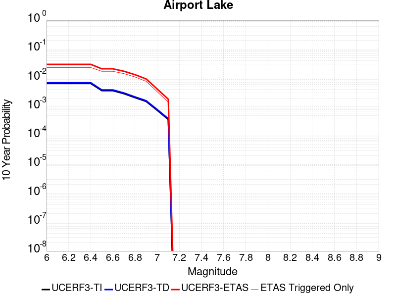 |

| Magnitude | 1 wk TI Prob | 1 wk TD Prob | 1 wk ETAS Prob | 1 wk ETAS/TD Gain | 1 wk ETAS Triggered Only | 1 mo TI Prob | 1 mo TD Prob | 1 mo ETAS Prob | 1 mo ETAS/TD Gain | 1 mo ETAS Triggered Only | 1 yr TI Prob | 1 yr TD Prob | 1 yr ETAS Prob | 1 yr ETAS/TD Gain | 1 yr ETAS Triggered Only | 10 yr TI Prob | 10 yr TD Prob | 10 yr ETAS Prob | 10 yr ETAS/TD Gain | 10 yr ETAS Triggered Only |
|-----|-----|-----|-----|-----|-----|-----|-----|-----|-----|-----|-----|-----|-----|-----|-----|-----|-----|-----|-----|-----|
| 6.0 | 1.2387061E-5 | 1.31032575E-5 | 0.0026530686 | 202.47398 | 0.00264 | 5.3086325E-5 | 5.6155768E-5 | 0.006465796 | 115.140366 | 0.00641 | 6.461343E-4 | 6.835104E-4 | 0.015603306 | 22.82819 | 0.01493 | 0.0064425888 | 0.0068168915 | 0.029719694 | 4.3597136 | 0.02306 |
| 6.1 | 1.2387061E-5 | 1.31032575E-5 | 0.0026530686 | 202.47398 | 0.00264 | 5.3086325E-5 | 5.6155768E-5 | 0.006465796 | 115.140366 | 0.00641 | 6.461343E-4 | 6.835104E-4 | 0.015603306 | 22.82819 | 0.01493 | 0.0064425888 | 0.0068168915 | 0.029719694 | 4.3597136 | 0.02306 |
| 6.2 | 1.2387061E-5 | 1.31032575E-5 | 0.0026530686 | 202.47398 | 0.00264 | 5.3086325E-5 | 5.6155768E-5 | 0.006465796 | 115.140366 | 0.00641 | 6.461343E-4 | 6.835104E-4 | 0.015603306 | 22.82819 | 0.01493 | 0.0064425888 | 0.0068168915 | 0.029719694 | 4.3597136 | 0.02306 |
| 6.3 | 1.2387061E-5 | 1.31032575E-5 | 0.0026530686 | 202.47398 | 0.00264 | 5.3086325E-5 | 5.6155768E-5 | 0.006465796 | 115.140366 | 0.00641 | 6.461343E-4 | 6.835104E-4 | 0.015603306 | 22.82819 | 0.01493 | 0.0064425888 | 0.0068168915 | 0.029719694 | 4.3597136 | 0.02306 |
| 6.4 | 1.2387061E-5 | 1.31032575E-5 | 0.0026530686 | 202.47398 | 0.00264 | 5.3086325E-5 | 5.6155768E-5 | 0.006465796 | 115.140366 | 0.00641 | 6.461343E-4 | 6.835104E-4 | 0.015603306 | 22.82819 | 0.01493 | 0.0064425888 | 0.0068168915 | 0.029719694 | 4.3597136 | 0.02306 |
| 6.5 | 6.9922594E-6 | 7.38498E-6 | 0.0019473707 | 263.69342 | 0.00194 | 2.996648E-5 | 3.164956E-5 | 0.0047615 | 150.44441 | 0.00473 | 3.6478083E-4 | 3.8527072E-4 | 0.011281071 | 29.280895 | 0.0109 | 0.003641826 | 0.0038465653 | 0.020781174 | 5.4025273 | 0.017 |
| 6.6 | 6.9922594E-6 | 7.38498E-6 | 0.0019473707 | 263.69342 | 0.00194 | 2.996648E-5 | 3.164956E-5 | 0.0047615 | 150.44441 | 0.00473 | 3.6478083E-4 | 3.8527072E-4 | 0.011281071 | 29.280895 | 0.0109 | 0.003641826 | 0.0038465653 | 0.020781174 | 5.4025273 | 0.017 |
| 6.7 | 5.477277E-6 | 5.7861116E-6 | 0.0016057768 | 277.5226 | 0.0016 | 2.3473833E-5 | 2.4797408E-5 | 0.003924701 | 158.2706 | 0.0039 | 2.8575645E-4 | 3.0187052E-4 | 0.009429115 | 31.235626 | 0.00913 | 0.0028538927 | 0.0030149885 | 0.017102387 | 5.6724553 | 0.01413 |
| 6.8 | 3.9950432E-6 | 4.2191186E-6 | 0.0012542139 | 297.26917 | 0.00125 | 1.7121502E-5 | 1.8081826E-5 | 0.0031380255 | 173.54582 | 0.00312 | 2.0843433E-4 | 2.2012675E-4 | 0.0072985683 | 33.156208 | 0.00708 | 0.0020823893 | 0.002199358 | 0.012995561 | 5.9087973 | 0.01082 |
| 6.9 | 2.95695E-6 | 3.1230477E-6 | 8.3312043E-4 | 266.76523 | 8.3E-4 | 1.2672582E-5 | 1.3384434E-5 | 0.0021733555 | 162.37933 | 0.00216 | 1.5427776E-4 | 1.6294557E-4 | 0.0052421177 | 32.170975 | 0.00508 | 0.001541707 | 0.0016284833 | 0.009266025 | 5.689973 | 0.00765 |
| 7.0 | 1.456072E-6 | 1.5408239E-6 | 3.415403E-4 | 221.66083 | 3.4E-4 | 6.2402937E-6 | 6.60352E-6 | 9.3659735E-4 | 141.83305 | 9.3E-4 | 7.597293E-5 | 8.03959E-5 | 0.0023602126 | 29.357376 | 0.00228 | 7.594696E-4 | 8.03767E-4 | 0.004151074 | 5.1645246 | 0.00335 |
| 7.1 | 6.995192E-7 | 7.4090326E-7 | 1.10740824E-4 | 149.46732 | 1.1E-4 | 2.997936E-6 | 3.1752998E-6 | 3.531742E-4 | 111.225464 | 3.5E-4 | 3.649926E-5 | 3.8659273E-5 | 0.0010186214 | 26.348694 | 9.8E-4 | 3.6493264E-4 | 3.8659273E-4 | 0.0018360321 | 4.749267 | 0.00145 |

## Panamint Valley
*[(top)](#table-of-contents)*

| 1 Week | 1 Month | 1 Year | 10 Year |
|-----|-----|-----|-----|
|  |  |  |  |

| Magnitude | 1 wk TI Prob | 1 wk TD Prob | 1 wk ETAS Prob | 1 wk ETAS/TD Gain | 1 wk ETAS Triggered Only | 1 mo TI Prob | 1 mo TD Prob | 1 mo ETAS Prob | 1 mo ETAS/TD Gain | 1 mo ETAS Triggered Only | 1 yr TI Prob | 1 yr TD Prob | 1 yr ETAS Prob | 1 yr ETAS/TD Gain | 1 yr ETAS Triggered Only | 10 yr TI Prob | 10 yr TD Prob | 10 yr ETAS Prob | 10 yr ETAS/TD Gain | 10 yr ETAS Triggered Only |
|-----|-----|-----|-----|-----|-----|-----|-----|-----|-----|-----|-----|-----|-----|-----|-----|-----|-----|-----|-----|-----|
| 6.0 | 3.0211835E-5 | 3.3984965E-5 | 0.0019339204 | 56.905174 | 0.0019 | 1.2947287E-4 | 1.4564188E-4 | 0.0048849517 | 33.540844 | 0.00474 | 0.0015751923 | 0.0017717773 | 0.014888496 | 8.403142 | 0.01314 | 0.015640736 | 0.017582124 | 0.039165843 | 2.2275946 | 0.02197 |
| 6.1 | 3.0211835E-5 | 3.3984965E-5 | 0.0019339204 | 56.905174 | 0.0019 | 1.2947287E-4 | 1.4564188E-4 | 0.0048849517 | 33.540844 | 0.00474 | 0.0015751923 | 0.0017717773 | 0.014888496 | 8.403142 | 0.01314 | 0.015640736 | 0.017582124 | 0.039165843 | 2.2275946 | 0.02197 |
| 6.2 | 3.0211835E-5 | 3.3984965E-5 | 0.0019339204 | 56.905174 | 0.0019 | 1.2947287E-4 | 1.4564188E-4 | 0.0048849517 | 33.540844 | 0.00474 | 0.0015751923 | 0.0017717773 | 0.014888496 | 8.403142 | 0.01314 | 0.015640736 | 0.017582124 | 0.039165843 | 2.2275946 | 0.02197 |
| 6.3 | 2.8573924E-5 | 3.2103115E-5 | 0.0018020463 | 56.133068 | 0.00177 | 1.2245393E-4 | 1.3757768E-4 | 0.0046369587 | 33.704296 | 0.0045 | 0.001489857 | 0.0016737491 | 0.01419276 | 8.479623 | 0.01254 | 0.01479908 | 0.01661714 | 0.037071504 | 2.2309196 | 0.0208 |
| 6.4 | 2.8573924E-5 | 3.2103115E-5 | 0.0018020463 | 56.133068 | 0.00177 | 1.2245393E-4 | 1.3757768E-4 | 0.0046369587 | 33.704296 | 0.0045 | 0.001489857 | 0.0016737491 | 0.01419276 | 8.479623 | 0.01254 | 0.01479908 | 0.01661714 | 0.037071504 | 2.2309196 | 0.0208 |
| 6.5 | 2.7468774E-5 | 3.0828793E-5 | 0.0017507757 | 56.790283 | 0.00172 | 1.1771801E-4 | 1.3211685E-4 | 0.0045015393 | 34.07241 | 0.00437 | 0.0014322745 | 0.0016073632 | 0.013827689 | 8.6027155 | 0.01224 | 0.014230782 | 0.015962977 | 0.035879884 | 2.247694 | 0.02024 |
| 6.6 | 2.6135967E-5 | 2.925278E-5 | 0.001699204 | 58.08692 | 0.00167 | 1.1200648E-4 | 1.2536318E-4 | 0.0043548327 | 34.737736 | 0.00423 | 0.0013628257 | 0.0015252546 | 0.013367165 | 8.763891 | 0.01186 | 0.013544982 | 0.015153424 | 0.03435793 | 2.267338 | 0.0195 |
| 6.7 | 2.4498746E-5 | 2.7341659E-5 | 0.0016572971 | 60.614357 | 0.00163 | 1.04990395E-4 | 1.1717342E-4 | 0.0041866964 | 35.73077 | 0.00407 | 0.0012775084 | 0.0014256779 | 0.012759496 | 8.949775 | 0.01135 | 0.012701893 | 0.014170669 | 0.032556385 | 2.2974489 | 0.01865 |
| 6.8 | 2.2244329E-5 | 2.4935984E-5 | 0.0016048966 | 64.36067 | 0.00158 | 9.532935E-5 | 1.06864245E-4 | 0.0039864494 | 37.303867 | 0.00388 | 0.0011600169 | 0.0013003175 | 0.011846586 | 9.110534 | 0.01056 | 0.011539802 | 0.012932051 | 0.029998455 | 2.319698 | 0.01729 |
| 6.9 | 1.9902658E-5 | 2.2290773E-5 | 0.001492258 | 66.9451 | 0.00147 | 8.529431E-5 | 9.552849E-5 | 0.0036651874 | 38.367477 | 0.00357 | 0.0010379635 | 0.0011624574 | 0.010521566 | 9.051141 | 0.00937 | 0.010331288 | 0.011568334 | 0.026632031 | 2.3021493 | 0.01524 |
| 7.0 | 1.8353881E-5 | 2.0566635E-5 | 0.0014505372 | 70.52866 | 0.00143 | 7.865712E-5 | 8.8139845E-5 | 0.0034778412 | 39.458218 | 0.00339 | 9.5722964E-4 | 0.001072592 | 0.0099131 | 9.24219 | 0.00885 | 0.009531168 | 0.010678438 | 0.024865309 | 2.3285532 | 0.01434 |
| 7.1 | 1.7667631E-5 | 1.9773011E-5 | 0.0013597466 | 68.7678 | 0.00134 | 7.571623E-5 | 8.473882E-5 | 0.0032844676 | 38.75989 | 0.0032 | 9.2145515E-4 | 0.0010312245 | 0.0094825 | 9.195379 | 0.00846 | 0.009176437 | 0.010268626 | 0.023907123 | 2.3281717 | 0.01378 |
| 7.2 | 1.6381597E-5 | 1.8158586E-5 | 0.0012381364 | 68.18463 | 0.00122 | 7.020495E-5 | 7.782029E-5 | 0.0029076 | 37.36301 | 0.00283 | 8.544101E-4 | 9.4706746E-4 | 0.008429974 | 8.901134 | 0.00749 | 0.008511325 | 0.009434342 | 0.021469716 | 2.2756982 | 0.01215 |
| 7.3 | 1.4520491E-5 | 1.596705E-5 | 0.0010459506 | 65.50681 | 0.00103 | 6.222919E-5 | 6.842852E-5 | 0.0025482588 | 37.23972 | 0.00248 | 7.57377E-4 | 8.3281496E-4 | 0.00719751 | 8.642388 | 0.00637 | 0.0075480095 | 0.008299384 | 0.01848415 | 2.2271712 | 0.01027 |
| 7.4 | 1.2852287E-5 | 1.4145931E-5 | 0.0010141318 | 71.690704 | 0.001 | 5.5080065E-5 | 6.06241E-5 | 0.0024804773 | 40.9157 | 0.00242 | 6.7039346E-4 | 7.378643E-4 | 0.006953275 | 9.423514 | 0.00622 | 0.0066837464 | 0.0073563983 | 0.01729276 | 2.3507102 | 0.01001 |
| 7.5 | 1.1637851E-5 | 1.28372185E-5 | 0.0010128244 | 78.89749 | 0.001 | 4.987555E-5 | 5.501558E-5 | 0.0024548837 | 44.621605 | 0.0024 | 6.070656E-4 | 6.696245E-4 | 0.0068454864 | 10.222873 | 0.00618 | 0.006054099 | 0.0066782837 | 0.016532036 | 2.4754915 | 0.00992 |
| 7.6 | 3.0068115E-6 | 3.3332262E-6 | 4.4333175E-4 | 133.0038 | 4.4E-4 | 1.2886271E-5 | 1.4285218E-5 | 0.00108427 | 75.901535 | 0.00107 | 1.5687906E-4 | 1.7391593E-4 | 0.0029034412 | 16.69451 | 0.00273 | 0.0015676835 | 0.0017386783 | 0.0061310283 | 3.5262578 | 0.0044 |

## Garlock (East)
*[(top)](#table-of-contents)*

| 1 Week | 1 Month | 1 Year | 10 Year |
|-----|-----|-----|-----|
|  |  | 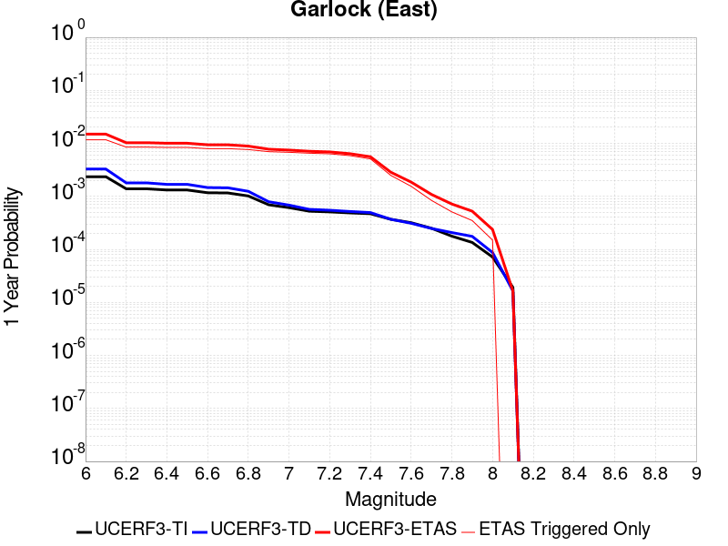 |  |

| Magnitude | 1 wk TI Prob | 1 wk TD Prob | 1 wk ETAS Prob | 1 wk ETAS/TD Gain | 1 wk ETAS Triggered Only | 1 mo TI Prob | 1 mo TD Prob | 1 mo ETAS Prob | 1 mo ETAS/TD Gain | 1 mo ETAS Triggered Only | 1 yr TI Prob | 1 yr TD Prob | 1 yr ETAS Prob | 1 yr ETAS/TD Gain | 1 yr ETAS Triggered Only | 10 yr TI Prob | 10 yr TD Prob | 10 yr ETAS Prob | 10 yr ETAS/TD Gain | 10 yr ETAS Triggered Only |
|-----|-----|-----|-----|-----|-----|-----|-----|-----|-----|-----|-----|-----|-----|-----|-----|-----|-----|-----|-----|-----|
| 6.0 | 4.5092507E-5 | 6.290799E-5 | 0.0017428023 | 27.70399 | 0.00168 | 1.9323928E-4 | 2.695803E-4 | 0.0046184077 | 17.131844 | 0.00435 | 0.0023501497 | 0.0032776468 | 0.014939298 | 4.5579343 | 0.0117 | 0.023254504 | 0.032344494 | 0.051716957 | 1.5989416 | 0.02002 |
| 6.1 | 4.5092507E-5 | 6.290799E-5 | 0.0017428023 | 27.70399 | 0.00168 | 1.9323928E-4 | 2.695803E-4 | 0.0046184077 | 17.131844 | 0.00435 | 0.0023501497 | 0.0032776468 | 0.014939298 | 4.5579343 | 0.0117 | 0.023254504 | 0.032344494 | 0.051716957 | 1.5989416 | 0.02002 |
| 6.2 | 2.6674514E-5 | 3.451465E-5 | 0.0013244702 | 38.374146 | 0.00129 | 1.1431433E-4 | 1.4791173E-4 | 0.0032874474 | 22.225739 | 0.00314 | 0.0013908884 | 0.0017993709 | 0.010294058 | 5.720921 | 0.00851 | 0.01382215 | 0.017863318 | 0.031848945 | 1.7829244 | 0.01424 |
| 6.3 | 2.6674514E-5 | 3.451465E-5 | 0.0013244702 | 38.374146 | 0.00129 | 1.1431433E-4 | 1.4791173E-4 | 0.0032874474 | 22.225739 | 0.00314 | 0.0013908884 | 0.0017993709 | 0.010294058 | 5.720921 | 0.00851 | 0.01382215 | 0.017863318 | 0.031848945 | 1.7829244 | 0.01424 |
| 6.4 | 2.5312667E-5 | 3.2343483E-5 | 0.001282303 | 39.64641 | 0.00125 | 1.0847834E-4 | 1.3860772E-4 | 0.0032181807 | 23.217903 | 0.00308 | 0.0013199237 | 0.0016862722 | 0.010062125 | 5.967082 | 0.00839 | 0.013121112 | 0.016764186 | 0.030549154 | 1.8222866 | 0.01402 |
| 6.5 | 2.5312667E-5 | 3.2343483E-5 | 0.001282303 | 39.64641 | 0.00125 | 1.0847834E-4 | 1.3860772E-4 | 0.0032181807 | 23.217903 | 0.00308 | 0.0013199237 | 0.0016862722 | 0.010062125 | 5.967082 | 0.00839 | 0.013121112 | 0.016764186 | 0.030549154 | 1.8222866 | 0.01402 |
| 6.6 | 2.246556E-5 | 2.8137678E-5 | 0.0012481033 | 44.357014 | 0.00122 | 9.627742E-5 | 1.20584606E-4 | 0.0031002252 | 25.709959 | 0.00298 | 0.0011715472 | 0.0014671524 | 0.009415474 | 6.4175158 | 0.00796 | 0.011653901 | 0.014604934 | 0.027700834 | 1.8966764 | 0.01329 |
| 6.7 | 2.2241198E-5 | 2.7807404E-5 | 0.0012477735 | 44.871986 | 0.00122 | 9.531594E-5 | 1.1916928E-4 | 0.003098814 | 26.003466 | 0.00298 | 0.0011598538 | 0.0014499439 | 0.009398403 | 6.481908 | 0.00796 | 0.011538187 | 0.014434824 | 0.027523128 | 1.9067174 | 0.01328 |
| 6.8 | 1.9528685E-5 | 2.3901322E-5 | 0.0011938734 | 49.950096 | 0.00117 | 8.369167E-5 | 1.0243033E-4 | 0.0029621373 | 28.918558 | 0.00286 | 0.0010184698 | 0.0012463954 | 0.008886861 | 7.1300488 | 0.00765 | 0.010138147 | 0.012438075 | 0.02480235 | 1.9940666 | 0.01252 |
| 6.9 | 1.3318621E-5 | 1.5200952E-5 | 0.0011251841 | 74.02064 | 0.00111 | 5.7078556E-5 | 6.514534E-5 | 0.0027049733 | 41.52213 | 0.00264 | 6.9470983E-4 | 7.928616E-4 | 0.0077673276 | 9.796574 | 0.00698 | 0.0069254204 | 0.007940963 | 0.01897266 | 2.389214 | 0.01112 |
| 7.0 | 1.1760853E-5 | 1.3109707E-5 | 0.0010930955 | 83.38063 | 0.00108 | 5.0402683E-5 | 5.6183275E-5 | 0.0026360382 | 46.91856 | 0.00258 | 6.134799E-4 | 6.838217E-4 | 0.0074691786 | 10.922699 | 0.00679 | 0.0061178906 | 0.006857492 | 0.017593363 | 2.565568 | 0.01081 |
| 7.1 | 1.0064758E-5 | 1.0904764E-5 | 0.0010808931 | 99.12118 | 0.00107 | 4.3133965E-5 | 4.6733887E-5 | 0.0025866153 | 55.347744 | 0.00254 | 5.2502943E-4 | 5.6884E-4 | 0.0070951255 | 12.472971 | 0.00653 | 0.005237907 | 0.005713798 | 0.015885346 | 2.7801728 | 0.01023 |
| 7.2 | 9.768808E-6 | 1.0500609E-5 | 0.0010604896 | 100.99315 | 0.00105 | 4.186565E-5 | 4.5001856E-5 | 0.0025448895 | 56.550766 | 0.0025 | 5.095951E-4 | 5.477633E-4 | 0.0069042793 | 12.604494 | 0.00636 | 0.0050842804 | 0.0055042095 | 0.015409388 | 2.7995641 | 0.00996 |
| 7.3 | 9.344516E-6 | 9.946213E-6 | 0.0010099362 | 101.53978 | 0.001 | 4.004731E-5 | 4.262595E-5 | 0.0023725266 | 55.65921 | 0.00233 | 4.8746695E-4 | 5.188508E-4 | 0.006385805 | 12.307593 | 0.00587 | 0.0048639905 | 0.005215881 | 0.014338052 | 2.748922 | 0.00917 |
| 7.4 | 9.023491E-6 | 9.492341E-6 | 8.5948425E-4 | 90.54503 | 8.5E-4 | 3.867153E-5 | 4.0680847E-5 | 0.0021305957 | 52.37344 | 0.00209 | 4.7072413E-4 | 4.951801E-4 | 0.0055926545 | 11.294183 | 0.0051 | 0.004697283 | 0.0049793427 | 0.013078811 | 2.626614 | 0.00814 |
| 7.5 | 7.081253E-6 | 7.089067E-6 | 4.5708587E-4 | 64.47758 | 4.5E-4 | 3.0347876E-5 | 3.0381365E-5 | 0.0010903492 | 35.88875 | 0.00106 | 3.6942272E-4 | 3.6983108E-4 | 0.0028589102 | 7.730314 | 0.00249 | 0.003688092 | 0.0037253548 | 0.0075909006 | 2.0376315 | 0.00388 |
| 7.6 | 6.116396E-6 | 5.960529E-6 | 2.759589E-4 | 46.297726 | 2.7E-4 | 2.6212863E-5 | 2.5544876E-5 | 6.555288E-4 | 25.661852 | 6.3E-4 | 3.1909486E-4 | 3.1096474E-4 | 0.0018604827 | 5.9829383 | 0.00155 | 0.0031863707 | 0.003136776 | 0.0055093104 | 1.7563609 | 0.00238 |
| 7.7 | 4.797145E-6 | 4.758607E-6 | 1.4475794E-4 | 30.420235 | 1.4E-4 | 2.055903E-5 | 2.039387E-5 | 3.8038654E-4 | 18.652002 | 3.6E-4 | 2.5027743E-4 | 2.4826723E-4 | 0.0010880587 | 4.3826113 | 8.4E-4 | 0.0024999576 | 0.002510294 | 0.0037671311 | 1.5006733 | 0.00126 |
| 7.8 | 3.4028885E-6 | 3.9797173E-6 | 1.1397928E-4 | 28.640043 | 1.1E-4 | 1.4583726E-5 | 1.7055821E-5 | 2.3705207E-4 | 13.8986025 | 2.2E-4 | 1.775424E-4 | 2.076349E-4 | 7.1752904E-4 | 3.4557245 | 5.1E-4 | 0.0017740062 | 0.00210206 | 0.0028405045 | 1.3512956 | 7.4E-4 |
| 7.9 | 2.5928412E-6 | 3.3735669E-6 | 1.03373226E-4 | 30.642117 | 1.0E-4 | 1.1112129E-5 | 1.4458064E-5 | 1.7445575E-4 | 12.066329 | 1.6E-4 | 1.3528178E-4 | 1.7601276E-4 | 5.2595115E-4 | 2.988142 | 3.5E-4 | 0.0013519945 | 0.0017819697 | 0.0022710965 | 1.2744867 | 4.9E-4 |
| 8.0 | 1.3743648E-6 | 1.6739597E-6 | 3.167391E-5 | 18.921549 | 3.0E-5 | 5.8901214E-6 | 7.1740933E-6 | 7.7173594E-5 | 10.757261 | 7.0E-5 | 7.1709874E-5 | 8.734111E-5 | 2.3732801E-4 | 2.7172542 | 1.5E-4 | 7.1686733E-4 | 8.841624E-4 | 0.0010839856 | 1.2260028 | 2.0E-4 |
| 8.1 | 3.6733252E-7 | 3.1497066E-7 | 3.1497066E-7 | 1.0 | 0.0 | 1.5742813E-6 | 1.3498736E-6 | 1.3498736E-6 | 1.0 | 0.0 | 1.9166706E-5 | 1.6434604E-5 | 1.6434604E-5 | 1.0 | 0.0 | 1.9165053E-4 | 1.6648426E-4 | 1.764826E-4 | 1.0600557 | 1.0E-5 |

## Hunter Mountain-Saline Valley
*[(top)](#table-of-contents)*

| 1 Week | 1 Month | 1 Year | 10 Year |
|-----|-----|-----|-----|
|  |  |  | 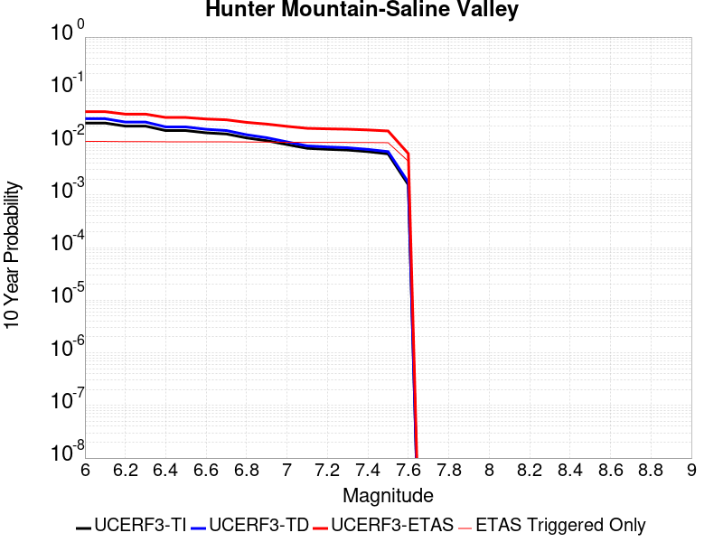 |

| Magnitude | 1 wk TI Prob | 1 wk TD Prob | 1 wk ETAS Prob | 1 wk ETAS/TD Gain | 1 wk ETAS Triggered Only | 1 mo TI Prob | 1 mo TD Prob | 1 mo ETAS Prob | 1 mo ETAS/TD Gain | 1 mo ETAS Triggered Only | 1 yr TI Prob | 1 yr TD Prob | 1 yr ETAS Prob | 1 yr ETAS/TD Gain | 1 yr ETAS Triggered Only | 10 yr TI Prob | 10 yr TD Prob | 10 yr ETAS Prob | 10 yr ETAS/TD Gain | 10 yr ETAS Triggered Only |
|-----|-----|-----|-----|-----|-----|-----|-----|-----|-----|-----|-----|-----|-----|-----|-----|-----|-----|-----|-----|-----|
| 6.0 | 4.5103672E-5 | 5.4570846E-5 | 0.0010745152 | 19.690279 | 0.00102 | 1.9328714E-4 | 2.3385457E-4 | 0.0027732607 | 11.8589115 | 0.00254 | 0.002350731 | 0.0028436389 | 0.009265326 | 3.2582638 | 0.00644 | 0.023260195 | 0.02809229 | 0.038209848 | 1.3601543 | 0.01041 |
| 6.1 | 4.5103672E-5 | 5.4570846E-5 | 0.0010745152 | 19.690279 | 0.00102 | 1.9328714E-4 | 2.3385457E-4 | 0.0027732607 | 11.8589115 | 0.00254 | 0.002350731 | 0.0028436389 | 0.009265326 | 3.2582638 | 0.00644 | 0.023260195 | 0.02809229 | 0.038209848 | 1.3601543 | 0.01041 |
| 6.2 | 3.9363465E-5 | 4.7064215E-5 | 0.0010670162 | 22.671497 | 0.00102 | 1.6868966E-4 | 2.0168893E-4 | 0.0027311787 | 13.54154 | 0.00253 | 0.002051862 | 0.0024529307 | 0.008847208 | 3.6067905 | 0.00641 | 0.020330196 | 0.024273701 | 0.034343198 | 1.4148315 | 0.01032 |
| 6.3 | 3.9363465E-5 | 4.7064215E-5 | 0.0010670162 | 22.671497 | 0.00102 | 1.6868966E-4 | 2.0168893E-4 | 0.0027311787 | 13.54154 | 0.00253 | 0.002051862 | 0.0024529307 | 0.008847208 | 3.6067905 | 0.00641 | 0.020330196 | 0.024273701 | 0.034343198 | 1.4148315 | 0.01032 |
| 6.4 | 3.2311684E-5 | 3.7952268E-5 | 0.0010579135 | 27.874846 | 0.00102 | 1.384713E-4 | 1.6264283E-4 | 0.0026722346 | 16.43008 | 0.00251 | 0.0016845843 | 0.0019784467 | 0.008335844 | 4.213328 | 0.00637 | 0.016718714 | 0.019616457 | 0.029665386 | 1.5122705 | 0.01025 |
| 6.5 | 3.2311684E-5 | 3.7952268E-5 | 0.0010579135 | 27.874846 | 0.00102 | 1.384713E-4 | 1.6264283E-4 | 0.0026722346 | 16.43008 | 0.00251 | 0.0016845843 | 0.0019784467 | 0.008335844 | 4.213328 | 0.00637 | 0.016718714 | 0.019616457 | 0.029665386 | 1.5122705 | 0.01025 |
| 6.6 | 2.9305844E-5 | 3.4182984E-5 | 0.0010541481 | 30.838388 | 0.00102 | 1.2559042E-4 | 1.4649061E-4 | 0.0026461245 | 18.06344 | 0.0025 | 0.0015279909 | 0.0017821258 | 0.00812081 | 4.5568104 | 0.00635 | 0.015175272 | 0.017685596 | 0.027734673 | 1.5682068 | 0.01023 |
| 6.7 | 2.7826512E-5 | 3.2345313E-5 | 0.0010523123 | 32.533688 | 0.00102 | 1.19251024E-4 | 1.3861575E-4 | 0.0026382692 | 19.032969 | 0.0025 | 0.0014509142 | 0.0016864006 | 0.008025692 | 4.759066 | 0.00635 | 0.014414776 | 0.01674306 | 0.026791945 | 1.6001822 | 0.01022 |
| 6.8 | 2.3389874E-5 | 2.6867581E-5 | 0.0010468402 | 38.962948 | 0.00102 | 1.0023846E-4 | 1.15141964E-4 | 0.0026148541 | 22.709827 | 0.0025 | 0.00121972 | 0.0014009993 | 0.007712145 | 5.504746 | 0.00632 | 0.01213047 | 0.0139272185 | 0.023935856 | 1.7186388 | 0.01015 |
| 6.9 | 2.069209E-5 | 2.3570803E-5 | 0.0010435467 | 44.272854 | 0.00102 | 8.867737E-5 | 1.0101402E-4 | 0.0025907625 | 25.647554 | 0.00249 | 0.0010791123 | 0.0012291879 | 0.007521444 | 6.119035 | 0.0063 | 0.010738871 | 0.012228257 | 0.022214629 | 1.8166636 | 0.01011 |
| 7.0 | 1.7462342E-5 | 1.9634203E-5 | 0.0010296144 | 52.43984 | 0.00101 | 7.483646E-5 | 8.4144E-5 | 0.002553936 | 30.35197 | 0.00247 | 9.1075303E-4 | 0.0010239943 | 0.0072675943 | 7.0972996 | 0.00625 | 0.009070295 | 0.0101957265 | 0.020113565 | 1.9727447 | 0.01002 |
| 7.1 | 1.4807709E-5 | 1.644232E-5 | 0.0010264257 | 62.425842 | 0.00101 | 6.3460066E-5 | 7.046528E-5 | 0.0025102934 | 35.624542 | 0.00244 | 7.723524E-4 | 8.5759355E-4 | 0.007072259 | 8.246633 | 0.00622 | 0.007696735 | 0.00854516 | 0.018449795 | 2.159093 | 0.00999 |
| 7.2 | 1.4180048E-5 | 1.5698888E-5 | 0.001025683 | 65.334755 | 0.00101 | 6.077022E-5 | 6.727931E-5 | 0.0024971159 | 37.115658 | 0.00243 | 7.396263E-4 | 8.1883394E-4 | 0.007023749 | 8.577745 | 0.00621 | 0.0073716943 | 0.008160452 | 0.018049093 | 2.211776 | 0.00997 |
| 7.3 | 1.3730402E-5 | 1.5172614E-5 | 0.0010251573 | 67.56629 | 0.00101 | 5.8843252E-5 | 6.502396E-5 | 0.002494866 | 38.36841 | 0.00243 | 7.161811E-4 | 7.9139526E-4 | 0.0069964807 | 8.840691 | 0.00621 | 0.007138774 | 0.007888035 | 0.017759549 | 2.251454 | 0.00995 |
| 7.4 | 1.2810095E-5 | 1.4109794E-5 | 0.0010140957 | 71.87175 | 0.001 | 5.489925E-5 | 6.0469236E-5 | 0.0024703236 | 40.852566 | 0.00241 | 6.681934E-4 | 7.359801E-4 | 0.0069214245 | 9.404364 | 0.00619 | 0.006661878 | 0.007337654 | 0.01719479 | 2.3433635 | 0.00993 |
| 7.5 | 1.1595659E-5 | 1.2801082E-5 | 0.0010127883 | 79.11739 | 0.001 | 4.9694736E-5 | 5.4860713E-5 | 0.0024447297 | 44.56248 | 0.00239 | 6.0486543E-4 | 6.677402E-4 | 0.0068136337 | 10.20402 | 0.00615 | 0.006032217 | 0.006659527 | 0.016433997 | 2.4677424 | 0.00984 |
| 7.6 | 2.997694E-6 | 3.3253514E-6 | 4.433239E-4 | 133.3164 | 4.4E-4 | 1.28471975E-5 | 1.4251469E-5 | 0.0010742364 | 75.377235 | 0.00106 | 1.564034E-4 | 1.735051E-4 | 0.0028930332 | 16.674053 | 0.00272 | 0.0015629337 | 0.0017345662 | 0.006106969 | 3.520747 | 0.00438 |

## Ash Hill
*[(top)](#table-of-contents)*

| 1 Week | 1 Month | 1 Year | 10 Year |
|-----|-----|-----|-----|
|  |  |  |  |

| Magnitude | 1 wk TI Prob | 1 wk TD Prob | 1 wk ETAS Prob | 1 wk ETAS/TD Gain | 1 wk ETAS Triggered Only | 1 mo TI Prob | 1 mo TD Prob | 1 mo ETAS Prob | 1 mo ETAS/TD Gain | 1 mo ETAS Triggered Only | 1 yr TI Prob | 1 yr TD Prob | 1 yr ETAS Prob | 1 yr ETAS/TD Gain | 1 yr ETAS Triggered Only | 10 yr TI Prob | 10 yr TD Prob | 10 yr ETAS Prob | 10 yr ETAS/TD Gain | 10 yr ETAS Triggered Only |
|-----|-----|-----|-----|-----|-----|-----|-----|-----|-----|-----|-----|-----|-----|-----|-----|-----|-----|-----|-----|-----|
| 6.0 | 2.1545662E-5 | 2.3194681E-5 | 8.431757E-4 | 36.35211 | 8.2E-4 | 9.2335285E-5 | 9.9402445E-5 | 0.0019292205 | 19.40818 | 0.00183 | 0.0011236023 | 0.0012096328 | 0.0061336695 | 5.070687 | 0.00493 | 0.011179381 | 0.01203847 | 0.020712772 | 1.7205485 | 0.00878 |
| 6.1 | 2.1545662E-5 | 2.3194681E-5 | 8.431757E-4 | 36.35211 | 8.2E-4 | 9.2335285E-5 | 9.9402445E-5 | 0.0019292205 | 19.40818 | 0.00183 | 0.0011236023 | 0.0012096328 | 0.0061336695 | 5.070687 | 0.00493 | 0.011179381 | 0.01203847 | 0.020712772 | 1.7205485 | 0.00878 |
| 6.2 | 2.1545662E-5 | 2.3194681E-5 | 8.431757E-4 | 36.35211 | 8.2E-4 | 9.2335285E-5 | 9.9402445E-5 | 0.0019292205 | 19.40818 | 0.00183 | 0.0011236023 | 0.0012096328 | 0.0061336695 | 5.070687 | 0.00493 | 0.011179381 | 0.01203847 | 0.020712772 | 1.7205485 | 0.00878 |
| 6.3 | 1.0025529E-5 | 1.0747037E-5 | 2.8074413E-4 | 26.122934 | 2.7E-4 | 4.2965847E-5 | 4.605799E-5 | 7.060276E-4 | 15.329101 | 6.6E-4 | 5.229836E-4 | 5.60625E-4 | 0.0024995373 | 4.4584837 | 0.00194 | 0.005217545 | 0.0055934195 | 0.009282668 | 1.6595694 | 0.00371 |
| 6.4 | 1.0025529E-5 | 1.0747037E-5 | 2.8074413E-4 | 26.122934 | 2.7E-4 | 4.2965847E-5 | 4.605799E-5 | 7.060276E-4 | 15.329101 | 6.6E-4 | 5.229836E-4 | 5.60625E-4 | 0.0024995373 | 4.4584837 | 0.00194 | 0.005217545 | 0.0055934195 | 0.009282668 | 1.6595694 | 0.00371 |
| 6.5 | 6.9617327E-6 | 7.456704E-6 | 2.1745513E-4 | 29.162365 | 2.1E-4 | 2.9835655E-5 | 3.1956963E-5 | 5.119416E-4 | 16.019722 | 4.8E-4 | 3.6318856E-4 | 3.8901521E-4 | 0.0016785134 | 4.3147755 | 0.00129 | 0.0036259557 | 0.0038841967 | 0.006344603 | 1.6334401 | 0.00247 |
| 6.6 | 4.9919777E-6 | 5.346739E-6 | 1.6534589E-4 | 30.924623 | 1.6E-4 | 2.1394015E-5 | 2.2914432E-5 | 3.7290642E-4 | 16.273867 | 3.5E-4 | 2.60441E-4 | 2.789542E-4 | 0.0011687059 | 4.189598 | 8.9E-4 | 0.0026013597 | 0.0027866988 | 0.004511878 | 1.6190763 | 0.00173 |
| 6.7 | 3.6630722E-6 | 3.9246606E-6 | 1.3392416E-4 | 34.123753 | 1.3E-4 | 1.5698786E-5 | 1.6819899E-5 | 3.1681484E-4 | 18.835716 | 3.0E-4 | 1.9111596E-4 | 2.0476876E-4 | 9.046254E-4 | 4.41779 | 7.0E-4 | 0.0019095168 | 0.002046364 | 0.0033237445 | 1.6242197 | 0.00128 |
| 6.8 | 2.5599613E-6 | 2.7449514E-6 | 7.274476E-5 | 26.501291 | 7.0E-5 | 1.0971216E-5 | 1.1764052E-5 | 2.3176147E-4 | 19.700819 | 2.2E-4 | 1.3356637E-4 | 1.4322287E-4 | 6.4315123E-4 | 4.4905624 | 5.0E-4 | 0.0013348613 | 0.0014317906 | 0.0023704448 | 1.6555805 | 9.4E-4 |
| 6.9 | 1.7684905E-6 | 1.896889E-6 | 2.189685E-5 | 11.54356 | 2.0E-5 | 7.579223E-6 | 8.129524E-6 | 1.1812863E-4 | 14.530817 | 1.1E-4 | 9.2273134E-5 | 9.8976954E-5 | 3.8894825E-4 | 3.9296849 | 2.9E-4 | 9.223483E-4 | 9.897696E-4 | 0.0015891757 | 1.6056017 | 6.0E-4 |

## Blackwater
*[(top)](#table-of-contents)*

| 1 Week | 1 Month | 1 Year | 10 Year |
|-----|-----|-----|-----|
|  |  |  |  |

| Magnitude | 1 wk TI Prob | 1 wk TD Prob | 1 wk ETAS Prob | 1 wk ETAS/TD Gain | 1 wk ETAS Triggered Only | 1 mo TI Prob | 1 mo TD Prob | 1 mo ETAS Prob | 1 mo ETAS/TD Gain | 1 mo ETAS Triggered Only | 1 yr TI Prob | 1 yr TD Prob | 1 yr ETAS Prob | 1 yr ETAS/TD Gain | 1 yr ETAS Triggered Only | 10 yr TI Prob | 10 yr TD Prob | 10 yr ETAS Prob | 10 yr ETAS/TD Gain | 10 yr ETAS Triggered Only |
|-----|-----|-----|-----|-----|-----|-----|-----|-----|-----|-----|-----|-----|-----|-----|-----|-----|-----|-----|-----|-----|
| 6.0 | 3.0708583E-5 | 3.309619E-5 | 5.53079E-4 | 16.711258 | 5.2E-4 | 1.3160157E-4 | 1.4183388E-4 | 0.0014816438 | 10.446333 | 0.00134 | 0.0016010714 | 0.0017255963 | 0.0059582796 | 3.4528816 | 0.00424 | 0.015895851 | 0.017135808 | 0.02473335 | 1.4433721 | 0.00773 |
| 6.1 | 3.0708583E-5 | 3.309619E-5 | 5.53079E-4 | 16.711258 | 5.2E-4 | 1.3160157E-4 | 1.4183388E-4 | 0.0014816438 | 10.446333 | 0.00134 | 0.0016010714 | 0.0017255963 | 0.0059582796 | 3.4528816 | 0.00424 | 0.015895851 | 0.017135808 | 0.02473335 | 1.4433721 | 0.00773 |
| 6.2 | 1.1707779E-5 | 1.2545242E-5 | 2.0254285E-4 | 16.144995 | 1.9E-4 | 5.017523E-5 | 5.3764266E-5 | 4.8374114E-4 | 8.997447 | 4.3E-4 | 6.107122E-4 | 6.5439293E-4 | 0.0023233 | 3.5503135 | 0.00167 | 0.006090366 | 0.006525631 | 0.009525924 | 1.4597704 | 0.00302 |
| 6.3 | 1.1707779E-5 | 1.2545242E-5 | 2.0254285E-4 | 16.144995 | 1.9E-4 | 5.017523E-5 | 5.3764266E-5 | 4.8374114E-4 | 8.997447 | 4.3E-4 | 6.107122E-4 | 6.5439293E-4 | 0.0023233 | 3.5503135 | 0.00167 | 0.006090366 | 0.006525631 | 0.009525924 | 1.4597704 | 0.00302 |
| 6.4 | 7.929244E-6 | 8.480176E-6 | 1.1847924E-4 | 13.971318 | 1.1E-4 | 3.3982033E-5 | 3.6343128E-5 | 3.0633333E-4 | 8.42892 | 2.7E-4 | 4.136527E-4 | 4.4239179E-4 | 0.0015319096 | 3.4627893 | 0.00109 | 0.0041288356 | 0.0044155167 | 0.006376818 | 1.444184 | 0.00197 |
| 6.5 | 5.8832115E-6 | 6.286048E-6 | 8.6285545E-5 | 13.726517 | 8.0E-5 | 2.521352E-5 | 2.6939942E-5 | 2.1693483E-4 | 8.052535 | 1.9E-4 | 3.0693135E-4 | 3.2794697E-4 | 0.001077701 | 3.286205 | 7.5E-4 | 0.0030650778 | 0.0032748834 | 0.004610495 | 1.4078349 | 0.00134 |
| 6.6 | 5.8832115E-6 | 6.286048E-6 | 8.6285545E-5 | 13.726517 | 8.0E-5 | 2.521352E-5 | 2.6939942E-5 | 2.1693483E-4 | 8.052535 | 1.9E-4 | 3.0693135E-4 | 3.2794697E-4 | 0.001077701 | 3.286205 | 7.5E-4 | 0.0030650778 | 0.0032748834 | 0.004610495 | 1.4078349 | 0.00134 |
| 6.7 | 3.0715053E-6 | 3.281496E-6 | 5.3281332E-5 | 16.236904 | 5.0E-5 | 1.3163528E-5 | 1.4063485E-5 | 1.2406193E-4 | 8.821565 | 1.1E-4 | 1.6025416E-4 | 1.7121063E-4 | 6.01137E-4 | 3.5110962 | 4.3E-4 | 0.0016013865 | 0.0017109019 | 0.0024496359 | 1.4317805 | 7.4E-4 |
| 6.8 | 2.2722281E-6 | 2.4287758E-6 | 5.2428655E-5 | 21.586452 | 5.0E-5 | 9.738084E-6 | 1.0409003E-5 | 1.10407964E-4 | 10.606968 | 1.0E-4 | 1.1855473E-4 | 1.2672316E-4 | 4.0668767E-4 | 3.209261 | 2.8E-4 | 0.001184915 | 0.0012665992 | 0.0017559786 | 1.3863727 | 4.9E-4 |
| 6.9 | 9.952399E-7 | 1.0653588E-6 | 3.1065327E-5 | 29.159496 | 3.0E-5 | 4.265307E-6 | 4.5658185E-6 | 5.456559E-5 | 11.95089 | 5.0E-5 | 5.1928873E-5 | 5.5587938E-5 | 1.855807E-4 | 3.338507 | 1.3E-4 | 5.191674E-4 | 5.5579096E-4 | 7.8566314E-4 | 1.4135946 | 2.3E-4 |
| 7.0 | 4.7385504E-7 | 5.0756074E-7 | 5.0756074E-7 | 1.0 | 0.0 | 2.0308057E-6 | 2.1752603E-6 | 2.1752603E-6 | 1.0 | 0.0 | 2.4724779E-5 | 2.6483794E-5 | 7.648247E-5 | 2.887897 | 5.0E-5 | 2.4722028E-4 | 2.6483793E-4 | 3.6481145E-4 | 1.3774894 | 1.0E-4 |

## Garlock (West)
*[(top)](#table-of-contents)*

| 1 Week | 1 Month | 1 Year | 10 Year |
|-----|-----|-----|-----|
|  |  |  |  |

| Magnitude | 1 wk TI Prob | 1 wk TD Prob | 1 wk ETAS Prob | 1 wk ETAS/TD Gain | 1 wk ETAS Triggered Only | 1 mo TI Prob | 1 mo TD Prob | 1 mo ETAS Prob | 1 mo ETAS/TD Gain | 1 mo ETAS Triggered Only | 1 yr TI Prob | 1 yr TD Prob | 1 yr ETAS Prob | 1 yr ETAS/TD Gain | 1 yr ETAS Triggered Only | 10 yr TI Prob | 10 yr TD Prob | 10 yr ETAS Prob | 10 yr ETAS/TD Gain | 10 yr ETAS Triggered Only |
|-----|-----|-----|-----|-----|-----|-----|-----|-----|-----|-----|-----|-----|-----|-----|-----|-----|-----|-----|-----|-----|
| 6.0 | 2.5181727E-5 | 2.5201914E-5 | 7.6518324E-4 | 30.362108 | 7.4E-4 | 1.0791722E-4 | 1.08003755E-4 | 0.0019678029 | 18.219765 | 0.00186 | 0.0013131002 | 0.0013141559 | 0.005838203 | 4.4425497 | 0.00453 | 0.013053683 | 0.01314424 | 0.020062098 | 1.5263034 | 0.00701 |
| 6.1 | 2.5077732E-5 | 2.5102956E-5 | 7.650844E-4 | 30.477861 | 7.4E-4 | 1.0747157E-4 | 1.07579675E-4 | 0.0019673796 | 18.287651 | 0.00186 | 0.001307681 | 0.001308999 | 0.0058330693 | 4.4561296 | 0.00453 | 0.013000126 | 0.013093281 | 0.020011496 | 1.5283791 | 0.00701 |
| 6.2 | 2.494612E-5 | 2.4984645E-5 | 7.649661E-4 | 30.617453 | 7.4E-4 | 1.0690756E-4 | 1.0707267E-4 | 0.0019668734 | 18.369518 | 0.00186 | 0.0013008224 | 0.0013028337 | 0.005826932 | 4.4725065 | 0.00453 | 0.012932341 | 0.013032351 | 0.019950993 | 1.5308822 | 0.00701 |
| 6.3 | 2.4733758E-5 | 2.4804003E-5 | 7.647856E-4 | 30.833153 | 7.4E-4 | 1.0599751E-4 | 1.0629856E-4 | 0.001966101 | 18.496025 | 0.00186 | 0.0012897556 | 0.0012934201 | 0.005817561 | 4.4978123 | 0.00453 | 0.012822957 | 0.012939315 | 0.01985861 | 1.5347497 | 0.00701 |
| 6.4 | 2.3237335E-5 | 2.3183304E-5 | 7.531664E-4 | 32.48745 | 7.3E-4 | 9.958477E-5 | 9.9353245E-5 | 0.0019491694 | 19.618578 | 0.00185 | 0.0012117702 | 0.0012089573 | 0.0057035172 | 4.7177157 | 0.0045 | 0.012051838 | 0.01210416 | 0.018989794 | 1.5688651 | 0.00697 |
| 6.5 | 2.2732203E-5 | 2.299767E-5 | 7.529809E-4 | 32.741615 | 7.3E-4 | 9.742009E-5 | 9.8557735E-5 | 0.0019483754 | 19.768873 | 0.00185 | 0.0011854442 | 0.0011992827 | 0.005693886 | 4.747743 | 0.0045 | 0.011791403 | 0.012008464 | 0.018894764 | 1.5734539 | 0.00697 |
| 6.6 | 2.1319436E-5 | 2.1777872E-5 | 7.5176195E-4 | 34.519535 | 7.3E-4 | 9.136581E-5 | 9.333041E-5 | 0.0019431578 | 20.8202 | 0.00185 | 0.001111811 | 0.0011357077 | 0.005630597 | 4.957787 | 0.0045 | 0.011062649 | 0.01137937 | 0.018270055 | 1.605542 | 0.00697 |
| 6.7 | 1.970802E-5 | 2.039774E-5 | 7.5038284E-4 | 36.787548 | 7.3E-4 | 8.446021E-5 | 8.741597E-5 | 0.0019372542 | 22.161331 | 0.00185 | 0.001027818 | 0.0010637715 | 0.0055589844 | 5.225732 | 0.0045 | 0.010230771 | 0.010667094 | 0.017562745 | 1.6464413 | 0.00697 |
| 6.8 | 1.8744462E-5 | 1.9905396E-5 | 7.4989087E-4 | 37.67274 | 7.3E-4 | 8.033094E-5 | 8.530606E-5 | 0.0019351483 | 22.684769 | 0.00185 | 9.775903E-4 | 0.0010381081 | 0.005533437 | 5.3303084 | 0.0045 | 0.009733009 | 0.010412897 | 0.01731032 | 1.6623923 | 0.00697 |
| 6.9 | 1.7559682E-5 | 1.8957733E-5 | 7.489439E-4 | 39.505985 | 7.3E-4 | 7.5253614E-5 | 8.124491E-5 | 0.0019310946 | 23.768808 | 0.00185 | 9.158276E-4 | 9.887093E-4 | 0.00548426 | 5.5468884 | 0.0045 | 0.0091206245 | 0.009923427 | 0.01682426 | 1.6954083 | 0.00697 |
| 7.0 | 1.6794445E-5 | 1.8220519E-5 | 7.382074E-4 | 40.51517 | 7.2E-4 | 7.197421E-5 | 7.8085606E-5 | 0.001917942 | 24.562042 | 0.00184 | 8.759337E-4 | 9.5027895E-4 | 0.0054260218 | 5.709925 | 0.00448 | 0.008724891 | 0.009542331 | 0.016426012 | 1.7213836 | 0.00695 |
| 7.1 | 1.6337795E-5 | 1.7721295E-5 | 7.377085E-4 | 41.628365 | 7.2E-4 | 7.0017246E-5 | 7.5946205E-5 | 0.0019058072 | 25.094173 | 0.00183 | 8.521265E-4 | 9.242542E-4 | 0.0053901225 | 5.831862 | 0.00447 | 0.008488664 | 0.0092840865 | 0.016159656 | 1.7405757 | 0.00694 |
| 7.2 | 1.5780008E-5 | 1.716991E-5 | 7.3715753E-4 | 42.933105 | 7.2E-4 | 6.762685E-5 | 7.358326E-5 | 0.0019034486 | 25.867956 | 0.00183 | 8.2304585E-4 | 8.9550926E-4 | 0.0053615062 | 5.987103 | 0.00447 | 0.008200042 | 0.008998912 | 0.01586655 | 1.7631631 | 0.00693 |
| 7.3 | 1.5058865E-5 | 1.6622957E-5 | 7.266112E-4 | 43.711308 | 7.1E-4 | 6.45364E-5 | 7.12393E-5 | 0.0018911096 | 26.545876 | 0.00182 | 7.854473E-4 | 8.669946E-4 | 0.0052931537 | 6.105175 | 0.00443 | 0.00782677 | 0.00871559 | 0.0155356275 | 1.7825099 | 0.00688 |
| 7.4 | 1.4887923E-5 | 1.6458913E-5 | 7.264472E-4 | 44.137012 | 7.1E-4 | 6.380382E-5 | 7.05363E-5 | 0.0018504107 | 26.233454 | 0.00178 | 7.7653467E-4 | 8.584423E-4 | 0.0052346825 | 6.097885 | 0.00438 | 0.0077382675 | 0.008630417 | 0.015302335 | 1.7730701 | 0.00673 |
| 7.5 | 1.4509299E-5 | 1.6050892E-5 | 6.760403E-4 | 42.118553 | 6.6E-4 | 6.218123E-5 | 6.8787725E-5 | 0.0016986756 | 24.694458 | 0.00163 | 7.567935E-4 | 8.3716994E-4 | 0.0048538046 | 5.797872 | 0.00402 | 0.0075422134 | 0.008418757 | 0.014526897 | 1.7255396 | 0.00616 |
| 7.6 | 1.2756717E-5 | 1.40547745E-5 | 4.24049E-4 | 30.171173 | 4.1E-4 | 5.4670498E-5 | 6.023336E-5 | 0.0011101702 | 18.43115 | 0.00105 | 6.6541E-4 | 7.3309505E-4 | 0.0033511743 | 4.5712686 | 0.00262 | 0.006634211 | 0.00738374 | 0.011364131 | 1.5390753 | 0.00401 |
| 7.7 | 1.0328985E-5 | 1.1464304E-5 | 2.3146179E-4 | 20.189781 | 2.2E-4 | 4.4266326E-5 | 4.913181E-5 | 6.8910036E-4 | 14.025544 | 6.4E-4 | 5.388092E-4 | 5.98016E-4 | 0.002167077 | 3.6237779 | 0.00157 | 0.0053750467 | 0.0060406122 | 0.008336659 | 1.3801016 | 0.00231 |
| 7.8 | 7.0306583E-6 | 8.902713E-6 | 1.789012E-4 | 20.095133 | 1.7E-4 | 3.0131043E-5 | 3.815393E-5 | 4.4813828E-4 | 11.745535 | 4.1E-4 | 3.667837E-4 | 4.6442522E-4 | 0.0014839515 | 3.1952431 | 0.00102 | 0.003661789 | 0.004697 | 0.0061501423 | 1.3093767 | 0.00146 |
| 7.9 | 4.060633E-6 | 5.467275E-6 | 1.2546661E-4 | 22.948658 | 1.2E-4 | 1.7402595E-5 | 2.3430968E-5 | 3.1342419E-4 | 13.3764925 | 2.9E-4 | 2.11856E-4 | 2.852348E-4 | 8.550722E-4 | 2.9977837 | 5.7E-4 | 0.0021165414 | 0.0028852404 | 0.0036629897 | 1.2695614 | 7.8E-4 |
| 8.0 | 1.6729537E-6 | 2.0781215E-6 | 4.2078038E-5 | 20.248114 | 4.0E-5 | 7.169782E-6 | 8.906205E-6 | 1.1890523E-4 | 13.35083 | 1.1E-4 | 8.7288594E-5 | 1.0842768E-4 | 3.08406E-4 | 2.8443475 | 2.0E-4 | 8.7254314E-4 | 0.0010973068 | 0.0013470325 | 1.2275805 | 2.5E-4 |
| 8.1 | 3.6733252E-7 | 3.1497066E-7 | 3.1497066E-7 | 1.0 | 0.0 | 1.5742813E-6 | 1.3498736E-6 | 1.3498736E-6 | 1.0 | 0.0 | 1.9166706E-5 | 1.6434604E-5 | 1.6434604E-5 | 1.0 | 0.0 | 1.9165053E-4 | 1.6648426E-4 | 1.764826E-4 | 1.0600557 | 1.0E-5 |

## McLean Lake
*[(top)](#table-of-contents)*

| 1 Week | 1 Month | 1 Year | 10 Year |
|-----|-----|-----|-----|
| 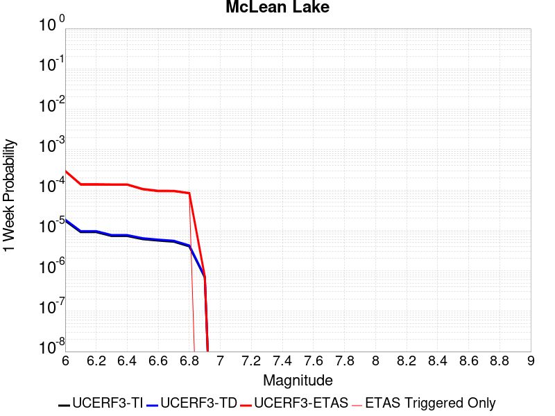 |  |  | 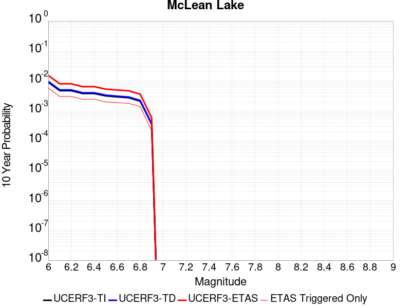 |

| Magnitude | 1 wk TI Prob | 1 wk TD Prob | 1 wk ETAS Prob | 1 wk ETAS/TD Gain | 1 wk ETAS Triggered Only | 1 mo TI Prob | 1 mo TD Prob | 1 mo ETAS Prob | 1 mo ETAS/TD Gain | 1 mo ETAS Triggered Only | 1 yr TI Prob | 1 yr TD Prob | 1 yr ETAS Prob | 1 yr ETAS/TD Gain | 1 yr ETAS Triggered Only | 10 yr TI Prob | 10 yr TD Prob | 10 yr ETAS Prob | 10 yr ETAS/TD Gain | 10 yr ETAS Triggered Only |
|-----|-----|-----|-----|-----|-----|-----|-----|-----|-----|-----|-----|-----|-----|-----|-----|-----|-----|-----|-----|-----|
| 6.0 | 1.7360222E-5 | 1.8501789E-5 | 2.984966E-4 | 16.133392 | 2.8E-4 | 7.439883E-5 | 7.929125E-5 | 8.592294E-4 | 10.836371 | 7.8E-4 | 9.0542925E-4 | 9.64992E-4 | 0.0037423093 | 3.878073 | 0.00278 | 0.009017491 | 0.009612858 | 0.015277873 | 1.5893164 | 0.00572 |
| 6.1 | 9.062689E-6 | 9.592268E-6 | 1.3959102E-4 | 14.552452 | 1.3E-4 | 3.8839516E-5 | 4.110912E-5 | 4.7109145E-4 | 11.459536 | 4.3E-4 | 4.727685E-4 | 5.003975E-4 | 0.0018897019 | 3.7764018 | 0.00139 | 0.0047176396 | 0.0049935905 | 0.00798856 | 1.5997627 | 0.00301 |
| 6.2 | 9.062689E-6 | 9.592268E-6 | 1.3959102E-4 | 14.552452 | 1.3E-4 | 3.8839516E-5 | 4.110912E-5 | 4.7109145E-4 | 11.459536 | 4.3E-4 | 4.727685E-4 | 5.003975E-4 | 0.0018897019 | 3.7764018 | 0.00139 | 0.0047176396 | 0.0049935905 | 0.00798856 | 1.5997627 | 0.00301 |
| 6.3 | 7.2575485E-6 | 7.667767E-6 | 1.3766676E-4 | 17.953959 | 1.3E-4 | 3.110341E-5 | 3.2861484E-5 | 3.8284998E-4 | 11.650416 | 3.5E-4 | 3.786182E-4 | 4.0002225E-4 | 0.0015195742 | 3.7987242 | 0.00112 | 0.0037797375 | 0.003993727 | 0.006404062 | 1.6035303 | 0.00242 |
| 6.4 | 7.2575485E-6 | 7.667767E-6 | 1.3766676E-4 | 17.953959 | 1.3E-4 | 3.110341E-5 | 3.2861484E-5 | 3.8284998E-4 | 11.650416 | 3.5E-4 | 3.786182E-4 | 4.0002225E-4 | 0.0015195742 | 3.7987242 | 0.00112 | 0.0037797375 | 0.003993727 | 0.006404062 | 1.6035303 | 0.00242 |
| 6.5 | 6.06582E-6 | 6.4039245E-6 | 1.06403284E-4 | 16.615324 | 1.0E-4 | 2.5996113E-5 | 2.7445138E-5 | 3.0743744E-4 | 11.201891 | 2.8E-4 | 3.164567E-4 | 3.340998E-4 | 0.0012937791 | 3.872433 | 9.6E-4 | 0.0031600643 | 0.0033366138 | 0.0053100074 | 1.591436 | 0.00198 |
| 6.6 | 5.598744E-6 | 5.910306E-6 | 9.5909774E-5 | 16.227549 | 9.0E-5 | 2.3994397E-5 | 2.5329673E-5 | 2.9532282E-4 | 11.659165 | 2.7E-4 | 2.9209262E-4 | 3.083515E-4 | 0.0012280678 | 3.982688 | 9.2E-4 | 0.0029170897 | 0.0030798658 | 0.0049441066 | 1.6052994 | 0.00187 |
| 6.7 | 5.246996E-6 | 5.539203E-6 | 9.553871E-5 | 17.247734 | 9.0E-5 | 2.2486933E-5 | 2.3739261E-5 | 2.737333E-4 | 11.5308275 | 2.5E-4 | 2.73744E-4 | 2.8899353E-4 | 0.0011587421 | 4.009578 | 8.7E-4 | 0.0027340704 | 0.002886801 | 0.0046516913 | 1.6113654 | 0.00177 |
| 6.8 | 4.02324E-6 | 4.246936E-6 | 8.4246596E-5 | 19.83703 | 8.0E-5 | 1.7242342E-5 | 1.820106E-5 | 2.081976E-4 | 11.438763 | 1.9E-4 | 2.099053E-4 | 2.2158133E-4 | 9.214262E-4 | 4.158411 | 7.0E-4 | 0.0020970714 | 0.0022141882 | 0.0036011105 | 1.6263796 | 0.00139 |
| 6.9 | 6.835972E-7 | 7.1399705E-7 | 7.1399705E-7 | 1.0 | 0.0 | 2.9296991E-6 | 3.0599856E-6 | 1.3059955E-5 | 4.267979 | 1.0E-5 | 3.56685E-5 | 3.7255006E-5 | 1.07252396E-4 | 2.8788722 | 7.0E-5 | 3.5662777E-4 | 3.7251884E-4 | 5.8244064E-4 | 1.5635198 | 2.1E-4 |

## Goldstone Lake
*[(top)](#table-of-contents)*

| 1 Week | 1 Month | 1 Year | 10 Year |
|-----|-----|-----|-----|
|  |  |  |  |

| Magnitude | 1 wk TI Prob | 1 wk TD Prob | 1 wk ETAS Prob | 1 wk ETAS/TD Gain | 1 wk ETAS Triggered Only | 1 mo TI Prob | 1 mo TD Prob | 1 mo ETAS Prob | 1 mo ETAS/TD Gain | 1 mo ETAS Triggered Only | 1 yr TI Prob | 1 yr TD Prob | 1 yr ETAS Prob | 1 yr ETAS/TD Gain | 1 yr ETAS Triggered Only | 10 yr TI Prob | 10 yr TD Prob | 10 yr ETAS Prob | 10 yr ETAS/TD Gain | 10 yr ETAS Triggered Only |
|-----|-----|-----|-----|-----|-----|-----|-----|-----|-----|-----|-----|-----|-----|-----|-----|-----|-----|-----|-----|-----|
| 6.0 | 2.671352E-5 | 3.0376643E-5 | 3.1036814E-4 | 10.217329 | 2.8E-4 | 1.1448149E-4 | 1.3018023E-4 | 8.100917E-4 | 6.222848 | 6.8E-4 | 0.001392921 | 0.0015839882 | 0.0037106143 | 2.342577 | 0.00213 | 0.013842222 | 0.01574648 | 0.020106722 | 1.2769027 | 0.00443 |
| 6.1 | 2.671352E-5 | 3.0376643E-5 | 3.1036814E-4 | 10.217329 | 2.8E-4 | 1.1448149E-4 | 1.3018023E-4 | 8.100917E-4 | 6.222848 | 6.8E-4 | 0.001392921 | 0.0015839882 | 0.0037106143 | 2.342577 | 0.00213 | 0.013842222 | 0.01574648 | 0.020106722 | 1.2769027 | 0.00443 |
| 6.2 | 1.4197047E-5 | 1.6096526E-5 | 1.8609379E-4 | 11.561114 | 1.7E-4 | 6.0843064E-5 | 6.898385E-5 | 4.28959E-4 | 6.218253 | 3.6E-4 | 7.4051257E-4 | 8.396533E-4 | 0.0021485535 | 2.5588577 | 0.00131 | 0.007380498 | 0.008374506 | 0.010883317 | 1.2995774 | 0.00253 |
| 6.3 | 1.4197047E-5 | 1.6096526E-5 | 1.8609379E-4 | 11.561114 | 1.7E-4 | 6.0843064E-5 | 6.898385E-5 | 4.28959E-4 | 6.218253 | 3.6E-4 | 7.4051257E-4 | 8.396533E-4 | 0.0021485535 | 2.5588577 | 0.00131 | 0.007380498 | 0.008374506 | 0.010883317 | 1.2995774 | 0.00253 |
| 6.4 | 1.3238931E-5 | 1.5008722E-5 | 1.8500617E-4 | 12.326577 | 1.7E-4 | 5.6737044E-5 | 6.432206E-5 | 4.1429955E-4 | 6.441018 | 3.5E-4 | 6.9055456E-4 | 7.8293774E-4 | 0.001981998 | 2.531489 | 0.0012 | 0.006884126 | 0.0078114197 | 0.010133141 | 1.2972214 | 0.00234 |
| 6.5 | 1.3238931E-5 | 1.5008722E-5 | 1.8500617E-4 | 12.326577 | 1.7E-4 | 5.6737044E-5 | 6.432206E-5 | 4.1429955E-4 | 6.441018 | 3.5E-4 | 6.9055456E-4 | 7.8293774E-4 | 0.001981998 | 2.531489 | 0.0012 | 0.006884126 | 0.0078114197 | 0.010133141 | 1.2972214 | 0.00234 |
| 6.6 | 1.1328278E-5 | 1.2855392E-5 | 1.528536E-4 | 11.890232 | 1.4E-4 | 4.8548856E-5 | 5.509391E-5 | 3.5507738E-4 | 6.4449477 | 3.0E-4 | 5.90922E-4 | 6.706576E-4 | 0.0016999668 | 2.534776 | 0.00103 | 0.0058935313 | 0.006695726 | 0.008702201 | 1.299665 | 0.00202 |
| 6.7 | 8.651175E-6 | 9.824737E-6 | 6.982415E-5 | 7.106973 | 6.0E-5 | 3.707594E-5 | 4.210585E-5 | 2.1209869E-4 | 5.037274 | 1.7E-4 | 4.5130608E-4 | 5.126087E-4 | 0.0011722704 | 2.286872 | 6.6E-4 | 0.0045039062 | 0.005123141 | 0.006605508 | 1.2893472 | 0.00149 |
| 6.8 | 1.0215377E-6 | 1.1754901E-6 | 1.1754901E-6 | 1.0 | 0.0 | 4.378012E-6 | 5.0378057E-6 | 3.5037654E-5 | 6.9549437 | 3.0E-5 | 5.3300988E-5 | 6.1333674E-5 | 1.2132999E-4 | 1.9781954 | 6.0E-5 | 5.3288206E-4 | 6.131787E-4 | 7.1311736E-4 | 1.1629846 | 1.0E-4 |
| 6.9 | 7.9360774E-7 | 9.2835677E-7 | 9.2835677E-7 | 1.0 | 0.0 | 3.4011714E-6 | 3.978666E-6 | 2.3978586E-5 | 6.02679 | 2.0E-5 | 4.1408475E-5 | 4.8439255E-5 | 7.84378E-5 | 1.6193024 | 3.0E-5 | 4.140076E-4 | 4.8429397E-4 | 5.242746E-4 | 1.0825545 | 4.0E-5 |
| 7.0 | 7.4382757E-7 | 8.747494E-7 | 8.747494E-7 | 1.0 | 0.0 | 3.1878285E-6 | 3.748921E-6 | 2.3748846E-5 | 6.3348484 | 2.0E-5 | 3.8811122E-5 | 4.5642224E-5 | 7.5640855E-5 | 1.6572561 | 3.0E-5 | 3.8804344E-4 | 4.5633517E-4 | 4.963169E-4 | 1.0876149 | 4.0E-5 |
| 7.1 | 6.4709513E-7 | 7.711456E-7 | 7.711456E-7 | 1.0 | 0.0 | 2.773262E-6 | 3.3049057E-6 | 1.33048725E-5 | 4.025795 | 1.0E-5 | 3.376394E-5 | 4.0236544E-5 | 6.023574E-5 | 1.4970405 | 2.0E-5 | 3.375881E-4 | 4.0229855E-4 | 4.2229053E-4 | 1.0496943 | 2.0E-5 |
| 7.2 | 6.356704E-7 | 7.588514E-7 | 7.588514E-7 | 1.0 | 0.0 | 2.7242988E-6 | 3.2522166E-6 | 1.32521845E-5 | 4.0748158 | 1.0E-5 | 3.3167835E-5 | 3.9595077E-5 | 5.9594287E-5 | 1.5050932 | 2.0E-5 | 3.3162883E-4 | 3.9588616E-4 | 4.1587825E-4 | 1.0504996 | 2.0E-5 |
| 7.3 | 5.7695723E-7 | 6.896703E-7 | 6.896703E-7 | 1.0 | 0.0 | 2.4726714E-6 | 2.9557268E-6 | 1.29556975E-5 | 4.3832526 | 1.0E-5 | 3.0104358E-5 | 3.598544E-5 | 5.5984718E-5 | 1.5557604 | 2.0E-5 | 3.0100282E-4 | 3.5980184E-4 | 3.7979466E-4 | 1.0555662 | 2.0E-5 |
| 7.4 | 5.209647E-7 | 6.1936277E-7 | 6.1936277E-7 | 1.0 | 0.0 | 2.232704E-6 | 2.6544094E-6 | 1.2654383E-5 | 4.7673063 | 1.0E-5 | 2.718283E-5 | 3.231701E-5 | 5.2316365E-5 | 1.6188492 | 2.0E-5 | 2.7179506E-4 | 3.2312868E-4 | 3.431222E-4 | 1.0618749 | 2.0E-5 |
| 7.5 | 4.512955E-7 | 5.3489794E-7 | 5.3489794E-7 | 1.0 | 0.0 | 1.934122E-6 | 2.292418E-6 | 2.292418E-6 | 1.0 | 0.0 | 2.3547682E-5 | 2.7909884E-5 | 3.7909605E-5 | 1.358286 | 1.0E-5 | 2.3545188E-4 | 2.790691E-4 | 2.8906632E-4 | 1.0358235 | 1.0E-5 |
| 7.6 | 2.21172E-7 | 2.6040198E-7 | 2.6040198E-7 | 1.0 | 0.0 | 9.478797E-7 | 1.1160082E-6 | 1.1160082E-6 | 1.0 | 0.0 | 1.1540374E-5 | 1.3587343E-5 | 1.3587343E-5 | 1.0 | 0.0 | 1.1539775E-4 | 1.3586794E-4 | 1.3586794E-4 | 1.0 | 0.0 |

## Gravel Hills-Harper Lk
*[(top)](#table-of-contents)*

| 1 Week | 1 Month | 1 Year | 10 Year |
|-----|-----|-----|-----|
| 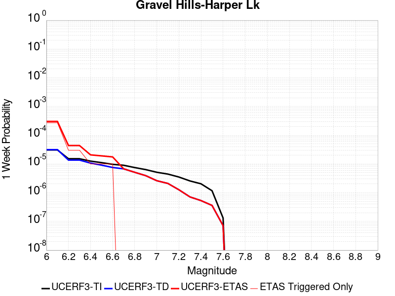 |  |  |  |

| Magnitude | 1 wk TI Prob | 1 wk TD Prob | 1 wk ETAS Prob | 1 wk ETAS/TD Gain | 1 wk ETAS Triggered Only | 1 mo TI Prob | 1 mo TD Prob | 1 mo ETAS Prob | 1 mo ETAS/TD Gain | 1 mo ETAS Triggered Only | 1 yr TI Prob | 1 yr TD Prob | 1 yr ETAS Prob | 1 yr ETAS/TD Gain | 1 yr ETAS Triggered Only | 10 yr TI Prob | 10 yr TD Prob | 10 yr ETAS Prob | 10 yr ETAS/TD Gain | 10 yr ETAS Triggered Only |
|-----|-----|-----|-----|-----|-----|-----|-----|-----|-----|-----|-----|-----|-----|-----|-----|-----|-----|-----|-----|-----|
| 6.0 | 3.0679566E-5 | 3.146516E-5 | 3.0145666E-4 | 9.580649 | 2.7E-4 | 1.3147724E-4 | 1.3484493E-4 | 8.5474784E-4 | 6.3387465 | 7.2E-4 | 0.0015995599 | 0.0016407177 | 0.0037772066 | 2.3021672 | 0.00214 | 0.015880952 | 0.016307613 | 0.020458793 | 1.2545549 | 0.00422 |
| 6.1 | 3.0679566E-5 | 3.146516E-5 | 3.0145666E-4 | 9.580649 | 2.7E-4 | 1.3147724E-4 | 1.3484493E-4 | 8.5474784E-4 | 6.3387465 | 7.2E-4 | 0.0015995599 | 0.0016407177 | 0.0037772066 | 2.3021672 | 0.00214 | 0.015880952 | 0.016307613 | 0.020458793 | 1.2545549 | 0.00422 |
| 6.2 | 1.514536E-5 | 1.363538E-5 | 4.363497E-5 | 3.2001288 | 3.0E-5 | 6.490707E-5 | 5.84361E-5 | 2.0842733E-4 | 3.5667565 | 1.5E-4 | 7.8995706E-4 | 7.112392E-4 | 0.0012108835 | 1.7024984 | 5.0E-4 | 0.007871548 | 0.0070908302 | 0.008262463 | 1.1652321 | 0.00118 |
| 6.3 | 1.514536E-5 | 1.363538E-5 | 4.363497E-5 | 3.2001288 | 3.0E-5 | 6.490707E-5 | 5.84361E-5 | 2.0842733E-4 | 3.5667565 | 1.5E-4 | 7.8995706E-4 | 7.112392E-4 | 0.0012108835 | 1.7024984 | 5.0E-4 | 0.007871548 | 0.0070908302 | 0.008262463 | 1.1652321 | 0.00118 |
| 6.4 | 1.2532521E-5 | 1.0689813E-5 | 2.0689706E-5 | 1.93546 | 1.0E-5 | 5.37097E-5 | 4.5812714E-5 | 1.2580905E-4 | 2.74616 | 8.0E-5 | 6.537194E-4 | 5.576329E-4 | 8.474712E-4 | 1.5197654 | 2.9E-4 | 0.0065179965 | 0.0055629266 | 0.0062888656 | 1.1304959 | 7.3E-4 |
| 6.5 | 1.1094058E-5 | 9.083761E-6 | 1.908367E-5 | 2.1008556 | 1.0E-5 | 4.7545094E-5 | 3.8929848E-5 | 7.8928286E-5 | 2.0274494 | 4.0E-5 | 5.787078E-4 | 4.7387183E-4 | 6.837723E-4 | 1.4429477 | 2.1E-4 | 0.0057720304 | 0.0047290213 | 0.005246562 | 1.1094394 | 5.2E-4 |
| 6.6 | 9.688328E-6 | 7.531771E-6 | 1.7531696E-5 | 2.327699 | 1.0E-5 | 4.1520743E-5 | 3.2278636E-5 | 7.227734E-5 | 2.2391698 | 4.0E-5 | 5.053978E-4 | 3.9292406E-4 | 5.328691E-4 | 1.3561629 | 1.4E-4 | 0.0050424994 | 0.00392255 | 0.004281138 | 1.0914171 | 3.6E-4 |
| 6.7 | 8.974824E-6 | 6.7494793E-6 | 6.7494793E-6 | 1.0 | 0.0 | 3.8462964E-5 | 2.8926032E-5 | 5.892516E-5 | 2.0370982 | 3.0E-5 | 4.6818596E-4 | 3.521197E-4 | 4.62081E-4 | 1.3122838 | 1.1E-4 | 0.004672008 | 0.0035158389 | 0.0037848896 | 1.0765253 | 2.7E-4 |
| 6.8 | 7.4780046E-6 | 5.1162397E-6 | 5.1162397E-6 | 1.0 | 0.0 | 3.20482E-5 | 2.1926564E-5 | 4.1926127E-5 | 1.9121156 | 2.0E-5 | 3.9011694E-4 | 2.6692462E-4 | 3.1691126E-4 | 1.1872689 | 5.0E-5 | 0.0038943281 | 0.0026661782 | 0.0027958318 | 1.0486289 | 1.3E-4 |
| 6.9 | 6.3409307E-6 | 3.9075294E-6 | 3.9075294E-6 | 1.0 | 0.0 | 2.7175134E-5 | 1.6746453E-5 | 2.6746286E-5 | 1.5971314 | 1.0E-5 | 3.3080703E-4 | 2.0386997E-4 | 2.238659E-4 | 1.0980817 | 2.0E-5 | 0.0033031502 | 0.0020369277 | 0.0021167647 | 1.0391948 | 8.0E-5 |
| 7.0 | 5.1239335E-6 | 2.605876E-6 | 2.605876E-6 | 1.0 | 0.0 | 2.195953E-5 | 1.1167994E-5 | 2.1167882E-5 | 1.895406 | 1.0E-5 | 2.6732447E-4 | 1.359621E-4 | 1.4596073E-4 | 1.07354 | 1.0E-5 | 0.0026700313 | 0.0013588143 | 0.0014087463 | 1.0367467 | 5.0E-5 |
| 7.1 | 4.438899E-6 | 2.0984924E-6 | 2.0984924E-6 | 1.0 | 0.0 | 1.9023713E-5 | 8.993509E-6 | 1.899342E-5 | 2.111903 | 1.0E-5 | 2.315891E-4 | 1.0949069E-4 | 1.19489596E-4 | 1.091322 | 1.0E-5 | 0.002313479 | 0.0010943894 | 0.0011443347 | 1.0456376 | 5.0E-5 |
| 7.2 | 3.50367E-6 | 1.2615886E-6 | 1.2615886E-6 | 1.0 | 0.0 | 1.5015643E-5 | 5.4067978E-6 | 5.4067978E-6 | 1.0 | 0.0 | 1.8280011E-4 | 6.582586E-5 | 6.582586E-5 | 1.0 | 0.0 | 0.0018264982 | 6.5807183E-4 | 6.680652E-4 | 1.015186 | 1.0E-5 |
| 7.3 | 2.561638E-6 | 7.1188435E-7 | 7.1188435E-7 | 1.0 | 0.0 | 1.0978401E-5 | 3.0509295E-6 | 3.0509295E-6 | 1.0 | 0.0 | 1.3365384E-4 | 3.7144455E-5 | 3.7144455E-5 | 1.0 | 0.0 | 0.0013357349 | 3.7138443E-4 | 3.8138073E-4 | 1.0269163 | 1.0E-5 |
| 7.4 | 2.0368864E-6 | 5.3046045E-7 | 5.3046045E-7 | 1.0 | 0.0 | 8.729483E-6 | 2.2734E-6 | 2.2734E-6 | 1.0 | 0.0 | 1.06276275E-4 | 2.7678298E-5 | 2.7678298E-5 | 1.0 | 0.0 | 0.0010622547 | 2.7674905E-4 | 2.7674905E-4 | 1.0 | 0.0 |
| 7.5 | 1.1681728E-6 | 3.6029326E-7 | 3.6029326E-7 | 1.0 | 0.0 | 5.0064455E-6 | 1.544113E-6 | 1.544113E-6 | 1.0 | 0.0 | 6.0951766E-5 | 1.879942E-5 | 1.879942E-5 | 1.0 | 0.0 | 6.093505E-4 | 1.8797876E-4 | 1.8797876E-4 | 1.0 | 0.0 |
| 7.6 | 1.3154387E-7 | 7.119745E-8 | 7.119745E-8 | 1.0 | 0.0 | 5.6375933E-7 | 3.051319E-7 | 3.051319E-7 | 1.0 | 0.0 | 6.863748E-6 | 3.7149762E-6 | 3.7149762E-6 | 1.0 | 0.0 | 6.863536E-5 | 3.7149297E-5 | 3.7149297E-5 | 1.0 | 0.0 |

## So Sierra Nevada
*[(top)](#table-of-contents)*

| 1 Week | 1 Month | 1 Year | 10 Year |
|-----|-----|-----|-----|
| 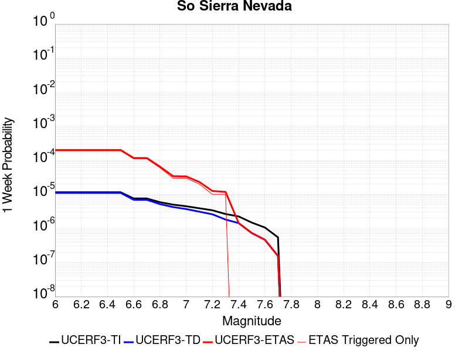 |  |  |  |

| Magnitude | 1 wk TI Prob | 1 wk TD Prob | 1 wk ETAS Prob | 1 wk ETAS/TD Gain | 1 wk ETAS Triggered Only | 1 mo TI Prob | 1 mo TD Prob | 1 mo ETAS Prob | 1 mo ETAS/TD Gain | 1 mo ETAS Triggered Only | 1 yr TI Prob | 1 yr TD Prob | 1 yr ETAS Prob | 1 yr ETAS/TD Gain | 1 yr ETAS Triggered Only | 10 yr TI Prob | 10 yr TD Prob | 10 yr ETAS Prob | 10 yr ETAS/TD Gain | 10 yr ETAS Triggered Only |
|-----|-----|-----|-----|-----|-----|-----|-----|-----|-----|-----|-----|-----|-----|-----|-----|-----|-----|-----|-----|-----|
| 6.0 | 1.15488665E-5 | 1.1079688E-5 | 2.0107758E-4 | 18.148308 | 1.9E-4 | 4.9494203E-5 | 4.7483583E-5 | 6.07457E-4 | 12.79299 | 5.6E-4 | 6.024253E-4 | 5.7797204E-4 | 0.0023069722 | 3.9914944 | 0.00173 | 0.006007948 | 0.0057659578 | 0.008937565 | 1.5500572 | 0.00319 |
| 6.1 | 1.15488665E-5 | 1.1079688E-5 | 2.0107758E-4 | 18.148308 | 1.9E-4 | 4.9494203E-5 | 4.7483583E-5 | 6.07457E-4 | 12.79299 | 5.6E-4 | 6.024253E-4 | 5.7797204E-4 | 0.0023069722 | 3.9914944 | 0.00173 | 0.006007948 | 0.0057659578 | 0.008937565 | 1.5500572 | 0.00319 |
| 6.2 | 1.15488665E-5 | 1.1079688E-5 | 2.0107758E-4 | 18.148308 | 1.9E-4 | 4.9494203E-5 | 4.7483583E-5 | 6.07457E-4 | 12.79299 | 5.6E-4 | 6.024253E-4 | 5.7797204E-4 | 0.0023069722 | 3.9914944 | 0.00173 | 0.006007948 | 0.0057659578 | 0.008937565 | 1.5500572 | 0.00319 |
| 6.3 | 1.15488665E-5 | 1.1079688E-5 | 2.0107758E-4 | 18.148308 | 1.9E-4 | 4.9494203E-5 | 4.7483583E-5 | 6.07457E-4 | 12.79299 | 5.6E-4 | 6.024253E-4 | 5.7797204E-4 | 0.0023069722 | 3.9914944 | 0.00173 | 0.006007948 | 0.0057659578 | 0.008937565 | 1.5500572 | 0.00319 |
| 6.4 | 1.15488665E-5 | 1.1079688E-5 | 2.0107758E-4 | 18.148308 | 1.9E-4 | 4.9494203E-5 | 4.7483583E-5 | 6.07457E-4 | 12.79299 | 5.6E-4 | 6.024253E-4 | 5.7797204E-4 | 0.0023069722 | 3.9914944 | 0.00173 | 0.006007948 | 0.0057659578 | 0.008937565 | 1.5500572 | 0.00319 |
| 6.5 | 1.15488665E-5 | 1.1079688E-5 | 2.0107758E-4 | 18.148308 | 1.9E-4 | 4.9494203E-5 | 4.7483583E-5 | 6.07457E-4 | 12.79299 | 5.6E-4 | 6.024253E-4 | 5.7797204E-4 | 0.0023069722 | 3.9914944 | 0.00173 | 0.006007948 | 0.0057659578 | 0.008937565 | 1.5500572 | 0.00319 |
| 6.6 | 7.587044E-6 | 6.935655E-6 | 1.1693489E-4 | 16.859962 | 1.1E-4 | 3.2515498E-5 | 2.9723915E-5 | 3.397147E-4 | 11.429003 | 3.1E-4 | 3.9580427E-4 | 3.6183148E-4 | 0.0013514733 | 3.7350903 | 9.9E-4 | 0.003951 | 0.0036127153 | 0.0054062125 | 1.4964402 | 0.0018 |
| 6.7 | 7.587044E-6 | 6.935655E-6 | 1.1693489E-4 | 16.859962 | 1.1E-4 | 3.2515498E-5 | 2.9723915E-5 | 3.397147E-4 | 11.429003 | 3.1E-4 | 3.9580427E-4 | 3.6183148E-4 | 0.0013514733 | 3.7350903 | 9.9E-4 | 0.003951 | 0.0036127153 | 0.0054062125 | 1.4964402 | 0.0018 |
| 6.8 | 5.9026956E-6 | 5.179403E-6 | 6.517909E-5 | 12.584287 | 6.0E-5 | 2.5297022E-5 | 2.2197259E-5 | 2.321926E-4 | 10.460418 | 2.1E-4 | 3.0794772E-4 | 2.702193E-4 | 9.800274E-4 | 3.6267858 | 7.1E-4 | 0.0030752132 | 0.0026990233 | 0.0039057576 | 1.4471003 | 0.00121 |
| 6.9 | 5.0118915E-6 | 4.2524307E-6 | 3.42523E-5 | 8.054759 | 3.0E-5 | 2.1479358E-5 | 1.8224579E-5 | 1.5822203E-4 | 8.681793 | 1.4E-4 | 2.614798E-4 | 2.2186238E-4 | 8.2172925E-4 | 3.703779 | 6.0E-4 | 0.0026117235 | 0.0022164814 | 0.0032541764 | 1.4681721 | 0.00104 |
| 7.0 | 4.4924795E-6 | 3.7139203E-6 | 3.3713808E-5 | 9.077688 | 3.0E-5 | 1.925334E-5 | 1.5916707E-5 | 1.359148E-4 | 8.539127 | 1.2E-4 | 2.3438422E-4 | 1.9376932E-4 | 7.1366853E-4 | 3.6830835 | 5.2E-4 | 0.0023413717 | 0.0019360665 | 0.0028542853 | 1.4742702 | 9.2E-4 |
| 7.1 | 3.9118436E-6 | 3.111977E-6 | 2.3111916E-5 | 7.4267626 | 2.0E-5 | 1.6764936E-5 | 1.33369795E-5 | 1.1333565E-4 | 8.497849 | 1.0E-4 | 2.0409399E-4 | 1.623662E-4 | 5.8229803E-4 | 3.5863254 | 4.2E-4 | 0.0020390663 | 0.0016225318 | 0.0023912825 | 1.473797 | 7.7E-4 |
| 7.2 | 3.4200818E-6 | 2.6054513E-6 | 1.2605426E-5 | 4.8380966 | 1.0E-5 | 1.4657411E-5 | 1.1166175E-5 | 1.0116517E-4 | 9.059967 | 9.0E-5 | 1.7843937E-4 | 1.359402E-4 | 5.1588856E-4 | 3.7949667 | 3.8E-4 | 0.0017829615 | 0.0013586201 | 0.0019977507 | 1.4704262 | 6.4E-4 |
| 7.3 | 2.6593618E-6 | 1.8284135E-6 | 1.1828395E-5 | 6.469212 | 1.0E-5 | 1.13972155E-5 | 7.836036E-6 | 6.7835565E-5 | 8.656873 | 6.0E-5 | 1.3875226E-4 | 9.539985E-5 | 3.5537506E-4 | 3.725111 | 2.6E-4 | 0.0013866565 | 9.53618E-4 | 0.0013632269 | 1.4295316 | 4.1E-4 |
| 7.4 | 2.2577992E-6 | 1.4364293E-6 | 1.4364293E-6 | 1.0 | 0.0 | 9.676246E-6 | 6.1561127E-6 | 5.6155804E-5 | 9.121959 | 5.0E-5 | 1.1780193E-4 | 7.4948344E-5 | 2.7493335E-4 | 3.6683044 | 2.0E-4 | 0.001177395 | 7.4925576E-4 | 0.0010790084 | 1.4401071 | 3.3E-4 |
| 7.5 | 1.489319E-6 | 7.35383E-7 | 7.35383E-7 | 1.0 | 0.0 | 6.3827797E-6 | 3.1516379E-6 | 4.315151E-5 | 13.691773 | 4.0E-5 | 7.770758E-5 | 3.837052E-5 | 1.4836629E-4 | 3.8666742 | 1.1E-4 | 7.7680405E-4 | 3.836394E-4 | 5.8356265E-4 | 1.5211229 | 2.0E-4 |
| 7.6 | 1.0680322E-6 | 4.6595343E-7 | 4.6595343E-7 | 1.0 | 0.0 | 4.577273E-6 | 1.9969418E-6 | 2.1996902E-5 | 11.015294 | 2.0E-5 | 5.5726876E-5 | 2.4312498E-5 | 6.431153E-5 | 2.6452043 | 4.0E-5 | 5.5712904E-4 | 2.4309864E-4 | 3.4307432E-4 | 1.4112556 | 1.0E-4 |
| 7.7 | 5.509146E-7 | 1.5579108E-7 | 1.5579108E-7 | 1.0 | 0.0 | 2.3610605E-6 | 6.676759E-7 | 1.0667669E-5 | 15.977316 | 1.0E-5 | 2.8745531E-5 | 8.128925E-6 | 2.8128763E-5 | 3.4603298 | 2.0E-5 | 2.8741814E-4 | 8.1286395E-5 | 1.0128477E-4 | 1.2460237 | 2.0E-5 |

## Death Valley (So)
*[(top)](#table-of-contents)*

| 1 Week | 1 Month | 1 Year | 10 Year |
|-----|-----|-----|-----|
| 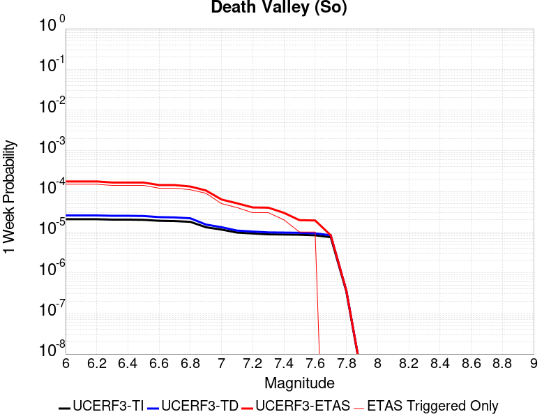 | 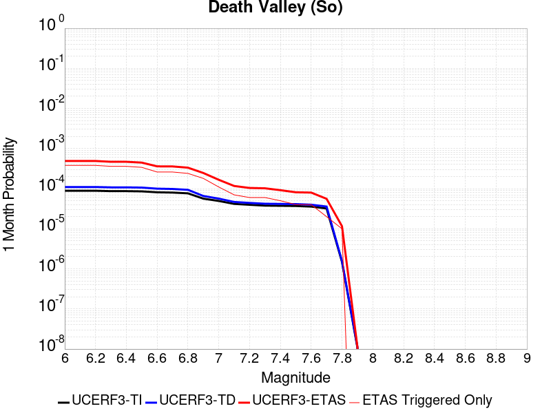 |  |  |

| Magnitude | 1 wk TI Prob | 1 wk TD Prob | 1 wk ETAS Prob | 1 wk ETAS/TD Gain | 1 wk ETAS Triggered Only | 1 mo TI Prob | 1 mo TD Prob | 1 mo ETAS Prob | 1 mo ETAS/TD Gain | 1 mo ETAS Triggered Only | 1 yr TI Prob | 1 yr TD Prob | 1 yr ETAS Prob | 1 yr ETAS/TD Gain | 1 yr ETAS Triggered Only | 10 yr TI Prob | 10 yr TD Prob | 10 yr ETAS Prob | 10 yr ETAS/TD Gain | 10 yr ETAS Triggered Only |
|-----|-----|-----|-----|-----|-----|-----|-----|-----|-----|-----|-----|-----|-----|-----|-----|-----|-----|-----|-----|-----|
| 6.0 | 2.0684236E-5 | 2.5618914E-5 | 1.7561507E-4 | 6.854899 | 1.5E-4 | 8.864371E-5 | 1.09790824E-4 | 4.8974913E-4 | 4.4607472 | 3.8E-4 | 0.0010787029 | 0.0013359005 | 0.00282391 | 2.1138625 | 0.00149 | 0.010734817 | 0.01328137 | 0.016241526 | 1.2228804 | 0.003 |
| 6.1 | 2.0684236E-5 | 2.5618914E-5 | 1.7561507E-4 | 6.854899 | 1.5E-4 | 8.864371E-5 | 1.09790824E-4 | 4.8974913E-4 | 4.4607472 | 3.8E-4 | 0.0010787029 | 0.0013359005 | 0.00282391 | 2.1138625 | 0.00149 | 0.010734817 | 0.01328137 | 0.016241526 | 1.2228804 | 0.003 |
| 6.2 | 2.0684236E-5 | 2.5618914E-5 | 1.7561507E-4 | 6.854899 | 1.5E-4 | 8.864371E-5 | 1.09790824E-4 | 4.8974913E-4 | 4.4607472 | 3.8E-4 | 0.0010787029 | 0.0013359005 | 0.00282391 | 2.1138625 | 0.00149 | 0.010734817 | 0.01328137 | 0.016241526 | 1.2228804 | 0.003 |
| 6.3 | 2.0240292E-5 | 2.511899E-5 | 1.6511547E-4 | 6.5733323 | 1.4E-4 | 8.6741224E-5 | 1.0764847E-4 | 4.676097E-4 | 4.3438587 | 3.6E-4 | 0.0010555626 | 0.0013098489 | 0.002718002 | 2.07505 | 0.00141 | 0.010505628 | 0.013023925 | 0.015846677 | 1.2167358 | 0.00286 |
| 6.4 | 2.0240292E-5 | 2.511899E-5 | 1.6511547E-4 | 6.5733323 | 1.4E-4 | 8.6741224E-5 | 1.0764847E-4 | 4.676097E-4 | 4.3438587 | 3.6E-4 | 0.0010555626 | 0.0013098489 | 0.002718002 | 2.07505 | 0.00141 | 0.010505628 | 0.013023925 | 0.015846677 | 1.2167358 | 0.00286 |
| 6.5 | 1.9962767E-5 | 2.4808238E-5 | 1.6480476E-4 | 6.6431465 | 1.4E-4 | 8.55519E-5 | 1.0631679E-4 | 4.4628064E-4 | 4.19765 | 3.4E-4 | 0.0010410968 | 0.0012936549 | 0.0026618827 | 2.057645 | 0.00137 | 0.010362327 | 0.012863869 | 0.01562785 | 1.2148639 | 0.0028 |
| 6.6 | 1.8937297E-5 | 2.331202E-5 | 1.4330923E-4 | 6.147439 | 1.2E-4 | 8.115732E-5 | 9.9904915E-5 | 3.5987893E-4 | 3.6022146 | 2.6E-4 | 9.876423E-4 | 0.0012156782 | 0.0024142193 | 1.9859034 | 0.0012 | 0.009832645 | 0.012092765 | 0.01460205 | 1.207503 | 0.00254 |
| 6.7 | 1.8621096E-5 | 2.2912649E-5 | 1.429099E-4 | 6.2371616 | 1.2E-4 | 7.980225E-5 | 9.819346E-5 | 3.5816792E-4 | 3.6475744 | 2.6E-4 | 9.711593E-4 | 0.0011948642 | 0.0023834424 | 1.994739 | 0.00119 | 0.009669261 | 0.011886865 | 0.014337385 | 1.2061536 | 0.00248 |
| 6.8 | 1.7830353E-5 | 2.1806614E-5 | 1.3180422E-4 | 6.044231 | 1.1E-4 | 7.641356E-5 | 9.345365E-5 | 3.3343124E-4 | 3.567878 | 2.4E-4 | 9.29938E-4 | 0.0011372183 | 0.002245956 | 1.9749558 | 0.00111 | 0.009260561 | 0.011316919 | 0.013610664 | 1.2026827 | 0.00232 |
| 6.9 | 1.3135183E-5 | 1.5304342E-5 | 1.0530296E-4 | 6.8805943 | 9.0E-5 | 5.6292425E-5 | 6.558842E-5 | 2.455766E-4 | 3.744207 | 1.8E-4 | 6.8514474E-4 | 7.9825294E-4 | 0.0015576463 | 1.9513192 | 7.6E-4 | 0.006830362 | 0.007954868 | 0.009472697 | 1.1908051 | 0.00153 |
| 7.0 | 1.1507512E-5 | 1.315447E-5 | 6.315381E-5 | 4.800939 | 5.0E-5 | 4.9316975E-5 | 5.6375116E-5 | 1.6636892E-4 | 2.9511056 | 1.1E-4 | 6.002687E-4 | 6.861567E-4 | 0.0012057999 | 1.7573245 | 5.2E-4 | 0.0059864987 | 0.0068410533 | 0.007993118 | 1.1684046 | 0.00116 |
| 7.1 | 9.715903E-6 | 1.086547E-5 | 5.0865037E-5 | 4.681347 | 4.0E-5 | 4.1638916E-5 | 4.6565492E-5 | 1.1656223E-4 | 2.503189 | 7.0E-5 | 5.068359E-4 | 5.667917E-4 | 8.266443E-4 | 1.4584624 | 2.6E-4 | 0.0050568148 | 0.0056537534 | 0.0062304744 | 1.1020067 | 5.8E-4 |
| 7.2 | 9.233269E-6 | 1.0286476E-5 | 4.0286166E-5 | 3.9164207 | 3.0E-5 | 3.9570554E-5 | 4.4084176E-5 | 1.0408153E-4 | 2.3609726 | 6.0E-5 | 4.81665E-4 | 5.365969E-4 | 7.464842E-4 | 1.3911452 | 2.1E-4 | 0.0048062233 | 0.005353444 | 0.005791088 | 1.08175 | 4.4E-4 |
| 7.3 | 8.8041315E-6 | 9.808313E-6 | 3.980802E-5 | 4.0586 | 3.0E-5 | 3.7731446E-5 | 4.2034975E-5 | 1.0203245E-4 | 2.4273229 | 6.0E-5 | 4.592835E-4 | 5.1165983E-4 | 6.915677E-4 | 1.3516163 | 1.8E-4 | 0.0045833546 | 0.0051052445 | 0.0054435087 | 1.0662582 | 3.4E-4 |
| 7.4 | 8.708749E-6 | 9.707323E-6 | 2.970713E-5 | 3.06028 | 2.0E-5 | 3.7322676E-5 | 4.1602176E-5 | 9.160009E-5 | 2.2018104 | 5.0E-5 | 4.5430884E-4 | 5.06393E-4 | 6.6631194E-4 | 1.3158002 | 1.6E-4 | 0.004533812 | 0.0050528166 | 0.00536125 | 1.061042 | 3.1E-4 |
| 7.5 | 8.612678E-6 | 9.604964E-6 | 1.9604868E-5 | 2.0411181 | 1.0E-5 | 3.6910955E-5 | 4.116351E-5 | 8.116186E-5 | 1.9716945 | 4.0E-5 | 4.492982E-4 | 5.010547E-4 | 6.509795E-4 | 1.2992185 | 1.5E-4 | 0.004483909 | 0.0049996753 | 0.0052981754 | 1.059704 | 3.0E-4 |
| 7.6 | 8.319024E-6 | 9.28406E-6 | 1.9283967E-5 | 2.077105 | 1.0E-5 | 3.5652476E-5 | 3.9788243E-5 | 7.978665E-5 | 2.0052822 | 4.0E-5 | 4.3398244E-4 | 4.8431839E-4 | 6.042603E-4 | 1.2476509 | 1.2E-4 | 0.0043313587 | 0.004833053 | 0.005071893 | 1.0494181 | 2.4E-4 |
| 7.7 | 7.4718328E-6 | 8.3453E-6 | 8.3453E-6 | 1.0 | 0.0 | 3.2021748E-5 | 3.57651E-5 | 5.5764387E-5 | 1.5591843 | 2.0E-5 | 3.8979502E-4 | 4.3535716E-4 | 5.0532667E-4 | 1.1607175 | 7.0E-5 | 0.00389112 | 0.004345448 | 0.004514709 | 1.0389514 | 1.7E-4 |
| 7.8 | 3.4586725E-7 | 3.648288E-7 | 3.648288E-7 | 1.0 | 0.0 | 1.4822873E-6 | 1.5635511E-6 | 1.1563536E-5 | 7.3956876 | 1.0E-5 | 1.80467E-5 | 1.9036073E-5 | 2.9035882E-5 | 1.5253085 | 1.0E-5 | 1.8045233E-4 | 1.9034486E-4 | 2.0034295E-4 | 1.0525262 | 1.0E-5 |
| 7.9 | 2.5591178E-9 | 2.6696871E-9 | 2.6696871E-9 | 1.0 | 0.0 | 1.0967647E-8 | 1.1441516E-8 | 1.1441516E-8 | 1.0 | 0.0 | 1.335311E-7 | 1.3930045E-7 | 1.3930045E-7 | 1.0 | 0.0 | 1.3353102E-6 | 1.3930046E-6 | 1.3930046E-6 | 1.0 | 0.0 |

## San Andreas (Mojave S)
*[(top)](#table-of-contents)*

| 1 Week | 1 Month | 1 Year | 10 Year |
|-----|-----|-----|-----|
|  |  |  | 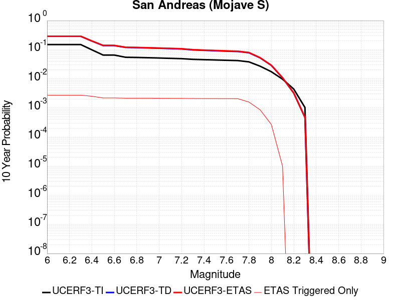 |

| Magnitude | 1 wk TI Prob | 1 wk TD Prob | 1 wk ETAS Prob | 1 wk ETAS/TD Gain | 1 wk ETAS Triggered Only | 1 mo TI Prob | 1 mo TD Prob | 1 mo ETAS Prob | 1 mo ETAS/TD Gain | 1 mo ETAS Triggered Only | 1 yr TI Prob | 1 yr TD Prob | 1 yr ETAS Prob | 1 yr ETAS/TD Gain | 1 yr ETAS Triggered Only | 10 yr TI Prob | 10 yr TD Prob | 10 yr ETAS Prob | 10 yr ETAS/TD Gain | 10 yr ETAS Triggered Only |
|-----|-----|-----|-----|-----|-----|-----|-----|-----|-----|-----|-----|-----|-----|-----|-----|-----|-----|-----|-----|-----|
| 6.0 | 3.1064058E-4 | 6.7471585E-4 | 9.1455394E-4 | 1.3554653 | 2.4E-4 | 0.0013306376 | 0.0028885633 | 0.003566599 | 1.2347312 | 6.8E-4 | 0.016080605 | 0.03457021 | 0.03623075 | 1.0480338 | 0.00172 | 0.1496549 | 0.2866514 | 0.288606 | 1.0068187 | 0.00274 |
| 6.1 | 3.1064058E-4 | 6.7471585E-4 | 9.1455394E-4 | 1.3554653 | 2.4E-4 | 0.0013306376 | 0.0028885633 | 0.003566599 | 1.2347312 | 6.8E-4 | 0.016080605 | 0.03457021 | 0.03623075 | 1.0480338 | 0.00172 | 0.1496549 | 0.2866514 | 0.288606 | 1.0068187 | 0.00274 |
| 6.2 | 3.1064058E-4 | 6.7471585E-4 | 9.1455394E-4 | 1.3554653 | 2.4E-4 | 0.0013306376 | 0.0028885633 | 0.003566599 | 1.2347312 | 6.8E-4 | 0.016080605 | 0.03457021 | 0.03623075 | 1.0480338 | 0.00172 | 0.1496549 | 0.2866514 | 0.288606 | 1.0068187 | 0.00274 |
| 6.3 | 3.1064058E-4 | 6.7471585E-4 | 9.1455394E-4 | 1.3554653 | 2.4E-4 | 0.0013306376 | 0.0028885633 | 0.003566599 | 1.2347312 | 6.8E-4 | 0.016080605 | 0.03457021 | 0.03623075 | 1.0480338 | 0.00172 | 0.1496549 | 0.2866514 | 0.288606 | 1.0068187 | 0.00274 |
| 6.4 | 1.9872203E-4 | 4.31896E-4 | 6.51801E-4 | 1.5091618 | 2.2E-4 | 8.5138786E-4 | 0.0018496981 | 0.0024785327 | 1.339966 | 6.3E-4 | 0.010316478 | 0.02229367 | 0.023877554 | 1.0710464 | 0.00162 | 0.098504856 | 0.19705607 | 0.19907147 | 1.0102274 | 0.00251 |
| 6.5 | 1.291105E-4 | 2.8762486E-4 | 4.8756736E-4 | 1.6951501 | 2.0E-4 | 5.5321335E-4 | 0.0012320984 | 0.0017914085 | 1.4539491 | 5.6E-4 | 0.006714592 | 0.014898448 | 0.016346548 | 1.097198 | 0.00147 | 0.065152965 | 0.138118 | 0.14001414 | 1.0137284 | 0.0022 |
| 6.6 | 1.291105E-4 | 2.8762486E-4 | 4.8756736E-4 | 1.6951501 | 2.0E-4 | 5.5321335E-4 | 0.0012320984 | 0.0017914085 | 1.4539491 | 5.6E-4 | 0.006714592 | 0.014898448 | 0.016346548 | 1.097198 | 0.00147 | 0.065152965 | 0.138118 | 0.14001414 | 1.0137284 | 0.0022 |
| 6.7 | 1.08001186E-4 | 2.4343564E-4 | 4.4338696E-4 | 1.8213724 | 2.0E-4 | 4.6278012E-4 | 0.0010428791 | 0.001602295 | 1.536415 | 5.6E-4 | 0.0056198016 | 0.012623432 | 0.014055128 | 1.1134157 | 0.00145 | 0.054797906 | 0.119228184 | 0.12113065 | 1.0159565 | 0.00216 |
| 6.8 | 1.0624356E-4 | 2.3861213E-4 | 4.3856443E-4 | 1.8379803 | 2.0E-4 | 4.5525006E-4 | 0.0010222232 | 0.0015816507 | 1.5472655 | 5.6E-4 | 0.0055285925 | 0.012374822 | 0.013806879 | 1.1157234 | 0.00145 | 0.053930566 | 0.117172524 | 0.11907943 | 1.0162743 | 0.00216 |
| 6.9 | 1.0393785E-4 | 2.3231508E-4 | 4.322686E-4 | 1.8606998 | 2.0E-4 | 4.4537184E-4 | 9.952566E-4 | 0.0015546993 | 1.562109 | 5.6E-4 | 0.0054089287 | 0.012050176 | 0.013482703 | 1.1188802 | 0.00145 | 0.05279156 | 0.11446828 | 0.11638103 | 1.0167098 | 0.00216 |
| 7.0 | 1.0155622E-4 | 2.2601044E-4 | 4.2596523E-4 | 1.8847148 | 2.0E-4 | 4.3516833E-4 | 9.68257E-4 | 0.0015177245 | 1.567481 | 5.5E-4 | 0.005285311 | 0.011725035 | 0.01314815 | 1.1213741 | 0.00144 | 0.05161361 | 0.11172433 | 0.11362524 | 1.0170143 | 0.00214 |
| 7.1 | 9.885595E-5 | 2.188942E-4 | 4.1885042E-4 | 1.9134834 | 2.0E-4 | 4.2359953E-4 | 9.3778106E-4 | 0.0014872652 | 1.5859408 | 5.5E-4 | 0.0051451353 | 0.011357912 | 0.012771671 | 1.1244735 | 0.00143 | 0.05027629 | 0.108605 | 0.11050367 | 1.0174824 | 0.00213 |
| 7.2 | 9.6411415E-5 | 2.1252372E-4 | 4.124812E-4 | 1.9408715 | 2.0E-4 | 4.1312634E-4 | 9.104983E-4 | 0.0014599975 | 1.6035148 | 5.5E-4 | 0.005018219 | 0.011029154 | 0.012443383 | 1.1282264 | 0.00143 | 0.049064007 | 0.10579592 | 0.10769163 | 1.0179186 | 0.00212 |
| 7.3 | 9.1180635E-5 | 1.9480525E-4 | 3.947663E-4 | 2.0264664 | 2.0E-4 | 3.907156E-4 | 8.3461264E-4 | 0.0013841536 | 1.6584383 | 5.5E-4 | 0.004746591 | 0.010114178 | 0.011529715 | 1.1399556 | 0.00143 | 0.046464786 | 0.09798997 | 0.09988419 | 1.0193307 | 0.0021 |
| 7.4 | 8.887388E-5 | 1.8729005E-4 | 3.872526E-4 | 2.0676625 | 2.0E-4 | 3.8083247E-4 | 8.024248E-4 | 0.0013519835 | 1.6848725 | 5.5E-4 | 0.0046267817 | 0.0097258575 | 0.011132047 | 1.1445825 | 0.00142 | 0.045316286 | 0.0946256 | 0.09651783 | 1.019997 | 0.00209 |
| 7.5 | 8.6750515E-5 | 1.8060463E-4 | 3.8056853E-4 | 2.1071913 | 2.0E-4 | 3.7173493E-4 | 7.7379035E-4 | 0.0013233648 | 1.7102368 | 5.5E-4 | 0.004516484 | 0.009380288 | 0.010786968 | 1.1499612 | 0.00142 | 0.04425787 | 0.09158909 | 0.09348767 | 1.0207293 | 0.00209 |
| 7.6 | 8.453092E-5 | 1.7447997E-4 | 3.7444508E-4 | 2.1460633 | 2.0E-4 | 3.6222505E-4 | 7.4755703E-4 | 0.0012971458 | 1.7351798 | 5.5E-4 | 0.0044011753 | 0.0090636 | 0.01046082 | 1.1541573 | 0.00141 | 0.04315024 | 0.08874676 | 0.09064216 | 1.0213574 | 0.00208 |
| 7.7 | 8.259102E-5 | 1.6970029E-4 | 3.6966635E-4 | 2.1783483 | 2.0E-4 | 3.539135E-4 | 7.270843E-4 | 0.0012766843 | 1.755896 | 5.5E-4 | 0.004300386 | 0.008816389 | 0.010213958 | 1.1585194 | 0.00141 | 0.042181134 | 0.08649703 | 0.08839712 | 1.021967 | 0.00208 |
| 7.8 | 7.444844E-5 | 1.5291499E-4 | 3.3288746E-4 | 2.1769445 | 1.8E-4 | 3.1902574E-4 | 6.5518543E-4 | 0.0010948972 | 1.6711257 | 4.4E-4 | 0.0038772223 | 0.007947756 | 0.009029093 | 1.1360556 | 0.00109 | 0.03810269 | 0.078325555 | 0.07979102 | 1.0187099 | 0.00159 |
| 7.9 | 5.2586525E-5 | 1.0011774E-4 | 2.3010472E-4 | 2.2983413 | 1.3E-4 | 2.2535135E-4 | 4.2900548E-4 | 7.488682E-4 | 1.7455913 | 3.2E-4 | 0.0027402006 | 0.005210644 | 0.0058373613 | 1.1202763 | 6.3E-4 | 0.027066574 | 0.052224807 | 0.053039894 | 1.0156072 | 8.6E-4 |
| 8.0 | 3.379877E-5 | 5.4103475E-5 | 9.410131E-5 | 1.739284 | 4.0E-5 | 1.4484383E-4 | 2.3185145E-4 | 3.4182594E-4 | 1.4743317 | 1.1E-4 | 0.0017620471 | 0.002819139 | 0.0030285472 | 1.0742809 | 2.1E-4 | 0.017481409 | 0.028849052 | 0.029111262 | 1.0090891 | 2.7E-4 |
| 8.1 | 1.8668277E-5 | 1.9321345E-5 | 1.9321345E-5 | 1.0 | 0.0 | 8.000444E-5 | 8.280314E-5 | 8.280314E-5 | 1.0 | 0.0 | 9.736188E-4 | 0.0010076626 | 0.0010076626 | 1.0 | 0.0 | 0.009693642 | 0.010805132 | 0.010815023 | 1.0009155 | 1.0E-5 |
| 8.2 | 8.541571E-6 | 5.4646152E-6 | 5.4646152E-6 | 1.0 | 0.0 | 3.660622E-5 | 2.341957E-5 | 2.341957E-5 | 1.0 | 0.0 | 4.455896E-4 | 2.8509603E-4 | 2.8509603E-4 | 1.0 | 0.0 | 0.0044469717 | 0.0032429425 | 0.0032429425 | 1.0 | 0.0 |
| 8.3 | 1.983087E-6 | 7.6647797E-7 | 7.6647797E-7 | 1.0 | 0.0 | 8.498917E-6 | 3.2849016E-6 | 3.2849016E-6 | 1.0 | 0.0 | 1.034694E-4 | 3.999296E-5 | 3.999296E-5 | 1.0 | 0.0 | 0.0010342124 | 4.7228087E-4 | 4.7228087E-4 | 1.0 | 0.0 |

## Coyote Canyon
*[(top)](#table-of-contents)*

| 1 Week | 1 Month | 1 Year | 10 Year |
|-----|-----|-----|-----|
|  |  |  |  |

| Magnitude | 1 wk TI Prob | 1 wk TD Prob | 1 wk ETAS Prob | 1 wk ETAS/TD Gain | 1 wk ETAS Triggered Only | 1 mo TI Prob | 1 mo TD Prob | 1 mo ETAS Prob | 1 mo ETAS/TD Gain | 1 mo ETAS Triggered Only | 1 yr TI Prob | 1 yr TD Prob | 1 yr ETAS Prob | 1 yr ETAS/TD Gain | 1 yr ETAS Triggered Only | 10 yr TI Prob | 10 yr TD Prob | 10 yr ETAS Prob | 10 yr ETAS/TD Gain | 10 yr ETAS Triggered Only |
|-----|-----|-----|-----|-----|-----|-----|-----|-----|-----|-----|-----|-----|-----|-----|-----|-----|-----|-----|-----|-----|
| 6.0 | 3.5090034E-5 | 4.036512E-5 | 1.6036027E-4 | 3.9727435 | 1.2E-4 | 1.503772E-4 | 1.7298336E-4 | 5.6291587E-4 | 3.254162 | 3.9E-4 | 0.0018293047 | 0.0021042954 | 0.003341686 | 1.5880309 | 0.00124 | 0.018143194 | 0.020869616 | 0.023464313 | 1.1243289 | 0.00265 |
| 6.1 | 3.5090034E-5 | 4.036512E-5 | 1.6036027E-4 | 3.9727435 | 1.2E-4 | 1.503772E-4 | 1.7298336E-4 | 5.6291587E-4 | 3.254162 | 3.9E-4 | 0.0018293047 | 0.0021042954 | 0.003341686 | 1.5880309 | 0.00124 | 0.018143194 | 0.020869616 | 0.023464313 | 1.1243289 | 0.00265 |
| 6.2 | 1.841879E-5 | 2.1060194E-5 | 9.105872E-5 | 4.323736 | 7.0E-5 | 7.8935285E-5 | 9.0255424E-5 | 3.0023648E-4 | 3.32652 | 2.1E-4 | 9.606133E-4 | 0.0010984079 | 0.0016877599 | 1.5365511 | 5.9E-4 | 0.0095647145 | 0.010939875 | 0.012265216 | 1.1211476 | 0.00134 |
| 6.3 | 1.841879E-5 | 2.1060194E-5 | 9.105872E-5 | 4.323736 | 7.0E-5 | 7.8935285E-5 | 9.0255424E-5 | 3.0023648E-4 | 3.32652 | 2.1E-4 | 9.606133E-4 | 0.0010984079 | 0.0016877599 | 1.5365511 | 5.9E-4 | 0.0095647145 | 0.010939875 | 0.012265216 | 1.1211476 | 0.00134 |
| 6.4 | 1.712201E-5 | 1.9565581E-5 | 8.9564215E-5 | 4.577641 | 7.0E-5 | 7.337798E-5 | 8.385037E-5 | 2.9383277E-4 | 3.5042512 | 2.1E-4 | 8.930107E-4 | 0.0010205007 | 0.0015999088 | 1.5677685 | 5.8E-4 | 0.008894307 | 0.0101680625 | 0.011435048 | 1.1246043 | 0.00128 |
| 6.5 | 1.4744935E-5 | 1.6837288E-5 | 7.683628E-5 | 4.563459 | 6.0E-5 | 6.3191044E-5 | 7.215834E-5 | 2.6214463E-4 | 3.6329083 | 1.9E-4 | 7.6907943E-4 | 8.782672E-4 | 0.0013978105 | 1.591555 | 5.2E-4 | 0.007664232 | 0.008757159 | 0.009897089 | 1.1301712 | 0.00115 |
| 6.6 | 1.2017839E-5 | 1.3724348E-5 | 6.372366E-5 | 4.6431103 | 5.0E-5 | 5.150401E-5 | 5.8817805E-5 | 2.1880839E-4 | 3.7201047 | 1.6E-4 | 6.268809E-4 | 7.159601E-4 | 0.0011556451 | 1.6141194 | 4.4E-4 | 0.0062511545 | 0.0071452283 | 0.00808844 | 1.1320058 | 9.5E-4 |
| 6.7 | 1.00956095E-5 | 1.1533734E-5 | 6.153316E-5 | 5.335059 | 5.0E-5 | 4.326618E-5 | 4.9429844E-5 | 1.9942243E-4 | 4.034454 | 1.5E-4 | 5.266384E-4 | 6.0172915E-4 | 9.914945E-4 | 1.6477422 | 3.9E-4 | 0.005253921 | 0.006009526 | 0.006794778 | 1.1306679 | 7.9E-4 |

## Nelson Lake
*[(top)](#table-of-contents)*

| 1 Week | 1 Month | 1 Year | 10 Year |
|-----|-----|-----|-----|
|  |  |  |  |

| Magnitude | 1 wk TI Prob | 1 wk TD Prob | 1 wk ETAS Prob | 1 wk ETAS/TD Gain | 1 wk ETAS Triggered Only | 1 mo TI Prob | 1 mo TD Prob | 1 mo ETAS Prob | 1 mo ETAS/TD Gain | 1 mo ETAS Triggered Only | 1 yr TI Prob | 1 yr TD Prob | 1 yr ETAS Prob | 1 yr ETAS/TD Gain | 1 yr ETAS Triggered Only | 10 yr TI Prob | 10 yr TD Prob | 10 yr ETAS Prob | 10 yr ETAS/TD Gain | 10 yr ETAS Triggered Only |
|-----|-----|-----|-----|-----|-----|-----|-----|-----|-----|-----|-----|-----|-----|-----|-----|-----|-----|-----|-----|-----|
| 6.0 | 9.913453E-6 | 1.0192293E-5 | 9.0191475E-5 | 8.848988 | 8.0E-5 | 4.2485535E-5 | 4.3680586E-5 | 3.636666E-4 | 8.325589 | 3.2E-4 | 5.1713863E-4 | 5.316917E-4 | 0.0016510962 | 3.1053638 | 0.00112 | 0.0051593683 | 0.0053052236 | 0.0077621196 | 1.4631089 | 0.00247 |
| 6.1 | 9.913453E-6 | 1.0192293E-5 | 9.0191475E-5 | 8.848988 | 8.0E-5 | 4.2485535E-5 | 4.3680586E-5 | 3.636666E-4 | 8.325589 | 3.2E-4 | 5.1713863E-4 | 5.316917E-4 | 0.0016510962 | 3.1053638 | 0.00112 | 0.0051593683 | 0.0053052236 | 0.0077621196 | 1.4631089 | 0.00247 |
| 6.2 | 4.5596407E-6 | 4.696332E-6 | 2.4696237E-5 | 5.258623 | 2.0E-5 | 1.954117E-5 | 2.0126989E-5 | 1.3012477E-4 | 6.4651885 | 1.1E-4 | 2.3788778E-4 | 2.450198E-4 | 7.249022E-4 | 2.9585454 | 4.8E-4 | 0.0023763329 | 0.0024476226 | 0.0035349547 | 1.4442401 | 0.00109 |
| 6.3 | 4.5596407E-6 | 4.696332E-6 | 2.4696237E-5 | 5.258623 | 2.0E-5 | 1.954117E-5 | 2.0126989E-5 | 1.3012477E-4 | 6.4651885 | 1.1E-4 | 2.3788778E-4 | 2.450198E-4 | 7.249022E-4 | 2.9585454 | 4.8E-4 | 0.0023763329 | 0.0024476226 | 0.0035349547 | 1.4442401 | 0.00109 |
| 6.4 | 3.4025713E-6 | 3.509912E-6 | 2.3509841E-5 | 6.6981287 | 2.0E-5 | 1.4582367E-5 | 1.50423975E-5 | 1.1504089E-4 | 7.647776 | 1.0E-4 | 1.7752586E-4 | 1.8312664E-4 | 5.430607E-4 | 2.9654927 | 3.6E-4 | 0.001773841 | 0.0018298404 | 0.0026982483 | 1.4745814 | 8.7E-4 |
| 6.5 | 2.8352947E-6 | 2.9278688E-6 | 2.292781E-5 | 7.8308873 | 2.0E-5 | 1.2151207E-5 | 1.2547953E-5 | 1.12546695E-4 | 8.969327 | 1.0E-4 | 1.479309E-4 | 1.5276136E-4 | 4.8271095E-4 | 3.159902 | 3.3E-4 | 0.0014783246 | 0.0015266375 | 0.0023054467 | 1.5101469 | 7.8E-4 |
| 6.6 | 2.251518E-6 | 2.3290781E-6 | 2.2329032E-5 | 9.587069 | 2.0E-5 | 9.649328E-6 | 9.981729E-6 | 8.998093E-5 | 9.014564 | 8.0E-5 | 1.1747423E-4 | 1.2152141E-4 | 3.6149225E-4 | 2.9747207 | 2.4E-4 | 0.0011741214 | 0.0012146112 | 0.0018238703 | 1.5016083 | 6.1E-4 |
| 6.7 | 1.8911853E-6 | 1.9591491E-6 | 2.195911E-5 | 11.208494 | 2.0E-5 | 8.105055E-6 | 8.39633E-6 | 6.839583E-5 | 8.14592 | 6.0E-5 | 9.867457E-5 | 1.022211E-4 | 2.9220167E-4 | 2.858526 | 1.9E-4 | 9.863076E-4 | 0.0010217984 | 0.0015013078 | 1.46928 | 4.8E-4 |
| 6.8 | 1.4874814E-6 | 1.5438383E-6 | 2.1543807E-5 | 13.954705 | 2.0E-5 | 6.374905E-6 | 6.6164357E-6 | 6.661604E-5 | 10.068267 | 6.0E-5 | 7.76117E-5 | 8.055265E-5 | 2.2054138E-4 | 2.7378538 | 1.4E-4 | 7.75846E-4 | 8.052856E-4 | 0.0011949715 | 1.4839102 | 3.9E-4 |
| 6.9 | 6.835972E-7 | 7.1399705E-7 | 7.1399705E-7 | 1.0 | 0.0 | 2.9296991E-6 | 3.0599856E-6 | 1.3059955E-5 | 4.267979 | 1.0E-5 | 3.56685E-5 | 3.7255006E-5 | 1.07252396E-4 | 2.8788722 | 7.0E-5 | 3.5662777E-4 | 3.7251884E-4 | 5.8244064E-4 | 1.5635198 | 2.1E-4 |

## San Andreas (Mojave N)
*[(top)](#table-of-contents)*

| 1 Week | 1 Month | 1 Year | 10 Year |
|-----|-----|-----|-----|
|  | 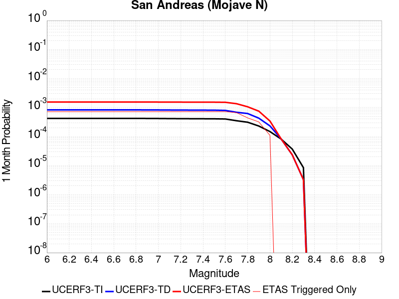 |  |  |

| Magnitude | 1 wk TI Prob | 1 wk TD Prob | 1 wk ETAS Prob | 1 wk ETAS/TD Gain | 1 wk ETAS Triggered Only | 1 mo TI Prob | 1 mo TD Prob | 1 mo ETAS Prob | 1 mo ETAS/TD Gain | 1 mo ETAS Triggered Only | 1 yr TI Prob | 1 yr TD Prob | 1 yr ETAS Prob | 1 yr ETAS/TD Gain | 1 yr ETAS Triggered Only | 10 yr TI Prob | 10 yr TD Prob | 10 yr ETAS Prob | 10 yr ETAS/TD Gain | 10 yr ETAS Triggered Only |
|-----|-----|-----|-----|-----|-----|-----|-----|-----|-----|-----|-----|-----|-----|-----|-----|-----|-----|-----|-----|-----|
| 6.0 | 9.877682E-5 | 1.9410432E-4 | 4.5405384E-4 | 2.339226 | 2.6E-4 | 4.2326056E-4 | 8.3161064E-4 | 0.0015510118 | 1.8650697 | 7.2E-4 | 0.0051410277 | 0.010077983 | 0.01188954 | 1.1797539 | 0.00183 | 0.05023708 | 0.098361015 | 0.1008315 | 1.0251166 | 0.00274 |
| 6.1 | 9.877682E-5 | 1.9410432E-4 | 4.5405384E-4 | 2.339226 | 2.6E-4 | 4.2326056E-4 | 8.3161064E-4 | 0.0015510118 | 1.8650697 | 7.2E-4 | 0.0051410277 | 0.010077983 | 0.01188954 | 1.1797539 | 0.00183 | 0.05023708 | 0.098361015 | 0.1008315 | 1.0251166 | 0.00274 |
| 6.2 | 9.877682E-5 | 1.9410432E-4 | 4.5405384E-4 | 2.339226 | 2.6E-4 | 4.2326056E-4 | 8.3161064E-4 | 0.0015510118 | 1.8650697 | 7.2E-4 | 0.0051410277 | 0.010077983 | 0.01188954 | 1.1797539 | 0.00183 | 0.05023708 | 0.098361015 | 0.1008315 | 1.0251166 | 0.00274 |
| 6.3 | 9.877682E-5 | 1.9410432E-4 | 4.5405384E-4 | 2.339226 | 2.6E-4 | 4.2326056E-4 | 8.3161064E-4 | 0.0015510118 | 1.8650697 | 7.2E-4 | 0.0051410277 | 0.010077983 | 0.01188954 | 1.1797539 | 0.00183 | 0.05023708 | 0.098361015 | 0.1008315 | 1.0251166 | 0.00274 |
| 6.4 | 9.877682E-5 | 1.9410432E-4 | 4.5405384E-4 | 2.339226 | 2.6E-4 | 4.2326056E-4 | 8.3161064E-4 | 0.0015510118 | 1.8650697 | 7.2E-4 | 0.0051410277 | 0.010077983 | 0.01188954 | 1.1797539 | 0.00183 | 0.05023708 | 0.098361015 | 0.1008315 | 1.0251166 | 0.00274 |
| 6.5 | 9.861474E-5 | 1.9384196E-4 | 4.5379155E-4 | 2.341039 | 2.6E-4 | 4.2256617E-4 | 8.3048694E-4 | 0.001549889 | 1.8662412 | 7.2E-4 | 0.0051326132 | 0.010064429 | 0.01187601 | 1.1799985 | 0.00183 | 0.050156746 | 0.09823856 | 0.100709386 | 1.0251513 | 0.00274 |
| 6.6 | 9.861474E-5 | 1.9384196E-4 | 4.5379155E-4 | 2.341039 | 2.6E-4 | 4.2256617E-4 | 8.3048694E-4 | 0.001549889 | 1.8662412 | 7.2E-4 | 0.0051326132 | 0.010064429 | 0.01187601 | 1.1799985 | 0.00183 | 0.050156746 | 0.09823856 | 0.100709386 | 1.0251513 | 0.00274 |
| 6.7 | 9.8552715E-5 | 1.9374148E-4 | 4.5369111E-4 | 2.3417344 | 2.6E-4 | 4.223004E-4 | 8.300566E-4 | 0.001549459 | 1.8666908 | 7.2E-4 | 0.0051293927 | 0.0100592375 | 0.011870829 | 1.1800923 | 0.00183 | 0.050125998 | 0.098191775 | 0.10066272 | 1.0251646 | 0.00274 |
| 6.8 | 9.8464974E-5 | 1.9359306E-4 | 4.5354274E-4 | 2.3427634 | 2.6E-4 | 4.219245E-4 | 8.294209E-4 | 0.0015488238 | 1.8673555 | 7.2E-4 | 0.0051248376 | 0.01005157 | 0.011863176 | 1.1802311 | 0.00183 | 0.05008251 | 0.09812213 | 0.10059327 | 1.0251844 | 0.00274 |
| 6.9 | 9.825824E-5 | 1.9327311E-4 | 4.5322286E-4 | 2.3449867 | 2.6E-4 | 4.2103877E-4 | 8.2805054E-4 | 0.0015474544 | 1.8687922 | 7.2E-4 | 0.0051141046 | 0.010035039 | 0.011846675 | 1.180531 | 0.00183 | 0.049980022 | 0.09797137 | 0.10044292 | 1.0252273 | 0.00274 |
| 7.0 | 9.781462E-5 | 1.9258665E-4 | 4.525366E-4 | 2.3497818 | 2.6E-4 | 4.1913814E-4 | 8.251105E-4 | 0.0015445164 | 1.8718904 | 7.2E-4 | 0.005091073 | 0.009999573 | 0.011811273 | 1.1811779 | 0.00183 | 0.04976007 | 0.09764758 | 0.10012002 | 1.02532 | 0.00274 |
| 7.1 | 9.7121134E-5 | 1.9160361E-4 | 4.515538E-4 | 2.356708 | 2.6E-4 | 4.1616702E-4 | 8.2090014E-4 | 0.001540309 | 1.876366 | 7.2E-4 | 0.005055068 | 0.009948781 | 0.011760575 | 1.1821121 | 0.00183 | 0.04941613 | 0.09718397 | 0.099657685 | 1.0254539 | 0.00274 |
| 7.2 | 9.663819E-5 | 1.9091136E-4 | 4.5086173E-4 | 2.3616285 | 2.6E-4 | 4.1409794E-4 | 8.179352E-4 | 0.0015373463 | 1.8795453 | 7.2E-4 | 0.0050299936 | 0.009913012 | 0.011724872 | 1.1827759 | 0.00183 | 0.049176537 | 0.09685706 | 0.09933168 | 1.025549 | 0.00274 |
| 7.3 | 9.6277574E-5 | 1.9043636E-4 | 4.5038684E-4 | 2.3650255 | 2.6E-4 | 4.125529E-4 | 8.1590074E-4 | 0.0015353133 | 1.8817403 | 7.2E-4 | 0.0050112694 | 0.009888468 | 0.011700372 | 1.1832341 | 0.00183 | 0.04899759 | 0.09663044 | 0.09910567 | 1.0256155 | 0.00274 |
| 7.4 | 9.593308E-5 | 1.8983395E-4 | 4.497846E-4 | 2.369358 | 2.6E-4 | 4.1107697E-4 | 8.133206E-4 | 0.0015327351 | 1.8845397 | 7.2E-4 | 0.0049933824 | 0.00985734 | 0.011659399 | 1.182814 | 0.00182 | 0.04882661 | 0.09634874 | 0.09881571 | 1.0256046 | 0.00273 |
| 7.5 | 9.561707E-5 | 1.892946E-4 | 4.492454E-4 | 2.3732605 | 2.6E-4 | 4.0972308E-4 | 8.1101054E-4 | 0.0015304266 | 1.8870614 | 7.2E-4 | 0.0049769743 | 0.009829468 | 0.011631579 | 1.1833376 | 0.00182 | 0.048669744 | 0.09609495 | 0.09856261 | 1.0256793 | 0.00273 |
| 7.6 | 9.418194E-5 | 1.858169E-4 | 4.457686E-4 | 2.3989668 | 2.6E-4 | 4.0357444E-4 | 7.961153E-4 | 0.001515542 | 1.9036716 | 7.2E-4 | 0.004902454 | 0.009649739 | 0.011452177 | 1.1867862 | 0.00182 | 0.047957025 | 0.094475985 | 0.096948065 | 1.0261662 | 0.00273 |
| 7.7 | 8.202141E-5 | 1.6029968E-4 | 3.902628E-4 | 2.4345825 | 2.3E-4 | 3.51473E-4 | 6.868178E-4 | 0.0013563576 | 1.9748434 | 6.7E-4 | 0.00427079 | 0.008330002 | 0.009966258 | 1.1964291 | 0.00165 | 0.04189639 | 0.08226986 | 0.084518306 | 1.02733 | 0.00245 |
| 7.8 | 7.2859846E-5 | 1.452426E-4 | 3.2521645E-4 | 2.239126 | 1.8E-4 | 3.1221908E-4 | 6.223198E-4 | 0.0010620459 | 1.706592 | 4.4E-4 | 0.003794643 | 0.007550463 | 0.008632233 | 1.143272 | 0.00109 | 0.037304975 | 0.074759446 | 0.07623058 | 1.0196782 | 0.00159 |
| 7.9 | 5.3874453E-5 | 1.0051061E-4 | 2.3049754E-4 | 2.2932658 | 1.3E-4 | 2.3087008E-4 | 4.3068864E-4 | 7.505508E-4 | 1.7426761 | 3.2E-4 | 0.0028072202 | 0.005231038 | 0.005857743 | 1.119805 | 6.3E-4 | 0.02772022 | 0.052449387 | 0.05326428 | 1.0155368 | 8.6E-4 |
| 8.0 | 3.468538E-5 | 5.4289703E-5 | 9.4287534E-5 | 1.736748 | 4.0E-5 | 1.4864317E-4 | 2.3264941E-4 | 3.4262383E-4 | 1.4727044 | 1.1E-4 | 0.0018082283 | 0.0028288292 | 0.0030382352 | 1.0740256 | 2.1E-4 | 0.017935853 | 0.028961731 | 0.029223911 | 1.0090526 | 2.7E-4 |
| 8.1 | 1.9152367E-5 | 1.9414629E-5 | 1.9414629E-5 | 1.0 | 0.0 | 8.207899E-5 | 8.3202896E-5 | 8.3202896E-5 | 1.0 | 0.0 | 9.988535E-4 | 0.0010125252 | 0.0010125252 | 1.0 | 0.0 | 0.009943757 | 0.010862543 | 0.010872435 | 1.0009106 | 1.0E-5 |
| 8.2 | 8.643924E-6 | 5.478665E-6 | 5.478665E-6 | 1.0 | 0.0 | 3.704486E-5 | 2.3479783E-5 | 2.3479783E-5 | 1.0 | 0.0 | 4.5092785E-4 | 2.8582895E-4 | 2.8582895E-4 | 1.0 | 0.0 | 0.0045001395 | 0.0032508469 | 0.0032508469 | 1.0 | 0.0 |
| 8.3 | 1.983087E-6 | 7.6647797E-7 | 7.6647797E-7 | 1.0 | 0.0 | 8.498917E-6 | 3.2849016E-6 | 3.2849016E-6 | 1.0 | 0.0 | 1.034694E-4 | 3.999296E-5 | 3.999296E-5 | 1.0 | 0.0 | 0.0010342124 | 4.7228087E-4 | 4.7228087E-4 | 1.0 | 0.0 |

## Towne Pass
*[(top)](#table-of-contents)*

| 1 Week | 1 Month | 1 Year | 10 Year |
|-----|-----|-----|-----|
|  | 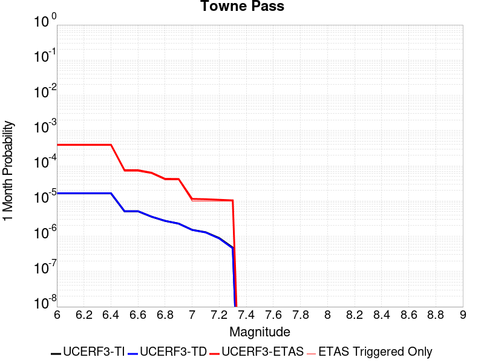 | 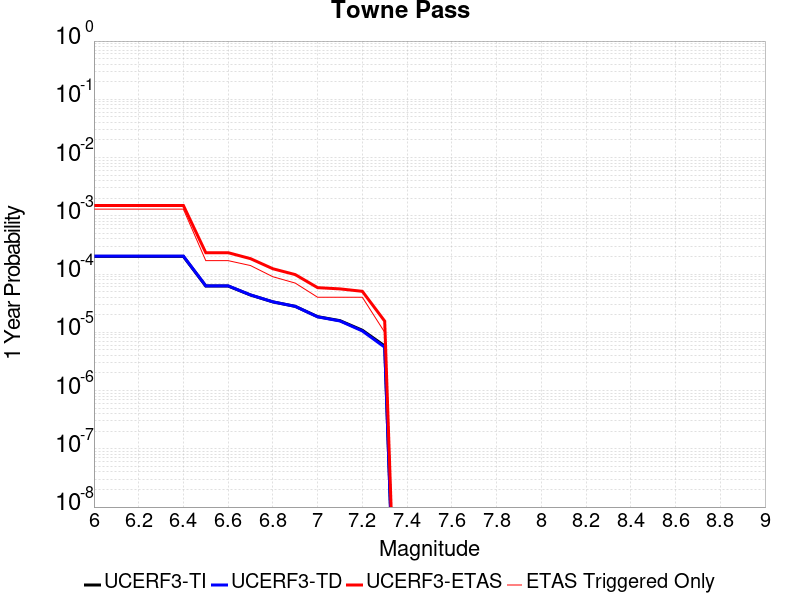 |  |

| Magnitude | 1 wk TI Prob | 1 wk TD Prob | 1 wk ETAS Prob | 1 wk ETAS/TD Gain | 1 wk ETAS Triggered Only | 1 mo TI Prob | 1 mo TD Prob | 1 mo ETAS Prob | 1 mo ETAS/TD Gain | 1 mo ETAS Triggered Only | 1 yr TI Prob | 1 yr TD Prob | 1 yr ETAS Prob | 1 yr ETAS/TD Gain | 1 yr ETAS Triggered Only | 10 yr TI Prob | 10 yr TD Prob | 10 yr ETAS Prob | 10 yr ETAS/TD Gain | 10 yr ETAS Triggered Only |
|-----|-----|-----|-----|-----|-----|-----|-----|-----|-----|-----|-----|-----|-----|-----|-----|-----|-----|-----|-----|-----|
| 6.0 | 3.849728E-6 | 3.8945495E-6 | 1.7389389E-4 | 44.650578 | 1.7E-4 | 1.649873E-5 | 1.6690845E-5 | 3.966845E-4 | 23.766592 | 3.8E-4 | 2.0085352E-4 | 2.0319647E-4 | 0.0015029323 | 7.396449 | 0.0013 | 0.0020067208 | 0.0020305358 | 0.0044256626 | 2.179554 | 0.0024 |
| 6.1 | 3.849728E-6 | 3.8945495E-6 | 1.7389389E-4 | 44.650578 | 1.7E-4 | 1.649873E-5 | 1.6690845E-5 | 3.966845E-4 | 23.766592 | 3.8E-4 | 2.0085352E-4 | 2.0319647E-4 | 0.0015029323 | 7.396449 | 0.0013 | 0.0020067208 | 0.0020305358 | 0.0044256626 | 2.179554 | 0.0024 |
| 6.2 | 3.849728E-6 | 3.8945495E-6 | 1.7389389E-4 | 44.650578 | 1.7E-4 | 1.649873E-5 | 1.6690845E-5 | 3.966845E-4 | 23.766592 | 3.8E-4 | 2.0085352E-4 | 2.0319647E-4 | 0.0015029323 | 7.396449 | 0.0013 | 0.0020067208 | 0.0020305358 | 0.0044256626 | 2.179554 | 0.0024 |
| 6.3 | 3.849728E-6 | 3.8945495E-6 | 1.7389389E-4 | 44.650578 | 1.7E-4 | 1.649873E-5 | 1.6690845E-5 | 3.966845E-4 | 23.766592 | 3.8E-4 | 2.0085352E-4 | 2.0319647E-4 | 0.0015029323 | 7.396449 | 0.0013 | 0.0020067208 | 0.0020305358 | 0.0044256626 | 2.179554 | 0.0024 |
| 6.4 | 3.849728E-6 | 3.8945495E-6 | 1.7389389E-4 | 44.650578 | 1.7E-4 | 1.649873E-5 | 1.6690845E-5 | 3.966845E-4 | 23.766592 | 3.8E-4 | 2.0085352E-4 | 2.0319647E-4 | 0.0015029323 | 7.396449 | 0.0013 | 0.0020067208 | 0.0020305358 | 0.0044256626 | 2.179554 | 0.0024 |
| 6.5 | 1.1953545E-6 | 1.2030554E-6 | 4.1203006E-5 | 34.24864 | 4.0E-5 | 5.1229376E-6 | 5.1559423E-6 | 7.515558E-5 | 14.576498 | 7.0E-5 | 6.236998E-5 | 6.2771906E-5 | 2.3276123E-4 | 3.7080479 | 1.7E-4 | 6.235248E-4 | 6.275535E-4 | 9.3735894E-4 | 1.4936718 | 3.1E-4 |
| 6.6 | 1.1953545E-6 | 1.2030554E-6 | 4.1203006E-5 | 34.24864 | 4.0E-5 | 5.1229376E-6 | 5.1559423E-6 | 7.515558E-5 | 14.576498 | 7.0E-5 | 6.236998E-5 | 6.2771906E-5 | 2.3276123E-4 | 3.7080479 | 1.7E-4 | 6.235248E-4 | 6.275535E-4 | 9.3735894E-4 | 1.4936718 | 3.1E-4 |
| 6.7 | 8.375951E-7 | 8.4106983E-7 | 3.0841045E-5 | 36.668827 | 3.0E-5 | 3.5896885E-6 | 3.6045803E-6 | 6.360436E-5 | 17.645428 | 6.0E-5 | 4.370358E-5 | 4.388494E-5 | 1.838788E-4 | 4.1900206 | 1.4E-4 | 4.3694986E-4 | 4.3876845E-4 | 6.6866755E-4 | 1.5239645 | 2.3E-4 |
| 6.8 | 6.38041E-7 | 6.392181E-7 | 2.0639205E-5 | 32.288204 | 2.0E-5 | 2.7344586E-6 | 2.7395035E-6 | 4.2739393E-5 | 15.601146 | 4.0E-5 | 3.3291526E-5 | 3.3352986E-5 | 1.2334998E-4 | 3.6983192 | 9.0E-5 | 3.3286537E-4 | 3.334836E-4 | 4.8343357E-4 | 1.4496472 | 1.5E-4 |
| 6.9 | 5.3460053E-7 | 5.345356E-7 | 2.0534524E-5 | 38.415634 | 2.0E-5 | 2.2911431E-6 | 2.290865E-6 | 4.2290772E-5 | 18.460613 | 4.0E-5 | 2.789431E-5 | 2.789096E-5 | 9.788901E-5 | 3.5097039 | 7.0E-5 | 2.789081E-4 | 2.788779E-4 | 3.9884445E-4 | 1.4301758 | 1.2E-4 |
| 7.0 | 3.557783E-7 | 3.5324425E-7 | 3.5324425E-7 | 1.0 | 0.0 | 1.5247632E-6 | 1.513903E-6 | 1.1513888E-5 | 7.6054325 | 1.0E-5 | 1.8563835E-5 | 1.8431623E-5 | 5.8430884E-5 | 3.1701434 | 4.0E-5 | 1.8562283E-4 | 1.8430178E-4 | 2.5428887E-4 | 1.3797419 | 7.0E-5 |
| 7.1 | 3.037942E-7 | 3.00024E-7 | 3.00024E-7 | 1.0 | 0.0 | 1.3019744E-6 | 1.2858166E-6 | 1.1285803E-5 | 8.777149 | 1.0E-5 | 1.5851423E-5 | 1.5654712E-5 | 5.5654084E-5 | 3.5551014 | 4.0E-5 | 1.5850292E-4 | 1.5653683E-4 | 2.2652588E-4 | 1.4471091 | 7.0E-5 |
| 7.2 | 2.0808248E-7 | 2.0217831E-7 | 2.0217831E-7 | 1.0 | 0.0 | 8.917818E-7 | 8.664782E-7 | 1.086647E-5 | 12.540961 | 1.0E-5 | 1.0857389E-5 | 1.0549326E-5 | 5.0548904E-5 | 4.7916713 | 4.0E-5 | 1.0856859E-4 | 1.0548872E-4 | 1.7548133E-4 | 1.663508 | 7.0E-5 |
| 7.3 | 1.1162073E-7 | 1.0636953E-7 | 1.0636953E-7 | 1.0 | 0.0 | 4.7837443E-7 | 4.5586933E-7 | 1.0455865E-5 | 22.9361 | 1.0E-5 | 5.8241935E-6 | 5.550197E-6 | 1.5550142E-5 | 2.8017278 | 1.0E-5 | 5.8240406E-5 | 5.5500783E-5 | 9.5498566E-5 | 1.7206706 | 4.0E-5 |

## Lenwood-Lockhart-Old Woman Springs
*[(top)](#table-of-contents)*

| 1 Week | 1 Month | 1 Year | 10 Year |
|-----|-----|-----|-----|
|  |  |  |  |

| Magnitude | 1 wk TI Prob | 1 wk TD Prob | 1 wk ETAS Prob | 1 wk ETAS/TD Gain | 1 wk ETAS Triggered Only | 1 mo TI Prob | 1 mo TD Prob | 1 mo ETAS Prob | 1 mo ETAS/TD Gain | 1 mo ETAS Triggered Only | 1 yr TI Prob | 1 yr TD Prob | 1 yr ETAS Prob | 1 yr ETAS/TD Gain | 1 yr ETAS Triggered Only | 10 yr TI Prob | 10 yr TD Prob | 10 yr ETAS Prob | 10 yr ETAS/TD Gain | 10 yr ETAS Triggered Only |
|-----|-----|-----|-----|-----|-----|-----|-----|-----|-----|-----|-----|-----|-----|-----|-----|-----|-----|-----|-----|-----|
| 6.0 | 3.744542E-5 | 4.3963868E-5 | 1.1396079E-4 | 2.5921466 | 7.0E-5 | 1.604705E-4 | 1.8840394E-4 | 5.883286E-4 | 3.1226978 | 4.0E-4 | 0.0019519776 | 0.002291577 | 0.003359125 | 1.4658574 | 0.00107 | 0.019349206 | 0.022697475 | 0.024573896 | 1.0826709 | 0.00192 |
| 6.1 | 3.744542E-5 | 4.3963868E-5 | 1.1396079E-4 | 2.5921466 | 7.0E-5 | 1.604705E-4 | 1.8840394E-4 | 5.883286E-4 | 3.1226978 | 4.0E-4 | 0.0019519776 | 0.002291577 | 0.003359125 | 1.4658574 | 0.00107 | 0.019349206 | 0.022697475 | 0.024573896 | 1.0826709 | 0.00192 |
| 6.2 | 3.744542E-5 | 4.3963868E-5 | 1.1396079E-4 | 2.5921466 | 7.0E-5 | 1.604705E-4 | 1.8840394E-4 | 5.883286E-4 | 3.1226978 | 4.0E-4 | 0.0019519776 | 0.002291577 | 0.003359125 | 1.4658574 | 0.00107 | 0.019349206 | 0.022697475 | 0.024573896 | 1.0826709 | 0.00192 |
| 6.3 | 2.1079984E-5 | 2.5354482E-5 | 4.5353976E-5 | 1.7887951 | 2.0E-5 | 9.0339665E-5 | 1.0865765E-4 | 3.2863376E-4 | 3.0244877 | 2.2E-4 | 0.0010993304 | 0.0013221242 | 0.0018014895 | 1.3625722 | 4.8E-4 | 0.010939079 | 0.013144798 | 0.013973757 | 1.0630636 | 8.4E-4 |
| 6.4 | 2.1079984E-5 | 2.5354482E-5 | 4.5353976E-5 | 1.7887951 | 2.0E-5 | 9.0339665E-5 | 1.0865765E-4 | 3.2863376E-4 | 3.0244877 | 2.2E-4 | 0.0010993304 | 0.0013221242 | 0.0018014895 | 1.3625722 | 4.8E-4 | 0.010939079 | 0.013144798 | 0.013973757 | 1.0630636 | 8.4E-4 |
| 6.5 | 1.7397282E-5 | 2.0663358E-5 | 4.0662944E-5 | 1.9678769 | 2.0E-5 | 7.455765E-5 | 8.855431E-5 | 2.4854013E-4 | 2.8066409 | 1.6E-4 | 9.073613E-4 | 0.0010776272 | 0.0013972824 | 1.2966287 | 3.2E-4 | 0.009036654 | 0.010725311 | 0.011328768 | 1.0562648 | 6.1E-4 |
| 6.6 | 1.52050325E-5 | 1.7680148E-5 | 2.7679971E-5 | 1.5655961 | 1.0E-5 | 6.51628E-5 | 7.57699E-5 | 1.8576157E-4 | 2.4516537 | 1.1E-4 | 7.9306826E-4 | 9.2211604E-4 | 0.001191867 | 1.2925348 | 2.7E-4 | 0.007902439 | 0.009183761 | 0.00972871 | 1.0593383 | 5.5E-4 |
| 6.7 | 1.332523E-5 | 1.5264432E-5 | 2.526428E-5 | 1.6551077 | 1.0E-5 | 5.7106878E-5 | 6.5417385E-5 | 1.6541085E-4 | 2.5285456 | 1.0E-4 | 6.950544E-4 | 7.961715E-4 | 0.0010359804 | 1.3012025 | 2.4E-4 | 0.006928845 | 0.0079338215 | 0.008419934 | 1.061271 | 4.9E-4 |
| 6.8 | 1.1525329E-5 | 1.3031408E-5 | 2.3031278E-5 | 1.7673668 | 1.0E-5 | 4.9393333E-5 | 5.584772E-5 | 1.5584214E-4 | 2.7904835 | 1.0E-4 | 6.011979E-4 | 6.797381E-4 | 8.6960895E-4 | 1.2793294 | 1.9E-4 | 0.00599574 | 0.0067770416 | 0.007164398 | 1.0571573 | 3.9E-4 |
| 6.9 | 1.0253909E-5 | 1.15148705E-5 | 1.15148705E-5 | 1.0 | 0.0 | 4.3944583E-5 | 4.9348535E-5 | 1.2934458E-4 | 2.6210423 | 8.0E-5 | 5.3489394E-4 | 6.006564E-4 | 7.405723E-4 | 1.2329384 | 1.4E-4 | 0.0053360825 | 0.0059907082 | 0.006288911 | 1.0497775 | 3.0E-4 |
| 7.0 | 8.104563E-6 | 8.9914565E-6 | 8.9914565E-6 | 1.0 | 0.0 | 3.4733377E-5 | 3.8534257E-5 | 8.853233E-5 | 2.2974968 | 5.0E-5 | 4.2279682E-4 | 4.69056E-4 | 5.5901374E-4 | 1.1917847 | 9.0E-5 | 0.0042199334 | 0.004680908 | 0.0048799715 | 1.0425267 | 2.0E-4 |
| 7.1 | 6.7986157E-6 | 7.5159987E-6 | 7.5159987E-6 | 1.0 | 0.0 | 2.91366E-5 | 3.221104E-5 | 7.220975E-5 | 2.2417703 | 4.0E-5 | 3.5468035E-4 | 3.9210095E-4 | 4.5207742E-4 | 1.1529619 | 6.0E-5 | 0.003541148 | 0.003914308 | 0.004043799 | 1.0330815 | 1.3E-4 |
| 7.2 | 5.6893327E-6 | 6.2801455E-6 | 6.2801455E-6 | 1.0 | 0.0 | 2.4382627E-5 | 2.6914644E-5 | 4.6914105E-5 | 1.7430699 | 2.0E-5 | 2.9681803E-4 | 3.276385E-4 | 3.6762538E-4 | 1.1220458 | 4.0E-5 | 0.002964219 | 0.0032717532 | 0.0033813934 | 1.0335112 | 1.1E-4 |
| 7.3 | 4.253348E-6 | 4.707082E-6 | 4.707082E-6 | 1.0 | 0.0 | 1.8228506E-5 | 2.0173064E-5 | 4.017266E-5 | 1.9914011 | 2.0E-5 | 2.2190946E-4 | 2.455812E-4 | 2.8557138E-4 | 1.1628389 | 4.0E-5 | 0.00221688 | 0.0024532792 | 0.0025530339 | 1.0406618 | 1.0E-4 |
| 7.4 | 2.5448119E-6 | 2.8520615E-6 | 2.8520615E-6 | 1.0 | 0.0 | 1.0906291E-5 | 1.2223072E-5 | 3.222283E-5 | 2.6362298 | 2.0E-5 | 1.3277601E-4 | 1.488074E-4 | 1.6880443E-4 | 1.1343819 | 2.0E-5 | 0.001326967 | 0.0014872397 | 0.0015371654 | 1.0335693 | 5.0E-5 |
| 7.5 | 4.3706837E-8 | 4.5629356E-8 | 4.5629356E-8 | 1.0 | 0.0 | 1.8731501E-7 | 1.9555438E-7 | 1.9555438E-7 | 1.0 | 0.0 | 2.2805577E-6 | 2.3808725E-6 | 2.3808725E-6 | 1.0 | 0.0 | 2.2805343E-5 | 2.3808525E-5 | 2.3808525E-5 | 1.0 | 0.0 |

## Bicycle Lake
*[(top)](#table-of-contents)*

| 1 Week | 1 Month | 1 Year | 10 Year |
|-----|-----|-----|-----|
|  |  | 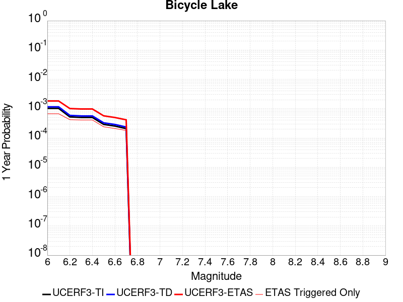 |  |

| Magnitude | 1 wk TI Prob | 1 wk TD Prob | 1 wk ETAS Prob | 1 wk ETAS/TD Gain | 1 wk ETAS Triggered Only | 1 mo TI Prob | 1 mo TD Prob | 1 mo ETAS Prob | 1 mo ETAS/TD Gain | 1 mo ETAS Triggered Only | 1 yr TI Prob | 1 yr TD Prob | 1 yr ETAS Prob | 1 yr ETAS/TD Gain | 1 yr ETAS Triggered Only | 10 yr TI Prob | 10 yr TD Prob | 10 yr ETAS Prob | 10 yr ETAS/TD Gain | 10 yr ETAS Triggered Only |
|-----|-----|-----|-----|-----|-----|-----|-----|-----|-----|-----|-----|-----|-----|-----|-----|-----|-----|-----|-----|-----|
| 6.0 | 1.9621975E-5 | 2.2097447E-5 | 8.209612E-5 | 3.7151856 | 6.0E-5 | 8.4091465E-5 | 9.470067E-5 | 2.746836E-4 | 2.9005456 | 1.8E-4 | 0.0010233327 | 0.0011525059 | 0.0018217337 | 1.580672 | 6.7E-4 | 0.01018633 | 0.011478599 | 0.012743907 | 1.1102319 | 0.00128 |
| 6.1 | 1.9621975E-5 | 2.2097447E-5 | 8.209612E-5 | 3.7151856 | 6.0E-5 | 8.4091465E-5 | 9.470067E-5 | 2.746836E-4 | 2.9005456 | 1.8E-4 | 0.0010233327 | 0.0011525059 | 0.0018217337 | 1.580672 | 6.7E-4 | 0.01018633 | 0.011478599 | 0.012743907 | 1.1102319 | 0.00128 |
| 6.2 | 9.9971285E-6 | 1.1255827E-5 | 6.125526E-5 | 5.4420934 | 5.0E-5 | 4.2844134E-5 | 4.8238664E-5 | 1.6823287E-4 | 3.4875112 | 1.2E-4 | 5.2150246E-4 | 5.8719947E-4 | 0.0010069528 | 1.7148395 | 4.2E-4 | 0.0052028033 | 0.0058615846 | 0.0066668363 | 1.1373779 | 8.1E-4 |
| 6.3 | 9.589428E-6 | 1.0798527E-5 | 6.0797985E-5 | 5.6302114 | 5.0E-5 | 4.10969E-5 | 4.627887E-5 | 1.6627331E-4 | 3.592856 | 1.2E-4 | 5.002399E-4 | 5.633515E-4 | 9.731205E-4 | 1.7273772 | 4.1E-4 | 0.0049911533 | 0.0056243236 | 0.006419824 | 1.1414393 | 8.0E-4 |
| 6.4 | 9.589428E-6 | 1.0798527E-5 | 6.0797985E-5 | 5.6302114 | 5.0E-5 | 4.10969E-5 | 4.627887E-5 | 1.6627331E-4 | 3.592856 | 1.2E-4 | 5.002399E-4 | 5.633515E-4 | 9.731205E-4 | 1.7273772 | 4.1E-4 | 0.0049911533 | 0.0056243236 | 0.006419824 | 1.1414393 | 8.0E-4 |
| 6.5 | 5.557707E-6 | 6.2857107E-6 | 4.628546E-5 | 7.3636 | 4.0E-5 | 2.3818526E-5 | 2.6938633E-5 | 1.1693621E-4 | 4.3408365 | 9.0E-5 | 2.8995197E-4 | 3.2795538E-4 | 5.678767E-4 | 1.7315669 | 2.4E-4 | 0.0028957394 | 0.0032773504 | 0.0037956461 | 1.1581447 | 5.2E-4 |
| 6.6 | 4.8742945E-6 | 5.5133855E-6 | 4.5513167E-5 | 8.255031 | 4.0E-5 | 2.0889667E-5 | 2.3628729E-5 | 1.0362684E-4 | 4.385629 | 8.0E-5 | 2.54302E-4 | 2.87668E-4 | 4.976076E-4 | 1.7297982 | 2.1E-4 | 0.002540112 | 0.0028755253 | 0.00331426 | 1.1525755 | 4.4E-4 |
| 6.7 | 3.991108E-6 | 4.515989E-6 | 4.4515808E-5 | 9.857377 | 4.0E-5 | 1.7104636E-5 | 1.9354238E-5 | 7.935308E-5 | 4.100036 | 6.0E-5 | 2.0822904E-4 | 2.3563785E-4 | 4.1559545E-4 | 1.7637041 | 1.8E-4 | 0.0020803404 | 0.0023563786 | 0.0027055538 | 1.148183 | 3.5E-4 |

## Paradise
*[(top)](#table-of-contents)*

| 1 Week | 1 Month | 1 Year | 10 Year |
|-----|-----|-----|-----|
| 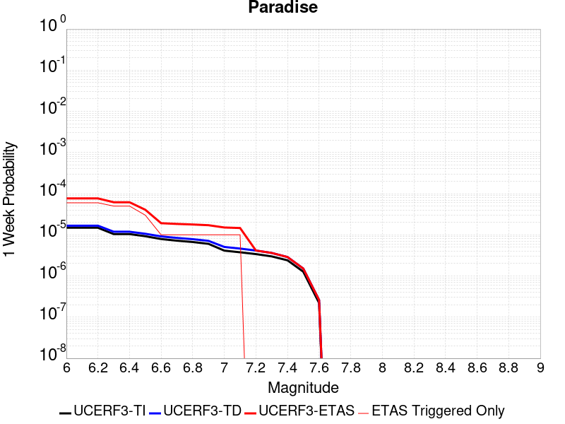 |  |  | 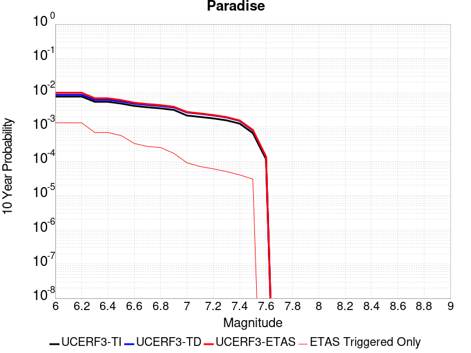 |

| Magnitude | 1 wk TI Prob | 1 wk TD Prob | 1 wk ETAS Prob | 1 wk ETAS/TD Gain | 1 wk ETAS Triggered Only | 1 mo TI Prob | 1 mo TD Prob | 1 mo ETAS Prob | 1 mo ETAS/TD Gain | 1 mo ETAS Triggered Only | 1 yr TI Prob | 1 yr TD Prob | 1 yr ETAS Prob | 1 yr ETAS/TD Gain | 1 yr ETAS Triggered Only | 10 yr TI Prob | 10 yr TD Prob | 10 yr ETAS Prob | 10 yr ETAS/TD Gain | 10 yr ETAS Triggered Only |
|-----|-----|-----|-----|-----|-----|-----|-----|-----|-----|-----|-----|-----|-----|-----|-----|-----|-----|-----|-----|-----|
| 6.0 | 1.4851273E-5 | 1.6694923E-5 | 7.669392E-5 | 4.593847 | 6.0E-5 | 6.364676E-5 | 7.1547845E-5 | 2.4153569E-4 | 3.3758624 | 1.7E-4 | 7.7462377E-4 | 8.707705E-4 | 0.0015202045 | 1.7458154 | 6.5E-4 | 0.0077192914 | 0.008675965 | 0.009984513 | 1.1508244 | 0.00132 |
| 6.1 | 1.4851273E-5 | 1.6694923E-5 | 7.669392E-5 | 4.593847 | 6.0E-5 | 6.364676E-5 | 7.1547845E-5 | 2.4153569E-4 | 3.3758624 | 1.7E-4 | 7.7462377E-4 | 8.707705E-4 | 0.0015202045 | 1.7458154 | 6.5E-4 | 0.0077192914 | 0.008675965 | 0.009984513 | 1.1508244 | 0.00132 |
| 6.2 | 1.4851273E-5 | 1.6694923E-5 | 7.669392E-5 | 4.593847 | 6.0E-5 | 6.364676E-5 | 7.1547845E-5 | 2.4153569E-4 | 3.3758624 | 1.7E-4 | 7.7462377E-4 | 8.707705E-4 | 0.0015202045 | 1.7458154 | 6.5E-4 | 0.0077192914 | 0.008675965 | 0.009984513 | 1.1508244 | 0.00132 |
| 6.3 | 1.0426831E-5 | 1.1888797E-5 | 6.1888204E-5 | 5.20559 | 5.0E-5 | 4.4685654E-5 | 5.095103E-5 | 1.8094441E-4 | 3.5513396 | 1.3E-4 | 5.43912E-4 | 6.2015816E-4 | 9.899287E-4 | 1.596252 | 3.7E-4 | 0.0054258266 | 0.0061848834 | 0.006870616 | 1.1108723 | 6.9E-4 |
| 6.4 | 1.0426831E-5 | 1.1888797E-5 | 6.1888204E-5 | 5.20559 | 5.0E-5 | 4.4685654E-5 | 5.095103E-5 | 1.8094441E-4 | 3.5513396 | 1.3E-4 | 5.43912E-4 | 6.2015816E-4 | 9.899287E-4 | 1.596252 | 3.7E-4 | 0.0054258266 | 0.0061848834 | 0.006870616 | 1.1108723 | 6.9E-4 |
| 6.5 | 9.25027E-6 | 1.0620124E-5 | 4.0619805E-5 | 3.8247957 | 3.0E-5 | 3.964341E-5 | 4.551405E-5 | 1.2551041E-4 | 2.757619 | 8.0E-5 | 4.8255164E-4 | 5.539976E-4 | 8.438369E-4 | 1.523178 | 2.9E-4 | 0.0048150513 | 0.0055266647 | 0.0060835695 | 1.1007669 | 5.6E-4 |
| 6.6 | 7.904275E-6 | 9.159673E-6 | 1.9159581E-5 | 2.091732 | 1.0E-5 | 3.3875025E-5 | 3.925517E-5 | 9.9252815E-5 | 2.5284011 | 6.0E-5 | 4.1235037E-4 | 4.7783085E-4 | 6.877305E-4 | 1.4392761 | 2.1E-4 | 0.0041158604 | 0.004768431 | 0.0050968574 | 1.0688752 | 3.3E-4 |
| 6.7 | 7.2061953E-6 | 8.407388E-6 | 1.8407305E-5 | 2.18942 | 1.0E-5 | 3.088333E-5 | 3.6031186E-5 | 8.602939E-5 | 2.3876367 | 5.0E-5 | 3.7593965E-4 | 4.3859507E-4 | 6.085205E-4 | 1.3874313 | 1.7E-4 | 0.003753043 | 0.0043776636 | 0.0046464815 | 1.0614067 | 2.7E-4 |
| 6.8 | 6.6948724E-6 | 7.842299E-6 | 1.7842221E-5 | 2.2751262 | 1.0E-5 | 2.8691995E-5 | 3.360944E-5 | 8.360776E-5 | 2.4876273 | 5.0E-5 | 3.4926904E-4 | 4.0912168E-4 | 5.6905625E-4 | 1.3909217 | 1.6E-4 | 0.003487206 | 0.0040840427 | 0.0043330216 | 1.0609639 | 2.5E-4 |
| 6.9 | 6.0421025E-6 | 7.130747E-6 | 1.7130676E-5 | 2.4023676 | 1.0E-5 | 2.5894467E-5 | 3.0560004E-5 | 7.055878E-5 | 2.3088603 | 4.0E-5 | 3.1521954E-4 | 3.7200793E-4 | 4.8196703E-4 | 1.2955827 | 1.1E-4 | 0.0031477278 | 0.0037141903 | 0.0038835588 | 1.0456004 | 1.7E-4 |
| 7.0 | 4.134091E-6 | 5.080416E-6 | 1.5080365E-5 | 2.9683328 | 1.0E-5 | 1.7717413E-5 | 2.1773038E-5 | 6.177217E-5 | 2.8370945 | 4.0E-5 | 2.1568815E-4 | 2.6505603E-4 | 3.3503748E-4 | 1.2640251 | 7.0E-5 | 0.0021547892 | 0.0026475522 | 0.0027373137 | 1.0339037 | 9.0E-5 |
| 7.1 | 3.7674888E-6 | 4.6319656E-6 | 1.4631919E-5 | 3.1589007 | 1.0E-5 | 1.6146281E-5 | 1.9851139E-5 | 4.9850543E-5 | 2.5112183 | 3.0E-5 | 1.9656324E-4 | 2.4166232E-4 | 3.0164781E-4 | 1.2482203 | 6.0E-5 | 0.0019638946 | 0.002414146 | 0.002483977 | 1.0289258 | 7.0E-5 |
| 7.2 | 3.4065345E-6 | 4.156807E-6 | 4.156807E-6 | 1.0 | 0.0 | 1.4599351E-5 | 1.7814775E-5 | 3.7814418E-5 | 2.1226437 | 2.0E-5 | 1.777326E-4 | 2.1687479E-4 | 2.6686394E-4 | 1.2304977 | 5.0E-5 | 0.0017759053 | 0.0021667795 | 0.0022266496 | 1.0276308 | 6.0E-5 |
| 7.3 | 2.9934936E-6 | 3.6293877E-6 | 3.6293877E-6 | 1.0 | 0.0 | 1.2829195E-5 | 1.5554435E-5 | 3.5554123E-5 | 2.2857869 | 2.0E-5 | 1.5618425E-4 | 1.8936026E-4 | 2.2935268E-4 | 1.2111976 | 4.0E-5 | 0.0015607453 | 0.0018921344 | 0.0019420398 | 1.0263752 | 5.0E-5 |
| 7.4 | 2.4049796E-6 | 2.8890327E-6 | 2.8890327E-6 | 1.0 | 0.0 | 1.0307015E-5 | 1.2381518E-5 | 3.238127E-5 | 2.6152909 | 2.0E-5 | 1.2548068E-4 | 1.5073598E-4 | 1.9072996E-4 | 1.2653246 | 4.0E-5 | 0.0012540985 | 0.001506479 | 0.0015464186 | 1.026512 | 4.0E-5 |
| 7.5 | 1.2710091E-6 | 1.513489E-6 | 1.513489E-6 | 1.0 | 0.0 | 5.44717E-6 | 6.486372E-6 | 1.6486307E-5 | 2.541684 | 1.0E-5 | 6.631728E-5 | 7.896997E-5 | 1.089676E-4 | 1.3798612 | 3.0E-5 | 6.6297496E-4 | 7.895417E-4 | 8.19518E-4 | 1.0379667 | 3.0E-5 |
| 7.6 | 2.21172E-7 | 2.6040198E-7 | 2.6040198E-7 | 1.0 | 0.0 | 9.478797E-7 | 1.1160082E-6 | 1.1160082E-6 | 1.0 | 0.0 | 1.1540374E-5 | 1.3587343E-5 | 1.3587343E-5 | 1.0 | 0.0 | 1.1539775E-4 | 1.3586794E-4 | 1.3586794E-4 | 1.0 | 0.0 |

## San Andreas (San Bernardino N)
*[(top)](#table-of-contents)*

| 1 Week | 1 Month | 1 Year | 10 Year |
|-----|-----|-----|-----|
|  |  |  |  |

| Magnitude | 1 wk TI Prob | 1 wk TD Prob | 1 wk ETAS Prob | 1 wk ETAS/TD Gain | 1 wk ETAS Triggered Only | 1 mo TI Prob | 1 mo TD Prob | 1 mo ETAS Prob | 1 mo ETAS/TD Gain | 1 mo ETAS Triggered Only | 1 yr TI Prob | 1 yr TD Prob | 1 yr ETAS Prob | 1 yr ETAS/TD Gain | 1 yr ETAS Triggered Only | 10 yr TI Prob | 10 yr TD Prob | 10 yr ETAS Prob | 10 yr ETAS/TD Gain | 10 yr ETAS Triggered Only |
|-----|-----|-----|-----|-----|-----|-----|-----|-----|-----|-----|-----|-----|-----|-----|-----|-----|-----|-----|-----|-----|
| 6.0 | 1.4273766E-4 | 3.1614845E-4 | 4.561042E-4 | 1.4426899 | 1.4E-4 | 6.115894E-4 | 0.0013542244 | 0.0017137368 | 1.2654748 | 3.6E-4 | 0.0074207084 | 0.016364535 | 0.01716128 | 1.0486873 | 8.1E-4 | 0.07177748 | 0.15036654 | 0.1514031 | 1.0068935 | 0.00122 |
| 6.1 | 1.4273766E-4 | 3.1614845E-4 | 4.561042E-4 | 1.4426899 | 1.4E-4 | 6.115894E-4 | 0.0013542244 | 0.0017137368 | 1.2654748 | 3.6E-4 | 0.0074207084 | 0.016364535 | 0.01716128 | 1.0486873 | 8.1E-4 | 0.07177748 | 0.15036654 | 0.1514031 | 1.0068935 | 0.00122 |
| 6.2 | 1.4273766E-4 | 3.1614845E-4 | 4.561042E-4 | 1.4426899 | 1.4E-4 | 6.115894E-4 | 0.0013542244 | 0.0017137368 | 1.2654748 | 3.6E-4 | 0.0074207084 | 0.016364535 | 0.01716128 | 1.0486873 | 8.1E-4 | 0.07177748 | 0.15036654 | 0.1514031 | 1.0068935 | 0.00122 |
| 6.3 | 1.3730655E-4 | 3.051962E-4 | 4.451535E-4 | 1.4585813 | 1.4E-4 | 5.883239E-4 | 0.0013073338 | 0.0016668632 | 1.2750096 | 3.6E-4 | 0.0071393442 | 0.015802028 | 0.016599229 | 1.0504493 | 8.1E-4 | 0.06914291 | 0.14567827 | 0.14672054 | 1.0071546 | 0.00122 |
| 6.4 | 1.3730655E-4 | 3.051962E-4 | 4.451535E-4 | 1.4585813 | 1.4E-4 | 5.883239E-4 | 0.0013073338 | 0.0016668632 | 1.2750096 | 3.6E-4 | 0.0071393442 | 0.015802028 | 0.016599229 | 1.0504493 | 8.1E-4 | 0.06914291 | 0.14567827 | 0.14672054 | 1.0071546 | 0.00122 |
| 6.5 | 1.2942807E-4 | 2.893405E-4 | 4.2929998E-4 | 1.483719 | 1.4E-4 | 5.545738E-4 | 0.0012394466 | 0.0015990004 | 1.2900922 | 3.6E-4 | 0.0067310524 | 0.014987098 | 0.015784958 | 1.0532365 | 8.1E-4 | 0.06530788 | 0.13881195 | 0.13984537 | 1.0074447 | 0.0012 |
| 6.6 | 1.1125901E-4 | 2.537283E-4 | 3.9369278E-4 | 1.5516313 | 1.4E-4 | 4.767372E-4 | 0.0010869562 | 0.0014465649 | 1.3308401 | 3.6E-4 | 0.005788839 | 0.013154025 | 0.013943502 | 1.060018 | 8.0E-4 | 0.056403454 | 0.123056285 | 0.12406477 | 1.0081953 | 0.00115 |
| 6.7 | 1.02209575E-4 | 2.3507705E-4 | 3.7504415E-4 | 1.5954094 | 1.4E-4 | 4.3796748E-4 | 0.0010070855 | 0.001366723 | 1.3571072 | 3.6E-4 | 0.0053192247 | 0.012192756 | 0.012983002 | 1.0648128 | 8.0E-4 | 0.051936906 | 0.11485627 | 0.11587419 | 1.0088625 | 0.00115 |
| 6.8 | 9.610582E-5 | 2.2033554E-4 | 3.603047E-4 | 1.6352545 | 1.4E-4 | 4.1181705E-4 | 9.4395416E-4 | 0.0013036144 | 1.3810145 | 3.6E-4 | 0.0050023515 | 0.011432346 | 0.0122232 | 1.0691769 | 8.0E-4 | 0.048912346 | 0.10822741 | 0.10925295 | 1.0094758 | 0.00115 |
| 6.9 | 9.3877505E-5 | 2.1489074E-4 | 3.5486065E-4 | 1.6513538 | 1.4E-4 | 4.0227012E-4 | 9.2063594E-4 | 0.0012803045 | 1.3906741 | 3.6E-4 | 0.0048866454 | 0.011151383 | 0.011942461 | 1.07094 | 8.0E-4 | 0.04780577 | 0.105814084 | 0.1068424 | 1.0097181 | 0.00115 |
| 7.0 | 9.1019785E-5 | 2.0815943E-4 | 3.481303E-4 | 1.6724215 | 1.4E-4 | 3.900265E-4 | 8.9180743E-4 | 0.0012414953 | 1.3921114 | 3.5E-4 | 0.0047382377 | 0.010803926 | 0.011575499 | 1.071416 | 7.8E-4 | 0.046384744 | 0.10278599 | 0.10379087 | 1.0097765 | 0.00112 |
| 7.1 | 8.771155E-5 | 1.9990467E-4 | 3.398767E-4 | 1.7001939 | 1.4E-4 | 3.758525E-4 | 8.564535E-4 | 0.0012061538 | 1.408312 | 3.5E-4 | 0.0045664064 | 0.010377665 | 0.011139674 | 1.0734278 | 7.7E-4 | 0.044737056 | 0.099094115 | 0.10009412 | 1.0100914 | 0.00111 |
| 7.2 | 8.0830236E-5 | 1.8396029E-4 | 3.2393454E-4 | 1.7608938 | 1.4E-4 | 3.4636928E-4 | 7.8816316E-4 | 0.0011378874 | 1.4437205 | 3.5E-4 | 0.0042088944 | 0.009553772 | 0.010316416 | 1.0798265 | 7.7E-4 | 0.041300658 | 0.09182046 | 0.09281946 | 1.0108799 | 0.0011 |
| 7.3 | 7.7668235E-5 | 1.7339372E-4 | 3.1336947E-4 | 1.807271 | 1.4E-4 | 3.328214E-4 | 7.4290443E-4 | 0.0010926444 | 1.4707738 | 3.5E-4 | 0.0040445733 | 0.009007431 | 0.009770495 | 1.084715 | 7.7E-4 | 0.03971748 | 0.0870959 | 0.08808184 | 1.0113201 | 0.00108 |
| 7.4 | 7.520177E-5 | 1.6559374E-4 | 3.0557055E-4 | 1.8453026 | 1.4E-4 | 3.2225347E-4 | 7.0949446E-4 | 0.0010592461 | 1.492959 | 3.5E-4 | 0.0039163795 | 0.008603949 | 0.009367324 | 1.0887238 | 7.7E-4 | 0.038480744 | 0.083552666 | 0.08454243 | 1.011846 | 0.00108 |
| 7.5 | 7.274697E-5 | 1.5846924E-4 | 2.9844706E-4 | 1.8833122 | 1.4E-4 | 3.1173544E-4 | 6.789772E-4 | 0.0010287395 | 1.5151312 | 3.5E-4 | 0.003788775 | 0.008235271 | 0.00899893 | 1.0927303 | 7.7E-4 | 0.03724827 | 0.08026917 | 0.081262484 | 1.0123748 | 0.00108 |
| 7.6 | 7.1185845E-5 | 1.541672E-4 | 2.941456E-4 | 1.907965 | 1.4E-4 | 3.0504653E-4 | 6.605493E-4 | 0.0010103182 | 1.529512 | 3.5E-4 | 0.0037076178 | 0.008012585 | 0.008766496 | 1.0940908 | 7.6E-4 | 0.036463667 | 0.078258425 | 0.07924469 | 1.0126027 | 0.00107 |
| 7.7 | 6.709961E-5 | 1.4325391E-4 | 2.8323385E-4 | 1.9771457 | 1.4E-4 | 2.8753807E-4 | 6.1380095E-4 | 9.635861E-4 | 1.5698675 | 3.5E-4 | 0.003495157 | 0.007447459 | 0.008201798 | 1.1012882 | 7.6E-4 | 0.034406938 | 0.07308612 | 0.07407792 | 1.0135703 | 0.00107 |
| 7.8 | 6.300812E-5 | 1.3209098E-4 | 2.720725E-4 | 2.0597355 | 1.4E-4 | 2.7000686E-4 | 5.6598143E-4 | 9.1578334E-4 | 1.6180449 | 3.5E-4 | 0.0032823787 | 0.006869081 | 0.007603998 | 1.1069891 | 7.4E-4 | 0.032343175 | 0.0677427 | 0.06871224 | 1.0143123 | 0.00104 |
| 7.9 | 4.983037E-5 | 9.7286385E-5 | 2.2727373E-4 | 2.336131 | 1.3E-4 | 2.1354125E-4 | 4.1687503E-4 | 7.3674164E-4 | 1.7672961 | 3.2E-4 | 0.0025967648 | 0.005063652 | 0.0056904624 | 1.1237861 | 6.3E-4 | 0.025666296 | 0.050672647 | 0.051489066 | 1.0161117 | 8.6E-4 |
| 8.0 | 3.2211527E-5 | 5.3333257E-5 | 9.3331124E-5 | 1.749961 | 4.0E-5 | 1.380421E-4 | 2.2855109E-4 | 3.3852595E-4 | 1.4811828 | 1.1E-4 | 0.0016793669 | 0.0027790607 | 0.002988477 | 1.075355 | 2.1E-4 | 0.016667323 | 0.028375156 | 0.028637495 | 1.0092454 | 2.7E-4 |
| 8.1 | 1.743376E-5 | 1.8835979E-5 | 1.8835979E-5 | 1.0 | 0.0 | 7.471398E-5 | 8.0723126E-5 | 8.0723126E-5 | 1.0 | 0.0 | 9.0926304E-4 | 9.823616E-4 | 9.823616E-4 | 1.0 | 0.0 | 0.009055517 | 0.010490086 | 0.01049998 | 1.0009433 | 1.0E-5 |
| 8.2 | 7.831616E-6 | 5.158648E-6 | 5.158648E-6 | 1.0 | 0.0 | 3.3563636E-5 | 2.2108305E-5 | 2.2108305E-5 | 1.0 | 0.0 | 4.0856065E-4 | 2.6913546E-4 | 2.6913546E-4 | 1.0 | 0.0 | 0.004078103 | 0.003043787 | 0.003043787 | 1.0 | 0.0 |
| 8.3 | 1.983087E-6 | 7.6647797E-7 | 7.6647797E-7 | 1.0 | 0.0 | 8.498917E-6 | 3.2849016E-6 | 3.2849016E-6 | 1.0 | 0.0 | 1.034694E-4 | 3.999296E-5 | 3.999296E-5 | 1.0 | 0.0 | 0.0010342124 | 4.7228087E-4 | 4.7228087E-4 | 1.0 | 0.0 |

## Garlic Springs
*[(top)](#table-of-contents)*

| 1 Week | 1 Month | 1 Year | 10 Year |
|-----|-----|-----|-----|
|  |  |  |  |

| Magnitude | 1 wk TI Prob | 1 wk TD Prob | 1 wk ETAS Prob | 1 wk ETAS/TD Gain | 1 wk ETAS Triggered Only | 1 mo TI Prob | 1 mo TD Prob | 1 mo ETAS Prob | 1 mo ETAS/TD Gain | 1 mo ETAS Triggered Only | 1 yr TI Prob | 1 yr TD Prob | 1 yr ETAS Prob | 1 yr ETAS/TD Gain | 1 yr ETAS Triggered Only | 10 yr TI Prob | 10 yr TD Prob | 10 yr ETAS Prob | 10 yr ETAS/TD Gain | 10 yr ETAS Triggered Only |
|-----|-----|-----|-----|-----|-----|-----|-----|-----|-----|-----|-----|-----|-----|-----|-----|-----|-----|-----|-----|-----|
| 6.0 | 1.6760017E-5 | 1.8777133E-5 | 3.8776758E-5 | 2.0651054 | 2.0E-5 | 7.182667E-5 | 8.0471604E-5 | 1.4046677E-4 | 1.7455447 | 6.0E-5 | 8.7413884E-4 | 9.794187E-4 | 0.0013690369 | 1.3978053 | 3.9E-4 | 0.008707083 | 0.009762568 | 0.010614173 | 1.0872315 | 8.6E-4 |
| 6.1 | 9.852767E-6 | 1.0973753E-5 | 1.0973753E-5 | 1.0 | 0.0 | 4.222546E-5 | 4.702992E-5 | 7.702851E-5 | 1.6378617 | 3.0E-5 | 5.139737E-4 | 5.7250983E-4 | 7.823896E-4 | 1.366596 | 2.1E-4 | 0.005127866 | 0.0057173073 | 0.0061746775 | 1.0799974 | 4.6E-4 |
| 6.2 | 9.852767E-6 | 1.0973753E-5 | 1.0973753E-5 | 1.0 | 0.0 | 4.222546E-5 | 4.702992E-5 | 7.702851E-5 | 1.6378617 | 3.0E-5 | 5.139737E-4 | 5.7250983E-4 | 7.823896E-4 | 1.366596 | 2.1E-4 | 0.005127866 | 0.0057173073 | 0.0061746775 | 1.0799974 | 4.6E-4 |
| 6.3 | 4.3167724E-6 | 4.7780964E-6 | 4.7780964E-6 | 1.0 | 0.0 | 1.8500323E-5 | 2.0477524E-5 | 3.047732E-5 | 1.4883302 | 1.0E-5 | 2.2521814E-4 | 2.4930836E-4 | 3.192909E-4 | 1.2807068 | 7.0E-5 | 0.0022499003 | 0.0024925452 | 0.0026920468 | 1.0800393 | 2.0E-4 |
| 6.4 | 4.3167724E-6 | 4.7780964E-6 | 4.7780964E-6 | 1.0 | 0.0 | 1.8500323E-5 | 2.0477524E-5 | 3.047732E-5 | 1.4883302 | 1.0E-5 | 2.2521814E-4 | 2.4930836E-4 | 3.192909E-4 | 1.2807068 | 7.0E-5 | 0.0022499003 | 0.0024925452 | 0.0026920468 | 1.0800393 | 2.0E-4 |
| 6.5 | 4.3167724E-6 | 4.7780964E-6 | 4.7780964E-6 | 1.0 | 0.0 | 1.8500323E-5 | 2.0477524E-5 | 3.047732E-5 | 1.4883302 | 1.0E-5 | 2.2521814E-4 | 2.4930836E-4 | 3.192909E-4 | 1.2807068 | 7.0E-5 | 0.0022499003 | 0.0024925452 | 0.0026920468 | 1.0800393 | 2.0E-4 |
| 6.6 | 4.301311E-6 | 4.7609647E-6 | 4.7609647E-6 | 1.0 | 0.0 | 1.8434059E-5 | 2.0404104E-5 | 3.04039E-5 | 1.4900875 | 1.0E-5 | 2.2441156E-4 | 2.4841467E-4 | 3.1839727E-4 | 1.281717 | 7.0E-5 | 0.0022418506 | 0.0024836282 | 0.0026831315 | 1.0803274 | 2.0E-4 |
| 6.7 | 3.8599724E-6 | 4.2711204E-6 | 4.2711204E-6 | 1.0 | 0.0 | 1.6542634E-5 | 1.8304801E-5 | 2.8304617E-5 | 1.5462948 | 1.0E-5 | 2.0138794E-4 | 2.2286095E-4 | 2.9284536E-4 | 1.3140272 | 7.0E-5 | 0.0020120554 | 0.0022286095 | 0.0024281638 | 1.089542 | 2.0E-4 |

## Death Valley (Black Mtns Frontal)
*[(top)](#table-of-contents)*

| 1 Week | 1 Month | 1 Year | 10 Year |
|-----|-----|-----|-----|
|  |  |  | 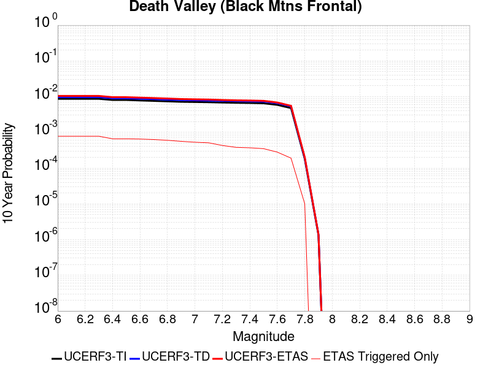 |

| Magnitude | 1 wk TI Prob | 1 wk TD Prob | 1 wk ETAS Prob | 1 wk ETAS/TD Gain | 1 wk ETAS Triggered Only | 1 mo TI Prob | 1 mo TD Prob | 1 mo ETAS Prob | 1 mo ETAS/TD Gain | 1 mo ETAS Triggered Only | 1 yr TI Prob | 1 yr TD Prob | 1 yr ETAS Prob | 1 yr ETAS/TD Gain | 1 yr ETAS Triggered Only | 10 yr TI Prob | 10 yr TD Prob | 10 yr ETAS Prob | 10 yr ETAS/TD Gain | 10 yr ETAS Triggered Only |
|-----|-----|-----|-----|-----|-----|-----|-----|-----|-----|-----|-----|-----|-----|-----|-----|-----|-----|-----|-----|-----|
| 6.0 | 1.6707214E-5 | 1.867056E-5 | 4.867E-5 | 2.6067777 | 3.0E-5 | 7.160038E-5 | 8.001427E-5 | 1.9000548E-4 | 2.3746448 | 1.1E-4 | 8.71386E-4 | 9.7374606E-4 | 0.0014033273 | 1.4411635 | 4.3E-4 | 0.00867977 | 0.009695647 | 0.010468085 | 1.0796685 | 7.8E-4 |
| 6.1 | 1.6707214E-5 | 1.867056E-5 | 4.867E-5 | 2.6067777 | 3.0E-5 | 7.160038E-5 | 8.001427E-5 | 1.9000548E-4 | 2.3746448 | 1.1E-4 | 8.71386E-4 | 9.7374606E-4 | 0.0014033273 | 1.4411635 | 4.3E-4 | 0.00867977 | 0.009695647 | 0.010468085 | 1.0796685 | 7.8E-4 |
| 6.2 | 1.6707214E-5 | 1.867056E-5 | 4.867E-5 | 2.6067777 | 3.0E-5 | 7.160038E-5 | 8.001427E-5 | 1.9000548E-4 | 2.3746448 | 1.1E-4 | 8.71386E-4 | 9.7374606E-4 | 0.0014033273 | 1.4411635 | 4.3E-4 | 0.00867977 | 0.009695647 | 0.010468085 | 1.0796685 | 7.8E-4 |
| 6.3 | 1.6707214E-5 | 1.867056E-5 | 4.867E-5 | 2.6067777 | 3.0E-5 | 7.160038E-5 | 8.001427E-5 | 1.9000548E-4 | 2.3746448 | 1.1E-4 | 8.71386E-4 | 9.7374606E-4 | 0.0014033273 | 1.4411635 | 4.3E-4 | 0.00867977 | 0.009695647 | 0.010468085 | 1.0796685 | 7.8E-4 |
| 6.4 | 1.5515609E-5 | 1.7338483E-5 | 4.7337962E-5 | 2.730225 | 3.0E-5 | 6.649377E-5 | 7.430571E-5 | 1.5429976E-4 | 2.0765533 | 8.0E-5 | 8.0926094E-4 | 9.0430264E-4 | 0.0012439952 | 1.3756404 | 3.4E-4 | 0.008063202 | 0.009006913 | 0.009660969 | 1.072617 | 6.6E-4 |
| 6.5 | 1.5515609E-5 | 1.7338483E-5 | 4.7337962E-5 | 2.730225 | 3.0E-5 | 6.649377E-5 | 7.430571E-5 | 1.5429976E-4 | 2.0765533 | 8.0E-5 | 8.0926094E-4 | 9.0430264E-4 | 0.0012439952 | 1.3756404 | 3.4E-4 | 0.008063202 | 0.009006913 | 0.009660969 | 1.072617 | 6.6E-4 |
| 6.6 | 1.5041828E-5 | 1.6809407E-5 | 4.6808902E-5 | 2.784685 | 3.0E-5 | 6.4463384E-5 | 7.203836E-5 | 1.520326E-4 | 2.1104395 | 8.0E-5 | 7.8455906E-4 | 8.7672E-4 | 0.001216422 | 1.387469 | 3.4E-4 | 0.00781795 | 0.008733268 | 0.009377591 | 1.073778 | 6.5E-4 |
| 6.7 | 1.4634985E-5 | 1.6356273E-5 | 4.635578E-5 | 2.8341289 | 3.0E-5 | 6.271985E-5 | 7.009646E-5 | 1.5009085E-4 | 2.1412046 | 8.0E-5 | 7.6334673E-4 | 8.53096E-4 | 0.0011828145 | 1.3864963 | 3.3E-4 | 0.007607299 | 0.008498848 | 0.009123494 | 1.0734977 | 6.3E-4 |
| 6.8 | 1.4209158E-5 | 1.5882297E-5 | 4.588182E-5 | 2.8888657 | 3.0E-5 | 6.089497E-5 | 6.806524E-5 | 1.480598E-4 | 2.175263 | 8.0E-5 | 7.4114406E-4 | 8.2838483E-4 | 0.001138128 | 1.3739122 | 3.1E-4 | 0.007386771 | 0.008253585 | 0.008848633 | 1.0720956 | 6.0E-4 |
| 6.9 | 1.3780098E-5 | 1.5404834E-5 | 4.5404373E-5 | 2.9474106 | 3.0E-5 | 5.9056227E-5 | 6.601908E-5 | 1.3601445E-4 | 2.0602295 | 7.0E-5 | 7.1877235E-4 | 8.0349133E-4 | 0.0010932584 | 1.3606348 | 2.9E-4 | 0.0071645193 | 0.008006458 | 0.008561974 | 1.0693835 | 5.6E-4 |
| 7.0 | 1.3585064E-5 | 1.5188394E-5 | 4.518794E-5 | 2.9751625 | 3.0E-5 | 5.8220405E-5 | 6.5091524E-5 | 1.2508762E-4 | 1.9217191 | 6.0E-5 | 7.086029E-4 | 7.922066E-4 | 0.0010719848 | 1.3531631 | 2.8E-4 | 0.007063476 | 0.007894417 | 0.008420234 | 1.066606 | 5.3E-4 |
| 7.1 | 1.3398601E-5 | 1.4981575E-5 | 4.4981127E-5 | 3.0024297 | 3.0E-5 | 5.742131E-5 | 6.4205204E-5 | 1.2420135E-4 | 1.9344437 | 6.0E-5 | 6.9888023E-4 | 7.814234E-4 | 0.0010512124 | 1.3452533 | 2.7E-4 | 0.0069668638 | 0.007787346 | 0.008293374 | 1.0649809 | 5.1E-4 |
| 7.2 | 1.3126312E-5 | 1.4679792E-5 | 4.4679353E-5 | 3.0435958 | 3.0E-5 | 5.6254412E-5 | 6.291191E-5 | 1.2290814E-4 | 1.9536545 | 6.0E-5 | 6.846822E-4 | 7.656887E-4 | 0.0010154973 | 1.3262534 | 2.5E-4 | 0.006825765 | 0.00763109 | 0.0080578085 | 1.0559185 | 4.3E-4 |
| 7.3 | 1.2922429E-5 | 1.4454016E-5 | 4.4453584E-5 | 3.0755177 | 3.0E-5 | 5.5380664E-5 | 6.1944345E-5 | 1.21940626E-4 | 1.9685515 | 6.0E-5 | 6.74051E-4 | 7.5391686E-4 | 9.837435E-4 | 1.3048434 | 2.3E-4 | 0.006720101 | 0.0075141727 | 0.007891318 | 1.050191 | 3.8E-4 |
| 7.4 | 1.2768878E-5 | 1.4283997E-5 | 4.428357E-5 | 3.1002226 | 3.0E-5 | 5.4722615E-5 | 6.1215724E-5 | 1.2121205E-4 | 1.9800804 | 6.0E-5 | 6.660441E-4 | 7.45052E-4 | 9.648881E-4 | 1.2950613 | 2.2E-4 | 0.0066405144 | 0.0074261203 | 0.0077933725 | 1.0494541 | 3.7E-4 |
| 7.5 | 1.2521929E-5 | 1.40122365E-5 | 2.4012097E-5 | 1.7136519 | 1.0E-5 | 5.366431E-5 | 6.0051094E-5 | 1.0004869E-4 | 1.6660595 | 4.0E-5 | 6.531671E-4 | 7.308822E-4 | 9.30736E-4 | 1.2734419 | 2.0E-4 | 0.006512506 | 0.0072853607 | 0.0076328106 | 1.0476916 | 3.5E-4 |
| 7.6 | 1.1301089E-5 | 1.2648349E-5 | 2.2648223E-5 | 1.790607 | 1.0E-5 | 4.8432343E-5 | 5.4206117E-5 | 9.420395E-5 | 1.7378842 | 4.0E-5 | 5.895042E-4 | 6.597649E-4 | 8.196594E-4 | 1.2423506 | 1.6E-4 | 0.0058794282 | 0.0065786145 | 0.006856772 | 1.0422821 | 2.8E-4 |
| 7.7 | 9.189108E-6 | 1.0283521E-5 | 1.0283521E-5 | 1.0 | 0.0 | 3.93813E-5 | 4.407152E-5 | 6.4070635E-5 | 1.4537878 | 2.0E-5 | 4.7936183E-4 | 5.3644367E-4 | 6.263954E-4 | 1.1676816 | 9.0E-5 | 0.004783291 | 0.0053519984 | 0.0055409814 | 1.0353107 | 1.9E-4 |
| 7.8 | 3.4586725E-7 | 3.648288E-7 | 3.648288E-7 | 1.0 | 0.0 | 1.4822873E-6 | 1.5635511E-6 | 1.1563536E-5 | 7.3956876 | 1.0E-5 | 1.80467E-5 | 1.9036073E-5 | 2.9035882E-5 | 1.5253085 | 1.0E-5 | 1.8045233E-4 | 1.9034486E-4 | 2.0034295E-4 | 1.0525262 | 1.0E-5 |
| 7.9 | 2.5591178E-9 | 2.6696871E-9 | 2.6696871E-9 | 1.0 | 0.0 | 1.0967647E-8 | 1.1441516E-8 | 1.1441516E-8 | 1.0 | 0.0 | 1.335311E-7 | 1.3930045E-7 | 1.3930045E-7 | 1.0 | 0.0 | 1.3353102E-6 | 1.3930046E-6 | 1.3930046E-6 | 1.0 | 0.0 |

## San Andreas (San Bernardino S)
*[(top)](#table-of-contents)*

| 1 Week | 1 Month | 1 Year | 10 Year |
|-----|-----|-----|-----|
|  |  |  |  |

| Magnitude | 1 wk TI Prob | 1 wk TD Prob | 1 wk ETAS Prob | 1 wk ETAS/TD Gain | 1 wk ETAS Triggered Only | 1 mo TI Prob | 1 mo TD Prob | 1 mo ETAS Prob | 1 mo ETAS/TD Gain | 1 mo ETAS Triggered Only | 1 yr TI Prob | 1 yr TD Prob | 1 yr ETAS Prob | 1 yr ETAS/TD Gain | 1 yr ETAS Triggered Only | 10 yr TI Prob | 10 yr TD Prob | 10 yr ETAS Prob | 10 yr ETAS/TD Gain | 10 yr ETAS Triggered Only |
|-----|-----|-----|-----|-----|-----|-----|-----|-----|-----|-----|-----|-----|-----|-----|-----|-----|-----|-----|-----|-----|
| 6.0 | 1.2336002E-4 | 3.000988E-4 | 3.900718E-4 | 1.2998112 | 9.0E-5 | 5.2857865E-4 | 0.0012855299 | 0.0015352085 | 1.1942223 | 2.5E-4 | 0.006416472 | 0.015543964 | 0.01605588 | 1.0329335 | 5.2E-4 | 0.06234337 | 0.14291926 | 0.14352779 | 1.0042578 | 7.1E-4 |
| 6.1 | 1.2336002E-4 | 3.000988E-4 | 3.900718E-4 | 1.2998112 | 9.0E-5 | 5.2857865E-4 | 0.0012855299 | 0.0015352085 | 1.1942223 | 2.5E-4 | 0.006416472 | 0.015543964 | 0.01605588 | 1.0329335 | 5.2E-4 | 0.06234337 | 0.14291926 | 0.14352779 | 1.0042578 | 7.1E-4 |
| 6.2 | 1.2336002E-4 | 3.000988E-4 | 3.900718E-4 | 1.2998112 | 9.0E-5 | 5.2857865E-4 | 0.0012855299 | 0.0015352085 | 1.1942223 | 2.5E-4 | 0.006416472 | 0.015543964 | 0.01605588 | 1.0329335 | 5.2E-4 | 0.06234337 | 0.14291926 | 0.14352779 | 1.0042578 | 7.1E-4 |
| 6.3 | 1.1712257E-4 | 2.879813E-4 | 3.7795538E-4 | 1.3124303 | 9.0E-5 | 5.018573E-4 | 0.0012336475 | 0.0014833391 | 1.202401 | 2.5E-4 | 0.006093008 | 0.0149210645 | 0.015423454 | 1.0336698 | 5.1E-4 | 0.059286322 | 0.13763407 | 0.13823771 | 1.004386 | 7.0E-4 |
| 6.4 | 1.1712257E-4 | 2.879813E-4 | 3.7795538E-4 | 1.3124303 | 9.0E-5 | 5.018573E-4 | 0.0012336475 | 0.0014833391 | 1.202401 | 2.5E-4 | 0.006093008 | 0.0149210645 | 0.015423454 | 1.0336698 | 5.1E-4 | 0.059286322 | 0.13763407 | 0.13823771 | 1.004386 | 7.0E-4 |
| 6.5 | 1.0689076E-4 | 2.6810818E-4 | 3.5808404E-4 | 1.3355954 | 9.0E-5 | 4.5802278E-4 | 0.0011485539 | 0.0013982668 | 1.217415 | 2.5E-4 | 0.0055621783 | 0.013898602 | 0.014381791 | 1.0347654 | 4.9E-4 | 0.05425003 | 0.12891594 | 0.12950827 | 1.0045948 | 6.8E-4 |
| 6.6 | 9.7648895E-5 | 2.5055694E-4 | 3.405344E-4 | 1.3591098 | 9.0E-5 | 4.1842813E-4 | 0.0010733972 | 0.0013231288 | 1.2326554 | 2.5E-4 | 0.005082469 | 0.012994667 | 0.0134783 | 1.0372177 | 4.9E-4 | 0.049677886 | 0.12101118 | 0.12160011 | 1.0048667 | 6.7E-4 |
| 6.7 | 8.757013E-5 | 2.3126253E-4 | 3.1124402E-4 | 1.3458472 | 8.0E-5 | 3.7524657E-4 | 9.90771E-4 | 0.0012305331 | 1.2419956 | 2.4E-4 | 0.00455906 | 0.012000005 | 0.012464364 | 1.0386966 | 4.7E-4 | 0.04466656 | 0.11236583 | 0.11293392 | 1.0050557 | 6.4E-4 |
| 6.8 | 8.562978E-5 | 2.268613E-4 | 3.0684317E-4 | 1.3525584 | 8.0E-5 | 3.6693315E-4 | 9.719227E-4 | 0.0012116894 | 1.2466933 | 2.4E-4 | 0.004458263 | 0.011773022 | 0.012237489 | 1.0394518 | 4.7E-4 | 0.043698758 | 0.11037151 | 0.11094087 | 1.0051585 | 6.4E-4 |
| 6.9 | 6.124075E-5 | 1.7070957E-4 | 2.506959E-4 | 1.4685522 | 8.0E-5 | 2.6243398E-4 | 7.3140813E-4 | 9.5124723E-4 | 1.3005697 | 2.2E-4 | 0.0031904527 | 0.008868743 | 0.009314752 | 1.05029 | 4.5E-4 | 0.031450346 | 0.08419216 | 0.0847508 | 1.0066353 | 6.1E-4 |
| 7.0 | 5.8598747E-5 | 1.6499894E-4 | 2.4498574E-4 | 1.4847716 | 8.0E-5 | 2.5111332E-4 | 7.069475E-4 | 9.26792E-4 | 1.3109771 | 2.2E-4 | 0.0030530186 | 0.008573314 | 0.009009542 | 1.0508821 | 4.4E-4 | 0.03011414 | 0.08151563 | 0.08206672 | 1.0067606 | 6.0E-4 |
| 7.1 | 5.613814E-5 | 1.5918406E-4 | 2.3917132E-4 | 1.5024829 | 8.0E-5 | 2.4056983E-4 | 6.8203977E-4 | 9.018897E-4 | 1.3223418 | 2.2E-4 | 0.0029250039 | 0.008272399 | 0.008708759 | 1.0527489 | 4.4E-4 | 0.028868021 | 0.07881265 | 0.079365365 | 1.007013 | 6.0E-4 |
| 7.2 | 4.991222E-5 | 1.452485E-4 | 2.2523689E-4 | 1.5507002 | 8.0E-5 | 2.1389198E-4 | 6.223455E-4 | 8.4220857E-4 | 1.3532814 | 2.2E-4 | 0.002601025 | 0.007550835 | 0.007977588 | 1.0565174 | 4.3E-4 | 0.025707912 | 0.07226236 | 0.07280045 | 1.0074463 | 5.8E-4 |
| 7.3 | 4.7410045E-5 | 1.3718859E-4 | 2.1717761E-4 | 1.5830588 | 8.0E-5 | 2.0317009E-4 | 5.8781897E-4 | 8.076896E-4 | 1.3740449 | 2.2E-4 | 0.0024707897 | 0.007133297 | 0.00756023 | 1.0598507 | 4.3E-4 | 0.024434982 | 0.068555124 | 0.06909536 | 1.0078803 | 5.8E-4 |
| 7.4 | 4.5556746E-5 | 1.312667E-4 | 2.1125619E-4 | 1.6093663 | 8.0E-5 | 1.952286E-4 | 5.624506E-4 | 7.8232685E-4 | 1.3909255 | 2.2E-4 | 0.002374317 | 0.006826414 | 0.0072534783 | 1.0625606 | 4.3E-4 | 0.023491086 | 0.0658083 | 0.06635013 | 1.0082334 | 5.8E-4 |
| 7.5 | 4.3084514E-5 | 1.2361899E-4 | 2.0360909E-4 | 1.6470698 | 8.0E-5 | 1.8463485E-4 | 5.296884E-4 | 7.4957183E-4 | 1.4151186 | 2.2E-4 | 0.0022456115 | 0.006429958 | 0.0068571935 | 1.0664445 | 4.3E-4 | 0.022230545 | 0.062208522 | 0.06275244 | 1.0087435 | 5.8E-4 |
| 7.6 | 3.408608E-5 | 9.8397344E-5 | 1.7838947E-4 | 1.81295 | 8.0E-5 | 1.4607502E-4 | 4.2163485E-4 | 6.415421E-4 | 1.5215585 | 2.2E-4 | 0.0017770125 | 0.0051213475 | 0.0055391965 | 1.0815897 | 4.2E-4 | 0.017628696 | 0.050038666 | 0.05058014 | 1.0108212 | 5.7E-4 |
| 7.7 | 2.8315713E-5 | 8.252603E-5 | 1.6251943E-4 | 1.9693111 | 8.0E-5 | 1.2134742E-4 | 3.5363509E-4 | 5.735573E-4 | 1.6218902 | 2.2E-4 | 0.0014764034 | 0.004297016 | 0.004715211 | 1.0973222 | 4.2E-4 | 0.01466633 | 0.042289194 | 0.042825513 | 1.0126822 | 5.6E-4 |
| 7.8 | 2.6222975E-5 | 7.466726E-5 | 1.5466129E-4 | 2.07134 | 8.0E-5 | 1.1237934E-4 | 3.1996332E-4 | 5.3989294E-4 | 1.6873589 | 2.2E-4 | 0.0013673597 | 0.0038886012 | 0.004297007 | 1.1050264 | 4.1E-4 | 0.013589768 | 0.03845329 | 0.038972523 | 1.013503 | 5.4E-4 |
| 7.9 | 2.1469694E-5 | 5.7908495E-5 | 1.3790386E-4 | 2.38141 | 8.0E-5 | 9.200973E-5 | 2.4815567E-4 | 4.6810106E-4 | 1.8863202 | 2.2E-4 | 0.0011196428 | 0.0030171126 | 0.0033760264 | 1.1189594 | 3.6E-4 | 0.011140184 | 0.030165782 | 0.030611904 | 1.0147891 | 4.6E-4 |
| 8.0 | 1.2420249E-5 | 3.1335217E-5 | 6.133428E-5 | 1.9573592 | 3.0E-5 | 5.322855E-5 | 1.3428688E-4 | 2.1427614E-4 | 1.5956595 | 8.0E-5 | 6.478649E-4 | 0.0016337177 | 0.0017635053 | 1.0794431 | 1.3E-4 | 0.0064597935 | 0.01652998 | 0.01669717 | 1.0101143 | 1.7E-4 |
| 8.1 | 4.9197724E-6 | 7.827452E-6 | 7.827452E-6 | 1.0 | 0.0 | 2.1084568E-5 | 3.354579E-5 | 3.354579E-5 | 1.0 | 0.0 | 2.566744E-4 | 4.0834362E-4 | 4.0834362E-4 | 1.0 | 0.0 | 0.002563781 | 0.004386937 | 0.004386937 | 1.0 | 0.0 |
| 8.2 | 2.5634774E-6 | 2.9088305E-6 | 2.9088305E-6 | 1.0 | 0.0 | 1.0986286E-5 | 1.24663575E-5 | 1.24663575E-5 | 1.0 | 0.0 | 1.3374983E-4 | 1.5176737E-4 | 1.5176737E-4 | 1.0 | 0.0 | 0.0013366934 | 0.0017061312 | 0.0017061312 | 1.0 | 0.0 |
| 8.3 | 5.2850464E-7 | 3.2110069E-7 | 3.2110069E-7 | 1.0 | 0.0 | 2.2650179E-6 | 1.3761452E-6 | 1.3761452E-6 | 1.0 | 0.0 | 2.7576245E-5 | 1.6754451E-5 | 1.6754451E-5 | 1.0 | 0.0 | 2.7572823E-4 | 1.9885681E-4 | 1.9885681E-4 | 1.0 | 0.0 |

## Coyote Lake
*[(top)](#table-of-contents)*

| 1 Week | 1 Month | 1 Year | 10 Year |
|-----|-----|-----|-----|
|  |  | 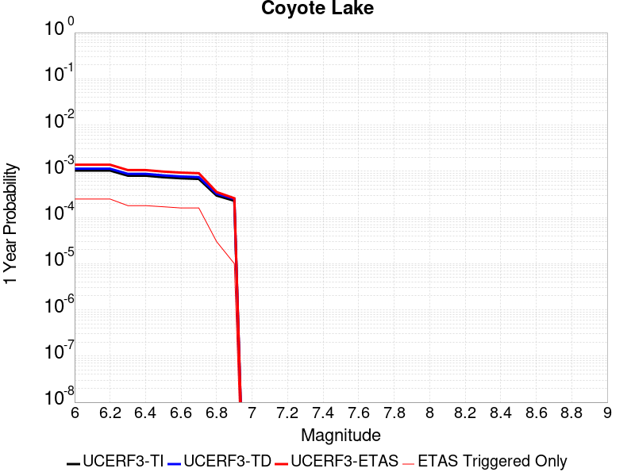 | 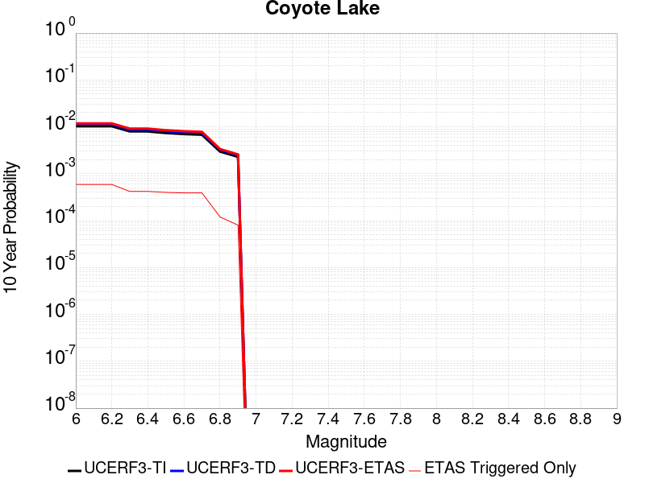 |

| Magnitude | 1 wk TI Prob | 1 wk TD Prob | 1 wk ETAS Prob | 1 wk ETAS/TD Gain | 1 wk ETAS Triggered Only | 1 mo TI Prob | 1 mo TD Prob | 1 mo ETAS Prob | 1 mo ETAS/TD Gain | 1 mo ETAS Triggered Only | 1 yr TI Prob | 1 yr TD Prob | 1 yr ETAS Prob | 1 yr ETAS/TD Gain | 1 yr ETAS Triggered Only | 10 yr TI Prob | 10 yr TD Prob | 10 yr ETAS Prob | 10 yr ETAS/TD Gain | 10 yr ETAS Triggered Only |
|-----|-----|-----|-----|-----|-----|-----|-----|-----|-----|-----|-----|-----|-----|-----|-----|-----|-----|-----|-----|-----|
| 6.0 | 1.980352E-5 | 2.1707021E-5 | 5.170637E-5 | 2.3820112 | 3.0E-5 | 8.486947E-5 | 9.302718E-5 | 1.530216E-4 | 1.6449128 | 6.0E-5 | 0.0010327959 | 0.0011320895 | 0.0013818064 | 1.2205806 | 2.5E-4 | 0.010280091 | 0.011270401 | 0.011853752 | 1.0517595 | 5.9E-4 |
| 6.1 | 1.980352E-5 | 2.1707021E-5 | 5.170637E-5 | 2.3820112 | 3.0E-5 | 8.486947E-5 | 9.302718E-5 | 1.530216E-4 | 1.6449128 | 6.0E-5 | 0.0010327959 | 0.0011320895 | 0.0013818064 | 1.2205806 | 2.5E-4 | 0.010280091 | 0.011270401 | 0.011853752 | 1.0517595 | 5.9E-4 |
| 6.2 | 1.980352E-5 | 2.1707021E-5 | 5.170637E-5 | 2.3820112 | 3.0E-5 | 8.486947E-5 | 9.302718E-5 | 1.530216E-4 | 1.6449128 | 6.0E-5 | 0.0010327959 | 0.0011320895 | 0.0013818064 | 1.2205806 | 2.5E-4 | 0.010280091 | 0.011270401 | 0.011853752 | 1.0517595 | 5.9E-4 |
| 6.3 | 1.5344787E-5 | 1.6820884E-5 | 4.682038E-5 | 2.7834673 | 3.0E-5 | 6.576172E-5 | 7.208785E-5 | 1.2208425E-4 | 1.6935481 | 5.0E-5 | 8.003548E-4 | 8.7737746E-4 | 0.0010572195 | 1.2049769 | 1.8E-4 | 0.007974784 | 0.00874518 | 0.009161508 | 1.0476065 | 4.2E-4 |
| 6.4 | 1.5344787E-5 | 1.6820884E-5 | 4.682038E-5 | 2.7834673 | 3.0E-5 | 6.576172E-5 | 7.208785E-5 | 1.2208425E-4 | 1.6935481 | 5.0E-5 | 8.003548E-4 | 8.7737746E-4 | 0.0010572195 | 1.2049769 | 1.8E-4 | 0.007974784 | 0.00874518 | 0.009161508 | 1.0476065 | 4.2E-4 |
| 6.5 | 1.4189697E-5 | 1.5558186E-5 | 4.5557717E-5 | 2.9282153 | 3.0E-5 | 6.081157E-5 | 6.667658E-5 | 1.1667324E-4 | 1.7498386 | 5.0E-5 | 7.401293E-4 | 8.1154524E-4 | 9.814072E-4 | 1.209307 | 1.7E-4 | 0.0073766913 | 0.008091759 | 0.008488523 | 1.049033 | 4.0E-4 |
| 6.6 | 1.3469301E-5 | 1.47717665E-5 | 4.4771325E-5 | 3.0308712 | 3.0E-5 | 5.7724297E-5 | 6.3306376E-5 | 1.0330384E-4 | 1.6318079 | 4.0E-5 | 7.025667E-4 | 7.7054254E-4 | 9.3041925E-4 | 1.2074859 | 1.6E-4 | 0.0070034964 | 0.0076846126 | 0.008071615 | 1.0503608 | 3.9E-4 |
| 6.7 | 1.3027966E-5 | 1.4281927E-5 | 4.42815E-5 | 3.1005268 | 3.0E-5 | 5.5832945E-5 | 6.120716E-5 | 1.01204714E-4 | 1.6534783 | 4.0E-5 | 6.7955407E-4 | 7.450021E-4 | 9.0488297E-4 | 1.2146045 | 1.6E-4 | 0.006774798 | 0.007430923 | 0.007818026 | 1.0520934 | 3.9E-4 |
| 6.8 | 5.695434E-6 | 6.2244944E-6 | 1.6224432E-5 | 2.6065462 | 1.0E-5 | 2.4408775E-5 | 2.6676302E-5 | 3.6676036E-5 | 1.3748546 | 1.0E-5 | 2.971363E-4 | 3.2476554E-4 | 3.5475582E-4 | 1.0923443 | 3.0E-5 | 0.0029673933 | 0.0032458503 | 0.0033654608 | 1.0368503 | 1.2E-4 |
| 6.9 | 4.385688E-6 | 4.7931144E-6 | 4.7931144E-6 | 1.0 | 0.0 | 1.879567E-5 | 2.0541918E-5 | 2.0541918E-5 | 1.0 | 0.0 | 2.2881327E-4 | 2.5009786E-4 | 2.6009537E-4 | 1.0399743 | 1.0E-5 | 0.002285778 | 0.0025009785 | 0.0025807784 | 1.0319074 | 8.0E-5 |

## Helendale-So Lockhart
*[(top)](#table-of-contents)*

| 1 Week | 1 Month | 1 Year | 10 Year |
|-----|-----|-----|-----|
|  |  | 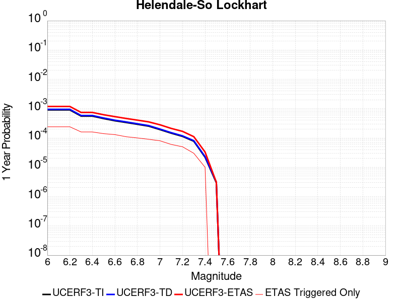 |  |

| Magnitude | 1 wk TI Prob | 1 wk TD Prob | 1 wk ETAS Prob | 1 wk ETAS/TD Gain | 1 wk ETAS Triggered Only | 1 mo TI Prob | 1 mo TD Prob | 1 mo ETAS Prob | 1 mo ETAS/TD Gain | 1 mo ETAS Triggered Only | 1 yr TI Prob | 1 yr TD Prob | 1 yr ETAS Prob | 1 yr ETAS/TD Gain | 1 yr ETAS Triggered Only | 10 yr TI Prob | 10 yr TD Prob | 10 yr ETAS Prob | 10 yr ETAS/TD Gain | 10 yr ETAS Triggered Only |
|-----|-----|-----|-----|-----|-----|-----|-----|-----|-----|-----|-----|-----|-----|-----|-----|-----|-----|-----|-----|-----|
| 6.0 | 1.7296055E-5 | 1.8103841E-5 | 3.810348E-5 | 2.104718 | 2.0E-5 | 7.412385E-5 | 7.7585704E-5 | 1.6757872E-4 | 2.1599176 | 9.0E-5 | 9.0208417E-4 | 9.442173E-4 | 0.0011839907 | 1.2539388 | 2.4E-4 | 0.008984311 | 0.009404174 | 0.009889566 | 1.0516145 | 4.9E-4 |
| 6.1 | 1.7296055E-5 | 1.8103841E-5 | 3.810348E-5 | 2.104718 | 2.0E-5 | 7.412385E-5 | 7.7585704E-5 | 1.6757872E-4 | 2.1599176 | 9.0E-5 | 9.0208417E-4 | 9.442173E-4 | 0.0011839907 | 1.2539388 | 2.4E-4 | 0.008984311 | 0.009404174 | 0.009889566 | 1.0516145 | 4.9E-4 |
| 6.2 | 1.7296055E-5 | 1.8103841E-5 | 3.810348E-5 | 2.104718 | 2.0E-5 | 7.412385E-5 | 7.7585704E-5 | 1.6757872E-4 | 2.1599176 | 9.0E-5 | 9.0208417E-4 | 9.442173E-4 | 0.0011839907 | 1.2539388 | 2.4E-4 | 0.008984311 | 0.009404174 | 0.009889566 | 1.0516145 | 4.9E-4 |
| 6.3 | 1.0669118E-5 | 1.1135489E-5 | 2.1135378E-5 | 1.8980197 | 1.0E-5 | 4.5723988E-5 | 4.7722668E-5 | 1.077198E-4 | 2.257204 | 6.0E-5 | 5.5654737E-4 | 5.8087136E-4 | 7.4077846E-4 | 1.2752882 | 1.6E-4 | 0.0055515557 | 0.005793827 | 0.0061517414 | 1.0617751 | 3.6E-4 |
| 6.4 | 1.0669118E-5 | 1.1135489E-5 | 2.1135378E-5 | 1.8980197 | 1.0E-5 | 4.5723988E-5 | 4.7722668E-5 | 1.077198E-4 | 2.257204 | 6.0E-5 | 5.5654737E-4 | 5.8087136E-4 | 7.4077846E-4 | 1.2752882 | 1.6E-4 | 0.0055515557 | 0.005793827 | 0.0061517414 | 1.0617751 | 3.6E-4 |
| 6.5 | 8.790038E-6 | 9.1702495E-6 | 1.9170158E-5 | 2.090473 | 1.0E-5 | 3.767105E-5 | 3.9300485E-5 | 9.929813E-5 | 2.5266387 | 6.0E-5 | 4.585485E-4 | 4.7837992E-4 | 6.183129E-4 | 1.2925144 | 1.4E-4 | 0.0045760344 | 0.0047736657 | 0.005062281 | 1.06046 | 2.9E-4 |
| 6.6 | 7.396949E-6 | 7.715581E-6 | 1.7715503E-5 | 2.2960687 | 1.0E-5 | 3.1700827E-5 | 3.3066364E-5 | 8.306471E-5 | 2.5120606 | 5.0E-5 | 3.858892E-4 | 4.025096E-4 | 5.324573E-4 | 1.3228437 | 1.3E-4 | 0.003852198 | 0.004017913 | 0.004286828 | 1.0669291 | 2.7E-4 |
| 6.7 | 6.4600285E-6 | 6.7380697E-6 | 1.6738002E-5 | 2.4840946 | 1.0E-5 | 2.7685543E-5 | 2.8877126E-5 | 7.887568E-5 | 2.7314243 | 5.0E-5 | 3.3701936E-4 | 3.5152308E-4 | 4.614844E-4 | 1.312814 | 1.1E-4 | 0.0033650869 | 0.003509752 | 0.0037389447 | 1.0653017 | 2.3E-4 |
| 6.8 | 5.600104E-6 | 5.836042E-6 | 1.5835984E-5 | 2.71348 | 1.0E-5 | 2.4000226E-5 | 2.5011372E-5 | 7.5010124E-5 | 2.9990406 | 5.0E-5 | 2.9216358E-4 | 3.044715E-4 | 4.0444106E-4 | 1.3283379 | 1.0E-4 | 0.0029177975 | 0.003040605 | 0.0032300274 | 1.0622976 | 1.9E-4 |
| 6.9 | 4.839122E-6 | 5.039537E-6 | 5.039537E-6 | 1.0 | 0.0 | 2.0738931E-5 | 2.159784E-5 | 6.159698E-5 | 2.8519971 | 4.0E-5 | 2.5246723E-4 | 2.6292243E-4 | 3.5289876E-4 | 1.3422163 | 9.0E-5 | 0.002521806 | 0.002626161 | 0.0027857411 | 1.0607654 | 1.6E-4 |
| 7.0 | 3.6937633E-6 | 3.845229E-6 | 3.845229E-6 | 1.0 | 0.0 | 1.5830317E-5 | 1.6479451E-5 | 5.647879E-5 | 3.4272254 | 4.0E-5 | 1.9271708E-4 | 2.0061915E-4 | 2.806031E-4 | 1.3986856 | 8.0E-5 | 0.0019255003 | 0.0020044118 | 0.0021341513 | 1.064727 | 1.3E-4 |
| 7.1 | 2.7858857E-6 | 2.8978693E-6 | 2.8978693E-6 | 1.0 | 0.0 | 1.1939455E-5 | 1.2419382E-5 | 4.2419008E-5 | 3.4155493 | 3.0E-5 | 1.4535317E-4 | 1.511957E-4 | 2.1118662E-4 | 1.3967767 | 6.0E-5 | 0.0014525814 | 0.0015109498 | 0.0015908289 | 1.0528668 | 8.0E-5 |
| 7.2 | 2.1672065E-6 | 2.2540248E-6 | 2.2540248E-6 | 1.0 | 0.0 | 9.2879945E-6 | 9.660072E-6 | 2.9659877E-5 | 3.070358 | 2.0E-5 | 1.1307546E-4 | 1.176052E-4 | 1.6759933E-4 | 1.4251013 | 5.0E-5 | 0.0011301794 | 0.0011754478 | 0.0012353774 | 1.0509844 | 6.0E-5 |
| 7.3 | 1.4823496E-6 | 1.5422185E-6 | 1.5422185E-6 | 1.0 | 0.0 | 6.3529114E-6 | 6.6094917E-6 | 1.6609425E-5 | 2.5129657 | 1.0E-5 | 7.734395E-5 | 8.046775E-5 | 1.10465335E-4 | 1.3727902 | 3.0E-5 | 7.731704E-4 | 8.044012E-4 | 8.343771E-4 | 1.0372648 | 3.0E-5 |
| 7.4 | 4.2321457E-7 | 4.4109012E-7 | 4.4109012E-7 | 1.0 | 0.0 | 1.8137755E-6 | 1.8903852E-6 | 1.1890366E-5 | 6.2899175 | 1.0E-5 | 2.2082493E-5 | 2.3015242E-5 | 3.301501E-5 | 1.4344847 | 1.0E-5 | 2.2080299E-4 | 2.3013311E-4 | 2.4013082E-4 | 1.0434431 | 1.0E-5 |
| 7.5 | 5.6942316E-8 | 5.941599E-8 | 5.941599E-8 | 1.0 | 0.0 | 2.440385E-7 | 2.5463993E-7 | 2.5463993E-7 | 1.0 | 0.0 | 2.9711643E-6 | 3.1002376E-6 | 3.1002376E-6 | 1.0 | 0.0 | 2.9711247E-5 | 3.1002022E-5 | 3.1002022E-5 | 1.0 | 0.0 |

## San Andreas (Big Bend)
*[(top)](#table-of-contents)*

| 1 Week | 1 Month | 1 Year | 10 Year |
|-----|-----|-----|-----|
|  |  | 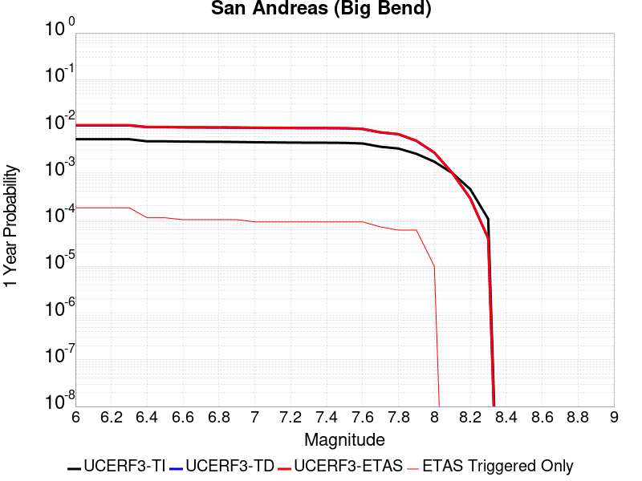 |  |

| Magnitude | 1 wk TI Prob | 1 wk TD Prob | 1 wk ETAS Prob | 1 wk ETAS/TD Gain | 1 wk ETAS Triggered Only | 1 mo TI Prob | 1 mo TD Prob | 1 mo ETAS Prob | 1 mo ETAS/TD Gain | 1 mo ETAS Triggered Only | 1 yr TI Prob | 1 yr TD Prob | 1 yr ETAS Prob | 1 yr ETAS/TD Gain | 1 yr ETAS Triggered Only | 10 yr TI Prob | 10 yr TD Prob | 10 yr ETAS Prob | 10 yr ETAS/TD Gain | 10 yr ETAS Triggered Only |
|-----|-----|-----|-----|-----|-----|-----|-----|-----|-----|-----|-----|-----|-----|-----|-----|-----|-----|-----|-----|-----|
| 6.0 | 1.0179969E-4 | 2.0081972E-4 | 2.2081571E-4 | 1.0995718 | 2.0E-5 | 4.362114E-4 | 8.603731E-4 | 9.5029565E-4 | 1.1045158 | 9.0E-5 | 0.0052979486 | 0.010425015 | 0.010603139 | 1.0170861 | 1.8E-4 | 0.051734097 | 0.101484396 | 0.101879746 | 1.0038956 | 4.4E-4 |
| 6.1 | 1.0179969E-4 | 2.0081972E-4 | 2.2081571E-4 | 1.0995718 | 2.0E-5 | 4.362114E-4 | 8.603731E-4 | 9.5029565E-4 | 1.1045158 | 9.0E-5 | 0.0052979486 | 0.010425015 | 0.010603139 | 1.0170861 | 1.8E-4 | 0.051734097 | 0.101484396 | 0.101879746 | 1.0038956 | 4.4E-4 |
| 6.2 | 1.0179969E-4 | 2.0081972E-4 | 2.2081571E-4 | 1.0995718 | 2.0E-5 | 4.362114E-4 | 8.603731E-4 | 9.5029565E-4 | 1.1045158 | 9.0E-5 | 0.0052979486 | 0.010425015 | 0.010603139 | 1.0170861 | 1.8E-4 | 0.051734097 | 0.101484396 | 0.101879746 | 1.0038956 | 4.4E-4 |
| 6.3 | 1.0179969E-4 | 2.0081972E-4 | 2.2081571E-4 | 1.0995718 | 2.0E-5 | 4.362114E-4 | 8.603731E-4 | 9.5029565E-4 | 1.1045158 | 9.0E-5 | 0.0052979486 | 0.010425015 | 0.010603139 | 1.0170861 | 1.8E-4 | 0.051734097 | 0.101484396 | 0.101879746 | 1.0038956 | 4.4E-4 |
| 6.4 | 9.1639464E-5 | 1.8438944E-4 | 1.943876E-4 | 1.0542231 | 1.0E-5 | 3.9268145E-4 | 7.9000136E-4 | 8.2996977E-4 | 1.0505928 | 4.0E-5 | 0.0047704205 | 0.009575968 | 0.009684914 | 1.0113771 | 1.1E-4 | 0.046693064 | 0.09381712 | 0.094025545 | 1.0022216 | 2.3E-4 |
| 6.5 | 9.1639464E-5 | 1.8438944E-4 | 1.943876E-4 | 1.0542231 | 1.0E-5 | 3.9268145E-4 | 7.9000136E-4 | 8.2996977E-4 | 1.0505928 | 4.0E-5 | 0.0047704205 | 0.009575968 | 0.009684914 | 1.0113771 | 1.1E-4 | 0.046693064 | 0.09381712 | 0.094025545 | 1.0022216 | 2.3E-4 |
| 6.6 | 9.042622E-5 | 1.8245954E-4 | 1.9245771E-4 | 1.0547967 | 1.0E-5 | 3.8748336E-4 | 7.817353E-4 | 8.2170404E-4 | 1.0511283 | 4.0E-5 | 0.0047074095 | 0.009476205 | 0.009575258 | 1.0104527 | 1.0E-4 | 0.046089325 | 0.09291417 | 0.09311373 | 1.0021478 | 2.2E-4 |
| 6.7 | 8.9836685E-5 | 1.8160277E-4 | 1.9160095E-4 | 1.0550553 | 1.0E-5 | 3.8495753E-4 | 7.7806565E-4 | 8.180345E-4 | 1.0513695 | 4.0E-5 | 0.00467679 | 0.0094319135 | 0.009530971 | 1.0105023 | 1.0E-4 | 0.045795817 | 0.0925084 | 0.092689894 | 1.001962 | 2.0E-4 |
| 6.8 | 8.9471854E-5 | 1.8107046E-4 | 1.9106866E-4 | 1.0552171 | 1.0E-5 | 3.8339442E-4 | 7.7578565E-4 | 8.1575464E-4 | 1.0515206 | 4.0E-5 | 0.004657841 | 0.009404396 | 0.009503455 | 1.0105333 | 1.0E-4 | 0.04561414 | 0.092256 | 0.09243755 | 1.0019679 | 2.0E-4 |
| 6.9 | 8.858234E-5 | 1.7989E-4 | 1.898882E-4 | 1.0555795 | 1.0E-5 | 3.7958333E-4 | 7.7072956E-4 | 8.106987E-4 | 1.0518589 | 4.0E-5 | 0.004611638 | 0.009343366 | 0.009442432 | 1.0106028 | 1.0E-4 | 0.04517103 | 0.0916962 | 0.09187786 | 1.0019811 | 2.0E-4 |
| 7.0 | 8.7433385E-5 | 1.7827768E-4 | 1.8827591E-4 | 1.0560822 | 1.0E-5 | 3.746607E-4 | 7.638237E-4 | 7.938008E-4 | 1.0392461 | 3.0E-5 | 0.004551957 | 0.009260005 | 0.009349172 | 1.0096292 | 9.0E-5 | 0.044598386 | 0.09093105 | 0.09109469 | 1.0017995 | 1.8E-4 |
| 7.1 | 8.684964E-5 | 1.7739709E-4 | 1.8739532E-4 | 1.0563607 | 1.0E-5 | 3.7215967E-4 | 7.6005195E-4 | 7.900291E-4 | 1.039441 | 3.0E-5 | 0.0045216335 | 0.009214473 | 0.009303644 | 1.0096773 | 9.0E-5 | 0.04430731 | 0.09051253 | 0.09066714 | 1.0017081 | 1.7E-4 |
| 7.2 | 8.606521E-5 | 1.7630306E-4 | 1.8630129E-4 | 1.0567105 | 1.0E-5 | 3.6879873E-4 | 7.553659E-4 | 7.8534323E-4 | 1.0396858 | 3.0E-5 | 0.0044808835 | 0.009157902 | 0.009247078 | 1.0097376 | 9.0E-5 | 0.043916024 | 0.08999327 | 0.09014797 | 1.001719 | 1.7E-4 |
| 7.3 | 8.568266E-5 | 1.7572299E-4 | 1.8572123E-4 | 1.0568978 | 1.0E-5 | 3.6715972E-4 | 7.528814E-4 | 7.828588E-4 | 1.0398169 | 3.0E-5 | 0.0044610105 | 0.0091279065 | 0.009217085 | 1.0097699 | 9.0E-5 | 0.043725148 | 0.08971421 | 0.089868955 | 1.001725 | 1.7E-4 |
| 7.4 | 8.5432206E-5 | 1.7534874E-4 | 1.8534699E-4 | 1.0570192 | 1.0E-5 | 3.6608664E-4 | 7.5127836E-4 | 7.8125583E-4 | 1.039902 | 3.0E-5 | 0.004447999 | 0.009108554 | 0.009197734 | 1.0097908 | 9.0E-5 | 0.043600157 | 0.08953439 | 0.089689165 | 1.0017287 | 1.7E-4 |
| 7.5 | 8.4791965E-5 | 1.7404204E-4 | 1.840403E-4 | 1.0574474 | 1.0E-5 | 3.633435E-4 | 7.456814E-4 | 7.7565905E-4 | 1.0402017 | 3.0E-5 | 0.0044147377 | 0.009040978 | 0.009130164 | 1.0098647 | 9.0E-5 | 0.043280575 | 0.088910125 | 0.089055896 | 1.0016396 | 1.6E-4 |
| 7.6 | 8.241105E-5 | 1.6849465E-4 | 1.7849296E-4 | 1.059339 | 1.0E-5 | 3.531424E-4 | 7.219202E-4 | 7.5189857E-4 | 1.0415258 | 3.0E-5 | 0.0042910352 | 0.008754046 | 0.008843258 | 1.010191 | 9.0E-5 | 0.042091176 | 0.08628652 | 0.08643272 | 1.0016943 | 1.6E-4 |
| 7.7 | 7.00432E-5 | 1.4212567E-4 | 1.5212425E-4 | 1.0703503 | 1.0E-5 | 3.001506E-4 | 6.089679E-4 | 6.389496E-4 | 1.0492337 | 3.0E-5 | 0.0036482112 | 0.0073890192 | 0.007458502 | 1.0094035 | 7.0E-5 | 0.035888977 | 0.073552616 | 0.073663786 | 1.0015115 | 1.2E-4 |
| 7.8 | 6.415362E-5 | 1.2976197E-4 | 1.3976067E-4 | 1.0770541 | 1.0E-5 | 2.749151E-4 | 5.5600423E-4 | 5.859876E-4 | 1.0539265 | 3.0E-5 | 0.0033419547 | 0.0067483704 | 0.006807965 | 1.008831 | 6.0E-5 | 0.03292141 | 0.06728497 | 0.06738757 | 1.0015248 | 1.1E-4 |
| 7.9 | 4.939911E-5 | 9.346299E-5 | 1.0346206E-4 | 1.1069843 | 1.0E-5 | 2.116933E-4 | 4.004942E-4 | 4.3048218E-4 | 1.0748775 | 3.0E-5 | 0.0025743195 | 0.0048651244 | 0.0049248324 | 1.0122727 | 6.0E-5 | 0.025447013 | 0.048938233 | 0.04901432 | 1.0015547 | 8.0E-5 |
| 8.0 | 3.344983E-5 | 5.2255753E-5 | 5.2255753E-5 | 1.0 | 0.0 | 1.4334853E-4 | 2.2393401E-4 | 2.2393401E-4 | 1.0 | 0.0 | 0.0017438711 | 0.0027229895 | 0.0027329624 | 1.0036625 | 1.0E-5 | 0.017302496 | 0.02793611 | 0.027955553 | 1.000696 | 2.0E-5 |
| 8.1 | 1.9104898E-5 | 1.9185067E-5 | 1.9185067E-5 | 1.0 | 0.0 | 8.1875565E-5 | 8.221913E-5 | 8.221913E-5 | 1.0 | 0.0 | 9.963791E-4 | 0.0010005588 | 0.0010005588 | 1.0 | 0.0 | 0.009919235 | 0.010756051 | 0.010756051 | 1.0 | 0.0 |
| 8.2 | 8.643924E-6 | 5.478665E-6 | 5.478665E-6 | 1.0 | 0.0 | 3.704486E-5 | 2.3479783E-5 | 2.3479783E-5 | 1.0 | 0.0 | 4.5092785E-4 | 2.8582895E-4 | 2.8582895E-4 | 1.0 | 0.0 | 0.0045001395 | 0.0032508469 | 0.0032508469 | 1.0 | 0.0 |
| 8.3 | 1.983087E-6 | 7.6647797E-7 | 7.6647797E-7 | 1.0 | 0.0 | 8.498917E-6 | 3.2849016E-6 | 3.2849016E-6 | 1.0 | 0.0 | 1.034694E-4 | 3.999296E-5 | 3.999296E-5 | 1.0 | 0.0 | 0.0010342124 | 4.7228087E-4 | 4.7228087E-4 | 1.0 | 0.0 |

## Sierra Nevada  (No Extension)
*[(top)](#table-of-contents)*

| 1 Week | 1 Month | 1 Year | 10 Year |
|-----|-----|-----|-----|
|  |  |  | 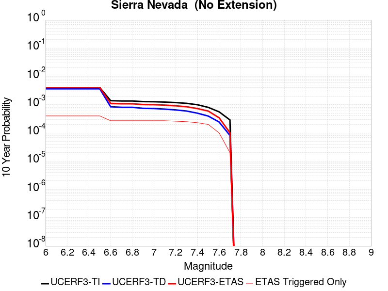 |

| Magnitude | 1 wk TI Prob | 1 wk TD Prob | 1 wk ETAS Prob | 1 wk ETAS/TD Gain | 1 wk ETAS Triggered Only | 1 mo TI Prob | 1 mo TD Prob | 1 mo ETAS Prob | 1 mo ETAS/TD Gain | 1 mo ETAS Triggered Only | 1 yr TI Prob | 1 yr TD Prob | 1 yr ETAS Prob | 1 yr ETAS/TD Gain | 1 yr ETAS Triggered Only | 10 yr TI Prob | 10 yr TD Prob | 10 yr ETAS Prob | 10 yr ETAS/TD Gain | 10 yr ETAS Triggered Only |
|-----|-----|-----|-----|-----|-----|-----|-----|-----|-----|-----|-----|-----|-----|-----|-----|-----|-----|-----|-----|-----|
| 6.0 | 7.7690465E-6 | 6.9763464E-6 | 6.9763464E-6 | 1.0 | 0.0 | 3.329549E-5 | 2.9898487E-5 | 6.9897294E-5 | 2.3378203 | 4.0E-5 | 4.0529718E-4 | 3.6398912E-4 | 5.8390904E-4 | 1.6041937 | 2.2E-4 | 0.004045588 | 0.0036374456 | 0.0040359907 | 1.1095673 | 4.0E-4 |
| 6.1 | 7.7690465E-6 | 6.9763464E-6 | 6.9763464E-6 | 1.0 | 0.0 | 3.329549E-5 | 2.9898487E-5 | 6.9897294E-5 | 2.3378203 | 4.0E-5 | 4.0529718E-4 | 3.6398912E-4 | 5.8390904E-4 | 1.6041937 | 2.2E-4 | 0.004045588 | 0.0036374456 | 0.0040359907 | 1.1095673 | 4.0E-4 |
| 6.2 | 7.7690465E-6 | 6.9763464E-6 | 6.9763464E-6 | 1.0 | 0.0 | 3.329549E-5 | 2.9898487E-5 | 6.9897294E-5 | 2.3378203 | 4.0E-5 | 4.0529718E-4 | 3.6398912E-4 | 5.8390904E-4 | 1.6041937 | 2.2E-4 | 0.004045588 | 0.0036374456 | 0.0040359907 | 1.1095673 | 4.0E-4 |
| 6.3 | 7.7690465E-6 | 6.9763464E-6 | 6.9763464E-6 | 1.0 | 0.0 | 3.329549E-5 | 2.9898487E-5 | 6.9897294E-5 | 2.3378203 | 4.0E-5 | 4.0529718E-4 | 3.6398912E-4 | 5.8390904E-4 | 1.6041937 | 2.2E-4 | 0.004045588 | 0.0036374456 | 0.0040359907 | 1.1095673 | 4.0E-4 |
| 6.4 | 7.7690465E-6 | 6.9763464E-6 | 6.9763464E-6 | 1.0 | 0.0 | 3.329549E-5 | 2.9898487E-5 | 6.9897294E-5 | 2.3378203 | 4.0E-5 | 4.0529718E-4 | 3.6398912E-4 | 5.8390904E-4 | 1.6041937 | 2.2E-4 | 0.004045588 | 0.0036374456 | 0.0040359907 | 1.1095673 | 4.0E-4 |
| 6.5 | 7.7690465E-6 | 6.9763464E-6 | 6.9763464E-6 | 1.0 | 0.0 | 3.329549E-5 | 2.9898487E-5 | 6.9897294E-5 | 2.3378203 | 4.0E-5 | 4.0529718E-4 | 3.6398912E-4 | 5.8390904E-4 | 1.6041937 | 2.2E-4 | 0.004045588 | 0.0036374456 | 0.0040359907 | 1.1095673 | 4.0E-4 |
| 6.6 | 2.653E-6 | 1.6148447E-6 | 1.6148447E-6 | 1.0 | 0.0 | 1.136995E-5 | 6.9207445E-6 | 4.6920468E-5 | 6.779685 | 4.0E-5 | 1.3842035E-4 | 8.425684E-5 | 2.342442E-4 | 2.7801208 | 1.5E-4 | 0.0013833415 | 8.422524E-4 | 0.001112025 | 1.320299 | 2.7E-4 |
| 6.7 | 2.5902466E-6 | 1.5501779E-6 | 1.5501779E-6 | 1.0 | 0.0 | 1.11010095E-5 | 6.643603E-6 | 4.6643338E-5 | 7.0207896 | 4.0E-5 | 1.351464E-4 | 8.088289E-5 | 2.3087076E-4 | 2.854383 | 1.5E-4 | 0.0013506424 | 8.0853753E-4 | 0.0010783193 | 1.3336662 | 2.7E-4 |
| 6.8 | 2.5853892E-6 | 1.5469781E-6 | 1.5469781E-6 | 1.0 | 0.0 | 1.1080193E-5 | 6.6298894E-6 | 4.6629626E-5 | 7.033243 | 4.0E-5 | 1.34893E-4 | 8.0715945E-5 | 2.3070384E-4 | 2.858219 | 1.5E-4 | 0.0013481114 | 8.0686924E-4 | 0.0010766514 | 1.3343567 | 2.7E-4 |
| 6.9 | 2.458257E-6 | 1.4220519E-6 | 1.4220519E-6 | 1.0 | 0.0 | 1.0535345E-5 | 6.094494E-6 | 4.609425E-5 | 7.5632615 | 4.0E-5 | 1.2826028E-4 | 7.419796E-5 | 2.2418682E-4 | 3.021469 | 1.5E-4 | 0.0012818627 | 7.417338E-4 | 0.0010115335 | 1.363742 | 2.7E-4 |
| 7.0 | 2.4341468E-6 | 1.3990157E-6 | 1.3990157E-6 | 1.0 | 0.0 | 1.0432016E-5 | 5.995768E-6 | 4.5995526E-5 | 7.6713324 | 4.0E-5 | 1.270024E-4 | 7.2996045E-5 | 2.229851E-4 | 3.054756 | 1.5E-4 | 0.0012692984 | 7.297226E-4 | 9.995255E-4 | 1.3697336 | 2.7E-4 |
| 7.1 | 2.3652476E-6 | 1.3339652E-6 | 1.3339652E-6 | 1.0 | 0.0 | 1.0136736E-5 | 5.716981E-6 | 4.571675E-5 | 7.9966598 | 4.0E-5 | 1.2340778E-4 | 6.9602036E-5 | 2.195916E-4 | 3.1549592 | 1.5E-4 | 0.0012333926 | 6.958041E-4 | 9.656162E-4 | 1.3877703 | 2.7E-4 |
| 7.2 | 2.272158E-6 | 1.2502717E-6 | 1.2502717E-6 | 1.0 | 0.0 | 9.737784E-6 | 5.358296E-6 | 4.5358083E-5 | 8.465019 | 4.0E-5 | 1.1855107E-4 | 6.523532E-5 | 2.1522553E-4 | 3.299218 | 1.5E-4 | 0.0011848784 | 6.521632E-4 | 9.119936E-4 | 1.3984132 | 2.6E-4 |
| 7.3 | 2.1382127E-6 | 1.1419595E-6 | 1.1419595E-6 | 1.0 | 0.0 | 9.163737E-6 | 4.8941033E-6 | 4.4893906E-5 | 9.173061 | 4.0E-5 | 1.1156279E-4 | 5.9584087E-5 | 2.0957516E-4 | 3.5173006 | 1.5E-4 | 0.001115068 | 5.956823E-4 | 8.455334E-4 | 1.4194368 | 2.5E-4 |
| 7.4 | 1.9048055E-6 | 9.57513E-7 | 9.57513E-7 | 1.0 | 0.0 | 8.163426E-6 | 4.1036205E-6 | 4.4103457E-5 | 10.747451 | 4.0E-5 | 9.9385186E-5 | 4.996044E-5 | 1.8995344E-4 | 3.8020773 | 1.4E-4 | 9.934074E-4 | 4.9949274E-4 | 7.293779E-4 | 1.4602371 | 2.3E-4 |
| 7.5 | 1.5373403E-6 | 7.559938E-7 | 7.559938E-7 | 1.0 | 0.0 | 6.5885843E-6 | 3.2399694E-6 | 4.323984E-5 | 13.345756 | 4.0E-5 | 8.021306E-5 | 3.944592E-5 | 1.4944158E-4 | 3.7885182 | 1.1E-4 | 8.0184115E-4 | 3.9438964E-4 | 5.9431075E-4 | 1.5069127 | 2.0E-4 |
| 7.6 | 1.0680322E-6 | 4.6595343E-7 | 4.6595343E-7 | 1.0 | 0.0 | 4.577273E-6 | 1.9969418E-6 | 2.1996902E-5 | 11.015294 | 2.0E-5 | 5.5726876E-5 | 2.4312498E-5 | 6.431153E-5 | 2.6452043 | 4.0E-5 | 5.5712904E-4 | 2.4309864E-4 | 3.4307432E-4 | 1.4112556 | 1.0E-4 |
| 7.7 | 5.509146E-7 | 1.5579108E-7 | 1.5579108E-7 | 1.0 | 0.0 | 2.3610605E-6 | 6.676759E-7 | 1.0667669E-5 | 15.977316 | 1.0E-5 | 2.8745531E-5 | 8.128925E-6 | 2.8128763E-5 | 3.4603298 | 2.0E-5 | 2.8741814E-4 | 8.1286395E-5 | 1.0128477E-4 | 1.2460237 | 2.0E-5 |

## Death Valley (No)
*[(top)](#table-of-contents)*

| 1 Week | 1 Month | 1 Year | 10 Year |
|-----|-----|-----|-----|
|  |  | 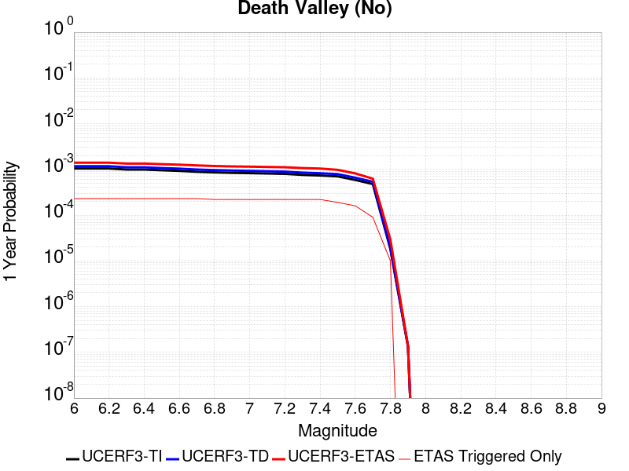 |  |

| Magnitude | 1 wk TI Prob | 1 wk TD Prob | 1 wk ETAS Prob | 1 wk ETAS/TD Gain | 1 wk ETAS Triggered Only | 1 mo TI Prob | 1 mo TD Prob | 1 mo ETAS Prob | 1 mo ETAS/TD Gain | 1 mo ETAS Triggered Only | 1 yr TI Prob | 1 yr TD Prob | 1 yr ETAS Prob | 1 yr ETAS/TD Gain | 1 yr ETAS Triggered Only | 10 yr TI Prob | 10 yr TD Prob | 10 yr ETAS Prob | 10 yr ETAS/TD Gain | 10 yr ETAS Triggered Only |
|-----|-----|-----|-----|-----|-----|-----|-----|-----|-----|-----|-----|-----|-----|-----|-----|-----|-----|-----|-----|-----|
| 6.0 | 2.0074807E-5 | 2.2500446E-5 | 5.249977E-5 | 2.333277 | 3.0E-5 | 8.603206E-5 | 9.642696E-5 | 1.6642021E-4 | 1.7258681 | 7.0E-5 | 0.001046937 | 0.0011733733 | 0.0014031035 | 1.195786 | 2.3E-4 | 0.010420183 | 0.011672693 | 0.012068024 | 1.033868 | 4.0E-4 |
| 6.1 | 2.0074807E-5 | 2.2500446E-5 | 5.249977E-5 | 2.333277 | 3.0E-5 | 8.603206E-5 | 9.642696E-5 | 1.6642021E-4 | 1.7258681 | 7.0E-5 | 0.001046937 | 0.0011733733 | 0.0014031035 | 1.195786 | 2.3E-4 | 0.010420183 | 0.011672693 | 0.012068024 | 1.033868 | 4.0E-4 |
| 6.2 | 2.0074807E-5 | 2.2500446E-5 | 5.249977E-5 | 2.333277 | 3.0E-5 | 8.603206E-5 | 9.642696E-5 | 1.6642021E-4 | 1.7258681 | 7.0E-5 | 0.001046937 | 0.0011733733 | 0.0014031035 | 1.195786 | 2.3E-4 | 0.010420183 | 0.011672693 | 0.012068024 | 1.033868 | 4.0E-4 |
| 6.3 | 1.9050609E-5 | 2.1337288E-5 | 5.1336647E-5 | 2.4059594 | 3.0E-5 | 8.164292E-5 | 9.144236E-5 | 1.6143595E-4 | 1.7654396 | 7.0E-5 | 9.935491E-4 | 0.0011127489 | 0.0013424929 | 1.2064654 | 2.3E-4 | 0.009891188 | 0.011072595 | 0.011468166 | 1.0357252 | 4.0E-4 |
| 6.4 | 1.9050609E-5 | 2.1337288E-5 | 5.1336647E-5 | 2.4059594 | 3.0E-5 | 8.164292E-5 | 9.144236E-5 | 1.6143595E-4 | 1.7654396 | 7.0E-5 | 9.935491E-4 | 0.0011127489 | 0.0013424929 | 1.2064654 | 2.3E-4 | 0.009891188 | 0.011072595 | 0.011468166 | 1.0357252 | 4.0E-4 |
| 6.5 | 1.8367004E-5 | 2.0561336E-5 | 5.056072E-5 | 2.4590192 | 3.0E-5 | 7.8713354E-5 | 8.811707E-5 | 1.5811091E-4 | 1.7943277 | 7.0E-5 | 9.5791375E-4 | 0.0010723039 | 0.0013020573 | 1.2142614 | 2.3E-4 | 0.009537951 | 0.010672085 | 0.011067816 | 1.037081 | 4.0E-4 |
| 6.6 | 1.779439E-5 | 1.9911244E-5 | 4.9910646E-5 | 2.5066564 | 3.0E-5 | 7.625944E-5 | 8.533114E-5 | 1.5532518E-4 | 1.8202635 | 7.0E-5 | 9.280632E-4 | 0.0010384179 | 0.0012681792 | 1.2212608 | 2.3E-4 | 0.009241969 | 0.010336416 | 0.010722385 | 1.0373406 | 3.9E-4 |
| 6.7 | 1.7025437E-5 | 1.9043726E-5 | 4.9043156E-5 | 2.5752919 | 3.0E-5 | 7.296412E-5 | 8.161345E-5 | 1.5160773E-4 | 1.8576318 | 7.0E-5 | 8.87976E-4 | 9.93197E-4 | 0.0012229686 | 1.2313454 | 2.3E-4 | 0.008844362 | 0.009888301 | 0.010274445 | 1.0390506 | 3.9E-4 |
| 6.8 | 1.6545107E-5 | 1.851284E-5 | 4.8512284E-5 | 2.620467 | 3.0E-5 | 7.090568E-5 | 7.933836E-5 | 1.493328E-4 | 1.8822271 | 7.0E-5 | 8.629347E-4 | 9.655226E-4 | 0.0011853102 | 1.2276359 | 2.2E-4 | 0.008595915 | 0.009613981 | 0.009990327 | 1.0391458 | 3.8E-4 |
| 6.9 | 1.615478E-5 | 1.8087881E-5 | 4.808734E-5 | 2.658539 | 3.0E-5 | 6.9232934E-5 | 7.751722E-5 | 1.475118E-4 | 1.902955 | 7.0E-5 | 8.4258494E-4 | 9.433697E-4 | 0.0011631622 | 1.2329866 | 2.2E-4 | 0.008393973 | 0.009394345 | 0.009770774 | 1.0400698 | 3.8E-4 |
| 7.0 | 1.5894311E-5 | 1.7805834E-5 | 4.78053E-5 | 2.6848109 | 3.0E-5 | 6.81167E-5 | 7.6308526E-5 | 1.4630318E-4 | 1.9172587 | 7.0E-5 | 8.2900526E-4 | 9.286663E-4 | 0.0011484621 | 1.2366788 | 2.2E-4 | 0.008259195 | 0.009248544 | 0.009625031 | 1.0407076 | 3.8E-4 |
| 7.1 | 1.5602263E-5 | 1.7483784E-5 | 4.748326E-5 | 2.7158458 | 3.0E-5 | 6.6865134E-5 | 7.4928386E-5 | 1.4492313E-4 | 1.9341555 | 7.0E-5 | 8.137789E-4 | 9.118773E-4 | 0.0011316767 | 1.2410405 | 2.2E-4 | 0.008108052 | 0.009082039 | 0.0094585875 | 1.0414609 | 3.8E-4 |
| 7.2 | 1.5323829E-5 | 1.7170905E-5 | 4.717039E-5 | 2.7471113 | 3.0E-5 | 6.56719E-5 | 7.358755E-5 | 1.4358241E-4 | 1.9511778 | 7.0E-5 | 7.99262E-4 | 8.9556625E-4 | 0.0011153693 | 1.2454346 | 2.2E-4 | 0.007963934 | 0.008920249 | 0.00929686 | 1.0422198 | 3.8E-4 |
| 7.3 | 1.4556212E-5 | 1.6302716E-5 | 4.6302226E-5 | 2.8401542 | 3.0E-5 | 6.238227E-5 | 6.986695E-5 | 1.3986205E-4 | 2.0018344 | 7.0E-5 | 7.592395E-4 | 8.503039E-4 | 0.0010701169 | 1.2585111 | 2.2E-4 | 0.0075665074 | 0.008471149 | 0.008838015 | 1.0433077 | 3.7E-4 |
| 7.4 | 1.411725E-5 | 1.5808211E-5 | 4.5807737E-5 | 2.897718 | 3.0E-5 | 6.0501097E-5 | 6.774775E-5 | 1.3774302E-4 | 2.0331745 | 7.0E-5 | 7.363519E-4 | 8.245226E-4 | 0.0010443411 | 1.2666011 | 2.2E-4 | 0.0073391674 | 0.008215268 | 0.008582229 | 1.0446681 | 3.7E-4 |
| 7.5 | 1.3503312E-5 | 1.5126531E-5 | 2.512638E-5 | 1.6610801 | 1.0E-5 | 5.7870053E-5 | 6.482641E-5 | 1.0482382E-4 | 1.6169925 | 4.0E-5 | 7.043401E-4 | 7.8898156E-4 | 9.788317E-4 | 1.2406268 | 1.9E-4 | 0.007021119 | 0.007862429 | 0.008199756 | 1.0429037 | 3.4E-4 |
| 7.6 | 1.1279839E-5 | 1.2626528E-5 | 2.2626402E-5 | 1.7919734 | 1.0E-5 | 4.834127E-5 | 5.4112596E-5 | 9.411043E-5 | 1.7391595 | 4.0E-5 | 5.88396E-4 | 6.58627E-4 | 8.1852166E-4 | 1.2427696 | 1.6E-4 | 0.005868405 | 0.0065673026 | 0.0068454635 | 1.0423554 | 2.8E-4 |
| 7.7 | 9.189108E-6 | 1.0283521E-5 | 1.0283521E-5 | 1.0 | 0.0 | 3.93813E-5 | 4.407152E-5 | 6.4070635E-5 | 1.4537878 | 2.0E-5 | 4.7936183E-4 | 5.3644367E-4 | 6.263954E-4 | 1.1676816 | 9.0E-5 | 0.004783291 | 0.0053519984 | 0.0055409814 | 1.0353107 | 1.9E-4 |
| 7.8 | 3.4586725E-7 | 3.648288E-7 | 3.648288E-7 | 1.0 | 0.0 | 1.4822873E-6 | 1.5635511E-6 | 1.1563536E-5 | 7.3956876 | 1.0E-5 | 1.80467E-5 | 1.9036073E-5 | 2.9035882E-5 | 1.5253085 | 1.0E-5 | 1.8045233E-4 | 1.9034486E-4 | 2.0034295E-4 | 1.0525262 | 1.0E-5 |
| 7.9 | 2.5591178E-9 | 2.6696871E-9 | 2.6696871E-9 | 1.0 | 0.0 | 1.0967647E-8 | 1.1441516E-8 | 1.1441516E-8 | 1.0 | 0.0 | 1.335311E-7 | 1.3930045E-7 | 1.3930045E-7 | 1.0 | 0.0 | 1.3353102E-6 | 1.3930046E-6 | 1.3930046E-6 | 1.0 | 0.0 |

## Red Pass
*[(top)](#table-of-contents)*

| 1 Week | 1 Month | 1 Year | 10 Year |
|-----|-----|-----|-----|
|  |  |  |  |

| Magnitude | 1 wk TI Prob | 1 wk TD Prob | 1 wk ETAS Prob | 1 wk ETAS/TD Gain | 1 wk ETAS Triggered Only | 1 mo TI Prob | 1 mo TD Prob | 1 mo ETAS Prob | 1 mo ETAS/TD Gain | 1 mo ETAS Triggered Only | 1 yr TI Prob | 1 yr TD Prob | 1 yr ETAS Prob | 1 yr ETAS/TD Gain | 1 yr ETAS Triggered Only | 10 yr TI Prob | 10 yr TD Prob | 10 yr ETAS Prob | 10 yr ETAS/TD Gain | 10 yr ETAS Triggered Only |
|-----|-----|-----|-----|-----|-----|-----|-----|-----|-----|-----|-----|-----|-----|-----|-----|-----|-----|-----|-----|-----|
| 6.0 | 8.258278E-6 | 8.551305E-6 | 4.8550963E-5 | 5.6776085 | 4.0E-5 | 3.539214E-5 | 3.6648038E-5 | 1.46644E-4 | 4.0014153 | 1.1E-4 | 4.308141E-4 | 4.4611638E-4 | 6.7601376E-4 | 1.5153306 | 2.3E-4 | 0.0042997985 | 0.004453966 | 0.0047924514 | 1.0759965 | 3.4E-4 |
| 6.1 | 3.649988E-6 | 3.7753332E-6 | 2.3775257E-5 | 6.2975254 | 2.0E-5 | 1.5642712E-5 | 1.6179927E-5 | 6.617912E-5 | 4.090199 | 5.0E-5 | 1.9043336E-4 | 1.9697756E-4 | 3.2695197E-4 | 1.6598437 | 1.3E-4 | 0.0019027026 | 0.001968497 | 0.0021381623 | 1.0861903 | 1.7E-4 |
| 6.2 | 3.649988E-6 | 3.7753332E-6 | 2.3775257E-5 | 6.2975254 | 2.0E-5 | 1.5642712E-5 | 1.6179927E-5 | 6.617912E-5 | 4.090199 | 5.0E-5 | 1.9043336E-4 | 1.9697756E-4 | 3.2695197E-4 | 1.6598437 | 1.3E-4 | 0.0019027026 | 0.001968497 | 0.0021381623 | 1.0861903 | 1.7E-4 |
| 6.3 | 1.3924937E-6 | 1.4411233E-6 | 1.1441109E-5 | 7.9390216 | 1.0E-5 | 5.9678164E-6 | 6.176236E-6 | 2.6176112E-5 | 4.2381983 | 2.0E-5 | 7.265574E-5 | 7.51945E-5 | 1.2519074E-4 | 1.6648923 | 5.0E-5 | 7.263199E-4 | 7.518293E-4 | 8.3176914E-4 | 1.1063272 | 8.0E-5 |
| 6.4 | 1.3924937E-6 | 1.4411233E-6 | 1.1441109E-5 | 7.9390216 | 1.0E-5 | 5.9678164E-6 | 6.176236E-6 | 2.6176112E-5 | 4.2381983 | 2.0E-5 | 7.265574E-5 | 7.51945E-5 | 1.2519074E-4 | 1.6648923 | 5.0E-5 | 7.263199E-4 | 7.518293E-4 | 8.3176914E-4 | 1.1063272 | 8.0E-5 |
| 6.5 | 9.876812E-7 | 1.022196E-6 | 1.1022185E-5 | 10.78285 | 1.0E-5 | 4.2329125E-6 | 4.38084E-6 | 1.4380796E-5 | 3.2826574 | 1.0E-5 | 5.153449E-5 | 5.3336724E-5 | 7.333566E-5 | 1.3749561 | 2.0E-5 | 5.1522546E-4 | 5.333672E-4 | 5.733459E-4 | 1.0749552 | 4.0E-5 |

## San Andreas (Parkfield)
*[(top)](#table-of-contents)*

| 1 Week | 1 Month | 1 Year | 10 Year |
|-----|-----|-----|-----|
|  | 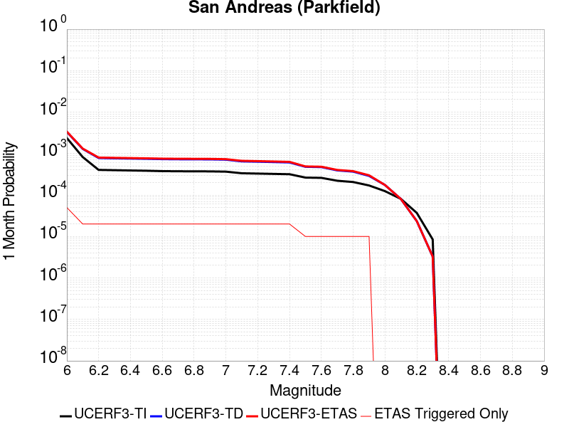 |  |  |

| Magnitude | 1 wk TI Prob | 1 wk TD Prob | 1 wk ETAS Prob | 1 wk ETAS/TD Gain | 1 wk ETAS Triggered Only | 1 mo TI Prob | 1 mo TD Prob | 1 mo ETAS Prob | 1 mo ETAS/TD Gain | 1 mo ETAS Triggered Only | 1 yr TI Prob | 1 yr TD Prob | 1 yr ETAS Prob | 1 yr ETAS/TD Gain | 1 yr ETAS Triggered Only | 10 yr TI Prob | 10 yr TD Prob | 10 yr ETAS Prob | 10 yr ETAS/TD Gain | 10 yr ETAS Triggered Only |
|-----|-----|-----|-----|-----|-----|-----|-----|-----|-----|-----|-----|-----|-----|-----|-----|-----|-----|-----|-----|-----|
| 6.0 | 5.556969E-4 | 7.787764E-4 | 7.987608E-4 | 1.0256613 | 2.0E-5 | 0.0023793848 | 0.0033338934 | 0.0033837266 | 1.0149475 | 5.0E-5 | 0.028586963 | 0.04027906 | 0.040403824 | 1.0030975 | 1.3E-4 | 0.25176284 | 0.3373374 | 0.33751634 | 1.0005304 | 2.7E-4 |
| 6.1 | 1.925858E-4 | 3.0300187E-4 | 3.1299883E-4 | 1.0329931 | 1.0E-5 | 8.2510663E-4 | 0.0012980271 | 0.0013180012 | 1.015388 | 2.0E-5 | 0.0099994885 | 0.01578479 | 0.015843844 | 1.0037411 | 6.0E-5 | 0.095613256 | 0.14981315 | 0.14990667 | 1.0006243 | 1.1E-4 |
| 6.2 | 9.4306815E-5 | 1.8251229E-4 | 1.9251046E-4 | 1.0547808 | 1.0E-5 | 4.0410945E-4 | 7.8196224E-4 | 8.019466E-4 | 1.0255567 | 2.0E-5 | 0.0049089384 | 0.009479025 | 0.009538457 | 1.0062698 | 6.0E-5 | 0.048019063 | 0.09188695 | 0.09196868 | 1.0008894 | 9.0E-5 |
| 6.3 | 9.283051E-5 | 1.7947727E-4 | 1.8947547E-4 | 1.0557073 | 1.0E-5 | 3.9778434E-4 | 7.689627E-4 | 7.8894733E-4 | 1.025989 | 2.0E-5 | 0.0048322747 | 0.0093221245 | 0.009381565 | 1.0063763 | 6.0E-5 | 0.047285385 | 0.09053988 | 0.09062173 | 1.0009041 | 9.0E-5 |
| 6.4 | 9.138826E-5 | 1.7709887E-4 | 1.870971E-4 | 1.0564556 | 1.0E-5 | 3.916052E-4 | 7.5877557E-4 | 7.787604E-4 | 1.0263382 | 2.0E-5 | 0.0047573745 | 0.009199142 | 0.009258591 | 1.0064623 | 6.0E-5 | 0.046568092 | 0.08944346 | 0.08952541 | 1.0009162 | 9.0E-5 |
| 6.5 | 9.000255E-5 | 1.7467843E-4 | 1.8467668E-4 | 1.0572381 | 1.0E-5 | 3.8566816E-4 | 7.484082E-4 | 7.683932E-4 | 1.0267034 | 2.0E-5 | 0.0046854047 | 0.009074002 | 0.009133457 | 1.0065523 | 6.0E-5 | 0.045878403 | 0.08833238 | 0.08841442 | 1.0009289 | 9.0E-5 |
| 6.6 | 8.8109264E-5 | 1.7148908E-4 | 1.8148737E-4 | 1.0583028 | 1.0E-5 | 3.7755648E-4 | 7.347474E-4 | 7.547327E-4 | 1.0272002 | 2.0E-5 | 0.0045870654 | 0.008909067 | 0.008968533 | 1.0066748 | 6.0E-5 | 0.04493529 | 0.08686431 | 0.08694649 | 1.000946 | 9.0E-5 |
| 6.7 | 8.738073E-5 | 1.7015962E-4 | 1.8015792E-4 | 1.0587584 | 1.0E-5 | 3.7443507E-4 | 7.290529E-4 | 7.490383E-4 | 1.0274129 | 2.0E-5 | 0.0045492216 | 0.008840349 | 0.008899818 | 1.0067271 | 6.0E-5 | 0.04457213 | 0.08626531 | 0.08634755 | 1.0009533 | 9.0E-5 |
| 6.8 | 8.710195E-5 | 1.6961442E-4 | 1.7961273E-4 | 1.0589472 | 1.0E-5 | 3.7324068E-4 | 7.267176E-4 | 7.4670307E-4 | 1.027501 | 2.0E-5 | 0.0045347405 | 0.008812156 | 0.008871627 | 1.0067488 | 6.0E-5 | 0.04443313 | 0.086012915 | 0.08609518 | 1.0009563 | 9.0E-5 |
| 6.9 | 8.6801556E-5 | 1.6902383E-4 | 1.7902213E-4 | 1.0591532 | 1.0E-5 | 3.7195362E-4 | 7.241879E-4 | 7.4417336E-4 | 1.0275972 | 2.0E-5 | 0.0045191357 | 0.0087816045 | 0.008841078 | 1.0067725 | 6.0E-5 | 0.044283327 | 0.08573886 | 0.085821144 | 1.0009598 | 9.0E-5 |
| 7.0 | 8.5571606E-5 | 1.6655146E-4 | 1.7654979E-4 | 1.0600315 | 1.0E-5 | 3.6668387E-4 | 7.1359787E-4 | 7.335836E-4 | 1.028007 | 2.0E-5 | 0.004455241 | 0.008653701 | 0.008713182 | 1.0068735 | 6.0E-5 | 0.043669727 | 0.08458771 | 0.0846701 | 1.0009739 | 9.0E-5 |
| 7.1 | 7.82589E-5 | 1.513576E-4 | 1.6135609E-4 | 1.0660588 | 1.0E-5 | 3.3535215E-4 | 6.485149E-4 | 6.6850195E-4 | 1.0308197 | 2.0E-5 | 0.0040752706 | 0.007867255 | 0.007916861 | 1.0063055 | 5.0E-5 | 0.040013418 | 0.07750286 | 0.07757666 | 1.0009522 | 8.0E-5 |
| 7.2 | 7.690929E-5 | 1.4872964E-4 | 1.5872816E-4 | 1.067226 | 1.0E-5 | 3.2956956E-4 | 6.3725776E-4 | 6.5724505E-4 | 1.0313644 | 2.0E-5 | 0.004005129 | 0.0077311797 | 0.007780793 | 1.0064173 | 5.0E-5 | 0.0393371 | 0.07627582 | 0.07634971 | 1.0009688 | 8.0E-5 |
| 7.3 | 7.5543794E-5 | 1.4569426E-4 | 1.556928E-4 | 1.0686269 | 1.0E-5 | 3.2371894E-4 | 6.242553E-4 | 6.442428E-4 | 1.0320182 | 2.0E-5 | 0.003934157 | 0.0075739846 | 0.007623606 | 1.0065515 | 5.0E-5 | 0.038652334 | 0.07484126 | 0.07491527 | 1.000989 | 8.0E-5 |
| 7.4 | 7.4214564E-5 | 1.4270298E-4 | 1.5270156E-4 | 1.0700656 | 1.0E-5 | 3.1802364E-4 | 6.1144156E-4 | 6.314293E-4 | 1.0326896 | 2.0E-5 | 0.003865065 | 0.00741905 | 0.007468679 | 1.0066894 | 5.0E-5 | 0.03798529 | 0.07341491 | 0.07348903 | 1.0010097 | 8.0E-5 |
| 7.5 | 6.149578E-5 | 1.1197151E-4 | 1.2197039E-4 | 1.0892985 | 1.0E-5 | 2.6352672E-4 | 4.7978974E-4 | 4.897849E-4 | 1.0208324 | 1.0E-5 | 0.0032037178 | 0.0058258264 | 0.005865593 | 1.0068259 | 4.0E-5 | 0.03157923 | 0.058584794 | 0.05864128 | 1.0009642 | 6.0E-5 |
| 7.6 | 6.0643448E-5 | 1.10257475E-4 | 1.2025637E-4 | 1.0906868 | 1.0E-5 | 2.598746E-4 | 4.7244655E-4 | 4.8244183E-4 | 1.0211564 | 1.0E-5 | 0.0031593828 | 0.0057368972 | 0.005776668 | 1.0069324 | 4.0E-5 | 0.031148417 | 0.0577456 | 0.057802133 | 1.0009791 | 6.0E-5 |
| 7.7 | 5.1652263E-5 | 9.180402E-5 | 1.018031E-4 | 1.1089177 | 1.0E-5 | 2.2134806E-4 | 3.933865E-4 | 4.0338255E-4 | 1.0254103 | 1.0E-5 | 0.002691582 | 0.0047789724 | 0.004808829 | 1.0062475 | 3.0E-5 | 0.026592141 | 0.048558682 | 0.04859674 | 1.0007838 | 4.0E-5 |
| 7.8 | 4.8090482E-5 | 8.564889E-5 | 9.5648036E-5 | 1.1167457 | 1.0E-5 | 2.060858E-4 | 3.6701505E-4 | 3.770114E-4 | 1.0272368 | 1.0E-5 | 0.0025062072 | 0.0044592614 | 0.0044891275 | 1.0066975 | 3.0E-5 | 0.024781305 | 0.04532328 | 0.045361467 | 1.0008426 | 4.0E-5 |
| 7.9 | 3.970278E-5 | 6.754373E-5 | 7.754305E-5 | 1.1480422 | 1.0E-5 | 1.7014367E-4 | 2.8944103E-4 | 2.9943814E-4 | 1.0345393 | 1.0E-5 | 0.002069531 | 0.003518254 | 0.0035481486 | 1.008497 | 3.0E-5 | 0.020503636 | 0.03590036 | 0.035938926 | 1.0010742 | 4.0E-5 |
| 8.0 | 2.8982335E-5 | 4.072156E-5 | 4.072156E-5 | 1.0 | 0.0 | 1.2420409E-4 | 1.745093E-4 | 1.745093E-4 | 1.0 | 0.0 | 0.0015111357 | 0.0021225815 | 0.0021325604 | 1.0047013 | 1.0E-5 | 0.015009012 | 0.022022424 | 0.022041984 | 1.0008881 | 2.0E-5 |
| 8.1 | 1.8836186E-5 | 1.8692857E-5 | 1.8692857E-5 | 1.0 | 0.0 | 8.0724014E-5 | 8.0109785E-5 | 8.0109785E-5 | 1.0 | 0.0 | 9.823717E-4 | 9.7490085E-4 | 9.7490085E-4 | 1.0 | 0.0 | 0.009780403 | 0.010494427 | 0.010494427 | 1.0 | 0.0 |
| 8.2 | 8.643924E-6 | 5.478665E-6 | 5.478665E-6 | 1.0 | 0.0 | 3.704486E-5 | 2.3479783E-5 | 2.3479783E-5 | 1.0 | 0.0 | 4.5092785E-4 | 2.8582895E-4 | 2.8582895E-4 | 1.0 | 0.0 | 0.0045001395 | 0.0032508469 | 0.0032508469 | 1.0 | 0.0 |
| 8.3 | 1.983087E-6 | 7.6647797E-7 | 7.6647797E-7 | 1.0 | 0.0 | 8.498917E-6 | 3.2849016E-6 | 3.2849016E-6 | 1.0 | 0.0 | 1.034694E-4 | 3.999296E-5 | 3.999296E-5 | 1.0 | 0.0 | 0.0010342124 | 4.7228087E-4 | 4.7228087E-4 | 1.0 | 0.0 |

## San Andreas (San Gorgonio Pass-Garnet HIll)
*[(top)](#table-of-contents)*

| 1 Week | 1 Month | 1 Year | 10 Year |
|-----|-----|-----|-----|
|  | 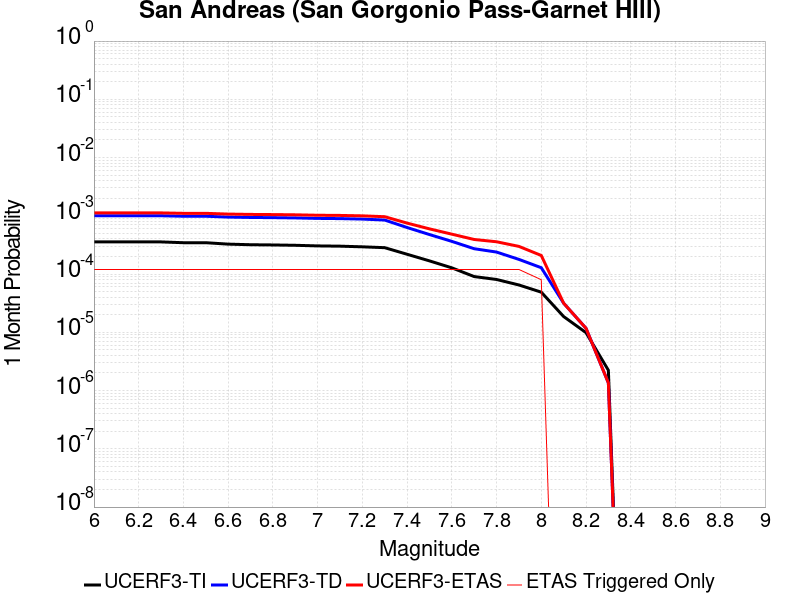 |  |  |

| Magnitude | 1 wk TI Prob | 1 wk TD Prob | 1 wk ETAS Prob | 1 wk ETAS/TD Gain | 1 wk ETAS Triggered Only | 1 mo TI Prob | 1 mo TD Prob | 1 mo ETAS Prob | 1 mo ETAS/TD Gain | 1 mo ETAS Triggered Only | 1 yr TI Prob | 1 yr TD Prob | 1 yr ETAS Prob | 1 yr ETAS/TD Gain | 1 yr ETAS Triggered Only | 10 yr TI Prob | 10 yr TD Prob | 10 yr ETAS Prob | 10 yr ETAS/TD Gain | 10 yr ETAS Triggered Only |
|-----|-----|-----|-----|-----|-----|-----|-----|-----|-----|-----|-----|-----|-----|-----|-----|-----|-----|-----|-----|-----|
| 6.0 | 8.31567E-5 | 2.338839E-4 | 2.838722E-4 | 1.2137313 | 5.0E-5 | 3.5633717E-4 | 0.0010019708 | 0.0011218506 | 1.1196439 | 1.2E-4 | 0.004329778 | 0.01213065 | 0.012328224 | 1.0162872 | 2.0E-4 | 0.042463828 | 0.11259771 | 0.11284619 | 1.0022067 | 2.8E-4 |
| 6.1 | 8.31567E-5 | 2.338839E-4 | 2.838722E-4 | 1.2137313 | 5.0E-5 | 3.5633717E-4 | 0.0010019708 | 0.0011218506 | 1.1196439 | 1.2E-4 | 0.004329778 | 0.01213065 | 0.012328224 | 1.0162872 | 2.0E-4 | 0.042463828 | 0.11259771 | 0.11284619 | 1.0022067 | 2.8E-4 |
| 6.2 | 8.31567E-5 | 2.338839E-4 | 2.838722E-4 | 1.2137313 | 5.0E-5 | 3.5633717E-4 | 0.0010019708 | 0.0011218506 | 1.1196439 | 1.2E-4 | 0.004329778 | 0.01213065 | 0.012328224 | 1.0162872 | 2.0E-4 | 0.042463828 | 0.11259771 | 0.11284619 | 1.0022067 | 2.8E-4 |
| 6.3 | 8.31567E-5 | 2.338839E-4 | 2.838722E-4 | 1.2137313 | 5.0E-5 | 3.5633717E-4 | 0.0010019708 | 0.0011218506 | 1.1196439 | 1.2E-4 | 0.004329778 | 0.01213065 | 0.012328224 | 1.0162872 | 2.0E-4 | 0.042463828 | 0.11259771 | 0.11284619 | 1.0022067 | 2.8E-4 |
| 6.4 | 8.059055E-5 | 2.2945837E-4 | 2.794469E-4 | 1.2178545 | 5.0E-5 | 3.4534236E-4 | 9.830239E-4 | 0.001102906 | 1.1219523 | 1.2E-4 | 0.0041964394 | 0.011902837 | 0.012100456 | 1.0166028 | 2.0E-4 | 0.041180745 | 0.11057874 | 0.110818885 | 1.0021718 | 2.7E-4 |
| 6.5 | 8.059055E-5 | 2.2945837E-4 | 2.794469E-4 | 1.2178545 | 5.0E-5 | 3.4534236E-4 | 9.830239E-4 | 0.001102906 | 1.1219523 | 1.2E-4 | 0.0041964394 | 0.011902837 | 0.012100456 | 1.0166028 | 2.0E-4 | 0.041180745 | 0.11057874 | 0.110818885 | 1.0021718 | 2.7E-4 |
| 6.6 | 7.619237E-5 | 2.2190346E-4 | 2.7189238E-4 | 1.2252733 | 5.0E-5 | 3.2649786E-4 | 9.5067057E-4 | 0.0010705565 | 1.1261067 | 1.2E-4 | 0.0039678677 | 0.011513535 | 0.011711232 | 1.0171709 | 2.0E-4 | 0.03897764 | 0.107115194 | 0.10735627 | 1.0022507 | 2.7E-4 |
| 6.7 | 7.440636E-5 | 2.1866155E-4 | 2.6865062E-4 | 1.2286139 | 5.0E-5 | 3.188454E-4 | 9.367866E-4 | 0.0010566742 | 1.1279775 | 1.2E-4 | 0.0038750346 | 0.011346267 | 0.011543998 | 1.017427 | 2.0E-4 | 0.038081564 | 0.105623715 | 0.105865195 | 1.0022862 | 2.7E-4 |
| 6.8 | 7.3735864E-5 | 2.1713313E-4 | 2.671223E-4 | 1.2302234 | 5.0E-5 | 3.1597257E-4 | 9.3024096E-4 | 0.0010501293 | 1.1288788 | 1.2E-4 | 0.0038401815 | 0.011267403 | 0.011455262 | 1.0166728 | 1.9E-4 | 0.03774495 | 0.10492511 | 0.10515783 | 1.002218 | 2.6E-4 |
| 6.9 | 7.27575E-5 | 2.1482276E-4 | 2.6481203E-4 | 1.2327 | 5.0E-5 | 3.117806E-4 | 9.203464E-4 | 0.001040236 | 1.1302657 | 1.2E-4 | 0.003789323 | 0.011148175 | 0.011336057 | 1.0168531 | 1.9E-4 | 0.037253562 | 0.103873 | 0.104105994 | 1.002243 | 2.6E-4 |
| 7.0 | 7.102591E-5 | 2.10663E-4 | 2.6065245E-4 | 1.2372959 | 5.0E-5 | 3.0436125E-4 | 9.0253126E-4 | 0.0010224229 | 1.1328394 | 1.2E-4 | 0.003699303 | 0.010933471 | 0.011121393 | 1.0171878 | 1.9E-4 | 0.03638325 | 0.10197552 | 0.10220901 | 1.0022897 | 2.6E-4 |
| 7.1 | 7.028513E-5 | 2.0901936E-4 | 2.590089E-4 | 1.2391623 | 5.0E-5 | 3.0118722E-4 | 8.95492E-4 | 0.0010153844 | 1.1338845 | 1.2E-4 | 0.0036607897 | 0.010848625 | 0.011036564 | 1.0173237 | 1.9E-4 | 0.036010686 | 0.10121833 | 0.101452015 | 1.0023087 | 2.6E-4 |
| 7.2 | 6.8498244E-5 | 2.0509785E-4 | 2.550876E-4 | 1.243736 | 5.0E-5 | 2.9353087E-4 | 8.786969E-4 | 9.985914E-4 | 1.1364459 | 1.2E-4 | 0.003567883 | 0.010646159 | 0.010834136 | 1.0176568 | 1.9E-4 | 0.035111405 | 0.09941009 | 0.099644236 | 1.0023555 | 2.6E-4 |
| 7.3 | 6.622592E-5 | 1.9737013E-4 | 2.4736027E-4 | 1.2532811 | 5.0E-5 | 2.8379448E-4 | 8.455999E-4 | 9.6549845E-4 | 1.1417911 | 1.2E-4 | 0.0034497243 | 0.010247062 | 0.010435115 | 1.0183519 | 1.9E-4 | 0.033966612 | 0.09590662 | 0.09614169 | 1.002451 | 2.6E-4 |
| 7.4 | 5.1050705E-5 | 1.4693316E-4 | 1.9692582E-4 | 1.3402407 | 5.0E-5 | 2.1877038E-4 | 6.295625E-4 | 7.4948696E-4 | 1.1904886 | 1.2E-4 | 0.002660276 | 0.0076381783 | 0.007826727 | 1.024685 | 1.9E-4 | 0.02628654 | 0.07287833 | 0.07311939 | 1.0033076 | 2.6E-4 |
| 7.5 | 3.9302922E-5 | 1.1133535E-4 | 1.6132978E-4 | 1.4490436 | 5.0E-5 | 1.6843023E-4 | 4.7706455E-4 | 5.970073E-4 | 1.2514182 | 1.2E-4 | 0.0020487092 | 0.0057928623 | 0.0059817615 | 1.032609 | 1.9E-4 | 0.020299247 | 0.056023482 | 0.05626892 | 1.004381 | 2.6E-4 |
| 7.6 | 2.9851626E-5 | 8.498211E-5 | 1.3497786E-4 | 1.5883092 | 5.0E-5 | 1.2792926E-4 | 3.6415833E-4 | 4.8411463E-4 | 1.329407 | 1.2E-4 | 0.0015564259 | 0.00442464 | 0.004613799 | 1.0427513 | 1.9E-4 | 0.0154556995 | 0.043206394 | 0.04345516 | 1.0057576 | 2.6E-4 |
| 7.7 | 2.1135214E-5 | 6.355745E-5 | 1.1355427E-4 | 1.7866399 | 5.0E-5 | 9.0576345E-5 | 2.7236066E-4 | 3.9232796E-4 | 1.4404722 | 1.2E-4 | 0.0011022091 | 0.0033109542 | 0.0035003251 | 1.0571953 | 1.9E-4 | 0.010967582 | 0.03259442 | 0.03283627 | 1.0074201 | 2.5E-4 |
| 7.8 | 1.883379E-5 | 5.5666103E-5 | 1.0566332E-4 | 1.8981627 | 5.0E-5 | 8.0713755E-5 | 2.3854722E-4 | 3.585186E-4 | 1.502925 | 1.2E-4 | 9.822468E-4 | 0.0029004475 | 0.0030799254 | 1.0618794 | 1.8E-4 | 0.0097791655 | 0.02870594 | 0.028929338 | 1.0077822 | 2.3E-4 |
| 7.9 | 1.5156185E-5 | 4.167907E-5 | 9.1676986E-5 | 2.1995928 | 5.0E-5 | 6.495346E-5 | 1.7861238E-4 | 2.9859095E-4 | 1.671726 | 1.2E-4 | 7.9052144E-4 | 0.0021724382 | 0.002342069 | 1.078083 | 1.7E-4 | 0.007877152 | 0.021768799 | 0.021974226 | 1.0094368 | 2.1E-4 |
| 8.0 | 1.1405907E-5 | 2.9989498E-5 | 5.9988597E-5 | 2.0003202 | 3.0E-5 | 4.8881542E-5 | 1.2852009E-4 | 2.0850981E-4 | 1.6223907 | 8.0E-5 | 5.9497025E-4 | 0.00156361 | 0.001673438 | 1.07024 | 1.1E-4 | 0.005933798 | 0.015779829 | 0.015927462 | 1.0093558 | 1.5E-4 |
| 8.1 | 4.3511436E-6 | 7.3739657E-6 | 7.3739657E-6 | 1.0 | 0.0 | 1.8647626E-5 | 3.160233E-5 | 3.160233E-5 | 1.0 | 0.0 | 2.2701119E-4 | 3.8469053E-4 | 3.8469053E-4 | 1.0 | 0.0 | 0.0022677942 | 0.0041186865 | 0.0041186865 | 1.0 | 0.0 |
| 8.2 | 2.3042528E-6 | 2.7349201E-6 | 2.7349201E-6 | 1.0 | 0.0 | 9.875332E-6 | 1.1721034E-5 | 1.1721034E-5 | 1.0 | 0.0 | 1.2022553E-4 | 1.4269429E-4 | 1.4269429E-4 | 1.0 | 0.0 | 0.0012016051 | 0.0015990431 | 0.0015990431 | 1.0 | 0.0 |
| 8.3 | 5.202968E-7 | 3.1619535E-7 | 3.1619535E-7 | 1.0 | 0.0 | 2.2298414E-6 | 1.3551223E-6 | 1.3551223E-6 | 1.0 | 0.0 | 2.714798E-5 | 1.6498503E-5 | 1.6498503E-5 | 1.0 | 0.0 | 2.7144665E-4 | 1.9577713E-4 | 1.9577713E-4 | 1.0 | 0.0 |

## Death Valley (Fish Lake Valley)
*[(top)](#table-of-contents)*

| 1 Week | 1 Month | 1 Year | 10 Year |
|-----|-----|-----|-----|
| 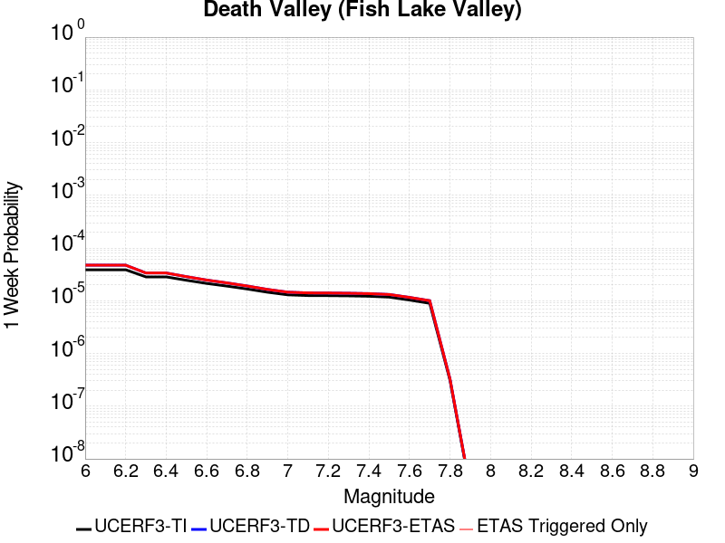 |  |  |  |

| Magnitude | 1 wk TI Prob | 1 wk TD Prob | 1 wk ETAS Prob | 1 wk ETAS/TD Gain | 1 wk ETAS Triggered Only | 1 mo TI Prob | 1 mo TD Prob | 1 mo ETAS Prob | 1 mo ETAS/TD Gain | 1 mo ETAS Triggered Only | 1 yr TI Prob | 1 yr TD Prob | 1 yr ETAS Prob | 1 yr ETAS/TD Gain | 1 yr ETAS Triggered Only | 10 yr TI Prob | 10 yr TD Prob | 10 yr ETAS Prob | 10 yr ETAS/TD Gain | 10 yr ETAS Triggered Only |
|-----|-----|-----|-----|-----|-----|-----|-----|-----|-----|-----|-----|-----|-----|-----|-----|-----|-----|-----|-----|-----|
| 6.0 | 3.872328E-5 | 4.7267124E-5 | 4.7267124E-5 | 1.0 | 0.0 | 1.6594635E-4 | 2.0255933E-4 | 2.3255324E-4 | 1.1480747 | 3.0E-5 | 0.0020185246 | 0.002463633 | 0.002603288 | 1.0566866 | 1.4E-4 | 0.02000288 | 0.024389042 | 0.024632944 | 1.0100005 | 2.5E-4 |
| 6.1 | 3.872328E-5 | 4.7267124E-5 | 4.7267124E-5 | 1.0 | 0.0 | 1.6594635E-4 | 2.0255933E-4 | 2.3255324E-4 | 1.1480747 | 3.0E-5 | 0.0020185246 | 0.002463633 | 0.002603288 | 1.0566866 | 1.4E-4 | 0.02000288 | 0.024389042 | 0.024632944 | 1.0100005 | 2.5E-4 |
| 6.2 | 3.872328E-5 | 4.7267124E-5 | 4.7267124E-5 | 1.0 | 0.0 | 1.6594635E-4 | 2.0255933E-4 | 2.3255324E-4 | 1.1480747 | 3.0E-5 | 0.0020185246 | 0.002463633 | 0.002603288 | 1.0566866 | 1.4E-4 | 0.02000288 | 0.024389042 | 0.024632944 | 1.0100005 | 2.5E-4 |
| 6.3 | 2.8356371E-5 | 3.361063E-5 | 3.361063E-5 | 1.0 | 0.0 | 1.2152165E-4 | 1.4403803E-4 | 1.740337E-4 | 1.2082484 | 3.0E-5 | 0.0014785219 | 0.0017523223 | 0.001892077 | 1.079754 | 1.4E-4 | 0.014687235 | 0.017392244 | 0.017637895 | 1.0141243 | 2.5E-4 |
| 6.4 | 2.8356371E-5 | 3.361063E-5 | 3.361063E-5 | 1.0 | 0.0 | 1.2152165E-4 | 1.4403803E-4 | 1.740337E-4 | 1.2082484 | 3.0E-5 | 0.0014785219 | 0.0017523223 | 0.001892077 | 1.079754 | 1.4E-4 | 0.014687235 | 0.017392244 | 0.017637895 | 1.0141243 | 2.5E-4 |
| 6.5 | 2.4448687E-5 | 2.8608241E-5 | 2.8608241E-5 | 1.0 | 0.0 | 1.0477588E-4 | 1.2260124E-4 | 1.5259757E-4 | 1.2446657 | 3.0E-5 | 0.0012748998 | 0.0014916958 | 0.0016314869 | 1.0937129 | 1.4E-4 | 0.012676105 | 0.014821727 | 0.015068022 | 1.0166172 | 2.5E-4 |
| 6.6 | 2.1298161E-5 | 2.4660607E-5 | 2.4660607E-5 | 1.0 | 0.0 | 9.127464E-5 | 1.05684194E-4 | 1.3568102E-4 | 1.2838346 | 3.0E-5 | 0.0011107022 | 0.0012859785 | 0.0014257984 | 1.1087265 | 1.4E-4 | 0.011051672 | 0.0127888 | 0.01302573 | 1.0185264 | 2.4E-4 |
| 6.7 | 1.8959729E-5 | 2.178146E-5 | 2.178146E-5 | 1.0 | 0.0 | 8.125345E-5 | 9.334592E-5 | 1.2334312E-4 | 1.3213552 | 3.0E-5 | 9.888117E-4 | 0.0011359196 | 0.0012757606 | 1.1231081 | 1.4E-4 | 0.009844234 | 0.011303795 | 0.011541082 | 1.0209918 | 2.4E-4 |
| 6.8 | 1.6691629E-5 | 1.9018706E-5 | 1.9018706E-5 | 1.0 | 0.0 | 7.153359E-5 | 8.150629E-5 | 1.1150385E-4 | 1.3680397 | 3.0E-5 | 8.7057345E-4 | 9.919042E-4 | 0.0011317653 | 1.1410027 | 1.4E-4 | 0.008671708 | 0.009876527 | 0.010104255 | 1.0230576 | 2.3E-4 |
| 6.9 | 1.450505E-5 | 1.6389824E-5 | 1.6389824E-5 | 1.0 | 0.0 | 6.216302E-5 | 7.024026E-5 | 1.00238154E-4 | 1.4270755 | 3.0E-5 | 7.5657194E-4 | 8.548484E-4 | 9.947288E-4 | 1.1636317 | 1.4E-4 | 0.007540013 | 0.008516532 | 0.008744574 | 1.0267763 | 2.3E-4 |
| 7.0 | 1.2940855E-5 | 1.453821E-5 | 1.453821E-5 | 1.0 | 0.0 | 5.545963E-5 | 6.230516E-5 | 9.230329E-5 | 1.4814711 | 3.0E-5 | 6.750118E-4 | 7.583071E-4 | 8.9820096E-4 | 1.1844817 | 1.4E-4 | 0.006729651 | 0.0075578135 | 0.007786075 | 1.030202 | 2.3E-4 |
| 7.1 | 1.2544658E-5 | 1.4078437E-5 | 1.4078437E-5 | 1.0 | 0.0 | 5.3761712E-5 | 6.033479E-5 | 9.0332986E-5 | 1.4971956 | 3.0E-5 | 6.5435225E-4 | 7.343341E-4 | 8.7423134E-4 | 1.190509 | 1.4E-4 | 0.006524288 | 0.0073196692 | 0.0075479858 | 1.0311922 | 2.3E-4 |
| 7.2 | 1.2489416E-5 | 1.4015902E-5 | 1.4015902E-5 | 1.0 | 0.0 | 5.3524967E-5 | 6.00668E-5 | 9.0065E-5 | 1.499414 | 3.0E-5 | 6.514716E-4 | 7.310735E-4 | 8.709712E-4 | 1.1913592 | 1.4E-4 | 0.006495651 | 0.007287278 | 0.0075156013 | 1.0313319 | 2.3E-4 |
| 7.3 | 1.2368307E-5 | 1.3880038E-5 | 1.3880038E-5 | 1.0 | 0.0 | 5.3005948E-5 | 5.948455E-5 | 8.948277E-5 | 1.5043026 | 3.0E-5 | 6.451563E-4 | 7.239894E-4 | 8.63888E-4 | 1.193233 | 1.4E-4 | 0.0064328653 | 0.0072168987 | 0.007445239 | 1.0316397 | 2.3E-4 |
| 7.4 | 1.2161707E-5 | 1.3648089E-5 | 1.3648089E-5 | 1.0 | 0.0 | 5.212056E-5 | 5.8490532E-5 | 8.848878E-5 | 1.5128735 | 3.0E-5 | 6.3438306E-4 | 7.118952E-4 | 8.517955E-4 | 1.1965182 | 1.4E-4 | 0.006325751 | 0.0070967353 | 0.007325103 | 1.0321792 | 2.3E-4 |
| 7.5 | 1.1707948E-5 | 1.314573E-5 | 1.314573E-5 | 1.0 | 0.0 | 5.0175953E-5 | 5.6337656E-5 | 7.633653E-5 | 1.3549824 | 2.0E-5 | 6.10721E-4 | 6.857007E-4 | 8.1561157E-4 | 1.189457 | 1.3E-4 | 0.0060904534 | 0.0068364325 | 0.007054928 | 1.0319605 | 2.2E-4 |
| 7.6 | 1.0319538E-5 | 1.157981E-5 | 1.157981E-5 | 1.0 | 0.0 | 4.4225842E-5 | 4.9626844E-5 | 6.962585E-5 | 1.4029877 | 2.0E-5 | 5.383166E-4 | 6.040445E-4 | 7.3396595E-4 | 1.215086 | 1.3E-4 | 0.0053701443 | 0.0060245576 | 0.006243232 | 1.0362972 | 2.2E-4 |
| 7.7 | 8.937764E-6 | 1.0022941E-5 | 1.0022941E-5 | 1.0 | 0.0 | 3.830414E-5 | 4.295478E-5 | 5.295435E-5 | 1.232793 | 1.0E-5 | 4.6625308E-4 | 5.2285404E-4 | 6.0281216E-4 | 1.1529263 | 8.0E-5 | 0.0046527605 | 0.005216748 | 0.0053858613 | 1.0324173 | 1.7E-4 |
| 7.8 | 3.108007E-7 | 3.2846788E-7 | 3.2846788E-7 | 1.0 | 0.0 | 1.3320023E-6 | 1.4077187E-6 | 1.1407705E-5 | 8.103682 | 1.0E-5 | 1.6217007E-5 | 1.7138846E-5 | 2.7138674E-5 | 1.5834599 | 1.0E-5 | 1.6215823E-4 | 1.713756E-4 | 1.8137389E-4 | 1.0583414 | 1.0E-5 |
| 7.9 | 2.5591178E-9 | 2.6696871E-9 | 2.6696871E-9 | 1.0 | 0.0 | 1.0967647E-8 | 1.1441516E-8 | 1.1441516E-8 | 1.0 | 0.0 | 1.335311E-7 | 1.3930045E-7 | 1.3930045E-7 | 1.0 | 0.0 | 1.3353102E-6 | 1.3930046E-6 | 1.3930046E-6 | 1.0 | 0.0 |

## Calico-Hidalgo
*[(top)](#table-of-contents)*

| 1 Week | 1 Month | 1 Year | 10 Year |
|-----|-----|-----|-----|
|  |  |  |  |

| Magnitude | 1 wk TI Prob | 1 wk TD Prob | 1 wk ETAS Prob | 1 wk ETAS/TD Gain | 1 wk ETAS Triggered Only | 1 mo TI Prob | 1 mo TD Prob | 1 mo ETAS Prob | 1 mo ETAS/TD Gain | 1 mo ETAS Triggered Only | 1 yr TI Prob | 1 yr TD Prob | 1 yr ETAS Prob | 1 yr ETAS/TD Gain | 1 yr ETAS Triggered Only | 10 yr TI Prob | 10 yr TD Prob | 10 yr ETAS Prob | 10 yr ETAS/TD Gain | 10 yr ETAS Triggered Only |
|-----|-----|-----|-----|-----|-----|-----|-----|-----|-----|-----|-----|-----|-----|-----|-----|-----|-----|-----|-----|-----|
| 6.0 | 4.0906612E-5 | 5.0705254E-5 | 7.0704235E-5 | 1.3944165 | 2.0E-5 | 1.7530227E-4 | 2.172924E-4 | 2.7727938E-4 | 1.2760656 | 6.0E-5 | 0.0021322158 | 0.0026427244 | 0.0028122752 | 1.0641576 | 1.7E-4 | 0.02111873 | 0.026153268 | 0.026377253 | 1.0085644 | 2.3E-4 |
| 6.1 | 4.0906612E-5 | 5.0705254E-5 | 7.0704235E-5 | 1.3944165 | 2.0E-5 | 1.7530227E-4 | 2.172924E-4 | 2.7727938E-4 | 1.2760656 | 6.0E-5 | 0.0021322158 | 0.0026427244 | 0.0028122752 | 1.0641576 | 1.7E-4 | 0.02111873 | 0.026153268 | 0.026377253 | 1.0085644 | 2.3E-4 |
| 6.2 | 4.0906612E-5 | 5.0705254E-5 | 7.0704235E-5 | 1.3944165 | 2.0E-5 | 1.7530227E-4 | 2.172924E-4 | 2.7727938E-4 | 1.2760656 | 6.0E-5 | 0.0021322158 | 0.0026427244 | 0.0028122752 | 1.0641576 | 1.7E-4 | 0.02111873 | 0.026153268 | 0.026377253 | 1.0085644 | 2.3E-4 |
| 6.3 | 2.4242801E-5 | 3.0091267E-5 | 5.0090664E-5 | 1.6646247 | 2.0E-5 | 1.0389358E-4 | 1.2895638E-4 | 1.8894864E-4 | 1.4652135 | 6.0E-5 | 0.0012641704 | 0.0015689468 | 0.0016987429 | 1.0827281 | 1.3E-4 | 0.01257003 | 0.015582383 | 0.01573989 | 1.010108 | 1.6E-4 |
| 6.4 | 2.4242801E-5 | 3.0091267E-5 | 5.0090664E-5 | 1.6646247 | 2.0E-5 | 1.0389358E-4 | 1.2895638E-4 | 1.8894864E-4 | 1.4652135 | 6.0E-5 | 0.0012641704 | 0.0015689468 | 0.0016987429 | 1.0827281 | 1.3E-4 | 0.01257003 | 0.015582383 | 0.01573989 | 1.010108 | 1.6E-4 |
| 6.5 | 2.0286952E-5 | 2.531624E-5 | 4.5315734E-5 | 1.7899867 | 2.0E-5 | 8.694118E-5 | 1.08493754E-4 | 1.5848833E-4 | 1.460806 | 5.0E-5 | 0.0010579949 | 0.0013201282 | 0.0014399698 | 1.0907803 | 1.2E-4 | 0.010529719 | 0.013124796 | 0.0132728275 | 1.0112787 | 1.5E-4 |
| 6.6 | 2.0269223E-5 | 2.529719E-5 | 4.529668E-5 | 1.7905817 | 2.0E-5 | 8.6865206E-5 | 1.0841212E-4 | 1.5840669E-4 | 1.461153 | 5.0E-5 | 0.0010570707 | 0.0013191354 | 0.0014389771 | 1.0908487 | 1.2E-4 | 0.010520565 | 0.013114986 | 0.013263018 | 1.0112873 | 1.5E-4 |
| 6.7 | 1.799852E-5 | 2.2541075E-5 | 4.2540625E-5 | 1.8872491 | 2.0E-5 | 7.713423E-5 | 9.6601114E-5 | 1.3659726E-4 | 1.4140339 | 4.0E-5 | 9.3870464E-4 | 0.0011754986 | 0.0012853693 | 1.0934674 | 1.1E-4 | 0.009347493 | 0.011694419 | 0.011832781 | 1.0118315 | 1.4E-4 |
| 6.8 | 1.7458793E-5 | 2.1842718E-5 | 4.1842282E-5 | 1.915617 | 2.0E-5 | 7.4821255E-5 | 9.360837E-5 | 1.3360463E-4 | 1.4272722 | 4.0E-5 | 9.10568E-4 | 0.0011391005 | 0.0012489752 | 1.0964575 | 1.1E-4 | 0.009068459 | 0.011334201 | 0.0114627285 | 1.0113397 | 1.3E-4 |
| 6.9 | 1.542884E-5 | 1.9026409E-5 | 3.902603E-5 | 2.0511506 | 2.0E-5 | 6.612192E-5 | 8.153928E-5 | 1.2153602E-4 | 1.4905211 | 4.0E-5 | 8.04737E-4 | 9.923017E-4 | 0.0011021926 | 1.1107434 | 1.1E-4 | 0.008018291 | 0.009880107 | 0.010008822 | 1.0130278 | 1.3E-4 |
| 7.0 | 1.468253E-5 | 1.8031209E-5 | 3.803085E-5 | 2.109168 | 2.0E-5 | 6.292361E-5 | 7.7274395E-5 | 1.172713E-4 | 1.5175959 | 4.0E-5 | 7.658257E-4 | 9.404227E-4 | 0.0010403286 | 1.1062351 | 1.0E-4 | 0.0076319184 | 0.009365797 | 0.009474766 | 1.0116348 | 1.1E-4 |
| 7.1 | 1.3139281E-5 | 1.620149E-5 | 3.6201163E-5 | 2.2344344 | 2.0E-5 | 5.6309986E-5 | 6.9433176E-5 | 1.09430395E-4 | 1.5760535 | 4.0E-5 | 6.853584E-4 | 8.450336E-4 | 9.449491E-4 | 1.1182384 | 1.0E-4 | 0.0068324856 | 0.008419501 | 0.008528575 | 1.012955 | 1.1E-4 |
| 7.2 | 1.1127404E-5 | 1.3867119E-5 | 2.386698E-5 | 1.7211204 | 1.0E-5 | 4.7688E-5 | 5.9429218E-5 | 8.9427434E-5 | 1.5047722 | 3.0E-5 | 5.8044674E-4 | 7.233214E-4 | 8.0326357E-4 | 1.1105208 | 8.0E-5 | 0.0057893298 | 0.007210779 | 0.00730013 | 1.0123913 | 9.0E-5 |
| 7.3 | 9.808154E-6 | 1.2176658E-5 | 2.2176537E-5 | 1.8212334 | 1.0E-5 | 4.2034266E-5 | 5.2184692E-5 | 8.218313E-5 | 1.5748512 | 3.0E-5 | 5.11647E-4 | 6.3517416E-4 | 7.051297E-4 | 1.110136 | 7.0E-5 | 0.0051047057 | 0.006334663 | 0.006414156 | 1.0125489 | 8.0E-5 |
| 7.4 | 7.942452E-6 | 9.792409E-6 | 1.9792311E-5 | 2.0211892 | 1.0E-5 | 3.4038632E-5 | 4.1966847E-5 | 7.196559E-5 | 1.71482 | 3.0E-5 | 4.1434157E-4 | 5.10836E-4 | 5.808003E-4 | 1.1369603 | 7.0E-5 | 0.0041356985 | 0.005097559 | 0.005167202 | 1.0136621 | 7.0E-5 |
| 7.5 | 4.7121216E-6 | 5.7729853E-6 | 1.5772928E-5 | 2.732196 | 1.0E-5 | 2.019465E-5 | 2.4741174E-5 | 4.474068E-5 | 1.8083491 | 2.0E-5 | 2.4584212E-4 | 3.011898E-4 | 3.6117173E-4 | 1.19915 | 6.0E-5 | 0.0024557032 | 0.0030085684 | 0.003068388 | 1.019883 | 6.0E-5 |
| 7.6 | 2.21172E-7 | 2.6040198E-7 | 2.6040198E-7 | 1.0 | 0.0 | 9.478797E-7 | 1.1160082E-6 | 1.1160082E-6 | 1.0 | 0.0 | 1.1540374E-5 | 1.3587343E-5 | 1.3587343E-5 | 1.0 | 0.0 | 1.1539775E-4 | 1.3586794E-4 | 1.3586794E-4 | 1.0 | 0.0 |

## Manix-Afton Hills
*[(top)](#table-of-contents)*

| 1 Week | 1 Month | 1 Year | 10 Year |
|-----|-----|-----|-----|
|  |  |  | 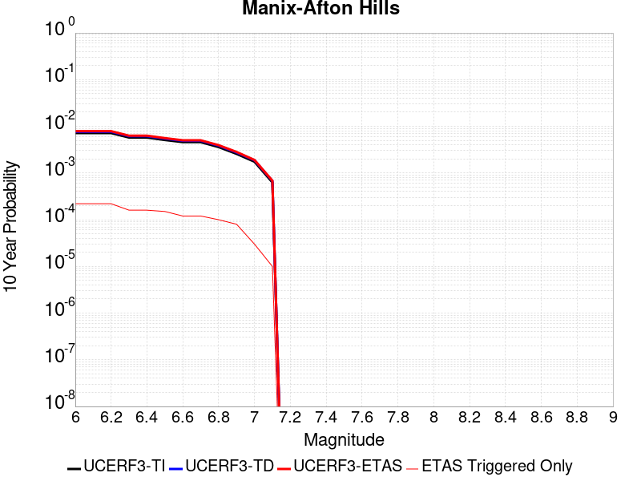 |

| Magnitude | 1 wk TI Prob | 1 wk TD Prob | 1 wk ETAS Prob | 1 wk ETAS/TD Gain | 1 wk ETAS Triggered Only | 1 mo TI Prob | 1 mo TD Prob | 1 mo ETAS Prob | 1 mo ETAS/TD Gain | 1 mo ETAS Triggered Only | 1 yr TI Prob | 1 yr TD Prob | 1 yr ETAS Prob | 1 yr ETAS/TD Gain | 1 yr ETAS Triggered Only | 10 yr TI Prob | 10 yr TD Prob | 10 yr ETAS Prob | 10 yr ETAS/TD Gain | 10 yr ETAS Triggered Only |
|-----|-----|-----|-----|-----|-----|-----|-----|-----|-----|-----|-----|-----|-----|-----|-----|-----|-----|-----|-----|-----|
| 6.0 | 1.3783202E-5 | 1.4711221E-5 | 2.4711075E-5 | 1.6797432 | 1.0E-5 | 5.906953E-5 | 6.304667E-5 | 7.304604E-5 | 1.1586027 | 1.0E-5 | 7.189342E-4 | 7.673403E-4 | 9.0723287E-4 | 1.1823084 | 1.4E-4 | 0.0071661277 | 0.007648664 | 0.007866981 | 1.0285432 | 2.2E-4 |
| 6.1 | 1.3783202E-5 | 1.4711221E-5 | 2.4711075E-5 | 1.6797432 | 1.0E-5 | 5.906953E-5 | 6.304667E-5 | 7.304604E-5 | 1.1586027 | 1.0E-5 | 7.189342E-4 | 7.673403E-4 | 9.0723287E-4 | 1.1823084 | 1.4E-4 | 0.0071661277 | 0.007648664 | 0.007866981 | 1.0285432 | 2.2E-4 |
| 6.2 | 1.3783202E-5 | 1.4711221E-5 | 2.4711075E-5 | 1.6797432 | 1.0E-5 | 5.906953E-5 | 6.304667E-5 | 7.304604E-5 | 1.1586027 | 1.0E-5 | 7.189342E-4 | 7.673403E-4 | 9.0723287E-4 | 1.1823084 | 1.4E-4 | 0.0071661277 | 0.007648664 | 0.007866981 | 1.0285432 | 2.2E-4 |
| 6.3 | 1.10494875E-5 | 1.1793241E-5 | 2.1793123E-5 | 1.8479333 | 1.0E-5 | 4.7354086E-5 | 5.054154E-5 | 6.0541035E-5 | 1.197847 | 1.0E-5 | 5.763835E-4 | 6.151799E-4 | 7.251122E-4 | 1.1786995 | 1.1E-4 | 0.005748908 | 0.00613581 | 0.0062948284 | 1.0259165 | 1.6E-4 |
| 6.4 | 1.10494875E-5 | 1.1793241E-5 | 2.1793123E-5 | 1.8479333 | 1.0E-5 | 4.7354086E-5 | 5.054154E-5 | 6.0541035E-5 | 1.197847 | 1.0E-5 | 5.763835E-4 | 6.151799E-4 | 7.251122E-4 | 1.1786995 | 1.1E-4 | 0.005748908 | 0.00613581 | 0.0062948284 | 1.0259165 | 1.6E-4 |
| 6.5 | 9.788949E-6 | 1.0454414E-5 | 2.045431E-5 | 1.9565238 | 1.0E-5 | 4.1951964E-5 | 4.4803914E-5 | 5.4803466E-5 | 1.2231848 | 1.0E-5 | 5.1064545E-4 | 5.4536044E-4 | 6.453059E-4 | 1.183265 | 1.0E-4 | 0.0050947363 | 0.005441148 | 0.0055903313 | 1.0274177 | 1.5E-4 |
| 6.6 | 8.810006E-6 | 9.413714E-6 | 9.413714E-6 | 1.0 | 0.0 | 3.775662E-5 | 4.0343915E-5 | 4.0343915E-5 | 1.0 | 0.0 | 4.5958988E-4 | 4.9108535E-4 | 5.6105095E-4 | 1.1424714 | 7.0E-5 | 0.0045864056 | 0.004900884 | 0.0050202957 | 1.0243654 | 1.2E-4 |
| 6.7 | 8.80128E-6 | 9.404193E-6 | 9.404193E-6 | 1.0 | 0.0 | 3.7719226E-5 | 4.0303115E-5 | 4.0303115E-5 | 1.0 | 0.0 | 4.591348E-4 | 4.9058883E-4 | 5.605545E-4 | 1.1426157 | 7.0E-5 | 0.004581874 | 0.0048959404 | 0.0050153527 | 1.0243901 | 1.2E-4 |
| 6.8 | 6.8994877E-6 | 7.3801443E-6 | 7.3801443E-6 | 1.0 | 0.0 | 2.9568899E-5 | 3.1628853E-5 | 3.1628853E-5 | 1.0 | 0.0 | 3.5994186E-4 | 3.850214E-4 | 4.5499444E-4 | 1.181738 | 7.0E-5 | 0.003593594 | 0.0038443485 | 0.003943964 | 1.0259122 | 1.0E-4 |
| 6.9 | 4.9328037E-6 | 5.2710093E-6 | 5.2710093E-6 | 1.0 | 0.0 | 2.1140417E-5 | 2.258988E-5 | 2.258988E-5 | 1.0 | 0.0 | 2.5735417E-4 | 2.7500323E-4 | 3.249895E-4 | 1.181766 | 5.0E-5 | 0.0025705635 | 0.0027472344 | 0.0028270148 | 1.0290402 | 8.0E-5 |
| 7.0 | 3.347973E-6 | 3.5900646E-6 | 3.5900646E-6 | 1.0 | 0.0 | 1.4348378E-5 | 1.5385924E-5 | 1.5385924E-5 | 1.0 | 0.0 | 1.746775E-4 | 1.8731161E-4 | 2.0730786E-4 | 1.106754 | 2.0E-5 | 0.0017454025 | 0.00187194 | 0.0019018837 | 1.0159961 | 3.0E-5 |
| 7.1 | 1.2073567E-6 | 1.2934943E-6 | 1.2934943E-6 | 1.0 | 0.0 | 5.1743755E-6 | 5.5435444E-6 | 5.5435444E-6 | 1.0 | 0.0 | 6.29962E-5 | 6.74922E-5 | 7.7491524E-5 | 1.1481553 | 1.0E-5 | 6.297835E-4 | 6.7487714E-4 | 6.848704E-4 | 1.0148075 | 1.0E-5 |

## San Andreas (Cholame) rev
*[(top)](#table-of-contents)*

| 1 Week | 1 Month | 1 Year | 10 Year |
|-----|-----|-----|-----|
|  |  |  |  |

| Magnitude | 1 wk TI Prob | 1 wk TD Prob | 1 wk ETAS Prob | 1 wk ETAS/TD Gain | 1 wk ETAS Triggered Only | 1 mo TI Prob | 1 mo TD Prob | 1 mo ETAS Prob | 1 mo ETAS/TD Gain | 1 mo ETAS Triggered Only | 1 yr TI Prob | 1 yr TD Prob | 1 yr ETAS Prob | 1 yr ETAS/TD Gain | 1 yr ETAS Triggered Only | 10 yr TI Prob | 10 yr TD Prob | 10 yr ETAS Prob | 10 yr ETAS/TD Gain | 10 yr ETAS Triggered Only |
|-----|-----|-----|-----|-----|-----|-----|-----|-----|-----|-----|-----|-----|-----|-----|-----|-----|-----|-----|-----|-----|
| 6.0 | 1.2302514E-4 | 2.5215113E-4 | 2.6214862E-4 | 1.0396488 | 1.0E-5 | 5.27144E-4 | 0.0010802018 | 0.0011201586 | 1.0369902 | 4.0E-5 | 0.0063991086 | 0.013072659 | 0.013191091 | 1.0090594 | 1.2E-4 | 0.06217949 | 0.12442699 | 0.12462837 | 1.0016185 | 2.3E-4 |
| 6.1 | 1.2302514E-4 | 2.5215113E-4 | 2.6214862E-4 | 1.0396488 | 1.0E-5 | 5.27144E-4 | 0.0010802018 | 0.0011201586 | 1.0369902 | 4.0E-5 | 0.0063991086 | 0.013072659 | 0.013191091 | 1.0090594 | 1.2E-4 | 0.06217949 | 0.12442699 | 0.12462837 | 1.0016185 | 2.3E-4 |
| 6.2 | 1.2203569E-4 | 2.5031884E-4 | 2.6031636E-4 | 1.039939 | 1.0E-5 | 5.2290526E-4 | 0.0010723557 | 0.0011123128 | 1.037261 | 4.0E-5 | 0.006347804 | 0.012978274 | 0.013096717 | 1.0091262 | 1.2E-4 | 0.061695136 | 0.12361445 | 0.12380725 | 1.0015597 | 2.2E-4 |
| 6.3 | 1.2142645E-4 | 2.4917856E-4 | 2.5917604E-4 | 1.0401219 | 1.0E-5 | 5.202953E-4 | 0.0010674726 | 0.0011074299 | 1.0374317 | 4.0E-5 | 0.006316212 | 0.01291953 | 0.013028109 | 1.0084043 | 1.1E-4 | 0.06139677 | 0.1231077 | 0.12328308 | 1.0014246 | 2.0E-4 |
| 6.4 | 1.1865206E-4 | 2.4423326E-4 | 2.542308E-4 | 1.0409344 | 1.0E-5 | 5.0840975E-4 | 0.0010462956 | 0.0010862538 | 1.0381901 | 4.0E-5 | 0.006172335 | 0.012664723 | 0.01277333 | 1.0085756 | 1.1E-4 | 0.060036868 | 0.12090532 | 0.121081136 | 1.0014542 | 2.0E-4 |
| 6.5 | 1.17443946E-4 | 2.4216558E-4 | 2.5216315E-4 | 1.0412841 | 1.0E-5 | 5.032341E-4 | 0.0010374413 | 0.0010773997 | 1.0385164 | 4.0E-5 | 0.006109677 | 0.012558166 | 0.012666784 | 1.0086492 | 1.1E-4 | 0.059444077 | 0.11998259 | 0.1201586 | 1.0014669 | 2.0E-4 |
| 6.6 | 1.13579066E-4 | 2.3525437E-4 | 2.45252E-4 | 1.0424972 | 1.0E-5 | 4.866766E-4 | 0.0010078449 | 0.0010478046 | 1.0396487 | 4.0E-5 | 0.0059092017 | 0.012201919 | 0.012310578 | 1.0089049 | 1.1E-4 | 0.057545185 | 0.11690384 | 0.11708046 | 1.0015109 | 2.0E-4 |
| 6.7 | 1.1271412E-4 | 2.3369725E-4 | 2.4369491E-4 | 1.0427804 | 1.0E-5 | 4.829711E-4 | 0.0010011768 | 0.0010411367 | 1.0399129 | 4.0E-5 | 0.005864331 | 0.01212164 | 0.012230307 | 1.0089647 | 1.1E-4 | 0.057119697 | 0.11620769 | 0.11638445 | 1.0015211 | 2.0E-4 |
| 6.8 | 1.1217975E-4 | 2.325812E-4 | 2.4257887E-4 | 1.0429857 | 1.0E-5 | 4.8068175E-4 | 9.963973E-4 | 0.0010363575 | 1.0401046 | 4.0E-5 | 0.005836608 | 0.0120640965 | 0.01217277 | 1.0090079 | 1.1E-4 | 0.056856725 | 0.11570667 | 0.11588353 | 1.0015285 | 2.0E-4 |
| 6.9 | 1.1146753E-4 | 2.3106842E-4 | 2.4106611E-4 | 1.0432673 | 1.0E-5 | 4.7763053E-4 | 9.89919E-4 | 0.0010298793 | 1.0403674 | 4.0E-5 | 0.0057996577 | 0.011986093 | 0.012094774 | 1.0090673 | 1.1E-4 | 0.056506127 | 0.11502693 | 0.115203924 | 1.0015388 | 2.0E-4 |
| 7.0 | 1.0965793E-4 | 2.2730078E-4 | 2.3729852E-4 | 1.0439845 | 1.0E-5 | 4.698779E-4 | 9.737841E-4 | 0.0010137451 | 1.0410368 | 4.0E-5 | 0.005705768 | 0.011791794 | 0.011900497 | 1.0092186 | 1.1E-4 | 0.055614736 | 0.1133308 | 0.11350813 | 1.0015647 | 2.0E-4 |
| 7.1 | 9.927982E-5 | 2.0548643E-4 | 2.1548438E-4 | 1.048655 | 1.0E-5 | 4.2541555E-4 | 8.8035996E-4 | 9.203247E-4 | 1.045396 | 4.0E-5 | 0.0051671406 | 0.010666 | 0.01075504 | 1.008348 | 9.0E-5 | 0.05048634 | 0.10343333 | 0.10358575 | 1.0014735 | 1.7E-4 |
| 7.2 | 9.696786E-5 | 2.005288E-4 | 2.1052679E-4 | 1.0498581 | 1.0E-5 | 4.1551032E-4 | 8.591271E-4 | 8.990927E-4 | 1.0465189 | 4.0E-5 | 0.00504711 | 0.010409988 | 0.010499052 | 1.0085555 | 9.0E-5 | 0.04934009 | 0.10116881 | 0.10132161 | 1.0015104 | 1.7E-4 |
| 7.3 | 9.4727984E-5 | 1.9481927E-4 | 2.0481732E-4 | 1.0513196 | 1.0E-5 | 4.0591392E-4 | 8.346735E-4 | 8.746401E-4 | 1.0478829 | 4.0E-5 | 0.0049308087 | 0.010115068 | 0.010204159 | 1.0088077 | 9.0E-5 | 0.048228268 | 0.09854372 | 0.09868795 | 1.0014637 | 1.6E-4 |
| 7.4 | 9.220358E-5 | 1.8852325E-4 | 1.9852136E-4 | 1.0530338 | 1.0E-5 | 3.9509835E-4 | 8.077075E-4 | 8.476752E-4 | 1.0494828 | 4.0E-5 | 0.004799717 | 0.009789746 | 0.0098788645 | 1.0091033 | 9.0E-5 | 0.046973653 | 0.095616065 | 0.095751725 | 1.0014188 | 1.5E-4 |
| 7.5 | 7.71631E-5 | 1.5186344E-4 | 1.6186193E-4 | 1.0658386 | 1.0E-5 | 3.306571E-4 | 6.5068115E-4 | 6.8066164E-4 | 1.0460756 | 3.0E-5 | 0.0040183207 | 0.007893339 | 0.007972707 | 1.0100552 | 8.0E-5 | 0.03946433 | 0.07832433 | 0.07844415 | 1.0015298 | 1.3E-4 |
| 7.6 | 7.5634416E-5 | 1.484566E-4 | 1.584551E-4 | 1.0673498 | 1.0E-5 | 3.241072E-4 | 6.360876E-4 | 6.660685E-4 | 1.0471333 | 3.0E-5 | 0.0039388672 | 0.007716934 | 0.007796317 | 1.0102868 | 8.0E-5 | 0.038697794 | 0.07668804 | 0.07680807 | 1.0015652 | 1.3E-4 |
| 7.7 | 6.3783E-5 | 1.2365977E-4 | 1.3365854E-4 | 1.080857 | 1.0E-5 | 2.7332708E-4 | 5.298629E-4 | 5.59847E-4 | 1.0565884 | 3.0E-5 | 0.0033226798 | 0.006432025 | 0.0064916397 | 1.0092683 | 6.0E-5 | 0.032734364 | 0.06457185 | 0.06465604 | 1.0013038 | 9.0E-5 |
| 7.8 | 5.863422E-5 | 1.1422686E-4 | 1.2422571E-4 | 1.087535 | 1.0E-5 | 2.512653E-4 | 4.8945186E-4 | 5.194372E-4 | 1.0612631 | 3.0E-5 | 0.003054864 | 0.0059428154 | 0.0060024587 | 1.0100362 | 6.0E-5 | 0.030132094 | 0.05968955 | 0.05977418 | 1.0014178 | 9.0E-5 |
| 7.9 | 4.595283E-5 | 8.431093E-5 | 9.431009E-5 | 1.1185986 | 1.0E-5 | 1.9692584E-4 | 3.6128255E-4 | 3.912717E-4 | 1.0830075 | 3.0E-5 | 0.0023949358 | 0.0043897503 | 0.0044494867 | 1.0136082 | 6.0E-5 | 0.023692891 | 0.044384085 | 0.04446053 | 1.0017225 | 8.0E-5 |
| 8.0 | 3.2950178E-5 | 5.08012E-5 | 5.08012E-5 | 1.0 | 0.0 | 1.412074E-4 | 2.1770128E-4 | 2.1770128E-4 | 1.0 | 0.0 | 0.0017178444 | 0.002647293 | 0.0026572666 | 1.0037675 | 1.0E-5 | 0.017046256 | 0.02719375 | 0.027213207 | 1.0007155 | 2.0E-5 |
| 8.1 | 1.9177472E-5 | 1.9197154E-5 | 1.9197154E-5 | 1.0 | 0.0 | 8.218658E-5 | 8.2270926E-5 | 8.2270926E-5 | 1.0 | 0.0 | 0.0010001622 | 0.0010011889 | 0.0010011889 | 1.0 | 0.0 | 0.009956728 | 0.010764398 | 0.010764398 | 1.0 | 0.0 |
| 8.2 | 8.643924E-6 | 5.478665E-6 | 5.478665E-6 | 1.0 | 0.0 | 3.704486E-5 | 2.3479783E-5 | 2.3479783E-5 | 1.0 | 0.0 | 4.5092785E-4 | 2.8582895E-4 | 2.8582895E-4 | 1.0 | 0.0 | 0.0045001395 | 0.0032508469 | 0.0032508469 | 1.0 | 0.0 |
| 8.3 | 1.983087E-6 | 7.6647797E-7 | 7.6647797E-7 | 1.0 | 0.0 | 8.498917E-6 | 3.2849016E-6 | 3.2849016E-6 | 1.0 | 0.0 | 1.034694E-4 | 3.999296E-5 | 3.999296E-5 | 1.0 | 0.0 | 0.0010342124 | 4.7228087E-4 | 4.7228087E-4 | 1.0 | 0.0 |

## Cady
*[(top)](#table-of-contents)*

| 1 Week | 1 Month | 1 Year | 10 Year |
|-----|-----|-----|-----|
|  |  |  |  |

| Magnitude | 1 wk TI Prob | 1 wk TD Prob | 1 wk ETAS Prob | 1 wk ETAS/TD Gain | 1 wk ETAS Triggered Only | 1 mo TI Prob | 1 mo TD Prob | 1 mo ETAS Prob | 1 mo ETAS/TD Gain | 1 mo ETAS Triggered Only | 1 yr TI Prob | 1 yr TD Prob | 1 yr ETAS Prob | 1 yr ETAS/TD Gain | 1 yr ETAS Triggered Only | 10 yr TI Prob | 10 yr TD Prob | 10 yr ETAS Prob | 10 yr ETAS/TD Gain | 10 yr ETAS Triggered Only |
|-----|-----|-----|-----|-----|-----|-----|-----|-----|-----|-----|-----|-----|-----|-----|-----|-----|-----|-----|-----|-----|
| 6.0 | 1.9892565E-5 | 2.1859016E-5 | 3.18588E-5 | 1.4574671 | 1.0E-5 | 8.525106E-5 | 9.3678645E-5 | 1.336749E-4 | 1.4269516 | 4.0E-5 | 0.0010374374 | 0.0011400316 | 0.001279872 | 1.1226636 | 1.4E-4 | 0.010326075 | 0.011350849 | 0.011578238 | 1.0200328 | 2.3E-4 |
| 6.1 | 1.9892565E-5 | 2.1859016E-5 | 3.18588E-5 | 1.4574671 | 1.0E-5 | 8.525106E-5 | 9.3678645E-5 | 1.336749E-4 | 1.4269516 | 4.0E-5 | 0.0010374374 | 0.0011400316 | 0.001279872 | 1.1226636 | 1.4E-4 | 0.010326075 | 0.011350849 | 0.011578238 | 1.0200328 | 2.3E-4 |
| 6.2 | 1.9892565E-5 | 2.1859016E-5 | 3.18588E-5 | 1.4574671 | 1.0E-5 | 8.525106E-5 | 9.3678645E-5 | 1.336749E-4 | 1.4269516 | 4.0E-5 | 0.0010374374 | 0.0011400316 | 0.001279872 | 1.1226636 | 1.4E-4 | 0.010326075 | 0.011350849 | 0.011578238 | 1.0200328 | 2.3E-4 |
| 6.3 | 1.1117327E-5 | 1.2176738E-5 | 1.2176738E-5 | 1.0 | 0.0 | 4.764482E-5 | 5.218515E-5 | 7.2184106E-5 | 1.3832308 | 2.0E-5 | 5.7992124E-4 | 6.3520053E-4 | 7.2514336E-4 | 1.1415975 | 9.0E-5 | 0.0057841022 | 0.0063369554 | 0.006505878 | 1.0266567 | 1.7E-4 |
| 6.4 | 1.1117327E-5 | 1.2176738E-5 | 1.2176738E-5 | 1.0 | 0.0 | 4.764482E-5 | 5.218515E-5 | 7.2184106E-5 | 1.3832308 | 2.0E-5 | 5.7992124E-4 | 6.3520053E-4 | 7.2514336E-4 | 1.1415975 | 9.0E-5 | 0.0057841022 | 0.0063369554 | 0.006505878 | 1.0266567 | 1.7E-4 |
| 6.5 | 6.103093E-6 | 6.672103E-6 | 6.672103E-6 | 1.0 | 0.0 | 2.615585E-5 | 2.8594486E-5 | 4.8593913E-5 | 1.6994156 | 2.0E-5 | 3.1840094E-4 | 3.4809482E-4 | 4.1807044E-4 | 1.2010247 | 7.0E-5 | 0.0031794512 | 0.0034767296 | 0.0035863472 | 1.031529 | 1.1E-4 |
| 6.6 | 5.817237E-6 | 6.365738E-6 | 6.365738E-6 | 1.0 | 0.0 | 2.4930776E-5 | 2.728152E-5 | 4.7280973E-5 | 1.7330769 | 2.0E-5 | 3.034899E-4 | 3.3211432E-4 | 4.0209107E-4 | 1.2107008 | 7.0E-5 | 0.0030307577 | 0.003317402 | 0.003427037 | 1.0330485 | 1.1E-4 |
| 6.7 | 4.8846314E-6 | 5.3406343E-6 | 5.3406343E-6 | 1.0 | 0.0 | 2.0933967E-5 | 2.2888298E-5 | 4.288784E-5 | 1.873789 | 2.0E-5 | 2.5484123E-4 | 2.7864118E-4 | 3.3862446E-4 | 1.2152708 | 6.0E-5 | 0.0025454918 | 0.0027840736 | 0.0028837952 | 1.0358186 | 1.0E-4 |
| 6.8 | 1.7788773E-6 | 1.9399313E-6 | 1.9399313E-6 | 1.0 | 0.0 | 7.6237375E-6 | 8.313974E-6 | 8.313974E-6 | 1.0 | 0.0 | 9.281505E-5 | 1.01219506E-4 | 1.3121647E-4 | 1.2963556 | 3.0E-5 | 9.2776294E-4 | 0.0010118886 | 0.0010518482 | 1.03949 | 4.0E-5 |
| 6.9 | 7.5455404E-7 | 8.297202E-7 | 8.297202E-7 | 1.0 | 0.0 | 3.233799E-6 | 3.5559406E-6 | 3.5559406E-6 | 1.0 | 0.0 | 3.937079E-5 | 4.3293054E-5 | 4.3293054E-5 | 1.0 | 0.0 | 3.9363815E-4 | 4.3287914E-4 | 4.4287482E-4 | 1.0230911 | 1.0E-5 |
| 7.0 | 6.8578805E-7 | 7.541916E-7 | 7.541916E-7 | 1.0 | 0.0 | 2.9390883E-6 | 3.2322475E-6 | 3.2322475E-6 | 1.0 | 0.0 | 3.578281E-5 | 3.9352235E-5 | 3.9352235E-5 | 1.0 | 0.0 | 3.577705E-4 | 3.9348513E-4 | 3.9348513E-4 | 1.0 | 0.0 |

## Scodie Lineament
*[(top)](#table-of-contents)*

| 1 Week | 1 Month | 1 Year | 10 Year |
|-----|-----|-----|-----|
|  |  |  |  |

| Magnitude | 1 wk TI Prob | 1 wk TD Prob | 1 wk ETAS Prob | 1 wk ETAS/TD Gain | 1 wk ETAS Triggered Only | 1 mo TI Prob | 1 mo TD Prob | 1 mo ETAS Prob | 1 mo ETAS/TD Gain | 1 mo ETAS Triggered Only | 1 yr TI Prob | 1 yr TD Prob | 1 yr ETAS Prob | 1 yr ETAS/TD Gain | 1 yr ETAS Triggered Only | 10 yr TI Prob | 10 yr TD Prob | 10 yr ETAS Prob | 10 yr ETAS/TD Gain | 10 yr ETAS Triggered Only |
|-----|-----|-----|-----|-----|-----|-----|-----|-----|-----|-----|-----|-----|-----|-----|-----|-----|-----|-----|-----|-----|
| 6.0 | 3.2919327E-6 | 3.0133451E-6 | 1.3013315E-5 | 4.318561 | 1.0E-5 | 1.4108206E-5 | 1.2914291E-5 | 4.2913904E-5 | 3.322978 | 3.0E-5 | 1.7175387E-4 | 1.5722332E-4 | 2.972013E-4 | 1.8903131 | 1.4E-4 | 0.0017162118 | 0.0015714325 | 0.0017910867 | 1.1397797 | 2.2E-4 |
| 6.1 | 1.8663811E-6 | 1.5490476E-6 | 1.5490476E-6 | 1.0 | 0.0 | 7.998751E-6 | 6.6387615E-6 | 6.6387615E-6 | 1.0 | 0.0 | 9.738045E-5 | 8.082442E-5 | 1.008228E-4 | 1.24743 | 2.0E-5 | 9.7337784E-4 | 8.0799905E-4 | 8.579586E-4 | 1.0618312 | 5.0E-5 |
| 6.2 | 1.8663811E-6 | 1.5490476E-6 | 1.5490476E-6 | 1.0 | 0.0 | 7.998751E-6 | 6.6387615E-6 | 6.6387615E-6 | 1.0 | 0.0 | 9.738045E-5 | 8.082442E-5 | 1.008228E-4 | 1.24743 | 2.0E-5 | 9.7337784E-4 | 8.0799905E-4 | 8.579586E-4 | 1.0618312 | 5.0E-5 |
| 6.3 | 1.8663811E-6 | 1.5490476E-6 | 1.5490476E-6 | 1.0 | 0.0 | 7.998751E-6 | 6.6387615E-6 | 6.6387615E-6 | 1.0 | 0.0 | 9.738045E-5 | 8.082442E-5 | 1.008228E-4 | 1.24743 | 2.0E-5 | 9.7337784E-4 | 8.0799905E-4 | 8.579586E-4 | 1.0618312 | 5.0E-5 |
| 6.4 | 1.8663811E-6 | 1.5490476E-6 | 1.5490476E-6 | 1.0 | 0.0 | 7.998751E-6 | 6.6387615E-6 | 6.6387615E-6 | 1.0 | 0.0 | 9.738045E-5 | 8.082442E-5 | 1.008228E-4 | 1.24743 | 2.0E-5 | 9.7337784E-4 | 8.0799905E-4 | 8.579586E-4 | 1.0618312 | 5.0E-5 |
| 6.5 | 1.8106311E-6 | 1.4909813E-6 | 1.4909813E-6 | 1.0 | 0.0 | 7.759824E-6 | 6.389907E-6 | 6.389907E-6 | 1.0 | 0.0 | 9.447177E-5 | 7.779484E-5 | 9.779328E-5 | 1.2570665 | 2.0E-5 | 9.4431615E-4 | 7.777247E-4 | 8.276858E-4 | 1.0642401 | 5.0E-5 |
| 6.6 | 1.2414679E-6 | 8.997501E-7 | 8.997501E-7 | 1.0 | 0.0 | 5.320566E-6 | 3.8560665E-6 | 3.8560665E-6 | 1.0 | 0.0 | 6.477596E-5 | 4.6946687E-5 | 6.694575E-5 | 1.4259951 | 2.0E-5 | 6.475708E-4 | 4.6937633E-4 | 4.9936224E-4 | 1.0638846 | 3.0E-5 |
| 6.7 | 1.1062215E-6 | 7.594247E-7 | 7.594247E-7 | 1.0 | 0.0 | 4.7409408E-6 | 3.2546736E-6 | 3.2546736E-6 | 1.0 | 0.0 | 5.7719422E-5 | 3.9625003E-5 | 5.962421E-5 | 1.5047119 | 2.0E-5 | 5.770443E-4 | 3.9618637E-4 | 4.2617446E-4 | 1.0756919 | 3.0E-5 |
| 6.8 | 1.0006736E-6 | 6.5003275E-7 | 6.5003275E-7 | 1.0 | 0.0 | 4.288594E-6 | 2.785852E-6 | 2.785852E-6 | 1.0 | 0.0 | 5.221238E-5 | 3.3917284E-5 | 5.3916603E-5 | 1.5896499 | 2.0E-5 | 5.220012E-4 | 3.3912715E-4 | 3.6911695E-4 | 1.0884324 | 3.0E-5 |
| 6.9 | 9.167364E-7 | 5.6315514E-7 | 5.6315514E-7 | 1.0 | 0.0 | 3.9288643E-6 | 2.4135202E-6 | 2.4135202E-6 | 1.0 | 0.0 | 4.7832873E-5 | 2.938427E-5 | 4.938368E-5 | 1.6806163 | 2.0E-5 | 4.782258E-4 | 2.938095E-4 | 3.238007E-4 | 1.102077 | 3.0E-5 |
| 7.0 | 7.6987664E-7 | 4.113303E-7 | 4.113303E-7 | 1.0 | 0.0 | 3.2994672E-6 | 1.7628431E-6 | 1.7628431E-6 | 1.0 | 0.0 | 4.0170275E-5 | 2.1462443E-5 | 3.146223E-5 | 1.4659202 | 1.0E-5 | 4.0163012E-4 | 2.1460756E-4 | 2.2460542E-4 | 1.0465866 | 1.0E-5 |
| 7.1 | 7.1038727E-7 | 3.521066E-7 | 3.521066E-7 | 1.0 | 0.0 | 3.0445133E-6 | 1.5090276E-6 | 1.5090276E-6 | 1.0 | 0.0 | 3.706632E-5 | 1.8372291E-5 | 2.837211E-5 | 1.5442879 | 1.0E-5 | 3.7060137E-4 | 1.8371122E-4 | 1.9370939E-4 | 1.0544232 | 1.0E-5 |
| 7.2 | 2.0799602E-7 | 3.1178946E-8 | 3.1178946E-8 | 1.0 | 0.0 | 8.914113E-7 | 1.3362404E-7 | 1.3362404E-7 | 1.0 | 0.0 | 1.0852878E-5 | 1.6268716E-6 | 1.6268716E-6 | 1.0 | 0.0 | 1.08523476E-4 | 1.6268605E-5 | 1.6268605E-5 | 1.0 | 0.0 |
| 7.3 | 1.5048182E-7 | 1.5939344E-8 | 1.5939344E-8 | 1.0 | 0.0 | 6.449219E-7 | 6.831147E-8 | 6.831147E-8 | 1.0 | 0.0 | 7.851896E-6 | 8.316919E-7 | 8.316919E-7 | 1.0 | 0.0 | 7.851618E-5 | 8.316891E-6 | 8.316891E-6 | 1.0 | 0.0 |
| 7.4 | 5.9334678E-8 | 4.8638475E-9 | 4.8638475E-9 | 1.0 | 0.0 | 2.5429145E-7 | 2.084506E-8 | 2.084506E-8 | 1.0 | 0.0 | 3.095994E-6 | 2.5378858E-7 | 2.5378858E-7 | 1.0 | 0.0 | 3.095951E-5 | 2.5378843E-6 | 2.5378843E-6 | 1.0 | 0.0 |

## San Andreas (Carrizo) rev
*[(top)](#table-of-contents)*

| 1 Week | 1 Month | 1 Year | 10 Year |
|-----|-----|-----|-----|
|  |  | 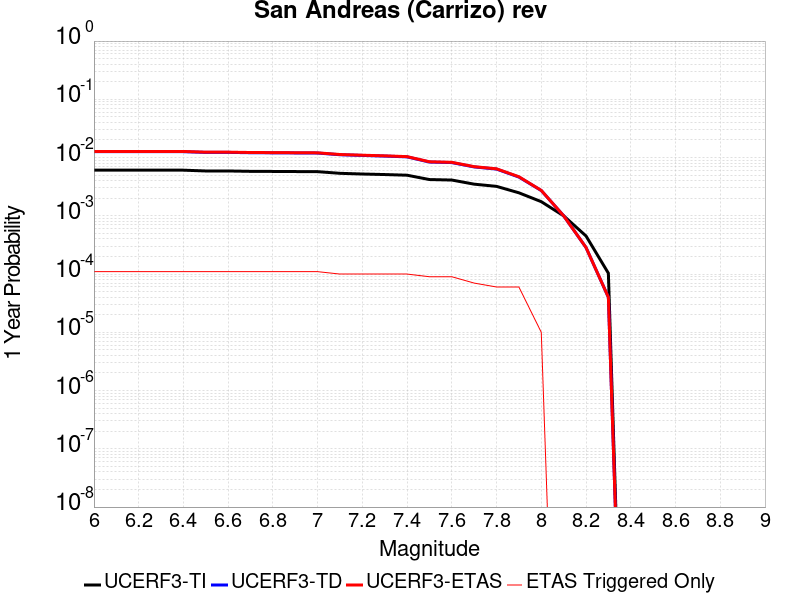 |  |

| Magnitude | 1 wk TI Prob | 1 wk TD Prob | 1 wk ETAS Prob | 1 wk ETAS/TD Gain | 1 wk ETAS Triggered Only | 1 mo TI Prob | 1 mo TD Prob | 1 mo ETAS Prob | 1 mo ETAS/TD Gain | 1 mo ETAS Triggered Only | 1 yr TI Prob | 1 yr TD Prob | 1 yr ETAS Prob | 1 yr ETAS/TD Gain | 1 yr ETAS Triggered Only | 10 yr TI Prob | 10 yr TD Prob | 10 yr ETAS Prob | 10 yr ETAS/TD Gain | 10 yr ETAS Triggered Only |
|-----|-----|-----|-----|-----|-----|-----|-----|-----|-----|-----|-----|-----|-----|-----|-----|-----|-----|-----|-----|-----|
| 6.0 | 1.1674632E-4 | 2.4333803E-4 | 2.533356E-4 | 1.0410851 | 1.0E-5 | 5.002454E-4 | 0.0010424621 | 0.0010824205 | 1.0383307 | 4.0E-5 | 0.006073493 | 0.012618599 | 0.012727211 | 1.0086073 | 1.1E-4 | 0.0591016 | 0.12066075 | 0.12085421 | 1.0016032 | 2.2E-4 |
| 6.1 | 1.1674632E-4 | 2.4333803E-4 | 2.533356E-4 | 1.0410851 | 1.0E-5 | 5.002454E-4 | 0.0010424621 | 0.0010824205 | 1.0383307 | 4.0E-5 | 0.006073493 | 0.012618599 | 0.012727211 | 1.0086073 | 1.1E-4 | 0.0591016 | 0.12066075 | 0.12085421 | 1.0016032 | 2.2E-4 |
| 6.2 | 1.1674632E-4 | 2.4333803E-4 | 2.533356E-4 | 1.0410851 | 1.0E-5 | 5.002454E-4 | 0.0010424621 | 0.0010824205 | 1.0383307 | 4.0E-5 | 0.006073493 | 0.012618599 | 0.012727211 | 1.0086073 | 1.1E-4 | 0.0591016 | 0.12066075 | 0.12085421 | 1.0016032 | 2.2E-4 |
| 6.3 | 1.1674632E-4 | 2.4333803E-4 | 2.533356E-4 | 1.0410851 | 1.0E-5 | 5.002454E-4 | 0.0010424621 | 0.0010824205 | 1.0383307 | 4.0E-5 | 0.006073493 | 0.012618599 | 0.012727211 | 1.0086073 | 1.1E-4 | 0.0591016 | 0.12066075 | 0.12085421 | 1.0016032 | 2.2E-4 |
| 6.4 | 1.1674632E-4 | 2.4333803E-4 | 2.533356E-4 | 1.0410851 | 1.0E-5 | 5.002454E-4 | 0.0010424621 | 0.0010824205 | 1.0383307 | 4.0E-5 | 0.006073493 | 0.012618599 | 0.012727211 | 1.0086073 | 1.1E-4 | 0.0591016 | 0.12066075 | 0.12085421 | 1.0016032 | 2.2E-4 |
| 6.5 | 1.13136164E-4 | 2.3653745E-4 | 2.4653508E-4 | 1.0422666 | 1.0E-5 | 4.847792E-4 | 0.0010133396 | 0.0010532992 | 1.0394335 | 4.0E-5 | 0.0058862255 | 0.012268067 | 0.012376718 | 1.0088564 | 1.1E-4 | 0.057327334 | 0.11763024 | 0.11781555 | 1.0015752 | 2.1E-4 |
| 6.6 | 1.13136164E-4 | 2.3653745E-4 | 2.4653508E-4 | 1.0422666 | 1.0E-5 | 4.847792E-4 | 0.0010133396 | 0.0010532992 | 1.0394335 | 4.0E-5 | 0.0058862255 | 0.012268067 | 0.012376718 | 1.0088564 | 1.1E-4 | 0.057327334 | 0.11763024 | 0.11781555 | 1.0015752 | 2.1E-4 |
| 6.7 | 1.1149675E-4 | 2.334492E-4 | 2.4344686E-4 | 1.0428258 | 1.0E-5 | 4.777557E-4 | 0.0010001145 | 0.0010400745 | 1.0399554 | 4.0E-5 | 0.0058011734 | 0.012108848 | 0.012217517 | 1.0089743 | 1.1E-4 | 0.05652051 | 0.11625791 | 0.1164435 | 1.0015963 | 2.1E-4 |
| 6.8 | 1.1103589E-4 | 2.324707E-4 | 2.4246838E-4 | 1.0430062 | 1.0E-5 | 4.7578133E-4 | 9.959241E-4 | 0.0010358843 | 1.0401237 | 4.0E-5 | 0.005777263 | 0.012058397 | 0.01216707 | 1.0090122 | 1.1E-4 | 0.056293584 | 0.11581856 | 0.11600424 | 1.0016031 | 2.1E-4 |
| 6.9 | 1.1053259E-4 | 2.3139441E-4 | 2.413921E-4 | 1.0432062 | 1.0E-5 | 4.7362508E-4 | 9.91315E-4 | 0.0010312753 | 1.0403105 | 4.0E-5 | 0.0057511497 | 0.0120029 | 0.01211158 | 1.0090544 | 1.1E-4 | 0.05604569 | 0.115334466 | 0.11552025 | 1.0016108 | 2.1E-4 |
| 7.0 | 1.1005377E-4 | 2.304026E-4 | 2.4040029E-4 | 1.0433923 | 1.0E-5 | 4.7157376E-4 | 9.870676E-4 | 0.0010270281 | 1.0404841 | 4.0E-5 | 0.0057263062 | 0.011951757 | 0.012060442 | 1.0090936 | 1.1E-4 | 0.055809796 | 0.1148876 | 0.11507348 | 1.0016179 | 2.1E-4 |
| 7.1 | 1.0308142E-4 | 2.154949E-4 | 2.2549275E-4 | 1.0463948 | 1.0E-5 | 4.417027E-4 | 9.2322374E-4 | 9.631868E-4 | 1.0432864 | 4.0E-5 | 0.0053644776 | 0.011182634 | 0.0112815155 | 1.0088425 | 1.0E-4 | 0.052368138 | 0.10815858 | 0.10833695 | 1.0016491 | 2.0E-4 |
| 7.2 | 1.0027479E-4 | 2.0957364E-4 | 2.1957155E-4 | 1.0477059 | 1.0E-5 | 4.296783E-4 | 8.978646E-4 | 9.378287E-4 | 1.0445101 | 4.0E-5 | 0.0052187922 | 0.010877009 | 0.010975921 | 1.0090938 | 1.0E-4 | 0.050979212 | 0.10545821 | 0.10563712 | 1.0016965 | 2.0E-4 |
| 7.3 | 9.816942E-5 | 2.0432367E-4 | 2.1432164E-4 | 1.048932 | 1.0E-5 | 4.2065824E-4 | 8.7538E-4 | 9.1534504E-4 | 1.0456544 | 4.0E-5 | 0.005109493 | 0.0106059555 | 0.0107048955 | 1.0093287 | 1.0E-4 | 0.049935985 | 0.10304579 | 0.103216216 | 1.0016538 | 1.9E-4 |
| 7.4 | 9.5634205E-5 | 1.980169E-4 | 2.0801491E-4 | 1.0504907 | 1.0E-5 | 4.0979648E-4 | 8.4836874E-4 | 8.883348E-4 | 1.0471094 | 4.0E-5 | 0.0049778637 | 0.010280236 | 0.010379207 | 1.0096275 | 1.0E-4 | 0.048678253 | 0.100126535 | 0.10028851 | 1.0016177 | 1.8E-4 |
| 7.5 | 8.052417E-5 | 1.612143E-4 | 1.7121268E-4 | 1.0620192 | 1.0E-5 | 3.4505792E-4 | 6.9073564E-4 | 7.207149E-4 | 1.043402 | 3.0E-5 | 0.0041929903 | 0.00837736 | 0.008466606 | 1.0106533 | 9.0E-5 | 0.04114753 | 0.08285146 | 0.08299821 | 1.0017712 | 1.6E-4 |
| 7.6 | 7.897024E-5 | 1.5774513E-4 | 1.6774356E-4 | 1.0633833 | 1.0E-5 | 3.384E-4 | 6.758756E-4 | 7.058553E-4 | 1.0443568 | 3.0E-5 | 0.0041122385 | 0.008197814 | 0.008287077 | 1.0108886 | 9.0E-5 | 0.040369697 | 0.08119292 | 0.081339926 | 1.0018107 | 1.6E-4 |
| 7.7 | 6.707427E-5 | 1.3283793E-4 | 1.4283661E-4 | 1.0752697 | 1.0E-5 | 2.8742946E-4 | 5.691813E-4 | 5.9916417E-4 | 1.0526773 | 3.0E-5 | 0.003493839 | 0.0069077956 | 0.0069773123 | 1.0100635 | 7.0E-5 | 0.034394164 | 0.069081694 | 0.0691934 | 1.0016171 | 1.2E-4 |
| 7.8 | 6.147705E-5 | 1.2204444E-4 | 1.3204322E-4 | 1.0819274 | 1.0E-5 | 2.6344648E-4 | 5.229428E-4 | 5.529271E-4 | 1.0573376 | 3.0E-5 | 0.0032027436 | 0.0063482667 | 0.006407886 | 1.0093914 | 6.0E-5 | 0.031569764 | 0.06354592 | 0.06364893 | 1.001621 | 1.1E-4 |
| 7.9 | 4.7636717E-5 | 8.8847315E-5 | 9.884642E-5 | 1.1125426 | 1.0E-5 | 2.0414138E-4 | 3.8071864E-4 | 4.1070723E-4 | 1.0787684 | 3.0E-5 | 0.0024825884 | 0.0046254057 | 0.004685128 | 1.0129118 | 6.0E-5 | 0.024550365 | 0.046651114 | 0.04672738 | 1.0016348 | 8.0E-5 |
| 8.0 | 3.3554235E-5 | 5.216579E-5 | 5.216579E-5 | 1.0 | 0.0 | 1.4379594E-4 | 2.2354853E-4 | 2.2354853E-4 | 1.0 | 0.0 | 0.0017493097 | 0.002718308 | 0.0027282808 | 1.0036688 | 1.0E-5 | 0.017356034 | 0.027894866 | 0.027914308 | 1.000697 | 2.0E-5 |
| 8.1 | 1.9175432E-5 | 1.9196985E-5 | 1.9196985E-5 | 1.0 | 0.0 | 8.217783E-5 | 8.22702E-5 | 8.22702E-5 | 1.0 | 0.0 | 0.0010000558 | 0.00100118 | 0.00100118 | 1.0 | 0.0 | 0.009955673 | 0.010764282 | 0.010764282 | 1.0 | 0.0 |
| 8.2 | 8.643924E-6 | 5.478665E-6 | 5.478665E-6 | 1.0 | 0.0 | 3.704486E-5 | 2.3479783E-5 | 2.3479783E-5 | 1.0 | 0.0 | 4.5092785E-4 | 2.8582895E-4 | 2.8582895E-4 | 1.0 | 0.0 | 0.0045001395 | 0.0032508469 | 0.0032508469 | 1.0 | 0.0 |
| 8.3 | 1.983087E-6 | 7.6647797E-7 | 7.6647797E-7 | 1.0 | 0.0 | 8.498917E-6 | 3.2849016E-6 | 3.2849016E-6 | 1.0 | 0.0 | 1.034694E-4 | 3.999296E-5 | 3.999296E-5 | 1.0 | 0.0 | 0.0010342124 | 4.7228087E-4 | 4.7228087E-4 | 1.0 | 0.0 |

## Lake Isabella (Seismicity)
*[(top)](#table-of-contents)*

| 1 Week | 1 Month | 1 Year | 10 Year |
|-----|-----|-----|-----|
|  |  |  |  |

| Magnitude | 1 wk TI Prob | 1 wk TD Prob | 1 wk ETAS Prob | 1 wk ETAS/TD Gain | 1 wk ETAS Triggered Only | 1 mo TI Prob | 1 mo TD Prob | 1 mo ETAS Prob | 1 mo ETAS/TD Gain | 1 mo ETAS Triggered Only | 1 yr TI Prob | 1 yr TD Prob | 1 yr ETAS Prob | 1 yr ETAS/TD Gain | 1 yr ETAS Triggered Only | 10 yr TI Prob | 10 yr TD Prob | 10 yr ETAS Prob | 10 yr ETAS/TD Gain | 10 yr ETAS Triggered Only |
|-----|-----|-----|-----|-----|-----|-----|-----|-----|-----|-----|-----|-----|-----|-----|-----|-----|-----|-----|-----|-----|
| 6.0 | 9.431637E-6 | 9.741694E-6 | 2.9741499E-5 | 3.053011 | 2.0E-5 | 4.0420677E-5 | 4.1749525E-5 | 1.0174702E-4 | 2.437082 | 6.0E-5 | 4.920106E-4 | 5.0819496E-4 | 6.381289E-4 | 1.2556773 | 1.3E-4 | 0.004909227 | 0.005071621 | 0.0052706064 | 1.0392351 | 2.0E-4 |
| 6.1 | 9.431637E-6 | 9.741694E-6 | 2.9741499E-5 | 3.053011 | 2.0E-5 | 4.0420677E-5 | 4.1749525E-5 | 1.0174702E-4 | 2.437082 | 6.0E-5 | 4.920106E-4 | 5.0819496E-4 | 6.381289E-4 | 1.2556773 | 1.3E-4 | 0.004909227 | 0.005071621 | 0.0052706064 | 1.0392351 | 2.0E-4 |
| 6.2 | 9.431637E-6 | 9.741694E-6 | 2.9741499E-5 | 3.053011 | 2.0E-5 | 4.0420677E-5 | 4.1749525E-5 | 1.0174702E-4 | 2.437082 | 6.0E-5 | 4.920106E-4 | 5.0819496E-4 | 6.381289E-4 | 1.2556773 | 1.3E-4 | 0.004909227 | 0.005071621 | 0.0052706064 | 1.0392351 | 2.0E-4 |
| 6.3 | 9.431637E-6 | 9.741694E-6 | 2.9741499E-5 | 3.053011 | 2.0E-5 | 4.0420677E-5 | 4.1749525E-5 | 1.0174702E-4 | 2.437082 | 6.0E-5 | 4.920106E-4 | 5.0819496E-4 | 6.381289E-4 | 1.2556773 | 1.3E-4 | 0.004909227 | 0.005071621 | 0.0052706064 | 1.0392351 | 2.0E-4 |
| 6.4 | 5.144063E-6 | 5.3000977E-6 | 5.3000977E-6 | 1.0 | 0.0 | 2.2045799E-5 | 2.2714525E-5 | 5.2713844E-5 | 2.320711 | 3.0E-5 | 2.6837454E-4 | 2.765177E-4 | 3.5649558E-4 | 1.2892324 | 8.0E-5 | 0.0026805066 | 0.002762077 | 0.002871773 | 1.039715 | 1.1E-4 |
| 6.5 | 5.144063E-6 | 5.3000977E-6 | 5.3000977E-6 | 1.0 | 0.0 | 2.2045799E-5 | 2.2714525E-5 | 5.2713844E-5 | 2.320711 | 3.0E-5 | 2.6837454E-4 | 2.765177E-4 | 3.5649558E-4 | 1.2892324 | 8.0E-5 | 0.0026805066 | 0.002762077 | 0.002871773 | 1.039715 | 1.1E-4 |
| 6.6 | 3.4009804E-6 | 3.4987995E-6 | 3.4987995E-6 | 1.0 | 0.0 | 1.4575549E-5 | 1.4994778E-5 | 2.4994628E-5 | 1.6668888 | 1.0E-5 | 1.7744285E-4 | 1.8254772E-4 | 2.325386E-4 | 1.2738509 | 5.0E-5 | 0.0017730123 | 0.0018241355 | 0.0019039896 | 1.0437764 | 8.0E-5 |
| 6.7 | 3.3880428E-6 | 3.4856662E-6 | 3.4856662E-6 | 1.0 | 0.0 | 1.4520103E-5 | 1.4938492E-5 | 2.4938343E-5 | 1.6694016 | 1.0E-5 | 1.767679E-4 | 1.8186258E-4 | 2.3185348E-4 | 1.2748829 | 5.0E-5 | 0.0017662736 | 0.0018172951 | 0.0018971497 | 1.0439415 | 8.0E-5 |
| 6.8 | 2.6582E-6 | 2.7337105E-6 | 2.7337105E-6 | 1.0 | 0.0 | 1.1392236E-5 | 1.1715857E-5 | 1.1715857E-5 | 1.0 | 0.0 | 1.3869164E-4 | 1.4263256E-4 | 1.8262686E-4 | 1.2804009 | 4.0E-5 | 0.0013860512 | 0.0014255423 | 0.0014854567 | 1.0420293 | 6.0E-5 |
| 6.9 | 2.406011E-6 | 2.474338E-6 | 2.474338E-6 | 1.0 | 0.0 | 1.0311434E-5 | 1.0604271E-5 | 1.0604271E-5 | 1.0 | 0.0 | 1.2553448E-4 | 1.2910066E-4 | 1.5909679E-4 | 1.2323468 | 3.0E-5 | 0.0012546359 | 0.0012903863 | 0.0013403217 | 1.0386981 | 5.0E-5 |
| 7.0 | 1.6953097E-6 | 1.7429437E-6 | 1.7429437E-6 | 1.0 | 0.0 | 7.265593E-6 | 7.469743E-6 | 7.469743E-6 | 1.0 | 0.0 | 8.8455E-5 | 9.094137E-5 | 1.1093955E-4 | 1.2199019 | 2.0E-5 | 8.84198E-4 | 9.0914435E-4 | 9.49108E-4 | 1.0439575 | 4.0E-5 |
| 7.1 | 3.5013824E-7 | 3.571492E-7 | 3.571492E-7 | 1.0 | 0.0 | 1.5005916E-6 | 1.5306384E-6 | 1.5306384E-6 | 1.0 | 0.0 | 1.826955E-5 | 1.8635366E-5 | 1.8635366E-5 | 1.0 | 0.0 | 1.8268047E-4 | 1.863383E-4 | 1.9633642E-4 | 1.0536559 | 1.0E-5 |
| 7.2 | 2.2321095E-7 | 2.2750632E-7 | 2.2750632E-7 | 1.0 | 0.0 | 9.56618E-7 | 9.750268E-7 | 9.750268E-7 | 1.0 | 0.0 | 1.1646762E-5 | 1.1870887E-5 | 1.1870887E-5 | 1.0 | 0.0 | 1.1646151E-4 | 1.1870263E-4 | 1.2870145E-4 | 1.0842341 | 1.0E-5 |
| 7.3 | 1.5760406E-7 | 1.6060963E-7 | 1.6060963E-7 | 1.0 | 0.0 | 6.7544585E-7 | 6.883268E-7 | 6.883268E-7 | 1.0 | 0.0 | 8.223522E-6 | 8.380347E-6 | 8.380347E-6 | 1.0 | 0.0 | 8.2232174E-5 | 8.3800376E-5 | 9.3799536E-5 | 1.1193212 | 1.0E-5 |
| 7.4 | 1.1216497E-7 | 1.1431735E-7 | 1.1431735E-7 | 1.0 | 0.0 | 4.8070694E-7 | 4.8993144E-7 | 4.8993144E-7 | 1.0 | 0.0 | 5.852591E-6 | 5.964899E-6 | 5.964899E-6 | 1.0 | 0.0 | 5.8524372E-5 | 5.9647435E-5 | 5.9647435E-5 | 1.0 | 0.0 |
| 7.5 | 4.885185E-8 | 4.9787864E-8 | 4.9787864E-8 | 1.0 | 0.0 | 2.0936506E-7 | 2.1337654E-7 | 2.1337654E-7 | 1.0 | 0.0 | 2.5490165E-6 | 2.5978566E-6 | 2.5978566E-6 | 1.0 | 0.0 | 2.5489873E-5 | 2.597828E-5 | 2.597828E-5 | 1.0 | 0.0 |
| 7.6 | 1.504641E-9 | 1.5317939E-9 | 1.5317939E-9 | 1.0 | 0.0 | 6.4484613E-9 | 6.5648313E-9 | 6.5648313E-9 | 1.0 | 0.0 | 7.851001E-8 | 7.992682E-8 | 7.992682E-8 | 1.0 | 0.0 | 7.8509987E-7 | 7.992682E-7 | 7.992682E-7 | 1.0 | 0.0 |

## Baker
*[(top)](#table-of-contents)*

| 1 Week | 1 Month | 1 Year | 10 Year |
|-----|-----|-----|-----|
|  |  | 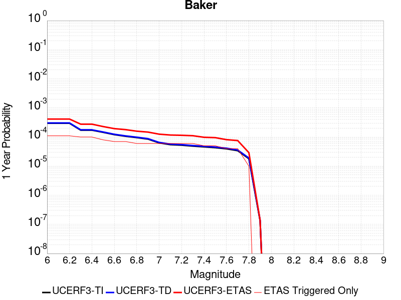 |  |

| Magnitude | 1 wk TI Prob | 1 wk TD Prob | 1 wk ETAS Prob | 1 wk ETAS/TD Gain | 1 wk ETAS Triggered Only | 1 mo TI Prob | 1 mo TD Prob | 1 mo ETAS Prob | 1 mo ETAS/TD Gain | 1 mo ETAS Triggered Only | 1 yr TI Prob | 1 yr TD Prob | 1 yr ETAS Prob | 1 yr ETAS/TD Gain | 1 yr ETAS Triggered Only | 10 yr TI Prob | 10 yr TD Prob | 10 yr ETAS Prob | 10 yr ETAS/TD Gain | 10 yr ETAS Triggered Only |
|-----|-----|-----|-----|-----|-----|-----|-----|-----|-----|-----|-----|-----|-----|-----|-----|-----|-----|-----|-----|-----|
| 6.0 | 5.695525E-6 | 5.834856E-6 | 2.5834739E-5 | 4.4276567 | 2.0E-5 | 2.4409164E-5 | 2.500631E-5 | 6.500531E-5 | 2.5995562 | 4.0E-5 | 2.9714106E-4 | 3.044133E-4 | 4.143798E-4 | 1.3612409 | 1.1E-4 | 0.0029674405 | 0.0030403587 | 0.0032497202 | 1.0688608 | 2.1E-4 |
| 6.1 | 5.695525E-6 | 5.834856E-6 | 2.5834739E-5 | 4.4276567 | 2.0E-5 | 2.4409164E-5 | 2.500631E-5 | 6.500531E-5 | 2.5995562 | 4.0E-5 | 2.9714106E-4 | 3.044133E-4 | 4.143798E-4 | 1.3612409 | 1.1E-4 | 0.0029674405 | 0.0030403587 | 0.0032497202 | 1.0688608 | 2.1E-4 |
| 6.2 | 5.695525E-6 | 5.834856E-6 | 2.5834739E-5 | 4.4276567 | 2.0E-5 | 2.4409164E-5 | 2.500631E-5 | 6.500531E-5 | 2.5995562 | 4.0E-5 | 2.9714106E-4 | 3.044133E-4 | 4.143798E-4 | 1.3612409 | 1.1E-4 | 0.0029674405 | 0.0030403587 | 0.0032497202 | 1.0688608 | 2.1E-4 |
| 6.3 | 3.2995713E-6 | 3.3836786E-6 | 2.338361E-5 | 6.910707 | 2.0E-5 | 1.4140943E-5 | 1.4501402E-5 | 5.4500822E-5 | 3.758314 | 4.0E-5 | 1.7215237E-4 | 1.7654074E-4 | 2.765231E-4 | 1.5663415 | 1.0E-4 | 0.0017201907 | 0.0017640521 | 0.0019237698 | 1.0905403 | 1.6E-4 |
| 6.4 | 3.2995713E-6 | 3.3836786E-6 | 2.338361E-5 | 6.910707 | 2.0E-5 | 1.4140943E-5 | 1.4501402E-5 | 5.4500822E-5 | 3.758314 | 4.0E-5 | 1.7215237E-4 | 1.7654074E-4 | 2.765231E-4 | 1.5663415 | 1.0E-4 | 0.0017201907 | 0.0017640521 | 0.0019237698 | 1.0905403 | 1.6E-4 |
| 6.5 | 2.782202E-6 | 2.8558507E-6 | 2.2855793E-5 | 8.003147 | 2.0E-5 | 1.1923668E-5 | 1.2239304E-5 | 5.2238815E-5 | 4.26812 | 4.0E-5 | 1.4516099E-4 | 1.4900367E-4 | 2.2899175E-4 | 1.5368196 | 8.0E-5 | 0.001450662 | 0.0014890704 | 0.0016288619 | 1.0938784 | 1.4E-4 |
| 6.6 | 2.3163404E-6 | 2.380929E-6 | 1.2380905E-5 | 5.2000313 | 1.0E-5 | 9.927136E-6 | 1.0203942E-5 | 4.0203635E-5 | 3.9400103 | 3.0E-5 | 1.20856166E-4 | 1.2422612E-4 | 1.9421743E-4 | 1.5634186 | 7.0E-5 | 0.0012079047 | 0.001241587 | 0.0013714256 | 1.1045747 | 1.3E-4 |
| 6.7 | 2.037056E-6 | 2.0965088E-6 | 1.2096488E-5 | 5.769825 | 1.0E-5 | 8.7302105E-6 | 8.985007E-6 | 3.8984737E-5 | 4.3388658 | 3.0E-5 | 1.0628513E-4 | 1.0938713E-4 | 1.7937948E-4 | 1.639859 | 7.0E-5 | 0.0010623431 | 0.0010933491 | 0.0012032287 | 1.1004983 | 1.1E-4 |
| 6.8 | 1.8356744E-6 | 1.8915364E-6 | 1.1891518E-5 | 6.286698 | 1.0E-5 | 7.867153E-6 | 8.10656E-6 | 3.810632E-5 | 4.7006764 | 3.0E-5 | 9.577837E-5 | 9.869304E-5 | 1.5868712E-4 | 1.6078856 | 6.0E-5 | 9.57371E-4 | 9.865061E-4 | 0.0010864075 | 1.1012678 | 1.0E-4 |
| 6.9 | 1.6310546E-6 | 1.6832144E-6 | 1.1683198E-5 | 6.941004 | 1.0E-5 | 6.9902153E-6 | 7.213757E-6 | 3.721354E-5 | 5.158691 | 3.0E-5 | 8.510255E-5 | 8.782406E-5 | 1.4781879E-4 | 1.6831241 | 6.0E-5 | 8.5069967E-4 | 8.779048E-4 | 9.678258E-4 | 1.1024268 | 9.0E-5 |
| 7.0 | 1.2058036E-6 | 1.2508729E-6 | 1.1250861E-5 | 8.994408 | 1.0E-5 | 5.1677193E-6 | 5.3608724E-6 | 3.536071E-5 | 6.596074 | 3.0E-5 | 6.291517E-5 | 6.526669E-5 | 1.2526277E-4 | 1.919245 | 6.0E-5 | 6.289736E-4 | 6.5247755E-4 | 7.424188E-4 | 1.1378458 | 9.0E-5 |
| 7.1 | 1.052382E-6 | 1.0951668E-6 | 1.1095156E-5 | 10.131019 | 1.0E-5 | 4.5102006E-6 | 4.693564E-6 | 3.469342E-5 | 7.3917017 | 3.0E-5 | 5.491031E-5 | 5.7142646E-5 | 1.1713922E-4 | 2.049944 | 6.0E-5 | 5.4896745E-4 | 5.712804E-4 | 6.61229E-4 | 1.1574508 | 9.0E-5 |
| 7.2 | 1.0067454E-6 | 1.0487769E-6 | 1.1048766E-5 | 10.534906 | 1.0E-5 | 4.3146156E-6 | 4.4947506E-6 | 3.4494617E-5 | 7.6744227 | 3.0E-5 | 5.252918E-5 | 5.4722223E-5 | 1.1471894E-4 | 2.0963867 | 6.0E-5 | 5.251676E-4 | 5.4708833E-4 | 6.370391E-4 | 1.1644173 | 9.0E-5 |
| 7.3 | 9.3596316E-7 | 9.76778E-7 | 1.0976768E-5 | 11.237731 | 1.0E-5 | 4.0112645E-6 | 4.186185E-6 | 3.4186058E-5 | 8.1664 | 3.0E-5 | 4.8836053E-5 | 5.0965617E-5 | 1.1096256E-4 | 2.1772044 | 6.0E-5 | 4.8825322E-4 | 5.095401E-4 | 5.994942E-4 | 1.1765399 | 9.0E-5 |
| 7.4 | 8.8117395E-7 | 9.2077187E-7 | 9.2077187E-7 | 1.0 | 0.0 | 3.7764542E-6 | 3.9461593E-6 | 2.394608E-5 | 6.068199 | 2.0E-5 | 4.5977362E-5 | 4.8043436E-5 | 9.804103E-5 | 2.040675 | 5.0E-5 | 4.596785E-4 | 4.8033125E-4 | 5.502976E-4 | 1.1456628 | 7.0E-5 |
| 7.5 | 8.292386E-7 | 8.674649E-7 | 8.674649E-7 | 1.0 | 0.0 | 3.5538749E-6 | 3.7177015E-6 | 2.3717626E-5 | 6.379648 | 2.0E-5 | 4.326757E-5 | 4.5262084E-5 | 9.525982E-5 | 2.1046274 | 5.0E-5 | 4.3259145E-4 | 4.5252938E-4 | 5.224977E-4 | 1.1546161 | 7.0E-5 |
| 7.6 | 7.553842E-7 | 7.9145207E-7 | 7.9145207E-7 | 1.0 | 0.0 | 3.2373566E-6 | 3.3919332E-6 | 2.3391865E-5 | 6.8963227 | 2.0E-5 | 3.9414106E-5 | 4.129601E-5 | 8.129436E-5 | 1.9685766 | 4.0E-5 | 3.9407116E-4 | 4.1288408E-4 | 4.6286342E-4 | 1.1210494 | 5.0E-5 |
| 7.7 | 6.5285366E-7 | 6.852842E-7 | 6.852842E-7 | 1.0 | 0.0 | 2.797941E-6 | 2.9369291E-6 | 2.293687E-5 | 7.809814 | 2.0E-5 | 3.40644E-5 | 3.5756533E-5 | 7.57551E-5 | 2.1186368 | 4.0E-5 | 3.405918E-4 | 3.5750846E-4 | 4.0749056E-4 | 1.1398069 | 5.0E-5 |
| 7.8 | 3.4586725E-7 | 3.648288E-7 | 3.648288E-7 | 1.0 | 0.0 | 1.4822873E-6 | 1.5635511E-6 | 1.1563536E-5 | 7.3956876 | 1.0E-5 | 1.80467E-5 | 1.9036073E-5 | 2.9035882E-5 | 1.5253085 | 1.0E-5 | 1.8045233E-4 | 1.9034486E-4 | 2.0034295E-4 | 1.0525262 | 1.0E-5 |
| 7.9 | 2.5591178E-9 | 2.6696871E-9 | 2.6696871E-9 | 1.0 | 0.0 | 1.0967647E-8 | 1.1441516E-8 | 1.1441516E-8 | 1.0 | 0.0 | 1.335311E-7 | 1.3930045E-7 | 1.3930045E-7 | 1.0 | 0.0 | 1.3353102E-6 | 1.3930046E-6 | 1.3930046E-6 | 1.0 | 0.0 |

## Ludlow
*[(top)](#table-of-contents)*

| 1 Week | 1 Month | 1 Year | 10 Year |
|-----|-----|-----|-----|
|  |  |  |  |

| Magnitude | 1 wk TI Prob | 1 wk TD Prob | 1 wk ETAS Prob | 1 wk ETAS/TD Gain | 1 wk ETAS Triggered Only | 1 mo TI Prob | 1 mo TD Prob | 1 mo ETAS Prob | 1 mo ETAS/TD Gain | 1 mo ETAS Triggered Only | 1 yr TI Prob | 1 yr TD Prob | 1 yr ETAS Prob | 1 yr ETAS/TD Gain | 1 yr ETAS Triggered Only | 10 yr TI Prob | 10 yr TD Prob | 10 yr ETAS Prob | 10 yr ETAS/TD Gain | 10 yr ETAS Triggered Only |
|-----|-----|-----|-----|-----|-----|-----|-----|-----|-----|-----|-----|-----|-----|-----|-----|-----|-----|-----|-----|-----|
| 6.0 | 2.2407607E-5 | 2.3657429E-5 | 2.3657429E-5 | 1.0 | 0.0 | 9.602906E-5 | 1.0138529E-4 | 1.0138529E-4 | 1.0 | 0.0 | 0.0011685267 | 0.001233711 | 0.0013435753 | 1.0890518 | 1.1E-4 | 0.011624013 | 0.012273132 | 0.012450923 | 1.0144862 | 1.8E-4 |
| 6.1 | 2.2407607E-5 | 2.3657429E-5 | 2.3657429E-5 | 1.0 | 0.0 | 9.602906E-5 | 1.0138529E-4 | 1.0138529E-4 | 1.0 | 0.0 | 0.0011685267 | 0.001233711 | 0.0013435753 | 1.0890518 | 1.1E-4 | 0.011624013 | 0.012273132 | 0.012450923 | 1.0144862 | 1.8E-4 |
| 6.2 | 1.0781252E-5 | 1.1365745E-5 | 1.1365745E-5 | 1.0 | 0.0 | 4.620455E-5 | 4.870945E-5 | 4.870945E-5 | 1.0 | 0.0 | 5.623952E-4 | 5.9288024E-4 | 6.728328E-4 | 1.1348546 | 8.0E-5 | 0.00560974 | 0.005913404 | 0.006022753 | 1.0184919 | 1.1E-4 |
| 6.3 | 1.0781252E-5 | 1.1365745E-5 | 1.1365745E-5 | 1.0 | 0.0 | 4.620455E-5 | 4.870945E-5 | 4.870945E-5 | 1.0 | 0.0 | 5.623952E-4 | 5.9288024E-4 | 6.728328E-4 | 1.1348546 | 8.0E-5 | 0.00560974 | 0.005913404 | 0.006022753 | 1.0184919 | 1.1E-4 |
| 6.4 | 7.814439E-6 | 8.237788E-6 | 8.237788E-6 | 1.0 | 0.0 | 3.3490025E-5 | 3.5304336E-5 | 3.5304336E-5 | 1.0 | 0.0 | 4.0766477E-4 | 4.2974693E-4 | 4.7972542E-4 | 1.1162976 | 5.0E-5 | 0.0040691774 | 0.0042893053 | 0.0043689623 | 1.018571 | 8.0E-5 |
| 6.5 | 6.4986366E-6 | 6.850969E-6 | 6.850969E-6 | 1.0 | 0.0 | 2.7851002E-5 | 2.936097E-5 | 2.936097E-5 | 1.0 | 0.0 | 3.390332E-4 | 3.574121E-4 | 3.9739782E-4 | 1.1118757 | 4.0E-5 | 0.003385164 | 0.0035684688 | 0.0036282549 | 1.0167539 | 6.0E-5 |
| 6.6 | 5.582177E-6 | 5.8860483E-6 | 5.8860483E-6 | 1.0 | 0.0 | 2.3923398E-5 | 2.522568E-5 | 2.522568E-5 | 1.0 | 0.0 | 2.9122844E-4 | 3.070801E-4 | 3.2707394E-4 | 1.0651096 | 2.0E-5 | 0.0029084706 | 0.003066631 | 0.003096539 | 1.0097528 | 3.0E-5 |
| 6.7 | 4.6858763E-6 | 4.940463E-6 | 4.940463E-6 | 1.0 | 0.0 | 2.0082172E-5 | 2.1173244E-5 | 2.1173244E-5 | 1.0 | 0.0 | 2.4447302E-4 | 2.577543E-4 | 2.7774915E-4 | 1.0775733 | 2.0E-5 | 0.0024420423 | 0.0025746098 | 0.0025945583 | 1.0077481 | 2.0E-5 |
| 6.8 | 3.5584908E-6 | 3.7520454E-6 | 3.7520454E-6 | 1.0 | 0.0 | 1.5250586E-5 | 1.6080097E-5 | 1.6080097E-5 | 1.0 | 0.0 | 1.8566006E-4 | 1.9575801E-4 | 2.0575605E-4 | 1.0510734 | 1.0E-5 | 0.0018550502 | 0.0019558968 | 0.0019658771 | 1.0051028 | 1.0E-5 |
| 6.9 | 2.532834E-6 | 2.6710227E-6 | 2.6710227E-6 | 1.0 | 0.0 | 1.0854958E-5 | 1.1447192E-5 | 1.1447192E-5 | 1.0 | 0.0 | 1.3215111E-4 | 1.3936093E-4 | 1.3936093E-4 | 1.0 | 0.0 | 0.0013207254 | 0.0013927629 | 0.0013927629 | 1.0 | 0.0 |
| 7.0 | 1.7083285E-6 | 1.801957E-6 | 1.801957E-6 | 1.0 | 0.0 | 7.3213873E-6 | 7.7226505E-6 | 7.7226505E-6 | 1.0 | 0.0 | 8.913424E-5 | 9.4019386E-5 | 9.4019386E-5 | 1.0 | 0.0 | 8.9098496E-4 | 9.3981257E-4 | 9.3981257E-4 | 1.0 | 0.0 |
| 7.1 | 1.0905424E-6 | 1.1497702E-6 | 1.1497702E-6 | 1.0 | 0.0 | 4.6737446E-6 | 4.927578E-6 | 4.927578E-6 | 1.0 | 0.0 | 5.6901354E-5 | 5.999171E-5 | 5.999171E-5 | 1.0 | 0.0 | 5.6886784E-4 | 5.997649E-4 | 5.997649E-4 | 1.0 | 0.0 |
| 7.2 | 6.06668E-7 | 6.387322E-7 | 6.387322E-7 | 1.0 | 0.0 | 2.600003E-6 | 2.7374213E-6 | 2.7374213E-6 | 1.0 | 0.0 | 3.1654577E-5 | 3.3327666E-5 | 3.3327666E-5 | 1.0 | 0.0 | 3.1650066E-4 | 3.332335E-4 | 3.332335E-4 | 1.0 | 0.0 |

## San Andreas (Coachella) rev
*[(top)](#table-of-contents)*

| 1 Week | 1 Month | 1 Year | 10 Year |
|-----|-----|-----|-----|
|  |  |  |  |

| Magnitude | 1 wk TI Prob | 1 wk TD Prob | 1 wk ETAS Prob | 1 wk ETAS/TD Gain | 1 wk ETAS Triggered Only | 1 mo TI Prob | 1 mo TD Prob | 1 mo ETAS Prob | 1 mo ETAS/TD Gain | 1 mo ETAS Triggered Only | 1 yr TI Prob | 1 yr TD Prob | 1 yr ETAS Prob | 1 yr ETAS/TD Gain | 1 yr ETAS Triggered Only | 10 yr TI Prob | 10 yr TD Prob | 10 yr ETAS Prob | 10 yr ETAS/TD Gain | 10 yr ETAS Triggered Only |
|-----|-----|-----|-----|-----|-----|-----|-----|-----|-----|-----|-----|-----|-----|-----|-----|-----|-----|-----|-----|-----|
| 6.0 | 1.1925945E-4 | 3.2735174E-4 | 3.2735174E-4 | 1.0 | 0.0 | 5.110118E-4 | 0.0014021865 | 0.0014521163 | 1.0356086 | 5.0E-5 | 0.0062038354 | 0.016939327 | 0.017057294 | 1.0069641 | 1.2E-4 | 0.060334753 | 0.15269604 | 0.15284008 | 1.0009433 | 1.7E-4 |
| 6.1 | 1.1925945E-4 | 3.2735174E-4 | 3.2735174E-4 | 1.0 | 0.0 | 5.110118E-4 | 0.0014021865 | 0.0014521163 | 1.0356086 | 5.0E-5 | 0.0062038354 | 0.016939327 | 0.017057294 | 1.0069641 | 1.2E-4 | 0.060334753 | 0.15269604 | 0.15284008 | 1.0009433 | 1.7E-4 |
| 6.2 | 1.07432395E-4 | 3.023596E-4 | 3.023596E-4 | 1.0 | 0.0 | 4.603433E-4 | 0.0012951873 | 0.0013451226 | 1.0385544 | 5.0E-5 | 0.005590286 | 0.01565599 | 0.015774112 | 1.0075448 | 1.2E-4 | 0.05451731 | 0.14184935 | 0.14199524 | 1.0010284 | 1.7E-4 |
| 6.3 | 1.0718766E-4 | 3.0181266E-4 | 3.0181266E-4 | 1.0 | 0.0 | 4.592948E-4 | 0.0012928456 | 0.001342781 | 1.0386244 | 5.0E-5 | 0.005577586 | 0.015627889 | 0.015746014 | 1.0075586 | 1.2E-4 | 0.054396555 | 0.14161763 | 0.14176355 | 1.0010304 | 1.7E-4 |
| 6.4 | 1.0355944E-4 | 2.9389336E-4 | 2.9389336E-4 | 1.0 | 0.0 | 4.4375064E-4 | 0.001258939 | 0.0013088761 | 1.0396659 | 5.0E-5 | 0.0053892885 | 0.015220915 | 0.015339089 | 1.0077639 | 1.2E-4 | 0.052604496 | 0.13817544 | 0.13832195 | 1.0010604 | 1.7E-4 |
| 6.5 | 1.0227914E-4 | 2.9108766E-4 | 2.9108766E-4 | 1.0 | 0.0 | 4.382655E-4 | 0.0012469261 | 0.0012968638 | 1.0400486 | 5.0E-5 | 0.0053228354 | 0.015076692 | 0.015194883 | 1.0078393 | 1.2E-4 | 0.051971316 | 0.13695958 | 0.1371063 | 1.0010712 | 1.7E-4 |
| 6.6 | 1.0116757E-4 | 2.8874516E-4 | 2.8874516E-4 | 1.0 | 0.0 | 4.3350324E-4 | 0.0012368963 | 0.0012868345 | 1.0403738 | 5.0E-5 | 0.0052651367 | 0.014956261 | 0.015074466 | 1.0079033 | 1.2E-4 | 0.051421247 | 0.1359371 | 0.13608399 | 1.0010806 | 1.7E-4 |
| 6.7 | 1.0050676E-4 | 2.8733077E-4 | 2.8733077E-4 | 1.0 | 0.0 | 4.3067214E-4 | 0.0012308403 | 0.0012807788 | 1.0405726 | 5.0E-5 | 0.005230834 | 0.01488354 | 0.015001754 | 1.0079426 | 1.2E-4 | 0.051094085 | 0.13532192 | 0.13546892 | 1.0010862 | 1.7E-4 |
| 6.8 | 9.976819E-5 | 2.8536728E-4 | 2.8536728E-4 | 1.0 | 0.0 | 4.2750788E-4 | 0.0012224333 | 0.0012723722 | 1.0408521 | 5.0E-5 | 0.0051924936 | 0.014782578 | 0.014890951 | 1.0073311 | 1.1E-4 | 0.050728295 | 0.13447334 | 0.13461182 | 1.0010298 | 1.6E-4 |
| 6.9 | 9.77719E-5 | 2.8033604E-4 | 2.8033604E-4 | 1.0 | 0.0 | 4.1895514E-4 | 0.0012008909 | 0.0012508308 | 1.0415858 | 5.0E-5 | 0.0050888555 | 0.014523826 | 0.014632228 | 1.0074638 | 1.1E-4 | 0.049738888 | 0.13230172 | 0.13244055 | 1.0010494 | 1.6E-4 |
| 7.0 | 8.500761E-5 | 2.476793E-4 | 2.476793E-4 | 1.0 | 0.0 | 3.6426744E-4 | 0.0010610541 | 0.001111001 | 1.047073 | 5.0E-5 | 0.0044259406 | 0.01284259 | 0.012951178 | 1.0084553 | 1.1E-4 | 0.04338823 | 0.118151076 | 0.118292175 | 1.0011942 | 1.6E-4 |
| 7.1 | 8.319876E-5 | 2.4370618E-4 | 2.4370618E-4 | 1.0 | 0.0 | 3.5651738E-4 | 0.0010440402 | 0.001093988 | 1.0478408 | 5.0E-5 | 0.004331963 | 0.0126378685 | 0.012746478 | 1.008594 | 1.1E-4 | 0.042484846 | 0.11637106 | 0.11651243 | 1.0012149 | 1.6E-4 |
| 7.2 | 7.563917E-5 | 2.2418915E-4 | 2.2418915E-4 | 1.0 | 0.0 | 3.2412758E-4 | 9.604599E-4 | 0.0010104119 | 1.0520084 | 5.0E-5 | 0.0039391145 | 0.011631592 | 0.011740313 | 1.009347 | 1.1E-4 | 0.03870018 | 0.107777216 | 0.10791997 | 1.0013245 | 1.6E-4 |
| 7.3 | 7.082985E-5 | 2.0734889E-4 | 2.0734889E-4 | 1.0 | 0.0 | 3.0352117E-4 | 8.8833837E-4 | 9.3829393E-4 | 1.0562348 | 5.0E-5 | 0.0036891096 | 0.01076251 | 0.010871327 | 1.0101106 | 1.1E-4 | 0.03628465 | 0.10029867 | 0.100442626 | 1.0014353 | 1.6E-4 |
| 7.4 | 5.146215E-5 | 1.4277869E-4 | 1.4277869E-4 | 1.0 | 0.0 | 2.2053342E-4 | 6.1176607E-4 | 6.617355E-4 | 1.0816805 | 5.0E-5 | 0.0026816884 | 0.007423004 | 0.0075321877 | 1.0147088 | 1.1E-4 | 0.02649557 | 0.07086286 | 0.07101152 | 1.0020978 | 1.6E-4 |
| 7.5 | 4.0285166E-5 | 1.09450986E-4 | 1.09450986E-4 | 1.0 | 0.0 | 1.7263928E-4 | 4.6899164E-4 | 5.189682E-4 | 1.1065617 | 5.0E-5 | 0.002099857 | 0.0056950934 | 0.005804467 | 1.0192049 | 1.1E-4 | 0.020801254 | 0.055024315 | 0.05517551 | 1.0027478 | 1.6E-4 |
| 7.6 | 3.1168736E-5 | 8.441976E-5 | 8.441976E-5 | 1.0 | 0.0 | 1.3357346E-4 | 3.617489E-4 | 4.117308E-4 | 1.1381674 | 5.0E-5 | 0.0016250437 | 0.0043954253 | 0.004504942 | 1.024916 | 1.1E-4 | 0.016132116 | 0.042821974 | 0.042975124 | 1.0035764 | 1.6E-4 |
| 7.7 | 2.2100989E-5 | 6.241421E-5 | 6.241421E-5 | 1.0 | 0.0 | 9.4715084E-5 | 2.674621E-4 | 3.1744872E-4 | 1.1868924 | 5.0E-5 | 0.001152546 | 0.003251495 | 0.0033611376 | 1.0337206 | 1.1E-4 | 0.011465867 | 0.031911246 | 0.032056462 | 1.0045506 | 1.5E-4 |
| 7.8 | 1.7484861E-5 | 5.181932E-5 | 5.181932E-5 | 1.0 | 0.0 | 7.493296E-5 | 2.220639E-4 | 2.720528E-4 | 1.2251104 | 5.0E-5 | 9.1192697E-4 | 0.002700279 | 0.002800009 | 1.0369332 | 1.0E-4 | 0.009081938 | 0.026649911 | 0.026776446 | 1.0047481 | 1.3E-4 |
| 7.9 | 1.3967285E-5 | 3.8241284E-5 | 3.8241284E-5 | 1.0 | 0.0 | 5.985842E-5 | 1.6388092E-4 | 2.1387273E-4 | 1.3050495 | 5.0E-5 | 7.2853256E-4 | 0.0019934257 | 0.0020832461 | 1.0450584 | 9.0E-5 | 0.0072614877 | 0.019917965 | 0.020025775 | 1.0054127 | 1.1E-4 |
| 8.0 | 1.1887396E-5 | 3.1081006E-5 | 3.1081006E-5 | 1.0 | 0.0 | 5.094499E-5 | 1.3319752E-4 | 1.8319086E-4 | 1.3753324 | 5.0E-5 | 6.200787E-4 | 0.0016204745 | 0.0017103286 | 1.0554492 | 9.0E-5 | 0.006183513 | 0.016286531 | 0.01639474 | 1.006644 | 1.1E-4 |
| 8.1 | 5.100864E-6 | 8.979058E-6 | 8.979058E-6 | 1.0 | 0.0 | 2.1860664E-5 | 3.8481114E-5 | 3.8481114E-5 | 1.0 | 0.0 | 2.6612106E-4 | 4.6840697E-4 | 4.6840697E-4 | 1.0 | 0.0 | 0.002658026 | 0.0049204906 | 0.0049204906 | 1.0 | 0.0 |
| 8.2 | 2.3004484E-6 | 2.7884673E-6 | 2.7884673E-6 | 1.0 | 0.0 | 9.859027E-6 | 1.195052E-5 | 1.195052E-5 | 1.0 | 0.0 | 1.2002704E-4 | 1.454879E-4 | 1.454879E-4 | 1.0 | 0.0 | 0.0011996223 | 0.0015984424 | 0.0015984424 | 1.0 | 0.0 |
| 8.3 | 1.0424446E-7 | 5.820319E-8 | 5.820319E-8 | 1.0 | 0.0 | 4.4676187E-7 | 2.4944222E-7 | 2.4944222E-7 | 1.0 | 0.0 | 5.439312E-6 | 3.0369551E-6 | 3.0369551E-6 | 1.0 | 0.0 | 5.4391792E-5 | 3.1931086E-5 | 3.1931086E-5 | 1.0 | 0.0 |

## Elsinore (Glen Ivy) rev
*[(top)](#table-of-contents)*

| 1 Week | 1 Month | 1 Year | 10 Year |
|-----|-----|-----|-----|
|  |  |  |  |

| Magnitude | 1 wk TI Prob | 1 wk TD Prob | 1 wk ETAS Prob | 1 wk ETAS/TD Gain | 1 wk ETAS Triggered Only | 1 mo TI Prob | 1 mo TD Prob | 1 mo ETAS Prob | 1 mo ETAS/TD Gain | 1 mo ETAS Triggered Only | 1 yr TI Prob | 1 yr TD Prob | 1 yr ETAS Prob | 1 yr ETAS/TD Gain | 1 yr ETAS Triggered Only | 10 yr TI Prob | 10 yr TD Prob | 10 yr ETAS Prob | 10 yr ETAS/TD Gain | 10 yr ETAS Triggered Only |
|-----|-----|-----|-----|-----|-----|-----|-----|-----|-----|-----|-----|-----|-----|-----|-----|-----|-----|-----|-----|-----|
| 6.0 | 1.6204086E-4 | 2.9373635E-4 | 2.9373635E-4 | 1.0 | 0.0 | 6.94276E-4 | 0.0012584174 | 0.0012684049 | 1.0079365 | 1.0E-5 | 0.008420097 | 0.01523484 | 0.015303774 | 1.0045247 | 7.0E-5 | 0.081081145 | 0.13962553 | 0.1397804 | 1.0011091 | 1.8E-4 |
| 6.1 | 1.6204086E-4 | 2.9373635E-4 | 2.9373635E-4 | 1.0 | 0.0 | 6.94276E-4 | 0.0012584174 | 0.0012684049 | 1.0079365 | 1.0E-5 | 0.008420097 | 0.01523484 | 0.015303774 | 1.0045247 | 7.0E-5 | 0.081081145 | 0.13962553 | 0.1397804 | 1.0011091 | 1.8E-4 |
| 6.2 | 1.6204086E-4 | 2.9373635E-4 | 2.9373635E-4 | 1.0 | 0.0 | 6.94276E-4 | 0.0012584174 | 0.0012684049 | 1.0079365 | 1.0E-5 | 0.008420097 | 0.01523484 | 0.015303774 | 1.0045247 | 7.0E-5 | 0.081081145 | 0.13962553 | 0.1397804 | 1.0011091 | 1.8E-4 |
| 6.3 | 1.0111737E-4 | 1.7703637E-4 | 1.7703637E-4 | 1.0 | 0.0 | 4.332882E-4 | 7.586233E-4 | 7.586233E-4 | 1.0 | 0.0 | 0.005262531 | 0.009217811 | 0.009227719 | 1.0010749 | 1.0E-5 | 0.0513964 | 0.08707389 | 0.08712866 | 1.0006291 | 6.0E-5 |
| 6.4 | 1.0111737E-4 | 1.7703637E-4 | 1.7703637E-4 | 1.0 | 0.0 | 4.332882E-4 | 7.586233E-4 | 7.586233E-4 | 1.0 | 0.0 | 0.005262531 | 0.009217811 | 0.009227719 | 1.0010749 | 1.0E-5 | 0.0513964 | 0.08707389 | 0.08712866 | 1.0006291 | 6.0E-5 |
| 6.5 | 3.6624708E-5 | 4.6393732E-5 | 4.6393732E-5 | 1.0 | 0.0 | 1.569536E-4 | 1.9881714E-4 | 1.9881714E-4 | 1.0 | 0.0 | 0.001909235 | 0.0024182722 | 0.002428248 | 1.0041252 | 1.0E-5 | 0.01892915 | 0.023697015 | 0.023726305 | 1.001236 | 3.0E-5 |
| 6.6 | 2.5051324E-5 | 2.6148944E-5 | 2.6148944E-5 | 1.0 | 0.0 | 1.073584E-4 | 1.1206234E-4 | 1.1206234E-4 | 1.0 | 0.0 | 0.0013063047 | 0.0013635496 | 0.0013635496 | 1.0 | 0.0 | 0.012986525 | 0.013565712 | 0.01358544 | 1.0014544 | 2.0E-5 |
| 6.7 | 2.2189772E-5 | 2.2073793E-5 | 2.2073793E-5 | 1.0 | 0.0 | 9.509556E-5 | 9.459874E-5 | 9.459874E-5 | 1.0 | 0.0 | 0.0011571734 | 0.0011511676 | 0.0011511676 | 1.0 | 0.0 | 0.011511663 | 0.011466403 | 0.011486174 | 1.0017242 | 2.0E-5 |
| 6.8 | 1.6654378E-5 | 1.4438363E-5 | 1.4438363E-5 | 1.0 | 0.0 | 7.137396E-5 | 6.187726E-5 | 6.187726E-5 | 1.0 | 0.0 | 8.686314E-4 | 7.5310044E-4 | 7.5310044E-4 | 1.0 | 0.0 | 0.008652439 | 0.0075102663 | 0.0075102663 | 1.0 | 0.0 |
| 6.9 | 1.5042909E-5 | 1.2332568E-5 | 1.2332568E-5 | 1.0 | 0.0 | 6.446802E-5 | 5.285281E-5 | 5.285281E-5 | 1.0 | 0.0 | 7.8461546E-4 | 6.432961E-4 | 6.432961E-4 | 1.0 | 0.0 | 0.007818509 | 0.0064180964 | 0.0064180964 | 1.0 | 0.0 |
| 7.0 | 1.4361385E-5 | 1.1451833E-5 | 1.1451833E-5 | 1.0 | 0.0 | 6.154734E-5 | 4.907838E-5 | 4.907838E-5 | 1.0 | 0.0 | 7.490812E-4 | 5.973684E-4 | 5.973684E-4 | 1.0 | 0.0 | 0.007465612 | 0.0059608603 | 0.0059608603 | 1.0 | 0.0 |
| 7.1 | 1.3265571E-5 | 1.0245265E-5 | 1.0245265E-5 | 1.0 | 0.0 | 5.6851208E-5 | 4.3907552E-5 | 4.3907552E-5 | 1.0 | 0.0 | 6.919436E-4 | 5.3444586E-4 | 5.3444586E-4 | 1.0 | 0.0 | 0.006897931 | 0.005334682 | 0.005334682 | 1.0 | 0.0 |
| 7.2 | 1.1596403E-5 | 8.505279E-6 | 8.505279E-6 | 1.0 | 0.0 | 4.9697923E-5 | 3.6450696E-5 | 3.6450696E-5 | 1.0 | 0.0 | 6.049042E-4 | 4.4369852E-4 | 4.4369852E-4 | 1.0 | 0.0 | 0.006032603 | 0.004429451 | 0.004429451 | 1.0 | 0.0 |
| 7.3 | 1.0150827E-5 | 7.238911E-6 | 7.238911E-6 | 1.0 | 0.0 | 4.3502816E-5 | 3.1023545E-5 | 3.1023545E-5 | 1.0 | 0.0 | 5.2951806E-4 | 3.7764764E-4 | 3.7764764E-4 | 1.0 | 0.0 | 0.005282581 | 0.003770453 | 0.003770453 | 1.0 | 0.0 |
| 7.4 | 9.080705E-6 | 6.352632E-6 | 6.352632E-6 | 1.0 | 0.0 | 3.8916725E-5 | 2.7225291E-5 | 2.7225291E-5 | 1.0 | 0.0 | 4.7370812E-4 | 3.3141885E-4 | 3.3141885E-4 | 1.0 | 0.0 | 0.004726996 | 0.0033093947 | 0.0033093947 | 1.0 | 0.0 |
| 7.5 | 7.671649E-6 | 5.2257096E-6 | 5.2257096E-6 | 1.0 | 0.0 | 3.287808E-5 | 2.2395712E-5 | 2.2395712E-5 | 1.0 | 0.0 | 4.0021708E-4 | 2.7263493E-4 | 2.7263493E-4 | 1.0 | 0.0 | 0.0039949706 | 0.0027231297 | 0.0027231297 | 1.0 | 0.0 |
| 7.6 | 6.990086E-6 | 4.6875944E-6 | 4.6875944E-6 | 1.0 | 0.0 | 2.9957167E-5 | 2.0089543E-5 | 2.0089543E-5 | 1.0 | 0.0 | 3.6466747E-4 | 2.445639E-4 | 2.445639E-4 | 1.0 | 0.0 | 0.0036406964 | 0.0024430638 | 0.0024430638 | 1.0 | 0.0 |
| 7.7 | 4.163505E-6 | 2.3295045E-6 | 2.3295045E-6 | 1.0 | 0.0 | 1.7843471E-5 | 9.983556E-6 | 9.983556E-6 | 1.0 | 0.0 | 2.172226E-4 | 1.2154376E-4 | 1.2154376E-4 | 1.0 | 0.0 | 0.0021701038 | 0.0012148459 | 0.0012148459 | 1.0 | 0.0 |
| 7.8 | 2.2692414E-7 | 9.384624E-8 | 9.384624E-8 | 1.0 | 0.0 | 9.725317E-7 | 4.021981E-7 | 4.021981E-7 | 1.0 | 0.0 | 1.1840509E-5 | 4.8967545E-6 | 4.8967545E-6 | 1.0 | 0.0 | 1.1839878E-4 | 4.8966795E-5 | 4.8966795E-5 | 1.0 | 0.0 |
| 7.9 | 6.676829E-9 | 3.4397993E-9 | 3.4397993E-9 | 1.0 | 0.0 | 2.861498E-8 | 1.4741998E-8 | 1.4741998E-8 | 1.0 | 0.0 | 3.4838732E-7 | 1.794838E-7 | 1.794838E-7 | 1.0 | 0.0 | 3.4838679E-6 | 1.7948367E-6 | 1.7948367E-6 | 1.0 | 0.0 |

## San Andreas (North Branch Mill Creek)
*[(top)](#table-of-contents)*

| 1 Week | 1 Month | 1 Year | 10 Year |
|-----|-----|-----|-----|
| 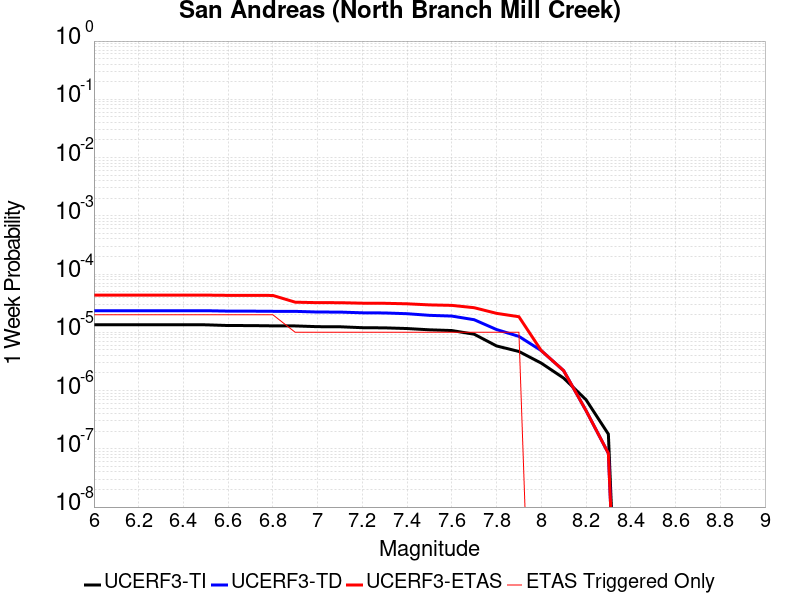 |  | 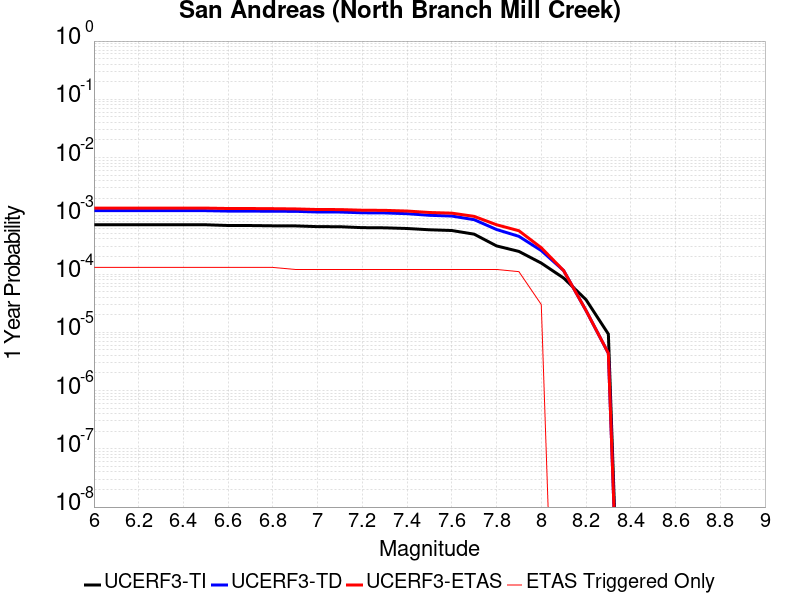 |  |

| Magnitude | 1 wk TI Prob | 1 wk TD Prob | 1 wk ETAS Prob | 1 wk ETAS/TD Gain | 1 wk ETAS Triggered Only | 1 mo TI Prob | 1 mo TD Prob | 1 mo ETAS Prob | 1 mo ETAS/TD Gain | 1 mo ETAS Triggered Only | 1 yr TI Prob | 1 yr TD Prob | 1 yr ETAS Prob | 1 yr ETAS/TD Gain | 1 yr ETAS Triggered Only | 10 yr TI Prob | 10 yr TD Prob | 10 yr ETAS Prob | 10 yr ETAS/TD Gain | 10 yr ETAS Triggered Only |
|-----|-----|-----|-----|-----|-----|-----|-----|-----|-----|-----|-----|-----|-----|-----|-----|-----|-----|-----|-----|-----|
| 6.0 | 1.3461156E-5 | 2.350783E-5 | 4.350736E-5 | 1.8507603 | 2.0E-5 | 5.7689394E-5 | 1.0074397E-4 | 1.4073994E-4 | 1.3970062 | 4.0E-5 | 7.02142E-4 | 0.001225871 | 0.0013557116 | 1.1059171 | 1.3E-4 | 0.0069992766 | 0.012232522 | 0.012390564 | 1.0129199 | 1.6E-4 |
| 6.1 | 1.3461156E-5 | 2.350783E-5 | 4.350736E-5 | 1.8507603 | 2.0E-5 | 5.7689394E-5 | 1.0074397E-4 | 1.4073994E-4 | 1.3970062 | 4.0E-5 | 7.02142E-4 | 0.001225871 | 0.0013557116 | 1.1059171 | 1.3E-4 | 0.0069992766 | 0.012232522 | 0.012390564 | 1.0129199 | 1.6E-4 |
| 6.2 | 1.3461156E-5 | 2.350783E-5 | 4.350736E-5 | 1.8507603 | 2.0E-5 | 5.7689394E-5 | 1.0074397E-4 | 1.4073994E-4 | 1.3970062 | 4.0E-5 | 7.02142E-4 | 0.001225871 | 0.0013557116 | 1.1059171 | 1.3E-4 | 0.0069992766 | 0.012232522 | 0.012390564 | 1.0129199 | 1.6E-4 |
| 6.3 | 1.3461156E-5 | 2.350783E-5 | 4.350736E-5 | 1.8507603 | 2.0E-5 | 5.7689394E-5 | 1.0074397E-4 | 1.4073994E-4 | 1.3970062 | 4.0E-5 | 7.02142E-4 | 0.001225871 | 0.0013557116 | 1.1059171 | 1.3E-4 | 0.0069992766 | 0.012232522 | 0.012390564 | 1.0129199 | 1.6E-4 |
| 6.4 | 1.3461156E-5 | 2.350783E-5 | 4.350736E-5 | 1.8507603 | 2.0E-5 | 5.7689394E-5 | 1.0074397E-4 | 1.4073994E-4 | 1.3970062 | 4.0E-5 | 7.02142E-4 | 0.001225871 | 0.0013557116 | 1.1059171 | 1.3E-4 | 0.0069992766 | 0.012232522 | 0.012390564 | 1.0129199 | 1.6E-4 |
| 6.5 | 1.3450706E-5 | 2.349679E-5 | 4.349632E-5 | 1.8511602 | 2.0E-5 | 5.764461E-5 | 1.00696656E-4 | 1.4069263E-4 | 1.3971926 | 4.0E-5 | 7.0159714E-4 | 0.0012252956 | 0.0013551363 | 1.1059668 | 1.3E-4 | 0.006993862 | 0.012226831 | 0.012384876 | 1.012926 | 1.6E-4 |
| 6.6 | 1.3074523E-5 | 2.3111072E-5 | 4.311061E-5 | 1.8653661 | 2.0E-5 | 5.6032466E-5 | 9.9043704E-5 | 1.3903974E-4 | 1.4038221 | 4.0E-5 | 6.8198174E-4 | 0.0012051932 | 0.0013350366 | 1.1077365 | 1.3E-4 | 0.006798926 | 0.012027997 | 0.012186072 | 1.0131423 | 1.6E-4 |
| 6.7 | 1.3050216E-5 | 2.3086368E-5 | 4.3085907E-5 | 1.8662921 | 2.0E-5 | 5.59283E-5 | 9.893784E-5 | 1.3893389E-4 | 1.4042542 | 4.0E-5 | 6.8071426E-4 | 0.0012039058 | 0.0013337493 | 1.1078519 | 1.3E-4 | 0.0067863287 | 0.012015262 | 0.012173339 | 1.0131564 | 1.6E-4 |
| 6.8 | 1.29049395E-5 | 2.2934775E-5 | 4.2934316E-5 | 1.8720182 | 2.0E-5 | 5.530571E-5 | 9.8288205E-5 | 1.3828427E-4 | 1.4069264 | 4.0E-5 | 6.73139E-4 | 0.0011960051 | 0.0013258497 | 1.1085652 | 1.3E-4 | 0.0067110364 | 0.011937105 | 0.012095195 | 1.0132436 | 1.6E-4 |
| 6.9 | 1.2867369E-5 | 2.2894177E-5 | 3.289395E-5 | 1.4367822 | 1.0E-5 | 5.51447E-5 | 9.811423E-5 | 1.2811128E-4 | 1.3057361 | 3.0E-5 | 6.711799E-4 | 0.0011938893 | 0.0013137461 | 1.1003919 | 1.2E-4 | 0.006691564 | 0.011916174 | 0.012064387 | 1.0124379 | 1.5E-4 |
| 7.0 | 1.2495996E-5 | 2.2294238E-5 | 3.2294014E-5 | 1.4485364 | 1.0E-5 | 5.3553173E-5 | 9.5543255E-5 | 1.2554039E-4 | 1.3139639 | 3.0E-5 | 6.518148E-4 | 0.0011626212 | 0.0012824817 | 1.103095 | 1.2E-4 | 0.0064990623 | 0.011606771 | 0.011755029 | 1.0127735 | 1.5E-4 |
| 7.1 | 1.2452067E-5 | 2.2239308E-5 | 3.2239088E-5 | 1.4496442 | 1.0E-5 | 5.3364907E-5 | 9.5307856E-5 | 1.25305E-4 | 1.3147395 | 3.0E-5 | 6.4952404E-4 | 0.0011597583 | 0.0012796192 | 1.1033498 | 1.2E-4 | 0.0064762887 | 0.01157844 | 0.0117267035 | 1.0128051 | 1.5E-4 |
| 7.2 | 1.2002777E-5 | 2.1617801E-5 | 3.1617587E-5 | 1.4625717 | 1.0E-5 | 5.143946E-5 | 9.264445E-5 | 1.2264166E-4 | 1.3237886 | 3.0E-5 | 6.2609545E-4 | 0.0011273652 | 0.0012472299 | 1.1063229 | 1.2E-4 | 0.006243344 | 0.01125784 | 0.011406152 | 1.013174 | 1.5E-4 |
| 7.3 | 1.1923425E-5 | 2.1487636E-5 | 3.148742E-5 | 1.4653739 | 1.0E-5 | 5.109939E-5 | 9.208664E-5 | 1.2208387E-4 | 1.3257502 | 3.0E-5 | 6.219575E-4 | 0.0011205808 | 0.0012404463 | 1.1069673 | 1.2E-4 | 0.0062021962 | 0.011190712 | 0.011339034 | 1.0132539 | 1.5E-4 |
| 7.4 | 1.16105175E-5 | 2.0861535E-5 | 3.0861327E-5 | 1.4793411 | 1.0E-5 | 4.975841E-5 | 8.9403526E-5 | 1.19400844E-4 | 1.3355272 | 3.0E-5 | 6.0564023E-4 | 0.0010879469 | 0.0012078164 | 1.1101795 | 1.2E-4 | 0.006039923 | 0.010868174 | 0.011016544 | 1.0136517 | 1.5E-4 |
| 7.5 | 1.1037265E-5 | 1.9561343E-5 | 2.9561148E-5 | 1.5112023 | 1.0E-5 | 4.7301706E-5 | 8.383165E-5 | 1.1382913E-4 | 1.35783 | 3.0E-5 | 5.757461E-4 | 0.0010201746 | 0.0011400521 | 1.117507 | 1.2E-4 | 0.005742567 | 0.010198631 | 0.010347102 | 1.0145578 | 1.5E-4 |
| 7.6 | 1.0720915E-5 | 1.9003148E-5 | 2.9002957E-5 | 1.5262187 | 1.0E-5 | 4.5945973E-5 | 8.143953E-5 | 1.1143708E-4 | 1.3683414 | 3.0E-5 | 5.592486E-4 | 9.910774E-4 | 0.0011109585 | 1.1209604 | 1.2E-4 | 0.005578433 | 0.009910301 | 0.010058815 | 1.0149858 | 1.5E-4 |
| 7.7 | 9.276279E-6 | 1.6448577E-5 | 2.6448412E-5 | 1.6079453 | 1.0E-5 | 3.9754876E-5 | 7.0492E-5 | 1.0048989E-4 | 1.4255502 | 3.0E-5 | 4.839081E-4 | 8.579039E-4 | 9.778009E-4 | 1.1397558 | 1.2E-4 | 0.0048285574 | 0.008589426 | 0.008738138 | 1.0173134 | 1.5E-4 |
| 7.8 | 5.8346777E-6 | 1.1160578E-5 | 2.1160466E-5 | 1.896001 | 1.0E-5 | 2.5005522E-5 | 4.783017E-5 | 7.7828736E-5 | 1.6271892 | 3.0E-5 | 3.043997E-4 | 5.8217684E-4 | 7.02107E-4 | 1.206003 | 1.2E-4 | 0.0030398308 | 0.0058496357 | 0.0059987586 | 1.0254927 | 1.5E-4 |
| 7.9 | 4.690204E-6 | 8.513636E-6 | 1.851355E-5 | 2.1745763 | 1.0E-5 | 2.0100719E-5 | 3.64865E-5 | 6.648541E-5 | 1.8221918 | 3.0E-5 | 2.4469878E-4 | 4.4413272E-4 | 5.5408385E-4 | 1.2475637 | 1.1E-4 | 0.002444295 | 0.004473071 | 0.0046024895 | 1.0289328 | 1.3E-4 |
| 8.0 | 2.9570454E-6 | 4.8496286E-6 | 4.8496286E-6 | 1.0 | 0.0 | 1.267299E-5 | 2.0783957E-5 | 2.0783957E-5 | 1.0 | 0.0 | 1.5428272E-4 | 2.530153E-4 | 2.8300774E-4 | 1.1185399 | 3.0E-5 | 0.0015417566 | 0.0025509798 | 0.0025809035 | 1.0117302 | 3.0E-5 |
| 8.1 | 1.6376824E-6 | 2.1982057E-6 | 2.1982057E-6 | 1.0 | 0.0 | 7.01862E-6 | 9.420847E-6 | 9.420847E-6 | 1.0 | 0.0 | 8.544835E-5 | 1.146928E-4 | 1.146928E-4 | 1.0 | 0.0 | 8.54155E-4 | 0.0011613306 | 0.0011613306 | 1.0 | 0.0 |
| 8.2 | 6.9631557E-7 | 4.5391383E-7 | 4.5391383E-7 | 1.0 | 0.0 | 2.984206E-6 | 1.9453435E-6 | 1.9453435E-6 | 1.0 | 0.0 | 3.63321E-5 | 2.36843E-5 | 2.36843E-5 | 1.0 | 0.0 | 3.6326164E-4 | 2.4532314E-4 | 2.4532314E-4 | 1.0 | 0.0 |
| 8.3 | 1.7876137E-7 | 8.3658875E-8 | 8.3658875E-8 | 1.0 | 0.0 | 7.661199E-7 | 3.58538E-7 | 3.58538E-7 | 1.0 | 0.0 | 9.32747E-6 | 4.3651917E-6 | 4.3651917E-6 | 1.0 | 0.0 | 9.3270784E-5 | 4.5847937E-5 | 4.5847937E-5 | 1.0 | 0.0 |

## Owens Valley
*[(top)](#table-of-contents)*

| 1 Week | 1 Month | 1 Year | 10 Year |
|-----|-----|-----|-----|
| 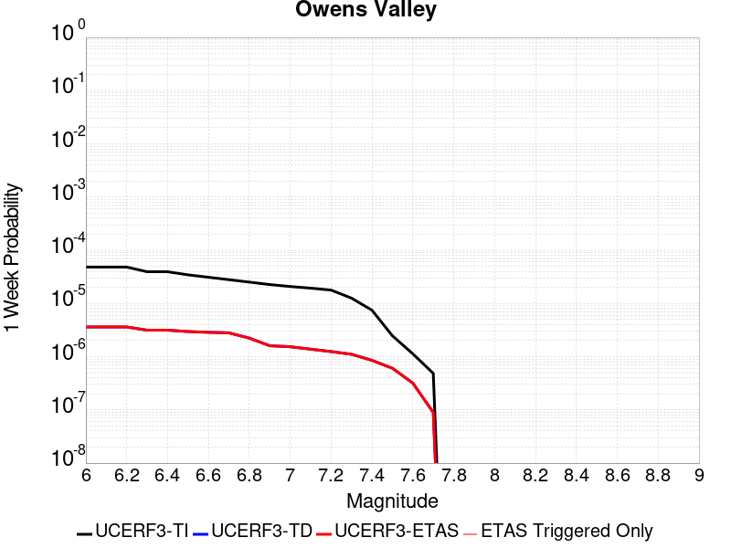 | 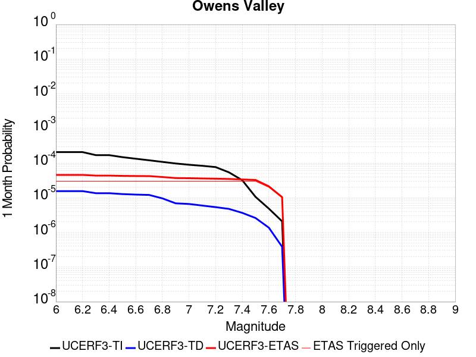 |  |  |

| Magnitude | 1 wk TI Prob | 1 wk TD Prob | 1 wk ETAS Prob | 1 wk ETAS/TD Gain | 1 wk ETAS Triggered Only | 1 mo TI Prob | 1 mo TD Prob | 1 mo ETAS Prob | 1 mo ETAS/TD Gain | 1 mo ETAS Triggered Only | 1 yr TI Prob | 1 yr TD Prob | 1 yr ETAS Prob | 1 yr ETAS/TD Gain | 1 yr ETAS Triggered Only | 10 yr TI Prob | 10 yr TD Prob | 10 yr ETAS Prob | 10 yr ETAS/TD Gain | 10 yr ETAS Triggered Only |
|-----|-----|-----|-----|-----|-----|-----|-----|-----|-----|-----|-----|-----|-----|-----|-----|-----|-----|-----|-----|-----|
| 6.0 | 4.83821E-5 | 3.621193E-6 | 3.621193E-6 | 1.0 | 0.0 | 2.0733538E-4 | 1.5519312E-5 | 4.5518846E-5 | 2.9330454 | 3.0E-5 | 0.002521386 | 1.8893222E-4 | 2.7891522E-4 | 1.4762713 | 9.0E-5 | 0.024929691 | 0.001929822 | 0.0020895132 | 1.0827492 | 1.6E-4 |
| 6.1 | 4.83821E-5 | 3.621193E-6 | 3.621193E-6 | 1.0 | 0.0 | 2.0733538E-4 | 1.5519312E-5 | 4.5518846E-5 | 2.9330454 | 3.0E-5 | 0.002521386 | 1.8893222E-4 | 2.7891522E-4 | 1.4762713 | 9.0E-5 | 0.024929691 | 0.001929822 | 0.0020895132 | 1.0827492 | 1.6E-4 |
| 6.2 | 4.83821E-5 | 3.621193E-6 | 3.621193E-6 | 1.0 | 0.0 | 2.0733538E-4 | 1.5519312E-5 | 4.5518846E-5 | 2.9330454 | 3.0E-5 | 0.002521386 | 1.8893222E-4 | 2.7891522E-4 | 1.4762713 | 9.0E-5 | 0.024929691 | 0.001929822 | 0.0020895132 | 1.0827492 | 1.6E-4 |
| 6.3 | 3.953008E-5 | 3.153231E-6 | 3.153231E-6 | 1.0 | 0.0 | 1.6940363E-4 | 1.3513782E-5 | 4.3513377E-5 | 3.2199259 | 3.0E-5 | 0.002060538 | 1.645186E-4 | 2.4450544E-4 | 1.4861872 | 8.0E-5 | 0.020415364 | 0.0016622683 | 0.0017820689 | 1.0720705 | 1.2E-4 |
| 6.4 | 3.953008E-5 | 3.153231E-6 | 3.153231E-6 | 1.0 | 0.0 | 1.6940363E-4 | 1.3513782E-5 | 4.3513377E-5 | 3.2199259 | 3.0E-5 | 0.002060538 | 1.645186E-4 | 2.4450544E-4 | 1.4861872 | 8.0E-5 | 0.020415364 | 0.0016622683 | 0.0017820689 | 1.0720705 | 1.2E-4 |
| 6.5 | 3.457342E-5 | 2.970874E-6 | 2.970874E-6 | 1.0 | 0.0 | 1.4816338E-4 | 1.2732259E-5 | 4.2731877E-5 | 3.3561897 | 3.0E-5 | 0.0018023965 | 1.5500492E-4 | 2.3499252E-4 | 1.5160327 | 8.0E-5 | 0.017878477 | 0.0015564174 | 0.0016762306 | 1.0769801 | 1.2E-4 |
| 6.6 | 3.1127765E-5 | 2.8738657E-6 | 2.8738657E-6 | 1.0 | 0.0 | 1.3339789E-4 | 1.2316514E-5 | 4.2316144E-5 | 3.4357243 | 3.0E-5 | 0.0016229092 | 1.4994392E-4 | 2.2993193E-4 | 1.5334527 | 8.0E-5 | 0.016111081 | 0.001501446 | 0.0016212658 | 1.079803 | 1.2E-4 |
| 6.7 | 2.806885E-5 | 2.8102859E-6 | 2.8102859E-6 | 1.0 | 0.0 | 1.2028952E-4 | 1.204403E-5 | 4.204367E-5 | 3.4908304 | 3.0E-5 | 0.001463541 | 1.4662689E-4 | 2.2661516E-4 | 1.5455226 | 8.0E-5 | 0.014539397 | 0.0014657174 | 0.0015855415 | 1.0817512 | 1.2E-4 |
| 6.8 | 2.524524E-5 | 2.2352563E-6 | 2.2352563E-6 | 1.0 | 0.0 | 1.0818939E-4 | 9.579636E-6 | 3.957935E-5 | 4.131613 | 3.0E-5 | 0.0013164099 | 1.1662613E-4 | 1.966168E-4 | 1.6858727 | 8.0E-5 | 0.01308639 | 0.0011659319 | 0.001285792 | 1.1028019 | 1.2E-4 |
| 6.9 | 2.2704568E-5 | 1.6080646E-6 | 1.6080646E-6 | 1.0 | 0.0 | 9.730166E-5 | 6.8916875E-6 | 3.689148E-5 | 5.35304 | 3.0E-5 | 0.0011840039 | 8.390308E-5 | 1.6389637E-4 | 1.9534011 | 8.0E-5 | 0.011777153 | 8.3894585E-4 | 9.588452E-4 | 1.1429167 | 1.2E-4 |
| 7.0 | 2.0871712E-5 | 1.5394511E-6 | 1.5394511E-6 | 1.0 | 0.0 | 8.944713E-5 | 6.597631E-6 | 3.6597434E-5 | 5.5470567 | 3.0E-5 | 0.0010884746 | 8.032321E-5 | 1.6031679E-4 | 1.9958961 | 8.0E-5 | 0.010831586 | 8.0313E-4 | 9.230336E-4 | 1.1492954 | 1.2E-4 |
| 7.1 | 1.944928E-5 | 1.3863316E-6 | 1.3863316E-6 | 1.0 | 0.0 | 8.335139E-5 | 5.941408E-6 | 3.594123E-5 | 6.0492783 | 3.0E-5 | 0.0010143308 | 7.233425E-5 | 1.5232846E-4 | 2.1058967 | 8.0E-5 | 0.010097133 | 7.232817E-4 | 8.431949E-4 | 1.1657904 | 1.2E-4 |
| 7.2 | 1.7876306E-5 | 1.2488347E-6 | 1.2488347E-6 | 1.0 | 0.0 | 7.6610486E-5 | 5.352138E-6 | 3.535198E-5 | 6.605207 | 3.0E-5 | 9.3233347E-4 | 6.516034E-5 | 1.4515512E-4 | 2.2276607 | 8.0E-5 | 0.009284316 | 6.5157266E-4 | 7.7149447E-4 | 1.1840498 | 1.2E-4 |
| 7.3 | 1.2618672E-5 | 1.1114453E-6 | 1.1114453E-6 | 1.0 | 0.0 | 5.40789E-5 | 4.763328E-6 | 3.4763187E-5 | 7.2980876 | 3.0E-5 | 6.582117E-4 | 5.7991983E-5 | 1.3798734E-4 | 2.379421 | 8.0E-5 | 0.0065626553 | 5.7992374E-4 | 6.8985997E-4 | 1.1895701 | 1.1E-4 |
| 7.4 | 7.4874442E-6 | 8.548014E-7 | 8.548014E-7 | 1.0 | 0.0 | 3.208865E-5 | 3.6634294E-6 | 3.366332E-5 | 9.189018 | 3.0E-5 | 3.906093E-4 | 4.4601344E-5 | 1.14598224E-4 | 2.5693893 | 7.0E-5 | 0.003899234 | 4.4603736E-4 | 5.4599275E-4 | 1.2240964 | 1.0E-4 |
| 7.5 | 2.4734156E-6 | 6.0683584E-7 | 6.0683584E-7 | 1.0 | 0.0 | 1.060031E-5 | 2.6007224E-6 | 3.2600645E-5 | 12.535227 | 3.0E-5 | 1.2905113E-4 | 3.1663338E-5 | 1.0166112E-4 | 3.2106886 | 7.0E-5 | 0.0012897621 | 3.165886E-4 | 4.1655693E-4 | 1.3157674 | 1.0E-4 |
| 7.6 | 1.1328841E-6 | 3.1963748E-7 | 3.1963748E-7 | 1.0 | 0.0 | 4.8552088E-6 | 1.3698742E-6 | 2.1369848E-5 | 15.599861 | 2.0E-5 | 5.9110564E-5 | 1.6678092E-5 | 4.6677593E-5 | 2.7987368 | 3.0E-5 | 5.9094845E-4 | 1.667686E-4 | 2.1676027E-4 | 1.2997667 | 5.0E-5 |
| 7.7 | 4.8613185E-7 | 8.9632934E-8 | 8.9632934E-8 | 1.0 | 0.0 | 2.0834207E-6 | 3.8414112E-7 | 1.0384138E-5 | 27.032091 | 1.0E-5 | 2.536535E-5 | 4.6769087E-6 | 2.4676816E-5 | 5.276309 | 2.0E-5 | 2.5362454E-4 | 4.676817E-5 | 6.6767236E-5 | 1.4276212 | 2.0E-5 |

## White Wolf (Extension)
*[(top)](#table-of-contents)*

| 1 Week | 1 Month | 1 Year | 10 Year |
|-----|-----|-----|-----|
|  |  |  |  |

| Magnitude | 1 wk TI Prob | 1 wk TD Prob | 1 wk ETAS Prob | 1 wk ETAS/TD Gain | 1 wk ETAS Triggered Only | 1 mo TI Prob | 1 mo TD Prob | 1 mo ETAS Prob | 1 mo ETAS/TD Gain | 1 mo ETAS Triggered Only | 1 yr TI Prob | 1 yr TD Prob | 1 yr ETAS Prob | 1 yr ETAS/TD Gain | 1 yr ETAS Triggered Only | 10 yr TI Prob | 10 yr TD Prob | 10 yr ETAS Prob | 10 yr ETAS/TD Gain | 10 yr ETAS Triggered Only |
|-----|-----|-----|-----|-----|-----|-----|-----|-----|-----|-----|-----|-----|-----|-----|-----|-----|-----|-----|-----|-----|
| 6.0 | 8.222555E-6 | 6.0666557E-6 | 1.6066595E-5 | 2.6483445 | 1.0E-5 | 3.5239045E-5 | 2.5999732E-5 | 4.599921E-5 | 1.7692187 | 2.0E-5 | 4.289509E-4 | 3.165074E-4 | 4.0647888E-4 | 1.2842636 | 9.0E-5 | 0.0042812387 | 0.0031612178 | 0.0033207121 | 1.0504534 | 1.6E-4 |
| 6.1 | 8.222555E-6 | 6.0666557E-6 | 1.6066595E-5 | 2.6483445 | 1.0E-5 | 3.5239045E-5 | 2.5999732E-5 | 4.599921E-5 | 1.7692187 | 2.0E-5 | 4.289509E-4 | 3.165074E-4 | 4.0647888E-4 | 1.2842636 | 9.0E-5 | 0.0042812387 | 0.0031612178 | 0.0033207121 | 1.0504534 | 1.6E-4 |
| 6.2 | 8.222555E-6 | 6.0666557E-6 | 1.6066595E-5 | 2.6483445 | 1.0E-5 | 3.5239045E-5 | 2.5999732E-5 | 4.599921E-5 | 1.7692187 | 2.0E-5 | 4.289509E-4 | 3.165074E-4 | 4.0647888E-4 | 1.2842636 | 9.0E-5 | 0.0042812387 | 0.0031612178 | 0.0033207121 | 1.0504534 | 1.6E-4 |
| 6.3 | 8.222555E-6 | 6.0666557E-6 | 1.6066595E-5 | 2.6483445 | 1.0E-5 | 3.5239045E-5 | 2.5999732E-5 | 4.599921E-5 | 1.7692187 | 2.0E-5 | 4.289509E-4 | 3.165074E-4 | 4.0647888E-4 | 1.2842636 | 9.0E-5 | 0.0042812387 | 0.0031612178 | 0.0033207121 | 1.0504534 | 1.6E-4 |
| 6.4 | 5.821773E-6 | 3.5571516E-6 | 1.3557116E-5 | 3.811228 | 1.0E-5 | 2.4950215E-5 | 1.5244852E-5 | 3.5244546E-5 | 2.3118982 | 2.0E-5 | 3.0372653E-4 | 1.8559136E-4 | 2.4558022E-4 | 1.3232309 | 6.0E-5 | 0.0030331176 | 0.0018544721 | 0.0019542866 | 1.0538237 | 1.0E-4 |
| 6.5 | 5.766023E-6 | 3.4990853E-6 | 1.34990505E-5 | 3.8578796 | 1.0E-5 | 2.4711293E-5 | 1.4996E-5 | 3.49957E-5 | 2.333669 | 2.0E-5 | 3.0081844E-4 | 1.825621E-4 | 2.4255115E-4 | 1.3285953 | 6.0E-5 | 0.0030041158 | 0.0018242294 | 0.001924047 | 1.0547177 | 1.0E-4 |
| 6.6 | 4.643576E-6 | 2.3325927E-6 | 2.3325927E-6 | 1.0 | 0.0 | 1.9900888E-5 | 9.99679E-6 | 9.99679E-6 | 1.0 | 0.0 | 2.4226638E-4 | 1.2170455E-4 | 1.517009E-4 | 1.2464685 | 3.0E-5 | 0.0024200242 | 0.0012164214 | 0.0012563728 | 1.0328434 | 4.0E-5 |
| 6.7 | 3.9529173E-6 | 1.6483134E-6 | 1.6483134E-6 | 1.0 | 0.0 | 1.6940963E-5 | 7.0641822E-6 | 7.0641822E-6 | 1.0 | 0.0 | 2.0623671E-4 | 8.6003216E-5 | 1.16000636E-4 | 1.3487942 | 3.0E-5 | 0.002060454 | 8.5971784E-4 | 8.9968345E-4 | 1.0464869 | 4.0E-5 |
| 6.8 | 3.4377522E-6 | 1.2244896E-6 | 1.2244896E-6 | 1.0 | 0.0 | 1.473314E-5 | 5.247802E-6 | 5.247802E-6 | 1.0 | 0.0 | 1.7936122E-4 | 6.389021E-5 | 9.3888295E-5 | 1.4695255 | 3.0E-5 | 0.0017921652 | 6.3872756E-4 | 6.78702E-4 | 1.0625845 | 4.0E-5 |
| 6.9 | 3.1367306E-6 | 1.0033432E-6 | 1.0033432E-6 | 1.0 | 0.0 | 1.3443062E-5 | 4.300036E-6 | 4.300036E-6 | 1.0 | 0.0 | 1.63657E-4 | 5.2351756E-5 | 8.235018E-5 | 1.5730166 | 3.0E-5 | 0.0016353652 | 5.234019E-4 | 5.6338095E-4 | 1.0763831 | 4.0E-5 |
| 7.0 | 2.8298145E-6 | 7.4283355E-7 | 7.4283355E-7 | 1.0 | 0.0 | 1.2127721E-5 | 3.1835689E-6 | 3.1835689E-6 | 1.0 | 0.0 | 1.47645E-4 | 3.875931E-5 | 4.8758924E-5 | 1.2579925 | 1.0E-5 | 0.0014754693 | 3.875305E-4 | 3.9752663E-4 | 1.0257944 | 1.0E-5 |
| 7.1 | 2.4091064E-6 | 5.422472E-7 | 5.422472E-7 | 1.0 | 0.0 | 1.03247E-5 | 2.323915E-6 | 2.323915E-6 | 1.0 | 0.0 | 1.2569598E-4 | 2.8293338E-5 | 3.8293056E-5 | 1.35343 | 1.0E-5 | 0.001256249 | 2.829014E-4 | 2.9289856E-4 | 1.035338 | 1.0E-5 |
| 7.2 | 1.3875518E-6 | 1.074062E-7 | 1.074062E-7 | 1.0 | 0.0 | 5.9466374E-6 | 4.603122E-7 | 4.603122E-7 | 1.0 | 0.0 | 7.23979E-5 | 5.604288E-6 | 5.604288E-6 | 1.0 | 0.0 | 7.2374323E-4 | 5.604158E-5 | 5.604158E-5 | 1.0 | 0.0 |
| 7.3 | 7.056077E-7 | 5.0005806E-8 | 5.0005806E-8 | 1.0 | 0.0 | 3.0240296E-6 | 2.1431059E-7 | 2.1431059E-7 | 1.0 | 0.0 | 3.681694E-5 | 2.6092287E-6 | 2.6092287E-6 | 1.0 | 0.0 | 3.681084E-4 | 2.6092028E-5 | 2.6092028E-5 | 1.0 | 0.0 |
| 7.4 | 5.9334678E-8 | 4.8638475E-9 | 4.8638475E-9 | 1.0 | 0.0 | 2.5429145E-7 | 2.084506E-8 | 2.084506E-8 | 1.0 | 0.0 | 3.095994E-6 | 2.5378858E-7 | 2.5378858E-7 | 1.0 | 0.0 | 3.095951E-5 | 2.5378843E-6 | 2.5378843E-6 | 1.0 | 0.0 |

## San Jacinto (San Bernardino)
*[(top)](#table-of-contents)*

| 1 Week | 1 Month | 1 Year | 10 Year |
|-----|-----|-----|-----|
|  |  |  |  |

| Magnitude | 1 wk TI Prob | 1 wk TD Prob | 1 wk ETAS Prob | 1 wk ETAS/TD Gain | 1 wk ETAS Triggered Only | 1 mo TI Prob | 1 mo TD Prob | 1 mo ETAS Prob | 1 mo ETAS/TD Gain | 1 mo ETAS Triggered Only | 1 yr TI Prob | 1 yr TD Prob | 1 yr ETAS Prob | 1 yr ETAS/TD Gain | 1 yr ETAS Triggered Only | 10 yr TI Prob | 10 yr TD Prob | 10 yr ETAS Prob | 10 yr ETAS/TD Gain | 10 yr ETAS Triggered Only |
|-----|-----|-----|-----|-----|-----|-----|-----|-----|-----|-----|-----|-----|-----|-----|-----|-----|-----|-----|-----|-----|
| 6.0 | 3.409352E-5 | 3.6001682E-5 | 4.600132E-5 | 1.2777548 | 1.0E-5 | 1.461069E-4 | 1.542838E-4 | 1.9427763E-4 | 1.2592225 | 4.0E-5 | 0.0017774 | 0.0018767886 | 0.0019766008 | 1.0531825 | 1.0E-4 | 0.01763251 | 0.01935761 | 0.019504705 | 1.0075989 | 1.5E-4 |
| 6.1 | 3.409352E-5 | 3.6001682E-5 | 4.600132E-5 | 1.2777548 | 1.0E-5 | 1.461069E-4 | 1.542838E-4 | 1.9427763E-4 | 1.2592225 | 4.0E-5 | 0.0017774 | 0.0018767886 | 0.0019766008 | 1.0531825 | 1.0E-4 | 0.01763251 | 0.01935761 | 0.019504705 | 1.0075989 | 1.5E-4 |
| 6.2 | 3.409352E-5 | 3.6001682E-5 | 4.600132E-5 | 1.2777548 | 1.0E-5 | 1.461069E-4 | 1.542838E-4 | 1.9427763E-4 | 1.2592225 | 4.0E-5 | 0.0017774 | 0.0018767886 | 0.0019766008 | 1.0531825 | 1.0E-4 | 0.01763251 | 0.01935761 | 0.019504705 | 1.0075989 | 1.5E-4 |
| 6.3 | 3.409352E-5 | 3.6001682E-5 | 4.600132E-5 | 1.2777548 | 1.0E-5 | 1.461069E-4 | 1.542838E-4 | 1.9427763E-4 | 1.2592225 | 4.0E-5 | 0.0017774 | 0.0018767886 | 0.0019766008 | 1.0531825 | 1.0E-4 | 0.01763251 | 0.01935761 | 0.019504705 | 1.0075989 | 1.5E-4 |
| 6.4 | 3.400795E-5 | 3.5894343E-5 | 4.5893983E-5 | 1.2785854 | 1.0E-5 | 1.4574021E-4 | 1.5382383E-4 | 1.9381769E-4 | 1.2599977 | 4.0E-5 | 0.0017729428 | 0.0018711982 | 0.001971011 | 1.0533417 | 1.0E-4 | 0.017588645 | 0.01930269 | 0.019449795 | 1.0076209 | 1.5E-4 |
| 6.5 | 3.341482E-5 | 3.515495E-5 | 4.5154597E-5 | 1.2844449 | 1.0E-5 | 1.4319851E-4 | 1.5065537E-4 | 1.9064934E-4 | 1.2654666 | 4.0E-5 | 0.0017420477 | 0.0018326874 | 0.0019325041 | 1.0544647 | 1.0E-4 | 0.017284546 | 0.018924221 | 0.019071383 | 1.0077764 | 1.5E-4 |
| 6.6 | 3.3364955E-5 | 3.5092165E-5 | 4.5091812E-5 | 1.284954 | 1.0E-5 | 1.4298483E-4 | 1.5038633E-4 | 1.903803E-4 | 1.2659416 | 4.0E-5 | 0.0017394501 | 0.0018294173 | 0.0019292344 | 1.0545622 | 1.0E-4 | 0.017258976 | 0.018892085 | 0.019039253 | 1.0077899 | 1.5E-4 |
| 6.7 | 3.335922E-5 | 3.508194E-5 | 4.5081586E-5 | 1.2850369 | 1.0E-5 | 1.4296026E-4 | 1.503425E-4 | 1.9033649E-4 | 1.2660191 | 4.0E-5 | 0.0017391514 | 0.0018288847 | 0.0019287018 | 1.0545782 | 1.0E-4 | 0.017256035 | 0.018886877 | 0.019034043 | 1.007792 | 1.5E-4 |
| 6.8 | 3.327683E-5 | 3.4976E-5 | 4.4975648E-5 | 1.2859004 | 1.0E-5 | 1.4260718E-4 | 1.4988854E-4 | 1.8988254E-4 | 1.266825 | 4.0E-5 | 0.0017348597 | 0.0018233669 | 0.0019231845 | 1.0547436 | 1.0E-4 | 0.017213784 | 0.018832648 | 0.018979823 | 1.0078149 | 1.5E-4 |
| 6.9 | 3.3235785E-5 | 3.491695E-5 | 4.49166E-5 | 1.2863839 | 1.0E-5 | 1.4243131E-4 | 1.496355E-4 | 1.8962951E-4 | 1.2672763 | 4.0E-5 | 0.0017327217 | 0.0018202913 | 0.0019201093 | 1.0548363 | 1.0E-4 | 0.017192734 | 0.018802516 | 0.018949695 | 1.0078276 | 1.5E-4 |
| 7.0 | 3.3197095E-5 | 3.485688E-5 | 4.485653E-5 | 1.2868774 | 1.0E-5 | 1.422655E-4 | 1.4937807E-4 | 1.8937209E-4 | 1.2677369 | 4.0E-5 | 0.0017307063 | 0.0018171624 | 0.0019169806 | 1.0549308 | 1.0E-4 | 0.017172894 | 0.01877189 | 0.018919075 | 1.0078406 | 1.5E-4 |
| 7.1 | 3.3129716E-5 | 3.473708E-5 | 4.4736735E-5 | 1.2878668 | 1.0E-5 | 1.4197677E-4 | 1.4886471E-4 | 1.8885876E-4 | 1.2686603 | 4.0E-5 | 0.0017271966 | 0.0018109226 | 0.0019107416 | 1.0551205 | 1.0E-4 | 0.017138338 | 0.01871097 | 0.018858165 | 1.0078667 | 1.5E-4 |
| 7.2 | 3.3034008E-5 | 3.4604524E-5 | 4.4604178E-5 | 1.2889695 | 1.0E-5 | 1.4156665E-4 | 1.4829668E-4 | 1.8829074E-4 | 1.2696896 | 4.0E-5 | 0.0017222111 | 0.0018040182 | 0.0019038378 | 1.0553318 | 1.0E-4 | 0.017089253 | 0.018643353 | 0.018790556 | 1.0078957 | 1.5E-4 |
| 7.3 | 3.2956614E-5 | 3.447227E-5 | 4.4471923E-5 | 1.2900783 | 1.0E-5 | 1.4123498E-4 | 1.4772992E-4 | 1.8772401E-4 | 1.2707244 | 4.0E-5 | 0.0017181796 | 0.0017971295 | 0.0018969498 | 1.0555443 | 1.0E-4 | 0.017049557 | 0.018576099 | 0.01872331 | 1.0079249 | 1.5E-4 |
| 7.4 | 3.2915937E-5 | 3.4393954E-5 | 4.4393608E-5 | 1.2907388 | 1.0E-5 | 1.4106068E-4 | 1.4739433E-4 | 1.8738843E-4 | 1.2713408 | 4.0E-5 | 0.0017160608 | 0.0017930503 | 0.0018928711 | 1.0556709 | 1.0E-4 | 0.017028693 | 0.01853637 | 0.01868359 | 1.0079422 | 1.5E-4 |
| 7.5 | 3.281791E-5 | 3.4258854E-5 | 4.425851E-5 | 1.2918854 | 1.0E-5 | 1.406406E-4 | 1.468154E-4 | 1.8680953E-4 | 1.272411 | 4.0E-5 | 0.0017109542 | 0.0017860134 | 0.0018858348 | 1.0558907 | 1.0E-4 | 0.016978411 | 0.01846725 | 0.01861448 | 1.0079725 | 1.5E-4 |
| 7.6 | 3.2521442E-5 | 3.3983775E-5 | 4.3983437E-5 | 1.2942481 | 1.0E-5 | 1.3937015E-4 | 1.4563663E-4 | 1.856308E-4 | 1.2746162 | 4.0E-5 | 0.0016955109 | 0.0017716853 | 0.0018715081 | 1.0563434 | 1.0E-4 | 0.016826328 | 0.018324887 | 0.018472139 | 1.0080355 | 1.5E-4 |
| 7.7 | 3.0287873E-5 | 3.2467702E-5 | 4.2467378E-5 | 1.3079884 | 1.0E-5 | 1.297987E-4 | 1.3913988E-4 | 1.7913432E-4 | 1.2874404 | 4.0E-5 | 0.0015791537 | 0.001692713 | 0.0017925437 | 1.0589768 | 1.0E-4 | 0.01567979 | 0.017535618 | 0.017682988 | 1.008404 | 1.5E-4 |
| 7.8 | 2.6316151E-5 | 2.9678076E-5 | 3.967778E-5 | 1.3369391 | 1.0E-5 | 1.1277862E-4 | 1.2718556E-4 | 1.6718048E-4 | 1.3144611 | 4.0E-5 | 0.0013722149 | 0.0015473852 | 0.0016472306 | 1.0645251 | 1.0E-4 | 0.013637724 | 0.016076857 | 0.016224446 | 1.0091802 | 1.5E-4 |
| 7.9 | 2.0761147E-5 | 2.343051E-5 | 3.3430275E-5 | 1.4267839 | 1.0E-5 | 8.897331E-5 | 1.0041261E-4 | 1.304096E-4 | 1.2987373 | 3.0E-5 | 0.0010827117 | 0.0012218388 | 0.001301741 | 1.0653951 | 8.0E-5 | 0.010774517 | 0.012799647 | 0.012918111 | 1.0092553 | 1.2E-4 |
| 8.0 | 1.5738568E-5 | 1.604239E-5 | 2.604223E-5 | 1.6233386 | 1.0E-5 | 6.744926E-5 | 6.875129E-5 | 9.8749224E-5 | 1.4363254 | 3.0E-5 | 8.2088535E-4 | 8.3672616E-4 | 8.8668434E-4 | 1.0597067 | 5.0E-5 | 0.008178596 | 0.008870586 | 0.008939966 | 1.0078212 | 7.0E-5 |
| 8.1 | 1.0105832E-5 | 8.335246E-6 | 8.335246E-6 | 1.0 | 0.0 | 4.3309992E-5 | 3.5721994E-5 | 3.5721994E-5 | 1.0 | 0.0 | 5.2717153E-4 | 4.34829E-4 | 4.34829E-4 | 1.0 | 0.0 | 0.005259227 | 0.0046798005 | 0.004689754 | 1.0021268 | 1.0E-5 |
| 8.2 | 4.189207E-6 | 1.5793896E-6 | 1.5793896E-6 | 1.0 | 0.0 | 1.7953622E-5 | 6.768795E-6 | 6.768795E-6 | 1.0 | 0.0 | 2.1856341E-4 | 8.2406994E-5 | 8.2406994E-5 | 1.0 | 0.0 | 0.0021834858 | 9.571454E-4 | 9.571454E-4 | 1.0 | 0.0 |
| 8.3 | 1.2758221E-6 | 3.6171858E-7 | 3.6171858E-7 | 1.0 | 0.0 | 5.4677976E-6 | 1.5502216E-6 | 1.5502216E-6 | 1.0 | 0.0 | 6.65684E-5 | 1.8873789E-5 | 1.8873789E-5 | 1.0 | 0.0 | 6.6548464E-4 | 2.2764095E-4 | 2.2764095E-4 | 1.0 | 0.0 |

## Santa Ynez (East)
*[(top)](#table-of-contents)*

| 1 Week | 1 Month | 1 Year | 10 Year |
|-----|-----|-----|-----|
|  |  | 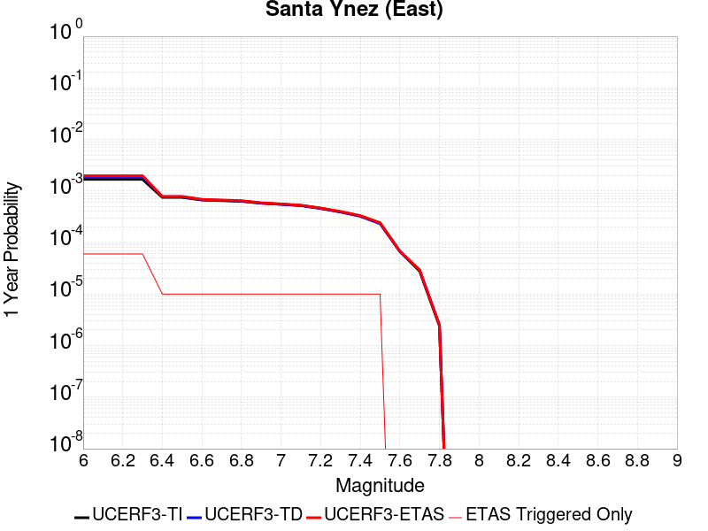 |  |

| Magnitude | 1 wk TI Prob | 1 wk TD Prob | 1 wk ETAS Prob | 1 wk ETAS/TD Gain | 1 wk ETAS Triggered Only | 1 mo TI Prob | 1 mo TD Prob | 1 mo ETAS Prob | 1 mo ETAS/TD Gain | 1 mo ETAS Triggered Only | 1 yr TI Prob | 1 yr TD Prob | 1 yr ETAS Prob | 1 yr ETAS/TD Gain | 1 yr ETAS Triggered Only | 10 yr TI Prob | 10 yr TD Prob | 10 yr ETAS Prob | 10 yr ETAS/TD Gain | 10 yr ETAS Triggered Only |
|-----|-----|-----|-----|-----|-----|-----|-----|-----|-----|-----|-----|-----|-----|-----|-----|-----|-----|-----|-----|-----|
| 6.0 | 3.2269712E-5 | 3.6751615E-5 | 4.6751247E-5 | 1.2720869 | 1.0E-5 | 1.3829143E-4 | 1.5750073E-4 | 1.8749601E-4 | 1.1904453 | 3.0E-5 | 0.0016823979 | 0.001916469 | 0.0019763538 | 1.0312476 | 6.0E-5 | 0.016697178 | 0.01905687 | 0.019174583 | 1.006177 | 1.2E-4 |
| 6.1 | 3.2269712E-5 | 3.6751615E-5 | 4.6751247E-5 | 1.2720869 | 1.0E-5 | 1.3829143E-4 | 1.5750073E-4 | 1.8749601E-4 | 1.1904453 | 3.0E-5 | 0.0016823979 | 0.001916469 | 0.0019763538 | 1.0312476 | 6.0E-5 | 0.016697178 | 0.01905687 | 0.019174583 | 1.006177 | 1.2E-4 |
| 6.2 | 3.2269712E-5 | 3.6751615E-5 | 4.6751247E-5 | 1.2720869 | 1.0E-5 | 1.3829143E-4 | 1.5750073E-4 | 1.8749601E-4 | 1.1904453 | 3.0E-5 | 0.0016823979 | 0.001916469 | 0.0019763538 | 1.0312476 | 6.0E-5 | 0.016697178 | 0.01905687 | 0.019174583 | 1.006177 | 1.2E-4 |
| 6.3 | 3.2269712E-5 | 3.6751615E-5 | 4.6751247E-5 | 1.2720869 | 1.0E-5 | 1.3829143E-4 | 1.5750073E-4 | 1.8749601E-4 | 1.1904453 | 3.0E-5 | 0.0016823979 | 0.001916469 | 0.0019763538 | 1.0312476 | 6.0E-5 | 0.016697178 | 0.01905687 | 0.019174583 | 1.006177 | 1.2E-4 |
| 6.4 | 1.4404779E-5 | 1.4849478E-5 | 1.4849478E-5 | 1.0 | 0.0 | 6.1733306E-5 | 6.36391E-5 | 6.36391E-5 | 1.0 | 0.0 | 7.513438E-4 | 7.7453564E-4 | 7.845279E-4 | 1.012901 | 1.0E-5 | 0.0074880854 | 0.0077189123 | 0.0077486807 | 1.0038565 | 3.0E-5 |
| 6.5 | 1.4404779E-5 | 1.4849478E-5 | 1.4849478E-5 | 1.0 | 0.0 | 6.1733306E-5 | 6.36391E-5 | 6.36391E-5 | 1.0 | 0.0 | 7.513438E-4 | 7.7453564E-4 | 7.845279E-4 | 1.012901 | 1.0E-5 | 0.0074880854 | 0.0077189123 | 0.0077486807 | 1.0038565 | 3.0E-5 |
| 6.6 | 1.280208E-5 | 1.3012008E-5 | 1.3012008E-5 | 1.0 | 0.0 | 5.4864904E-5 | 5.576457E-5 | 5.576457E-5 | 1.0 | 0.0 | 6.6777546E-4 | 6.787239E-4 | 6.887171E-4 | 1.0147235 | 1.0E-5 | 0.006657724 | 0.00676672 | 0.0067965174 | 1.0044035 | 3.0E-5 |
| 6.7 | 1.2457027E-5 | 1.2628523E-5 | 1.2628523E-5 | 1.0 | 0.0 | 5.3386164E-5 | 5.4121127E-5 | 5.4121127E-5 | 1.0 | 0.0 | 6.497827E-4 | 6.587272E-4 | 6.6872063E-4 | 1.0151708 | 1.0E-5 | 0.00647886 | 0.006567944 | 0.0065977466 | 1.0045376 | 3.0E-5 |
| 6.8 | 1.2095134E-5 | 1.2230965E-5 | 1.2230965E-5 | 1.0 | 0.0 | 5.1835254E-5 | 5.2417377E-5 | 5.2417377E-5 | 1.0 | 0.0 | 6.309115E-4 | 6.379963E-4 | 6.479899E-4 | 1.0156641 | 1.0E-5 | 0.0062912325 | 0.006361835 | 0.006391644 | 1.0046856 | 3.0E-5 |
| 6.9 | 1.1104036E-5 | 1.1157385E-5 | 1.1157385E-5 | 1.0 | 0.0 | 4.758786E-5 | 4.78165E-5 | 4.78165E-5 | 1.0 | 0.0 | 5.7922816E-4 | 5.820116E-4 | 5.920058E-4 | 1.0171717 | 1.0E-5 | 0.005777207 | 0.005805019 | 0.005834845 | 1.0051379 | 3.0E-5 |
| 7.0 | 1.0577444E-5 | 1.0581712E-5 | 1.0581712E-5 | 1.0 | 0.0 | 4.5331115E-5 | 4.534941E-5 | 4.534941E-5 | 1.0 | 0.0 | 5.5176654E-4 | 5.519904E-4 | 5.619849E-4 | 1.0181062 | 1.0E-5 | 0.0055039856 | 0.0055063316 | 0.0055361665 | 1.0054183 | 3.0E-5 |
| 7.1 | 1.0021775E-5 | 9.981012E-6 | 9.981012E-6 | 1.0 | 0.0 | 4.294976E-5 | 4.277507E-5 | 4.277507E-5 | 1.0 | 0.0 | 5.2278786E-4 | 5.206632E-4 | 5.30658E-4 | 1.0191963 | 1.0E-5 | 0.0052155964 | 0.005194566 | 0.0052244104 | 1.0057453 | 3.0E-5 |
| 7.2 | 8.874109E-6 | 8.748804E-6 | 8.748804E-6 | 1.0 | 0.0 | 3.8031343E-5 | 3.749434E-5 | 3.749434E-5 | 1.0 | 0.0 | 4.629332E-4 | 4.5639908E-4 | 4.6639453E-4 | 1.0219007 | 1.0E-5 | 0.0046197 | 0.0045547355 | 0.0045845993 | 1.0065565 | 3.0E-5 |
| 7.3 | 7.5504267E-6 | 7.5050975E-6 | 7.5050975E-6 | 1.0 | 0.0 | 3.235857E-5 | 3.2164313E-5 | 3.2164313E-5 | 1.0 | 0.0 | 3.9389438E-4 | 3.9153118E-4 | 4.0152724E-4 | 1.0255307 | 1.0E-5 | 0.0039319694 | 0.0039085206 | 0.0039284425 | 1.005097 | 2.0E-5 |
| 7.4 | 6.309394E-6 | 6.1831197E-6 | 6.1831197E-6 | 1.0 | 0.0 | 2.703998E-5 | 2.6498821E-5 | 2.6498821E-5 | 1.0 | 0.0 | 3.2916202E-4 | 3.2257635E-4 | 3.325731E-4 | 1.0309904 | 1.0E-5 | 0.003286749 | 0.0032211784 | 0.0032411139 | 1.0061889 | 2.0E-5 |
| 7.5 | 4.6103073E-6 | 4.4408375E-6 | 4.4408375E-6 | 1.0 | 0.0 | 1.975831E-5 | 1.9032026E-5 | 1.9032026E-5 | 1.0 | 0.0 | 2.4053088E-4 | 2.3169098E-4 | 2.4168867E-4 | 1.0431509 | 1.0E-5 | 0.002402707 | 0.0023145638 | 0.0023245406 | 1.0043105 | 1.0E-5 |
| 7.6 | 1.2858658E-6 | 1.3008295E-6 | 1.3008295E-6 | 1.0 | 0.0 | 5.5108417E-6 | 5.574972E-6 | 5.574972E-6 | 1.0 | 0.0 | 6.7092435E-5 | 6.787324E-5 | 6.787324E-5 | 1.0 | 0.0 | 6.707218E-4 | 6.78532E-4 | 6.78532E-4 | 1.0 | 0.0 |
| 7.7 | 5.3302307E-7 | 5.612178E-7 | 5.612178E-7 | 1.0 | 0.0 | 2.2843826E-6 | 2.4052172E-6 | 2.4052172E-6 | 1.0 | 0.0 | 2.7812002E-5 | 2.9283161E-5 | 2.9283161E-5 | 1.0 | 0.0 | 2.7808524E-4 | 2.927966E-4 | 2.927966E-4 | 1.0 | 0.0 |
| 7.8 | 4.613933E-8 | 4.803036E-8 | 4.803036E-8 | 1.0 | 0.0 | 1.9773998E-7 | 2.0584437E-7 | 2.0584437E-7 | 1.0 | 0.0 | 2.4074816E-6 | 2.5061524E-6 | 2.5061524E-6 | 1.0 | 0.0 | 2.4074554E-5 | 2.5061252E-5 | 2.5061252E-5 | 1.0 | 0.0 |

## Independence rev 2011
*[(top)](#table-of-contents)*

| 1 Week | 1 Month | 1 Year | 10 Year |
|-----|-----|-----|-----|
|  |  |  |  |

| Magnitude | 1 wk TI Prob | 1 wk TD Prob | 1 wk ETAS Prob | 1 wk ETAS/TD Gain | 1 wk ETAS Triggered Only | 1 mo TI Prob | 1 mo TD Prob | 1 mo ETAS Prob | 1 mo ETAS/TD Gain | 1 mo ETAS Triggered Only | 1 yr TI Prob | 1 yr TD Prob | 1 yr ETAS Prob | 1 yr ETAS/TD Gain | 1 yr ETAS Triggered Only | 10 yr TI Prob | 10 yr TD Prob | 10 yr ETAS Prob | 10 yr ETAS/TD Gain | 10 yr ETAS Triggered Only |
|-----|-----|-----|-----|-----|-----|-----|-----|-----|-----|-----|-----|-----|-----|-----|-----|-----|-----|-----|-----|-----|
| 6.0 | 4.422171E-6 | 4.3262453E-6 | 4.3262453E-6 | 1.0 | 0.0 | 1.8952025E-5 | 1.8540937E-5 | 1.8540937E-5 | 1.0 | 0.0 | 2.3071647E-4 | 2.257155E-4 | 2.8570197E-4 | 1.2657614 | 6.0E-5 | 0.0023047708 | 0.0022551562 | 0.0023848629 | 1.0575156 | 1.3E-4 |
| 6.1 | 4.422171E-6 | 4.3262453E-6 | 4.3262453E-6 | 1.0 | 0.0 | 1.8952025E-5 | 1.8540937E-5 | 1.8540937E-5 | 1.0 | 0.0 | 2.3071647E-4 | 2.257155E-4 | 2.8570197E-4 | 1.2657614 | 6.0E-5 | 0.0023047708 | 0.0022551562 | 0.0023848629 | 1.0575156 | 1.3E-4 |
| 6.2 | 4.422171E-6 | 4.3262453E-6 | 4.3262453E-6 | 1.0 | 0.0 | 1.8952025E-5 | 1.8540937E-5 | 1.8540937E-5 | 1.0 | 0.0 | 2.3071647E-4 | 2.257155E-4 | 2.8570197E-4 | 1.2657614 | 6.0E-5 | 0.0023047708 | 0.0022551562 | 0.0023848629 | 1.0575156 | 1.3E-4 |
| 6.3 | 4.422171E-6 | 4.3262453E-6 | 4.3262453E-6 | 1.0 | 0.0 | 1.8952025E-5 | 1.8540937E-5 | 1.8540937E-5 | 1.0 | 0.0 | 2.3071647E-4 | 2.257155E-4 | 2.8570197E-4 | 1.2657614 | 6.0E-5 | 0.0023047708 | 0.0022551562 | 0.0023848629 | 1.0575156 | 1.3E-4 |
| 6.4 | 4.422171E-6 | 4.3262453E-6 | 4.3262453E-6 | 1.0 | 0.0 | 1.8952025E-5 | 1.8540937E-5 | 1.8540937E-5 | 1.0 | 0.0 | 2.3071647E-4 | 2.257155E-4 | 2.8570197E-4 | 1.2657614 | 6.0E-5 | 0.0023047708 | 0.0022551562 | 0.0023848629 | 1.0575156 | 1.3E-4 |
| 6.5 | 4.422171E-6 | 4.3262453E-6 | 4.3262453E-6 | 1.0 | 0.0 | 1.8952025E-5 | 1.8540937E-5 | 1.8540937E-5 | 1.0 | 0.0 | 2.3071647E-4 | 2.257155E-4 | 2.8570197E-4 | 1.2657614 | 6.0E-5 | 0.0023047708 | 0.0022551562 | 0.0023848629 | 1.0575156 | 1.3E-4 |
| 6.6 | 2.663744E-6 | 2.5319996E-6 | 2.5319996E-6 | 1.0 | 0.0 | 1.1415996E-5 | 1.0851385E-5 | 1.0851385E-5 | 1.0 | 0.0 | 1.3898089E-4 | 1.3210809E-4 | 1.8210149E-4 | 1.378428 | 5.0E-5 | 0.0013889399 | 0.0013203438 | 0.0014401854 | 1.0907655 | 1.2E-4 |
| 6.7 | 2.663744E-6 | 2.5319996E-6 | 2.5319996E-6 | 1.0 | 0.0 | 1.1415996E-5 | 1.0851385E-5 | 1.0851385E-5 | 1.0 | 0.0 | 1.3898089E-4 | 1.3210809E-4 | 1.8210149E-4 | 1.378428 | 5.0E-5 | 0.0013889399 | 0.0013203438 | 0.0014401854 | 1.0907655 | 1.2E-4 |
| 6.8 | 1.9716529E-6 | 1.8322698E-6 | 1.8322698E-6 | 1.0 | 0.0 | 8.449913E-6 | 7.852562E-6 | 7.852562E-6 | 1.0 | 0.0 | 1.0287284E-4 | 9.560088E-5 | 1.455961E-4 | 1.5229578 | 5.0E-5 | 0.0010282523 | 9.556104E-4 | 0.0010754957 | 1.1254542 | 1.2E-4 |
| 6.9 | 1.8788617E-6 | 1.7430103E-6 | 1.7430103E-6 | 1.0 | 0.0 | 8.0522395E-6 | 7.4700233E-6 | 7.4700233E-6 | 1.0 | 0.0 | 9.80316E-5 | 9.094386E-5 | 1.4093932E-4 | 1.5497397 | 5.0E-5 | 9.798837E-4 | 9.0907846E-4 | 0.0010289694 | 1.1318818 | 1.2E-4 |
| 7.0 | 1.5045488E-6 | 1.3849603E-6 | 1.3849603E-6 | 1.0 | 0.0 | 6.44805E-6 | 5.935531E-6 | 5.935531E-6 | 1.0 | 0.0 | 7.8502184E-5 | 7.226275E-5 | 1.2225914E-4 | 1.6918694 | 5.0E-5 | 7.8474457E-4 | 7.2239764E-4 | 8.4231095E-4 | 1.1659935 | 1.2E-4 |
| 7.1 | 1.272341E-6 | 1.1625186E-6 | 1.1625186E-6 | 1.0 | 0.0 | 5.4528787E-6 | 4.9822133E-6 | 4.9822133E-6 | 1.0 | 0.0 | 6.6386776E-5 | 6.065679E-5 | 1.1065375E-4 | 1.82426 | 5.0E-5 | 6.636695E-4 | 6.0640555E-4 | 7.263328E-4 | 1.1977674 | 1.2E-4 |
| 7.2 | 1.0416892E-6 | 9.4099533E-7 | 9.4099533E-7 | 1.0 | 0.0 | 4.464375E-6 | 4.032831E-6 | 4.032831E-6 | 1.0 | 0.0 | 5.4352407E-5 | 4.909863E-5 | 9.909618E-5 | 2.0183084 | 5.0E-5 | 5.4339116E-4 | 4.908797E-4 | 6.108208E-4 | 1.2443391 | 1.2E-4 |
| 7.3 | 7.9450155E-7 | 7.2350707E-7 | 7.2350707E-7 | 1.0 | 0.0 | 3.4050022E-6 | 3.100741E-6 | 3.100741E-6 | 1.0 | 0.0 | 4.1455114E-5 | 3.7750877E-5 | 8.774899E-5 | 2.3244226 | 5.0E-5 | 4.144738E-4 | 3.7744577E-4 | 4.9740047E-4 | 1.3178065 | 1.2E-4 |
| 7.4 | 5.3893444E-7 | 5.0195547E-7 | 5.0195547E-7 | 1.0 | 0.0 | 2.309717E-6 | 2.1512358E-6 | 2.1512358E-6 | 1.0 | 0.0 | 2.8120441E-5 | 2.6190986E-5 | 7.618967E-5 | 2.9090037 | 5.0E-5 | 2.8116882E-4 | 2.6187944E-4 | 3.7185065E-4 | 1.4199306 | 1.1E-4 |
| 7.5 | 3.8852085E-7 | 3.6825836E-7 | 3.6825836E-7 | 1.0 | 0.0 | 1.6650882E-6 | 1.5782492E-6 | 1.5782492E-6 | 1.0 | 0.0 | 2.027226E-5 | 1.9215016E-5 | 4.921444E-5 | 2.561249 | 3.0E-5 | 2.0270412E-4 | 1.9213377E-4 | 2.8211647E-4 | 1.4683336 | 9.0E-5 |
| 7.6 | 2.414929E-7 | 2.3457733E-7 | 2.3457733E-7 | 1.0 | 0.0 | 1.0349692E-6 | 1.005331E-6 | 1.005331E-6 | 1.0 | 0.0 | 1.2600677E-5 | 1.2239838E-5 | 2.2239716E-5 | 1.8169943 | 1.0E-5 | 1.2599962E-4 | 1.2239176E-4 | 1.7238564E-4 | 1.4084742 | 5.0E-5 |
| 7.7 | 6.8298014E-8 | 6.858997E-8 | 6.858997E-8 | 1.0 | 0.0 | 2.9270575E-7 | 2.93957E-7 | 2.93957E-7 | 1.0 | 0.0 | 3.5636867E-6 | 3.578921E-6 | 3.578921E-6 | 1.0 | 0.0 | 3.5636294E-5 | 3.5788682E-5 | 3.5788682E-5 | 1.0 | 0.0 |

## Cleghorn Lake
*[(top)](#table-of-contents)*

| 1 Week | 1 Month | 1 Year | 10 Year |
|-----|-----|-----|-----|
|  |  |  |  |

| Magnitude | 1 wk TI Prob | 1 wk TD Prob | 1 wk ETAS Prob | 1 wk ETAS/TD Gain | 1 wk ETAS Triggered Only | 1 mo TI Prob | 1 mo TD Prob | 1 mo ETAS Prob | 1 mo ETAS/TD Gain | 1 mo ETAS Triggered Only | 1 yr TI Prob | 1 yr TD Prob | 1 yr ETAS Prob | 1 yr ETAS/TD Gain | 1 yr ETAS Triggered Only | 10 yr TI Prob | 10 yr TD Prob | 10 yr ETAS Prob | 10 yr ETAS/TD Gain | 10 yr ETAS Triggered Only |
|-----|-----|-----|-----|-----|-----|-----|-----|-----|-----|-----|-----|-----|-----|-----|-----|-----|-----|-----|-----|-----|
| 6.0 | 1.5467183E-5 | 1.6794396E-5 | 2.6794227E-5 | 1.5954267 | 1.0E-5 | 6.6286244E-5 | 7.1974304E-5 | 8.197359E-5 | 1.1389285 | 1.0E-5 | 8.067362E-4 | 8.7598973E-4 | 9.2594593E-4 | 1.0570283 | 5.0E-5 | 0.008038137 | 0.008730795 | 0.0088497475 | 1.0136244 | 1.2E-4 |
| 6.1 | 1.5467183E-5 | 1.6794396E-5 | 2.6794227E-5 | 1.5954267 | 1.0E-5 | 6.6286244E-5 | 7.1974304E-5 | 8.197359E-5 | 1.1389285 | 1.0E-5 | 8.067362E-4 | 8.7598973E-4 | 9.2594593E-4 | 1.0570283 | 5.0E-5 | 0.008038137 | 0.008730795 | 0.0088497475 | 1.0136244 | 1.2E-4 |
| 6.2 | 1.2624631E-5 | 1.3681697E-5 | 2.368156E-5 | 1.7308935 | 1.0E-5 | 5.410444E-5 | 5.86348E-5 | 6.863422E-5 | 1.1705372 | 1.0E-5 | 6.585225E-4 | 7.1369356E-4 | 7.4367214E-4 | 1.0420048 | 3.0E-5 | 0.0065657445 | 0.007118811 | 0.0071982415 | 1.0111579 | 8.0E-5 |
| 6.3 | 1.2624631E-5 | 1.3681697E-5 | 2.368156E-5 | 1.7308935 | 1.0E-5 | 5.410444E-5 | 5.86348E-5 | 6.863422E-5 | 1.1705372 | 1.0E-5 | 6.585225E-4 | 7.1369356E-4 | 7.4367214E-4 | 1.0420048 | 3.0E-5 | 0.0065657445 | 0.007118811 | 0.0071982415 | 1.0111579 | 8.0E-5 |
| 6.4 | 9.417684E-6 | 1.0170226E-5 | 1.0170226E-5 | 1.0 | 0.0 | 4.036088E-5 | 4.3586184E-5 | 4.3586184E-5 | 1.0 | 0.0 | 4.912829E-4 | 5.305737E-4 | 5.505631E-4 | 1.037675 | 2.0E-5 | 0.004901982 | 0.0052971053 | 0.0053567877 | 1.011267 | 6.0E-5 |
| 6.5 | 9.368219E-6 | 1.0117652E-5 | 1.0117652E-5 | 1.0 | 0.0 | 4.014889E-5 | 4.3360877E-5 | 4.3360877E-5 | 1.0 | 0.0 | 4.8870314E-4 | 5.278319E-4 | 5.4782134E-4 | 1.0378709 | 2.0E-5 | 0.004876298 | 0.0052698175 | 0.0053295013 | 1.0113256 | 6.0E-5 |
| 6.6 | 7.803798E-6 | 8.441923E-6 | 8.441923E-6 | 1.0 | 0.0 | 3.3444423E-5 | 3.6179394E-5 | 3.6179394E-5 | 1.0 | 0.0 | 4.0710976E-4 | 4.40435E-4 | 4.604262E-4 | 1.0453897 | 2.0E-5 | 0.0040636472 | 0.004399538 | 0.0044592745 | 1.0135778 | 6.0E-5 |
| 6.7 | 2.3108669E-6 | 2.4438523E-6 | 2.4438523E-6 | 1.0 | 0.0 | 9.903678E-6 | 1.0473612E-5 | 1.0473612E-5 | 1.0 | 0.0 | 1.205706E-4 | 1.2750895E-4 | 1.3750767E-4 | 1.0784159 | 1.0E-5 | 0.001205052 | 0.0012743765 | 0.0012843638 | 1.0078369 | 1.0E-5 |
| 6.8 | 2.0882828E-6 | 2.2062986E-6 | 2.2062986E-6 | 1.0 | 0.0 | 8.949753E-6 | 9.455533E-6 | 9.455533E-6 | 1.0 | 0.0 | 1.08957785E-4 | 1.15115196E-4 | 1.2511405E-4 | 1.0868595 | 1.0E-5 | 0.0010890438 | 0.0011505726 | 0.0011605611 | 1.0086813 | 1.0E-5 |
| 6.9 | 1.876935E-6 | 1.9810657E-6 | 1.9810657E-6 | 1.0 | 0.0 | 8.043982E-6 | 8.490254E-6 | 8.490254E-6 | 1.0 | 0.0 | 9.7931086E-5 | 1.033641E-4 | 1.033641E-4 | 1.0 | 0.0 | 9.788794E-4 | 0.0010331762 | 0.0010331762 | 1.0 | 0.0 |
| 7.0 | 1.5357559E-6 | 1.6202926E-6 | 1.6202926E-6 | 1.0 | 0.0 | 6.5817944E-6 | 6.944093E-6 | 6.944093E-6 | 1.0 | 0.0 | 8.01304E-5 | 8.454118E-5 | 8.454118E-5 | 1.0 | 0.0 | 8.010151E-4 | 8.4510265E-4 | 8.4510265E-4 | 1.0 | 0.0 |
| 7.1 | 1.0905424E-6 | 1.1497702E-6 | 1.1497702E-6 | 1.0 | 0.0 | 4.6737446E-6 | 4.927578E-6 | 4.927578E-6 | 1.0 | 0.0 | 5.6901354E-5 | 5.999171E-5 | 5.999171E-5 | 1.0 | 0.0 | 5.6886784E-4 | 5.997649E-4 | 5.997649E-4 | 1.0 | 0.0 |
| 7.2 | 6.06668E-7 | 6.387322E-7 | 6.387322E-7 | 1.0 | 0.0 | 2.600003E-6 | 2.7374213E-6 | 2.7374213E-6 | 1.0 | 0.0 | 3.1654577E-5 | 3.3327666E-5 | 3.3327666E-5 | 1.0 | 0.0 | 3.1650066E-4 | 3.332335E-4 | 3.332335E-4 | 1.0 | 0.0 |

## Santa Rosa Island
*[(top)](#table-of-contents)*

| 1 Week | 1 Month | 1 Year | 10 Year |
|-----|-----|-----|-----|
|  |  |  | 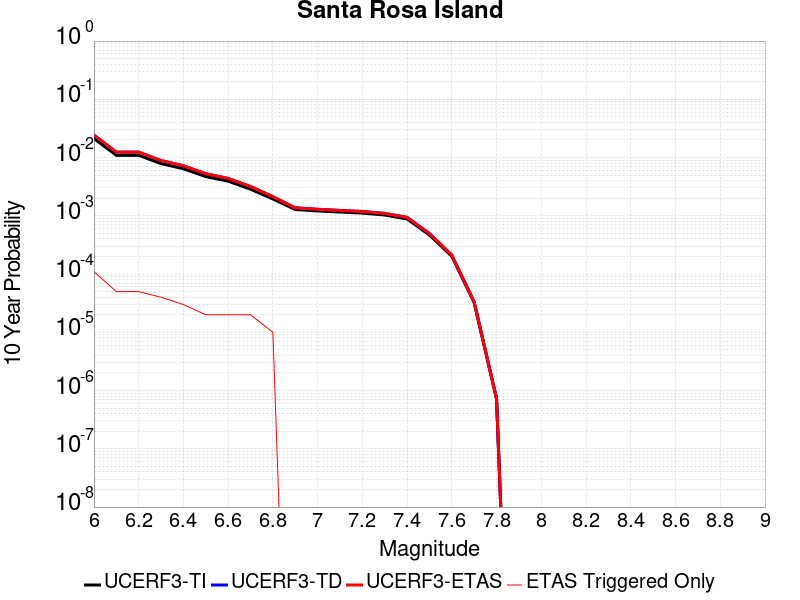 |

| Magnitude | 1 wk TI Prob | 1 wk TD Prob | 1 wk ETAS Prob | 1 wk ETAS/TD Gain | 1 wk ETAS Triggered Only | 1 mo TI Prob | 1 mo TD Prob | 1 mo ETAS Prob | 1 mo ETAS/TD Gain | 1 mo ETAS Triggered Only | 1 yr TI Prob | 1 yr TD Prob | 1 yr ETAS Prob | 1 yr ETAS/TD Gain | 1 yr ETAS Triggered Only | 10 yr TI Prob | 10 yr TD Prob | 10 yr ETAS Prob | 10 yr ETAS/TD Gain | 10 yr ETAS Triggered Only |
|-----|-----|-----|-----|-----|-----|-----|-----|-----|-----|-----|-----|-----|-----|-----|-----|-----|-----|-----|-----|-----|
| 6.0 | 4.1143165E-5 | 4.7092035E-5 | 4.7092035E-5 | 1.0 | 0.0 | 1.7631594E-4 | 2.018085E-4 | 2.2180447E-4 | 1.0990839 | 2.0E-5 | 0.002144533 | 0.0024544464 | 0.0025043236 | 1.0203212 | 5.0E-5 | 0.021239553 | 0.024294019 | 0.024401346 | 1.0044179 | 1.1E-4 |
| 6.1 | 2.1061249E-5 | 2.3865383E-5 | 2.3865383E-5 | 1.0 | 0.0 | 9.0259375E-5 | 1.0227637E-4 | 1.12275346E-4 | 1.0977643 | 1.0E-5 | 0.0010983539 | 0.0012445324 | 0.0012645075 | 1.0160503 | 2.0E-5 | 0.01092941 | 0.012378668 | 0.012428049 | 1.0039892 | 5.0E-5 |
| 6.2 | 2.1061249E-5 | 2.3865383E-5 | 2.3865383E-5 | 1.0 | 0.0 | 9.0259375E-5 | 1.0227637E-4 | 1.12275346E-4 | 1.0977643 | 1.0E-5 | 0.0010983539 | 0.0012445324 | 0.0012645075 | 1.0160503 | 2.0E-5 | 0.01092941 | 0.012378668 | 0.012428049 | 1.0039892 | 5.0E-5 |
| 6.3 | 1.5158236E-5 | 1.7074706E-5 | 1.7074706E-5 | 1.0 | 0.0 | 6.496225E-5 | 7.317533E-5 | 8.31746E-5 | 1.136648 | 1.0E-5 | 7.906284E-4 | 8.905575E-4 | 9.1053965E-4 | 1.0224378 | 2.0E-5 | 0.007878214 | 0.008871139 | 0.0089107845 | 1.004469 | 4.0E-5 |
| 6.4 | 1.2341918E-5 | 1.3853143E-5 | 1.3853143E-5 | 1.0 | 0.0 | 5.2892858E-5 | 5.9369308E-5 | 5.9369308E-5 | 1.0 | 0.0 | 6.437803E-4 | 7.225897E-4 | 7.325825E-4 | 1.0138291 | 1.0E-5 | 0.006419184 | 0.007203239 | 0.0072330227 | 1.0041348 | 3.0E-5 |
| 6.5 | 9.061158E-6 | 1.0117189E-5 | 1.0117189E-5 | 1.0 | 0.0 | 3.883296E-5 | 4.335869E-5 | 4.335869E-5 | 1.0 | 0.0 | 4.726887E-4 | 5.277695E-4 | 5.277695E-4 | 1.0 | 0.0 | 0.004716845 | 0.0052656992 | 0.005285594 | 1.0037782 | 2.0E-5 |
| 6.6 | 7.5461685E-6 | 8.400862E-6 | 8.400862E-6 | 1.0 | 0.0 | 3.2340322E-5 | 3.6003217E-5 | 3.6003217E-5 | 1.0 | 0.0 | 3.936723E-4 | 4.3825532E-4 | 4.3825532E-4 | 1.0 | 0.0 | 0.003929756 | 0.00437434 | 0.0043942523 | 1.0045521 | 2.0E-5 |
| 6.7 | 5.5023775E-6 | 6.0874677E-6 | 6.0874677E-6 | 1.0 | 0.0 | 2.3581404E-5 | 2.6088905E-5 | 2.6088905E-5 | 1.0 | 0.0 | 2.8706578E-4 | 3.1758938E-4 | 3.1758938E-4 | 1.0 | 0.0 | 0.0028669522 | 0.0031716768 | 0.0031916134 | 1.0062858 | 2.0E-5 |
| 6.8 | 3.7351679E-6 | 4.083192E-6 | 4.083192E-6 | 1.0 | 0.0 | 1.6007763E-5 | 1.749929E-5 | 1.749929E-5 | 1.0 | 0.0 | 1.948771E-4 | 2.1303551E-4 | 2.1303551E-4 | 1.0 | 0.0 | 0.0019470629 | 0.0021285582 | 0.002138537 | 1.004688 | 1.0E-5 |
| 6.9 | 2.456366E-6 | 2.6292955E-6 | 2.6292955E-6 | 1.0 | 0.0 | 1.0527241E-5 | 1.1268361E-5 | 1.1268361E-5 | 1.0 | 0.0 | 1.2816161E-4 | 1.3718368E-4 | 1.3718368E-4 | 1.0 | 0.0 | 0.0012808773 | 0.0013709929 | 0.0013709929 | 1.0 | 0.0 |
| 7.0 | 2.3245157E-6 | 2.4828012E-6 | 2.4828012E-6 | 1.0 | 0.0 | 9.962172E-6 | 1.0640533E-5 | 1.0640533E-5 | 1.0 | 0.0 | 1.2128269E-4 | 1.295408E-4 | 1.295408E-4 | 1.0 | 0.0 | 0.0012121652 | 0.0012946553 | 0.0012946553 | 1.0 | 0.0 |
| 7.1 | 2.2248344E-6 | 2.3732714E-6 | 2.3732714E-6 | 1.0 | 0.0 | 9.53497E-6 | 1.0171123E-5 | 1.0171123E-5 | 1.0 | 0.0 | 1.1608207E-4 | 1.2382641E-4 | 1.2382641E-4 | 1.0 | 0.0 | 0.0011602144 | 0.0012375761 | 0.0012375761 | 1.0 | 0.0 |
| 7.2 | 2.1350402E-6 | 2.2761742E-6 | 2.2761742E-6 | 1.0 | 0.0 | 9.150141E-6 | 9.754996E-6 | 9.754996E-6 | 1.0 | 0.0 | 1.1139726E-4 | 1.18760625E-4 | 1.18760625E-4 | 1.0 | 0.0 | 0.0011134144 | 0.0011869734 | 0.0011869734 | 1.0 | 0.0 |
| 7.3 | 1.9793572E-6 | 2.1087376E-6 | 2.1087376E-6 | 1.0 | 0.0 | 8.482932E-6 | 9.037416E-6 | 9.037416E-6 | 1.0 | 0.0 | 1.032748E-4 | 1.10025E-4 | 1.10025E-4 | 1.0 | 0.0 | 0.0010322682 | 0.0010997071 | 0.0010997071 | 1.0 | 0.0 |
| 7.4 | 1.6951194E-6 | 1.8045891E-6 | 1.8045891E-6 | 1.0 | 0.0 | 7.264777E-6 | 7.733931E-6 | 7.733931E-6 | 1.0 | 0.0 | 8.844508E-5 | 9.415655E-5 | 9.415655E-5 | 1.0 | 0.0 | 8.840988E-4 | 9.411683E-4 | 9.411683E-4 | 1.0 | 0.0 |
| 7.5 | 8.987207E-7 | 9.5122914E-7 | 9.5122914E-7 | 1.0 | 0.0 | 3.8516546E-6 | 4.07669E-6 | 4.07669E-6 | 1.0 | 0.0 | 4.6892885E-5 | 4.963258E-5 | 4.963258E-5 | 1.0 | 0.0 | 4.688299E-4 | 4.962162E-4 | 4.962162E-4 | 1.0 | 0.0 |
| 7.6 | 3.8783037E-7 | 4.0529594E-7 | 4.0529594E-7 | 1.0 | 0.0 | 1.6621291E-6 | 1.7369814E-6 | 1.7369814E-6 | 1.0 | 0.0 | 2.0236233E-5 | 2.114755E-5 | 2.114755E-5 | 1.0 | 0.0 | 2.023439E-4 | 2.1145603E-4 | 2.1145603E-4 | 1.0 | 0.0 |
| 7.7 | 6.181804E-8 | 6.339078E-8 | 6.339078E-8 | 1.0 | 0.0 | 2.6493444E-7 | 2.7167474E-7 | 2.7167474E-7 | 1.0 | 0.0 | 3.225572E-6 | 3.3076349E-6 | 3.3076349E-6 | 1.0 | 0.0 | 3.225525E-5 | 3.3075863E-5 | 3.3075863E-5 | 1.0 | 0.0 |
| 7.8 | 1.3704449E-9 | 1.3964188E-9 | 1.3964188E-9 | 1.0 | 0.0 | 5.873335E-9 | 5.984652E-9 | 5.984652E-9 | 1.0 | 0.0 | 7.1507856E-8 | 7.286314E-8 | 7.286314E-8 | 1.0 | 0.0 | 7.1507833E-7 | 7.286312E-7 | 7.286312E-7 | 1.0 | 0.0 |

## Kern Canyon (North Kern) 2011
*[(top)](#table-of-contents)*

| 1 Week | 1 Month | 1 Year | 10 Year |
|-----|-----|-----|-----|
| 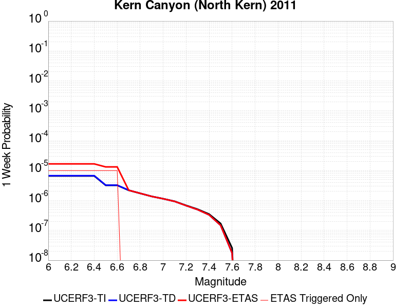 |  |  |  |

| Magnitude | 1 wk TI Prob | 1 wk TD Prob | 1 wk ETAS Prob | 1 wk ETAS/TD Gain | 1 wk ETAS Triggered Only | 1 mo TI Prob | 1 mo TD Prob | 1 mo ETAS Prob | 1 mo ETAS/TD Gain | 1 mo ETAS Triggered Only | 1 yr TI Prob | 1 yr TD Prob | 1 yr ETAS Prob | 1 yr ETAS/TD Gain | 1 yr ETAS Triggered Only | 10 yr TI Prob | 10 yr TD Prob | 10 yr ETAS Prob | 10 yr ETAS/TD Gain | 10 yr ETAS Triggered Only |
|-----|-----|-----|-----|-----|-----|-----|-----|-----|-----|-----|-----|-----|-----|-----|-----|-----|-----|-----|-----|-----|
| 6.0 | 6.6264497E-6 | 6.7573515E-6 | 1.6757283E-5 | 2.4798598 | 1.0E-5 | 2.8398761E-5 | 2.8959801E-5 | 3.895951E-5 | 1.3452963 | 1.0E-5 | 3.4570007E-4 | 3.5253656E-4 | 4.125154E-4 | 1.1701351 | 6.0E-5 | 0.0034516277 | 0.0035205614 | 0.003630174 | 1.031135 | 1.1E-4 |
| 6.1 | 6.6264497E-6 | 6.7573515E-6 | 1.6757283E-5 | 2.4798598 | 1.0E-5 | 2.8398761E-5 | 2.8959801E-5 | 3.895951E-5 | 1.3452963 | 1.0E-5 | 3.4570007E-4 | 3.5253656E-4 | 4.125154E-4 | 1.1701351 | 6.0E-5 | 0.0034516277 | 0.0035205614 | 0.003630174 | 1.031135 | 1.1E-4 |
| 6.2 | 6.6264497E-6 | 6.7573515E-6 | 1.6757283E-5 | 2.4798598 | 1.0E-5 | 2.8398761E-5 | 2.8959801E-5 | 3.895951E-5 | 1.3452963 | 1.0E-5 | 3.4570007E-4 | 3.5253656E-4 | 4.125154E-4 | 1.1701351 | 6.0E-5 | 0.0034516277 | 0.0035205614 | 0.003630174 | 1.031135 | 1.1E-4 |
| 6.3 | 6.6264497E-6 | 6.7573515E-6 | 1.6757283E-5 | 2.4798598 | 1.0E-5 | 2.8398761E-5 | 2.8959801E-5 | 3.895951E-5 | 1.3452963 | 1.0E-5 | 3.4570007E-4 | 3.5253656E-4 | 4.125154E-4 | 1.1701351 | 6.0E-5 | 0.0034516277 | 0.0035205614 | 0.003630174 | 1.031135 | 1.1E-4 |
| 6.4 | 6.6264497E-6 | 6.7573515E-6 | 1.6757283E-5 | 2.4798598 | 1.0E-5 | 2.8398761E-5 | 2.8959801E-5 | 3.895951E-5 | 1.3452963 | 1.0E-5 | 3.4570007E-4 | 3.5253656E-4 | 4.125154E-4 | 1.1701351 | 6.0E-5 | 0.0034516277 | 0.0035205614 | 0.003630174 | 1.031135 | 1.1E-4 |
| 6.5 | 3.2162225E-6 | 3.2571006E-6 | 1.32570685E-5 | 4.070205 | 1.0E-5 | 1.3783738E-5 | 1.3958933E-5 | 2.3958793E-5 | 1.7163771 | 1.0E-5 | 1.6780409E-4 | 1.6993756E-4 | 1.8993416E-4 | 1.1176703 | 2.0E-5 | 0.0016767744 | 0.0016981558 | 0.0017380879 | 1.023515 | 4.0E-5 |
| 6.6 | 3.2162225E-6 | 3.2571006E-6 | 1.32570685E-5 | 4.070205 | 1.0E-5 | 1.3783738E-5 | 1.3958933E-5 | 2.3958793E-5 | 1.7163771 | 1.0E-5 | 1.6780409E-4 | 1.6993756E-4 | 1.8993416E-4 | 1.1176703 | 2.0E-5 | 0.0016767744 | 0.0016981558 | 0.0017380879 | 1.023515 | 4.0E-5 |
| 6.7 | 2.1908265E-6 | 2.207128E-6 | 2.207128E-6 | 1.0 | 0.0 | 9.389223E-6 | 9.459087E-6 | 9.459087E-6 | 1.0 | 0.0 | 1.1430779E-4 | 1.15158495E-4 | 1.15158495E-4 | 1.0 | 0.0 | 0.0011424901 | 0.0011510076 | 0.0011709846 | 1.017356 | 2.0E-5 |
| 6.8 | 1.7303895E-6 | 1.7365575E-6 | 1.7365575E-6 | 1.0 | 0.0 | 7.415934E-6 | 7.4423683E-6 | 7.4423683E-6 | 1.0 | 0.0 | 9.028525E-5 | 9.0607165E-5 | 9.0607165E-5 | 1.0 | 0.0 | 9.024858E-4 | 9.0571196E-4 | 9.2569384E-4 | 1.0220621 | 2.0E-5 |
| 6.9 | 1.3700314E-6 | 1.3688658E-6 | 1.3688658E-6 | 1.0 | 0.0 | 5.87155E-6 | 5.8665546E-6 | 5.8665546E-6 | 1.0 | 0.0 | 7.148377E-5 | 7.142301E-5 | 7.142301E-5 | 1.0 | 0.0 | 7.146078E-4 | 7.140051E-4 | 7.23998E-4 | 1.0139955 | 1.0E-5 |
| 7.0 | 1.1467797E-6 | 1.1413834E-6 | 1.1413834E-6 | 1.0 | 0.0 | 4.9147607E-6 | 4.8916345E-6 | 4.8916345E-6 | 1.0 | 0.0 | 5.983557E-5 | 5.955405E-5 | 5.955405E-5 | 1.0 | 0.0 | 5.981946E-4 | 5.9538404E-4 | 6.053781E-4 | 1.0167859 | 1.0E-5 |
| 7.1 | 9.3952065E-7 | 9.3027154E-7 | 9.3027154E-7 | 1.0 | 0.0 | 4.026511E-6 | 3.986872E-6 | 3.986872E-6 | 1.0 | 0.0 | 4.9021666E-5 | 4.8539103E-5 | 4.8539103E-5 | 1.0 | 0.0 | 4.901085E-4 | 4.852868E-4 | 4.9528194E-4 | 1.0205964 | 1.0E-5 |
| 7.2 | 6.858055E-7 | 6.719319E-7 | 6.719319E-7 | 1.0 | 0.0 | 2.939163E-6 | 2.879705E-6 | 2.879705E-6 | 1.0 | 0.0 | 3.5783723E-5 | 3.5059853E-5 | 3.5059853E-5 | 1.0 | 0.0 | 3.5777962E-4 | 3.505441E-4 | 3.605406E-4 | 1.0285171 | 1.0E-5 |
| 7.3 | 5.1101983E-7 | 4.939314E-7 | 4.939314E-7 | 1.0 | 0.0 | 2.1900833E-6 | 2.116847E-6 | 2.116847E-6 | 1.0 | 0.0 | 2.6663936E-5 | 2.5772315E-5 | 2.5772315E-5 | 1.0 | 0.0 | 2.6660739E-4 | 2.5769373E-4 | 2.5769373E-4 | 1.0 | 0.0 |
| 7.4 | 3.4999414E-7 | 3.2996007E-7 | 3.2996007E-7 | 1.0 | 0.0 | 1.499974E-6 | 1.4141139E-6 | 1.4141139E-6 | 1.0 | 0.0 | 1.8262032E-5 | 1.7216704E-5 | 1.7216704E-5 | 1.0 | 0.0 | 1.826053E-4 | 1.7215393E-4 | 1.7215393E-4 | 1.0 | 0.0 |
| 7.5 | 1.7021522E-7 | 1.4750101E-7 | 1.4750101E-7 | 1.0 | 0.0 | 7.2949354E-7 | 6.321471E-7 | 6.321471E-7 | 1.0 | 0.0 | 8.881548E-6 | 7.696364E-6 | 7.696364E-6 | 1.0 | 0.0 | 8.8811925E-5 | 7.696106E-5 | 7.696106E-5 | 1.0 | 0.0 |
| 7.6 | 2.572245E-8 | 1.7352718E-8 | 1.7352718E-8 | 1.0 | 0.0 | 1.10239064E-7 | 7.436879E-8 | 7.436879E-8 | 1.0 | 0.0 | 1.3421597E-6 | 9.054397E-7 | 9.054397E-7 | 1.0 | 0.0 | 1.3421517E-5 | 9.054365E-6 | 9.054365E-6 | 1.0 | 0.0 |

## White Mountains
*[(top)](#table-of-contents)*

| 1 Week | 1 Month | 1 Year | 10 Year |
|-----|-----|-----|-----|
|  |  |  |  |

| Magnitude | 1 wk TI Prob | 1 wk TD Prob | 1 wk ETAS Prob | 1 wk ETAS/TD Gain | 1 wk ETAS Triggered Only | 1 mo TI Prob | 1 mo TD Prob | 1 mo ETAS Prob | 1 mo ETAS/TD Gain | 1 mo ETAS Triggered Only | 1 yr TI Prob | 1 yr TD Prob | 1 yr ETAS Prob | 1 yr ETAS/TD Gain | 1 yr ETAS Triggered Only | 10 yr TI Prob | 10 yr TD Prob | 10 yr ETAS Prob | 10 yr ETAS/TD Gain | 10 yr ETAS Triggered Only |
|-----|-----|-----|-----|-----|-----|-----|-----|-----|-----|-----|-----|-----|-----|-----|-----|-----|-----|-----|-----|-----|
| 6.0 | 3.503579E-5 | 3.3784498E-5 | 4.378416E-5 | 1.2959838 | 1.0E-5 | 1.5014476E-4 | 1.4478335E-4 | 1.7477901E-4 | 1.2071762 | 3.0E-5 | 0.0018264796 | 0.0017614327 | 0.0018113448 | 1.0283359 | 5.0E-5 | 0.018115403 | 0.017487047 | 0.017575474 | 1.0050566 | 9.0E-5 |
| 6.1 | 3.503579E-5 | 3.3784498E-5 | 4.378416E-5 | 1.2959838 | 1.0E-5 | 1.5014476E-4 | 1.4478335E-4 | 1.7477901E-4 | 1.2071762 | 3.0E-5 | 0.0018264796 | 0.0017614327 | 0.0018113448 | 1.0283359 | 5.0E-5 | 0.018115403 | 0.017487047 | 0.017575474 | 1.0050566 | 9.0E-5 |
| 6.2 | 3.503579E-5 | 3.3784498E-5 | 4.378416E-5 | 1.2959838 | 1.0E-5 | 1.5014476E-4 | 1.4478335E-4 | 1.7477901E-4 | 1.2071762 | 3.0E-5 | 0.0018264796 | 0.0017614327 | 0.0018113448 | 1.0283359 | 5.0E-5 | 0.018115403 | 0.017487047 | 0.017575474 | 1.0050566 | 9.0E-5 |
| 6.3 | 1.7818425E-5 | 1.591632E-5 | 1.591632E-5 | 1.0 | 0.0 | 7.636245E-5 | 6.821109E-5 | 8.820973E-5 | 1.2931874 | 2.0E-5 | 9.293162E-4 | 8.301679E-4 | 8.501513E-4 | 1.0240715 | 2.0E-5 | 0.009254395 | 0.008272125 | 0.008291961 | 1.0023978 | 2.0E-5 |
| 6.4 | 1.7818425E-5 | 1.591632E-5 | 1.591632E-5 | 1.0 | 0.0 | 7.636245E-5 | 6.821109E-5 | 8.820973E-5 | 1.2931874 | 2.0E-5 | 9.293162E-4 | 8.301679E-4 | 8.501513E-4 | 1.0240715 | 2.0E-5 | 0.009254395 | 0.008272125 | 0.008291961 | 1.0023978 | 2.0E-5 |
| 6.5 | 1.3397557E-5 | 1.1336486E-5 | 1.1336486E-5 | 1.0 | 0.0 | 5.741684E-5 | 4.8584072E-5 | 5.8583588E-5 | 1.2058188 | 1.0E-5 | 6.988258E-4 | 5.9135753E-4 | 6.013516E-4 | 1.0169003 | 1.0E-5 | 0.006966323 | 0.0058985446 | 0.0059084855 | 1.0016854 | 1.0E-5 |
| 6.6 | 1.0818695E-5 | 8.625519E-6 | 8.625519E-6 | 1.0 | 0.0 | 4.6365014E-5 | 3.696601E-5 | 4.696564E-5 | 1.2705088 | 1.0E-5 | 5.6434784E-4 | 4.4997258E-4 | 4.5996808E-4 | 1.0222136 | 1.0E-5 | 0.005629168 | 0.004491051 | 0.0045010066 | 1.0022167 | 1.0E-5 |
| 6.7 | 9.067908E-6 | 6.802544E-6 | 6.802544E-6 | 1.0 | 0.0 | 3.8861883E-5 | 2.915345E-5 | 2.915345E-5 | 1.0 | 0.0 | 4.7304068E-4 | 3.5488865E-4 | 3.5488865E-4 | 1.0 | 0.0 | 0.00472035 | 0.0035435364 | 0.0035435364 | 1.0 | 0.0 |
| 6.8 | 7.295947E-6 | 4.9364785E-6 | 4.9364785E-6 | 1.0 | 0.0 | 3.126797E-5 | 2.1156171E-5 | 2.1156171E-5 | 1.0 | 0.0 | 3.8062103E-4 | 2.5754707E-4 | 2.5754707E-4 | 1.0 | 0.0 | 0.0037996976 | 0.0025725989 | 0.0025725989 | 1.0 | 0.0 |
| 6.9 | 6.2243444E-6 | 3.8322955E-6 | 3.8322955E-6 | 1.0 | 0.0 | 2.6675489E-5 | 1.6424025E-5 | 1.6424025E-5 | 1.0 | 0.0 | 3.2472567E-4 | 1.9994467E-4 | 1.9994467E-4 | 1.0 | 0.0 | 0.0032425157 | 0.0019977004 | 0.0019977004 | 1.0 | 0.0 |
| 7.0 | 4.9878413E-6 | 2.6796004E-6 | 2.6796004E-6 | 1.0 | 0.0 | 2.1376287E-5 | 1.1483952E-5 | 1.1483952E-5 | 1.0 | 0.0 | 2.602252E-4 | 1.3980841E-4 | 1.3980841E-4 | 1.0 | 0.0 | 0.002599207 | 0.0013972308 | 0.0013972308 | 1.0 | 0.0 |
| 7.1 | 4.0252844E-6 | 1.885737E-6 | 1.885737E-6 | 1.0 | 0.0 | 1.7251105E-5 | 8.081706E-6 | 8.081706E-6 | 1.0 | 0.0 | 2.1001195E-4 | 9.8390454E-5 | 9.8390454E-5 | 1.0 | 0.0 | 0.0020981359 | 9.834818E-4 | 9.834818E-4 | 1.0 | 0.0 |
| 7.2 | 3.3284066E-6 | 1.2819264E-6 | 1.2819264E-6 | 1.0 | 0.0 | 1.4264522E-5 | 5.493959E-6 | 5.493959E-6 | 1.0 | 0.0 | 1.736567E-4 | 6.6887005E-5 | 6.6887005E-5 | 1.0 | 0.0 | 0.0017352107 | 6.686788E-4 | 6.686788E-4 | 1.0 | 0.0 |
| 7.3 | 2.458226E-6 | 6.0570005E-7 | 6.0570005E-7 | 1.0 | 0.0 | 1.0535211E-5 | 2.595855E-6 | 2.595855E-6 | 1.0 | 0.0 | 1.2825865E-4 | 3.1604115E-5 | 3.1604115E-5 | 1.0 | 0.0 | 0.0012818464 | 3.1599996E-4 | 3.1599996E-4 | 1.0 | 0.0 |
| 7.4 | 1.965953E-6 | 3.1087455E-7 | 3.1087455E-7 | 1.0 | 0.0 | 8.425486E-6 | 1.3323188E-6 | 1.3323188E-6 | 1.0 | 0.0 | 1.0257547E-4 | 1.6220862E-5 | 1.6220862E-5 | 1.0 | 0.0 | 0.0010252813 | 1.6219691E-4 | 1.6219691E-4 | 1.0 | 0.0 |
| 7.5 | 1.2014192E-6 | 1.8242919E-7 | 1.8242919E-7 | 1.0 | 0.0 | 5.148929E-6 | 7.8183916E-7 | 7.8183916E-7 | 1.0 | 0.0 | 6.2686406E-5 | 9.518851E-6 | 9.518851E-6 | 1.0 | 0.0 | 6.266873E-4 | 9.5184514E-5 | 9.5184514E-5 | 1.0 | 0.0 |
| 7.6 | 2.5612175E-7 | 4.8943498E-8 | 4.8943498E-8 | 1.0 | 0.0 | 1.0976642E-6 | 2.0975783E-7 | 2.0975783E-7 | 1.0 | 0.0 | 1.3363979E-5 | 2.553799E-6 | 2.553799E-6 | 1.0 | 0.0 | 1.3363175E-4 | 2.5537733E-5 | 2.5537733E-5 | 1.0 | 0.0 |

## Cleghorn Pass
*[(top)](#table-of-contents)*

| 1 Week | 1 Month | 1 Year | 10 Year |
|-----|-----|-----|-----|
|  |  |  |  |

| Magnitude | 1 wk TI Prob | 1 wk TD Prob | 1 wk ETAS Prob | 1 wk ETAS/TD Gain | 1 wk ETAS Triggered Only | 1 mo TI Prob | 1 mo TD Prob | 1 mo ETAS Prob | 1 mo ETAS/TD Gain | 1 mo ETAS Triggered Only | 1 yr TI Prob | 1 yr TD Prob | 1 yr ETAS Prob | 1 yr ETAS/TD Gain | 1 yr ETAS Triggered Only | 10 yr TI Prob | 10 yr TD Prob | 10 yr ETAS Prob | 10 yr ETAS/TD Gain | 10 yr ETAS Triggered Only |
|-----|-----|-----|-----|-----|-----|-----|-----|-----|-----|-----|-----|-----|-----|-----|-----|-----|-----|-----|-----|-----|
| 6.0 | 1.0522846E-5 | 1.1040714E-5 | 1.1040714E-5 | 1.0 | 0.0 | 4.509713E-5 | 4.7316782E-5 | 5.731631E-5 | 1.2113315 | 1.0E-5 | 5.4891926E-4 | 5.759822E-4 | 6.259534E-4 | 1.0867583 | 5.0E-5 | 0.0054756533 | 0.005750059 | 0.0058395416 | 1.015562 | 9.0E-5 |
| 6.1 | 1.0522846E-5 | 1.1040714E-5 | 1.1040714E-5 | 1.0 | 0.0 | 4.509713E-5 | 4.7316782E-5 | 5.731631E-5 | 1.2113315 | 1.0E-5 | 5.4891926E-4 | 5.759822E-4 | 6.259534E-4 | 1.0867583 | 5.0E-5 | 0.0054756533 | 0.005750059 | 0.0058395416 | 1.015562 | 9.0E-5 |
| 6.2 | 2.1045846E-6 | 2.2082168E-6 | 2.2082168E-6 | 1.0 | 0.0 | 9.019617E-6 | 9.463776E-6 | 9.463776E-6 | 1.0 | 0.0 | 1.098083E-4 | 1.1521958E-4 | 1.2521842E-4 | 1.0867808 | 1.0E-5 | 0.0010975406 | 0.0011520098 | 0.0011619983 | 1.0086704 | 1.0E-5 |
| 6.3 | 2.1045846E-6 | 2.2082168E-6 | 2.2082168E-6 | 1.0 | 0.0 | 9.019617E-6 | 9.463776E-6 | 9.463776E-6 | 1.0 | 0.0 | 1.098083E-4 | 1.1521958E-4 | 1.2521842E-4 | 1.0867808 | 1.0E-5 | 0.0010975406 | 0.0011520098 | 0.0011619983 | 1.0086704 | 1.0E-5 |
| 6.4 | 1.7259927E-6 | 1.8108889E-6 | 1.8108889E-6 | 1.0 | 0.0 | 7.3970905E-6 | 7.760952E-6 | 7.760952E-6 | 1.0 | 0.0 | 9.005586E-5 | 9.4489595E-5 | 1.0448865E-4 | 1.1058217 | 1.0E-5 | 9.001937E-4 | 9.4489596E-4 | 9.548865E-4 | 1.0105731 | 1.0E-5 |

## San Jacinto (San Jacinto Valley) rev
*[(top)](#table-of-contents)*

| 1 Week | 1 Month | 1 Year | 10 Year |
|-----|-----|-----|-----|
|  |  | 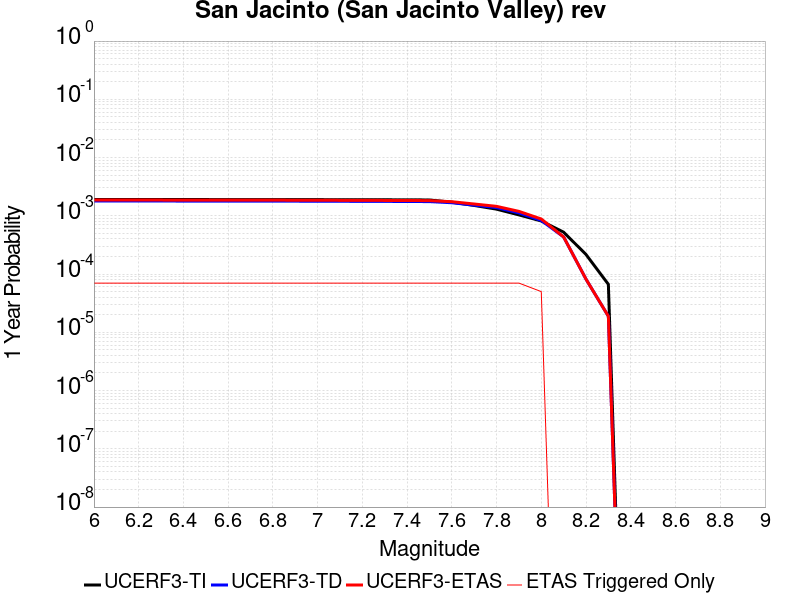 | 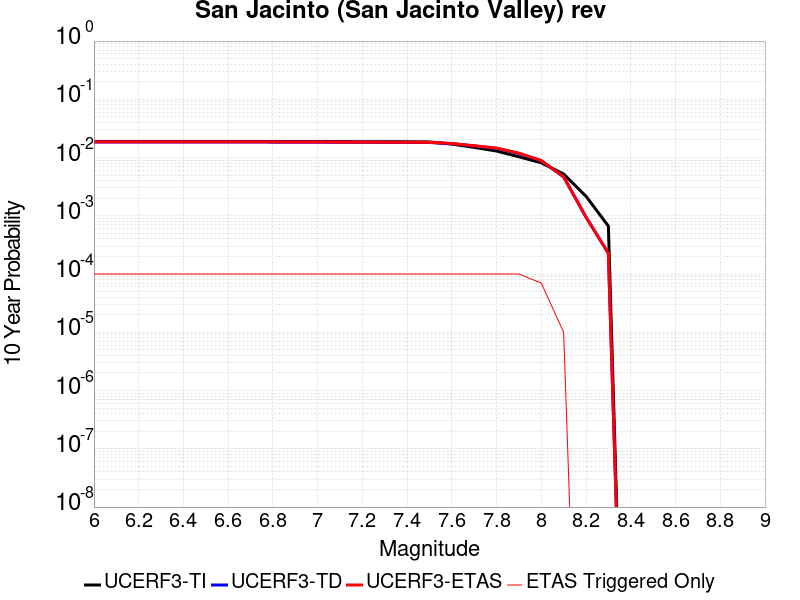 |

| Magnitude | 1 wk TI Prob | 1 wk TD Prob | 1 wk ETAS Prob | 1 wk ETAS/TD Gain | 1 wk ETAS Triggered Only | 1 mo TI Prob | 1 mo TD Prob | 1 mo ETAS Prob | 1 mo ETAS/TD Gain | 1 mo ETAS Triggered Only | 1 yr TI Prob | 1 yr TD Prob | 1 yr ETAS Prob | 1 yr ETAS/TD Gain | 1 yr ETAS Triggered Only | 10 yr TI Prob | 10 yr TD Prob | 10 yr ETAS Prob | 10 yr ETAS/TD Gain | 10 yr ETAS Triggered Only |
|-----|-----|-----|-----|-----|-----|-----|-----|-----|-----|-----|-----|-----|-----|-----|-----|-----|-----|-----|-----|-----|
| 6.0 | 3.652694E-5 | 3.441575E-5 | 4.4415407E-5 | 1.2905546 | 1.0E-5 | 1.5653463E-4 | 1.4748774E-4 | 1.774833E-4 | 1.2033768 | 3.0E-5 | 0.0019041431 | 0.0017941861 | 0.0018640604 | 1.038945 | 7.0E-5 | 0.018879099 | 0.01853357 | 0.018631717 | 1.0052956 | 1.0E-4 |
| 6.1 | 3.652694E-5 | 3.441575E-5 | 4.4415407E-5 | 1.2905546 | 1.0E-5 | 1.5653463E-4 | 1.4748774E-4 | 1.774833E-4 | 1.2033768 | 3.0E-5 | 0.0019041431 | 0.0017941861 | 0.0018640604 | 1.038945 | 7.0E-5 | 0.018879099 | 0.01853357 | 0.018631717 | 1.0052956 | 1.0E-4 |
| 6.2 | 3.652694E-5 | 3.441575E-5 | 4.4415407E-5 | 1.2905546 | 1.0E-5 | 1.5653463E-4 | 1.4748774E-4 | 1.774833E-4 | 1.2033768 | 3.0E-5 | 0.0019041431 | 0.0017941861 | 0.0018640604 | 1.038945 | 7.0E-5 | 0.018879099 | 0.01853357 | 0.018631717 | 1.0052956 | 1.0E-4 |
| 6.3 | 3.652694E-5 | 3.441575E-5 | 4.4415407E-5 | 1.2905546 | 1.0E-5 | 1.5653463E-4 | 1.4748774E-4 | 1.774833E-4 | 1.2033768 | 3.0E-5 | 0.0019041431 | 0.0017941861 | 0.0018640604 | 1.038945 | 7.0E-5 | 0.018879099 | 0.01853357 | 0.018631717 | 1.0052956 | 1.0E-4 |
| 6.4 | 3.646941E-5 | 3.4337318E-5 | 4.4336975E-5 | 1.2912183 | 1.0E-5 | 1.5628811E-4 | 1.4715164E-4 | 1.7714723E-4 | 1.2038413 | 3.0E-5 | 0.0019011468 | 0.0017901013 | 0.0018599761 | 1.0390339 | 7.0E-5 | 0.018849645 | 0.01849345 | 0.0185916 | 1.0053073 | 1.0E-4 |
| 6.5 | 3.646941E-5 | 3.4337318E-5 | 4.4336975E-5 | 1.2912183 | 1.0E-5 | 1.5628811E-4 | 1.4715164E-4 | 1.7714723E-4 | 1.2038413 | 3.0E-5 | 0.0019011468 | 0.0017901013 | 0.0018599761 | 1.0390339 | 7.0E-5 | 0.018849645 | 0.01849345 | 0.0185916 | 1.0053073 | 1.0E-4 |
| 6.6 | 3.6442503E-5 | 3.4300705E-5 | 4.4300363E-5 | 1.2915292 | 1.0E-5 | 1.561728E-4 | 1.4699475E-4 | 1.7699035E-4 | 1.2040589 | 3.0E-5 | 0.0018997455 | 0.0017881944 | 0.0018580692 | 1.0390756 | 7.0E-5 | 0.018835869 | 0.018474717 | 0.01857287 | 1.0053128 | 1.0E-4 |
| 6.7 | 3.6432113E-5 | 3.428628E-5 | 4.4285935E-5 | 1.2916518 | 1.0E-5 | 1.5612828E-4 | 1.4693293E-4 | 1.7692853E-4 | 1.2041448 | 3.0E-5 | 0.0018992044 | 0.0017874431 | 0.001857318 | 1.0390921 | 7.0E-5 | 0.018830549 | 0.01846734 | 0.018565495 | 1.005315 | 1.0E-4 |
| 6.8 | 3.6409598E-5 | 3.4255332E-5 | 4.425499E-5 | 1.2919153 | 1.0E-5 | 1.560318E-4 | 1.4680032E-4 | 1.7679592E-4 | 1.2043293 | 3.0E-5 | 0.0018980318 | 0.0017858313 | 0.0018557062 | 1.0391275 | 7.0E-5 | 0.018819023 | 0.018451495 | 0.018549649 | 1.0053196 | 1.0E-4 |
| 6.9 | 3.638078E-5 | 3.4215755E-5 | 4.4215412E-5 | 1.292253 | 1.0E-5 | 1.5590832E-4 | 1.4663071E-4 | 1.7662632E-4 | 1.2045656 | 3.0E-5 | 0.0018965311 | 0.0017837697 | 0.0018536448 | 1.0391728 | 7.0E-5 | 0.018804269 | 0.018431228 | 0.018529383 | 1.0053256 | 1.0E-4 |
| 7.0 | 3.6294874E-5 | 3.4097768E-5 | 4.4097425E-5 | 1.2932644 | 1.0E-5 | 1.5554018E-4 | 1.4612512E-4 | 1.7612074E-4 | 1.2052735 | 3.0E-5 | 0.0018920569 | 0.0017776241 | 0.0018474997 | 1.0393084 | 7.0E-5 | 0.018760284 | 0.018370807 | 0.01846897 | 1.0053434 | 1.0E-4 |
| 7.1 | 3.6260717E-5 | 3.4054046E-5 | 4.4053708E-5 | 1.2936409 | 1.0E-5 | 1.5539382E-4 | 1.4593777E-4 | 1.759334E-4 | 1.2055371 | 3.0E-5 | 0.001890278 | 0.0017753469 | 0.0018452227 | 1.0393589 | 7.0E-5 | 0.018742796 | 0.018348401 | 0.018446567 | 1.0053501 | 1.0E-4 |
| 7.2 | 3.6210204E-5 | 3.3988264E-5 | 4.3987926E-5 | 1.2942092 | 1.0E-5 | 1.5517735E-4 | 1.4565587E-4 | 1.756515E-4 | 1.2059349 | 3.0E-5 | 0.001887647 | 0.0017719205 | 0.0018417964 | 1.0394351 | 7.0E-5 | 0.01871693 | 0.018314669 | 0.018412838 | 1.0053601 | 1.0E-4 |
| 7.3 | 3.6119454E-5 | 3.3876542E-5 | 4.3876204E-5 | 1.2951795 | 1.0E-5 | 1.5478847E-4 | 1.4517711E-4 | 1.7517275E-4 | 1.2066141 | 3.0E-5 | 0.0018829206 | 0.0017661011 | 0.0018359774 | 1.0395653 | 7.0E-5 | 0.018670462 | 0.01825722 | 0.018355394 | 1.0053773 | 1.0E-4 |
| 7.4 | 3.607848E-5 | 3.382404E-5 | 4.38237E-5 | 1.2956377 | 1.0E-5 | 1.5461289E-4 | 1.4495212E-4 | 1.7494777E-4 | 1.2069349 | 3.0E-5 | 0.0018807866 | 0.0017633662 | 0.0018332427 | 1.0396268 | 7.0E-5 | 0.018649481 | 0.018230215 | 0.018328391 | 1.0053854 | 1.0E-4 |
| 7.5 | 3.5856774E-5 | 3.363379E-5 | 4.3633456E-5 | 1.29731 | 1.0E-5 | 1.5366284E-4 | 1.4413687E-4 | 1.7413254E-4 | 1.2081054 | 3.0E-5 | 0.0018692396 | 0.0017534565 | 0.0018233338 | 1.0398512 | 7.0E-5 | 0.018535944 | 0.018131303 | 0.01822949 | 1.0054153 | 1.0E-4 |
| 7.6 | 3.286655E-5 | 3.2156633E-5 | 4.2156313E-5 | 1.3109678 | 1.0E-5 | 1.4084904E-4 | 1.3780687E-4 | 1.6780275E-4 | 1.2176659 | 3.0E-5 | 0.001713488 | 0.0016765095 | 0.0017463922 | 1.0416834 | 7.0E-5 | 0.017003361 | 0.01735091 | 0.017449176 | 1.0056634 | 1.0E-4 |
| 7.7 | 2.8882527E-5 | 2.9249288E-5 | 3.9248996E-5 | 1.3418787 | 1.0E-5 | 1.237764E-4 | 1.2534807E-4 | 1.5534431E-4 | 1.2393036 | 3.0E-5 | 0.0015059357 | 0.0015250455 | 0.0015949388 | 1.0458302 | 7.0E-5 | 0.014957713 | 0.015837153 | 0.015935568 | 1.0062143 | 1.0E-4 |
| 7.8 | 2.4950225E-5 | 2.6539781E-5 | 3.6539517E-5 | 1.3767829 | 1.0E-5 | 1.0692515E-4 | 1.1373697E-4 | 1.4373356E-4 | 1.2637365 | 3.0E-5 | 0.0013010362 | 0.0013838689 | 0.001453772 | 1.0505128 | 7.0E-5 | 0.012934455 | 0.014418158 | 0.014516716 | 1.0068357 | 1.0E-4 |
| 7.9 | 1.9881603E-5 | 2.1518656E-5 | 3.151844E-5 | 1.4647031 | 1.0E-5 | 8.520408E-5 | 9.2219554E-5 | 1.2221679E-4 | 1.3252807 | 3.0E-5 | 0.001036866 | 0.0011221955 | 0.001192117 | 1.0623077 | 7.0E-5 | 0.010320415 | 0.011782875 | 0.011881697 | 1.0083869 | 1.0E-4 |
| 8.0 | 1.563292E-5 | 1.5946089E-5 | 2.594593E-5 | 1.627103 | 1.0E-5 | 6.6996516E-5 | 6.8338595E-5 | 9.8336546E-5 | 1.4389606 | 3.0E-5 | 8.153773E-4 | 8.3170546E-4 | 8.816639E-4 | 1.0600674 | 5.0E-5 | 0.00812392 | 0.00881513 | 0.008884513 | 1.0078709 | 7.0E-5 |
| 8.1 | 1.0045313E-5 | 8.306527E-6 | 8.306527E-6 | 1.0 | 0.0 | 4.305063E-5 | 3.5598918E-5 | 3.5598918E-5 | 1.0 | 0.0 | 5.2401534E-4 | 4.3333112E-4 | 4.3333112E-4 | 1.0 | 0.0 | 0.0052278144 | 0.0046616676 | 0.0046716207 | 1.0021352 | 1.0E-5 |
| 8.2 | 4.1554413E-6 | 1.5665041E-6 | 1.5665041E-6 | 1.0 | 0.0 | 1.7808914E-5 | 6.713572E-6 | 6.713572E-6 | 1.0 | 0.0 | 2.1680194E-4 | 8.17347E-5 | 8.17347E-5 | 1.0 | 0.0 | 0.0021659054 | 9.488419E-4 | 9.488419E-4 | 1.0 | 0.0 |
| 8.3 | 1.2758221E-6 | 3.6171858E-7 | 3.6171858E-7 | 1.0 | 0.0 | 5.4677976E-6 | 1.5502216E-6 | 1.5502216E-6 | 1.0 | 0.0 | 6.65684E-5 | 1.8873789E-5 | 1.8873789E-5 | 1.0 | 0.0 | 6.6548464E-4 | 2.2764095E-4 | 2.2764095E-4 | 1.0 | 0.0 |

## Chino alt 1
*[(top)](#table-of-contents)*

| 1 Week | 1 Month | 1 Year | 10 Year |
|-----|-----|-----|-----|
|  |  |  |  |

| Magnitude | 1 wk TI Prob | 1 wk TD Prob | 1 wk ETAS Prob | 1 wk ETAS/TD Gain | 1 wk ETAS Triggered Only | 1 mo TI Prob | 1 mo TD Prob | 1 mo ETAS Prob | 1 mo ETAS/TD Gain | 1 mo ETAS Triggered Only | 1 yr TI Prob | 1 yr TD Prob | 1 yr ETAS Prob | 1 yr ETAS/TD Gain | 1 yr ETAS Triggered Only | 10 yr TI Prob | 10 yr TD Prob | 10 yr ETAS Prob | 10 yr ETAS/TD Gain | 10 yr ETAS Triggered Only |
|-----|-----|-----|-----|-----|-----|-----|-----|-----|-----|-----|-----|-----|-----|-----|-----|-----|-----|-----|-----|-----|
| 6.0 | 3.939946E-5 | 4.8949914E-5 | 4.8949914E-5 | 1.0 | 0.0 | 1.6884391E-4 | 2.0977142E-4 | 2.1976932E-4 | 1.047661 | 1.0E-5 | 0.0020537362 | 0.0025514853 | 0.0025714342 | 1.0078186 | 2.0E-5 | 0.020348595 | 0.025280792 | 0.025368517 | 1.0034701 | 9.0E-5 |
| 6.1 | 2.1505624E-5 | 2.688007E-5 | 2.688007E-5 | 1.0 | 0.0 | 9.2163704E-5 | 1.1519585E-4 | 1.251947E-4 | 1.0867987 | 1.0E-5 | 0.0011215154 | 0.0014017166 | 0.0014117026 | 1.0071241 | 1.0E-5 | 0.011158722 | 0.013947706 | 0.013997008 | 1.0035348 | 5.0E-5 |
| 6.2 | 2.1505624E-5 | 2.688007E-5 | 2.688007E-5 | 1.0 | 0.0 | 9.2163704E-5 | 1.1519585E-4 | 1.251947E-4 | 1.0867987 | 1.0E-5 | 0.0011215154 | 0.0014017166 | 0.0014117026 | 1.0071241 | 1.0E-5 | 0.011158722 | 0.013947706 | 0.013997008 | 1.0035348 | 5.0E-5 |
| 6.3 | 1.4290785E-5 | 1.816584E-5 | 1.816584E-5 | 1.0 | 0.0 | 6.1244784E-5 | 7.785153E-5 | 7.785153E-5 | 1.0 | 0.0 | 7.454001E-4 | 9.4747543E-4 | 9.4747543E-4 | 1.0 | 0.0 | 0.007429048 | 0.009446898 | 0.009476614 | 1.0031457 | 3.0E-5 |
| 6.4 | 1.4290785E-5 | 1.816584E-5 | 1.816584E-5 | 1.0 | 0.0 | 6.1244784E-5 | 7.785153E-5 | 7.785153E-5 | 1.0 | 0.0 | 7.454001E-4 | 9.4747543E-4 | 9.4747543E-4 | 1.0 | 0.0 | 0.007429048 | 0.009446898 | 0.009476614 | 1.0031457 | 3.0E-5 |
| 6.5 | 1.3017944E-5 | 1.6652762E-5 | 1.6652762E-5 | 1.0 | 0.0 | 5.5789995E-5 | 7.136728E-5 | 7.136728E-5 | 1.0 | 0.0 | 6.790315E-4 | 8.685939E-4 | 8.685939E-4 | 1.0 | 0.0 | 0.0067696036 | 0.008664371 | 0.008694111 | 1.0034325 | 3.0E-5 |
| 6.6 | 9.470016E-6 | 1.2039946E-5 | 1.2039946E-5 | 1.0 | 0.0 | 4.058515E-5 | 5.159894E-5 | 5.159894E-5 | 1.0 | 0.0 | 4.940122E-4 | 6.2807E-4 | 6.2807E-4 | 1.0 | 0.0 | 0.004929154 | 0.006273371 | 0.006293246 | 1.0031681 | 2.0E-5 |
| 6.7 | 8.314155E-6 | 1.0408143E-5 | 1.0408143E-5 | 1.0 | 0.0 | 3.5631605E-5 | 4.4605746E-5 | 4.4605746E-5 | 1.0 | 0.0 | 4.3372845E-4 | 5.429719E-4 | 5.429719E-4 | 1.0 | 0.0 | 0.004328829 | 0.005427294 | 0.0054471856 | 1.0036651 | 2.0E-5 |
| 6.8 | 3.4856364E-6 | 3.8135686E-6 | 3.8135686E-6 | 1.0 | 0.0 | 1.4938357E-5 | 1.6343774E-5 | 1.6343774E-5 | 1.0 | 0.0 | 1.8185932E-4 | 1.9896936E-4 | 1.9896936E-4 | 1.0 | 0.0 | 0.0018171056 | 0.0019897262 | 0.0019897262 | 1.0 | 0.0 |
| 6.9 | 2.2645952E-6 | 2.153006E-6 | 2.153006E-6 | 1.0 | 0.0 | 9.705372E-6 | 9.2271375E-6 | 9.2271375E-6 | 1.0 | 0.0 | 1.18156495E-4 | 1.1233483E-4 | 1.1233483E-4 | 1.0 | 0.0 | 0.0011809369 | 0.0011235814 | 0.0011235814 | 1.0 | 0.0 |
| 7.0 | 1.7864003E-6 | 1.5431655E-6 | 1.5431655E-6 | 1.0 | 0.0 | 7.655979E-6 | 6.61355E-6 | 6.61355E-6 | 1.0 | 0.0 | 9.3207556E-5 | 8.051705E-5 | 8.051705E-5 | 1.0 | 0.0 | 9.316847E-4 | 8.0526597E-4 | 8.0526597E-4 | 1.0 | 0.0 |
| 7.1 | 1.7315456E-6 | 1.4734359E-6 | 1.4734359E-6 | 1.0 | 0.0 | 7.420889E-6 | 6.31471E-6 | 6.31471E-6 | 1.0 | 0.0 | 9.034557E-5 | 7.687894E-5 | 7.687894E-5 | 1.0 | 0.0 | 9.0308854E-4 | 7.689018E-4 | 7.689018E-4 | 1.0 | 0.0 |
| 7.2 | 1.6008337E-6 | 1.3574833E-6 | 1.3574833E-6 | 1.0 | 0.0 | 6.860698E-6 | 5.817773E-6 | 5.817773E-6 | 1.0 | 0.0 | 8.352579E-5 | 7.082913E-5 | 7.082913E-5 | 1.0 | 0.0 | 8.34944E-4 | 7.084325E-4 | 7.084325E-4 | 1.0 | 0.0 |
| 7.3 | 1.3320939E-6 | 1.1218311E-6 | 1.1218311E-6 | 1.0 | 0.0 | 5.7089615E-6 | 4.807839E-6 | 4.807839E-6 | 1.0 | 0.0 | 6.9504385E-5 | 5.8533915E-5 | 5.8533915E-5 | 1.0 | 0.0 | 6.9482654E-4 | 5.8530783E-4 | 5.8530783E-4 | 1.0 | 0.0 |
| 7.4 | 1.114294E-6 | 9.2374944E-7 | 9.2374944E-7 | 1.0 | 0.0 | 4.775537E-6 | 3.9589204E-6 | 3.9589204E-6 | 1.0 | 0.0 | 5.8140613E-5 | 4.8198825E-5 | 4.8198825E-5 | 1.0 | 0.0 | 5.81254E-4 | 4.8189829E-4 | 4.8189829E-4 | 1.0 | 0.0 |
| 7.5 | 9.354081E-7 | 7.623722E-7 | 7.623722E-7 | 1.0 | 0.0 | 4.0088858E-6 | 3.2673056E-6 | 3.2673056E-6 | 1.0 | 0.0 | 4.8807087E-5 | 3.9778755E-5 | 3.9778755E-5 | 1.0 | 0.0 | 4.879637E-4 | 3.9771973E-4 | 3.9771973E-4 | 1.0 | 0.0 |
| 7.6 | 8.521771E-7 | 6.880951E-7 | 6.880951E-7 | 1.0 | 0.0 | 3.6521824E-6 | 2.9489759E-6 | 2.9489759E-6 | 1.0 | 0.0 | 4.4464414E-5 | 3.590322E-5 | 3.590322E-5 | 1.0 | 0.0 | 4.4455516E-4 | 3.5897738E-4 | 3.5897738E-4 | 1.0 | 0.0 |
| 7.7 | 2.1803626E-7 | 1.418694E-7 | 1.418694E-7 | 1.0 | 0.0 | 9.344408E-7 | 6.0801165E-7 | 6.0801165E-7 | 1.0 | 0.0 | 1.1376757E-5 | 7.4025265E-6 | 7.4025265E-6 | 1.0 | 0.0 | 1.13761744E-4 | 7.402376E-5 | 7.402376E-5 | 1.0 | 0.0 |

## San Clemente
*[(top)](#table-of-contents)*

| 1 Week | 1 Month | 1 Year | 10 Year |
|-----|-----|-----|-----|
|  |  |  |  |

| Magnitude | 1 wk TI Prob | 1 wk TD Prob | 1 wk ETAS Prob | 1 wk ETAS/TD Gain | 1 wk ETAS Triggered Only | 1 mo TI Prob | 1 mo TD Prob | 1 mo ETAS Prob | 1 mo ETAS/TD Gain | 1 mo ETAS Triggered Only | 1 yr TI Prob | 1 yr TD Prob | 1 yr ETAS Prob | 1 yr ETAS/TD Gain | 1 yr ETAS Triggered Only | 10 yr TI Prob | 10 yr TD Prob | 10 yr ETAS Prob | 10 yr ETAS/TD Gain | 10 yr ETAS Triggered Only |
|-----|-----|-----|-----|-----|-----|-----|-----|-----|-----|-----|-----|-----|-----|-----|-----|-----|-----|-----|-----|-----|
| 6.0 | 6.681379E-5 | 8.164081E-5 | 9.163999E-5 | 1.1224778 | 1.0E-5 | 2.8631336E-4 | 3.4984472E-4 | 3.6983774E-4 | 1.0571482 | 2.0E-5 | 0.003480294 | 0.004251534 | 0.0043112794 | 1.0140525 | 6.0E-5 | 0.03426291 | 0.041757226 | 0.04185305 | 1.0022948 | 1.0E-4 |
| 6.1 | 6.681379E-5 | 8.164081E-5 | 9.163999E-5 | 1.1224778 | 1.0E-5 | 2.8631336E-4 | 3.4984472E-4 | 3.5984121E-4 | 1.0285741 | 1.0E-5 | 0.003480294 | 0.004251534 | 0.0043013217 | 1.0117104 | 5.0E-5 | 0.03426291 | 0.041757226 | 0.04183389 | 1.0018358 | 8.0E-5 |
| 6.2 | 3.9400576E-5 | 4.645349E-5 | 5.6453027E-5 | 1.2152591 | 1.0E-5 | 1.6884868E-4 | 1.9907155E-4 | 2.0906956E-4 | 1.0502232 | 1.0E-5 | 0.0020537945 | 0.0024210564 | 0.0024509837 | 1.0123613 | 3.0E-5 | 0.020349167 | 0.02395347 | 0.02400227 | 1.0020374 | 5.0E-5 |
| 6.3 | 3.2590255E-5 | 3.792995E-5 | 4.792957E-5 | 1.263634 | 1.0E-5 | 1.3966505E-4 | 1.6254697E-4 | 1.7254535E-4 | 1.0615107 | 1.0E-5 | 0.0016990956 | 0.0019772432 | 0.0020071839 | 1.0151427 | 3.0E-5 | 0.01686163 | 0.019600306 | 0.019629719 | 1.0015006 | 3.0E-5 |
| 6.4 | 2.9454652E-5 | 3.409848E-5 | 4.409814E-5 | 1.2932582 | 1.0E-5 | 1.2622811E-4 | 1.4612831E-4 | 1.5612684E-4 | 1.068423 | 1.0E-5 | 0.0015357438 | 0.0017776866 | 0.0018076333 | 1.0168458 | 3.0E-5 | 0.015251739 | 0.017637838 | 0.017667308 | 1.0016708 | 3.0E-5 |
| 6.5 | 2.790836E-5 | 3.2248132E-5 | 4.2247808E-5 | 1.3100855 | 1.0E-5 | 1.1960178E-4 | 1.381991E-4 | 1.4819772E-4 | 1.0723494 | 1.0E-5 | 0.001455179 | 0.001681301 | 0.0017112506 | 1.0178133 | 3.0E-5 | 0.014456868 | 0.016688827 | 0.016718326 | 1.0017676 | 3.0E-5 |
| 6.6 | 2.2492153E-5 | 2.57632E-5 | 3.5762943E-5 | 1.3881406 | 1.0E-5 | 9.639138E-5 | 1.1040912E-4 | 1.2040802E-4 | 1.0905622 | 1.0E-5 | 0.0011729331 | 0.0013434169 | 0.00136339 | 1.0148674 | 2.0E-5 | 0.011667615 | 0.013354673 | 0.013374406 | 1.0014776 | 2.0E-5 |
| 6.7 | 1.9862755E-5 | 2.2666847E-5 | 3.266662E-5 | 1.441163 | 1.0E-5 | 8.512331E-5 | 9.714008E-5 | 1.0713911E-4 | 1.1029341 | 1.0E-5 | 0.0010358836 | 0.0011820501 | 0.0012020264 | 1.0168997 | 2.0E-5 | 0.010310682 | 0.01175892 | 0.011778684 | 1.0016809 | 2.0E-5 |
| 6.8 | 1.6697575E-5 | 1.8978053E-5 | 2.8977864E-5 | 1.5269145 | 1.0E-5 | 7.155907E-5 | 8.133203E-5 | 9.133122E-5 | 1.1229428 | 1.0E-5 | 8.7088346E-4 | 9.89777E-4 | 9.997671E-4 | 1.0100933 | 1.0E-5 | 0.008674784 | 0.009854714 | 0.009864616 | 1.0010047 | 1.0E-5 |
| 6.9 | 1.5218415E-5 | 1.726971E-5 | 2.7269536E-5 | 1.5790385 | 1.0E-5 | 6.522015E-5 | 7.401099E-5 | 8.401025E-5 | 1.135105 | 1.0E-5 | 7.93766E-4 | 9.0072013E-4 | 9.1071107E-4 | 1.0110922 | 1.0E-5 | 0.007909367 | 0.00897164 | 0.00898155 | 1.0011046 | 1.0E-5 |
| 7.0 | 1.2392958E-5 | 1.4033262E-5 | 2.4033121E-5 | 1.7125827 | 1.0E-5 | 5.3111595E-5 | 6.0141207E-5 | 7.01406E-5 | 1.1662654 | 1.0E-5 | 6.4644177E-4 | 7.319808E-4 | 7.4197346E-4 | 1.0136516 | 1.0E-5 | 0.0064456454 | 0.0072964844 | 0.0073064114 | 1.0013605 | 1.0E-5 |
| 7.1 | 1.0934128E-5 | 1.2375354E-5 | 2.237523E-5 | 1.8080477 | 1.0E-5 | 4.6859706E-5 | 5.3036194E-5 | 6.3035666E-5 | 1.1885405 | 1.0E-5 | 5.7036756E-4 | 6.455317E-4 | 6.5552525E-4 | 1.0154811 | 1.0E-5 | 0.0056890585 | 0.006437312 | 0.0064472477 | 1.0015434 | 1.0E-5 |
| 7.2 | 9.5798805E-6 | 1.0845125E-5 | 2.0845016E-5 | 1.9220632 | 1.0E-5 | 4.1055984E-5 | 4.647832E-5 | 5.6477857E-5 | 1.215144 | 1.0E-5 | 4.9974193E-4 | 5.657338E-4 | 5.757282E-4 | 1.0176661 | 1.0E-5 | 0.0049861963 | 0.00564366 | 0.0056536035 | 1.0017619 | 1.0E-5 |
| 7.3 | 8.0167365E-6 | 9.084078E-6 | 1.9083987E-5 | 2.1008172 | 1.0E-5 | 3.4356988E-5 | 3.8931223E-5 | 4.8930833E-5 | 1.2568532 | 1.0E-5 | 4.1821605E-4 | 4.738916E-4 | 4.8388686E-4 | 1.0210918 | 1.0E-5 | 0.0041742986 | 0.004729513 | 0.004739466 | 1.0021044 | 1.0E-5 |
| 7.4 | 2.9581017E-6 | 3.36244E-6 | 3.36244E-6 | 1.0 | 0.0 | 1.2677518E-5 | 1.4410407E-5 | 1.4410407E-5 | 1.0 | 0.0 | 1.5433785E-4 | 1.7543763E-4 | 1.7543763E-4 | 1.0 | 0.0 | 0.001542307 | 0.0017534863 | 0.0017534863 | 1.0 | 0.0 |

## Mission Creek
*[(top)](#table-of-contents)*

| 1 Week | 1 Month | 1 Year | 10 Year |
|-----|-----|-----|-----|
|  |  |  |  |

| Magnitude | 1 wk TI Prob | 1 wk TD Prob | 1 wk ETAS Prob | 1 wk ETAS/TD Gain | 1 wk ETAS Triggered Only | 1 mo TI Prob | 1 mo TD Prob | 1 mo ETAS Prob | 1 mo ETAS/TD Gain | 1 mo ETAS Triggered Only | 1 yr TI Prob | 1 yr TD Prob | 1 yr ETAS Prob | 1 yr ETAS/TD Gain | 1 yr ETAS Triggered Only | 10 yr TI Prob | 10 yr TD Prob | 10 yr ETAS Prob | 10 yr ETAS/TD Gain | 10 yr ETAS Triggered Only |
|-----|-----|-----|-----|-----|-----|-----|-----|-----|-----|-----|-----|-----|-----|-----|-----|-----|-----|-----|-----|-----|
| 6.0 | 1.1549387E-5 | 1.6325142E-5 | 1.6325142E-5 | 1.0 | 0.0 | 4.9496433E-5 | 6.9963105E-5 | 1.099603E-4 | 1.57169 | 4.0E-5 | 6.0245243E-4 | 8.514829E-4 | 9.314148E-4 | 1.0938737 | 8.0E-5 | 0.006008218 | 0.008511699 | 0.008600933 | 1.0104837 | 9.0E-5 |
| 6.1 | 1.1549387E-5 | 1.6325142E-5 | 1.6325142E-5 | 1.0 | 0.0 | 4.9496433E-5 | 6.9963105E-5 | 1.099603E-4 | 1.57169 | 4.0E-5 | 6.0245243E-4 | 8.514829E-4 | 9.314148E-4 | 1.0938737 | 8.0E-5 | 0.006008218 | 0.008511699 | 0.008600933 | 1.0104837 | 9.0E-5 |
| 6.2 | 1.1549387E-5 | 1.6325142E-5 | 1.6325142E-5 | 1.0 | 0.0 | 4.9496433E-5 | 6.9963105E-5 | 1.099603E-4 | 1.57169 | 4.0E-5 | 6.0245243E-4 | 8.514829E-4 | 9.314148E-4 | 1.0938737 | 8.0E-5 | 0.006008218 | 0.008511699 | 0.008600933 | 1.0104837 | 9.0E-5 |
| 6.3 | 1.1549387E-5 | 1.6325142E-5 | 1.6325142E-5 | 1.0 | 0.0 | 4.9496433E-5 | 6.9963105E-5 | 1.099603E-4 | 1.57169 | 4.0E-5 | 6.0245243E-4 | 8.514829E-4 | 9.314148E-4 | 1.0938737 | 8.0E-5 | 0.006008218 | 0.008511699 | 0.008600933 | 1.0104837 | 9.0E-5 |
| 6.4 | 1.1549387E-5 | 1.6325142E-5 | 1.6325142E-5 | 1.0 | 0.0 | 4.9496433E-5 | 6.9963105E-5 | 1.099603E-4 | 1.57169 | 4.0E-5 | 6.0245243E-4 | 8.514829E-4 | 9.314148E-4 | 1.0938737 | 8.0E-5 | 0.006008218 | 0.008511699 | 0.008600933 | 1.0104837 | 9.0E-5 |
| 6.5 | 1.1549387E-5 | 1.6325142E-5 | 1.6325142E-5 | 1.0 | 0.0 | 4.9496433E-5 | 6.9963105E-5 | 1.099603E-4 | 1.57169 | 4.0E-5 | 6.0245243E-4 | 8.514829E-4 | 9.314148E-4 | 1.0938737 | 8.0E-5 | 0.006008218 | 0.008511699 | 0.008600933 | 1.0104837 | 9.0E-5 |
| 6.6 | 9.202681E-6 | 1.3848401E-5 | 1.3848401E-5 | 1.0 | 0.0 | 3.9439463E-5 | 5.934899E-5 | 9.934662E-5 | 1.6739395 | 4.0E-5 | 4.800697E-4 | 7.2234345E-4 | 8.022856E-4 | 1.1106707 | 8.0E-5 | 0.004790339 | 0.0072288746 | 0.0073182243 | 1.0123601 | 9.0E-5 |
| 6.7 | 9.019164E-6 | 1.3654068E-5 | 1.3654068E-5 | 1.0 | 0.0 | 3.8652986E-5 | 5.8516176E-5 | 9.851383E-5 | 1.6835316 | 4.0E-5 | 4.7049852E-4 | 7.1221055E-4 | 7.921536E-4 | 1.1122463 | 8.0E-5 | 0.004695036 | 0.0071281986 | 0.007217557 | 1.0125359 | 9.0E-5 |
| 6.8 | 8.673558E-6 | 1.3276174E-5 | 1.3276174E-5 | 1.0 | 0.0 | 3.717186E-5 | 5.68967E-5 | 9.689442E-5 | 1.7029885 | 4.0E-5 | 4.524734E-4 | 6.92506E-4 | 7.724506E-4 | 1.1154425 | 8.0E-5 | 0.0045155324 | 0.0069323843 | 0.0070217606 | 1.0128926 | 9.0E-5 |
| 6.9 | 7.002255E-6 | 1.1480386E-5 | 1.1480386E-5 | 1.0 | 0.0 | 3.000932E-5 | 4.9200764E-5 | 8.9198795E-5 | 1.8129555 | 4.0E-5 | 3.653022E-4 | 5.988615E-4 | 6.788136E-4 | 1.1335068 | 8.0E-5 | 0.0036470229 | 0.0060011996 | 0.0060906596 | 1.014907 | 9.0E-5 |
| 7.0 | 5.84644E-6 | 9.677556E-6 | 9.677556E-6 | 1.0 | 0.0 | 2.5055931E-5 | 4.1474606E-5 | 8.147294E-5 | 1.9644057 | 4.0E-5 | 3.0501327E-4 | 5.0484086E-4 | 5.848005E-4 | 1.1583858 | 8.0E-5 | 0.0030459496 | 0.0050654565 | 0.005155001 | 1.0176774 | 9.0E-5 |
| 7.1 | 5.54703E-6 | 9.332022E-6 | 9.332022E-6 | 1.0 | 0.0 | 2.377277E-5 | 3.9993793E-5 | 7.999219E-5 | 2.0001152 | 4.0E-5 | 2.8939504E-4 | 4.868201E-4 | 5.6678115E-4 | 1.1642518 | 8.0E-5 | 0.0028901845 | 0.004886046 | 0.004975606 | 1.0183299 | 9.0E-5 |
| 7.2 | 4.384709E-6 | 7.683992E-6 | 7.683992E-6 | 1.0 | 0.0 | 1.8791474E-5 | 3.2931002E-5 | 7.292968E-5 | 2.2146208 | 4.0E-5 | 2.2876218E-4 | 4.0086484E-4 | 4.8083276E-4 | 1.1994885 | 8.0E-5 | 0.0022852682 | 0.0040298863 | 0.004119524 | 1.0222431 | 9.0E-5 |
| 7.3 | 3.7888456E-6 | 6.917821E-6 | 6.917821E-6 | 1.0 | 0.0 | 1.623781E-5 | 2.9647486E-5 | 6.96463E-5 | 2.3491468 | 4.0E-5 | 1.9767738E-4 | 3.609017E-4 | 4.4087283E-4 | 1.2215871 | 8.0E-5 | 0.0019750162 | 0.0036316153 | 0.0037212886 | 1.0246924 | 9.0E-5 |
| 7.4 | 2.1982462E-6 | 5.026073E-6 | 5.026073E-6 | 1.0 | 0.0 | 9.421021E-6 | 2.1540136E-5 | 6.153927E-5 | 2.8569584 | 4.0E-5 | 1.1469489E-4 | 2.6221978E-4 | 3.421988E-4 | 1.3050076 | 8.0E-5 | 0.0011463572 | 0.0026473494 | 0.0027371112 | 1.0339062 | 9.0E-5 |
| 7.5 | 2.051923E-6 | 4.617237E-6 | 4.617237E-6 | 1.0 | 0.0 | 8.793926E-6 | 1.978801E-5 | 5.978722E-5 | 3.021386 | 4.0E-5 | 1.0706078E-4 | 2.4089254E-4 | 3.2087328E-4 | 1.3320183 | 8.0E-5 | 0.0010700922 | 0.0024350125 | 0.0025247934 | 1.0368708 | 9.0E-5 |
| 7.6 | 1.8733427E-6 | 4.125508E-6 | 4.125508E-6 | 1.0 | 0.0 | 8.028587E-6 | 1.768063E-5 | 5.767992E-5 | 3.262323 | 4.0E-5 | 9.774366E-5 | 2.1524049E-4 | 2.9522326E-4 | 1.3715973 | 8.0E-5 | 9.770069E-4 | 0.002179529 | 0.0022693328 | 1.0412034 | 9.0E-5 |
| 7.7 | 1.8411953E-6 | 4.0451673E-6 | 4.0451673E-6 | 1.0 | 0.0 | 7.890813E-6 | 1.7336315E-5 | 5.7335623E-5 | 3.3072553 | 4.0E-5 | 9.606641E-5 | 2.1104928E-4 | 2.910324E-4 | 1.3789784 | 8.0E-5 | 9.6024893E-4 | 0.0021378102 | 0.002227618 | 1.0420091 | 9.0E-5 |
| 7.8 | 1.7194251E-6 | 3.7123866E-6 | 3.7123866E-6 | 1.0 | 0.0 | 7.368944E-6 | 1.5910133E-5 | 5.5909495E-5 | 3.5140812 | 4.0E-5 | 8.97132E-5 | 1.9368871E-4 | 2.736732E-4 | 1.4129539 | 8.0E-5 | 8.967699E-4 | 0.0019636988 | 0.002053522 | 1.0457419 | 9.0E-5 |
| 7.9 | 1.4035052E-6 | 2.9516495E-6 | 2.9516495E-6 | 1.0 | 0.0 | 6.0150082E-6 | 1.2649865E-5 | 5.264936E-5 | 4.162049 | 4.0E-5 | 7.3230265E-5 | 1.5400129E-4 | 2.3398896E-4 | 1.5193962 | 8.0E-5 | 7.3206134E-4 | 0.0015642311 | 0.0016441059 | 1.0510633 | 8.0E-5 |
| 8.0 | 3.9318823E-7 | 5.531722E-7 | 5.531722E-7 | 1.0 | 0.0 | 1.6850913E-6 | 2.370736E-6 | 2.370736E-6 | 1.0 | 0.0 | 2.0515794E-5 | 2.8863333E-5 | 4.8862756E-5 | 1.6929007 | 2.0E-5 | 2.0513899E-4 | 2.9927568E-4 | 3.192697E-4 | 1.066808 | 2.0E-5 |
| 8.1 | 1.596793E-7 | 1.13891964E-7 | 1.13891964E-7 | 1.0 | 0.0 | 6.8433974E-7 | 4.881083E-7 | 4.881083E-7 | 1.0 | 0.0 | 8.331805E-6 | 5.942703E-6 | 5.942703E-6 | 1.0 | 0.0 | 8.331492E-5 | 6.555237E-5 | 6.555237E-5 | 1.0 | 0.0 |
| 8.2 | 4.9003038E-8 | 2.5465459E-8 | 2.5465459E-8 | 1.0 | 0.0 | 2.10013E-7 | 1.0913767E-7 | 1.0913767E-7 | 1.0 | 0.0 | 2.5569052E-6 | 1.3287504E-6 | 1.3287504E-6 | 1.0 | 0.0 | 2.556876E-5 | 1.49686575E-5 | 1.49686575E-5 | 1.0 | 0.0 |

## Channel Islands Thrust
*[(top)](#table-of-contents)*

| 1 Week | 1 Month | 1 Year | 10 Year |
|-----|-----|-----|-----|
|  |  |  |  |

| Magnitude | 1 wk TI Prob | 1 wk TD Prob | 1 wk ETAS Prob | 1 wk ETAS/TD Gain | 1 wk ETAS Triggered Only | 1 mo TI Prob | 1 mo TD Prob | 1 mo ETAS Prob | 1 mo ETAS/TD Gain | 1 mo ETAS Triggered Only | 1 yr TI Prob | 1 yr TD Prob | 1 yr ETAS Prob | 1 yr ETAS/TD Gain | 1 yr ETAS Triggered Only | 10 yr TI Prob | 10 yr TD Prob | 10 yr ETAS Prob | 10 yr ETAS/TD Gain | 10 yr ETAS Triggered Only |
|-----|-----|-----|-----|-----|-----|-----|-----|-----|-----|-----|-----|-----|-----|-----|-----|-----|-----|-----|-----|-----|
| 6.0 | 2.2156251E-5 | 2.4092304E-5 | 2.4092304E-5 | 1.0 | 0.0 | 9.495191E-5 | 1.03249244E-4 | 1.03249244E-4 | 1.0 | 0.0 | 0.0011554264 | 0.0012564411 | 0.0012864035 | 1.023847 | 3.0E-5 | 0.011494373 | 0.012503966 | 0.01259284 | 1.0071077 | 9.0E-5 |
| 6.1 | 2.2156251E-5 | 2.4092304E-5 | 2.4092304E-5 | 1.0 | 0.0 | 9.495191E-5 | 1.03249244E-4 | 1.03249244E-4 | 1.0 | 0.0 | 0.0011554264 | 0.0012564411 | 0.0012864035 | 1.023847 | 3.0E-5 | 0.011494373 | 0.012503966 | 0.01259284 | 1.0071077 | 9.0E-5 |
| 6.2 | 2.2156251E-5 | 2.4092304E-5 | 2.4092304E-5 | 1.0 | 0.0 | 9.495191E-5 | 1.03249244E-4 | 1.03249244E-4 | 1.0 | 0.0 | 0.0011554264 | 0.0012564411 | 0.0012864035 | 1.023847 | 3.0E-5 | 0.011494373 | 0.012503966 | 0.01259284 | 1.0071077 | 9.0E-5 |
| 6.3 | 2.2156251E-5 | 2.4092304E-5 | 2.4092304E-5 | 1.0 | 0.0 | 9.495191E-5 | 1.03249244E-4 | 1.03249244E-4 | 1.0 | 0.0 | 0.0011554264 | 0.0012564411 | 0.0012864035 | 1.023847 | 3.0E-5 | 0.011494373 | 0.012503966 | 0.01259284 | 1.0071077 | 9.0E-5 |
| 6.4 | 2.2156251E-5 | 2.4092304E-5 | 2.4092304E-5 | 1.0 | 0.0 | 9.495191E-5 | 1.03249244E-4 | 1.03249244E-4 | 1.0 | 0.0 | 0.0011554264 | 0.0012564411 | 0.0012864035 | 1.023847 | 3.0E-5 | 0.011494373 | 0.012503966 | 0.01259284 | 1.0071077 | 9.0E-5 |
| 6.5 | 2.2156251E-5 | 2.4092304E-5 | 2.4092304E-5 | 1.0 | 0.0 | 9.495191E-5 | 1.03249244E-4 | 1.03249244E-4 | 1.0 | 0.0 | 0.0011554264 | 0.0012564411 | 0.0012864035 | 1.023847 | 3.0E-5 | 0.011494373 | 0.012503966 | 0.01259284 | 1.0071077 | 9.0E-5 |
| 6.6 | 2.2156251E-5 | 2.4092304E-5 | 2.4092304E-5 | 1.0 | 0.0 | 9.495191E-5 | 1.03249244E-4 | 1.03249244E-4 | 1.0 | 0.0 | 0.0011554264 | 0.0012564411 | 0.0012864035 | 1.023847 | 3.0E-5 | 0.011494373 | 0.012503966 | 0.01259284 | 1.0071077 | 9.0E-5 |
| 6.7 | 1.0601296E-5 | 1.1379656E-5 | 1.1379656E-5 | 1.0 | 0.0 | 4.5433335E-5 | 4.876907E-5 | 4.876907E-5 | 1.0 | 0.0 | 5.5301044E-4 | 5.9360656E-4 | 6.0360064E-4 | 1.0168362 | 1.0E-5 | 0.005516363 | 0.0059207114 | 0.0059405933 | 1.003358 | 2.0E-5 |
| 6.8 | 1.0246747E-5 | 1.0996777E-5 | 1.0996777E-5 | 1.0 | 0.0 | 4.391389E-5 | 4.7128222E-5 | 4.7128222E-5 | 1.0 | 0.0 | 5.345204E-4 | 5.736398E-4 | 5.836341E-4 | 1.0174226 | 1.0E-5 | 0.0053323656 | 0.005722081 | 0.0057419664 | 1.0034752 | 2.0E-5 |
| 6.9 | 9.049551E-6 | 9.699738E-6 | 9.699738E-6 | 1.0 | 0.0 | 3.878322E-5 | 4.1569667E-5 | 4.1569667E-5 | 1.0 | 0.0 | 4.7208337E-4 | 5.059973E-4 | 5.1599223E-4 | 1.019753 | 1.0E-5 | 0.0047108172 | 0.005048869 | 0.0050687683 | 1.0039413 | 2.0E-5 |
| 7.0 | 8.6542195E-6 | 9.274693E-6 | 9.274693E-6 | 1.0 | 0.0 | 3.7088983E-5 | 3.97481E-5 | 3.97481E-5 | 1.0 | 0.0 | 4.5146482E-4 | 4.8382976E-4 | 4.938249E-4 | 1.0206584 | 1.0E-5 | 0.004505487 | 0.0048281755 | 0.0048480793 | 1.0041224 | 2.0E-5 |
| 7.1 | 8.391028E-6 | 8.993012E-6 | 8.993012E-6 | 1.0 | 0.0 | 3.5961057E-5 | 3.8540933E-5 | 3.8540933E-5 | 1.0 | 0.0 | 4.3773788E-4 | 4.691389E-4 | 4.791342E-4 | 1.0213057 | 1.0E-5 | 0.004368766 | 0.0046818955 | 0.004701802 | 1.0042517 | 2.0E-5 |
| 7.2 | 5.965188E-6 | 6.3717544E-6 | 6.3717544E-6 | 1.0 | 0.0 | 2.556484E-5 | 2.7307236E-5 | 2.7307236E-5 | 1.0 | 0.0 | 3.1120746E-4 | 3.3241542E-4 | 3.3241542E-4 | 1.0 | 0.0 | 0.00310772 | 0.00331924 | 0.00331924 | 1.0 | 0.0 |
| 7.3 | 4.877518E-6 | 5.2060545E-6 | 5.2060545E-6 | 1.0 | 0.0 | 2.0903482E-5 | 2.2311473E-5 | 2.2311473E-5 | 1.0 | 0.0 | 2.5447016E-4 | 2.716088E-4 | 2.716088E-4 | 1.0 | 0.0 | 0.0025417898 | 0.0027128146 | 0.0027128146 | 1.0 | 0.0 |
| 7.4 | 3.8829853E-6 | 4.1419007E-6 | 4.1419007E-6 | 1.0 | 0.0 | 1.664126E-5 | 1.7750885E-5 | 1.7750885E-5 | 1.0 | 0.0 | 2.0258849E-4 | 2.1609601E-4 | 2.1609601E-4 | 1.0 | 0.0 | 0.002024039 | 0.0021589005 | 0.0021589005 | 1.0 | 0.0 |
| 7.5 | 1.3489616E-6 | 1.4278028E-6 | 1.4278028E-6 | 1.0 | 0.0 | 5.7812517E-6 | 6.119141E-6 | 6.119141E-6 | 1.0 | 0.0 | 7.038446E-5 | 7.449803E-5 | 7.449803E-5 | 1.0 | 0.0 | 7.036218E-4 | 7.4473454E-4 | 7.4473454E-4 | 1.0 | 0.0 |
| 7.6 | 6.058192E-7 | 6.353833E-7 | 6.353833E-7 | 1.0 | 0.0 | 2.5963652E-6 | 2.7230685E-6 | 2.7230685E-6 | 1.0 | 0.0 | 3.161029E-5 | 3.315287E-5 | 3.315287E-5 | 1.0 | 0.0 | 3.1605794E-4 | 3.3148087E-4 | 3.3148087E-4 | 1.0 | 0.0 |
| 7.7 | 2.2170494E-7 | 2.2608089E-7 | 2.2608089E-7 | 1.0 | 0.0 | 9.5016367E-7 | 9.689178E-7 | 9.689178E-7 | 1.0 | 0.0 | 1.1568181E-5 | 1.1796522E-5 | 1.1796522E-5 | 1.0 | 0.0 | 1.1567579E-4 | 1.17960066E-4 | 1.17960066E-4 | 1.0 | 0.0 |
| 7.8 | 2.1613102E-8 | 1.5466844E-8 | 1.5466844E-8 | 1.0 | 0.0 | 9.262757E-8 | 6.6286475E-8 | 6.6286475E-8 | 1.0 | 0.0 | 1.1277401E-6 | 8.070376E-7 | 8.070376E-7 | 1.0 | 0.0 | 1.1277344E-5 | 8.070355E-6 | 8.070355E-6 | 1.0 | 0.0 |

## Ventura-Pitas Point
*[(top)](#table-of-contents)*

| 1 Week | 1 Month | 1 Year | 10 Year |
|-----|-----|-----|-----|
|  |  |  | 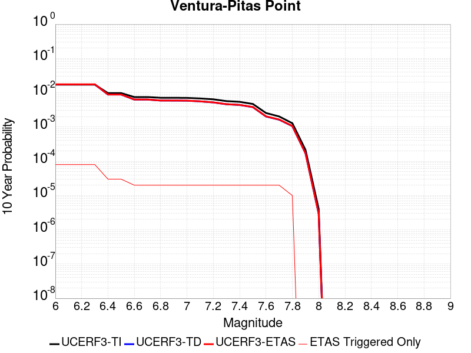 |

| Magnitude | 1 wk TI Prob | 1 wk TD Prob | 1 wk ETAS Prob | 1 wk ETAS/TD Gain | 1 wk ETAS Triggered Only | 1 mo TI Prob | 1 mo TD Prob | 1 mo ETAS Prob | 1 mo ETAS/TD Gain | 1 mo ETAS Triggered Only | 1 yr TI Prob | 1 yr TD Prob | 1 yr ETAS Prob | 1 yr ETAS/TD Gain | 1 yr ETAS Triggered Only | 10 yr TI Prob | 10 yr TD Prob | 10 yr ETAS Prob | 10 yr ETAS/TD Gain | 10 yr ETAS Triggered Only |
|-----|-----|-----|-----|-----|-----|-----|-----|-----|-----|-----|-----|-----|-----|-----|-----|-----|-----|-----|-----|-----|
| 6.0 | 3.3179622E-5 | 3.37358E-5 | 3.37358E-5 | 1.0 | 0.0 | 1.4219063E-4 | 1.4457543E-4 | 1.4457543E-4 | 1.0 | 0.0 | 0.0017297962 | 0.0017590416 | 0.0017889887 | 1.0170248 | 3.0E-5 | 0.017163932 | 0.01747688 | 0.017555483 | 1.0044975 | 8.0E-5 |
| 6.1 | 3.3179622E-5 | 3.37358E-5 | 3.37358E-5 | 1.0 | 0.0 | 1.4219063E-4 | 1.4457543E-4 | 1.4457543E-4 | 1.0 | 0.0 | 0.0017297962 | 0.0017590416 | 0.0017889887 | 1.0170248 | 3.0E-5 | 0.017163932 | 0.01747688 | 0.017555483 | 1.0044975 | 8.0E-5 |
| 6.2 | 3.3179622E-5 | 3.37358E-5 | 3.37358E-5 | 1.0 | 0.0 | 1.4219063E-4 | 1.4457543E-4 | 1.4457543E-4 | 1.0 | 0.0 | 0.0017297962 | 0.0017590416 | 0.0017889887 | 1.0170248 | 3.0E-5 | 0.017163932 | 0.01747688 | 0.017555483 | 1.0044975 | 8.0E-5 |
| 6.3 | 3.3179622E-5 | 3.37358E-5 | 3.37358E-5 | 1.0 | 0.0 | 1.4219063E-4 | 1.4457543E-4 | 1.4457543E-4 | 1.0 | 0.0 | 0.0017297962 | 0.0017590416 | 0.0017889887 | 1.0170248 | 3.0E-5 | 0.017163932 | 0.01747688 | 0.017555483 | 1.0044975 | 8.0E-5 |
| 6.4 | 1.8754668E-5 | 1.7019853E-5 | 1.7019853E-5 | 1.0 | 0.0 | 8.037467E-5 | 7.294031E-5 | 7.294031E-5 | 1.0 | 0.0 | 9.781223E-4 | 8.877096E-4 | 9.17683E-4 | 1.0337648 | 3.0E-5 | 0.009738282 | 0.008844146 | 0.00887388 | 1.003362 | 3.0E-5 |
| 6.5 | 1.8754668E-5 | 1.7019853E-5 | 1.7019853E-5 | 1.0 | 0.0 | 8.037467E-5 | 7.294031E-5 | 7.294031E-5 | 1.0 | 0.0 | 9.781223E-4 | 8.877096E-4 | 9.17683E-4 | 1.0337648 | 3.0E-5 | 0.009738282 | 0.008844146 | 0.00887388 | 1.003362 | 3.0E-5 |
| 6.6 | 1.4361558E-5 | 1.2122441E-5 | 1.2122441E-5 | 1.0 | 0.0 | 6.154808E-5 | 5.19523E-5 | 5.19523E-5 | 1.0 | 0.0 | 7.490902E-4 | 6.32338E-4 | 6.5232534E-4 | 1.0316087 | 2.0E-5 | 0.0074657016 | 0.0063058166 | 0.0063256905 | 1.0031517 | 2.0E-5 |
| 6.7 | 1.4361558E-5 | 1.2122441E-5 | 1.2122441E-5 | 1.0 | 0.0 | 6.154808E-5 | 5.19523E-5 | 5.19523E-5 | 1.0 | 0.0 | 7.490902E-4 | 6.32338E-4 | 6.5232534E-4 | 1.0316087 | 2.0E-5 | 0.0074657016 | 0.0063058166 | 0.0063256905 | 1.0031517 | 2.0E-5 |
| 6.8 | 1.3663846E-5 | 1.1344573E-5 | 1.1344573E-5 | 1.0 | 0.0 | 5.8558027E-5 | 4.8618702E-5 | 4.8618702E-5 | 1.0 | 0.0 | 7.127108E-4 | 5.917739E-4 | 6.1176205E-4 | 1.0337766 | 2.0E-5 | 0.007104293 | 0.0059023695 | 0.0059222514 | 1.0033685 | 2.0E-5 |
| 6.9 | 1.3644157E-5 | 1.1322673E-5 | 1.1322673E-5 | 1.0 | 0.0 | 5.8473648E-5 | 4.852485E-5 | 4.852485E-5 | 1.0 | 0.0 | 7.116841E-4 | 5.9063185E-4 | 6.1062E-4 | 1.0338421 | 2.0E-5 | 0.007094092 | 0.0058910097 | 0.005910892 | 1.003375 | 2.0E-5 |
| 7.0 | 1.3568845E-5 | 1.12422385E-5 | 1.12422385E-5 | 1.0 | 0.0 | 5.8150898E-5 | 4.8180143E-5 | 4.8180143E-5 | 1.0 | 0.0 | 7.077572E-4 | 5.864373E-4 | 6.064256E-4 | 1.0340842 | 2.0E-5 | 0.007055073 | 0.0058492855 | 0.005869169 | 1.0033993 | 2.0E-5 |
| 7.1 | 1.306572E-5 | 1.072068E-5 | 1.072068E-5 | 1.0 | 0.0 | 5.599474E-5 | 4.5944973E-5 | 4.5944973E-5 | 1.0 | 0.0 | 6.815227E-4 | 5.5923837E-4 | 5.7922717E-4 | 1.0357429 | 2.0E-5 | 0.0067943637 | 0.005578688 | 0.0055985767 | 1.0035651 | 2.0E-5 |
| 7.2 | 1.232604E-5 | 9.9952695E-6 | 9.9952695E-6 | 1.0 | 0.0 | 5.2824813E-5 | 4.2836175E-5 | 4.2836175E-5 | 1.0 | 0.0 | 6.429523E-4 | 5.214074E-4 | 5.4139696E-4 | 1.0383377 | 2.0E-5 | 0.0064109527 | 0.0052022054 | 0.005222101 | 1.0038245 | 2.0E-5 |
| 7.3 | 1.0917261E-5 | 8.843945E-6 | 8.843945E-6 | 1.0 | 0.0 | 4.678742E-5 | 3.790208E-5 | 3.790208E-5 | 1.0 | 0.0 | 5.69488E-4 | 4.6136163E-4 | 4.813524E-4 | 1.04333 | 2.0E-5 | 0.0056803077 | 0.0046043773 | 0.0046242853 | 1.0043237 | 2.0E-5 |
| 7.4 | 1.039959E-5 | 8.423664E-6 | 8.423664E-6 | 1.0 | 0.0 | 4.456891E-5 | 3.6100926E-5 | 3.6100926E-5 | 1.0 | 0.0 | 5.424914E-4 | 4.3944168E-4 | 4.594329E-4 | 1.0454923 | 2.0E-5 | 0.0054116896 | 0.004386062 | 0.0044059744 | 1.0045398 | 2.0E-5 |
| 7.5 | 9.015877E-6 | 7.297624E-6 | 7.297624E-6 | 1.0 | 0.0 | 3.86389E-5 | 3.1275165E-5 | 3.1275165E-5 | 1.0 | 0.0 | 4.7032707E-4 | 3.8071E-4 | 4.007024E-4 | 1.0525135 | 2.0E-5 | 0.004693329 | 0.0038008976 | 0.0038208216 | 1.0052419 | 2.0E-5 |
| 7.6 | 4.900162E-6 | 3.874157E-6 | 3.874157E-6 | 1.0 | 0.0 | 2.1000526E-5 | 1.6603424E-5 | 1.6603424E-5 | 1.0 | 0.0 | 2.556514E-4 | 2.0212808E-4 | 2.2212403E-4 | 1.0989271 | 2.0E-5 | 0.0025535747 | 0.002019456 | 0.0020394155 | 1.0098836 | 2.0E-5 |
| 7.7 | 3.8850626E-6 | 3.1267878E-6 | 3.1267878E-6 | 1.0 | 0.0 | 1.6650163E-5 | 1.3400451E-5 | 1.3400451E-5 | 1.0 | 0.0 | 2.0269687E-4 | 1.6313836E-4 | 1.831351E-4 | 1.1225753 | 2.0E-5 | 0.002025121 | 0.0016301954 | 0.0016501627 | 1.0122485 | 2.0E-5 |
| 7.8 | 2.4654719E-6 | 2.0299206E-6 | 2.0299206E-6 | 1.0 | 0.0 | 1.0566265E-5 | 8.6996315E-6 | 8.6996315E-6 | 1.0 | 0.0 | 1.2863669E-4 | 1.05912906E-4 | 1.1591185E-4 | 1.0944072 | 1.0E-5 | 0.0012856225 | 0.001058629 | 0.0010686184 | 1.0094361 | 1.0E-5 |
| 7.9 | 4.095894E-7 | 3.2765396E-7 | 3.2765396E-7 | 1.0 | 0.0 | 1.7553821E-6 | 1.4042306E-6 | 1.4042306E-6 | 1.0 | 0.0 | 2.1371567E-5 | 1.7096376E-5 | 1.7096376E-5 | 1.0 | 0.0 | 2.1369511E-4 | 1.7095092E-4 | 1.7095092E-4 | 1.0 | 0.0 |
| 8.0 | 7.791402E-9 | 5.6836416E-9 | 5.6836416E-9 | 1.0 | 0.0 | 3.3391725E-8 | 2.4358464E-8 | 2.4358464E-8 | 1.0 | 0.0 | 4.0654416E-7 | 2.9656428E-7 | 2.9656428E-7 | 1.0 | 0.0 | 4.065434E-6 | 2.9656408E-6 | 2.9656408E-6 | 1.0 | 0.0 |

## Mission Ridge-Arroyo Parida-Santa Ana
*[(top)](#table-of-contents)*

| 1 Week | 1 Month | 1 Year | 10 Year |
|-----|-----|-----|-----|
|  |  |  | 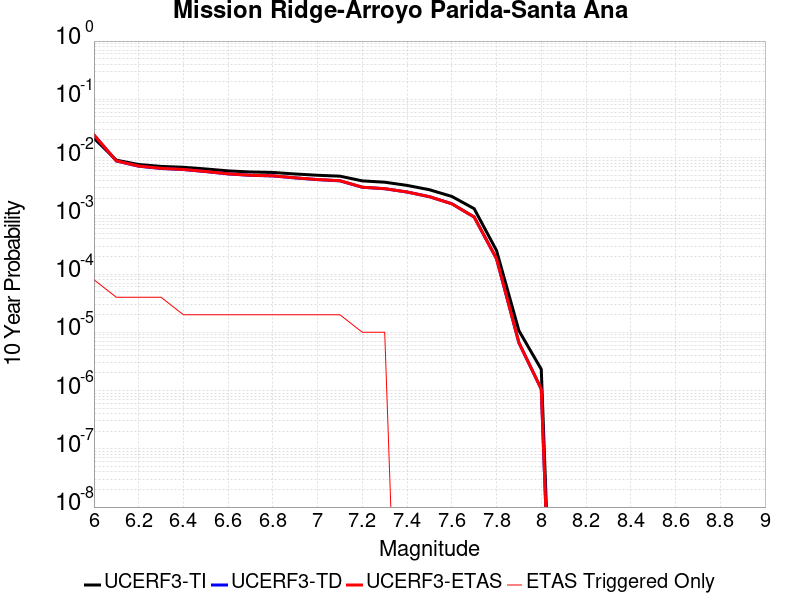 |

| Magnitude | 1 wk TI Prob | 1 wk TD Prob | 1 wk ETAS Prob | 1 wk ETAS/TD Gain | 1 wk ETAS Triggered Only | 1 mo TI Prob | 1 mo TD Prob | 1 mo ETAS Prob | 1 mo ETAS/TD Gain | 1 mo ETAS Triggered Only | 1 yr TI Prob | 1 yr TD Prob | 1 yr ETAS Prob | 1 yr ETAS/TD Gain | 1 yr ETAS Triggered Only | 10 yr TI Prob | 10 yr TD Prob | 10 yr ETAS Prob | 10 yr ETAS/TD Gain | 10 yr ETAS Triggered Only |
|-----|-----|-----|-----|-----|-----|-----|-----|-----|-----|-----|-----|-----|-----|-----|-----|-----|-----|-----|-----|-----|
| 6.0 | 4.169034E-5 | 4.7138332E-5 | 4.7138332E-5 | 1.0 | 0.0 | 1.7866064E-4 | 2.0201063E-4 | 2.1200861E-4 | 1.0494924 | 1.0E-5 | 0.0021730233 | 0.0024575314 | 0.0024974332 | 1.0162365 | 4.0E-5 | 0.021518968 | 0.024385462 | 0.024463512 | 1.0032007 | 8.0E-5 |
| 6.1 | 1.73813E-5 | 1.685448E-5 | 1.685448E-5 | 1.0 | 0.0 | 7.4489166E-5 | 7.2231545E-5 | 8.223082E-5 | 1.1384337 | 1.0E-5 | 9.065282E-4 | 8.7907485E-4 | 8.990573E-4 | 1.0227312 | 2.0E-5 | 0.009028391 | 0.008757258 | 0.008796908 | 1.0045277 | 4.0E-5 |
| 6.2 | 1.4622182E-5 | 1.3673473E-5 | 1.3673473E-5 | 1.0 | 0.0 | 6.2664985E-5 | 5.8599304E-5 | 6.859872E-5 | 1.1706405 | 1.0E-5 | 7.6267915E-4 | 7.1321684E-4 | 7.332026E-4 | 1.0280219 | 2.0E-5 | 0.007600669 | 0.0071098623 | 0.007149578 | 1.005586 | 4.0E-5 |
| 6.3 | 1.3552434E-5 | 1.24823655E-5 | 1.24823655E-5 | 1.0 | 0.0 | 5.8080568E-5 | 5.3494776E-5 | 6.349424E-5 | 1.1869241 | 1.0E-5 | 7.069015E-4 | 6.511074E-4 | 6.710944E-4 | 1.0306969 | 2.0E-5 | 0.00704657 | 0.006492501 | 0.006532241 | 1.0061209 | 4.0E-5 |
| 6.4 | 1.30977305E-5 | 1.1979314E-5 | 1.1979314E-5 | 1.0 | 0.0 | 5.613192E-5 | 5.1338924E-5 | 6.133841E-5 | 1.194774 | 1.0E-5 | 6.831918E-4 | 6.2487513E-4 | 6.3486886E-4 | 1.0159932 | 1.0E-5 | 0.006810953 | 0.0062316665 | 0.006251542 | 1.0031894 | 2.0E-5 |
| 6.5 | 1.225205E-5 | 1.1048948E-5 | 1.1048948E-5 | 1.0 | 0.0 | 5.2507727E-5 | 4.735179E-5 | 5.7351317E-5 | 1.2111752 | 1.0E-5 | 6.3909404E-4 | 5.763583E-4 | 5.863525E-4 | 1.0173403 | 1.0E-5 | 0.006372592 | 0.005749085 | 0.00576897 | 1.0034589 | 2.0E-5 |
| 6.6 | 1.1352241E-5 | 1.0063668E-5 | 1.0063668E-5 | 1.0 | 0.0 | 4.8651553E-5 | 4.3129305E-5 | 5.3128875E-5 | 1.2318509 | 1.0E-5 | 5.921717E-4 | 5.249749E-4 | 5.349696E-4 | 1.0190386 | 1.0E-5 | 0.0059059616 | 0.005237734 | 0.0052576293 | 1.0037985 | 2.0E-5 |
| 6.7 | 1.0864116E-5 | 9.517152E-6 | 9.517152E-6 | 1.0 | 0.0 | 4.6559664E-5 | 4.0787167E-5 | 5.078676E-5 | 1.2451651 | 1.0E-5 | 5.667165E-4 | 4.964726E-4 | 5.0646765E-4 | 1.0201321 | 1.0E-5 | 0.005652734 | 0.004954009 | 0.00497391 | 1.0040171 | 2.0E-5 |
| 6.8 | 1.0666365E-5 | 9.2999E-6 | 9.2999E-6 | 1.0 | 0.0 | 4.571219E-5 | 3.9856117E-5 | 4.985572E-5 | 1.2508925 | 1.0E-5 | 5.564038E-4 | 4.851422E-4 | 4.9513736E-4 | 1.0206025 | 1.0E-5 | 0.005550127 | 0.004841204 | 0.004861107 | 1.0041112 | 2.0E-5 |
| 6.9 | 1.0038665E-5 | 8.592155E-6 | 8.592155E-6 | 1.0 | 0.0 | 4.302214E-5 | 3.682301E-5 | 4.6822643E-5 | 1.2715594 | 1.0E-5 | 5.236687E-4 | 4.4822975E-4 | 4.582253E-4 | 1.0223 | 1.0E-5 | 0.005224364 | 0.0044736085 | 0.0044935187 | 1.0044507 | 2.0E-5 |
| 7.0 | 9.5379955E-6 | 8.025172E-6 | 8.025172E-6 | 1.0 | 0.0 | 4.0876483E-5 | 3.4393153E-5 | 4.4392807E-5 | 1.2907456 | 1.0E-5 | 4.975576E-4 | 4.1865787E-4 | 4.286537E-4 | 1.0238758 | 1.0E-5 | 0.00496445 | 0.0041790316 | 0.004198948 | 1.0047657 | 2.0E-5 |
| 7.1 | 9.207389E-6 | 7.652467E-6 | 7.652467E-6 | 1.0 | 0.0 | 3.945964E-5 | 3.2795884E-5 | 4.2795557E-5 | 1.3049064 | 1.0E-5 | 4.803152E-4 | 3.992184E-4 | 4.0921444E-4 | 1.025039 | 1.0E-5 | 0.004792784 | 0.0039853496 | 0.0040052696 | 1.0049983 | 2.0E-5 |
| 7.2 | 7.638091E-6 | 5.931174E-6 | 5.931174E-6 | 1.0 | 0.0 | 3.2734264E-5 | 2.541907E-5 | 3.5418816E-5 | 1.3933954 | 1.0E-5 | 3.984668E-4 | 3.0943356E-4 | 3.1943046E-4 | 1.0323071 | 1.0E-5 | 0.0039775306 | 0.0030902245 | 0.0031001936 | 1.003226 | 1.0E-5 |
| 7.3 | 7.2500147E-6 | 5.596204E-6 | 5.596204E-6 | 1.0 | 0.0 | 3.1071122E-5 | 2.3983514E-5 | 3.3983273E-5 | 1.4169431 | 1.0E-5 | 3.7822526E-4 | 2.9196046E-4 | 3.0195754E-4 | 1.0342412 | 1.0E-5 | 0.0037758215 | 0.002915965 | 0.002925936 | 1.0034194 | 1.0E-5 |
| 7.4 | 6.3899715E-6 | 4.9185496E-6 | 4.9185496E-6 | 1.0 | 0.0 | 2.7385306E-5 | 2.107933E-5 | 2.107933E-5 | 1.0 | 0.0 | 3.3336508E-4 | 2.566108E-4 | 2.566108E-4 | 1.0 | 0.0 | 0.0033286542 | 0.0025633303 | 0.0025633303 | 1.0 | 0.0 |
| 7.5 | 5.379025E-6 | 4.0839013E-6 | 4.0839013E-6 | 1.0 | 0.0 | 2.305276E-5 | 1.7502318E-5 | 1.7502318E-5 | 1.0 | 0.0 | 2.806312E-4 | 2.1306999E-4 | 2.1306999E-4 | 1.0 | 0.0 | 0.0028027708 | 0.0021286684 | 0.0021286684 | 1.0 | 0.0 |
| 7.6 | 4.1270696E-6 | 3.088378E-6 | 3.088378E-6 | 1.0 | 0.0 | 1.768732E-5 | 1.3235838E-5 | 1.3235838E-5 | 1.0 | 0.0 | 2.1532185E-4 | 1.6113449E-4 | 1.6113449E-4 | 1.0 | 0.0 | 0.0021511333 | 0.0016101847 | 0.0016101847 | 1.0 | 0.0 |
| 7.7 | 2.5406805E-6 | 1.8282275E-6 | 1.8282275E-6 | 1.0 | 0.0 | 1.0888585E-5 | 7.835237E-6 | 7.835237E-6 | 1.0 | 0.0 | 1.3256045E-4 | 9.53899E-5 | 9.53899E-5 | 1.0 | 0.0 | 0.0013248142 | 9.5349574E-4 | 9.5349574E-4 | 1.0 | 0.0 |
| 7.8 | 4.8608285E-7 | 3.5099023E-7 | 3.5099023E-7 | 1.0 | 0.0 | 2.0832106E-6 | 1.504243E-6 | 1.504243E-6 | 1.0 | 0.0 | 2.5362791E-5 | 1.8314006E-5 | 1.8314006E-5 | 1.0 | 0.0 | 2.5359896E-4 | 1.8312508E-4 | 1.8312508E-4 | 1.0 | 0.0 |
| 7.9 | 2.0472514E-8 | 1.2688983E-8 | 1.2688983E-8 | 1.0 | 0.0 | 8.7739345E-8 | 5.4381356E-8 | 5.4381356E-8 | 1.0 | 0.0 | 1.068226E-6 | 6.620928E-7 | 6.620928E-7 | 1.0 | 0.0 | 1.0682209E-5 | 6.6209095E-6 | 6.6209095E-6 | 1.0 | 0.0 |
| 8.0 | 4.443582E-9 | 2.032151E-9 | 2.032151E-9 | 1.0 | 0.0 | 1.9043922E-8 | 8.709217E-9 | 8.709217E-9 | 1.0 | 0.0 | 2.3185973E-7 | 1.0603472E-7 | 1.0603472E-7 | 1.0 | 0.0 | 2.3185949E-6 | 1.0603468E-6 | 1.0603468E-6 | 1.0 | 0.0 |

## Santa Ynez (West)
*[(top)](#table-of-contents)*

| 1 Week | 1 Month | 1 Year | 10 Year |
|-----|-----|-----|-----|
|  |  |  |  |

| Magnitude | 1 wk TI Prob | 1 wk TD Prob | 1 wk ETAS Prob | 1 wk ETAS/TD Gain | 1 wk ETAS Triggered Only | 1 mo TI Prob | 1 mo TD Prob | 1 mo ETAS Prob | 1 mo ETAS/TD Gain | 1 mo ETAS Triggered Only | 1 yr TI Prob | 1 yr TD Prob | 1 yr ETAS Prob | 1 yr ETAS/TD Gain | 1 yr ETAS Triggered Only | 10 yr TI Prob | 10 yr TD Prob | 10 yr ETAS Prob | 10 yr ETAS/TD Gain | 10 yr ETAS Triggered Only |
|-----|-----|-----|-----|-----|-----|-----|-----|-----|-----|-----|-----|-----|-----|-----|-----|-----|-----|-----|-----|-----|
| 6.0 | 4.7352758E-5 | 5.49722E-5 | 5.49722E-5 | 1.0 | 0.0 | 2.0292461E-4 | 2.3557546E-4 | 2.3557546E-4 | 1.0 | 0.0 | 0.0024678076 | 0.0028646276 | 0.0029144844 | 1.0174043 | 5.0E-5 | 0.024405818 | 0.028305134 | 0.028373152 | 1.002403 | 7.0E-5 |
| 6.1 | 4.7352758E-5 | 5.49722E-5 | 5.49722E-5 | 1.0 | 0.0 | 2.0292461E-4 | 2.3557546E-4 | 2.3557546E-4 | 1.0 | 0.0 | 0.0024678076 | 0.0028646276 | 0.0029045132 | 1.0139234 | 4.0E-5 | 0.024405818 | 0.028305134 | 0.028353717 | 1.0017165 | 5.0E-5 |
| 6.2 | 3.0415853E-5 | 3.392567E-5 | 3.392567E-5 | 1.0 | 0.0 | 1.3034715E-4 | 1.4538778E-4 | 1.4538778E-4 | 1.0 | 0.0 | 0.0015858212 | 0.0017686938 | 0.0017986407 | 1.0169317 | 3.0E-5 | 0.015745522 | 0.01755012 | 0.017589418 | 1.0022392 | 4.0E-5 |
| 6.3 | 3.0415853E-5 | 3.392567E-5 | 3.392567E-5 | 1.0 | 0.0 | 1.3034715E-4 | 1.4538778E-4 | 1.4538778E-4 | 1.0 | 0.0 | 0.0015858212 | 0.0017686938 | 0.0017986407 | 1.0169317 | 3.0E-5 | 0.015745522 | 0.01755012 | 0.017589418 | 1.0022392 | 4.0E-5 |
| 6.4 | 2.5452082E-5 | 2.7912814E-5 | 2.7912814E-5 | 1.0 | 0.0 | 1.09075794E-4 | 1.1962098E-4 | 1.1962098E-4 | 1.0 | 0.0 | 0.0013271887 | 0.0014554313 | 0.0014754023 | 1.0137216 | 2.0E-5 | 0.013192902 | 0.014461164 | 0.014490731 | 1.0020446 | 3.0E-5 |
| 6.5 | 2.3143784E-5 | 2.5128551E-5 | 2.5128551E-5 | 1.0 | 0.0 | 9.9183875E-5 | 1.0768943E-4 | 1.0768943E-4 | 1.0 | 0.0 | 0.0012068948 | 0.0013103448 | 0.0013303186 | 1.0152432 | 2.0E-5 | 0.012003611 | 0.013027853 | 0.013057463 | 1.0022727 | 3.0E-5 |
| 6.6 | 1.9118515E-5 | 2.0354546E-5 | 2.0354546E-5 | 1.0 | 0.0 | 8.193392E-5 | 8.7230896E-5 | 8.7230896E-5 | 1.0 | 0.0 | 9.97089E-4 | 0.0010615266 | 0.001071516 | 1.0094104 | 1.0E-5 | 0.00992627 | 0.010565472 | 0.010585261 | 1.001873 | 2.0E-5 |
| 6.7 | 1.722807E-5 | 1.8146504E-5 | 1.8146504E-5 | 1.0 | 0.0 | 7.3832496E-5 | 7.776845E-5 | 7.776845E-5 | 1.0 | 0.0 | 8.985399E-4 | 9.464251E-4 | 9.5641566E-4 | 1.0105561 | 1.0E-5 | 0.008949154 | 0.0094245905 | 0.0094444025 | 1.0021021 | 2.0E-5 |
| 6.8 | 1.5317364E-5 | 1.5926595E-5 | 1.5926595E-5 | 1.0 | 0.0 | 6.56442E-5 | 6.825507E-5 | 6.825507E-5 | 1.0 | 0.0 | 7.98925E-4 | 8.3069294E-4 | 8.4068463E-4 | 1.0120281 | 1.0E-5 | 0.007960589 | 0.008276366 | 0.0082962 | 1.0023965 | 2.0E-5 |
| 6.9 | 1.3071226E-5 | 1.3329679E-5 | 1.3329679E-5 | 1.0 | 0.0 | 5.6018336E-5 | 5.7125955E-5 | 5.7125955E-5 | 1.0 | 0.0 | 6.8180985E-4 | 6.952888E-4 | 7.0528185E-4 | 1.0143725 | 1.0E-5 | 0.0067972173 | 0.0069313953 | 0.0069512567 | 1.0028654 | 2.0E-5 |
| 7.0 | 1.1836986E-5 | 1.19328115E-5 | 1.19328115E-5 | 1.0 | 0.0 | 5.0728955E-5 | 5.113963E-5 | 5.113963E-5 | 1.0 | 0.0 | 6.1745E-4 | 6.224488E-4 | 6.3244253E-4 | 1.0160556 | 1.0E-5 | 0.006157372 | 0.006207247 | 0.0062271226 | 1.0032021 | 2.0E-5 |
| 7.1 | 1.0597169E-5 | 1.0542209E-5 | 1.0542209E-5 | 1.0 | 0.0 | 4.541565E-5 | 4.5180117E-5 | 4.5180117E-5 | 1.0 | 0.0 | 5.5279525E-4 | 5.499302E-4 | 5.5992475E-4 | 1.0181742 | 1.0E-5 | 0.0055142213 | 0.005485825 | 0.005505715 | 1.0036258 | 2.0E-5 |
| 7.2 | 9.59113E-6 | 9.4591405E-6 | 9.4591405E-6 | 1.0 | 0.0 | 4.11042E-5 | 4.0538547E-5 | 4.0538547E-5 | 1.0 | 0.0 | 5.0032866E-4 | 4.9344613E-4 | 5.034412E-4 | 1.0202557 | 1.0E-5 | 0.004992037 | 0.0049236235 | 0.004943525 | 1.004042 | 2.0E-5 |
| 7.3 | 8.586084E-6 | 8.3795685E-6 | 8.3795685E-6 | 1.0 | 0.0 | 3.679698E-5 | 3.5911948E-5 | 3.5911948E-5 | 1.0 | 0.0 | 4.4791115E-4 | 4.371413E-4 | 4.4713693E-4 | 1.0228659 | 1.0E-5 | 0.004470094 | 0.0043629254 | 0.004382838 | 1.004564 | 2.0E-5 |
| 7.4 | 7.2622997E-6 | 6.9515127E-6 | 6.9515127E-6 | 1.0 | 0.0 | 3.112377E-5 | 2.9791861E-5 | 2.9791861E-5 | 1.0 | 0.0 | 3.78866E-4 | 3.6265652E-4 | 3.726529E-4 | 1.0275643 | 1.0E-5 | 0.0037822074 | 0.0036207472 | 0.0036406748 | 1.0055038 | 2.0E-5 |
| 7.5 | 5.627296E-6 | 5.251543E-6 | 5.251543E-6 | 1.0 | 0.0 | 2.411676E-5 | 2.2506423E-5 | 2.2506423E-5 | 1.0 | 0.0 | 2.9358198E-4 | 2.7398195E-4 | 2.839792E-4 | 1.0364888 | 1.0E-5 | 0.0029319443 | 0.0027365137 | 0.0027464863 | 1.0036442 | 1.0E-5 |
| 7.6 | 2.265244E-6 | 2.0608816E-6 | 2.0608816E-6 | 1.0 | 0.0 | 9.708152E-6 | 8.8323195E-6 | 8.8323195E-6 | 1.0 | 0.0 | 1.18190335E-4 | 1.0752828E-4 | 1.0752828E-4 | 1.0 | 0.0 | 0.001181275 | 0.001074771 | 0.001074771 | 1.0 | 0.0 |
| 7.7 | 1.3099874E-6 | 1.1016346E-6 | 1.1016346E-6 | 1.0 | 0.0 | 5.61422E-6 | 4.7212825E-6 | 4.7212825E-6 | 1.0 | 0.0 | 6.8350986E-5 | 5.748012E-5 | 5.748012E-5 | 1.0 | 0.0 | 6.832996E-4 | 5.7465496E-4 | 5.7465496E-4 | 1.0 | 0.0 |
| 7.8 | 7.903951E-7 | 6.0711466E-7 | 6.0711466E-7 | 1.0 | 0.0 | 3.3874032E-6 | 2.6019175E-6 | 2.6019175E-6 | 1.0 | 0.0 | 4.1240855E-5 | 3.1677897E-5 | 3.1677897E-5 | 1.0 | 0.0 | 4.12332E-4 | 3.1673515E-4 | 3.1673515E-4 | 1.0 | 0.0 |
| 7.9 | 7.0753297E-9 | 5.0900932E-9 | 5.0900932E-9 | 1.0 | 0.0 | 3.032284E-8 | 2.1814685E-8 | 2.1814685E-8 | 1.0 | 0.0 | 3.6918053E-7 | 2.6559377E-7 | 2.6559377E-7 | 1.0 | 0.0 | 3.691799E-6 | 2.6559355E-6 | 2.6559355E-6 | 1.0 | 0.0 |

## San Andreas (Creeping Section) 2011 CFM
*[(top)](#table-of-contents)*

| 1 Week | 1 Month | 1 Year | 10 Year |
|-----|-----|-----|-----|
|  | 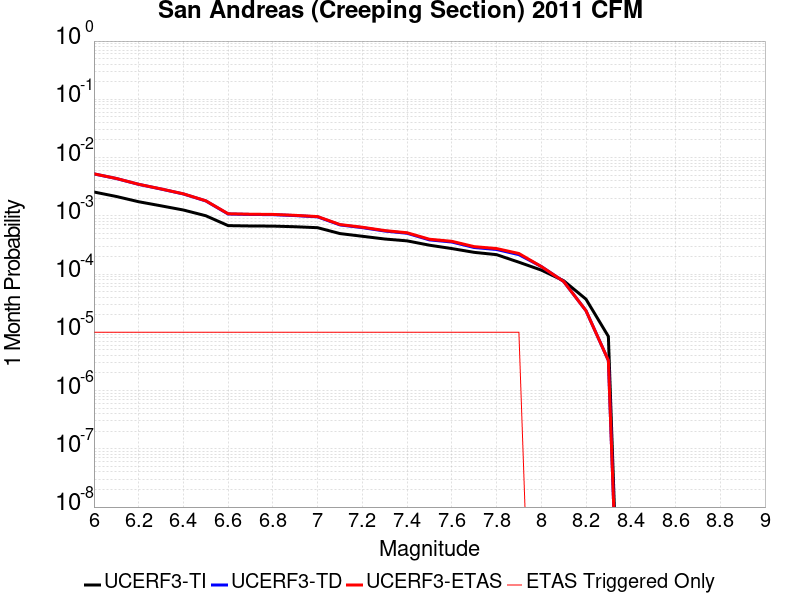 |  |  |

| Magnitude | 1 wk TI Prob | 1 wk TD Prob | 1 wk ETAS Prob | 1 wk ETAS/TD Gain | 1 wk ETAS Triggered Only | 1 mo TI Prob | 1 mo TD Prob | 1 mo ETAS Prob | 1 mo ETAS/TD Gain | 1 mo ETAS Triggered Only | 1 yr TI Prob | 1 yr TD Prob | 1 yr ETAS Prob | 1 yr ETAS/TD Gain | 1 yr ETAS Triggered Only | 10 yr TI Prob | 10 yr TD Prob | 10 yr ETAS Prob | 10 yr ETAS/TD Gain | 10 yr ETAS Triggered Only |
|-----|-----|-----|-----|-----|-----|-----|-----|-----|-----|-----|-----|-----|-----|-----|-----|-----|-----|-----|-----|-----|
| 6.0 | 5.986481E-4 | 0.001227701 | 0.0012376886 | 1.0081353 | 1.0E-5 | 0.0025631124 | 0.005246098 | 0.0052560456 | 1.0018961 | 1.0E-5 | 0.030762846 | 0.061211813 | 0.061249364 | 1.0006135 | 4.0E-5 | 0.26835477 | 0.42596716 | 0.42600733 | 1.0000943 | 7.0E-5 |
| 6.1 | 5.015945E-4 | 0.0010218859 | 0.0010318757 | 1.0097759 | 1.0E-5 | 0.00214792 | 0.0043683136 | 0.00437827 | 1.0022792 | 1.0E-5 | 0.025839351 | 0.051254056 | 0.051282518 | 1.0005553 | 3.0E-5 | 0.23032776 | 0.3728875 | 0.37291884 | 1.000084 | 5.0E-5 |
| 6.2 | 4.073338E-4 | 8.1082666E-4 | 8.208186E-4 | 1.0123231 | 1.0E-5 | 0.0017445484 | 0.003467598 | 0.0034775634 | 1.0028739 | 1.0E-5 | 0.021034058 | 0.040938858 | 0.040967632 | 1.0007029 | 3.0E-5 | 0.19150782 | 0.31306726 | 0.3131016 | 1.0001097 | 5.0E-5 |
| 6.3 | 3.464099E-4 | 6.740175E-4 | 6.8401074E-4 | 1.0148264 | 1.0E-5 | 0.0014837692 | 0.0028834257 | 0.002893397 | 1.0034581 | 1.0E-5 | 0.017915873 | 0.034195323 | 0.034224294 | 1.0008473 | 3.0E-5 | 0.16538359 | 0.27135244 | 0.27138886 | 1.0001342 | 5.0E-5 |
| 6.4 | 2.935057E-4 | 5.545179E-4 | 5.645124E-4 | 1.0180237 | 1.0E-5 | 0.0012572751 | 0.002372998 | 0.0023829744 | 1.004204 | 1.0E-5 | 0.015200248 | 0.028270293 | 0.028299443 | 1.0010312 | 3.0E-5 | 0.14201577 | 0.23302312 | 0.23306148 | 1.0001646 | 5.0E-5 |
| 6.5 | 2.3409708E-4 | 4.2102532E-4 | 4.3102112E-4 | 1.0237415 | 1.0E-5 | 0.0010028875 | 0.0018024362 | 0.0018124182 | 1.0055381 | 1.0E-5 | 0.012141965 | 0.021593295 | 0.021622648 | 1.0013593 | 3.0E-5 | 0.11499573 | 0.18686365 | 0.18690431 | 1.0002176 | 5.0E-5 |
| 6.6 | 1.5842178E-4 | 2.5080625E-4 | 2.6080373E-4 | 1.0398614 | 1.0E-5 | 6.7877385E-4 | 0.0010744325 | 0.0010844218 | 1.0092973 | 1.0E-5 | 0.0082328 | 0.013001433 | 0.013031043 | 1.0022775 | 3.0E-5 | 0.07934396 | 0.12318965 | 0.12323349 | 1.0003558 | 5.0E-5 |
| 6.7 | 1.5616413E-4 | 2.4617155E-4 | 2.561691E-4 | 1.0406121 | 1.0E-5 | 6.691031E-4 | 0.0010545887 | 0.0010645782 | 1.0094724 | 1.0E-5 | 0.0081159435 | 0.012763296 | 0.012792913 | 1.0023205 | 3.0E-5 | 0.0782586 | 0.121216856 | 0.12126079 | 1.0003625 | 5.0E-5 |
| 6.8 | 1.5538467E-4 | 2.4440986E-4 | 2.5440744E-4 | 1.0409049 | 1.0E-5 | 6.6576427E-4 | 0.0010470453 | 0.0010570349 | 1.0095407 | 1.0E-5 | 0.008075596 | 0.012672617 | 0.012702237 | 1.0023373 | 3.0E-5 | 0.07788358 | 0.12044768 | 0.12049166 | 1.0003651 | 5.0E-5 |
| 6.9 | 1.5153569E-4 | 2.3550174E-4 | 2.454994E-4 | 1.0424526 | 1.0E-5 | 6.49277E-4 | 0.0010089047 | 0.0010188946 | 1.0099018 | 1.0E-5 | 0.007876333 | 0.012214754 | 0.0122443875 | 1.002426 | 3.0E-5 | 0.07602952 | 0.1165177 | 0.116561875 | 1.0003791 | 5.0E-5 |
| 7.0 | 1.4588932E-4 | 2.2407302E-4 | 2.3407079E-4 | 1.0446182 | 1.0E-5 | 6.250901E-4 | 9.599615E-4 | 9.699519E-4 | 1.0104071 | 1.0E-5 | 0.0075839474 | 0.011625397 | 0.011655048 | 1.0025506 | 3.0E-5 | 0.073302895 | 0.1113634 | 0.11140783 | 1.000399 | 5.0E-5 |
| 7.1 | 1.1565079E-4 | 1.6291256E-4 | 1.7291094E-4 | 1.0613726 | 1.0E-5 | 4.955521E-4 | 6.980107E-4 | 7.0800376E-4 | 1.0143164 | 1.0E-5 | 0.006016669 | 0.008465368 | 0.008495115 | 1.0035138 | 3.0E-5 | 0.058563538 | 0.083707 | 0.08375281 | 1.0005473 | 5.0E-5 |
| 7.2 | 1.0393792E-4 | 1.4624851E-4 | 1.5624706E-4 | 1.0683668 | 1.0E-5 | 4.4537216E-4 | 6.2662957E-4 | 6.366233E-4 | 1.0159484 | 1.0E-5 | 0.005408933 | 0.007602697 | 0.007632469 | 1.003916 | 3.0E-5 | 0.052791595 | 0.0756556 | 0.075701825 | 1.000611 | 5.0E-5 |
| 7.3 | 9.332884E-5 | 1.2788622E-4 | 1.3788494E-4 | 1.0781845 | 1.0E-5 | 3.999194E-4 | 5.479693E-4 | 5.5796385E-4 | 1.0182391 | 1.0E-5 | 0.0048581534 | 0.006651253 | 0.0066810534 | 1.0044805 | 3.0E-5 | 0.047533102 | 0.06651429 | 0.06656096 | 1.0007017 | 5.0E-5 |
| 7.4 | 8.670252E-5 | 1.1709979E-4 | 1.2709862E-4 | 1.0853872 | 1.0E-5 | 3.715293E-4 | 5.0176034E-4 | 5.117553E-4 | 1.0199199 | 1.0E-5 | 0.004513991 | 0.0060919416 | 0.006121759 | 1.0048945 | 3.0E-5 | 0.044233937 | 0.0611787 | 0.06122564 | 1.0007672 | 5.0E-5 |
| 7.5 | 7.3036405E-5 | 9.011361E-5 | 1.001127E-4 | 1.1109611 | 1.0E-5 | 3.129756E-4 | 3.861441E-4 | 3.9614024E-4 | 1.025887 | 1.0E-5 | 0.0038038217 | 0.0046911915 | 0.0047210506 | 1.006365 | 3.0E-5 | 0.03739367 | 0.047902368 | 0.04794997 | 1.0009938 | 5.0E-5 |
| 7.6 | 6.3935775E-5 | 8.285012E-5 | 9.2849295E-5 | 1.1206899 | 1.0E-5 | 2.7398168E-4 | 3.5502372E-4 | 3.6502015E-4 | 1.0281571 | 1.0E-5 | 0.0033306254 | 0.0043138657 | 0.0043437365 | 1.0069243 | 3.0E-5 | 0.032811474 | 0.044012927 | 0.044060726 | 1.001086 | 5.0E-5 |
| 7.7 | 5.5050095E-5 | 6.6658926E-5 | 7.665826E-5 | 1.1500074 | 1.0E-5 | 2.3590765E-4 | 2.8564985E-4 | 2.9564698E-4 | 1.0349979 | 1.0E-5 | 0.0028683927 | 0.0034722448 | 0.0035021408 | 1.0086099 | 3.0E-5 | 0.0283165 | 0.03581521 | 0.035853777 | 1.0010768 | 4.0E-5 |
| 7.8 | 5.027131E-5 | 6.166573E-5 | 7.1665105E-5 | 1.1621547 | 1.0E-5 | 2.1543067E-4 | 2.6425492E-4 | 2.7425226E-4 | 1.0378323 | 1.0E-5 | 0.0026197135 | 0.0032125604 | 0.003242464 | 1.0093083 | 3.0E-5 | 0.025890453 | 0.03314427 | 0.03318294 | 1.0011668 | 4.0E-5 |
| 7.9 | 3.7271806E-5 | 5.0254795E-5 | 6.0254293E-5 | 1.198976 | 1.0E-5 | 1.5972654E-4 | 2.1535992E-4 | 2.2535777E-4 | 1.0464239 | 1.0E-5 | 0.0019429359 | 0.0026188563 | 0.0026487778 | 1.0114254 | 3.0E-5 | 0.019260362 | 0.027081393 | 0.027120309 | 1.0014371 | 4.0E-5 |
| 8.0 | 2.7310243E-5 | 3.1447296E-5 | 3.1447296E-5 | 1.0 | 0.0 | 1.17038646E-4 | 1.3476716E-4 | 1.3476716E-4 | 1.0 | 0.0 | 0.0014240141 | 0.0016395561 | 0.0016495398 | 1.0060892 | 1.0E-5 | 0.014149235 | 0.017223299 | 0.017242953 | 1.0011412 | 2.0E-5 |
| 8.1 | 1.7940547E-5 | 1.7411876E-5 | 1.7411876E-5 | 1.0 | 0.0 | 7.688579E-5 | 7.46202E-5 | 7.46202E-5 | 1.0 | 0.0 | 9.3568244E-4 | 9.0812275E-4 | 9.0812275E-4 | 1.0 | 0.0 | 0.009317525 | 0.009804959 | 0.009804959 | 1.0 | 0.0 |
| 8.2 | 8.643924E-6 | 5.478665E-6 | 5.478665E-6 | 1.0 | 0.0 | 3.704486E-5 | 2.3479783E-5 | 2.3479783E-5 | 1.0 | 0.0 | 4.5092785E-4 | 2.8582895E-4 | 2.8582895E-4 | 1.0 | 0.0 | 0.0045001395 | 0.0032508469 | 0.0032508469 | 1.0 | 0.0 |
| 8.3 | 1.983087E-6 | 7.6647797E-7 | 7.6647797E-7 | 1.0 | 0.0 | 8.498917E-6 | 3.2849016E-6 | 3.2849016E-6 | 1.0 | 0.0 | 1.034694E-4 | 3.999296E-5 | 3.999296E-5 | 1.0 | 0.0 | 0.0010342124 | 4.7228087E-4 | 4.7228087E-4 | 1.0 | 0.0 |

## Pinto Mtn
*[(top)](#table-of-contents)*

| 1 Week | 1 Month | 1 Year | 10 Year |
|-----|-----|-----|-----|
|  |  |  |  |

| Magnitude | 1 wk TI Prob | 1 wk TD Prob | 1 wk ETAS Prob | 1 wk ETAS/TD Gain | 1 wk ETAS Triggered Only | 1 mo TI Prob | 1 mo TD Prob | 1 mo ETAS Prob | 1 mo ETAS/TD Gain | 1 mo ETAS Triggered Only | 1 yr TI Prob | 1 yr TD Prob | 1 yr ETAS Prob | 1 yr ETAS/TD Gain | 1 yr ETAS Triggered Only | 10 yr TI Prob | 10 yr TD Prob | 10 yr ETAS Prob | 10 yr ETAS/TD Gain | 10 yr ETAS Triggered Only |
|-----|-----|-----|-----|-----|-----|-----|-----|-----|-----|-----|-----|-----|-----|-----|-----|-----|-----|-----|-----|-----|
| 6.0 | 4.4194956E-5 | 4.7855512E-5 | 5.785503E-5 | 1.2089523 | 1.0E-5 | 1.893932E-4 | 2.0507984E-4 | 2.3507368E-4 | 1.1462545 | 3.0E-5 | 0.0023034236 | 0.0024941512 | 0.0025739518 | 1.031995 | 8.0E-5 | 0.022796938 | 0.024679113 | 0.02475714 | 1.0031615 | 8.0E-5 |
| 6.1 | 4.4194956E-5 | 4.7855512E-5 | 5.785503E-5 | 1.2089523 | 1.0E-5 | 1.893932E-4 | 2.0507984E-4 | 2.3507368E-4 | 1.1462545 | 3.0E-5 | 0.0023034236 | 0.0024941512 | 0.0025739518 | 1.031995 | 8.0E-5 | 0.022796938 | 0.024679113 | 0.02475714 | 1.0031615 | 8.0E-5 |
| 6.2 | 4.4194956E-5 | 4.7855512E-5 | 5.785503E-5 | 1.2089523 | 1.0E-5 | 1.893932E-4 | 2.0507984E-4 | 2.3507368E-4 | 1.1462545 | 3.0E-5 | 0.0023034236 | 0.0024941512 | 0.0025739518 | 1.031995 | 8.0E-5 | 0.022796938 | 0.024679113 | 0.02475714 | 1.0031615 | 8.0E-5 |
| 6.3 | 4.4194956E-5 | 4.7855512E-5 | 5.785503E-5 | 1.2089523 | 1.0E-5 | 1.893932E-4 | 2.0507984E-4 | 2.3507368E-4 | 1.1462545 | 3.0E-5 | 0.0023034236 | 0.0024941512 | 0.0025739518 | 1.031995 | 8.0E-5 | 0.022796938 | 0.024679113 | 0.02475714 | 1.0031615 | 8.0E-5 |
| 6.4 | 3.729929E-5 | 3.960486E-5 | 4.9604467E-5 | 1.2524842 | 1.0E-5 | 1.5984432E-4 | 1.697246E-4 | 1.997195E-4 | 1.1767269 | 3.0E-5 | 0.0019443673 | 0.002064532 | 0.002124408 | 1.0290023 | 6.0E-5 | 0.019274427 | 0.02046355 | 0.020522323 | 1.002872 | 6.0E-5 |
| 6.5 | 3.729929E-5 | 3.960486E-5 | 4.9604467E-5 | 1.2524842 | 1.0E-5 | 1.5984432E-4 | 1.697246E-4 | 1.997195E-4 | 1.1767269 | 3.0E-5 | 0.0019443673 | 0.002064532 | 0.002124408 | 1.0290023 | 6.0E-5 | 0.019274427 | 0.02046355 | 0.020522323 | 1.002872 | 6.0E-5 |
| 6.6 | 3.0204548E-5 | 3.1206768E-5 | 4.1206455E-5 | 1.3204334 | 1.0E-5 | 1.2944164E-4 | 1.3373663E-4 | 1.5373396E-4 | 1.1495277 | 2.0E-5 | 0.0015748127 | 0.001627062 | 0.0016669969 | 1.0245442 | 4.0E-5 | 0.015636992 | 0.016155364 | 0.016194718 | 1.0024359 | 4.0E-5 |
| 6.7 | 2.9857754E-5 | 3.0816143E-5 | 4.0815838E-5 | 1.3244952 | 1.0E-5 | 1.2795553E-4 | 1.320627E-4 | 1.5206006E-4 | 1.1514232 | 2.0E-5 | 0.0015567453 | 0.0016067121 | 0.0016466478 | 1.0248556 | 4.0E-5 | 0.015458848 | 0.0159548 | 0.015994161 | 1.002467 | 4.0E-5 |
| 6.8 | 2.4819734E-5 | 2.5010708E-5 | 3.5010456E-5 | 1.3998188 | 1.0E-5 | 1.0636595E-4 | 1.0718447E-4 | 1.17183394E-4 | 1.0932871 | 1.0E-5 | 0.0012942362 | 0.0013042113 | 0.0013341722 | 1.0229725 | 3.0E-5 | 0.012867244 | 0.0129679395 | 0.012997551 | 1.0022835 | 3.0E-5 |
| 6.9 | 2.331124E-5 | 2.3338964E-5 | 3.333873E-5 | 1.4284581 | 1.0E-5 | 9.990149E-5 | 1.0002041E-4 | 1.10019406E-4 | 1.0999696 | 1.0E-5 | 0.001215622 | 0.0012170885 | 0.001247052 | 1.024619 | 3.0E-5 | 0.012089936 | 0.012106422 | 0.012136059 | 1.0024481 | 3.0E-5 |
| 7.0 | 2.1818534E-5 | 2.176207E-5 | 3.1761854E-5 | 1.4595051 | 1.0E-5 | 9.3504656E-5 | 9.3262795E-5 | 1.0326186E-4 | 1.1072139 | 1.0E-5 | 0.0011378246 | 0.0011349028 | 0.0011648688 | 1.026404 | 3.0E-5 | 0.011320163 | 0.011293174 | 0.0113228345 | 1.0026264 | 3.0E-5 |
| 7.1 | 2.066081E-5 | 2.0541695E-5 | 3.054149E-5 | 1.4868047 | 1.0E-5 | 8.854332E-5 | 8.8032975E-5 | 9.803209E-5 | 1.1135838 | 1.0E-5 | 0.0010774818 | 0.001071294 | 0.0011012618 | 1.0279735 | 3.0E-5 | 0.010722724 | 0.010663347 | 0.010693028 | 1.0027834 | 3.0E-5 |
| 7.2 | 1.8990233E-5 | 1.905496E-5 | 2.905477E-5 | 1.5247878 | 1.0E-5 | 8.138417E-5 | 8.166167E-5 | 9.1660855E-5 | 1.1224464 | 1.0E-5 | 9.904018E-4 | 9.937966E-4 | 0.0010237668 | 1.0301572 | 3.0E-5 | 0.009859995 | 0.009895524 | 0.009925228 | 1.0030017 | 3.0E-5 |
| 7.3 | 1.3335872E-5 | 1.4907597E-5 | 2.4907447E-5 | 1.6707889 | 1.0E-5 | 5.7152483E-5 | 6.388821E-5 | 7.388757E-5 | 1.1565135 | 1.0E-5 | 6.956093E-4 | 7.7757414E-4 | 8.075508E-4 | 1.0385516 | 3.0E-5 | 0.006934359 | 0.007749834 | 0.0077796015 | 1.003841 | 3.0E-5 |
| 7.4 | 9.414066E-6 | 1.1861796E-5 | 2.1861677E-5 | 1.8430326 | 1.0E-5 | 4.0345374E-5 | 5.0835333E-5 | 6.0834824E-5 | 1.1967036 | 1.0E-5 | 4.910942E-4 | 6.1875384E-4 | 6.4873527E-4 | 1.0484545 | 3.0E-5 | 0.0049001034 | 0.006171259 | 0.006201074 | 1.0048312 | 3.0E-5 |
| 7.5 | 7.2101157E-6 | 9.15899E-6 | 1.9158899E-5 | 2.0918133 | 1.0E-5 | 3.090013E-5 | 3.925227E-5 | 4.9251877E-5 | 1.2547524 | 1.0E-5 | 3.7614413E-4 | 4.777994E-4 | 5.0778507E-4 | 1.0627578 | 3.0E-5 | 0.0037550807 | 0.004768497 | 0.0047983536 | 1.0062613 | 3.0E-5 |
| 7.6 | 3.296375E-6 | 4.546278E-6 | 4.546278E-6 | 1.0 | 0.0 | 1.4127245E-5 | 1.948391E-5 | 1.948391E-5 | 1.0 | 0.0 | 1.7198564E-4 | 2.3719217E-4 | 2.3719217E-4 | 1.0 | 0.0 | 0.0017185259 | 0.0023695275 | 0.0023695275 | 1.0 | 0.0 |
| 7.7 | 2.5741092E-6 | 3.5851394E-6 | 3.5851394E-6 | 1.0 | 0.0 | 1.103185E-5 | 1.53648E-5 | 1.53648E-5 | 1.0 | 0.0 | 1.3430449E-4 | 1.870517E-4 | 1.870517E-4 | 1.0 | 0.0 | 0.0013422335 | 0.0018690726 | 0.0018690726 | 1.0 | 0.0 |

## Blue Cut
*[(top)](#table-of-contents)*

| 1 Week | 1 Month | 1 Year | 10 Year |
|-----|-----|-----|-----|
|  |  |  |  |

| Magnitude | 1 wk TI Prob | 1 wk TD Prob | 1 wk ETAS Prob | 1 wk ETAS/TD Gain | 1 wk ETAS Triggered Only | 1 mo TI Prob | 1 mo TD Prob | 1 mo ETAS Prob | 1 mo ETAS/TD Gain | 1 mo ETAS Triggered Only | 1 yr TI Prob | 1 yr TD Prob | 1 yr ETAS Prob | 1 yr ETAS/TD Gain | 1 yr ETAS Triggered Only | 10 yr TI Prob | 10 yr TD Prob | 10 yr ETAS Prob | 10 yr ETAS/TD Gain | 10 yr ETAS Triggered Only |
|-----|-----|-----|-----|-----|-----|-----|-----|-----|-----|-----|-----|-----|-----|-----|-----|-----|-----|-----|-----|-----|
| 6.0 | 2.1227985E-5 | 2.2719787E-5 | 4.2719334E-5 | 1.88027 | 2.0E-5 | 9.097391E-5 | 9.736721E-5 | 1.1736526E-4 | 1.205388 | 2.0E-5 | 0.0011070445 | 0.0011848592 | 0.0012248118 | 1.0337193 | 4.0E-5 | 0.011015458 | 0.011791261 | 0.011870318 | 1.0067047 | 8.0E-5 |
| 6.1 | 2.1227985E-5 | 2.2719787E-5 | 4.2719334E-5 | 1.88027 | 2.0E-5 | 9.097391E-5 | 9.736721E-5 | 1.1736526E-4 | 1.205388 | 2.0E-5 | 0.0011070445 | 0.0011848592 | 0.0012248118 | 1.0337193 | 4.0E-5 | 0.011015458 | 0.011791261 | 0.011870318 | 1.0067047 | 8.0E-5 |
| 6.2 | 2.1227985E-5 | 2.2719787E-5 | 4.2719334E-5 | 1.88027 | 2.0E-5 | 9.097391E-5 | 9.736721E-5 | 1.1736526E-4 | 1.205388 | 2.0E-5 | 0.0011070445 | 0.0011848592 | 0.0012248118 | 1.0337193 | 4.0E-5 | 0.011015458 | 0.011791261 | 0.011870318 | 1.0067047 | 8.0E-5 |
| 6.3 | 1.1613981E-5 | 1.23536465E-5 | 2.2353523E-5 | 1.8094676 | 1.0E-5 | 4.9773254E-5 | 5.2943193E-5 | 6.2942665E-5 | 1.1888717 | 1.0E-5 | 6.0582085E-4 | 6.444052E-4 | 6.643923E-4 | 1.0310163 | 2.0E-5 | 0.0060417196 | 0.0064266133 | 0.006446485 | 1.003092 | 2.0E-5 |
| 6.4 | 1.1613981E-5 | 1.23536465E-5 | 2.2353523E-5 | 1.8094676 | 1.0E-5 | 4.9773254E-5 | 5.2943193E-5 | 6.2942665E-5 | 1.1888717 | 1.0E-5 | 6.0582085E-4 | 6.444052E-4 | 6.643923E-4 | 1.0310163 | 2.0E-5 | 0.0060417196 | 0.0064266133 | 0.006446485 | 1.003092 | 2.0E-5 |
| 6.5 | 8.931326E-6 | 9.481677E-6 | 1.9481582E-5 | 2.0546558 | 1.0E-5 | 3.8276554E-5 | 4.063518E-5 | 5.063477E-5 | 1.2460822 | 1.0E-5 | 4.6591737E-4 | 4.9463013E-4 | 5.146203E-4 | 1.0404142 | 2.0E-5 | 0.0046494175 | 0.0049362015 | 0.0049561025 | 1.0040317 | 2.0E-5 |
| 6.6 | 7.345353E-6 | 7.790341E-6 | 1.7790264E-5 | 2.2836308 | 1.0E-5 | 3.1479703E-5 | 3.3386797E-5 | 4.3386462E-5 | 1.2995096 | 1.0E-5 | 3.83198E-4 | 4.0641645E-4 | 4.264083E-4 | 1.0491906 | 2.0E-5 | 0.0038253788 | 0.0040575233 | 0.004077442 | 1.0049092 | 2.0E-5 |
| 6.7 | 6.2775666E-6 | 6.655202E-6 | 1.6655136E-5 | 2.502574 | 1.0E-5 | 2.690358E-5 | 2.8522025E-5 | 3.852174E-5 | 1.3505962 | 1.0E-5 | 3.2750185E-4 | 3.4720785E-4 | 3.672009E-4 | 1.0575824 | 2.0E-5 | 0.0032701963 | 0.0034673947 | 0.0034873253 | 1.005748 | 2.0E-5 |
| 6.8 | 5.5234095E-6 | 5.8551577E-6 | 1.58551E-5 | 2.707886 | 1.0E-5 | 2.367154E-5 | 2.5093334E-5 | 3.5093082E-5 | 1.3985022 | 1.0E-5 | 2.8816288E-4 | 3.0547578E-4 | 3.2546968E-4 | 1.0654516 | 2.0E-5 | 0.002877895 | 0.003051275 | 0.0030712138 | 1.0065347 | 2.0E-5 |
| 6.9 | 4.7780054E-6 | 5.0654608E-6 | 1.50654105E-5 | 2.974144 | 1.0E-5 | 2.0477004E-5 | 2.1708976E-5 | 3.170876E-5 | 1.460629 | 1.0E-5 | 2.4927902E-4 | 2.6428179E-4 | 2.842765E-4 | 1.0756568 | 2.0E-5 | 0.0024899957 | 0.0026403673 | 0.0026603143 | 1.0075547 | 2.0E-5 |
| 7.0 | 3.883171E-6 | 4.1185203E-6 | 1.4118479E-5 | 3.4280465 | 1.0E-5 | 1.6642054E-5 | 1.765072E-5 | 2.7650543E-5 | 1.5665392 | 1.0E-5 | 2.0259817E-4 | 2.1488321E-4 | 2.3487891E-4 | 1.0930538 | 2.0E-5 | 0.0020241356 | 0.00214743 | 0.0021673872 | 1.0092934 | 2.0E-5 |
| 7.1 | 2.8358215E-6 | 3.0097403E-6 | 1.30097105E-5 | 4.3225355 | 1.0E-5 | 1.2153464E-5 | 1.289886E-5 | 2.2898732E-5 | 1.7752522 | 1.0E-5 | 1.4795837E-4 | 1.5703888E-4 | 1.7703575E-4 | 1.127337 | 2.0E-5 | 0.001478599 | 0.0015699244 | 0.001589893 | 1.0127195 | 2.0E-5 |

## Pisgah-Bullion Mtn-Mesquite Lk
*[(top)](#table-of-contents)*

| 1 Week | 1 Month | 1 Year | 10 Year |
|-----|-----|-----|-----|
|  |  |  |  |

| Magnitude | 1 wk TI Prob | 1 wk TD Prob | 1 wk ETAS Prob | 1 wk ETAS/TD Gain | 1 wk ETAS Triggered Only | 1 mo TI Prob | 1 mo TD Prob | 1 mo ETAS Prob | 1 mo ETAS/TD Gain | 1 mo ETAS Triggered Only | 1 yr TI Prob | 1 yr TD Prob | 1 yr ETAS Prob | 1 yr ETAS/TD Gain | 1 yr ETAS Triggered Only | 10 yr TI Prob | 10 yr TD Prob | 10 yr ETAS Prob | 10 yr ETAS/TD Gain | 10 yr ETAS Triggered Only |
|-----|-----|-----|-----|-----|-----|-----|-----|-----|-----|-----|-----|-----|-----|-----|-----|-----|-----|-----|-----|-----|
| 6.0 | 3.0240792E-5 | 2.4091287E-5 | 2.4091287E-5 | 1.0 | 0.0 | 1.2959696E-4 | 1.03244856E-4 | 1.3324176E-4 | 1.2905414 | 3.0E-5 | 0.0015767008 | 0.001256382 | 0.0012963318 | 1.0317974 | 4.0E-5 | 0.015655609 | 0.012502813 | 0.012581812 | 1.0063186 | 8.0E-5 |
| 6.1 | 3.0240792E-5 | 2.4091287E-5 | 2.4091287E-5 | 1.0 | 0.0 | 1.2959696E-4 | 1.03244856E-4 | 1.3324176E-4 | 1.2905414 | 3.0E-5 | 0.0015767008 | 0.001256382 | 0.0012963318 | 1.0317974 | 4.0E-5 | 0.015655609 | 0.012502813 | 0.012581812 | 1.0063186 | 8.0E-5 |
| 6.2 | 3.0240792E-5 | 2.4091287E-5 | 2.4091287E-5 | 1.0 | 0.0 | 1.2959696E-4 | 1.03244856E-4 | 1.3324176E-4 | 1.2905414 | 3.0E-5 | 0.0015767008 | 0.001256382 | 0.0012963318 | 1.0317974 | 4.0E-5 | 0.015655609 | 0.012502813 | 0.012581812 | 1.0063186 | 8.0E-5 |
| 6.3 | 2.0498217E-5 | 1.36382505E-5 | 1.36382505E-5 | 1.0 | 0.0 | 8.784654E-5 | 5.8448426E-5 | 6.8447844E-5 | 1.171081 | 1.0E-5 | 0.0010690069 | 7.113935E-4 | 7.213864E-4 | 1.0140469 | 1.0E-5 | 0.01063879 | 0.0070927883 | 0.007122576 | 1.0041996 | 3.0E-5 |
| 6.4 | 2.0498217E-5 | 1.36382505E-5 | 1.36382505E-5 | 1.0 | 0.0 | 8.784654E-5 | 5.8448426E-5 | 6.8447844E-5 | 1.171081 | 1.0E-5 | 0.0010690069 | 7.113935E-4 | 7.213864E-4 | 1.0140469 | 1.0E-5 | 0.01063879 | 0.0070927883 | 0.007122576 | 1.0041996 | 3.0E-5 |
| 6.5 | 1.7316182E-5 | 1.04771225E-5 | 1.04771225E-5 | 1.0 | 0.0 | 7.42101E-5 | 4.4901237E-5 | 4.4901237E-5 | 1.0 | 0.0 | 9.0313336E-4 | 5.4654543E-4 | 5.4654543E-4 | 1.0 | 0.0 | 0.008994718 | 0.005453008 | 0.005462954 | 1.0018239 | 1.0E-5 |
| 6.6 | 1.5251077E-5 | 8.414257E-6 | 8.414257E-6 | 1.0 | 0.0 | 6.536012E-5 | 3.606064E-5 | 3.606064E-5 | 1.0 | 0.0 | 7.9546886E-4 | 4.389571E-4 | 4.389571E-4 | 1.0 | 0.0 | 0.007926274 | 0.0043816175 | 0.004391574 | 1.0022722 | 1.0E-5 |
| 6.7 | 1.2997425E-5 | 6.4113133E-6 | 6.4113133E-6 | 1.0 | 0.0 | 5.570206E-5 | 2.7476794E-5 | 2.7476794E-5 | 1.0 | 0.0 | 6.7796157E-4 | 3.3448328E-4 | 3.3448328E-4 | 1.0 | 0.0 | 0.0067589693 | 0.0033402585 | 0.003350225 | 1.0029838 | 1.0E-5 |
| 6.8 | 1.035386E-5 | 4.3332407E-6 | 4.3332407E-6 | 1.0 | 0.0 | 4.437293E-5 | 1.8570905E-5 | 1.8570905E-5 | 1.0 | 0.0 | 5.401065E-4 | 2.2607818E-4 | 2.2607818E-4 | 1.0 | 0.0 | 0.0053879567 | 0.0022585685 | 0.0022585685 | 1.0 | 0.0 |
| 6.9 | 8.816252E-6 | 3.5806777E-6 | 3.5806777E-6 | 1.0 | 0.0 | 3.778339E-5 | 1.5345675E-5 | 1.5345675E-5 | 1.0 | 0.0 | 4.5991567E-4 | 1.8681816E-4 | 1.8681816E-4 | 1.0 | 0.0 | 0.00458965 | 0.0018666695 | 0.0018666695 | 1.0 | 0.0 |
| 7.0 | 6.8232207E-6 | 2.5675185E-6 | 2.5675185E-6 | 1.0 | 0.0 | 2.9242048E-5 | 1.1003606E-5 | 1.1003606E-5 | 1.0 | 0.0 | 3.5596377E-4 | 1.3396099E-4 | 1.3396099E-4 | 1.0 | 0.0 | 0.0035539411 | 0.0013388334 | 0.0013388334 | 1.0 | 0.0 |
| 7.1 | 5.837013E-6 | 2.227375E-6 | 2.227375E-6 | 1.0 | 0.0 | 2.501553E-5 | 9.545859E-6 | 9.545859E-6 | 1.0 | 0.0 | 3.045215E-4 | 1.16214935E-4 | 1.16214935E-4 | 1.0 | 0.0 | 0.0030410455 | 0.0011615707 | 0.0011615707 | 1.0 | 0.0 |
| 7.2 | 4.278052E-6 | 1.6275252E-6 | 1.6275252E-6 | 1.0 | 0.0 | 1.833438E-5 | 6.975091E-6 | 6.975091E-6 | 1.0 | 0.0 | 2.231982E-4 | 8.4918654E-5 | 8.4918654E-5 | 1.0 | 0.0 | 0.0022297418 | 8.488853E-4 | 8.488853E-4 | 1.0 | 0.0 |
| 7.3 | 1.8803692E-6 | 8.3448816E-7 | 8.3448816E-7 | 1.0 | 0.0 | 8.0587E-6 | 3.5763737E-6 | 3.5763737E-6 | 1.0 | 0.0 | 9.811026E-5 | 4.354163E-5 | 4.354163E-5 | 1.0 | 0.0 | 9.806695E-4 | 4.3534543E-4 | 4.3534543E-4 | 1.0 | 0.0 |

## Big Pine (Central)
*[(top)](#table-of-contents)*

| 1 Week | 1 Month | 1 Year | 10 Year |
|-----|-----|-----|-----|
|  |  | 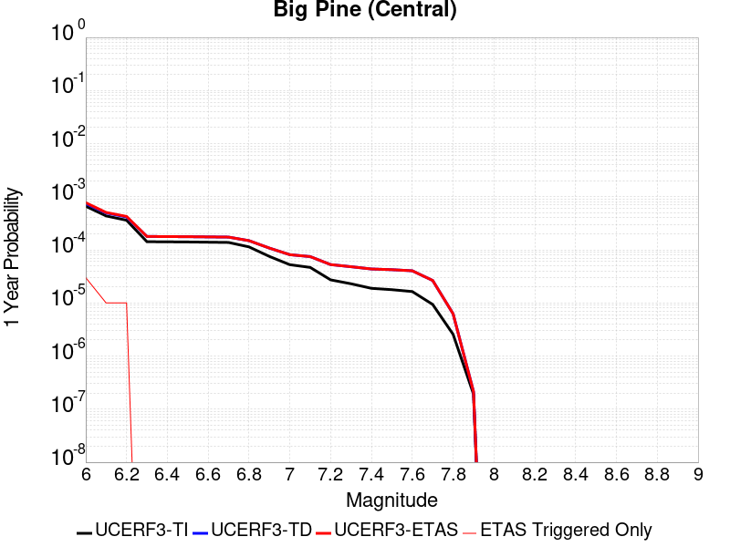 |  |

| Magnitude | 1 wk TI Prob | 1 wk TD Prob | 1 wk ETAS Prob | 1 wk ETAS/TD Gain | 1 wk ETAS Triggered Only | 1 mo TI Prob | 1 mo TD Prob | 1 mo ETAS Prob | 1 mo ETAS/TD Gain | 1 mo ETAS Triggered Only | 1 yr TI Prob | 1 yr TD Prob | 1 yr ETAS Prob | 1 yr ETAS/TD Gain | 1 yr ETAS Triggered Only | 10 yr TI Prob | 10 yr TD Prob | 10 yr ETAS Prob | 10 yr ETAS/TD Gain | 10 yr ETAS Triggered Only |
|-----|-----|-----|-----|-----|-----|-----|-----|-----|-----|-----|-----|-----|-----|-----|-----|-----|-----|-----|-----|-----|
| 6.0 | 1.2706755E-5 | 1.4251083E-5 | 1.4251083E-5 | 1.0 | 0.0 | 5.4456385E-5 | 6.107485E-5 | 6.107485E-5 | 1.0 | 0.0 | 6.628048E-4 | 7.433691E-4 | 7.733468E-4 | 1.0403268 | 3.0E-5 | 0.006608314 | 0.0074138264 | 0.0074833077 | 1.0093719 | 7.0E-5 |
| 6.1 | 8.342579E-6 | 9.511262E-6 | 9.511262E-6 | 1.0 | 0.0 | 3.5753423E-5 | 4.0762035E-5 | 4.0762035E-5 | 1.0 | 0.0 | 4.3521097E-4 | 4.961865E-4 | 5.0618156E-4 | 1.0201437 | 1.0E-5 | 0.0043435963 | 0.004954315 | 0.0049941163 | 1.0080338 | 4.0E-5 |
| 6.2 | 6.923899E-6 | 7.967629E-6 | 7.967629E-6 | 1.0 | 0.0 | 2.9673516E-5 | 3.4146644E-5 | 3.4146644E-5 | 1.0 | 0.0 | 3.6121515E-4 | 4.1567534E-4 | 4.2567117E-4 | 1.0240473 | 1.0E-5 | 0.003606286 | 0.00415226 | 0.004192094 | 1.0095934 | 4.0E-5 |
| 6.3 | 2.728396E-6 | 3.4247232E-6 | 3.4247232E-6 | 1.0 | 0.0 | 1.1693074E-5 | 1.4677307E-5 | 1.4677307E-5 | 1.0 | 0.0 | 1.4235388E-4 | 1.7868243E-4 | 1.7868243E-4 | 1.0 | 0.0 | 0.0014226272 | 0.001786868 | 0.0017968501 | 1.0055864 | 1.0E-5 |
| 6.4 | 2.7136944E-6 | 3.4090162E-6 | 3.4090162E-6 | 1.0 | 0.0 | 1.1630066E-5 | 1.4609993E-5 | 1.4609993E-5 | 1.0 | 0.0 | 1.4158686E-4 | 1.7786301E-4 | 1.7786301E-4 | 1.0 | 0.0 | 0.0014149669 | 0.001778687 | 0.0017886691 | 1.0056121 | 1.0E-5 |
| 6.5 | 2.6971882E-6 | 3.3913614E-6 | 3.3913614E-6 | 1.0 | 0.0 | 1.1559327E-5 | 1.4534329E-5 | 1.4534329E-5 | 1.0 | 0.0 | 1.4072572E-4 | 1.7694196E-4 | 1.7694196E-4 | 1.0 | 0.0 | 0.0014063664 | 0.0017694911 | 0.0017794734 | 1.0056413 | 1.0E-5 |
| 6.6 | 2.669092E-6 | 3.3613815E-6 | 3.3613815E-6 | 1.0 | 0.0 | 1.1438916E-5 | 1.4405846E-5 | 1.4405846E-5 | 1.0 | 0.0 | 1.3925991E-4 | 1.7537792E-4 | 1.7537792E-4 | 1.0 | 0.0 | 0.0013917267 | 0.0017538755 | 0.001763858 | 1.0056916 | 1.0E-5 |
| 6.7 | 2.6408059E-6 | 3.3314068E-6 | 3.3314068E-6 | 1.0 | 0.0 | 1.1317691E-5 | 1.4277384E-5 | 1.4277384E-5 | 1.0 | 0.0 | 1.3778417E-4 | 1.7381416E-4 | 1.7381416E-4 | 1.0 | 0.0 | 0.0013769877 | 0.0017382624 | 0.001748245 | 1.0057429 | 1.0E-5 |
| 6.8 | 2.1786943E-6 | 2.8548623E-6 | 2.8548623E-6 | 1.0 | 0.0 | 9.337228E-6 | 1.223507E-5 | 1.223507E-5 | 1.0 | 0.0 | 1.1367482E-4 | 1.4895253E-4 | 1.4895253E-4 | 1.0 | 0.0 | 0.0011361669 | 0.0014899937 | 0.0014999788 | 1.0067015 | 1.0E-5 |
| 6.9 | 1.4411696E-6 | 2.0689088E-6 | 2.0689088E-6 | 1.0 | 0.0 | 6.1764263E-6 | 8.866724E-6 | 8.866724E-6 | 1.0 | 0.0 | 7.51954E-5 | 1.07947286E-4 | 1.07947286E-4 | 1.0 | 0.0 | 7.5169955E-4 | 0.0010803706 | 0.0010903598 | 1.0092461 | 1.0E-5 |
| 7.0 | 1.0073411E-6 | 1.5546336E-6 | 1.5546336E-6 | 1.0 | 0.0 | 4.317169E-6 | 6.662699E-6 | 6.662699E-6 | 1.0 | 0.0 | 5.2560266E-5 | 8.11155E-5 | 8.11155E-5 | 1.0 | 0.0 | 5.2547833E-4 | 8.1226975E-4 | 8.1226975E-4 | 1.0 | 0.0 |
| 7.1 | 8.947104E-7 | 1.4306167E-6 | 1.4306167E-6 | 1.0 | 0.0 | 3.834468E-6 | 6.1312007E-6 | 6.1312007E-6 | 1.0 | 0.0 | 4.6683643E-5 | 7.4644966E-5 | 7.4644966E-5 | 1.0 | 0.0 | 4.6673836E-4 | 7.4760953E-4 | 7.4760953E-4 | 1.0 | 0.0 |
| 7.2 | 5.215166E-7 | 1.0115094E-6 | 1.0115094E-6 | 1.0 | 0.0 | 2.2350691E-6 | 4.3350337E-6 | 4.3350337E-6 | 1.0 | 0.0 | 2.7211627E-5 | 5.27778E-5 | 5.27778E-5 | 1.0 | 0.0 | 2.7208295E-4 | 5.2905316E-4 | 5.2905316E-4 | 1.0 | 0.0 |
| 7.3 | 4.4024807E-7 | 9.2229175E-7 | 9.2229175E-7 | 1.0 | 0.0 | 1.8867761E-6 | 3.952673E-6 | 3.952673E-6 | 1.0 | 0.0 | 2.2971257E-5 | 4.8122773E-5 | 4.8122773E-5 | 1.0 | 0.0 | 2.2968883E-4 | 4.8252378E-4 | 4.8252378E-4 | 1.0 | 0.0 |
| 7.4 | 3.6130905E-7 | 8.3617664E-7 | 8.3617664E-7 | 1.0 | 0.0 | 1.5484665E-6 | 3.5836094E-6 | 3.5836094E-6 | 1.0 | 0.0 | 1.8852415E-5 | 4.362961E-5 | 4.362961E-5 | 1.0 | 0.0 | 1.8850817E-4 | 4.3760161E-4 | 4.3760161E-4 | 1.0 | 0.0 |
| 7.5 | 3.408184E-7 | 8.111325E-7 | 8.111325E-7 | 1.0 | 0.0 | 1.4606494E-6 | 3.4762777E-6 | 3.4762777E-6 | 1.0 | 0.0 | 1.7783263E-5 | 4.2322896E-5 | 4.2322896E-5 | 1.0 | 0.0 | 1.778184E-4 | 4.2451447E-4 | 4.2451447E-4 | 1.0 | 0.0 |
| 7.6 | 3.1428627E-7 | 7.734672E-7 | 7.734672E-7 | 1.0 | 0.0 | 1.3469405E-6 | 3.3148556E-6 | 3.3148556E-6 | 1.0 | 0.0 | 1.6398877E-5 | 4.0357656E-5 | 4.0357656E-5 | 1.0 | 0.0 | 1.6397667E-4 | 4.0484127E-4 | 4.0484127E-4 | 1.0 | 0.0 |
| 7.7 | 1.7972785E-7 | 5.0801975E-7 | 5.0801975E-7 | 1.0 | 0.0 | 7.70262E-7 | 2.1772257E-6 | 2.1772257E-6 | 1.0 | 0.0 | 9.377899E-6 | 2.650741E-5 | 2.650741E-5 | 1.0 | 0.0 | 9.377503E-5 | 2.6640965E-4 | 2.6640965E-4 | 1.0 | 0.0 |
| 7.8 | 4.9230927E-8 | 1.1986405E-7 | 1.1986405E-7 | 1.0 | 0.0 | 2.1098968E-7 | 5.13703E-7 | 5.13703E-7 | 1.0 | 0.0 | 2.5687964E-6 | 6.2543177E-6 | 6.2543177E-6 | 1.0 | 0.0 | 2.5687666E-5 | 6.29837E-5 | 6.29837E-5 | 1.0 | 0.0 |
| 7.9 | 3.6805972E-9 | 4.1069246E-9 | 4.1069246E-9 | 1.0 | 0.0 | 1.5773987E-8 | 1.7601105E-8 | 1.7601105E-8 | 1.0 | 0.0 | 1.9204828E-7 | 2.1429342E-7 | 2.1429342E-7 | 1.0 | 0.0 | 1.920481E-6 | 2.1908222E-6 | 2.1908222E-6 | 1.0 | 0.0 |

## San Jacinto (Stepovers Combined)
*[(top)](#table-of-contents)*

| 1 Week | 1 Month | 1 Year | 10 Year |
|-----|-----|-----|-----|
|  |  |  |  |

| Magnitude | 1 wk TI Prob | 1 wk TD Prob | 1 wk ETAS Prob | 1 wk ETAS/TD Gain | 1 wk ETAS Triggered Only | 1 mo TI Prob | 1 mo TD Prob | 1 mo ETAS Prob | 1 mo ETAS/TD Gain | 1 mo ETAS Triggered Only | 1 yr TI Prob | 1 yr TD Prob | 1 yr ETAS Prob | 1 yr ETAS/TD Gain | 1 yr ETAS Triggered Only | 10 yr TI Prob | 10 yr TD Prob | 10 yr ETAS Prob | 10 yr ETAS/TD Gain | 10 yr ETAS Triggered Only |
|-----|-----|-----|-----|-----|-----|-----|-----|-----|-----|-----|-----|-----|-----|-----|-----|-----|-----|-----|-----|-----|
| 6.0 | 4.0667746E-5 | 3.5285528E-5 | 4.5285175E-5 | 1.2833923 | 1.0E-5 | 1.742787E-4 | 1.5121493E-4 | 1.812104E-4 | 1.1983631 | 3.0E-5 | 0.0021197782 | 0.0018394884 | 0.0018893965 | 1.0271314 | 5.0E-5 | 0.020996714 | 0.018993655 | 0.019062325 | 1.0036155 | 7.0E-5 |
| 6.1 | 4.0667746E-5 | 3.5285528E-5 | 4.5285175E-5 | 1.2833923 | 1.0E-5 | 1.742787E-4 | 1.5121493E-4 | 1.812104E-4 | 1.1983631 | 3.0E-5 | 0.0021197782 | 0.0018394884 | 0.0018893965 | 1.0271314 | 5.0E-5 | 0.020996714 | 0.018993655 | 0.019062325 | 1.0036155 | 7.0E-5 |
| 6.2 | 4.0667746E-5 | 3.5285528E-5 | 4.5285175E-5 | 1.2833923 | 1.0E-5 | 1.742787E-4 | 1.5121493E-4 | 1.812104E-4 | 1.1983631 | 3.0E-5 | 0.0021197782 | 0.0018394884 | 0.0018893965 | 1.0271314 | 5.0E-5 | 0.020996714 | 0.018993655 | 0.019062325 | 1.0036155 | 7.0E-5 |
| 6.3 | 4.0667746E-5 | 3.5285528E-5 | 4.5285175E-5 | 1.2833923 | 1.0E-5 | 1.742787E-4 | 1.5121493E-4 | 1.812104E-4 | 1.1983631 | 3.0E-5 | 0.0021197782 | 0.0018394884 | 0.0018893965 | 1.0271314 | 5.0E-5 | 0.020996714 | 0.018993655 | 0.019062325 | 1.0036155 | 7.0E-5 |
| 6.4 | 4.0577226E-5 | 3.515743E-5 | 4.515708E-5 | 1.2844249 | 1.0E-5 | 1.738908E-4 | 1.5066602E-4 | 1.806615E-4 | 1.199086 | 3.0E-5 | 0.0021150648 | 0.0018328178 | 0.0018827262 | 1.0272304 | 5.0E-5 | 0.020950472 | 0.018928219 | 0.018996894 | 1.0036281 | 7.0E-5 |
| 6.5 | 4.0577226E-5 | 3.515743E-5 | 4.515708E-5 | 1.2844249 | 1.0E-5 | 1.738908E-4 | 1.5066602E-4 | 1.806615E-4 | 1.199086 | 3.0E-5 | 0.0021150648 | 0.0018328178 | 0.0018827262 | 1.0272304 | 5.0E-5 | 0.020950472 | 0.018928219 | 0.018996894 | 1.0036281 | 7.0E-5 |
| 6.6 | 4.053861E-5 | 3.510277E-5 | 4.510242E-5 | 1.2848678 | 1.0E-5 | 1.7372532E-4 | 1.5043179E-4 | 1.8042728E-4 | 1.1993959 | 3.0E-5 | 0.0021130538 | 0.0018299713 | 0.0018798799 | 1.0272728 | 5.0E-5 | 0.020930743 | 0.018900296 | 0.018968973 | 1.0036336 | 7.0E-5 |
| 6.7 | 4.0516545E-5 | 3.5071844E-5 | 4.5071494E-5 | 1.285119 | 1.0E-5 | 1.7363077E-4 | 1.5029925E-4 | 1.8029475E-4 | 1.1995717 | 3.0E-5 | 0.002111905 | 0.0018283607 | 0.0018782692 | 1.0272969 | 5.0E-5 | 0.020919468 | 0.018884491 | 0.018953169 | 1.0036367 | 7.0E-5 |
| 6.8 | 4.049434E-5 | 3.5043406E-5 | 4.5043053E-5 | 1.2853504 | 1.0E-5 | 1.7353562E-4 | 1.501774E-4 | 1.8017288E-4 | 1.1997337 | 3.0E-5 | 0.0021107488 | 0.0018268795 | 0.0018767881 | 1.0273191 | 5.0E-5 | 0.020908125 | 0.018869905 | 0.018938582 | 1.0036396 | 7.0E-5 |
| 6.9 | 4.046386E-5 | 3.5005964E-5 | 4.500561E-5 | 1.2856556 | 1.0E-5 | 1.73405E-4 | 1.5001695E-4 | 1.8001244E-4 | 1.1999474 | 3.0E-5 | 0.0021091616 | 0.0018249294 | 0.0018748381 | 1.0273483 | 5.0E-5 | 0.020892553 | 0.018850677 | 0.018919356 | 1.0036434 | 7.0E-5 |
| 7.0 | 4.036382E-5 | 3.4886525E-5 | 4.4886176E-5 | 1.2866336 | 1.0E-5 | 1.7297632E-4 | 1.4950513E-4 | 1.7950064E-4 | 1.200632 | 3.0E-5 | 0.0021039525 | 0.0018187086 | 0.0018686176 | 1.027442 | 5.0E-5 | 0.02084144 | 0.018789288 | 0.018857973 | 1.0036556 | 7.0E-5 |
| 7.1 | 4.0343282E-5 | 3.486499E-5 | 4.486464E-5 | 1.2868106 | 1.0E-5 | 1.7288832E-4 | 1.4941284E-4 | 1.7940835E-4 | 1.200756 | 3.0E-5 | 0.002102883 | 0.0018175867 | 0.0018674958 | 1.027459 | 5.0E-5 | 0.020830948 | 0.018778158 | 0.018846843 | 1.0036577 | 7.0E-5 |
| 7.2 | 4.0257353E-5 | 3.476948E-5 | 4.4769135E-5 | 1.2875985 | 1.0E-5 | 1.725201E-4 | 1.4900356E-4 | 1.7899911E-4 | 1.2013074 | 3.0E-5 | 0.0020984085 | 0.0018126123 | 0.0018625216 | 1.0275345 | 5.0E-5 | 0.020787042 | 0.018728893 | 0.018797582 | 1.0036676 | 7.0E-5 |
| 7.3 | 3.9940667E-5 | 3.459712E-5 | 4.4596774E-5 | 1.2890314 | 1.0E-5 | 1.7116306E-4 | 1.4826495E-4 | 1.7826051E-4 | 1.2023104 | 3.0E-5 | 0.0020819185 | 0.0018036346 | 0.0018535444 | 1.0276718 | 5.0E-5 | 0.020625217 | 0.018637514 | 0.018706208 | 1.0036858 | 7.0E-5 |
| 7.4 | 3.9721202E-5 | 3.44825E-5 | 4.4482153E-5 | 1.2899922 | 1.0E-5 | 1.7022261E-4 | 1.4777378E-4 | 1.7776935E-4 | 1.202983 | 3.0E-5 | 0.0020704903 | 0.0017976643 | 0.0018475745 | 1.0277638 | 5.0E-5 | 0.020513052 | 0.018576635 | 0.018645335 | 1.0036982 | 7.0E-5 |
| 7.5 | 3.7036873E-5 | 3.354985E-5 | 4.3549517E-5 | 1.2980539 | 1.0E-5 | 1.5871979E-4 | 1.4377717E-4 | 1.7377286E-4 | 1.2086263 | 3.0E-5 | 0.0019307006 | 0.0017490846 | 0.001798997 | 1.0285364 | 5.0E-5 | 0.019140124 | 0.018078115 | 0.018146848 | 1.0038021 | 7.0E-5 |
| 7.6 | 3.2940967E-5 | 3.1330474E-5 | 4.133016E-5 | 1.3191681 | 1.0E-5 | 1.4116794E-4 | 1.3426656E-4 | 1.6426254E-4 | 1.2234061 | 3.0E-5 | 0.0017173645 | 0.001633472 | 0.0016833904 | 1.0305597 | 5.0E-5 | 0.01704153 | 0.01691088 | 0.016979696 | 1.0040693 | 7.0E-5 |
| 7.7 | 2.8236149E-5 | 2.7896147E-5 | 3.789587E-5 | 1.3584625 | 1.0E-5 | 1.2100645E-4 | 1.1954944E-4 | 1.4954586E-4 | 1.2509122 | 3.0E-5 | 0.0014722579 | 0.0014545437 | 0.0015044711 | 1.034325 | 5.0E-5 | 0.014625421 | 0.015121453 | 0.015190395 | 1.0045592 | 7.0E-5 |
| 7.8 | 2.4329287E-5 | 2.5219388E-5 | 3.5219135E-5 | 1.3965104 | 1.0E-5 | 1.042642E-4 | 1.0807862E-4 | 1.3807538E-4 | 1.2775457 | 3.0E-5 | 0.0012686774 | 0.0013150638 | 0.0013649979 | 1.037971 | 5.0E-5 | 0.012614589 | 0.013718468 | 0.013787508 | 1.0050327 | 7.0E-5 |
| 7.9 | 1.9370926E-5 | 2.0432055E-5 | 3.043185E-5 | 1.4894171 | 1.0E-5 | 8.301561E-5 | 8.7563014E-5 | 1.1756038E-4 | 1.3425804 | 3.0E-5 | 0.0010102465 | 0.001065559 | 0.0011155057 | 1.0468737 | 5.0E-5 | 0.0100566605 | 0.011205053 | 0.011274269 | 1.0061772 | 7.0E-5 |
| 8.0 | 1.5583017E-5 | 1.5895175E-5 | 2.5895015E-5 | 1.6291118 | 1.0E-5 | 6.6782646E-5 | 6.8120404E-5 | 9.8118355E-5 | 1.4403667 | 3.0E-5 | 8.127754E-4 | 8.29051E-4 | 8.7900955E-4 | 1.0602599 | 5.0E-5 | 0.008098091 | 0.008786416 | 0.0088558 | 1.0078969 | 7.0E-5 |
| 8.1 | 1.0024873E-5 | 8.297121E-6 | 8.297121E-6 | 1.0 | 0.0 | 4.2963035E-5 | 3.5558605E-5 | 3.5558605E-5 | 1.0 | 0.0 | 5.229494E-4 | 4.3284055E-4 | 4.3284055E-4 | 1.0 | 0.0 | 0.0052172043 | 0.00465596 | 0.004665913 | 1.0021378 | 1.0E-5 |
| 8.2 | 4.142796E-6 | 1.5619446E-6 | 1.5619446E-6 | 1.0 | 0.0 | 1.775472E-5 | 6.6940315E-6 | 6.6940315E-6 | 1.0 | 0.0 | 2.1614227E-4 | 8.1496815E-5 | 8.1496815E-5 | 1.0 | 0.0 | 0.0021593217 | 9.4601413E-4 | 9.4601413E-4 | 1.0 | 0.0 |
| 8.3 | 1.2750878E-6 | 3.6143226E-7 | 3.6143226E-7 | 1.0 | 0.0 | 5.4646503E-6 | 1.5489944E-6 | 1.5489944E-6 | 1.0 | 0.0 | 6.653009E-5 | 1.8858847E-5 | 1.8858847E-5 | 1.0 | 0.0 | 6.6510175E-4 | 2.2747046E-4 | 2.2747046E-4 | 1.0 | 0.0 |

## San Jacinto (Anza) rev
*[(top)](#table-of-contents)*

| 1 Week | 1 Month | 1 Year | 10 Year |
|-----|-----|-----|-----|
|  |  |  |  |

| Magnitude | 1 wk TI Prob | 1 wk TD Prob | 1 wk ETAS Prob | 1 wk ETAS/TD Gain | 1 wk ETAS Triggered Only | 1 mo TI Prob | 1 mo TD Prob | 1 mo ETAS Prob | 1 mo ETAS/TD Gain | 1 mo ETAS Triggered Only | 1 yr TI Prob | 1 yr TD Prob | 1 yr ETAS Prob | 1 yr ETAS/TD Gain | 1 yr ETAS Triggered Only | 10 yr TI Prob | 10 yr TD Prob | 10 yr ETAS Prob | 10 yr ETAS/TD Gain | 10 yr ETAS Triggered Only |
|-----|-----|-----|-----|-----|-----|-----|-----|-----|-----|-----|-----|-----|-----|-----|-----|-----|-----|-----|-----|-----|
| 6.0 | 6.3015636E-5 | 4.3312386E-5 | 5.3311953E-5 | 1.2308708 | 1.0E-5 | 2.7003905E-4 | 1.8561137E-4 | 2.156058E-4 | 1.1615981 | 3.0E-5 | 0.0032827691 | 0.0022574882 | 0.0023073754 | 1.0220985 | 5.0E-5 | 0.032346968 | 0.023307782 | 0.02337615 | 1.0029333 | 7.0E-5 |
| 6.1 | 6.3015636E-5 | 4.3312386E-5 | 5.3311953E-5 | 1.2308708 | 1.0E-5 | 2.7003905E-4 | 1.8561137E-4 | 2.156058E-4 | 1.1615981 | 3.0E-5 | 0.0032827691 | 0.0022574882 | 0.0023073754 | 1.0220985 | 5.0E-5 | 0.032346968 | 0.023307782 | 0.02337615 | 1.0029333 | 7.0E-5 |
| 6.2 | 6.3015636E-5 | 4.3312386E-5 | 5.3311953E-5 | 1.2308708 | 1.0E-5 | 2.7003905E-4 | 1.8561137E-4 | 2.156058E-4 | 1.1615981 | 3.0E-5 | 0.0032827691 | 0.0022574882 | 0.0023073754 | 1.0220985 | 5.0E-5 | 0.032346968 | 0.023307782 | 0.02337615 | 1.0029333 | 7.0E-5 |
| 6.3 | 6.3015636E-5 | 4.3312386E-5 | 5.3311953E-5 | 1.2308708 | 1.0E-5 | 2.7003905E-4 | 1.8561137E-4 | 2.156058E-4 | 1.1615981 | 3.0E-5 | 0.0032827691 | 0.0022574882 | 0.0023073754 | 1.0220985 | 5.0E-5 | 0.032346968 | 0.023307782 | 0.02337615 | 1.0029333 | 7.0E-5 |
| 6.4 | 6.3015636E-5 | 4.3312386E-5 | 5.3311953E-5 | 1.2308708 | 1.0E-5 | 2.7003905E-4 | 1.8561137E-4 | 2.156058E-4 | 1.1615981 | 3.0E-5 | 0.0032827691 | 0.0022574882 | 0.0023073754 | 1.0220985 | 5.0E-5 | 0.032346968 | 0.023307782 | 0.02337615 | 1.0029333 | 7.0E-5 |
| 6.5 | 5.811017E-5 | 4.009432E-5 | 5.009392E-5 | 1.2494019 | 1.0E-5 | 2.4901982E-4 | 1.7182152E-4 | 2.0181637E-4 | 1.1745697 | 3.0E-5 | 0.0030276014 | 0.0020899256 | 0.0021398212 | 1.0238743 | 5.0E-5 | 0.02986684 | 0.021605028 | 0.021673515 | 1.00317 | 7.0E-5 |
| 6.6 | 5.811017E-5 | 4.009432E-5 | 5.009392E-5 | 1.2494019 | 1.0E-5 | 2.4901982E-4 | 1.7182152E-4 | 2.0181637E-4 | 1.1745697 | 3.0E-5 | 0.0030276014 | 0.0020899256 | 0.0021398212 | 1.0238743 | 5.0E-5 | 0.02986684 | 0.021605028 | 0.021673515 | 1.00317 | 7.0E-5 |
| 6.7 | 5.712442E-5 | 3.951705E-5 | 4.9516653E-5 | 1.2530453 | 1.0E-5 | 2.4479596E-4 | 1.6934783E-4 | 1.9934274E-4 | 1.1771202 | 3.0E-5 | 0.0029763177 | 0.0020598655 | 0.0021097625 | 1.0242234 | 5.0E-5 | 0.029367693 | 0.021297079 | 0.021365589 | 1.0032169 | 7.0E-5 |
| 6.8 | 5.6967532E-5 | 3.9373335E-5 | 4.9372942E-5 | 1.253969 | 1.0E-5 | 2.4412372E-4 | 1.6873197E-4 | 1.9872692E-4 | 1.1777668 | 3.0E-5 | 0.0029681553 | 0.0020523819 | 0.002102279 | 1.0243119 | 5.0E-5 | 0.029288229 | 0.02122268 | 0.021291194 | 1.0032283 | 7.0E-5 |
| 6.9 | 5.6211324E-5 | 3.9078248E-5 | 4.907786E-5 | 1.2558868 | 1.0E-5 | 2.4088343E-4 | 1.6746749E-4 | 1.9746246E-4 | 1.1791092 | 3.0E-5 | 0.0029288116 | 0.0020370155 | 0.0020869137 | 1.0244957 | 5.0E-5 | 0.028905109 | 0.021060992 | 0.021129519 | 1.0032537 | 7.0E-5 |
| 7.0 | 5.4383527E-5 | 3.793897E-5 | 4.7938593E-5 | 1.2635713 | 1.0E-5 | 2.3305144E-4 | 1.6258548E-4 | 1.9258061E-4 | 1.1844883 | 3.0E-5 | 0.0028337094 | 0.001977686 | 0.002027587 | 1.0252321 | 5.0E-5 | 0.027978465 | 0.020454587 | 0.020523155 | 1.0033522 | 7.0E-5 |
| 7.1 | 5.1393665E-5 | 3.6401827E-5 | 4.6401463E-5 | 1.2747015 | 1.0E-5 | 2.2023996E-4 | 1.5599852E-4 | 1.8599385E-4 | 1.1922795 | 3.0E-5 | 0.0026781242 | 0.0018976318 | 0.001947537 | 1.0262986 | 5.0E-5 | 0.026460782 | 0.019625481 | 0.019694109 | 1.0034968 | 7.0E-5 |
| 7.2 | 4.785222E-5 | 3.4752728E-5 | 4.475238E-5 | 1.2877371 | 1.0E-5 | 2.0506482E-4 | 1.4893178E-4 | 1.7892731E-4 | 1.2014045 | 3.0E-5 | 0.0024938055 | 0.0018117399 | 0.0018616493 | 1.0275478 | 5.0E-5 | 0.024660049 | 0.018735653 | 0.018804342 | 1.0036662 | 7.0E-5 |
| 7.3 | 4.2143256E-5 | 3.384821E-5 | 4.384787E-5 | 1.2954266 | 1.0E-5 | 1.8060145E-4 | 1.4505572E-4 | 1.7505136E-4 | 1.2067871 | 3.0E-5 | 0.002196605 | 0.0017646261 | 0.0018145379 | 1.0282847 | 5.0E-5 | 0.02175019 | 0.018243507 | 0.018312229 | 1.003767 | 7.0E-5 |
| 7.4 | 4.0264713E-5 | 3.348636E-5 | 4.3486027E-5 | 1.298619 | 1.0E-5 | 1.7255165E-4 | 1.4350511E-4 | 1.735008E-4 | 1.2090218 | 3.0E-5 | 0.002098792 | 0.0017457779 | 0.0017956906 | 1.0285906 | 5.0E-5 | 0.020790804 | 0.018048115 | 0.018116852 | 1.0038085 | 7.0E-5 |
| 7.5 | 3.694492E-5 | 3.2200267E-5 | 4.2199943E-5 | 1.3105464 | 1.0E-5 | 1.5832575E-4 | 1.3799386E-4 | 1.6798973E-4 | 1.217371 | 3.0E-5 | 0.0019259118 | 0.0016787836 | 0.0017286997 | 1.0297334 | 5.0E-5 | 0.01909306 | 0.017364455 | 0.01743324 | 1.0039612 | 7.0E-5 |
| 7.6 | 3.200565E-5 | 2.9515684E-5 | 3.9515387E-5 | 1.3387929 | 1.0E-5 | 1.3715986E-4 | 1.2648967E-4 | 1.5648587E-4 | 1.2371435 | 3.0E-5 | 0.001668642 | 0.001538926 | 0.0015888491 | 1.0324402 | 5.0E-5 | 0.01656168 | 0.015952358 | 0.01602124 | 1.0043181 | 7.0E-5 |
| 7.7 | 2.731642E-5 | 2.6104135E-5 | 3.6103873E-5 | 1.3830711 | 1.0E-5 | 1.1706512E-4 | 1.11870075E-4 | 1.4186672E-4 | 1.2681383 | 3.0E-5 | 0.001424336 | 0.0013611682 | 0.0014111002 | 1.0366832 | 5.0E-5 | 0.014152412 | 0.014172893 | 0.014241901 | 1.004869 | 7.0E-5 |
| 7.8 | 2.3466424E-5 | 2.3515782E-5 | 3.351555E-5 | 1.4252363 | 1.0E-5 | 1.0056651E-4 | 1.0077804E-4 | 1.30775E-4 | 1.2976539 | 3.0E-5 | 0.0012237094 | 0.0012262828 | 0.0012762215 | 1.0407237 | 5.0E-5 | 0.012169928 | 0.012814545 | 0.012883648 | 1.0053926 | 7.0E-5 |
| 7.9 | 1.8611925E-5 | 1.8917919E-5 | 2.891773E-5 | 1.5285894 | 1.0E-5 | 7.9762955E-5 | 8.107428E-5 | 1.11071844E-4 | 1.3700011 | 3.0E-5 | 9.7068126E-4 | 9.86633E-4 | 0.0010365837 | 1.0506274 | 5.0E-5 | 0.0096645225 | 0.010399014 | 0.010468286 | 1.0066614 | 7.0E-5 |
| 8.0 | 1.5460775E-5 | 1.5749598E-5 | 2.5749441E-5 | 1.6349268 | 1.0E-5 | 6.6258784E-5 | 6.7496534E-5 | 9.749451E-5 | 1.4444373 | 3.0E-5 | 8.0640207E-4 | 8.2146114E-4 | 8.714201E-4 | 1.0608171 | 5.0E-5 | 0.008034821 | 0.008707448 | 0.008776839 | 1.0079691 | 7.0E-5 |
| 8.1 | 9.983884E-6 | 8.274653E-6 | 8.274653E-6 | 1.0 | 0.0 | 4.2787375E-5 | 3.546232E-5 | 3.546232E-5 | 1.0 | 0.0 | 5.2081177E-4 | 4.316687E-4 | 4.316687E-4 | 1.0 | 0.0 | 0.0051959283 | 0.0046425606 | 0.004652514 | 1.002144 | 1.0E-5 |
| 8.2 | 4.1226E-6 | 1.5539142E-6 | 1.5539142E-6 | 1.0 | 0.0 | 1.7668166E-5 | 6.6596153E-6 | 6.6596153E-6 | 1.0 | 0.0 | 2.1508869E-4 | 8.107783E-5 | 8.107783E-5 | 1.0 | 0.0 | 0.0021488064 | 9.410467E-4 | 9.410467E-4 | 1.0 | 0.0 |
| 8.3 | 1.2750878E-6 | 3.6143226E-7 | 3.6143226E-7 | 1.0 | 0.0 | 5.4646503E-6 | 1.5489944E-6 | 1.5489944E-6 | 1.0 | 0.0 | 6.653009E-5 | 1.8858847E-5 | 1.8858847E-5 | 1.0 | 0.0 | 6.6510175E-4 | 2.2747046E-4 | 2.2747046E-4 | 1.0 | 0.0 |

## Tin Mountain
*[(top)](#table-of-contents)*

| 1 Week | 1 Month | 1 Year | 10 Year |
|-----|-----|-----|-----|
|  |  |  |  |

| Magnitude | 1 wk TI Prob | 1 wk TD Prob | 1 wk ETAS Prob | 1 wk ETAS/TD Gain | 1 wk ETAS Triggered Only | 1 mo TI Prob | 1 mo TD Prob | 1 mo ETAS Prob | 1 mo ETAS/TD Gain | 1 mo ETAS Triggered Only | 1 yr TI Prob | 1 yr TD Prob | 1 yr ETAS Prob | 1 yr ETAS/TD Gain | 1 yr ETAS Triggered Only | 10 yr TI Prob | 10 yr TD Prob | 10 yr ETAS Prob | 10 yr ETAS/TD Gain | 10 yr ETAS Triggered Only |
|-----|-----|-----|-----|-----|-----|-----|-----|-----|-----|-----|-----|-----|-----|-----|-----|-----|-----|-----|-----|-----|
| 6.0 | 4.083776E-6 | 4.18155E-6 | 4.18155E-6 | 1.0 | 0.0 | 1.750178E-5 | 1.7920827E-5 | 3.792047E-5 | 2.116 | 2.0E-5 | 2.1306332E-4 | 2.1816794E-4 | 2.3816357E-4 | 1.0916525 | 2.0E-5 | 0.0021285915 | 0.0021799032 | 0.0022397726 | 1.0274642 | 6.0E-5 |
| 6.1 | 4.083776E-6 | 4.18155E-6 | 4.18155E-6 | 1.0 | 0.0 | 1.750178E-5 | 1.7920827E-5 | 3.792047E-5 | 2.116 | 2.0E-5 | 2.1306332E-4 | 2.1816794E-4 | 2.3816357E-4 | 1.0916525 | 2.0E-5 | 0.0021285915 | 0.0021799032 | 0.0022397726 | 1.0274642 | 6.0E-5 |
| 6.2 | 4.083776E-6 | 4.18155E-6 | 4.18155E-6 | 1.0 | 0.0 | 1.750178E-5 | 1.7920827E-5 | 3.792047E-5 | 2.116 | 2.0E-5 | 2.1306332E-4 | 2.1816794E-4 | 2.3816357E-4 | 1.0916525 | 2.0E-5 | 0.0021285915 | 0.0021799032 | 0.0022397726 | 1.0274642 | 6.0E-5 |
| 6.3 | 4.083776E-6 | 4.18155E-6 | 4.18155E-6 | 1.0 | 0.0 | 1.750178E-5 | 1.7920827E-5 | 3.792047E-5 | 2.116 | 2.0E-5 | 2.1306332E-4 | 2.1816794E-4 | 2.3816357E-4 | 1.0916525 | 2.0E-5 | 0.0021285915 | 0.0021799032 | 0.0022397726 | 1.0274642 | 6.0E-5 |
| 6.4 | 4.083776E-6 | 4.18155E-6 | 4.18155E-6 | 1.0 | 0.0 | 1.750178E-5 | 1.7920827E-5 | 3.792047E-5 | 2.116 | 2.0E-5 | 2.1306332E-4 | 2.1816794E-4 | 2.3816357E-4 | 1.0916525 | 2.0E-5 | 0.0021285915 | 0.0021799032 | 0.0022397726 | 1.0274642 | 6.0E-5 |
| 6.5 | 2.3143427E-6 | 2.3731652E-6 | 2.3731652E-6 | 1.0 | 0.0 | 9.9185745E-6 | 1.0170673E-5 | 2.0170572E-5 | 1.9832091 | 1.0E-5 | 1.2075195E-4 | 1.2382168E-4 | 1.3382045E-4 | 1.0807513 | 1.0E-5 | 0.0012068636 | 0.0012376028 | 0.0012475904 | 1.0080701 | 1.0E-5 |
| 6.6 | 2.3143427E-6 | 2.3731652E-6 | 2.3731652E-6 | 1.0 | 0.0 | 9.9185745E-6 | 1.0170673E-5 | 2.0170572E-5 | 1.9832091 | 1.0E-5 | 1.2075195E-4 | 1.2382168E-4 | 1.3382045E-4 | 1.0807513 | 1.0E-5 | 0.0012068636 | 0.0012376028 | 0.0012475904 | 1.0080701 | 1.0E-5 |
| 6.7 | 1.7029532E-6 | 1.7497979E-6 | 1.7497979E-6 | 1.0 | 0.0 | 7.2983503E-6 | 7.4991153E-6 | 7.4991153E-6 | 1.0 | 0.0 | 8.885379E-5 | 9.129844E-5 | 9.129844E-5 | 1.0 | 0.0 | 8.881827E-4 | 9.1266196E-4 | 9.1266196E-4 | 1.0 | 0.0 |
| 6.8 | 1.2914646E-6 | 1.3299432E-6 | 1.3299432E-6 | 1.0 | 0.0 | 5.534837E-6 | 5.6997465E-6 | 5.6997465E-6 | 1.0 | 0.0 | 6.738455E-5 | 6.939264E-5 | 6.939264E-5 | 1.0 | 0.0 | 6.736412E-4 | 6.937531E-4 | 6.937531E-4 | 1.0 | 0.0 |
| 6.9 | 5.8708974E-7 | 6.117028E-7 | 6.117028E-7 | 1.0 | 0.0 | 2.5160964E-6 | 2.621581E-6 | 2.621581E-6 | 1.0 | 0.0 | 3.0633044E-5 | 3.1917323E-5 | 3.1917323E-5 | 1.0 | 0.0 | 3.0628822E-4 | 3.191315E-4 | 3.191315E-4 | 1.0 | 0.0 |
| 7.0 | 4.6248786E-7 | 4.832044E-7 | 4.832044E-7 | 1.0 | 0.0 | 1.9820893E-6 | 2.0708746E-6 | 2.0708746E-6 | 1.0 | 0.0 | 2.413167E-5 | 2.5212645E-5 | 2.5212645E-5 | 1.0 | 0.0 | 2.412905E-4 | 2.5210154E-4 | 2.5210154E-4 | 1.0 | 0.0 |
| 7.1 | 3.804606E-7 | 3.9871725E-7 | 3.9871725E-7 | 1.0 | 0.0 | 1.6305444E-6 | 1.7087873E-6 | 1.7087873E-6 | 1.0 | 0.0 | 1.9851697E-5 | 2.080432E-5 | 2.080432E-5 | 1.0 | 0.0 | 1.9849923E-4 | 2.080271E-4 | 2.080271E-4 | 1.0 | 0.0 |
| 7.2 | 3.5864858E-7 | 3.7617107E-7 | 3.7617107E-7 | 1.0 | 0.0 | 1.5370645E-6 | 1.6121609E-6 | 1.6121609E-6 | 1.0 | 0.0 | 1.87136E-5 | 1.9627916E-5 | 1.9627916E-5 | 1.0 | 0.0 | 1.8712023E-4 | 1.9626514E-4 | 1.9626514E-4 | 1.0 | 0.0 |
| 7.3 | 3.342063E-7 | 3.50637E-7 | 3.50637E-7 | 1.0 | 0.0 | 1.4323119E-6 | 1.5027293E-6 | 1.5027293E-6 | 1.0 | 0.0 | 1.7438259E-5 | 1.829561E-5 | 1.829561E-5 | 1.0 | 0.0 | 1.743689E-4 | 1.8294434E-4 | 1.8294434E-4 | 1.0 | 0.0 |
| 7.4 | 2.971242E-7 | 3.116602E-7 | 3.116602E-7 | 1.0 | 0.0 | 1.2733886E-6 | 1.3356861E-6 | 1.3356861E-6 | 1.0 | 0.0 | 1.5503398E-5 | 1.626189E-5 | 1.626189E-5 | 1.0 | 0.0 | 1.5502315E-4 | 1.6261027E-4 | 1.6261027E-4 | 1.0 | 0.0 |
| 7.5 | 1.4326713E-7 | 1.501262E-7 | 1.501262E-7 | 1.0 | 0.0 | 6.140018E-7 | 6.43398E-7 | 6.43398E-7 | 1.0 | 0.0 | 7.4754466E-6 | 7.833371E-6 | 7.833371E-6 | 1.0 | 0.0 | 7.475195E-5 | 7.83337E-5 | 7.83337E-5 | 1.0 | 0.0 |

## Dry Mountain
*[(top)](#table-of-contents)*

| 1 Week | 1 Month | 1 Year | 10 Year |
|-----|-----|-----|-----|
|  |  |  | 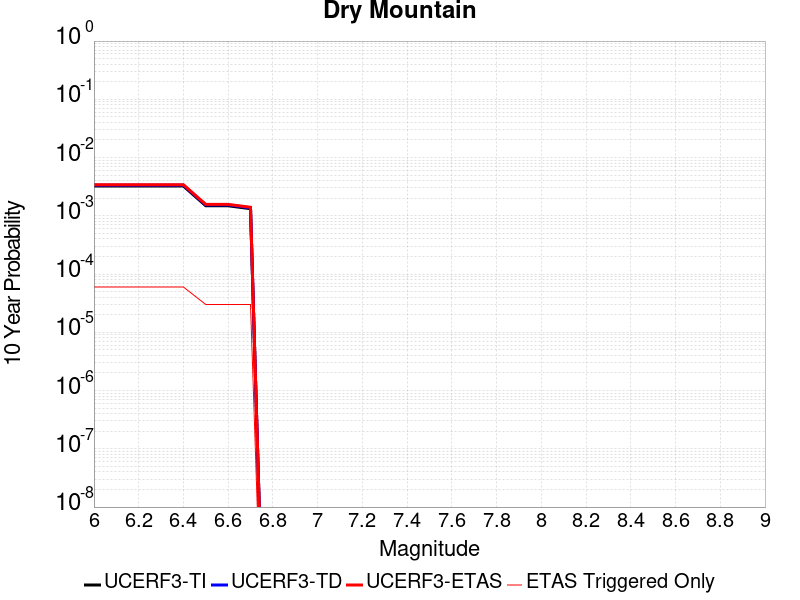 |

| Magnitude | 1 wk TI Prob | 1 wk TD Prob | 1 wk ETAS Prob | 1 wk ETAS/TD Gain | 1 wk ETAS Triggered Only | 1 mo TI Prob | 1 mo TD Prob | 1 mo ETAS Prob | 1 mo ETAS/TD Gain | 1 mo ETAS Triggered Only | 1 yr TI Prob | 1 yr TD Prob | 1 yr ETAS Prob | 1 yr ETAS/TD Gain | 1 yr ETAS Triggered Only | 10 yr TI Prob | 10 yr TD Prob | 10 yr ETAS Prob | 10 yr ETAS/TD Gain | 10 yr ETAS Triggered Only |
|-----|-----|-----|-----|-----|-----|-----|-----|-----|-----|-----|-----|-----|-----|-----|-----|-----|-----|-----|-----|-----|
| 6.0 | 6.222801E-6 | 6.439411E-6 | 6.439411E-6 | 1.0 | 0.0 | 2.6668875E-5 | 2.7597274E-5 | 3.7596998E-5 | 1.3623446 | 1.0E-5 | 3.2464517E-4 | 3.359609E-4 | 3.6595084E-4 | 1.0892661 | 3.0E-5 | 0.0032417132 | 0.0033560924 | 0.003415891 | 1.017818 | 6.0E-5 |
| 6.1 | 6.222801E-6 | 6.439411E-6 | 6.439411E-6 | 1.0 | 0.0 | 2.6668875E-5 | 2.7597274E-5 | 3.7596998E-5 | 1.3623446 | 1.0E-5 | 3.2464517E-4 | 3.359609E-4 | 3.6595084E-4 | 1.0892661 | 3.0E-5 | 0.0032417132 | 0.0033560924 | 0.003415891 | 1.017818 | 6.0E-5 |
| 6.2 | 6.222801E-6 | 6.439411E-6 | 6.439411E-6 | 1.0 | 0.0 | 2.6668875E-5 | 2.7597274E-5 | 3.7596998E-5 | 1.3623446 | 1.0E-5 | 3.2464517E-4 | 3.359609E-4 | 3.6595084E-4 | 1.0892661 | 3.0E-5 | 0.0032417132 | 0.0033560924 | 0.003415891 | 1.017818 | 6.0E-5 |
| 6.3 | 6.222801E-6 | 6.439411E-6 | 6.439411E-6 | 1.0 | 0.0 | 2.6668875E-5 | 2.7597274E-5 | 3.7596998E-5 | 1.3623446 | 1.0E-5 | 3.2464517E-4 | 3.359609E-4 | 3.6595084E-4 | 1.0892661 | 3.0E-5 | 0.0032417132 | 0.0033560924 | 0.003415891 | 1.017818 | 6.0E-5 |
| 6.4 | 6.222801E-6 | 6.439411E-6 | 6.439411E-6 | 1.0 | 0.0 | 2.6668875E-5 | 2.7597274E-5 | 3.7596998E-5 | 1.3623446 | 1.0E-5 | 3.2464517E-4 | 3.359609E-4 | 3.6595084E-4 | 1.0892661 | 3.0E-5 | 0.0032417132 | 0.0033560924 | 0.003415891 | 1.017818 | 6.0E-5 |
| 6.5 | 2.8528623E-6 | 2.952182E-6 | 2.952182E-6 | 1.0 | 0.0 | 1.22264955E-5 | 1.2652196E-5 | 2.265207E-5 | 1.7903666 | 1.0E-5 | 1.4884741E-4 | 1.5403831E-4 | 1.6403677E-4 | 1.0649089 | 1.0E-5 | 0.0014874774 | 0.0015401688 | 0.0015701225 | 1.0194484 | 3.0E-5 |
| 6.6 | 2.8528623E-6 | 2.952182E-6 | 2.952182E-6 | 1.0 | 0.0 | 1.22264955E-5 | 1.2652196E-5 | 2.265207E-5 | 1.7903666 | 1.0E-5 | 1.4884741E-4 | 1.5403831E-4 | 1.6403677E-4 | 1.0649089 | 1.0E-5 | 0.0014874774 | 0.0015401688 | 0.0015701225 | 1.0194484 | 3.0E-5 |
| 6.7 | 2.541E-6 | 2.62937E-6 | 2.62937E-6 | 1.0 | 0.0 | 1.0889954E-5 | 1.12687285E-5 | 2.1268615E-5 | 1.8874016 | 1.0E-5 | 1.3257713E-4 | 1.3719677E-4 | 1.471954E-4 | 1.072878 | 1.0E-5 | 0.0013249806 | 0.0013719677 | 0.0014019265 | 1.0218364 | 3.0E-5 |

## Red Mountain
*[(top)](#table-of-contents)*

| 1 Week | 1 Month | 1 Year | 10 Year |
|-----|-----|-----|-----|
|  |  | 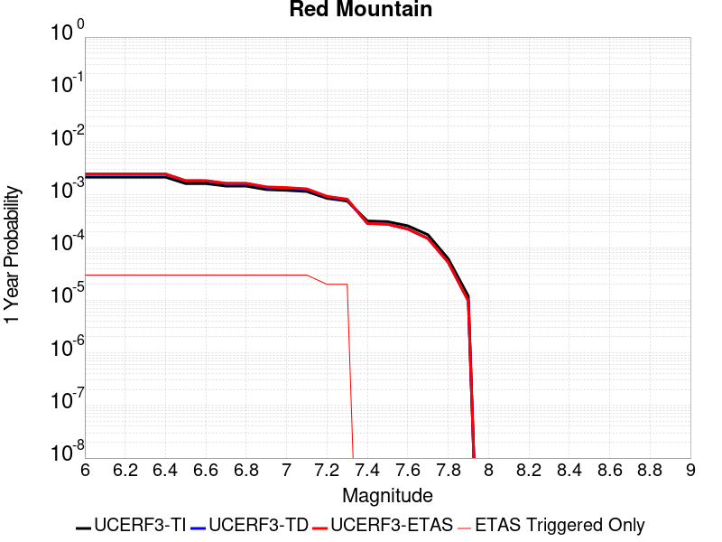 |  |

| Magnitude | 1 wk TI Prob | 1 wk TD Prob | 1 wk ETAS Prob | 1 wk ETAS/TD Gain | 1 wk ETAS Triggered Only | 1 mo TI Prob | 1 mo TD Prob | 1 mo ETAS Prob | 1 mo ETAS/TD Gain | 1 mo ETAS Triggered Only | 1 yr TI Prob | 1 yr TD Prob | 1 yr ETAS Prob | 1 yr ETAS/TD Gain | 1 yr ETAS Triggered Only | 10 yr TI Prob | 10 yr TD Prob | 10 yr ETAS Prob | 10 yr ETAS/TD Gain | 10 yr ETAS Triggered Only |
|-----|-----|-----|-----|-----|-----|-----|-----|-----|-----|-----|-----|-----|-----|-----|-----|-----|-----|-----|-----|-----|
| 6.0 | 4.1810763E-5 | 4.7591075E-5 | 4.7591075E-5 | 1.0 | 0.0 | 1.7917668E-4 | 2.0394672E-4 | 2.1394469E-4 | 1.0490224 | 1.0E-5 | 0.0021792934 | 0.0024803884 | 0.002510314 | 1.0120649 | 3.0E-5 | 0.021580452 | 0.024544649 | 0.024593422 | 1.0019871 | 5.0E-5 |
| 6.1 | 4.1810763E-5 | 4.7591075E-5 | 4.7591075E-5 | 1.0 | 0.0 | 1.7917668E-4 | 2.0394672E-4 | 2.1394469E-4 | 1.0490224 | 1.0E-5 | 0.0021792934 | 0.0024803884 | 0.002510314 | 1.0120649 | 3.0E-5 | 0.021580452 | 0.024544649 | 0.024593422 | 1.0019871 | 5.0E-5 |
| 6.2 | 4.1810763E-5 | 4.7591075E-5 | 4.7591075E-5 | 1.0 | 0.0 | 1.7917668E-4 | 2.0394672E-4 | 2.1394469E-4 | 1.0490224 | 1.0E-5 | 0.0021792934 | 0.0024803884 | 0.002510314 | 1.0120649 | 3.0E-5 | 0.021580452 | 0.024544649 | 0.024593422 | 1.0019871 | 5.0E-5 |
| 6.3 | 4.1810763E-5 | 4.7591075E-5 | 4.7591075E-5 | 1.0 | 0.0 | 1.7917668E-4 | 2.0394672E-4 | 2.1394469E-4 | 1.0490224 | 1.0E-5 | 0.0021792934 | 0.0024803884 | 0.002510314 | 1.0120649 | 3.0E-5 | 0.021580452 | 0.024544649 | 0.024593422 | 1.0019871 | 5.0E-5 |
| 6.4 | 4.1810763E-5 | 4.7591075E-5 | 4.7591075E-5 | 1.0 | 0.0 | 1.7917668E-4 | 2.0394672E-4 | 2.1394469E-4 | 1.0490224 | 1.0E-5 | 0.0021792934 | 0.0024803884 | 0.002510314 | 1.0120649 | 3.0E-5 | 0.021580452 | 0.024544649 | 0.024593422 | 1.0019871 | 5.0E-5 |
| 6.5 | 3.154503E-5 | 3.5360503E-5 | 3.5360503E-5 | 1.0 | 0.0 | 1.3518598E-4 | 1.5153673E-4 | 1.6153522E-4 | 1.0659806 | 1.0E-5 | 0.0016446467 | 0.0018434906 | 0.0018734353 | 1.0162435 | 3.0E-5 | 0.01632528 | 0.018291628 | 0.018340712 | 1.0026835 | 5.0E-5 |
| 6.6 | 3.1535834E-5 | 3.5349887E-5 | 3.5349887E-5 | 1.0 | 0.0 | 1.3514658E-4 | 1.5149123E-4 | 1.6148972E-4 | 1.0660005 | 1.0E-5 | 0.0016441676 | 0.0018429377 | 0.0018728824 | 1.0162483 | 3.0E-5 | 0.01632056 | 0.018286189 | 0.018335273 | 1.0026844 | 5.0E-5 |
| 6.7 | 2.8267326E-5 | 3.1470005E-5 | 3.1470005E-5 | 1.0 | 0.0 | 1.2114006E-4 | 1.3486497E-4 | 1.4486362E-4 | 1.0741383 | 1.0E-5 | 0.0014738824 | 0.0016408293 | 0.00167078 | 1.0182534 | 3.0E-5 | 0.014641452 | 0.016295906 | 0.016345091 | 1.0030183 | 5.0E-5 |
| 6.8 | 2.8212884E-5 | 3.140789E-5 | 3.140789E-5 | 1.0 | 0.0 | 1.20906756E-4 | 1.3459878E-4 | 1.4459743E-4 | 1.0742849 | 1.0E-5 | 0.0014710457 | 0.0016375934 | 0.0016675442 | 1.0182896 | 3.0E-5 | 0.014613459 | 0.016264021 | 0.016313208 | 1.0030242 | 5.0E-5 |
| 6.9 | 2.4227871E-5 | 2.6707532E-5 | 2.6707532E-5 | 1.0 | 0.0 | 1.03829596E-4 | 1.14456256E-4 | 1.2445511E-4 | 1.0873597 | 1.0E-5 | 0.0012633923 | 0.00139269 | 0.0014226482 | 1.0215111 | 3.0E-5 | 0.012562336 | 0.013847311 | 0.013896619 | 1.0035608 | 5.0E-5 |
| 7.0 | 2.348524E-5 | 2.5836296E-5 | 2.5836296E-5 | 1.0 | 0.0 | 1.0064714E-4 | 1.1072271E-4 | 1.20721605E-4 | 1.0903057 | 1.0E-5 | 0.0012246901 | 0.001347291 | 0.0013772505 | 1.022237 | 3.0E-5 | 0.012179627 | 0.013398864 | 0.013448195 | 1.0036817 | 5.0E-5 |
| 7.1 | 2.2311642E-5 | 2.4463332E-5 | 2.4463332E-5 | 1.0 | 0.0 | 9.561782E-5 | 1.04839055E-4 | 1.1483801E-4 | 1.0953743 | 1.0E-5 | 0.0011635252 | 0.0012757429 | 0.0013057047 | 1.0234857 | 3.0E-5 | 0.01157452 | 0.01269171 | 0.012741076 | 1.0038896 | 5.0E-5 |
| 7.2 | 1.6533986E-5 | 1.767069E-5 | 1.767069E-5 | 1.0 | 0.0 | 7.085802E-5 | 7.572969E-5 | 8.5728934E-5 | 1.1320386 | 1.0E-5 | 8.623549E-4 | 9.2168245E-4 | 9.41664E-4 | 1.0216794 | 2.0E-5 | 0.008590161 | 0.009184876 | 0.0092146015 | 1.0032363 | 3.0E-5 |
| 7.3 | 1.4703092E-5 | 1.555982E-5 | 1.555982E-5 | 1.0 | 0.0 | 6.301173E-5 | 6.668359E-5 | 7.6682925E-5 | 1.1499519 | 1.0E-5 | 7.668978E-4 | 8.116319E-4 | 8.316157E-4 | 1.0246217 | 2.0E-5 | 0.0076425658 | 0.008092752 | 0.008122509 | 1.003677 | 3.0E-5 |
| 7.4 | 6.1331984E-6 | 5.5289447E-6 | 5.5289447E-6 | 1.0 | 0.0 | 2.6284872E-5 | 2.3695266E-5 | 2.3695266E-5 | 1.0 | 0.0 | 3.199713E-4 | 2.884522E-4 | 2.884522E-4 | 1.0 | 0.0 | 0.0031951098 | 0.0028808324 | 0.0028808324 | 1.0 | 0.0 |
| 7.5 | 5.954766E-6 | 5.3385725E-6 | 5.3385725E-6 | 1.0 | 0.0 | 2.5520176E-5 | 2.2879398E-5 | 2.2879398E-5 | 1.0 | 0.0 | 3.1066386E-4 | 2.785216E-4 | 2.785216E-4 | 1.0 | 0.0 | 0.003102299 | 0.0027817793 | 0.0027817793 | 1.0 | 0.0 |
| 7.6 | 4.9726646E-6 | 4.315354E-6 | 4.315354E-6 | 1.0 | 0.0 | 2.1311245E-5 | 1.8494246E-5 | 1.8494246E-5 | 1.0 | 0.0 | 2.5943352E-4 | 2.2514451E-4 | 2.2514451E-4 | 1.0 | 0.0 | 0.0025913084 | 0.0022491987 | 0.0022491987 | 1.0 | 0.0 |
| 7.7 | 3.3613894E-6 | 2.8527159E-6 | 2.8527159E-6 | 1.0 | 0.0 | 1.4405875E-5 | 1.222587E-5 | 1.222587E-5 | 1.0 | 0.0 | 1.7537741E-4 | 1.4884006E-4 | 1.4884006E-4 | 1.0 | 0.0 | 0.0017523908 | 0.00148743 | 0.00148743 | 1.0 | 0.0 |
| 7.8 | 1.1828961E-6 | 1.0123005E-6 | 1.0123005E-6 | 1.0 | 0.0 | 5.069545E-6 | 4.3384234E-6 | 4.3384234E-6 | 1.0 | 0.0 | 6.171996E-5 | 5.2819054E-5 | 5.2819054E-5 | 1.0 | 0.0 | 6.170282E-4 | 5.2806793E-4 | 5.2806793E-4 | 1.0 | 0.0 |
| 7.9 | 2.2967266E-7 | 1.8619376E-7 | 1.8619376E-7 | 1.0 | 0.0 | 9.843111E-7 | 7.9797303E-7 | 7.9797303E-7 | 1.0 | 0.0 | 1.19839215E-5 | 9.7152815E-6 | 9.7152815E-6 | 1.0 | 0.0 | 1.1983275E-4 | 9.7148855E-5 | 9.7148855E-5 | 1.0 | 0.0 |

## Lost Hills
*[(top)](#table-of-contents)*

| 1 Week | 1 Month | 1 Year | 10 Year |
|-----|-----|-----|-----|
|  |  | 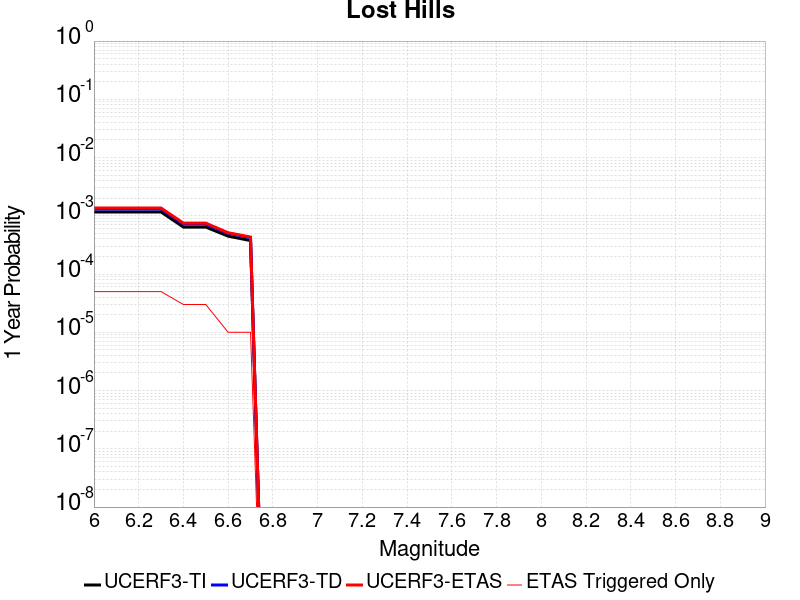 |  |

| Magnitude | 1 wk TI Prob | 1 wk TD Prob | 1 wk ETAS Prob | 1 wk ETAS/TD Gain | 1 wk ETAS Triggered Only | 1 mo TI Prob | 1 mo TD Prob | 1 mo ETAS Prob | 1 mo ETAS/TD Gain | 1 mo ETAS Triggered Only | 1 yr TI Prob | 1 yr TD Prob | 1 yr ETAS Prob | 1 yr ETAS/TD Gain | 1 yr ETAS Triggered Only | 10 yr TI Prob | 10 yr TD Prob | 10 yr ETAS Prob | 10 yr ETAS/TD Gain | 10 yr ETAS Triggered Only |
|-----|-----|-----|-----|-----|-----|-----|-----|-----|-----|-----|-----|-----|-----|-----|-----|-----|-----|-----|-----|-----|
| 6.0 | 2.233523E-5 | 2.5106996E-5 | 3.5106743E-5 | 1.3982854 | 1.0E-5 | 9.571891E-5 | 1.0759792E-4 | 1.1759684E-4 | 1.0929286 | 1.0E-5 | 0.0011647546 | 0.0013093855 | 0.0013593201 | 1.0381359 | 5.0E-5 | 0.011586686 | 0.013033304 | 0.0130925225 | 1.0045435 | 6.0E-5 |
| 6.1 | 2.233523E-5 | 2.5106996E-5 | 3.5106743E-5 | 1.3982854 | 1.0E-5 | 9.571891E-5 | 1.0759792E-4 | 1.1759684E-4 | 1.0929286 | 1.0E-5 | 0.0011647546 | 0.0013093855 | 0.0013593201 | 1.0381359 | 5.0E-5 | 0.011586686 | 0.013033304 | 0.0130925225 | 1.0045435 | 6.0E-5 |
| 6.2 | 2.233523E-5 | 2.5106996E-5 | 3.5106743E-5 | 1.3982854 | 1.0E-5 | 9.571891E-5 | 1.0759792E-4 | 1.1759684E-4 | 1.0929286 | 1.0E-5 | 0.0011647546 | 0.0013093855 | 0.0013593201 | 1.0381359 | 5.0E-5 | 0.011586686 | 0.013033304 | 0.0130925225 | 1.0045435 | 6.0E-5 |
| 6.3 | 2.233523E-5 | 2.5106996E-5 | 3.5106743E-5 | 1.3982854 | 1.0E-5 | 9.571891E-5 | 1.0759792E-4 | 1.1759684E-4 | 1.0929286 | 1.0E-5 | 0.0011647546 | 0.0013093855 | 0.0013593201 | 1.0381359 | 5.0E-5 | 0.011586686 | 0.013033304 | 0.0130925225 | 1.0045435 | 6.0E-5 |
| 6.4 | 1.2288092E-5 | 1.37813295E-5 | 1.37813295E-5 | 1.0 | 0.0 | 5.2662188E-5 | 5.9062033E-5 | 5.9062033E-5 | 1.0 | 0.0 | 6.409735E-4 | 7.189368E-4 | 7.4891525E-4 | 1.0416983 | 3.0E-5 | 0.006391279 | 0.007175316 | 0.0072051007 | 1.004151 | 3.0E-5 |
| 6.5 | 1.2288092E-5 | 1.37813295E-5 | 1.37813295E-5 | 1.0 | 0.0 | 5.2662188E-5 | 5.9062033E-5 | 5.9062033E-5 | 1.0 | 0.0 | 6.409735E-4 | 7.189368E-4 | 7.4891525E-4 | 1.0416983 | 3.0E-5 | 0.006391279 | 0.007175316 | 0.0072051007 | 1.004151 | 3.0E-5 |
| 6.6 | 8.58281E-6 | 9.633926E-6 | 9.633926E-6 | 1.0 | 0.0 | 3.6782953E-5 | 4.1288073E-5 | 4.1288073E-5 | 1.0 | 0.0 | 4.4774043E-4 | 5.026495E-4 | 5.1264453E-4 | 1.0198846 | 1.0E-5 | 0.0044683935 | 0.0050232867 | 0.0050332365 | 1.0019808 | 1.0E-5 |
| 6.7 | 7.205685E-6 | 8.088433E-6 | 8.088433E-6 | 1.0 | 0.0 | 3.088114E-5 | 3.4664714E-5 | 3.4664714E-5 | 1.0 | 0.0 | 3.7591302E-4 | 4.2204288E-4 | 4.3203865E-4 | 1.0236843 | 1.0E-5 | 0.0037527776 | 0.004220429 | 0.0042303866 | 1.0023594 | 1.0E-5 |

## San Jacinto (Lytle Creek connector)
*[(top)](#table-of-contents)*

| 1 Week | 1 Month | 1 Year | 10 Year |
|-----|-----|-----|-----|
|  |  |  |  |

| Magnitude | 1 wk TI Prob | 1 wk TD Prob | 1 wk ETAS Prob | 1 wk ETAS/TD Gain | 1 wk ETAS Triggered Only | 1 mo TI Prob | 1 mo TD Prob | 1 mo ETAS Prob | 1 mo ETAS/TD Gain | 1 mo ETAS Triggered Only | 1 yr TI Prob | 1 yr TD Prob | 1 yr ETAS Prob | 1 yr ETAS/TD Gain | 1 yr ETAS Triggered Only | 10 yr TI Prob | 10 yr TD Prob | 10 yr ETAS Prob | 10 yr ETAS/TD Gain | 10 yr ETAS Triggered Only |
|-----|-----|-----|-----|-----|-----|-----|-----|-----|-----|-----|-----|-----|-----|-----|-----|-----|-----|-----|-----|-----|
| 6.0 | 6.693995E-6 | 6.6628318E-6 | 2.66627E-5 | 4.0017066 | 2.0E-5 | 2.8688235E-5 | 2.8554681E-5 | 5.8553826E-5 | 2.0505857 | 3.0E-5 | 3.492233E-4 | 3.4759787E-4 | 4.07577E-4 | 1.1725533 | 6.0E-5 | 0.00348675 | 0.0035508901 | 0.003610677 | 1.0168371 | 6.0E-5 |
| 6.1 | 6.693995E-6 | 6.6628318E-6 | 2.66627E-5 | 4.0017066 | 2.0E-5 | 2.8688235E-5 | 2.8554681E-5 | 5.8553826E-5 | 2.0505857 | 3.0E-5 | 3.492233E-4 | 3.4759787E-4 | 4.07577E-4 | 1.1725533 | 6.0E-5 | 0.00348675 | 0.0035508901 | 0.003610677 | 1.0168371 | 6.0E-5 |
| 6.2 | 6.693995E-6 | 6.6628318E-6 | 2.66627E-5 | 4.0017066 | 2.0E-5 | 2.8688235E-5 | 2.8554681E-5 | 5.8553826E-5 | 2.0505857 | 3.0E-5 | 3.492233E-4 | 3.4759787E-4 | 4.07577E-4 | 1.1725533 | 6.0E-5 | 0.00348675 | 0.0035508901 | 0.003610677 | 1.0168371 | 6.0E-5 |
| 6.3 | 6.693995E-6 | 6.6628318E-6 | 2.66627E-5 | 4.0017066 | 2.0E-5 | 2.8688235E-5 | 2.8554681E-5 | 5.8553826E-5 | 2.0505857 | 3.0E-5 | 3.492233E-4 | 3.4759787E-4 | 4.07577E-4 | 1.1725533 | 6.0E-5 | 0.00348675 | 0.0035508901 | 0.003610677 | 1.0168371 | 6.0E-5 |
| 6.4 | 6.693995E-6 | 6.6628318E-6 | 2.66627E-5 | 4.0017066 | 2.0E-5 | 2.8688235E-5 | 2.8554681E-5 | 5.8553826E-5 | 2.0505857 | 3.0E-5 | 3.492233E-4 | 3.4759787E-4 | 4.07577E-4 | 1.1725533 | 6.0E-5 | 0.00348675 | 0.0035508901 | 0.003610677 | 1.0168371 | 6.0E-5 |
| 6.5 | 6.6561875E-6 | 6.6230496E-6 | 2.6622916E-5 | 4.019737 | 2.0E-5 | 2.8526205E-5 | 2.838419E-5 | 5.838334E-5 | 2.0568964 | 3.0E-5 | 3.472512E-4 | 3.455228E-4 | 4.0550207E-4 | 1.17359 | 6.0E-5 | 0.0034670907 | 0.0035302055 | 0.0035899938 | 1.0169362 | 6.0E-5 |
| 6.6 | 6.6561875E-6 | 6.6230496E-6 | 2.6622916E-5 | 4.019737 | 2.0E-5 | 2.8526205E-5 | 2.838419E-5 | 5.838334E-5 | 2.0568964 | 3.0E-5 | 3.472512E-4 | 3.455228E-4 | 4.0550207E-4 | 1.17359 | 6.0E-5 | 0.0034670907 | 0.0035302055 | 0.0035899938 | 1.0169362 | 6.0E-5 |
| 6.7 | 6.5802237E-6 | 6.5422255E-6 | 2.6542095E-5 | 4.0570436 | 2.0E-5 | 2.8200653E-5 | 2.803781E-5 | 5.8036967E-5 | 2.0699537 | 3.0E-5 | 3.4328885E-4 | 3.4130694E-4 | 4.0128644E-4 | 1.1757349 | 6.0E-5 | 0.0034275902 | 0.0034881798 | 0.0035479704 | 1.017141 | 6.0E-5 |
| 6.8 | 6.575632E-6 | 6.5367153E-6 | 2.6536585E-5 | 4.059621 | 2.0E-5 | 2.8180975E-5 | 2.8014192E-5 | 5.8013353E-5 | 2.0708559 | 3.0E-5 | 3.4304935E-4 | 3.410195E-4 | 4.0099904E-4 | 1.175883 | 6.0E-5 | 0.0034252026 | 0.0034853143 | 0.0035451052 | 1.017155 | 6.0E-5 |
| 6.9 | 6.570433E-6 | 6.5281088E-6 | 2.6527978E-5 | 4.0636544 | 2.0E-5 | 2.8158694E-5 | 2.7977308E-5 | 5.797647E-5 | 2.0722675 | 3.0E-5 | 3.4277816E-4 | 3.4057058E-4 | 4.0055014E-4 | 1.1761149 | 6.0E-5 | 0.0034224992 | 0.0034808393 | 0.0035406305 | 1.0171772 | 6.0E-5 |
| 7.0 | 6.5643826E-6 | 6.5182294E-6 | 2.6518099E-5 | 4.068298 | 2.0E-5 | 2.8132765E-5 | 2.793497E-5 | 5.7934132E-5 | 2.0738928 | 3.0E-5 | 3.424626E-4 | 3.4005524E-4 | 4.0003486E-4 | 1.176382 | 6.0E-5 | 0.0034193532 | 0.0034757021 | 0.0035354937 | 1.0172027 | 6.0E-5 |
| 7.1 | 6.557402E-6 | 6.5069403E-6 | 2.650681E-5 | 4.0736213 | 2.0E-5 | 2.8102848E-5 | 2.788659E-5 | 5.7885754E-5 | 2.0757558 | 3.0E-5 | 3.4209844E-4 | 3.394664E-4 | 3.9944606E-4 | 1.176688 | 6.0E-5 | 0.0034157229 | 0.0034698334 | 0.0035296252 | 1.017232 | 6.0E-5 |
| 7.2 | 6.546394E-6 | 6.488906E-6 | 2.6488777E-5 | 4.082164 | 2.0E-5 | 2.8055672E-5 | 2.7809301E-5 | 5.7808465E-5 | 2.0787458 | 3.0E-5 | 3.4152428E-4 | 3.3852572E-4 | 3.985054E-4 | 1.1771791 | 6.0E-5 | 0.0034099987 | 0.0034604599 | 0.0035202524 | 1.0172788 | 6.0E-5 |
| 7.3 | 6.5364216E-6 | 6.469689E-6 | 2.6469559E-5 | 4.0913186 | 2.0E-5 | 2.8012933E-5 | 2.7726945E-5 | 5.7726113E-5 | 2.08195 | 3.0E-5 | 3.4100408E-4 | 3.3752335E-4 | 3.9750308E-4 | 1.1777055 | 6.0E-5 | 0.003404813 | 0.003450482 | 0.003510275 | 1.0173289 | 6.0E-5 |
| 7.4 | 6.5269523E-6 | 6.450774E-6 | 2.6450645E-5 | 4.1003833 | 2.0E-5 | 2.7972354E-5 | 2.7645881E-5 | 5.764505E-5 | 2.0851226 | 3.0E-5 | 3.4051016E-4 | 3.365367E-4 | 3.965165E-4 | 1.1782267 | 6.0E-5 | 0.0033998888 | 0.0034406635 | 0.003500457 | 1.0173784 | 6.0E-5 |
| 7.5 | 6.5111835E-6 | 6.4270453E-6 | 2.6426917E-5 | 4.1118298 | 2.0E-5 | 2.7904773E-5 | 2.7544189E-5 | 5.7543362E-5 | 2.089129 | 3.0E-5 | 3.3968766E-4 | 3.3529897E-4 | 3.9527885E-4 | 1.1788847 | 6.0E-5 | 0.0033916887 | 0.0034283353 | 0.0034881297 | 1.0174412 | 6.0E-5 |
| 7.6 | 6.4768806E-6 | 6.3861507E-6 | 2.6386022E-5 | 4.1317573 | 2.0E-5 | 2.7757764E-5 | 2.736893E-5 | 5.736811E-5 | 2.0961034 | 3.0E-5 | 3.3789838E-4 | 3.3316584E-4 | 3.9314586E-4 | 1.1800305 | 6.0E-5 | 0.0033738504 | 0.0034070655 | 0.0034668613 | 1.0175505 | 6.0E-5 |
| 7.7 | 6.1655364E-6 | 6.1786222E-6 | 2.6178499E-5 | 4.2369475 | 2.0E-5 | 2.642346E-5 | 2.6479542E-5 | 5.6478748E-5 | 2.13292 | 3.0E-5 | 3.2165812E-4 | 3.2234078E-4 | 3.8232145E-4 | 1.1860784 | 6.0E-5 | 0.0032119295 | 0.0032986694 | 0.0033584714 | 1.0181291 | 6.0E-5 |
| 7.8 | 5.5043524E-6 | 5.739622E-6 | 2.5739508E-5 | 4.48453 | 2.0E-5 | 2.3589868E-5 | 2.4598148E-5 | 5.459741E-5 | 2.219574 | 3.0E-5 | 2.871688E-4 | 2.9944137E-4 | 3.594234E-4 | 1.2003131 | 6.0E-5 | 0.0028679797 | 0.003068756 | 0.0031285721 | 1.0194919 | 6.0E-5 |
| 7.9 | 3.889249E-6 | 4.0787854E-6 | 2.4078703E-5 | 5.9034004 | 2.0E-5 | 1.6668104E-5 | 1.7480392E-5 | 4.747987E-5 | 2.7161787 | 3.0E-5 | 2.0291525E-4 | 2.1280303E-4 | 2.7279026E-4 | 1.2818909 | 6.0E-5 | 0.0020273007 | 0.0021955092 | 0.0022553774 | 1.0272685 | 6.0E-5 |
| 8.0 | 2.668535E-6 | 2.5328056E-6 | 1.2532781E-5 | 4.948181 | 1.0E-5 | 1.1436528E-5 | 1.0854836E-5 | 3.085462E-5 | 2.8424768 | 2.0E-5 | 1.3923083E-4 | 1.3214964E-4 | 1.7214436E-4 | 1.3026471 | 4.0E-5 | 0.0013914363 | 0.0013765903 | 0.0014165353 | 1.0290173 | 4.0E-5 |
| 8.1 | 1.5911459E-6 | 1.2193005E-6 | 1.2193005E-6 | 1.0 | 0.0 | 6.8191785E-6 | 5.225563E-6 | 5.225563E-6 | 1.0 | 0.0 | 8.3020335E-5 | 6.3619394E-5 | 6.3619394E-5 | 1.0 | 0.0 | 8.298933E-4 | 6.697524E-4 | 6.697524E-4 | 1.0 | 0.0 |
| 8.2 | 6.1294963E-7 | 2.1825215E-7 | 2.1825215E-7 | 1.0 | 0.0 | 2.6269242E-6 | 9.35366E-7 | 9.35366E-7 | 1.0 | 0.0 | 3.1982334E-5 | 1.1388021E-5 | 1.1388021E-5 | 1.0 | 0.0 | 3.1977732E-4 | 1.279216E-4 | 1.279216E-4 | 1.0 | 0.0 |
| 8.3 | 1.762871E-7 | 4.757476E-8 | 4.757476E-8 | 1.0 | 0.0 | 7.5551594E-7 | 2.038918E-7 | 2.038918E-7 | 1.0 | 0.0 | 9.1983675E-6 | 2.4823798E-6 | 2.4823798E-6 | 1.0 | 0.0 | 9.197987E-5 | 2.8703373E-5 | 2.8703373E-5 | 1.0 | 0.0 |

## Deep Springs
*[(top)](#table-of-contents)*

| 1 Week | 1 Month | 1 Year | 10 Year |
|-----|-----|-----|-----|
|  |  |  |  |

| Magnitude | 1 wk TI Prob | 1 wk TD Prob | 1 wk ETAS Prob | 1 wk ETAS/TD Gain | 1 wk ETAS Triggered Only | 1 mo TI Prob | 1 mo TD Prob | 1 mo ETAS Prob | 1 mo ETAS/TD Gain | 1 mo ETAS Triggered Only | 1 yr TI Prob | 1 yr TD Prob | 1 yr ETAS Prob | 1 yr ETAS/TD Gain | 1 yr ETAS Triggered Only | 10 yr TI Prob | 10 yr TD Prob | 10 yr ETAS Prob | 10 yr ETAS/TD Gain | 10 yr ETAS Triggered Only |
|-----|-----|-----|-----|-----|-----|-----|-----|-----|-----|-----|-----|-----|-----|-----|-----|-----|-----|-----|-----|-----|
| 6.0 | 1.9810619E-5 | 2.311303E-5 | 3.31128E-5 | 1.4326464 | 1.0E-5 | 8.489989E-5 | 9.9054945E-5 | 1.0905396E-4 | 1.100944 | 1.0E-5 | 0.001033166 | 0.0012058344 | 0.0012258104 | 1.016566 | 2.0E-5 | 0.010283757 | 0.012042696 | 0.012101973 | 1.0049223 | 6.0E-5 |
| 6.1 | 1.9810619E-5 | 2.311303E-5 | 3.31128E-5 | 1.4326464 | 1.0E-5 | 8.489989E-5 | 9.9054945E-5 | 1.0905396E-4 | 1.100944 | 1.0E-5 | 0.001033166 | 0.0012058344 | 0.0012258104 | 1.016566 | 2.0E-5 | 0.010283757 | 0.012042696 | 0.012101973 | 1.0049223 | 6.0E-5 |
| 6.2 | 1.9810619E-5 | 2.311303E-5 | 3.31128E-5 | 1.4326464 | 1.0E-5 | 8.489989E-5 | 9.9054945E-5 | 1.0905396E-4 | 1.100944 | 1.0E-5 | 0.001033166 | 0.0012058344 | 0.0012258104 | 1.016566 | 2.0E-5 | 0.010283757 | 0.012042696 | 0.012101973 | 1.0049223 | 6.0E-5 |
| 6.3 | 1.9810619E-5 | 2.311303E-5 | 3.31128E-5 | 1.4326464 | 1.0E-5 | 8.489989E-5 | 9.9054945E-5 | 1.0905396E-4 | 1.100944 | 1.0E-5 | 0.001033166 | 0.0012058344 | 0.0012258104 | 1.016566 | 2.0E-5 | 0.010283757 | 0.012042696 | 0.012101973 | 1.0049223 | 6.0E-5 |
| 6.4 | 1.9810619E-5 | 2.311303E-5 | 3.31128E-5 | 1.4326464 | 1.0E-5 | 8.489989E-5 | 9.9054945E-5 | 1.0905396E-4 | 1.100944 | 1.0E-5 | 0.001033166 | 0.0012058344 | 0.0012258104 | 1.016566 | 2.0E-5 | 0.010283757 | 0.012042696 | 0.012101973 | 1.0049223 | 6.0E-5 |
| 6.5 | 1.7190405E-5 | 2.0051E-5 | 2.0051E-5 | 1.0 | 0.0 | 7.367108E-5 | 8.593286E-5 | 8.593286E-5 | 1.0 | 0.0 | 8.9657627E-4 | 0.0010462323 | 0.0010562219 | 1.0095481 | 1.0E-5 | 0.008929676 | 0.010462292 | 0.010501873 | 1.0037832 | 4.0E-5 |
| 6.6 | 1.7190405E-5 | 2.0051E-5 | 2.0051E-5 | 1.0 | 0.0 | 7.367108E-5 | 8.593286E-5 | 8.593286E-5 | 1.0 | 0.0 | 8.9657627E-4 | 0.0010462323 | 0.0010562219 | 1.0095481 | 1.0E-5 | 0.008929676 | 0.010462292 | 0.010501873 | 1.0037832 | 4.0E-5 |

## Kern Canyon (Lake Isabella) 2011
*[(top)](#table-of-contents)*

| 1 Week | 1 Month | 1 Year | 10 Year |
|-----|-----|-----|-----|
|  |  |  |  |

| Magnitude | 1 wk TI Prob | 1 wk TD Prob | 1 wk ETAS Prob | 1 wk ETAS/TD Gain | 1 wk ETAS Triggered Only | 1 mo TI Prob | 1 mo TD Prob | 1 mo ETAS Prob | 1 mo ETAS/TD Gain | 1 mo ETAS Triggered Only | 1 yr TI Prob | 1 yr TD Prob | 1 yr ETAS Prob | 1 yr ETAS/TD Gain | 1 yr ETAS Triggered Only | 10 yr TI Prob | 10 yr TD Prob | 10 yr ETAS Prob | 10 yr ETAS/TD Gain | 10 yr ETAS Triggered Only |
|-----|-----|-----|-----|-----|-----|-----|-----|-----|-----|-----|-----|-----|-----|-----|-----|-----|-----|-----|-----|-----|
| 6.0 | 4.2387383E-6 | 4.001647E-6 | 4.001647E-6 | 1.0 | 0.0 | 1.8165894E-5 | 1.7149814E-5 | 1.7149814E-5 | 1.0 | 0.0 | 2.2114732E-4 | 2.0878084E-4 | 2.2877667E-4 | 1.0957742 | 2.0E-5 | 0.0022092736 | 0.0020860308 | 0.0021459057 | 1.0287027 | 6.0E-5 |
| 6.1 | 4.2387383E-6 | 4.001647E-6 | 4.001647E-6 | 1.0 | 0.0 | 1.8165894E-5 | 1.7149814E-5 | 1.7149814E-5 | 1.0 | 0.0 | 2.2114732E-4 | 2.0878084E-4 | 2.2877667E-4 | 1.0957742 | 2.0E-5 | 0.0022092736 | 0.0020860308 | 0.0021459057 | 1.0287027 | 6.0E-5 |
| 6.2 | 4.2387383E-6 | 4.001647E-6 | 4.001647E-6 | 1.0 | 0.0 | 1.8165894E-5 | 1.7149814E-5 | 1.7149814E-5 | 1.0 | 0.0 | 2.2114732E-4 | 2.0878084E-4 | 2.2877667E-4 | 1.0957742 | 2.0E-5 | 0.0022092736 | 0.0020860308 | 0.0021459057 | 1.0287027 | 6.0E-5 |
| 6.3 | 4.2387383E-6 | 4.001647E-6 | 4.001647E-6 | 1.0 | 0.0 | 1.8165894E-5 | 1.7149814E-5 | 1.7149814E-5 | 1.0 | 0.0 | 2.2114732E-4 | 2.0878084E-4 | 2.2877667E-4 | 1.0957742 | 2.0E-5 | 0.0022092736 | 0.0020860308 | 0.0021459057 | 1.0287027 | 6.0E-5 |
| 6.4 | 4.2387383E-6 | 4.001647E-6 | 4.001647E-6 | 1.0 | 0.0 | 1.8165894E-5 | 1.7149814E-5 | 1.7149814E-5 | 1.0 | 0.0 | 2.2114732E-4 | 2.0878084E-4 | 2.2877667E-4 | 1.0957742 | 2.0E-5 | 0.0022092736 | 0.0020860308 | 0.0021459057 | 1.0287027 | 6.0E-5 |
| 6.5 | 2.7857532E-6 | 2.517871E-6 | 2.517871E-6 | 1.0 | 0.0 | 1.1938888E-5 | 1.0790834E-5 | 1.0790834E-5 | 1.0 | 0.0 | 1.4534626E-4 | 1.313708E-4 | 1.5136818E-4 | 1.1522208 | 2.0E-5 | 0.0014525123 | 0.0013129641 | 0.0013728854 | 1.0456381 | 6.0E-5 |
| 6.6 | 2.2233348E-6 | 1.944126E-6 | 1.944126E-6 | 1.0 | 0.0 | 9.528543E-6 | 8.331944E-6 | 8.331944E-6 | 1.0 | 0.0 | 1.1600384E-4 | 1.0143677E-4 | 1.2143474E-4 | 1.1971471 | 2.0E-5 | 0.001159433 | 0.0010139133 | 0.0010638627 | 1.0492638 | 5.0E-5 |
| 6.7 | 2.1635126E-6 | 1.8835061E-6 | 1.8835061E-6 | 1.0 | 0.0 | 9.272164E-6 | 8.072145E-6 | 8.072145E-6 | 1.0 | 0.0 | 1.1288274E-4 | 9.827401E-5 | 1.18272044E-4 | 1.2034926 | 2.0E-5 | 0.0011282542 | 9.823136E-4 | 0.0010322646 | 1.0508503 | 5.0E-5 |
| 6.8 | 1.8685711E-6 | 1.5831444E-6 | 1.5831444E-6 | 1.0 | 0.0 | 8.008137E-6 | 6.784887E-6 | 6.784887E-6 | 1.0 | 0.0 | 9.74947E-5 | 8.260291E-5 | 1.0260126E-4 | 1.2421021 | 2.0E-5 | 9.745194E-4 | 8.25727E-4 | 8.756858E-4 | 1.0605026 | 5.0E-5 |
| 6.9 | 1.5815071E-6 | 1.3064939E-6 | 1.3064939E-6 | 1.0 | 0.0 | 6.77787E-6 | 5.5992477E-6 | 5.5992477E-6 | 1.0 | 0.0 | 8.251744E-5 | 6.816874E-5 | 8.816737E-5 | 1.2933697 | 2.0E-5 | 8.248681E-4 | 6.814809E-4 | 7.3144684E-4 | 1.0733197 | 5.0E-5 |
| 7.0 | 1.3772564E-6 | 1.1210726E-6 | 1.1210726E-6 | 1.0 | 0.0 | 5.9025137E-6 | 4.804588E-6 | 4.804588E-6 | 1.0 | 0.0 | 7.186073E-5 | 5.849431E-5 | 6.8493726E-5 | 1.1709468 | 1.0E-5 | 7.18375E-4 | 5.847912E-4 | 6.247678E-4 | 1.0683604 | 4.0E-5 |
| 7.1 | 1.0916998E-6 | 8.7637835E-7 | 8.7637835E-7 | 1.0 | 0.0 | 4.678705E-6 | 3.7559018E-6 | 3.7559018E-6 | 1.0 | 0.0 | 5.6961744E-5 | 4.572716E-5 | 4.572716E-5 | 1.0 | 0.0 | 5.6947145E-4 | 4.5717886E-4 | 4.771697E-4 | 1.0437266 | 2.0E-5 |
| 7.2 | 7.6277024E-7 | 5.9014616E-7 | 5.9014616E-7 | 1.0 | 0.0 | 3.2690114E-6 | 2.5291954E-6 | 2.5291954E-6 | 1.0 | 0.0 | 3.9799485E-5 | 3.0792526E-5 | 3.0792526E-5 | 1.0 | 0.0 | 3.9792358E-4 | 3.078832E-4 | 3.2787703E-4 | 1.0649397 | 2.0E-5 |
| 7.3 | 5.3265916E-7 | 4.3824443E-7 | 4.3824443E-7 | 1.0 | 0.0 | 2.282823E-6 | 1.8781891E-6 | 1.8781891E-6 | 1.0 | 0.0 | 2.7793016E-5 | 2.2866716E-5 | 2.2866716E-5 | 1.0 | 0.0 | 2.778954E-4 | 2.2864401E-4 | 2.3864173E-4 | 1.0437261 | 1.0E-5 |
| 7.4 | 3.4946007E-7 | 3.0065758E-7 | 3.0065758E-7 | 1.0 | 0.0 | 1.497685E-6 | 1.2885318E-6 | 1.2885318E-6 | 1.0 | 0.0 | 1.8234163E-5 | 1.5687765E-5 | 1.5687765E-5 | 1.0 | 0.0 | 1.8232666E-4 | 1.568668E-4 | 1.568668E-4 | 1.0 | 0.0 |
| 7.5 | 1.8317026E-7 | 1.4244814E-7 | 1.4244814E-7 | 1.0 | 0.0 | 7.850152E-7 | 6.104919E-7 | 6.104919E-7 | 1.0 | 0.0 | 9.557518E-6 | 7.4327145E-6 | 7.4327145E-6 | 1.0 | 0.0 | 9.5571064E-5 | 7.432474E-5 | 7.432474E-5 | 1.0 | 0.0 |
| 7.6 | 2.572245E-8 | 1.7352718E-8 | 1.7352718E-8 | 1.0 | 0.0 | 1.10239064E-7 | 7.436879E-8 | 7.436879E-8 | 1.0 | 0.0 | 1.3421597E-6 | 9.054397E-7 | 9.054397E-7 | 1.0 | 0.0 | 1.3421517E-5 | 9.054365E-6 | 9.054365E-6 | 1.0 | 0.0 |

## Brawley (Seismic Zone) alt 1
*[(top)](#table-of-contents)*

| 1 Week | 1 Month | 1 Year | 10 Year |
|-----|-----|-----|-----|
|  |  |  |  |

| Magnitude | 1 wk TI Prob | 1 wk TD Prob | 1 wk ETAS Prob | 1 wk ETAS/TD Gain | 1 wk ETAS Triggered Only | 1 mo TI Prob | 1 mo TD Prob | 1 mo ETAS Prob | 1 mo ETAS/TD Gain | 1 mo ETAS Triggered Only | 1 yr TI Prob | 1 yr TD Prob | 1 yr ETAS Prob | 1 yr ETAS/TD Gain | 1 yr ETAS Triggered Only | 10 yr TI Prob | 10 yr TD Prob | 10 yr ETAS Prob | 10 yr ETAS/TD Gain | 10 yr ETAS Triggered Only |
|-----|-----|-----|-----|-----|-----|-----|-----|-----|-----|-----|-----|-----|-----|-----|-----|-----|-----|-----|-----|-----|
| 6.0 | 2.2521618E-4 | 4.7643206E-4 | 4.7643206E-4 | 1.0 | 0.0 | 9.6485513E-4 | 0.002040291 | 0.002040291 | 1.0 | 0.0 | 0.011683988 | 0.024554973 | 0.024584237 | 1.0011917 | 3.0E-5 | 0.11088423 | 0.21353106 | 0.21357825 | 1.000221 | 6.0E-5 |
| 6.1 | 2.2521618E-4 | 4.7643206E-4 | 4.7643206E-4 | 1.0 | 0.0 | 9.6485513E-4 | 0.002040291 | 0.002040291 | 1.0 | 0.0 | 0.011683988 | 0.024554973 | 0.024584237 | 1.0011917 | 3.0E-5 | 0.11088423 | 0.21353106 | 0.21357825 | 1.000221 | 6.0E-5 |
| 6.2 | 2.198148E-4 | 4.672759E-4 | 4.672759E-4 | 1.0 | 0.0 | 9.417233E-4 | 0.0020011107 | 0.0020011107 | 1.0 | 0.0 | 0.011405343 | 0.024089037 | 0.024118314 | 1.0012153 | 3.0E-5 | 0.10837428 | 0.20996717 | 0.21001457 | 1.0002258 | 6.0E-5 |
| 6.3 | 2.1704129E-4 | 4.6163241E-4 | 4.6163241E-4 | 1.0 | 0.0 | 9.298453E-4 | 0.001976961 | 0.001976961 | 1.0 | 0.0 | 0.011262234 | 0.023802388 | 0.023831675 | 1.0012304 | 3.0E-5 | 0.107082725 | 0.20785816 | 0.2079057 | 1.0002286 | 6.0E-5 |
| 6.4 | 1.876142E-4 | 4.0055066E-4 | 4.0055066E-4 | 1.0 | 0.0 | 8.038131E-4 | 0.0017155306 | 0.0017155306 | 1.0 | 0.0 | 0.00974259 | 0.020688837 | 0.020708423 | 1.0009468 | 2.0E-5 | 0.093263686 | 0.18460822 | 0.18464899 | 1.0002209 | 5.0E-5 |
| 6.5 | 1.7390939E-4 | 3.7486907E-4 | 3.7486907E-4 | 1.0 | 0.0 | 7.45113E-4 | 0.0016056047 | 0.0016056047 | 1.0 | 0.0 | 0.009034078 | 0.019377038 | 0.019396652 | 1.0010122 | 2.0E-5 | 0.086755216 | 0.17442968 | 0.17447098 | 1.0002366 | 5.0E-5 |
| 6.6 | 1.591791E-4 | 3.490135E-4 | 3.490135E-4 | 1.0 | 0.0 | 6.8201777E-4 | 0.0014949249 | 0.0014949249 | 1.0 | 0.0 | 0.008271996 | 0.018051691 | 0.018071331 | 1.0010879 | 2.0E-5 | 0.07970774 | 0.16383655 | 0.16387837 | 1.0002552 | 5.0E-5 |
| 6.7 | 1.4268003E-4 | 3.2067046E-4 | 3.2067046E-4 | 1.0 | 0.0 | 6.1134255E-4 | 0.0013735864 | 0.0013735864 | 1.0 | 0.0 | 0.007417723 | 0.016597226 | 0.016616894 | 1.001185 | 2.0E-5 | 0.07174956 | 0.15196328 | 0.15200567 | 1.0002791 | 5.0E-5 |
| 6.8 | 1.239713E-4 | 2.906121E-4 | 2.906121E-4 | 1.0 | 0.0 | 5.3119735E-4 | 0.0012448921 | 0.0012448921 | 1.0 | 0.0 | 0.0064481674 | 0.015052661 | 0.01507236 | 1.0013087 | 2.0E-5 | 0.06264243 | 0.13840474 | 0.13844782 | 1.0003113 | 5.0E-5 |
| 6.9 | 1.0180238E-4 | 2.6260383E-4 | 2.6260383E-4 | 1.0 | 0.0 | 4.3622297E-4 | 0.0011249639 | 0.0011249639 | 1.0 | 0.0 | 0.005298089 | 0.013611422 | 0.01363115 | 1.0014493 | 2.0E-5 | 0.05173543 | 0.12498361 | 0.12502736 | 1.00035 | 5.0E-5 |
| 7.0 | 7.6619996E-5 | 2.2404084E-4 | 2.2404084E-4 | 1.0 | 0.0 | 3.283301E-4 | 9.598249E-4 | 9.598249E-4 | 1.0 | 0.0 | 0.0039900932 | 0.011623963 | 0.011643731 | 1.0017006 | 2.0E-5 | 0.039192066 | 0.10728301 | 0.10732765 | 1.000416 | 5.0E-5 |
| 7.1 | 7.5127435E-5 | 2.2087194E-4 | 2.2087194E-4 | 1.0 | 0.0 | 3.2193496E-4 | 9.462538E-4 | 9.462538E-4 | 1.0 | 0.0 | 0.0039125155 | 0.011460485 | 0.011480255 | 1.0017251 | 2.0E-5 | 0.038443442 | 0.105846815 | 0.105891526 | 1.0004224 | 5.0E-5 |
| 7.2 | 6.788582E-5 | 2.0214771E-4 | 2.0214771E-4 | 1.0 | 0.0 | 2.9090676E-4 | 8.660627E-4 | 8.660627E-4 | 1.0 | 0.0 | 0.0035360386 | 0.010493974 | 0.010513765 | 1.0018859 | 2.0E-5 | 0.034803 | 0.09751713 | 0.09756225 | 1.0004628 | 5.0E-5 |
| 7.3 | 6.399602E-5 | 1.884553E-4 | 1.884553E-4 | 1.0 | 0.0 | 2.7423984E-4 | 8.074185E-4 | 8.074185E-4 | 1.0 | 0.0 | 0.0033337586 | 0.009786601 | 0.009806406 | 1.0020236 | 2.0E-5 | 0.03284188 | 0.09141058 | 0.09145601 | 1.000497 | 5.0E-5 |
| 7.4 | 4.506759E-5 | 1.2532667E-4 | 1.2532667E-4 | 1.0 | 0.0 | 1.9313251E-4 | 5.370046E-4 | 5.370046E-4 | 1.0 | 0.0 | 0.0023488526 | 0.006518606 | 0.006538476 | 1.0030482 | 2.0E-5 | 0.023241805 | 0.06237464 | 0.06242152 | 1.0007516 | 5.0E-5 |
| 7.5 | 3.43289E-5 | 9.338305E-5 | 9.338305E-5 | 1.0 | 0.0 | 1.4711556E-4 | 4.00152E-4 | 4.00152E-4 | 1.0 | 0.0 | 0.0017896603 | 0.00486103 | 0.0048809326 | 1.0040944 | 2.0E-5 | 0.01775316 | 0.04706593 | 0.047113575 | 1.0010123 | 5.0E-5 |
| 7.6 | 2.5980507E-5 | 7.055588E-5 | 7.055588E-5 | 1.0 | 0.0 | 1.1134028E-4 | 3.023474E-4 | 3.023474E-4 | 1.0 | 0.0 | 0.001354725 | 0.0036748908 | 0.0036948172 | 1.0054224 | 2.0E-5 | 0.013464959 | 0.035850268 | 0.035898473 | 1.0013447 | 5.0E-5 |
| 7.7 | 1.7292105E-5 | 4.9428265E-5 | 4.9428265E-5 | 1.0 | 0.0 | 7.4106916E-5 | 2.1181825E-4 | 2.1181825E-4 | 1.0 | 0.0 | 9.018782E-4 | 0.002575843 | 0.0025957914 | 1.0077444 | 2.0E-5 | 0.008982267 | 0.025298944 | 0.02533793 | 1.0015411 | 4.0E-5 |
| 7.8 | 1.2927471E-5 | 3.971141E-5 | 3.971141E-5 | 1.0 | 0.0 | 5.5402274E-5 | 1.7018066E-4 | 1.7018066E-4 | 1.0 | 0.0 | 6.743139E-4 | 0.0020699832 | 0.0020899416 | 1.0096419 | 2.0E-5 | 0.0067227143 | 0.020439085 | 0.020468472 | 1.0014378 | 3.0E-5 |
| 7.9 | 1.0200774E-5 | 2.8759863E-5 | 2.8759863E-5 | 1.0 | 0.0 | 4.371687E-5 | 1.2325073E-4 | 1.2325073E-4 | 1.0 | 0.0 | 5.321229E-4 | 0.0014995459 | 0.0015095309 | 1.0066587 | 1.0E-5 | 0.005308505 | 0.0149981035 | 0.015017804 | 1.0013134 | 2.0E-5 |
| 8.0 | 8.650396E-6 | 2.3289316E-5 | 2.3289316E-5 | 1.0 | 0.0 | 3.70726E-5 | 9.980754E-5 | 9.980754E-5 | 1.0 | 0.0 | 4.5126543E-4 | 0.0012144803 | 0.0012244681 | 1.008224 | 1.0E-5 | 0.0045035016 | 0.012216583 | 0.012236338 | 1.0016171 | 2.0E-5 |
| 8.1 | 3.9368224E-6 | 7.3325436E-6 | 7.3325436E-6 | 1.0 | 0.0 | 1.6871985E-5 | 3.142481E-5 | 3.142481E-5 | 1.0 | 0.0 | 2.0539707E-4 | 3.8253E-4 | 3.8253E-4 | 1.0 | 0.0 | 0.0020520731 | 0.0040034265 | 0.0040034265 | 1.0 | 0.0 |
| 8.2 | 1.7101195E-6 | 2.21947E-6 | 2.21947E-6 | 1.0 | 0.0 | 7.329063E-6 | 9.511979E-6 | 9.511979E-6 | 1.0 | 0.0 | 8.922769E-5 | 1.1580222E-4 | 1.1580222E-4 | 1.0 | 0.0 | 8.9191867E-4 | 0.0012675131 | 0.0012675131 | 1.0 | 0.0 |
| 8.3 | 3.0346666E-8 | 1.7229212E-8 | 1.7229212E-8 | 1.0 | 0.0 | 1.3005713E-7 | 7.383948E-8 | 7.383948E-8 | 1.0 | 0.0 | 1.5834444E-6 | 8.9899555E-7 | 8.9899555E-7 | 1.0 | 0.0 | 1.5834332E-5 | 9.375523E-6 | 9.375523E-6 | 1.0 | 0.0 |

## Camp Rock 2011
*[(top)](#table-of-contents)*

| 1 Week | 1 Month | 1 Year | 10 Year |
|-----|-----|-----|-----|
|  |  |  |  |

| Magnitude | 1 wk TI Prob | 1 wk TD Prob | 1 wk ETAS Prob | 1 wk ETAS/TD Gain | 1 wk ETAS Triggered Only | 1 mo TI Prob | 1 mo TD Prob | 1 mo ETAS Prob | 1 mo ETAS/TD Gain | 1 mo ETAS Triggered Only | 1 yr TI Prob | 1 yr TD Prob | 1 yr ETAS Prob | 1 yr ETAS/TD Gain | 1 yr ETAS Triggered Only | 10 yr TI Prob | 10 yr TD Prob | 10 yr ETAS Prob | 10 yr ETAS/TD Gain | 10 yr ETAS Triggered Only |
|-----|-----|-----|-----|-----|-----|-----|-----|-----|-----|-----|-----|-----|-----|-----|-----|-----|-----|-----|-----|-----|
| 6.0 | 1.6710783E-5 | 4.2500346E-6 | 4.2500346E-6 | 1.0 | 0.0 | 7.161568E-5 | 1.821431E-5 | 2.8214128E-5 | 1.5490088 | 1.0E-5 | 8.7157206E-4 | 2.2173718E-4 | 2.4173275E-4 | 1.0901768 | 2.0E-5 | 0.008681616 | 0.0022152122 | 0.0022750793 | 1.0270255 | 6.0E-5 |
| 6.1 | 1.6710783E-5 | 4.2500346E-6 | 4.2500346E-6 | 1.0 | 0.0 | 7.161568E-5 | 1.821431E-5 | 2.8214128E-5 | 1.5490088 | 1.0E-5 | 8.7157206E-4 | 2.2173718E-4 | 2.4173275E-4 | 1.0901768 | 2.0E-5 | 0.008681616 | 0.0022152122 | 0.0022750793 | 1.0270255 | 6.0E-5 |
| 6.2 | 1.6710783E-5 | 4.2500346E-6 | 4.2500346E-6 | 1.0 | 0.0 | 7.161568E-5 | 1.821431E-5 | 2.8214128E-5 | 1.5490088 | 1.0E-5 | 8.7157206E-4 | 2.2173718E-4 | 2.4173275E-4 | 1.0901768 | 2.0E-5 | 0.008681616 | 0.0022152122 | 0.0022750793 | 1.0270255 | 6.0E-5 |
| 6.3 | 1.6710783E-5 | 4.2500346E-6 | 4.2500346E-6 | 1.0 | 0.0 | 7.161568E-5 | 1.821431E-5 | 2.8214128E-5 | 1.5490088 | 1.0E-5 | 8.7157206E-4 | 2.2173718E-4 | 2.4173275E-4 | 1.0901768 | 2.0E-5 | 0.008681616 | 0.0022152122 | 0.0022750793 | 1.0270255 | 6.0E-5 |
| 6.4 | 7.982846E-6 | 3.682069E-6 | 3.682069E-6 | 1.0 | 0.0 | 3.421175E-5 | 1.5780202E-5 | 2.5780044E-5 | 1.6336955 | 1.0E-5 | 4.1644843E-4 | 1.9210737E-4 | 2.0210545E-4 | 1.0520443 | 1.0E-5 | 0.0041566887 | 0.0019194479 | 0.001969352 | 1.0259992 | 5.0E-5 |
| 6.5 | 7.982846E-6 | 3.682069E-6 | 3.682069E-6 | 1.0 | 0.0 | 3.421175E-5 | 1.5780202E-5 | 2.5780044E-5 | 1.6336955 | 1.0E-5 | 4.1644843E-4 | 1.9210737E-4 | 2.0210545E-4 | 1.0520443 | 1.0E-5 | 0.0041566887 | 0.0019194479 | 0.001969352 | 1.0259992 | 5.0E-5 |
| 6.6 | 7.048869E-6 | 3.4243315E-6 | 3.4243315E-6 | 1.0 | 0.0 | 3.0209088E-5 | 1.4675626E-5 | 2.4675479E-5 | 1.681392 | 1.0E-5 | 3.677336E-4 | 1.786614E-4 | 1.8865961E-4 | 1.0559618 | 1.0E-5 | 0.0036712566 | 0.0017852094 | 0.0018351201 | 1.0279579 | 5.0E-5 |
| 6.7 | 6.987307E-6 | 3.3623085E-6 | 3.3623085E-6 | 1.0 | 0.0 | 2.9945259E-5 | 1.4409816E-5 | 2.4409672E-5 | 1.6939614 | 1.0E-5 | 3.6452254E-4 | 1.754257E-4 | 1.8542394E-4 | 1.0569942 | 1.0E-5 | 0.0036392517 | 0.0017529033 | 0.0018028157 | 1.0284741 | 5.0E-5 |
| 6.8 | 6.3737602E-6 | 3.1178974E-6 | 3.1178974E-6 | 1.0 | 0.0 | 2.731583E-5 | 1.3362351E-5 | 2.3362218E-5 | 1.7483613 | 1.0E-5 | 3.3251947E-4 | 1.6267477E-4 | 1.7267314E-4 | 1.0614624 | 1.0E-5 | 0.0033202237 | 0.0016255855 | 0.0016755041 | 1.0307082 | 5.0E-5 |
| 6.9 | 6.112211E-6 | 2.9331072E-6 | 2.9331072E-6 | 1.0 | 0.0 | 2.6194928E-5 | 1.2570401E-5 | 2.2570275E-5 | 1.7955096 | 1.0E-5 | 3.1887658E-4 | 1.5303415E-4 | 1.6303263E-4 | 1.0653349 | 1.0E-5 | 0.003184194 | 0.0015293155 | 0.001579239 | 1.0326444 | 5.0E-5 |
| 7.0 | 5.5140117E-6 | 2.6419382E-6 | 2.6419382E-6 | 1.0 | 0.0 | 2.3631264E-5 | 1.1322544E-5 | 2.132243E-5 | 1.8831837 | 1.0E-5 | 2.8767265E-4 | 1.3784351E-4 | 1.4784213E-4 | 1.072536 | 1.0E-5 | 0.0028730053 | 0.0013776054 | 0.0014275365 | 1.0362449 | 5.0E-5 |
| 7.1 | 4.8151105E-6 | 2.1342858E-6 | 2.1342858E-6 | 1.0 | 0.0 | 2.0636026E-5 | 9.146908E-6 | 1.9146817E-5 | 2.0932555 | 1.0E-5 | 2.5121463E-4 | 1.1135814E-4 | 1.2135702E-4 | 1.0897903 | 1.0E-5 | 0.0025093083 | 0.0011130453 | 0.0011629896 | 1.0448718 | 5.0E-5 |
| 7.2 | 3.818335E-6 | 1.2937558E-6 | 1.2937558E-6 | 1.0 | 0.0 | 1.6364189E-5 | 5.5446562E-6 | 5.5446562E-6 | 1.0 | 0.0 | 1.9921579E-4 | 6.750418E-5 | 6.750418E-5 | 1.0 | 0.0 | 0.0019903728 | 6.74845E-4 | 6.848382E-4 | 1.0148082 | 1.0E-5 |
| 7.3 | 2.7166698E-6 | 7.3832456E-7 | 7.3832456E-7 | 1.0 | 0.0 | 1.1642818E-5 | 3.1642444E-6 | 3.1642444E-6 | 1.0 | 0.0 | 1.4174209E-4 | 3.8524013E-5 | 3.8524013E-5 | 1.0 | 0.0 | 0.0014165172 | 3.8517537E-4 | 3.9517152E-4 | 1.0259522 | 1.0E-5 |
| 7.4 | 2.0893426E-6 | 5.4615964E-7 | 5.4615964E-7 | 1.0 | 0.0 | 8.954295E-6 | 2.340682E-6 | 2.340682E-6 | 1.0 | 0.0 | 1.0901308E-4 | 2.8497436E-5 | 2.8497436E-5 | 1.0 | 0.0 | 0.0010895962 | 2.8493837E-4 | 2.8493837E-4 | 1.0 | 0.0 |
| 7.5 | 1.1681728E-6 | 3.6029326E-7 | 3.6029326E-7 | 1.0 | 0.0 | 5.0064455E-6 | 1.544113E-6 | 1.544113E-6 | 1.0 | 0.0 | 6.0951766E-5 | 1.879942E-5 | 1.879942E-5 | 1.0 | 0.0 | 6.093505E-4 | 1.8797876E-4 | 1.8797876E-4 | 1.0 | 0.0 |
| 7.6 | 1.3154387E-7 | 7.119745E-8 | 7.119745E-8 | 1.0 | 0.0 | 5.6375933E-7 | 3.051319E-7 | 3.051319E-7 | 1.0 | 0.0 | 6.863748E-6 | 3.7149762E-6 | 3.7149762E-6 | 1.0 | 0.0 | 6.863536E-5 | 3.7149297E-5 | 3.7149297E-5 | 1.0 | 0.0 |

## San Jacinto (Borrego)
*[(top)](#table-of-contents)*

| 1 Week | 1 Month | 1 Year | 10 Year |
|-----|-----|-----|-----|
|  |  |  |  |

| Magnitude | 1 wk TI Prob | 1 wk TD Prob | 1 wk ETAS Prob | 1 wk ETAS/TD Gain | 1 wk ETAS Triggered Only | 1 mo TI Prob | 1 mo TD Prob | 1 mo ETAS Prob | 1 mo ETAS/TD Gain | 1 mo ETAS Triggered Only | 1 yr TI Prob | 1 yr TD Prob | 1 yr ETAS Prob | 1 yr ETAS/TD Gain | 1 yr ETAS Triggered Only | 10 yr TI Prob | 10 yr TD Prob | 10 yr ETAS Prob | 10 yr ETAS/TD Gain | 10 yr ETAS Triggered Only |
|-----|-----|-----|-----|-----|-----|-----|-----|-----|-----|-----|-----|-----|-----|-----|-----|-----|-----|-----|-----|-----|
| 6.0 | 3.543992E-5 | 2.7933444E-5 | 2.7933444E-5 | 1.0 | 0.0 | 1.5187653E-4 | 1.1970933E-4 | 1.2970813E-4 | 1.0835257 | 1.0E-5 | 0.0018475284 | 0.001456499 | 0.0014664844 | 1.0068557 | 1.0E-5 | 0.018322436 | 0.014871439 | 0.014920696 | 1.0033121 | 5.0E-5 |
| 6.1 | 3.542281E-5 | 2.7933444E-5 | 2.7933444E-5 | 1.0 | 0.0 | 1.5180321E-4 | 1.1970933E-4 | 1.2970813E-4 | 1.0835257 | 1.0E-5 | 0.0018466372 | 0.001456499 | 0.0014664844 | 1.0068557 | 1.0E-5 | 0.018313672 | 0.014871439 | 0.014920696 | 1.0033121 | 5.0E-5 |
| 6.2 | 3.4688688E-5 | 2.7933444E-5 | 2.7933444E-5 | 1.0 | 0.0 | 1.4865733E-4 | 1.1970933E-4 | 1.2970813E-4 | 1.0835257 | 1.0E-5 | 0.0018084005 | 0.001456499 | 0.0014664844 | 1.0068557 | 1.0E-5 | 0.017937548 | 0.014871439 | 0.014920696 | 1.0033121 | 5.0E-5 |
| 6.3 | 3.2087122E-5 | 2.7778793E-5 | 2.7778793E-5 | 1.0 | 0.0 | 1.3750899E-4 | 1.1904661E-4 | 1.2904541E-4 | 1.0839907 | 1.0E-5 | 0.0016728862 | 0.0014484411 | 0.0014584265 | 1.006894 | 1.0E-5 | 0.016603488 | 0.014792597 | 0.014841857 | 1.0033301 | 5.0E-5 |
| 6.4 | 3.1828724E-5 | 2.774577E-5 | 2.774577E-5 | 1.0 | 0.0 | 1.364017E-4 | 1.1890509E-4 | 1.289039E-4 | 1.0840907 | 1.0E-5 | 0.0016594254 | 0.0014467203 | 0.0014567059 | 1.0069022 | 1.0E-5 | 0.016470885 | 0.01477579 | 0.014825052 | 1.0033339 | 5.0E-5 |
| 6.5 | 3.1563577E-5 | 2.7485452E-5 | 2.7485452E-5 | 1.0 | 0.0 | 1.3526545E-4 | 1.1778954E-4 | 1.2778837E-4 | 1.0848871 | 1.0E-5 | 0.0016456128 | 0.0014331564 | 0.0014431421 | 1.0069677 | 1.0E-5 | 0.0163348 | 0.014643186 | 0.014692454 | 1.0033646 | 5.0E-5 |
| 6.6 | 3.1467625E-5 | 2.7329666E-5 | 2.7329666E-5 | 1.0 | 0.0 | 1.3485427E-4 | 1.17121956E-4 | 1.2712079E-4 | 1.0853711 | 1.0E-5 | 0.0016406142 | 0.0014250393 | 0.001435025 | 1.0070074 | 1.0E-5 | 0.016285548 | 0.014563348 | 0.01461262 | 1.0033833 | 5.0E-5 |
| 6.7 | 3.1223695E-5 | 2.6947682E-5 | 2.6947682E-5 | 1.0 | 0.0 | 1.3380898E-4 | 1.1548502E-4 | 1.2548387E-4 | 1.0865813 | 1.0E-5 | 0.0016279068 | 0.0014051354 | 0.0014151214 | 1.0071068 | 1.0E-5 | 0.01616033 | 0.01436762 | 0.014416902 | 1.00343 | 5.0E-5 |
| 6.8 | 3.1015585E-5 | 2.6768674E-5 | 2.6768674E-5 | 1.0 | 0.0 | 1.3291716E-4 | 1.1471791E-4 | 1.2471677E-4 | 1.0871603 | 1.0E-5 | 0.001617065 | 0.0013958078 | 0.0014057938 | 1.0071543 | 1.0E-5 | 0.016053487 | 0.014274874 | 0.014324159 | 1.0034527 | 5.0E-5 |
| 6.9 | 2.6641965E-5 | 2.2190488E-5 | 2.2190488E-5 | 1.0 | 0.0 | 1.1417485E-4 | 9.509865E-5 | 1.050977E-4 | 1.105144 | 1.0E-5 | 0.0013891924 | 0.001157215 | 0.0011672034 | 1.0086315 | 1.0E-5 | 0.0138054015 | 0.011885386 | 0.011915029 | 1.0024941 | 3.0E-5 |
| 7.0 | 2.3854353E-5 | 2.0485062E-5 | 2.0485062E-5 | 1.0 | 0.0 | 1.02228936E-4 | 8.7790184E-5 | 9.778931E-5 | 1.1138979 | 1.0E-5 | 0.0012439266 | 0.001068324 | 0.0010783132 | 1.0093504 | 1.0E-5 | 0.012369866 | 0.010985749 | 0.011015419 | 1.0027008 | 3.0E-5 |
| 7.1 | 2.3672901E-5 | 2.0321548E-5 | 2.0321548E-5 | 1.0 | 0.0 | 1.0145135E-4 | 8.708945E-5 | 9.708858E-5 | 1.1148145 | 1.0E-5 | 0.0012344702 | 0.0010598009 | 0.0010697903 | 1.0094258 | 1.0E-5 | 0.0122763505 | 0.01090098 | 0.010930653 | 1.002722 | 3.0E-5 |
| 7.2 | 2.2717244E-5 | 1.9548863E-5 | 1.9548863E-5 | 1.0 | 0.0 | 9.735599E-5 | 8.377816E-5 | 9.377732E-5 | 1.1193528 | 1.0E-5 | 0.0011846646 | 0.0010195242 | 0.001029514 | 1.0097985 | 1.0E-5 | 0.01178369 | 0.010498457 | 0.010528142 | 1.0028275 | 3.0E-5 |
| 7.3 | 2.1016205E-5 | 1.8390432E-5 | 1.8390432E-5 | 1.0 | 0.0 | 9.006634E-5 | 7.881377E-5 | 8.881299E-5 | 1.1268713 | 1.0E-5 | 0.001096006 | 9.5913734E-4 | 9.6912775E-4 | 1.010416 | 1.0E-5 | 0.010906163 | 0.009894083 | 0.009923787 | 1.0030022 | 3.0E-5 |
| 7.4 | 2.0683625E-5 | 1.819294E-5 | 1.819294E-5 | 1.0 | 0.0 | 8.86411E-5 | 7.796742E-5 | 8.796665E-5 | 1.1282487 | 1.0E-5 | 0.001078671 | 9.4884203E-4 | 9.5883256E-4 | 1.0105292 | 1.0E-5 | 0.010734501 | 0.009790815 | 0.009820522 | 1.0030341 | 3.0E-5 |
| 7.5 | 1.9993966E-5 | 1.7787928E-5 | 1.7787928E-5 | 1.0 | 0.0 | 8.568561E-5 | 7.6231765E-5 | 8.6231E-5 | 1.131169 | 1.0E-5 | 0.001042723 | 9.2772854E-4 | 9.3771925E-4 | 1.010769 | 1.0E-5 | 0.010378438 | 0.009577702 | 0.009607415 | 1.0031023 | 3.0E-5 |
| 7.6 | 1.788966E-5 | 1.6441034E-5 | 1.6441034E-5 | 1.0 | 0.0 | 7.666772E-5 | 7.045968E-5 | 8.045897E-5 | 1.1419151 | 1.0E-5 | 9.3302975E-4 | 8.575107E-4 | 8.675022E-4 | 1.0116516 | 1.0E-5 | 0.00929122 | 0.00886951 | 0.008899244 | 1.0033524 | 3.0E-5 |
| 7.7 | 1.5125781E-5 | 1.4242966E-5 | 1.4242966E-5 | 1.0 | 0.0 | 6.4823165E-5 | 6.1039864E-5 | 7.103925E-5 | 1.1638174 | 1.0E-5 | 7.889362E-4 | 7.4290775E-4 | 7.529003E-4 | 1.0134506 | 1.0E-5 | 0.007861412 | 0.007717176 | 0.0077469447 | 1.0038574 | 3.0E-5 |
| 7.8 | 1.250089E-5 | 1.2635926E-5 | 1.2635926E-5 | 1.0 | 0.0 | 5.3574146E-5 | 5.415285E-5 | 6.415231E-5 | 1.1846524 | 1.0E-5 | 6.5207E-4 | 6.591121E-4 | 6.691055E-4 | 1.0151619 | 1.0E-5 | 0.006501599 | 0.0068706553 | 0.0069004493 | 1.0043364 | 3.0E-5 |
| 7.9 | 9.561E-6 | 9.759346E-6 | 9.759346E-6 | 1.0 | 0.0 | 4.0975072E-5 | 4.1825097E-5 | 5.182468E-5 | 1.2390809 | 1.0E-5 | 4.987573E-4 | 5.0910213E-4 | 5.190971E-4 | 1.0196325 | 1.0E-5 | 0.0049763937 | 0.005354963 | 0.005384802 | 1.0055723 | 3.0E-5 |
| 8.0 | 8.01699E-6 | 8.297771E-6 | 8.297771E-6 | 1.0 | 0.0 | 3.4358076E-5 | 3.5561392E-5 | 4.556104E-5 | 1.2811939 | 1.0E-5 | 4.1822926E-4 | 4.3287448E-4 | 4.4287016E-4 | 1.0230914 | 1.0E-5 | 0.0041744304 | 0.004575734 | 0.0046055964 | 1.0065264 | 3.0E-5 |
| 8.1 | 6.541947E-6 | 6.465709E-6 | 6.465709E-6 | 1.0 | 0.0 | 2.8036617E-5 | 2.7709888E-5 | 2.7709888E-5 | 1.0 | 0.0 | 3.4129233E-4 | 3.3731616E-4 | 3.3731616E-4 | 1.0 | 0.0 | 0.0034076865 | 0.0035825386 | 0.0035925028 | 1.0027813 | 1.0E-5 |
| 8.2 | 1.7968189E-6 | 7.9757825E-7 | 7.9757825E-7 | 1.0 | 0.0 | 7.70063E-6 | 3.4181883E-6 | 3.4181883E-6 | 1.0 | 0.0 | 9.3751136E-5 | 4.161567E-5 | 4.161567E-5 | 1.0 | 0.0 | 9.371159E-4 | 4.7149012E-4 | 4.7149012E-4 | 1.0 | 0.0 |
| 8.3 | 1.5167889E-7 | 4.9005383E-8 | 4.9005383E-8 | 1.0 | 0.0 | 6.500522E-7 | 2.1002305E-7 | 2.1002305E-7 | 1.0 | 0.0 | 7.9143565E-6 | 2.557028E-6 | 2.557028E-6 | 1.0 | 0.0 | 7.914075E-5 | 2.9710194E-5 | 2.9710194E-5 | 1.0 | 0.0 |

## Pleito
*[(top)](#table-of-contents)*

| 1 Week | 1 Month | 1 Year | 10 Year |
|-----|-----|-----|-----|
|  |  |  |  |

| Magnitude | 1 wk TI Prob | 1 wk TD Prob | 1 wk ETAS Prob | 1 wk ETAS/TD Gain | 1 wk ETAS Triggered Only | 1 mo TI Prob | 1 mo TD Prob | 1 mo ETAS Prob | 1 mo ETAS/TD Gain | 1 mo ETAS Triggered Only | 1 yr TI Prob | 1 yr TD Prob | 1 yr ETAS Prob | 1 yr ETAS/TD Gain | 1 yr ETAS Triggered Only | 10 yr TI Prob | 10 yr TD Prob | 10 yr ETAS Prob | 10 yr ETAS/TD Gain | 10 yr ETAS Triggered Only |
|-----|-----|-----|-----|-----|-----|-----|-----|-----|-----|-----|-----|-----|-----|-----|-----|-----|-----|-----|-----|-----|
| 6.0 | 1.6763008E-5 | 2.4771325E-5 | 2.4771325E-5 | 1.0 | 0.0 | 7.183948E-5 | 1.0615891E-4 | 1.2615678E-4 | 1.1883768 | 2.0E-5 | 8.742947E-4 | 0.0012917904 | 0.0013217517 | 1.0231936 | 3.0E-5 | 0.00870863 | 0.01295784 | 0.013007192 | 1.0038086 | 5.0E-5 |
| 6.1 | 1.6763008E-5 | 2.4771325E-5 | 2.4771325E-5 | 1.0 | 0.0 | 7.183948E-5 | 1.0615891E-4 | 1.2615678E-4 | 1.1883768 | 2.0E-5 | 8.742947E-4 | 0.0012917904 | 0.0013217517 | 1.0231936 | 3.0E-5 | 0.00870863 | 0.01295784 | 0.013007192 | 1.0038086 | 5.0E-5 |
| 6.2 | 1.6763008E-5 | 2.4771325E-5 | 2.4771325E-5 | 1.0 | 0.0 | 7.183948E-5 | 1.0615891E-4 | 1.2615678E-4 | 1.1883768 | 2.0E-5 | 8.742947E-4 | 0.0012917904 | 0.0013217517 | 1.0231936 | 3.0E-5 | 0.00870863 | 0.01295784 | 0.013007192 | 1.0038086 | 5.0E-5 |
| 6.3 | 1.6763008E-5 | 2.4771325E-5 | 2.4771325E-5 | 1.0 | 0.0 | 7.183948E-5 | 1.0615891E-4 | 1.2615678E-4 | 1.1883768 | 2.0E-5 | 8.742947E-4 | 0.0012917904 | 0.0013217517 | 1.0231936 | 3.0E-5 | 0.00870863 | 0.01295784 | 0.013007192 | 1.0038086 | 5.0E-5 |
| 6.4 | 1.6763008E-5 | 2.4771325E-5 | 2.4771325E-5 | 1.0 | 0.0 | 7.183948E-5 | 1.0615891E-4 | 1.2615678E-4 | 1.1883768 | 2.0E-5 | 8.742947E-4 | 0.0012917904 | 0.0013217517 | 1.0231936 | 3.0E-5 | 0.00870863 | 0.01295784 | 0.013007192 | 1.0038086 | 5.0E-5 |
| 6.5 | 1.6763008E-5 | 2.4771325E-5 | 2.4771325E-5 | 1.0 | 0.0 | 7.183948E-5 | 1.0615891E-4 | 1.2615678E-4 | 1.1883768 | 2.0E-5 | 8.742947E-4 | 0.0012917904 | 0.0013217517 | 1.0231936 | 3.0E-5 | 0.00870863 | 0.01295784 | 0.013007192 | 1.0038086 | 5.0E-5 |
| 6.6 | 9.910213E-6 | 1.7222008E-5 | 1.7222008E-5 | 1.0 | 0.0 | 4.247165E-5 | 7.380654E-5 | 9.3805065E-5 | 1.2709587 | 2.0E-5 | 5.169696E-4 | 8.982279E-4 | 9.2820096E-4 | 1.0333691 | 3.0E-5 | 0.0051576863 | 0.009054615 | 0.009084343 | 1.0032833 | 3.0E-5 |
| 6.7 | 9.910213E-6 | 1.7222008E-5 | 1.7222008E-5 | 1.0 | 0.0 | 4.247165E-5 | 7.380654E-5 | 9.3805065E-5 | 1.2709587 | 2.0E-5 | 5.169696E-4 | 8.982279E-4 | 9.2820096E-4 | 1.0333691 | 3.0E-5 | 0.0051576863 | 0.009054615 | 0.009084343 | 1.0032833 | 3.0E-5 |
| 6.8 | 8.300162E-6 | 1.5481599E-5 | 1.5481599E-5 | 1.0 | 0.0 | 3.557164E-5 | 6.634803E-5 | 8.63467E-5 | 1.3014208 | 2.0E-5 | 4.3299864E-4 | 8.074893E-4 | 8.274732E-4 | 1.0247481 | 2.0E-5 | 0.004321559 | 0.008154046 | 0.008173882 | 1.0024328 | 2.0E-5 |
| 6.9 | 8.183114E-6 | 1.535281E-5 | 1.535281E-5 | 1.0 | 0.0 | 3.5070017E-5 | 6.5796106E-5 | 8.579479E-5 | 1.3039494 | 2.0E-5 | 4.2689382E-4 | 8.007746E-4 | 8.207586E-4 | 1.0249559 | 2.0E-5 | 0.0042607468 | 0.008087389 | 0.008107227 | 1.002453 | 2.0E-5 |
| 7.0 | 7.1748823E-6 | 1.41397095E-5 | 1.41397095E-5 | 1.0 | 0.0 | 3.0749135E-5 | 6.059735E-5 | 7.059675E-5 | 1.1650137 | 1.0E-5 | 3.743064E-4 | 7.3752354E-4 | 7.4751617E-4 | 1.0135489 | 1.0E-5 | 0.0037367654 | 0.0074588493 | 0.007468775 | 1.0013307 | 1.0E-5 |
| 7.1 | 7.1671807E-6 | 1.4130079E-5 | 1.4130079E-5 | 1.0 | 0.0 | 3.0716128E-5 | 6.0556078E-5 | 7.055547E-5 | 1.1651262 | 1.0E-5 | 3.7390468E-4 | 7.370214E-4 | 7.47014E-4 | 1.0135581 | 1.0E-5 | 0.0037327618 | 0.0074538616 | 0.007463787 | 1.0013316 | 1.0E-5 |
| 7.2 | 7.0649667E-6 | 1.3977344E-5 | 1.3977344E-5 | 1.0 | 0.0 | 3.0278077E-5 | 5.990153E-5 | 6.990093E-5 | 1.1669307 | 1.0E-5 | 3.6857324E-4 | 7.290576E-4 | 7.390503E-4 | 1.0137063 | 1.0E-5 | 0.0036796255 | 0.007374603 | 0.007384529 | 1.001346 | 1.0E-5 |
| 7.3 | 7.02082E-6 | 1.3920784E-5 | 1.3920784E-5 | 1.0 | 0.0 | 3.008888E-5 | 5.965914E-5 | 6.965855E-5 | 1.1676089 | 1.0E-5 | 3.6627054E-4 | 7.261085E-4 | 7.3610124E-4 | 1.013762 | 1.0E-5 | 0.0036566744 | 0.007345096 | 0.0073550227 | 1.0013515 | 1.0E-5 |
| 7.4 | 6.987146E-6 | 1.3880338E-5 | 1.3880338E-5 | 1.0 | 0.0 | 2.9944567E-5 | 5.948581E-5 | 6.948521E-5 | 1.1680974 | 1.0E-5 | 3.6451413E-4 | 7.239996E-4 | 7.339923E-4 | 1.0138022 | 1.0E-5 | 0.0036391679 | 0.0073240283 | 0.007333955 | 1.0013554 | 1.0E-5 |
| 7.5 | 6.9494554E-6 | 1.3837237E-5 | 1.3837237E-5 | 1.0 | 0.0 | 2.9783041E-5 | 5.93011E-5 | 6.9300506E-5 | 1.168621 | 1.0E-5 | 3.625482E-4 | 7.2175224E-4 | 7.3174504E-4 | 1.0138452 | 1.0E-5 | 0.0036195726 | 0.0073016533 | 0.0073115802 | 1.0013596 | 1.0E-5 |
| 7.6 | 6.92694E-6 | 1.3796339E-5 | 1.3796339E-5 | 1.0 | 0.0 | 2.9686547E-5 | 5.9125832E-5 | 6.912524E-5 | 1.1691208 | 1.0E-5 | 3.6137376E-4 | 7.1961974E-4 | 7.2961254E-4 | 1.0138862 | 1.0E-5 | 0.0036078666 | 0.0072804 | 0.007290327 | 1.0013635 | 1.0E-5 |
| 7.7 | 6.395867E-6 | 1.2675077E-5 | 1.2675077E-5 | 1.0 | 0.0 | 2.741057E-5 | 5.4320633E-5 | 6.432009E-5 | 1.1840822 | 1.0E-5 | 3.336726E-4 | 6.6115335E-4 | 6.711467E-4 | 1.0151151 | 1.0E-5 | 0.0033317201 | 0.0066988943 | 0.0067088273 | 1.0014827 | 1.0E-5 |
| 7.8 | 5.8664327E-6 | 1.15421135E-5 | 1.15421135E-5 | 1.0 | 0.0 | 2.5141611E-5 | 4.9465263E-5 | 5.9464768E-5 | 1.202152 | 1.0E-5 | 3.060561E-4 | 6.020734E-4 | 6.1206735E-4 | 1.0165993 | 1.0E-5 | 0.0030563495 | 0.0061040027 | 0.0061139413 | 1.0016283 | 1.0E-5 |
| 7.9 | 3.7167474E-6 | 7.117878E-6 | 7.117878E-6 | 1.0 | 0.0 | 1.592882E-5 | 3.0504834E-5 | 4.050453E-5 | 1.327807 | 1.0E-5 | 1.9391612E-4 | 3.713332E-4 | 3.813295E-4 | 1.02692 | 1.0E-5 | 0.0019374699 | 0.0037694757 | 0.003779438 | 1.0026429 | 1.0E-5 |
| 8.0 | 1.0903841E-6 | 1.2886559E-6 | 1.2886559E-6 | 1.0 | 0.0 | 4.6730665E-6 | 5.5227993E-6 | 5.5227993E-6 | 1.0 | 0.0 | 5.68931E-5 | 6.723802E-5 | 6.723802E-5 | 1.0 | 0.0 | 5.6878536E-4 | 6.9462E-4 | 6.9462E-4 | 1.0 | 0.0 |
| 8.1 | 2.6894583E-7 | 1.106846E-7 | 1.106846E-7 | 1.0 | 0.0 | 1.1526245E-6 | 4.7436248E-7 | 4.7436248E-7 | 1.0 | 0.0 | 1.4033113E-5 | 5.775348E-6 | 5.775348E-6 | 1.0 | 0.0 | 1.4032227E-4 | 6.461821E-5 | 6.461821E-5 | 1.0 | 0.0 |
| 8.2 | 5.2967013E-9 | 2.4599007E-9 | 2.4599007E-9 | 1.0 | 0.0 | 2.2700148E-8 | 1.0542432E-8 | 1.0542432E-8 | 1.0 | 0.0 | 2.7637427E-7 | 1.283541E-7 | 1.283541E-7 | 1.0 | 0.0 | 2.7637393E-6 | 1.4601666E-6 | 1.4601666E-6 | 1.0 | 0.0 |

## Imperial
*[(top)](#table-of-contents)*

| 1 Week | 1 Month | 1 Year | 10 Year |
|-----|-----|-----|-----|
|  |  |  |  |

| Magnitude | 1 wk TI Prob | 1 wk TD Prob | 1 wk ETAS Prob | 1 wk ETAS/TD Gain | 1 wk ETAS Triggered Only | 1 mo TI Prob | 1 mo TD Prob | 1 mo ETAS Prob | 1 mo ETAS/TD Gain | 1 mo ETAS Triggered Only | 1 yr TI Prob | 1 yr TD Prob | 1 yr ETAS Prob | 1 yr ETAS/TD Gain | 1 yr ETAS Triggered Only | 10 yr TI Prob | 10 yr TD Prob | 10 yr ETAS Prob | 10 yr ETAS/TD Gain | 10 yr ETAS Triggered Only |
|-----|-----|-----|-----|-----|-----|-----|-----|-----|-----|-----|-----|-----|-----|-----|-----|-----|-----|-----|-----|-----|
| 6.0 | 2.7496446E-4 | 5.0567614E-4 | 5.0567614E-4 | 1.0 | 0.0 | 0.0011778869 | 0.0021654228 | 0.0021654228 | 1.0 | 0.0 | 0.0142467655 | 0.02603894 | 0.026058419 | 1.000748 | 2.0E-5 | 0.13367249 | 0.22807938 | 0.22811797 | 1.0001693 | 5.0E-5 |
| 6.1 | 2.5356023E-4 | 4.8670304E-4 | 4.8670304E-4 | 1.0 | 0.0 | 0.001086234 | 0.002084241 | 0.002084241 | 1.0 | 0.0 | 0.013144928 | 0.025080038 | 0.025099536 | 1.0007775 | 2.0E-5 | 0.123940155 | 0.21950823 | 0.21954726 | 1.0001777 | 5.0E-5 |
| 6.2 | 2.4820742E-4 | 4.776551E-4 | 4.776551E-4 | 1.0 | 0.0 | 0.0010633124 | 0.0020455252 | 0.0020455252 | 1.0 | 0.0 | 0.01286919 | 0.024619855 | 0.024639362 | 1.0007924 | 2.0E-5 | 0.12148927 | 0.21601348 | 0.21605268 | 1.0001814 | 5.0E-5 |
| 6.3 | 2.3205351E-4 | 4.590242E-4 | 4.590242E-4 | 1.0 | 0.0 | 9.94136E-4 | 0.0019658 | 0.0019658 | 1.0 | 0.0 | 0.012036599 | 0.023666015 | 0.023685541 | 1.000825 | 2.0E-5 | 0.11405133 | 0.20796531 | 0.2080049 | 1.0001904 | 5.0E-5 |
| 6.4 | 2.0304754E-4 | 3.988816E-4 | 3.988816E-4 | 1.0 | 0.0 | 8.6991355E-4 | 0.001708387 | 0.001708387 | 1.0 | 0.0 | 0.010539869 | 0.02060005 | 0.020609844 | 1.0004754 | 1.0E-5 | 0.100537635 | 0.185097 | 0.1851296 | 1.0001761 | 4.0E-5 |
| 6.5 | 1.854992E-4 | 3.6999586E-4 | 3.6999586E-4 | 1.0 | 0.0 | 7.9475436E-4 | 0.0015847452 | 0.0015847452 | 1.0 | 0.0 | 0.009633281 | 0.019126106 | 0.019135915 | 1.0005128 | 1.0E-5 | 0.0922623 | 0.17332682 | 0.17335989 | 1.0001907 | 4.0E-5 |
| 6.6 | 1.6586106E-4 | 3.4044893E-4 | 3.4044893E-4 | 1.0 | 0.0 | 7.106394E-4 | 0.001458261 | 0.001458261 | 1.0 | 0.0 | 0.008617763 | 0.017607149 | 0.017616972 | 1.0005579 | 1.0E-5 | 0.08291132 | 0.16080214 | 0.16083571 | 1.0002087 | 4.0E-5 |
| 6.7 | 1.4224656E-4 | 3.0775566E-4 | 3.0775566E-4 | 1.0 | 0.0 | 6.094856E-4 | 0.0013182943 | 0.0013182943 | 1.0 | 0.0 | 0.0073952693 | 0.015934104 | 0.015943944 | 1.0006176 | 1.0E-5 | 0.07153955 | 0.146514 | 0.14654814 | 1.000233 | 4.0E-5 |
| 6.8 | 1.2317259E-4 | 2.7798547E-4 | 2.7798547E-4 | 1.0 | 0.0 | 5.2777573E-4 | 0.0011908285 | 0.0011908285 | 1.0 | 0.0 | 0.0064067547 | 0.01440334 | 0.014413197 | 1.0006843 | 1.0E-5 | 0.06225166 | 0.13296336 | 0.13299805 | 1.0002608 | 4.0E-5 |
| 6.9 | 9.859898E-5 | 2.5019908E-4 | 2.5019908E-4 | 1.0 | 0.0 | 4.2249862E-4 | 0.0010718454 | 0.0010718454 | 1.0 | 0.0 | 0.0051317946 | 0.012972599 | 0.012982469 | 1.0007609 | 1.0E-5 | 0.05014893 | 0.119427115 | 0.11946233 | 1.0002949 | 4.0E-5 |
| 7.0 | 7.3191884E-5 | 2.1271173E-4 | 2.1271173E-4 | 1.0 | 0.0 | 3.136418E-4 | 9.113064E-4 | 9.113064E-4 | 1.0 | 0.0 | 0.003811904 | 0.011039398 | 0.011049286 | 1.0008959 | 1.0E-5 | 0.037471764 | 0.10207956 | 0.102115475 | 1.0003519 | 4.0E-5 |
| 7.1 | 7.1760296E-5 | 2.0972485E-4 | 2.0972485E-4 | 1.0 | 0.0 | 3.0750787E-4 | 8.9851435E-4 | 8.9851435E-4 | 1.0 | 0.0 | 0.003737482 | 0.01088522 | 0.010895112 | 1.0009087 | 1.0E-5 | 0.03675245 | 0.1007159 | 0.10075187 | 1.0003572 | 4.0E-5 |
| 7.2 | 6.46614E-5 | 1.9140878E-4 | 1.9140878E-4 | 1.0 | 0.0 | 2.7709085E-4 | 8.2006847E-4 | 8.2006847E-4 | 1.0 | 0.0 | 0.0033683628 | 0.009939248 | 0.009949149 | 1.0009961 | 1.0E-5 | 0.033177625 | 0.092523254 | 0.09255955 | 1.0003923 | 4.0E-5 |
| 7.3 | 6.088115E-5 | 1.781241E-4 | 1.781241E-4 | 1.0 | 0.0 | 2.6089314E-4 | 7.631685E-4 | 7.631685E-4 | 1.0 | 0.0 | 0.0031717476 | 0.009252568 | 0.009262475 | 1.0010707 | 1.0E-5 | 0.031268585 | 0.08657277 | 0.0866093 | 1.000422 | 4.0E-5 |
| 7.4 | 4.199346E-5 | 1.1513443E-4 | 1.1513443E-4 | 1.0 | 0.0 | 1.7995955E-4 | 4.9334083E-4 | 4.9334083E-4 | 1.0 | 0.0 | 0.0021888057 | 0.005990052 | 0.005999992 | 1.0016594 | 1.0E-5 | 0.02167372 | 0.057449117 | 0.057486817 | 1.0006562 | 4.0E-5 |
| 7.5 | 3.130448E-5 | 8.3357954E-5 | 8.3357954E-5 | 1.0 | 0.0 | 1.3415517E-4 | 3.5719978E-4 | 3.5719978E-4 | 1.0 | 0.0 | 0.0016321153 | 0.0043402947 | 0.0043502515 | 1.002294 | 1.0E-5 | 0.016201803 | 0.042141106 | 0.04217942 | 1.0009092 | 4.0E-5 |
| 7.6 | 2.3074248E-5 | 6.086575E-5 | 6.086575E-5 | 1.0 | 0.0 | 9.888588E-5 | 2.6082728E-4 | 2.6082728E-4 | 1.0 | 0.0 | 0.0012032706 | 0.003170971 | 0.0031809395 | 1.0031435 | 1.0E-5 | 0.011967761 | 0.031034198 | 0.031072957 | 1.001249 | 4.0E-5 |
| 7.7 | 1.45864815E-5 | 4.0141942E-5 | 4.0141942E-5 | 1.0 | 0.0 | 6.2511994E-5 | 1.7202558E-4 | 1.7202558E-4 | 1.0 | 0.0 | 7.608177E-4 | 0.002092405 | 0.002102384 | 1.0047692 | 1.0E-5 | 0.007582182 | 0.02063468 | 0.02066406 | 1.0014238 | 3.0E-5 |
| 7.8 | 1.0352979E-5 | 3.097546E-5 | 3.097546E-5 | 1.0 | 0.0 | 4.4369157E-5 | 1.3274523E-4 | 1.3274523E-4 | 1.0 | 0.0 | 5.400606E-4 | 0.0016149776 | 0.0016249614 | 1.0061821 | 1.0E-5 | 0.0053875 | 0.016022595 | 0.016042275 | 1.0012282 | 2.0E-5 |
| 7.9 | 8.137906E-6 | 2.216039E-5 | 2.216039E-5 | 1.0 | 0.0 | 3.4876273E-5 | 9.496964E-5 | 9.496964E-5 | 1.0 | 0.0 | 4.2453592E-4 | 0.001155643 | 0.0011656315 | 1.0086432 | 1.0E-5 | 0.004237258 | 0.011622993 | 0.011642761 | 1.0017008 | 2.0E-5 |
| 8.0 | 6.93792E-6 | 1.8018303E-5 | 1.8018303E-5 | 1.0 | 0.0 | 2.9733603E-5 | 7.721902E-5 | 7.721902E-5 | 1.0 | 0.0 | 3.6194647E-4 | 9.397368E-4 | 9.4972743E-4 | 1.0106313 | 1.0E-5 | 0.0036135751 | 0.009505922 | 0.009525732 | 1.0020839 | 2.0E-5 |
| 8.1 | 3.4286315E-6 | 6.383862E-6 | 6.383862E-6 | 1.0 | 0.0 | 1.4694053E-5 | 2.7359121E-5 | 2.7359121E-5 | 1.0 | 0.0 | 1.7888541E-4 | 3.330465E-4 | 3.330465E-4 | 1.0 | 0.0 | 0.0017874148 | 0.0034880012 | 0.0034880012 | 1.0 | 0.0 |
| 8.2 | 1.4906886E-6 | 1.9380652E-6 | 1.9380652E-6 | 1.0 | 0.0 | 6.3886496E-6 | 8.305968E-6 | 8.305968E-6 | 1.0 | 0.0 | 7.7779034E-5 | 1.01120495E-4 | 1.01120495E-4 | 1.0 | 0.0 | 7.775182E-4 | 0.0011082697 | 0.0011082697 | 1.0 | 0.0 |
| 8.3 | 2.5758007E-8 | 1.4511432E-8 | 1.4511432E-8 | 1.0 | 0.0 | 1.10391454E-7 | 6.219185E-8 | 6.219185E-8 | 1.0 | 0.0 | 1.3440151E-6 | 7.5718583E-7 | 7.5718583E-7 | 1.0 | 0.0 | 1.344007E-5 | 7.894757E-6 | 7.894757E-6 | 1.0 | 0.0 |

## Whittier alt 1
*[(top)](#table-of-contents)*

| 1 Week | 1 Month | 1 Year | 10 Year |
|-----|-----|-----|-----|
|  |  |  |  |

| Magnitude | 1 wk TI Prob | 1 wk TD Prob | 1 wk ETAS Prob | 1 wk ETAS/TD Gain | 1 wk ETAS Triggered Only | 1 mo TI Prob | 1 mo TD Prob | 1 mo ETAS Prob | 1 mo ETAS/TD Gain | 1 mo ETAS Triggered Only | 1 yr TI Prob | 1 yr TD Prob | 1 yr ETAS Prob | 1 yr ETAS/TD Gain | 1 yr ETAS Triggered Only | 10 yr TI Prob | 10 yr TD Prob | 10 yr ETAS Prob | 10 yr ETAS/TD Gain | 10 yr ETAS Triggered Only |
|-----|-----|-----|-----|-----|-----|-----|-----|-----|-----|-----|-----|-----|-----|-----|-----|-----|-----|-----|-----|-----|
| 6.0 | 4.2554693E-5 | 4.7253456E-5 | 4.7253456E-5 | 1.0 | 0.0 | 1.8236451E-4 | 2.0250089E-4 | 2.0250089E-4 | 1.0 | 0.0 | 0.002218027 | 0.0024629827 | 0.002472958 | 1.0040501 | 1.0E-5 | 0.02196019 | 0.024390515 | 0.024439294 | 1.002 | 5.0E-5 |
| 6.1 | 4.2554693E-5 | 4.7253456E-5 | 4.7253456E-5 | 1.0 | 0.0 | 1.8236451E-4 | 2.0250089E-4 | 2.0250089E-4 | 1.0 | 0.0 | 0.002218027 | 0.0024629827 | 0.002472958 | 1.0040501 | 1.0E-5 | 0.02196019 | 0.024390515 | 0.024439294 | 1.002 | 5.0E-5 |
| 6.2 | 4.2554693E-5 | 4.7253456E-5 | 4.7253456E-5 | 1.0 | 0.0 | 1.8236451E-4 | 2.0250089E-4 | 2.0250089E-4 | 1.0 | 0.0 | 0.002218027 | 0.0024629827 | 0.002472958 | 1.0040501 | 1.0E-5 | 0.02196019 | 0.024390515 | 0.024439294 | 1.002 | 5.0E-5 |
| 6.3 | 1.9617712E-5 | 1.8269147E-5 | 1.8269147E-5 | 1.0 | 0.0 | 8.40732E-5 | 7.8294106E-5 | 7.8294106E-5 | 1.0 | 0.0 | 0.0010231105 | 9.5283287E-4 | 9.5283287E-4 | 1.0 | 0.0 | 0.01018413 | 0.009490375 | 0.009510186 | 1.0020874 | 2.0E-5 |
| 6.4 | 1.5611336E-5 | 1.3604728E-5 | 1.3604728E-5 | 1.0 | 0.0 | 6.690401E-5 | 5.8304708E-5 | 5.8304708E-5 | 1.0 | 0.0 | 8.142519E-4 | 7.096346E-4 | 7.096346E-4 | 1.0 | 0.0 | 0.008112748 | 0.0070752627 | 0.007085192 | 1.0014033 | 1.0E-5 |
| 6.5 | 1.5150166E-5 | 1.3101376E-5 | 1.3101376E-5 | 1.0 | 0.0 | 6.492767E-5 | 5.614758E-5 | 5.614758E-5 | 1.0 | 0.0 | 7.9020765E-4 | 6.8338827E-4 | 6.8338827E-4 | 1.0 | 0.0 | 0.007874036 | 0.0068144295 | 0.006824361 | 1.0014575 | 1.0E-5 |
| 6.6 | 1.295588E-5 | 1.0381098E-5 | 1.0381098E-5 | 1.0 | 0.0 | 5.552402E-5 | 4.4489672E-5 | 4.4489672E-5 | 1.0 | 0.0 | 6.7579525E-4 | 5.415291E-4 | 5.415291E-4 | 1.0 | 0.0 | 0.006737438 | 0.005403255 | 0.005403255 | 1.0 | 0.0 |
| 6.7 | 1.2542085E-5 | 9.899731E-6 | 9.899731E-6 | 1.0 | 0.0 | 5.3750682E-5 | 4.242674E-5 | 4.242674E-5 | 1.0 | 0.0 | 6.542181E-4 | 5.16425E-4 | 5.16425E-4 | 1.0 | 0.0 | 0.006522954 | 0.0051533743 | 0.0051533743 | 1.0 | 0.0 |
| 6.8 | 1.2195878E-5 | 9.495758E-6 | 9.495758E-6 | 1.0 | 0.0 | 5.2267E-5 | 4.069548E-5 | 4.069548E-5 | 1.0 | 0.0 | 6.36165E-4 | 4.953567E-4 | 4.953567E-4 | 1.0 | 0.0 | 0.0063434686 | 0.00494359 | 0.00494359 | 1.0 | 0.0 |
| 6.9 | 1.1580298E-5 | 8.773248E-6 | 8.773248E-6 | 1.0 | 0.0 | 4.9628903E-5 | 3.75991E-5 | 3.75991E-5 | 1.0 | 0.0 | 6.040644E-4 | 4.5767453E-4 | 4.5767453E-4 | 1.0 | 0.0 | 0.00602425 | 0.00456835 | 0.00456835 | 1.0 | 0.0 |
| 7.0 | 1.0964795E-5 | 8.084284E-6 | 8.084284E-6 | 1.0 | 0.0 | 4.6991136E-5 | 3.4646477E-5 | 3.4646477E-5 | 1.0 | 0.0 | 5.7196687E-4 | 4.2174075E-4 | 4.2174075E-4 | 1.0 | 0.0 | 0.0057049696 | 0.0042103273 | 0.0042103273 | 1.0 | 0.0 |
| 7.1 | 1.0230601E-5 | 7.3268325E-6 | 7.3268325E-6 | 1.0 | 0.0 | 4.3844695E-5 | 3.140034E-5 | 3.140034E-5 | 1.0 | 0.0 | 5.336784E-4 | 3.8223338E-4 | 3.8223338E-4 | 1.0 | 0.0 | 0.005323986 | 0.0038168596 | 0.0038168596 | 1.0 | 0.0 |
| 7.2 | 9.40865E-6 | 6.5434065E-6 | 6.5434065E-6 | 1.0 | 0.0 | 4.032216E-5 | 2.8042878E-5 | 2.8042878E-5 | 1.0 | 0.0 | 4.908117E-4 | 3.4136974E-4 | 3.4136974E-4 | 1.0 | 0.0 | 0.0048972913 | 0.0034095005 | 0.0034095005 | 1.0 | 0.0 |
| 7.3 | 8.237384E-6 | 5.5978335E-6 | 5.5978335E-6 | 1.0 | 0.0 | 3.5302593E-5 | 2.39905E-5 | 2.39905E-5 | 1.0 | 0.0 | 4.2972428E-4 | 2.9204623E-4 | 2.9204623E-4 | 1.0 | 0.0 | 0.0042889426 | 0.0029169612 | 0.0029169612 | 1.0 | 0.0 |
| 7.4 | 7.5316966E-6 | 5.0278804E-6 | 5.0278804E-6 | 1.0 | 0.0 | 3.2278298E-5 | 2.1547887E-5 | 2.1547887E-5 | 1.0 | 0.0 | 3.9291743E-4 | 2.6231495E-4 | 2.6231495E-4 | 1.0 | 0.0 | 0.0039222343 | 0.0026201624 | 0.0026201624 | 1.0 | 0.0 |
| 7.5 | 6.149649E-6 | 3.9338697E-6 | 3.9338697E-6 | 1.0 | 0.0 | 2.6355372E-5 | 1.6859338E-5 | 1.6859338E-5 | 1.0 | 0.0 | 3.208294E-4 | 2.05244E-4 | 2.05244E-4 | 1.0 | 0.0 | 0.003203666 | 0.0020506335 | 0.0020506335 | 1.0 | 0.0 |
| 7.6 | 5.457711E-6 | 3.395382E-6 | 3.395382E-6 | 1.0 | 0.0 | 2.338998E-5 | 1.45515605E-5 | 1.45515605E-5 | 1.0 | 0.0 | 2.8473578E-4 | 1.7715165E-4 | 1.7715165E-4 | 1.0 | 0.0 | 0.0028437122 | 0.0017701852 | 0.0017701852 | 1.0 | 0.0 |
| 7.7 | 4.1676276E-6 | 2.3331656E-6 | 2.3331656E-6 | 1.0 | 0.0 | 1.7861139E-5 | 9.999248E-6 | 9.999248E-6 | 1.0 | 0.0 | 2.1743766E-4 | 1.2173478E-4 | 1.2173478E-4 | 1.0 | 0.0 | 0.0021722503 | 0.001216754 | 0.001216754 | 1.0 | 0.0 |
| 7.8 | 2.2692414E-7 | 9.384624E-8 | 9.384624E-8 | 1.0 | 0.0 | 9.725317E-7 | 4.021981E-7 | 4.021981E-7 | 1.0 | 0.0 | 1.1840509E-5 | 4.8967545E-6 | 4.8967545E-6 | 1.0 | 0.0 | 1.1839878E-4 | 4.8966795E-5 | 4.8966795E-5 | 1.0 | 0.0 |
| 7.9 | 6.676829E-9 | 3.4397993E-9 | 3.4397993E-9 | 1.0 | 0.0 | 2.861498E-8 | 1.4741998E-8 | 1.4741998E-8 | 1.0 | 0.0 | 3.4838732E-7 | 1.794838E-7 | 1.794838E-7 | 1.0 | 0.0 | 3.4838679E-6 | 1.7948367E-6 | 1.7948367E-6 | 1.0 | 0.0 |

## Cleghorn
*[(top)](#table-of-contents)*

| 1 Week | 1 Month | 1 Year | 10 Year |
|-----|-----|-----|-----|
|  |  |  |  |

| Magnitude | 1 wk TI Prob | 1 wk TD Prob | 1 wk ETAS Prob | 1 wk ETAS/TD Gain | 1 wk ETAS Triggered Only | 1 mo TI Prob | 1 mo TD Prob | 1 mo ETAS Prob | 1 mo ETAS/TD Gain | 1 mo ETAS Triggered Only | 1 yr TI Prob | 1 yr TD Prob | 1 yr ETAS Prob | 1 yr ETAS/TD Gain | 1 yr ETAS Triggered Only | 10 yr TI Prob | 10 yr TD Prob | 10 yr ETAS Prob | 10 yr ETAS/TD Gain | 10 yr ETAS Triggered Only |
|-----|-----|-----|-----|-----|-----|-----|-----|-----|-----|-----|-----|-----|-----|-----|-----|-----|-----|-----|-----|-----|
| 6.0 | 7.9267165E-6 | 9.832763E-6 | 9.832763E-6 | 1.0 | 0.0 | 3.39712E-5 | 4.213979E-5 | 4.213979E-5 | 1.0 | 0.0 | 4.1352084E-4 | 5.129418E-4 | 5.229367E-4 | 1.0194854 | 1.0E-5 | 0.004127522 | 0.005132704 | 0.0051824474 | 1.0096915 | 5.0E-5 |
| 6.1 | 7.9267165E-6 | 9.832763E-6 | 9.832763E-6 | 1.0 | 0.0 | 3.39712E-5 | 4.213979E-5 | 4.213979E-5 | 1.0 | 0.0 | 4.1352084E-4 | 5.129418E-4 | 5.229367E-4 | 1.0194854 | 1.0E-5 | 0.004127522 | 0.005132704 | 0.0051824474 | 1.0096915 | 5.0E-5 |
| 6.2 | 7.9267165E-6 | 9.832763E-6 | 9.832763E-6 | 1.0 | 0.0 | 3.39712E-5 | 4.213979E-5 | 4.213979E-5 | 1.0 | 0.0 | 4.1352084E-4 | 5.129418E-4 | 5.229367E-4 | 1.0194854 | 1.0E-5 | 0.004127522 | 0.005132704 | 0.0051824474 | 1.0096915 | 5.0E-5 |
| 6.3 | 7.9267165E-6 | 9.832763E-6 | 9.832763E-6 | 1.0 | 0.0 | 3.39712E-5 | 4.213979E-5 | 4.213979E-5 | 1.0 | 0.0 | 4.1352084E-4 | 5.129418E-4 | 5.229367E-4 | 1.0194854 | 1.0E-5 | 0.004127522 | 0.005132704 | 0.0051824474 | 1.0096915 | 5.0E-5 |
| 6.4 | 4.3445207E-6 | 6.0926013E-6 | 6.0926013E-6 | 1.0 | 0.0 | 1.8619241E-5 | 2.6110894E-5 | 2.6110894E-5 | 1.0 | 0.0 | 2.2666567E-4 | 3.1785478E-4 | 3.278516E-4 | 1.0314509 | 1.0E-5 | 0.0022643462 | 0.003188204 | 0.0032181086 | 1.0093797 | 3.0E-5 |
| 6.5 | 4.3445207E-6 | 6.0926013E-6 | 6.0926013E-6 | 1.0 | 0.0 | 1.8619241E-5 | 2.6110894E-5 | 2.6110894E-5 | 1.0 | 0.0 | 2.2666567E-4 | 3.1785478E-4 | 3.278516E-4 | 1.0314509 | 1.0E-5 | 0.0022643462 | 0.003188204 | 0.0032181086 | 1.0093797 | 3.0E-5 |
| 6.6 | 4.040109E-6 | 5.7750076E-6 | 5.7750076E-6 | 1.0 | 0.0 | 1.7314638E-5 | 2.4749803E-5 | 2.4749803E-5 | 1.0 | 0.0 | 2.1078532E-4 | 3.0128812E-4 | 3.112851E-4 | 1.0331808 | 1.0E-5 | 0.002105855 | 0.003022993 | 0.0030529024 | 1.0098939 | 3.0E-5 |
| 6.7 | 3.3632055E-6 | 5.0685003E-6 | 5.0685003E-6 | 1.0 | 0.0 | 1.4413658E-5 | 2.1721964E-5 | 2.1721964E-5 | 1.0 | 0.0 | 1.7547216E-4 | 2.6443315E-4 | 2.6443315E-4 | 1.0 | 0.0 | 0.0017533366 | 0.0026553252 | 0.0026652988 | 1.003756 | 1.0E-5 |
| 6.8 | 3.2902772E-6 | 4.990407E-6 | 4.990407E-6 | 1.0 | 0.0 | 1.4101111E-5 | 2.1387285E-5 | 2.1387285E-5 | 1.0 | 0.0 | 1.716675E-4 | 2.603594E-4 | 2.603594E-4 | 1.0 | 0.0 | 0.0017153495 | 0.0026146837 | 0.0026146837 | 1.0 | 0.0 |
| 6.9 | 3.031547E-6 | 4.692163E-6 | 4.692163E-6 | 1.0 | 0.0 | 1.299228E-5 | 2.0109117E-5 | 2.0109117E-5 | 1.0 | 0.0 | 1.5816953E-4 | 2.4480128E-4 | 2.4480128E-4 | 1.0 | 0.0 | 0.00158057 | 0.0024594541 | 0.0024594541 | 1.0 | 0.0 |
| 7.0 | 2.8259715E-6 | 4.371714E-6 | 4.371714E-6 | 1.0 | 0.0 | 1.211125E-5 | 1.8735784E-5 | 1.8735784E-5 | 1.0 | 0.0 | 1.4744449E-4 | 2.2808454E-4 | 2.2808454E-4 | 1.0 | 0.0 | 0.001473467 | 0.0022926412 | 0.0022926412 | 1.0 | 0.0 |
| 7.1 | 2.5962665E-6 | 4.066925E-6 | 4.066925E-6 | 1.0 | 0.0 | 1.1126809E-5 | 1.7429564E-5 | 1.7429564E-5 | 1.0 | 0.0 | 1.3546048E-4 | 2.1218449E-4 | 2.1218449E-4 | 1.0 | 0.0 | 0.0013537793 | 0.0021339648 | 0.0021339648 | 1.0 | 0.0 |
| 7.2 | 2.3247253E-6 | 3.6774632E-6 | 3.6774632E-6 | 1.0 | 0.0 | 9.96307E-6 | 1.5760463E-5 | 1.5760463E-5 | 1.0 | 0.0 | 1.21293626E-4 | 1.9186691E-4 | 1.9186691E-4 | 1.0 | 0.0 | 0.0012122744 | 0.0019311808 | 0.0019311808 | 1.0 | 0.0 |
| 7.3 | 2.056928E-6 | 3.236149E-6 | 3.236149E-6 | 1.0 | 0.0 | 8.815376E-6 | 1.3869138E-5 | 1.3869138E-5 | 1.0 | 0.0 | 1.0732192E-4 | 1.6884382E-4 | 1.6884382E-4 | 1.0 | 0.0 | 0.001072701 | 0.0017013908 | 0.0017013908 | 1.0 | 0.0 |
| 7.4 | 1.8055999E-6 | 2.8265147E-6 | 2.8265147E-6 | 1.0 | 0.0 | 7.738263E-6 | 1.2113579E-5 | 1.2113579E-5 | 1.0 | 0.0 | 9.4209274E-5 | 1.4747298E-4 | 1.4747298E-4 | 1.0 | 0.0 | 9.4169343E-4 | 0.001488129 | 0.001488129 | 1.0 | 0.0 |
| 7.5 | 1.4683443E-6 | 2.4257406E-6 | 2.4257406E-6 | 1.0 | 0.0 | 6.292889E-6 | 1.039599E-5 | 1.039599E-5 | 1.0 | 0.0 | 7.661323E-5 | 1.2656393E-4 | 1.2656393E-4 | 1.0 | 0.0 | 7.658682E-4 | 0.0012793359 | 0.0012793359 | 1.0 | 0.0 |
| 7.6 | 9.804088E-7 | 1.9012458E-6 | 1.9012458E-6 | 1.0 | 0.0 | 4.201745E-6 | 8.148171E-6 | 8.148171E-6 | 1.0 | 0.0 | 5.1155046E-5 | 9.919951E-5 | 9.919951E-5 | 1.0 | 0.0 | 5.114327E-4 | 0.0010060034 | 0.0010060034 | 1.0 | 0.0 |
| 7.7 | 7.3434086E-7 | 1.6293816E-6 | 1.6293816E-6 | 1.0 | 0.0 | 3.1471714E-6 | 6.9830453E-6 | 6.9830453E-6 | 1.0 | 0.0 | 3.831614E-5 | 8.501529E-5 | 8.501529E-5 | 1.0 | 0.0 | 3.8309532E-4 | 8.6431357E-4 | 8.6431357E-4 | 1.0 | 0.0 |
| 7.8 | 6.434184E-7 | 1.522934E-6 | 1.522934E-6 | 1.0 | 0.0 | 2.7575045E-6 | 6.5268437E-6 | 6.5268437E-6 | 1.0 | 0.0 | 3.35721E-5 | 7.946145E-5 | 7.946145E-5 | 1.0 | 0.0 | 3.3567028E-4 | 8.0846256E-4 | 8.0846256E-4 | 1.0 | 0.0 |
| 7.9 | 3.4943926E-7 | 7.5794E-7 | 7.5794E-7 | 1.0 | 0.0 | 1.497596E-6 | 3.2483103E-6 | 3.2483103E-6 | 1.0 | 0.0 | 1.8233079E-5 | 3.9547467E-5 | 3.9547467E-5 | 1.0 | 0.0 | 1.8231584E-4 | 4.0426495E-4 | 4.0426495E-4 | 1.0 | 0.0 |
| 8.0 | 6.717524E-8 | 5.8437763E-8 | 5.8437763E-8 | 1.0 | 0.0 | 2.8789387E-7 | 2.5044753E-7 | 2.5044753E-7 | 1.0 | 0.0 | 3.505102E-6 | 3.0491944E-6 | 3.0491944E-6 | 1.0 | 0.0 | 3.5050467E-5 | 3.2754215E-5 | 3.2754215E-5 | 1.0 | 0.0 |
| 8.1 | 3.1984914E-8 | 1.2967114E-8 | 1.2967114E-8 | 1.0 | 0.0 | 1.370782E-7 | 5.5573338E-8 | 5.5573338E-8 | 1.0 | 0.0 | 1.6689258E-6 | 6.766052E-7 | 6.766052E-7 | 1.0 | 0.0 | 1.6689133E-5 | 7.750275E-6 | 7.750275E-6 | 1.0 | 0.0 |
| 8.2 | 1.21887656E-8 | 3.6524417E-9 | 3.6524417E-9 | 1.0 | 0.0 | 5.2237567E-8 | 1.565332E-8 | 1.565332E-8 | 1.0 | 0.0 | 6.359922E-7 | 1.9057916E-7 | 1.9057916E-7 | 1.0 | 0.0 | 6.3599036E-6 | 2.2488762E-6 | 2.2488762E-6 | 1.0 | 0.0 |

## Big Pine (East)
*[(top)](#table-of-contents)*

| 1 Week | 1 Month | 1 Year | 10 Year |
|-----|-----|-----|-----|
|  |  |  | 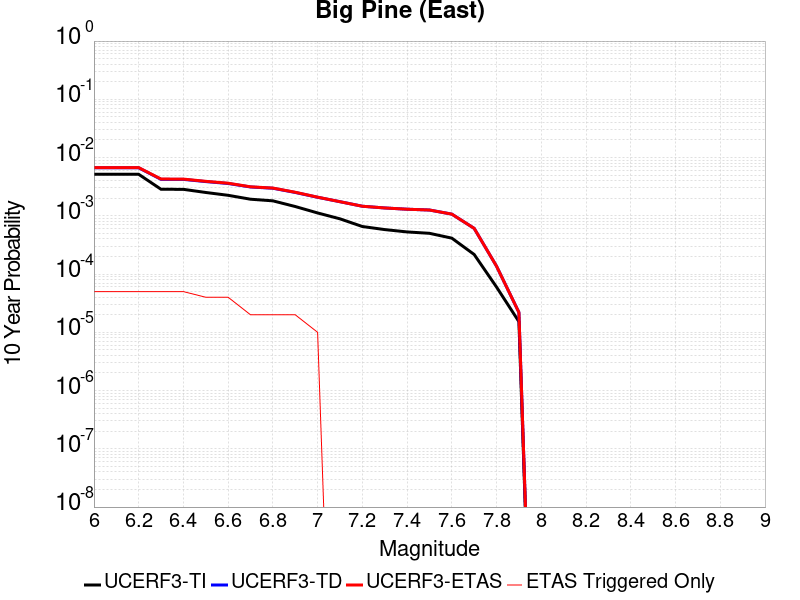 |

| Magnitude | 1 wk TI Prob | 1 wk TD Prob | 1 wk ETAS Prob | 1 wk ETAS/TD Gain | 1 wk ETAS Triggered Only | 1 mo TI Prob | 1 mo TD Prob | 1 mo ETAS Prob | 1 mo ETAS/TD Gain | 1 mo ETAS Triggered Only | 1 yr TI Prob | 1 yr TD Prob | 1 yr ETAS Prob | 1 yr ETAS/TD Gain | 1 yr ETAS Triggered Only | 10 yr TI Prob | 10 yr TD Prob | 10 yr ETAS Prob | 10 yr ETAS/TD Gain | 10 yr ETAS Triggered Only |
|-----|-----|-----|-----|-----|-----|-----|-----|-----|-----|-----|-----|-----|-----|-----|-----|-----|-----|-----|-----|-----|
| 6.0 | 9.916913E-6 | 1.281854E-5 | 1.281854E-5 | 1.0 | 0.0 | 4.250036E-5 | 5.4935572E-5 | 5.4935572E-5 | 1.0 | 0.0 | 5.173191E-4 | 6.686574E-4 | 6.686574E-4 | 1.0 | 0.0 | 0.0051611643 | 0.00667124 | 0.0067209066 | 1.0074449 | 5.0E-5 |
| 6.1 | 9.916913E-6 | 1.281854E-5 | 1.281854E-5 | 1.0 | 0.0 | 4.250036E-5 | 5.4935572E-5 | 5.4935572E-5 | 1.0 | 0.0 | 5.173191E-4 | 6.686574E-4 | 6.686574E-4 | 1.0 | 0.0 | 0.0051611643 | 0.00667124 | 0.0067209066 | 1.0074449 | 5.0E-5 |
| 6.2 | 9.916913E-6 | 1.281854E-5 | 1.281854E-5 | 1.0 | 0.0 | 4.250036E-5 | 5.4935572E-5 | 5.4935572E-5 | 1.0 | 0.0 | 5.173191E-4 | 6.686574E-4 | 6.686574E-4 | 1.0 | 0.0 | 0.0051611643 | 0.00667124 | 0.0067209066 | 1.0074449 | 5.0E-5 |
| 6.3 | 5.479711E-6 | 8.11447E-6 | 8.11447E-6 | 1.0 | 0.0 | 2.3484265E-5 | 3.4775854E-5 | 3.4775854E-5 | 1.0 | 0.0 | 2.858834E-4 | 4.2331696E-4 | 4.2331696E-4 | 1.0 | 0.0 | 0.0028551589 | 0.0042280247 | 0.0042778137 | 1.0117759 | 5.0E-5 |
| 6.4 | 5.465009E-6 | 8.098763E-6 | 8.098763E-6 | 1.0 | 0.0 | 2.3421257E-5 | 3.470854E-5 | 3.470854E-5 | 1.0 | 0.0 | 2.851165E-4 | 4.2249775E-4 | 4.2249775E-4 | 1.0 | 0.0 | 0.0028475097 | 0.004219864 | 0.004269653 | 1.0117987 | 5.0E-5 |
| 6.5 | 4.826767E-6 | 7.4238146E-6 | 7.4238146E-6 | 1.0 | 0.0 | 2.068598E-5 | 3.1815976E-5 | 3.1815976E-5 | 1.0 | 0.0 | 2.518227E-4 | 3.8729343E-4 | 3.8729343E-4 | 1.0 | 0.0 | 0.0025153751 | 0.0038690618 | 0.003908907 | 1.0102984 | 4.0E-5 |
| 6.6 | 4.3146847E-6 | 6.8837467E-6 | 6.8837467E-6 | 1.0 | 0.0 | 1.8491375E-5 | 2.950145E-5 | 2.950145E-5 | 1.0 | 0.0 | 2.2510924E-4 | 3.5912343E-4 | 3.5912343E-4 | 1.0 | 0.0 | 0.0022488134 | 0.0035882755 | 0.003628132 | 1.0111074 | 4.0E-5 |
| 6.7 | 3.6968106E-6 | 5.9968484E-6 | 5.9968484E-6 | 1.0 | 0.0 | 1.5843378E-5 | 2.5700534E-5 | 2.5700534E-5 | 1.0 | 0.0 | 1.9287605E-4 | 3.1286062E-4 | 3.1286062E-4 | 1.0 | 0.0 | 0.0019270873 | 0.003126956 | 0.0031468936 | 1.006376 | 2.0E-5 |
| 6.8 | 3.4671132E-6 | 5.703515E-6 | 5.703515E-6 | 1.0 | 0.0 | 1.4858972E-5 | 2.4443414E-5 | 2.4443414E-5 | 1.0 | 0.0 | 1.8089297E-4 | 2.9755937E-4 | 2.9755937E-4 | 1.0 | 0.0 | 0.0018074579 | 0.0029743554 | 0.002994296 | 1.0067041 | 2.0E-5 |
| 6.9 | 2.7686972E-6 | 4.8264656E-6 | 4.8264656E-6 | 1.0 | 0.0 | 1.1865792E-5 | 2.0684693E-5 | 2.0684693E-5 | 1.0 | 0.0 | 1.4445644E-4 | 2.518078E-4 | 2.518078E-4 | 1.0 | 0.0 | 0.0014436257 | 0.0025179028 | 0.0025378524 | 1.0079231 | 2.0E-5 |
| 7.0 | 2.1472624E-6 | 3.986174E-6 | 3.986174E-6 | 1.0 | 0.0 | 9.20252E-6 | 1.7083494E-5 | 1.7083494E-5 | 1.0 | 0.0 | 1.12034926E-4 | 2.0797222E-4 | 2.0797222E-4 | 1.0 | 0.0 | 0.0011197845 | 0.0020804254 | 0.0020904047 | 1.0047967 | 1.0E-5 |
| 7.1 | 1.7018335E-6 | 3.3459255E-6 | 3.3459255E-6 | 1.0 | 0.0 | 7.293552E-6 | 1.4339605E-5 | 1.4339605E-5 | 1.0 | 0.0 | 8.879537E-5 | 1.7457105E-4 | 1.7457105E-4 | 1.0 | 0.0 | 8.87599E-4 | 0.0017469557 | 0.0017469557 | 1.0 | 0.0 |
| 7.2 | 1.25603E-6 | 2.795471E-6 | 2.795471E-6 | 1.0 | 0.0 | 5.3829745E-6 | 1.1980536E-5 | 1.1980536E-5 | 1.0 | 0.0 | 6.553574E-5 | 1.458535E-4 | 1.458535E-4 | 1.0 | 0.0 | 6.551642E-4 | 0.0014601707 | 0.0014601707 | 1.0 | 0.0 |
| 7.3 | 1.112297E-6 | 2.6112702E-6 | 2.6112702E-6 | 1.0 | 0.0 | 4.7669787E-6 | 1.1191111E-5 | 1.1191111E-5 | 1.0 | 0.0 | 5.803642E-5 | 1.3624349E-4 | 1.3624349E-4 | 1.0 | 0.0 | 5.802127E-4 | 0.00136402 | 0.00136402 | 1.0 | 0.0 |
| 7.4 | 1.0137181E-6 | 2.4843957E-6 | 2.4843957E-6 | 1.0 | 0.0 | 4.3444993E-6 | 1.0647368E-5 | 1.0647368E-5 | 1.0 | 0.0 | 5.2892992E-5 | 1.2962421E-4 | 1.2962421E-4 | 1.0 | 0.0 | 5.288041E-4 | 0.0012976775 | 0.0012976775 | 1.0 | 0.0 |
| 7.5 | 9.598608E-7 | 2.4080273E-6 | 2.4080273E-6 | 1.0 | 0.0 | 4.1136827E-6 | 1.0320077E-5 | 1.0320077E-5 | 1.0 | 0.0 | 5.0082934E-5 | 1.2563991E-4 | 1.2563991E-4 | 1.0 | 0.0 | 5.007165E-4 | 0.0012576841 | 0.0012576841 | 1.0 | 0.0 |
| 7.6 | 7.929459E-7 | 2.0456312E-6 | 2.0456312E-6 | 1.0 | 0.0 | 3.3983351E-6 | 8.766962E-6 | 8.766962E-6 | 1.0 | 0.0 | 4.1373947E-5 | 1.0673271E-4 | 1.0673271E-4 | 1.0 | 0.0 | 4.1366243E-4 | 0.0010689225 | 0.0010689225 | 1.0 | 0.0 |
| 7.7 | 4.155788E-7 | 1.1611139E-6 | 1.1611139E-6 | 1.0 | 0.0 | 1.7810507E-6 | 4.9761934E-6 | 4.9761934E-6 | 1.0 | 0.0 | 2.1684076E-5 | 6.0583512E-5 | 6.0583512E-5 | 1.0 | 0.0 | 2.1681961E-4 | 6.0889556E-4 | 6.0889556E-4 | 1.0 | 0.0 |
| 7.8 | 1.14666925E-7 | 2.5932084E-7 | 2.5932084E-7 | 1.0 | 0.0 | 4.914296E-7 | 1.1113746E-6 | 1.1113746E-6 | 1.0 | 0.0 | 5.9831386E-6 | 1.3530906E-5 | 1.3530906E-5 | 1.0 | 0.0 | 5.9829777E-5 | 1.364052E-4 | 1.364052E-4 | 1.0 | 0.0 |
| 7.9 | 2.9231824E-8 | 4.1479638E-8 | 4.1479638E-8 | 1.0 | 0.0 | 1.2527924E-7 | 1.7776986E-7 | 1.7776986E-7 | 1.0 | 0.0 | 1.5252737E-6 | 2.1643461E-6 | 2.1643461E-6 | 1.0 | 0.0 | 1.5252632E-5 | 2.1986685E-5 | 2.1986685E-5 | 1.0 | 0.0 |

## San Jacinto (Coyote Creek)
*[(top)](#table-of-contents)*

| 1 Week | 1 Month | 1 Year | 10 Year |
|-----|-----|-----|-----|
|  |  |  | 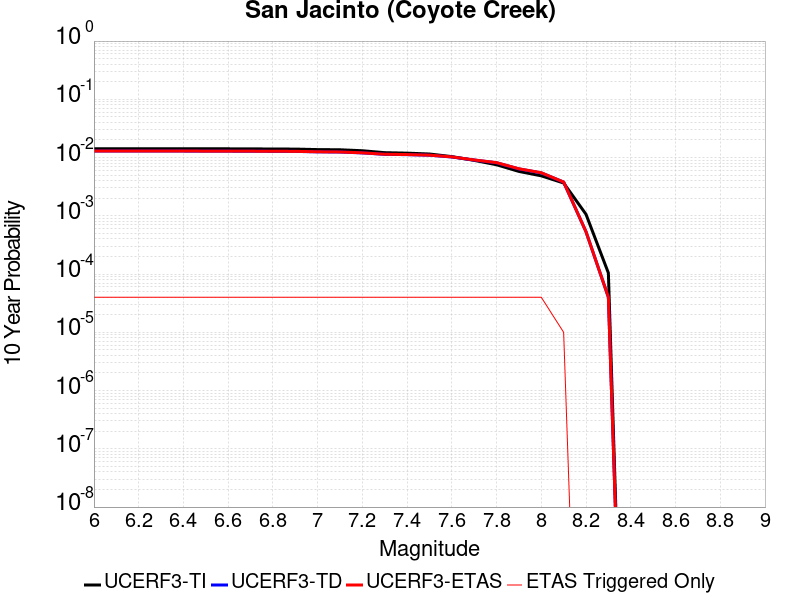 |

| Magnitude | 1 wk TI Prob | 1 wk TD Prob | 1 wk ETAS Prob | 1 wk ETAS/TD Gain | 1 wk ETAS Triggered Only | 1 mo TI Prob | 1 mo TD Prob | 1 mo ETAS Prob | 1 mo ETAS/TD Gain | 1 mo ETAS Triggered Only | 1 yr TI Prob | 1 yr TD Prob | 1 yr ETAS Prob | 1 yr ETAS/TD Gain | 1 yr ETAS Triggered Only | 10 yr TI Prob | 10 yr TD Prob | 10 yr ETAS Prob | 10 yr ETAS/TD Gain | 10 yr ETAS Triggered Only |
|-----|-----|-----|-----|-----|-----|-----|-----|-----|-----|-----|-----|-----|-----|-----|-----|-----|-----|-----|-----|-----|
| 6.0 | 2.7374346E-5 | 2.4152421E-5 | 2.4152421E-5 | 1.0 | 0.0 | 1.1731335E-4 | 1.0350628E-4 | 1.2350421E-4 | 1.193205 | 2.0E-5 | 0.0014273542 | 0.001259463 | 0.0012794379 | 1.0158598 | 2.0E-5 | 0.01418221 | 0.012931943 | 0.012971425 | 1.0030531 | 4.0E-5 |
| 6.1 | 2.7374346E-5 | 2.4152421E-5 | 2.4152421E-5 | 1.0 | 0.0 | 1.1731335E-4 | 1.0350628E-4 | 1.2350421E-4 | 1.193205 | 2.0E-5 | 0.0014273542 | 0.001259463 | 0.0012794379 | 1.0158598 | 2.0E-5 | 0.01418221 | 0.012931943 | 0.012971425 | 1.0030531 | 4.0E-5 |
| 6.2 | 2.7374346E-5 | 2.4152421E-5 | 2.4152421E-5 | 1.0 | 0.0 | 1.1731335E-4 | 1.0350628E-4 | 1.2350421E-4 | 1.193205 | 2.0E-5 | 0.0014273542 | 0.001259463 | 0.0012794379 | 1.0158598 | 2.0E-5 | 0.01418221 | 0.012931943 | 0.012971425 | 1.0030531 | 4.0E-5 |
| 6.3 | 2.7374346E-5 | 2.4152421E-5 | 2.4152421E-5 | 1.0 | 0.0 | 1.1731335E-4 | 1.0350628E-4 | 1.2350421E-4 | 1.193205 | 2.0E-5 | 0.0014273542 | 0.001259463 | 0.0012794379 | 1.0158598 | 2.0E-5 | 0.01418221 | 0.012931943 | 0.012971425 | 1.0030531 | 4.0E-5 |
| 6.4 | 2.7374346E-5 | 2.4152421E-5 | 2.4152421E-5 | 1.0 | 0.0 | 1.1731335E-4 | 1.0350628E-4 | 1.2350421E-4 | 1.193205 | 2.0E-5 | 0.0014273542 | 0.001259463 | 0.0012794379 | 1.0158598 | 2.0E-5 | 0.01418221 | 0.012931943 | 0.012971425 | 1.0030531 | 4.0E-5 |
| 6.5 | 2.7282445E-5 | 2.4038494E-5 | 2.4038494E-5 | 1.0 | 0.0 | 1.16919524E-4 | 1.03018065E-4 | 1.2301601E-4 | 1.1941206 | 2.0E-5 | 0.0014225657 | 0.001253526 | 0.0012735008 | 1.015935 | 2.0E-5 | 0.014134934 | 0.012873269 | 0.012912754 | 1.0030673 | 4.0E-5 |
| 6.6 | 2.7282445E-5 | 2.4038494E-5 | 2.4038494E-5 | 1.0 | 0.0 | 1.16919524E-4 | 1.03018065E-4 | 1.2301601E-4 | 1.1941206 | 2.0E-5 | 0.0014225657 | 0.001253526 | 0.0012735008 | 1.015935 | 2.0E-5 | 0.014134934 | 0.012873269 | 0.012912754 | 1.0030673 | 4.0E-5 |
| 6.7 | 2.7216198E-5 | 2.3963614E-5 | 2.3963614E-5 | 1.0 | 0.0 | 1.1663563E-4 | 1.0269717E-4 | 1.2269511E-4 | 1.1947273 | 2.0E-5 | 0.0014191137 | 0.0012496236 | 0.0012695986 | 1.0159848 | 2.0E-5 | 0.014100855 | 0.012834677 | 0.012874163 | 1.0030766 | 4.0E-5 |
| 6.8 | 2.7078617E-5 | 2.3880828E-5 | 2.3880828E-5 | 1.0 | 0.0 | 1.1604605E-4 | 1.02342405E-4 | 1.2234035E-4 | 1.1954024 | 2.0E-5 | 0.001411945 | 0.0012453091 | 0.0012652843 | 1.0160403 | 2.0E-5 | 0.014030075 | 0.012791819 | 0.012831308 | 1.003087 | 4.0E-5 |
| 6.9 | 2.6982952E-5 | 2.3800336E-5 | 2.3800336E-5 | 1.0 | 0.0 | 1.15636096E-4 | 1.01997466E-4 | 1.2199543E-4 | 1.1960633 | 2.0E-5 | 0.0014069602 | 0.0012411143 | 0.0012610896 | 1.0160946 | 2.0E-5 | 0.013980856 | 0.012750106 | 0.012789596 | 1.0030972 | 4.0E-5 |
| 7.0 | 2.6449972E-5 | 2.3377343E-5 | 2.3377343E-5 | 1.0 | 0.0 | 1.1335209E-4 | 1.00184785E-4 | 1.20182776E-4 | 1.1996111 | 2.0E-5 | 0.001379188 | 0.0012190698 | 0.0012390454 | 1.0163859 | 2.0E-5 | 0.0137065975 | 0.012531462 | 0.012570961 | 1.003152 | 4.0E-5 |
| 7.1 | 2.6257849E-5 | 2.3203378E-5 | 2.3203378E-5 | 1.0 | 0.0 | 1.1252879E-4 | 9.943927E-5 | 1.1943728E-4 | 1.2011077 | 2.0E-5 | 0.0013691769 | 0.0012100033 | 0.0012299791 | 1.0165089 | 2.0E-5 | 0.013607717 | 0.012441383 | 0.012480885 | 1.003175 | 4.0E-5 |
| 7.2 | 2.5270041E-5 | 2.2398073E-5 | 2.2398073E-5 | 1.0 | 0.0 | 1.0829568E-4 | 9.598822E-5 | 1.159863E-4 | 1.2083389 | 2.0E-5 | 0.0013177024 | 0.0011680324 | 0.001188009 | 1.0171028 | 2.0E-5 | 0.013099162 | 0.012022524 | 0.012062044 | 1.0032871 | 4.0E-5 |
| 7.3 | 2.339701E-5 | 2.1129852E-5 | 2.1129852E-5 | 1.0 | 0.0 | 1.0026905E-4 | 9.0553374E-5 | 1.1055157E-4 | 1.2208441 | 2.0E-5 | 0.001220092 | 0.0011019319 | 0.0011219098 | 1.01813 | 2.0E-5 | 0.012134149 | 0.011361412 | 0.011400957 | 1.0034807 | 4.0E-5 |
| 7.4 | 2.296333E-5 | 2.0860187E-5 | 2.0860187E-5 | 1.0 | 0.0 | 9.841056E-5 | 8.939775E-5 | 1.0939596E-4 | 1.2236993 | 2.0E-5 | 0.0011974899 | 0.0010878762 | 0.0011078544 | 1.0183644 | 2.0E-5 | 0.011910575 | 0.011220528 | 0.011260079 | 1.0035249 | 4.0E-5 |
| 7.5 | 2.2188895E-5 | 2.0383068E-5 | 2.0383068E-5 | 1.0 | 0.0 | 9.50918E-5 | 8.735309E-5 | 1.0735134E-4 | 1.2289358 | 2.0E-5 | 0.0011571277 | 0.001063007 | 0.0010829858 | 1.0187945 | 2.0E-5 | 0.011511209 | 0.010970126 | 0.011009687 | 1.0036063 | 4.0E-5 |
| 7.6 | 2.0013189E-5 | 1.8969224E-5 | 1.8969224E-5 | 1.0 | 0.0 | 8.5767984E-5 | 8.129415E-5 | 1.0129252E-4 | 1.2460002 | 2.0E-5 | 0.001043725 | 9.893086E-4 | 0.0010092888 | 1.0201961 | 2.0E-5 | 0.010388365 | 0.010228057 | 0.010267648 | 1.0038708 | 4.0E-5 |
| 7.7 | 1.7230794E-5 | 1.6750411E-5 | 1.6750411E-5 | 1.0 | 0.0 | 7.384417E-5 | 7.178551E-5 | 9.178407E-5 | 1.2785878 | 2.0E-5 | 8.986819E-4 | 8.7363896E-4 | 8.936215E-4 | 1.0228728 | 2.0E-5 | 0.008950562 | 0.009066527 | 0.009106164 | 1.0043719 | 4.0E-5 |
| 7.8 | 1.4478809E-5 | 1.4997487E-5 | 1.4997487E-5 | 1.0 | 0.0 | 6.205057E-5 | 6.4273365E-5 | 8.427208E-5 | 1.3111509 | 2.0E-5 | 7.552038E-4 | 7.8224787E-4 | 8.0223224E-4 | 1.0255474 | 2.0E-5 | 0.0075264242 | 0.008144863 | 0.008184537 | 1.0048711 | 4.0E-5 |
| 7.9 | 1.1114467E-5 | 1.1650795E-5 | 1.1650795E-5 | 1.0 | 0.0 | 4.7632562E-5 | 4.9931026E-5 | 6.993003E-5 | 1.4005326 | 2.0E-5 | 5.797721E-4 | 6.0774124E-4 | 6.277291E-4 | 1.0328888 | 2.0E-5 | 0.0057826187 | 0.00638346 | 0.0064232047 | 1.0062262 | 4.0E-5 |
| 8.0 | 9.327402E-6 | 9.904316E-6 | 9.904316E-6 | 1.0 | 0.0 | 3.9973966E-5 | 4.2446383E-5 | 6.2445535E-5 | 1.4711627 | 2.0E-5 | 4.8657437E-4 | 5.1666267E-4 | 5.3665234E-4 | 1.03869 | 2.0E-5 | 0.0048551033 | 0.005452786 | 0.005492568 | 1.0072957 | 4.0E-5 |
| 8.1 | 7.0235833E-6 | 6.831197E-6 | 6.831197E-6 | 1.0 | 0.0 | 3.0100724E-5 | 2.9276232E-5 | 2.9276232E-5 | 1.0 | 0.0 | 3.664147E-4 | 3.5638033E-4 | 3.5638033E-4 | 1.0 | 0.0 | 0.003658111 | 0.0037895683 | 0.0037995304 | 1.0026288 | 1.0E-5 |
| 8.2 | 2.0358202E-6 | 8.9996047E-7 | 8.9996047E-7 | 1.0 | 0.0 | 8.724915E-6 | 3.856968E-6 | 3.856968E-6 | 1.0 | 0.0 | 1.06220665E-4 | 4.6957593E-5 | 4.6957593E-5 | 1.0 | 0.0 | 0.001061699 | 5.3285924E-4 | 5.3285924E-4 | 1.0 | 0.0 |
| 8.3 | 2.0051264E-7 | 6.621079E-8 | 6.621079E-8 | 1.0 | 0.0 | 8.5933965E-7 | 2.837605E-7 | 2.837605E-7 | 1.0 | 0.0 | 1.046241E-5 | 3.454779E-6 | 3.454779E-6 | 1.0 | 0.0 | 1.0461917E-4 | 4.016238E-5 | 4.016238E-5 | 1.0 | 0.0 |

## Green Valley 2011 CFM
*[(top)](#table-of-contents)*

| 1 Week | 1 Month | 1 Year | 10 Year |
|-----|-----|-----|-----|
| 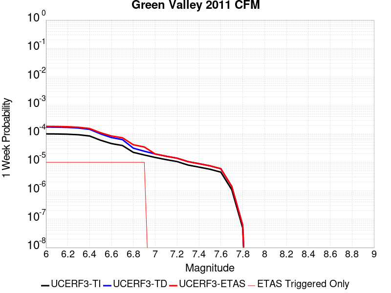 |  |  | 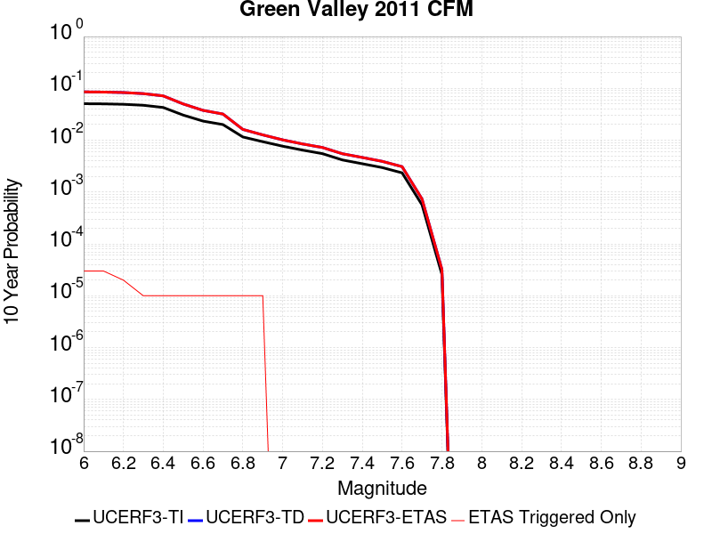 |

| Magnitude | 1 wk TI Prob | 1 wk TD Prob | 1 wk ETAS Prob | 1 wk ETAS/TD Gain | 1 wk ETAS Triggered Only | 1 mo TI Prob | 1 mo TD Prob | 1 mo ETAS Prob | 1 mo ETAS/TD Gain | 1 mo ETAS Triggered Only | 1 yr TI Prob | 1 yr TD Prob | 1 yr ETAS Prob | 1 yr ETAS/TD Gain | 1 yr ETAS Triggered Only | 10 yr TI Prob | 10 yr TD Prob | 10 yr ETAS Prob | 10 yr ETAS/TD Gain | 10 yr ETAS Triggered Only |
|-----|-----|-----|-----|-----|-----|-----|-----|-----|-----|-----|-----|-----|-----|-----|-----|-----|-----|-----|-----|-----|
| 6.0 | 9.9629346E-5 | 1.7303096E-4 | 1.8302923E-4 | 1.0577831 | 1.0E-5 | 4.2691303E-4 | 7.413446E-4 | 7.5133715E-4 | 1.013479 | 1.0E-5 | 0.0051852856 | 0.008987141 | 0.009016871 | 1.003308 | 3.0E-5 | 0.050659515 | 0.08554168 | 0.08556911 | 1.0003207 | 3.0E-5 |
| 6.1 | 9.88615E-5 | 1.7150394E-4 | 1.8150223E-4 | 1.0582978 | 1.0E-5 | 4.2362334E-4 | 7.348039E-4 | 7.447966E-4 | 1.013599 | 1.0E-5 | 0.0051454236 | 0.0089081675 | 0.0089379 | 1.0033377 | 3.0E-5 | 0.050279044 | 0.08482929 | 0.08485675 | 1.0003237 | 3.0E-5 |
| 6.2 | 9.696895E-5 | 1.6789426E-4 | 1.7789258E-4 | 1.0595512 | 1.0E-5 | 4.15515E-4 | 7.193438E-4 | 7.293366E-4 | 1.0138916 | 1.0E-5 | 0.0050471667 | 0.008721547 | 0.008741372 | 1.0022732 | 2.0E-5 | 0.04934063 | 0.08313806 | 0.0831564 | 1.0002205 | 2.0E-5 |
| 6.3 | 9.275224E-5 | 1.5968755E-4 | 1.6968595E-4 | 1.0626123 | 1.0E-5 | 3.9744904E-4 | 6.8419095E-4 | 6.941841E-4 | 1.0146058 | 1.0E-5 | 0.0048282105 | 0.008296867 | 0.008306784 | 1.0011953 | 1.0E-5 | 0.047246475 | 0.07927713 | 0.07928634 | 1.0001161 | 1.0E-5 |
| 6.4 | 8.391499E-5 | 1.4366042E-4 | 1.5365898E-4 | 1.0695986 | 1.0E-5 | 3.595861E-4 | 6.155415E-4 | 6.255353E-4 | 1.0162358 | 1.0E-5 | 0.004369175 | 0.007467382 | 0.007477307 | 1.0013292 | 1.0E-5 | 0.04284265 | 0.07164556 | 0.07165484 | 1.0001296 | 1.0E-5 |
| 6.5 | 5.9519385E-5 | 9.932708E-5 | 1.0932609E-4 | 1.1006675 | 1.0E-5 | 2.5505814E-4 | 4.2561657E-4 | 4.356123E-4 | 1.0234853 | 1.0E-5 | 0.0031009112 | 0.005168488 | 0.005178436 | 1.0019248 | 1.0E-5 | 0.030579966 | 0.05014941 | 0.05015891 | 1.0001894 | 1.0E-5 |
| 6.6 | 4.5361558E-5 | 7.40199E-5 | 8.4019164E-5 | 1.1350888 | 1.0E-5 | 1.9439218E-4 | 3.1718693E-4 | 3.2718375E-4 | 1.0315171 | 1.0E-5 | 0.0023641558 | 0.003853991 | 0.0038639524 | 1.0025847 | 1.0E-5 | 0.023391623 | 0.037669275 | 0.037678897 | 1.0002555 | 1.0E-5 |
| 6.7 | 3.8808106E-5 | 6.264344E-5 | 7.264281E-5 | 1.1596236 | 1.0E-5 | 1.6630985E-4 | 2.6844675E-4 | 2.7844406E-4 | 1.0372413 | 1.0E-5 | 0.0020229418 | 0.0032628388 | 0.0032728063 | 1.0030549 | 1.0E-5 | 0.020046256 | 0.032008745 | 0.032018427 | 1.0003024 | 1.0E-5 |
| 6.8 | 2.2284667E-5 | 3.128603E-5 | 4.1285715E-5 | 1.3196214 | 1.0E-5 | 9.550222E-5 | 1.3407608E-4 | 1.4407474E-4 | 1.0745745 | 1.0E-5 | 0.0011621192 | 0.0016311527 | 0.0016411364 | 1.0061207 | 1.0E-5 | 0.011560607 | 0.016166579 | 0.016176417 | 1.0006086 | 1.0E-5 |
| 6.9 | 1.8050168E-5 | 2.4448742E-5 | 3.4448498E-5 | 1.409009 | 1.0E-5 | 7.735557E-5 | 1.04776154E-4 | 1.147751E-4 | 1.0954316 | 1.0E-5 | 9.4139716E-4 | 0.0012749061 | 0.0012848933 | 1.0078337 | 1.0E-5 | 0.009374191 | 0.012668985 | 0.012678859 | 1.0007793 | 1.0E-5 |
| 7.0 | 1.4763166E-5 | 1.9583402E-5 | 1.9583402E-5 | 1.0 | 0.0 | 6.326917E-5 | 8.392618E-5 | 8.392618E-5 | 1.0 | 0.0 | 7.7002996E-4 | 0.0010213237 | 0.0010213237 | 1.0 | 0.0 | 0.007673672 | 0.010166345 | 0.010166345 | 1.0 | 0.0 |
| 7.1 | 1.2399713E-5 | 1.6304173E-5 | 1.6304173E-5 | 1.0 | 0.0 | 5.3140546E-5 | 6.987317E-5 | 6.987317E-5 | 1.0 | 0.0 | 6.467941E-4 | 8.5037574E-4 | 8.5037574E-4 | 1.0 | 0.0 | 0.006449148 | 0.008471897 | 0.008471897 | 1.0 | 0.0 |
| 7.2 | 1.0584195E-5 | 1.392217E-5 | 1.392217E-5 | 1.0 | 0.0 | 4.5360044E-5 | 5.9665086E-5 | 5.9665086E-5 | 1.0 | 0.0 | 5.521186E-4 | 7.2618196E-4 | 7.2618196E-4 | 1.0 | 0.0 | 0.0055074887 | 0.007238742 | 0.007238742 | 1.0 | 0.0 |
| 7.3 | 7.998173E-6 | 1.0544361E-5 | 1.0544361E-5 | 1.0 | 0.0 | 3.4277433E-5 | 4.5189343E-5 | 4.5189343E-5 | 1.0 | 0.0 | 4.1724785E-4 | 5.5004243E-4 | 5.5004243E-4 | 1.0 | 0.0 | 0.004164653 | 0.005487132 | 0.005487132 | 1.0 | 0.0 |
| 7.4 | 6.7571127E-6 | 8.932998E-6 | 8.932998E-6 | 1.0 | 0.0 | 2.8958733E-5 | 3.828372E-5 | 3.828372E-5 | 1.0 | 0.0 | 3.5251552E-4 | 4.6600556E-4 | 4.6600556E-4 | 1.0 | 0.0 | 0.0035195686 | 0.00465062 | 0.00465062 | 1.0 | 0.0 |
| 7.5 | 5.69878E-6 | 7.516554E-6 | 7.516554E-6 | 1.0 | 0.0 | 2.4423114E-5 | 3.221341E-5 | 3.221341E-5 | 1.0 | 0.0 | 2.9731085E-4 | 3.9212857E-4 | 3.9212857E-4 | 1.0 | 0.0 | 0.002969134 | 0.0039146794 | 0.0039146794 | 1.0 | 0.0 |
| 7.6 | 4.503664E-6 | 5.9358817E-6 | 5.9358817E-6 | 1.0 | 0.0 | 1.9301275E-5 | 2.5439249E-5 | 2.5439249E-5 | 1.0 | 0.0 | 2.3496768E-4 | 3.0967966E-4 | 3.0967966E-4 | 1.0 | 0.0 | 0.002347194 | 0.0030927253 | 0.0030927253 | 1.0 | 0.0 |
| 7.7 | 1.0873546E-6 | 1.4107662E-6 | 1.4107662E-6 | 1.0 | 0.0 | 4.6600826E-6 | 6.046127E-6 | 6.046127E-6 | 1.0 | 0.0 | 5.6735033E-5 | 7.360914E-5 | 7.360914E-5 | 1.0 | 0.0 | 5.672055E-4 | 7.358931E-4 | 7.358931E-4 | 1.0 | 0.0 |
| 7.8 | 4.9373917E-8 | 6.178036E-8 | 6.178036E-8 | 1.0 | 0.0 | 2.1160248E-7 | 2.6477298E-7 | 2.6477298E-7 | 1.0 | 0.0 | 2.5762572E-6 | 3.2236076E-6 | 3.2236076E-6 | 1.0 | 0.0 | 2.5762274E-5 | 3.222859E-5 | 3.222859E-5 | 1.0 | 0.0 |

## Hosgri
*[(top)](#table-of-contents)*

| 1 Week | 1 Month | 1 Year | 10 Year |
|-----|-----|-----|-----|
|  |  |  |  |

| Magnitude | 1 wk TI Prob | 1 wk TD Prob | 1 wk ETAS Prob | 1 wk ETAS/TD Gain | 1 wk ETAS Triggered Only | 1 mo TI Prob | 1 mo TD Prob | 1 mo ETAS Prob | 1 mo ETAS/TD Gain | 1 mo ETAS Triggered Only | 1 yr TI Prob | 1 yr TD Prob | 1 yr ETAS Prob | 1 yr ETAS/TD Gain | 1 yr ETAS Triggered Only | 10 yr TI Prob | 10 yr TD Prob | 10 yr ETAS Prob | 10 yr ETAS/TD Gain | 10 yr ETAS Triggered Only |
|-----|-----|-----|-----|-----|-----|-----|-----|-----|-----|-----|-----|-----|-----|-----|-----|-----|-----|-----|-----|-----|
| 6.0 | 2.883978E-5 | 2.9128816E-5 | 2.9128816E-5 | 1.0 | 0.0 | 1.235932E-4 | 1.2483196E-4 | 1.2483196E-4 | 1.0 | 0.0 | 0.0015037085 | 0.0015187968 | 0.0015487513 | 1.0197225 | 3.0E-5 | 0.01493574 | 0.015087956 | 0.0151273515 | 1.0026112 | 4.0E-5 |
| 6.1 | 2.883978E-5 | 2.9128816E-5 | 2.9128816E-5 | 1.0 | 0.0 | 1.235932E-4 | 1.2483196E-4 | 1.2483196E-4 | 1.0 | 0.0 | 0.0015037085 | 0.0015187968 | 0.0015487513 | 1.0197225 | 3.0E-5 | 0.01493574 | 0.015087956 | 0.0151273515 | 1.0026112 | 4.0E-5 |
| 6.2 | 2.883978E-5 | 2.9128816E-5 | 2.9128816E-5 | 1.0 | 0.0 | 1.235932E-4 | 1.2483196E-4 | 1.2483196E-4 | 1.0 | 0.0 | 0.0015037085 | 0.0015187968 | 0.0015487513 | 1.0197225 | 3.0E-5 | 0.01493574 | 0.015087956 | 0.0151273515 | 1.0026112 | 4.0E-5 |
| 6.3 | 2.2914428E-5 | 2.2642287E-5 | 2.2642287E-5 | 1.0 | 0.0 | 9.8200995E-5 | 9.703479E-5 | 9.703479E-5 | 1.0 | 0.0 | 0.0011949413 | 0.0011807632 | 0.0012107278 | 1.0253773 | 3.0E-5 | 0.011885363 | 0.011746307 | 0.011785837 | 1.0033653 | 4.0E-5 |
| 6.4 | 2.0195741E-5 | 1.9696845E-5 | 1.9696845E-5 | 1.0 | 0.0 | 8.65503E-5 | 8.441233E-5 | 8.441233E-5 | 1.0 | 0.0 | 0.0010532405 | 0.0010272375 | 0.0010572068 | 1.0291746 | 3.0E-5 | 0.010482626 | 0.010225951 | 0.010265541 | 1.0038716 | 4.0E-5 |
| 6.5 | 1.9924333E-5 | 1.9409264E-5 | 1.9409264E-5 | 1.0 | 0.0 | 8.53872E-5 | 8.317992E-5 | 8.317992E-5 | 1.0 | 0.0 | 0.0010390934 | 0.0010122469 | 0.0010422166 | 1.029607 | 3.0E-5 | 0.010342481 | 0.010077409 | 0.0101170065 | 1.0039293 | 4.0E-5 |
| 6.6 | 1.809694E-5 | 1.7458564E-5 | 1.7458564E-5 | 1.0 | 0.0 | 7.7556004E-5 | 7.482028E-5 | 7.482028E-5 | 1.0 | 0.0 | 9.438353E-4 | 9.105575E-4 | 9.405302E-4 | 1.0329169 | 3.0E-5 | 0.009398366 | 0.00906922 | 0.009108857 | 1.0043706 | 4.0E-5 |
| 6.7 | 1.675989E-5 | 1.6043017E-5 | 1.6043017E-5 | 1.0 | 0.0 | 7.182612E-5 | 6.875398E-5 | 6.875398E-5 | 1.0 | 0.0 | 8.7413215E-4 | 8.3675934E-4 | 8.567426E-4 | 1.0238818 | 2.0E-5 | 0.008707017 | 0.008337004 | 0.008366753 | 1.0035684 | 3.0E-5 |
| 6.8 | 1.5401129E-5 | 1.4614321E-5 | 1.4614321E-5 | 1.0 | 0.0 | 6.6003166E-5 | 6.2631305E-5 | 6.2631305E-5 | 1.0 | 0.0 | 8.032922E-4 | 7.6227024E-4 | 7.82255E-4 | 1.0262175 | 2.0E-5 | 0.008003947 | 0.0075974306 | 0.0076272027 | 1.0039186 | 3.0E-5 |
| 6.9 | 1.356559E-5 | 1.269019E-5 | 1.269019E-5 | 1.0 | 0.0 | 5.8136946E-5 | 5.4385397E-5 | 5.4385397E-5 | 1.0 | 0.0 | 7.0758746E-4 | 6.619415E-4 | 6.8192824E-4 | 1.0301942 | 2.0E-5 | 0.007053386 | 0.0066005136 | 0.0066303154 | 1.004515 | 3.0E-5 |
| 7.0 | 1.2030819E-5 | 1.1096171E-5 | 1.1096171E-5 | 1.0 | 0.0 | 5.155963E-5 | 4.755415E-5 | 4.755415E-5 | 1.0 | 0.0 | 6.275577E-4 | 5.788181E-4 | 5.888123E-4 | 1.0172666 | 1.0E-5 | 0.006257884 | 0.005773876 | 0.005783818 | 1.001722 | 1.0E-5 |
| 7.1 | 1.0972698E-5 | 1.0022381E-5 | 1.0022381E-5 | 1.0 | 0.0 | 4.7025E-5 | 4.2952353E-5 | 4.2952353E-5 | 1.0 | 0.0 | 5.72379E-4 | 5.228195E-4 | 5.3281424E-4 | 1.0191171 | 1.0E-5 | 0.0057090693 | 0.005216657 | 0.005226605 | 1.001907 | 1.0E-5 |
| 7.2 | 9.961926E-6 | 9.0349395E-6 | 9.0349395E-6 | 1.0 | 0.0 | 4.2693267E-5 | 3.8720595E-5 | 3.8720595E-5 | 1.0 | 0.0 | 5.1966653E-4 | 4.713213E-4 | 4.713213E-4 | 1.0 | 0.0 | 0.00518453 | 0.004703974 | 0.004703974 | 1.0 | 0.0 |
| 7.3 | 8.700929E-6 | 7.828288E-6 | 7.828288E-6 | 1.0 | 0.0 | 3.7289166E-5 | 3.3549375E-5 | 3.3549375E-5 | 1.0 | 0.0 | 4.53901E-4 | 4.083871E-4 | 4.083871E-4 | 1.0 | 0.0 | 0.00452975 | 0.004077116 | 0.004077116 | 1.0 | 0.0 |
| 7.4 | 7.866285E-6 | 6.9989205E-6 | 6.9989205E-6 | 1.0 | 0.0 | 3.3712215E-5 | 2.999503E-5 | 2.999503E-5 | 1.0 | 0.0 | 4.103689E-4 | 3.651283E-4 | 3.651283E-4 | 1.0 | 0.0 | 0.004096119 | 0.0036460315 | 0.0036460315 | 1.0 | 0.0 |
| 7.5 | 6.8381305E-6 | 5.959869E-6 | 5.959869E-6 | 1.0 | 0.0 | 2.9305946E-5 | 2.5542047E-5 | 2.5542047E-5 | 1.0 | 0.0 | 3.5674145E-4 | 3.1093007E-4 | 3.1093007E-4 | 1.0 | 0.0 | 0.0035616932 | 0.0031056956 | 0.0031056956 | 1.0 | 0.0 |
| 7.6 | 5.503376E-6 | 4.595407E-6 | 4.595407E-6 | 1.0 | 0.0 | 2.3585684E-5 | 1.9694453E-5 | 1.9694453E-5 | 1.0 | 0.0 | 2.8711787E-4 | 2.3975359E-4 | 2.3975359E-4 | 1.0 | 0.0 | 0.002867472 | 0.0023956925 | 0.0023956925 | 1.0 | 0.0 |
| 7.7 | 3.6144982E-6 | 2.6523571E-6 | 2.6523571E-6 | 1.0 | 0.0 | 1.5490614E-5 | 1.1367195E-5 | 1.1367195E-5 | 1.0 | 0.0 | 1.8858191E-4 | 1.3838682E-4 | 1.3838682E-4 | 1.0 | 0.0 | 0.0018842196 | 0.0013837479 | 0.0013837479 | 1.0 | 0.0 |
| 7.8 | 1.9853494E-6 | 1.1362197E-6 | 1.1362197E-6 | 1.0 | 0.0 | 8.508612E-6 | 4.8695038E-6 | 4.8695038E-6 | 1.0 | 0.0 | 1.0358743E-4 | 5.9284594E-5 | 5.9284594E-5 | 1.0 | 0.0 | 0.0010353916 | 5.9342675E-4 | 5.9342675E-4 | 1.0 | 0.0 |
| 7.9 | 1.1818757E-6 | 5.2958796E-7 | 5.2958796E-7 | 1.0 | 0.0 | 5.0651715E-6 | 2.2696604E-6 | 2.2696604E-6 | 1.0 | 0.0 | 6.1666724E-5 | 2.7632766E-5 | 2.7632766E-5 | 1.0 | 0.0 | 6.1649614E-4 | 2.7697708E-4 | 2.7697708E-4 | 1.0 | 0.0 |
| 8.0 | 6.962958E-7 | 2.714428E-7 | 2.714428E-7 | 1.0 | 0.0 | 2.9841215E-6 | 1.1633257E-6 | 1.1633257E-6 | 1.0 | 0.0 | 3.6331072E-5 | 1.4163398E-5 | 1.4163398E-5 | 1.0 | 0.0 | 3.6325134E-4 | 1.4218807E-4 | 1.4218807E-4 | 1.0 | 0.0 |
| 8.1 | 1.5033264E-7 | 6.528495E-8 | 6.528495E-8 | 1.0 | 0.0 | 6.442826E-7 | 2.7979263E-7 | 2.7979263E-7 | 1.0 | 0.0 | 7.844113E-6 | 3.4064701E-6 | 3.4064701E-6 | 1.0 | 0.0 | 7.843835E-5 | 3.408197E-5 | 3.408197E-5 | 1.0 | 0.0 |

## Bullion Mountains
*[(top)](#table-of-contents)*

| 1 Week | 1 Month | 1 Year | 10 Year |
|-----|-----|-----|-----|
|  |  |  |  |

| Magnitude | 1 wk TI Prob | 1 wk TD Prob | 1 wk ETAS Prob | 1 wk ETAS/TD Gain | 1 wk ETAS Triggered Only | 1 mo TI Prob | 1 mo TD Prob | 1 mo ETAS Prob | 1 mo ETAS/TD Gain | 1 mo ETAS Triggered Only | 1 yr TI Prob | 1 yr TD Prob | 1 yr ETAS Prob | 1 yr ETAS/TD Gain | 1 yr ETAS Triggered Only | 10 yr TI Prob | 10 yr TD Prob | 10 yr ETAS Prob | 10 yr ETAS/TD Gain | 10 yr ETAS Triggered Only |
|-----|-----|-----|-----|-----|-----|-----|-----|-----|-----|-----|-----|-----|-----|-----|-----|-----|-----|-----|-----|-----|
| 6.0 | 1.6420427E-5 | 1.4692201E-5 | 1.4692201E-5 | 1.0 | 0.0 | 7.037136E-5 | 6.296527E-5 | 6.296527E-5 | 1.0 | 0.0 | 8.5643446E-4 | 7.6637097E-4 | 7.96348E-4 | 1.0391155 | 3.0E-5 | 0.008531413 | 0.0076410742 | 0.0076807686 | 1.0051949 | 4.0E-5 |
| 6.1 | 1.6420427E-5 | 1.4692201E-5 | 1.4692201E-5 | 1.0 | 0.0 | 7.037136E-5 | 6.296527E-5 | 6.296527E-5 | 1.0 | 0.0 | 8.5643446E-4 | 7.6637097E-4 | 7.96348E-4 | 1.0391155 | 3.0E-5 | 0.008531413 | 0.0076410742 | 0.0076807686 | 1.0051949 | 4.0E-5 |
| 6.2 | 1.6420427E-5 | 1.4692201E-5 | 1.4692201E-5 | 1.0 | 0.0 | 7.037136E-5 | 6.296527E-5 | 6.296527E-5 | 1.0 | 0.0 | 8.5643446E-4 | 7.6637097E-4 | 7.96348E-4 | 1.0391155 | 3.0E-5 | 0.008531413 | 0.0076410742 | 0.0076807686 | 1.0051949 | 4.0E-5 |
| 6.3 | 1.2046778E-5 | 9.8623805E-6 | 9.8623805E-6 | 1.0 | 0.0 | 5.1628023E-5 | 4.226679E-5 | 4.226679E-5 | 1.0 | 0.0 | 6.283899E-4 | 5.1449984E-4 | 5.444844E-4 | 1.058279 | 3.0E-5 | 0.0062661595 | 0.0051353686 | 0.005175163 | 1.0077491 | 4.0E-5 |
| 6.4 | 1.2046778E-5 | 9.8623805E-6 | 9.8623805E-6 | 1.0 | 0.0 | 5.1628023E-5 | 4.226679E-5 | 4.226679E-5 | 1.0 | 0.0 | 6.283899E-4 | 5.1449984E-4 | 5.444844E-4 | 1.058279 | 3.0E-5 | 0.0062661595 | 0.0051353686 | 0.005175163 | 1.0077491 | 4.0E-5 |
| 6.5 | 1.0244343E-5 | 7.879477E-6 | 7.879477E-6 | 1.0 | 0.0 | 4.390359E-5 | 3.376887E-5 | 3.376887E-5 | 1.0 | 0.0 | 5.343951E-4 | 4.110791E-4 | 4.3107086E-4 | 1.0486324 | 2.0E-5 | 0.005331118 | 0.0041052178 | 0.0041350946 | 1.0072777 | 3.0E-5 |
| 6.6 | 9.605408E-6 | 7.177506E-6 | 7.177506E-6 | 1.0 | 0.0 | 4.1165385E-5 | 3.0760493E-5 | 3.0760493E-5 | 1.0 | 0.0 | 5.010733E-4 | 3.74465E-4 | 3.9445751E-4 | 1.0533895 | 2.0E-5 | 0.00499945 | 0.0037403372 | 0.003770225 | 1.0079907 | 3.0E-5 |
| 6.7 | 8.60418E-6 | 6.124001E-6 | 6.124001E-6 | 1.0 | 0.0 | 3.687454E-5 | 2.6245565E-5 | 2.6245565E-5 | 1.0 | 0.0 | 4.48855E-4 | 3.1951242E-4 | 3.295092E-4 | 1.0312877 | 1.0E-5 | 0.004479495 | 0.0031924422 | 0.0032123784 | 1.0062448 | 2.0E-5 |
| 6.8 | 5.187994E-6 | 2.5631452E-6 | 2.5631452E-6 | 1.0 | 0.0 | 2.223407E-5 | 1.0984884E-5 | 1.0984884E-5 | 1.0 | 0.0 | 2.7066618E-4 | 1.3373674E-4 | 1.4373541E-4 | 1.0747638 | 1.0E-5 | 0.0027033675 | 0.0013369543 | 0.0013469409 | 1.0074697 | 1.0E-5 |
| 6.9 | 4.5302368E-6 | 2.344301E-6 | 2.344301E-6 | 1.0 | 0.0 | 1.9415156E-5 | 1.0046988E-5 | 1.0046988E-5 | 1.0 | 0.0 | 2.3635388E-4 | 1.2231918E-4 | 1.3231796E-4 | 1.0817434 | 1.0E-5 | 0.0023610266 | 0.0012229076 | 0.0012328954 | 1.0081673 | 1.0E-5 |
| 7.0 | 3.431668E-6 | 1.688219E-6 | 1.688219E-6 | 1.0 | 0.0 | 1.4707065E-5 | 7.235224E-6 | 7.235224E-6 | 1.0 | 0.0 | 1.7904381E-4 | 8.8088855E-5 | 9.808797E-5 | 1.1135117 | 1.0E-5 | 0.0017889962 | 8.8088855E-4 | 8.908797E-4 | 1.0113422 | 1.0E-5 |

## Hosgri (Extension)
*[(top)](#table-of-contents)*

| 1 Week | 1 Month | 1 Year | 10 Year |
|-----|-----|-----|-----|
|  |  |  |  |

| Magnitude | 1 wk TI Prob | 1 wk TD Prob | 1 wk ETAS Prob | 1 wk ETAS/TD Gain | 1 wk ETAS Triggered Only | 1 mo TI Prob | 1 mo TD Prob | 1 mo ETAS Prob | 1 mo ETAS/TD Gain | 1 mo ETAS Triggered Only | 1 yr TI Prob | 1 yr TD Prob | 1 yr ETAS Prob | 1 yr ETAS/TD Gain | 1 yr ETAS Triggered Only | 10 yr TI Prob | 10 yr TD Prob | 10 yr ETAS Prob | 10 yr ETAS/TD Gain | 10 yr ETAS Triggered Only |
|-----|-----|-----|-----|-----|-----|-----|-----|-----|-----|-----|-----|-----|-----|-----|-----|-----|-----|-----|-----|-----|
| 6.0 | 1.1369135E-5 | 1.20832E-5 | 1.20832E-5 | 1.0 | 0.0 | 4.8723956E-5 | 5.1784245E-5 | 5.1784245E-5 | 1.0 | 0.0 | 5.9305265E-4 | 6.3031353E-4 | 6.403072E-4 | 1.0158551 | 1.0E-5 | 0.005914725 | 0.0062875063 | 0.0063272547 | 1.0063218 | 4.0E-5 |
| 6.1 | 6.934979E-6 | 7.324637E-6 | 7.324637E-6 | 1.0 | 0.0 | 2.9721E-5 | 3.1390948E-5 | 3.1390948E-5 | 1.0 | 0.0 | 3.617931E-4 | 3.821219E-4 | 3.821219E-4 | 1.0 | 0.0 | 0.0036120464 | 0.0038150612 | 0.003825023 | 1.0026112 | 1.0E-5 |
| 6.2 | 6.934979E-6 | 7.324637E-6 | 7.324637E-6 | 1.0 | 0.0 | 2.9721E-5 | 3.1390948E-5 | 3.1390948E-5 | 1.0 | 0.0 | 3.617931E-4 | 3.821219E-4 | 3.821219E-4 | 1.0 | 0.0 | 0.0036120464 | 0.0038150612 | 0.003825023 | 1.0026112 | 1.0E-5 |
| 6.3 | 4.5484676E-6 | 4.7693884E-6 | 4.7693884E-6 | 1.0 | 0.0 | 1.9493287E-5 | 2.0440079E-5 | 2.0440079E-5 | 1.0 | 0.0 | 2.3730492E-4 | 2.4882995E-4 | 2.4882995E-4 | 1.0 | 0.0 | 0.0023705168 | 0.002485556 | 0.0024955312 | 1.0040133 | 1.0E-5 |
| 6.4 | 4.218095E-6 | 4.4169165E-6 | 4.4169165E-6 | 1.0 | 0.0 | 1.8077424E-5 | 1.8929508E-5 | 1.8929508E-5 | 1.0 | 0.0 | 2.2007042E-4 | 2.304427E-4 | 2.304427E-4 | 1.0 | 0.0 | 0.002198526 | 0.0023020708 | 0.0023120479 | 1.004334 | 1.0E-5 |
| 6.5 | 3.717374E-6 | 3.883928E-6 | 3.883928E-6 | 1.0 | 0.0 | 1.5931506E-5 | 1.6645301E-5 | 1.6645301E-5 | 1.0 | 0.0 | 1.9394881E-4 | 2.0263788E-4 | 2.0263788E-4 | 1.0 | 0.0 | 0.0019377962 | 0.0020245498 | 0.0020345296 | 1.0049294 | 1.0E-5 |
| 6.6 | 3.4605036E-6 | 3.6083538E-6 | 3.6083538E-6 | 1.0 | 0.0 | 1.4830645E-5 | 1.5464282E-5 | 1.5464282E-5 | 1.0 | 0.0 | 1.8054814E-4 | 1.8826152E-4 | 1.8826152E-4 | 1.0 | 0.0 | 0.0018040152 | 0.001881035 | 0.0018910163 | 1.0053062 | 1.0E-5 |
| 6.7 | 3.123439E-6 | 3.246613E-6 | 3.246613E-6 | 1.0 | 0.0 | 1.33860985E-5 | 1.3913982E-5 | 1.3913982E-5 | 1.0 | 0.0 | 1.6296357E-4 | 1.6938966E-4 | 1.6938966E-4 | 1.0 | 0.0 | 0.001628441 | 0.0016926165 | 0.0017025996 | 1.005898 | 1.0E-5 |
| 6.8 | 2.8290783E-6 | 2.9305816E-6 | 2.9305816E-6 | 1.0 | 0.0 | 1.2124565E-5 | 1.2559575E-5 | 1.2559575E-5 | 1.0 | 0.0 | 1.4760658E-4 | 1.5290218E-4 | 1.5290218E-4 | 1.0 | 0.0 | 0.0014750857 | 0.0015279786 | 0.0015379633 | 1.0065346 | 1.0E-5 |
| 6.9 | 2.454112E-6 | 2.5283568E-6 | 2.5283568E-6 | 1.0 | 0.0 | 1.0517581E-5 | 1.0835771E-5 | 1.0835771E-5 | 1.0 | 0.0 | 1.2804402E-4 | 1.3191758E-4 | 1.3191758E-4 | 1.0 | 0.0 | 0.0012797028 | 0.0013183989 | 0.0013283857 | 1.0075749 | 1.0E-5 |
| 7.0 | 2.1008145E-6 | 2.149904E-6 | 2.149904E-6 | 1.0 | 0.0 | 9.003459E-6 | 9.2138425E-6 | 9.2138425E-6 | 1.0 | 0.0 | 1.096116E-4 | 1.1217279E-4 | 1.1217279E-4 | 1.0 | 0.0 | 0.0010955755 | 0.0011211655 | 0.0011211655 | 1.0 | 0.0 |
| 7.1 | 1.744384E-6 | 1.7686655E-6 | 1.7686655E-6 | 1.0 | 0.0 | 7.47591E-6 | 7.579973E-6 | 7.579973E-6 | 1.0 | 0.0 | 9.1015405E-5 | 9.228228E-5 | 9.228228E-5 | 1.0 | 0.0 | 9.097813E-4 | 9.224413E-4 | 9.224413E-4 | 1.0 | 0.0 |
| 7.2 | 1.5456587E-6 | 1.5563166E-6 | 1.5563166E-6 | 1.0 | 0.0 | 6.6242346E-6 | 6.6699113E-6 | 6.6699113E-6 | 1.0 | 0.0 | 8.064707E-5 | 8.120316E-5 | 8.120316E-5 | 1.0 | 0.0 | 8.0617814E-4 | 8.117361E-4 | 8.117361E-4 | 1.0 | 0.0 |
| 7.3 | 1.3775123E-6 | 1.3766349E-6 | 1.3766349E-6 | 1.0 | 0.0 | 5.9036106E-6 | 5.8998507E-6 | 5.8998507E-6 | 1.0 | 0.0 | 7.187409E-5 | 7.1828326E-5 | 7.1828326E-5 | 1.0 | 0.0 | 7.185085E-4 | 7.180521E-4 | 7.180521E-4 | 1.0 | 0.0 |
| 7.4 | 1.214491E-6 | 1.2023712E-6 | 1.2023712E-6 | 1.0 | 0.0 | 5.2049513E-6 | 5.153009E-6 | 5.153009E-6 | 1.0 | 0.0 | 6.336844E-5 | 6.2736086E-5 | 6.2736086E-5 | 1.0 | 0.0 | 6.335037E-4 | 6.271846E-4 | 6.271846E-4 | 1.0 | 0.0 |
| 7.5 | 1.0101123E-6 | 9.842478E-7 | 9.842478E-7 | 1.0 | 0.0 | 4.3290456E-6 | 4.218198E-6 | 4.218198E-6 | 1.0 | 0.0 | 5.2704854E-5 | 5.1355353E-5 | 5.1355353E-5 | 1.0 | 0.0 | 5.2692357E-4 | 5.1343546E-4 | 5.1343546E-4 | 1.0 | 0.0 |
| 7.6 | 8.1558215E-7 | 7.766179E-7 | 7.766179E-7 | 1.0 | 0.0 | 3.4953473E-6 | 3.3283584E-6 | 3.3283584E-6 | 1.0 | 0.0 | 4.255502E-5 | 4.0522013E-5 | 4.0522013E-5 | 1.0 | 0.0 | 4.2546875E-4 | 4.0514668E-4 | 4.0514668E-4 | 1.0 | 0.0 |
| 7.7 | 4.757816E-7 | 4.1310682E-7 | 4.1310682E-7 | 1.0 | 0.0 | 2.0390623E-6 | 1.7704566E-6 | 1.7704566E-6 | 1.0 | 0.0 | 2.4825302E-5 | 2.1555097E-5 | 2.1555097E-5 | 1.0 | 0.0 | 2.482253E-4 | 2.1553019E-4 | 2.1553019E-4 | 1.0 | 0.0 |
| 7.8 | 2.782787E-7 | 2.00493E-7 | 2.00493E-7 | 1.0 | 0.0 | 1.1926223E-6 | 8.5925547E-7 | 8.5925547E-7 | 1.0 | 0.0 | 1.452008E-5 | 1.04613855E-5 | 1.04613855E-5 | 1.0 | 0.0 | 1.4519131E-4 | 1.0460896E-4 | 1.0460896E-4 | 1.0 | 0.0 |
| 7.9 | 1.6948086E-7 | 9.2453185E-8 | 9.2453185E-8 | 1.0 | 0.0 | 7.2634634E-7 | 3.9622788E-7 | 3.9622788E-7 | 1.0 | 0.0 | 8.843231E-6 | 4.8240636E-6 | 4.8240636E-6 | 1.0 | 0.0 | 8.842879E-5 | 4.8239595E-5 | 4.8239595E-5 | 1.0 | 0.0 |
| 8.0 | 1.0225492E-7 | 4.4745146E-8 | 4.4745146E-8 | 1.0 | 0.0 | 4.382353E-7 | 1.917649E-7 | 1.917649E-7 | 1.0 | 0.0 | 5.335502E-6 | 2.3347352E-6 | 2.3347352E-6 | 1.0 | 0.0 | 5.335374E-5 | 2.334711E-5 | 2.334711E-5 | 1.0 | 0.0 |
| 8.1 | 1.43711345E-8 | 5.7886886E-9 | 5.7886886E-9 | 1.0 | 0.0 | 6.1590576E-8 | 2.4808667E-8 | 2.4808667E-8 | 1.0 | 0.0 | 7.4986497E-7 | 3.0204546E-7 | 3.0204546E-7 | 1.0 | 0.0 | 7.4986247E-6 | 3.0204512E-6 | 3.0204512E-6 | 1.0 | 0.0 |

## Great Valley 09 (Laguna Seca)
*[(top)](#table-of-contents)*

| 1 Week | 1 Month | 1 Year | 10 Year |
|-----|-----|-----|-----|
|  |  | 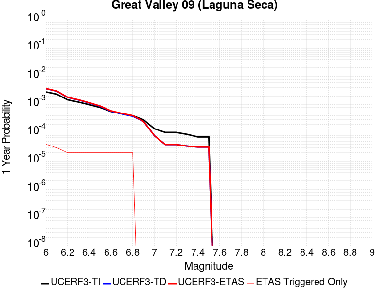 |  |

| Magnitude | 1 wk TI Prob | 1 wk TD Prob | 1 wk ETAS Prob | 1 wk ETAS/TD Gain | 1 wk ETAS Triggered Only | 1 mo TI Prob | 1 mo TD Prob | 1 mo ETAS Prob | 1 mo ETAS/TD Gain | 1 mo ETAS Triggered Only | 1 yr TI Prob | 1 yr TD Prob | 1 yr ETAS Prob | 1 yr ETAS/TD Gain | 1 yr ETAS Triggered Only | 10 yr TI Prob | 10 yr TD Prob | 10 yr ETAS Prob | 10 yr ETAS/TD Gain | 10 yr ETAS Triggered Only |
|-----|-----|-----|-----|-----|-----|-----|-----|-----|-----|-----|-----|-----|-----|-----|-----|-----|-----|-----|-----|-----|
| 6.0 | 5.4353277E-5 | 7.050336E-5 | 7.050336E-5 | 1.0 | 0.0 | 2.3292181E-4 | 3.0212323E-4 | 3.0212323E-4 | 1.0 | 0.0 | 0.0028321352 | 0.0036721565 | 0.0037120096 | 1.0108528 | 4.0E-5 | 0.02796312 | 0.036117274 | 0.03615583 | 1.0010675 | 4.0E-5 |
| 6.1 | 4.5578287E-5 | 5.8223057E-5 | 5.8223057E-5 | 1.0 | 0.0 | 1.953209E-4 | 2.4950382E-4 | 2.4950382E-4 | 1.0 | 0.0 | 0.0023754383 | 0.0030334755 | 0.0030633844 | 1.0098597 | 3.0E-5 | 0.023502063 | 0.029921044 | 0.029950146 | 1.0009726 | 3.0E-5 |
| 6.2 | 2.8536782E-5 | 3.4737728E-5 | 3.4737728E-5 | 1.0 | 0.0 | 1.2229476E-4 | 1.4886676E-4 | 1.4886676E-4 | 1.0 | 0.0 | 0.0014879217 | 0.0018109222 | 0.0018308859 | 1.0110241 | 2.0E-5 | 0.014779986 | 0.017958904 | 0.017978545 | 1.0010936 | 2.0E-5 |
| 6.3 | 2.3698774E-5 | 2.8214345E-5 | 2.8214345E-5 | 1.0 | 0.0 | 1.01562226E-4 | 1.2091216E-4 | 1.2091216E-4 | 1.0 | 0.0 | 0.0012358186 | 0.001471101 | 0.0014910715 | 1.0135753 | 2.0E-5 | 0.012289686 | 0.014611942 | 0.0146316495 | 1.0013487 | 2.0E-5 |
| 6.4 | 1.9191197E-5 | 2.2123615E-5 | 2.2123615E-5 | 1.0 | 0.0 | 8.2245395E-5 | 9.481171E-5 | 9.481171E-5 | 1.0 | 0.0 | 0.0010008777 | 0.0011537268 | 0.0011737037 | 1.0173151 | 2.0E-5 | 0.009963818 | 0.011477377 | 0.011497147 | 1.0017226 | 2.0E-5 |
| 6.5 | 1.5203241E-5 | 1.6801783E-5 | 1.6801783E-5 | 1.0 | 0.0 | 6.5155116E-5 | 7.200525E-5 | 7.200525E-5 | 1.0 | 0.0 | 7.9297484E-4 | 8.763255E-4 | 8.9630793E-4 | 1.0228026 | 2.0E-5 | 0.007901512 | 0.008729823 | 0.008749648 | 1.002271 | 2.0E-5 |
| 6.6 | 1.0984925E-5 | 1.1242807E-5 | 1.1242807E-5 | 1.0 | 0.0 | 4.70774E-5 | 4.8182592E-5 | 4.8182592E-5 | 1.0 | 0.0 | 5.730166E-4 | 5.864689E-4 | 6.064572E-4 | 1.0340824 | 2.0E-5 | 0.005715413 | 0.0058496036 | 0.0058694864 | 1.003399 | 2.0E-5 |
| 6.7 | 9.134616E-6 | 9.020056E-6 | 9.020056E-6 | 1.0 | 0.0 | 3.9147766E-5 | 3.8656824E-5 | 3.8656824E-5 | 1.0 | 0.0 | 4.7651984E-4 | 4.7054756E-4 | 4.9053814E-4 | 1.0424837 | 2.0E-5 | 0.004754993 | 0.0046957573 | 0.0047156634 | 1.0042392 | 2.0E-5 |
| 6.8 | 7.785589E-6 | 7.4520726E-6 | 7.4520726E-6 | 1.0 | 0.0 | 3.3366385E-5 | 3.1937074E-5 | 3.1937074E-5 | 1.0 | 0.0 | 4.0616E-4 | 3.8876652E-4 | 4.0875873E-4 | 1.0514247 | 2.0E-5 | 0.0040541845 | 0.0038810682 | 0.0039009906 | 1.0051333 | 2.0E-5 |
| 6.9 | 5.579095E-6 | 4.898567E-6 | 4.898567E-6 | 1.0 | 0.0 | 2.3910188E-5 | 2.0993697E-5 | 2.0993697E-5 | 1.0 | 0.0 | 2.9106764E-4 | 2.5556967E-4 | 2.5556967E-4 | 1.0 | 0.0 | 0.002906867 | 0.002552895 | 0.002552895 | 1.0 | 0.0 |
| 7.0 | 2.6816688E-6 | 1.5216133E-6 | 1.5216133E-6 | 1.0 | 0.0 | 1.1492816E-5 | 6.521184E-6 | 6.521184E-6 | 1.0 | 0.0 | 1.3991605E-4 | 7.939261E-5 | 7.939261E-5 | 1.0 | 0.0 | 0.0013982799 | 7.9365115E-4 | 7.9365115E-4 | 1.0 | 0.0 |
| 7.1 | 1.9951021E-6 | 7.453698E-7 | 7.453698E-7 | 1.0 | 0.0 | 8.55041E-6 | 3.1944382E-6 | 3.1944382E-6 | 1.0 | 0.0 | 1.0409627E-4 | 3.8891634E-5 | 3.8891634E-5 | 1.0 | 0.0 | 0.0010404752 | 3.8885244E-4 | 3.8885244E-4 | 1.0 | 0.0 |
| 7.2 | 1.9951021E-6 | 7.453698E-7 | 7.453698E-7 | 1.0 | 0.0 | 8.55041E-6 | 3.1944382E-6 | 3.1944382E-6 | 1.0 | 0.0 | 1.0409627E-4 | 3.8891634E-5 | 3.8891634E-5 | 1.0 | 0.0 | 0.0010404752 | 3.8885244E-4 | 3.8885244E-4 | 1.0 | 0.0 |
| 7.3 | 1.7087556E-6 | 6.5787674E-7 | 6.5787674E-7 | 1.0 | 0.0 | 7.3232177E-6 | 2.8194688E-6 | 2.8194688E-6 | 1.0 | 0.0 | 8.915652E-5 | 3.4326535E-5 | 3.4326535E-5 | 1.0 | 0.0 | 8.9120766E-4 | 3.4321635E-4 | 3.4321635E-4 | 1.0 | 0.0 |
| 7.4 | 1.3804846E-6 | 6.0737995E-7 | 6.0737995E-7 | 1.0 | 0.0 | 5.916349E-6 | 2.6030546E-6 | 2.6030546E-6 | 1.0 | 0.0 | 7.2029165E-5 | 3.169177E-5 | 3.169177E-5 | 1.0 | 0.0 | 7.200583E-4 | 3.168765E-4 | 3.168765E-4 | 1.0 | 0.0 |
| 7.5 | 1.3804846E-6 | 6.0737995E-7 | 6.0737995E-7 | 1.0 | 0.0 | 5.916349E-6 | 2.6030546E-6 | 2.6030546E-6 | 1.0 | 0.0 | 7.2029165E-5 | 3.169177E-5 | 3.169177E-5 | 1.0 | 0.0 | 7.200583E-4 | 3.168765E-4 | 3.168765E-4 | 1.0 | 0.0 |

## Raymond
*[(top)](#table-of-contents)*

| 1 Week | 1 Month | 1 Year | 10 Year |
|-----|-----|-----|-----|
|  |  |  |  |

| Magnitude | 1 wk TI Prob | 1 wk TD Prob | 1 wk ETAS Prob | 1 wk ETAS/TD Gain | 1 wk ETAS Triggered Only | 1 mo TI Prob | 1 mo TD Prob | 1 mo ETAS Prob | 1 mo ETAS/TD Gain | 1 mo ETAS Triggered Only | 1 yr TI Prob | 1 yr TD Prob | 1 yr ETAS Prob | 1 yr ETAS/TD Gain | 1 yr ETAS Triggered Only | 10 yr TI Prob | 10 yr TD Prob | 10 yr ETAS Prob | 10 yr ETAS/TD Gain | 10 yr ETAS Triggered Only |
|-----|-----|-----|-----|-----|-----|-----|-----|-----|-----|-----|-----|-----|-----|-----|-----|-----|-----|-----|-----|-----|
| 6.0 | 1.5157413E-5 | 1.5810365E-5 | 1.5810365E-5 | 1.0 | 0.0 | 6.4958724E-5 | 6.775709E-5 | 6.775709E-5 | 1.0 | 0.0 | 7.905855E-4 | 8.246554E-4 | 8.3464716E-4 | 1.0121163 | 1.0E-5 | 0.007877788 | 0.008218473 | 0.008248226 | 1.0036203 | 3.0E-5 |
| 6.1 | 1.5157413E-5 | 1.5810365E-5 | 1.5810365E-5 | 1.0 | 0.0 | 6.4958724E-5 | 6.775709E-5 | 6.775709E-5 | 1.0 | 0.0 | 7.905855E-4 | 8.246554E-4 | 8.3464716E-4 | 1.0121163 | 1.0E-5 | 0.007877788 | 0.008218473 | 0.008248226 | 1.0036203 | 3.0E-5 |
| 6.2 | 1.5157413E-5 | 1.5810365E-5 | 1.5810365E-5 | 1.0 | 0.0 | 6.4958724E-5 | 6.775709E-5 | 6.775709E-5 | 1.0 | 0.0 | 7.905855E-4 | 8.246554E-4 | 8.3464716E-4 | 1.0121163 | 1.0E-5 | 0.007877788 | 0.008218473 | 0.008248226 | 1.0036203 | 3.0E-5 |
| 6.3 | 1.5157413E-5 | 1.5810365E-5 | 1.5810365E-5 | 1.0 | 0.0 | 6.4958724E-5 | 6.775709E-5 | 6.775709E-5 | 1.0 | 0.0 | 7.905855E-4 | 8.246554E-4 | 8.3464716E-4 | 1.0121163 | 1.0E-5 | 0.007877788 | 0.008218473 | 0.008248226 | 1.0036203 | 3.0E-5 |
| 6.4 | 1.3941944E-5 | 1.4454908E-5 | 1.4454908E-5 | 1.0 | 0.0 | 5.9749822E-5 | 6.194826E-5 | 6.194826E-5 | 1.0 | 0.0 | 7.2721124E-4 | 7.5398246E-4 | 7.5398246E-4 | 1.0 | 0.0 | 0.007248361 | 0.0075165783 | 0.007536428 | 1.0026408 | 2.0E-5 |
| 6.5 | 1.3941944E-5 | 1.4454908E-5 | 1.4454908E-5 | 1.0 | 0.0 | 5.9749822E-5 | 6.194826E-5 | 6.194826E-5 | 1.0 | 0.0 | 7.2721124E-4 | 7.5398246E-4 | 7.5398246E-4 | 1.0 | 0.0 | 0.007248361 | 0.0075165783 | 0.007536428 | 1.0026408 | 2.0E-5 |
| 6.6 | 1.0542609E-5 | 1.0671272E-5 | 1.0671272E-5 | 1.0 | 0.0 | 4.5181827E-5 | 4.5733254E-5 | 4.5733254E-5 | 1.0 | 0.0 | 5.499499E-4 | 5.566656E-4 | 5.566656E-4 | 1.0 | 0.0 | 0.005485909 | 0.0055532744 | 0.0055532744 | 1.0 | 0.0 |
| 6.7 | 1.0542609E-5 | 1.0671272E-5 | 1.0671272E-5 | 1.0 | 0.0 | 4.5181827E-5 | 4.5733254E-5 | 4.5733254E-5 | 1.0 | 0.0 | 5.499499E-4 | 5.566656E-4 | 5.566656E-4 | 1.0 | 0.0 | 0.005485909 | 0.0055532744 | 0.0055532744 | 1.0 | 0.0 |
| 6.8 | 1.0079132E-5 | 1.0176802E-5 | 1.0176802E-5 | 1.0 | 0.0 | 4.3195567E-5 | 4.3614164E-5 | 4.3614164E-5 | 1.0 | 0.0 | 5.257791E-4 | 5.3087843E-4 | 5.3087843E-4 | 1.0 | 0.0 | 0.0052453685 | 0.005296653 | 0.005296653 | 1.0 | 0.0 |
| 6.9 | 7.721598E-6 | 7.5490198E-6 | 7.5490198E-6 | 1.0 | 0.0 | 3.3092143E-5 | 3.2352546E-5 | 3.2352546E-5 | 1.0 | 0.0 | 4.0282236E-4 | 3.938223E-4 | 3.938223E-4 | 1.0 | 0.0 | 0.0040209293 | 0.0039313785 | 0.0039313785 | 1.0 | 0.0 |
| 7.0 | 7.137566E-6 | 6.911413E-6 | 6.911413E-6 | 1.0 | 0.0 | 3.058921E-5 | 2.962001E-5 | 2.962001E-5 | 1.0 | 0.0 | 3.7236E-4 | 3.6056503E-4 | 3.6056503E-4 | 1.0 | 0.0 | 0.0037173668 | 0.0035999198 | 0.0035999198 | 1.0 | 0.0 |
| 7.1 | 5.654976E-6 | 5.299629E-6 | 5.299629E-6 | 1.0 | 0.0 | 2.4235387E-5 | 2.2712498E-5 | 2.2712498E-5 | 1.0 | 0.0 | 2.9502588E-4 | 2.764898E-4 | 2.764898E-4 | 1.0 | 0.0 | 0.0029463451 | 0.0027614902 | 0.0027614902 | 1.0 | 0.0 |
| 7.2 | 4.9358455E-6 | 4.5267375E-6 | 4.5267375E-6 | 1.0 | 0.0 | 2.1153453E-5 | 1.940016E-5 | 1.940016E-5 | 1.0 | 0.0 | 2.5751285E-4 | 2.3617149E-4 | 2.3617149E-4 | 1.0 | 0.0 | 0.0025721465 | 0.0023592284 | 0.0023592284 | 1.0 | 0.0 |
| 7.3 | 4.2368597E-6 | 3.805688E-6 | 3.805688E-6 | 1.0 | 0.0 | 1.8157843E-5 | 1.630999E-5 | 1.630999E-5 | 1.0 | 0.0 | 2.2104931E-4 | 1.9855614E-4 | 1.9855614E-4 | 1.0 | 0.0 | 0.0022082955 | 0.0019838074 | 0.0019838074 | 1.0 | 0.0 |
| 7.4 | 3.4999923E-6 | 3.0438064E-6 | 3.0438064E-6 | 1.0 | 0.0 | 1.49998805E-5 | 1.3044819E-5 | 1.3044819E-5 | 1.0 | 0.0 | 1.8260824E-4 | 1.5880918E-4 | 1.5880918E-4 | 1.0 | 0.0 | 0.0018245826 | 0.0015869739 | 0.0015869739 | 1.0 | 0.0 |
| 7.5 | 2.738017E-6 | 2.3020955E-6 | 2.3020955E-6 | 1.0 | 0.0 | 1.1734306E-5 | 9.866087E-6 | 9.866087E-6 | 1.0 | 0.0 | 1.428558E-4 | 1.2011305E-4 | 1.2011305E-4 | 1.0 | 0.0 | 0.0014276401 | 0.0012004969 | 0.0012004969 | 1.0 | 0.0 |
| 7.6 | 1.8186392E-6 | 1.4423393E-6 | 1.4423393E-6 | 1.0 | 0.0 | 7.794145E-6 | 6.18144E-6 | 6.18144E-6 | 1.0 | 0.0 | 9.488958E-5 | 7.525647E-5 | 7.525647E-5 | 1.0 | 0.0 | 9.4849075E-4 | 7.5232267E-4 | 7.5232267E-4 | 1.0 | 0.0 |
| 7.7 | 1.0660348E-6 | 7.644004E-7 | 7.644004E-7 | 1.0 | 0.0 | 4.5687125E-6 | 3.2759976E-6 | 3.2759976E-6 | 1.0 | 0.0 | 5.5622655E-5 | 3.988456E-5 | 3.988456E-5 | 1.0 | 0.0 | 5.5608735E-4 | 3.987844E-4 | 3.987844E-4 | 1.0 | 0.0 |
| 7.8 | 6.913602E-7 | 4.3205526E-7 | 4.3205526E-7 | 1.0 | 0.0 | 2.962969E-6 | 1.8516641E-6 | 1.8516641E-6 | 1.0 | 0.0 | 3.607355E-5 | 2.2543783E-5 | 2.2543783E-5 | 1.0 | 0.0 | 3.6067693E-4 | 2.2542427E-4 | 2.2542427E-4 | 1.0 | 0.0 |
| 7.9 | 7.425201E-8 | 5.3225733E-8 | 5.3225733E-8 | 1.0 | 0.0 | 3.1822285E-7 | 2.2811027E-7 | 2.2811027E-7 | 1.0 | 0.0 | 3.874356E-6 | 2.7772403E-6 | 2.7772403E-6 | 1.0 | 0.0 | 3.8742884E-5 | 2.7772185E-5 | 2.7772185E-5 | 1.0 | 0.0 |

## San Pedro Basin
*[(top)](#table-of-contents)*

| 1 Week | 1 Month | 1 Year | 10 Year |
|-----|-----|-----|-----|
|  |  |  |  |

| Magnitude | 1 wk TI Prob | 1 wk TD Prob | 1 wk ETAS Prob | 1 wk ETAS/TD Gain | 1 wk ETAS Triggered Only | 1 mo TI Prob | 1 mo TD Prob | 1 mo ETAS Prob | 1 mo ETAS/TD Gain | 1 mo ETAS Triggered Only | 1 yr TI Prob | 1 yr TD Prob | 1 yr ETAS Prob | 1 yr ETAS/TD Gain | 1 yr ETAS Triggered Only | 10 yr TI Prob | 10 yr TD Prob | 10 yr ETAS Prob | 10 yr ETAS/TD Gain | 10 yr ETAS Triggered Only |
|-----|-----|-----|-----|-----|-----|-----|-----|-----|-----|-----|-----|-----|-----|-----|-----|-----|-----|-----|-----|-----|
| 6.0 | 5.3449043E-5 | 6.3371765E-5 | 7.3371135E-5 | 1.157789 | 1.0E-5 | 2.2904722E-4 | 2.7156848E-4 | 2.8156576E-4 | 1.0368131 | 1.0E-5 | 0.0027850836 | 0.0033019334 | 0.0033119004 | 1.0030185 | 1.0E-5 | 0.027504366 | 0.03259028 | 0.0326193 | 1.0008905 | 3.0E-5 |
| 6.1 | 5.3449043E-5 | 6.3371765E-5 | 7.3371135E-5 | 1.157789 | 1.0E-5 | 2.2904722E-4 | 2.7156848E-4 | 2.8156576E-4 | 1.0368131 | 1.0E-5 | 0.0027850836 | 0.0033019334 | 0.0033119004 | 1.0030185 | 1.0E-5 | 0.027504366 | 0.03259028 | 0.0326193 | 1.0008905 | 3.0E-5 |
| 6.2 | 2.3189454E-5 | 2.6643364E-5 | 3.6643098E-5 | 1.3753179 | 1.0E-5 | 9.9379584E-5 | 1.1418111E-4 | 1.2417996E-4 | 1.0875702 | 1.0E-5 | 0.0012092749 | 0.0013893156 | 0.0013993017 | 1.0071878 | 1.0E-5 | 0.012027155 | 0.013811166 | 0.01383089 | 1.0014281 | 2.0E-5 |
| 6.3 | 2.3189454E-5 | 2.6643364E-5 | 3.6643098E-5 | 1.3753179 | 1.0E-5 | 9.9379584E-5 | 1.1418111E-4 | 1.2417996E-4 | 1.0875702 | 1.0E-5 | 0.0012092749 | 0.0013893156 | 0.0013993017 | 1.0071878 | 1.0E-5 | 0.012027155 | 0.013811166 | 0.01383089 | 1.0014281 | 2.0E-5 |
| 6.4 | 1.966056E-5 | 2.2463855E-5 | 3.246363E-5 | 1.4451495 | 1.0E-5 | 8.425682E-5 | 9.627034E-5 | 1.0626938E-4 | 1.1038642 | 1.0E-5 | 0.001025344 | 0.0011715014 | 0.0011814896 | 1.0085261 | 1.0E-5 | 0.010206259 | 0.011657343 | 0.011677111 | 1.0016956 | 2.0E-5 |
| 6.5 | 1.7342953E-5 | 1.9745525E-5 | 2.9745326E-5 | 1.5064338 | 1.0E-5 | 7.4324824E-5 | 8.462114E-5 | 9.462029E-5 | 1.1181638 | 1.0E-5 | 9.04529E-4 | 0.0010298124 | 0.0010398021 | 1.0097005 | 1.0E-5 | 0.009008561 | 0.010254125 | 0.01027392 | 1.0019305 | 2.0E-5 |
| 6.6 | 1.439804E-5 | 1.6323016E-5 | 2.6322852E-5 | 1.6126219 | 1.0E-5 | 6.170443E-5 | 6.995408E-5 | 7.995339E-5 | 1.1429409 | 1.0E-5 | 7.509924E-4 | 8.513903E-4 | 8.6138176E-4 | 1.0117354 | 1.0E-5 | 0.0074845953 | 0.008484487 | 0.008494403 | 1.0011686 | 1.0E-5 |
| 6.7 | 1.2634884E-5 | 1.4285555E-5 | 1.4285555E-5 | 1.0 | 0.0 | 5.414838E-5 | 6.122254E-5 | 6.122254E-5 | 1.0 | 0.0 | 6.590571E-4 | 7.4516E-4 | 7.4516E-4 | 1.0 | 0.0 | 0.006571059 | 0.0074296347 | 0.0074296347 | 1.0 | 0.0 |
| 6.8 | 1.146091E-5 | 1.2933422E-5 | 1.2933422E-5 | 1.0 | 0.0 | 4.911726E-5 | 5.5427943E-5 | 5.5427943E-5 | 1.0 | 0.0 | 5.9783855E-4 | 6.74656E-4 | 6.74656E-4 | 1.0 | 0.0 | 0.0059623276 | 0.006729019 | 0.006729019 | 1.0 | 0.0 |
| 6.9 | 9.109035E-6 | 1.023519E-5 | 1.023519E-5 | 1.0 | 0.0 | 3.9038136E-5 | 4.386452E-5 | 4.386452E-5 | 1.0 | 0.0 | 4.7518566E-4 | 5.339476E-4 | 5.339476E-4 | 1.0 | 0.0 | 0.0047417083 | 0.005329401 | 0.005329401 | 1.0 | 0.0 |
| 7.0 | 5.9351028E-6 | 6.584069E-6 | 6.584069E-6 | 1.0 | 0.0 | 2.5435906E-5 | 2.8217266E-5 | 2.8217266E-5 | 1.0 | 0.0 | 3.0963816E-4 | 3.4351466E-4 | 3.4351466E-4 | 1.0 | 0.0 | 0.0030920706 | 0.0034321537 | 0.0034321537 | 1.0 | 0.0 |
| 7.1 | 2.1557585E-6 | 2.2096617E-6 | 2.2096617E-6 | 1.0 | 0.0 | 9.238933E-6 | 9.469944E-6 | 9.469944E-6 | 1.0 | 0.0 | 1.1247819E-4 | 1.1529063E-4 | 1.1529063E-4 | 1.0 | 0.0 | 0.0011242128 | 0.0011523236 | 0.0011523236 | 1.0 | 0.0 |
| 7.2 | 2.1251979E-6 | 2.1780077E-6 | 2.1780077E-6 | 1.0 | 0.0 | 9.107958E-6 | 9.334286E-6 | 9.334286E-6 | 1.0 | 0.0 | 1.1088375E-4 | 1.13639166E-4 | 1.13639166E-4 | 1.0 | 0.0 | 0.0011082845 | 0.0011358259 | 0.0011358259 | 1.0 | 0.0 |
| 7.3 | 1.7145798E-6 | 1.7442975E-6 | 1.7442975E-6 | 1.0 | 0.0 | 7.3481783E-6 | 7.47554E-6 | 7.47554E-6 | 1.0 | 0.0 | 8.94604E-5 | 9.101099E-5 | 9.101099E-5 | 1.0 | 0.0 | 8.9424395E-4 | 9.097463E-4 | 9.097463E-4 | 1.0 | 0.0 |
| 7.4 | 1.4467993E-6 | 1.4641951E-6 | 1.4641951E-6 | 1.0 | 0.0 | 6.200554E-6 | 6.2751074E-6 | 6.2751074E-6 | 1.0 | 0.0 | 7.548913E-5 | 7.639683E-5 | 7.639683E-5 | 1.0 | 0.0 | 7.546349E-4 | 7.637129E-4 | 7.637129E-4 | 1.0 | 0.0 |
| 7.5 | 1.2803735E-6 | 1.293157E-6 | 1.293157E-6 | 1.0 | 0.0 | 5.487303E-6 | 5.54209E-6 | 5.54209E-6 | 1.0 | 0.0 | 6.680587E-5 | 6.747293E-5 | 6.747293E-5 | 1.0 | 0.0 | 6.678579E-4 | 6.745315E-4 | 6.745315E-4 | 1.0 | 0.0 |
| 7.6 | 6.755009E-7 | 6.769505E-7 | 6.769505E-7 | 1.0 | 0.0 | 2.8950008E-6 | 2.9012133E-6 | 2.9012133E-6 | 1.0 | 0.0 | 3.5246063E-5 | 3.532176E-5 | 3.532176E-5 | 1.0 | 0.0 | 3.5240475E-4 | 3.5316718E-4 | 3.5316718E-4 | 1.0 | 0.0 |
| 7.7 | 6.211885E-8 | 4.5700038E-8 | 4.5700038E-8 | 1.0 | 0.0 | 2.6622362E-7 | 1.9585728E-7 | 1.9585728E-7 | 1.0 | 0.0 | 3.2412677E-6 | 2.38456E-6 | 2.38456E-6 | 1.0 | 0.0 | 3.2412205E-5 | 2.3845365E-5 | 2.3845365E-5 | 1.0 | 0.0 |
| 7.8 | 2.6580573E-9 | 1.5138489E-9 | 1.5138489E-9 | 1.0 | 0.0 | 1.1391674E-8 | 6.487924E-9 | 6.487924E-9 | 1.0 | 0.0 | 1.3869362E-7 | 7.8990475E-8 | 7.8990475E-8 | 1.0 | 0.0 | 1.3869354E-6 | 7.8990473E-7 | 7.8990473E-7 | 1.0 | 0.0 |

## San Jacinto (Clark) rev
*[(top)](#table-of-contents)*

| 1 Week | 1 Month | 1 Year | 10 Year |
|-----|-----|-----|-----|
|  |  |  |  |

| Magnitude | 1 wk TI Prob | 1 wk TD Prob | 1 wk ETAS Prob | 1 wk ETAS/TD Gain | 1 wk ETAS Triggered Only | 1 mo TI Prob | 1 mo TD Prob | 1 mo ETAS Prob | 1 mo ETAS/TD Gain | 1 mo ETAS Triggered Only | 1 yr TI Prob | 1 yr TD Prob | 1 yr ETAS Prob | 1 yr ETAS/TD Gain | 1 yr ETAS Triggered Only | 10 yr TI Prob | 10 yr TD Prob | 10 yr ETAS Prob | 10 yr ETAS/TD Gain | 10 yr ETAS Triggered Only |
|-----|-----|-----|-----|-----|-----|-----|-----|-----|-----|-----|-----|-----|-----|-----|-----|-----|-----|-----|-----|-----|
| 6.0 | 4.482615E-5 | 2.1158266E-5 | 3.1158055E-5 | 1.4726185 | 1.0E-5 | 1.9209793E-4 | 9.067519E-5 | 1.0067428E-4 | 1.1102737 | 1.0E-5 | 0.0023362834 | 0.0011034205 | 0.0011333874 | 1.0271581 | 3.0E-5 | 0.02311874 | 0.0114991795 | 0.011528835 | 1.0025789 | 3.0E-5 |
| 6.1 | 4.482615E-5 | 2.1158266E-5 | 3.1158055E-5 | 1.4726185 | 1.0E-5 | 1.9209793E-4 | 9.067519E-5 | 1.0067428E-4 | 1.1102737 | 1.0E-5 | 0.0023362834 | 0.0011034205 | 0.0011333874 | 1.0271581 | 3.0E-5 | 0.02311874 | 0.0114991795 | 0.011528835 | 1.0025789 | 3.0E-5 |
| 6.2 | 4.482615E-5 | 2.1158266E-5 | 3.1158055E-5 | 1.4726185 | 1.0E-5 | 1.9209793E-4 | 9.067519E-5 | 1.0067428E-4 | 1.1102737 | 1.0E-5 | 0.0023362834 | 0.0011034205 | 0.0011333874 | 1.0271581 | 3.0E-5 | 0.02311874 | 0.0114991795 | 0.011528835 | 1.0025789 | 3.0E-5 |
| 6.3 | 4.482615E-5 | 2.1158266E-5 | 3.1158055E-5 | 1.4726185 | 1.0E-5 | 1.9209793E-4 | 9.067519E-5 | 1.0067428E-4 | 1.1102737 | 1.0E-5 | 0.0023362834 | 0.0011034205 | 0.0011333874 | 1.0271581 | 3.0E-5 | 0.02311874 | 0.0114991795 | 0.011528835 | 1.0025789 | 3.0E-5 |
| 6.4 | 4.482615E-5 | 2.1158266E-5 | 3.1158055E-5 | 1.4726185 | 1.0E-5 | 1.9209793E-4 | 9.067519E-5 | 1.0067428E-4 | 1.1102737 | 1.0E-5 | 0.0023362834 | 0.0011034205 | 0.0011333874 | 1.0271581 | 3.0E-5 | 0.02311874 | 0.0114991795 | 0.011528835 | 1.0025789 | 3.0E-5 |
| 6.5 | 3.7294863E-5 | 1.7359873E-5 | 2.73597E-5 | 1.5760311 | 1.0E-5 | 1.5982533E-4 | 7.4397365E-5 | 8.439662E-5 | 1.1344033 | 1.0E-5 | 0.0019441366 | 9.05416E-4 | 9.353888E-4 | 1.033104 | 3.0E-5 | 0.01927216 | 0.009499401 | 0.009529116 | 1.003128 | 3.0E-5 |
| 6.6 | 3.7294863E-5 | 1.7359873E-5 | 2.73597E-5 | 1.5760311 | 1.0E-5 | 1.5982533E-4 | 7.4397365E-5 | 8.439662E-5 | 1.1344033 | 1.0E-5 | 0.0019441366 | 9.05416E-4 | 9.353888E-4 | 1.033104 | 3.0E-5 | 0.01927216 | 0.009499401 | 0.009529116 | 1.003128 | 3.0E-5 |
| 6.7 | 3.6039248E-5 | 1.6607892E-5 | 2.6607724E-5 | 1.6021134 | 1.0E-5 | 1.5444479E-4 | 7.1174756E-5 | 8.117405E-5 | 1.1404892 | 1.0E-5 | 0.0018787434 | 8.662123E-4 | 8.9618634E-4 | 1.0346036 | 3.0E-5 | 0.01862939 | 0.009098875 | 0.009128602 | 1.0032672 | 3.0E-5 |
| 6.8 | 3.5031844E-5 | 1.623633E-5 | 2.6236168E-5 | 1.6158928 | 1.0E-5 | 1.5012783E-4 | 6.958244E-5 | 7.958175E-5 | 1.1437044 | 1.0E-5 | 0.0018262739 | 8.46841E-4 | 8.7681564E-4 | 1.0353957 | 3.0E-5 | 0.01811338 | 0.008899476 | 0.008929209 | 1.003341 | 3.0E-5 |
| 6.9 | 3.435112E-5 | 1.6066866E-5 | 2.6066706E-5 | 1.622389 | 1.0E-5 | 1.4721078E-4 | 6.88562E-5 | 7.885551E-5 | 1.1452202 | 1.0E-5 | 0.0017908178 | 8.380059E-4 | 8.6798077E-4 | 1.0357692 | 3.0E-5 | 0.017764548 | 0.008805986 | 0.008835721 | 1.0033767 | 3.0E-5 |
| 7.0 | 2.8959772E-5 | 1.4340704E-5 | 2.4340561E-5 | 1.6973058 | 1.0E-5 | 1.241074E-4 | 6.145873E-5 | 7.145812E-5 | 1.1627008 | 1.0E-5 | 0.0015099603 | 7.480059E-4 | 7.779835E-4 | 1.0400766 | 3.0E-5 | 0.014997416 | 0.00787791 | 0.007907674 | 1.0037781 | 3.0E-5 |
| 7.1 | 2.6002877E-5 | 1.2832878E-5 | 2.283275E-5 | 1.7792385 | 1.0E-5 | 1.11436144E-4 | 5.49969E-5 | 6.4996355E-5 | 1.1818184 | 1.0E-5 | 0.0013558907 | 6.693837E-4 | 6.993636E-4 | 1.0447873 | 3.0E-5 | 0.013476475 | 0.0070536323 | 0.0070834206 | 1.0042231 | 3.0E-5 |
| 7.2 | 2.2544838E-5 | 1.1265443E-5 | 2.126533E-5 | 1.8876603 | 1.0E-5 | 9.661716E-5 | 4.8279588E-5 | 5.8279104E-5 | 1.2071168 | 1.0E-5 | 0.001175679 | 5.876469E-4 | 6.1762927E-4 | 1.0510211 | 3.0E-5 | 0.011694785 | 0.006195283 | 0.006225097 | 1.0048124 | 3.0E-5 |
| 7.3 | 1.75334E-5 | 1.081565E-5 | 2.0815542E-5 | 1.924576 | 1.0E-5 | 7.514098E-5 | 4.6351972E-5 | 5.635151E-5 | 1.2157305 | 1.0E-5 | 9.144575E-4 | 5.641905E-4 | 5.941736E-4 | 1.0531435 | 3.0E-5 | 0.009107036 | 0.005935912 | 0.005965734 | 1.005024 | 3.0E-5 |
| 7.4 | 1.5924552E-5 | 1.0615435E-5 | 2.0615329E-5 | 1.9420146 | 1.0E-5 | 6.82463E-5 | 4.5493933E-5 | 5.5493478E-5 | 1.2197995 | 1.0E-5 | 8.305819E-4 | 5.5374927E-4 | 5.837326E-4 | 1.0541462 | 3.0E-5 | 0.008274844 | 0.0058232066 | 0.0058530318 | 1.0051218 | 3.0E-5 |
| 7.5 | 1.3428931E-5 | 9.855765E-6 | 1.9855666E-5 | 2.0146246 | 1.0E-5 | 5.7551293E-5 | 4.2238313E-5 | 5.223789E-5 | 1.2367419 | 1.0E-5 | 7.004617E-4 | 5.141312E-4 | 5.441158E-4 | 1.0583209 | 3.0E-5 | 0.006982579 | 0.005408683 | 0.0054385206 | 1.0055166 | 3.0E-5 |
| 7.6 | 1.0688787E-5 | 8.618602E-6 | 1.8618515E-5 | 2.160271 | 1.0E-5 | 4.5808283E-5 | 3.6936344E-5 | 4.6935977E-5 | 1.2707261 | 1.0E-5 | 5.5757316E-4 | 4.4960767E-4 | 4.795942E-4 | 1.0666949 | 3.0E-5 | 0.005561762 | 0.004743673 | 0.0047735306 | 1.0062943 | 3.0E-5 |
| 7.7 | 8.81236E-6 | 7.471723E-6 | 1.7471648E-5 | 2.3383694 | 1.0E-5 | 3.776671E-5 | 3.202128E-5 | 4.2020958E-5 | 1.3122823 | 1.0E-5 | 4.597127E-4 | 3.8978952E-4 | 4.1977785E-4 | 1.0769346 | 3.0E-5 | 0.0045876284 | 0.004136559 | 0.004166435 | 1.0072224 | 3.0E-5 |
| 7.8 | 7.780431E-6 | 6.7000988E-6 | 1.6700033E-5 | 2.4925053 | 1.0E-5 | 3.3344273E-5 | 2.8714394E-5 | 3.8714108E-5 | 1.3482474 | 1.0E-5 | 4.0589093E-4 | 3.4954186E-4 | 3.7953135E-4 | 1.0857966 | 3.0E-5 | 0.0040515037 | 0.0037245536 | 0.0037544419 | 1.0080247 | 3.0E-5 |
| 7.9 | 6.5437994E-6 | 5.7836955E-6 | 1.5783637E-5 | 2.7289884 | 1.0E-5 | 2.8044553E-5 | 2.4787032E-5 | 3.4786783E-5 | 1.4034268 | 1.0E-5 | 3.4138895E-4 | 3.0174048E-4 | 3.3173143E-4 | 1.0993931 | 3.0E-5 | 0.0034086495 | 0.0032361387 | 0.0032660416 | 1.0092403 | 3.0E-5 |
| 8.0 | 5.4488164E-6 | 4.8162797E-6 | 1.4816232E-5 | 3.0762815 | 1.0E-5 | 2.3351862E-5 | 2.0641035E-5 | 3.064083E-5 | 1.4844618 | 1.0E-5 | 2.8427184E-4 | 2.5127578E-4 | 2.8126824E-4 | 1.1193607 | 3.0E-5 | 0.0028390845 | 0.0027122858 | 0.0027422043 | 1.0110308 | 3.0E-5 |
| 8.1 | 2.8397242E-6 | 1.3679883E-6 | 1.3679883E-6 | 1.0 | 0.0 | 1.217019E-5 | 5.8627934E-6 | 5.8627934E-6 | 1.0 | 0.0 | 1.4816198E-4 | 7.137719E-5 | 7.137719E-5 | 1.0 | 0.0 | 0.0014806325 | 8.120884E-4 | 8.120884E-4 | 1.0 | 0.0 |
| 8.2 | 2.030244E-6 | 6.323106E-7 | 6.323106E-7 | 1.0 | 0.0 | 8.701017E-6 | 2.7099E-6 | 2.7099E-6 | 1.0 | 0.0 | 1.05929736E-4 | 3.2992535E-5 | 3.2992535E-5 | 1.0 | 0.0 | 0.0010587925 | 3.9508488E-4 | 3.9508488E-4 | 1.0 | 0.0 |
| 8.3 | 1.0659804E-6 | 2.926802E-7 | 2.926802E-7 | 1.0 | 0.0 | 4.568479E-6 | 1.2543431E-6 | 1.2543431E-6 | 1.0 | 0.0 | 5.5619817E-5 | 1.5271524E-5 | 1.5271524E-5 | 1.0 | 0.0 | 5.5605895E-4 | 1.8576543E-4 | 1.8576543E-4 | 1.0 | 0.0 |

## Santa Cruz Island
*[(top)](#table-of-contents)*

| 1 Week | 1 Month | 1 Year | 10 Year |
|-----|-----|-----|-----|
|  |  |  |  |

| Magnitude | 1 wk TI Prob | 1 wk TD Prob | 1 wk ETAS Prob | 1 wk ETAS/TD Gain | 1 wk ETAS Triggered Only | 1 mo TI Prob | 1 mo TD Prob | 1 mo ETAS Prob | 1 mo ETAS/TD Gain | 1 mo ETAS Triggered Only | 1 yr TI Prob | 1 yr TD Prob | 1 yr ETAS Prob | 1 yr ETAS/TD Gain | 1 yr ETAS Triggered Only | 10 yr TI Prob | 10 yr TD Prob | 10 yr ETAS Prob | 10 yr ETAS/TD Gain | 10 yr ETAS Triggered Only |
|-----|-----|-----|-----|-----|-----|-----|-----|-----|-----|-----|-----|-----|-----|-----|-----|-----|-----|-----|-----|-----|
| 6.0 | 2.9164563E-5 | 3.1600095E-5 | 3.1600095E-5 | 1.0 | 0.0 | 1.2498499E-4 | 1.3542273E-4 | 1.3542273E-4 | 1.0 | 0.0 | 0.0015206301 | 0.001647661 | 0.001647661 | 1.0 | 0.0 | 0.015102667 | 0.01636818 | 0.01639769 | 1.0018028 | 3.0E-5 |
| 6.1 | 2.9164563E-5 | 3.1600095E-5 | 3.1600095E-5 | 1.0 | 0.0 | 1.2498499E-4 | 1.3542273E-4 | 1.3542273E-4 | 1.0 | 0.0 | 0.0015206301 | 0.001647661 | 0.001647661 | 1.0 | 0.0 | 0.015102667 | 0.01636818 | 0.01639769 | 1.0018028 | 3.0E-5 |
| 6.2 | 2.9164563E-5 | 3.1600095E-5 | 3.1600095E-5 | 1.0 | 0.0 | 1.2498499E-4 | 1.3542273E-4 | 1.3542273E-4 | 1.0 | 0.0 | 0.0015206301 | 0.001647661 | 0.001647661 | 1.0 | 0.0 | 0.015102667 | 0.01636818 | 0.01639769 | 1.0018028 | 3.0E-5 |
| 6.3 | 1.6635553E-5 | 1.7804527E-5 | 1.7804527E-5 | 1.0 | 0.0 | 7.1293274E-5 | 7.630298E-5 | 7.630298E-5 | 1.0 | 0.0 | 8.6765E-4 | 9.2861115E-4 | 9.2861115E-4 | 1.0 | 0.0 | 0.008642701 | 0.009249181 | 0.009278903 | 1.0032135 | 3.0E-5 |
| 6.4 | 1.6635553E-5 | 1.7804527E-5 | 1.7804527E-5 | 1.0 | 0.0 | 7.1293274E-5 | 7.630298E-5 | 7.630298E-5 | 1.0 | 0.0 | 8.6765E-4 | 9.2861115E-4 | 9.2861115E-4 | 1.0 | 0.0 | 0.008642701 | 0.009249181 | 0.009278903 | 1.0032135 | 3.0E-5 |
| 6.5 | 1.2238748E-5 | 1.3043111E-5 | 1.3043111E-5 | 1.0 | 0.0 | 5.2450723E-5 | 5.5897868E-5 | 5.5897868E-5 | 1.0 | 0.0 | 6.3840044E-4 | 6.8034773E-4 | 6.8034773E-4 | 1.0 | 0.0 | 0.0063656955 | 0.0067830477 | 0.00679298 | 1.0014642 | 1.0E-5 |
| 6.6 | 1.0489767E-5 | 1.11567315E-5 | 1.11567315E-5 | 1.0 | 0.0 | 4.495537E-5 | 4.78137E-5 | 4.78137E-5 | 1.0 | 0.0 | 5.4719415E-4 | 5.8197853E-4 | 5.8197853E-4 | 1.0 | 0.0 | 0.005458487 | 0.0058047855 | 0.0058147274 | 1.0017127 | 1.0E-5 |
| 6.7 | 8.699222E-6 | 9.236859E-6 | 9.236859E-6 | 1.0 | 0.0 | 3.7281847E-5 | 3.9585942E-5 | 3.9585942E-5 | 1.0 | 0.0 | 4.5381195E-4 | 4.8185283E-4 | 4.8185283E-4 | 1.0 | 0.0 | 0.0045288634 | 0.004808148 | 0.004808148 | 1.0 | 0.0 |
| 6.8 | 8.307732E-6 | 8.816977E-6 | 8.816977E-6 | 1.0 | 0.0 | 3.560408E-5 | 3.77865E-5 | 3.77865E-5 | 1.0 | 0.0 | 4.3339343E-4 | 4.5995397E-4 | 4.5995397E-4 | 1.0 | 0.0 | 0.004325492 | 0.004590073 | 0.004590073 | 1.0 | 0.0 |
| 6.9 | 8.073121E-6 | 8.56501E-6 | 8.56501E-6 | 1.0 | 0.0 | 3.459863E-5 | 3.670667E-5 | 3.670667E-5 | 1.0 | 0.0 | 4.2115687E-4 | 4.4681248E-4 | 4.4681248E-4 | 1.0 | 0.0 | 0.004203596 | 0.0044591925 | 0.0044591925 | 1.0 | 0.0 |
| 7.0 | 7.617019E-6 | 8.07473E-6 | 8.07473E-6 | 1.0 | 0.0 | 3.264396E-5 | 3.4605528E-5 | 3.4605528E-5 | 1.0 | 0.0 | 3.9736772E-4 | 4.2124125E-4 | 4.2124125E-4 | 1.0 | 0.0 | 0.003966579 | 0.0042044753 | 0.0042044753 | 1.0 | 0.0 |
| 7.1 | 7.1224836E-6 | 7.545849E-6 | 7.545849E-6 | 1.0 | 0.0 | 3.052457E-5 | 3.2338954E-5 | 3.2338954E-5 | 1.0 | 0.0 | 3.715733E-4 | 3.9365597E-4 | 3.9365597E-4 | 1.0 | 0.0 | 0.003709526 | 0.0039296295 | 0.0039296295 | 1.0 | 0.0 |
| 7.2 | 6.441115E-6 | 6.827439E-6 | 6.827439E-6 | 1.0 | 0.0 | 2.7604487E-5 | 2.9260125E-5 | 2.9260125E-5 | 1.0 | 0.0 | 3.360328E-4 | 3.5618403E-4 | 3.5618403E-4 | 1.0 | 0.0 | 0.0033552512 | 0.00355616 | 0.00355616 | 1.0 | 0.0 |
| 7.3 | 5.494274E-6 | 5.820041E-6 | 5.820041E-6 | 1.0 | 0.0 | 2.3546674E-5 | 2.4942798E-5 | 2.4942798E-5 | 1.0 | 0.0 | 2.8664304E-4 | 3.0363645E-4 | 3.0363645E-4 | 1.0 | 0.0 | 0.002862736 | 0.003032239 | 0.003032239 | 1.0 | 0.0 |
| 7.4 | 4.0802624E-6 | 4.31229E-6 | 4.31229E-6 | 1.0 | 0.0 | 1.7486722E-5 | 1.8481112E-5 | 1.8481112E-5 | 1.0 | 0.0 | 2.1288003E-4 | 2.2498438E-4 | 2.2498438E-4 | 1.0 | 0.0 | 0.0021267622 | 0.002247575 | 0.002247575 | 1.0 | 0.0 |
| 7.5 | 2.3584746E-6 | 2.475327E-6 | 2.475327E-6 | 1.0 | 0.0 | 1.0107709E-5 | 1.0608502E-5 | 1.0608502E-5 | 1.0 | 0.0 | 1.2305441E-4 | 1.291509E-4 | 1.291509E-4 | 1.0 | 0.0 | 0.0012298629 | 0.0012907635 | 0.0012907635 | 1.0 | 0.0 |
| 7.6 | 9.4981914E-7 | 9.86099E-7 | 9.86099E-7 | 1.0 | 0.0 | 4.0706473E-6 | 4.226132E-6 | 4.226132E-6 | 1.0 | 0.0 | 4.9559E-5 | 5.1451956E-5 | 5.1451956E-5 | 1.0 | 0.0 | 4.954795E-4 | 5.144017E-4 | 5.144017E-4 | 1.0 | 0.0 |
| 7.7 | 2.6013532E-7 | 2.6416743E-7 | 2.6416743E-7 | 1.0 | 0.0 | 1.1148652E-6 | 1.1321456E-6 | 1.1321456E-6 | 1.0 | 0.0 | 1.3573399E-5 | 1.3783787E-5 | 1.3783787E-5 | 1.0 | 0.0 | 1.357257E-4 | 1.3782938E-4 | 1.3782938E-4 | 1.0 | 0.0 |
| 7.8 | 4.1522263E-8 | 3.9657085E-8 | 3.9657085E-8 | 1.0 | 0.0 | 1.7795254E-7 | 1.6995892E-7 | 1.6995892E-7 | 1.0 | 0.0 | 2.16657E-6 | 2.069248E-6 | 2.069248E-6 | 1.0 | 0.0 | 2.1665488E-5 | 2.0692309E-5 | 2.0692309E-5 | 1.0 | 0.0 |
| 7.9 | 7.7242046E-10 | 5.9475247E-10 | 5.9475247E-10 | 1.0 | 0.0 | 3.3103735E-9 | 2.5489395E-9 | 2.5489395E-9 | 1.0 | 0.0 | 4.0303796E-8 | 3.1033338E-8 | 3.1033338E-8 | 1.0 | 0.0 | 4.030379E-7 | 3.1033335E-7 | 3.1033335E-7 | 1.0 | 0.0 |

## San Jacinto (Superstition Mtn)
*[(top)](#table-of-contents)*

| 1 Week | 1 Month | 1 Year | 10 Year |
|-----|-----|-----|-----|
|  |  |  |  |

| Magnitude | 1 wk TI Prob | 1 wk TD Prob | 1 wk ETAS Prob | 1 wk ETAS/TD Gain | 1 wk ETAS Triggered Only | 1 mo TI Prob | 1 mo TD Prob | 1 mo ETAS Prob | 1 mo ETAS/TD Gain | 1 mo ETAS Triggered Only | 1 yr TI Prob | 1 yr TD Prob | 1 yr ETAS Prob | 1 yr ETAS/TD Gain | 1 yr ETAS Triggered Only | 10 yr TI Prob | 10 yr TD Prob | 10 yr ETAS Prob | 10 yr ETAS/TD Gain | 10 yr ETAS Triggered Only |
|-----|-----|-----|-----|-----|-----|-----|-----|-----|-----|-----|-----|-----|-----|-----|-----|-----|-----|-----|-----|-----|
| 6.0 | 6.4193904E-5 | 9.6002805E-5 | 9.6002805E-5 | 1.0 | 0.0 | 2.7508775E-4 | 4.1138552E-4 | 4.1138552E-4 | 1.0 | 0.0 | 0.0033440501 | 0.004998534 | 0.004998534 | 1.0 | 0.0 | 0.03294174 | 0.048822355 | 0.04885089 | 1.0005845 | 3.0E-5 |
| 6.1 | 6.4193904E-5 | 9.6002805E-5 | 9.6002805E-5 | 1.0 | 0.0 | 2.7508775E-4 | 4.1138552E-4 | 4.1138552E-4 | 1.0 | 0.0 | 0.0033440501 | 0.004998534 | 0.004998534 | 1.0 | 0.0 | 0.03294174 | 0.048822355 | 0.04885089 | 1.0005845 | 3.0E-5 |
| 6.2 | 5.7023593E-5 | 8.315118E-5 | 8.315118E-5 | 1.0 | 0.0 | 2.4436394E-4 | 3.5632294E-4 | 3.5632294E-4 | 1.0 | 0.0 | 0.002971072 | 0.004331248 | 0.004331248 | 1.0 | 0.0 | 0.029316625 | 0.04250458 | 0.042533305 | 1.0006758 | 3.0E-5 |
| 6.3 | 5.6940098E-5 | 8.2996536E-5 | 8.2996536E-5 | 1.0 | 0.0 | 2.4400617E-4 | 3.5566036E-4 | 3.5566036E-4 | 1.0 | 0.0 | 0.002966728 | 0.0043232134 | 0.0043232134 | 1.0 | 0.0 | 0.029274331 | 0.04242795 | 0.04245668 | 1.0006771 | 3.0E-5 |
| 6.4 | 5.4171585E-5 | 7.749044E-5 | 7.749044E-5 | 1.0 | 0.0 | 2.3214328E-4 | 3.320689E-4 | 3.320689E-4 | 1.0 | 0.0 | 0.0028226813 | 0.004037093 | 0.004037093 | 1.0 | 0.0 | 0.02787096 | 0.03971742 | 0.03974623 | 1.0007254 | 3.0E-5 |
| 6.5 | 4.375144E-5 | 5.6427816E-5 | 5.6427816E-5 | 1.0 | 0.0 | 1.874927E-4 | 2.4181772E-4 | 2.4181772E-4 | 1.0 | 0.0 | 0.0022803338 | 0.0029413316 | 0.0029413316 | 1.0 | 0.0 | 0.022570757 | 0.029237961 | 0.029257378 | 1.000664 | 2.0E-5 |
| 6.6 | 2.772192E-5 | 2.5494071E-5 | 2.5494071E-5 | 1.0 | 0.0 | 1.1880282E-4 | 1.09255845E-4 | 1.09255845E-4 | 1.0 | 0.0 | 0.0014454646 | 0.0013293975 | 0.0013293975 | 1.0 | 0.0 | 0.014360986 | 0.013542279 | 0.013562008 | 1.0014569 | 2.0E-5 |
| 6.7 | 2.7124124E-5 | 2.4705068E-5 | 2.4705068E-5 | 1.0 | 0.0 | 1.1624106E-4 | 1.0587468E-4 | 1.0587468E-4 | 1.0 | 0.0 | 0.0014143161 | 0.0012882812 | 0.0012882812 | 1.0 | 0.0 | 0.014053487 | 0.0131356325 | 0.01315537 | 1.0015026 | 2.0E-5 |
| 6.8 | 2.5475807E-5 | 2.2169877E-5 | 2.2169877E-5 | 1.0 | 0.0 | 1.0917746E-4 | 9.501037E-5 | 9.501037E-5 | 1.0 | 0.0 | 0.001328425 | 0.0011561494 | 0.0011561494 | 1.0 | 0.0 | 0.0132051185 | 0.011823943 | 0.0118437065 | 1.0016714 | 2.0E-5 |
| 6.9 | 2.1162023E-5 | 1.7631051E-5 | 1.7631051E-5 | 1.0 | 0.0 | 9.069123E-5 | 7.555948E-5 | 7.555948E-5 | 1.0 | 0.0 | 0.0011036064 | 9.195522E-4 | 9.195522E-4 | 1.0 | 0.0 | 0.010981417 | 0.0094489865 | 0.0094489865 | 1.0 | 0.0 |
| 7.0 | 1.8754288E-5 | 1.616617E-5 | 1.616617E-5 | 1.0 | 0.0 | 8.037304E-5 | 6.928176E-5 | 6.928176E-5 | 1.0 | 0.0 | 9.781026E-4 | 8.4318145E-4 | 8.4318145E-4 | 1.0 | 0.0 | 0.009738087 | 0.008672153 | 0.008672153 | 1.0 | 0.0 |
| 7.1 | 1.8678527E-5 | 1.6091313E-5 | 1.6091313E-5 | 1.0 | 0.0 | 8.0048376E-5 | 6.8960966E-5 | 6.8960966E-5 | 1.0 | 0.0 | 9.7415317E-4 | 8.392788E-4 | 8.392788E-4 | 1.0 | 0.0 | 0.009698939 | 0.008633161 | 0.008633161 | 1.0 | 0.0 |
| 7.2 | 1.7804578E-5 | 1.5385827E-5 | 1.5385827E-5 | 1.0 | 0.0 | 7.6303106E-5 | 6.59376E-5 | 6.59376E-5 | 1.0 | 0.0 | 9.285943E-4 | 8.024969E-4 | 8.024969E-4 | 1.0 | 0.0 | 0.009247236 | 0.0082646 | 0.0082646 | 1.0 | 0.0 |
| 7.3 | 1.6583685E-5 | 1.4534898E-5 | 1.4534898E-5 | 1.0 | 0.0 | 7.1070994E-5 | 6.229094E-5 | 6.229094E-5 | 1.0 | 0.0 | 8.649459E-4 | 7.581304E-4 | 7.581304E-4 | 1.0 | 0.0 | 0.00861587 | 0.007819886 | 0.007819886 | 1.0 | 0.0 |
| 7.4 | 1.6387552E-5 | 1.4399775E-5 | 1.4399775E-5 | 1.0 | 0.0 | 7.023047E-5 | 6.171187E-5 | 6.171187E-5 | 1.0 | 0.0 | 8.5472054E-4 | 7.5108506E-4 | 7.5108506E-4 | 1.0 | 0.0 | 0.008514405 | 0.0077492767 | 0.0077492767 | 1.0 | 0.0 |
| 7.5 | 1.5790754E-5 | 1.4040427E-5 | 1.4040427E-5 | 1.0 | 0.0 | 6.767291E-5 | 6.0171882E-5 | 6.0171882E-5 | 1.0 | 0.0 | 8.236062E-4 | 7.323484E-4 | 7.323484E-4 | 1.0 | 0.0 | 0.008205604 | 0.0075598094 | 0.0075598094 | 1.0 | 0.0 |
| 7.6 | 1.4248672E-5 | 1.3059319E-5 | 1.3059319E-5 | 1.0 | 0.0 | 6.106431E-5 | 5.5967317E-5 | 5.5967317E-5 | 1.0 | 0.0 | 7.432043E-4 | 6.811908E-4 | 6.811908E-4 | 1.0 | 0.0 | 0.007407237 | 0.007042322 | 0.007042322 | 1.0 | 0.0 |
| 7.7 | 1.15449975E-5 | 1.0907912E-5 | 1.0907912E-5 | 1.0 | 0.0 | 4.947762E-5 | 4.6747362E-5 | 4.6747362E-5 | 1.0 | 0.0 | 6.022235E-4 | 5.6900125E-4 | 5.6900125E-4 | 1.0 | 0.0 | 0.006005941 | 0.005912308 | 0.005912308 | 1.0 | 0.0 |
| 7.8 | 9.1391985E-6 | 9.518418E-6 | 9.518418E-6 | 1.0 | 0.0 | 3.9167408E-5 | 4.0792587E-5 | 4.0792587E-5 | 1.0 | 0.0 | 4.767588E-4 | 4.9653713E-4 | 4.9653713E-4 | 1.0 | 0.0 | 0.0047573727 | 0.0051787267 | 0.0051787267 | 1.0 | 0.0 |
| 7.9 | 6.973017E-6 | 7.385764E-6 | 7.385764E-6 | 1.0 | 0.0 | 2.9884017E-5 | 3.1652893E-5 | 3.1652893E-5 | 1.0 | 0.0 | 3.6377716E-4 | 3.8530637E-4 | 3.8530637E-4 | 1.0 | 0.0 | 0.0036318225 | 0.0040537147 | 0.0040537147 | 1.0 | 0.0 |
| 8.0 | 5.7638235E-6 | 6.263249E-6 | 6.263249E-6 | 1.0 | 0.0 | 2.4701867E-5 | 2.6842223E-5 | 2.6842223E-5 | 1.0 | 0.0 | 3.0070372E-4 | 3.2675554E-4 | 3.2675554E-4 | 1.0 | 0.0 | 0.0030029714 | 0.0034551586 | 0.0034551586 | 1.0 | 0.0 |
| 8.1 | 5.1124434E-6 | 5.498651E-6 | 5.498651E-6 | 1.0 | 0.0 | 2.1910288E-5 | 2.3565437E-5 | 2.3565437E-5 | 1.0 | 0.0 | 2.6672508E-4 | 2.8687192E-4 | 2.8687192E-4 | 1.0 | 0.0 | 0.0026640517 | 0.0030418336 | 0.0030418336 | 1.0 | 0.0 |
| 8.2 | 1.1075938E-6 | 5.339512E-7 | 5.339512E-7 | 1.0 | 0.0 | 4.7468216E-6 | 2.2883605E-6 | 2.2883605E-6 | 1.0 | 0.0 | 5.779102E-5 | 2.7860455E-5 | 2.7860455E-5 | 1.0 | 0.0 | 5.777599E-4 | 3.136582E-4 | 3.136582E-4 | 1.0 | 0.0 |
| 8.3 | 1.3584393E-8 | 4.4764112E-9 | 4.4764112E-9 | 1.0 | 0.0 | 5.8218827E-8 | 1.918462E-8 | 1.918462E-8 | 1.0 | 0.0 | 7.0881396E-7 | 2.3357273E-7 | 2.3357273E-7 | 1.0 | 0.0 | 7.0881174E-6 | 2.6165987E-6 | 2.6165987E-6 | 1.0 | 0.0 |

## Mono Lake 2011 CFM
*[(top)](#table-of-contents)*

| 1 Week | 1 Month | 1 Year | 10 Year |
|-----|-----|-----|-----|
|  |  |  |  |

| Magnitude | 1 wk TI Prob | 1 wk TD Prob | 1 wk ETAS Prob | 1 wk ETAS/TD Gain | 1 wk ETAS Triggered Only | 1 mo TI Prob | 1 mo TD Prob | 1 mo ETAS Prob | 1 mo ETAS/TD Gain | 1 mo ETAS Triggered Only | 1 yr TI Prob | 1 yr TD Prob | 1 yr ETAS Prob | 1 yr ETAS/TD Gain | 1 yr ETAS Triggered Only | 10 yr TI Prob | 10 yr TD Prob | 10 yr ETAS Prob | 10 yr ETAS/TD Gain | 10 yr ETAS Triggered Only |
|-----|-----|-----|-----|-----|-----|-----|-----|-----|-----|-----|-----|-----|-----|-----|-----|-----|-----|-----|-----|-----|
| 6.0 | 2.0341662E-5 | 2.3828732E-5 | 2.3828732E-5 | 1.0 | 0.0 | 8.717564E-5 | 1.0212214E-4 | 1.1212112E-4 | 1.097912 | 1.0E-5 | 0.0010608466 | 0.0012431591 | 0.0012731217 | 1.0241021 | 3.0E-5 | 0.010557966 | 0.012414123 | 0.01244375 | 1.0023866 | 3.0E-5 |
| 6.1 | 2.0341662E-5 | 2.3828732E-5 | 2.3828732E-5 | 1.0 | 0.0 | 8.717564E-5 | 1.0212214E-4 | 1.1212112E-4 | 1.097912 | 1.0E-5 | 0.0010608466 | 0.0012431591 | 0.0012731217 | 1.0241021 | 3.0E-5 | 0.010557966 | 0.012414123 | 0.01244375 | 1.0023866 | 3.0E-5 |
| 6.2 | 2.0341662E-5 | 2.3828732E-5 | 2.3828732E-5 | 1.0 | 0.0 | 8.717564E-5 | 1.0212214E-4 | 1.1212112E-4 | 1.097912 | 1.0E-5 | 0.0010608466 | 0.0012431591 | 0.0012731217 | 1.0241021 | 3.0E-5 | 0.010557966 | 0.012414123 | 0.01244375 | 1.0023866 | 3.0E-5 |
| 6.3 | 2.0341662E-5 | 2.3828732E-5 | 2.3828732E-5 | 1.0 | 0.0 | 8.717564E-5 | 1.0212214E-4 | 1.1212112E-4 | 1.097912 | 1.0E-5 | 0.0010608466 | 0.0012431591 | 0.0012731217 | 1.0241021 | 3.0E-5 | 0.010557966 | 0.012414123 | 0.01244375 | 1.0023866 | 3.0E-5 |
| 6.4 | 1.749821E-5 | 2.0491474E-5 | 2.0491474E-5 | 1.0 | 0.0 | 7.499018E-5 | 8.7820605E-5 | 9.781973E-5 | 1.1138585 | 1.0E-5 | 9.1262296E-4 | 0.0010692156 | 0.0010891942 | 1.0186853 | 2.0E-5 | 0.009088841 | 0.010692113 | 0.010711899 | 1.0018505 | 2.0E-5 |
| 6.5 | 1.749821E-5 | 2.0491474E-5 | 2.0491474E-5 | 1.0 | 0.0 | 7.499018E-5 | 8.7820605E-5 | 9.781973E-5 | 1.1138585 | 1.0E-5 | 9.1262296E-4 | 0.0010692156 | 0.0010891942 | 1.0186853 | 2.0E-5 | 0.009088841 | 0.010692113 | 0.010711899 | 1.0018505 | 2.0E-5 |

## Santa Ynez River
*[(top)](#table-of-contents)*

| 1 Week | 1 Month | 1 Year | 10 Year |
|-----|-----|-----|-----|
|  |  |  |  |

| Magnitude | 1 wk TI Prob | 1 wk TD Prob | 1 wk ETAS Prob | 1 wk ETAS/TD Gain | 1 wk ETAS Triggered Only | 1 mo TI Prob | 1 mo TD Prob | 1 mo ETAS Prob | 1 mo ETAS/TD Gain | 1 mo ETAS Triggered Only | 1 yr TI Prob | 1 yr TD Prob | 1 yr ETAS Prob | 1 yr ETAS/TD Gain | 1 yr ETAS Triggered Only | 10 yr TI Prob | 10 yr TD Prob | 10 yr ETAS Prob | 10 yr ETAS/TD Gain | 10 yr ETAS Triggered Only |
|-----|-----|-----|-----|-----|-----|-----|-----|-----|-----|-----|-----|-----|-----|-----|-----|-----|-----|-----|-----|-----|
| 6.0 | 1.6396456E-5 | 1.7209572E-5 | 1.7209572E-5 | 1.0 | 0.0 | 7.026863E-5 | 7.375342E-5 | 7.375342E-5 | 1.0 | 0.0 | 8.551848E-4 | 8.976135E-4 | 9.076045E-4 | 1.0111307 | 1.0E-5 | 0.0085190125 | 0.008943428 | 0.00897316 | 1.0033244 | 3.0E-5 |
| 6.1 | 1.6396456E-5 | 1.7209572E-5 | 1.7209572E-5 | 1.0 | 0.0 | 7.026863E-5 | 7.375342E-5 | 7.375342E-5 | 1.0 | 0.0 | 8.551848E-4 | 8.976135E-4 | 9.076045E-4 | 1.0111307 | 1.0E-5 | 0.0085190125 | 0.008943428 | 0.00897316 | 1.0033244 | 3.0E-5 |
| 6.2 | 1.6396456E-5 | 1.7209572E-5 | 1.7209572E-5 | 1.0 | 0.0 | 7.026863E-5 | 7.375342E-5 | 7.375342E-5 | 1.0 | 0.0 | 8.551848E-4 | 8.976135E-4 | 9.076045E-4 | 1.0111307 | 1.0E-5 | 0.0085190125 | 0.008943428 | 0.00897316 | 1.0033244 | 3.0E-5 |
| 6.3 | 9.736976E-6 | 1.0122406E-5 | 1.0122406E-5 | 1.0 | 0.0 | 4.172923E-5 | 4.3381046E-5 | 4.3381046E-5 | 1.0 | 0.0 | 5.0793495E-4 | 5.280412E-4 | 5.3803594E-4 | 1.0189279 | 1.0E-5 | 0.005067755 | 0.005268371 | 0.0052882656 | 1.0037762 | 2.0E-5 |
| 6.4 | 9.736976E-6 | 1.0122406E-5 | 1.0122406E-5 | 1.0 | 0.0 | 4.172923E-5 | 4.3381046E-5 | 4.3381046E-5 | 1.0 | 0.0 | 5.0793495E-4 | 5.280412E-4 | 5.3803594E-4 | 1.0189279 | 1.0E-5 | 0.005067755 | 0.005268371 | 0.0052882656 | 1.0037762 | 2.0E-5 |
| 6.5 | 7.081964E-6 | 7.3299525E-6 | 7.3299525E-6 | 1.0 | 0.0 | 3.035092E-5 | 3.1413714E-5 | 3.1413714E-5 | 1.0 | 0.0 | 3.694598E-4 | 3.8239642E-4 | 3.923926E-4 | 1.0261409 | 1.0E-5 | 0.0036884616 | 0.003817546 | 0.0038374695 | 1.005219 | 2.0E-5 |
| 6.6 | 5.873247E-6 | 6.0597904E-6 | 6.0597904E-6 | 1.0 | 0.0 | 2.5170815E-5 | 2.5970277E-5 | 2.5970277E-5 | 1.0 | 0.0 | 3.064116E-4 | 3.161431E-4 | 3.2613994E-4 | 1.0316212 | 1.0E-5 | 0.0030598943 | 0.003157021 | 0.0031769578 | 1.0063151 | 2.0E-5 |
| 6.7 | 4.973277E-6 | 5.1159423E-6 | 5.1159423E-6 | 1.0 | 0.0 | 2.1313872E-5 | 2.1925287E-5 | 2.1925287E-5 | 1.0 | 0.0 | 2.5946548E-4 | 2.6690814E-4 | 2.6690814E-4 | 1.0 | 0.0 | 0.0025916274 | 0.0026659246 | 0.0026758981 | 1.003741 | 1.0E-5 |
| 6.8 | 4.396492E-6 | 4.511015E-6 | 4.511015E-6 | 1.0 | 0.0 | 1.884197E-5 | 1.9332781E-5 | 1.9332781E-5 | 1.0 | 0.0 | 2.2937685E-4 | 2.3535153E-4 | 2.3535153E-4 | 1.0 | 0.0 | 0.0022914023 | 0.0023510582 | 0.0023610347 | 1.0042434 | 1.0E-5 |
| 6.9 | 3.5255632E-6 | 3.6013655E-6 | 3.6013655E-6 | 1.0 | 0.0 | 1.5109469E-5 | 1.5434332E-5 | 1.5434332E-5 | 1.0 | 0.0 | 1.8394225E-4 | 1.8789696E-4 | 1.8789696E-4 | 1.0 | 0.0 | 0.0018379007 | 0.0018773971 | 0.0018873783 | 1.0053165 | 1.0E-5 |
| 7.0 | 3.211603E-6 | 3.2736843E-6 | 3.2736843E-6 | 1.0 | 0.0 | 1.376394E-5 | 1.4030001E-5 | 1.4030001E-5 | 1.0 | 0.0 | 1.6756308E-4 | 1.7080201E-4 | 1.7080201E-4 | 1.0 | 0.0 | 0.0016743679 | 0.0017067215 | 0.0017167045 | 1.0058492 | 1.0E-5 |
| 7.1 | 2.5094619E-6 | 2.5409465E-6 | 2.5409465E-6 | 1.0 | 0.0 | 1.0754793E-5 | 1.0889726E-5 | 1.0889726E-5 | 1.0 | 0.0 | 1.3093173E-4 | 1.325744E-4 | 1.325744E-4 | 1.0 | 0.0 | 0.0013085462 | 0.0013249591 | 0.0013349459 | 1.0075374 | 1.0E-5 |
| 7.2 | 2.0515774E-6 | 2.0619607E-6 | 2.0619607E-6 | 1.0 | 0.0 | 8.792445E-6 | 8.836944E-6 | 8.836944E-6 | 1.0 | 0.0 | 1.0704277E-4 | 1.0758453E-4 | 1.0758453E-4 | 1.0 | 0.0 | 0.0010699122 | 0.0010753288 | 0.001085318 | 1.0092895 | 1.0E-5 |
| 7.3 | 1.6845745E-6 | 1.6774113E-6 | 1.6774113E-6 | 1.0 | 0.0 | 7.219585E-6 | 7.188886E-6 | 7.188886E-6 | 1.0 | 0.0 | 8.78949E-5 | 8.75212E-5 | 8.75212E-5 | 1.0 | 0.0 | 8.7860145E-4 | 8.7487017E-4 | 8.848614E-4 | 1.0114202 | 1.0E-5 |
| 7.4 | 1.3600285E-6 | 1.3333537E-6 | 1.3333537E-6 | 1.0 | 0.0 | 5.82868E-6 | 5.71436E-6 | 5.71436E-6 | 1.0 | 0.0 | 7.096187E-5 | 6.957014E-5 | 6.957014E-5 | 1.0 | 0.0 | 7.0939213E-4 | 6.954858E-4 | 7.0547883E-4 | 1.0143684 | 1.0E-5 |
| 7.5 | 9.735342E-7 | 9.290247E-7 | 9.290247E-7 | 1.0 | 0.0 | 4.172283E-6 | 3.981528E-6 | 3.981528E-6 | 1.0 | 0.0 | 5.079636E-5 | 4.8474045E-5 | 4.8474045E-5 | 1.0 | 0.0 | 5.0784746E-4 | 4.8463643E-4 | 4.8463643E-4 | 1.0 | 0.0 |
| 7.6 | 5.067187E-7 | 4.77864E-7 | 4.77864E-7 | 1.0 | 0.0 | 2.1716498E-6 | 2.047987E-6 | 2.047987E-6 | 1.0 | 0.0 | 2.6439517E-5 | 2.4933963E-5 | 2.4933963E-5 | 1.0 | 0.0 | 2.643637E-4 | 2.493124E-4 | 2.493124E-4 | 1.0 | 0.0 |
| 7.7 | 2.769089E-7 | 2.575952E-7 | 2.575952E-7 | 1.0 | 0.0 | 1.1867519E-6 | 1.1039789E-6 | 1.1039789E-6 | 1.0 | 0.0 | 1.4448608E-5 | 1.344086E-5 | 1.344086E-5 | 1.0 | 0.0 | 1.444767E-4 | 1.344005E-4 | 1.344005E-4 | 1.0 | 0.0 |
| 7.8 | 1.7044663E-7 | 1.5449315E-7 | 1.5449315E-7 | 1.0 | 0.0 | 7.3048534E-7 | 6.621133E-7 | 6.621133E-7 | 1.0 | 0.0 | 8.893623E-6 | 8.0612E-6 | 8.0612E-6 | 1.0 | 0.0 | 8.893267E-5 | 8.06091E-5 | 8.06091E-5 | 1.0 | 0.0 |
| 7.9 | 4.8344287E-8 | 4.0911427E-8 | 4.0911427E-8 | 1.0 | 0.0 | 2.0718979E-7 | 1.7533468E-7 | 1.7533468E-7 | 1.0 | 0.0 | 2.5225327E-6 | 2.1346975E-6 | 2.1346975E-6 | 1.0 | 0.0 | 2.5225041E-5 | 2.1346776E-5 | 2.1346776E-5 | 1.0 | 0.0 |

## Elysian Park (Upper)
*[(top)](#table-of-contents)*

| 1 Week | 1 Month | 1 Year | 10 Year |
|-----|-----|-----|-----|
|  |  |  |  |

| Magnitude | 1 wk TI Prob | 1 wk TD Prob | 1 wk ETAS Prob | 1 wk ETAS/TD Gain | 1 wk ETAS Triggered Only | 1 mo TI Prob | 1 mo TD Prob | 1 mo ETAS Prob | 1 mo ETAS/TD Gain | 1 mo ETAS Triggered Only | 1 yr TI Prob | 1 yr TD Prob | 1 yr ETAS Prob | 1 yr ETAS/TD Gain | 1 yr ETAS Triggered Only | 10 yr TI Prob | 10 yr TD Prob | 10 yr ETAS Prob | 10 yr ETAS/TD Gain | 10 yr ETAS Triggered Only |
|-----|-----|-----|-----|-----|-----|-----|-----|-----|-----|-----|-----|-----|-----|-----|-----|-----|-----|-----|-----|-----|
| 6.0 | 3.1876025E-5 | 3.703628E-5 | 3.703628E-5 | 1.0 | 0.0 | 1.3660437E-4 | 1.5871998E-4 | 1.5871998E-4 | 1.0 | 0.0 | 0.0016618895 | 0.0019311737 | 0.0019411545 | 1.0051682 | 1.0E-5 | 0.016495159 | 0.019190373 | 0.019219797 | 1.0015333 | 3.0E-5 |
| 6.1 | 3.1876025E-5 | 3.703628E-5 | 3.703628E-5 | 1.0 | 0.0 | 1.3660437E-4 | 1.5871998E-4 | 1.5871998E-4 | 1.0 | 0.0 | 0.0016618895 | 0.0019311737 | 0.0019411545 | 1.0051682 | 1.0E-5 | 0.016495159 | 0.019190373 | 0.019219797 | 1.0015333 | 3.0E-5 |
| 6.2 | 3.1876025E-5 | 3.703628E-5 | 3.703628E-5 | 1.0 | 0.0 | 1.3660437E-4 | 1.5871998E-4 | 1.5871998E-4 | 1.0 | 0.0 | 0.0016618895 | 0.0019311737 | 0.0019411545 | 1.0051682 | 1.0E-5 | 0.016495159 | 0.019190373 | 0.019219797 | 1.0015333 | 3.0E-5 |
| 6.3 | 3.1876025E-5 | 3.703628E-5 | 3.703628E-5 | 1.0 | 0.0 | 1.3660437E-4 | 1.5871998E-4 | 1.5871998E-4 | 1.0 | 0.0 | 0.0016618895 | 0.0019311737 | 0.0019411545 | 1.0051682 | 1.0E-5 | 0.016495159 | 0.019190373 | 0.019219797 | 1.0015333 | 3.0E-5 |
| 6.4 | 1.9273462E-5 | 2.1202904E-5 | 2.1202904E-5 | 1.0 | 0.0 | 8.259794E-5 | 9.0867405E-5 | 9.0867405E-5 | 1.0 | 0.0 | 0.001005166 | 0.0011059209 | 0.0011059209 | 1.0 | 0.0 | 0.010006315 | 0.011020984 | 0.011020984 | 1.0 | 0.0 |
| 6.5 | 1.9273462E-5 | 2.1202904E-5 | 2.1202904E-5 | 1.0 | 0.0 | 8.259794E-5 | 9.0867405E-5 | 9.0867405E-5 | 1.0 | 0.0 | 0.001005166 | 0.0011059209 | 0.0011059209 | 1.0 | 0.0 | 0.010006315 | 0.011020984 | 0.011020984 | 1.0 | 0.0 |
| 6.6 | 9.813258E-6 | 9.665716E-6 | 9.665716E-6 | 1.0 | 0.0 | 4.205614E-5 | 4.1423882E-5 | 4.1423882E-5 | 1.0 | 0.0 | 5.119132E-4 | 5.042263E-4 | 5.042263E-4 | 1.0 | 0.0 | 0.005107356 | 0.005031546 | 0.005031546 | 1.0 | 0.0 |
| 6.7 | 9.801478E-6 | 9.653286E-6 | 9.653286E-6 | 1.0 | 0.0 | 4.2005657E-5 | 4.1370608E-5 | 4.1370608E-5 | 1.0 | 0.0 | 5.112989E-4 | 5.03578E-4 | 5.03578E-4 | 1.0 | 0.0 | 0.0051012407 | 0.0050250925 | 0.0050250925 | 1.0 | 0.0 |
| 6.8 | 8.102489E-6 | 7.773095E-6 | 7.773095E-6 | 1.0 | 0.0 | 3.4724493E-5 | 3.3312866E-5 | 3.3312866E-5 | 1.0 | 0.0 | 4.2268867E-4 | 4.0551362E-4 | 4.0551362E-4 | 1.0 | 0.0 | 0.004218856 | 0.0040482306 | 0.0040482306 | 1.0 | 0.0 |
| 6.9 | 6.08275E-6 | 5.481501E-6 | 5.481501E-6 | 1.0 | 0.0 | 2.6068668E-5 | 2.349194E-5 | 2.349194E-5 | 1.0 | 0.0 | 3.173398E-4 | 2.859776E-4 | 2.859776E-4 | 1.0 | 0.0 | 0.0031688702 | 0.0028561736 | 0.0028561736 | 1.0 | 0.0 |
| 7.0 | 5.5995934E-6 | 4.982823E-6 | 4.982823E-6 | 1.0 | 0.0 | 2.3998036E-5 | 2.1354786E-5 | 2.1354786E-5 | 1.0 | 0.0 | 2.9213692E-4 | 2.5996417E-4 | 2.5996417E-4 | 1.0 | 0.0 | 0.0029175316 | 0.002596668 | 0.002596668 | 1.0 | 0.0 |
| 7.1 | 4.709881E-6 | 4.0874347E-6 | 4.0874347E-6 | 1.0 | 0.0 | 2.0185047E-5 | 1.7517461E-5 | 1.7517461E-5 | 1.0 | 0.0 | 2.4572524E-4 | 2.1325464E-4 | 2.1325464E-4 | 1.0 | 0.0 | 0.002454537 | 0.0021305413 | 0.0021305413 | 1.0 | 0.0 |
| 7.2 | 3.6063436E-6 | 2.9779728E-6 | 2.9779728E-6 | 1.0 | 0.0 | 1.5455667E-5 | 1.2762678E-5 | 1.2762678E-5 | 1.0 | 0.0 | 1.881565E-4 | 1.5537464E-4 | 1.5537464E-4 | 1.0 | 0.0 | 0.0018799726 | 0.0015526713 | 0.0015526713 | 1.0 | 0.0 |
| 7.3 | 2.471135E-6 | 2.0954792E-6 | 2.0954792E-6 | 1.0 | 0.0 | 1.0590536E-5 | 8.980594E-6 | 8.980594E-6 | 1.0 | 0.0 | 1.2893214E-4 | 1.0933332E-4 | 1.0933332E-4 | 1.0 | 0.0 | 0.0012885736 | 0.0010928025 | 0.0010928025 | 1.0 | 0.0 |
| 7.4 | 1.163943E-6 | 1.0275194E-6 | 1.0275194E-6 | 1.0 | 0.0 | 4.988318E-6 | 4.4036474E-6 | 4.4036474E-6 | 1.0 | 0.0 | 6.0731076E-5 | 5.3613116E-5 | 5.3613116E-5 | 1.0 | 0.0 | 6.071448E-4 | 5.360048E-4 | 5.360048E-4 | 1.0 | 0.0 |
| 7.5 | 4.99459E-7 | 4.917662E-7 | 4.917662E-7 | 1.0 | 0.0 | 2.140537E-6 | 2.1075678E-6 | 2.1075678E-6 | 1.0 | 0.0 | 2.6060725E-5 | 2.565935E-5 | 2.565935E-5 | 1.0 | 0.0 | 2.605767E-4 | 2.5656543E-4 | 2.5656543E-4 | 1.0 | 0.0 |
| 7.6 | 2.4667852E-7 | 2.4778686E-7 | 2.4778686E-7 | 1.0 | 0.0 | 1.0571932E-6 | 1.0619433E-6 | 1.0619433E-6 | 1.0 | 0.0 | 1.2871251E-5 | 1.2929087E-5 | 1.2929087E-5 | 1.0 | 0.0 | 1.2870505E-4 | 1.2928371E-4 | 1.2928371E-4 | 1.0 | 0.0 |
| 7.7 | 8.2312795E-8 | 7.386639E-8 | 7.386639E-8 | 1.0 | 0.0 | 3.527691E-7 | 3.165702E-7 | 3.165702E-7 | 1.0 | 0.0 | 4.294955E-6 | 3.8542366E-6 | 3.8542366E-6 | 1.0 | 0.0 | 4.2948723E-5 | 3.8541813E-5 | 3.8541813E-5 | 1.0 | 0.0 |
| 7.8 | 2.7819295E-8 | 1.7567253E-8 | 1.7567253E-8 | 1.0 | 0.0 | 1.1922555E-7 | 7.528822E-8 | 7.528822E-8 | 1.0 | 0.0 | 1.45157E-6 | 9.166339E-7 | 9.166339E-7 | 1.0 | 0.0 | 1.45156055E-5 | 9.166316E-6 | 9.166316E-6 | 1.0 | 0.0 |

## Pitas Point (Lower West)
*[(top)](#table-of-contents)*

| 1 Week | 1 Month | 1 Year | 10 Year |
|-----|-----|-----|-----|
|  |  |  |  |

| Magnitude | 1 wk TI Prob | 1 wk TD Prob | 1 wk ETAS Prob | 1 wk ETAS/TD Gain | 1 wk ETAS Triggered Only | 1 mo TI Prob | 1 mo TD Prob | 1 mo ETAS Prob | 1 mo ETAS/TD Gain | 1 mo ETAS Triggered Only | 1 yr TI Prob | 1 yr TD Prob | 1 yr ETAS Prob | 1 yr ETAS/TD Gain | 1 yr ETAS Triggered Only | 10 yr TI Prob | 10 yr TD Prob | 10 yr ETAS Prob | 10 yr ETAS/TD Gain | 10 yr ETAS Triggered Only |
|-----|-----|-----|-----|-----|-----|-----|-----|-----|-----|-----|-----|-----|-----|-----|-----|-----|-----|-----|-----|-----|
| 6.0 | 8.151497E-6 | 7.855864E-6 | 7.855864E-6 | 1.0 | 0.0 | 3.493452E-5 | 3.366756E-5 | 4.3667224E-5 | 1.2970119 | 1.0E-5 | 4.252448E-4 | 4.0982617E-4 | 4.3981388E-4 | 1.0731717 | 3.0E-5 | 0.0042443196 | 0.0040907846 | 0.004120662 | 1.0073036 | 3.0E-5 |
| 6.1 | 8.151497E-6 | 7.855864E-6 | 7.855864E-6 | 1.0 | 0.0 | 3.493452E-5 | 3.366756E-5 | 4.3667224E-5 | 1.2970119 | 1.0E-5 | 4.252448E-4 | 4.0982617E-4 | 4.3981388E-4 | 1.0731717 | 3.0E-5 | 0.0042443196 | 0.0040907846 | 0.004120662 | 1.0073036 | 3.0E-5 |
| 6.2 | 8.151497E-6 | 7.855864E-6 | 7.855864E-6 | 1.0 | 0.0 | 3.493452E-5 | 3.366756E-5 | 4.3667224E-5 | 1.2970119 | 1.0E-5 | 4.252448E-4 | 4.0982617E-4 | 4.3981388E-4 | 1.0731717 | 3.0E-5 | 0.0042443196 | 0.0040907846 | 0.004120662 | 1.0073036 | 3.0E-5 |
| 6.3 | 8.151497E-6 | 7.855864E-6 | 7.855864E-6 | 1.0 | 0.0 | 3.493452E-5 | 3.366756E-5 | 4.3667224E-5 | 1.2970119 | 1.0E-5 | 4.252448E-4 | 4.0982617E-4 | 4.3981388E-4 | 1.0731717 | 3.0E-5 | 0.0042443196 | 0.0040907846 | 0.004120662 | 1.0073036 | 3.0E-5 |
| 6.4 | 8.151497E-6 | 7.855864E-6 | 7.855864E-6 | 1.0 | 0.0 | 3.493452E-5 | 3.366756E-5 | 4.3667224E-5 | 1.2970119 | 1.0E-5 | 4.252448E-4 | 4.0982617E-4 | 4.3981388E-4 | 1.0731717 | 3.0E-5 | 0.0042443196 | 0.0040907846 | 0.004120662 | 1.0073036 | 3.0E-5 |
| 6.5 | 8.151497E-6 | 7.855864E-6 | 7.855864E-6 | 1.0 | 0.0 | 3.493452E-5 | 3.366756E-5 | 4.3667224E-5 | 1.2970119 | 1.0E-5 | 4.252448E-4 | 4.0982617E-4 | 4.3981388E-4 | 1.0731717 | 3.0E-5 | 0.0042443196 | 0.0040907846 | 0.004120662 | 1.0073036 | 3.0E-5 |
| 6.6 | 8.151497E-6 | 7.855864E-6 | 7.855864E-6 | 1.0 | 0.0 | 3.493452E-5 | 3.366756E-5 | 4.3667224E-5 | 1.2970119 | 1.0E-5 | 4.252448E-4 | 4.0982617E-4 | 4.3981388E-4 | 1.0731717 | 3.0E-5 | 0.0042443196 | 0.0040907846 | 0.004120662 | 1.0073036 | 3.0E-5 |
| 6.7 | 8.151497E-6 | 7.855864E-6 | 7.855864E-6 | 1.0 | 0.0 | 3.493452E-5 | 3.366756E-5 | 4.3667224E-5 | 1.2970119 | 1.0E-5 | 4.252448E-4 | 4.0982617E-4 | 4.3981388E-4 | 1.0731717 | 3.0E-5 | 0.0042443196 | 0.0040907846 | 0.004120662 | 1.0073036 | 3.0E-5 |
| 6.8 | 8.151497E-6 | 7.855864E-6 | 7.855864E-6 | 1.0 | 0.0 | 3.493452E-5 | 3.366756E-5 | 4.3667224E-5 | 1.2970119 | 1.0E-5 | 4.252448E-4 | 4.0982617E-4 | 4.3981388E-4 | 1.0731717 | 3.0E-5 | 0.0042443196 | 0.0040907846 | 0.004120662 | 1.0073036 | 3.0E-5 |
| 6.9 | 8.151497E-6 | 7.855864E-6 | 7.855864E-6 | 1.0 | 0.0 | 3.493452E-5 | 3.366756E-5 | 4.3667224E-5 | 1.2970119 | 1.0E-5 | 4.252448E-4 | 4.0982617E-4 | 4.3981388E-4 | 1.0731717 | 3.0E-5 | 0.0042443196 | 0.0040907846 | 0.004120662 | 1.0073036 | 3.0E-5 |
| 7.0 | 8.103535E-6 | 7.8052935E-6 | 7.8052935E-6 | 1.0 | 0.0 | 3.4728975E-5 | 3.3450833E-5 | 4.34505E-5 | 1.2989362 | 1.0E-5 | 4.2274324E-4 | 4.0718852E-4 | 4.3717632E-4 | 1.073646 | 3.0E-5 | 0.0042193993 | 0.0040645045 | 0.0040943827 | 1.0073509 | 3.0E-5 |
| 7.1 | 7.853298E-6 | 7.5409826E-6 | 7.5409826E-6 | 1.0 | 0.0 | 3.3656554E-5 | 3.23181E-5 | 4.2317777E-5 | 1.3094141 | 1.0E-5 | 4.096915E-4 | 3.9340253E-4 | 4.2339074E-4 | 1.0762278 | 3.0E-5 | 0.00408937 | 0.0039271372 | 0.0039570197 | 1.0076091 | 3.0E-5 |
| 7.2 | 7.771102E-6 | 7.4532636E-6 | 7.4532636E-6 | 1.0 | 0.0 | 3.33043E-5 | 3.194217E-5 | 4.1941854E-5 | 1.3130558 | 1.0E-5 | 4.0540437E-4 | 3.8882723E-4 | 4.188156E-4 | 1.0771251 | 3.0E-5 | 0.0040466557 | 0.0038815448 | 0.0039114286 | 1.0076989 | 3.0E-5 |
| 7.3 | 7.3945344E-6 | 7.0493643E-6 | 7.0493643E-6 | 1.0 | 0.0 | 3.1690477E-5 | 3.0211215E-5 | 4.0210914E-5 | 1.3309929 | 1.0E-5 | 3.8576324E-4 | 3.677601E-4 | 3.9774907E-4 | 1.0815449 | 3.0E-5 | 0.0038509427 | 0.0036715828 | 0.0037014724 | 1.0081409 | 3.0E-5 |
| 7.4 | 6.964645E-6 | 6.5902095E-6 | 6.5902095E-6 | 1.0 | 0.0 | 2.9848137E-5 | 2.8243452E-5 | 2.8243452E-5 | 1.0 | 0.0 | 3.6334046E-4 | 3.4381024E-4 | 3.6380338E-4 | 1.0581516 | 2.0E-5 | 0.0036274698 | 0.0034328368 | 0.003452768 | 1.0058061 | 2.0E-5 |
| 7.5 | 6.6525035E-6 | 6.2592453E-6 | 6.2592453E-6 | 1.0 | 0.0 | 2.851042E-5 | 2.6825064E-5 | 2.6825064E-5 | 1.0 | 0.0 | 3.4705905E-4 | 3.265467E-4 | 3.4654015E-4 | 1.061227 | 2.0E-5 | 0.0034651754 | 0.00326072 | 0.0032806548 | 1.0061136 | 2.0E-5 |
| 7.6 | 5.613338E-6 | 5.1514635E-6 | 5.1514635E-6 | 1.0 | 0.0 | 2.405694E-5 | 2.2077516E-5 | 2.2077516E-5 | 1.0 | 0.0 | 2.928539E-4 | 2.687609E-4 | 2.8875552E-4 | 1.0743955 | 2.0E-5 | 0.0029246826 | 0.0026843904 | 0.0027043365 | 1.0074304 | 2.0E-5 |
| 7.7 | 4.494704E-6 | 3.99698E-6 | 3.99698E-6 | 1.0 | 0.0 | 1.9262876E-5 | 1.7129803E-5 | 1.7129803E-5 | 1.0 | 0.0 | 2.3450027E-4 | 2.0853562E-4 | 2.2853145E-4 | 1.0958868 | 2.0E-5 | 0.0023425296 | 0.0020834235 | 0.0021033818 | 1.0095795 | 2.0E-5 |
| 7.8 | 2.6075882E-6 | 2.1836859E-6 | 2.1836859E-6 | 1.0 | 0.0 | 1.117533E-5 | 9.35862E-6 | 9.35862E-6 | 1.0 | 0.0 | 1.3605114E-4 | 1.1393529E-4 | 1.2393415E-4 | 1.0877591 | 1.0E-5 | 0.0013596788 | 0.0011387735 | 0.0011487621 | 1.0087714 | 1.0E-5 |
| 7.9 | 4.045984E-7 | 3.2424379E-7 | 3.2424379E-7 | 1.0 | 0.0 | 1.733992E-6 | 1.3896155E-6 | 1.3896155E-6 | 1.0 | 0.0 | 2.1111147E-5 | 1.691844E-5 | 1.691844E-5 | 1.0 | 0.0 | 2.1109142E-4 | 1.6917182E-4 | 1.6917182E-4 | 1.0 | 0.0 |
| 8.0 | 7.791402E-9 | 5.6836416E-9 | 5.6836416E-9 | 1.0 | 0.0 | 3.3391725E-8 | 2.4358464E-8 | 2.4358464E-8 | 1.0 | 0.0 | 4.0654416E-7 | 2.9656428E-7 | 2.9656428E-7 | 1.0 | 0.0 | 4.065434E-6 | 2.9656408E-6 | 2.9656408E-6 | 1.0 | 0.0 |

## San Cayetano
*[(top)](#table-of-contents)*

| 1 Week | 1 Month | 1 Year | 10 Year |
|-----|-----|-----|-----|
|  |  |  |  |

| Magnitude | 1 wk TI Prob | 1 wk TD Prob | 1 wk ETAS Prob | 1 wk ETAS/TD Gain | 1 wk ETAS Triggered Only | 1 mo TI Prob | 1 mo TD Prob | 1 mo ETAS Prob | 1 mo ETAS/TD Gain | 1 mo ETAS Triggered Only | 1 yr TI Prob | 1 yr TD Prob | 1 yr ETAS Prob | 1 yr ETAS/TD Gain | 1 yr ETAS Triggered Only | 10 yr TI Prob | 10 yr TD Prob | 10 yr ETAS Prob | 10 yr ETAS/TD Gain | 10 yr ETAS Triggered Only |
|-----|-----|-----|-----|-----|-----|-----|-----|-----|-----|-----|-----|-----|-----|-----|-----|-----|-----|-----|-----|-----|
| 6.0 | 2.3476267E-5 | 1.8169507E-5 | 1.8169507E-5 | 1.0 | 0.0 | 1.0060869E-4 | 7.786701E-5 | 7.786701E-5 | 1.0 | 0.0 | 0.0012242225 | 9.476222E-4 | 9.676032E-4 | 1.0210855 | 2.0E-5 | 0.012175002 | 0.009437101 | 0.009466818 | 1.0031489 | 3.0E-5 |
| 6.1 | 2.3476267E-5 | 1.8169507E-5 | 1.8169507E-5 | 1.0 | 0.0 | 1.0060869E-4 | 7.786701E-5 | 7.786701E-5 | 1.0 | 0.0 | 0.0012242225 | 9.476222E-4 | 9.676032E-4 | 1.0210855 | 2.0E-5 | 0.012175002 | 0.009437101 | 0.009466818 | 1.0031489 | 3.0E-5 |
| 6.2 | 2.3476267E-5 | 1.8169507E-5 | 1.8169507E-5 | 1.0 | 0.0 | 1.0060869E-4 | 7.786701E-5 | 7.786701E-5 | 1.0 | 0.0 | 0.0012242225 | 9.476222E-4 | 9.676032E-4 | 1.0210855 | 2.0E-5 | 0.012175002 | 0.009437101 | 0.009466818 | 1.0031489 | 3.0E-5 |
| 6.3 | 2.3476267E-5 | 1.8169507E-5 | 1.8169507E-5 | 1.0 | 0.0 | 1.0060869E-4 | 7.786701E-5 | 7.786701E-5 | 1.0 | 0.0 | 0.0012242225 | 9.476222E-4 | 9.676032E-4 | 1.0210855 | 2.0E-5 | 0.012175002 | 0.009437101 | 0.009466818 | 1.0031489 | 3.0E-5 |
| 6.4 | 2.3476267E-5 | 1.8169507E-5 | 1.8169507E-5 | 1.0 | 0.0 | 1.0060869E-4 | 7.786701E-5 | 7.786701E-5 | 1.0 | 0.0 | 0.0012242225 | 9.476222E-4 | 9.676032E-4 | 1.0210855 | 2.0E-5 | 0.012175002 | 0.009437101 | 0.009466818 | 1.0031489 | 3.0E-5 |
| 6.5 | 2.3476267E-5 | 1.8169507E-5 | 1.8169507E-5 | 1.0 | 0.0 | 1.0060869E-4 | 7.786701E-5 | 7.786701E-5 | 1.0 | 0.0 | 0.0012242225 | 9.476222E-4 | 9.676032E-4 | 1.0210855 | 2.0E-5 | 0.012175002 | 0.009437101 | 0.009466818 | 1.0031489 | 3.0E-5 |
| 6.6 | 2.3476267E-5 | 1.8169507E-5 | 1.8169507E-5 | 1.0 | 0.0 | 1.0060869E-4 | 7.786701E-5 | 7.786701E-5 | 1.0 | 0.0 | 0.0012242225 | 9.476222E-4 | 9.676032E-4 | 1.0210855 | 2.0E-5 | 0.012175002 | 0.009437101 | 0.009466818 | 1.0031489 | 3.0E-5 |
| 6.7 | 2.3476267E-5 | 1.8169507E-5 | 1.8169507E-5 | 1.0 | 0.0 | 1.0060869E-4 | 7.786701E-5 | 7.786701E-5 | 1.0 | 0.0 | 0.0012242225 | 9.476222E-4 | 9.676032E-4 | 1.0210855 | 2.0E-5 | 0.012175002 | 0.009437101 | 0.009466818 | 1.0031489 | 3.0E-5 |
| 6.8 | 2.3241924E-5 | 1.7937233E-5 | 1.7937233E-5 | 1.0 | 0.0 | 9.960445E-5 | 7.6871605E-5 | 7.6871605E-5 | 1.0 | 0.0 | 0.0012120095 | 9.355136E-4 | 9.554949E-4 | 1.0213586 | 2.0E-5 | 0.012054204 | 0.009316779 | 0.009346499 | 1.00319 | 3.0E-5 |
| 6.9 | 2.2761007E-5 | 1.743266E-5 | 1.743266E-5 | 1.0 | 0.0 | 9.7543525E-5 | 7.470928E-5 | 7.470928E-5 | 1.0 | 0.0 | 0.0011869454 | 9.092093E-4 | 9.291911E-4 | 1.0219772 | 2.0E-5 | 0.011806256 | 0.009055895 | 0.009085624 | 1.0032828 | 3.0E-5 |
| 7.0 | 2.240283E-5 | 1.7066408E-5 | 1.7066408E-5 | 1.0 | 0.0 | 9.600859E-5 | 7.3139716E-5 | 7.3139716E-5 | 1.0 | 0.0 | 0.0011682777 | 8.901157E-4 | 9.100979E-4 | 1.022449 | 2.0E-5 | 0.011621549 | 0.008866488 | 0.008896222 | 1.0033535 | 3.0E-5 |
| 7.1 | 2.1871154E-5 | 1.6586284E-5 | 1.6586284E-5 | 1.0 | 0.0 | 9.373015E-5 | 7.1082155E-5 | 7.1082155E-5 | 1.0 | 0.0 | 0.0011405671 | 8.6508493E-4 | 8.850677E-4 | 1.0230991 | 2.0E-5 | 0.011347309 | 0.008618144 | 0.008647886 | 1.003451 | 3.0E-5 |
| 7.2 | 2.0714133E-5 | 1.5564807E-5 | 1.5564807E-5 | 1.0 | 0.0 | 8.8771834E-5 | 6.670463E-5 | 6.670463E-5 | 1.0 | 0.0 | 0.0010802611 | 8.118295E-4 | 8.3181326E-4 | 1.0246158 | 2.0E-5 | 0.010750249 | 0.008089582 | 0.00811934 | 1.0036784 | 3.0E-5 |
| 7.3 | 1.8408395E-5 | 1.3997041E-5 | 1.3997041E-5 | 1.0 | 0.0 | 7.8890735E-5 | 5.9985956E-5 | 5.9985956E-5 | 1.0 | 0.0 | 9.600714E-4 | 7.300873E-4 | 7.5007265E-4 | 1.027374 | 2.0E-5 | 0.009559342 | 0.007277768 | 0.0072976225 | 1.0027281 | 2.0E-5 |
| 7.4 | 1.6856795E-5 | 1.2850253E-5 | 1.2850253E-5 | 1.0 | 0.0 | 7.2241404E-5 | 5.5071367E-5 | 5.5071367E-5 | 1.0 | 0.0 | 8.7918417E-4 | 6.702905E-4 | 6.902771E-4 | 1.0298178 | 2.0E-5 | 0.00875714 | 0.006683518 | 0.0067033847 | 1.0029725 | 2.0E-5 |
| 7.5 | 1.2822778E-5 | 9.577563E-6 | 9.577563E-6 | 1.0 | 0.0 | 5.495361E-5 | 4.1046063E-5 | 4.1046063E-5 | 1.0 | 0.0 | 6.688548E-4 | 4.9962284E-4 | 5.196128E-4 | 1.0400102 | 2.0E-5 | 0.006668452 | 0.004985341 | 0.0050052414 | 1.0039917 | 2.0E-5 |
| 7.6 | 5.6272684E-6 | 3.8549674E-6 | 3.8549674E-6 | 1.0 | 0.0 | 2.4116642E-5 | 1.6521184E-5 | 1.6521184E-5 | 1.0 | 0.0 | 2.9358055E-4 | 2.0112695E-4 | 2.1112495E-4 | 1.0497098 | 1.0E-5 | 0.0029319301 | 0.0020094602 | 0.00201944 | 1.0049665 | 1.0E-5 |
| 7.7 | 3.5261346E-6 | 2.3407508E-6 | 2.3407508E-6 | 1.0 | 0.0 | 1.5111918E-5 | 1.0031751E-5 | 1.0031751E-5 | 1.0 | 0.0 | 1.8397206E-4 | 1.221298E-4 | 1.3212857E-4 | 1.0818701 | 1.0E-5 | 0.0018381984 | 0.0012206341 | 0.001230622 | 1.0081824 | 1.0E-5 |
| 7.8 | 1.4826929E-6 | 1.0564586E-6 | 1.0564586E-6 | 1.0 | 0.0 | 6.354383E-6 | 4.527672E-6 | 4.527672E-6 | 1.0 | 0.0 | 7.736187E-5 | 5.512303E-5 | 5.512303E-5 | 1.0 | 0.0 | 7.733494E-4 | 5.510956E-4 | 5.510956E-4 | 1.0 | 0.0 |
| 7.9 | 2.7568166E-7 | 1.6978433E-7 | 1.6978433E-7 | 1.0 | 0.0 | 1.1814923E-6 | 7.276469E-7 | 7.276469E-7 | 1.0 | 0.0 | 1.4384574E-5 | 8.859066E-6 | 8.859066E-6 | 1.0 | 0.0 | 1.4383643E-4 | 8.858716E-5 | 8.858716E-5 | 1.0 | 0.0 |
| 8.0 | 5.407832E-8 | 2.68885E-8 | 2.68885E-8 | 1.0 | 0.0 | 2.3176422E-7 | 1.15236425E-7 | 1.15236425E-7 | 1.0 | 0.0 | 2.8217257E-6 | 1.4030026E-6 | 1.4030026E-6 | 1.0 | 0.0 | 2.8216898E-5 | 1.4029942E-5 | 1.4029942E-5 | 1.0 | 0.0 |

## Rose Canyon
*[(top)](#table-of-contents)*

| 1 Week | 1 Month | 1 Year | 10 Year |
|-----|-----|-----|-----|
| 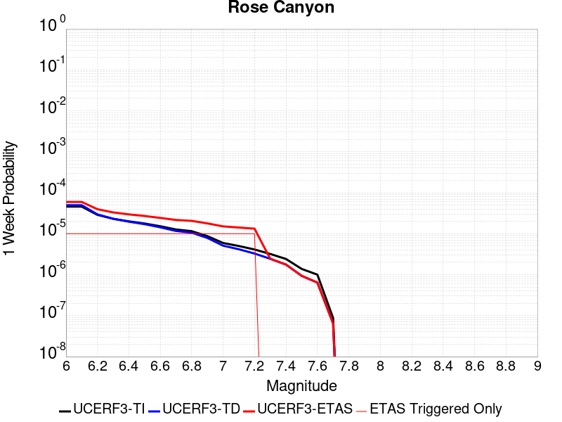 |  |  |  |

| Magnitude | 1 wk TI Prob | 1 wk TD Prob | 1 wk ETAS Prob | 1 wk ETAS/TD Gain | 1 wk ETAS Triggered Only | 1 mo TI Prob | 1 mo TD Prob | 1 mo ETAS Prob | 1 mo ETAS/TD Gain | 1 mo ETAS Triggered Only | 1 yr TI Prob | 1 yr TD Prob | 1 yr ETAS Prob | 1 yr ETAS/TD Gain | 1 yr ETAS Triggered Only | 10 yr TI Prob | 10 yr TD Prob | 10 yr ETAS Prob | 10 yr ETAS/TD Gain | 10 yr ETAS Triggered Only |
|-----|-----|-----|-----|-----|-----|-----|-----|-----|-----|-----|-----|-----|-----|-----|-----|-----|-----|-----|-----|-----|
| 6.0 | 4.5923203E-5 | 4.9717553E-5 | 5.971706E-5 | 1.2011262 | 1.0E-5 | 1.9679888E-4 | 2.1305913E-4 | 2.2305701E-4 | 1.0469253 | 1.0E-5 | 0.0023933933 | 0.0025910994 | 0.0026110476 | 1.0076988 | 2.0E-5 | 0.023677798 | 0.025618313 | 0.025637802 | 1.0007607 | 2.0E-5 |
| 6.1 | 4.5923203E-5 | 4.9717553E-5 | 5.971706E-5 | 1.2011262 | 1.0E-5 | 1.9679888E-4 | 2.1305913E-4 | 2.2305701E-4 | 1.0469253 | 1.0E-5 | 0.0023933933 | 0.0025910994 | 0.0026010734 | 1.0038494 | 1.0E-5 | 0.023677798 | 0.025618313 | 0.025628058 | 1.0003804 | 1.0E-5 |
| 6.2 | 2.8844734E-5 | 2.9670837E-5 | 3.967054E-5 | 1.3370212 | 1.0E-5 | 1.2361443E-4 | 1.2715468E-4 | 1.3715342E-4 | 1.0786344 | 1.0E-5 | 0.0015039665 | 0.0015470362 | 0.0015570207 | 1.006454 | 1.0E-5 | 0.0149382865 | 0.015357477 | 0.015367323 | 1.0006411 | 1.0E-5 |
| 6.3 | 2.3171577E-5 | 2.3163399E-5 | 3.3163167E-5 | 1.4317056 | 1.0E-5 | 9.9302975E-5 | 9.9268E-5 | 1.09267006E-4 | 1.1007274 | 1.0E-5 | 0.0012083431 | 0.0012079312 | 0.001217919 | 1.0082686 | 1.0E-5 | 0.012017938 | 0.012004637 | 0.012014518 | 1.000823 | 1.0E-5 |
| 6.4 | 2.0066604E-5 | 1.966902E-5 | 2.9668823E-5 | 1.5084038 | 1.0E-5 | 8.599689E-5 | 8.429313E-5 | 9.429229E-5 | 1.1186236 | 1.0E-5 | 0.0010465092 | 0.0010257957 | 0.0010357854 | 1.0097386 | 1.0E-5 | 0.010415946 | 0.010203916 | 0.010213814 | 1.00097 | 1.0E-5 |
| 6.5 | 1.776989E-5 | 1.7115479E-5 | 2.7115308E-5 | 1.5842564 | 1.0E-5 | 7.615444E-5 | 7.3350035E-5 | 8.3349296E-5 | 1.1363226 | 1.0E-5 | 9.267859E-4 | 8.926777E-4 | 9.026688E-4 | 1.0111922 | 1.0E-5 | 0.009229303 | 0.008879829 | 0.00888974 | 1.0011162 | 1.0E-5 |
| 6.6 | 1.5227364E-5 | 1.4340938E-5 | 2.4340794E-5 | 1.6972945 | 1.0E-5 | 6.52585E-5 | 6.1459745E-5 | 7.145913E-5 | 1.1626981 | 1.0E-5 | 7.942326E-4 | 7.480207E-4 | 7.580132E-4 | 1.0133586 | 1.0E-5 | 0.007914 | 0.00744577 | 0.0074556954 | 1.001333 | 1.0E-5 |
| 6.7 | 1.2703898E-5 | 1.167434E-5 | 2.1674225E-5 | 1.8565694 | 1.0E-5 | 5.4444143E-5 | 5.0031955E-5 | 6.0031452E-5 | 1.1998622 | 1.0E-5 | 6.626558E-4 | 6.0897303E-4 | 6.1896694E-4 | 1.0164111 | 1.0E-5 | 0.006606833 | 0.00606576 | 0.0060756993 | 1.0016387 | 1.0E-5 |
| 6.8 | 1.1554917E-5 | 1.0610447E-5 | 2.0610341E-5 | 1.9424574 | 1.0E-5 | 4.9520135E-5 | 4.5472574E-5 | 5.547212E-5 | 1.2199028 | 1.0E-5 | 6.0274085E-4 | 5.53492E-4 | 5.634865E-4 | 1.0180571 | 1.0E-5 | 0.0060110865 | 0.005507283 | 0.005517228 | 1.0018058 | 1.0E-5 |
| 6.9 | 8.732078E-6 | 7.882343E-6 | 1.7882265E-5 | 2.2686484 | 1.0E-5 | 3.7422655E-5 | 3.378105E-5 | 4.378071E-5 | 1.296014 | 1.0E-5 | 4.5552556E-4 | 4.112096E-4 | 4.2120548E-4 | 1.0243084 | 1.0E-5 | 0.0045459294 | 0.004089545 | 0.004099504 | 1.0024352 | 1.0E-5 |
| 7.0 | 5.9337494E-6 | 5.1074826E-6 | 1.5107432E-5 | 2.9579017 | 1.0E-5 | 2.5430107E-5 | 2.1889029E-5 | 3.188881E-5 | 1.4568399 | 1.0E-5 | 3.0956755E-4 | 2.6646646E-4 | 2.764638E-4 | 1.0375181 | 1.0E-5 | 0.0030913667 | 0.0026614852 | 0.0026714585 | 1.0037473 | 1.0E-5 |
| 7.1 | 5.013409E-6 | 4.177376E-6 | 1.4177334E-5 | 3.3938372 | 1.0E-5 | 2.1485863E-5 | 1.7902918E-5 | 2.7902737E-5 | 1.5585582 | 1.0E-5 | 2.6155898E-4 | 2.1794632E-4 | 2.2794414E-4 | 1.0458728 | 1.0E-5 | 0.0026125133 | 0.0021773374 | 0.0021873156 | 1.0045828 | 1.0E-5 |
| 7.2 | 4.120763E-6 | 3.2821204E-6 | 1.3282088E-5 | 4.046801 | 1.0E-5 | 1.7660293E-5 | 1.4066155E-5 | 2.4066014E-5 | 1.7109164 | 1.0E-5 | 2.1499286E-4 | 1.7124206E-4 | 1.8124035E-4 | 1.0583869 | 1.0E-5 | 0.0021478499 | 0.0017111107 | 0.0017210935 | 1.0058341 | 1.0E-5 |
| 7.3 | 3.2081239E-6 | 2.440515E-6 | 2.440515E-6 | 1.0 | 0.0 | 1.374903E-5 | 1.0459307E-5 | 1.0459307E-5 | 1.0 | 0.0 | 1.6738157E-4 | 1.273347E-4 | 1.273347E-4 | 1.0 | 0.0 | 0.0016725556 | 0.0012726244 | 0.0012726244 | 1.0 | 0.0 |
| 7.4 | 2.4194755E-6 | 1.7680458E-6 | 1.7680458E-6 | 1.0 | 0.0 | 1.0369139E-5 | 7.5773173E-6 | 7.5773173E-6 | 1.0 | 0.0 | 1.2623696E-4 | 9.224998E-5 | 9.224998E-5 | 1.0 | 0.0 | 0.0012616527 | 9.221223E-4 | 9.221223E-4 | 1.0 | 0.0 |
| 7.5 | 1.3842889E-6 | 9.378391E-7 | 9.378391E-7 | 1.0 | 0.0 | 5.9326535E-6 | 4.0193045E-6 | 4.0193045E-6 | 1.0 | 0.0 | 7.222766E-5 | 4.893397E-5 | 4.893397E-5 | 1.0 | 0.0 | 7.220419E-4 | 4.8923545E-4 | 4.8923545E-4 | 1.0 | 0.0 |
| 7.6 | 1.0021575E-6 | 6.4114187E-7 | 6.4114187E-7 | 1.0 | 0.0 | 4.2949537E-6 | 2.7477479E-6 | 2.7477479E-6 | 1.0 | 0.0 | 5.2289808E-5 | 3.345334E-5 | 3.345334E-5 | 1.0 | 0.0 | 5.2277505E-4 | 3.3448517E-4 | 3.3448517E-4 | 1.0 | 0.0 |
| 7.7 | 8.7620116E-8 | 6.449342E-8 | 6.449342E-8 | 1.0 | 0.0 | 3.7551473E-7 | 2.7640036E-7 | 2.7640036E-7 | 1.0 | 0.0 | 4.5718825E-6 | 3.3651693E-6 | 3.3651693E-6 | 1.0 | 0.0 | 4.5717883E-5 | 3.3651213E-5 | 3.3651213E-5 | 1.0 | 0.0 |

## San Diego Trough north alt1
*[(top)](#table-of-contents)*

| 1 Week | 1 Month | 1 Year | 10 Year |
|-----|-----|-----|-----|
|  |  |  |  |

| Magnitude | 1 wk TI Prob | 1 wk TD Prob | 1 wk ETAS Prob | 1 wk ETAS/TD Gain | 1 wk ETAS Triggered Only | 1 mo TI Prob | 1 mo TD Prob | 1 mo ETAS Prob | 1 mo ETAS/TD Gain | 1 mo ETAS Triggered Only | 1 yr TI Prob | 1 yr TD Prob | 1 yr ETAS Prob | 1 yr ETAS/TD Gain | 1 yr ETAS Triggered Only | 10 yr TI Prob | 10 yr TD Prob | 10 yr ETAS Prob | 10 yr ETAS/TD Gain | 10 yr ETAS Triggered Only |
|-----|-----|-----|-----|-----|-----|-----|-----|-----|-----|-----|-----|-----|-----|-----|-----|-----|-----|-----|-----|-----|
| 6.0 | 7.329252E-5 | 8.821515E-5 | 8.821515E-5 | 1.0 | 0.0 | 3.14073E-4 | 3.780138E-4 | 3.780138E-4 | 1.0 | 0.0 | 0.0038171355 | 0.004593173 | 0.004613081 | 1.0043343 | 2.0E-5 | 0.03752231 | 0.04504633 | 0.045074977 | 1.000636 | 3.0E-5 |
| 6.1 | 3.7940346E-5 | 4.4886026E-5 | 4.4886026E-5 | 1.0 | 0.0 | 1.6259136E-4 | 1.9235504E-4 | 1.9235504E-4 | 1.0 | 0.0 | 0.0019777524 | 0.0023394884 | 0.0023394884 | 1.0 | 0.0 | 0.019602431 | 0.023157293 | 0.023167063 | 1.0004219 | 1.0E-5 |
| 6.2 | 2.8645263E-5 | 3.3297452E-5 | 3.3297452E-5 | 1.0 | 0.0 | 1.2275964E-4 | 1.4269572E-4 | 1.4269572E-4 | 1.0 | 0.0 | 0.0014935739 | 0.0017359584 | 0.0017359584 | 1.0 | 0.0 | 0.0148357535 | 0.017226638 | 0.017226638 | 1.0 | 0.0 |
| 6.3 | 2.8645263E-5 | 3.3297452E-5 | 3.3297452E-5 | 1.0 | 0.0 | 1.2275964E-4 | 1.4269572E-4 | 1.4269572E-4 | 1.0 | 0.0 | 0.0014935739 | 0.0017359584 | 0.0017359584 | 1.0 | 0.0 | 0.0148357535 | 0.017226638 | 0.017226638 | 1.0 | 0.0 |
| 6.4 | 2.2204576E-5 | 2.5448819E-5 | 2.5448819E-5 | 1.0 | 0.0 | 9.5159E-5 | 1.0906186E-4 | 1.0906186E-4 | 1.0 | 0.0 | 0.001157945 | 0.0013270287 | 0.0013270287 | 1.0 | 0.0 | 0.011519298 | 0.013192215 | 0.013192215 | 1.0 | 0.0 |
| 6.5 | 2.1004838E-5 | 2.402516E-5 | 2.402516E-5 | 1.0 | 0.0 | 9.0017624E-5 | 1.02960956E-4 | 1.02960956E-4 | 1.0 | 0.0 | 0.0010954136 | 0.0012528376 | 0.0012528376 | 1.0 | 0.0 | 0.010900296 | 0.01245883 | 0.01245883 | 1.0 | 0.0 |
| 6.6 | 1.820557E-5 | 2.070517E-5 | 2.070517E-5 | 1.0 | 0.0 | 7.802154E-5 | 8.873346E-5 | 8.873346E-5 | 1.0 | 0.0 | 9.4949827E-4 | 0.0010797998 | 0.0010797998 | 1.0 | 0.0 | 0.009454516 | 0.0107462015 | 0.0107462015 | 1.0 | 0.0 |
| 6.7 | 1.5884485E-5 | 1.7983964E-5 | 1.7983964E-5 | 1.0 | 0.0 | 6.807459E-5 | 7.707187E-5 | 7.707187E-5 | 1.0 | 0.0 | 8.284929E-4 | 9.379488E-4 | 9.379488E-4 | 1.0 | 0.0 | 0.008254109 | 0.009340268 | 0.009340268 | 1.0 | 0.0 |
| 6.8 | 1.4331171E-5 | 1.6201348E-5 | 1.6201348E-5 | 1.0 | 0.0 | 6.141786E-5 | 6.9432506E-5 | 6.9432506E-5 | 1.0 | 0.0 | 7.4750587E-4 | 8.4501493E-4 | 8.4501493E-4 | 1.0 | 0.0 | 0.0074499645 | 0.008418285 | 0.008418285 | 1.0 | 0.0 |
| 6.9 | 1.2574203E-5 | 1.4206081E-5 | 1.4206081E-5 | 1.0 | 0.0 | 5.3888325E-5 | 6.088179E-5 | 6.088179E-5 | 1.0 | 0.0 | 6.558929E-4 | 7.4098515E-4 | 7.4098515E-4 | 1.0 | 0.0 | 0.0065396037 | 0.0073853307 | 0.0073853307 | 1.0 | 0.0 |
| 7.0 | 1.0883844E-5 | 1.22894735E-5 | 1.22894735E-5 | 1.0 | 0.0 | 4.664421E-5 | 5.2668114E-5 | 5.2668114E-5 | 1.0 | 0.0 | 5.677453E-4 | 6.410466E-4 | 6.410466E-4 | 1.0 | 0.0 | 0.00566297 | 0.0063921027 | 0.0063921027 | 1.0 | 0.0 |
| 7.1 | 9.393088E-6 | 1.0607203E-5 | 1.0607203E-5 | 1.0 | 0.0 | 4.025547E-5 | 4.5458655E-5 | 4.5458655E-5 | 1.0 | 0.0 | 4.900001E-4 | 5.5331935E-4 | 5.5331935E-4 | 1.0 | 0.0 | 0.0048892107 | 0.005519513 | 0.005519513 | 1.0 | 0.0 |
| 7.2 | 8.190791E-6 | 9.258787E-6 | 9.258787E-6 | 1.0 | 0.0 | 3.510292E-5 | 3.9679915E-5 | 3.9679915E-5 | 1.0 | 0.0 | 4.2729423E-4 | 4.8299658E-4 | 4.8299658E-4 | 1.0 | 0.0 | 0.0042647356 | 0.004819548 | 0.004819548 | 1.0 | 0.0 |
| 7.3 | 6.268162E-6 | 7.08984E-6 | 7.08984E-6 | 1.0 | 0.0 | 2.6863276E-5 | 3.0384675E-5 | 3.0384675E-5 | 1.0 | 0.0 | 3.2701128E-4 | 3.6987104E-4 | 3.6987104E-4 | 1.0 | 0.0 | 0.003265305 | 0.0036926004 | 0.0036926004 | 1.0 | 0.0 |
| 7.4 | 4.985186E-6 | 5.6427807E-6 | 5.6427807E-6 | 1.0 | 0.0 | 2.1364907E-5 | 2.4183124E-5 | 2.4183124E-5 | 1.0 | 0.0 | 2.600867E-4 | 2.9439016E-4 | 2.9439016E-4 | 1.0 | 0.0 | 0.002597825 | 0.002940043 | 0.002940043 | 1.0 | 0.0 |
| 7.5 | 1.7489613E-6 | 1.9697113E-6 | 1.9697113E-6 | 1.0 | 0.0 | 7.495527E-6 | 8.441594E-6 | 8.441594E-6 | 1.0 | 0.0 | 9.125422E-5 | 1.0277178E-4 | 1.0277178E-4 | 1.0 | 0.0 | 9.1216754E-4 | 0.0010272645 | 0.0010272645 | 1.0 | 0.0 |
| 7.6 | 1.6988751E-7 | 1.7533898E-7 | 1.7533898E-7 | 1.0 | 0.0 | 7.2808916E-7 | 7.5145255E-7 | 7.5145255E-7 | 1.0 | 0.0 | 8.864449E-6 | 9.148898E-6 | 9.148898E-6 | 1.0 | 0.0 | 8.8640954E-5 | 9.148542E-5 | 9.148542E-5 | 1.0 | 0.0 |

## Honey Lake 2011 CFM
*[(top)](#table-of-contents)*

| 1 Week | 1 Month | 1 Year | 10 Year |
|-----|-----|-----|-----|
|  |  |  |  |

| Magnitude | 1 wk TI Prob | 1 wk TD Prob | 1 wk ETAS Prob | 1 wk ETAS/TD Gain | 1 wk ETAS Triggered Only | 1 mo TI Prob | 1 mo TD Prob | 1 mo ETAS Prob | 1 mo ETAS/TD Gain | 1 mo ETAS Triggered Only | 1 yr TI Prob | 1 yr TD Prob | 1 yr ETAS Prob | 1 yr ETAS/TD Gain | 1 yr ETAS Triggered Only | 10 yr TI Prob | 10 yr TD Prob | 10 yr ETAS Prob | 10 yr ETAS/TD Gain | 10 yr ETAS Triggered Only |
|-----|-----|-----|-----|-----|-----|-----|-----|-----|-----|-----|-----|-----|-----|-----|-----|-----|-----|-----|-----|-----|
| 6.0 | 6.155506E-5 | 7.9549725E-5 | 7.9549725E-5 | 1.0 | 0.0 | 2.6378073E-4 | 3.408857E-4 | 3.408857E-4 | 1.0 | 0.0 | 0.0032068014 | 0.0041428325 | 0.0041627497 | 1.0048076 | 2.0E-5 | 0.03160919 | 0.04070455 | 0.040723734 | 1.0004714 | 2.0E-5 |
| 6.1 | 6.155506E-5 | 7.9549725E-5 | 7.9549725E-5 | 1.0 | 0.0 | 2.6378073E-4 | 3.408857E-4 | 3.408857E-4 | 1.0 | 0.0 | 0.0032068014 | 0.0041428325 | 0.0041627497 | 1.0048076 | 2.0E-5 | 0.03160919 | 0.04070455 | 0.040723734 | 1.0004714 | 2.0E-5 |
| 6.2 | 4.1335024E-5 | 5.257842E-5 | 5.257842E-5 | 1.0 | 0.0 | 1.7713808E-4 | 2.2531768E-4 | 2.2531768E-4 | 1.0 | 0.0 | 0.0021545228 | 0.0027399417 | 0.002759887 | 1.0072794 | 2.0E-5 | 0.021337535 | 0.027077755 | 0.027097212 | 1.0007186 | 2.0E-5 |
| 6.3 | 4.1335024E-5 | 5.257842E-5 | 5.257842E-5 | 1.0 | 0.0 | 1.7713808E-4 | 2.2531768E-4 | 2.2531768E-4 | 1.0 | 0.0 | 0.0021545228 | 0.0027399417 | 0.002759887 | 1.0072794 | 2.0E-5 | 0.021337535 | 0.027077755 | 0.027097212 | 1.0007186 | 2.0E-5 |
| 6.4 | 3.2393702E-5 | 4.088869E-5 | 4.088869E-5 | 1.0 | 0.0 | 1.3882275E-4 | 1.7522615E-4 | 1.7522615E-4 | 1.0 | 0.0 | 0.0016888566 | 0.002131397 | 0.0021513542 | 1.0093635 | 2.0E-5 | 0.016760793 | 0.021120586 | 0.021140162 | 1.000927 | 2.0E-5 |
| 6.5 | 2.7205504E-5 | 3.421293E-5 | 3.421293E-5 | 1.0 | 0.0 | 1.1658981E-4 | 1.4661916E-4 | 1.4661916E-4 | 1.0 | 0.0 | 0.0014185566 | 0.0017837201 | 0.0018036844 | 1.0111926 | 2.0E-5 | 0.014095354 | 0.017703557 | 0.017723205 | 1.0011097 | 2.0E-5 |
| 6.6 | 2.069265E-5 | 2.5956291E-5 | 2.5956291E-5 | 1.0 | 0.0 | 8.867977E-5 | 1.11236994E-4 | 1.11236994E-4 | 1.0 | 0.0 | 0.0010791414 | 0.0013535529 | 0.0013735258 | 1.014756 | 2.0E-5 | 0.010739161 | 0.013461461 | 0.013481191 | 1.0014657 | 2.0E-5 |
| 6.7 | 1.8060919E-5 | 2.2657596E-5 | 2.2657596E-5 | 1.0 | 0.0 | 7.7401644E-5 | 9.710083E-5 | 9.710083E-5 | 1.0 | 0.0 | 9.419576E-4 | 0.0011816423 | 0.0012016187 | 1.0169055 | 2.0E-5 | 0.009379748 | 0.011761637 | 0.011781402 | 1.0016805 | 2.0E-5 |
| 6.8 | 1.4474663E-5 | 1.8181892E-5 | 1.8181892E-5 | 1.0 | 0.0 | 6.203279E-5 | 7.79205E-5 | 7.79205E-5 | 1.0 | 0.0 | 7.5498753E-4 | 9.483456E-4 | 9.6832664E-4 | 1.0210694 | 2.0E-5 | 0.007524277 | 0.009450515 | 0.009470326 | 1.0020963 | 2.0E-5 |
| 6.9 | 8.564552E-6 | 1.0802686E-5 | 1.0802686E-5 | 1.0 | 0.0 | 3.6704707E-5 | 4.629678E-5 | 4.629678E-5 | 1.0 | 0.0 | 4.4678818E-4 | 5.635839E-4 | 5.735783E-4 | 1.0177336 | 1.0E-5 | 0.0044589094 | 0.005628045 | 0.005637989 | 1.0017668 | 1.0E-5 |

## San Diego Trough south
*[(top)](#table-of-contents)*

| 1 Week | 1 Month | 1 Year | 10 Year |
|-----|-----|-----|-----|
|  |  |  |  |

| Magnitude | 1 wk TI Prob | 1 wk TD Prob | 1 wk ETAS Prob | 1 wk ETAS/TD Gain | 1 wk ETAS Triggered Only | 1 mo TI Prob | 1 mo TD Prob | 1 mo ETAS Prob | 1 mo ETAS/TD Gain | 1 mo ETAS Triggered Only | 1 yr TI Prob | 1 yr TD Prob | 1 yr ETAS Prob | 1 yr ETAS/TD Gain | 1 yr ETAS Triggered Only | 10 yr TI Prob | 10 yr TD Prob | 10 yr ETAS Prob | 10 yr ETAS/TD Gain | 10 yr ETAS Triggered Only |
|-----|-----|-----|-----|-----|-----|-----|-----|-----|-----|-----|-----|-----|-----|-----|-----|-----|-----|-----|-----|-----|
| 6.0 | 8.279495E-5 | 1.0425905E-4 | 1.0425905E-4 | 1.0 | 0.0 | 3.5478722E-4 | 4.4675023E-4 | 4.4675023E-4 | 1.0 | 0.0 | 0.004310982 | 0.0054260944 | 0.0054360405 | 1.001833 | 1.0E-5 | 0.042283054 | 0.052994724 | 0.053013664 | 1.0003574 | 2.0E-5 |
| 6.1 | 4.6961468E-5 | 5.773192E-5 | 5.773192E-5 | 1.0 | 0.0 | 2.0124791E-4 | 2.4739734E-4 | 2.4739734E-4 | 1.0 | 0.0 | 0.00244744 | 0.0030079763 | 0.0030079763 | 1.0 | 0.0 | 0.024206603 | 0.02968051 | 0.02968051 | 1.0 | 0.0 |
| 6.2 | 3.5079658E-5 | 4.2143583E-5 | 4.2143583E-5 | 1.0 | 0.0 | 1.5033272E-4 | 1.8060306E-4 | 1.8060306E-4 | 1.0 | 0.0 | 0.0018287642 | 0.0021966458 | 0.0021966458 | 1.0 | 0.0 | 0.018137876 | 0.021751761 | 0.021751761 | 1.0 | 0.0 |
| 6.3 | 3.5079658E-5 | 4.2143583E-5 | 4.2143583E-5 | 1.0 | 0.0 | 1.5033272E-4 | 1.8060306E-4 | 1.8060306E-4 | 1.0 | 0.0 | 0.0018287642 | 0.0021966458 | 0.0021966458 | 1.0 | 0.0 | 0.018137876 | 0.021751761 | 0.021751761 | 1.0 | 0.0 |
| 6.4 | 2.7196904E-5 | 3.2087904E-5 | 3.2087904E-5 | 1.0 | 0.0 | 1.16552954E-4 | 1.3751238E-4 | 1.3751238E-4 | 1.0 | 0.0 | 0.0014181085 | 0.0016729396 | 0.0016729396 | 1.0 | 0.0 | 0.014090929 | 0.01660506 | 0.01660506 | 1.0 | 0.0 |
| 6.5 | 2.5584688E-5 | 3.0102321E-5 | 3.0102321E-5 | 1.0 | 0.0 | 1.0964406E-4 | 1.290036E-4 | 1.290036E-4 | 1.0 | 0.0 | 0.0013340989 | 0.0015694996 | 0.0015694996 | 1.0 | 0.0 | 0.013261181 | 0.015585696 | 0.015585696 | 1.0 | 0.0 |
| 6.6 | 2.2034688E-5 | 2.574329E-5 | 2.574329E-5 | 1.0 | 0.0 | 9.443096E-5 | 1.10323745E-4 | 1.10323745E-4 | 1.0 | 0.0 | 0.0011490905 | 0.0013423713 | 0.0013423713 | 1.0 | 0.0 | 0.011431668 | 0.013343622 | 0.013343622 | 1.0 | 0.0 |
| 6.7 | 1.9394853E-5 | 2.254225E-5 | 2.254225E-5 | 1.0 | 0.0 | 8.311815E-5 | 9.660609E-5 | 9.660609E-5 | 1.0 | 0.0 | 0.0010114936 | 0.0011755498 | 0.0011755498 | 1.0 | 0.0 | 0.01006902 | 0.011694018 | 0.011694018 | 1.0 | 0.0 |
| 6.8 | 1.7615313E-5 | 2.0403613E-5 | 2.0403613E-5 | 1.0 | 0.0 | 7.549201E-5 | 8.744115E-5 | 8.744115E-5 | 1.0 | 0.0 | 9.1872766E-4 | 0.0010640804 | 0.0010640804 | 1.0 | 0.0 | 0.009149387 | 0.01059042 | 0.01059042 | 1.0 | 0.0 |
| 6.9 | 1.5621423E-5 | 1.8026485E-5 | 1.8026485E-5 | 1.0 | 0.0 | 6.6947236E-5 | 7.7254095E-5 | 7.7254095E-5 | 1.0 | 0.0 | 8.147778E-4 | 9.401663E-4 | 9.401663E-4 | 1.0 | 0.0 | 0.008117969 | 0.0093623325 | 0.0093623325 | 1.0 | 0.0 |
| 7.0 | 1.3444376E-5 | 1.5448395E-5 | 1.5448395E-5 | 1.0 | 0.0 | 5.7617483E-5 | 6.620574E-5 | 6.620574E-5 | 1.0 | 0.0 | 7.0126704E-4 | 8.057596E-4 | 8.057596E-4 | 1.0 | 0.0 | 0.006990582 | 0.008028714 | 0.008028714 | 1.0 | 0.0 |
| 7.1 | 1.2268361E-5 | 1.40733055E-5 | 1.40733055E-5 | 1.0 | 0.0 | 5.2577634E-5 | 6.031279E-5 | 6.031279E-5 | 1.0 | 0.0 | 6.399447E-4 | 7.3406345E-4 | 7.3406345E-4 | 1.0 | 0.0 | 0.0063810493 | 0.007316692 | 0.007316692 | 1.0 | 0.0 |
| 7.2 | 1.0922655E-5 | 1.2513806E-5 | 1.2513806E-5 | 1.0 | 0.0 | 4.681054E-5 | 5.362951E-5 | 5.362951E-5 | 1.0 | 0.0 | 5.697693E-4 | 6.527462E-4 | 6.527462E-4 | 1.0 | 0.0 | 0.0056831064 | 0.0065085697 | 0.0065085697 | 1.0 | 0.0 |
| 7.3 | 6.1106753E-6 | 6.9290486E-6 | 6.9290486E-6 | 1.0 | 0.0 | 2.6188345E-5 | 2.9695586E-5 | 2.9695586E-5 | 1.0 | 0.0 | 3.1879646E-4 | 3.6148418E-4 | 3.6148418E-4 | 1.0 | 0.0 | 0.0031833951 | 0.0036090072 | 0.0036090072 | 1.0 | 0.0 |
| 7.4 | 4.933187E-6 | 5.5896517E-6 | 5.5896517E-6 | 1.0 | 0.0 | 2.114206E-5 | 2.3955432E-5 | 2.3955432E-5 | 1.0 | 0.0 | 2.5737417E-4 | 2.9161875E-4 | 2.9161875E-4 | 1.0 | 0.0 | 0.002570763 | 0.002912402 | 0.002912402 | 1.0 | 0.0 |
| 7.5 | 1.7489613E-6 | 1.9697113E-6 | 1.9697113E-6 | 1.0 | 0.0 | 7.495527E-6 | 8.441594E-6 | 8.441594E-6 | 1.0 | 0.0 | 9.125422E-5 | 1.0277178E-4 | 1.0277178E-4 | 1.0 | 0.0 | 9.1216754E-4 | 0.0010272645 | 0.0010272645 | 1.0 | 0.0 |
| 7.6 | 1.6988751E-7 | 1.7533898E-7 | 1.7533898E-7 | 1.0 | 0.0 | 7.2808916E-7 | 7.5145255E-7 | 7.5145255E-7 | 1.0 | 0.0 | 8.864449E-6 | 9.148898E-6 | 9.148898E-6 | 1.0 | 0.0 | 8.8640954E-5 | 9.148542E-5 | 9.148542E-5 | 1.0 | 0.0 |

## Oceanic - West Huasna
*[(top)](#table-of-contents)*

| 1 Week | 1 Month | 1 Year | 10 Year |
|-----|-----|-----|-----|
|  |  |  |  |

| Magnitude | 1 wk TI Prob | 1 wk TD Prob | 1 wk ETAS Prob | 1 wk ETAS/TD Gain | 1 wk ETAS Triggered Only | 1 mo TI Prob | 1 mo TD Prob | 1 mo ETAS Prob | 1 mo ETAS/TD Gain | 1 mo ETAS Triggered Only | 1 yr TI Prob | 1 yr TD Prob | 1 yr ETAS Prob | 1 yr ETAS/TD Gain | 1 yr ETAS Triggered Only | 10 yr TI Prob | 10 yr TD Prob | 10 yr ETAS Prob | 10 yr ETAS/TD Gain | 10 yr ETAS Triggered Only |
|-----|-----|-----|-----|-----|-----|-----|-----|-----|-----|-----|-----|-----|-----|-----|-----|-----|-----|-----|-----|-----|
| 6.0 | 3.195567E-5 | 2.7926611E-5 | 2.7926611E-5 | 1.0 | 0.0 | 1.3694567E-4 | 1.1968023E-4 | 1.1968023E-4 | 1.0 | 0.0 | 0.0016660384 | 0.001456176 | 0.001456176 | 1.0 | 0.0 | 0.016536033 | 0.014470896 | 0.014490606 | 1.0013621 | 2.0E-5 |
| 6.1 | 2.1156782E-5 | 1.7573251E-5 | 1.7573251E-5 | 1.0 | 0.0 | 9.066878E-5 | 7.531181E-5 | 7.531181E-5 | 1.0 | 0.0 | 0.0011033333 | 9.1654493E-4 | 9.1654493E-4 | 1.0 | 0.0 | 0.010978713 | 0.009128656 | 0.009138565 | 1.0010854 | 1.0E-5 |
| 6.2 | 1.6195117E-5 | 1.332732E-5 | 1.332732E-5 | 1.0 | 0.0 | 6.9405796E-5 | 5.7115845E-5 | 5.7115845E-5 | 1.0 | 0.0 | 8.44688E-4 | 6.951662E-4 | 6.951662E-4 | 1.0 | 0.0 | 0.008414844 | 0.0069302097 | 0.0069401404 | 1.001433 | 1.0E-5 |
| 6.3 | 1.3559345E-5 | 1.1179085E-5 | 1.1179085E-5 | 1.0 | 0.0 | 5.811018E-5 | 4.7909492E-5 | 4.7909492E-5 | 1.0 | 0.0 | 7.072618E-4 | 5.831429E-4 | 5.831429E-4 | 1.0 | 0.0 | 0.0070501505 | 0.0058162455 | 0.0058162455 | 1.0 | 0.0 |
| 6.4 | 1.2120619E-5 | 1.0000936E-5 | 1.0000936E-5 | 1.0 | 0.0 | 5.1944477E-5 | 4.286045E-5 | 4.286045E-5 | 1.0 | 0.0 | 6.322405E-4 | 5.217015E-4 | 5.217015E-4 | 1.0 | 0.0 | 0.006304447 | 0.0052048354 | 0.0052048354 | 1.0 | 0.0 |
| 6.5 | 1.13511915E-5 | 9.367435E-6 | 9.367435E-6 | 1.0 | 0.0 | 4.8647056E-5 | 4.0145536E-5 | 4.0145536E-5 | 1.0 | 0.0 | 5.9211696E-4 | 4.8866274E-4 | 4.8866274E-4 | 1.0 | 0.0 | 0.0059054173 | 0.0048759407 | 0.0048759407 | 1.0 | 0.0 |
| 6.6 | 9.850605E-6 | 8.135364E-6 | 8.135364E-6 | 1.0 | 0.0 | 4.2216197E-5 | 3.4865378E-5 | 3.4865378E-5 | 1.0 | 0.0 | 5.1386096E-4 | 4.2440352E-4 | 4.2440352E-4 | 1.0 | 0.0 | 0.0051267436 | 0.0042359624 | 0.0042359624 | 1.0 | 0.0 |
| 6.7 | 8.8558645E-6 | 7.318384E-6 | 7.318384E-6 | 1.0 | 0.0 | 3.7953152E-5 | 3.1364125E-5 | 3.1364125E-5 | 1.0 | 0.0 | 4.6198163E-4 | 3.817915E-4 | 3.817915E-4 | 1.0 | 0.0 | 0.004610224 | 0.0038113813 | 0.0038113813 | 1.0 | 0.0 |
| 6.8 | 7.67136E-6 | 6.3917278E-6 | 6.3917278E-6 | 1.0 | 0.0 | 3.2876844E-5 | 2.7392833E-5 | 2.7392833E-5 | 1.0 | 0.0 | 4.0020206E-4 | 3.3345685E-4 | 3.3345685E-4 | 1.0 | 0.0 | 0.003994821 | 0.003329586 | 0.003329586 | 1.0 | 0.0 |
| 6.9 | 6.534529E-6 | 5.4582943E-6 | 5.4582943E-6 | 1.0 | 0.0 | 2.8004823E-5 | 2.339248E-5 | 2.339248E-5 | 1.0 | 0.0 | 3.4090536E-4 | 2.8476634E-4 | 2.8476634E-4 | 1.0 | 0.0 | 0.0034038287 | 0.0028440312 | 0.0028440312 | 1.0 | 0.0 |
| 7.0 | 5.460525E-6 | 4.5699494E-6 | 4.5699494E-6 | 1.0 | 0.0 | 2.3402039E-5 | 1.9585352E-5 | 1.9585352E-5 | 1.0 | 0.0 | 2.8488258E-4 | 2.3842567E-4 | 2.3842567E-4 | 1.0 | 0.0 | 0.0028451765 | 0.0023817124 | 0.0023817124 | 1.0 | 0.0 |
| 7.1 | 4.4825083E-6 | 3.7524424E-6 | 3.7524424E-6 | 1.0 | 0.0 | 1.9210609E-5 | 1.6081798E-5 | 1.6081798E-5 | 1.0 | 0.0 | 2.3386406E-4 | 1.957784E-4 | 1.957784E-4 | 1.0 | 0.0 | 0.002336181 | 0.001956071 | 0.001956071 | 1.0 | 0.0 |
| 7.2 | 2.821708E-6 | 2.4249653E-6 | 2.4249653E-6 | 1.0 | 0.0 | 1.2092979E-5 | 1.0392667E-5 | 1.0392667E-5 | 1.0 | 0.0 | 1.4722206E-4 | 1.2652339E-4 | 1.2652339E-4 | 1.0 | 0.0 | 0.0014712457 | 0.0012645158 | 0.0012645158 | 1.0 | 0.0 |
| 7.3 | 2.0644757E-6 | 1.7687719E-6 | 1.7687719E-6 | 1.0 | 0.0 | 8.847723E-6 | 7.580429E-6 | 7.580429E-6 | 1.0 | 0.0 | 1.0771569E-4 | 9.228782E-5 | 9.228782E-5 | 1.0 | 0.0 | 0.001076635 | 9.2249655E-4 | 9.2249655E-4 | 1.0 | 0.0 |
| 7.4 | 1.6980367E-6 | 1.4380173E-6 | 1.4380173E-6 | 1.0 | 0.0 | 7.27728E-6 | 6.1629166E-6 | 6.1629166E-6 | 1.0 | 0.0 | 8.8597284E-5 | 7.503093E-5 | 7.503093E-5 | 1.0 | 0.0 | 8.8561967E-4 | 7.5005746E-4 | 7.5005746E-4 | 1.0 | 0.0 |
| 7.5 | 1.3637683E-6 | 1.1302892E-6 | 1.1302892E-6 | 1.0 | 0.0 | 5.844708E-6 | 4.8440875E-6 | 4.8440875E-6 | 1.0 | 0.0 | 7.1156996E-5 | 5.897517E-5 | 5.897517E-5 | 1.0 | 0.0 | 7.1134215E-4 | 5.895966E-4 | 5.895966E-4 | 1.0 | 0.0 |
| 7.6 | 9.802994E-7 | 7.677469E-7 | 7.677469E-7 | 1.0 | 0.0 | 4.2012766E-6 | 3.2903397E-6 | 3.2903397E-6 | 1.0 | 0.0 | 5.1149345E-5 | 4.005915E-5 | 4.005915E-5 | 1.0 | 0.0 | 5.113757E-4 | 4.0052057E-4 | 4.0052057E-4 | 1.0 | 0.0 |
| 7.7 | 5.986191E-7 | 4.0052444E-7 | 4.0052444E-7 | 1.0 | 0.0 | 2.5655079E-6 | 1.7165321E-6 | 1.7165321E-6 | 1.0 | 0.0 | 3.1234613E-5 | 2.0898578E-5 | 2.0898578E-5 | 1.0 | 0.0 | 3.123022E-4 | 2.0896735E-4 | 2.0896735E-4 | 1.0 | 0.0 |
| 7.8 | 2.9189815E-7 | 1.5286729E-7 | 1.5286729E-7 | 1.0 | 0.0 | 1.2509914E-6 | 6.5514536E-7 | 6.5514536E-7 | 1.0 | 0.0 | 1.5230714E-5 | 7.976366E-6 | 7.976366E-6 | 1.0 | 0.0 | 1.522967E-4 | 7.976198E-5 | 7.976198E-5 | 1.0 | 0.0 |
| 7.9 | 1.2057845E-7 | 4.621617E-8 | 4.621617E-8 | 1.0 | 0.0 | 5.1676466E-7 | 1.9806929E-7 | 1.9806929E-7 | 1.0 | 0.0 | 6.2915915E-6 | 2.4114909E-6 | 2.4114909E-6 | 1.0 | 0.0 | 6.2914136E-5 | 2.4115825E-5 | 2.4115825E-5 | 1.0 | 0.0 |
| 8.0 | 3.3806387E-9 | 9.0127306E-10 | 9.0127306E-10 | 1.0 | 0.0 | 1.4488451E-8 | 3.8625965E-9 | 3.8625965E-9 | 1.0 | 0.0 | 1.7639688E-7 | 4.7027115E-8 | 4.7027115E-8 | 1.0 | 0.0 | 1.7639674E-6 | 4.7134822E-7 | 4.7134822E-7 | 1.0 | 0.0 |

## San Gorgonio Pass
*[(top)](#table-of-contents)*

| 1 Week | 1 Month | 1 Year | 10 Year |
|-----|-----|-----|-----|
| 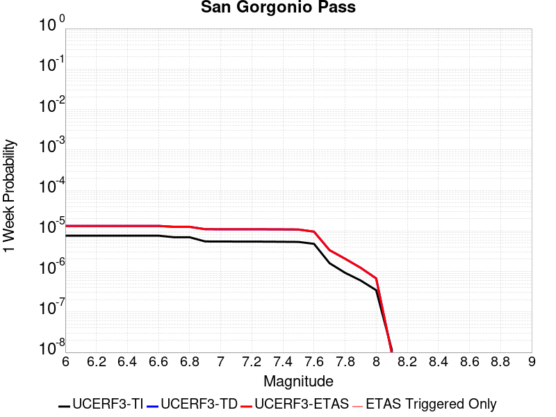 | 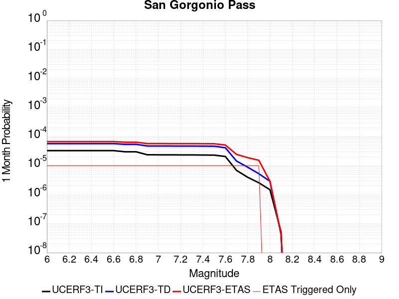 | 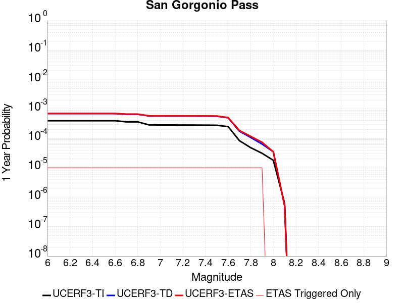 | 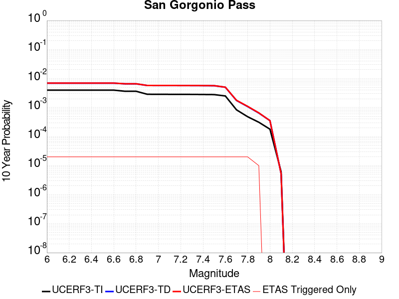 |

| Magnitude | 1 wk TI Prob | 1 wk TD Prob | 1 wk ETAS Prob | 1 wk ETAS/TD Gain | 1 wk ETAS Triggered Only | 1 mo TI Prob | 1 mo TD Prob | 1 mo ETAS Prob | 1 mo ETAS/TD Gain | 1 mo ETAS Triggered Only | 1 yr TI Prob | 1 yr TD Prob | 1 yr ETAS Prob | 1 yr ETAS/TD Gain | 1 yr ETAS Triggered Only | 10 yr TI Prob | 10 yr TD Prob | 10 yr ETAS Prob | 10 yr ETAS/TD Gain | 10 yr ETAS Triggered Only |
|-----|-----|-----|-----|-----|-----|-----|-----|-----|-----|-----|-----|-----|-----|-----|-----|-----|-----|-----|-----|-----|
| 6.0 | 7.644328E-6 | 1.331688E-5 | 1.331688E-5 | 1.0 | 0.0 | 3.2760996E-5 | 5.707114E-5 | 6.707057E-5 | 1.1752099 | 1.0E-5 | 3.987921E-4 | 6.946282E-4 | 7.0462126E-4 | 1.0143862 | 1.0E-5 | 0.003980772 | 0.0069303154 | 0.006950177 | 1.0028659 | 2.0E-5 |
| 6.1 | 7.644328E-6 | 1.331688E-5 | 1.331688E-5 | 1.0 | 0.0 | 3.2760996E-5 | 5.707114E-5 | 6.707057E-5 | 1.1752099 | 1.0E-5 | 3.987921E-4 | 6.946282E-4 | 7.0462126E-4 | 1.0143862 | 1.0E-5 | 0.003980772 | 0.0069303154 | 0.006950177 | 1.0028659 | 2.0E-5 |
| 6.2 | 7.644328E-6 | 1.331688E-5 | 1.331688E-5 | 1.0 | 0.0 | 3.2760996E-5 | 5.707114E-5 | 6.707057E-5 | 1.1752099 | 1.0E-5 | 3.987921E-4 | 6.946282E-4 | 7.0462126E-4 | 1.0143862 | 1.0E-5 | 0.003980772 | 0.0069303154 | 0.006950177 | 1.0028659 | 2.0E-5 |
| 6.3 | 7.644328E-6 | 1.331688E-5 | 1.331688E-5 | 1.0 | 0.0 | 3.2760996E-5 | 5.707114E-5 | 6.707057E-5 | 1.1752099 | 1.0E-5 | 3.987921E-4 | 6.946282E-4 | 7.0462126E-4 | 1.0143862 | 1.0E-5 | 0.003980772 | 0.0069303154 | 0.006950177 | 1.0028659 | 2.0E-5 |
| 6.4 | 7.644328E-6 | 1.331688E-5 | 1.331688E-5 | 1.0 | 0.0 | 3.2760996E-5 | 5.707114E-5 | 6.707057E-5 | 1.1752099 | 1.0E-5 | 3.987921E-4 | 6.946282E-4 | 7.0462126E-4 | 1.0143862 | 1.0E-5 | 0.003980772 | 0.0069303154 | 0.006950177 | 1.0028659 | 2.0E-5 |
| 6.5 | 7.644328E-6 | 1.331688E-5 | 1.331688E-5 | 1.0 | 0.0 | 3.2760996E-5 | 5.707114E-5 | 6.707057E-5 | 1.1752099 | 1.0E-5 | 3.987921E-4 | 6.946282E-4 | 7.0462126E-4 | 1.0143862 | 1.0E-5 | 0.003980772 | 0.0069303154 | 0.006950177 | 1.0028659 | 2.0E-5 |
| 6.6 | 7.644328E-6 | 1.331688E-5 | 1.331688E-5 | 1.0 | 0.0 | 3.2760996E-5 | 5.707114E-5 | 6.707057E-5 | 1.1752099 | 1.0E-5 | 3.987921E-4 | 6.946282E-4 | 7.0462126E-4 | 1.0143862 | 1.0E-5 | 0.003980772 | 0.0069303154 | 0.006950177 | 1.0028659 | 2.0E-5 |
| 6.7 | 6.987586E-6 | 1.2621148E-5 | 1.2621148E-5 | 1.0 | 0.0 | 2.9946454E-5 | 5.408956E-5 | 6.408902E-5 | 1.1848686 | 1.0E-5 | 3.645371E-4 | 6.5834954E-4 | 6.683429E-4 | 1.0151795 | 1.0E-5 | 0.0036393967 | 0.0065696887 | 0.006589557 | 1.0030243 | 2.0E-5 |
| 6.8 | 6.987586E-6 | 1.2621148E-5 | 1.2621148E-5 | 1.0 | 0.0 | 2.9946454E-5 | 5.408956E-5 | 6.408902E-5 | 1.1848686 | 1.0E-5 | 3.645371E-4 | 6.5834954E-4 | 6.683429E-4 | 1.0151795 | 1.0E-5 | 0.0036393967 | 0.0065696887 | 0.006589557 | 1.0030243 | 2.0E-5 |
| 6.9 | 5.504702E-6 | 1.10519995E-5 | 1.10519995E-5 | 1.0 | 0.0 | 2.3591367E-5 | 4.736488E-5 | 5.7364407E-5 | 1.2111169 | 1.0E-5 | 2.8718702E-4 | 5.7651993E-4 | 5.865141E-4 | 1.0173354 | 1.0E-5 | 0.0028681618 | 0.005755635 | 0.00577552 | 1.0034548 | 2.0E-5 |
| 7.0 | 5.4825764E-6 | 1.102834E-5 | 1.102834E-5 | 1.0 | 0.0 | 2.3496545E-5 | 4.7263486E-5 | 5.7263016E-5 | 1.2115698 | 1.0E-5 | 2.8603288E-4 | 5.752861E-4 | 5.8528036E-4 | 1.0173726 | 1.0E-5 | 0.00285665 | 0.0057433606 | 0.0057632457 | 1.0034623 | 2.0E-5 |
| 7.1 | 5.4692787E-6 | 1.101405E-5 | 1.101405E-5 | 1.0 | 0.0 | 2.3439556E-5 | 4.7202248E-5 | 5.7201774E-5 | 1.2118443 | 1.0E-5 | 2.8533922E-4 | 5.7454087E-4 | 5.845351E-4 | 1.0173953 | 1.0E-5 | 0.0028497311 | 0.0057359473 | 0.0057558324 | 1.0034667 | 2.0E-5 |
| 7.2 | 5.453661E-6 | 1.0997076E-5 | 1.0997076E-5 | 1.0 | 0.0 | 2.3372622E-5 | 4.7129506E-5 | 5.7129033E-5 | 1.2121713 | 1.0E-5 | 2.8452452E-4 | 5.736557E-4 | 5.8364996E-4 | 1.0174221 | 1.0E-5 | 0.002841605 | 0.005727141 | 0.0057470268 | 1.0034721 | 2.0E-5 |
| 7.3 | 5.4422303E-6 | 1.0983999E-5 | 1.0983999E-5 | 1.0 | 0.0 | 2.3323635E-5 | 4.707346E-5 | 5.707299E-5 | 1.2124239 | 1.0E-5 | 2.8392827E-4 | 5.7297375E-4 | 5.82968E-4 | 1.0174428 | 1.0E-5 | 0.0028356577 | 0.0057203565 | 0.005740242 | 1.0034763 | 2.0E-5 |
| 7.4 | 5.398595E-6 | 1.0931362E-5 | 1.0931362E-5 | 1.0 | 0.0 | 2.313663E-5 | 4.6847883E-5 | 5.6847413E-5 | 1.2134469 | 1.0E-5 | 2.8165206E-4 | 5.702288E-4 | 5.8022304E-4 | 1.0175269 | 1.0E-5 | 0.0028129534 | 0.005693048 | 0.0057129343 | 1.0034931 | 2.0E-5 |
| 7.5 | 5.3578788E-6 | 1.08579015E-5 | 1.08579015E-5 | 1.0 | 0.0 | 2.2962136E-5 | 4.6533063E-5 | 5.6532597E-5 | 1.214891 | 1.0E-5 | 2.7952815E-4 | 5.6639785E-4 | 5.7639217E-4 | 1.0176455 | 1.0E-5 | 0.002791768 | 0.0056549674 | 0.005674854 | 1.0035167 | 2.0E-5 |
| 7.6 | 4.8091474E-6 | 9.606129E-6 | 9.606129E-6 | 1.0 | 0.0 | 2.0610469E-5 | 4.1168503E-5 | 5.1168092E-5 | 1.2428942 | 1.0E-5 | 2.5090357E-4 | 5.011161E-4 | 5.1111105E-4 | 1.0199455 | 1.0E-5 | 0.0025062046 | 0.0050056274 | 0.0050255274 | 1.0039755 | 2.0E-5 |
| 7.7 | 1.5991155E-6 | 3.354115E-6 | 3.354115E-6 | 1.0 | 0.0 | 6.853334E-6 | 1.4374701E-5 | 2.4374558E-5 | 1.6956567 | 1.0E-5 | 8.343615E-5 | 1.7499819E-4 | 1.8499643E-4 | 1.0571334 | 1.0E-5 | 8.340483E-4 | 0.0017538586 | 0.0017738235 | 1.0113834 | 2.0E-5 |
| 7.8 | 9.258398E-7 | 2.0589173E-6 | 2.0589173E-6 | 1.0 | 0.0 | 3.967879E-6 | 8.823902E-6 | 1.8823814E-5 | 2.1332755 | 1.0E-5 | 4.8307855E-5 | 1.0742573E-4 | 1.1742466E-4 | 1.0930775 | 1.0E-5 | 4.8297356E-4 | 0.001078967 | 0.0010989454 | 1.0185163 | 2.0E-5 |
| 7.9 | 5.975575E-7 | 1.2298265E-6 | 1.2298265E-6 | 1.0 | 0.0 | 2.5609581E-6 | 5.2706746E-6 | 1.5270622E-5 | 2.8972805 | 1.0E-5 | 3.117922E-5 | 6.4168584E-5 | 7.416794E-5 | 1.1558295 | 1.0E-5 | 3.1174847E-4 | 6.4654916E-4 | 6.5654266E-4 | 1.0154567 | 1.0E-5 |
| 8.0 | 3.4413725E-7 | 6.718678E-7 | 6.718678E-7 | 1.0 | 0.0 | 1.4748731E-6 | 2.8794302E-6 | 2.8794302E-6 | 1.0 | 0.0 | 1.7956432E-5 | 3.5056506E-5 | 3.5056506E-5 | 1.0 | 0.0 | 1.7954981E-4 | 3.538627E-4 | 3.538627E-4 | 1.0 | 0.0 |
| 8.1 | 1.1787731E-8 | 9.641519E-9 | 9.641519E-9 | 1.0 | 0.0 | 5.0518846E-8 | 4.1320796E-8 | 4.1320796E-8 | 1.0 | 0.0 | 6.1506677E-7 | 5.0308057E-7 | 5.0308057E-7 | 1.0 | 0.0 | 6.1506507E-6 | 5.2474043E-6 | 5.2474043E-6 | 1.0 | 0.0 |

## Great Valley 10 (Panoche)
*[(top)](#table-of-contents)*

| 1 Week | 1 Month | 1 Year | 10 Year |
|-----|-----|-----|-----|
| 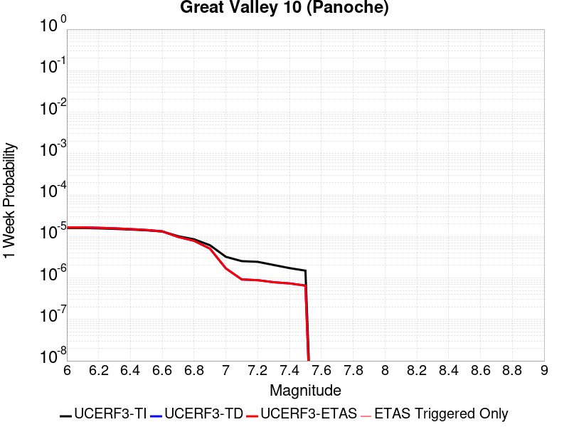 |  |  |  |

| Magnitude | 1 wk TI Prob | 1 wk TD Prob | 1 wk ETAS Prob | 1 wk ETAS/TD Gain | 1 wk ETAS Triggered Only | 1 mo TI Prob | 1 mo TD Prob | 1 mo ETAS Prob | 1 mo ETAS/TD Gain | 1 mo ETAS Triggered Only | 1 yr TI Prob | 1 yr TD Prob | 1 yr ETAS Prob | 1 yr ETAS/TD Gain | 1 yr ETAS Triggered Only | 10 yr TI Prob | 10 yr TD Prob | 10 yr ETAS Prob | 10 yr ETAS/TD Gain | 10 yr ETAS Triggered Only |
|-----|-----|-----|-----|-----|-----|-----|-----|-----|-----|-----|-----|-----|-----|-----|-----|-----|-----|-----|-----|-----|
| 6.0 | 1.6014626E-5 | 1.657571E-5 | 1.657571E-5 | 1.0 | 0.0 | 6.863231E-5 | 7.1036855E-5 | 7.1036855E-5 | 1.0 | 0.0 | 8.35278E-4 | 8.6453604E-4 | 8.845188E-4 | 1.0231138 | 2.0E-5 | 0.008321454 | 0.008612341 | 0.008632168 | 1.0023023 | 2.0E-5 |
| 6.1 | 1.6014626E-5 | 1.657571E-5 | 1.657571E-5 | 1.0 | 0.0 | 6.863231E-5 | 7.1036855E-5 | 7.1036855E-5 | 1.0 | 0.0 | 8.35278E-4 | 8.6453604E-4 | 8.845188E-4 | 1.0231138 | 2.0E-5 | 0.008321454 | 0.008612341 | 0.008632168 | 1.0023023 | 2.0E-5 |
| 6.2 | 1.56782E-5 | 1.6198752E-5 | 1.6198752E-5 | 1.0 | 0.0 | 6.719056E-5 | 6.94214E-5 | 6.94214E-5 | 1.0 | 0.0 | 8.17738E-4 | 8.4488327E-4 | 8.6486636E-4 | 1.023652 | 2.0E-5 | 0.008147354 | 0.008417313 | 0.008437145 | 1.002356 | 2.0E-5 |
| 6.3 | 1.5263338E-5 | 1.572381E-5 | 1.572381E-5 | 1.0 | 0.0 | 6.541267E-5 | 6.738605E-5 | 6.738605E-5 | 1.0 | 0.0 | 7.961082E-4 | 8.201217E-4 | 8.401053E-4 | 1.0243666 | 2.0E-5 | 0.007932622 | 0.008171538 | 0.008191374 | 1.0024276 | 2.0E-5 |
| 6.4 | 1.4720723E-5 | 1.5099659E-5 | 1.5099659E-5 | 1.0 | 0.0 | 6.308728E-5 | 6.4711254E-5 | 6.4711254E-5 | 1.0 | 0.0 | 7.67817E-4 | 7.8758E-4 | 8.0756424E-4 | 1.0253743 | 2.0E-5 | 0.007651695 | 0.007848457 | 0.007868301 | 1.0025283 | 2.0E-5 |
| 6.5 | 1.408264E-5 | 1.4356237E-5 | 1.4356237E-5 | 1.0 | 0.0 | 6.0352773E-5 | 6.152531E-5 | 6.152531E-5 | 1.0 | 0.0 | 7.3454727E-4 | 7.488184E-4 | 7.688034E-4 | 1.0266887 | 2.0E-5 | 0.0073212404 | 0.0074635018 | 0.007483353 | 1.0026597 | 2.0E-5 |
| 6.6 | 1.3197086E-5 | 1.3322132E-5 | 1.3322132E-5 | 1.0 | 0.0 | 5.6557717E-5 | 5.709363E-5 | 5.709363E-5 | 1.0 | 0.0 | 6.8837265E-4 | 6.948983E-4 | 7.1488443E-4 | 1.0287611 | 2.0E-5 | 0.006862442 | 0.0069277873 | 0.0069476487 | 1.002867 | 2.0E-5 |
| 6.7 | 1.017583E-5 | 9.745547E-6 | 9.745547E-6 | 1.0 | 0.0 | 4.360997E-5 | 4.1765972E-5 | 4.1765972E-5 | 1.0 | 0.0 | 5.30822E-4 | 5.083845E-4 | 5.2837434E-4 | 1.0393203 | 2.0E-5 | 0.0052955584 | 0.005072467 | 0.0050923657 | 1.0039228 | 2.0E-5 |
| 6.8 | 8.557912E-6 | 7.872833E-6 | 7.872833E-6 | 1.0 | 0.0 | 3.667625E-5 | 3.3740285E-5 | 3.3740285E-5 | 1.0 | 0.0 | 4.4644187E-4 | 4.107126E-4 | 4.3070436E-4 | 1.0486759 | 2.0E-5 | 0.0044554602 | 0.004099742 | 0.0041196602 | 1.0048584 | 2.0E-5 |
| 6.9 | 6.14664E-6 | 5.09214E-6 | 5.09214E-6 | 1.0 | 0.0 | 2.6342475E-5 | 2.1823282E-5 | 2.1823282E-5 | 1.0 | 0.0 | 3.2067244E-4 | 2.6566745E-4 | 2.6566745E-4 | 1.0 | 0.0 | 0.003202101 | 0.002653637 | 0.002653637 | 1.0 | 0.0 |
| 7.0 | 3.2310581E-6 | 1.6951159E-6 | 1.6951159E-6 | 1.0 | 0.0 | 1.3847319E-5 | 7.2647626E-6 | 7.2647626E-6 | 1.0 | 0.0 | 1.6857806E-4 | 8.844499E-5 | 8.844499E-5 | 1.0 | 0.0 | 0.0016845023 | 8.8410726E-4 | 8.8410726E-4 | 1.0 | 0.0 |
| 7.1 | 2.544492E-6 | 9.1887256E-7 | 9.1887256E-7 | 1.0 | 0.0 | 1.090492E-5 | 3.9380197E-6 | 3.9380197E-6 | 1.0 | 0.0 | 1.327593E-4 | 4.7944384E-5 | 4.7944384E-5 | 1.0 | 0.0 | 0.0013268003 | 4.7934518E-4 | 4.7934518E-4 | 1.0 | 0.0 |
| 7.2 | 2.4479045E-6 | 8.841117E-7 | 8.841117E-7 | 1.0 | 0.0 | 1.0490977E-5 | 3.7890452E-6 | 3.7890452E-6 | 1.0 | 0.0 | 1.2772017E-4 | 4.6130695E-5 | 4.6130695E-5 | 1.0 | 0.0 | 0.0012764678 | 4.6121594E-4 | 4.6121594E-4 | 1.0 | 0.0 |
| 7.3 | 2.0559578E-6 | 7.892632E-7 | 7.892632E-7 | 1.0 | 0.0 | 8.811218E-6 | 3.3825524E-6 | 3.3825524E-6 | 1.0 | 0.0 | 1.072713E-4 | 4.1181847E-5 | 4.1181847E-5 | 1.0 | 0.0 | 0.0010721954 | 4.117468E-4 | 4.117468E-4 | 1.0 | 0.0 |
| 7.4 | 1.727687E-6 | 7.3876646E-7 | 7.3876646E-7 | 1.0 | 0.0 | 7.404352E-6 | 3.1661384E-6 | 3.1661384E-6 | 1.0 | 0.0 | 9.0144255E-5 | 3.85471E-5 | 3.85471E-5 | 1.0 | 0.0 | 9.0107694E-4 | 3.8540873E-4 | 3.8540873E-4 | 1.0 | 0.0 |
| 7.5 | 1.5002679E-6 | 6.5460756E-7 | 6.5460756E-7 | 1.0 | 0.0 | 6.4297037E-6 | 2.805458E-6 | 2.805458E-6 | 1.0 | 0.0 | 7.827883E-5 | 3.415596E-5 | 3.415596E-5 | 1.0 | 0.0 | 7.825126E-4 | 3.4151124E-4 | 3.4151124E-4 | 1.0 | 0.0 |

## Calaveras (So) 2011 CFM
*[(top)](#table-of-contents)*

| 1 Week | 1 Month | 1 Year | 10 Year |
|-----|-----|-----|-----|
| 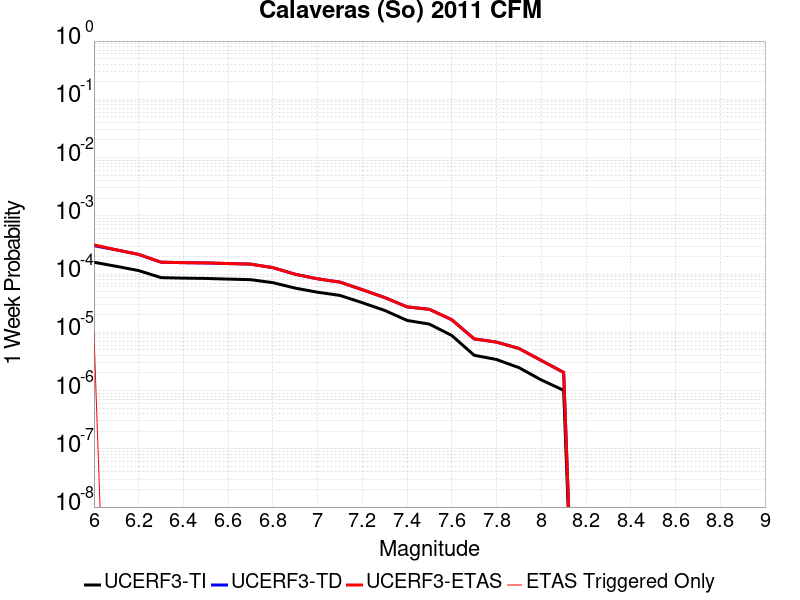 |  |  |  |

| Magnitude | 1 wk TI Prob | 1 wk TD Prob | 1 wk ETAS Prob | 1 wk ETAS/TD Gain | 1 wk ETAS Triggered Only | 1 mo TI Prob | 1 mo TD Prob | 1 mo ETAS Prob | 1 mo ETAS/TD Gain | 1 mo ETAS Triggered Only | 1 yr TI Prob | 1 yr TD Prob | 1 yr ETAS Prob | 1 yr ETAS/TD Gain | 1 yr ETAS Triggered Only | 10 yr TI Prob | 10 yr TD Prob | 10 yr ETAS Prob | 10 yr ETAS/TD Gain | 10 yr ETAS Triggered Only |
|-----|-----|-----|-----|-----|-----|-----|-----|-----|-----|-----|-----|-----|-----|-----|-----|-----|-----|-----|-----|-----|
| 6.0 | 1.5950744E-4 | 3.07182E-4 | 3.1717893E-4 | 1.032544 | 1.0E-5 | 6.834242E-4 | 0.0013155838 | 0.0013255706 | 1.0075912 | 1.0E-5 | 0.00828899 | 0.01586041 | 0.01587025 | 1.0006205 | 1.0E-5 | 0.079865426 | 0.14442472 | 0.14444184 | 1.0001185 | 2.0E-5 |
| 6.1 | 1.3584697E-4 | 2.6039843E-4 | 2.6039843E-4 | 1.0 | 0.0 | 5.8207137E-4 | 0.0011153528 | 0.0011153528 | 1.0 | 0.0 | 0.007063716 | 0.013463387 | 0.013463387 | 1.0 | 0.0 | 0.06843361 | 0.1240527 | 0.1240527 | 1.0 | 0.0 |
| 6.2 | 1.14676266E-4 | 2.171953E-4 | 2.171953E-4 | 1.0 | 0.0 | 4.9137714E-4 | 9.3039346E-4 | 9.3039346E-4 | 1.0 | 0.0 | 0.0059661185 | 0.011246999 | 0.011246999 | 1.0 | 0.0 | 0.058084648 | 0.10504322 | 0.10504322 | 1.0 | 0.0 |
| 6.3 | 8.691518E-5 | 1.5991413E-4 | 1.5991413E-4 | 1.0 | 0.0 | 3.7244044E-4 | 6.85134E-4 | 6.85134E-4 | 1.0 | 0.0 | 0.004525038 | 0.008302956 | 0.008302956 | 1.0 | 0.0 | 0.044339992 | 0.07935925 | 0.07935925 | 1.0 | 0.0 |
| 6.4 | 8.50982E-5 | 1.5697793E-4 | 1.5697793E-4 | 1.0 | 0.0 | 3.646556E-4 | 6.725568E-4 | 6.725568E-4 | 1.0 | 0.0 | 0.0044306475 | 0.008150981 | 0.008150981 | 1.0 | 0.0 | 0.04343345 | 0.07796543 | 0.07796543 | 1.0 | 0.0 |
| 6.5 | 8.4062965E-5 | 1.5522187E-4 | 1.5522187E-4 | 1.0 | 0.0 | 3.602201E-4 | 6.6503574E-4 | 6.6503574E-4 | 1.0 | 0.0 | 0.004376863 | 0.008060186 | 0.008060186 | 1.0 | 0.0 | 0.042916555 | 0.0771368 | 0.0771368 | 1.0 | 0.0 |
| 6.6 | 8.194716E-5 | 1.5157944E-4 | 1.5157944E-4 | 1.0 | 0.0 | 3.5115483E-4 | 6.494359E-4 | 6.494359E-4 | 1.0 | 0.0 | 0.0042669317 | 0.007872019 | 0.007872019 | 1.0 | 0.0 | 0.04185927 | 0.07542207 | 0.07542207 | 1.0 | 0.0 |
| 6.7 | 8.012326E-5 | 1.4825833E-4 | 1.4825833E-4 | 1.0 | 0.0 | 3.433402E-4 | 6.3521194E-4 | 6.3521194E-4 | 1.0 | 0.0 | 0.004172157 | 0.007700504 | 0.007700504 | 1.0 | 0.0 | 0.040946912 | 0.07386414 | 0.07386414 | 1.0 | 0.0 |
| 6.8 | 7.119773E-5 | 1.2885146E-4 | 1.2885146E-4 | 1.0 | 0.0 | 3.0509746E-4 | 5.5208657E-4 | 5.5208657E-4 | 1.0 | 0.0 | 0.0037082357 | 0.0066977087 | 0.0066977087 | 1.0 | 0.0 | 0.036469642 | 0.06470736 | 0.06470736 | 1.0 | 0.0 |
| 6.9 | 5.7343088E-5 | 9.9215715E-5 | 9.9215715E-5 | 1.0 | 0.0 | 2.4573295E-4 | 4.2514122E-4 | 4.2514122E-4 | 1.0 | 0.0 | 0.0029876942 | 0.0051638843 | 0.0051638843 | 1.0 | 0.0 | 0.02947844 | 0.050521772 | 0.050521772 | 1.0 | 0.0 |
| 7.0 | 4.8746577E-5 | 8.2872946E-5 | 8.2872946E-5 | 1.0 | 0.0 | 2.0889717E-4 | 3.5512177E-4 | 3.5512177E-4 | 1.0 | 0.0 | 0.0025403565 | 0.0043151025 | 0.0043151025 | 1.0 | 0.0 | 0.025115121 | 0.042496696 | 0.042496696 | 1.0 | 0.0 |
| 7.1 | 4.2998014E-5 | 7.266674E-5 | 7.266674E-5 | 1.0 | 0.0 | 1.8426418E-4 | 3.1139204E-4 | 3.1139204E-4 | 1.0 | 0.0 | 0.002241108 | 0.0037846677 | 0.0037846677 | 1.0 | 0.0 | 0.022186412 | 0.03743137 | 0.03743137 | 1.0 | 0.0 |
| 7.2 | 3.221292E-5 | 5.3921813E-5 | 5.3921813E-5 | 1.0 | 0.0 | 1.3804805E-4 | 2.3107318E-4 | 2.3107318E-4 | 1.0 | 0.0 | 0.0016794393 | 0.0028097143 | 0.0028097143 | 1.0 | 0.0 | 0.016668037 | 0.028043631 | 0.028043631 | 1.0 | 0.0 |
| 7.3 | 2.3756531E-5 | 3.9486065E-5 | 3.9486065E-5 | 1.0 | 0.0 | 1.0180973E-4 | 1.6921511E-4 | 1.6921511E-4 | 1.0 | 0.0 | 0.0012388286 | 0.0020582643 | 0.0020582643 | 1.0 | 0.0 | 0.012319452 | 0.020650236 | 0.020650236 | 1.0 | 0.0 |
| 7.4 | 1.5997684E-5 | 2.734871E-5 | 2.734871E-5 | 1.0 | 0.0 | 6.8559704E-5 | 1.172035E-4 | 1.172035E-4 | 1.0 | 0.0 | 8.343947E-4 | 0.001426021 | 0.001426021 | 1.0 | 0.0 | 0.008312687 | 0.014378974 | 0.014378974 | 1.0 | 0.0 |
| 7.5 | 1.3814293E-5 | 2.4790226E-5 | 2.4790226E-5 | 1.0 | 0.0 | 5.9202768E-5 | 1.0623951E-4 | 1.0623951E-4 | 1.0 | 0.0 | 7.205553E-4 | 0.001292701 | 0.001292701 | 1.0 | 0.0 | 0.007182234 | 0.013058075 | 0.013058075 | 1.0 | 0.0 |
| 7.6 | 8.817309E-6 | 1.6436143E-5 | 1.6436143E-5 | 1.0 | 0.0 | 3.7787922E-5 | 7.043872E-5 | 7.043872E-5 | 1.0 | 0.0 | 4.5997082E-4 | 8.5725536E-4 | 8.5725536E-4 | 1.0 | 0.0 | 0.004590199 | 0.008721771 | 0.008721771 | 1.0 | 0.0 |
| 7.7 | 4.0352206E-6 | 7.711456E-6 | 7.711456E-6 | 1.0 | 0.0 | 1.7293689E-5 | 3.304868E-5 | 3.304868E-5 | 1.0 | 0.0 | 2.1053031E-4 | 4.0229346E-4 | 4.0229346E-4 | 1.0 | 0.0 | 0.0021033096 | 0.004167241 | 0.004167241 | 1.0 | 0.0 |
| 7.8 | 3.413169E-6 | 6.79093E-6 | 6.79093E-6 | 1.0 | 0.0 | 1.4627784E-5 | 2.9103661E-5 | 2.9103661E-5 | 1.0 | 0.0 | 1.7807873E-4 | 3.5427953E-4 | 3.5427953E-4 | 1.0 | 0.0 | 0.0017793609 | 0.0036683267 | 0.0036683267 | 1.0 | 0.0 |
| 7.9 | 2.4740732E-6 | 5.28193E-6 | 5.28193E-6 | 1.0 | 0.0 | 1.06031275E-5 | 2.2636646E-5 | 2.2636646E-5 | 1.0 | 0.0 | 1.2908543E-4 | 2.7556636E-4 | 2.7556636E-4 | 1.0 | 0.0 | 0.0012901047 | 0.002836207 | 0.002836207 | 1.0 | 0.0 |
| 8.0 | 1.5231818E-6 | 3.2905639E-6 | 3.2905639E-6 | 1.0 | 0.0 | 6.527906E-6 | 1.4102341E-5 | 1.4102341E-5 | 1.0 | 0.0 | 7.9474354E-5 | 1.716825E-4 | 1.716825E-4 | 1.0 | 0.0 | 7.944594E-4 | 0.0017573038 | 0.0017573038 | 1.0 | 0.0 |
| 8.1 | 1.0104524E-6 | 2.046827E-6 | 2.046827E-6 | 1.0 | 0.0 | 4.330503E-6 | 8.7720855E-6 | 8.7720855E-6 | 1.0 | 0.0 | 5.2722597E-5 | 1.0679494E-4 | 1.0679494E-4 | 1.0 | 0.0 | 5.271009E-4 | 0.0010935272 | 0.0010935272 | 1.0 | 0.0 |

## Los Alamos 2011 CFM
*[(top)](#table-of-contents)*

| 1 Week | 1 Month | 1 Year | 10 Year |
|-----|-----|-----|-----|
|  |  |  |  |

| Magnitude | 1 wk TI Prob | 1 wk TD Prob | 1 wk ETAS Prob | 1 wk ETAS/TD Gain | 1 wk ETAS Triggered Only | 1 mo TI Prob | 1 mo TD Prob | 1 mo ETAS Prob | 1 mo ETAS/TD Gain | 1 mo ETAS Triggered Only | 1 yr TI Prob | 1 yr TD Prob | 1 yr ETAS Prob | 1 yr ETAS/TD Gain | 1 yr ETAS Triggered Only | 10 yr TI Prob | 10 yr TD Prob | 10 yr ETAS Prob | 10 yr ETAS/TD Gain | 10 yr ETAS Triggered Only |
|-----|-----|-----|-----|-----|-----|-----|-----|-----|-----|-----|-----|-----|-----|-----|-----|-----|-----|-----|-----|-----|
| 6.0 | 4.6284417E-6 | 4.751756E-6 | 4.751756E-6 | 1.0 | 0.0 | 1.9836029E-5 | 2.036452E-5 | 2.036452E-5 | 1.0 | 0.0 | 2.4147688E-4 | 2.4791158E-4 | 2.679066E-4 | 1.0806539 | 2.0E-5 | 0.0024121467 | 0.0024765243 | 0.0024964747 | 1.0080558 | 2.0E-5 |
| 6.1 | 4.6284417E-6 | 4.751756E-6 | 4.751756E-6 | 1.0 | 0.0 | 1.9836029E-5 | 2.036452E-5 | 2.036452E-5 | 1.0 | 0.0 | 2.4147688E-4 | 2.4791158E-4 | 2.679066E-4 | 1.0806539 | 2.0E-5 | 0.0024121467 | 0.0024765243 | 0.0024964747 | 1.0080558 | 2.0E-5 |
| 6.2 | 4.6284417E-6 | 4.751756E-6 | 4.751756E-6 | 1.0 | 0.0 | 1.9836029E-5 | 2.036452E-5 | 2.036452E-5 | 1.0 | 0.0 | 2.4147688E-4 | 2.4791158E-4 | 2.679066E-4 | 1.0806539 | 2.0E-5 | 0.0024121467 | 0.0024765243 | 0.0024964747 | 1.0080558 | 2.0E-5 |
| 6.3 | 4.6284417E-6 | 4.751756E-6 | 4.751756E-6 | 1.0 | 0.0 | 1.9836029E-5 | 2.036452E-5 | 2.036452E-5 | 1.0 | 0.0 | 2.4147688E-4 | 2.4791158E-4 | 2.679066E-4 | 1.0806539 | 2.0E-5 | 0.0024121467 | 0.0024765243 | 0.0024964747 | 1.0080558 | 2.0E-5 |
| 6.4 | 4.6284417E-6 | 4.751756E-6 | 4.751756E-6 | 1.0 | 0.0 | 1.9836029E-5 | 2.036452E-5 | 2.036452E-5 | 1.0 | 0.0 | 2.4147688E-4 | 2.4791158E-4 | 2.679066E-4 | 1.0806539 | 2.0E-5 | 0.0024121467 | 0.0024765243 | 0.0024964747 | 1.0080558 | 2.0E-5 |
| 6.5 | 4.6284417E-6 | 4.751756E-6 | 4.751756E-6 | 1.0 | 0.0 | 1.9836029E-5 | 2.036452E-5 | 2.036452E-5 | 1.0 | 0.0 | 2.4147688E-4 | 2.4791158E-4 | 2.679066E-4 | 1.0806539 | 2.0E-5 | 0.0024121467 | 0.0024765243 | 0.0024964747 | 1.0080558 | 2.0E-5 |
| 6.6 | 4.6284417E-6 | 4.751756E-6 | 4.751756E-6 | 1.0 | 0.0 | 1.9836029E-5 | 2.036452E-5 | 2.036452E-5 | 1.0 | 0.0 | 2.4147688E-4 | 2.4791158E-4 | 2.679066E-4 | 1.0806539 | 2.0E-5 | 0.0024121467 | 0.0024765243 | 0.0024964747 | 1.0080558 | 2.0E-5 |
| 6.7 | 4.062321E-6 | 4.1663707E-6 | 4.1663707E-6 | 1.0 | 0.0 | 1.7409831E-5 | 1.7855762E-5 | 1.7855762E-5 | 1.0 | 0.0 | 2.1194408E-4 | 2.1737372E-4 | 2.3736937E-4 | 1.0919875 | 2.0E-5 | 0.0021174205 | 0.0021717607 | 0.0021917173 | 1.0091891 | 2.0E-5 |
| 6.8 | 4.062321E-6 | 4.1663707E-6 | 4.1663707E-6 | 1.0 | 0.0 | 1.7409831E-5 | 1.7855762E-5 | 1.7855762E-5 | 1.0 | 0.0 | 2.1194408E-4 | 2.1737372E-4 | 2.3736937E-4 | 1.0919875 | 2.0E-5 | 0.0021174205 | 0.0021717607 | 0.0021917173 | 1.0091891 | 2.0E-5 |
| 6.9 | 3.2936077E-6 | 3.3729766E-6 | 3.3729766E-6 | 1.0 | 0.0 | 1.4115385E-5 | 1.4455539E-5 | 1.4455539E-5 | 1.0 | 0.0 | 1.7184127E-4 | 1.7598292E-4 | 1.8598115E-4 | 1.0568137 | 1.0E-5 | 0.0017170844 | 0.0017585282 | 0.0017685106 | 1.0056766 | 1.0E-5 |
| 7.0 | 3.1687898E-6 | 3.2448338E-6 | 3.2448338E-6 | 1.0 | 0.0 | 1.3580457E-5 | 1.3906361E-5 | 1.3906361E-5 | 1.0 | 0.0 | 1.6532952E-4 | 1.6929772E-4 | 1.7929604E-4 | 1.0590576 | 1.0E-5 | 0.0016520657 | 0.0016917791 | 0.0017017622 | 1.005901 | 1.0E-5 |
| 7.1 | 2.9379228E-6 | 3.0073431E-6 | 3.0073431E-6 | 1.0 | 0.0 | 1.25910365E-5 | 1.2888555E-5 | 1.2888555E-5 | 1.0 | 0.0 | 1.5328509E-4 | 1.5690776E-4 | 1.6690619E-4 | 1.0637217 | 1.0E-5 | 0.001531794 | 0.0015680589 | 0.0015780432 | 1.0063673 | 1.0E-5 |
| 7.2 | 2.0020686E-6 | 2.041643E-6 | 2.041643E-6 | 1.0 | 0.0 | 8.580266E-6 | 8.749869E-6 | 8.749869E-6 | 1.0 | 0.0 | 1.0445973E-4 | 1.065245E-4 | 1.065245E-4 | 1.0 | 0.0 | 0.0010441064 | 0.0010647388 | 0.0010647388 | 1.0 | 0.0 |
| 7.3 | 1.7364243E-6 | 1.7678924E-6 | 1.7678924E-6 | 1.0 | 0.0 | 7.441797E-6 | 7.5766598E-6 | 7.5766598E-6 | 1.0 | 0.0 | 9.0600115E-5 | 9.224196E-5 | 9.224196E-5 | 1.0 | 0.0 | 9.0563187E-4 | 9.2203985E-4 | 9.2203985E-4 | 1.0 | 0.0 |
| 7.4 | 1.5718434E-6 | 1.598329E-6 | 1.598329E-6 | 1.0 | 0.0 | 6.7364545E-6 | 6.849964E-6 | 6.849964E-6 | 1.0 | 0.0 | 8.201325E-5 | 8.339515E-5 | 8.339515E-5 | 1.0 | 0.0 | 8.198299E-4 | 8.3364156E-4 | 8.3364156E-4 | 1.0 | 0.0 |
| 7.5 | 1.3841119E-6 | 1.4042898E-6 | 1.4042898E-6 | 1.0 | 0.0 | 5.9318945E-6 | 6.018371E-6 | 6.018371E-6 | 1.0 | 0.0 | 7.221842E-5 | 7.3271236E-5 | 7.3271236E-5 | 1.0 | 0.0 | 7.2194956E-4 | 7.324736E-4 | 7.324736E-4 | 1.0 | 0.0 |
| 7.6 | 1.0843726E-6 | 1.0934511E-6 | 1.0934511E-6 | 1.0 | 0.0 | 4.647303E-6 | 4.686211E-6 | 4.686211E-6 | 1.0 | 0.0 | 5.6579443E-5 | 5.705315E-5 | 5.705315E-5 | 1.0 | 0.0 | 5.656504E-4 | 5.7038764E-4 | 5.7038764E-4 | 1.0 | 0.0 |
| 7.7 | 5.544814E-7 | 5.501919E-7 | 5.501919E-7 | 1.0 | 0.0 | 2.3763469E-6 | 2.357963E-6 | 2.357963E-6 | 1.0 | 0.0 | 2.8931638E-5 | 2.8707824E-5 | 2.8707824E-5 | 1.0 | 0.0 | 2.8927872E-4 | 2.870413E-4 | 2.870413E-4 | 1.0 | 0.0 |
| 7.8 | 2.0707465E-7 | 1.977874E-7 | 1.977874E-7 | 1.0 | 0.0 | 8.874625E-7 | 8.4766003E-7 | 8.4766003E-7 | 1.0 | 0.0 | 1.08048025E-5 | 1.0320213E-5 | 1.0320213E-5 | 1.0 | 0.0 | 1.0804277E-4 | 1.0319738E-4 | 1.0319738E-4 | 1.0 | 0.0 |
| 7.9 | 3.9821284E-8 | 3.433199E-8 | 3.433199E-8 | 1.0 | 0.0 | 1.7066264E-7 | 1.4713709E-7 | 1.4713709E-7 | 1.0 | 0.0 | 2.0778157E-6 | 1.7913927E-6 | 1.7913927E-6 | 1.0 | 0.0 | 2.0777963E-5 | 1.7913788E-5 | 1.7913788E-5 | 1.0 | 0.0 |
| 8.0 | 7.880441E-11 | 8.235368E-11 | 8.235368E-11 | 1.0 | 0.0 | 3.3773329E-10 | 3.5294412E-10 | 3.5294412E-10 | 1.0 | 0.0 | 4.1119033E-9 | 4.297095E-9 | 4.297095E-9 | 1.0 | 0.0 | 4.1119034E-8 | 4.2970953E-8 | 4.2970953E-8 | 1.0 | 0.0 |

## Mount Diablo Thrust South
*[(top)](#table-of-contents)*

| 1 Week | 1 Month | 1 Year | 10 Year |
|-----|-----|-----|-----|
|  |  |  |  |

| Magnitude | 1 wk TI Prob | 1 wk TD Prob | 1 wk ETAS Prob | 1 wk ETAS/TD Gain | 1 wk ETAS Triggered Only | 1 mo TI Prob | 1 mo TD Prob | 1 mo ETAS Prob | 1 mo ETAS/TD Gain | 1 mo ETAS Triggered Only | 1 yr TI Prob | 1 yr TD Prob | 1 yr ETAS Prob | 1 yr ETAS/TD Gain | 1 yr ETAS Triggered Only | 10 yr TI Prob | 10 yr TD Prob | 10 yr ETAS Prob | 10 yr ETAS/TD Gain | 10 yr ETAS Triggered Only |
|-----|-----|-----|-----|-----|-----|-----|-----|-----|-----|-----|-----|-----|-----|-----|-----|-----|-----|-----|-----|-----|
| 6.0 | 2.2377444E-5 | 2.6956855E-5 | 2.6956855E-5 | 1.0 | 0.0 | 9.5899806E-5 | 1.15525385E-4 | 1.15525385E-4 | 1.0 | 0.0 | 0.0011669548 | 0.0014058118 | 0.0014157977 | 1.0071033 | 1.0E-5 | 0.011608457 | 0.013988916 | 0.014008637 | 1.0014096 | 2.0E-5 |
| 6.1 | 2.2377444E-5 | 2.6956855E-5 | 2.6956855E-5 | 1.0 | 0.0 | 9.5899806E-5 | 1.15525385E-4 | 1.15525385E-4 | 1.0 | 0.0 | 0.0011669548 | 0.0014058118 | 0.0014157977 | 1.0071033 | 1.0E-5 | 0.011608457 | 0.013988916 | 0.014008637 | 1.0014096 | 2.0E-5 |
| 6.2 | 2.2377444E-5 | 2.6956855E-5 | 2.6956855E-5 | 1.0 | 0.0 | 9.5899806E-5 | 1.15525385E-4 | 1.15525385E-4 | 1.0 | 0.0 | 0.0011669548 | 0.0014058118 | 0.0014157977 | 1.0071033 | 1.0E-5 | 0.011608457 | 0.013988916 | 0.014008637 | 1.0014096 | 2.0E-5 |
| 6.3 | 2.2377444E-5 | 2.6956855E-5 | 2.6956855E-5 | 1.0 | 0.0 | 9.5899806E-5 | 1.15525385E-4 | 1.15525385E-4 | 1.0 | 0.0 | 0.0011669548 | 0.0014058118 | 0.0014157977 | 1.0071033 | 1.0E-5 | 0.011608457 | 0.013988916 | 0.014008637 | 1.0014096 | 2.0E-5 |
| 6.4 | 1.2228463E-5 | 1.4747988E-5 | 1.4747988E-5 | 1.0 | 0.0 | 5.2406645E-5 | 6.32042E-5 | 6.32042E-5 | 1.0 | 0.0 | 6.378641E-4 | 7.692523E-4 | 7.7924464E-4 | 1.0129896 | 1.0E-5 | 0.0063603627 | 0.0076674037 | 0.0076773274 | 1.0012943 | 1.0E-5 |
| 6.5 | 1.2228463E-5 | 1.4747988E-5 | 1.4747988E-5 | 1.0 | 0.0 | 5.2406645E-5 | 6.32042E-5 | 6.32042E-5 | 1.0 | 0.0 | 6.378641E-4 | 7.692523E-4 | 7.7924464E-4 | 1.0129896 | 1.0E-5 | 0.0063603627 | 0.0076674037 | 0.0076773274 | 1.0012943 | 1.0E-5 |
| 6.6 | 1.2068118E-5 | 1.455278E-5 | 1.455278E-5 | 1.0 | 0.0 | 5.1719482E-5 | 6.236764E-5 | 6.236764E-5 | 1.0 | 0.0 | 6.2950276E-4 | 7.590743E-4 | 7.6906674E-4 | 1.0131639 | 1.0E-5 | 0.006277225 | 0.007566321 | 0.0075762453 | 1.0013117 | 1.0E-5 |
| 6.7 | 1.1499428E-5 | 1.3875425E-5 | 1.3875425E-5 | 1.0 | 0.0 | 4.9282335E-5 | 5.9464823E-5 | 5.9464823E-5 | 1.0 | 0.0 | 5.9984723E-4 | 7.237565E-4 | 7.3374924E-4 | 1.0138068 | 1.0E-5 | 0.0059823063 | 0.007215485 | 0.0072254124 | 1.0013759 | 1.0E-5 |
| 6.8 | 8.82118E-6 | 1.0830661E-5 | 1.0830661E-5 | 1.0 | 0.0 | 3.780451E-5 | 4.6416324E-5 | 4.6416324E-5 | 1.0 | 0.0 | 4.601727E-4 | 5.649778E-4 | 5.749722E-4 | 1.0176898 | 1.0E-5 | 0.0045922096 | 0.0056361877 | 0.0056461315 | 1.0017643 | 1.0E-5 |
| 6.9 | 8.047112E-6 | 9.939611E-6 | 9.939611E-6 | 1.0 | 0.0 | 3.4487166E-5 | 4.259767E-5 | 4.259767E-5 | 1.0 | 0.0 | 4.1980037E-4 | 5.185085E-4 | 5.2850327E-4 | 1.0192761 | 1.0E-5 | 0.004190082 | 0.0051737237 | 0.0051836716 | 1.0019228 | 1.0E-5 |
| 7.0 | 6.2574763E-6 | 7.748641E-6 | 7.748641E-6 | 1.0 | 0.0 | 2.681748E-5 | 3.320806E-5 | 3.320806E-5 | 1.0 | 0.0 | 3.264539E-4 | 4.0423684E-4 | 4.0423684E-4 | 1.0 | 0.0 | 0.0032597475 | 0.0040357383 | 0.0040357383 | 1.0 | 0.0 |
| 7.1 | 3.6485903E-6 | 4.513004E-6 | 4.513004E-6 | 1.0 | 0.0 | 1.5636722E-5 | 1.9341305E-5 | 1.9341305E-5 | 1.0 | 0.0 | 1.9036046E-4 | 2.3545536E-4 | 2.3545536E-4 | 1.0 | 0.0 | 0.0019019748 | 0.002352123 | 0.002352123 | 1.0 | 0.0 |
| 7.2 | 2.3034274E-6 | 2.905568E-6 | 2.905568E-6 | 1.0 | 0.0 | 9.871795E-6 | 1.2452376E-5 | 1.2452376E-5 | 1.0 | 0.0 | 1.2018247E-4 | 1.5159737E-4 | 1.5159737E-4 | 1.0 | 0.0 | 0.0012011749 | 0.0015150359 | 0.0015150359 | 1.0 | 0.0 |
| 7.3 | 1.224035E-6 | 1.568004E-6 | 1.568004E-6 | 1.0 | 0.0 | 5.245854E-6 | 6.720001E-6 | 6.720001E-6 | 1.0 | 0.0 | 6.38664E-5 | 8.181304E-5 | 8.181304E-5 | 1.0 | 0.0 | 6.384805E-4 | 8.177875E-4 | 8.177875E-4 | 1.0 | 0.0 |
| 7.4 | 5.1601154E-7 | 6.723497E-7 | 6.723497E-7 | 1.0 | 0.0 | 2.2114762E-6 | 2.8814957E-6 | 2.8814957E-6 | 1.0 | 0.0 | 2.6924388E-5 | 3.508166E-5 | 3.508166E-5 | 1.0 | 0.0 | 2.6921128E-4 | 3.5074085E-4 | 3.5074085E-4 | 1.0 | 0.0 |
| 7.5 | 3.552894E-7 | 4.6653378E-7 | 4.6653378E-7 | 1.0 | 0.0 | 1.5226678E-6 | 1.999429E-6 | 1.999429E-6 | 1.0 | 0.0 | 1.8538323E-5 | 2.4342791E-5 | 2.4342791E-5 | 1.0 | 0.0 | 1.8536777E-4 | 2.4340766E-4 | 2.4340766E-4 | 1.0 | 0.0 |
| 7.6 | 1.3124082E-7 | 1.7192048E-7 | 1.7192048E-7 | 1.0 | 0.0 | 5.6246057E-7 | 7.368019E-7 | 7.368019E-7 | 1.0 | 0.0 | 6.8479358E-6 | 8.9705345E-6 | 8.9705345E-6 | 1.0 | 0.0 | 6.8477246E-5 | 8.967447E-5 | 8.967447E-5 | 1.0 | 0.0 |
| 7.7 | 3.6193022E-8 | 4.7334797E-8 | 4.7334797E-8 | 1.0 | 0.0 | 1.5511293E-7 | 2.0286342E-7 | 2.0286342E-7 | 1.0 | 0.0 | 1.8884983E-6 | 2.4698604E-6 | 2.4698604E-6 | 1.0 | 0.0 | 1.8884823E-5 | 2.4698264E-5 | 2.4698264E-5 | 1.0 | 0.0 |

## San Juan
*[(top)](#table-of-contents)*

| 1 Week | 1 Month | 1 Year | 10 Year |
|-----|-----|-----|-----|
|  |  |  |  |

| Magnitude | 1 wk TI Prob | 1 wk TD Prob | 1 wk ETAS Prob | 1 wk ETAS/TD Gain | 1 wk ETAS Triggered Only | 1 mo TI Prob | 1 mo TD Prob | 1 mo ETAS Prob | 1 mo ETAS/TD Gain | 1 mo ETAS Triggered Only | 1 yr TI Prob | 1 yr TD Prob | 1 yr ETAS Prob | 1 yr ETAS/TD Gain | 1 yr ETAS Triggered Only | 10 yr TI Prob | 10 yr TD Prob | 10 yr ETAS Prob | 10 yr ETAS/TD Gain | 10 yr ETAS Triggered Only |
|-----|-----|-----|-----|-----|-----|-----|-----|-----|-----|-----|-----|-----|-----|-----|-----|-----|-----|-----|-----|-----|
| 6.0 | 8.682808E-6 | 8.749572E-6 | 8.749572E-6 | 1.0 | 0.0 | 3.72115E-5 | 3.7497655E-5 | 3.7497655E-5 | 1.0 | 0.0 | 4.5295584E-4 | 4.5644314E-4 | 4.6643856E-4 | 1.0218985 | 1.0E-5 | 0.004520337 | 0.004555597 | 0.004575506 | 1.0043702 | 2.0E-5 |
| 6.1 | 8.682808E-6 | 8.749572E-6 | 8.749572E-6 | 1.0 | 0.0 | 3.72115E-5 | 3.7497655E-5 | 3.7497655E-5 | 1.0 | 0.0 | 4.5295584E-4 | 4.5644314E-4 | 4.6643856E-4 | 1.0218985 | 1.0E-5 | 0.004520337 | 0.004555597 | 0.004575506 | 1.0043702 | 2.0E-5 |
| 6.2 | 8.682808E-6 | 8.749572E-6 | 8.749572E-6 | 1.0 | 0.0 | 3.72115E-5 | 3.7497655E-5 | 3.7497655E-5 | 1.0 | 0.0 | 4.5295584E-4 | 4.5644314E-4 | 4.6643856E-4 | 1.0218985 | 1.0E-5 | 0.004520337 | 0.004555597 | 0.004575506 | 1.0043702 | 2.0E-5 |
| 6.3 | 6.3054235E-6 | 6.2829813E-6 | 6.2829813E-6 | 1.0 | 0.0 | 2.7022963E-5 | 2.6926793E-5 | 2.6926793E-5 | 1.0 | 0.0 | 3.2895492E-4 | 3.277858E-4 | 3.277858E-4 | 1.0 | 0.0 | 0.003284684 | 0.0032732226 | 0.0032732226 | 1.0 | 0.0 |
| 6.4 | 6.1490473E-6 | 6.114809E-6 | 6.114809E-6 | 1.0 | 0.0 | 2.6352795E-5 | 2.6206068E-5 | 2.6206068E-5 | 1.0 | 0.0 | 3.2079802E-4 | 3.1901355E-4 | 3.1901355E-4 | 1.0 | 0.0 | 0.0032033534 | 0.0031857518 | 0.0031857518 | 1.0 | 0.0 |
| 6.5 | 5.204848E-6 | 5.1375655E-6 | 5.1375655E-6 | 1.0 | 0.0 | 2.23063E-5 | 2.2017957E-5 | 2.2017957E-5 | 1.0 | 0.0 | 2.7154534E-4 | 2.6803662E-4 | 2.6803662E-4 | 1.0 | 0.0 | 0.0027121378 | 0.0026772867 | 0.0026772867 | 1.0 | 0.0 |
| 6.6 | 4.5179986E-6 | 4.4152753E-6 | 4.4152753E-6 | 1.0 | 0.0 | 1.9362706E-5 | 1.8922474E-5 | 1.8922474E-5 | 1.0 | 0.0 | 2.3571544E-4 | 2.3035756E-4 | 2.3035756E-4 | 1.0 | 0.0 | 0.0023546559 | 0.0023013244 | 0.0023013244 | 1.0 | 0.0 |
| 6.7 | 3.9442616E-6 | 3.8200474E-6 | 3.8200474E-6 | 1.0 | 0.0 | 1.6903869E-5 | 1.6371532E-5 | 1.6371532E-5 | 1.0 | 0.0 | 2.0578515E-4 | 1.9930584E-4 | 1.9930584E-4 | 1.0 | 0.0 | 0.002055947 | 0.0019913954 | 0.0019913954 | 1.0 | 0.0 |
| 6.8 | 3.4536245E-6 | 3.3165454E-6 | 3.3165454E-6 | 1.0 | 0.0 | 1.4801163E-5 | 1.4213692E-5 | 1.4213692E-5 | 1.0 | 0.0 | 1.8018926E-4 | 1.7303857E-4 | 1.7303857E-4 | 1.0 | 0.0 | 0.0018004322 | 0.0017291567 | 0.0017291567 | 1.0 | 0.0 |
| 6.9 | 3.059865E-6 | 2.9122323E-6 | 2.9122323E-6 | 1.0 | 0.0 | 1.3113641E-5 | 1.2480939E-5 | 1.2480939E-5 | 1.0 | 0.0 | 1.596469E-4 | 1.5194541E-4 | 1.5194541E-4 | 1.0 | 0.0 | 0.0015953224 | 0.0015185294 | 0.0015185294 | 1.0 | 0.0 |
| 7.0 | 2.6504351E-6 | 2.4921894E-6 | 2.4921894E-6 | 1.0 | 0.0 | 1.1358958E-5 | 1.0680771E-5 | 1.0680771E-5 | 1.0 | 0.0 | 1.3828653E-4 | 1.3003117E-4 | 1.3003117E-4 | 1.0 | 0.0 | 0.0013820052 | 0.0012996623 | 0.0012996623 | 1.0 | 0.0 |
| 7.1 | 2.2039317E-6 | 2.0339817E-6 | 2.0339817E-6 | 1.0 | 0.0 | 9.445387E-6 | 8.717038E-6 | 8.717038E-6 | 1.0 | 0.0 | 1.1499152E-4 | 1.061253E-4 | 1.061253E-4 | 1.0 | 0.0 | 0.0011493203 | 0.0010608557 | 0.0010608557 | 1.0 | 0.0 |
| 7.2 | 1.0786707E-6 | 8.7714795E-7 | 8.7714795E-7 | 1.0 | 0.0 | 4.622866E-6 | 3.7592E-6 | 3.7592E-6 | 1.0 | 0.0 | 5.628194E-5 | 4.576731E-5 | 4.576731E-5 | 1.0 | 0.0 | 5.6267687E-4 | 4.5763733E-4 | 4.5763733E-4 | 1.0 | 0.0 |
| 7.3 | 6.846433E-7 | 4.869599E-7 | 4.869599E-7 | 1.0 | 0.0 | 2.9341822E-6 | 2.086969E-6 | 2.086969E-6 | 1.0 | 0.0 | 3.5723086E-5 | 2.5408553E-5 | 2.5408553E-5 | 1.0 | 0.0 | 3.571734E-4 | 2.5409024E-4 | 2.5409024E-4 | 1.0 | 0.0 |
| 7.4 | 5.23043E-7 | 3.26338E-7 | 3.26338E-7 | 1.0 | 0.0 | 2.2416111E-6 | 1.3985907E-6 | 1.3985907E-6 | 1.0 | 0.0 | 2.7291273E-5 | 1.7027709E-5 | 1.7027709E-5 | 1.0 | 0.0 | 2.7287923E-4 | 1.7029612E-4 | 1.7029612E-4 | 1.0 | 0.0 |
| 7.5 | 4.648444E-7 | 2.7239713E-7 | 2.7239713E-7 | 1.0 | 0.0 | 1.9921886E-6 | 1.1674158E-6 | 1.1674158E-6 | 1.0 | 0.0 | 2.4254627E-5 | 1.4213195E-5 | 1.4213195E-5 | 1.0 | 0.0 | 2.425198E-4 | 1.4215261E-4 | 1.4215261E-4 | 1.0 | 0.0 |
| 7.6 | 3.9906567E-7 | 2.2087056E-7 | 2.2087056E-7 | 1.0 | 0.0 | 1.7102802E-6 | 9.4658776E-7 | 9.4658776E-7 | 1.0 | 0.0 | 2.0822463E-5 | 1.1524646E-5 | 1.1524646E-5 | 1.0 | 0.0 | 2.0820512E-4 | 1.1526561E-4 | 1.1526561E-4 | 1.0 | 0.0 |
| 7.7 | 1.8784601E-7 | 5.3678413E-8 | 5.3678413E-8 | 1.0 | 0.0 | 8.0505407E-7 | 2.300503E-7 | 2.300503E-7 | 1.0 | 0.0 | 9.80149E-6 | 2.800859E-6 | 2.800859E-6 | 1.0 | 0.0 | 9.801057E-5 | 2.8017048E-5 | 2.8017048E-5 | 1.0 | 0.0 |
| 7.8 | 1.00154914E-7 | 1.2418047E-8 | 1.2418047E-8 | 1.0 | 0.0 | 4.2923529E-7 | 5.3220194E-8 | 5.3220194E-8 | 1.0 | 0.0 | 5.225927E-6 | 6.479557E-7 | 6.479557E-7 | 1.0 | 0.0 | 5.225804E-5 | 6.48537E-6 | 6.48537E-6 | 1.0 | 0.0 |
| 7.9 | 6.171429E-8 | 4.2973958E-9 | 4.2973958E-9 | 1.0 | 0.0 | 2.6448978E-7 | 1.8417403E-8 | 1.8417403E-8 | 1.0 | 0.0 | 3.2201583E-6 | 2.2423187E-7 | 2.2423187E-7 | 1.0 | 0.0 | 3.2201115E-5 | 2.2475485E-6 | 2.2475485E-6 | 1.0 | 0.0 |
| 8.0 | 1.3974572E-8 | 3.3787872E-10 | 3.3787872E-10 | 1.0 | 0.0 | 5.989102E-8 | 1.4480476E-9 | 1.4480476E-9 | 1.0 | 0.0 | 7.2917294E-7 | 1.7629972E-8 | 1.7629972E-8 | 1.0 | 0.0 | 7.2917055E-6 | 1.8054902E-7 | 1.8054902E-7 | 1.0 | 0.0 |
| 8.1 | 1.8403477E-9 | 1.1305712E-10 | 1.1305712E-10 | 1.0 | 0.0 | 7.887204E-9 | 4.845303E-10 | 4.845303E-10 | 1.0 | 0.0 | 9.602671E-8 | 5.8991594E-9 | 5.8991594E-9 | 1.0 | 0.0 | 9.602667E-7 | 6.018756E-8 | 6.018756E-8 | 1.0 | 0.0 |

## White Wolf
*[(top)](#table-of-contents)*

| 1 Week | 1 Month | 1 Year | 10 Year |
|-----|-----|-----|-----|
|  |  |  |  |

| Magnitude | 1 wk TI Prob | 1 wk TD Prob | 1 wk ETAS Prob | 1 wk ETAS/TD Gain | 1 wk ETAS Triggered Only | 1 mo TI Prob | 1 mo TD Prob | 1 mo ETAS Prob | 1 mo ETAS/TD Gain | 1 mo ETAS Triggered Only | 1 yr TI Prob | 1 yr TD Prob | 1 yr ETAS Prob | 1 yr ETAS/TD Gain | 1 yr ETAS Triggered Only | 10 yr TI Prob | 10 yr TD Prob | 10 yr ETAS Prob | 10 yr ETAS/TD Gain | 10 yr ETAS Triggered Only |
|-----|-----|-----|-----|-----|-----|-----|-----|-----|-----|-----|-----|-----|-----|-----|-----|-----|-----|-----|-----|-----|
| 6.0 | 2.0037822E-5 | 1.0468736E-6 | 1.0468736E-6 | 1.0 | 0.0 | 8.587355E-5 | 4.4865938E-6 | 4.4865938E-6 | 1.0 | 0.0 | 0.001045009 | 5.462296E-5 | 6.4622414E-5 | 1.1830631 | 1.0E-5 | 0.010401085 | 5.4610043E-4 | 5.660895E-4 | 1.0366033 | 2.0E-5 |
| 6.1 | 2.0037822E-5 | 1.0468736E-6 | 1.0468736E-6 | 1.0 | 0.0 | 8.587355E-5 | 4.4865938E-6 | 4.4865938E-6 | 1.0 | 0.0 | 0.001045009 | 5.462296E-5 | 6.4622414E-5 | 1.1830631 | 1.0E-5 | 0.010401085 | 5.4610043E-4 | 5.660895E-4 | 1.0366033 | 2.0E-5 |
| 6.2 | 2.0037822E-5 | 1.0468736E-6 | 1.0468736E-6 | 1.0 | 0.0 | 8.587355E-5 | 4.4865938E-6 | 4.4865938E-6 | 1.0 | 0.0 | 0.001045009 | 5.462296E-5 | 6.4622414E-5 | 1.1830631 | 1.0E-5 | 0.010401085 | 5.4610043E-4 | 5.660895E-4 | 1.0366033 | 2.0E-5 |
| 6.3 | 2.0037822E-5 | 1.0468736E-6 | 1.0468736E-6 | 1.0 | 0.0 | 8.587355E-5 | 4.4865938E-6 | 4.4865938E-6 | 1.0 | 0.0 | 0.001045009 | 5.462296E-5 | 6.4622414E-5 | 1.1830631 | 1.0E-5 | 0.010401085 | 5.4610043E-4 | 5.660895E-4 | 1.0366033 | 2.0E-5 |
| 6.4 | 1.132487E-5 | 1.0468736E-6 | 1.0468736E-6 | 1.0 | 0.0 | 4.8534253E-5 | 4.4865938E-6 | 4.4865938E-6 | 1.0 | 0.0 | 5.907443E-4 | 5.462296E-5 | 6.4622414E-5 | 1.1830631 | 1.0E-5 | 0.005891764 | 5.4610043E-4 | 5.660895E-4 | 1.0366033 | 2.0E-5 |
| 6.5 | 1.132487E-5 | 1.0468736E-6 | 1.0468736E-6 | 1.0 | 0.0 | 4.8534253E-5 | 4.4865938E-6 | 4.4865938E-6 | 1.0 | 0.0 | 5.907443E-4 | 5.462296E-5 | 6.4622414E-5 | 1.1830631 | 1.0E-5 | 0.005891764 | 5.4610043E-4 | 5.660895E-4 | 1.0366033 | 2.0E-5 |
| 6.6 | 9.347473E-6 | 1.0468736E-6 | 1.0468736E-6 | 1.0 | 0.0 | 4.0059982E-5 | 4.4865938E-6 | 4.4865938E-6 | 1.0 | 0.0 | 4.8762115E-4 | 5.462296E-5 | 6.4622414E-5 | 1.1830631 | 1.0E-5 | 0.0048655253 | 5.4610043E-4 | 5.660895E-4 | 1.0366033 | 2.0E-5 |
| 6.7 | 7.842647E-6 | 1.0047925E-6 | 1.0047925E-6 | 1.0 | 0.0 | 3.361091E-5 | 4.3062464E-6 | 4.3062464E-6 | 1.0 | 0.0 | 4.0913603E-4 | 5.242734E-5 | 6.2426814E-5 | 1.1907302 | 1.0E-5 | 0.004083836 | 5.241547E-4 | 5.441442E-4 | 1.0381367 | 2.0E-5 |
| 6.8 | 6.26597E-6 | 9.73443E-7 | 9.73443E-7 | 1.0 | 0.0 | 2.685388E-5 | 4.171892E-6 | 4.171892E-6 | 1.0 | 0.0 | 3.2689696E-4 | 5.0791652E-5 | 6.0791142E-5 | 1.1968727 | 1.0E-5 | 0.003264165 | 5.078053E-4 | 5.277952E-4 | 1.0393652 | 2.0E-5 |
| 6.9 | 5.258436E-6 | 9.1828633E-7 | 9.1828633E-7 | 1.0 | 0.0 | 2.2535958E-5 | 3.9355073E-6 | 3.9355073E-6 | 1.0 | 0.0 | 2.7434074E-4 | 4.7913796E-5 | 5.7913316E-5 | 1.2086982 | 1.0E-5 | 0.0027400232 | 4.7903945E-4 | 4.990299E-4 | 1.0417302 | 2.0E-5 |
| 7.0 | 4.675028E-6 | 8.6608276E-7 | 8.6608276E-7 | 1.0 | 0.0 | 2.003568E-5 | 3.7117782E-6 | 3.7117782E-6 | 1.0 | 0.0 | 2.4390711E-4 | 4.519001E-5 | 5.5189557E-5 | 1.2212778 | 1.0E-5 | 0.0024363957 | 4.5181293E-4 | 4.7180388E-4 | 1.0442461 | 2.0E-5 |
| 7.1 | 2.8270078E-6 | 6.873876E-7 | 6.873876E-7 | 1.0 | 0.0 | 1.2115692E-5 | 2.9459438E-6 | 2.9459438E-6 | 1.0 | 0.0 | 1.4749856E-4 | 3.5866316E-5 | 4.586596E-5 | 1.2788031 | 1.0E-5 | 0.001474007 | 3.586094E-4 | 3.686058E-4 | 1.0278755 | 1.0E-5 |
| 7.2 | 1.6881406E-6 | 2.2703898E-7 | 2.2703898E-7 | 1.0 | 0.0 | 7.2348685E-6 | 9.730238E-7 | 9.730238E-7 | 1.0 | 0.0 | 8.808096E-5 | 1.1846502E-5 | 1.1846502E-5 | 1.0 | 0.0 | 8.8046055E-4 | 1.1845886E-4 | 1.1845886E-4 | 1.0 | 0.0 |
| 7.3 | 9.086107E-7 | 1.5264881E-7 | 1.5264881E-7 | 1.0 | 0.0 | 3.8940398E-6 | 6.5420903E-7 | 6.5420903E-7 | 1.0 | 0.0 | 4.7408903E-5 | 7.964967E-6 | 7.964967E-6 | 1.0 | 0.0 | 4.739879E-4 | 7.9646896E-5 | 7.9646896E-5 | 1.0 | 0.0 |
| 7.4 | 1.9717383E-7 | 9.003459E-8 | 9.003459E-8 | 1.0 | 0.0 | 8.450304E-7 | 3.8586248E-7 | 3.8586248E-7 | 1.0 | 0.0 | 1.0288197E-5 | 4.6978657E-6 | 4.6978657E-6 | 1.0 | 0.0 | 1.028772E-4 | 4.6977697E-5 | 4.6977697E-5 | 1.0 | 0.0 |
| 7.5 | 1.086975E-7 | 6.659703E-8 | 6.659703E-8 | 1.0 | 0.0 | 4.6584634E-7 | 2.8541584E-7 | 2.8541584E-7 | 1.0 | 0.0 | 5.6716644E-6 | 3.4749323E-6 | 3.4749323E-6 | 1.0 | 0.0 | 5.6715195E-5 | 3.4748802E-5 | 3.4748802E-5 | 1.0 | 0.0 |
| 7.6 | 2.4217808E-8 | 1.5820925E-8 | 1.5820925E-8 | 1.0 | 0.0 | 1.03790605E-7 | 6.780396E-8 | 6.780396E-8 | 1.0 | 0.0 | 1.2636499E-6 | 8.255129E-7 | 8.255129E-7 | 1.0 | 0.0 | 1.2636427E-5 | 8.255104E-6 | 8.255104E-6 | 1.0 | 0.0 |

## West Napa 2011 CFM
*[(top)](#table-of-contents)*

| 1 Week | 1 Month | 1 Year | 10 Year |
|-----|-----|-----|-----|
|  |  |  |  |

| Magnitude | 1 wk TI Prob | 1 wk TD Prob | 1 wk ETAS Prob | 1 wk ETAS/TD Gain | 1 wk ETAS Triggered Only | 1 mo TI Prob | 1 mo TD Prob | 1 mo ETAS Prob | 1 mo ETAS/TD Gain | 1 mo ETAS Triggered Only | 1 yr TI Prob | 1 yr TD Prob | 1 yr ETAS Prob | 1 yr ETAS/TD Gain | 1 yr ETAS Triggered Only | 10 yr TI Prob | 10 yr TD Prob | 10 yr ETAS Prob | 10 yr ETAS/TD Gain | 10 yr ETAS Triggered Only |
|-----|-----|-----|-----|-----|-----|-----|-----|-----|-----|-----|-----|-----|-----|-----|-----|-----|-----|-----|-----|-----|
| 6.0 | 3.773104E-5 | 4.4529672E-5 | 4.4529672E-5 | 1.0 | 0.0 | 1.6169442E-4 | 1.9082929E-4 | 1.9082929E-4 | 1.0 | 0.0 | 0.001966852 | 0.0023211886 | 0.0023311654 | 1.0042981 | 1.0E-5 | 0.019495348 | 0.023002623 | 0.023012392 | 1.0004247 | 1.0E-5 |
| 6.1 | 3.773104E-5 | 4.4529672E-5 | 4.4529672E-5 | 1.0 | 0.0 | 1.6169442E-4 | 1.9082929E-4 | 1.9082929E-4 | 1.0 | 0.0 | 0.001966852 | 0.0023211886 | 0.0023311654 | 1.0042981 | 1.0E-5 | 0.019495348 | 0.023002623 | 0.023012392 | 1.0004247 | 1.0E-5 |
| 6.2 | 3.773104E-5 | 4.4529672E-5 | 4.4529672E-5 | 1.0 | 0.0 | 1.6169442E-4 | 1.9082929E-4 | 1.9082929E-4 | 1.0 | 0.0 | 0.001966852 | 0.0023211886 | 0.0023311654 | 1.0042981 | 1.0E-5 | 0.019495348 | 0.023002623 | 0.023012392 | 1.0004247 | 1.0E-5 |
| 6.3 | 2.147964E-5 | 2.4987708E-5 | 2.4987708E-5 | 1.0 | 0.0 | 9.2052345E-5 | 1.070863E-4 | 1.070863E-4 | 1.0 | 0.0 | 0.001120161 | 0.0013030877 | 0.0013130746 | 1.0076641 | 1.0E-5 | 0.011145315 | 0.012964829 | 0.012974699 | 1.0007613 | 1.0E-5 |
| 6.4 | 2.147964E-5 | 2.4987708E-5 | 2.4987708E-5 | 1.0 | 0.0 | 9.2052345E-5 | 1.070863E-4 | 1.070863E-4 | 1.0 | 0.0 | 0.001120161 | 0.0013030877 | 0.0013130746 | 1.0076641 | 1.0E-5 | 0.011145315 | 0.012964829 | 0.012974699 | 1.0007613 | 1.0E-5 |
| 6.5 | 1.688201E-5 | 1.9547882E-5 | 1.9547882E-5 | 1.0 | 0.0 | 7.234947E-5 | 8.377436E-5 | 8.377436E-5 | 1.0 | 0.0 | 8.804988E-4 | 0.0010195483 | 0.0010295381 | 1.0097983 | 1.0E-5 | 0.008770182 | 0.010157119 | 0.010167018 | 1.0009745 | 1.0E-5 |
| 6.6 | 1.6846381E-5 | 1.9507574E-5 | 1.9507574E-5 | 1.0 | 0.0 | 7.219678E-5 | 8.360162E-5 | 8.360162E-5 | 1.0 | 0.0 | 8.7864127E-4 | 0.0010174471 | 0.0010274369 | 1.0098186 | 1.0E-5 | 0.008751754 | 0.0101363 | 0.010146198 | 1.0009766 | 1.0E-5 |
| 6.7 | 1.3396501E-5 | 1.5468102E-5 | 1.5468102E-5 | 1.0 | 0.0 | 5.7412315E-5 | 6.629054E-5 | 6.629054E-5 | 1.0 | 0.0 | 6.9877075E-4 | 8.0685195E-4 | 8.168439E-4 | 1.0123838 | 1.0E-5 | 0.0069657755 | 0.008046691 | 0.008056611 | 1.0012327 | 1.0E-5 |
| 6.8 | 1.0139058E-5 | 1.1672513E-5 | 1.1672513E-5 | 1.0 | 0.0 | 4.3452383E-5 | 5.0024413E-5 | 5.0024413E-5 | 1.0 | 0.0 | 5.289043E-4 | 6.089325E-4 | 6.089325E-4 | 1.0 | 0.0 | 0.005276473 | 0.0060793017 | 0.0060793017 | 1.0 | 0.0 |
| 6.9 | 7.761281E-6 | 8.890995E-6 | 8.890995E-6 | 1.0 | 0.0 | 3.326221E-5 | 3.8103994E-5 | 3.8103994E-5 | 1.0 | 0.0 | 4.0489217E-4 | 4.6386878E-4 | 4.6386878E-4 | 1.0 | 0.0 | 0.0040415525 | 0.004635259 | 0.004635259 | 1.0 | 0.0 |
| 7.0 | 2.2109202E-6 | 2.3667521E-6 | 2.3667521E-6 | 1.0 | 0.0 | 9.475338E-6 | 1.0143184E-5 | 1.0143184E-5 | 1.0 | 0.0 | 1.1535613E-4 | 1.2348634E-4 | 1.2348634E-4 | 1.0 | 0.0 | 0.0011529627 | 0.0012354017 | 0.0012354017 | 1.0 | 0.0 |
| 7.1 | 1.9008926E-6 | 2.0134344E-6 | 2.0134344E-6 | 1.0 | 0.0 | 8.146657E-6 | 8.628976E-6 | 8.628976E-6 | 1.0 | 0.0 | 9.918104E-5 | 1.0505274E-4 | 1.0505274E-4 | 1.0 | 0.0 | 9.913679E-4 | 0.0010512501 | 0.0010512501 | 1.0 | 0.0 |
| 7.2 | 1.8495944E-6 | 1.95624E-6 | 1.95624E-6 | 1.0 | 0.0 | 7.926808E-6 | 8.3838595E-6 | 8.3838595E-6 | 1.0 | 0.0 | 9.650462E-5 | 1.02068734E-4 | 1.02068734E-4 | 1.0 | 0.0 | 9.6462725E-4 | 0.0010214379 | 0.0010214379 | 1.0 | 0.0 |
| 7.3 | 1.7883189E-6 | 1.8882015E-6 | 1.8882015E-6 | 1.0 | 0.0 | 7.664201E-6 | 8.092267E-6 | 8.092267E-6 | 1.0 | 0.0 | 9.330765E-5 | 9.8518925E-5 | 9.8518925E-5 | 1.0 | 0.0 | 9.3268487E-4 | 9.859714E-4 | 9.859714E-4 | 1.0 | 0.0 |
| 7.4 | 1.6520572E-6 | 1.7416205E-6 | 1.7416205E-6 | 1.0 | 0.0 | 7.0802257E-6 | 7.4640666E-6 | 7.4640666E-6 | 1.0 | 0.0 | 8.6198335E-5 | 9.0871246E-5 | 9.0871246E-5 | 1.0 | 0.0 | 8.616491E-4 | 9.0955646E-4 | 9.0955646E-4 | 1.0 | 0.0 |
| 7.5 | 1.4040345E-6 | 1.4801317E-6 | 1.4801317E-6 | 1.0 | 0.0 | 6.0172765E-6 | 6.3434063E-6 | 6.3434063E-6 | 1.0 | 0.0 | 7.325788E-5 | 7.722826E-5 | 7.722826E-5 | 1.0 | 0.0 | 7.3233736E-4 | 7.7318924E-4 | 7.7318924E-4 | 1.0 | 0.0 |
| 7.6 | 1.3013842E-7 | 1.4420341E-7 | 1.4420341E-7 | 1.0 | 0.0 | 5.57736E-7 | 6.1801444E-7 | 6.1801444E-7 | 1.0 | 0.0 | 6.790414E-6 | 7.5243E-6 | 7.5243E-6 | 1.0 | 0.0 | 6.790207E-5 | 7.616942E-5 | 7.616942E-5 | 1.0 | 0.0 |
| 7.7 | 8.541512E-8 | 9.720281E-8 | 9.720281E-8 | 1.0 | 0.0 | 3.6606474E-7 | 4.165834E-7 | 4.165834E-7 | 1.0 | 0.0 | 4.456829E-6 | 5.071891E-6 | 5.071891E-6 | 1.0 | 0.0 | 4.4567398E-5 | 5.1622683E-5 | 5.1622683E-5 | 1.0 | 0.0 |
| 7.8 | 5.6074793E-8 | 6.898599E-8 | 6.898599E-8 | 1.0 | 0.0 | 2.403205E-7 | 2.956542E-7 | 2.956542E-7 | 1.0 | 0.0 | 2.9258983E-6 | 3.5995838E-6 | 3.5995838E-6 | 1.0 | 0.0 | 2.9258597E-5 | 3.6830443E-5 | 3.6830443E-5 | 1.0 | 0.0 |
| 7.9 | 2.9475839E-8 | 3.8586144E-8 | 3.8586144E-8 | 1.0 | 0.0 | 1.2632502E-7 | 1.6536917E-7 | 1.6536917E-7 | 1.0 | 0.0 | 1.538006E-6 | 2.0133677E-6 | 2.0133677E-6 | 1.0 | 0.0 | 1.5379954E-5 | 2.0673742E-5 | 2.0673742E-5 | 1.0 | 0.0 |
| 8.0 | 1.3337122E-8 | 2.1643684E-8 | 2.1643684E-8 | 1.0 | 0.0 | 5.7159088E-8 | 9.275864E-8 | 9.275864E-8 | 1.0 | 0.0 | 6.959117E-7 | 1.1293358E-6 | 1.1293358E-6 | 1.0 | 0.0 | 6.959095E-6 | 1.165017E-5 | 1.165017E-5 | 1.0 | 0.0 |
| 8.1 | 2.6589986E-10 | 4.8640814E-10 | 4.8640814E-10 | 1.0 | 0.0 | 1.1395708E-9 | 2.0846065E-9 | 2.0846065E-9 | 1.0 | 0.0 | 1.3874274E-8 | 2.5380084E-8 | 2.5380084E-8 | 1.0 | 0.0 | 1.3874273E-7 | 2.604955E-7 | 2.604955E-7 | 1.0 | 0.0 |

## Los Alamos extension
*[(top)](#table-of-contents)*

| 1 Week | 1 Month | 1 Year | 10 Year |
|-----|-----|-----|-----|
|  | 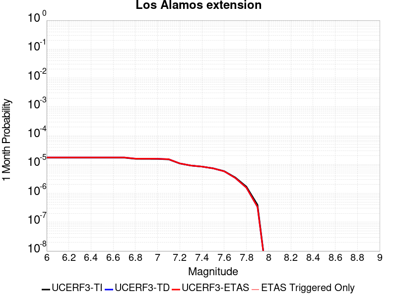 |  |  |

| Magnitude | 1 wk TI Prob | 1 wk TD Prob | 1 wk ETAS Prob | 1 wk ETAS/TD Gain | 1 wk ETAS Triggered Only | 1 mo TI Prob | 1 mo TD Prob | 1 mo ETAS Prob | 1 mo ETAS/TD Gain | 1 mo ETAS Triggered Only | 1 yr TI Prob | 1 yr TD Prob | 1 yr ETAS Prob | 1 yr ETAS/TD Gain | 1 yr ETAS Triggered Only | 10 yr TI Prob | 10 yr TD Prob | 10 yr ETAS Prob | 10 yr ETAS/TD Gain | 10 yr ETAS Triggered Only |
|-----|-----|-----|-----|-----|-----|-----|-----|-----|-----|-----|-----|-----|-----|-----|-----|-----|-----|-----|-----|-----|
| 6.0 | 4.0146506E-6 | 4.086186E-6 | 4.086186E-6 | 1.0 | 0.0 | 1.7205533E-5 | 1.7512113E-5 | 1.7512113E-5 | 1.0 | 0.0 | 2.0945723E-4 | 2.1319023E-4 | 2.231881E-4 | 1.0468965 | 1.0E-5 | 0.0020925992 | 0.0021299664 | 0.0021499237 | 1.0093699 | 2.0E-5 |
| 6.1 | 4.0146506E-6 | 4.086186E-6 | 4.086186E-6 | 1.0 | 0.0 | 1.7205533E-5 | 1.7512113E-5 | 1.7512113E-5 | 1.0 | 0.0 | 2.0945723E-4 | 2.1319023E-4 | 2.231881E-4 | 1.0468965 | 1.0E-5 | 0.0020925992 | 0.0021299664 | 0.0021499237 | 1.0093699 | 2.0E-5 |
| 6.2 | 4.0146506E-6 | 4.086186E-6 | 4.086186E-6 | 1.0 | 0.0 | 1.7205533E-5 | 1.7512113E-5 | 1.7512113E-5 | 1.0 | 0.0 | 2.0945723E-4 | 2.1319023E-4 | 2.231881E-4 | 1.0468965 | 1.0E-5 | 0.0020925992 | 0.0021299664 | 0.0021499237 | 1.0093699 | 2.0E-5 |
| 6.3 | 4.0146506E-6 | 4.086186E-6 | 4.086186E-6 | 1.0 | 0.0 | 1.7205533E-5 | 1.7512113E-5 | 1.7512113E-5 | 1.0 | 0.0 | 2.0945723E-4 | 2.1319023E-4 | 2.231881E-4 | 1.0468965 | 1.0E-5 | 0.0020925992 | 0.0021299664 | 0.0021499237 | 1.0093699 | 2.0E-5 |
| 6.4 | 4.0146506E-6 | 4.086186E-6 | 4.086186E-6 | 1.0 | 0.0 | 1.7205533E-5 | 1.7512113E-5 | 1.7512113E-5 | 1.0 | 0.0 | 2.0945723E-4 | 2.1319023E-4 | 2.231881E-4 | 1.0468965 | 1.0E-5 | 0.0020925992 | 0.0021299664 | 0.0021499237 | 1.0093699 | 2.0E-5 |
| 6.5 | 4.0146506E-6 | 4.086186E-6 | 4.086186E-6 | 1.0 | 0.0 | 1.7205533E-5 | 1.7512113E-5 | 1.7512113E-5 | 1.0 | 0.0 | 2.0945723E-4 | 2.1319023E-4 | 2.231881E-4 | 1.0468965 | 1.0E-5 | 0.0020925992 | 0.0021299664 | 0.0021499237 | 1.0093699 | 2.0E-5 |
| 6.6 | 4.0146506E-6 | 4.086186E-6 | 4.086186E-6 | 1.0 | 0.0 | 1.7205533E-5 | 1.7512113E-5 | 1.7512113E-5 | 1.0 | 0.0 | 2.0945723E-4 | 2.1319023E-4 | 2.231881E-4 | 1.0468965 | 1.0E-5 | 0.0020925992 | 0.0021299664 | 0.0021499237 | 1.0093699 | 2.0E-5 |
| 6.7 | 4.0146506E-6 | 4.086186E-6 | 4.086186E-6 | 1.0 | 0.0 | 1.7205533E-5 | 1.7512113E-5 | 1.7512113E-5 | 1.0 | 0.0 | 2.0945723E-4 | 2.1319023E-4 | 2.231881E-4 | 1.0468965 | 1.0E-5 | 0.0020925992 | 0.0021299664 | 0.0021499237 | 1.0093699 | 2.0E-5 |
| 6.8 | 3.6584688E-6 | 3.7188836E-6 | 3.7188836E-6 | 1.0 | 0.0 | 1.5679057E-5 | 1.593798E-5 | 1.593798E-5 | 1.0 | 0.0 | 1.9087581E-4 | 1.9402857E-4 | 2.0402663E-4 | 1.0515288 | 1.0E-5 | 0.0019071194 | 0.001938684 | 0.0019486647 | 1.0051482 | 1.0E-5 |
| 6.9 | 3.644631E-6 | 3.7045936E-6 | 3.7045936E-6 | 1.0 | 0.0 | 1.5619753E-5 | 1.5876738E-5 | 1.5876738E-5 | 1.0 | 0.0 | 1.901539E-4 | 1.9328308E-4 | 2.0328115E-4 | 1.0517275 | 1.0E-5 | 0.0018999127 | 0.0019312421 | 0.0019412228 | 1.005168 | 1.0E-5 |
| 7.0 | 3.6318522E-6 | 3.691354E-6 | 3.691354E-6 | 1.0 | 0.0 | 1.5564989E-5 | 1.5819998E-5 | 1.5819998E-5 | 1.0 | 0.0 | 1.8948725E-4 | 1.9259239E-4 | 2.0259045E-4 | 1.0519131 | 1.0E-5 | 0.0018932576 | 0.0019243471 | 0.0019343279 | 1.0051866 | 1.0E-5 |
| 7.1 | 3.5001724E-6 | 3.555424E-6 | 3.555424E-6 | 1.0 | 0.0 | 1.5000653E-5 | 1.5237448E-5 | 1.5237448E-5 | 1.0 | 0.0 | 1.8261763E-4 | 1.8550105E-4 | 1.9549919E-4 | 1.0538981 | 1.0E-5 | 0.0018246764 | 0.0018535528 | 0.0018635342 | 1.005385 | 1.0E-5 |
| 7.2 | 2.5204702E-6 | 2.543714E-6 | 2.543714E-6 | 1.0 | 0.0 | 1.080197E-5 | 1.09015855E-5 | 1.09015855E-5 | 1.0 | 0.0 | 1.3150605E-4 | 1.3271878E-4 | 1.3271878E-4 | 1.0 | 0.0 | 0.0013142825 | 0.0013264008 | 0.0013264008 | 1.0 | 0.0 |
| 7.3 | 2.1399692E-6 | 2.1501494E-6 | 2.1501494E-6 | 1.0 | 0.0 | 9.1712645E-6 | 9.214894E-6 | 9.214894E-6 | 1.0 | 0.0 | 1.1165442E-4 | 1.1218559E-4 | 1.1218559E-4 | 1.0 | 0.0 | 0.0011159834 | 0.0011212928 | 0.0011212928 | 1.0 | 0.0 |
| 7.4 | 1.9660122E-6 | 1.9702534E-6 | 1.9702534E-6 | 1.0 | 0.0 | 8.42574E-6 | 8.443916E-6 | 8.443916E-6 | 1.0 | 0.0 | 1.0257855E-4 | 1.0279986E-4 | 1.0279986E-4 | 1.0 | 0.0 | 0.0010253121 | 0.0010275261 | 0.0010275261 | 1.0 | 0.0 |
| 7.5 | 1.7204633E-6 | 1.715114E-6 | 1.715114E-6 | 1.0 | 0.0 | 7.373393E-6 | 7.350468E-6 | 7.350468E-6 | 1.0 | 0.0 | 8.976737E-5 | 8.9488305E-5 | 8.9488305E-5 | 1.0 | 0.0 | 8.9731114E-4 | 8.945256E-4 | 8.945256E-4 | 1.0 | 0.0 |
| 7.6 | 1.3717638E-6 | 1.3535962E-6 | 1.3535962E-6 | 1.0 | 0.0 | 5.878974E-6 | 5.8011137E-6 | 5.8011137E-6 | 1.0 | 0.0 | 7.157416E-5 | 7.0626294E-5 | 7.0626294E-5 | 1.0 | 0.0 | 7.1551115E-4 | 7.060411E-4 | 7.060411E-4 | 1.0 | 0.0 |
| 7.7 | 8.272564E-7 | 7.957727E-7 | 7.957727E-7 | 1.0 | 0.0 | 3.5453797E-6 | 3.4104498E-6 | 3.4104498E-6 | 1.0 | 0.0 | 4.3164142E-5 | 4.1521438E-5 | 4.1521438E-5 | 1.0 | 0.0 | 4.315576E-4 | 4.1513698E-4 | 4.1513698E-4 | 1.0 | 0.0 |
| 7.8 | 3.9708277E-7 | 3.671965E-7 | 3.671965E-7 | 1.0 | 0.0 | 1.7017821E-6 | 1.5736983E-6 | 1.5736983E-6 | 1.0 | 0.0 | 2.0719E-5 | 1.915961E-5 | 1.915961E-5 | 1.0 | 0.0 | 2.071707E-4 | 1.9157965E-4 | 1.9157965E-4 | 1.0 | 0.0 |
| 7.9 | 9.292528E-8 | 7.889245E-8 | 7.889245E-8 | 1.0 | 0.0 | 3.9825116E-7 | 3.3811042E-7 | 3.3811042E-7 | 1.0 | 0.0 | 4.848697E-6 | 4.1164867E-6 | 4.1164867E-6 | 1.0 | 0.0 | 4.8485912E-5 | 4.1164116E-5 | 4.1164116E-5 | 1.0 | 0.0 |
| 8.0 | 7.880441E-11 | 8.235368E-11 | 8.235368E-11 | 1.0 | 0.0 | 3.3773329E-10 | 3.5294412E-10 | 3.5294412E-10 | 1.0 | 0.0 | 4.1119033E-9 | 4.297095E-9 | 4.297095E-9 | 1.0 | 0.0 | 4.1119034E-8 | 4.2970953E-8 | 4.2970953E-8 | 1.0 | 0.0 |

## Likely 2011 CFM
*[(top)](#table-of-contents)*

| 1 Week | 1 Month | 1 Year | 10 Year |
|-----|-----|-----|-----|
|  |  |  |  |

| Magnitude | 1 wk TI Prob | 1 wk TD Prob | 1 wk ETAS Prob | 1 wk ETAS/TD Gain | 1 wk ETAS Triggered Only | 1 mo TI Prob | 1 mo TD Prob | 1 mo ETAS Prob | 1 mo ETAS/TD Gain | 1 mo ETAS Triggered Only | 1 yr TI Prob | 1 yr TD Prob | 1 yr ETAS Prob | 1 yr ETAS/TD Gain | 1 yr ETAS Triggered Only | 10 yr TI Prob | 10 yr TD Prob | 10 yr ETAS Prob | 10 yr ETAS/TD Gain | 10 yr ETAS Triggered Only |
|-----|-----|-----|-----|-----|-----|-----|-----|-----|-----|-----|-----|-----|-----|-----|-----|-----|-----|-----|-----|-----|
| 6.0 | 2.5315949E-5 | 2.7105003E-5 | 2.7105003E-5 | 1.0 | 0.0 | 1.0849241E-4 | 1.16159375E-4 | 1.16159375E-4 | 1.0 | 0.0 | 0.0013200947 | 0.0014133675 | 0.0014233533 | 1.0070653 | 1.0E-5 | 0.013122803 | 0.014048441 | 0.01406816 | 1.0014037 | 2.0E-5 |
| 6.1 | 2.5315949E-5 | 2.7105003E-5 | 2.7105003E-5 | 1.0 | 0.0 | 1.0849241E-4 | 1.16159375E-4 | 1.16159375E-4 | 1.0 | 0.0 | 0.0013200947 | 0.0014133675 | 0.0014233533 | 1.0070653 | 1.0E-5 | 0.013122803 | 0.014048441 | 0.014058301 | 1.0007018 | 1.0E-5 |
| 6.2 | 1.6375941E-5 | 1.7465996E-5 | 1.7465996E-5 | 1.0 | 0.0 | 7.0180715E-5 | 7.485219E-5 | 7.485219E-5 | 1.0 | 0.0 | 8.5411523E-4 | 9.109567E-4 | 9.109567E-4 | 1.0 | 0.0 | 0.008508399 | 0.009073513 | 0.009073513 | 1.0 | 0.0 |
| 6.3 | 1.1945543E-5 | 1.2712695E-5 | 1.2712695E-5 | 1.0 | 0.0 | 5.119418E-5 | 5.4481872E-5 | 5.4481872E-5 | 1.0 | 0.0 | 6.2311086E-4 | 6.6312024E-4 | 6.6312024E-4 | 1.0 | 0.0 | 0.0062136655 | 0.0066119707 | 0.0066119707 | 1.0 | 0.0 |
| 6.4 | 9.192729E-6 | 9.768569E-6 | 9.768569E-6 | 1.0 | 0.0 | 3.939681E-5 | 4.1864638E-5 | 4.1864638E-5 | 1.0 | 0.0 | 4.7955062E-4 | 5.095855E-4 | 5.095855E-4 | 1.0 | 0.0 | 0.004785171 | 0.0050844513 | 0.0050844513 | 1.0 | 0.0 |
| 6.5 | 7.67906E-6 | 8.152689E-6 | 8.152689E-6 | 1.0 | 0.0 | 3.2909844E-5 | 3.493964E-5 | 3.493964E-5 | 1.0 | 0.0 | 4.006037E-4 | 4.2530894E-4 | 4.2530894E-4 | 1.0 | 0.0 | 0.0039988225 | 0.004245143 | 0.004245143 | 1.0 | 0.0 |
| 6.6 | 6.4884057E-6 | 6.884806E-6 | 6.884806E-6 | 1.0 | 0.0 | 2.7807157E-5 | 2.9505987E-5 | 2.9505987E-5 | 1.0 | 0.0 | 3.3849955E-4 | 3.5917762E-4 | 3.5917762E-4 | 1.0 | 0.0 | 0.003379844 | 0.0035861158 | 0.0035861158 | 1.0 | 0.0 |
| 6.7 | 4.6060636E-6 | 4.88408E-6 | 4.88408E-6 | 1.0 | 0.0 | 1.9740122E-5 | 2.093161E-5 | 2.093161E-5 | 1.0 | 0.0 | 2.403095E-4 | 2.5481338E-4 | 2.5481338E-4 | 1.0 | 0.0 | 0.002400498 | 0.002545295 | 0.002545295 | 1.0 | 0.0 |
| 6.8 | 3.2795615E-6 | 3.477401E-6 | 3.477401E-6 | 1.0 | 0.0 | 1.4055187E-5 | 1.4903065E-5 | 1.4903065E-5 | 1.0 | 0.0 | 1.7110848E-4 | 1.8143027E-4 | 1.8143027E-4 | 1.0 | 0.0 | 0.0017097679 | 0.0018128767 | 0.0018128767 | 1.0 | 0.0 |
| 6.9 | 2.3289967E-6 | 2.4705769E-6 | 2.4705769E-6 | 1.0 | 0.0 | 9.981376E-6 | 1.0588145E-5 | 1.0588145E-5 | 1.0 | 0.0 | 1.2151648E-4 | 1.2890348E-4 | 1.2890348E-4 | 1.0 | 0.0 | 0.0012145005 | 0.0012883301 | 0.0012883301 | 1.0 | 0.0 |
| 7.0 | 1.211292E-6 | 1.2864064E-6 | 1.2864064E-6 | 1.0 | 0.0 | 5.1912407E-6 | 5.51316E-6 | 5.51316E-6 | 1.0 | 0.0 | 6.320152E-5 | 6.7120964E-5 | 6.7120964E-5 | 1.0 | 0.0 | 6.3183554E-4 | 6.710367E-4 | 6.710367E-4 | 1.0 | 0.0 |

## San Gabriel
*[(top)](#table-of-contents)*

| 1 Week | 1 Month | 1 Year | 10 Year |
|-----|-----|-----|-----|
| 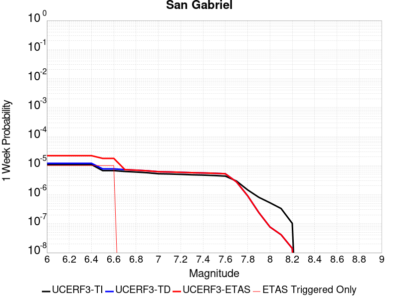 |  |  |  |

| Magnitude | 1 wk TI Prob | 1 wk TD Prob | 1 wk ETAS Prob | 1 wk ETAS/TD Gain | 1 wk ETAS Triggered Only | 1 mo TI Prob | 1 mo TD Prob | 1 mo ETAS Prob | 1 mo ETAS/TD Gain | 1 mo ETAS Triggered Only | 1 yr TI Prob | 1 yr TD Prob | 1 yr ETAS Prob | 1 yr ETAS/TD Gain | 1 yr ETAS Triggered Only | 10 yr TI Prob | 10 yr TD Prob | 10 yr ETAS Prob | 10 yr ETAS/TD Gain | 10 yr ETAS Triggered Only |
|-----|-----|-----|-----|-----|-----|-----|-----|-----|-----|-----|-----|-----|-----|-----|-----|-----|-----|-----|-----|-----|
| 6.0 | 1.083775E-5 | 1.1987373E-5 | 2.1987253E-5 | 1.8342011 | 1.0E-5 | 4.6446676E-5 | 5.1373507E-5 | 6.137299E-5 | 1.1946429 | 1.0E-5 | 5.653415E-4 | 6.253043E-4 | 6.4529176E-4 | 1.0319644 | 2.0E-5 | 0.0056390543 | 0.006247348 | 0.0062672235 | 1.0031813 | 2.0E-5 |
| 6.1 | 1.083775E-5 | 1.1987373E-5 | 2.1987253E-5 | 1.8342011 | 1.0E-5 | 4.6446676E-5 | 5.1373507E-5 | 6.137299E-5 | 1.1946429 | 1.0E-5 | 5.653415E-4 | 6.253043E-4 | 6.4529176E-4 | 1.0319644 | 2.0E-5 | 0.0056390543 | 0.006247348 | 0.0062672235 | 1.0031813 | 2.0E-5 |
| 6.2 | 1.083775E-5 | 1.1987373E-5 | 2.1987253E-5 | 1.8342011 | 1.0E-5 | 4.6446676E-5 | 5.1373507E-5 | 6.137299E-5 | 1.1946429 | 1.0E-5 | 5.653415E-4 | 6.253043E-4 | 6.4529176E-4 | 1.0319644 | 2.0E-5 | 0.0056390543 | 0.006247348 | 0.0062672235 | 1.0031813 | 2.0E-5 |
| 6.3 | 1.083775E-5 | 1.1987373E-5 | 2.1987253E-5 | 1.8342011 | 1.0E-5 | 4.6446676E-5 | 5.1373507E-5 | 6.137299E-5 | 1.1946429 | 1.0E-5 | 5.653415E-4 | 6.253043E-4 | 6.4529176E-4 | 1.0319644 | 2.0E-5 | 0.0056390543 | 0.006247348 | 0.0062672235 | 1.0031813 | 2.0E-5 |
| 6.4 | 1.083775E-5 | 1.1987373E-5 | 2.1987253E-5 | 1.8342011 | 1.0E-5 | 4.6446676E-5 | 5.1373507E-5 | 6.137299E-5 | 1.1946429 | 1.0E-5 | 5.653415E-4 | 6.253043E-4 | 6.4529176E-4 | 1.0319644 | 2.0E-5 | 0.0056390543 | 0.006247348 | 0.0062672235 | 1.0031813 | 2.0E-5 |
| 6.5 | 6.7317824E-6 | 7.719108E-6 | 1.771903E-5 | 2.2954764 | 1.0E-5 | 2.8850178E-5 | 3.3081476E-5 | 4.3081145E-5 | 1.302274 | 1.0E-5 | 3.511943E-4 | 4.026936E-4 | 4.2268555E-4 | 1.0496455 | 2.0E-5 | 0.003506398 | 0.004030539 | 0.004050459 | 1.004942 | 2.0E-5 |
| 6.6 | 6.7317824E-6 | 7.719108E-6 | 1.771903E-5 | 2.2954764 | 1.0E-5 | 2.8850178E-5 | 3.3081476E-5 | 4.3081145E-5 | 1.302274 | 1.0E-5 | 3.511943E-4 | 4.026936E-4 | 4.2268555E-4 | 1.0496455 | 2.0E-5 | 0.003506398 | 0.004030539 | 0.004050459 | 1.004942 | 2.0E-5 |
| 6.7 | 6.274881E-6 | 7.248026E-6 | 7.248026E-6 | 1.0 | 0.0 | 2.6892068E-5 | 3.1062606E-5 | 3.1062606E-5 | 1.0 | 0.0 | 3.2736175E-4 | 3.7812255E-4 | 3.8811876E-4 | 1.0264364 | 1.0E-5 | 0.0032687993 | 0.0037856852 | 0.0037956475 | 1.0026315 | 1.0E-5 |
| 6.8 | 5.996209E-6 | 6.960745E-6 | 6.960745E-6 | 1.0 | 0.0 | 2.5697784E-5 | 2.9831428E-5 | 2.9831428E-5 | 1.0 | 0.0 | 3.128256E-4 | 3.6313804E-4 | 3.7313442E-4 | 1.0275277 | 1.0E-5 | 0.003123856 | 0.0036363378 | 0.0036463013 | 1.00274 | 1.0E-5 |
| 6.9 | 5.686331E-6 | 6.6257817E-6 | 6.6257817E-6 | 1.0 | 0.0 | 2.4369761E-5 | 2.8395903E-5 | 2.8395903E-5 | 1.0 | 0.0 | 2.9666146E-4 | 3.456662E-4 | 3.5566272E-4 | 1.0289197 | 1.0E-5 | 0.0029626573 | 0.0034621747 | 0.00347214 | 1.0028783 | 1.0E-5 |
| 7.0 | 5.2329838E-6 | 6.1496576E-6 | 6.1496576E-6 | 1.0 | 0.0 | 2.242688E-5 | 2.6355414E-5 | 2.6355414E-5 | 1.0 | 0.0 | 2.7301308E-4 | 3.2083067E-4 | 3.3082746E-4 | 1.031159 | 1.0E-5 | 0.002726779 | 0.0032145523 | 0.0032245202 | 1.0031009 | 1.0E-5 |
| 7.1 | 5.135671E-6 | 6.039777E-6 | 6.039777E-6 | 1.0 | 0.0 | 2.2009834E-5 | 2.5884507E-5 | 2.5884507E-5 | 1.0 | 0.0 | 2.6793676E-4 | 3.1509905E-4 | 3.250959E-4 | 1.031726 | 1.0E-5 | 0.0026761394 | 0.0031574003 | 0.0031673687 | 1.0031571 | 1.0E-5 |
| 7.2 | 4.989062E-6 | 5.8731457E-6 | 5.8731457E-6 | 1.0 | 0.0 | 2.1381518E-5 | 2.5170384E-5 | 2.5170384E-5 | 1.0 | 0.0 | 2.6028889E-4 | 3.064071E-4 | 3.1640404E-4 | 1.0326263 | 1.0E-5 | 0.0025998424 | 0.0030707237 | 0.003080693 | 1.0032465 | 1.0E-5 |
| 7.3 | 4.8219395E-6 | 5.7046905E-6 | 5.7046905E-6 | 1.0 | 0.0 | 2.0665291E-5 | 2.4448447E-5 | 2.4448447E-5 | 1.0 | 0.0 | 2.5157086E-4 | 2.9761996E-4 | 3.0761698E-4 | 1.0335898 | 1.0E-5 | 0.0025128627 | 0.0029830914 | 0.0029930614 | 1.0033423 | 1.0E-5 |
| 7.4 | 4.7118383E-6 | 5.59324E-6 | 5.59324E-6 | 1.0 | 0.0 | 2.0193436E-5 | 2.3970813E-5 | 2.3970813E-5 | 1.0 | 0.0 | 2.4582737E-4 | 2.9180633E-4 | 3.018034E-4 | 1.0342593 | 1.0E-5 | 0.002455556 | 0.002925109 | 0.0029350796 | 1.0034087 | 1.0E-5 |
| 7.5 | 4.5506545E-6 | 5.438597E-6 | 5.438597E-6 | 1.0 | 0.0 | 1.9502659E-5 | 2.3308068E-5 | 2.3308068E-5 | 1.0 | 0.0 | 2.37419E-4 | 2.8373953E-4 | 2.937367E-4 | 1.0352336 | 1.0E-5 | 0.002371655 | 0.0028446494 | 0.0028546208 | 1.0035053 | 1.0E-5 |
| 7.6 | 4.343636E-6 | 5.231458E-6 | 5.231458E-6 | 1.0 | 0.0 | 1.861545E-5 | 2.2420347E-5 | 2.2420347E-5 | 1.0 | 0.0 | 2.2661954E-4 | 2.7293427E-4 | 2.8293155E-4 | 1.0366288 | 1.0E-5 | 0.0022638857 | 0.0027368597 | 0.0027468323 | 1.0036439 | 1.0E-5 |
| 7.7 | 2.936235E-6 | 2.7452986E-6 | 2.7452986E-6 | 1.0 | 0.0 | 1.2583803E-5 | 1.1765513E-5 | 1.1765513E-5 | 1.0 | 0.0 | 1.5319703E-4 | 1.4323574E-4 | 1.4323574E-4 | 1.0 | 0.0 | 0.0015309147 | 0.0014387129 | 0.0014387129 | 1.0 | 0.0 |
| 7.8 | 1.4541639E-6 | 9.1280947E-7 | 9.1280947E-7 | 1.0 | 0.0 | 6.232116E-6 | 3.9120346E-6 | 3.9120346E-6 | 1.0 | 0.0 | 7.587337E-5 | 4.7627982E-5 | 4.7627982E-5 | 1.0 | 0.0 | 7.584747E-4 | 4.8106918E-4 | 4.8106918E-4 | 1.0 | 0.0 |
| 7.9 | 8.098958E-7 | 2.4187648E-7 | 2.4187648E-7 | 1.0 | 0.0 | 3.4709774E-6 | 1.036613E-6 | 1.036613E-6 | 1.0 | 0.0 | 4.225833E-5 | 1.262069E-5 | 1.262069E-5 | 1.0 | 0.0 | 4.2250296E-4 | 1.2928544E-4 | 1.2928544E-4 | 1.0 | 0.0 |
| 8.0 | 5.2473234E-7 | 7.6827554E-8 | 7.6827554E-8 | 1.0 | 0.0 | 2.248851E-6 | 3.292609E-7 | 3.292609E-7 | 1.0 | 0.0 | 2.7379416E-5 | 4.008744E-6 | 4.008744E-6 | 1.0 | 0.0 | 2.7376044E-4 | 4.2213585E-5 | 4.2213585E-5 | 1.0 | 0.0 |
| 8.1 | 3.3162388E-7 | 4.1511967E-8 | 4.1511967E-8 | 1.0 | 0.0 | 1.4212444E-6 | 1.7790842E-7 | 1.7790842E-7 | 1.0 | 0.0 | 1.7303513E-5 | 2.1660328E-6 | 2.1660328E-6 | 1.0 | 0.0 | 1.7302166E-4 | 2.2976306E-5 | 2.2976306E-5 | 1.0 | 0.0 |
| 8.2 | 1.0235345E-7 | 1.4050096E-8 | 1.4050096E-8 | 1.0 | 0.0 | 4.3865757E-7 | 6.0214695E-8 | 6.0214695E-8 | 1.0 | 0.0 | 5.340643E-6 | 7.3311367E-7 | 7.3311367E-7 | 1.0 | 0.0 | 5.3405143E-5 | 7.9302445E-6 | 7.9302445E-6 | 1.0 | 0.0 |

## Malibu Coast alt 1
*[(top)](#table-of-contents)*

| 1 Week | 1 Month | 1 Year | 10 Year |
|-----|-----|-----|-----|
|  |  |  |  |

| Magnitude | 1 wk TI Prob | 1 wk TD Prob | 1 wk ETAS Prob | 1 wk ETAS/TD Gain | 1 wk ETAS Triggered Only | 1 mo TI Prob | 1 mo TD Prob | 1 mo ETAS Prob | 1 mo ETAS/TD Gain | 1 mo ETAS Triggered Only | 1 yr TI Prob | 1 yr TD Prob | 1 yr ETAS Prob | 1 yr ETAS/TD Gain | 1 yr ETAS Triggered Only | 10 yr TI Prob | 10 yr TD Prob | 10 yr ETAS Prob | 10 yr ETAS/TD Gain | 10 yr ETAS Triggered Only |
|-----|-----|-----|-----|-----|-----|-----|-----|-----|-----|-----|-----|-----|-----|-----|-----|-----|-----|-----|-----|-----|
| 6.0 | 1.6572556E-5 | 1.7598271E-5 | 1.7598271E-5 | 1.0 | 0.0 | 7.102331E-5 | 7.5419084E-5 | 7.5419084E-5 | 1.0 | 0.0 | 8.6436566E-4 | 9.178595E-4 | 9.3784113E-4 | 1.0217699 | 2.0E-5 | 0.0086101135 | 0.009142619 | 0.009162435 | 1.0021676 | 2.0E-5 |
| 6.1 | 1.6572556E-5 | 1.7598271E-5 | 1.7598271E-5 | 1.0 | 0.0 | 7.102331E-5 | 7.5419084E-5 | 7.5419084E-5 | 1.0 | 0.0 | 8.6436566E-4 | 9.178595E-4 | 9.278503E-4 | 1.0108849 | 1.0E-5 | 0.0086101135 | 0.009142619 | 0.009152527 | 1.0010837 | 1.0E-5 |
| 6.2 | 1.1085717E-5 | 1.155727E-5 | 1.155727E-5 | 1.0 | 0.0 | 4.750935E-5 | 4.953024E-5 | 4.953024E-5 | 1.0 | 0.0 | 5.782728E-4 | 6.0286734E-4 | 6.128613E-4 | 1.0165774 | 1.0E-5 | 0.0057677035 | 0.00601269 | 0.00602263 | 1.0016532 | 1.0E-5 |
| 6.3 | 1.0208568E-5 | 1.0592348E-5 | 1.0592348E-5 | 1.0 | 0.0 | 4.375027E-5 | 4.5395005E-5 | 4.5395005E-5 | 1.0 | 0.0 | 5.325294E-4 | 5.52547E-4 | 5.625414E-4 | 1.018088 | 1.0E-5 | 0.0053125503 | 0.005512039 | 0.005521984 | 1.0018042 | 1.0E-5 |
| 6.4 | 9.0682315E-6 | 9.3427325E-6 | 9.3427325E-6 | 1.0 | 0.0 | 3.8863272E-5 | 4.003968E-5 | 4.003968E-5 | 1.0 | 0.0 | 4.730576E-4 | 4.8737606E-4 | 4.8737606E-4 | 1.0 | 0.0 | 0.0047205184 | 0.0048632855 | 0.0048632855 | 1.0 | 0.0 |
| 6.5 | 7.605796E-6 | 7.748663E-6 | 7.748663E-6 | 1.0 | 0.0 | 3.259586E-5 | 3.320814E-5 | 3.320814E-5 | 1.0 | 0.0 | 3.9678233E-4 | 4.0423544E-4 | 4.0423544E-4 | 1.0 | 0.0 | 0.0039607463 | 0.004035139 | 0.004035139 | 1.0 | 0.0 |
| 6.6 | 5.889873E-6 | 5.879592E-6 | 5.879592E-6 | 1.0 | 0.0 | 2.5242069E-5 | 2.519801E-5 | 2.519801E-5 | 1.0 | 0.0 | 3.0727885E-4 | 3.0674267E-4 | 3.0674267E-4 | 1.0 | 0.0 | 0.003068543 | 0.0030632056 | 0.0030632056 | 1.0 | 0.0 |
| 6.7 | 5.66586E-6 | 5.641693E-6 | 5.641693E-6 | 1.0 | 0.0 | 2.428203E-5 | 2.417846E-5 | 2.417846E-5 | 1.0 | 0.0 | 2.955936E-4 | 2.943331E-4 | 2.943331E-4 | 1.0 | 0.0 | 0.0029520073 | 0.0029394445 | 0.0029394445 | 1.0 | 0.0 |
| 6.8 | 5.521556E-6 | 5.4894776E-6 | 5.4894776E-6 | 1.0 | 0.0 | 2.3663597E-5 | 2.352612E-5 | 2.352612E-5 | 1.0 | 0.0 | 2.880662E-4 | 2.8639295E-4 | 2.8639295E-4 | 1.0 | 0.0 | 0.0028769306 | 0.0028602504 | 0.0028602504 | 1.0 | 0.0 |
| 6.9 | 5.29752E-6 | 5.24998E-6 | 5.24998E-6 | 1.0 | 0.0 | 2.270346E-5 | 2.249972E-5 | 2.249972E-5 | 1.0 | 0.0 | 2.7637955E-4 | 2.7389973E-4 | 2.7389973E-4 | 1.0 | 0.0 | 0.0027603607 | 0.0027356318 | 0.0027356318 | 1.0 | 0.0 |
| 7.0 | 5.106743E-6 | 5.047725E-6 | 5.047725E-6 | 1.0 | 0.0 | 2.1885859E-5 | 2.163293E-5 | 2.163293E-5 | 1.0 | 0.0 | 2.6642776E-4 | 2.6334915E-4 | 2.6334915E-4 | 1.0 | 0.0 | 0.0026610855 | 0.0026303804 | 0.0026303804 | 1.0 | 0.0 |
| 7.1 | 4.8469647E-6 | 4.770417E-6 | 4.770417E-6 | 1.0 | 0.0 | 2.0772539E-5 | 2.0444484E-5 | 2.0444484E-5 | 1.0 | 0.0 | 2.528763E-4 | 2.4888324E-4 | 2.4888324E-4 | 1.0 | 0.0 | 0.0025258875 | 0.0024860532 | 0.0024860532 | 1.0 | 0.0 |
| 7.2 | 4.545514E-6 | 4.448235E-6 | 4.448235E-6 | 1.0 | 0.0 | 1.9480629E-5 | 1.9063724E-5 | 1.9063724E-5 | 1.0 | 0.0 | 2.3715083E-4 | 2.3207619E-4 | 2.3207619E-4 | 1.0 | 0.0 | 0.0023689792 | 0.0023183457 | 0.0023183457 | 1.0 | 0.0 |
| 7.3 | 3.794097E-6 | 3.6519675E-6 | 3.6519675E-6 | 1.0 | 0.0 | 1.6260314E-5 | 1.5651196E-5 | 1.5651196E-5 | 1.0 | 0.0 | 1.9795135E-4 | 1.9053668E-4 | 1.9053668E-4 | 1.0 | 0.0 | 0.001977751 | 0.0019037378 | 0.0019037378 | 1.0 | 0.0 |
| 7.4 | 2.808217E-6 | 2.7191002E-6 | 2.7191002E-6 | 1.0 | 0.0 | 1.203516E-5 | 1.1653235E-5 | 1.1653235E-5 | 1.0 | 0.0 | 1.4651821E-4 | 1.4186892E-4 | 1.4186892E-4 | 1.0 | 0.0 | 0.0014642165 | 0.0014177862 | 0.0014177862 | 1.0 | 0.0 |
| 7.5 | 1.83809E-6 | 1.819086E-6 | 1.819086E-6 | 1.0 | 0.0 | 7.877505E-6 | 7.79606E-6 | 7.79606E-6 | 1.0 | 0.0 | 9.59044E-5 | 9.491292E-5 | 9.491292E-5 | 1.0 | 0.0 | 9.5863023E-4 | 9.487258E-4 | 9.487258E-4 | 1.0 | 0.0 |
| 7.6 | 1.1292672E-6 | 1.1001556E-6 | 1.1001556E-6 | 1.0 | 0.0 | 4.839708E-6 | 4.7149438E-6 | 4.7149438E-6 | 1.0 | 0.0 | 5.8921847E-5 | 5.7402947E-5 | 5.7402947E-5 | 1.0 | 0.0 | 5.890623E-4 | 5.7388283E-4 | 5.7388283E-4 | 1.0 | 0.0 |
| 7.7 | 5.065272E-7 | 4.6092035E-7 | 4.6092035E-7 | 1.0 | 0.0 | 2.170829E-6 | 1.9753716E-6 | 1.9753716E-6 | 1.0 | 0.0 | 2.6429525E-5 | 2.4049894E-5 | 2.4049894E-5 | 1.0 | 0.0 | 2.642638E-4 | 2.4047404E-4 | 2.4047404E-4 | 1.0 | 0.0 |
| 7.8 | 8.952991E-8 | 6.708018E-8 | 6.708018E-8 | 1.0 | 0.0 | 3.8369956E-7 | 2.8748644E-7 | 2.8748644E-7 | 1.0 | 0.0 | 4.671532E-6 | 3.5001422E-6 | 3.5001422E-6 | 1.0 | 0.0 | 4.671434E-5 | 3.500089E-5 | 3.500089E-5 | 1.0 | 0.0 |
| 7.9 | 8.007447E-10 | 6.1615857E-10 | 6.1615857E-10 | 1.0 | 0.0 | 3.4317629E-9 | 2.64068E-9 | 2.64068E-9 | 1.0 | 0.0 | 4.1781714E-8 | 3.215028E-8 | 3.215028E-8 | 1.0 | 0.0 | 4.1781706E-7 | 3.2150274E-7 | 3.2150274E-7 | 1.0 | 0.0 |

## Greenville (So) 2011 CFM
*[(top)](#table-of-contents)*

| 1 Week | 1 Month | 1 Year | 10 Year |
|-----|-----|-----|-----|
| 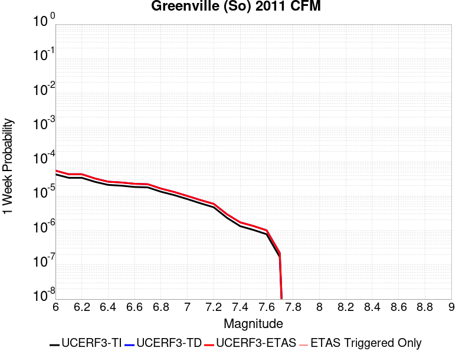 |  |  | 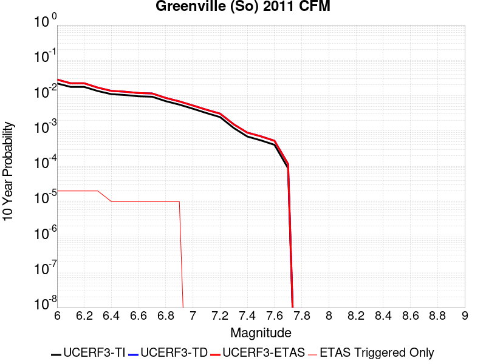 |

| Magnitude | 1 wk TI Prob | 1 wk TD Prob | 1 wk ETAS Prob | 1 wk ETAS/TD Gain | 1 wk ETAS Triggered Only | 1 mo TI Prob | 1 mo TD Prob | 1 mo ETAS Prob | 1 mo ETAS/TD Gain | 1 mo ETAS Triggered Only | 1 yr TI Prob | 1 yr TD Prob | 1 yr ETAS Prob | 1 yr ETAS/TD Gain | 1 yr ETAS Triggered Only | 10 yr TI Prob | 10 yr TD Prob | 10 yr ETAS Prob | 10 yr ETAS/TD Gain | 10 yr ETAS Triggered Only |
|-----|-----|-----|-----|-----|-----|-----|-----|-----|-----|-----|-----|-----|-----|-----|-----|-----|-----|-----|-----|-----|
| 6.0 | 4.279693E-5 | 5.504253E-5 | 5.504253E-5 | 1.0 | 0.0 | 1.8340252E-4 | 2.3587665E-4 | 2.3587665E-4 | 1.0 | 0.0 | 0.0022306389 | 0.0028682668 | 0.0028882094 | 1.0069529 | 2.0E-5 | 0.022083808 | 0.028339608 | 0.02835904 | 1.0006857 | 2.0E-5 |
| 6.1 | 3.4037297E-5 | 4.319378E-5 | 4.319378E-5 | 1.0 | 0.0 | 1.4586597E-4 | 1.8510365E-4 | 1.8510365E-4 | 1.0 | 0.0 | 0.0017744715 | 0.00225147 | 0.002271425 | 1.0088631 | 2.0E-5 | 0.01760369 | 0.02230374 | 0.022323294 | 1.0008767 | 2.0E-5 |
| 6.2 | 3.4037297E-5 | 4.319378E-5 | 4.319378E-5 | 1.0 | 0.0 | 1.4586597E-4 | 1.8510365E-4 | 1.8510365E-4 | 1.0 | 0.0 | 0.0017744715 | 0.00225147 | 0.002271425 | 1.0088631 | 2.0E-5 | 0.01760369 | 0.02230374 | 0.022323294 | 1.0008767 | 2.0E-5 |
| 6.3 | 2.5956324E-5 | 3.243031E-5 | 3.243031E-5 | 1.0 | 0.0 | 1.11236644E-4 | 1.3898002E-4 | 1.3898002E-4 | 1.0 | 0.0 | 0.0013534647 | 0.0016908324 | 0.0017107986 | 1.0118085 | 2.0E-5 | 0.013452509 | 0.016786784 | 0.01680645 | 1.0011715 | 2.0E-5 |
| 6.4 | 2.1145053E-5 | 2.6198471E-5 | 2.6198471E-5 | 1.0 | 0.0 | 9.061851E-5 | 1.1227445E-4 | 1.1227445E-4 | 1.0 | 0.0 | 0.0011027219 | 0.001366116 | 0.0013761023 | 1.00731 | 1.0E-5 | 0.01097266 | 0.013580924 | 0.0135907885 | 1.0007263 | 1.0E-5 |
| 6.5 | 2.0030959E-5 | 2.4796553E-5 | 2.4796553E-5 | 1.0 | 0.0 | 8.584414E-5 | 1.06266765E-4 | 1.06266765E-4 | 1.0 | 0.0 | 0.0010446513 | 0.0012930612 | 0.0013030482 | 1.0077236 | 1.0E-5 | 0.010397541 | 0.012859055 | 0.012868926 | 1.0007677 | 1.0E-5 |
| 6.6 | 1.8395405E-5 | 2.2755145E-5 | 2.2755145E-5 | 1.0 | 0.0 | 7.8835066E-5 | 9.751856E-5 | 9.751856E-5 | 1.0 | 0.0 | 9.5939427E-4 | 0.0011866703 | 0.0011966585 | 1.0084169 | 1.0E-5 | 0.009552629 | 0.011806721 | 0.011816603 | 1.000837 | 1.0E-5 |
| 6.7 | 1.7883482E-5 | 2.2126169E-5 | 2.2126169E-5 | 1.0 | 0.0 | 7.664124E-5 | 9.482315E-5 | 9.482315E-5 | 1.0 | 0.0 | 9.3270757E-4 | 0.001153889 | 0.0011638774 | 1.0086564 | 1.0E-5 | 0.009288026 | 0.011482358 | 0.011492243 | 1.0008609 | 1.0E-5 |
| 6.8 | 1.3373564E-5 | 1.650644E-5 | 1.650644E-5 | 1.0 | 0.0 | 5.7314013E-5 | 7.0740054E-5 | 7.0740054E-5 | 1.0 | 0.0 | 6.975747E-4 | 8.609346E-4 | 8.7092596E-4 | 1.0116053 | 1.0E-5 | 0.0069538904 | 0.008577933 | 0.008587847 | 1.0011557 | 1.0E-5 |
| 6.9 | 1.06692905E-5 | 1.315295E-5 | 1.315295E-5 | 1.0 | 0.0 | 4.5724726E-5 | 5.6368626E-5 | 5.6368626E-5 | 1.0 | 0.0 | 5.5655633E-4 | 6.860832E-4 | 6.960763E-4 | 1.0145655 | 1.0E-5 | 0.005551645 | 0.0068412144 | 0.006851146 | 1.0014517 | 1.0E-5 |
| 7.0 | 8.157512E-6 | 1.0062912E-5 | 1.0062912E-5 | 1.0 | 0.0 | 3.4960296E-5 | 4.3126074E-5 | 4.3126074E-5 | 1.0 | 0.0 | 4.2555845E-4 | 5.249372E-4 | 5.249372E-4 | 1.0 | 0.0 | 0.004247444 | 0.00523778 | 0.00523778 | 1.0 | 0.0 |
| 7.1 | 6.1467113E-6 | 7.627636E-6 | 7.627636E-6 | 1.0 | 0.0 | 2.6342783E-5 | 3.2689466E-5 | 3.2689466E-5 | 1.0 | 0.0 | 3.206762E-4 | 3.9792238E-4 | 3.9792238E-4 | 1.0 | 0.0 | 0.0032021382 | 0.0039726184 | 0.0039726184 | 1.0 | 0.0 |
| 7.2 | 4.713467E-6 | 5.9143304E-6 | 5.9143304E-6 | 1.0 | 0.0 | 2.0200418E-5 | 2.5346888E-5 | 2.5346888E-5 | 1.0 | 0.0 | 2.4591232E-4 | 3.0855526E-4 | 3.0855526E-4 | 1.0 | 0.0 | 0.0024564038 | 0.0030817043 | 0.0030817043 | 1.0 | 0.0 |
| 7.3 | 2.3266216E-6 | 2.954093E-6 | 2.954093E-6 | 1.0 | 0.0 | 9.971197E-6 | 1.2660337E-5 | 1.2660337E-5 | 1.0 | 0.0 | 1.2139256E-4 | 1.5412885E-4 | 1.5412885E-4 | 1.0 | 0.0 | 0.0012132627 | 0.0015404717 | 0.0015404717 | 1.0 | 0.0 |
| 7.4 | 1.3314E-6 | 1.7180038E-6 | 1.7180038E-6 | 1.0 | 0.0 | 5.7059874E-6 | 7.3628526E-6 | 7.3628526E-6 | 1.0 | 0.0 | 6.946818E-5 | 8.963909E-5 | 8.963909E-5 | 1.0 | 0.0 | 6.9446466E-4 | 8.9630444E-4 | 8.9630444E-4 | 1.0 | 0.0 |
| 7.5 | 1.0362941E-6 | 1.3469212E-6 | 1.3469212E-6 | 1.0 | 0.0 | 4.4412527E-6 | 5.772507E-6 | 5.772507E-6 | 1.0 | 0.0 | 5.407091E-5 | 7.027805E-5 | 7.027805E-5 | 1.0 | 0.0 | 5.405776E-4 | 7.028176E-4 | 7.028176E-4 | 1.0 | 0.0 |
| 7.6 | 7.764784E-7 | 1.0088914E-6 | 1.0088914E-6 | 1.0 | 0.0 | 3.3277602E-6 | 4.3238138E-6 | 4.3238138E-6 | 1.0 | 0.0 | 4.0514726E-5 | 5.2641197E-5 | 5.2641197E-5 | 1.0 | 0.0 | 4.050734E-4 | 5.2651245E-4 | 5.2651245E-4 | 1.0 | 0.0 |
| 7.7 | 1.6927763E-7 | 2.214027E-7 | 2.214027E-7 | 1.0 | 0.0 | 7.2547533E-7 | 9.4886843E-7 | 9.4886843E-7 | 1.0 | 0.0 | 8.832627E-6 | 1.1552414E-5 | 1.1552414E-5 | 1.0 | 0.0 | 8.8322755E-5 | 1.1554362E-4 | 1.1554362E-4 | 1.0 | 0.0 |

## Greenville (No) 2011 CFM
*[(top)](#table-of-contents)*

| 1 Week | 1 Month | 1 Year | 10 Year |
|-----|-----|-----|-----|
|  | 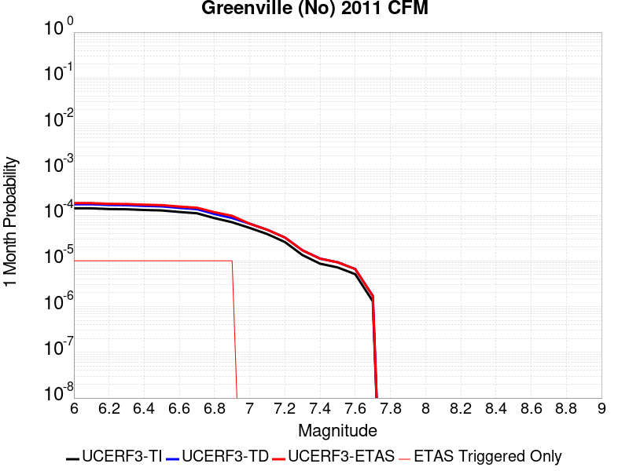 |  |  |

| Magnitude | 1 wk TI Prob | 1 wk TD Prob | 1 wk ETAS Prob | 1 wk ETAS/TD Gain | 1 wk ETAS Triggered Only | 1 mo TI Prob | 1 mo TD Prob | 1 mo ETAS Prob | 1 mo ETAS/TD Gain | 1 mo ETAS Triggered Only | 1 yr TI Prob | 1 yr TD Prob | 1 yr ETAS Prob | 1 yr ETAS/TD Gain | 1 yr ETAS Triggered Only | 10 yr TI Prob | 10 yr TD Prob | 10 yr ETAS Prob | 10 yr ETAS/TD Gain | 10 yr ETAS Triggered Only |
|-----|-----|-----|-----|-----|-----|-----|-----|-----|-----|-----|-----|-----|-----|-----|-----|-----|-----|-----|-----|-----|
| 6.0 | 3.286654E-5 | 4.0367628E-5 | 5.0367224E-5 | 1.2477132 | 1.0E-5 | 1.4084899E-4 | 1.7299286E-4 | 1.8299113E-4 | 1.0577959 | 1.0E-5 | 0.0017134876 | 0.0021041913 | 0.0021241491 | 1.0094849 | 2.0E-5 | 0.017003356 | 0.020847926 | 0.02086751 | 1.0009394 | 2.0E-5 |
| 6.1 | 3.286654E-5 | 4.0367628E-5 | 5.0367224E-5 | 1.2477132 | 1.0E-5 | 1.4084899E-4 | 1.7299286E-4 | 1.8299113E-4 | 1.0577959 | 1.0E-5 | 0.0017134876 | 0.0021041913 | 0.0021241491 | 1.0094849 | 2.0E-5 | 0.017003356 | 0.020847926 | 0.02086751 | 1.0009394 | 2.0E-5 |
| 6.2 | 3.1697953E-5 | 3.8930488E-5 | 4.89301E-5 | 1.2568581 | 1.0E-5 | 1.358413E-4 | 1.6683448E-4 | 1.7683282E-4 | 1.0599296 | 1.0E-5 | 0.0016526132 | 0.0020293547 | 0.002049314 | 1.0098354 | 2.0E-5 | 0.01640377 | 0.020113297 | 0.020132896 | 1.0009744 | 2.0E-5 |
| 6.3 | 3.1363317E-5 | 3.8519345E-5 | 4.8518963E-5 | 1.2595998 | 1.0E-5 | 1.344073E-4 | 1.6507268E-4 | 1.7507104E-4 | 1.0605694 | 1.0E-5 | 0.0016351803 | 0.0020079445 | 0.0020279041 | 1.0099404 | 2.0E-5 | 0.016232004 | 0.019903058 | 0.01992266 | 1.0009849 | 2.0E-5 |
| 6.4 | 3.0228604E-5 | 3.712643E-5 | 4.7126057E-5 | 1.2693399 | 1.0E-5 | 1.2954473E-4 | 1.5910377E-4 | 1.6910218E-4 | 1.062842 | 1.0E-5 | 0.0015760659 | 0.0019354038 | 0.001955365 | 1.0103137 | 2.0E-5 | 0.015649348 | 0.019190377 | 0.019209994 | 1.0010222 | 2.0E-5 |
| 6.5 | 2.9537814E-5 | 3.6281854E-5 | 4.628149E-5 | 1.2756099 | 1.0E-5 | 1.2658449E-4 | 1.554846E-4 | 1.6548304E-4 | 1.0643051 | 1.0E-5 | 0.0015400766 | 0.0018914177 | 0.0019113797 | 1.0105541 | 2.0E-5 | 0.01529447 | 0.018758025 | 0.01877765 | 1.0010462 | 2.0E-5 |
| 6.6 | 2.7345395E-5 | 3.3591095E-5 | 4.359076E-5 | 1.2976879 | 1.0E-5 | 1.1718928E-4 | 1.4395406E-4 | 1.5395263E-4 | 1.0694566 | 1.0E-5 | 0.0014258457 | 0.0017512628 | 0.0017712278 | 1.0114003 | 2.0E-5 | 0.014167317 | 0.017378807 | 0.01739846 | 1.0011308 | 2.0E-5 |
| 6.7 | 2.5615784E-5 | 3.156795E-5 | 4.1567633E-5 | 1.316767 | 1.0E-5 | 1.09777306E-4 | 1.3528437E-4 | 1.4528302E-4 | 1.0739083 | 1.0E-5 | 0.0013357193 | 0.0016458734 | 0.0016658405 | 1.0121316 | 2.0E-5 | 0.013277191 | 0.016340878 | 0.016360551 | 1.0012039 | 2.0E-5 |
| 6.8 | 2.0059057E-5 | 2.4712723E-5 | 3.4712473E-5 | 1.4046398 | 1.0E-5 | 8.596455E-5 | 1.0590746E-4 | 1.159064E-4 | 1.0944121 | 1.0E-5 | 0.0010461159 | 0.0012886769 | 0.0013086511 | 1.0154998 | 2.0E-5 | 0.0104120495 | 0.01281443 | 0.012834173 | 1.0015408 | 2.0E-5 |
| 6.9 | 1.6321746E-5 | 2.018519E-5 | 3.0184989E-5 | 1.4954027 | 1.0E-5 | 6.9948466E-5 | 8.6505155E-5 | 9.650429E-5 | 1.1155901 | 1.0E-5 | 8.5128983E-4 | 0.0010527038 | 0.0010726828 | 1.0189787 | 2.0E-5 | 0.008480361 | 0.010479072 | 0.010498863 | 1.0018885 | 2.0E-5 |
| 7.0 | 1.22527645E-5 | 1.5136019E-5 | 1.5136019E-5 | 1.0 | 0.0 | 5.2510793E-5 | 6.486706E-5 | 6.486706E-5 | 1.0 | 0.0 | 6.3913135E-4 | 7.894746E-4 | 7.894746E-4 | 1.0 | 0.0 | 0.0063729626 | 0.007867752 | 0.007867752 | 1.0 | 0.0 |
| 7.1 | 8.996482E-6 | 1.1165242E-5 | 1.1165242E-5 | 1.0 | 0.0 | 3.8555783E-5 | 4.7850164E-5 | 4.7850164E-5 | 1.0 | 0.0 | 4.6931554E-4 | 5.8242126E-4 | 5.8242126E-4 | 1.0 | 0.0 | 0.004683256 | 0.005809783 | 0.005809783 | 1.0 | 0.0 |
| 7.2 | 6.0273087E-6 | 7.5697E-6 | 7.5697E-6 | 1.0 | 0.0 | 2.5831067E-5 | 3.244117E-5 | 3.244117E-5 | 1.0 | 0.0 | 3.1444785E-4 | 3.9490036E-4 | 3.9490036E-4 | 1.0 | 0.0 | 0.0031400328 | 0.003942572 | 0.003942572 | 1.0 | 0.0 |
| 7.3 | 3.1209995E-6 | 3.966495E-6 | 3.966495E-6 | 1.0 | 0.0 | 1.3375643E-5 | 1.6999156E-5 | 1.6999156E-5 | 1.0 | 0.0 | 1.6283628E-4 | 2.0694522E-4 | 2.0694522E-4 | 1.0 | 0.0 | 0.0016271701 | 0.002067831 | 0.002067831 | 1.0 | 0.0 |
| 7.4 | 2.0254208E-6 | 2.6096925E-6 | 2.6096925E-6 | 1.0 | 0.0 | 8.680347E-6 | 1.1184348E-5 | 1.1184348E-5 | 1.0 | 0.0 | 1.0567809E-4 | 1.3616099E-4 | 1.3616099E-4 | 1.0 | 0.0 | 0.0010562785 | 0.0013611029 | 0.0013611029 | 1.0 | 0.0 |
| 7.5 | 1.6763418E-6 | 2.1734163E-6 | 2.1734163E-6 | 1.0 | 0.0 | 7.184302E-6 | 9.314608E-6 | 9.314608E-6 | 1.0 | 0.0 | 8.746537E-5 | 1.1339951E-4 | 1.1339951E-4 | 1.0 | 0.0 | 8.743095E-4 | 0.001133725 | 0.001133725 | 1.0 | 0.0 |
| 7.6 | 1.1935462E-6 | 1.5458975E-6 | 1.5458975E-6 | 1.0 | 0.0 | 5.115188E-6 | 6.6252583E-6 | 6.6252583E-6 | 1.0 | 0.0 | 6.2275634E-5 | 8.065958E-5 | 8.065958E-5 | 1.0 | 0.0 | 6.2258187E-4 | 8.0653606E-4 | 8.0653606E-4 | 1.0 | 0.0 |
| 7.7 | 3.0464201E-7 | 3.9848902E-7 | 3.9848902E-7 | 1.0 | 0.0 | 1.3056081E-6 | 1.707809E-6 | 1.707809E-6 | 1.0 | 0.0 | 1.589566E-5 | 2.079238E-5 | 2.079238E-5 | 1.0 | 0.0 | 1.5894524E-4 | 2.0793274E-4 | 2.0793274E-4 | 1.0 | 0.0 |

## Quien Sabe 2011 CFM
*[(top)](#table-of-contents)*

| 1 Week | 1 Month | 1 Year | 10 Year |
|-----|-----|-----|-----|
| 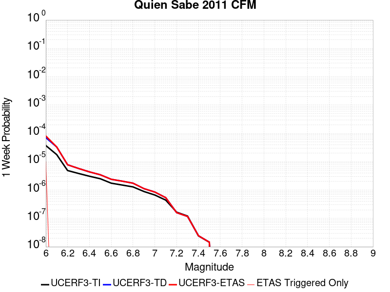 |  |  |  |

| Magnitude | 1 wk TI Prob | 1 wk TD Prob | 1 wk ETAS Prob | 1 wk ETAS/TD Gain | 1 wk ETAS Triggered Only | 1 mo TI Prob | 1 mo TD Prob | 1 mo ETAS Prob | 1 mo ETAS/TD Gain | 1 mo ETAS Triggered Only | 1 yr TI Prob | 1 yr TD Prob | 1 yr ETAS Prob | 1 yr ETAS/TD Gain | 1 yr ETAS Triggered Only | 10 yr TI Prob | 10 yr TD Prob | 10 yr ETAS Prob | 10 yr ETAS/TD Gain | 10 yr ETAS Triggered Only |
|-----|-----|-----|-----|-----|-----|-----|-----|-----|-----|-----|-----|-----|-----|-----|-----|-----|-----|-----|-----|-----|
| 6.0 | 3.729899E-5 | 7.0951464E-5 | 8.0950755E-5 | 1.1409314 | 1.0E-5 | 1.5984301E-4 | 3.039485E-4 | 3.1394546E-4 | 1.0328903 | 1.0E-5 | 0.0019443515 | 0.0036852127 | 0.003695176 | 1.0027035 | 1.0E-5 | 0.019274272 | 0.035350982 | 0.035370275 | 1.0005457 | 2.0E-5 |
| 6.1 | 1.7825725E-5 | 3.320696E-5 | 3.320696E-5 | 1.0 | 0.0 | 7.639373E-5 | 1.422859E-4 | 1.422859E-4 | 1.0 | 0.0 | 9.296967E-4 | 0.0017266806 | 0.0017266806 | 1.0 | 0.0 | 0.009258169 | 0.01669945 | 0.01669945 | 1.0 | 0.0 |
| 6.2 | 4.8865336E-6 | 7.808093E-6 | 7.808093E-6 | 1.0 | 0.0 | 2.0942118E-5 | 3.345819E-5 | 3.345819E-5 | 1.0 | 0.0 | 2.5494045E-4 | 4.0693954E-4 | 4.0693954E-4 | 1.0 | 0.0 | 0.0025464818 | 0.0040136543 | 0.0040136543 | 1.0 | 0.0 |
| 6.3 | 3.858491E-6 | 5.7900197E-6 | 5.7900197E-6 | 1.0 | 0.0 | 1.6536285E-5 | 2.481416E-5 | 2.481416E-5 | 1.0 | 0.0 | 2.0131067E-4 | 3.020752E-4 | 3.020752E-4 | 1.0 | 0.0 | 0.002011284 | 0.0030021025 | 0.0030021025 | 1.0 | 0.0 |
| 6.4 | 3.0771805E-6 | 4.385208E-6 | 4.385208E-6 | 1.0 | 0.0 | 1.318785E-5 | 1.8793626E-5 | 1.8793626E-5 | 1.0 | 0.0 | 1.6055023E-4 | 2.287908E-4 | 2.287908E-4 | 1.0 | 0.0 | 0.001604343 | 0.0022865618 | 0.0022865618 | 1.0 | 0.0 |
| 6.5 | 2.5081235E-6 | 3.4638424E-6 | 3.4638424E-6 | 1.0 | 0.0 | 1.0749056E-5 | 1.4844963E-5 | 1.4844963E-5 | 1.0 | 0.0 | 1.308619E-4 | 1.807239E-4 | 1.807239E-4 | 1.0 | 0.0 | 0.0013078486 | 0.0018125145 | 0.0018125145 | 1.0 | 0.0 |
| 6.6 | 1.7505364E-6 | 2.402519E-6 | 2.402519E-6 | 1.0 | 0.0 | 7.502277E-6 | 1.0296473E-5 | 1.0296473E-5 | 1.0 | 0.0 | 9.13364E-5 | 1.2535306E-4 | 1.2535306E-4 | 1.0 | 0.0 | 9.129886E-4 | 0.0012584954 | 0.0012584954 | 1.0 | 0.0 |
| 6.7 | 1.505737E-6 | 2.0639054E-6 | 2.0639054E-6 | 1.0 | 0.0 | 6.4531428E-6 | 8.8452825E-6 | 8.8452825E-6 | 1.0 | 0.0 | 7.8564175E-5 | 1.0768659E-4 | 1.0768659E-4 | 1.0 | 0.0 | 7.853641E-4 | 0.0010819929 | 0.0010819929 | 1.0 | 0.0 |
| 6.8 | 1.2924105E-6 | 1.7485374E-6 | 1.7485374E-6 | 1.0 | 0.0 | 5.5388905E-6 | 7.4937134E-6 | 7.4937134E-6 | 1.0 | 0.0 | 6.74339E-5 | 9.123269E-5 | 9.123269E-5 | 1.0 | 0.0 | 6.741344E-4 | 9.162552E-4 | 9.162552E-4 | 1.0 | 0.0 |
| 6.9 | 8.9075286E-7 | 1.1250713E-6 | 1.1250713E-6 | 1.0 | 0.0 | 3.8175067E-6 | 4.8217266E-6 | 4.8217266E-6 | 1.0 | 0.0 | 4.6477155E-5 | 5.8703165E-5 | 5.8703165E-5 | 1.0 | 0.0 | 4.6467435E-4 | 5.9053E-4 | 5.9053E-4 | 1.0 | 0.0 |
| 7.0 | 6.6891175E-7 | 8.5172684E-7 | 8.5172684E-7 | 1.0 | 0.0 | 2.8667614E-6 | 3.650254E-6 | 3.650254E-6 | 1.0 | 0.0 | 3.4902263E-5 | 4.444113E-5 | 4.444113E-5 | 1.0 | 0.0 | 3.4896782E-4 | 4.4690873E-4 | 4.4690873E-4 | 1.0 | 0.0 |
| 7.1 | 4.4205015E-7 | 5.3921644E-7 | 5.3921644E-7 | 1.0 | 0.0 | 1.8944993E-6 | 2.3109264E-6 | 2.3109264E-6 | 1.0 | 0.0 | 2.3065284E-5 | 2.8135337E-5 | 2.8135337E-5 | 1.0 | 0.0 | 2.3062891E-4 | 2.827399E-4 | 2.827399E-4 | 1.0 | 0.0 |
| 7.2 | 1.6620965E-7 | 1.5988468E-7 | 1.5988468E-7 | 1.0 | 0.0 | 7.123269E-7 | 6.8521985E-7 | 6.8521985E-7 | 1.0 | 0.0 | 8.672545E-6 | 8.342524E-6 | 8.342524E-6 | 1.0 | 0.0 | 8.6722066E-5 | 8.360284E-5 | 8.360284E-5 | 1.0 | 0.0 |
| 7.3 | 1.2142488E-7 | 1.1727331E-7 | 1.1727331E-7 | 1.0 | 0.0 | 5.2039223E-7 | 5.025998E-7 | 5.025998E-7 | 1.0 | 0.0 | 6.335757E-6 | 6.119139E-6 | 6.119139E-6 | 1.0 | 0.0 | 6.3355765E-5 | 6.122059E-5 | 6.122059E-5 | 1.0 | 0.0 |
| 7.4 | 2.4192937E-8 | 2.4546503E-8 | 2.4546503E-8 | 1.0 | 0.0 | 1.0368401E-7 | 1.0519929E-7 | 1.0519929E-7 | 1.0 | 0.0 | 1.2623522E-6 | 1.2808008E-6 | 1.2808008E-6 | 1.0 | 0.0 | 1.2623449E-5 | 1.2769109E-5 | 1.2769109E-5 | 1.0 | 0.0 |
| 7.5 | 1.4432802E-8 | 1.4508831E-8 | 1.4508831E-8 | 1.0 | 0.0 | 6.185486E-8 | 6.21807E-8 | 6.21807E-8 | 1.0 | 0.0 | 7.530827E-7 | 7.5704986E-7 | 7.5704986E-7 | 1.0 | 0.0 | 7.530801E-6 | 7.5294097E-6 | 7.5294097E-6 | 1.0 | 0.0 |

## Coronado Bank alt1
*[(top)](#table-of-contents)*

| 1 Week | 1 Month | 1 Year | 10 Year |
|-----|-----|-----|-----|
|  |  |  | 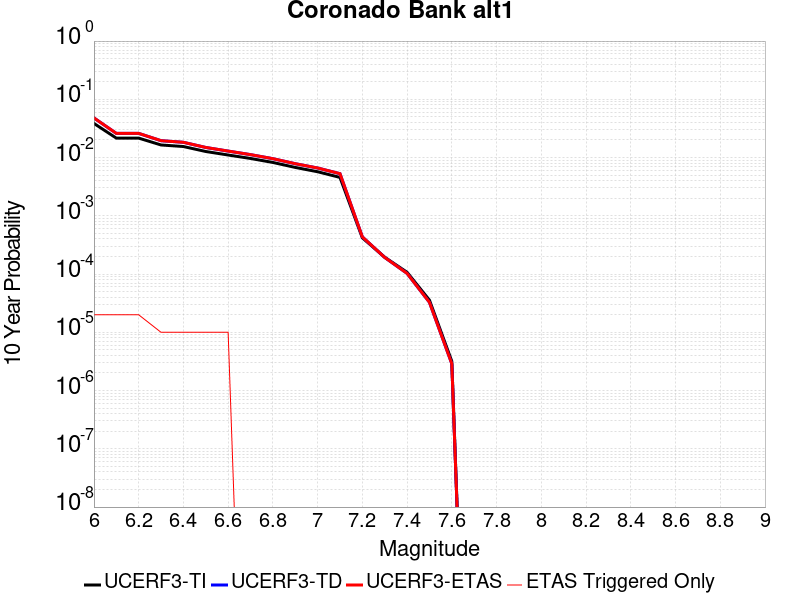 |

| Magnitude | 1 wk TI Prob | 1 wk TD Prob | 1 wk ETAS Prob | 1 wk ETAS/TD Gain | 1 wk ETAS Triggered Only | 1 mo TI Prob | 1 mo TD Prob | 1 mo ETAS Prob | 1 mo ETAS/TD Gain | 1 mo ETAS Triggered Only | 1 yr TI Prob | 1 yr TD Prob | 1 yr ETAS Prob | 1 yr ETAS/TD Gain | 1 yr ETAS Triggered Only | 10 yr TI Prob | 10 yr TD Prob | 10 yr ETAS Prob | 10 yr ETAS/TD Gain | 10 yr ETAS Triggered Only |
|-----|-----|-----|-----|-----|-----|-----|-----|-----|-----|-----|-----|-----|-----|-----|-----|-----|-----|-----|-----|-----|
| 6.0 | 7.533492E-5 | 9.395439E-5 | 9.395439E-5 | 1.0 | 0.0 | 3.22824E-4 | 4.026023E-4 | 4.026023E-4 | 1.0 | 0.0 | 0.0039233007 | 0.0048912787 | 0.00490123 | 1.0020344 | 1.0E-5 | 0.03854755 | 0.04790551 | 0.04792455 | 1.0003974 | 2.0E-5 |
| 6.1 | 4.1807285E-5 | 5.049452E-5 | 5.049452E-5 | 1.0 | 0.0 | 1.7916178E-4 | 2.1638718E-4 | 2.1638718E-4 | 1.0 | 0.0 | 0.0021791123 | 0.0026314093 | 0.0026413829 | 1.0037903 | 1.0E-5 | 0.021578677 | 0.026011832 | 0.026031313 | 1.0007489 | 2.0E-5 |
| 6.2 | 4.1807285E-5 | 5.049452E-5 | 5.049452E-5 | 1.0 | 0.0 | 1.7916178E-4 | 2.1638718E-4 | 2.1638718E-4 | 1.0 | 0.0 | 0.0021791123 | 0.0026314093 | 0.0026413829 | 1.0037903 | 1.0E-5 | 0.021578677 | 0.026011832 | 0.026031313 | 1.0007489 | 2.0E-5 |
| 6.3 | 3.1793104E-5 | 3.7712067E-5 | 3.7712067E-5 | 1.0 | 0.0 | 1.3624904E-4 | 1.616133E-4 | 1.616133E-4 | 1.0 | 0.0 | 0.0016575698 | 0.0019658979 | 0.0019758784 | 1.0050768 | 1.0E-5 | 0.016452603 | 0.019488975 | 0.01949878 | 1.0005031 | 1.0E-5 |
| 6.4 | 2.9878007E-5 | 3.5336667E-5 | 3.5336667E-5 | 1.0 | 0.0 | 1.2804232E-4 | 1.5143424E-4 | 1.5143424E-4 | 1.0 | 0.0 | 0.0015578003 | 0.0018421846 | 0.0018521661 | 1.0054183 | 1.0E-5 | 0.015469253 | 0.018272907 | 0.018282725 | 1.0005373 | 1.0E-5 |
| 6.5 | 2.4512565E-5 | 2.876477E-5 | 2.876477E-5 | 1.0 | 0.0 | 1.0504962E-4 | 1.2327192E-4 | 1.2327192E-4 | 1.0 | 0.0 | 0.0012782287 | 0.0014998292 | 0.0015098142 | 1.0066575 | 1.0E-5 | 0.012709012 | 0.014900037 | 0.014909888 | 1.0006611 | 1.0E-5 |
| 6.6 | 2.1317413E-5 | 2.4907235E-5 | 2.4907235E-5 | 1.0 | 0.0 | 9.135714E-5 | 1.0674105E-4 | 1.0674105E-4 | 1.0 | 0.0 | 0.0011117056 | 0.0012988197 | 0.0013088067 | 1.0076894 | 1.0E-5 | 0.011061605 | 0.012914698 | 0.012924569 | 1.0007644 | 1.0E-5 |
| 6.7 | 1.8585655E-5 | 2.1635358E-5 | 2.1635358E-5 | 1.0 | 0.0 | 7.9650374E-5 | 9.271978E-5 | 9.271978E-5 | 1.0 | 0.0 | 9.6931186E-4 | 0.0011282993 | 0.0011282993 | 1.0 | 0.0 | 0.0096509475 | 0.011227869 | 0.011227869 | 1.0 | 0.0 |
| 6.8 | 1.5862879E-5 | 1.8419876E-5 | 1.8419876E-5 | 1.0 | 0.0 | 6.798199E-5 | 7.8940044E-5 | 7.8940044E-5 | 1.0 | 0.0 | 8.273665E-4 | 9.6069055E-4 | 9.6069055E-4 | 1.0 | 0.0 | 0.008242928 | 0.009567358 | 0.009567358 | 1.0 | 0.0 |
| 6.9 | 1.3021509E-5 | 1.509559E-5 | 1.509559E-5 | 1.0 | 0.0 | 5.5805274E-5 | 6.4693886E-5 | 6.4693886E-5 | 1.0 | 0.0 | 6.792174E-4 | 7.873815E-4 | 7.873815E-4 | 1.0 | 0.0 | 0.006771452 | 0.007847741 | 0.007847741 | 1.0 | 0.0 |
| 7.0 | 1.0974371E-5 | 1.2720379E-5 | 1.2720379E-5 | 1.0 | 0.0 | 4.7032172E-5 | 5.451487E-5 | 5.451487E-5 | 1.0 | 0.0 | 5.7246623E-4 | 6.63534E-4 | 6.63534E-4 | 1.0 | 0.0 | 0.0057099373 | 0.0066172774 | 0.0066172774 | 1.0 | 0.0 |
| 7.1 | 8.766221E-6 | 1.01640535E-5 | 1.01640535E-5 | 1.0 | 0.0 | 3.7568978E-5 | 4.3559598E-5 | 4.3559598E-5 | 1.0 | 0.0 | 4.573063E-4 | 5.302263E-4 | 5.302263E-4 | 1.0 | 0.0 | 0.0045636636 | 0.0052913115 | 0.0052913115 | 1.0 | 0.0 |
| 7.2 | 8.026024E-7 | 8.3318497E-7 | 8.3318497E-7 | 1.0 | 0.0 | 3.43972E-6 | 3.5707878E-6 | 3.5707878E-6 | 1.0 | 0.0 | 4.1877785E-5 | 4.3473487E-5 | 4.3473487E-5 | 1.0 | 0.0 | 4.1869894E-4 | 4.346509E-4 | 4.346509E-4 | 1.0 | 0.0 |
| 7.3 | 3.7293114E-7 | 3.700131E-7 | 3.700131E-7 | 1.0 | 0.0 | 1.5982754E-6 | 1.5857695E-6 | 1.5857695E-6 | 1.0 | 0.0 | 1.9458828E-5 | 1.9306573E-5 | 1.9306573E-5 | 1.0 | 0.0 | 1.9457124E-4 | 1.9304903E-4 | 1.9304903E-4 | 1.0 | 0.0 |
| 7.4 | 2.0557036E-7 | 1.9674545E-7 | 1.9674545E-7 | 1.0 | 0.0 | 8.810155E-7 | 8.4319447E-7 | 8.4319447E-7 | 1.0 | 0.0 | 1.0726311E-5 | 1.0265845E-5 | 1.0265845E-5 | 1.0 | 0.0 | 1.0725793E-4 | 1.02653736E-4 | 1.02653736E-4 | 1.0 | 0.0 |
| 7.5 | 6.845446E-8 | 6.279429E-8 | 6.279429E-8 | 1.0 | 0.0 | 2.9337625E-7 | 2.6911837E-7 | 2.6911837E-7 | 1.0 | 0.0 | 3.5718497E-6 | 3.2765113E-6 | 3.2765113E-6 | 1.0 | 0.0 | 3.5717923E-5 | 3.2764638E-5 | 3.2764638E-5 | 1.0 | 0.0 |
| 7.6 | 6.0975145E-9 | 5.5319123E-9 | 5.5319123E-9 | 1.0 | 0.0 | 2.6132206E-8 | 2.3708195E-8 | 2.3708195E-8 | 1.0 | 0.0 | 3.1815955E-7 | 2.8864724E-7 | 2.8864724E-7 | 1.0 | 0.0 | 3.181591E-6 | 2.8864697E-6 | 2.8864697E-6 | 1.0 | 0.0 |

## Palos Verdes
*[(top)](#table-of-contents)*

| 1 Week | 1 Month | 1 Year | 10 Year |
|-----|-----|-----|-----|
|  |  |  |  |

| Magnitude | 1 wk TI Prob | 1 wk TD Prob | 1 wk ETAS Prob | 1 wk ETAS/TD Gain | 1 wk ETAS Triggered Only | 1 mo TI Prob | 1 mo TD Prob | 1 mo ETAS Prob | 1 mo ETAS/TD Gain | 1 mo ETAS Triggered Only | 1 yr TI Prob | 1 yr TD Prob | 1 yr ETAS Prob | 1 yr ETAS/TD Gain | 1 yr ETAS Triggered Only | 10 yr TI Prob | 10 yr TD Prob | 10 yr ETAS Prob | 10 yr ETAS/TD Gain | 10 yr ETAS Triggered Only |
|-----|-----|-----|-----|-----|-----|-----|-----|-----|-----|-----|-----|-----|-----|-----|-----|-----|-----|-----|-----|-----|
| 6.0 | 6.126063E-5 | 7.622823E-5 | 7.622823E-5 | 1.0 | 0.0 | 2.6251914E-4 | 3.2665484E-4 | 3.3665157E-4 | 1.0306034 | 1.0E-5 | 0.0031914865 | 0.0039703017 | 0.0039802617 | 1.0025088 | 1.0E-5 | 0.031460393 | 0.03905032 | 0.039069537 | 1.0004922 | 2.0E-5 |
| 6.1 | 6.126063E-5 | 7.622823E-5 | 7.622823E-5 | 1.0 | 0.0 | 2.6251914E-4 | 3.2665484E-4 | 3.3665157E-4 | 1.0306034 | 1.0E-5 | 0.0031914865 | 0.0039703017 | 0.0039802617 | 1.0025088 | 1.0E-5 | 0.031460393 | 0.03905032 | 0.039069537 | 1.0004922 | 2.0E-5 |
| 6.2 | 6.126063E-5 | 7.622823E-5 | 7.622823E-5 | 1.0 | 0.0 | 2.6251914E-4 | 3.2665484E-4 | 3.3665157E-4 | 1.0306034 | 1.0E-5 | 0.0031914865 | 0.0039703017 | 0.0039802617 | 1.0025088 | 1.0E-5 | 0.031460393 | 0.03905032 | 0.039069537 | 1.0004922 | 2.0E-5 |
| 6.3 | 4.0838047E-5 | 4.9750462E-5 | 4.9750462E-5 | 1.0 | 0.0 | 1.7500846E-4 | 2.1320012E-4 | 2.2319799E-4 | 1.0468943 | 1.0E-5 | 0.0021286458 | 0.0025928293 | 0.0026028033 | 1.0038468 | 1.0E-5 | 0.021083709 | 0.02564748 | 0.025666967 | 1.0007598 | 2.0E-5 |
| 6.4 | 4.0838047E-5 | 4.9750462E-5 | 4.9750462E-5 | 1.0 | 0.0 | 1.7500846E-4 | 2.1320012E-4 | 2.2319799E-4 | 1.0468943 | 1.0E-5 | 0.0021286458 | 0.0025928293 | 0.0026028033 | 1.0038468 | 1.0E-5 | 0.021083709 | 0.02564748 | 0.025666967 | 1.0007598 | 2.0E-5 |
| 6.5 | 3.0512005E-5 | 3.6562564E-5 | 3.6562564E-5 | 1.0 | 0.0 | 1.3075917E-4 | 1.5668797E-4 | 1.5668797E-4 | 1.0 | 0.0 | 0.0015908304 | 0.0019061224 | 0.0019061224 | 1.0 | 0.0 | 0.015794903 | 0.018909669 | 0.018909669 | 1.0 | 0.0 |
| 6.6 | 2.9255087E-5 | 3.515534E-5 | 3.515534E-5 | 1.0 | 0.0 | 1.2537291E-4 | 1.506577E-4 | 1.506577E-4 | 1.0 | 0.0 | 0.0015253464 | 0.0018328275 | 0.0018328275 | 1.0 | 0.0 | 0.015149189 | 0.018188728 | 0.018188728 | 1.0 | 0.0 |
| 6.7 | 2.287198E-5 | 2.7248976E-5 | 2.7248976E-5 | 1.0 | 0.0 | 9.801909E-5 | 1.1677662E-4 | 1.1677662E-4 | 1.0 | 0.0 | 0.001192729 | 0.0014209197 | 0.0014209197 | 1.0 | 0.0 | 0.011863477 | 0.014127577 | 0.014127577 | 1.0 | 0.0 |
| 6.8 | 2.1325764E-5 | 2.5432533E-5 | 2.5432533E-5 | 1.0 | 0.0 | 9.139293E-5 | 1.0899252E-4 | 1.0899252E-4 | 1.0 | 0.0 | 0.001112141 | 0.0013262664 | 0.0013262664 | 1.0 | 0.0 | 0.011065915 | 0.013192549 | 0.013192549 | 1.0 | 0.0 |
| 6.9 | 1.9009392E-5 | 2.2614122E-5 | 2.2614122E-5 | 1.0 | 0.0 | 8.1466285E-5 | 9.6914555E-5 | 9.6914555E-5 | 1.0 | 0.0 | 9.914007E-4 | 0.0011793834 | 0.0011793834 | 1.0 | 0.0 | 0.009869894 | 0.011739929 | 0.011739929 | 1.0 | 0.0 |
| 7.0 | 1.7098473E-5 | 2.0319867E-5 | 2.0319867E-5 | 1.0 | 0.0 | 7.3277115E-5 | 8.708272E-5 | 8.708272E-5 | 1.0 | 0.0 | 8.917837E-4 | 0.0010598017 | 0.0010598017 | 1.0 | 0.0 | 0.008882134 | 0.010555912 | 0.010555912 | 1.0 | 0.0 |
| 7.1 | 1.5982785E-5 | 1.8995239E-5 | 1.8995239E-5 | 1.0 | 0.0 | 6.849585E-5 | 8.1406106E-5 | 8.1406106E-5 | 1.0 | 0.0 | 8.336179E-4 | 9.907534E-4 | 9.907534E-4 | 1.0 | 0.0 | 0.008304977 | 0.009871728 | 0.009871728 | 1.0 | 0.0 |
| 7.2 | 1.4468002E-5 | 1.719767E-5 | 1.719767E-5 | 1.0 | 0.0 | 6.200425E-5 | 7.370269E-5 | 7.370269E-5 | 1.0 | 0.0 | 7.546402E-4 | 8.970449E-4 | 8.970449E-4 | 1.0 | 0.0 | 0.007520827 | 0.008942509 | 0.008942509 | 1.0 | 0.0 |
| 7.3 | 5.288233E-6 | 6.2038207E-6 | 6.2038207E-6 | 1.0 | 0.0 | 2.2663658E-5 | 2.658773E-5 | 2.658773E-5 | 1.0 | 0.0 | 2.7589512E-4 | 3.2369242E-4 | 3.2369242E-4 | 1.0 | 0.0 | 0.0027555283 | 0.0032356323 | 0.0032356323 | 1.0 | 0.0 |
| 7.4 | 8.279556E-7 | 8.408364E-7 | 8.408364E-7 | 1.0 | 0.0 | 3.5483763E-6 | 3.60358E-6 | 3.60358E-6 | 1.0 | 0.0 | 4.3200624E-5 | 4.3872777E-5 | 4.3872777E-5 | 1.0 | 0.0 | 4.3192226E-4 | 4.3864836E-4 | 4.3864836E-4 | 1.0 | 0.0 |
| 7.5 | 6.559831E-7 | 6.667243E-7 | 6.667243E-7 | 1.0 | 0.0 | 2.8113532E-6 | 2.8573872E-6 | 2.8573872E-6 | 1.0 | 0.0 | 3.4227687E-5 | 3.47882E-5 | 3.47882E-5 | 1.0 | 0.0 | 3.4222414E-4 | 3.478342E-4 | 3.478342E-4 | 1.0 | 0.0 |
| 7.6 | 3.5018968E-7 | 3.562011E-7 | 3.562011E-7 | 1.0 | 0.0 | 1.500812E-6 | 1.5265755E-6 | 1.5265755E-6 | 1.0 | 0.0 | 1.8272232E-5 | 1.8585944E-5 | 1.8585944E-5 | 1.0 | 0.0 | 1.8270731E-4 | 1.858485E-4 | 1.858485E-4 | 1.0 | 0.0 |
| 7.7 | 1.1986104E-7 | 1.2198406E-7 | 1.2198406E-7 | 1.0 | 0.0 | 5.1369005E-7 | 5.227887E-7 | 5.227887E-7 | 1.0 | 0.0 | 6.2541585E-6 | 6.364934E-6 | 6.364934E-6 | 1.0 | 0.0 | 6.2539824E-5 | 6.364756E-5 | 6.364756E-5 | 1.0 | 0.0 |
| 7.8 | 3.0445005E-8 | 3.1027664E-8 | 3.1027664E-8 | 1.0 | 0.0 | 1.3047858E-7 | 1.3297569E-7 | 1.3297569E-7 | 1.0 | 0.0 | 1.5885756E-6 | 1.6189781E-6 | 1.6189781E-6 | 1.0 | 0.0 | 1.5885644E-5 | 1.6189684E-5 | 1.6189684E-5 | 1.0 | 0.0 |

## Davis Creek
*[(top)](#table-of-contents)*

| 1 Week | 1 Month | 1 Year | 10 Year |
|-----|-----|-----|-----|
|  |  |  |  |

| Magnitude | 1 wk TI Prob | 1 wk TD Prob | 1 wk ETAS Prob | 1 wk ETAS/TD Gain | 1 wk ETAS Triggered Only | 1 mo TI Prob | 1 mo TD Prob | 1 mo ETAS Prob | 1 mo ETAS/TD Gain | 1 mo ETAS Triggered Only | 1 yr TI Prob | 1 yr TD Prob | 1 yr ETAS Prob | 1 yr ETAS/TD Gain | 1 yr ETAS Triggered Only | 10 yr TI Prob | 10 yr TD Prob | 10 yr ETAS Prob | 10 yr ETAS/TD Gain | 10 yr ETAS Triggered Only |
|-----|-----|-----|-----|-----|-----|-----|-----|-----|-----|-----|-----|-----|-----|-----|-----|-----|-----|-----|-----|-----|
| 6.0 | 2.331472E-5 | 2.5417517E-5 | 2.5417517E-5 | 1.0 | 0.0 | 9.99164E-5 | 1.0892834E-4 | 1.1892725E-4 | 1.0917934 | 1.0E-5 | 0.0012158032 | 0.0013255142 | 0.001335501 | 1.0075343 | 1.0E-5 | 0.01209173 | 0.013187861 | 0.013197729 | 1.0007483 | 1.0E-5 |
| 6.1 | 1.0407654E-5 | 1.1317118E-5 | 1.1317118E-5 | 1.0 | 0.0 | 4.4603472E-5 | 4.8501184E-5 | 4.8501184E-5 | 1.0 | 0.0 | 5.4291193E-4 | 5.9036905E-4 | 6.003631E-4 | 1.0169286 | 1.0E-5 | 0.0054158745 | 0.005890679 | 0.0059006205 | 1.0016876 | 1.0E-5 |
| 6.2 | 1.0407654E-5 | 1.1317118E-5 | 1.1317118E-5 | 1.0 | 0.0 | 4.4603472E-5 | 4.8501184E-5 | 4.8501184E-5 | 1.0 | 0.0 | 5.4291193E-4 | 5.9036905E-4 | 6.003631E-4 | 1.0169286 | 1.0E-5 | 0.0054158745 | 0.005890679 | 0.0059006205 | 1.0016876 | 1.0E-5 |
| 6.3 | 5.1323277E-6 | 5.5686187E-6 | 5.5686187E-6 | 1.0 | 0.0 | 2.1995505E-5 | 2.386534E-5 | 2.386534E-5 | 1.0 | 0.0 | 2.6776237E-4 | 2.9053038E-4 | 2.9053038E-4 | 1.0 | 0.0 | 0.0026743996 | 0.0029023518 | 0.0029023518 | 1.0 | 0.0 |
| 6.4 | 2.4985154E-6 | 2.7045678E-6 | 2.7045678E-6 | 1.0 | 0.0 | 1.07078795E-5 | 1.1590974E-5 | 1.1590974E-5 | 1.0 | 0.0 | 1.3036063E-4 | 1.411146E-4 | 1.411146E-4 | 1.0 | 0.0 | 0.0013028418 | 0.0014106046 | 0.0014106046 | 1.0 | 0.0 |
| 6.5 | 2.4846438E-6 | 2.690502E-6 | 2.690502E-6 | 1.0 | 0.0 | 1.064843E-5 | 1.1530692E-5 | 1.1530692E-5 | 1.0 | 0.0 | 1.2963692E-4 | 1.4038075E-4 | 1.4038075E-4 | 1.0 | 0.0 | 0.0012956132 | 0.0014032754 | 0.0014032754 | 1.0 | 0.0 |
| 6.6 | 2.072566E-7 | 2.1018127E-7 | 2.1018127E-7 | 1.0 | 0.0 | 8.882423E-7 | 9.0077657E-7 | 9.0077657E-7 | 1.0 | 0.0 | 1.0814296E-5 | 1.0966901E-5 | 1.0966901E-5 | 1.0 | 0.0 | 1.081377E-4 | 1.09663786E-4 | 1.09663786E-4 | 1.0 | 0.0 |
| 6.7 | 1.7544528E-7 | 1.7790859E-7 | 1.7790859E-7 | 1.0 | 0.0 | 7.5190815E-7 | 7.6246516E-7 | 7.6246516E-7 | 1.0 | 0.0 | 9.154443E-6 | 9.282975E-6 | 9.282975E-6 | 1.0 | 0.0 | 9.1540656E-5 | 9.2826034E-5 | 9.2826034E-5 | 1.0 | 0.0 |
| 6.8 | 1.2320395E-7 | 1.2481159E-7 | 1.2481159E-7 | 1.0 | 0.0 | 5.280168E-7 | 5.3490675E-7 | 5.3490675E-7 | 1.0 | 0.0 | 6.428586E-6 | 6.512471E-6 | 6.512471E-6 | 1.0 | 0.0 | 6.4284E-5 | 6.512291E-5 | 6.512291E-5 | 1.0 | 0.0 |
| 6.9 | 6.399997E-8 | 6.486069E-8 | 6.486069E-8 | 1.0 | 0.0 | 2.7428555E-7 | 2.7797438E-7 | 2.7797438E-7 | 1.0 | 0.0 | 3.3394215E-6 | 3.3843335E-6 | 3.3843335E-6 | 1.0 | 0.0 | 3.3393713E-5 | 3.3842884E-5 | 3.3842884E-5 | 1.0 | 0.0 |
| 7.0 | 6.4455685E-9 | 6.5352763E-9 | 6.5352763E-9 | 1.0 | 0.0 | 2.7623864E-8 | 2.8008326E-8 | 2.8008326E-8 | 1.0 | 0.0 | 3.3632048E-7 | 3.4100137E-7 | 3.4100137E-7 | 1.0 | 0.0 | 3.3631998E-6 | 3.4100137E-6 | 3.4100137E-6 | 1.0 | 0.0 |

## Superstition Hills
*[(top)](#table-of-contents)*

| 1 Week | 1 Month | 1 Year | 10 Year |
|-----|-----|-----|-----|
|  |  |  |  |

| Magnitude | 1 wk TI Prob | 1 wk TD Prob | 1 wk ETAS Prob | 1 wk ETAS/TD Gain | 1 wk ETAS Triggered Only | 1 mo TI Prob | 1 mo TD Prob | 1 mo ETAS Prob | 1 mo ETAS/TD Gain | 1 mo ETAS Triggered Only | 1 yr TI Prob | 1 yr TD Prob | 1 yr ETAS Prob | 1 yr ETAS/TD Gain | 1 yr ETAS Triggered Only | 10 yr TI Prob | 10 yr TD Prob | 10 yr ETAS Prob | 10 yr ETAS/TD Gain | 10 yr ETAS Triggered Only |
|-----|-----|-----|-----|-----|-----|-----|-----|-----|-----|-----|-----|-----|-----|-----|-----|-----|-----|-----|-----|-----|
| 6.0 | 6.6865185E-5 | 1.4140681E-5 | 1.4140681E-5 | 1.0 | 0.0 | 2.8653358E-4 | 6.0601604E-5 | 6.0601604E-5 | 1.0 | 0.0 | 0.0034829667 | 7.3759095E-4 | 7.3759095E-4 | 1.0 | 0.0 | 0.03428881 | 0.007520847 | 0.0075406963 | 1.0026393 | 2.0E-5 |
| 6.1 | 6.544851E-5 | 1.4140681E-5 | 1.4140681E-5 | 1.0 | 0.0 | 2.8046346E-4 | 6.06016E-5 | 6.06016E-5 | 1.0 | 0.0 | 0.0034092965 | 7.3759095E-4 | 7.3759095E-4 | 1.0 | 0.0 | 0.033574644 | 0.007520846 | 0.007540696 | 1.0026393 | 2.0E-5 |
| 6.2 | 6.544851E-5 | 1.4140681E-5 | 1.4140681E-5 | 1.0 | 0.0 | 2.8046346E-4 | 6.06016E-5 | 6.06016E-5 | 1.0 | 0.0 | 0.0034092965 | 7.3759095E-4 | 7.3759095E-4 | 1.0 | 0.0 | 0.033574644 | 0.007520846 | 0.007540696 | 1.0026393 | 2.0E-5 |
| 6.3 | 5.2402065E-5 | 1.414068E-5 | 1.414068E-5 | 1.0 | 0.0 | 2.2456095E-4 | 6.0601596E-5 | 6.0601596E-5 | 1.0 | 0.0 | 0.0027306017 | 7.375909E-4 | 7.375909E-4 | 1.0 | 0.0 | 0.02697292 | 0.0075208414 | 0.007540691 | 1.0026393 | 2.0E-5 |
| 6.4 | 4.542238E-5 | 1.414068E-5 | 1.414068E-5 | 1.0 | 0.0 | 1.9465282E-4 | 6.0601596E-5 | 6.0601596E-5 | 1.0 | 0.0 | 0.0023673223 | 7.3759083E-4 | 7.3759083E-4 | 1.0 | 0.0 | 0.023422617 | 0.007520839 | 0.0075406884 | 1.0026393 | 2.0E-5 |
| 6.5 | 2.9672969E-5 | 1.4140678E-5 | 1.4140678E-5 | 1.0 | 0.0 | 1.2716366E-4 | 6.0601593E-5 | 6.0601593E-5 | 1.0 | 0.0 | 0.0015471181 | 7.3759083E-4 | 7.3759083E-4 | 1.0 | 0.0 | 0.015363912 | 0.0075208335 | 0.0075406833 | 1.0026393 | 2.0E-5 |
| 6.6 | 2.6056105E-5 | 1.380642E-5 | 1.380642E-5 | 1.0 | 0.0 | 1.1166424E-4 | 5.916912E-5 | 5.916912E-5 | 1.0 | 0.0 | 0.0013586642 | 7.20162E-4 | 7.20162E-4 | 1.0 | 0.0 | 0.013503874 | 0.0073452997 | 0.0073651527 | 1.0027028 | 2.0E-5 |
| 6.7 | 1.4611248E-5 | 1.3386292E-5 | 1.3386292E-5 | 1.0 | 0.0 | 6.261813E-5 | 5.7368656E-5 | 5.7368656E-5 | 1.0 | 0.0 | 7.6210906E-4 | 6.982555E-4 | 6.982555E-4 | 1.0 | 0.0 | 0.0075950073 | 0.0071264883 | 0.007146346 | 1.0027864 | 2.0E-5 |
| 6.8 | 1.30607E-5 | 1.0981476E-5 | 1.0981476E-5 | 1.0 | 0.0 | 5.597323E-5 | 4.706267E-5 | 4.706267E-5 | 1.0 | 0.0 | 6.8126095E-4 | 5.728461E-4 | 5.728461E-4 | 1.0 | 0.0 | 0.006791762 | 0.0058749495 | 0.0058948323 | 1.0033842 | 2.0E-5 |
| 6.9 | 1.0443096E-5 | 8.19765E-6 | 8.19765E-6 | 1.0 | 0.0 | 4.4755358E-5 | 3.513232E-5 | 3.513232E-5 | 1.0 | 0.0 | 5.447602E-4 | 4.2765442E-4 | 4.2765442E-4 | 1.0 | 0.0 | 0.005434267 | 0.0044104243 | 0.0044104243 | 1.0 | 0.0 |
| 7.0 | 8.045912E-6 | 6.741796E-6 | 6.741796E-6 | 1.0 | 0.0 | 3.4482026E-5 | 2.8893097E-5 | 2.8893097E-5 | 1.0 | 0.0 | 4.197378E-4 | 3.517177E-4 | 3.517177E-4 | 1.0 | 0.0 | 0.0041894587 | 0.003634384 | 0.003634384 | 1.0 | 0.0 |
| 7.1 | 8.045912E-6 | 6.741796E-6 | 6.741796E-6 | 1.0 | 0.0 | 3.4482026E-5 | 2.8893097E-5 | 2.8893097E-5 | 1.0 | 0.0 | 4.197378E-4 | 3.517177E-4 | 3.517177E-4 | 1.0 | 0.0 | 0.0041894587 | 0.003634384 | 0.003634384 | 1.0 | 0.0 |
| 7.2 | 7.375506E-6 | 6.24868E-6 | 6.24868E-6 | 1.0 | 0.0 | 3.1608928E-5 | 2.6779788E-5 | 2.6779788E-5 | 1.0 | 0.0 | 3.8477074E-4 | 3.25996E-4 | 3.25996E-4 | 1.0 | 0.0 | 0.003841052 | 0.0033749773 | 0.0033749773 | 1.0 | 0.0 |
| 7.3 | 6.6063913E-6 | 5.8010883E-6 | 5.8010883E-6 | 1.0 | 0.0 | 2.8312797E-5 | 2.4861574E-5 | 2.4861574E-5 | 1.0 | 0.0 | 3.446538E-4 | 3.0264835E-4 | 3.0264835E-4 | 1.0 | 0.0 | 0.0034411973 | 0.0031392311 | 0.0031392311 | 1.0 | 0.0 |
| 7.4 | 6.4313126E-6 | 5.6825056E-6 | 5.6825056E-6 | 1.0 | 0.0 | 2.7562477E-5 | 2.4353372E-5 | 2.4353372E-5 | 1.0 | 0.0 | 3.355215E-4 | 2.9646268E-4 | 2.9646268E-4 | 1.0 | 0.0 | 0.0033501536 | 0.0030770004 | 0.0030770004 | 1.0 | 0.0 |
| 7.5 | 6.0742927E-6 | 5.4783154E-6 | 5.4783154E-6 | 1.0 | 0.0 | 2.6032423E-5 | 2.3478287E-5 | 2.3478287E-5 | 1.0 | 0.0 | 3.1689866E-4 | 2.8581134E-4 | 2.8581134E-4 | 1.0 | 0.0 | 0.0031644711 | 0.0029688284 | 0.0029688284 | 1.0 | 0.0 |
| 7.6 | 5.6987187E-6 | 5.29651E-6 | 5.29651E-6 | 1.0 | 0.0 | 2.4422852E-5 | 2.2699136E-5 | 2.2699136E-5 | 1.0 | 0.0 | 2.9730765E-4 | 2.7632757E-4 | 2.7632757E-4 | 1.0 | 0.0 | 0.002969102 | 0.0028720777 | 0.0028720777 | 1.0 | 0.0 |
| 7.7 | 5.1658035E-6 | 4.9275045E-6 | 4.9275045E-6 | 1.0 | 0.0 | 2.2138971E-5 | 2.1117708E-5 | 2.1117708E-5 | 1.0 | 0.0 | 2.6950863E-4 | 2.5707835E-4 | 2.5707835E-4 | 1.0 | 0.0 | 0.00269182 | 0.002677121 | 0.002677121 | 1.0 | 0.0 |
| 7.8 | 3.6864697E-6 | 4.1984263E-6 | 4.1984263E-6 | 1.0 | 0.0 | 1.579906E-5 | 1.7993134E-5 | 1.7993134E-5 | 1.0 | 0.0 | 1.9233658E-4 | 2.1904484E-4 | 2.1904484E-4 | 1.0 | 0.0 | 0.0019217018 | 0.0022902628 | 0.0022902628 | 1.0 | 0.0 |
| 7.9 | 3.0265903E-6 | 3.5655014E-6 | 3.5655014E-6 | 1.0 | 0.0 | 1.2971037E-5 | 1.5280633E-5 | 1.5280633E-5 | 1.0 | 0.0 | 1.5791094E-4 | 1.8602627E-4 | 1.8602627E-4 | 1.0 | 0.0 | 0.0015779877 | 0.0019543984 | 0.0019543984 | 1.0 | 0.0 |
| 8.0 | 2.5271493E-6 | 3.0883666E-6 | 3.0883666E-6 | 1.0 | 0.0 | 1.0830595E-5 | 1.3235793E-5 | 1.3235793E-5 | 1.0 | 0.0 | 1.3185451E-4 | 1.6113427E-4 | 1.6113427E-4 | 1.0 | 0.0 | 0.0013177631 | 0.0016981832 | 0.0016981832 | 1.0 | 0.0 |
| 8.1 | 2.3749135E-6 | 2.9189414E-6 | 2.9189414E-6 | 1.0 | 0.0 | 1.0178161E-5 | 1.250969E-5 | 1.250969E-5 | 1.0 | 0.0 | 1.2391206E-4 | 1.5229525E-4 | 1.5229525E-4 | 1.0 | 0.0 | 0.0012384299 | 0.0016057007 | 0.0016057007 | 1.0 | 0.0 |
| 8.2 | 1.7186406E-9 | 1.1447435E-9 | 1.1447435E-9 | 1.0 | 0.0 | 7.3656024E-9 | 4.9060436E-9 | 4.9060436E-9 | 1.0 | 0.0 | 8.9676206E-8 | 5.973108E-8 | 5.973108E-8 | 1.0 | 0.0 | 8.9676166E-7 | 6.391136E-7 | 6.391136E-7 | 1.0 | 0.0 |

## Great Valley 11
*[(top)](#table-of-contents)*

| 1 Week | 1 Month | 1 Year | 10 Year |
|-----|-----|-----|-----|
|  |  |  |  |

| Magnitude | 1 wk TI Prob | 1 wk TD Prob | 1 wk ETAS Prob | 1 wk ETAS/TD Gain | 1 wk ETAS Triggered Only | 1 mo TI Prob | 1 mo TD Prob | 1 mo ETAS Prob | 1 mo ETAS/TD Gain | 1 mo ETAS Triggered Only | 1 yr TI Prob | 1 yr TD Prob | 1 yr ETAS Prob | 1 yr ETAS/TD Gain | 1 yr ETAS Triggered Only | 10 yr TI Prob | 10 yr TD Prob | 10 yr ETAS Prob | 10 yr ETAS/TD Gain | 10 yr ETAS Triggered Only |
|-----|-----|-----|-----|-----|-----|-----|-----|-----|-----|-----|-----|-----|-----|-----|-----|-----|-----|-----|-----|-----|
| 6.0 | 2.8099583E-5 | 2.983284E-5 | 2.983284E-5 | 1.0 | 0.0 | 1.20421224E-4 | 1.2784918E-4 | 1.2784918E-4 | 1.0 | 0.0 | 0.0014651422 | 0.0015555259 | 0.0015754948 | 1.0128374 | 2.0E-5 | 0.0145552 | 0.015453906 | 0.015473597 | 1.0012742 | 2.0E-5 |
| 6.1 | 2.483194E-5 | 2.5907739E-5 | 2.5907739E-5 | 1.0 | 0.0 | 1.0641825E-4 | 1.110288E-4 | 1.110288E-4 | 1.0 | 0.0 | 0.0012948721 | 0.0013510007 | 0.0013709737 | 1.0147839 | 2.0E-5 | 0.012873529 | 0.013434285 | 0.013454016 | 1.0014688 | 2.0E-5 |
| 6.2 | 2.483194E-5 | 2.5907739E-5 | 2.5907739E-5 | 1.0 | 0.0 | 1.0641825E-4 | 1.110288E-4 | 1.110288E-4 | 1.0 | 0.0 | 0.0012948721 | 0.0013510007 | 0.0013709737 | 1.0147839 | 2.0E-5 | 0.012873529 | 0.013434285 | 0.013454016 | 1.0014688 | 2.0E-5 |
| 6.3 | 2.0257901E-5 | 2.039936E-5 | 2.039936E-5 | 1.0 | 0.0 | 8.681669E-5 | 8.7423134E-5 | 8.7423134E-5 | 1.0 | 0.0 | 0.0010564806 | 0.0010638986 | 0.0010838773 | 1.0187788 | 2.0E-5 | 0.01051472 | 0.010592224 | 0.010612012 | 1.0018681 | 2.0E-5 |
| 6.4 | 1.8054898E-5 | 1.778123E-5 | 1.778123E-5 | 1.0 | 0.0 | 7.737584E-5 | 7.6203265E-5 | 7.6203265E-5 | 1.0 | 0.0 | 9.416436E-4 | 9.274175E-4 | 9.4739895E-4 | 1.0215453 | 2.0E-5 | 0.009376635 | 0.009239212 | 0.009259027 | 1.0021447 | 2.0E-5 |
| 6.5 | 1.34804895E-5 | 1.2321245E-5 | 1.2321245E-5 | 1.0 | 0.0 | 5.777225E-5 | 5.2804287E-5 | 5.2804287E-5 | 1.0 | 0.0 | 7.031501E-4 | 6.4270676E-4 | 6.6269387E-4 | 1.0310984 | 2.0E-5 | 0.007009294 | 0.006408917 | 0.006428789 | 1.0031006 | 2.0E-5 |
| 6.6 | 1.294883E-5 | 1.17324935E-5 | 1.17324935E-5 | 1.0 | 0.0 | 5.5493805E-5 | 5.0281167E-5 | 5.0281167E-5 | 1.0 | 0.0 | 6.754276E-4 | 6.1200536E-4 | 6.319931E-4 | 1.0326594 | 2.0E-5 | 0.006733784 | 0.0061036246 | 0.0061235027 | 1.0032568 | 2.0E-5 |
| 6.7 | 1.1272237E-5 | 9.81203E-6 | 9.81203E-6 | 1.0 | 0.0 | 4.8308695E-5 | 4.2050895E-5 | 4.2050895E-5 | 1.0 | 0.0 | 5.879996E-4 | 5.118521E-4 | 5.318419E-4 | 1.0390538 | 2.0E-5 | 0.005864462 | 0.005107016 | 0.005126914 | 1.0038962 | 2.0E-5 |
| 6.8 | 9.8337505E-6 | 8.193887E-6 | 8.193887E-6 | 1.0 | 0.0 | 4.2143965E-5 | 3.5116198E-5 | 3.5116198E-5 | 1.0 | 0.0 | 5.1298196E-4 | 4.2745788E-4 | 4.4744933E-4 | 1.0467682 | 2.0E-5 | 0.005117994 | 0.0042665666 | 0.0042864815 | 1.0046676 | 2.0E-5 |
| 6.9 | 7.4224813E-6 | 5.4131956E-6 | 5.4131956E-6 | 1.0 | 0.0 | 3.1810247E-5 | 2.319921E-5 | 2.319921E-5 | 1.0 | 0.0 | 3.872209E-4 | 2.824152E-4 | 2.824152E-4 | 1.0 | 0.0 | 0.0038654688 | 0.0028207037 | 0.0028207037 | 1.0 | 0.0 |
| 7.0 | 4.4628923E-6 | 2.011066E-6 | 2.011066E-6 | 1.0 | 0.0 | 1.912654E-5 | 8.6188265E-6 | 8.6188265E-6 | 1.0 | 0.0 | 2.3284076E-4 | 1.04929284E-4 | 1.04929284E-4 | 1.0 | 0.0 | 0.0023259693 | 0.0010488089 | 0.0010488089 | 1.0 | 0.0 |
| 7.1 | 3.5546527E-6 | 1.18556E-6 | 1.18556E-6 | 1.0 | 0.0 | 1.5234136E-5 | 5.080962E-6 | 5.080962E-6 | 1.0 | 0.0 | 1.8545982E-4 | 6.185903E-5 | 6.185903E-5 | 1.0 | 0.0 | 0.0018530512 | 6.1842485E-4 | 6.1842485E-4 | 1.0 | 0.0 |
| 7.2 | 3.2039936E-6 | 1.125392E-6 | 1.125392E-6 | 1.0 | 0.0 | 1.3731329E-5 | 4.8231004E-6 | 4.8231004E-6 | 1.0 | 0.0 | 1.671661E-4 | 5.8719732E-5 | 5.8719732E-5 | 1.0 | 0.0 | 0.0016704041 | 5.870489E-4 | 5.870489E-4 | 1.0 | 0.0 |
| 7.3 | 2.8120473E-6 | 1.0305436E-6 | 1.0305436E-6 | 1.0 | 0.0 | 1.2051575E-5 | 4.416608E-6 | 4.416608E-6 | 1.0 | 0.0 | 1.4671806E-4 | 5.3770946E-5 | 5.3770946E-5 | 1.0 | 0.0 | 0.0014662122 | 5.37586E-4 | 5.37586E-4 | 1.0 | 0.0 |
| 7.4 | 2.4837766E-6 | 9.800468E-7 | 9.800468E-7 | 1.0 | 0.0 | 1.0644713E-5 | 4.2001943E-6 | 4.2001943E-6 | 1.0 | 0.0 | 1.2959167E-4 | 5.113623E-5 | 5.113623E-5 | 1.0 | 0.0 | 0.0012951613 | 5.112512E-4 | 5.112512E-4 | 1.0 | 0.0 |
| 7.5 | 1.5002679E-6 | 6.5460756E-7 | 6.5460756E-7 | 1.0 | 0.0 | 6.4297037E-6 | 2.805458E-6 | 2.805458E-6 | 1.0 | 0.0 | 7.827883E-5 | 3.415596E-5 | 3.415596E-5 | 1.0 | 0.0 | 7.825126E-4 | 3.4151124E-4 | 3.4151124E-4 | 1.0 | 0.0 |

## Kern Canyon (South Kern) 2011
*[(top)](#table-of-contents)*

| 1 Week | 1 Month | 1 Year | 10 Year |
|-----|-----|-----|-----|
|  |  |  |  |

| Magnitude | 1 wk TI Prob | 1 wk TD Prob | 1 wk ETAS Prob | 1 wk ETAS/TD Gain | 1 wk ETAS Triggered Only | 1 mo TI Prob | 1 mo TD Prob | 1 mo ETAS Prob | 1 mo ETAS/TD Gain | 1 mo ETAS Triggered Only | 1 yr TI Prob | 1 yr TD Prob | 1 yr ETAS Prob | 1 yr ETAS/TD Gain | 1 yr ETAS Triggered Only | 10 yr TI Prob | 10 yr TD Prob | 10 yr ETAS Prob | 10 yr ETAS/TD Gain | 10 yr ETAS Triggered Only |
|-----|-----|-----|-----|-----|-----|-----|-----|-----|-----|-----|-----|-----|-----|-----|-----|-----|-----|-----|-----|-----|
| 6.0 | 4.105075E-6 | 4.1137364E-6 | 4.1137364E-6 | 1.0 | 0.0 | 1.7593058E-5 | 1.7630184E-5 | 1.7630184E-5 | 1.0 | 0.0 | 2.1417443E-4 | 2.1462698E-4 | 2.1462698E-4 | 1.0 | 0.0 | 0.0021396813 | 0.0021442608 | 0.0021642179 | 1.0093073 | 2.0E-5 |
| 6.1 | 4.105075E-6 | 4.1137364E-6 | 4.1137364E-6 | 1.0 | 0.0 | 1.7593058E-5 | 1.7630184E-5 | 1.7630184E-5 | 1.0 | 0.0 | 2.1417443E-4 | 2.1462698E-4 | 2.1462698E-4 | 1.0 | 0.0 | 0.0021396813 | 0.0021442608 | 0.0021642179 | 1.0093073 | 2.0E-5 |
| 6.2 | 4.105075E-6 | 4.1137364E-6 | 4.1137364E-6 | 1.0 | 0.0 | 1.7593058E-5 | 1.7630184E-5 | 1.7630184E-5 | 1.0 | 0.0 | 2.1417443E-4 | 2.1462698E-4 | 2.1462698E-4 | 1.0 | 0.0 | 0.0021396813 | 0.0021442608 | 0.0021642179 | 1.0093073 | 2.0E-5 |
| 6.3 | 4.105075E-6 | 4.1137364E-6 | 4.1137364E-6 | 1.0 | 0.0 | 1.7593058E-5 | 1.7630184E-5 | 1.7630184E-5 | 1.0 | 0.0 | 2.1417443E-4 | 2.1462698E-4 | 2.1462698E-4 | 1.0 | 0.0 | 0.0021396813 | 0.0021442608 | 0.0021642179 | 1.0093073 | 2.0E-5 |
| 6.4 | 4.105075E-6 | 4.1137364E-6 | 4.1137364E-6 | 1.0 | 0.0 | 1.7593058E-5 | 1.7630184E-5 | 1.7630184E-5 | 1.0 | 0.0 | 2.1417443E-4 | 2.1462698E-4 | 2.1462698E-4 | 1.0 | 0.0 | 0.0021396813 | 0.0021442608 | 0.0021642179 | 1.0093073 | 2.0E-5 |
| 6.5 | 2.9849807E-6 | 2.9731618E-6 | 2.9731618E-6 | 1.0 | 0.0 | 1.2792712E-5 | 1.2742061E-5 | 1.2742061E-5 | 1.0 | 0.0 | 1.5574014E-4 | 1.551237E-4 | 1.551237E-4 | 1.0 | 0.0 | 0.0015563103 | 0.0015501693 | 0.0015701384 | 1.0128819 | 2.0E-5 |
| 6.6 | 2.9849807E-6 | 2.9731618E-6 | 2.9731618E-6 | 1.0 | 0.0 | 1.2792712E-5 | 1.2742061E-5 | 1.2742061E-5 | 1.0 | 0.0 | 1.5574014E-4 | 1.551237E-4 | 1.551237E-4 | 1.0 | 0.0 | 0.0015563103 | 0.0015501693 | 0.0015701384 | 1.0128819 | 2.0E-5 |
| 6.7 | 2.6756725E-6 | 2.6582272E-6 | 2.6582272E-6 | 1.0 | 0.0 | 1.1467117E-5 | 1.13923525E-5 | 1.13923525E-5 | 1.0 | 0.0 | 1.396032E-4 | 1.3869318E-4 | 1.3869318E-4 | 1.0 | 0.0 | 0.0013951553 | 0.0013860771 | 0.0014060494 | 1.0144092 | 2.0E-5 |
| 6.8 | 2.3283721E-6 | 2.3047844E-6 | 2.3047844E-6 | 1.0 | 0.0 | 9.9787E-6 | 9.87761E-6 | 9.87761E-6 | 1.0 | 0.0 | 1.214839E-4 | 1.20253346E-4 | 1.20253346E-4 | 1.0 | 0.0 | 0.001214175 | 0.0012018902 | 0.0012218661 | 1.0166204 | 2.0E-5 |
| 6.9 | 2.0972677E-6 | 2.0696461E-6 | 2.0696461E-6 | 1.0 | 0.0 | 8.988259E-6 | 8.869883E-6 | 8.869883E-6 | 1.0 | 0.0 | 1.0942656E-4 | 1.0798552E-4 | 1.0798552E-4 | 1.0 | 0.0 | 0.0010937268 | 0.0010793363 | 0.0010993148 | 1.0185099 | 2.0E-5 |
| 7.0 | 1.7132242E-6 | 1.6787077E-6 | 1.6787077E-6 | 1.0 | 0.0 | 7.3423685E-6 | 7.194442E-6 | 7.194442E-6 | 1.0 | 0.0 | 8.938967E-5 | 8.758884E-5 | 8.758884E-5 | 1.0 | 0.0 | 8.935372E-4 | 8.7554706E-4 | 8.955296E-4 | 1.0228229 | 2.0E-5 |
| 7.1 | 1.4215541E-6 | 1.3815785E-6 | 1.3815785E-6 | 1.0 | 0.0 | 6.0923603E-6 | 5.9210374E-6 | 5.9210374E-6 | 1.0 | 0.0 | 7.417196E-5 | 7.208627E-5 | 7.208627E-5 | 1.0 | 0.0 | 7.414721E-4 | 7.206316E-4 | 7.406172E-4 | 1.0277334 | 2.0E-5 |
| 7.2 | 9.097853E-7 | 8.6037966E-7 | 8.6037966E-7 | 1.0 | 0.0 | 3.899074E-6 | 3.6873362E-6 | 3.6873362E-6 | 1.0 | 0.0 | 4.7470192E-5 | 4.4892404E-5 | 4.4892404E-5 | 1.0 | 0.0 | 4.7460053E-4 | 4.4883444E-4 | 4.6882546E-4 | 1.0445398 | 2.0E-5 |
| 7.3 | 6.144169E-7 | 5.6282187E-7 | 5.6282187E-7 | 1.0 | 0.0 | 2.6332125E-6 | 2.4120914E-6 | 2.4120914E-6 | 1.0 | 0.0 | 3.205889E-5 | 2.9366824E-5 | 2.9366824E-5 | 1.0 | 0.0 | 3.2054266E-4 | 2.9362994E-4 | 3.03627E-4 | 1.0340465 | 1.0E-5 |
| 7.4 | 4.049844E-7 | 3.5728377E-7 | 3.5728377E-7 | 1.0 | 0.0 | 1.7356463E-6 | 1.5312153E-6 | 1.5312153E-6 | 1.0 | 0.0 | 2.1131287E-5 | 1.864239E-5 | 1.864239E-5 | 1.0 | 0.0 | 2.1129279E-4 | 1.864085E-4 | 1.864085E-4 | 1.0 | 0.0 |
| 7.5 | 1.9871162E-7 | 1.5830446E-7 | 1.5830446E-7 | 1.0 | 0.0 | 8.5162094E-7 | 6.784475E-7 | 6.784475E-7 | 1.0 | 0.0 | 1.0368436E-5 | 8.260068E-6 | 8.260068E-6 | 1.0 | 0.0 | 1.0367952E-4 | 8.25977E-5 | 8.25977E-5 | 1.0 | 0.0 |
| 7.6 | 2.572245E-8 | 1.7352718E-8 | 1.7352718E-8 | 1.0 | 0.0 | 1.10239064E-7 | 7.436879E-8 | 7.436879E-8 | 1.0 | 0.0 | 1.3421597E-6 | 9.054397E-7 | 9.054397E-7 | 1.0 | 0.0 | 1.3421517E-5 | 9.054365E-6 | 9.054365E-6 | 1.0 | 0.0 |

## Pitas Point (Lower)-Montalvo
*[(top)](#table-of-contents)*

| 1 Week | 1 Month | 1 Year | 10 Year |
|-----|-----|-----|-----|
|  |  |  | 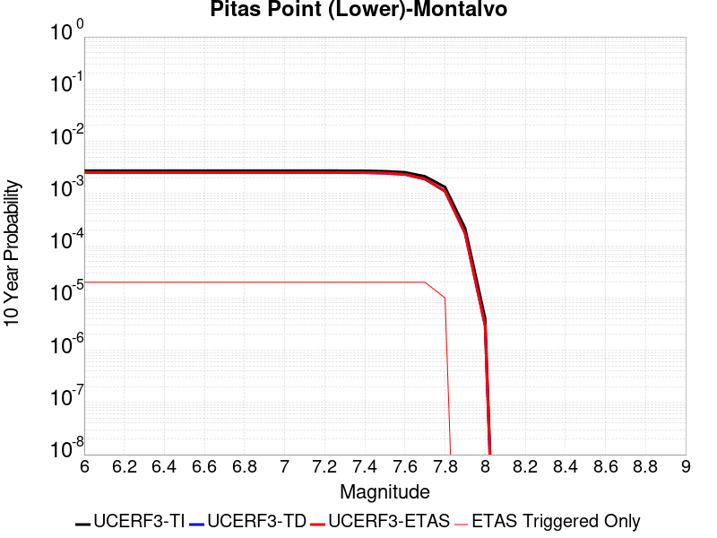 |

| Magnitude | 1 wk TI Prob | 1 wk TD Prob | 1 wk ETAS Prob | 1 wk ETAS/TD Gain | 1 wk ETAS Triggered Only | 1 mo TI Prob | 1 mo TD Prob | 1 mo ETAS Prob | 1 mo ETAS/TD Gain | 1 mo ETAS Triggered Only | 1 yr TI Prob | 1 yr TD Prob | 1 yr ETAS Prob | 1 yr ETAS/TD Gain | 1 yr ETAS Triggered Only | 10 yr TI Prob | 10 yr TD Prob | 10 yr ETAS Prob | 10 yr ETAS/TD Gain | 10 yr ETAS Triggered Only |
|-----|-----|-----|-----|-----|-----|-----|-----|-----|-----|-----|-----|-----|-----|-----|-----|-----|-----|-----|-----|-----|
| 6.0 | 5.2543637E-6 | 4.837943E-6 | 4.837943E-6 | 1.0 | 0.0 | 2.2518509E-5 | 2.0733878E-5 | 2.0733878E-5 | 1.0 | 0.0 | 2.7412834E-4 | 2.5240605E-4 | 2.72401E-4 | 1.0792174 | 2.0E-5 | 0.0027379042 | 0.0025212262 | 0.0025411758 | 1.0079126 | 2.0E-5 |
| 6.1 | 5.2543637E-6 | 4.837943E-6 | 4.837943E-6 | 1.0 | 0.0 | 2.2518509E-5 | 2.0733878E-5 | 2.0733878E-5 | 1.0 | 0.0 | 2.7412834E-4 | 2.5240605E-4 | 2.72401E-4 | 1.0792174 | 2.0E-5 | 0.0027379042 | 0.0025212262 | 0.0025411758 | 1.0079126 | 2.0E-5 |
| 6.2 | 5.2543637E-6 | 4.837943E-6 | 4.837943E-6 | 1.0 | 0.0 | 2.2518509E-5 | 2.0733878E-5 | 2.0733878E-5 | 1.0 | 0.0 | 2.7412834E-4 | 2.5240605E-4 | 2.72401E-4 | 1.0792174 | 2.0E-5 | 0.0027379042 | 0.0025212262 | 0.0025411758 | 1.0079126 | 2.0E-5 |
| 6.3 | 5.2543637E-6 | 4.837943E-6 | 4.837943E-6 | 1.0 | 0.0 | 2.2518509E-5 | 2.0733878E-5 | 2.0733878E-5 | 1.0 | 0.0 | 2.7412834E-4 | 2.5240605E-4 | 2.72401E-4 | 1.0792174 | 2.0E-5 | 0.0027379042 | 0.0025212262 | 0.0025411758 | 1.0079126 | 2.0E-5 |
| 6.4 | 5.2543637E-6 | 4.837943E-6 | 4.837943E-6 | 1.0 | 0.0 | 2.2518509E-5 | 2.0733878E-5 | 2.0733878E-5 | 1.0 | 0.0 | 2.7412834E-4 | 2.5240605E-4 | 2.72401E-4 | 1.0792174 | 2.0E-5 | 0.0027379042 | 0.0025212262 | 0.0025411758 | 1.0079126 | 2.0E-5 |
| 6.5 | 5.2543637E-6 | 4.837943E-6 | 4.837943E-6 | 1.0 | 0.0 | 2.2518509E-5 | 2.0733878E-5 | 2.0733878E-5 | 1.0 | 0.0 | 2.7412834E-4 | 2.5240605E-4 | 2.72401E-4 | 1.0792174 | 2.0E-5 | 0.0027379042 | 0.0025212262 | 0.0025411758 | 1.0079126 | 2.0E-5 |
| 6.6 | 5.2543637E-6 | 4.837943E-6 | 4.837943E-6 | 1.0 | 0.0 | 2.2518509E-5 | 2.0733878E-5 | 2.0733878E-5 | 1.0 | 0.0 | 2.7412834E-4 | 2.5240605E-4 | 2.72401E-4 | 1.0792174 | 2.0E-5 | 0.0027379042 | 0.0025212262 | 0.0025411758 | 1.0079126 | 2.0E-5 |
| 6.7 | 5.2543637E-6 | 4.837943E-6 | 4.837943E-6 | 1.0 | 0.0 | 2.2518509E-5 | 2.0733878E-5 | 2.0733878E-5 | 1.0 | 0.0 | 2.7412834E-4 | 2.5240605E-4 | 2.72401E-4 | 1.0792174 | 2.0E-5 | 0.0027379042 | 0.0025212262 | 0.0025411758 | 1.0079126 | 2.0E-5 |
| 6.8 | 5.2543637E-6 | 4.837943E-6 | 4.837943E-6 | 1.0 | 0.0 | 2.2518509E-5 | 2.0733878E-5 | 2.0733878E-5 | 1.0 | 0.0 | 2.7412834E-4 | 2.5240605E-4 | 2.72401E-4 | 1.0792174 | 2.0E-5 | 0.0027379042 | 0.0025212262 | 0.0025411758 | 1.0079126 | 2.0E-5 |
| 6.9 | 5.2543637E-6 | 4.837943E-6 | 4.837943E-6 | 1.0 | 0.0 | 2.2518509E-5 | 2.0733878E-5 | 2.0733878E-5 | 1.0 | 0.0 | 2.7412834E-4 | 2.5240605E-4 | 2.72401E-4 | 1.0792174 | 2.0E-5 | 0.0027379042 | 0.0025212262 | 0.0025411758 | 1.0079126 | 2.0E-5 |
| 7.0 | 5.2543637E-6 | 4.837943E-6 | 4.837943E-6 | 1.0 | 0.0 | 2.2518509E-5 | 2.0733878E-5 | 2.0733878E-5 | 1.0 | 0.0 | 2.7412834E-4 | 2.5240605E-4 | 2.72401E-4 | 1.0792174 | 2.0E-5 | 0.0027379042 | 0.0025212262 | 0.0025411758 | 1.0079126 | 2.0E-5 |
| 7.1 | 5.2543637E-6 | 4.837943E-6 | 4.837943E-6 | 1.0 | 0.0 | 2.2518509E-5 | 2.0733878E-5 | 2.0733878E-5 | 1.0 | 0.0 | 2.7412834E-4 | 2.5240605E-4 | 2.72401E-4 | 1.0792174 | 2.0E-5 | 0.0027379042 | 0.0025212262 | 0.0025411758 | 1.0079126 | 2.0E-5 |
| 7.2 | 5.2458695E-6 | 4.8290967E-6 | 4.8290967E-6 | 1.0 | 0.0 | 2.2482105E-5 | 2.0695967E-5 | 2.0695967E-5 | 1.0 | 0.0 | 2.7368523E-4 | 2.5194458E-4 | 2.7193953E-4 | 1.0793625 | 2.0E-5 | 0.0027334841 | 0.002516622 | 0.0025365716 | 1.0079272 | 2.0E-5 |
| 7.3 | 5.22665E-6 | 4.809014E-6 | 4.809014E-6 | 1.0 | 0.0 | 2.2399736E-5 | 2.06099E-5 | 2.06099E-5 | 1.0 | 0.0 | 2.7268266E-4 | 2.5089693E-4 | 2.7089193E-4 | 1.079694 | 2.0E-5 | 0.002723483 | 0.0025061693 | 0.0025261191 | 1.0079603 | 2.0E-5 |
| 7.4 | 5.210642E-6 | 4.7922263E-6 | 4.7922263E-6 | 1.0 | 0.0 | 2.233113E-5 | 2.0537953E-5 | 2.0537953E-5 | 1.0 | 0.0 | 2.718476E-4 | 2.500212E-4 | 2.700162E-4 | 1.0799732 | 2.0E-5 | 0.002715153 | 0.0024974316 | 0.0025173815 | 1.0079882 | 2.0E-5 |
| 7.5 | 5.1226016E-6 | 4.700112E-6 | 4.700112E-6 | 1.0 | 0.0 | 2.1953823E-5 | 2.0143185E-5 | 2.0143185E-5 | 1.0 | 0.0 | 2.67255E-4 | 2.4521598E-4 | 2.6521107E-4 | 1.0815407 | 2.0E-5 | 0.0026693381 | 0.0024494857 | 0.0024694367 | 1.008145 | 2.0E-5 |
| 7.6 | 4.8796987E-6 | 4.4450103E-6 | 4.4450103E-6 | 1.0 | 0.0 | 2.0912828E-5 | 1.9049907E-5 | 1.9049907E-5 | 1.0 | 0.0 | 2.5458392E-4 | 2.3190824E-4 | 2.519036E-4 | 1.086221 | 2.0E-5 | 0.0025429246 | 0.0023166928 | 0.0023366467 | 1.008613 | 2.0E-5 |
| 7.7 | 4.0834398E-6 | 3.609176E-6 | 3.609176E-6 | 1.0 | 0.0 | 1.7500339E-5 | 1.5467807E-5 | 1.5467807E-5 | 1.0 | 0.0 | 2.1304579E-4 | 1.883045E-4 | 2.0830074E-4 | 1.1061909 | 2.0E-5 | 0.0021284167 | 0.0018814732 | 0.0019014357 | 1.01061 | 2.0E-5 |
| 7.8 | 2.5445438E-6 | 2.1212754E-6 | 2.1212754E-6 | 1.0 | 0.0 | 1.0905142E-5 | 9.091149E-6 | 9.091149E-6 | 1.0 | 0.0 | 1.3276201E-4 | 1.1067916E-4 | 1.2067806E-4 | 1.0903412 | 1.0E-5 | 0.0013268272 | 0.0011062451 | 0.001116234 | 1.0090296 | 1.0E-5 |
| 7.9 | 4.1677114E-7 | 3.329434E-7 | 3.329434E-7 | 1.0 | 0.0 | 1.7861609E-6 | 1.4268995E-6 | 1.4268995E-6 | 1.0 | 0.0 | 2.1746291E-5 | 1.7372366E-5 | 1.7372366E-5 | 1.0 | 0.0 | 2.1744163E-4 | 1.7371039E-4 | 1.7371039E-4 | 1.0 | 0.0 |
| 8.0 | 7.791402E-9 | 5.6836416E-9 | 5.6836416E-9 | 1.0 | 0.0 | 3.3391725E-8 | 2.4358464E-8 | 2.4358464E-8 | 1.0 | 0.0 | 4.0654416E-7 | 2.9656428E-7 | 2.9656428E-7 | 1.0 | 0.0 | 4.065434E-6 | 2.9656408E-6 | 2.9656408E-6 | 1.0 | 0.0 |

## Channel Islands Western Deep Ramp
*[(top)](#table-of-contents)*

| 1 Week | 1 Month | 1 Year | 10 Year |
|-----|-----|-----|-----|
|  |  |  |  |

| Magnitude | 1 wk TI Prob | 1 wk TD Prob | 1 wk ETAS Prob | 1 wk ETAS/TD Gain | 1 wk ETAS Triggered Only | 1 mo TI Prob | 1 mo TD Prob | 1 mo ETAS Prob | 1 mo ETAS/TD Gain | 1 mo ETAS Triggered Only | 1 yr TI Prob | 1 yr TD Prob | 1 yr ETAS Prob | 1 yr ETAS/TD Gain | 1 yr ETAS Triggered Only | 10 yr TI Prob | 10 yr TD Prob | 10 yr ETAS Prob | 10 yr ETAS/TD Gain | 10 yr ETAS Triggered Only |
|-----|-----|-----|-----|-----|-----|-----|-----|-----|-----|-----|-----|-----|-----|-----|-----|-----|-----|-----|-----|-----|
| 6.0 | 6.0213506E-6 | 6.2549007E-6 | 6.2549007E-6 | 1.0 | 0.0 | 2.5805533E-5 | 2.6806467E-5 | 2.6806467E-5 | 1.0 | 0.0 | 3.1413708E-4 | 3.263243E-4 | 3.3632107E-4 | 1.0306344 | 1.0E-5 | 0.0031369338 | 0.003258893 | 0.0032688605 | 1.0030586 | 1.0E-5 |
| 6.1 | 6.0213506E-6 | 6.2549007E-6 | 6.2549007E-6 | 1.0 | 0.0 | 2.5805533E-5 | 2.6806467E-5 | 2.6806467E-5 | 1.0 | 0.0 | 3.1413708E-4 | 3.263243E-4 | 3.3632107E-4 | 1.0306344 | 1.0E-5 | 0.0031369338 | 0.003258893 | 0.0032688605 | 1.0030586 | 1.0E-5 |
| 6.2 | 6.0213506E-6 | 6.2549007E-6 | 6.2549007E-6 | 1.0 | 0.0 | 2.5805533E-5 | 2.6806467E-5 | 2.6806467E-5 | 1.0 | 0.0 | 3.1413708E-4 | 3.263243E-4 | 3.3632107E-4 | 1.0306344 | 1.0E-5 | 0.0031369338 | 0.003258893 | 0.0032688605 | 1.0030586 | 1.0E-5 |
| 6.3 | 6.0213506E-6 | 6.2549007E-6 | 6.2549007E-6 | 1.0 | 0.0 | 2.5805533E-5 | 2.6806467E-5 | 2.6806467E-5 | 1.0 | 0.0 | 3.1413708E-4 | 3.263243E-4 | 3.3632107E-4 | 1.0306344 | 1.0E-5 | 0.0031369338 | 0.003258893 | 0.0032688605 | 1.0030586 | 1.0E-5 |
| 6.4 | 6.0213506E-6 | 6.2549007E-6 | 6.2549007E-6 | 1.0 | 0.0 | 2.5805533E-5 | 2.6806467E-5 | 2.6806467E-5 | 1.0 | 0.0 | 3.1413708E-4 | 3.263243E-4 | 3.3632107E-4 | 1.0306344 | 1.0E-5 | 0.0031369338 | 0.003258893 | 0.0032688605 | 1.0030586 | 1.0E-5 |
| 6.5 | 6.0213506E-6 | 6.2549007E-6 | 6.2549007E-6 | 1.0 | 0.0 | 2.5805533E-5 | 2.6806467E-5 | 2.6806467E-5 | 1.0 | 0.0 | 3.1413708E-4 | 3.263243E-4 | 3.3632107E-4 | 1.0306344 | 1.0E-5 | 0.0031369338 | 0.003258893 | 0.0032688605 | 1.0030586 | 1.0E-5 |
| 6.6 | 6.0213506E-6 | 6.2549007E-6 | 6.2549007E-6 | 1.0 | 0.0 | 2.5805533E-5 | 2.6806467E-5 | 2.6806467E-5 | 1.0 | 0.0 | 3.1413708E-4 | 3.263243E-4 | 3.3632107E-4 | 1.0306344 | 1.0E-5 | 0.0031369338 | 0.003258893 | 0.0032688605 | 1.0030586 | 1.0E-5 |
| 6.7 | 5.313309E-6 | 5.52527E-6 | 5.52527E-6 | 1.0 | 0.0 | 2.2771126E-5 | 2.3679535E-5 | 2.3679535E-5 | 1.0 | 0.0 | 2.772032E-4 | 2.882643E-4 | 2.982614E-4 | 1.0346804 | 1.0E-5 | 0.0027685766 | 0.002879307 | 0.002889278 | 1.003463 | 1.0E-5 |
| 6.8 | 5.313309E-6 | 5.52527E-6 | 5.52527E-6 | 1.0 | 0.0 | 2.2771126E-5 | 2.3679535E-5 | 2.3679535E-5 | 1.0 | 0.0 | 2.772032E-4 | 2.882643E-4 | 2.982614E-4 | 1.0346804 | 1.0E-5 | 0.0027685766 | 0.002879307 | 0.002889278 | 1.003463 | 1.0E-5 |
| 6.9 | 4.744377E-6 | 4.9394575E-6 | 4.9394575E-6 | 1.0 | 0.0 | 2.0332885E-5 | 2.1168953E-5 | 2.1168953E-5 | 1.0 | 0.0 | 2.4752476E-4 | 2.5770525E-4 | 2.6770268E-4 | 1.038794 | 1.0E-5 | 0.0024724922 | 0.0025744315 | 0.0025844057 | 1.0038743 | 1.0E-5 |
| 7.0 | 4.722209E-6 | 4.9165E-6 | 4.9165E-6 | 1.0 | 0.0 | 2.0237881E-5 | 2.1070566E-5 | 2.1070566E-5 | 1.0 | 0.0 | 2.4636835E-4 | 2.5650766E-4 | 2.665051E-4 | 1.0389752 | 1.0E-5 | 0.002460954 | 0.0025624833 | 0.0025724578 | 1.0038924 | 1.0E-5 |
| 7.1 | 4.611174E-6 | 4.8014354E-6 | 4.8014354E-6 | 1.0 | 0.0 | 1.9762025E-5 | 2.057744E-5 | 2.057744E-5 | 1.0 | 0.0 | 2.4057609E-4 | 2.5050525E-4 | 2.6050274E-4 | 1.0399094 | 1.0E-5 | 0.002403158 | 0.0025025955 | 0.0025125707 | 1.0039859 | 1.0E-5 |
| 7.2 | 4.043994E-6 | 4.21205E-6 | 4.21205E-6 | 1.0 | 0.0 | 1.7331287E-5 | 1.8051538E-5 | 1.8051538E-5 | 1.0 | 0.0 | 2.10988E-4 | 2.1975888E-4 | 2.2975667E-4 | 1.0454944 | 1.0E-5 | 0.002107878 | 0.0021957664 | 0.0022057444 | 1.0045443 | 1.0E-5 |
| 7.3 | 2.1233036E-6 | 2.2298022E-6 | 2.2298022E-6 | 1.0 | 0.0 | 9.099841E-6 | 9.556261E-6 | 9.556261E-6 | 1.0 | 0.0 | 1.1078493E-4 | 1.1634132E-4 | 1.1634132E-4 | 1.0 | 0.0 | 0.0011072971 | 0.0011628097 | 0.0011628097 | 1.0 | 0.0 |
| 7.4 | 1.9051884E-6 | 2.0015107E-6 | 2.0015107E-6 | 1.0 | 0.0 | 8.165067E-6 | 8.577875E-6 | 8.577875E-6 | 1.0 | 0.0 | 9.940516E-5 | 1.0443068E-4 | 1.0443068E-4 | 1.0 | 0.0 | 9.93607E-4 | 0.0010438213 | 0.0010438213 | 1.0 | 0.0 |
| 7.5 | 1.2408497E-6 | 1.3038928E-6 | 1.3038928E-6 | 1.0 | 0.0 | 5.317916E-6 | 5.5880996E-6 | 5.5880996E-6 | 1.0 | 0.0 | 6.4743705E-5 | 6.803301E-5 | 6.803301E-5 | 1.0 | 0.0 | 6.4724847E-4 | 6.8012404E-4 | 6.8012404E-4 | 1.0 | 0.0 |
| 7.6 | 6.5440025E-7 | 6.886766E-7 | 6.886766E-7 | 1.0 | 0.0 | 2.8045695E-6 | 2.9514679E-6 | 2.9514679E-6 | 1.0 | 0.0 | 3.4145098E-5 | 3.5933543E-5 | 3.5933543E-5 | 1.0 | 0.0 | 3.4139853E-4 | 3.5927873E-4 | 3.5927873E-4 | 1.0 | 0.0 |
| 7.7 | 3.985963E-7 | 4.1931077E-7 | 4.1931077E-7 | 1.0 | 0.0 | 1.7082689E-6 | 1.797045E-6 | 1.797045E-6 | 1.0 | 0.0 | 2.0797976E-5 | 2.1878815E-5 | 2.1878815E-5 | 1.0 | 0.0 | 2.0796029E-4 | 2.1876777E-4 | 2.1876777E-4 | 1.0 | 0.0 |
| 7.8 | 3.706329E-8 | 3.8592006E-8 | 3.8592006E-8 | 1.0 | 0.0 | 1.5884267E-7 | 1.653943E-7 | 1.653943E-7 | 1.0 | 0.0 | 1.9339077E-6 | 2.0136738E-6 | 2.0136738E-6 | 1.0 | 0.0 | 1.933891E-5 | 2.0136567E-5 | 2.0136567E-5 | 1.0 | 0.0 |

## Great Valley 08 (Quinto)
*[(top)](#table-of-contents)*

| 1 Week | 1 Month | 1 Year | 10 Year |
|-----|-----|-----|-----|
|  |  |  |  |

| Magnitude | 1 wk TI Prob | 1 wk TD Prob | 1 wk ETAS Prob | 1 wk ETAS/TD Gain | 1 wk ETAS Triggered Only | 1 mo TI Prob | 1 mo TD Prob | 1 mo ETAS Prob | 1 mo ETAS/TD Gain | 1 mo ETAS Triggered Only | 1 yr TI Prob | 1 yr TD Prob | 1 yr ETAS Prob | 1 yr ETAS/TD Gain | 1 yr ETAS Triggered Only | 10 yr TI Prob | 10 yr TD Prob | 10 yr ETAS Prob | 10 yr ETAS/TD Gain | 10 yr ETAS Triggered Only |
|-----|-----|-----|-----|-----|-----|-----|-----|-----|-----|-----|-----|-----|-----|-----|-----|-----|-----|-----|-----|-----|
| 6.0 | 7.737697E-6 | 8.253111E-6 | 8.253111E-6 | 1.0 | 0.0 | 3.3161137E-5 | 3.5370103E-5 | 3.5370103E-5 | 1.0 | 0.0 | 4.0366207E-4 | 4.3056477E-4 | 4.4056046E-4 | 1.0232153 | 1.0E-5 | 0.004029296 | 0.0042991587 | 0.0043091155 | 1.002316 | 1.0E-5 |
| 6.1 | 7.737697E-6 | 8.253111E-6 | 8.253111E-6 | 1.0 | 0.0 | 3.3161137E-5 | 3.5370103E-5 | 3.5370103E-5 | 1.0 | 0.0 | 4.0366207E-4 | 4.3056477E-4 | 4.4056046E-4 | 1.0232153 | 1.0E-5 | 0.004029296 | 0.0042991587 | 0.0043091155 | 1.002316 | 1.0E-5 |
| 6.2 | 7.737697E-6 | 8.253111E-6 | 8.253111E-6 | 1.0 | 0.0 | 3.3161137E-5 | 3.5370103E-5 | 3.5370103E-5 | 1.0 | 0.0 | 4.0366207E-4 | 4.3056477E-4 | 4.4056046E-4 | 1.0232153 | 1.0E-5 | 0.004029296 | 0.0042991587 | 0.0043091155 | 1.002316 | 1.0E-5 |
| 6.3 | 5.374012E-6 | 5.750627E-6 | 5.750627E-6 | 1.0 | 0.0 | 2.3031276E-5 | 2.4645375E-5 | 2.4645375E-5 | 1.0 | 0.0 | 2.803697E-4 | 3.0002726E-4 | 3.0002726E-4 | 1.0 | 0.0 | 0.0028001624 | 0.0029973155 | 0.0029973155 | 1.0 | 0.0 |
| 6.4 | 5.374012E-6 | 5.750627E-6 | 5.750627E-6 | 1.0 | 0.0 | 2.3031276E-5 | 2.4645375E-5 | 2.4645375E-5 | 1.0 | 0.0 | 2.803697E-4 | 3.0002726E-4 | 3.0002726E-4 | 1.0 | 0.0 | 0.0028001624 | 0.0029973155 | 0.0029973155 | 1.0 | 0.0 |
| 6.5 | 3.65427E-6 | 3.941365E-6 | 3.941365E-6 | 1.0 | 0.0 | 1.5661062E-5 | 1.6891494E-5 | 1.6891494E-5 | 1.0 | 0.0 | 1.9065675E-4 | 2.056416E-4 | 2.056416E-4 | 1.0 | 0.0 | 0.0019049325 | 0.0020552047 | 0.0020552047 | 1.0 | 0.0 |
| 6.6 | 3.6143538E-6 | 3.8985513E-6 | 3.8985513E-6 | 1.0 | 0.0 | 1.5489995E-5 | 1.6708009E-5 | 1.6708009E-5 | 1.0 | 0.0 | 1.8857437E-4 | 2.0340808E-4 | 2.0340808E-4 | 1.0 | 0.0 | 0.0018841444 | 0.0020329105 | 0.0020329105 | 1.0 | 0.0 |
| 6.7 | 2.4821015E-6 | 2.685736E-6 | 2.685736E-6 | 1.0 | 0.0 | 1.0637535E-5 | 1.15102785E-5 | 1.15102785E-5 | 1.0 | 0.0 | 1.2950429E-4 | 1.4013429E-4 | 1.4013429E-4 | 1.0 | 0.0 | 0.0012942884 | 0.0014010142 | 0.0014010142 | 1.0 | 0.0 |
| 6.8 | 4.7110538E-7 | 5.1930914E-7 | 5.1930914E-7 | 1.0 | 0.0 | 2.0190216E-6 | 2.2256088E-6 | 2.2256088E-6 | 1.0 | 0.0 | 2.458131E-5 | 2.7096468E-5 | 2.7096468E-5 | 1.0 | 0.0 | 2.457859E-4 | 2.7093347E-4 | 2.7093347E-4 | 1.0 | 0.0 |
| 6.9 | 3.958685E-7 | 4.3704054E-7 | 4.3704054E-7 | 1.0 | 0.0 | 1.6965782E-6 | 1.8730296E-6 | 1.8730296E-6 | 1.0 | 0.0 | 2.0655643E-5 | 2.2803915E-5 | 2.2803915E-5 | 1.0 | 0.0 | 2.0653724E-4 | 2.2801736E-4 | 2.2801736E-4 | 1.0 | 0.0 |
| 7.0 | 2.70294E-7 | 2.9920432E-7 | 2.9920432E-7 | 1.0 | 0.0 | 1.1584025E-6 | 1.2823037E-6 | 1.2823037E-6 | 1.0 | 0.0 | 1.4103458E-5 | 1.561195E-5 | 1.561195E-5 | 1.0 | 0.0 | 1.4102564E-4 | 1.561098E-4 | 1.561098E-4 | 1.0 | 0.0 |
| 7.1 | 1.4828602E-7 | 1.6469349E-7 | 1.6469349E-7 | 1.0 | 0.0 | 6.3551136E-7 | 7.058291E-7 | 7.058291E-7 | 1.0 | 0.0 | 7.737323E-6 | 8.593443E-6 | 8.593443E-6 | 1.0 | 0.0 | 7.737054E-5 | 8.593191E-5 | 8.593191E-5 | 1.0 | 0.0 |

## Northridge
*[(top)](#table-of-contents)*

| 1 Week | 1 Month | 1 Year | 10 Year |
|-----|-----|-----|-----|
|  |  |  | 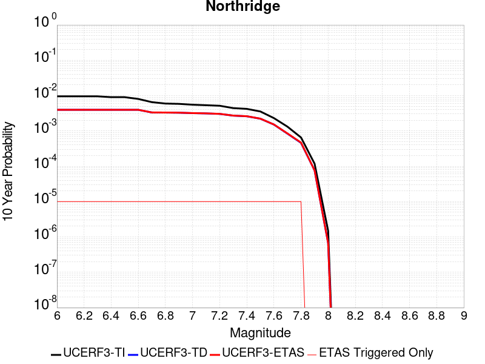 |

| Magnitude | 1 wk TI Prob | 1 wk TD Prob | 1 wk ETAS Prob | 1 wk ETAS/TD Gain | 1 wk ETAS Triggered Only | 1 mo TI Prob | 1 mo TD Prob | 1 mo ETAS Prob | 1 mo ETAS/TD Gain | 1 mo ETAS Triggered Only | 1 yr TI Prob | 1 yr TD Prob | 1 yr ETAS Prob | 1 yr ETAS/TD Gain | 1 yr ETAS Triggered Only | 10 yr TI Prob | 10 yr TD Prob | 10 yr ETAS Prob | 10 yr ETAS/TD Gain | 10 yr ETAS Triggered Only |
|-----|-----|-----|-----|-----|-----|-----|-----|-----|-----|-----|-----|-----|-----|-----|-----|-----|-----|-----|-----|-----|
| 6.0 | 1.8340852E-5 | 7.5880284E-6 | 7.5880284E-6 | 1.0 | 0.0 | 7.860128E-5 | 3.251973E-5 | 3.251973E-5 | 1.0 | 0.0 | 9.565505E-4 | 3.9585796E-4 | 4.05854E-4 | 1.0252516 | 1.0E-5 | 0.009524435 | 0.003951762 | 0.0039617224 | 1.0025206 | 1.0E-5 |
| 6.1 | 1.8340852E-5 | 7.5880284E-6 | 7.5880284E-6 | 1.0 | 0.0 | 7.860128E-5 | 3.251973E-5 | 3.251973E-5 | 1.0 | 0.0 | 9.565505E-4 | 3.9585796E-4 | 4.05854E-4 | 1.0252516 | 1.0E-5 | 0.009524435 | 0.003951762 | 0.0039617224 | 1.0025206 | 1.0E-5 |
| 6.2 | 1.8340852E-5 | 7.5880284E-6 | 7.5880284E-6 | 1.0 | 0.0 | 7.860128E-5 | 3.251973E-5 | 3.251973E-5 | 1.0 | 0.0 | 9.565505E-4 | 3.9585796E-4 | 4.05854E-4 | 1.0252516 | 1.0E-5 | 0.009524435 | 0.003951762 | 0.0039617224 | 1.0025206 | 1.0E-5 |
| 6.3 | 1.8340852E-5 | 7.5880284E-6 | 7.5880284E-6 | 1.0 | 0.0 | 7.860128E-5 | 3.251973E-5 | 3.251973E-5 | 1.0 | 0.0 | 9.565505E-4 | 3.9585796E-4 | 4.05854E-4 | 1.0252516 | 1.0E-5 | 0.009524435 | 0.003951762 | 0.0039617224 | 1.0025206 | 1.0E-5 |
| 6.4 | 1.7361892E-5 | 7.5880284E-6 | 7.5880284E-6 | 1.0 | 0.0 | 7.440598E-5 | 3.251973E-5 | 3.251973E-5 | 1.0 | 0.0 | 9.055163E-4 | 3.9585796E-4 | 4.05854E-4 | 1.0252516 | 1.0E-5 | 0.009018354 | 0.003951762 | 0.0039617224 | 1.0025206 | 1.0E-5 |
| 6.5 | 1.7361892E-5 | 7.5880284E-6 | 7.5880284E-6 | 1.0 | 0.0 | 7.440598E-5 | 3.251973E-5 | 3.251973E-5 | 1.0 | 0.0 | 9.055163E-4 | 3.9585796E-4 | 4.05854E-4 | 1.0252516 | 1.0E-5 | 0.009018354 | 0.003951762 | 0.0039617224 | 1.0025206 | 1.0E-5 |
| 6.6 | 1.5458201E-5 | 7.5880284E-6 | 7.5880284E-6 | 1.0 | 0.0 | 6.624775E-5 | 3.251973E-5 | 3.251973E-5 | 1.0 | 0.0 | 8.0626784E-4 | 3.9585796E-4 | 4.05854E-4 | 1.0252516 | 1.0E-5 | 0.008033488 | 0.003951762 | 0.0039617224 | 1.0025206 | 1.0E-5 |
| 6.7 | 1.2538368E-5 | 6.381612E-6 | 6.381612E-6 | 1.0 | 0.0 | 5.3734755E-5 | 2.734948E-5 | 2.734948E-5 | 1.0 | 0.0 | 6.5402425E-4 | 3.3292949E-4 | 3.4292616E-4 | 1.0300264 | 1.0E-5 | 0.0065210275 | 0.0033243664 | 0.0033343332 | 1.0029981 | 1.0E-5 |
| 6.8 | 1.1438097E-5 | 6.3502694E-6 | 6.3502694E-6 | 1.0 | 0.0 | 4.9019498E-5 | 2.721516E-5 | 2.721516E-5 | 1.0 | 0.0 | 5.9664896E-4 | 3.312946E-4 | 3.412913E-4 | 1.0301746 | 1.0E-5 | 0.005950495 | 0.0033080664 | 0.0033180332 | 1.0030129 | 1.0E-5 |
| 6.9 | 1.1204891E-5 | 6.2867225E-6 | 6.2867225E-6 | 1.0 | 0.0 | 4.8020076E-5 | 2.6942822E-5 | 2.6942822E-5 | 1.0 | 0.0 | 5.8448757E-4 | 3.279799E-4 | 3.379766E-4 | 1.0304797 | 1.0E-5 | 0.0058295266 | 0.0032750175 | 0.0032849847 | 1.0030434 | 1.0E-5 |
| 7.0 | 1.061046E-5 | 6.115376E-6 | 6.115376E-6 | 1.0 | 0.0 | 4.5472607E-5 | 2.6208494E-5 | 2.6208494E-5 | 1.0 | 0.0 | 5.534883E-4 | 3.1904213E-4 | 3.290389E-4 | 1.0313338 | 1.0E-5 | 0.0055211177 | 0.003185887 | 0.003195855 | 1.0031289 | 1.0E-5 |
| 7.1 | 1.0266979E-5 | 6.004295E-6 | 6.004295E-6 | 1.0 | 0.0 | 4.40006E-5 | 2.5732441E-5 | 2.5732441E-5 | 1.0 | 0.0 | 5.355756E-4 | 3.1324785E-4 | 3.2324472E-4 | 1.0319136 | 1.0E-5 | 0.0053428668 | 0.0031281086 | 0.0031380772 | 1.0031868 | 1.0E-5 |
| 7.2 | 9.91273E-6 | 5.820007E-6 | 5.820007E-6 | 1.0 | 0.0 | 4.248244E-5 | 2.494265E-5 | 2.494265E-5 | 1.0 | 0.0 | 5.171009E-4 | 3.0363488E-4 | 3.1363184E-4 | 1.0329243 | 1.0E-5 | 0.0051589934 | 0.0030322452 | 0.0030422148 | 1.0032879 | 1.0E-5 |
| 7.3 | 8.4959265E-6 | 5.193102E-6 | 5.193102E-6 | 1.0 | 0.0 | 3.6410605E-5 | 2.2255961E-5 | 2.2255961E-5 | 1.0 | 0.0 | 4.4320893E-4 | 2.7093288E-4 | 2.8093017E-4 | 1.0368996 | 1.0E-5 | 0.00442326 | 0.002706052 | 0.0027160249 | 1.0036855 | 1.0E-5 |
| 7.4 | 8.0847185E-6 | 4.9819787E-6 | 4.9819787E-6 | 1.0 | 0.0 | 3.4648332E-5 | 2.1351163E-5 | 2.1351163E-5 | 1.0 | 0.0 | 4.2176177E-4 | 2.5991965E-4 | 2.6991704E-4 | 1.0384635 | 1.0E-5 | 0.0042096223 | 0.0025961823 | 0.0026061563 | 1.0038418 | 1.0E-5 |
| 7.5 | 6.8220684E-6 | 4.2533266E-6 | 4.2533266E-6 | 1.0 | 0.0 | 2.9237108E-5 | 1.8228417E-5 | 1.8228417E-5 | 1.0 | 0.0 | 3.5590364E-4 | 2.2190856E-4 | 2.3190635E-4 | 1.0450536 | 1.0E-5 | 0.0035533418 | 0.0022168907 | 0.0022268686 | 1.0045009 | 1.0E-5 |
| 7.6 | 4.4224143E-6 | 2.899968E-6 | 2.899968E-6 | 1.0 | 0.0 | 1.8953066E-5 | 1.2428376E-5 | 1.2428376E-5 | 1.0 | 0.0 | 2.3072914E-4 | 1.5130508E-4 | 1.6130357E-4 | 1.0660816 | 1.0E-5 | 0.0023048974 | 0.0015120322 | 0.0015220172 | 1.0066036 | 1.0E-5 |
| 7.7 | 2.5297056E-6 | 1.6046126E-6 | 1.6046126E-6 | 1.0 | 0.0 | 1.0841551E-5 | 6.8768936E-6 | 6.8768936E-6 | 1.0 | 0.0 | 1.319879E-4 | 8.372301E-5 | 9.372217E-5 | 1.1194315 | 1.0E-5 | 0.0013190953 | 8.3691935E-4 | 8.46911E-4 | 1.0119386 | 1.0E-5 |
| 7.8 | 1.2508156E-6 | 8.7802323E-7 | 8.7802323E-7 | 1.0 | 0.0 | 5.3606273E-6 | 3.7629513E-6 | 3.7629513E-6 | 1.0 | 0.0 | 6.526368E-5 | 4.5812983E-5 | 5.5812525E-5 | 1.2182688 | 1.0E-5 | 6.524452E-4 | 4.5803667E-4 | 4.6803209E-4 | 1.0218223 | 1.0E-5 |
| 7.9 | 2.262199E-7 | 1.4665106E-7 | 1.4665106E-7 | 1.0 | 0.0 | 9.695135E-7 | 6.285044E-7 | 6.285044E-7 | 1.0 | 0.0 | 1.1803763E-5 | 7.652015E-6 | 7.652015E-6 | 1.0 | 0.0 | 1.1803136E-4 | 7.6517594E-5 | 7.6517594E-5 | 1.0 | 0.0 |
| 8.0 | 2.865362E-9 | 1.2753111E-9 | 1.2753111E-9 | 1.0 | 0.0 | 1.2280123E-8 | 5.465619E-9 | 5.465619E-9 | 1.0 | 0.0 | 1.4951048E-7 | 6.654391E-8 | 6.654391E-8 | 1.0 | 0.0 | 1.4951038E-6 | 6.6543913E-7 | 6.6543913E-7 | 1.0 | 0.0 |

## Peralta Hills
*[(top)](#table-of-contents)*

| 1 Week | 1 Month | 1 Year | 10 Year |
|-----|-----|-----|-----|
|  |  |  |  |

| Magnitude | 1 wk TI Prob | 1 wk TD Prob | 1 wk ETAS Prob | 1 wk ETAS/TD Gain | 1 wk ETAS Triggered Only | 1 mo TI Prob | 1 mo TD Prob | 1 mo ETAS Prob | 1 mo ETAS/TD Gain | 1 mo ETAS Triggered Only | 1 yr TI Prob | 1 yr TD Prob | 1 yr ETAS Prob | 1 yr ETAS/TD Gain | 1 yr ETAS Triggered Only | 10 yr TI Prob | 10 yr TD Prob | 10 yr ETAS Prob | 10 yr ETAS/TD Gain | 10 yr ETAS Triggered Only |
|-----|-----|-----|-----|-----|-----|-----|-----|-----|-----|-----|-----|-----|-----|-----|-----|-----|-----|-----|-----|-----|
| 6.0 | 3.8850067E-6 | 3.839569E-6 | 3.839569E-6 | 1.0 | 0.0 | 1.6649923E-5 | 1.6455235E-5 | 1.6455235E-5 | 1.0 | 0.0 | 2.0269395E-4 | 2.0033147E-4 | 2.0033147E-4 | 1.0 | 0.0 | 0.0020250916 | 0.0020022364 | 0.0020122165 | 1.0049844 | 1.0E-5 |
| 6.1 | 3.8850067E-6 | 3.839569E-6 | 3.839569E-6 | 1.0 | 0.0 | 1.6649923E-5 | 1.6455235E-5 | 1.6455235E-5 | 1.0 | 0.0 | 2.0269395E-4 | 2.0033147E-4 | 2.0033147E-4 | 1.0 | 0.0 | 0.0020250916 | 0.0020022364 | 0.0020122165 | 1.0049844 | 1.0E-5 |
| 6.2 | 3.8850067E-6 | 3.839569E-6 | 3.839569E-6 | 1.0 | 0.0 | 1.6649923E-5 | 1.6455235E-5 | 1.6455235E-5 | 1.0 | 0.0 | 2.0269395E-4 | 2.0033147E-4 | 2.0033147E-4 | 1.0 | 0.0 | 0.0020250916 | 0.0020022364 | 0.0020122165 | 1.0049844 | 1.0E-5 |
| 6.3 | 3.8850067E-6 | 3.839569E-6 | 3.839569E-6 | 1.0 | 0.0 | 1.6649923E-5 | 1.6455235E-5 | 1.6455235E-5 | 1.0 | 0.0 | 2.0269395E-4 | 2.0033147E-4 | 2.0033147E-4 | 1.0 | 0.0 | 0.0020250916 | 0.0020022364 | 0.0020122165 | 1.0049844 | 1.0E-5 |
| 6.4 | 3.8850067E-6 | 3.839569E-6 | 3.839569E-6 | 1.0 | 0.0 | 1.6649923E-5 | 1.6455235E-5 | 1.6455235E-5 | 1.0 | 0.0 | 2.0269395E-4 | 2.0033147E-4 | 2.0033147E-4 | 1.0 | 0.0 | 0.0020250916 | 0.0020022364 | 0.0020122165 | 1.0049844 | 1.0E-5 |
| 6.5 | 1.5587785E-6 | 1.4431273E-6 | 1.4431273E-6 | 1.0 | 0.0 | 6.6804623E-6 | 6.184818E-6 | 6.184818E-6 | 1.0 | 0.0 | 8.133159E-5 | 7.52978E-5 | 7.52978E-5 | 1.0 | 0.0 | 8.1301836E-4 | 7.527469E-4 | 7.527469E-4 | 1.0 | 0.0 |
| 6.6 | 1.5587785E-6 | 1.4431273E-6 | 1.4431273E-6 | 1.0 | 0.0 | 6.6804623E-6 | 6.184818E-6 | 6.184818E-6 | 1.0 | 0.0 | 8.133159E-5 | 7.52978E-5 | 7.52978E-5 | 1.0 | 0.0 | 8.1301836E-4 | 7.527469E-4 | 7.527469E-4 | 1.0 | 0.0 |
| 6.7 | 1.5018579E-6 | 1.3837496E-6 | 1.3837496E-6 | 1.0 | 0.0 | 6.436518E-6 | 5.930343E-6 | 5.930343E-6 | 1.0 | 0.0 | 7.836179E-5 | 7.219978E-5 | 7.219978E-5 | 1.0 | 0.0 | 7.833416E-4 | 7.2178675E-4 | 7.2178675E-4 | 1.0 | 0.0 |
| 6.8 | 1.4584314E-6 | 1.3381814E-6 | 1.3381814E-6 | 1.0 | 0.0 | 6.250405E-6 | 5.7350517E-6 | 5.7350517E-6 | 1.0 | 0.0 | 7.6096025E-5 | 6.982226E-5 | 6.982226E-5 | 1.0 | 0.0 | 7.6069974E-4 | 6.980266E-4 | 6.980266E-4 | 1.0 | 0.0 |
| 6.9 | 1.1382393E-6 | 9.862607E-7 | 9.862607E-7 | 1.0 | 0.0 | 4.8781594E-6 | 4.2268252E-6 | 4.2268252E-6 | 1.0 | 0.0 | 5.9389975E-5 | 5.1460465E-5 | 5.1460465E-5 | 1.0 | 0.0 | 5.93741E-4 | 5.1449373E-4 | 5.1449373E-4 | 1.0 | 0.0 |
| 7.0 | 9.970413E-7 | 8.3098894E-7 | 8.3098894E-7 | 1.0 | 0.0 | 4.273027E-6 | 3.5613768E-6 | 3.5613768E-6 | 1.0 | 0.0 | 5.2022864E-5 | 4.3358967E-5 | 4.3358967E-5 | 1.0 | 0.0 | 5.2010687E-4 | 4.335119E-4 | 4.335119E-4 | 1.0 | 0.0 |
| 7.1 | 9.684443E-7 | 7.9943277E-7 | 7.9943277E-7 | 1.0 | 0.0 | 4.150469E-6 | 3.4261363E-6 | 3.4261363E-6 | 1.0 | 0.0 | 5.053079E-5 | 4.1712483E-5 | 4.1712483E-5 | 1.0 | 0.0 | 5.05193E-4 | 4.1705323E-4 | 4.1705323E-4 | 1.0 | 0.0 |
| 7.2 | 9.240811E-7 | 7.5033756E-7 | 7.5033756E-7 | 1.0 | 0.0 | 3.960342E-6 | 3.2157288E-6 | 3.2157288E-6 | 1.0 | 0.0 | 4.8216094E-5 | 3.9150862E-5 | 3.9150862E-5 | 1.0 | 0.0 | 4.8205635E-4 | 3.914462E-4 | 3.914462E-4 | 1.0 | 0.0 |
| 7.3 | 8.158643E-7 | 6.3502046E-7 | 6.3502046E-7 | 1.0 | 0.0 | 3.4965567E-6 | 2.7215137E-6 | 2.7215137E-6 | 1.0 | 0.0 | 4.2569747E-5 | 3.3133987E-5 | 3.3133987E-5 | 1.0 | 0.0 | 4.2561593E-4 | 3.3129661E-4 | 3.3129661E-4 | 1.0 | 0.0 |
| 7.4 | 6.3822824E-7 | 4.795852E-7 | 4.795852E-7 | 1.0 | 0.0 | 2.7352612E-6 | 2.055364E-6 | 2.055364E-6 | 1.0 | 0.0 | 3.3301294E-5 | 2.502382E-5 | 2.502382E-5 | 1.0 | 0.0 | 3.3296304E-4 | 2.5021518E-4 | 2.5021518E-4 | 1.0 | 0.0 |
| 7.5 | 4.0292628E-7 | 2.7847406E-7 | 2.7847406E-7 | 1.0 | 0.0 | 1.7268258E-6 | 1.1934599E-6 | 1.1934599E-6 | 1.0 | 0.0 | 2.1023901E-5 | 1.4530305E-5 | 1.4530305E-5 | 1.0 | 0.0 | 2.1021912E-4 | 1.4529635E-4 | 1.4529635E-4 | 1.0 | 0.0 |
| 7.6 | 3.672993E-7 | 2.485613E-7 | 2.485613E-7 | 1.0 | 0.0 | 1.5741389E-6 | 1.0652625E-6 | 1.0652625E-6 | 1.0 | 0.0 | 1.9164972E-5 | 1.2969521E-5 | 1.2969521E-5 | 1.0 | 0.0 | 1.916332E-4 | 1.2969035E-4 | 1.2969035E-4 | 1.0 | 0.0 |
| 7.7 | 2.8466823E-7 | 1.786064E-7 | 1.786064E-7 | 1.0 | 0.0 | 1.2200061E-6 | 7.654559E-7 | 7.654559E-7 | 1.0 | 0.0 | 1.4853474E-5 | 9.319412E-6 | 9.319412E-6 | 1.0 | 0.0 | 1.485248E-4 | 9.3192815E-5 | 9.3192815E-5 | 1.0 | 0.0 |

## Calaveras (So) - Paicines extension 2011 CFM
*[(top)](#table-of-contents)*

| 1 Week | 1 Month | 1 Year | 10 Year |
|-----|-----|-----|-----|
|  |  |  | 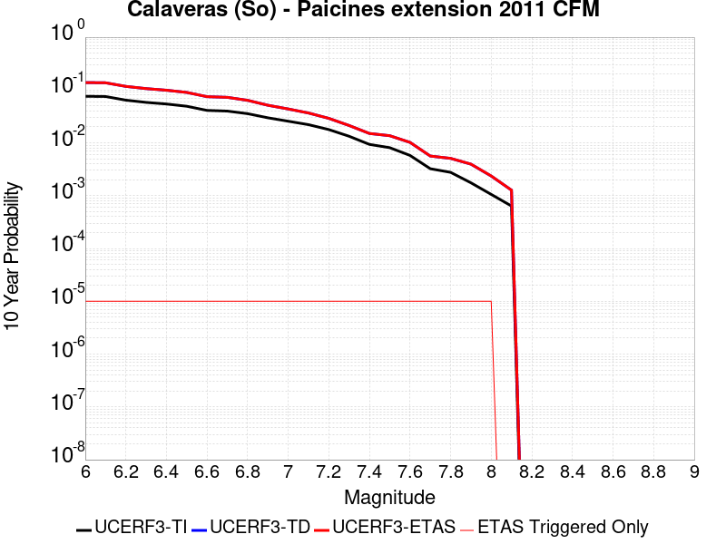 |

| Magnitude | 1 wk TI Prob | 1 wk TD Prob | 1 wk ETAS Prob | 1 wk ETAS/TD Gain | 1 wk ETAS Triggered Only | 1 mo TI Prob | 1 mo TD Prob | 1 mo ETAS Prob | 1 mo ETAS/TD Gain | 1 mo ETAS Triggered Only | 1 yr TI Prob | 1 yr TD Prob | 1 yr ETAS Prob | 1 yr ETAS/TD Gain | 1 yr ETAS Triggered Only | 10 yr TI Prob | 10 yr TD Prob | 10 yr ETAS Prob | 10 yr ETAS/TD Gain | 10 yr ETAS Triggered Only |
|-----|-----|-----|-----|-----|-----|-----|-----|-----|-----|-----|-----|-----|-----|-----|-----|-----|-----|-----|-----|-----|
| 6.0 | 1.5183659E-4 | 3.0524618E-4 | 3.0524618E-4 | 1.0 | 0.0 | 6.5056595E-4 | 0.001306982 | 0.001306982 | 1.0 | 0.0 | 0.007891912 | 0.015698127 | 0.015698127 | 1.0 | 0.0 | 0.076174594 | 0.13851054 | 0.13851915 | 1.0000622 | 1.0E-5 |
| 6.1 | 1.5024997E-4 | 3.0218763E-4 | 3.0218763E-4 | 1.0 | 0.0 | 6.437695E-4 | 0.001293891 | 0.001293891 | 1.0 | 0.0 | 0.0078097614 | 0.0155415125 | 0.0155415125 | 1.0 | 0.0 | 0.075409345 | 0.1371801 | 0.13718873 | 1.000063 | 1.0E-5 |
| 6.2 | 1.2743923E-4 | 2.5316005E-4 | 2.5316005E-4 | 1.0 | 0.0 | 5.460538E-4 | 0.0010841485 | 0.0010841485 | 1.0 | 0.0 | 0.0066279583 | 0.013048763 | 0.013048763 | 1.0 | 0.0 | 0.064337276 | 0.11727778 | 0.11728661 | 1.0000752 | 1.0E-5 |
| 6.3 | 1.1525114E-4 | 2.2602278E-4 | 2.2602278E-4 | 1.0 | 0.0 | 4.9383997E-4 | 9.680288E-4 | 9.680288E-4 | 1.0 | 0.0 | 0.0059959386 | 0.011669963 | 0.011669963 | 1.0 | 0.0 | 0.058367174 | 0.10639406 | 0.10640299 | 1.000084 | 1.0E-5 |
| 6.4 | 1.07200925E-4 | 2.0843073E-4 | 2.0843073E-4 | 1.0 | 0.0 | 4.5935164E-4 | 8.9276396E-4 | 8.9276396E-4 | 1.0 | 0.0 | 0.0055782744 | 0.010774835 | 0.010774835 | 1.0 | 0.0 | 0.0544031 | 0.09921681 | 0.09922582 | 1.0000908 | 1.0E-5 |
| 6.5 | 9.69631E-5 | 1.8736755E-4 | 1.8736755E-4 | 1.0 | 0.0 | 4.1548995E-4 | 8.026078E-4 | 8.026078E-4 | 1.0 | 0.0 | 0.0050468626 | 0.009696688 | 0.009696688 | 1.0 | 0.0 | 0.04933773 | 0.09010862 | 0.090117715 | 1.000101 | 1.0E-5 |
| 6.6 | 8.0552316E-5 | 1.5074162E-4 | 1.5074162E-4 | 1.0 | 0.0 | 3.4517853E-4 | 6.458456E-4 | 6.458456E-4 | 1.0 | 0.0 | 0.0041944524 | 0.007828356 | 0.007828356 | 1.0 | 0.0 | 0.04116161 | 0.07487867 | 0.074887924 | 1.0001235 | 1.0E-5 |
| 6.7 | 7.815757E-5 | 1.4614697E-4 | 1.4614697E-4 | 1.0 | 0.0 | 3.34918E-4 | 6.2616763E-4 | 6.2616763E-4 | 1.0 | 0.0 | 0.004070005 | 0.007591149 | 0.007591149 | 1.0 | 0.0 | 0.039962657 | 0.07272815 | 0.072737426 | 1.0001276 | 1.0E-5 |
| 6.8 | 6.965264E-5 | 1.2726107E-4 | 1.2726107E-4 | 1.0 | 0.0 | 2.9847719E-4 | 5.452736E-4 | 5.452736E-4 | 1.0 | 0.0 | 0.0036279052 | 0.00661528 | 0.00661528 | 1.0 | 0.0 | 0.03569247 | 0.06382228 | 0.063831635 | 1.0001466 | 1.0E-5 |
| 6.9 | 5.8000453E-5 | 1.0146304E-4 | 1.0146304E-4 | 1.0 | 0.0 | 2.4854968E-4 | 4.3476955E-4 | 4.3476955E-4 | 1.0 | 0.0 | 0.0030218933 | 0.0052805697 | 0.0052805697 | 1.0 | 0.0 | 0.029811295 | 0.05151412 | 0.051523603 | 1.0001842 | 1.0E-5 |
| 7.0 | 4.9865852E-5 | 8.570392E-5 | 8.570392E-5 | 1.0 | 0.0 | 2.1369329E-4 | 3.6725128E-4 | 3.6725128E-4 | 1.0 | 0.0 | 0.0025986114 | 0.0044622063 | 0.0044622063 | 1.0 | 0.0 | 0.025684336 | 0.043793347 | 0.04380291 | 1.0002184 | 1.0E-5 |
| 7.1 | 4.283875E-5 | 7.114092E-5 | 7.114092E-5 | 1.0 | 0.0 | 1.8358172E-4 | 3.0485436E-4 | 3.0485436E-4 | 1.0 | 0.0 | 0.0022328163 | 0.0037053414 | 0.0037053414 | 1.0 | 0.0 | 0.022105146 | 0.036744222 | 0.036753856 | 1.0002621 | 1.0E-5 |
| 7.2 | 3.450115E-5 | 5.5794262E-5 | 5.5794262E-5 | 1.0 | 0.0 | 1.478537E-4 | 2.3909652E-4 | 2.3909652E-4 | 1.0 | 0.0 | 0.0017986323 | 0.0029071432 | 0.0029071432 | 1.0 | 0.0 | 0.017841442 | 0.029087404 | 0.029097112 | 1.0003338 | 1.0E-5 |
| 7.3 | 2.5709045E-5 | 4.060424E-5 | 4.060424E-5 | 1.0 | 0.0 | 1.1017697E-4 | 1.7400667E-4 | 1.7400667E-4 | 1.0 | 0.0 | 0.0013405791 | 0.0021164897 | 0.0021164897 | 1.0 | 0.0 | 0.013325208 | 0.021304648 | 0.021314437 | 1.0004594 | 1.0E-5 |
| 7.4 | 1.8003093E-5 | 2.8519447E-5 | 2.8519447E-5 | 1.0 | 0.0 | 7.715383E-5 | 1.2222049E-4 | 1.2222049E-4 | 1.0 | 0.0 | 9.3894306E-4 | 0.0014870211 | 0.0014870211 | 1.0 | 0.0 | 0.009349857 | 0.015055191 | 0.01506504 | 1.0006542 | 1.0E-5 |
| 7.5 | 1.5595824E-5 | 2.5831554E-5 | 2.5831554E-5 | 1.0 | 0.0 | 6.683753E-5 | 1.1070197E-4 | 1.1070197E-4 | 1.0 | 0.0 | 8.134431E-4 | 0.0013469654 | 0.0013469654 | 1.0 | 0.0 | 0.008104719 | 0.013655182 | 0.013665046 | 1.0007223 | 1.0E-5 |
| 7.6 | 1.1110309E-5 | 1.9230012E-5 | 1.9230012E-5 | 1.0 | 0.0 | 4.761474E-5 | 8.241174E-5 | 8.241174E-5 | 1.0 | 0.0 | 5.795553E-4 | 0.0010029024 | 0.0010029024 | 1.0 | 0.0 | 0.0057804612 | 0.010206583 | 0.010216481 | 1.0009698 | 1.0E-5 |
| 7.7 | 6.2140443E-6 | 1.04432265E-5 | 1.04432265E-5 | 1.0 | 0.0 | 2.6631347E-5 | 4.4755914E-5 | 4.4755914E-5 | 1.0 | 0.0 | 3.241884E-4 | 5.447671E-4 | 5.447671E-4 | 1.0 | 0.0 | 0.0032371588 | 0.0056228107 | 0.0056327544 | 1.0017685 | 1.0E-5 |
| 7.8 | 5.305533E-6 | 9.438617E-6 | 9.438617E-6 | 1.0 | 0.0 | 2.27378E-5 | 4.0450588E-5 | 4.0450588E-5 | 1.0 | 0.0 | 2.7679754E-4 | 4.923747E-4 | 4.923747E-4 | 1.0 | 0.0 | 0.0027645302 | 0.005077038 | 0.005086987 | 1.0019597 | 1.0E-5 |
| 7.9 | 3.363505E-6 | 7.389195E-6 | 7.389195E-6 | 1.0 | 0.0 | 1.4414942E-5 | 3.1667594E-5 | 3.1667594E-5 | 1.0 | 0.0 | 1.7548777E-4 | 3.8548483E-4 | 3.8548483E-4 | 1.0 | 0.0 | 0.0017534926 | 0.0039506406 | 0.003960601 | 1.0025213 | 1.0E-5 |
| 8.0 | 2.0271132E-6 | 4.4155477E-6 | 4.4155477E-6 | 1.0 | 0.0 | 8.687599E-6 | 1.8923638E-5 | 1.8923638E-5 | 1.0 | 0.0 | 1.05766376E-4 | 2.3037099E-4 | 2.3037099E-4 | 1.0 | 0.0 | 0.0010571606 | 0.0023523099 | 0.0023622864 | 1.0042411 | 1.0E-5 |
| 8.1 | 1.2206116E-6 | 2.3764833E-6 | 2.3764833E-6 | 1.0 | 0.0 | 5.2311816E-6 | 1.0184889E-5 | 1.0184889E-5 | 1.0 | 0.0 | 6.3687774E-5 | 1.23994E-4 | 1.23994E-4 | 1.0 | 0.0 | 6.366953E-4 | 0.0012712508 | 0.0012712508 | 1.0 | 0.0 |

## Calaveras (No) 2011 CFM
*[(top)](#table-of-contents)*

| 1 Week | 1 Month | 1 Year | 10 Year |
|-----|-----|-----|-----|
|  |  |  |  |

| Magnitude | 1 wk TI Prob | 1 wk TD Prob | 1 wk ETAS Prob | 1 wk ETAS/TD Gain | 1 wk ETAS Triggered Only | 1 mo TI Prob | 1 mo TD Prob | 1 mo ETAS Prob | 1 mo ETAS/TD Gain | 1 mo ETAS Triggered Only | 1 yr TI Prob | 1 yr TD Prob | 1 yr ETAS Prob | 1 yr ETAS/TD Gain | 1 yr ETAS Triggered Only | 10 yr TI Prob | 10 yr TD Prob | 10 yr ETAS Prob | 10 yr ETAS/TD Gain | 10 yr ETAS Triggered Only |
|-----|-----|-----|-----|-----|-----|-----|-----|-----|-----|-----|-----|-----|-----|-----|-----|-----|-----|-----|-----|-----|
| 6.0 | 4.8694856E-5 | 6.748359E-5 | 6.748359E-5 | 1.0 | 0.0 | 2.0867554E-4 | 2.8918422E-4 | 2.9918132E-4 | 1.03457 | 1.0E-5 | 0.0025376645 | 0.0035151443 | 0.003525109 | 1.0028348 | 1.0E-5 | 0.02508881 | 0.034776997 | 0.03478665 | 1.0002775 | 1.0E-5 |
| 6.1 | 4.8694856E-5 | 6.748359E-5 | 6.748359E-5 | 1.0 | 0.0 | 2.0867554E-4 | 2.8918422E-4 | 2.9918132E-4 | 1.03457 | 1.0E-5 | 0.0025376645 | 0.0035151443 | 0.003525109 | 1.0028348 | 1.0E-5 | 0.02508881 | 0.034776997 | 0.03478665 | 1.0002775 | 1.0E-5 |
| 6.2 | 4.7541962E-5 | 6.5814726E-5 | 6.5814726E-5 | 1.0 | 0.0 | 2.0373536E-4 | 2.820335E-4 | 2.9203066E-4 | 1.0354468 | 1.0E-5 | 0.0024776561 | 0.0034283816 | 0.0034383473 | 1.0029068 | 1.0E-5 | 0.024502134 | 0.033938386 | 0.033948045 | 1.0002847 | 1.0E-5 |
| 6.3 | 4.6717287E-5 | 6.464825E-5 | 6.464825E-5 | 1.0 | 0.0 | 2.0020158E-4 | 2.7703537E-4 | 2.8703263E-4 | 1.0360864 | 1.0E-5 | 0.0024347296 | 0.0033677295 | 0.0033776958 | 1.0029594 | 1.0E-5 | 0.024082264 | 0.033350844 | 0.03336051 | 1.0002898 | 1.0E-5 |
| 6.4 | 4.6276386E-5 | 6.400986E-5 | 6.400986E-5 | 1.0 | 0.0 | 1.983123E-4 | 2.7430017E-4 | 2.8429742E-4 | 1.0364465 | 1.0E-5 | 0.0024117786 | 0.0033345383 | 0.003344505 | 1.0029889 | 1.0E-5 | 0.02385771 | 0.0330297 | 0.033039372 | 1.0002928 | 1.0E-5 |
| 6.5 | 4.5720994E-5 | 6.321128E-5 | 6.321128E-5 | 1.0 | 0.0 | 1.9593239E-4 | 2.708784E-4 | 2.808757E-4 | 1.036907 | 1.0E-5 | 0.002382867 | 0.003293015 | 0.003302982 | 1.0030267 | 1.0E-5 | 0.023574775 | 0.032627642 | 0.032637317 | 1.0002965 | 1.0E-5 |
| 6.6 | 4.549134E-5 | 6.286434E-5 | 6.286434E-5 | 1.0 | 0.0 | 1.949483E-4 | 2.6939184E-4 | 2.7938912E-4 | 1.0371107 | 1.0E-5 | 0.0023709119 | 0.0032749705 | 0.0032849377 | 1.0030434 | 1.0E-5 | 0.023457756 | 0.03245311 | 0.032462783 | 1.0002981 | 1.0E-5 |
| 6.7 | 3.701047E-5 | 5.0368857E-5 | 5.0368857E-5 | 1.0 | 0.0 | 1.5860666E-4 | 2.1584891E-4 | 2.1584891E-4 | 1.0 | 0.0 | 0.0019293258 | 0.0026248368 | 0.0026248368 | 1.0 | 0.0 | 0.019126613 | 0.026130732 | 0.026130732 | 1.0 | 0.0 |
| 6.8 | 3.5523568E-5 | 4.8350328E-5 | 4.8350328E-5 | 1.0 | 0.0 | 1.5223498E-4 | 2.0719947E-4 | 2.0719947E-4 | 1.0 | 0.0 | 0.0018518851 | 0.0025197782 | 0.0025197782 | 1.0 | 0.0 | 0.018365284 | 0.025102912 | 0.025102912 | 1.0 | 0.0 |
| 6.9 | 3.2946147E-5 | 4.4671797E-5 | 4.4671797E-5 | 1.0 | 0.0 | 1.4119013E-4 | 1.9143675E-4 | 1.9143675E-4 | 1.0 | 0.0 | 0.0017176344 | 0.0023282932 | 0.0023282932 | 1.0 | 0.0 | 0.017044188 | 0.023225054 | 0.023225054 | 1.0 | 0.0 |
| 7.0 | 2.7682381E-5 | 3.7031044E-5 | 3.7031044E-5 | 1.0 | 0.0 | 1.1863338E-4 | 1.58695E-4 | 1.58695E-4 | 1.0 | 0.0 | 0.0014434044 | 0.0019304295 | 0.0019304295 | 1.0 | 0.0 | 0.01434065 | 0.019316213 | 0.019316213 | 1.0 | 0.0 |
| 7.1 | 2.471967E-5 | 3.3295233E-5 | 3.3295233E-5 | 1.0 | 0.0 | 1.05937135E-4 | 1.4268621E-4 | 1.4268621E-4 | 1.0 | 0.0 | 0.0012890215 | 0.0017358493 | 0.0017358493 | 1.0 | 0.0 | 0.0128157 | 0.01739126 | 0.01739126 | 1.0 | 0.0 |
| 7.2 | 1.9748062E-5 | 2.6782902E-5 | 2.6782902E-5 | 1.0 | 0.0 | 8.463181E-5 | 1.1477895E-4 | 1.1477895E-4 | 1.0 | 0.0 | 0.0010299052 | 0.0013965614 | 0.0013965614 | 1.0 | 0.0 | 0.01025145 | 0.014035836 | 0.014035836 | 1.0 | 0.0 |
| 7.3 | 1.1603734E-5 | 1.5791325E-5 | 1.5791325E-5 | 1.0 | 0.0 | 4.9729337E-5 | 6.7675435E-5 | 6.7675435E-5 | 1.0 | 0.0 | 6.052865E-4 | 8.2365115E-4 | 8.2365115E-4 | 1.0 | 0.0 | 0.0060364045 | 0.008313275 | 0.008313275 | 1.0 | 0.0 |
| 7.4 | 4.885381E-6 | 6.0365387E-6 | 6.0365387E-6 | 1.0 | 0.0 | 2.0937177E-5 | 2.5870624E-5 | 2.5870624E-5 | 1.0 | 0.0 | 2.5488032E-4 | 3.149295E-4 | 3.149295E-4 | 1.0 | 0.0 | 0.0025458818 | 0.003201541 | 0.003201541 | 1.0 | 0.0 |
| 7.5 | 3.0571264E-6 | 4.1567723E-6 | 4.1567723E-6 | 1.0 | 0.0 | 1.3101904E-5 | 1.7814618E-5 | 1.7814618E-5 | 1.0 | 0.0 | 1.5950401E-4 | 2.1687149E-4 | 2.1687149E-4 | 1.0 | 0.0 | 0.0015938957 | 0.0022215473 | 0.0022215473 | 1.0 | 0.0 |
| 7.6 | 1.764948E-6 | 2.7969365E-6 | 2.7969365E-6 | 1.0 | 0.0 | 7.564041E-6 | 1.1986816E-5 | 1.1986816E-5 | 1.0 | 0.0 | 9.208831E-5 | 1.459298E-4 | 1.459298E-4 | 1.0 | 0.0 | 9.205016E-4 | 0.0015129976 | 0.0015129976 | 1.0 | 0.0 |
| 7.7 | 1.3173734E-6 | 2.0596685E-6 | 2.0596685E-6 | 1.0 | 0.0 | 5.645874E-6 | 8.827121E-6 | 8.827121E-6 | 1.0 | 0.0 | 6.873634E-5 | 1.0746492E-4 | 1.0746492E-4 | 1.0 | 0.0 | 6.8715087E-4 | 0.0011266777 | 0.0011266777 | 1.0 | 0.0 |
| 7.8 | 9.4429885E-7 | 1.5498983E-6 | 1.5498983E-6 | 1.0 | 0.0 | 4.0469886E-6 | 6.6424045E-6 | 6.6424045E-6 | 1.0 | 0.0 | 4.9270973E-5 | 8.086829E-5 | 8.086829E-5 | 1.0 | 0.0 | 4.926005E-4 | 8.505722E-4 | 8.505722E-4 | 1.0 | 0.0 |
| 7.9 | 6.388233E-7 | 1.1155465E-6 | 1.1155465E-6 | 1.0 | 0.0 | 2.7378112E-6 | 4.7809053E-6 | 4.7809053E-6 | 1.0 | 0.0 | 3.3332344E-5 | 5.8205977E-5 | 5.8205977E-5 | 1.0 | 0.0 | 3.3327343E-4 | 6.0994574E-4 | 6.0994574E-4 | 1.0 | 0.0 |
| 8.0 | 3.087986E-7 | 5.7578336E-7 | 5.7578336E-7 | 1.0 | 0.0 | 1.323422E-6 | 2.4676406E-6 | 2.4676406E-6 | 1.0 | 0.0 | 1.6112543E-5 | 3.0043113E-5 | 3.0043113E-5 | 1.0 | 0.0 | 1.6111376E-4 | 3.1119218E-4 | 3.1119218E-4 | 1.0 | 0.0 |
| 8.1 | 1.6725647E-7 | 2.7427478E-7 | 2.7427478E-7 | 1.0 | 0.0 | 7.168133E-7 | 1.1754629E-6 | 1.1754629E-6 | 1.0 | 0.0 | 8.7271665E-6 | 1.4311168E-5 | 1.4311168E-5 | 1.0 | 0.0 | 8.726824E-5 | 1.4857268E-4 | 1.4857268E-4 | 1.0 | 0.0 |

## Concord 2011 CFM
*[(top)](#table-of-contents)*

| 1 Week | 1 Month | 1 Year | 10 Year |
|-----|-----|-----|-----|
| 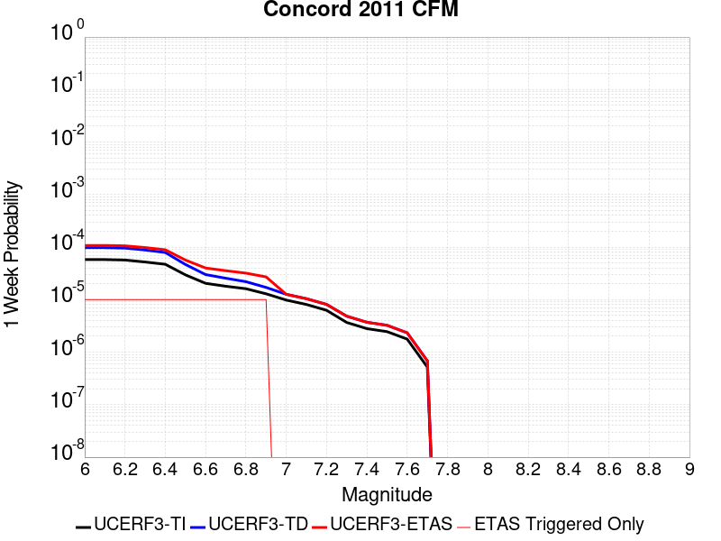 |  |  |  |

| Magnitude | 1 wk TI Prob | 1 wk TD Prob | 1 wk ETAS Prob | 1 wk ETAS/TD Gain | 1 wk ETAS Triggered Only | 1 mo TI Prob | 1 mo TD Prob | 1 mo ETAS Prob | 1 mo ETAS/TD Gain | 1 mo ETAS Triggered Only | 1 yr TI Prob | 1 yr TD Prob | 1 yr ETAS Prob | 1 yr ETAS/TD Gain | 1 yr ETAS Triggered Only | 10 yr TI Prob | 10 yr TD Prob | 10 yr ETAS Prob | 10 yr ETAS/TD Gain | 10 yr ETAS Triggered Only |
|-----|-----|-----|-----|-----|-----|-----|-----|-----|-----|-----|-----|-----|-----|-----|-----|-----|-----|-----|-----|-----|
| 6.0 | 5.7865112E-5 | 9.7586984E-5 | 1.07586005E-4 | 1.1024626 | 1.0E-5 | 2.4796976E-4 | 4.1816765E-4 | 4.2816348E-4 | 1.0239038 | 1.0E-5 | 0.0030148525 | 0.0050798147 | 0.0050897636 | 1.0019586 | 1.0E-5 | 0.029742775 | 0.04926655 | 0.049276058 | 1.000193 | 1.0E-5 |
| 6.1 | 5.7865112E-5 | 9.7586984E-5 | 1.07586005E-4 | 1.1024626 | 1.0E-5 | 2.4796976E-4 | 4.1816765E-4 | 4.2816348E-4 | 1.0239038 | 1.0E-5 | 0.0030148525 | 0.0050798147 | 0.0050897636 | 1.0019586 | 1.0E-5 | 0.029742775 | 0.04926655 | 0.049276058 | 1.000193 | 1.0E-5 |
| 6.2 | 5.6789337E-5 | 9.578944E-5 | 1.0578848E-4 | 1.1043856 | 1.0E-5 | 2.4336016E-4 | 4.104663E-4 | 4.204622E-4 | 1.0243526 | 1.0E-5 | 0.0029588845 | 0.0049865367 | 0.004996487 | 1.0019954 | 1.0E-5 | 0.029197963 | 0.048383076 | 0.04839259 | 1.0001967 | 1.0E-5 |
| 6.3 | 5.203322E-5 | 8.8033295E-5 | 9.803242E-5 | 1.1135833 | 1.0E-5 | 2.2298045E-4 | 3.772354E-4 | 3.8723164E-4 | 1.0264987 | 1.0E-5 | 0.0027114071 | 0.004583953 | 0.004593907 | 1.0021715 | 1.0E-5 | 0.026785625 | 0.044554338 | 0.044563893 | 1.0002145 | 1.0E-5 |
| 6.4 | 4.7120942E-5 | 7.897668E-5 | 8.897589E-5 | 1.1266097 | 1.0E-5 | 2.0193127E-4 | 3.3843177E-4 | 3.4842838E-4 | 1.029538 | 1.0E-5 | 0.0024557412 | 0.004113367 | 0.004123326 | 1.0024211 | 1.0E-5 | 0.024287801 | 0.040077757 | 0.040087357 | 1.0002395 | 1.0E-5 |
| 6.5 | 2.9598437E-5 | 4.667605E-5 | 5.6675584E-5 | 1.2142327 | 1.0E-5 | 1.2684427E-4 | 2.0002606E-4 | 2.1002407E-4 | 1.0499835 | 1.0E-5 | 0.001543235 | 0.0024328078 | 0.0024427834 | 1.0041004 | 1.0E-5 | 0.015325619 | 0.023910793 | 0.023920555 | 1.0004082 | 1.0E-5 |
| 6.6 | 2.0443718E-5 | 2.9985074E-5 | 3.9984774E-5 | 1.3334893 | 1.0E-5 | 8.7613E-5 | 1.2850134E-4 | 1.3850005E-4 | 1.0778102 | 1.0E-5 | 0.0010661662 | 0.0015634173 | 0.0015734016 | 1.0063863 | 1.0E-5 | 0.010610655 | 0.015467657 | 0.015477502 | 1.0006365 | 1.0E-5 |
| 6.7 | 1.798539E-5 | 2.5558082E-5 | 3.5557827E-5 | 1.3912556 | 1.0E-5 | 7.7077966E-5 | 1.09530156E-4 | 1.1952906E-4 | 1.091289 | 1.0E-5 | 9.380202E-4 | 0.0013327354 | 0.0013427221 | 1.0074934 | 1.0E-5 | 0.009340706 | 0.013217801 | 0.0132276695 | 1.0007466 | 1.0E-5 |
| 6.8 | 1.613555E-5 | 2.1959771E-5 | 3.1959553E-5 | 1.4553682 | 1.0E-5 | 6.915052E-5 | 9.410999E-5 | 1.0410905E-4 | 1.1062486 | 1.0E-5 | 8.4158237E-4 | 0.0011452008 | 0.0011551894 | 1.0087221 | 1.0E-5 | 0.008384023 | 0.011378255 | 0.011388141 | 1.0008689 | 1.0E-5 |
| 6.9 | 1.2916435E-5 | 1.7081482E-5 | 2.708131E-5 | 1.5854193 | 1.0E-5 | 5.5354973E-5 | 7.320433E-5 | 8.32036E-5 | 1.1365939 | 1.0E-5 | 6.7373837E-4 | 8.909041E-4 | 9.008952E-4 | 1.0112145 | 1.0E-5 | 0.006716994 | 0.008867769 | 0.008877681 | 1.0011177 | 1.0E-5 |
| 7.0 | 9.81129E-6 | 1.2631147E-5 | 1.2631147E-5 | 1.0 | 0.0 | 4.2047708E-5 | 5.4132375E-5 | 5.4132375E-5 | 1.0 | 0.0 | 5.118106E-4 | 6.58864E-4 | 6.58864E-4 | 1.0 | 0.0 | 0.005106334 | 0.006569876 | 0.006569876 | 1.0 | 0.0 |
| 7.1 | 8.0889195E-6 | 1.041855E-5 | 1.041855E-5 | 1.0 | 0.0 | 3.4666336E-5 | 4.4650173E-5 | 4.4650173E-5 | 1.0 | 0.0 | 4.219809E-4 | 5.434813E-4 | 5.434813E-4 | 1.0 | 0.0 | 0.004211805 | 0.0054221074 | 0.0054221074 | 1.0 | 0.0 |
| 7.2 | 6.267438E-6 | 8.115953E-6 | 8.115953E-6 | 1.0 | 0.0 | 2.6860173E-5 | 3.47822E-5 | 3.47822E-5 | 1.0 | 0.0 | 3.2697353E-4 | 4.233917E-4 | 4.233917E-4 | 1.0 | 0.0 | 0.0032649285 | 0.004226314 | 0.004226314 | 1.0 | 0.0 |
| 7.3 | 3.6761196E-6 | 4.840322E-6 | 4.840322E-6 | 1.0 | 0.0 | 1.5754704E-5 | 2.0744073E-5 | 2.0744073E-5 | 1.0 | 0.0 | 1.9179663E-4 | 2.5253004E-4 | 2.5253004E-4 | 1.0 | 0.0 | 0.0019163118 | 0.0025226148 | 0.0025226148 | 1.0 | 0.0 |
| 7.4 | 2.8044356E-6 | 3.7097311E-6 | 3.7097311E-6 | 1.0 | 0.0 | 1.2018954E-5 | 1.5898751E-5 | 1.5898751E-5 | 1.0 | 0.0 | 1.4632095E-4 | 1.9355022E-4 | 1.9355022E-4 | 1.0 | 0.0 | 0.0014622464 | 0.0019340167 | 0.0019340167 | 1.0 | 0.0 |
| 7.5 | 2.4578699E-6 | 3.2448463E-6 | 3.2448463E-6 | 1.0 | 0.0 | 1.0533685E-5 | 1.39064105E-5 | 1.39064105E-5 | 1.0 | 0.0 | 1.2824008E-4 | 1.692975E-4 | 1.692975E-4 | 1.0 | 0.0 | 0.0012816609 | 0.0016918638 | 0.0016918638 | 1.0 | 0.0 |
| 7.6 | 1.7713267E-6 | 2.3352E-6 | 2.3352E-6 | 1.0 | 0.0 | 7.591378E-6 | 1.0007962E-5 | 1.0007962E-5 | 1.0 | 0.0 | 9.2421105E-5 | 1.2184022E-4 | 1.2184022E-4 | 1.0 | 0.0 | 9.2382677E-4 | 0.0012178535 | 0.0012178535 | 1.0 | 0.0 |
| 7.7 | 5.1912366E-7 | 6.82937E-7 | 6.82937E-7 | 1.0 | 0.0 | 2.2248137E-6 | 2.9268697E-6 | 2.9268697E-6 | 1.0 | 0.0 | 2.708677E-5 | 3.5634068E-5 | 3.5634068E-5 | 1.0 | 0.0 | 2.708347E-4 | 3.563112E-4 | 3.563112E-4 | 1.0 | 0.0 |

## San Gabriel (Extension)
*[(top)](#table-of-contents)*

| 1 Week | 1 Month | 1 Year | 10 Year |
|-----|-----|-----|-----|
|  |  |  |  |

| Magnitude | 1 wk TI Prob | 1 wk TD Prob | 1 wk ETAS Prob | 1 wk ETAS/TD Gain | 1 wk ETAS Triggered Only | 1 mo TI Prob | 1 mo TD Prob | 1 mo ETAS Prob | 1 mo ETAS/TD Gain | 1 mo ETAS Triggered Only | 1 yr TI Prob | 1 yr TD Prob | 1 yr ETAS Prob | 1 yr ETAS/TD Gain | 1 yr ETAS Triggered Only | 10 yr TI Prob | 10 yr TD Prob | 10 yr ETAS Prob | 10 yr ETAS/TD Gain | 10 yr ETAS Triggered Only |
|-----|-----|-----|-----|-----|-----|-----|-----|-----|-----|-----|-----|-----|-----|-----|-----|-----|-----|-----|-----|-----|
| 6.0 | 5.6486106E-6 | 5.7171515E-6 | 5.7171515E-6 | 1.0 | 0.0 | 2.4208108E-5 | 2.4501855E-5 | 2.4501855E-5 | 1.0 | 0.0 | 2.9469383E-4 | 2.9827052E-4 | 2.9827052E-4 | 1.0 | 0.0 | 0.0029430336 | 0.0029788336 | 0.002988804 | 1.003347 | 1.0E-5 |
| 6.1 | 5.6486106E-6 | 5.7171515E-6 | 5.7171515E-6 | 1.0 | 0.0 | 2.4208108E-5 | 2.4501855E-5 | 2.4501855E-5 | 1.0 | 0.0 | 2.9469383E-4 | 2.9827052E-4 | 2.9827052E-4 | 1.0 | 0.0 | 0.0029430336 | 0.0029788336 | 0.002988804 | 1.003347 | 1.0E-5 |
| 6.2 | 5.6486106E-6 | 5.7171515E-6 | 5.7171515E-6 | 1.0 | 0.0 | 2.4208108E-5 | 2.4501855E-5 | 2.4501855E-5 | 1.0 | 0.0 | 2.9469383E-4 | 2.9827052E-4 | 2.9827052E-4 | 1.0 | 0.0 | 0.0029430336 | 0.0029788336 | 0.002988804 | 1.003347 | 1.0E-5 |
| 6.3 | 5.6486106E-6 | 5.7171515E-6 | 5.7171515E-6 | 1.0 | 0.0 | 2.4208108E-5 | 2.4501855E-5 | 2.4501855E-5 | 1.0 | 0.0 | 2.9469383E-4 | 2.9827052E-4 | 2.9827052E-4 | 1.0 | 0.0 | 0.0029430336 | 0.0029788336 | 0.002988804 | 1.003347 | 1.0E-5 |
| 6.4 | 5.6486106E-6 | 5.7171515E-6 | 5.7171515E-6 | 1.0 | 0.0 | 2.4208108E-5 | 2.4501855E-5 | 2.4501855E-5 | 1.0 | 0.0 | 2.9469383E-4 | 2.9827052E-4 | 2.9827052E-4 | 1.0 | 0.0 | 0.0029430336 | 0.0029788336 | 0.002988804 | 1.003347 | 1.0E-5 |
| 6.5 | 4.7134554E-6 | 4.754572E-6 | 4.754572E-6 | 1.0 | 0.0 | 2.0200367E-5 | 2.0376581E-5 | 2.0376581E-5 | 1.0 | 0.0 | 2.459117E-4 | 2.4805748E-4 | 2.4805748E-4 | 1.0 | 0.0 | 0.0024563975 | 0.0024778957 | 0.0024778957 | 1.0 | 0.0 |
| 6.6 | 4.7134554E-6 | 4.754572E-6 | 4.754572E-6 | 1.0 | 0.0 | 2.0200367E-5 | 2.0376581E-5 | 2.0376581E-5 | 1.0 | 0.0 | 2.459117E-4 | 2.4805748E-4 | 2.4805748E-4 | 1.0 | 0.0 | 0.0024563975 | 0.0024778957 | 0.0024778957 | 1.0 | 0.0 |
| 6.7 | 4.2468837E-6 | 4.2743873E-6 | 4.2743873E-6 | 1.0 | 0.0 | 1.8200803E-5 | 1.8318677E-5 | 1.8318677E-5 | 1.0 | 0.0 | 2.2157225E-4 | 2.230078E-4 | 2.230078E-4 | 1.0 | 0.0 | 0.0022135144 | 0.0022279175 | 0.0022279175 | 1.0 | 0.0 |
| 6.8 | 4.1180615E-6 | 4.141776E-6 | 4.141776E-6 | 1.0 | 0.0 | 1.7648716E-5 | 1.7750353E-5 | 1.7750353E-5 | 1.0 | 0.0 | 2.1485193E-4 | 2.1608983E-4 | 2.1608983E-4 | 1.0 | 0.0 | 0.0021464431 | 0.0021588737 | 0.0021588737 | 1.0 | 0.0 |
| 6.9 | 3.863861E-6 | 3.8800904E-6 | 3.8800904E-6 | 1.0 | 0.0 | 1.65593E-5 | 1.6628857E-5 | 1.6628857E-5 | 1.0 | 0.0 | 2.0159081E-4 | 2.0243821E-4 | 2.0243821E-4 | 1.0 | 0.0 | 0.0020140803 | 0.002022611 | 0.002022611 | 1.0 | 0.0 |
| 7.0 | 3.6947372E-6 | 3.705989E-6 | 3.705989E-6 | 1.0 | 0.0 | 1.5834492E-5 | 1.5882717E-5 | 1.5882717E-5 | 1.0 | 0.0 | 1.9276788E-4 | 1.9335559E-4 | 1.9335559E-4 | 1.0 | 0.0 | 0.0019260074 | 0.0019319453 | 0.0019319453 | 1.0 | 0.0 |
| 7.1 | 3.5686835E-6 | 3.5732085E-6 | 3.5732085E-6 | 1.0 | 0.0 | 1.5294268E-5 | 1.5313664E-5 | 1.5313664E-5 | 1.0 | 0.0 | 1.861918E-4 | 1.8642857E-4 | 1.8642857E-4 | 1.0 | 0.0 | 0.0018603588 | 0.001862793 | 0.001862793 | 1.0 | 0.0 |
| 7.2 | 2.8023446E-6 | 2.7770957E-6 | 2.7770957E-6 | 1.0 | 0.0 | 1.2009994E-5 | 1.1901785E-5 | 1.1901785E-5 | 1.0 | 0.0 | 1.4621185E-4 | 1.448947E-4 | 1.448947E-4 | 1.0 | 0.0 | 0.001461157 | 0.0014480185 | 0.0014480185 | 1.0 | 0.0 |
| 7.3 | 2.5843012E-6 | 2.546268E-6 | 2.546268E-6 | 1.0 | 0.0 | 1.1075529E-5 | 1.0912532E-5 | 1.0912532E-5 | 1.0 | 0.0 | 1.3483623E-4 | 1.3285207E-4 | 1.3285207E-4 | 1.0 | 0.0 | 0.0013475444 | 0.0013277415 | 0.0013277415 | 1.0 | 0.0 |
| 7.4 | 2.4464468E-6 | 2.3969635E-6 | 2.3969635E-6 | 1.0 | 0.0 | 1.04847295E-5 | 1.0272661E-5 | 1.0272661E-5 | 1.0 | 0.0 | 1.276441E-4 | 1.2506256E-4 | 1.2506256E-4 | 1.0 | 0.0 | 0.0012757082 | 0.0012499366 | 0.0012499366 | 1.0 | 0.0 |
| 7.5 | 2.0420266E-6 | 1.891297E-6 | 1.891297E-6 | 1.0 | 0.0 | 8.751514E-6 | 8.105533E-6 | 8.105533E-6 | 1.0 | 0.0 | 1.0654447E-4 | 9.868044E-5 | 9.868044E-5 | 1.0 | 0.0 | 0.001064934 | 9.863748E-4 | 9.863748E-4 | 1.0 | 0.0 |
| 7.6 | 1.8326596E-6 | 1.6400626E-6 | 1.6400626E-6 | 1.0 | 0.0 | 7.854232E-6 | 7.028821E-6 | 7.028821E-6 | 1.0 | 0.0 | 9.562107E-5 | 8.557256E-5 | 8.557256E-5 | 1.0 | 0.0 | 9.5579936E-4 | 8.5540337E-4 | 8.5540337E-4 | 1.0 | 0.0 |
| 7.7 | 1.4786998E-6 | 1.2525887E-6 | 1.2525887E-6 | 1.0 | 0.0 | 6.3372695E-6 | 5.368226E-6 | 5.368226E-6 | 1.0 | 0.0 | 7.715353E-5 | 6.535621E-5 | 6.535621E-5 | 1.0 | 0.0 | 7.7126746E-4 | 6.5337884E-4 | 6.5337884E-4 | 1.0 | 0.0 |
| 7.8 | 7.6975533E-7 | 6.071072E-7 | 6.071072E-7 | 1.0 | 0.0 | 3.2989474E-6 | 2.6018854E-6 | 2.6018854E-6 | 1.0 | 0.0 | 4.0163945E-5 | 3.1677497E-5 | 3.1677497E-5 | 1.0 | 0.0 | 4.0156685E-4 | 3.1673696E-4 | 3.1673696E-4 | 1.0 | 0.0 |
| 7.9 | 1.7645915E-7 | 9.217281E-8 | 9.217281E-8 | 1.0 | 0.0 | 7.562533E-7 | 3.950263E-7 | 3.950263E-7 | 1.0 | 0.0 | 9.207345E-6 | 4.8094344E-6 | 4.8094344E-6 | 1.0 | 0.0 | 9.206964E-5 | 4.8098358E-5 | 4.8098358E-5 | 1.0 | 0.0 |
| 8.0 | 1.0463461E-7 | 2.4959572E-8 | 2.4959572E-8 | 1.0 | 0.0 | 4.4843398E-7 | 1.0696959E-7 | 1.0696959E-7 | 1.0 | 0.0 | 5.45967E-6 | 1.302354E-6 | 1.302354E-6 | 1.0 | 0.0 | 5.459536E-5 | 1.3028511E-5 | 1.3028511E-5 | 1.0 | 0.0 |
| 8.1 | 7.875717E-8 | 1.3871283E-8 | 1.3871283E-8 | 1.0 | 0.0 | 3.3753068E-7 | 5.9448354E-8 | 5.9448354E-8 | 1.0 | 0.0 | 4.109428E-6 | 7.2378344E-7 | 7.2378344E-7 | 1.0 | 0.0 | 4.109352E-5 | 7.2428584E-6 | 7.2428584E-6 | 1.0 | 0.0 |
| 8.2 | 1.33163E-8 | 1.7741913E-9 | 1.7741913E-9 | 1.0 | 0.0 | 5.7069855E-8 | 7.603677E-9 | 7.603677E-9 | 1.0 | 0.0 | 6.9482525E-7 | 9.257475E-8 | 9.257475E-8 | 1.0 | 0.0 | 6.9482307E-6 | 9.27746E-7 | 9.27746E-7 | 1.0 | 0.0 |

## Cucamonga
*[(top)](#table-of-contents)*

| 1 Week | 1 Month | 1 Year | 10 Year |
|-----|-----|-----|-----|
|  |  |  | 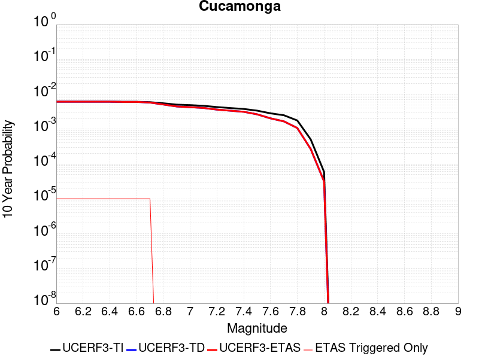 |

| Magnitude | 1 wk TI Prob | 1 wk TD Prob | 1 wk ETAS Prob | 1 wk ETAS/TD Gain | 1 wk ETAS Triggered Only | 1 mo TI Prob | 1 mo TD Prob | 1 mo ETAS Prob | 1 mo ETAS/TD Gain | 1 mo ETAS Triggered Only | 1 yr TI Prob | 1 yr TD Prob | 1 yr ETAS Prob | 1 yr ETAS/TD Gain | 1 yr ETAS Triggered Only | 10 yr TI Prob | 10 yr TD Prob | 10 yr ETAS Prob | 10 yr ETAS/TD Gain | 10 yr ETAS Triggered Only |
|-----|-----|-----|-----|-----|-----|-----|-----|-----|-----|-----|-----|-----|-----|-----|-----|-----|-----|-----|-----|-----|
| 6.0 | 1.1848348E-5 | 1.1737856E-5 | 1.1737856E-5 | 1.0 | 0.0 | 5.0777642E-5 | 5.030414E-5 | 5.030414E-5 | 1.0 | 0.0 | 6.180424E-4 | 6.1228353E-4 | 6.1228353E-4 | 1.0 | 0.0 | 0.0061632637 | 0.006107083 | 0.006117022 | 1.0016274 | 1.0E-5 |
| 6.1 | 1.1848348E-5 | 1.1737856E-5 | 1.1737856E-5 | 1.0 | 0.0 | 5.0777642E-5 | 5.030414E-5 | 5.030414E-5 | 1.0 | 0.0 | 6.180424E-4 | 6.1228353E-4 | 6.1228353E-4 | 1.0 | 0.0 | 0.0061632637 | 0.006107083 | 0.006117022 | 1.0016274 | 1.0E-5 |
| 6.2 | 1.1848348E-5 | 1.1737856E-5 | 1.1737856E-5 | 1.0 | 0.0 | 5.0777642E-5 | 5.030414E-5 | 5.030414E-5 | 1.0 | 0.0 | 6.180424E-4 | 6.1228353E-4 | 6.1228353E-4 | 1.0 | 0.0 | 0.0061632637 | 0.006107083 | 0.006117022 | 1.0016274 | 1.0E-5 |
| 6.3 | 1.1848348E-5 | 1.1737856E-5 | 1.1737856E-5 | 1.0 | 0.0 | 5.0777642E-5 | 5.030414E-5 | 5.030414E-5 | 1.0 | 0.0 | 6.180424E-4 | 6.1228353E-4 | 6.1228353E-4 | 1.0 | 0.0 | 0.0061632637 | 0.006107083 | 0.006117022 | 1.0016274 | 1.0E-5 |
| 6.4 | 1.1848348E-5 | 1.1737856E-5 | 1.1737856E-5 | 1.0 | 0.0 | 5.0777642E-5 | 5.030414E-5 | 5.030414E-5 | 1.0 | 0.0 | 6.180424E-4 | 6.1228353E-4 | 6.1228353E-4 | 1.0 | 0.0 | 0.0061632637 | 0.006107083 | 0.006117022 | 1.0016274 | 1.0E-5 |
| 6.5 | 1.16988695E-5 | 1.1576885E-5 | 1.1576885E-5 | 1.0 | 0.0 | 5.013705E-5 | 4.9614293E-5 | 4.9614293E-5 | 1.0 | 0.0 | 6.102476E-4 | 6.038893E-4 | 6.038893E-4 | 1.0 | 0.0 | 0.006085745 | 0.0060235965 | 0.0060335365 | 1.0016501 | 1.0E-5 |
| 6.6 | 1.16988695E-5 | 1.1576885E-5 | 1.1576885E-5 | 1.0 | 0.0 | 5.013705E-5 | 4.9614293E-5 | 4.9614293E-5 | 1.0 | 0.0 | 6.102476E-4 | 6.038893E-4 | 6.038893E-4 | 1.0 | 0.0 | 0.006085745 | 0.0060235965 | 0.0060335365 | 1.0016501 | 1.0E-5 |
| 6.7 | 1.1397107E-5 | 1.1115768E-5 | 1.1115768E-5 | 1.0 | 0.0 | 4.884383E-5 | 4.763815E-5 | 4.763815E-5 | 1.0 | 0.0 | 5.9451134E-4 | 5.798426E-4 | 5.798426E-4 | 1.0 | 0.0 | 0.005929234 | 0.00578439 | 0.005794332 | 1.0017188 | 1.0E-5 |
| 6.8 | 1.058387E-5 | 9.785688E-6 | 9.785688E-6 | 1.0 | 0.0 | 4.5358654E-5 | 4.1937994E-5 | 4.1937994E-5 | 1.0 | 0.0 | 5.521017E-4 | 5.104766E-4 | 5.104766E-4 | 1.0 | 0.0 | 0.00550732 | 0.005093991 | 0.005093991 | 1.0 | 0.0 |
| 6.9 | 9.690046E-6 | 8.580108E-6 | 8.580108E-6 | 1.0 | 0.0 | 4.1528107E-5 | 3.677138E-5 | 3.677138E-5 | 1.0 | 0.0 | 5.054874E-4 | 4.4759997E-4 | 4.4759997E-4 | 1.0 | 0.0 | 0.005043391 | 0.004467863 | 0.004467863 | 1.0 | 0.0 |
| 7.0 | 9.381461E-6 | 8.187711E-6 | 8.187711E-6 | 1.0 | 0.0 | 4.020564E-5 | 3.508972E-5 | 3.508972E-5 | 1.0 | 0.0 | 4.893937E-4 | 4.2713396E-4 | 4.2713396E-4 | 1.0 | 0.0 | 0.0048831734 | 0.0042640073 | 0.0042640073 | 1.0 | 0.0 |
| 7.1 | 8.946492E-6 | 7.782485E-6 | 7.782485E-6 | 1.0 | 0.0 | 3.8341543E-5 | 3.3353084E-5 | 3.3353084E-5 | 1.0 | 0.0 | 4.667083E-4 | 4.0599846E-4 | 4.0599846E-4 | 1.0 | 0.0 | 0.0046572937 | 0.004053448 | 0.004053448 | 1.0 | 0.0 |
| 7.2 | 8.251016E-6 | 6.975837E-6 | 6.975837E-6 | 1.0 | 0.0 | 3.5361016E-5 | 2.9896102E-5 | 2.9896102E-5 | 1.0 | 0.0 | 4.3043532E-4 | 3.639245E-4 | 3.639245E-4 | 1.0 | 0.0 | 0.0042960253 | 0.0036341618 | 0.0036341618 | 1.0 | 0.0 |
| 7.3 | 7.717881E-6 | 6.4868927E-6 | 6.4868927E-6 | 1.0 | 0.0 | 3.3076216E-5 | 2.7800674E-5 | 2.7800674E-5 | 1.0 | 0.0 | 4.026285E-4 | 3.3842085E-4 | 3.3842085E-4 | 1.0 | 0.0 | 0.004018998 | 0.0033799394 | 0.0033799394 | 1.0 | 0.0 |
| 7.4 | 7.275623E-6 | 6.0325183E-6 | 6.0325183E-6 | 1.0 | 0.0 | 3.118087E-5 | 2.5853395E-5 | 2.5853395E-5 | 1.0 | 0.0 | 3.7956095E-4 | 3.1471983E-4 | 3.1471983E-4 | 1.0 | 0.0 | 0.0037891332 | 0.0031436244 | 0.0031436244 | 1.0 | 0.0 |
| 7.5 | 6.5109502E-6 | 5.101057E-6 | 5.101057E-6 | 1.0 | 0.0 | 2.7903774E-5 | 2.186149E-5 | 2.186149E-5 | 1.0 | 0.0 | 3.3967546E-4 | 2.6613128E-4 | 2.6613128E-4 | 1.0 | 0.0 | 0.0033915674 | 0.0026589984 | 0.0026589984 | 1.0 | 0.0 |
| 7.6 | 5.4495326E-6 | 3.908965E-6 | 3.908965E-6 | 1.0 | 0.0 | 2.335493E-5 | 1.67526E-5 | 1.67526E-5 | 1.0 | 0.0 | 2.8430918E-4 | 2.0394388E-4 | 2.0394388E-4 | 1.0 | 0.0 | 0.0028394572 | 0.0020384341 | 0.0020384341 | 1.0 | 0.0 |
| 7.7 | 4.7997164E-6 | 3.2006137E-6 | 3.2006137E-6 | 1.0 | 0.0 | 2.057005E-5 | 1.3716844E-5 | 1.3716844E-5 | 1.0 | 0.0 | 2.504116E-4 | 1.669898E-4 | 1.669898E-4 | 1.0 | 0.0 | 0.002501296 | 0.0016695231 | 0.0016695231 | 1.0 | 0.0 |
| 7.8 | 3.3941733E-6 | 2.0644063E-6 | 2.0644063E-6 | 1.0 | 0.0 | 1.4546376E-5 | 8.847426E-6 | 8.847426E-6 | 1.0 | 0.0 | 1.7708774E-4 | 1.07712105E-4 | 1.07712105E-4 | 1.0 | 0.0 | 0.0017694668 | 0.0010766896 | 0.0010766896 | 1.0 | 0.0 |
| 7.9 | 9.750552E-7 | 5.15656E-7 | 5.15656E-7 | 1.0 | 0.0 | 4.178801E-6 | 2.2099523E-6 | 2.2099523E-6 | 1.0 | 0.0 | 5.0875715E-5 | 2.6905842E-5 | 2.6905842E-5 | 1.0 | 0.0 | 5.086407E-4 | 2.6902626E-4 | 2.6902626E-4 | 1.0 | 0.0 |
| 8.0 | 1.133857E-7 | 6.053729E-8 | 6.053729E-8 | 1.0 | 0.0 | 4.8593864E-7 | 2.594455E-7 | 2.594455E-7 | 1.0 | 0.0 | 5.9162867E-6 | 3.1587447E-6 | 3.1587447E-6 | 1.0 | 0.0 | 5.916129E-5 | 3.1587013E-5 | 3.1587013E-5 | 1.0 | 0.0 |

## Monterey Bay-Tularcitos
*[(top)](#table-of-contents)*

| 1 Week | 1 Month | 1 Year | 10 Year |
|-----|-----|-----|-----|
| 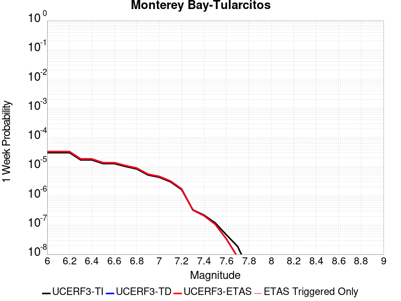 |  |  |  |

| Magnitude | 1 wk TI Prob | 1 wk TD Prob | 1 wk ETAS Prob | 1 wk ETAS/TD Gain | 1 wk ETAS Triggered Only | 1 mo TI Prob | 1 mo TD Prob | 1 mo ETAS Prob | 1 mo ETAS/TD Gain | 1 mo ETAS Triggered Only | 1 yr TI Prob | 1 yr TD Prob | 1 yr ETAS Prob | 1 yr ETAS/TD Gain | 1 yr ETAS Triggered Only | 10 yr TI Prob | 10 yr TD Prob | 10 yr ETAS Prob | 10 yr ETAS/TD Gain | 10 yr ETAS Triggered Only |
|-----|-----|-----|-----|-----|-----|-----|-----|-----|-----|-----|-----|-----|-----|-----|-----|-----|-----|-----|-----|-----|
| 6.0 | 3.0131365E-5 | 3.2799162E-5 | 3.2799162E-5 | 1.0 | 0.0 | 1.2912804E-4 | 1.4056085E-4 | 1.4056085E-4 | 1.0 | 0.0 | 0.001571 | 0.0017100906 | 0.0017100906 | 1.0 | 0.0 | 0.015599402 | 0.016980117 | 0.016989948 | 1.0005789 | 1.0E-5 |
| 6.1 | 3.0131365E-5 | 3.2799162E-5 | 3.2799162E-5 | 1.0 | 0.0 | 1.2912804E-4 | 1.4056085E-4 | 1.4056085E-4 | 1.0 | 0.0 | 0.001571 | 0.0017100906 | 0.0017100906 | 1.0 | 0.0 | 0.015599402 | 0.016980117 | 0.016989948 | 1.0005789 | 1.0E-5 |
| 6.2 | 3.0131365E-5 | 3.2799162E-5 | 3.2799162E-5 | 1.0 | 0.0 | 1.2912804E-4 | 1.4056085E-4 | 1.4056085E-4 | 1.0 | 0.0 | 0.001571 | 0.0017100906 | 0.0017100906 | 1.0 | 0.0 | 0.015599402 | 0.016980117 | 0.016989948 | 1.0005789 | 1.0E-5 |
| 6.3 | 1.6998249E-5 | 1.8330993E-5 | 1.8330993E-5 | 1.0 | 0.0 | 7.28476E-5 | 7.855914E-5 | 7.855914E-5 | 1.0 | 0.0 | 8.865586E-4 | 9.560565E-4 | 9.560565E-4 | 1.0 | 0.0 | 0.0088303005 | 0.009521359 | 0.009531264 | 1.0010402 | 1.0E-5 |
| 6.4 | 1.6998249E-5 | 1.8330993E-5 | 1.8330993E-5 | 1.0 | 0.0 | 7.28476E-5 | 7.855914E-5 | 7.855914E-5 | 1.0 | 0.0 | 8.865586E-4 | 9.560565E-4 | 9.560565E-4 | 1.0 | 0.0 | 0.0088303005 | 0.009521359 | 0.009531264 | 1.0010402 | 1.0E-5 |
| 6.5 | 1.27470785E-5 | 1.3693452E-5 | 1.3693452E-5 | 1.0 | 0.0 | 5.4629192E-5 | 5.868496E-5 | 5.868496E-5 | 1.0 | 0.0 | 6.649074E-4 | 7.142655E-4 | 7.142655E-4 | 1.0 | 0.0 | 0.0066292146 | 0.0071207504 | 0.007130679 | 1.0013944 | 1.0E-5 |
| 6.6 | 1.2739422E-5 | 1.3685539E-5 | 1.3685539E-5 | 1.0 | 0.0 | 5.4596385E-5 | 5.865105E-5 | 5.865105E-5 | 1.0 | 0.0 | 6.645082E-4 | 7.1385293E-4 | 7.1385293E-4 | 1.0 | 0.0 | 0.0066252467 | 0.007116651 | 0.00712658 | 1.0013951 | 1.0E-5 |
| 6.7 | 1.0160109E-5 | 1.0885862E-5 | 1.0885862E-5 | 1.0 | 0.0 | 4.35426E-5 | 4.6652898E-5 | 4.6652898E-5 | 1.0 | 0.0 | 5.300022E-4 | 5.678581E-4 | 5.678581E-4 | 1.0 | 0.0 | 0.005287399 | 0.005664782 | 0.0056747254 | 1.0017552 | 1.0E-5 |
| 6.8 | 8.349859E-6 | 8.932674E-6 | 8.932674E-6 | 1.0 | 0.0 | 3.578462E-5 | 3.8282356E-5 | 3.8282356E-5 | 1.0 | 0.0 | 4.3559066E-4 | 4.6599368E-4 | 4.6599368E-4 | 1.0 | 0.0 | 0.004347378 | 0.00465073 | 0.0046606837 | 1.0021402 | 1.0E-5 |
| 6.9 | 5.193639E-6 | 5.5364826E-6 | 5.5364826E-6 | 1.0 | 0.0 | 2.2258262E-5 | 2.3727585E-5 | 2.3727585E-5 | 1.0 | 0.0 | 2.7096065E-4 | 2.888483E-4 | 2.888483E-4 | 1.0 | 0.0 | 0.0027063051 | 0.0028850497 | 0.0028950209 | 1.0034561 | 1.0E-5 |
| 7.0 | 4.359381E-6 | 4.64341E-6 | 4.64341E-6 | 1.0 | 0.0 | 1.8682927E-5 | 1.9900195E-5 | 1.9900195E-5 | 1.0 | 0.0 | 2.274409E-4 | 2.4226091E-4 | 2.4226091E-4 | 1.0 | 0.0 | 0.0022720827 | 0.002420261 | 0.002430237 | 1.0041218 | 1.0E-5 |
| 7.1 | 3.0398533E-6 | 3.2310738E-6 | 3.2310738E-6 | 1.0 | 0.0 | 1.3027877E-5 | 1.3847401E-5 | 1.3847401E-5 | 1.0 | 0.0 | 1.5860285E-4 | 1.6858168E-4 | 1.6858168E-4 | 1.0 | 0.0 | 0.001584897 | 0.0016847956 | 0.0016847956 | 1.0 | 0.0 |
| 7.2 | 1.642335E-6 | 1.7333323E-6 | 1.7333323E-6 | 1.0 | 0.0 | 7.0385595E-6 | 7.428557E-6 | 7.428557E-6 | 1.0 | 0.0 | 8.569109E-5 | 9.0441E-5 | 9.0441E-5 | 1.0 | 0.0 | 8.5658056E-4 | 9.042446E-4 | 9.042446E-4 | 1.0 | 0.0 |
| 7.3 | 3.356842E-7 | 3.295269E-7 | 3.295269E-7 | 1.0 | 0.0 | 1.4386458E-6 | 1.4122573E-6 | 1.4122573E-6 | 1.0 | 0.0 | 1.7515373E-5 | 1.71941E-5 | 1.71941E-5 | 1.0 | 0.0 | 1.7513991E-4 | 1.7192778E-4 | 1.7192778E-4 | 1.0 | 0.0 |
| 7.4 | 2.1973483E-7 | 2.1006667E-7 | 2.1006667E-7 | 1.0 | 0.0 | 9.417204E-7 | 9.0028544E-7 | 9.0028544E-7 | 1.0 | 0.0 | 1.1465385E-5 | 1.096092E-5 | 1.096092E-5 | 1.0 | 0.0 | 1.1464794E-4 | 1.0960383E-4 | 1.0960383E-4 | 1.0 | 0.0 |
| 7.5 | 1.1944135E-7 | 1.06962446E-7 | 1.06962446E-7 | 1.0 | 0.0 | 5.118914E-7 | 4.584104E-7 | 4.584104E-7 | 1.0 | 0.0 | 6.23226E-6 | 5.5811324E-6 | 5.5811324E-6 | 1.0 | 0.0 | 6.2320854E-5 | 5.5809935E-5 | 5.5809935E-5 | 1.0 | 0.0 |
| 7.6 | 4.636058E-8 | 3.3366177E-8 | 3.3366177E-8 | 1.0 | 0.0 | 1.9868818E-7 | 1.4299789E-7 | 1.4299789E-7 | 1.0 | 0.0 | 2.419026E-6 | 1.7409978E-6 | 1.7409978E-6 | 1.0 | 0.0 | 2.4189996E-5 | 1.7409844E-5 | 1.7409844E-5 | 1.0 | 0.0 |
| 7.7 | 1.8588572E-8 | 8.004356E-9 | 8.004356E-9 | 1.0 | 0.0 | 7.9665305E-8 | 3.4304385E-8 | 3.4304385E-8 | 1.0 | 0.0 | 9.699246E-7 | 4.176558E-7 | 4.176558E-7 | 1.0 | 0.0 | 9.699204E-6 | 4.1765506E-6 | 4.1765506E-6 | 1.0 | 0.0 |
| 7.8 | 2.7960154E-9 | 7.610521E-10 | 7.610521E-10 | 1.0 | 0.0 | 1.1982923E-8 | 3.2616516E-9 | 3.2616516E-9 | 1.0 | 0.0 | 1.4589209E-7 | 3.9710606E-8 | 3.9710606E-8 | 1.0 | 0.0 | 1.4589199E-6 | 3.9710605E-7 | 3.9710605E-7 | 1.0 | 0.0 |

## San Jose
*[(top)](#table-of-contents)*

| 1 Week | 1 Month | 1 Year | 10 Year |
|-----|-----|-----|-----|
|  |  |  | 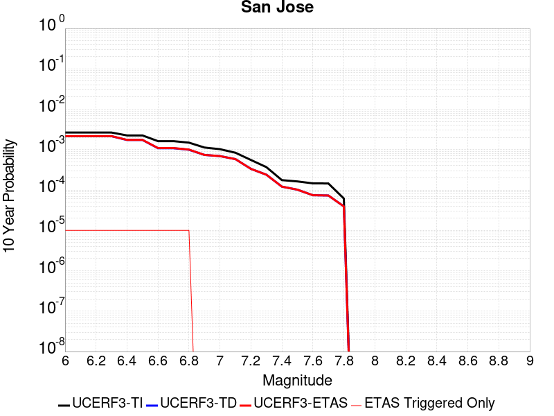 |

| Magnitude | 1 wk TI Prob | 1 wk TD Prob | 1 wk ETAS Prob | 1 wk ETAS/TD Gain | 1 wk ETAS Triggered Only | 1 mo TI Prob | 1 mo TD Prob | 1 mo ETAS Prob | 1 mo ETAS/TD Gain | 1 mo ETAS Triggered Only | 1 yr TI Prob | 1 yr TD Prob | 1 yr ETAS Prob | 1 yr ETAS/TD Gain | 1 yr ETAS Triggered Only | 10 yr TI Prob | 10 yr TD Prob | 10 yr ETAS Prob | 10 yr ETAS/TD Gain | 10 yr ETAS Triggered Only |
|-----|-----|-----|-----|-----|-----|-----|-----|-----|-----|-----|-----|-----|-----|-----|-----|-----|-----|-----|-----|-----|
| 6.0 | 5.0851277E-6 | 4.125725E-6 | 4.125725E-6 | 1.0 | 0.0 | 2.1793223E-5 | 1.7681574E-5 | 1.7681574E-5 | 1.0 | 0.0 | 2.653002E-4 | 2.1525452E-4 | 2.1525452E-4 | 1.0 | 0.0 | 0.0026498367 | 0.0021507433 | 0.002160722 | 1.0046395 | 1.0E-5 |
| 6.1 | 5.0851277E-6 | 4.125725E-6 | 4.125725E-6 | 1.0 | 0.0 | 2.1793223E-5 | 1.7681574E-5 | 1.7681574E-5 | 1.0 | 0.0 | 2.653002E-4 | 2.1525452E-4 | 2.1525452E-4 | 1.0 | 0.0 | 0.0026498367 | 0.0021507433 | 0.002160722 | 1.0046395 | 1.0E-5 |
| 6.2 | 5.0851277E-6 | 4.125725E-6 | 4.125725E-6 | 1.0 | 0.0 | 2.1793223E-5 | 1.7681574E-5 | 1.7681574E-5 | 1.0 | 0.0 | 2.653002E-4 | 2.1525452E-4 | 2.1525452E-4 | 1.0 | 0.0 | 0.0026498367 | 0.0021507433 | 0.002160722 | 1.0046395 | 1.0E-5 |
| 6.3 | 5.0851277E-6 | 4.125725E-6 | 4.125725E-6 | 1.0 | 0.0 | 2.1793223E-5 | 1.7681574E-5 | 1.7681574E-5 | 1.0 | 0.0 | 2.653002E-4 | 2.1525452E-4 | 2.1525452E-4 | 1.0 | 0.0 | 0.0026498367 | 0.0021507433 | 0.002160722 | 1.0046395 | 1.0E-5 |
| 6.4 | 4.3115124E-6 | 3.3238314E-6 | 3.3238314E-6 | 1.0 | 0.0 | 1.8477778E-5 | 1.4244926E-5 | 1.4244926E-5 | 1.0 | 0.0 | 2.2494372E-4 | 1.7342038E-4 | 1.7342038E-4 | 1.0 | 0.0 | 0.0022471617 | 0.0017330924 | 0.001743075 | 1.0057601 | 1.0E-5 |
| 6.5 | 4.3115124E-6 | 3.3238314E-6 | 3.3238314E-6 | 1.0 | 0.0 | 1.8477778E-5 | 1.4244926E-5 | 1.4244926E-5 | 1.0 | 0.0 | 2.2494372E-4 | 1.7342038E-4 | 1.7342038E-4 | 1.0 | 0.0 | 0.0022471617 | 0.0017330924 | 0.001743075 | 1.0057601 | 1.0E-5 |
| 6.6 | 3.110396E-6 | 2.0800292E-6 | 2.0800292E-6 | 1.0 | 0.0 | 1.33302E-5 | 8.914381E-6 | 8.914381E-6 | 1.0 | 0.0 | 1.622831E-4 | 1.0852747E-4 | 1.0852747E-4 | 1.0 | 0.0 | 0.0016216465 | 0.0010847967 | 0.0010947859 | 1.0092083 | 1.0E-5 |
| 6.7 | 3.110396E-6 | 2.0800292E-6 | 2.0800292E-6 | 1.0 | 0.0 | 1.33302E-5 | 8.914381E-6 | 8.914381E-6 | 1.0 | 0.0 | 1.622831E-4 | 1.0852747E-4 | 1.0852747E-4 | 1.0 | 0.0 | 0.0016216465 | 0.0010847967 | 0.0010947859 | 1.0092083 | 1.0E-5 |
| 6.8 | 2.856651E-6 | 1.9024797E-6 | 1.9024797E-6 | 1.0 | 0.0 | 1.2242733E-5 | 8.15346E-6 | 8.15346E-6 | 1.0 | 0.0 | 1.4904508E-4 | 9.926411E-5 | 9.926411E-5 | 1.0 | 0.0 | 0.0014894515 | 9.922467E-4 | 0.0010022367 | 1.0100682 | 1.0E-5 |
| 6.9 | 2.1618725E-6 | 1.4187103E-6 | 1.4187103E-6 | 1.0 | 0.0 | 9.265135E-6 | 6.080173E-6 | 6.080173E-6 | 1.0 | 0.0 | 1.12797185E-4 | 7.402369E-5 | 7.402369E-5 | 1.0 | 0.0 | 0.0011273995 | 7.400235E-4 | 7.400235E-4 | 1.0 | 0.0 |
| 7.0 | 1.9684312E-6 | 1.3256772E-6 | 1.3256772E-6 | 1.0 | 0.0 | 8.436106E-6 | 5.681462E-6 | 5.681462E-6 | 1.0 | 0.0 | 1.02704755E-4 | 6.9169684E-5 | 6.9169684E-5 | 1.0 | 0.0 | 0.001026573 | 6.9151423E-4 | 6.9151423E-4 | 1.0 | 0.0 |
| 7.1 | 1.6070337E-6 | 1.1155536E-6 | 1.1155536E-6 | 1.0 | 0.0 | 6.887269E-6 | 4.7809353E-6 | 4.7809353E-6 | 1.0 | 0.0 | 8.384928E-5 | 5.82064E-5 | 5.82064E-5 | 1.0 | 0.0 | 8.3817646E-4 | 5.819422E-4 | 5.819422E-4 | 1.0 | 0.0 |
| 7.2 | 1.0631658E-6 | 6.4040677E-7 | 6.4040677E-7 | 1.0 | 0.0 | 4.556417E-6 | 2.7445976E-6 | 2.7445976E-6 | 1.0 | 0.0 | 5.5472963E-5 | 3.3414977E-5 | 3.3414977E-5 | 1.0 | 0.0 | 5.545912E-4 | 3.3412542E-4 | 3.3412542E-4 | 1.0 | 0.0 |
| 7.3 | 7.060711E-7 | 4.5827397E-7 | 4.5827397E-7 | 1.0 | 0.0 | 3.0260155E-6 | 1.96403E-6 | 1.96403E-6 | 1.0 | 0.0 | 3.6841117E-5 | 2.391181E-5 | 2.391181E-5 | 1.0 | 0.0 | 3.6835007E-4 | 2.3911778E-4 | 2.3911778E-4 | 1.0 | 0.0 |
| 7.4 | 3.3677085E-7 | 2.3235165E-7 | 2.3235165E-7 | 1.0 | 0.0 | 1.4433028E-6 | 9.957924E-7 | 9.957924E-7 | 1.0 | 0.0 | 1.757207E-5 | 1.2123709E-5 | 1.2123709E-5 | 1.0 | 0.0 | 1.7570681E-4 | 1.2125527E-4 | 1.2125527E-4 | 1.0 | 0.0 |
| 7.5 | 3.129161E-7 | 1.9532374E-7 | 1.9532374E-7 | 1.0 | 0.0 | 1.3410682E-6 | 8.371014E-7 | 8.371014E-7 | 1.0 | 0.0 | 1.6327383E-5 | 1.0191665E-5 | 1.0191665E-5 | 1.0 | 0.0 | 1.6326184E-4 | 1.0193672E-4 | 1.0193672E-4 | 1.0 | 0.0 |
| 7.6 | 2.8008668E-7 | 1.4242943E-7 | 1.4242943E-7 | 1.0 | 0.0 | 1.2003709E-6 | 6.104117E-7 | 6.104117E-7 | 1.0 | 0.0 | 1.46144175E-5 | 7.4317386E-6 | 7.4317386E-6 | 1.0 | 0.0 | 1.4613457E-4 | 7.433959E-5 | 7.433959E-5 | 1.0 | 0.0 |
| 7.7 | 2.7852005E-7 | 1.4017505E-7 | 1.4017505E-7 | 1.0 | 0.0 | 1.1936568E-6 | 6.0075007E-7 | 6.0075007E-7 | 1.0 | 0.0 | 1.4532674E-5 | 7.3141096E-6 | 7.3141096E-6 | 1.0 | 0.0 | 1.4531724E-4 | 7.316337E-5 | 7.316337E-5 | 1.0 | 0.0 |
| 7.8 | 1.1810797E-7 | 7.519506E-8 | 7.519506E-8 | 1.0 | 0.0 | 5.0617695E-7 | 3.222645E-7 | 3.222645E-7 | 1.0 | 0.0 | 6.1626865E-6 | 3.923564E-6 | 3.923564E-6 | 1.0 | 0.0 | 6.162516E-5 | 3.92379E-5 | 3.92379E-5 | 1.0 | 0.0 |

## San Luis Range 2011 CFM
*[(top)](#table-of-contents)*

| 1 Week | 1 Month | 1 Year | 10 Year |
|-----|-----|-----|-----|
|  |  | 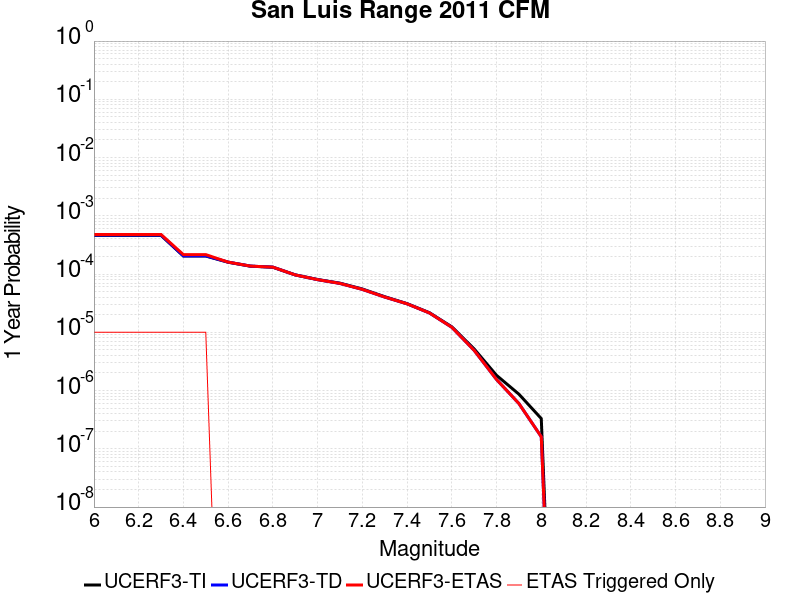 | 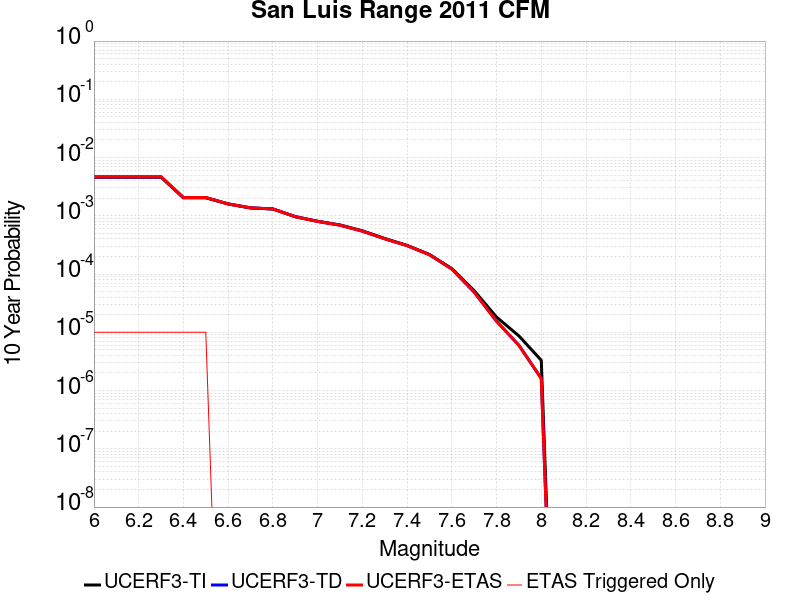 |

| Magnitude | 1 wk TI Prob | 1 wk TD Prob | 1 wk ETAS Prob | 1 wk ETAS/TD Gain | 1 wk ETAS Triggered Only | 1 mo TI Prob | 1 mo TD Prob | 1 mo ETAS Prob | 1 mo ETAS/TD Gain | 1 mo ETAS Triggered Only | 1 yr TI Prob | 1 yr TD Prob | 1 yr ETAS Prob | 1 yr ETAS/TD Gain | 1 yr ETAS Triggered Only | 10 yr TI Prob | 10 yr TD Prob | 10 yr ETAS Prob | 10 yr ETAS/TD Gain | 10 yr ETAS Triggered Only |
|-----|-----|-----|-----|-----|-----|-----|-----|-----|-----|-----|-----|-----|-----|-----|-----|-----|-----|-----|-----|-----|
| 6.0 | 8.8368415E-6 | 8.965478E-6 | 8.965478E-6 | 1.0 | 0.0 | 3.787163E-5 | 3.8422957E-5 | 4.842257E-5 | 1.260251 | 1.0E-5 | 4.609895E-4 | 4.6770697E-4 | 4.777023E-4 | 1.0213709 | 1.0E-5 | 0.0046003438 | 0.004668009 | 0.004677962 | 1.0021323 | 1.0E-5 |
| 6.1 | 8.8368415E-6 | 8.965478E-6 | 8.965478E-6 | 1.0 | 0.0 | 3.787163E-5 | 3.8422957E-5 | 4.842257E-5 | 1.260251 | 1.0E-5 | 4.609895E-4 | 4.6770697E-4 | 4.777023E-4 | 1.0213709 | 1.0E-5 | 0.0046003438 | 0.004668009 | 0.004677962 | 1.0021323 | 1.0E-5 |
| 6.2 | 8.8368415E-6 | 8.965478E-6 | 8.965478E-6 | 1.0 | 0.0 | 3.787163E-5 | 3.8422957E-5 | 4.842257E-5 | 1.260251 | 1.0E-5 | 4.609895E-4 | 4.6770697E-4 | 4.777023E-4 | 1.0213709 | 1.0E-5 | 0.0046003438 | 0.004668009 | 0.004677962 | 1.0021323 | 1.0E-5 |
| 6.3 | 8.8368415E-6 | 8.965478E-6 | 8.965478E-6 | 1.0 | 0.0 | 3.787163E-5 | 3.8422957E-5 | 4.842257E-5 | 1.260251 | 1.0E-5 | 4.609895E-4 | 4.6770697E-4 | 4.777023E-4 | 1.0213709 | 1.0E-5 | 0.0046003438 | 0.004668009 | 0.004677962 | 1.0021323 | 1.0E-5 |
| 6.4 | 3.9094193E-6 | 3.941214E-6 | 3.941214E-6 | 1.0 | 0.0 | 1.6754546E-5 | 1.689081E-5 | 2.689064E-5 | 1.5920279 | 1.0E-5 | 2.039675E-4 | 2.0562648E-4 | 2.1562443E-4 | 1.0486219 | 1.0E-5 | 0.0020378039 | 0.002054391 | 0.0020643706 | 1.0048577 | 1.0E-5 |
| 6.5 | 3.9094193E-6 | 3.941214E-6 | 3.941214E-6 | 1.0 | 0.0 | 1.6754546E-5 | 1.689081E-5 | 2.689064E-5 | 1.5920279 | 1.0E-5 | 2.039675E-4 | 2.0562648E-4 | 2.1562443E-4 | 1.0486219 | 1.0E-5 | 0.0020378039 | 0.002054391 | 0.0020643706 | 1.0048577 | 1.0E-5 |
| 6.6 | 3.0587726E-6 | 3.0753974E-6 | 3.0753974E-6 | 1.0 | 0.0 | 1.3108959E-5 | 1.3180209E-5 | 1.3180209E-5 | 1.0 | 0.0 | 1.595899E-4 | 1.6045735E-4 | 1.6045735E-4 | 1.0 | 0.0 | 0.0015947534 | 0.0016034269 | 0.0016034269 | 1.0 | 0.0 |
| 6.7 | 2.6160574E-6 | 2.6251355E-6 | 2.6251355E-6 | 1.0 | 0.0 | 1.1211626E-5 | 1.1250533E-5 | 1.1250533E-5 | 1.0 | 0.0 | 1.3649299E-4 | 1.3696669E-4 | 1.3696669E-4 | 1.0 | 0.0 | 0.0013640919 | 0.0013688289 | 0.0013688289 | 1.0 | 0.0 |
| 6.8 | 2.5110312E-6 | 2.5181482E-6 | 2.5181482E-6 | 1.0 | 0.0 | 1.0761518E-5 | 1.079202E-5 | 1.079202E-5 | 1.0 | 0.0 | 1.310136E-4 | 1.3138496E-4 | 1.3138496E-4 | 1.0 | 0.0 | 0.0013093639 | 0.0013130788 | 0.0013130788 | 1.0 | 0.0 |
| 6.9 | 1.8564405E-6 | 1.8524935E-6 | 1.8524935E-6 | 1.0 | 0.0 | 7.95615E-6 | 7.939234E-6 | 7.939234E-6 | 1.0 | 0.0 | 9.686181E-5 | 9.66559E-5 | 9.66559E-5 | 1.0 | 0.0 | 9.68196E-4 | 9.6614065E-4 | 9.6614065E-4 | 1.0 | 0.0 |
| 7.0 | 1.546127E-6 | 1.5369595E-6 | 1.5369595E-6 | 1.0 | 0.0 | 6.626242E-6 | 6.586953E-6 | 6.586953E-6 | 1.0 | 0.0 | 8.06715E-5 | 8.0193204E-5 | 8.0193204E-5 | 1.0 | 0.0 | 8.0642226E-4 | 8.016434E-4 | 8.016434E-4 | 1.0 | 0.0 |
| 7.1 | 1.3368208E-6 | 1.3235378E-6 | 1.3235378E-6 | 1.0 | 0.0 | 5.7292195E-6 | 5.672293E-6 | 5.672293E-6 | 1.0 | 0.0 | 6.975101E-5 | 6.905798E-5 | 6.905798E-5 | 1.0 | 0.0 | 6.972912E-4 | 6.903657E-4 | 6.903657E-4 | 1.0 | 0.0 |
| 7.2 | 1.0623363E-6 | 1.0454412E-6 | 1.0454412E-6 | 1.0 | 0.0 | 4.5528623E-6 | 4.4804547E-6 | 4.4804547E-6 | 1.0 | 0.0 | 5.5429686E-5 | 5.4548174E-5 | 5.4548174E-5 | 1.0 | 0.0 | 5.5415864E-4 | 5.453481E-4 | 5.453481E-4 | 1.0 | 0.0 |
| 7.3 | 7.831679E-7 | 7.7274274E-7 | 7.7274274E-7 | 1.0 | 0.0 | 3.3564295E-6 | 3.3117506E-6 | 3.3117506E-6 | 1.0 | 0.0 | 4.086376E-5 | 4.0319817E-5 | 4.0319817E-5 | 1.0 | 0.0 | 4.0856248E-4 | 4.0312516E-4 | 4.0312516E-4 | 1.0 | 0.0 |
| 7.4 | 5.9558846E-7 | 5.9106696E-7 | 5.9106696E-7 | 1.0 | 0.0 | 2.5525194E-6 | 2.5331417E-6 | 2.5331417E-6 | 1.0 | 0.0 | 3.107648E-5 | 3.0840565E-5 | 3.0840565E-5 | 1.0 | 0.0 | 3.1072134E-4 | 3.083629E-4 | 3.083629E-4 | 1.0 | 0.0 |
| 7.5 | 4.1616502E-7 | 4.1196597E-7 | 4.1196597E-7 | 1.0 | 0.0 | 1.7835631E-6 | 1.7655673E-6 | 1.7655673E-6 | 1.0 | 0.0 | 2.1714664E-5 | 2.1495569E-5 | 2.1495569E-5 | 1.0 | 0.0 | 2.1712543E-4 | 2.1493496E-4 | 2.1493496E-4 | 1.0 | 0.0 |
| 7.6 | 2.3816014E-7 | 2.3376762E-7 | 2.3376762E-7 | 1.0 | 0.0 | 1.0206859E-6 | 1.0018608E-6 | 1.0018608E-6 | 1.0 | 0.0 | 1.242678E-5 | 1.2197587E-5 | 1.2197587E-5 | 1.0 | 0.0 | 1.2426086E-4 | 1.219692E-4 | 1.219692E-4 | 1.0 | 0.0 |
| 7.7 | 9.918777E-8 | 9.386922E-8 | 9.386922E-8 | 1.0 | 0.0 | 4.2509038E-7 | 4.0229656E-7 | 4.0229656E-7 | 1.0 | 0.0 | 5.1754632E-6 | 4.8979496E-6 | 4.8979496E-6 | 1.0 | 0.0 | 5.1753424E-5 | 4.897842E-5 | 4.897842E-5 | 1.0 | 0.0 |
| 7.8 | 3.4982556E-8 | 2.9687648E-8 | 2.9687648E-8 | 1.0 | 0.0 | 1.4992524E-7 | 1.2723277E-7 | 1.2723277E-7 | 1.0 | 0.0 | 1.8253382E-6 | 1.5490579E-6 | 1.5490579E-6 | 1.0 | 0.0 | 1.8253233E-5 | 1.5490472E-5 | 1.5490472E-5 | 1.0 | 0.0 |
| 7.9 | 1.6624908E-8 | 1.147785E-8 | 1.147785E-8 | 1.0 | 0.0 | 7.12496E-8 | 4.9190785E-8 | 4.9190785E-8 | 1.0 | 0.0 | 8.6746354E-7 | 5.9889766E-7 | 5.9889766E-7 | 1.0 | 0.0 | 8.674601E-6 | 5.9889603E-6 | 5.9889603E-6 | 1.0 | 0.0 |
| 8.0 | 6.3352315E-9 | 3.0891683E-9 | 3.0891683E-9 | 1.0 | 0.0 | 2.715099E-8 | 1.3239292E-8 | 1.3239292E-8 | 1.0 | 0.0 | 3.3056327E-7 | 1.6118838E-7 | 1.6118838E-7 | 1.0 | 0.0 | 3.3056278E-6 | 1.6118827E-6 | 1.6118827E-6 | 1.0 | 0.0 |

## Ortigalita (South)
*[(top)](#table-of-contents)*

| 1 Week | 1 Month | 1 Year | 10 Year |
|-----|-----|-----|-----|
|  |  |  |  |

| Magnitude | 1 wk TI Prob | 1 wk TD Prob | 1 wk ETAS Prob | 1 wk ETAS/TD Gain | 1 wk ETAS Triggered Only | 1 mo TI Prob | 1 mo TD Prob | 1 mo ETAS Prob | 1 mo ETAS/TD Gain | 1 mo ETAS Triggered Only | 1 yr TI Prob | 1 yr TD Prob | 1 yr ETAS Prob | 1 yr ETAS/TD Gain | 1 yr ETAS Triggered Only | 10 yr TI Prob | 10 yr TD Prob | 10 yr ETAS Prob | 10 yr ETAS/TD Gain | 10 yr ETAS Triggered Only |
|-----|-----|-----|-----|-----|-----|-----|-----|-----|-----|-----|-----|-----|-----|-----|-----|-----|-----|-----|-----|-----|
| 6.0 | 3.72394E-5 | 4.3256532E-5 | 4.3256532E-5 | 1.0 | 0.0 | 1.5958765E-4 | 1.8537285E-4 | 1.9537099E-4 | 1.0539353 | 1.0E-5 | 0.0019412481 | 0.0022547347 | 0.0022647122 | 1.0044252 | 1.0E-5 | 0.019243775 | 0.022334976 | 0.022344753 | 1.0004377 | 1.0E-5 |
| 6.1 | 2.7299884E-5 | 3.149268E-5 | 3.149268E-5 | 1.0 | 0.0 | 1.16994255E-4 | 1.3496196E-4 | 1.449606E-4 | 1.074085 | 1.0E-5 | 0.0014234743 | 0.0016419792 | 0.0016519629 | 1.0060803 | 1.0E-5 | 0.014143906 | 0.016304404 | 0.01631424 | 1.0006033 | 1.0E-5 |
| 6.2 | 2.7299884E-5 | 3.149268E-5 | 3.149268E-5 | 1.0 | 0.0 | 1.16994255E-4 | 1.3496196E-4 | 1.449606E-4 | 1.074085 | 1.0E-5 | 0.0014234743 | 0.0016419792 | 0.0016519629 | 1.0060803 | 1.0E-5 | 0.014143906 | 0.016304404 | 0.01631424 | 1.0006033 | 1.0E-5 |
| 6.3 | 2.0546433E-5 | 2.3631925E-5 | 2.3631925E-5 | 1.0 | 0.0 | 8.805317E-5 | 1.0127585E-4 | 1.1127484E-4 | 1.0987302 | 1.0E-5 | 0.00107152 | 0.001232355 | 0.0012423426 | 1.0081046 | 1.0E-5 | 0.010663681 | 0.012257274 | 0.012267152 | 1.0008059 | 1.0E-5 |
| 6.4 | 2.0546433E-5 | 2.3631925E-5 | 2.3631925E-5 | 1.0 | 0.0 | 8.805317E-5 | 1.0127585E-4 | 1.1127484E-4 | 1.0987302 | 1.0E-5 | 0.00107152 | 0.001232355 | 0.0012423426 | 1.0081046 | 1.0E-5 | 0.010663681 | 0.012257274 | 0.012267152 | 1.0008059 | 1.0E-5 |
| 6.5 | 1.7779594E-5 | 2.0447384E-5 | 2.0447384E-5 | 1.0 | 0.0 | 7.619603E-5 | 8.7628774E-5 | 9.76279E-5 | 1.1141077 | 1.0E-5 | 9.272918E-4 | 0.0010663718 | 0.001076361 | 1.0093676 | 1.0E-5 | 0.009234319 | 0.010614014 | 0.010623909 | 1.0009321 | 1.0E-5 |
| 6.6 | 1.6272212E-5 | 1.8715342E-5 | 1.8715342E-5 | 1.0 | 0.0 | 6.973618E-5 | 8.0206206E-5 | 9.020541E-5 | 1.1246686 | 1.0E-5 | 8.487073E-4 | 9.760854E-4 | 9.860756E-4 | 1.010235 | 1.0E-5 | 0.008454733 | 0.009719283 | 0.009729187 | 1.0010189 | 1.0E-5 |
| 6.7 | 1.3051484E-5 | 1.5039062E-5 | 1.5039062E-5 | 1.0 | 0.0 | 5.593373E-5 | 6.445159E-5 | 6.445159E-5 | 1.0 | 0.0 | 6.807804E-4 | 7.8442506E-4 | 7.8442506E-4 | 1.0 | 0.0 | 0.006786986 | 0.007817546 | 0.007817546 | 1.0 | 0.0 |
| 6.8 | 1.04277415E-5 | 1.1987473E-5 | 1.1987473E-5 | 1.0 | 0.0 | 4.4689557E-5 | 5.1373918E-5 | 5.1373918E-5 | 1.0 | 0.0 | 5.439595E-4 | 6.2530534E-4 | 6.2530534E-4 | 1.0 | 0.0 | 0.0054262993 | 0.0062362133 | 0.0062362133 | 1.0 | 0.0 |
| 6.9 | 7.639968E-6 | 8.79168E-6 | 8.79168E-6 | 1.0 | 0.0 | 3.274231E-5 | 3.7678114E-5 | 3.7678114E-5 | 1.0 | 0.0 | 3.9856473E-4 | 4.5864037E-4 | 4.5864037E-4 | 1.0 | 0.0 | 0.003978506 | 0.0045775245 | 0.0045775245 | 1.0 | 0.0 |
| 7.0 | 3.919831E-6 | 4.5334955E-6 | 4.5334955E-6 | 1.0 | 0.0 | 1.679917E-5 | 1.9429133E-5 | 1.9429133E-5 | 1.0 | 0.0 | 2.045107E-4 | 2.3652615E-4 | 2.3652615E-4 | 1.0 | 0.0 | 0.0020432258 | 0.0023629526 | 0.0023629526 | 1.0 | 0.0 |
| 7.1 | 1.6017933E-6 | 1.8570811E-6 | 1.8570811E-6 | 1.0 | 0.0 | 6.8648105E-6 | 7.958901E-6 | 7.958901E-6 | 1.0 | 0.0 | 8.357586E-5 | 9.689637E-5 | 9.689637E-5 | 1.0 | 0.0 | 8.3544437E-4 | 9.686459E-4 | 9.686459E-4 | 1.0 | 0.0 |

## Eaton Roughs 2011 CFM
*[(top)](#table-of-contents)*

| 1 Week | 1 Month | 1 Year | 10 Year |
|-----|-----|-----|-----|
|  |  |  | 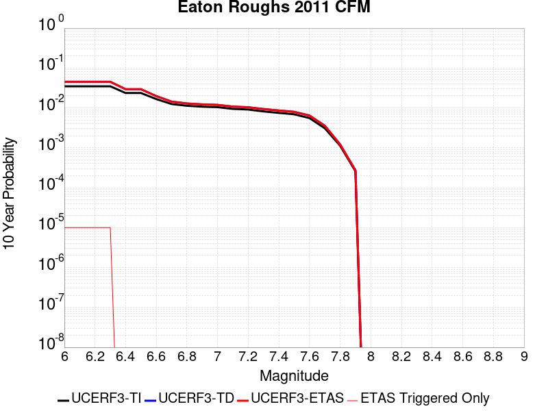 |

| Magnitude | 1 wk TI Prob | 1 wk TD Prob | 1 wk ETAS Prob | 1 wk ETAS/TD Gain | 1 wk ETAS Triggered Only | 1 mo TI Prob | 1 mo TD Prob | 1 mo ETAS Prob | 1 mo ETAS/TD Gain | 1 mo ETAS Triggered Only | 1 yr TI Prob | 1 yr TD Prob | 1 yr ETAS Prob | 1 yr ETAS/TD Gain | 1 yr ETAS Triggered Only | 10 yr TI Prob | 10 yr TD Prob | 10 yr ETAS Prob | 10 yr ETAS/TD Gain | 10 yr ETAS Triggered Only |
|-----|-----|-----|-----|-----|-----|-----|-----|-----|-----|-----|-----|-----|-----|-----|-----|-----|-----|-----|-----|-----|
| 6.0 | 6.8044945E-5 | 8.8438355E-5 | 8.8438355E-5 | 1.0 | 0.0 | 2.9158857E-4 | 3.78971E-4 | 3.78971E-4 | 1.0 | 0.0 | 0.0035443127 | 0.0046048546 | 0.0046048546 | 1.0 | 0.0 | 0.03488314 | 0.045165323 | 0.04517487 | 1.0002114 | 1.0E-5 |
| 6.1 | 6.8044945E-5 | 8.8438355E-5 | 8.8438355E-5 | 1.0 | 0.0 | 2.9158857E-4 | 3.78971E-4 | 3.78971E-4 | 1.0 | 0.0 | 0.0035443127 | 0.0046048546 | 0.0046048546 | 1.0 | 0.0 | 0.03488314 | 0.045165323 | 0.04517487 | 1.0002114 | 1.0E-5 |
| 6.2 | 6.8044945E-5 | 8.8438355E-5 | 8.8438355E-5 | 1.0 | 0.0 | 2.9158857E-4 | 3.78971E-4 | 3.78971E-4 | 1.0 | 0.0 | 0.0035443127 | 0.0046048546 | 0.0046048546 | 1.0 | 0.0 | 0.03488314 | 0.045165323 | 0.04517487 | 1.0002114 | 1.0E-5 |
| 6.3 | 6.8044945E-5 | 8.8438355E-5 | 8.8438355E-5 | 1.0 | 0.0 | 2.9158857E-4 | 3.78971E-4 | 3.78971E-4 | 1.0 | 0.0 | 0.0035443127 | 0.0046048546 | 0.0046048546 | 1.0 | 0.0 | 0.03488314 | 0.045165323 | 0.04517487 | 1.0002114 | 1.0E-5 |
| 6.4 | 4.5830013E-5 | 5.7157253E-5 | 5.7157253E-5 | 1.0 | 0.0 | 1.9639956E-4 | 2.449397E-4 | 2.449397E-4 | 1.0 | 0.0 | 0.0023885423 | 0.0029784369 | 0.0029784369 | 1.0 | 0.0 | 0.023630321 | 0.029422875 | 0.029422875 | 1.0 | 0.0 |
| 6.5 | 4.5830013E-5 | 5.7157253E-5 | 5.7157253E-5 | 1.0 | 0.0 | 1.9639956E-4 | 2.449397E-4 | 2.449397E-4 | 1.0 | 0.0 | 0.0023885423 | 0.0029784369 | 0.0029784369 | 1.0 | 0.0 | 0.023630321 | 0.029422875 | 0.029422875 | 1.0 | 0.0 |
| 6.6 | 3.222194E-5 | 3.8263923E-5 | 3.8263923E-5 | 1.0 | 0.0 | 1.3808672E-4 | 1.6397858E-4 | 1.6397858E-4 | 1.0 | 0.0 | 0.0016799092 | 0.0019946976 | 0.0019946976 | 1.0 | 0.0 | 0.016672665 | 0.019777248 | 0.019777248 | 1.0 | 0.0 |
| 6.7 | 2.4155654E-5 | 2.7786813E-5 | 2.7786813E-5 | 1.0 | 0.0 | 1.0352012E-4 | 1.19080956E-4 | 1.19080956E-4 | 1.0 | 0.0 | 0.0012596287 | 0.0014488546 | 0.0014488546 | 1.0 | 0.0 | 0.012525126 | 0.01439528 | 0.01439528 | 1.0 | 0.0 |
| 6.8 | 2.1814667E-5 | 2.4941362E-5 | 2.4941362E-5 | 1.0 | 0.0 | 9.348808E-5 | 1.0688719E-4 | 1.0688719E-4 | 1.0 | 0.0 | 0.001137623 | 0.0013005785 | 0.0013005785 | 1.0 | 0.0 | 0.011318169 | 0.012930335 | 0.012930335 | 1.0 | 0.0 |
| 6.9 | 2.0700467E-5 | 2.3629396E-5 | 2.3629396E-5 | 1.0 | 0.0 | 8.871327E-5 | 1.0126493E-4 | 1.0126493E-4 | 1.0 | 0.0 | 0.0010795488 | 0.0012322064 | 0.0012322064 | 1.0 | 0.0 | 0.010743194 | 0.0122543145 | 0.0122543145 | 1.0 | 0.0 |
| 7.0 | 2.0104066E-5 | 2.2936947E-5 | 2.2936947E-5 | 1.0 | 0.0 | 8.615744E-5 | 9.829752E-5 | 9.829752E-5 | 1.0 | 0.0 | 0.0010484619 | 0.0011961183 | 0.0011961183 | 1.0 | 0.0 | 0.010435291 | 0.011897345 | 0.011897345 | 1.0 | 0.0 |
| 7.1 | 1.8225232E-5 | 2.077345E-5 | 2.077345E-5 | 1.0 | 0.0 | 7.81058E-5 | 8.902604E-5 | 8.902604E-5 | 1.0 | 0.0 | 9.5052324E-4 | 0.0010833547 | 0.0010833547 | 1.0 | 0.0 | 0.009464677 | 0.010781075 | 0.010781075 | 1.0 | 0.0 |
| 7.2 | 1.7526572E-5 | 1.999388E-5 | 1.999388E-5 | 1.0 | 0.0 | 7.511172E-5 | 8.568525E-5 | 8.568525E-5 | 1.0 | 0.0 | 9.141015E-4 | 0.0010427202 | 0.0010427202 | 1.0 | 0.0 | 0.009103506 | 0.0103785945 | 0.0103785945 | 1.0 | 0.0 |
| 7.3 | 1.5727232E-5 | 1.8021872E-5 | 1.8021872E-5 | 1.0 | 0.0 | 6.740067E-5 | 7.723432E-5 | 7.723432E-5 | 1.0 | 0.0 | 8.2029426E-4 | 9.399234E-4 | 9.399234E-4 | 1.0 | 0.0 | 0.008172729 | 0.009359742 | 0.009359742 | 1.0 | 0.0 |
| 7.4 | 1.4457361E-5 | 1.6598702E-5 | 1.6598702E-5 | 1.0 | 0.0 | 6.195865E-5 | 7.113536E-5 | 7.113536E-5 | 1.0 | 0.0 | 7.540854E-4 | 8.6572976E-4 | 8.6572976E-4 | 1.0 | 0.0 | 0.007515317 | 0.008623774 | 0.008623774 | 1.0 | 0.0 |
| 7.5 | 1.33280955E-5 | 1.5345759E-5 | 1.5345759E-5 | 1.0 | 0.0 | 5.711916E-5 | 6.576588E-5 | 6.576588E-5 | 1.0 | 0.0 | 6.9520384E-4 | 8.004063E-4 | 8.004063E-4 | 1.0 | 0.0 | 0.00693033 | 0.007975417 | 0.007975417 | 1.0 | 0.0 |
| 7.6 | 1.0699478E-5 | 1.2388088E-5 | 1.2388088E-5 | 1.0 | 0.0 | 4.5854096E-5 | 5.309073E-5 | 5.309073E-5 | 1.0 | 0.0 | 5.581306E-4 | 6.461885E-4 | 6.461885E-4 | 1.0 | 0.0 | 0.005567309 | 0.006443218 | 0.006443218 | 1.0 | 0.0 |
| 7.7 | 5.9390236E-6 | 6.8531053E-6 | 6.8531053E-6 | 1.0 | 0.0 | 2.545271E-5 | 2.9370123E-5 | 2.9370123E-5 | 1.0 | 0.0 | 3.0984267E-4 | 3.5752283E-4 | 3.5752283E-4 | 1.0 | 0.0 | 0.0030941102 | 0.0035695168 | 0.0035695168 | 1.0 | 0.0 |
| 7.8 | 2.1622036E-6 | 2.3297252E-6 | 2.3297252E-6 | 1.0 | 0.0 | 9.266554E-6 | 9.984499E-6 | 9.984499E-6 | 1.0 | 0.0 | 1.1281446E-4 | 1.2155456E-4 | 1.2155456E-4 | 1.0 | 0.0 | 0.001127572 | 0.0012148811 | 0.0012148811 | 1.0 | 0.0 |
| 7.9 | 4.9586197E-7 | 5.2189574E-7 | 5.2189574E-7 | 1.0 | 0.0 | 2.125121E-6 | 2.2366944E-6 | 2.2366944E-6 | 1.0 | 0.0 | 2.5873042E-5 | 2.7231436E-5 | 2.7231436E-5 | 1.0 | 0.0 | 2.5870028E-4 | 2.7228307E-4 | 2.7228307E-4 | 1.0 | 0.0 |

## Oak Ridge (Onshore)
*[(top)](#table-of-contents)*

| 1 Week | 1 Month | 1 Year | 10 Year |
|-----|-----|-----|-----|
|  |  |  |  |

| Magnitude | 1 wk TI Prob | 1 wk TD Prob | 1 wk ETAS Prob | 1 wk ETAS/TD Gain | 1 wk ETAS Triggered Only | 1 mo TI Prob | 1 mo TD Prob | 1 mo ETAS Prob | 1 mo ETAS/TD Gain | 1 mo ETAS Triggered Only | 1 yr TI Prob | 1 yr TD Prob | 1 yr ETAS Prob | 1 yr ETAS/TD Gain | 1 yr ETAS Triggered Only | 10 yr TI Prob | 10 yr TD Prob | 10 yr ETAS Prob | 10 yr ETAS/TD Gain | 10 yr ETAS Triggered Only |
|-----|-----|-----|-----|-----|-----|-----|-----|-----|-----|-----|-----|-----|-----|-----|-----|-----|-----|-----|-----|-----|
| 6.0 | 3.155064E-5 | 2.9526547E-5 | 2.9526547E-5 | 1.0 | 0.0 | 1.3521002E-4 | 1.2653643E-4 | 1.2653643E-4 | 1.0 | 0.0 | 0.001644939 | 0.0015395303 | 0.001549515 | 1.0064855 | 1.0E-5 | 0.01632816 | 0.015293304 | 0.015303151 | 1.0006438 | 1.0E-5 |
| 6.1 | 3.155064E-5 | 2.9526547E-5 | 2.9526547E-5 | 1.0 | 0.0 | 1.3521002E-4 | 1.2653643E-4 | 1.2653643E-4 | 1.0 | 0.0 | 0.001644939 | 0.0015395303 | 0.001549515 | 1.0064855 | 1.0E-5 | 0.01632816 | 0.015293304 | 0.015303151 | 1.0006438 | 1.0E-5 |
| 6.2 | 3.155064E-5 | 2.9526547E-5 | 2.9526547E-5 | 1.0 | 0.0 | 1.3521002E-4 | 1.2653643E-4 | 1.2653643E-4 | 1.0 | 0.0 | 0.001644939 | 0.0015395303 | 0.001549515 | 1.0064855 | 1.0E-5 | 0.01632816 | 0.015293304 | 0.015303151 | 1.0006438 | 1.0E-5 |
| 6.3 | 3.155064E-5 | 2.9526547E-5 | 2.9526547E-5 | 1.0 | 0.0 | 1.3521002E-4 | 1.2653643E-4 | 1.2653643E-4 | 1.0 | 0.0 | 0.001644939 | 0.0015395303 | 0.001549515 | 1.0064855 | 1.0E-5 | 0.01632816 | 0.015293304 | 0.015303151 | 1.0006438 | 1.0E-5 |
| 6.4 | 3.155064E-5 | 2.9526547E-5 | 2.9526547E-5 | 1.0 | 0.0 | 1.3521002E-4 | 1.2653643E-4 | 1.2653643E-4 | 1.0 | 0.0 | 0.001644939 | 0.0015395303 | 0.001549515 | 1.0064855 | 1.0E-5 | 0.01632816 | 0.015293304 | 0.015303151 | 1.0006438 | 1.0E-5 |
| 6.5 | 3.155064E-5 | 2.9526547E-5 | 2.9526547E-5 | 1.0 | 0.0 | 1.3521002E-4 | 1.2653643E-4 | 1.2653643E-4 | 1.0 | 0.0 | 0.001644939 | 0.0015395303 | 0.001549515 | 1.0064855 | 1.0E-5 | 0.01632816 | 0.015293304 | 0.015303151 | 1.0006438 | 1.0E-5 |
| 6.6 | 3.155064E-5 | 2.9526547E-5 | 2.9526547E-5 | 1.0 | 0.0 | 1.3521002E-4 | 1.2653643E-4 | 1.2653643E-4 | 1.0 | 0.0 | 0.001644939 | 0.0015395303 | 0.001549515 | 1.0064855 | 1.0E-5 | 0.01632816 | 0.015293304 | 0.015303151 | 1.0006438 | 1.0E-5 |
| 6.7 | 3.098897E-5 | 2.8864733E-5 | 2.8864733E-5 | 1.0 | 0.0 | 1.328031E-4 | 1.2370035E-4 | 1.2370035E-4 | 1.0 | 0.0 | 0.0016156785 | 0.001505049 | 0.0015150339 | 1.0066344 | 1.0E-5 | 0.016039822 | 0.01495315 | 0.014963001 | 1.0006588 | 1.0E-5 |
| 6.8 | 3.0449872E-5 | 2.8239918E-5 | 2.8239918E-5 | 1.0 | 0.0 | 1.3049292E-4 | 1.21022815E-4 | 1.21022815E-4 | 1.0 | 0.0 | 0.0015875935 | 0.0014724941 | 0.0014824794 | 1.0067812 | 1.0E-5 | 0.015762992 | 0.014631892 | 0.014641746 | 1.0006734 | 1.0E-5 |
| 6.9 | 2.697928E-5 | 2.4220235E-5 | 2.4220235E-5 | 1.0 | 0.0 | 1.15620365E-4 | 1.03797E-4 | 1.03797E-4 | 1.0 | 0.0 | 0.0014067689 | 0.0012630174 | 0.0012730047 | 1.0079075 | 1.0E-5 | 0.0139789665 | 0.012561257 | 0.012571132 | 1.0007861 | 1.0E-5 |
| 7.0 | 2.4893961E-5 | 2.1862457E-5 | 2.1862457E-5 | 1.0 | 0.0 | 1.0668404E-4 | 9.369298E-5 | 9.369298E-5 | 1.0 | 0.0 | 0.0012981043 | 0.0011401328 | 0.0011501214 | 1.0087609 | 1.0E-5 | 0.012905477 | 0.011345269 | 0.011355156 | 1.0008714 | 1.0E-5 |
| 7.1 | 2.0945363E-5 | 1.7354816E-5 | 1.7354816E-5 | 1.0 | 0.0 | 8.976275E-5 | 7.437569E-5 | 7.437569E-5 | 1.0 | 0.0 | 0.0010923136 | 9.051526E-4 | 9.151436E-4 | 1.0110378 | 1.0E-5 | 0.0108696 | 0.009015744 | 0.009025653 | 1.0010992 | 1.0E-5 |
| 7.2 | 2.0439404E-5 | 1.6809745E-5 | 1.6809745E-5 | 1.0 | 0.0 | 8.7594504E-5 | 7.2039795E-5 | 7.2039795E-5 | 1.0 | 0.0 | 0.0010659413 | 8.767363E-4 | 8.8672753E-4 | 1.0113959 | 1.0E-5 | 0.010608427 | 0.008733843 | 0.0087437555 | 1.001135 | 1.0E-5 |
| 7.3 | 1.8463334E-5 | 1.5382124E-5 | 1.5382124E-5 | 1.0 | 0.0 | 7.912617E-5 | 6.592175E-5 | 6.592175E-5 | 1.0 | 0.0 | 9.6293533E-4 | 8.0230605E-4 | 8.1229804E-4 | 1.012454 | 1.0E-5 | 0.009587734 | 0.00799511 | 0.0080050295 | 1.0012407 | 1.0E-5 |
| 7.4 | 1.763139E-5 | 1.4517136E-5 | 1.4517136E-5 | 1.0 | 0.0 | 7.556091E-5 | 6.2214836E-5 | 6.2214836E-5 | 1.0 | 0.0 | 9.1956573E-4 | 7.5720635E-4 | 7.671988E-4 | 1.0131965 | 1.0E-5 | 0.009157699 | 0.007547218 | 0.007557142 | 1.001315 | 1.0E-5 |
| 7.5 | 1.3594944E-5 | 1.1163481E-5 | 1.1163481E-5 | 1.0 | 0.0 | 5.8262744E-5 | 4.7842626E-5 | 4.7842626E-5 | 1.0 | 0.0 | 7.0911803E-4 | 5.8233086E-4 | 5.92325E-4 | 1.0171623 | 1.0E-5 | 0.007068595 | 0.0058084945 | 0.0058184364 | 1.0017116 | 1.0E-5 |
| 7.6 | 6.9889534E-6 | 5.6367644E-6 | 5.6367644E-6 | 1.0 | 0.0 | 2.9952313E-5 | 2.4157342E-5 | 2.4157342E-5 | 1.0 | 0.0 | 3.646084E-4 | 2.9407637E-4 | 3.0407342E-4 | 1.0339948 | 1.0E-5 | 0.0036401073 | 0.002936916 | 0.0029468867 | 1.003395 | 1.0E-5 |
| 7.7 | 4.0824193E-6 | 3.2832984E-6 | 3.2832984E-6 | 1.0 | 0.0 | 1.7495966E-5 | 1.4071204E-5 | 1.4071204E-5 | 1.0 | 0.0 | 2.1299256E-4 | 1.7130356E-4 | 1.8130186E-4 | 1.058366 | 1.0E-5 | 0.0021278851 | 0.0017117286 | 0.0017217115 | 1.0058321 | 1.0E-5 |
| 7.8 | 1.7023609E-6 | 1.4370712E-6 | 1.4370712E-6 | 1.0 | 0.0 | 7.295812E-6 | 6.158862E-6 | 6.158862E-6 | 1.0 | 0.0 | 8.882289E-5 | 7.4981595E-5 | 8.498084E-5 | 1.1333561 | 1.0E-5 | 8.8787393E-4 | 7.495657E-4 | 7.595582E-4 | 1.013331 | 1.0E-5 |
| 7.9 | 2.721225E-7 | 2.2617078E-7 | 2.2617078E-7 | 1.0 | 0.0 | 1.1662388E-6 | 9.69303E-7 | 9.69303E-7 | 1.0 | 0.0 | 1.4198865E-5 | 1.1801203E-5 | 1.1801203E-5 | 1.0 | 0.0 | 1.4197957E-4 | 1.1800604E-4 | 1.1800604E-4 | 1.0 | 0.0 |
| 8.0 | 9.364255E-9 | 5.1208513E-9 | 5.1208513E-9 | 1.0 | 0.0 | 4.0132523E-8 | 2.1946507E-8 | 2.1946507E-8 | 1.0 | 0.0 | 4.8861335E-7 | 2.671987E-7 | 2.671987E-7 | 1.0 | 0.0 | 4.8861225E-6 | 2.671984E-6 | 2.671984E-6 | 1.0 | 0.0 |

## Santa Cruz Catalina Ridge alt1
*[(top)](#table-of-contents)*

| 1 Week | 1 Month | 1 Year | 10 Year |
|-----|-----|-----|-----|
|  |  |  |  |

| Magnitude | 1 wk TI Prob | 1 wk TD Prob | 1 wk ETAS Prob | 1 wk ETAS/TD Gain | 1 wk ETAS Triggered Only | 1 mo TI Prob | 1 mo TD Prob | 1 mo ETAS Prob | 1 mo ETAS/TD Gain | 1 mo ETAS Triggered Only | 1 yr TI Prob | 1 yr TD Prob | 1 yr ETAS Prob | 1 yr ETAS/TD Gain | 1 yr ETAS Triggered Only | 10 yr TI Prob | 10 yr TD Prob | 10 yr ETAS Prob | 10 yr ETAS/TD Gain | 10 yr ETAS Triggered Only |
|-----|-----|-----|-----|-----|-----|-----|-----|-----|-----|-----|-----|-----|-----|-----|-----|-----|-----|-----|-----|-----|
| 6.0 | 3.2833184E-5 | 3.655896E-5 | 3.655896E-5 | 1.0 | 0.0 | 1.4070606E-4 | 1.5667279E-4 | 1.5667279E-4 | 1.0 | 0.0 | 0.00171175 | 0.0019059886 | 0.0019059886 | 1.0 | 0.0 | 0.016986247 | 0.01891332 | 0.01892313 | 1.0005187 | 1.0E-5 |
| 6.1 | 1.9835548E-5 | 2.1659771E-5 | 2.1659771E-5 | 1.0 | 0.0 | 8.500672E-5 | 9.2824404E-5 | 9.2824404E-5 | 1.0 | 0.0 | 0.0010344655 | 0.0011295713 | 0.0011295713 | 1.0 | 0.0 | 0.010296632 | 0.011240433 | 0.011240433 | 1.0 | 0.0 |
| 6.2 | 1.9835548E-5 | 2.1659771E-5 | 2.1659771E-5 | 1.0 | 0.0 | 8.500672E-5 | 9.2824404E-5 | 9.2824404E-5 | 1.0 | 0.0 | 0.0010344655 | 0.0011295713 | 0.0011295713 | 1.0 | 0.0 | 0.010296632 | 0.011240433 | 0.011240433 | 1.0 | 0.0 |
| 6.3 | 1.5728183E-5 | 1.7034137E-5 | 1.7034137E-5 | 1.0 | 0.0 | 6.7404755E-5 | 7.3001436E-5 | 7.3001436E-5 | 1.0 | 0.0 | 8.2034385E-4 | 8.884362E-4 | 8.884362E-4 | 1.0 | 0.0 | 0.008173222 | 0.008849524 | 0.008849524 | 1.0 | 0.0 |
| 6.4 | 1.5728183E-5 | 1.7034137E-5 | 1.7034137E-5 | 1.0 | 0.0 | 6.7404755E-5 | 7.3001436E-5 | 7.3001436E-5 | 1.0 | 0.0 | 8.2034385E-4 | 8.884362E-4 | 8.884362E-4 | 1.0 | 0.0 | 0.008173222 | 0.008849524 | 0.008849524 | 1.0 | 0.0 |
| 6.5 | 1.3707734E-5 | 1.4794678E-5 | 1.4794678E-5 | 1.0 | 0.0 | 5.8746107E-5 | 6.3404244E-5 | 6.3404244E-5 | 1.0 | 0.0 | 7.1499916E-4 | 7.716768E-4 | 7.716768E-4 | 1.0 | 0.0 | 0.0071270303 | 0.0076903705 | 0.0076903705 | 1.0 | 0.0 |
| 6.6 | 1.2539813E-5 | 1.3510358E-5 | 1.3510358E-5 | 1.0 | 0.0 | 5.3740947E-5 | 5.7900266E-5 | 5.7900266E-5 | 1.0 | 0.0 | 6.540996E-4 | 7.0471043E-4 | 7.0471043E-4 | 1.0 | 0.0 | 0.0065217763 | 0.0070250607 | 0.0070250607 | 1.0 | 0.0 |
| 6.7 | 1.1504083E-5 | 1.23775E-5 | 1.23775E-5 | 1.0 | 0.0 | 4.930228E-5 | 5.304536E-5 | 5.304536E-5 | 1.0 | 0.0 | 6.0008996E-4 | 6.456379E-4 | 6.456379E-4 | 1.0 | 0.0 | 0.005984721 | 0.0064378507 | 0.0064378507 | 1.0 | 0.0 |
| 6.8 | 1.012739E-5 | 1.0877178E-5 | 1.0877178E-5 | 1.0 | 0.0 | 4.340238E-5 | 4.6615653E-5 | 4.6615653E-5 | 1.0 | 0.0 | 5.282958E-4 | 5.673993E-4 | 5.673993E-4 | 1.0 | 0.0 | 0.0052704164 | 0.005659675 | 0.005659675 | 1.0 | 0.0 |
| 6.9 | 8.9607865E-6 | 9.60921E-6 | 9.60921E-6 | 1.0 | 0.0 | 3.8402806E-5 | 4.1181684E-5 | 4.1181684E-5 | 1.0 | 0.0 | 4.6745385E-4 | 5.0127273E-4 | 5.0127273E-4 | 1.0 | 0.0 | 0.0046647177 | 0.00500154 | 0.00500154 | 1.0 | 0.0 |
| 7.0 | 8.046829E-6 | 8.619827E-6 | 8.619827E-6 | 1.0 | 0.0 | 3.4485955E-5 | 3.6941598E-5 | 3.6941598E-5 | 1.0 | 0.0 | 4.1978562E-4 | 4.4967196E-4 | 4.4967196E-4 | 1.0 | 0.0 | 0.004189935 | 0.004487711 | 0.004487711 | 1.0 | 0.0 |
| 7.1 | 7.136131E-6 | 7.637727E-6 | 7.637727E-6 | 1.0 | 0.0 | 3.0583058E-5 | 3.273271E-5 | 3.273271E-5 | 1.0 | 0.0 | 3.7228514E-4 | 3.9844858E-4 | 3.9844858E-4 | 1.0 | 0.0 | 0.0037166206 | 0.0039774184 | 0.0039774184 | 1.0 | 0.0 |
| 7.2 | 6.362014E-6 | 6.8050217E-6 | 6.8050217E-6 | 1.0 | 0.0 | 2.726549E-5 | 2.9164055E-5 | 2.9164055E-5 | 1.0 | 0.0 | 3.3190678E-4 | 3.5501516E-4 | 3.5501516E-4 | 1.0 | 0.0 | 0.0033141149 | 0.0035445488 | 0.0035445488 | 1.0 | 0.0 |
| 7.3 | 5.004101E-6 | 5.3517642E-6 | 5.3517642E-6 | 1.0 | 0.0 | 2.1445969E-5 | 2.2935934E-5 | 2.2935934E-5 | 1.0 | 0.0 | 2.6107338E-4 | 2.7920975E-4 | 2.7920975E-4 | 1.0 | 0.0 | 0.002607669 | 0.0027886443 | 0.0027886443 | 1.0 | 0.0 |
| 7.4 | 3.4901443E-6 | 3.732087E-6 | 3.732087E-6 | 1.0 | 0.0 | 1.4957676E-5 | 1.5994563E-5 | 1.5994563E-5 | 1.0 | 0.0 | 1.8209449E-4 | 1.9471678E-4 | 1.9471678E-4 | 1.0 | 0.0 | 0.0018194534 | 0.0019455003 | 0.0019455003 | 1.0 | 0.0 |
| 7.5 | 1.1215045E-6 | 1.1893966E-6 | 1.1893966E-6 | 1.0 | 0.0 | 4.806439E-6 | 5.0974045E-6 | 5.0974045E-6 | 1.0 | 0.0 | 5.851682E-5 | 6.205916E-5 | 6.205916E-5 | 1.0 | 0.0 | 5.850142E-4 | 6.204214E-4 | 6.204214E-4 | 1.0 | 0.0 |
| 7.6 | 2.8599047E-7 | 2.9952182E-7 | 2.9952182E-7 | 1.0 | 0.0 | 1.2256729E-6 | 1.2836642E-6 | 1.2836642E-6 | 1.0 | 0.0 | 1.4922465E-5 | 1.5628502E-5 | 1.5628502E-5 | 1.0 | 0.0 | 1.4921463E-4 | 1.5627417E-4 | 1.5627417E-4 | 1.0 | 0.0 |
| 7.7 | 2.0781519E-7 | 2.1744457E-7 | 2.1744457E-7 | 1.0 | 0.0 | 8.906362E-7 | 9.3190494E-7 | 9.3190494E-7 | 1.0 | 0.0 | 1.08434415E-5 | 1.1345885E-5 | 1.1345885E-5 | 1.0 | 0.0 | 1.0842913E-4 | 1.1345315E-4 | 1.1345315E-4 | 1.0 | 0.0 |
| 7.8 | 3.614776E-8 | 3.7641225E-8 | 3.7641225E-8 | 1.0 | 0.0 | 1.5491896E-7 | 1.6131952E-7 | 1.6131952E-7 | 1.0 | 0.0 | 1.8861368E-6 | 1.9640636E-6 | 1.9640636E-6 | 1.0 | 0.0 | 1.8861208E-5 | 1.9640474E-5 | 1.9640474E-5 | 1.0 | 0.0 |

## North Salt Lake
*[(top)](#table-of-contents)*

| 1 Week | 1 Month | 1 Year | 10 Year |
|-----|-----|-----|-----|
|  | 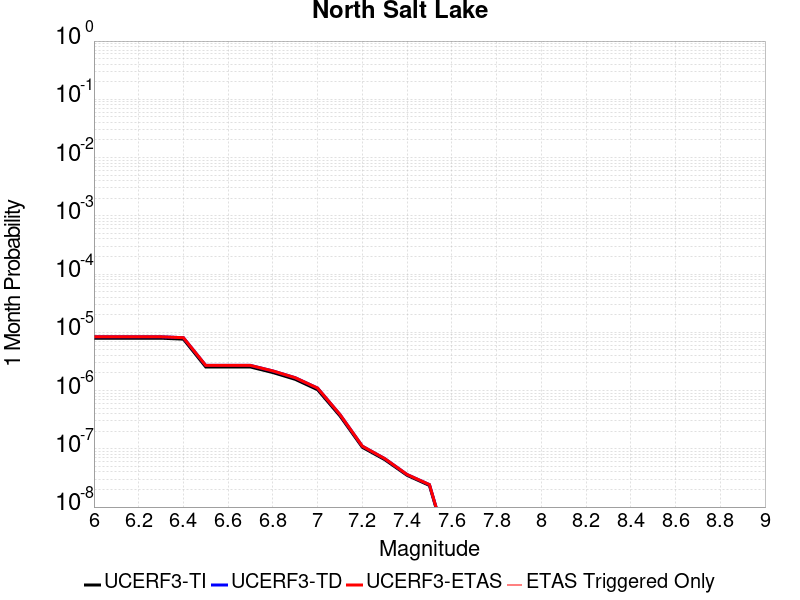 |  |  |

| Magnitude | 1 wk TI Prob | 1 wk TD Prob | 1 wk ETAS Prob | 1 wk ETAS/TD Gain | 1 wk ETAS Triggered Only | 1 mo TI Prob | 1 mo TD Prob | 1 mo ETAS Prob | 1 mo ETAS/TD Gain | 1 mo ETAS Triggered Only | 1 yr TI Prob | 1 yr TD Prob | 1 yr ETAS Prob | 1 yr ETAS/TD Gain | 1 yr ETAS Triggered Only | 10 yr TI Prob | 10 yr TD Prob | 10 yr ETAS Prob | 10 yr ETAS/TD Gain | 10 yr ETAS Triggered Only |
|-----|-----|-----|-----|-----|-----|-----|-----|-----|-----|-----|-----|-----|-----|-----|-----|-----|-----|-----|-----|-----|
| 6.0 | 1.849599E-6 | 1.9555857E-6 | 1.9555857E-6 | 1.0 | 0.0 | 7.926829E-6 | 8.381066E-6 | 8.381066E-6 | 1.0 | 0.0 | 9.650487E-5 | 1.0203672E-4 | 1.12035705E-4 | 1.097994 | 1.0E-5 | 9.646297E-4 | 0.0010200966 | 0.0010300863 | 1.009793 | 1.0E-5 |
| 6.1 | 1.849599E-6 | 1.9555857E-6 | 1.9555857E-6 | 1.0 | 0.0 | 7.926829E-6 | 8.381066E-6 | 8.381066E-6 | 1.0 | 0.0 | 9.650487E-5 | 1.0203672E-4 | 1.12035705E-4 | 1.097994 | 1.0E-5 | 9.646297E-4 | 0.0010200966 | 0.0010300863 | 1.009793 | 1.0E-5 |
| 6.2 | 1.849599E-6 | 1.9555857E-6 | 1.9555857E-6 | 1.0 | 0.0 | 7.926829E-6 | 8.381066E-6 | 8.381066E-6 | 1.0 | 0.0 | 9.650487E-5 | 1.0203672E-4 | 1.12035705E-4 | 1.097994 | 1.0E-5 | 9.646297E-4 | 0.0010200966 | 0.0010300863 | 1.009793 | 1.0E-5 |
| 6.3 | 1.849599E-6 | 1.9555857E-6 | 1.9555857E-6 | 1.0 | 0.0 | 7.926829E-6 | 8.381066E-6 | 8.381066E-6 | 1.0 | 0.0 | 9.650487E-5 | 1.0203672E-4 | 1.12035705E-4 | 1.097994 | 1.0E-5 | 9.646297E-4 | 0.0010200966 | 0.0010300863 | 1.009793 | 1.0E-5 |
| 6.4 | 1.7803909E-6 | 1.8860856E-6 | 1.8860856E-6 | 1.0 | 0.0 | 7.630225E-6 | 8.083211E-6 | 8.083211E-6 | 1.0 | 0.0 | 9.289402E-5 | 9.841065E-5 | 1.08409666E-4 | 1.101605 | 1.0E-5 | 9.28552E-4 | 9.838679E-4 | 9.938581E-4 | 1.010154 | 1.0E-5 |
| 6.5 | 5.9157696E-7 | 6.300238E-7 | 6.300238E-7 | 1.0 | 0.0 | 2.5353274E-6 | 2.7000995E-6 | 2.7000995E-6 | 1.0 | 0.0 | 3.0867173E-5 | 3.2873257E-5 | 3.2873257E-5 | 1.0 | 0.0 | 3.0862886E-4 | 3.2868786E-4 | 3.2868786E-4 | 1.0 | 0.0 |
| 6.6 | 5.9157696E-7 | 6.300238E-7 | 6.300238E-7 | 1.0 | 0.0 | 2.5353274E-6 | 2.7000995E-6 | 2.7000995E-6 | 1.0 | 0.0 | 3.0867173E-5 | 3.2873257E-5 | 3.2873257E-5 | 1.0 | 0.0 | 3.0862886E-4 | 3.2868786E-4 | 3.2868786E-4 | 1.0 | 0.0 |
| 6.7 | 5.9157696E-7 | 6.300238E-7 | 6.300238E-7 | 1.0 | 0.0 | 2.5353274E-6 | 2.7000995E-6 | 2.7000995E-6 | 1.0 | 0.0 | 3.0867173E-5 | 3.2873257E-5 | 3.2873257E-5 | 1.0 | 0.0 | 3.0862886E-4 | 3.2868786E-4 | 3.2868786E-4 | 1.0 | 0.0 |
| 6.8 | 4.7536267E-7 | 5.0660634E-7 | 5.0660634E-7 | 1.0 | 0.0 | 2.037267E-6 | 2.1711683E-6 | 2.1711683E-6 | 1.0 | 0.0 | 2.4803443E-5 | 2.643368E-5 | 2.643368E-5 | 1.0 | 0.0 | 2.4800675E-4 | 2.643078E-4 | 2.643078E-4 | 1.0 | 0.0 |
| 6.9 | 3.6345344E-7 | 3.8750392E-7 | 3.8750392E-7 | 1.0 | 0.0 | 1.5576567E-6 | 1.66073E-6 | 1.66073E-6 | 1.0 | 0.0 | 1.8964305E-5 | 2.0219219E-5 | 2.0219219E-5 | 1.0 | 0.0 | 1.8962687E-4 | 2.0217548E-4 | 2.0217548E-4 | 1.0 | 0.0 |
| 7.0 | 2.4087325E-7 | 2.5709565E-7 | 2.5709565E-7 | 1.0 | 0.0 | 1.0323135E-6 | 1.1018382E-6 | 1.1018382E-6 | 1.0 | 0.0 | 1.25683455E-5 | 1.34148095E-5 | 1.34148095E-5 | 1.0 | 0.0 | 1.2567634E-4 | 1.3414126E-4 | 1.3414126E-4 | 1.0 | 0.0 |
| 7.1 | 8.551555E-8 | 9.044547E-8 | 9.044547E-8 | 1.0 | 0.0 | 3.6649516E-7 | 3.8762337E-7 | 3.8762337E-7 | 1.0 | 0.0 | 4.4620692E-6 | 4.7193057E-6 | 4.7193057E-6 | 1.0 | 0.0 | 4.46198E-5 | 4.719217E-5 | 4.719217E-5 | 1.0 | 0.0 |
| 7.2 | 2.475279E-8 | 2.5893332E-8 | 2.5893332E-8 | 1.0 | 0.0 | 1.0608338E-7 | 1.1097142E-7 | 1.1097142E-7 | 1.0 | 0.0 | 1.2915643E-6 | 1.3510762E-6 | 1.3510762E-6 | 1.0 | 0.0 | 1.2915569E-5 | 1.3510687E-5 | 1.3510687E-5 | 1.0 | 0.0 |
| 7.3 | 1.5212393E-8 | 1.5847577E-8 | 1.5847577E-8 | 1.0 | 0.0 | 6.519597E-8 | 6.791819E-8 | 6.791819E-8 | 1.0 | 0.0 | 7.9376065E-7 | 8.2690366E-7 | 8.2690366E-7 | 1.0 | 0.0 | 7.937579E-6 | 8.2690085E-6 | 8.2690085E-6 | 1.0 | 0.0 |
| 7.4 | 8.182E-9 | 8.447331E-9 | 8.447331E-9 | 1.0 | 0.0 | 3.5065714E-8 | 3.6202845E-8 | 3.6202845E-8 | 1.0 | 0.0 | 4.26925E-7 | 4.4076955E-7 | 4.4076955E-7 | 1.0 | 0.0 | 4.269242E-6 | 4.4076874E-6 | 4.4076874E-6 | 1.0 | 0.0 |
| 7.5 | 5.479913E-9 | 5.668069E-9 | 5.668069E-9 | 1.0 | 0.0 | 2.3485342E-8 | 2.4291726E-8 | 2.4291726E-8 | 1.0 | 0.0 | 2.85934E-7 | 2.957517E-7 | 2.957517E-7 | 1.0 | 0.0 | 2.8593363E-6 | 2.9575137E-6 | 2.9575137E-6 | 1.0 | 0.0 |
| 7.6 | 2.6813562E-10 | 2.7732083E-10 | 2.7732083E-10 | 1.0 | 0.0 | 1.1491527E-9 | 1.1885176E-9 | 1.1885176E-9 | 1.0 | 0.0 | 1.3990933E-8 | 1.4470201E-8 | 1.4470201E-8 | 1.0 | 0.0 | 1.3990932E-7 | 1.44702E-7 | 1.44702E-7 | 1.0 | 0.0 |

## Owens Valley Keough Hot Springs
*[(top)](#table-of-contents)*

| 1 Week | 1 Month | 1 Year | 10 Year |
|-----|-----|-----|-----|
|  |  |  |  |

| Magnitude | 1 wk TI Prob | 1 wk TD Prob | 1 wk ETAS Prob | 1 wk ETAS/TD Gain | 1 wk ETAS Triggered Only | 1 mo TI Prob | 1 mo TD Prob | 1 mo ETAS Prob | 1 mo ETAS/TD Gain | 1 mo ETAS Triggered Only | 1 yr TI Prob | 1 yr TD Prob | 1 yr ETAS Prob | 1 yr ETAS/TD Gain | 1 yr ETAS Triggered Only | 10 yr TI Prob | 10 yr TD Prob | 10 yr ETAS Prob | 10 yr ETAS/TD Gain | 10 yr ETAS Triggered Only |
|-----|-----|-----|-----|-----|-----|-----|-----|-----|-----|-----|-----|-----|-----|-----|-----|-----|-----|-----|-----|-----|
| 6.0 | 1.5708529E-5 | 4.95061E-6 | 4.95061E-6 | 1.0 | 0.0 | 6.7320536E-5 | 2.1216758E-5 | 3.1216547E-5 | 1.4713155 | 1.0E-5 | 8.193192E-4 | 2.5828852E-4 | 2.6828595E-4 | 1.0387064 | 1.0E-5 | 0.008163051 | 0.0025805589 | 0.002590533 | 1.0038651 | 1.0E-5 |
| 6.1 | 1.5708529E-5 | 4.95061E-6 | 4.95061E-6 | 1.0 | 0.0 | 6.7320536E-5 | 2.1216758E-5 | 3.1216547E-5 | 1.4713155 | 1.0E-5 | 8.193192E-4 | 2.5828852E-4 | 2.6828595E-4 | 1.0387064 | 1.0E-5 | 0.008163051 | 0.0025805589 | 0.002590533 | 1.0038651 | 1.0E-5 |
| 6.2 | 1.5708529E-5 | 4.95061E-6 | 4.95061E-6 | 1.0 | 0.0 | 6.7320536E-5 | 2.1216758E-5 | 3.1216547E-5 | 1.4713155 | 1.0E-5 | 8.193192E-4 | 2.5828852E-4 | 2.6828595E-4 | 1.0387064 | 1.0E-5 | 0.008163051 | 0.0025805589 | 0.002590533 | 1.0038651 | 1.0E-5 |
| 6.3 | 1.5708529E-5 | 4.95061E-6 | 4.95061E-6 | 1.0 | 0.0 | 6.7320536E-5 | 2.1216758E-5 | 3.1216547E-5 | 1.4713155 | 1.0E-5 | 8.193192E-4 | 2.5828852E-4 | 2.6828595E-4 | 1.0387064 | 1.0E-5 | 0.008163051 | 0.0025805589 | 0.002590533 | 1.0038651 | 1.0E-5 |
| 6.4 | 1.4622509E-5 | 3.7264542E-6 | 3.7264542E-6 | 1.0 | 0.0 | 6.266639E-5 | 1.597044E-5 | 2.597028E-5 | 1.6261469 | 1.0E-5 | 7.626962E-4 | 1.9442604E-4 | 2.044241E-4 | 1.0514234 | 1.0E-5 | 0.007600839 | 0.0019430561 | 0.0019530366 | 1.0051365 | 1.0E-5 |
| 6.5 | 1.3335527E-5 | 2.2776267E-6 | 2.2776267E-6 | 1.0 | 0.0 | 5.7151006E-5 | 9.761225E-6 | 1.9761126E-5 | 2.0244517 | 1.0E-5 | 6.955913E-4 | 1.1883711E-4 | 1.2883592E-4 | 1.0841388 | 1.0E-5 | 0.0069341804 | 0.001187975 | 0.0011979631 | 1.0084077 | 1.0E-5 |
| 6.6 | 1.3332855E-5 | 2.2747759E-6 | 2.2747759E-6 | 1.0 | 0.0 | 5.7139558E-5 | 9.7490065E-6 | 1.974891E-5 | 2.0257356 | 1.0E-5 | 6.9545204E-4 | 1.18688375E-4 | 1.2868718E-4 | 1.0842443 | 1.0E-5 | 0.0069327964 | 0.0011864892 | 0.0011964773 | 1.0084182 | 1.0E-5 |
| 6.7 | 1.3318214E-5 | 2.2640058E-6 | 2.2640058E-6 | 1.0 | 0.0 | 5.707681E-5 | 9.70285E-6 | 1.9702753E-5 | 2.030615 | 1.0E-5 | 6.946886E-4 | 1.18126474E-4 | 1.2812529E-4 | 1.084645 | 1.0E-5 | 0.0069252094 | 0.0011808762 | 0.0011908644 | 1.0084583 | 1.0E-5 |
| 6.8 | 1.2441338E-5 | 1.6776884E-6 | 1.6776884E-6 | 1.0 | 0.0 | 5.331893E-5 | 7.190075E-6 | 1.7190003E-5 | 2.3907962 | 1.0E-5 | 6.489646E-4 | 8.753594E-5 | 9.753507E-5 | 1.1142288 | 1.0E-5 | 0.0064707273 | 8.752164E-4 | 8.852076E-4 | 1.0114157 | 1.0E-5 |
| 6.9 | 1.1130476E-5 | 1.0302945E-6 | 1.0302945E-6 | 1.0 | 0.0 | 4.7701167E-5 | 4.4155404E-6 | 1.44154965E-5 | 3.2647185 | 1.0E-5 | 5.806069E-4 | 5.3757893E-5 | 6.3757354E-5 | 1.1860092 | 1.0E-5 | 0.0057909233 | 5.3762126E-4 | 5.476159E-4 | 1.0185905 | 1.0E-5 |
| 7.0 | 1.0986073E-5 | 9.5785E-7 | 9.5785E-7 | 1.0 | 0.0 | 4.7082318E-5 | 4.1050653E-6 | 1.4105024E-5 | 3.4360049 | 1.0E-5 | 5.730765E-4 | 4.9978033E-5 | 5.9977534E-5 | 1.2000779 | 1.0E-5 | 0.0057160086 | 4.998395E-4 | 5.0983444E-4 | 1.0199964 | 1.0E-5 |
| 7.1 | 1.0451338E-5 | 7.999411E-7 | 7.999411E-7 | 1.0 | 0.0 | 4.4790682E-5 | 3.4283146E-6 | 1.342828E-5 | 3.9168751 | 1.0E-5 | 5.451901E-4 | 4.173894E-5 | 5.173852E-5 | 1.2395744 | 1.0E-5 | 0.005438545 | 4.1747853E-4 | 4.2747436E-4 | 1.0239433 | 1.0E-5 |
| 7.2 | 9.989061E-6 | 6.544159E-7 | 6.544159E-7 | 1.0 | 0.0 | 4.280956E-5 | 2.8046366E-6 | 1.2804609E-5 | 4.5655146 | 1.0E-5 | 5.2108173E-4 | 3.4145916E-5 | 4.4145578E-5 | 1.2928507 | 1.0E-5 | 0.0051986156 | 3.4156654E-4 | 3.5156313E-4 | 1.0292668 | 1.0E-5 |
| 7.3 | 9.465365E-6 | 5.4592874E-7 | 5.4592874E-7 | 1.0 | 0.0 | 4.056522E-5 | 2.3396926E-6 | 1.2339669E-5 | 5.2740555 | 1.0E-5 | 4.937696E-4 | 2.8485389E-5 | 3.8485105E-5 | 1.3510472 | 1.0E-5 | 0.0049267393 | 2.849722E-4 | 2.9496936E-4 | 1.0350811 | 1.0E-5 |
| 7.4 | 6.3824805E-6 | 4.0157266E-7 | 4.0157266E-7 | 1.0 | 0.0 | 2.73532E-5 | 1.7210247E-6 | 1.17210075E-5 | 6.810482 | 1.0E-5 | 3.3297433E-4 | 2.0953275E-5 | 3.0953066E-5 | 1.4772424 | 1.0E-5 | 0.0033247585 | 2.0962617E-4 | 2.1962408E-4 | 1.047694 | 1.0E-5 |
| 7.5 | 1.6192645E-6 | 2.5158894E-7 | 2.5158894E-7 | 1.0 | 0.0 | 6.9396865E-6 | 1.0782379E-6 | 1.10782275E-5 | 10.274381 | 1.0E-5 | 8.448741E-5 | 1.3127469E-5 | 2.3127337E-5 | 1.7617515 | 1.0E-5 | 8.4455294E-4 | 1.3126706E-4 | 1.4126574E-4 | 1.0761706 | 1.0E-5 |
| 7.6 | 5.7062545E-7 | 1.0791249E-7 | 1.0791249E-7 | 1.0 | 0.0 | 2.4455355E-6 | 4.6248203E-7 | 1.0462478E-5 | 22.622452 | 1.0E-5 | 2.9773988E-5 | 5.6307053E-6 | 1.5630649E-5 | 2.7759664 | 1.0E-5 | 2.977E-4 | 5.6305707E-5 | 6.630514E-5 | 1.1775919 | 1.0E-5 |
| 7.7 | 2.5988817E-7 | 4.5449596E-8 | 4.5449596E-8 | 1.0 | 0.0 | 1.113806E-6 | 1.9478398E-7 | 1.0194782E-5 | 52.338913 | 1.0E-5 | 1.3560503E-5 | 2.3714929E-6 | 1.2371469E-5 | 5.2167435 | 1.0E-5 | 1.3559677E-4 | 2.3714718E-5 | 3.371448E-5 | 1.421669 | 1.0E-5 |

## Elsinore (Temecula) rev
*[(top)](#table-of-contents)*

| 1 Week | 1 Month | 1 Year | 10 Year |
|-----|-----|-----|-----|
|  |  |  |  |

| Magnitude | 1 wk TI Prob | 1 wk TD Prob | 1 wk ETAS Prob | 1 wk ETAS/TD Gain | 1 wk ETAS Triggered Only | 1 mo TI Prob | 1 mo TD Prob | 1 mo ETAS Prob | 1 mo ETAS/TD Gain | 1 mo ETAS Triggered Only | 1 yr TI Prob | 1 yr TD Prob | 1 yr ETAS Prob | 1 yr ETAS/TD Gain | 1 yr ETAS Triggered Only | 10 yr TI Prob | 10 yr TD Prob | 10 yr ETAS Prob | 10 yr ETAS/TD Gain | 10 yr ETAS Triggered Only |
|-----|-----|-----|-----|-----|-----|-----|-----|-----|-----|-----|-----|-----|-----|-----|-----|-----|-----|-----|-----|-----|
| 6.0 | 2.9514995E-5 | 2.2519711E-5 | 2.2519711E-5 | 1.0 | 0.0 | 1.264867E-4 | 9.65096E-5 | 9.65096E-5 | 1.0 | 0.0 | 0.0015388876 | 0.001174393 | 0.001174393 | 1.0 | 0.0 | 0.015282745 | 0.0117053585 | 0.011715242 | 1.0008444 | 1.0E-5 |
| 6.1 | 2.9514995E-5 | 2.2519711E-5 | 2.2519711E-5 | 1.0 | 0.0 | 1.264867E-4 | 9.65096E-5 | 9.65096E-5 | 1.0 | 0.0 | 0.0015388876 | 0.001174393 | 0.001174393 | 1.0 | 0.0 | 0.015282745 | 0.0117053585 | 0.011715242 | 1.0008444 | 1.0E-5 |
| 6.2 | 2.9514995E-5 | 2.2519711E-5 | 2.2519711E-5 | 1.0 | 0.0 | 1.264867E-4 | 9.65096E-5 | 9.65096E-5 | 1.0 | 0.0 | 0.0015388876 | 0.001174393 | 0.001174393 | 1.0 | 0.0 | 0.015282745 | 0.0117053585 | 0.011715242 | 1.0008444 | 1.0E-5 |
| 6.3 | 2.3223649E-5 | 1.8409017E-5 | 1.8409017E-5 | 1.0 | 0.0 | 9.952613E-5 | 7.889349E-5 | 7.889349E-5 | 1.0 | 0.0 | 0.001211057 | 9.601222E-4 | 9.601222E-4 | 1.0 | 0.0 | 0.012044783 | 0.009568522 | 0.009578426 | 1.0010351 | 1.0E-5 |
| 6.4 | 2.3223649E-5 | 1.8409017E-5 | 1.8409017E-5 | 1.0 | 0.0 | 9.952613E-5 | 7.889349E-5 | 7.889349E-5 | 1.0 | 0.0 | 0.001211057 | 9.601222E-4 | 9.601222E-4 | 1.0 | 0.0 | 0.012044783 | 0.009568522 | 0.009578426 | 1.0010351 | 1.0E-5 |
| 6.5 | 1.8338875E-5 | 1.4750807E-5 | 1.4750807E-5 | 1.0 | 0.0 | 7.8592806E-5 | 6.321626E-5 | 6.321626E-5 | 1.0 | 0.0 | 9.5644733E-4 | 7.69395E-4 | 7.69395E-4 | 1.0 | 0.0 | 0.009523412 | 0.0076706978 | 0.0076706978 | 1.0 | 0.0 |
| 6.6 | 1.8223333E-5 | 1.461336E-5 | 1.461336E-5 | 1.0 | 0.0 | 7.809766E-5 | 6.262723E-5 | 6.262723E-5 | 1.0 | 0.0 | 9.504242E-4 | 7.622285E-4 | 7.622285E-4 | 1.0 | 0.0 | 0.009463696 | 0.0075995247 | 0.0075995247 | 1.0 | 0.0 |
| 6.7 | 1.7512752E-5 | 1.40276925E-5 | 1.40276925E-5 | 1.0 | 0.0 | 7.505249E-5 | 6.0117345E-5 | 6.0117345E-5 | 1.0 | 0.0 | 9.13381E-4 | 7.316914E-4 | 7.316914E-4 | 1.0 | 0.0 | 0.00909636 | 0.0072990605 | 0.0072990605 | 1.0 | 0.0 |
| 6.8 | 1.7417142E-5 | 1.3951659E-5 | 1.3951659E-5 | 1.0 | 0.0 | 7.4642754E-5 | 5.9791502E-5 | 5.9791502E-5 | 1.0 | 0.0 | 9.083966E-4 | 7.2772696E-4 | 7.2772696E-4 | 1.0 | 0.0 | 0.009046922 | 0.0072600874 | 0.0072600874 | 1.0 | 0.0 |
| 6.9 | 1.6402591E-5 | 1.2989093E-5 | 1.2989093E-5 | 1.0 | 0.0 | 7.0294926E-5 | 5.5666394E-5 | 5.5666394E-5 | 1.0 | 0.0 | 8.5550465E-4 | 6.775353E-4 | 6.775353E-4 | 1.0 | 0.0 | 0.008522186 | 0.006759923 | 0.006759923 | 1.0 | 0.0 |
| 7.0 | 1.3912486E-5 | 1.0878599E-5 | 1.0878599E-5 | 1.0 | 0.0 | 5.9623577E-5 | 4.662175E-5 | 4.662175E-5 | 1.0 | 0.0 | 7.2567526E-4 | 5.674747E-4 | 5.674747E-4 | 1.0 | 0.0 | 0.0072331014 | 0.0056636394 | 0.0056636394 | 1.0 | 0.0 |
| 7.1 | 1.3405147E-5 | 1.0327708E-5 | 1.0327708E-5 | 1.0 | 0.0 | 5.7449364E-5 | 4.426087E-5 | 4.426087E-5 | 1.0 | 0.0 | 6.9922156E-4 | 5.3874543E-4 | 5.3874543E-4 | 1.0 | 0.0 | 0.0069702556 | 0.0053774444 | 0.0053774444 | 1.0 | 0.0 |
| 7.2 | 1.21402E-5 | 8.9969135E-6 | 8.9969135E-6 | 1.0 | 0.0 | 5.202839E-5 | 3.855764E-5 | 3.855764E-5 | 1.0 | 0.0 | 6.332616E-4 | 4.6933992E-4 | 4.6933992E-4 | 1.0 | 0.0 | 0.0063146 | 0.004684822 | 0.004684822 | 1.0 | 0.0 |
| 7.3 | 1.05047775E-5 | 7.5718904E-6 | 7.5718904E-6 | 1.0 | 0.0 | 4.5019697E-5 | 3.2450564E-5 | 3.2450564E-5 | 1.0 | 0.0 | 5.4797693E-4 | 3.9501544E-4 | 3.9501544E-4 | 1.0 | 0.0 | 0.005466277 | 0.00394353 | 0.00394353 | 1.0 | 0.0 |
| 7.4 | 9.624483E-6 | 6.7869523E-6 | 6.7869523E-6 | 1.0 | 0.0 | 4.124713E-5 | 2.9086623E-5 | 2.9086623E-5 | 1.0 | 0.0 | 5.0206814E-4 | 3.5407348E-4 | 3.5407348E-4 | 1.0 | 0.0 | 0.005009353 | 0.003535245 | 0.003535245 | 1.0 | 0.0 |
| 7.5 | 8.215151E-6 | 5.6356125E-6 | 5.6356125E-6 | 1.0 | 0.0 | 3.5207315E-5 | 2.4152409E-5 | 2.4152409E-5 | 1.0 | 0.0 | 4.2856473E-4 | 2.9401717E-4 | 2.9401717E-4 | 1.0 | 0.0 | 0.004277392 | 0.0029364098 | 0.0029364098 | 1.0 | 0.0 |
| 7.6 | 6.975058E-6 | 4.6760947E-6 | 4.6760947E-6 | 1.0 | 0.0 | 2.9892764E-5 | 2.0040257E-5 | 2.0040257E-5 | 1.0 | 0.0 | 3.6388362E-4 | 2.43964E-4 | 2.43964E-4 | 1.0 | 0.0 | 0.0036328835 | 0.002437078 | 0.002437078 | 1.0 | 0.0 |
| 7.7 | 4.159604E-6 | 2.3269624E-6 | 2.3269624E-6 | 1.0 | 0.0 | 1.7826753E-5 | 9.972662E-6 | 9.972662E-6 | 1.0 | 0.0 | 2.1701909E-4 | 1.2141114E-4 | 1.2141114E-4 | 1.0 | 0.0 | 0.0021680726 | 0.0012135211 | 0.0012135211 | 1.0 | 0.0 |
| 7.8 | 2.2692414E-7 | 9.384624E-8 | 9.384624E-8 | 1.0 | 0.0 | 9.725317E-7 | 4.021981E-7 | 4.021981E-7 | 1.0 | 0.0 | 1.1840509E-5 | 4.8967545E-6 | 4.8967545E-6 | 1.0 | 0.0 | 1.1839878E-4 | 4.8966795E-5 | 4.8966795E-5 | 1.0 | 0.0 |
| 7.9 | 6.676829E-9 | 3.4397993E-9 | 3.4397993E-9 | 1.0 | 0.0 | 2.861498E-8 | 1.4741998E-8 | 1.4741998E-8 | 1.0 | 0.0 | 3.4838732E-7 | 1.794838E-7 | 1.794838E-7 | 1.0 | 0.0 | 3.4838679E-6 | 1.7948367E-6 | 1.7948367E-6 | 1.0 | 0.0 |

## Pine Mtn
*[(top)](#table-of-contents)*

| 1 Week | 1 Month | 1 Year | 10 Year |
|-----|-----|-----|-----|
|  |  |  |  |

| Magnitude | 1 wk TI Prob | 1 wk TD Prob | 1 wk ETAS Prob | 1 wk ETAS/TD Gain | 1 wk ETAS Triggered Only | 1 mo TI Prob | 1 mo TD Prob | 1 mo ETAS Prob | 1 mo ETAS/TD Gain | 1 mo ETAS Triggered Only | 1 yr TI Prob | 1 yr TD Prob | 1 yr ETAS Prob | 1 yr ETAS/TD Gain | 1 yr ETAS Triggered Only | 10 yr TI Prob | 10 yr TD Prob | 10 yr ETAS Prob | 10 yr ETAS/TD Gain | 10 yr ETAS Triggered Only |
|-----|-----|-----|-----|-----|-----|-----|-----|-----|-----|-----|-----|-----|-----|-----|-----|-----|-----|-----|-----|-----|
| 6.0 | 6.894797E-6 | 7.225567E-6 | 7.225567E-6 | 1.0 | 0.0 | 2.9548795E-5 | 3.0966366E-5 | 3.0966366E-5 | 1.0 | 0.0 | 3.596972E-4 | 3.7695325E-4 | 3.7695325E-4 | 1.0 | 0.0 | 0.0035911554 | 0.0037634359 | 0.0037733982 | 1.0026472 | 1.0E-5 |
| 6.1 | 6.894797E-6 | 7.225567E-6 | 7.225567E-6 | 1.0 | 0.0 | 2.9548795E-5 | 3.0966366E-5 | 3.0966366E-5 | 1.0 | 0.0 | 3.596972E-4 | 3.7695325E-4 | 3.7695325E-4 | 1.0 | 0.0 | 0.0035911554 | 0.0037634359 | 0.0037733982 | 1.0026472 | 1.0E-5 |
| 6.2 | 6.894797E-6 | 7.225567E-6 | 7.225567E-6 | 1.0 | 0.0 | 2.9548795E-5 | 3.0966366E-5 | 3.0966366E-5 | 1.0 | 0.0 | 3.596972E-4 | 3.7695325E-4 | 3.7695325E-4 | 1.0 | 0.0 | 0.0035911554 | 0.0037634359 | 0.0037733982 | 1.0026472 | 1.0E-5 |
| 6.3 | 6.894797E-6 | 7.225567E-6 | 7.225567E-6 | 1.0 | 0.0 | 2.9548795E-5 | 3.0966366E-5 | 3.0966366E-5 | 1.0 | 0.0 | 3.596972E-4 | 3.7695325E-4 | 3.7695325E-4 | 1.0 | 0.0 | 0.0035911554 | 0.0037634359 | 0.0037733982 | 1.0026472 | 1.0E-5 |
| 6.4 | 6.894797E-6 | 7.225567E-6 | 7.225567E-6 | 1.0 | 0.0 | 2.9548795E-5 | 3.0966366E-5 | 3.0966366E-5 | 1.0 | 0.0 | 3.596972E-4 | 3.7695325E-4 | 3.7695325E-4 | 1.0 | 0.0 | 0.0035911554 | 0.0037634359 | 0.0037733982 | 1.0026472 | 1.0E-5 |
| 6.5 | 6.894797E-6 | 7.225567E-6 | 7.225567E-6 | 1.0 | 0.0 | 2.9548795E-5 | 3.0966366E-5 | 3.0966366E-5 | 1.0 | 0.0 | 3.596972E-4 | 3.7695325E-4 | 3.7695325E-4 | 1.0 | 0.0 | 0.0035911554 | 0.0037634359 | 0.0037733982 | 1.0026472 | 1.0E-5 |
| 6.6 | 6.894797E-6 | 7.225567E-6 | 7.225567E-6 | 1.0 | 0.0 | 2.9548795E-5 | 3.0966366E-5 | 3.0966366E-5 | 1.0 | 0.0 | 3.596972E-4 | 3.7695325E-4 | 3.7695325E-4 | 1.0 | 0.0 | 0.0035911554 | 0.0037634359 | 0.0037733982 | 1.0026472 | 1.0E-5 |
| 6.7 | 6.0867933E-6 | 6.397216E-6 | 6.397216E-6 | 1.0 | 0.0 | 2.6085996E-5 | 2.7416365E-5 | 2.7416365E-5 | 1.0 | 0.0 | 3.1755073E-4 | 3.3374532E-4 | 3.3374532E-4 | 1.0 | 0.0 | 0.0031709734 | 0.00333266 | 0.0033426266 | 1.0029906 | 1.0E-5 |
| 6.8 | 5.6530425E-6 | 5.950697E-6 | 5.950697E-6 | 1.0 | 0.0 | 2.42271E-5 | 2.5502748E-5 | 2.5502748E-5 | 1.0 | 0.0 | 2.94925E-4 | 3.104538E-4 | 3.104538E-4 | 1.0 | 0.0 | 0.002945339 | 0.0031004054 | 0.0031103746 | 1.0032154 | 1.0E-5 |
| 6.9 | 4.6015225E-6 | 4.8639304E-6 | 4.8639304E-6 | 1.0 | 0.0 | 1.9720663E-5 | 2.0845258E-5 | 2.0845258E-5 | 1.0 | 0.0 | 2.4007261E-4 | 2.537629E-4 | 2.537629E-4 | 1.0 | 0.0 | 0.0023981342 | 0.0025348756 | 0.0025448503 | 1.003935 | 1.0E-5 |
| 7.0 | 4.4875965E-6 | 4.747569E-6 | 4.747569E-6 | 1.0 | 0.0 | 1.9232413E-5 | 2.0346575E-5 | 2.0346575E-5 | 1.0 | 0.0 | 2.3412947E-4 | 2.4769283E-4 | 2.4769283E-4 | 1.0 | 0.0 | 0.0023388295 | 0.0024743115 | 0.0024842867 | 1.0040315 | 1.0E-5 |
| 7.1 | 3.203907E-6 | 3.429501E-6 | 3.429501E-6 | 1.0 | 0.0 | 1.3730958E-5 | 1.4697782E-5 | 1.4697782E-5 | 1.0 | 0.0 | 1.6716159E-4 | 1.7893147E-4 | 1.7893147E-4 | 1.0 | 0.0 | 0.0016703589 | 0.0017879402 | 0.0017879402 | 1.0 | 0.0 |
| 7.2 | 2.2060601E-6 | 2.3785537E-6 | 2.3785537E-6 | 1.0 | 0.0 | 9.4545085E-6 | 1.0193765E-5 | 1.0193765E-5 | 1.0 | 0.0 | 1.15102564E-4 | 1.2410247E-4 | 1.2410247E-4 | 1.0 | 0.0 | 0.0011504296 | 0.0012403765 | 0.0012403765 | 1.0 | 0.0 |
| 7.3 | 1.3765207E-6 | 1.5217132E-6 | 1.5217132E-6 | 1.0 | 0.0 | 5.899361E-6 | 6.5216122E-6 | 6.5216122E-6 | 1.0 | 0.0 | 7.182235E-5 | 7.9397825E-5 | 7.9397825E-5 | 1.0 | 0.0 | 7.1799144E-4 | 7.937037E-4 | 7.937037E-4 | 1.0 | 0.0 |
| 7.4 | 1.1245983E-6 | 1.2587666E-6 | 1.2587666E-6 | 1.0 | 0.0 | 4.819698E-6 | 5.3947033E-6 | 5.3947033E-6 | 1.0 | 0.0 | 5.8678244E-5 | 6.567862E-5 | 6.567862E-5 | 1.0 | 0.0 | 5.866275E-4 | 6.566004E-4 | 6.566004E-4 | 1.0 | 0.0 |
| 7.5 | 8.031682E-7 | 9.2774985E-7 | 9.2774985E-7 | 1.0 | 0.0 | 3.4421448E-6 | 3.9760653E-6 | 3.9760653E-6 | 1.0 | 0.0 | 4.1907308E-5 | 4.8407586E-5 | 4.8407586E-5 | 1.0 | 0.0 | 4.1899405E-4 | 4.8397717E-4 | 4.8397717E-4 | 1.0 | 0.0 |
| 7.6 | 4.8953444E-7 | 6.003492E-7 | 6.003492E-7 | 1.0 | 0.0 | 2.098003E-6 | 2.572923E-6 | 2.572923E-6 | 1.0 | 0.0 | 2.5542888E-5 | 3.1324937E-5 | 3.1324937E-5 | 1.0 | 0.0 | 2.5539953E-4 | 3.1321007E-4 | 3.1321007E-4 | 1.0 | 0.0 |
| 7.7 | 6.634529E-8 | 6.788847E-8 | 6.788847E-8 | 1.0 | 0.0 | 2.843369E-7 | 2.9095054E-7 | 2.9095054E-7 | 1.0 | 0.0 | 3.4617963E-6 | 3.5423177E-6 | 3.5423177E-6 | 1.0 | 0.0 | 3.4617424E-5 | 3.542266E-5 | 3.542266E-5 | 1.0 | 0.0 |
| 7.8 | 9.235578E-9 | 9.488601E-9 | 9.488601E-9 | 1.0 | 0.0 | 3.9581046E-8 | 4.0665434E-8 | 4.0665434E-8 | 1.0 | 0.0 | 4.818991E-7 | 4.951016E-7 | 4.951016E-7 | 1.0 | 0.0 | 4.8189804E-6 | 4.9510063E-6 | 4.9510063E-6 | 1.0 | 0.0 |

## La Panza 2011
*[(top)](#table-of-contents)*

| 1 Week | 1 Month | 1 Year | 10 Year |
|-----|-----|-----|-----|
|  |  |  |  |

| Magnitude | 1 wk TI Prob | 1 wk TD Prob | 1 wk ETAS Prob | 1 wk ETAS/TD Gain | 1 wk ETAS Triggered Only | 1 mo TI Prob | 1 mo TD Prob | 1 mo ETAS Prob | 1 mo ETAS/TD Gain | 1 mo ETAS Triggered Only | 1 yr TI Prob | 1 yr TD Prob | 1 yr ETAS Prob | 1 yr ETAS/TD Gain | 1 yr ETAS Triggered Only | 10 yr TI Prob | 10 yr TD Prob | 10 yr ETAS Prob | 10 yr ETAS/TD Gain | 10 yr ETAS Triggered Only |
|-----|-----|-----|-----|-----|-----|-----|-----|-----|-----|-----|-----|-----|-----|-----|-----|-----|-----|-----|-----|-----|
| 6.0 | 4.6754544E-6 | 4.717608E-6 | 4.717608E-6 | 1.0 | 0.0 | 2.0037509E-5 | 2.0218175E-5 | 2.0218175E-5 | 1.0 | 0.0 | 2.4392935E-4 | 2.4613045E-4 | 2.4613045E-4 | 1.0 | 0.0 | 0.0024366176 | 0.0024587729 | 0.0024687483 | 1.004057 | 1.0E-5 |
| 6.1 | 4.6754544E-6 | 4.717608E-6 | 4.717608E-6 | 1.0 | 0.0 | 2.0037509E-5 | 2.0218175E-5 | 2.0218175E-5 | 1.0 | 0.0 | 2.4392935E-4 | 2.4613045E-4 | 2.4613045E-4 | 1.0 | 0.0 | 0.0024366176 | 0.0024587729 | 0.0024687483 | 1.004057 | 1.0E-5 |
| 6.2 | 4.6754544E-6 | 4.717608E-6 | 4.717608E-6 | 1.0 | 0.0 | 2.0037509E-5 | 2.0218175E-5 | 2.0218175E-5 | 1.0 | 0.0 | 2.4392935E-4 | 2.4613045E-4 | 2.4613045E-4 | 1.0 | 0.0 | 0.0024366176 | 0.0024587729 | 0.0024687483 | 1.004057 | 1.0E-5 |
| 6.3 | 4.6754544E-6 | 4.717608E-6 | 4.717608E-6 | 1.0 | 0.0 | 2.0037509E-5 | 2.0218175E-5 | 2.0218175E-5 | 1.0 | 0.0 | 2.4392935E-4 | 2.4613045E-4 | 2.4613045E-4 | 1.0 | 0.0 | 0.0024366176 | 0.0024587729 | 0.0024687483 | 1.004057 | 1.0E-5 |
| 6.4 | 4.6754544E-6 | 4.717608E-6 | 4.717608E-6 | 1.0 | 0.0 | 2.0037509E-5 | 2.0218175E-5 | 2.0218175E-5 | 1.0 | 0.0 | 2.4392935E-4 | 2.4613045E-4 | 2.4613045E-4 | 1.0 | 0.0 | 0.0024366176 | 0.0024587729 | 0.0024687483 | 1.004057 | 1.0E-5 |
| 6.5 | 2.485343E-6 | 2.5006163E-6 | 2.5006163E-6 | 1.0 | 0.0 | 1.0651426E-5 | 1.0716885E-5 | 1.0716885E-5 | 1.0 | 0.0 | 1.296734E-4 | 1.3047065E-4 | 1.3047065E-4 | 1.0 | 0.0 | 0.0012959775 | 0.001303979 | 0.001303979 | 1.0 | 0.0 |
| 6.6 | 2.485343E-6 | 2.5006163E-6 | 2.5006163E-6 | 1.0 | 0.0 | 1.0651426E-5 | 1.0716885E-5 | 1.0716885E-5 | 1.0 | 0.0 | 1.296734E-4 | 1.3047065E-4 | 1.3047065E-4 | 1.0 | 0.0 | 0.0012959775 | 0.001303979 | 0.001303979 | 1.0 | 0.0 |
| 6.7 | 1.5108508E-6 | 1.5146534E-6 | 1.5146534E-6 | 1.0 | 0.0 | 6.4750584E-6 | 6.491356E-6 | 6.491356E-6 | 1.0 | 0.0 | 7.8830984E-5 | 7.90295E-5 | 7.90295E-5 | 1.0 | 0.0 | 7.880303E-4 | 7.900248E-4 | 7.900248E-4 | 1.0 | 0.0 |
| 6.8 | 1.3865837E-6 | 1.3885259E-6 | 1.3885259E-6 | 1.0 | 0.0 | 5.942488E-6 | 5.950812E-6 | 5.950812E-6 | 1.0 | 0.0 | 7.234739E-5 | 7.244883E-5 | 7.244883E-5 | 1.0 | 0.0 | 7.232384E-4 | 7.242619E-4 | 7.242619E-4 | 1.0 | 0.0 |
| 6.9 | 9.826583E-7 | 9.796437E-7 | 9.796437E-7 | 1.0 | 0.0 | 4.2113857E-6 | 4.1984663E-6 | 4.1984663E-6 | 1.0 | 0.0 | 5.1272415E-5 | 5.1115185E-5 | 5.1115185E-5 | 1.0 | 0.0 | 5.126059E-4 | 5.1103963E-4 | 5.1103963E-4 | 1.0 | 0.0 |
| 7.0 | 6.7797646E-7 | 6.71036E-7 | 6.71036E-7 | 1.0 | 0.0 | 2.9056102E-6 | 2.8758654E-6 | 2.8758654E-6 | 1.0 | 0.0 | 3.537523E-5 | 3.501313E-5 | 3.501313E-5 | 1.0 | 0.0 | 3.5369597E-4 | 3.5007924E-4 | 3.5007924E-4 | 1.0 | 0.0 |
| 7.1 | 3.4979826E-7 | 3.3875276E-7 | 3.3875276E-7 | 1.0 | 0.0 | 1.4991346E-6 | 1.4517968E-6 | 1.4517968E-6 | 1.0 | 0.0 | 1.825181E-5 | 1.7675495E-5 | 1.7675495E-5 | 1.0 | 0.0 | 1.825031E-4 | 1.7674205E-4 | 1.7674205E-4 | 1.0 | 0.0 |
| 7.2 | 2.5088332E-7 | 2.3833275E-7 | 2.3833275E-7 | 1.0 | 0.0 | 1.0752137E-6 | 1.0214256E-6 | 1.0214256E-6 | 1.0 | 0.0 | 1.3090649E-5 | 1.2435796E-5 | 1.2435796E-5 | 1.0 | 0.0 | 1.3089878E-4 | 1.2435185E-4 | 1.2435185E-4 | 1.0 | 0.0 |
| 7.3 | 1.0159086E-7 | 8.64596E-8 | 8.64596E-8 | 1.0 | 0.0 | 4.3538932E-7 | 3.705411E-7 | 3.705411E-7 | 1.0 | 0.0 | 5.300852E-6 | 4.511329E-6 | 4.511329E-6 | 1.0 | 0.0 | 5.3007258E-5 | 4.5112414E-5 | 4.5112414E-5 | 1.0 | 0.0 |
| 7.4 | 3.5006252E-8 | 1.9407974E-8 | 1.9407974E-8 | 1.0 | 0.0 | 1.5002678E-7 | 8.317703E-8 | 8.317703E-8 | 1.0 | 0.0 | 1.8265745E-6 | 1.0126798E-6 | 1.0126798E-6 | 1.0 | 0.0 | 1.8265595E-5 | 1.0126755E-5 | 1.0126755E-5 | 1.0 | 0.0 |
| 7.5 | 2.592274E-8 | 1.0241491E-8 | 1.0241491E-8 | 1.0 | 0.0 | 1.1109746E-7 | 4.3892104E-8 | 4.3892104E-8 | 1.0 | 0.0 | 1.3526106E-6 | 5.3438623E-7 | 5.3438623E-7 | 1.0 | 0.0 | 1.3526024E-5 | 5.3438503E-6 | 5.3438503E-6 | 1.0 | 0.0 |
| 7.6 | 1.9016717E-8 | 5.246079E-9 | 5.246079E-9 | 1.0 | 0.0 | 8.150022E-8 | 2.2483196E-8 | 2.2483196E-8 | 1.0 | 0.0 | 9.922647E-7 | 2.7373287E-7 | 2.7373287E-7 | 1.0 | 0.0 | 9.922603E-6 | 2.7373255E-6 | 2.7373255E-6 | 1.0 | 0.0 |
| 7.7 | 1.17738495E-8 | 1.24002E-9 | 1.24002E-9 | 1.0 | 0.0 | 5.0459356E-8 | 5.3143716E-9 | 5.3143716E-9 | 1.0 | 0.0 | 6.1434247E-7 | 6.470247E-8 | 6.470247E-8 | 1.0 | 0.0 | 6.143408E-6 | 6.4702454E-7 | 6.4702454E-7 | 1.0 | 0.0 |
| 7.8 | 5.489079E-9 | 2.0114244E-10 | 2.0114244E-10 | 1.0 | 0.0 | 2.3524624E-8 | 8.6204055E-10 | 8.6204055E-10 | 1.0 | 0.0 | 2.8641225E-7 | 1.0495341E-8 | 1.0495341E-8 | 1.0 | 0.0 | 2.8641189E-6 | 1.049534E-7 | 1.049534E-7 | 1.0 | 0.0 |
| 7.9 | 2.5081048E-9 | 6.6833206E-11 | 6.6833206E-11 | 1.0 | 0.0 | 1.0749021E-8 | 2.864291E-10 | 2.864291E-10 | 1.0 | 0.0 | 1.3086932E-7 | 3.4872727E-9 | 3.4872727E-9 | 1.0 | 0.0 | 1.3086925E-6 | 3.487273E-8 | 3.487273E-8 | 1.0 | 0.0 |

## Contra Costa Shear Zone (connector) 2011 CFM
*[(top)](#table-of-contents)*

| 1 Week | 1 Month | 1 Year | 10 Year |
|-----|-----|-----|-----|
|  |  |  |  |

| Magnitude | 1 wk TI Prob | 1 wk TD Prob | 1 wk ETAS Prob | 1 wk ETAS/TD Gain | 1 wk ETAS Triggered Only | 1 mo TI Prob | 1 mo TD Prob | 1 mo ETAS Prob | 1 mo ETAS/TD Gain | 1 mo ETAS Triggered Only | 1 yr TI Prob | 1 yr TD Prob | 1 yr ETAS Prob | 1 yr ETAS/TD Gain | 1 yr ETAS Triggered Only | 10 yr TI Prob | 10 yr TD Prob | 10 yr ETAS Prob | 10 yr ETAS/TD Gain | 10 yr ETAS Triggered Only |
|-----|-----|-----|-----|-----|-----|-----|-----|-----|-----|-----|-----|-----|-----|-----|-----|-----|-----|-----|-----|-----|
| 6.0 | 1.3187427E-5 | 1.404233E-5 | 1.404233E-5 | 1.0 | 0.0 | 5.6516317E-5 | 6.0180155E-5 | 6.0180155E-5 | 1.0 | 0.0 | 6.878689E-4 | 7.324699E-4 | 7.324699E-4 | 1.0 | 0.0 | 0.006857436 | 0.0073070014 | 0.0073169284 | 1.0013585 | 1.0E-5 |
| 6.1 | 1.3187427E-5 | 1.404233E-5 | 1.404233E-5 | 1.0 | 0.0 | 5.6516317E-5 | 6.0180155E-5 | 6.0180155E-5 | 1.0 | 0.0 | 6.878689E-4 | 7.324699E-4 | 7.324699E-4 | 1.0 | 0.0 | 0.006857436 | 0.0073070014 | 0.0073169284 | 1.0013585 | 1.0E-5 |
| 6.2 | 1.3187427E-5 | 1.404233E-5 | 1.404233E-5 | 1.0 | 0.0 | 5.6516317E-5 | 6.0180155E-5 | 6.0180155E-5 | 1.0 | 0.0 | 6.878689E-4 | 7.324699E-4 | 7.324699E-4 | 1.0 | 0.0 | 0.006857436 | 0.0073070014 | 0.0073169284 | 1.0013585 | 1.0E-5 |
| 6.3 | 9.315374E-6 | 9.825209E-6 | 9.825209E-6 | 1.0 | 0.0 | 3.992242E-5 | 4.2107386E-5 | 4.2107386E-5 | 1.0 | 0.0 | 4.8594706E-4 | 5.125409E-4 | 5.125409E-4 | 1.0 | 0.0 | 0.004848858 | 0.0051181884 | 0.0051281373 | 1.0019438 | 1.0E-5 |
| 6.4 | 9.315374E-6 | 9.825209E-6 | 9.825209E-6 | 1.0 | 0.0 | 3.992242E-5 | 4.2107386E-5 | 4.2107386E-5 | 1.0 | 0.0 | 4.8594706E-4 | 5.125409E-4 | 5.125409E-4 | 1.0 | 0.0 | 0.004848858 | 0.0051181884 | 0.0051281373 | 1.0019438 | 1.0E-5 |
| 6.5 | 8.492638E-6 | 8.938882E-6 | 8.938882E-6 | 1.0 | 0.0 | 3.639651E-5 | 3.8308954E-5 | 3.8308954E-5 | 1.0 | 0.0 | 4.430374E-4 | 4.6631505E-4 | 4.6631505E-4 | 1.0 | 0.0 | 0.0044215517 | 0.0046578897 | 0.0046578897 | 1.0 | 0.0 |
| 6.6 | 8.402072E-6 | 8.839681E-6 | 8.839681E-6 | 1.0 | 0.0 | 3.6008387E-5 | 3.7883816E-5 | 3.7883816E-5 | 1.0 | 0.0 | 4.383139E-4 | 4.6114123E-4 | 4.6114123E-4 | 1.0 | 0.0 | 0.0043745036 | 0.004606367 | 0.004606367 | 1.0 | 0.0 |
| 6.7 | 7.383587E-6 | 7.747268E-6 | 7.747268E-6 | 1.0 | 0.0 | 3.164356E-5 | 3.3202163E-5 | 3.3202163E-5 | 1.0 | 0.0 | 3.8519225E-4 | 4.0416347E-4 | 4.0416347E-4 | 1.0 | 0.0 | 0.0038452526 | 0.0040386827 | 0.0040386827 | 1.0 | 0.0 |
| 6.8 | 6.004921E-6 | 6.264932E-6 | 6.264932E-6 | 1.0 | 0.0 | 2.5735122E-5 | 2.6849433E-5 | 2.6849433E-5 | 1.0 | 0.0 | 3.1328006E-4 | 3.2684335E-4 | 3.2684335E-4 | 1.0 | 0.0 | 0.0031283877 | 0.0032678712 | 0.0032678712 | 1.0 | 0.0 |
| 6.9 | 5.505255E-6 | 5.7173343E-6 | 5.7173343E-6 | 1.0 | 0.0 | 2.3593739E-5 | 2.4502633E-5 | 2.4502633E-5 | 1.0 | 0.0 | 2.872159E-4 | 2.9827916E-4 | 2.9827916E-4 | 1.0 | 0.0 | 0.0028684495 | 0.0029830239 | 0.0029830239 | 1.0 | 0.0 |
| 7.0 | 4.891922E-6 | 5.0480016E-6 | 5.0480016E-6 | 1.0 | 0.0 | 2.096521E-5 | 2.1634114E-5 | 2.1634114E-5 | 1.0 | 0.0 | 2.5522153E-4 | 2.6336385E-4 | 2.6336385E-4 | 1.0 | 0.0 | 0.0025492862 | 0.0026347453 | 0.0026347453 | 1.0 | 0.0 |
| 7.1 | 4.3599E-6 | 4.452011E-6 | 4.452011E-6 | 1.0 | 0.0 | 1.868515E-5 | 1.9079911E-5 | 1.9079911E-5 | 1.0 | 0.0 | 2.2746796E-4 | 2.3227342E-4 | 2.3227342E-4 | 1.0 | 0.0 | 0.0022723526 | 0.0023245278 | 0.0023245278 | 1.0 | 0.0 |
| 7.2 | 3.7647926E-6 | 3.803028E-6 | 3.803028E-6 | 1.0 | 0.0 | 1.6134725E-5 | 1.629859E-5 | 1.629859E-5 | 1.0 | 0.0 | 1.9642258E-4 | 1.9841752E-4 | 1.9841752E-4 | 1.0 | 0.0 | 0.0019624906 | 0.0019866112 | 0.0019866112 | 1.0 | 0.0 |
| 7.3 | 2.3179882E-6 | 2.391264E-6 | 2.391264E-6 | 1.0 | 0.0 | 9.934198E-6 | 1.0248234E-5 | 1.0248234E-5 | 1.0 | 0.0 | 1.20942146E-4 | 1.2476515E-4 | 1.2476515E-4 | 1.0 | 0.0 | 0.0012087635 | 0.0012511218 | 0.0012511218 | 1.0 | 0.0 |
| 7.4 | 1.8378355E-6 | 1.9184483E-6 | 1.9184483E-6 | 1.0 | 0.0 | 7.876414E-6 | 8.221896E-6 | 8.221896E-6 | 1.0 | 0.0 | 9.5891126E-5 | 1.0009702E-4 | 1.0009702E-4 | 1.0 | 0.0 | 9.584976E-4 | 0.001004584 | 0.001004584 | 1.0 | 0.0 |
| 7.5 | 9.840493E-7 | 1.0625995E-6 | 1.0625995E-6 | 1.0 | 0.0 | 4.2173474E-6 | 4.55399E-6 | 4.55399E-6 | 1.0 | 0.0 | 5.1344992E-5 | 5.544343E-5 | 5.544343E-5 | 1.0 | 0.0 | 5.133313E-4 | 5.580055E-4 | 5.580055E-4 | 1.0 | 0.0 |
| 7.6 | 3.1602997E-7 | 3.7054522E-7 | 3.7054522E-7 | 1.0 | 0.0 | 1.3544135E-6 | 1.5880499E-6 | 1.5880499E-6 | 1.0 | 0.0 | 1.648986E-5 | 1.9334339E-5 | 1.9334339E-5 | 1.0 | 0.0 | 1.6488635E-4 | 1.9684806E-4 | 1.9684806E-4 | 1.0 | 0.0 |
| 7.7 | 2.2125788E-7 | 2.759905E-7 | 2.759905E-7 | 1.0 | 0.0 | 9.482477E-7 | 1.1828158E-6 | 1.1828158E-6 | 1.0 | 0.0 | 1.1544855E-5 | 1.4400688E-5 | 1.4400688E-5 | 1.0 | 0.0 | 1.1544255E-4 | 1.4748247E-4 | 1.4748247E-4 | 1.0 | 0.0 |
| 7.8 | 1.0509553E-7 | 1.4383879E-7 | 1.4383879E-7 | 1.0 | 0.0 | 4.5040935E-7 | 6.164518E-7 | 6.164518E-7 | 1.0 | 0.0 | 5.48372E-6 | 7.5052753E-6 | 7.5052753E-6 | 1.0 | 0.0 | 5.4835844E-5 | 7.735036E-5 | 7.735036E-5 | 1.0 | 0.0 |
| 7.9 | 6.029319E-8 | 9.2442406E-8 | 9.2442406E-8 | 1.0 | 0.0 | 2.5839938E-7 | 3.961817E-7 | 3.961817E-7 | 1.0 | 0.0 | 3.1460077E-6 | 4.8235015E-6 | 4.8235015E-6 | 1.0 | 0.0 | 3.1459633E-5 | 4.9813185E-5 | 4.9813185E-5 | 1.0 | 0.0 |
| 8.0 | 3.531068E-8 | 6.512075E-8 | 6.512075E-8 | 1.0 | 0.0 | 1.5133148E-7 | 2.790889E-7 | 2.790889E-7 | 1.0 | 0.0 | 1.8424593E-6 | 3.3979022E-6 | 3.3979022E-6 | 1.0 | 0.0 | 1.842444E-5 | 3.5116256E-5 | 3.5116256E-5 | 1.0 | 0.0 |
| 8.1 | 3.5238246E-10 | 6.2592165E-10 | 6.2592165E-10 | 1.0 | 0.0 | 1.5102107E-9 | 2.6825204E-9 | 2.6825204E-9 | 1.0 | 0.0 | 1.8386816E-8 | 3.265969E-8 | 3.265969E-8 | 1.0 | 0.0 | 1.8386814E-7 | 3.3461157E-7 | 3.3461157E-7 | 1.0 | 0.0 |

## Ortigalita (North)
*[(top)](#table-of-contents)*

| 1 Week | 1 Month | 1 Year | 10 Year |
|-----|-----|-----|-----|
|  |  | 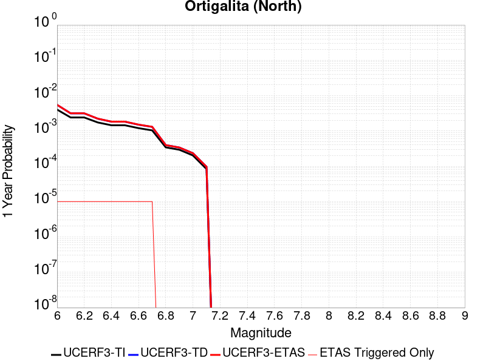 |  |

| Magnitude | 1 wk TI Prob | 1 wk TD Prob | 1 wk ETAS Prob | 1 wk ETAS/TD Gain | 1 wk ETAS Triggered Only | 1 mo TI Prob | 1 mo TD Prob | 1 mo ETAS Prob | 1 mo ETAS/TD Gain | 1 mo ETAS Triggered Only | 1 yr TI Prob | 1 yr TD Prob | 1 yr ETAS Prob | 1 yr ETAS/TD Gain | 1 yr ETAS Triggered Only | 10 yr TI Prob | 10 yr TD Prob | 10 yr ETAS Prob | 10 yr ETAS/TD Gain | 10 yr ETAS Triggered Only |
|-----|-----|-----|-----|-----|-----|-----|-----|-----|-----|-----|-----|-----|-----|-----|-----|-----|-----|-----|-----|-----|
| 6.0 | 7.711876E-5 | 1.0505833E-4 | 1.0505833E-4 | 1.0 | 0.0 | 3.3046713E-4 | 4.50182E-4 | 4.50182E-4 | 1.0 | 0.0 | 0.004016016 | 0.005468294 | 0.005478239 | 1.0018188 | 1.0E-5 | 0.039442103 | 0.053457875 | 0.05346734 | 1.000177 | 1.0E-5 |
| 6.1 | 4.607858E-5 | 6.024242E-5 | 6.024242E-5 | 1.0 | 0.0 | 1.9746469E-4 | 2.5815787E-4 | 2.5815787E-4 | 1.0 | 0.0 | 0.0024014818 | 0.003138861 | 0.0031488296 | 1.0031759 | 1.0E-5 | 0.023756953 | 0.03097651 | 0.0309862 | 1.0003128 | 1.0E-5 |
| 6.2 | 4.607858E-5 | 6.024242E-5 | 6.024242E-5 | 1.0 | 0.0 | 1.9746469E-4 | 2.5815787E-4 | 2.5815787E-4 | 1.0 | 0.0 | 0.0024014818 | 0.003138861 | 0.0031488296 | 1.0031759 | 1.0E-5 | 0.023756953 | 0.03097651 | 0.0309862 | 1.0003128 | 1.0E-5 |
| 6.3 | 3.327423E-5 | 4.247773E-5 | 4.247773E-5 | 1.0 | 0.0 | 1.4259605E-4 | 1.8203634E-4 | 1.8203634E-4 | 1.0 | 0.0 | 0.0017347244 | 0.0022142874 | 0.0022242651 | 1.0045061 | 1.0E-5 | 0.017212452 | 0.021946533 | 0.021956313 | 1.0004456 | 1.0E-5 |
| 6.4 | 2.7732503E-5 | 3.5000263E-5 | 3.5000263E-5 | 1.0 | 0.0 | 1.1884817E-4 | 1.499939E-4 | 1.499939E-4 | 1.0 | 0.0 | 0.001446016 | 0.0018248801 | 0.0018348618 | 1.0054698 | 1.0E-5 | 0.014366428 | 0.018121928 | 0.018131748 | 1.0005418 | 1.0E-5 |
| 6.5 | 2.7689714E-5 | 3.4950077E-5 | 3.4950077E-5 | 1.0 | 0.0 | 1.186648E-4 | 1.4977883E-4 | 1.4977883E-4 | 1.0 | 0.0 | 0.0014437864 | 0.001822266 | 0.0018322478 | 1.0054777 | 1.0E-5 | 0.014344421 | 0.018096214 | 0.018106034 | 1.0005426 | 1.0E-5 |
| 6.6 | 2.2976905E-5 | 2.8719278E-5 | 2.8719278E-5 | 1.0 | 0.0 | 9.846873E-5 | 1.2307824E-4 | 1.2307824E-4 | 1.0 | 0.0 | 0.0011981975 | 0.0014976859 | 0.0015076709 | 1.006667 | 1.0E-5 | 0.011917574 | 0.014899237 | 0.014909089 | 1.0006611 | 1.0E-5 |
| 6.7 | 1.9871539E-5 | 2.4905505E-5 | 2.4905505E-5 | 1.0 | 0.0 | 8.516096E-5 | 1.0673491E-4 | 1.0673491E-4 | 1.0 | 0.0 | 0.0010363415 | 0.001298965 | 0.001308952 | 1.0076884 | 1.0E-5 | 0.010315218 | 0.012937383 | 0.012947254 | 1.0007629 | 1.0E-5 |
| 6.8 | 6.5640475E-6 | 7.6056526E-6 | 7.6056526E-6 | 1.0 | 0.0 | 2.813133E-5 | 3.2595264E-5 | 3.2595264E-5 | 1.0 | 0.0 | 3.424451E-4 | 3.9677793E-4 | 3.9677793E-4 | 1.0 | 0.0 | 0.0034191788 | 0.0039609824 | 0.0039609824 | 1.0 | 0.0 |
| 6.9 | 5.6219683E-6 | 6.5019726E-6 | 6.5019726E-6 | 1.0 | 0.0 | 2.4093928E-5 | 2.7865315E-5 | 2.7865315E-5 | 1.0 | 0.0 | 2.933041E-4 | 3.3920998E-4 | 3.3920998E-4 | 1.0 | 0.0 | 0.0029291727 | 0.0033871792 | 0.0033871792 | 1.0 | 0.0 |
| 7.0 | 3.875591E-6 | 4.4848484E-6 | 4.4848484E-6 | 1.0 | 0.0 | 1.6609569E-5 | 1.922065E-5 | 1.922065E-5 | 1.0 | 0.0 | 2.0220275E-4 | 2.339884E-4 | 2.339884E-4 | 1.0 | 0.0 | 0.0020201886 | 0.0023376285 | 0.0023376285 | 1.0 | 0.0 |
| 7.1 | 1.6017933E-6 | 1.8570811E-6 | 1.8570811E-6 | 1.0 | 0.0 | 6.8648105E-6 | 7.958901E-6 | 7.958901E-6 | 1.0 | 0.0 | 8.357586E-5 | 9.689637E-5 | 9.689637E-5 | 1.0 | 0.0 | 8.3544437E-4 | 9.686459E-4 | 9.686459E-4 | 1.0 | 0.0 |

## Casmalia 2011 CFM
*[(top)](#table-of-contents)*

| 1 Week | 1 Month | 1 Year | 10 Year |
|-----|-----|-----|-----|
|  |  |  |  |

| Magnitude | 1 wk TI Prob | 1 wk TD Prob | 1 wk ETAS Prob | 1 wk ETAS/TD Gain | 1 wk ETAS Triggered Only | 1 mo TI Prob | 1 mo TD Prob | 1 mo ETAS Prob | 1 mo ETAS/TD Gain | 1 mo ETAS Triggered Only | 1 yr TI Prob | 1 yr TD Prob | 1 yr ETAS Prob | 1 yr ETAS/TD Gain | 1 yr ETAS Triggered Only | 10 yr TI Prob | 10 yr TD Prob | 10 yr ETAS Prob | 10 yr ETAS/TD Gain | 10 yr ETAS Triggered Only |
|-----|-----|-----|-----|-----|-----|-----|-----|-----|-----|-----|-----|-----|-----|-----|-----|-----|-----|-----|-----|-----|
| 6.0 | 4.1704893E-6 | 4.262503E-6 | 4.262503E-6 | 1.0 | 0.0 | 1.7873403E-5 | 1.8267743E-5 | 1.8267743E-5 | 1.0 | 0.0 | 2.1758694E-4 | 2.2238727E-4 | 2.2238727E-4 | 1.0 | 0.0 | 0.0021737402 | 0.0022216684 | 0.002231646 | 1.0044911 | 1.0E-5 |
| 6.1 | 4.1704893E-6 | 4.262503E-6 | 4.262503E-6 | 1.0 | 0.0 | 1.7873403E-5 | 1.8267743E-5 | 1.8267743E-5 | 1.0 | 0.0 | 2.1758694E-4 | 2.2238727E-4 | 2.2238727E-4 | 1.0 | 0.0 | 0.0021737402 | 0.0022216684 | 0.002231646 | 1.0044911 | 1.0E-5 |
| 6.2 | 3.457312E-6 | 3.5370404E-6 | 3.5370404E-6 | 1.0 | 0.0 | 1.4816967E-5 | 1.5158656E-5 | 1.5158656E-5 | 1.0 | 0.0 | 1.8038164E-4 | 1.845411E-4 | 1.845411E-4 | 1.0 | 0.0 | 0.001802353 | 0.0018438881 | 0.0018438881 | 1.0 | 0.0 |
| 6.3 | 3.457312E-6 | 3.5370404E-6 | 3.5370404E-6 | 1.0 | 0.0 | 1.4816967E-5 | 1.5158656E-5 | 1.5158656E-5 | 1.0 | 0.0 | 1.8038164E-4 | 1.845411E-4 | 1.845411E-4 | 1.0 | 0.0 | 0.001802353 | 0.0018438881 | 0.0018438881 | 1.0 | 0.0 |
| 6.4 | 3.0957337E-6 | 3.1692434E-6 | 3.1692434E-6 | 1.0 | 0.0 | 1.3267363E-5 | 1.3582401E-5 | 1.3582401E-5 | 1.0 | 0.0 | 1.6151817E-4 | 1.6535325E-4 | 1.6535325E-4 | 1.0 | 0.0 | 0.0016140083 | 0.0016523083 | 0.0016523083 | 1.0 | 0.0 |
| 6.5 | 3.0957337E-6 | 3.1692434E-6 | 3.1692434E-6 | 1.0 | 0.0 | 1.3267363E-5 | 1.3582401E-5 | 1.3582401E-5 | 1.0 | 0.0 | 1.6151817E-4 | 1.6535325E-4 | 1.6535325E-4 | 1.0 | 0.0 | 0.0016140083 | 0.0016523083 | 0.0016523083 | 1.0 | 0.0 |
| 6.6 | 2.9459152E-6 | 3.0165925E-6 | 3.0165925E-6 | 1.0 | 0.0 | 1.262529E-5 | 1.292819E-5 | 1.292819E-5 | 1.0 | 0.0 | 1.5370206E-4 | 1.573894E-4 | 1.573894E-4 | 1.0 | 0.0 | 0.0015359579 | 0.0015727849 | 0.0015727849 | 1.0 | 0.0 |
| 6.7 | 2.8634809E-6 | 2.9324897E-6 | 2.9324897E-6 | 1.0 | 0.0 | 1.2272003E-5 | 1.25677525E-5 | 1.25677525E-5 | 1.0 | 0.0 | 1.4940138E-4 | 1.5300169E-4 | 1.5300169E-4 | 1.0 | 0.0 | 0.0014930099 | 0.001528969 | 0.001528969 | 1.0 | 0.0 |
| 6.8 | 2.7999822E-6 | 2.8676136E-6 | 2.8676136E-6 | 1.0 | 0.0 | 1.1999869E-5 | 1.22897145E-5 | 1.22897145E-5 | 1.0 | 0.0 | 1.460886E-4 | 1.4961706E-4 | 1.4961706E-4 | 1.0 | 0.0 | 0.001459926 | 0.0014951685 | 0.0014951685 | 1.0 | 0.0 |
| 6.9 | 2.551052E-6 | 2.6119808E-6 | 2.6119808E-6 | 1.0 | 0.0 | 1.0933034E-5 | 1.1194155E-5 | 1.1194155E-5 | 1.0 | 0.0 | 1.3310155E-4 | 1.3628036E-4 | 1.3628036E-4 | 1.0 | 0.0 | 0.0013302186 | 0.001361972 | 0.001361972 | 1.0 | 0.0 |
| 7.0 | 2.3081875E-6 | 2.3624239E-6 | 2.3624239E-6 | 1.0 | 0.0 | 9.892195E-6 | 1.0124635E-5 | 1.0124635E-5 | 1.0 | 0.0 | 1.20430814E-4 | 1.2326048E-4 | 1.2326048E-4 | 1.0 | 0.0 | 0.0012036557 | 0.001231924 | 0.001231924 | 1.0 | 0.0 |
| 7.1 | 2.093245E-6 | 2.1417386E-6 | 2.1417386E-6 | 1.0 | 0.0 | 8.971019E-6 | 9.178848E-6 | 9.178848E-6 | 1.0 | 0.0 | 1.09216686E-4 | 1.11746755E-4 | 1.11746755E-4 | 1.0 | 0.0 | 0.0010916302 | 0.0011169077 | 0.0011169077 | 1.0 | 0.0 |
| 7.2 | 1.9714576E-6 | 2.016523E-6 | 2.016523E-6 | 1.0 | 0.0 | 8.449076E-6 | 8.642212E-6 | 8.642212E-6 | 1.0 | 0.0 | 1.0286264E-4 | 1.05213876E-4 | 1.05213876E-4 | 1.0 | 0.0 | 0.0010281504 | 0.0010516425 | 0.0010516425 | 1.0 | 0.0 |
| 7.3 | 1.6689512E-6 | 1.7047256E-6 | 1.7047256E-6 | 1.0 | 0.0 | 7.1526288E-6 | 7.3059464E-6 | 7.3059464E-6 | 1.0 | 0.0 | 8.7079774E-5 | 8.8946275E-5 | 8.8946275E-5 | 1.0 | 0.0 | 8.7045657E-4 | 8.891075E-4 | 8.891075E-4 | 1.0 | 0.0 |
| 7.4 | 1.4490954E-6 | 1.4779024E-6 | 1.4779024E-6 | 1.0 | 0.0 | 6.210394E-6 | 6.333852E-6 | 6.333852E-6 | 1.0 | 0.0 | 7.560892E-5 | 7.711192E-5 | 7.711192E-5 | 1.0 | 0.0 | 7.55832E-4 | 7.708523E-4 | 7.708523E-4 | 1.0 | 0.0 |
| 7.5 | 1.226873E-6 | 1.2481808E-6 | 1.2481808E-6 | 1.0 | 0.0 | 5.2580162E-6 | 5.349335E-6 | 5.349335E-6 | 1.0 | 0.0 | 6.401447E-5 | 6.512621E-5 | 6.512621E-5 | 1.0 | 0.0 | 6.399603E-4 | 6.510718E-4 | 6.510718E-4 | 1.0 | 0.0 |
| 7.6 | 9.2561345E-7 | 9.3620145E-7 | 9.3620145E-7 | 1.0 | 0.0 | 3.966909E-6 | 4.0122854E-6 | 4.0122854E-6 | 1.0 | 0.0 | 4.8296046E-5 | 4.8848487E-5 | 4.8848487E-5 | 1.0 | 0.0 | 4.828555E-4 | 4.883779E-4 | 4.883779E-4 | 1.0 | 0.0 |
| 7.7 | 5.4367933E-7 | 5.3929585E-7 | 5.3929585E-7 | 1.0 | 0.0 | 2.3300522E-6 | 2.311266E-6 | 2.311266E-6 | 1.0 | 0.0 | 2.8368017E-5 | 2.81393E-5 | 2.81393E-5 | 1.0 | 0.0 | 2.8364395E-4 | 2.813575E-4 | 2.813575E-4 | 1.0 | 0.0 |
| 7.8 | 1.8825742E-7 | 1.7342788E-7 | 1.7342788E-7 | 1.0 | 0.0 | 8.068173E-7 | 7.4326215E-7 | 7.4326215E-7 | 1.0 | 0.0 | 9.822956E-6 | 9.049179E-6 | 9.049179E-6 | 1.0 | 0.0 | 9.822522E-5 | 9.048813E-5 | 9.048813E-5 | 1.0 | 0.0 |
| 7.9 | 6.342771E-8 | 4.6793062E-8 | 4.6793062E-8 | 1.0 | 0.0 | 2.7183304E-7 | 2.0054168E-7 | 2.0054168E-7 | 1.0 | 0.0 | 3.3095623E-6 | 2.4415922E-6 | 2.4415922E-6 | 1.0 | 0.0 | 3.309513E-5 | 2.4415658E-5 | 2.4415658E-5 | 1.0 | 0.0 |
| 8.0 | 1.2574819E-8 | 6.473506E-9 | 6.473506E-9 | 1.0 | 0.0 | 5.3892084E-8 | 2.7743598E-8 | 2.7743598E-8 | 1.0 | 0.0 | 6.561359E-7 | 3.3777826E-7 | 3.3777826E-7 | 1.0 | 0.0 | 6.56134E-6 | 3.3777776E-6 | 3.3777776E-6 | 1.0 | 0.0 |

## Los Medanos - Roe Island
*[(top)](#table-of-contents)*

| 1 Week | 1 Month | 1 Year | 10 Year |
|-----|-----|-----|-----|
|  |  |  |  |

| Magnitude | 1 wk TI Prob | 1 wk TD Prob | 1 wk ETAS Prob | 1 wk ETAS/TD Gain | 1 wk ETAS Triggered Only | 1 mo TI Prob | 1 mo TD Prob | 1 mo ETAS Prob | 1 mo ETAS/TD Gain | 1 mo ETAS Triggered Only | 1 yr TI Prob | 1 yr TD Prob | 1 yr ETAS Prob | 1 yr ETAS/TD Gain | 1 yr ETAS Triggered Only | 10 yr TI Prob | 10 yr TD Prob | 10 yr ETAS Prob | 10 yr ETAS/TD Gain | 10 yr ETAS Triggered Only |
|-----|-----|-----|-----|-----|-----|-----|-----|-----|-----|-----|-----|-----|-----|-----|-----|-----|-----|-----|-----|-----|
| 6.0 | 9.06745E-7 | 9.796505E-7 | 1.0979641E-5 | 11.207711 | 1.0E-5 | 3.8860444E-6 | 4.198496E-6 | 1.4198454E-5 | 3.3817954 | 1.0E-5 | 4.731156E-5 | 5.1115494E-5 | 6.111498E-5 | 1.1956254 | 1.0E-5 | 4.730149E-4 | 5.110383E-4 | 5.2103313E-4 | 1.019558 | 1.0E-5 |
| 6.1 | 9.06745E-7 | 9.796505E-7 | 1.0979641E-5 | 11.207711 | 1.0E-5 | 3.8860444E-6 | 4.198496E-6 | 1.4198454E-5 | 3.3817954 | 1.0E-5 | 4.731156E-5 | 5.1115494E-5 | 6.111498E-5 | 1.1956254 | 1.0E-5 | 4.730149E-4 | 5.110383E-4 | 5.2103313E-4 | 1.019558 | 1.0E-5 |
| 6.2 | 9.06745E-7 | 9.796505E-7 | 1.0979641E-5 | 11.207711 | 1.0E-5 | 3.8860444E-6 | 4.198496E-6 | 1.4198454E-5 | 3.3817954 | 1.0E-5 | 4.731156E-5 | 5.1115494E-5 | 6.111498E-5 | 1.1956254 | 1.0E-5 | 4.730149E-4 | 5.110383E-4 | 5.2103313E-4 | 1.019558 | 1.0E-5 |
| 6.3 | 9.06745E-7 | 9.796505E-7 | 1.0979641E-5 | 11.207711 | 1.0E-5 | 3.8860444E-6 | 4.198496E-6 | 1.4198454E-5 | 3.3817954 | 1.0E-5 | 4.731156E-5 | 5.1115494E-5 | 6.111498E-5 | 1.1956254 | 1.0E-5 | 4.730149E-4 | 5.110383E-4 | 5.2103313E-4 | 1.019558 | 1.0E-5 |
| 6.4 | 9.06745E-7 | 9.796505E-7 | 1.0979641E-5 | 11.207711 | 1.0E-5 | 3.8860444E-6 | 4.198496E-6 | 1.4198454E-5 | 3.3817954 | 1.0E-5 | 4.731156E-5 | 5.1115494E-5 | 6.111498E-5 | 1.1956254 | 1.0E-5 | 4.730149E-4 | 5.110383E-4 | 5.2103313E-4 | 1.019558 | 1.0E-5 |
| 6.5 | 9.06745E-7 | 9.796505E-7 | 1.0979641E-5 | 11.207711 | 1.0E-5 | 3.8860444E-6 | 4.198496E-6 | 1.4198454E-5 | 3.3817954 | 1.0E-5 | 4.731156E-5 | 5.1115494E-5 | 6.111498E-5 | 1.1956254 | 1.0E-5 | 4.730149E-4 | 5.110383E-4 | 5.2103313E-4 | 1.019558 | 1.0E-5 |
| 6.6 | 9.06745E-7 | 9.796505E-7 | 1.0979641E-5 | 11.207711 | 1.0E-5 | 3.8860444E-6 | 4.198496E-6 | 1.4198454E-5 | 3.3817954 | 1.0E-5 | 4.731156E-5 | 5.1115494E-5 | 6.111498E-5 | 1.1956254 | 1.0E-5 | 4.730149E-4 | 5.110383E-4 | 5.2103313E-4 | 1.019558 | 1.0E-5 |
| 6.7 | 8.984686E-7 | 9.713171E-7 | 1.0971307E-5 | 11.295288 | 1.0E-5 | 3.850574E-6 | 4.1627814E-6 | 1.416274E-5 | 3.40223 | 1.0E-5 | 4.687973E-5 | 5.0680694E-5 | 6.0680188E-5 | 1.1973038 | 1.0E-5 | 4.6869842E-4 | 5.066922E-4 | 5.1668717E-4 | 1.0197258 | 1.0E-5 |
| 6.8 | 8.5634423E-7 | 9.2276656E-7 | 1.0922758E-5 | 11.836967 | 1.0E-5 | 3.6700415E-6 | 3.9547076E-6 | 1.3954668E-5 | 3.528622 | 1.0E-5 | 4.4681838E-5 | 4.814751E-5 | 5.814703E-5 | 1.2076851 | 1.0E-5 | 4.4672855E-4 | 4.8137153E-4 | 4.913667E-4 | 1.020764 | 1.0E-5 |
| 6.9 | 7.9857483E-7 | 8.5946414E-7 | 1.0859456E-5 | 12.635147 | 1.0E-5 | 3.422459E-6 | 3.6834126E-6 | 1.3683376E-5 | 3.7148638 | 1.0E-5 | 4.166764E-5 | 4.484463E-5 | 5.4844182E-5 | 1.2229822 | 1.0E-5 | 4.165983E-4 | 4.4835644E-4 | 4.5835198E-4 | 1.0222937 | 1.0E-5 |
| 7.0 | 6.898334E-7 | 7.3973416E-7 | 7.3973416E-7 | 1.0 | 0.0 | 2.9564258E-6 | 3.1702853E-6 | 3.1702853E-6 | 1.0 | 0.0 | 3.599389E-5 | 3.8597544E-5 | 3.8597544E-5 | 1.0 | 0.0 | 3.598806E-4 | 3.8590882E-4 | 3.8590882E-4 | 1.0 | 0.0 |
| 7.1 | 5.5734876E-7 | 5.9684714E-7 | 5.9684714E-7 | 1.0 | 0.0 | 2.3886353E-6 | 2.5579138E-6 | 2.5579138E-6 | 1.0 | 0.0 | 2.9081246E-5 | 3.114216E-5 | 3.114216E-5 | 1.0 | 0.0 | 2.9077442E-4 | 3.1137821E-4 | 3.1137821E-4 | 1.0 | 0.0 |
| 7.2 | 4.0792582E-7 | 4.357057E-7 | 4.357057E-7 | 1.0 | 0.0 | 1.7482523E-6 | 1.8673088E-6 | 1.8673088E-6 | 1.0 | 0.0 | 2.1284764E-5 | 2.2734248E-5 | 2.2734248E-5 | 1.0 | 0.0 | 2.1282726E-4 | 2.2731938E-4 | 2.2731938E-4 | 1.0 | 0.0 |
| 7.3 | 2.6733358E-7 | 2.8579834E-7 | 2.8579834E-7 | 1.0 | 0.0 | 1.1457148E-6 | 1.2248495E-6 | 1.2248495E-6 | 1.0 | 0.0 | 1.3948988E-5 | 1.4912441E-5 | 1.4912441E-5 | 1.0 | 0.0 | 1.3948113E-4 | 1.4911448E-4 | 1.4911448E-4 | 1.0 | 0.0 |
| 7.4 | 1.5851728E-7 | 1.6910336E-7 | 1.6910336E-7 | 1.0 | 0.0 | 6.7935963E-7 | 7.2472847E-7 | 7.2472847E-7 | 1.0 | 0.0 | 8.271172E-6 | 8.823534E-6 | 8.823534E-6 | 1.0 | 0.0 | 8.270864E-5 | 8.823186E-5 | 8.823186E-5 | 1.0 | 0.0 |
| 7.5 | 1.06756E-7 | 1.13796595E-7 | 1.13796595E-7 | 1.0 | 0.0 | 4.575256E-7 | 4.876996E-7 | 4.876996E-7 | 1.0 | 0.0 | 5.57036E-6 | 5.9377267E-6 | 5.9377267E-6 | 1.0 | 0.0 | 5.5702203E-5 | 5.9375696E-5 | 5.9375696E-5 | 1.0 | 0.0 |
| 7.6 | 6.48122E-8 | 6.904824E-8 | 6.904824E-8 | 1.0 | 0.0 | 2.7776653E-7 | 2.9592098E-7 | 2.9592098E-7 | 1.0 | 0.0 | 3.3818023E-6 | 3.6028323E-6 | 3.6028323E-6 | 1.0 | 0.0 | 3.381751E-5 | 3.602775E-5 | 3.602775E-5 | 1.0 | 0.0 |
| 7.7 | 1.198296E-9 | 1.2904567E-9 | 1.2904567E-9 | 1.0 | 0.0 | 5.135554E-9 | 5.530529E-9 | 5.530529E-9 | 1.0 | 0.0 | 6.252537E-8 | 6.7334184E-8 | 6.7334184E-8 | 1.0 | 0.0 | 6.2525356E-7 | 6.7334173E-7 | 6.7334173E-7 | 1.0 | 0.0 |

## Newport-Inglewood alt 1
*[(top)](#table-of-contents)*

| 1 Week | 1 Month | 1 Year | 10 Year |
|-----|-----|-----|-----|
|  |  | 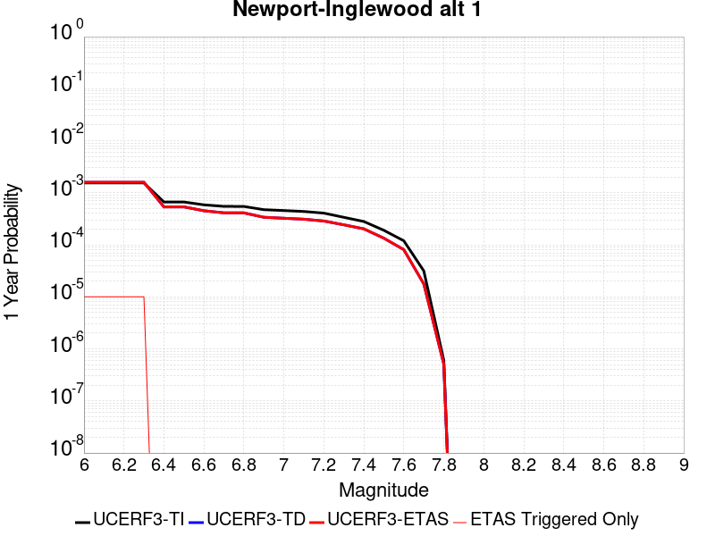 |  |

| Magnitude | 1 wk TI Prob | 1 wk TD Prob | 1 wk ETAS Prob | 1 wk ETAS/TD Gain | 1 wk ETAS Triggered Only | 1 mo TI Prob | 1 mo TD Prob | 1 mo ETAS Prob | 1 mo ETAS/TD Gain | 1 mo ETAS Triggered Only | 1 yr TI Prob | 1 yr TD Prob | 1 yr ETAS Prob | 1 yr ETAS/TD Gain | 1 yr ETAS Triggered Only | 10 yr TI Prob | 10 yr TD Prob | 10 yr ETAS Prob | 10 yr ETAS/TD Gain | 10 yr ETAS Triggered Only |
|-----|-----|-----|-----|-----|-----|-----|-----|-----|-----|-----|-----|-----|-----|-----|-----|-----|-----|-----|-----|-----|
| 6.0 | 2.9668912E-5 | 3.040552E-5 | 3.040552E-5 | 1.0 | 0.0 | 1.2714628E-4 | 1.303056E-4 | 1.403043E-4 | 1.0767326 | 1.0E-5 | 0.0015469068 | 0.0015858014 | 0.0015957855 | 1.0062959 | 1.0E-5 | 0.015361829 | 0.015792465 | 0.015802307 | 1.0006232 | 1.0E-5 |
| 6.1 | 2.9668912E-5 | 3.040552E-5 | 3.040552E-5 | 1.0 | 0.0 | 1.2714628E-4 | 1.303056E-4 | 1.403043E-4 | 1.0767326 | 1.0E-5 | 0.0015469068 | 0.0015858014 | 0.0015957855 | 1.0062959 | 1.0E-5 | 0.015361829 | 0.015792465 | 0.015802307 | 1.0006232 | 1.0E-5 |
| 6.2 | 2.9668912E-5 | 3.040552E-5 | 3.040552E-5 | 1.0 | 0.0 | 1.2714628E-4 | 1.303056E-4 | 1.403043E-4 | 1.0767326 | 1.0E-5 | 0.0015469068 | 0.0015858014 | 0.0015957855 | 1.0062959 | 1.0E-5 | 0.015361829 | 0.015792465 | 0.015802307 | 1.0006232 | 1.0E-5 |
| 6.3 | 2.9668912E-5 | 3.040552E-5 | 3.040552E-5 | 1.0 | 0.0 | 1.2714628E-4 | 1.303056E-4 | 1.403043E-4 | 1.0767326 | 1.0E-5 | 0.0015469068 | 0.0015858014 | 0.0015957855 | 1.0062959 | 1.0E-5 | 0.015361829 | 0.015792465 | 0.015802307 | 1.0006232 | 1.0E-5 |
| 6.4 | 1.275942E-5 | 1.0272689E-5 | 1.0272689E-5 | 1.0 | 0.0 | 5.4682085E-5 | 4.402509E-5 | 4.402509E-5 | 1.0 | 0.0 | 6.65551E-4 | 5.358778E-4 | 5.358778E-4 | 1.0 | 0.0 | 0.0066356123 | 0.005346281 | 0.005346281 | 1.0 | 0.0 |
| 6.5 | 1.275942E-5 | 1.0272689E-5 | 1.0272689E-5 | 1.0 | 0.0 | 5.4682085E-5 | 4.402509E-5 | 4.402509E-5 | 1.0 | 0.0 | 6.65551E-4 | 5.358778E-4 | 5.358778E-4 | 1.0 | 0.0 | 0.0066356123 | 0.005346281 | 0.005346281 | 1.0 | 0.0 |
| 6.6 | 1.1255358E-5 | 8.66204E-6 | 8.66204E-6 | 1.0 | 0.0 | 4.8236358E-5 | 3.712251E-5 | 3.712251E-5 | 1.0 | 0.0 | 5.871194E-4 | 4.518745E-4 | 4.518745E-4 | 1.0 | 0.0 | 0.005855706 | 0.004509734 | 0.004509734 | 1.0 | 0.0 |
| 6.7 | 1.0504745E-5 | 7.899962E-6 | 7.899962E-6 | 1.0 | 0.0 | 4.5019555E-5 | 3.3856548E-5 | 3.3856548E-5 | 1.0 | 0.0 | 5.4797524E-4 | 4.1212674E-4 | 4.1212674E-4 | 1.0 | 0.0 | 0.0054662596 | 0.0041137543 | 0.0041137543 | 1.0 | 0.0 |
| 6.8 | 1.0476007E-5 | 7.881343E-6 | 7.881343E-6 | 1.0 | 0.0 | 4.4896402E-5 | 3.3776756E-5 | 3.3776756E-5 | 1.0 | 0.0 | 5.464766E-4 | 4.1115563E-4 | 4.1115563E-4 | 1.0 | 0.0 | 0.005451347 | 0.004104079 | 0.004104079 | 1.0 | 0.0 |
| 6.9 | 9.076797E-6 | 6.4897567E-6 | 6.4897567E-6 | 1.0 | 0.0 | 3.889998E-5 | 2.7812948E-5 | 2.7812948E-5 | 1.0 | 0.0 | 4.7350433E-4 | 3.3857036E-4 | 3.3857036E-4 | 1.0 | 0.0 | 0.004724967 | 0.003380583 | 0.003380583 | 1.0 | 0.0 |
| 7.0 | 8.73795E-6 | 6.21215E-6 | 6.21215E-6 | 1.0 | 0.0 | 3.7447822E-5 | 2.662323E-5 | 2.662323E-5 | 1.0 | 0.0 | 4.5583185E-4 | 3.240899E-4 | 3.240899E-4 | 1.0 | 0.0 | 0.0045489795 | 0.0032362042 | 0.0032362042 | 1.0 | 0.0 |
| 7.1 | 8.391299E-6 | 5.955852E-6 | 5.955852E-6 | 1.0 | 0.0 | 3.5962214E-5 | 2.5524832E-5 | 2.5524832E-5 | 1.0 | 0.0 | 4.37752E-4 | 3.107208E-4 | 3.107208E-4 | 1.0 | 0.0 | 0.004368907 | 0.003102893 | 0.003102893 | 1.0 | 0.0 |
| 7.2 | 7.796882E-6 | 5.4965785E-6 | 5.4965785E-6 | 1.0 | 0.0 | 3.341478E-5 | 2.3556555E-5 | 2.3556555E-5 | 1.0 | 0.0 | 4.06749E-4 | 2.8676353E-4 | 2.8676353E-4 | 1.0 | 0.0 | 0.0040600533 | 0.0028639587 | 0.0028639587 | 1.0 | 0.0 |
| 7.3 | 6.4738833E-6 | 4.647811E-6 | 4.647811E-6 | 1.0 | 0.0 | 2.774492E-5 | 1.9919036E-5 | 1.9919036E-5 | 1.0 | 0.0 | 3.3774204E-4 | 2.4248744E-4 | 2.4248744E-4 | 1.0 | 0.0 | 0.0033722918 | 0.0024222452 | 0.0024222452 | 1.0 | 0.0 |
| 7.4 | 5.382145E-6 | 3.885752E-6 | 3.885752E-6 | 1.0 | 0.0 | 2.3066134E-5 | 1.6653117E-5 | 1.6653117E-5 | 1.0 | 0.0 | 2.8079396E-4 | 2.0273299E-4 | 2.0273299E-4 | 1.0 | 0.0 | 0.0028043943 | 0.0020254948 | 0.0020254948 | 1.0 | 0.0 |
| 7.5 | 3.648244E-6 | 2.573781E-6 | 2.573781E-6 | 1.0 | 0.0 | 1.5635238E-5 | 1.10304445E-5 | 1.10304445E-5 | 1.0 | 0.0 | 1.9034238E-4 | 1.3428749E-4 | 1.3428749E-4 | 1.0 | 0.0 | 0.0019017943 | 0.0013420738 | 0.0013420738 | 1.0 | 0.0 |
| 7.6 | 2.2906888E-6 | 1.5479967E-6 | 1.5479967E-6 | 1.0 | 0.0 | 9.817201E-6 | 6.634255E-6 | 6.634255E-6 | 1.0 | 0.0 | 1.1951787E-4 | 8.076913E-5 | 8.076913E-5 | 1.0 | 0.0 | 0.0011945361 | 8.0740446E-4 | 8.0740446E-4 | 1.0 | 0.0 |
| 7.7 | 6.0479874E-7 | 3.397505E-7 | 3.397505E-7 | 1.0 | 0.0 | 2.5919921E-6 | 1.4560729E-6 | 1.4560729E-6 | 1.0 | 0.0 | 3.1557047E-5 | 1.7727558E-5 | 1.7727558E-5 | 1.0 | 0.0 | 3.1552566E-4 | 1.772628E-4 | 1.772628E-4 | 1.0 | 0.0 |
| 7.8 | 1.16056995E-8 | 9.782997E-9 | 9.782997E-9 | 1.0 | 0.0 | 4.9738713E-8 | 4.1927127E-8 | 4.1927127E-8 | 1.0 | 0.0 | 6.0556863E-7 | 5.1046277E-7 | 5.1046277E-7 | 1.0 | 0.0 | 6.05567E-6 | 5.1046277E-6 | 5.1046277E-6 | 1.0 | 0.0 |

## Emerson-Copper Mtn 2011
*[(top)](#table-of-contents)*

| 1 Week | 1 Month | 1 Year | 10 Year |
|-----|-----|-----|-----|
|  |  |  | 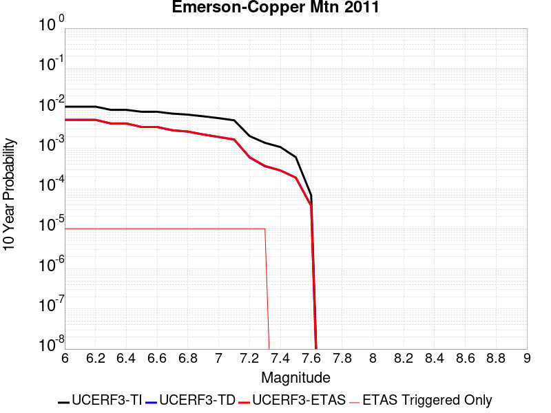 |

| Magnitude | 1 wk TI Prob | 1 wk TD Prob | 1 wk ETAS Prob | 1 wk ETAS/TD Gain | 1 wk ETAS Triggered Only | 1 mo TI Prob | 1 mo TD Prob | 1 mo ETAS Prob | 1 mo ETAS/TD Gain | 1 mo ETAS Triggered Only | 1 yr TI Prob | 1 yr TD Prob | 1 yr ETAS Prob | 1 yr ETAS/TD Gain | 1 yr ETAS Triggered Only | 10 yr TI Prob | 10 yr TD Prob | 10 yr ETAS Prob | 10 yr ETAS/TD Gain | 10 yr ETAS Triggered Only |
|-----|-----|-----|-----|-----|-----|-----|-----|-----|-----|-----|-----|-----|-----|-----|-----|-----|-----|-----|-----|-----|
| 6.0 | 2.1364202E-5 | 9.9681E-6 | 9.9681E-6 | 1.0 | 0.0 | 9.1557646E-5 | 4.271978E-5 | 4.271978E-5 | 1.0 | 0.0 | 0.0011141442 | 5.199979E-4 | 5.199979E-4 | 1.0 | 0.0 | 0.011085749 | 0.005188681 | 0.0051986296 | 1.0019172 | 1.0E-5 |
| 6.1 | 2.1364202E-5 | 9.9681E-6 | 9.9681E-6 | 1.0 | 0.0 | 9.1557646E-5 | 4.271978E-5 | 4.271978E-5 | 1.0 | 0.0 | 0.0011141442 | 5.199979E-4 | 5.199979E-4 | 1.0 | 0.0 | 0.011085749 | 0.005188681 | 0.0051986296 | 1.0019172 | 1.0E-5 |
| 6.2 | 2.1364202E-5 | 9.9681E-6 | 9.9681E-6 | 1.0 | 0.0 | 9.1557646E-5 | 4.271978E-5 | 4.271978E-5 | 1.0 | 0.0 | 0.0011141442 | 5.199979E-4 | 5.199979E-4 | 1.0 | 0.0 | 0.011085749 | 0.005188681 | 0.0051986296 | 1.0019172 | 1.0E-5 |
| 6.3 | 1.7751237E-5 | 8.089185E-6 | 8.089185E-6 | 1.0 | 0.0 | 7.607452E-5 | 3.466751E-5 | 3.466751E-5 | 1.0 | 0.0 | 9.258136E-4 | 4.220015E-4 | 4.220015E-4 | 1.0 | 0.0 | 0.00921966 | 0.004212624 | 0.0042225816 | 1.0023638 | 1.0E-5 |
| 6.4 | 1.7751237E-5 | 8.089185E-6 | 8.089185E-6 | 1.0 | 0.0 | 7.607452E-5 | 3.466751E-5 | 3.466751E-5 | 1.0 | 0.0 | 9.258136E-4 | 4.220015E-4 | 4.220015E-4 | 1.0 | 0.0 | 0.00921966 | 0.004212624 | 0.0042225816 | 1.0023638 | 1.0E-5 |
| 6.5 | 1.5886664E-5 | 6.6038024E-6 | 6.6038024E-6 | 1.0 | 0.0 | 6.808392E-5 | 2.830173E-5 | 2.830173E-5 | 1.0 | 0.0 | 8.286065E-4 | 3.4452378E-4 | 3.4452378E-4 | 1.0 | 0.0 | 0.008255237 | 0.0034403608 | 0.0034503264 | 1.0028967 | 1.0E-5 |
| 6.6 | 1.5886664E-5 | 6.6038024E-6 | 6.6038024E-6 | 1.0 | 0.0 | 6.808392E-5 | 2.830173E-5 | 2.830173E-5 | 1.0 | 0.0 | 8.286065E-4 | 3.4452378E-4 | 3.4452378E-4 | 1.0 | 0.0 | 0.008255237 | 0.0034403608 | 0.0034503264 | 1.0028967 | 1.0E-5 |
| 6.7 | 1.428471E-5 | 5.47035E-6 | 5.47035E-6 | 1.0 | 0.0 | 6.121875E-5 | 2.3444169E-5 | 2.3444169E-5 | 1.0 | 0.0 | 7.450834E-4 | 2.853993E-4 | 2.853993E-4 | 1.0 | 0.0 | 0.007425902 | 0.0028507158 | 0.0028606872 | 1.0034978 | 1.0E-5 |
| 6.8 | 1.3490684E-5 | 5.073629E-6 | 5.073629E-6 | 1.0 | 0.0 | 5.7815934E-5 | 2.1743963E-5 | 2.1743963E-5 | 1.0 | 0.0 | 7.0368167E-4 | 2.6470446E-4 | 2.6470446E-4 | 1.0 | 0.0 | 0.007014576 | 0.0026442725 | 0.002654246 | 1.0037718 | 1.0E-5 |
| 6.9 | 1.2235421E-5 | 4.289579E-6 | 4.289579E-6 | 1.0 | 0.0 | 5.2436466E-5 | 1.83838E-5 | 1.83838E-5 | 1.0 | 0.0 | 6.38227E-4 | 2.2380339E-4 | 2.2380339E-4 | 1.0 | 0.0 | 0.0063639707 | 0.0022361344 | 0.0022461119 | 1.004462 | 1.0E-5 |
| 7.0 | 1.1009851E-5 | 3.718866E-6 | 3.718866E-6 | 1.0 | 0.0 | 4.7184225E-5 | 1.593792E-5 | 1.593792E-5 | 1.0 | 0.0 | 5.743165E-4 | 1.9403033E-4 | 1.9403033E-4 | 1.0 | 0.0 | 0.005728345 | 0.0019389469 | 0.0019489275 | 1.0051475 | 1.0E-5 |
| 7.1 | 9.726373E-6 | 3.2115988E-6 | 3.2115988E-6 | 1.0 | 0.0 | 4.168379E-5 | 1.3763941E-5 | 1.3763941E-5 | 1.0 | 0.0 | 5.07382E-4 | 1.6756647E-4 | 1.6756647E-4 | 1.0 | 0.0 | 0.0050622504 | 0.0016747324 | 0.0016847156 | 1.0059611 | 1.0E-5 |
| 7.2 | 3.9335127E-6 | 1.152438E-6 | 1.152438E-6 | 1.0 | 0.0 | 1.6857803E-5 | 4.939011E-6 | 4.939011E-6 | 1.0 | 0.0 | 2.0522442E-4 | 6.0130857E-5 | 6.0130857E-5 | 1.0 | 0.0 | 0.00205035 | 6.0115184E-4 | 6.111458E-4 | 1.0166247 | 1.0E-5 |
| 7.3 | 2.661632E-6 | 6.9111877E-7 | 6.9111877E-7 | 1.0 | 0.0 | 1.14069435E-5 | 2.9619343E-6 | 2.9619343E-6 | 1.0 | 0.0 | 1.3887069E-4 | 3.6060963E-5 | 3.6060963E-5 | 1.0 | 0.0 | 0.0013878393 | 3.6055216E-4 | 3.7054854E-4 | 1.0277252 | 1.0E-5 |
| 7.4 | 2.0893426E-6 | 5.4615964E-7 | 5.4615964E-7 | 1.0 | 0.0 | 8.954295E-6 | 2.340682E-6 | 2.340682E-6 | 1.0 | 0.0 | 1.0901308E-4 | 2.8497436E-5 | 2.8497436E-5 | 1.0 | 0.0 | 0.0010895962 | 2.8493837E-4 | 2.8493837E-4 | 1.0 | 0.0 |
| 7.5 | 1.1681728E-6 | 3.6029326E-7 | 3.6029326E-7 | 1.0 | 0.0 | 5.0064455E-6 | 1.544113E-6 | 1.544113E-6 | 1.0 | 0.0 | 6.0951766E-5 | 1.879942E-5 | 1.879942E-5 | 1.0 | 0.0 | 6.093505E-4 | 1.8797876E-4 | 1.8797876E-4 | 1.0 | 0.0 |
| 7.6 | 1.3154387E-7 | 7.119745E-8 | 7.119745E-8 | 1.0 | 0.0 | 5.6375933E-7 | 3.051319E-7 | 3.051319E-7 | 1.0 | 0.0 | 6.863748E-6 | 3.7149762E-6 | 3.7149762E-6 | 1.0 | 0.0 | 6.863536E-5 | 3.7149297E-5 | 3.7149297E-5 | 1.0 | 0.0 |

## Newport-Inglewood (Offshore)
*[(top)](#table-of-contents)*

| 1 Week | 1 Month | 1 Year | 10 Year |
|-----|-----|-----|-----|
|  | 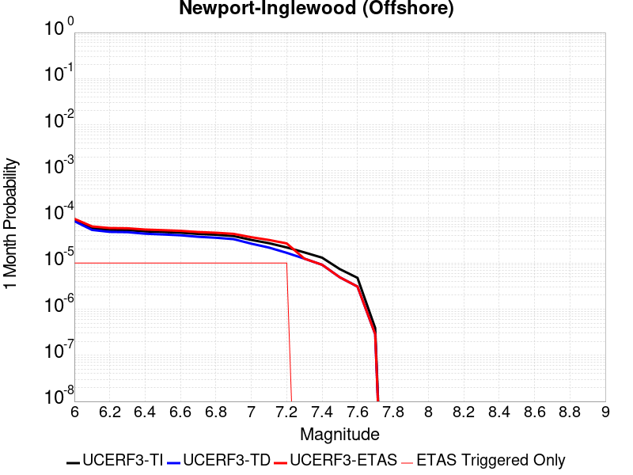 | 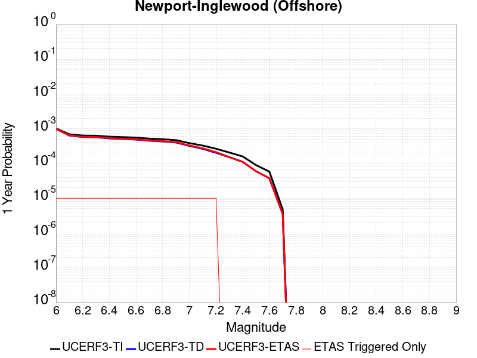 | 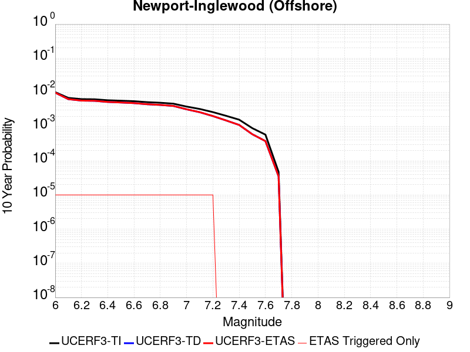 |

| Magnitude | 1 wk TI Prob | 1 wk TD Prob | 1 wk ETAS Prob | 1 wk ETAS/TD Gain | 1 wk ETAS Triggered Only | 1 mo TI Prob | 1 mo TD Prob | 1 mo ETAS Prob | 1 mo ETAS/TD Gain | 1 mo ETAS Triggered Only | 1 yr TI Prob | 1 yr TD Prob | 1 yr ETAS Prob | 1 yr ETAS/TD Gain | 1 yr ETAS Triggered Only | 10 yr TI Prob | 10 yr TD Prob | 10 yr ETAS Prob | 10 yr ETAS/TD Gain | 10 yr ETAS Triggered Only |
|-----|-----|-----|-----|-----|-----|-----|-----|-----|-----|-----|-----|-----|-----|-----|-----|-----|-----|-----|-----|-----|
| 6.0 | 1.9626508E-5 | 1.8965571E-5 | 2.8965382E-5 | 1.5272613 | 1.0E-5 | 8.411089E-5 | 8.127856E-5 | 9.127775E-5 | 1.1230236 | 1.0E-5 | 0.001023569 | 9.891298E-4 | 9.9912E-4 | 1.0100999 | 1.0E-5 | 0.010188672 | 0.009848615 | 0.009858516 | 1.0010054 | 1.0E-5 |
| 6.1 | 1.331886E-5 | 1.2218245E-5 | 2.2218122E-5 | 1.8184382 | 1.0E-5 | 5.707958E-5 | 5.2362862E-5 | 6.236234E-5 | 1.190965 | 1.0E-5 | 6.947222E-4 | 6.373329E-4 | 6.473265E-4 | 1.0156804 | 1.0E-5 | 0.006925544 | 0.0063552284 | 0.0063651646 | 1.0015635 | 1.0E-5 |
| 6.2 | 1.2250852E-5 | 1.1076171E-5 | 2.107606E-5 | 1.902829 | 1.0E-5 | 5.2502597E-5 | 4.746845E-5 | 5.7467973E-5 | 1.2106563 | 1.0E-5 | 6.3903164E-4 | 5.777761E-4 | 5.877703E-4 | 1.0172977 | 1.0E-5 | 0.006371971 | 0.0057628606 | 0.005772803 | 1.0017252 | 1.0E-5 |
| 6.3 | 1.2106258E-5 | 1.0919031E-5 | 2.0918922E-5 | 1.9158221 | 1.0E-5 | 5.1882926E-5 | 4.6795016E-5 | 5.6794546E-5 | 1.213688 | 1.0E-5 | 6.3149154E-4 | 5.6958135E-4 | 5.7957566E-4 | 1.0175468 | 1.0E-5 | 0.0062970007 | 0.0056813317 | 0.005691275 | 1.0017501 | 1.0E-5 |
| 6.4 | 1.1348758E-5 | 1.0109495E-5 | 2.0109394E-5 | 1.9891591 | 1.0E-5 | 4.8636626E-5 | 4.332569E-5 | 5.3325257E-5 | 1.2307999 | 1.0E-5 | 5.919901E-4 | 5.2736345E-4 | 5.3735817E-4 | 1.0189523 | 1.0E-5 | 0.005904155 | 0.0052612154 | 0.005271163 | 1.0018907 | 1.0E-5 |
| 6.5 | 1.100837E-5 | 9.743519E-6 | 1.974342E-5 | 2.0263133 | 1.0E-5 | 4.7177873E-5 | 4.175727E-5 | 5.1756855E-5 | 1.2394693 | 1.0E-5 | 5.7423924E-4 | 5.08277E-4 | 5.182719E-4 | 1.0196643 | 1.0E-5 | 0.005727576 | 0.005071236 | 0.005081185 | 1.001962 | 1.0E-5 |
| 6.6 | 1.0634696E-5 | 9.345668E-6 | 1.9345574E-5 | 2.0700045 | 1.0E-5 | 4.557647E-5 | 4.0052255E-5 | 5.0051854E-5 | 1.2496638 | 1.0E-5 | 5.5475225E-4 | 4.8752784E-4 | 4.97523E-4 | 1.0205016 | 1.0E-5 | 0.0055336943 | 0.00486467 | 0.004874621 | 1.0020456 | 1.0E-5 |
| 6.7 | 9.9780855E-6 | 8.668028E-6 | 1.8667943E-5 | 2.1536548 | 1.0E-5 | 4.276252E-5 | 3.714817E-5 | 4.7147798E-5 | 1.2691823 | 1.0E-5 | 5.205093E-4 | 4.521858E-4 | 4.6218128E-4 | 1.0221049 | 1.0E-5 | 0.0051929182 | 0.004512736 | 0.004522691 | 1.002206 | 1.0E-5 |
| 6.8 | 9.59546E-6 | 8.273059E-6 | 1.8272976E-5 | 2.2087326 | 1.0E-5 | 4.1122752E-5 | 3.545549E-5 | 4.5455137E-5 | 1.2820338 | 1.0E-5 | 5.0055445E-4 | 4.3158577E-4 | 4.4158145E-4 | 1.0231603 | 1.0E-5 | 0.004994285 | 0.004307552 | 0.0043175085 | 1.0023115 | 1.0E-5 |
| 6.9 | 9.000614E-6 | 7.7069435E-6 | 1.7706867E-5 | 2.297521 | 1.0E-5 | 3.857349E-5 | 3.3029344E-5 | 4.3029017E-5 | 1.3027511 | 1.0E-5 | 4.6953102E-4 | 4.0205874E-4 | 4.120547E-4 | 1.0248619 | 1.0E-5 | 0.004685402 | 0.0040133847 | 0.0040233447 | 1.0024817 | 1.0E-5 |
| 7.0 | 7.4070194E-6 | 6.148973E-6 | 1.6148912E-5 | 2.6262777 | 1.0E-5 | 3.1743984E-5 | 2.6352478E-5 | 3.6352212E-5 | 1.3794609 | 1.0E-5 | 3.8641447E-4 | 3.2079432E-4 | 3.3079114E-4 | 1.0311626 | 1.0E-5 | 0.0038574322 | 0.0032033324 | 0.0032133004 | 1.0031117 | 1.0E-5 |
| 7.1 | 6.299615E-6 | 5.056658E-6 | 1.50566075E-5 | 2.9775805 | 1.0E-5 | 2.699807E-5 | 2.1671214E-5 | 3.1670996E-5 | 1.4614316 | 1.0E-5 | 3.2865192E-4 | 2.6381522E-4 | 2.7381256E-4 | 1.0378953 | 1.0E-5 | 0.003281663 | 0.002635035 | 0.0026450087 | 1.003785 | 1.0E-5 |
| 7.2 | 5.096653E-6 | 3.89282E-6 | 1.3892782E-5 | 3.5688217 | 1.0E-5 | 2.1842614E-5 | 1.6683409E-5 | 2.6683241E-5 | 1.5993879 | 1.0E-5 | 2.6590136E-4 | 2.0310168E-4 | 2.1309964E-4 | 1.0492264 | 1.0E-5 | 0.0026558342 | 0.0020291717 | 0.0020391515 | 1.0049181 | 1.0E-5 |
| 7.3 | 3.9753018E-6 | 2.909908E-6 | 2.909908E-6 | 1.0 | 0.0 | 1.7036897E-5 | 1.2470975E-5 | 1.2470975E-5 | 1.0 | 0.0 | 2.0740448E-4 | 1.5182362E-4 | 1.5182362E-4 | 1.0 | 0.0 | 0.00207211 | 0.0015172071 | 0.0015172071 | 1.0 | 0.0 |
| 7.4 | 3.0568392E-6 | 2.1449978E-6 | 2.1449978E-6 | 1.0 | 0.0 | 1.3100675E-5 | 9.192815E-6 | 9.192815E-6 | 1.0 | 0.0 | 1.5948903E-4 | 1.11916845E-4 | 1.11916845E-4 | 1.0 | 0.0 | 0.0015937461 | 0.0011186111 | 0.0011186111 | 1.0 | 0.0 |
| 7.5 | 1.7279019E-6 | 1.1469773E-6 | 1.1469773E-6 | 1.0 | 0.0 | 7.405273E-6 | 4.915608E-6 | 4.915608E-6 | 1.0 | 0.0 | 9.015547E-5 | 5.9845923E-5 | 5.9845923E-5 | 1.0 | 0.0 | 9.01189E-4 | 5.9830194E-4 | 5.9830194E-4 | 1.0 | 0.0 |
| 7.6 | 1.1156416E-6 | 7.2230335E-7 | 7.2230335E-7 | 1.0 | 0.0 | 4.7813123E-6 | 3.0955823E-6 | 3.0955823E-6 | 1.0 | 0.0 | 5.821092E-5 | 3.7688085E-5 | 3.7688085E-5 | 1.0 | 0.0 | 5.8195676E-4 | 3.7681928E-4 | 3.7681928E-4 | 1.0 | 0.0 |
| 7.7 | 9.117973E-8 | 6.734264E-8 | 6.734264E-8 | 1.0 | 0.0 | 3.907702E-7 | 2.886113E-7 | 2.886113E-7 | 1.0 | 0.0 | 4.757617E-6 | 3.513837E-6 | 3.513837E-6 | 1.0 | 0.0 | 4.7575148E-5 | 3.5137844E-5 | 3.5137844E-5 | 1.0 | 0.0 |

## Malibu Coast (Extension) alt 1
*[(top)](#table-of-contents)*

| 1 Week | 1 Month | 1 Year | 10 Year |
|-----|-----|-----|-----|
|  |  | 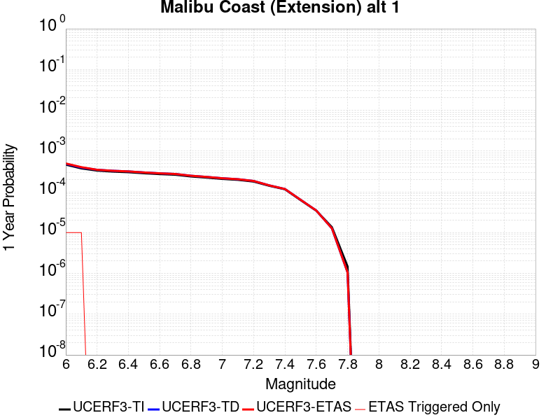 |  |

| Magnitude | 1 wk TI Prob | 1 wk TD Prob | 1 wk ETAS Prob | 1 wk ETAS/TD Gain | 1 wk ETAS Triggered Only | 1 mo TI Prob | 1 mo TD Prob | 1 mo ETAS Prob | 1 mo ETAS/TD Gain | 1 mo ETAS Triggered Only | 1 yr TI Prob | 1 yr TD Prob | 1 yr ETAS Prob | 1 yr ETAS/TD Gain | 1 yr ETAS Triggered Only | 10 yr TI Prob | 10 yr TD Prob | 10 yr ETAS Prob | 10 yr ETAS/TD Gain | 10 yr ETAS Triggered Only |
|-----|-----|-----|-----|-----|-----|-----|-----|-----|-----|-----|-----|-----|-----|-----|-----|-----|-----|-----|-----|-----|
| 6.0 | 8.930738E-6 | 9.329346E-6 | 1.9329253E-5 | 2.0718765 | 1.0E-5 | 3.827403E-5 | 3.9982307E-5 | 4.9981907E-5 | 1.2501006 | 1.0E-5 | 4.6588664E-4 | 4.8667757E-4 | 4.966727E-4 | 1.0205375 | 1.0E-5 | 0.0046491115 | 0.0048563 | 0.0048662517 | 1.0020492 | 1.0E-5 |
| 6.1 | 7.199952E-6 | 7.530357E-6 | 1.7530281E-5 | 2.3279483 | 1.0E-5 | 3.0856572E-5 | 3.227256E-5 | 4.227224E-5 | 1.3098507 | 1.0E-5 | 3.75614E-4 | 3.9284822E-4 | 4.0284428E-4 | 1.0254451 | 1.0E-5 | 0.0037497976 | 0.003921604 | 0.0039315643 | 1.00254 | 1.0E-5 |
| 6.2 | 6.3721413E-6 | 6.666847E-6 | 6.666847E-6 | 1.0 | 0.0 | 2.7308892E-5 | 2.857189E-5 | 2.857189E-5 | 1.0 | 0.0 | 3.3243504E-4 | 3.478076E-4 | 3.478076E-4 | 1.0 | 0.0 | 0.0033193815 | 0.0034726725 | 0.0034726725 | 1.0 | 0.0 |
| 6.3 | 6.016345E-6 | 6.2952113E-6 | 6.2952113E-6 | 1.0 | 0.0 | 2.578408E-5 | 2.69792E-5 | 2.69792E-5 | 1.0 | 0.0 | 3.1387596E-4 | 3.2842258E-4 | 3.2842258E-4 | 1.0 | 0.0 | 0.00313433 | 0.0032794084 | 0.0032794084 | 1.0 | 0.0 |
| 6.4 | 5.8104883E-6 | 6.0795965E-6 | 6.0795965E-6 | 1.0 | 0.0 | 2.4901856E-5 | 2.6055155E-5 | 2.6055155E-5 | 1.0 | 0.0 | 3.031379E-4 | 3.1717564E-4 | 3.1717564E-4 | 1.0 | 0.0 | 0.0030272473 | 0.0031672644 | 0.0031672644 | 1.0 | 0.0 |
| 6.5 | 5.476925E-6 | 5.7275624E-6 | 5.7275624E-6 | 1.0 | 0.0 | 2.3472323E-5 | 2.4546467E-5 | 2.4546467E-5 | 1.0 | 0.0 | 2.8573806E-4 | 2.9881255E-4 | 2.9881255E-4 | 1.0 | 0.0 | 0.0028537093 | 0.0029841396 | 0.0029841396 | 1.0 | 0.0 |
| 6.6 | 5.222387E-6 | 5.458627E-6 | 5.458627E-6 | 1.0 | 0.0 | 2.2381464E-5 | 2.3393908E-5 | 2.3393908E-5 | 1.0 | 0.0 | 2.7246025E-4 | 2.847839E-4 | 2.847839E-4 | 1.0 | 0.0 | 0.0027212645 | 0.00284422 | 0.00284422 | 1.0 | 0.0 |
| 6.7 | 5.0337076E-6 | 5.259149E-6 | 5.259149E-6 | 1.0 | 0.0 | 2.1572854E-5 | 2.2539016E-5 | 2.2539016E-5 | 1.0 | 0.0 | 2.6261783E-4 | 2.7437825E-4 | 2.7437825E-4 | 1.0 | 0.0 | 0.002623077 | 0.002740425 | 0.002740425 | 1.0 | 0.0 |
| 6.8 | 4.5675624E-6 | 4.7587573E-6 | 4.7587573E-6 | 1.0 | 0.0 | 1.9575122E-5 | 2.0394516E-5 | 2.0394516E-5 | 1.0 | 0.0 | 2.3830103E-4 | 2.4827512E-4 | 2.4827512E-4 | 1.0 | 0.0 | 0.0023804565 | 0.0024799972 | 0.0024799972 | 1.0 | 0.0 |
| 6.9 | 4.2802412E-6 | 4.452059E-6 | 4.452059E-6 | 1.0 | 0.0 | 1.8343762E-5 | 1.9080113E-5 | 1.9080113E-5 | 1.0 | 0.0 | 2.2331243E-4 | 2.3227576E-4 | 2.3227576E-4 | 1.0 | 0.0 | 0.0022308815 | 0.0023203467 | 0.0023203467 | 1.0 | 0.0 |
| 7.0 | 3.9794063E-6 | 4.130134E-6 | 4.130134E-6 | 1.0 | 0.0 | 1.7054486E-5 | 1.7700457E-5 | 1.7700457E-5 | 1.0 | 0.0 | 2.0761859E-4 | 2.1548186E-4 | 2.1548186E-4 | 1.0 | 0.0 | 0.0020742472 | 0.0021527428 | 0.0021527428 | 1.0 | 0.0 |
| 7.1 | 3.7730424E-6 | 3.9112506E-6 | 3.9112506E-6 | 1.0 | 0.0 | 1.6170083E-5 | 1.6762395E-5 | 1.6762395E-5 | 1.0 | 0.0 | 1.9685295E-4 | 2.0406317E-4 | 2.0406317E-4 | 1.0 | 0.0 | 0.0019667868 | 0.0020387708 | 0.0020387708 | 1.0 | 0.0 |
| 7.2 | 3.424985E-6 | 3.5413673E-6 | 3.5413673E-6 | 1.0 | 0.0 | 1.4678424E-5 | 1.5177201E-5 | 1.5177201E-5 | 1.0 | 0.0 | 1.7869516E-4 | 1.8476688E-4 | 1.8476688E-4 | 1.0 | 0.0 | 0.0017855153 | 0.0018461446 | 0.0018461446 | 1.0 | 0.0 |
| 7.3 | 2.6966375E-6 | 2.759676E-6 | 2.759676E-6 | 1.0 | 0.0 | 1.15569665E-5 | 1.1827129E-5 | 1.1827129E-5 | 1.0 | 0.0 | 1.4069698E-4 | 1.4398582E-4 | 1.4398582E-4 | 1.0 | 0.0 | 0.0014060794 | 0.0014389295 | 0.0014389295 | 1.0 | 0.0 |
| 7.4 | 2.215957E-6 | 2.2493962E-6 | 2.2493962E-6 | 1.0 | 0.0 | 9.496924E-6 | 9.640234E-6 | 9.640234E-6 | 1.0 | 0.0 | 1.1561892E-4 | 1.1736356E-4 | 1.1736356E-4 | 1.0 | 0.0 | 0.0011555878 | 0.0011730195 | 0.0011730195 | 1.0 | 0.0 |
| 7.5 | 1.2040218E-6 | 1.2219166E-6 | 1.2219166E-6 | 1.0 | 0.0 | 5.160083E-6 | 5.236775E-6 | 5.236775E-6 | 1.0 | 0.0 | 6.2822204E-5 | 6.3755884E-5 | 6.3755884E-5 | 1.0 | 0.0 | 6.280445E-4 | 6.3737785E-4 | 6.3737785E-4 | 1.0 | 0.0 |
| 7.6 | 6.6157446E-7 | 6.67903E-7 | 6.67903E-7 | 1.0 | 0.0 | 2.835316E-6 | 2.8624384E-6 | 2.8624384E-6 | 1.0 | 0.0 | 3.4519428E-5 | 3.4849647E-5 | 3.4849647E-5 | 1.0 | 0.0 | 3.4514067E-4 | 3.4844334E-4 | 3.4844334E-4 | 1.0 | 0.0 |
| 7.7 | 2.6012302E-7 | 2.4357752E-7 | 2.4357752E-7 | 1.0 | 0.0 | 1.1148124E-6 | 1.0439032E-6 | 1.0439032E-6 | 1.0 | 0.0 | 1.3572758E-5 | 1.2709459E-5 | 1.2709459E-5 | 1.0 | 0.0 | 1.3571928E-4 | 1.2708838E-4 | 1.2708838E-4 | 1.0 | 0.0 |
| 7.8 | 2.8323132E-8 | 2.0266684E-8 | 2.0266684E-8 | 1.0 | 0.0 | 1.2138484E-7 | 8.685721E-8 | 8.685721E-8 | 1.0 | 0.0 | 1.4778595E-6 | 1.0574862E-6 | 1.0574862E-6 | 1.0 | 0.0 | 1.4778497E-5 | 1.05748195E-5 | 1.05748195E-5 | 1.0 | 0.0 |

## Mount Diablo Thrust North CFM
*[(top)](#table-of-contents)*

| 1 Week | 1 Month | 1 Year | 10 Year |
|-----|-----|-----|-----|
|  |  |  |  |

| Magnitude | 1 wk TI Prob | 1 wk TD Prob | 1 wk ETAS Prob | 1 wk ETAS/TD Gain | 1 wk ETAS Triggered Only | 1 mo TI Prob | 1 mo TD Prob | 1 mo ETAS Prob | 1 mo ETAS/TD Gain | 1 mo ETAS Triggered Only | 1 yr TI Prob | 1 yr TD Prob | 1 yr ETAS Prob | 1 yr ETAS/TD Gain | 1 yr ETAS Triggered Only | 10 yr TI Prob | 10 yr TD Prob | 10 yr ETAS Prob | 10 yr ETAS/TD Gain | 10 yr ETAS Triggered Only |
|-----|-----|-----|-----|-----|-----|-----|-----|-----|-----|-----|-----|-----|-----|-----|-----|-----|-----|-----|-----|-----|
| 6.0 | 1.479628E-5 | 1.8770155E-5 | 2.8769968E-5 | 1.5327506 | 1.0E-5 | 6.341109E-5 | 8.0441096E-5 | 9.044029E-5 | 1.1243045 | 1.0E-5 | 7.717565E-4 | 9.789398E-4 | 9.8893E-4 | 1.0102051 | 1.0E-5 | 0.007690818 | 0.009747637 | 0.00975754 | 1.0010159 | 1.0E-5 |
| 6.1 | 1.479628E-5 | 1.8770155E-5 | 2.8769968E-5 | 1.5327506 | 1.0E-5 | 6.341109E-5 | 8.0441096E-5 | 9.044029E-5 | 1.1243045 | 1.0E-5 | 7.717565E-4 | 9.789398E-4 | 9.8893E-4 | 1.0102051 | 1.0E-5 | 0.007690818 | 0.009747637 | 0.00975754 | 1.0010159 | 1.0E-5 |
| 6.2 | 1.479628E-5 | 1.8770155E-5 | 2.8769968E-5 | 1.5327506 | 1.0E-5 | 6.341109E-5 | 8.0441096E-5 | 9.044029E-5 | 1.1243045 | 1.0E-5 | 7.717565E-4 | 9.789398E-4 | 9.8893E-4 | 1.0102051 | 1.0E-5 | 0.007690818 | 0.009747637 | 0.00975754 | 1.0010159 | 1.0E-5 |
| 6.3 | 1.479628E-5 | 1.8770155E-5 | 2.8769968E-5 | 1.5327506 | 1.0E-5 | 6.341109E-5 | 8.0441096E-5 | 9.044029E-5 | 1.1243045 | 1.0E-5 | 7.717565E-4 | 9.789398E-4 | 9.8893E-4 | 1.0102051 | 1.0E-5 | 0.007690818 | 0.009747637 | 0.00975754 | 1.0010159 | 1.0E-5 |
| 6.4 | 1.479628E-5 | 1.8770155E-5 | 2.8769968E-5 | 1.5327506 | 1.0E-5 | 6.341109E-5 | 8.0441096E-5 | 9.044029E-5 | 1.1243045 | 1.0E-5 | 7.717565E-4 | 9.789398E-4 | 9.8893E-4 | 1.0102051 | 1.0E-5 | 0.007690818 | 0.009747637 | 0.00975754 | 1.0010159 | 1.0E-5 |
| 6.5 | 1.479628E-5 | 1.8770155E-5 | 2.8769968E-5 | 1.5327506 | 1.0E-5 | 6.341109E-5 | 8.0441096E-5 | 9.044029E-5 | 1.1243045 | 1.0E-5 | 7.717565E-4 | 9.789398E-4 | 9.8893E-4 | 1.0102051 | 1.0E-5 | 0.007690818 | 0.009747637 | 0.00975754 | 1.0010159 | 1.0E-5 |
| 6.6 | 1.479016E-5 | 1.8763267E-5 | 2.876308E-5 | 1.5329462 | 1.0E-5 | 6.338486E-5 | 8.041158E-5 | 9.041077E-5 | 1.1243502 | 1.0E-5 | 7.714374E-4 | 9.785808E-4 | 9.88571E-4 | 1.0102088 | 1.0E-5 | 0.007687649 | 0.009744078 | 0.009753981 | 1.0010163 | 1.0E-5 |
| 6.7 | 1.479016E-5 | 1.8763267E-5 | 2.876308E-5 | 1.5329462 | 1.0E-5 | 6.338486E-5 | 8.041158E-5 | 9.041077E-5 | 1.1243502 | 1.0E-5 | 7.714374E-4 | 9.785808E-4 | 9.88571E-4 | 1.0102088 | 1.0E-5 | 0.007687649 | 0.009744078 | 0.009753981 | 1.0010163 | 1.0E-5 |
| 6.8 | 1.4771667E-5 | 1.8742037E-5 | 2.874185E-5 | 1.5335499 | 1.0E-5 | 6.330561E-5 | 8.032059E-5 | 9.0319794E-5 | 1.1244911 | 1.0E-5 | 7.704732E-4 | 9.77474E-4 | 9.874643E-4 | 1.0102204 | 1.0E-5 | 0.007678074 | 0.009733109 | 0.009743011 | 1.0010175 | 1.0E-5 |
| 6.9 | 1.2548234E-5 | 1.5822385E-5 | 2.5822226E-5 | 1.6320059 | 1.0E-5 | 5.3777036E-5 | 6.7808476E-5 | 7.7807796E-5 | 1.1474642 | 1.0E-5 | 6.545387E-4 | 8.252591E-4 | 8.3525083E-4 | 1.0121074 | 1.0E-5 | 0.006526142 | 0.008223122 | 0.00823304 | 1.001206 | 1.0E-5 |
| 7.0 | 1.01754185E-5 | 1.2809287E-5 | 1.2809287E-5 | 1.0 | 0.0 | 4.360821E-5 | 5.4895798E-5 | 5.4895798E-5 | 1.0 | 0.0 | 5.308006E-4 | 6.6815305E-4 | 6.6815305E-4 | 1.0 | 0.0 | 0.005295345 | 0.0066625397 | 0.0066625397 | 1.0 | 0.0 |
| 7.1 | 8.398341E-6 | 1.0554986E-5 | 1.0554986E-5 | 1.0 | 0.0 | 3.5992394E-5 | 4.5234876E-5 | 4.5234876E-5 | 1.0 | 0.0 | 4.3811928E-4 | 5.505965E-4 | 5.505965E-4 | 1.0 | 0.0 | 0.0043725655 | 0.00549312 | 0.00549312 | 1.0 | 0.0 |
| 7.2 | 6.024759E-6 | 7.648613E-6 | 7.648613E-6 | 1.0 | 0.0 | 2.582014E-5 | 3.2779364E-5 | 3.2779364E-5 | 1.0 | 0.0 | 3.1431485E-4 | 3.9901637E-4 | 3.9901637E-4 | 1.0 | 0.0 | 0.0031387066 | 0.0039835684 | 0.0039835684 | 1.0 | 0.0 |
| 7.3 | 3.2099704E-6 | 4.1357157E-6 | 4.1357157E-6 | 1.0 | 0.0 | 1.3756943E-5 | 1.7724376E-5 | 1.7724376E-5 | 1.0 | 0.0 | 1.674779E-4 | 2.1577309E-4 | 2.1577309E-4 | 1.0 | 0.0 | 0.0016735174 | 0.0021559282 | 0.0021559282 | 1.0 | 0.0 |
| 7.4 | 2.2041513E-6 | 2.8735228E-6 | 2.8735228E-6 | 1.0 | 0.0 | 9.4463285E-6 | 1.231504E-5 | 1.231504E-5 | 1.0 | 0.0 | 1.1500298E-4 | 1.4992537E-4 | 1.4992537E-4 | 1.0 | 0.0 | 0.0011494348 | 0.0014985556 | 0.0014985556 | 1.0 | 0.0 |
| 7.5 | 1.8869501E-6 | 2.4697276E-6 | 2.4697276E-6 | 1.0 | 0.0 | 8.086904E-6 | 1.0584505E-5 | 1.0584505E-5 | 1.0 | 0.0 | 9.845361E-5 | 1.288588E-4 | 1.288588E-4 | 1.0 | 0.0 | 9.841E-4 | 0.0012881366 | 0.0012881366 | 1.0 | 0.0 |
| 7.6 | 1.3012458E-6 | 1.7005598E-6 | 1.7005598E-6 | 1.0 | 0.0 | 5.576756E-6 | 7.2880935E-6 | 7.2880935E-6 | 1.0 | 0.0 | 6.7894885E-5 | 8.872898E-5 | 8.872898E-5 | 1.0 | 0.0 | 6.787415E-4 | 8.8714424E-4 | 8.8714424E-4 | 1.0 | 0.0 |
| 7.7 | 3.603383E-7 | 4.7167083E-7 | 4.7167083E-7 | 1.0 | 0.0 | 1.5443061E-6 | 2.021445E-6 | 2.021445E-6 | 1.0 | 0.0 | 1.8801764E-5 | 2.4610821E-5 | 2.4610821E-5 | 1.0 | 0.0 | 1.8800174E-4 | 2.461139E-4 | 2.461139E-4 | 1.0 | 0.0 |

## Hollywood
*[(top)](#table-of-contents)*

| 1 Week | 1 Month | 1 Year | 10 Year |
|-----|-----|-----|-----|
|  |  | 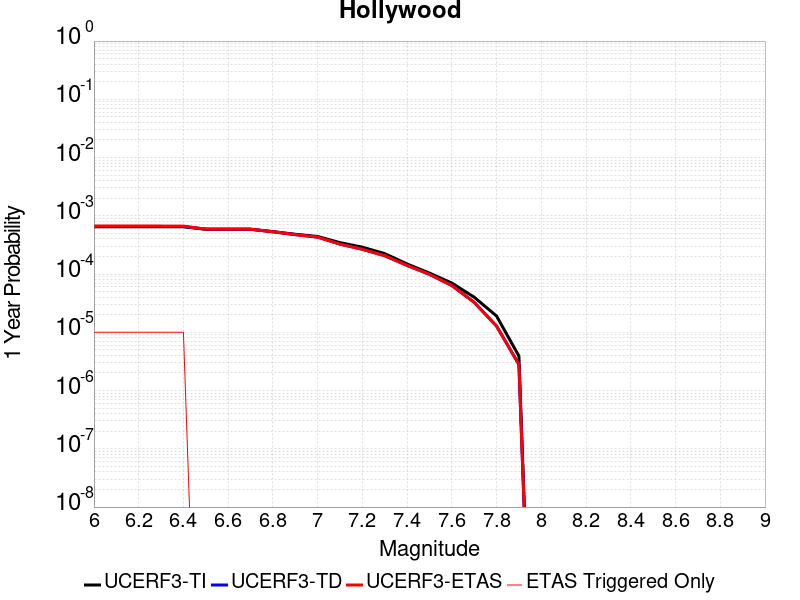 |  |

| Magnitude | 1 wk TI Prob | 1 wk TD Prob | 1 wk ETAS Prob | 1 wk ETAS/TD Gain | 1 wk ETAS Triggered Only | 1 mo TI Prob | 1 mo TD Prob | 1 mo ETAS Prob | 1 mo ETAS/TD Gain | 1 mo ETAS Triggered Only | 1 yr TI Prob | 1 yr TD Prob | 1 yr ETAS Prob | 1 yr ETAS/TD Gain | 1 yr ETAS Triggered Only | 10 yr TI Prob | 10 yr TD Prob | 10 yr ETAS Prob | 10 yr ETAS/TD Gain | 10 yr ETAS Triggered Only |
|-----|-----|-----|-----|-----|-----|-----|-----|-----|-----|-----|-----|-----|-----|-----|-----|-----|-----|-----|-----|-----|
| 6.0 | 1.24487615E-5 | 1.2593379E-5 | 1.2593379E-5 | 1.0 | 0.0 | 5.3350745E-5 | 5.3970536E-5 | 5.3970536E-5 | 1.0 | 0.0 | 6.4935174E-4 | 6.5689784E-4 | 6.668912E-4 | 1.015213 | 1.0E-5 | 0.0064745755 | 0.0065500485 | 0.006559983 | 1.0015167 | 1.0E-5 |
| 6.1 | 1.24487615E-5 | 1.2593379E-5 | 1.2593379E-5 | 1.0 | 0.0 | 5.3350745E-5 | 5.3970536E-5 | 5.3970536E-5 | 1.0 | 0.0 | 6.4935174E-4 | 6.5689784E-4 | 6.668912E-4 | 1.015213 | 1.0E-5 | 0.0064745755 | 0.0065500485 | 0.006559983 | 1.0015167 | 1.0E-5 |
| 6.2 | 1.24487615E-5 | 1.2593379E-5 | 1.2593379E-5 | 1.0 | 0.0 | 5.3350745E-5 | 5.3970536E-5 | 5.3970536E-5 | 1.0 | 0.0 | 6.4935174E-4 | 6.5689784E-4 | 6.668912E-4 | 1.015213 | 1.0E-5 | 0.0064745755 | 0.0065500485 | 0.006559983 | 1.0015167 | 1.0E-5 |
| 6.3 | 1.24487615E-5 | 1.2593379E-5 | 1.2593379E-5 | 1.0 | 0.0 | 5.3350745E-5 | 5.3970536E-5 | 5.3970536E-5 | 1.0 | 0.0 | 6.4935174E-4 | 6.5689784E-4 | 6.668912E-4 | 1.015213 | 1.0E-5 | 0.0064745755 | 0.0065500485 | 0.006559983 | 1.0015167 | 1.0E-5 |
| 6.4 | 1.2431024E-5 | 1.25739925E-5 | 1.25739925E-5 | 1.0 | 0.0 | 5.327473E-5 | 5.3887452E-5 | 5.3887452E-5 | 1.0 | 0.0 | 6.4842677E-4 | 6.558869E-4 | 6.6588033E-4 | 1.0152365 | 1.0E-5 | 0.0064653796 | 0.006539999 | 0.0065499335 | 1.0015191 | 1.0E-5 |
| 6.5 | 1.1242222E-5 | 1.1317944E-5 | 1.1317944E-5 | 1.0 | 0.0 | 4.8180063E-5 | 4.850459E-5 | 4.850459E-5 | 1.0 | 0.0 | 5.864344E-4 | 5.9038604E-4 | 5.9038604E-4 | 1.0 | 0.0 | 0.0058488925 | 0.0058884625 | 0.0058884625 | 1.0 | 0.0 |
| 6.6 | 1.1234066E-5 | 1.1309058E-5 | 1.1309058E-5 | 1.0 | 0.0 | 4.8145106E-5 | 4.8466507E-5 | 4.8466507E-5 | 1.0 | 0.0 | 5.86009E-4 | 5.8992265E-4 | 5.8992265E-4 | 1.0 | 0.0 | 0.005844661 | 0.005883853 | 0.005883853 | 1.0 | 0.0 |
| 6.7 | 1.12294E-5 | 1.1303801E-5 | 1.1303801E-5 | 1.0 | 0.0 | 4.812511E-5 | 4.8443977E-5 | 4.8443977E-5 | 1.0 | 0.0 | 5.857657E-4 | 5.896485E-4 | 5.896485E-4 | 1.0 | 0.0 | 0.0058422405 | 0.0058811265 | 0.0058811265 | 1.0 | 0.0 |
| 6.8 | 1.0252819E-5 | 1.0218572E-5 | 1.0218572E-5 | 1.0 | 0.0 | 4.3939912E-5 | 4.379316E-5 | 4.379316E-5 | 1.0 | 0.0 | 5.3483713E-4 | 5.3305336E-4 | 5.3305336E-4 | 1.0 | 0.0 | 0.005335517 | 0.005317974 | 0.005317974 | 1.0 | 0.0 |
| 6.9 | 9.252289E-6 | 9.1104175E-6 | 9.1104175E-6 | 1.0 | 0.0 | 3.9652066E-5 | 3.9044073E-5 | 3.9044073E-5 | 1.0 | 0.0 | 4.8265693E-4 | 4.7525953E-4 | 4.7525953E-4 | 1.0 | 0.0 | 0.0048161 | 0.004742605 | 0.004742605 | 1.0 | 0.0 |
| 7.0 | 8.474604E-6 | 8.258358E-6 | 8.258358E-6 | 1.0 | 0.0 | 3.6319227E-5 | 3.539249E-5 | 3.539249E-5 | 1.0 | 0.0 | 4.4209688E-4 | 4.308198E-4 | 4.308198E-4 | 1.0 | 0.0 | 0.004412184 | 0.0042999964 | 0.0042999964 | 1.0 | 0.0 |
| 7.1 | 6.643643E-6 | 6.2684435E-6 | 6.2684435E-6 | 1.0 | 0.0 | 2.8472443E-5 | 2.6864484E-5 | 2.6864484E-5 | 1.0 | 0.0 | 3.4659685E-4 | 3.270264E-4 | 3.270264E-4 | 1.0 | 0.0 | 0.0034605677 | 0.0032654977 | 0.0032654977 | 1.0 | 0.0 |
| 7.2 | 5.549002E-6 | 5.1087686E-6 | 5.1087686E-6 | 1.0 | 0.0 | 2.378122E-5 | 2.189454E-5 | 2.189454E-5 | 1.0 | 0.0 | 2.8949787E-4 | 2.6653355E-4 | 2.6653355E-4 | 1.0 | 0.0 | 0.0028912104 | 0.0026621553 | 0.0026621553 | 1.0 | 0.0 |
| 7.3 | 4.3059727E-6 | 3.959941E-6 | 3.959941E-6 | 1.0 | 0.0 | 1.8454039E-5 | 1.6971066E-5 | 1.6971066E-5 | 1.0 | 0.0 | 2.2465475E-4 | 2.0660323E-4 | 2.0660323E-4 | 1.0 | 0.0 | 0.0022442779 | 0.0020641217 | 0.0020641217 | 1.0 | 0.0 |
| 7.4 | 2.8550733E-6 | 2.7013398E-6 | 2.7013398E-6 | 1.0 | 0.0 | 1.2235971E-5 | 1.157712E-5 | 1.157712E-5 | 1.0 | 0.0 | 1.4896276E-4 | 1.4094236E-4 | 1.4094236E-4 | 1.0 | 0.0 | 0.0014886294 | 0.0014085348 | 0.0014085348 | 1.0 | 0.0 |
| 7.5 | 1.9927045E-6 | 1.8976706E-6 | 1.8976706E-6 | 1.0 | 0.0 | 8.540134E-6 | 8.132849E-6 | 8.132849E-6 | 1.0 | 0.0 | 1.0397117E-4 | 9.901297E-5 | 9.901297E-5 | 1.0 | 0.0 | 0.0010392254 | 9.896922E-4 | 9.896922E-4 | 1.0 | 0.0 |
| 7.6 | 1.345084E-6 | 1.2216213E-6 | 1.2216213E-6 | 1.0 | 0.0 | 5.764633E-6 | 5.2355094E-6 | 5.2355094E-6 | 1.0 | 0.0 | 7.018215E-5 | 6.374048E-5 | 6.374048E-5 | 1.0 | 0.0 | 7.0159987E-4 | 6.37224E-4 | 6.37224E-4 | 1.0 | 0.0 |
| 7.7 | 7.6835164E-7 | 6.2778383E-7 | 6.2778383E-7 | 1.0 | 0.0 | 3.2929315E-6 | 2.6904993E-6 | 2.6904993E-6 | 1.0 | 0.0 | 4.00907E-5 | 3.2756354E-5 | 3.2756354E-5 | 1.0 | 0.0 | 4.0083472E-4 | 3.2751673E-4 | 3.2751673E-4 | 1.0 | 0.0 |
| 7.8 | 3.6562128E-7 | 2.45358E-7 | 2.45358E-7 | 1.0 | 0.0 | 1.5669474E-6 | 1.0515338E-6 | 1.0515338E-6 | 1.0 | 0.0 | 1.9077417E-5 | 1.2802353E-5 | 1.2802353E-5 | 1.0 | 0.0 | 1.907578E-4 | 1.2801652E-4 | 1.2801652E-4 | 1.0 | 0.0 |
| 7.9 | 7.5024424E-8 | 5.3820486E-8 | 5.3820486E-8 | 1.0 | 0.0 | 3.215332E-7 | 2.3065921E-7 | 2.3065921E-7 | 1.0 | 0.0 | 3.91466E-6 | 2.8082736E-6 | 2.8082736E-6 | 1.0 | 0.0 | 3.9145907E-5 | 2.808251E-5 | 2.808251E-5 | 1.0 | 0.0 |

## Puente Hills
*[(top)](#table-of-contents)*

| 1 Week | 1 Month | 1 Year | 10 Year |
|-----|-----|-----|-----|
|  |  | 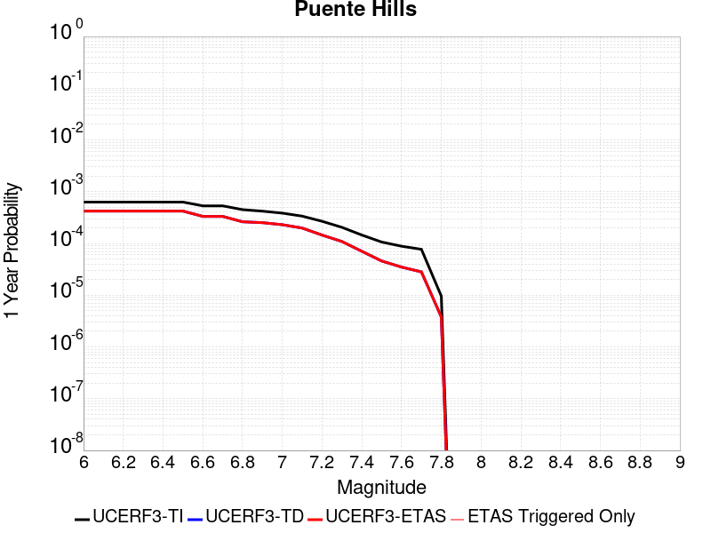 |  |

| Magnitude | 1 wk TI Prob | 1 wk TD Prob | 1 wk ETAS Prob | 1 wk ETAS/TD Gain | 1 wk ETAS Triggered Only | 1 mo TI Prob | 1 mo TD Prob | 1 mo ETAS Prob | 1 mo ETAS/TD Gain | 1 mo ETAS Triggered Only | 1 yr TI Prob | 1 yr TD Prob | 1 yr ETAS Prob | 1 yr ETAS/TD Gain | 1 yr ETAS Triggered Only | 10 yr TI Prob | 10 yr TD Prob | 10 yr ETAS Prob | 10 yr ETAS/TD Gain | 10 yr ETAS Triggered Only |
|-----|-----|-----|-----|-----|-----|-----|-----|-----|-----|-----|-----|-----|-----|-----|-----|-----|-----|-----|-----|-----|
| 6.0 | 1.2101656E-5 | 8.098579E-6 | 8.098579E-6 | 1.0 | 0.0 | 5.1863204E-5 | 3.4707766E-5 | 3.4707766E-5 | 1.0 | 0.0 | 6.312516E-4 | 4.2249076E-4 | 4.2249076E-4 | 1.0 | 0.0 | 0.0062946146 | 0.0042174356 | 0.004227394 | 1.002361 | 1.0E-5 |
| 6.1 | 1.2101656E-5 | 8.098579E-6 | 8.098579E-6 | 1.0 | 0.0 | 5.1863204E-5 | 3.4707766E-5 | 3.4707766E-5 | 1.0 | 0.0 | 6.312516E-4 | 4.2249076E-4 | 4.2249076E-4 | 1.0 | 0.0 | 0.0062946146 | 0.0042174356 | 0.004227394 | 1.002361 | 1.0E-5 |
| 6.2 | 1.2101656E-5 | 8.098579E-6 | 8.098579E-6 | 1.0 | 0.0 | 5.1863204E-5 | 3.4707766E-5 | 3.4707766E-5 | 1.0 | 0.0 | 6.312516E-4 | 4.2249076E-4 | 4.2249076E-4 | 1.0 | 0.0 | 0.0062946146 | 0.0042174356 | 0.004227394 | 1.002361 | 1.0E-5 |
| 6.3 | 1.2101656E-5 | 8.098579E-6 | 8.098579E-6 | 1.0 | 0.0 | 5.1863204E-5 | 3.4707766E-5 | 3.4707766E-5 | 1.0 | 0.0 | 6.312516E-4 | 4.2249076E-4 | 4.2249076E-4 | 1.0 | 0.0 | 0.0062946146 | 0.0042174356 | 0.004227394 | 1.002361 | 1.0E-5 |
| 6.4 | 1.2101656E-5 | 8.098579E-6 | 8.098579E-6 | 1.0 | 0.0 | 5.1863204E-5 | 3.4707766E-5 | 3.4707766E-5 | 1.0 | 0.0 | 6.312516E-4 | 4.2249076E-4 | 4.2249076E-4 | 1.0 | 0.0 | 0.0062946146 | 0.0042174356 | 0.004227394 | 1.002361 | 1.0E-5 |
| 6.5 | 1.2101656E-5 | 8.098579E-6 | 8.098579E-6 | 1.0 | 0.0 | 5.1863204E-5 | 3.4707766E-5 | 3.4707766E-5 | 1.0 | 0.0 | 6.312516E-4 | 4.2249076E-4 | 4.2249076E-4 | 1.0 | 0.0 | 0.0062946146 | 0.0042174356 | 0.004227394 | 1.002361 | 1.0E-5 |
| 6.6 | 1.0222488E-5 | 6.3991965E-6 | 6.3991965E-6 | 1.0 | 0.0 | 4.3809923E-5 | 2.7424852E-5 | 2.7424852E-5 | 1.0 | 0.0 | 5.332553E-4 | 3.3384888E-4 | 3.3384888E-4 | 1.0 | 0.0 | 0.0053197746 | 0.0033337187 | 0.0033436853 | 1.0029896 | 1.0E-5 |
| 6.7 | 1.0222488E-5 | 6.3991965E-6 | 6.3991965E-6 | 1.0 | 0.0 | 4.3809923E-5 | 2.7424852E-5 | 2.7424852E-5 | 1.0 | 0.0 | 5.332553E-4 | 3.3384888E-4 | 3.3384888E-4 | 1.0 | 0.0 | 0.0053197746 | 0.0033337187 | 0.0033436853 | 1.0029896 | 1.0E-5 |
| 6.8 | 8.6367845E-6 | 5.0282315E-6 | 5.0282315E-6 | 1.0 | 0.0 | 3.7014266E-5 | 2.1549387E-5 | 2.1549387E-5 | 1.0 | 0.0 | 4.505555E-4 | 2.6233276E-4 | 2.6233276E-4 | 1.0 | 0.0 | 0.004496431 | 0.0026202872 | 0.002630261 | 1.0038064 | 1.0E-5 |
| 6.9 | 8.066481E-6 | 4.8361135E-6 | 4.8361135E-6 | 1.0 | 0.0 | 3.4570177E-5 | 2.0726038E-5 | 2.0726038E-5 | 1.0 | 0.0 | 4.2081063E-4 | 2.5231083E-4 | 2.5231083E-4 | 1.0 | 0.0 | 0.0042001465 | 0.0025202974 | 0.0025202974 | 1.0 | 0.0 |
| 7.0 | 7.393828E-6 | 4.4173253E-6 | 4.4173253E-6 | 1.0 | 0.0 | 3.168745E-5 | 1.893126E-5 | 1.893126E-5 | 1.0 | 0.0 | 3.857264E-4 | 2.3046417E-4 | 2.3046417E-4 | 1.0 | 0.0 | 0.0038505755 | 0.0023022972 | 0.0023022972 | 1.0 | 0.0 |
| 7.1 | 6.4660953E-6 | 3.804474E-6 | 3.804474E-6 | 1.0 | 0.0 | 2.7711543E-5 | 1.630479E-5 | 1.630479E-5 | 1.0 | 0.0 | 3.373358E-4 | 1.9849309E-4 | 1.9849309E-4 | 1.0 | 0.0 | 0.0033682417 | 0.001983194 | 0.001983194 | 1.0 | 0.0 |
| 7.2 | 5.143232E-6 | 2.7865572E-6 | 2.7865572E-6 | 1.0 | 0.0 | 2.2042237E-5 | 1.1942333E-5 | 1.1942333E-5 | 1.0 | 0.0 | 2.6833118E-4 | 1.453883E-4 | 1.453883E-4 | 1.0 | 0.0 | 0.002680074 | 0.0014529417 | 0.0014529417 | 1.0 | 0.0 |
| 7.3 | 3.928255E-6 | 2.091396E-6 | 2.091396E-6 | 1.0 | 0.0 | 1.683527E-5 | 8.963095E-6 | 8.963095E-6 | 1.0 | 0.0 | 2.0495013E-4 | 1.0912029E-4 | 1.0912029E-4 | 1.0 | 0.0 | 0.002047612 | 0.0010906737 | 0.0010906737 | 1.0 | 0.0 |
| 7.4 | 2.7894434E-6 | 1.3546914E-6 | 1.3546914E-6 | 1.0 | 0.0 | 1.1954703E-5 | 5.805808E-6 | 5.805808E-6 | 1.0 | 0.0 | 1.4553878E-4 | 7.068346E-5 | 7.068346E-5 | 1.0 | 0.0 | 0.001454435 | 7.066142E-4 | 7.066142E-4 | 1.0 | 0.0 |
| 7.5 | 2.041735E-6 | 8.7873633E-7 | 8.7873633E-7 | 1.0 | 0.0 | 8.750263E-6 | 3.7660077E-6 | 3.7660077E-6 | 1.0 | 0.0 | 1.06529245E-4 | 4.585021E-5 | 4.585021E-5 | 1.0 | 0.0 | 0.0010647819 | 4.5841088E-4 | 4.5841088E-4 | 1.0 | 0.0 |
| 7.6 | 1.6959062E-6 | 6.698613E-7 | 6.698613E-7 | 1.0 | 0.0 | 7.268149E-6 | 2.8708312E-6 | 2.8708312E-6 | 1.0 | 0.0 | 8.848612E-5 | 3.4951838E-5 | 3.4951838E-5 | 1.0 | 0.0 | 8.84509E-4 | 3.494663E-4 | 3.494663E-4 | 1.0 | 0.0 |
| 7.7 | 1.4767965E-6 | 5.4073985E-7 | 5.4073985E-7 | 1.0 | 0.0 | 6.3291122E-6 | 2.3174546E-6 | 2.3174546E-6 | 1.0 | 0.0 | 7.705422E-5 | 2.821467E-5 | 2.821467E-5 | 1.0 | 0.0 | 7.702751E-4 | 2.8211344E-4 | 2.8211344E-4 | 1.0 | 0.0 |
| 7.8 | 1.8432911E-7 | 7.2812405E-8 | 7.2812405E-8 | 1.0 | 0.0 | 7.8998164E-7 | 3.1205315E-7 | 3.1205315E-7 | 1.0 | 0.0 | 9.617985E-6 | 3.7992436E-6 | 3.7992436E-6 | 1.0 | 0.0 | 9.617568E-5 | 3.799211E-5 | 3.799211E-5 | 1.0 | 0.0 |

## Robinson Creek
*[(top)](#table-of-contents)*

| 1 Week | 1 Month | 1 Year | 10 Year |
|-----|-----|-----|-----|
|  |  |  |  |

| Magnitude | 1 wk TI Prob | 1 wk TD Prob | 1 wk ETAS Prob | 1 wk ETAS/TD Gain | 1 wk ETAS Triggered Only | 1 mo TI Prob | 1 mo TD Prob | 1 mo ETAS Prob | 1 mo ETAS/TD Gain | 1 mo ETAS Triggered Only | 1 yr TI Prob | 1 yr TD Prob | 1 yr ETAS Prob | 1 yr ETAS/TD Gain | 1 yr ETAS Triggered Only | 10 yr TI Prob | 10 yr TD Prob | 10 yr ETAS Prob | 10 yr ETAS/TD Gain | 10 yr ETAS Triggered Only |
|-----|-----|-----|-----|-----|-----|-----|-----|-----|-----|-----|-----|-----|-----|-----|-----|-----|-----|-----|-----|-----|
| 6.0 | 1.3705327E-5 | 1.5285246E-5 | 1.5285246E-5 | 1.0 | 0.0 | 5.8735794E-5 | 6.5508204E-5 | 6.5508204E-5 | 1.0 | 0.0 | 7.1487366E-4 | 7.9756236E-4 | 7.9756236E-4 | 1.0 | 0.0 | 0.0071257832 | 0.007975623 | 0.007985543 | 1.0012438 | 1.0E-5 |
| 6.1 | 1.3705327E-5 | 1.5285246E-5 | 1.5285246E-5 | 1.0 | 0.0 | 5.8735794E-5 | 6.5508204E-5 | 6.5508204E-5 | 1.0 | 0.0 | 7.1487366E-4 | 7.9756236E-4 | 7.9756236E-4 | 1.0 | 0.0 | 0.0071257832 | 0.007975623 | 0.007985543 | 1.0012438 | 1.0E-5 |
| 6.2 | 1.3705327E-5 | 1.5285246E-5 | 1.5285246E-5 | 1.0 | 0.0 | 5.8735794E-5 | 6.5508204E-5 | 6.5508204E-5 | 1.0 | 0.0 | 7.1487366E-4 | 7.9756236E-4 | 7.9756236E-4 | 1.0 | 0.0 | 0.0071257832 | 0.007975623 | 0.007985543 | 1.0012438 | 1.0E-5 |
| 6.3 | 1.3705327E-5 | 1.5285246E-5 | 1.5285246E-5 | 1.0 | 0.0 | 5.8735794E-5 | 6.5508204E-5 | 6.5508204E-5 | 1.0 | 0.0 | 7.1487366E-4 | 7.9756236E-4 | 7.9756236E-4 | 1.0 | 0.0 | 0.0071257832 | 0.007975623 | 0.007985543 | 1.0012438 | 1.0E-5 |
| 6.4 | 1.3705327E-5 | 1.5285246E-5 | 1.5285246E-5 | 1.0 | 0.0 | 5.8735794E-5 | 6.5508204E-5 | 6.5508204E-5 | 1.0 | 0.0 | 7.1487366E-4 | 7.9756236E-4 | 7.9756236E-4 | 1.0 | 0.0 | 0.0071257832 | 0.007975623 | 0.007985543 | 1.0012438 | 1.0E-5 |

## Clamshell-Sawpit
*[(top)](#table-of-contents)*

| 1 Week | 1 Month | 1 Year | 10 Year |
|-----|-----|-----|-----|
|  |  |  |  |

| Magnitude | 1 wk TI Prob | 1 wk TD Prob | 1 wk ETAS Prob | 1 wk ETAS/TD Gain | 1 wk ETAS Triggered Only | 1 mo TI Prob | 1 mo TD Prob | 1 mo ETAS Prob | 1 mo ETAS/TD Gain | 1 mo ETAS Triggered Only | 1 yr TI Prob | 1 yr TD Prob | 1 yr ETAS Prob | 1 yr ETAS/TD Gain | 1 yr ETAS Triggered Only | 10 yr TI Prob | 10 yr TD Prob | 10 yr ETAS Prob | 10 yr ETAS/TD Gain | 10 yr ETAS Triggered Only |
|-----|-----|-----|-----|-----|-----|-----|-----|-----|-----|-----|-----|-----|-----|-----|-----|-----|-----|-----|-----|-----|
| 6.0 | 3.202998E-6 | 3.0127833E-6 | 3.0127833E-6 | 1.0 | 0.0 | 1.3727062E-5 | 1.2911869E-5 | 1.2911869E-5 | 1.0 | 0.0 | 1.6711417E-4 | 1.5719148E-4 | 1.671899E-4 | 1.0636067 | 1.0E-5 | 0.0016698855 | 0.0015708823 | 0.0015808665 | 1.0063559 | 1.0E-5 |
| 6.1 | 3.202998E-6 | 3.0127833E-6 | 3.0127833E-6 | 1.0 | 0.0 | 1.3727062E-5 | 1.2911869E-5 | 1.2911869E-5 | 1.0 | 0.0 | 1.6711417E-4 | 1.5719148E-4 | 1.671899E-4 | 1.0636067 | 1.0E-5 | 0.0016698855 | 0.0015708823 | 0.0015808665 | 1.0063559 | 1.0E-5 |
| 6.2 | 3.202998E-6 | 3.0127833E-6 | 3.0127833E-6 | 1.0 | 0.0 | 1.3727062E-5 | 1.2911869E-5 | 1.2911869E-5 | 1.0 | 0.0 | 1.6711417E-4 | 1.5719148E-4 | 1.671899E-4 | 1.0636067 | 1.0E-5 | 0.0016698855 | 0.0015708823 | 0.0015808665 | 1.0063559 | 1.0E-5 |
| 6.3 | 3.202998E-6 | 3.0127833E-6 | 3.0127833E-6 | 1.0 | 0.0 | 1.3727062E-5 | 1.2911869E-5 | 1.2911869E-5 | 1.0 | 0.0 | 1.6711417E-4 | 1.5719148E-4 | 1.671899E-4 | 1.0636067 | 1.0E-5 | 0.0016698855 | 0.0015708823 | 0.0015808665 | 1.0063559 | 1.0E-5 |
| 6.4 | 3.202998E-6 | 3.0127833E-6 | 3.0127833E-6 | 1.0 | 0.0 | 1.3727062E-5 | 1.2911869E-5 | 1.2911869E-5 | 1.0 | 0.0 | 1.6711417E-4 | 1.5719148E-4 | 1.671899E-4 | 1.0636067 | 1.0E-5 | 0.0016698855 | 0.0015708823 | 0.0015808665 | 1.0063559 | 1.0E-5 |
| 6.5 | 2.5862723E-6 | 2.3807918E-6 | 2.3807918E-6 | 1.0 | 0.0 | 1.1083977E-5 | 1.02033555E-5 | 1.02033555E-5 | 1.0 | 0.0 | 1.3493907E-4 | 1.2421908E-4 | 1.2421908E-4 | 1.0 | 0.0 | 0.0013485716 | 0.0012415267 | 0.0012415267 | 1.0 | 0.0 |
| 6.6 | 2.5862723E-6 | 2.3807918E-6 | 2.3807918E-6 | 1.0 | 0.0 | 1.1083977E-5 | 1.02033555E-5 | 1.02033555E-5 | 1.0 | 0.0 | 1.3493907E-4 | 1.2421908E-4 | 1.2421908E-4 | 1.0 | 0.0 | 0.0013485716 | 0.0012415267 | 0.0012415267 | 1.0 | 0.0 |
| 6.7 | 2.5862723E-6 | 2.3807918E-6 | 2.3807918E-6 | 1.0 | 0.0 | 1.1083977E-5 | 1.02033555E-5 | 1.02033555E-5 | 1.0 | 0.0 | 1.3493907E-4 | 1.2421908E-4 | 1.2421908E-4 | 1.0 | 0.0 | 0.0013485716 | 0.0012415267 | 0.0012415267 | 1.0 | 0.0 |
| 6.8 | 2.4098806E-6 | 2.1977469E-6 | 2.1977469E-6 | 1.0 | 0.0 | 1.0328019E-5 | 9.418883E-6 | 9.418883E-6 | 1.0 | 0.0 | 1.2573638E-4 | 1.1466913E-4 | 1.1466913E-4 | 1.0 | 0.0 | 0.0012566525 | 0.0011461262 | 0.0011461262 | 1.0 | 0.0 |
| 6.9 | 2.0073985E-6 | 1.7784384E-6 | 1.7784384E-6 | 1.0 | 0.0 | 8.603109E-6 | 7.6218575E-6 | 7.6218575E-6 | 1.0 | 0.0 | 1.0473781E-4 | 9.279228E-5 | 9.279228E-5 | 1.0 | 0.0 | 0.0010468846 | 9.275472E-4 | 9.275472E-4 | 1.0 | 0.0 |
| 7.0 | 1.8166766E-6 | 1.5807223E-6 | 1.5807223E-6 | 1.0 | 0.0 | 7.785734E-6 | 6.774507E-6 | 6.774507E-6 | 1.0 | 0.0 | 9.478718E-5 | 8.24766E-5 | 8.24766E-5 | 1.0 | 0.0 | 9.4746763E-4 | 8.2446996E-4 | 8.2446996E-4 | 1.0 | 0.0 |
| 7.1 | 1.5471421E-6 | 1.305307E-6 | 1.305307E-6 | 1.0 | 0.0 | 6.6305925E-6 | 5.594161E-6 | 5.594161E-6 | 1.0 | 0.0 | 8.072447E-5 | 6.8106834E-5 | 6.8106834E-5 | 1.0 | 0.0 | 8.0695155E-4 | 6.8086514E-4 | 6.8086514E-4 | 1.0 | 0.0 |
| 7.2 | 1.3608037E-6 | 1.1153539E-6 | 1.1153539E-6 | 1.0 | 0.0 | 5.8320024E-6 | 4.7800795E-6 | 4.7800795E-6 | 1.0 | 0.0 | 7.1002316E-5 | 5.8195965E-5 | 5.8195965E-5 | 1.0 | 0.0 | 7.097964E-4 | 5.818119E-4 | 5.818119E-4 | 1.0 | 0.0 |
| 7.3 | 1.0749634E-6 | 8.384333E-7 | 8.384333E-7 | 1.0 | 0.0 | 4.6069777E-6 | 3.593281E-6 | 3.593281E-6 | 1.0 | 0.0 | 5.608851E-5 | 4.3747346E-5 | 4.3747346E-5 | 1.0 | 0.0 | 5.6074356E-4 | 4.3739015E-4 | 4.3739015E-4 | 1.0 | 0.0 |
| 7.4 | 8.416856E-7 | 6.200111E-7 | 6.200111E-7 | 1.0 | 0.0 | 3.607219E-6 | 2.657188E-6 | 2.657188E-6 | 1.0 | 0.0 | 4.3917007E-5 | 3.2350803E-5 | 3.2350803E-5 | 1.0 | 0.0 | 4.390833E-4 | 3.2346288E-4 | 3.2346288E-4 | 1.0 | 0.0 |
| 7.5 | 6.2779594E-7 | 4.4969397E-7 | 4.4969397E-7 | 1.0 | 0.0 | 2.6905511E-6 | 1.9272586E-6 | 1.9272586E-6 | 1.0 | 0.0 | 3.275697E-5 | 2.346414E-5 | 2.346414E-5 | 1.0 | 0.0 | 3.275214E-4 | 2.3461849E-4 | 2.3461849E-4 | 1.0 | 0.0 |
| 7.6 | 4.3822078E-7 | 3.0595726E-7 | 3.0595726E-7 | 1.0 | 0.0 | 1.8780877E-6 | 1.3112448E-6 | 1.3112448E-6 | 1.0 | 0.0 | 2.2865479E-5 | 1.5964304E-5 | 1.5964304E-5 | 1.0 | 0.0 | 2.2863125E-4 | 1.5963313E-4 | 1.5963313E-4 | 1.0 | 0.0 |
| 7.7 | 1.8704569E-7 | 1.12380086E-7 | 1.12380086E-7 | 1.0 | 0.0 | 8.0162414E-7 | 4.8162883E-7 | 4.8162883E-7 | 1.0 | 0.0 | 9.75973E-6 | 5.863816E-6 | 5.863816E-6 | 1.0 | 0.0 | 9.7593016E-5 | 5.8636677E-5 | 5.8636677E-5 | 1.0 | 0.0 |
| 7.8 | 3.5378733E-8 | 2.183811E-8 | 2.183811E-8 | 1.0 | 0.0 | 1.5162313E-7 | 9.359189E-8 | 9.359189E-8 | 1.0 | 0.0 | 1.84601E-6 | 1.1394808E-6 | 1.1394808E-6 | 1.0 | 0.0 | 1.8459947E-5 | 1.1394752E-5 | 1.1394752E-5 | 1.0 | 0.0 |
| 7.9 | 7.504945E-9 | 5.1921765E-9 | 5.1921765E-9 | 1.0 | 0.0 | 3.2164053E-8 | 2.2252184E-8 | 2.2252184E-8 | 1.0 | 0.0 | 3.9159727E-7 | 2.709203E-7 | 2.709203E-7 | 1.0 | 0.0 | 3.915966E-6 | 2.7092008E-6 | 2.7092008E-6 | 1.0 | 0.0 |
| 8.0 | 1.6554036E-10 | 1.4181756E-10 | 1.4181756E-10 | 1.0 | 0.0 | 7.0945894E-10 | 6.077895E-10 | 6.077895E-10 | 1.0 | 0.0 | 8.637662E-9 | 7.399838E-9 | 7.399838E-9 | 1.0 | 0.0 | 8.6376616E-8 | 7.399838E-8 | 7.399838E-8 | 1.0 | 0.0 |

## Great Valley 07 (Orestimba)
*[(top)](#table-of-contents)*

| 1 Week | 1 Month | 1 Year | 10 Year |
|-----|-----|-----|-----|
|  |  |  |  |

| Magnitude | 1 wk TI Prob | 1 wk TD Prob | 1 wk ETAS Prob | 1 wk ETAS/TD Gain | 1 wk ETAS Triggered Only | 1 mo TI Prob | 1 mo TD Prob | 1 mo ETAS Prob | 1 mo ETAS/TD Gain | 1 mo ETAS Triggered Only | 1 yr TI Prob | 1 yr TD Prob | 1 yr ETAS Prob | 1 yr ETAS/TD Gain | 1 yr ETAS Triggered Only | 10 yr TI Prob | 10 yr TD Prob | 10 yr ETAS Prob | 10 yr ETAS/TD Gain | 10 yr ETAS Triggered Only |
|-----|-----|-----|-----|-----|-----|-----|-----|-----|-----|-----|-----|-----|-----|-----|-----|-----|-----|-----|-----|-----|
| 6.0 | 2.9687902E-5 | 3.2757947E-5 | 3.2757947E-5 | 1.0 | 0.0 | 1.2722766E-4 | 1.4038406E-4 | 1.4038406E-4 | 1.0 | 0.0 | 0.0015478961 | 0.0017079079 | 0.0017079079 | 1.0 | 0.0 | 0.015371585 | 0.016955366 | 0.016965197 | 1.0005798 | 1.0E-5 |
| 6.1 | 2.9687902E-5 | 3.2757947E-5 | 3.2757947E-5 | 1.0 | 0.0 | 1.2722766E-4 | 1.4038406E-4 | 1.4038406E-4 | 1.0 | 0.0 | 0.0015478961 | 0.0017079079 | 0.0017079079 | 1.0 | 0.0 | 0.015371585 | 0.016955366 | 0.016955366 | 1.0 | 0.0 |
| 6.2 | 1.9231524E-5 | 2.1159447E-5 | 2.1159447E-5 | 1.0 | 0.0 | 8.2418206E-5 | 9.0680325E-5 | 9.0680325E-5 | 1.0 | 0.0 | 0.0010029797 | 0.0011034969 | 0.0011034969 | 1.0 | 0.0 | 0.00998465 | 0.010982586 | 0.010982586 | 1.0 | 0.0 |
| 6.3 | 1.324766E-5 | 1.4548723E-5 | 1.4548723E-5 | 1.0 | 0.0 | 5.6774446E-5 | 6.235023E-5 | 6.235023E-5 | 1.0 | 0.0 | 6.910097E-4 | 7.5885886E-4 | 7.5885886E-4 | 1.0 | 0.0 | 0.006888649 | 0.0075636217 | 0.0075636217 | 1.0 | 0.0 |
| 6.4 | 7.818645E-6 | 8.57295E-6 | 8.57295E-6 | 1.0 | 0.0 | 3.3508048E-5 | 3.6740716E-5 | 3.6740716E-5 | 1.0 | 0.0 | 4.078841E-4 | 4.4722977E-4 | 4.4722977E-4 | 1.0 | 0.0 | 0.004071363 | 0.0044636377 | 0.0044636377 | 1.0 | 0.0 |
| 6.5 | 5.3076565E-6 | 5.817875E-6 | 5.817875E-6 | 1.0 | 0.0 | 2.27469E-5 | 2.4933523E-5 | 2.4933523E-5 | 1.0 | 0.0 | 2.7690834E-4 | 3.0352548E-4 | 3.0352548E-4 | 1.0 | 0.0 | 0.0027656353 | 0.0030313185 | 0.0030313185 | 1.0 | 0.0 |
| 6.6 | 3.6003578E-6 | 3.9485462E-6 | 3.9485462E-6 | 1.0 | 0.0 | 1.5430012E-5 | 1.6922239E-5 | 1.6922239E-5 | 1.0 | 0.0 | 1.8784421E-4 | 2.0601034E-4 | 2.0601034E-4 | 1.0 | 0.0 | 0.0018768552 | 0.0020583477 | 0.0020583477 | 1.0 | 0.0 |
| 6.7 | 2.5361826E-6 | 2.783504E-6 | 2.783504E-6 | 1.0 | 0.0 | 1.0869308E-5 | 1.1929255E-5 | 1.1929255E-5 | 1.0 | 0.0 | 1.3232579E-4 | 1.4523033E-4 | 1.4523033E-4 | 1.0 | 0.0 | 0.0013224703 | 0.001451484 | 0.001451484 | 1.0 | 0.0 |
| 6.8 | 1.2115831E-6 | 1.3313972E-6 | 1.3313972E-6 | 1.0 | 0.0 | 5.1924885E-6 | 5.705981E-6 | 5.705981E-6 | 1.0 | 0.0 | 6.3216714E-5 | 6.9469075E-5 | 6.9469075E-5 | 1.0 | 0.0 | 6.3198735E-4 | 6.9456873E-4 | 6.9456873E-4 | 1.0 | 0.0 |

## North Frontal  (West)
*[(top)](#table-of-contents)*

| 1 Week | 1 Month | 1 Year | 10 Year |
|-----|-----|-----|-----|
|  | 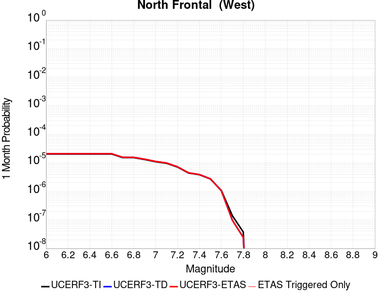 | 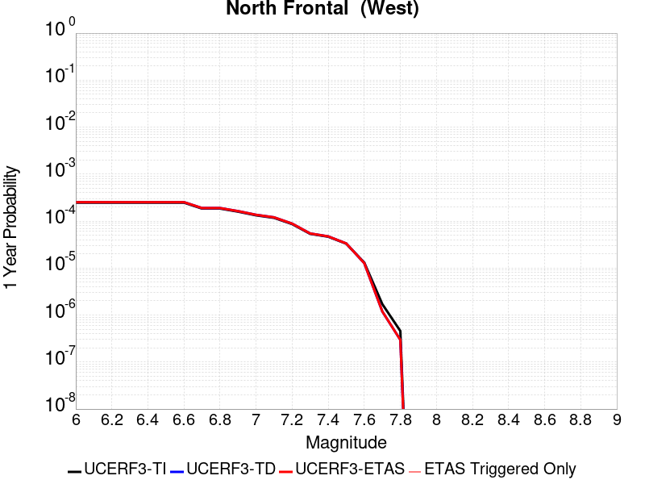 |  |

| Magnitude | 1 wk TI Prob | 1 wk TD Prob | 1 wk ETAS Prob | 1 wk ETAS/TD Gain | 1 wk ETAS Triggered Only | 1 mo TI Prob | 1 mo TD Prob | 1 mo ETAS Prob | 1 mo ETAS/TD Gain | 1 mo ETAS Triggered Only | 1 yr TI Prob | 1 yr TD Prob | 1 yr ETAS Prob | 1 yr ETAS/TD Gain | 1 yr ETAS Triggered Only | 10 yr TI Prob | 10 yr TD Prob | 10 yr ETAS Prob | 10 yr ETAS/TD Gain | 10 yr ETAS Triggered Only |
|-----|-----|-----|-----|-----|-----|-----|-----|-----|-----|-----|-----|-----|-----|-----|-----|-----|-----|-----|-----|-----|
| 6.0 | 4.7316266E-6 | 4.8526927E-6 | 4.8526927E-6 | 1.0 | 0.0 | 2.0278241E-5 | 2.0797097E-5 | 2.0797097E-5 | 1.0 | 0.0 | 2.4685962E-4 | 2.531767E-4 | 2.531767E-4 | 1.0 | 0.0 | 0.0024658558 | 0.0025290288 | 0.0025390035 | 1.003944 | 1.0E-5 |
| 6.1 | 4.7316266E-6 | 4.8526927E-6 | 4.8526927E-6 | 1.0 | 0.0 | 2.0278241E-5 | 2.0797097E-5 | 2.0797097E-5 | 1.0 | 0.0 | 2.4685962E-4 | 2.531767E-4 | 2.531767E-4 | 1.0 | 0.0 | 0.0024658558 | 0.0025290288 | 0.0025390035 | 1.003944 | 1.0E-5 |
| 6.2 | 4.7316266E-6 | 4.8526927E-6 | 4.8526927E-6 | 1.0 | 0.0 | 2.0278241E-5 | 2.0797097E-5 | 2.0797097E-5 | 1.0 | 0.0 | 2.4685962E-4 | 2.531767E-4 | 2.531767E-4 | 1.0 | 0.0 | 0.0024658558 | 0.0025290288 | 0.0025390035 | 1.003944 | 1.0E-5 |
| 6.3 | 4.7316266E-6 | 4.8526927E-6 | 4.8526927E-6 | 1.0 | 0.0 | 2.0278241E-5 | 2.0797097E-5 | 2.0797097E-5 | 1.0 | 0.0 | 2.4685962E-4 | 2.531767E-4 | 2.531767E-4 | 1.0 | 0.0 | 0.0024658558 | 0.0025290288 | 0.0025390035 | 1.003944 | 1.0E-5 |
| 6.4 | 4.7316266E-6 | 4.8526927E-6 | 4.8526927E-6 | 1.0 | 0.0 | 2.0278241E-5 | 2.0797097E-5 | 2.0797097E-5 | 1.0 | 0.0 | 2.4685962E-4 | 2.531767E-4 | 2.531767E-4 | 1.0 | 0.0 | 0.0024658558 | 0.0025290288 | 0.0025390035 | 1.003944 | 1.0E-5 |
| 6.5 | 4.7316266E-6 | 4.8526927E-6 | 4.8526927E-6 | 1.0 | 0.0 | 2.0278241E-5 | 2.0797097E-5 | 2.0797097E-5 | 1.0 | 0.0 | 2.4685962E-4 | 2.531767E-4 | 2.531767E-4 | 1.0 | 0.0 | 0.0024658558 | 0.0025290288 | 0.0025390035 | 1.003944 | 1.0E-5 |
| 6.6 | 4.7316266E-6 | 4.8526927E-6 | 4.8526927E-6 | 1.0 | 0.0 | 2.0278241E-5 | 2.0797097E-5 | 2.0797097E-5 | 1.0 | 0.0 | 2.4685962E-4 | 2.531767E-4 | 2.531767E-4 | 1.0 | 0.0 | 0.0024658558 | 0.0025290288 | 0.0025390035 | 1.003944 | 1.0E-5 |
| 6.7 | 3.5382777E-6 | 3.630902E-6 | 3.630902E-6 | 1.0 | 0.0 | 1.516396E-5 | 1.5560921E-5 | 1.5560921E-5 | 1.0 | 0.0 | 1.8460557E-4 | 1.8943852E-4 | 1.8943852E-4 | 1.0 | 0.0 | 0.0018445229 | 0.0018928472 | 0.0019028283 | 1.0052731 | 1.0E-5 |
| 6.8 | 3.5382777E-6 | 3.630902E-6 | 3.630902E-6 | 1.0 | 0.0 | 1.516396E-5 | 1.5560921E-5 | 1.5560921E-5 | 1.0 | 0.0 | 1.8460557E-4 | 1.8943852E-4 | 1.8943852E-4 | 1.0 | 0.0 | 0.0018445229 | 0.0018928472 | 0.0019028283 | 1.0052731 | 1.0E-5 |
| 6.9 | 3.0428037E-6 | 3.122775E-6 | 3.122775E-6 | 1.0 | 0.0 | 1.30405215E-5 | 1.3383256E-5 | 1.3383256E-5 | 1.0 | 0.0 | 1.5875678E-4 | 1.6292965E-4 | 1.6292965E-4 | 1.0 | 0.0 | 0.0015864341 | 0.0016281691 | 0.0016381528 | 1.0061319 | 1.0E-5 |
| 7.0 | 2.538778E-6 | 2.6061032E-6 | 2.6061032E-6 | 1.0 | 0.0 | 1.0880432E-5 | 1.1168968E-5 | 1.1168968E-5 | 1.0 | 0.0 | 1.324612E-4 | 1.3597417E-4 | 1.3597417E-4 | 1.0 | 0.0 | 0.0013238228 | 0.0013589566 | 0.0013689429 | 1.0073485 | 1.0E-5 |
| 7.1 | 2.2418935E-6 | 2.301219E-6 | 2.301219E-6 | 1.0 | 0.0 | 9.60808E-6 | 9.862332E-6 | 9.862332E-6 | 1.0 | 0.0 | 1.1697209E-4 | 1.2006772E-4 | 1.2006772E-4 | 1.0 | 0.0 | 0.0011691054 | 0.0012000725 | 0.0012000725 | 1.0 | 0.0 |
| 7.2 | 1.6526745E-6 | 1.692494E-6 | 1.692494E-6 | 1.0 | 0.0 | 7.082872E-6 | 7.253527E-6 | 7.253527E-6 | 1.0 | 0.0 | 8.623055E-5 | 8.830837E-5 | 8.830837E-5 | 1.0 | 0.0 | 8.61971E-4 | 8.827578E-4 | 8.827578E-4 | 1.0 | 0.0 |
| 7.3 | 1.0246019E-6 | 1.0442322E-6 | 1.0442322E-6 | 1.0 | 0.0 | 4.391144E-6 | 4.475274E-6 | 4.475274E-6 | 1.0 | 0.0 | 5.3460866E-5 | 5.4485216E-5 | 5.4485216E-5 | 1.0 | 0.0 | 5.344801E-4 | 5.4473005E-4 | 5.4473005E-4 | 1.0 | 0.0 |
| 7.4 | 8.9045164E-7 | 9.0566147E-7 | 9.0566147E-7 | 1.0 | 0.0 | 3.8162157E-6 | 3.881401E-6 | 3.881401E-6 | 1.0 | 0.0 | 4.646144E-5 | 4.7255144E-5 | 4.7255144E-5 | 1.0 | 0.0 | 4.6451724E-4 | 4.7246183E-4 | 4.7246183E-4 | 1.0 | 0.0 |
| 7.5 | 6.3357E-7 | 6.402745E-7 | 6.402745E-7 | 1.0 | 0.0 | 2.7152971E-6 | 2.744031E-6 | 2.744031E-6 | 1.0 | 0.0 | 3.305824E-5 | 3.340813E-5 | 3.340813E-5 | 1.0 | 0.0 | 3.3053322E-4 | 3.3403767E-4 | 3.3403767E-4 | 1.0 | 0.0 |
| 7.6 | 2.5087024E-7 | 2.436135E-7 | 2.436135E-7 | 1.0 | 0.0 | 1.0751578E-6 | 1.0440575E-6 | 1.0440575E-6 | 1.0 | 0.0 | 1.3089967E-5 | 1.2711347E-5 | 1.2711347E-5 | 1.0 | 0.0 | 1.3089196E-4 | 1.2710826E-4 | 1.2710826E-4 | 1.0 | 0.0 |
| 7.7 | 3.282987E-8 | 2.2875435E-8 | 2.2875435E-8 | 1.0 | 0.0 | 1.4069944E-7 | 9.8037575E-8 | 9.8037575E-8 | 1.0 | 0.0 | 1.7130144E-6 | 1.193607E-6 | 1.193607E-6 | 1.0 | 0.0 | 1.7130013E-5 | 1.1936014E-5 | 1.1936014E-5 | 1.0 | 0.0 |
| 7.8 | 8.77499E-9 | 5.6817466E-9 | 5.6817466E-9 | 1.0 | 0.0 | 3.7607098E-8 | 2.4350342E-8 | 2.4350342E-8 | 1.0 | 0.0 | 4.578663E-7 | 2.964654E-7 | 2.964654E-7 | 1.0 | 0.0 | 4.5786537E-6 | 2.9646515E-6 | 2.9646515E-6 | 1.0 | 0.0 |

## Simi-Santa Rosa
*[(top)](#table-of-contents)*

| 1 Week | 1 Month | 1 Year | 10 Year |
|-----|-----|-----|-----|
|  |  | 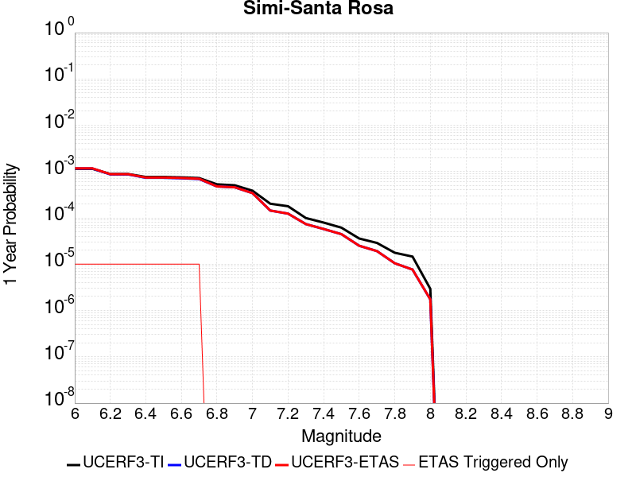 | 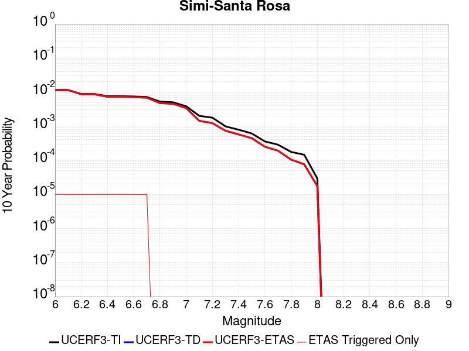 |

| Magnitude | 1 wk TI Prob | 1 wk TD Prob | 1 wk ETAS Prob | 1 wk ETAS/TD Gain | 1 wk ETAS Triggered Only | 1 mo TI Prob | 1 mo TD Prob | 1 mo ETAS Prob | 1 mo ETAS/TD Gain | 1 mo ETAS Triggered Only | 1 yr TI Prob | 1 yr TD Prob | 1 yr ETAS Prob | 1 yr ETAS/TD Gain | 1 yr ETAS Triggered Only | 10 yr TI Prob | 10 yr TD Prob | 10 yr ETAS Prob | 10 yr ETAS/TD Gain | 10 yr ETAS Triggered Only |
|-----|-----|-----|-----|-----|-----|-----|-----|-----|-----|-----|-----|-----|-----|-----|-----|-----|-----|-----|-----|-----|
| 6.0 | 2.198912E-5 | 2.227584E-5 | 2.227584E-5 | 1.0 | 0.0 | 9.4235686E-5 | 9.5464646E-5 | 9.5464646E-5 | 1.0 | 0.0 | 0.0011467156 | 0.0011617062 | 0.0011716945 | 1.008598 | 1.0E-5 | 0.011408163 | 0.011560781 | 0.011570665 | 1.000855 | 1.0E-5 |
| 6.1 | 2.198912E-5 | 2.227584E-5 | 2.227584E-5 | 1.0 | 0.0 | 9.4235686E-5 | 9.5464646E-5 | 9.5464646E-5 | 1.0 | 0.0 | 0.0011467156 | 0.0011617062 | 0.0011716945 | 1.008598 | 1.0E-5 | 0.011408163 | 0.011560781 | 0.011570665 | 1.000855 | 1.0E-5 |
| 6.2 | 1.69983E-5 | 1.6668866E-5 | 1.6668866E-5 | 1.0 | 0.0 | 7.284782E-5 | 7.14362E-5 | 7.14362E-5 | 1.0 | 0.0 | 8.865613E-4 | 8.694179E-4 | 8.7940926E-4 | 1.0114919 | 1.0E-5 | 0.008830327 | 0.008663086 | 0.008672999 | 1.0011443 | 1.0E-5 |
| 6.3 | 1.69983E-5 | 1.6668866E-5 | 1.6668866E-5 | 1.0 | 0.0 | 7.284782E-5 | 7.14362E-5 | 7.14362E-5 | 1.0 | 0.0 | 8.865613E-4 | 8.694179E-4 | 8.7940926E-4 | 1.0114919 | 1.0E-5 | 0.008830327 | 0.008663086 | 0.008672999 | 1.0011443 | 1.0E-5 |
| 6.4 | 1.4666188E-5 | 1.4052807E-5 | 1.4052807E-5 | 1.0 | 0.0 | 6.285358E-5 | 6.0225066E-5 | 6.0225066E-5 | 1.0 | 0.0 | 7.6497364E-4 | 7.330184E-4 | 7.4301107E-4 | 1.0136322 | 1.0E-5 | 0.0076234564 | 0.0073084813 | 0.0073184078 | 1.0013583 | 1.0E-5 |
| 6.5 | 1.4666188E-5 | 1.4052807E-5 | 1.4052807E-5 | 1.0 | 0.0 | 6.285358E-5 | 6.0225066E-5 | 6.0225066E-5 | 1.0 | 0.0 | 7.6497364E-4 | 7.330184E-4 | 7.4301107E-4 | 1.0136322 | 1.0E-5 | 0.0076234564 | 0.0073084813 | 0.0073184078 | 1.0013583 | 1.0E-5 |
| 6.6 | 1.4377586E-5 | 1.3729842E-5 | 1.3729842E-5 | 1.0 | 0.0 | 6.1616774E-5 | 5.8840993E-5 | 5.8840993E-5 | 1.0 | 0.0 | 7.4992597E-4 | 7.1617845E-4 | 7.261713E-4 | 1.013953 | 1.0E-5 | 0.007474003 | 0.007141173 | 0.0071511013 | 1.0013903 | 1.0E-5 |
| 6.7 | 1.3881404E-5 | 1.3207801E-5 | 1.3207801E-5 | 1.0 | 0.0 | 5.9490372E-5 | 5.6603774E-5 | 5.6603774E-5 | 1.0 | 0.0 | 7.240546E-4 | 6.8895775E-4 | 6.989509E-4 | 1.0145047 | 1.0E-5 | 0.007217 | 0.0068706684 | 0.0068805995 | 1.0014454 | 1.0E-5 |
| 6.8 | 1.0176516E-5 | 9.154335E-6 | 9.154335E-6 | 1.0 | 0.0 | 4.3612912E-5 | 3.923237E-5 | 3.923237E-5 | 1.0 | 0.0 | 5.308578E-4 | 4.7756598E-4 | 4.7756598E-4 | 1.0 | 0.0 | 0.0052959146 | 0.0047670305 | 0.0047670305 | 1.0 | 0.0 |
| 6.9 | 9.699797E-6 | 8.7748995E-6 | 8.7748995E-6 | 1.0 | 0.0 | 4.15699E-5 | 3.7606264E-5 | 3.7606264E-5 | 1.0 | 0.0 | 5.05996E-4 | 4.577765E-4 | 4.577765E-4 | 1.0 | 0.0 | 0.005048454 | 0.0045699533 | 0.0045699533 | 1.0 | 0.0 |
| 7.0 | 7.4049476E-6 | 6.5594745E-6 | 6.5594745E-6 | 1.0 | 0.0 | 3.1735104E-5 | 2.8111803E-5 | 2.8111803E-5 | 1.0 | 0.0 | 3.8630638E-4 | 3.422201E-4 | 3.422201E-4 | 1.0 | 0.0 | 0.0038563553 | 0.0034181732 | 0.0034181732 | 1.0 | 0.0 |
| 7.1 | 3.873439E-6 | 2.7595852E-6 | 2.7595852E-6 | 1.0 | 0.0 | 1.6600346E-5 | 1.1826742E-5 | 1.1826742E-5 | 1.0 | 0.0 | 2.0209046E-4 | 1.439813E-4 | 1.439813E-4 | 1.0 | 0.0 | 0.0020190678 | 0.0014389037 | 0.0014389037 | 1.0 | 0.0 |
| 7.2 | 3.417706E-6 | 2.3677217E-6 | 2.3677217E-6 | 1.0 | 0.0 | 1.4647229E-5 | 1.0147341E-5 | 1.0147341E-5 | 1.0 | 0.0 | 1.7831543E-4 | 1.2353709E-4 | 1.2353709E-4 | 1.0 | 0.0 | 0.0017817242 | 0.0012347065 | 0.0012347065 | 1.0 | 0.0 |
| 7.3 | 1.90225E-6 | 1.4074603E-6 | 1.4074603E-6 | 1.0 | 0.0 | 8.152474E-6 | 6.031959E-6 | 6.031959E-6 | 1.0 | 0.0 | 9.9251854E-5 | 7.343665E-5 | 7.343665E-5 | 1.0 | 0.0 | 9.920754E-4 | 7.34126E-4 | 7.34126E-4 | 1.0 | 0.0 |
| 7.4 | 1.5170556E-6 | 1.1025613E-6 | 1.1025613E-6 | 1.0 | 0.0 | 6.5016507E-6 | 4.7252547E-6 | 4.7252547E-6 | 1.0 | 0.0 | 7.915472E-5 | 5.7528465E-5 | 5.7528465E-5 | 1.0 | 0.0 | 7.9126534E-4 | 5.7513686E-4 | 5.7513686E-4 | 1.0 | 0.0 |
| 7.5 | 1.178732E-6 | 8.535918E-7 | 8.535918E-7 | 1.0 | 0.0 | 5.0516987E-6 | 3.6582455E-6 | 3.6582455E-6 | 1.0 | 0.0 | 6.1502695E-5 | 4.453824E-5 | 4.453824E-5 | 1.0 | 0.0 | 6.148568E-4 | 4.4529408E-4 | 4.4529408E-4 | 1.0 | 0.0 |
| 7.6 | 6.8722386E-7 | 4.79399E-7 | 4.79399E-7 | 1.0 | 0.0 | 2.9452417E-6 | 2.0545656E-6 | 2.0545656E-6 | 1.0 | 0.0 | 3.5857727E-5 | 2.501405E-5 | 2.501405E-5 | 1.0 | 0.0 | 3.5851944E-4 | 2.5011247E-4 | 2.5011247E-4 | 1.0 | 0.0 |
| 7.7 | 5.5126515E-7 | 3.673879E-7 | 3.673879E-7 | 1.0 | 0.0 | 2.3625628E-6 | 1.5745187E-6 | 1.5745187E-6 | 1.0 | 0.0 | 2.8763823E-5 | 1.9169596E-5 | 1.9169596E-5 | 1.0 | 0.0 | 2.87601E-4 | 1.9167954E-4 | 1.9167954E-4 | 1.0 | 0.0 |
| 7.8 | 3.3860243E-7 | 2.0081076E-7 | 2.0081076E-7 | 1.0 | 0.0 | 1.4511525E-6 | 8.6061726E-7 | 8.6061726E-7 | 1.0 | 0.0 | 1.7667637E-5 | 1.0477966E-5 | 1.0477966E-5 | 1.0 | 0.0 | 1.7666233E-4 | 1.04774765E-4 | 1.04774765E-4 | 1.0 | 0.0 |
| 7.9 | 2.7955386E-7 | 1.465409E-7 | 1.465409E-7 | 1.0 | 0.0 | 1.1980875E-6 | 6.280323E-7 | 6.280323E-7 | 1.0 | 0.0 | 1.4586617E-5 | 7.646267E-6 | 7.646267E-6 | 1.0 | 0.0 | 1.458566E-4 | 7.646008E-5 | 7.646008E-5 | 1.0 | 0.0 |
| 8.0 | 5.6259015E-8 | 3.335468E-8 | 3.335468E-8 | 1.0 | 0.0 | 2.4111003E-7 | 1.4294862E-7 | 1.4294862E-7 | 1.0 | 0.0 | 2.9355108E-6 | 1.7403981E-6 | 1.7403981E-6 | 1.0 | 0.0 | 2.935472E-5 | 1.740386E-5 | 1.740386E-5 | 1.0 | 0.0 |

## Round Valley
*[(top)](#table-of-contents)*

| 1 Week | 1 Month | 1 Year | 10 Year |
|-----|-----|-----|-----|
|  |  | 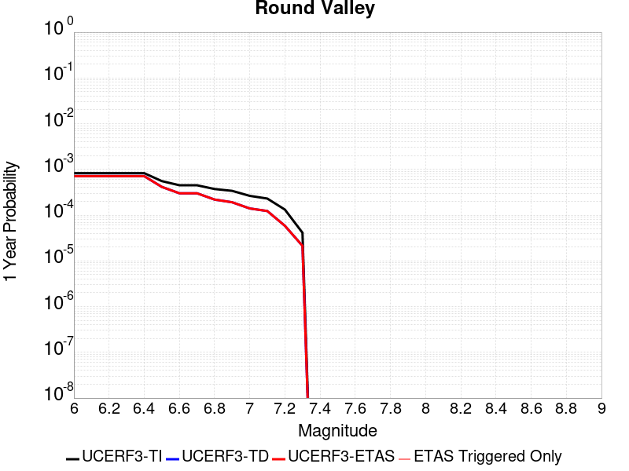 |  |

| Magnitude | 1 wk TI Prob | 1 wk TD Prob | 1 wk ETAS Prob | 1 wk ETAS/TD Gain | 1 wk ETAS Triggered Only | 1 mo TI Prob | 1 mo TD Prob | 1 mo ETAS Prob | 1 mo ETAS/TD Gain | 1 mo ETAS Triggered Only | 1 yr TI Prob | 1 yr TD Prob | 1 yr ETAS Prob | 1 yr ETAS/TD Gain | 1 yr ETAS Triggered Only | 10 yr TI Prob | 10 yr TD Prob | 10 yr ETAS Prob | 10 yr ETAS/TD Gain | 10 yr ETAS Triggered Only |
|-----|-----|-----|-----|-----|-----|-----|-----|-----|-----|-----|-----|-----|-----|-----|-----|-----|-----|-----|-----|-----|
| 6.0 | 1.588152E-5 | 1.3670716E-5 | 1.3670716E-5 | 1.0 | 0.0 | 6.806188E-5 | 5.8587688E-5 | 5.8587688E-5 | 1.0 | 0.0 | 8.283384E-4 | 7.131111E-4 | 7.131111E-4 | 1.0 | 0.0 | 0.008252576 | 0.007112115 | 0.007122044 | 1.0013961 | 1.0E-5 |
| 6.1 | 1.588152E-5 | 1.3670716E-5 | 1.3670716E-5 | 1.0 | 0.0 | 6.806188E-5 | 5.8587688E-5 | 5.8587688E-5 | 1.0 | 0.0 | 8.283384E-4 | 7.131111E-4 | 7.131111E-4 | 1.0 | 0.0 | 0.008252576 | 0.007112115 | 0.007122044 | 1.0013961 | 1.0E-5 |
| 6.2 | 1.588152E-5 | 1.3670716E-5 | 1.3670716E-5 | 1.0 | 0.0 | 6.806188E-5 | 5.8587688E-5 | 5.8587688E-5 | 1.0 | 0.0 | 8.283384E-4 | 7.131111E-4 | 7.131111E-4 | 1.0 | 0.0 | 0.008252576 | 0.007112115 | 0.007122044 | 1.0013961 | 1.0E-5 |
| 6.3 | 1.588152E-5 | 1.3670716E-5 | 1.3670716E-5 | 1.0 | 0.0 | 6.806188E-5 | 5.8587688E-5 | 5.8587688E-5 | 1.0 | 0.0 | 8.283384E-4 | 7.131111E-4 | 7.131111E-4 | 1.0 | 0.0 | 0.008252576 | 0.007112115 | 0.007122044 | 1.0013961 | 1.0E-5 |
| 6.4 | 1.588152E-5 | 1.3670716E-5 | 1.3670716E-5 | 1.0 | 0.0 | 6.806188E-5 | 5.8587688E-5 | 5.8587688E-5 | 1.0 | 0.0 | 8.283384E-4 | 7.131111E-4 | 7.131111E-4 | 1.0 | 0.0 | 0.008252576 | 0.007112115 | 0.007122044 | 1.0013961 | 1.0E-5 |
| 6.5 | 1.0646776E-5 | 7.952968E-6 | 7.952968E-6 | 1.0 | 0.0 | 4.5628243E-5 | 3.408375E-5 | 3.408375E-5 | 1.0 | 0.0 | 5.553823E-4 | 4.1489903E-4 | 4.1489903E-4 | 1.0 | 0.0 | 0.005539963 | 0.004142073 | 0.004142073 | 1.0 | 0.0 |
| 6.6 | 8.632956E-6 | 5.768648E-6 | 5.768648E-6 | 1.0 | 0.0 | 3.6997862E-5 | 2.4722565E-5 | 2.4722565E-5 | 1.0 | 0.0 | 4.5035584E-4 | 3.0095948E-4 | 3.0095948E-4 | 1.0 | 0.0 | 0.0044944426 | 0.003005897 | 0.003005897 | 1.0 | 0.0 |
| 6.7 | 8.632956E-6 | 5.768648E-6 | 5.768648E-6 | 1.0 | 0.0 | 3.6997862E-5 | 2.4722565E-5 | 2.4722565E-5 | 1.0 | 0.0 | 4.5035584E-4 | 3.0095948E-4 | 3.0095948E-4 | 1.0 | 0.0 | 0.0044944426 | 0.003005897 | 0.003005897 | 1.0 | 0.0 |
| 6.8 | 7.143895E-6 | 4.2017227E-6 | 4.2017227E-6 | 1.0 | 0.0 | 3.0616335E-5 | 1.800727E-5 | 1.800727E-5 | 1.0 | 0.0 | 3.726901E-4 | 2.1921811E-4 | 2.1921811E-4 | 1.0 | 0.0 | 0.0037206567 | 0.0021901834 | 0.0021901834 | 1.0 | 0.0 |
| 6.9 | 6.5120694E-6 | 3.6643512E-6 | 3.6643512E-6 | 1.0 | 0.0 | 2.790857E-5 | 1.5704276E-5 | 1.5704276E-5 | 1.0 | 0.0 | 3.3973387E-4 | 1.911843E-4 | 1.911843E-4 | 1.0 | 0.0 | 0.0033921495 | 0.0019103473 | 0.0019103473 | 1.0 | 0.0 |
| 7.0 | 5.0614435E-6 | 2.6835412E-6 | 2.6835412E-6 | 1.0 | 0.0 | 2.169172E-5 | 1.1500846E-5 | 1.1500846E-5 | 1.0 | 0.0 | 2.6406467E-4 | 1.4001483E-4 | 1.4001483E-4 | 1.0 | 0.0 | 0.0026375111 | 0.0013993676 | 0.0013993676 | 1.0 | 0.0 |
| 7.1 | 4.41728E-6 | 2.3573723E-6 | 2.3573723E-6 | 1.0 | 0.0 | 1.8931061E-5 | 1.0102991E-5 | 1.0102991E-5 | 1.0 | 0.0 | 2.304613E-4 | 1.2299795E-4 | 1.2299795E-4 | 1.0 | 0.0 | 0.0023022245 | 0.0012293953 | 0.0012293953 | 1.0 | 0.0 |
| 7.2 | 2.535495E-6 | 1.1208174E-6 | 1.1208174E-6 | 1.0 | 0.0 | 1.0866362E-5 | 4.803497E-6 | 4.803497E-6 | 1.0 | 0.0 | 1.3228992E-4 | 5.8481528E-5 | 5.8481528E-5 | 1.0 | 0.0 | 0.0013221119 | 5.847126E-4 | 5.847126E-4 | 1.0 | 0.0 |
| 7.3 | 7.900015E-7 | 4.0890467E-7 | 4.0890467E-7 | 1.0 | 0.0 | 3.3857161E-6 | 1.7524486E-6 | 1.7524486E-6 | 1.0 | 0.0 | 4.1220315E-5 | 2.1336062E-5 | 2.1336062E-5 | 1.0 | 0.0 | 4.121267E-4 | 2.1336062E-4 | 2.1336062E-4 | 1.0 | 0.0 |

## San Gregorio (North) 2011 CFM
*[(top)](#table-of-contents)*

| 1 Week | 1 Month | 1 Year | 10 Year |
|-----|-----|-----|-----|
|  | 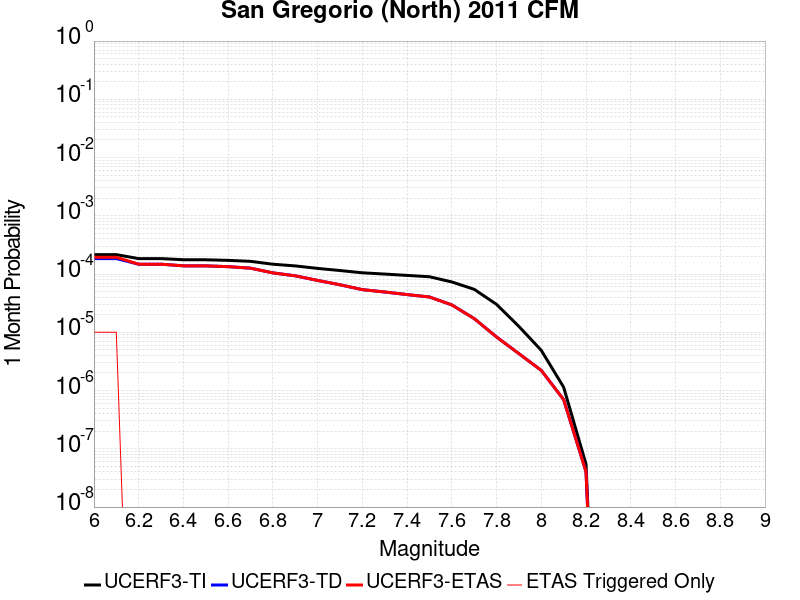 |  |  |

| Magnitude | 1 wk TI Prob | 1 wk TD Prob | 1 wk ETAS Prob | 1 wk ETAS/TD Gain | 1 wk ETAS Triggered Only | 1 mo TI Prob | 1 mo TD Prob | 1 mo ETAS Prob | 1 mo ETAS/TD Gain | 1 mo ETAS Triggered Only | 1 yr TI Prob | 1 yr TD Prob | 1 yr ETAS Prob | 1 yr ETAS/TD Gain | 1 yr ETAS Triggered Only | 10 yr TI Prob | 10 yr TD Prob | 10 yr ETAS Prob | 10 yr ETAS/TD Gain | 10 yr ETAS Triggered Only |
|-----|-----|-----|-----|-----|-----|-----|-----|-----|-----|-----|-----|-----|-----|-----|-----|-----|-----|-----|-----|-----|
| 6.0 | 5.0283932E-5 | 4.306001E-5 | 4.306001E-5 | 1.0 | 0.0 | 2.1548476E-4 | 1.845299E-4 | 1.9452805E-4 | 1.0541818 | 1.0E-5 | 0.0026203706 | 0.0022443503 | 0.002254328 | 1.0044457 | 1.0E-5 | 0.02589687 | 0.022297954 | 0.022307731 | 1.0004385 | 1.0E-5 |
| 6.1 | 5.0283932E-5 | 4.306001E-5 | 4.306001E-5 | 1.0 | 0.0 | 2.1548476E-4 | 1.845299E-4 | 1.9452805E-4 | 1.0541818 | 1.0E-5 | 0.0026203706 | 0.0022443503 | 0.002254328 | 1.0044457 | 1.0E-5 | 0.02589687 | 0.022297954 | 0.022307731 | 1.0004385 | 1.0E-5 |
| 6.2 | 4.2998647E-5 | 3.4443507E-5 | 3.4443507E-5 | 1.0 | 0.0 | 1.842669E-4 | 1.4760674E-4 | 1.4760674E-4 | 1.0 | 0.0 | 0.0022411412 | 0.0017956431 | 0.0017956431 | 1.0 | 0.0 | 0.022186736 | 0.01788679 | 0.01788679 | 1.0 | 0.0 |
| 6.3 | 4.2998647E-5 | 3.4443507E-5 | 3.4443507E-5 | 1.0 | 0.0 | 1.842669E-4 | 1.4760674E-4 | 1.4760674E-4 | 1.0 | 0.0 | 0.0022411412 | 0.0017956431 | 0.0017956431 | 1.0 | 0.0 | 0.022186736 | 0.01788679 | 0.01788679 | 1.0 | 0.0 |
| 6.4 | 4.1101295E-5 | 3.2328644E-5 | 3.2328644E-5 | 1.0 | 0.0 | 1.7613651E-4 | 1.3854404E-4 | 1.3854404E-4 | 1.0 | 0.0 | 0.0021423528 | 0.001685482 | 0.001685482 | 1.0 | 0.0 | 0.02121817 | 0.016802493 | 0.016802493 | 1.0 | 0.0 |
| 6.5 | 4.1032585E-5 | 3.2246677E-5 | 3.2246677E-5 | 1.0 | 0.0 | 1.7584208E-4 | 1.381928E-4 | 1.381928E-4 | 1.0 | 0.0 | 0.0021387753 | 0.0016812122 | 0.0016812122 | 1.0 | 0.0 | 0.021183075 | 0.016760446 | 0.016760446 | 1.0 | 0.0 |
| 6.6 | 4.011629E-5 | 3.126826E-5 | 3.126826E-5 | 1.0 | 0.0 | 1.7191563E-4 | 1.3400002E-4 | 1.3400002E-4 | 1.0 | 0.0 | 0.0020910634 | 0.0016302431 | 0.0016302431 | 1.0 | 0.0 | 0.020714961 | 0.016258562 | 0.016258562 | 1.0 | 0.0 |
| 6.7 | 3.8583938E-5 | 2.9455243E-5 | 2.9455243E-5 | 1.0 | 0.0 | 1.6534925E-4 | 1.2623073E-4 | 1.2623073E-4 | 1.0 | 0.0 | 0.0020112682 | 0.00153579 | 0.00153579 | 1.0 | 0.0 | 0.019931622 | 0.0153272385 | 0.0153272385 | 1.0 | 0.0 |
| 6.8 | 3.44341E-5 | 2.4452358E-5 | 2.4452358E-5 | 1.0 | 0.0 | 1.4756636E-4 | 1.0479167E-4 | 1.0479167E-4 | 1.0 | 0.0 | 0.0017951399 | 0.0012751024 | 0.0012751024 | 1.0 | 0.0 | 0.017807078 | 0.0127526 | 0.0127526 | 1.0 | 0.0 |
| 6.9 | 3.221199E-5 | 2.1779444E-5 | 2.1779444E-5 | 1.0 | 0.0 | 1.3804408E-4 | 9.333718E-5 | 9.333718E-5 | 1.0 | 0.0 | 0.0016793909 | 0.001135796 | 0.001135796 | 1.0 | 0.0 | 0.01666756 | 0.011373482 | 0.011373482 | 1.0 | 0.0 |
| 7.0 | 2.9186718E-5 | 1.8148163E-5 | 1.8148163E-5 | 1.0 | 0.0 | 1.2507994E-4 | 7.777555E-5 | 7.777555E-5 | 1.0 | 0.0 | 0.0015217843 | 9.4651035E-4 | 9.4651035E-4 | 1.0 | 0.0 | 0.015114053 | 0.0094977645 | 0.0094977645 | 1.0 | 0.0 |
| 7.1 | 2.6840138E-5 | 1.5285703E-5 | 1.5285703E-5 | 1.0 | 0.0 | 1.1502409E-4 | 6.5508524E-5 | 6.5508524E-5 | 1.0 | 0.0 | 0.0013995186 | 7.972764E-4 | 7.972764E-4 | 1.0 | 0.0 | 0.013907375 | 0.008016584 | 0.008016584 | 1.0 | 0.0 |
| 7.2 | 2.453002E-5 | 1.2607806E-5 | 1.2607806E-5 | 1.0 | 0.0 | 1.05124425E-4 | 5.4032334E-5 | 5.4032334E-5 | 1.0 | 0.0 | 0.0012791384 | 6.576457E-4 | 6.576457E-4 | 1.0 | 0.0 | 0.012718005 | 0.006628373 | 0.006628373 | 1.0 | 0.0 |
| 7.3 | 2.3330727E-5 | 1.1489774E-5 | 1.1489774E-5 | 1.0 | 0.0 | 9.9985E-5 | 4.924096E-5 | 4.924096E-5 | 1.0 | 0.0 | 0.0012166376 | 5.9934426E-4 | 5.9934426E-4 | 1.0 | 0.0 | 0.012099981 | 0.006047372 | 0.006047372 | 1.0 | 0.0 |
| 7.4 | 2.2136466E-5 | 1.0370048E-5 | 1.0370048E-5 | 1.0 | 0.0 | 9.486712E-5 | 4.4442306E-5 | 4.4442306E-5 | 1.0 | 0.0 | 0.0011543952 | 5.40951E-4 | 5.40951E-4 | 1.0 | 0.0 | 0.011484168 | 0.0054649427 | 0.0054649427 | 1.0 | 0.0 |
| 7.5 | 2.0994974E-5 | 9.428222E-6 | 9.428222E-6 | 1.0 | 0.0 | 8.997535E-5 | 4.040604E-5 | 4.040604E-5 | 1.0 | 0.0 | 0.0010948994 | 4.9183273E-4 | 4.9183273E-4 | 1.0 | 0.0 | 0.010895205 | 0.004974083 | 0.004974083 | 1.0 | 0.0 |
| 7.6 | 1.7091823E-5 | 6.8944946E-6 | 6.8944946E-6 | 1.0 | 0.0 | 7.3248615E-5 | 2.95475E-5 | 2.95475E-5 | 1.0 | 0.0 | 8.9143694E-4 | 3.5968152E-4 | 3.5968152E-4 | 1.0 | 0.0 | 0.008878695 | 0.0036488718 | 0.0036488718 | 1.0 | 0.0 |
| 7.7 | 1.2772179E-5 | 4.0212976E-6 | 4.0212976E-6 | 1.0 | 0.0 | 5.473676E-5 | 1.7234017E-5 | 1.7234017E-5 | 1.0 | 0.0 | 6.6621625E-4 | 2.0980398E-4 | 2.0980398E-4 | 1.0 | 0.0 | 0.006642225 | 0.002137152 | 0.002137152 | 1.0 | 0.0 |
| 7.8 | 7.041923E-6 | 1.9409326E-6 | 1.9409326E-6 | 1.0 | 0.0 | 3.017932E-5 | 8.318257E-6 | 8.318257E-6 | 1.0 | 0.0 | 3.6737128E-4 | 1.0127007E-4 | 1.0127007E-4 | 1.0 | 0.0 | 0.0036676454 | 0.0010380556 | 0.0010380556 | 1.0 | 0.0 |
| 7.9 | 2.946768E-6 | 1.0036017E-6 | 1.0036017E-6 | 1.0 | 0.0 | 1.2628945E-5 | 4.301143E-6 | 4.301143E-6 | 1.0 | 0.0 | 1.5374656E-4 | 5.2365154E-5 | 5.2365154E-5 | 1.0 | 0.0 | 0.0015364023 | 5.341041E-4 | 5.341041E-4 | 1.0 | 0.0 |
| 8.0 | 1.1433375E-6 | 5.1832274E-7 | 5.1832274E-7 | 1.0 | 0.0 | 4.9000087E-6 | 2.221381E-6 | 2.221381E-6 | 1.0 | 0.0 | 5.965597E-5 | 2.704498E-5 | 2.704498E-5 | 1.0 | 0.0 | 5.963996E-4 | 2.7406466E-4 | 2.7406466E-4 | 1.0 | 0.0 |
| 8.1 | 2.6675295E-7 | 1.6297024E-7 | 1.6297024E-7 | 1.0 | 0.0 | 1.1432264E-6 | 6.9844367E-7 | 6.9844367E-7 | 1.0 | 0.0 | 1.3918692E-5 | 8.503518E-6 | 8.503518E-6 | 1.0 | 0.0 | 1.391782E-4 | 8.64163E-5 | 8.64163E-5 | 1.0 | 0.0 |
| 8.2 | 1.2704569E-8 | 9.43797E-9 | 9.43797E-9 | 1.0 | 0.0 | 5.444815E-8 | 4.0448445E-8 | 4.0448445E-8 | 1.0 | 0.0 | 6.629061E-7 | 4.924597E-7 | 4.924597E-7 | 1.0 | 0.0 | 6.629041E-6 | 5.1149595E-6 | 5.1149595E-6 | 1.0 | 0.0 |

## Clayton
*[(top)](#table-of-contents)*

| 1 Week | 1 Month | 1 Year | 10 Year |
|-----|-----|-----|-----|
|  |  |  |  |

| Magnitude | 1 wk TI Prob | 1 wk TD Prob | 1 wk ETAS Prob | 1 wk ETAS/TD Gain | 1 wk ETAS Triggered Only | 1 mo TI Prob | 1 mo TD Prob | 1 mo ETAS Prob | 1 mo ETAS/TD Gain | 1 mo ETAS Triggered Only | 1 yr TI Prob | 1 yr TD Prob | 1 yr ETAS Prob | 1 yr ETAS/TD Gain | 1 yr ETAS Triggered Only | 10 yr TI Prob | 10 yr TD Prob | 10 yr ETAS Prob | 10 yr ETAS/TD Gain | 10 yr ETAS Triggered Only |
|-----|-----|-----|-----|-----|-----|-----|-----|-----|-----|-----|-----|-----|-----|-----|-----|-----|-----|-----|-----|-----|
| 6.0 | 1.1413061E-5 | 1.2667253E-5 | 2.2667127E-5 | 1.7894272 | 1.0E-5 | 4.89122E-5 | 5.4287222E-5 | 6.428668E-5 | 1.1841954 | 1.0E-5 | 5.953433E-4 | 6.607687E-4 | 6.707621E-4 | 1.0151238 | 1.0E-5 | 0.005937509 | 0.006590243 | 0.006600177 | 1.0015074 | 1.0E-5 |
| 6.1 | 1.1413061E-5 | 1.2667253E-5 | 2.2667127E-5 | 1.7894272 | 1.0E-5 | 4.89122E-5 | 5.4287222E-5 | 6.428668E-5 | 1.1841954 | 1.0E-5 | 5.953433E-4 | 6.607687E-4 | 6.707621E-4 | 1.0151238 | 1.0E-5 | 0.005937509 | 0.006590243 | 0.006600177 | 1.0015074 | 1.0E-5 |
| 6.2 | 1.1413061E-5 | 1.2667253E-5 | 2.2667127E-5 | 1.7894272 | 1.0E-5 | 4.89122E-5 | 5.4287222E-5 | 6.428668E-5 | 1.1841954 | 1.0E-5 | 5.953433E-4 | 6.607687E-4 | 6.707621E-4 | 1.0151238 | 1.0E-5 | 0.005937509 | 0.006590243 | 0.006600177 | 1.0015074 | 1.0E-5 |
| 6.3 | 8.538689E-6 | 9.53291E-6 | 1.9532814E-5 | 2.0489876 | 1.0E-5 | 3.659387E-5 | 4.0854746E-5 | 5.0854338E-5 | 1.2447596 | 1.0E-5 | 4.4543925E-4 | 4.973038E-4 | 5.072988E-4 | 1.0200984 | 1.0E-5 | 0.0044454746 | 0.004962975 | 0.0049729254 | 1.0020049 | 1.0E-5 |
| 6.4 | 8.538689E-6 | 9.53291E-6 | 1.9532814E-5 | 2.0489876 | 1.0E-5 | 3.659387E-5 | 4.0854746E-5 | 5.0854338E-5 | 1.2447596 | 1.0E-5 | 4.4543925E-4 | 4.973038E-4 | 5.072988E-4 | 1.0200984 | 1.0E-5 | 0.0044454746 | 0.004962975 | 0.0049729254 | 1.0020049 | 1.0E-5 |
| 6.5 | 7.197462E-6 | 8.081092E-6 | 1.8081011E-5 | 2.2374465 | 1.0E-5 | 3.08459E-5 | 3.463284E-5 | 4.4632492E-5 | 1.2887332 | 1.0E-5 | 3.7548412E-4 | 4.2158147E-4 | 4.3157724E-4 | 1.0237103 | 1.0E-5 | 0.003748503 | 0.004208629 | 0.0042185867 | 1.0023661 | 1.0E-5 |
| 6.6 | 7.1760483E-6 | 8.057108E-6 | 1.8057028E-5 | 2.24113 | 1.0E-5 | 3.075413E-5 | 3.4530054E-5 | 4.452971E-5 | 1.2895927 | 1.0E-5 | 3.743672E-4 | 4.203305E-4 | 4.303263E-4 | 1.0237808 | 1.0E-5 | 0.0037373714 | 0.0041961665 | 0.0042061247 | 1.0023731 | 1.0E-5 |
| 6.7 | 6.202582E-6 | 6.976818E-6 | 1.6976748E-5 | 2.4333081 | 1.0E-5 | 2.6582224E-5 | 2.990035E-5 | 3.990005E-5 | 1.3344343 | 1.0E-5 | 3.235905E-4 | 3.639836E-4 | 3.7397997E-4 | 1.0274638 | 1.0E-5 | 0.0032311971 | 0.0036346302 | 0.003644594 | 1.0027413 | 1.0E-5 |
| 6.8 | 3.6417277E-6 | 4.1213766E-6 | 1.4121335E-5 | 3.426364 | 1.0E-5 | 1.5607311E-5 | 1.7662927E-5 | 2.766275E-5 | 1.5661476 | 1.0E-5 | 1.9000245E-4 | 2.1502568E-4 | 2.2502353E-4 | 1.046496 | 1.0E-5 | 0.0018984007 | 0.0021482527 | 0.002158231 | 1.004645 | 1.0E-5 |
| 6.9 | 2.6498485E-6 | 2.9995813E-6 | 1.29995515E-5 | 4.333789 | 1.0E-5 | 1.1356444E-5 | 1.2855287E-5 | 2.2855158E-5 | 1.7778801 | 1.0E-5 | 1.3825593E-4 | 1.5650228E-4 | 1.6650071E-4 | 1.0638869 | 1.0E-5 | 0.0013816995 | 0.0015639602 | 0.0015739446 | 1.006384 | 1.0E-5 |
| 7.0 | 2.070442E-6 | 2.3407722E-6 | 2.3407722E-6 | 1.0 | 0.0 | 8.873292E-6 | 1.0031844E-5 | 1.0031844E-5 | 1.0 | 0.0 | 1.0802698E-4 | 1.2213115E-4 | 1.2213115E-4 | 1.0 | 0.0 | 0.0010797448 | 0.0012206702 | 0.0012206702 | 1.0 | 0.0 |
| 7.1 | 1.2111691E-6 | 1.358901E-6 | 1.358901E-6 | 1.0 | 0.0 | 5.190714E-6 | 5.8238493E-6 | 5.8238493E-6 | 1.0 | 0.0 | 6.319511E-5 | 7.0903225E-5 | 7.0903225E-5 | 1.0 | 0.0 | 6.3177146E-4 | 7.088224E-4 | 7.088224E-4 | 1.0 | 0.0 |
| 7.2 | 3.9541607E-7 | 4.2228655E-7 | 4.2228655E-7 | 1.0 | 0.0 | 1.6946392E-6 | 1.8097983E-6 | 1.8097983E-6 | 1.0 | 0.0 | 2.0632036E-5 | 2.2034073E-5 | 2.2034073E-5 | 1.0 | 0.0 | 2.063012E-4 | 2.2031902E-4 | 2.2031902E-4 | 1.0 | 0.0 |
| 7.3 | 2.5685637E-7 | 2.7457332E-7 | 2.7457332E-7 | 1.0 | 0.0 | 1.1008126E-6 | 1.1767423E-6 | 1.1767423E-6 | 1.0 | 0.0 | 1.3402311E-5 | 1.4326744E-5 | 1.4326744E-5 | 1.0 | 0.0 | 1.3401502E-4 | 1.4325828E-4 | 1.4325828E-4 | 1.0 | 0.0 |
| 7.4 | 1.482299E-7 | 1.580828E-7 | 1.580828E-7 | 1.0 | 0.0 | 6.3527085E-7 | 6.774975E-7 | 6.774975E-7 | 1.0 | 0.0 | 7.734395E-6 | 8.248501E-6 | 8.248501E-6 | 1.0 | 0.0 | 7.734126E-5 | 8.248198E-5 | 8.248198E-5 | 1.0 | 0.0 |
| 7.5 | 9.7969505E-8 | 1.0438406E-7 | 1.0438406E-7 | 1.0 | 0.0 | 4.1986925E-7 | 4.4736018E-7 | 4.4736018E-7 | 1.0 | 0.0 | 5.111896E-6 | 5.446597E-6 | 5.446597E-6 | 1.0 | 0.0 | 5.1117782E-5 | 5.446465E-5 | 5.446465E-5 | 1.0 | 0.0 |
| 7.6 | 6.125415E-8 | 6.523247E-8 | 6.523247E-8 | 1.0 | 0.0 | 2.6251774E-7 | 2.795677E-7 | 2.795677E-7 | 1.0 | 0.0 | 3.196149E-6 | 3.4037316E-6 | 3.4037316E-6 | 1.0 | 0.0 | 3.196103E-5 | 3.4036806E-5 | 3.4036806E-5 | 1.0 | 0.0 |

## Fontana (Seismicity)
*[(top)](#table-of-contents)*

| 1 Week | 1 Month | 1 Year | 10 Year |
|-----|-----|-----|-----|
|  |  |  |  |

| Magnitude | 1 wk TI Prob | 1 wk TD Prob | 1 wk ETAS Prob | 1 wk ETAS/TD Gain | 1 wk ETAS Triggered Only | 1 mo TI Prob | 1 mo TD Prob | 1 mo ETAS Prob | 1 mo ETAS/TD Gain | 1 mo ETAS Triggered Only | 1 yr TI Prob | 1 yr TD Prob | 1 yr ETAS Prob | 1 yr ETAS/TD Gain | 1 yr ETAS Triggered Only | 10 yr TI Prob | 10 yr TD Prob | 10 yr ETAS Prob | 10 yr ETAS/TD Gain | 10 yr ETAS Triggered Only |
|-----|-----|-----|-----|-----|-----|-----|-----|-----|-----|-----|-----|-----|-----|-----|-----|-----|-----|-----|-----|-----|
| 6.0 | 7.1789214E-6 | 7.552053E-6 | 7.552053E-6 | 1.0 | 0.0 | 3.076644E-5 | 3.236577E-5 | 3.236577E-5 | 1.0 | 0.0 | 3.7451705E-4 | 3.9402276E-4 | 4.0401882E-4 | 1.0253693 | 1.0E-5 | 0.003738865 | 0.003937241 | 0.0039472017 | 1.0025299 | 1.0E-5 |
| 6.1 | 7.1789214E-6 | 7.552053E-6 | 7.552053E-6 | 1.0 | 0.0 | 3.076644E-5 | 3.236577E-5 | 3.236577E-5 | 1.0 | 0.0 | 3.7451705E-4 | 3.9402276E-4 | 4.0401882E-4 | 1.0253693 | 1.0E-5 | 0.003738865 | 0.003937241 | 0.0039472017 | 1.0025299 | 1.0E-5 |
| 6.2 | 7.1789214E-6 | 7.552053E-6 | 7.552053E-6 | 1.0 | 0.0 | 3.076644E-5 | 3.236577E-5 | 3.236577E-5 | 1.0 | 0.0 | 3.7451705E-4 | 3.9402276E-4 | 4.0401882E-4 | 1.0253693 | 1.0E-5 | 0.003738865 | 0.003937241 | 0.0039472017 | 1.0025299 | 1.0E-5 |
| 6.3 | 7.1789214E-6 | 7.552053E-6 | 7.552053E-6 | 1.0 | 0.0 | 3.076644E-5 | 3.236577E-5 | 3.236577E-5 | 1.0 | 0.0 | 3.7451705E-4 | 3.9402276E-4 | 4.0401882E-4 | 1.0253693 | 1.0E-5 | 0.003738865 | 0.003937241 | 0.0039472017 | 1.0025299 | 1.0E-5 |
| 6.4 | 7.1789214E-6 | 7.552053E-6 | 7.552053E-6 | 1.0 | 0.0 | 3.076644E-5 | 3.236577E-5 | 3.236577E-5 | 1.0 | 0.0 | 3.7451705E-4 | 3.9402276E-4 | 4.0401882E-4 | 1.0253693 | 1.0E-5 | 0.003738865 | 0.003937241 | 0.0039472017 | 1.0025299 | 1.0E-5 |
| 6.5 | 5.2611317E-6 | 5.5327637E-6 | 5.5327637E-6 | 1.0 | 0.0 | 2.2547512E-5 | 2.3711844E-5 | 2.3711844E-5 | 1.0 | 0.0 | 2.744814E-4 | 2.886917E-4 | 2.9868883E-4 | 1.034629 | 1.0E-5 | 0.002741426 | 0.002886917 | 0.0028968882 | 1.0034539 | 1.0E-5 |
| 6.6 | 5.2611317E-6 | 5.5327637E-6 | 5.5327637E-6 | 1.0 | 0.0 | 2.2547512E-5 | 2.3711844E-5 | 2.3711844E-5 | 1.0 | 0.0 | 2.744814E-4 | 2.886917E-4 | 2.9868883E-4 | 1.034629 | 1.0E-5 | 0.002741426 | 0.002886917 | 0.0028968882 | 1.0034539 | 1.0E-5 |

## San Gregorio (South) 2011 CFM
*[(top)](#table-of-contents)*

| 1 Week | 1 Month | 1 Year | 10 Year |
|-----|-----|-----|-----|
|  |  |  |  |

| Magnitude | 1 wk TI Prob | 1 wk TD Prob | 1 wk ETAS Prob | 1 wk ETAS/TD Gain | 1 wk ETAS Triggered Only | 1 mo TI Prob | 1 mo TD Prob | 1 mo ETAS Prob | 1 mo ETAS/TD Gain | 1 mo ETAS Triggered Only | 1 yr TI Prob | 1 yr TD Prob | 1 yr ETAS Prob | 1 yr ETAS/TD Gain | 1 yr ETAS Triggered Only | 10 yr TI Prob | 10 yr TD Prob | 10 yr ETAS Prob | 10 yr ETAS/TD Gain | 10 yr ETAS Triggered Only |
|-----|-----|-----|-----|-----|-----|-----|-----|-----|-----|-----|-----|-----|-----|-----|-----|-----|-----|-----|-----|-----|
| 6.0 | 1.8770423E-5 | 1.6280237E-5 | 1.6280237E-5 | 1.0 | 0.0 | 8.044219E-5 | 6.97706E-5 | 6.97706E-5 | 1.0 | 0.0 | 9.789435E-4 | 8.4912975E-4 | 8.4912975E-4 | 1.0 | 0.0 | 0.009746423 | 0.008471773 | 0.008481689 | 1.0011704 | 1.0E-5 |
| 6.1 | 1.8770423E-5 | 1.6280237E-5 | 1.6280237E-5 | 1.0 | 0.0 | 8.044219E-5 | 6.97706E-5 | 6.97706E-5 | 1.0 | 0.0 | 9.789435E-4 | 8.4912975E-4 | 8.4912975E-4 | 1.0 | 0.0 | 0.009746423 | 0.008471773 | 0.008481689 | 1.0011704 | 1.0E-5 |
| 6.2 | 1.7508692E-5 | 1.4899725E-5 | 1.4899725E-5 | 1.0 | 0.0 | 7.5035096E-5 | 6.3854415E-5 | 6.3854415E-5 | 1.0 | 0.0 | 9.1316935E-4 | 7.7715324E-4 | 7.7715324E-4 | 1.0 | 0.0 | 0.00909426 | 0.007757193 | 0.0077671153 | 1.0012791 | 1.0E-5 |
| 6.3 | 1.7508692E-5 | 1.4899725E-5 | 1.4899725E-5 | 1.0 | 0.0 | 7.5035096E-5 | 6.3854415E-5 | 6.3854415E-5 | 1.0 | 0.0 | 9.1316935E-4 | 7.7715324E-4 | 7.7715324E-4 | 1.0 | 0.0 | 0.00909426 | 0.007757193 | 0.0077671153 | 1.0012791 | 1.0E-5 |
| 6.4 | 1.6004591E-5 | 1.3249541E-5 | 1.3249541E-5 | 1.0 | 0.0 | 6.85893E-5 | 5.6782515E-5 | 5.6782515E-5 | 1.0 | 0.0 | 8.347548E-4 | 6.911089E-4 | 6.911089E-4 | 1.0 | 0.0 | 0.008316261 | 0.006902233 | 0.006902233 | 1.0 | 0.0 |
| 6.5 | 1.6004591E-5 | 1.3249541E-5 | 1.3249541E-5 | 1.0 | 0.0 | 6.85893E-5 | 5.6782515E-5 | 5.6782515E-5 | 1.0 | 0.0 | 8.347548E-4 | 6.911089E-4 | 6.911089E-4 | 1.0 | 0.0 | 0.008316261 | 0.006902233 | 0.006902233 | 1.0 | 0.0 |
| 6.6 | 1.5442201E-5 | 1.2634164E-5 | 1.2634164E-5 | 1.0 | 0.0 | 6.617918E-5 | 5.4145297E-5 | 5.4145297E-5 | 1.0 | 0.0 | 8.0543366E-4 | 6.590205E-4 | 6.590205E-4 | 1.0 | 0.0 | 0.008025207 | 0.006583281 | 0.006583281 | 1.0 | 0.0 |
| 6.7 | 1.489921E-5 | 1.2042667E-5 | 1.2042667E-5 | 1.0 | 0.0 | 6.3852196E-5 | 5.161041E-5 | 5.161041E-5 | 1.0 | 0.0 | 7.7712315E-4 | 6.2817626E-4 | 6.2817626E-4 | 1.0 | 0.0 | 0.0077441116 | 0.006276611 | 0.006276611 | 1.0 | 0.0 |
| 6.8 | 1.3876024E-5 | 1.0921603E-5 | 1.0921603E-5 | 1.0 | 0.0 | 5.9467322E-5 | 4.6806028E-5 | 4.6806028E-5 | 1.0 | 0.0 | 7.237741E-4 | 5.6971476E-4 | 5.6971476E-4 | 1.0 | 0.0 | 0.0072142133 | 0.0056951125 | 0.0056951125 | 1.0 | 0.0 |
| 6.9 | 1.33922495E-5 | 1.0393098E-5 | 1.0393098E-5 | 1.0 | 0.0 | 5.7394092E-5 | 4.454109E-5 | 4.454109E-5 | 1.0 | 0.0 | 6.9854903E-4 | 5.4215314E-4 | 5.4215314E-4 | 1.0 | 0.0 | 0.0069635725 | 0.005420867 | 0.005420867 | 1.0 | 0.0 |
| 7.0 | 1.2807324E-5 | 9.753052E-6 | 9.753052E-6 | 1.0 | 0.0 | 5.4887376E-5 | 4.1798125E-5 | 4.1798125E-5 | 1.0 | 0.0 | 6.680489E-4 | 5.0877355E-4 | 5.0877355E-4 | 1.0 | 0.0 | 0.006660442 | 0.0050886413 | 0.0050886413 | 1.0 | 0.0 |
| 7.1 | 1.2191438E-5 | 9.061928E-6 | 9.061928E-6 | 1.0 | 0.0 | 5.224797E-5 | 3.8836257E-5 | 3.8836257E-5 | 1.0 | 0.0 | 6.3593336E-4 | 4.7272892E-4 | 4.7272892E-4 | 1.0 | 0.0 | 0.0063411663 | 0.0047297794 | 0.0047297794 | 1.0 | 0.0 |
| 7.2 | 1.1769438E-5 | 8.582114E-6 | 8.582114E-6 | 1.0 | 0.0 | 5.0439474E-5 | 3.677997E-5 | 3.677997E-5 | 1.0 | 0.0 | 6.1392755E-4 | 4.477042E-4 | 4.477042E-4 | 1.0 | 0.0 | 0.0061223423 | 0.0044805673 | 0.0044805673 | 1.0 | 0.0 |
| 7.3 | 1.150374E-5 | 8.297538E-6 | 8.297538E-6 | 1.0 | 0.0 | 4.9300812E-5 | 3.5560395E-5 | 3.5560395E-5 | 1.0 | 0.0 | 6.0007203E-4 | 4.3286185E-4 | 4.3286185E-4 | 1.0 | 0.0 | 0.0059845424 | 0.0043327045 | 0.0043327045 | 1.0 | 0.0 |
| 7.4 | 1.12514E-5 | 8.0432765E-6 | 8.0432765E-6 | 1.0 | 0.0 | 4.8219394E-5 | 3.447073E-5 | 3.447073E-5 | 1.0 | 0.0 | 5.8691297E-4 | 4.196004E-4 | 4.196004E-4 | 1.0 | 0.0 | 0.005853653 | 0.0042005833 | 0.0042005833 | 1.0 | 0.0 |
| 7.5 | 1.059696E-5 | 7.3935516E-6 | 7.3935516E-6 | 1.0 | 0.0 | 4.5414752E-5 | 3.1686264E-5 | 3.1686264E-5 | 1.0 | 0.0 | 5.5278436E-4 | 3.8571205E-4 | 3.8571205E-4 | 1.0 | 0.0 | 0.0055141128 | 0.0038628688 | 0.0038628688 | 1.0 | 0.0 |
| 7.6 | 9.018592E-6 | 5.8372852E-6 | 5.8372852E-6 | 1.0 | 0.0 | 3.8650534E-5 | 2.5016698E-5 | 2.5016698E-5 | 1.0 | 0.0 | 4.7046866E-4 | 3.0453576E-4 | 3.0453576E-4 | 1.0 | 0.0 | 0.004694739 | 0.0030532526 | 0.0030532526 | 1.0 | 0.0 |
| 7.7 | 6.243489E-6 | 3.2397822E-6 | 3.2397822E-6 | 1.0 | 0.0 | 2.6757538E-5 | 1.3884707E-5 | 1.3884707E-5 | 1.0 | 0.0 | 3.257243E-4 | 1.690332E-4 | 1.690332E-4 | 1.0 | 0.0 | 0.003252473 | 0.0016992823 | 0.0016992823 | 1.0 | 0.0 |
| 7.8 | 3.1941963E-6 | 1.3811459E-6 | 1.3811459E-6 | 1.0 | 0.0 | 1.368934E-5 | 5.919183E-6 | 5.919183E-6 | 1.0 | 0.0 | 1.6665498E-4 | 7.2063674E-5 | 7.2063674E-5 | 1.0 | 0.0 | 0.0016653005 | 7.263882E-4 | 7.263882E-4 | 1.0 | 0.0 |
| 7.9 | 2.0098398E-6 | 6.917116E-7 | 6.917116E-7 | 1.0 | 0.0 | 8.6135715E-6 | 2.9644748E-6 | 2.9644748E-6 | 1.0 | 0.0 | 1.0486518E-4 | 3.6091882E-5 | 3.6091882E-5 | 1.0 | 0.0 | 0.0010481571 | 3.6575383E-4 | 3.6575383E-4 | 1.0 | 0.0 |
| 8.0 | 8.353119E-7 | 3.1628775E-7 | 3.1628775E-7 | 1.0 | 0.0 | 3.579903E-6 | 1.3555182E-6 | 1.3555182E-6 | 1.0 | 0.0 | 4.358445E-5 | 1.6503309E-5 | 1.6503309E-5 | 1.0 | 0.0 | 4.3575902E-4 | 1.6621267E-4 | 1.6621267E-4 | 1.0 | 0.0 |
| 8.1 | 1.5033264E-7 | 6.528495E-8 | 6.528495E-8 | 1.0 | 0.0 | 6.442826E-7 | 2.7979263E-7 | 2.7979263E-7 | 1.0 | 0.0 | 7.844113E-6 | 3.4064701E-6 | 3.4064701E-6 | 1.0 | 0.0 | 7.843835E-5 | 3.408197E-5 | 3.408197E-5 | 1.0 | 0.0 |

## San Luis Range - Oceano 2011 CFM
*[(top)](#table-of-contents)*

| 1 Week | 1 Month | 1 Year | 10 Year |
|-----|-----|-----|-----|
|  |  | 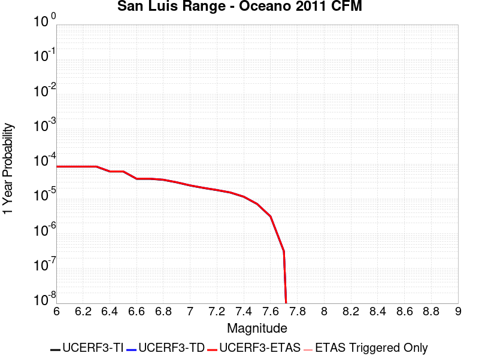 |  |

| Magnitude | 1 wk TI Prob | 1 wk TD Prob | 1 wk ETAS Prob | 1 wk ETAS/TD Gain | 1 wk ETAS Triggered Only | 1 mo TI Prob | 1 mo TD Prob | 1 mo ETAS Prob | 1 mo ETAS/TD Gain | 1 mo ETAS Triggered Only | 1 yr TI Prob | 1 yr TD Prob | 1 yr ETAS Prob | 1 yr ETAS/TD Gain | 1 yr ETAS Triggered Only | 10 yr TI Prob | 10 yr TD Prob | 10 yr ETAS Prob | 10 yr ETAS/TD Gain | 10 yr ETAS Triggered Only |
|-----|-----|-----|-----|-----|-----|-----|-----|-----|-----|-----|-----|-----|-----|-----|-----|-----|-----|-----|-----|-----|
| 6.0 | 1.6025788E-6 | 1.6201213E-6 | 1.6201213E-6 | 1.0 | 0.0 | 6.8681766E-6 | 6.943361E-6 | 6.943361E-6 | 1.0 | 0.0 | 8.361684E-5 | 8.4532556E-5 | 8.4532556E-5 | 1.0 | 0.0 | 8.3585386E-4 | 8.450448E-4 | 8.550364E-4 | 1.0118237 | 1.0E-5 |
| 6.1 | 1.6025788E-6 | 1.6201213E-6 | 1.6201213E-6 | 1.0 | 0.0 | 6.8681766E-6 | 6.943361E-6 | 6.943361E-6 | 1.0 | 0.0 | 8.361684E-5 | 8.4532556E-5 | 8.4532556E-5 | 1.0 | 0.0 | 8.3585386E-4 | 8.450448E-4 | 8.550364E-4 | 1.0118237 | 1.0E-5 |
| 6.2 | 1.6025788E-6 | 1.6201213E-6 | 1.6201213E-6 | 1.0 | 0.0 | 6.8681766E-6 | 6.943361E-6 | 6.943361E-6 | 1.0 | 0.0 | 8.361684E-5 | 8.4532556E-5 | 8.4532556E-5 | 1.0 | 0.0 | 8.3585386E-4 | 8.450448E-4 | 8.550364E-4 | 1.0118237 | 1.0E-5 |
| 6.3 | 1.6025788E-6 | 1.6201213E-6 | 1.6201213E-6 | 1.0 | 0.0 | 6.8681766E-6 | 6.943361E-6 | 6.943361E-6 | 1.0 | 0.0 | 8.361684E-5 | 8.4532556E-5 | 8.4532556E-5 | 1.0 | 0.0 | 8.3585386E-4 | 8.450448E-4 | 8.550364E-4 | 1.0118237 | 1.0E-5 |
| 6.4 | 1.1621186E-6 | 1.1749911E-6 | 1.1749911E-6 | 1.0 | 0.0 | 4.980499E-6 | 5.035668E-6 | 5.035668E-6 | 1.0 | 0.0 | 6.0635884E-5 | 6.130781E-5 | 6.130781E-5 | 1.0 | 0.0 | 6.0619344E-4 | 6.129355E-4 | 6.229294E-4 | 1.016305 | 1.0E-5 |
| 6.5 | 1.1621186E-6 | 1.1749911E-6 | 1.1749911E-6 | 1.0 | 0.0 | 4.980499E-6 | 5.035668E-6 | 5.035668E-6 | 1.0 | 0.0 | 6.0635884E-5 | 6.130781E-5 | 6.130781E-5 | 1.0 | 0.0 | 6.0619344E-4 | 6.129355E-4 | 6.229294E-4 | 1.016305 | 1.0E-5 |
| 6.6 | 7.164729E-7 | 7.248589E-7 | 7.248589E-7 | 1.0 | 0.0 | 3.0705946E-6 | 3.1065347E-6 | 3.1065347E-6 | 1.0 | 0.0 | 3.738385E-5 | 3.782142E-5 | 3.782142E-5 | 1.0 | 0.0 | 3.737756E-4 | 3.7815163E-4 | 3.7815163E-4 | 1.0 | 0.0 |
| 6.7 | 7.164729E-7 | 7.248589E-7 | 7.248589E-7 | 1.0 | 0.0 | 3.0705946E-6 | 3.1065347E-6 | 3.1065347E-6 | 1.0 | 0.0 | 3.738385E-5 | 3.782142E-5 | 3.782142E-5 | 1.0 | 0.0 | 3.737756E-4 | 3.7815163E-4 | 3.7815163E-4 | 1.0 | 0.0 |
| 6.8 | 6.700177E-7 | 6.77745E-7 | 6.77745E-7 | 1.0 | 0.0 | 2.8715012E-6 | 2.9046184E-6 | 2.9046184E-6 | 1.0 | 0.0 | 3.495997E-5 | 3.536317E-5 | 3.536317E-5 | 1.0 | 0.0 | 3.495447E-4 | 3.5357708E-4 | 3.5357708E-4 | 1.0 | 0.0 |
| 6.9 | 5.657865E-7 | 5.721795E-7 | 5.721795E-7 | 1.0 | 0.0 | 2.424797E-6 | 2.4521955E-6 | 2.4521955E-6 | 1.0 | 0.0 | 2.9521503E-5 | 2.9855084E-5 | 2.9855084E-5 | 1.0 | 0.0 | 2.9517582E-4 | 2.985118E-4 | 2.985118E-4 | 1.0 | 0.0 |
| 7.0 | 4.608413E-7 | 4.6601758E-7 | 4.6601758E-7 | 1.0 | 0.0 | 1.9750328E-6 | 1.9972167E-6 | 1.9972167E-6 | 1.0 | 0.0 | 2.4045758E-5 | 2.4315847E-5 | 2.4315847E-5 | 1.0 | 0.0 | 2.4043156E-4 | 2.4313215E-4 | 2.4313215E-4 | 1.0 | 0.0 |
| 7.1 | 3.9177846E-7 | 3.9621662E-7 | 3.9621662E-7 | 1.0 | 0.0 | 1.6790494E-6 | 1.6980702E-6 | 1.6980702E-6 | 1.0 | 0.0 | 2.0442236E-5 | 2.067381E-5 | 2.067381E-5 | 1.0 | 0.0 | 2.0440355E-4 | 2.06719E-4 | 2.06719E-4 | 1.0 | 0.0 |
| 7.2 | 3.3974752E-7 | 3.4366582E-7 | 3.4366582E-7 | 1.0 | 0.0 | 1.45606E-6 | 1.4728527E-6 | 1.4728527E-6 | 1.0 | 0.0 | 1.7727387E-5 | 1.7931836E-5 | 1.7931836E-5 | 1.0 | 0.0 | 1.7725973E-4 | 1.79304E-4 | 1.79304E-4 | 1.0 | 0.0 |
| 7.3 | 2.8900928E-7 | 2.9234062E-7 | 2.9234062E-7 | 1.0 | 0.0 | 1.2386106E-6 | 1.2528878E-6 | 1.2528878E-6 | 1.0 | 0.0 | 1.5079979E-5 | 1.5253803E-5 | 1.5253803E-5 | 1.0 | 0.0 | 1.5078956E-4 | 1.5252765E-4 | 1.5252765E-4 | 1.0 | 0.0 |
| 7.4 | 2.1881527E-7 | 2.2139628E-7 | 2.2139628E-7 | 1.0 | 0.0 | 9.3777936E-7 | 9.4884086E-7 | 9.4884086E-7 | 1.0 | 0.0 | 1.14174045E-5 | 1.1552077E-5 | 1.1552077E-5 | 1.0 | 0.0 | 1.1416818E-4 | 1.1551482E-4 | 1.1551482E-4 | 1.0 | 0.0 |
| 7.5 | 1.356398E-7 | 1.371866E-7 | 1.371866E-7 | 1.0 | 0.0 | 5.813133E-7 | 5.8794245E-7 | 5.8794245E-7 | 1.0 | 0.0 | 7.0774663E-6 | 7.158176E-6 | 7.158176E-6 | 1.0 | 0.0 | 7.077241E-5 | 7.157948E-5 | 7.157948E-5 | 1.0 | 0.0 |
| 7.6 | 5.9269272E-8 | 6.001375E-8 | 6.001375E-8 | 1.0 | 0.0 | 2.5401116E-7 | 2.5720172E-7 | 2.5720172E-7 | 1.0 | 0.0 | 3.0925814E-6 | 3.1314266E-6 | 3.1314266E-6 | 1.0 | 0.0 | 3.0925385E-5 | 3.1313837E-5 | 3.1313837E-5 | 1.0 | 0.0 |
| 7.7 | 5.946232E-9 | 6.0369403E-9 | 6.0369403E-9 | 1.0 | 0.0 | 2.5483851E-8 | 2.58726E-8 | 2.58726E-8 | 1.0 | 0.0 | 3.1026585E-7 | 3.1499889E-7 | 3.1499889E-7 | 1.0 | 0.0 | 3.102654E-6 | 3.149985E-6 | 3.149985E-6 | 1.0 | 0.0 |

## Great Valley 05 Pittsburg - Kirby Hills alt1
*[(top)](#table-of-contents)*

| 1 Week | 1 Month | 1 Year | 10 Year |
|-----|-----|-----|-----|
|  |  |  |  |

| Magnitude | 1 wk TI Prob | 1 wk TD Prob | 1 wk ETAS Prob | 1 wk ETAS/TD Gain | 1 wk ETAS Triggered Only | 1 mo TI Prob | 1 mo TD Prob | 1 mo ETAS Prob | 1 mo ETAS/TD Gain | 1 mo ETAS Triggered Only | 1 yr TI Prob | 1 yr TD Prob | 1 yr ETAS Prob | 1 yr ETAS/TD Gain | 1 yr ETAS Triggered Only | 10 yr TI Prob | 10 yr TD Prob | 10 yr ETAS Prob | 10 yr ETAS/TD Gain | 10 yr ETAS Triggered Only |
|-----|-----|-----|-----|-----|-----|-----|-----|-----|-----|-----|-----|-----|-----|-----|-----|-----|-----|-----|-----|-----|
| 6.0 | 4.187212E-5 | 5.3444855E-5 | 6.344432E-5 | 1.1870987 | 1.0E-5 | 1.794396E-4 | 2.2903502E-4 | 2.3903273E-4 | 1.0436515 | 1.0E-5 | 0.002182488 | 0.0027858997 | 0.0027958718 | 1.0035795 | 1.0E-5 | 0.021611776 | 0.027604194 | 0.027613917 | 1.0003523 | 1.0E-5 |
| 6.1 | 4.187212E-5 | 5.3444855E-5 | 6.344432E-5 | 1.1870987 | 1.0E-5 | 1.794396E-4 | 2.2903502E-4 | 2.3903273E-4 | 1.0436515 | 1.0E-5 | 0.002182488 | 0.0027858997 | 0.0027958718 | 1.0035795 | 1.0E-5 | 0.021611776 | 0.027604194 | 0.027613917 | 1.0003523 | 1.0E-5 |
| 6.2 | 1.7353306E-5 | 2.2155487E-5 | 2.2155487E-5 | 1.0 | 0.0 | 7.436919E-5 | 9.495095E-5 | 9.495095E-5 | 1.0 | 0.0 | 9.050688E-4 | 0.0011557989 | 0.0011557989 | 1.0 | 0.0 | 0.009013915 | 0.011535612 | 0.011535612 | 1.0 | 0.0 |
| 6.3 | 1.7353306E-5 | 2.2155487E-5 | 2.2155487E-5 | 1.0 | 0.0 | 7.436919E-5 | 9.495095E-5 | 9.495095E-5 | 1.0 | 0.0 | 9.050688E-4 | 0.0011557989 | 0.0011557989 | 1.0 | 0.0 | 0.009013915 | 0.011535612 | 0.011535612 | 1.0 | 0.0 |
| 6.4 | 1.4028824E-5 | 1.7901719E-5 | 1.7901719E-5 | 1.0 | 0.0 | 6.0122147E-5 | 7.672165E-5 | 7.672165E-5 | 1.0 | 0.0 | 7.3174125E-4 | 9.340638E-4 | 9.340638E-4 | 1.0 | 0.0 | 0.0072933645 | 0.009338545 | 0.009338545 | 1.0 | 0.0 |

## Redondo Canyon alt 1
*[(top)](#table-of-contents)*

| 1 Week | 1 Month | 1 Year | 10 Year |
|-----|-----|-----|-----|
|  |  |  |  |

| Magnitude | 1 wk TI Prob | 1 wk TD Prob | 1 wk ETAS Prob | 1 wk ETAS/TD Gain | 1 wk ETAS Triggered Only | 1 mo TI Prob | 1 mo TD Prob | 1 mo ETAS Prob | 1 mo ETAS/TD Gain | 1 mo ETAS Triggered Only | 1 yr TI Prob | 1 yr TD Prob | 1 yr ETAS Prob | 1 yr ETAS/TD Gain | 1 yr ETAS Triggered Only | 10 yr TI Prob | 10 yr TD Prob | 10 yr ETAS Prob | 10 yr ETAS/TD Gain | 10 yr ETAS Triggered Only |
|-----|-----|-----|-----|-----|-----|-----|-----|-----|-----|-----|-----|-----|-----|-----|-----|-----|-----|-----|-----|-----|
| 6.0 | 1.0346246E-5 | 1.0981476E-5 | 1.0981476E-5 | 1.0 | 0.0 | 4.43403E-5 | 4.7063066E-5 | 4.7063066E-5 | 1.0 | 0.0 | 5.3970946E-4 | 5.7292107E-4 | 5.829154E-4 | 1.0174444 | 1.0E-5 | 0.0053840056 | 0.00572218 | 0.005732123 | 1.0017376 | 1.0E-5 |
| 6.1 | 1.0346246E-5 | 1.0981476E-5 | 1.0981476E-5 | 1.0 | 0.0 | 4.43403E-5 | 4.7063066E-5 | 4.7063066E-5 | 1.0 | 0.0 | 5.3970946E-4 | 5.7292107E-4 | 5.829154E-4 | 1.0174444 | 1.0E-5 | 0.0053840056 | 0.00572218 | 0.005732123 | 1.0017376 | 1.0E-5 |
| 6.2 | 1.0346246E-5 | 1.0981476E-5 | 1.0981476E-5 | 1.0 | 0.0 | 4.43403E-5 | 4.7063066E-5 | 4.7063066E-5 | 1.0 | 0.0 | 5.3970946E-4 | 5.7292107E-4 | 5.829154E-4 | 1.0174444 | 1.0E-5 | 0.0053840056 | 0.00572218 | 0.005732123 | 1.0017376 | 1.0E-5 |
| 6.3 | 3.2052794E-6 | 3.2361625E-6 | 3.2361625E-6 | 1.0 | 0.0 | 1.373684E-5 | 1.3869216E-5 | 1.3869216E-5 | 1.0 | 0.0 | 1.6723319E-4 | 1.688486E-4 | 1.688486E-4 | 1.0 | 0.0 | 0.001671074 | 0.0016875927 | 0.0016875927 | 1.0 | 0.0 |
| 6.4 | 3.2052794E-6 | 3.2361625E-6 | 3.2361625E-6 | 1.0 | 0.0 | 1.373684E-5 | 1.3869216E-5 | 1.3869216E-5 | 1.0 | 0.0 | 1.6723319E-4 | 1.688486E-4 | 1.688486E-4 | 1.0 | 0.0 | 0.001671074 | 0.0016875927 | 0.0016875927 | 1.0 | 0.0 |
| 6.5 | 3.2052794E-6 | 3.2361625E-6 | 3.2361625E-6 | 1.0 | 0.0 | 1.373684E-5 | 1.3869216E-5 | 1.3869216E-5 | 1.0 | 0.0 | 1.6723319E-4 | 1.688486E-4 | 1.688486E-4 | 1.0 | 0.0 | 0.001671074 | 0.0016875927 | 0.0016875927 | 1.0 | 0.0 |
| 6.6 | 1.948328E-6 | 1.8288907E-6 | 1.8288907E-6 | 1.0 | 0.0 | 8.349951E-6 | 7.838088E-6 | 7.838088E-6 | 1.0 | 0.0 | 1.016559E-4 | 9.542604E-5 | 9.542604E-5 | 1.0 | 0.0 | 0.0010160941 | 9.539976E-4 | 9.539976E-4 | 1.0 | 0.0 |
| 6.7 | 1.948328E-6 | 1.8288907E-6 | 1.8288907E-6 | 1.0 | 0.0 | 8.349951E-6 | 7.838088E-6 | 7.838088E-6 | 1.0 | 0.0 | 1.016559E-4 | 9.542604E-5 | 9.542604E-5 | 1.0 | 0.0 | 0.0010160941 | 9.539976E-4 | 9.539976E-4 | 1.0 | 0.0 |
| 6.8 | 1.1278219E-6 | 9.033145E-7 | 9.033145E-7 | 1.0 | 0.0 | 4.8335132E-6 | 3.8713447E-6 | 3.8713447E-6 | 1.0 | 0.0 | 5.8846435E-5 | 4.713303E-5 | 4.713303E-5 | 1.0 | 0.0 | 5.8830855E-4 | 4.7127236E-4 | 4.7127236E-4 | 1.0 | 0.0 |
| 6.9 | 1.1278219E-6 | 9.033145E-7 | 9.033145E-7 | 1.0 | 0.0 | 4.8335132E-6 | 3.8713447E-6 | 3.8713447E-6 | 1.0 | 0.0 | 5.8846435E-5 | 4.713303E-5 | 4.713303E-5 | 1.0 | 0.0 | 5.8830855E-4 | 4.7127236E-4 | 4.7127236E-4 | 1.0 | 0.0 |
| 7.0 | 1.1278219E-6 | 9.033145E-7 | 9.033145E-7 | 1.0 | 0.0 | 4.8335132E-6 | 3.8713447E-6 | 3.8713447E-6 | 1.0 | 0.0 | 5.8846435E-5 | 4.713303E-5 | 4.713303E-5 | 1.0 | 0.0 | 5.8830855E-4 | 4.7127236E-4 | 4.7127236E-4 | 1.0 | 0.0 |
| 7.1 | 1.0545139E-6 | 8.569328E-7 | 8.569328E-7 | 1.0 | 0.0 | 4.5193374E-6 | 3.6725664E-6 | 3.6725664E-6 | 1.0 | 0.0 | 5.5021545E-5 | 4.4713004E-5 | 4.4713004E-5 | 1.0 | 0.0 | 5.500792E-4 | 4.4708184E-4 | 4.4708184E-4 | 1.0 | 0.0 |
| 7.2 | 1.0545139E-6 | 8.569328E-7 | 8.569328E-7 | 1.0 | 0.0 | 4.5193374E-6 | 3.6725664E-6 | 3.6725664E-6 | 1.0 | 0.0 | 5.5021545E-5 | 4.4713004E-5 | 4.4713004E-5 | 1.0 | 0.0 | 5.500792E-4 | 4.4708184E-4 | 4.4708184E-4 | 1.0 | 0.0 |
| 7.3 | 9.505161E-8 | 5.895771E-8 | 5.895771E-8 | 1.0 | 0.0 | 4.0736398E-7 | 2.5267587E-7 | 2.5267587E-7 | 1.0 | 0.0 | 4.959645E-6 | 3.0763258E-6 | 3.0763258E-6 | 1.0 | 0.0 | 4.9595343E-5 | 3.076295E-5 | 3.076295E-5 | 1.0 | 0.0 |
| 7.4 | 3.9520785E-8 | 2.6987674E-8 | 2.6987674E-8 | 1.0 | 0.0 | 1.6937479E-7 | 1.1566146E-7 | 1.1566146E-7 | 1.0 | 0.0 | 2.062136E-6 | 1.4081776E-6 | 1.4081776E-6 | 1.0 | 0.0 | 2.062117E-5 | 1.4081714E-5 | 1.4081714E-5 | 1.0 | 0.0 |
| 7.5 | 5.6133214E-9 | 3.736909E-9 | 3.736909E-9 | 1.0 | 0.0 | 2.4057092E-8 | 1.6015326E-8 | 1.6015326E-8 | 1.0 | 0.0 | 2.9289507E-7 | 1.9498657E-7 | 1.9498657E-7 | 1.0 | 0.0 | 2.9289467E-6 | 1.9498643E-6 | 1.9498643E-6 | 1.0 | 0.0 |
| 7.6 | 4.1064334E-9 | 2.5958142E-9 | 2.5958142E-9 | 1.0 | 0.0 | 1.7599E-8 | 1.1124919E-8 | 1.1124919E-8 | 1.0 | 0.0 | 2.142678E-7 | 1.3544587E-7 | 1.3544587E-7 | 1.0 | 0.0 | 2.1426758E-6 | 1.354458E-6 | 1.354458E-6 | 1.0 | 0.0 |
| 7.7 | 1.361975E-9 | 6.3605754E-10 | 6.3605754E-10 | 1.0 | 0.0 | 5.8370353E-9 | 2.7259608E-9 | 2.7259608E-9 | 1.0 | 0.0 | 7.1065905E-8 | 3.3188574E-8 | 3.3188574E-8 | 1.0 | 0.0 | 7.106588E-7 | 3.318857E-7 | 3.318857E-7 | 1.0 | 0.0 |
| 7.8 | 1.361975E-9 | 6.3605754E-10 | 6.3605754E-10 | 1.0 | 0.0 | 5.8370353E-9 | 2.7259608E-9 | 2.7259608E-9 | 1.0 | 0.0 | 7.1065905E-8 | 3.3188574E-8 | 3.3188574E-8 | 1.0 | 0.0 | 7.106588E-7 | 3.318857E-7 | 3.318857E-7 | 1.0 | 0.0 |

## Hector Mine
*[(top)](#table-of-contents)*

| 1 Week | 1 Month | 1 Year | 10 Year |
|-----|-----|-----|-----|
|  |  |  |  |

| Magnitude | 1 wk TI Prob | 1 wk TD Prob | 1 wk ETAS Prob | 1 wk ETAS/TD Gain | 1 wk ETAS Triggered Only | 1 mo TI Prob | 1 mo TD Prob | 1 mo ETAS Prob | 1 mo ETAS/TD Gain | 1 mo ETAS Triggered Only | 1 yr TI Prob | 1 yr TD Prob | 1 yr ETAS Prob | 1 yr ETAS/TD Gain | 1 yr ETAS Triggered Only | 10 yr TI Prob | 10 yr TD Prob | 10 yr ETAS Prob | 10 yr ETAS/TD Gain | 10 yr ETAS Triggered Only |
|-----|-----|-----|-----|-----|-----|-----|-----|-----|-----|-----|-----|-----|-----|-----|-----|-----|-----|-----|-----|-----|
| 6.0 | 1.8760093E-5 | 2.7963101E-6 | 2.7963101E-6 | 1.0 | 0.0 | 8.039792E-5 | 1.1984153E-5 | 1.1984153E-5 | 1.0 | 0.0 | 9.78405E-4 | 1.459013E-4 | 1.5589983E-4 | 1.0685295 | 1.0E-5 | 0.009741086 | 0.0014584473 | 0.0014684327 | 1.0068467 | 1.0E-5 |
| 6.1 | 1.8760093E-5 | 2.7963101E-6 | 2.7963101E-6 | 1.0 | 0.0 | 8.039792E-5 | 1.1984153E-5 | 1.1984153E-5 | 1.0 | 0.0 | 9.78405E-4 | 1.459013E-4 | 1.5589983E-4 | 1.0685295 | 1.0E-5 | 0.009741086 | 0.0014584473 | 0.0014684327 | 1.0068467 | 1.0E-5 |
| 6.2 | 1.8760093E-5 | 2.7963101E-6 | 2.7963101E-6 | 1.0 | 0.0 | 8.039792E-5 | 1.1984153E-5 | 1.1984153E-5 | 1.0 | 0.0 | 9.78405E-4 | 1.459013E-4 | 1.5589983E-4 | 1.0685295 | 1.0E-5 | 0.009741086 | 0.0014584473 | 0.0014684327 | 1.0068467 | 1.0E-5 |
| 6.3 | 1.8760093E-5 | 2.7963101E-6 | 2.7963101E-6 | 1.0 | 0.0 | 8.039792E-5 | 1.1984153E-5 | 1.1984153E-5 | 1.0 | 0.0 | 9.78405E-4 | 1.459013E-4 | 1.5589983E-4 | 1.0685295 | 1.0E-5 | 0.009741086 | 0.0014584473 | 0.0014684327 | 1.0068467 | 1.0E-5 |
| 6.4 | 1.0888055E-5 | 2.7963101E-6 | 2.7963101E-6 | 1.0 | 0.0 | 4.666226E-5 | 1.1984153E-5 | 1.1984153E-5 | 1.0 | 0.0 | 5.679649E-4 | 1.459013E-4 | 1.5589983E-4 | 1.0685295 | 1.0E-5 | 0.0056651547 | 0.0014584473 | 0.0014684327 | 1.0068467 | 1.0E-5 |
| 6.5 | 1.0888055E-5 | 2.7963101E-6 | 2.7963101E-6 | 1.0 | 0.0 | 4.666226E-5 | 1.1984153E-5 | 1.1984153E-5 | 1.0 | 0.0 | 5.679649E-4 | 1.459013E-4 | 1.5589983E-4 | 1.0685295 | 1.0E-5 | 0.0056651547 | 0.0014584473 | 0.0014684327 | 1.0068467 | 1.0E-5 |
| 6.6 | 1.0730738E-5 | 2.7963101E-6 | 2.7963101E-6 | 1.0 | 0.0 | 4.5988065E-5 | 1.1984153E-5 | 1.1984153E-5 | 1.0 | 0.0 | 5.5976084E-4 | 1.459013E-4 | 1.5589983E-4 | 1.0685295 | 1.0E-5 | 0.0055835294 | 0.0014584473 | 0.0014684327 | 1.0068467 | 1.0E-5 |
| 6.7 | 7.881326E-6 | 2.7709912E-6 | 2.7709912E-6 | 1.0 | 0.0 | 3.3776672E-5 | 1.1875645E-5 | 1.1875645E-5 | 1.0 | 0.0 | 4.111534E-4 | 1.4458038E-4 | 1.5457894E-4 | 1.0691557 | 1.0E-5 | 0.0041039353 | 0.0014452554 | 0.0014552409 | 1.0069093 | 1.0E-5 |
| 6.8 | 7.5683483E-6 | 2.7327694E-6 | 2.7327694E-6 | 1.0 | 0.0 | 3.2435375E-5 | 1.1711839E-5 | 1.1711839E-5 | 1.0 | 0.0 | 3.9482914E-4 | 1.425863E-4 | 1.5258488E-4 | 1.070123 | 1.0E-5 | 0.0039412836 | 0.0014253402 | 0.001435326 | 1.0070058 | 1.0E-5 |
| 6.9 | 6.473048E-6 | 2.5138563E-6 | 2.5138563E-6 | 1.0 | 0.0 | 2.7741338E-5 | 1.0773648E-5 | 1.0773648E-5 | 1.0 | 0.0 | 3.3769844E-4 | 1.3116523E-4 | 1.4116392E-4 | 1.0762297 | 1.0E-5 | 0.0033718573 | 0.0013112677 | 0.0013212545 | 1.0076162 | 1.0E-5 |
| 7.0 | 4.9959954E-6 | 1.8564691E-6 | 1.8564691E-6 | 1.0 | 0.0 | 2.1411232E-5 | 7.9562915E-6 | 7.9562915E-6 | 1.0 | 0.0 | 2.6065056E-4 | 9.686711E-5 | 1.06866144E-4 | 1.1032242 | 1.0E-5 | 0.0026034506 | 9.6859847E-4 | 9.785888E-4 | 1.0103142 | 1.0E-5 |
| 7.1 | 1.2997541E-6 | 1.5600176E-7 | 1.5600176E-7 | 1.0 | 0.0 | 5.5703626E-6 | 6.685788E-7 | 6.685788E-7 | 1.0 | 0.0 | 6.7817055E-5 | 8.13992E-6 | 8.13992E-6 | 1.0 | 0.0 | 6.779636E-4 | 8.139662E-5 | 8.139662E-5 | 1.0 | 0.0 |
| 7.2 | 8.392699E-7 | 9.726067E-8 | 9.726067E-8 | 1.0 | 0.0 | 3.596866E-6 | 4.1683137E-7 | 4.1683137E-7 | 1.0 | 0.0 | 4.3790962E-5 | 5.074912E-6 | 5.074912E-6 | 1.0 | 0.0 | 4.3782333E-4 | 5.0748153E-5 | 5.0748153E-5 | 1.0 | 0.0 |
| 7.3 | 3.13015E-7 | 4.8286488E-8 | 4.8286488E-8 | 1.0 | 0.0 | 1.3414921E-6 | 2.0694208E-7 | 2.0694208E-7 | 1.0 | 0.0 | 1.6332544E-5 | 2.5195177E-6 | 2.5195177E-6 | 1.0 | 0.0 | 1.6331344E-4 | 2.5194977E-5 | 2.5194977E-5 | 1.0 | 0.0 |

## Sheephole
*[(top)](#table-of-contents)*

| 1 Week | 1 Month | 1 Year | 10 Year |
|-----|-----|-----|-----|
|  |  |  |  |

| Magnitude | 1 wk TI Prob | 1 wk TD Prob | 1 wk ETAS Prob | 1 wk ETAS/TD Gain | 1 wk ETAS Triggered Only | 1 mo TI Prob | 1 mo TD Prob | 1 mo ETAS Prob | 1 mo ETAS/TD Gain | 1 mo ETAS Triggered Only | 1 yr TI Prob | 1 yr TD Prob | 1 yr ETAS Prob | 1 yr ETAS/TD Gain | 1 yr ETAS Triggered Only | 10 yr TI Prob | 10 yr TD Prob | 10 yr ETAS Prob | 10 yr ETAS/TD Gain | 10 yr ETAS Triggered Only |
|-----|-----|-----|-----|-----|-----|-----|-----|-----|-----|-----|-----|-----|-----|-----|-----|-----|-----|-----|-----|-----|
| 6.0 | 4.5579695E-6 | 4.7412877E-6 | 4.7412877E-6 | 1.0 | 0.0 | 1.9534009E-5 | 2.0319678E-5 | 2.0319678E-5 | 1.0 | 0.0 | 2.3780059E-4 | 2.4736955E-4 | 2.4736955E-4 | 1.0 | 0.0 | 0.0023754628 | 0.0024714863 | 0.0024814617 | 1.0040362 | 1.0E-5 |
| 6.1 | 4.5579695E-6 | 4.7412877E-6 | 4.7412877E-6 | 1.0 | 0.0 | 1.9534009E-5 | 2.0319678E-5 | 2.0319678E-5 | 1.0 | 0.0 | 2.3780059E-4 | 2.4736955E-4 | 2.4736955E-4 | 1.0 | 0.0 | 0.0023754628 | 0.0024714863 | 0.0024814617 | 1.0040362 | 1.0E-5 |
| 6.2 | 2.6677674E-6 | 2.7874107E-6 | 2.7874107E-6 | 1.0 | 0.0 | 1.1433239E-5 | 1.1945997E-5 | 1.1945997E-5 | 1.0 | 0.0 | 1.3919079E-4 | 1.4543389E-4 | 1.4543389E-4 | 1.0 | 0.0 | 0.0013910364 | 0.001453493 | 0.001453493 | 1.0 | 0.0 |
| 6.3 | 2.6677674E-6 | 2.7874107E-6 | 2.7874107E-6 | 1.0 | 0.0 | 1.1433239E-5 | 1.1945997E-5 | 1.1945997E-5 | 1.0 | 0.0 | 1.3919079E-4 | 1.4543389E-4 | 1.4543389E-4 | 1.0 | 0.0 | 0.0013910364 | 0.001453493 | 0.001453493 | 1.0 | 0.0 |
| 6.4 | 2.2159759E-6 | 2.3228936E-6 | 2.3228936E-6 | 1.0 | 0.0 | 9.497005E-6 | 9.955224E-6 | 9.955224E-6 | 1.0 | 0.0 | 1.156199E-4 | 1.2119893E-4 | 1.2119893E-4 | 1.0 | 0.0 | 0.0011555976 | 0.0012114076 | 0.0012114076 | 1.0 | 0.0 |
| 6.5 | 2.1986082E-6 | 2.3047737E-6 | 2.3047737E-6 | 1.0 | 0.0 | 9.4225725E-6 | 9.877569E-6 | 9.877569E-6 | 1.0 | 0.0 | 1.1471378E-4 | 1.2025358E-4 | 1.2025358E-4 | 1.0 | 0.0 | 0.0011465458 | 0.0012019643 | 0.0012019643 | 1.0 | 0.0 |
| 6.6 | 1.5232331E-6 | 1.6019028E-6 | 1.6019028E-6 | 1.0 | 0.0 | 6.5281256E-6 | 6.8652807E-6 | 6.8652807E-6 | 1.0 | 0.0 | 7.947703E-5 | 8.358178E-5 | 8.358178E-5 | 1.0 | 0.0 | 7.9448614E-4 | 8.3552214E-4 | 8.3552214E-4 | 1.0 | 0.0 |
| 6.7 | 1.3137362E-6 | 1.3828287E-6 | 1.3828287E-6 | 1.0 | 0.0 | 5.6302856E-6 | 5.926396E-6 | 5.926396E-6 | 1.0 | 0.0 | 6.854657E-5 | 7.2151626E-5 | 7.2151626E-5 | 1.0 | 0.0 | 6.8525434E-4 | 7.212959E-4 | 7.212959E-4 | 1.0 | 0.0 |
| 6.8 | 1.2275751E-6 | 1.2922936E-6 | 1.2922936E-6 | 1.0 | 0.0 | 5.2610258E-6 | 5.5383903E-6 | 5.5383903E-6 | 1.0 | 0.0 | 6.4051106E-5 | 6.742795E-5 | 6.742795E-5 | 1.0 | 0.0 | 6.4032647E-4 | 6.740883E-4 | 6.740883E-4 | 1.0 | 0.0 |
| 6.9 | 1.1837088E-6 | 1.2461107E-6 | 1.2461107E-6 | 1.0 | 0.0 | 5.0730278E-6 | 5.340464E-6 | 5.340464E-6 | 1.0 | 0.0 | 6.176237E-5 | 6.501835E-5 | 6.501835E-5 | 1.0 | 0.0 | 6.17452E-4 | 6.500064E-4 | 6.500064E-4 | 1.0 | 0.0 |
| 7.0 | 9.849371E-7 | 1.036636E-6 | 1.036636E-6 | 1.0 | 0.0 | 4.2211523E-6 | 4.442719E-6 | 4.442719E-6 | 1.0 | 0.0 | 5.1391315E-5 | 5.408886E-5 | 5.408886E-5 | 1.0 | 0.0 | 5.137943E-4 | 5.4076704E-4 | 5.4076704E-4 | 1.0 | 0.0 |
| 7.1 | 8.1643645E-7 | 8.5917287E-7 | 8.5917287E-7 | 1.0 | 0.0 | 3.4990085E-6 | 3.6821648E-6 | 3.6821648E-6 | 1.0 | 0.0 | 4.2599597E-5 | 4.482952E-5 | 4.482952E-5 | 1.0 | 0.0 | 4.259143E-4 | 4.482134E-4 | 4.482134E-4 | 1.0 | 0.0 |
| 7.2 | 5.7295756E-7 | 6.029544E-7 | 6.029544E-7 | 1.0 | 0.0 | 2.45553E-6 | 2.584088E-6 | 2.584088E-6 | 1.0 | 0.0 | 2.9895667E-5 | 3.1460884E-5 | 3.1460884E-5 | 1.0 | 0.0 | 2.9891645E-4 | 3.14571E-4 | 3.14571E-4 | 1.0 | 0.0 |

## Cerro Prieto
*[(top)](#table-of-contents)*

| 1 Week | 1 Month | 1 Year | 10 Year |
|-----|-----|-----|-----|
|  |  |  |  |

| Magnitude | 1 wk TI Prob | 1 wk TD Prob | 1 wk ETAS Prob | 1 wk ETAS/TD Gain | 1 wk ETAS Triggered Only | 1 mo TI Prob | 1 mo TD Prob | 1 mo ETAS Prob | 1 mo ETAS/TD Gain | 1 mo ETAS Triggered Only | 1 yr TI Prob | 1 yr TD Prob | 1 yr ETAS Prob | 1 yr ETAS/TD Gain | 1 yr ETAS Triggered Only | 10 yr TI Prob | 10 yr TD Prob | 10 yr ETAS Prob | 10 yr ETAS/TD Gain | 10 yr ETAS Triggered Only |
|-----|-----|-----|-----|-----|-----|-----|-----|-----|-----|-----|-----|-----|-----|-----|-----|-----|-----|-----|-----|-----|
| 6.0 | 2.9101528E-4 | 5.966029E-4 | 6.06597E-4 | 1.0167515 | 1.0E-5 | 0.0012466122 | 0.0025546064 | 0.0025645809 | 1.0039045 | 1.0E-5 | 0.015072231 | 0.03062004 | 0.030629735 | 1.0003166 | 1.0E-5 | 0.14089979 | 0.25390467 | 0.25391212 | 1.0000293 | 1.0E-5 |
| 6.1 | 2.9101528E-4 | 5.966029E-4 | 6.06597E-4 | 1.0167515 | 1.0E-5 | 0.0012466122 | 0.0025546064 | 0.0025645809 | 1.0039045 | 1.0E-5 | 0.015072231 | 0.03062004 | 0.030629735 | 1.0003166 | 1.0E-5 | 0.14089979 | 0.25390467 | 0.25391212 | 1.0000293 | 1.0E-5 |
| 6.2 | 2.9101528E-4 | 5.966029E-4 | 6.06597E-4 | 1.0167515 | 1.0E-5 | 0.0012466122 | 0.0025546064 | 0.0025645809 | 1.0039045 | 1.0E-5 | 0.015072231 | 0.03062004 | 0.030629735 | 1.0003166 | 1.0E-5 | 0.14089979 | 0.25390467 | 0.25391212 | 1.0000293 | 1.0E-5 |
| 6.3 | 2.9101528E-4 | 5.966029E-4 | 6.06597E-4 | 1.0167515 | 1.0E-5 | 0.0012466122 | 0.0025546064 | 0.0025645809 | 1.0039045 | 1.0E-5 | 0.015072231 | 0.03062004 | 0.030629735 | 1.0003166 | 1.0E-5 | 0.14089979 | 0.25390467 | 0.25391212 | 1.0000293 | 1.0E-5 |
| 6.4 | 2.508648E-4 | 5.140895E-4 | 5.240844E-4 | 1.0194418 | 1.0E-5 | 0.0010746918 | 0.002201579 | 0.002211557 | 1.0045322 | 1.0E-5 | 0.013006088 | 0.026445232 | 0.026454967 | 1.0003681 | 1.0E-5 | 0.12270685 | 0.2243541 | 0.22436185 | 1.0000346 | 1.0E-5 |
| 6.5 | 2.508648E-4 | 5.140895E-4 | 5.240844E-4 | 1.0194418 | 1.0E-5 | 0.0010746918 | 0.002201579 | 0.002211557 | 1.0045322 | 1.0E-5 | 0.013006088 | 0.026445232 | 0.026454967 | 1.0003681 | 1.0E-5 | 0.12270685 | 0.2243541 | 0.22436185 | 1.0000346 | 1.0E-5 |
| 6.6 | 2.294914E-4 | 4.7127923E-4 | 4.7127923E-4 | 1.0 | 0.0 | 9.831638E-4 | 0.0020183923 | 0.0020183923 | 1.0 | 0.0 | 0.011904482 | 0.024282733 | 0.024282733 | 1.0 | 0.0 | 0.11286586 | 0.20855607 | 0.20855607 | 1.0 | 0.0 |
| 6.7 | 1.9621674E-4 | 4.0429502E-4 | 4.0429502E-4 | 1.0 | 0.0 | 8.4065786E-4 | 0.0017317008 | 0.0017317008 | 1.0 | 0.0 | 0.010187071 | 0.020900695 | 0.020900695 | 1.0 | 0.0 | 0.09732539 | 0.18291695 | 0.18291695 | 1.0 | 0.0 |
| 6.8 | 1.5476145E-4 | 3.0572733E-4 | 3.0572733E-4 | 1.0 | 0.0 | 6.6309475E-4 | 0.0013097044 | 0.0013097044 | 1.0 | 0.0 | 0.008043335 | 0.015837038 | 0.015837038 | 1.0 | 0.0 | 0.07758363 | 0.1433783 | 0.1433783 | 1.0 | 0.0 |
| 6.9 | 1.20509176E-4 | 2.2588576E-4 | 2.2588576E-4 | 1.0 | 0.0 | 5.1636563E-4 | 9.6778595E-4 | 9.6778595E-4 | 1.0 | 0.0 | 0.006268645 | 0.011734081 | 0.011734081 | 1.0 | 0.0 | 0.060947374 | 0.1094662 | 0.1094662 | 1.0 | 0.0 |
| 7.0 | 9.3269155E-5 | 1.6721571E-4 | 1.6721571E-4 | 1.0 | 0.0 | 3.9966372E-4 | 7.16485E-4 | 7.16485E-4 | 1.0 | 0.0 | 0.0048550544 | 0.008695972 | 0.008695972 | 1.0 | 0.0 | 0.04750344 | 0.083130896 | 0.083130896 | 1.0 | 0.0 |
| 7.1 | 5.029709E-5 | 8.174014E-5 | 8.174014E-5 | 1.0 | 0.0 | 2.1554115E-4 | 3.5028713E-4 | 3.5028713E-4 | 1.0 | 0.0 | 0.0026210553 | 0.004259823 | 0.004259823 | 1.0 | 0.0 | 0.025903556 | 0.042324014 | 0.042324014 | 1.0 | 0.0 |
| 7.2 | 6.5445185E-8 | 6.824737E-8 | 6.824737E-8 | 1.0 | 0.0 | 2.8047933E-7 | 2.9248872E-7 | 2.9248872E-7 | 1.0 | 0.0 | 3.4148304E-6 | 3.56105E-6 | 3.56105E-6 | 1.0 | 0.0 | 3.414778E-5 | 3.56105E-5 | 3.56105E-5 | 1.0 | 0.0 |

## Shoreline
*[(top)](#table-of-contents)*

| 1 Week | 1 Month | 1 Year | 10 Year |
|-----|-----|-----|-----|
|  |  |  | 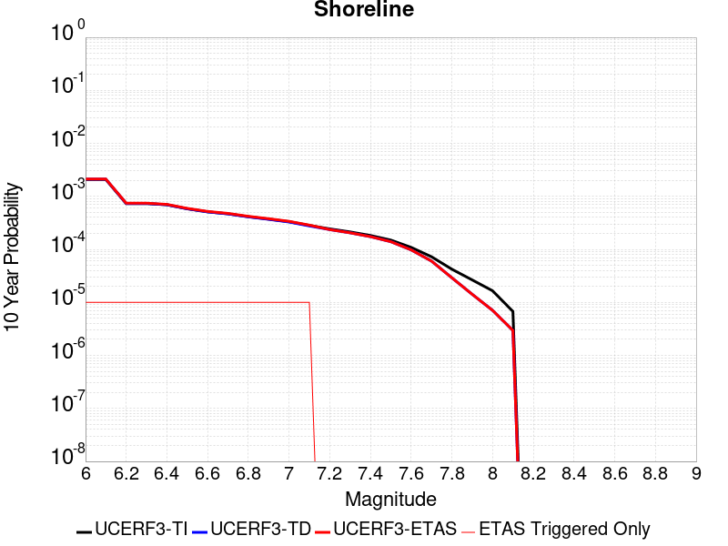 |

| Magnitude | 1 wk TI Prob | 1 wk TD Prob | 1 wk ETAS Prob | 1 wk ETAS/TD Gain | 1 wk ETAS Triggered Only | 1 mo TI Prob | 1 mo TD Prob | 1 mo ETAS Prob | 1 mo ETAS/TD Gain | 1 mo ETAS Triggered Only | 1 yr TI Prob | 1 yr TD Prob | 1 yr ETAS Prob | 1 yr ETAS/TD Gain | 1 yr ETAS Triggered Only | 10 yr TI Prob | 10 yr TD Prob | 10 yr ETAS Prob | 10 yr ETAS/TD Gain | 10 yr ETAS Triggered Only |
|-----|-----|-----|-----|-----|-----|-----|-----|-----|-----|-----|-----|-----|-----|-----|-----|-----|-----|-----|-----|-----|
| 6.0 | 3.9888673E-6 | 4.0479445E-6 | 4.0479445E-6 | 1.0 | 0.0 | 1.7095033E-5 | 1.734825E-5 | 1.734825E-5 | 1.0 | 0.0 | 2.0811215E-4 | 2.1120005E-4 | 2.2119794E-4 | 1.0473385 | 1.0E-5 | 0.0020791737 | 0.002110542 | 0.002120521 | 1.0047281 | 1.0E-5 |
| 6.1 | 3.9888673E-6 | 4.0479445E-6 | 4.0479445E-6 | 1.0 | 0.0 | 1.7095033E-5 | 1.734825E-5 | 1.734825E-5 | 1.0 | 0.0 | 2.0811215E-4 | 2.1120005E-4 | 2.2119794E-4 | 1.0473385 | 1.0E-5 | 0.0020791737 | 0.002110542 | 0.002120521 | 1.0047281 | 1.0E-5 |
| 6.2 | 1.4039653E-6 | 1.4100972E-6 | 1.4100972E-6 | 1.0 | 0.0 | 6.0169805E-6 | 6.04326E-6 | 6.04326E-6 | 1.0 | 0.0 | 7.325427E-5 | 7.3574265E-5 | 8.357353E-5 | 1.135907 | 1.0E-5 | 7.3230127E-4 | 7.355051E-4 | 7.4549776E-4 | 1.013586 | 1.0E-5 |
| 6.3 | 1.4039653E-6 | 1.4100972E-6 | 1.4100972E-6 | 1.0 | 0.0 | 6.0169805E-6 | 6.04326E-6 | 6.04326E-6 | 1.0 | 0.0 | 7.325427E-5 | 7.3574265E-5 | 8.357353E-5 | 1.135907 | 1.0E-5 | 7.3230127E-4 | 7.355051E-4 | 7.4549776E-4 | 1.013586 | 1.0E-5 |
| 6.4 | 1.3314152E-6 | 1.3361685E-6 | 1.3361685E-6 | 1.0 | 0.0 | 5.7060524E-6 | 5.7264238E-6 | 5.7264238E-6 | 1.0 | 0.0 | 6.946897E-5 | 6.971703E-5 | 7.971634E-5 | 1.143427 | 1.0E-5 | 6.9447263E-4 | 6.96957E-4 | 7.0695E-4 | 1.0143381 | 1.0E-5 |
| 6.5 | 1.1187026E-6 | 1.1203715E-6 | 1.1203715E-6 | 1.0 | 0.0 | 4.794431E-6 | 4.801583E-6 | 4.801583E-6 | 1.0 | 0.0 | 5.8370628E-5 | 5.8457732E-5 | 6.845715E-5 | 1.1710538 | 1.0E-5 | 5.83553E-4 | 5.844261E-4 | 5.9442024E-4 | 1.0171008 | 1.0E-5 |
| 6.6 | 9.793089E-7 | 9.784991E-7 | 9.784991E-7 | 1.0 | 0.0 | 4.1970316E-6 | 4.193561E-6 | 4.193561E-6 | 1.0 | 0.0 | 5.1097657E-5 | 5.105542E-5 | 6.105491E-5 | 1.1958556 | 1.0E-5 | 5.108591E-4 | 5.104382E-4 | 5.204331E-4 | 1.019581 | 1.0E-5 |
| 6.7 | 8.995986E-7 | 8.9728695E-7 | 8.9728695E-7 | 1.0 | 0.0 | 3.8554167E-6 | 3.84551E-6 | 3.84551E-6 | 1.0 | 0.0 | 4.693869E-5 | 4.6818088E-5 | 5.681762E-5 | 1.2135826 | 1.0E-5 | 4.6928777E-4 | 4.680832E-4 | 4.780785E-4 | 1.0213537 | 1.0E-5 |
| 6.8 | 7.931612E-7 | 7.8804686E-7 | 7.8804686E-7 | 1.0 | 0.0 | 3.3992578E-6 | 3.3773392E-6 | 3.3773392E-6 | 1.0 | 0.0 | 4.1385178E-5 | 4.1118336E-5 | 5.1117924E-5 | 1.2431905 | 1.0E-5 | 4.1377472E-4 | 4.1110782E-4 | 4.211037E-4 | 1.0243145 | 1.0E-5 |
| 6.9 | 7.1465956E-7 | 7.078069E-7 | 7.078069E-7 | 1.0 | 0.0 | 3.062823E-6 | 3.0334547E-6 | 3.0334547E-6 | 1.0 | 0.0 | 3.7289232E-5 | 3.6931688E-5 | 4.693132E-5 | 1.2707602 | 1.0E-5 | 3.7282976E-4 | 3.6925587E-4 | 3.792522E-4 | 1.0270715 | 1.0E-5 |
| 7.0 | 6.389046E-7 | 6.2995184E-7 | 6.2995184E-7 | 1.0 | 0.0 | 2.7381598E-6 | 2.699791E-6 | 2.699791E-6 | 1.0 | 0.0 | 3.3336586E-5 | 3.2869462E-5 | 4.286913E-5 | 1.3042238 | 1.0E-5 | 3.3331584E-4 | 3.2864625E-4 | 3.3864295E-4 | 1.0304178 | 1.0E-5 |
| 7.1 | 5.4300875E-7 | 5.3111876E-7 | 5.3111876E-7 | 1.0 | 0.0 | 2.3271782E-6 | 2.2762213E-6 | 2.2762213E-6 | 1.0 | 0.0 | 2.8333026E-5 | 2.7712642E-5 | 3.7712365E-5 | 1.3608361 | 1.0E-5 | 2.8329415E-4 | 2.7709195E-4 | 2.870892E-4 | 1.036079 | 1.0E-5 |
| 7.2 | 4.6768855E-7 | 4.5349486E-7 | 4.5349486E-7 | 1.0 | 0.0 | 2.0043778E-6 | 1.9435479E-6 | 1.9435479E-6 | 1.0 | 0.0 | 2.4403027E-5 | 2.366244E-5 | 2.366244E-5 | 1.0 | 0.0 | 2.4400349E-4 | 2.3659926E-4 | 2.3659926E-4 | 1.0 | 0.0 |
| 7.3 | 4.0966103E-7 | 3.9386174E-7 | 3.9386174E-7 | 1.0 | 0.0 | 1.7556889E-6 | 1.6879777E-6 | 1.6879777E-6 | 1.0 | 0.0 | 2.1375303E-5 | 2.0550935E-5 | 2.0550935E-5 | 1.0 | 0.0 | 2.1373246E-4 | 2.0549039E-4 | 2.0549039E-4 | 1.0 | 0.0 |
| 7.4 | 3.5105785E-7 | 3.3364464E-7 | 3.3364464E-7 | 1.0 | 0.0 | 1.5045327E-6 | 1.4299047E-6 | 1.4299047E-6 | 1.0 | 0.0 | 1.8317533E-5 | 1.7408951E-5 | 1.7408951E-5 | 1.0 | 0.0 | 1.8316023E-4 | 1.740759E-4 | 1.740759E-4 | 1.0 | 0.0 |
| 7.5 | 2.8737534E-7 | 2.6820504E-7 | 2.6820504E-7 | 1.0 | 0.0 | 1.2316079E-6 | 1.1494496E-6 | 1.1494496E-6 | 1.0 | 0.0 | 1.4994724E-5 | 1.399446E-5 | 1.399446E-5 | 1.0 | 0.0 | 1.4993713E-4 | 1.399358E-4 | 1.399358E-4 | 1.0 | 0.0 |
| 7.6 | 2.0924051E-7 | 1.8779421E-7 | 1.8779421E-7 | 1.0 | 0.0 | 8.967448E-7 | 8.0483204E-7 | 8.0483204E-7 | 1.0 | 0.0 | 1.0917813E-5 | 9.798786E-6 | 9.798786E-6 | 1.0 | 0.0 | 1.0917276E-4 | 9.798355E-5 | 9.798355E-5 | 1.0 | 0.0 |
| 7.7 | 1.392265E-7 | 1.1543791E-7 | 1.1543791E-7 | 1.0 | 0.0 | 5.9668486E-7 | 4.947338E-7 | 4.947338E-7 | 1.0 | 0.0 | 7.2646135E-6 | 6.0233674E-6 | 6.0233674E-6 | 1.0 | 0.0 | 7.2643765E-5 | 6.0232047E-5 | 6.0232047E-5 | 1.0 | 0.0 |
| 7.8 | 8.1080074E-8 | 5.587054E-8 | 5.587054E-8 | 1.0 | 0.0 | 3.4748598E-7 | 2.3944517E-7 | 2.3944517E-7 | 1.0 | 0.0 | 4.2306337E-6 | 2.9152409E-6 | 2.9152409E-6 | 1.0 | 0.0 | 4.230553E-5 | 2.9152028E-5 | 2.9152028E-5 | 1.0 | 0.0 |
| 7.9 | 5.0859036E-8 | 2.724731E-8 | 2.724731E-8 | 1.0 | 0.0 | 2.1796728E-7 | 1.1677419E-7 | 1.1677419E-7 | 1.0 | 0.0 | 2.6537484E-6 | 1.4217248E-6 | 1.4217248E-6 | 1.0 | 0.0 | 2.6537167E-5 | 1.42171575E-5 | 1.42171575E-5 | 1.0 | 0.0 |
| 8.0 | 3.1760536E-8 | 1.3578924E-8 | 1.3578924E-8 | 1.0 | 0.0 | 1.3611657E-7 | 5.8195386E-8 | 5.8195386E-8 | 1.0 | 0.0 | 1.6572179E-6 | 7.085286E-7 | 7.085286E-7 | 1.0 | 0.0 | 1.6572056E-5 | 7.085264E-6 | 7.085264E-6 | 1.0 | 0.0 |
| 8.1 | 1.2947896E-8 | 5.663641E-9 | 5.663641E-9 | 1.0 | 0.0 | 5.5490982E-8 | 2.4272747E-8 | 2.4272747E-8 | 1.0 | 0.0 | 6.756025E-7 | 2.9552066E-7 | 2.9552066E-7 | 1.0 | 0.0 | 6.7560045E-6 | 2.9552027E-6 | 2.9552027E-6 | 1.0 | 0.0 |

## Rinconada 2011 CFM
*[(top)](#table-of-contents)*

| 1 Week | 1 Month | 1 Year | 10 Year |
|-----|-----|-----|-----|
|  |  |  |  |

| Magnitude | 1 wk TI Prob | 1 wk TD Prob | 1 wk ETAS Prob | 1 wk ETAS/TD Gain | 1 wk ETAS Triggered Only | 1 mo TI Prob | 1 mo TD Prob | 1 mo ETAS Prob | 1 mo ETAS/TD Gain | 1 mo ETAS Triggered Only | 1 yr TI Prob | 1 yr TD Prob | 1 yr ETAS Prob | 1 yr ETAS/TD Gain | 1 yr ETAS Triggered Only | 10 yr TI Prob | 10 yr TD Prob | 10 yr ETAS Prob | 10 yr ETAS/TD Gain | 10 yr ETAS Triggered Only |
|-----|-----|-----|-----|-----|-----|-----|-----|-----|-----|-----|-----|-----|-----|-----|-----|-----|-----|-----|-----|-----|
| 6.0 | 1.5752368E-5 | 1.6274787E-5 | 1.6274787E-5 | 1.0 | 0.0 | 6.75084E-5 | 6.974724E-5 | 6.974724E-5 | 1.0 | 0.0 | 8.2160486E-4 | 8.48845E-4 | 8.48845E-4 | 1.0 | 0.0 | 0.008185739 | 0.008456407 | 0.008466323 | 1.0011725 | 1.0E-5 |
| 6.1 | 1.0966133E-5 | 1.1323078E-5 | 1.1323078E-5 | 1.0 | 0.0 | 4.6996865E-5 | 4.852658E-5 | 4.852658E-5 | 1.0 | 0.0 | 5.720366E-4 | 5.906517E-4 | 5.906517E-4 | 1.0 | 0.0 | 0.0057056635 | 0.0058909147 | 0.0058909147 | 1.0 | 0.0 |
| 6.2 | 1.0966133E-5 | 1.1323078E-5 | 1.1323078E-5 | 1.0 | 0.0 | 4.6996865E-5 | 4.852658E-5 | 4.852658E-5 | 1.0 | 0.0 | 5.720366E-4 | 5.906517E-4 | 5.906517E-4 | 1.0 | 0.0 | 0.0057056635 | 0.0058909147 | 0.0058909147 | 1.0 | 0.0 |
| 6.3 | 8.926149E-6 | 9.212811E-6 | 9.212811E-6 | 1.0 | 0.0 | 3.8254362E-5 | 3.9482882E-5 | 3.9482882E-5 | 1.0 | 0.0 | 4.6564735E-4 | 4.805984E-4 | 4.805984E-4 | 1.0 | 0.0 | 0.0046467283 | 0.004795635 | 0.004795635 | 1.0 | 0.0 |
| 6.4 | 7.676955E-6 | 7.920225E-6 | 7.920225E-6 | 1.0 | 0.0 | 3.290082E-5 | 3.394338E-5 | 3.394338E-5 | 1.0 | 0.0 | 4.0049385E-4 | 4.1318245E-4 | 4.1318245E-4 | 1.0 | 0.0 | 0.0039977287 | 0.004124169 | 0.004124169 | 1.0 | 0.0 |
| 6.5 | 6.1671026E-6 | 6.358982E-6 | 6.358982E-6 | 1.0 | 0.0 | 2.6430173E-5 | 2.7252494E-5 | 2.7252494E-5 | 1.0 | 0.0 | 3.2173982E-4 | 3.3174868E-4 | 3.3174868E-4 | 1.0 | 0.0 | 0.003212744 | 0.0033125465 | 0.0033125465 | 1.0 | 0.0 |
| 6.6 | 5.553456E-6 | 5.7248367E-6 | 5.7248367E-6 | 1.0 | 0.0 | 2.3800309E-5 | 2.4534784E-5 | 2.4534784E-5 | 1.0 | 0.0 | 2.897302E-4 | 2.9867011E-4 | 2.9867011E-4 | 1.0 | 0.0 | 0.0028935277 | 0.0029826956 | 0.0029826956 | 1.0 | 0.0 |
| 6.7 | 4.787857E-6 | 4.93333E-6 | 4.93333E-6 | 1.0 | 0.0 | 2.0519226E-5 | 2.1142672E-5 | 2.1142672E-5 | 1.0 | 0.0 | 2.4979294E-4 | 2.5738167E-4 | 2.5738167E-4 | 1.0 | 0.0 | 0.0024951235 | 0.0025708415 | 0.0025708415 | 1.0 | 0.0 |
| 6.8 | 3.9955166E-6 | 4.1134927E-6 | 4.1134927E-6 | 1.0 | 0.0 | 1.7123532E-5 | 1.7629136E-5 | 1.7629136E-5 | 1.0 | 0.0 | 2.0845905E-4 | 2.1461361E-4 | 2.1461361E-4 | 1.0 | 0.0 | 0.002082636 | 0.0021440673 | 0.0021440673 | 1.0 | 0.0 |
| 6.9 | 3.4250072E-6 | 3.5224602E-6 | 3.5224602E-6 | 1.0 | 0.0 | 1.46785205E-5 | 1.50961705E-5 | 1.50961705E-5 | 1.0 | 0.0 | 1.7869633E-4 | 1.837804E-4 | 1.837804E-4 | 1.0 | 0.0 | 0.001785527 | 0.0018362866 | 0.0018362866 | 1.0 | 0.0 |
| 7.0 | 2.7712713E-6 | 2.846711E-6 | 2.846711E-6 | 1.0 | 0.0 | 1.1876823E-5 | 1.2200132E-5 | 1.2200132E-5 | 1.0 | 0.0 | 1.4459073E-4 | 1.485265E-4 | 1.485265E-4 | 1.0 | 0.0 | 0.0014449668 | 0.0014842738 | 0.0014842738 | 1.0 | 0.0 |
| 7.1 | 2.227358E-6 | 2.285707E-6 | 2.285707E-6 | 1.0 | 0.0 | 9.545785E-6 | 9.79585E-6 | 9.79585E-6 | 1.0 | 0.0 | 1.16213734E-4 | 1.1925796E-4 | 1.1925796E-4 | 1.0 | 0.0 | 0.0011615298 | 0.0011919406 | 0.0011919406 | 1.0 | 0.0 |
| 7.2 | 1.581796E-6 | 1.620907E-6 | 1.620907E-6 | 1.0 | 0.0 | 6.779108E-6 | 6.946726E-6 | 6.946726E-6 | 1.0 | 0.0 | 8.253252E-5 | 8.457311E-5 | 8.457311E-5 | 1.0 | 0.0 | 8.250187E-4 | 8.454098E-4 | 8.454098E-4 | 1.0 | 0.0 |
| 7.3 | 1.0306567E-6 | 1.0546515E-6 | 1.0546515E-6 | 1.0 | 0.0 | 4.4170924E-6 | 4.519927E-6 | 4.519927E-6 | 1.0 | 0.0 | 5.3776774E-5 | 5.5028726E-5 | 5.5028726E-5 | 1.0 | 0.0 | 5.376376E-4 | 5.501513E-4 | 5.501513E-4 | 1.0 | 0.0 |
| 7.4 | 6.535541E-7 | 6.6827675E-7 | 6.6827675E-7 | 1.0 | 0.0 | 2.800943E-6 | 2.8640402E-6 | 2.8640402E-6 | 1.0 | 0.0 | 3.4100947E-5 | 3.4869132E-5 | 3.4869132E-5 | 1.0 | 0.0 | 3.4095717E-4 | 3.4863673E-4 | 3.4863673E-4 | 1.0 | 0.0 |
| 7.5 | 3.2656962E-7 | 3.3316834E-7 | 3.3316834E-7 | 1.0 | 0.0 | 1.3995833E-6 | 1.4278635E-6 | 1.4278635E-6 | 1.0 | 0.0 | 1.7039794E-5 | 1.73841E-5 | 1.73841E-5 | 1.0 | 0.0 | 1.7038487E-4 | 1.7382744E-4 | 1.7382744E-4 | 1.0 | 0.0 |
| 7.6 | 9.754343E-8 | 9.821057E-8 | 9.821057E-8 | 1.0 | 0.0 | 4.180432E-7 | 4.2090235E-7 | 4.2090235E-7 | 1.0 | 0.0 | 5.089664E-6 | 5.1244742E-6 | 5.1244742E-6 | 1.0 | 0.0 | 5.0895473E-5 | 5.124357E-5 | 5.124357E-5 | 1.0 | 0.0 |
| 7.7 | 6.0001453E-9 | 5.84914E-9 | 5.84914E-9 | 1.0 | 0.0 | 2.5714908E-8 | 2.5067743E-8 | 2.5067743E-8 | 1.0 | 0.0 | 3.1307894E-7 | 3.0519973E-7 | 3.0519973E-7 | 1.0 | 0.0 | 3.1307852E-6 | 3.0519934E-6 | 3.0519934E-6 | 1.0 | 0.0 |
| 7.8 | 7.400003E-11 | 7.4654505E-11 | 7.4654505E-11 | 1.0 | 0.0 | 3.171432E-10 | 3.1994807E-10 | 3.1994807E-10 | 1.0 | 0.0 | 3.861218E-9 | 3.8953676E-9 | 3.8953676E-9 | 1.0 | 0.0 | 3.861218E-8 | 3.8953676E-8 | 3.8953676E-8 | 1.0 | 0.0 |

## Great Valley 03 Mysterious Ridge
*[(top)](#table-of-contents)*

| 1 Week | 1 Month | 1 Year | 10 Year |
|-----|-----|-----|-----|
|  |  |  |  |

| Magnitude | 1 wk TI Prob | 1 wk TD Prob | 1 wk ETAS Prob | 1 wk ETAS/TD Gain | 1 wk ETAS Triggered Only | 1 mo TI Prob | 1 mo TD Prob | 1 mo ETAS Prob | 1 mo ETAS/TD Gain | 1 mo ETAS Triggered Only | 1 yr TI Prob | 1 yr TD Prob | 1 yr ETAS Prob | 1 yr ETAS/TD Gain | 1 yr ETAS Triggered Only | 10 yr TI Prob | 10 yr TD Prob | 10 yr ETAS Prob | 10 yr ETAS/TD Gain | 10 yr ETAS Triggered Only |
|-----|-----|-----|-----|-----|-----|-----|-----|-----|-----|-----|-----|-----|-----|-----|-----|-----|-----|-----|-----|-----|
| 6.0 | 3.1182444E-5 | 3.6034882E-5 | 3.6034882E-5 | 1.0 | 0.0 | 1.336322E-4 | 1.5442709E-4 | 1.6442555E-4 | 1.0647454 | 1.0E-5 | 0.0016257578 | 0.0018787142 | 0.0018886954 | 1.0053128 | 1.0E-5 | 0.016139153 | 0.018647056 | 0.01865687 | 1.0005263 | 1.0E-5 |
| 6.1 | 3.1182444E-5 | 3.6034882E-5 | 3.6034882E-5 | 1.0 | 0.0 | 1.336322E-4 | 1.5442709E-4 | 1.6442555E-4 | 1.0647454 | 1.0E-5 | 0.0016257578 | 0.0018787142 | 0.0018886954 | 1.0053128 | 1.0E-5 | 0.016139153 | 0.018647056 | 0.01865687 | 1.0005263 | 1.0E-5 |
| 6.2 | 3.1182444E-5 | 3.6034882E-5 | 3.6034882E-5 | 1.0 | 0.0 | 1.336322E-4 | 1.5442709E-4 | 1.6442555E-4 | 1.0647454 | 1.0E-5 | 0.0016257578 | 0.0018787142 | 0.0018886954 | 1.0053128 | 1.0E-5 | 0.016139153 | 0.018647056 | 0.01865687 | 1.0005263 | 1.0E-5 |
| 6.3 | 2.106934E-5 | 2.3850724E-5 | 2.3850724E-5 | 1.0 | 0.0 | 9.0294045E-5 | 1.02213555E-4 | 1.02213555E-4 | 1.0 | 0.0 | 0.0010987755 | 0.0012437707 | 0.0012437707 | 1.0 | 0.0 | 0.010933585 | 0.0123713445 | 0.0123713445 | 1.0 | 0.0 |
| 6.4 | 2.106934E-5 | 2.3850724E-5 | 2.3850724E-5 | 1.0 | 0.0 | 9.0294045E-5 | 1.02213555E-4 | 1.02213555E-4 | 1.0 | 0.0 | 0.0010987755 | 0.0012437707 | 0.0012437707 | 1.0 | 0.0 | 0.010933585 | 0.0123713445 | 0.0123713445 | 1.0 | 0.0 |
| 6.5 | 1.9389783E-5 | 2.1885357E-5 | 2.1885357E-5 | 1.0 | 0.0 | 8.309642E-5 | 9.379117E-5 | 9.379117E-5 | 1.0 | 0.0 | 0.0010112294 | 0.0011413371 | 0.0011413371 | 1.0 | 0.0 | 0.010066401 | 0.011357628 | 0.011357628 | 1.0 | 0.0 |
| 6.6 | 1.9370193E-5 | 2.1865279E-5 | 2.1865279E-5 | 1.0 | 0.0 | 8.301247E-5 | 9.370512E-5 | 9.370512E-5 | 1.0 | 0.0 | 0.0010102082 | 0.0011402905 | 0.0011402905 | 1.0 | 0.0 | 0.010056281 | 0.01134727 | 0.01134727 | 1.0 | 0.0 |
| 6.7 | 1.6723505E-5 | 1.8799592E-5 | 1.8799592E-5 | 1.0 | 0.0 | 7.16702E-5 | 8.0567304E-5 | 8.0567304E-5 | 1.0 | 0.0 | 8.722353E-4 | 9.80485E-4 | 9.80485E-4 | 1.0 | 0.0 | 0.008688197 | 0.0097636 | 0.0097636 | 1.0 | 0.0 |
| 6.8 | 1.426937E-5 | 1.5997468E-5 | 1.5997468E-5 | 1.0 | 0.0 | 6.115301E-5 | 6.855885E-5 | 6.855885E-5 | 1.0 | 0.0 | 7.4428355E-4 | 8.3439884E-4 | 8.3439884E-4 | 1.0 | 0.0 | 0.007417957 | 0.008314138 | 0.008314138 | 1.0 | 0.0 |
| 6.9 | 1.2469891E-5 | 1.395715E-5 | 1.395715E-5 | 1.0 | 0.0 | 5.3441294E-5 | 5.9815055E-5 | 5.9815055E-5 | 1.0 | 0.0 | 6.504535E-4 | 7.28017E-4 | 7.28017E-4 | 1.0 | 0.0 | 0.006485529 | 0.007257545 | 0.007257545 | 1.0 | 0.0 |
| 7.0 | 8.7746275E-6 | 9.791885E-6 | 9.791885E-6 | 1.0 | 0.0 | 3.7605005E-5 | 4.1964588E-5 | 4.1964588E-5 | 1.0 | 0.0 | 4.5774475E-4 | 5.108064E-4 | 5.108064E-4 | 1.0 | 0.0 | 0.00456803 | 0.005097056 | 0.005097056 | 1.0 | 0.0 |
| 7.1 | 6.1067153E-6 | 6.81383E-6 | 6.81383E-6 | 1.0 | 0.0 | 2.6171374E-5 | 2.9201834E-5 | 2.9201834E-5 | 1.0 | 0.0 | 3.1858988E-4 | 3.5547992E-4 | 3.5547992E-4 | 1.0 | 0.0 | 0.0031813353 | 0.0035496636 | 0.0035496636 | 1.0 | 0.0 |
| 7.2 | 2.939283E-6 | 3.2741555E-6 | 3.2741555E-6 | 1.0 | 0.0 | 1.2596866E-5 | 1.4032029E-5 | 1.4032029E-5 | 1.0 | 0.0 | 1.5335606E-4 | 1.7082831E-4 | 1.7082831E-4 | 1.0 | 0.0 | 0.0015325027 | 0.001707142 | 0.001707142 | 1.0 | 0.0 |
| 7.3 | 7.2387763E-7 | 8.008619E-7 | 8.008619E-7 | 1.0 | 0.0 | 3.102329E-6 | 3.4322634E-6 | 3.4322634E-6 | 1.0 | 0.0 | 3.77702E-5 | 4.1787465E-5 | 4.1787465E-5 | 1.0 | 0.0 | 3.7763783E-4 | 4.1784105E-4 | 4.1784105E-4 | 1.0 | 0.0 |
| 7.4 | 3.112171E-8 | 3.2068495E-8 | 3.2068495E-8 | 1.0 | 0.0 | 1.3337875E-7 | 1.374364E-7 | 1.374364E-7 | 1.0 | 0.0 | 1.6238852E-6 | 1.673287E-6 | 1.673287E-6 | 1.0 | 0.0 | 1.6238733E-5 | 1.6732753E-5 | 1.6732753E-5 | 1.0 | 0.0 |

## Breckenridge 2011
*[(top)](#table-of-contents)*

| 1 Week | 1 Month | 1 Year | 10 Year |
|-----|-----|-----|-----|
| 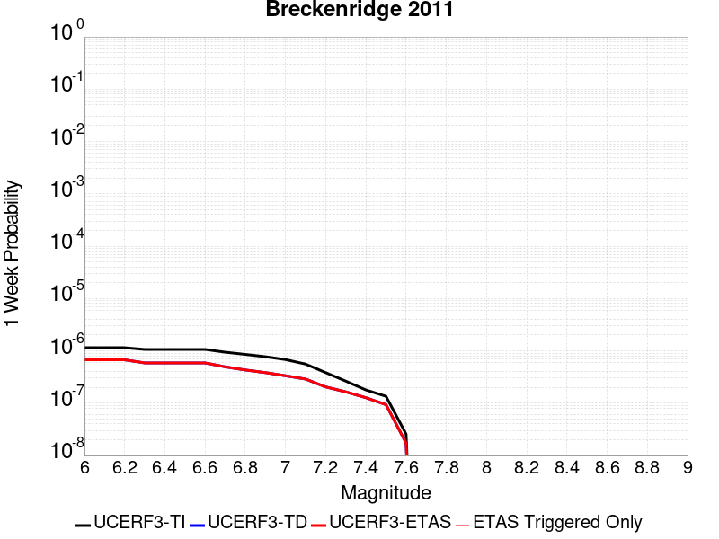 |  |  |  |

| Magnitude | 1 wk TI Prob | 1 wk TD Prob | 1 wk ETAS Prob | 1 wk ETAS/TD Gain | 1 wk ETAS Triggered Only | 1 mo TI Prob | 1 mo TD Prob | 1 mo ETAS Prob | 1 mo ETAS/TD Gain | 1 mo ETAS Triggered Only | 1 yr TI Prob | 1 yr TD Prob | 1 yr ETAS Prob | 1 yr ETAS/TD Gain | 1 yr ETAS Triggered Only | 10 yr TI Prob | 10 yr TD Prob | 10 yr ETAS Prob | 10 yr ETAS/TD Gain | 10 yr ETAS Triggered Only |
|-----|-----|-----|-----|-----|-----|-----|-----|-----|-----|-----|-----|-----|-----|-----|-----|-----|-----|-----|-----|-----|
| 6.0 | 1.1490393E-6 | 6.738047E-7 | 6.738047E-7 | 1.0 | 0.0 | 4.924445E-6 | 2.8877314E-6 | 2.8877314E-6 | 1.0 | 0.0 | 5.995347E-5 | 3.5157584E-5 | 3.5157584E-5 | 1.0 | 0.0 | 5.9937296E-4 | 3.515223E-4 | 3.6151876E-4 | 1.0284377 | 1.0E-5 |
| 6.1 | 1.1490393E-6 | 6.738047E-7 | 6.738047E-7 | 1.0 | 0.0 | 4.924445E-6 | 2.8877314E-6 | 2.8877314E-6 | 1.0 | 0.0 | 5.995347E-5 | 3.5157584E-5 | 3.5157584E-5 | 1.0 | 0.0 | 5.9937296E-4 | 3.515223E-4 | 3.6151876E-4 | 1.0284377 | 1.0E-5 |
| 6.2 | 1.1490393E-6 | 6.738047E-7 | 6.738047E-7 | 1.0 | 0.0 | 4.924445E-6 | 2.8877314E-6 | 2.8877314E-6 | 1.0 | 0.0 | 5.995347E-5 | 3.5157584E-5 | 3.5157584E-5 | 1.0 | 0.0 | 5.9937296E-4 | 3.515223E-4 | 3.6151876E-4 | 1.0284377 | 1.0E-5 |
| 6.3 | 1.064617E-6 | 5.886444E-7 | 5.886444E-7 | 1.0 | 0.0 | 4.5626366E-6 | 2.5227594E-6 | 2.5227594E-6 | 1.0 | 0.0 | 5.5548684E-5 | 3.0714174E-5 | 3.0714174E-5 | 1.0 | 0.0 | 5.55348E-4 | 3.0710048E-4 | 3.1709738E-4 | 1.0325526 | 1.0E-5 |
| 6.4 | 1.064617E-6 | 5.886444E-7 | 5.886444E-7 | 1.0 | 0.0 | 4.5626366E-6 | 2.5227594E-6 | 2.5227594E-6 | 1.0 | 0.0 | 5.5548684E-5 | 3.0714174E-5 | 3.0714174E-5 | 1.0 | 0.0 | 5.55348E-4 | 3.0710048E-4 | 3.1709738E-4 | 1.0325526 | 1.0E-5 |
| 6.5 | 1.064617E-6 | 5.886444E-7 | 5.886444E-7 | 1.0 | 0.0 | 4.5626366E-6 | 2.5227594E-6 | 2.5227594E-6 | 1.0 | 0.0 | 5.5548684E-5 | 3.0714174E-5 | 3.0714174E-5 | 1.0 | 0.0 | 5.55348E-4 | 3.0710048E-4 | 3.1709738E-4 | 1.0325526 | 1.0E-5 |
| 6.6 | 1.064617E-6 | 5.886444E-7 | 5.886444E-7 | 1.0 | 0.0 | 4.5626366E-6 | 2.5227594E-6 | 2.5227594E-6 | 1.0 | 0.0 | 5.5548684E-5 | 3.0714174E-5 | 3.0714174E-5 | 1.0 | 0.0 | 5.55348E-4 | 3.0710048E-4 | 3.1709738E-4 | 1.0325526 | 1.0E-5 |
| 6.7 | 9.4219524E-7 | 4.95405E-7 | 4.95405E-7 | 1.0 | 0.0 | 4.037973E-6 | 2.1231626E-6 | 2.1231626E-6 | 1.0 | 0.0 | 4.916122E-5 | 2.5849204E-5 | 2.5849204E-5 | 1.0 | 0.0 | 4.9150345E-4 | 2.5846262E-4 | 2.6846005E-4 | 1.0386803 | 1.0E-5 |
| 6.8 | 8.556422E-7 | 4.3119502E-7 | 4.3119502E-7 | 1.0 | 0.0 | 3.667033E-6 | 1.8479774E-6 | 1.8479774E-6 | 1.0 | 0.0 | 4.464521E-5 | 2.2498896E-5 | 2.2498896E-5 | 1.0 | 0.0 | 4.4636242E-4 | 2.2496658E-4 | 2.3496433E-4 | 1.0444411 | 1.0E-5 |
| 6.9 | 7.7357794E-7 | 3.8420123E-7 | 3.8420123E-7 | 1.0 | 0.0 | 3.3153299E-6 | 1.6465757E-6 | 1.6465757E-6 | 1.0 | 0.0 | 4.0363393E-5 | 2.0046878E-5 | 2.0046878E-5 | 1.0 | 0.0 | 4.035606E-4 | 2.00451E-4 | 2.10449E-4 | 1.0498775 | 1.0E-5 |
| 7.0 | 6.8172454E-7 | 3.347125E-7 | 3.347125E-7 | 1.0 | 0.0 | 2.9216735E-6 | 1.4344813E-6 | 1.4344813E-6 | 1.0 | 0.0 | 3.5570793E-5 | 1.7464672E-5 | 1.7464672E-5 | 1.0 | 0.0 | 3.55651E-4 | 1.7463323E-4 | 1.8463148E-4 | 1.0572529 | 1.0E-5 |
| 7.1 | 5.5936397E-7 | 2.8909557E-7 | 2.8909557E-7 | 1.0 | 0.0 | 2.397272E-6 | 1.2389804E-6 | 1.2389804E-6 | 1.0 | 0.0 | 2.9186394E-5 | 1.5084484E-5 | 1.5084484E-5 | 1.0 | 0.0 | 2.9182562E-4 | 1.5083478E-4 | 1.5083478E-4 | 1.0 | 0.0 |
| 7.2 | 3.8420822E-7 | 2.0468316E-7 | 2.0468316E-7 | 1.0 | 0.0 | 1.6466057E-6 | 8.7721327E-7 | 8.7721327E-7 | 1.0 | 0.0 | 2.004724E-5 | 1.068002E-5 | 1.068002E-5 | 1.0 | 0.0 | 2.004543E-4 | 1.0679515E-4 | 1.0679515E-4 | 1.0 | 0.0 |
| 7.3 | 2.6405158E-7 | 1.6473192E-7 | 1.6473192E-7 | 1.0 | 0.0 | 1.1316491E-6 | 7.059937E-7 | 7.059937E-7 | 1.0 | 0.0 | 1.37777415E-5 | 8.595441E-6 | 8.595441E-6 | 1.0 | 0.0 | 1.3776887E-4 | 8.595115E-5 | 8.595115E-5 | 1.0 | 0.0 |
| 7.4 | 1.792114E-7 | 1.2725322E-7 | 1.2725322E-7 | 1.0 | 0.0 | 7.6804866E-7 | 5.453708E-7 | 5.453708E-7 | 1.0 | 0.0 | 9.3509525E-6 | 6.6398698E-6 | 6.6398698E-6 | 1.0 | 0.0 | 9.350559E-5 | 6.639676E-5 | 6.639676E-5 | 1.0 | 0.0 |
| 7.5 | 1.3548703E-7 | 9.385393E-8 | 9.385393E-8 | 1.0 | 0.0 | 5.8065854E-7 | 4.0223108E-7 | 4.0223108E-7 | 1.0 | 0.0 | 7.0694946E-6 | 4.897153E-6 | 4.897153E-6 | 1.0 | 0.0 | 7.0692695E-5 | 4.8970483E-5 | 4.8970483E-5 | 1.0 | 0.0 |
| 7.6 | 2.572245E-8 | 1.7352718E-8 | 1.7352718E-8 | 1.0 | 0.0 | 1.10239064E-7 | 7.436879E-8 | 7.436879E-8 | 1.0 | 0.0 | 1.3421597E-6 | 9.054397E-7 | 9.054397E-7 | 1.0 | 0.0 | 1.3421517E-5 | 9.054365E-6 | 9.054365E-6 | 1.0 | 0.0 |

## Elsinore (Coyote Mountains)
*[(top)](#table-of-contents)*

| 1 Week | 1 Month | 1 Year | 10 Year |
|-----|-----|-----|-----|
|  |  |  |  |

| Magnitude | 1 wk TI Prob | 1 wk TD Prob | 1 wk ETAS Prob | 1 wk ETAS/TD Gain | 1 wk ETAS Triggered Only | 1 mo TI Prob | 1 mo TD Prob | 1 mo ETAS Prob | 1 mo ETAS/TD Gain | 1 mo ETAS Triggered Only | 1 yr TI Prob | 1 yr TD Prob | 1 yr ETAS Prob | 1 yr ETAS/TD Gain | 1 yr ETAS Triggered Only | 10 yr TI Prob | 10 yr TD Prob | 10 yr ETAS Prob | 10 yr ETAS/TD Gain | 10 yr ETAS Triggered Only |
|-----|-----|-----|-----|-----|-----|-----|-----|-----|-----|-----|-----|-----|-----|-----|-----|-----|-----|-----|-----|-----|
| 6.0 | 4.20513E-5 | 4.863269E-5 | 5.8632202E-5 | 1.205613 | 1.0E-5 | 1.8020741E-4 | 2.084124E-4 | 2.184103E-4 | 1.0479718 | 1.0E-5 | 0.0021918174 | 0.0025349946 | 0.0025449693 | 1.0039347 | 1.0E-5 | 0.021703249 | 0.025112068 | 0.025121817 | 1.0003883 | 1.0E-5 |
| 6.1 | 4.20513E-5 | 4.863269E-5 | 5.8632202E-5 | 1.205613 | 1.0E-5 | 1.8020741E-4 | 2.084124E-4 | 2.184103E-4 | 1.0479718 | 1.0E-5 | 0.0021918174 | 0.0025349946 | 0.0025449693 | 1.0039347 | 1.0E-5 | 0.021703249 | 0.025112068 | 0.025121817 | 1.0003883 | 1.0E-5 |
| 6.2 | 2.3413893E-5 | 2.469625E-5 | 3.4696004E-5 | 1.4049097 | 1.0E-5 | 1.0034139E-4 | 1.0583731E-4 | 1.1583625E-4 | 1.0944747 | 1.0E-5 | 0.0012209718 | 0.001287895 | 0.0012978822 | 1.0077546 | 1.0E-5 | 0.012142851 | 0.012812992 | 0.012822864 | 1.0007704 | 1.0E-5 |
| 6.3 | 2.3413893E-5 | 2.469625E-5 | 3.4696004E-5 | 1.4049097 | 1.0E-5 | 1.0034139E-4 | 1.0583731E-4 | 1.1583625E-4 | 1.0944747 | 1.0E-5 | 0.0012209718 | 0.001287895 | 0.0012978822 | 1.0077546 | 1.0E-5 | 0.012142851 | 0.012812992 | 0.012822864 | 1.0007704 | 1.0E-5 |
| 6.4 | 1.6894814E-5 | 1.6568772E-5 | 2.6568607E-5 | 1.603535 | 1.0E-5 | 7.240433E-5 | 7.10073E-5 | 8.100659E-5 | 1.1408206 | 1.0E-5 | 8.811662E-4 | 8.642079E-4 | 8.7419926E-4 | 1.0115613 | 1.0E-5 | 0.0087768035 | 0.008612131 | 0.008622045 | 1.0011512 | 1.0E-5 |
| 6.5 | 1.6894814E-5 | 1.6568772E-5 | 2.6568607E-5 | 1.603535 | 1.0E-5 | 7.240433E-5 | 7.10073E-5 | 8.100659E-5 | 1.1408206 | 1.0E-5 | 8.811662E-4 | 8.642079E-4 | 8.7419926E-4 | 1.0115613 | 1.0E-5 | 0.0087768035 | 0.008612131 | 0.008622045 | 1.0011512 | 1.0E-5 |
| 6.6 | 1.1910969E-5 | 1.0530927E-5 | 1.0530927E-5 | 1.0 | 0.0 | 5.1046012E-5 | 4.513184E-5 | 4.513184E-5 | 1.0 | 0.0 | 6.21308E-4 | 5.4935494E-4 | 5.4935494E-4 | 1.0 | 0.0 | 0.0061957375 | 0.00548127 | 0.00548127 | 1.0 | 0.0 |
| 6.7 | 9.1486E-6 | 7.2029457E-6 | 7.2029457E-6 | 1.0 | 0.0 | 3.9207694E-5 | 3.0869425E-5 | 3.0869425E-5 | 1.0 | 0.0 | 4.7724912E-4 | 3.7577422E-4 | 3.7577422E-4 | 1.0 | 0.0 | 0.0047622547 | 0.0037517678 | 0.0037517678 | 1.0 | 0.0 |
| 6.8 | 7.90441E-6 | 5.729078E-6 | 5.729078E-6 | 1.0 | 0.0 | 3.3875604E-5 | 2.4552968E-5 | 2.4552968E-5 | 1.0 | 0.0 | 4.1235742E-4 | 2.9889264E-4 | 2.9889264E-4 | 1.0 | 0.0 | 0.0041159308 | 0.002985035 | 0.002985035 | 1.0 | 0.0 |
| 6.9 | 7.77015E-6 | 5.5830305E-6 | 5.5830305E-6 | 1.0 | 0.0 | 3.3300217E-5 | 2.3927061E-5 | 2.3927061E-5 | 1.0 | 0.0 | 4.0535472E-4 | 2.912743E-4 | 2.912743E-4 | 1.0 | 0.0 | 0.004046161 | 0.0029090524 | 0.0029090524 | 1.0 | 0.0 |
| 7.0 | 7.675798E-6 | 5.479888E-6 | 5.479888E-6 | 1.0 | 0.0 | 3.289586E-5 | 2.3485029E-5 | 2.3485029E-5 | 1.0 | 0.0 | 4.004335E-4 | 2.8589397E-4 | 2.8589397E-4 | 1.0 | 0.0 | 0.003997127 | 0.0028553882 | 0.0028553882 | 1.0 | 0.0 |
| 7.1 | 7.447814E-6 | 5.2387572E-6 | 5.2387572E-6 | 1.0 | 0.0 | 3.191881E-5 | 2.2451632E-5 | 2.2451632E-5 | 1.0 | 0.0 | 3.8854225E-4 | 2.7331559E-4 | 2.7331559E-4 | 1.0 | 0.0 | 0.003878636 | 0.0027299186 | 0.0027299186 | 1.0 | 0.0 |
| 7.2 | 7.128185E-6 | 4.9054033E-6 | 4.9054033E-6 | 1.0 | 0.0 | 3.0549007E-5 | 2.1022995E-5 | 2.1022995E-5 | 1.0 | 0.0 | 3.7187067E-4 | 2.5592608E-4 | 2.5592608E-4 | 1.0 | 0.0 | 0.00371249 | 0.002556432 | 0.002556432 | 1.0 | 0.0 |
| 7.3 | 7.0913875E-6 | 4.874078E-6 | 4.874078E-6 | 1.0 | 0.0 | 3.0391306E-5 | 2.0888747E-5 | 2.0888747E-5 | 1.0 | 0.0 | 3.6995133E-4 | 2.5429198E-4 | 2.5429198E-4 | 1.0 | 0.0 | 0.0036933604 | 0.0025401285 | 0.0025401285 | 1.0 | 0.0 |
| 7.4 | 7.051521E-6 | 4.8379297E-6 | 4.8379297E-6 | 1.0 | 0.0 | 3.0220453E-5 | 2.0733825E-5 | 2.0733825E-5 | 1.0 | 0.0 | 3.6787192E-4 | 2.524063E-4 | 2.524063E-4 | 1.0 | 0.0 | 0.0036726352 | 0.0025213142 | 0.0025213142 | 1.0 | 0.0 |
| 7.5 | 6.910666E-6 | 4.733479E-6 | 4.733479E-6 | 1.0 | 0.0 | 2.9616802E-5 | 2.0286187E-5 | 2.0286187E-5 | 1.0 | 0.0 | 3.605249E-4 | 2.4695753E-4 | 2.4695753E-4 | 1.0 | 0.0 | 0.0035994058 | 0.0024669487 | 0.0024669487 | 1.0 | 0.0 |
| 7.6 | 6.341753E-6 | 4.306589E-6 | 4.306589E-6 | 1.0 | 0.0 | 2.7178658E-5 | 1.8456685E-5 | 1.8456685E-5 | 1.0 | 0.0 | 3.3084993E-4 | 2.2468815E-4 | 2.2468815E-4 | 1.0 | 0.0 | 0.0033035777 | 0.002244725 | 0.002244725 | 1.0 | 0.0 |
| 7.7 | 3.9205916E-6 | 2.2439156E-6 | 2.2439156E-6 | 1.0 | 0.0 | 1.6802427E-5 | 9.61675E-6 | 9.61675E-6 | 1.0 | 0.0 | 2.0455034E-4 | 1.1707837E-4 | 1.1707837E-4 | 1.0 | 0.0 | 0.0020436216 | 0.0011702399 | 0.0011702399 | 1.0 | 0.0 |
| 7.8 | 2.0846227E-7 | 8.485576E-8 | 8.485576E-8 | 1.0 | 0.0 | 8.9340944E-7 | 3.6366754E-7 | 3.6366754E-7 | 1.0 | 0.0 | 1.0877206E-5 | 4.4276467E-6 | 4.4276467E-6 | 1.0 | 0.0 | 1.0876673E-4 | 4.4275912E-5 | 4.4275912E-5 | 1.0 | 0.0 |
| 7.9 | 4.4969806E-9 | 2.26915E-9 | 2.26915E-9 | 1.0 | 0.0 | 1.9272775E-8 | 9.724928E-9 | 9.724928E-9 | 1.0 | 0.0 | 2.3464601E-7 | 1.18401E-7 | 1.18401E-7 | 1.0 | 0.0 | 2.3464577E-6 | 1.1840094E-6 | 1.1840094E-6 | 1.0 | 0.0 |

## North Frontal  (East)
*[(top)](#table-of-contents)*

| 1 Week | 1 Month | 1 Year | 10 Year |
|-----|-----|-----|-----|
|  |  |  |  |

| Magnitude | 1 wk TI Prob | 1 wk TD Prob | 1 wk ETAS Prob | 1 wk ETAS/TD Gain | 1 wk ETAS Triggered Only | 1 mo TI Prob | 1 mo TD Prob | 1 mo ETAS Prob | 1 mo ETAS/TD Gain | 1 mo ETAS Triggered Only | 1 yr TI Prob | 1 yr TD Prob | 1 yr ETAS Prob | 1 yr ETAS/TD Gain | 1 yr ETAS Triggered Only | 10 yr TI Prob | 10 yr TD Prob | 10 yr ETAS Prob | 10 yr ETAS/TD Gain | 10 yr ETAS Triggered Only |
|-----|-----|-----|-----|-----|-----|-----|-----|-----|-----|-----|-----|-----|-----|-----|-----|-----|-----|-----|-----|-----|
| 6.0 | 7.135738E-6 | 7.4772242E-6 | 7.4772242E-6 | 1.0 | 0.0 | 3.0581377E-5 | 3.2044965E-5 | 3.2044965E-5 | 1.0 | 0.0 | 3.7226462E-4 | 3.9009753E-4 | 4.0009365E-4 | 1.0256246 | 1.0E-5 | 0.0037164164 | 0.0038960855 | 0.0039060465 | 1.0025567 | 1.0E-5 |
| 6.1 | 7.135738E-6 | 7.4772242E-6 | 7.4772242E-6 | 1.0 | 0.0 | 3.0581377E-5 | 3.2044965E-5 | 3.2044965E-5 | 1.0 | 0.0 | 3.7226462E-4 | 3.9009753E-4 | 4.0009365E-4 | 1.0256246 | 1.0E-5 | 0.0037164164 | 0.0038960855 | 0.0039060465 | 1.0025567 | 1.0E-5 |
| 6.2 | 7.135738E-6 | 7.4772242E-6 | 7.4772242E-6 | 1.0 | 0.0 | 3.0581377E-5 | 3.2044965E-5 | 3.2044965E-5 | 1.0 | 0.0 | 3.7226462E-4 | 3.9009753E-4 | 4.0009365E-4 | 1.0256246 | 1.0E-5 | 0.0037164164 | 0.0038960855 | 0.0039060465 | 1.0025567 | 1.0E-5 |
| 6.3 | 7.135738E-6 | 7.4772242E-6 | 7.4772242E-6 | 1.0 | 0.0 | 3.0581377E-5 | 3.2044965E-5 | 3.2044965E-5 | 1.0 | 0.0 | 3.7226462E-4 | 3.9009753E-4 | 4.0009365E-4 | 1.0256246 | 1.0E-5 | 0.0037164164 | 0.0038960855 | 0.0039060465 | 1.0025567 | 1.0E-5 |
| 6.4 | 7.135738E-6 | 7.4772242E-6 | 7.4772242E-6 | 1.0 | 0.0 | 3.0581377E-5 | 3.2044965E-5 | 3.2044965E-5 | 1.0 | 0.0 | 3.7226462E-4 | 3.9009753E-4 | 4.0009365E-4 | 1.0256246 | 1.0E-5 | 0.0037164164 | 0.0038960855 | 0.0039060465 | 1.0025567 | 1.0E-5 |
| 6.5 | 7.135738E-6 | 7.4772242E-6 | 7.4772242E-6 | 1.0 | 0.0 | 3.0581377E-5 | 3.2044965E-5 | 3.2044965E-5 | 1.0 | 0.0 | 3.7226462E-4 | 3.9009753E-4 | 4.0009365E-4 | 1.0256246 | 1.0E-5 | 0.0037164164 | 0.0038960855 | 0.0039060465 | 1.0025567 | 1.0E-5 |
| 6.6 | 7.135738E-6 | 7.4772242E-6 | 7.4772242E-6 | 1.0 | 0.0 | 3.0581377E-5 | 3.2044965E-5 | 3.2044965E-5 | 1.0 | 0.0 | 3.7226462E-4 | 3.9009753E-4 | 4.0009365E-4 | 1.0256246 | 1.0E-5 | 0.0037164164 | 0.0038960855 | 0.0039060465 | 1.0025567 | 1.0E-5 |
| 6.7 | 7.135738E-6 | 7.4772242E-6 | 7.4772242E-6 | 1.0 | 0.0 | 3.0581377E-5 | 3.2044965E-5 | 3.2044965E-5 | 1.0 | 0.0 | 3.7226462E-4 | 3.9009753E-4 | 4.0009365E-4 | 1.0256246 | 1.0E-5 | 0.0037164164 | 0.0038960855 | 0.0039060465 | 1.0025567 | 1.0E-5 |
| 6.8 | 5.959142E-6 | 6.236721E-6 | 6.236721E-6 | 1.0 | 0.0 | 2.553893E-5 | 2.6728634E-5 | 2.6728634E-5 | 1.0 | 0.0 | 3.108921E-4 | 3.253906E-4 | 3.3538733E-4 | 1.0307223 | 1.0E-5 | 0.0031045752 | 0.0032509149 | 0.0032608823 | 1.0030661 | 1.0E-5 |
| 6.9 | 2.2946929E-6 | 2.3824725E-6 | 2.3824725E-6 | 1.0 | 0.0 | 9.834361E-6 | 1.021056E-5 | 1.021056E-5 | 1.0 | 0.0 | 1.1972676E-4 | 1.2430694E-4 | 1.2430694E-4 | 1.0 | 0.0 | 0.0011966228 | 0.0012424206 | 0.0012424206 | 1.0 | 0.0 |
| 7.0 | 2.2468673E-6 | 2.3321654E-6 | 2.3321654E-6 | 1.0 | 0.0 | 9.629396E-6 | 9.994959E-6 | 9.994959E-6 | 1.0 | 0.0 | 1.1723159E-4 | 1.2168231E-4 | 1.2168231E-4 | 1.0 | 0.0 | 0.0011716976 | 0.0012162031 | 0.0012162031 | 1.0 | 0.0 |
| 7.1 | 1.9921076E-6 | 2.0646132E-6 | 2.0646132E-6 | 1.0 | 0.0 | 8.537577E-6 | 8.848315E-6 | 8.848315E-6 | 1.0 | 0.0 | 1.0394004E-4 | 1.0772334E-4 | 1.0772334E-4 | 1.0 | 0.0 | 0.0010389143 | 0.001076754 | 0.001076754 | 1.0 | 0.0 |
| 7.2 | 1.4524545E-6 | 1.504522E-6 | 1.504522E-6 | 1.0 | 0.0 | 6.2247905E-6 | 6.447937E-6 | 6.447937E-6 | 1.0 | 0.0 | 7.5784184E-5 | 7.850105E-5 | 7.850105E-5 | 1.0 | 0.0 | 7.575835E-4 | 7.8475766E-4 | 7.8475766E-4 | 1.0 | 0.0 |
| 7.3 | 8.9802575E-7 | 9.308773E-7 | 9.308773E-7 | 1.0 | 0.0 | 3.848676E-6 | 3.989469E-6 | 3.989469E-6 | 1.0 | 0.0 | 4.685662E-5 | 4.8570815E-5 | 4.8570815E-5 | 1.0 | 0.0 | 4.6846745E-4 | 4.856133E-4 | 4.856133E-4 | 1.0 | 0.0 |
| 7.4 | 7.776139E-7 | 8.060514E-7 | 8.060514E-7 | 1.0 | 0.0 | 3.3326266E-6 | 3.454502E-6 | 3.454502E-6 | 1.0 | 0.0 | 4.0573974E-5 | 4.2057858E-5 | 4.2057858E-5 | 1.0 | 0.0 | 4.0566566E-4 | 4.2050975E-4 | 4.2050975E-4 | 1.0 | 0.0 |
| 7.5 | 5.244417E-7 | 5.4412465E-7 | 5.4412465E-7 | 1.0 | 0.0 | 2.2476054E-6 | 2.331961E-6 | 2.331961E-6 | 1.0 | 0.0 | 2.7364253E-5 | 2.8391321E-5 | 2.8391321E-5 | 1.0 | 0.0 | 2.7360884E-4 | 2.8388345E-4 | 2.8388345E-4 | 1.0 | 0.0 |
| 7.6 | 1.5489647E-7 | 1.6089587E-7 | 1.6089587E-7 | 1.0 | 0.0 | 6.6384183E-7 | 6.8955364E-7 | 6.8955364E-7 | 1.0 | 0.0 | 8.082245E-6 | 8.395304E-6 | 8.395304E-6 | 1.0 | 0.0 | 8.08195E-5 | 8.395186E-5 | 8.395186E-5 | 1.0 | 0.0 |

