# Parent Section Magnitude-Probability Distributions

Only fault sections with at least one triggered aftershock are plotted. Sections are sorted by total supraseismogenic trigger rate (decreasing)

## Table Of Contents

* [Garlock (Central)](#garlock-central)
* [Tank Canyon](#tank-canyon)
* [Little Lake](#little-lake)
* [Airport Lake](#airport-lake)
* [Owl Lake](#owl-lake)
* [Panamint Valley](#panamint-valley)
* [Garlock (East)](#garlock-east)
* [Ash Hill](#ash-hill)
* [Hunter Mountain-Saline Valley](#hunter-mountain-saline-valley)
* [Blackwater](#blackwater)
* [Garlock (West)](#garlock-west)
* [McLean Lake](#mclean-lake)
* [Gravel Hills-Harper Lk](#gravel-hills-harper-lk)
* [Goldstone Lake](#goldstone-lake)
* [So Sierra Nevada](#so-sierra-nevada)
* [San Andreas (Mojave S)](#san-andreas-mojave-s)
* [Death Valley (So)](#death-valley-so)
* [Coyote Canyon](#coyote-canyon)
* [San Andreas (Mojave N)](#san-andreas-mojave-n)
* [Nelson Lake](#nelson-lake)
* [Lenwood-Lockhart-Old Woman Springs](#lenwood-lockhart-old-woman-springs)
* [Towne Pass](#towne-pass)
* [San Andreas (San Bernardino N)](#san-andreas-san-bernardino-n)
* [Bicycle Lake](#bicycle-lake)
* [Paradise](#paradise)
* [Garlic Springs](#garlic-springs)
* [San Andreas (San Bernardino S)](#san-andreas-san-bernardino-s)
* [Death Valley (Black Mtns Frontal)](#death-valley-black-mtns-frontal)
* [Helendale-So Lockhart](#helendale-so-lockhart)
* [San Andreas (Big Bend)](#san-andreas-big-bend)
* [Coyote Lake](#coyote-lake)
* [San Andreas (San Gorgonio Pass-Garnet HIll)](#san-andreas-san-gorgonio-pass-garnet-hill)
* [Sierra Nevada  (No Extension)](#sierra-nevada--no-extension)
* [Death Valley (No)](#death-valley-no)
* [San Andreas (Parkfield)](#san-andreas-parkfield)
* [Scodie Lineament](#scodie-lineament)
* [White Wolf (Extension)](#white-wolf-extension)
* [Cady](#cady)
* [Elsinore (Glen Ivy) rev](#elsinore-glen-ivy-rev)
* [Santa Ynez (West)](#santa-ynez-west)
* [San Andreas (Coachella) rev](#san-andreas-coachella-rev)
* [Calico-Hidalgo](#calico-hidalgo)
* [San Andreas (Carrizo) rev](#san-andreas-carrizo-rev)
* [Ludlow](#ludlow)
* [San Andreas (Cholame) rev](#san-andreas-cholame-rev)
* [Manix-Afton Hills](#manix-afton-hills)
* [Red Pass](#red-pass)
* [Santa Ynez (East)](#santa-ynez-east)
* [San Andreas (North Branch Mill Creek)](#san-andreas-north-branch-mill-creek)
* [Baker](#baker)
* [Lost Hills](#lost-hills)
* [Mission Ridge-Arroyo Parida-Santa Ana](#mission-ridge-arroyo-parida-santa-ana)
* [Cleghorn Lake](#cleghorn-lake)
* [San Jacinto (San Bernardino)](#san-jacinto-san-bernardino)
* [Mission Creek](#mission-creek)
* [San Andreas (Creeping Section) 2011 CFM](#san-andreas-creeping-section-2011-cfm)
* [Death Valley (Fish Lake Valley)](#death-valley-fish-lake-valley)
* [Owens Valley](#owens-valley)
* [Red Mountain](#red-mountain)
* [Santa Rosa Island](#santa-rosa-island)
* [Brawley (Seismic Zone) alt 1](#brawley-seismic-zone-alt-1)
* [Lake Isabella (Seismicity)](#lake-isabella-seismicity)
* [Cleghorn Pass](#cleghorn-pass)
* [Imperial](#imperial)
* [San Jacinto (San Jacinto Valley) rev](#san-jacinto-san-jacinto-valley-rev)
* [San Jacinto (Stepovers Combined)](#san-jacinto-stepovers-combined)
* [Chino alt 1](#chino-alt-1)
* [Kern Canyon (North Kern) 2011](#kern-canyon-north-kern-2011)
* [Kern Canyon (Lake Isabella) 2011](#kern-canyon-lake-isabella-2011)
* [Coronado Bank alt1](#coronado-bank-alt1)
* [San Clemente](#san-clemente)
* [San Jacinto (Anza) rev](#san-jacinto-anza-rev)
* [Ortigalita (North)](#ortigalita-north)
* [Independence rev 2011](#independence-rev-2011)
* [Emerson-Copper Mtn 2011](#emerson-copper-mtn-2011)
* [Pinto Mtn](#pinto-mtn)
* [Pisgah-Bullion Mtn-Mesquite Lk](#pisgah-bullion-mtn-mesquite-lk)
* [Los Alamos extension](#los-alamos-extension)
* [Camp Rock 2011](#camp-rock-2011)
* [Channel Islands Thrust](#channel-islands-thrust)
* [Oceanic - West Huasna](#oceanic---west-huasna)
* [Whittier alt 1](#whittier-alt-1)
* [Rose Canyon](#rose-canyon)
* [White Mountains](#white-mountains)
* [Santa Cruz Island](#santa-cruz-island)
* [Ortigalita (South)](#ortigalita-south)
* [Bullion Mountains](#bullion-mountains)
* [Deep Springs](#deep-springs)
* [Pine Mtn](#pine-mtn)
* [San Jacinto (Lytle Creek connector)](#san-jacinto-lytle-creek-connector)
* [Santa Cruz Catalina Ridge alt1](#santa-cruz-catalina-ridge-alt1)
* [Pitas Point (Lower West)](#pitas-point-lower-west)
* [Tin Mountain](#tin-mountain)
* [Cleghorn](#cleghorn)
* [Kern Canyon (South Kern) 2011](#kern-canyon-south-kern-2011)
* [Ventura-Pitas Point](#ventura-pitas-point)
* [Santa Ynez River](#santa-ynez-river)
* [San Cayetano](#san-cayetano)
* [Great Valley 03 Mysterious Ridge](#great-valley-03-mysterious-ridge)
* [White Wolf](#white-wolf)
* [Hayward (So) 2011 CFM](#hayward-so-2011-cfm)
* [Palos Verdes](#palos-verdes)
* [Pitas Point (Lower)-Montalvo](#pitas-point-lower-montalvo)
* [Great Valley 07 (Orestimba)](#great-valley-07-orestimba)
* [San Jacinto (Clark) rev](#san-jacinto-clark-rev)
* [Big Pine (East)](#big-pine-east)
* [San Gregorio (North) 2011 CFM](#san-gregorio-north-2011-cfm)
* [Blue Cut](#blue-cut)
* [Hayward (So) extension 2011 CFM](#hayward-so-extension-2011-cfm)
* [Pleito](#pleito)
* [San Pedro Basin](#san-pedro-basin)
* [Homestead Valley 2011](#homestead-valley-2011)
* [Santa Susana alt 1](#santa-susana-alt-1)
* [Rinconada 2011 CFM](#rinconada-2011-cfm)
* [Hosgri](#hosgri)
* [Newport-Inglewood alt 1](#newport-inglewood-alt-1)
* [Channel Islands Western Deep Ramp](#channel-islands-western-deep-ramp)
* [Honey Lake 2011 CFM](#honey-lake-2011-cfm)
* [Big Pine (Central)](#big-pine-central)
* [San Jacinto (Coyote Creek)](#san-jacinto-coyote-creek)
* [Dry Mountain](#dry-mountain)
* [Elysian Park (Upper)](#elysian-park-upper)
* [Malibu Coast alt 1](#malibu-coast-alt-1)
* [Raymond](#raymond)
* [Robinson Creek](#robinson-creek)
* [San Diego Trough south](#san-diego-trough-south)
* [Burnt Mtn](#burnt-mtn)
* [Fontana (Seismicity)](#fontana-seismicity)
* [Likely 2011 CFM](#likely-2011-cfm)
* [San Jacinto (Borrego)](#san-jacinto-borrego)
* [Santa Monica alt 1](#santa-monica-alt-1)
* [Surprise Valley 2011 CFM](#surprise-valley-2011-cfm)
* [North Salt Lake](#north-salt-lake)
* [San Gorgonio Pass](#san-gorgonio-pass)
* [Los Alamos 2011 CFM](#los-alamos-2011-cfm)
* [San Diego Trough north alt1](#san-diego-trough-north-alt1)
* [San Andreas (Peninsula) 2011 CFM](#san-andreas-peninsula-2011-cfm)
* [Hunting Creek - Berryessa 2011 CFM](#hunting-creek---berryessa-2011-cfm)
* [Simi-Santa Rosa](#simi-santa-rosa)
* [Northridge](#northridge)
* [Santa Susana East (connector)](#santa-susana-east-connector)
* [Puente Hills](#puente-hills)
* [Gillem - Big Crack 2011 CFM](#gillem---big-crack-2011-cfm)
* [Mission (connected) 2011 CFM](#mission-connected-2011-cfm)
* [San Andreas (Offshore) 2011 CFM](#san-andreas-offshore-2011-cfm)
* [Davis Creek](#davis-creek)
* [Laguna Salada](#laguna-salada)
* [San Andreas (Santa Cruz Mts) 2011 CFM](#san-andreas-santa-cruz-mts-2011-cfm)
* [Great Valley 04a Trout Creek](#great-valley-04a-trout-creek)
* [Calaveras (So) - Paicines extension 2011 CFM](#calaveras-so---paicines-extension-2011-cfm)
* [Reliz 2011 CFM](#reliz-2011-cfm)
* [Green Valley 2011 CFM](#green-valley-2011-cfm)
* [San Luis Range 2011 CFM](#san-luis-range-2011-cfm)
* [Hayward (No) 2011 CFM](#hayward-no-2011-cfm)
* [Hollywood](#hollywood)
* [Compton](#compton)
* [Almanor 2011 CFM](#almanor-2011-cfm)
* [San Luis Range - Pecho 2011 CFM](#san-luis-range---pecho-2011-cfm)
* [San Andreas (North Coast) 2011 CFM](#san-andreas-north-coast-2011-cfm)
* [Elsinore (Stepovers Combined)](#elsinore-stepovers-combined)
* [Monterey Bay-Tularcitos](#monterey-bay-tularcitos)
* [Calaveras (So) 2011 CFM](#calaveras-so-2011-cfm)
* [Big Pine (West)](#big-pine-west)
* [Great Valley 09 (Laguna Seca)](#great-valley-09-laguna-seca)
* [San Gabriel (Extension)](#san-gabriel-extension)
* [Ozena](#ozena)
* [Hector Mine](#hector-mine)
* [Mendocino](#mendocino)
* [Carson Range (Genoa)](#carson-range-genoa)
* [Earthquake Valley (No  Extension)](#earthquake-valley-no--extension)
* [Sisar](#sisar)
* [Calaveras (Central) 2011 CFM](#calaveras-central-2011-cfm)
* [Oak Ridge (Onshore)](#oak-ridge-onshore)
* [Mono Lake 2011 CFM](#mono-lake-2011-cfm)
* [Great Valley 03a Dunnigan Hills](#great-valley-03a-dunnigan-hills)
* [Owens Valley Keough Hot Springs](#owens-valley-keough-hot-springs)
* [Del Valle](#del-valle)
* [La Panza 2011](#la-panza-2011)
* [Los Osos 2011](#los-osos-2011)
* [Elmore Ranch](#elmore-ranch)

## Garlock (Central)
*[(top)](#table-of-contents)*

| 1 Week | 1 Month | 1 Year | 10 Year |
|-----|-----|-----|-----|
|  |  | 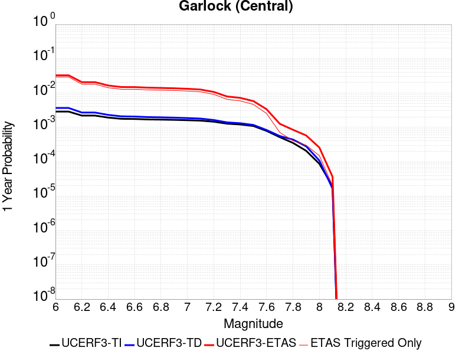 |  |

| Magnitude | 1 wk TI Prob | 1 wk TD Prob | 1 wk ETAS Prob | 1 wk ETAS/TD Gain | 1 wk ETAS Triggered Only | 1 mo TI Prob | 1 mo TD Prob | 1 mo ETAS Prob | 1 mo ETAS/TD Gain | 1 mo ETAS Triggered Only | 1 yr TI Prob | 1 yr TD Prob | 1 yr ETAS Prob | 1 yr ETAS/TD Gain | 1 yr ETAS Triggered Only | 10 yr TI Prob | 10 yr TD Prob | 10 yr ETAS Prob | 10 yr ETAS/TD Gain | 10 yr ETAS Triggered Only |
|-----|-----|-----|-----|-----|-----|-----|-----|-----|-----|-----|-----|-----|-----|-----|-----|-----|-----|-----|-----|-----|
| 6.0 | 5.5131142E-5 | 7.027124E-5 | 0.0024201062 | 34.439495 | 0.00235 | 2.3625491E-4 | 3.0112805E-4 | 0.008248734 | 27.392778 | 0.00795 | 0.0028726095 | 0.0036601364 | 0.032713406 | 8.937756 | 0.02916 | 0.028357591 | 0.036092084 | 0.08988778 | 2.4905124 | 0.05581 |
| 6.1 | 5.5131142E-5 | 7.027124E-5 | 0.0024201062 | 34.439495 | 0.00235 | 2.3625491E-4 | 3.0112805E-4 | 0.008248734 | 27.392778 | 0.00795 | 0.0028726095 | 0.0036601364 | 0.032713406 | 8.937756 | 0.02916 | 0.028357591 | 0.036092084 | 0.08988778 | 2.4905124 | 0.05581 |
| 6.2 | 4.216245E-5 | 5.1683597E-5 | 0.0012516215 | 24.217 | 0.0012 | 1.806837E-4 | 2.214825E-4 | 0.004980428 | 22.48678 | 0.00476 | 0.0021976046 | 0.0026932466 | 0.020654742 | 7.6690865 | 0.01801 | 0.021759989 | 0.026701005 | 0.06073727 | 2.2747185 | 0.03497 |
| 6.3 | 4.216245E-5 | 5.1683597E-5 | 0.0012516215 | 24.217 | 0.0012 | 1.806837E-4 | 2.214825E-4 | 0.004980428 | 22.48678 | 0.00476 | 0.0021976046 | 0.0026932466 | 0.020654742 | 7.6690865 | 0.01801 | 0.021759989 | 0.026701005 | 0.06073727 | 2.2747185 | 0.03497 |
| 6.4 | 3.6858168E-5 | 4.4131746E-5 | 9.940899E-4 | 22.525503 | 9.5E-4 | 1.5795401E-4 | 1.8912248E-4 | 0.004018398 | 21.247597 | 0.00383 | 0.0019213937 | 0.00230016 | 0.016487451 | 7.1679587 | 0.01422 | 0.019048655 | 0.022859743 | 0.049701784 | 2.1742058 | 0.02747 |
| 6.5 | 3.39199E-5 | 4.0038896E-5 | 8.8000525E-4 | 21.97876 | 8.4E-4 | 1.453629E-4 | 1.715841E-4 | 0.003610994 | 21.045036 | 0.00344 | 0.0017683565 | 0.0020870569 | 0.014860342 | 7.120239 | 0.0128 | 0.017543508 | 0.020770492 | 0.044830162 | 2.158358 | 0.02457 |
| 6.6 | 3.3571985E-5 | 3.9493032E-5 | 8.6946023E-4 | 22.015535 | 8.3E-4 | 1.4387199E-4 | 1.6924499E-4 | 0.0035986644 | 21.263048 | 0.00343 | 0.0017502342 | 0.0020586322 | 0.014822302 | 7.2000732 | 0.01279 | 0.017365133 | 0.020491783 | 0.044528913 | 2.1730132 | 0.02454 |
| 6.7 | 3.2580007E-5 | 3.8109323E-5 | 8.3807885E-4 | 21.991438 | 8.0E-4 | 1.3962112E-4 | 1.6331558E-4 | 0.0035127685 | 21.509085 | 0.00335 | 0.0016985617 | 0.0019865753 | 0.014272121 | 7.1842837 | 0.01231 | 0.016856372 | 0.019784356 | 0.04286843 | 2.1667845 | 0.02355 |
| 6.8 | 3.2185937E-5 | 3.7536465E-5 | 8.275068E-4 | 22.04541 | 7.9E-4 | 1.3793244E-4 | 1.6086077E-4 | 0.00346033 | 21.511335 | 0.0033 | 0.0016780337 | 0.001956742 | 0.013993144 | 7.151246 | 0.01206 | 0.016654192 | 0.01949112 | 0.04211146 | 2.160546 | 0.02307 |
| 6.9 | 3.165394E-5 | 3.6740938E-5 | 7.96713E-4 | 21.684612 | 7.6E-4 | 1.3565269E-4 | 1.5745178E-4 | 0.0033869431 | 21.510986 | 0.00323 | 0.0016503202 | 0.0019153113 | 0.013692711 | 7.1490784 | 0.0118 | 0.01638118 | 0.0190837 | 0.041272026 | 2.1626847 | 0.02262 |
| 7.0 | 3.0903822E-5 | 3.564605E-5 | 7.756197E-4 | 21.758923 | 7.4E-4 | 1.3243823E-4 | 1.5275997E-4 | 0.0032522865 | 21.290176 | 0.0031 | 0.0016112428 | 0.0018582871 | 0.01321714 | 7.112539 | 0.01138 | 0.015996104 | 0.018522795 | 0.04008585 | 2.164136 | 0.02197 |
| 7.1 | 3.0069863E-5 | 3.441218E-5 | 7.143888E-4 | 20.759764 | 6.8E-4 | 1.2886449E-4 | 1.4747256E-4 | 0.003087039 | 20.932972 | 0.00294 | 0.0015677959 | 0.0017940209 | 0.012574646 | 7.0091968 | 0.0108 | 0.01556781 | 0.017890377 | 0.03843611 | 2.1484237 | 0.02092 |
| 7.2 | 2.7957109E-5 | 3.1301115E-5 | 5.912836E-4 | 18.890177 | 5.6E-4 | 1.1981068E-4 | 1.3414085E-4 | 0.0025838122 | 19.261934 | 0.00245 | 0.0014577188 | 0.0016319609 | 0.01071711 | 6.567014 | 0.0091 | 0.014481937 | 0.016293783 | 0.033390597 | 2.0492845 | 0.01738 |
| 7.3 | 2.4519275E-5 | 2.6733265E-5 | 4.2672257E-4 | 15.962232 | 4.0E-4 | 1.0507837E-4 | 1.1456619E-4 | 0.0018943623 | 16.53509 | 0.00178 | 0.0012785783 | 0.0013939656 | 0.007914863 | 5.677947 | 0.00653 | 0.012712469 | 0.013937555 | 0.026085844 | 1.8716227 | 0.01232 |
| 7.4 | 2.3225532E-5 | 2.5217494E-5 | 3.852084E-4 | 15.275444 | 3.6E-4 | 9.95342E-5 | 1.0807058E-4 | 0.0017278955 | 15.9885845 | 0.00162 | 0.0012111551 | 0.0013149795 | 0.0071972343 | 5.473267 | 0.00589 | 0.012045753 | 0.01315504 | 0.024187967 | 1.8386843 | 0.01118 |
| 7.5 | 2.097765E-5 | 2.250088E-5 | 3.4249367E-4 | 15.221345 | 3.2E-4 | 8.9901114E-5 | 9.6428856E-5 | 0.0014163016 | 14.687529 | 0.00132 | 0.0010939965 | 0.0011734008 | 0.005807956 | 4.949678 | 0.00464 | 0.010886264 | 0.01174923 | 0.020050537 | 1.7065405 | 0.0084 |
| 7.6 | 1.511254E-5 | 1.6007341E-5 | 1.560051E-4 | 9.745848 | 1.4E-4 | 6.476642E-5 | 6.860113E-5 | 7.7855244E-4 | 11.348973 | 7.1E-4 | 7.882459E-4 | 8.3490653E-4 | 0.0033627942 | 4.027749 | 0.00253 | 0.007854558 | 0.00839184 | 0.013012735 | 1.5506413 | 0.00466 |
| 7.7 | 9.934069E-6 | 1.0693656E-5 | 4.0693336E-5 | 3.8053718 | 3.0E-5 | 4.2573887E-5 | 4.582915E-5 | 2.8581815E-4 | 6.236602 | 2.4E-4 | 5.182138E-4 | 5.578274E-4 | 0.0012674314 | 2.272085 | 7.1E-4 | 0.00517007 | 0.005635394 | 0.0070374478 | 1.2487943 | 0.00141 |
| 7.8 | 6.7562896E-6 | 8.440562E-6 | 1.8440478E-5 | 2.184745 | 1.0E-5 | 2.8955206E-5 | 3.6173336E-5 | 1.6616864E-4 | 4.593677 | 1.3E-4 | 3.5247262E-4 | 4.4032154E-4 | 8.50141E-4 | 1.9307277 | 4.1E-4 | 0.0035191406 | 0.0044529405 | 0.0052892 | 1.1877993 | 8.4E-4 |
| 7.9 | 3.975453E-6 | 5.3784297E-6 | 5.3784297E-6 | 1.0 | 0.0 | 1.7037546E-5 | 2.305021E-5 | 9.30486E-5 | 4.036779 | 7.0E-5 | 2.0741238E-4 | 2.8060027E-4 | 5.8051606E-4 | 2.0688365 | 3.0E-4 | 0.002072189 | 0.0028374717 | 0.003365968 | 1.186256 | 5.3E-4 |
| 8.0 | 1.6729537E-6 | 2.0800776E-6 | 2.0800776E-6 | 1.0 | 0.0 | 7.169782E-6 | 8.914588E-6 | 4.8914233E-5 | 5.486987 | 4.0E-5 | 8.7288594E-5 | 1.0852974E-4 | 2.5851346E-4 | 2.3819597 | 1.5E-4 | 8.7254314E-4 | 0.0010982669 | 0.0013280144 | 1.2091908 | 2.3E-4 |
| 8.1 | 3.6733252E-7 | 3.1526864E-7 | 3.1526864E-7 | 1.0 | 0.0 | 1.5742813E-6 | 1.3511507E-6 | 1.1351137E-5 | 8.401089 | 1.0E-5 | 1.9166706E-5 | 1.645015E-5 | 3.6449823E-5 | 2.2157743 | 2.0E-5 | 1.9165053E-4 | 1.6658098E-4 | 1.9657599E-4 | 1.1800625 | 3.0E-5 |

## Tank Canyon
*[(top)](#table-of-contents)*

| 1 Week | 1 Month | 1 Year | 10 Year |
|-----|-----|-----|-----|
|  |  |  |  |

| Magnitude | 1 wk TI Prob | 1 wk TD Prob | 1 wk ETAS Prob | 1 wk ETAS/TD Gain | 1 wk ETAS Triggered Only | 1 mo TI Prob | 1 mo TD Prob | 1 mo ETAS Prob | 1 mo ETAS/TD Gain | 1 mo ETAS Triggered Only | 1 yr TI Prob | 1 yr TD Prob | 1 yr ETAS Prob | 1 yr ETAS/TD Gain | 1 yr ETAS Triggered Only | 10 yr TI Prob | 10 yr TD Prob | 10 yr ETAS Prob | 10 yr ETAS/TD Gain | 10 yr ETAS Triggered Only |
|-----|-----|-----|-----|-----|-----|-----|-----|-----|-----|-----|-----|-----|-----|-----|-----|-----|-----|-----|-----|-----|
| 6.0 | 4.8284557E-5 | 5.7970923E-5 | 0.0010879112 | 18.766499 | 0.00103 | 2.0691741E-4 | 2.48427E-4 | 0.004477376 | 18.022905 | 0.00423 | 0.0025163088 | 0.0030210684 | 0.022422278 | 7.42197 | 0.01946 | 0.02488006 | 0.029866708 | 0.06853622 | 2.2947364 | 0.03986 |
| 6.1 | 1.7796336E-5 | 2.0875108E-5 | 3.60868E-4 | 17.287 | 3.4E-4 | 7.626778E-5 | 8.946191E-5 | 0.0015393322 | 17.206566 | 0.00145 | 9.281647E-4 | 0.0010886913 | 0.007871299 | 7.230056 | 0.00679 | 0.009242975 | 0.010837668 | 0.025210196 | 2.3261642 | 0.01453 |
| 6.2 | 1.7796336E-5 | 2.0875108E-5 | 3.60868E-4 | 17.287 | 3.4E-4 | 7.626778E-5 | 8.946191E-5 | 0.0015393322 | 17.206566 | 0.00145 | 9.281647E-4 | 0.0010886913 | 0.007871299 | 7.230056 | 0.00679 | 0.009242975 | 0.010837668 | 0.025210196 | 2.3261642 | 0.01453 |
| 6.3 | 1.3515912E-5 | 1.5760828E-5 | 3.0575626E-4 | 19.399757 | 2.9E-4 | 5.792405E-5 | 6.7544795E-5 | 0.0011574712 | 17.136349 | 0.00109 | 7.049971E-4 | 8.220716E-4 | 0.0057280352 | 6.9678054 | 0.00491 | 0.007027647 | 0.008192917 | 0.01872591 | 2.2856214 | 0.01062 |
| 6.4 | 1.0870146E-5 | 1.2618972E-5 | 2.3261619E-4 | 18.433847 | 2.2E-4 | 4.658551E-5 | 5.4080287E-5 | 8.2403864E-4 | 15.23732 | 7.7E-4 | 5.67031E-4 | 6.582465E-4 | 0.0042358898 | 6.435112 | 0.00358 | 0.005655863 | 0.006564983 | 0.014333645 | 2.1833484 | 0.00782 |
| 6.5 | 7.964826E-6 | 9.196723E-6 | 1.2919561E-4 | 14.048005 | 1.2E-4 | 3.4134522E-5 | 3.9413993E-5 | 5.2939466E-4 | 13.431643 | 4.9E-4 | 4.1550855E-4 | 4.797704E-4 | 0.0027186957 | 5.66666 | 0.00224 | 0.0041473247 | 0.0047886474 | 0.00969504 | 2.024588 | 0.00493 |
| 6.6 | 6.6317E-6 | 7.612777E-6 | 1.1761194E-4 | 15.449282 | 1.1E-4 | 2.8421264E-5 | 3.262583E-5 | 4.4261245E-4 | 13.566319 | 4.1E-4 | 3.4597394E-4 | 3.9715623E-4 | 0.0020964812 | 5.2787313 | 0.0017 | 0.0034543579 | 0.003965616 | 0.00784019 | 1.977042 | 0.00389 |
| 6.7 | 4.793663E-6 | 5.4310603E-6 | 8.543063E-5 | 15.730008 | 8.0E-5 | 2.0544108E-5 | 2.327579E-5 | 2.632702E-4 | 11.310903 | 2.4E-4 | 2.500958E-4 | 2.8335027E-4 | 0.0012530754 | 4.4223547 | 9.7E-4 | 0.0024981452 | 0.0028305824 | 0.004904695 | 1.7327511 | 0.00208 |
| 6.8 | 4.382823E-6 | 4.9694927E-6 | 7.4969146E-5 | 15.0858755 | 7.0E-5 | 1.8783392E-5 | 2.1297676E-5 | 2.2129342E-4 | 10.390496 | 2.0E-4 | 2.286638E-4 | 2.592726E-4 | 0.0011590393 | 4.47035 | 9.0E-4 | 0.0022842865 | 0.0025903755 | 0.004515376 | 1.7431357 | 0.00193 |
| 6.9 | 2.729601E-6 | 3.0736521E-6 | 2.3073591E-5 | 7.5068974 | 2.0E-5 | 1.1698237E-5 | 1.3172735E-5 | 4.317234E-5 | 3.2774014 | 3.0E-5 | 1.4241673E-4 | 1.6036748E-4 | 5.902985E-4 | 3.6809118 | 4.3E-4 | 0.001423255 | 0.0016026833 | 0.0025411767 | 1.5855764 | 9.4E-4 |
| 7.0 | 1.8987357E-6 | 2.1269989E-6 | 2.1269989E-6 | 1.0 | 0.0 | 8.137413E-6 | 9.115682E-6 | 9.115682E-6 | 1.0 | 0.0 | 9.90685E-5 | 1.1097847E-4 | 3.0095738E-4 | 2.7118537 | 1.9E-4 | 9.902435E-4 | 0.0011092991 | 0.0014888777 | 1.3421786 | 3.8E-4 |
| 7.1 | 1.4928986E-6 | 1.6641684E-6 | 1.6641684E-6 | 1.0 | 0.0 | 6.398121E-6 | 7.1321338E-6 | 7.1321338E-6 | 1.0 | 0.0 | 7.789434E-5 | 8.683086E-5 | 1.968213E-4 | 2.2667208 | 1.1E-4 | 7.786704E-4 | 8.680272E-4 | 0.0010978276 | 1.2647387 | 2.3E-4 |
| 7.2 | 1.069082E-6 | 1.1828834E-6 | 1.1828834E-6 | 1.0 | 0.0 | 4.581772E-6 | 5.0694935E-6 | 5.0694935E-6 | 1.0 | 0.0 | 5.5781646E-5 | 6.171987E-5 | 1.4171493E-4 | 2.2960992 | 8.0E-5 | 5.576765E-4 | 6.170795E-4 | 7.469993E-4 | 1.2105398 | 1.3E-4 |
| 7.3 | 8.776551E-7 | 9.770195E-7 | 9.770195E-7 | 1.0 | 0.0 | 3.7613736E-6 | 4.1872227E-6 | 4.1872227E-6 | 1.0 | 0.0 | 4.579376E-5 | 5.0978764E-5 | 8.097723E-5 | 1.5884503 | 3.0E-5 | 4.5784327E-4 | 5.097217E-4 | 5.896809E-4 | 1.1568683 | 8.0E-5 |
| 7.4 | 7.55721E-7 | 8.510402E-7 | 8.510402E-7 | 1.0 | 0.0 | 3.2388E-6 | 3.647313E-6 | 3.647313E-6 | 1.0 | 0.0 | 3.9431678E-5 | 4.440565E-5 | 4.440565E-5 | 1.0 | 0.0 | 3.942468E-4 | 4.440186E-4 | 4.939964E-4 | 1.1125579 | 5.0E-5 |
| 7.5 | 5.587665E-7 | 6.305733E-7 | 6.305733E-7 | 1.0 | 0.0 | 2.3947114E-6 | 2.702457E-6 | 2.702457E-6 | 1.0 | 0.0 | 2.915522E-5 | 3.2902415E-5 | 3.2902415E-5 | 1.0 | 0.0 | 2.9151395E-4 | 3.2902416E-4 | 3.69011E-4 | 1.1215316 | 4.0E-5 |

## Little Lake
*[(top)](#table-of-contents)*

| 1 Week | 1 Month | 1 Year | 10 Year |
|-----|-----|-----|-----|
|  |  |  |  |

| Magnitude | 1 wk TI Prob | 1 wk TD Prob | 1 wk ETAS Prob | 1 wk ETAS/TD Gain | 1 wk ETAS Triggered Only | 1 mo TI Prob | 1 mo TD Prob | 1 mo ETAS Prob | 1 mo ETAS/TD Gain | 1 mo ETAS Triggered Only | 1 yr TI Prob | 1 yr TD Prob | 1 yr ETAS Prob | 1 yr ETAS/TD Gain | 1 yr ETAS Triggered Only | 10 yr TI Prob | 10 yr TD Prob | 10 yr ETAS Prob | 10 yr ETAS/TD Gain | 10 yr ETAS Triggered Only |
|-----|-----|-----|-----|-----|-----|-----|-----|-----|-----|-----|-----|-----|-----|-----|-----|-----|-----|-----|-----|-----|
| 6.0 | 2.8424427E-5 | 3.1207477E-5 | 0.0012811684 | 41.053253 | 0.00125 | 1.2181328E-4 | 1.3374022E-4 | 0.003843244 | 28.736635 | 0.00371 | 0.0014820677 | 0.0016272042 | 0.015135189 | 9.301345 | 0.01353 | 0.014722223 | 0.016166303 | 0.040821176 | 2.5250778 | 0.02506 |
| 6.1 | 2.8424427E-5 | 3.1207477E-5 | 0.0012811684 | 41.053253 | 0.00125 | 1.2181328E-4 | 1.3374022E-4 | 0.003843244 | 28.736635 | 0.00371 | 0.0014820677 | 0.0016272042 | 0.015135189 | 9.301345 | 0.01353 | 0.014722223 | 0.016166303 | 0.040821176 | 2.5250778 | 0.02506 |
| 6.2 | 2.8424427E-5 | 3.1207477E-5 | 0.0012811684 | 41.053253 | 0.00125 | 1.2181328E-4 | 1.3374022E-4 | 0.003843244 | 28.736635 | 0.00371 | 0.0014820677 | 0.0016272042 | 0.015135189 | 9.301345 | 0.01353 | 0.014722223 | 0.016166303 | 0.040821176 | 2.5250778 | 0.02506 |
| 6.3 | 1.48860645E-5 | 1.6082206E-5 | 8.060695E-4 | 50.121826 | 7.9E-4 | 6.379586E-5 | 6.8922076E-5 | 0.002348765 | 34.07856 | 0.00228 | 7.7643775E-4 | 8.388314E-4 | 0.009631449 | 11.481985 | 0.0088 | 0.007737305 | 0.00835947 | 0.024562877 | 2.9383292 | 0.01634 |
| 6.4 | 1.48860645E-5 | 1.6082206E-5 | 8.060695E-4 | 50.121826 | 7.9E-4 | 6.379586E-5 | 6.8922076E-5 | 0.002348765 | 34.07856 | 0.00228 | 7.7643775E-4 | 8.388314E-4 | 0.009631449 | 11.481985 | 0.0088 | 0.007737305 | 0.00835947 | 0.024562877 | 2.9383292 | 0.01634 |
| 6.5 | 1.2797581E-5 | 1.3766247E-5 | 7.137566E-4 | 51.84831 | 7.0E-4 | 5.4845623E-5 | 5.899701E-5 | 0.0020688784 | 35.067513 | 0.00201 | 6.675408E-4 | 7.180776E-4 | 0.008642383 | 12.035445 | 0.00793 | 0.006655392 | 0.007160124 | 0.021834297 | 3.0494301 | 0.01478 |
| 6.6 | 9.661896E-6 | 1.0289519E-5 | 6.1028334E-4 | 59.31116 | 6.0E-4 | 4.1407468E-5 | 4.4097287E-5 | 0.0018140193 | 41.136753 | 0.00177 | 5.040193E-4 | 5.3676846E-4 | 0.00729314 | 13.587125 | 0.00676 | 0.005028777 | 0.0053563244 | 0.017829156 | 3.3286176 | 0.01254 |
| 6.7 | 7.767871E-6 | 8.200053E-6 | 5.281958E-4 | 64.4137 | 5.2E-4 | 3.329045E-5 | 3.514269E-5 | 0.0015950878 | 45.388893 | 0.00156 | 4.0523586E-4 | 4.27792E-4 | 0.006245302 | 14.598923 | 0.00582 | 0.004044977 | 0.004271037 | 0.0152937565 | 3.5808065 | 0.01107 |
| 6.8 | 6.4235196E-6 | 6.736042E-6 | 4.2673323E-4 | 63.350735 | 4.2E-4 | 2.752908E-5 | 2.8868506E-5 | 0.0013088315 | 45.337696 | 0.00128 | 3.35115E-4 | 3.514302E-4 | 0.0050097927 | 14.255442 | 0.00466 | 0.003346101 | 0.0035100048 | 0.012348871 | 3.518192 | 0.00887 |
| 6.9 | 3.1283696E-6 | 3.1122859E-6 | 2.7311145E-4 | 87.75269 | 2.7E-4 | 1.3407229E-5 | 1.3338308E-5 | 8.4332726E-4 | 63.225952 | 8.3E-4 | 1.6322079E-4 | 1.6238331E-4 | 0.003001922 | 18.486643 | 0.00284 | 0.0016310095 | 0.0016227949 | 0.0070939017 | 4.3714104 | 0.00548 |
| 7.0 | 2.290603E-6 | 2.2287613E-6 | 1.622284E-4 | 72.7886 | 1.6E-4 | 9.816834E-6 | 9.551805E-6 | 4.795473E-4 | 50.20489 | 4.7E-4 | 1.19513395E-4 | 1.1628806E-4 | 0.0016761066 | 14.413403 | 0.00156 | 0.0011944914 | 0.0011623743 | 0.004478515 | 3.852903 | 0.00332 |
| 7.1 | 1.293693E-6 | 1.1777322E-6 | 1.0117761E-4 | 85.908844 | 1.0E-4 | 5.5443866E-6 | 5.0474177E-6 | 2.250463E-4 | 44.586422 | 2.2E-4 | 6.750081E-5 | 6.1451276E-5 | 8.414033E-4 | 13.692203 | 7.8E-4 | 6.7480316E-4 | 6.144114E-4 | 0.0021834467 | 3.5537214 | 0.00157 |
| 7.2 | 4.715842E-7 | 3.09202E-7 | 3.09202E-7 | 1.0 | 0.0 | 2.0210737E-6 | 1.3251507E-6 | 1.1325137E-5 | 8.546302 | 1.0E-5 | 2.4606294E-5 | 1.6133596E-5 | 7.613263E-5 | 4.718888 | 6.0E-5 | 2.460357E-4 | 1.6132479E-4 | 2.8130543E-4 | 1.743721 | 1.2E-4 |
| 7.3 | 3.9430947E-7 | 2.3099639E-7 | 2.3099639E-7 | 1.0 | 0.0 | 1.6898966E-6 | 9.899842E-7 | 1.0989974E-5 | 11.101162 | 1.0E-5 | 2.0574296E-5 | 1.2052991E-5 | 7.2052266E-5 | 5.9779577 | 6.0E-5 | 2.0572392E-4 | 1.20523444E-4 | 2.105126E-4 | 1.7466527 | 9.0E-5 |
| 7.4 | 3.547123E-7 | 1.9681133E-7 | 1.9681133E-7 | 1.0 | 0.0 | 1.5201948E-6 | 8.4347687E-7 | 1.0843469E-5 | 12.85568 | 1.0E-5 | 1.8508214E-5 | 1.0269283E-5 | 6.026877E-5 | 5.8688393 | 5.0E-5 | 1.8506673E-4 | 1.02688144E-4 | 1.8267993E-4 | 1.7789778 | 8.0E-5 |
| 7.5 | 2.6354266E-7 | 1.4424535E-7 | 1.4424535E-7 | 1.0 | 0.0 | 1.129468E-6 | 6.1819424E-7 | 1.0618188E-5 | 17.176136 | 1.0E-5 | 1.3751187E-5 | 7.5264893E-6 | 4.7526188E-5 | 6.3145227 | 4.0E-5 | 1.3750336E-4 | 7.52624E-5 | 1.4525713E-4 | 1.9300094 | 7.0E-5 |
| 7.6 | 1.269913E-7 | 7.573149E-8 | 7.573149E-8 | 1.0 | 0.0 | 5.4424834E-7 | 3.245635E-7 | 3.245635E-7 | 1.0 | 0.0 | 6.6262032E-6 | 3.951554E-6 | 1.3951514E-5 | 3.5306401 | 1.0E-5 | 6.626006E-5 | 3.951487E-5 | 7.951329E-5 | 2.012237 | 4.0E-5 |

## Airport Lake
*[(top)](#table-of-contents)*

| 1 Week | 1 Month | 1 Year | 10 Year |
|-----|-----|-----|-----|
|  |  |  |  |

| Magnitude | 1 wk TI Prob | 1 wk TD Prob | 1 wk ETAS Prob | 1 wk ETAS/TD Gain | 1 wk ETAS Triggered Only | 1 mo TI Prob | 1 mo TD Prob | 1 mo ETAS Prob | 1 mo ETAS/TD Gain | 1 mo ETAS Triggered Only | 1 yr TI Prob | 1 yr TD Prob | 1 yr ETAS Prob | 1 yr ETAS/TD Gain | 1 yr ETAS Triggered Only | 10 yr TI Prob | 10 yr TD Prob | 10 yr ETAS Prob | 10 yr ETAS/TD Gain | 10 yr ETAS Triggered Only |
|-----|-----|-----|-----|-----|-----|-----|-----|-----|-----|-----|-----|-----|-----|-----|-----|-----|-----|-----|-----|-----|
| 6.0 | 1.2387061E-5 | 1.3103559E-5 | 9.4309135E-4 | 71.97215 | 9.3E-4 | 5.3086325E-5 | 5.615706E-5 | 0.003065988 | 54.59666 | 0.00301 | 6.461343E-4 | 6.8352616E-4 | 0.011955816 | 17.49138 | 0.01128 | 0.0064425888 | 0.006817048 | 0.027822867 | 4.081366 | 0.02115 |
| 6.1 | 1.2387061E-5 | 1.3103559E-5 | 9.4309135E-4 | 71.97215 | 9.3E-4 | 5.3086325E-5 | 5.615706E-5 | 0.003065988 | 54.59666 | 0.00301 | 6.461343E-4 | 6.8352616E-4 | 0.011955816 | 17.49138 | 0.01128 | 0.0064425888 | 0.006817048 | 0.027822867 | 4.081366 | 0.02115 |
| 6.2 | 1.2387061E-5 | 1.3103559E-5 | 9.4309135E-4 | 71.97215 | 9.3E-4 | 5.3086325E-5 | 5.615706E-5 | 0.003065988 | 54.59666 | 0.00301 | 6.461343E-4 | 6.8352616E-4 | 0.011955816 | 17.49138 | 0.01128 | 0.0064425888 | 0.006817048 | 0.027822867 | 4.081366 | 0.02115 |
| 6.3 | 1.2387061E-5 | 1.3103559E-5 | 9.4309135E-4 | 71.97215 | 9.3E-4 | 5.3086325E-5 | 5.615706E-5 | 0.003065988 | 54.59666 | 0.00301 | 6.461343E-4 | 6.8352616E-4 | 0.011955816 | 17.49138 | 0.01128 | 0.0064425888 | 0.006817048 | 0.027822867 | 4.081366 | 0.02115 |
| 6.4 | 1.2387061E-5 | 1.3103559E-5 | 9.4309135E-4 | 71.97215 | 9.3E-4 | 5.3086325E-5 | 5.615706E-5 | 0.003065988 | 54.59666 | 0.00301 | 6.461343E-4 | 6.8352616E-4 | 0.011955816 | 17.49138 | 0.01128 | 0.0064425888 | 0.006817048 | 0.027822867 | 4.081366 | 0.02115 |
| 6.5 | 6.9922594E-6 | 7.385145E-6 | 7.0737995E-4 | 95.784164 | 7.0E-4 | 2.996648E-5 | 3.165027E-5 | 0.002351577 | 74.2988 | 0.00232 | 3.6478083E-4 | 3.8527933E-4 | 0.008662089 | 22.482622 | 0.00828 | 0.003641826 | 0.003846651 | 0.019406566 | 5.045055 | 0.01562 |
| 6.6 | 6.9922594E-6 | 7.385145E-6 | 7.0737995E-4 | 95.784164 | 7.0E-4 | 2.996648E-5 | 3.165027E-5 | 0.002351577 | 74.2988 | 0.00232 | 3.6478083E-4 | 3.8527933E-4 | 0.008662089 | 22.482622 | 0.00828 | 0.003641826 | 0.003846651 | 0.019406566 | 5.045055 | 0.01562 |
| 6.7 | 5.477277E-6 | 5.7862417E-6 | 6.2578265E-4 | 108.15011 | 6.2E-4 | 2.3473833E-5 | 2.4797964E-5 | 0.0020147485 | 81.24654 | 0.00199 | 2.8575645E-4 | 3.0187727E-4 | 0.007349749 | 24.346811 | 0.00705 | 0.0028538927 | 0.003015056 | 0.016264986 | 5.3945885 | 0.01329 |
| 6.8 | 3.9950432E-6 | 4.2192128E-6 | 4.842172E-4 | 114.764824 | 4.8E-4 | 1.7121502E-5 | 1.808223E-5 | 0.0016280531 | 90.03608 | 0.00161 | 2.0843433E-4 | 2.2013167E-4 | 0.005668932 | 25.75246 | 0.00545 | 0.0020823893 | 0.0021994072 | 0.012366995 | 5.6228766 | 0.01019 |
| 6.9 | 2.95695E-6 | 3.1231173E-6 | 3.7312196E-4 | 119.471 | 3.7E-4 | 1.2672582E-5 | 1.33847325E-5 | 0.0011433696 | 85.423416 | 0.00113 | 1.5427776E-4 | 1.629492E-4 | 0.0039023398 | 23.948198 | 0.00374 | 0.001541707 | 0.0016285196 | 0.008687006 | 5.334296 | 0.00707 |
| 7.0 | 1.456072E-6 | 1.5408596E-6 | 1.615406E-4 | 104.83798 | 1.6E-4 | 6.2402937E-6 | 6.603673E-6 | 4.566007E-4 | 69.14345 | 4.5E-4 | 7.597293E-5 | 8.039776E-5 | 0.0015102827 | 18.785135 | 0.00143 | 7.594696E-4 | 8.0378563E-4 | 0.003871318 | 4.816356 | 0.00307 |
| 7.1 | 6.995192E-7 | 7.409207E-7 | 1.0074085E-4 | 135.96712 | 1.0E-4 | 2.997936E-6 | 3.1753743E-6 | 2.131747E-4 | 67.13372 | 2.1E-4 | 3.649926E-5 | 3.8660182E-5 | 7.186339E-4 | 18.588476 | 6.8E-4 | 3.6493264E-4 | 3.8660184E-4 | 0.0017760645 | 4.5940404 | 0.00139 |

## Owl Lake
*[(top)](#table-of-contents)*

| 1 Week | 1 Month | 1 Year | 10 Year |
|-----|-----|-----|-----|
|  |  |  |  |

| Magnitude | 1 wk TI Prob | 1 wk TD Prob | 1 wk ETAS Prob | 1 wk ETAS/TD Gain | 1 wk ETAS Triggered Only | 1 mo TI Prob | 1 mo TD Prob | 1 mo ETAS Prob | 1 mo ETAS/TD Gain | 1 mo ETAS Triggered Only | 1 yr TI Prob | 1 yr TD Prob | 1 yr ETAS Prob | 1 yr ETAS/TD Gain | 1 yr ETAS Triggered Only | 10 yr TI Prob | 10 yr TD Prob | 10 yr ETAS Prob | 10 yr ETAS/TD Gain | 10 yr ETAS Triggered Only |
|-----|-----|-----|-----|-----|-----|-----|-----|-----|-----|-----|-----|-----|-----|-----|-----|-----|-----|-----|-----|-----|
| 6.0 | 5.0320643E-5 | 6.637151E-5 | 6.4633304E-4 | 9.738109 | 5.8E-4 | 2.1564208E-4 | 2.844246E-4 | 0.0024138188 | 8.486673 | 0.00213 | 0.0026222812 | 0.0034584238 | 0.011520445 | 3.331126 | 0.00809 | 0.02591553 | 0.034147043 | 0.050537568 | 1.4799984 | 0.01697 |
| 6.1 | 5.0320643E-5 | 6.637151E-5 | 6.4633304E-4 | 9.738109 | 5.8E-4 | 2.1564208E-4 | 2.844246E-4 | 0.0024138188 | 8.486673 | 0.00213 | 0.0026222812 | 0.0034584238 | 0.011520445 | 3.331126 | 0.00809 | 0.02591553 | 0.034147043 | 0.050537568 | 1.4799984 | 0.01697 |
| 6.2 | 2.4125871E-5 | 3.098766E-5 | 4.6097432E-4 | 14.876062 | 4.3E-4 | 1.0339249E-4 | 1.3279865E-4 | 0.0017525835 | 13.197299 | 0.00162 | 0.0012580766 | 0.0016157742 | 0.007765821 | 4.8062534 | 0.00616 | 0.012509781 | 0.016073797 | 0.02855982 | 1.7767937 | 0.01269 |
| 6.3 | 1.7433485E-5 | 2.2360802E-5 | 3.9235252E-4 | 17.546442 | 3.7E-4 | 7.471279E-5 | 9.582938E-5 | 0.0015256923 | 15.920924 | 0.00143 | 9.0924866E-4 | 0.0011662478 | 0.0065199966 | 5.5905757 | 0.00536 | 0.009055373 | 0.01163159 | 0.02252341 | 1.9363999 | 0.01102 |
| 6.4 | 1.7433485E-5 | 2.2360802E-5 | 3.9235252E-4 | 17.546442 | 3.7E-4 | 7.471279E-5 | 9.582938E-5 | 0.0015256923 | 15.920924 | 0.00143 | 9.0924866E-4 | 0.0011662478 | 0.0065199966 | 5.5905757 | 0.00536 | 0.009055373 | 0.01163159 | 0.02252341 | 1.9363999 | 0.01102 |
| 6.5 | 1.5182742E-5 | 1.9433977E-5 | 3.8942677E-4 | 20.03845 | 3.7E-4 | 6.506727E-5 | 8.3286664E-5 | 0.0014931692 | 17.92807 | 0.00141 | 7.919061E-4 | 0.0010136948 | 0.006168464 | 6.0851297 | 0.00516 | 0.0078909 | 0.0101209 | 0.020544328 | 2.0298913 | 0.01053 |
| 6.6 | 6.7271576E-6 | 8.550545E-6 | 2.485485E-4 | 29.068146 | 2.4E-4 | 2.8830356E-5 | 3.6644713E-5 | 0.0010966059 | 29.925352 | 0.00106 | 3.5095305E-4 | 4.460637E-4 | 0.004344324 | 9.739246 | 0.0039 | 0.0035039932 | 0.0044694655 | 0.012294335 | 2.7507396 | 0.00786 |
| 6.7 | 6.682835E-6 | 8.482986E-6 | 2.4848094E-4 | 29.291683 | 2.4E-4 | 2.8640408E-5 | 3.635518E-5 | 0.0010963166 | 30.15572 | 0.00106 | 3.4864116E-4 | 4.4254007E-4 | 0.004340814 | 9.808861 | 0.0039 | 0.003480947 | 0.004434389 | 0.01224958 | 2.7624052 | 0.00785 |
| 6.8 | 6.5774975E-6 | 8.329444E-6 | 2.4832744E-4 | 29.813206 | 2.4E-4 | 2.8188972E-5 | 3.569716E-5 | 0.0010956593 | 30.693176 | 0.00106 | 3.4314668E-4 | 4.3453192E-4 | 0.0043228418 | 9.948272 | 0.00389 | 0.0034261728 | 0.004354527 | 0.012160388 | 2.792585 | 0.00784 |
| 6.9 | 6.363419E-6 | 8.002579E-6 | 2.4800067E-4 | 30.990091 | 2.4E-4 | 2.727151E-5 | 3.429635E-5 | 0.00109426 | 31.90602 | 0.00106 | 3.3198006E-4 | 4.1748365E-4 | 0.0042758724 | 10.242011 | 0.00386 | 0.0033148455 | 0.0041844994 | 0.011961819 | 2.858602 | 0.00781 |
| 7.0 | 6.1342453E-6 | 7.63473E-6 | 2.476329E-4 | 32.43506 | 2.4E-4 | 2.6289357E-5 | 3.271989E-5 | 0.0010826855 | 33.089523 | 0.00105 | 3.2002592E-4 | 3.9829736E-4 | 0.00420678 | 10.561908 | 0.00381 | 0.0031956544 | 0.0039931675 | 0.0117122205 | 2.9330652 | 0.00775 |
| 7.1 | 5.842926E-6 | 7.14521E-6 | 2.2714364E-4 | 31.789637 | 2.2E-4 | 2.504087E-5 | 3.0622E-5 | 0.0010305914 | 33.65526 | 0.001 | 3.0482994E-4 | 3.7276448E-4 | 0.00395143 | 10.600339 | 0.00358 | 0.0030441214 | 0.0037385917 | 0.011041188 | 2.9533012 | 0.00733 |
| 7.2 | 4.77173E-6 | 5.361204E-6 | 1.4536045E-4 | 27.113398 | 1.4E-4 | 2.045011E-5 | 2.297641E-5 | 6.8296125E-4 | 29.724455 | 6.6E-4 | 2.4895166E-4 | 2.7970594E-4 | 0.0026090543 | 9.3278475 | 0.00233 | 0.0024867293 | 0.0028100624 | 0.007496855 | 2.6678607 | 0.0047 |
| 7.3 | 3.0494948E-6 | 2.7124704E-6 | 3.271239E-5 | 12.0599985 | 3.0E-5 | 1.3069198E-5 | 1.1624823E-5 | 2.3162227E-4 | 19.9248 | 2.2E-4 | 1.5910587E-4 | 1.4152318E-4 | 8.014298E-4 | 5.6628866 | 6.6E-4 | 0.0015899199 | 0.0014242887 | 0.0026325653 | 1.8483368 | 0.00121 |
| 7.4 | 2.7263884E-6 | 2.3075613E-6 | 2.2307515E-5 | 9.667139 | 2.0E-5 | 1.1684469E-5 | 9.889511E-6 | 1.7988784E-4 | 18.18976 | 1.7E-4 | 1.4224913E-4 | 1.2039825E-4 | 5.6034524E-4 | 4.654098 | 4.4E-4 | 0.0014215811 | 0.0012122075 | 0.002071165 | 1.7085894 | 8.6E-4 |
| 7.5 | 2.6090431E-6 | 2.1674637E-6 | 2.216742E-5 | 10.227355 | 2.0E-5 | 1.1181565E-5 | 9.289097E-6 | 1.7928751E-4 | 19.300856 | 1.7E-4 | 1.3612706E-4 | 1.1308899E-4 | 5.2304263E-4 | 4.625054 | 4.1E-4 | 0.001360437 | 0.0011389464 | 0.0018781036 | 1.6489834 | 7.4E-4 |
| 7.6 | 2.3008756E-6 | 1.8745708E-6 | 2.1874534E-5 | 11.669089 | 2.0E-5 | 9.860858E-6 | 8.0338505E-6 | 1.4803272E-4 | 18.426125 | 1.4E-4 | 1.20049335E-4 | 9.7807824E-5 | 4.3777458E-4 | 4.4758644 | 3.4E-4 | 0.001199845 | 9.85921E-4 | 0.0016053098 | 1.6282337 | 6.2E-4 |
| 7.7 | 1.7184348E-6 | 1.343562E-6 | 2.1343536E-5 | 15.885783 | 2.0E-5 | 7.3646997E-6 | 5.7581105E-6 | 1.1575747E-4 | 20.103378 | 1.1E-4 | 8.966153E-5 | 7.010278E-5 | 3.0008666E-4 | 4.280667 | 2.3E-4 | 8.962536E-4 | 7.086945E-4 | 0.0010784323 | 1.5217167 | 3.7E-4 |
| 7.8 | 8.4612907E-7 | 8.4176E-7 | 1.0841752E-5 | 12.879861 | 1.0E-5 | 3.6262625E-6 | 3.607538E-6 | 6.3607324E-5 | 17.63178 | 6.0E-5 | 4.4148852E-5 | 4.392091E-5 | 1.3391695E-4 | 3.0490477 | 9.0E-5 | 4.414008E-4 | 4.4459777E-4 | 5.7454E-4 | 1.2922691 | 1.3E-4 |
| 7.9 | 2.716738E-7 | 3.7732943E-7 | 3.7732943E-7 | 1.0 | 0.0 | 1.1643157E-6 | 1.6171252E-6 | 1.1617109E-5 | 7.183803 | 1.0E-5 | 1.4175452E-5 | 1.9688332E-5 | 3.9687937E-5 | 2.01581 | 2.0E-5 | 1.4174548E-4 | 1.9863734E-4 | 2.1863337E-4 | 1.100666 | 2.0E-5 |
| 8.0 | 2.1995428E-8 | 3.389418E-8 | 3.389418E-8 | 1.0 | 0.0 | 9.426611E-8 | 1.4526077E-7 | 1.4526077E-7 | 1.0 | 0.0 | 1.1476893E-6 | 1.768549E-6 | 1.768549E-6 | 1.0 | 0.0 | 1.14768345E-5 | 1.798665E-5 | 1.798665E-5 | 1.0 | 0.0 |

## Panamint Valley
*[(top)](#table-of-contents)*

| 1 Week | 1 Month | 1 Year | 10 Year |
|-----|-----|-----|-----|
|  |  |  |  |

| Magnitude | 1 wk TI Prob | 1 wk TD Prob | 1 wk ETAS Prob | 1 wk ETAS/TD Gain | 1 wk ETAS Triggered Only | 1 mo TI Prob | 1 mo TD Prob | 1 mo ETAS Prob | 1 mo ETAS/TD Gain | 1 mo ETAS Triggered Only | 1 yr TI Prob | 1 yr TD Prob | 1 yr ETAS Prob | 1 yr ETAS/TD Gain | 1 yr ETAS Triggered Only | 10 yr TI Prob | 10 yr TD Prob | 10 yr ETAS Prob | 10 yr ETAS/TD Gain | 10 yr ETAS Triggered Only |
|-----|-----|-----|-----|-----|-----|-----|-----|-----|-----|-----|-----|-----|-----|-----|-----|-----|-----|-----|-----|-----|
| 6.0 | 3.0211835E-5 | 3.39879E-5 | 4.4397396E-4 | 13.062706 | 4.1E-4 | 1.2947287E-4 | 1.4565447E-4 | 0.0017154258 | 11.777365 | 0.00157 | 0.0015751923 | 0.0017719301 | 0.008330288 | 4.701251 | 0.00657 | 0.015640736 | 0.017584875 | 0.030297326 | 1.7229197 | 0.01294 |
| 6.1 | 3.0211835E-5 | 3.39879E-5 | 4.4397396E-4 | 13.062706 | 4.1E-4 | 1.2947287E-4 | 1.4565447E-4 | 0.0017154258 | 11.777365 | 0.00157 | 0.0015751923 | 0.0017719301 | 0.008330288 | 4.701251 | 0.00657 | 0.015640736 | 0.017584875 | 0.030297326 | 1.7229197 | 0.01294 |
| 6.2 | 3.0211835E-5 | 3.39879E-5 | 4.4397396E-4 | 13.062706 | 4.1E-4 | 1.2947287E-4 | 1.4565447E-4 | 0.0017154258 | 11.777365 | 0.00157 | 0.0015751923 | 0.0017719301 | 0.008330288 | 4.701251 | 0.00657 | 0.015640736 | 0.017584875 | 0.030297326 | 1.7229197 | 0.01294 |
| 6.3 | 2.8573924E-5 | 3.210589E-5 | 4.3209305E-4 | 13.458372 | 4.0E-4 | 1.2245393E-4 | 1.3758958E-4 | 0.001667379 | 12.118498 | 0.00153 | 0.001489857 | 0.0016738938 | 0.007973332 | 4.763344 | 0.00631 | 0.01479908 | 0.01661945 | 0.028705196 | 1.727205 | 0.01229 |
| 6.4 | 2.8573924E-5 | 3.210589E-5 | 4.3209305E-4 | 13.458372 | 4.0E-4 | 1.2245393E-4 | 1.3758958E-4 | 0.001667379 | 12.118498 | 0.00153 | 0.001489857 | 0.0016738938 | 0.007973332 | 4.763344 | 0.00631 | 0.01479908 | 0.01661945 | 0.028705196 | 1.727205 | 0.01229 |
| 6.5 | 2.7468774E-5 | 3.0831525E-5 | 4.208195E-4 | 13.649001 | 3.9E-4 | 1.1771801E-4 | 1.3212857E-4 | 0.001641929 | 12.426753 | 0.00151 | 0.0014322745 | 0.0016075056 | 0.0076677483 | 4.7699666 | 0.00607 | 0.014230782 | 0.015965264 | 0.027586713 | 1.727921 | 0.01181 |
| 6.6 | 2.6135967E-5 | 2.9255436E-5 | 4.0924433E-4 | 13.988659 | 3.8E-4 | 1.1200648E-4 | 1.2537456E-4 | 0.0016151877 | 12.882898 | 0.00149 | 0.0013628257 | 0.001525393 | 0.007426378 | 4.868501 | 0.00591 | 0.013544982 | 0.015155562 | 0.026353244 | 1.7388496 | 0.01137 |
| 6.7 | 2.4498746E-5 | 2.7344193E-5 | 4.073338E-4 | 14.896538 | 3.8E-4 | 1.04990395E-4 | 1.17184274E-4 | 0.0015770132 | 13.45755 | 0.00146 | 0.0012775084 | 0.0014258098 | 0.007067754 | 4.9570103 | 0.00565 | 0.012701893 | 0.014172745 | 0.024849255 | 1.7533127 | 0.01083 |
| 6.8 | 2.2244329E-5 | 2.4938103E-5 | 3.8492912E-4 | 15.435382 | 3.6E-4 | 9.532935E-5 | 1.06873325E-4 | 0.001456729 | 13.630426 | 0.00135 | 0.0011600169 | 0.0013004278 | 0.0065935357 | 5.0702815 | 0.0053 | 0.011539802 | 0.012933899 | 0.0228243 | 1.7646884 | 0.01002 |
| 6.9 | 1.9902658E-5 | 2.2292743E-5 | 3.2228607E-4 | 14.456994 | 3.0E-4 | 8.529431E-5 | 9.553693E-5 | 0.0012754241 | 13.350064 | 0.00118 | 0.0010379635 | 0.00116256 | 0.0059769563 | 5.1412024 | 0.00482 | 0.010331288 | 0.011569886 | 0.020445988 | 1.7671729 | 0.00898 |
| 7.0 | 1.8353881E-5 | 2.0568525E-5 | 2.9056298E-4 | 14.126583 | 2.7E-4 | 7.865712E-5 | 8.814794E-5 | 0.0011980501 | 13.591356 | 0.00111 | 9.5722964E-4 | 0.0010726905 | 0.0054579815 | 5.0881233 | 0.00439 | 0.009531168 | 0.010680057 | 0.018733121 | 1.7540282 | 0.00814 |
| 7.1 | 1.7667631E-5 | 1.9774876E-5 | 2.7976974E-4 | 14.147737 | 2.6E-4 | 7.571623E-5 | 8.474681E-5 | 0.0011746545 | 13.86075 | 0.00109 | 9.2145515E-4 | 0.0010313216 | 0.0052769384 | 5.116676 | 0.00425 | 0.009176437 | 0.010270242 | 0.018089106 | 1.7613126 | 0.0079 |
| 7.2 | 1.6381597E-5 | 1.8160366E-5 | 2.3815637E-4 | 13.114073 | 2.2E-4 | 7.020495E-5 | 7.782792E-5 | 0.0010577516 | 13.590902 | 9.8E-4 | 8.544101E-4 | 9.471603E-4 | 0.0048234854 | 5.0925756 | 0.00388 | 0.008511325 | 0.0094358865 | 0.01644908 | 1.7432469 | 0.00708 |
| 7.3 | 1.4520491E-5 | 1.5968182E-5 | 2.0596515E-4 | 12.898472 | 1.9E-4 | 6.222919E-5 | 6.8433365E-5 | 8.7837793E-4 | 12.835522 | 8.1E-4 | 7.57377E-4 | 8.328739E-4 | 0.003960267 | 4.754942 | 0.00313 | 0.0075480095 | 0.008300635 | 0.013992989 | 1.6857734 | 0.00574 |
| 7.4 | 1.2852287E-5 | 1.4146948E-5 | 2.0414426E-4 | 14.430268 | 1.9E-4 | 5.5080065E-5 | 6.0628456E-5 | 8.6057995E-4 | 14.194324 | 8.0E-4 | 6.7039346E-4 | 7.379173E-4 | 0.003675748 | 4.9812465 | 0.00294 | 0.0066837464 | 0.0073575918 | 0.012717861 | 1.7285358 | 0.0054 |
| 7.5 | 1.1637851E-5 | 1.2838205E-5 | 2.0283577E-4 | 15.799387 | 1.9E-4 | 4.987555E-5 | 5.5019806E-5 | 8.349769E-4 | 15.175933 | 7.8E-4 | 6.070656E-4 | 6.6967594E-4 | 0.0035677338 | 5.327553 | 0.0029 | 0.006054099 | 0.006679477 | 0.011983809 | 1.7941238 | 0.00534 |
| 7.6 | 3.0068115E-6 | 3.3335807E-6 | 7.333335E-5 | 21.998373 | 7.0E-5 | 1.2886271E-5 | 1.4286737E-5 | 3.8428145E-4 | 26.897776 | 3.7E-4 | 1.5687906E-4 | 1.7393442E-4 | 0.0014537118 | 8.357816 | 0.00128 | 0.0015676835 | 0.0017394236 | 0.004035423 | 2.319977 | 0.0023 |

## Garlock (East)
*[(top)](#table-of-contents)*

| 1 Week | 1 Month | 1 Year | 10 Year |
|-----|-----|-----|-----|
|  |  |  |  |

| Magnitude | 1 wk TI Prob | 1 wk TD Prob | 1 wk ETAS Prob | 1 wk ETAS/TD Gain | 1 wk ETAS Triggered Only | 1 mo TI Prob | 1 mo TD Prob | 1 mo ETAS Prob | 1 mo ETAS/TD Gain | 1 mo ETAS Triggered Only | 1 yr TI Prob | 1 yr TD Prob | 1 yr ETAS Prob | 1 yr ETAS/TD Gain | 1 yr ETAS Triggered Only | 10 yr TI Prob | 10 yr TD Prob | 10 yr ETAS Prob | 10 yr ETAS/TD Gain | 10 yr ETAS Triggered Only |
|-----|-----|-----|-----|-----|-----|-----|-----|-----|-----|-----|-----|-----|-----|-----|-----|-----|-----|-----|-----|-----|
| 6.0 | 4.5092507E-5 | 6.2917425E-5 | 3.6289854E-4 | 5.767854 | 3.0E-4 | 1.9323928E-4 | 2.6962077E-4 | 0.0016092595 | 5.9686036 | 0.00134 | 0.0023501497 | 0.0032781374 | 0.008819911 | 2.690525 | 0.00556 | 0.023254504 | 0.03235903 | 0.04330305 | 1.338206 | 0.01131 |
| 6.1 | 4.5092507E-5 | 6.2917425E-5 | 3.6289854E-4 | 5.767854 | 3.0E-4 | 1.9323928E-4 | 2.6962077E-4 | 0.0016092595 | 5.9686036 | 0.00134 | 0.0023501497 | 0.0032781374 | 0.008819911 | 2.690525 | 0.00556 | 0.023254504 | 0.03235903 | 0.04330305 | 1.338206 | 0.01131 |
| 6.2 | 2.6674514E-5 | 3.452091E-5 | 2.9451193E-4 | 8.531407 | 2.6E-4 | 1.1431433E-4 | 1.4793854E-4 | 0.0012277787 | 8.299249 | 0.00108 | 0.0013908884 | 0.0017996968 | 0.0058823363 | 3.268515 | 0.00409 | 0.01382215 | 0.017896036 | 0.025978751 | 1.4516484 | 0.00823 |
| 6.3 | 2.6674514E-5 | 3.452091E-5 | 2.9451193E-4 | 8.531407 | 2.6E-4 | 1.1431433E-4 | 1.4793854E-4 | 0.0012277787 | 8.299249 | 0.00108 | 0.0013908884 | 0.0017996968 | 0.0058823363 | 3.268515 | 0.00409 | 0.01382215 | 0.017896036 | 0.025978751 | 1.4516484 | 0.00823 |
| 6.4 | 2.5312667E-5 | 3.234991E-5 | 2.923415E-4 | 9.036857 | 2.6E-4 | 1.0847834E-4 | 1.3863528E-4 | 0.001208487 | 8.717024 | 0.00107 | 0.0013199237 | 0.0016866071 | 0.0057497425 | 3.4090588 | 0.00407 | 0.013121112 | 0.016783953 | 0.024748001 | 1.4745039 | 0.0081 |
| 6.5 | 2.5312667E-5 | 3.234991E-5 | 2.923415E-4 | 9.036857 | 2.6E-4 | 1.0847834E-4 | 1.3863528E-4 | 0.001208487 | 8.717024 | 0.00107 | 0.0013199237 | 0.0016866071 | 0.0057497425 | 3.4090588 | 0.00407 | 0.013121112 | 0.016783953 | 0.024748001 | 1.4745039 | 0.0081 |
| 6.6 | 2.246556E-5 | 2.8144346E-5 | 2.781373E-4 | 9.882528 | 2.5E-4 | 9.627742E-5 | 1.20613186E-4 | 0.001150489 | 9.538667 | 0.00103 | 0.0011715472 | 0.0014674999 | 0.005341806 | 3.6400723 | 0.00388 | 0.011653901 | 0.0146240825 | 0.022231186 | 1.5201763 | 0.00772 |
| 6.7 | 2.2241198E-5 | 2.781406E-5 | 2.778071E-4 | 9.98801 | 2.5E-4 | 9.531594E-5 | 1.1919779E-4 | 0.001149075 | 9.640069 | 0.00103 | 0.0011598538 | 0.0014502906 | 0.005314678 | 3.6645608 | 0.00387 | 0.011538187 | 0.014454261 | 0.022042964 | 1.5250149 | 0.0077 |
| 6.8 | 1.9528685E-5 | 2.3908038E-5 | 2.3390302E-4 | 9.783446 | 2.1E-4 | 8.369167E-5 | 1.0245911E-4 | 0.0010623607 | 10.368631 | 9.6E-4 | 0.0010184698 | 0.0012467455 | 0.0048722196 | 3.9079506 | 0.00363 | 0.010138147 | 0.012441495 | 0.019630922 | 1.5778587 | 0.00728 |
| 6.9 | 1.3318621E-5 | 1.5207374E-5 | 2.2520417E-4 | 14.80888 | 2.1E-4 | 5.7078556E-5 | 6.517287E-5 | 9.451155E-4 | 14.501672 | 8.8E-4 | 6.9470983E-4 | 7.931965E-4 | 0.004110563 | 5.182276 | 0.00332 | 0.0069254204 | 0.007944281 | 0.014472008 | 1.8216888 | 0.00658 |
| 7.0 | 1.1760853E-5 | 1.3115987E-5 | 2.1311337E-4 | 16.248367 | 2.0E-4 | 5.0402683E-5 | 5.621019E-5 | 9.261613E-4 | 16.476751 | 8.7E-4 | 6.134799E-4 | 6.841492E-4 | 0.0039119394 | 5.7179623 | 0.00323 | 0.0061178906 | 0.006860767 | 0.013127476 | 1.9134122 | 0.00631 |
| 7.1 | 1.0064758E-5 | 1.0910848E-5 | 2.0090878E-4 | 18.413671 | 1.9E-4 | 4.3133965E-5 | 4.675996E-5 | 8.8672066E-4 | 18.963247 | 8.4E-4 | 5.2502943E-4 | 5.691573E-4 | 0.0036573985 | 6.425989 | 0.00309 | 0.005237907 | 0.005717105 | 0.011633089 | 2.0347865 | 0.00595 |
| 7.2 | 9.768808E-6 | 1.0506669E-5 | 2.0050467E-4 | 19.08356 | 1.9E-4 | 4.186565E-5 | 4.5027828E-5 | 8.549914E-4 | 18.988066 | 8.1E-4 | 5.095951E-4 | 5.480794E-4 | 0.0035364407 | 6.452424 | 0.00299 | 0.0050842804 | 0.0055073434 | 0.011235621 | 2.0401163 | 0.00576 |
| 7.3 | 9.344516E-6 | 9.95218E-6 | 1.8995038E-4 | 19.086308 | 1.8E-4 | 4.004731E-5 | 4.2651525E-5 | 7.9261954E-4 | 18.583614 | 7.5E-4 | 4.8746695E-4 | 5.1916204E-4 | 0.0032577396 | 6.2749953 | 0.00274 | 0.0048639905 | 0.0052189473 | 0.010521131 | 2.0159488 | 0.00533 |
| 7.4 | 9.023491E-6 | 9.498219E-6 | 1.5949679E-4 | 16.792284 | 1.5E-4 | 3.867153E-5 | 4.0706036E-5 | 7.1067875E-4 | 17.458805 | 6.7E-4 | 4.7072413E-4 | 4.9548666E-4 | 0.0029142876 | 5.881667 | 0.00242 | 0.004697283 | 0.004982321 | 0.009708655 | 1.9486209 | 0.00475 |
| 7.5 | 7.081253E-6 | 7.0943947E-6 | 1.17093616E-4 | 16.505089 | 1.1E-4 | 3.0347876E-5 | 3.0404199E-5 | 4.1039265E-4 | 13.497893 | 3.8E-4 | 3.6942272E-4 | 3.70109E-4 | 0.0015896575 | 4.2951064 | 0.00122 | 0.003688092 | 0.00372781 | 0.0058299443 | 1.563906 | 0.00211 |
| 7.6 | 6.116396E-6 | 5.9656345E-6 | 4.5965397E-5 | 7.7050304 | 4.0E-5 | 2.6212863E-5 | 2.5566756E-5 | 2.0556216E-4 | 8.040213 | 1.8E-4 | 3.1909486E-4 | 3.1123104E-4 | 0.0010909883 | 3.5053966 | 7.8E-4 | 0.0031863707 | 0.0031390795 | 0.004484842 | 1.4287124 | 0.00135 |
| 7.7 | 4.797145E-6 | 4.763327E-6 | 4.763327E-6 | 1.0 | 0.0 | 2.055903E-5 | 2.04141E-5 | 1.20412056E-4 | 5.898475 | 1.0E-4 | 2.5027743E-4 | 2.4851345E-4 | 6.0842396E-4 | 2.4482539 | 3.6E-4 | 0.0024999576 | 0.0025124948 | 0.0032007613 | 1.2739375 | 6.9E-4 |
| 7.8 | 3.4028885E-6 | 3.9838537E-6 | 3.9838537E-6 | 1.0 | 0.0 | 1.4583726E-5 | 1.7073547E-5 | 6.7072695E-5 | 3.9284568 | 5.0E-5 | 1.775424E-4 | 2.0785068E-4 | 4.1780705E-4 | 2.0101306 | 2.1E-4 | 0.0017740062 | 0.0021040295 | 0.0025231459 | 1.1991969 | 4.2E-4 |
| 7.9 | 2.5928412E-6 | 3.3770064E-6 | 3.3770064E-6 | 1.0 | 0.0 | 1.1112129E-5 | 1.4472805E-5 | 6.447208E-5 | 4.454705 | 5.0E-5 | 1.3528178E-4 | 1.7619222E-4 | 3.7615697E-4 | 2.134924 | 2.0E-4 | 0.0013519945 | 0.0017836117 | 0.0021429695 | 1.2014776 | 3.6E-4 |
| 8.0 | 1.3743648E-6 | 1.6755408E-6 | 1.6755408E-6 | 1.0 | 0.0 | 5.8901214E-6 | 7.1808695E-6 | 3.7180653E-5 | 5.177737 | 3.0E-5 | 7.1709874E-5 | 8.742361E-5 | 2.1741225E-4 | 2.4868824 | 1.3E-4 | 7.1686733E-4 | 8.847989E-4 | 0.0010946131 | 1.2371321 | 2.1E-4 |
| 8.1 | 3.6733252E-7 | 3.1526864E-7 | 3.1526864E-7 | 1.0 | 0.0 | 1.5742813E-6 | 1.3511507E-6 | 1.1351137E-5 | 8.401089 | 1.0E-5 | 1.9166706E-5 | 1.645015E-5 | 3.6449823E-5 | 2.2157743 | 2.0E-5 | 1.9165053E-4 | 1.6658098E-4 | 1.9657599E-4 | 1.1800625 | 3.0E-5 |

## Ash Hill
*[(top)](#table-of-contents)*

| 1 Week | 1 Month | 1 Year | 10 Year |
|-----|-----|-----|-----|
|  |  |  |  |

| Magnitude | 1 wk TI Prob | 1 wk TD Prob | 1 wk ETAS Prob | 1 wk ETAS/TD Gain | 1 wk ETAS Triggered Only | 1 mo TI Prob | 1 mo TD Prob | 1 mo ETAS Prob | 1 mo ETAS/TD Gain | 1 mo ETAS Triggered Only | 1 yr TI Prob | 1 yr TD Prob | 1 yr ETAS Prob | 1 yr ETAS/TD Gain | 1 yr ETAS Triggered Only | 10 yr TI Prob | 10 yr TD Prob | 10 yr ETAS Prob | 10 yr ETAS/TD Gain | 10 yr ETAS Triggered Only |
|-----|-----|-----|-----|-----|-----|-----|-----|-----|-----|-----|-----|-----|-----|-----|-----|-----|-----|-----|-----|-----|
| 6.0 | 2.1545662E-5 | 2.3195389E-5 | 2.1319099E-4 | 9.191093 | 1.9E-4 | 9.2335285E-5 | 9.940547E-5 | 8.7932794E-4 | 8.84587 | 7.8E-4 | 0.0011236023 | 0.0012096697 | 0.0043059196 | 3.559583 | 0.0031 | 0.011179381 | 0.012038835 | 0.018391425 | 1.5276748 | 0.00643 |
| 6.1 | 2.1545662E-5 | 2.3195389E-5 | 2.1319099E-4 | 9.191093 | 1.9E-4 | 9.2335285E-5 | 9.940547E-5 | 8.7932794E-4 | 8.84587 | 7.8E-4 | 0.0011236023 | 0.0012096697 | 0.0043059196 | 3.559583 | 0.0031 | 0.011179381 | 0.012038835 | 0.018391425 | 1.5276748 | 0.00643 |
| 6.2 | 2.1545662E-5 | 2.3195389E-5 | 2.1319099E-4 | 9.191093 | 1.9E-4 | 9.2335285E-5 | 9.940547E-5 | 8.7932794E-4 | 8.84587 | 7.8E-4 | 0.0011236023 | 0.0012096697 | 0.0043059196 | 3.559583 | 0.0031 | 0.011179381 | 0.012038835 | 0.018391425 | 1.5276748 | 0.00643 |
| 6.3 | 1.0025529E-5 | 1.0747344E-5 | 6.0746806E-5 | 5.6522617 | 5.0E-5 | 4.2965847E-5 | 4.605931E-5 | 3.3604595E-4 | 7.29594 | 2.9E-4 | 5.229836E-4 | 5.6064106E-4 | 0.0017499739 | 3.1213803 | 0.00119 | 0.005217545 | 0.0055935793 | 0.008029875 | 1.4355522 | 0.00245 |
| 6.4 | 1.0025529E-5 | 1.0747344E-5 | 6.0746806E-5 | 5.6522617 | 5.0E-5 | 4.2965847E-5 | 4.605931E-5 | 3.3604595E-4 | 7.29594 | 2.9E-4 | 5.229836E-4 | 5.6064106E-4 | 0.0017499739 | 3.1213803 | 0.00119 | 0.005217545 | 0.0055935793 | 0.008029875 | 1.4355522 | 0.00245 |
| 6.5 | 6.9617327E-6 | 7.4569152E-6 | 4.745662E-5 | 6.3641086 | 4.0E-5 | 2.9835655E-5 | 3.1957865E-5 | 2.2195179E-4 | 6.945138 | 1.9E-4 | 3.6318856E-4 | 3.8902622E-4 | 0.0011587266 | 2.9785311 | 7.7E-4 | 0.0036259557 | 0.0038843066 | 0.005448208 | 1.4026206 | 0.00157 |
| 6.6 | 4.9919777E-6 | 5.34689E-6 | 3.534673E-5 | 6.610708 | 3.0E-5 | 2.1394015E-5 | 2.291508E-5 | 1.6291186E-4 | 7.1093745 | 1.4E-4 | 2.60441E-4 | 2.7896208E-4 | 8.488031E-4 | 3.0427186 | 5.7E-4 | 0.0026013597 | 0.0027867774 | 0.0038537956 | 1.382886 | 0.00107 |
| 6.7 | 3.6630722E-6 | 3.9247725E-6 | 2.3924695E-5 | 6.095817 | 2.0E-5 | 1.5698786E-5 | 1.6820377E-5 | 1.2681853E-4 | 7.539577 | 1.1E-4 | 1.9111596E-4 | 2.0477458E-4 | 6.1469065E-4 | 3.0017917 | 4.1E-4 | 0.0019095168 | 0.002046422 | 0.0028248257 | 1.380373 | 7.8E-4 |
| 6.8 | 2.5599613E-6 | 2.7450303E-6 | 1.2745003E-5 | 4.642937 | 1.0E-5 | 1.0971216E-5 | 1.176439E-5 | 5.176392E-5 | 4.400051 | 4.0E-5 | 1.3356637E-4 | 1.4322698E-4 | 3.8319262E-4 | 2.675422 | 2.4E-4 | 0.0013348613 | 0.0014318317 | 0.001961073 | 1.3696252 | 5.3E-4 |
| 6.9 | 1.7684905E-6 | 1.8969438E-6 | 1.1896925E-5 | 6.2716274 | 1.0E-5 | 7.579223E-6 | 8.129759E-6 | 4.8129434E-5 | 5.920155 | 4.0E-5 | 9.2273134E-5 | 9.897981E-5 | 3.0895902E-4 | 3.1214347 | 2.1E-4 | 9.223483E-4 | 9.897981E-4 | 0.0013894022 | 1.4037228 | 4.0E-4 |

## Hunter Mountain-Saline Valley
*[(top)](#table-of-contents)*

| 1 Week | 1 Month | 1 Year | 10 Year |
|-----|-----|-----|-----|
|  |  |  |  |

| Magnitude | 1 wk TI Prob | 1 wk TD Prob | 1 wk ETAS Prob | 1 wk ETAS/TD Gain | 1 wk ETAS Triggered Only | 1 mo TI Prob | 1 mo TD Prob | 1 mo ETAS Prob | 1 mo ETAS/TD Gain | 1 mo ETAS Triggered Only | 1 yr TI Prob | 1 yr TD Prob | 1 yr ETAS Prob | 1 yr ETAS/TD Gain | 1 yr ETAS Triggered Only | 10 yr TI Prob | 10 yr TD Prob | 10 yr ETAS Prob | 10 yr ETAS/TD Gain | 10 yr ETAS Triggered Only |
|-----|-----|-----|-----|-----|-----|-----|-----|-----|-----|-----|-----|-----|-----|-----|-----|-----|-----|-----|-----|-----|
| 6.0 | 4.5103672E-5 | 5.4576634E-5 | 2.5456573E-4 | 4.664372 | 2.0E-4 | 1.9328714E-4 | 2.3387549E-4 | 0.0010636813 | 4.548067 | 8.3E-4 | 0.002350731 | 0.002843864 | 0.0059749344 | 2.1009915 | 0.00314 | 0.023260195 | 0.028095365 | 0.03372269 | 1.2002938 | 0.00579 |
| 6.1 | 4.5103672E-5 | 5.4576634E-5 | 2.5456573E-4 | 4.664372 | 2.0E-4 | 1.9328714E-4 | 2.3387549E-4 | 0.0010636813 | 4.548067 | 8.3E-4 | 0.002350731 | 0.002843864 | 0.0059749344 | 2.1009915 | 0.00314 | 0.023260195 | 0.028095365 | 0.03372269 | 1.2002938 | 0.00579 |
| 6.2 | 3.9363465E-5 | 4.706859E-5 | 2.470592E-4 | 5.248918 | 2.0E-4 | 1.6868966E-4 | 2.017032E-4 | 0.0010215378 | 5.0645595 | 8.2E-4 | 0.002051862 | 0.0024531104 | 0.005555481 | 2.2646682 | 0.00311 | 0.020330196 | 0.024276383 | 0.029867278 | 1.2303019 | 0.00573 |
| 6.3 | 3.9363465E-5 | 4.706859E-5 | 2.470592E-4 | 5.248918 | 2.0E-4 | 1.6868966E-4 | 2.017032E-4 | 0.0010215378 | 5.0645595 | 8.2E-4 | 0.002051862 | 0.0024531104 | 0.005555481 | 2.2646682 | 0.00311 | 0.020330196 | 0.024276383 | 0.029867278 | 1.2303019 | 0.00573 |
| 6.4 | 3.2311684E-5 | 3.7955346E-5 | 2.3794775E-4 | 6.26915 | 2.0E-4 | 1.384713E-4 | 1.6265604E-4 | 9.825226E-4 | 6.040493 | 8.2E-4 | 0.0016845843 | 0.0019786113 | 0.005062497 | 2.5586114 | 0.00309 | 0.016718714 | 0.019618697 | 0.025187263 | 1.2838397 | 0.00568 |
| 6.5 | 3.2311684E-5 | 3.7955346E-5 | 2.3794775E-4 | 6.26915 | 2.0E-4 | 1.384713E-4 | 1.6265604E-4 | 9.825226E-4 | 6.040493 | 8.2E-4 | 0.0016845843 | 0.0019786113 | 0.005062497 | 2.5586114 | 0.00309 | 0.016718714 | 0.019618697 | 0.025187263 | 1.2838397 | 0.00568 |
| 6.6 | 2.9305844E-5 | 3.4185676E-5 | 2.3417883E-4 | 6.8502035 | 2.0E-4 | 1.2559042E-4 | 1.4650216E-4 | 9.6638204E-4 | 6.596367 | 8.2E-4 | 0.0015279909 | 0.0017822674 | 0.00486676 | 2.7306566 | 0.00309 | 0.015175272 | 0.017687662 | 0.02324755 | 1.314337 | 0.00566 |
| 6.7 | 2.7826512E-5 | 3.234788E-5 | 2.3234141E-4 | 7.182585 | 2.0E-4 | 1.19251024E-4 | 1.3862675E-4 | 9.5851306E-4 | 6.914344 | 8.2E-4 | 0.0014509142 | 0.0016865344 | 0.0047613396 | 2.8231502 | 0.00308 | 0.014414776 | 0.01674504 | 0.022290597 | 1.3311762 | 0.00564 |
| 6.8 | 2.3389874E-5 | 2.686964E-5 | 2.2686427E-4 | 8.443145 | 2.0E-4 | 1.0023846E-4 | 1.1515078E-4 | 9.250575E-4 | 8.033445 | 8.1E-4 | 0.00121972 | 0.0014011064 | 0.004466805 | 3.1880555 | 0.00307 | 0.01213047 | 0.013928941 | 0.0194608 | 1.3971485 | 0.00561 |
| 6.9 | 2.069209E-5 | 2.3572567E-5 | 2.2356785E-4 | 9.484239 | 2.0E-4 | 8.867737E-5 | 1.01021586E-4 | 9.1093977E-4 | 9.017279 | 8.1E-4 | 0.0010791123 | 0.00122928 | 0.0042755306 | 3.4780772 | 0.00305 | 0.010738871 | 0.012229833 | 0.017751468 | 1.451489 | 0.00559 |
| 7.0 | 1.7462342E-5 | 1.9635625E-5 | 2.196317E-4 | 11.185369 | 2.0E-4 | 7.483646E-5 | 8.4150095E-5 | 8.9408195E-4 | 10.624847 | 8.1E-4 | 9.1075303E-4 | 0.0010240684 | 0.004030986 | 3.9362466 | 0.00301 | 0.009070295 | 0.010197128 | 0.015650941 | 1.5348382 | 0.00551 |
| 7.1 | 1.4807709E-5 | 1.6443486E-5 | 2.0644037E-4 | 12.554538 | 1.9E-4 | 6.3460066E-5 | 7.0470276E-5 | 8.704139E-4 | 12.351504 | 8.0E-4 | 7.723524E-4 | 8.576544E-4 | 0.00384509 | 4.483263 | 0.00299 | 0.007696735 | 0.008546432 | 0.013959768 | 1.6334031 | 0.00546 |
| 7.2 | 1.4180048E-5 | 1.5700001E-5 | 2.0569701E-4 | 13.101721 | 1.9E-4 | 6.077022E-5 | 6.7284076E-5 | 8.6723024E-4 | 12.889087 | 8.0E-4 | 7.396263E-4 | 8.188919E-4 | 0.0038064434 | 4.6482854 | 0.00299 | 0.0073716943 | 0.008161696 | 0.013577133 | 1.6635185 | 0.00546 |
| 7.3 | 1.3730402E-5 | 1.5173691E-5 | 2.0517081E-4 | 13.521482 | 1.9E-4 | 5.8843252E-5 | 6.502858E-5 | 8.6497655E-4 | 13.301483 | 8.0E-4 | 7.161811E-4 | 7.914514E-4 | 0.003779085 | 4.7748795 | 0.00299 | 0.007138774 | 0.007889261 | 0.013296264 | 1.6853625 | 0.00545 |
| 7.4 | 1.2810095E-5 | 1.4110805E-5 | 2.0410812E-4 | 14.464669 | 1.9E-4 | 5.489925E-5 | 6.0473565E-5 | 8.604252E-4 | 14.228121 | 8.0E-4 | 6.681934E-4 | 7.360327E-4 | 0.003663876 | 4.9778714 | 0.00293 | 0.006661878 | 0.0073388456 | 0.012669436 | 1.7263527 | 0.00537 |
| 7.5 | 1.1595659E-5 | 1.2802062E-5 | 2.0279962E-4 | 15.841169 | 1.9E-4 | 4.9694736E-5 | 5.486491E-5 | 8.3482213E-4 | 15.215957 | 7.8E-4 | 6.0486543E-4 | 6.677913E-4 | 0.0035558613 | 5.3248096 | 0.00289 | 0.006032217 | 0.006660718 | 0.01193535 | 1.7919014 | 0.00531 |
| 7.6 | 2.997694E-6 | 3.325705E-6 | 7.332547E-5 | 22.0481 | 7.0E-5 | 1.28471975E-5 | 1.4252984E-5 | 3.8424772E-4 | 26.959105 | 3.7E-4 | 1.564034E-4 | 1.7352356E-4 | 0.0014533014 | 8.37524 | 0.00128 | 0.0015629337 | 0.0017353174 | 0.004031326 | 2.323106 | 0.0023 |

## Blackwater
*[(top)](#table-of-contents)*

| 1 Week | 1 Month | 1 Year | 10 Year |
|-----|-----|-----|-----|
|  |  |  |  |

| Magnitude | 1 wk TI Prob | 1 wk TD Prob | 1 wk ETAS Prob | 1 wk ETAS/TD Gain | 1 wk ETAS Triggered Only | 1 mo TI Prob | 1 mo TD Prob | 1 mo ETAS Prob | 1 mo ETAS/TD Gain | 1 mo ETAS Triggered Only | 1 yr TI Prob | 1 yr TD Prob | 1 yr ETAS Prob | 1 yr ETAS/TD Gain | 1 yr ETAS Triggered Only | 10 yr TI Prob | 10 yr TD Prob | 10 yr ETAS Prob | 10 yr ETAS/TD Gain | 10 yr ETAS Triggered Only |
|-----|-----|-----|-----|-----|-----|-----|-----|-----|-----|-----|-----|-----|-----|-----|-----|-----|-----|-----|-----|-----|
| 6.0 | 3.0708583E-5 | 3.3097214E-5 | 2.1309126E-4 | 6.438344 | 1.8E-4 | 1.3160157E-4 | 1.4183826E-4 | 6.317688E-4 | 4.454149 | 4.9E-4 | 0.0016010714 | 0.0017256497 | 0.0041814046 | 2.42309 | 0.00246 | 0.015895851 | 0.017136335 | 0.022099797 | 1.2896454 | 0.00505 |
| 6.1 | 3.0708583E-5 | 3.3097214E-5 | 2.1309126E-4 | 6.438344 | 1.8E-4 | 1.3160157E-4 | 1.4183826E-4 | 6.317688E-4 | 4.454149 | 4.9E-4 | 0.0016010714 | 0.0017256497 | 0.0041814046 | 2.42309 | 0.00246 | 0.015895851 | 0.017136335 | 0.022099797 | 1.2896454 | 0.00505 |
| 6.2 | 1.1707779E-5 | 1.2545598E-5 | 4.2545224E-5 | 3.3912468 | 3.0E-5 | 5.017523E-5 | 5.3765798E-5 | 2.2375665E-4 | 4.1616917 | 1.7E-4 | 6.107122E-4 | 6.5441156E-4 | 0.0015738095 | 2.4049232 | 9.2E-4 | 0.006090366 | 0.0065258164 | 0.008443221 | 1.2938185 | 0.00193 |
| 6.3 | 1.1707779E-5 | 1.2545598E-5 | 4.2545224E-5 | 3.3912468 | 3.0E-5 | 5.017523E-5 | 5.3765798E-5 | 2.2375665E-4 | 4.1616917 | 1.7E-4 | 6.107122E-4 | 6.5441156E-4 | 0.0015738095 | 2.4049232 | 9.2E-4 | 0.006090366 | 0.0065258164 | 0.008443221 | 1.2938185 | 0.00193 |
| 6.4 | 7.929244E-6 | 8.4804105E-6 | 1.8480327E-5 | 2.1791782 | 1.0E-5 | 3.3982033E-5 | 3.6344132E-5 | 1.2634086E-4 | 3.476238 | 9.0E-5 | 4.136527E-4 | 4.4240404E-4 | 0.001032143 | 2.3330326 | 5.9E-4 | 0.0041288356 | 0.0044156383 | 0.0056899865 | 1.2885988 | 0.00128 |
| 6.5 | 5.8832115E-6 | 6.286219E-6 | 6.286219E-6 | 1.0 | 0.0 | 2.521352E-5 | 2.6940676E-5 | 8.693906E-5 | 3.2270555 | 6.0E-5 | 3.0693135E-4 | 3.279559E-4 | 7.8780507E-4 | 2.4021676 | 4.6E-4 | 0.0030650778 | 0.0032749726 | 0.004251763 | 1.2982591 | 9.8E-4 |
| 6.6 | 5.8832115E-6 | 6.286219E-6 | 6.286219E-6 | 1.0 | 0.0 | 2.521352E-5 | 2.6940676E-5 | 8.693906E-5 | 3.2270555 | 6.0E-5 | 3.0693135E-4 | 3.279559E-4 | 7.8780507E-4 | 2.4021676 | 4.6E-4 | 0.0030650778 | 0.0032749726 | 0.004251763 | 1.2982591 | 9.8E-4 |
| 6.7 | 3.0715053E-6 | 3.2815851E-6 | 3.2815851E-6 | 1.0 | 0.0 | 1.3163528E-5 | 1.4063868E-5 | 3.4063585E-5 | 2.422064 | 2.0E-5 | 1.6025416E-4 | 1.7121529E-4 | 3.6118276E-4 | 2.109524 | 1.9E-4 | 0.0016013865 | 0.0017109484 | 0.0020803153 | 1.2158843 | 3.7E-4 |
| 6.8 | 2.2722281E-6 | 2.4288424E-6 | 2.4288424E-6 | 1.0 | 0.0 | 9.738084E-6 | 1.0409289E-5 | 1.0409289E-5 | 1.0 | 0.0 | 1.1855473E-4 | 1.2672663E-4 | 2.2671396E-4 | 1.7890002 | 1.0E-4 | 0.001184915 | 0.0012666339 | 0.0015163171 | 1.1971235 | 2.5E-4 |
| 6.9 | 9.952399E-7 | 1.0653887E-6 | 1.0653887E-6 | 1.0 | 0.0 | 4.265307E-6 | 4.5659463E-6 | 4.5659463E-6 | 1.0 | 0.0 | 5.1928873E-5 | 5.5589495E-5 | 8.5587824E-5 | 1.5396403 | 3.0E-5 | 5.191674E-4 | 5.558065E-4 | 6.057787E-4 | 1.0899093 | 5.0E-5 |
| 7.0 | 4.7385504E-7 | 5.075751E-7 | 5.075751E-7 | 1.0 | 0.0 | 2.0308057E-6 | 2.175322E-6 | 2.175322E-6 | 1.0 | 0.0 | 2.4724779E-5 | 2.6484544E-5 | 4.6484012E-5 | 1.7551374 | 2.0E-5 | 2.4722028E-4 | 2.6484544E-4 | 2.8484015E-4 | 1.0754957 | 2.0E-5 |

## Garlock (West)
*[(top)](#table-of-contents)*

| 1 Week | 1 Month | 1 Year | 10 Year |
|-----|-----|-----|-----|
|  |  |  |  |

| Magnitude | 1 wk TI Prob | 1 wk TD Prob | 1 wk ETAS Prob | 1 wk ETAS/TD Gain | 1 wk ETAS Triggered Only | 1 mo TI Prob | 1 mo TD Prob | 1 mo ETAS Prob | 1 mo ETAS/TD Gain | 1 mo ETAS Triggered Only | 1 yr TI Prob | 1 yr TD Prob | 1 yr ETAS Prob | 1 yr ETAS/TD Gain | 1 yr ETAS Triggered Only | 10 yr TI Prob | 10 yr TD Prob | 10 yr ETAS Prob | 10 yr ETAS/TD Gain | 10 yr ETAS Triggered Only |
|-----|-----|-----|-----|-----|-----|-----|-----|-----|-----|-----|-----|-----|-----|-----|-----|-----|-----|-----|-----|-----|
| 6.0 | 2.5181727E-5 | 2.5216661E-5 | 1.8521263E-4 | 7.3448515 | 1.6E-4 | 1.0791722E-4 | 1.08066946E-4 | 7.679956E-4 | 7.1066656 | 6.6E-4 | 0.0013131002 | 0.0013149243 | 0.0034321367 | 2.61014 | 0.00212 | 0.013053683 | 0.013151911 | 0.017069697 | 1.2978873 | 0.00397 |
| 6.1 | 2.5077732E-5 | 2.5117724E-5 | 1.851137E-4 | 7.369844 | 1.6E-4 | 1.0747157E-4 | 1.0764297E-4 | 7.675719E-4 | 7.1307206 | 6.6E-4 | 0.001307681 | 0.0013097686 | 0.0034269919 | 2.6164863 | 0.00212 | 0.013000126 | 0.013100963 | 0.017018951 | 1.2990612 | 0.00397 |
| 6.2 | 2.494612E-5 | 2.4999388E-5 | 1.8499538E-4 | 7.3999963 | 1.6E-4 | 1.0690756E-4 | 1.0713586E-4 | 7.6706515E-4 | 7.1597424 | 6.6E-4 | 0.0013008224 | 0.001303602 | 0.0034208384 | 2.6241434 | 0.00212 | 0.012932341 | 0.013040021 | 0.016958252 | 1.3004774 | 0.00397 |
| 6.3 | 2.4733758E-5 | 2.4818735E-5 | 1.8481477E-4 | 7.446583 | 1.6E-4 | 1.0599751E-4 | 1.0636169E-4 | 7.662915E-4 | 7.2045817 | 6.6E-4 | 0.0012897556 | 0.0012941877 | 0.0034114441 | 2.6359732 | 0.00212 | 0.012822957 | 0.01294698 | 0.01686558 | 1.3026652 | 0.00397 |
| 6.4 | 2.3237335E-5 | 2.3197908E-5 | 1.8319419E-4 | 7.8970137 | 1.6E-4 | 9.958477E-5 | 9.941583E-5 | 7.593502E-4 | 7.6381216 | 6.6E-4 | 0.0012117702 | 0.0012097185 | 0.0033071782 | 2.7338412 | 0.0021 | 0.012051838 | 0.012111766 | 0.016004046 | 1.3213634 | 0.00394 |
| 6.5 | 2.2732203E-5 | 2.3012379E-5 | 1.830087E-4 | 7.95262 | 1.6E-4 | 9.742009E-5 | 9.862077E-5 | 7.5855566E-4 | 7.6916428 | 6.6E-4 | 0.0011854442 | 0.0012000492 | 0.0032975292 | 2.7478282 | 0.0021 | 0.011791403 | 0.012016123 | 0.01590878 | 1.3239528 | 0.00394 |
| 6.6 | 2.1319436E-5 | 2.1792415E-5 | 1.8178893E-4 | 8.341845 | 1.6E-4 | 9.136581E-5 | 9.339274E-5 | 7.533311E-4 | 8.066271 | 6.6E-4 | 0.001111811 | 0.0011364657 | 0.0032240904 | 2.8369448 | 0.00209 | 0.011062649 | 0.011386949 | 0.015272198 | 1.3412019 | 0.00393 |
| 6.7 | 1.970802E-5 | 2.0412112E-5 | 1.8040884E-4 | 8.838324 | 1.6E-4 | 8.446021E-5 | 8.747755E-5 | 7.4741984E-4 | 8.544133 | 6.6E-4 | 0.001027818 | 0.0010645206 | 0.0031522957 | 2.9612353 | 0.00209 | 0.010230771 | 0.01067459 | 0.014562639 | 1.364234 | 0.00393 |
| 6.8 | 1.8744462E-5 | 1.9919653E-5 | 1.7991646E-4 | 9.032108 | 1.6E-4 | 8.033094E-5 | 8.536715E-5 | 7.453108E-4 | 8.730651 | 6.6E-4 | 9.775903E-4 | 0.0010388512 | 0.00312668 | 3.0097477 | 0.00209 | 0.009733009 | 0.010420324 | 0.014309372 | 1.3732176 | 0.00393 |
| 6.9 | 1.7559682E-5 | 1.8971898E-5 | 1.7896887E-4 | 9.433367 | 1.6E-4 | 7.5253614E-5 | 8.13056E-5 | 7.312528E-4 | 8.993879 | 6.5E-4 | 9.158276E-4 | 9.894476E-4 | 0.0030673896 | 3.1001031 | 0.00208 | 0.0091206245 | 0.009930745 | 0.0138118155 | 1.3908137 | 0.00392 |
| 7.0 | 1.6794445E-5 | 1.8234585E-5 | 1.7823167E-4 | 9.774375 | 1.6E-4 | 7.197421E-5 | 7.814589E-5 | 7.2809507E-4 | 9.317126 | 6.5E-4 | 8.759337E-4 | 9.5101225E-4 | 0.0030190437 | 3.1745582 | 0.00207 | 0.008724891 | 0.009549588 | 0.013422249 | 1.4055318 | 0.00391 |
| 7.1 | 1.6337795E-5 | 1.7735292E-5 | 1.6773264E-4 | 9.457562 | 1.5E-4 | 7.0017246E-5 | 7.600619E-5 | 7.1595755E-4 | 9.419727 | 6.4E-4 | 8.521265E-4 | 9.249838E-4 | 0.0029830784 | 3.225006 | 0.00206 | 0.008488664 | 0.009291395 | 0.013145251 | 1.4147769 | 0.00389 |
| 7.2 | 1.5780008E-5 | 1.7183862E-5 | 1.6718128E-4 | 9.728971 | 1.5E-4 | 6.762685E-5 | 7.364305E-5 | 7.1359595E-4 | 9.689929 | 6.4E-4 | 8.2304585E-4 | 8.962366E-4 | 0.0029543904 | 3.2964401 | 0.00206 | 0.008200042 | 0.009006202 | 0.012831438 | 1.4247335 | 0.00386 |
| 7.3 | 1.5058865E-5 | 1.6636799E-5 | 1.5663447E-4 | 9.41494 | 1.4E-4 | 6.45364E-5 | 7.129862E-5 | 7.012537E-4 | 9.835445 | 6.3E-4 | 7.854473E-4 | 8.6771627E-4 | 0.0029159375 | 3.3604734 | 0.00205 | 0.00782677 | 0.008722834 | 0.012529339 | 1.4363838 | 0.00384 |
| 7.4 | 1.4887923E-5 | 1.647271E-5 | 1.564704E-4 | 9.498765 | 1.4E-4 | 6.380382E-5 | 7.059543E-5 | 6.805524E-4 | 9.640176 | 6.1E-4 | 7.7653467E-4 | 8.591616E-4 | 0.002877426 | 3.3491092 | 0.00202 | 0.0077382675 | 0.008637666 | 0.012375101 | 1.4326905 | 0.00377 |
| 7.5 | 1.4509299E-5 | 1.6064607E-5 | 1.5606236E-4 | 9.71467 | 1.4E-4 | 6.218123E-5 | 6.884651E-5 | 6.588059E-4 | 9.569199 | 5.9E-4 | 7.567935E-4 | 8.37885E-4 | 0.0027163099 | 3.2418647 | 0.00188 | 0.0075422134 | 0.008425911 | 0.011846841 | 1.4060013 | 0.00345 |
| 7.6 | 1.2756717E-5 | 1.4067994E-5 | 8.406701E-5 | 5.975764 | 7.0E-5 | 5.4670498E-5 | 6.029001E-5 | 4.102689E-4 | 6.804923 | 3.5E-4 | 6.6541E-4 | 7.3378434E-4 | 0.0019928599 | 2.7158659 | 0.00126 | 0.006634211 | 0.0073905406 | 0.0097430255 | 1.3183101 | 0.00237 |
| 7.7 | 1.0328985E-5 | 1.147664E-5 | 4.1476294E-5 | 3.6139755 | 3.0E-5 | 4.4266326E-5 | 4.9184677E-5 | 2.8917287E-4 | 5.8793287 | 2.4E-4 | 5.388092E-4 | 5.986593E-4 | 0.0013082343 | 2.1852734 | 7.1E-4 | 0.0053750467 | 0.006046838 | 0.0074483124 | 1.2317697 | 0.00141 |
| 7.8 | 7.0306583E-6 | 8.912468E-6 | 1.8912378E-5 | 2.1220138 | 1.0E-5 | 3.0131043E-5 | 3.8195732E-5 | 1.6819076E-4 | 4.403392 | 1.3E-4 | 3.667837E-4 | 4.6493395E-4 | 8.7474333E-4 | 1.8814356 | 4.1E-4 | 0.003661789 | 0.0047019436 | 0.005537994 | 1.1778095 | 8.4E-4 |
| 7.9 | 4.060633E-6 | 5.4729326E-6 | 5.4729326E-6 | 1.0 | 0.0 | 1.7402595E-5 | 2.3455215E-5 | 9.345357E-5 | 3.984341 | 7.0E-5 | 2.11856E-4 | 2.8552994E-4 | 5.854443E-4 | 2.0503778 | 3.0E-4 | 0.0021165414 | 0.0028881172 | 0.0034165864 | 1.1829805 | 5.3E-4 |
| 8.0 | 1.6729537E-6 | 2.0800776E-6 | 2.0800776E-6 | 1.0 | 0.0 | 7.169782E-6 | 8.914588E-6 | 4.8914233E-5 | 5.486987 | 4.0E-5 | 8.7288594E-5 | 1.0852974E-4 | 2.5851346E-4 | 2.3819597 | 1.5E-4 | 8.7254314E-4 | 0.0010982669 | 0.0013280144 | 1.2091908 | 2.3E-4 |
| 8.1 | 3.6733252E-7 | 3.1526864E-7 | 3.1526864E-7 | 1.0 | 0.0 | 1.5742813E-6 | 1.3511507E-6 | 1.1351137E-5 | 8.401089 | 1.0E-5 | 1.9166706E-5 | 1.645015E-5 | 3.6449823E-5 | 2.2157743 | 2.0E-5 | 1.9165053E-4 | 1.6658098E-4 | 1.9657599E-4 | 1.1800625 | 3.0E-5 |

## McLean Lake
*[(top)](#table-of-contents)*

| 1 Week | 1 Month | 1 Year | 10 Year |
|-----|-----|-----|-----|
|  |  |  |  |

| Magnitude | 1 wk TI Prob | 1 wk TD Prob | 1 wk ETAS Prob | 1 wk ETAS/TD Gain | 1 wk ETAS Triggered Only | 1 mo TI Prob | 1 mo TD Prob | 1 mo ETAS Prob | 1 mo ETAS/TD Gain | 1 mo ETAS Triggered Only | 1 yr TI Prob | 1 yr TD Prob | 1 yr ETAS Prob | 1 yr ETAS/TD Gain | 1 yr ETAS Triggered Only | 10 yr TI Prob | 10 yr TD Prob | 10 yr ETAS Prob | 10 yr ETAS/TD Gain | 10 yr ETAS Triggered Only |
|-----|-----|-----|-----|-----|-----|-----|-----|-----|-----|-----|-----|-----|-----|-----|-----|-----|-----|-----|-----|-----|
| 6.0 | 1.7360222E-5 | 1.8502275E-5 | 7.8501165E-5 | 4.2427845 | 6.0E-5 | 7.439883E-5 | 7.929332E-5 | 3.0927508E-4 | 3.9003925 | 2.3E-4 | 9.0542925E-4 | 9.6501724E-4 | 0.0023936373 | 2.4804087 | 0.00143 | 0.009017491 | 0.009613109 | 0.012683309 | 1.3193763 | 0.0031 |
| 6.1 | 9.062689E-6 | 9.592492E-6 | 4.959211E-5 | 5.1698885 | 4.0E-5 | 3.8839516E-5 | 4.1110077E-5 | 2.011035E-4 | 4.8918295 | 1.6E-4 | 4.727685E-4 | 5.0040917E-4 | 0.0012500338 | 2.4980235 | 7.5E-4 | 0.0047176396 | 0.0049937065 | 0.006734967 | 1.3486911 | 0.00175 |
| 6.2 | 9.062689E-6 | 9.592492E-6 | 4.959211E-5 | 5.1698885 | 4.0E-5 | 3.8839516E-5 | 4.1110077E-5 | 2.011035E-4 | 4.8918295 | 1.6E-4 | 4.727685E-4 | 5.0040917E-4 | 0.0012500338 | 2.4980235 | 7.5E-4 | 0.0047176396 | 0.0049937065 | 0.006734967 | 1.3486911 | 0.00175 |
| 6.3 | 7.2575485E-6 | 7.66794E-6 | 3.766771E-5 | 4.912364 | 3.0E-5 | 3.110341E-5 | 3.2862223E-5 | 1.3285894E-4 | 4.0429077 | 1.0E-4 | 3.786182E-4 | 4.0003125E-4 | 9.2981925E-4 | 2.3243666 | 5.3E-4 | 0.0037797375 | 0.003993816 | 0.005328465 | 1.3341787 | 0.00134 |
| 6.4 | 7.2575485E-6 | 7.66794E-6 | 3.766771E-5 | 4.912364 | 3.0E-5 | 3.110341E-5 | 3.2862223E-5 | 1.3285894E-4 | 4.0429077 | 1.0E-4 | 3.786182E-4 | 4.0003125E-4 | 9.2981925E-4 | 2.3243666 | 5.3E-4 | 0.0037797375 | 0.003993816 | 0.005328465 | 1.3341787 | 0.00134 |
| 6.5 | 6.06582E-6 | 6.4040664E-6 | 2.6403939E-5 | 4.1229954 | 2.0E-5 | 2.5996113E-5 | 2.7445747E-5 | 1.0744355E-4 | 3.9147613 | 8.0E-5 | 3.164567E-4 | 3.3410723E-4 | 8.139468E-4 | 2.4361846 | 4.8E-4 | 0.0031600643 | 0.0033366878 | 0.004433017 | 1.3285682 | 0.0011 |
| 6.6 | 5.598744E-6 | 5.910437E-6 | 2.5910318E-5 | 4.383825 | 2.0E-5 | 2.3994397E-5 | 2.5330233E-5 | 1.0532821E-4 | 4.158201 | 8.0E-5 | 2.9209262E-4 | 3.0835834E-4 | 7.5821957E-4 | 2.4588912 | 4.5E-4 | 0.0029170897 | 0.003079934 | 0.004086823 | 1.3269191 | 0.00101 |
| 6.7 | 5.246996E-6 | 5.5393257E-6 | 2.5539215E-5 | 4.6105275 | 2.0E-5 | 2.2486933E-5 | 2.3739787E-5 | 1.0373789E-4 | 4.36979 | 8.0E-5 | 2.73744E-4 | 2.8899993E-4 | 7.0887856E-4 | 2.4528675 | 4.2E-4 | 0.0027340704 | 0.0028868648 | 0.003804209 | 1.3177648 | 9.2E-4 |
| 6.8 | 4.02324E-6 | 4.2470297E-6 | 2.4246945E-5 | 5.7091537 | 2.0E-5 | 1.7242342E-5 | 1.8201463E-5 | 7.820037E-5 | 4.296378 | 6.0E-5 | 2.099053E-4 | 2.2158623E-4 | 5.615109E-4 | 2.5340514 | 3.4E-4 | 0.0020970714 | 0.0022142373 | 0.002932643 | 1.3244483 | 7.2E-4 |
| 6.9 | 6.835972E-7 | 7.140097E-7 | 7.140097E-7 | 1.0 | 0.0 | 2.9296991E-6 | 3.0600397E-6 | 1.3060009E-5 | 4.2679214 | 1.0E-5 | 3.56685E-5 | 3.7255664E-5 | 1.1725268E-4 | 3.1472445 | 8.0E-5 | 3.5662777E-4 | 3.7252545E-4 | 5.02477E-4 | 1.3488394 | 1.3E-4 |

## Gravel Hills-Harper Lk
*[(top)](#table-of-contents)*

| 1 Week | 1 Month | 1 Year | 10 Year |
|-----|-----|-----|-----|
|  |  |  |  |

| Magnitude | 1 wk TI Prob | 1 wk TD Prob | 1 wk ETAS Prob | 1 wk ETAS/TD Gain | 1 wk ETAS Triggered Only | 1 mo TI Prob | 1 mo TD Prob | 1 mo ETAS Prob | 1 mo ETAS/TD Gain | 1 mo ETAS Triggered Only | 1 yr TI Prob | 1 yr TD Prob | 1 yr ETAS Prob | 1 yr ETAS/TD Gain | 1 yr ETAS Triggered Only | 10 yr TI Prob | 10 yr TD Prob | 10 yr ETAS Prob | 10 yr ETAS/TD Gain | 10 yr ETAS Triggered Only |
|-----|-----|-----|-----|-----|-----|-----|-----|-----|-----|-----|-----|-----|-----|-----|-----|-----|-----|-----|-----|-----|
| 6.0 | 3.0679566E-5 | 3.1466803E-5 | 5.1466173E-5 | 1.6355705 | 2.0E-5 | 1.3147724E-4 | 1.3485197E-4 | 4.7480612E-4 | 3.520943 | 3.4E-4 | 0.0015995599 | 0.0016408027 | 0.0028288502 | 1.7240647 | 0.00119 | 0.015880952 | 0.01630845 | 0.018875884 | 1.1574297 | 0.00261 |
| 6.1 | 3.0679566E-5 | 3.1466803E-5 | 5.1466173E-5 | 1.6355705 | 2.0E-5 | 1.3147724E-4 | 1.3485197E-4 | 4.7480612E-4 | 3.520943 | 3.4E-4 | 0.0015995599 | 0.0016408027 | 0.0028288502 | 1.7240647 | 0.00119 | 0.015880952 | 0.01630845 | 0.018875884 | 1.1574297 | 0.00261 |
| 6.2 | 1.514536E-5 | 1.363595E-5 | 2.3635814E-5 | 1.7333456 | 1.0E-5 | 6.490707E-5 | 5.8438545E-5 | 1.7843152E-4 | 3.0533192 | 1.2E-4 | 7.8995706E-4 | 7.112689E-4 | 0.001140963 | 1.6041234 | 4.3E-4 | 0.007871548 | 0.007091126 | 0.008123751 | 1.1456221 | 0.00104 |
| 6.3 | 1.514536E-5 | 1.363595E-5 | 2.3635814E-5 | 1.7333456 | 1.0E-5 | 6.490707E-5 | 5.8438545E-5 | 1.7843152E-4 | 3.0533192 | 1.2E-4 | 7.8995706E-4 | 7.112689E-4 | 0.001140963 | 1.6041234 | 4.3E-4 | 0.007871548 | 0.007091126 | 0.008123751 | 1.1456221 | 0.00104 |
| 6.4 | 1.2532521E-5 | 1.0690234E-5 | 2.0690128E-5 | 1.9354233 | 1.0E-5 | 5.37097E-5 | 4.5814515E-5 | 1.1581131E-4 | 2.52783 | 7.0E-5 | 6.537194E-4 | 5.576548E-4 | 8.374987E-4 | 1.5018227 | 2.8E-4 | 0.0065179965 | 0.0055631446 | 0.0062294174 | 1.1197655 | 6.7E-4 |
| 6.5 | 1.1094058E-5 | 9.084107E-6 | 1.9084016E-5 | 2.1008136 | 1.0E-5 | 4.7545094E-5 | 3.8931328E-5 | 1.089286E-4 | 2.7979677 | 7.0E-5 | 5.787078E-4 | 4.7388987E-4 | 7.1377616E-4 | 1.5062068 | 2.4E-4 | 0.0057720304 | 0.004729201 | 0.0052467417 | 1.1094352 | 5.2E-4 |
| 6.6 | 9.688328E-6 | 7.5320527E-6 | 1.7531976E-5 | 2.3276494 | 1.0E-5 | 4.1520743E-5 | 3.227984E-5 | 6.227887E-5 | 1.9293426 | 3.0E-5 | 5.053978E-4 | 3.9293873E-4 | 5.1289157E-4 | 1.3052711 | 1.2E-4 | 0.0050424994 | 0.003922696 | 0.0042215195 | 1.076178 | 3.0E-4 |
| 6.7 | 8.974824E-6 | 6.7497303E-6 | 1.6749664E-5 | 2.4815307 | 1.0E-5 | 3.8462964E-5 | 2.8927108E-5 | 4.892653E-5 | 1.691373 | 2.0E-5 | 4.6818596E-4 | 3.5213283E-4 | 4.121117E-4 | 1.1703303 | 6.0E-5 | 0.004672008 | 0.0035159695 | 0.0037152665 | 1.0566833 | 2.0E-4 |
| 6.8 | 7.4780046E-6 | 5.1164316E-6 | 5.1164316E-6 | 1.0 | 0.0 | 3.20482E-5 | 2.1927388E-5 | 3.1927168E-5 | 1.4560407 | 1.0E-5 | 3.9011694E-4 | 2.6693463E-4 | 2.8692928E-4 | 1.0749047 | 2.0E-5 | 0.0038943281 | 0.0026662783 | 0.0027959317 | 1.0486271 | 1.3E-4 |
| 6.9 | 6.3409307E-6 | 3.907683E-6 | 3.907683E-6 | 1.0 | 0.0 | 2.7175134E-5 | 1.674711E-5 | 2.6746942E-5 | 1.5971079 | 1.0E-5 | 3.3080703E-4 | 2.0387798E-4 | 2.2387391E-4 | 1.0980779 | 2.0E-5 | 0.0033031502 | 0.0020370076 | 0.0021268243 | 1.0440924 | 9.0E-5 |
| 7.0 | 5.1239335E-6 | 2.6059872E-6 | 2.6059872E-6 | 1.0 | 0.0 | 2.195953E-5 | 1.116847E-5 | 2.1168358E-5 | 1.8953677 | 1.0E-5 | 2.6732447E-4 | 1.3596789E-4 | 1.5596517E-4 | 1.1470735 | 2.0E-5 | 0.0026700313 | 0.0013588723 | 0.0013988179 | 1.0293962 | 4.0E-5 |
| 7.1 | 4.438899E-6 | 2.0985822E-6 | 2.0985822E-6 | 1.0 | 0.0 | 1.9023713E-5 | 8.993894E-6 | 1.8993804E-5 | 2.1118555 | 1.0E-5 | 2.315891E-4 | 1.0949538E-4 | 1.2949319E-4 | 1.1826361 | 2.0E-5 | 0.002313479 | 0.0010944362 | 0.0011244033 | 1.0273814 | 3.0E-5 |
| 7.2 | 3.50367E-6 | 1.2616524E-6 | 1.2616524E-6 | 1.0 | 0.0 | 1.5015643E-5 | 5.407071E-6 | 1.5407017E-5 | 2.84942 | 1.0E-5 | 1.8280011E-4 | 6.582918E-5 | 8.5827865E-5 | 1.3037966 | 2.0E-5 | 0.0018264982 | 6.5810507E-4 | 6.780919E-4 | 1.0303702 | 2.0E-5 |
| 7.3 | 2.561638E-6 | 7.11978E-7 | 7.11978E-7 | 1.0 | 0.0 | 1.0978401E-5 | 3.0513306E-6 | 1.30513E-5 | 4.277249 | 1.0E-5 | 1.3365384E-4 | 3.7149337E-5 | 5.7148594E-5 | 1.5383476 | 2.0E-5 | 0.0013357349 | 3.7143327E-4 | 3.9142586E-4 | 1.0538255 | 2.0E-5 |
| 7.4 | 2.0368864E-6 | 5.3053367E-7 | 5.3053367E-7 | 1.0 | 0.0 | 8.729483E-6 | 2.2737138E-6 | 1.2273691E-5 | 5.398081 | 1.0E-5 | 1.06276275E-4 | 2.768212E-5 | 4.7681566E-5 | 1.722468 | 2.0E-5 | 0.0010622547 | 2.7678726E-4 | 2.967817E-4 | 1.0722376 | 2.0E-5 |
| 7.5 | 1.1681728E-6 | 3.6033393E-7 | 3.6033393E-7 | 1.0 | 0.0 | 5.0064455E-6 | 1.5442874E-6 | 1.5442874E-6 | 1.0 | 0.0 | 6.0951766E-5 | 1.8801542E-5 | 1.8801542E-5 | 1.0 | 0.0 | 6.093505E-4 | 1.8799998E-4 | 1.8799998E-4 | 1.0 | 0.0 |
| 7.6 | 1.3154387E-7 | 7.12009E-8 | 7.12009E-8 | 1.0 | 0.0 | 5.6375933E-7 | 3.051467E-7 | 3.051467E-7 | 1.0 | 0.0 | 6.863748E-6 | 3.7151563E-6 | 3.7151563E-6 | 1.0 | 0.0 | 6.863536E-5 | 3.7151098E-5 | 3.7151098E-5 | 1.0 | 0.0 |

## Goldstone Lake
*[(top)](#table-of-contents)*

| 1 Week | 1 Month | 1 Year | 10 Year |
|-----|-----|-----|-----|
|  |  |  |  |

| Magnitude | 1 wk TI Prob | 1 wk TD Prob | 1 wk ETAS Prob | 1 wk ETAS/TD Gain | 1 wk ETAS Triggered Only | 1 mo TI Prob | 1 mo TD Prob | 1 mo ETAS Prob | 1 mo ETAS/TD Gain | 1 mo ETAS Triggered Only | 1 yr TI Prob | 1 yr TD Prob | 1 yr ETAS Prob | 1 yr ETAS/TD Gain | 1 yr ETAS Triggered Only | 10 yr TI Prob | 10 yr TD Prob | 10 yr ETAS Prob | 10 yr ETAS/TD Gain | 10 yr ETAS Triggered Only |
|-----|-----|-----|-----|-----|-----|-----|-----|-----|-----|-----|-----|-----|-----|-----|-----|-----|-----|-----|-----|-----|
| 6.0 | 2.671352E-5 | 3.0378242E-5 | 6.037733E-5 | 1.9875189 | 3.0E-5 | 1.1448149E-4 | 1.3018708E-4 | 3.1016365E-4 | 2.3824456 | 1.8E-4 | 0.001392921 | 0.0015840717 | 0.002662361 | 1.6807073 | 0.00108 | 0.013842222 | 0.015747305 | 0.018198093 | 1.1556323 | 0.00249 |
| 6.1 | 2.671352E-5 | 3.0378242E-5 | 6.037733E-5 | 1.9875189 | 3.0E-5 | 1.1448149E-4 | 1.3018708E-4 | 3.1016365E-4 | 2.3824456 | 1.8E-4 | 0.001392921 | 0.0015840717 | 0.002662361 | 1.6807073 | 0.00108 | 0.013842222 | 0.015747305 | 0.018198093 | 1.1556323 | 0.00249 |
| 6.2 | 1.4197047E-5 | 1.6097329E-5 | 3.6097008E-5 | 2.242422 | 2.0E-5 | 6.0843064E-5 | 6.898728E-5 | 1.4898177E-4 | 2.159554 | 8.0E-5 | 7.4051257E-4 | 8.396952E-4 | 0.0013292837 | 1.5830551 | 4.9E-4 | 0.007380498 | 0.008374922 | 0.009574788 | 1.143269 | 0.00121 |
| 6.3 | 1.4197047E-5 | 1.6097329E-5 | 3.6097008E-5 | 2.242422 | 2.0E-5 | 6.0843064E-5 | 6.898728E-5 | 1.4898177E-4 | 2.159554 | 8.0E-5 | 7.4051257E-4 | 8.396952E-4 | 0.0013292837 | 1.5830551 | 4.9E-4 | 0.007380498 | 0.008374922 | 0.009574788 | 1.143269 | 0.00121 |
| 6.4 | 1.3238931E-5 | 1.5009467E-5 | 3.5009165E-5 | 2.3324723 | 2.0E-5 | 5.6737044E-5 | 6.432525E-5 | 1.443201E-4 | 2.2435997 | 8.0E-5 | 6.9055456E-4 | 7.829765E-4 | 0.0012326242 | 1.5742799 | 4.5E-4 | 0.006884126 | 0.007811806 | 0.008952823 | 1.1460631 | 0.00115 |
| 6.5 | 1.3238931E-5 | 1.5009467E-5 | 3.5009165E-5 | 2.3324723 | 2.0E-5 | 5.6737044E-5 | 6.432525E-5 | 1.443201E-4 | 2.2435997 | 8.0E-5 | 6.9055456E-4 | 7.829765E-4 | 0.0012326242 | 1.5742799 | 4.5E-4 | 0.006884126 | 0.007811806 | 0.008952823 | 1.1460631 | 0.00115 |
| 6.6 | 1.1328278E-5 | 1.2856027E-5 | 3.285577E-5 | 2.5556705 | 2.0E-5 | 4.8548856E-5 | 5.5096636E-5 | 1.3509222E-4 | 2.4519143 | 8.0E-5 | 5.90922E-4 | 6.706908E-4 | 0.0010604293 | 1.5811 | 3.9E-4 | 0.0058935313 | 0.0066960566 | 0.0076496284 | 1.142408 | 9.6E-4 |
| 6.7 | 8.651175E-6 | 9.825214E-6 | 1.9825115E-5 | 2.0177796 | 1.0E-5 | 3.707594E-5 | 4.2107888E-5 | 1.1210494E-4 | 2.6623263 | 7.0E-5 | 4.5130608E-4 | 5.1263353E-4 | 8.224746E-4 | 1.6044105 | 3.1E-4 | 0.0045039062 | 0.0051233894 | 0.005869547 | 1.1456375 | 7.5E-4 |
| 6.8 | 1.0215377E-6 | 1.1755062E-6 | 1.1755062E-6 | 1.0 | 0.0 | 4.378012E-6 | 5.037875E-6 | 5.037875E-6 | 1.0 | 0.0 | 5.3300988E-5 | 6.133451E-5 | 7.1333896E-5 | 1.1630304 | 1.0E-5 | 5.3288206E-4 | 6.131871E-4 | 6.3317484E-4 | 1.0325965 | 2.0E-5 |
| 6.9 | 7.9360774E-7 | 9.2836456E-7 | 9.2836456E-7 | 1.0 | 0.0 | 3.4011714E-6 | 3.9786996E-6 | 3.9786996E-6 | 1.0 | 0.0 | 4.1408475E-5 | 4.8439662E-5 | 5.843918E-5 | 1.2064323 | 1.0E-5 | 4.140076E-4 | 4.8429804E-4 | 4.942932E-4 | 1.0206385 | 1.0E-5 |
| 7.0 | 7.4382757E-7 | 8.747556E-7 | 8.747556E-7 | 1.0 | 0.0 | 3.1878285E-6 | 3.7489476E-6 | 3.7489476E-6 | 1.0 | 0.0 | 3.8811122E-5 | 4.5642548E-5 | 5.5642093E-5 | 1.2190838 | 1.0E-5 | 3.8804344E-4 | 4.5633837E-4 | 4.6633382E-4 | 1.0219035 | 1.0E-5 |
| 7.1 | 6.4709513E-7 | 7.7114885E-7 | 7.7114885E-7 | 1.0 | 0.0 | 2.773262E-6 | 3.3049198E-6 | 3.3049198E-6 | 1.0 | 0.0 | 3.376394E-5 | 4.0236715E-5 | 4.0236715E-5 | 1.0 | 0.0 | 3.375881E-4 | 4.0230027E-4 | 4.0230027E-4 | 1.0 | 0.0 |
| 7.2 | 6.356704E-7 | 7.588543E-7 | 7.588543E-7 | 1.0 | 0.0 | 2.7242988E-6 | 3.2522291E-6 | 3.2522291E-6 | 1.0 | 0.0 | 3.3167835E-5 | 3.959523E-5 | 3.959523E-5 | 1.0 | 0.0 | 3.3162883E-4 | 3.9588768E-4 | 3.9588768E-4 | 1.0 | 0.0 |
| 7.3 | 5.7695723E-7 | 6.8967347E-7 | 6.8967347E-7 | 1.0 | 0.0 | 2.4726714E-6 | 2.9557402E-6 | 2.9557402E-6 | 1.0 | 0.0 | 3.0104358E-5 | 3.5985602E-5 | 3.5985602E-5 | 1.0 | 0.0 | 3.0100282E-4 | 3.5980347E-4 | 3.5980347E-4 | 1.0 | 0.0 |
| 7.4 | 5.209647E-7 | 6.1936566E-7 | 6.1936566E-7 | 1.0 | 0.0 | 2.232704E-6 | 2.654422E-6 | 2.654422E-6 | 1.0 | 0.0 | 2.718283E-5 | 3.2317163E-5 | 3.2317163E-5 | 1.0 | 0.0 | 2.7179506E-4 | 3.231302E-4 | 3.231302E-4 | 1.0 | 0.0 |
| 7.5 | 4.512955E-7 | 5.3490027E-7 | 5.3490027E-7 | 1.0 | 0.0 | 1.934122E-6 | 2.292428E-6 | 2.292428E-6 | 1.0 | 0.0 | 2.3547682E-5 | 2.7910008E-5 | 2.7910008E-5 | 1.0 | 0.0 | 2.3545188E-4 | 2.7907031E-4 | 2.7907031E-4 | 1.0 | 0.0 |
| 7.6 | 2.21172E-7 | 2.6040124E-7 | 2.6040124E-7 | 1.0 | 0.0 | 9.478797E-7 | 1.116005E-6 | 1.116005E-6 | 1.0 | 0.0 | 1.1540374E-5 | 1.3587305E-5 | 1.3587305E-5 | 1.0 | 0.0 | 1.1539775E-4 | 1.3586757E-4 | 1.3586757E-4 | 1.0 | 0.0 |

## So Sierra Nevada
*[(top)](#table-of-contents)*

| 1 Week | 1 Month | 1 Year | 10 Year |
|-----|-----|-----|-----|
|  |  |  |  |

| Magnitude | 1 wk TI Prob | 1 wk TD Prob | 1 wk ETAS Prob | 1 wk ETAS/TD Gain | 1 wk ETAS Triggered Only | 1 mo TI Prob | 1 mo TD Prob | 1 mo ETAS Prob | 1 mo ETAS/TD Gain | 1 mo ETAS Triggered Only | 1 yr TI Prob | 1 yr TD Prob | 1 yr ETAS Prob | 1 yr ETAS/TD Gain | 1 yr ETAS Triggered Only | 10 yr TI Prob | 10 yr TD Prob | 10 yr ETAS Prob | 10 yr ETAS/TD Gain | 10 yr ETAS Triggered Only |
|-----|-----|-----|-----|-----|-----|-----|-----|-----|-----|-----|-----|-----|-----|-----|-----|-----|-----|-----|-----|-----|
| 6.0 | 1.15488665E-5 | 1.1079958E-5 | 7.1079296E-5 | 6.4151225 | 6.0E-5 | 4.9494203E-5 | 4.7484744E-5 | 2.8747335E-4 | 6.0540147 | 2.4E-4 | 6.024253E-4 | 5.779862E-4 | 0.0015374313 | 2.6599793 | 9.6E-4 | 0.006007948 | 0.0057660984 | 0.0080329515 | 1.3931347 | 0.00228 |
| 6.1 | 1.15488665E-5 | 1.1079958E-5 | 7.1079296E-5 | 6.4151225 | 6.0E-5 | 4.9494203E-5 | 4.7484744E-5 | 2.8747335E-4 | 6.0540147 | 2.4E-4 | 6.024253E-4 | 5.779862E-4 | 0.0015374313 | 2.6599793 | 9.6E-4 | 0.006007948 | 0.0057660984 | 0.0080329515 | 1.3931347 | 0.00228 |
| 6.2 | 1.15488665E-5 | 1.1079958E-5 | 7.1079296E-5 | 6.4151225 | 6.0E-5 | 4.9494203E-5 | 4.7484744E-5 | 2.8747335E-4 | 6.0540147 | 2.4E-4 | 6.024253E-4 | 5.779862E-4 | 0.0015374313 | 2.6599793 | 9.6E-4 | 0.006007948 | 0.0057660984 | 0.0080329515 | 1.3931347 | 0.00228 |
| 6.3 | 1.15488665E-5 | 1.1079958E-5 | 7.1079296E-5 | 6.4151225 | 6.0E-5 | 4.9494203E-5 | 4.7484744E-5 | 2.8747335E-4 | 6.0540147 | 2.4E-4 | 6.024253E-4 | 5.779862E-4 | 0.0015374313 | 2.6599793 | 9.6E-4 | 0.006007948 | 0.0057660984 | 0.0080329515 | 1.3931347 | 0.00228 |
| 6.4 | 1.15488665E-5 | 1.1079958E-5 | 7.1079296E-5 | 6.4151225 | 6.0E-5 | 4.9494203E-5 | 4.7484744E-5 | 2.8747335E-4 | 6.0540147 | 2.4E-4 | 6.024253E-4 | 5.779862E-4 | 0.0015374313 | 2.6599793 | 9.6E-4 | 0.006007948 | 0.0057660984 | 0.0080329515 | 1.3931347 | 0.00228 |
| 6.5 | 1.15488665E-5 | 1.1079958E-5 | 7.1079296E-5 | 6.4151225 | 6.0E-5 | 4.9494203E-5 | 4.7484744E-5 | 2.8747335E-4 | 6.0540147 | 2.4E-4 | 6.024253E-4 | 5.779862E-4 | 0.0015374313 | 2.6599793 | 9.6E-4 | 0.006007948 | 0.0057660984 | 0.0080329515 | 1.3931347 | 0.00228 |
| 6.6 | 7.587044E-6 | 6.9358503E-6 | 4.6935573E-5 | 6.7670975 | 4.0E-5 | 3.2515498E-5 | 2.972475E-5 | 1.6972059E-4 | 5.7097397 | 1.4E-4 | 3.9580427E-4 | 3.6184167E-4 | 9.116426E-4 | 2.5194519 | 5.5E-4 | 0.003951 | 0.0036128166 | 0.004848337 | 1.3419825 | 0.00124 |
| 6.7 | 7.587044E-6 | 6.9358503E-6 | 4.6935573E-5 | 6.7670975 | 4.0E-5 | 3.2515498E-5 | 2.972475E-5 | 1.6972059E-4 | 5.7097397 | 1.4E-4 | 3.9580427E-4 | 3.6184167E-4 | 9.116426E-4 | 2.5194519 | 5.5E-4 | 0.003951 | 0.0036128166 | 0.004848337 | 1.3419825 | 0.00124 |
| 6.8 | 5.9026956E-6 | 5.179568E-6 | 4.517936E-5 | 8.722611 | 4.0E-5 | 2.5297022E-5 | 2.2197966E-5 | 1.12195965E-4 | 5.0543356 | 9.0E-5 | 3.0794772E-4 | 2.7022787E-4 | 7.001117E-4 | 2.5908196 | 4.3E-4 | 0.0030752132 | 0.0026991093 | 0.003616626 | 1.3399332 | 9.2E-4 |
| 6.9 | 5.0118915E-6 | 4.2525808E-6 | 2.4252495E-5 | 5.7030067 | 2.0E-5 | 2.1479358E-5 | 1.8225222E-5 | 8.822395E-5 | 4.840761 | 7.0E-5 | 2.614798E-4 | 2.2187021E-4 | 5.3180143E-4 | 2.3969033 | 3.1E-4 | 0.0026117235 | 0.0022165596 | 0.002964897 | 1.3376122 | 7.5E-4 |
| 7.0 | 4.4924795E-6 | 3.7140621E-6 | 2.3713988E-5 | 6.384919 | 2.0E-5 | 1.925334E-5 | 1.5917316E-5 | 8.59162E-5 | 5.3976564 | 7.0E-5 | 2.3438422E-4 | 1.9377672E-4 | 4.8372053E-4 | 2.4962778 | 2.9E-4 | 0.0023413717 | 0.0019361405 | 0.002584882 | 1.3350694 | 6.5E-4 |
| 7.1 | 3.9118436E-6 | 3.1121094E-6 | 1.3112079E-5 | 4.2132444 | 1.0E-5 | 1.6764936E-5 | 1.3337547E-5 | 6.333688E-5 | 4.7487655 | 5.0E-5 | 2.0409399E-4 | 1.6237311E-4 | 4.0233415E-4 | 2.4778373 | 2.4E-4 | 0.0020390663 | 0.0016226007 | 0.0021617245 | 1.332259 | 5.4E-4 |
| 7.2 | 3.4200818E-6 | 2.605576E-6 | 1.260555E-5 | 4.837913 | 1.0E-5 | 1.4657411E-5 | 1.116671E-5 | 6.116615E-5 | 5.477545 | 5.0E-5 | 1.7843937E-4 | 1.3594671E-4 | 3.3591953E-4 | 2.4709647 | 2.0E-4 | 0.0017829615 | 0.0013586852 | 0.0018080737 | 1.3307526 | 4.5E-4 |
| 7.3 | 2.6593618E-6 | 1.8285265E-6 | 1.8285265E-6 | 1.0 | 0.0 | 1.13972155E-5 | 7.83652E-6 | 3.7836286E-5 | 4.8282 | 3.0E-5 | 1.3875226E-4 | 9.5405754E-5 | 2.5539048E-4 | 2.6768878 | 1.6E-4 | 0.0013866565 | 9.536769E-4 | 0.0012533908 | 1.3142719 | 3.0E-4 |
| 7.4 | 2.2577992E-6 | 1.436535E-6 | 1.436535E-6 | 1.0 | 0.0 | 9.676246E-6 | 6.156565E-6 | 3.615638E-5 | 5.872817 | 3.0E-5 | 1.1780193E-4 | 7.495386E-5 | 2.1494336E-4 | 2.8676758 | 1.4E-4 | 0.001177395 | 7.493108E-4 | 9.891309E-4 | 1.3200543 | 2.4E-4 |
| 7.5 | 1.489319E-6 | 7.354697E-7 | 7.354697E-7 | 1.0 | 0.0 | 6.3827797E-6 | 3.1520092E-6 | 1.3151977E-5 | 4.1725698 | 1.0E-5 | 7.770758E-5 | 3.837504E-5 | 8.837312E-5 | 2.3028803 | 5.0E-5 | 7.7680405E-4 | 3.836846E-4 | 4.9364235E-4 | 1.2865838 | 1.1E-4 |
| 7.6 | 1.0680322E-6 | 4.6602182E-7 | 4.6602182E-7 | 1.0 | 0.0 | 4.577273E-6 | 1.997235E-6 | 1.997235E-6 | 1.0 | 0.0 | 5.5726876E-5 | 2.4316065E-5 | 3.431582E-5 | 1.4112407 | 1.0E-5 | 5.5712904E-4 | 2.431343E-4 | 3.031197E-4 | 1.2467172 | 6.0E-5 |
| 7.7 | 5.509146E-7 | 1.558334E-7 | 1.558334E-7 | 1.0 | 0.0 | 2.3610605E-6 | 6.678573E-7 | 6.678573E-7 | 1.0 | 0.0 | 2.8745531E-5 | 8.131134E-6 | 8.131134E-6 | 1.0 | 0.0 | 2.8741814E-4 | 8.130848E-5 | 8.130848E-5 | 1.0 | 0.0 |

## San Andreas (Mojave S)
*[(top)](#table-of-contents)*

| 1 Week | 1 Month | 1 Year | 10 Year |
|-----|-----|-----|-----|
|  |  |  |  |

| Magnitude | 1 wk TI Prob | 1 wk TD Prob | 1 wk ETAS Prob | 1 wk ETAS/TD Gain | 1 wk ETAS Triggered Only | 1 mo TI Prob | 1 mo TD Prob | 1 mo ETAS Prob | 1 mo ETAS/TD Gain | 1 mo ETAS Triggered Only | 1 yr TI Prob | 1 yr TD Prob | 1 yr ETAS Prob | 1 yr ETAS/TD Gain | 1 yr ETAS Triggered Only | 10 yr TI Prob | 10 yr TD Prob | 10 yr ETAS Prob | 10 yr ETAS/TD Gain | 10 yr ETAS Triggered Only |
|-----|-----|-----|-----|-----|-----|-----|-----|-----|-----|-----|-----|-----|-----|-----|-----|-----|-----|-----|-----|-----|
| 6.0 | 3.1064058E-4 | 6.7499664E-4 | 7.349561E-4 | 1.0888293 | 6.0E-5 | 0.0013306376 | 0.0028897638 | 0.0031490126 | 1.0897127 | 2.6E-4 | 0.016080605 | 0.034641396 | 0.03546195 | 1.0236871 | 8.5E-4 | 0.1496549 | 0.2867374 | 0.2880213 | 1.0044775 | 0.0018 |
| 6.1 | 3.1064058E-4 | 6.7499664E-4 | 7.349561E-4 | 1.0888293 | 6.0E-5 | 0.0013306376 | 0.0028897638 | 0.0031490126 | 1.0897127 | 2.6E-4 | 0.016080605 | 0.034641396 | 0.03546195 | 1.0236871 | 8.5E-4 | 0.1496549 | 0.2867374 | 0.2880213 | 1.0044775 | 0.0018 |
| 6.2 | 3.1064058E-4 | 6.7499664E-4 | 7.349561E-4 | 1.0888293 | 6.0E-5 | 0.0013306376 | 0.0028897638 | 0.0031490126 | 1.0897127 | 2.6E-4 | 0.016080605 | 0.034641396 | 0.03546195 | 1.0236871 | 8.5E-4 | 0.1496549 | 0.2867374 | 0.2880213 | 1.0044775 | 0.0018 |
| 6.3 | 3.1064058E-4 | 6.7499664E-4 | 7.349561E-4 | 1.0888293 | 6.0E-5 | 0.0013306376 | 0.0028897638 | 0.0031490126 | 1.0897127 | 2.6E-4 | 0.016080605 | 0.034641396 | 0.03546195 | 1.0236871 | 8.5E-4 | 0.1496549 | 0.2867374 | 0.2880213 | 1.0044775 | 0.0018 |
| 6.4 | 1.9872203E-4 | 4.3216298E-4 | 4.8214136E-4 | 1.1156471 | 5.0E-5 | 8.5138786E-4 | 0.0018508406 | 0.002060452 | 1.1132519 | 2.1E-4 | 0.010316478 | 0.022307295 | 0.02302101 | 1.0319947 | 7.3E-4 | 0.098504856 | 0.19713911 | 0.19840764 | 1.0064347 | 0.00158 |
| 6.5 | 1.291105E-4 | 2.8787713E-4 | 3.1786851E-4 | 1.1041812 | 3.0E-5 | 5.5321335E-4 | 0.0012331787 | 0.0014229444 | 1.1538833 | 1.9E-4 | 0.006714592 | 0.014911419 | 0.015532024 | 1.0416195 | 6.3E-4 | 0.065152965 | 0.13817947 | 0.13934293 | 1.0084199 | 0.00135 |
| 6.6 | 1.291105E-4 | 2.8787713E-4 | 3.1786851E-4 | 1.1041812 | 3.0E-5 | 5.5321335E-4 | 0.0012331787 | 0.0014229444 | 1.1538833 | 1.9E-4 | 0.006714592 | 0.014911419 | 0.015532024 | 1.0416195 | 6.3E-4 | 0.065152965 | 0.13817947 | 0.13934293 | 1.0084199 | 0.00135 |
| 6.7 | 1.08001186E-4 | 2.4368397E-4 | 2.7367665E-4 | 1.1230803 | 3.0E-5 | 4.6278012E-4 | 0.0010439424 | 0.0012337441 | 1.1818124 | 1.9E-4 | 0.0056198016 | 0.012636229 | 0.013258268 | 1.0492266 | 6.3E-4 | 0.054797906 | 0.119323194 | 0.120432846 | 1.0092995 | 0.00126 |
| 6.8 | 1.0624356E-4 | 2.3885963E-4 | 2.6885245E-4 | 1.1255667 | 3.0E-5 | 4.5525006E-4 | 0.001023283 | 0.0012130886 | 1.1854869 | 1.9E-4 | 0.0055285925 | 0.012387579 | 0.0130097745 | 1.0502274 | 6.3E-4 | 0.053930566 | 0.11727233 | 0.11838457 | 1.0094842 | 0.00126 |
| 6.9 | 1.0393785E-4 | 2.3256175E-4 | 2.6255476E-4 | 1.128968 | 3.0E-5 | 4.4537184E-4 | 9.963129E-4 | 0.0011861237 | 1.1905131 | 1.9E-4 | 0.0054089287 | 0.012062895 | 0.012685295 | 1.0515963 | 6.3E-4 | 0.05279156 | 0.114569746 | 0.11568539 | 1.0097376 | 0.00126 |
| 7.0 | 1.0155622E-4 | 2.262555E-4 | 2.5624872E-4 | 1.1325635 | 3.0E-5 | 4.3516833E-4 | 9.693065E-4 | 0.0011591223 | 1.1958264 | 1.9E-4 | 0.005285311 | 0.011737675 | 0.01236028 | 1.0530434 | 6.3E-4 | 0.05161361 | 0.11182977 | 0.11293998 | 1.0099277 | 0.00125 |
| 7.1 | 9.885595E-5 | 2.191377E-4 | 2.4913112E-4 | 1.1368703 | 3.0E-5 | 4.2359953E-4 | 9.388239E-4 | 0.0011286455 | 1.2021909 | 1.9E-4 | 0.0051451353 | 0.011370476 | 0.011983426 | 1.0539072 | 6.2E-4 | 0.05027629 | 0.10871404 | 0.109810315 | 1.010084 | 0.00123 |
| 7.2 | 9.6411415E-5 | 2.1276584E-4 | 2.4275946E-4 | 1.1409701 | 3.0E-5 | 4.1312634E-4 | 9.115353E-4 | 0.001101362 | 1.2082496 | 1.9E-4 | 0.005018219 | 0.0110416515 | 0.011654806 | 1.055531 | 6.2E-4 | 0.049064007 | 0.10590357 | 0.10700331 | 1.0103843 | 0.00123 |
| 7.3 | 9.1180635E-5 | 1.950402E-4 | 2.2503435E-4 | 1.1537844 | 3.0E-5 | 3.907156E-4 | 8.356189E-4 | 0.0010254601 | 1.2271864 | 1.9E-4 | 0.004746591 | 0.010126315 | 0.010740037 | 1.0606066 | 6.2E-4 | 0.046464786 | 0.09809433 | 0.09918564 | 1.0111251 | 0.00121 |
| 7.4 | 8.887388E-5 | 1.8752231E-4 | 2.1751667E-4 | 1.159951 | 3.0E-5 | 3.8083247E-4 | 8.0341956E-4 | 9.932669E-4 | 1.2362992 | 1.9E-4 | 0.0046267817 | 0.00973786 | 0.010351823 | 1.0630491 | 6.2E-4 | 0.045316286 | 0.09472819 | 0.09581451 | 1.0114678 | 0.0012 |
| 7.5 | 8.6750515E-5 | 1.8083451E-4 | 2.108291E-4 | 1.1658676 | 3.0E-5 | 3.7173493E-4 | 7.7477493E-4 | 9.646278E-4 | 1.2450424 | 1.9E-4 | 0.004516484 | 0.009392173 | 0.0100063495 | 1.0653924 | 6.2E-4 | 0.04425787 | 0.09169095 | 0.092780925 | 1.0118874 | 0.0012 |
| 7.6 | 8.453092E-5 | 1.747065E-4 | 2.0470125E-4 | 1.1716865 | 3.0E-5 | 3.6222505E-4 | 7.485273E-4 | 9.383851E-4 | 1.2536417 | 1.9E-4 | 0.0044011753 | 0.009075315 | 0.009689688 | 1.0676972 | 6.2E-4 | 0.04315024 | 0.08884873 | 0.08994211 | 1.0123061 | 0.0012 |
| 7.7 | 8.259102E-5 | 1.6992437E-4 | 1.9991928E-4 | 1.1765192 | 3.0E-5 | 3.539135E-4 | 7.280441E-4 | 9.1790577E-4 | 1.2607832 | 1.9E-4 | 0.004300386 | 0.008827981 | 0.009442507 | 1.0696112 | 6.2E-4 | 0.042181134 | 0.08659836 | 0.087694444 | 1.012657 | 0.0012 |
| 7.8 | 7.444844E-5 | 1.531194E-4 | 1.6311787E-4 | 1.0652986 | 1.0E-5 | 3.1902574E-4 | 6.56061E-4 | 7.9596916E-4 | 1.2132548 | 1.4E-4 | 0.0038772223 | 0.007958339 | 0.008434519 | 1.0598341 | 4.8E-4 | 0.03810269 | 0.07841811 | 0.079293616 | 1.0111645 | 9.5E-4 |
| 7.9 | 5.2586525E-5 | 1.0025827E-4 | 1.0025827E-4 | 1.0 | 0.0 | 2.2535135E-4 | 4.2960755E-4 | 4.995775E-4 | 1.1628695 | 7.0E-5 | 0.0027402006 | 0.005217939 | 0.0055462173 | 1.0629134 | 3.3E-4 | 0.027066574 | 0.052290585 | 0.052849732 | 1.0106931 | 5.9E-4 |
| 8.0 | 3.379877E-5 | 5.418614E-5 | 5.418614E-5 | 1.0 | 0.0 | 1.4484383E-4 | 2.3220567E-4 | 2.7219637E-4 | 1.1722211 | 4.0E-5 | 0.0017620471 | 0.0028234406 | 0.0029929606 | 1.0600402 | 1.7E-4 | 0.017481409 | 0.028889727 | 0.029151926 | 1.0090759 | 2.7E-4 |
| 8.1 | 1.8668277E-5 | 1.936222E-5 | 1.936222E-5 | 1.0 | 0.0 | 8.000444E-5 | 8.29783E-5 | 9.2977476E-5 | 1.1205034 | 1.0E-5 | 9.736188E-4 | 0.0010097933 | 0.0010297731 | 1.019786 | 2.0E-5 | 0.009693642 | 0.010826511 | 0.010866078 | 1.0036546 | 4.0E-5 |
| 8.2 | 8.541571E-6 | 5.4811067E-6 | 5.4811067E-6 | 1.0 | 0.0 | 3.660622E-5 | 2.3490245E-5 | 2.3490245E-5 | 1.0 | 0.0 | 4.455896E-4 | 2.8595628E-4 | 2.8595628E-4 | 1.0 | 0.0 | 0.0044469717 | 0.0032518986 | 0.003261866 | 1.0030651 | 1.0E-5 |
| 8.3 | 1.983087E-6 | 7.693574E-7 | 7.693574E-7 | 1.0 | 0.0 | 8.498917E-6 | 3.297242E-6 | 3.297242E-6 | 1.0 | 0.0 | 1.034694E-4 | 4.01432E-5 | 4.01432E-5 | 1.0 | 0.0 | 0.0010342124 | 4.7390026E-4 | 4.8389554E-4 | 1.0210915 | 1.0E-5 |

## Death Valley (So)
*[(top)](#table-of-contents)*

| 1 Week | 1 Month | 1 Year | 10 Year |
|-----|-----|-----|-----|
|  |  |  |  |

| Magnitude | 1 wk TI Prob | 1 wk TD Prob | 1 wk ETAS Prob | 1 wk ETAS/TD Gain | 1 wk ETAS Triggered Only | 1 mo TI Prob | 1 mo TD Prob | 1 mo ETAS Prob | 1 mo ETAS/TD Gain | 1 mo ETAS Triggered Only | 1 yr TI Prob | 1 yr TD Prob | 1 yr ETAS Prob | 1 yr ETAS/TD Gain | 1 yr ETAS Triggered Only | 10 yr TI Prob | 10 yr TD Prob | 10 yr ETAS Prob | 10 yr ETAS/TD Gain | 10 yr ETAS Triggered Only |
|-----|-----|-----|-----|-----|-----|-----|-----|-----|-----|-----|-----|-----|-----|-----|-----|-----|-----|-----|-----|-----|
| 6.0 | 2.0684236E-5 | 2.562036E-5 | 5.5619592E-5 | 2.1709137 | 3.0E-5 | 8.864371E-5 | 1.0979702E-4 | 2.4978165E-4 | 2.2749403 | 1.4E-4 | 0.0010787029 | 0.0013359758 | 0.002134907 | 1.5980132 | 8.0E-4 | 0.010734817 | 0.013282726 | 0.015108152 | 1.1374286 | 0.00185 |
| 6.1 | 2.0684236E-5 | 2.562036E-5 | 5.5619592E-5 | 2.1709137 | 3.0E-5 | 8.864371E-5 | 1.0979702E-4 | 2.4978165E-4 | 2.2749403 | 1.4E-4 | 0.0010787029 | 0.0013359758 | 0.002134907 | 1.5980132 | 8.0E-4 | 0.010734817 | 0.013282726 | 0.015108152 | 1.1374286 | 0.00185 |
| 6.2 | 2.0684236E-5 | 2.562036E-5 | 5.5619592E-5 | 2.1709137 | 3.0E-5 | 8.864371E-5 | 1.0979702E-4 | 2.4978165E-4 | 2.2749403 | 1.4E-4 | 0.0010787029 | 0.0013359758 | 0.002134907 | 1.5980132 | 8.0E-4 | 0.010734817 | 0.013282726 | 0.015108152 | 1.1374286 | 0.00185 |
| 6.3 | 2.0240292E-5 | 2.5120411E-5 | 5.5119657E-5 | 2.194218 | 3.0E-5 | 8.6741224E-5 | 1.0765456E-4 | 2.476395E-4 | 2.3003159 | 1.4E-4 | 0.0010555626 | 0.0013099229 | 0.0020889011 | 1.5946748 | 7.8E-4 | 0.010505628 | 0.013025268 | 0.014782083 | 1.1348774 | 0.00178 |
| 6.4 | 2.0240292E-5 | 2.5120411E-5 | 5.5119657E-5 | 2.194218 | 3.0E-5 | 8.6741224E-5 | 1.0765456E-4 | 2.476395E-4 | 2.3003159 | 1.4E-4 | 0.0010555626 | 0.0013099229 | 0.0020889011 | 1.5946748 | 7.8E-4 | 0.010505628 | 0.013025268 | 0.014782083 | 1.1348774 | 0.00178 |
| 6.5 | 1.9962767E-5 | 2.4809646E-5 | 5.48089E-5 | 2.2091773 | 3.0E-5 | 8.55519E-5 | 1.0632281E-4 | 2.4630793E-4 | 2.3166046 | 1.4E-4 | 0.0010410968 | 0.0012937282 | 0.002042758 | 1.57897 | 7.5E-4 | 0.010362327 | 0.012865204 | 0.014572947 | 1.1327412 | 0.00173 |
| 6.6 | 1.8937297E-5 | 2.331338E-5 | 5.331268E-5 | 2.2867846 | 3.0E-5 | 8.115732E-5 | 9.991074E-5 | 2.1989875E-4 | 2.200952 | 1.2E-4 | 9.876423E-4 | 0.0012157491 | 0.0019049102 | 1.5668614 | 6.9E-4 | 0.009832645 | 0.012094032 | 0.0136450445 | 1.1282461 | 0.00157 |
| 6.7 | 1.8621096E-5 | 2.2913995E-5 | 5.2913307E-5 | 2.3092136 | 3.0E-5 | 7.980225E-5 | 9.819922E-5 | 2.0818842E-4 | 2.1200619 | 1.1E-4 | 9.711593E-4 | 0.0011949344 | 0.0018541457 | 1.5516716 | 6.6E-4 | 0.009669261 | 0.011888134 | 0.013380183 | 1.1255074 | 0.00151 |
| 6.8 | 1.7830353E-5 | 2.1807928E-5 | 5.1807274E-5 | 2.3756166 | 3.0E-5 | 7.641356E-5 | 9.3459275E-5 | 1.9344993E-4 | 2.0698848 | 1.0E-4 | 9.29938E-4 | 0.0011372868 | 0.0017366044 | 1.5269715 | 6.0E-4 | 0.009260561 | 0.011317508 | 0.012721437 | 1.1240493 | 0.00142 |
| 6.9 | 1.3135183E-5 | 1.530519E-5 | 3.5304885E-5 | 2.3067262 | 2.0E-5 | 5.6292425E-5 | 6.559206E-5 | 1.5558615E-4 | 2.3720274 | 9.0E-5 | 6.8514474E-4 | 7.9829723E-4 | 0.0011979779 | 1.5006665 | 4.0E-4 | 0.006830362 | 0.007955303 | 0.008927507 | 1.1222082 | 9.8E-4 |
| 7.0 | 1.1507512E-5 | 1.3155178E-5 | 2.3155046E-5 | 1.760147 | 1.0E-5 | 4.9316975E-5 | 5.6378147E-5 | 1.3637364E-4 | 2.4189095 | 8.0E-5 | 6.002687E-4 | 6.861935E-4 | 9.859877E-4 | 1.4368944 | 3.0E-4 | 0.0059864987 | 0.0068414486 | 0.0075167962 | 1.0987141 | 6.8E-4 |
| 7.1 | 9.715903E-6 | 1.08659815E-5 | 1.08659815E-5 | 1.0 | 0.0 | 4.1638916E-5 | 4.6567682E-5 | 8.656582E-5 | 1.8589247 | 4.0E-5 | 5.068359E-4 | 5.6681834E-4 | 7.167333E-4 | 1.264485 | 1.5E-4 | 0.0050568148 | 0.0056541795 | 0.005982314 | 1.058034 | 3.3E-4 |
| 7.2 | 9.233269E-6 | 1.0286961E-5 | 1.0286961E-5 | 1.0 | 0.0 | 3.9570554E-5 | 4.4086253E-5 | 7.408493E-5 | 1.6804543 | 3.0E-5 | 4.81665E-4 | 5.366222E-4 | 6.2657386E-4 | 1.1676258 | 9.0E-5 | 0.0048062233 | 0.0053536952 | 0.005602357 | 1.0464467 | 2.5E-4 |
| 7.3 | 8.8041315E-6 | 9.80876E-6 | 9.80876E-6 | 1.0 | 0.0 | 3.7731446E-5 | 4.203689E-5 | 6.203605E-5 | 1.4757526 | 2.0E-5 | 4.592835E-4 | 5.116832E-4 | 5.7165243E-4 | 1.1172 | 6.0E-5 | 0.0045833546 | 0.005105477 | 0.00526466 | 1.031179 | 1.6E-4 |
| 7.4 | 8.708749E-6 | 9.707768E-6 | 9.707768E-6 | 1.0 | 0.0 | 3.7322676E-5 | 4.1604082E-5 | 6.160325E-5 | 1.480702 | 2.0E-5 | 4.5430884E-4 | 5.0641614E-4 | 5.663858E-4 | 1.1184196 | 6.0E-5 | 0.004533812 | 0.0050530476 | 0.0052022897 | 1.029535 | 1.5E-4 |
| 7.5 | 8.612678E-6 | 9.605406E-6 | 9.605406E-6 | 1.0 | 0.0 | 3.6910955E-5 | 4.1165404E-5 | 6.116458E-5 | 1.4858248 | 2.0E-5 | 4.492982E-4 | 5.0107774E-4 | 5.6104764E-4 | 1.119682 | 6.0E-5 | 0.004483909 | 0.004999905 | 0.005149155 | 1.0298506 | 1.5E-4 |
| 7.6 | 8.319024E-6 | 9.28449E-6 | 9.28449E-6 | 1.0 | 0.0 | 3.5652476E-5 | 3.9790088E-5 | 5.978929E-5 | 1.5026177 | 2.0E-5 | 4.3398244E-4 | 4.8434082E-4 | 5.3431664E-4 | 1.103183 | 5.0E-5 | 0.0043313587 | 0.0048332764 | 0.004962648 | 1.0267669 | 1.3E-4 |
| 7.7 | 7.4718328E-6 | 8.345689E-6 | 8.345689E-6 | 1.0 | 0.0 | 3.2021748E-5 | 3.576677E-5 | 5.5766057E-5 | 1.5591582 | 2.0E-5 | 3.8979502E-4 | 4.3537747E-4 | 4.6536443E-4 | 1.0688757 | 3.0E-5 | 0.00389112 | 0.0043456503 | 0.0044253026 | 1.0183293 | 8.0E-5 |
| 7.8 | 3.4586725E-7 | 3.648368E-7 | 3.648368E-7 | 1.0 | 0.0 | 1.4822873E-6 | 1.5635853E-6 | 1.1563569E-5 | 7.3955474 | 1.0E-5 | 1.80467E-5 | 1.903649E-5 | 2.90363E-5 | 1.5252969 | 1.0E-5 | 1.8045233E-4 | 1.9034903E-4 | 2.1034523E-4 | 1.1050501 | 2.0E-5 |
| 7.9 | 2.5591178E-9 | 2.6697329E-9 | 2.6697329E-9 | 1.0 | 0.0 | 1.0967647E-8 | 1.14417125E-8 | 1.14417125E-8 | 1.0 | 0.0 | 1.335311E-7 | 1.3930286E-7 | 1.3930286E-7 | 1.0 | 0.0 | 1.3353102E-6 | 1.3930285E-6 | 1.3930285E-6 | 1.0 | 0.0 |

## Coyote Canyon
*[(top)](#table-of-contents)*

| 1 Week | 1 Month | 1 Year | 10 Year |
|-----|-----|-----|-----|
|  |  |  |  |

| Magnitude | 1 wk TI Prob | 1 wk TD Prob | 1 wk ETAS Prob | 1 wk ETAS/TD Gain | 1 wk ETAS Triggered Only | 1 mo TI Prob | 1 mo TD Prob | 1 mo ETAS Prob | 1 mo ETAS/TD Gain | 1 mo ETAS Triggered Only | 1 yr TI Prob | 1 yr TD Prob | 1 yr ETAS Prob | 1 yr ETAS/TD Gain | 1 yr ETAS Triggered Only | 10 yr TI Prob | 10 yr TD Prob | 10 yr ETAS Prob | 10 yr ETAS/TD Gain | 10 yr ETAS Triggered Only |
|-----|-----|-----|-----|-----|-----|-----|-----|-----|-----|-----|-----|-----|-----|-----|-----|-----|-----|-----|-----|-----|
| 6.0 | 3.5090034E-5 | 4.0367544E-5 | 9.036553E-5 | 2.2385688 | 5.0E-5 | 1.503772E-4 | 1.7299375E-4 | 3.229678E-4 | 1.8669333 | 1.5E-4 | 0.0018293047 | 0.0021044204 | 0.0028328842 | 1.3461589 | 7.3E-4 | 0.018143194 | 0.020870851 | 0.022417877 | 1.0741236 | 0.00158 |
| 6.1 | 3.5090034E-5 | 4.0367544E-5 | 9.036553E-5 | 2.2385688 | 5.0E-5 | 1.503772E-4 | 1.7299375E-4 | 3.229678E-4 | 1.8669333 | 1.5E-4 | 0.0018293047 | 0.0021044204 | 0.0028328842 | 1.3461589 | 7.3E-4 | 0.018143194 | 0.020870851 | 0.022417877 | 1.0741236 | 0.00158 |
| 6.2 | 1.841879E-5 | 2.1061396E-5 | 5.1060764E-5 | 2.424377 | 3.0E-5 | 7.8935285E-5 | 9.026058E-5 | 1.6025426E-4 | 1.7754624 | 7.0E-5 | 9.606133E-4 | 0.0010984705 | 0.0014081299 | 1.2819005 | 3.1E-4 | 0.0095647145 | 0.010940496 | 0.011692181 | 1.0687066 | 7.6E-4 |
| 6.3 | 1.841879E-5 | 2.1061396E-5 | 5.1060764E-5 | 2.424377 | 3.0E-5 | 7.8935285E-5 | 9.026058E-5 | 1.6025426E-4 | 1.7754624 | 7.0E-5 | 9.606133E-4 | 0.0010984705 | 0.0014081299 | 1.2819005 | 3.1E-4 | 0.0095647145 | 0.010940496 | 0.011692181 | 1.0687066 | 7.6E-4 |
| 6.4 | 1.712201E-5 | 1.9566693E-5 | 4.9566108E-5 | 2.5331876 | 3.0E-5 | 7.337798E-5 | 8.385513E-5 | 1.5384927E-4 | 1.834703 | 7.0E-5 | 8.930107E-4 | 0.0010205585 | 0.0013102626 | 1.2838681 | 2.9E-4 | 0.008894307 | 0.010168637 | 0.0108318245 | 1.0652189 | 6.7E-4 |
| 6.5 | 1.4744935E-5 | 1.683824E-5 | 4.6837733E-5 | 2.7816288 | 3.0E-5 | 6.3191044E-5 | 7.216242E-5 | 1.4215737E-4 | 1.969964 | 7.0E-5 | 7.6907943E-4 | 8.7831676E-4 | 0.0011280972 | 1.2843853 | 2.5E-4 | 0.007664232 | 0.008757652 | 0.00928301 | 1.0599885 | 5.3E-4 |
| 6.6 | 1.2017839E-5 | 1.3725124E-5 | 3.372485E-5 | 2.457162 | 2.0E-5 | 5.150401E-5 | 5.882113E-5 | 1.0881819E-4 | 1.8499846 | 5.0E-5 | 6.268809E-4 | 7.1600056E-4 | 8.858788E-4 | 1.23726 | 1.7E-4 | 0.0062511545 | 0.007145631 | 0.007552701 | 1.0569677 | 4.1E-4 |
| 6.7 | 1.00956095E-5 | 1.1534388E-5 | 3.1534157E-5 | 2.7339253 | 2.0E-5 | 4.326618E-5 | 4.943265E-5 | 9.943017E-5 | 2.0114274 | 5.0E-5 | 5.266384E-4 | 6.0176325E-4 | 7.61667E-4 | 1.2657253 | 1.6E-4 | 0.005253921 | 0.006009866 | 0.0063776425 | 1.0611954 | 3.7E-4 |

## San Andreas (Mojave N)
*[(top)](#table-of-contents)*

| 1 Week | 1 Month | 1 Year | 10 Year |
|-----|-----|-----|-----|
|  |  |  | 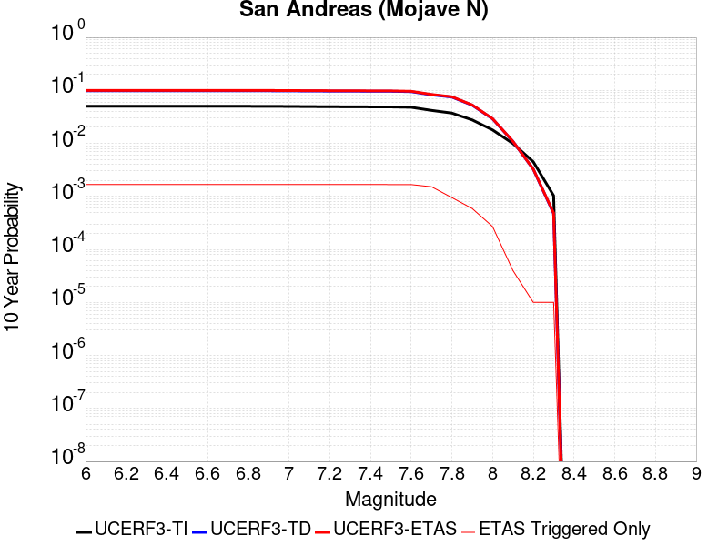 |

| Magnitude | 1 wk TI Prob | 1 wk TD Prob | 1 wk ETAS Prob | 1 wk ETAS/TD Gain | 1 wk ETAS Triggered Only | 1 mo TI Prob | 1 mo TD Prob | 1 mo ETAS Prob | 1 mo ETAS/TD Gain | 1 mo ETAS Triggered Only | 1 yr TI Prob | 1 yr TD Prob | 1 yr ETAS Prob | 1 yr ETAS/TD Gain | 1 yr ETAS Triggered Only | 10 yr TI Prob | 10 yr TD Prob | 10 yr ETAS Prob | 10 yr ETAS/TD Gain | 10 yr ETAS Triggered Only |
|-----|-----|-----|-----|-----|-----|-----|-----|-----|-----|-----|-----|-----|-----|-----|-----|-----|-----|-----|-----|-----|
| 6.0 | 9.877682E-5 | 1.9435467E-4 | 2.2434883E-4 | 1.154327 | 3.0E-5 | 4.2326056E-4 | 8.326828E-4 | 0.0010824747 | 1.2999843 | 2.5E-4 | 0.0051410277 | 0.010090916 | 0.010942238 | 1.0843651 | 8.6E-4 | 0.05023708 | 0.09846656 | 0.09998114 | 1.0153816 | 0.00168 |
| 6.1 | 9.877682E-5 | 1.9435467E-4 | 2.2434883E-4 | 1.154327 | 3.0E-5 | 4.2326056E-4 | 8.326828E-4 | 0.0010824747 | 1.2999843 | 2.5E-4 | 0.0051410277 | 0.010090916 | 0.010942238 | 1.0843651 | 8.6E-4 | 0.05023708 | 0.09846656 | 0.09998114 | 1.0153816 | 0.00168 |
| 6.2 | 9.877682E-5 | 1.9435467E-4 | 2.2434883E-4 | 1.154327 | 3.0E-5 | 4.2326056E-4 | 8.326828E-4 | 0.0010824747 | 1.2999843 | 2.5E-4 | 0.0051410277 | 0.010090916 | 0.010942238 | 1.0843651 | 8.6E-4 | 0.05023708 | 0.09846656 | 0.09998114 | 1.0153816 | 0.00168 |
| 6.3 | 9.877682E-5 | 1.9435467E-4 | 2.2434883E-4 | 1.154327 | 3.0E-5 | 4.2326056E-4 | 8.326828E-4 | 0.0010824747 | 1.2999843 | 2.5E-4 | 0.0051410277 | 0.010090916 | 0.010942238 | 1.0843651 | 8.6E-4 | 0.05023708 | 0.09846656 | 0.09998114 | 1.0153816 | 0.00168 |
| 6.4 | 9.877682E-5 | 1.9435467E-4 | 2.2434883E-4 | 1.154327 | 3.0E-5 | 4.2326056E-4 | 8.326828E-4 | 0.0010824747 | 1.2999843 | 2.5E-4 | 0.0051410277 | 0.010090916 | 0.010942238 | 1.0843651 | 8.6E-4 | 0.05023708 | 0.09846656 | 0.09998114 | 1.0153816 | 0.00168 |
| 6.5 | 9.861474E-5 | 1.9409222E-4 | 2.240864E-4 | 1.1545357 | 3.0E-5 | 4.2256617E-4 | 8.3155883E-4 | 0.001081351 | 1.3003902 | 2.5E-4 | 0.0051326132 | 0.010077358 | 0.010928691 | 1.0844798 | 8.6E-4 | 0.050156746 | 0.09834433 | 0.09985911 | 1.0154028 | 0.00168 |
| 6.6 | 9.861474E-5 | 1.9409222E-4 | 2.240864E-4 | 1.1545357 | 3.0E-5 | 4.2256617E-4 | 8.3155883E-4 | 0.001081351 | 1.3003902 | 2.5E-4 | 0.0051326132 | 0.010077358 | 0.010928691 | 1.0844798 | 8.6E-4 | 0.050156746 | 0.09834433 | 0.09985911 | 1.0154028 | 0.00168 |
| 6.7 | 9.8552715E-5 | 1.9399171E-4 | 2.2398589E-4 | 1.1546158 | 3.0E-5 | 4.223004E-4 | 8.3112833E-4 | 0.0010809206 | 1.3005459 | 2.5E-4 | 0.0051293927 | 0.010072165 | 0.010923503 | 1.0845238 | 8.6E-4 | 0.050125998 | 0.09829751 | 0.099812366 | 1.015411 | 0.00168 |
| 6.8 | 9.8464974E-5 | 1.9384324E-4 | 2.2383741E-4 | 1.1547343 | 3.0E-5 | 4.219245E-4 | 8.304924E-4 | 0.0010802848 | 1.3007762 | 2.5E-4 | 0.0051248376 | 0.010064495 | 0.010915839 | 1.0845889 | 8.6E-4 | 0.05008251 | 0.0982275 | 0.09974248 | 1.0154232 | 0.00168 |
| 6.9 | 9.825824E-5 | 1.9352314E-4 | 2.2351735E-4 | 1.1549902 | 3.0E-5 | 4.2103877E-4 | 8.2912145E-4 | 0.0010789142 | 1.301274 | 2.5E-4 | 0.0051141046 | 0.010047957 | 0.0108993165 | 1.0847296 | 8.6E-4 | 0.049980022 | 0.098076545 | 0.09959177 | 1.0154495 | 0.00168 |
| 7.0 | 9.781462E-5 | 1.928364E-4 | 2.2283061E-4 | 1.1555423 | 3.0E-5 | 4.1913814E-4 | 8.2618016E-4 | 0.0010759736 | 1.3023474 | 2.5E-4 | 0.005091073 | 0.010012477 | 0.010863866 | 1.0850328 | 8.6E-4 | 0.04976007 | 0.0977528 | 0.09926858 | 1.0155061 | 0.00168 |
| 7.1 | 9.7121134E-5 | 1.9185297E-4 | 2.2184722E-4 | 1.1563398 | 3.0E-5 | 4.1616702E-4 | 8.2196813E-4 | 0.0010717626 | 1.3038981 | 2.5E-4 | 0.005055068 | 0.009961666 | 0.010813098 | 1.0854709 | 8.6E-4 | 0.04941613 | 0.09728914 | 0.098805696 | 1.0155882 | 0.00168 |
| 7.2 | 9.663819E-5 | 1.9116043E-4 | 2.211547E-4 | 1.1569062 | 3.0E-5 | 4.1409794E-4 | 8.19002E-4 | 0.0010687972 | 1.3049996 | 2.5E-4 | 0.0050299936 | 0.009925882 | 0.010777346 | 1.0857822 | 8.6E-4 | 0.049176537 | 0.09696228 | 0.09847938 | 1.0156463 | 0.00168 |
| 7.3 | 9.6277574E-5 | 1.9068507E-4 | 2.2067936E-4 | 1.1572975 | 3.0E-5 | 4.125529E-4 | 8.16966E-4 | 0.0010667618 | 1.3057603 | 2.5E-4 | 0.0050112694 | 0.00990132 | 0.010752805 | 1.0859971 | 8.6E-4 | 0.04899759 | 0.09673555 | 0.098253034 | 1.015687 | 0.00168 |
| 7.4 | 9.593308E-5 | 1.9008234E-4 | 2.2007663E-4 | 1.1577964 | 3.0E-5 | 4.1107697E-4 | 8.1438443E-4 | 0.0010641809 | 1.3067303 | 2.5E-4 | 0.0049933824 | 0.009870174 | 0.010721686 | 1.0862712 | 8.6E-4 | 0.04882661 | 0.09645354 | 0.0979715 | 1.0157377 | 0.00168 |
| 7.5 | 9.561707E-5 | 1.8954265E-4 | 2.1953697E-4 | 1.1582457 | 3.0E-5 | 4.0972308E-4 | 8.12073E-4 | 0.00106187 | 1.3076041 | 2.5E-4 | 0.0049769743 | 0.009842287 | 0.010683921 | 1.085512 | 8.5E-4 | 0.048669744 | 0.09619955 | 0.097708896 | 1.0156897 | 0.00167 |
| 7.6 | 9.418194E-5 | 1.8606246E-4 | 2.1605688E-4 | 1.1612061 | 3.0E-5 | 4.0357444E-4 | 7.97167E-4 | 0.0010469677 | 1.3133606 | 2.5E-4 | 0.004902454 | 0.00966243 | 0.010504217 | 1.0871196 | 8.5E-4 | 0.047957025 | 0.09458092 | 0.09609297 | 1.0159868 | 0.00167 |
| 7.7 | 8.202141E-5 | 1.6052493E-4 | 1.905201E-4 | 1.1868569 | 3.0E-5 | 3.51473E-4 | 6.877826E-4 | 9.3761063E-4 | 1.3632369 | 2.5E-4 | 0.00427079 | 0.00834166 | 0.009115153 | 1.0927266 | 7.8E-4 | 0.04189639 | 0.082371704 | 0.083766505 | 1.016933 | 0.00152 |
| 7.8 | 7.2859846E-5 | 1.4544492E-4 | 1.5544347E-4 | 1.0687445 | 1.0E-5 | 3.1221908E-4 | 6.231865E-4 | 7.630993E-4 | 1.2245119 | 1.4E-4 | 0.003794643 | 0.0075609423 | 0.008037313 | 1.0630041 | 4.8E-4 | 0.037304975 | 0.07485102 | 0.075729914 | 1.0117419 | 9.5E-4 |
| 7.9 | 5.3874453E-5 | 1.0065284E-4 | 1.0065284E-4 | 1.0 | 0.0 | 2.3087008E-4 | 4.3129802E-4 | 5.0126784E-4 | 1.1622307 | 7.0E-5 | 0.0028072202 | 0.0052384217 | 0.005566693 | 1.062666 | 3.3E-4 | 0.02772022 | 0.05251603 | 0.053075045 | 1.0106447 | 5.9E-4 |
| 8.0 | 3.468538E-5 | 5.4373286E-5 | 5.4373286E-5 | 1.0 | 0.0 | 1.4864317E-4 | 2.3300757E-4 | 2.7299824E-4 | 1.1716282 | 4.0E-5 | 0.0018082283 | 0.0028331785 | 0.003002697 | 1.0598333 | 1.7E-4 | 0.017935853 | 0.02900292 | 0.029265089 | 1.0090394 | 2.7E-4 |
| 8.1 | 1.9152367E-5 | 1.9455974E-5 | 1.9455974E-5 | 1.0 | 0.0 | 8.207899E-5 | 8.338009E-5 | 9.3379254E-5 | 1.1199228 | 1.0E-5 | 9.988535E-4 | 0.0010146805 | 0.0010346601 | 1.0196906 | 2.0E-5 | 0.009943757 | 0.010884172 | 0.010923737 | 1.003635 | 4.0E-5 |
| 8.2 | 8.643924E-6 | 5.49522E-6 | 5.49522E-6 | 1.0 | 0.0 | 3.704486E-5 | 2.355073E-5 | 2.355073E-5 | 1.0 | 0.0 | 4.5092785E-4 | 2.866925E-4 | 2.866925E-4 | 1.0 | 0.0 | 0.0045001395 | 0.0032598388 | 0.0032698063 | 1.0030576 | 1.0E-5 |
| 8.3 | 1.983087E-6 | 7.693574E-7 | 7.693574E-7 | 1.0 | 0.0 | 8.498917E-6 | 3.297242E-6 | 3.297242E-6 | 1.0 | 0.0 | 1.034694E-4 | 4.01432E-5 | 4.01432E-5 | 1.0 | 0.0 | 0.0010342124 | 4.7390026E-4 | 4.8389554E-4 | 1.0210915 | 1.0E-5 |

## Nelson Lake
*[(top)](#table-of-contents)*

| 1 Week | 1 Month | 1 Year | 10 Year |
|-----|-----|-----|-----|
|  |  |  |  |

| Magnitude | 1 wk TI Prob | 1 wk TD Prob | 1 wk ETAS Prob | 1 wk ETAS/TD Gain | 1 wk ETAS Triggered Only | 1 mo TI Prob | 1 mo TD Prob | 1 mo ETAS Prob | 1 mo ETAS/TD Gain | 1 mo ETAS Triggered Only | 1 yr TI Prob | 1 yr TD Prob | 1 yr ETAS Prob | 1 yr ETAS/TD Gain | 1 yr ETAS Triggered Only | 10 yr TI Prob | 10 yr TD Prob | 10 yr ETAS Prob | 10 yr ETAS/TD Gain | 10 yr ETAS Triggered Only |
|-----|-----|-----|-----|-----|-----|-----|-----|-----|-----|-----|-----|-----|-----|-----|-----|-----|-----|-----|-----|-----|
| 6.0 | 9.913453E-6 | 1.0192408E-5 | 5.0192E-5 | 4.92445 | 4.0E-5 | 4.2485535E-5 | 4.3681073E-5 | 2.0367409E-4 | 4.6627536 | 1.6E-4 | 5.1713863E-4 | 5.3169765E-4 | 0.001151368 | 2.1654563 | 6.2E-4 | 0.0051593683 | 0.0053052832 | 0.0067276964 | 1.2681127 | 0.00143 |
| 6.1 | 9.913453E-6 | 1.0192408E-5 | 5.0192E-5 | 4.92445 | 4.0E-5 | 4.2485535E-5 | 4.3681073E-5 | 2.0367409E-4 | 4.6627536 | 1.6E-4 | 5.1713863E-4 | 5.3169765E-4 | 0.001151368 | 2.1654563 | 6.2E-4 | 0.0051593683 | 0.0053052832 | 0.0067276964 | 1.2681127 | 0.00143 |
| 6.2 | 4.5596407E-6 | 4.696388E-6 | 3.4696248E-5 | 7.387858 | 3.0E-5 | 1.954117E-5 | 2.0127229E-5 | 1.20125216E-4 | 5.968294 | 1.0E-4 | 2.3788778E-4 | 2.4502273E-4 | 5.349517E-4 | 2.1832738 | 2.9E-4 | 0.0023763329 | 0.0024476517 | 0.0030860852 | 1.260835 | 6.4E-4 |
| 6.3 | 4.5596407E-6 | 4.696388E-6 | 3.4696248E-5 | 7.387858 | 3.0E-5 | 1.954117E-5 | 2.0127229E-5 | 1.20125216E-4 | 5.968294 | 1.0E-4 | 2.3788778E-4 | 2.4502273E-4 | 5.349517E-4 | 2.1832738 | 2.9E-4 | 0.0023763329 | 0.0024476517 | 0.0030860852 | 1.260835 | 6.4E-4 |
| 6.4 | 3.4025713E-6 | 3.509956E-6 | 3.3509852E-5 | 9.547086 | 3.0E-5 | 1.4582367E-5 | 1.5042587E-5 | 8.504153E-5 | 5.6533847 | 7.0E-5 | 1.7752586E-4 | 1.8312894E-4 | 3.9309048E-4 | 2.146523 | 2.1E-4 | 0.001773841 | 0.0018298633 | 0.00227904 | 1.24547 | 4.5E-4 |
| 6.5 | 2.8352947E-6 | 2.927907E-6 | 1.2927878E-5 | 4.415399 | 1.0E-5 | 1.2151207E-5 | 1.25481165E-5 | 4.254774E-5 | 3.390767 | 3.0E-5 | 1.479309E-4 | 1.5276336E-4 | 3.127389E-4 | 2.0472116 | 1.6E-4 | 0.0014783246 | 0.0015266574 | 0.0018861077 | 1.2354493 | 3.6E-4 |
| 6.6 | 2.251518E-6 | 2.3291102E-6 | 1.23290865E-5 | 5.293475 | 1.0E-5 | 9.649328E-6 | 9.981866E-6 | 3.9981565E-5 | 4.00542 | 3.0E-5 | 1.1747423E-4 | 1.2152307E-4 | 2.7150483E-4 | 2.2341835 | 1.5E-4 | 0.0011741214 | 0.001214628 | 0.0015242514 | 1.2549121 | 3.1E-4 |
| 6.7 | 1.8911853E-6 | 1.959177E-6 | 1.1959158E-5 | 6.1041737 | 1.0E-5 | 8.105055E-6 | 8.39645E-6 | 3.8396196E-5 | 4.572909 | 3.0E-5 | 9.867457E-5 | 1.0222256E-4 | 2.5220722E-4 | 2.4672365 | 1.5E-4 | 9.863076E-4 | 0.0010218129 | 0.0013215063 | 1.2932959 | 3.0E-4 |
| 6.8 | 1.4874814E-6 | 1.5438616E-6 | 1.5438616E-6 | 1.0 | 0.0 | 6.374905E-6 | 6.6165358E-6 | 2.6616404E-5 | 4.02271 | 2.0E-5 | 7.76117E-5 | 8.0553866E-5 | 2.105434E-4 | 2.613697 | 1.3E-4 | 7.75846E-4 | 8.0529775E-4 | 0.0010550964 | 1.3101941 | 2.5E-4 |
| 6.9 | 6.835972E-7 | 7.140097E-7 | 7.140097E-7 | 1.0 | 0.0 | 2.9296991E-6 | 3.0600397E-6 | 1.3060009E-5 | 4.2679214 | 1.0E-5 | 3.56685E-5 | 3.7255664E-5 | 1.1725268E-4 | 3.1472445 | 8.0E-5 | 3.5662777E-4 | 3.7252545E-4 | 5.02477E-4 | 1.3488394 | 1.3E-4 |

## Lenwood-Lockhart-Old Woman Springs
*[(top)](#table-of-contents)*

| 1 Week | 1 Month | 1 Year | 10 Year |
|-----|-----|-----|-----|
|  |  |  | 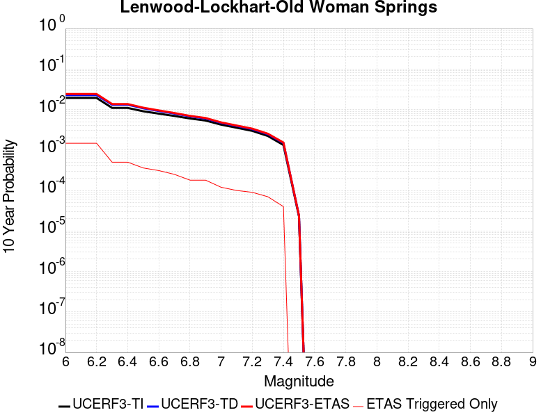 |

| Magnitude | 1 wk TI Prob | 1 wk TD Prob | 1 wk ETAS Prob | 1 wk ETAS/TD Gain | 1 wk ETAS Triggered Only | 1 mo TI Prob | 1 mo TD Prob | 1 mo ETAS Prob | 1 mo ETAS/TD Gain | 1 mo ETAS Triggered Only | 1 yr TI Prob | 1 yr TD Prob | 1 yr ETAS Prob | 1 yr ETAS/TD Gain | 1 yr ETAS Triggered Only | 10 yr TI Prob | 10 yr TD Prob | 10 yr ETAS Prob | 10 yr ETAS/TD Gain | 10 yr ETAS Triggered Only |
|-----|-----|-----|-----|-----|-----|-----|-----|-----|-----|-----|-----|-----|-----|-----|-----|-----|-----|-----|-----|-----|
| 6.0 | 3.744542E-5 | 4.3964304E-5 | 6.396342E-5 | 1.4548945 | 2.0E-5 | 1.604705E-4 | 1.8840581E-4 | 3.1838132E-4 | 1.6898699 | 1.3E-4 | 0.0019519776 | 0.0022915998 | 0.002910179 | 1.2699333 | 6.2E-4 | 0.019349206 | 0.0226977 | 0.024134334 | 1.0632943 | 0.00147 |
| 6.1 | 3.744542E-5 | 4.3964304E-5 | 6.396342E-5 | 1.4548945 | 2.0E-5 | 1.604705E-4 | 1.8840581E-4 | 3.1838132E-4 | 1.6898699 | 1.3E-4 | 0.0019519776 | 0.0022915998 | 0.002910179 | 1.2699333 | 6.2E-4 | 0.019349206 | 0.0226977 | 0.024134334 | 1.0632943 | 0.00147 |
| 6.2 | 3.744542E-5 | 4.3964304E-5 | 6.396342E-5 | 1.4548945 | 2.0E-5 | 1.604705E-4 | 1.8840581E-4 | 3.1838132E-4 | 1.6898699 | 1.3E-4 | 0.0019519776 | 0.0022915998 | 0.002910179 | 1.2699333 | 6.2E-4 | 0.019349206 | 0.0226977 | 0.024134334 | 1.0632943 | 0.00147 |
| 6.3 | 2.1079984E-5 | 2.5354084E-5 | 2.5354084E-5 | 1.0 | 0.0 | 9.0339665E-5 | 1.0865595E-4 | 1.3865269E-4 | 1.2760708 | 3.0E-5 | 0.0010993304 | 0.0013221033 | 0.0015517992 | 1.1737353 | 2.3E-4 | 0.010939079 | 0.013144593 | 0.0136380205 | 1.0375384 | 5.0E-4 |
| 6.4 | 2.1079984E-5 | 2.5354084E-5 | 2.5354084E-5 | 1.0 | 0.0 | 9.0339665E-5 | 1.0865595E-4 | 1.3865269E-4 | 1.2760708 | 3.0E-5 | 0.0010993304 | 0.0013221033 | 0.0015517992 | 1.1737353 | 2.3E-4 | 0.010939079 | 0.013144593 | 0.0136380205 | 1.0375384 | 5.0E-4 |
| 6.5 | 1.7397282E-5 | 2.0662914E-5 | 2.0662914E-5 | 1.0 | 0.0 | 7.455765E-5 | 8.8552406E-5 | 1.18549746E-4 | 1.3387525 | 3.0E-5 | 9.073613E-4 | 0.001077604 | 0.0012274424 | 1.1390477 | 1.5E-4 | 0.009036654 | 0.010725081 | 0.01108122 | 1.0332062 | 3.6E-4 |
| 6.6 | 1.52050325E-5 | 1.7680117E-5 | 1.7680117E-5 | 1.0 | 0.0 | 6.51628E-5 | 7.576977E-5 | 1.05767496E-4 | 1.3959063 | 3.0E-5 | 7.9306826E-4 | 9.221144E-4 | 0.0010619853 | 1.151685 | 1.4E-4 | 0.007902439 | 0.009183745 | 0.009490898 | 1.0334452 | 3.1E-4 |
| 6.7 | 1.332523E-5 | 1.5264359E-5 | 1.5264359E-5 | 1.0 | 0.0 | 5.7106878E-5 | 6.541707E-5 | 8.541576E-5 | 1.3057106 | 2.0E-5 | 6.950544E-4 | 7.9616765E-4 | 9.0608007E-4 | 1.1380519 | 1.1E-4 | 0.006928845 | 0.007933783 | 0.008181799 | 1.0312608 | 2.5E-4 |
| 6.8 | 1.1525329E-5 | 1.3031262E-5 | 1.3031262E-5 | 1.0 | 0.0 | 4.9393333E-5 | 5.5847093E-5 | 7.584598E-5 | 1.3581007 | 2.0E-5 | 6.011979E-4 | 6.797305E-4 | 7.696693E-4 | 1.1323154 | 9.0E-5 | 0.00599574 | 0.0067769657 | 0.006955746 | 1.0263805 | 1.8E-4 |
| 6.9 | 1.0253909E-5 | 1.1514676E-5 | 1.1514676E-5 | 1.0 | 0.0 | 4.3944583E-5 | 4.93477E-5 | 6.934671E-5 | 1.4052674 | 2.0E-5 | 5.3489394E-4 | 6.006462E-4 | 6.9059216E-4 | 1.1497486 | 9.0E-5 | 0.0053360825 | 0.005990607 | 0.006169529 | 1.029867 | 1.8E-4 |
| 7.0 | 8.104563E-6 | 8.991446E-6 | 8.991446E-6 | 1.0 | 0.0 | 3.4733377E-5 | 3.8534214E-5 | 4.8533828E-5 | 1.2594997 | 1.0E-5 | 4.2279682E-4 | 4.6905546E-4 | 5.290273E-4 | 1.1278566 | 6.0E-5 | 0.0042199334 | 0.004680902 | 0.0048003406 | 1.025516 | 1.2E-4 |
| 7.1 | 6.7986157E-6 | 7.515946E-6 | 7.515946E-6 | 1.0 | 0.0 | 2.91366E-5 | 3.221081E-5 | 4.221049E-5 | 1.3104447 | 1.0E-5 | 3.5468035E-4 | 3.9209818E-4 | 4.5207466E-4 | 1.1529629 | 6.0E-5 | 0.003541148 | 0.0039142803 | 0.004013889 | 1.0254475 | 1.0E-4 |
| 7.2 | 5.6893327E-6 | 6.280115E-6 | 6.280115E-6 | 1.0 | 0.0 | 2.4382627E-5 | 2.6914513E-5 | 3.6914244E-5 | 1.3715367 | 1.0E-5 | 2.9681803E-4 | 3.2763692E-4 | 3.8761724E-4 | 1.1830696 | 6.0E-5 | 0.002964219 | 0.0032717374 | 0.0033614428 | 1.0274184 | 9.0E-5 |
| 7.3 | 4.253348E-6 | 4.7069766E-6 | 4.7069766E-6 | 1.0 | 0.0 | 1.8228506E-5 | 2.0172612E-5 | 3.017241E-5 | 1.4957117 | 1.0E-5 | 2.2190946E-4 | 2.455757E-4 | 2.8556588E-4 | 1.1628425 | 4.0E-5 | 0.00221688 | 0.0024532243 | 0.0025230525 | 1.0284638 | 7.0E-5 |
| 7.4 | 2.5448119E-6 | 2.8520785E-6 | 2.8520785E-6 | 1.0 | 0.0 | 1.0906291E-5 | 1.2223146E-5 | 1.2223146E-5 | 1.0 | 0.0 | 1.3277601E-4 | 1.4880829E-4 | 1.7880384E-4 | 1.2015717 | 3.0E-5 | 0.001326967 | 0.0014872487 | 0.0015271892 | 1.0268553 | 4.0E-5 |
| 7.5 | 4.3706837E-8 | 4.5630156E-8 | 4.5630156E-8 | 1.0 | 0.0 | 1.8731501E-7 | 1.955578E-7 | 1.955578E-7 | 1.0 | 0.0 | 2.2805577E-6 | 2.380914E-6 | 2.380914E-6 | 1.0 | 0.0 | 2.2805343E-5 | 2.3808941E-5 | 2.3808941E-5 | 1.0 | 0.0 |

## Towne Pass
*[(top)](#table-of-contents)*

| 1 Week | 1 Month | 1 Year | 10 Year |
|-----|-----|-----|-----|
|  |  |  |  |

| Magnitude | 1 wk TI Prob | 1 wk TD Prob | 1 wk ETAS Prob | 1 wk ETAS/TD Gain | 1 wk ETAS Triggered Only | 1 mo TI Prob | 1 mo TD Prob | 1 mo ETAS Prob | 1 mo ETAS/TD Gain | 1 mo ETAS Triggered Only | 1 yr TI Prob | 1 yr TD Prob | 1 yr ETAS Prob | 1 yr ETAS/TD Gain | 1 yr ETAS Triggered Only | 10 yr TI Prob | 10 yr TD Prob | 10 yr ETAS Prob | 10 yr ETAS/TD Gain | 10 yr ETAS Triggered Only |
|-----|-----|-----|-----|-----|-----|-----|-----|-----|-----|-----|-----|-----|-----|-----|-----|-----|-----|-----|-----|-----|
| 6.0 | 3.849728E-6 | 3.8945745E-6 | 2.3894496E-5 | 6.1353292 | 2.0E-5 | 1.649873E-5 | 1.669095E-5 | 1.1668928E-4 | 6.9911704 | 1.0E-4 | 2.0085352E-4 | 2.0319775E-4 | 6.930982E-4 | 3.410954 | 4.9E-4 | 0.0020067208 | 0.0020305486 | 0.0032680307 | 1.6094323 | 0.00124 |
| 6.1 | 3.849728E-6 | 3.8945745E-6 | 2.3894496E-5 | 6.1353292 | 2.0E-5 | 1.649873E-5 | 1.669095E-5 | 1.1668928E-4 | 6.9911704 | 1.0E-4 | 2.0085352E-4 | 2.0319775E-4 | 6.930982E-4 | 3.410954 | 4.9E-4 | 0.0020067208 | 0.0020305486 | 0.0032680307 | 1.6094323 | 0.00124 |
| 6.2 | 3.849728E-6 | 3.8945745E-6 | 2.3894496E-5 | 6.1353292 | 2.0E-5 | 1.649873E-5 | 1.669095E-5 | 1.1668928E-4 | 6.9911704 | 1.0E-4 | 2.0085352E-4 | 2.0319775E-4 | 6.930982E-4 | 3.410954 | 4.9E-4 | 0.0020067208 | 0.0020305486 | 0.0032680307 | 1.6094323 | 0.00124 |
| 6.3 | 3.849728E-6 | 3.8945745E-6 | 2.3894496E-5 | 6.1353292 | 2.0E-5 | 1.649873E-5 | 1.669095E-5 | 1.1668928E-4 | 6.9911704 | 1.0E-4 | 2.0085352E-4 | 2.0319775E-4 | 6.930982E-4 | 3.410954 | 4.9E-4 | 0.0020067208 | 0.0020305486 | 0.0032680307 | 1.6094323 | 0.00124 |
| 6.4 | 3.849728E-6 | 3.8945745E-6 | 2.3894496E-5 | 6.1353292 | 2.0E-5 | 1.649873E-5 | 1.669095E-5 | 1.1668928E-4 | 6.9911704 | 1.0E-4 | 2.0085352E-4 | 2.0319775E-4 | 6.930982E-4 | 3.410954 | 4.9E-4 | 0.0020067208 | 0.0020305486 | 0.0032680307 | 1.6094323 | 0.00124 |
| 6.5 | 1.1953545E-6 | 1.203065E-6 | 1.203065E-6 | 1.0 | 0.0 | 5.1229376E-6 | 5.1559837E-6 | 2.515588E-5 | 4.8789682 | 2.0E-5 | 6.236998E-5 | 6.277241E-5 | 1.4276739E-4 | 2.2743652 | 8.0E-5 | 6.235248E-4 | 6.275585E-4 | 8.973891E-4 | 1.4299687 | 2.7E-4 |
| 6.6 | 1.1953545E-6 | 1.203065E-6 | 1.203065E-6 | 1.0 | 0.0 | 5.1229376E-6 | 5.1559837E-6 | 2.515588E-5 | 4.8789682 | 2.0E-5 | 6.236998E-5 | 6.277241E-5 | 1.4276739E-4 | 2.2743652 | 8.0E-5 | 6.235248E-4 | 6.275585E-4 | 8.973891E-4 | 1.4299687 | 2.7E-4 |
| 6.7 | 8.375951E-7 | 8.410778E-7 | 8.410778E-7 | 1.0 | 0.0 | 3.5896885E-6 | 3.6046144E-6 | 2.3604542E-5 | 6.548424 | 2.0E-5 | 4.370358E-5 | 4.3885353E-5 | 1.13882284E-4 | 2.5949953 | 7.0E-5 | 4.3694986E-4 | 4.387726E-4 | 5.8870675E-4 | 1.3417127 | 1.5E-4 |
| 6.8 | 6.38041E-7 | 6.3922516E-7 | 6.3922516E-7 | 1.0 | 0.0 | 2.7344586E-6 | 2.7395338E-6 | 2.273948E-5 | 8.300492 | 2.0E-5 | 3.3291526E-5 | 3.335335E-5 | 1.0335102E-4 | 3.0986698 | 7.0E-5 | 3.3286537E-4 | 3.3348726E-4 | 4.5344725E-4 | 1.3597138 | 1.2E-4 |
| 6.9 | 5.3460053E-7 | 5.3454215E-7 | 5.3454215E-7 | 1.0 | 0.0 | 2.2911431E-6 | 2.290893E-6 | 2.290893E-6 | 1.0 | 0.0 | 2.789431E-5 | 2.78913E-5 | 7.7889905E-5 | 2.7926238 | 5.0E-5 | 2.789081E-4 | 2.788813E-4 | 3.5885902E-4 | 1.2867804 | 8.0E-5 |
| 7.0 | 3.557783E-7 | 3.5324976E-7 | 3.5324976E-7 | 1.0 | 0.0 | 1.5247632E-6 | 1.5139268E-6 | 1.5139268E-6 | 1.0 | 0.0 | 1.8563835E-5 | 1.843191E-5 | 5.8431175E-5 | 3.1701093 | 4.0E-5 | 1.8562283E-4 | 1.8430466E-4 | 2.2429728E-4 | 1.2169919 | 4.0E-5 |
| 7.1 | 3.037942E-7 | 3.0002903E-7 | 3.0002903E-7 | 1.0 | 0.0 | 1.3019744E-6 | 1.285838E-6 | 1.285838E-6 | 1.0 | 0.0 | 1.5851423E-5 | 1.5654974E-5 | 5.565435E-5 | 3.5550585 | 4.0E-5 | 1.5850292E-4 | 1.5653945E-4 | 1.9653319E-4 | 1.2554866 | 4.0E-5 |
| 7.2 | 2.0808248E-7 | 2.0218252E-7 | 2.0218252E-7 | 1.0 | 0.0 | 8.917818E-7 | 8.6649624E-7 | 8.6649624E-7 | 1.0 | 0.0 | 1.0857389E-5 | 1.0549546E-5 | 5.0549123E-5 | 4.7915926 | 4.0E-5 | 1.0856859E-4 | 1.0549091E-4 | 1.4548669E-4 | 1.3791395 | 4.0E-5 |
| 7.3 | 1.1162073E-7 | 1.0637251E-7 | 1.0637251E-7 | 1.0 | 0.0 | 4.7837443E-7 | 4.5588212E-7 | 4.5588212E-7 | 1.0 | 0.0 | 5.8241935E-6 | 5.5503524E-6 | 3.5550187E-5 | 6.405032 | 3.0E-5 | 5.8240406E-5 | 5.550234E-5 | 8.550067E-5 | 1.5404878 | 3.0E-5 |

## San Andreas (San Bernardino N)
*[(top)](#table-of-contents)*

| 1 Week | 1 Month | 1 Year | 10 Year |
|-----|-----|-----|-----|
|  |  |  |  |

| Magnitude | 1 wk TI Prob | 1 wk TD Prob | 1 wk ETAS Prob | 1 wk ETAS/TD Gain | 1 wk ETAS Triggered Only | 1 mo TI Prob | 1 mo TD Prob | 1 mo ETAS Prob | 1 mo ETAS/TD Gain | 1 mo ETAS Triggered Only | 1 yr TI Prob | 1 yr TD Prob | 1 yr ETAS Prob | 1 yr ETAS/TD Gain | 1 yr ETAS Triggered Only | 10 yr TI Prob | 10 yr TD Prob | 10 yr ETAS Prob | 10 yr ETAS/TD Gain | 10 yr ETAS Triggered Only |
|-----|-----|-----|-----|-----|-----|-----|-----|-----|-----|-----|-----|-----|-----|-----|-----|-----|-----|-----|-----|-----|
| 6.0 | 1.4273766E-4 | 3.1635934E-4 | 3.1635934E-4 | 1.0 | 0.0 | 6.115894E-4 | 0.0013551271 | 0.0014450052 | 1.0663245 | 9.0E-5 | 0.0074207084 | 0.016375363 | 0.016778648 | 1.0246276 | 4.1E-4 | 0.07177748 | 0.15038711 | 0.15112627 | 1.0049151 | 8.7E-4 |
| 6.1 | 1.4273766E-4 | 3.1635934E-4 | 3.1635934E-4 | 1.0 | 0.0 | 6.115894E-4 | 0.0013551271 | 0.0014450052 | 1.0663245 | 9.0E-5 | 0.0074207084 | 0.016375363 | 0.016778648 | 1.0246276 | 4.1E-4 | 0.07177748 | 0.15038711 | 0.15112627 | 1.0049151 | 8.7E-4 |
| 6.2 | 1.4273766E-4 | 3.1635934E-4 | 3.1635934E-4 | 1.0 | 0.0 | 6.115894E-4 | 0.0013551271 | 0.0014450052 | 1.0663245 | 9.0E-5 | 0.0074207084 | 0.016375363 | 0.016778648 | 1.0246276 | 4.1E-4 | 0.07177748 | 0.15038711 | 0.15112627 | 1.0049151 | 8.7E-4 |
| 6.3 | 1.3730655E-4 | 3.0540637E-4 | 3.0540637E-4 | 1.0 | 0.0 | 5.883239E-4 | 0.0013082335 | 0.0013981158 | 1.0687051 | 9.0E-5 | 0.0071393442 | 0.015812824 | 0.01621634 | 1.0255183 | 4.1E-4 | 0.06914291 | 0.14568701 | 0.14643027 | 1.0051017 | 8.7E-4 |
| 6.4 | 1.3730655E-4 | 3.0540637E-4 | 3.0540637E-4 | 1.0 | 0.0 | 5.883239E-4 | 0.0013082335 | 0.0013981158 | 1.0687051 | 9.0E-5 | 0.0071393442 | 0.015812824 | 0.01621634 | 1.0255183 | 4.1E-4 | 0.06914291 | 0.14568701 | 0.14643027 | 1.0051017 | 8.7E-4 |
| 6.5 | 1.2942807E-4 | 2.8954886E-4 | 2.8954886E-4 | 1.0 | 0.0 | 5.545738E-4 | 0.0012403387 | 0.001330227 | 1.0724708 | 9.0E-5 | 0.0067310524 | 0.014997809 | 0.01540166 | 1.0269274 | 4.1E-4 | 0.06530788 | 0.13882978 | 0.13957039 | 1.0053346 | 8.6E-4 |
| 6.6 | 1.1125901E-4 | 2.5393223E-4 | 2.5393223E-4 | 1.0 | 0.0 | 4.767372E-4 | 0.0010878295 | 0.0011777316 | 1.0826435 | 9.0E-5 | 0.005788839 | 0.013164529 | 0.013559262 | 1.0299847 | 4.0E-4 | 0.056403454 | 0.12311955 | 0.1238649 | 1.0060538 | 8.5E-4 |
| 6.7 | 1.02209575E-4 | 2.3527986E-4 | 2.3527986E-4 | 1.0 | 0.0 | 4.3796748E-4 | 0.001007954 | 0.0010978633 | 1.0891998 | 9.0E-5 | 0.0053192247 | 0.012203212 | 0.012598331 | 1.0323782 | 4.0E-4 | 0.051936906 | 0.11491149 | 0.11565496 | 1.00647 | 8.4E-4 |
| 6.8 | 9.610582E-5 | 2.2053412E-4 | 2.2053412E-4 | 1.0 | 0.0 | 4.1181705E-4 | 9.448046E-4 | 0.0010347195 | 1.0951678 | 9.0E-5 | 0.0050023515 | 0.011442591 | 0.011838014 | 1.0345571 | 4.0E-4 | 0.048912346 | 0.10831282 | 0.10905293 | 1.006833 | 8.3E-4 |
| 6.9 | 9.3877505E-5 | 2.150883E-4 | 2.150883E-4 | 1.0 | 0.0 | 4.0227012E-4 | 9.2148193E-4 | 0.001011399 | 1.0975788 | 9.0E-5 | 0.0048866454 | 0.011161577 | 0.011557112 | 1.0354372 | 4.0E-4 | 0.04780577 | 0.1059029 | 0.106645 | 1.0070074 | 8.3E-4 |
| 7.0 | 9.1019785E-5 | 2.0835544E-4 | 2.0835544E-4 | 1.0 | 0.0 | 3.900265E-4 | 8.926469E-4 | 9.825666E-4 | 1.1007338 | 9.0E-5 | 0.0047382377 | 0.010814046 | 0.01120972 | 1.0365889 | 4.0E-4 | 0.046384744 | 0.10287278 | 0.10359945 | 1.0070637 | 8.1E-4 |
| 7.1 | 8.771155E-5 | 2.0009889E-4 | 2.0009889E-4 | 1.0 | 0.0 | 3.758525E-4 | 8.5728534E-4 | 9.472082E-4 | 1.1048925 | 9.0E-5 | 0.0045664064 | 0.010387696 | 0.010773645 | 1.0371544 | 3.9E-4 | 0.044737056 | 0.09918398 | 0.09989563 | 1.007175 | 7.9E-4 |
| 7.2 | 8.0830236E-5 | 1.8415037E-4 | 1.8415037E-4 | 1.0 | 0.0 | 3.4636928E-4 | 7.8897737E-4 | 8.7890634E-4 | 1.1139817 | 9.0E-5 | 0.0042088944 | 0.009563598 | 0.009949869 | 1.0403897 | 3.9E-4 | 0.041300658 | 0.09191379 | 0.092631176 | 1.007805 | 7.9E-4 |
| 7.3 | 7.7668235E-5 | 1.7358093E-4 | 1.7358093E-4 | 1.0 | 0.0 | 3.328214E-4 | 7.437063E-4 | 8.3363935E-4 | 1.1209255 | 9.0E-5 | 0.0040445733 | 0.009017113 | 0.009403596 | 1.0428611 | 3.9E-4 | 0.03971748 | 0.08717959 | 0.087891586 | 1.008167 | 7.8E-4 |
| 7.4 | 7.520177E-5 | 1.657783E-4 | 1.657783E-4 | 1.0 | 0.0 | 3.2225347E-4 | 7.1028504E-4 | 8.002211E-4 | 1.1266197 | 9.0E-5 | 0.0039163795 | 0.008613498 | 0.009000139 | 1.0448878 | 3.9E-4 | 0.038480744 | 0.08363466 | 0.0843311 | 1.0083271 | 7.6E-4 |
| 7.5 | 7.274697E-5 | 1.5865144E-4 | 1.5865144E-4 | 1.0 | 0.0 | 3.1173544E-4 | 6.797576E-4 | 7.696965E-4 | 1.1323102 | 9.0E-5 | 0.003788775 | 0.008244702 | 0.008621569 | 1.0457102 | 3.8E-4 | 0.03724827 | 0.08035038 | 0.081040114 | 1.0085841 | 7.5E-4 |
| 7.6 | 7.1185845E-5 | 1.5434787E-4 | 1.5434787E-4 | 1.0 | 0.0 | 3.0504653E-4 | 6.6132325E-4 | 7.5126375E-4 | 1.1360008 | 9.0E-5 | 0.0037076178 | 0.008021939 | 0.00839889 | 1.0469902 | 3.8E-4 | 0.036463667 | 0.078339346 | 0.07903059 | 1.0088238 | 7.5E-4 |
| 7.7 | 6.709961E-5 | 1.4343053E-4 | 1.4343053E-4 | 1.0 | 0.0 | 2.8753807E-4 | 6.1455753E-4 | 7.045022E-4 | 1.1463568 | 9.0E-5 | 0.003495157 | 0.007456607 | 0.007833773 | 1.0505816 | 3.8E-4 | 0.034406938 | 0.07316601 | 0.07386114 | 1.0095006 | 7.5E-4 |
| 7.8 | 6.300812E-5 | 1.3225875E-4 | 1.3225875E-4 | 1.0 | 0.0 | 2.7000686E-4 | 5.6670007E-4 | 6.5664906E-4 | 1.1587242 | 9.0E-5 | 0.0032823787 | 0.0068777753 | 0.0072551616 | 1.0548704 | 3.8E-4 | 0.032343175 | 0.06781986 | 0.068518996 | 1.0103087 | 7.5E-4 |
| 7.9 | 4.983037E-5 | 9.7419856E-5 | 9.7419856E-5 | 1.0 | 0.0 | 2.1354125E-4 | 4.1744686E-4 | 4.8741765E-4 | 1.167616 | 7.0E-5 | 0.0025967648 | 0.005070582 | 0.0053989086 | 1.0647513 | 3.3E-4 | 0.025666296 | 0.050735 | 0.051295064 | 1.011039 | 5.9E-4 |
| 8.0 | 3.2211527E-5 | 5.341288E-5 | 5.341288E-5 | 1.0 | 0.0 | 1.380421E-4 | 2.2889227E-4 | 2.6888313E-4 | 1.1747147 | 4.0E-5 | 0.0016793669 | 0.002783204 | 0.0029527307 | 1.0609107 | 1.7E-4 | 0.016667323 | 0.028414162 | 0.028676491 | 1.0092323 | 2.7E-4 |
| 8.1 | 1.743376E-5 | 1.8874636E-5 | 1.8874636E-5 | 1.0 | 0.0 | 7.471398E-5 | 8.088879E-5 | 9.088798E-5 | 1.1236166 | 1.0E-5 | 9.0926304E-4 | 9.843768E-4 | 0.001004357 | 1.0202974 | 2.0E-5 | 0.009055517 | 0.010510205 | 0.010549785 | 1.0037658 | 4.0E-5 |
| 8.2 | 7.831616E-6 | 5.1737816E-6 | 5.1737816E-6 | 1.0 | 0.0 | 3.3563636E-5 | 2.217316E-5 | 2.217316E-5 | 1.0 | 0.0 | 4.0856065E-4 | 2.6992487E-4 | 2.6992487E-4 | 1.0 | 0.0 | 0.004078103 | 0.0030519657 | 0.0030619353 | 1.0032666 | 1.0E-5 |
| 8.3 | 1.983087E-6 | 7.693574E-7 | 7.693574E-7 | 1.0 | 0.0 | 8.498917E-6 | 3.297242E-6 | 3.297242E-6 | 1.0 | 0.0 | 1.034694E-4 | 4.01432E-5 | 4.01432E-5 | 1.0 | 0.0 | 0.0010342124 | 4.7390026E-4 | 4.8389554E-4 | 1.0210915 | 1.0E-5 |

## Bicycle Lake
*[(top)](#table-of-contents)*

| 1 Week | 1 Month | 1 Year | 10 Year |
|-----|-----|-----|-----|
|  |  |  |  |

| Magnitude | 1 wk TI Prob | 1 wk TD Prob | 1 wk ETAS Prob | 1 wk ETAS/TD Gain | 1 wk ETAS Triggered Only | 1 mo TI Prob | 1 mo TD Prob | 1 mo ETAS Prob | 1 mo ETAS/TD Gain | 1 mo ETAS Triggered Only | 1 yr TI Prob | 1 yr TD Prob | 1 yr ETAS Prob | 1 yr ETAS/TD Gain | 1 yr ETAS Triggered Only | 10 yr TI Prob | 10 yr TD Prob | 10 yr ETAS Prob | 10 yr ETAS/TD Gain | 10 yr ETAS Triggered Only |
|-----|-----|-----|-----|-----|-----|-----|-----|-----|-----|-----|-----|-----|-----|-----|-----|-----|-----|-----|-----|-----|
| 6.0 | 1.9621975E-5 | 2.2098558E-5 | 5.2097894E-5 | 2.3575246 | 3.0E-5 | 8.4091465E-5 | 9.470543E-5 | 1.5469975E-4 | 1.6334834 | 6.0E-5 | 0.0010233327 | 0.0011525637 | 0.0014821833 | 1.2859882 | 3.3E-4 | 0.01018633 | 0.011479173 | 0.012230449 | 1.0654469 | 7.6E-4 |
| 6.1 | 1.9621975E-5 | 2.2098558E-5 | 5.2097894E-5 | 2.3575246 | 3.0E-5 | 8.4091465E-5 | 9.470543E-5 | 1.5469975E-4 | 1.6334834 | 6.0E-5 | 0.0010233327 | 0.0011525637 | 0.0014821833 | 1.2859882 | 3.3E-4 | 0.01018633 | 0.011479173 | 0.012230449 | 1.0654469 | 7.6E-4 |
| 6.2 | 9.9971285E-6 | 1.1256391E-5 | 3.1256168E-5 | 2.7767484 | 2.0E-5 | 4.2844134E-5 | 4.824108E-5 | 7.823963E-5 | 1.6218467 | 3.0E-5 | 5.2150246E-4 | 5.8722886E-4 | 7.3714077E-4 | 1.255287 | 1.5E-4 | 0.0052028033 | 0.0058618775 | 0.0062297084 | 1.0627497 | 3.7E-4 |
| 6.3 | 9.589428E-6 | 1.0799068E-5 | 3.0798852E-5 | 2.8519917 | 2.0E-5 | 4.10969E-5 | 4.628119E-5 | 7.627981E-5 | 1.6481814 | 3.0E-5 | 5.002399E-4 | 5.633797E-4 | 7.033009E-4 | 1.2483603 | 1.4E-4 | 0.0049911533 | 0.0056246053 | 0.0059726364 | 1.0618765 | 3.5E-4 |
| 6.4 | 9.589428E-6 | 1.0799068E-5 | 3.0798852E-5 | 2.8519917 | 2.0E-5 | 4.10969E-5 | 4.628119E-5 | 7.627981E-5 | 1.6481814 | 3.0E-5 | 5.002399E-4 | 5.633797E-4 | 7.033009E-4 | 1.2483603 | 1.4E-4 | 0.0049911533 | 0.0056246053 | 0.0059726364 | 1.0618765 | 3.5E-4 |
| 6.5 | 5.557707E-6 | 6.286038E-6 | 2.6285912E-5 | 4.1816344 | 2.0E-5 | 2.3818526E-5 | 2.6940037E-5 | 5.693923E-5 | 2.1135542 | 3.0E-5 | 2.8995197E-4 | 3.2797246E-4 | 4.1794297E-4 | 1.2743232 | 9.0E-5 | 0.0028957394 | 0.0032775209 | 0.0034967999 | 1.066904 | 2.2E-4 |
| 6.6 | 4.8742945E-6 | 5.5136734E-6 | 1.5513619E-5 | 2.813663 | 1.0E-5 | 2.0889667E-5 | 2.3629962E-5 | 3.3629723E-5 | 1.4231815 | 1.0E-5 | 2.54302E-4 | 2.87683E-4 | 3.5766285E-4 | 1.2432534 | 7.0E-5 | 0.002540112 | 0.0028756752 | 0.0030651288 | 1.0658815 | 1.9E-4 |
| 6.7 | 3.991108E-6 | 4.5162255E-6 | 1.451618E-5 | 3.2142284 | 1.0E-5 | 1.7104636E-5 | 1.9355251E-5 | 2.9355058E-5 | 1.5166457 | 1.0E-5 | 2.0822904E-4 | 2.3565018E-4 | 3.056337E-4 | 1.2969805 | 7.0E-5 | 0.0020803404 | 0.0023565018 | 0.0025261012 | 1.0719708 | 1.7E-4 |

## Paradise
*[(top)](#table-of-contents)*

| 1 Week | 1 Month | 1 Year | 10 Year |
|-----|-----|-----|-----|
|  |  |  |  |

| Magnitude | 1 wk TI Prob | 1 wk TD Prob | 1 wk ETAS Prob | 1 wk ETAS/TD Gain | 1 wk ETAS Triggered Only | 1 mo TI Prob | 1 mo TD Prob | 1 mo ETAS Prob | 1 mo ETAS/TD Gain | 1 mo ETAS Triggered Only | 1 yr TI Prob | 1 yr TD Prob | 1 yr ETAS Prob | 1 yr ETAS/TD Gain | 1 yr ETAS Triggered Only | 10 yr TI Prob | 10 yr TD Prob | 10 yr ETAS Prob | 10 yr ETAS/TD Gain | 10 yr ETAS Triggered Only |
|-----|-----|-----|-----|-----|-----|-----|-----|-----|-----|-----|-----|-----|-----|-----|-----|-----|-----|-----|-----|-----|
| 6.0 | 1.4851273E-5 | 1.6695341E-5 | 3.6695008E-5 | 2.197919 | 2.0E-5 | 6.364676E-5 | 7.154963E-5 | 1.3154534E-4 | 1.8385187 | 6.0E-5 | 7.7462377E-4 | 8.707922E-4 | 0.0011405571 | 1.3097925 | 2.7E-4 | 0.0077192914 | 0.008676181 | 0.009370107 | 1.0799806 | 7.0E-4 |
| 6.1 | 1.4851273E-5 | 1.6695341E-5 | 3.6695008E-5 | 2.197919 | 2.0E-5 | 6.364676E-5 | 7.154963E-5 | 1.3154534E-4 | 1.8385187 | 6.0E-5 | 7.7462377E-4 | 8.707922E-4 | 0.0011405571 | 1.3097925 | 2.7E-4 | 0.0077192914 | 0.008676181 | 0.009370107 | 1.0799806 | 7.0E-4 |
| 6.2 | 1.4851273E-5 | 1.6695341E-5 | 3.6695008E-5 | 2.197919 | 2.0E-5 | 6.364676E-5 | 7.154963E-5 | 1.3154534E-4 | 1.8385187 | 6.0E-5 | 7.7462377E-4 | 8.707922E-4 | 0.0011405571 | 1.3097925 | 2.7E-4 | 0.0077192914 | 0.008676181 | 0.009370107 | 1.0799806 | 7.0E-4 |
| 6.3 | 1.0426831E-5 | 1.1889049E-5 | 2.188893E-5 | 1.8411001 | 1.0E-5 | 4.4685654E-5 | 5.095211E-5 | 7.0951086E-5 | 1.3925055 | 2.0E-5 | 5.43912E-4 | 6.2017125E-4 | 7.5009064E-4 | 1.2094895 | 1.3E-4 | 0.0054258266 | 0.0061850143 | 0.006453344 | 1.043384 | 2.7E-4 |
| 6.4 | 1.0426831E-5 | 1.1889049E-5 | 2.188893E-5 | 1.8411001 | 1.0E-5 | 4.4685654E-5 | 5.095211E-5 | 7.0951086E-5 | 1.3925055 | 2.0E-5 | 5.43912E-4 | 6.2017125E-4 | 7.5009064E-4 | 1.2094895 | 1.3E-4 | 0.0054258266 | 0.0061850143 | 0.006453344 | 1.043384 | 2.7E-4 |
| 6.5 | 9.25027E-6 | 1.0620336E-5 | 2.062023E-5 | 1.9415798 | 1.0E-5 | 3.964341E-5 | 4.551496E-5 | 6.551405E-5 | 1.4393959 | 2.0E-5 | 4.8255164E-4 | 5.5400864E-4 | 6.7394215E-4 | 1.2164831 | 1.2E-4 | 0.0048150513 | 0.0055267746 | 0.0057455585 | 1.0395862 | 2.2E-4 |
| 6.6 | 7.904275E-6 | 9.159836E-6 | 9.159836E-6 | 1.0 | 0.0 | 3.3875025E-5 | 3.925587E-5 | 4.9255475E-5 | 1.254729 | 1.0E-5 | 4.1235037E-4 | 4.7783932E-4 | 5.677963E-4 | 1.1882578 | 9.0E-5 | 0.0041158604 | 0.0047685155 | 0.0049277525 | 1.0333934 | 1.6E-4 |
| 6.7 | 7.2061953E-6 | 8.407527E-6 | 8.407527E-6 | 1.0 | 0.0 | 3.088333E-5 | 3.6031786E-5 | 3.6031786E-5 | 1.0 | 0.0 | 3.7593965E-4 | 4.3860235E-4 | 5.085716E-4 | 1.1595279 | 7.0E-5 | 0.003753043 | 0.0043777362 | 0.004517123 | 1.03184 | 1.4E-4 |
| 6.8 | 6.6948724E-6 | 7.842423E-6 | 7.842423E-6 | 1.0 | 0.0 | 2.8691995E-5 | 3.3609973E-5 | 3.3609973E-5 | 1.0 | 0.0 | 3.4926904E-4 | 4.0912814E-4 | 4.4911177E-4 | 1.0977288 | 4.0E-5 | 0.003487206 | 0.004084107 | 0.0041637802 | 1.0195081 | 8.0E-5 |
| 6.9 | 6.0421025E-6 | 7.1308505E-6 | 7.1308505E-6 | 1.0 | 0.0 | 2.5894467E-5 | 3.0560448E-5 | 3.0560448E-5 | 1.0 | 0.0 | 3.1521954E-4 | 3.7201334E-4 | 4.1199845E-4 | 1.107483 | 4.0E-5 | 0.0031477278 | 0.003714244 | 0.003783984 | 1.0187764 | 7.0E-5 |
| 7.0 | 4.134091E-6 | 5.080469E-6 | 5.080469E-6 | 1.0 | 0.0 | 1.7717413E-5 | 2.1773263E-5 | 2.1773263E-5 | 1.0 | 0.0 | 2.1568815E-4 | 2.6505877E-4 | 2.7505614E-4 | 1.0377175 | 1.0E-5 | 0.0021547892 | 0.0026475794 | 0.0026874735 | 1.0150682 | 4.0E-5 |
| 7.1 | 3.7674888E-6 | 4.6320133E-6 | 4.6320133E-6 | 1.0 | 0.0 | 1.6146281E-5 | 1.9851343E-5 | 1.9851343E-5 | 1.0 | 0.0 | 1.9656324E-4 | 2.4166482E-4 | 2.4166482E-4 | 1.0 | 0.0 | 0.0019638946 | 0.002414171 | 0.0024440982 | 1.0123966 | 3.0E-5 |
| 7.2 | 3.4065345E-6 | 4.1568514E-6 | 4.1568514E-6 | 1.0 | 0.0 | 1.4599351E-5 | 1.7814966E-5 | 1.7814966E-5 | 1.0 | 0.0 | 1.777326E-4 | 2.1687712E-4 | 2.1687712E-4 | 1.0 | 0.0 | 0.0017759053 | 0.0021668028 | 0.0021867594 | 1.0092102 | 2.0E-5 |
| 7.3 | 2.9934936E-6 | 3.629423E-6 | 3.629423E-6 | 1.0 | 0.0 | 1.2829195E-5 | 1.5554586E-5 | 1.5554586E-5 | 1.0 | 0.0 | 1.5618425E-4 | 1.893621E-4 | 1.893621E-4 | 1.0 | 0.0 | 0.0015607453 | 0.0018921527 | 0.0019121149 | 1.01055 | 2.0E-5 |
| 7.4 | 2.4049796E-6 | 2.889062E-6 | 2.889062E-6 | 1.0 | 0.0 | 1.0307015E-5 | 1.23816435E-5 | 1.23816435E-5 | 1.0 | 0.0 | 1.2548068E-4 | 1.5073753E-4 | 1.5073753E-4 | 1.0 | 0.0 | 0.0012540985 | 0.0015064942 | 0.0015264641 | 1.0132558 | 2.0E-5 |
| 7.5 | 1.2710091E-6 | 1.5135054E-6 | 1.5135054E-6 | 1.0 | 0.0 | 5.44717E-6 | 6.4864425E-6 | 6.4864425E-6 | 1.0 | 0.0 | 6.631728E-5 | 7.897083E-5 | 7.897083E-5 | 1.0 | 0.0 | 6.6297496E-4 | 7.8955025E-4 | 8.095345E-4 | 1.0253109 | 2.0E-5 |
| 7.6 | 2.21172E-7 | 2.6040124E-7 | 2.6040124E-7 | 1.0 | 0.0 | 9.478797E-7 | 1.116005E-6 | 1.116005E-6 | 1.0 | 0.0 | 1.1540374E-5 | 1.3587305E-5 | 1.3587305E-5 | 1.0 | 0.0 | 1.1539775E-4 | 1.3586757E-4 | 1.3586757E-4 | 1.0 | 0.0 |

## Garlic Springs
*[(top)](#table-of-contents)*

| 1 Week | 1 Month | 1 Year | 10 Year |
|-----|-----|-----|-----|
|  |  |  |  |

| Magnitude | 1 wk TI Prob | 1 wk TD Prob | 1 wk ETAS Prob | 1 wk ETAS/TD Gain | 1 wk ETAS Triggered Only | 1 mo TI Prob | 1 mo TD Prob | 1 mo ETAS Prob | 1 mo ETAS/TD Gain | 1 mo ETAS Triggered Only | 1 yr TI Prob | 1 yr TD Prob | 1 yr ETAS Prob | 1 yr ETAS/TD Gain | 1 yr ETAS Triggered Only | 10 yr TI Prob | 10 yr TD Prob | 10 yr ETAS Prob | 10 yr ETAS/TD Gain | 10 yr ETAS Triggered Only |
|-----|-----|-----|-----|-----|-----|-----|-----|-----|-----|-----|-----|-----|-----|-----|-----|-----|-----|-----|-----|-----|
| 6.0 | 1.6760017E-5 | 1.8778032E-5 | 1.8778032E-5 | 1.0 | 0.0 | 7.182667E-5 | 8.047546E-5 | 1.1047305E-4 | 1.3727545 | 3.0E-5 | 8.7413884E-4 | 9.794658E-4 | 0.0012192307 | 1.2447915 | 2.4E-4 | 0.008707083 | 0.009763034 | 0.010337371 | 1.0588278 | 5.8E-4 |
| 6.1 | 9.852767E-6 | 1.097425E-5 | 1.097425E-5 | 1.0 | 0.0 | 4.222546E-5 | 4.703205E-5 | 6.7031106E-5 | 1.4252219 | 2.0E-5 | 5.139737E-4 | 5.7253573E-4 | 6.824727E-4 | 1.1920178 | 1.1E-4 | 0.005127866 | 0.005717566 | 0.005995965 | 1.0486919 | 2.8E-4 |
| 6.2 | 9.852767E-6 | 1.097425E-5 | 1.097425E-5 | 1.0 | 0.0 | 4.222546E-5 | 4.703205E-5 | 6.7031106E-5 | 1.4252219 | 2.0E-5 | 5.139737E-4 | 5.7253573E-4 | 6.824727E-4 | 1.1920178 | 1.1E-4 | 0.005127866 | 0.005717566 | 0.005995965 | 1.0486919 | 2.8E-4 |
| 6.3 | 4.3167724E-6 | 4.7782996E-6 | 4.7782996E-6 | 1.0 | 0.0 | 1.8500323E-5 | 2.0478396E-5 | 2.0478396E-5 | 1.0 | 0.0 | 2.2521814E-4 | 2.4931898E-4 | 2.793115E-4 | 1.1202978 | 3.0E-5 | 0.0022499003 | 0.002492651 | 0.0025924018 | 1.040018 | 1.0E-4 |
| 6.4 | 4.3167724E-6 | 4.7782996E-6 | 4.7782996E-6 | 1.0 | 0.0 | 1.8500323E-5 | 2.0478396E-5 | 2.0478396E-5 | 1.0 | 0.0 | 2.2521814E-4 | 2.4931898E-4 | 2.793115E-4 | 1.1202978 | 3.0E-5 | 0.0022499003 | 0.002492651 | 0.0025924018 | 1.040018 | 1.0E-4 |
| 6.5 | 4.3167724E-6 | 4.7782996E-6 | 4.7782996E-6 | 1.0 | 0.0 | 1.8500323E-5 | 2.0478396E-5 | 2.0478396E-5 | 1.0 | 0.0 | 2.2521814E-4 | 2.4931898E-4 | 2.793115E-4 | 1.1202978 | 3.0E-5 | 0.0022499003 | 0.002492651 | 0.0025924018 | 1.040018 | 1.0E-4 |
| 6.6 | 4.301311E-6 | 4.761167E-6 | 4.761167E-6 | 1.0 | 0.0 | 1.8434059E-5 | 2.0404972E-5 | 2.0404972E-5 | 1.0 | 0.0 | 2.2441156E-4 | 2.4842523E-4 | 2.7841778E-4 | 1.1207306 | 3.0E-5 | 0.0022418506 | 0.002483734 | 0.0025834856 | 1.040162 | 1.0E-4 |
| 6.7 | 3.8599724E-6 | 4.2713013E-6 | 4.2713013E-6 | 1.0 | 0.0 | 1.6542634E-5 | 1.8305576E-5 | 1.8305576E-5 | 1.0 | 0.0 | 2.0138794E-4 | 2.228704E-4 | 2.4286594E-4 | 1.0897182 | 2.0E-5 | 0.0020120554 | 0.0022287038 | 0.0023185033 | 1.0402923 | 9.0E-5 |

## San Andreas (San Bernardino S)
*[(top)](#table-of-contents)*

| 1 Week | 1 Month | 1 Year | 10 Year |
|-----|-----|-----|-----|
|  |  |  |  |

| Magnitude | 1 wk TI Prob | 1 wk TD Prob | 1 wk ETAS Prob | 1 wk ETAS/TD Gain | 1 wk ETAS Triggered Only | 1 mo TI Prob | 1 mo TD Prob | 1 mo ETAS Prob | 1 mo ETAS/TD Gain | 1 mo ETAS Triggered Only | 1 yr TI Prob | 1 yr TD Prob | 1 yr ETAS Prob | 1 yr ETAS/TD Gain | 1 yr ETAS Triggered Only | 10 yr TI Prob | 10 yr TD Prob | 10 yr ETAS Prob | 10 yr ETAS/TD Gain | 10 yr ETAS Triggered Only |
|-----|-----|-----|-----|-----|-----|-----|-----|-----|-----|-----|-----|-----|-----|-----|-----|-----|-----|-----|-----|-----|
| 6.0 | 1.2336002E-4 | 3.0023555E-4 | 3.0023555E-4 | 1.0 | 0.0 | 5.2857865E-4 | 0.0012861154 | 0.0013060896 | 1.0155307 | 2.0E-5 | 0.006416472 | 0.015550992 | 0.015777415 | 1.0145601 | 2.3E-4 | 0.06234337 | 0.14291383 | 0.14332524 | 1.0028787 | 4.8E-4 |
| 6.1 | 1.2336002E-4 | 3.0023555E-4 | 3.0023555E-4 | 1.0 | 0.0 | 5.2857865E-4 | 0.0012861154 | 0.0013060896 | 1.0155307 | 2.0E-5 | 0.006416472 | 0.015550992 | 0.015777415 | 1.0145601 | 2.3E-4 | 0.06234337 | 0.14291383 | 0.14332524 | 1.0028787 | 4.8E-4 |
| 6.2 | 1.2336002E-4 | 3.0023555E-4 | 3.0023555E-4 | 1.0 | 0.0 | 5.2857865E-4 | 0.0012861154 | 0.0013060896 | 1.0155307 | 2.0E-5 | 0.006416472 | 0.015550992 | 0.015777415 | 1.0145601 | 2.3E-4 | 0.06234337 | 0.14291383 | 0.14332524 | 1.0028787 | 4.8E-4 |
| 6.3 | 1.1712257E-4 | 2.8811657E-4 | 2.8811657E-4 | 1.0 | 0.0 | 5.018573E-4 | 0.0012342266 | 0.001254202 | 1.0161844 | 2.0E-5 | 0.006093008 | 0.0149280215 | 0.015154588 | 1.0151772 | 2.3E-4 | 0.059286322 | 0.13762207 | 0.13802738 | 1.0029452 | 4.7E-4 |
| 6.4 | 1.1712257E-4 | 2.8811657E-4 | 2.8811657E-4 | 1.0 | 0.0 | 5.018573E-4 | 0.0012342266 | 0.001254202 | 1.0161844 | 2.0E-5 | 0.006093008 | 0.0149280215 | 0.015154588 | 1.0151772 | 2.3E-4 | 0.059286322 | 0.13762207 | 0.13802738 | 1.0029452 | 4.7E-4 |
| 6.5 | 1.0689076E-4 | 2.682418E-4 | 2.682418E-4 | 1.0 | 0.0 | 4.5802278E-4 | 0.001149126 | 0.0011691031 | 1.0173845 | 2.0E-5 | 0.0055621783 | 0.013905481 | 0.014132283 | 1.0163102 | 2.3E-4 | 0.05425003 | 0.12886871 | 0.12927814 | 1.0031772 | 4.7E-4 |
| 6.6 | 9.7648895E-5 | 2.506867E-4 | 2.506867E-4 | 1.0 | 0.0 | 4.1842813E-4 | 0.0010739529 | 0.0010939314 | 1.0186028 | 2.0E-5 | 0.005082469 | 0.0130013535 | 0.013228363 | 1.0174605 | 2.3E-4 | 0.049677886 | 0.12102797 | 0.12144108 | 1.0034134 | 4.7E-4 |
| 6.7 | 8.757013E-5 | 2.3139146E-4 | 2.3139146E-4 | 1.0 | 0.0 | 3.7524657E-4 | 9.913231E-4 | 0.0010113033 | 1.0201551 | 2.0E-5 | 0.00455906 | 0.012006655 | 0.012233893 | 1.018926 | 2.3E-4 | 0.04466656 | 0.112335846 | 0.11275304 | 1.0037138 | 4.7E-4 |
| 6.8 | 8.562978E-5 | 2.2698891E-4 | 2.2698891E-4 | 1.0 | 0.0 | 3.6693315E-4 | 9.7246916E-4 | 9.924497E-4 | 1.0205462 | 2.0E-5 | 0.004458263 | 0.011779605 | 0.012006897 | 1.0192952 | 2.3E-4 | 0.043698758 | 0.11034572 | 0.110763855 | 1.0037893 | 4.7E-4 |
| 6.9 | 6.124075E-5 | 1.7082063E-4 | 1.7082063E-4 | 1.0 | 0.0 | 2.6243398E-4 | 7.318838E-4 | 7.518692E-4 | 1.0273068 | 2.0E-5 | 0.0031904527 | 0.008874487 | 0.009042978 | 1.018986 | 1.7E-4 | 0.031450346 | 0.08425208 | 0.08460007 | 1.0041302 | 3.8E-4 |
| 7.0 | 5.8598747E-5 | 1.6510907E-4 | 1.6510907E-4 | 1.0 | 0.0 | 2.5111332E-4 | 7.0741924E-4 | 7.274051E-4 | 1.0282518 | 2.0E-5 | 0.0030530186 | 0.008579012 | 0.008747553 | 1.0196458 | 1.7E-4 | 0.03011414 | 0.08156926 | 0.08190908 | 1.004166 | 3.7E-4 |
| 7.1 | 5.613814E-5 | 1.5929298E-4 | 1.5929298E-4 | 1.0 | 0.0 | 2.4056983E-4 | 6.825063E-4 | 7.0249266E-4 | 1.0292838 | 2.0E-5 | 0.0029250039 | 0.0082780365 | 0.008446629 | 1.0203663 | 1.7E-4 | 0.028868021 | 0.078867756 | 0.07919936 | 1.0042046 | 3.6E-4 |
| 7.2 | 4.991222E-5 | 1.4535384E-4 | 1.4535384E-4 | 1.0 | 0.0 | 2.1389198E-4 | 6.227967E-4 | 6.427843E-4 | 1.0320932 | 2.0E-5 | 0.002601025 | 0.0075562913 | 0.0077150823 | 1.0210145 | 1.6E-4 | 0.025707912 | 0.072320335 | 0.072645016 | 1.0044895 | 3.5E-4 |
| 7.3 | 4.7410045E-5 | 1.3729246E-4 | 1.3729246E-4 | 1.0 | 0.0 | 2.0317009E-4 | 5.882639E-4 | 6.082522E-4 | 1.0339783 | 2.0E-5 | 0.0024707897 | 0.0071386793 | 0.0072975373 | 1.0222532 | 1.6E-4 | 0.024434982 | 0.06860168 | 0.068918355 | 1.0046161 | 3.4E-4 |
| 7.4 | 4.5556746E-5 | 1.313689E-4 | 1.313689E-4 | 1.0 | 0.0 | 1.952286E-4 | 5.628884E-4 | 5.8287714E-4 | 1.035511 | 2.0E-5 | 0.002374317 | 0.006831711 | 0.006990618 | 1.0232602 | 1.6E-4 | 0.023491086 | 0.06585319 | 0.06616146 | 1.0046811 | 3.3E-4 |
| 7.5 | 4.3084514E-5 | 1.2371907E-4 | 1.2371907E-4 | 1.0 | 0.0 | 1.8463485E-4 | 5.3011713E-4 | 5.501066E-4 | 1.0377076 | 2.0E-5 | 0.0022456115 | 0.0064351484 | 0.006584183 | 1.0231595 | 1.5E-4 | 0.022230545 | 0.062252887 | 0.062552966 | 1.0048203 | 3.2E-4 |
| 7.6 | 3.408608E-5 | 9.8489814E-5 | 9.8489814E-5 | 1.0 | 0.0 | 1.4607502E-4 | 4.2203104E-4 | 4.420226E-4 | 1.0473698 | 2.0E-5 | 0.0017770125 | 0.005126148 | 0.0052753794 | 1.0291117 | 1.5E-4 | 0.017628696 | 0.050079897 | 0.05038387 | 1.0060698 | 3.2E-4 |
| 7.7 | 2.8315713E-5 | 8.261325E-5 | 8.261325E-5 | 1.0 | 0.0 | 1.2134742E-4 | 3.5400878E-4 | 3.740017E-4 | 1.0564758 | 2.0E-5 | 0.0014764034 | 0.004301548 | 0.004450903 | 1.0347211 | 1.5E-4 | 0.01466633 | 0.042327844 | 0.042634297 | 1.00724 | 3.2E-4 |
| 7.8 | 2.6222975E-5 | 7.4749165E-5 | 7.4749165E-5 | 1.0 | 0.0 | 1.1237934E-4 | 3.2031426E-4 | 3.4030783E-4 | 1.0624187 | 2.0E-5 | 0.0013673597 | 0.0038928585 | 0.004042275 | 1.038382 | 1.5E-4 | 0.013589768 | 0.038489804 | 0.038797487 | 1.0079939 | 3.2E-4 |
| 7.9 | 2.1469694E-5 | 5.7977377E-5 | 5.7977377E-5 | 1.0 | 0.0 | 9.200973E-5 | 2.4845081E-4 | 2.6844584E-4 | 1.0804788 | 2.0E-5 | 0.0011196428 | 0.003020696 | 0.0031602732 | 1.046207 | 1.4E-4 | 0.011140184 | 0.030197 | 0.030487942 | 1.0096347 | 3.0E-4 |
| 8.0 | 1.2420249E-5 | 3.1373827E-5 | 3.1373827E-5 | 1.0 | 0.0 | 5.322855E-5 | 1.3445233E-4 | 1.5444965E-4 | 1.1487316 | 2.0E-5 | 6.478649E-4 | 0.001635729 | 0.0017255818 | 1.0549313 | 9.0E-5 | 0.0064597935 | 0.016548108 | 0.01670546 | 1.0095087 | 1.6E-4 |
| 8.1 | 4.9197724E-6 | 7.842378E-6 | 7.842378E-6 | 1.0 | 0.0 | 2.1084568E-5 | 3.360976E-5 | 3.360976E-5 | 1.0 | 0.0 | 2.566744E-4 | 4.0912212E-4 | 4.0912212E-4 | 1.0 | 0.0 | 0.002563781 | 0.004394436 | 0.0044043916 | 1.0022656 | 1.0E-5 |
| 8.2 | 2.5634774E-6 | 2.9160003E-6 | 2.9160003E-6 | 1.0 | 0.0 | 1.0986286E-5 | 1.2497085E-5 | 1.2497085E-5 | 1.0 | 0.0 | 1.3374983E-4 | 1.5214144E-4 | 1.5214144E-4 | 1.0 | 0.0 | 0.0013366934 | 0.0017098442 | 0.0017198272 | 1.0058385 | 1.0E-5 |
| 8.3 | 5.2850464E-7 | 3.2211614E-7 | 3.2211614E-7 | 1.0 | 0.0 | 2.2650179E-6 | 1.380497E-6 | 1.380497E-6 | 1.0 | 0.0 | 2.7576245E-5 | 1.6807435E-5 | 1.6807435E-5 | 1.0 | 0.0 | 2.7572823E-4 | 1.9939634E-4 | 2.0939433E-4 | 1.0501413 | 1.0E-5 |

## Death Valley (Black Mtns Frontal)
*[(top)](#table-of-contents)*

| 1 Week | 1 Month | 1 Year | 10 Year |
|-----|-----|-----|-----|
|  |  |  |  |

| Magnitude | 1 wk TI Prob | 1 wk TD Prob | 1 wk ETAS Prob | 1 wk ETAS/TD Gain | 1 wk ETAS Triggered Only | 1 mo TI Prob | 1 mo TD Prob | 1 mo ETAS Prob | 1 mo ETAS/TD Gain | 1 mo ETAS Triggered Only | 1 yr TI Prob | 1 yr TD Prob | 1 yr ETAS Prob | 1 yr ETAS/TD Gain | 1 yr ETAS Triggered Only | 10 yr TI Prob | 10 yr TD Prob | 10 yr ETAS Prob | 10 yr ETAS/TD Gain | 10 yr ETAS Triggered Only |
|-----|-----|-----|-----|-----|-----|-----|-----|-----|-----|-----|-----|-----|-----|-----|-----|-----|-----|-----|-----|-----|
| 6.0 | 1.6707214E-5 | 1.8671435E-5 | 1.8671435E-5 | 1.0 | 0.0 | 7.160038E-5 | 8.001803E-5 | 1.20014825E-4 | 1.4998474 | 4.0E-5 | 8.71386E-4 | 9.737917E-4 | 0.0011636066 | 1.1949236 | 1.9E-4 | 0.00867977 | 0.0096961 | 0.010141737 | 1.0459604 | 4.5E-4 |
| 6.1 | 1.6707214E-5 | 1.8671435E-5 | 1.8671435E-5 | 1.0 | 0.0 | 7.160038E-5 | 8.001803E-5 | 1.20014825E-4 | 1.4998474 | 4.0E-5 | 8.71386E-4 | 9.737917E-4 | 0.0011636066 | 1.1949236 | 1.9E-4 | 0.00867977 | 0.0096961 | 0.010141737 | 1.0459604 | 4.5E-4 |
| 6.2 | 1.6707214E-5 | 1.8671435E-5 | 1.8671435E-5 | 1.0 | 0.0 | 7.160038E-5 | 8.001803E-5 | 1.20014825E-4 | 1.4998474 | 4.0E-5 | 8.71386E-4 | 9.737917E-4 | 0.0011636066 | 1.1949236 | 1.9E-4 | 0.00867977 | 0.0096961 | 0.010141737 | 1.0459604 | 4.5E-4 |
| 6.3 | 1.6707214E-5 | 1.8671435E-5 | 1.8671435E-5 | 1.0 | 0.0 | 7.160038E-5 | 8.001803E-5 | 1.20014825E-4 | 1.4998474 | 4.0E-5 | 8.71386E-4 | 9.737917E-4 | 0.0011636066 | 1.1949236 | 1.9E-4 | 0.00867977 | 0.0096961 | 0.010141737 | 1.0459604 | 4.5E-4 |
| 6.4 | 1.5515609E-5 | 1.7339296E-5 | 1.7339296E-5 | 1.0 | 0.0 | 6.649377E-5 | 7.430919E-5 | 1.1430622E-4 | 1.5382514 | 4.0E-5 | 8.0926094E-4 | 9.04345E-4 | 0.0010741913 | 1.1878114 | 1.7E-4 | 0.008063202 | 0.009007333 | 0.009354181 | 1.0385072 | 3.5E-4 |
| 6.5 | 1.5515609E-5 | 1.7339296E-5 | 1.7339296E-5 | 1.0 | 0.0 | 6.649377E-5 | 7.430919E-5 | 1.1430622E-4 | 1.5382514 | 4.0E-5 | 8.0926094E-4 | 9.04345E-4 | 0.0010741913 | 1.1878114 | 1.7E-4 | 0.008063202 | 0.009007333 | 0.009354181 | 1.0385072 | 3.5E-4 |
| 6.6 | 1.5041828E-5 | 1.6810196E-5 | 1.6810196E-5 | 1.0 | 0.0 | 6.4463384E-5 | 7.204174E-5 | 1.12038855E-4 | 1.5551937 | 4.0E-5 | 7.8455906E-4 | 8.767611E-4 | 0.0010166384 | 1.1595386 | 1.4E-4 | 0.00781795 | 0.008733676 | 0.0090409685 | 1.0351847 | 3.1E-4 |
| 6.7 | 1.4634985E-5 | 1.635704E-5 | 1.635704E-5 | 1.0 | 0.0 | 6.271985E-5 | 7.009975E-5 | 1.10096946E-4 | 1.5705755 | 4.0E-5 | 7.6334673E-4 | 8.53136E-4 | 9.830251E-4 | 1.152249 | 1.3E-4 | 0.007607299 | 0.008499245 | 0.008776866 | 1.0326641 | 2.8E-4 |
| 6.8 | 1.4209158E-5 | 1.5883043E-5 | 1.5883043E-5 | 1.0 | 0.0 | 6.089497E-5 | 6.806844E-5 | 9.80664E-5 | 1.4407029 | 3.0E-5 | 7.4114406E-4 | 8.2842377E-4 | 9.4832433E-4 | 1.1447334 | 1.2E-4 | 0.007386771 | 0.008253971 | 0.008521743 | 1.0324415 | 2.7E-4 |
| 6.9 | 1.3780098E-5 | 1.540556E-5 | 1.540556E-5 | 1.0 | 0.0 | 5.9056227E-5 | 6.6022185E-5 | 9.602021E-5 | 1.4543628 | 3.0E-5 | 7.1877235E-4 | 8.0352917E-4 | 9.034488E-4 | 1.124351 | 1.0E-4 | 0.0071645193 | 0.0080068335 | 0.008244911 | 1.0297344 | 2.4E-4 |
| 7.0 | 1.3585064E-5 | 1.5189109E-5 | 1.5189109E-5 | 1.0 | 0.0 | 5.8220405E-5 | 6.509459E-5 | 9.509263E-5 | 1.4608378 | 3.0E-5 | 7.086029E-4 | 7.922439E-4 | 8.821726E-4 | 1.1135113 | 9.0E-5 | 0.007063476 | 0.007894788 | 0.008113051 | 1.0276465 | 2.2E-4 |
| 7.1 | 1.3398601E-5 | 1.4982282E-5 | 1.4982282E-5 | 1.0 | 0.0 | 5.742131E-5 | 6.420823E-5 | 9.4206305E-5 | 1.4671998 | 3.0E-5 | 6.9888023E-4 | 7.8146026E-4 | 8.613977E-4 | 1.1022924 | 8.0E-5 | 0.0069668638 | 0.007787712 | 0.007996077 | 1.0267556 | 2.1E-4 |
| 7.2 | 1.3126312E-5 | 1.4680485E-5 | 1.4680485E-5 | 1.0 | 0.0 | 5.6254412E-5 | 6.291488E-5 | 9.291299E-5 | 1.4768047 | 3.0E-5 | 6.846822E-4 | 7.6572486E-4 | 8.3567126E-4 | 1.0913466 | 7.0E-5 | 0.006825765 | 0.007631449 | 0.007829922 | 1.0260073 | 2.0E-4 |
| 7.3 | 1.2922429E-5 | 1.4454699E-5 | 1.4454699E-5 | 1.0 | 0.0 | 5.5380664E-5 | 6.194727E-5 | 9.194542E-5 | 1.4842528 | 3.0E-5 | 6.74051E-4 | 7.539525E-4 | 8.238997E-4 | 1.092774 | 7.0E-5 | 0.006720101 | 0.007514527 | 0.0076832497 | 1.0224528 | 1.7E-4 |
| 7.4 | 1.2768878E-5 | 1.4284673E-5 | 1.4284673E-5 | 1.0 | 0.0 | 5.4722615E-5 | 6.121862E-5 | 8.12174E-5 | 1.3266779 | 2.0E-5 | 6.660441E-4 | 7.450873E-4 | 8.0504257E-4 | 1.0804675 | 6.0E-5 | 0.0066405144 | 0.007426471 | 0.007575357 | 1.020048 | 1.5E-4 |
| 7.5 | 1.2521929E-5 | 1.4012902E-5 | 1.4012902E-5 | 1.0 | 0.0 | 5.366431E-5 | 6.0053942E-5 | 8.005274E-5 | 1.3330139 | 2.0E-5 | 6.531671E-4 | 7.309169E-4 | 7.908731E-4 | 1.0820286 | 6.0E-5 | 0.006512506 | 0.0072857053 | 0.0074346126 | 1.0204383 | 1.5E-4 |
| 7.6 | 1.1301089E-5 | 1.2648951E-5 | 1.2648951E-5 | 1.0 | 0.0 | 4.8432343E-5 | 5.4208693E-5 | 7.420761E-5 | 1.3689245 | 2.0E-5 | 5.895042E-4 | 6.597963E-4 | 7.097633E-4 | 1.0757309 | 5.0E-5 | 0.0058794282 | 0.006578926 | 0.006708071 | 1.0196301 | 1.3E-4 |
| 7.7 | 9.189108E-6 | 1.02840095E-5 | 1.02840095E-5 | 1.0 | 0.0 | 3.93813E-5 | 4.407361E-5 | 6.407273E-5 | 1.4537662 | 2.0E-5 | 4.7936183E-4 | 5.3646916E-4 | 5.664531E-4 | 1.0558912 | 3.0E-5 | 0.004783291 | 0.005352252 | 0.005431824 | 1.014867 | 8.0E-5 |
| 7.8 | 3.4586725E-7 | 3.648368E-7 | 3.648368E-7 | 1.0 | 0.0 | 1.4822873E-6 | 1.5635853E-6 | 1.1563569E-5 | 7.3955474 | 1.0E-5 | 1.80467E-5 | 1.903649E-5 | 2.90363E-5 | 1.5252969 | 1.0E-5 | 1.8045233E-4 | 1.9034903E-4 | 2.1034523E-4 | 1.1050501 | 2.0E-5 |
| 7.9 | 2.5591178E-9 | 2.6697329E-9 | 2.6697329E-9 | 1.0 | 0.0 | 1.0967647E-8 | 1.14417125E-8 | 1.14417125E-8 | 1.0 | 0.0 | 1.335311E-7 | 1.3930286E-7 | 1.3930286E-7 | 1.0 | 0.0 | 1.3353102E-6 | 1.3930285E-6 | 1.3930285E-6 | 1.0 | 0.0 |

## Helendale-So Lockhart
*[(top)](#table-of-contents)*

| 1 Week | 1 Month | 1 Year | 10 Year |
|-----|-----|-----|-----|
|  |  |  |  |

| Magnitude | 1 wk TI Prob | 1 wk TD Prob | 1 wk ETAS Prob | 1 wk ETAS/TD Gain | 1 wk ETAS Triggered Only | 1 mo TI Prob | 1 mo TD Prob | 1 mo ETAS Prob | 1 mo ETAS/TD Gain | 1 mo ETAS Triggered Only | 1 yr TI Prob | 1 yr TD Prob | 1 yr ETAS Prob | 1 yr ETAS/TD Gain | 1 yr ETAS Triggered Only | 10 yr TI Prob | 10 yr TD Prob | 10 yr ETAS Prob | 10 yr ETAS/TD Gain | 10 yr ETAS Triggered Only |
|-----|-----|-----|-----|-----|-----|-----|-----|-----|-----|-----|-----|-----|-----|-----|-----|-----|-----|-----|-----|-----|
| 6.0 | 1.7296055E-5 | 1.810418E-5 | 2.8103997E-5 | 1.5523486 | 1.0E-5 | 7.412385E-5 | 7.7587145E-5 | 1.0758482E-4 | 1.386632 | 3.0E-5 | 9.0208417E-4 | 9.442349E-4 | 0.0010940932 | 1.1587088 | 1.5E-4 | 0.008984311 | 0.009404349 | 0.009780775 | 1.0400268 | 3.8E-4 |
| 6.1 | 1.7296055E-5 | 1.810418E-5 | 2.8103997E-5 | 1.5523486 | 1.0E-5 | 7.412385E-5 | 7.7587145E-5 | 1.0758482E-4 | 1.386632 | 3.0E-5 | 9.0208417E-4 | 9.442349E-4 | 0.0010940932 | 1.1587088 | 1.5E-4 | 0.008984311 | 0.009404349 | 0.009780775 | 1.0400268 | 3.8E-4 |
| 6.2 | 1.7296055E-5 | 1.810418E-5 | 2.8103997E-5 | 1.5523486 | 1.0E-5 | 7.412385E-5 | 7.7587145E-5 | 1.0758482E-4 | 1.386632 | 3.0E-5 | 9.0208417E-4 | 9.442349E-4 | 0.0010940932 | 1.1587088 | 1.5E-4 | 0.008984311 | 0.009404349 | 0.009780775 | 1.0400268 | 3.8E-4 |
| 6.3 | 1.0669118E-5 | 1.1135683E-5 | 2.1135571E-5 | 1.898004 | 1.0E-5 | 4.5723988E-5 | 4.7723497E-5 | 6.772255E-5 | 1.4190607 | 2.0E-5 | 5.5654737E-4 | 5.808815E-4 | 6.708292E-4 | 1.1548469 | 9.0E-5 | 0.0055515557 | 0.0057939277 | 0.006042479 | 1.0428987 | 2.5E-4 |
| 6.4 | 1.0669118E-5 | 1.1135683E-5 | 2.1135571E-5 | 1.898004 | 1.0E-5 | 4.5723988E-5 | 4.7723497E-5 | 6.772255E-5 | 1.4190607 | 2.0E-5 | 5.5654737E-4 | 5.808815E-4 | 6.708292E-4 | 1.1548469 | 9.0E-5 | 0.0055515557 | 0.0057939277 | 0.006042479 | 1.0428987 | 2.5E-4 |
| 6.5 | 8.790038E-6 | 9.170408E-6 | 9.170408E-6 | 1.0 | 0.0 | 3.767105E-5 | 3.930116E-5 | 4.9300772E-5 | 1.2544354 | 1.0E-5 | 4.585485E-4 | 4.7838816E-4 | 5.4835464E-4 | 1.1462547 | 7.0E-5 | 0.0045760344 | 0.0047737476 | 0.0049628406 | 1.039611 | 1.9E-4 |
| 6.6 | 7.396949E-6 | 7.715714E-6 | 7.715714E-6 | 1.0 | 0.0 | 3.1700827E-5 | 3.306693E-5 | 4.30666E-5 | 1.3024069 | 1.0E-5 | 3.858892E-4 | 4.025165E-4 | 4.7248835E-4 | 1.1738359 | 7.0E-5 | 0.003852198 | 0.0040179817 | 0.0041872985 | 1.0421398 | 1.7E-4 |
| 6.7 | 6.4600285E-6 | 6.738185E-6 | 6.738185E-6 | 1.0 | 0.0 | 2.7685543E-5 | 2.8877621E-5 | 3.8877333E-5 | 1.3462789 | 1.0E-5 | 3.3701936E-4 | 3.515291E-4 | 3.9151503E-4 | 1.1137486 | 4.0E-5 | 0.0033650869 | 0.003509812 | 0.003619426 | 1.0312307 | 1.1E-4 |
| 6.8 | 5.600104E-6 | 5.8361397E-6 | 5.8361397E-6 | 1.0 | 0.0 | 2.4000226E-5 | 2.5011792E-5 | 3.501154E-5 | 1.3998014 | 1.0E-5 | 2.9216358E-4 | 3.0447662E-4 | 3.3446748E-4 | 1.0984998 | 3.0E-5 | 0.0029177975 | 0.003040656 | 0.0031004734 | 1.0196726 | 6.0E-5 |
| 6.9 | 4.839122E-6 | 5.03962E-6 | 5.03962E-6 | 1.0 | 0.0 | 2.0738931E-5 | 2.1598196E-5 | 3.1597978E-5 | 1.4629916 | 1.0E-5 | 2.5246723E-4 | 2.6292677E-4 | 2.9291888E-4 | 1.1140702 | 3.0E-5 | 0.002521806 | 0.0026262044 | 0.0026760732 | 1.0189888 | 5.0E-5 |
| 7.0 | 3.6937633E-6 | 3.8452918E-6 | 3.8452918E-6 | 1.0 | 0.0 | 1.5830317E-5 | 1.6479718E-5 | 1.6479718E-5 | 1.0 | 0.0 | 1.9271708E-4 | 2.0062242E-4 | 2.206184E-4 | 1.0996698 | 2.0E-5 | 0.0019255003 | 0.0020044446 | 0.0020443643 | 1.0199157 | 4.0E-5 |
| 7.1 | 2.7858857E-6 | 2.8979157E-6 | 2.8979157E-6 | 1.0 | 0.0 | 1.1939455E-5 | 1.241958E-5 | 1.241958E-5 | 1.0 | 0.0 | 1.4535317E-4 | 1.5119811E-4 | 1.7119509E-4 | 1.1322567 | 2.0E-5 | 0.0014525814 | 0.0015109739 | 0.0015509136 | 1.026433 | 4.0E-5 |
| 7.2 | 2.1672065E-6 | 2.2540607E-6 | 2.2540607E-6 | 1.0 | 0.0 | 9.2879945E-6 | 9.660225E-6 | 9.660225E-6 | 1.0 | 0.0 | 1.1307546E-4 | 1.1760708E-4 | 1.3760473E-4 | 1.1700377 | 2.0E-5 | 0.0011301794 | 0.0011754666 | 0.0012154196 | 1.0339891 | 4.0E-5 |
| 7.3 | 1.4823496E-6 | 1.5422432E-6 | 1.5422432E-6 | 1.0 | 0.0 | 6.3529114E-6 | 6.609598E-6 | 6.609598E-6 | 1.0 | 0.0 | 7.734395E-5 | 8.0469035E-5 | 9.046823E-5 | 1.1242614 | 1.0E-5 | 7.731704E-4 | 8.044141E-4 | 8.3439E-4 | 1.0372642 | 3.0E-5 |
| 7.4 | 4.2321457E-7 | 4.4109754E-7 | 4.4109754E-7 | 1.0 | 0.0 | 1.8137755E-6 | 1.8904169E-6 | 1.8904169E-6 | 1.0 | 0.0 | 2.2082493E-5 | 2.301563E-5 | 3.30154E-5 | 1.4344773 | 1.0E-5 | 2.2080299E-4 | 2.3013698E-4 | 2.4013467E-4 | 1.0434424 | 1.0E-5 |
| 7.5 | 5.6942316E-8 | 5.9417015E-8 | 5.9417015E-8 | 1.0 | 0.0 | 2.440385E-7 | 2.5464433E-7 | 2.5464433E-7 | 1.0 | 0.0 | 2.9711643E-6 | 3.100291E-6 | 3.100291E-6 | 1.0 | 0.0 | 2.9711247E-5 | 3.1002557E-5 | 3.1002557E-5 | 1.0 | 0.0 |

## San Andreas (Big Bend)
*[(top)](#table-of-contents)*

| 1 Week | 1 Month | 1 Year | 10 Year |
|-----|-----|-----|-----|
|  |  |  |  |

| Magnitude | 1 wk TI Prob | 1 wk TD Prob | 1 wk ETAS Prob | 1 wk ETAS/TD Gain | 1 wk ETAS Triggered Only | 1 mo TI Prob | 1 mo TD Prob | 1 mo ETAS Prob | 1 mo ETAS/TD Gain | 1 mo ETAS Triggered Only | 1 yr TI Prob | 1 yr TD Prob | 1 yr ETAS Prob | 1 yr ETAS/TD Gain | 1 yr ETAS Triggered Only | 10 yr TI Prob | 10 yr TD Prob | 10 yr ETAS Prob | 10 yr ETAS/TD Gain | 10 yr ETAS Triggered Only |
|-----|-----|-----|-----|-----|-----|-----|-----|-----|-----|-----|-----|-----|-----|-----|-----|-----|-----|-----|-----|-----|
| 6.0 | 1.0179969E-4 | 2.0106303E-4 | 2.1106102E-4 | 1.0497257 | 1.0E-5 | 4.362114E-4 | 8.614151E-4 | 8.813979E-4 | 1.0231977 | 2.0E-5 | 0.0052979486 | 0.010437581 | 0.010566224 | 1.012325 | 1.3E-4 | 0.051734097 | 0.10159716 | 0.10187567 | 1.0027412 | 3.1E-4 |
| 6.1 | 1.0179969E-4 | 2.0106303E-4 | 2.1106102E-4 | 1.0497257 | 1.0E-5 | 4.362114E-4 | 8.614151E-4 | 8.813979E-4 | 1.0231977 | 2.0E-5 | 0.0052979486 | 0.010437581 | 0.010566224 | 1.012325 | 1.3E-4 | 0.051734097 | 0.10159716 | 0.10187567 | 1.0027412 | 3.1E-4 |
| 6.2 | 1.0179969E-4 | 2.0106303E-4 | 2.1106102E-4 | 1.0497257 | 1.0E-5 | 4.362114E-4 | 8.614151E-4 | 8.813979E-4 | 1.0231977 | 2.0E-5 | 0.0052979486 | 0.010437581 | 0.010566224 | 1.012325 | 1.3E-4 | 0.051734097 | 0.10159716 | 0.10187567 | 1.0027412 | 3.1E-4 |
| 6.3 | 1.0179969E-4 | 2.0106303E-4 | 2.1106102E-4 | 1.0497257 | 1.0E-5 | 4.362114E-4 | 8.614151E-4 | 8.813979E-4 | 1.0231977 | 2.0E-5 | 0.0052979486 | 0.010437581 | 0.010566224 | 1.012325 | 1.3E-4 | 0.051734097 | 0.10159716 | 0.10187567 | 1.0027412 | 3.1E-4 |
| 6.4 | 9.1639464E-5 | 1.8462905E-4 | 1.8462905E-4 | 1.0 | 0.0 | 3.9268145E-4 | 7.910276E-4 | 8.010197E-4 | 1.0126318 | 1.0E-5 | 0.0047704205 | 0.009588352 | 0.009667585 | 1.0082635 | 8.0E-5 | 0.046693064 | 0.093921766 | 0.09405767 | 1.0014471 | 1.5E-4 |
| 6.5 | 9.1639464E-5 | 1.8462905E-4 | 1.8462905E-4 | 1.0 | 0.0 | 3.9268145E-4 | 7.910276E-4 | 8.010197E-4 | 1.0126318 | 1.0E-5 | 0.0047704205 | 0.009588352 | 0.009667585 | 1.0082635 | 8.0E-5 | 0.046693064 | 0.093921766 | 0.09405767 | 1.0014471 | 1.5E-4 |
| 6.6 | 9.042622E-5 | 1.826988E-4 | 1.826988E-4 | 1.0 | 0.0 | 3.8748336E-4 | 7.827601E-4 | 7.927523E-4 | 1.0127653 | 1.0E-5 | 0.0047074095 | 0.009488574 | 0.009567815 | 1.0083512 | 8.0E-5 | 0.046089325 | 0.093015574 | 0.09315162 | 1.0014626 | 1.5E-4 |
| 6.7 | 8.9836685E-5 | 1.8184188E-4 | 1.8184188E-4 | 1.0 | 0.0 | 3.8495753E-4 | 7.790898E-4 | 7.8908197E-4 | 1.0128255 | 1.0E-5 | 0.00467679 | 0.009444275 | 0.009523519 | 1.0083908 | 8.0E-5 | 0.045795817 | 0.09260978 | 0.092745885 | 1.0014697 | 1.5E-4 |
| 6.8 | 8.9471854E-5 | 1.8130938E-4 | 1.8130938E-4 | 1.0 | 0.0 | 3.8339442E-4 | 7.7680906E-4 | 7.868013E-4 | 1.0128632 | 1.0E-5 | 0.004657841 | 0.009416748 | 0.009495994 | 1.0084155 | 8.0E-5 | 0.04561414 | 0.09235688 | 0.09249303 | 1.0014741 | 1.5E-4 |
| 6.9 | 8.858234E-5 | 1.8012857E-4 | 1.8012857E-4 | 1.0 | 0.0 | 3.7958333E-4 | 7.717514E-4 | 7.8174367E-4 | 1.0129476 | 1.0E-5 | 0.004611638 | 0.009355701 | 0.009434952 | 1.0084709 | 8.0E-5 | 0.04517103 | 0.09179684 | 0.09193307 | 1.001484 | 1.5E-4 |
| 7.0 | 8.7433385E-5 | 1.7851574E-4 | 1.7851574E-4 | 1.0 | 0.0 | 3.746607E-4 | 7.648433E-4 | 7.7483564E-4 | 1.0130646 | 1.0E-5 | 0.004551957 | 0.009272313 | 0.009351571 | 1.0085478 | 8.0E-5 | 0.044598386 | 0.091031015 | 0.09115827 | 1.001398 | 1.4E-4 |
| 7.1 | 8.684964E-5 | 1.7763473E-4 | 1.7763473E-4 | 1.0 | 0.0 | 3.7215967E-4 | 7.610698E-4 | 7.710622E-4 | 1.0131294 | 1.0E-5 | 0.0045216335 | 0.009226761 | 0.009306023 | 1.0085905 | 8.0E-5 | 0.04430731 | 0.09061238 | 0.0907397 | 1.001405 | 1.4E-4 |
| 7.2 | 8.606521E-5 | 1.7654036E-4 | 1.7654036E-4 | 1.0 | 0.0 | 3.6879873E-4 | 7.5638236E-4 | 7.663748E-4 | 1.0132108 | 1.0E-5 | 0.0044808835 | 0.009170174 | 0.009249439 | 1.008644 | 8.0E-5 | 0.043916024 | 0.09009273 | 0.09022012 | 1.001414 | 1.4E-4 |
| 7.3 | 8.568266E-5 | 1.7595981E-4 | 1.7595981E-4 | 1.0 | 0.0 | 3.6715972E-4 | 7.5389567E-4 | 7.638882E-4 | 1.0132544 | 1.0E-5 | 0.0044610105 | 0.0091401525 | 0.009219421 | 1.0086726 | 8.0E-5 | 0.043725148 | 0.08981366 | 0.089941084 | 1.0014188 | 1.4E-4 |
| 7.4 | 8.5432206E-5 | 1.7558529E-4 | 1.7558529E-4 | 1.0 | 0.0 | 3.6608664E-4 | 7.522915E-4 | 7.62284E-4 | 1.0132828 | 1.0E-5 | 0.004447999 | 0.009120786 | 0.009200056 | 1.0086912 | 8.0E-5 | 0.043600157 | 0.08963369 | 0.08976114 | 1.0014219 | 1.4E-4 |
| 7.5 | 8.4791965E-5 | 1.742772E-4 | 1.742772E-4 | 1.0 | 0.0 | 3.633435E-4 | 7.466887E-4 | 7.566812E-4 | 1.0133824 | 1.0E-5 | 0.0044147377 | 0.00905314 | 0.009132415 | 1.0087568 | 8.0E-5 | 0.043280575 | 0.08901084 | 0.08913838 | 1.0014329 | 1.4E-4 |
| 7.6 | 8.241105E-5 | 1.6872598E-4 | 1.6872598E-4 | 1.0 | 0.0 | 3.531424E-4 | 7.229111E-4 | 7.329039E-4 | 1.0138229 | 1.0E-5 | 0.0042910352 | 0.008766012 | 0.008845312 | 1.0090462 | 8.0E-5 | 0.042091176 | 0.086385906 | 0.08651381 | 1.0014806 | 1.4E-4 |
| 7.7 | 7.00432E-5 | 1.4233537E-4 | 1.4233537E-4 | 1.0 | 0.0 | 3.001506E-4 | 6.0986617E-4 | 6.1986E-4 | 1.016387 | 1.0E-5 | 0.0036482112 | 0.0073998813 | 0.007469363 | 1.0093896 | 7.0E-5 | 0.035888977 | 0.07364825 | 0.07375015 | 1.0013835 | 1.1E-4 |
| 7.8 | 6.415362E-5 | 1.2995097E-4 | 1.2995097E-4 | 1.0 | 0.0 | 2.749151E-4 | 5.568139E-4 | 5.6680833E-4 | 1.0179493 | 1.0E-5 | 0.0033419547 | 0.006758167 | 0.006827694 | 1.0102879 | 7.0E-5 | 0.03292141 | 0.06737108 | 0.067473665 | 1.0015228 | 1.1E-4 |
| 7.9 | 4.939911E-5 | 9.359872E-5 | 9.359872E-5 | 1.0 | 0.0 | 2.116933E-4 | 4.0107573E-4 | 4.0107573E-4 | 1.0 | 0.0 | 0.0025743195 | 0.0048721726 | 0.0049020266 | 1.0061275 | 3.0E-5 | 0.025447013 | 0.04900208 | 0.04905914 | 1.0011644 | 6.0E-5 |
| 8.0 | 3.344983E-5 | 5.2337946E-5 | 5.2337946E-5 | 1.0 | 0.0 | 1.4334853E-4 | 2.2428621E-4 | 2.2428621E-4 | 1.0 | 0.0 | 0.0017438711 | 0.0027272669 | 0.0027472123 | 1.0073134 | 2.0E-5 | 0.017302496 | 0.027976755 | 0.028015636 | 1.0013897 | 4.0E-5 |
| 8.1 | 1.9104898E-5 | 1.9226556E-5 | 1.9226556E-5 | 1.0 | 0.0 | 8.1875565E-5 | 8.2396924E-5 | 8.2396924E-5 | 1.0 | 0.0 | 9.963791E-4 | 0.0010027215 | 0.0010027215 | 1.0 | 0.0 | 0.009919235 | 0.01077785 | 0.010787742 | 1.0009178 | 1.0E-5 |
| 8.2 | 8.643924E-6 | 5.49522E-6 | 5.49522E-6 | 1.0 | 0.0 | 3.704486E-5 | 2.355073E-5 | 2.355073E-5 | 1.0 | 0.0 | 4.5092785E-4 | 2.866925E-4 | 2.866925E-4 | 1.0 | 0.0 | 0.0045001395 | 0.0032598388 | 0.0032698063 | 1.0030576 | 1.0E-5 |
| 8.3 | 1.983087E-6 | 7.693574E-7 | 7.693574E-7 | 1.0 | 0.0 | 8.498917E-6 | 3.297242E-6 | 3.297242E-6 | 1.0 | 0.0 | 1.034694E-4 | 4.01432E-5 | 4.01432E-5 | 1.0 | 0.0 | 0.0010342124 | 4.7390026E-4 | 4.8389554E-4 | 1.0210915 | 1.0E-5 |

## Coyote Lake
*[(top)](#table-of-contents)*

| 1 Week | 1 Month | 1 Year | 10 Year |
|-----|-----|-----|-----|
|  |  |  |  |

| Magnitude | 1 wk TI Prob | 1 wk TD Prob | 1 wk ETAS Prob | 1 wk ETAS/TD Gain | 1 wk ETAS Triggered Only | 1 mo TI Prob | 1 mo TD Prob | 1 mo ETAS Prob | 1 mo ETAS/TD Gain | 1 mo ETAS Triggered Only | 1 yr TI Prob | 1 yr TD Prob | 1 yr ETAS Prob | 1 yr ETAS/TD Gain | 1 yr ETAS Triggered Only | 10 yr TI Prob | 10 yr TD Prob | 10 yr ETAS Prob | 10 yr ETAS/TD Gain | 10 yr ETAS Triggered Only |
|-----|-----|-----|-----|-----|-----|-----|-----|-----|-----|-----|-----|-----|-----|-----|-----|-----|-----|-----|-----|-----|
| 6.0 | 1.980352E-5 | 2.1707852E-5 | 2.1707852E-5 | 1.0 | 0.0 | 8.486947E-5 | 9.303074E-5 | 1.1302888E-4 | 1.2149627 | 2.0E-5 | 0.0010327959 | 0.0011321327 | 0.0012320195 | 1.0882288 | 1.0E-4 | 0.010280091 | 0.01127083 | 0.0115279 | 1.0228084 | 2.6E-4 |
| 6.1 | 1.980352E-5 | 2.1707852E-5 | 2.1707852E-5 | 1.0 | 0.0 | 8.486947E-5 | 9.303074E-5 | 1.1302888E-4 | 1.2149627 | 2.0E-5 | 0.0010327959 | 0.0011321327 | 0.0012320195 | 1.0882288 | 1.0E-4 | 0.010280091 | 0.01127083 | 0.0115279 | 1.0228084 | 2.6E-4 |
| 6.2 | 1.980352E-5 | 2.1707852E-5 | 2.1707852E-5 | 1.0 | 0.0 | 8.486947E-5 | 9.303074E-5 | 1.1302888E-4 | 1.2149627 | 2.0E-5 | 0.0010327959 | 0.0011321327 | 0.0012320195 | 1.0882288 | 1.0E-4 | 0.010280091 | 0.01127083 | 0.0115279 | 1.0228084 | 2.6E-4 |
| 6.3 | 1.5344787E-5 | 1.6821528E-5 | 1.6821528E-5 | 1.0 | 0.0 | 6.576172E-5 | 7.209062E-5 | 9.2089176E-5 | 1.2774086 | 2.0E-5 | 8.003548E-4 | 8.7741105E-4 | 9.473496E-4 | 1.0797101 | 7.0E-5 | 0.007974784 | 0.008745514 | 0.008923939 | 1.020402 | 1.8E-4 |
| 6.4 | 1.5344787E-5 | 1.6821528E-5 | 1.6821528E-5 | 1.0 | 0.0 | 6.576172E-5 | 7.209062E-5 | 9.2089176E-5 | 1.2774086 | 2.0E-5 | 8.003548E-4 | 8.7741105E-4 | 9.473496E-4 | 1.0797101 | 7.0E-5 | 0.007974784 | 0.008745514 | 0.008923939 | 1.020402 | 1.8E-4 |
| 6.5 | 1.4189697E-5 | 1.5558782E-5 | 1.5558782E-5 | 1.0 | 0.0 | 6.081157E-5 | 6.667913E-5 | 8.66778E-5 | 1.2999239 | 2.0E-5 | 7.401293E-4 | 8.115764E-4 | 8.715277E-4 | 1.0738702 | 6.0E-5 | 0.0073766913 | 0.008092069 | 0.008260693 | 1.0208383 | 1.7E-4 |
| 6.6 | 1.3469301E-5 | 1.4772335E-5 | 1.4772335E-5 | 1.0 | 0.0 | 5.7724297E-5 | 6.330881E-5 | 8.330755E-5 | 1.3158917 | 2.0E-5 | 7.025667E-4 | 7.7057217E-4 | 8.3052594E-4 | 1.0778042 | 6.0E-5 | 0.0070034964 | 0.0076849074 | 0.007853601 | 1.0219513 | 1.7E-4 |
| 6.7 | 1.3027966E-5 | 1.4282475E-5 | 1.4282475E-5 | 1.0 | 0.0 | 5.5832945E-5 | 6.12095E-5 | 8.120828E-5 | 1.3267267 | 2.0E-5 | 6.7955407E-4 | 7.450307E-4 | 7.949934E-4 | 1.0670613 | 5.0E-5 | 0.006774798 | 0.007431207 | 0.007590018 | 1.0213708 | 1.6E-4 |
| 6.8 | 5.695434E-6 | 6.2247245E-6 | 6.2247245E-6 | 1.0 | 0.0 | 2.4408775E-5 | 2.6677288E-5 | 2.6677288E-5 | 1.0 | 0.0 | 2.971363E-4 | 3.2477756E-4 | 3.2477756E-4 | 1.0 | 0.0 | 0.0029673933 | 0.0032459702 | 0.0032858404 | 1.012283 | 4.0E-5 |
| 6.9 | 4.385688E-6 | 4.7932917E-6 | 4.7932917E-6 | 1.0 | 0.0 | 1.879567E-5 | 2.0542679E-5 | 2.0542679E-5 | 1.0 | 0.0 | 2.2881327E-4 | 2.501071E-4 | 2.501071E-4 | 1.0 | 0.0 | 0.002285778 | 0.002501071 | 0.002540971 | 1.0159532 | 4.0E-5 |

## San Andreas (San Gorgonio Pass-Garnet HIll)
*[(top)](#table-of-contents)*

| 1 Week | 1 Month | 1 Year | 10 Year |
|-----|-----|-----|-----|
|  |  |  |  |

| Magnitude | 1 wk TI Prob | 1 wk TD Prob | 1 wk ETAS Prob | 1 wk ETAS/TD Gain | 1 wk ETAS Triggered Only | 1 mo TI Prob | 1 mo TD Prob | 1 mo ETAS Prob | 1 mo ETAS/TD Gain | 1 mo ETAS Triggered Only | 1 yr TI Prob | 1 yr TD Prob | 1 yr ETAS Prob | 1 yr ETAS/TD Gain | 1 yr ETAS Triggered Only | 10 yr TI Prob | 10 yr TD Prob | 10 yr ETAS Prob | 10 yr ETAS/TD Gain | 10 yr ETAS Triggered Only |
|-----|-----|-----|-----|-----|-----|-----|-----|-----|-----|-----|-----|-----|-----|-----|-----|-----|-----|-----|-----|-----|
| 6.0 | 8.31567E-5 | 2.3398406E-4 | 2.3398406E-4 | 1.0 | 0.0 | 3.5633717E-4 | 0.001002406 | 0.0010223859 | 1.019932 | 2.0E-5 | 0.004329778 | 0.012136027 | 0.012254571 | 1.0097679 | 1.2E-4 | 0.042463828 | 0.11264349 | 0.11283871 | 1.0017331 | 2.2E-4 |
| 6.1 | 8.31567E-5 | 2.3398406E-4 | 2.3398406E-4 | 1.0 | 0.0 | 3.5633717E-4 | 0.001002406 | 0.0010223859 | 1.019932 | 2.0E-5 | 0.004329778 | 0.012136027 | 0.012254571 | 1.0097679 | 1.2E-4 | 0.042463828 | 0.11264349 | 0.11283871 | 1.0017331 | 2.2E-4 |
| 6.2 | 8.31567E-5 | 2.3398406E-4 | 2.3398406E-4 | 1.0 | 0.0 | 3.5633717E-4 | 0.001002406 | 0.0010223859 | 1.019932 | 2.0E-5 | 0.004329778 | 0.012136027 | 0.012254571 | 1.0097679 | 1.2E-4 | 0.042463828 | 0.11264349 | 0.11283871 | 1.0017331 | 2.2E-4 |
| 6.3 | 8.31567E-5 | 2.3398406E-4 | 2.3398406E-4 | 1.0 | 0.0 | 3.5633717E-4 | 0.001002406 | 0.0010223859 | 1.019932 | 2.0E-5 | 0.004329778 | 0.012136027 | 0.012254571 | 1.0097679 | 1.2E-4 | 0.042463828 | 0.11264349 | 0.11283871 | 1.0017331 | 2.2E-4 |
| 6.4 | 8.059055E-5 | 2.2956554E-4 | 2.2956554E-4 | 1.0 | 0.0 | 3.4534236E-4 | 9.834839E-4 | 0.0010034641 | 1.0203159 | 2.0E-5 | 0.0041964394 | 0.011908189 | 0.012026761 | 1.0099571 | 1.2E-4 | 0.041180745 | 0.11062444 | 0.11081121 | 1.0016884 | 2.1E-4 |
| 6.5 | 8.059055E-5 | 2.2956554E-4 | 2.2956554E-4 | 1.0 | 0.0 | 3.4534236E-4 | 9.834839E-4 | 0.0010034641 | 1.0203159 | 2.0E-5 | 0.0041964394 | 0.011908189 | 0.012026761 | 1.0099571 | 1.2E-4 | 0.041180745 | 0.11062444 | 0.11081121 | 1.0016884 | 2.1E-4 |
| 6.6 | 7.619237E-5 | 2.2200657E-4 | 2.2200657E-4 | 1.0 | 0.0 | 3.2649786E-4 | 9.511121E-4 | 9.6110255E-4 | 1.010504 | 1.0E-5 | 0.0039678677 | 0.011518859 | 0.011627592 | 1.0094396 | 1.1E-4 | 0.03897764 | 0.107160784 | 0.10733935 | 1.0016663 | 2.0E-4 |
| 6.7 | 7.440636E-5 | 2.1876446E-4 | 2.1876446E-4 | 1.0 | 0.0 | 3.188454E-4 | 9.372274E-4 | 9.47218E-4 | 1.0106598 | 1.0E-5 | 0.0038750346 | 0.01135158 | 0.011460331 | 1.0095803 | 1.1E-4 | 0.038081564 | 0.105669186 | 0.10584805 | 1.0016927 | 2.0E-4 |
| 6.8 | 7.3735864E-5 | 2.1723597E-4 | 2.1723597E-4 | 1.0 | 0.0 | 3.1597257E-4 | 9.306814E-4 | 9.4067206E-4 | 1.0107348 | 1.0E-5 | 0.0038401815 | 0.011272711 | 0.011381471 | 1.0096481 | 1.1E-4 | 0.03774495 | 0.1049707 | 0.10514971 | 1.0017053 | 2.0E-4 |
| 6.9 | 7.27575E-5 | 2.1492546E-4 | 2.1492546E-4 | 1.0 | 0.0 | 3.117806E-4 | 9.207862E-4 | 9.30777E-4 | 1.0108503 | 1.0E-5 | 0.003789323 | 0.011153476 | 0.011262249 | 1.0097524 | 1.1E-4 | 0.037253562 | 0.10391858 | 0.1040978 | 1.0017246 | 2.0E-4 |
| 7.0 | 7.102591E-5 | 2.1076521E-4 | 2.1076521E-4 | 1.0 | 0.0 | 3.0436125E-4 | 9.02969E-4 | 9.1296E-4 | 1.0110645 | 1.0E-5 | 0.003699303 | 0.010938748 | 0.011047544 | 1.009946 | 1.1E-4 | 0.03638325 | 0.102020636 | 0.10220023 | 1.0017604 | 2.0E-4 |
| 7.1 | 7.028513E-5 | 2.0912137E-4 | 2.0912137E-4 | 1.0 | 0.0 | 3.0118722E-4 | 8.959288E-4 | 9.059199E-4 | 1.0111516 | 1.0E-5 | 0.0036607897 | 0.01085389 | 0.010962697 | 1.0100247 | 1.1E-4 | 0.036010686 | 0.10126359 | 0.10144334 | 1.001775 | 2.0E-4 |
| 7.2 | 6.8498244E-5 | 2.0519937E-4 | 2.0519937E-4 | 1.0 | 0.0 | 2.9353087E-4 | 8.7913166E-4 | 8.8912284E-4 | 1.0113648 | 1.0E-5 | 0.003567883 | 0.0106514 | 0.010760228 | 1.0102173 | 1.1E-4 | 0.035111405 | 0.09945543 | 0.09963554 | 1.0018109 | 2.0E-4 |
| 7.3 | 6.622592E-5 | 1.9747039E-4 | 1.9747039E-4 | 1.0 | 0.0 | 2.8379448E-4 | 8.460293E-4 | 8.560209E-4 | 1.01181 | 1.0E-5 | 0.0034497243 | 0.010252241 | 0.010361113 | 1.0106194 | 1.1E-4 | 0.033966612 | 0.09595134 | 0.09613215 | 1.0018843 | 2.0E-4 |
| 7.4 | 5.1050705E-5 | 1.4701985E-4 | 1.4701985E-4 | 1.0 | 0.0 | 2.1877038E-4 | 6.299338E-4 | 6.399275E-4 | 1.0158647 | 1.0E-5 | 0.002660276 | 0.0076426673 | 0.0077518267 | 1.0142828 | 1.1E-4 | 0.02628654 | 0.07291896 | 0.073104374 | 1.0025427 | 2.0E-4 |
| 7.5 | 3.9302922E-5 | 1.1141107E-4 | 1.1141107E-4 | 1.0 | 0.0 | 1.6843023E-4 | 4.7738897E-4 | 4.873842E-4 | 1.0209373 | 1.0E-5 | 0.0020487092 | 0.005796791 | 0.0059061535 | 1.0188661 | 1.1E-4 | 0.020299247 | 0.056059215 | 0.056248 | 1.0033677 | 2.0E-4 |
| 7.6 | 2.9851626E-5 | 8.504997E-5 | 8.504997E-5 | 1.0 | 0.0 | 1.2792926E-4 | 3.6444908E-4 | 3.7444543E-4 | 1.0274286 | 1.0E-5 | 0.0015564259 | 0.0044281655 | 0.0045376783 | 1.024731 | 1.1E-4 | 0.0154556995 | 0.043238558 | 0.04342991 | 1.0044255 | 2.0E-4 |
| 7.7 | 2.1135214E-5 | 6.361802E-5 | 6.361802E-5 | 1.0 | 0.0 | 9.0576345E-5 | 2.726202E-4 | 2.8261746E-4 | 1.036671 | 1.0E-5 | 0.0011022091 | 0.0033141046 | 0.0034237402 | 1.0330814 | 1.1E-4 | 0.010967582 | 0.032622673 | 0.03280647 | 1.0056342 | 1.9E-4 |
| 7.8 | 1.883379E-5 | 5.572194E-5 | 5.572194E-5 | 1.0 | 0.0 | 8.0713755E-5 | 2.3878647E-4 | 2.4878408E-4 | 1.0418684 | 1.0E-5 | 9.822468E-4 | 0.0029033525 | 0.0030130332 | 1.0377772 | 1.1E-4 | 0.0097791655 | 0.028732158 | 0.0289167 | 1.0064228 | 1.9E-4 |
| 7.9 | 1.5156185E-5 | 4.1725576E-5 | 4.1725576E-5 | 1.0 | 0.0 | 6.495346E-5 | 1.7881165E-4 | 1.8880986E-4 | 1.0559148 | 1.0E-5 | 7.9052144E-4 | 0.0021748596 | 0.0022746422 | 1.04588 | 1.0E-4 | 0.007877152 | 0.021790246 | 0.021966323 | 1.0080806 | 1.8E-4 |
| 8.0 | 1.1405907E-5 | 3.0024876E-5 | 3.0024876E-5 | 1.0 | 0.0 | 4.8881542E-5 | 1.286717E-4 | 1.3867041E-4 | 1.0777072 | 1.0E-5 | 5.9497025E-4 | 0.0015654531 | 0.0016453279 | 1.0510234 | 8.0E-5 | 0.005933798 | 0.015796356 | 0.015934145 | 1.0087228 | 1.4E-4 |
| 8.1 | 4.3511436E-6 | 7.3873994E-6 | 7.3873994E-6 | 1.0 | 0.0 | 1.8647626E-5 | 3.16599E-5 | 3.16599E-5 | 1.0 | 0.0 | 2.2701119E-4 | 3.8539123E-4 | 3.8539123E-4 | 1.0 | 0.0 | 0.0022677942 | 0.0041254 | 0.0041353586 | 1.002414 | 1.0E-5 |
| 8.2 | 2.3042528E-6 | 2.74142E-6 | 2.74142E-6 | 1.0 | 0.0 | 9.875332E-6 | 1.174889E-5 | 1.174889E-5 | 1.0 | 0.0 | 1.2022553E-4 | 1.430334E-4 | 1.430334E-4 | 1.0 | 0.0 | 0.0012016051 | 0.0016024038 | 0.0016123878 | 1.0062306 | 1.0E-5 |
| 8.3 | 5.202968E-7 | 3.171921E-7 | 3.171921E-7 | 1.0 | 0.0 | 2.2298414E-6 | 1.3593941E-6 | 1.3593941E-6 | 1.0 | 0.0 | 2.714798E-5 | 1.655051E-5 | 1.655051E-5 | 1.0 | 0.0 | 2.7144665E-4 | 1.9631305E-4 | 2.0631109E-4 | 1.0509291 | 1.0E-5 |

## Sierra Nevada  (No Extension)
*[(top)](#table-of-contents)*

| 1 Week | 1 Month | 1 Year | 10 Year |
|-----|-----|-----|-----|
|  |  |  |  |

| Magnitude | 1 wk TI Prob | 1 wk TD Prob | 1 wk ETAS Prob | 1 wk ETAS/TD Gain | 1 wk ETAS Triggered Only | 1 mo TI Prob | 1 mo TD Prob | 1 mo ETAS Prob | 1 mo ETAS/TD Gain | 1 mo ETAS Triggered Only | 1 yr TI Prob | 1 yr TD Prob | 1 yr ETAS Prob | 1 yr ETAS/TD Gain | 1 yr ETAS Triggered Only | 10 yr TI Prob | 10 yr TD Prob | 10 yr ETAS Prob | 10 yr ETAS/TD Gain | 10 yr ETAS Triggered Only |
|-----|-----|-----|-----|-----|-----|-----|-----|-----|-----|-----|-----|-----|-----|-----|-----|-----|-----|-----|-----|-----|
| 6.0 | 7.7690465E-6 | 6.976568E-6 | 6.976568E-6 | 1.0 | 0.0 | 3.329549E-5 | 2.9899435E-5 | 4.9898837E-5 | 1.6688889 | 2.0E-5 | 4.0529718E-4 | 3.6400068E-4 | 4.6396427E-4 | 1.2746248 | 1.0E-4 | 0.004045588 | 0.0036375606 | 0.0038368332 | 1.0547819 | 2.0E-4 |
| 6.1 | 7.7690465E-6 | 6.976568E-6 | 6.976568E-6 | 1.0 | 0.0 | 3.329549E-5 | 2.9899435E-5 | 4.9898837E-5 | 1.6688889 | 2.0E-5 | 4.0529718E-4 | 3.6400068E-4 | 4.6396427E-4 | 1.2746248 | 1.0E-4 | 0.004045588 | 0.0036375606 | 0.0038368332 | 1.0547819 | 2.0E-4 |
| 6.2 | 7.7690465E-6 | 6.976568E-6 | 6.976568E-6 | 1.0 | 0.0 | 3.329549E-5 | 2.9899435E-5 | 4.9898837E-5 | 1.6688889 | 2.0E-5 | 4.0529718E-4 | 3.6400068E-4 | 4.6396427E-4 | 1.2746248 | 1.0E-4 | 0.004045588 | 0.0036375606 | 0.0038368332 | 1.0547819 | 2.0E-4 |
| 6.3 | 7.7690465E-6 | 6.976568E-6 | 6.976568E-6 | 1.0 | 0.0 | 3.329549E-5 | 2.9899435E-5 | 4.9898837E-5 | 1.6688889 | 2.0E-5 | 4.0529718E-4 | 3.6400068E-4 | 4.6396427E-4 | 1.2746248 | 1.0E-4 | 0.004045588 | 0.0036375606 | 0.0038368332 | 1.0547819 | 2.0E-4 |
| 6.4 | 7.7690465E-6 | 6.976568E-6 | 6.976568E-6 | 1.0 | 0.0 | 3.329549E-5 | 2.9899435E-5 | 4.9898837E-5 | 1.6688889 | 2.0E-5 | 4.0529718E-4 | 3.6400068E-4 | 4.6396427E-4 | 1.2746248 | 1.0E-4 | 0.004045588 | 0.0036375606 | 0.0038368332 | 1.0547819 | 2.0E-4 |
| 6.5 | 7.7690465E-6 | 6.976568E-6 | 6.976568E-6 | 1.0 | 0.0 | 3.329549E-5 | 2.9899435E-5 | 4.9898837E-5 | 1.6688889 | 2.0E-5 | 4.0529718E-4 | 3.6400068E-4 | 4.6396427E-4 | 1.2746248 | 1.0E-4 | 0.004045588 | 0.0036375606 | 0.0038368332 | 1.0547819 | 2.0E-4 |
| 6.6 | 2.653E-6 | 1.6149635E-6 | 1.6149635E-6 | 1.0 | 0.0 | 1.136995E-5 | 6.9212538E-6 | 1.6921185E-5 | 2.444815 | 1.0E-5 | 1.3842035E-4 | 8.426304E-5 | 1.642563E-4 | 1.949328 | 8.0E-5 | 0.0013833415 | 8.4231433E-4 | 9.821964E-4 | 1.1660687 | 1.4E-4 |
| 6.7 | 2.5902466E-6 | 1.5502959E-6 | 1.5502959E-6 | 1.0 | 0.0 | 1.11010095E-5 | 6.644109E-6 | 1.6644042E-5 | 2.5050828 | 1.0E-5 | 1.351464E-4 | 8.0889055E-5 | 1.6088258E-4 | 1.988929 | 8.0E-5 | 0.0013506424 | 8.0859906E-4 | 9.4848586E-4 | 1.1729989 | 1.4E-4 |
| 6.8 | 2.5853892E-6 | 1.5470957E-6 | 1.5470957E-6 | 1.0 | 0.0 | 1.1080193E-5 | 6.6303933E-6 | 1.6630327E-5 | 2.508196 | 1.0E-5 | 1.34893E-4 | 8.072208E-5 | 1.6071562E-4 | 1.9909748 | 8.0E-5 | 0.0013481114 | 8.069306E-4 | 9.4681757E-4 | 1.173357 | 1.4E-4 |
| 6.9 | 2.458257E-6 | 1.4221675E-6 | 1.4221675E-6 | 1.0 | 0.0 | 1.0535345E-5 | 6.0949897E-6 | 1.609493E-5 | 2.640682 | 1.0E-5 | 1.2826028E-4 | 7.420399E-5 | 1.5419806E-4 | 2.0780292 | 8.0E-5 | 0.0012818627 | 7.4179407E-4 | 8.8169024E-4 | 1.1885916 | 1.4E-4 |
| 7.0 | 2.4341468E-6 | 1.3991308E-6 | 1.3991308E-6 | 1.0 | 0.0 | 1.0432016E-5 | 5.9962613E-6 | 1.5996202E-5 | 2.6676958 | 1.0E-5 | 1.270024E-4 | 7.3002055E-5 | 1.5299622E-4 | 2.0957797 | 8.0E-5 | 0.0012692984 | 7.297827E-4 | 8.696805E-4 | 1.191698 | 1.4E-4 |
| 7.1 | 2.3652476E-6 | 1.334079E-6 | 1.334079E-6 | 1.0 | 0.0 | 1.0136736E-5 | 5.717469E-6 | 1.571741E-5 | 2.7490158 | 1.0E-5 | 1.2340778E-4 | 6.960797E-5 | 1.396031E-4 | 2.0055618 | 7.0E-5 | 0.0012333926 | 6.9586345E-4 | 8.25773E-4 | 1.1866883 | 1.3E-4 |
| 7.2 | 2.272158E-6 | 1.2503832E-6 | 1.2503832E-6 | 1.0 | 0.0 | 9.737784E-6 | 5.358774E-6 | 1.535872E-5 | 2.8660884 | 1.0E-5 | 1.1855107E-4 | 6.524114E-5 | 1.3523657E-4 | 2.0728726 | 7.0E-5 | 0.0011848784 | 6.522214E-4 | 7.821366E-4 | 1.1991888 | 1.3E-4 |
| 7.3 | 2.1382127E-6 | 1.1420682E-6 | 1.1420682E-6 | 1.0 | 0.0 | 9.163737E-6 | 4.894569E-6 | 1.489452E-5 | 3.0430708 | 1.0E-5 | 1.1156279E-4 | 5.9589758E-5 | 1.2958559E-4 | 2.1746285 | 7.0E-5 | 0.001115068 | 5.95739E-4 | 7.256615E-4 | 1.2180864 | 1.3E-4 |
| 7.4 | 1.9048055E-6 | 9.57617E-7 | 9.57617E-7 | 1.0 | 0.0 | 8.163426E-6 | 4.104066E-6 | 1.41040255E-5 | 3.4365978 | 1.0E-5 | 9.9385186E-5 | 4.9965867E-5 | 1.0996287E-4 | 2.2007596 | 6.0E-5 | 9.934074E-4 | 4.99547E-4 | 6.194871E-4 | 1.2400976 | 1.2E-4 |
| 7.5 | 1.5373403E-6 | 7.560832E-7 | 7.560832E-7 | 1.0 | 0.0 | 6.5885843E-6 | 3.2403525E-6 | 1.324032E-5 | 4.086074 | 1.0E-5 | 8.021306E-5 | 3.9450584E-5 | 8.944861E-5 | 2.2673583 | 5.0E-5 | 8.0184115E-4 | 3.9443627E-4 | 5.043929E-4 | 1.278769 | 1.1E-4 |
| 7.6 | 1.0680322E-6 | 4.6602182E-7 | 4.6602182E-7 | 1.0 | 0.0 | 4.577273E-6 | 1.997235E-6 | 1.997235E-6 | 1.0 | 0.0 | 5.5726876E-5 | 2.4316065E-5 | 3.431582E-5 | 1.4112407 | 1.0E-5 | 5.5712904E-4 | 2.431343E-4 | 3.031197E-4 | 1.2467172 | 6.0E-5 |
| 7.7 | 5.509146E-7 | 1.558334E-7 | 1.558334E-7 | 1.0 | 0.0 | 2.3610605E-6 | 6.678573E-7 | 6.678573E-7 | 1.0 | 0.0 | 2.8745531E-5 | 8.131134E-6 | 8.131134E-6 | 1.0 | 0.0 | 2.8741814E-4 | 8.130848E-5 | 8.130848E-5 | 1.0 | 0.0 |

## Death Valley (No)
*[(top)](#table-of-contents)*

| 1 Week | 1 Month | 1 Year | 10 Year |
|-----|-----|-----|-----|
|  |  |  |  |

| Magnitude | 1 wk TI Prob | 1 wk TD Prob | 1 wk ETAS Prob | 1 wk ETAS/TD Gain | 1 wk ETAS Triggered Only | 1 mo TI Prob | 1 mo TD Prob | 1 mo ETAS Prob | 1 mo ETAS/TD Gain | 1 mo ETAS Triggered Only | 1 yr TI Prob | 1 yr TD Prob | 1 yr ETAS Prob | 1 yr ETAS/TD Gain | 1 yr ETAS Triggered Only | 10 yr TI Prob | 10 yr TD Prob | 10 yr ETAS Prob | 10 yr ETAS/TD Gain | 10 yr ETAS Triggered Only |
|-----|-----|-----|-----|-----|-----|-----|-----|-----|-----|-----|-----|-----|-----|-----|-----|-----|-----|-----|-----|-----|
| 6.0 | 2.0074807E-5 | 2.2501532E-5 | 3.2501306E-5 | 1.4444041 | 1.0E-5 | 8.603206E-5 | 9.643161E-5 | 1.3642776E-4 | 1.4147617 | 4.0E-5 | 0.001046937 | 0.00117343 | 0.0012733126 | 1.0851202 | 1.0E-4 | 0.010420183 | 0.011673254 | 0.011880802 | 1.0177798 | 2.1E-4 |
| 6.1 | 2.0074807E-5 | 2.2501532E-5 | 3.2501306E-5 | 1.4444041 | 1.0E-5 | 8.603206E-5 | 9.643161E-5 | 1.3642776E-4 | 1.4147617 | 4.0E-5 | 0.001046937 | 0.00117343 | 0.0012733126 | 1.0851202 | 1.0E-4 | 0.010420183 | 0.011673254 | 0.011880802 | 1.0177798 | 2.1E-4 |
| 6.2 | 2.0074807E-5 | 2.2501532E-5 | 3.2501306E-5 | 1.4444041 | 1.0E-5 | 8.603206E-5 | 9.643161E-5 | 1.3642776E-4 | 1.4147617 | 4.0E-5 | 0.001046937 | 0.00117343 | 0.0012733126 | 1.0851202 | 1.0E-4 | 0.010420183 | 0.011673254 | 0.011880802 | 1.0177798 | 2.1E-4 |
| 6.3 | 1.9050609E-5 | 2.1338312E-5 | 2.1338312E-5 | 1.0 | 0.0 | 8.164292E-5 | 9.1446746E-5 | 1.21444E-4 | 1.3280298 | 3.0E-5 | 9.935491E-4 | 0.0011128022 | 0.001202702 | 1.080787 | 9.0E-5 | 0.009891188 | 0.011073124 | 0.01125113 | 1.0160756 | 1.8E-4 |
| 6.4 | 1.9050609E-5 | 2.1338312E-5 | 2.1338312E-5 | 1.0 | 0.0 | 8.164292E-5 | 9.1446746E-5 | 1.21444E-4 | 1.3280298 | 3.0E-5 | 9.935491E-4 | 0.0011128022 | 0.001202702 | 1.080787 | 9.0E-5 | 0.009891188 | 0.011073124 | 0.01125113 | 1.0160756 | 1.8E-4 |
| 6.5 | 1.8367004E-5 | 2.0562318E-5 | 2.0562318E-5 | 1.0 | 0.0 | 7.8713354E-5 | 8.8121276E-5 | 1.1811864E-4 | 1.3404099 | 3.0E-5 | 9.5791375E-4 | 0.0010723551 | 0.0011622586 | 1.0838374 | 9.0E-5 | 0.009537951 | 0.010672592 | 0.010850671 | 1.0166856 | 1.8E-4 |
| 6.6 | 1.779439E-5 | 1.9912191E-5 | 1.9912191E-5 | 1.0 | 0.0 | 7.625944E-5 | 8.53352E-5 | 1.15332645E-4 | 1.3515248 | 3.0E-5 | 9.280632E-4 | 0.0010384673 | 0.0011183843 | 1.0769566 | 8.0E-5 | 0.009241969 | 0.010336905 | 0.010505147 | 1.0162759 | 1.7E-4 |
| 6.7 | 1.7025437E-5 | 1.904463E-5 | 1.904463E-5 | 1.0 | 0.0 | 7.296412E-5 | 8.161732E-5 | 1.1161487E-4 | 1.367539 | 3.0E-5 | 8.87976E-4 | 9.93244E-4 | 0.0010731646 | 1.0804641 | 8.0E-5 | 0.008844362 | 0.009888767 | 0.010057086 | 1.0170212 | 1.7E-4 |
| 6.8 | 1.6545107E-5 | 1.851372E-5 | 1.851372E-5 | 1.0 | 0.0 | 7.090568E-5 | 7.934213E-5 | 1.0933975E-4 | 1.3780793 | 3.0E-5 | 8.629347E-4 | 9.6556847E-4 | 0.0010454912 | 1.0827727 | 8.0E-5 | 0.008595915 | 0.009614435 | 0.0097828 | 1.0175117 | 1.7E-4 |
| 6.9 | 1.615478E-5 | 1.8088747E-5 | 1.8088747E-5 | 1.0 | 0.0 | 6.9232934E-5 | 7.7520934E-5 | 1.0751861E-4 | 1.3869623 | 3.0E-5 | 8.4258494E-4 | 9.4341475E-4 | 0.0010233392 | 1.0847183 | 8.0E-5 | 0.008393973 | 0.009394792 | 0.009563195 | 1.0179251 | 1.7E-4 |
| 7.0 | 1.5894311E-5 | 1.780669E-5 | 1.780669E-5 | 1.0 | 0.0 | 6.81167E-5 | 7.6312186E-5 | 1.063099E-4 | 1.393092 | 3.0E-5 | 8.2900526E-4 | 9.287109E-4 | 0.0010086367 | 1.0860609 | 8.0E-5 | 0.008259195 | 0.009248987 | 0.009417415 | 1.0182104 | 1.7E-4 |
| 7.1 | 1.5602263E-5 | 1.7484625E-5 | 1.7484625E-5 | 1.0 | 0.0 | 6.6865134E-5 | 7.493199E-5 | 1.0492974E-4 | 1.400333 | 3.0E-5 | 8.137789E-4 | 9.119212E-4 | 9.918483E-4 | 1.0876468 | 8.0E-5 | 0.008108052 | 0.009082474 | 0.0092509305 | 1.0185474 | 1.7E-4 |
| 7.2 | 1.5323829E-5 | 1.7171731E-5 | 1.7171731E-5 | 1.0 | 0.0 | 6.56719E-5 | 7.3591094E-5 | 1.03588885E-4 | 1.407628 | 3.0E-5 | 7.99262E-4 | 8.956093E-4 | 9.755377E-4 | 1.0892446 | 8.0E-5 | 0.007963934 | 0.008920676 | 0.00908916 | 1.0188868 | 1.7E-4 |
| 7.3 | 1.4556212E-5 | 1.6303497E-5 | 1.6303497E-5 | 1.0 | 0.0 | 6.238227E-5 | 6.9870286E-5 | 9.986819E-5 | 1.429337 | 3.0E-5 | 7.592395E-4 | 8.503446E-4 | 9.302766E-4 | 1.0939995 | 8.0E-5 | 0.0075665074 | 0.008471553 | 0.008640113 | 1.0198971 | 1.7E-4 |
| 7.4 | 1.411725E-5 | 1.5808968E-5 | 1.5808968E-5 | 1.0 | 0.0 | 6.0501097E-5 | 6.775099E-5 | 8.7749635E-5 | 1.2951787 | 2.0E-5 | 7.363519E-4 | 8.24562E-4 | 8.9450425E-4 | 1.0848236 | 7.0E-5 | 0.0073391674 | 0.00821566 | 0.0083743455 | 1.019315 | 1.6E-4 |
| 7.5 | 1.3503312E-5 | 1.5127256E-5 | 1.5127256E-5 | 1.0 | 0.0 | 5.7870053E-5 | 6.4829524E-5 | 8.482822E-5 | 1.3084815 | 2.0E-5 | 7.043401E-4 | 7.890194E-4 | 8.4897206E-4 | 1.0759838 | 6.0E-5 | 0.007021119 | 0.007862805 | 0.008011626 | 1.0189272 | 1.5E-4 |
| 7.6 | 1.1279839E-5 | 1.2627129E-5 | 1.2627129E-5 | 1.0 | 0.0 | 4.834127E-5 | 5.4115175E-5 | 7.411409E-5 | 1.3695621 | 2.0E-5 | 5.88396E-4 | 6.586584E-4 | 7.086254E-4 | 1.0758619 | 5.0E-5 | 0.005868405 | 0.006567614 | 0.0066967607 | 1.019664 | 1.3E-4 |
| 7.7 | 9.189108E-6 | 1.02840095E-5 | 1.02840095E-5 | 1.0 | 0.0 | 3.93813E-5 | 4.407361E-5 | 6.407273E-5 | 1.4537662 | 2.0E-5 | 4.7936183E-4 | 5.3646916E-4 | 5.664531E-4 | 1.0558912 | 3.0E-5 | 0.004783291 | 0.005352252 | 0.005431824 | 1.014867 | 8.0E-5 |
| 7.8 | 3.4586725E-7 | 3.648368E-7 | 3.648368E-7 | 1.0 | 0.0 | 1.4822873E-6 | 1.5635853E-6 | 1.1563569E-5 | 7.3955474 | 1.0E-5 | 1.80467E-5 | 1.903649E-5 | 2.90363E-5 | 1.5252969 | 1.0E-5 | 1.8045233E-4 | 1.9034903E-4 | 2.1034523E-4 | 1.1050501 | 2.0E-5 |
| 7.9 | 2.5591178E-9 | 2.6697329E-9 | 2.6697329E-9 | 1.0 | 0.0 | 1.0967647E-8 | 1.14417125E-8 | 1.14417125E-8 | 1.0 | 0.0 | 1.335311E-7 | 1.3930286E-7 | 1.3930286E-7 | 1.0 | 0.0 | 1.3353102E-6 | 1.3930285E-6 | 1.3930285E-6 | 1.0 | 0.0 |

## San Andreas (Parkfield)
*[(top)](#table-of-contents)*

| 1 Week | 1 Month | 1 Year | 10 Year |
|-----|-----|-----|-----|
|  |  |  |  |

| Magnitude | 1 wk TI Prob | 1 wk TD Prob | 1 wk ETAS Prob | 1 wk ETAS/TD Gain | 1 wk ETAS Triggered Only | 1 mo TI Prob | 1 mo TD Prob | 1 mo ETAS Prob | 1 mo ETAS/TD Gain | 1 mo ETAS Triggered Only | 1 yr TI Prob | 1 yr TD Prob | 1 yr ETAS Prob | 1 yr ETAS/TD Gain | 1 yr ETAS Triggered Only | 10 yr TI Prob | 10 yr TD Prob | 10 yr ETAS Prob | 10 yr ETAS/TD Gain | 10 yr ETAS Triggered Only |
|-----|-----|-----|-----|-----|-----|-----|-----|-----|-----|-----|-----|-----|-----|-----|-----|-----|-----|-----|-----|-----|
| 6.0 | 5.556969E-4 | 7.819087E-4 | 7.9190085E-4 | 1.0127792 | 1.0E-5 | 0.0023793848 | 0.0033472886 | 0.0033672217 | 1.005955 | 2.0E-5 | 0.028586963 | 0.040385824 | 0.040452994 | 1.0016633 | 7.0E-5 | 0.25176284 | 0.33777508 | 0.3378943 | 1.0003529 | 1.8E-4 |
| 6.1 | 1.925858E-4 | 3.0390357E-4 | 3.0390357E-4 | 1.0 | 0.0 | 8.2510663E-4 | 0.0013018888 | 0.0013118759 | 1.0076711 | 1.0E-5 | 0.0099994885 | 0.015834767 | 0.015874134 | 1.0024861 | 4.0E-5 | 0.095613256 | 0.14999957 | 0.15008457 | 1.0005667 | 1.0E-4 |
| 6.2 | 9.4306815E-5 | 1.8273306E-4 | 1.8273306E-4 | 1.0 | 0.0 | 4.0410945E-4 | 7.829079E-4 | 7.9290004E-4 | 1.0127629 | 1.0E-5 | 0.0049089384 | 0.009490452 | 0.0095201675 | 1.003131 | 3.0E-5 | 0.048019063 | 0.09198628 | 0.092068 | 1.0008883 | 9.0E-5 |
| 6.3 | 9.283051E-5 | 1.7969737E-4 | 1.7969737E-4 | 1.0 | 0.0 | 3.9778434E-4 | 7.6990545E-4 | 7.798978E-4 | 1.0129786 | 1.0E-5 | 0.0048322747 | 0.009333515 | 0.009363235 | 1.0031842 | 3.0E-5 | 0.047285385 | 0.09063911 | 0.09072095 | 1.0009029 | 9.0E-5 |
| 6.4 | 9.138826E-5 | 1.7731739E-4 | 1.7731739E-4 | 1.0 | 0.0 | 3.916052E-4 | 7.5971155E-4 | 7.6970394E-4 | 1.0131528 | 1.0E-5 | 0.0047573745 | 0.00921046 | 0.009240184 | 1.0032271 | 3.0E-5 | 0.046568092 | 0.0895407 | 0.08962264 | 1.0009152 | 9.0E-5 |
| 6.5 | 9.000255E-5 | 1.7489606E-4 | 1.7489606E-4 | 1.0 | 0.0 | 3.8566816E-4 | 7.493404E-4 | 7.593329E-4 | 1.0133351 | 1.0E-5 | 0.0046854047 | 0.009085262 | 0.009114989 | 1.003272 | 3.0E-5 | 0.045878403 | 0.08842592 | 0.08850796 | 1.0009278 | 9.0E-5 |
| 6.6 | 8.8109264E-5 | 1.7170387E-4 | 1.7170387E-4 | 1.0 | 0.0 | 3.7755648E-4 | 7.3566736E-4 | 7.4566E-4 | 1.0135831 | 1.0E-5 | 0.0045870654 | 0.0089201825 | 0.008949915 | 1.0033332 | 3.0E-5 | 0.04493529 | 0.08695624 | 0.08703841 | 1.000945 | 9.0E-5 |
| 6.7 | 8.738073E-5 | 1.7037381E-4 | 1.7037381E-4 | 1.0 | 0.0 | 3.7443507E-4 | 7.2997034E-4 | 7.39963E-4 | 1.0136892 | 1.0E-5 | 0.0045492216 | 0.0088514285 | 0.008881163 | 1.0033593 | 3.0E-5 | 0.04457213 | 0.08635636 | 0.08643859 | 1.0009522 | 9.0E-5 |
| 6.8 | 8.710195E-5 | 1.6982816E-4 | 1.6982816E-4 | 1.0 | 0.0 | 3.7324068E-4 | 7.2763313E-4 | 7.376258E-4 | 1.0137331 | 1.0E-5 | 0.0045347405 | 0.008823211 | 0.008852947 | 1.0033702 | 3.0E-5 | 0.04443313 | 0.08610373 | 0.086185984 | 1.0009552 | 9.0E-5 |
| 6.9 | 8.6801556E-5 | 1.6923707E-4 | 1.6923707E-4 | 1.0 | 0.0 | 3.7195362E-4 | 7.251013E-4 | 7.35094E-4 | 1.0137812 | 1.0E-5 | 0.0045191357 | 0.008792636 | 0.008822372 | 1.003382 | 3.0E-5 | 0.044283327 | 0.08582957 | 0.08591185 | 1.0009586 | 9.0E-5 |
| 7.0 | 8.5571606E-5 | 1.6676294E-4 | 1.6676294E-4 | 1.0 | 0.0 | 3.6668387E-4 | 7.145037E-4 | 7.2449655E-4 | 1.0139858 | 1.0E-5 | 0.004455241 | 0.008664643 | 0.008694383 | 1.0034324 | 3.0E-5 | 0.043669727 | 0.08467713 | 0.08475951 | 1.0009729 | 9.0E-5 |
| 7.1 | 7.82589E-5 | 1.5156237E-4 | 1.5156237E-4 | 1.0 | 0.0 | 3.3535215E-4 | 6.493921E-4 | 6.593856E-4 | 1.015389 | 1.0E-5 | 0.0040752706 | 0.007877857 | 0.007907621 | 1.0037781 | 3.0E-5 | 0.040013418 | 0.077585794 | 0.077668816 | 1.00107 | 9.0E-5 |
| 7.2 | 7.690929E-5 | 1.489332E-4 | 1.489332E-4 | 1.0 | 0.0 | 3.2956956E-4 | 6.381298E-4 | 6.481234E-4 | 1.0156608 | 1.0E-5 | 0.004005129 | 0.007741721 | 0.0077714887 | 1.0038451 | 3.0E-5 | 0.0393371 | 0.076358445 | 0.07644157 | 1.0010886 | 9.0E-5 |
| 7.3 | 7.5543794E-5 | 1.4589565E-4 | 1.4589565E-4 | 1.0 | 0.0 | 3.2371894E-4 | 6.25118E-4 | 6.351117E-4 | 1.015987 | 1.0E-5 | 0.003934157 | 0.0075844154 | 0.0076141874 | 1.0039254 | 3.0E-5 | 0.038652334 | 0.07492032 | 0.07500357 | 1.0011113 | 9.0E-5 |
| 7.4 | 7.4214564E-5 | 1.4290171E-4 | 1.4290171E-4 | 1.0 | 0.0 | 3.1802364E-4 | 6.122929E-4 | 6.222868E-4 | 1.016322 | 1.0E-5 | 0.003865065 | 0.007429345 | 0.007459122 | 1.004008 | 3.0E-5 | 0.03798529 | 0.07349284 | 0.07356696 | 1.0010085 | 8.0E-5 |
| 7.5 | 6.149578E-5 | 1.1214155E-4 | 1.1214155E-4 | 1.0 | 0.0 | 2.6352672E-4 | 4.8051824E-4 | 4.905134E-4 | 1.0208008 | 1.0E-5 | 0.0032037178 | 0.005834648 | 0.005864473 | 1.0051117 | 3.0E-5 | 0.03157923 | 0.058665328 | 0.058740634 | 1.0012836 | 8.0E-5 |
| 7.6 | 6.0643448E-5 | 1.10425855E-4 | 1.10425855E-4 | 1.0 | 0.0 | 2.598746E-4 | 4.7316792E-4 | 4.831632E-4 | 1.0211241 | 1.0E-5 | 0.0031593828 | 0.0057456335 | 0.0057754614 | 1.0051913 | 3.0E-5 | 0.031148417 | 0.05782546 | 0.057900835 | 1.0013034 | 8.0E-5 |
| 7.7 | 5.1652263E-5 | 9.1955124E-5 | 9.1955124E-5 | 1.0 | 0.0 | 2.2134806E-4 | 3.9403388E-4 | 4.0402994E-4 | 1.0253686 | 1.0E-5 | 0.002691582 | 0.00478682 | 0.0048166765 | 1.0062371 | 3.0E-5 | 0.026592141 | 0.048633553 | 0.048690636 | 1.0011737 | 6.0E-5 |
| 7.8 | 4.8090482E-5 | 8.578783E-5 | 8.578783E-5 | 1.0 | 0.0 | 2.060858E-4 | 3.6761034E-4 | 3.7760666E-4 | 1.0271927 | 1.0E-5 | 0.0025062072 | 0.004466479 | 0.0044963453 | 1.0066867 | 3.0E-5 | 0.024781305 | 0.045392275 | 0.04544955 | 1.0012618 | 6.0E-5 |
| 7.9 | 3.970278E-5 | 6.7652974E-5 | 6.7652974E-5 | 1.0 | 0.0 | 1.7014367E-4 | 2.899091E-4 | 2.899091E-4 | 1.0 | 0.0 | 0.002069531 | 0.0035239344 | 0.003543864 | 1.0056555 | 2.0E-5 | 0.020503636 | 0.035952512 | 0.036000714 | 1.0013407 | 5.0E-5 |
| 8.0 | 2.8982335E-5 | 4.079188E-5 | 4.079188E-5 | 1.0 | 0.0 | 1.2420409E-4 | 1.7481064E-4 | 1.7481064E-4 | 1.0 | 0.0 | 0.0015111357 | 0.0021262432 | 0.0021462007 | 1.0093863 | 2.0E-5 | 0.015009012 | 0.022057572 | 0.02209669 | 1.0017735 | 4.0E-5 |
| 8.1 | 1.8836186E-5 | 1.8733741E-5 | 1.8733741E-5 | 1.0 | 0.0 | 8.0724014E-5 | 8.028499E-5 | 8.028499E-5 | 1.0 | 0.0 | 9.823717E-4 | 9.77032E-4 | 9.77032E-4 | 1.0 | 0.0 | 0.009780403 | 0.010515724 | 0.010525619 | 1.0009409 | 1.0E-5 |
| 8.2 | 8.643924E-6 | 5.49522E-6 | 5.49522E-6 | 1.0 | 0.0 | 3.704486E-5 | 2.355073E-5 | 2.355073E-5 | 1.0 | 0.0 | 4.5092785E-4 | 2.866925E-4 | 2.866925E-4 | 1.0 | 0.0 | 0.0045001395 | 0.0032598388 | 0.0032698063 | 1.0030576 | 1.0E-5 |
| 8.3 | 1.983087E-6 | 7.693574E-7 | 7.693574E-7 | 1.0 | 0.0 | 8.498917E-6 | 3.297242E-6 | 3.297242E-6 | 1.0 | 0.0 | 1.034694E-4 | 4.01432E-5 | 4.01432E-5 | 1.0 | 0.0 | 0.0010342124 | 4.7390026E-4 | 4.8389554E-4 | 1.0210915 | 1.0E-5 |

## Scodie Lineament
*[(top)](#table-of-contents)*

| 1 Week | 1 Month | 1 Year | 10 Year |
|-----|-----|-----|-----|
|  |  |  |  |

| Magnitude | 1 wk TI Prob | 1 wk TD Prob | 1 wk ETAS Prob | 1 wk ETAS/TD Gain | 1 wk ETAS Triggered Only | 1 mo TI Prob | 1 mo TD Prob | 1 mo ETAS Prob | 1 mo ETAS/TD Gain | 1 mo ETAS Triggered Only | 1 yr TI Prob | 1 yr TD Prob | 1 yr ETAS Prob | 1 yr ETAS/TD Gain | 1 yr ETAS Triggered Only | 10 yr TI Prob | 10 yr TD Prob | 10 yr ETAS Prob | 10 yr ETAS/TD Gain | 10 yr ETAS Triggered Only |
|-----|-----|-----|-----|-----|-----|-----|-----|-----|-----|-----|-----|-----|-----|-----|-----|-----|-----|-----|-----|-----|
| 6.0 | 3.2919327E-6 | 3.0133992E-6 | 3.0133992E-6 | 1.0 | 0.0 | 1.4108206E-5 | 1.2914522E-5 | 2.2914393E-5 | 1.7743121 | 1.0E-5 | 1.7175387E-4 | 1.5722614E-4 | 2.2721513E-4 | 1.4451486 | 7.0E-5 | 0.0017162118 | 0.0015714606 | 0.0017511777 | 1.1143631 | 1.8E-4 |
| 6.1 | 1.8663811E-6 | 1.5490858E-6 | 1.5490858E-6 | 1.0 | 0.0 | 7.998751E-6 | 6.6389252E-6 | 6.6389252E-6 | 1.0 | 0.0 | 9.738045E-5 | 8.082641E-5 | 1.1082399E-4 | 1.3711358 | 3.0E-5 | 9.7337784E-4 | 8.0801896E-4 | 8.879543E-4 | 1.0989276 | 8.0E-5 |
| 6.2 | 1.8663811E-6 | 1.5490858E-6 | 1.5490858E-6 | 1.0 | 0.0 | 7.998751E-6 | 6.6389252E-6 | 6.6389252E-6 | 1.0 | 0.0 | 9.738045E-5 | 8.082641E-5 | 1.1082399E-4 | 1.3711358 | 3.0E-5 | 9.7337784E-4 | 8.0801896E-4 | 8.879543E-4 | 1.0989276 | 8.0E-5 |
| 6.3 | 1.8663811E-6 | 1.5490858E-6 | 1.5490858E-6 | 1.0 | 0.0 | 7.998751E-6 | 6.6389252E-6 | 6.6389252E-6 | 1.0 | 0.0 | 9.738045E-5 | 8.082641E-5 | 1.1082399E-4 | 1.3711358 | 3.0E-5 | 9.7337784E-4 | 8.0801896E-4 | 8.879543E-4 | 1.0989276 | 8.0E-5 |
| 6.4 | 1.8663811E-6 | 1.5490858E-6 | 1.5490858E-6 | 1.0 | 0.0 | 7.998751E-6 | 6.6389252E-6 | 6.6389252E-6 | 1.0 | 0.0 | 9.738045E-5 | 8.082641E-5 | 1.1082399E-4 | 1.3711358 | 3.0E-5 | 9.7337784E-4 | 8.0801896E-4 | 8.879543E-4 | 1.0989276 | 8.0E-5 |
| 6.5 | 1.8106311E-6 | 1.4910186E-6 | 1.4910186E-6 | 1.0 | 0.0 | 7.759824E-6 | 6.3900666E-6 | 6.3900666E-6 | 1.0 | 0.0 | 9.447177E-5 | 7.779678E-5 | 1.0779445E-4 | 1.3855901 | 3.0E-5 | 9.4431615E-4 | 7.777441E-4 | 8.576819E-4 | 1.1027817 | 8.0E-5 |
| 6.6 | 1.2414679E-6 | 8.997782E-7 | 8.997782E-7 | 1.0 | 0.0 | 5.320566E-6 | 3.856187E-6 | 3.856187E-6 | 1.0 | 0.0 | 6.477596E-5 | 4.6948153E-5 | 6.6947214E-5 | 1.4259819 | 2.0E-5 | 6.475708E-4 | 4.69391E-4 | 5.193675E-4 | 1.106471 | 5.0E-5 |
| 6.7 | 1.1062215E-6 | 7.5945076E-7 | 7.5945076E-7 | 1.0 | 0.0 | 4.7409408E-6 | 3.2547853E-6 | 3.2547853E-6 | 1.0 | 0.0 | 5.7719422E-5 | 3.962636E-5 | 4.9625964E-5 | 1.2523472 | 1.0E-5 | 5.770443E-4 | 3.9619993E-4 | 4.3618408E-4 | 1.1009191 | 4.0E-5 |
| 6.8 | 1.0006736E-6 | 6.500572E-7 | 6.500572E-7 | 1.0 | 0.0 | 4.288594E-6 | 2.7859567E-6 | 2.7859567E-6 | 1.0 | 0.0 | 5.221238E-5 | 3.3918557E-5 | 4.391822E-5 | 1.2948139 | 1.0E-5 | 5.220012E-4 | 3.391399E-4 | 3.7912632E-4 | 1.1179054 | 4.0E-5 |
| 6.9 | 9.167364E-7 | 5.631784E-7 | 5.631784E-7 | 1.0 | 0.0 | 3.9288643E-6 | 2.4136198E-6 | 2.4136198E-6 | 1.0 | 0.0 | 4.7832873E-5 | 2.9385481E-5 | 3.9385188E-5 | 1.3402941 | 1.0E-5 | 4.782258E-4 | 2.9382162E-4 | 3.3380988E-4 | 1.1360971 | 4.0E-5 |
| 7.0 | 7.6987664E-7 | 4.113515E-7 | 4.113515E-7 | 1.0 | 0.0 | 3.2994672E-6 | 1.762934E-6 | 1.762934E-6 | 1.0 | 0.0 | 4.0170275E-5 | 2.146355E-5 | 3.1463333E-5 | 1.4658961 | 1.0E-5 | 4.0163012E-4 | 2.1461862E-4 | 2.4461217E-4 | 1.1397529 | 3.0E-5 |
| 7.1 | 7.1038727E-7 | 3.5212707E-7 | 3.5212707E-7 | 1.0 | 0.0 | 3.0445133E-6 | 1.5091154E-6 | 1.5091154E-6 | 1.0 | 0.0 | 3.706632E-5 | 1.837336E-5 | 1.837336E-5 | 1.0 | 0.0 | 3.7060137E-4 | 1.837219E-4 | 2.0371823E-4 | 1.1088402 | 2.0E-5 |
| 7.2 | 2.0799602E-7 | 3.1190186E-8 | 3.1190186E-8 | 1.0 | 0.0 | 8.914113E-7 | 1.3367222E-7 | 1.3367222E-7 | 1.0 | 0.0 | 1.0852878E-5 | 1.6274581E-6 | 1.6274581E-6 | 1.0 | 0.0 | 1.08523476E-4 | 1.6274469E-5 | 1.6274469E-5 | 1.0 | 0.0 |
| 7.3 | 1.5048182E-7 | 1.5947961E-8 | 1.5947961E-8 | 1.0 | 0.0 | 6.449219E-7 | 6.8348406E-8 | 6.8348406E-8 | 1.0 | 0.0 | 7.851896E-6 | 8.3214155E-7 | 8.3214155E-7 | 1.0 | 0.0 | 7.851618E-5 | 8.321387E-6 | 8.321387E-6 | 1.0 | 0.0 |
| 7.4 | 5.9334678E-8 | 4.86919E-9 | 4.86919E-9 | 1.0 | 0.0 | 2.5429145E-7 | 2.0867958E-8 | 2.0867958E-8 | 1.0 | 0.0 | 3.095994E-6 | 2.5406737E-7 | 2.5406737E-7 | 1.0 | 0.0 | 3.095951E-5 | 2.5406719E-6 | 2.5406719E-6 | 1.0 | 0.0 |

## White Wolf (Extension)
*[(top)](#table-of-contents)*

| 1 Week | 1 Month | 1 Year | 10 Year |
|-----|-----|-----|-----|
|  |  |  |  |

| Magnitude | 1 wk TI Prob | 1 wk TD Prob | 1 wk ETAS Prob | 1 wk ETAS/TD Gain | 1 wk ETAS Triggered Only | 1 mo TI Prob | 1 mo TD Prob | 1 mo ETAS Prob | 1 mo ETAS/TD Gain | 1 mo ETAS Triggered Only | 1 yr TI Prob | 1 yr TD Prob | 1 yr ETAS Prob | 1 yr ETAS/TD Gain | 1 yr ETAS Triggered Only | 10 yr TI Prob | 10 yr TD Prob | 10 yr ETAS Prob | 10 yr ETAS/TD Gain | 10 yr ETAS Triggered Only |
|-----|-----|-----|-----|-----|-----|-----|-----|-----|-----|-----|-----|-----|-----|-----|-----|-----|-----|-----|-----|-----|
| 6.0 | 8.222555E-6 | 6.0668267E-6 | 6.0668267E-6 | 1.0 | 0.0 | 3.5239045E-5 | 2.6000464E-5 | 3.60002E-5 | 1.3845985 | 1.0E-5 | 4.289509E-4 | 3.165163E-4 | 3.9649097E-4 | 1.2526716 | 8.0E-5 | 0.0042812387 | 0.0031613067 | 0.0033307693 | 1.0536052 | 1.7E-4 |
| 6.1 | 8.222555E-6 | 6.0668267E-6 | 6.0668267E-6 | 1.0 | 0.0 | 3.5239045E-5 | 2.6000464E-5 | 3.60002E-5 | 1.3845985 | 1.0E-5 | 4.289509E-4 | 3.165163E-4 | 3.9649097E-4 | 1.2526716 | 8.0E-5 | 0.0042812387 | 0.0031613067 | 0.0033307693 | 1.0536052 | 1.7E-4 |
| 6.2 | 8.222555E-6 | 6.0668267E-6 | 6.0668267E-6 | 1.0 | 0.0 | 3.5239045E-5 | 2.6000464E-5 | 3.60002E-5 | 1.3845985 | 1.0E-5 | 4.289509E-4 | 3.165163E-4 | 3.9649097E-4 | 1.2526716 | 8.0E-5 | 0.0042812387 | 0.0031613067 | 0.0033307693 | 1.0536052 | 1.7E-4 |
| 6.3 | 8.222555E-6 | 6.0668267E-6 | 6.0668267E-6 | 1.0 | 0.0 | 3.5239045E-5 | 2.6000464E-5 | 3.60002E-5 | 1.3845985 | 1.0E-5 | 4.289509E-4 | 3.165163E-4 | 3.9649097E-4 | 1.2526716 | 8.0E-5 | 0.0042812387 | 0.0031613067 | 0.0033307693 | 1.0536052 | 1.7E-4 |
| 6.4 | 5.821773E-6 | 3.557277E-6 | 3.557277E-6 | 1.0 | 0.0 | 2.4950215E-5 | 1.52453895E-5 | 1.52453895E-5 | 1.0 | 0.0 | 3.0372653E-4 | 1.855979E-4 | 2.2559048E-4 | 1.2154796 | 4.0E-5 | 0.0030331176 | 0.0018545374 | 0.001954352 | 1.0538218 | 1.0E-4 |
| 6.5 | 5.766023E-6 | 3.49921E-6 | 3.49921E-6 | 1.0 | 0.0 | 2.4711293E-5 | 1.49965335E-5 | 1.49965335E-5 | 1.0 | 0.0 | 3.0081844E-4 | 1.8256859E-4 | 2.225613E-4 | 1.2190558 | 4.0E-5 | 0.0030041158 | 0.0018242942 | 0.0019241119 | 1.0547158 | 1.0E-4 |
| 6.6 | 4.643576E-6 | 2.332699E-6 | 2.332699E-6 | 1.0 | 0.0 | 1.9900888E-5 | 9.997246E-6 | 9.997246E-6 | 1.0 | 0.0 | 2.4226638E-4 | 1.21710094E-4 | 1.5170645E-4 | 1.2464573 | 3.0E-5 | 0.0024200242 | 0.0012164768 | 0.0012863916 | 1.0574732 | 7.0E-5 |
| 6.7 | 3.9529173E-6 | 1.648408E-6 | 1.648408E-6 | 1.0 | 0.0 | 1.6940963E-5 | 7.0645874E-6 | 7.0645874E-6 | 1.0 | 0.0 | 2.0623671E-4 | 8.600815E-5 | 9.600729E-5 | 1.116258 | 1.0E-5 | 0.002060454 | 8.597671E-4 | 9.097241E-4 | 1.0581052 | 5.0E-5 |
| 6.8 | 3.4377522E-6 | 1.2245736E-6 | 1.2245736E-6 | 1.0 | 0.0 | 1.473314E-5 | 5.2481623E-6 | 5.2481623E-6 | 1.0 | 0.0 | 1.7936122E-4 | 6.389459E-5 | 7.3893956E-5 | 1.1564977 | 1.0E-5 | 0.0017921652 | 6.3877134E-4 | 6.887394E-4 | 1.0782253 | 5.0E-5 |
| 6.9 | 3.1367306E-6 | 1.0034221E-6 | 1.0034221E-6 | 1.0 | 0.0 | 1.3443062E-5 | 4.300374E-6 | 4.300374E-6 | 1.0 | 0.0 | 1.63657E-4 | 5.2355874E-5 | 6.235535E-5 | 1.1909906 | 1.0E-5 | 0.0016353652 | 5.2344304E-4 | 5.734168E-4 | 1.0954714 | 5.0E-5 |
| 7.0 | 2.8298145E-6 | 7.429045E-7 | 7.429045E-7 | 1.0 | 0.0 | 1.2127721E-5 | 3.1838729E-6 | 3.1838729E-6 | 1.0 | 0.0 | 1.47645E-4 | 3.8763013E-5 | 4.8762624E-5 | 1.2579678 | 1.0E-5 | 0.0014754693 | 3.875675E-4 | 4.27552E-4 | 1.1031678 | 4.0E-5 |
| 7.1 | 2.4091064E-6 | 5.4230577E-7 | 5.4230577E-7 | 1.0 | 0.0 | 1.03247E-5 | 2.3241657E-6 | 2.3241657E-6 | 1.0 | 0.0 | 1.2569598E-4 | 2.8296392E-5 | 2.8296392E-5 | 1.0 | 0.0 | 0.001256249 | 2.8293193E-4 | 3.0292626E-4 | 1.0706683 | 2.0E-5 |
| 7.2 | 1.3875518E-6 | 1.0744563E-7 | 1.0744563E-7 | 1.0 | 0.0 | 5.9466374E-6 | 4.604812E-7 | 4.604812E-7 | 1.0 | 0.0 | 7.23979E-5 | 5.6063454E-6 | 5.6063454E-6 | 1.0 | 0.0 | 7.2374323E-4 | 5.6062152E-5 | 5.6062152E-5 | 1.0 | 0.0 |
| 7.3 | 7.056077E-7 | 5.002896E-8 | 5.002896E-8 | 1.0 | 0.0 | 3.0240296E-6 | 2.1440981E-7 | 2.1440981E-7 | 1.0 | 0.0 | 3.681694E-5 | 2.6104367E-6 | 2.6104367E-6 | 1.0 | 0.0 | 3.681084E-4 | 2.6104108E-5 | 2.6104108E-5 | 1.0 | 0.0 |
| 7.4 | 5.9334678E-8 | 4.86919E-9 | 4.86919E-9 | 1.0 | 0.0 | 2.5429145E-7 | 2.0867958E-8 | 2.0867958E-8 | 1.0 | 0.0 | 3.095994E-6 | 2.5406737E-7 | 2.5406737E-7 | 1.0 | 0.0 | 3.095951E-5 | 2.5406719E-6 | 2.5406719E-6 | 1.0 | 0.0 |

## Cady
*[(top)](#table-of-contents)*

| 1 Week | 1 Month | 1 Year | 10 Year |
|-----|-----|-----|-----|
|  |  |  | 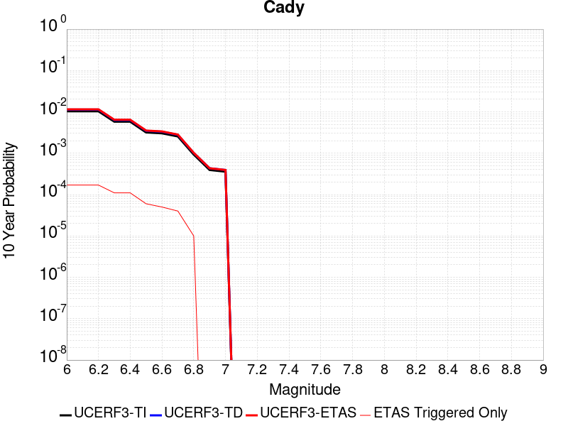 |

| Magnitude | 1 wk TI Prob | 1 wk TD Prob | 1 wk ETAS Prob | 1 wk ETAS/TD Gain | 1 wk ETAS Triggered Only | 1 mo TI Prob | 1 mo TD Prob | 1 mo ETAS Prob | 1 mo ETAS/TD Gain | 1 mo ETAS Triggered Only | 1 yr TI Prob | 1 yr TD Prob | 1 yr ETAS Prob | 1 yr ETAS/TD Gain | 1 yr ETAS Triggered Only | 10 yr TI Prob | 10 yr TD Prob | 10 yr ETAS Prob | 10 yr ETAS/TD Gain | 10 yr ETAS Triggered Only |
|-----|-----|-----|-----|-----|-----|-----|-----|-----|-----|-----|-----|-----|-----|-----|-----|-----|-----|-----|-----|-----|
| 6.0 | 1.9892565E-5 | 2.1859876E-5 | 2.1859876E-5 | 1.0 | 0.0 | 8.525106E-5 | 9.3682334E-5 | 1.2367952E-4 | 1.3202012 | 3.0E-5 | 0.0010374374 | 0.0011400766 | 0.0012099966 | 1.0613294 | 7.0E-5 | 0.010326075 | 0.011351293 | 0.011519363 | 1.0148063 | 1.7E-4 |
| 6.1 | 1.9892565E-5 | 2.1859876E-5 | 2.1859876E-5 | 1.0 | 0.0 | 8.525106E-5 | 9.3682334E-5 | 1.2367952E-4 | 1.3202012 | 3.0E-5 | 0.0010374374 | 0.0011400766 | 0.0012099966 | 1.0613294 | 7.0E-5 | 0.010326075 | 0.011351293 | 0.011519363 | 1.0148063 | 1.7E-4 |
| 6.2 | 1.9892565E-5 | 2.1859876E-5 | 2.1859876E-5 | 1.0 | 0.0 | 8.525106E-5 | 9.3682334E-5 | 1.2367952E-4 | 1.3202012 | 3.0E-5 | 0.0010374374 | 0.0011400766 | 0.0012099966 | 1.0613294 | 7.0E-5 | 0.010326075 | 0.011351293 | 0.011519363 | 1.0148063 | 1.7E-4 |
| 6.3 | 1.1117327E-5 | 1.2177199E-5 | 1.2177199E-5 | 1.0 | 0.0 | 4.764482E-5 | 5.218713E-5 | 7.2186085E-5 | 1.3832163 | 2.0E-5 | 5.7992124E-4 | 6.352246E-4 | 6.851928E-4 | 1.0786623 | 5.0E-5 | 0.0057841022 | 0.006337195 | 0.006446498 | 1.0172478 | 1.1E-4 |
| 6.4 | 1.1117327E-5 | 1.2177199E-5 | 1.2177199E-5 | 1.0 | 0.0 | 4.764482E-5 | 5.218713E-5 | 7.2186085E-5 | 1.3832163 | 2.0E-5 | 5.7992124E-4 | 6.352246E-4 | 6.851928E-4 | 1.0786623 | 5.0E-5 | 0.0057841022 | 0.006337195 | 0.006446498 | 1.0172478 | 1.1E-4 |
| 6.5 | 6.103093E-6 | 6.672351E-6 | 6.672351E-6 | 1.0 | 0.0 | 2.615585E-5 | 2.8595547E-5 | 3.8595263E-5 | 1.3496948 | 1.0E-5 | 3.1840094E-4 | 3.4810771E-4 | 3.6810077E-4 | 1.0574335 | 2.0E-5 | 0.0031794512 | 0.0034768586 | 0.00353665 | 1.017197 | 6.0E-5 |
| 6.6 | 5.817237E-6 | 6.3659772E-6 | 6.3659772E-6 | 1.0 | 0.0 | 2.4930776E-5 | 2.7282544E-5 | 3.7282272E-5 | 1.3665247 | 1.0E-5 | 3.034899E-4 | 3.321268E-4 | 3.5212014E-4 | 1.060198 | 2.0E-5 | 0.0030307577 | 0.0033175263 | 0.0033673604 | 1.0150214 | 5.0E-5 |
| 6.7 | 4.8846314E-6 | 5.340833E-6 | 5.340833E-6 | 1.0 | 0.0 | 2.0933967E-5 | 2.288915E-5 | 3.2888922E-5 | 1.4368782 | 1.0E-5 | 2.5484123E-4 | 2.7865154E-4 | 2.9864596E-4 | 1.0717542 | 2.0E-5 | 0.0025454918 | 0.002784177 | 0.0028240655 | 1.0143269 | 4.0E-5 |
| 6.8 | 1.7788773E-6 | 1.940001E-6 | 1.940001E-6 | 1.0 | 0.0 | 7.6237375E-6 | 8.314273E-6 | 8.314273E-6 | 1.0 | 0.0 | 9.281505E-5 | 1.0122315E-4 | 1.11222136E-4 | 1.0987816 | 1.0E-5 | 9.2776294E-4 | 0.001011925 | 0.001021915 | 1.0098722 | 1.0E-5 |
| 6.9 | 7.5455404E-7 | 8.2975305E-7 | 8.2975305E-7 | 1.0 | 0.0 | 3.233799E-6 | 3.5560815E-6 | 3.5560815E-6 | 1.0 | 0.0 | 3.937079E-5 | 4.329477E-5 | 4.329477E-5 | 1.0 | 0.0 | 3.9363815E-4 | 4.3289628E-4 | 4.3289628E-4 | 1.0 | 0.0 |
| 7.0 | 6.8578805E-7 | 7.542215E-7 | 7.542215E-7 | 1.0 | 0.0 | 2.9390883E-6 | 3.2323758E-6 | 3.2323758E-6 | 1.0 | 0.0 | 3.578281E-5 | 3.9353796E-5 | 3.9353796E-5 | 1.0 | 0.0 | 3.577705E-4 | 3.9350073E-4 | 3.9350073E-4 | 1.0 | 0.0 |

## Elsinore (Glen Ivy) rev
*[(top)](#table-of-contents)*

| 1 Week | 1 Month | 1 Year | 10 Year |
|-----|-----|-----|-----|
|  |  |  |  |

| Magnitude | 1 wk TI Prob | 1 wk TD Prob | 1 wk ETAS Prob | 1 wk ETAS/TD Gain | 1 wk ETAS Triggered Only | 1 mo TI Prob | 1 mo TD Prob | 1 mo ETAS Prob | 1 mo ETAS/TD Gain | 1 mo ETAS Triggered Only | 1 yr TI Prob | 1 yr TD Prob | 1 yr ETAS Prob | 1 yr ETAS/TD Gain | 1 yr ETAS Triggered Only | 10 yr TI Prob | 10 yr TD Prob | 10 yr ETAS Prob | 10 yr ETAS/TD Gain | 10 yr ETAS Triggered Only |
|-----|-----|-----|-----|-----|-----|-----|-----|-----|-----|-----|-----|-----|-----|-----|-----|-----|-----|-----|-----|-----|
| 6.0 | 1.6204086E-4 | 2.936593E-4 | 2.936593E-4 | 1.0 | 0.0 | 6.94276E-4 | 0.0012580877 | 0.0012580877 | 1.0 | 0.0 | 0.008420097 | 0.015237179 | 0.015296265 | 1.0038778 | 6.0E-5 | 0.081081145 | 0.13970533 | 0.13979995 | 1.0006773 | 1.1E-4 |
| 6.1 | 1.6204086E-4 | 2.936593E-4 | 2.936593E-4 | 1.0 | 0.0 | 6.94276E-4 | 0.0012580877 | 0.0012580877 | 1.0 | 0.0 | 0.008420097 | 0.015237179 | 0.015296265 | 1.0038778 | 6.0E-5 | 0.081081145 | 0.13970533 | 0.13979995 | 1.0006773 | 1.1E-4 |
| 6.2 | 1.6204086E-4 | 2.936593E-4 | 2.936593E-4 | 1.0 | 0.0 | 6.94276E-4 | 0.0012580877 | 0.0012580877 | 1.0 | 0.0 | 0.008420097 | 0.015237179 | 0.015296265 | 1.0038778 | 6.0E-5 | 0.081081145 | 0.13970533 | 0.13979995 | 1.0006773 | 1.1E-4 |
| 6.3 | 1.0111737E-4 | 1.7704896E-4 | 1.7704896E-4 | 1.0 | 0.0 | 4.332882E-4 | 7.5867726E-4 | 7.5867726E-4 | 1.0 | 0.0 | 0.005262531 | 0.009218467 | 0.009258099 | 1.0042992 | 4.0E-5 | 0.0513964 | 0.087025836 | 0.087098874 | 1.0008392 | 8.0E-5 |
| 6.4 | 1.0111737E-4 | 1.7704896E-4 | 1.7704896E-4 | 1.0 | 0.0 | 4.332882E-4 | 7.5867726E-4 | 7.5867726E-4 | 1.0 | 0.0 | 0.005262531 | 0.009218467 | 0.009258099 | 1.0042992 | 4.0E-5 | 0.0513964 | 0.087025836 | 0.087098874 | 1.0008392 | 8.0E-5 |
| 6.5 | 3.6624708E-5 | 4.6398443E-5 | 4.6398443E-5 | 1.0 | 0.0 | 1.569536E-4 | 1.9883736E-4 | 1.9883736E-4 | 1.0 | 0.0 | 0.001909235 | 0.0024185202 | 0.0024185202 | 1.0 | 0.0 | 0.01892915 | 0.02374361 | 0.023753375 | 1.0004112 | 1.0E-5 |
| 6.6 | 2.5051324E-5 | 2.615282E-5 | 2.615282E-5 | 1.0 | 0.0 | 1.073584E-4 | 1.12078946E-4 | 1.12078946E-4 | 1.0 | 0.0 | 0.0013063047 | 0.0013637516 | 0.0013637516 | 1.0 | 0.0 | 0.012986525 | 0.013567226 | 0.013577091 | 1.000727 | 1.0E-5 |
| 6.7 | 2.2189772E-5 | 2.2077227E-5 | 2.2077227E-5 | 1.0 | 0.0 | 9.509556E-5 | 9.461347E-5 | 9.461347E-5 | 1.0 | 0.0 | 0.0011571734 | 0.0011513466 | 0.0011513466 | 1.0 | 0.0 | 0.011511663 | 0.0114676645 | 0.0114676645 | 1.0 | 0.0 |
| 6.8 | 1.6654378E-5 | 1.4440319E-5 | 1.4440319E-5 | 1.0 | 0.0 | 7.137396E-5 | 6.188564E-5 | 6.188564E-5 | 1.0 | 0.0 | 8.686314E-4 | 7.532024E-4 | 7.532024E-4 | 1.0 | 0.0 | 0.008652439 | 0.0075118328 | 0.0075118328 | 1.0 | 0.0 |
| 6.9 | 1.5042909E-5 | 1.2334286E-5 | 1.2334286E-5 | 1.0 | 0.0 | 6.446802E-5 | 5.286017E-5 | 5.286017E-5 | 1.0 | 0.0 | 7.8461546E-4 | 6.433857E-4 | 6.433857E-4 | 1.0 | 0.0 | 0.007818509 | 0.006419453 | 0.006419453 | 1.0 | 0.0 |
| 7.0 | 1.4361385E-5 | 1.1453455E-5 | 1.1453455E-5 | 1.0 | 0.0 | 6.154734E-5 | 4.908533E-5 | 4.908533E-5 | 1.0 | 0.0 | 7.490812E-4 | 5.974529E-4 | 5.974529E-4 | 1.0 | 0.0 | 0.007465612 | 0.005962458 | 0.005962458 | 1.0 | 0.0 |
| 7.1 | 1.3265571E-5 | 1.0246749E-5 | 1.0246749E-5 | 1.0 | 0.0 | 5.6851208E-5 | 4.3913915E-5 | 4.3913915E-5 | 1.0 | 0.0 | 6.919436E-4 | 5.345233E-4 | 5.345233E-4 | 1.0 | 0.0 | 0.006897931 | 0.0053357324 | 0.0053357324 | 1.0 | 0.0 |
| 7.2 | 1.1596403E-5 | 8.506553E-6 | 8.506553E-6 | 1.0 | 0.0 | 4.9697923E-5 | 3.6456157E-5 | 3.6456157E-5 | 1.0 | 0.0 | 6.049042E-4 | 4.4376502E-4 | 4.4376502E-4 | 1.0 | 0.0 | 0.006032603 | 0.004430204 | 0.004430204 | 1.0 | 0.0 |
| 7.3 | 1.0150827E-5 | 7.2399926E-6 | 7.2399926E-6 | 1.0 | 0.0 | 4.3502816E-5 | 3.102818E-5 | 3.102818E-5 | 1.0 | 0.0 | 5.2951806E-4 | 3.77704E-4 | 3.77704E-4 | 1.0 | 0.0 | 0.005282581 | 0.0037710073 | 0.0037710073 | 1.0 | 0.0 |
| 7.4 | 9.080705E-6 | 6.3535763E-6 | 6.3535763E-6 | 1.0 | 0.0 | 3.8916725E-5 | 2.7229335E-5 | 2.7229335E-5 | 1.0 | 0.0 | 4.7370812E-4 | 3.314681E-4 | 3.314681E-4 | 1.0 | 0.0 | 0.004726996 | 0.0033098878 | 0.0033098878 | 1.0 | 0.0 |
| 7.5 | 7.671649E-6 | 5.2264927E-6 | 5.2264927E-6 | 1.0 | 0.0 | 3.287808E-5 | 2.2399068E-5 | 2.2399068E-5 | 1.0 | 0.0 | 4.0021708E-4 | 2.726758E-4 | 2.726758E-4 | 1.0 | 0.0 | 0.0039949706 | 0.0027235372 | 0.0027235372 | 1.0 | 0.0 |
| 7.6 | 6.990086E-6 | 4.6883147E-6 | 4.6883147E-6 | 1.0 | 0.0 | 2.9957167E-5 | 2.009263E-5 | 2.009263E-5 | 1.0 | 0.0 | 3.6466747E-4 | 2.4460148E-4 | 2.4460148E-4 | 1.0 | 0.0 | 0.0036406964 | 0.0024434389 | 0.0024434389 | 1.0 | 0.0 |
| 7.7 | 4.163505E-6 | 2.3299876E-6 | 2.3299876E-6 | 1.0 | 0.0 | 1.7843471E-5 | 9.985628E-6 | 9.985628E-6 | 1.0 | 0.0 | 2.172226E-4 | 1.2156898E-4 | 1.2156898E-4 | 1.0 | 0.0 | 0.0021701038 | 0.0012150978 | 0.0012150978 | 1.0 | 0.0 |
| 7.8 | 2.2692414E-7 | 9.3873886E-8 | 9.3873886E-8 | 1.0 | 0.0 | 9.725317E-7 | 4.023166E-7 | 4.023166E-7 | 1.0 | 0.0 | 1.1840509E-5 | 4.898197E-6 | 4.898197E-6 | 1.0 | 0.0 | 1.1839878E-4 | 4.898122E-5 | 4.898122E-5 | 1.0 | 0.0 |
| 7.9 | 6.676829E-9 | 3.4403498E-9 | 3.4403498E-9 | 1.0 | 0.0 | 2.861498E-8 | 1.4744357E-8 | 1.4744357E-8 | 1.0 | 0.0 | 3.4838732E-7 | 1.7951253E-7 | 1.7951253E-7 | 1.0 | 0.0 | 3.4838679E-6 | 1.7951239E-6 | 1.7951239E-6 | 1.0 | 0.0 |

## Santa Ynez (West)
*[(top)](#table-of-contents)*

| 1 Week | 1 Month | 1 Year | 10 Year |
|-----|-----|-----|-----|
|  |  |  |  |

| Magnitude | 1 wk TI Prob | 1 wk TD Prob | 1 wk ETAS Prob | 1 wk ETAS/TD Gain | 1 wk ETAS Triggered Only | 1 mo TI Prob | 1 mo TD Prob | 1 mo ETAS Prob | 1 mo ETAS/TD Gain | 1 mo ETAS Triggered Only | 1 yr TI Prob | 1 yr TD Prob | 1 yr ETAS Prob | 1 yr ETAS/TD Gain | 1 yr ETAS Triggered Only | 10 yr TI Prob | 10 yr TD Prob | 10 yr ETAS Prob | 10 yr ETAS/TD Gain | 10 yr ETAS Triggered Only |
|-----|-----|-----|-----|-----|-----|-----|-----|-----|-----|-----|-----|-----|-----|-----|-----|-----|-----|-----|-----|-----|
| 6.0 | 4.7352758E-5 | 5.4977594E-5 | 6.4977045E-5 | 1.1818823 | 1.0E-5 | 2.0292461E-4 | 2.3559865E-4 | 2.4559628E-4 | 1.042435 | 1.0E-5 | 0.0024678076 | 0.0028648009 | 0.002894715 | 1.0104419 | 3.0E-5 | 0.024405818 | 0.028307132 | 0.028423736 | 1.0041192 | 1.2E-4 |
| 6.1 | 4.7352758E-5 | 5.4977594E-5 | 6.4977045E-5 | 1.1818823 | 1.0E-5 | 2.0292461E-4 | 2.3559865E-4 | 2.4559628E-4 | 1.042435 | 1.0E-5 | 0.0024678076 | 0.0028648009 | 0.002894715 | 1.0104419 | 3.0E-5 | 0.024405818 | 0.028307132 | 0.028394585 | 1.0030894 | 9.0E-5 |
| 6.2 | 3.0415853E-5 | 3.3927812E-5 | 3.3927812E-5 | 1.0 | 0.0 | 1.3034715E-4 | 1.4539702E-4 | 1.4539702E-4 | 1.0 | 0.0 | 0.0015858212 | 0.0017688064 | 0.001788771 | 1.0112871 | 2.0E-5 | 0.015745522 | 0.017551184 | 0.017619954 | 1.0039183 | 7.0E-5 |
| 6.3 | 3.0415853E-5 | 3.3927812E-5 | 3.3927812E-5 | 1.0 | 0.0 | 1.3034715E-4 | 1.4539702E-4 | 1.4539702E-4 | 1.0 | 0.0 | 0.0015858212 | 0.0017688064 | 0.001788771 | 1.0112871 | 2.0E-5 | 0.015745522 | 0.017551184 | 0.017619954 | 1.0039183 | 7.0E-5 |
| 6.4 | 2.5452082E-5 | 2.7914437E-5 | 2.7914437E-5 | 1.0 | 0.0 | 1.09075794E-4 | 1.1962793E-4 | 1.1962793E-4 | 1.0 | 0.0 | 0.0013271887 | 0.0014555135 | 0.0014754843 | 1.0137209 | 2.0E-5 | 0.013192902 | 0.014461986 | 0.014521117 | 1.0040888 | 6.0E-5 |
| 6.5 | 2.3143784E-5 | 2.5129964E-5 | 2.5129964E-5 | 1.0 | 0.0 | 9.9183875E-5 | 1.0769549E-4 | 1.0769549E-4 | 1.0 | 0.0 | 0.0012068948 | 0.0013104154 | 0.0013303892 | 1.0152423 | 2.0E-5 | 0.012003611 | 0.013028558 | 0.0130877765 | 1.0045452 | 6.0E-5 |
| 6.6 | 1.9118515E-5 | 2.0355572E-5 | 2.0355572E-5 | 1.0 | 0.0 | 8.193392E-5 | 8.72353E-5 | 8.72353E-5 | 1.0 | 0.0 | 9.97089E-4 | 0.0010615803 | 0.001081559 | 1.0188198 | 2.0E-5 | 0.00992627 | 0.010566001 | 0.010625367 | 1.0056186 | 6.0E-5 |
| 6.7 | 1.722807E-5 | 1.814738E-5 | 1.814738E-5 | 1.0 | 0.0 | 7.3832496E-5 | 7.77722E-5 | 7.77722E-5 | 1.0 | 0.0 | 8.985399E-4 | 9.464708E-4 | 9.664519E-4 | 1.0211111 | 2.0E-5 | 0.008949154 | 0.009425044 | 0.009484479 | 1.006306 | 6.0E-5 |
| 6.8 | 1.5317364E-5 | 1.5927328E-5 | 1.5927328E-5 | 1.0 | 0.0 | 6.56442E-5 | 6.825821E-5 | 6.825821E-5 | 1.0 | 0.0 | 7.98925E-4 | 8.307311E-4 | 8.507145E-4 | 1.0240551 | 2.0E-5 | 0.007960589 | 0.008276746 | 0.008336249 | 1.0071893 | 6.0E-5 |
| 6.9 | 1.3071226E-5 | 1.3330249E-5 | 1.3330249E-5 | 1.0 | 0.0 | 5.6018336E-5 | 5.71284E-5 | 5.71284E-5 | 1.0 | 0.0 | 6.8180985E-4 | 6.9531857E-4 | 7.153047E-4 | 1.0287437 | 2.0E-5 | 0.0067972173 | 0.006931691 | 0.0069714137 | 1.0057306 | 4.0E-5 |
| 7.0 | 1.1836986E-5 | 1.1933308E-5 | 1.1933308E-5 | 1.0 | 0.0 | 5.0728955E-5 | 5.1141757E-5 | 5.1141757E-5 | 1.0 | 0.0 | 6.1745E-4 | 6.224747E-4 | 6.424622E-4 | 1.0321099 | 2.0E-5 | 0.006157372 | 0.0062075043 | 0.0062373183 | 1.0048028 | 3.0E-5 |
| 7.1 | 1.0597169E-5 | 1.0542637E-5 | 1.0542637E-5 | 1.0 | 0.0 | 4.541565E-5 | 4.5181954E-5 | 4.5181954E-5 | 1.0 | 0.0 | 5.5279525E-4 | 5.499526E-4 | 5.699416E-4 | 1.0363468 | 2.0E-5 | 0.0055142213 | 0.0054860474 | 0.0055158827 | 1.0054384 | 3.0E-5 |
| 7.2 | 9.59113E-6 | 9.459535E-6 | 9.459535E-6 | 1.0 | 0.0 | 4.11042E-5 | 4.0540242E-5 | 4.0540242E-5 | 1.0 | 0.0 | 5.0032866E-4 | 4.9346674E-4 | 5.134569E-4 | 1.0405096 | 2.0E-5 | 0.004992037 | 0.0049238284 | 0.004953681 | 1.0060629 | 3.0E-5 |
| 7.3 | 8.586084E-6 | 8.379932E-6 | 8.379932E-6 | 1.0 | 0.0 | 3.679698E-5 | 3.5913505E-5 | 3.5913505E-5 | 1.0 | 0.0 | 4.4791115E-4 | 4.3716026E-4 | 4.571515E-4 | 1.0457298 | 2.0E-5 | 0.004470094 | 0.004363114 | 0.0043929834 | 1.0068458 | 3.0E-5 |
| 7.4 | 7.2622997E-6 | 6.95183E-6 | 6.95183E-6 | 1.0 | 0.0 | 3.112377E-5 | 2.9793222E-5 | 2.9793222E-5 | 1.0 | 0.0 | 3.78866E-4 | 3.6267308E-4 | 3.7266946E-4 | 1.0275631 | 1.0E-5 | 0.0037822074 | 0.0036209123 | 0.0036408398 | 1.0055034 | 2.0E-5 |
| 7.5 | 5.627296E-6 | 5.251797E-6 | 5.251797E-6 | 1.0 | 0.0 | 2.411676E-5 | 2.2507513E-5 | 2.2507513E-5 | 1.0 | 0.0 | 2.9358198E-4 | 2.7399522E-4 | 2.7399522E-4 | 1.0 | 0.0 | 0.0029319443 | 0.002736646 | 0.002736646 | 1.0 | 0.0 |
| 7.6 | 2.265244E-6 | 2.0609314E-6 | 2.0609314E-6 | 1.0 | 0.0 | 9.708152E-6 | 8.832533E-6 | 8.832533E-6 | 1.0 | 0.0 | 1.18190335E-4 | 1.07530876E-4 | 1.07530876E-4 | 1.0 | 0.0 | 0.001181275 | 0.001074797 | 0.001074797 | 1.0 | 0.0 |
| 7.7 | 1.3099874E-6 | 1.1016656E-6 | 1.1016656E-6 | 1.0 | 0.0 | 5.61422E-6 | 4.7214157E-6 | 4.7214157E-6 | 1.0 | 0.0 | 6.8350986E-5 | 5.7481746E-5 | 5.7481746E-5 | 1.0 | 0.0 | 6.832996E-4 | 5.7467114E-4 | 5.7467114E-4 | 1.0 | 0.0 |
| 7.8 | 7.903951E-7 | 6.071338E-7 | 6.071338E-7 | 1.0 | 0.0 | 3.3874032E-6 | 2.6019995E-6 | 2.6019995E-6 | 1.0 | 0.0 | 4.1240855E-5 | 3.1678897E-5 | 3.1678897E-5 | 1.0 | 0.0 | 4.12332E-4 | 3.1674514E-4 | 3.1674514E-4 | 1.0 | 0.0 |
| 7.9 | 7.0753297E-9 | 5.0900715E-9 | 5.0900715E-9 | 1.0 | 0.0 | 3.032284E-8 | 2.1814591E-8 | 2.1814591E-8 | 1.0 | 0.0 | 3.6918053E-7 | 2.6559263E-7 | 2.6559263E-7 | 1.0 | 0.0 | 3.691799E-6 | 2.655924E-6 | 2.655924E-6 | 1.0 | 0.0 |

## San Andreas (Coachella) rev
*[(top)](#table-of-contents)*

| 1 Week | 1 Month | 1 Year | 10 Year |
|-----|-----|-----|-----|
|  |  |  |  |

| Magnitude | 1 wk TI Prob | 1 wk TD Prob | 1 wk ETAS Prob | 1 wk ETAS/TD Gain | 1 wk ETAS Triggered Only | 1 mo TI Prob | 1 mo TD Prob | 1 mo ETAS Prob | 1 mo ETAS/TD Gain | 1 mo ETAS Triggered Only | 1 yr TI Prob | 1 yr TD Prob | 1 yr ETAS Prob | 1 yr ETAS/TD Gain | 1 yr ETAS Triggered Only | 10 yr TI Prob | 10 yr TD Prob | 10 yr ETAS Prob | 10 yr ETAS/TD Gain | 10 yr ETAS Triggered Only |
|-----|-----|-----|-----|-----|-----|-----|-----|-----|-----|-----|-----|-----|-----|-----|-----|-----|-----|-----|-----|-----|
| 6.0 | 1.1925945E-4 | 3.2747045E-4 | 3.2747045E-4 | 1.0 | 0.0 | 5.110118E-4 | 0.0014026947 | 0.0014226666 | 1.0142382 | 2.0E-5 | 0.0062038354 | 0.016945418 | 0.017043725 | 1.0058013 | 1.0E-4 | 0.060334753 | 0.15272202 | 0.15284911 | 1.0008322 | 1.5E-4 |
| 6.1 | 1.1925945E-4 | 3.2747045E-4 | 3.2747045E-4 | 1.0 | 0.0 | 5.110118E-4 | 0.0014026947 | 0.0014226666 | 1.0142382 | 2.0E-5 | 0.0062038354 | 0.016945418 | 0.017043725 | 1.0058013 | 1.0E-4 | 0.060334753 | 0.15272202 | 0.15284911 | 1.0008322 | 1.5E-4 |
| 6.2 | 1.07432395E-4 | 3.0247675E-4 | 3.0247675E-4 | 1.0 | 0.0 | 4.603433E-4 | 0.0012956889 | 0.001315663 | 1.0154158 | 2.0E-5 | 0.005590286 | 0.015662009 | 0.015760442 | 1.0062848 | 1.0E-4 | 0.05451731 | 0.14189328 | 0.142022 | 1.0009072 | 1.5E-4 |
| 6.3 | 1.0718766E-4 | 3.019298E-4 | 3.019298E-4 | 1.0 | 0.0 | 4.592948E-4 | 0.0012933471 | 0.0013133213 | 1.0154438 | 2.0E-5 | 0.005577586 | 0.015633909 | 0.015732344 | 1.0062964 | 1.0E-4 | 0.054396555 | 0.14166155 | 0.1417903 | 1.0009089 | 1.5E-4 |
| 6.4 | 1.0355944E-4 | 2.9401045E-4 | 2.9401045E-4 | 1.0 | 0.0 | 4.4375064E-4 | 0.0012594402 | 0.001279415 | 1.0158601 | 2.0E-5 | 0.0053892885 | 0.015226932 | 0.015325409 | 1.0064673 | 1.0E-4 | 0.052604496 | 0.13822177 | 0.13835102 | 1.0009352 | 1.5E-4 |
| 6.5 | 1.0227914E-4 | 2.912047E-4 | 2.912047E-4 | 1.0 | 0.0 | 4.382655E-4 | 0.0012474272 | 0.0012674022 | 1.016013 | 2.0E-5 | 0.0053228354 | 0.015082708 | 0.0151812 | 1.0065302 | 1.0E-4 | 0.051971316 | 0.13700101 | 0.13713045 | 1.0009449 | 1.5E-4 |
| 6.6 | 1.0116757E-4 | 2.8886212E-4 | 2.8886212E-4 | 1.0 | 0.0 | 4.3350324E-4 | 0.0012373971 | 0.0012573723 | 1.016143 | 2.0E-5 | 0.0052651367 | 0.0149622755 | 0.015060779 | 1.0065835 | 1.0E-4 | 0.051421247 | 0.13597922 | 0.13610883 | 1.0009531 | 1.5E-4 |
| 6.7 | 1.0050676E-4 | 2.874477E-4 | 2.874477E-4 | 1.0 | 0.0 | 4.3067214E-4 | 0.001231341 | 0.0012513164 | 1.0162225 | 2.0E-5 | 0.005230834 | 0.014889553 | 0.014988064 | 1.0066161 | 1.0E-4 | 0.051094085 | 0.13536398 | 0.13549367 | 1.0009581 | 1.5E-4 |
| 6.8 | 9.976819E-5 | 2.8548407E-4 | 2.8548407E-4 | 1.0 | 0.0 | 4.2750788E-4 | 0.0012229334 | 0.001242909 | 1.0163342 | 2.0E-5 | 0.0051924936 | 0.014788584 | 0.014887106 | 1.006662 | 1.0E-4 | 0.050728295 | 0.13451566 | 0.13464548 | 1.0009651 | 1.5E-4 |
| 6.9 | 9.77719E-5 | 2.80452E-4 | 2.80452E-4 | 1.0 | 0.0 | 4.1895514E-4 | 0.0012013874 | 0.0012213633 | 1.0166274 | 2.0E-5 | 0.0050888555 | 0.01452979 | 0.014628337 | 1.0067824 | 1.0E-4 | 0.049738888 | 0.13234389 | 0.13247404 | 1.0009834 | 1.5E-4 |
| 7.0 | 8.500761E-5 | 2.4778847E-4 | 2.4778847E-4 | 1.0 | 0.0 | 3.6426744E-4 | 0.0010615216 | 0.0010815003 | 1.0188209 | 2.0E-5 | 0.0044259406 | 0.012848215 | 0.012946931 | 1.0076832 | 1.0E-4 | 0.04338823 | 0.11819933 | 0.1183316 | 1.001119 | 1.5E-4 |
| 7.1 | 8.319876E-5 | 2.4381404E-4 | 2.4381404E-4 | 1.0 | 0.0 | 3.5651738E-4 | 0.0010445021 | 0.0010644812 | 1.0191278 | 2.0E-5 | 0.004331963 | 0.012643427 | 0.012742163 | 1.0078093 | 1.0E-4 | 0.042484846 | 0.11641899 | 0.116551526 | 1.0011384 | 1.5E-4 |
| 7.2 | 7.563917E-5 | 2.2429357E-4 | 2.2429357E-4 | 1.0 | 0.0 | 3.2412758E-4 | 9.609071E-4 | 9.808879E-4 | 1.0207937 | 2.0E-5 | 0.0039391145 | 0.011636979 | 0.011735816 | 1.0084933 | 1.0E-4 | 0.03870018 | 0.107823946 | 0.10795777 | 1.0012412 | 1.5E-4 |
| 7.3 | 7.082985E-5 | 2.074492E-4 | 2.074492E-4 | 1.0 | 0.0 | 3.0352117E-4 | 8.8876794E-4 | 9.0875017E-4 | 1.0224831 | 2.0E-5 | 0.0036891096 | 0.010767689 | 0.010866612 | 1.0091871 | 1.0E-4 | 0.03628465 | 0.10034482 | 0.10047977 | 1.0013448 | 1.5E-4 |
| 7.4 | 5.146215E-5 | 1.428607E-4 | 1.428607E-4 | 1.0 | 0.0 | 2.2053342E-4 | 6.121174E-4 | 6.3210516E-4 | 1.0326535 | 2.0E-5 | 0.0026816884 | 0.0074272524 | 0.00752651 | 1.013364 | 1.0E-4 | 0.02649557 | 0.07090313 | 0.07104249 | 1.0019655 | 1.5E-4 |
| 7.5 | 4.0285166E-5 | 1.0952253E-4 | 1.0952253E-4 | 1.0 | 0.0 | 1.7263928E-4 | 4.6929816E-4 | 4.8928877E-4 | 1.0425968 | 2.0E-5 | 0.002099857 | 0.0056988057 | 0.005798236 | 1.0174476 | 1.0E-4 | 0.020801254 | 0.05505857 | 0.05519086 | 1.0024028 | 1.4E-4 |
| 7.6 | 3.1168736E-5 | 8.4483814E-5 | 8.4483814E-5 | 1.0 | 0.0 | 1.3357346E-4 | 3.6202336E-4 | 3.8201612E-4 | 1.055225 | 2.0E-5 | 0.0016250437 | 0.0043987534 | 0.004498313 | 1.0226337 | 1.0E-4 | 0.016132116 | 0.04285275 | 0.042986747 | 1.003127 | 1.4E-4 |
| 7.7 | 2.2100989E-5 | 6.2470855E-5 | 6.2470855E-5 | 1.0 | 0.0 | 9.4715084E-5 | 2.677048E-4 | 2.8769945E-4 | 1.0746891 | 2.0E-5 | 0.001152546 | 0.0032544413 | 0.0033541159 | 1.0306273 | 1.0E-4 | 0.011465867 | 0.031938035 | 0.032063883 | 1.0039403 | 1.3E-4 |
| 7.8 | 1.7484861E-5 | 5.187001E-5 | 5.187001E-5 | 1.0 | 0.0 | 7.493296E-5 | 2.2228112E-4 | 2.4227667E-4 | 1.0899562 | 2.0E-5 | 9.1192697E-4 | 0.002702917 | 0.0028026467 | 1.0368971 | 1.0E-4 | 0.009081938 | 0.026673956 | 0.026800489 | 1.0047437 | 1.3E-4 |
| 7.9 | 1.3967285E-5 | 3.8283448E-5 | 3.8283448E-5 | 1.0 | 0.0 | 5.985842E-5 | 1.6406161E-4 | 1.8405833E-4 | 1.1218854 | 2.0E-5 | 7.2853256E-4 | 0.0019956212 | 0.0020854417 | 1.0450088 | 9.0E-5 | 0.0072614877 | 0.019937595 | 0.020055203 | 1.0058988 | 1.2E-4 |
| 8.0 | 1.1887396E-5 | 3.1117535E-5 | 3.1117535E-5 | 1.0 | 0.0 | 5.094499E-5 | 1.3335406E-4 | 1.533514E-4 | 1.1499567 | 2.0E-5 | 6.200787E-4 | 0.0016223775 | 0.0017122315 | 1.0553842 | 9.0E-5 | 0.006183513 | 0.016303658 | 0.016421702 | 1.0072403 | 1.2E-4 |
| 8.1 | 5.100864E-6 | 8.994677E-6 | 8.994677E-6 | 1.0 | 0.0 | 2.1860664E-5 | 3.854805E-5 | 3.854805E-5 | 1.0 | 0.0 | 2.6612106E-4 | 4.6922156E-4 | 4.6922156E-4 | 1.0 | 0.0 | 0.002658026 | 0.00492833 | 0.0049382807 | 1.002019 | 1.0E-5 |
| 8.2 | 2.3004484E-6 | 2.795008E-6 | 2.795008E-6 | 1.0 | 0.0 | 9.859027E-6 | 1.1978551E-5 | 1.1978551E-5 | 1.0 | 0.0 | 1.2002704E-4 | 1.4582912E-4 | 1.4582912E-4 | 1.0 | 0.0 | 0.0011996223 | 0.0016018103 | 0.0016018103 | 1.0 | 0.0 |
| 8.3 | 1.0424446E-7 | 5.8393972E-8 | 5.8393972E-8 | 1.0 | 0.0 | 4.4676187E-7 | 2.5025986E-7 | 2.5025986E-7 | 1.0 | 0.0 | 5.439312E-6 | 3.0469098E-6 | 3.0469098E-6 | 1.0 | 0.0 | 5.4391792E-5 | 3.203139E-5 | 3.203139E-5 | 1.0 | 0.0 |

## Calico-Hidalgo
*[(top)](#table-of-contents)*

| 1 Week | 1 Month | 1 Year | 10 Year |
|-----|-----|-----|-----|
|  |  |  |  |

| Magnitude | 1 wk TI Prob | 1 wk TD Prob | 1 wk ETAS Prob | 1 wk ETAS/TD Gain | 1 wk ETAS Triggered Only | 1 mo TI Prob | 1 mo TD Prob | 1 mo ETAS Prob | 1 mo ETAS/TD Gain | 1 mo ETAS Triggered Only | 1 yr TI Prob | 1 yr TD Prob | 1 yr ETAS Prob | 1 yr ETAS/TD Gain | 1 yr ETAS Triggered Only | 10 yr TI Prob | 10 yr TD Prob | 10 yr ETAS Prob | 10 yr ETAS/TD Gain | 10 yr ETAS Triggered Only |
|-----|-----|-----|-----|-----|-----|-----|-----|-----|-----|-----|-----|-----|-----|-----|-----|-----|-----|-----|-----|-----|
| 6.0 | 4.0906612E-5 | 5.0707546E-5 | 5.0707546E-5 | 1.0 | 0.0 | 1.7530227E-4 | 2.1730224E-4 | 2.472957E-4 | 1.1380266 | 3.0E-5 | 0.0021322158 | 0.0026428488 | 0.0027026902 | 1.0226427 | 6.0E-5 | 0.02111873 | 0.026154567 | 0.026310382 | 1.0059575 | 1.6E-4 |
| 6.1 | 4.0906612E-5 | 5.0707546E-5 | 5.0707546E-5 | 1.0 | 0.0 | 1.7530227E-4 | 2.1730224E-4 | 2.472957E-4 | 1.1380266 | 3.0E-5 | 0.0021322158 | 0.0026428488 | 0.0027026902 | 1.0226427 | 6.0E-5 | 0.02111873 | 0.026154567 | 0.026310382 | 1.0059575 | 1.6E-4 |
| 6.2 | 4.0906612E-5 | 5.0707546E-5 | 5.0707546E-5 | 1.0 | 0.0 | 1.7530227E-4 | 2.1730224E-4 | 2.472957E-4 | 1.1380266 | 3.0E-5 | 0.0021322158 | 0.0026428488 | 0.0027026902 | 1.0226427 | 6.0E-5 | 0.02111873 | 0.026154567 | 0.026310382 | 1.0059575 | 1.6E-4 |
| 6.3 | 2.4242801E-5 | 3.0092122E-5 | 3.0092122E-5 | 1.0 | 0.0 | 1.0389358E-4 | 1.2896005E-4 | 1.4895746E-4 | 1.1550667 | 2.0E-5 | 0.0012641704 | 0.0015689905 | 0.0015989435 | 1.0190905 | 3.0E-5 | 0.01257003 | 0.015582806 | 0.015671404 | 1.0056856 | 9.0E-5 |
| 6.4 | 2.4242801E-5 | 3.0092122E-5 | 3.0092122E-5 | 1.0 | 0.0 | 1.0389358E-4 | 1.2896005E-4 | 1.4895746E-4 | 1.1550667 | 2.0E-5 | 0.0012641704 | 0.0015689905 | 0.0015989435 | 1.0190905 | 3.0E-5 | 0.01257003 | 0.015582806 | 0.015671404 | 1.0056856 | 9.0E-5 |
| 6.5 | 2.0286952E-5 | 2.5316727E-5 | 2.5316727E-5 | 1.0 | 0.0 | 8.694118E-5 | 1.0849584E-4 | 1.2849367E-4 | 1.1843189 | 2.0E-5 | 0.0010579949 | 0.0013201536 | 0.001350114 | 1.0226946 | 3.0E-5 | 0.010529719 | 0.013125047 | 0.013203997 | 1.0060152 | 8.0E-5 |
| 6.6 | 2.0269223E-5 | 2.5297675E-5 | 2.5297675E-5 | 1.0 | 0.0 | 8.6865206E-5 | 1.084142E-4 | 1.2841204E-4 | 1.1844577 | 2.0E-5 | 0.0010570707 | 0.0013191608 | 0.0013491212 | 1.0227118 | 3.0E-5 | 0.010520565 | 0.013115237 | 0.013194188 | 1.0060198 | 8.0E-5 |
| 6.7 | 1.799852E-5 | 2.25414E-5 | 2.25414E-5 | 1.0 | 0.0 | 7.713423E-5 | 9.660251E-5 | 1.0660155E-4 | 1.1035069 | 1.0E-5 | 9.3870464E-4 | 0.0011755156 | 0.001195492 | 1.0169938 | 2.0E-5 | 0.009347493 | 0.011694587 | 0.011753885 | 1.0050706 | 6.0E-5 |
| 6.8 | 1.7458793E-5 | 2.1842892E-5 | 2.1842892E-5 | 1.0 | 0.0 | 7.4821255E-5 | 9.360912E-5 | 1.0360818E-4 | 1.1068172 | 1.0E-5 | 9.10568E-4 | 0.0011391096 | 0.0011590868 | 1.0175376 | 2.0E-5 | 0.009068459 | 0.011334292 | 0.011383725 | 1.0043614 | 5.0E-5 |
| 6.9 | 1.542884E-5 | 1.9026567E-5 | 1.9026567E-5 | 1.0 | 0.0 | 6.612192E-5 | 8.1539954E-5 | 9.1539136E-5 | 1.1226293 | 1.0E-5 | 8.04737E-4 | 9.923099E-4 | 0.0010023001 | 1.0100675 | 1.0E-5 | 0.008018291 | 0.009880188 | 0.009919793 | 1.0040085 | 4.0E-5 |
| 7.0 | 1.468253E-5 | 1.803119E-5 | 1.803119E-5 | 1.0 | 0.0 | 6.292361E-5 | 7.7274315E-5 | 8.727355E-5 | 1.1293991 | 1.0E-5 | 7.658257E-4 | 9.404217E-4 | 9.5041236E-4 | 1.0106236 | 1.0E-5 | 0.0076319184 | 0.009365788 | 0.009405413 | 1.0042309 | 4.0E-5 |
| 7.1 | 1.3139281E-5 | 1.620145E-5 | 1.620145E-5 | 1.0 | 0.0 | 5.6309986E-5 | 6.943301E-5 | 7.943231E-5 | 1.1440138 | 1.0E-5 | 6.853584E-4 | 8.450316E-4 | 8.5502316E-4 | 1.0118239 | 1.0E-5 | 0.0068324856 | 0.008419481 | 0.008459144 | 1.0047109 | 4.0E-5 |
| 7.2 | 1.1127404E-5 | 1.3867019E-5 | 1.3867019E-5 | 1.0 | 0.0 | 4.7688E-5 | 5.942879E-5 | 6.94282E-5 | 1.1682587 | 1.0E-5 | 5.8044674E-4 | 7.233162E-4 | 7.3330896E-4 | 1.0138152 | 1.0E-5 | 0.0057893298 | 0.0072107273 | 0.007240511 | 1.0041305 | 3.0E-5 |
| 7.3 | 9.808154E-6 | 1.217656E-5 | 1.217656E-5 | 1.0 | 0.0 | 4.2034266E-5 | 5.218427E-5 | 5.218427E-5 | 1.0 | 0.0 | 5.11647E-4 | 6.3516904E-4 | 6.3516904E-4 | 1.0 | 0.0 | 0.0051047057 | 0.0063346117 | 0.006354485 | 1.0031372 | 2.0E-5 |
| 7.4 | 7.942452E-6 | 9.7924E-6 | 9.7924E-6 | 1.0 | 0.0 | 3.4038632E-5 | 4.196681E-5 | 4.196681E-5 | 1.0 | 0.0 | 4.1434157E-4 | 5.108356E-4 | 5.108356E-4 | 1.0 | 0.0 | 0.0041356985 | 0.0050975545 | 0.0051174527 | 1.0039035 | 2.0E-5 |
| 7.5 | 4.7121216E-6 | 5.772976E-6 | 5.772976E-6 | 1.0 | 0.0 | 2.019465E-5 | 2.4741134E-5 | 2.4741134E-5 | 1.0 | 0.0 | 2.4584212E-4 | 3.011893E-4 | 3.011893E-4 | 1.0 | 0.0 | 0.0024557032 | 0.0030085635 | 0.0030285034 | 1.0066277 | 2.0E-5 |
| 7.6 | 2.21172E-7 | 2.6040124E-7 | 2.6040124E-7 | 1.0 | 0.0 | 9.478797E-7 | 1.116005E-6 | 1.116005E-6 | 1.0 | 0.0 | 1.1540374E-5 | 1.3587305E-5 | 1.3587305E-5 | 1.0 | 0.0 | 1.1539775E-4 | 1.3586757E-4 | 1.3586757E-4 | 1.0 | 0.0 |

## San Andreas (Carrizo) rev
*[(top)](#table-of-contents)*

| 1 Week | 1 Month | 1 Year | 10 Year |
|-----|-----|-----|-----|
|  |  |  |  |

| Magnitude | 1 wk TI Prob | 1 wk TD Prob | 1 wk ETAS Prob | 1 wk ETAS/TD Gain | 1 wk ETAS Triggered Only | 1 mo TI Prob | 1 mo TD Prob | 1 mo ETAS Prob | 1 mo ETAS/TD Gain | 1 mo ETAS Triggered Only | 1 yr TI Prob | 1 yr TD Prob | 1 yr ETAS Prob | 1 yr ETAS/TD Gain | 1 yr ETAS Triggered Only | 10 yr TI Prob | 10 yr TD Prob | 10 yr ETAS Prob | 10 yr ETAS/TD Gain | 10 yr ETAS Triggered Only |
|-----|-----|-----|-----|-----|-----|-----|-----|-----|-----|-----|-----|-----|-----|-----|-----|-----|-----|-----|-----|-----|
| 6.0 | 1.1674632E-4 | 2.4361293E-4 | 2.4361293E-4 | 1.0 | 0.0 | 5.002454E-4 | 0.0010436393 | 0.0010536289 | 1.0095719 | 1.0E-5 | 0.006073493 | 0.012632766 | 0.012701881 | 1.0054711 | 7.0E-5 | 0.0591016 | 0.12077509 | 0.12090697 | 1.001092 | 1.5E-4 |
| 6.1 | 1.1674632E-4 | 2.4361293E-4 | 2.4361293E-4 | 1.0 | 0.0 | 5.002454E-4 | 0.0010436393 | 0.0010536289 | 1.0095719 | 1.0E-5 | 0.006073493 | 0.012632766 | 0.012701881 | 1.0054711 | 7.0E-5 | 0.0591016 | 0.12077509 | 0.12090697 | 1.001092 | 1.5E-4 |
| 6.2 | 1.1674632E-4 | 2.4361293E-4 | 2.4361293E-4 | 1.0 | 0.0 | 5.002454E-4 | 0.0010436393 | 0.0010536289 | 1.0095719 | 1.0E-5 | 0.006073493 | 0.012632766 | 0.012701881 | 1.0054711 | 7.0E-5 | 0.0591016 | 0.12077509 | 0.12090697 | 1.001092 | 1.5E-4 |
| 6.3 | 1.1674632E-4 | 2.4361293E-4 | 2.4361293E-4 | 1.0 | 0.0 | 5.002454E-4 | 0.0010436393 | 0.0010536289 | 1.0095719 | 1.0E-5 | 0.006073493 | 0.012632766 | 0.012701881 | 1.0054711 | 7.0E-5 | 0.0591016 | 0.12077509 | 0.12090697 | 1.001092 | 1.5E-4 |
| 6.4 | 1.1674632E-4 | 2.4361293E-4 | 2.4361293E-4 | 1.0 | 0.0 | 5.002454E-4 | 0.0010436393 | 0.0010536289 | 1.0095719 | 1.0E-5 | 0.006073493 | 0.012632766 | 0.012701881 | 1.0054711 | 7.0E-5 | 0.0591016 | 0.12077509 | 0.12090697 | 1.001092 | 1.5E-4 |
| 6.5 | 1.13136164E-4 | 2.3681132E-4 | 2.3681132E-4 | 1.0 | 0.0 | 4.847792E-4 | 0.0010145125 | 0.0010245023 | 1.0098469 | 1.0E-5 | 0.0058862255 | 0.012282185 | 0.012351326 | 1.0056293 | 7.0E-5 | 0.057327334 | 0.1177463 | 0.11787864 | 1.0011239 | 1.5E-4 |
| 6.6 | 1.13136164E-4 | 2.3681132E-4 | 2.3681132E-4 | 1.0 | 0.0 | 4.847792E-4 | 0.0010145125 | 0.0010245023 | 1.0098469 | 1.0E-5 | 0.0058862255 | 0.012282185 | 0.012351326 | 1.0056293 | 7.0E-5 | 0.057327334 | 0.1177463 | 0.11787864 | 1.0011239 | 1.5E-4 |
| 6.7 | 1.1149675E-4 | 2.3372276E-4 | 2.3372276E-4 | 1.0 | 0.0 | 4.777557E-4 | 0.001001286 | 0.0010112759 | 1.0099771 | 1.0E-5 | 0.0058011734 | 0.012122953 | 0.012192105 | 1.0057042 | 7.0E-5 | 0.05652051 | 0.116367765 | 0.11650031 | 1.001139 | 1.5E-4 |
| 6.8 | 1.1103589E-4 | 2.3274389E-4 | 2.3274389E-4 | 1.0 | 0.0 | 4.7578133E-4 | 9.97094E-4 | 0.001007084 | 1.0100192 | 1.0E-5 | 0.005777263 | 0.012072483 | 0.0121416375 | 1.0057284 | 7.0E-5 | 0.056293584 | 0.115927964 | 0.11606058 | 1.0011439 | 1.5E-4 |
| 6.9 | 1.1053259E-4 | 2.316672E-4 | 2.316672E-4 | 1.0 | 0.0 | 4.7362508E-4 | 9.924831E-4 | 0.0010024733 | 1.0100658 | 1.0E-5 | 0.0057511497 | 0.012016967 | 0.012086125 | 1.0057551 | 7.0E-5 | 0.05604569 | 0.11544405 | 0.11557673 | 1.0011493 | 1.5E-4 |
| 7.0 | 1.1005377E-4 | 2.3067516E-4 | 2.3067516E-4 | 1.0 | 0.0 | 4.7157376E-4 | 9.882348E-4 | 9.982248E-4 | 1.0101091 | 1.0E-5 | 0.0057263062 | 0.011965811 | 0.012034974 | 1.00578 | 7.0E-5 | 0.055809796 | 0.11499625 | 0.115128994 | 1.0011544 | 1.5E-4 |
| 7.1 | 1.0308142E-4 | 2.1576507E-4 | 2.1576507E-4 | 1.0 | 0.0 | 4.417027E-4 | 9.2438085E-4 | 9.3437155E-4 | 1.0108081 | 1.0E-5 | 0.0053644776 | 0.011196577 | 0.011265793 | 1.006182 | 7.0E-5 | 0.052368138 | 0.10825095 | 0.10838471 | 1.0012357 | 1.5E-4 |
| 7.2 | 1.0027479E-4 | 2.098411E-4 | 2.098411E-4 | 1.0 | 0.0 | 4.296783E-4 | 8.9901005E-4 | 9.090011E-4 | 1.0111134 | 1.0E-5 | 0.0052187922 | 0.010890815 | 0.010960053 | 1.0063574 | 7.0E-5 | 0.050979212 | 0.105554216 | 0.105688386 | 1.0012711 | 1.5E-4 |
| 7.3 | 9.816942E-5 | 2.0458816E-4 | 2.0458816E-4 | 1.0 | 0.0 | 4.2065824E-4 | 8.765127E-4 | 8.8650396E-4 | 1.0113988 | 1.0E-5 | 0.005109493 | 0.010619612 | 0.010688869 | 1.0065216 | 7.0E-5 | 0.049935985 | 0.10313633 | 0.10326189 | 1.0012175 | 1.4E-4 |
| 7.4 | 9.5634205E-5 | 1.9827684E-4 | 1.9827684E-4 | 1.0 | 0.0 | 4.0979648E-4 | 8.494821E-4 | 8.594736E-4 | 1.0117619 | 1.0E-5 | 0.0049778637 | 0.010293663 | 0.010362942 | 1.0067303 | 7.0E-5 | 0.048678253 | 0.100220494 | 0.10033746 | 1.0011672 | 1.3E-4 |
| 7.5 | 8.052417E-5 | 1.6143978E-4 | 1.6143978E-4 | 1.0 | 0.0 | 3.4505792E-4 | 6.917014E-4 | 7.016945E-4 | 1.0144471 | 1.0E-5 | 0.0041929903 | 0.008389029 | 0.008458441 | 1.0082742 | 7.0E-5 | 0.04114753 | 0.08295002 | 0.083069235 | 1.0014372 | 1.3E-4 |
| 7.6 | 7.897024E-5 | 1.579682E-4 | 1.579682E-4 | 1.0 | 0.0 | 3.384E-4 | 6.768311E-4 | 6.868243E-4 | 1.0147648 | 1.0E-5 | 0.0041122385 | 0.00820936 | 0.008278785 | 1.0084568 | 7.0E-5 | 0.040369697 | 0.081289805 | 0.08140924 | 1.0014693 | 1.3E-4 |
| 7.7 | 6.707427E-5 | 1.3303987E-4 | 1.3303987E-4 | 1.0 | 0.0 | 2.8742946E-4 | 5.700463E-4 | 5.8004056E-4 | 1.0175325 | 1.0E-5 | 0.003493839 | 0.0069182604 | 0.0069778454 | 1.0086128 | 6.0E-5 | 0.034394164 | 0.06917457 | 0.06926765 | 1.0013456 | 1.0E-4 |
| 7.8 | 6.147705E-5 | 1.2222702E-4 | 1.2222702E-4 | 1.0 | 0.0 | 2.6344648E-4 | 5.23725E-4 | 5.337198E-4 | 1.019084 | 1.0E-5 | 0.0032027436 | 0.0063577346 | 0.006417353 | 1.0093774 | 6.0E-5 | 0.031569764 | 0.06362964 | 0.06372328 | 1.0014716 | 1.0E-4 |
| 7.9 | 4.7636717E-5 | 8.8979046E-5 | 8.8979046E-5 | 1.0 | 0.0 | 2.0414138E-4 | 3.8128305E-4 | 3.8128305E-4 | 1.0 | 0.0 | 0.0024825884 | 0.004632248 | 0.004662109 | 1.0064464 | 3.0E-5 | 0.024550365 | 0.046713326 | 0.046770524 | 1.0012244 | 6.0E-5 |
| 8.0 | 3.3554235E-5 | 5.224805E-5 | 5.224805E-5 | 1.0 | 0.0 | 1.4379594E-4 | 2.23901E-4 | 2.23901E-4 | 1.0 | 0.0 | 0.0017493097 | 0.0027225888 | 0.0027425343 | 1.007326 | 2.0E-5 | 0.017356034 | 0.027935574 | 0.027974457 | 1.0013919 | 4.0E-5 |
| 8.1 | 1.9175432E-5 | 1.9238541E-5 | 1.9238541E-5 | 1.0 | 0.0 | 8.217783E-5 | 8.244829E-5 | 8.244829E-5 | 1.0 | 0.0 | 0.0010000558 | 0.0010033463 | 0.0010033463 | 1.0 | 0.0 | 0.009955673 | 0.010786123 | 0.010796015 | 1.0009171 | 1.0E-5 |
| 8.2 | 8.643924E-6 | 5.49522E-6 | 5.49522E-6 | 1.0 | 0.0 | 3.704486E-5 | 2.355073E-5 | 2.355073E-5 | 1.0 | 0.0 | 4.5092785E-4 | 2.866925E-4 | 2.866925E-4 | 1.0 | 0.0 | 0.0045001395 | 0.0032598388 | 0.0032698063 | 1.0030576 | 1.0E-5 |
| 8.3 | 1.983087E-6 | 7.693574E-7 | 7.693574E-7 | 1.0 | 0.0 | 8.498917E-6 | 3.297242E-6 | 3.297242E-6 | 1.0 | 0.0 | 1.034694E-4 | 4.01432E-5 | 4.01432E-5 | 1.0 | 0.0 | 0.0010342124 | 4.7390026E-4 | 4.8389554E-4 | 1.0210915 | 1.0E-5 |

## Ludlow
*[(top)](#table-of-contents)*

| 1 Week | 1 Month | 1 Year | 10 Year |
|-----|-----|-----|-----|
|  |  |  |  |

| Magnitude | 1 wk TI Prob | 1 wk TD Prob | 1 wk ETAS Prob | 1 wk ETAS/TD Gain | 1 wk ETAS Triggered Only | 1 mo TI Prob | 1 mo TD Prob | 1 mo ETAS Prob | 1 mo ETAS/TD Gain | 1 mo ETAS Triggered Only | 1 yr TI Prob | 1 yr TD Prob | 1 yr ETAS Prob | 1 yr ETAS/TD Gain | 1 yr ETAS Triggered Only | 10 yr TI Prob | 10 yr TD Prob | 10 yr ETAS Prob | 10 yr ETAS/TD Gain | 10 yr ETAS Triggered Only |
|-----|-----|-----|-----|-----|-----|-----|-----|-----|-----|-----|-----|-----|-----|-----|-----|-----|-----|-----|-----|-----|
| 6.0 | 2.2407607E-5 | 2.3657954E-5 | 2.3657954E-5 | 1.0 | 0.0 | 9.602906E-5 | 1.0138754E-4 | 1.0138754E-4 | 1.0 | 0.0 | 0.0011685267 | 0.0012337384 | 0.0013136397 | 1.0647635 | 8.0E-5 | 0.011624013 | 0.012273403 | 0.012421562 | 1.0120715 | 1.5E-4 |
| 6.1 | 2.2407607E-5 | 2.3657954E-5 | 2.3657954E-5 | 1.0 | 0.0 | 9.602906E-5 | 1.0138754E-4 | 1.0138754E-4 | 1.0 | 0.0 | 0.0011685267 | 0.0012337384 | 0.0013136397 | 1.0647635 | 8.0E-5 | 0.011624013 | 0.012273403 | 0.012421562 | 1.0120715 | 1.5E-4 |
| 6.2 | 1.0781252E-5 | 1.1365991E-5 | 1.1365991E-5 | 1.0 | 0.0 | 4.620455E-5 | 4.8710503E-5 | 4.8710503E-5 | 1.0 | 0.0 | 5.623952E-4 | 5.92893E-4 | 6.528574E-4 | 1.1011387 | 6.0E-5 | 0.00560974 | 0.005913531 | 0.005993058 | 1.0134482 | 8.0E-5 |
| 6.3 | 1.0781252E-5 | 1.1365991E-5 | 1.1365991E-5 | 1.0 | 0.0 | 4.620455E-5 | 4.8710503E-5 | 4.8710503E-5 | 1.0 | 0.0 | 5.623952E-4 | 5.92893E-4 | 6.528574E-4 | 1.1011387 | 6.0E-5 | 0.00560974 | 0.005913531 | 0.005993058 | 1.0134482 | 8.0E-5 |
| 6.4 | 7.814439E-6 | 8.237966E-6 | 8.237966E-6 | 1.0 | 0.0 | 3.3490025E-5 | 3.5305096E-5 | 3.5305096E-5 | 1.0 | 0.0 | 4.0766477E-4 | 4.2975618E-4 | 4.797347E-4 | 1.116295 | 5.0E-5 | 0.0040691774 | 0.0042893975 | 0.004359097 | 1.0162493 | 7.0E-5 |
| 6.5 | 6.4986366E-6 | 6.8511167E-6 | 6.8511167E-6 | 1.0 | 0.0 | 2.7851002E-5 | 2.9361603E-5 | 2.9361603E-5 | 1.0 | 0.0 | 3.390332E-4 | 3.574198E-4 | 3.9740553E-4 | 1.1118733 | 4.0E-5 | 0.003385164 | 0.003568546 | 0.0036183675 | 1.0139613 | 5.0E-5 |
| 6.6 | 5.582177E-6 | 5.8861756E-6 | 5.8861756E-6 | 1.0 | 0.0 | 2.3923398E-5 | 2.5226227E-5 | 2.5226227E-5 | 1.0 | 0.0 | 2.9122844E-4 | 3.0708674E-4 | 3.3707754E-4 | 1.0976622 | 3.0E-5 | 0.0029084706 | 0.0030666974 | 0.0031065748 | 1.0130033 | 4.0E-5 |
| 6.7 | 4.6858763E-6 | 4.94057E-6 | 4.94057E-6 | 1.0 | 0.0 | 2.0082172E-5 | 2.1173702E-5 | 2.1173702E-5 | 1.0 | 0.0 | 2.4447302E-4 | 2.5775988E-4 | 2.8775213E-4 | 1.1163574 | 3.0E-5 | 0.0024420423 | 0.0025746655 | 0.0026145624 | 1.015496 | 4.0E-5 |
| 6.8 | 3.5584908E-6 | 3.7521265E-6 | 3.7521265E-6 | 1.0 | 0.0 | 1.5250586E-5 | 1.6080447E-5 | 1.6080447E-5 | 1.0 | 0.0 | 1.8566006E-4 | 1.9576224E-4 | 2.1575834E-4 | 1.1021447 | 2.0E-5 | 0.0018550502 | 0.0019559392 | 0.0019759 | 1.0102053 | 2.0E-5 |
| 6.9 | 2.532834E-6 | 2.6710807E-6 | 2.6710807E-6 | 1.0 | 0.0 | 1.0854958E-5 | 1.1447441E-5 | 1.1447441E-5 | 1.0 | 0.0 | 1.3215111E-4 | 1.3936395E-4 | 1.4936256E-4 | 1.0717446 | 1.0E-5 | 0.0013207254 | 0.0013927931 | 0.0014027792 | 1.0071698 | 1.0E-5 |
| 7.0 | 1.7083285E-6 | 1.8019963E-6 | 1.8019963E-6 | 1.0 | 0.0 | 7.3213873E-6 | 7.722819E-6 | 7.722819E-6 | 1.0 | 0.0 | 8.913424E-5 | 9.402143E-5 | 1.04020495E-4 | 1.1063488 | 1.0E-5 | 8.9098496E-4 | 9.3983306E-4 | 9.4982365E-4 | 1.0106301 | 1.0E-5 |
| 7.1 | 1.0905424E-6 | 1.1497951E-6 | 1.1497951E-6 | 1.0 | 0.0 | 4.6737446E-6 | 4.9276846E-6 | 4.9276846E-6 | 1.0 | 0.0 | 5.6901354E-5 | 5.9993006E-5 | 5.9993006E-5 | 1.0 | 0.0 | 5.6886784E-4 | 5.997779E-4 | 5.997779E-4 | 1.0 | 0.0 |
| 7.2 | 6.06668E-7 | 6.387457E-7 | 6.387457E-7 | 1.0 | 0.0 | 2.600003E-6 | 2.737479E-6 | 2.737479E-6 | 1.0 | 0.0 | 3.1654577E-5 | 3.3328364E-5 | 3.3328364E-5 | 1.0 | 0.0 | 3.1650066E-4 | 3.3324052E-4 | 3.3324052E-4 | 1.0 | 0.0 |

## San Andreas (Cholame) rev
*[(top)](#table-of-contents)*

| 1 Week | 1 Month | 1 Year | 10 Year |
|-----|-----|-----|-----|
|  |  |  |  |

| Magnitude | 1 wk TI Prob | 1 wk TD Prob | 1 wk ETAS Prob | 1 wk ETAS/TD Gain | 1 wk ETAS Triggered Only | 1 mo TI Prob | 1 mo TD Prob | 1 mo ETAS Prob | 1 mo ETAS/TD Gain | 1 mo ETAS Triggered Only | 1 yr TI Prob | 1 yr TD Prob | 1 yr ETAS Prob | 1 yr ETAS/TD Gain | 1 yr ETAS Triggered Only | 10 yr TI Prob | 10 yr TD Prob | 10 yr ETAS Prob | 10 yr ETAS/TD Gain | 10 yr ETAS Triggered Only |
|-----|-----|-----|-----|-----|-----|-----|-----|-----|-----|-----|-----|-----|-----|-----|-----|-----|-----|-----|-----|-----|
| 6.0 | 1.2302514E-4 | 2.5242948E-4 | 2.5242948E-4 | 1.0 | 0.0 | 5.27144E-4 | 0.0010813937 | 0.0010913829 | 1.0092373 | 1.0E-5 | 0.0063991086 | 0.013086997 | 0.013156081 | 1.0052788 | 7.0E-5 | 0.06217949 | 0.1245517 | 0.124683015 | 1.0010543 | 1.5E-4 |
| 6.1 | 1.2302514E-4 | 2.5242948E-4 | 2.5242948E-4 | 1.0 | 0.0 | 5.27144E-4 | 0.0010813937 | 0.0010913829 | 1.0092373 | 1.0E-5 | 0.0063991086 | 0.013086997 | 0.013156081 | 1.0052788 | 7.0E-5 | 0.06217949 | 0.1245517 | 0.124683015 | 1.0010543 | 1.5E-4 |
| 6.2 | 1.2203569E-4 | 2.5059693E-4 | 2.5059693E-4 | 1.0 | 0.0 | 5.2290526E-4 | 0.0010735465 | 0.0010835357 | 1.0093049 | 1.0E-5 | 0.006347804 | 0.0129926 | 0.013061691 | 1.0053177 | 7.0E-5 | 0.061695136 | 0.12373783 | 0.12386927 | 1.0010623 | 1.5E-4 |
| 6.3 | 1.2142645E-4 | 2.4945638E-4 | 2.4945638E-4 | 1.0 | 0.0 | 5.202953E-4 | 0.0010686623 | 0.0010786516 | 1.0093474 | 1.0E-5 | 0.006316212 | 0.012933843 | 0.013002938 | 1.0053421 | 7.0E-5 | 0.06139677 | 0.123231925 | 0.12336344 | 1.0010672 | 1.5E-4 |
| 6.4 | 1.1865206E-4 | 2.4450937E-4 | 2.4450937E-4 | 1.0 | 0.0 | 5.0840975E-4 | 0.001047478 | 0.0010574677 | 1.0095367 | 1.0E-5 | 0.006172335 | 0.012678952 | 0.0127480645 | 1.005451 | 7.0E-5 | 0.060036868 | 0.121024184 | 0.12115603 | 1.0010895 | 1.5E-4 |
| 6.5 | 1.17443946E-4 | 2.4244092E-4 | 2.4244092E-4 | 1.0 | 0.0 | 5.032341E-4 | 0.0010386204 | 0.00104861 | 1.0096182 | 1.0E-5 | 0.006109677 | 0.012572356 | 0.012641476 | 1.0054978 | 7.0E-5 | 0.059444077 | 0.12009794 | 0.12022993 | 1.001099 | 1.5E-4 |
| 6.6 | 1.13579066E-4 | 2.3552658E-4 | 2.3552658E-4 | 1.0 | 0.0 | 4.866766E-4 | 0.0010090107 | 0.0010190005 | 1.0099007 | 1.0E-5 | 0.0059092017 | 0.012215953 | 0.0122850975 | 1.0056602 | 7.0E-5 | 0.057545185 | 0.11701085 | 0.117143296 | 1.0011319 | 1.5E-4 |
| 6.7 | 1.1271412E-4 | 2.339688E-4 | 2.339688E-4 | 1.0 | 0.0 | 4.829711E-4 | 0.0010023396 | 0.0010123296 | 1.0099666 | 1.0E-5 | 0.005864331 | 0.012135641 | 0.012204791 | 1.0056981 | 7.0E-5 | 0.057119697 | 0.116314195 | 0.11644674 | 1.0011396 | 1.5E-4 |
| 6.8 | 1.1217975E-4 | 2.3285215E-4 | 2.3285215E-4 | 1.0 | 0.0 | 4.8068175E-4 | 9.975577E-4 | 0.0010075477 | 1.0100145 | 1.0E-5 | 0.005836608 | 0.012078067 | 0.012147222 | 1.0057256 | 7.0E-5 | 0.056856725 | 0.11581219 | 0.11594482 | 1.0011452 | 1.5E-4 |
| 6.9 | 1.1146753E-4 | 2.3133864E-4 | 2.3133864E-4 | 1.0 | 0.0 | 4.7763053E-4 | 9.910761E-4 | 0.0010010662 | 1.0100801 | 1.0E-5 | 0.0057996577 | 0.012000027 | 0.012069187 | 1.0057633 | 7.0E-5 | 0.056506127 | 0.11513234 | 0.115265064 | 1.0011529 | 1.5E-4 |
| 7.0 | 1.0965793E-4 | 2.2756905E-4 | 2.2756905E-4 | 1.0 | 0.0 | 4.698779E-4 | 9.7493286E-4 | 9.849231E-4 | 1.0102471 | 1.0E-5 | 0.005705768 | 0.01180563 | 0.011874803 | 1.0058594 | 7.0E-5 | 0.055614736 | 0.11343304 | 0.113566026 | 1.0011724 | 1.5E-4 |
| 7.1 | 9.927982E-5 | 2.0574623E-4 | 2.0574623E-4 | 1.0 | 0.0 | 4.2541555E-4 | 8.814726E-4 | 8.914638E-4 | 1.0113347 | 1.0E-5 | 0.0051671406 | 0.0106794145 | 0.010748667 | 1.0064846 | 7.0E-5 | 0.05048634 | 0.10352388 | 0.103658356 | 1.0012989 | 1.5E-4 |
| 7.2 | 9.696786E-5 | 2.0078626E-4 | 2.0078626E-4 | 1.0 | 0.0 | 4.1551032E-4 | 8.602298E-4 | 8.702212E-4 | 1.0116148 | 1.0E-5 | 0.00504711 | 0.010423285 | 0.010492556 | 1.0066457 | 7.0E-5 | 0.04934009 | 0.10126121 | 0.101396024 | 1.0013313 | 1.5E-4 |
| 7.3 | 9.4727984E-5 | 1.9507346E-4 | 1.9507346E-4 | 1.0 | 0.0 | 4.0591392E-4 | 8.357622E-4 | 8.457538E-4 | 1.0119551 | 1.0E-5 | 0.0049308087 | 0.010128201 | 0.010197491 | 1.0068414 | 7.0E-5 | 0.048228268 | 0.09863034 | 0.09875653 | 1.0012795 | 1.4E-4 |
| 7.4 | 9.220358E-5 | 1.8877286E-4 | 1.8877286E-4 | 1.0 | 0.0 | 3.9509835E-4 | 8.0877665E-4 | 8.187685E-4 | 1.0123544 | 1.0E-5 | 0.004799717 | 0.009802646 | 0.00987196 | 1.0070709 | 7.0E-5 | 0.046973653 | 0.09570612 | 0.09582368 | 1.0012283 | 1.3E-4 |
| 7.5 | 7.71631E-5 | 1.520787E-4 | 1.520787E-4 | 1.0 | 0.0 | 3.306571E-4 | 6.516032E-4 | 6.615967E-4 | 1.0153368 | 1.0E-5 | 0.0040183207 | 0.007904484 | 0.007973931 | 1.0087857 | 7.0E-5 | 0.03946433 | 0.078419134 | 0.07853894 | 1.0015278 | 1.3E-4 |
| 7.6 | 7.5634416E-5 | 1.4866945E-4 | 1.4866945E-4 | 1.0 | 0.0 | 3.241072E-4 | 6.369994E-4 | 6.46993E-4 | 1.0156887 | 1.0E-5 | 0.0039388672 | 0.007727957 | 0.007797416 | 1.008988 | 7.0E-5 | 0.038697794 | 0.07678112 | 0.07690113 | 1.0015631 | 1.3E-4 |
| 7.7 | 6.3783E-5 | 1.2385153E-4 | 1.2385153E-4 | 1.0 | 0.0 | 2.7332708E-4 | 5.3068437E-4 | 5.4067903E-4 | 1.0188336 | 1.0E-5 | 0.0033226798 | 0.0064419676 | 0.006501581 | 1.009254 | 6.0E-5 | 0.032734364 | 0.064660996 | 0.06475453 | 1.0014465 | 1.0E-4 |
| 7.8 | 5.863422E-5 | 1.1440121E-4 | 1.1440121E-4 | 1.0 | 0.0 | 2.512653E-4 | 4.9019884E-4 | 5.001939E-4 | 1.0203899 | 1.0E-5 | 0.003054864 | 0.00595186 | 0.006011503 | 1.0100209 | 6.0E-5 | 0.030132094 | 0.059769355 | 0.059863377 | 1.0015731 | 1.0E-4 |
| 7.9 | 4.595283E-5 | 8.443828E-5 | 8.443828E-5 | 1.0 | 0.0 | 1.9692584E-4 | 3.6182816E-4 | 3.6182816E-4 | 1.0 | 0.0 | 0.0023949358 | 0.0043963664 | 0.004426235 | 1.0067939 | 3.0E-5 | 0.023692891 | 0.04444455 | 0.044501882 | 1.00129 | 6.0E-5 |
| 8.0 | 3.2950178E-5 | 5.0881976E-5 | 5.0881976E-5 | 1.0 | 0.0 | 1.412074E-4 | 2.180474E-4 | 2.180474E-4 | 1.0 | 0.0 | 0.0017178444 | 0.0026514968 | 0.0026714436 | 1.007523 | 2.0E-5 | 0.017046256 | 0.027233804 | 0.027272714 | 1.0014287 | 4.0E-5 |
| 8.1 | 1.9177472E-5 | 1.9238712E-5 | 1.9238712E-5 | 1.0 | 0.0 | 8.218658E-5 | 8.244903E-5 | 8.244903E-5 | 1.0 | 0.0 | 0.0010001622 | 0.0010033553 | 0.0010033553 | 1.0 | 0.0 | 0.009956728 | 0.010786239 | 0.010796132 | 1.0009171 | 1.0E-5 |
| 8.2 | 8.643924E-6 | 5.49522E-6 | 5.49522E-6 | 1.0 | 0.0 | 3.704486E-5 | 2.355073E-5 | 2.355073E-5 | 1.0 | 0.0 | 4.5092785E-4 | 2.866925E-4 | 2.866925E-4 | 1.0 | 0.0 | 0.0045001395 | 0.0032598388 | 0.0032698063 | 1.0030576 | 1.0E-5 |
| 8.3 | 1.983087E-6 | 7.693574E-7 | 7.693574E-7 | 1.0 | 0.0 | 8.498917E-6 | 3.297242E-6 | 3.297242E-6 | 1.0 | 0.0 | 1.034694E-4 | 4.01432E-5 | 4.01432E-5 | 1.0 | 0.0 | 0.0010342124 | 4.7390026E-4 | 4.8389554E-4 | 1.0210915 | 1.0E-5 |

## Manix-Afton Hills
*[(top)](#table-of-contents)*

| 1 Week | 1 Month | 1 Year | 10 Year |
|-----|-----|-----|-----|
| 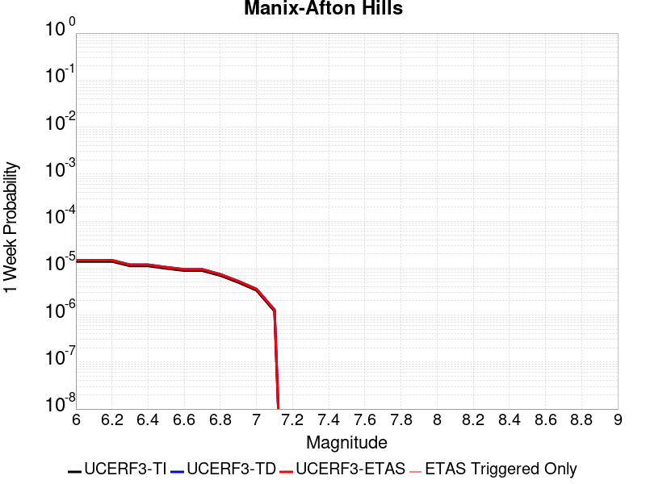 |  |  |  |

| Magnitude | 1 wk TI Prob | 1 wk TD Prob | 1 wk ETAS Prob | 1 wk ETAS/TD Gain | 1 wk ETAS Triggered Only | 1 mo TI Prob | 1 mo TD Prob | 1 mo ETAS Prob | 1 mo ETAS/TD Gain | 1 mo ETAS Triggered Only | 1 yr TI Prob | 1 yr TD Prob | 1 yr ETAS Prob | 1 yr ETAS/TD Gain | 1 yr ETAS Triggered Only | 10 yr TI Prob | 10 yr TD Prob | 10 yr ETAS Prob | 10 yr ETAS/TD Gain | 10 yr ETAS Triggered Only |
|-----|-----|-----|-----|-----|-----|-----|-----|-----|-----|-----|-----|-----|-----|-----|-----|-----|-----|-----|-----|-----|
| 6.0 | 1.3783202E-5 | 1.4711616E-5 | 1.4711616E-5 | 1.0 | 0.0 | 5.906953E-5 | 6.3048356E-5 | 8.3047096E-5 | 1.3171968 | 2.0E-5 | 7.189342E-4 | 7.673609E-4 | 8.373072E-4 | 1.0911517 | 7.0E-5 | 0.0071661277 | 0.0076488685 | 0.0077778744 | 1.016866 | 1.3E-4 |
| 6.1 | 1.3783202E-5 | 1.4711616E-5 | 1.4711616E-5 | 1.0 | 0.0 | 5.906953E-5 | 6.3048356E-5 | 8.3047096E-5 | 1.3171968 | 2.0E-5 | 7.189342E-4 | 7.673609E-4 | 8.373072E-4 | 1.0911517 | 7.0E-5 | 0.0071661277 | 0.0076488685 | 0.0077778744 | 1.016866 | 1.3E-4 |
| 6.2 | 1.3783202E-5 | 1.4711616E-5 | 1.4711616E-5 | 1.0 | 0.0 | 5.906953E-5 | 6.3048356E-5 | 8.3047096E-5 | 1.3171968 | 2.0E-5 | 7.189342E-4 | 7.673609E-4 | 8.373072E-4 | 1.0911517 | 7.0E-5 | 0.0071661277 | 0.0076488685 | 0.0077778744 | 1.016866 | 1.3E-4 |
| 6.3 | 1.10494875E-5 | 1.1793558E-5 | 1.1793558E-5 | 1.0 | 0.0 | 4.7354086E-5 | 5.0542898E-5 | 7.0541886E-5 | 1.3956835 | 2.0E-5 | 5.763835E-4 | 6.151964E-4 | 6.751595E-4 | 1.0974698 | 6.0E-5 | 0.005748908 | 0.0061359745 | 0.0062353606 | 1.0161973 | 1.0E-4 |
| 6.4 | 1.10494875E-5 | 1.1793558E-5 | 1.1793558E-5 | 1.0 | 0.0 | 4.7354086E-5 | 5.0542898E-5 | 7.0541886E-5 | 1.3956835 | 2.0E-5 | 5.763835E-4 | 6.151964E-4 | 6.751595E-4 | 1.0974698 | 6.0E-5 | 0.005748908 | 0.0061359745 | 0.0062353606 | 1.0161973 | 1.0E-4 |
| 6.5 | 9.788949E-6 | 1.0454697E-5 | 1.0454697E-5 | 1.0 | 0.0 | 4.1951964E-5 | 4.480513E-5 | 6.480423E-5 | 1.4463575 | 2.0E-5 | 5.1064545E-4 | 5.453752E-4 | 5.9534796E-4 | 1.09163 | 5.0E-5 | 0.0050947363 | 0.005441295 | 0.005530805 | 1.0164502 | 9.0E-5 |
| 6.6 | 8.810006E-6 | 9.413971E-6 | 9.413971E-6 | 1.0 | 0.0 | 3.775662E-5 | 4.0345018E-5 | 6.034421E-5 | 1.4957042 | 2.0E-5 | 4.5958988E-4 | 4.9109873E-4 | 5.410742E-4 | 1.1017625 | 5.0E-5 | 0.0045864056 | 0.0049010175 | 0.004980625 | 1.0162431 | 8.0E-5 |
| 6.7 | 8.80128E-6 | 9.404451E-6 | 9.404451E-6 | 1.0 | 0.0 | 3.7719226E-5 | 4.0304214E-5 | 6.030341E-5 | 1.496206 | 2.0E-5 | 4.591348E-4 | 4.906022E-4 | 5.405777E-4 | 1.1018655 | 5.0E-5 | 0.004581874 | 0.004896074 | 0.004975682 | 1.0162597 | 8.0E-5 |
| 6.8 | 6.8994877E-6 | 7.3803494E-6 | 7.3803494E-6 | 1.0 | 0.0 | 2.9568899E-5 | 3.162973E-5 | 3.162973E-5 | 1.0 | 0.0 | 3.5994186E-4 | 3.850321E-4 | 4.1502054E-4 | 1.0778856 | 3.0E-5 | 0.003593594 | 0.0038444551 | 0.003894263 | 1.0129558 | 5.0E-5 |
| 6.9 | 4.9328037E-6 | 5.271154E-6 | 5.271154E-6 | 1.0 | 0.0 | 2.1140417E-5 | 2.2590497E-5 | 2.2590497E-5 | 1.0 | 0.0 | 2.5735417E-4 | 2.7501077E-4 | 2.8500802E-4 | 1.0363522 | 1.0E-5 | 0.0025705635 | 0.0027473096 | 0.0027772272 | 1.0108898 | 3.0E-5 |
| 7.0 | 3.347973E-6 | 3.590168E-6 | 3.590168E-6 | 1.0 | 0.0 | 1.4348378E-5 | 1.5386368E-5 | 1.5386368E-5 | 1.0 | 0.0 | 1.746775E-4 | 1.8731703E-4 | 1.8731703E-4 | 1.0 | 0.0 | 0.0017454025 | 0.0018719939 | 0.0018919564 | 1.0106637 | 2.0E-5 |
| 7.1 | 1.2073567E-6 | 1.293531E-6 | 1.293531E-6 | 1.0 | 0.0 | 5.1743755E-6 | 5.5437017E-6 | 5.5437017E-6 | 1.0 | 0.0 | 6.29962E-5 | 6.749411E-5 | 6.749411E-5 | 1.0 | 0.0 | 6.297835E-4 | 6.748963E-4 | 6.748963E-4 | 1.0 | 0.0 |

## Red Pass
*[(top)](#table-of-contents)*

| 1 Week | 1 Month | 1 Year | 10 Year |
|-----|-----|-----|-----|
|  |  |  |  |

| Magnitude | 1 wk TI Prob | 1 wk TD Prob | 1 wk ETAS Prob | 1 wk ETAS/TD Gain | 1 wk ETAS Triggered Only | 1 mo TI Prob | 1 mo TD Prob | 1 mo ETAS Prob | 1 mo ETAS/TD Gain | 1 mo ETAS Triggered Only | 1 yr TI Prob | 1 yr TD Prob | 1 yr ETAS Prob | 1 yr ETAS/TD Gain | 1 yr ETAS Triggered Only | 10 yr TI Prob | 10 yr TD Prob | 10 yr ETAS Prob | 10 yr ETAS/TD Gain | 10 yr ETAS Triggered Only |
|-----|-----|-----|-----|-----|-----|-----|-----|-----|-----|-----|-----|-----|-----|-----|-----|-----|-----|-----|-----|-----|
| 6.0 | 8.258278E-6 | 8.551426E-6 | 8.551426E-6 | 1.0 | 0.0 | 3.539214E-5 | 3.6648555E-5 | 3.6648555E-5 | 1.0 | 0.0 | 4.308141E-4 | 4.4612266E-4 | 4.861048E-4 | 1.0896214 | 4.0E-5 | 0.0042997985 | 0.0044540283 | 0.004573494 | 1.0268219 | 1.2E-4 |
| 6.1 | 3.649988E-6 | 3.7753848E-6 | 3.7753848E-6 | 1.0 | 0.0 | 1.5642712E-5 | 1.6180147E-5 | 1.6180147E-5 | 1.0 | 0.0 | 1.9043336E-4 | 1.9698025E-4 | 1.9698025E-4 | 1.0 | 0.0 | 0.0019027026 | 0.0019685237 | 0.0019984648 | 1.0152098 | 3.0E-5 |
| 6.2 | 3.649988E-6 | 3.7753848E-6 | 3.7753848E-6 | 1.0 | 0.0 | 1.5642712E-5 | 1.6180147E-5 | 1.6180147E-5 | 1.0 | 0.0 | 1.9043336E-4 | 1.9698025E-4 | 1.9698025E-4 | 1.0 | 0.0 | 0.0019027026 | 0.0019685237 | 0.0019984648 | 1.0152098 | 3.0E-5 |
| 6.3 | 1.3924937E-6 | 1.4411434E-6 | 1.4411434E-6 | 1.0 | 0.0 | 5.9678164E-6 | 6.1763217E-6 | 6.1763217E-6 | 1.0 | 0.0 | 7.265574E-5 | 7.519554E-5 | 7.519554E-5 | 1.0 | 0.0 | 7.263199E-4 | 7.518397E-4 | 7.718247E-4 | 1.0265814 | 2.0E-5 |
| 6.4 | 1.3924937E-6 | 1.4411434E-6 | 1.4411434E-6 | 1.0 | 0.0 | 5.9678164E-6 | 6.1763217E-6 | 6.1763217E-6 | 1.0 | 0.0 | 7.265574E-5 | 7.519554E-5 | 7.519554E-5 | 1.0 | 0.0 | 7.263199E-4 | 7.518397E-4 | 7.718247E-4 | 1.0265814 | 2.0E-5 |
| 6.5 | 9.876812E-7 | 1.0222102E-6 | 1.0222102E-6 | 1.0 | 0.0 | 4.2329125E-6 | 4.3809005E-6 | 4.3809005E-6 | 1.0 | 0.0 | 5.153449E-5 | 5.3337466E-5 | 5.3337466E-5 | 1.0 | 0.0 | 5.1522546E-4 | 5.3337467E-4 | 5.4336933E-4 | 1.0187385 | 1.0E-5 |

## Santa Ynez (East)
*[(top)](#table-of-contents)*

| 1 Week | 1 Month | 1 Year | 10 Year |
|-----|-----|-----|-----|
|  |  |  |  |

| Magnitude | 1 wk TI Prob | 1 wk TD Prob | 1 wk ETAS Prob | 1 wk ETAS/TD Gain | 1 wk ETAS Triggered Only | 1 mo TI Prob | 1 mo TD Prob | 1 mo ETAS Prob | 1 mo ETAS/TD Gain | 1 mo ETAS Triggered Only | 1 yr TI Prob | 1 yr TD Prob | 1 yr ETAS Prob | 1 yr ETAS/TD Gain | 1 yr ETAS Triggered Only | 10 yr TI Prob | 10 yr TD Prob | 10 yr ETAS Prob | 10 yr ETAS/TD Gain | 10 yr ETAS Triggered Only |
|-----|-----|-----|-----|-----|-----|-----|-----|-----|-----|-----|-----|-----|-----|-----|-----|-----|-----|-----|-----|-----|
| 6.0 | 3.2269712E-5 | 3.675388E-5 | 3.675388E-5 | 1.0 | 0.0 | 1.3829143E-4 | 1.5751045E-4 | 1.5751045E-4 | 1.0 | 0.0 | 0.0016823979 | 0.0019165927 | 0.002016401 | 1.052076 | 1.0E-4 | 0.016697178 | 0.019058175 | 0.019175889 | 1.0061765 | 1.2E-4 |
| 6.1 | 3.2269712E-5 | 3.675388E-5 | 3.675388E-5 | 1.0 | 0.0 | 1.3829143E-4 | 1.5751045E-4 | 1.5751045E-4 | 1.0 | 0.0 | 0.0016823979 | 0.0019165927 | 0.002016401 | 1.052076 | 1.0E-4 | 0.016697178 | 0.019058175 | 0.019175889 | 1.0061765 | 1.2E-4 |
| 6.2 | 3.2269712E-5 | 3.675388E-5 | 3.675388E-5 | 1.0 | 0.0 | 1.3829143E-4 | 1.5751045E-4 | 1.5751045E-4 | 1.0 | 0.0 | 0.0016823979 | 0.0019165927 | 0.002016401 | 1.052076 | 1.0E-4 | 0.016697178 | 0.019058175 | 0.019175889 | 1.0061765 | 1.2E-4 |
| 6.3 | 3.2269712E-5 | 3.675388E-5 | 3.675388E-5 | 1.0 | 0.0 | 1.3829143E-4 | 1.5751045E-4 | 1.5751045E-4 | 1.0 | 0.0 | 0.0016823979 | 0.0019165927 | 0.002016401 | 1.052076 | 1.0E-4 | 0.016697178 | 0.019058175 | 0.019175889 | 1.0061765 | 1.2E-4 |
| 6.4 | 1.4404779E-5 | 1.485013E-5 | 1.485013E-5 | 1.0 | 0.0 | 6.1733306E-5 | 6.364189E-5 | 6.364189E-5 | 1.0 | 0.0 | 7.513438E-4 | 7.745696E-4 | 8.0454635E-4 | 1.0387012 | 3.0E-5 | 0.0074880854 | 0.0077192495 | 0.0077688633 | 1.0064273 | 5.0E-5 |
| 6.5 | 1.4404779E-5 | 1.485013E-5 | 1.485013E-5 | 1.0 | 0.0 | 6.1733306E-5 | 6.364189E-5 | 6.364189E-5 | 1.0 | 0.0 | 7.513438E-4 | 7.745696E-4 | 8.0454635E-4 | 1.0387012 | 3.0E-5 | 0.0074880854 | 0.0077192495 | 0.0077688633 | 1.0064273 | 5.0E-5 |
| 6.6 | 1.280208E-5 | 1.3012552E-5 | 1.3012552E-5 | 1.0 | 0.0 | 5.4864904E-5 | 5.5766897E-5 | 5.5766897E-5 | 1.0 | 0.0 | 6.6777546E-4 | 6.7875226E-4 | 7.087319E-4 | 1.0441687 | 3.0E-5 | 0.006657724 | 0.006767002 | 0.006816664 | 1.0073388 | 5.0E-5 |
| 6.7 | 1.2457027E-5 | 1.262905E-5 | 1.262905E-5 | 1.0 | 0.0 | 5.3386164E-5 | 5.4123386E-5 | 5.4123386E-5 | 1.0 | 0.0 | 6.497827E-4 | 6.5875467E-4 | 6.887349E-4 | 1.0455105 | 3.0E-5 | 0.00647886 | 0.0065682167 | 0.0066178883 | 1.0075624 | 5.0E-5 |
| 6.8 | 1.2095134E-5 | 1.2231476E-5 | 1.2231476E-5 | 1.0 | 0.0 | 5.1835254E-5 | 5.2419568E-5 | 5.2419568E-5 | 1.0 | 0.0 | 6.309115E-4 | 6.3802296E-4 | 6.680038E-4 | 1.0469903 | 3.0E-5 | 0.0062912325 | 0.0063621 | 0.006411782 | 1.007809 | 5.0E-5 |
| 6.9 | 1.1104036E-5 | 1.115786E-5 | 1.115786E-5 | 1.0 | 0.0 | 4.758786E-5 | 4.7818532E-5 | 4.7818532E-5 | 1.0 | 0.0 | 5.7922816E-4 | 5.820364E-4 | 6.120189E-4 | 1.0515132 | 3.0E-5 | 0.005777207 | 0.005805265 | 0.005854975 | 1.0085629 | 5.0E-5 |
| 7.0 | 1.0577444E-5 | 1.0582165E-5 | 1.0582165E-5 | 1.0 | 0.0 | 4.5331115E-5 | 4.5351353E-5 | 4.5351353E-5 | 1.0 | 0.0 | 5.5176654E-4 | 5.5201404E-4 | 5.819975E-4 | 1.0543164 | 3.0E-5 | 0.0055039856 | 0.005506567 | 0.005556292 | 1.0090301 | 5.0E-5 |
| 7.1 | 1.0021775E-5 | 9.981446E-6 | 9.981446E-6 | 1.0 | 0.0 | 4.294976E-5 | 4.277693E-5 | 4.277693E-5 | 1.0 | 0.0 | 5.2278786E-4 | 5.2068586E-4 | 5.5067026E-4 | 1.0575863 | 3.0E-5 | 0.0052155964 | 0.0051947916 | 0.0052445317 | 1.009575 | 5.0E-5 |
| 7.2 | 8.874109E-6 | 8.749197E-6 | 8.749197E-6 | 1.0 | 0.0 | 3.8031343E-5 | 3.7496025E-5 | 3.7496025E-5 | 1.0 | 0.0 | 4.629332E-4 | 4.564196E-4 | 4.864059E-4 | 1.065699 | 3.0E-5 | 0.0046197 | 0.00455494 | 0.004604712 | 1.0109271 | 5.0E-5 |
| 7.3 | 7.5504267E-6 | 7.505443E-6 | 7.505443E-6 | 1.0 | 0.0 | 3.235857E-5 | 3.2165794E-5 | 3.2165794E-5 | 1.0 | 0.0 | 3.9389438E-4 | 3.915492E-4 | 4.2153744E-4 | 1.0765887 | 3.0E-5 | 0.0039319694 | 0.0039087003 | 0.0039585046 | 1.0127419 | 5.0E-5 |
| 7.4 | 6.309394E-6 | 6.183419E-6 | 6.183419E-6 | 1.0 | 0.0 | 2.703998E-5 | 2.6500104E-5 | 2.6500104E-5 | 1.0 | 0.0 | 3.2916202E-4 | 3.2259195E-4 | 3.325887E-4 | 1.0309889 | 1.0E-5 | 0.003286749 | 0.003221334 | 0.0032512373 | 1.009283 | 3.0E-5 |
| 7.5 | 4.6103073E-6 | 4.4410685E-6 | 4.4410685E-6 | 1.0 | 0.0 | 1.975831E-5 | 1.9033017E-5 | 1.9033017E-5 | 1.0 | 0.0 | 2.4053088E-4 | 2.3170303E-4 | 2.3170303E-4 | 1.0 | 0.0 | 0.002402707 | 0.002314684 | 0.0023246608 | 1.0043103 | 1.0E-5 |
| 7.6 | 1.2858658E-6 | 1.3008554E-6 | 1.3008554E-6 | 1.0 | 0.0 | 5.5108417E-6 | 5.575083E-6 | 5.575083E-6 | 1.0 | 0.0 | 6.7092435E-5 | 6.7874586E-5 | 6.7874586E-5 | 1.0 | 0.0 | 6.707218E-4 | 6.7854545E-4 | 6.8853865E-4 | 1.0147274 | 1.0E-5 |
| 7.7 | 5.3302307E-7 | 5.612297E-7 | 5.612297E-7 | 1.0 | 0.0 | 2.2843826E-6 | 2.4052679E-6 | 2.4052679E-6 | 1.0 | 0.0 | 2.7812002E-5 | 2.9283781E-5 | 2.9283781E-5 | 1.0 | 0.0 | 2.7808524E-4 | 2.9280278E-4 | 3.0279986E-4 | 1.0341427 | 1.0E-5 |
| 7.8 | 4.613933E-8 | 4.8031144E-8 | 4.8031144E-8 | 1.0 | 0.0 | 1.9773998E-7 | 2.0584774E-7 | 2.0584774E-7 | 1.0 | 0.0 | 2.4074816E-6 | 2.5061934E-6 | 2.5061934E-6 | 1.0 | 0.0 | 2.4074554E-5 | 2.5061661E-5 | 2.5061661E-5 | 1.0 | 0.0 |

## San Andreas (North Branch Mill Creek)
*[(top)](#table-of-contents)*

| 1 Week | 1 Month | 1 Year | 10 Year |
|-----|-----|-----|-----|
|  |  |  |  |

| Magnitude | 1 wk TI Prob | 1 wk TD Prob | 1 wk ETAS Prob | 1 wk ETAS/TD Gain | 1 wk ETAS Triggered Only | 1 mo TI Prob | 1 mo TD Prob | 1 mo ETAS Prob | 1 mo ETAS/TD Gain | 1 mo ETAS Triggered Only | 1 yr TI Prob | 1 yr TD Prob | 1 yr ETAS Prob | 1 yr ETAS/TD Gain | 1 yr ETAS Triggered Only | 10 yr TI Prob | 10 yr TD Prob | 10 yr ETAS Prob | 10 yr ETAS/TD Gain | 10 yr ETAS Triggered Only |
|-----|-----|-----|-----|-----|-----|-----|-----|-----|-----|-----|-----|-----|-----|-----|-----|-----|-----|-----|-----|-----|
| 6.0 | 1.3461156E-5 | 2.3527407E-5 | 2.3527407E-5 | 1.0 | 0.0 | 5.7689394E-5 | 1.0082787E-4 | 1.20825855E-4 | 1.1983379 | 2.0E-5 | 7.02142E-4 | 0.0012268913 | 0.0013067932 | 1.0651255 | 8.0E-5 | 0.0069992766 | 0.012243656 | 0.012362188 | 1.009681 | 1.2E-4 |
| 6.1 | 1.3461156E-5 | 2.3527407E-5 | 2.3527407E-5 | 1.0 | 0.0 | 5.7689394E-5 | 1.0082787E-4 | 1.20825855E-4 | 1.1983379 | 2.0E-5 | 7.02142E-4 | 0.0012268913 | 0.0013067932 | 1.0651255 | 8.0E-5 | 0.0069992766 | 0.012243656 | 0.012362188 | 1.009681 | 1.2E-4 |
| 6.2 | 1.3461156E-5 | 2.3527407E-5 | 2.3527407E-5 | 1.0 | 0.0 | 5.7689394E-5 | 1.0082787E-4 | 1.20825855E-4 | 1.1983379 | 2.0E-5 | 7.02142E-4 | 0.0012268913 | 0.0013067932 | 1.0651255 | 8.0E-5 | 0.0069992766 | 0.012243656 | 0.012362188 | 1.009681 | 1.2E-4 |
| 6.3 | 1.3461156E-5 | 2.3527407E-5 | 2.3527407E-5 | 1.0 | 0.0 | 5.7689394E-5 | 1.0082787E-4 | 1.20825855E-4 | 1.1983379 | 2.0E-5 | 7.02142E-4 | 0.0012268913 | 0.0013067932 | 1.0651255 | 8.0E-5 | 0.0069992766 | 0.012243656 | 0.012362188 | 1.009681 | 1.2E-4 |
| 6.4 | 1.3461156E-5 | 2.3527407E-5 | 2.3527407E-5 | 1.0 | 0.0 | 5.7689394E-5 | 1.0082787E-4 | 1.20825855E-4 | 1.1983379 | 2.0E-5 | 7.02142E-4 | 0.0012268913 | 0.0013067932 | 1.0651255 | 8.0E-5 | 0.0069992766 | 0.012243656 | 0.012362188 | 1.009681 | 1.2E-4 |
| 6.5 | 1.3450706E-5 | 2.3516368E-5 | 2.3516368E-5 | 1.0 | 0.0 | 5.764461E-5 | 1.00780555E-4 | 1.2077854E-4 | 1.198431 | 2.0E-5 | 7.0159714E-4 | 0.001226316 | 0.0013062179 | 1.0651561 | 8.0E-5 | 0.006993862 | 0.012237966 | 0.012356498 | 1.0096855 | 1.2E-4 |
| 6.6 | 1.3074523E-5 | 2.313064E-5 | 2.313064E-5 | 1.0 | 0.0 | 5.6032466E-5 | 9.912757E-5 | 1.1912559E-4 | 1.2017403 | 2.0E-5 | 6.8198174E-4 | 0.0012062131 | 0.0012861167 | 1.0662433 | 8.0E-5 | 0.006798926 | 0.012039129 | 0.012157684 | 1.0098475 | 1.2E-4 |
| 6.7 | 1.3050216E-5 | 2.3105935E-5 | 2.3105935E-5 | 1.0 | 0.0 | 5.59283E-5 | 9.9021694E-5 | 1.19019714E-4 | 1.2019559 | 2.0E-5 | 6.8071426E-4 | 0.0012049256 | 0.0012848292 | 1.0663141 | 8.0E-5 | 0.0067863287 | 0.012026393 | 0.01214495 | 1.009858 | 1.2E-4 |
| 6.8 | 1.29049395E-5 | 2.2954338E-5 | 2.2954338E-5 | 1.0 | 0.0 | 5.530571E-5 | 9.8372046E-5 | 1.1837008E-4 | 1.2032897 | 2.0E-5 | 6.73139E-4 | 0.0011970248 | 0.001276929 | 1.0667523 | 8.0E-5 | 0.0067110364 | 0.011948236 | 0.012066802 | 1.0099233 | 1.2E-4 |
| 6.9 | 1.2867369E-5 | 2.2913739E-5 | 2.2913739E-5 | 1.0 | 0.0 | 5.51447E-5 | 9.8198056E-5 | 1.1819609E-4 | 1.20365 | 2.0E-5 | 6.711799E-4 | 0.0011949089 | 0.0012748132 | 1.0668707 | 8.0E-5 | 0.006691564 | 0.011927304 | 0.012045872 | 1.009941 | 1.2E-4 |
| 7.0 | 1.2495996E-5 | 2.2313627E-5 | 2.2313627E-5 | 1.0 | 0.0 | 5.3553173E-5 | 9.562634E-5 | 1.1562443E-4 | 1.2091274 | 2.0E-5 | 6.518148E-4 | 0.0011636318 | 0.0012435387 | 1.0686703 | 8.0E-5 | 0.0064990623 | 0.011617814 | 0.011736421 | 1.010209 | 1.2E-4 |
| 7.1 | 1.2452067E-5 | 2.2258691E-5 | 2.2258691E-5 | 1.0 | 0.0 | 5.3364907E-5 | 9.539092E-5 | 1.1538901E-4 | 1.2096436 | 2.0E-5 | 6.4952404E-4 | 0.0011607686 | 0.0012406757 | 1.0688399 | 8.0E-5 | 0.0064762887 | 0.011589482 | 0.011708091 | 1.0102342 | 1.2E-4 |
| 7.2 | 1.2002777E-5 | 2.163711E-5 | 2.163711E-5 | 1.0 | 0.0 | 5.143946E-5 | 9.272719E-5 | 1.12725334E-4 | 1.2156664 | 2.0E-5 | 6.2609545E-4 | 0.0011283715 | 0.0012082813 | 1.0708187 | 8.0E-5 | 0.006243344 | 0.011268834 | 0.011387481 | 1.0105288 | 1.2E-4 |
| 7.3 | 1.1923425E-5 | 2.150691E-5 | 2.150691E-5 | 1.0 | 0.0 | 5.109939E-5 | 9.216923E-5 | 1.12167385E-4 | 1.2169721 | 2.0E-5 | 6.219575E-4 | 0.0011215854 | 0.0012014956 | 1.0712476 | 8.0E-5 | 0.0062021962 | 0.011201685 | 0.011320341 | 1.0105927 | 1.2E-4 |
| 7.4 | 1.16105175E-5 | 2.0880623E-5 | 2.0880623E-5 | 1.0 | 0.0 | 4.975841E-5 | 8.948533E-5 | 1.09483546E-4 | 1.2234803 | 2.0E-5 | 6.0564023E-4 | 0.0010889419 | 0.0011688549 | 1.0733858 | 8.0E-5 | 0.006039923 | 0.010879163 | 0.010997857 | 1.0109103 | 1.2E-4 |
| 7.5 | 1.1037265E-5 | 1.9579818E-5 | 1.9579818E-5 | 1.0 | 0.0 | 4.7301706E-5 | 8.3910825E-5 | 1.03909144E-4 | 1.2383282 | 2.0E-5 | 5.757461E-4 | 0.0010211377 | 0.001101056 | 1.078264 | 8.0E-5 | 0.005742567 | 0.010208193 | 0.0103269685 | 1.0116353 | 1.2E-4 |
| 7.6 | 1.0720915E-5 | 1.9021407E-5 | 1.9021407E-5 | 1.0 | 0.0 | 4.5945973E-5 | 8.151778E-5 | 1.0151615E-4 | 1.2453252 | 2.0E-5 | 5.592486E-4 | 9.920292E-4 | 0.0010719498 | 1.0805628 | 8.0E-5 | 0.005578433 | 0.009919754 | 0.010038564 | 1.0119771 | 1.2E-4 |
| 7.7 | 9.276279E-6 | 1.6466016E-5 | 1.6466016E-5 | 1.0 | 0.0 | 3.9754876E-5 | 7.056674E-5 | 9.056533E-5 | 1.2833997 | 2.0E-5 | 4.839081E-4 | 8.5881306E-4 | 9.3874434E-4 | 1.0930718 | 8.0E-5 | 0.0048285574 | 0.008598559 | 0.008717527 | 1.0138358 | 1.2E-4 |
| 7.8 | 5.8346777E-6 | 1.11748E-5 | 1.11748E-5 | 1.0 | 0.0 | 2.5005522E-5 | 4.7891124E-5 | 6.789016E-5 | 1.417594 | 2.0E-5 | 3.043997E-4 | 5.829186E-4 | 6.628719E-4 | 1.1371604 | 8.0E-5 | 0.0030398308 | 0.005857104 | 0.0059764013 | 1.020368 | 1.2E-4 |
| 7.9 | 4.690204E-6 | 8.525594E-6 | 8.525594E-6 | 1.0 | 0.0 | 2.0100719E-5 | 3.653775E-5 | 5.6537017E-5 | 1.5473591 | 2.0E-5 | 2.4469878E-4 | 4.4475638E-4 | 5.247208E-4 | 1.1797937 | 8.0E-5 | 0.002444295 | 0.004479242 | 0.0045987046 | 1.0266702 | 1.2E-4 |
| 8.0 | 2.9570454E-6 | 4.857035E-6 | 4.857035E-6 | 1.0 | 0.0 | 1.267299E-5 | 2.0815698E-5 | 3.081549E-5 | 1.4803966 | 1.0E-5 | 1.5428272E-4 | 2.534017E-4 | 2.9339155E-4 | 1.1578121 | 4.0E-5 | 0.0015417566 | 0.002554891 | 0.0026147377 | 1.0234244 | 6.0E-5 |
| 8.1 | 1.6376824E-6 | 2.2021889E-6 | 2.2021889E-6 | 1.0 | 0.0 | 7.01862E-6 | 9.437918E-6 | 9.437918E-6 | 1.0 | 0.0 | 8.544835E-5 | 1.14900606E-4 | 1.14900606E-4 | 1.0 | 0.0 | 8.54155E-4 | 0.0011634289 | 0.0011734172 | 1.0085853 | 1.0E-5 |
| 8.2 | 6.9631557E-7 | 4.5525482E-7 | 4.5525482E-7 | 1.0 | 0.0 | 2.984206E-6 | 1.9510906E-6 | 1.9510906E-6 | 1.0 | 0.0 | 3.63321E-5 | 2.3754272E-5 | 2.3754272E-5 | 1.0 | 0.0 | 3.6326164E-4 | 2.4603383E-4 | 2.4603383E-4 | 1.0 | 0.0 |
| 8.3 | 1.7876137E-7 | 8.3938964E-8 | 8.3938964E-8 | 1.0 | 0.0 | 7.661199E-7 | 3.5973835E-7 | 3.5973835E-7 | 1.0 | 0.0 | 9.32747E-6 | 4.3798063E-6 | 4.3798063E-6 | 1.0 | 0.0 | 9.3270784E-5 | 4.599691E-5 | 4.599691E-5 | 1.0 | 0.0 |

## Baker
*[(top)](#table-of-contents)*

| 1 Week | 1 Month | 1 Year | 10 Year |
|-----|-----|-----|-----|
|  |  |  |  |

| Magnitude | 1 wk TI Prob | 1 wk TD Prob | 1 wk ETAS Prob | 1 wk ETAS/TD Gain | 1 wk ETAS Triggered Only | 1 mo TI Prob | 1 mo TD Prob | 1 mo ETAS Prob | 1 mo ETAS/TD Gain | 1 mo ETAS Triggered Only | 1 yr TI Prob | 1 yr TD Prob | 1 yr ETAS Prob | 1 yr ETAS/TD Gain | 1 yr ETAS Triggered Only | 10 yr TI Prob | 10 yr TD Prob | 10 yr ETAS Prob | 10 yr ETAS/TD Gain | 10 yr ETAS Triggered Only |
|-----|-----|-----|-----|-----|-----|-----|-----|-----|-----|-----|-----|-----|-----|-----|-----|-----|-----|-----|-----|-----|
| 6.0 | 5.695525E-6 | 5.8349133E-6 | 5.8349133E-6 | 1.0 | 0.0 | 2.4409164E-5 | 2.5006555E-5 | 4.5006054E-5 | 1.7997704 | 2.0E-5 | 2.9714106E-4 | 3.0441626E-4 | 3.5440104E-4 | 1.1641988 | 5.0E-5 | 0.0029674405 | 0.0030403885 | 0.0031600236 | 1.0393486 | 1.2E-4 |
| 6.1 | 5.695525E-6 | 5.8349133E-6 | 5.8349133E-6 | 1.0 | 0.0 | 2.4409164E-5 | 2.5006555E-5 | 4.5006054E-5 | 1.7997704 | 2.0E-5 | 2.9714106E-4 | 3.0441626E-4 | 3.5440104E-4 | 1.1641988 | 5.0E-5 | 0.0029674405 | 0.0030403885 | 0.0031600236 | 1.0393486 | 1.2E-4 |
| 6.2 | 5.695525E-6 | 5.8349133E-6 | 5.8349133E-6 | 1.0 | 0.0 | 2.4409164E-5 | 2.5006555E-5 | 4.5006054E-5 | 1.7997704 | 2.0E-5 | 2.9714106E-4 | 3.0441626E-4 | 3.5440104E-4 | 1.1641988 | 5.0E-5 | 0.0029674405 | 0.0030403885 | 0.0031600236 | 1.0393486 | 1.2E-4 |
| 6.3 | 3.2995713E-6 | 3.3837132E-6 | 3.3837132E-6 | 1.0 | 0.0 | 1.4140943E-5 | 1.450155E-5 | 2.4501405E-5 | 1.6895715 | 1.0E-5 | 1.7215237E-4 | 1.7654254E-4 | 2.1653548E-4 | 1.2265342 | 4.0E-5 | 0.0017201907 | 0.00176407 | 0.001873876 | 1.0622458 | 1.1E-4 |
| 6.4 | 3.2995713E-6 | 3.3837132E-6 | 3.3837132E-6 | 1.0 | 0.0 | 1.4140943E-5 | 1.450155E-5 | 2.4501405E-5 | 1.6895715 | 1.0E-5 | 1.7215237E-4 | 1.7654254E-4 | 2.1653548E-4 | 1.2265342 | 4.0E-5 | 0.0017201907 | 0.00176407 | 0.001873876 | 1.0622458 | 1.1E-4 |
| 6.5 | 2.782202E-6 | 2.855881E-6 | 2.855881E-6 | 1.0 | 0.0 | 1.1923668E-5 | 1.2239434E-5 | 2.2239312E-5 | 1.8170213 | 1.0E-5 | 1.4516099E-4 | 1.4900525E-4 | 1.6900228E-4 | 1.1342034 | 2.0E-5 | 0.001450662 | 0.0014890862 | 0.001568967 | 1.0536442 | 8.0E-5 |
| 6.6 | 2.3163404E-6 | 2.3809555E-6 | 2.3809555E-6 | 1.0 | 0.0 | 9.927136E-6 | 1.0204057E-5 | 2.0203954E-5 | 1.9799924 | 1.0E-5 | 1.20856166E-4 | 1.242275E-4 | 1.4422502E-4 | 1.160975 | 2.0E-5 | 0.0012079047 | 0.0012416008 | 0.0013215016 | 1.064353 | 8.0E-5 |
| 6.7 | 2.037056E-6 | 2.0965333E-6 | 2.0965333E-6 | 1.0 | 0.0 | 8.7302105E-6 | 8.985113E-6 | 1.8985023E-5 | 2.1129422 | 1.0E-5 | 1.0628513E-4 | 1.0938842E-4 | 1.2938623E-4 | 1.1828147 | 2.0E-5 | 0.0010623431 | 0.0010933619 | 0.0011732744 | 1.0730888 | 8.0E-5 |
| 6.8 | 1.8356744E-6 | 1.8915596E-6 | 1.8915596E-6 | 1.0 | 0.0 | 7.867153E-6 | 8.106659E-6 | 1.8106579E-5 | 2.2335436 | 1.0E-5 | 9.577837E-5 | 9.869425E-5 | 1.18692275E-4 | 1.2026261 | 2.0E-5 | 9.57371E-4 | 9.865181E-4 | 0.0010564491 | 1.0708866 | 7.0E-5 |
| 6.9 | 1.6310546E-6 | 1.6832361E-6 | 1.6832361E-6 | 1.0 | 0.0 | 6.9902153E-6 | 7.2138496E-6 | 1.7213777E-5 | 2.3862123 | 1.0E-5 | 8.510255E-5 | 8.7825196E-5 | 1.07823435E-4 | 1.2277051 | 2.0E-5 | 8.5069967E-4 | 8.779161E-4 | 9.378634E-4 | 1.0682837 | 6.0E-5 |
| 7.0 | 1.2058036E-6 | 1.2508916E-6 | 1.2508916E-6 | 1.0 | 0.0 | 5.1677193E-6 | 5.3609533E-6 | 1.53609E-5 | 2.86533 | 1.0E-5 | 6.291517E-5 | 6.5267675E-5 | 7.526702E-5 | 1.1532052 | 1.0E-5 | 6.289736E-4 | 6.5248733E-4 | 6.9246127E-4 | 1.0612639 | 4.0E-5 |
| 7.1 | 1.052382E-6 | 1.0951846E-6 | 1.0951846E-6 | 1.0 | 0.0 | 4.5102006E-6 | 4.69364E-6 | 1.4693594E-5 | 3.1305325 | 1.0E-5 | 5.491031E-5 | 5.714358E-5 | 6.714301E-5 | 1.1749878 | 1.0E-5 | 5.4896745E-4 | 5.7128974E-4 | 6.112669E-4 | 1.069977 | 4.0E-5 |
| 7.2 | 1.0067454E-6 | 1.0487945E-6 | 1.0487945E-6 | 1.0 | 0.0 | 4.3146156E-6 | 4.4948256E-6 | 1.4494781E-5 | 3.2247703 | 1.0E-5 | 5.252918E-5 | 5.472314E-5 | 6.472259E-5 | 1.182728 | 1.0E-5 | 5.251676E-4 | 5.470975E-4 | 5.870756E-4 | 1.0730731 | 4.0E-5 |
| 7.3 | 9.3596316E-7 | 9.76795E-7 | 9.76795E-7 | 1.0 | 0.0 | 4.0112645E-6 | 4.186258E-6 | 1.41862165E-5 | 3.3887582 | 1.0E-5 | 4.8836053E-5 | 5.0966508E-5 | 6.0966E-5 | 1.1961973 | 1.0E-5 | 4.8825322E-4 | 5.09549E-4 | 5.495286E-4 | 1.0784608 | 4.0E-5 |
| 7.4 | 8.8117395E-7 | 9.207884E-7 | 9.207884E-7 | 1.0 | 0.0 | 3.7764542E-6 | 3.94623E-6 | 1.3946191E-5 | 3.534054 | 1.0E-5 | 4.5977362E-5 | 4.80443E-5 | 5.804382E-5 | 1.2081312 | 1.0E-5 | 4.596785E-4 | 4.803399E-4 | 5.2032067E-4 | 1.0832343 | 4.0E-5 |
| 7.5 | 8.292386E-7 | 8.6748094E-7 | 8.6748094E-7 | 1.0 | 0.0 | 3.5538749E-6 | 3.7177701E-6 | 1.3717733E-5 | 3.6897745 | 1.0E-5 | 4.326757E-5 | 4.5262917E-5 | 5.5262466E-5 | 1.2209214 | 1.0E-5 | 4.3259145E-4 | 4.5253773E-4 | 4.9251964E-4 | 1.0883504 | 4.0E-5 |
| 7.6 | 7.553842E-7 | 7.9146724E-7 | 7.9146724E-7 | 1.0 | 0.0 | 3.2373566E-6 | 3.391998E-6 | 1.3391964E-5 | 3.9481049 | 1.0E-5 | 3.9414106E-5 | 4.12968E-5 | 5.1296385E-5 | 1.2421395 | 1.0E-5 | 3.9407116E-4 | 4.1289197E-4 | 4.4287957E-4 | 1.0726283 | 3.0E-5 |
| 7.7 | 6.5285366E-7 | 6.8529783E-7 | 6.8529783E-7 | 1.0 | 0.0 | 2.797941E-6 | 2.9369874E-6 | 1.2936958E-5 | 4.4048395 | 1.0E-5 | 3.40644E-5 | 3.5757243E-5 | 4.5756886E-5 | 1.2796537 | 1.0E-5 | 3.405918E-4 | 3.5751556E-4 | 3.875048E-4 | 1.0838825 | 3.0E-5 |
| 7.8 | 3.4586725E-7 | 3.648368E-7 | 3.648368E-7 | 1.0 | 0.0 | 1.4822873E-6 | 1.5635853E-6 | 1.1563569E-5 | 7.3955474 | 1.0E-5 | 1.80467E-5 | 1.903649E-5 | 2.90363E-5 | 1.5252969 | 1.0E-5 | 1.8045233E-4 | 1.9034903E-4 | 2.1034523E-4 | 1.1050501 | 2.0E-5 |
| 7.9 | 2.5591178E-9 | 2.6697329E-9 | 2.6697329E-9 | 1.0 | 0.0 | 1.0967647E-8 | 1.14417125E-8 | 1.14417125E-8 | 1.0 | 0.0 | 1.335311E-7 | 1.3930286E-7 | 1.3930286E-7 | 1.0 | 0.0 | 1.3353102E-6 | 1.3930285E-6 | 1.3930285E-6 | 1.0 | 0.0 |

## Lost Hills
*[(top)](#table-of-contents)*

| 1 Week | 1 Month | 1 Year | 10 Year |
|-----|-----|-----|-----|
|  |  |  |  |

| Magnitude | 1 wk TI Prob | 1 wk TD Prob | 1 wk ETAS Prob | 1 wk ETAS/TD Gain | 1 wk ETAS Triggered Only | 1 mo TI Prob | 1 mo TD Prob | 1 mo ETAS Prob | 1 mo ETAS/TD Gain | 1 mo ETAS Triggered Only | 1 yr TI Prob | 1 yr TD Prob | 1 yr ETAS Prob | 1 yr ETAS/TD Gain | 1 yr ETAS Triggered Only | 10 yr TI Prob | 10 yr TD Prob | 10 yr ETAS Prob | 10 yr ETAS/TD Gain | 10 yr ETAS Triggered Only |
|-----|-----|-----|-----|-----|-----|-----|-----|-----|-----|-----|-----|-----|-----|-----|-----|-----|-----|-----|-----|-----|
| 6.0 | 2.233523E-5 | 2.5108235E-5 | 2.5108235E-5 | 1.0 | 0.0 | 9.571891E-5 | 1.07603235E-4 | 1.2760107E-4 | 1.185848 | 2.0E-5 | 0.0011647546 | 0.0013094501 | 0.0013593847 | 1.038134 | 5.0E-5 | 0.011586686 | 0.013033944 | 0.013122771 | 1.0068151 | 9.0E-5 |
| 6.1 | 2.233523E-5 | 2.5108235E-5 | 2.5108235E-5 | 1.0 | 0.0 | 9.571891E-5 | 1.07603235E-4 | 1.2760107E-4 | 1.185848 | 2.0E-5 | 0.0011647546 | 0.0013094501 | 0.0013593847 | 1.038134 | 5.0E-5 | 0.011586686 | 0.013033944 | 0.013122771 | 1.0068151 | 9.0E-5 |
| 6.2 | 2.233523E-5 | 2.5108235E-5 | 2.5108235E-5 | 1.0 | 0.0 | 9.571891E-5 | 1.07603235E-4 | 1.2760107E-4 | 1.185848 | 2.0E-5 | 0.0011647546 | 0.0013094501 | 0.0013593847 | 1.038134 | 5.0E-5 | 0.011586686 | 0.013033944 | 0.013122771 | 1.0068151 | 9.0E-5 |
| 6.3 | 2.233523E-5 | 2.5108235E-5 | 2.5108235E-5 | 1.0 | 0.0 | 9.571891E-5 | 1.07603235E-4 | 1.2760107E-4 | 1.185848 | 2.0E-5 | 0.0011647546 | 0.0013094501 | 0.0013593847 | 1.038134 | 5.0E-5 | 0.011586686 | 0.013033944 | 0.013122771 | 1.0068151 | 9.0E-5 |
| 6.4 | 1.2288092E-5 | 1.3781996E-5 | 1.3781996E-5 | 1.0 | 0.0 | 5.2662188E-5 | 5.906489E-5 | 7.9063706E-5 | 1.3385906 | 2.0E-5 | 6.409735E-4 | 7.1897154E-4 | 7.589428E-4 | 1.055595 | 4.0E-5 | 0.006391279 | 0.007175662 | 0.0072451597 | 1.0096852 | 7.0E-5 |
| 6.5 | 1.2288092E-5 | 1.3781996E-5 | 1.3781996E-5 | 1.0 | 0.0 | 5.2662188E-5 | 5.906489E-5 | 7.9063706E-5 | 1.3385906 | 2.0E-5 | 6.409735E-4 | 7.1897154E-4 | 7.589428E-4 | 1.055595 | 4.0E-5 | 0.006391279 | 0.007175662 | 0.0072451597 | 1.0096852 | 7.0E-5 |
| 6.6 | 8.58281E-6 | 9.634396E-6 | 9.634396E-6 | 1.0 | 0.0 | 3.6782953E-5 | 4.1290084E-5 | 5.128967E-5 | 1.2421789 | 1.0E-5 | 4.4774043E-4 | 5.02674E-4 | 5.22664E-4 | 1.0397673 | 2.0E-5 | 0.0044683935 | 0.005023531 | 0.0050533805 | 1.0059419 | 3.0E-5 |
| 6.7 | 7.205685E-6 | 8.088828E-6 | 8.088828E-6 | 1.0 | 0.0 | 3.088114E-5 | 3.4666402E-5 | 4.4666056E-5 | 1.2884537 | 1.0E-5 | 3.7591302E-4 | 4.2206346E-4 | 4.3205923E-4 | 1.0236831 | 1.0E-5 | 0.0037527776 | 0.0042206347 | 0.00424055 | 1.0047187 | 2.0E-5 |

## Mission Ridge-Arroyo Parida-Santa Ana
*[(top)](#table-of-contents)*

| 1 Week | 1 Month | 1 Year | 10 Year |
|-----|-----|-----|-----|
|  |  |  |  |

| Magnitude | 1 wk TI Prob | 1 wk TD Prob | 1 wk ETAS Prob | 1 wk ETAS/TD Gain | 1 wk ETAS Triggered Only | 1 mo TI Prob | 1 mo TD Prob | 1 mo ETAS Prob | 1 mo ETAS/TD Gain | 1 mo ETAS Triggered Only | 1 yr TI Prob | 1 yr TD Prob | 1 yr ETAS Prob | 1 yr ETAS/TD Gain | 1 yr ETAS Triggered Only | 10 yr TI Prob | 10 yr TD Prob | 10 yr ETAS Prob | 10 yr ETAS/TD Gain | 10 yr ETAS Triggered Only |
|-----|-----|-----|-----|-----|-----|-----|-----|-----|-----|-----|-----|-----|-----|-----|-----|-----|-----|-----|-----|-----|
| 6.0 | 4.169034E-5 | 4.71435E-5 | 4.71435E-5 | 1.0 | 0.0 | 1.7866064E-4 | 2.0203278E-4 | 2.0203278E-4 | 1.0 | 0.0 | 0.0021730233 | 0.0024577067 | 0.0024976085 | 1.0162354 | 4.0E-5 | 0.021518968 | 0.024387252 | 0.024455544 | 1.0028003 | 7.0E-5 |
| 6.1 | 1.73813E-5 | 1.6855427E-5 | 1.6855427E-5 | 1.0 | 0.0 | 7.4489166E-5 | 7.2235605E-5 | 7.2235605E-5 | 1.0 | 0.0 | 9.065282E-4 | 8.791244E-4 | 9.09098E-4 | 1.0340948 | 3.0E-5 | 0.009028391 | 0.008757609 | 0.008807171 | 1.0056593 | 5.0E-5 |
| 6.2 | 1.4622182E-5 | 1.3674228E-5 | 1.3674228E-5 | 1.0 | 0.0 | 6.2664985E-5 | 5.8602538E-5 | 5.8602538E-5 | 1.0 | 0.0 | 7.6267915E-4 | 7.1325625E-4 | 7.432348E-4 | 1.0420306 | 3.0E-5 | 0.007600669 | 0.0071101133 | 0.007149829 | 1.0055858 | 4.0E-5 |
| 6.3 | 1.3552434E-5 | 1.2483067E-5 | 1.2483067E-5 | 1.0 | 0.0 | 5.8080568E-5 | 5.3497777E-5 | 5.3497777E-5 | 1.0 | 0.0 | 7.069015E-4 | 6.5114396E-4 | 6.811244E-4 | 1.0460428 | 3.0E-5 | 0.00704657 | 0.0064927237 | 0.006522529 | 1.0045905 | 3.0E-5 |
| 6.4 | 1.30977305E-5 | 1.1979993E-5 | 1.1979993E-5 | 1.0 | 0.0 | 5.613192E-5 | 5.1341834E-5 | 5.1341834E-5 | 1.0 | 0.0 | 6.831918E-4 | 6.249106E-4 | 6.5489183E-4 | 1.0479769 | 3.0E-5 | 0.006810953 | 0.0062318784 | 0.0062616915 | 1.004784 | 3.0E-5 |
| 6.5 | 1.225205E-5 | 1.104959E-5 | 1.104959E-5 | 1.0 | 0.0 | 5.2507727E-5 | 4.7354544E-5 | 4.7354544E-5 | 1.0 | 0.0 | 6.3909404E-4 | 5.7639176E-4 | 6.0637447E-4 | 1.0520179 | 3.0E-5 | 0.006372592 | 0.005749278 | 0.0057791052 | 1.005188 | 3.0E-5 |
| 6.6 | 1.1352241E-5 | 1.0064273E-5 | 1.0064273E-5 | 1.0 | 0.0 | 4.8651553E-5 | 4.3131895E-5 | 4.3131895E-5 | 1.0 | 0.0 | 5.921717E-4 | 5.2500644E-4 | 5.5499066E-4 | 1.0571122 | 3.0E-5 | 0.0059059616 | 0.005237907 | 0.0052677505 | 1.0056975 | 3.0E-5 |
| 6.7 | 1.0864116E-5 | 9.517729E-6 | 9.517729E-6 | 1.0 | 0.0 | 4.6559664E-5 | 4.0789644E-5 | 4.0789644E-5 | 1.0 | 0.0 | 5.667165E-4 | 4.9650273E-4 | 5.264879E-4 | 1.0603926 | 3.0E-5 | 0.005652734 | 0.0049541686 | 0.0049840203 | 1.0060256 | 3.0E-5 |
| 6.8 | 1.0666365E-5 | 9.30047E-6 | 9.30047E-6 | 1.0 | 0.0 | 4.571219E-5 | 3.9858558E-5 | 3.9858558E-5 | 1.0 | 0.0 | 5.564038E-4 | 4.851719E-4 | 5.1515736E-4 | 1.0618037 | 3.0E-5 | 0.005550127 | 0.004841359 | 0.004871214 | 1.0061666 | 3.0E-5 |
| 6.9 | 1.0038665E-5 | 8.592689E-6 | 8.592689E-6 | 1.0 | 0.0 | 4.302214E-5 | 3.68253E-5 | 3.68253E-5 | 1.0 | 0.0 | 5.236687E-4 | 4.4825758E-4 | 4.7824412E-4 | 1.0668958 | 3.0E-5 | 0.005224364 | 0.004473745 | 0.0045036105 | 1.0066758 | 3.0E-5 |
| 7.0 | 9.5379955E-6 | 8.025674E-6 | 8.025674E-6 | 1.0 | 0.0 | 4.0876483E-5 | 3.4395303E-5 | 3.4395303E-5 | 1.0 | 0.0 | 4.975576E-4 | 4.1868407E-4 | 4.4867152E-4 | 1.0716231 | 3.0E-5 | 0.00496445 | 0.004179152 | 0.0042090267 | 1.0071485 | 3.0E-5 |
| 7.1 | 9.207389E-6 | 7.652948E-6 | 7.652948E-6 | 1.0 | 0.0 | 3.945964E-5 | 3.2797943E-5 | 3.2797943E-5 | 1.0 | 0.0 | 4.803152E-4 | 3.992435E-4 | 4.2923153E-4 | 1.0751121 | 3.0E-5 | 0.004792784 | 0.003985459 | 0.004015339 | 1.0074973 | 3.0E-5 |
| 7.2 | 7.638091E-6 | 5.9315435E-6 | 5.9315435E-6 | 1.0 | 0.0 | 3.2734264E-5 | 2.5420655E-5 | 2.5420655E-5 | 1.0 | 0.0 | 3.984668E-4 | 3.0945282E-4 | 3.2944666E-4 | 1.0646102 | 2.0E-5 | 0.0039775306 | 0.0030902762 | 0.0031102144 | 1.006452 | 2.0E-5 |
| 7.3 | 7.2500147E-6 | 5.5965506E-6 | 5.5965506E-6 | 1.0 | 0.0 | 3.1071122E-5 | 2.3985E-5 | 2.3985E-5 | 1.0 | 0.0 | 3.7822526E-4 | 2.9197853E-4 | 3.119727E-4 | 1.0684782 | 2.0E-5 | 0.0037758215 | 0.0029160045 | 0.0029359462 | 1.0068387 | 2.0E-5 |
| 7.4 | 6.3899715E-6 | 4.918836E-6 | 4.918836E-6 | 1.0 | 0.0 | 2.7385306E-5 | 2.1080557E-5 | 2.1080557E-5 | 1.0 | 0.0 | 3.3336508E-4 | 2.5662576E-4 | 2.666232E-4 | 1.0389572 | 1.0E-5 | 0.0033286542 | 0.0025633385 | 0.002573313 | 1.0038911 | 1.0E-5 |
| 7.5 | 5.379025E-6 | 4.0841346E-6 | 4.0841346E-6 | 1.0 | 0.0 | 2.305276E-5 | 1.7503316E-5 | 1.7503316E-5 | 1.0 | 0.0 | 2.806312E-4 | 2.1308215E-4 | 2.1308215E-4 | 1.0 | 0.0 | 0.0028027708 | 0.0021287897 | 0.0021287897 | 1.0 | 0.0 |
| 7.6 | 4.1270696E-6 | 3.0885622E-6 | 3.0885622E-6 | 1.0 | 0.0 | 1.768732E-5 | 1.3236629E-5 | 1.3236629E-5 | 1.0 | 0.0 | 2.1532185E-4 | 1.6114411E-4 | 1.6114411E-4 | 1.0 | 0.0 | 0.0021511333 | 0.0016102807 | 0.0016102807 | 1.0 | 0.0 |
| 7.7 | 2.5406805E-6 | 1.8283382E-6 | 1.8283382E-6 | 1.0 | 0.0 | 1.0888585E-5 | 7.8357125E-6 | 7.8357125E-6 | 1.0 | 0.0 | 1.3256045E-4 | 9.539568E-5 | 9.539568E-5 | 1.0 | 0.0 | 0.0013248142 | 9.535535E-4 | 9.535535E-4 | 1.0 | 0.0 |
| 7.8 | 4.8608285E-7 | 3.5100658E-7 | 3.5100658E-7 | 1.0 | 0.0 | 2.0832106E-6 | 1.504313E-6 | 1.504313E-6 | 1.0 | 0.0 | 2.5362791E-5 | 1.8314859E-5 | 1.8314859E-5 | 1.0 | 0.0 | 2.5359896E-4 | 1.8313361E-4 | 1.8313361E-4 | 1.0 | 0.0 |
| 7.9 | 2.0472514E-8 | 1.2690024E-8 | 1.2690024E-8 | 1.0 | 0.0 | 8.7739345E-8 | 5.438582E-8 | 5.438582E-8 | 1.0 | 0.0 | 1.068226E-6 | 6.621471E-7 | 6.621471E-7 | 1.0 | 0.0 | 1.0682209E-5 | 6.6214525E-6 | 6.6214525E-6 | 1.0 | 0.0 |
| 8.0 | 4.443582E-9 | 2.0326807E-9 | 2.0326807E-9 | 1.0 | 0.0 | 1.9043922E-8 | 8.711488E-9 | 8.711488E-9 | 1.0 | 0.0 | 2.3185973E-7 | 1.06062366E-7 | 1.06062366E-7 | 1.0 | 0.0 | 2.3185949E-6 | 1.0606232E-6 | 1.0606232E-6 | 1.0 | 0.0 |

## Cleghorn Lake
*[(top)](#table-of-contents)*

| 1 Week | 1 Month | 1 Year | 10 Year |
|-----|-----|-----|-----|
|  |  |  |  |

| Magnitude | 1 wk TI Prob | 1 wk TD Prob | 1 wk ETAS Prob | 1 wk ETAS/TD Gain | 1 wk ETAS Triggered Only | 1 mo TI Prob | 1 mo TD Prob | 1 mo ETAS Prob | 1 mo ETAS/TD Gain | 1 mo ETAS Triggered Only | 1 yr TI Prob | 1 yr TD Prob | 1 yr ETAS Prob | 1 yr ETAS/TD Gain | 1 yr ETAS Triggered Only | 10 yr TI Prob | 10 yr TD Prob | 10 yr ETAS Prob | 10 yr ETAS/TD Gain | 10 yr ETAS Triggered Only |
|-----|-----|-----|-----|-----|-----|-----|-----|-----|-----|-----|-----|-----|-----|-----|-----|-----|-----|-----|-----|-----|
| 6.0 | 1.5467183E-5 | 1.6794971E-5 | 1.6794971E-5 | 1.0 | 0.0 | 6.6286244E-5 | 7.197677E-5 | 7.197677E-5 | 1.0 | 0.0 | 8.067362E-4 | 8.760197E-4 | 9.259759E-4 | 1.0570264 | 5.0E-5 | 0.008038137 | 0.008731093 | 0.008820307 | 1.010218 | 9.0E-5 |
| 6.1 | 1.5467183E-5 | 1.6794971E-5 | 1.6794971E-5 | 1.0 | 0.0 | 6.6286244E-5 | 7.197677E-5 | 7.197677E-5 | 1.0 | 0.0 | 8.067362E-4 | 8.760197E-4 | 9.259759E-4 | 1.0570264 | 5.0E-5 | 0.008038137 | 0.008731093 | 0.008820307 | 1.010218 | 9.0E-5 |
| 6.2 | 1.2624631E-5 | 1.36821545E-5 | 1.36821545E-5 | 1.0 | 0.0 | 5.410444E-5 | 5.863676E-5 | 5.863676E-5 | 1.0 | 0.0 | 6.585225E-4 | 7.137174E-4 | 7.636817E-4 | 1.0700058 | 5.0E-5 | 0.0065657445 | 0.0071190484 | 0.0072084074 | 1.0125521 | 9.0E-5 |
| 6.3 | 1.2624631E-5 | 1.36821545E-5 | 1.36821545E-5 | 1.0 | 0.0 | 5.410444E-5 | 5.863676E-5 | 5.863676E-5 | 1.0 | 0.0 | 6.585225E-4 | 7.137174E-4 | 7.636817E-4 | 1.0700058 | 5.0E-5 | 0.0065657445 | 0.0071190484 | 0.0072084074 | 1.0125521 | 9.0E-5 |
| 6.4 | 9.417684E-6 | 1.0170551E-5 | 1.0170551E-5 | 1.0 | 0.0 | 4.036088E-5 | 4.3587577E-5 | 4.3587577E-5 | 1.0 | 0.0 | 4.912829E-4 | 5.3059065E-4 | 5.5058004E-4 | 1.0376738 | 2.0E-5 | 0.004901982 | 0.0052972743 | 0.0053370623 | 1.007511 | 4.0E-5 |
| 6.5 | 9.368219E-6 | 1.0117976E-5 | 1.0117976E-5 | 1.0 | 0.0 | 4.014889E-5 | 4.3362263E-5 | 4.3362263E-5 | 1.0 | 0.0 | 4.8870314E-4 | 5.278488E-4 | 5.478382E-4 | 1.0378697 | 2.0E-5 | 0.004876298 | 0.0052699856 | 0.005309775 | 1.0075501 | 4.0E-5 |
| 6.6 | 7.803798E-6 | 8.442198E-6 | 8.442198E-6 | 1.0 | 0.0 | 3.3444423E-5 | 3.6180576E-5 | 3.6180576E-5 | 1.0 | 0.0 | 4.0710976E-4 | 4.404494E-4 | 4.6044058E-4 | 1.0453882 | 2.0E-5 | 0.0040636472 | 0.004399682 | 0.0044395057 | 1.0090516 | 4.0E-5 |
| 6.7 | 2.3108669E-6 | 2.4439082E-6 | 2.4439082E-6 | 1.0 | 0.0 | 9.903678E-6 | 1.0473852E-5 | 1.0473852E-5 | 1.0 | 0.0 | 1.205706E-4 | 1.2751187E-4 | 1.375106E-4 | 1.0784141 | 1.0E-5 | 0.001205052 | 0.0012744057 | 0.001284393 | 1.0078368 | 1.0E-5 |
| 6.8 | 2.0882828E-6 | 2.2063484E-6 | 2.2063484E-6 | 1.0 | 0.0 | 8.949753E-6 | 9.455745E-6 | 9.455745E-6 | 1.0 | 0.0 | 1.08957785E-4 | 1.15117786E-4 | 1.2511664E-4 | 1.0868576 | 1.0E-5 | 0.0010890438 | 0.0011505984 | 0.001160587 | 1.0086812 | 1.0E-5 |
| 6.9 | 1.876935E-6 | 1.9811093E-6 | 1.9811093E-6 | 1.0 | 0.0 | 8.043982E-6 | 8.490441E-6 | 8.490441E-6 | 1.0 | 0.0 | 9.7931086E-5 | 1.0336639E-4 | 1.1336535E-4 | 1.0967332 | 1.0E-5 | 9.788794E-4 | 0.001033199 | 0.0010431887 | 1.0096687 | 1.0E-5 |
| 7.0 | 1.5357559E-6 | 1.620328E-6 | 1.620328E-6 | 1.0 | 0.0 | 6.5817944E-6 | 6.9442453E-6 | 6.9442453E-6 | 1.0 | 0.0 | 8.01304E-5 | 8.454303E-5 | 9.4542185E-5 | 1.1182729 | 1.0E-5 | 8.010151E-4 | 8.4512116E-4 | 8.551127E-4 | 1.0118226 | 1.0E-5 |
| 7.1 | 1.0905424E-6 | 1.1497951E-6 | 1.1497951E-6 | 1.0 | 0.0 | 4.6737446E-6 | 4.9276846E-6 | 4.9276846E-6 | 1.0 | 0.0 | 5.6901354E-5 | 5.9993006E-5 | 5.9993006E-5 | 1.0 | 0.0 | 5.6886784E-4 | 5.997779E-4 | 5.997779E-4 | 1.0 | 0.0 |
| 7.2 | 6.06668E-7 | 6.387457E-7 | 6.387457E-7 | 1.0 | 0.0 | 2.600003E-6 | 2.737479E-6 | 2.737479E-6 | 1.0 | 0.0 | 3.1654577E-5 | 3.3328364E-5 | 3.3328364E-5 | 1.0 | 0.0 | 3.1650066E-4 | 3.3324052E-4 | 3.3324052E-4 | 1.0 | 0.0 |

## San Jacinto (San Bernardino)
*[(top)](#table-of-contents)*

| 1 Week | 1 Month | 1 Year | 10 Year |
|-----|-----|-----|-----|
|  |  |  |  |

| Magnitude | 1 wk TI Prob | 1 wk TD Prob | 1 wk ETAS Prob | 1 wk ETAS/TD Gain | 1 wk ETAS Triggered Only | 1 mo TI Prob | 1 mo TD Prob | 1 mo ETAS Prob | 1 mo ETAS/TD Gain | 1 mo ETAS Triggered Only | 1 yr TI Prob | 1 yr TD Prob | 1 yr ETAS Prob | 1 yr ETAS/TD Gain | 1 yr ETAS Triggered Only | 10 yr TI Prob | 10 yr TD Prob | 10 yr ETAS Prob | 10 yr ETAS/TD Gain | 10 yr ETAS Triggered Only |
|-----|-----|-----|-----|-----|-----|-----|-----|-----|-----|-----|-----|-----|-----|-----|-----|-----|-----|-----|-----|-----|
| 6.0 | 3.409352E-5 | 3.6049758E-5 | 3.6049758E-5 | 1.0 | 0.0 | 1.461069E-4 | 1.5448983E-4 | 1.7448673E-4 | 1.1294384 | 2.0E-5 | 0.0017774 | 0.0018792928 | 0.0019291987 | 1.0265558 | 5.0E-5 | 0.01763251 | 0.019382251 | 0.019470507 | 1.0045534 | 9.0E-5 |
| 6.1 | 3.409352E-5 | 3.6049758E-5 | 3.6049758E-5 | 1.0 | 0.0 | 1.461069E-4 | 1.5448983E-4 | 1.7448673E-4 | 1.1294384 | 2.0E-5 | 0.0017774 | 0.0018792928 | 0.0019291987 | 1.0265558 | 5.0E-5 | 0.01763251 | 0.019382251 | 0.019470507 | 1.0045534 | 9.0E-5 |
| 6.2 | 3.409352E-5 | 3.6049758E-5 | 3.6049758E-5 | 1.0 | 0.0 | 1.461069E-4 | 1.5448983E-4 | 1.7448673E-4 | 1.1294384 | 2.0E-5 | 0.0017774 | 0.0018792928 | 0.0019291987 | 1.0265558 | 5.0E-5 | 0.01763251 | 0.019382251 | 0.019470507 | 1.0045534 | 9.0E-5 |
| 6.3 | 3.409352E-5 | 3.6049758E-5 | 3.6049758E-5 | 1.0 | 0.0 | 1.461069E-4 | 1.5448983E-4 | 1.7448673E-4 | 1.1294384 | 2.0E-5 | 0.0017774 | 0.0018792928 | 0.0019291987 | 1.0265558 | 5.0E-5 | 0.01763251 | 0.019382251 | 0.019470507 | 1.0045534 | 9.0E-5 |
| 6.4 | 3.400795E-5 | 3.5942405E-5 | 3.5942405E-5 | 1.0 | 0.0 | 1.4574021E-4 | 1.540298E-4 | 1.7402672E-4 | 1.129825 | 2.0E-5 | 0.0017729428 | 0.0018737017 | 0.001923608 | 1.0266352 | 5.0E-5 | 0.017588645 | 0.019327328 | 0.019415587 | 1.0045667 | 9.0E-5 |
| 6.5 | 3.341482E-5 | 3.5202946E-5 | 3.5202946E-5 | 1.0 | 0.0 | 1.4319851E-4 | 1.5086106E-4 | 1.7085804E-4 | 1.1325523 | 2.0E-5 | 0.0017420477 | 0.0018351874 | 0.0018850956 | 1.0271952 | 5.0E-5 | 0.017284546 | 0.018948833 | 0.019037127 | 1.0046597 | 9.0E-5 |
| 6.6 | 3.3364955E-5 | 3.5140158E-5 | 3.5140158E-5 | 1.0 | 0.0 | 1.4298483E-4 | 1.50592E-4 | 1.7058897E-4 | 1.1327891 | 2.0E-5 | 0.0017394501 | 0.0018319171 | 0.0018818254 | 1.0272439 | 5.0E-5 | 0.017258976 | 0.018916694 | 0.019004991 | 1.0046678 | 9.0E-5 |
| 6.7 | 3.335922E-5 | 3.512993E-5 | 3.512993E-5 | 1.0 | 0.0 | 1.4296026E-4 | 1.5054816E-4 | 1.7054516E-4 | 1.1328279 | 2.0E-5 | 0.0017391514 | 0.0018313844 | 0.0018812928 | 1.0272517 | 5.0E-5 | 0.017256035 | 0.018911485 | 0.018999783 | 1.0046691 | 9.0E-5 |
| 6.8 | 3.327683E-5 | 3.5023982E-5 | 3.5023982E-5 | 1.0 | 0.0 | 1.4260718E-4 | 1.5009414E-4 | 1.7009114E-4 | 1.1332297 | 2.0E-5 | 0.0017348597 | 0.0018258659 | 0.0018757747 | 1.0273342 | 5.0E-5 | 0.017213784 | 0.018857252 | 0.018945554 | 1.0046827 | 9.0E-5 |
| 6.9 | 3.3235785E-5 | 3.4964927E-5 | 3.4964927E-5 | 1.0 | 0.0 | 1.4243131E-4 | 1.4984109E-4 | 1.6983808E-4 | 1.1334548 | 2.0E-5 | 0.0017327217 | 0.0018227901 | 0.0018726989 | 1.0273805 | 5.0E-5 | 0.017192734 | 0.018827116 | 0.018915422 | 1.0046903 | 9.0E-5 |
| 7.0 | 3.3197095E-5 | 3.4904846E-5 | 3.4904846E-5 | 1.0 | 0.0 | 1.422655E-4 | 1.4958362E-4 | 1.6958063E-4 | 1.1336845 | 2.0E-5 | 0.0017307063 | 0.0018196608 | 0.0018695698 | 1.0274277 | 5.0E-5 | 0.017172894 | 0.018796489 | 0.018884797 | 1.0046982 | 9.0E-5 |
| 7.1 | 3.3129716E-5 | 3.478503E-5 | 3.478503E-5 | 1.0 | 0.0 | 1.4197677E-4 | 1.4907018E-4 | 1.690672E-4 | 1.134145 | 2.0E-5 | 0.0017271966 | 0.0018134202 | 0.0018633294 | 1.0275222 | 5.0E-5 | 0.017138338 | 0.018735558 | 0.018823871 | 1.0047137 | 9.0E-5 |
| 7.2 | 3.3034008E-5 | 3.4652458E-5 | 3.4652458E-5 | 1.0 | 0.0 | 1.4156665E-4 | 1.4850209E-4 | 1.6849911E-4 | 1.1346582 | 2.0E-5 | 0.0017222111 | 0.001806515 | 0.0018564246 | 1.0276276 | 5.0E-5 | 0.017089253 | 0.018667944 | 0.018756263 | 1.004731 | 9.0E-5 |
| 7.3 | 3.2956614E-5 | 3.4520177E-5 | 3.4520177E-5 | 1.0 | 0.0 | 1.4123498E-4 | 1.4793524E-4 | 1.6793227E-4 | 1.1351743 | 2.0E-5 | 0.0017181796 | 0.001799625 | 0.001849535 | 1.0277336 | 5.0E-5 | 0.017049557 | 0.018600674 | 0.018689001 | 1.0047486 | 9.0E-5 |
| 7.4 | 3.2915937E-5 | 3.4441844E-5 | 3.4441844E-5 | 1.0 | 0.0 | 1.4106068E-4 | 1.4759957E-4 | 1.675966E-4 | 1.1354817 | 2.0E-5 | 0.0017160608 | 0.0017955449 | 0.0018454551 | 1.0277967 | 5.0E-5 | 0.017028693 | 0.018560927 | 0.018649258 | 1.004759 | 9.0E-5 |
| 7.5 | 3.281791E-5 | 3.430671E-5 | 3.430671E-5 | 1.0 | 0.0 | 1.406406E-4 | 1.4702049E-4 | 1.6701756E-4 | 1.1360154 | 2.0E-5 | 0.0017109542 | 0.0017885063 | 0.0018384169 | 1.0279063 | 5.0E-5 | 0.016978411 | 0.018491795 | 0.018580131 | 1.0047771 | 9.0E-5 |
| 7.6 | 3.2521442E-5 | 3.4031546E-5 | 3.4031546E-5 | 1.0 | 0.0 | 1.3937015E-4 | 1.4584133E-4 | 1.6583841E-4 | 1.1371154 | 2.0E-5 | 0.0016955109 | 0.0017741736 | 0.0018240848 | 1.0281321 | 5.0E-5 | 0.016826328 | 0.018349366 | 0.018437715 | 1.0048147 | 9.0E-5 |
| 7.7 | 3.0287873E-5 | 3.2514843E-5 | 3.2514843E-5 | 1.0 | 0.0 | 1.297987E-4 | 1.393419E-4 | 1.593391E-4 | 1.1435119 | 2.0E-5 | 0.0015791537 | 0.0016951686 | 0.0017450838 | 1.0294456 | 5.0E-5 | 0.01567979 | 0.017559871 | 0.01764829 | 1.0050353 | 9.0E-5 |
| 7.8 | 2.6316151E-5 | 2.9723395E-5 | 2.9723395E-5 | 1.0 | 0.0 | 1.1277862E-4 | 1.2737977E-4 | 1.4737721E-4 | 1.1569908 | 2.0E-5 | 0.0013722149 | 0.0015497464 | 0.0015996689 | 1.0322133 | 5.0E-5 | 0.013637724 | 0.016100293 | 0.016188845 | 1.0055 | 9.0E-5 |
| 7.9 | 2.0761147E-5 | 2.3470231E-5 | 2.3470231E-5 | 1.0 | 0.0 | 8.897331E-5 | 1.0058283E-4 | 1.2058082E-4 | 1.1988211 | 2.0E-5 | 0.0010827117 | 0.0012239089 | 0.0012738477 | 1.0408027 | 5.0E-5 | 0.010774517 | 0.012820105 | 0.012908951 | 1.0069302 | 9.0E-5 |
| 8.0 | 1.5738568E-5 | 1.607273E-5 | 1.607273E-5 | 1.0 | 0.0 | 6.744926E-5 | 6.8881316E-5 | 7.888063E-5 | 1.1451672 | 1.0E-5 | 8.2088535E-4 | 8.38308E-4 | 8.782745E-4 | 1.0476751 | 4.0E-5 | 0.008178596 | 0.008886527 | 0.008936083 | 1.0055765 | 5.0E-5 |
| 8.1 | 1.0105832E-5 | 8.353191E-6 | 8.353191E-6 | 1.0 | 0.0 | 4.3309992E-5 | 3.5798905E-5 | 4.5798544E-5 | 1.2793282 | 1.0E-5 | 5.2717153E-4 | 4.35765E-4 | 4.557563E-4 | 1.0458763 | 2.0E-5 | 0.005259227 | 0.004689436 | 0.004709342 | 1.0042449 | 2.0E-5 |
| 8.2 | 4.189207E-6 | 1.5851253E-6 | 1.5851253E-6 | 1.0 | 0.0 | 1.7953622E-5 | 6.7933765E-6 | 6.7933765E-6 | 1.0 | 0.0 | 2.1856341E-4 | 8.270625E-5 | 8.270625E-5 | 1.0 | 0.0 | 0.0021834858 | 9.604094E-4 | 9.604094E-4 | 1.0 | 0.0 |
| 8.3 | 1.2758221E-6 | 3.6330252E-7 | 3.6330252E-7 | 1.0 | 0.0 | 5.4677976E-6 | 1.5570099E-6 | 1.5570099E-6 | 1.0 | 0.0 | 6.65684E-5 | 1.8956434E-5 | 1.8956434E-5 | 1.0 | 0.0 | 6.6548464E-4 | 2.2857229E-4 | 2.2857229E-4 | 1.0 | 0.0 |

## Mission Creek
*[(top)](#table-of-contents)*

| 1 Week | 1 Month | 1 Year | 10 Year |
|-----|-----|-----|-----|
|  |  |  |  |

| Magnitude | 1 wk TI Prob | 1 wk TD Prob | 1 wk ETAS Prob | 1 wk ETAS/TD Gain | 1 wk ETAS Triggered Only | 1 mo TI Prob | 1 mo TD Prob | 1 mo ETAS Prob | 1 mo ETAS/TD Gain | 1 mo ETAS Triggered Only | 1 yr TI Prob | 1 yr TD Prob | 1 yr ETAS Prob | 1 yr ETAS/TD Gain | 1 yr ETAS Triggered Only | 10 yr TI Prob | 10 yr TD Prob | 10 yr ETAS Prob | 10 yr ETAS/TD Gain | 10 yr ETAS Triggered Only |
|-----|-----|-----|-----|-----|-----|-----|-----|-----|-----|-----|-----|-----|-----|-----|-----|-----|-----|-----|-----|-----|
| 6.0 | 1.1549387E-5 | 1.6331744E-5 | 1.6331744E-5 | 1.0 | 0.0 | 4.9496433E-5 | 6.9991394E-5 | 7.999069E-5 | 1.1428647 | 1.0E-5 | 6.0245243E-4 | 8.5182703E-4 | 8.7181E-4 | 1.023459 | 2.0E-5 | 0.006008218 | 0.008514742 | 0.008603976 | 1.0104799 | 9.0E-5 |
| 6.1 | 1.1549387E-5 | 1.6331744E-5 | 1.6331744E-5 | 1.0 | 0.0 | 4.9496433E-5 | 6.9991394E-5 | 7.999069E-5 | 1.1428647 | 1.0E-5 | 6.0245243E-4 | 8.5182703E-4 | 8.7181E-4 | 1.023459 | 2.0E-5 | 0.006008218 | 0.008514742 | 0.008603976 | 1.0104799 | 9.0E-5 |
| 6.2 | 1.1549387E-5 | 1.6331744E-5 | 1.6331744E-5 | 1.0 | 0.0 | 4.9496433E-5 | 6.9991394E-5 | 7.999069E-5 | 1.1428647 | 1.0E-5 | 6.0245243E-4 | 8.5182703E-4 | 8.7181E-4 | 1.023459 | 2.0E-5 | 0.006008218 | 0.008514742 | 0.008603976 | 1.0104799 | 9.0E-5 |
| 6.3 | 1.1549387E-5 | 1.6331744E-5 | 1.6331744E-5 | 1.0 | 0.0 | 4.9496433E-5 | 6.9991394E-5 | 7.999069E-5 | 1.1428647 | 1.0E-5 | 6.0245243E-4 | 8.5182703E-4 | 8.7181E-4 | 1.023459 | 2.0E-5 | 0.006008218 | 0.008514742 | 0.008603976 | 1.0104799 | 9.0E-5 |
| 6.4 | 1.1549387E-5 | 1.6331744E-5 | 1.6331744E-5 | 1.0 | 0.0 | 4.9496433E-5 | 6.9991394E-5 | 7.999069E-5 | 1.1428647 | 1.0E-5 | 6.0245243E-4 | 8.5182703E-4 | 8.7181E-4 | 1.023459 | 2.0E-5 | 0.006008218 | 0.008514742 | 0.008603976 | 1.0104799 | 9.0E-5 |
| 6.5 | 1.1549387E-5 | 1.6331744E-5 | 1.6331744E-5 | 1.0 | 0.0 | 4.9496433E-5 | 6.9991394E-5 | 7.999069E-5 | 1.1428647 | 1.0E-5 | 6.0245243E-4 | 8.5182703E-4 | 8.7181E-4 | 1.023459 | 2.0E-5 | 0.006008218 | 0.008514742 | 0.008603976 | 1.0104799 | 9.0E-5 |
| 6.6 | 9.202681E-6 | 1.3854947E-5 | 1.3854947E-5 | 1.0 | 0.0 | 3.9439463E-5 | 5.9377046E-5 | 6.937645E-5 | 1.1684053 | 1.0E-5 | 4.800697E-4 | 7.226848E-4 | 7.426703E-4 | 1.0276545 | 2.0E-5 | 0.004790339 | 0.007231895 | 0.007311316 | 1.0109822 | 8.0E-5 |
| 6.7 | 9.019164E-6 | 1.366061E-5 | 1.366061E-5 | 1.0 | 0.0 | 3.8652986E-5 | 5.854421E-5 | 6.8543624E-5 | 1.170801 | 1.0E-5 | 4.7049852E-4 | 7.1255164E-4 | 7.325374E-4 | 1.0280482 | 2.0E-5 | 0.004695036 | 0.007131216 | 0.007210646 | 1.0111383 | 8.0E-5 |
| 6.8 | 8.673558E-6 | 1.3282702E-5 | 1.3282702E-5 | 1.0 | 0.0 | 3.717186E-5 | 5.6924673E-5 | 6.6924105E-5 | 1.1756607 | 1.0E-5 | 4.524734E-4 | 6.928463E-4 | 7.128325E-4 | 1.0288464 | 2.0E-5 | 0.0045155324 | 0.0069353953 | 0.0070049097 | 1.0100231 | 7.0E-5 |
| 6.9 | 7.002255E-6 | 1.1486859E-5 | 1.1486859E-5 | 1.0 | 0.0 | 3.000932E-5 | 4.9228507E-5 | 5.9228016E-5 | 1.2031243 | 1.0E-5 | 3.653022E-4 | 5.991991E-4 | 6.1918714E-4 | 1.0333579 | 2.0E-5 | 0.0036470229 | 0.0060041854 | 0.0060737655 | 1.0115886 | 7.0E-5 |
| 7.0 | 5.84644E-6 | 9.683714E-6 | 9.683714E-6 | 1.0 | 0.0 | 2.5055931E-5 | 4.1500996E-5 | 5.150058E-5 | 1.2409481 | 1.0E-5 | 3.0501327E-4 | 5.0516205E-4 | 5.251519E-4 | 1.0395713 | 2.0E-5 | 0.0030459496 | 0.005068281 | 0.0051379264 | 1.0137414 | 7.0E-5 |
| 7.1 | 5.54703E-6 | 9.338158E-6 | 9.338158E-6 | 1.0 | 0.0 | 2.377277E-5 | 4.0020088E-5 | 5.0019687E-5 | 1.2498645 | 1.0E-5 | 2.8939504E-4 | 4.871401E-4 | 5.0713035E-4 | 1.041036 | 2.0E-5 | 0.0028901845 | 0.0048888596 | 0.0049585174 | 1.0142483 | 7.0E-5 |
| 7.2 | 4.384709E-6 | 7.689885E-6 | 7.689885E-6 | 1.0 | 0.0 | 1.8791474E-5 | 3.2956254E-5 | 4.2955926E-5 | 1.3034226 | 1.0E-5 | 2.2876218E-4 | 4.0117218E-4 | 4.2116415E-4 | 1.0498339 | 2.0E-5 | 0.0022852682 | 0.0040325816 | 0.004102299 | 1.0172886 | 7.0E-5 |
| 7.3 | 3.7888456E-6 | 6.923602E-6 | 6.923602E-6 | 1.0 | 0.0 | 1.623781E-5 | 2.9672263E-5 | 3.9671966E-5 | 1.3370051 | 1.0E-5 | 1.9767738E-4 | 3.6120327E-4 | 3.8119603E-4 | 1.0553505 | 2.0E-5 | 0.0019750162 | 0.0036342472 | 0.0036940293 | 1.0164496 | 6.0E-5 |
| 7.4 | 2.1982462E-6 | 5.0316853E-6 | 5.0316853E-6 | 1.0 | 0.0 | 9.421021E-6 | 2.1564189E-5 | 3.1563974E-5 | 1.4637218 | 1.0E-5 | 1.1469489E-4 | 2.6251256E-4 | 2.825073E-4 | 1.0761669 | 2.0E-5 | 0.0011463572 | 0.0026498951 | 0.002709736 | 1.0225824 | 6.0E-5 |
| 7.5 | 2.051923E-6 | 4.6227096E-6 | 4.6227096E-6 | 1.0 | 0.0 | 8.793926E-6 | 1.9811463E-5 | 2.9811266E-5 | 1.5047482 | 1.0E-5 | 1.0706078E-4 | 2.4117802E-4 | 2.611732E-4 | 1.0829062 | 2.0E-5 | 0.0010700922 | 0.0024374423 | 0.002497296 | 1.0245559 | 6.0E-5 |
| 7.6 | 1.8733427E-6 | 4.1308053E-6 | 4.1308053E-6 | 1.0 | 0.0 | 8.028587E-6 | 1.7703333E-5 | 2.7703156E-5 | 1.5648555 | 1.0E-5 | 9.774366E-5 | 2.1551683E-4 | 2.3551252E-4 | 1.0927802 | 2.0E-5 | 9.770069E-4 | 0.002181846 | 0.002241715 | 1.0274396 | 6.0E-5 |
| 7.7 | 1.8411953E-6 | 4.0504306E-6 | 4.0504306E-6 | 1.0 | 0.0 | 7.890813E-6 | 1.7358872E-5 | 2.73587E-5 | 1.5760642 | 1.0E-5 | 9.606641E-5 | 2.1132386E-4 | 2.3131965E-4 | 1.0946214 | 2.0E-5 | 9.6024893E-4 | 0.0021401057 | 0.0021999774 | 1.027976 | 6.0E-5 |
| 7.8 | 1.7194251E-6 | 3.7173024E-6 | 3.7173024E-6 | 1.0 | 0.0 | 7.368944E-6 | 1.59312E-5 | 2.593104E-5 | 1.6276891 | 1.0E-5 | 8.97132E-5 | 1.9394518E-4 | 2.139413E-4 | 1.103102 | 2.0E-5 | 8.967699E-4 | 0.0019658357 | 0.0020257176 | 1.0304614 | 6.0E-5 |
| 7.9 | 1.4035052E-6 | 2.9557E-6 | 2.9557E-6 | 1.0 | 0.0 | 6.0150082E-6 | 1.2667225E-5 | 2.2667098E-5 | 1.789429 | 1.0E-5 | 7.3230265E-5 | 1.5421261E-4 | 1.7420952E-4 | 1.1296711 | 2.0E-5 | 7.3206134E-4 | 0.0015659636 | 0.0016258697 | 1.0382551 | 6.0E-5 |
| 8.0 | 3.9318823E-7 | 5.542283E-7 | 5.542283E-7 | 1.0 | 0.0 | 1.6850913E-6 | 2.3752618E-6 | 1.2375238E-5 | 5.210052 | 1.0E-5 | 2.0515794E-5 | 2.8918435E-5 | 3.8918144E-5 | 1.3457901 | 1.0E-5 | 2.0513899E-4 | 2.997098E-4 | 3.197038E-4 | 1.0667112 | 2.0E-5 |
| 8.1 | 1.596793E-7 | 1.1427638E-7 | 1.1427638E-7 | 1.0 | 0.0 | 6.8433974E-7 | 4.8975585E-7 | 4.8975585E-7 | 1.0 | 0.0 | 8.331805E-6 | 5.962761E-6 | 5.962761E-6 | 1.0 | 0.0 | 8.331492E-5 | 6.57585E-5 | 6.57585E-5 | 1.0 | 0.0 |
| 8.2 | 4.9003038E-8 | 2.5565779E-8 | 2.5565779E-8 | 1.0 | 0.0 | 2.10013E-7 | 1.09567615E-7 | 1.09567615E-7 | 1.0 | 0.0 | 2.5569052E-6 | 1.3339849E-6 | 1.3339849E-6 | 1.0 | 0.0 | 2.556876E-5 | 1.5023335E-5 | 1.5023335E-5 | 1.0 | 0.0 |

## San Andreas (Creeping Section) 2011 CFM
*[(top)](#table-of-contents)*

| 1 Week | 1 Month | 1 Year | 10 Year |
|-----|-----|-----|-----|
|  |  |  |  |

| Magnitude | 1 wk TI Prob | 1 wk TD Prob | 1 wk ETAS Prob | 1 wk ETAS/TD Gain | 1 wk ETAS Triggered Only | 1 mo TI Prob | 1 mo TD Prob | 1 mo ETAS Prob | 1 mo ETAS/TD Gain | 1 mo ETAS Triggered Only | 1 yr TI Prob | 1 yr TD Prob | 1 yr ETAS Prob | 1 yr ETAS/TD Gain | 1 yr ETAS Triggered Only | 10 yr TI Prob | 10 yr TD Prob | 10 yr ETAS Prob | 10 yr ETAS/TD Gain | 10 yr ETAS Triggered Only |
|-----|-----|-----|-----|-----|-----|-----|-----|-----|-----|-----|-----|-----|-----|-----|-----|-----|-----|-----|-----|-----|
| 6.0 | 5.986481E-4 | 0.0012277901 | 0.0012277901 | 1.0 | 0.0 | 0.0025631124 | 0.0052455855 | 0.005255533 | 1.0018964 | 1.0E-5 | 0.030762846 | 0.061229862 | 0.061258025 | 1.0004599 | 3.0E-5 | 0.26835477 | 0.42607152 | 0.42612317 | 1.0001212 | 9.0E-5 |
| 6.1 | 5.015945E-4 | 0.0010218644 | 0.0010218644 | 1.0 | 0.0 | 0.00214792 | 0.0043676887 | 0.004377645 | 1.0022795 | 1.0E-5 | 0.025839351 | 0.051269703 | 0.051298164 | 1.0005552 | 3.0E-5 | 0.23032776 | 0.37298882 | 0.37303898 | 1.0001345 | 8.0E-5 |
| 6.2 | 4.073338E-4 | 8.109829E-4 | 8.109829E-4 | 1.0 | 0.0 | 0.0017445484 | 0.0034675654 | 0.0034775306 | 1.0028739 | 1.0E-5 | 0.021034058 | 0.040954083 | 0.040982854 | 1.0007025 | 3.0E-5 | 0.19150782 | 0.31317768 | 0.31323263 | 1.0001755 | 8.0E-5 |
| 6.3 | 3.464099E-4 | 6.7405414E-4 | 6.7405414E-4 | 1.0 | 0.0 | 0.0014837692 | 0.0028840431 | 0.0028940141 | 1.0034573 | 1.0E-5 | 0.017915873 | 0.034210727 | 0.034230042 | 1.0005646 | 2.0E-5 | 0.16538359 | 0.27146977 | 0.27152076 | 1.0001879 | 7.0E-5 |
| 6.4 | 2.935057E-4 | 5.543318E-4 | 5.543318E-4 | 1.0 | 0.0 | 0.0012572751 | 0.0023728115 | 0.0023827879 | 1.0042044 | 1.0E-5 | 0.015200248 | 0.028285956 | 0.028305389 | 1.0006871 | 2.0E-5 | 0.14201577 | 0.23314685 | 0.23320052 | 1.0002302 | 7.0E-5 |
| 6.5 | 2.3409708E-4 | 4.2106997E-4 | 4.2106997E-4 | 1.0 | 0.0 | 0.0010028875 | 0.001803265 | 0.0018132469 | 1.0055355 | 1.0E-5 | 0.012141965 | 0.02160988 | 0.021629449 | 1.0009055 | 2.0E-5 | 0.11499573 | 0.18699536 | 0.18705226 | 1.0003043 | 7.0E-5 |
| 6.6 | 1.5842178E-4 | 2.5115322E-4 | 2.5115322E-4 | 1.0 | 0.0 | 6.7877385E-4 | 0.0010759257 | 0.0010859149 | 1.0092844 | 1.0E-5 | 0.0082328 | 0.013019121 | 0.013038862 | 1.0015162 | 2.0E-5 | 0.07934396 | 0.12333139 | 0.12339276 | 1.0004976 | 7.0E-5 |
| 6.7 | 1.5616413E-4 | 2.4651614E-4 | 2.4651614E-4 | 1.0 | 0.0 | 6.691031E-4 | 0.0010560687 | 0.0010660582 | 1.0094591 | 1.0E-5 | 0.0081159435 | 0.012780937 | 0.012800681 | 1.0015448 | 2.0E-5 | 0.0782586 | 0.12135857 | 0.12142008 | 1.0005068 | 7.0E-5 |
| 6.8 | 1.5538467E-4 | 2.4475376E-4 | 2.4475376E-4 | 1.0 | 0.0 | 6.6576427E-4 | 0.0010485224 | 0.001058512 | 1.0095272 | 1.0E-5 | 0.008075596 | 0.0126902815 | 0.012710027 | 1.001556 | 2.0E-5 | 0.07788358 | 0.12058931 | 0.120650865 | 1.0005105 | 7.0E-5 |
| 6.9 | 1.5153569E-4 | 2.3584193E-4 | 2.3584193E-4 | 1.0 | 0.0 | 6.49277E-4 | 0.0010103616 | 0.0010203515 | 1.0098875 | 1.0E-5 | 0.007876333 | 0.0122323 | 0.012252056 | 1.001615 | 2.0E-5 | 0.07602952 | 0.11665895 | 0.11672078 | 1.00053 | 7.0E-5 |
| 7.0 | 1.4588932E-4 | 2.2441045E-4 | 2.2441045E-4 | 1.0 | 0.0 | 6.250901E-4 | 9.6140656E-4 | 9.71397E-4 | 1.0103915 | 1.0E-5 | 0.0075839474 | 0.011642803 | 0.01166257 | 1.0016978 | 2.0E-5 | 0.073302895 | 0.11150479 | 0.11156699 | 1.0005578 | 7.0E-5 |
| 7.1 | 1.1565079E-4 | 1.6318668E-4 | 1.6318668E-4 | 1.0 | 0.0 | 4.955521E-4 | 6.991849E-4 | 7.0917787E-4 | 1.0142924 | 1.0E-5 | 0.006016669 | 0.008479553 | 0.008499383 | 1.0023386 | 2.0E-5 | 0.058563538 | 0.08383247 | 0.0838966 | 1.000765 | 7.0E-5 |
| 7.2 | 1.0393792E-4 | 1.4650424E-4 | 1.4650424E-4 | 1.0 | 0.0 | 4.4537216E-4 | 6.2772504E-4 | 6.377187E-4 | 1.0159205 | 1.0E-5 | 0.005408933 | 0.007615941 | 0.007635789 | 1.002606 | 2.0E-5 | 0.052791595 | 0.075774014 | 0.07583871 | 1.0008538 | 7.0E-5 |
| 7.3 | 9.332884E-5 | 1.2811116E-4 | 1.2811116E-4 | 1.0 | 0.0 | 3.999194E-4 | 5.4893293E-4 | 5.589275E-4 | 1.0182072 | 1.0E-5 | 0.0048581534 | 0.006662914 | 0.0066827806 | 1.0029817 | 2.0E-5 | 0.047533102 | 0.06662133 | 0.066686675 | 1.0009807 | 7.0E-5 |
| 7.4 | 8.670252E-5 | 1.17293064E-4 | 1.17293064E-4 | 1.0 | 0.0 | 3.715293E-4 | 5.0258834E-4 | 5.125833E-4 | 1.019887 | 1.0E-5 | 0.004513991 | 0.006101966 | 0.006121844 | 1.0032576 | 2.0E-5 | 0.044233937 | 0.06127167 | 0.061327998 | 1.0009192 | 6.0E-5 |
| 7.5 | 7.3036405E-5 | 9.027501E-5 | 9.027501E-5 | 1.0 | 0.0 | 3.129756E-4 | 3.8683563E-4 | 3.9683175E-4 | 1.0258408 | 1.0E-5 | 0.0038038217 | 0.0046995743 | 0.0047194804 | 1.0042357 | 2.0E-5 | 0.03739367 | 0.047980286 | 0.04803741 | 1.0011905 | 6.0E-5 |
| 7.6 | 6.3935775E-5 | 8.298733E-5 | 8.298733E-5 | 1.0 | 0.0 | 2.7398168E-4 | 3.5561158E-4 | 3.6560802E-4 | 1.0281106 | 1.0E-5 | 0.0033306254 | 0.0043209945 | 0.004340908 | 1.0046085 | 2.0E-5 | 0.032811474 | 0.04407886 | 0.044136215 | 1.0013012 | 6.0E-5 |
| 7.7 | 5.5050095E-5 | 6.6780485E-5 | 6.6780485E-5 | 1.0 | 0.0 | 2.3590765E-4 | 2.861707E-4 | 2.9616783E-4 | 1.0349342 | 1.0E-5 | 0.0028683927 | 0.003478566 | 0.0034984965 | 1.0057294 | 2.0E-5 | 0.0283165 | 0.035874426 | 0.03592263 | 1.0013437 | 5.0E-5 |
| 7.8 | 5.027131E-5 | 6.177649E-5 | 6.177649E-5 | 1.0 | 0.0 | 2.1543067E-4 | 2.6472952E-4 | 2.747269E-4 | 1.0377644 | 1.0E-5 | 0.0026197135 | 0.0032183218 | 0.0032382575 | 1.0061945 | 2.0E-5 | 0.025890453 | 0.033198178 | 0.03324652 | 1.0014561 | 5.0E-5 |
| 7.9 | 3.7271806E-5 | 5.034326E-5 | 5.034326E-5 | 1.0 | 0.0 | 1.5972654E-4 | 2.15739E-4 | 2.15739E-4 | 1.0 | 0.0 | 0.0019429359 | 0.0026234603 | 0.002633434 | 1.0038017 | 1.0E-5 | 0.019260362 | 0.027125074 | 0.027163988 | 1.0014347 | 4.0E-5 |
| 8.0 | 2.7310243E-5 | 3.1506686E-5 | 3.1506686E-5 | 1.0 | 0.0 | 1.17038646E-4 | 1.3502168E-4 | 1.3502168E-4 | 1.0 | 0.0 | 0.0014240141 | 0.0016426502 | 0.0016526338 | 1.0060778 | 1.0E-5 | 0.014149235 | 0.017253635 | 0.017283117 | 1.0017087 | 3.0E-5 |
| 8.1 | 1.7940547E-5 | 1.7450684E-5 | 1.7450684E-5 | 1.0 | 0.0 | 7.688579E-5 | 7.4786505E-5 | 7.4786505E-5 | 1.0 | 0.0 | 9.3568244E-4 | 9.1014587E-4 | 9.1014587E-4 | 1.0 | 0.0 | 0.009317525 | 0.009825298 | 0.009835199 | 1.0010078 | 1.0E-5 |
| 8.2 | 8.643924E-6 | 5.49522E-6 | 5.49522E-6 | 1.0 | 0.0 | 3.704486E-5 | 2.355073E-5 | 2.355073E-5 | 1.0 | 0.0 | 4.5092785E-4 | 2.866925E-4 | 2.866925E-4 | 1.0 | 0.0 | 0.0045001395 | 0.0032598388 | 0.0032698063 | 1.0030576 | 1.0E-5 |
| 8.3 | 1.983087E-6 | 7.693574E-7 | 7.693574E-7 | 1.0 | 0.0 | 8.498917E-6 | 3.297242E-6 | 3.297242E-6 | 1.0 | 0.0 | 1.034694E-4 | 4.01432E-5 | 4.01432E-5 | 1.0 | 0.0 | 0.0010342124 | 4.7390026E-4 | 4.8389554E-4 | 1.0210915 | 1.0E-5 |

## Death Valley (Fish Lake Valley)
*[(top)](#table-of-contents)*

| 1 Week | 1 Month | 1 Year | 10 Year |
|-----|-----|-----|-----|
|  |  |  |  |

| Magnitude | 1 wk TI Prob | 1 wk TD Prob | 1 wk ETAS Prob | 1 wk ETAS/TD Gain | 1 wk ETAS Triggered Only | 1 mo TI Prob | 1 mo TD Prob | 1 mo ETAS Prob | 1 mo ETAS/TD Gain | 1 mo ETAS Triggered Only | 1 yr TI Prob | 1 yr TD Prob | 1 yr ETAS Prob | 1 yr ETAS/TD Gain | 1 yr ETAS Triggered Only | 10 yr TI Prob | 10 yr TD Prob | 10 yr ETAS Prob | 10 yr ETAS/TD Gain | 10 yr ETAS Triggered Only |
|-----|-----|-----|-----|-----|-----|-----|-----|-----|-----|-----|-----|-----|-----|-----|-----|-----|-----|-----|-----|-----|
| 6.0 | 3.872328E-5 | 4.727316E-5 | 4.727316E-5 | 1.0 | 0.0 | 1.6594635E-4 | 2.0258522E-4 | 2.2258116E-4 | 1.0987039 | 2.0E-5 | 0.0020185246 | 0.0024638134 | 0.0025037148 | 1.0161949 | 4.0E-5 | 0.02000288 | 0.024390986 | 0.024478791 | 1.0035999 | 9.0E-5 |
| 6.1 | 3.872328E-5 | 4.727316E-5 | 4.727316E-5 | 1.0 | 0.0 | 1.6594635E-4 | 2.0258522E-4 | 2.2258116E-4 | 1.0987039 | 2.0E-5 | 0.0020185246 | 0.0024638134 | 0.0025037148 | 1.0161949 | 4.0E-5 | 0.02000288 | 0.024390986 | 0.024478791 | 1.0035999 | 9.0E-5 |
| 6.2 | 3.872328E-5 | 4.727316E-5 | 4.727316E-5 | 1.0 | 0.0 | 1.6594635E-4 | 2.0258522E-4 | 2.2258116E-4 | 1.0987039 | 2.0E-5 | 0.0020185246 | 0.0024638134 | 0.0025037148 | 1.0161949 | 4.0E-5 | 0.02000288 | 0.024390986 | 0.024478791 | 1.0035999 | 9.0E-5 |
| 6.3 | 2.8356371E-5 | 3.361322E-5 | 3.361322E-5 | 1.0 | 0.0 | 1.2152165E-4 | 1.4404916E-4 | 1.6404627E-4 | 1.1388215 | 2.0E-5 | 0.0014785219 | 0.0017524667 | 0.0017923965 | 1.022785 | 4.0E-5 | 0.014687235 | 0.017393492 | 0.017481927 | 1.0050844 | 9.0E-5 |
| 6.4 | 2.8356371E-5 | 3.361322E-5 | 3.361322E-5 | 1.0 | 0.0 | 1.2152165E-4 | 1.4404916E-4 | 1.6404627E-4 | 1.1388215 | 2.0E-5 | 0.0014785219 | 0.0017524667 | 0.0017923965 | 1.022785 | 4.0E-5 | 0.014687235 | 0.017393492 | 0.017481927 | 1.0050844 | 9.0E-5 |
| 6.5 | 2.4448687E-5 | 2.8610175E-5 | 2.8610175E-5 | 1.0 | 0.0 | 1.0477588E-4 | 1.2260956E-4 | 1.4260711E-4 | 1.1630994 | 2.0E-5 | 0.0012748998 | 0.0014917998 | 0.0015317401 | 1.0267732 | 4.0E-5 | 0.012676105 | 0.014822718 | 0.014911384 | 1.0059818 | 9.0E-5 |
| 6.6 | 2.1298161E-5 | 2.4662175E-5 | 2.4662175E-5 | 1.0 | 0.0 | 9.127464E-5 | 1.05690946E-4 | 1.2568884E-4 | 1.189211 | 2.0E-5 | 0.0011107022 | 0.0012860615 | 0.0013260101 | 1.0310627 | 4.0E-5 | 0.011051672 | 0.012789601 | 0.01287845 | 1.0069469 | 9.0E-5 |
| 6.7 | 1.8959729E-5 | 2.1782762E-5 | 2.1782762E-5 | 1.0 | 0.0 | 8.125345E-5 | 9.3351504E-5 | 1.1334963E-4 | 1.214224 | 2.0E-5 | 9.888117E-4 | 0.0011359875 | 0.001175942 | 1.0351716 | 4.0E-5 | 0.009844234 | 0.011304467 | 0.011393449 | 1.0078715 | 9.0E-5 |
| 6.8 | 1.6691629E-5 | 1.901977E-5 | 1.901977E-5 | 1.0 | 0.0 | 7.153359E-5 | 8.151084E-5 | 1.0150921E-4 | 1.2453461 | 2.0E-5 | 8.7057345E-4 | 9.919596E-4 | 0.0010319198 | 1.0402843 | 4.0E-5 | 0.008671708 | 0.009877076 | 0.009966187 | 1.009022 | 9.0E-5 |
| 6.9 | 1.450505E-5 | 1.6390675E-5 | 1.6390675E-5 | 1.0 | 0.0 | 6.216302E-5 | 7.024391E-5 | 8.0243204E-5 | 1.1423512 | 1.0E-5 | 7.5657194E-4 | 8.5489283E-4 | 8.8486716E-4 | 1.0350621 | 3.0E-5 | 0.007540013 | 0.008516973 | 0.008596292 | 1.009313 | 8.0E-5 |
| 7.0 | 1.2940855E-5 | 1.4538927E-5 | 1.4538927E-5 | 1.0 | 0.0 | 5.545963E-5 | 6.230823E-5 | 7.230761E-5 | 1.1604824 | 1.0E-5 | 6.750118E-4 | 7.583444E-4 | 7.883217E-4 | 1.0395298 | 3.0E-5 | 0.006729651 | 0.007558184 | 0.0076375795 | 1.0105046 | 8.0E-5 |
| 7.1 | 1.2544658E-5 | 1.4079123E-5 | 1.4079123E-5 | 1.0 | 0.0 | 5.3761712E-5 | 6.0337734E-5 | 7.033713E-5 | 1.1657238 | 1.0E-5 | 6.5435225E-4 | 7.343699E-4 | 7.643479E-4 | 1.0408213 | 3.0E-5 | 0.006524288 | 0.007320025 | 0.0073994393 | 1.0108489 | 8.0E-5 |
| 7.2 | 1.2489416E-5 | 1.4016585E-5 | 1.4016585E-5 | 1.0 | 0.0 | 5.3524967E-5 | 6.0069728E-5 | 7.006913E-5 | 1.1664633 | 1.0E-5 | 6.514716E-4 | 7.311091E-4 | 7.610872E-4 | 1.0410036 | 3.0E-5 | 0.006495651 | 0.0072876317 | 0.0073670484 | 1.0108975 | 8.0E-5 |
| 7.3 | 1.2368307E-5 | 1.38807145E-5 | 1.38807145E-5 | 1.0 | 0.0 | 5.3005948E-5 | 5.948745E-5 | 6.948686E-5 | 1.1680927 | 1.0E-5 | 6.451563E-4 | 7.2402466E-4 | 7.5400295E-4 | 1.0414051 | 3.0E-5 | 0.0064328653 | 0.0072172494 | 0.0072966716 | 1.0110046 | 8.0E-5 |
| 7.4 | 1.2161707E-5 | 1.3648755E-5 | 1.3648755E-5 | 1.0 | 0.0 | 5.212056E-5 | 5.8493384E-5 | 6.84928E-5 | 1.1709495 | 1.0E-5 | 6.3438306E-4 | 7.1192987E-4 | 7.419085E-4 | 1.042109 | 3.0E-5 | 0.006325751 | 0.0070970803 | 0.0071765124 | 1.0111922 | 8.0E-5 |
| 7.5 | 1.1707948E-5 | 1.3146373E-5 | 1.3146373E-5 | 1.0 | 0.0 | 5.0175953E-5 | 5.6340414E-5 | 6.633985E-5 | 1.1774825 | 1.0E-5 | 6.10721E-4 | 6.857342E-4 | 7.057205E-4 | 1.0291458 | 2.0E-5 | 0.0060904534 | 0.006836766 | 0.0069062873 | 1.0101688 | 7.0E-5 |
| 7.6 | 1.0319538E-5 | 1.1580373E-5 | 1.1580373E-5 | 1.0 | 0.0 | 4.4225842E-5 | 4.9629256E-5 | 5.962876E-5 | 1.2014841 | 1.0E-5 | 5.383166E-4 | 6.0407387E-4 | 6.240618E-4 | 1.0330886 | 2.0E-5 | 0.0053701443 | 0.00602485 | 0.0060944282 | 1.0115485 | 7.0E-5 |
| 7.7 | 8.937764E-6 | 1.0023426E-5 | 1.0023426E-5 | 1.0 | 0.0 | 3.830414E-5 | 4.295686E-5 | 5.295643E-5 | 1.2327816 | 1.0E-5 | 4.6625308E-4 | 5.228793E-4 | 5.4286886E-4 | 1.0382297 | 2.0E-5 | 0.0046527605 | 0.005217 | 0.005276687 | 1.0114409 | 6.0E-5 |
| 7.8 | 3.108007E-7 | 3.2847535E-7 | 3.2847535E-7 | 1.0 | 0.0 | 1.3320023E-6 | 1.4077508E-6 | 1.4077508E-6 | 1.0 | 0.0 | 1.6217007E-5 | 1.7139235E-5 | 1.7139235E-5 | 1.0 | 0.0 | 1.6215823E-4 | 1.713795E-4 | 1.8137779E-4 | 1.0583401 | 1.0E-5 |
| 7.9 | 2.5591178E-9 | 2.6697329E-9 | 2.6697329E-9 | 1.0 | 0.0 | 1.0967647E-8 | 1.14417125E-8 | 1.14417125E-8 | 1.0 | 0.0 | 1.335311E-7 | 1.3930286E-7 | 1.3930286E-7 | 1.0 | 0.0 | 1.3353102E-6 | 1.3930285E-6 | 1.3930285E-6 | 1.0 | 0.0 |

## Owens Valley
*[(top)](#table-of-contents)*

| 1 Week | 1 Month | 1 Year | 10 Year |
|-----|-----|-----|-----|
|  |  |  | 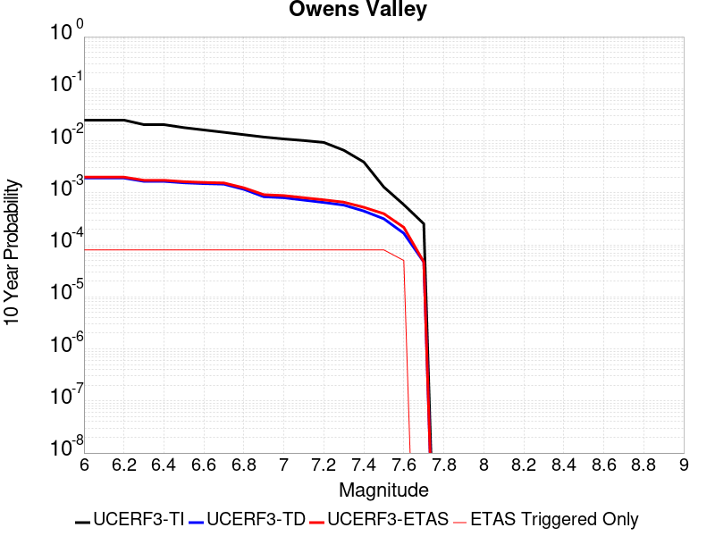 |

| Magnitude | 1 wk TI Prob | 1 wk TD Prob | 1 wk ETAS Prob | 1 wk ETAS/TD Gain | 1 wk ETAS Triggered Only | 1 mo TI Prob | 1 mo TD Prob | 1 mo ETAS Prob | 1 mo ETAS/TD Gain | 1 mo ETAS Triggered Only | 1 yr TI Prob | 1 yr TD Prob | 1 yr ETAS Prob | 1 yr ETAS/TD Gain | 1 yr ETAS Triggered Only | 10 yr TI Prob | 10 yr TD Prob | 10 yr ETAS Prob | 10 yr ETAS/TD Gain | 10 yr ETAS Triggered Only |
|-----|-----|-----|-----|-----|-----|-----|-----|-----|-----|-----|-----|-----|-----|-----|-----|-----|-----|-----|-----|-----|
| 6.0 | 4.83821E-5 | 3.6298834E-6 | 3.6298834E-6 | 1.0 | 0.0 | 2.0733538E-4 | 1.5556556E-5 | 2.5556401E-5 | 1.6428058 | 1.0E-5 | 0.002521386 | 1.893856E-4 | 2.2937803E-4 | 1.2111692 | 4.0E-5 | 0.024929691 | 0.0019267192 | 0.002006565 | 1.0414413 | 8.0E-5 |
| 6.1 | 4.83821E-5 | 3.6298834E-6 | 3.6298834E-6 | 1.0 | 0.0 | 2.0733538E-4 | 1.5556556E-5 | 2.5556401E-5 | 1.6428058 | 1.0E-5 | 0.002521386 | 1.893856E-4 | 2.2937803E-4 | 1.2111692 | 4.0E-5 | 0.024929691 | 0.0019267192 | 0.002006565 | 1.0414413 | 8.0E-5 |
| 6.2 | 4.83821E-5 | 3.6298834E-6 | 3.6298834E-6 | 1.0 | 0.0 | 2.0733538E-4 | 1.5556556E-5 | 2.5556401E-5 | 1.6428058 | 1.0E-5 | 0.002521386 | 1.893856E-4 | 2.2937803E-4 | 1.2111692 | 4.0E-5 | 0.024929691 | 0.0019267192 | 0.002006565 | 1.0414413 | 8.0E-5 |
| 6.3 | 3.953008E-5 | 3.1571942E-6 | 3.1571942E-6 | 1.0 | 0.0 | 1.6940363E-4 | 1.3530766E-5 | 2.353063E-5 | 1.7390465 | 1.0E-5 | 0.002060538 | 1.6472537E-4 | 2.0471877E-4 | 1.2427884 | 4.0E-5 | 0.020415364 | 0.0016601578 | 0.001740025 | 1.0481082 | 8.0E-5 |
| 6.4 | 3.953008E-5 | 3.1571942E-6 | 3.1571942E-6 | 1.0 | 0.0 | 1.6940363E-4 | 1.3530766E-5 | 2.353063E-5 | 1.7390465 | 1.0E-5 | 0.002060538 | 1.6472537E-4 | 2.0471877E-4 | 1.2427884 | 4.0E-5 | 0.020415364 | 0.0016601578 | 0.001740025 | 1.0481082 | 8.0E-5 |
| 6.5 | 3.457342E-5 | 2.9727623E-6 | 2.9727623E-6 | 1.0 | 0.0 | 1.4816338E-4 | 1.2740352E-5 | 2.2740223E-5 | 1.7848977 | 1.0E-5 | 0.0018023965 | 1.5510344E-4 | 1.9509724E-4 | 1.2578524 | 4.0E-5 | 0.017878477 | 0.0015563503 | 0.0016362257 | 1.0513223 | 8.0E-5 |
| 6.6 | 3.1127765E-5 | 2.8753116E-6 | 2.8753116E-6 | 1.0 | 0.0 | 1.3339789E-4 | 1.232271E-5 | 2.2322587E-5 | 1.8114998 | 1.0E-5 | 0.0016229092 | 1.5001935E-4 | 1.9001335E-4 | 1.2665923 | 4.0E-5 | 0.016111081 | 0.0015016922 | 0.0015815721 | 1.0531932 | 8.0E-5 |
| 6.7 | 2.806885E-5 | 2.8110242E-6 | 2.8110242E-6 | 1.0 | 0.0 | 1.2028952E-4 | 1.2047194E-5 | 2.2047074E-5 | 1.8300588 | 1.0E-5 | 0.001463541 | 1.466654E-4 | 1.8665954E-4 | 1.2726896 | 4.0E-5 | 0.014539397 | 0.0014660707 | 0.0015459533 | 1.0544876 | 8.0E-5 |
| 6.8 | 2.524524E-5 | 2.2358972E-6 | 2.2358972E-6 | 1.0 | 0.0 | 1.0818939E-4 | 9.582383E-6 | 1.9582287E-5 | 2.0435717 | 1.0E-5 | 0.0013164099 | 1.16659576E-4 | 1.566549E-4 | 1.342838 | 4.0E-5 | 0.01308639 | 0.001166257 | 0.0012461636 | 1.0685155 | 8.0E-5 |
| 6.9 | 2.2704568E-5 | 1.6085578E-6 | 1.6085578E-6 | 1.0 | 0.0 | 9.730166E-5 | 6.893801E-6 | 1.6893731E-5 | 2.4505687 | 1.0E-5 | 0.0011840039 | 8.392881E-5 | 1.2392545E-4 | 1.4765544 | 4.0E-5 | 0.011777153 | 8.391837E-4 | 9.1911654E-4 | 1.0952507 | 8.0E-5 |
| 7.0 | 2.0871712E-5 | 1.5399135E-6 | 1.5399135E-6 | 1.0 | 0.0 | 8.944713E-5 | 6.5996123E-6 | 1.6599546E-5 | 2.5152304 | 1.0E-5 | 0.0010884746 | 8.034734E-5 | 1.2034412E-4 | 1.4977986 | 4.0E-5 | 0.010831586 | 8.0335594E-4 | 8.8329165E-4 | 1.0995022 | 8.0E-5 |
| 7.1 | 1.944928E-5 | 1.3867325E-6 | 1.3867325E-6 | 1.0 | 0.0 | 8.335139E-5 | 5.943126E-6 | 1.5943066E-5 | 2.6826062 | 1.0E-5 | 0.0010143308 | 7.2355164E-5 | 1.1235227E-4 | 1.5527885 | 4.0E-5 | 0.010097133 | 7.23475E-4 | 8.034171E-4 | 1.1104975 | 8.0E-5 |
| 7.2 | 1.7876306E-5 | 1.249191E-6 | 1.249191E-6 | 1.0 | 0.0 | 7.6610486E-5 | 5.3536646E-6 | 1.5353611E-5 | 2.8678694 | 1.0E-5 | 9.3233347E-4 | 6.517892E-5 | 1.0517632E-4 | 1.6136553 | 4.0E-5 | 0.009284316 | 6.517364E-4 | 7.3168427E-4 | 1.122669 | 8.0E-5 |
| 7.3 | 1.2618672E-5 | 1.1117779E-6 | 1.1117779E-6 | 1.0 | 0.0 | 5.40789E-5 | 4.764754E-6 | 1.4764706E-5 | 3.0987341 | 1.0E-5 | 6.582117E-4 | 5.8009344E-5 | 9.8007025E-5 | 1.6895041 | 4.0E-5 | 0.0065626553 | 5.800754E-4 | 6.60029E-4 | 1.1378331 | 8.0E-5 |
| 7.4 | 7.4874442E-6 | 8.550806E-7 | 8.550806E-7 | 1.0 | 0.0 | 3.208865E-5 | 3.6646259E-6 | 1.36645895E-5 | 3.7287815 | 1.0E-5 | 3.906093E-4 | 4.461591E-5 | 8.461413E-5 | 1.8965012 | 4.0E-5 | 0.003899234 | 4.461625E-4 | 5.261268E-4 | 1.1792269 | 8.0E-5 |
| 7.5 | 2.4734156E-6 | 6.0700546E-7 | 6.0700546E-7 | 1.0 | 0.0 | 1.060031E-5 | 2.6014495E-6 | 1.2601424E-5 | 4.844001 | 1.0E-5 | 1.2905113E-4 | 3.167219E-5 | 7.1670926E-5 | 2.2628977 | 4.0E-5 | 0.0012897621 | 3.166771E-4 | 3.9665174E-4 | 1.2525432 | 8.0E-5 |
| 7.6 | 1.1328841E-6 | 3.1972448E-7 | 3.1972448E-7 | 1.0 | 0.0 | 4.8552088E-6 | 1.3702471E-6 | 1.3702471E-6 | 1.0 | 0.0 | 5.9110564E-5 | 1.6682632E-5 | 2.6682466E-5 | 1.5994158 | 1.0E-5 | 5.9094845E-4 | 1.6681399E-4 | 2.1680565E-4 | 1.299685 | 5.0E-5 |
| 7.7 | 4.8613185E-7 | 8.967469E-8 | 8.967469E-8 | 1.0 | 0.0 | 2.0834207E-6 | 3.8432006E-7 | 3.8432006E-7 | 1.0 | 0.0 | 2.536535E-5 | 4.6790874E-6 | 4.6790874E-6 | 1.0 | 0.0 | 2.5362454E-4 | 4.678996E-5 | 4.678996E-5 | 1.0 | 0.0 |

## Red Mountain
*[(top)](#table-of-contents)*

| 1 Week | 1 Month | 1 Year | 10 Year |
|-----|-----|-----|-----|
|  |  |  | 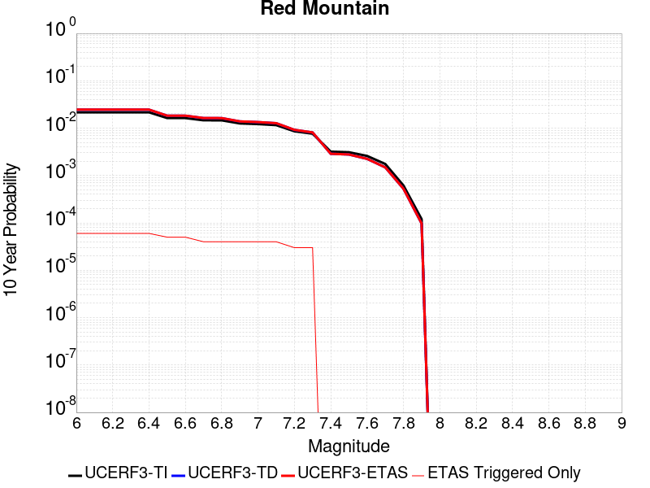 |

| Magnitude | 1 wk TI Prob | 1 wk TD Prob | 1 wk ETAS Prob | 1 wk ETAS/TD Gain | 1 wk ETAS Triggered Only | 1 mo TI Prob | 1 mo TD Prob | 1 mo ETAS Prob | 1 mo ETAS/TD Gain | 1 mo ETAS Triggered Only | 1 yr TI Prob | 1 yr TD Prob | 1 yr ETAS Prob | 1 yr ETAS/TD Gain | 1 yr ETAS Triggered Only | 10 yr TI Prob | 10 yr TD Prob | 10 yr ETAS Prob | 10 yr ETAS/TD Gain | 10 yr ETAS Triggered Only |
|-----|-----|-----|-----|-----|-----|-----|-----|-----|-----|-----|-----|-----|-----|-----|-----|-----|-----|-----|-----|-----|
| 6.0 | 4.1810763E-5 | 4.759418E-5 | 4.759418E-5 | 1.0 | 0.0 | 1.7917668E-4 | 2.0396004E-4 | 2.0396004E-4 | 1.0 | 0.0 | 0.0021792934 | 0.0024805511 | 0.0025104766 | 1.0120641 | 3.0E-5 | 0.021580452 | 0.024546249 | 0.024604777 | 1.0023844 | 6.0E-5 |
| 6.1 | 4.1810763E-5 | 4.759418E-5 | 4.759418E-5 | 1.0 | 0.0 | 1.7917668E-4 | 2.0396004E-4 | 2.0396004E-4 | 1.0 | 0.0 | 0.0021792934 | 0.0024805511 | 0.0025104766 | 1.0120641 | 3.0E-5 | 0.021580452 | 0.024546249 | 0.024604777 | 1.0023844 | 6.0E-5 |
| 6.2 | 4.1810763E-5 | 4.759418E-5 | 4.759418E-5 | 1.0 | 0.0 | 1.7917668E-4 | 2.0396004E-4 | 2.0396004E-4 | 1.0 | 0.0 | 0.0021792934 | 0.0024805511 | 0.0025104766 | 1.0120641 | 3.0E-5 | 0.021580452 | 0.024546249 | 0.024604777 | 1.0023844 | 6.0E-5 |
| 6.3 | 4.1810763E-5 | 4.759418E-5 | 4.759418E-5 | 1.0 | 0.0 | 1.7917668E-4 | 2.0396004E-4 | 2.0396004E-4 | 1.0 | 0.0 | 0.0021792934 | 0.0024805511 | 0.0025104766 | 1.0120641 | 3.0E-5 | 0.021580452 | 0.024546249 | 0.024604777 | 1.0023844 | 6.0E-5 |
| 6.4 | 4.1810763E-5 | 4.759418E-5 | 4.759418E-5 | 1.0 | 0.0 | 1.7917668E-4 | 2.0396004E-4 | 2.0396004E-4 | 1.0 | 0.0 | 0.0021792934 | 0.0024805511 | 0.0025104766 | 1.0120641 | 3.0E-5 | 0.021580452 | 0.024546249 | 0.024604777 | 1.0023844 | 6.0E-5 |
| 6.5 | 3.154503E-5 | 3.5362722E-5 | 3.5362722E-5 | 1.0 | 0.0 | 1.3518598E-4 | 1.5154622E-4 | 1.5154622E-4 | 1.0 | 0.0 | 0.0016446467 | 0.001843606 | 0.0018735507 | 1.0162425 | 3.0E-5 | 0.01632528 | 0.018292768 | 0.018341854 | 1.0026833 | 5.0E-5 |
| 6.6 | 3.1535834E-5 | 3.5352103E-5 | 3.5352103E-5 | 1.0 | 0.0 | 1.3514658E-4 | 1.5150072E-4 | 1.5150072E-4 | 1.0 | 0.0 | 0.0016441676 | 0.0018430529 | 0.0018729976 | 1.0162474 | 3.0E-5 | 0.01632056 | 0.018287329 | 0.018336415 | 1.0026841 | 5.0E-5 |
| 6.7 | 2.8267326E-5 | 3.1471947E-5 | 3.1471947E-5 | 1.0 | 0.0 | 1.2114006E-4 | 1.3487328E-4 | 1.3487328E-4 | 1.0 | 0.0 | 0.0014738824 | 0.0016409304 | 0.0016708812 | 1.0182523 | 3.0E-5 | 0.014641452 | 0.016296903 | 0.016336251 | 1.0024145 | 4.0E-5 |
| 6.8 | 2.8212884E-5 | 3.140983E-5 | 3.140983E-5 | 1.0 | 0.0 | 1.20906756E-4 | 1.3460708E-4 | 1.3460708E-4 | 1.0 | 0.0 | 0.0014710457 | 0.0016376943 | 0.0016676452 | 1.0182885 | 3.0E-5 | 0.014613459 | 0.016265018 | 0.016304366 | 1.0024192 | 4.0E-5 |
| 6.9 | 2.4227871E-5 | 2.6709133E-5 | 2.6709133E-5 | 1.0 | 0.0 | 1.03829596E-4 | 1.1446312E-4 | 1.1446312E-4 | 1.0 | 0.0 | 0.0012633923 | 0.0013927735 | 0.0014227317 | 1.0215098 | 3.0E-5 | 0.012562336 | 0.013848136 | 0.013887582 | 1.0028485 | 4.0E-5 |
| 7.0 | 2.348524E-5 | 2.5837837E-5 | 2.5837837E-5 | 1.0 | 0.0 | 1.0064714E-4 | 1.10729314E-4 | 1.10729314E-4 | 1.0 | 0.0 | 0.0012246901 | 0.0013473714 | 0.0013773309 | 1.0222356 | 3.0E-5 | 0.012179627 | 0.013399659 | 0.013439123 | 1.0029452 | 4.0E-5 |
| 7.1 | 2.2311642E-5 | 2.4464778E-5 | 2.4464778E-5 | 1.0 | 0.0 | 9.561782E-5 | 1.0484526E-4 | 1.0484526E-4 | 1.0 | 0.0 | 0.0011635252 | 0.0012758184 | 0.0013057801 | 1.0234843 | 3.0E-5 | 0.01157452 | 0.012692457 | 0.01273195 | 1.0031115 | 4.0E-5 |
| 7.2 | 1.6533986E-5 | 1.7671664E-5 | 1.7671664E-5 | 1.0 | 0.0 | 7.085802E-5 | 7.573386E-5 | 7.573386E-5 | 1.0 | 0.0 | 8.623549E-4 | 9.2173315E-4 | 9.4171474E-4 | 1.0216782 | 2.0E-5 | 0.008590161 | 0.00918538 | 0.009215105 | 1.003236 | 3.0E-5 |
| 7.3 | 1.4703092E-5 | 1.5560665E-5 | 1.5560665E-5 | 1.0 | 0.0 | 6.301173E-5 | 6.668721E-5 | 6.668721E-5 | 1.0 | 0.0 | 7.668978E-4 | 8.116759E-4 | 8.3165965E-4 | 1.0246204 | 2.0E-5 | 0.0076425658 | 0.008093189 | 0.008122946 | 1.0036768 | 3.0E-5 |
| 7.4 | 6.1331984E-6 | 5.5291057E-6 | 5.5291057E-6 | 1.0 | 0.0 | 2.6284872E-5 | 2.3695955E-5 | 2.3695955E-5 | 1.0 | 0.0 | 3.199713E-4 | 2.8846058E-4 | 2.8846058E-4 | 1.0 | 0.0 | 0.0031951098 | 0.002880916 | 0.002880916 | 1.0 | 0.0 |
| 7.5 | 5.954766E-6 | 5.338727E-6 | 5.338727E-6 | 1.0 | 0.0 | 2.5520176E-5 | 2.288006E-5 | 2.288006E-5 | 1.0 | 0.0 | 3.1066386E-4 | 2.7852965E-4 | 2.7852965E-4 | 1.0 | 0.0 | 0.003102299 | 0.0027818596 | 0.0027818596 | 1.0 | 0.0 |
| 7.6 | 4.9726646E-6 | 4.315478E-6 | 4.315478E-6 | 1.0 | 0.0 | 2.1311245E-5 | 1.8494777E-5 | 1.8494777E-5 | 1.0 | 0.0 | 2.5943352E-4 | 2.2515097E-4 | 2.2515097E-4 | 1.0 | 0.0 | 0.0025913084 | 0.0022492632 | 0.0022492632 | 1.0 | 0.0 |
| 7.7 | 3.3613894E-6 | 2.8527843E-6 | 2.8527843E-6 | 1.0 | 0.0 | 1.4405875E-5 | 1.2226163E-5 | 1.2226163E-5 | 1.0 | 0.0 | 1.7537741E-4 | 1.4884362E-4 | 1.4884362E-4 | 1.0 | 0.0 | 0.0017523908 | 0.0014874657 | 0.0014874657 | 1.0 | 0.0 |
| 7.8 | 1.1828961E-6 | 1.0123111E-6 | 1.0123111E-6 | 1.0 | 0.0 | 5.069545E-6 | 4.3384694E-6 | 4.3384694E-6 | 1.0 | 0.0 | 6.171996E-5 | 5.281961E-5 | 5.281961E-5 | 1.0 | 0.0 | 6.170282E-4 | 5.280735E-4 | 5.280735E-4 | 1.0 | 0.0 |
| 7.9 | 2.2967266E-7 | 1.8619616E-7 | 1.8619616E-7 | 1.0 | 0.0 | 9.843111E-7 | 7.9798326E-7 | 7.9798326E-7 | 1.0 | 0.0 | 1.19839215E-5 | 9.715406E-6 | 9.715406E-6 | 1.0 | 0.0 | 1.1983275E-4 | 9.71501E-5 | 9.71501E-5 | 1.0 | 0.0 |

## Santa Rosa Island
*[(top)](#table-of-contents)*

| 1 Week | 1 Month | 1 Year | 10 Year |
|-----|-----|-----|-----|
|  |  |  |  |

| Magnitude | 1 wk TI Prob | 1 wk TD Prob | 1 wk ETAS Prob | 1 wk ETAS/TD Gain | 1 wk ETAS Triggered Only | 1 mo TI Prob | 1 mo TD Prob | 1 mo ETAS Prob | 1 mo ETAS/TD Gain | 1 mo ETAS Triggered Only | 1 yr TI Prob | 1 yr TD Prob | 1 yr ETAS Prob | 1 yr ETAS/TD Gain | 1 yr ETAS Triggered Only | 10 yr TI Prob | 10 yr TD Prob | 10 yr ETAS Prob | 10 yr ETAS/TD Gain | 10 yr ETAS Triggered Only |
|-----|-----|-----|-----|-----|-----|-----|-----|-----|-----|-----|-----|-----|-----|-----|-----|-----|-----|-----|-----|-----|
| 6.0 | 4.1143165E-5 | 4.7094767E-5 | 4.7094767E-5 | 1.0 | 0.0 | 1.7631594E-4 | 2.018202E-4 | 2.018202E-4 | 1.0 | 0.0 | 0.002144533 | 0.0024545891 | 0.00247454 | 1.008128 | 2.0E-5 | 0.021239553 | 0.024295403 | 0.024363702 | 1.0028112 | 7.0E-5 |
| 6.1 | 2.1061249E-5 | 2.3866654E-5 | 2.3866654E-5 | 1.0 | 0.0 | 9.0259375E-5 | 1.0228182E-4 | 1.0228182E-4 | 1.0 | 0.0 | 0.0010983539 | 0.0012445987 | 0.0012445987 | 1.0 | 0.0 | 0.01092941 | 0.012379322 | 0.012399075 | 1.0015956 | 2.0E-5 |
| 6.2 | 2.1061249E-5 | 2.3866654E-5 | 2.3866654E-5 | 1.0 | 0.0 | 9.0259375E-5 | 1.0228182E-4 | 1.0228182E-4 | 1.0 | 0.0 | 0.0010983539 | 0.0012445987 | 0.0012445987 | 1.0 | 0.0 | 0.01092941 | 0.012379322 | 0.012399075 | 1.0015956 | 2.0E-5 |
| 6.3 | 1.5158236E-5 | 1.7075572E-5 | 1.7075572E-5 | 1.0 | 0.0 | 6.496225E-5 | 7.3179035E-5 | 7.3179035E-5 | 1.0 | 0.0 | 7.906284E-4 | 8.906025E-4 | 8.906025E-4 | 1.0 | 0.0 | 0.007878214 | 0.008871585 | 0.008891408 | 1.0022343 | 2.0E-5 |
| 6.4 | 1.2341918E-5 | 1.3853823E-5 | 1.3853823E-5 | 1.0 | 0.0 | 5.2892858E-5 | 5.9372218E-5 | 5.9372218E-5 | 1.0 | 0.0 | 6.437803E-4 | 7.226252E-4 | 7.226252E-4 | 1.0 | 0.0 | 0.006419184 | 0.0072035906 | 0.0072234464 | 1.0027564 | 2.0E-5 |
| 6.5 | 9.061158E-6 | 1.0117661E-5 | 1.0117661E-5 | 1.0 | 0.0 | 3.883296E-5 | 4.3360717E-5 | 4.3360717E-5 | 1.0 | 0.0 | 4.726887E-4 | 5.277942E-4 | 5.277942E-4 | 1.0 | 0.0 | 0.004716845 | 0.0052659446 | 0.005275892 | 1.001889 | 1.0E-5 |
| 6.6 | 7.5461685E-6 | 8.401243E-6 | 8.401243E-6 | 1.0 | 0.0 | 3.2340322E-5 | 3.6004854E-5 | 3.6004854E-5 | 1.0 | 0.0 | 3.936723E-4 | 4.3827522E-4 | 4.3827522E-4 | 1.0 | 0.0 | 0.003929756 | 0.0043745385 | 0.004384495 | 1.002276 | 1.0E-5 |
| 6.7 | 5.5023775E-6 | 6.0877283E-6 | 6.0877283E-6 | 1.0 | 0.0 | 2.3581404E-5 | 2.6090021E-5 | 2.6090021E-5 | 1.0 | 0.0 | 2.8706578E-4 | 3.1760297E-4 | 3.1760297E-4 | 1.0 | 0.0 | 0.0028669522 | 0.0031718123 | 0.0031817807 | 1.0031427 | 1.0E-5 |
| 6.8 | 3.7351679E-6 | 4.083345E-6 | 4.083345E-6 | 1.0 | 0.0 | 1.6007763E-5 | 1.7499948E-5 | 1.7499948E-5 | 1.0 | 0.0 | 1.948771E-4 | 2.1304353E-4 | 2.1304353E-4 | 1.0 | 0.0 | 0.0019470629 | 0.002128638 | 0.002128638 | 1.0 | 0.0 |
| 6.9 | 2.456366E-6 | 2.6293699E-6 | 2.6293699E-6 | 1.0 | 0.0 | 1.0527241E-5 | 1.1268679E-5 | 1.1268679E-5 | 1.0 | 0.0 | 1.2816161E-4 | 1.3718756E-4 | 1.3718756E-4 | 1.0 | 0.0 | 0.0012808773 | 0.0013710316 | 0.0013710316 | 1.0 | 0.0 |
| 7.0 | 2.3245157E-6 | 2.482869E-6 | 2.482869E-6 | 1.0 | 0.0 | 9.962172E-6 | 1.0640823E-5 | 1.0640823E-5 | 1.0 | 0.0 | 1.2128269E-4 | 1.2954435E-4 | 1.2954435E-4 | 1.0 | 0.0 | 0.0012121652 | 0.0012946905 | 0.0012946905 | 1.0 | 0.0 |
| 7.1 | 2.2248344E-6 | 2.3733348E-6 | 2.3733348E-6 | 1.0 | 0.0 | 9.53497E-6 | 1.0171396E-5 | 1.0171396E-5 | 1.0 | 0.0 | 1.1608207E-4 | 1.2382973E-4 | 1.2382973E-4 | 1.0 | 0.0 | 0.0011602144 | 0.0012376092 | 0.0012376092 | 1.0 | 0.0 |
| 7.2 | 2.1350402E-6 | 2.2762347E-6 | 2.2762347E-6 | 1.0 | 0.0 | 9.150141E-6 | 9.755255E-6 | 9.755255E-6 | 1.0 | 0.0 | 1.1139726E-4 | 1.18763775E-4 | 1.18763775E-4 | 1.0 | 0.0 | 0.0011134144 | 0.001187005 | 0.001187005 | 1.0 | 0.0 |
| 7.3 | 1.9793572E-6 | 2.108793E-6 | 2.108793E-6 | 1.0 | 0.0 | 8.482932E-6 | 9.037653E-6 | 9.037653E-6 | 1.0 | 0.0 | 1.032748E-4 | 1.1002789E-4 | 1.1002789E-4 | 1.0 | 0.0 | 0.0010322682 | 0.001099736 | 0.001099736 | 1.0 | 0.0 |
| 7.4 | 1.6951194E-6 | 1.804636E-6 | 1.804636E-6 | 1.0 | 0.0 | 7.264777E-6 | 7.734132E-6 | 7.734132E-6 | 1.0 | 0.0 | 8.844508E-5 | 9.4159E-5 | 9.4159E-5 | 1.0 | 0.0 | 8.840988E-4 | 9.4119273E-4 | 9.4119273E-4 | 1.0 | 0.0 |
| 7.5 | 8.987207E-7 | 9.512517E-7 | 9.512517E-7 | 1.0 | 0.0 | 3.8516546E-6 | 4.076787E-6 | 4.076787E-6 | 1.0 | 0.0 | 4.6892885E-5 | 4.963376E-5 | 4.963376E-5 | 1.0 | 0.0 | 4.688299E-4 | 4.9622793E-4 | 4.9622793E-4 | 1.0 | 0.0 |
| 7.6 | 3.8783037E-7 | 4.0530355E-7 | 4.0530355E-7 | 1.0 | 0.0 | 1.6621291E-6 | 1.737014E-6 | 1.737014E-6 | 1.0 | 0.0 | 2.0236233E-5 | 2.1147947E-5 | 2.1147947E-5 | 1.0 | 0.0 | 2.023439E-4 | 2.1146E-4 | 2.1146E-4 | 1.0 | 0.0 |
| 7.7 | 6.181804E-8 | 6.33916E-8 | 6.33916E-8 | 1.0 | 0.0 | 2.6493444E-7 | 2.7167826E-7 | 2.7167826E-7 | 1.0 | 0.0 | 3.225572E-6 | 3.3076778E-6 | 3.3076778E-6 | 1.0 | 0.0 | 3.225525E-5 | 3.3076292E-5 | 3.3076292E-5 | 1.0 | 0.0 |
| 7.8 | 1.3704449E-9 | 1.3964294E-9 | 1.3964294E-9 | 1.0 | 0.0 | 5.873335E-9 | 5.984697E-9 | 5.984697E-9 | 1.0 | 0.0 | 7.1507856E-8 | 7.2863685E-8 | 7.2863685E-8 | 1.0 | 0.0 | 7.1507833E-7 | 7.2863673E-7 | 7.2863673E-7 | 1.0 | 0.0 |

## Brawley (Seismic Zone) alt 1
*[(top)](#table-of-contents)*

| 1 Week | 1 Month | 1 Year | 10 Year |
|-----|-----|-----|-----|
|  |  |  |  |

| Magnitude | 1 wk TI Prob | 1 wk TD Prob | 1 wk ETAS Prob | 1 wk ETAS/TD Gain | 1 wk ETAS Triggered Only | 1 mo TI Prob | 1 mo TD Prob | 1 mo ETAS Prob | 1 mo ETAS/TD Gain | 1 mo ETAS Triggered Only | 1 yr TI Prob | 1 yr TD Prob | 1 yr ETAS Prob | 1 yr ETAS/TD Gain | 1 yr ETAS Triggered Only | 10 yr TI Prob | 10 yr TD Prob | 10 yr ETAS Prob | 10 yr ETAS/TD Gain | 10 yr ETAS Triggered Only |
|-----|-----|-----|-----|-----|-----|-----|-----|-----|-----|-----|-----|-----|-----|-----|-----|-----|-----|-----|-----|-----|
| 6.0 | 2.2521618E-4 | 4.7667572E-4 | 4.7667572E-4 | 1.0 | 0.0 | 9.6485513E-4 | 0.0020413336 | 0.0020413336 | 1.0 | 0.0 | 0.011683988 | 0.024564065 | 0.024593329 | 1.0011913 | 3.0E-5 | 0.11088423 | 0.21362062 | 0.2136678 | 1.0002209 | 6.0E-5 |
| 6.1 | 2.2521618E-4 | 4.7667572E-4 | 4.7667572E-4 | 1.0 | 0.0 | 9.6485513E-4 | 0.0020413336 | 0.0020413336 | 1.0 | 0.0 | 0.011683988 | 0.024564065 | 0.024593329 | 1.0011913 | 3.0E-5 | 0.11088423 | 0.21362062 | 0.2136678 | 1.0002209 | 6.0E-5 |
| 6.2 | 2.198148E-4 | 4.6751375E-4 | 4.6751375E-4 | 1.0 | 0.0 | 9.417233E-4 | 0.0020021286 | 0.0020021286 | 1.0 | 0.0 | 0.011405343 | 0.024097936 | 0.024127213 | 1.0012149 | 3.0E-5 | 0.10837428 | 0.2100555 | 0.21010289 | 1.0002257 | 6.0E-5 |
| 6.3 | 2.1704129E-4 | 4.6186932E-4 | 4.6186932E-4 | 1.0 | 0.0 | 9.298453E-4 | 0.001977975 | 0.001977975 | 1.0 | 0.0 | 0.011262234 | 0.023811033 | 0.02384032 | 1.0012299 | 3.0E-5 | 0.107082725 | 0.20794643 | 0.20799395 | 1.0002285 | 6.0E-5 |
| 6.4 | 1.876142E-4 | 4.007805E-4 | 4.007805E-4 | 1.0 | 0.0 | 8.038131E-4 | 0.0017165145 | 0.0017165145 | 1.0 | 0.0 | 0.00974259 | 0.020697333 | 0.020726712 | 1.0014194 | 3.0E-5 | 0.093263686 | 0.18469763 | 0.18474655 | 1.0002649 | 6.0E-5 |
| 6.5 | 1.7390939E-4 | 3.750906E-4 | 3.750906E-4 | 1.0 | 0.0 | 7.45113E-4 | 0.001606553 | 0.001606553 | 1.0 | 0.0 | 0.009034078 | 0.019385088 | 0.019414507 | 1.0015175 | 3.0E-5 | 0.086755216 | 0.17451778 | 0.17456731 | 1.0002838 | 6.0E-5 |
| 6.6 | 1.591791E-4 | 3.4922338E-4 | 3.4922338E-4 | 1.0 | 0.0 | 6.8201777E-4 | 0.0014958231 | 0.0014958231 | 1.0 | 0.0 | 0.008271996 | 0.018061135 | 0.018090593 | 1.001631 | 3.0E-5 | 0.07970774 | 0.16392244 | 0.16397262 | 1.000306 | 6.0E-5 |
| 6.7 | 1.4268003E-4 | 3.208674E-4 | 3.208674E-4 | 1.0 | 0.0 | 6.1134255E-4 | 0.0013744296 | 0.0013744296 | 1.0 | 0.0 | 0.007417723 | 0.016607253 | 0.016636753 | 1.0017765 | 3.0E-5 | 0.07174956 | 0.1520427 | 0.15209359 | 1.0003346 | 6.0E-5 |
| 6.8 | 1.239713E-4 | 2.9077847E-4 | 2.9077847E-4 | 1.0 | 0.0 | 5.3119735E-4 | 0.0012456045 | 0.0012456045 | 1.0 | 0.0 | 0.0064481674 | 0.0150612155 | 0.0150907645 | 1.0019618 | 3.0E-5 | 0.06264243 | 0.13847366 | 0.13852535 | 1.0003732 | 6.0E-5 |
| 6.9 | 1.0180238E-4 | 2.6273142E-4 | 2.6273142E-4 | 1.0 | 0.0 | 4.3622297E-4 | 0.0011255102 | 0.0011255102 | 1.0 | 0.0 | 0.005298089 | 0.013617991 | 0.013647582 | 1.002173 | 3.0E-5 | 0.05173543 | 0.1250377 | 0.12509021 | 1.0004199 | 6.0E-5 |
| 7.0 | 7.6619996E-5 | 2.2413618E-4 | 2.2413618E-4 | 1.0 | 0.0 | 3.283301E-4 | 9.602332E-4 | 9.602332E-4 | 1.0 | 0.0 | 0.0039900932 | 0.011628882 | 0.0116585335 | 1.0025498 | 3.0E-5 | 0.039192066 | 0.10732558 | 0.10737022 | 1.0004159 | 5.0E-5 |
| 7.1 | 7.5127435E-5 | 2.20966E-4 | 2.20966E-4 | 1.0 | 0.0 | 3.2193496E-4 | 9.466566E-4 | 9.466566E-4 | 1.0 | 0.0 | 0.0039125155 | 0.011465338 | 0.011494994 | 1.0025866 | 3.0E-5 | 0.038443442 | 0.105888925 | 0.10593364 | 1.0004222 | 5.0E-5 |
| 7.2 | 6.788582E-5 | 2.022384E-4 | 2.022384E-4 | 1.0 | 0.0 | 2.9090676E-4 | 8.664511E-4 | 8.664511E-4 | 1.0 | 0.0 | 0.0035360386 | 0.010498658 | 0.010528343 | 1.0028275 | 3.0E-5 | 0.034803 | 0.09755801 | 0.09760313 | 1.0004625 | 5.0E-5 |
| 7.3 | 6.399602E-5 | 1.8854217E-4 | 1.8854217E-4 | 1.0 | 0.0 | 2.7423984E-4 | 8.0779055E-4 | 8.0779055E-4 | 1.0 | 0.0 | 0.0033337586 | 0.009791091 | 0.0098207975 | 1.003034 | 3.0E-5 | 0.03284188 | 0.09145105 | 0.091496475 | 1.0004967 | 5.0E-5 |
| 7.4 | 4.506759E-5 | 1.253954E-4 | 1.253954E-4 | 1.0 | 0.0 | 1.9313251E-4 | 5.37299E-4 | 5.37299E-4 | 1.0 | 0.0 | 0.0023488526 | 0.0065221693 | 0.006551974 | 1.0045696 | 3.0E-5 | 0.023241805 | 0.062409032 | 0.06245591 | 1.0007511 | 5.0E-5 |
| 7.5 | 3.43289E-5 | 9.344148E-5 | 9.344148E-5 | 1.0 | 0.0 | 1.4711556E-4 | 4.0040232E-4 | 4.0040232E-4 | 1.0 | 0.0 | 0.0017896603 | 0.004864064 | 0.004893918 | 1.0061377 | 3.0E-5 | 0.01775316 | 0.047094297 | 0.047132414 | 1.0008093 | 4.0E-5 |
| 7.6 | 2.5980507E-5 | 7.0607166E-5 | 7.0607166E-5 | 1.0 | 0.0 | 1.1134028E-4 | 3.0256718E-4 | 3.0256718E-4 | 1.0 | 0.0 | 0.001354725 | 0.0036775572 | 0.0037074469 | 1.0081276 | 3.0E-5 | 0.013464959 | 0.0358753 | 0.035913866 | 1.001075 | 4.0E-5 |
| 7.7 | 1.7292105E-5 | 4.9472306E-5 | 4.9472306E-5 | 1.0 | 0.0 | 7.4106916E-5 | 2.1200697E-4 | 2.1200697E-4 | 1.0 | 0.0 | 9.018782E-4 | 0.002578135 | 0.0026080578 | 1.0116063 | 3.0E-5 | 0.008982267 | 0.02531998 | 0.02534922 | 1.0011548 | 3.0E-5 |
| 7.8 | 1.2927471E-5 | 3.974989E-5 | 3.974989E-5 | 1.0 | 0.0 | 5.5402274E-5 | 1.7034556E-4 | 1.7034556E-4 | 1.0 | 0.0 | 6.743139E-4 | 0.0020719871 | 0.002101925 | 1.0144489 | 3.0E-5 | 0.0067227143 | 0.020457525 | 0.02048691 | 1.0014365 | 3.0E-5 |
| 7.9 | 1.0200774E-5 | 2.8791523E-5 | 2.8791523E-5 | 1.0 | 0.0 | 4.371687E-5 | 1.233864E-4 | 1.233864E-4 | 1.0 | 0.0 | 5.321229E-4 | 0.0015011955 | 0.0015211654 | 1.0133027 | 2.0E-5 | 0.005308505 | 0.015012851 | 0.01503255 | 1.0013121 | 2.0E-5 |
| 8.0 | 8.650396E-6 | 2.3316703E-5 | 2.3316703E-5 | 1.0 | 0.0 | 3.70726E-5 | 9.992491E-5 | 9.992491E-5 | 1.0 | 0.0 | 4.5126543E-4 | 0.0012159076 | 0.0012358833 | 1.0164286 | 2.0E-5 | 0.0045035016 | 0.0122294305 | 0.012249186 | 1.0016154 | 2.0E-5 |
| 8.1 | 3.9368224E-6 | 7.3449833E-6 | 7.3449833E-6 | 1.0 | 0.0 | 1.6871985E-5 | 3.147812E-5 | 3.147812E-5 | 1.0 | 0.0 | 2.0539707E-4 | 3.8317885E-4 | 3.8317885E-4 | 1.0 | 0.0 | 0.0020520731 | 0.0040096184 | 0.0040096184 | 1.0 | 0.0 |
| 8.2 | 1.7101195E-6 | 2.2245397E-6 | 2.2245397E-6 | 1.0 | 0.0 | 7.329063E-6 | 9.533706E-6 | 9.533706E-6 | 1.0 | 0.0 | 8.922769E-5 | 1.1606672E-4 | 1.1606672E-4 | 1.0 | 0.0 | 8.9191867E-4 | 0.0012700944 | 0.0012700944 | 1.0 | 0.0 |
| 8.3 | 3.0346666E-8 | 1.7284824E-8 | 1.7284824E-8 | 1.0 | 0.0 | 1.3005713E-7 | 7.407782E-8 | 7.407782E-8 | 1.0 | 0.0 | 1.5834444E-6 | 9.018973E-7 | 9.018973E-7 | 1.0 | 0.0 | 1.5834332E-5 | 9.40451E-6 | 9.40451E-6 | 1.0 | 0.0 |

## Lake Isabella (Seismicity)
*[(top)](#table-of-contents)*

| 1 Week | 1 Month | 1 Year | 10 Year |
|-----|-----|-----|-----|
|  |  |  |  |

| Magnitude | 1 wk TI Prob | 1 wk TD Prob | 1 wk ETAS Prob | 1 wk ETAS/TD Gain | 1 wk ETAS Triggered Only | 1 mo TI Prob | 1 mo TD Prob | 1 mo ETAS Prob | 1 mo ETAS/TD Gain | 1 mo ETAS Triggered Only | 1 yr TI Prob | 1 yr TD Prob | 1 yr ETAS Prob | 1 yr ETAS/TD Gain | 1 yr ETAS Triggered Only | 10 yr TI Prob | 10 yr TD Prob | 10 yr ETAS Prob | 10 yr ETAS/TD Gain | 10 yr ETAS Triggered Only |
|-----|-----|-----|-----|-----|-----|-----|-----|-----|-----|-----|-----|-----|-----|-----|-----|-----|-----|-----|-----|-----|
| 6.0 | 9.431637E-6 | 9.7418215E-6 | 1.9741725E-5 | 2.026492 | 1.0E-5 | 4.0420677E-5 | 4.175007E-5 | 5.1749652E-5 | 1.2395105 | 1.0E-5 | 4.920106E-4 | 5.082016E-4 | 5.1819655E-4 | 1.0196673 | 1.0E-5 | 0.004909227 | 0.005071687 | 0.0051413323 | 1.0137321 | 7.0E-5 |
| 6.1 | 9.431637E-6 | 9.7418215E-6 | 1.9741725E-5 | 2.026492 | 1.0E-5 | 4.0420677E-5 | 4.175007E-5 | 5.1749652E-5 | 1.2395105 | 1.0E-5 | 4.920106E-4 | 5.082016E-4 | 5.1819655E-4 | 1.0196673 | 1.0E-5 | 0.004909227 | 0.005071687 | 0.0051413323 | 1.0137321 | 7.0E-5 |
| 6.2 | 9.431637E-6 | 9.7418215E-6 | 1.9741725E-5 | 2.026492 | 1.0E-5 | 4.0420677E-5 | 4.175007E-5 | 5.1749652E-5 | 1.2395105 | 1.0E-5 | 4.920106E-4 | 5.082016E-4 | 5.1819655E-4 | 1.0196673 | 1.0E-5 | 0.004909227 | 0.005071687 | 0.0051413323 | 1.0137321 | 7.0E-5 |
| 6.3 | 9.431637E-6 | 9.7418215E-6 | 1.9741725E-5 | 2.026492 | 1.0E-5 | 4.0420677E-5 | 4.175007E-5 | 5.1749652E-5 | 1.2395105 | 1.0E-5 | 4.920106E-4 | 5.082016E-4 | 5.1819655E-4 | 1.0196673 | 1.0E-5 | 0.004909227 | 0.005071687 | 0.0051413323 | 1.0137321 | 7.0E-5 |
| 6.4 | 5.144063E-6 | 5.3001613E-6 | 1.530011E-5 | 2.886725 | 1.0E-5 | 2.2045799E-5 | 2.27148E-5 | 3.271457E-5 | 1.4402316 | 1.0E-5 | 2.6837454E-4 | 2.7652105E-4 | 2.8651828E-4 | 1.0361536 | 1.0E-5 | 0.0026805066 | 0.0027621102 | 0.0028219444 | 1.0216625 | 6.0E-5 |
| 6.5 | 5.144063E-6 | 5.3001613E-6 | 1.530011E-5 | 2.886725 | 1.0E-5 | 2.2045799E-5 | 2.27148E-5 | 3.271457E-5 | 1.4402316 | 1.0E-5 | 2.6837454E-4 | 2.7652105E-4 | 2.8651828E-4 | 1.0361536 | 1.0E-5 | 0.0026805066 | 0.0027621102 | 0.0028219444 | 1.0216625 | 6.0E-5 |
| 6.6 | 3.4009804E-6 | 3.4988395E-6 | 1.3498805E-5 | 3.8580804 | 1.0E-5 | 1.4575549E-5 | 1.4994949E-5 | 2.4994799E-5 | 1.6668812 | 1.0E-5 | 1.7744285E-4 | 1.8254982E-4 | 1.9254799E-4 | 1.0547695 | 1.0E-5 | 0.0017730123 | 0.0018241564 | 0.0018740651 | 1.02736 | 5.0E-5 |
| 6.7 | 3.3880428E-6 | 3.485706E-6 | 1.3485671E-5 | 3.8688493 | 1.0E-5 | 1.4520103E-5 | 1.4938664E-5 | 2.4938514E-5 | 1.6693939 | 1.0E-5 | 1.767679E-4 | 1.8186466E-4 | 1.9186284E-4 | 1.054976 | 1.0E-5 | 0.0017662736 | 0.0018173159 | 0.0018672252 | 1.0274631 | 5.0E-5 |
| 6.8 | 2.6582E-6 | 2.7337414E-6 | 2.7337414E-6 | 1.0 | 0.0 | 1.1392236E-5 | 1.171599E-5 | 1.171599E-5 | 1.0 | 0.0 | 1.3869164E-4 | 1.4263418E-4 | 1.4263418E-4 | 1.0 | 0.0 | 0.0013860512 | 0.0014255584 | 0.0014655014 | 1.0280192 | 4.0E-5 |
| 6.9 | 2.406011E-6 | 2.474366E-6 | 2.474366E-6 | 1.0 | 0.0 | 1.0311434E-5 | 1.0604391E-5 | 1.0604391E-5 | 1.0 | 0.0 | 1.2553448E-4 | 1.2910213E-4 | 1.2910213E-4 | 1.0 | 0.0 | 0.0012546359 | 0.0012904009 | 0.0013203622 | 1.0232186 | 3.0E-5 |
| 7.0 | 1.6953097E-6 | 1.7429631E-6 | 1.7429631E-6 | 1.0 | 0.0 | 7.265593E-6 | 7.469827E-6 | 7.469827E-6 | 1.0 | 0.0 | 8.8455E-5 | 9.094239E-5 | 9.094239E-5 | 1.0 | 0.0 | 8.84198E-4 | 9.0915454E-4 | 9.3912723E-4 | 1.0329677 | 3.0E-5 |
| 7.1 | 3.5013824E-7 | 3.5715203E-7 | 3.5715203E-7 | 1.0 | 0.0 | 1.5005916E-6 | 1.5306507E-6 | 1.5306507E-6 | 1.0 | 0.0 | 1.826955E-5 | 1.8635516E-5 | 1.8635516E-5 | 1.0 | 0.0 | 1.8268047E-4 | 1.8633978E-4 | 1.8633978E-4 | 1.0 | 0.0 |
| 7.2 | 2.2321095E-7 | 2.2750805E-7 | 2.2750805E-7 | 1.0 | 0.0 | 9.56618E-7 | 9.750341E-7 | 9.750341E-7 | 1.0 | 0.0 | 1.1646762E-5 | 1.1870978E-5 | 1.1870978E-5 | 1.0 | 0.0 | 1.1646151E-4 | 1.1870354E-4 | 1.1870354E-4 | 1.0 | 0.0 |
| 7.3 | 1.5760406E-7 | 1.6061085E-7 | 1.6061085E-7 | 1.0 | 0.0 | 6.7544585E-7 | 6.88332E-7 | 6.88332E-7 | 1.0 | 0.0 | 8.223522E-6 | 8.380411E-6 | 8.380411E-6 | 1.0 | 0.0 | 8.2232174E-5 | 8.380101E-5 | 8.380101E-5 | 1.0 | 0.0 |
| 7.4 | 1.1216497E-7 | 1.14318226E-7 | 1.14318226E-7 | 1.0 | 0.0 | 4.8070694E-7 | 4.899352E-7 | 4.899352E-7 | 1.0 | 0.0 | 5.852591E-6 | 5.9649446E-6 | 5.9649446E-6 | 1.0 | 0.0 | 5.8524372E-5 | 5.964789E-5 | 5.964789E-5 | 1.0 | 0.0 |
| 7.5 | 4.885185E-8 | 4.9788245E-8 | 4.9788245E-8 | 1.0 | 0.0 | 2.0936506E-7 | 2.1337817E-7 | 2.1337817E-7 | 1.0 | 0.0 | 2.5490165E-6 | 2.5978763E-6 | 2.5978763E-6 | 1.0 | 0.0 | 2.5489873E-5 | 2.5978477E-5 | 2.5978477E-5 | 1.0 | 0.0 |
| 7.6 | 1.504641E-9 | 1.5318049E-9 | 1.5318049E-9 | 1.0 | 0.0 | 6.4484613E-9 | 6.5648784E-9 | 6.5648784E-9 | 1.0 | 0.0 | 7.851001E-8 | 7.9927396E-8 | 7.9927396E-8 | 1.0 | 0.0 | 7.8509987E-7 | 7.9927395E-7 | 7.9927395E-7 | 1.0 | 0.0 |

## Cleghorn Pass
*[(top)](#table-of-contents)*

| 1 Week | 1 Month | 1 Year | 10 Year |
|-----|-----|-----|-----|
|  |  |  |  |

| Magnitude | 1 wk TI Prob | 1 wk TD Prob | 1 wk ETAS Prob | 1 wk ETAS/TD Gain | 1 wk ETAS Triggered Only | 1 mo TI Prob | 1 mo TD Prob | 1 mo ETAS Prob | 1 mo ETAS/TD Gain | 1 mo ETAS Triggered Only | 1 yr TI Prob | 1 yr TD Prob | 1 yr ETAS Prob | 1 yr ETAS/TD Gain | 1 yr ETAS Triggered Only | 10 yr TI Prob | 10 yr TD Prob | 10 yr ETAS Prob | 10 yr ETAS/TD Gain | 10 yr ETAS Triggered Only |
|-----|-----|-----|-----|-----|-----|-----|-----|-----|-----|-----|-----|-----|-----|-----|-----|-----|-----|-----|-----|-----|
| 6.0 | 1.0522846E-5 | 1.104093E-5 | 1.104093E-5 | 1.0 | 0.0 | 4.509713E-5 | 4.731771E-5 | 4.731771E-5 | 1.0 | 0.0 | 5.4891926E-4 | 5.759935E-4 | 6.1597046E-4 | 1.0694052 | 4.0E-5 | 0.0054756533 | 0.005750172 | 0.005819769 | 1.0121036 | 7.0E-5 |
| 6.1 | 1.0522846E-5 | 1.104093E-5 | 1.104093E-5 | 1.0 | 0.0 | 4.509713E-5 | 4.731771E-5 | 4.731771E-5 | 1.0 | 0.0 | 5.4891926E-4 | 5.759935E-4 | 6.1597046E-4 | 1.0694052 | 4.0E-5 | 0.0054756533 | 0.005750172 | 0.005819769 | 1.0121036 | 7.0E-5 |
| 6.2 | 2.1045846E-6 | 2.2082602E-6 | 2.2082602E-6 | 1.0 | 0.0 | 9.019617E-6 | 9.463961E-6 | 9.463961E-6 | 1.0 | 0.0 | 1.098083E-4 | 1.1522183E-4 | 1.1522183E-4 | 1.0 | 0.0 | 0.0010975406 | 0.0011520323 | 0.0011520323 | 1.0 | 0.0 |
| 6.3 | 2.1045846E-6 | 2.2082602E-6 | 2.2082602E-6 | 1.0 | 0.0 | 9.019617E-6 | 9.463961E-6 | 9.463961E-6 | 1.0 | 0.0 | 1.098083E-4 | 1.1522183E-4 | 1.1522183E-4 | 1.0 | 0.0 | 0.0010975406 | 0.0011520323 | 0.0011520323 | 1.0 | 0.0 |
| 6.4 | 1.7259927E-6 | 1.8109243E-6 | 1.8109243E-6 | 1.0 | 0.0 | 7.3970905E-6 | 7.761104E-6 | 7.761104E-6 | 1.0 | 0.0 | 9.005586E-5 | 9.449144E-5 | 9.449144E-5 | 1.0 | 0.0 | 9.001937E-4 | 9.4491447E-4 | 9.4491447E-4 | 1.0 | 0.0 |

## Imperial
*[(top)](#table-of-contents)*

| 1 Week | 1 Month | 1 Year | 10 Year |
|-----|-----|-----|-----|
|  |  |  |  |

| Magnitude | 1 wk TI Prob | 1 wk TD Prob | 1 wk ETAS Prob | 1 wk ETAS/TD Gain | 1 wk ETAS Triggered Only | 1 mo TI Prob | 1 mo TD Prob | 1 mo ETAS Prob | 1 mo ETAS/TD Gain | 1 mo ETAS Triggered Only | 1 yr TI Prob | 1 yr TD Prob | 1 yr ETAS Prob | 1 yr ETAS/TD Gain | 1 yr ETAS Triggered Only | 10 yr TI Prob | 10 yr TD Prob | 10 yr ETAS Prob | 10 yr ETAS/TD Gain | 10 yr ETAS Triggered Only |
|-----|-----|-----|-----|-----|-----|-----|-----|-----|-----|-----|-----|-----|-----|-----|-----|-----|-----|-----|-----|-----|
| 6.0 | 2.7496446E-4 | 5.060379E-4 | 5.060379E-4 | 1.0 | 0.0 | 0.0011778869 | 0.0021669706 | 0.0021669706 | 1.0 | 0.0 | 0.0142467655 | 0.026064837 | 0.026084317 | 1.0007473 | 2.0E-5 | 0.13367249 | 0.22821419 | 0.22825278 | 1.000169 | 5.0E-5 |
| 6.1 | 2.5356023E-4 | 4.8701192E-4 | 4.8701192E-4 | 1.0 | 0.0 | 0.001086234 | 0.0020855628 | 0.0020855628 | 1.0 | 0.0 | 0.013144928 | 0.02509391 | 0.025113408 | 1.000777 | 2.0E-5 | 0.123940155 | 0.21963087 | 0.21966988 | 1.0001776 | 5.0E-5 |
| 6.2 | 2.4820742E-4 | 4.7795815E-4 | 4.7795815E-4 | 1.0 | 0.0 | 0.0010633124 | 0.0020468219 | 0.0020468219 | 1.0 | 0.0 | 0.01286919 | 0.024633536 | 0.024653044 | 1.0007919 | 2.0E-5 | 0.12148927 | 0.21613504 | 0.21617424 | 1.0001813 | 5.0E-5 |
| 6.3 | 2.3205351E-4 | 4.5929378E-4 | 4.5929378E-4 | 1.0 | 0.0 | 9.94136E-4 | 0.001966954 | 0.001966954 | 1.0 | 0.0 | 0.012036599 | 0.02368102 | 0.023700546 | 1.0008246 | 2.0E-5 | 0.11405133 | 0.20807077 | 0.20811036 | 1.0001903 | 5.0E-5 |
| 6.4 | 2.0304754E-4 | 3.991441E-4 | 3.991441E-4 | 1.0 | 0.0 | 8.6991355E-4 | 0.0017095108 | 0.0017095108 | 1.0 | 0.0 | 0.010539869 | 0.020614926 | 0.020634513 | 1.0009502 | 2.0E-5 | 0.100537635 | 0.18520407 | 0.18524481 | 1.00022 | 5.0E-5 |
| 6.5 | 1.854992E-4 | 3.702423E-4 | 3.702423E-4 | 1.0 | 0.0 | 7.9475436E-4 | 0.0015858002 | 0.0015858002 | 1.0 | 0.0 | 0.009633281 | 0.01913749 | 0.019157108 | 1.0010251 | 2.0E-5 | 0.0922623 | 0.17342903 | 0.17347036 | 1.0002383 | 5.0E-5 |
| 6.6 | 1.6586106E-4 | 3.406714E-4 | 3.406714E-4 | 1.0 | 0.0 | 7.106394E-4 | 0.0014592134 | 0.0014592134 | 1.0 | 0.0 | 0.008617763 | 0.017622843 | 0.01764249 | 1.0011148 | 2.0E-5 | 0.08291132 | 0.16089731 | 0.16093928 | 1.0002607 | 5.0E-5 |
| 6.7 | 1.4224656E-4 | 3.0794923E-4 | 3.0794923E-4 | 1.0 | 0.0 | 6.094856E-4 | 0.0013191231 | 0.0013191231 | 1.0 | 0.0 | 0.0073952693 | 0.015943963 | 0.015963644 | 1.0012344 | 2.0E-5 | 0.07153955 | 0.14659329 | 0.14663596 | 1.0002911 | 5.0E-5 |
| 6.8 | 1.2317259E-4 | 2.781478E-4 | 2.781478E-4 | 1.0 | 0.0 | 5.2777573E-4 | 0.0011915236 | 0.0011915236 | 1.0 | 0.0 | 0.0064067547 | 0.0144116925 | 0.014431404 | 1.0013678 | 2.0E-5 | 0.06225166 | 0.13303171 | 0.13307506 | 1.0003258 | 5.0E-5 |
| 6.9 | 9.859898E-5 | 2.503195E-4 | 2.503195E-4 | 1.0 | 0.0 | 4.2249862E-4 | 0.0010723611 | 0.0010723611 | 1.0 | 0.0 | 0.0051317946 | 0.012978803 | 0.012998545 | 1.001521 | 2.0E-5 | 0.05014893 | 0.11947842 | 0.119522445 | 1.0003685 | 5.0E-5 |
| 7.0 | 7.3191884E-5 | 2.127993E-4 | 2.127993E-4 | 1.0 | 0.0 | 3.136418E-4 | 9.116815E-4 | 9.116815E-4 | 1.0 | 0.0 | 0.003811904 | 0.011043918 | 0.011063697 | 1.001791 | 2.0E-5 | 0.037471764 | 0.10211917 | 0.10215509 | 1.0003517 | 4.0E-5 |
| 7.1 | 7.1760296E-5 | 2.0981116E-4 | 2.0981116E-4 | 1.0 | 0.0 | 3.0750787E-4 | 8.9888397E-4 | 8.9888397E-4 | 1.0 | 0.0 | 0.003737482 | 0.010889676 | 0.010909459 | 1.0018166 | 2.0E-5 | 0.03675245 | 0.10075505 | 0.10079102 | 1.000357 | 4.0E-5 |
| 7.2 | 6.46614E-5 | 1.9149172E-4 | 1.9149172E-4 | 1.0 | 0.0 | 2.7709085E-4 | 8.204237E-4 | 8.204237E-4 | 1.0 | 0.0 | 0.0033683628 | 0.009943534 | 0.0099633355 | 1.0019914 | 2.0E-5 | 0.033177625 | 0.09256114 | 0.09259744 | 1.0003922 | 4.0E-5 |
| 7.3 | 6.088115E-5 | 1.7820326E-4 | 1.7820326E-4 | 1.0 | 0.0 | 2.6089314E-4 | 7.635076E-4 | 7.635076E-4 | 1.0 | 0.0 | 0.0031717476 | 0.009256661 | 0.009276476 | 1.0021406 | 2.0E-5 | 0.031268585 | 0.08661022 | 0.08664675 | 1.0004219 | 4.0E-5 |
| 7.4 | 4.199346E-5 | 1.1519547E-4 | 1.1519547E-4 | 1.0 | 0.0 | 1.7995955E-4 | 4.9360236E-4 | 4.9360236E-4 | 1.0 | 0.0 | 0.0021888057 | 0.0059932186 | 0.006013099 | 1.0033171 | 2.0E-5 | 0.02167372 | 0.05748037 | 0.05751807 | 1.0006559 | 4.0E-5 |
| 7.5 | 3.130448E-5 | 8.340871E-5 | 8.340871E-5 | 1.0 | 0.0 | 1.3415517E-4 | 3.5741724E-4 | 3.5741724E-4 | 1.0 | 0.0 | 0.0016321153 | 0.0043429323 | 0.0043628453 | 1.0045851 | 2.0E-5 | 0.016201803 | 0.04216626 | 0.042194996 | 1.0006815 | 3.0E-5 |
| 7.6 | 2.3074248E-5 | 6.0909417E-5 | 6.0909417E-5 | 1.0 | 0.0 | 9.888588E-5 | 2.610144E-4 | 2.610144E-4 | 1.0 | 0.0 | 0.0012032706 | 0.0031732426 | 0.0031931791 | 1.0062827 | 2.0E-5 | 0.011967761 | 0.031055957 | 0.031085026 | 1.000936 | 3.0E-5 |
| 7.7 | 1.45864815E-5 | 4.0178427E-5 | 4.0178427E-5 | 1.0 | 0.0 | 6.2511994E-5 | 1.7218193E-4 | 1.7218193E-4 | 1.0 | 0.0 | 7.608177E-4 | 0.002094305 | 0.002114263 | 1.0095297 | 2.0E-5 | 0.007582182 | 0.020652408 | 0.020671993 | 1.0009484 | 2.0E-5 |
| 7.8 | 1.0352979E-5 | 3.1006606E-5 | 3.1006606E-5 | 1.0 | 0.0 | 4.4369157E-5 | 1.328787E-4 | 1.328787E-4 | 1.0 | 0.0 | 5.400606E-4 | 0.0016166 | 0.0016365676 | 1.0123516 | 2.0E-5 | 0.0053875 | 0.016037801 | 0.01605748 | 1.001227 | 2.0E-5 |
| 7.9 | 8.137906E-6 | 2.2185837E-5 | 2.2185837E-5 | 1.0 | 0.0 | 3.4876273E-5 | 9.50787E-5 | 9.50787E-5 | 1.0 | 0.0 | 4.2453592E-4 | 0.0011569695 | 0.0011769463 | 1.0172665 | 2.0E-5 | 0.004237258 | 0.011635021 | 0.011654789 | 1.001699 | 2.0E-5 |
| 8.0 | 6.93792E-6 | 1.8040371E-5 | 1.8040371E-5 | 1.0 | 0.0 | 2.9733603E-5 | 7.731359E-5 | 7.731359E-5 | 1.0 | 0.0 | 3.6194647E-4 | 9.408872E-4 | 9.608684E-4 | 1.0212365 | 2.0E-5 | 0.0036135751 | 0.00951638 | 0.009536189 | 1.0020816 | 2.0E-5 |
| 8.1 | 3.4286315E-6 | 6.39459E-6 | 6.39459E-6 | 1.0 | 0.0 | 1.4694053E-5 | 2.7405098E-5 | 2.7405098E-5 | 1.0 | 0.0 | 1.7888541E-4 | 3.336061E-4 | 3.336061E-4 | 1.0 | 0.0 | 0.0017874148 | 0.003493339 | 0.003493339 | 1.0 | 0.0 |
| 8.2 | 1.4906886E-6 | 1.9424117E-6 | 1.9424117E-6 | 1.0 | 0.0 | 6.3886496E-6 | 8.324595E-6 | 8.324595E-6 | 1.0 | 0.0 | 7.7779034E-5 | 1.0134726E-4 | 1.0134726E-4 | 1.0 | 0.0 | 7.775182E-4 | 0.0011104804 | 0.0011104804 | 1.0 | 0.0 |
| 8.3 | 2.5758007E-8 | 1.45585295E-8 | 1.45585295E-8 | 1.0 | 0.0 | 1.10391454E-7 | 6.23937E-8 | 6.23937E-8 | 1.0 | 0.0 | 1.3440151E-6 | 7.596433E-7 | 7.596433E-7 | 1.0 | 0.0 | 1.344007E-5 | 7.918924E-6 | 7.918924E-6 | 1.0 | 0.0 |

## San Jacinto (San Jacinto Valley) rev
*[(top)](#table-of-contents)*

| 1 Week | 1 Month | 1 Year | 10 Year |
|-----|-----|-----|-----|
| 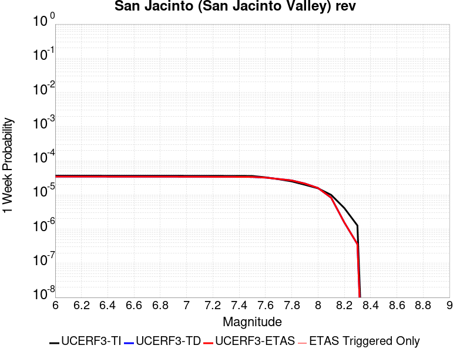 |  |  |  |

| Magnitude | 1 wk TI Prob | 1 wk TD Prob | 1 wk ETAS Prob | 1 wk ETAS/TD Gain | 1 wk ETAS Triggered Only | 1 mo TI Prob | 1 mo TD Prob | 1 mo ETAS Prob | 1 mo ETAS/TD Gain | 1 mo ETAS Triggered Only | 1 yr TI Prob | 1 yr TD Prob | 1 yr ETAS Prob | 1 yr ETAS/TD Gain | 1 yr ETAS Triggered Only | 10 yr TI Prob | 10 yr TD Prob | 10 yr ETAS Prob | 10 yr ETAS/TD Gain | 10 yr ETAS Triggered Only |
|-----|-----|-----|-----|-----|-----|-----|-----|-----|-----|-----|-----|-----|-----|-----|-----|-----|-----|-----|-----|-----|
| 6.0 | 3.652694E-5 | 3.4467394E-5 | 3.4467394E-5 | 1.0 | 0.0 | 1.5653463E-4 | 1.4770904E-4 | 1.5770756E-4 | 1.0676906 | 1.0E-5 | 0.0019041431 | 0.001796876 | 0.0018368041 | 1.0222208 | 4.0E-5 | 0.018879099 | 0.018560216 | 0.018619101 | 1.0031728 | 6.0E-5 |
| 6.1 | 3.652694E-5 | 3.4467394E-5 | 3.4467394E-5 | 1.0 | 0.0 | 1.5653463E-4 | 1.4770904E-4 | 1.5770756E-4 | 1.0676906 | 1.0E-5 | 0.0019041431 | 0.001796876 | 0.0018368041 | 1.0222208 | 4.0E-5 | 0.018879099 | 0.018560216 | 0.018619101 | 1.0031728 | 6.0E-5 |
| 6.2 | 3.652694E-5 | 3.4467394E-5 | 3.4467394E-5 | 1.0 | 0.0 | 1.5653463E-4 | 1.4770904E-4 | 1.5770756E-4 | 1.0676906 | 1.0E-5 | 0.0019041431 | 0.001796876 | 0.0018368041 | 1.0222208 | 4.0E-5 | 0.018879099 | 0.018560216 | 0.018619101 | 1.0031728 | 6.0E-5 |
| 6.3 | 3.652694E-5 | 3.4467394E-5 | 3.4467394E-5 | 1.0 | 0.0 | 1.5653463E-4 | 1.4770904E-4 | 1.5770756E-4 | 1.0676906 | 1.0E-5 | 0.0019041431 | 0.001796876 | 0.0018368041 | 1.0222208 | 4.0E-5 | 0.018879099 | 0.018560216 | 0.018619101 | 1.0031728 | 6.0E-5 |
| 6.4 | 3.646941E-5 | 3.4388955E-5 | 3.4388955E-5 | 1.0 | 0.0 | 1.5628811E-4 | 1.4737292E-4 | 1.5737144E-4 | 1.0678451 | 1.0E-5 | 0.0019011468 | 0.0017927908 | 0.0018327192 | 1.0222716 | 4.0E-5 | 0.018849645 | 0.01852009 | 0.01857898 | 1.0031797 | 6.0E-5 |
| 6.5 | 3.646941E-5 | 3.4388955E-5 | 3.4388955E-5 | 1.0 | 0.0 | 1.5628811E-4 | 1.4737292E-4 | 1.5737144E-4 | 1.0678451 | 1.0E-5 | 0.0019011468 | 0.0017927908 | 0.0018327192 | 1.0222716 | 4.0E-5 | 0.018849645 | 0.01852009 | 0.01857898 | 1.0031797 | 6.0E-5 |
| 6.6 | 3.6442503E-5 | 3.4352335E-5 | 3.4352335E-5 | 1.0 | 0.0 | 1.561728E-4 | 1.4721598E-4 | 1.5721451E-4 | 1.0679175 | 1.0E-5 | 0.0018997455 | 0.0017908834 | 0.0018308117 | 1.0222954 | 4.0E-5 | 0.018835869 | 0.018501356 | 0.018560247 | 1.003183 | 6.0E-5 |
| 6.7 | 3.6432113E-5 | 3.4337903E-5 | 3.4337903E-5 | 1.0 | 0.0 | 1.5612828E-4 | 1.4715415E-4 | 1.5715267E-4 | 1.067946 | 1.0E-5 | 0.0018992044 | 0.001790132 | 0.0018300604 | 1.0223048 | 4.0E-5 | 0.018830549 | 0.01849398 | 0.01855287 | 1.0031843 | 6.0E-5 |
| 6.8 | 3.6409598E-5 | 3.430695E-5 | 3.430695E-5 | 1.0 | 0.0 | 1.560318E-4 | 1.470215E-4 | 1.5702004E-4 | 1.0680072 | 1.0E-5 | 0.0018980318 | 0.0017885199 | 0.0018284484 | 1.0223249 | 4.0E-5 | 0.018819023 | 0.01847813 | 0.018537022 | 1.0031871 | 6.0E-5 |
| 6.9 | 3.638078E-5 | 3.4267367E-5 | 3.4267367E-5 | 1.0 | 0.0 | 1.5590832E-4 | 1.4685189E-4 | 1.5685042E-4 | 1.0680858 | 1.0E-5 | 0.0018965311 | 0.0017864581 | 0.0018263867 | 1.0223507 | 4.0E-5 | 0.018804269 | 0.018457862 | 0.018516755 | 1.0031906 | 6.0E-5 |
| 7.0 | 3.6294874E-5 | 3.4149365E-5 | 3.4149365E-5 | 1.0 | 0.0 | 1.5554018E-4 | 1.4634622E-4 | 1.5634477E-4 | 1.0683211 | 1.0E-5 | 0.0018920569 | 0.0017803118 | 0.0018202406 | 1.0224279 | 4.0E-5 | 0.018760284 | 0.018397434 | 0.01845633 | 1.0032014 | 6.0E-5 |
| 7.1 | 3.6260717E-5 | 3.410564E-5 | 3.410564E-5 | 1.0 | 0.0 | 1.5539382E-4 | 1.4615887E-4 | 1.561574E-4 | 1.0684087 | 1.0E-5 | 0.001890278 | 0.0017780344 | 0.0018179633 | 1.0224568 | 4.0E-5 | 0.018742796 | 0.018375032 | 0.01843393 | 1.0032053 | 6.0E-5 |
| 7.2 | 3.6210204E-5 | 3.403977E-5 | 3.403977E-5 | 1.0 | 0.0 | 1.5517735E-4 | 1.4587659E-4 | 1.5587512E-4 | 1.068541 | 1.0E-5 | 0.001887647 | 0.0017746033 | 0.0018145323 | 1.0225003 | 4.0E-5 | 0.01871693 | 0.018341267 | 0.018400166 | 1.0032113 | 6.0E-5 |
| 7.3 | 3.6119454E-5 | 3.3927867E-5 | 3.3927867E-5 | 1.0 | 0.0 | 1.5478847E-4 | 1.4539705E-4 | 1.553956E-4 | 1.0687672 | 1.0E-5 | 0.0018829206 | 0.0017687745 | 0.0018087036 | 1.0225745 | 4.0E-5 | 0.018670462 | 0.018283723 | 0.018342627 | 1.0032216 | 6.0E-5 |
| 7.4 | 3.607848E-5 | 3.387532E-5 | 3.387532E-5 | 1.0 | 0.0 | 1.5461289E-4 | 1.4517189E-4 | 1.5517043E-4 | 1.0688739 | 1.0E-5 | 0.0018807866 | 0.0017660374 | 0.0018059668 | 1.0226096 | 4.0E-5 | 0.018649481 | 0.018256696 | 0.018315602 | 1.0032265 | 6.0E-5 |
| 7.5 | 3.5856774E-5 | 3.3684162E-5 | 3.3684162E-5 | 1.0 | 0.0 | 1.5366284E-4 | 1.4435273E-4 | 1.5435128E-4 | 1.0692648 | 1.0E-5 | 0.0018692396 | 0.0017560803 | 0.0017960101 | 1.022738 | 4.0E-5 | 0.018535944 | 0.01815731 | 0.01821622 | 1.0032444 | 6.0E-5 |
| 7.6 | 3.286655E-5 | 3.220034E-5 | 3.220034E-5 | 1.0 | 0.0 | 1.4084904E-4 | 1.3799417E-4 | 1.4799279E-4 | 1.0724568 | 1.0E-5 | 0.001713488 | 0.0016787864 | 0.0017187193 | 1.0237868 | 4.0E-5 | 0.017003361 | 0.017373424 | 0.01743238 | 1.0033935 | 6.0E-5 |
| 7.7 | 2.8882527E-5 | 2.9291981E-5 | 2.9291981E-5 | 1.0 | 0.0 | 1.237764E-4 | 1.2553102E-4 | 1.3552977E-4 | 1.0796516 | 1.0E-5 | 0.0015059357 | 0.0015272698 | 0.0015672088 | 1.0261506 | 4.0E-5 | 0.014957713 | 0.015859274 | 0.015918322 | 1.0037233 | 6.0E-5 |
| 7.8 | 2.4950225E-5 | 2.6580747E-5 | 2.6580747E-5 | 1.0 | 0.0 | 1.0692515E-4 | 1.13912516E-4 | 1.2391138E-4 | 1.0877767 | 1.0E-5 | 0.0013010362 | 0.0013860033 | 0.001425948 | 1.0288199 | 4.0E-5 | 0.012934455 | 0.014439502 | 0.014498636 | 1.0040953 | 6.0E-5 |
| 7.9 | 1.9881603E-5 | 2.155556E-5 | 2.155556E-5 | 1.0 | 0.0 | 8.520408E-5 | 9.2377704E-5 | 1.02376776E-4 | 1.1082412 | 1.0E-5 | 0.001036866 | 0.001124119 | 0.001164074 | 1.0355434 | 4.0E-5 | 0.010320415 | 0.011802064 | 0.011861357 | 1.0050238 | 6.0E-5 |
| 8.0 | 1.563292E-5 | 1.5976173E-5 | 1.5976173E-5 | 1.0 | 0.0 | 6.6996516E-5 | 6.846752E-5 | 7.846683E-5 | 1.1460446 | 1.0E-5 | 8.153773E-4 | 8.332739E-4 | 8.732406E-4 | 1.0479634 | 4.0E-5 | 0.00812392 | 0.008830938 | 0.008880496 | 1.0056119 | 5.0E-5 |
| 8.1 | 1.0045313E-5 | 8.324356E-6 | 8.324356E-6 | 1.0 | 0.0 | 4.305063E-5 | 3.5675326E-5 | 4.567497E-5 | 1.2802957 | 1.0E-5 | 5.2401534E-4 | 4.3426102E-4 | 4.5425235E-4 | 1.0460353 | 2.0E-5 | 0.0052278144 | 0.0046712374 | 0.004691144 | 1.0042615 | 2.0E-5 |
| 8.2 | 4.1554413E-6 | 1.5721832E-6 | 1.5721832E-6 | 1.0 | 0.0 | 1.7808914E-5 | 6.737911E-6 | 6.737911E-6 | 1.0 | 0.0 | 2.1680194E-4 | 8.203101E-5 | 8.203101E-5 | 1.0 | 0.0 | 0.0021659054 | 9.520741E-4 | 9.520741E-4 | 1.0 | 0.0 |
| 8.3 | 1.2758221E-6 | 3.6330252E-7 | 3.6330252E-7 | 1.0 | 0.0 | 5.4677976E-6 | 1.5570099E-6 | 1.5570099E-6 | 1.0 | 0.0 | 6.65684E-5 | 1.8956434E-5 | 1.8956434E-5 | 1.0 | 0.0 | 6.6548464E-4 | 2.2857229E-4 | 2.2857229E-4 | 1.0 | 0.0 |

## San Jacinto (Stepovers Combined)
*[(top)](#table-of-contents)*

| 1 Week | 1 Month | 1 Year | 10 Year |
|-----|-----|-----|-----|
|  |  |  |  |

| Magnitude | 1 wk TI Prob | 1 wk TD Prob | 1 wk ETAS Prob | 1 wk ETAS/TD Gain | 1 wk ETAS Triggered Only | 1 mo TI Prob | 1 mo TD Prob | 1 mo ETAS Prob | 1 mo ETAS/TD Gain | 1 mo ETAS Triggered Only | 1 yr TI Prob | 1 yr TD Prob | 1 yr ETAS Prob | 1 yr ETAS/TD Gain | 1 yr ETAS Triggered Only | 10 yr TI Prob | 10 yr TD Prob | 10 yr ETAS Prob | 10 yr ETAS/TD Gain | 10 yr ETAS Triggered Only |
|-----|-----|-----|-----|-----|-----|-----|-----|-----|-----|-----|-----|-----|-----|-----|-----|-----|-----|-----|-----|-----|
| 6.0 | 4.0667746E-5 | 3.5336896E-5 | 3.5336896E-5 | 1.0 | 0.0 | 1.742787E-4 | 1.5143506E-4 | 1.6143353E-4 | 1.0660249 | 1.0E-5 | 0.0021197782 | 0.0018421634 | 0.0018820898 | 1.0216736 | 4.0E-5 | 0.020996714 | 0.019020144 | 0.019079002 | 1.0030946 | 6.0E-5 |
| 6.1 | 4.0667746E-5 | 3.5336896E-5 | 3.5336896E-5 | 1.0 | 0.0 | 1.742787E-4 | 1.5143506E-4 | 1.6143353E-4 | 1.0660249 | 1.0E-5 | 0.0021197782 | 0.0018421634 | 0.0018820898 | 1.0216736 | 4.0E-5 | 0.020996714 | 0.019020144 | 0.019079002 | 1.0030946 | 6.0E-5 |
| 6.2 | 4.0667746E-5 | 3.5336896E-5 | 3.5336896E-5 | 1.0 | 0.0 | 1.742787E-4 | 1.5143506E-4 | 1.6143353E-4 | 1.0660249 | 1.0E-5 | 0.0021197782 | 0.0018421634 | 0.0018820898 | 1.0216736 | 4.0E-5 | 0.020996714 | 0.019020144 | 0.019079002 | 1.0030946 | 6.0E-5 |
| 6.3 | 4.0667746E-5 | 3.5336896E-5 | 3.5336896E-5 | 1.0 | 0.0 | 1.742787E-4 | 1.5143506E-4 | 1.6143353E-4 | 1.0660249 | 1.0E-5 | 0.0021197782 | 0.0018421634 | 0.0018820898 | 1.0216736 | 4.0E-5 | 0.020996714 | 0.019020144 | 0.019079002 | 1.0030946 | 6.0E-5 |
| 6.4 | 4.0577226E-5 | 3.5208766E-5 | 3.5208766E-5 | 1.0 | 0.0 | 1.738908E-4 | 1.50886E-4 | 1.6088449E-4 | 1.0662652 | 1.0E-5 | 0.0021150648 | 0.0018354917 | 0.0018754184 | 1.0217525 | 4.0E-5 | 0.020950472 | 0.018954702 | 0.019013565 | 1.0031054 | 6.0E-5 |
| 6.5 | 4.0577226E-5 | 3.5208766E-5 | 3.5208766E-5 | 1.0 | 0.0 | 1.738908E-4 | 1.50886E-4 | 1.6088449E-4 | 1.0662652 | 1.0E-5 | 0.0021150648 | 0.0018354917 | 0.0018754184 | 1.0217525 | 4.0E-5 | 0.020950472 | 0.018954702 | 0.019013565 | 1.0031054 | 6.0E-5 |
| 6.6 | 4.053861E-5 | 3.5154102E-5 | 3.5154102E-5 | 1.0 | 0.0 | 1.7372532E-4 | 1.5065174E-4 | 1.6065023E-4 | 1.0663682 | 1.0E-5 | 0.0021130538 | 0.0018326445 | 0.0018725712 | 1.0217863 | 4.0E-5 | 0.020930743 | 0.018926777 | 0.01898564 | 1.0031102 | 6.0E-5 |
| 6.7 | 4.0516545E-5 | 3.512316E-5 | 3.512316E-5 | 1.0 | 0.0 | 1.7363077E-4 | 1.5051916E-4 | 1.6051765E-4 | 1.0664268 | 1.0E-5 | 0.002111905 | 0.0018310336 | 0.0018709603 | 1.0218056 | 4.0E-5 | 0.020919468 | 0.01891097 | 0.018969836 | 1.0031128 | 6.0E-5 |
| 6.8 | 4.049434E-5 | 3.509472E-5 | 3.509472E-5 | 1.0 | 0.0 | 1.7353562E-4 | 1.5039727E-4 | 1.6039576E-4 | 1.0664805 | 1.0E-5 | 0.0021107488 | 0.0018295521 | 0.001869479 | 1.0218233 | 4.0E-5 | 0.020908125 | 0.01889638 | 0.018955247 | 1.0031152 | 6.0E-5 |
| 6.9 | 4.046386E-5 | 3.505727E-5 | 3.505727E-5 | 1.0 | 0.0 | 1.73405E-4 | 1.502368E-4 | 1.602353E-4 | 1.0665516 | 1.0E-5 | 0.0021091616 | 0.0018276017 | 0.0018675285 | 1.0218467 | 4.0E-5 | 0.020892553 | 0.01887715 | 0.018936018 | 1.0031184 | 6.0E-5 |
| 7.0 | 4.036382E-5 | 3.4937813E-5 | 3.4937813E-5 | 1.0 | 0.0 | 1.7297632E-4 | 1.4972492E-4 | 1.5972342E-4 | 1.0667791 | 1.0E-5 | 0.0021039525 | 0.00182138 | 0.0018613071 | 1.0219214 | 4.0E-5 | 0.02084144 | 0.018815752 | 0.018874623 | 1.0031288 | 6.0E-5 |
| 7.1 | 4.0343282E-5 | 3.4916273E-5 | 3.4916273E-5 | 1.0 | 0.0 | 1.7288832E-4 | 1.496326E-4 | 1.596311E-4 | 1.0668204 | 1.0E-5 | 0.002102883 | 0.0018202579 | 0.0018601851 | 1.0219349 | 4.0E-5 | 0.020830948 | 0.018804627 | 0.018863497 | 1.0031307 | 6.0E-5 |
| 7.2 | 4.0257353E-5 | 3.4820667E-5 | 3.4820667E-5 | 1.0 | 0.0 | 1.725201E-4 | 1.492229E-4 | 1.5922141E-4 | 1.0670038 | 1.0E-5 | 0.0020984085 | 0.0018152783 | 0.0018552056 | 1.0219952 | 4.0E-5 | 0.020787042 | 0.018755313 | 0.018814187 | 1.0031391 | 6.0E-5 |
| 7.3 | 3.9940667E-5 | 3.4648023E-5 | 3.4648023E-5 | 1.0 | 0.0 | 1.7116306E-4 | 1.4848309E-4 | 1.584816E-4 | 1.0673378 | 1.0E-5 | 0.0020819185 | 0.0018062859 | 0.0018462137 | 1.0221049 | 4.0E-5 | 0.020625217 | 0.018663792 | 0.018722672 | 1.0031548 | 6.0E-5 |
| 7.4 | 3.9721202E-5 | 3.453329E-5 | 3.453329E-5 | 1.0 | 0.0 | 1.7022261E-4 | 1.4799142E-4 | 1.5798994E-4 | 1.0675615 | 1.0E-5 | 0.0020704903 | 0.0018003098 | 0.0018402378 | 1.0221784 | 4.0E-5 | 0.020513052 | 0.01860285 | 0.018661734 | 1.0031654 | 6.0E-5 |
| 7.5 | 3.7036873E-5 | 3.3598866E-5 | 3.3598866E-5 | 1.0 | 0.0 | 1.5871979E-4 | 1.439872E-4 | 1.5398576E-4 | 1.0694406 | 1.0E-5 | 0.0019307006 | 0.0017516377 | 0.0017915675 | 1.0227958 | 4.0E-5 | 0.019140124 | 0.018103454 | 0.018162368 | 1.0032543 | 6.0E-5 |
| 7.6 | 3.2940967E-5 | 3.1372547E-5 | 3.1372547E-5 | 1.0 | 0.0 | 1.4116794E-4 | 1.3444685E-4 | 1.4444551E-4 | 1.0743688 | 1.0E-5 | 0.0017173645 | 0.0016356637 | 0.0016755983 | 1.0244149 | 4.0E-5 | 0.01704153 | 0.01693263 | 0.016991615 | 1.0034834 | 6.0E-5 |
| 7.7 | 2.8236149E-5 | 2.7937022E-5 | 2.7937022E-5 | 1.0 | 0.0 | 1.2100645E-4 | 1.197246E-4 | 1.2972341E-4 | 1.083515 | 1.0E-5 | 0.0014722579 | 0.0014566735 | 0.0014966152 | 1.0274198 | 4.0E-5 | 0.014625421 | 0.015142685 | 0.015201776 | 1.0039023 | 6.0E-5 |
| 7.8 | 2.4329287E-5 | 2.5258554E-5 | 2.5258554E-5 | 1.0 | 0.0 | 1.042642E-4 | 1.0824646E-4 | 1.1824538E-4 | 1.0923718 | 1.0E-5 | 0.0012686774 | 0.0013171048 | 0.0013570521 | 1.0303296 | 4.0E-5 | 0.012614589 | 0.013738932 | 0.013798107 | 1.0043072 | 6.0E-5 |
| 7.9 | 1.9370926E-5 | 2.0467445E-5 | 2.0467445E-5 | 1.0 | 0.0 | 8.301561E-5 | 8.7714674E-5 | 9.77138E-5 | 1.113996 | 1.0E-5 | 0.0010102465 | 0.0010674037 | 0.001107361 | 1.0374341 | 4.0E-5 | 0.0100566605 | 0.011223499 | 0.011282825 | 1.005286 | 6.0E-5 |
| 8.0 | 1.5583017E-5 | 1.5925136E-5 | 1.5925136E-5 | 1.0 | 0.0 | 6.6782646E-5 | 6.82488E-5 | 7.824812E-5 | 1.1465127 | 1.0E-5 | 8.127754E-4 | 8.306131E-4 | 8.7057985E-4 | 1.0481172 | 4.0E-5 | 0.008098091 | 0.008802158 | 0.008851717 | 1.0056304 | 5.0E-5 |
| 8.1 | 1.0024873E-5 | 8.314913E-6 | 8.314913E-6 | 1.0 | 0.0 | 4.2963035E-5 | 3.563486E-5 | 4.5634504E-5 | 1.280614 | 1.0E-5 | 5.229494E-4 | 4.3376858E-4 | 4.5375992E-4 | 1.0460875 | 2.0E-5 | 0.0052172043 | 0.00466551 | 0.004685417 | 1.0042667 | 2.0E-5 |
| 8.2 | 4.142796E-6 | 1.5676045E-6 | 1.5676045E-6 | 1.0 | 0.0 | 1.775472E-5 | 6.7182878E-6 | 6.7182878E-6 | 1.0 | 0.0 | 2.1614227E-4 | 8.179211E-5 | 8.179211E-5 | 1.0 | 0.0 | 0.0021593217 | 9.4923546E-4 | 9.4923546E-4 | 1.0 | 0.0 |
| 8.3 | 1.2750878E-6 | 3.6301523E-7 | 3.6301523E-7 | 1.0 | 0.0 | 5.4646503E-6 | 1.5557786E-6 | 1.5557786E-6 | 1.0 | 0.0 | 6.653009E-5 | 1.8941444E-5 | 1.8941444E-5 | 1.0 | 0.0 | 6.6510175E-4 | 2.2840123E-4 | 2.2840123E-4 | 1.0 | 0.0 |

## Chino alt 1
*[(top)](#table-of-contents)*

| 1 Week | 1 Month | 1 Year | 10 Year |
|-----|-----|-----|-----|
|  |  |  |  |

| Magnitude | 1 wk TI Prob | 1 wk TD Prob | 1 wk ETAS Prob | 1 wk ETAS/TD Gain | 1 wk ETAS Triggered Only | 1 mo TI Prob | 1 mo TD Prob | 1 mo ETAS Prob | 1 mo ETAS/TD Gain | 1 mo ETAS Triggered Only | 1 yr TI Prob | 1 yr TD Prob | 1 yr ETAS Prob | 1 yr ETAS/TD Gain | 1 yr ETAS Triggered Only | 10 yr TI Prob | 10 yr TD Prob | 10 yr ETAS Prob | 10 yr ETAS/TD Gain | 10 yr ETAS Triggered Only |
|-----|-----|-----|-----|-----|-----|-----|-----|-----|-----|-----|-----|-----|-----|-----|-----|-----|-----|-----|-----|-----|
| 6.0 | 3.939946E-5 | 4.8955757E-5 | 4.8955757E-5 | 1.0 | 0.0 | 1.6884391E-4 | 2.0979645E-4 | 2.0979645E-4 | 1.0 | 0.0 | 0.0020537362 | 0.0025517642 | 0.0025617387 | 1.0039089 | 1.0E-5 | 0.020348595 | 0.025281483 | 0.02533022 | 1.0019277 | 5.0E-5 |
| 6.1 | 2.1505624E-5 | 2.6883481E-5 | 2.6883481E-5 | 1.0 | 0.0 | 9.2163704E-5 | 1.1521046E-4 | 1.1521046E-4 | 1.0 | 0.0 | 0.0011215154 | 0.0014018962 | 0.0014018962 | 1.0 | 0.0 | 0.011158722 | 0.013947416 | 0.013947416 | 1.0 | 0.0 |
| 6.2 | 2.1505624E-5 | 2.6883481E-5 | 2.6883481E-5 | 1.0 | 0.0 | 9.2163704E-5 | 1.1521046E-4 | 1.1521046E-4 | 1.0 | 0.0 | 0.0011215154 | 0.0014018962 | 0.0014018962 | 1.0 | 0.0 | 0.011158722 | 0.013947416 | 0.013947416 | 1.0 | 0.0 |
| 6.3 | 1.4290785E-5 | 1.816862E-5 | 1.816862E-5 | 1.0 | 0.0 | 6.1244784E-5 | 7.786344E-5 | 7.786344E-5 | 1.0 | 0.0 | 7.454001E-4 | 9.4762055E-4 | 9.4762055E-4 | 1.0 | 0.0 | 0.007429048 | 0.009446246 | 0.009446246 | 1.0 | 0.0 |
| 6.4 | 1.4290785E-5 | 1.816862E-5 | 1.816862E-5 | 1.0 | 0.0 | 6.1244784E-5 | 7.786344E-5 | 7.786344E-5 | 1.0 | 0.0 | 7.454001E-4 | 9.4762055E-4 | 9.4762055E-4 | 1.0 | 0.0 | 0.007429048 | 0.009446246 | 0.009446246 | 1.0 | 0.0 |
| 6.5 | 1.3017944E-5 | 1.665543E-5 | 1.665543E-5 | 1.0 | 0.0 | 5.5789995E-5 | 7.13787E-5 | 7.13787E-5 | 1.0 | 0.0 | 6.790315E-4 | 8.6873304E-4 | 8.6873304E-4 | 1.0 | 0.0 | 0.0067696036 | 0.00866366 | 0.00866366 | 1.0 | 0.0 |
| 6.6 | 9.470016E-6 | 1.2041898E-5 | 1.2041898E-5 | 1.0 | 0.0 | 4.058515E-5 | 5.1607305E-5 | 5.1607305E-5 | 1.0 | 0.0 | 4.940122E-4 | 6.281718E-4 | 6.281718E-4 | 1.0 | 0.0 | 0.004929154 | 0.006273171 | 0.006273171 | 1.0 | 0.0 |
| 6.7 | 8.314155E-6 | 1.0409905E-5 | 1.0409905E-5 | 1.0 | 0.0 | 3.5631605E-5 | 4.46133E-5 | 4.46133E-5 | 1.0 | 0.0 | 4.3372845E-4 | 5.430638E-4 | 5.430638E-4 | 1.0 | 0.0 | 0.004328829 | 0.005426893 | 0.005426893 | 1.0 | 0.0 |
| 6.8 | 3.4856364E-6 | 3.8139801E-6 | 3.8139801E-6 | 1.0 | 0.0 | 1.4938357E-5 | 1.6345539E-5 | 1.6345539E-5 | 1.0 | 0.0 | 1.8185932E-4 | 1.9899083E-4 | 1.9899083E-4 | 1.0 | 0.0 | 0.0018171056 | 0.001989803 | 0.001989803 | 1.0 | 0.0 |
| 6.9 | 2.2645952E-6 | 2.1532328E-6 | 2.1532328E-6 | 1.0 | 0.0 | 9.705372E-6 | 9.228109E-6 | 9.228109E-6 | 1.0 | 0.0 | 1.18156495E-4 | 1.1234665E-4 | 1.1234665E-4 | 1.0 | 0.0 | 0.0011809369 | 0.0011235146 | 0.0011235146 | 1.0 | 0.0 |
| 7.0 | 1.7864003E-6 | 1.5433379E-6 | 1.5433379E-6 | 1.0 | 0.0 | 7.655979E-6 | 6.6142893E-6 | 6.6142893E-6 | 1.0 | 0.0 | 9.3207556E-5 | 8.052605E-5 | 8.052605E-5 | 1.0 | 0.0 | 9.316847E-4 | 8.054159E-4 | 8.054159E-4 | 1.0 | 0.0 |
| 7.1 | 1.7315456E-6 | 1.4736019E-6 | 1.4736019E-6 | 1.0 | 0.0 | 7.420889E-6 | 6.3154216E-6 | 6.3154216E-6 | 1.0 | 0.0 | 9.034557E-5 | 7.6887605E-5 | 7.6887605E-5 | 1.0 | 0.0 | 9.0308854E-4 | 7.690479E-4 | 7.690479E-4 | 1.0 | 0.0 |
| 7.2 | 1.6008337E-6 | 1.3576367E-6 | 1.3576367E-6 | 1.0 | 0.0 | 6.860698E-6 | 5.8184305E-6 | 5.8184305E-6 | 1.0 | 0.0 | 8.352579E-5 | 7.0837144E-5 | 7.0837144E-5 | 1.0 | 0.0 | 8.34944E-4 | 7.085699E-4 | 7.085699E-4 | 1.0 | 0.0 |
| 7.3 | 1.3320939E-6 | 1.1219545E-6 | 1.1219545E-6 | 1.0 | 0.0 | 5.7089615E-6 | 4.8083675E-6 | 4.8083675E-6 | 1.0 | 0.0 | 6.9504385E-5 | 5.854035E-5 | 5.854035E-5 | 1.0 | 0.0 | 6.9482654E-4 | 5.8539386E-4 | 5.8539386E-4 | 1.0 | 0.0 |
| 7.4 | 1.114294E-6 | 9.2384767E-7 | 9.2384767E-7 | 1.0 | 0.0 | 4.775537E-6 | 3.9593415E-6 | 3.9593415E-6 | 1.0 | 0.0 | 5.8140613E-5 | 4.820395E-5 | 4.820395E-5 | 1.0 | 0.0 | 5.81254E-4 | 4.8195178E-4 | 4.8195178E-4 | 1.0 | 0.0 |
| 7.5 | 9.354081E-7 | 7.62451E-7 | 7.62451E-7 | 1.0 | 0.0 | 4.0088858E-6 | 3.2676433E-6 | 3.2676433E-6 | 1.0 | 0.0 | 4.8807087E-5 | 3.9782866E-5 | 3.9782866E-5 | 1.0 | 0.0 | 4.879637E-4 | 3.9776083E-4 | 3.9776083E-4 | 1.0 | 0.0 |
| 7.6 | 8.521771E-7 | 6.881667E-7 | 6.881667E-7 | 1.0 | 0.0 | 3.6521824E-6 | 2.9492828E-6 | 2.9492828E-6 | 1.0 | 0.0 | 4.4464414E-5 | 3.590696E-5 | 3.590696E-5 | 1.0 | 0.0 | 4.4455516E-4 | 3.5901475E-4 | 3.5901475E-4 | 1.0 | 0.0 |
| 7.7 | 2.1803626E-7 | 1.4189133E-7 | 1.4189133E-7 | 1.0 | 0.0 | 9.344408E-7 | 6.0810567E-7 | 6.0810567E-7 | 1.0 | 0.0 | 1.1376757E-5 | 7.4036707E-6 | 7.4036707E-6 | 1.0 | 0.0 | 1.13761744E-4 | 7.4035204E-5 | 7.4035204E-5 | 1.0 | 0.0 |

## Kern Canyon (North Kern) 2011
*[(top)](#table-of-contents)*

| 1 Week | 1 Month | 1 Year | 10 Year |
|-----|-----|-----|-----|
|  |  |  |  |

| Magnitude | 1 wk TI Prob | 1 wk TD Prob | 1 wk ETAS Prob | 1 wk ETAS/TD Gain | 1 wk ETAS Triggered Only | 1 mo TI Prob | 1 mo TD Prob | 1 mo ETAS Prob | 1 mo ETAS/TD Gain | 1 mo ETAS Triggered Only | 1 yr TI Prob | 1 yr TD Prob | 1 yr ETAS Prob | 1 yr ETAS/TD Gain | 1 yr ETAS Triggered Only | 10 yr TI Prob | 10 yr TD Prob | 10 yr ETAS Prob | 10 yr ETAS/TD Gain | 10 yr ETAS Triggered Only |
|-----|-----|-----|-----|-----|-----|-----|-----|-----|-----|-----|-----|-----|-----|-----|-----|-----|-----|-----|-----|-----|
| 6.0 | 6.6264497E-6 | 6.7574156E-6 | 6.7574156E-6 | 1.0 | 0.0 | 2.8398761E-5 | 2.8960078E-5 | 2.8960078E-5 | 1.0 | 0.0 | 3.4570007E-4 | 3.525399E-4 | 3.525399E-4 | 1.0 | 0.0 | 0.0034516277 | 0.003520595 | 0.0035704188 | 1.0141522 | 5.0E-5 |
| 6.1 | 6.6264497E-6 | 6.7574156E-6 | 6.7574156E-6 | 1.0 | 0.0 | 2.8398761E-5 | 2.8960078E-5 | 2.8960078E-5 | 1.0 | 0.0 | 3.4570007E-4 | 3.525399E-4 | 3.525399E-4 | 1.0 | 0.0 | 0.0034516277 | 0.003520595 | 0.0035704188 | 1.0141522 | 5.0E-5 |
| 6.2 | 6.6264497E-6 | 6.7574156E-6 | 6.7574156E-6 | 1.0 | 0.0 | 2.8398761E-5 | 2.8960078E-5 | 2.8960078E-5 | 1.0 | 0.0 | 3.4570007E-4 | 3.525399E-4 | 3.525399E-4 | 1.0 | 0.0 | 0.0034516277 | 0.003520595 | 0.0035704188 | 1.0141522 | 5.0E-5 |
| 6.3 | 6.6264497E-6 | 6.7574156E-6 | 6.7574156E-6 | 1.0 | 0.0 | 2.8398761E-5 | 2.8960078E-5 | 2.8960078E-5 | 1.0 | 0.0 | 3.4570007E-4 | 3.525399E-4 | 3.525399E-4 | 1.0 | 0.0 | 0.0034516277 | 0.003520595 | 0.0035704188 | 1.0141522 | 5.0E-5 |
| 6.4 | 6.6264497E-6 | 6.7574156E-6 | 6.7574156E-6 | 1.0 | 0.0 | 2.8398761E-5 | 2.8960078E-5 | 2.8960078E-5 | 1.0 | 0.0 | 3.4570007E-4 | 3.525399E-4 | 3.525399E-4 | 1.0 | 0.0 | 0.0034516277 | 0.003520595 | 0.0035704188 | 1.0141522 | 5.0E-5 |
| 6.5 | 3.2162225E-6 | 3.2571281E-6 | 3.2571281E-6 | 1.0 | 0.0 | 1.3783738E-5 | 1.395905E-5 | 1.395905E-5 | 1.0 | 0.0 | 1.6780409E-4 | 1.69939E-4 | 1.69939E-4 | 1.0 | 0.0 | 0.0016767744 | 0.0016981701 | 0.0017181361 | 1.0117574 | 2.0E-5 |
| 6.6 | 3.2162225E-6 | 3.2571281E-6 | 3.2571281E-6 | 1.0 | 0.0 | 1.3783738E-5 | 1.395905E-5 | 1.395905E-5 | 1.0 | 0.0 | 1.6780409E-4 | 1.69939E-4 | 1.69939E-4 | 1.0 | 0.0 | 0.0016767744 | 0.0016981701 | 0.0017181361 | 1.0117574 | 2.0E-5 |
| 6.7 | 2.1908265E-6 | 2.2071454E-6 | 2.2071454E-6 | 1.0 | 0.0 | 9.389223E-6 | 9.459161E-6 | 9.459161E-6 | 1.0 | 0.0 | 1.1430779E-4 | 1.15159404E-4 | 1.15159404E-4 | 1.0 | 0.0 | 0.0011424901 | 0.0011510167 | 0.0011610051 | 1.008678 | 1.0E-5 |
| 6.8 | 1.7303895E-6 | 1.7365707E-6 | 1.7365707E-6 | 1.0 | 0.0 | 7.415934E-6 | 7.442425E-6 | 7.442425E-6 | 1.0 | 0.0 | 9.028525E-5 | 9.060786E-5 | 9.060786E-5 | 1.0 | 0.0 | 9.024858E-4 | 9.057189E-4 | 9.157098E-4 | 1.0110309 | 1.0E-5 |
| 6.9 | 1.3700314E-6 | 1.368876E-6 | 1.368876E-6 | 1.0 | 0.0 | 5.87155E-6 | 5.8665987E-6 | 5.8665987E-6 | 1.0 | 0.0 | 7.148377E-5 | 7.142354E-5 | 7.142354E-5 | 1.0 | 0.0 | 7.146078E-4 | 7.1401044E-4 | 7.240033E-4 | 1.0139954 | 1.0E-5 |
| 7.0 | 1.1467797E-6 | 1.141392E-6 | 1.141392E-6 | 1.0 | 0.0 | 4.9147607E-6 | 4.891671E-6 | 4.891671E-6 | 1.0 | 0.0 | 5.983557E-5 | 5.95545E-5 | 5.95545E-5 | 1.0 | 0.0 | 5.981946E-4 | 5.953885E-4 | 6.0538255E-4 | 1.0167857 | 1.0E-5 |
| 7.1 | 9.3952065E-7 | 9.3027853E-7 | 9.3027853E-7 | 1.0 | 0.0 | 4.026511E-6 | 3.986902E-6 | 3.986902E-6 | 1.0 | 0.0 | 4.9021666E-5 | 4.8539467E-5 | 4.8539467E-5 | 1.0 | 0.0 | 4.901085E-4 | 4.8529042E-4 | 4.8529042E-4 | 1.0 | 0.0 |
| 7.2 | 6.858055E-7 | 6.71937E-7 | 6.71937E-7 | 1.0 | 0.0 | 2.939163E-6 | 2.879727E-6 | 2.879727E-6 | 1.0 | 0.0 | 3.5783723E-5 | 3.506012E-5 | 3.506012E-5 | 1.0 | 0.0 | 3.5777962E-4 | 3.5054676E-4 | 3.5054676E-4 | 1.0 | 0.0 |
| 7.3 | 5.1101983E-7 | 4.939352E-7 | 4.939352E-7 | 1.0 | 0.0 | 2.1900833E-6 | 2.1168635E-6 | 2.1168635E-6 | 1.0 | 0.0 | 2.6663936E-5 | 2.5772513E-5 | 2.5772513E-5 | 1.0 | 0.0 | 2.6660739E-4 | 2.5769573E-4 | 2.5769573E-4 | 1.0 | 0.0 |
| 7.4 | 3.4999414E-7 | 3.299627E-7 | 3.299627E-7 | 1.0 | 0.0 | 1.499974E-6 | 1.4141251E-6 | 1.4141251E-6 | 1.0 | 0.0 | 1.8262032E-5 | 1.721684E-5 | 1.721684E-5 | 1.0 | 0.0 | 1.826053E-4 | 1.721553E-4 | 1.721553E-4 | 1.0 | 0.0 |
| 7.5 | 1.7021522E-7 | 1.475023E-7 | 1.475023E-7 | 1.0 | 0.0 | 7.2949354E-7 | 6.321526E-7 | 6.321526E-7 | 1.0 | 0.0 | 8.881548E-6 | 7.696432E-6 | 7.696432E-6 | 1.0 | 0.0 | 8.8811925E-5 | 7.6961725E-5 | 7.6961725E-5 | 1.0 | 0.0 |
| 7.6 | 2.572245E-8 | 1.7352884E-8 | 1.7352884E-8 | 1.0 | 0.0 | 1.10239064E-7 | 7.43695E-8 | 7.43695E-8 | 1.0 | 0.0 | 1.3421597E-6 | 9.0544836E-7 | 9.0544836E-7 | 1.0 | 0.0 | 1.3421517E-5 | 9.054452E-6 | 9.054452E-6 | 1.0 | 0.0 |

## Kern Canyon (Lake Isabella) 2011
*[(top)](#table-of-contents)*

| 1 Week | 1 Month | 1 Year | 10 Year |
|-----|-----|-----|-----|
|  |  |  |  |

| Magnitude | 1 wk TI Prob | 1 wk TD Prob | 1 wk ETAS Prob | 1 wk ETAS/TD Gain | 1 wk ETAS Triggered Only | 1 mo TI Prob | 1 mo TD Prob | 1 mo ETAS Prob | 1 mo ETAS/TD Gain | 1 mo ETAS Triggered Only | 1 yr TI Prob | 1 yr TD Prob | 1 yr ETAS Prob | 1 yr ETAS/TD Gain | 1 yr ETAS Triggered Only | 10 yr TI Prob | 10 yr TD Prob | 10 yr ETAS Prob | 10 yr ETAS/TD Gain | 10 yr ETAS Triggered Only |
|-----|-----|-----|-----|-----|-----|-----|-----|-----|-----|-----|-----|-----|-----|-----|-----|-----|-----|-----|-----|-----|
| 6.0 | 4.2387383E-6 | 4.0016866E-6 | 4.0016866E-6 | 1.0 | 0.0 | 1.8165894E-5 | 1.7149983E-5 | 2.7149812E-5 | 1.5830809 | 1.0E-5 | 2.2114732E-4 | 2.0878292E-4 | 2.1878083E-4 | 1.0478866 | 1.0E-5 | 0.0022092736 | 0.0020860515 | 0.0021359473 | 1.0239187 | 5.0E-5 |
| 6.1 | 4.2387383E-6 | 4.0016866E-6 | 4.0016866E-6 | 1.0 | 0.0 | 1.8165894E-5 | 1.7149983E-5 | 2.7149812E-5 | 1.5830809 | 1.0E-5 | 2.2114732E-4 | 2.0878292E-4 | 2.1878083E-4 | 1.0478866 | 1.0E-5 | 0.0022092736 | 0.0020860515 | 0.0021359473 | 1.0239187 | 5.0E-5 |
| 6.2 | 4.2387383E-6 | 4.0016866E-6 | 4.0016866E-6 | 1.0 | 0.0 | 1.8165894E-5 | 1.7149983E-5 | 2.7149812E-5 | 1.5830809 | 1.0E-5 | 2.2114732E-4 | 2.0878292E-4 | 2.1878083E-4 | 1.0478866 | 1.0E-5 | 0.0022092736 | 0.0020860515 | 0.0021359473 | 1.0239187 | 5.0E-5 |
| 6.3 | 4.2387383E-6 | 4.0016866E-6 | 4.0016866E-6 | 1.0 | 0.0 | 1.8165894E-5 | 1.7149983E-5 | 2.7149812E-5 | 1.5830809 | 1.0E-5 | 2.2114732E-4 | 2.0878292E-4 | 2.1878083E-4 | 1.0478866 | 1.0E-5 | 0.0022092736 | 0.0020860515 | 0.0021359473 | 1.0239187 | 5.0E-5 |
| 6.4 | 4.2387383E-6 | 4.0016866E-6 | 4.0016866E-6 | 1.0 | 0.0 | 1.8165894E-5 | 1.7149983E-5 | 2.7149812E-5 | 1.5830809 | 1.0E-5 | 2.2114732E-4 | 2.0878292E-4 | 2.1878083E-4 | 1.0478866 | 1.0E-5 | 0.0022092736 | 0.0020860515 | 0.0021359473 | 1.0239187 | 5.0E-5 |
| 6.5 | 2.7857532E-6 | 2.5178983E-6 | 2.5178983E-6 | 1.0 | 0.0 | 1.1938888E-5 | 1.079095E-5 | 2.0790842E-5 | 1.9266925 | 1.0E-5 | 1.4534626E-4 | 1.3137223E-4 | 1.4137091E-4 | 1.0761096 | 1.0E-5 | 0.0014525123 | 0.0013129783 | 0.0013629127 | 1.0380313 | 5.0E-5 |
| 6.6 | 2.2233348E-6 | 1.9441488E-6 | 1.9441488E-6 | 1.0 | 0.0 | 9.528543E-6 | 8.33204E-6 | 8.33204E-6 | 1.0 | 0.0 | 1.1600384E-4 | 1.0143795E-4 | 1.0143795E-4 | 1.0 | 0.0 | 0.001159433 | 0.0010139252 | 0.0010438948 | 1.029558 | 3.0E-5 |
| 6.7 | 2.1635126E-6 | 1.8835284E-6 | 1.8835284E-6 | 1.0 | 0.0 | 9.272164E-6 | 8.07224E-6 | 8.07224E-6 | 1.0 | 0.0 | 1.1288274E-4 | 9.827517E-5 | 9.827517E-5 | 1.0 | 0.0 | 0.0011282542 | 9.823253E-4 | 0.0010122958 | 1.0305098 | 3.0E-5 |
| 6.8 | 1.8685711E-6 | 1.5831645E-6 | 1.5831645E-6 | 1.0 | 0.0 | 8.008137E-6 | 6.7849733E-6 | 6.7849733E-6 | 1.0 | 0.0 | 9.74947E-5 | 8.260396E-5 | 8.260396E-5 | 1.0 | 0.0 | 9.745194E-4 | 8.2573754E-4 | 8.5571274E-4 | 1.0363011 | 3.0E-5 |
| 6.9 | 1.5815071E-6 | 1.3065115E-6 | 1.3065115E-6 | 1.0 | 0.0 | 6.77787E-6 | 5.5993232E-6 | 5.5993232E-6 | 1.0 | 0.0 | 8.251744E-5 | 6.8169655E-5 | 6.8169655E-5 | 1.0 | 0.0 | 8.248681E-4 | 6.814901E-4 | 7.0147647E-4 | 1.0293275 | 2.0E-5 |
| 7.0 | 1.3772564E-6 | 1.1210881E-6 | 1.1210881E-6 | 1.0 | 0.0 | 5.9025137E-6 | 4.804654E-6 | 4.804654E-6 | 1.0 | 0.0 | 7.186073E-5 | 5.8495116E-5 | 5.8495116E-5 | 1.0 | 0.0 | 7.18375E-4 | 5.847992E-4 | 6.0478755E-4 | 1.0341798 | 2.0E-5 |
| 7.1 | 1.0916998E-6 | 8.763901E-7 | 8.763901E-7 | 1.0 | 0.0 | 4.678705E-6 | 3.7559523E-6 | 3.7559523E-6 | 1.0 | 0.0 | 5.6961744E-5 | 4.572777E-5 | 4.572777E-5 | 1.0 | 0.0 | 5.6947145E-4 | 4.5718497E-4 | 4.671804E-4 | 1.021863 | 1.0E-5 |
| 7.2 | 7.6277024E-7 | 5.901538E-7 | 5.901538E-7 | 1.0 | 0.0 | 3.2690114E-6 | 2.5292281E-6 | 2.5292281E-6 | 1.0 | 0.0 | 3.9799485E-5 | 3.0792922E-5 | 3.0792922E-5 | 1.0 | 0.0 | 3.9792358E-4 | 3.0788718E-4 | 3.0788718E-4 | 1.0 | 0.0 |
| 7.3 | 5.3265916E-7 | 4.3825008E-7 | 4.3825008E-7 | 1.0 | 0.0 | 2.282823E-6 | 1.8782133E-6 | 1.8782133E-6 | 1.0 | 0.0 | 2.7793016E-5 | 2.286701E-5 | 2.286701E-5 | 1.0 | 0.0 | 2.778954E-4 | 2.2864695E-4 | 2.2864695E-4 | 1.0 | 0.0 |
| 7.4 | 3.4946007E-7 | 3.0066107E-7 | 3.0066107E-7 | 1.0 | 0.0 | 1.497685E-6 | 1.2885469E-6 | 1.2885469E-6 | 1.0 | 0.0 | 1.8234163E-5 | 1.5687947E-5 | 1.5687947E-5 | 1.0 | 0.0 | 1.8232666E-4 | 1.5686861E-4 | 1.5686861E-4 | 1.0 | 0.0 |
| 7.5 | 1.8317026E-7 | 1.4245036E-7 | 1.4245036E-7 | 1.0 | 0.0 | 7.850152E-7 | 6.1050144E-7 | 6.1050144E-7 | 1.0 | 0.0 | 9.557518E-6 | 7.4328304E-6 | 7.4328304E-6 | 1.0 | 0.0 | 9.5571064E-5 | 7.432589E-5 | 7.432589E-5 | 1.0 | 0.0 |
| 7.6 | 2.572245E-8 | 1.7352884E-8 | 1.7352884E-8 | 1.0 | 0.0 | 1.10239064E-7 | 7.43695E-8 | 7.43695E-8 | 1.0 | 0.0 | 1.3421597E-6 | 9.0544836E-7 | 9.0544836E-7 | 1.0 | 0.0 | 1.3421517E-5 | 9.054452E-6 | 9.054452E-6 | 1.0 | 0.0 |

## Coronado Bank alt1
*[(top)](#table-of-contents)*

| 1 Week | 1 Month | 1 Year | 10 Year |
|-----|-----|-----|-----|
|  |  |  |  |

| Magnitude | 1 wk TI Prob | 1 wk TD Prob | 1 wk ETAS Prob | 1 wk ETAS/TD Gain | 1 wk ETAS Triggered Only | 1 mo TI Prob | 1 mo TD Prob | 1 mo ETAS Prob | 1 mo ETAS/TD Gain | 1 mo ETAS Triggered Only | 1 yr TI Prob | 1 yr TD Prob | 1 yr ETAS Prob | 1 yr ETAS/TD Gain | 1 yr ETAS Triggered Only | 10 yr TI Prob | 10 yr TD Prob | 10 yr ETAS Prob | 10 yr ETAS/TD Gain | 10 yr ETAS Triggered Only |
|-----|-----|-----|-----|-----|-----|-----|-----|-----|-----|-----|-----|-----|-----|-----|-----|-----|-----|-----|-----|-----|
| 6.0 | 7.533492E-5 | 9.39618E-5 | 9.39618E-5 | 1.0 | 0.0 | 3.22824E-4 | 4.0263552E-4 | 4.0263552E-4 | 1.0 | 0.0 | 0.0039233007 | 0.0048915995 | 0.0049015507 | 1.0020343 | 1.0E-5 | 0.03854755 | 0.04790961 | 0.047957215 | 1.0009936 | 5.0E-5 |
| 6.1 | 4.1807285E-5 | 5.049851E-5 | 5.049851E-5 | 1.0 | 0.0 | 1.7916178E-4 | 2.1640482E-4 | 2.1640482E-4 | 1.0 | 0.0 | 0.0021791123 | 0.0026316417 | 0.0026416152 | 1.0037899 | 1.0E-5 | 0.021578677 | 0.026013888 | 0.026033368 | 1.0007489 | 2.0E-5 |
| 6.2 | 4.1807285E-5 | 5.049851E-5 | 5.049851E-5 | 1.0 | 0.0 | 1.7916178E-4 | 2.1640482E-4 | 2.1640482E-4 | 1.0 | 0.0 | 0.0021791123 | 0.0026316417 | 0.0026416152 | 1.0037899 | 1.0E-5 | 0.021578677 | 0.026013888 | 0.026033368 | 1.0007489 | 2.0E-5 |
| 6.3 | 3.1793104E-5 | 3.7714894E-5 | 3.7714894E-5 | 1.0 | 0.0 | 1.3624904E-4 | 1.6162546E-4 | 1.6162546E-4 | 1.0 | 0.0 | 0.0016575698 | 0.0019660434 | 0.0019760237 | 1.0050764 | 1.0E-5 | 0.016452603 | 0.019490387 | 0.019509997 | 1.0010061 | 2.0E-5 |
| 6.4 | 2.9878007E-5 | 3.5339268E-5 | 3.5339268E-5 | 1.0 | 0.0 | 1.2804232E-4 | 1.514454E-4 | 1.514454E-4 | 1.0 | 0.0 | 0.0015578003 | 0.0018423185 | 0.0018523 | 1.005418 | 1.0E-5 | 0.015469253 | 0.018274212 | 0.01828403 | 1.0005373 | 1.0E-5 |
| 6.5 | 2.4512565E-5 | 2.8766724E-5 | 2.8766724E-5 | 1.0 | 0.0 | 1.0504962E-4 | 1.2328029E-4 | 1.2328029E-4 | 1.0 | 0.0 | 0.0012782287 | 0.0014999318 | 0.0015099167 | 1.006657 | 1.0E-5 | 0.012709012 | 0.01490106 | 0.014910911 | 1.0006611 | 1.0E-5 |
| 6.6 | 2.1317413E-5 | 2.4908924E-5 | 2.4908924E-5 | 1.0 | 0.0 | 9.135714E-5 | 1.06748295E-4 | 1.06748295E-4 | 1.0 | 0.0 | 0.0011117056 | 0.0012989079 | 0.001308895 | 1.0076888 | 1.0E-5 | 0.011061605 | 0.012915566 | 0.012925437 | 1.0007643 | 1.0E-5 |
| 6.7 | 1.8585655E-5 | 2.163679E-5 | 2.163679E-5 | 1.0 | 0.0 | 7.9650374E-5 | 9.272592E-5 | 9.272592E-5 | 1.0 | 0.0 | 9.6931186E-4 | 0.0011283738 | 0.0011383626 | 1.0088524 | 1.0E-5 | 0.0096509475 | 0.011228608 | 0.011238496 | 1.0008806 | 1.0E-5 |
| 6.8 | 1.5862879E-5 | 1.8421075E-5 | 1.8421075E-5 | 1.0 | 0.0 | 6.798199E-5 | 7.894518E-5 | 7.894518E-5 | 1.0 | 0.0 | 8.273665E-4 | 9.60753E-4 | 9.707434E-4 | 1.0103985 | 1.0E-5 | 0.008242928 | 0.009567977 | 0.009577882 | 1.0010351 | 1.0E-5 |
| 6.9 | 1.3021509E-5 | 1.50965625E-5 | 1.50965625E-5 | 1.0 | 0.0 | 5.5805274E-5 | 6.4698055E-5 | 6.4698055E-5 | 1.0 | 0.0 | 6.792174E-4 | 7.8743225E-4 | 7.9742435E-4 | 1.0126895 | 1.0E-5 | 0.006771452 | 0.007848245 | 0.0078581665 | 1.0012642 | 1.0E-5 |
| 7.0 | 1.0974371E-5 | 1.27212E-5 | 1.27212E-5 | 1.0 | 0.0 | 4.7032172E-5 | 5.4518387E-5 | 5.4518387E-5 | 1.0 | 0.0 | 5.7246623E-4 | 6.6357676E-4 | 6.7357015E-4 | 1.0150598 | 1.0E-5 | 0.0057099373 | 0.006617703 | 0.0066276365 | 1.0015011 | 1.0E-5 |
| 7.1 | 8.766221E-6 | 1.0164713E-5 | 1.0164713E-5 | 1.0 | 0.0 | 3.7568978E-5 | 4.3562424E-5 | 4.3562424E-5 | 1.0 | 0.0 | 4.573063E-4 | 5.302607E-4 | 5.4025534E-4 | 1.0188487 | 1.0E-5 | 0.0045636636 | 0.0052916543 | 0.0053016013 | 1.0018798 | 1.0E-5 |
| 7.2 | 8.026024E-7 | 8.332054E-7 | 8.332054E-7 | 1.0 | 0.0 | 3.43972E-6 | 3.5708754E-6 | 3.5708754E-6 | 1.0 | 0.0 | 4.1877785E-5 | 4.3474553E-5 | 4.3474553E-5 | 1.0 | 0.0 | 4.1869894E-4 | 4.3466155E-4 | 4.3466155E-4 | 1.0 | 0.0 |
| 7.3 | 3.7293114E-7 | 3.7001894E-7 | 3.7001894E-7 | 1.0 | 0.0 | 1.5982754E-6 | 1.5857945E-6 | 1.5857945E-6 | 1.0 | 0.0 | 1.9458828E-5 | 1.9306877E-5 | 1.9306877E-5 | 1.0 | 0.0 | 1.9457124E-4 | 1.9305207E-4 | 1.9305207E-4 | 1.0 | 0.0 |
| 7.4 | 2.0557036E-7 | 1.9674766E-7 | 1.9674766E-7 | 1.0 | 0.0 | 8.810155E-7 | 8.4320396E-7 | 8.4320396E-7 | 1.0 | 0.0 | 1.0726311E-5 | 1.0265961E-5 | 1.0265961E-5 | 1.0 | 0.0 | 1.0725793E-4 | 1.0265489E-4 | 1.0265489E-4 | 1.0 | 0.0 |
| 7.5 | 6.845446E-8 | 6.2794456E-8 | 6.2794456E-8 | 1.0 | 0.0 | 2.9337625E-7 | 2.6911906E-7 | 2.6911906E-7 | 1.0 | 0.0 | 3.5718497E-6 | 3.2765197E-6 | 3.2765197E-6 | 1.0 | 0.0 | 3.5717923E-5 | 3.2764725E-5 | 3.2764725E-5 | 1.0 | 0.0 |
| 7.6 | 6.0975145E-9 | 5.5318936E-9 | 5.5318936E-9 | 1.0 | 0.0 | 2.6132206E-8 | 2.3708115E-8 | 2.3708115E-8 | 1.0 | 0.0 | 3.1815955E-7 | 2.8864628E-7 | 2.8864628E-7 | 1.0 | 0.0 | 3.181591E-6 | 2.88646E-6 | 2.88646E-6 | 1.0 | 0.0 |

## San Clemente
*[(top)](#table-of-contents)*

| 1 Week | 1 Month | 1 Year | 10 Year |
|-----|-----|-----|-----|
|  |  |  |  |

| Magnitude | 1 wk TI Prob | 1 wk TD Prob | 1 wk ETAS Prob | 1 wk ETAS/TD Gain | 1 wk ETAS Triggered Only | 1 mo TI Prob | 1 mo TD Prob | 1 mo ETAS Prob | 1 mo ETAS/TD Gain | 1 mo ETAS Triggered Only | 1 yr TI Prob | 1 yr TD Prob | 1 yr ETAS Prob | 1 yr ETAS/TD Gain | 1 yr ETAS Triggered Only | 10 yr TI Prob | 10 yr TD Prob | 10 yr ETAS Prob | 10 yr ETAS/TD Gain | 10 yr ETAS Triggered Only |
|-----|-----|-----|-----|-----|-----|-----|-----|-----|-----|-----|-----|-----|-----|-----|-----|-----|-----|-----|-----|-----|
| 6.0 | 6.681379E-5 | 8.164408E-5 | 8.164408E-5 | 1.0 | 0.0 | 2.8631336E-4 | 3.4985956E-4 | 3.4985956E-4 | 1.0 | 0.0 | 0.003480294 | 0.0042518 | 0.0042816726 | 1.0070258 | 3.0E-5 | 0.03426291 | 0.04176052 | 0.04179885 | 1.0009178 | 4.0E-5 |
| 6.1 | 6.681379E-5 | 8.164408E-5 | 8.164408E-5 | 1.0 | 0.0 | 2.8631336E-4 | 3.4985956E-4 | 3.4985956E-4 | 1.0 | 0.0 | 0.003480294 | 0.0042518 | 0.004271715 | 1.0046839 | 2.0E-5 | 0.03426291 | 0.04176052 | 0.041789267 | 1.0006884 | 3.0E-5 |
| 6.2 | 3.9400576E-5 | 4.645645E-5 | 4.645645E-5 | 1.0 | 0.0 | 1.6884868E-4 | 1.9908424E-4 | 1.9908424E-4 | 1.0 | 0.0 | 0.0020537945 | 0.0024212173 | 0.0024311931 | 1.0041201 | 1.0E-5 | 0.020349167 | 0.02395512 | 0.02396488 | 1.0004075 | 1.0E-5 |
| 6.3 | 3.2590255E-5 | 3.79324E-5 | 3.79324E-5 | 1.0 | 0.0 | 1.3966505E-4 | 1.625575E-4 | 1.625575E-4 | 1.0 | 0.0 | 0.0016990956 | 0.001977371 | 0.0019873513 | 1.0050472 | 1.0E-5 | 0.01686163 | 0.019601561 | 0.019611366 | 1.0005002 | 1.0E-5 |
| 6.4 | 2.9454652E-5 | 3.4100634E-5 | 3.4100634E-5 | 1.0 | 0.0 | 1.2622811E-4 | 1.4613755E-4 | 1.4613755E-4 | 1.0 | 0.0 | 0.0015357438 | 0.0017777971 | 0.0017777971 | 1.0 | 0.0 | 0.015251739 | 0.017638927 | 0.017638927 | 1.0 | 0.0 |
| 6.5 | 2.790836E-5 | 3.2250126E-5 | 3.2250126E-5 | 1.0 | 0.0 | 1.1960178E-4 | 1.3820764E-4 | 1.3820764E-4 | 1.0 | 0.0 | 0.001455179 | 0.0016814041 | 0.0016814041 | 1.0 | 0.0 | 0.014456868 | 0.016689846 | 0.016689846 | 1.0 | 0.0 |
| 6.6 | 2.2492153E-5 | 2.5764699E-5 | 2.5764699E-5 | 1.0 | 0.0 | 9.639138E-5 | 1.10415545E-4 | 1.10415545E-4 | 1.0 | 0.0 | 0.0011729331 | 0.0013434946 | 0.0013434946 | 1.0 | 0.0 | 0.011667615 | 0.013355441 | 0.013355441 | 1.0 | 0.0 |
| 6.7 | 1.9862755E-5 | 2.2668124E-5 | 2.2668124E-5 | 1.0 | 0.0 | 8.512331E-5 | 9.7145545E-5 | 9.7145545E-5 | 1.0 | 0.0 | 0.0010358836 | 0.0011821166 | 0.0011821166 | 1.0 | 0.0 | 0.010310682 | 0.011759577 | 0.011759577 | 1.0 | 0.0 |
| 6.8 | 1.6697575E-5 | 1.8979084E-5 | 1.8979084E-5 | 1.0 | 0.0 | 7.155907E-5 | 8.133645E-5 | 8.133645E-5 | 1.0 | 0.0 | 8.7088346E-4 | 9.898308E-4 | 9.898308E-4 | 1.0 | 0.0 | 0.008674784 | 0.009855248 | 0.009855248 | 1.0 | 0.0 |
| 6.9 | 1.5218415E-5 | 1.7270635E-5 | 1.7270635E-5 | 1.0 | 0.0 | 6.522015E-5 | 7.401496E-5 | 7.401496E-5 | 1.0 | 0.0 | 7.93766E-4 | 9.007684E-4 | 9.007684E-4 | 1.0 | 0.0 | 0.007909367 | 0.00897212 | 0.00897212 | 1.0 | 0.0 |
| 7.0 | 1.2392958E-5 | 1.4034001E-5 | 1.4034001E-5 | 1.0 | 0.0 | 5.3111595E-5 | 6.0144375E-5 | 6.0144375E-5 | 1.0 | 0.0 | 6.4644177E-4 | 7.320193E-4 | 7.320193E-4 | 1.0 | 0.0 | 0.0064456454 | 0.007296867 | 0.007296867 | 1.0 | 0.0 |
| 7.1 | 1.0934128E-5 | 1.2376004E-5 | 1.2376004E-5 | 1.0 | 0.0 | 4.6859706E-5 | 5.3038977E-5 | 5.3038977E-5 | 1.0 | 0.0 | 5.7036756E-4 | 6.4556557E-4 | 6.4556557E-4 | 1.0 | 0.0 | 0.0056890585 | 0.0064376486 | 0.0064376486 | 1.0 | 0.0 |
| 7.2 | 9.5798805E-6 | 1.0845695E-5 | 1.0845695E-5 | 1.0 | 0.0 | 4.1055984E-5 | 4.6480764E-5 | 4.6480764E-5 | 1.0 | 0.0 | 4.9974193E-4 | 5.6576356E-4 | 5.6576356E-4 | 1.0 | 0.0 | 0.0049861963 | 0.005643956 | 0.005643956 | 1.0 | 0.0 |
| 7.3 | 8.0167365E-6 | 9.084559E-6 | 9.084559E-6 | 1.0 | 0.0 | 3.4356988E-5 | 3.893328E-5 | 3.893328E-5 | 1.0 | 0.0 | 4.1821605E-4 | 4.7391668E-4 | 4.7391668E-4 | 1.0 | 0.0 | 0.0041742986 | 0.004729763 | 0.004729763 | 1.0 | 0.0 |
| 7.4 | 2.9581017E-6 | 3.362623E-6 | 3.362623E-6 | 1.0 | 0.0 | 1.2677518E-5 | 1.441119E-5 | 1.441119E-5 | 1.0 | 0.0 | 1.5433785E-4 | 1.7544716E-4 | 1.7544716E-4 | 1.0 | 0.0 | 0.001542307 | 0.0017535817 | 0.0017535817 | 1.0 | 0.0 |

## San Jacinto (Anza) rev
*[(top)](#table-of-contents)*

| 1 Week | 1 Month | 1 Year | 10 Year |
|-----|-----|-----|-----|
|  |  |  |  |

| Magnitude | 1 wk TI Prob | 1 wk TD Prob | 1 wk ETAS Prob | 1 wk ETAS/TD Gain | 1 wk ETAS Triggered Only | 1 mo TI Prob | 1 mo TD Prob | 1 mo ETAS Prob | 1 mo ETAS/TD Gain | 1 mo ETAS Triggered Only | 1 yr TI Prob | 1 yr TD Prob | 1 yr ETAS Prob | 1 yr ETAS/TD Gain | 1 yr ETAS Triggered Only | 10 yr TI Prob | 10 yr TD Prob | 10 yr ETAS Prob | 10 yr ETAS/TD Gain | 10 yr ETAS Triggered Only |
|-----|-----|-----|-----|-----|-----|-----|-----|-----|-----|-----|-----|-----|-----|-----|-----|-----|-----|-----|-----|-----|
| 6.0 | 6.3015636E-5 | 4.337693E-5 | 4.337693E-5 | 1.0 | 0.0 | 2.7003905E-4 | 1.8588796E-4 | 1.958861E-4 | 1.0537858 | 1.0E-5 | 0.0032827691 | 0.0022608489 | 0.0023007584 | 1.0176525 | 4.0E-5 | 0.032346968 | 0.023334619 | 0.023383453 | 1.0020927 | 5.0E-5 |
| 6.1 | 6.3015636E-5 | 4.337693E-5 | 4.337693E-5 | 1.0 | 0.0 | 2.7003905E-4 | 1.8588796E-4 | 1.958861E-4 | 1.0537858 | 1.0E-5 | 0.0032827691 | 0.0022608489 | 0.0023007584 | 1.0176525 | 4.0E-5 | 0.032346968 | 0.023334619 | 0.023383453 | 1.0020927 | 5.0E-5 |
| 6.2 | 6.3015636E-5 | 4.337693E-5 | 4.337693E-5 | 1.0 | 0.0 | 2.7003905E-4 | 1.8588796E-4 | 1.958861E-4 | 1.0537858 | 1.0E-5 | 0.0032827691 | 0.0022608489 | 0.0023007584 | 1.0176525 | 4.0E-5 | 0.032346968 | 0.023334619 | 0.023383453 | 1.0020927 | 5.0E-5 |
| 6.3 | 6.3015636E-5 | 4.337693E-5 | 4.337693E-5 | 1.0 | 0.0 | 2.7003905E-4 | 1.8588796E-4 | 1.958861E-4 | 1.0537858 | 1.0E-5 | 0.0032827691 | 0.0022608489 | 0.0023007584 | 1.0176525 | 4.0E-5 | 0.032346968 | 0.023334619 | 0.023383453 | 1.0020927 | 5.0E-5 |
| 6.4 | 6.3015636E-5 | 4.337693E-5 | 4.337693E-5 | 1.0 | 0.0 | 2.7003905E-4 | 1.8588796E-4 | 1.958861E-4 | 1.0537858 | 1.0E-5 | 0.0032827691 | 0.0022608489 | 0.0023007584 | 1.0176525 | 4.0E-5 | 0.032346968 | 0.023334619 | 0.023383453 | 1.0020927 | 5.0E-5 |
| 6.5 | 5.811017E-5 | 4.015336E-5 | 4.015336E-5 | 1.0 | 0.0 | 2.4901982E-4 | 1.7207452E-4 | 1.8207279E-4 | 1.0581044 | 1.0E-5 | 0.0030276014 | 0.0020929999 | 0.0021329161 | 1.0190713 | 4.0E-5 | 0.02986684 | 0.021630494 | 0.021679413 | 1.0022615 | 5.0E-5 |
| 6.6 | 5.811017E-5 | 4.015336E-5 | 4.015336E-5 | 1.0 | 0.0 | 2.4901982E-4 | 1.7207452E-4 | 1.8207279E-4 | 1.0581044 | 1.0E-5 | 0.0030276014 | 0.0020929999 | 0.0021329161 | 1.0190713 | 4.0E-5 | 0.02986684 | 0.021630494 | 0.021679413 | 1.0022615 | 5.0E-5 |
| 6.7 | 5.712442E-5 | 3.957534E-5 | 3.957534E-5 | 1.0 | 0.0 | 2.4479596E-4 | 1.6959761E-4 | 1.7959591E-4 | 1.058953 | 1.0E-5 | 0.0029763177 | 0.002062901 | 0.0021028183 | 1.0193502 | 4.0E-5 | 0.029367693 | 0.021321962 | 0.021370897 | 1.002295 | 5.0E-5 |
| 6.8 | 5.6967532E-5 | 3.9431634E-5 | 3.9431634E-5 | 1.0 | 0.0 | 2.4412372E-4 | 1.689818E-4 | 1.789801E-4 | 1.059168 | 1.0E-5 | 0.0029681553 | 0.0020554175 | 0.0020953354 | 1.0194207 | 4.0E-5 | 0.029288229 | 0.021246629 | 0.021295566 | 1.0023034 | 5.0E-5 |
| 6.9 | 5.6211324E-5 | 3.9135975E-5 | 3.9135975E-5 | 1.0 | 0.0 | 2.4088343E-4 | 1.6771485E-4 | 1.7771318E-4 | 1.059615 | 1.0E-5 | 0.0029288116 | 0.0020400216 | 0.00207994 | 1.0195676 | 4.0E-5 | 0.028905109 | 0.021085827 | 0.021134773 | 1.0023212 | 5.0E-5 |
| 7.0 | 5.4383527E-5 | 3.7995007E-5 | 3.7995007E-5 | 1.0 | 0.0 | 2.3305144E-4 | 1.6282561E-4 | 1.7282399E-4 | 1.0614054 | 1.0E-5 | 0.0028337094 | 0.0019806041 | 0.002020525 | 1.0201559 | 4.0E-5 | 0.027978465 | 0.020476038 | 0.020525014 | 1.0023919 | 5.0E-5 |
| 7.1 | 5.1393665E-5 | 3.6455618E-5 | 3.6455618E-5 | 1.0 | 0.0 | 2.2023996E-4 | 1.5622903E-4 | 1.6622747E-4 | 1.0639986 | 1.0E-5 | 0.0026781242 | 0.0019004333 | 0.0019403573 | 1.0210078 | 4.0E-5 | 0.026460782 | 0.019648531 | 0.019697549 | 1.0024947 | 5.0E-5 |
| 7.2 | 4.785222E-5 | 3.480494E-5 | 3.480494E-5 | 1.0 | 0.0 | 2.0506482E-4 | 1.4915552E-4 | 1.5915402E-4 | 1.0670341 | 1.0E-5 | 0.0024938055 | 0.0018144595 | 0.0018543869 | 1.0220051 | 4.0E-5 | 0.024660049 | 0.018761909 | 0.01881097 | 1.002615 | 5.0E-5 |
| 7.3 | 4.2143256E-5 | 3.389763E-5 | 3.389763E-5 | 1.0 | 0.0 | 1.8060145E-4 | 1.4526749E-4 | 1.5526604E-4 | 1.0688286 | 1.0E-5 | 0.002196605 | 0.0017672004 | 0.0018071297 | 1.0225947 | 4.0E-5 | 0.02175019 | 0.018269178 | 0.018318264 | 1.0026869 | 5.0E-5 |
| 7.4 | 4.0264713E-5 | 3.3535252E-5 | 3.3535252E-5 | 1.0 | 0.0 | 1.7255165E-4 | 1.4371461E-4 | 1.5371318E-4 | 1.0695723 | 1.0E-5 | 0.002098792 | 0.0017483246 | 0.0017882546 | 1.0228391 | 4.0E-5 | 0.020790804 | 0.018073453 | 0.01812255 | 1.0027165 | 5.0E-5 |
| 7.5 | 3.694492E-5 | 3.2247204E-5 | 3.2247204E-5 | 1.0 | 0.0 | 1.5832575E-4 | 1.38195E-4 | 1.481936E-4 | 1.0723516 | 1.0E-5 | 0.0019259118 | 0.0016812286 | 0.0017211614 | 1.0237521 | 4.0E-5 | 0.01909306 | 0.017388845 | 0.017437976 | 1.0028254 | 5.0E-5 |
| 7.6 | 3.200565E-5 | 2.9555436E-5 | 2.9555436E-5 | 1.0 | 0.0 | 1.3715986E-4 | 1.2666002E-4 | 1.3665875E-4 | 1.0789415 | 1.0E-5 | 0.001668642 | 0.0015409971 | 0.0015809354 | 1.0259172 | 4.0E-5 | 0.01656168 | 0.015973015 | 0.016022217 | 1.0030802 | 5.0E-5 |
| 7.7 | 2.731642E-5 | 2.6142696E-5 | 2.6142696E-5 | 1.0 | 0.0 | 1.1706512E-4 | 1.1203532E-4 | 1.220342E-4 | 1.0892476 | 1.0E-5 | 0.001424336 | 0.0013631776 | 0.001403123 | 1.0293032 | 4.0E-5 | 0.014152412 | 0.01419303 | 0.01424232 | 1.0034728 | 5.0E-5 |
| 7.8 | 2.3466424E-5 | 2.3552704E-5 | 2.3552704E-5 | 1.0 | 0.0 | 1.0056651E-4 | 1.0093625E-4 | 1.10935245E-4 | 1.0990624 | 1.0E-5 | 0.0012237094 | 0.0012282069 | 0.0012681579 | 1.0325278 | 4.0E-5 | 0.012169928 | 0.012833906 | 0.012883265 | 1.0038459 | 5.0E-5 |
| 7.9 | 1.8611925E-5 | 1.8951272E-5 | 1.8951272E-5 | 1.0 | 0.0 | 7.9762955E-5 | 8.1217215E-5 | 9.1216396E-5 | 1.1231166 | 1.0E-5 | 9.7068126E-4 | 9.883717E-4 | 0.0010283322 | 1.0404305 | 4.0E-5 | 0.0096645225 | 0.010416457 | 0.010465937 | 1.0047501 | 5.0E-5 |
| 8.0 | 1.5460775E-5 | 1.5779307E-5 | 1.5779307E-5 | 1.0 | 0.0 | 6.6258784E-5 | 6.762385E-5 | 7.7623175E-5 | 1.1478668 | 1.0E-5 | 8.0640207E-4 | 8.2301005E-4 | 8.629772E-4 | 1.048562 | 4.0E-5 | 0.008034821 | 0.008723064 | 0.008772627 | 1.0056819 | 5.0E-5 |
| 8.1 | 9.983884E-6 | 8.292369E-6 | 8.292369E-6 | 1.0 | 0.0 | 4.2787375E-5 | 3.5538244E-5 | 4.5537887E-5 | 1.281377 | 1.0E-5 | 5.2081177E-4 | 4.3259273E-4 | 4.525841E-4 | 1.0462129 | 2.0E-5 | 0.0051959283 | 0.00465207 | 0.004671977 | 1.0042791 | 2.0E-5 |
| 8.2 | 4.1226E-6 | 1.5595413E-6 | 1.5595413E-6 | 1.0 | 0.0 | 1.7668166E-5 | 6.683731E-6 | 6.683731E-6 | 1.0 | 0.0 | 2.1508869E-4 | 8.137142E-5 | 8.137142E-5 | 1.0 | 0.0 | 0.0021488064 | 9.4425044E-4 | 9.4425044E-4 | 1.0 | 0.0 |
| 8.3 | 1.2750878E-6 | 3.6301523E-7 | 3.6301523E-7 | 1.0 | 0.0 | 5.4646503E-6 | 1.5557786E-6 | 1.5557786E-6 | 1.0 | 0.0 | 6.653009E-5 | 1.8941444E-5 | 1.8941444E-5 | 1.0 | 0.0 | 6.6510175E-4 | 2.2840123E-4 | 2.2840123E-4 | 1.0 | 0.0 |

## Ortigalita (North)
*[(top)](#table-of-contents)*

| 1 Week | 1 Month | 1 Year | 10 Year |
|-----|-----|-----|-----|
|  |  |  |  |

| Magnitude | 1 wk TI Prob | 1 wk TD Prob | 1 wk ETAS Prob | 1 wk ETAS/TD Gain | 1 wk ETAS Triggered Only | 1 mo TI Prob | 1 mo TD Prob | 1 mo ETAS Prob | 1 mo ETAS/TD Gain | 1 mo ETAS Triggered Only | 1 yr TI Prob | 1 yr TD Prob | 1 yr ETAS Prob | 1 yr ETAS/TD Gain | 1 yr ETAS Triggered Only | 10 yr TI Prob | 10 yr TD Prob | 10 yr ETAS Prob | 10 yr ETAS/TD Gain | 10 yr ETAS Triggered Only |
|-----|-----|-----|-----|-----|-----|-----|-----|-----|-----|-----|-----|-----|-----|-----|-----|-----|-----|-----|-----|-----|
| 6.0 | 7.711876E-5 | 1.05086016E-4 | 1.05086016E-4 | 1.0 | 0.0 | 3.3046713E-4 | 4.5030177E-4 | 4.5030177E-4 | 1.0 | 0.0 | 0.004016016 | 0.005468958 | 0.0054888483 | 1.003637 | 2.0E-5 | 0.039442103 | 0.053463764 | 0.05350163 | 1.0007082 | 4.0E-5 |
| 6.1 | 4.607858E-5 | 6.024935E-5 | 6.024935E-5 | 1.0 | 0.0 | 1.9746469E-4 | 2.5818875E-4 | 2.5818875E-4 | 1.0 | 0.0 | 0.0024014818 | 0.003139252 | 0.003139252 | 1.0 | 0.0 | 0.023756953 | 0.030979859 | 0.03099924 | 1.0006256 | 2.0E-5 |
| 6.2 | 4.607858E-5 | 6.024935E-5 | 6.024935E-5 | 1.0 | 0.0 | 1.9746469E-4 | 2.5818875E-4 | 2.5818875E-4 | 1.0 | 0.0 | 0.0024014818 | 0.003139252 | 0.003139252 | 1.0 | 0.0 | 0.023756953 | 0.030979859 | 0.03099924 | 1.0006256 | 2.0E-5 |
| 6.3 | 3.327423E-5 | 4.2481566E-5 | 4.2481566E-5 | 1.0 | 0.0 | 1.4259605E-4 | 1.8205289E-4 | 1.8205289E-4 | 1.0 | 0.0 | 0.0017347244 | 0.0022145277 | 0.0022145277 | 1.0 | 0.0 | 0.017212452 | 0.021948816 | 0.021958597 | 1.0004456 | 1.0E-5 |
| 6.4 | 2.7732503E-5 | 3.5003635E-5 | 3.5003635E-5 | 1.0 | 0.0 | 1.1884817E-4 | 1.5000845E-4 | 1.5000845E-4 | 1.0 | 0.0 | 0.001446016 | 0.0018250674 | 0.0018250674 | 1.0 | 0.0 | 0.014366428 | 0.018123753 | 0.018133573 | 1.0005418 | 1.0E-5 |
| 6.5 | 2.7689714E-5 | 3.4953442E-5 | 3.4953442E-5 | 1.0 | 0.0 | 1.186648E-4 | 1.4979337E-4 | 1.4979337E-4 | 1.0 | 0.0 | 0.0014437864 | 0.0018224533 | 0.0018224533 | 1.0 | 0.0 | 0.014344421 | 0.018098038 | 0.018107858 | 1.0005425 | 1.0E-5 |
| 6.6 | 2.2976905E-5 | 2.8722226E-5 | 2.8722226E-5 | 1.0 | 0.0 | 9.846873E-5 | 1.2309088E-4 | 1.2309088E-4 | 1.0 | 0.0 | 0.0011981975 | 0.001497839 | 0.001497839 | 1.0 | 0.0 | 0.011917574 | 0.014900712 | 0.014910563 | 1.0006611 | 1.0E-5 |
| 6.7 | 1.9871539E-5 | 2.4907882E-5 | 2.4907882E-5 | 1.0 | 0.0 | 8.516096E-5 | 1.067451E-4 | 1.067451E-4 | 1.0 | 0.0 | 0.0010363415 | 0.0012990955 | 0.0012990955 | 1.0 | 0.0 | 0.010315218 | 0.012938703 | 0.012938703 | 1.0 | 0.0 |
| 6.8 | 6.5640475E-6 | 7.6061337E-6 | 7.6061337E-6 | 1.0 | 0.0 | 2.813133E-5 | 3.2597323E-5 | 3.2597323E-5 | 1.0 | 0.0 | 3.424451E-4 | 3.9680302E-4 | 3.9680302E-4 | 1.0 | 0.0 | 0.0034191788 | 0.0039612325 | 0.0039612325 | 1.0 | 0.0 |
| 6.9 | 5.6219683E-6 | 6.5023783E-6 | 6.5023783E-6 | 1.0 | 0.0 | 2.4093928E-5 | 2.7867052E-5 | 2.7867052E-5 | 1.0 | 0.0 | 2.933041E-4 | 3.3923113E-4 | 3.3923113E-4 | 1.0 | 0.0 | 0.0029291727 | 0.00338739 | 0.00338739 | 1.0 | 0.0 |
| 7.0 | 3.875591E-6 | 4.4851295E-6 | 4.4851295E-6 | 1.0 | 0.0 | 1.6609569E-5 | 1.9221854E-5 | 1.9221854E-5 | 1.0 | 0.0 | 2.0220275E-4 | 2.3400305E-4 | 2.3400305E-4 | 1.0 | 0.0 | 0.0020201886 | 0.0023377747 | 0.0023377747 | 1.0 | 0.0 |
| 7.1 | 1.6017933E-6 | 1.857199E-6 | 1.857199E-6 | 1.0 | 0.0 | 6.8648105E-6 | 7.959406E-6 | 7.959406E-6 | 1.0 | 0.0 | 8.357586E-5 | 9.690253E-5 | 9.690253E-5 | 1.0 | 0.0 | 8.3544437E-4 | 9.6870743E-4 | 9.6870743E-4 | 1.0 | 0.0 |

## Independence rev 2011
*[(top)](#table-of-contents)*

| 1 Week | 1 Month | 1 Year | 10 Year |
|-----|-----|-----|-----|
|  |  |  |  |

| Magnitude | 1 wk TI Prob | 1 wk TD Prob | 1 wk ETAS Prob | 1 wk ETAS/TD Gain | 1 wk ETAS Triggered Only | 1 mo TI Prob | 1 mo TD Prob | 1 mo ETAS Prob | 1 mo ETAS/TD Gain | 1 mo ETAS Triggered Only | 1 yr TI Prob | 1 yr TD Prob | 1 yr ETAS Prob | 1 yr ETAS/TD Gain | 1 yr ETAS Triggered Only | 10 yr TI Prob | 10 yr TD Prob | 10 yr ETAS Prob | 10 yr ETAS/TD Gain | 10 yr ETAS Triggered Only |
|-----|-----|-----|-----|-----|-----|-----|-----|-----|-----|-----|-----|-----|-----|-----|-----|-----|-----|-----|-----|-----|
| 6.0 | 4.422171E-6 | 4.3263003E-6 | 4.3263003E-6 | 1.0 | 0.0 | 1.8952025E-5 | 1.8541172E-5 | 1.8541172E-5 | 1.0 | 0.0 | 2.3071647E-4 | 2.2571837E-4 | 2.5571158E-4 | 1.132879 | 3.0E-5 | 0.0023047708 | 0.0022551846 | 0.0022950945 | 1.0176969 | 4.0E-5 |
| 6.1 | 4.422171E-6 | 4.3263003E-6 | 4.3263003E-6 | 1.0 | 0.0 | 1.8952025E-5 | 1.8541172E-5 | 1.8541172E-5 | 1.0 | 0.0 | 2.3071647E-4 | 2.2571837E-4 | 2.5571158E-4 | 1.132879 | 3.0E-5 | 0.0023047708 | 0.0022551846 | 0.0022950945 | 1.0176969 | 4.0E-5 |
| 6.2 | 4.422171E-6 | 4.3263003E-6 | 4.3263003E-6 | 1.0 | 0.0 | 1.8952025E-5 | 1.8541172E-5 | 1.8541172E-5 | 1.0 | 0.0 | 2.3071647E-4 | 2.2571837E-4 | 2.5571158E-4 | 1.132879 | 3.0E-5 | 0.0023047708 | 0.0022551846 | 0.0022950945 | 1.0176969 | 4.0E-5 |
| 6.3 | 4.422171E-6 | 4.3263003E-6 | 4.3263003E-6 | 1.0 | 0.0 | 1.8952025E-5 | 1.8541172E-5 | 1.8541172E-5 | 1.0 | 0.0 | 2.3071647E-4 | 2.2571837E-4 | 2.5571158E-4 | 1.132879 | 3.0E-5 | 0.0023047708 | 0.0022551846 | 0.0022950945 | 1.0176969 | 4.0E-5 |
| 6.4 | 4.422171E-6 | 4.3263003E-6 | 4.3263003E-6 | 1.0 | 0.0 | 1.8952025E-5 | 1.8541172E-5 | 1.8541172E-5 | 1.0 | 0.0 | 2.3071647E-4 | 2.2571837E-4 | 2.5571158E-4 | 1.132879 | 3.0E-5 | 0.0023047708 | 0.0022551846 | 0.0022950945 | 1.0176969 | 4.0E-5 |
| 6.5 | 4.422171E-6 | 4.3263003E-6 | 4.3263003E-6 | 1.0 | 0.0 | 1.8952025E-5 | 1.8541172E-5 | 1.8541172E-5 | 1.0 | 0.0 | 2.3071647E-4 | 2.2571837E-4 | 2.5571158E-4 | 1.132879 | 3.0E-5 | 0.0023047708 | 0.0022551846 | 0.0022950945 | 1.0176969 | 4.0E-5 |
| 6.6 | 2.663744E-6 | 2.53204E-6 | 2.53204E-6 | 1.0 | 0.0 | 1.1415996E-5 | 1.0851558E-5 | 1.0851558E-5 | 1.0 | 0.0 | 1.3898089E-4 | 1.3211019E-4 | 1.5210755E-4 | 1.1513687 | 2.0E-5 | 0.0013889399 | 0.0013203648 | 0.0013503252 | 1.022691 | 3.0E-5 |
| 6.7 | 2.663744E-6 | 2.53204E-6 | 2.53204E-6 | 1.0 | 0.0 | 1.1415996E-5 | 1.0851558E-5 | 1.0851558E-5 | 1.0 | 0.0 | 1.3898089E-4 | 1.3211019E-4 | 1.5210755E-4 | 1.1513687 | 2.0E-5 | 0.0013889399 | 0.0013203648 | 0.0013503252 | 1.022691 | 3.0E-5 |
| 6.8 | 1.9716529E-6 | 1.8323044E-6 | 1.8323044E-6 | 1.0 | 0.0 | 8.449913E-6 | 7.85271E-6 | 7.85271E-6 | 1.0 | 0.0 | 1.0287284E-4 | 9.5602685E-5 | 1.1560077E-4 | 1.2091792 | 2.0E-5 | 0.0010282523 | 9.5562846E-4 | 9.855998E-4 | 1.031363 | 3.0E-5 |
| 6.9 | 1.8788617E-6 | 1.7430435E-6 | 1.7430435E-6 | 1.0 | 0.0 | 8.0522395E-6 | 7.470166E-6 | 7.470166E-6 | 1.0 | 0.0 | 9.80316E-5 | 9.09456E-5 | 1.1094378E-4 | 1.2198917 | 2.0E-5 | 9.798837E-4 | 9.090958E-4 | 9.3906856E-4 | 1.0329698 | 3.0E-5 |
| 7.0 | 1.5045488E-6 | 1.384987E-6 | 1.384987E-6 | 1.0 | 0.0 | 6.44805E-6 | 5.9356453E-6 | 5.9356453E-6 | 1.0 | 0.0 | 7.8502184E-5 | 7.2264134E-5 | 8.226342E-5 | 1.1383712 | 1.0E-5 | 7.8474457E-4 | 7.224115E-4 | 7.423971E-4 | 1.027665 | 2.0E-5 |
| 7.1 | 1.272341E-6 | 1.1625416E-6 | 1.1625416E-6 | 1.0 | 0.0 | 5.4528787E-6 | 4.9823116E-6 | 4.9823116E-6 | 1.0 | 0.0 | 6.6386776E-5 | 6.065799E-5 | 7.0657385E-5 | 1.1648487 | 1.0E-5 | 6.636695E-4 | 6.0641754E-4 | 6.264054E-4 | 1.0329605 | 2.0E-5 |
| 7.2 | 1.0416892E-6 | 9.410155E-7 | 9.410155E-7 | 1.0 | 0.0 | 4.464375E-6 | 4.032918E-6 | 4.032918E-6 | 1.0 | 0.0 | 5.4352407E-5 | 4.9099683E-5 | 5.9099195E-5 | 1.2036573 | 1.0E-5 | 5.4339116E-4 | 4.9089023E-4 | 5.108804E-4 | 1.0407223 | 2.0E-5 |
| 7.3 | 7.9450155E-7 | 7.2352077E-7 | 7.2352077E-7 | 1.0 | 0.0 | 3.4050022E-6 | 3.1007996E-6 | 3.1007996E-6 | 1.0 | 0.0 | 4.1455114E-5 | 3.7751593E-5 | 4.7751215E-5 | 1.2648795 | 1.0E-5 | 4.144738E-4 | 3.774529E-4 | 3.9744537E-4 | 1.0529667 | 2.0E-5 |
| 7.4 | 5.3893444E-7 | 5.01964E-7 | 5.01964E-7 | 1.0 | 0.0 | 2.309717E-6 | 2.1512726E-6 | 2.1512726E-6 | 1.0 | 0.0 | 2.8120441E-5 | 2.6191434E-5 | 3.6191173E-5 | 1.3817942 | 1.0E-5 | 2.8116882E-4 | 2.6188392E-4 | 2.818787E-4 | 1.0763497 | 2.0E-5 |
| 7.5 | 3.8852085E-7 | 3.6826376E-7 | 3.6826376E-7 | 1.0 | 0.0 | 1.6650882E-6 | 1.5782723E-6 | 1.5782723E-6 | 1.0 | 0.0 | 2.027226E-5 | 1.9215298E-5 | 1.9215298E-5 | 1.0 | 0.0 | 2.0270412E-4 | 1.9213658E-4 | 2.0213466E-4 | 1.0520363 | 1.0E-5 |
| 7.6 | 2.414929E-7 | 2.3457987E-7 | 2.3457987E-7 | 1.0 | 0.0 | 1.0349692E-6 | 1.0053419E-6 | 1.0053419E-6 | 1.0 | 0.0 | 1.2600677E-5 | 1.2239971E-5 | 1.2239971E-5 | 1.0 | 0.0 | 1.2599962E-4 | 1.2239309E-4 | 1.3239187E-4 | 1.081694 | 1.0E-5 |
| 7.7 | 6.8298014E-8 | 6.8590616E-8 | 6.8590616E-8 | 1.0 | 0.0 | 2.9270575E-7 | 2.9395974E-7 | 2.9395974E-7 | 1.0 | 0.0 | 3.5636867E-6 | 3.5789546E-6 | 3.5789546E-6 | 1.0 | 0.0 | 3.5636294E-5 | 3.5789017E-5 | 3.5789017E-5 | 1.0 | 0.0 |

## Emerson-Copper Mtn 2011
*[(top)](#table-of-contents)*

| 1 Week | 1 Month | 1 Year | 10 Year |
|-----|-----|-----|-----|
|  |  |  |  |

| Magnitude | 1 wk TI Prob | 1 wk TD Prob | 1 wk ETAS Prob | 1 wk ETAS/TD Gain | 1 wk ETAS Triggered Only | 1 mo TI Prob | 1 mo TD Prob | 1 mo ETAS Prob | 1 mo ETAS/TD Gain | 1 mo ETAS Triggered Only | 1 yr TI Prob | 1 yr TD Prob | 1 yr ETAS Prob | 1 yr ETAS/TD Gain | 1 yr ETAS Triggered Only | 10 yr TI Prob | 10 yr TD Prob | 10 yr ETAS Prob | 10 yr ETAS/TD Gain | 10 yr ETAS Triggered Only |
|-----|-----|-----|-----|-----|-----|-----|-----|-----|-----|-----|-----|-----|-----|-----|-----|-----|-----|-----|-----|-----|
| 6.0 | 2.1364202E-5 | 9.96877E-6 | 9.96877E-6 | 1.0 | 0.0 | 9.1557646E-5 | 4.272265E-5 | 5.2722222E-5 | 1.2340579 | 1.0E-5 | 0.0011141442 | 5.2003283E-4 | 5.4002245E-4 | 1.0384392 | 2.0E-5 | 0.011085749 | 0.005189029 | 0.0052288217 | 1.0076686 | 4.0E-5 |
| 6.1 | 2.1364202E-5 | 9.96877E-6 | 9.96877E-6 | 1.0 | 0.0 | 9.1557646E-5 | 4.272265E-5 | 5.2722222E-5 | 1.2340579 | 1.0E-5 | 0.0011141442 | 5.2003283E-4 | 5.4002245E-4 | 1.0384392 | 2.0E-5 | 0.011085749 | 0.005189029 | 0.0052288217 | 1.0076686 | 4.0E-5 |
| 6.2 | 2.1364202E-5 | 9.96877E-6 | 9.96877E-6 | 1.0 | 0.0 | 9.1557646E-5 | 4.272265E-5 | 5.2722222E-5 | 1.2340579 | 1.0E-5 | 0.0011141442 | 5.2003283E-4 | 5.4002245E-4 | 1.0384392 | 2.0E-5 | 0.011085749 | 0.005189029 | 0.0052288217 | 1.0076686 | 4.0E-5 |
| 6.3 | 1.7751237E-5 | 8.0897835E-6 | 8.0897835E-6 | 1.0 | 0.0 | 7.607452E-5 | 3.4670073E-5 | 4.4669727E-5 | 1.2884232 | 1.0E-5 | 9.258136E-4 | 4.2203267E-4 | 4.4202423E-4 | 1.0473697 | 2.0E-5 | 0.00921966 | 0.0042129345 | 0.004242808 | 1.0070909 | 3.0E-5 |
| 6.4 | 1.7751237E-5 | 8.0897835E-6 | 8.0897835E-6 | 1.0 | 0.0 | 7.607452E-5 | 3.4670073E-5 | 4.4669727E-5 | 1.2884232 | 1.0E-5 | 9.258136E-4 | 4.2203267E-4 | 4.4202423E-4 | 1.0473697 | 2.0E-5 | 0.00921966 | 0.0042129345 | 0.004242808 | 1.0070909 | 3.0E-5 |
| 6.5 | 1.5886664E-5 | 6.604287E-6 | 6.604287E-6 | 1.0 | 0.0 | 6.808392E-5 | 2.8303808E-5 | 3.8303526E-5 | 1.3532994 | 1.0E-5 | 8.286065E-4 | 3.4454907E-4 | 3.6454218E-4 | 1.0580269 | 2.0E-5 | 0.008255237 | 0.003440613 | 0.0034705098 | 1.0086894 | 3.0E-5 |
| 6.6 | 1.5886664E-5 | 6.604287E-6 | 6.604287E-6 | 1.0 | 0.0 | 6.808392E-5 | 2.8303808E-5 | 3.8303526E-5 | 1.3532994 | 1.0E-5 | 8.286065E-4 | 3.4454907E-4 | 3.6454218E-4 | 1.0580269 | 2.0E-5 | 0.008255237 | 0.003440613 | 0.0034705098 | 1.0086894 | 3.0E-5 |
| 6.7 | 1.428471E-5 | 5.470806E-6 | 5.470806E-6 | 1.0 | 0.0 | 6.121875E-5 | 2.3446124E-5 | 3.344589E-5 | 1.4264997 | 1.0E-5 | 7.450834E-4 | 2.854231E-4 | 3.054174E-4 | 1.0700514 | 2.0E-5 | 0.007425902 | 0.0028509533 | 0.0028808678 | 1.0104928 | 3.0E-5 |
| 6.8 | 1.3490684E-5 | 5.0740778E-6 | 5.0740778E-6 | 1.0 | 0.0 | 5.7815934E-5 | 2.1745887E-5 | 3.174567E-5 | 1.4598471 | 1.0E-5 | 7.0368167E-4 | 2.647279E-4 | 2.847226E-4 | 1.0755292 | 2.0E-5 | 0.007014576 | 0.0026445063 | 0.002674427 | 1.0113143 | 3.0E-5 |
| 6.9 | 1.2235421E-5 | 4.2900224E-6 | 4.2900224E-6 | 1.0 | 0.0 | 5.2436466E-5 | 1.8385701E-5 | 2.8385517E-5 | 1.543891 | 1.0E-5 | 6.38227E-4 | 2.2382653E-4 | 2.4382205E-4 | 1.089335 | 2.0E-5 | 0.0063639707 | 0.0022363653 | 0.0022662983 | 1.0133846 | 3.0E-5 |
| 7.0 | 1.1009851E-5 | 3.719305E-6 | 3.719305E-6 | 1.0 | 0.0 | 4.7184225E-5 | 1.59398E-5 | 2.593964E-5 | 1.6273504 | 1.0E-5 | 5.743165E-4 | 1.9405322E-4 | 2.1404935E-4 | 1.1030445 | 2.0E-5 | 0.005728345 | 0.0019391757 | 0.0019691174 | 1.0154405 | 3.0E-5 |
| 7.1 | 9.726373E-6 | 3.2120734E-6 | 3.2120734E-6 | 1.0 | 0.0 | 4.168379E-5 | 1.3765975E-5 | 2.3765837E-5 | 1.7264187 | 1.0E-5 | 5.07382E-4 | 1.6759124E-4 | 1.8758788E-4 | 1.119318 | 2.0E-5 | 0.0050622504 | 0.0016749798 | 0.0017049295 | 1.0178807 | 3.0E-5 |
| 7.2 | 3.9335127E-6 | 1.1525784E-6 | 1.1525784E-6 | 1.0 | 0.0 | 1.6857803E-5 | 4.939613E-6 | 1.4939564E-5 | 3.02444 | 1.0E-5 | 2.0522442E-4 | 6.0138187E-5 | 8.013698E-5 | 1.3325474 | 2.0E-5 | 0.00205035 | 6.0122507E-4 | 6.2121305E-4 | 1.0332454 | 2.0E-5 |
| 7.3 | 2.661632E-6 | 6.912155E-7 | 6.912155E-7 | 1.0 | 0.0 | 1.14069435E-5 | 2.962349E-6 | 1.29623195E-5 | 4.3756895 | 1.0E-5 | 1.3887069E-4 | 3.6066012E-5 | 5.606529E-5 | 1.5545187 | 2.0E-5 | 0.0013878393 | 3.6060263E-4 | 3.8059542E-4 | 1.0554427 | 2.0E-5 |
| 7.4 | 2.0893426E-6 | 5.462354E-7 | 5.462354E-7 | 1.0 | 0.0 | 8.954295E-6 | 2.3410068E-6 | 1.2340984E-5 | 5.2716565 | 1.0E-5 | 1.0901308E-4 | 2.850139E-5 | 4.850082E-5 | 1.7017002 | 2.0E-5 | 0.0010895962 | 2.849779E-4 | 3.049722E-4 | 1.0701609 | 2.0E-5 |
| 7.5 | 1.1681728E-6 | 3.6033393E-7 | 3.6033393E-7 | 1.0 | 0.0 | 5.0064455E-6 | 1.5442874E-6 | 1.5442874E-6 | 1.0 | 0.0 | 6.0951766E-5 | 1.8801542E-5 | 1.8801542E-5 | 1.0 | 0.0 | 6.093505E-4 | 1.8799998E-4 | 1.8799998E-4 | 1.0 | 0.0 |
| 7.6 | 1.3154387E-7 | 7.12009E-8 | 7.12009E-8 | 1.0 | 0.0 | 5.6375933E-7 | 3.051467E-7 | 3.051467E-7 | 1.0 | 0.0 | 6.863748E-6 | 3.7151563E-6 | 3.7151563E-6 | 1.0 | 0.0 | 6.863536E-5 | 3.7151098E-5 | 3.7151098E-5 | 1.0 | 0.0 |

## Pinto Mtn
*[(top)](#table-of-contents)*

| 1 Week | 1 Month | 1 Year | 10 Year |
|-----|-----|-----|-----|
|  |  |  |  |

| Magnitude | 1 wk TI Prob | 1 wk TD Prob | 1 wk ETAS Prob | 1 wk ETAS/TD Gain | 1 wk ETAS Triggered Only | 1 mo TI Prob | 1 mo TD Prob | 1 mo ETAS Prob | 1 mo ETAS/TD Gain | 1 mo ETAS Triggered Only | 1 yr TI Prob | 1 yr TD Prob | 1 yr ETAS Prob | 1 yr ETAS/TD Gain | 1 yr ETAS Triggered Only | 10 yr TI Prob | 10 yr TD Prob | 10 yr ETAS Prob | 10 yr ETAS/TD Gain | 10 yr ETAS Triggered Only |
|-----|-----|-----|-----|-----|-----|-----|-----|-----|-----|-----|-----|-----|-----|-----|-----|-----|-----|-----|-----|-----|
| 6.0 | 4.4194956E-5 | 4.786006E-5 | 4.786006E-5 | 1.0 | 0.0 | 1.893932E-4 | 2.0509934E-4 | 2.0509934E-4 | 1.0 | 0.0 | 0.0023034236 | 0.0024943894 | 0.0024943894 | 1.0 | 0.0 | 0.022796938 | 0.024681423 | 0.024720436 | 1.0015806 | 4.0E-5 |
| 6.1 | 4.4194956E-5 | 4.786006E-5 | 4.786006E-5 | 1.0 | 0.0 | 1.893932E-4 | 2.0509934E-4 | 2.0509934E-4 | 1.0 | 0.0 | 0.0023034236 | 0.0024943894 | 0.0024943894 | 1.0 | 0.0 | 0.022796938 | 0.024681423 | 0.024720436 | 1.0015806 | 4.0E-5 |
| 6.2 | 4.4194956E-5 | 4.786006E-5 | 4.786006E-5 | 1.0 | 0.0 | 1.893932E-4 | 2.0509934E-4 | 2.0509934E-4 | 1.0 | 0.0 | 0.0023034236 | 0.0024943894 | 0.0024943894 | 1.0 | 0.0 | 0.022796938 | 0.024681423 | 0.024720436 | 1.0015806 | 4.0E-5 |
| 6.3 | 4.4194956E-5 | 4.786006E-5 | 4.786006E-5 | 1.0 | 0.0 | 1.893932E-4 | 2.0509934E-4 | 2.0509934E-4 | 1.0 | 0.0 | 0.0023034236 | 0.0024943894 | 0.0024943894 | 1.0 | 0.0 | 0.022796938 | 0.024681423 | 0.024720436 | 1.0015806 | 4.0E-5 |
| 6.4 | 3.729929E-5 | 3.9608763E-5 | 3.9608763E-5 | 1.0 | 0.0 | 1.5984432E-4 | 1.6974132E-4 | 1.6974132E-4 | 1.0 | 0.0 | 0.0019443673 | 0.0020647354 | 0.0020647354 | 1.0 | 0.0 | 0.019274427 | 0.020465542 | 0.020504724 | 1.0019145 | 4.0E-5 |
| 6.5 | 3.729929E-5 | 3.9608763E-5 | 3.9608763E-5 | 1.0 | 0.0 | 1.5984432E-4 | 1.6974132E-4 | 1.6974132E-4 | 1.0 | 0.0 | 0.0019443673 | 0.0020647354 | 0.0020647354 | 1.0 | 0.0 | 0.019274427 | 0.020465542 | 0.020504724 | 1.0019145 | 4.0E-5 |
| 6.6 | 3.0204548E-5 | 3.1210056E-5 | 3.1210056E-5 | 1.0 | 0.0 | 1.2944164E-4 | 1.3375071E-4 | 1.3375071E-4 | 1.0 | 0.0 | 0.0015748127 | 0.0016272333 | 0.0016272333 | 1.0 | 0.0 | 0.015636992 | 0.016157052 | 0.016176729 | 1.0012178 | 2.0E-5 |
| 6.7 | 2.9857754E-5 | 3.0819414E-5 | 3.0819414E-5 | 1.0 | 0.0 | 1.2795553E-4 | 1.320767E-4 | 1.320767E-4 | 1.0 | 0.0 | 0.0015567453 | 0.0016068824 | 0.0016068824 | 1.0 | 0.0 | 0.015458848 | 0.015956478 | 0.01597616 | 1.0012335 | 2.0E-5 |
| 6.8 | 2.4819734E-5 | 2.5013624E-5 | 2.5013624E-5 | 1.0 | 0.0 | 1.0636595E-4 | 1.0719696E-4 | 1.0719696E-4 | 1.0 | 0.0 | 0.0012942362 | 0.0013043632 | 0.0013043632 | 1.0 | 0.0 | 0.012867244 | 0.012969442 | 0.012979312 | 1.000761 | 1.0E-5 |
| 6.9 | 2.331124E-5 | 2.3341807E-5 | 2.3341807E-5 | 1.0 | 0.0 | 9.990149E-5 | 1.00032594E-4 | 1.00032594E-4 | 1.0 | 0.0 | 0.001215622 | 0.0012172367 | 0.0012172367 | 1.0 | 0.0 | 0.012089936 | 0.012107888 | 0.012117767 | 1.0008159 | 1.0E-5 |
| 7.0 | 2.1818534E-5 | 2.1764856E-5 | 2.1764856E-5 | 1.0 | 0.0 | 9.3504656E-5 | 9.327473E-5 | 9.327473E-5 | 1.0 | 0.0 | 0.0011378246 | 0.0011350481 | 0.0011350481 | 1.0 | 0.0 | 0.011320163 | 0.011294611 | 0.011304498 | 1.0008754 | 1.0E-5 |
| 7.1 | 2.066081E-5 | 2.0544425E-5 | 2.0544425E-5 | 1.0 | 0.0 | 8.854332E-5 | 8.8044675E-5 | 8.8044675E-5 | 1.0 | 0.0 | 0.0010774818 | 0.0010714363 | 0.0010714363 | 1.0 | 0.0 | 0.010722724 | 0.010664757 | 0.010674651 | 1.0009277 | 1.0E-5 |
| 7.2 | 1.8990233E-5 | 1.9057632E-5 | 1.9057632E-5 | 1.0 | 0.0 | 8.138417E-5 | 8.167311E-5 | 8.167311E-5 | 1.0 | 0.0 | 9.904018E-4 | 9.939359E-4 | 9.939359E-4 | 1.0 | 0.0 | 0.009859995 | 0.009896904 | 0.009906805 | 1.0010004 | 1.0E-5 |
| 7.3 | 1.3335872E-5 | 1.4909989E-5 | 1.4909989E-5 | 1.0 | 0.0 | 5.7152483E-5 | 6.389846E-5 | 6.389846E-5 | 1.0 | 0.0 | 6.956093E-4 | 7.776988E-4 | 7.776988E-4 | 1.0 | 0.0 | 0.006934359 | 0.0077510723 | 0.0077510723 | 1.0 | 0.0 |
| 7.4 | 9.414066E-6 | 1.1864049E-5 | 1.1864049E-5 | 1.0 | 0.0 | 4.0345374E-5 | 5.0844985E-5 | 5.0844985E-5 | 1.0 | 0.0 | 4.910942E-4 | 6.188713E-4 | 6.188713E-4 | 1.0 | 0.0 | 0.0049001034 | 0.0061724274 | 0.0061724274 | 1.0 | 0.0 |
| 7.5 | 7.2101157E-6 | 9.16125E-6 | 9.16125E-6 | 1.0 | 0.0 | 3.090013E-5 | 3.926195E-5 | 3.926195E-5 | 1.0 | 0.0 | 3.7614413E-4 | 4.7791723E-4 | 4.7791723E-4 | 1.0 | 0.0 | 0.0037550807 | 0.0047696703 | 0.0047696703 | 1.0 | 0.0 |
| 7.6 | 3.296375E-6 | 4.5485344E-6 | 4.5485344E-6 | 1.0 | 0.0 | 1.4127245E-5 | 1.9493582E-5 | 1.9493582E-5 | 1.0 | 0.0 | 1.7198564E-4 | 2.373099E-4 | 2.373099E-4 | 1.0 | 0.0 | 0.0017185259 | 0.0023707023 | 0.0023707023 | 1.0 | 0.0 |
| 7.7 | 2.5741092E-6 | 3.5872815E-6 | 3.5872815E-6 | 1.0 | 0.0 | 1.103185E-5 | 1.537398E-5 | 1.537398E-5 | 1.0 | 0.0 | 1.3430449E-4 | 1.8716346E-4 | 1.8716346E-4 | 1.0 | 0.0 | 0.0013422335 | 0.0018701884 | 0.0018701884 | 1.0 | 0.0 |

## Pisgah-Bullion Mtn-Mesquite Lk
*[(top)](#table-of-contents)*

| 1 Week | 1 Month | 1 Year | 10 Year |
|-----|-----|-----|-----|
|  |  |  |  |

| Magnitude | 1 wk TI Prob | 1 wk TD Prob | 1 wk ETAS Prob | 1 wk ETAS/TD Gain | 1 wk ETAS Triggered Only | 1 mo TI Prob | 1 mo TD Prob | 1 mo ETAS Prob | 1 mo ETAS/TD Gain | 1 mo ETAS Triggered Only | 1 yr TI Prob | 1 yr TD Prob | 1 yr ETAS Prob | 1 yr ETAS/TD Gain | 1 yr ETAS Triggered Only | 10 yr TI Prob | 10 yr TD Prob | 10 yr ETAS Prob | 10 yr ETAS/TD Gain | 10 yr ETAS Triggered Only |
|-----|-----|-----|-----|-----|-----|-----|-----|-----|-----|-----|-----|-----|-----|-----|-----|-----|-----|-----|-----|-----|
| 6.0 | 3.0240792E-5 | 2.409264E-5 | 3.40924E-5 | 1.4150546 | 1.0E-5 | 1.2959696E-4 | 1.03250655E-4 | 1.13249625E-4 | 1.0968417 | 1.0E-5 | 0.0015767008 | 0.0012564523 | 0.0012664397 | 1.0079489 | 1.0E-5 | 0.015655609 | 0.012503509 | 0.012543009 | 1.003159 | 4.0E-5 |
| 6.1 | 3.0240792E-5 | 2.409264E-5 | 3.40924E-5 | 1.4150546 | 1.0E-5 | 1.2959696E-4 | 1.03250655E-4 | 1.13249625E-4 | 1.0968417 | 1.0E-5 | 0.0015767008 | 0.0012564523 | 0.0012664397 | 1.0079489 | 1.0E-5 | 0.015655609 | 0.012503509 | 0.012543009 | 1.003159 | 4.0E-5 |
| 6.2 | 3.0240792E-5 | 2.409264E-5 | 3.40924E-5 | 1.4150546 | 1.0E-5 | 1.2959696E-4 | 1.03250655E-4 | 1.13249625E-4 | 1.0968417 | 1.0E-5 | 0.0015767008 | 0.0012564523 | 0.0012664397 | 1.0079489 | 1.0E-5 | 0.015655609 | 0.012503509 | 0.012543009 | 1.003159 | 4.0E-5 |
| 6.3 | 2.0498217E-5 | 1.3638809E-5 | 1.3638809E-5 | 1.0 | 0.0 | 8.784654E-5 | 5.845082E-5 | 5.845082E-5 | 1.0 | 0.0 | 0.0010690069 | 7.114226E-4 | 7.114226E-4 | 1.0 | 0.0 | 0.01063879 | 0.0070930775 | 0.0070930775 | 1.0 | 0.0 |
| 6.4 | 2.0498217E-5 | 1.3638809E-5 | 1.3638809E-5 | 1.0 | 0.0 | 8.784654E-5 | 5.845082E-5 | 5.845082E-5 | 1.0 | 0.0 | 0.0010690069 | 7.114226E-4 | 7.114226E-4 | 1.0 | 0.0 | 0.01063879 | 0.0070930775 | 0.0070930775 | 1.0 | 0.0 |
| 6.5 | 1.7316182E-5 | 1.0477582E-5 | 1.0477582E-5 | 1.0 | 0.0 | 7.42101E-5 | 4.490321E-5 | 4.490321E-5 | 1.0 | 0.0 | 9.0313336E-4 | 5.465694E-4 | 5.465694E-4 | 1.0 | 0.0 | 0.008994718 | 0.005453247 | 0.005453247 | 1.0 | 0.0 |
| 6.6 | 1.5251077E-5 | 8.414691E-6 | 8.414691E-6 | 1.0 | 0.0 | 6.536012E-5 | 3.6062505E-5 | 3.6062505E-5 | 1.0 | 0.0 | 7.9546886E-4 | 4.389798E-4 | 4.389798E-4 | 1.0 | 0.0 | 0.007926274 | 0.004381844 | 0.004381844 | 1.0 | 0.0 |
| 6.7 | 1.2997425E-5 | 6.4118035E-6 | 6.4118035E-6 | 1.0 | 0.0 | 5.570206E-5 | 2.7478894E-5 | 2.7478894E-5 | 1.0 | 0.0 | 6.7796157E-4 | 3.3450883E-4 | 3.3450883E-4 | 1.0 | 0.0 | 0.0067589693 | 0.0033405134 | 0.0033405134 | 1.0 | 0.0 |
| 6.8 | 1.035386E-5 | 4.3334735E-6 | 4.3334735E-6 | 1.0 | 0.0 | 4.437293E-5 | 1.8571902E-5 | 1.8571902E-5 | 1.0 | 0.0 | 5.401065E-4 | 2.2609031E-4 | 2.2609031E-4 | 1.0 | 0.0 | 0.0053879567 | 0.0022586898 | 0.0022586898 | 1.0 | 0.0 |
| 6.9 | 8.816252E-6 | 3.580855E-6 | 3.580855E-6 | 1.0 | 0.0 | 3.778339E-5 | 1.5346433E-5 | 1.5346433E-5 | 1.0 | 0.0 | 4.5991567E-4 | 1.8682741E-4 | 1.8682741E-4 | 1.0 | 0.0 | 0.00458965 | 0.0018667618 | 0.0018667618 | 1.0 | 0.0 |
| 7.0 | 6.8232207E-6 | 2.5677498E-6 | 2.5677498E-6 | 1.0 | 0.0 | 2.9242048E-5 | 1.1004598E-5 | 1.1004598E-5 | 1.0 | 0.0 | 3.5596377E-4 | 1.3397305E-4 | 1.3397305E-4 | 1.0 | 0.0 | 0.0035539411 | 0.0013389539 | 0.0013389539 | 1.0 | 0.0 |
| 7.1 | 5.837013E-6 | 2.2275226E-6 | 2.2275226E-6 | 1.0 | 0.0 | 2.501553E-5 | 9.546492E-6 | 9.546492E-6 | 1.0 | 0.0 | 3.045215E-4 | 1.1622263E-4 | 1.1622263E-4 | 1.0 | 0.0 | 0.0030410455 | 0.0011616475 | 0.0011616475 | 1.0 | 0.0 |
| 7.2 | 4.278052E-6 | 1.6276728E-6 | 1.6276728E-6 | 1.0 | 0.0 | 1.833438E-5 | 6.975723E-6 | 6.975723E-6 | 1.0 | 0.0 | 2.231982E-4 | 8.492635E-5 | 8.492635E-5 | 1.0 | 0.0 | 0.0022297418 | 8.489622E-4 | 8.489622E-4 | 1.0 | 0.0 |
| 7.3 | 1.8803692E-6 | 8.345377E-7 | 8.345377E-7 | 1.0 | 0.0 | 8.0587E-6 | 3.576586E-6 | 3.576586E-6 | 1.0 | 0.0 | 9.811026E-5 | 4.3544213E-5 | 4.3544213E-5 | 1.0 | 0.0 | 9.806695E-4 | 4.3537127E-4 | 4.3537127E-4 | 1.0 | 0.0 |

## Los Alamos extension
*[(top)](#table-of-contents)*

| 1 Week | 1 Month | 1 Year | 10 Year |
|-----|-----|-----|-----|
|  |  |  |  |

| Magnitude | 1 wk TI Prob | 1 wk TD Prob | 1 wk ETAS Prob | 1 wk ETAS/TD Gain | 1 wk ETAS Triggered Only | 1 mo TI Prob | 1 mo TD Prob | 1 mo ETAS Prob | 1 mo ETAS/TD Gain | 1 mo ETAS Triggered Only | 1 yr TI Prob | 1 yr TD Prob | 1 yr ETAS Prob | 1 yr ETAS/TD Gain | 1 yr ETAS Triggered Only | 10 yr TI Prob | 10 yr TD Prob | 10 yr ETAS Prob | 10 yr ETAS/TD Gain | 10 yr ETAS Triggered Only |
|-----|-----|-----|-----|-----|-----|-----|-----|-----|-----|-----|-----|-----|-----|-----|-----|-----|-----|-----|-----|-----|
| 6.0 | 4.0146506E-6 | 4.0862424E-6 | 4.0862424E-6 | 1.0 | 0.0 | 1.7205533E-5 | 1.7512357E-5 | 1.7512357E-5 | 1.0 | 0.0 | 2.0945723E-4 | 2.1319318E-4 | 2.2319105E-4 | 1.0468959 | 1.0E-5 | 0.0020925992 | 0.0021299957 | 0.0021699106 | 1.0187393 | 4.0E-5 |
| 6.1 | 4.0146506E-6 | 4.0862424E-6 | 4.0862424E-6 | 1.0 | 0.0 | 1.7205533E-5 | 1.7512357E-5 | 1.7512357E-5 | 1.0 | 0.0 | 2.0945723E-4 | 2.1319318E-4 | 2.2319105E-4 | 1.0468959 | 1.0E-5 | 0.0020925992 | 0.0021299957 | 0.0021699106 | 1.0187393 | 4.0E-5 |
| 6.2 | 4.0146506E-6 | 4.0862424E-6 | 4.0862424E-6 | 1.0 | 0.0 | 1.7205533E-5 | 1.7512357E-5 | 1.7512357E-5 | 1.0 | 0.0 | 2.0945723E-4 | 2.1319318E-4 | 2.2319105E-4 | 1.0468959 | 1.0E-5 | 0.0020925992 | 0.0021299957 | 0.0021699106 | 1.0187393 | 4.0E-5 |
| 6.3 | 4.0146506E-6 | 4.0862424E-6 | 4.0862424E-6 | 1.0 | 0.0 | 1.7205533E-5 | 1.7512357E-5 | 1.7512357E-5 | 1.0 | 0.0 | 2.0945723E-4 | 2.1319318E-4 | 2.2319105E-4 | 1.0468959 | 1.0E-5 | 0.0020925992 | 0.0021299957 | 0.0021699106 | 1.0187393 | 4.0E-5 |
| 6.4 | 4.0146506E-6 | 4.0862424E-6 | 4.0862424E-6 | 1.0 | 0.0 | 1.7205533E-5 | 1.7512357E-5 | 1.7512357E-5 | 1.0 | 0.0 | 2.0945723E-4 | 2.1319318E-4 | 2.2319105E-4 | 1.0468959 | 1.0E-5 | 0.0020925992 | 0.0021299957 | 0.0021699106 | 1.0187393 | 4.0E-5 |
| 6.5 | 4.0146506E-6 | 4.0862424E-6 | 4.0862424E-6 | 1.0 | 0.0 | 1.7205533E-5 | 1.7512357E-5 | 1.7512357E-5 | 1.0 | 0.0 | 2.0945723E-4 | 2.1319318E-4 | 2.2319105E-4 | 1.0468959 | 1.0E-5 | 0.0020925992 | 0.0021299957 | 0.0021699106 | 1.0187393 | 4.0E-5 |
| 6.6 | 4.0146506E-6 | 4.0862424E-6 | 4.0862424E-6 | 1.0 | 0.0 | 1.7205533E-5 | 1.7512357E-5 | 1.7512357E-5 | 1.0 | 0.0 | 2.0945723E-4 | 2.1319318E-4 | 2.2319105E-4 | 1.0468959 | 1.0E-5 | 0.0020925992 | 0.0021299957 | 0.0021699106 | 1.0187393 | 4.0E-5 |
| 6.7 | 4.0146506E-6 | 4.0862424E-6 | 4.0862424E-6 | 1.0 | 0.0 | 1.7205533E-5 | 1.7512357E-5 | 1.7512357E-5 | 1.0 | 0.0 | 2.0945723E-4 | 2.1319318E-4 | 2.2319105E-4 | 1.0468959 | 1.0E-5 | 0.0020925992 | 0.0021299957 | 0.0021699106 | 1.0187393 | 4.0E-5 |
| 6.8 | 3.6584688E-6 | 3.7189357E-6 | 3.7189357E-6 | 1.0 | 0.0 | 1.5679057E-5 | 1.5938203E-5 | 1.5938203E-5 | 1.0 | 0.0 | 1.9087581E-4 | 1.9403128E-4 | 2.0402935E-4 | 1.0515281 | 1.0E-5 | 0.0019071194 | 0.0019387112 | 0.001968653 | 1.0154442 | 3.0E-5 |
| 6.9 | 3.644631E-6 | 3.7046455E-6 | 3.7046455E-6 | 1.0 | 0.0 | 1.5619753E-5 | 1.587696E-5 | 1.587696E-5 | 1.0 | 0.0 | 1.901539E-4 | 1.9328577E-4 | 2.0328384E-4 | 1.0517268 | 1.0E-5 | 0.0018999127 | 0.0019312691 | 0.0019612112 | 1.0155039 | 3.0E-5 |
| 7.0 | 3.6318522E-6 | 3.6914057E-6 | 3.6914057E-6 | 1.0 | 0.0 | 1.5564989E-5 | 1.582022E-5 | 1.582022E-5 | 1.0 | 0.0 | 1.8948725E-4 | 1.9259508E-4 | 2.0259316E-4 | 1.0519124 | 1.0E-5 | 0.0018932576 | 0.001924374 | 0.0019543164 | 1.0155594 | 3.0E-5 |
| 7.1 | 3.5001724E-6 | 3.555474E-6 | 3.555474E-6 | 1.0 | 0.0 | 1.5000653E-5 | 1.52376615E-5 | 1.52376615E-5 | 1.0 | 0.0 | 1.8261763E-4 | 1.8550365E-4 | 1.955018E-4 | 1.0538973 | 1.0E-5 | 0.0018246764 | 0.0018535787 | 0.0018835231 | 1.0161549 | 3.0E-5 |
| 7.2 | 2.5204702E-6 | 2.5437507E-6 | 2.5437507E-6 | 1.0 | 0.0 | 1.080197E-5 | 1.0901743E-5 | 1.0901743E-5 | 1.0 | 0.0 | 1.3150605E-4 | 1.327207E-4 | 1.4271936E-4 | 1.0753362 | 1.0E-5 | 0.0013142825 | 0.0013264199 | 0.0013563802 | 1.0225873 | 3.0E-5 |
| 7.3 | 2.1399692E-6 | 2.1501808E-6 | 2.1501808E-6 | 1.0 | 0.0 | 9.1712645E-6 | 9.2150285E-6 | 9.2150285E-6 | 1.0 | 0.0 | 1.1165442E-4 | 1.1218722E-4 | 1.221861E-4 | 1.0891267 | 1.0E-5 | 0.0011159834 | 0.0011213091 | 0.0011512755 | 1.0267245 | 3.0E-5 |
| 7.4 | 1.9660122E-6 | 1.9702823E-6 | 1.9702823E-6 | 1.0 | 0.0 | 8.42574E-6 | 8.44404E-6 | 8.44404E-6 | 1.0 | 0.0 | 1.0257855E-4 | 1.02801365E-4 | 1.12800335E-4 | 1.097265 | 1.0E-5 | 0.0010253121 | 0.0010275412 | 0.0010575104 | 1.0291659 | 3.0E-5 |
| 7.5 | 1.7204633E-6 | 1.715139E-6 | 1.715139E-6 | 1.0 | 0.0 | 7.373393E-6 | 7.350575E-6 | 7.350575E-6 | 1.0 | 0.0 | 8.976737E-5 | 8.94896E-5 | 8.94896E-5 | 1.0 | 0.0 | 8.9731114E-4 | 8.9453865E-4 | 9.1452076E-4 | 1.0223379 | 2.0E-5 |
| 7.6 | 1.3717638E-6 | 1.3536154E-6 | 1.3536154E-6 | 1.0 | 0.0 | 5.878974E-6 | 5.801196E-6 | 5.801196E-6 | 1.0 | 0.0 | 7.157416E-5 | 7.06273E-5 | 7.06273E-5 | 1.0 | 0.0 | 7.1551115E-4 | 7.060511E-4 | 7.26037E-4 | 1.0283066 | 2.0E-5 |
| 7.7 | 8.272564E-7 | 7.9578405E-7 | 7.9578405E-7 | 1.0 | 0.0 | 3.5453797E-6 | 3.4104987E-6 | 3.4104987E-6 | 1.0 | 0.0 | 4.3164142E-5 | 4.152203E-5 | 4.152203E-5 | 1.0 | 0.0 | 4.315576E-4 | 4.1514292E-4 | 4.3513463E-4 | 1.0481561 | 2.0E-5 |
| 7.8 | 3.9708277E-7 | 3.6720036E-7 | 3.6720036E-7 | 1.0 | 0.0 | 1.7017821E-6 | 1.5737149E-6 | 1.5737149E-6 | 1.0 | 0.0 | 2.0719E-5 | 1.915981E-5 | 1.915981E-5 | 1.0 | 0.0 | 2.071707E-4 | 1.9158165E-4 | 2.0157974E-4 | 1.0521871 | 1.0E-5 |
| 7.9 | 9.292528E-8 | 7.889317E-8 | 7.889317E-8 | 1.0 | 0.0 | 3.9825116E-7 | 3.3811355E-7 | 3.3811355E-7 | 1.0 | 0.0 | 4.848697E-6 | 4.116525E-6 | 4.116525E-6 | 1.0 | 0.0 | 4.8485912E-5 | 4.1164494E-5 | 5.1164083E-5 | 1.2429178 | 1.0E-5 |
| 8.0 | 7.880441E-11 | 8.235512E-11 | 8.235512E-11 | 1.0 | 0.0 | 3.3773329E-10 | 3.5295045E-10 | 3.5295045E-10 | 1.0 | 0.0 | 4.1119033E-9 | 4.2971724E-9 | 4.2971724E-9 | 1.0 | 0.0 | 4.1119034E-8 | 4.297172E-8 | 4.297172E-8 | 1.0 | 0.0 |

## Camp Rock 2011
*[(top)](#table-of-contents)*

| 1 Week | 1 Month | 1 Year | 10 Year |
|-----|-----|-----|-----|
|  |  |  |  |

| Magnitude | 1 wk TI Prob | 1 wk TD Prob | 1 wk ETAS Prob | 1 wk ETAS/TD Gain | 1 wk ETAS Triggered Only | 1 mo TI Prob | 1 mo TD Prob | 1 mo ETAS Prob | 1 mo ETAS/TD Gain | 1 mo ETAS Triggered Only | 1 yr TI Prob | 1 yr TD Prob | 1 yr ETAS Prob | 1 yr ETAS/TD Gain | 1 yr ETAS Triggered Only | 10 yr TI Prob | 10 yr TD Prob | 10 yr ETAS Prob | 10 yr ETAS/TD Gain | 10 yr ETAS Triggered Only |
|-----|-----|-----|-----|-----|-----|-----|-----|-----|-----|-----|-----|-----|-----|-----|-----|-----|-----|-----|-----|-----|
| 6.0 | 1.6710783E-5 | 4.2504644E-6 | 4.2504644E-6 | 1.0 | 0.0 | 7.161568E-5 | 1.8216151E-5 | 2.8215969E-5 | 1.5489534 | 1.0E-5 | 8.7157206E-4 | 2.217596E-4 | 2.4175517E-4 | 1.0901678 | 2.0E-5 | 0.008681616 | 0.002215436 | 0.0022553473 | 1.0180151 | 4.0E-5 |
| 6.1 | 1.6710783E-5 | 4.2504644E-6 | 4.2504644E-6 | 1.0 | 0.0 | 7.161568E-5 | 1.8216151E-5 | 2.8215969E-5 | 1.5489534 | 1.0E-5 | 8.7157206E-4 | 2.217596E-4 | 2.4175517E-4 | 1.0901678 | 2.0E-5 | 0.008681616 | 0.002215436 | 0.0022553473 | 1.0180151 | 4.0E-5 |
| 6.2 | 1.6710783E-5 | 4.2504644E-6 | 4.2504644E-6 | 1.0 | 0.0 | 7.161568E-5 | 1.8216151E-5 | 2.8215969E-5 | 1.5489534 | 1.0E-5 | 8.7157206E-4 | 2.217596E-4 | 2.4175517E-4 | 1.0901678 | 2.0E-5 | 0.008681616 | 0.002215436 | 0.0022553473 | 1.0180151 | 4.0E-5 |
| 6.3 | 1.6710783E-5 | 4.2504644E-6 | 4.2504644E-6 | 1.0 | 0.0 | 7.161568E-5 | 1.8216151E-5 | 2.8215969E-5 | 1.5489534 | 1.0E-5 | 8.7157206E-4 | 2.217596E-4 | 2.4175517E-4 | 1.0901678 | 2.0E-5 | 0.008681616 | 0.002215436 | 0.0022553473 | 1.0180151 | 4.0E-5 |
| 6.4 | 7.982846E-6 | 3.6822685E-6 | 3.6822685E-6 | 1.0 | 0.0 | 3.421175E-5 | 1.5781057E-5 | 2.5780899E-5 | 1.6336612 | 1.0E-5 | 4.1644843E-4 | 1.9211778E-4 | 2.1211394E-4 | 1.1040828 | 2.0E-5 | 0.0041566887 | 0.0019195518 | 0.001959475 | 1.0207982 | 4.0E-5 |
| 6.5 | 7.982846E-6 | 3.6822685E-6 | 3.6822685E-6 | 1.0 | 0.0 | 3.421175E-5 | 1.5781057E-5 | 2.5780899E-5 | 1.6336612 | 1.0E-5 | 4.1644843E-4 | 1.9211778E-4 | 2.1211394E-4 | 1.1040828 | 2.0E-5 | 0.0041566887 | 0.0019195518 | 0.001959475 | 1.0207982 | 4.0E-5 |
| 6.6 | 7.048869E-6 | 3.4245295E-6 | 3.4245295E-6 | 1.0 | 0.0 | 3.0209088E-5 | 1.4676474E-5 | 2.4676327E-5 | 1.6813526 | 1.0E-5 | 3.677336E-4 | 1.7867173E-4 | 1.9866816E-4 | 1.1119171 | 2.0E-5 | 0.0036712566 | 0.0017853125 | 0.0018252411 | 1.0223651 | 4.0E-5 |
| 6.7 | 6.987307E-6 | 3.3625051E-6 | 3.3625051E-6 | 1.0 | 0.0 | 2.9945259E-5 | 1.4410658E-5 | 2.4410514E-5 | 1.6939209 | 1.0E-5 | 3.6452254E-4 | 1.7543595E-4 | 1.9543244E-4 | 1.1139817 | 2.0E-5 | 0.0036392517 | 0.0017530057 | 0.0017929355 | 1.0227779 | 4.0E-5 |
| 6.8 | 6.3737602E-6 | 3.1180682E-6 | 3.1180682E-6 | 1.0 | 0.0 | 2.731583E-5 | 1.3363083E-5 | 2.3362949E-5 | 1.7483203 | 1.0E-5 | 3.3251947E-4 | 1.6268367E-4 | 1.8268042E-4 | 1.122918 | 2.0E-5 | 0.0033202237 | 0.0016256744 | 0.0016656094 | 1.0245652 | 4.0E-5 |
| 6.9 | 6.112211E-6 | 2.9332696E-6 | 2.9332696E-6 | 1.0 | 0.0 | 2.6194928E-5 | 1.2571097E-5 | 2.2570972E-5 | 1.7954656 | 1.0E-5 | 3.1887658E-4 | 1.5304264E-4 | 1.7303957E-4 | 1.1306626 | 2.0E-5 | 0.003184194 | 0.0015294001 | 0.001569339 | 1.026114 | 4.0E-5 |
| 7.0 | 5.5140117E-6 | 2.642059E-6 | 2.642059E-6 | 1.0 | 0.0 | 2.3631264E-5 | 1.1323062E-5 | 2.1322949E-5 | 1.8831433 | 1.0E-5 | 2.8767265E-4 | 1.3784981E-4 | 1.5784705E-4 | 1.1450654 | 2.0E-5 | 0.0028730053 | 0.0013776683 | 0.0014176132 | 1.0289946 | 4.0E-5 |
| 7.1 | 4.8151105E-6 | 2.134385E-6 | 2.134385E-6 | 1.0 | 0.0 | 2.0636026E-5 | 9.147334E-6 | 1.9147243E-5 | 2.0932047 | 1.0E-5 | 2.5121463E-4 | 1.1136332E-4 | 1.3136108E-4 | 1.1795723 | 2.0E-5 | 0.0025093083 | 0.0011130971 | 0.0011430637 | 1.0269219 | 3.0E-5 |
| 7.2 | 3.818335E-6 | 1.2938276E-6 | 1.2938276E-6 | 1.0 | 0.0 | 1.6364189E-5 | 5.544964E-6 | 1.5544909E-5 | 2.8034282 | 1.0E-5 | 1.9921579E-4 | 6.750793E-5 | 8.750658E-5 | 1.2962415 | 2.0E-5 | 0.0019903728 | 6.748825E-4 | 6.9486897E-4 | 1.0296148 | 2.0E-5 |
| 7.3 | 2.7166698E-6 | 7.38423E-7 | 7.38423E-7 | 1.0 | 0.0 | 1.1642818E-5 | 3.1646662E-6 | 1.3164635E-5 | 4.159881 | 1.0E-5 | 1.4174209E-4 | 3.852915E-5 | 5.852838E-5 | 1.5190675 | 2.0E-5 | 0.0014165172 | 3.852267E-4 | 4.05219E-4 | 1.0518975 | 2.0E-5 |
| 7.4 | 2.0893426E-6 | 5.462354E-7 | 5.462354E-7 | 1.0 | 0.0 | 8.954295E-6 | 2.3410068E-6 | 1.2340984E-5 | 5.2716565 | 1.0E-5 | 1.0901308E-4 | 2.850139E-5 | 4.850082E-5 | 1.7017002 | 2.0E-5 | 0.0010895962 | 2.849779E-4 | 3.049722E-4 | 1.0701609 | 2.0E-5 |
| 7.5 | 1.1681728E-6 | 3.6033393E-7 | 3.6033393E-7 | 1.0 | 0.0 | 5.0064455E-6 | 1.5442874E-6 | 1.5442874E-6 | 1.0 | 0.0 | 6.0951766E-5 | 1.8801542E-5 | 1.8801542E-5 | 1.0 | 0.0 | 6.093505E-4 | 1.8799998E-4 | 1.8799998E-4 | 1.0 | 0.0 |
| 7.6 | 1.3154387E-7 | 7.12009E-8 | 7.12009E-8 | 1.0 | 0.0 | 5.6375933E-7 | 3.051467E-7 | 3.051467E-7 | 1.0 | 0.0 | 6.863748E-6 | 3.7151563E-6 | 3.7151563E-6 | 1.0 | 0.0 | 6.863536E-5 | 3.7151098E-5 | 3.7151098E-5 | 1.0 | 0.0 |

## Channel Islands Thrust
*[(top)](#table-of-contents)*

| 1 Week | 1 Month | 1 Year | 10 Year |
|-----|-----|-----|-----|
|  |  |  |  |

| Magnitude | 1 wk TI Prob | 1 wk TD Prob | 1 wk ETAS Prob | 1 wk ETAS/TD Gain | 1 wk ETAS Triggered Only | 1 mo TI Prob | 1 mo TD Prob | 1 mo ETAS Prob | 1 mo ETAS/TD Gain | 1 mo ETAS Triggered Only | 1 yr TI Prob | 1 yr TD Prob | 1 yr ETAS Prob | 1 yr ETAS/TD Gain | 1 yr ETAS Triggered Only | 10 yr TI Prob | 10 yr TD Prob | 10 yr ETAS Prob | 10 yr ETAS/TD Gain | 10 yr ETAS Triggered Only |
|-----|-----|-----|-----|-----|-----|-----|-----|-----|-----|-----|-----|-----|-----|-----|-----|-----|-----|-----|-----|-----|
| 6.0 | 2.2156251E-5 | 2.4093148E-5 | 2.4093148E-5 | 1.0 | 0.0 | 9.495191E-5 | 1.0325286E-4 | 1.0325286E-4 | 1.0 | 0.0 | 0.0011554264 | 0.0012564851 | 0.0012664726 | 1.0079488 | 1.0E-5 | 0.011494373 | 0.012504402 | 0.012543901 | 1.0031589 | 4.0E-5 |
| 6.1 | 2.2156251E-5 | 2.4093148E-5 | 2.4093148E-5 | 1.0 | 0.0 | 9.495191E-5 | 1.0325286E-4 | 1.0325286E-4 | 1.0 | 0.0 | 0.0011554264 | 0.0012564851 | 0.0012664726 | 1.0079488 | 1.0E-5 | 0.011494373 | 0.012504402 | 0.012543901 | 1.0031589 | 4.0E-5 |
| 6.2 | 2.2156251E-5 | 2.4093148E-5 | 2.4093148E-5 | 1.0 | 0.0 | 9.495191E-5 | 1.0325286E-4 | 1.0325286E-4 | 1.0 | 0.0 | 0.0011554264 | 0.0012564851 | 0.0012664726 | 1.0079488 | 1.0E-5 | 0.011494373 | 0.012504402 | 0.012543901 | 1.0031589 | 4.0E-5 |
| 6.3 | 2.2156251E-5 | 2.4093148E-5 | 2.4093148E-5 | 1.0 | 0.0 | 9.495191E-5 | 1.0325286E-4 | 1.0325286E-4 | 1.0 | 0.0 | 0.0011554264 | 0.0012564851 | 0.0012664726 | 1.0079488 | 1.0E-5 | 0.011494373 | 0.012504402 | 0.012543901 | 1.0031589 | 4.0E-5 |
| 6.4 | 2.2156251E-5 | 2.4093148E-5 | 2.4093148E-5 | 1.0 | 0.0 | 9.495191E-5 | 1.0325286E-4 | 1.0325286E-4 | 1.0 | 0.0 | 0.0011554264 | 0.0012564851 | 0.0012664726 | 1.0079488 | 1.0E-5 | 0.011494373 | 0.012504402 | 0.012543901 | 1.0031589 | 4.0E-5 |
| 6.5 | 2.2156251E-5 | 2.4093148E-5 | 2.4093148E-5 | 1.0 | 0.0 | 9.495191E-5 | 1.0325286E-4 | 1.0325286E-4 | 1.0 | 0.0 | 0.0011554264 | 0.0012564851 | 0.0012664726 | 1.0079488 | 1.0E-5 | 0.011494373 | 0.012504402 | 0.012543901 | 1.0031589 | 4.0E-5 |
| 6.6 | 2.2156251E-5 | 2.4093148E-5 | 2.4093148E-5 | 1.0 | 0.0 | 9.495191E-5 | 1.0325286E-4 | 1.0325286E-4 | 1.0 | 0.0 | 0.0011554264 | 0.0012564851 | 0.0012664726 | 1.0079488 | 1.0E-5 | 0.011494373 | 0.012504402 | 0.012543901 | 1.0031589 | 4.0E-5 |
| 6.7 | 1.0601296E-5 | 1.1379993E-5 | 1.1379993E-5 | 1.0 | 0.0 | 4.5433335E-5 | 4.8770515E-5 | 4.8770515E-5 | 1.0 | 0.0 | 5.5301044E-4 | 5.9362414E-4 | 6.0361816E-4 | 1.0168357 | 1.0E-5 | 0.005516363 | 0.0059208865 | 0.005940768 | 1.0033579 | 2.0E-5 |
| 6.8 | 1.0246747E-5 | 1.09971015E-5 | 1.09971015E-5 | 1.0 | 0.0 | 4.391389E-5 | 4.712961E-5 | 4.712961E-5 | 1.0 | 0.0 | 5.345204E-4 | 5.7365675E-4 | 5.83651E-4 | 1.0174221 | 1.0E-5 | 0.0053323656 | 0.0057222494 | 0.005742135 | 1.0034751 | 2.0E-5 |
| 6.9 | 9.049551E-6 | 9.70002E-6 | 9.70002E-6 | 1.0 | 0.0 | 3.878322E-5 | 4.1570875E-5 | 4.1570875E-5 | 1.0 | 0.0 | 4.7208337E-4 | 5.0601194E-4 | 5.160069E-4 | 1.0197524 | 1.0E-5 | 0.0047108172 | 0.0050490154 | 0.0050689145 | 1.0039412 | 2.0E-5 |
| 7.0 | 8.6542195E-6 | 9.2749615E-6 | 9.2749615E-6 | 1.0 | 0.0 | 3.7088983E-5 | 3.9749255E-5 | 3.9749255E-5 | 1.0 | 0.0 | 4.5146482E-4 | 4.8384376E-4 | 4.938389E-4 | 1.0206578 | 1.0E-5 | 0.004505487 | 0.004828315 | 0.004848219 | 1.0041223 | 2.0E-5 |
| 7.1 | 8.391028E-6 | 8.993273E-6 | 8.993273E-6 | 1.0 | 0.0 | 3.5961057E-5 | 3.8542054E-5 | 3.8542054E-5 | 1.0 | 0.0 | 4.3773788E-4 | 4.6915252E-4 | 4.7914783E-4 | 1.0213051 | 1.0E-5 | 0.004368766 | 0.004682031 | 0.0047019375 | 1.0042516 | 2.0E-5 |
| 7.2 | 5.965188E-6 | 6.3719312E-6 | 6.3719312E-6 | 1.0 | 0.0 | 2.556484E-5 | 2.7307993E-5 | 2.7307993E-5 | 1.0 | 0.0 | 3.1120746E-4 | 3.3242465E-4 | 3.4242132E-4 | 1.030072 | 1.0E-5 | 0.00310772 | 0.003319332 | 0.0033392657 | 1.0060053 | 2.0E-5 |
| 7.3 | 4.877518E-6 | 5.2061982E-6 | 5.2061982E-6 | 1.0 | 0.0 | 2.0903482E-5 | 2.231209E-5 | 2.231209E-5 | 1.0 | 0.0 | 2.5447016E-4 | 2.7161627E-4 | 2.8161355E-4 | 1.0368067 | 1.0E-5 | 0.0025417898 | 0.002712889 | 0.002732835 | 1.0073522 | 2.0E-5 |
| 7.4 | 3.8829853E-6 | 4.142015E-6 | 4.142015E-6 | 1.0 | 0.0 | 1.664126E-5 | 1.7751374E-5 | 1.7751374E-5 | 1.0 | 0.0 | 2.0258849E-4 | 2.1610195E-4 | 2.2609979E-4 | 1.0462644 | 1.0E-5 | 0.002024039 | 0.0021589599 | 0.0021789167 | 1.0092437 | 2.0E-5 |
| 7.5 | 1.3489616E-6 | 1.4278398E-6 | 1.4278398E-6 | 1.0 | 0.0 | 5.7812517E-6 | 6.1192995E-6 | 6.1192995E-6 | 1.0 | 0.0 | 7.038446E-5 | 7.449996E-5 | 7.449996E-5 | 1.0 | 0.0 | 7.036218E-4 | 7.4475387E-4 | 7.4475387E-4 | 1.0 | 0.0 |
| 7.6 | 6.058192E-7 | 6.353994E-7 | 6.353994E-7 | 1.0 | 0.0 | 2.5963652E-6 | 2.7231374E-6 | 2.7231374E-6 | 1.0 | 0.0 | 3.161029E-5 | 3.315371E-5 | 3.315371E-5 | 1.0 | 0.0 | 3.1605794E-4 | 3.3148925E-4 | 3.3148925E-4 | 1.0 | 0.0 |
| 7.7 | 2.2170494E-7 | 2.260861E-7 | 2.260861E-7 | 1.0 | 0.0 | 9.5016367E-7 | 9.689402E-7 | 9.689402E-7 | 1.0 | 0.0 | 1.1568181E-5 | 1.1796794E-5 | 1.1796794E-5 | 1.0 | 0.0 | 1.1567579E-4 | 1.1796278E-4 | 1.1796278E-4 | 1.0 | 0.0 |
| 7.8 | 2.1613102E-8 | 1.5467108E-8 | 1.5467108E-8 | 1.0 | 0.0 | 9.262757E-8 | 6.6287605E-8 | 6.6287605E-8 | 1.0 | 0.0 | 1.1277401E-6 | 8.070513E-7 | 8.070513E-7 | 1.0 | 0.0 | 1.1277344E-5 | 8.070492E-6 | 8.070492E-6 | 1.0 | 0.0 |

## Oceanic - West Huasna
*[(top)](#table-of-contents)*

| 1 Week | 1 Month | 1 Year | 10 Year |
|-----|-----|-----|-----|
|  |  |  |  |

| Magnitude | 1 wk TI Prob | 1 wk TD Prob | 1 wk ETAS Prob | 1 wk ETAS/TD Gain | 1 wk ETAS Triggered Only | 1 mo TI Prob | 1 mo TD Prob | 1 mo ETAS Prob | 1 mo ETAS/TD Gain | 1 mo ETAS Triggered Only | 1 yr TI Prob | 1 yr TD Prob | 1 yr ETAS Prob | 1 yr ETAS/TD Gain | 1 yr ETAS Triggered Only | 10 yr TI Prob | 10 yr TD Prob | 10 yr ETAS Prob | 10 yr ETAS/TD Gain | 10 yr ETAS Triggered Only |
|-----|-----|-----|-----|-----|-----|-----|-----|-----|-----|-----|-----|-----|-----|-----|-----|-----|-----|-----|-----|-----|
| 6.0 | 3.195567E-5 | 2.792801E-5 | 2.792801E-5 | 1.0 | 0.0 | 1.3694567E-4 | 1.1968623E-4 | 1.1968623E-4 | 1.0 | 0.0 | 0.0016660384 | 0.0014562489 | 0.0014662343 | 1.0068569 | 1.0E-5 | 0.016536033 | 0.014471616 | 0.014511037 | 1.002724 | 4.0E-5 |
| 6.1 | 2.1156782E-5 | 1.7574157E-5 | 1.7574157E-5 | 1.0 | 0.0 | 9.066878E-5 | 7.53157E-5 | 7.53157E-5 | 1.0 | 0.0 | 0.0011033333 | 9.1659225E-4 | 9.1659225E-4 | 1.0 | 0.0 | 0.010978713 | 0.009129126 | 0.009148942 | 1.0021708 | 2.0E-5 |
| 6.2 | 1.6195117E-5 | 1.332762E-5 | 1.332762E-5 | 1.0 | 0.0 | 6.9405796E-5 | 5.7117133E-5 | 5.7117133E-5 | 1.0 | 0.0 | 8.44688E-4 | 6.9518184E-4 | 6.9518184E-4 | 1.0 | 0.0 | 0.008414844 | 0.006930365 | 0.0069502266 | 1.0028658 | 2.0E-5 |
| 6.3 | 1.3559345E-5 | 1.1179509E-5 | 1.1179509E-5 | 1.0 | 0.0 | 5.811018E-5 | 4.7911308E-5 | 4.7911308E-5 | 1.0 | 0.0 | 7.072618E-4 | 5.83165E-4 | 5.83165E-4 | 1.0 | 0.0 | 0.0070501505 | 0.0058164652 | 0.005826407 | 1.0017092 | 1.0E-5 |
| 6.4 | 1.2120619E-5 | 1.0001292E-5 | 1.0001292E-5 | 1.0 | 0.0 | 5.1944477E-5 | 4.286198E-5 | 4.286198E-5 | 1.0 | 0.0 | 6.322405E-4 | 5.2172015E-4 | 5.2172015E-4 | 1.0 | 0.0 | 0.006304447 | 0.005205021 | 0.0052149687 | 1.0019112 | 1.0E-5 |
| 6.5 | 1.13511915E-5 | 9.3677645E-6 | 9.3677645E-6 | 1.0 | 0.0 | 4.8647056E-5 | 4.0146948E-5 | 4.0146948E-5 | 1.0 | 0.0 | 5.9211696E-4 | 4.886799E-4 | 4.886799E-4 | 1.0 | 0.0 | 0.0059054173 | 0.004876112 | 0.0048860633 | 1.0020409 | 1.0E-5 |
| 6.6 | 9.850605E-6 | 8.135666E-6 | 8.135666E-6 | 1.0 | 0.0 | 4.2216197E-5 | 3.4866673E-5 | 3.4866673E-5 | 1.0 | 0.0 | 5.1386096E-4 | 4.2441927E-4 | 4.2441927E-4 | 1.0 | 0.0 | 0.0051267436 | 0.0042361193 | 0.004246077 | 1.0023507 | 1.0E-5 |
| 6.7 | 8.8558645E-6 | 7.3186534E-6 | 7.3186534E-6 | 1.0 | 0.0 | 3.7953152E-5 | 3.136528E-5 | 3.136528E-5 | 1.0 | 0.0 | 4.6198163E-4 | 3.8180556E-4 | 3.8180556E-4 | 1.0 | 0.0 | 0.004610224 | 0.0038115215 | 0.0038115215 | 1.0 | 0.0 |
| 6.8 | 7.67136E-6 | 6.3919483E-6 | 6.3919483E-6 | 1.0 | 0.0 | 3.2876844E-5 | 2.7393779E-5 | 2.7393779E-5 | 1.0 | 0.0 | 4.0020206E-4 | 3.3346837E-4 | 3.3346837E-4 | 1.0 | 0.0 | 0.003994821 | 0.0033297008 | 0.0033297008 | 1.0 | 0.0 |
| 6.9 | 6.534529E-6 | 5.4584953E-6 | 5.4584953E-6 | 1.0 | 0.0 | 2.8004823E-5 | 2.3393342E-5 | 2.3393342E-5 | 1.0 | 0.0 | 3.4090536E-4 | 2.8477685E-4 | 2.8477685E-4 | 1.0 | 0.0 | 0.0034038287 | 0.002844136 | 0.002844136 | 1.0 | 0.0 |
| 7.0 | 5.460525E-6 | 4.570095E-6 | 4.570095E-6 | 1.0 | 0.0 | 2.3402039E-5 | 1.9585976E-5 | 1.9585976E-5 | 1.0 | 0.0 | 2.8488258E-4 | 2.3843326E-4 | 2.3843326E-4 | 1.0 | 0.0 | 0.0028451765 | 0.0023817883 | 0.0023817883 | 1.0 | 0.0 |
| 7.1 | 4.4825083E-6 | 3.7525715E-6 | 3.7525715E-6 | 1.0 | 0.0 | 1.9210609E-5 | 1.6082351E-5 | 1.6082351E-5 | 1.0 | 0.0 | 2.3386406E-4 | 1.9578513E-4 | 1.9578513E-4 | 1.0 | 0.0 | 0.002336181 | 0.0019561385 | 0.0019561385 | 1.0 | 0.0 |
| 7.2 | 2.821708E-6 | 2.4250364E-6 | 2.4250364E-6 | 1.0 | 0.0 | 1.2092979E-5 | 1.03929715E-5 | 1.03929715E-5 | 1.0 | 0.0 | 1.4722206E-4 | 1.265271E-4 | 1.265271E-4 | 1.0 | 0.0 | 0.0014712457 | 0.001264553 | 0.001264553 | 1.0 | 0.0 |
| 7.3 | 2.0644757E-6 | 1.7688327E-6 | 1.7688327E-6 | 1.0 | 0.0 | 8.847723E-6 | 7.5806893E-6 | 7.5806893E-6 | 1.0 | 0.0 | 1.0771569E-4 | 9.229099E-5 | 9.229099E-5 | 1.0 | 0.0 | 0.001076635 | 9.225283E-4 | 9.225283E-4 | 1.0 | 0.0 |
| 7.4 | 1.6980367E-6 | 1.4380759E-6 | 1.4380759E-6 | 1.0 | 0.0 | 7.27728E-6 | 6.1631677E-6 | 6.1631677E-6 | 1.0 | 0.0 | 8.8597284E-5 | 7.503398E-5 | 7.503398E-5 | 1.0 | 0.0 | 8.8561967E-4 | 7.500881E-4 | 7.500881E-4 | 1.0 | 0.0 |
| 7.5 | 1.3637683E-6 | 1.130346E-6 | 1.130346E-6 | 1.0 | 0.0 | 5.844708E-6 | 4.844331E-6 | 4.844331E-6 | 1.0 | 0.0 | 7.1156996E-5 | 5.897814E-5 | 5.897814E-5 | 1.0 | 0.0 | 7.1134215E-4 | 5.896264E-4 | 5.896264E-4 | 1.0 | 0.0 |
| 7.6 | 9.802994E-7 | 7.6780117E-7 | 7.6780117E-7 | 1.0 | 0.0 | 4.2012766E-6 | 3.290572E-6 | 3.290572E-6 | 1.0 | 0.0 | 5.1149345E-5 | 4.006198E-5 | 4.006198E-5 | 1.0 | 0.0 | 5.113757E-4 | 4.00549E-4 | 4.00549E-4 | 1.0 | 0.0 |
| 7.7 | 5.986191E-7 | 4.005761E-7 | 4.005761E-7 | 1.0 | 0.0 | 2.5655079E-6 | 1.7167536E-6 | 1.7167536E-6 | 1.0 | 0.0 | 3.1234613E-5 | 2.0901274E-5 | 2.0901274E-5 | 1.0 | 0.0 | 3.123022E-4 | 2.0899443E-4 | 2.0899443E-4 | 1.0 | 0.0 |
| 7.8 | 2.9189815E-7 | 1.529205E-7 | 1.529205E-7 | 1.0 | 0.0 | 1.2509914E-6 | 6.553734E-7 | 6.553734E-7 | 1.0 | 0.0 | 1.5230714E-5 | 7.9791425E-6 | 7.9791425E-6 | 1.0 | 0.0 | 1.522967E-4 | 7.978987E-5 | 7.978987E-5 | 1.0 | 0.0 |
| 7.9 | 1.2057845E-7 | 4.6247223E-8 | 4.6247223E-8 | 1.0 | 0.0 | 5.1676466E-7 | 1.9820237E-7 | 1.9820237E-7 | 1.0 | 0.0 | 6.2915915E-6 | 2.4131111E-6 | 2.4131111E-6 | 1.0 | 0.0 | 6.2914136E-5 | 2.4132154E-5 | 2.4132154E-5 | 1.0 | 0.0 |
| 8.0 | 3.3806387E-9 | 9.024813E-10 | 9.024813E-10 | 1.0 | 0.0 | 1.4488451E-8 | 3.8677777E-9 | 3.8677777E-9 | 1.0 | 0.0 | 1.7639688E-7 | 4.7090193E-8 | 4.7090193E-8 | 1.0 | 0.0 | 1.7639674E-6 | 4.7199646E-7 | 4.7199646E-7 | 1.0 | 0.0 |

## Whittier alt 1
*[(top)](#table-of-contents)*

| 1 Week | 1 Month | 1 Year | 10 Year |
|-----|-----|-----|-----|
|  |  |  |  |

| Magnitude | 1 wk TI Prob | 1 wk TD Prob | 1 wk ETAS Prob | 1 wk ETAS/TD Gain | 1 wk ETAS Triggered Only | 1 mo TI Prob | 1 mo TD Prob | 1 mo ETAS Prob | 1 mo ETAS/TD Gain | 1 mo ETAS Triggered Only | 1 yr TI Prob | 1 yr TD Prob | 1 yr ETAS Prob | 1 yr ETAS/TD Gain | 1 yr ETAS Triggered Only | 10 yr TI Prob | 10 yr TD Prob | 10 yr ETAS Prob | 10 yr ETAS/TD Gain | 10 yr ETAS Triggered Only |
|-----|-----|-----|-----|-----|-----|-----|-----|-----|-----|-----|-----|-----|-----|-----|-----|-----|-----|-----|-----|-----|
| 6.0 | 4.2554693E-5 | 4.7257003E-5 | 4.7257003E-5 | 1.0 | 0.0 | 1.8236451E-4 | 2.0251611E-4 | 2.0251611E-4 | 1.0 | 0.0 | 0.002218027 | 0.0024631664 | 0.0024731418 | 1.0040498 | 1.0E-5 | 0.02196019 | 0.024392692 | 0.024431717 | 1.0015998 | 4.0E-5 |
| 6.1 | 4.2554693E-5 | 4.7257003E-5 | 4.7257003E-5 | 1.0 | 0.0 | 1.8236451E-4 | 2.0251611E-4 | 2.0251611E-4 | 1.0 | 0.0 | 0.002218027 | 0.0024631664 | 0.0024731418 | 1.0040498 | 1.0E-5 | 0.02196019 | 0.024392692 | 0.024431717 | 1.0015998 | 4.0E-5 |
| 6.2 | 4.2554693E-5 | 4.7257003E-5 | 4.7257003E-5 | 1.0 | 0.0 | 1.8236451E-4 | 2.0251611E-4 | 2.0251611E-4 | 1.0 | 0.0 | 0.002218027 | 0.0024631664 | 0.0024731418 | 1.0040498 | 1.0E-5 | 0.02196019 | 0.024392692 | 0.024431717 | 1.0015998 | 4.0E-5 |
| 6.3 | 1.9617712E-5 | 1.827117E-5 | 1.827117E-5 | 1.0 | 0.0 | 8.40732E-5 | 7.830277E-5 | 7.830277E-5 | 1.0 | 0.0 | 0.0010231105 | 9.5293834E-4 | 9.5293834E-4 | 1.0 | 0.0 | 0.01018413 | 0.009491804 | 0.009491804 | 1.0 | 0.0 |
| 6.4 | 1.5611336E-5 | 1.3606451E-5 | 1.3606451E-5 | 1.0 | 0.0 | 6.690401E-5 | 5.8312093E-5 | 5.8312093E-5 | 1.0 | 0.0 | 8.142519E-4 | 7.0972444E-4 | 7.0972444E-4 | 1.0 | 0.0 | 0.008112748 | 0.007076542 | 0.007076542 | 1.0 | 0.0 |
| 6.5 | 1.5150166E-5 | 1.310308E-5 | 1.310308E-5 | 1.0 | 0.0 | 6.492767E-5 | 5.615488E-5 | 5.615488E-5 | 1.0 | 0.0 | 7.9020765E-4 | 6.834771E-4 | 6.834771E-4 | 1.0 | 0.0 | 0.007874036 | 0.006815699 | 0.006815699 | 1.0 | 0.0 |
| 6.6 | 1.295588E-5 | 1.03825105E-5 | 1.03825105E-5 | 1.0 | 0.0 | 5.552402E-5 | 4.4495726E-5 | 4.4495726E-5 | 1.0 | 0.0 | 6.7579525E-4 | 5.416028E-4 | 5.416028E-4 | 1.0 | 0.0 | 0.006737438 | 0.005404262 | 0.005404262 | 1.0 | 0.0 |
| 6.7 | 1.2542085E-5 | 9.90111E-6 | 9.90111E-6 | 1.0 | 0.0 | 5.3750682E-5 | 4.243265E-5 | 4.243265E-5 | 1.0 | 0.0 | 6.542181E-4 | 5.1649695E-4 | 5.1649695E-4 | 1.0 | 0.0 | 0.006522954 | 0.005154383 | 0.005154383 | 1.0 | 0.0 |
| 6.8 | 1.2195878E-5 | 9.4970965E-6 | 9.4970965E-6 | 1.0 | 0.0 | 5.2267E-5 | 4.070122E-5 | 4.070122E-5 | 1.0 | 0.0 | 6.36165E-4 | 4.9542653E-4 | 4.9542653E-4 | 1.0 | 0.0 | 0.0063434686 | 0.0049445615 | 0.0049445615 | 1.0 | 0.0 |
| 6.9 | 1.1580298E-5 | 8.774486E-6 | 8.774486E-6 | 1.0 | 0.0 | 4.9628903E-5 | 3.7604408E-5 | 3.7604408E-5 | 1.0 | 0.0 | 6.040644E-4 | 4.577391E-4 | 4.577391E-4 | 1.0 | 0.0 | 0.00602425 | 0.004569222 | 0.004569222 | 1.0 | 0.0 |
| 7.0 | 1.0964795E-5 | 8.085466E-6 | 8.085466E-6 | 1.0 | 0.0 | 4.6991136E-5 | 3.4651544E-5 | 3.4651544E-5 | 1.0 | 0.0 | 5.7196687E-4 | 4.2180243E-4 | 4.2180243E-4 | 1.0 | 0.0 | 0.0057049696 | 0.004211227 | 0.004211227 | 1.0 | 0.0 |
| 7.1 | 1.0230601E-5 | 7.327922E-6 | 7.327922E-6 | 1.0 | 0.0 | 4.3844695E-5 | 3.140501E-5 | 3.140501E-5 | 1.0 | 0.0 | 5.336784E-4 | 3.8229022E-4 | 3.8229022E-4 | 1.0 | 0.0 | 0.005323986 | 0.0038174891 | 0.0038174891 | 1.0 | 0.0 |
| 7.2 | 9.40865E-6 | 6.5444156E-6 | 6.5444156E-6 | 1.0 | 0.0 | 4.032216E-5 | 2.8047201E-5 | 2.8047201E-5 | 1.0 | 0.0 | 4.908117E-4 | 3.414224E-4 | 3.414224E-4 | 1.0 | 0.0 | 0.0048972913 | 0.0034100711 | 0.0034100711 | 1.0 | 0.0 |
| 7.3 | 8.237384E-6 | 5.5987134E-6 | 5.5987134E-6 | 1.0 | 0.0 | 3.5302593E-5 | 2.3994271E-5 | 2.3994271E-5 | 1.0 | 0.0 | 4.2972428E-4 | 2.9209215E-4 | 2.9209215E-4 | 1.0 | 0.0 | 0.0042889426 | 0.0029174031 | 0.0029174031 | 1.0 | 0.0 |
| 7.4 | 7.5316966E-6 | 5.0286876E-6 | 5.0286876E-6 | 1.0 | 0.0 | 3.2278298E-5 | 2.1551346E-5 | 2.1551346E-5 | 1.0 | 0.0 | 3.9291743E-4 | 2.6235706E-4 | 2.6235706E-4 | 1.0 | 0.0 | 0.0039222343 | 0.0026205853 | 0.0026205853 | 1.0 | 0.0 |
| 7.5 | 6.149649E-6 | 3.934522E-6 | 3.934522E-6 | 1.0 | 0.0 | 2.6355372E-5 | 1.6862132E-5 | 1.6862132E-5 | 1.0 | 0.0 | 3.208294E-4 | 2.0527802E-4 | 2.0527802E-4 | 1.0 | 0.0 | 0.003203666 | 0.0020509732 | 0.0020509732 | 1.0 | 0.0 |
| 7.6 | 5.457711E-6 | 3.3959725E-6 | 3.3959725E-6 | 1.0 | 0.0 | 2.338998E-5 | 1.4554091E-5 | 1.4554091E-5 | 1.0 | 0.0 | 2.8473578E-4 | 1.7718246E-4 | 1.7718246E-4 | 1.0 | 0.0 | 0.0028437122 | 0.0017704928 | 0.0017704928 | 1.0 | 0.0 |
| 7.7 | 4.1676276E-6 | 2.3336488E-6 | 2.3336488E-6 | 1.0 | 0.0 | 1.7861139E-5 | 1.0001318E-5 | 1.0001318E-5 | 1.0 | 0.0 | 2.1743766E-4 | 1.2175998E-4 | 1.2175998E-4 | 1.0 | 0.0 | 0.0021722503 | 0.0012170058 | 0.0012170058 | 1.0 | 0.0 |
| 7.8 | 2.2692414E-7 | 9.3873886E-8 | 9.3873886E-8 | 1.0 | 0.0 | 9.725317E-7 | 4.023166E-7 | 4.023166E-7 | 1.0 | 0.0 | 1.1840509E-5 | 4.898197E-6 | 4.898197E-6 | 1.0 | 0.0 | 1.1839878E-4 | 4.898122E-5 | 4.898122E-5 | 1.0 | 0.0 |
| 7.9 | 6.676829E-9 | 3.4403498E-9 | 3.4403498E-9 | 1.0 | 0.0 | 2.861498E-8 | 1.4744357E-8 | 1.4744357E-8 | 1.0 | 0.0 | 3.4838732E-7 | 1.7951253E-7 | 1.7951253E-7 | 1.0 | 0.0 | 3.4838679E-6 | 1.7951239E-6 | 1.7951239E-6 | 1.0 | 0.0 |

## Rose Canyon
*[(top)](#table-of-contents)*

| 1 Week | 1 Month | 1 Year | 10 Year |
|-----|-----|-----|-----|
|  |  |  |  |

| Magnitude | 1 wk TI Prob | 1 wk TD Prob | 1 wk ETAS Prob | 1 wk ETAS/TD Gain | 1 wk ETAS Triggered Only | 1 mo TI Prob | 1 mo TD Prob | 1 mo ETAS Prob | 1 mo ETAS/TD Gain | 1 mo ETAS Triggered Only | 1 yr TI Prob | 1 yr TD Prob | 1 yr ETAS Prob | 1 yr ETAS/TD Gain | 1 yr ETAS Triggered Only | 10 yr TI Prob | 10 yr TD Prob | 10 yr ETAS Prob | 10 yr ETAS/TD Gain | 10 yr ETAS Triggered Only |
|-----|-----|-----|-----|-----|-----|-----|-----|-----|-----|-----|-----|-----|-----|-----|-----|-----|-----|-----|-----|-----|
| 6.0 | 4.5923203E-5 | 4.9720562E-5 | 4.9720562E-5 | 1.0 | 0.0 | 1.9679888E-4 | 2.1307007E-4 | 2.1307007E-4 | 1.0 | 0.0 | 0.0023933933 | 0.0025912558 | 0.0026012298 | 1.0038491 | 1.0E-5 | 0.023677798 | 0.025643215 | 0.025682189 | 1.0015199 | 4.0E-5 |
| 6.1 | 4.5923203E-5 | 4.9720562E-5 | 4.9720562E-5 | 1.0 | 0.0 | 1.9679888E-4 | 2.1307007E-4 | 2.1307007E-4 | 1.0 | 0.0 | 0.0023933933 | 0.0025912558 | 0.0026012298 | 1.0038491 | 1.0E-5 | 0.023677798 | 0.025643215 | 0.025672445 | 1.0011399 | 3.0E-5 |
| 6.2 | 2.8844734E-5 | 2.9671555E-5 | 2.9671555E-5 | 1.0 | 0.0 | 1.2361443E-4 | 1.2715581E-4 | 1.2715581E-4 | 1.0 | 0.0 | 0.0015039665 | 0.0015470508 | 0.0015470508 | 1.0 | 0.0 | 0.0149382865 | 0.015375828 | 0.01539552 | 1.0012808 | 2.0E-5 |
| 6.3 | 2.3171577E-5 | 2.3163228E-5 | 2.3163228E-5 | 1.0 | 0.0 | 9.9302975E-5 | 9.926727E-5 | 9.926727E-5 | 1.0 | 0.0 | 0.0012083431 | 0.0012079224 | 0.0012079224 | 1.0 | 0.0 | 0.012017938 | 0.012023459 | 0.012043218 | 1.0016434 | 2.0E-5 |
| 6.4 | 2.0066604E-5 | 1.9668718E-5 | 1.9668718E-5 | 1.0 | 0.0 | 8.599689E-5 | 8.429184E-5 | 8.429184E-5 | 1.0 | 0.0 | 0.0010465092 | 0.00102578 | 0.00102578 | 1.0 | 0.0 | 0.010415946 | 0.010218433 | 0.010238228 | 1.0019373 | 2.0E-5 |
| 6.5 | 1.776989E-5 | 1.7115255E-5 | 1.7115255E-5 | 1.0 | 0.0 | 7.615444E-5 | 7.3349074E-5 | 7.3349074E-5 | 1.0 | 0.0 | 9.267859E-4 | 8.9266605E-4 | 8.9266605E-4 | 1.0 | 0.0 | 0.009229303 | 0.008896962 | 0.008906872 | 1.001114 | 1.0E-5 |
| 6.6 | 1.5227364E-5 | 1.4340241E-5 | 1.4340241E-5 | 1.0 | 0.0 | 6.52585E-5 | 6.1456754E-5 | 6.1456754E-5 | 1.0 | 0.0 | 7.942326E-4 | 7.4798433E-4 | 7.4798433E-4 | 1.0 | 0.0 | 0.007914 | 0.007458868 | 0.0074687935 | 1.0013307 | 1.0E-5 |
| 6.7 | 1.2703898E-5 | 1.167398E-5 | 1.167398E-5 | 1.0 | 0.0 | 5.4444143E-5 | 5.003041E-5 | 5.003041E-5 | 1.0 | 0.0 | 6.626558E-4 | 6.0895423E-4 | 6.0895423E-4 | 1.0 | 0.0 | 0.006606833 | 0.0060754507 | 0.0060853898 | 1.0016359 | 1.0E-5 |
| 6.8 | 1.1554917E-5 | 1.060993E-5 | 1.060993E-5 | 1.0 | 0.0 | 4.9520135E-5 | 4.547036E-5 | 4.547036E-5 | 1.0 | 0.0 | 6.0274085E-4 | 5.5346504E-4 | 5.5346504E-4 | 1.0 | 0.0 | 0.0060110865 | 0.005522874 | 0.005532819 | 1.0018007 | 1.0E-5 |
| 6.9 | 8.732078E-6 | 7.88172E-6 | 7.88172E-6 | 1.0 | 0.0 | 3.7422655E-5 | 3.377838E-5 | 3.377838E-5 | 1.0 | 0.0 | 4.5552556E-4 | 4.111771E-4 | 4.111771E-4 | 1.0 | 0.0 | 0.0045459294 | 0.0041049966 | 0.004114955 | 1.002426 | 1.0E-5 |
| 7.0 | 5.9337494E-6 | 5.1076677E-6 | 5.1076677E-6 | 1.0 | 0.0 | 2.5430107E-5 | 2.188982E-5 | 2.188982E-5 | 1.0 | 0.0 | 3.0956755E-4 | 2.6647613E-4 | 2.6647613E-4 | 1.0 | 0.0 | 0.0030913667 | 0.0026615816 | 0.0026615816 | 1.0 | 0.0 |
| 7.1 | 5.013409E-6 | 4.177528E-6 | 4.177528E-6 | 1.0 | 0.0 | 2.1485863E-5 | 1.7903569E-5 | 1.7903569E-5 | 1.0 | 0.0 | 2.6155898E-4 | 2.1795425E-4 | 2.1795425E-4 | 1.0 | 0.0 | 0.0026125133 | 0.0021774166 | 0.0021774166 | 1.0 | 0.0 |
| 7.2 | 4.120763E-6 | 3.2822556E-6 | 3.2822556E-6 | 1.0 | 0.0 | 1.7660293E-5 | 1.4066734E-5 | 1.4066734E-5 | 1.0 | 0.0 | 2.1499286E-4 | 1.7124912E-4 | 1.7124912E-4 | 1.0 | 0.0 | 0.0021478499 | 0.0017111811 | 0.0017111811 | 1.0 | 0.0 |
| 7.3 | 3.2081239E-6 | 2.4406268E-6 | 2.4406268E-6 | 1.0 | 0.0 | 1.374903E-5 | 1.0459787E-5 | 1.0459787E-5 | 1.0 | 0.0 | 1.6738157E-4 | 1.2734054E-4 | 1.2734054E-4 | 1.0 | 0.0 | 0.0016725556 | 0.0012726827 | 0.0012726827 | 1.0 | 0.0 |
| 7.4 | 2.4194755E-6 | 1.7681314E-6 | 1.7681314E-6 | 1.0 | 0.0 | 1.0369139E-5 | 7.577684E-6 | 7.577684E-6 | 1.0 | 0.0 | 1.2623696E-4 | 9.225445E-5 | 9.225445E-5 | 1.0 | 0.0 | 0.0012616527 | 9.2216686E-4 | 9.2216686E-4 | 1.0 | 0.0 |
| 7.5 | 1.3842889E-6 | 9.3790675E-7 | 9.3790675E-7 | 1.0 | 0.0 | 5.9326535E-6 | 4.019594E-6 | 4.019594E-6 | 1.0 | 0.0 | 7.222766E-5 | 4.8937498E-5 | 4.8937498E-5 | 1.0 | 0.0 | 7.220419E-4 | 4.892707E-4 | 4.892707E-4 | 1.0 | 0.0 |
| 7.6 | 1.0021575E-6 | 6.4118046E-7 | 6.4118046E-7 | 1.0 | 0.0 | 4.2949537E-6 | 2.7479136E-6 | 2.7479136E-6 | 1.0 | 0.0 | 5.2289808E-5 | 3.3455355E-5 | 3.3455355E-5 | 1.0 | 0.0 | 5.2277505E-4 | 3.3450534E-4 | 3.3450534E-4 | 1.0 | 0.0 |
| 7.7 | 8.7620116E-8 | 6.4494145E-8 | 6.4494145E-8 | 1.0 | 0.0 | 3.7551473E-7 | 2.7640345E-7 | 2.7640345E-7 | 1.0 | 0.0 | 4.5718825E-6 | 3.365207E-6 | 3.365207E-6 | 1.0 | 0.0 | 4.5717883E-5 | 3.365159E-5 | 3.365159E-5 | 1.0 | 0.0 |

## White Mountains
*[(top)](#table-of-contents)*

| 1 Week | 1 Month | 1 Year | 10 Year |
|-----|-----|-----|-----|
|  |  |  |  |

| Magnitude | 1 wk TI Prob | 1 wk TD Prob | 1 wk ETAS Prob | 1 wk ETAS/TD Gain | 1 wk ETAS Triggered Only | 1 mo TI Prob | 1 mo TD Prob | 1 mo ETAS Prob | 1 mo ETAS/TD Gain | 1 mo ETAS Triggered Only | 1 yr TI Prob | 1 yr TD Prob | 1 yr ETAS Prob | 1 yr ETAS/TD Gain | 1 yr ETAS Triggered Only | 10 yr TI Prob | 10 yr TD Prob | 10 yr ETAS Prob | 10 yr ETAS/TD Gain | 10 yr ETAS Triggered Only |
|-----|-----|-----|-----|-----|-----|-----|-----|-----|-----|-----|-----|-----|-----|-----|-----|-----|-----|-----|-----|-----|
| 6.0 | 3.503579E-5 | 3.378569E-5 | 3.378569E-5 | 1.0 | 0.0 | 1.5014476E-4 | 1.4478847E-4 | 1.4478847E-4 | 1.0 | 0.0 | 0.0018264796 | 0.001761495 | 0.0017714774 | 1.005667 | 1.0E-5 | 0.018115403 | 0.017487662 | 0.017526962 | 1.0022473 | 4.0E-5 |
| 6.1 | 3.503579E-5 | 3.378569E-5 | 3.378569E-5 | 1.0 | 0.0 | 1.5014476E-4 | 1.4478847E-4 | 1.4478847E-4 | 1.0 | 0.0 | 0.0018264796 | 0.001761495 | 0.0017714774 | 1.005667 | 1.0E-5 | 0.018115403 | 0.017487662 | 0.017526962 | 1.0022473 | 4.0E-5 |
| 6.2 | 3.503579E-5 | 3.378569E-5 | 3.378569E-5 | 1.0 | 0.0 | 1.5014476E-4 | 1.4478847E-4 | 1.4478847E-4 | 1.0 | 0.0 | 0.0018264796 | 0.001761495 | 0.0017714774 | 1.005667 | 1.0E-5 | 0.018115403 | 0.017487662 | 0.017526962 | 1.0022473 | 4.0E-5 |
| 6.3 | 1.7818425E-5 | 1.5916867E-5 | 1.5916867E-5 | 1.0 | 0.0 | 7.636245E-5 | 6.821344E-5 | 6.821344E-5 | 1.0 | 0.0 | 9.293162E-4 | 8.301964E-4 | 8.401881E-4 | 1.0120354 | 1.0E-5 | 0.009254395 | 0.0082724085 | 0.008292244 | 1.0023977 | 2.0E-5 |
| 6.4 | 1.7818425E-5 | 1.5916867E-5 | 1.5916867E-5 | 1.0 | 0.0 | 7.636245E-5 | 6.821344E-5 | 6.821344E-5 | 1.0 | 0.0 | 9.293162E-4 | 8.301964E-4 | 8.401881E-4 | 1.0120354 | 1.0E-5 | 0.009254395 | 0.0082724085 | 0.008292244 | 1.0023977 | 2.0E-5 |
| 6.5 | 1.3397557E-5 | 1.1336862E-5 | 1.1336862E-5 | 1.0 | 0.0 | 5.741684E-5 | 4.8585687E-5 | 4.8585687E-5 | 1.0 | 0.0 | 6.988258E-4 | 5.9137715E-4 | 6.013712E-4 | 1.0168997 | 1.0E-5 | 0.006966323 | 0.00589874 | 0.005908681 | 1.0016853 | 1.0E-5 |
| 6.6 | 1.0818695E-5 | 8.625775E-6 | 8.625775E-6 | 1.0 | 0.0 | 4.6365014E-5 | 3.696711E-5 | 3.696711E-5 | 1.0 | 0.0 | 5.6434784E-4 | 4.4998596E-4 | 4.5998147E-4 | 1.0222129 | 1.0E-5 | 0.005629168 | 0.004491185 | 0.0045011397 | 1.0022166 | 1.0E-5 |
| 6.7 | 9.067908E-6 | 6.8027375E-6 | 6.8027375E-6 | 1.0 | 0.0 | 3.8861883E-5 | 2.9154282E-5 | 2.9154282E-5 | 1.0 | 0.0 | 4.7304068E-4 | 3.5489874E-4 | 3.648952E-4 | 1.028167 | 1.0E-5 | 0.00472035 | 0.003543637 | 0.0035536017 | 1.0028119 | 1.0E-5 |
| 6.8 | 7.295947E-6 | 4.9365945E-6 | 4.9365945E-6 | 1.0 | 0.0 | 3.126797E-5 | 2.1156668E-5 | 2.1156668E-5 | 1.0 | 0.0 | 3.8062103E-4 | 2.5755313E-4 | 2.6755055E-4 | 1.0388169 | 1.0E-5 | 0.0037996976 | 0.0025726592 | 0.0025826334 | 1.003877 | 1.0E-5 |
| 6.9 | 6.2243444E-6 | 3.83238E-6 | 3.83238E-6 | 1.0 | 0.0 | 2.6675489E-5 | 1.6424385E-5 | 1.6424385E-5 | 1.0 | 0.0 | 3.2472567E-4 | 1.9994906E-4 | 1.9994906E-4 | 1.0 | 0.0 | 0.0032425157 | 0.0019977444 | 0.0019977444 | 1.0 | 0.0 |
| 7.0 | 4.9878413E-6 | 2.6796765E-6 | 2.6796765E-6 | 1.0 | 0.0 | 2.1376287E-5 | 1.1484279E-5 | 1.1484279E-5 | 1.0 | 0.0 | 2.602252E-4 | 1.3981239E-4 | 1.3981239E-4 | 1.0 | 0.0 | 0.002599207 | 0.0013972705 | 0.0013972705 | 1.0 | 0.0 |
| 7.1 | 4.0252844E-6 | 1.8858877E-6 | 1.8858877E-6 | 1.0 | 0.0 | 1.7251105E-5 | 8.082352E-6 | 8.082352E-6 | 1.0 | 0.0 | 2.1001195E-4 | 9.839832E-5 | 9.839832E-5 | 1.0 | 0.0 | 0.0020981359 | 9.835603E-4 | 9.835603E-4 | 1.0 | 0.0 |
| 7.2 | 3.3284066E-6 | 1.2820851E-6 | 1.2820851E-6 | 1.0 | 0.0 | 1.4264522E-5 | 5.49464E-6 | 5.49464E-6 | 1.0 | 0.0 | 1.736567E-4 | 6.6895285E-5 | 6.6895285E-5 | 1.0 | 0.0 | 0.0017352107 | 6.6876155E-4 | 6.6876155E-4 | 1.0 | 0.0 |
| 7.3 | 2.458226E-6 | 6.058311E-7 | 6.058311E-7 | 1.0 | 0.0 | 1.0535211E-5 | 2.5964166E-6 | 2.5964166E-6 | 1.0 | 0.0 | 1.2825865E-4 | 3.161095E-5 | 3.161095E-5 | 1.0 | 0.0 | 0.0012818464 | 3.160683E-4 | 3.160683E-4 | 1.0 | 0.0 |
| 7.4 | 1.965953E-6 | 3.1098764E-7 | 3.1098764E-7 | 1.0 | 0.0 | 8.425486E-6 | 1.3328034E-6 | 1.3328034E-6 | 1.0 | 0.0 | 1.0257547E-4 | 1.6226762E-5 | 1.6226762E-5 | 1.0 | 0.0 | 0.0010252813 | 1.622559E-4 | 1.622559E-4 | 1.0 | 0.0 |
| 7.5 | 1.2014192E-6 | 1.8250802E-7 | 1.8250802E-7 | 1.0 | 0.0 | 5.148929E-6 | 7.82177E-7 | 7.82177E-7 | 1.0 | 0.0 | 6.2686406E-5 | 9.522963E-6 | 9.522963E-6 | 1.0 | 0.0 | 6.266873E-4 | 9.522564E-5 | 9.522564E-5 | 1.0 | 0.0 |
| 7.6 | 2.5612175E-7 | 4.8963752E-8 | 4.8963752E-8 | 1.0 | 0.0 | 1.0976642E-6 | 2.0984464E-7 | 2.0984464E-7 | 1.0 | 0.0 | 1.3363979E-5 | 2.5548559E-6 | 2.5548559E-6 | 1.0 | 0.0 | 1.3363175E-4 | 2.5548301E-5 | 2.5548301E-5 | 1.0 | 0.0 |

## Santa Cruz Island
*[(top)](#table-of-contents)*

| 1 Week | 1 Month | 1 Year | 10 Year |
|-----|-----|-----|-----|
|  |  |  |  |

| Magnitude | 1 wk TI Prob | 1 wk TD Prob | 1 wk ETAS Prob | 1 wk ETAS/TD Gain | 1 wk ETAS Triggered Only | 1 mo TI Prob | 1 mo TD Prob | 1 mo ETAS Prob | 1 mo ETAS/TD Gain | 1 mo ETAS Triggered Only | 1 yr TI Prob | 1 yr TD Prob | 1 yr ETAS Prob | 1 yr ETAS/TD Gain | 1 yr ETAS Triggered Only | 10 yr TI Prob | 10 yr TD Prob | 10 yr ETAS Prob | 10 yr ETAS/TD Gain | 10 yr ETAS Triggered Only |
|-----|-----|-----|-----|-----|-----|-----|-----|-----|-----|-----|-----|-----|-----|-----|-----|-----|-----|-----|-----|-----|
| 6.0 | 2.9164563E-5 | 3.1601154E-5 | 3.1601154E-5 | 1.0 | 0.0 | 1.2498499E-4 | 1.3542725E-4 | 1.3542725E-4 | 1.0 | 0.0 | 0.0015206301 | 0.001647716 | 0.001647716 | 1.0 | 0.0 | 0.015102667 | 0.016368724 | 0.016398234 | 1.0018028 | 3.0E-5 |
| 6.1 | 2.9164563E-5 | 3.1601154E-5 | 3.1601154E-5 | 1.0 | 0.0 | 1.2498499E-4 | 1.3542725E-4 | 1.3542725E-4 | 1.0 | 0.0 | 0.0015206301 | 0.001647716 | 0.001647716 | 1.0 | 0.0 | 0.015102667 | 0.016368724 | 0.016398234 | 1.0018028 | 3.0E-5 |
| 6.2 | 2.9164563E-5 | 3.1601154E-5 | 3.1601154E-5 | 1.0 | 0.0 | 1.2498499E-4 | 1.3542725E-4 | 1.3542725E-4 | 1.0 | 0.0 | 0.0015206301 | 0.001647716 | 0.001647716 | 1.0 | 0.0 | 0.015102667 | 0.016368724 | 0.016398234 | 1.0018028 | 3.0E-5 |
| 6.3 | 1.6635553E-5 | 1.7805029E-5 | 1.7805029E-5 | 1.0 | 0.0 | 7.1293274E-5 | 7.6305136E-5 | 7.6305136E-5 | 1.0 | 0.0 | 8.6765E-4 | 9.286373E-4 | 9.286373E-4 | 1.0 | 0.0 | 0.008642701 | 0.009249439 | 0.009269255 | 1.0021423 | 2.0E-5 |
| 6.4 | 1.6635553E-5 | 1.7805029E-5 | 1.7805029E-5 | 1.0 | 0.0 | 7.1293274E-5 | 7.6305136E-5 | 7.6305136E-5 | 1.0 | 0.0 | 8.6765E-4 | 9.286373E-4 | 9.286373E-4 | 1.0 | 0.0 | 0.008642701 | 0.009249439 | 0.009269255 | 1.0021423 | 2.0E-5 |
| 6.5 | 1.2238748E-5 | 1.30434555E-5 | 1.30434555E-5 | 1.0 | 0.0 | 5.2450723E-5 | 5.5899345E-5 | 5.5899345E-5 | 1.0 | 0.0 | 6.3840044E-4 | 6.803657E-4 | 6.803657E-4 | 1.0 | 0.0 | 0.0063656955 | 0.006783226 | 0.0068030907 | 1.0029285 | 2.0E-5 |
| 6.6 | 1.0489767E-5 | 1.1157017E-5 | 1.1157017E-5 | 1.0 | 0.0 | 4.495537E-5 | 4.7814923E-5 | 4.7814923E-5 | 1.0 | 0.0 | 5.4719415E-4 | 5.8199343E-4 | 5.8199343E-4 | 1.0 | 0.0 | 0.005458487 | 0.0058049336 | 0.0058248173 | 1.0034254 | 2.0E-5 |
| 6.7 | 8.699222E-6 | 9.23709E-6 | 9.23709E-6 | 1.0 | 0.0 | 3.7281847E-5 | 3.958693E-5 | 3.958693E-5 | 1.0 | 0.0 | 4.5381195E-4 | 4.8186484E-4 | 4.8186484E-4 | 1.0 | 0.0 | 0.0045288634 | 0.0048082676 | 0.0048182197 | 1.0020697 | 1.0E-5 |
| 6.8 | 8.307732E-6 | 8.8171955E-6 | 8.8171955E-6 | 1.0 | 0.0 | 3.560408E-5 | 3.7787435E-5 | 3.7787435E-5 | 1.0 | 0.0 | 4.3339343E-4 | 4.5996535E-4 | 4.5996535E-4 | 1.0 | 0.0 | 0.004325492 | 0.0045901868 | 0.0046001407 | 1.0021685 | 1.0E-5 |
| 6.9 | 8.073121E-6 | 8.565221E-6 | 8.565221E-6 | 1.0 | 0.0 | 3.459863E-5 | 3.6707574E-5 | 3.6707574E-5 | 1.0 | 0.0 | 4.2115687E-4 | 4.4682348E-4 | 4.4682348E-4 | 1.0 | 0.0 | 0.004203596 | 0.0044593024 | 0.004469258 | 1.0022326 | 1.0E-5 |
| 7.0 | 7.617019E-6 | 8.074926E-6 | 8.074926E-6 | 1.0 | 0.0 | 3.264396E-5 | 3.4606368E-5 | 3.4606368E-5 | 1.0 | 0.0 | 3.9736772E-4 | 4.212515E-4 | 4.212515E-4 | 1.0 | 0.0 | 0.003966579 | 0.0042045773 | 0.0042145355 | 1.0023683 | 1.0E-5 |
| 7.1 | 7.1224836E-6 | 7.5460302E-6 | 7.5460302E-6 | 1.0 | 0.0 | 3.052457E-5 | 3.233973E-5 | 3.233973E-5 | 1.0 | 0.0 | 3.715733E-4 | 3.9366545E-4 | 3.9366545E-4 | 1.0 | 0.0 | 0.003709526 | 0.003929724 | 0.0039396845 | 1.0025347 | 1.0E-5 |
| 7.2 | 6.441115E-6 | 6.827605E-6 | 6.827605E-6 | 1.0 | 0.0 | 2.7604487E-5 | 2.9260837E-5 | 2.9260837E-5 | 1.0 | 0.0 | 3.360328E-4 | 3.5619267E-4 | 3.5619267E-4 | 1.0 | 0.0 | 0.0033552512 | 0.0035562462 | 0.0035662106 | 1.0028019 | 1.0E-5 |
| 7.3 | 5.494274E-6 | 5.8201813E-6 | 5.8201813E-6 | 1.0 | 0.0 | 2.3546674E-5 | 2.4943398E-5 | 2.4943398E-5 | 1.0 | 0.0 | 2.8664304E-4 | 3.0364376E-4 | 3.0364376E-4 | 1.0 | 0.0 | 0.002862736 | 0.0030323118 | 0.0030422814 | 1.0032878 | 1.0E-5 |
| 7.4 | 4.0802624E-6 | 4.31239E-6 | 4.31239E-6 | 1.0 | 0.0 | 1.7486722E-5 | 1.8481542E-5 | 1.8481542E-5 | 1.0 | 0.0 | 2.1288003E-4 | 2.249896E-4 | 2.249896E-4 | 1.0 | 0.0 | 0.0021267622 | 0.0022476274 | 0.0022576049 | 1.0044391 | 1.0E-5 |
| 7.5 | 2.3584746E-6 | 2.4753783E-6 | 2.4753783E-6 | 1.0 | 0.0 | 1.0107709E-5 | 1.0608721E-5 | 1.0608721E-5 | 1.0 | 0.0 | 1.2305441E-4 | 1.2915357E-4 | 1.2915357E-4 | 1.0 | 0.0 | 0.0012298629 | 0.0012907902 | 0.0012907902 | 1.0 | 0.0 |
| 7.6 | 9.4981914E-7 | 9.861161E-7 | 9.861161E-7 | 1.0 | 0.0 | 4.0706473E-6 | 4.226205E-6 | 4.226205E-6 | 1.0 | 0.0 | 4.9559E-5 | 5.1452847E-5 | 5.1452847E-5 | 1.0 | 0.0 | 4.954795E-4 | 5.144106E-4 | 5.144106E-4 | 1.0 | 0.0 |
| 7.7 | 2.6013532E-7 | 2.6417067E-7 | 2.6417067E-7 | 1.0 | 0.0 | 1.1148652E-6 | 1.1321595E-6 | 1.1321595E-6 | 1.0 | 0.0 | 1.3573399E-5 | 1.3783956E-5 | 1.3783956E-5 | 1.0 | 0.0 | 1.357257E-4 | 1.3783107E-4 | 1.3783107E-4 | 1.0 | 0.0 |
| 7.8 | 4.1522263E-8 | 3.9657305E-8 | 3.9657305E-8 | 1.0 | 0.0 | 1.7795254E-7 | 1.6995986E-7 | 1.6995986E-7 | 1.0 | 0.0 | 2.16657E-6 | 2.0692596E-6 | 2.0692596E-6 | 1.0 | 0.0 | 2.1665488E-5 | 2.0692425E-5 | 2.0692425E-5 | 1.0 | 0.0 |
| 7.9 | 7.7242046E-10 | 5.946944E-10 | 5.946944E-10 | 1.0 | 0.0 | 3.3103735E-9 | 2.5486908E-9 | 2.5486908E-9 | 1.0 | 0.0 | 4.0303796E-8 | 3.103031E-8 | 3.103031E-8 | 1.0 | 0.0 | 4.030379E-7 | 3.1030308E-7 | 3.1030308E-7 | 1.0 | 0.0 |

## Ortigalita (South)
*[(top)](#table-of-contents)*

| 1 Week | 1 Month | 1 Year | 10 Year |
|-----|-----|-----|-----|
|  |  |  |  |

| Magnitude | 1 wk TI Prob | 1 wk TD Prob | 1 wk ETAS Prob | 1 wk ETAS/TD Gain | 1 wk ETAS Triggered Only | 1 mo TI Prob | 1 mo TD Prob | 1 mo ETAS Prob | 1 mo ETAS/TD Gain | 1 mo ETAS Triggered Only | 1 yr TI Prob | 1 yr TD Prob | 1 yr ETAS Prob | 1 yr ETAS/TD Gain | 1 yr ETAS Triggered Only | 10 yr TI Prob | 10 yr TD Prob | 10 yr ETAS Prob | 10 yr ETAS/TD Gain | 10 yr ETAS Triggered Only |
|-----|-----|-----|-----|-----|-----|-----|-----|-----|-----|-----|-----|-----|-----|-----|-----|-----|-----|-----|-----|-----|
| 6.0 | 3.72394E-5 | 4.3259344E-5 | 4.3259344E-5 | 1.0 | 0.0 | 1.5958765E-4 | 1.853849E-4 | 1.853849E-4 | 1.0 | 0.0 | 0.0019412481 | 0.0022548812 | 0.0022548812 | 1.0 | 0.0 | 0.019243775 | 0.0223364 | 0.022365728 | 1.0013131 | 3.0E-5 |
| 6.1 | 2.7299884E-5 | 3.1494616E-5 | 3.1494616E-5 | 1.0 | 0.0 | 1.16994255E-4 | 1.3497027E-4 | 1.3497027E-4 | 1.0 | 0.0 | 0.0014234743 | 0.0016420797 | 0.0016420797 | 1.0 | 0.0 | 0.014143906 | 0.016305393 | 0.016334902 | 1.0018098 | 3.0E-5 |
| 6.2 | 2.7299884E-5 | 3.1494616E-5 | 3.1494616E-5 | 1.0 | 0.0 | 1.16994255E-4 | 1.3497027E-4 | 1.3497027E-4 | 1.0 | 0.0 | 0.0014234743 | 0.0016420797 | 0.0016420797 | 1.0 | 0.0 | 0.014143906 | 0.016305393 | 0.016334902 | 1.0018098 | 3.0E-5 |
| 6.3 | 2.0546433E-5 | 2.3633338E-5 | 2.3633338E-5 | 1.0 | 0.0 | 8.805317E-5 | 1.0128191E-4 | 1.0128191E-4 | 1.0 | 0.0 | 0.00107152 | 0.0012324287 | 0.0012324287 | 1.0 | 0.0 | 0.010663681 | 0.0122580035 | 0.012267881 | 1.0008057 | 1.0E-5 |
| 6.4 | 2.0546433E-5 | 2.3633338E-5 | 2.3633338E-5 | 1.0 | 0.0 | 8.805317E-5 | 1.0128191E-4 | 1.0128191E-4 | 1.0 | 0.0 | 0.00107152 | 0.0012324287 | 0.0012324287 | 1.0 | 0.0 | 0.010663681 | 0.0122580035 | 0.012267881 | 1.0008057 | 1.0E-5 |
| 6.5 | 1.7779594E-5 | 2.0448608E-5 | 2.0448608E-5 | 1.0 | 0.0 | 7.619603E-5 | 8.763402E-5 | 8.763402E-5 | 1.0 | 0.0 | 9.272918E-4 | 0.0010664355 | 0.0010664355 | 1.0 | 0.0 | 0.009234319 | 0.010614647 | 0.01062454 | 1.0009321 | 1.0E-5 |
| 6.6 | 1.6272212E-5 | 1.8716462E-5 | 1.8716462E-5 | 1.0 | 0.0 | 6.973618E-5 | 8.0211015E-5 | 8.0211015E-5 | 1.0 | 0.0 | 8.487073E-4 | 9.761438E-4 | 9.761438E-4 | 1.0 | 0.0 | 0.008454733 | 0.0097198635 | 0.009729766 | 1.0010188 | 1.0E-5 |
| 6.7 | 1.3051484E-5 | 1.5039977E-5 | 1.5039977E-5 | 1.0 | 0.0 | 5.593373E-5 | 6.4455504E-5 | 6.4455504E-5 | 1.0 | 0.0 | 6.807804E-4 | 7.8447274E-4 | 7.8447274E-4 | 1.0 | 0.0 | 0.006786986 | 0.007818019 | 0.007818019 | 1.0 | 0.0 |
| 6.8 | 1.04277415E-5 | 1.1988188E-5 | 1.1988188E-5 | 1.0 | 0.0 | 4.4689557E-5 | 5.137698E-5 | 5.137698E-5 | 1.0 | 0.0 | 5.439595E-4 | 6.2534265E-4 | 6.2534265E-4 | 1.0 | 0.0 | 0.0054262993 | 0.0062365844 | 0.0062365844 | 1.0 | 0.0 |
| 6.9 | 7.639968E-6 | 8.792207E-6 | 8.792207E-6 | 1.0 | 0.0 | 3.274231E-5 | 3.7680376E-5 | 3.7680376E-5 | 1.0 | 0.0 | 3.9856473E-4 | 4.586679E-4 | 4.586679E-4 | 1.0 | 0.0 | 0.003978506 | 0.004577799 | 0.004577799 | 1.0 | 0.0 |
| 7.0 | 3.919831E-6 | 4.5337783E-6 | 4.5337783E-6 | 1.0 | 0.0 | 1.679917E-5 | 1.9430345E-5 | 1.9430345E-5 | 1.0 | 0.0 | 2.045107E-4 | 2.3654089E-4 | 2.3654089E-4 | 1.0 | 0.0 | 0.0020432258 | 0.0023630997 | 0.0023630997 | 1.0 | 0.0 |
| 7.1 | 1.6017933E-6 | 1.857199E-6 | 1.857199E-6 | 1.0 | 0.0 | 6.8648105E-6 | 7.959406E-6 | 7.959406E-6 | 1.0 | 0.0 | 8.357586E-5 | 9.690253E-5 | 9.690253E-5 | 1.0 | 0.0 | 8.3544437E-4 | 9.6870743E-4 | 9.6870743E-4 | 1.0 | 0.0 |

## Bullion Mountains
*[(top)](#table-of-contents)*

| 1 Week | 1 Month | 1 Year | 10 Year |
|-----|-----|-----|-----|
|  |  |  |  |

| Magnitude | 1 wk TI Prob | 1 wk TD Prob | 1 wk ETAS Prob | 1 wk ETAS/TD Gain | 1 wk ETAS Triggered Only | 1 mo TI Prob | 1 mo TD Prob | 1 mo ETAS Prob | 1 mo ETAS/TD Gain | 1 mo ETAS Triggered Only | 1 yr TI Prob | 1 yr TD Prob | 1 yr ETAS Prob | 1 yr ETAS/TD Gain | 1 yr ETAS Triggered Only | 10 yr TI Prob | 10 yr TD Prob | 10 yr ETAS Prob | 10 yr ETAS/TD Gain | 10 yr ETAS Triggered Only |
|-----|-----|-----|-----|-----|-----|-----|-----|-----|-----|-----|-----|-----|-----|-----|-----|-----|-----|-----|-----|-----|
| 6.0 | 1.6420427E-5 | 1.4692955E-5 | 1.4692955E-5 | 1.0 | 0.0 | 7.037136E-5 | 6.29685E-5 | 6.29685E-5 | 1.0 | 0.0 | 8.5643446E-4 | 7.6641026E-4 | 7.764026E-4 | 1.0130378 | 1.0E-5 | 0.008531413 | 0.007641465 | 0.0076712356 | 1.003896 | 3.0E-5 |
| 6.1 | 1.6420427E-5 | 1.4692955E-5 | 1.4692955E-5 | 1.0 | 0.0 | 7.037136E-5 | 6.29685E-5 | 6.29685E-5 | 1.0 | 0.0 | 8.5643446E-4 | 7.6641026E-4 | 7.764026E-4 | 1.0130378 | 1.0E-5 | 0.008531413 | 0.007641465 | 0.0076712356 | 1.003896 | 3.0E-5 |
| 6.2 | 1.6420427E-5 | 1.4692955E-5 | 1.4692955E-5 | 1.0 | 0.0 | 7.037136E-5 | 6.29685E-5 | 6.29685E-5 | 1.0 | 0.0 | 8.5643446E-4 | 7.6641026E-4 | 7.764026E-4 | 1.0130378 | 1.0E-5 | 0.008531413 | 0.007641465 | 0.0076712356 | 1.003896 | 3.0E-5 |
| 6.3 | 1.2046778E-5 | 9.862933E-6 | 9.862933E-6 | 1.0 | 0.0 | 5.1628023E-5 | 4.2269163E-5 | 4.2269163E-5 | 1.0 | 0.0 | 6.283899E-4 | 5.145287E-4 | 5.2452355E-4 | 1.0194253 | 1.0E-5 | 0.0062661595 | 0.005135656 | 0.005165502 | 1.0058116 | 3.0E-5 |
| 6.4 | 1.2046778E-5 | 9.862933E-6 | 9.862933E-6 | 1.0 | 0.0 | 5.1628023E-5 | 4.2269163E-5 | 4.2269163E-5 | 1.0 | 0.0 | 6.283899E-4 | 5.145287E-4 | 5.2452355E-4 | 1.0194253 | 1.0E-5 | 0.0062661595 | 0.005135656 | 0.005165502 | 1.0058116 | 3.0E-5 |
| 6.5 | 1.0244343E-5 | 7.879951E-6 | 7.879951E-6 | 1.0 | 0.0 | 4.390359E-5 | 3.37709E-5 | 3.37709E-5 | 1.0 | 0.0 | 5.343951E-4 | 4.1110383E-4 | 4.1110383E-4 | 1.0 | 0.0 | 0.005331118 | 0.0041054646 | 0.0041154237 | 1.0024258 | 1.0E-5 |
| 6.6 | 9.605408E-6 | 7.1779527E-6 | 7.1779527E-6 | 1.0 | 0.0 | 4.1165385E-5 | 3.0762407E-5 | 3.0762407E-5 | 1.0 | 0.0 | 5.010733E-4 | 3.744883E-4 | 3.744883E-4 | 1.0 | 0.0 | 0.00499945 | 0.0037405696 | 0.0037505322 | 1.0026634 | 1.0E-5 |
| 6.7 | 8.60418E-6 | 6.1244036E-6 | 6.1244036E-6 | 1.0 | 0.0 | 3.687454E-5 | 2.624729E-5 | 2.624729E-5 | 1.0 | 0.0 | 4.48855E-4 | 3.1953337E-4 | 3.1953337E-4 | 1.0 | 0.0 | 0.004479495 | 0.0031926516 | 0.0032026197 | 1.0031222 | 1.0E-5 |
| 6.8 | 5.187994E-6 | 2.5633778E-6 | 2.5633778E-6 | 1.0 | 0.0 | 2.223407E-5 | 1.0985881E-5 | 1.0985881E-5 | 1.0 | 0.0 | 2.7066618E-4 | 1.3374888E-4 | 1.3374888E-4 | 1.0 | 0.0 | 0.0027033675 | 0.0013370755 | 0.0013470622 | 1.007469 | 1.0E-5 |
| 6.9 | 4.5302368E-6 | 2.3444993E-6 | 2.3444993E-6 | 1.0 | 0.0 | 1.9415156E-5 | 1.0047837E-5 | 1.0047837E-5 | 1.0 | 0.0 | 2.3635388E-4 | 1.2232953E-4 | 1.2232953E-4 | 1.0 | 0.0 | 0.0023610266 | 0.0012230111 | 0.0012329988 | 1.0081666 | 1.0E-5 |
| 7.0 | 3.431668E-6 | 1.688382E-6 | 1.688382E-6 | 1.0 | 0.0 | 1.4707065E-5 | 7.235923E-6 | 7.235923E-6 | 1.0 | 0.0 | 1.7904381E-4 | 8.809736E-5 | 8.809736E-5 | 1.0 | 0.0 | 0.0017889962 | 8.809736E-4 | 8.909648E-4 | 1.0113411 | 1.0E-5 |

## Deep Springs
*[(top)](#table-of-contents)*

| 1 Week | 1 Month | 1 Year | 10 Year |
|-----|-----|-----|-----|
|  |  |  |  |

| Magnitude | 1 wk TI Prob | 1 wk TD Prob | 1 wk ETAS Prob | 1 wk ETAS/TD Gain | 1 wk ETAS Triggered Only | 1 mo TI Prob | 1 mo TD Prob | 1 mo ETAS Prob | 1 mo ETAS/TD Gain | 1 mo ETAS Triggered Only | 1 yr TI Prob | 1 yr TD Prob | 1 yr ETAS Prob | 1 yr ETAS/TD Gain | 1 yr ETAS Triggered Only | 10 yr TI Prob | 10 yr TD Prob | 10 yr ETAS Prob | 10 yr ETAS/TD Gain | 10 yr ETAS Triggered Only |
|-----|-----|-----|-----|-----|-----|-----|-----|-----|-----|-----|-----|-----|-----|-----|-----|-----|-----|-----|-----|-----|
| 6.0 | 1.9810619E-5 | 2.3114564E-5 | 2.3114564E-5 | 1.0 | 0.0 | 8.489989E-5 | 9.9061515E-5 | 9.9061515E-5 | 1.0 | 0.0 | 0.001033166 | 0.0012059145 | 0.0012059145 | 1.0 | 0.0 | 0.010283757 | 0.012043487 | 0.012073126 | 1.002461 | 3.0E-5 |
| 6.1 | 1.9810619E-5 | 2.3114564E-5 | 2.3114564E-5 | 1.0 | 0.0 | 8.489989E-5 | 9.9061515E-5 | 9.9061515E-5 | 1.0 | 0.0 | 0.001033166 | 0.0012059145 | 0.0012059145 | 1.0 | 0.0 | 0.010283757 | 0.012043487 | 0.012073126 | 1.002461 | 3.0E-5 |
| 6.2 | 1.9810619E-5 | 2.3114564E-5 | 2.3114564E-5 | 1.0 | 0.0 | 8.489989E-5 | 9.9061515E-5 | 9.9061515E-5 | 1.0 | 0.0 | 0.001033166 | 0.0012059145 | 0.0012059145 | 1.0 | 0.0 | 0.010283757 | 0.012043487 | 0.012073126 | 1.002461 | 3.0E-5 |
| 6.3 | 1.9810619E-5 | 2.3114564E-5 | 2.3114564E-5 | 1.0 | 0.0 | 8.489989E-5 | 9.9061515E-5 | 9.9061515E-5 | 1.0 | 0.0 | 0.001033166 | 0.0012059145 | 0.0012059145 | 1.0 | 0.0 | 0.010283757 | 0.012043487 | 0.012073126 | 1.002461 | 3.0E-5 |
| 6.4 | 1.9810619E-5 | 2.3114564E-5 | 2.3114564E-5 | 1.0 | 0.0 | 8.489989E-5 | 9.9061515E-5 | 9.9061515E-5 | 1.0 | 0.0 | 0.001033166 | 0.0012059145 | 0.0012059145 | 1.0 | 0.0 | 0.010283757 | 0.012043487 | 0.012073126 | 1.002461 | 3.0E-5 |
| 6.5 | 1.7190405E-5 | 2.0052325E-5 | 2.0052325E-5 | 1.0 | 0.0 | 7.367108E-5 | 8.593854E-5 | 8.593854E-5 | 1.0 | 0.0 | 8.9657627E-4 | 0.0010463017 | 0.0010463017 | 1.0 | 0.0 | 0.008929676 | 0.010462979 | 0.010492665 | 1.0028373 | 3.0E-5 |
| 6.6 | 1.7190405E-5 | 2.0052325E-5 | 2.0052325E-5 | 1.0 | 0.0 | 7.367108E-5 | 8.593854E-5 | 8.593854E-5 | 1.0 | 0.0 | 8.9657627E-4 | 0.0010463017 | 0.0010463017 | 1.0 | 0.0 | 0.008929676 | 0.010462979 | 0.010492665 | 1.0028373 | 3.0E-5 |

## Pine Mtn
*[(top)](#table-of-contents)*

| 1 Week | 1 Month | 1 Year | 10 Year |
|-----|-----|-----|-----|
|  |  |  |  |

| Magnitude | 1 wk TI Prob | 1 wk TD Prob | 1 wk ETAS Prob | 1 wk ETAS/TD Gain | 1 wk ETAS Triggered Only | 1 mo TI Prob | 1 mo TD Prob | 1 mo ETAS Prob | 1 mo ETAS/TD Gain | 1 mo ETAS Triggered Only | 1 yr TI Prob | 1 yr TD Prob | 1 yr ETAS Prob | 1 yr ETAS/TD Gain | 1 yr ETAS Triggered Only | 10 yr TI Prob | 10 yr TD Prob | 10 yr ETAS Prob | 10 yr ETAS/TD Gain | 10 yr ETAS Triggered Only |
|-----|-----|-----|-----|-----|-----|-----|-----|-----|-----|-----|-----|-----|-----|-----|-----|-----|-----|-----|-----|-----|
| 6.0 | 6.894797E-6 | 7.2258704E-6 | 7.2258704E-6 | 1.0 | 0.0 | 2.9548795E-5 | 3.0967665E-5 | 4.0967356E-5 | 1.3229074 | 1.0E-5 | 3.596972E-4 | 3.7696908E-4 | 3.9696152E-4 | 1.0530348 | 2.0E-5 | 0.0035911554 | 0.0037635937 | 0.0037934808 | 1.0079411 | 3.0E-5 |
| 6.1 | 6.894797E-6 | 7.2258704E-6 | 7.2258704E-6 | 1.0 | 0.0 | 2.9548795E-5 | 3.0967665E-5 | 4.0967356E-5 | 1.3229074 | 1.0E-5 | 3.596972E-4 | 3.7696908E-4 | 3.9696152E-4 | 1.0530348 | 2.0E-5 | 0.0035911554 | 0.0037635937 | 0.0037934808 | 1.0079411 | 3.0E-5 |
| 6.2 | 6.894797E-6 | 7.2258704E-6 | 7.2258704E-6 | 1.0 | 0.0 | 2.9548795E-5 | 3.0967665E-5 | 4.0967356E-5 | 1.3229074 | 1.0E-5 | 3.596972E-4 | 3.7696908E-4 | 3.9696152E-4 | 1.0530348 | 2.0E-5 | 0.0035911554 | 0.0037635937 | 0.0037934808 | 1.0079411 | 3.0E-5 |
| 6.3 | 6.894797E-6 | 7.2258704E-6 | 7.2258704E-6 | 1.0 | 0.0 | 2.9548795E-5 | 3.0967665E-5 | 4.0967356E-5 | 1.3229074 | 1.0E-5 | 3.596972E-4 | 3.7696908E-4 | 3.9696152E-4 | 1.0530348 | 2.0E-5 | 0.0035911554 | 0.0037635937 | 0.0037934808 | 1.0079411 | 3.0E-5 |
| 6.4 | 6.894797E-6 | 7.2258704E-6 | 7.2258704E-6 | 1.0 | 0.0 | 2.9548795E-5 | 3.0967665E-5 | 4.0967356E-5 | 1.3229074 | 1.0E-5 | 3.596972E-4 | 3.7696908E-4 | 3.9696152E-4 | 1.0530348 | 2.0E-5 | 0.0035911554 | 0.0037635937 | 0.0037934808 | 1.0079411 | 3.0E-5 |
| 6.5 | 6.894797E-6 | 7.2258704E-6 | 7.2258704E-6 | 1.0 | 0.0 | 2.9548795E-5 | 3.0967665E-5 | 4.0967356E-5 | 1.3229074 | 1.0E-5 | 3.596972E-4 | 3.7696908E-4 | 3.9696152E-4 | 1.0530348 | 2.0E-5 | 0.0035911554 | 0.0037635937 | 0.0037934808 | 1.0079411 | 3.0E-5 |
| 6.6 | 6.894797E-6 | 7.2258704E-6 | 7.2258704E-6 | 1.0 | 0.0 | 2.9548795E-5 | 3.0967665E-5 | 4.0967356E-5 | 1.3229074 | 1.0E-5 | 3.596972E-4 | 3.7696908E-4 | 3.9696152E-4 | 1.0530348 | 2.0E-5 | 0.0035911554 | 0.0037635937 | 0.0037934808 | 1.0079411 | 3.0E-5 |
| 6.7 | 6.0867933E-6 | 6.3975112E-6 | 6.3975112E-6 | 1.0 | 0.0 | 2.6085996E-5 | 2.741763E-5 | 3.7417354E-5 | 1.3647188 | 1.0E-5 | 3.1755073E-4 | 3.337607E-4 | 3.5375403E-4 | 1.0599031 | 2.0E-5 | 0.0031709734 | 0.0033328135 | 0.0033527468 | 1.005981 | 2.0E-5 |
| 6.8 | 5.6530425E-6 | 5.9509866E-6 | 5.9509866E-6 | 1.0 | 0.0 | 2.42271E-5 | 2.550399E-5 | 3.5503734E-5 | 1.3920856 | 1.0E-5 | 2.94925E-4 | 3.104689E-4 | 3.3046267E-4 | 1.0643986 | 2.0E-5 | 0.002945339 | 0.0031005563 | 0.0031204943 | 1.0064305 | 2.0E-5 |
| 6.9 | 4.6015225E-6 | 4.8642055E-6 | 4.8642055E-6 | 1.0 | 0.0 | 1.9720663E-5 | 2.0846437E-5 | 3.084623E-5 | 1.4796883 | 1.0E-5 | 2.4007261E-4 | 2.5377728E-4 | 2.6377474E-4 | 1.0393946 | 1.0E-5 | 0.0023981342 | 0.0025350188 | 0.0025449935 | 1.0039347 | 1.0E-5 |
| 7.0 | 4.4875965E-6 | 4.7478434E-6 | 4.7478434E-6 | 1.0 | 0.0 | 1.9232413E-5 | 2.034775E-5 | 3.0347546E-5 | 1.4914448 | 1.0E-5 | 2.3412947E-4 | 2.4770715E-4 | 2.5770467E-4 | 1.0403602 | 1.0E-5 | 0.0023388295 | 0.0024744542 | 0.0024844294 | 1.0040313 | 1.0E-5 |
| 7.1 | 3.203907E-6 | 3.4297611E-6 | 3.4297611E-6 | 1.0 | 0.0 | 1.3730958E-5 | 1.4698897E-5 | 2.469875E-5 | 1.6803131 | 1.0E-5 | 1.6716159E-4 | 1.7894505E-4 | 1.8894326E-4 | 1.055873 | 1.0E-5 | 0.0016703589 | 0.0017880757 | 0.0017980578 | 1.0055826 | 1.0E-5 |
| 7.2 | 2.2060601E-6 | 2.378769E-6 | 2.378769E-6 | 1.0 | 0.0 | 9.4545085E-6 | 1.0194687E-5 | 2.0194586E-5 | 1.980893 | 1.0E-5 | 1.15102564E-4 | 1.241137E-4 | 1.3411246E-4 | 1.0805613 | 1.0E-5 | 0.0011504296 | 0.0012404887 | 0.0012504763 | 1.0080514 | 1.0E-5 |
| 7.3 | 1.3765207E-6 | 1.5219067E-6 | 1.5219067E-6 | 1.0 | 0.0 | 5.899361E-6 | 6.5224413E-6 | 6.5224413E-6 | 1.0 | 0.0 | 7.182235E-5 | 7.9407924E-5 | 7.9407924E-5 | 1.0 | 0.0 | 7.1799144E-4 | 7.938046E-4 | 7.938046E-4 | 1.0 | 0.0 |
| 7.4 | 1.1245983E-6 | 1.2589404E-6 | 1.2589404E-6 | 1.0 | 0.0 | 4.819698E-6 | 5.395448E-6 | 5.395448E-6 | 1.0 | 0.0 | 5.8678244E-5 | 6.568768E-5 | 6.568768E-5 | 1.0 | 0.0 | 5.866275E-4 | 6.56691E-4 | 6.56691E-4 | 1.0 | 0.0 |
| 7.5 | 8.031682E-7 | 9.279126E-7 | 9.279126E-7 | 1.0 | 0.0 | 3.4421448E-6 | 3.9767624E-6 | 3.9767624E-6 | 1.0 | 0.0 | 4.1907308E-5 | 4.8416077E-5 | 4.8416077E-5 | 1.0 | 0.0 | 4.1899405E-4 | 4.8406204E-4 | 4.8406204E-4 | 1.0 | 0.0 |
| 7.6 | 4.8953444E-7 | 6.004939E-7 | 6.004939E-7 | 1.0 | 0.0 | 2.098003E-6 | 2.5735428E-6 | 2.5735428E-6 | 1.0 | 0.0 | 2.5542888E-5 | 3.133248E-5 | 3.133248E-5 | 1.0 | 0.0 | 2.5539953E-4 | 3.1328553E-4 | 3.1328553E-4 | 1.0 | 0.0 |
| 7.7 | 6.634529E-8 | 6.7889104E-8 | 6.7889104E-8 | 1.0 | 0.0 | 2.843369E-7 | 2.9095327E-7 | 2.9095327E-7 | 1.0 | 0.0 | 3.4617963E-6 | 3.542351E-6 | 3.542351E-6 | 1.0 | 0.0 | 3.4617424E-5 | 3.5422992E-5 | 3.5422992E-5 | 1.0 | 0.0 |
| 7.8 | 9.235578E-9 | 9.488707E-9 | 9.488707E-9 | 1.0 | 0.0 | 3.9581046E-8 | 4.0665885E-8 | 4.0665885E-8 | 1.0 | 0.0 | 4.818991E-7 | 4.9510703E-7 | 4.9510703E-7 | 1.0 | 0.0 | 4.8189804E-6 | 4.951061E-6 | 4.951061E-6 | 1.0 | 0.0 |

## San Jacinto (Lytle Creek connector)
*[(top)](#table-of-contents)*

| 1 Week | 1 Month | 1 Year | 10 Year |
|-----|-----|-----|-----|
|  |  |  |  |

| Magnitude | 1 wk TI Prob | 1 wk TD Prob | 1 wk ETAS Prob | 1 wk ETAS/TD Gain | 1 wk ETAS Triggered Only | 1 mo TI Prob | 1 mo TD Prob | 1 mo ETAS Prob | 1 mo ETAS/TD Gain | 1 mo ETAS Triggered Only | 1 yr TI Prob | 1 yr TD Prob | 1 yr ETAS Prob | 1 yr ETAS/TD Gain | 1 yr ETAS Triggered Only | 10 yr TI Prob | 10 yr TD Prob | 10 yr ETAS Prob | 10 yr ETAS/TD Gain | 10 yr ETAS Triggered Only |
|-----|-----|-----|-----|-----|-----|-----|-----|-----|-----|-----|-----|-----|-----|-----|-----|-----|-----|-----|-----|-----|
| 6.0 | 6.693995E-6 | 6.6710027E-6 | 6.6710027E-6 | 1.0 | 0.0 | 2.8688235E-5 | 2.8589699E-5 | 4.858913E-5 | 1.6995326 | 2.0E-5 | 3.492233E-4 | 3.4802407E-4 | 3.7801365E-4 | 1.0861709 | 3.0E-5 | 0.00348675 | 0.0035549873 | 0.0035848806 | 1.0084089 | 3.0E-5 |
| 6.1 | 6.693995E-6 | 6.6710027E-6 | 6.6710027E-6 | 1.0 | 0.0 | 2.8688235E-5 | 2.8589699E-5 | 4.858913E-5 | 1.6995326 | 2.0E-5 | 3.492233E-4 | 3.4802407E-4 | 3.7801365E-4 | 1.0861709 | 3.0E-5 | 0.00348675 | 0.0035549873 | 0.0035848806 | 1.0084089 | 3.0E-5 |
| 6.2 | 6.693995E-6 | 6.6710027E-6 | 6.6710027E-6 | 1.0 | 0.0 | 2.8688235E-5 | 2.8589699E-5 | 4.858913E-5 | 1.6995326 | 2.0E-5 | 3.492233E-4 | 3.4802407E-4 | 3.7801365E-4 | 1.0861709 | 3.0E-5 | 0.00348675 | 0.0035549873 | 0.0035848806 | 1.0084089 | 3.0E-5 |
| 6.3 | 6.693995E-6 | 6.6710027E-6 | 6.6710027E-6 | 1.0 | 0.0 | 2.8688235E-5 | 2.8589699E-5 | 4.858913E-5 | 1.6995326 | 2.0E-5 | 3.492233E-4 | 3.4802407E-4 | 3.7801365E-4 | 1.0861709 | 3.0E-5 | 0.00348675 | 0.0035549873 | 0.0035848806 | 1.0084089 | 3.0E-5 |
| 6.4 | 6.693995E-6 | 6.6710027E-6 | 6.6710027E-6 | 1.0 | 0.0 | 2.8688235E-5 | 2.8589699E-5 | 4.858913E-5 | 1.6995326 | 2.0E-5 | 3.492233E-4 | 3.4802407E-4 | 3.7801365E-4 | 1.0861709 | 3.0E-5 | 0.00348675 | 0.0035549873 | 0.0035848806 | 1.0084089 | 3.0E-5 |
| 6.5 | 6.6561875E-6 | 6.63122E-6 | 6.63122E-6 | 1.0 | 0.0 | 2.8526205E-5 | 2.8419205E-5 | 4.8418635E-5 | 1.7037295 | 2.0E-5 | 3.472512E-4 | 3.4594897E-4 | 3.7593857E-4 | 1.086688 | 3.0E-5 | 0.0034670907 | 0.0035343023 | 0.0035641962 | 1.0084583 | 3.0E-5 |
| 6.6 | 6.6561875E-6 | 6.63122E-6 | 6.63122E-6 | 1.0 | 0.0 | 2.8526205E-5 | 2.8419205E-5 | 4.8418635E-5 | 1.7037295 | 2.0E-5 | 3.472512E-4 | 3.4594897E-4 | 3.7593857E-4 | 1.086688 | 3.0E-5 | 0.0034670907 | 0.0035343023 | 0.0035641962 | 1.0084583 | 3.0E-5 |
| 6.7 | 6.5802237E-6 | 6.550394E-6 | 6.550394E-6 | 1.0 | 0.0 | 2.8200653E-5 | 2.8072815E-5 | 4.8072256E-5 | 1.712413 | 2.0E-5 | 3.4328885E-4 | 3.41733E-4 | 3.7172274E-4 | 1.0877578 | 3.0E-5 | 0.0034275902 | 0.0034922757 | 0.003522171 | 1.0085604 | 3.0E-5 |
| 6.8 | 6.575632E-6 | 6.544883E-6 | 6.544883E-6 | 1.0 | 0.0 | 2.8180975E-5 | 2.8049197E-5 | 4.8048638E-5 | 1.7130129 | 2.0E-5 | 3.4304935E-4 | 3.4144553E-4 | 3.714353E-4 | 1.0878317 | 3.0E-5 | 0.0034252026 | 0.00348941 | 0.0035193055 | 1.0085675 | 3.0E-5 |
| 6.9 | 6.570433E-6 | 6.5362756E-6 | 6.5362756E-6 | 1.0 | 0.0 | 2.8158694E-5 | 2.801231E-5 | 4.801175E-5 | 1.7139518 | 2.0E-5 | 3.4277816E-4 | 3.4099657E-4 | 3.7098632E-4 | 1.0879474 | 3.0E-5 | 0.0034224992 | 0.0034849346 | 0.00351483 | 1.0085785 | 3.0E-5 |
| 7.0 | 6.5643826E-6 | 6.526395E-6 | 6.526395E-6 | 1.0 | 0.0 | 2.8132765E-5 | 2.7969963E-5 | 4.7969406E-5 | 1.7150328 | 2.0E-5 | 3.424626E-4 | 3.4048117E-4 | 3.7047095E-4 | 1.0880806 | 3.0E-5 | 0.0034193532 | 0.0034797967 | 0.0035096924 | 1.0085912 | 3.0E-5 |
| 7.1 | 6.557402E-6 | 6.515105E-6 | 6.515105E-6 | 1.0 | 0.0 | 2.8102848E-5 | 2.792158E-5 | 4.792102E-5 | 1.7162719 | 2.0E-5 | 3.4209844E-4 | 3.3989229E-4 | 3.6988207E-4 | 1.0882332 | 3.0E-5 | 0.0034157229 | 0.0034739273 | 0.003503823 | 1.0086057 | 3.0E-5 |
| 7.2 | 6.546394E-6 | 6.4970677E-6 | 6.4970677E-6 | 1.0 | 0.0 | 2.8055672E-5 | 2.784428E-5 | 4.784372E-5 | 1.7182604 | 2.0E-5 | 3.4152428E-4 | 3.3895145E-4 | 3.6894128E-4 | 1.0884782 | 3.0E-5 | 0.0034099987 | 0.0034645528 | 0.0034944487 | 1.0086291 | 3.0E-5 |
| 7.3 | 6.5364216E-6 | 6.477847E-6 | 6.477847E-6 | 1.0 | 0.0 | 2.8012933E-5 | 2.7761906E-5 | 4.776135E-5 | 1.7203916 | 2.0E-5 | 3.4100408E-4 | 3.3794885E-4 | 3.6793872E-4 | 1.0887408 | 3.0E-5 | 0.003404813 | 0.003454571 | 0.0034844673 | 1.0086541 | 3.0E-5 |
| 7.4 | 6.5269523E-6 | 6.4589262E-6 | 6.4589262E-6 | 1.0 | 0.0 | 2.7972354E-5 | 2.7680819E-5 | 4.7680263E-5 | 1.722502 | 2.0E-5 | 3.4051016E-4 | 3.3696194E-4 | 3.669518E-4 | 1.0890008 | 3.0E-5 | 0.0033998888 | 0.003444749 | 0.0034746458 | 1.0086789 | 3.0E-5 |
| 7.5 | 6.5111835E-6 | 6.435192E-6 | 6.435192E-6 | 1.0 | 0.0 | 2.7904773E-5 | 2.7579103E-5 | 4.7578553E-5 | 1.7251668 | 2.0E-5 | 3.3968766E-4 | 3.3572392E-4 | 3.6571384E-4 | 1.0893291 | 3.0E-5 | 0.0033916887 | 0.003432418 | 0.0034623148 | 1.0087101 | 3.0E-5 |
| 7.6 | 6.4768806E-6 | 6.3942884E-6 | 6.3942884E-6 | 1.0 | 0.0 | 2.7757764E-5 | 2.7403805E-5 | 4.7403257E-5 | 1.7298056 | 2.0E-5 | 3.3789838E-4 | 3.3359032E-4 | 3.6358033E-4 | 1.0899006 | 3.0E-5 | 0.0033738504 | 0.0034111436 | 0.003441041 | 1.0087647 | 3.0E-5 |
| 7.7 | 6.1655364E-6 | 6.1866886E-6 | 6.1866886E-6 | 1.0 | 0.0 | 2.642346E-5 | 2.651411E-5 | 4.6513578E-5 | 1.7542953 | 2.0E-5 | 3.2165812E-4 | 3.2276154E-4 | 3.5275184E-4 | 1.0929179 | 3.0E-5 | 0.0032119295 | 0.0033027146 | 0.0033326156 | 1.0090535 | 3.0E-5 |
| 7.8 | 5.5043524E-6 | 5.747449E-6 | 5.747449E-6 | 1.0 | 0.0 | 2.3589868E-5 | 2.4631692E-5 | 4.46312E-5 | 1.8119421 | 2.0E-5 | 2.871688E-4 | 2.9984963E-4 | 3.2984064E-4 | 1.1000202 | 3.0E-5 | 0.0028679797 | 0.0030726613 | 0.0031025691 | 1.0097336 | 3.0E-5 |
| 7.9 | 3.889249E-6 | 4.0851965E-6 | 4.0851965E-6 | 1.0 | 0.0 | 1.6668104E-5 | 1.7507866E-5 | 3.7507518E-5 | 2.1423237 | 2.0E-5 | 2.0291525E-4 | 2.1313746E-4 | 2.4313107E-4 | 1.1407242 | 3.0E-5 | 0.0020273007 | 0.0021987387 | 0.0022286726 | 1.0136142 | 3.0E-5 |
| 8.0 | 2.668535E-6 | 2.537347E-6 | 2.537347E-6 | 1.0 | 0.0 | 1.1436528E-5 | 1.0874299E-5 | 2.087419E-5 | 1.9195895 | 1.0E-5 | 1.3923083E-4 | 1.3238657E-4 | 1.5238392E-4 | 1.1510527 | 2.0E-5 | 0.0013914363 | 0.0013788831 | 0.0013988556 | 1.0144845 | 2.0E-5 |
| 8.1 | 1.5911459E-6 | 1.2217948E-6 | 1.2217948E-6 | 1.0 | 0.0 | 6.8191785E-6 | 5.2362534E-6 | 1.5236201E-5 | 2.9097526 | 1.0E-5 | 8.3020335E-5 | 6.374954E-5 | 7.37489E-5 | 1.1568539 | 1.0E-5 | 8.298933E-4 | 6.7100645E-4 | 6.809997E-4 | 1.0148929 | 1.0E-5 |
| 8.2 | 6.1294963E-7 | 2.1905348E-7 | 2.1905348E-7 | 1.0 | 0.0 | 2.6269242E-6 | 9.3880027E-7 | 9.3880027E-7 | 1.0 | 0.0 | 3.1982334E-5 | 1.1429834E-5 | 1.1429834E-5 | 1.0 | 0.0 | 3.1977732E-4 | 1.2836853E-4 | 1.2836853E-4 | 1.0 | 0.0 |
| 8.3 | 1.762871E-7 | 4.7785655E-8 | 4.7785655E-8 | 1.0 | 0.0 | 7.5551594E-7 | 2.0479564E-7 | 2.0479564E-7 | 1.0 | 0.0 | 9.1983675E-6 | 2.4933843E-6 | 2.4933843E-6 | 1.0 | 0.0 | 9.197987E-5 | 2.8824745E-5 | 2.8824745E-5 | 1.0 | 0.0 |

## Santa Cruz Catalina Ridge alt1
*[(top)](#table-of-contents)*

| 1 Week | 1 Month | 1 Year | 10 Year |
|-----|-----|-----|-----|
|  |  |  |  |

| Magnitude | 1 wk TI Prob | 1 wk TD Prob | 1 wk ETAS Prob | 1 wk ETAS/TD Gain | 1 wk ETAS Triggered Only | 1 mo TI Prob | 1 mo TD Prob | 1 mo ETAS Prob | 1 mo ETAS/TD Gain | 1 mo ETAS Triggered Only | 1 yr TI Prob | 1 yr TD Prob | 1 yr ETAS Prob | 1 yr ETAS/TD Gain | 1 yr ETAS Triggered Only | 10 yr TI Prob | 10 yr TD Prob | 10 yr ETAS Prob | 10 yr ETAS/TD Gain | 10 yr ETAS Triggered Only |
|-----|-----|-----|-----|-----|-----|-----|-----|-----|-----|-----|-----|-----|-----|-----|-----|-----|-----|-----|-----|-----|
| 6.0 | 3.2833184E-5 | 3.6560632E-5 | 3.6560632E-5 | 1.0 | 0.0 | 1.4070606E-4 | 1.5667995E-4 | 1.5667995E-4 | 1.0 | 0.0 | 0.00171175 | 0.001906076 | 0.0019260378 | 1.0104728 | 2.0E-5 | 0.016986247 | 0.018914176 | 0.018943608 | 1.0015562 | 3.0E-5 |
| 6.1 | 1.9835548E-5 | 2.1660571E-5 | 2.1660571E-5 | 1.0 | 0.0 | 8.500672E-5 | 9.2827824E-5 | 9.2827824E-5 | 1.0 | 0.0 | 0.0010344655 | 0.001129613 | 0.0011396017 | 1.0088426 | 1.0E-5 | 0.010296632 | 0.011240846 | 0.01126062 | 1.0017592 | 2.0E-5 |
| 6.2 | 1.9835548E-5 | 2.1660571E-5 | 2.1660571E-5 | 1.0 | 0.0 | 8.500672E-5 | 9.2827824E-5 | 9.2827824E-5 | 1.0 | 0.0 | 0.0010344655 | 0.001129613 | 0.0011396017 | 1.0088426 | 1.0E-5 | 0.010296632 | 0.011240846 | 0.01126062 | 1.0017592 | 2.0E-5 |
| 6.3 | 1.5728183E-5 | 1.7034703E-5 | 1.7034703E-5 | 1.0 | 0.0 | 6.7404755E-5 | 7.300386E-5 | 7.300386E-5 | 1.0 | 0.0 | 8.2034385E-4 | 8.8846567E-4 | 8.984568E-4 | 1.0112454 | 1.0E-5 | 0.008173222 | 0.008849816 | 0.00886964 | 1.00224 | 2.0E-5 |
| 6.4 | 1.5728183E-5 | 1.7034703E-5 | 1.7034703E-5 | 1.0 | 0.0 | 6.7404755E-5 | 7.300386E-5 | 7.300386E-5 | 1.0 | 0.0 | 8.2034385E-4 | 8.8846567E-4 | 8.984568E-4 | 1.0112454 | 1.0E-5 | 0.008173222 | 0.008849816 | 0.00886964 | 1.00224 | 2.0E-5 |
| 6.5 | 1.3707734E-5 | 1.4795146E-5 | 1.4795146E-5 | 1.0 | 0.0 | 5.8746107E-5 | 6.3406245E-5 | 6.3406245E-5 | 1.0 | 0.0 | 7.1499916E-4 | 7.7170116E-4 | 7.8169344E-4 | 1.0129484 | 1.0E-5 | 0.0071270303 | 0.0076906127 | 0.007710459 | 1.0025805 | 2.0E-5 |
| 6.6 | 1.2539813E-5 | 1.3510776E-5 | 1.3510776E-5 | 1.0 | 0.0 | 5.3740947E-5 | 5.7902053E-5 | 5.7902053E-5 | 1.0 | 0.0 | 6.540996E-4 | 7.0473214E-4 | 7.147251E-4 | 1.0141798 | 1.0E-5 | 0.0065217763 | 0.007025277 | 0.0070451363 | 1.0028268 | 2.0E-5 |
| 6.7 | 1.1504083E-5 | 1.2377875E-5 | 1.2377875E-5 | 1.0 | 0.0 | 4.930228E-5 | 5.3046966E-5 | 5.3046966E-5 | 1.0 | 0.0 | 6.0008996E-4 | 6.456574E-4 | 6.55651E-4 | 1.0154781 | 1.0E-5 | 0.005984721 | 0.006438045 | 0.0064479806 | 1.0015433 | 1.0E-5 |
| 6.8 | 1.012739E-5 | 1.0877499E-5 | 1.0877499E-5 | 1.0 | 0.0 | 4.340238E-5 | 4.661703E-5 | 4.661703E-5 | 1.0 | 0.0 | 5.282958E-4 | 5.67416E-4 | 5.774104E-4 | 1.0176138 | 1.0E-5 | 0.0052704164 | 0.0056598415 | 0.005669785 | 1.0017568 | 1.0E-5 |
| 6.9 | 8.9607865E-6 | 9.609487E-6 | 9.609487E-6 | 1.0 | 0.0 | 3.8402806E-5 | 4.118287E-5 | 4.118287E-5 | 1.0 | 0.0 | 4.6745385E-4 | 5.0128717E-4 | 5.112822E-4 | 1.0199386 | 1.0E-5 | 0.0046647177 | 0.0050016837 | 0.0050116335 | 1.0019894 | 1.0E-5 |
| 7.0 | 8.046829E-6 | 8.620072E-6 | 8.620072E-6 | 1.0 | 0.0 | 3.4485955E-5 | 3.694265E-5 | 3.694265E-5 | 1.0 | 0.0 | 4.1978562E-4 | 4.496847E-4 | 4.5968022E-4 | 1.0222278 | 1.0E-5 | 0.004189935 | 0.004487838 | 0.0044977935 | 1.0022182 | 1.0E-5 |
| 7.1 | 7.136131E-6 | 7.637941E-6 | 7.637941E-6 | 1.0 | 0.0 | 3.0583058E-5 | 3.2733627E-5 | 3.2733627E-5 | 1.0 | 0.0 | 3.7228514E-4 | 3.9845973E-4 | 4.0845576E-4 | 1.0250866 | 1.0E-5 | 0.0037166206 | 0.0039775297 | 0.0039874897 | 1.0025041 | 1.0E-5 |
| 7.2 | 6.362014E-6 | 6.8052104E-6 | 6.8052104E-6 | 1.0 | 0.0 | 2.726549E-5 | 2.9164865E-5 | 2.9164865E-5 | 1.0 | 0.0 | 3.3190678E-4 | 3.5502503E-4 | 3.6502146E-4 | 1.028157 | 1.0E-5 | 0.0033141149 | 0.003544647 | 0.0035546115 | 1.0028112 | 1.0E-5 |
| 7.3 | 5.004101E-6 | 5.3519125E-6 | 5.3519125E-6 | 1.0 | 0.0 | 2.1445969E-5 | 2.2936569E-5 | 2.2936569E-5 | 1.0 | 0.0 | 2.6107338E-4 | 2.792175E-4 | 2.892147E-4 | 1.0358044 | 1.0E-5 | 0.002607669 | 0.0027887214 | 0.0027986935 | 1.0035759 | 1.0E-5 |
| 7.4 | 3.4901443E-6 | 3.73219E-6 | 3.73219E-6 | 1.0 | 0.0 | 1.4957676E-5 | 1.5995005E-5 | 1.5995005E-5 | 1.0 | 0.0 | 1.8209449E-4 | 1.9472216E-4 | 2.0472021E-4 | 1.0513452 | 1.0E-5 | 0.0018194534 | 0.001945554 | 0.0019555346 | 1.0051299 | 1.0E-5 |
| 7.5 | 1.1215045E-6 | 1.1894253E-6 | 1.1894253E-6 | 1.0 | 0.0 | 4.806439E-6 | 5.0975277E-6 | 5.0975277E-6 | 1.0 | 0.0 | 5.851682E-5 | 6.206066E-5 | 6.206066E-5 | 1.0 | 0.0 | 5.850142E-4 | 6.204364E-4 | 6.204364E-4 | 1.0 | 0.0 |
| 7.6 | 2.8599047E-7 | 2.9952744E-7 | 2.9952744E-7 | 1.0 | 0.0 | 1.2256729E-6 | 1.2836884E-6 | 1.2836884E-6 | 1.0 | 0.0 | 1.4922465E-5 | 1.5628797E-5 | 1.5628797E-5 | 1.0 | 0.0 | 1.4921463E-4 | 1.562771E-4 | 1.562771E-4 | 1.0 | 0.0 |
| 7.7 | 2.0781519E-7 | 2.1744857E-7 | 2.1744857E-7 | 1.0 | 0.0 | 8.906362E-7 | 9.3192216E-7 | 9.3192216E-7 | 1.0 | 0.0 | 1.08434415E-5 | 1.1346094E-5 | 1.1346094E-5 | 1.0 | 0.0 | 1.0842913E-4 | 1.1345524E-4 | 1.1345524E-4 | 1.0 | 0.0 |
| 7.8 | 3.614776E-8 | 3.7641843E-8 | 3.7641843E-8 | 1.0 | 0.0 | 1.5491896E-7 | 1.6132218E-7 | 1.6132218E-7 | 1.0 | 0.0 | 1.8861368E-6 | 1.9640959E-6 | 1.9640959E-6 | 1.0 | 0.0 | 1.8861208E-5 | 1.9640796E-5 | 1.9640796E-5 | 1.0 | 0.0 |

## Pitas Point (Lower West)
*[(top)](#table-of-contents)*

| 1 Week | 1 Month | 1 Year | 10 Year |
|-----|-----|-----|-----|
|  |  |  |  |

| Magnitude | 1 wk TI Prob | 1 wk TD Prob | 1 wk ETAS Prob | 1 wk ETAS/TD Gain | 1 wk ETAS Triggered Only | 1 mo TI Prob | 1 mo TD Prob | 1 mo ETAS Prob | 1 mo ETAS/TD Gain | 1 mo ETAS Triggered Only | 1 yr TI Prob | 1 yr TD Prob | 1 yr ETAS Prob | 1 yr ETAS/TD Gain | 1 yr ETAS Triggered Only | 10 yr TI Prob | 10 yr TD Prob | 10 yr ETAS Prob | 10 yr ETAS/TD Gain | 10 yr ETAS Triggered Only |
|-----|-----|-----|-----|-----|-----|-----|-----|-----|-----|-----|-----|-----|-----|-----|-----|-----|-----|-----|-----|-----|
| 6.0 | 8.151497E-6 | 7.8560315E-6 | 7.8560315E-6 | 1.0 | 0.0 | 3.493452E-5 | 3.3668275E-5 | 3.3668275E-5 | 1.0 | 0.0 | 4.252448E-4 | 4.098349E-4 | 4.1983082E-4 | 1.0243901 | 1.0E-5 | 0.0042443196 | 0.0040908717 | 0.004120749 | 1.0073034 | 3.0E-5 |
| 6.1 | 8.151497E-6 | 7.8560315E-6 | 7.8560315E-6 | 1.0 | 0.0 | 3.493452E-5 | 3.3668275E-5 | 3.3668275E-5 | 1.0 | 0.0 | 4.252448E-4 | 4.098349E-4 | 4.1983082E-4 | 1.0243901 | 1.0E-5 | 0.0042443196 | 0.0040908717 | 0.004120749 | 1.0073034 | 3.0E-5 |
| 6.2 | 8.151497E-6 | 7.8560315E-6 | 7.8560315E-6 | 1.0 | 0.0 | 3.493452E-5 | 3.3668275E-5 | 3.3668275E-5 | 1.0 | 0.0 | 4.252448E-4 | 4.098349E-4 | 4.1983082E-4 | 1.0243901 | 1.0E-5 | 0.0042443196 | 0.0040908717 | 0.004120749 | 1.0073034 | 3.0E-5 |
| 6.3 | 8.151497E-6 | 7.8560315E-6 | 7.8560315E-6 | 1.0 | 0.0 | 3.493452E-5 | 3.3668275E-5 | 3.3668275E-5 | 1.0 | 0.0 | 4.252448E-4 | 4.098349E-4 | 4.1983082E-4 | 1.0243901 | 1.0E-5 | 0.0042443196 | 0.0040908717 | 0.004120749 | 1.0073034 | 3.0E-5 |
| 6.4 | 8.151497E-6 | 7.8560315E-6 | 7.8560315E-6 | 1.0 | 0.0 | 3.493452E-5 | 3.3668275E-5 | 3.3668275E-5 | 1.0 | 0.0 | 4.252448E-4 | 4.098349E-4 | 4.1983082E-4 | 1.0243901 | 1.0E-5 | 0.0042443196 | 0.0040908717 | 0.004120749 | 1.0073034 | 3.0E-5 |
| 6.5 | 8.151497E-6 | 7.8560315E-6 | 7.8560315E-6 | 1.0 | 0.0 | 3.493452E-5 | 3.3668275E-5 | 3.3668275E-5 | 1.0 | 0.0 | 4.252448E-4 | 4.098349E-4 | 4.1983082E-4 | 1.0243901 | 1.0E-5 | 0.0042443196 | 0.0040908717 | 0.004120749 | 1.0073034 | 3.0E-5 |
| 6.6 | 8.151497E-6 | 7.8560315E-6 | 7.8560315E-6 | 1.0 | 0.0 | 3.493452E-5 | 3.3668275E-5 | 3.3668275E-5 | 1.0 | 0.0 | 4.252448E-4 | 4.098349E-4 | 4.1983082E-4 | 1.0243901 | 1.0E-5 | 0.0042443196 | 0.0040908717 | 0.004120749 | 1.0073034 | 3.0E-5 |
| 6.7 | 8.151497E-6 | 7.8560315E-6 | 7.8560315E-6 | 1.0 | 0.0 | 3.493452E-5 | 3.3668275E-5 | 3.3668275E-5 | 1.0 | 0.0 | 4.252448E-4 | 4.098349E-4 | 4.1983082E-4 | 1.0243901 | 1.0E-5 | 0.0042443196 | 0.0040908717 | 0.004120749 | 1.0073034 | 3.0E-5 |
| 6.8 | 8.151497E-6 | 7.8560315E-6 | 7.8560315E-6 | 1.0 | 0.0 | 3.493452E-5 | 3.3668275E-5 | 3.3668275E-5 | 1.0 | 0.0 | 4.252448E-4 | 4.098349E-4 | 4.1983082E-4 | 1.0243901 | 1.0E-5 | 0.0042443196 | 0.0040908717 | 0.004120749 | 1.0073034 | 3.0E-5 |
| 6.9 | 8.151497E-6 | 7.8560315E-6 | 7.8560315E-6 | 1.0 | 0.0 | 3.493452E-5 | 3.3668275E-5 | 3.3668275E-5 | 1.0 | 0.0 | 4.252448E-4 | 4.098349E-4 | 4.1983082E-4 | 1.0243901 | 1.0E-5 | 0.0042443196 | 0.0040908717 | 0.004120749 | 1.0073034 | 3.0E-5 |
| 7.0 | 8.103535E-6 | 7.80546E-6 | 7.80546E-6 | 1.0 | 0.0 | 3.4728975E-5 | 3.3451546E-5 | 3.3451546E-5 | 1.0 | 0.0 | 4.2274324E-4 | 4.071972E-4 | 4.1719314E-4 | 1.0245482 | 1.0E-5 | 0.0042193993 | 0.004064591 | 0.0040944694 | 1.0073508 | 3.0E-5 |
| 7.1 | 7.853298E-6 | 7.541143E-6 | 7.541143E-6 | 1.0 | 0.0 | 3.3656554E-5 | 3.231879E-5 | 3.231879E-5 | 1.0 | 0.0 | 4.096915E-4 | 3.934109E-4 | 4.0340697E-4 | 1.0254087 | 1.0E-5 | 0.00408937 | 0.0039272206 | 0.003957103 | 1.007609 | 3.0E-5 |
| 7.2 | 7.771102E-6 | 7.453422E-6 | 7.453422E-6 | 1.0 | 0.0 | 3.33043E-5 | 3.194285E-5 | 3.194285E-5 | 1.0 | 0.0 | 4.0540437E-4 | 3.888355E-4 | 3.9883162E-4 | 1.0257078 | 1.0E-5 | 0.0040466557 | 0.003881627 | 0.0039115106 | 1.0076988 | 3.0E-5 |
| 7.3 | 7.3945344E-6 | 7.0495107E-6 | 7.0495107E-6 | 1.0 | 0.0 | 3.1690477E-5 | 3.0211842E-5 | 3.0211842E-5 | 1.0 | 0.0 | 3.8576324E-4 | 3.6776773E-4 | 3.7776405E-4 | 1.027181 | 1.0E-5 | 0.0038509427 | 0.003671659 | 0.0037015488 | 1.0081407 | 3.0E-5 |
| 7.4 | 6.964645E-6 | 6.590343E-6 | 6.590343E-6 | 1.0 | 0.0 | 2.9848137E-5 | 2.8244025E-5 | 2.8244025E-5 | 1.0 | 0.0 | 3.6334046E-4 | 3.4381726E-4 | 3.4381726E-4 | 1.0 | 0.0 | 0.0036274698 | 0.0034329065 | 0.0034528377 | 1.005806 | 2.0E-5 |
| 7.5 | 6.6525035E-6 | 6.2593713E-6 | 6.2593713E-6 | 1.0 | 0.0 | 2.851042E-5 | 2.6825604E-5 | 2.6825604E-5 | 1.0 | 0.0 | 3.4705905E-4 | 3.2655327E-4 | 3.2655327E-4 | 1.0 | 0.0 | 0.0034651754 | 0.0032607857 | 0.0032807204 | 1.0061135 | 2.0E-5 |
| 7.6 | 5.613338E-6 | 5.151559E-6 | 5.151559E-6 | 1.0 | 0.0 | 2.405694E-5 | 2.2077926E-5 | 2.2077926E-5 | 1.0 | 0.0 | 2.928539E-4 | 2.6876587E-4 | 2.6876587E-4 | 1.0 | 0.0 | 0.0029246826 | 0.00268444 | 0.0027043864 | 1.0074303 | 2.0E-5 |
| 7.7 | 4.494704E-6 | 3.9970487E-6 | 3.9970487E-6 | 1.0 | 0.0 | 1.9262876E-5 | 1.7130098E-5 | 1.7130098E-5 | 1.0 | 0.0 | 2.3450027E-4 | 2.085392E-4 | 2.085392E-4 | 1.0 | 0.0 | 0.0023425296 | 0.0020834592 | 0.0021034176 | 1.0095794 | 2.0E-5 |
| 7.8 | 2.6075882E-6 | 2.1837093E-6 | 2.1837093E-6 | 1.0 | 0.0 | 1.117533E-5 | 9.358721E-6 | 9.358721E-6 | 1.0 | 0.0 | 1.3605114E-4 | 1.1393652E-4 | 1.1393652E-4 | 1.0 | 0.0 | 0.0013596788 | 0.0011387857 | 0.0011487744 | 1.0087713 | 1.0E-5 |
| 7.9 | 4.045984E-7 | 3.2424867E-7 | 3.2424867E-7 | 1.0 | 0.0 | 1.733992E-6 | 1.3896364E-6 | 1.3896364E-6 | 1.0 | 0.0 | 2.1111147E-5 | 1.6918695E-5 | 1.6918695E-5 | 1.0 | 0.0 | 2.1109142E-4 | 1.6917438E-4 | 1.7917268E-4 | 1.0591006 | 1.0E-5 |
| 8.0 | 7.791402E-9 | 5.683722E-9 | 5.683722E-9 | 1.0 | 0.0 | 3.3391725E-8 | 2.4358807E-8 | 2.4358807E-8 | 1.0 | 0.0 | 4.0654416E-7 | 2.9656846E-7 | 2.9656846E-7 | 1.0 | 0.0 | 4.065434E-6 | 2.9656826E-6 | 2.9656826E-6 | 1.0 | 0.0 |

## Tin Mountain
*[(top)](#table-of-contents)*

| 1 Week | 1 Month | 1 Year | 10 Year |
|-----|-----|-----|-----|
|  |  |  |  |

| Magnitude | 1 wk TI Prob | 1 wk TD Prob | 1 wk ETAS Prob | 1 wk ETAS/TD Gain | 1 wk ETAS Triggered Only | 1 mo TI Prob | 1 mo TD Prob | 1 mo ETAS Prob | 1 mo ETAS/TD Gain | 1 mo ETAS Triggered Only | 1 yr TI Prob | 1 yr TD Prob | 1 yr ETAS Prob | 1 yr ETAS/TD Gain | 1 yr ETAS Triggered Only | 10 yr TI Prob | 10 yr TD Prob | 10 yr ETAS Prob | 10 yr ETAS/TD Gain | 10 yr ETAS Triggered Only |
|-----|-----|-----|-----|-----|-----|-----|-----|-----|-----|-----|-----|-----|-----|-----|-----|-----|-----|-----|-----|-----|
| 6.0 | 4.083776E-6 | 4.18159E-6 | 4.18159E-6 | 1.0 | 0.0 | 1.750178E-5 | 1.7920998E-5 | 2.7920818E-5 | 1.5579946 | 1.0E-5 | 2.1306332E-4 | 2.1817003E-4 | 2.3816565E-4 | 1.0916517 | 2.0E-5 | 0.0021285915 | 0.0021799242 | 0.0022098587 | 1.013732 | 3.0E-5 |
| 6.1 | 4.083776E-6 | 4.18159E-6 | 4.18159E-6 | 1.0 | 0.0 | 1.750178E-5 | 1.7920998E-5 | 2.7920818E-5 | 1.5579946 | 1.0E-5 | 2.1306332E-4 | 2.1817003E-4 | 2.3816565E-4 | 1.0916517 | 2.0E-5 | 0.0021285915 | 0.0021799242 | 0.0022098587 | 1.013732 | 3.0E-5 |
| 6.2 | 4.083776E-6 | 4.18159E-6 | 4.18159E-6 | 1.0 | 0.0 | 1.750178E-5 | 1.7920998E-5 | 2.7920818E-5 | 1.5579946 | 1.0E-5 | 2.1306332E-4 | 2.1817003E-4 | 2.3816565E-4 | 1.0916517 | 2.0E-5 | 0.0021285915 | 0.0021799242 | 0.0022098587 | 1.013732 | 3.0E-5 |
| 6.3 | 4.083776E-6 | 4.18159E-6 | 4.18159E-6 | 1.0 | 0.0 | 1.750178E-5 | 1.7920998E-5 | 2.7920818E-5 | 1.5579946 | 1.0E-5 | 2.1306332E-4 | 2.1817003E-4 | 2.3816565E-4 | 1.0916517 | 2.0E-5 | 0.0021285915 | 0.0021799242 | 0.0022098587 | 1.013732 | 3.0E-5 |
| 6.4 | 4.083776E-6 | 4.18159E-6 | 4.18159E-6 | 1.0 | 0.0 | 1.750178E-5 | 1.7920998E-5 | 2.7920818E-5 | 1.5579946 | 1.0E-5 | 2.1306332E-4 | 2.1817003E-4 | 2.3816565E-4 | 1.0916517 | 2.0E-5 | 0.0021285915 | 0.0021799242 | 0.0022098587 | 1.013732 | 3.0E-5 |
| 6.5 | 2.3143427E-6 | 2.3731893E-6 | 2.3731893E-6 | 1.0 | 0.0 | 9.9185745E-6 | 1.01707765E-5 | 2.0170673E-5 | 1.9831991 | 1.0E-5 | 1.2075195E-4 | 1.2382293E-4 | 1.338217E-4 | 1.0807505 | 1.0E-5 | 0.0012068636 | 0.0012376154 | 0.001247603 | 1.0080701 | 1.0E-5 |
| 6.6 | 2.3143427E-6 | 2.3731893E-6 | 2.3731893E-6 | 1.0 | 0.0 | 9.9185745E-6 | 1.01707765E-5 | 2.0170673E-5 | 1.9831991 | 1.0E-5 | 1.2075195E-4 | 1.2382293E-4 | 1.338217E-4 | 1.0807505 | 1.0E-5 | 0.0012068636 | 0.0012376154 | 0.001247603 | 1.0080701 | 1.0E-5 |
| 6.7 | 1.7029532E-6 | 1.7498172E-6 | 1.7498172E-6 | 1.0 | 0.0 | 7.2983503E-6 | 7.499198E-6 | 7.499198E-6 | 1.0 | 0.0 | 8.885379E-5 | 9.1299444E-5 | 9.1299444E-5 | 1.0 | 0.0 | 8.881827E-4 | 9.12672E-4 | 9.12672E-4 | 1.0 | 0.0 |
| 6.8 | 1.2914646E-6 | 1.329959E-6 | 1.329959E-6 | 1.0 | 0.0 | 5.534837E-6 | 5.699814E-6 | 5.699814E-6 | 1.0 | 0.0 | 6.738455E-5 | 6.939347E-5 | 6.939347E-5 | 1.0 | 0.0 | 6.736412E-4 | 6.937614E-4 | 6.937614E-4 | 1.0 | 0.0 |
| 6.9 | 5.8708974E-7 | 6.11713E-7 | 6.11713E-7 | 1.0 | 0.0 | 2.5160964E-6 | 2.6216248E-6 | 2.6216248E-6 | 1.0 | 0.0 | 3.0633044E-5 | 3.1917854E-5 | 3.1917854E-5 | 1.0 | 0.0 | 3.0628822E-4 | 3.1913683E-4 | 3.1913683E-4 | 1.0 | 0.0 |
| 7.0 | 4.6248786E-7 | 4.8321306E-7 | 4.8321306E-7 | 1.0 | 0.0 | 1.9820893E-6 | 2.0709115E-6 | 2.0709115E-6 | 1.0 | 0.0 | 2.413167E-5 | 2.5213094E-5 | 2.5213094E-5 | 1.0 | 0.0 | 2.412905E-4 | 2.5210602E-4 | 2.5210602E-4 | 1.0 | 0.0 |
| 7.1 | 3.804606E-7 | 3.9872486E-7 | 3.9872486E-7 | 1.0 | 0.0 | 1.6305444E-6 | 1.7088199E-6 | 1.7088199E-6 | 1.0 | 0.0 | 1.9851697E-5 | 2.0804719E-5 | 2.0804719E-5 | 1.0 | 0.0 | 1.9849923E-4 | 2.0803107E-4 | 2.0803107E-4 | 1.0 | 0.0 |
| 7.2 | 3.5864858E-7 | 3.7617838E-7 | 3.7617838E-7 | 1.0 | 0.0 | 1.5370645E-6 | 1.6121922E-6 | 1.6121922E-6 | 1.0 | 0.0 | 1.87136E-5 | 1.9628298E-5 | 1.9628298E-5 | 1.0 | 0.0 | 1.8712023E-4 | 1.9626896E-4 | 1.9626896E-4 | 1.0 | 0.0 |
| 7.3 | 3.342063E-7 | 3.5064386E-7 | 3.5064386E-7 | 1.0 | 0.0 | 1.4323119E-6 | 1.5027588E-6 | 1.5027588E-6 | 1.0 | 0.0 | 1.7438259E-5 | 1.8295968E-5 | 1.8295968E-5 | 1.0 | 0.0 | 1.743689E-4 | 1.8294792E-4 | 1.8294792E-4 | 1.0 | 0.0 |
| 7.4 | 2.971242E-7 | 3.1166627E-7 | 3.1166627E-7 | 1.0 | 0.0 | 1.2733886E-6 | 1.3357121E-6 | 1.3357121E-6 | 1.0 | 0.0 | 1.5503398E-5 | 1.6262207E-5 | 1.6262207E-5 | 1.0 | 0.0 | 1.5502315E-4 | 1.6261345E-4 | 1.6261345E-4 | 1.0 | 0.0 |
| 7.5 | 1.4326713E-7 | 1.5012905E-7 | 1.5012905E-7 | 1.0 | 0.0 | 6.140018E-7 | 6.434102E-7 | 6.434102E-7 | 1.0 | 0.0 | 7.4754466E-6 | 7.83352E-6 | 7.83352E-6 | 1.0 | 0.0 | 7.475195E-5 | 7.833519E-5 | 7.833519E-5 | 1.0 | 0.0 |

## Cleghorn
*[(top)](#table-of-contents)*

| 1 Week | 1 Month | 1 Year | 10 Year |
|-----|-----|-----|-----|
|  |  |  |  |

| Magnitude | 1 wk TI Prob | 1 wk TD Prob | 1 wk ETAS Prob | 1 wk ETAS/TD Gain | 1 wk ETAS Triggered Only | 1 mo TI Prob | 1 mo TD Prob | 1 mo ETAS Prob | 1 mo ETAS/TD Gain | 1 mo ETAS Triggered Only | 1 yr TI Prob | 1 yr TD Prob | 1 yr ETAS Prob | 1 yr ETAS/TD Gain | 1 yr ETAS Triggered Only | 10 yr TI Prob | 10 yr TD Prob | 10 yr ETAS Prob | 10 yr ETAS/TD Gain | 10 yr ETAS Triggered Only |
|-----|-----|-----|-----|-----|-----|-----|-----|-----|-----|-----|-----|-----|-----|-----|-----|-----|-----|-----|-----|-----|
| 6.0 | 7.9267165E-6 | 9.838367E-6 | 9.838367E-6 | 1.0 | 0.0 | 3.39712E-5 | 4.216381E-5 | 4.216381E-5 | 1.0 | 0.0 | 4.1352084E-4 | 5.1323406E-4 | 5.2322895E-4 | 1.0194743 | 1.0E-5 | 0.004127522 | 0.005135526 | 0.0051653716 | 1.0058117 | 3.0E-5 |
| 6.1 | 7.9267165E-6 | 9.838367E-6 | 9.838367E-6 | 1.0 | 0.0 | 3.39712E-5 | 4.216381E-5 | 4.216381E-5 | 1.0 | 0.0 | 4.1352084E-4 | 5.1323406E-4 | 5.2322895E-4 | 1.0194743 | 1.0E-5 | 0.004127522 | 0.005135526 | 0.0051653716 | 1.0058117 | 3.0E-5 |
| 6.2 | 7.9267165E-6 | 9.838367E-6 | 9.838367E-6 | 1.0 | 0.0 | 3.39712E-5 | 4.216381E-5 | 4.216381E-5 | 1.0 | 0.0 | 4.1352084E-4 | 5.1323406E-4 | 5.2322895E-4 | 1.0194743 | 1.0E-5 | 0.004127522 | 0.005135526 | 0.0051653716 | 1.0058117 | 3.0E-5 |
| 6.3 | 7.9267165E-6 | 9.838367E-6 | 9.838367E-6 | 1.0 | 0.0 | 3.39712E-5 | 4.216381E-5 | 4.216381E-5 | 1.0 | 0.0 | 4.1352084E-4 | 5.1323406E-4 | 5.2322895E-4 | 1.0194743 | 1.0E-5 | 0.004127522 | 0.005135526 | 0.0051653716 | 1.0058117 | 3.0E-5 |
| 6.4 | 4.3445207E-6 | 6.0981406E-6 | 6.0981406E-6 | 1.0 | 0.0 | 1.8619241E-5 | 2.6134632E-5 | 2.6134632E-5 | 1.0 | 0.0 | 2.2666567E-4 | 3.181437E-4 | 3.281405E-4 | 1.0314224 | 1.0E-5 | 0.0022643462 | 0.003190997 | 0.0032209014 | 1.0093714 | 3.0E-5 |
| 6.5 | 4.3445207E-6 | 6.0981406E-6 | 6.0981406E-6 | 1.0 | 0.0 | 1.8619241E-5 | 2.6134632E-5 | 2.6134632E-5 | 1.0 | 0.0 | 2.2666567E-4 | 3.181437E-4 | 3.281405E-4 | 1.0314224 | 1.0E-5 | 0.0022643462 | 0.003190997 | 0.0032209014 | 1.0093714 | 3.0E-5 |
| 6.6 | 4.040109E-6 | 5.780541E-6 | 5.780541E-6 | 1.0 | 0.0 | 1.7314638E-5 | 2.4773517E-5 | 2.4773517E-5 | 1.0 | 0.0 | 2.1078532E-4 | 3.0157674E-4 | 3.1157373E-4 | 1.033149 | 1.0E-5 | 0.002105855 | 0.0030257835 | 0.0030556927 | 1.0098848 | 3.0E-5 |
| 6.7 | 3.3632055E-6 | 5.074022E-6 | 5.074022E-6 | 1.0 | 0.0 | 1.4413658E-5 | 2.1745627E-5 | 2.1745627E-5 | 1.0 | 0.0 | 1.7547216E-4 | 2.6472117E-4 | 2.7471854E-4 | 1.0377656 | 1.0E-5 | 0.0017533366 | 0.0026581106 | 0.002688031 | 1.0112562 | 3.0E-5 |
| 6.8 | 3.2902772E-6 | 4.9959262E-6 | 4.9959262E-6 | 1.0 | 0.0 | 1.4101111E-5 | 2.1410939E-5 | 2.1410939E-5 | 1.0 | 0.0 | 1.716675E-4 | 2.606473E-4 | 2.706447E-4 | 1.0383561 | 1.0E-5 | 0.0017153495 | 0.0026174681 | 0.0026473894 | 1.0114315 | 3.0E-5 |
| 6.9 | 3.031547E-6 | 4.6974637E-6 | 4.6974637E-6 | 1.0 | 0.0 | 1.299228E-5 | 2.0131833E-5 | 2.0131833E-5 | 1.0 | 0.0 | 1.5816953E-4 | 2.4507777E-4 | 2.550753E-4 | 1.0407934 | 1.0E-5 | 0.00158057 | 0.002462125 | 0.002492051 | 1.0121546 | 3.0E-5 |
| 7.0 | 2.8259715E-6 | 4.3764653E-6 | 4.3764653E-6 | 1.0 | 0.0 | 1.211125E-5 | 1.8756145E-5 | 1.8756145E-5 | 1.0 | 0.0 | 1.4744449E-4 | 2.2833238E-4 | 2.383301E-4 | 1.0437858 | 1.0E-5 | 0.001473467 | 0.0022950263 | 0.0023149804 | 1.0086945 | 2.0E-5 |
| 7.1 | 2.5962665E-6 | 4.071453E-6 | 4.071453E-6 | 1.0 | 0.0 | 1.1126809E-5 | 1.7448969E-5 | 1.7448969E-5 | 1.0 | 0.0 | 1.3546048E-4 | 2.124207E-4 | 2.2241857E-4 | 1.0470665 | 1.0E-5 | 0.0013537793 | 0.0021362302 | 0.0021561875 | 1.0093423 | 2.0E-5 |
| 7.2 | 2.3247253E-6 | 3.6817423E-6 | 3.6817423E-6 | 1.0 | 0.0 | 9.96307E-6 | 1.5778802E-5 | 1.5778802E-5 | 1.0 | 0.0 | 1.21293626E-4 | 1.9209016E-4 | 2.0208824E-4 | 1.0520489 | 1.0E-5 | 0.0012122744 | 0.0019333162 | 0.0019532775 | 1.010325 | 2.0E-5 |
| 7.3 | 2.056928E-6 | 3.2399425E-6 | 3.2399425E-6 | 1.0 | 0.0 | 8.815376E-6 | 1.3885395E-5 | 1.3885395E-5 | 1.0 | 0.0 | 1.0732192E-4 | 1.6904173E-4 | 1.7904004E-4 | 1.059147 | 1.0E-5 | 0.001072701 | 0.0017032728 | 0.0017232388 | 1.0117221 | 2.0E-5 |
| 7.4 | 1.8055999E-6 | 2.8298966E-6 | 2.8298966E-6 | 1.0 | 0.0 | 7.738263E-6 | 1.2128073E-5 | 1.2128073E-5 | 1.0 | 0.0 | 9.4209274E-5 | 1.4764942E-4 | 1.5764796E-4 | 1.067718 | 1.0E-5 | 9.4169343E-4 | 0.0014897923 | 0.0015097625 | 1.0134047 | 2.0E-5 |
| 7.5 | 1.4683443E-6 | 2.4289393E-6 | 2.4289393E-6 | 1.0 | 0.0 | 6.292889E-6 | 1.0409699E-5 | 1.0409699E-5 | 1.0 | 0.0 | 7.661323E-5 | 1.2673081E-4 | 1.3672955E-4 | 1.0788974 | 1.0E-5 | 7.658682E-4 | 0.0012809072 | 0.0013008816 | 1.0155939 | 2.0E-5 |
| 7.6 | 9.804088E-7 | 1.9043657E-6 | 1.9043657E-6 | 1.0 | 0.0 | 4.201745E-6 | 8.161543E-6 | 8.161543E-6 | 1.0 | 0.0 | 5.1155046E-5 | 9.9362296E-5 | 1.093613E-4 | 1.1006318 | 1.0E-5 | 5.114327E-4 | 0.0010075356 | 0.0010275154 | 1.0198305 | 2.0E-5 |
| 7.7 | 7.3434086E-7 | 1.6324341E-6 | 1.6324341E-6 | 1.0 | 0.0 | 3.1471714E-6 | 6.9961275E-6 | 6.9961275E-6 | 1.0 | 0.0 | 3.831614E-5 | 8.517455E-5 | 9.5173695E-5 | 1.117396 | 1.0E-5 | 3.8309532E-4 | 8.6581067E-4 | 8.8579336E-4 | 1.0230798 | 2.0E-5 |
| 7.8 | 6.434184E-7 | 1.5257981E-6 | 1.5257981E-6 | 1.0 | 0.0 | 2.7575045E-6 | 6.5391187E-6 | 6.5391187E-6 | 1.0 | 0.0 | 3.35721E-5 | 7.961089E-5 | 8.961009E-5 | 1.1256009 | 1.0E-5 | 3.3567028E-4 | 8.098763E-4 | 8.298601E-4 | 1.0246751 | 2.0E-5 |
| 7.9 | 3.4943926E-7 | 7.594313E-7 | 7.594313E-7 | 1.0 | 0.0 | 1.497596E-6 | 3.2547016E-6 | 3.2547016E-6 | 1.0 | 0.0 | 1.8233079E-5 | 3.962528E-5 | 4.9624883E-5 | 1.2523541 | 1.0E-5 | 1.8231584E-4 | 4.050159E-4 | 4.1501183E-4 | 1.0246804 | 1.0E-5 |
| 8.0 | 6.717524E-8 | 5.8598772E-8 | 5.8598772E-8 | 1.0 | 0.0 | 2.8789387E-7 | 2.5113755E-7 | 2.5113755E-7 | 1.0 | 0.0 | 3.505102E-6 | 3.0575957E-6 | 3.0575957E-6 | 1.0 | 0.0 | 3.5050467E-5 | 3.28481E-5 | 3.28481E-5 | 1.0 | 0.0 |
| 8.1 | 3.1984914E-8 | 1.3024658E-8 | 1.3024658E-8 | 1.0 | 0.0 | 1.370782E-7 | 5.5819964E-8 | 5.5819964E-8 | 1.0 | 0.0 | 1.6689258E-6 | 6.7960787E-7 | 6.7960787E-7 | 1.0 | 0.0 | 1.6689133E-5 | 7.7832365E-6 | 7.7832365E-6 | 1.0 | 0.0 |
| 8.2 | 1.21887656E-8 | 3.6706735E-9 | 3.6706735E-9 | 1.0 | 0.0 | 5.2237567E-8 | 1.5731459E-8 | 1.5731459E-8 | 1.0 | 0.0 | 6.359922E-7 | 1.9153049E-7 | 1.9153049E-7 | 1.0 | 0.0 | 6.3599036E-6 | 2.2593056E-6 | 2.2593056E-6 | 1.0 | 0.0 |

## Kern Canyon (South Kern) 2011
*[(top)](#table-of-contents)*

| 1 Week | 1 Month | 1 Year | 10 Year |
|-----|-----|-----|-----|
|  |  |  |  |

| Magnitude | 1 wk TI Prob | 1 wk TD Prob | 1 wk ETAS Prob | 1 wk ETAS/TD Gain | 1 wk ETAS Triggered Only | 1 mo TI Prob | 1 mo TD Prob | 1 mo ETAS Prob | 1 mo ETAS/TD Gain | 1 mo ETAS Triggered Only | 1 yr TI Prob | 1 yr TD Prob | 1 yr ETAS Prob | 1 yr ETAS/TD Gain | 1 yr ETAS Triggered Only | 10 yr TI Prob | 10 yr TD Prob | 10 yr ETAS Prob | 10 yr ETAS/TD Gain | 10 yr ETAS Triggered Only |
|-----|-----|-----|-----|-----|-----|-----|-----|-----|-----|-----|-----|-----|-----|-----|-----|-----|-----|-----|-----|-----|
| 6.0 | 4.105075E-6 | 4.1137673E-6 | 4.1137673E-6 | 1.0 | 0.0 | 1.7593058E-5 | 1.7630317E-5 | 1.7630317E-5 | 1.0 | 0.0 | 2.1417443E-4 | 2.146286E-4 | 2.2462646E-4 | 1.0465821 | 1.0E-5 | 0.0021396813 | 0.002144277 | 0.0021742128 | 1.0139607 | 3.0E-5 |
| 6.1 | 4.105075E-6 | 4.1137673E-6 | 4.1137673E-6 | 1.0 | 0.0 | 1.7593058E-5 | 1.7630317E-5 | 1.7630317E-5 | 1.0 | 0.0 | 2.1417443E-4 | 2.146286E-4 | 2.2462646E-4 | 1.0465821 | 1.0E-5 | 0.0021396813 | 0.002144277 | 0.0021742128 | 1.0139607 | 3.0E-5 |
| 6.2 | 4.105075E-6 | 4.1137673E-6 | 4.1137673E-6 | 1.0 | 0.0 | 1.7593058E-5 | 1.7630317E-5 | 1.7630317E-5 | 1.0 | 0.0 | 2.1417443E-4 | 2.146286E-4 | 2.2462646E-4 | 1.0465821 | 1.0E-5 | 0.0021396813 | 0.002144277 | 0.0021742128 | 1.0139607 | 3.0E-5 |
| 6.3 | 4.105075E-6 | 4.1137673E-6 | 4.1137673E-6 | 1.0 | 0.0 | 1.7593058E-5 | 1.7630317E-5 | 1.7630317E-5 | 1.0 | 0.0 | 2.1417443E-4 | 2.146286E-4 | 2.2462646E-4 | 1.0465821 | 1.0E-5 | 0.0021396813 | 0.002144277 | 0.0021742128 | 1.0139607 | 3.0E-5 |
| 6.4 | 4.105075E-6 | 4.1137673E-6 | 4.1137673E-6 | 1.0 | 0.0 | 1.7593058E-5 | 1.7630317E-5 | 1.7630317E-5 | 1.0 | 0.0 | 2.1417443E-4 | 2.146286E-4 | 2.2462646E-4 | 1.0465821 | 1.0E-5 | 0.0021396813 | 0.002144277 | 0.0021742128 | 1.0139607 | 3.0E-5 |
| 6.5 | 2.9849807E-6 | 2.9731848E-6 | 2.9731848E-6 | 1.0 | 0.0 | 1.2792712E-5 | 1.2742159E-5 | 1.2742159E-5 | 1.0 | 0.0 | 1.5574014E-4 | 1.5512489E-4 | 1.6512333E-4 | 1.0644542 | 1.0E-5 | 0.0015563103 | 0.0015501813 | 0.0015801347 | 1.0193226 | 3.0E-5 |
| 6.6 | 2.9849807E-6 | 2.9731848E-6 | 2.9731848E-6 | 1.0 | 0.0 | 1.2792712E-5 | 1.2742159E-5 | 1.2742159E-5 | 1.0 | 0.0 | 1.5574014E-4 | 1.5512489E-4 | 1.6512333E-4 | 1.0644542 | 1.0E-5 | 0.0015563103 | 0.0015501813 | 0.0015801347 | 1.0193226 | 3.0E-5 |
| 6.7 | 2.6756725E-6 | 2.6582477E-6 | 2.6582477E-6 | 1.0 | 0.0 | 1.1467117E-5 | 1.1392441E-5 | 1.1392441E-5 | 1.0 | 0.0 | 1.396032E-4 | 1.3869425E-4 | 1.4869287E-4 | 1.072091 | 1.0E-5 | 0.0013951553 | 0.0013860879 | 0.0014160463 | 1.0216136 | 3.0E-5 |
| 6.8 | 2.3283721E-6 | 2.3048024E-6 | 2.3048024E-6 | 1.0 | 0.0 | 9.9787E-6 | 9.877688E-6 | 9.877688E-6 | 1.0 | 0.0 | 1.214839E-4 | 1.20254284E-4 | 1.20254284E-4 | 1.0 | 0.0 | 0.001214175 | 0.0012018996 | 0.0012218755 | 1.0166203 | 2.0E-5 |
| 6.9 | 2.0972677E-6 | 2.0696625E-6 | 2.0696625E-6 | 1.0 | 0.0 | 8.988259E-6 | 8.869953E-6 | 8.869953E-6 | 1.0 | 0.0 | 1.0942656E-4 | 1.0798638E-4 | 1.0798638E-4 | 1.0 | 0.0 | 0.0010937268 | 0.0010793449 | 0.0010893341 | 1.0092549 | 1.0E-5 |
| 7.0 | 1.7132242E-6 | 1.6787213E-6 | 1.6787213E-6 | 1.0 | 0.0 | 7.3423685E-6 | 7.1945E-6 | 7.1945E-6 | 1.0 | 0.0 | 8.938967E-5 | 8.758956E-5 | 8.758956E-5 | 1.0 | 0.0 | 8.935372E-4 | 8.755542E-4 | 8.8554545E-4 | 1.0114113 | 1.0E-5 |
| 7.1 | 1.4215541E-6 | 1.38159E-6 | 1.38159E-6 | 1.0 | 0.0 | 6.0923603E-6 | 5.9210865E-6 | 5.9210865E-6 | 1.0 | 0.0 | 7.417196E-5 | 7.208687E-5 | 7.208687E-5 | 1.0 | 0.0 | 7.414721E-4 | 7.206376E-4 | 7.3063036E-4 | 1.0138665 | 1.0E-5 |
| 7.2 | 9.097853E-7 | 8.603873E-7 | 8.603873E-7 | 1.0 | 0.0 | 3.899074E-6 | 3.687369E-6 | 3.687369E-6 | 1.0 | 0.0 | 4.7470192E-5 | 4.48928E-5 | 4.48928E-5 | 1.0 | 0.0 | 4.7460053E-4 | 4.488384E-4 | 4.488384E-4 | 1.0 | 0.0 |
| 7.3 | 6.144169E-7 | 5.628273E-7 | 5.628273E-7 | 1.0 | 0.0 | 2.6332125E-6 | 2.412115E-6 | 2.412115E-6 | 1.0 | 0.0 | 3.205889E-5 | 2.936711E-5 | 2.936711E-5 | 1.0 | 0.0 | 3.2054266E-4 | 2.936328E-4 | 2.936328E-4 | 1.0 | 0.0 |
| 7.4 | 4.049844E-7 | 3.5728772E-7 | 3.5728772E-7 | 1.0 | 0.0 | 1.7356463E-6 | 1.5312322E-6 | 1.5312322E-6 | 1.0 | 0.0 | 2.1131287E-5 | 1.8642595E-5 | 1.8642595E-5 | 1.0 | 0.0 | 2.1129279E-4 | 1.8641056E-4 | 1.8641056E-4 | 1.0 | 0.0 |
| 7.5 | 1.9871162E-7 | 1.5830682E-7 | 1.5830682E-7 | 1.0 | 0.0 | 8.5162094E-7 | 6.7845764E-7 | 6.7845764E-7 | 1.0 | 0.0 | 1.0368436E-5 | 8.260191E-6 | 8.260191E-6 | 1.0 | 0.0 | 1.0367952E-4 | 8.259893E-5 | 8.259893E-5 | 1.0 | 0.0 |
| 7.6 | 2.572245E-8 | 1.7352884E-8 | 1.7352884E-8 | 1.0 | 0.0 | 1.10239064E-7 | 7.43695E-8 | 7.43695E-8 | 1.0 | 0.0 | 1.3421597E-6 | 9.0544836E-7 | 9.0544836E-7 | 1.0 | 0.0 | 1.3421517E-5 | 9.054452E-6 | 9.054452E-6 | 1.0 | 0.0 |

## Ventura-Pitas Point
*[(top)](#table-of-contents)*

| 1 Week | 1 Month | 1 Year | 10 Year |
|-----|-----|-----|-----|
|  |  |  |  |

| Magnitude | 1 wk TI Prob | 1 wk TD Prob | 1 wk ETAS Prob | 1 wk ETAS/TD Gain | 1 wk ETAS Triggered Only | 1 mo TI Prob | 1 mo TD Prob | 1 mo ETAS Prob | 1 mo ETAS/TD Gain | 1 mo ETAS Triggered Only | 1 yr TI Prob | 1 yr TD Prob | 1 yr ETAS Prob | 1 yr ETAS/TD Gain | 1 yr ETAS Triggered Only | 10 yr TI Prob | 10 yr TD Prob | 10 yr ETAS Prob | 10 yr ETAS/TD Gain | 10 yr ETAS Triggered Only |
|-----|-----|-----|-----|-----|-----|-----|-----|-----|-----|-----|-----|-----|-----|-----|-----|-----|-----|-----|-----|-----|
| 6.0 | 3.3179622E-5 | 3.373905E-5 | 3.373905E-5 | 1.0 | 0.0 | 1.4219063E-4 | 1.4458936E-4 | 1.4458936E-4 | 1.0 | 0.0 | 0.0017297962 | 0.001759211 | 0.0017691933 | 1.0056744 | 1.0E-5 | 0.017163932 | 0.017478386 | 0.017498037 | 1.0011243 | 2.0E-5 |
| 6.1 | 3.3179622E-5 | 3.373905E-5 | 3.373905E-5 | 1.0 | 0.0 | 1.4219063E-4 | 1.4458936E-4 | 1.4458936E-4 | 1.0 | 0.0 | 0.0017297962 | 0.001759211 | 0.0017691933 | 1.0056744 | 1.0E-5 | 0.017163932 | 0.017478386 | 0.017498037 | 1.0011243 | 2.0E-5 |
| 6.2 | 3.3179622E-5 | 3.373905E-5 | 3.373905E-5 | 1.0 | 0.0 | 1.4219063E-4 | 1.4458936E-4 | 1.4458936E-4 | 1.0 | 0.0 | 0.0017297962 | 0.001759211 | 0.0017691933 | 1.0056744 | 1.0E-5 | 0.017163932 | 0.017478386 | 0.017498037 | 1.0011243 | 2.0E-5 |
| 6.3 | 3.3179622E-5 | 3.373905E-5 | 3.373905E-5 | 1.0 | 0.0 | 1.4219063E-4 | 1.4458936E-4 | 1.4458936E-4 | 1.0 | 0.0 | 0.0017297962 | 0.001759211 | 0.0017691933 | 1.0056744 | 1.0E-5 | 0.017163932 | 0.017478386 | 0.017498037 | 1.0011243 | 2.0E-5 |
| 6.4 | 1.8754668E-5 | 1.7022061E-5 | 1.7022061E-5 | 1.0 | 0.0 | 8.037467E-5 | 7.2949784E-5 | 7.2949784E-5 | 1.0 | 0.0 | 9.781223E-4 | 8.878248E-4 | 8.878248E-4 | 1.0 | 0.0 | 0.009738282 | 0.008845116 | 0.008855027 | 1.0011206 | 1.0E-5 |
| 6.5 | 1.8754668E-5 | 1.7022061E-5 | 1.7022061E-5 | 1.0 | 0.0 | 8.037467E-5 | 7.2949784E-5 | 7.2949784E-5 | 1.0 | 0.0 | 9.781223E-4 | 8.878248E-4 | 8.878248E-4 | 1.0 | 0.0 | 0.009738282 | 0.008845116 | 0.008855027 | 1.0011206 | 1.0E-5 |
| 6.6 | 1.4361558E-5 | 1.21244275E-5 | 1.21244275E-5 | 1.0 | 0.0 | 6.154808E-5 | 5.196081E-5 | 5.196081E-5 | 1.0 | 0.0 | 7.490902E-4 | 6.3244154E-4 | 6.3244154E-4 | 1.0 | 0.0 | 0.0074657016 | 0.006306674 | 0.0063166106 | 1.0015756 | 1.0E-5 |
| 6.7 | 1.4361558E-5 | 1.21244275E-5 | 1.21244275E-5 | 1.0 | 0.0 | 6.154808E-5 | 5.196081E-5 | 5.196081E-5 | 1.0 | 0.0 | 7.490902E-4 | 6.3244154E-4 | 6.3244154E-4 | 1.0 | 0.0 | 0.0074657016 | 0.006306674 | 0.0063166106 | 1.0015756 | 1.0E-5 |
| 6.8 | 1.3663846E-5 | 1.1346523E-5 | 1.1346523E-5 | 1.0 | 0.0 | 5.8558027E-5 | 4.8627062E-5 | 4.8627062E-5 | 1.0 | 0.0 | 7.127108E-4 | 5.918756E-4 | 5.918756E-4 | 1.0 | 0.0 | 0.007104293 | 0.005903208 | 0.005913149 | 1.001684 | 1.0E-5 |
| 6.9 | 1.3644157E-5 | 1.1324622E-5 | 1.1324622E-5 | 1.0 | 0.0 | 5.8473648E-5 | 4.8533206E-5 | 4.8533206E-5 | 1.0 | 0.0 | 7.116841E-4 | 5.907335E-4 | 5.907335E-4 | 1.0 | 0.0 | 0.007094092 | 0.005891848 | 0.0059017893 | 1.0016873 | 1.0E-5 |
| 7.0 | 1.3568845E-5 | 1.1244184E-5 | 1.1244184E-5 | 1.0 | 0.0 | 5.8150898E-5 | 4.8188478E-5 | 4.8188478E-5 | 1.0 | 0.0 | 7.077572E-4 | 5.8653875E-4 | 5.8653875E-4 | 1.0 | 0.0 | 0.007055073 | 0.005850122 | 0.0058600632 | 1.0016993 | 1.0E-5 |
| 7.1 | 1.306572E-5 | 1.07226015E-5 | 1.07226015E-5 | 1.0 | 0.0 | 5.599474E-5 | 4.5953206E-5 | 4.5953206E-5 | 1.0 | 0.0 | 6.815227E-4 | 5.5933854E-4 | 5.5933854E-4 | 1.0 | 0.0 | 0.0067943637 | 0.005579512 | 0.0055894563 | 1.0017823 | 1.0E-5 |
| 7.2 | 1.232604E-5 | 9.9971385E-6 | 9.9971385E-6 | 1.0 | 0.0 | 5.2824813E-5 | 4.2844185E-5 | 4.2844185E-5 | 1.0 | 0.0 | 6.429523E-4 | 5.2150484E-4 | 5.2150484E-4 | 1.0 | 0.0 | 0.0064109527 | 0.0052030026 | 0.0052129505 | 1.001912 | 1.0E-5 |
| 7.3 | 1.0917261E-5 | 8.844411E-6 | 8.844411E-6 | 1.0 | 0.0 | 4.678742E-5 | 3.7904076E-5 | 3.7904076E-5 | 1.0 | 0.0 | 5.69488E-4 | 4.6138596E-4 | 4.6138596E-4 | 1.0 | 0.0 | 0.0056803077 | 0.0046044462 | 0.0046144 | 1.0021619 | 1.0E-5 |
| 7.4 | 1.039959E-5 | 8.4240955E-6 | 8.4240955E-6 | 1.0 | 0.0 | 4.456891E-5 | 3.6102774E-5 | 3.6102774E-5 | 1.0 | 0.0 | 5.424914E-4 | 4.3946414E-4 | 4.3946414E-4 | 1.0 | 0.0 | 0.0054116896 | 0.0043861126 | 0.004396069 | 1.0022699 | 1.0E-5 |
| 7.5 | 9.015877E-6 | 7.2979265E-6 | 7.2979265E-6 | 1.0 | 0.0 | 3.86389E-5 | 3.127646E-5 | 3.127646E-5 | 1.0 | 0.0 | 4.7032707E-4 | 3.8072577E-4 | 3.8072577E-4 | 1.0 | 0.0 | 0.004693329 | 0.0038008802 | 0.0038108423 | 1.0026209 | 1.0E-5 |
| 7.6 | 4.900162E-6 | 3.874264E-6 | 3.874264E-6 | 1.0 | 0.0 | 2.1000526E-5 | 1.6603883E-5 | 1.6603883E-5 | 1.0 | 0.0 | 2.556514E-4 | 2.0213365E-4 | 2.0213365E-4 | 1.0 | 0.0 | 0.0025535747 | 0.0020195118 | 0.0020294916 | 1.0049417 | 1.0E-5 |
| 7.7 | 3.8850626E-6 | 3.1268457E-6 | 3.1268457E-6 | 1.0 | 0.0 | 1.6650163E-5 | 1.34007E-5 | 1.34007E-5 | 1.0 | 0.0 | 2.0269687E-4 | 1.6314139E-4 | 1.6314139E-4 | 1.0 | 0.0 | 0.002025121 | 0.0016302256 | 0.0016402092 | 1.0061241 | 1.0E-5 |
| 7.8 | 2.4654719E-6 | 2.0299424E-6 | 2.0299424E-6 | 1.0 | 0.0 | 1.0566265E-5 | 8.699724E-6 | 8.699724E-6 | 1.0 | 0.0 | 1.2863669E-4 | 1.0591404E-4 | 1.0591404E-4 | 1.0 | 0.0 | 0.0012856225 | 0.0010586403 | 0.0010686298 | 1.0094361 | 1.0E-5 |
| 7.9 | 4.095894E-7 | 3.27659E-7 | 3.27659E-7 | 1.0 | 0.0 | 1.7553821E-6 | 1.404252E-6 | 1.404252E-6 | 1.0 | 0.0 | 2.1371567E-5 | 1.7096638E-5 | 1.7096638E-5 | 1.0 | 0.0 | 2.1369511E-4 | 1.7095353E-4 | 1.8095183E-4 | 1.0584854 | 1.0E-5 |
| 8.0 | 7.791402E-9 | 5.683722E-9 | 5.683722E-9 | 1.0 | 0.0 | 3.3391725E-8 | 2.4358807E-8 | 2.4358807E-8 | 1.0 | 0.0 | 4.0654416E-7 | 2.9656846E-7 | 2.9656846E-7 | 1.0 | 0.0 | 4.065434E-6 | 2.9656826E-6 | 2.9656826E-6 | 1.0 | 0.0 |

## Santa Ynez River
*[(top)](#table-of-contents)*

| 1 Week | 1 Month | 1 Year | 10 Year |
|-----|-----|-----|-----|
|  |  |  |  |

| Magnitude | 1 wk TI Prob | 1 wk TD Prob | 1 wk ETAS Prob | 1 wk ETAS/TD Gain | 1 wk ETAS Triggered Only | 1 mo TI Prob | 1 mo TD Prob | 1 mo ETAS Prob | 1 mo ETAS/TD Gain | 1 mo ETAS Triggered Only | 1 yr TI Prob | 1 yr TD Prob | 1 yr ETAS Prob | 1 yr ETAS/TD Gain | 1 yr ETAS Triggered Only | 10 yr TI Prob | 10 yr TD Prob | 10 yr ETAS Prob | 10 yr ETAS/TD Gain | 10 yr ETAS Triggered Only |
|-----|-----|-----|-----|-----|-----|-----|-----|-----|-----|-----|-----|-----|-----|-----|-----|-----|-----|-----|-----|-----|
| 6.0 | 1.6396456E-5 | 1.7209952E-5 | 1.7209952E-5 | 1.0 | 0.0 | 7.026863E-5 | 7.375505E-5 | 7.375505E-5 | 1.0 | 0.0 | 8.551848E-4 | 8.976334E-4 | 9.176154E-4 | 1.0222608 | 2.0E-5 | 0.0085190125 | 0.008943626 | 0.008973357 | 1.0033244 | 3.0E-5 |
| 6.1 | 1.6396456E-5 | 1.7209952E-5 | 1.7209952E-5 | 1.0 | 0.0 | 7.026863E-5 | 7.375505E-5 | 7.375505E-5 | 1.0 | 0.0 | 8.551848E-4 | 8.976334E-4 | 9.176154E-4 | 1.0222608 | 2.0E-5 | 0.0085190125 | 0.008943626 | 0.008973357 | 1.0033244 | 3.0E-5 |
| 6.2 | 1.6396456E-5 | 1.7209952E-5 | 1.7209952E-5 | 1.0 | 0.0 | 7.026863E-5 | 7.375505E-5 | 7.375505E-5 | 1.0 | 0.0 | 8.551848E-4 | 8.976334E-4 | 9.176154E-4 | 1.0222608 | 2.0E-5 | 0.0085190125 | 0.008943626 | 0.008973357 | 1.0033244 | 3.0E-5 |
| 6.3 | 9.736976E-6 | 1.0122604E-5 | 1.0122604E-5 | 1.0 | 0.0 | 4.172923E-5 | 4.3381897E-5 | 4.3381897E-5 | 1.0 | 0.0 | 5.0793495E-4 | 5.280516E-4 | 5.48041E-4 | 1.037855 | 2.0E-5 | 0.005067755 | 0.005268474 | 0.0052983165 | 1.0056642 | 3.0E-5 |
| 6.4 | 9.736976E-6 | 1.0122604E-5 | 1.0122604E-5 | 1.0 | 0.0 | 4.172923E-5 | 4.3381897E-5 | 4.3381897E-5 | 1.0 | 0.0 | 5.0793495E-4 | 5.280516E-4 | 5.48041E-4 | 1.037855 | 2.0E-5 | 0.005067755 | 0.005268474 | 0.0052983165 | 1.0056642 | 3.0E-5 |
| 6.5 | 7.081964E-6 | 7.3300935E-6 | 7.3300935E-6 | 1.0 | 0.0 | 3.035092E-5 | 3.1414318E-5 | 3.1414318E-5 | 1.0 | 0.0 | 3.694598E-4 | 3.8240378E-4 | 3.9239996E-4 | 1.0261403 | 1.0E-5 | 0.0036884616 | 0.0038176193 | 0.003837543 | 1.0052189 | 2.0E-5 |
| 6.6 | 5.873247E-6 | 6.059906E-6 | 6.059906E-6 | 1.0 | 0.0 | 2.5170815E-5 | 2.5970772E-5 | 2.5970772E-5 | 1.0 | 0.0 | 3.064116E-4 | 3.1614912E-4 | 3.2614596E-4 | 1.0316206 | 1.0E-5 | 0.0030598943 | 0.003157081 | 0.003177018 | 1.006315 | 2.0E-5 |
| 6.7 | 4.973277E-6 | 5.1160396E-6 | 5.1160396E-6 | 1.0 | 0.0 | 2.1313872E-5 | 2.1925702E-5 | 2.1925702E-5 | 1.0 | 0.0 | 2.5946548E-4 | 2.669132E-4 | 2.7691052E-4 | 1.0374553 | 1.0E-5 | 0.0025916274 | 0.0026659751 | 0.002685922 | 1.0074819 | 2.0E-5 |
| 6.8 | 4.396492E-6 | 4.5111005E-6 | 4.5111005E-6 | 1.0 | 0.0 | 1.884197E-5 | 1.9333147E-5 | 1.9333147E-5 | 1.0 | 0.0 | 2.2937685E-4 | 2.3535598E-4 | 2.4535364E-4 | 1.0424788 | 1.0E-5 | 0.0022914023 | 0.0023511027 | 0.0023710555 | 1.0084866 | 2.0E-5 |
| 6.9 | 3.5255632E-6 | 3.6014346E-6 | 3.6014346E-6 | 1.0 | 0.0 | 1.5109469E-5 | 1.5434629E-5 | 1.5434629E-5 | 1.0 | 0.0 | 1.8394225E-4 | 1.8790057E-4 | 1.9789868E-4 | 1.0532097 | 1.0E-5 | 0.0018379007 | 0.0018774332 | 0.0018973956 | 1.0106329 | 2.0E-5 |
| 7.0 | 3.211603E-6 | 3.2737478E-6 | 3.2737478E-6 | 1.0 | 0.0 | 1.376394E-5 | 1.4030273E-5 | 1.4030273E-5 | 1.0 | 0.0 | 1.6756308E-4 | 1.7080532E-4 | 1.8080362E-4 | 1.0585362 | 1.0E-5 | 0.0016743679 | 0.0017067546 | 0.0017267205 | 1.0116981 | 2.0E-5 |
| 7.1 | 2.5094619E-6 | 2.5409972E-6 | 2.5409972E-6 | 1.0 | 0.0 | 1.0754793E-5 | 1.0889943E-5 | 1.0889943E-5 | 1.0 | 0.0 | 1.3093173E-4 | 1.3257704E-4 | 1.4257572E-4 | 1.0754179 | 1.0E-5 | 0.0013085462 | 0.0013249855 | 0.001344959 | 1.0150745 | 2.0E-5 |
| 7.2 | 2.0515774E-6 | 2.0620025E-6 | 2.0620025E-6 | 1.0 | 0.0 | 8.792445E-6 | 8.837124E-6 | 8.837124E-6 | 1.0 | 0.0 | 1.0704277E-4 | 1.0758672E-4 | 1.17585645E-4 | 1.0929383 | 1.0E-5 | 0.0010699122 | 0.0010753507 | 0.0010953292 | 1.0185785 | 2.0E-5 |
| 7.3 | 1.6845745E-6 | 1.677446E-6 | 1.677446E-6 | 1.0 | 0.0 | 7.219585E-6 | 7.1890345E-6 | 7.1890345E-6 | 1.0 | 0.0 | 8.78949E-5 | 8.752301E-5 | 9.7522134E-5 | 1.1142457 | 1.0E-5 | 8.7860145E-4 | 8.7488827E-4 | 8.948707E-4 | 1.02284 | 2.0E-5 |
| 7.4 | 1.3600285E-6 | 1.33338E-6 | 1.33338E-6 | 1.0 | 0.0 | 5.82868E-6 | 5.7144734E-6 | 5.7144734E-6 | 1.0 | 0.0 | 7.096187E-5 | 6.957151E-5 | 7.957082E-5 | 1.143727 | 1.0E-5 | 7.0939213E-4 | 6.954996E-4 | 7.1548566E-4 | 1.0287364 | 2.0E-5 |
| 7.5 | 9.735342E-7 | 9.290423E-7 | 9.290423E-7 | 1.0 | 0.0 | 4.172283E-6 | 3.981604E-6 | 3.981604E-6 | 1.0 | 0.0 | 5.079636E-5 | 4.8474965E-5 | 4.8474965E-5 | 1.0 | 0.0 | 5.0784746E-4 | 4.8464563E-4 | 4.946408E-4 | 1.0206237 | 1.0E-5 |
| 7.6 | 5.067187E-7 | 4.778717E-7 | 4.778717E-7 | 1.0 | 0.0 | 2.1716498E-6 | 2.04802E-6 | 2.04802E-6 | 1.0 | 0.0 | 2.6439517E-5 | 2.4934365E-5 | 2.4934365E-5 | 1.0 | 0.0 | 2.643637E-4 | 2.4931642E-4 | 2.5931394E-4 | 1.0400996 | 1.0E-5 |
| 7.7 | 2.769089E-7 | 2.5759866E-7 | 2.5759866E-7 | 1.0 | 0.0 | 1.1867519E-6 | 1.1039938E-6 | 1.1039938E-6 | 1.0 | 0.0 | 1.4448608E-5 | 1.3441041E-5 | 1.3441041E-5 | 1.0 | 0.0 | 1.444767E-4 | 1.3440232E-4 | 1.4440097E-4 | 1.0743935 | 1.0E-5 |
| 7.8 | 1.7044663E-7 | 1.5449461E-7 | 1.5449461E-7 | 1.0 | 0.0 | 7.3048534E-7 | 6.621196E-7 | 6.621196E-7 | 1.0 | 0.0 | 8.893623E-6 | 8.061276E-6 | 8.061276E-6 | 1.0 | 0.0 | 8.893267E-5 | 8.060986E-5 | 9.060905E-5 | 1.1240443 | 1.0E-5 |
| 7.9 | 4.8344287E-8 | 4.0912177E-8 | 4.0912177E-8 | 1.0 | 0.0 | 2.0718979E-7 | 1.7533789E-7 | 1.7533789E-7 | 1.0 | 0.0 | 2.5225327E-6 | 2.1347369E-6 | 2.1347369E-6 | 1.0 | 0.0 | 2.5225041E-5 | 2.1347167E-5 | 3.1346954E-5 | 1.4684362 | 1.0E-5 |

## San Cayetano
*[(top)](#table-of-contents)*

| 1 Week | 1 Month | 1 Year | 10 Year |
|-----|-----|-----|-----|
|  |  |  |  |

| Magnitude | 1 wk TI Prob | 1 wk TD Prob | 1 wk ETAS Prob | 1 wk ETAS/TD Gain | 1 wk ETAS Triggered Only | 1 mo TI Prob | 1 mo TD Prob | 1 mo ETAS Prob | 1 mo ETAS/TD Gain | 1 mo ETAS Triggered Only | 1 yr TI Prob | 1 yr TD Prob | 1 yr ETAS Prob | 1 yr ETAS/TD Gain | 1 yr ETAS Triggered Only | 10 yr TI Prob | 10 yr TD Prob | 10 yr ETAS Prob | 10 yr ETAS/TD Gain | 10 yr ETAS Triggered Only |
|-----|-----|-----|-----|-----|-----|-----|-----|-----|-----|-----|-----|-----|-----|-----|-----|-----|-----|-----|-----|-----|
| 6.0 | 2.3476267E-5 | 1.8172246E-5 | 1.8172246E-5 | 1.0 | 0.0 | 1.0060869E-4 | 7.787875E-5 | 7.787875E-5 | 1.0 | 0.0 | 0.0012242225 | 9.4776496E-4 | 9.67746E-4 | 1.0210823 | 2.0E-5 | 0.012175002 | 0.009438118 | 0.009467835 | 1.0031486 | 3.0E-5 |
| 6.1 | 2.3476267E-5 | 1.8172246E-5 | 1.8172246E-5 | 1.0 | 0.0 | 1.0060869E-4 | 7.787875E-5 | 7.787875E-5 | 1.0 | 0.0 | 0.0012242225 | 9.4776496E-4 | 9.67746E-4 | 1.0210823 | 2.0E-5 | 0.012175002 | 0.009438118 | 0.009467835 | 1.0031486 | 3.0E-5 |
| 6.2 | 2.3476267E-5 | 1.8172246E-5 | 1.8172246E-5 | 1.0 | 0.0 | 1.0060869E-4 | 7.787875E-5 | 7.787875E-5 | 1.0 | 0.0 | 0.0012242225 | 9.4776496E-4 | 9.67746E-4 | 1.0210823 | 2.0E-5 | 0.012175002 | 0.009438118 | 0.009467835 | 1.0031486 | 3.0E-5 |
| 6.3 | 2.3476267E-5 | 1.8172246E-5 | 1.8172246E-5 | 1.0 | 0.0 | 1.0060869E-4 | 7.787875E-5 | 7.787875E-5 | 1.0 | 0.0 | 0.0012242225 | 9.4776496E-4 | 9.67746E-4 | 1.0210823 | 2.0E-5 | 0.012175002 | 0.009438118 | 0.009467835 | 1.0031486 | 3.0E-5 |
| 6.4 | 2.3476267E-5 | 1.8172246E-5 | 1.8172246E-5 | 1.0 | 0.0 | 1.0060869E-4 | 7.787875E-5 | 7.787875E-5 | 1.0 | 0.0 | 0.0012242225 | 9.4776496E-4 | 9.67746E-4 | 1.0210823 | 2.0E-5 | 0.012175002 | 0.009438118 | 0.009467835 | 1.0031486 | 3.0E-5 |
| 6.5 | 2.3476267E-5 | 1.8172246E-5 | 1.8172246E-5 | 1.0 | 0.0 | 1.0060869E-4 | 7.787875E-5 | 7.787875E-5 | 1.0 | 0.0 | 0.0012242225 | 9.4776496E-4 | 9.67746E-4 | 1.0210823 | 2.0E-5 | 0.012175002 | 0.009438118 | 0.009467835 | 1.0031486 | 3.0E-5 |
| 6.6 | 2.3476267E-5 | 1.8172246E-5 | 1.8172246E-5 | 1.0 | 0.0 | 1.0060869E-4 | 7.787875E-5 | 7.787875E-5 | 1.0 | 0.0 | 0.0012242225 | 9.4776496E-4 | 9.67746E-4 | 1.0210823 | 2.0E-5 | 0.012175002 | 0.009438118 | 0.009467835 | 1.0031486 | 3.0E-5 |
| 6.7 | 2.3476267E-5 | 1.8172246E-5 | 1.8172246E-5 | 1.0 | 0.0 | 1.0060869E-4 | 7.787875E-5 | 7.787875E-5 | 1.0 | 0.0 | 0.0012242225 | 9.4776496E-4 | 9.67746E-4 | 1.0210823 | 2.0E-5 | 0.012175002 | 0.009438118 | 0.009467835 | 1.0031486 | 3.0E-5 |
| 6.8 | 2.3241924E-5 | 1.7939927E-5 | 1.7939927E-5 | 1.0 | 0.0 | 9.960445E-5 | 7.688316E-5 | 7.688316E-5 | 1.0 | 0.0 | 0.0012120095 | 9.356541E-4 | 9.556354E-4 | 1.0213554 | 2.0E-5 | 0.012054204 | 0.009318002 | 0.009347723 | 1.0031896 | 3.0E-5 |
| 6.9 | 2.2761007E-5 | 1.7435323E-5 | 1.7435323E-5 | 1.0 | 0.0 | 9.7543525E-5 | 7.4720694E-5 | 7.4720694E-5 | 1.0 | 0.0 | 0.0011869454 | 9.093482E-4 | 9.2933E-4 | 1.0219737 | 2.0E-5 | 0.011806256 | 0.009057103 | 0.009086831 | 1.0032823 | 3.0E-5 |
| 7.0 | 2.240283E-5 | 1.7069042E-5 | 1.7069042E-5 | 1.0 | 0.0 | 9.600859E-5 | 7.3151E-5 | 7.3151E-5 | 1.0 | 0.0 | 0.0011682777 | 8.9025294E-4 | 9.1023516E-4 | 1.0224456 | 2.0E-5 | 0.011621549 | 0.008867681 | 0.008887503 | 1.0022354 | 2.0E-5 |
| 7.1 | 2.1871154E-5 | 1.6588847E-5 | 1.6588847E-5 | 1.0 | 0.0 | 9.373015E-5 | 7.1093134E-5 | 7.1093134E-5 | 1.0 | 0.0 | 0.0011405671 | 8.652186E-4 | 8.8520127E-4 | 1.0230955 | 2.0E-5 | 0.011347309 | 0.008619301 | 0.008639129 | 1.0023004 | 2.0E-5 |
| 7.2 | 2.0714133E-5 | 1.5567295E-5 | 1.5567295E-5 | 1.0 | 0.0 | 8.8771834E-5 | 6.671529E-5 | 6.671529E-5 | 1.0 | 0.0 | 0.0010802611 | 8.1195927E-4 | 8.31943E-4 | 1.0246118 | 2.0E-5 | 0.010750249 | 0.008090701 | 0.008110539 | 1.002452 | 2.0E-5 |
| 7.3 | 1.8408395E-5 | 1.3998046E-5 | 1.3998046E-5 | 1.0 | 0.0 | 7.8890735E-5 | 5.999026E-5 | 5.999026E-5 | 1.0 | 0.0 | 9.600714E-4 | 7.3013967E-4 | 7.5012504E-4 | 1.027372 | 2.0E-5 | 0.009559342 | 0.007278127 | 0.0072979815 | 1.002728 | 2.0E-5 |
| 7.4 | 1.6856795E-5 | 1.2851064E-5 | 1.2851064E-5 | 1.0 | 0.0 | 7.2241404E-5 | 5.507484E-5 | 5.507484E-5 | 1.0 | 0.0 | 8.7918417E-4 | 6.7033275E-4 | 6.80326E-4 | 1.014908 | 1.0E-5 | 0.00875714 | 0.006683788 | 0.0066937213 | 1.0014862 | 1.0E-5 |
| 7.5 | 1.2822778E-5 | 9.578205E-6 | 9.578205E-6 | 1.0 | 0.0 | 5.495361E-5 | 4.1048817E-5 | 4.1048817E-5 | 1.0 | 0.0 | 6.688548E-4 | 4.996563E-4 | 4.996563E-4 | 1.0 | 0.0 | 0.006668452 | 0.0049855 | 0.0049855 | 1.0 | 0.0 |
| 7.6 | 5.6272684E-6 | 3.855203E-6 | 3.855203E-6 | 1.0 | 0.0 | 2.4116642E-5 | 1.6522194E-5 | 1.6522194E-5 | 1.0 | 0.0 | 2.9358055E-4 | 2.0113925E-4 | 2.0113925E-4 | 1.0 | 0.0 | 0.0029319301 | 0.002009583 | 0.002009583 | 1.0 | 0.0 |
| 7.7 | 3.5261346E-6 | 2.3408893E-6 | 2.3408893E-6 | 1.0 | 0.0 | 1.5111918E-5 | 1.0032345E-5 | 1.0032345E-5 | 1.0 | 0.0 | 1.8397206E-4 | 1.2213703E-4 | 1.2213703E-4 | 1.0 | 0.0 | 0.0018381984 | 0.0012207064 | 0.0012207064 | 1.0 | 0.0 |
| 7.8 | 1.4826929E-6 | 1.0564999E-6 | 1.0564999E-6 | 1.0 | 0.0 | 6.354383E-6 | 4.527849E-6 | 4.527849E-6 | 1.0 | 0.0 | 7.736187E-5 | 5.5125187E-5 | 5.5125187E-5 | 1.0 | 0.0 | 7.733494E-4 | 5.511172E-4 | 5.511172E-4 | 1.0 | 0.0 |
| 7.9 | 2.7568166E-7 | 1.6979952E-7 | 1.6979952E-7 | 1.0 | 0.0 | 1.1814923E-6 | 7.27712E-7 | 7.27712E-7 | 1.0 | 0.0 | 1.4384574E-5 | 8.859858E-6 | 8.859858E-6 | 1.0 | 0.0 | 1.4383643E-4 | 8.859509E-5 | 8.859509E-5 | 1.0 | 0.0 |
| 8.0 | 5.407832E-8 | 2.6893451E-8 | 2.6893451E-8 | 1.0 | 0.0 | 2.3176422E-7 | 1.1525764E-7 | 1.1525764E-7 | 1.0 | 0.0 | 2.8217257E-6 | 1.403261E-6 | 1.403261E-6 | 1.0 | 0.0 | 2.8216898E-5 | 1.4032525E-5 | 1.4032525E-5 | 1.0 | 0.0 |

## Great Valley 03 Mysterious Ridge
*[(top)](#table-of-contents)*

| 1 Week | 1 Month | 1 Year | 10 Year |
|-----|-----|-----|-----|
|  |  |  |  |

| Magnitude | 1 wk TI Prob | 1 wk TD Prob | 1 wk ETAS Prob | 1 wk ETAS/TD Gain | 1 wk ETAS Triggered Only | 1 mo TI Prob | 1 mo TD Prob | 1 mo ETAS Prob | 1 mo ETAS/TD Gain | 1 mo ETAS Triggered Only | 1 yr TI Prob | 1 yr TD Prob | 1 yr ETAS Prob | 1 yr ETAS/TD Gain | 1 yr ETAS Triggered Only | 10 yr TI Prob | 10 yr TD Prob | 10 yr ETAS Prob | 10 yr ETAS/TD Gain | 10 yr ETAS Triggered Only |
|-----|-----|-----|-----|-----|-----|-----|-----|-----|-----|-----|-----|-----|-----|-----|-----|-----|-----|-----|-----|-----|
| 6.0 | 3.1182444E-5 | 3.6036978E-5 | 3.6036978E-5 | 1.0 | 0.0 | 1.336322E-4 | 1.544361E-4 | 1.6443456E-4 | 1.0647417 | 1.0E-5 | 0.0016257578 | 0.0018788252 | 0.0018888065 | 1.0053124 | 1.0E-5 | 0.016139153 | 0.01864819 | 0.018667819 | 1.0010525 | 2.0E-5 |
| 6.1 | 3.1182444E-5 | 3.6036978E-5 | 3.6036978E-5 | 1.0 | 0.0 | 1.336322E-4 | 1.544361E-4 | 1.6443456E-4 | 1.0647417 | 1.0E-5 | 0.0016257578 | 0.0018788252 | 0.0018888065 | 1.0053124 | 1.0E-5 | 0.016139153 | 0.01864819 | 0.018667819 | 1.0010525 | 2.0E-5 |
| 6.2 | 3.1182444E-5 | 3.6036978E-5 | 3.6036978E-5 | 1.0 | 0.0 | 1.336322E-4 | 1.544361E-4 | 1.6443456E-4 | 1.0647417 | 1.0E-5 | 0.0016257578 | 0.0018788252 | 0.0018888065 | 1.0053124 | 1.0E-5 | 0.016139153 | 0.01864819 | 0.018667819 | 1.0010525 | 2.0E-5 |
| 6.3 | 2.106934E-5 | 2.3851988E-5 | 2.3851988E-5 | 1.0 | 0.0 | 9.0294045E-5 | 1.02218975E-4 | 1.1221795E-4 | 1.0978192 | 1.0E-5 | 0.0010987755 | 0.0012438365 | 0.001253824 | 1.0080297 | 1.0E-5 | 0.010933585 | 0.012371993 | 0.012391746 | 1.0015966 | 2.0E-5 |
| 6.4 | 2.106934E-5 | 2.3851988E-5 | 2.3851988E-5 | 1.0 | 0.0 | 9.0294045E-5 | 1.02218975E-4 | 1.1221795E-4 | 1.0978192 | 1.0E-5 | 0.0010987755 | 0.0012438365 | 0.001253824 | 1.0080297 | 1.0E-5 | 0.010933585 | 0.012371993 | 0.012391746 | 1.0015966 | 2.0E-5 |
| 6.5 | 1.9389783E-5 | 2.1886486E-5 | 2.1886486E-5 | 1.0 | 0.0 | 8.309642E-5 | 9.3796014E-5 | 1.0379507E-4 | 1.1066043 | 1.0E-5 | 0.0010112294 | 0.0011413958 | 0.0011513843 | 1.0087512 | 1.0E-5 | 0.010066401 | 0.011358209 | 0.011377982 | 1.0017408 | 2.0E-5 |
| 6.6 | 1.9370193E-5 | 2.1866406E-5 | 2.1866406E-5 | 1.0 | 0.0 | 8.301247E-5 | 9.370996E-5 | 1.03709026E-4 | 1.1067022 | 1.0E-5 | 0.0010102082 | 0.0011403492 | 0.0011503377 | 1.0087593 | 1.0E-5 | 0.010056281 | 0.011347851 | 0.011367624 | 1.0017425 | 2.0E-5 |
| 6.7 | 1.6723505E-5 | 1.8800525E-5 | 1.8800525E-5 | 1.0 | 0.0 | 7.16702E-5 | 8.05713E-5 | 9.0570495E-5 | 1.1241037 | 1.0E-5 | 8.722353E-4 | 9.805337E-4 | 9.905238E-4 | 1.0101886 | 1.0E-5 | 0.008688197 | 0.009764083 | 0.009773985 | 1.0010141 | 1.0E-5 |
| 6.8 | 1.426937E-5 | 1.5998241E-5 | 1.5998241E-5 | 1.0 | 0.0 | 6.115301E-5 | 6.856217E-5 | 7.856148E-5 | 1.145843 | 1.0E-5 | 7.4428355E-4 | 8.344392E-4 | 8.444309E-4 | 1.0119741 | 1.0E-5 | 0.007417957 | 0.008314539 | 0.0083244555 | 1.0011927 | 1.0E-5 |
| 6.9 | 1.2469891E-5 | 1.3957814E-5 | 1.3957814E-5 | 1.0 | 0.0 | 5.3441294E-5 | 5.98179E-5 | 6.98173E-5 | 1.1671641 | 1.0E-5 | 6.504535E-4 | 7.280517E-4 | 7.380444E-4 | 1.0137253 | 1.0E-5 | 0.006485529 | 0.007257889 | 0.0072678165 | 1.0013678 | 1.0E-5 |
| 7.0 | 8.7746275E-6 | 9.792338E-6 | 9.792338E-6 | 1.0 | 0.0 | 3.7605005E-5 | 4.1966527E-5 | 5.1966108E-5 | 1.2382752 | 1.0E-5 | 4.5774475E-4 | 5.1083E-4 | 5.208249E-4 | 1.0195659 | 1.0E-5 | 0.00456803 | 0.005097291 | 0.00510724 | 1.0019518 | 1.0E-5 |
| 7.1 | 6.1067153E-6 | 6.8141453E-6 | 6.8141453E-6 | 1.0 | 0.0 | 2.6171374E-5 | 2.9203184E-5 | 3.9202892E-5 | 1.3424184 | 1.0E-5 | 3.1858988E-4 | 3.5549633E-4 | 3.6549277E-4 | 1.0281197 | 1.0E-5 | 0.0031813353 | 0.0035498275 | 0.003559792 | 1.002807 | 1.0E-5 |
| 7.2 | 2.939283E-6 | 3.2743044E-6 | 3.2743044E-6 | 1.0 | 0.0 | 1.2596866E-5 | 1.4032667E-5 | 1.4032667E-5 | 1.0 | 0.0 | 1.5335606E-4 | 1.7083608E-4 | 1.7083608E-4 | 1.0 | 0.0 | 0.0015325027 | 0.0017072196 | 0.0017072196 | 1.0 | 0.0 |
| 7.3 | 7.2387763E-7 | 8.008961E-7 | 8.008961E-7 | 1.0 | 0.0 | 3.102329E-6 | 3.43241E-6 | 3.43241E-6 | 1.0 | 0.0 | 3.77702E-5 | 4.1789248E-5 | 4.1789248E-5 | 1.0 | 0.0 | 3.7763783E-4 | 4.178589E-4 | 4.178589E-4 | 1.0 | 0.0 |
| 7.4 | 3.112171E-8 | 3.2068883E-8 | 3.2068883E-8 | 1.0 | 0.0 | 1.3337875E-7 | 1.3743806E-7 | 1.3743806E-7 | 1.0 | 0.0 | 1.6238852E-6 | 1.6733072E-6 | 1.6733072E-6 | 1.0 | 0.0 | 1.6238733E-5 | 1.6732954E-5 | 1.6732954E-5 | 1.0 | 0.0 |

## White Wolf
*[(top)](#table-of-contents)*

| 1 Week | 1 Month | 1 Year | 10 Year |
|-----|-----|-----|-----|
|  |  |  |  |

| Magnitude | 1 wk TI Prob | 1 wk TD Prob | 1 wk ETAS Prob | 1 wk ETAS/TD Gain | 1 wk ETAS Triggered Only | 1 mo TI Prob | 1 mo TD Prob | 1 mo ETAS Prob | 1 mo ETAS/TD Gain | 1 mo ETAS Triggered Only | 1 yr TI Prob | 1 yr TD Prob | 1 yr ETAS Prob | 1 yr ETAS/TD Gain | 1 yr ETAS Triggered Only | 10 yr TI Prob | 10 yr TD Prob | 10 yr ETAS Prob | 10 yr ETAS/TD Gain | 10 yr ETAS Triggered Only |
|-----|-----|-----|-----|-----|-----|-----|-----|-----|-----|-----|-----|-----|-----|-----|-----|-----|-----|-----|-----|-----|
| 6.0 | 2.0037822E-5 | 1.0469729E-6 | 1.0469729E-6 | 1.0 | 0.0 | 8.587355E-5 | 4.4870194E-6 | 4.4870194E-6 | 1.0 | 0.0 | 0.001045009 | 5.462814E-5 | 5.462814E-5 | 1.0 | 0.0 | 0.010401085 | 5.461522E-4 | 5.761358E-4 | 1.0548997 | 3.0E-5 |
| 6.1 | 2.0037822E-5 | 1.0469729E-6 | 1.0469729E-6 | 1.0 | 0.0 | 8.587355E-5 | 4.4870194E-6 | 4.4870194E-6 | 1.0 | 0.0 | 0.001045009 | 5.462814E-5 | 5.462814E-5 | 1.0 | 0.0 | 0.010401085 | 5.461522E-4 | 5.761358E-4 | 1.0548997 | 3.0E-5 |
| 6.2 | 2.0037822E-5 | 1.0469729E-6 | 1.0469729E-6 | 1.0 | 0.0 | 8.587355E-5 | 4.4870194E-6 | 4.4870194E-6 | 1.0 | 0.0 | 0.001045009 | 5.462814E-5 | 5.462814E-5 | 1.0 | 0.0 | 0.010401085 | 5.461522E-4 | 5.761358E-4 | 1.0548997 | 3.0E-5 |
| 6.3 | 2.0037822E-5 | 1.0469729E-6 | 1.0469729E-6 | 1.0 | 0.0 | 8.587355E-5 | 4.4870194E-6 | 4.4870194E-6 | 1.0 | 0.0 | 0.001045009 | 5.462814E-5 | 5.462814E-5 | 1.0 | 0.0 | 0.010401085 | 5.461522E-4 | 5.761358E-4 | 1.0548997 | 3.0E-5 |
| 6.4 | 1.132487E-5 | 1.0469729E-6 | 1.0469729E-6 | 1.0 | 0.0 | 4.8534253E-5 | 4.4870194E-6 | 4.4870194E-6 | 1.0 | 0.0 | 5.907443E-4 | 5.462814E-5 | 5.462814E-5 | 1.0 | 0.0 | 0.005891764 | 5.461522E-4 | 5.761358E-4 | 1.0548997 | 3.0E-5 |
| 6.5 | 1.132487E-5 | 1.0469729E-6 | 1.0469729E-6 | 1.0 | 0.0 | 4.8534253E-5 | 4.4870194E-6 | 4.4870194E-6 | 1.0 | 0.0 | 5.907443E-4 | 5.462814E-5 | 5.462814E-5 | 1.0 | 0.0 | 0.005891764 | 5.461522E-4 | 5.761358E-4 | 1.0548997 | 3.0E-5 |
| 6.6 | 9.347473E-6 | 1.0469729E-6 | 1.0469729E-6 | 1.0 | 0.0 | 4.0059982E-5 | 4.4870194E-6 | 4.4870194E-6 | 1.0 | 0.0 | 4.8762115E-4 | 5.462814E-5 | 5.462814E-5 | 1.0 | 0.0 | 0.0048655253 | 5.461522E-4 | 5.761358E-4 | 1.0548997 | 3.0E-5 |
| 6.7 | 7.842647E-6 | 1.004888E-6 | 1.004888E-6 | 1.0 | 0.0 | 3.361091E-5 | 4.3066557E-6 | 4.3066557E-6 | 1.0 | 0.0 | 4.0913603E-4 | 5.2432322E-5 | 5.2432322E-5 | 1.0 | 0.0 | 0.004083836 | 5.2420446E-4 | 5.5418874E-4 | 1.0571996 | 3.0E-5 |
| 6.8 | 6.26597E-6 | 9.735327E-7 | 9.735327E-7 | 1.0 | 0.0 | 2.685388E-5 | 4.1722765E-6 | 4.1722765E-6 | 1.0 | 0.0 | 3.2689696E-4 | 5.0796334E-5 | 5.0796334E-5 | 1.0 | 0.0 | 0.003264165 | 5.078521E-4 | 5.378369E-4 | 1.0590423 | 3.0E-5 |
| 6.9 | 5.258436E-6 | 9.1837234E-7 | 9.1837234E-7 | 1.0 | 0.0 | 2.2535958E-5 | 3.9358756E-6 | 3.9358756E-6 | 1.0 | 0.0 | 2.7434074E-4 | 4.791828E-5 | 4.791828E-5 | 1.0 | 0.0 | 0.0027400232 | 4.790843E-4 | 5.0906994E-4 | 1.0625894 | 3.0E-5 |
| 7.0 | 4.675028E-6 | 8.661622E-7 | 8.661622E-7 | 1.0 | 0.0 | 2.003568E-5 | 3.7121188E-6 | 3.7121188E-6 | 1.0 | 0.0 | 2.4390711E-4 | 4.5194156E-5 | 4.5194156E-5 | 1.0 | 0.0 | 0.0024363957 | 4.5185437E-4 | 4.818408E-4 | 1.0663631 | 3.0E-5 |
| 7.1 | 2.8270078E-6 | 6.8745294E-7 | 6.8745294E-7 | 1.0 | 0.0 | 1.2115692E-5 | 2.9462237E-6 | 2.9462237E-6 | 1.0 | 0.0 | 1.4749856E-4 | 3.5869725E-5 | 3.5869725E-5 | 1.0 | 0.0 | 0.001474007 | 3.5864345E-4 | 3.7863626E-4 | 1.0557457 | 2.0E-5 |
| 7.2 | 1.6881406E-6 | 2.270827E-7 | 2.270827E-7 | 1.0 | 0.0 | 7.2348685E-6 | 9.732112E-7 | 9.732112E-7 | 1.0 | 0.0 | 8.808096E-5 | 1.1848783E-5 | 1.1848783E-5 | 1.0 | 0.0 | 8.8046055E-4 | 1.1848167E-4 | 1.1848167E-4 | 1.0 | 0.0 |
| 7.3 | 9.086107E-7 | 1.5267518E-7 | 1.5267518E-7 | 1.0 | 0.0 | 3.8940398E-6 | 6.543221E-7 | 6.543221E-7 | 1.0 | 0.0 | 4.7408903E-5 | 7.966343E-6 | 7.966343E-6 | 1.0 | 0.0 | 4.739879E-4 | 7.9660655E-5 | 7.9660655E-5 | 1.0 | 0.0 |
| 7.4 | 1.9717383E-7 | 9.004186E-8 | 9.004186E-8 | 1.0 | 0.0 | 8.450304E-7 | 3.8589363E-7 | 3.8589363E-7 | 1.0 | 0.0 | 1.0288197E-5 | 4.698245E-6 | 4.698245E-6 | 1.0 | 0.0 | 1.028772E-4 | 4.6981488E-5 | 4.6981488E-5 | 1.0 | 0.0 |
| 7.5 | 1.086975E-7 | 6.65987E-8 | 6.65987E-8 | 1.0 | 0.0 | 4.6584634E-7 | 2.8542297E-7 | 2.8542297E-7 | 1.0 | 0.0 | 5.6716644E-6 | 3.4750192E-6 | 3.4750192E-6 | 1.0 | 0.0 | 5.6715195E-5 | 3.474967E-5 | 3.474967E-5 | 1.0 | 0.0 |
| 7.6 | 2.4217808E-8 | 1.582108E-8 | 1.582108E-8 | 1.0 | 0.0 | 1.03790605E-7 | 6.780462E-8 | 6.780462E-8 | 1.0 | 0.0 | 1.2636499E-6 | 8.25521E-7 | 8.25521E-7 | 1.0 | 0.0 | 1.2636427E-5 | 8.255184E-6 | 8.255184E-6 | 1.0 | 0.0 |

## Hayward (So) 2011 CFM
*[(top)](#table-of-contents)*

| 1 Week | 1 Month | 1 Year | 10 Year |
|-----|-----|-----|-----|
|  |  |  |  |

| Magnitude | 1 wk TI Prob | 1 wk TD Prob | 1 wk ETAS Prob | 1 wk ETAS/TD Gain | 1 wk ETAS Triggered Only | 1 mo TI Prob | 1 mo TD Prob | 1 mo ETAS Prob | 1 mo ETAS/TD Gain | 1 mo ETAS Triggered Only | 1 yr TI Prob | 1 yr TD Prob | 1 yr ETAS Prob | 1 yr ETAS/TD Gain | 1 yr ETAS Triggered Only | 10 yr TI Prob | 10 yr TD Prob | 10 yr ETAS Prob | 10 yr ETAS/TD Gain | 10 yr ETAS Triggered Only |
|-----|-----|-----|-----|-----|-----|-----|-----|-----|-----|-----|-----|-----|-----|-----|-----|-----|-----|-----|-----|-----|
| 6.0 | 1.8091932E-4 | 3.5726093E-4 | 3.5726093E-4 | 1.0 | 0.0 | 7.751381E-4 | 0.0015302298 | 0.0015302298 | 1.0 | 0.0 | 0.00939654 | 0.018473808 | 0.018473808 | 1.0 | 0.0 | 0.090090066 | 0.16681154 | 0.1668282 | 1.0000999 | 2.0E-5 |
| 6.1 | 1.8091932E-4 | 3.5726093E-4 | 3.5726093E-4 | 1.0 | 0.0 | 7.751381E-4 | 0.0015302298 | 0.0015302298 | 1.0 | 0.0 | 0.00939654 | 0.018473808 | 0.018473808 | 1.0 | 0.0 | 0.090090066 | 0.16681154 | 0.1668282 | 1.0000999 | 2.0E-5 |
| 6.2 | 1.8091932E-4 | 3.5726093E-4 | 3.5726093E-4 | 1.0 | 0.0 | 7.751381E-4 | 0.0015302298 | 0.0015302298 | 1.0 | 0.0 | 0.00939654 | 0.018473808 | 0.018473808 | 1.0 | 0.0 | 0.090090066 | 0.16681154 | 0.1668282 | 1.0000999 | 2.0E-5 |
| 6.3 | 1.7322872E-4 | 3.4282645E-4 | 3.4282645E-4 | 1.0 | 0.0 | 7.4219756E-4 | 0.0014684385 | 0.0014684385 | 1.0 | 0.0 | 0.0089988755 | 0.017733958 | 0.017733958 | 1.0 | 0.0 | 0.08643075 | 0.16074646 | 0.16076325 | 1.0001044 | 2.0E-5 |
| 6.4 | 1.6334097E-4 | 3.2363975E-4 | 3.2363975E-4 | 1.0 | 0.0 | 6.998449E-4 | 0.0013862988 | 0.0013862988 | 1.0 | 0.0 | 0.008487372 | 0.016749581 | 0.016749581 | 1.0 | 0.0 | 0.081704415 | 0.15263419 | 0.15265113 | 1.000111 | 2.0E-5 |
| 6.5 | 1.5600289E-4 | 3.103831E-4 | 3.103831E-4 | 1.0 | 0.0 | 6.684125E-4 | 0.0013295435 | 0.0013295435 | 1.0 | 0.0 | 0.008107598 | 0.016068943 | 0.016068943 | 1.0 | 0.0 | 0.078181036 | 0.14691001 | 0.14692707 | 1.0001161 | 2.0E-5 |
| 6.6 | 1.4046066E-4 | 2.805153E-4 | 2.805153E-4 | 1.0 | 0.0 | 6.018354E-4 | 0.0012016613 | 0.0012016613 | 1.0 | 0.0 | 0.0073027555 | 0.014533587 | 0.014533587 | 1.0 | 0.0 | 0.07067384 | 0.13399512 | 0.13400377 | 1.0000646 | 1.0E-5 |
| 6.7 | 1.14696966E-4 | 2.3288323E-4 | 2.3288323E-4 | 1.0 | 0.0 | 4.914658E-4 | 9.976943E-4 | 9.976943E-4 | 1.0 | 0.0 | 0.0059671924 | 0.01208034 | 0.01208034 | 1.0 | 0.0 | 0.058094822 | 0.11281668 | 0.11282554 | 1.0000787 | 1.0E-5 |
| 6.8 | 9.3874296E-5 | 1.8875435E-4 | 1.8875435E-4 | 1.0 | 0.0 | 4.0225635E-4 | 8.0870016E-4 | 8.0870016E-4 | 1.0 | 0.0 | 0.0048864787 | 0.00980221 | 0.00980221 | 1.0 | 0.0 | 0.047804173 | 0.09265828 | 0.092667356 | 1.0000979 | 1.0E-5 |
| 6.9 | 5.551852E-5 | 1.0737576E-4 | 1.0737576E-4 | 1.0 | 0.0 | 2.3791482E-4 | 4.601013E-4 | 4.601013E-4 | 1.0 | 0.0 | 0.0028927654 | 0.005587464 | 0.005587464 | 1.0 | 0.0 | 0.028553981 | 0.054282483 | 0.054282483 | 1.0 | 0.0 |
| 7.0 | 4.2662363E-5 | 8.252773E-5 | 8.252773E-5 | 1.0 | 0.0 | 1.8282588E-4 | 3.5364274E-4 | 3.5364274E-4 | 1.0 | 0.0 | 0.0022236328 | 0.0042971736 | 0.0042971736 | 1.0 | 0.0 | 0.022015138 | 0.042094123 | 0.042094123 | 1.0 | 0.0 |
| 7.1 | 3.305886E-5 | 6.307206E-5 | 6.307206E-5 | 1.0 | 0.0 | 1.4167312E-4 | 2.7028093E-4 | 2.7028093E-4 | 1.0 | 0.0 | 0.0017235056 | 0.0032857237 | 0.0032857237 | 1.0 | 0.0 | 0.017101998 | 0.032478187 | 0.032478187 | 1.0 | 0.0 |
| 7.2 | 2.9856887E-5 | 5.7064462E-5 | 5.7064462E-5 | 1.0 | 0.0 | 1.2795182E-4 | 2.4453914E-4 | 2.4453914E-4 | 1.0 | 0.0 | 0.0015567001 | 0.0029732161 | 0.0029732161 | 1.0 | 0.0 | 0.015458403 | 0.029477973 | 0.029477973 | 1.0 | 0.0 |
| 7.3 | 2.4559737E-5 | 4.603359E-5 | 4.603359E-5 | 1.0 | 0.0 | 1.0525176E-4 | 1.9727198E-4 | 1.9727198E-4 | 1.0 | 0.0 | 0.0012806869 | 0.0023991538 | 0.0023991538 | 1.0 | 0.0 | 0.012733313 | 0.023878254 | 0.023878254 | 1.0 | 0.0 |
| 7.4 | 1.9002231E-5 | 3.5085814E-5 | 3.5085814E-5 | 1.0 | 0.0 | 8.143559E-5 | 1.5035916E-4 | 1.5035916E-4 | 1.0 | 0.0 | 9.910273E-4 | 0.0018290955 | 0.0018290955 | 1.0 | 0.0 | 0.009866194 | 0.01827623 | 0.01827623 | 1.0 | 0.0 |
| 7.5 | 1.2783333E-5 | 2.3358793E-5 | 2.3358793E-5 | 1.0 | 0.0 | 5.4784563E-5 | 1.001053E-4 | 1.001053E-4 | 1.0 | 0.0 | 6.667979E-4 | 0.0012181065 | 0.0012181065 | 1.0 | 0.0 | 0.006648007 | 0.012223811 | 0.012223811 | 1.0 | 0.0 |
| 7.6 | 4.8149627E-6 | 8.8984125E-6 | 8.8984125E-6 | 1.0 | 0.0 | 2.063539E-5 | 3.8135506E-5 | 3.8135506E-5 | 1.0 | 0.0 | 2.5120692E-4 | 4.6420208E-4 | 4.6420208E-4 | 1.0 | 0.0 | 0.0025092314 | 0.0046865833 | 0.0046865833 | 1.0 | 0.0 |
| 7.7 | 6.0838227E-7 | 1.2079701E-6 | 1.2079701E-6 | 1.0 | 0.0 | 2.6073499E-6 | 5.177004E-6 | 5.177004E-6 | 1.0 | 0.0 | 3.174402E-5 | 6.30282E-5 | 6.30282E-5 | 1.0 | 0.0 | 3.1739488E-4 | 6.5405015E-4 | 6.5405015E-4 | 1.0 | 0.0 |
| 7.8 | 4.5542808E-7 | 9.812286E-7 | 9.812286E-7 | 1.0 | 0.0 | 1.9518332E-6 | 4.2052584E-6 | 4.2052584E-6 | 1.0 | 0.0 | 2.376331E-5 | 5.119782E-5 | 5.119782E-5 | 1.0 | 0.0 | 2.3760769E-4 | 5.331101E-4 | 5.331101E-4 | 1.0 | 0.0 |
| 7.9 | 3.3016747E-7 | 7.401128E-7 | 7.401128E-7 | 1.0 | 0.0 | 1.4150027E-6 | 3.171908E-6 | 3.171908E-6 | 1.0 | 0.0 | 1.7227521E-5 | 3.8617298E-5 | 3.8617298E-5 | 1.0 | 0.0 | 1.7226185E-4 | 4.0002094E-4 | 4.0002094E-4 | 1.0 | 0.0 |
| 8.0 | 2.347038E-7 | 5.4817883E-7 | 5.4817883E-7 | 1.0 | 0.0 | 1.0058731E-6 | 2.3493355E-6 | 2.3493355E-6 | 1.0 | 0.0 | 1.2246436E-5 | 2.8602788E-5 | 2.8602788E-5 | 1.0 | 0.0 | 1.2245761E-4 | 2.940476E-4 | 2.940476E-4 | 1.0 | 0.0 |
| 8.1 | 1.18822804E-7 | 2.6104607E-7 | 2.6104607E-7 | 1.0 | 0.0 | 5.092405E-7 | 1.1187684E-6 | 1.1187684E-6 | 1.0 | 0.0 | 6.1999854E-6 | 1.3620921E-5 | 1.3620921E-5 | 1.0 | 0.0 | 6.199812E-5 | 1.394018E-4 | 1.394018E-4 | 1.0 | 0.0 |

## Palos Verdes
*[(top)](#table-of-contents)*

| 1 Week | 1 Month | 1 Year | 10 Year |
|-----|-----|-----|-----|
|  |  |  |  |

| Magnitude | 1 wk TI Prob | 1 wk TD Prob | 1 wk ETAS Prob | 1 wk ETAS/TD Gain | 1 wk ETAS Triggered Only | 1 mo TI Prob | 1 mo TD Prob | 1 mo ETAS Prob | 1 mo ETAS/TD Gain | 1 mo ETAS Triggered Only | 1 yr TI Prob | 1 yr TD Prob | 1 yr ETAS Prob | 1 yr ETAS/TD Gain | 1 yr ETAS Triggered Only | 10 yr TI Prob | 10 yr TD Prob | 10 yr ETAS Prob | 10 yr ETAS/TD Gain | 10 yr ETAS Triggered Only |
|-----|-----|-----|-----|-----|-----|-----|-----|-----|-----|-----|-----|-----|-----|-----|-----|-----|-----|-----|-----|-----|
| 6.0 | 6.126063E-5 | 7.623614E-5 | 7.623614E-5 | 1.0 | 0.0 | 2.6251914E-4 | 3.2668875E-4 | 3.2668875E-4 | 1.0 | 0.0 | 0.0031914865 | 0.0039706747 | 0.003980635 | 1.0025085 | 1.0E-5 | 0.031460393 | 0.0390538 | 0.03908263 | 1.0007381 | 3.0E-5 |
| 6.1 | 6.126063E-5 | 7.623614E-5 | 7.623614E-5 | 1.0 | 0.0 | 2.6251914E-4 | 3.2668875E-4 | 3.2668875E-4 | 1.0 | 0.0 | 0.0031914865 | 0.0039706747 | 0.003980635 | 1.0025085 | 1.0E-5 | 0.031460393 | 0.0390538 | 0.03908263 | 1.0007381 | 3.0E-5 |
| 6.2 | 6.126063E-5 | 7.623614E-5 | 7.623614E-5 | 1.0 | 0.0 | 2.6251914E-4 | 3.2668875E-4 | 3.2668875E-4 | 1.0 | 0.0 | 0.0031914865 | 0.0039706747 | 0.003980635 | 1.0025085 | 1.0E-5 | 0.031460393 | 0.0390538 | 0.03908263 | 1.0007381 | 3.0E-5 |
| 6.3 | 4.0838047E-5 | 4.9755265E-5 | 4.9755265E-5 | 1.0 | 0.0 | 1.7500846E-4 | 2.1322069E-4 | 2.1322069E-4 | 1.0 | 0.0 | 0.0021286458 | 0.002593076 | 0.0026030503 | 1.0038464 | 1.0E-5 | 0.021083709 | 0.025649615 | 0.025678845 | 1.0011396 | 3.0E-5 |
| 6.4 | 4.0838047E-5 | 4.9755265E-5 | 4.9755265E-5 | 1.0 | 0.0 | 1.7500846E-4 | 2.1322069E-4 | 2.1322069E-4 | 1.0 | 0.0 | 0.0021286458 | 0.002593076 | 0.0026030503 | 1.0038464 | 1.0E-5 | 0.021083709 | 0.025649615 | 0.025678845 | 1.0011396 | 3.0E-5 |
| 6.5 | 3.0512005E-5 | 3.6565507E-5 | 3.6565507E-5 | 1.0 | 0.0 | 1.3075917E-4 | 1.5670057E-4 | 1.5670057E-4 | 1.0 | 0.0 | 0.0015908304 | 0.0019062778 | 0.0019162587 | 1.0052358 | 1.0E-5 | 0.015794903 | 0.018911136 | 0.018930757 | 1.0010376 | 2.0E-5 |
| 6.6 | 2.9255087E-5 | 3.5158213E-5 | 3.5158213E-5 | 1.0 | 0.0 | 1.2537291E-4 | 1.5067002E-4 | 1.5067002E-4 | 1.0 | 0.0 | 0.0015253464 | 0.0018329794 | 0.0018429611 | 1.0054456 | 1.0E-5 | 0.015149189 | 0.018190164 | 0.0182098 | 1.0010794 | 2.0E-5 |
| 6.7 | 2.287198E-5 | 2.7251068E-5 | 2.7251068E-5 | 1.0 | 0.0 | 9.801909E-5 | 1.1678558E-4 | 1.1678558E-4 | 1.0 | 0.0 | 0.001192729 | 0.0014210287 | 0.0014210287 | 1.0 | 0.0 | 0.011863477 | 0.014128654 | 0.014138513 | 1.0006977 | 1.0E-5 |
| 6.8 | 2.1325764E-5 | 2.5434496E-5 | 2.5434496E-5 | 1.0 | 0.0 | 9.139293E-5 | 1.0900094E-4 | 1.0900094E-4 | 1.0 | 0.0 | 0.001112141 | 0.0013263688 | 0.0013263688 | 1.0 | 0.0 | 0.011065915 | 0.013193562 | 0.013193562 | 1.0 | 0.0 |
| 6.9 | 1.9009392E-5 | 2.2615843E-5 | 2.2615843E-5 | 1.0 | 0.0 | 8.1466285E-5 | 9.692193E-5 | 9.692193E-5 | 1.0 | 0.0 | 9.914007E-4 | 0.001179473 | 0.001179473 | 1.0 | 0.0 | 0.009869894 | 0.011740818 | 0.011740818 | 1.0 | 0.0 |
| 7.0 | 1.7098473E-5 | 2.0321406E-5 | 2.0321406E-5 | 1.0 | 0.0 | 7.3277115E-5 | 8.708931E-5 | 8.708931E-5 | 1.0 | 0.0 | 8.917837E-4 | 0.0010598819 | 0.0010598819 | 1.0 | 0.0 | 0.008882134 | 0.010556707 | 0.010556707 | 1.0 | 0.0 |
| 7.1 | 1.5982785E-5 | 1.8996678E-5 | 1.8996678E-5 | 1.0 | 0.0 | 6.849585E-5 | 8.141227E-5 | 8.141227E-5 | 1.0 | 0.0 | 8.336179E-4 | 9.908284E-4 | 9.908284E-4 | 1.0 | 0.0 | 0.008304977 | 0.009872472 | 0.009872472 | 1.0 | 0.0 |
| 7.2 | 1.4468002E-5 | 1.7198974E-5 | 1.7198974E-5 | 1.0 | 0.0 | 6.200425E-5 | 7.370828E-5 | 7.370828E-5 | 1.0 | 0.0 | 7.546402E-4 | 8.971129E-4 | 8.971129E-4 | 1.0 | 0.0 | 0.007520827 | 0.008943185 | 0.008943185 | 1.0 | 0.0 |
| 7.3 | 5.288233E-6 | 6.204259E-6 | 6.204259E-6 | 1.0 | 0.0 | 2.2663658E-5 | 2.6589607E-5 | 2.6589607E-5 | 1.0 | 0.0 | 2.7589512E-4 | 3.237153E-4 | 3.237153E-4 | 1.0 | 0.0 | 0.0027555283 | 0.003235861 | 0.003235861 | 1.0 | 0.0 |
| 7.4 | 8.279556E-7 | 8.408416E-7 | 8.408416E-7 | 1.0 | 0.0 | 3.5483763E-6 | 3.6036022E-6 | 3.6036022E-6 | 1.0 | 0.0 | 4.3200624E-5 | 4.387305E-5 | 4.387305E-5 | 1.0 | 0.0 | 4.3192226E-4 | 4.386511E-4 | 4.386511E-4 | 1.0 | 0.0 |
| 7.5 | 6.559831E-7 | 6.667287E-7 | 6.667287E-7 | 1.0 | 0.0 | 2.8113532E-6 | 2.857406E-6 | 2.857406E-6 | 1.0 | 0.0 | 3.4227687E-5 | 3.4788427E-5 | 3.4788427E-5 | 1.0 | 0.0 | 3.4222414E-4 | 3.4783647E-4 | 3.4783647E-4 | 1.0 | 0.0 |
| 7.6 | 3.5018968E-7 | 3.5620351E-7 | 3.5620351E-7 | 1.0 | 0.0 | 1.500812E-6 | 1.526586E-6 | 1.526586E-6 | 1.0 | 0.0 | 1.8272232E-5 | 1.8586072E-5 | 1.8586072E-5 | 1.0 | 0.0 | 1.8270731E-4 | 1.8584977E-4 | 1.8584977E-4 | 1.0 | 0.0 |
| 7.7 | 1.1986104E-7 | 1.2198491E-7 | 1.2198491E-7 | 1.0 | 0.0 | 5.1369005E-7 | 5.227924E-7 | 5.227924E-7 | 1.0 | 0.0 | 6.2541585E-6 | 6.364979E-6 | 6.364979E-6 | 1.0 | 0.0 | 6.2539824E-5 | 6.364801E-5 | 6.364801E-5 | 1.0 | 0.0 |
| 7.8 | 3.0445005E-8 | 3.10279E-8 | 3.10279E-8 | 1.0 | 0.0 | 1.3047858E-7 | 1.3297671E-7 | 1.3297671E-7 | 1.0 | 0.0 | 1.5885756E-6 | 1.6189904E-6 | 1.6189904E-6 | 1.0 | 0.0 | 1.5885644E-5 | 1.6189806E-5 | 1.6189806E-5 | 1.0 | 0.0 |

## Pitas Point (Lower)-Montalvo
*[(top)](#table-of-contents)*

| 1 Week | 1 Month | 1 Year | 10 Year |
|-----|-----|-----|-----|
| 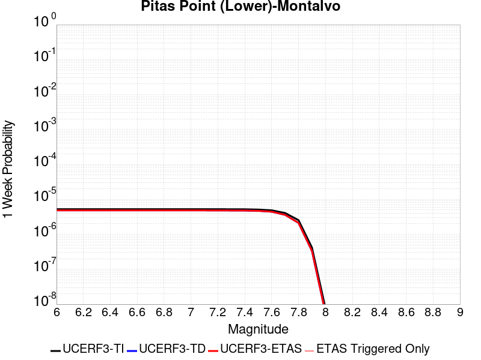 |  |  |  |

| Magnitude | 1 wk TI Prob | 1 wk TD Prob | 1 wk ETAS Prob | 1 wk ETAS/TD Gain | 1 wk ETAS Triggered Only | 1 mo TI Prob | 1 mo TD Prob | 1 mo ETAS Prob | 1 mo ETAS/TD Gain | 1 mo ETAS Triggered Only | 1 yr TI Prob | 1 yr TD Prob | 1 yr ETAS Prob | 1 yr ETAS/TD Gain | 1 yr ETAS Triggered Only | 10 yr TI Prob | 10 yr TD Prob | 10 yr ETAS Prob | 10 yr ETAS/TD Gain | 10 yr ETAS Triggered Only |
|-----|-----|-----|-----|-----|-----|-----|-----|-----|-----|-----|-----|-----|-----|-----|-----|-----|-----|-----|-----|-----|
| 6.0 | 5.2543637E-6 | 4.8380302E-6 | 4.8380302E-6 | 1.0 | 0.0 | 2.2518509E-5 | 2.0734253E-5 | 2.0734253E-5 | 1.0 | 0.0 | 2.7412834E-4 | 2.524106E-4 | 2.524106E-4 | 1.0 | 0.0 | 0.0027379042 | 0.0025212716 | 0.0025412212 | 1.0079125 | 2.0E-5 |
| 6.1 | 5.2543637E-6 | 4.8380302E-6 | 4.8380302E-6 | 1.0 | 0.0 | 2.2518509E-5 | 2.0734253E-5 | 2.0734253E-5 | 1.0 | 0.0 | 2.7412834E-4 | 2.524106E-4 | 2.524106E-4 | 1.0 | 0.0 | 0.0027379042 | 0.0025212716 | 0.0025412212 | 1.0079125 | 2.0E-5 |
| 6.2 | 5.2543637E-6 | 4.8380302E-6 | 4.8380302E-6 | 1.0 | 0.0 | 2.2518509E-5 | 2.0734253E-5 | 2.0734253E-5 | 1.0 | 0.0 | 2.7412834E-4 | 2.524106E-4 | 2.524106E-4 | 1.0 | 0.0 | 0.0027379042 | 0.0025212716 | 0.0025412212 | 1.0079125 | 2.0E-5 |
| 6.3 | 5.2543637E-6 | 4.8380302E-6 | 4.8380302E-6 | 1.0 | 0.0 | 2.2518509E-5 | 2.0734253E-5 | 2.0734253E-5 | 1.0 | 0.0 | 2.7412834E-4 | 2.524106E-4 | 2.524106E-4 | 1.0 | 0.0 | 0.0027379042 | 0.0025212716 | 0.0025412212 | 1.0079125 | 2.0E-5 |
| 6.4 | 5.2543637E-6 | 4.8380302E-6 | 4.8380302E-6 | 1.0 | 0.0 | 2.2518509E-5 | 2.0734253E-5 | 2.0734253E-5 | 1.0 | 0.0 | 2.7412834E-4 | 2.524106E-4 | 2.524106E-4 | 1.0 | 0.0 | 0.0027379042 | 0.0025212716 | 0.0025412212 | 1.0079125 | 2.0E-5 |
| 6.5 | 5.2543637E-6 | 4.8380302E-6 | 4.8380302E-6 | 1.0 | 0.0 | 2.2518509E-5 | 2.0734253E-5 | 2.0734253E-5 | 1.0 | 0.0 | 2.7412834E-4 | 2.524106E-4 | 2.524106E-4 | 1.0 | 0.0 | 0.0027379042 | 0.0025212716 | 0.0025412212 | 1.0079125 | 2.0E-5 |
| 6.6 | 5.2543637E-6 | 4.8380302E-6 | 4.8380302E-6 | 1.0 | 0.0 | 2.2518509E-5 | 2.0734253E-5 | 2.0734253E-5 | 1.0 | 0.0 | 2.7412834E-4 | 2.524106E-4 | 2.524106E-4 | 1.0 | 0.0 | 0.0027379042 | 0.0025212716 | 0.0025412212 | 1.0079125 | 2.0E-5 |
| 6.7 | 5.2543637E-6 | 4.8380302E-6 | 4.8380302E-6 | 1.0 | 0.0 | 2.2518509E-5 | 2.0734253E-5 | 2.0734253E-5 | 1.0 | 0.0 | 2.7412834E-4 | 2.524106E-4 | 2.524106E-4 | 1.0 | 0.0 | 0.0027379042 | 0.0025212716 | 0.0025412212 | 1.0079125 | 2.0E-5 |
| 6.8 | 5.2543637E-6 | 4.8380302E-6 | 4.8380302E-6 | 1.0 | 0.0 | 2.2518509E-5 | 2.0734253E-5 | 2.0734253E-5 | 1.0 | 0.0 | 2.7412834E-4 | 2.524106E-4 | 2.524106E-4 | 1.0 | 0.0 | 0.0027379042 | 0.0025212716 | 0.0025412212 | 1.0079125 | 2.0E-5 |
| 6.9 | 5.2543637E-6 | 4.8380302E-6 | 4.8380302E-6 | 1.0 | 0.0 | 2.2518509E-5 | 2.0734253E-5 | 2.0734253E-5 | 1.0 | 0.0 | 2.7412834E-4 | 2.524106E-4 | 2.524106E-4 | 1.0 | 0.0 | 0.0027379042 | 0.0025212716 | 0.0025412212 | 1.0079125 | 2.0E-5 |
| 7.0 | 5.2543637E-6 | 4.8380302E-6 | 4.8380302E-6 | 1.0 | 0.0 | 2.2518509E-5 | 2.0734253E-5 | 2.0734253E-5 | 1.0 | 0.0 | 2.7412834E-4 | 2.524106E-4 | 2.524106E-4 | 1.0 | 0.0 | 0.0027379042 | 0.0025212716 | 0.0025412212 | 1.0079125 | 2.0E-5 |
| 7.1 | 5.2543637E-6 | 4.8380302E-6 | 4.8380302E-6 | 1.0 | 0.0 | 2.2518509E-5 | 2.0734253E-5 | 2.0734253E-5 | 1.0 | 0.0 | 2.7412834E-4 | 2.524106E-4 | 2.524106E-4 | 1.0 | 0.0 | 0.0027379042 | 0.0025212716 | 0.0025412212 | 1.0079125 | 2.0E-5 |
| 7.2 | 5.2458695E-6 | 4.829184E-6 | 4.829184E-6 | 1.0 | 0.0 | 2.2482105E-5 | 2.0696341E-5 | 2.0696341E-5 | 1.0 | 0.0 | 2.7368523E-4 | 2.5194912E-4 | 2.5194912E-4 | 1.0 | 0.0 | 0.0027334841 | 0.0025166674 | 0.002536617 | 1.0079271 | 2.0E-5 |
| 7.3 | 5.22665E-6 | 4.809101E-6 | 4.809101E-6 | 1.0 | 0.0 | 2.2399736E-5 | 2.061027E-5 | 2.061027E-5 | 1.0 | 0.0 | 2.7268266E-4 | 2.5090147E-4 | 2.5090147E-4 | 1.0 | 0.0 | 0.002723483 | 0.0025062144 | 0.0025261643 | 1.0079602 | 2.0E-5 |
| 7.4 | 5.210642E-6 | 4.7923127E-6 | 4.7923127E-6 | 1.0 | 0.0 | 2.233113E-5 | 2.0538324E-5 | 2.0538324E-5 | 1.0 | 0.0 | 2.718476E-4 | 2.500257E-4 | 2.500257E-4 | 1.0 | 0.0 | 0.002715153 | 0.0024974765 | 0.0025174266 | 1.0079881 | 2.0E-5 |
| 7.5 | 5.1226016E-6 | 4.700197E-6 | 4.700197E-6 | 1.0 | 0.0 | 2.1953823E-5 | 2.0143549E-5 | 2.0143549E-5 | 1.0 | 0.0 | 2.67255E-4 | 2.452204E-4 | 2.452204E-4 | 1.0 | 0.0 | 0.0026693381 | 0.00244953 | 0.002469481 | 1.0081449 | 2.0E-5 |
| 7.6 | 4.8796987E-6 | 4.44509E-6 | 4.44509E-6 | 1.0 | 0.0 | 2.0912828E-5 | 1.9050249E-5 | 1.9050249E-5 | 1.0 | 0.0 | 2.5458392E-4 | 2.3191239E-4 | 2.3191239E-4 | 1.0 | 0.0 | 0.0025429246 | 0.0023167343 | 0.0023366879 | 1.0086129 | 2.0E-5 |
| 7.7 | 4.0834398E-6 | 3.609237E-6 | 3.609237E-6 | 1.0 | 0.0 | 1.7500339E-5 | 1.5468067E-5 | 1.5468067E-5 | 1.0 | 0.0 | 2.1304579E-4 | 1.8830769E-4 | 1.8830769E-4 | 1.0 | 0.0 | 0.0021284167 | 0.001881505 | 0.0019014673 | 1.0106097 | 2.0E-5 |
| 7.8 | 2.5445438E-6 | 2.1212973E-6 | 2.1212973E-6 | 1.0 | 0.0 | 1.0905142E-5 | 9.091243E-6 | 9.091243E-6 | 1.0 | 0.0 | 1.3276201E-4 | 1.106803E-4 | 1.106803E-4 | 1.0 | 0.0 | 0.0013268272 | 0.0011062565 | 0.0011162454 | 1.0090295 | 1.0E-5 |
| 7.9 | 4.1677114E-7 | 3.3294845E-7 | 3.3294845E-7 | 1.0 | 0.0 | 1.7861609E-6 | 1.4269211E-6 | 1.4269211E-6 | 1.0 | 0.0 | 2.1746291E-5 | 1.737263E-5 | 1.737263E-5 | 1.0 | 0.0 | 2.1744163E-4 | 1.7371304E-4 | 1.837113E-4 | 1.0575562 | 1.0E-5 |
| 8.0 | 7.791402E-9 | 5.683722E-9 | 5.683722E-9 | 1.0 | 0.0 | 3.3391725E-8 | 2.4358807E-8 | 2.4358807E-8 | 1.0 | 0.0 | 4.0654416E-7 | 2.9656846E-7 | 2.9656846E-7 | 1.0 | 0.0 | 4.065434E-6 | 2.9656826E-6 | 2.9656826E-6 | 1.0 | 0.0 |

## Great Valley 07 (Orestimba)
*[(top)](#table-of-contents)*

| 1 Week | 1 Month | 1 Year | 10 Year |
|-----|-----|-----|-----|
|  |  |  |  |

| Magnitude | 1 wk TI Prob | 1 wk TD Prob | 1 wk ETAS Prob | 1 wk ETAS/TD Gain | 1 wk ETAS Triggered Only | 1 mo TI Prob | 1 mo TD Prob | 1 mo ETAS Prob | 1 mo ETAS/TD Gain | 1 mo ETAS Triggered Only | 1 yr TI Prob | 1 yr TD Prob | 1 yr ETAS Prob | 1 yr ETAS/TD Gain | 1 yr ETAS Triggered Only | 10 yr TI Prob | 10 yr TD Prob | 10 yr ETAS Prob | 10 yr ETAS/TD Gain | 10 yr ETAS Triggered Only |
|-----|-----|-----|-----|-----|-----|-----|-----|-----|-----|-----|-----|-----|-----|-----|-----|-----|-----|-----|-----|-----|
| 6.0 | 2.9687902E-5 | 3.2759297E-5 | 3.2759297E-5 | 1.0 | 0.0 | 1.2722766E-4 | 1.4038983E-4 | 1.4038983E-4 | 1.0 | 0.0 | 0.0015478961 | 0.0017079781 | 0.001717961 | 1.0058448 | 1.0E-5 | 0.015371585 | 0.01695606 | 0.01697572 | 1.0011595 | 2.0E-5 |
| 6.1 | 2.9687902E-5 | 3.2759297E-5 | 3.2759297E-5 | 1.0 | 0.0 | 1.2722766E-4 | 1.4038983E-4 | 1.4038983E-4 | 1.0 | 0.0 | 0.0015478961 | 0.0017079781 | 0.001717961 | 1.0058448 | 1.0E-5 | 0.015371585 | 0.01695606 | 0.01697572 | 1.0011595 | 2.0E-5 |
| 6.2 | 1.9231524E-5 | 2.1160291E-5 | 2.1160291E-5 | 1.0 | 0.0 | 8.2418206E-5 | 9.068394E-5 | 9.068394E-5 | 1.0 | 0.0 | 0.0010029797 | 0.0011035409 | 0.0011135299 | 1.0090517 | 1.0E-5 | 0.00998465 | 0.010983022 | 0.011002802 | 1.001801 | 2.0E-5 |
| 6.3 | 1.324766E-5 | 1.4549291E-5 | 1.4549291E-5 | 1.0 | 0.0 | 5.6774446E-5 | 6.2352665E-5 | 6.2352665E-5 | 1.0 | 0.0 | 6.910097E-4 | 7.588885E-4 | 7.688809E-4 | 1.0131671 | 1.0E-5 | 0.006888649 | 0.0075639165 | 0.0075738407 | 1.001312 | 1.0E-5 |
| 6.4 | 7.818645E-6 | 8.573279E-6 | 8.573279E-6 | 1.0 | 0.0 | 3.3508048E-5 | 3.6742123E-5 | 3.6742123E-5 | 1.0 | 0.0 | 4.078841E-4 | 4.4724692E-4 | 4.4724692E-4 | 1.0 | 0.0 | 0.004071363 | 0.0044638086 | 0.0044638086 | 1.0 | 0.0 |
| 6.5 | 5.3076565E-6 | 5.8180976E-6 | 5.8180976E-6 | 1.0 | 0.0 | 2.27469E-5 | 2.4934478E-5 | 2.4934478E-5 | 1.0 | 0.0 | 2.7690834E-4 | 3.0353706E-4 | 3.0353706E-4 | 1.0 | 0.0 | 0.0027656353 | 0.0030314343 | 0.0030314343 | 1.0 | 0.0 |
| 6.6 | 3.6003578E-6 | 3.948698E-6 | 3.948698E-6 | 1.0 | 0.0 | 1.5430012E-5 | 1.692289E-5 | 1.692289E-5 | 1.0 | 0.0 | 1.8784421E-4 | 2.0601827E-4 | 2.0601827E-4 | 1.0 | 0.0 | 0.0018768552 | 0.0020584268 | 0.0020584268 | 1.0 | 0.0 |
| 6.7 | 2.5361826E-6 | 2.783612E-6 | 2.783612E-6 | 1.0 | 0.0 | 1.0869308E-5 | 1.1929718E-5 | 1.1929718E-5 | 1.0 | 0.0 | 1.3232579E-4 | 1.4523596E-4 | 1.4523596E-4 | 1.0 | 0.0 | 0.0013224703 | 0.0014515404 | 0.0014515404 | 1.0 | 0.0 |
| 6.8 | 1.2115831E-6 | 1.3314497E-6 | 1.3314497E-6 | 1.0 | 0.0 | 5.1924885E-6 | 5.7062057E-6 | 5.7062057E-6 | 1.0 | 0.0 | 6.3216714E-5 | 6.947181E-5 | 6.947181E-5 | 1.0 | 0.0 | 6.3198735E-4 | 6.9459603E-4 | 6.9459603E-4 | 1.0 | 0.0 |

## San Jacinto (Clark) rev
*[(top)](#table-of-contents)*

| 1 Week | 1 Month | 1 Year | 10 Year |
|-----|-----|-----|-----|
|  |  |  |  |

| Magnitude | 1 wk TI Prob | 1 wk TD Prob | 1 wk ETAS Prob | 1 wk ETAS/TD Gain | 1 wk ETAS Triggered Only | 1 mo TI Prob | 1 mo TD Prob | 1 mo ETAS Prob | 1 mo ETAS/TD Gain | 1 mo ETAS Triggered Only | 1 yr TI Prob | 1 yr TD Prob | 1 yr ETAS Prob | 1 yr ETAS/TD Gain | 1 yr ETAS Triggered Only | 10 yr TI Prob | 10 yr TD Prob | 10 yr ETAS Prob | 10 yr ETAS/TD Gain | 10 yr ETAS Triggered Only |
|-----|-----|-----|-----|-----|-----|-----|-----|-----|-----|-----|-----|-----|-----|-----|-----|-----|-----|-----|-----|-----|
| 6.0 | 4.482615E-5 | 2.1195152E-5 | 2.1195152E-5 | 1.0 | 0.0 | 1.9209793E-4 | 9.083325E-5 | 9.083325E-5 | 1.0 | 0.0 | 0.0023362834 | 0.001105343 | 0.001115332 | 1.009037 | 1.0E-5 | 0.02311874 | 0.011525473 | 0.011545242 | 1.0017153 | 2.0E-5 |
| 6.1 | 4.482615E-5 | 2.1195152E-5 | 2.1195152E-5 | 1.0 | 0.0 | 1.9209793E-4 | 9.083325E-5 | 9.083325E-5 | 1.0 | 0.0 | 0.0023362834 | 0.001105343 | 0.001115332 | 1.009037 | 1.0E-5 | 0.02311874 | 0.011525473 | 0.011545242 | 1.0017153 | 2.0E-5 |
| 6.2 | 4.482615E-5 | 2.1195152E-5 | 2.1195152E-5 | 1.0 | 0.0 | 1.9209793E-4 | 9.083325E-5 | 9.083325E-5 | 1.0 | 0.0 | 0.0023362834 | 0.001105343 | 0.001115332 | 1.009037 | 1.0E-5 | 0.02311874 | 0.011525473 | 0.011545242 | 1.0017153 | 2.0E-5 |
| 6.3 | 4.482615E-5 | 2.1195152E-5 | 2.1195152E-5 | 1.0 | 0.0 | 1.9209793E-4 | 9.083325E-5 | 9.083325E-5 | 1.0 | 0.0 | 0.0023362834 | 0.001105343 | 0.001115332 | 1.009037 | 1.0E-5 | 0.02311874 | 0.011525473 | 0.011545242 | 1.0017153 | 2.0E-5 |
| 6.4 | 4.482615E-5 | 2.1195152E-5 | 2.1195152E-5 | 1.0 | 0.0 | 1.9209793E-4 | 9.083325E-5 | 9.083325E-5 | 1.0 | 0.0 | 0.0023362834 | 0.001105343 | 0.001115332 | 1.009037 | 1.0E-5 | 0.02311874 | 0.011525473 | 0.011545242 | 1.0017153 | 2.0E-5 |
| 6.5 | 3.7294863E-5 | 1.7393328E-5 | 1.7393328E-5 | 1.0 | 0.0 | 1.5982533E-4 | 7.454073E-5 | 7.454073E-5 | 1.0 | 0.0 | 0.0019441366 | 9.0716005E-4 | 9.17151E-4 | 1.0110134 | 1.0E-5 | 0.01927216 | 0.009513795 | 0.009533605 | 1.0020822 | 2.0E-5 |
| 6.6 | 3.7294863E-5 | 1.7393328E-5 | 1.7393328E-5 | 1.0 | 0.0 | 1.5982533E-4 | 7.454073E-5 | 7.454073E-5 | 1.0 | 0.0 | 0.0019441366 | 9.0716005E-4 | 9.17151E-4 | 1.0110134 | 1.0E-5 | 0.01927216 | 0.009513795 | 0.009533605 | 1.0020822 | 2.0E-5 |
| 6.7 | 3.6039248E-5 | 1.6640866E-5 | 1.6640866E-5 | 1.0 | 0.0 | 1.5444479E-4 | 7.131607E-5 | 7.131607E-5 | 1.0 | 0.0 | 0.0018787434 | 8.6793146E-4 | 8.779228E-4 | 1.0115117 | 1.0E-5 | 0.01862939 | 0.009115386 | 0.009135204 | 1.0021741 | 2.0E-5 |
| 6.8 | 3.5031844E-5 | 1.6268963E-5 | 1.6268963E-5 | 1.0 | 0.0 | 1.5012783E-4 | 6.9722286E-5 | 6.9722286E-5 | 1.0 | 0.0 | 0.0018262739 | 8.485423E-4 | 8.5853384E-4 | 1.0117749 | 1.0E-5 | 0.01811338 | 0.008915053 | 0.008934874 | 1.0022234 | 2.0E-5 |
| 6.9 | 3.435112E-5 | 1.6098935E-5 | 1.6098935E-5 | 1.0 | 0.0 | 1.4721078E-4 | 6.8993635E-5 | 6.8993635E-5 | 1.0 | 0.0 | 0.0017908178 | 8.396779E-4 | 8.4966945E-4 | 1.0118994 | 1.0E-5 | 0.017764548 | 0.008823094 | 0.008842917 | 1.0022467 | 2.0E-5 |
| 7.0 | 2.8959772E-5 | 1.4369728E-5 | 1.4369728E-5 | 1.0 | 0.0 | 1.241074E-4 | 6.158311E-5 | 6.158311E-5 | 1.0 | 0.0 | 0.0015099603 | 7.4951927E-4 | 7.595118E-4 | 1.0133319 | 1.0E-5 | 0.014997416 | 0.00788556 | 0.007905403 | 1.0025163 | 2.0E-5 |
| 7.1 | 2.6002877E-5 | 1.2859668E-5 | 1.2859668E-5 | 1.0 | 0.0 | 1.11436144E-4 | 5.511171E-5 | 5.511171E-5 | 1.0 | 0.0 | 0.0013558907 | 6.707806E-4 | 6.8077387E-4 | 1.0148981 | 1.0E-5 | 0.013476475 | 0.007062899 | 0.007082758 | 1.0028117 | 2.0E-5 |
| 7.2 | 2.2544838E-5 | 1.1290756E-5 | 1.1290756E-5 | 1.0 | 0.0 | 9.661716E-5 | 4.8388065E-5 | 4.8388065E-5 | 1.0 | 0.0 | 0.001175679 | 5.889669E-4 | 5.98961E-4 | 1.0169688 | 1.0E-5 | 0.011694785 | 0.0062078307 | 0.0062277066 | 1.0032017 | 2.0E-5 |
| 7.3 | 1.75334E-5 | 1.0838515E-5 | 1.0838515E-5 | 1.0 | 0.0 | 7.514098E-5 | 4.644996E-5 | 4.644996E-5 | 1.0 | 0.0 | 9.144575E-4 | 5.653829E-4 | 5.7537726E-4 | 1.0176771 | 1.0E-5 | 0.009107036 | 0.005948046 | 0.005967927 | 1.0033424 | 2.0E-5 |
| 7.4 | 1.5924552E-5 | 1.0637865E-5 | 1.0637865E-5 | 1.0 | 0.0 | 6.82463E-5 | 4.5590063E-5 | 4.5590063E-5 | 1.0 | 0.0 | 8.305819E-4 | 5.54919E-4 | 5.649135E-4 | 1.0180106 | 1.0E-5 | 0.008274844 | 0.005835053 | 0.0058549363 | 1.0034076 | 2.0E-5 |
| 7.5 | 1.3428931E-5 | 9.876464E-6 | 9.876464E-6 | 1.0 | 0.0 | 5.7551293E-5 | 4.232702E-5 | 4.232702E-5 | 1.0 | 0.0 | 7.004617E-4 | 5.1521073E-4 | 5.2520557E-4 | 1.0193995 | 1.0E-5 | 0.006982579 | 0.005419675 | 0.0054395664 | 1.0036702 | 2.0E-5 |
| 7.6 | 1.0688787E-5 | 8.632698E-6 | 8.632698E-6 | 1.0 | 0.0 | 4.5808283E-5 | 3.6996757E-5 | 3.6996757E-5 | 1.0 | 0.0 | 5.5757316E-4 | 4.503429E-4 | 4.603384E-4 | 1.0221953 | 1.0E-5 | 0.005561762 | 0.004751152 | 0.004771057 | 1.0041895 | 2.0E-5 |
| 7.7 | 8.81236E-6 | 7.4852865E-6 | 7.4852865E-6 | 1.0 | 0.0 | 3.776671E-5 | 3.2079406E-5 | 3.2079406E-5 | 1.0 | 0.0 | 4.597127E-4 | 3.9049698E-4 | 4.0049307E-4 | 1.0255984 | 1.0E-5 | 0.0045876284 | 0.004143844 | 0.0041637607 | 1.0048064 | 2.0E-5 |
| 7.8 | 7.780431E-6 | 6.712883E-6 | 6.712883E-6 | 1.0 | 0.0 | 3.3344273E-5 | 2.8769182E-5 | 2.8769182E-5 | 1.0 | 0.0 | 4.0589093E-4 | 3.502087E-4 | 3.602052E-4 | 1.0285444 | 1.0E-5 | 0.0040515037 | 0.0037314843 | 0.0037514097 | 1.0053397 | 2.0E-5 |
| 7.9 | 6.5437994E-6 | 5.795602E-6 | 5.795602E-6 | 1.0 | 0.0 | 2.8044553E-5 | 2.4838058E-5 | 2.4838058E-5 | 1.0 | 0.0 | 3.4138895E-4 | 3.023616E-4 | 3.1235855E-4 | 1.0330629 | 1.0E-5 | 0.0034086495 | 0.0032426151 | 0.0032625503 | 1.0061479 | 2.0E-5 |
| 8.0 | 5.4488164E-6 | 4.8268685E-6 | 4.8268685E-6 | 1.0 | 0.0 | 2.3351862E-5 | 2.0686417E-5 | 2.0686417E-5 | 1.0 | 0.0 | 2.8427184E-4 | 2.5182817E-4 | 2.6182565E-4 | 1.0396997 | 1.0E-5 | 0.0028390845 | 0.0027180852 | 0.0027380309 | 1.0073382 | 2.0E-5 |
| 8.1 | 2.8397242E-6 | 1.372448E-6 | 1.372448E-6 | 1.0 | 0.0 | 1.217019E-5 | 5.8819064E-6 | 5.8819064E-6 | 1.0 | 0.0 | 1.4816198E-4 | 7.160987E-5 | 8.1609156E-5 | 1.1396356 | 1.0E-5 | 0.0014806325 | 8.145797E-4 | 8.245716E-4 | 1.0122663 | 1.0E-5 |
| 8.2 | 2.030244E-6 | 6.3495634E-7 | 6.3495634E-7 | 1.0 | 0.0 | 8.701017E-6 | 2.7212386E-6 | 2.7212386E-6 | 1.0 | 0.0 | 1.05929736E-4 | 3.3130582E-5 | 3.3130582E-5 | 1.0 | 0.0 | 0.0010587925 | 3.966504E-4 | 3.966504E-4 | 1.0 | 0.0 |
| 8.3 | 1.0659804E-6 | 2.9400067E-7 | 2.9400067E-7 | 1.0 | 0.0 | 4.568479E-6 | 1.2600023E-6 | 1.2600023E-6 | 1.0 | 0.0 | 5.5619817E-5 | 1.5340423E-5 | 1.5340423E-5 | 1.0 | 0.0 | 5.5605895E-4 | 1.8654772E-4 | 1.8654772E-4 | 1.0 | 0.0 |

## Big Pine (East)
*[(top)](#table-of-contents)*

| 1 Week | 1 Month | 1 Year | 10 Year |
|-----|-----|-----|-----|
|  | 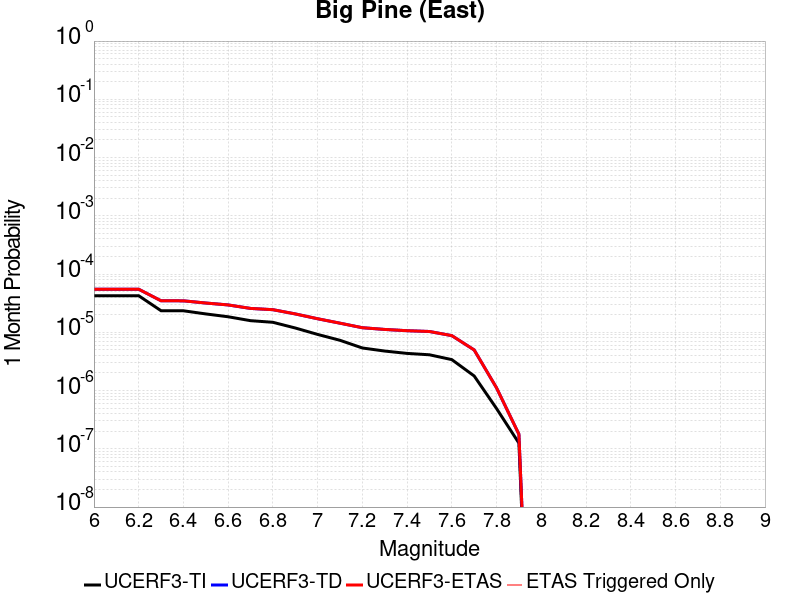 |  |  |

| Magnitude | 1 wk TI Prob | 1 wk TD Prob | 1 wk ETAS Prob | 1 wk ETAS/TD Gain | 1 wk ETAS Triggered Only | 1 mo TI Prob | 1 mo TD Prob | 1 mo ETAS Prob | 1 mo ETAS/TD Gain | 1 mo ETAS Triggered Only | 1 yr TI Prob | 1 yr TD Prob | 1 yr ETAS Prob | 1 yr ETAS/TD Gain | 1 yr ETAS Triggered Only | 10 yr TI Prob | 10 yr TD Prob | 10 yr ETAS Prob | 10 yr ETAS/TD Gain | 10 yr ETAS Triggered Only |
|-----|-----|-----|-----|-----|-----|-----|-----|-----|-----|-----|-----|-----|-----|-----|-----|-----|-----|-----|-----|-----|
| 6.0 | 9.916913E-6 | 1.282197E-5 | 1.282197E-5 | 1.0 | 0.0 | 4.250036E-5 | 5.495027E-5 | 5.495027E-5 | 1.0 | 0.0 | 5.173191E-4 | 6.6883623E-4 | 6.7882956E-4 | 1.0149413 | 1.0E-5 | 0.0051611643 | 0.0066729826 | 0.006692849 | 1.0029771 | 2.0E-5 |
| 6.1 | 9.916913E-6 | 1.282197E-5 | 1.282197E-5 | 1.0 | 0.0 | 4.250036E-5 | 5.495027E-5 | 5.495027E-5 | 1.0 | 0.0 | 5.173191E-4 | 6.6883623E-4 | 6.7882956E-4 | 1.0149413 | 1.0E-5 | 0.0051611643 | 0.0066729826 | 0.006692849 | 1.0029771 | 2.0E-5 |
| 6.2 | 9.916913E-6 | 1.282197E-5 | 1.282197E-5 | 1.0 | 0.0 | 4.250036E-5 | 5.495027E-5 | 5.495027E-5 | 1.0 | 0.0 | 5.173191E-4 | 6.6883623E-4 | 6.7882956E-4 | 1.0149413 | 1.0E-5 | 0.0051611643 | 0.0066729826 | 0.006692849 | 1.0029771 | 2.0E-5 |
| 6.3 | 5.479711E-6 | 8.117787E-6 | 8.117787E-6 | 1.0 | 0.0 | 2.3484265E-5 | 3.4790068E-5 | 3.4790068E-5 | 1.0 | 0.0 | 2.858834E-4 | 4.2348995E-4 | 4.3348572E-4 | 1.0236033 | 1.0E-5 | 0.0028551589 | 0.004229713 | 0.0042496286 | 1.0047084 | 2.0E-5 |
| 6.4 | 5.465009E-6 | 8.10208E-6 | 8.10208E-6 | 1.0 | 0.0 | 2.3421257E-5 | 3.4722754E-5 | 3.4722754E-5 | 1.0 | 0.0 | 2.851165E-4 | 4.2267074E-4 | 4.326665E-4 | 1.0236491 | 1.0E-5 | 0.0028475097 | 0.004221552 | 0.0042414675 | 1.0047176 | 2.0E-5 |
| 6.5 | 4.826767E-6 | 7.4271156E-6 | 7.4271156E-6 | 1.0 | 0.0 | 2.068598E-5 | 3.183012E-5 | 3.183012E-5 | 1.0 | 0.0 | 2.518227E-4 | 3.874656E-4 | 3.874656E-4 | 1.0 | 0.0 | 0.0025153751 | 0.0038707424 | 0.0038807038 | 1.0025735 | 1.0E-5 |
| 6.6 | 4.3146847E-6 | 6.887036E-6 | 6.887036E-6 | 1.0 | 0.0 | 1.8491375E-5 | 2.9515548E-5 | 2.9515548E-5 | 1.0 | 0.0 | 2.2510924E-4 | 3.59295E-4 | 3.59295E-4 | 1.0 | 0.0 | 0.0022488134 | 0.0035899505 | 0.0035999147 | 1.0027755 | 1.0E-5 |
| 6.7 | 3.6968106E-6 | 5.9999884E-6 | 5.9999884E-6 | 1.0 | 0.0 | 1.5843378E-5 | 2.571399E-5 | 2.571399E-5 | 1.0 | 0.0 | 1.9287605E-4 | 3.130244E-4 | 3.130244E-4 | 1.0 | 0.0 | 0.0019270873 | 0.0031285542 | 0.0031385229 | 1.0031863 | 1.0E-5 |
| 6.8 | 3.4671132E-6 | 5.7065704E-6 | 5.7065704E-6 | 1.0 | 0.0 | 1.4858972E-5 | 2.4456509E-5 | 2.4456509E-5 | 1.0 | 0.0 | 1.8089297E-4 | 2.9771877E-4 | 2.9771877E-4 | 1.0 | 0.0 | 0.0018074579 | 0.0029759097 | 0.00298588 | 1.0033503 | 1.0E-5 |
| 6.9 | 2.7686972E-6 | 4.829279E-6 | 4.829279E-6 | 1.0 | 0.0 | 1.1865792E-5 | 2.069675E-5 | 2.069675E-5 | 1.0 | 0.0 | 1.4445644E-4 | 2.5195457E-4 | 2.5195457E-4 | 1.0 | 0.0 | 0.0014436257 | 0.0025193316 | 0.0025293066 | 1.0039593 | 1.0E-5 |
| 7.0 | 2.1472624E-6 | 3.988725E-6 | 3.988725E-6 | 1.0 | 0.0 | 9.20252E-6 | 1.7094428E-5 | 1.7094428E-5 | 1.0 | 0.0 | 1.12034926E-4 | 2.0810531E-4 | 2.0810531E-4 | 1.0 | 0.0 | 0.0011197845 | 0.002081715 | 0.002081715 | 1.0 | 0.0 |
| 7.1 | 1.7018335E-6 | 3.348229E-6 | 3.348229E-6 | 1.0 | 0.0 | 7.293552E-6 | 1.4349476E-5 | 1.4349476E-5 | 1.0 | 0.0 | 8.879537E-5 | 1.7469123E-4 | 1.7469123E-4 | 1.0 | 0.0 | 8.87599E-4 | 0.0017481181 | 0.0017481181 | 1.0 | 0.0 |
| 7.2 | 1.25603E-6 | 2.7976516E-6 | 2.7976516E-6 | 1.0 | 0.0 | 5.3829745E-6 | 1.1989882E-5 | 1.1989882E-5 | 1.0 | 0.0 | 6.553574E-5 | 1.4596726E-4 | 1.4596726E-4 | 1.0 | 0.0 | 6.551642E-4 | 0.0014612685 | 0.0014612685 | 1.0 | 0.0 |
| 7.3 | 1.112297E-6 | 2.613323E-6 | 2.613323E-6 | 1.0 | 0.0 | 4.7669787E-6 | 1.1199909E-5 | 1.1199909E-5 | 1.0 | 0.0 | 5.803642E-5 | 1.3635057E-4 | 1.3635057E-4 | 1.0 | 0.0 | 5.802127E-4 | 0.0013650558 | 0.0013650558 | 1.0 | 0.0 |
| 7.4 | 1.0137181E-6 | 2.4863546E-6 | 2.4863546E-6 | 1.0 | 0.0 | 4.3444993E-6 | 1.0655763E-5 | 1.0655763E-5 | 1.0 | 0.0 | 5.2892992E-5 | 1.297264E-4 | 1.297264E-4 | 1.0 | 0.0 | 5.288041E-4 | 0.0012986774 | 0.0012986774 | 1.0 | 0.0 |
| 7.5 | 9.598608E-7 | 2.4099256E-6 | 2.4099256E-6 | 1.0 | 0.0 | 4.1136827E-6 | 1.0328214E-5 | 1.0328214E-5 | 1.0 | 0.0 | 5.0082934E-5 | 1.2573895E-4 | 1.2573895E-4 | 1.0 | 0.0 | 5.007165E-4 | 0.0012586572 | 0.0012586572 | 1.0 | 0.0 |
| 7.6 | 7.929459E-7 | 2.047312E-6 | 2.047312E-6 | 1.0 | 0.0 | 3.3983351E-6 | 8.7741655E-6 | 8.7741655E-6 | 1.0 | 0.0 | 4.1373947E-5 | 1.0682041E-4 | 1.0682041E-4 | 1.0 | 0.0 | 4.1366243E-4 | 0.0010697625 | 0.0010697625 | 1.0 | 0.0 |
| 7.7 | 4.155788E-7 | 1.162298E-6 | 1.162298E-6 | 1.0 | 0.0 | 1.7810507E-6 | 4.981268E-6 | 4.981268E-6 | 1.0 | 0.0 | 2.1684076E-5 | 6.064529E-5 | 6.064529E-5 | 1.0 | 0.0 | 2.1681961E-4 | 6.09451E-4 | 6.09451E-4 | 1.0 | 0.0 |
| 7.8 | 1.14666925E-7 | 2.5959213E-7 | 2.5959213E-7 | 1.0 | 0.0 | 4.914296E-7 | 1.1125372E-6 | 1.1125372E-6 | 1.0 | 0.0 | 5.9831386E-6 | 1.354506E-5 | 1.354506E-5 | 1.0 | 0.0 | 5.9829777E-5 | 1.3654139E-4 | 1.3654139E-4 | 1.0 | 0.0 |
| 7.9 | 2.9231824E-8 | 4.15291E-8 | 4.15291E-8 | 1.0 | 0.0 | 1.2527924E-7 | 1.7798183E-7 | 1.7798183E-7 | 1.0 | 0.0 | 1.5252737E-6 | 2.1669268E-6 | 2.1669268E-6 | 1.0 | 0.0 | 1.5252632E-5 | 2.2001832E-5 | 2.2001832E-5 | 1.0 | 0.0 |

## San Gregorio (North) 2011 CFM
*[(top)](#table-of-contents)*

| 1 Week | 1 Month | 1 Year | 10 Year |
|-----|-----|-----|-----|
|  |  |  |  |

| Magnitude | 1 wk TI Prob | 1 wk TD Prob | 1 wk ETAS Prob | 1 wk ETAS/TD Gain | 1 wk ETAS Triggered Only | 1 mo TI Prob | 1 mo TD Prob | 1 mo ETAS Prob | 1 mo ETAS/TD Gain | 1 mo ETAS Triggered Only | 1 yr TI Prob | 1 yr TD Prob | 1 yr ETAS Prob | 1 yr ETAS/TD Gain | 1 yr ETAS Triggered Only | 10 yr TI Prob | 10 yr TD Prob | 10 yr ETAS Prob | 10 yr ETAS/TD Gain | 10 yr ETAS Triggered Only |
|-----|-----|-----|-----|-----|-----|-----|-----|-----|-----|-----|-----|-----|-----|-----|-----|-----|-----|-----|-----|-----|
| 6.0 | 5.0283932E-5 | 4.30766E-5 | 4.30766E-5 | 1.0 | 0.0 | 2.1548476E-4 | 1.8460107E-4 | 1.9459923E-4 | 1.0541608 | 1.0E-5 | 0.0026203706 | 0.002245218 | 0.0022551955 | 1.0044439 | 1.0E-5 | 0.02589687 | 0.022302931 | 0.022322485 | 1.0008768 | 2.0E-5 |
| 6.1 | 5.0283932E-5 | 4.30766E-5 | 4.30766E-5 | 1.0 | 0.0 | 2.1548476E-4 | 1.8460107E-4 | 1.9459923E-4 | 1.0541608 | 1.0E-5 | 0.0026203706 | 0.002245218 | 0.0022551955 | 1.0044439 | 1.0E-5 | 0.02589687 | 0.022302931 | 0.022322485 | 1.0008768 | 2.0E-5 |
| 6.2 | 4.2998647E-5 | 3.445908E-5 | 3.445908E-5 | 1.0 | 0.0 | 1.842669E-4 | 1.476735E-4 | 1.476735E-4 | 1.0 | 0.0 | 0.0022411412 | 0.0017964557 | 0.0017964557 | 1.0 | 0.0 | 0.022186736 | 0.017895678 | 0.017895678 | 1.0 | 0.0 |
| 6.3 | 4.2998647E-5 | 3.445908E-5 | 3.445908E-5 | 1.0 | 0.0 | 1.842669E-4 | 1.476735E-4 | 1.476735E-4 | 1.0 | 0.0 | 0.0022411412 | 0.0017964557 | 0.0017964557 | 1.0 | 0.0 | 0.022186736 | 0.017895678 | 0.017895678 | 1.0 | 0.0 |
| 6.4 | 4.1101295E-5 | 3.2344054E-5 | 3.2344054E-5 | 1.0 | 0.0 | 1.7613651E-4 | 1.3861009E-4 | 1.3861009E-4 | 1.0 | 0.0 | 0.0021423528 | 0.0016862852 | 0.0016862852 | 1.0 | 0.0 | 0.02121817 | 0.01681089 | 0.01681089 | 1.0 | 0.0 |
| 6.5 | 4.1032585E-5 | 3.226208E-5 | 3.226208E-5 | 1.0 | 0.0 | 1.7584208E-4 | 1.3825881E-4 | 1.3825881E-4 | 1.0 | 0.0 | 0.0021387753 | 0.001682015 | 0.001682015 | 1.0 | 0.0 | 0.021183075 | 0.01676884 | 0.01676884 | 1.0 | 0.0 |
| 6.6 | 4.011629E-5 | 3.1283573E-5 | 3.1283573E-5 | 1.0 | 0.0 | 1.7191563E-4 | 1.3406565E-4 | 1.3406565E-4 | 1.0 | 0.0 | 0.0020910634 | 0.0016310415 | 0.0016310415 | 1.0 | 0.0 | 0.020714961 | 0.016266337 | 0.016266337 | 1.0 | 0.0 |
| 6.7 | 3.8583938E-5 | 2.9470419E-5 | 2.9470419E-5 | 1.0 | 0.0 | 1.6534925E-4 | 1.2629577E-4 | 1.2629577E-4 | 1.0 | 0.0 | 0.0020112682 | 0.0015365805 | 0.0015365805 | 1.0 | 0.0 | 0.019931622 | 0.015334755 | 0.015334755 | 1.0 | 0.0 |
| 6.8 | 3.44341E-5 | 2.4467021E-5 | 2.4467021E-5 | 1.0 | 0.0 | 1.4756636E-4 | 1.0485451E-4 | 1.0485451E-4 | 1.0 | 0.0 | 0.0017951399 | 0.0012758662 | 0.0012758662 | 1.0 | 0.0 | 0.017807078 | 0.012759615 | 0.012759615 | 1.0 | 0.0 |
| 6.9 | 3.221199E-5 | 2.179033E-5 | 2.179033E-5 | 1.0 | 0.0 | 1.3804408E-4 | 9.338383E-5 | 9.338383E-5 | 1.0 | 0.0 | 0.0016793909 | 0.0011363634 | 0.0011363634 | 1.0 | 0.0 | 0.01666756 | 0.011379083 | 0.011379083 | 1.0 | 0.0 |
| 7.0 | 2.9186718E-5 | 1.815688E-5 | 1.815688E-5 | 1.0 | 0.0 | 1.2507994E-4 | 7.78129E-5 | 7.78129E-5 | 1.0 | 0.0 | 0.0015217843 | 9.4696466E-4 | 9.4696466E-4 | 1.0 | 0.0 | 0.015114053 | 0.009502123 | 0.009502123 | 1.0 | 0.0 |
| 7.1 | 2.6840138E-5 | 1.5293754E-5 | 1.5293754E-5 | 1.0 | 0.0 | 1.1502409E-4 | 6.554302E-5 | 6.554302E-5 | 1.0 | 0.0 | 0.0013995186 | 7.97696E-4 | 7.97696E-4 | 1.0 | 0.0 | 0.013907375 | 0.008020661 | 0.008020661 | 1.0 | 0.0 |
| 7.2 | 2.453002E-5 | 1.2615369E-5 | 1.2615369E-5 | 1.0 | 0.0 | 1.05124425E-4 | 5.4064752E-5 | 5.4064752E-5 | 1.0 | 0.0 | 0.0012791384 | 6.5804017E-4 | 6.5804017E-4 | 1.0 | 0.0 | 0.012718005 | 0.0066322917 | 0.0066322917 | 1.0 | 0.0 |
| 7.3 | 2.3330727E-5 | 1.1497131E-5 | 1.1497131E-5 | 1.0 | 0.0 | 9.9985E-5 | 4.9272487E-5 | 4.9272487E-5 | 1.0 | 0.0 | 0.0012166376 | 5.9972785E-4 | 5.9972785E-4 | 1.0 | 0.0 | 0.012099981 | 0.0060511003 | 0.0060511003 | 1.0 | 0.0 |
| 7.4 | 2.2136466E-5 | 1.0376991E-5 | 1.0376991E-5 | 1.0 | 0.0 | 9.486712E-5 | 4.447206E-5 | 4.447206E-5 | 1.0 | 0.0 | 0.0011543952 | 5.413131E-4 | 5.413131E-4 | 1.0 | 0.0 | 0.011484168 | 0.0054685515 | 0.0054685515 | 1.0 | 0.0 |
| 7.5 | 2.0994974E-5 | 9.434951E-6 | 9.434951E-6 | 1.0 | 0.0 | 8.997535E-5 | 4.0434876E-5 | 4.0434876E-5 | 1.0 | 0.0 | 0.0010948994 | 4.9218367E-4 | 4.9218367E-4 | 1.0 | 0.0 | 0.010895205 | 0.004977516 | 0.004977516 | 1.0 | 0.0 |
| 7.6 | 1.7091823E-5 | 6.899775E-6 | 6.899775E-6 | 1.0 | 0.0 | 7.3248615E-5 | 2.9570128E-5 | 2.9570128E-5 | 1.0 | 0.0 | 8.9143694E-4 | 3.5995696E-4 | 3.5995696E-4 | 1.0 | 0.0 | 0.008878695 | 0.0036515344 | 0.0036515344 | 1.0 | 0.0 |
| 7.7 | 1.2772179E-5 | 4.02515E-6 | 4.02515E-6 | 1.0 | 0.0 | 5.473676E-5 | 1.7250528E-5 | 1.7250528E-5 | 1.0 | 0.0 | 6.6621625E-4 | 2.1000496E-4 | 2.1000496E-4 | 1.0 | 0.0 | 0.006642225 | 0.002139257 | 0.002139257 | 1.0 | 0.0 |
| 7.8 | 7.041923E-6 | 1.9434224E-6 | 1.9434224E-6 | 1.0 | 0.0 | 3.017932E-5 | 8.328926E-6 | 8.328926E-6 | 1.0 | 0.0 | 3.6737128E-4 | 1.0139996E-4 | 1.0139996E-4 | 1.0 | 0.0 | 0.0036676454 | 0.0010394283 | 0.0010394283 | 1.0 | 0.0 |
| 7.9 | 2.946768E-6 | 1.005017E-6 | 1.005017E-6 | 1.0 | 0.0 | 1.2628945E-5 | 4.307208E-6 | 4.307208E-6 | 1.0 | 0.0 | 1.5374656E-4 | 5.2439E-5 | 5.2439E-5 | 1.0 | 0.0 | 0.0015364023 | 5.348889E-4 | 5.348889E-4 | 1.0 | 0.0 |
| 8.0 | 1.1433375E-6 | 5.1909757E-7 | 5.1909757E-7 | 1.0 | 0.0 | 4.9000087E-6 | 2.2247018E-6 | 2.2247018E-6 | 1.0 | 0.0 | 5.965597E-5 | 2.7085409E-5 | 2.7085409E-5 | 1.0 | 0.0 | 5.963996E-4 | 2.7448457E-4 | 2.7448457E-4 | 1.0 | 0.0 |
| 8.1 | 2.6675295E-7 | 1.6325848E-7 | 1.6325848E-7 | 1.0 | 0.0 | 1.1432264E-6 | 6.99679E-7 | 6.99679E-7 | 1.0 | 0.0 | 1.3918692E-5 | 8.518558E-6 | 8.518558E-6 | 1.0 | 0.0 | 1.391782E-4 | 8.6569096E-5 | 8.6569096E-5 | 1.0 | 0.0 |
| 8.2 | 1.2704569E-8 | 9.463868E-9 | 9.463868E-9 | 1.0 | 0.0 | 5.444815E-8 | 4.055943E-8 | 4.055943E-8 | 1.0 | 0.0 | 6.629061E-7 | 4.93811E-7 | 4.93811E-7 | 1.0 | 0.0 | 6.629041E-6 | 5.1294255E-6 | 5.1294255E-6 | 1.0 | 0.0 |

## Blue Cut
*[(top)](#table-of-contents)*

| 1 Week | 1 Month | 1 Year | 10 Year |
|-----|-----|-----|-----|
|  |  |  |  |

| Magnitude | 1 wk TI Prob | 1 wk TD Prob | 1 wk ETAS Prob | 1 wk ETAS/TD Gain | 1 wk ETAS Triggered Only | 1 mo TI Prob | 1 mo TD Prob | 1 mo ETAS Prob | 1 mo ETAS/TD Gain | 1 mo ETAS Triggered Only | 1 yr TI Prob | 1 yr TD Prob | 1 yr ETAS Prob | 1 yr ETAS/TD Gain | 1 yr ETAS Triggered Only | 10 yr TI Prob | 10 yr TD Prob | 10 yr ETAS Prob | 10 yr ETAS/TD Gain | 10 yr ETAS Triggered Only |
|-----|-----|-----|-----|-----|-----|-----|-----|-----|-----|-----|-----|-----|-----|-----|-----|-----|-----|-----|-----|-----|
| 6.0 | 2.1227985E-5 | 2.2720424E-5 | 2.2720424E-5 | 1.0 | 0.0 | 9.097391E-5 | 9.7369935E-5 | 9.7369935E-5 | 1.0 | 0.0 | 0.0011070445 | 0.0011848924 | 0.0011848924 | 1.0 | 0.0 | 0.011015458 | 0.01179159 | 0.011811354 | 1.0016761 | 2.0E-5 |
| 6.1 | 2.1227985E-5 | 2.2720424E-5 | 2.2720424E-5 | 1.0 | 0.0 | 9.097391E-5 | 9.7369935E-5 | 9.7369935E-5 | 1.0 | 0.0 | 0.0011070445 | 0.0011848924 | 0.0011848924 | 1.0 | 0.0 | 0.011015458 | 0.01179159 | 0.011811354 | 1.0016761 | 2.0E-5 |
| 6.2 | 2.1227985E-5 | 2.2720424E-5 | 2.2720424E-5 | 1.0 | 0.0 | 9.097391E-5 | 9.7369935E-5 | 9.7369935E-5 | 1.0 | 0.0 | 0.0011070445 | 0.0011848924 | 0.0011848924 | 1.0 | 0.0 | 0.011015458 | 0.01179159 | 0.011811354 | 1.0016761 | 2.0E-5 |
| 6.3 | 1.1613981E-5 | 1.2353959E-5 | 1.2353959E-5 | 1.0 | 0.0 | 4.9773254E-5 | 5.2944535E-5 | 5.2944535E-5 | 1.0 | 0.0 | 6.0582085E-4 | 6.4442155E-4 | 6.4442155E-4 | 1.0 | 0.0 | 0.0060417196 | 0.006426776 | 0.006426776 | 1.0 | 0.0 |
| 6.4 | 1.1613981E-5 | 1.2353959E-5 | 1.2353959E-5 | 1.0 | 0.0 | 4.9773254E-5 | 5.2944535E-5 | 5.2944535E-5 | 1.0 | 0.0 | 6.0582085E-4 | 6.4442155E-4 | 6.4442155E-4 | 1.0 | 0.0 | 0.0060417196 | 0.006426776 | 0.006426776 | 1.0 | 0.0 |
| 6.5 | 8.931326E-6 | 9.48191E-6 | 9.48191E-6 | 1.0 | 0.0 | 3.8276554E-5 | 4.0636176E-5 | 4.0636176E-5 | 1.0 | 0.0 | 4.6591737E-4 | 4.9464224E-4 | 4.9464224E-4 | 1.0 | 0.0 | 0.0046494175 | 0.004936322 | 0.004936322 | 1.0 | 0.0 |
| 6.6 | 7.345353E-6 | 7.79053E-6 | 7.79053E-6 | 1.0 | 0.0 | 3.1479703E-5 | 3.33876E-5 | 3.33876E-5 | 1.0 | 0.0 | 3.83198E-4 | 4.0642623E-4 | 4.0642623E-4 | 1.0 | 0.0 | 0.0038253788 | 0.004057621 | 0.004057621 | 1.0 | 0.0 |
| 6.7 | 6.2775666E-6 | 6.655361E-6 | 6.655361E-6 | 1.0 | 0.0 | 2.690358E-5 | 2.8522707E-5 | 2.8522707E-5 | 1.0 | 0.0 | 3.2750185E-4 | 3.4721615E-4 | 3.4721615E-4 | 1.0 | 0.0 | 0.0032701963 | 0.0034674776 | 0.0034674776 | 1.0 | 0.0 |
| 6.8 | 5.5234095E-6 | 5.855298E-6 | 5.855298E-6 | 1.0 | 0.0 | 2.367154E-5 | 2.5093934E-5 | 2.5093934E-5 | 1.0 | 0.0 | 2.8816288E-4 | 3.054831E-4 | 3.054831E-4 | 1.0 | 0.0 | 0.002877895 | 0.0030513476 | 0.0030513476 | 1.0 | 0.0 |
| 6.9 | 4.7780054E-6 | 5.065582E-6 | 5.065582E-6 | 1.0 | 0.0 | 2.0477004E-5 | 2.1709497E-5 | 2.1709497E-5 | 1.0 | 0.0 | 2.4927902E-4 | 2.642881E-4 | 2.642881E-4 | 1.0 | 0.0 | 0.0024899957 | 0.0026404303 | 0.0026404303 | 1.0 | 0.0 |
| 7.0 | 3.883171E-6 | 4.1186195E-6 | 4.1186195E-6 | 1.0 | 0.0 | 1.6642054E-5 | 1.7651146E-5 | 1.7651146E-5 | 1.0 | 0.0 | 2.0259817E-4 | 2.148884E-4 | 2.148884E-4 | 1.0 | 0.0 | 0.0020241356 | 0.0021474818 | 0.0021474818 | 1.0 | 0.0 |
| 7.1 | 2.8358215E-6 | 3.0098138E-6 | 3.0098138E-6 | 1.0 | 0.0 | 1.2153464E-5 | 1.2899175E-5 | 1.2899175E-5 | 1.0 | 0.0 | 1.4795837E-4 | 1.5704273E-4 | 1.5704273E-4 | 1.0 | 0.0 | 0.001478599 | 0.0015699627 | 0.0015699627 | 1.0 | 0.0 |

## Hayward (So) extension 2011 CFM
*[(top)](#table-of-contents)*

| 1 Week | 1 Month | 1 Year | 10 Year |
|-----|-----|-----|-----|
|  |  |  |  |

| Magnitude | 1 wk TI Prob | 1 wk TD Prob | 1 wk ETAS Prob | 1 wk ETAS/TD Gain | 1 wk ETAS Triggered Only | 1 mo TI Prob | 1 mo TD Prob | 1 mo ETAS Prob | 1 mo ETAS/TD Gain | 1 mo ETAS Triggered Only | 1 yr TI Prob | 1 yr TD Prob | 1 yr ETAS Prob | 1 yr ETAS/TD Gain | 1 yr ETAS Triggered Only | 10 yr TI Prob | 10 yr TD Prob | 10 yr ETAS Prob | 10 yr ETAS/TD Gain | 10 yr ETAS Triggered Only |
|-----|-----|-----|-----|-----|-----|-----|-----|-----|-----|-----|-----|-----|-----|-----|-----|-----|-----|-----|-----|-----|
| 6.0 | 1.1721256E-4 | 2.3641145E-4 | 2.3641145E-4 | 1.0 | 0.0 | 5.022428E-4 | 0.0010126645 | 0.0010126645 | 1.0 | 0.0 | 0.0060976758 | 0.012251104 | 0.012251104 | 1.0 | 0.0 | 0.0593305 | 0.11286992 | 0.11288766 | 1.0001572 | 2.0E-5 |
| 6.1 | 6.99169E-5 | 1.3797042E-4 | 1.3797042E-4 | 1.0 | 0.0 | 2.9960944E-4 | 5.9118203E-4 | 5.9118203E-4 | 1.0 | 0.0 | 0.0036416445 | 0.0071743643 | 0.0071743643 | 1.0 | 0.0 | 0.035825435 | 0.06782603 | 0.06783535 | 1.0001374 | 1.0E-5 |
| 6.2 | 6.99169E-5 | 1.3797042E-4 | 1.3797042E-4 | 1.0 | 0.0 | 2.9960944E-4 | 5.9118203E-4 | 5.9118203E-4 | 1.0 | 0.0 | 0.0036416445 | 0.0071743643 | 0.0071743643 | 1.0 | 0.0 | 0.035825435 | 0.06782603 | 0.06783535 | 1.0001374 | 1.0E-5 |
| 6.3 | 6.970908E-5 | 1.3765182E-4 | 1.3765182E-4 | 1.0 | 0.0 | 2.9871898E-4 | 5.8981724E-4 | 5.8981724E-4 | 1.0 | 0.0 | 0.0036308395 | 0.0071578994 | 0.0071578994 | 1.0 | 0.0 | 0.035720866 | 0.06767499 | 0.06768431 | 1.0001378 | 1.0E-5 |
| 6.4 | 6.9517155E-5 | 1.373204E-4 | 1.373204E-4 | 1.0 | 0.0 | 2.9789665E-4 | 5.883975E-4 | 5.883975E-4 | 1.0 | 0.0 | 0.0036208609 | 0.0071408087 | 0.0071408087 | 1.0 | 0.0 | 0.03562429 | 0.06751901 | 0.06752834 | 1.0001382 | 1.0E-5 |
| 6.5 | 4.786248E-5 | 9.4193885E-5 | 9.4193885E-5 | 1.0 | 0.0 | 2.0510878E-4 | 4.0362825E-4 | 4.0362825E-4 | 1.0 | 0.0 | 0.0024943394 | 0.00490351 | 0.00490351 | 1.0 | 0.0 | 0.02466527 | 0.046921626 | 0.04693116 | 1.0002031 | 1.0E-5 |
| 6.6 | 4.4662214E-5 | 8.8859444E-5 | 8.8859444E-5 | 1.0 | 0.0 | 1.9139545E-4 | 3.807732E-4 | 3.807732E-4 | 1.0 | 0.0 | 0.0023277493 | 0.004626522 | 0.004626522 | 1.0 | 0.0 | 0.02303517 | 0.044312727 | 0.044322282 | 1.0002156 | 1.0E-5 |
| 6.7 | 3.884542E-5 | 7.8689154E-5 | 7.8689154E-5 | 1.0 | 0.0 | 1.6646975E-4 | 3.3719814E-4 | 3.3719814E-4 | 1.0 | 0.0 | 0.002024885 | 0.004098104 | 0.004098104 | 1.0 | 0.0 | 0.020065336 | 0.03935182 | 0.03935182 | 1.0 | 0.0 |
| 6.8 | 3.4221863E-5 | 6.859417E-5 | 6.859417E-5 | 1.0 | 0.0 | 1.4665688E-4 | 2.9394426E-4 | 2.9394426E-4 | 1.0 | 0.0 | 0.0017840851 | 0.00357332 | 0.00357332 | 1.0 | 0.0 | 0.017698295 | 0.03443831 | 0.03443831 | 1.0 | 0.0 |
| 6.9 | 1.6927712E-5 | 3.0084795E-5 | 3.0084795E-5 | 1.0 | 0.0 | 7.2545314E-5 | 1.2892878E-4 | 1.2892878E-4 | 1.0 | 0.0 | 8.828813E-4 | 0.0015686346 | 0.0015686346 | 1.0 | 0.0 | 0.008793819 | 0.015474585 | 0.015474585 | 1.0 | 0.0 |
| 7.0 | 1.2509653E-5 | 2.2484324E-5 | 2.2484324E-5 | 1.0 | 0.0 | 5.3611697E-5 | 9.635808E-5 | 9.635808E-5 | 1.0 | 0.0 | 6.525269E-4 | 0.0011725724 | 0.0011725724 | 1.0 | 0.0 | 0.0065061417 | 0.011592993 | 0.011592993 | 1.0 | 0.0 |
| 7.1 | 8.751583E-6 | 1.49442185E-5 | 1.49442185E-5 | 1.0 | 0.0 | 3.750624E-5 | 6.404511E-5 | 6.404511E-5 | 1.0 | 0.0 | 4.5654282E-4 | 7.7947613E-4 | 7.7947613E-4 | 1.0 | 0.0 | 0.0045560603 | 0.0077727833 | 0.0077727833 | 1.0 | 0.0 |
| 7.2 | 6.354379E-6 | 1.1516424E-5 | 1.1516424E-5 | 1.0 | 0.0 | 2.7232769E-5 | 4.9355196E-5 | 4.9355196E-5 | 1.0 | 0.0 | 3.3150852E-4 | 6.007387E-4 | 6.007387E-4 | 1.0 | 0.0 | 0.0033101442 | 0.0060092374 | 0.0060092374 | 1.0 | 0.0 |
| 7.3 | 4.645554E-6 | 8.834951E-6 | 8.834951E-6 | 1.0 | 0.0 | 1.9909365E-5 | 3.786355E-5 | 3.786355E-5 | 1.0 | 0.0 | 2.4236954E-4 | 4.6089516E-4 | 4.6089516E-4 | 1.0 | 0.0 | 0.0024210536 | 0.0046191737 | 0.0046191737 | 1.0 | 0.0 |
| 7.4 | 4.23437E-6 | 8.008871E-6 | 8.008871E-6 | 1.0 | 0.0 | 1.8147173E-5 | 3.4323304E-5 | 3.4323304E-5 | 1.0 | 0.0 | 2.2091944E-4 | 4.1780996E-4 | 4.1780996E-4 | 1.0 | 0.0 | 0.0022069993 | 0.00419023 | 0.00419023 | 1.0 | 0.0 |
| 7.5 | 2.2187417E-6 | 3.964443E-6 | 3.964443E-6 | 1.0 | 0.0 | 9.508858E-6 | 1.6990374E-5 | 1.6990374E-5 | 1.0 | 0.0 | 1.157642E-4 | 2.068408E-4 | 2.068408E-4 | 1.0 | 0.0 | 0.0011570391 | 0.0020797048 | 0.0020797048 | 1.0 | 0.0 |
| 7.6 | 2.7952495E-8 | 3.88089E-8 | 3.88089E-8 | 1.0 | 0.0 | 1.1979641E-7 | 1.6632383E-7 | 1.6632383E-7 | 1.0 | 0.0 | 1.4585203E-6 | 2.0249909E-6 | 2.0249909E-6 | 1.0 | 0.0 | 1.4585107E-5 | 2.034046E-5 | 2.034046E-5 | 1.0 | 0.0 |
| 7.7 | 1.7192724E-8 | 2.3454316E-8 | 2.3454316E-8 | 1.0 | 0.0 | 7.36831E-8 | 1.0051849E-7 | 1.0051849E-7 | 1.0 | 0.0 | 8.9709135E-7 | 1.223812E-6 | 1.223812E-6 | 1.0 | 0.0 | 8.970877E-6 | 1.2306199E-5 | 1.2306199E-5 | 1.0 | 0.0 |

## Pleito
*[(top)](#table-of-contents)*

| 1 Week | 1 Month | 1 Year | 10 Year |
|-----|-----|-----|-----|
|  |  |  |  |

| Magnitude | 1 wk TI Prob | 1 wk TD Prob | 1 wk ETAS Prob | 1 wk ETAS/TD Gain | 1 wk ETAS Triggered Only | 1 mo TI Prob | 1 mo TD Prob | 1 mo ETAS Prob | 1 mo ETAS/TD Gain | 1 mo ETAS Triggered Only | 1 yr TI Prob | 1 yr TD Prob | 1 yr ETAS Prob | 1 yr ETAS/TD Gain | 1 yr ETAS Triggered Only | 10 yr TI Prob | 10 yr TD Prob | 10 yr ETAS Prob | 10 yr ETAS/TD Gain | 10 yr ETAS Triggered Only |
|-----|-----|-----|-----|-----|-----|-----|-----|-----|-----|-----|-----|-----|-----|-----|-----|-----|-----|-----|-----|-----|
| 6.0 | 1.6763008E-5 | 2.479053E-5 | 2.479053E-5 | 1.0 | 0.0 | 7.183948E-5 | 1.0624121E-4 | 1.0624121E-4 | 1.0 | 0.0 | 8.742947E-4 | 0.0012927912 | 0.0013027784 | 1.0077252 | 1.0E-5 | 0.00870863 | 0.012967364 | 0.012987104 | 1.0015223 | 2.0E-5 |
| 6.1 | 1.6763008E-5 | 2.479053E-5 | 2.479053E-5 | 1.0 | 0.0 | 7.183948E-5 | 1.0624121E-4 | 1.0624121E-4 | 1.0 | 0.0 | 8.742947E-4 | 0.0012927912 | 0.0013027784 | 1.0077252 | 1.0E-5 | 0.00870863 | 0.012967364 | 0.012987104 | 1.0015223 | 2.0E-5 |
| 6.2 | 1.6763008E-5 | 2.479053E-5 | 2.479053E-5 | 1.0 | 0.0 | 7.183948E-5 | 1.0624121E-4 | 1.0624121E-4 | 1.0 | 0.0 | 8.742947E-4 | 0.0012927912 | 0.0013027784 | 1.0077252 | 1.0E-5 | 0.00870863 | 0.012967364 | 0.012987104 | 1.0015223 | 2.0E-5 |
| 6.3 | 1.6763008E-5 | 2.479053E-5 | 2.479053E-5 | 1.0 | 0.0 | 7.183948E-5 | 1.0624121E-4 | 1.0624121E-4 | 1.0 | 0.0 | 8.742947E-4 | 0.0012927912 | 0.0013027784 | 1.0077252 | 1.0E-5 | 0.00870863 | 0.012967364 | 0.012987104 | 1.0015223 | 2.0E-5 |
| 6.4 | 1.6763008E-5 | 2.479053E-5 | 2.479053E-5 | 1.0 | 0.0 | 7.183948E-5 | 1.0624121E-4 | 1.0624121E-4 | 1.0 | 0.0 | 8.742947E-4 | 0.0012927912 | 0.0013027784 | 1.0077252 | 1.0E-5 | 0.00870863 | 0.012967364 | 0.012987104 | 1.0015223 | 2.0E-5 |
| 6.5 | 1.6763008E-5 | 2.479053E-5 | 2.479053E-5 | 1.0 | 0.0 | 7.183948E-5 | 1.0624121E-4 | 1.0624121E-4 | 1.0 | 0.0 | 8.742947E-4 | 0.0012927912 | 0.0013027784 | 1.0077252 | 1.0E-5 | 0.00870863 | 0.012967364 | 0.012987104 | 1.0015223 | 2.0E-5 |
| 6.6 | 9.910213E-6 | 1.7240907E-5 | 1.7240907E-5 | 1.0 | 0.0 | 4.247165E-5 | 7.388753E-5 | 7.388753E-5 | 1.0 | 0.0 | 5.169696E-4 | 8.992132E-4 | 8.992132E-4 | 1.0 | 0.0 | 0.0051576863 | 0.009064018 | 0.009064018 | 1.0 | 0.0 |
| 6.7 | 9.910213E-6 | 1.7240907E-5 | 1.7240907E-5 | 1.0 | 0.0 | 4.247165E-5 | 7.388753E-5 | 7.388753E-5 | 1.0 | 0.0 | 5.169696E-4 | 8.992132E-4 | 8.992132E-4 | 1.0 | 0.0 | 0.0051576863 | 0.009064018 | 0.009064018 | 1.0 | 0.0 |
| 6.8 | 8.300162E-6 | 1.5500442E-5 | 1.5500442E-5 | 1.0 | 0.0 | 3.557164E-5 | 6.642878E-5 | 6.642878E-5 | 1.0 | 0.0 | 4.3299864E-4 | 8.0847176E-4 | 8.0847176E-4 | 1.0 | 0.0 | 0.004321559 | 0.008163428 | 0.008163428 | 1.0 | 0.0 |
| 6.9 | 8.183114E-6 | 1.5371645E-5 | 1.5371645E-5 | 1.0 | 0.0 | 3.5070017E-5 | 6.5876826E-5 | 6.5876826E-5 | 1.0 | 0.0 | 4.2689382E-4 | 8.017566E-4 | 8.017566E-4 | 1.0 | 0.0 | 0.0042607468 | 0.008096768 | 0.008096768 | 1.0 | 0.0 |
| 7.0 | 7.1748823E-6 | 1.4158308E-5 | 1.4158308E-5 | 1.0 | 0.0 | 3.0749135E-5 | 6.067705E-5 | 6.067705E-5 | 1.0 | 0.0 | 3.743064E-4 | 7.384933E-4 | 7.384933E-4 | 1.0 | 0.0 | 0.0037367654 | 0.0074680606 | 0.0074680606 | 1.0 | 0.0 |
| 7.1 | 7.1671807E-6 | 1.4148675E-5 | 1.4148675E-5 | 1.0 | 0.0 | 3.0716128E-5 | 6.063577E-5 | 6.063577E-5 | 1.0 | 0.0 | 3.7390468E-4 | 7.37991E-4 | 7.37991E-4 | 1.0 | 0.0 | 0.0037327618 | 0.007463072 | 0.007463072 | 1.0 | 0.0 |
| 7.2 | 7.0649667E-6 | 1.399588E-5 | 1.399588E-5 | 1.0 | 0.0 | 3.0278077E-5 | 5.998097E-5 | 5.998097E-5 | 1.0 | 0.0 | 3.6857324E-4 | 7.300241E-4 | 7.300241E-4 | 1.0 | 0.0 | 0.0036796255 | 0.007383786 | 0.007383786 | 1.0 | 0.0 |
| 7.3 | 7.02082E-6 | 1.3939285E-5 | 1.3939285E-5 | 1.0 | 0.0 | 3.008888E-5 | 5.9738428E-5 | 5.9738428E-5 | 1.0 | 0.0 | 3.6627054E-4 | 7.270732E-4 | 7.270732E-4 | 1.0 | 0.0 | 0.0036566744 | 0.0073542604 | 0.0073542604 | 1.0 | 0.0 |
| 7.4 | 6.987146E-6 | 1.3898819E-5 | 1.3898819E-5 | 1.0 | 0.0 | 2.9944567E-5 | 5.956501E-5 | 5.956501E-5 | 1.0 | 0.0 | 3.6451413E-4 | 7.249632E-4 | 7.249632E-4 | 1.0 | 0.0 | 0.0036391679 | 0.007333182 | 0.007333182 | 1.0 | 0.0 |
| 7.5 | 6.9494554E-6 | 1.3855703E-5 | 1.3855703E-5 | 1.0 | 0.0 | 2.9783041E-5 | 5.9380236E-5 | 5.9380236E-5 | 1.0 | 0.0 | 3.625482E-4 | 7.2271505E-4 | 7.2271505E-4 | 1.0 | 0.0 | 0.0036195726 | 0.0073107993 | 0.0073107993 | 1.0 | 0.0 |
| 7.6 | 6.92694E-6 | 1.3814777E-5 | 1.3814777E-5 | 1.0 | 0.0 | 2.9686547E-5 | 5.9204845E-5 | 5.9204845E-5 | 1.0 | 0.0 | 3.6137376E-4 | 7.205811E-4 | 7.205811E-4 | 1.0 | 0.0 | 0.0036078666 | 0.007289532 | 0.007289532 | 1.0 | 0.0 |
| 7.7 | 6.395867E-6 | 1.2692768E-5 | 1.2692768E-5 | 1.0 | 0.0 | 2.741057E-5 | 5.439644E-5 | 5.439644E-5 | 1.0 | 0.0 | 3.336726E-4 | 6.6207576E-4 | 6.6207576E-4 | 1.0 | 0.0 | 0.0033317201 | 0.0067076497 | 0.0067076497 | 1.0 | 0.0 |
| 7.8 | 5.8664327E-6 | 1.155828E-5 | 1.155828E-5 | 1.0 | 0.0 | 2.5141611E-5 | 4.953455E-5 | 4.953455E-5 | 1.0 | 0.0 | 3.060561E-4 | 6.0291647E-4 | 6.0291647E-4 | 1.0 | 0.0 | 0.0030563495 | 0.00611206 | 0.00611206 | 1.0 | 0.0 |
| 7.9 | 3.7167474E-6 | 7.1276354E-6 | 7.1276354E-6 | 1.0 | 0.0 | 1.592882E-5 | 3.0546653E-5 | 3.0546653E-5 | 1.0 | 0.0 | 1.9391612E-4 | 3.7184218E-4 | 3.7184218E-4 | 1.0 | 0.0 | 0.0019374699 | 0.003774384 | 0.003774384 | 1.0 | 0.0 |
| 8.0 | 1.0903841E-6 | 1.2909164E-6 | 1.2909164E-6 | 1.0 | 0.0 | 4.6730665E-6 | 5.532487E-6 | 5.532487E-6 | 1.0 | 0.0 | 5.68931E-5 | 6.735596E-5 | 6.735596E-5 | 1.0 | 0.0 | 5.6878536E-4 | 6.957586E-4 | 6.957586E-4 | 1.0 | 0.0 |
| 8.1 | 2.6894583E-7 | 1.1110662E-7 | 1.1110662E-7 | 1.0 | 0.0 | 1.1526245E-6 | 4.7617115E-7 | 4.7617115E-7 | 1.0 | 0.0 | 1.4033113E-5 | 5.7973684E-6 | 5.7973684E-6 | 1.0 | 0.0 | 1.4032227E-4 | 6.485011E-5 | 6.485011E-5 | 1.0 | 0.0 |
| 8.2 | 5.2967013E-9 | 2.4698603E-9 | 2.4698603E-9 | 1.0 | 0.0 | 2.2700148E-8 | 1.0585116E-8 | 1.0585116E-8 | 1.0 | 0.0 | 2.7637427E-7 | 1.2887378E-7 | 1.2887378E-7 | 1.0 | 0.0 | 2.7637393E-6 | 1.466009E-6 | 1.466009E-6 | 1.0 | 0.0 |

## San Pedro Basin
*[(top)](#table-of-contents)*

| 1 Week | 1 Month | 1 Year | 10 Year |
|-----|-----|-----|-----|
|  |  |  | 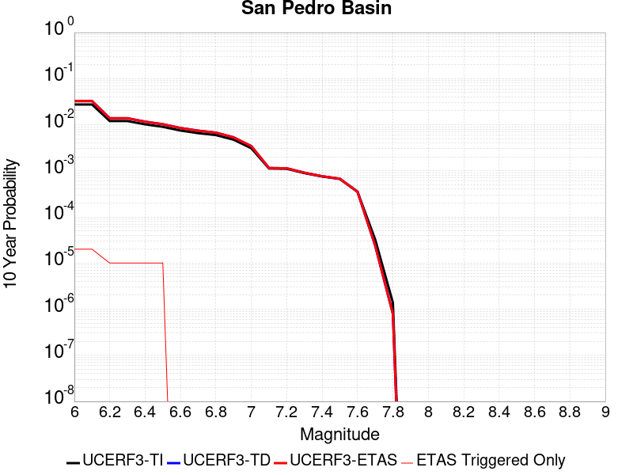 |

| Magnitude | 1 wk TI Prob | 1 wk TD Prob | 1 wk ETAS Prob | 1 wk ETAS/TD Gain | 1 wk ETAS Triggered Only | 1 mo TI Prob | 1 mo TD Prob | 1 mo ETAS Prob | 1 mo ETAS/TD Gain | 1 mo ETAS Triggered Only | 1 yr TI Prob | 1 yr TD Prob | 1 yr ETAS Prob | 1 yr ETAS/TD Gain | 1 yr ETAS Triggered Only | 10 yr TI Prob | 10 yr TD Prob | 10 yr ETAS Prob | 10 yr ETAS/TD Gain | 10 yr ETAS Triggered Only |
|-----|-----|-----|-----|-----|-----|-----|-----|-----|-----|-----|-----|-----|-----|-----|-----|-----|-----|-----|-----|-----|
| 6.0 | 5.3449043E-5 | 6.337589E-5 | 6.337589E-5 | 1.0 | 0.0 | 2.2904722E-4 | 2.7158615E-4 | 2.7158615E-4 | 1.0 | 0.0 | 0.0027850836 | 0.0033021553 | 0.0033121223 | 1.0030184 | 1.0E-5 | 0.027504366 | 0.032592643 | 0.032611992 | 1.0005937 | 2.0E-5 |
| 6.1 | 5.3449043E-5 | 6.337589E-5 | 6.337589E-5 | 1.0 | 0.0 | 2.2904722E-4 | 2.7158615E-4 | 2.7158615E-4 | 1.0 | 0.0 | 0.0027850836 | 0.0033021553 | 0.0033121223 | 1.0030184 | 1.0E-5 | 0.027504366 | 0.032592643 | 0.032611992 | 1.0005937 | 2.0E-5 |
| 6.2 | 2.3189454E-5 | 2.6644948E-5 | 2.6644948E-5 | 1.0 | 0.0 | 9.9379584E-5 | 1.14187904E-4 | 1.14187904E-4 | 1.0 | 0.0 | 0.0012092749 | 0.0013893985 | 0.0013893985 | 1.0 | 0.0 | 0.012027155 | 0.013811991 | 0.013821852 | 1.0007141 | 1.0E-5 |
| 6.3 | 2.3189454E-5 | 2.6644948E-5 | 2.6644948E-5 | 1.0 | 0.0 | 9.9379584E-5 | 1.14187904E-4 | 1.14187904E-4 | 1.0 | 0.0 | 0.0012092749 | 0.0013893985 | 0.0013893985 | 1.0 | 0.0 | 0.012027155 | 0.013811991 | 0.013821852 | 1.0007141 | 1.0E-5 |
| 6.4 | 1.966056E-5 | 2.2465154E-5 | 2.2465154E-5 | 1.0 | 0.0 | 8.425682E-5 | 9.62759E-5 | 9.62759E-5 | 1.0 | 0.0 | 0.001025344 | 0.001171569 | 0.001171569 | 1.0 | 0.0 | 0.010206259 | 0.011658015 | 0.011667898 | 1.0008478 | 1.0E-5 |
| 6.5 | 1.7342953E-5 | 1.974664E-5 | 1.974664E-5 | 1.0 | 0.0 | 7.4324824E-5 | 8.462592E-5 | 8.462592E-5 | 1.0 | 0.0 | 9.04529E-4 | 0.0010298705 | 0.0010298705 | 1.0 | 0.0 | 0.009008561 | 0.010254702 | 0.010264599 | 1.0009651 | 1.0E-5 |
| 6.6 | 1.439804E-5 | 1.6323911E-5 | 1.6323911E-5 | 1.0 | 0.0 | 6.170443E-5 | 6.9957925E-5 | 6.9957925E-5 | 1.0 | 0.0 | 7.509924E-4 | 8.5143704E-4 | 8.5143704E-4 | 1.0 | 0.0 | 0.0074845953 | 0.008484951 | 0.008484951 | 1.0 | 0.0 |
| 6.7 | 1.2634884E-5 | 1.4286325E-5 | 1.4286325E-5 | 1.0 | 0.0 | 5.414838E-5 | 6.1225845E-5 | 6.1225845E-5 | 1.0 | 0.0 | 6.590571E-4 | 7.4520014E-4 | 7.4520014E-4 | 1.0 | 0.0 | 0.006571059 | 0.007430034 | 0.007430034 | 1.0 | 0.0 |
| 6.8 | 1.146091E-5 | 1.2934111E-5 | 1.2934111E-5 | 1.0 | 0.0 | 4.911726E-5 | 5.5430894E-5 | 5.5430894E-5 | 1.0 | 0.0 | 5.9783855E-4 | 6.746919E-4 | 6.746919E-4 | 1.0 | 0.0 | 0.0059623276 | 0.006729376 | 0.006729376 | 1.0 | 0.0 |
| 6.9 | 9.109035E-6 | 1.023572E-5 | 1.023572E-5 | 1.0 | 0.0 | 3.9038136E-5 | 4.386679E-5 | 4.386679E-5 | 1.0 | 0.0 | 4.7518566E-4 | 5.3397525E-4 | 5.3397525E-4 | 1.0 | 0.0 | 0.0047417083 | 0.005329677 | 0.005329677 | 1.0 | 0.0 |
| 7.0 | 5.9351028E-6 | 6.5843806E-6 | 6.5843806E-6 | 1.0 | 0.0 | 2.5435906E-5 | 2.8218601E-5 | 2.8218601E-5 | 1.0 | 0.0 | 3.0963816E-4 | 3.4353093E-4 | 3.4353093E-4 | 1.0 | 0.0 | 0.0030920706 | 0.003432316 | 0.003432316 | 1.0 | 0.0 |
| 7.1 | 2.1557585E-6 | 2.2096988E-6 | 2.2096988E-6 | 1.0 | 0.0 | 9.238933E-6 | 9.4701045E-6 | 9.4701045E-6 | 1.0 | 0.0 | 1.1247819E-4 | 1.15292576E-4 | 1.15292576E-4 | 1.0 | 0.0 | 0.0011242128 | 0.001152343 | 0.001152343 | 1.0 | 0.0 |
| 7.2 | 2.1251979E-6 | 2.1780445E-6 | 2.1780445E-6 | 1.0 | 0.0 | 9.107958E-6 | 9.334444E-6 | 9.334444E-6 | 1.0 | 0.0 | 1.1088375E-4 | 1.1364108E-4 | 1.1364108E-4 | 1.0 | 0.0 | 0.0011082845 | 0.001135845 | 0.001135845 | 1.0 | 0.0 |
| 7.3 | 1.7145798E-6 | 1.7443245E-6 | 1.7443245E-6 | 1.0 | 0.0 | 7.3481783E-6 | 7.475656E-6 | 7.475656E-6 | 1.0 | 0.0 | 8.94604E-5 | 9.10124E-5 | 9.10124E-5 | 1.0 | 0.0 | 8.9424395E-4 | 9.097604E-4 | 9.097604E-4 | 1.0 | 0.0 |
| 7.4 | 1.4467993E-6 | 1.464217E-6 | 1.464217E-6 | 1.0 | 0.0 | 6.200554E-6 | 6.275201E-6 | 6.275201E-6 | 1.0 | 0.0 | 7.548913E-5 | 7.639797E-5 | 7.639797E-5 | 1.0 | 0.0 | 7.546349E-4 | 7.637243E-4 | 7.637243E-4 | 1.0 | 0.0 |
| 7.5 | 1.2803735E-6 | 1.2931764E-6 | 1.2931764E-6 | 1.0 | 0.0 | 5.487303E-6 | 5.5421733E-6 | 5.5421733E-6 | 1.0 | 0.0 | 6.680587E-5 | 6.747394E-5 | 6.747394E-5 | 1.0 | 0.0 | 6.678579E-4 | 6.7454163E-4 | 6.7454163E-4 | 1.0 | 0.0 |
| 7.6 | 6.755009E-7 | 6.7696067E-7 | 6.7696067E-7 | 1.0 | 0.0 | 2.8950008E-6 | 2.9012572E-6 | 2.9012572E-6 | 1.0 | 0.0 | 3.5246063E-5 | 3.5322293E-5 | 3.5322293E-5 | 1.0 | 0.0 | 3.5240475E-4 | 3.531725E-4 | 3.531725E-4 | 1.0 | 0.0 |
| 7.7 | 6.211885E-8 | 4.5700858E-8 | 4.5700858E-8 | 1.0 | 0.0 | 2.6622362E-7 | 1.958608E-7 | 1.958608E-7 | 1.0 | 0.0 | 3.2412677E-6 | 2.3846028E-6 | 2.3846028E-6 | 1.0 | 0.0 | 3.2412205E-5 | 2.3845794E-5 | 2.3845794E-5 | 1.0 | 0.0 |
| 7.8 | 2.6580573E-9 | 1.5140237E-9 | 1.5140237E-9 | 1.0 | 0.0 | 1.1391674E-8 | 6.4886727E-9 | 6.4886727E-9 | 1.0 | 0.0 | 1.3869362E-7 | 7.899959E-8 | 7.899959E-8 | 1.0 | 0.0 | 1.3869354E-6 | 7.899959E-7 | 7.899959E-7 | 1.0 | 0.0 |

## Homestead Valley 2011
*[(top)](#table-of-contents)*

| 1 Week | 1 Month | 1 Year | 10 Year |
|-----|-----|-----|-----|
|  |  |  |  |

| Magnitude | 1 wk TI Prob | 1 wk TD Prob | 1 wk ETAS Prob | 1 wk ETAS/TD Gain | 1 wk ETAS Triggered Only | 1 mo TI Prob | 1 mo TD Prob | 1 mo ETAS Prob | 1 mo ETAS/TD Gain | 1 mo ETAS Triggered Only | 1 yr TI Prob | 1 yr TD Prob | 1 yr ETAS Prob | 1 yr ETAS/TD Gain | 1 yr ETAS Triggered Only | 10 yr TI Prob | 10 yr TD Prob | 10 yr ETAS Prob | 10 yr ETAS/TD Gain | 10 yr ETAS Triggered Only |
|-----|-----|-----|-----|-----|-----|-----|-----|-----|-----|-----|-----|-----|-----|-----|-----|-----|-----|-----|-----|-----|
| 6.0 | 1.539795E-5 | 6.2868744E-6 | 6.2868744E-6 | 1.0 | 0.0 | 6.5989545E-5 | 2.6943586E-5 | 3.6943315E-5 | 1.3711358 | 1.0E-5 | 8.0312655E-4 | 3.280094E-4 | 3.380061E-4 | 1.0304769 | 1.0E-5 | 0.008002302 | 0.0032772736 | 0.0032972079 | 1.0060827 | 2.0E-5 |
| 6.1 | 1.539795E-5 | 6.2868744E-6 | 6.2868744E-6 | 1.0 | 0.0 | 6.5989545E-5 | 2.6943586E-5 | 3.6943315E-5 | 1.3711358 | 1.0E-5 | 8.0312655E-4 | 3.280094E-4 | 3.380061E-4 | 1.0304769 | 1.0E-5 | 0.008002302 | 0.0032772736 | 0.0032972079 | 1.0060827 | 2.0E-5 |
| 6.2 | 1.539795E-5 | 6.2868744E-6 | 6.2868744E-6 | 1.0 | 0.0 | 6.5989545E-5 | 2.6943586E-5 | 3.6943315E-5 | 1.3711358 | 1.0E-5 | 8.0312655E-4 | 3.280094E-4 | 3.380061E-4 | 1.0304769 | 1.0E-5 | 0.008002302 | 0.0032772736 | 0.0032972079 | 1.0060827 | 2.0E-5 |
| 6.3 | 1.539795E-5 | 6.2868744E-6 | 6.2868744E-6 | 1.0 | 0.0 | 6.5989545E-5 | 2.6943586E-5 | 3.6943315E-5 | 1.3711358 | 1.0E-5 | 8.0312655E-4 | 3.280094E-4 | 3.380061E-4 | 1.0304769 | 1.0E-5 | 0.008002302 | 0.0032772736 | 0.0032972079 | 1.0060827 | 2.0E-5 |
| 6.4 | 1.539795E-5 | 6.2868744E-6 | 6.2868744E-6 | 1.0 | 0.0 | 6.5989545E-5 | 2.6943586E-5 | 3.6943315E-5 | 1.3711358 | 1.0E-5 | 8.0312655E-4 | 3.280094E-4 | 3.380061E-4 | 1.0304769 | 1.0E-5 | 0.008002302 | 0.0032772736 | 0.0032972079 | 1.0060827 | 2.0E-5 |
| 6.5 | 1.0265258E-5 | 2.8789796E-6 | 2.8789796E-6 | 1.0 | 0.0 | 4.3993223E-5 | 1.2338465E-5 | 2.2338341E-5 | 1.8104635 | 1.0E-5 | 5.3548586E-4 | 1.5021741E-4 | 1.602159E-4 | 1.0665601 | 1.0E-5 | 0.005341973 | 0.0015018407 | 0.0015218107 | 1.013297 | 2.0E-5 |
| 6.6 | 6.664671E-6 | 5.3488435E-7 | 5.3488435E-7 | 1.0 | 0.0 | 2.8562565E-5 | 2.2923603E-6 | 1.22923375E-5 | 5.362306 | 1.0E-5 | 3.476937E-4 | 2.7909247E-5 | 3.790897E-5 | 1.3582941 | 1.0E-5 | 0.003471502 | 2.7906906E-4 | 2.890663E-4 | 1.0358235 | 1.0E-5 |
| 6.7 | 6.5954046E-6 | 5.3488435E-7 | 5.3488435E-7 | 1.0 | 0.0 | 2.8265715E-5 | 2.2923603E-6 | 1.22923375E-5 | 5.362306 | 1.0E-5 | 3.4408073E-4 | 2.7909247E-5 | 3.790897E-5 | 1.3582941 | 1.0E-5 | 0.0034354846 | 2.7906906E-4 | 2.890663E-4 | 1.0358235 | 1.0E-5 |
| 6.8 | 4.648189E-6 | 2.3269658E-7 | 2.3269658E-7 | 1.0 | 0.0 | 1.9920659E-5 | 9.972707E-7 | 1.0997261E-5 | 11.027357 | 1.0E-5 | 2.4250703E-4 | 1.2141708E-5 | 2.2141587E-5 | 1.8235973 | 1.0E-5 | 0.0024224254 | 1.2141093E-4 | 1.3140972E-4 | 1.0823549 | 1.0E-5 |
| 6.9 | 4.1428534E-6 | 1.9348157E-7 | 1.9348157E-7 | 1.0 | 0.0 | 1.7754966E-5 | 8.292065E-7 | 1.0829198E-5 | 13.059712 | 1.0E-5 | 2.1614527E-4 | 1.0095546E-5 | 2.0095444E-5 | 1.9905258 | 1.0E-5 | 0.0021593515 | 1.0095117E-4 | 1.1095015E-4 | 1.0990478 | 1.0E-5 |
| 7.0 | 3.0673707E-6 | 1.5370551E-7 | 1.5370551E-7 | 1.0 | 0.0 | 1.3145808E-5 | 6.5873775E-7 | 1.0658731E-5 | 16.180538 | 1.0E-5 | 1.6003846E-4 | 8.020103E-6 | 1.8020024E-5 | 2.2468567 | 1.0E-5 | 0.0015992324 | 8.0198246E-5 | 9.019744E-5 | 1.124681 | 1.0E-5 |
| 7.1 | 2.340854E-6 | 1.4690413E-7 | 1.4690413E-7 | 1.0 | 0.0 | 1.0032193E-5 | 6.2958895E-7 | 1.0629583E-5 | 16.883368 | 1.0E-5 | 1.221351E-4 | 7.6652195E-6 | 1.7665143E-5 | 2.304584 | 1.0E-5 | 0.00122068 | 7.664965E-5 | 8.6648884E-5 | 1.1304537 | 1.0E-5 |
| 7.2 | 1.3754182E-6 | 1.3925126E-7 | 1.3925126E-7 | 1.0 | 0.0 | 5.8946357E-6 | 5.96791E-7 | 1.0596785E-5 | 17.756275 | 1.0E-5 | 7.176483E-5 | 7.265907E-6 | 1.7265835E-5 | 2.3762808 | 1.0E-5 | 7.174166E-4 | 7.265679E-5 | 8.265606E-5 | 1.1376234 | 1.0E-5 |
| 7.3 | 1.2573237E-6 | 1.3829613E-7 | 1.3829613E-7 | 1.0 | 0.0 | 5.388519E-6 | 5.926975E-7 | 1.0592692E-5 | 17.872002 | 1.0E-5 | 6.560324E-5 | 7.2160697E-6 | 1.7215998E-5 | 2.385786 | 1.0E-5 | 6.558388E-4 | 7.2158444E-5 | 8.215773E-5 | 1.1385739 | 1.0E-5 |
| 7.4 | 1.0994207E-6 | 1.3108422E-7 | 1.3108422E-7 | 1.0 | 0.0 | 4.7117946E-6 | 5.6178936E-7 | 1.0561784E-5 | 18.800255 | 1.0E-5 | 5.736459E-5 | 6.8397653E-6 | 1.6839696E-5 | 2.4620285 | 1.0E-5 | 5.734978E-4 | 6.839564E-5 | 7.839496E-5 | 1.1461982 | 1.0E-5 |
| 7.5 | 5.5569126E-7 | 6.774076E-8 | 6.774076E-8 | 1.0 | 0.0 | 2.3815317E-6 | 2.903175E-7 | 2.903175E-7 | 1.0 | 0.0 | 2.8994764E-5 | 3.5346104E-6 | 3.5346104E-6 | 1.0 | 0.0 | 2.899098E-4 | 3.5345605E-5 | 3.5345605E-5 | 1.0 | 0.0 |

## Santa Susana alt 1
*[(top)](#table-of-contents)*

| 1 Week | 1 Month | 1 Year | 10 Year |
|-----|-----|-----|-----|
|  |  |  |  |

| Magnitude | 1 wk TI Prob | 1 wk TD Prob | 1 wk ETAS Prob | 1 wk ETAS/TD Gain | 1 wk ETAS Triggered Only | 1 mo TI Prob | 1 mo TD Prob | 1 mo ETAS Prob | 1 mo ETAS/TD Gain | 1 mo ETAS Triggered Only | 1 yr TI Prob | 1 yr TD Prob | 1 yr ETAS Prob | 1 yr ETAS/TD Gain | 1 yr ETAS Triggered Only | 10 yr TI Prob | 10 yr TD Prob | 10 yr ETAS Prob | 10 yr ETAS/TD Gain | 10 yr ETAS Triggered Only |
|-----|-----|-----|-----|-----|-----|-----|-----|-----|-----|-----|-----|-----|-----|-----|-----|-----|-----|-----|-----|-----|
| 6.0 | 2.674877E-5 | 2.7200571E-5 | 2.7200571E-5 | 1.0 | 0.0 | 1.1463255E-4 | 1.165693E-4 | 1.165693E-4 | 1.0 | 0.0 | 0.0013947578 | 0.001418421 | 0.0014383927 | 1.0140802 | 2.0E-5 | 0.013860362 | 0.014105441 | 0.014125159 | 1.0013978 | 2.0E-5 |
| 6.1 | 2.674877E-5 | 2.7200571E-5 | 2.7200571E-5 | 1.0 | 0.0 | 1.1463255E-4 | 1.165693E-4 | 1.165693E-4 | 1.0 | 0.0 | 0.0013947578 | 0.001418421 | 0.0014383927 | 1.0140802 | 2.0E-5 | 0.013860362 | 0.014105441 | 0.014125159 | 1.0013978 | 2.0E-5 |
| 6.2 | 2.674877E-5 | 2.7200571E-5 | 2.7200571E-5 | 1.0 | 0.0 | 1.1463255E-4 | 1.165693E-4 | 1.165693E-4 | 1.0 | 0.0 | 0.0013947578 | 0.001418421 | 0.0014383927 | 1.0140802 | 2.0E-5 | 0.013860362 | 0.014105441 | 0.014125159 | 1.0013978 | 2.0E-5 |
| 6.3 | 2.674877E-5 | 2.7200571E-5 | 2.7200571E-5 | 1.0 | 0.0 | 1.1463255E-4 | 1.165693E-4 | 1.165693E-4 | 1.0 | 0.0 | 0.0013947578 | 0.001418421 | 0.0014383927 | 1.0140802 | 2.0E-5 | 0.013860362 | 0.014105441 | 0.014125159 | 1.0013978 | 2.0E-5 |
| 6.4 | 2.674877E-5 | 2.7200571E-5 | 2.7200571E-5 | 1.0 | 0.0 | 1.1463255E-4 | 1.165693E-4 | 1.165693E-4 | 1.0 | 0.0 | 0.0013947578 | 0.001418421 | 0.0014383927 | 1.0140802 | 2.0E-5 | 0.013860362 | 0.014105441 | 0.014125159 | 1.0013978 | 2.0E-5 |
| 6.5 | 2.674877E-5 | 2.7200571E-5 | 2.7200571E-5 | 1.0 | 0.0 | 1.1463255E-4 | 1.165693E-4 | 1.165693E-4 | 1.0 | 0.0 | 0.0013947578 | 0.001418421 | 0.0014383927 | 1.0140802 | 2.0E-5 | 0.013860362 | 0.014105441 | 0.014125159 | 1.0013978 | 2.0E-5 |
| 6.6 | 2.6647976E-5 | 2.7076892E-5 | 2.7076892E-5 | 1.0 | 0.0 | 1.14200615E-4 | 1.1603931E-4 | 1.1603931E-4 | 1.0 | 0.0 | 0.0013895056 | 0.0014119769 | 0.0014319486 | 1.0141445 | 2.0E-5 | 0.013808494 | 0.01404182 | 0.0140615385 | 1.0014043 | 2.0E-5 |
| 6.7 | 2.6647976E-5 | 2.7076892E-5 | 2.7076892E-5 | 1.0 | 0.0 | 1.14200615E-4 | 1.1603931E-4 | 1.1603931E-4 | 1.0 | 0.0 | 0.0013895056 | 0.0014119769 | 0.0014319486 | 1.0141445 | 2.0E-5 | 0.013808494 | 0.01404182 | 0.0140615385 | 1.0014043 | 2.0E-5 |
| 6.8 | 1.9073179E-5 | 1.7638586E-5 | 1.7638586E-5 | 1.0 | 0.0 | 8.1739636E-5 | 7.5591845E-5 | 7.5591845E-5 | 1.0 | 0.0 | 9.947256E-4 | 9.199603E-4 | 9.399419E-4 | 1.02172 | 2.0E-5 | 0.009902848 | 0.009163775 | 0.009183591 | 1.0021625 | 2.0E-5 |
| 6.9 | 1.9041876E-5 | 1.7620714E-5 | 1.7620714E-5 | 1.0 | 0.0 | 8.160549E-5 | 7.5515265E-5 | 7.5515265E-5 | 1.0 | 0.0 | 9.930939E-4 | 9.190287E-4 | 9.390103E-4 | 1.0217421 | 2.0E-5 | 0.0098866755 | 0.009154535 | 0.009174352 | 1.0021647 | 2.0E-5 |
| 7.0 | 1.5917482E-5 | 1.3864736E-5 | 1.3864736E-5 | 1.0 | 0.0 | 6.8215995E-5 | 5.941897E-5 | 5.941897E-5 | 1.0 | 0.0 | 8.302132E-4 | 7.231905E-4 | 7.3318323E-4 | 1.0138177 | 1.0E-5 | 0.008271185 | 0.0072092656 | 0.0072191935 | 1.0013771 | 1.0E-5 |
| 7.1 | 1.577788E-5 | 1.3744735E-5 | 1.3744735E-5 | 1.0 | 0.0 | 6.761774E-5 | 5.89047E-5 | 5.89047E-5 | 1.0 | 0.0 | 8.2293496E-4 | 7.169334E-4 | 7.2692626E-4 | 1.0139383 | 1.0E-5 | 0.008198941 | 0.007147099 | 0.0071570277 | 1.0013891 | 1.0E-5 |
| 7.2 | 1.5416446E-5 | 1.3470787E-5 | 1.3470787E-5 | 1.0 | 0.0 | 6.606882E-5 | 5.7730693E-5 | 5.7730693E-5 | 1.0 | 0.0 | 8.0409093E-4 | 7.026491E-4 | 7.126421E-4 | 1.0142219 | 1.0E-5 | 0.008011877 | 0.00700516 | 0.00701509 | 1.0014175 | 1.0E-5 |
| 7.3 | 1.4534083E-5 | 1.27186495E-5 | 1.27186495E-5 | 1.0 | 0.0 | 6.228744E-5 | 5.4507385E-5 | 5.4507385E-5 | 1.0 | 0.0 | 7.580857E-4 | 6.634298E-4 | 6.734232E-4 | 1.0150632 | 1.0E-5 | 0.007555048 | 0.006615344 | 0.006625278 | 1.0015017 | 1.0E-5 |
| 7.4 | 1.2858995E-5 | 1.1230286E-5 | 1.1230286E-5 | 1.0 | 0.0 | 5.5108816E-5 | 4.812893E-5 | 4.812893E-5 | 1.0 | 0.0 | 6.7074323E-4 | 5.858161E-4 | 5.9581024E-4 | 1.0170602 | 1.0E-5 | 0.0066872234 | 0.0058434936 | 0.005853435 | 1.0017014 | 1.0E-5 |
| 7.5 | 8.827668E-6 | 7.805781E-6 | 7.805781E-6 | 1.0 | 0.0 | 3.7832317E-5 | 3.3452932E-5 | 3.3452932E-5 | 1.0 | 0.0 | 4.605111E-4 | 4.072158E-4 | 4.072158E-4 | 1.0 | 0.0 | 0.0045955796 | 0.004064945 | 0.004064945 | 1.0 | 0.0 |
| 7.6 | 3.2533426E-6 | 2.872068E-6 | 2.872068E-6 | 1.0 | 0.0 | 1.3942822E-5 | 1.23088075E-5 | 1.23088075E-5 | 1.0 | 0.0 | 1.6974064E-4 | 1.498498E-4 | 1.498498E-4 | 1.0 | 0.0 | 0.0016961104 | 0.0014975243 | 0.0014975243 | 1.0 | 0.0 |
| 7.7 | 1.2751709E-6 | 1.1491525E-6 | 1.1491525E-6 | 1.0 | 0.0 | 5.4650063E-6 | 4.92493E-6 | 4.92493E-6 | 1.0 | 0.0 | 6.653442E-5 | 5.9959468E-5 | 5.9959468E-5 | 1.0 | 0.0 | 6.6514505E-4 | 5.994418E-4 | 5.994418E-4 | 1.0 | 0.0 |
| 7.8 | 3.067544E-7 | 3.2401567E-7 | 3.2401567E-7 | 1.0 | 0.0 | 1.3146611E-6 | 1.388638E-6 | 1.388638E-6 | 1.0 | 0.0 | 1.600588E-5 | 1.6906546E-5 | 1.6906546E-5 | 1.0 | 0.0 | 1.6004729E-4 | 1.6905363E-4 | 1.6905363E-4 | 1.0 | 0.0 |
| 7.9 | 7.622999E-8 | 8.088237E-8 | 8.088237E-8 | 1.0 | 0.0 | 3.2669993E-7 | 3.466387E-7 | 3.466387E-7 | 1.0 | 0.0 | 3.977564E-6 | 4.22032E-6 | 4.22032E-6 | 1.0 | 0.0 | 3.977493E-5 | 4.220261E-5 | 4.220261E-5 | 1.0 | 0.0 |

## Rinconada 2011 CFM
*[(top)](#table-of-contents)*

| 1 Week | 1 Month | 1 Year | 10 Year |
|-----|-----|-----|-----|
|  |  |  |  |

| Magnitude | 1 wk TI Prob | 1 wk TD Prob | 1 wk ETAS Prob | 1 wk ETAS/TD Gain | 1 wk ETAS Triggered Only | 1 mo TI Prob | 1 mo TD Prob | 1 mo ETAS Prob | 1 mo ETAS/TD Gain | 1 mo ETAS Triggered Only | 1 yr TI Prob | 1 yr TD Prob | 1 yr ETAS Prob | 1 yr ETAS/TD Gain | 1 yr ETAS Triggered Only | 10 yr TI Prob | 10 yr TD Prob | 10 yr ETAS Prob | 10 yr ETAS/TD Gain | 10 yr ETAS Triggered Only |
|-----|-----|-----|-----|-----|-----|-----|-----|-----|-----|-----|-----|-----|-----|-----|-----|-----|-----|-----|-----|-----|
| 6.0 | 1.5752368E-5 | 1.6275004E-5 | 1.6275004E-5 | 1.0 | 0.0 | 6.75084E-5 | 6.974817E-5 | 7.974747E-5 | 1.143363 | 1.0E-5 | 8.2160486E-4 | 8.4885623E-4 | 8.6883927E-4 | 1.0235411 | 2.0E-5 | 0.008185739 | 0.008456519 | 0.0084763495 | 1.0023451 | 2.0E-5 |
| 6.1 | 1.0966133E-5 | 1.1323225E-5 | 1.1323225E-5 | 1.0 | 0.0 | 4.6996865E-5 | 4.852721E-5 | 5.8526726E-5 | 1.2060599 | 1.0E-5 | 5.720366E-4 | 5.906594E-4 | 6.0065347E-4 | 1.0169202 | 1.0E-5 | 0.0057056635 | 0.005890991 | 0.005900932 | 1.0016875 | 1.0E-5 |
| 6.2 | 1.0966133E-5 | 1.1323225E-5 | 1.1323225E-5 | 1.0 | 0.0 | 4.6996865E-5 | 4.852721E-5 | 5.8526726E-5 | 1.2060599 | 1.0E-5 | 5.720366E-4 | 5.906594E-4 | 6.0065347E-4 | 1.0169202 | 1.0E-5 | 0.0057056635 | 0.005890991 | 0.005900932 | 1.0016875 | 1.0E-5 |
| 6.3 | 8.926149E-6 | 9.212929E-6 | 9.212929E-6 | 1.0 | 0.0 | 3.8254362E-5 | 3.9483388E-5 | 4.9482995E-5 | 1.2532611 | 1.0E-5 | 4.6564735E-4 | 4.8060456E-4 | 4.905997E-4 | 1.0207971 | 1.0E-5 | 0.0046467283 | 0.0047956966 | 0.0048056487 | 1.0020752 | 1.0E-5 |
| 6.4 | 7.676955E-6 | 7.9203255E-6 | 7.9203255E-6 | 1.0 | 0.0 | 3.290082E-5 | 3.3943812E-5 | 4.394347E-5 | 1.2945945 | 1.0E-5 | 4.0049385E-4 | 4.131877E-4 | 4.2318358E-4 | 1.0241921 | 1.0E-5 | 0.0039977287 | 0.004124221 | 0.0041341796 | 1.0024147 | 1.0E-5 |
| 6.5 | 6.1671026E-6 | 6.359061E-6 | 6.359061E-6 | 1.0 | 0.0 | 2.6430173E-5 | 2.7252834E-5 | 2.7252834E-5 | 1.0 | 0.0 | 3.2173982E-4 | 3.3175282E-4 | 3.3175282E-4 | 1.0 | 0.0 | 0.003212744 | 0.0033125877 | 0.0033125877 | 1.0 | 0.0 |
| 6.6 | 5.553456E-6 | 5.7249076E-6 | 5.7249076E-6 | 1.0 | 0.0 | 2.3800309E-5 | 2.4535088E-5 | 2.4535088E-5 | 1.0 | 0.0 | 2.897302E-4 | 2.986738E-4 | 2.986738E-4 | 1.0 | 0.0 | 0.0028935277 | 0.0029827326 | 0.0029827326 | 1.0 | 0.0 |
| 6.7 | 4.787857E-6 | 4.9333903E-6 | 4.9333903E-6 | 1.0 | 0.0 | 2.0519226E-5 | 2.114293E-5 | 2.114293E-5 | 1.0 | 0.0 | 2.4979294E-4 | 2.573848E-4 | 2.573848E-4 | 1.0 | 0.0 | 0.0024951235 | 0.002570873 | 0.002570873 | 1.0 | 0.0 |
| 6.8 | 3.9955166E-6 | 4.1135418E-6 | 4.1135418E-6 | 1.0 | 0.0 | 1.7123532E-5 | 1.7629345E-5 | 1.7629345E-5 | 1.0 | 0.0 | 2.0845905E-4 | 2.1461617E-4 | 2.1461617E-4 | 1.0 | 0.0 | 0.002082636 | 0.0021440927 | 0.0021440927 | 1.0 | 0.0 |
| 6.9 | 3.4250072E-6 | 3.5225005E-6 | 3.5225005E-6 | 1.0 | 0.0 | 1.46785205E-5 | 1.5096344E-5 | 1.5096344E-5 | 1.0 | 0.0 | 1.7869633E-4 | 1.837825E-4 | 1.837825E-4 | 1.0 | 0.0 | 0.001785527 | 0.0018363077 | 0.0018363077 | 1.0 | 0.0 |
| 7.0 | 2.7712713E-6 | 2.846742E-6 | 2.846742E-6 | 1.0 | 0.0 | 1.1876823E-5 | 1.2200267E-5 | 1.2200267E-5 | 1.0 | 0.0 | 1.4459073E-4 | 1.4852812E-4 | 1.4852812E-4 | 1.0 | 0.0 | 0.0014449668 | 0.0014842902 | 0.0014842902 | 1.0 | 0.0 |
| 7.1 | 2.227358E-6 | 2.2857312E-6 | 2.2857312E-6 | 1.0 | 0.0 | 9.545785E-6 | 9.795955E-6 | 9.795955E-6 | 1.0 | 0.0 | 1.16213734E-4 | 1.19259224E-4 | 1.19259224E-4 | 1.0 | 0.0 | 0.0011615298 | 0.0011919533 | 0.0011919533 | 1.0 | 0.0 |
| 7.2 | 1.581796E-6 | 1.6209234E-6 | 1.6209234E-6 | 1.0 | 0.0 | 6.779108E-6 | 6.946796E-6 | 6.946796E-6 | 1.0 | 0.0 | 8.253252E-5 | 8.457396E-5 | 8.457396E-5 | 1.0 | 0.0 | 8.250187E-4 | 8.454183E-4 | 8.454183E-4 | 1.0 | 0.0 |
| 7.3 | 1.0306567E-6 | 1.0546617E-6 | 1.0546617E-6 | 1.0 | 0.0 | 4.4170924E-6 | 4.519971E-6 | 4.519971E-6 | 1.0 | 0.0 | 5.3776774E-5 | 5.5029257E-5 | 5.5029257E-5 | 1.0 | 0.0 | 5.376376E-4 | 5.501566E-4 | 5.501566E-4 | 1.0 | 0.0 |
| 7.4 | 6.535541E-7 | 6.682831E-7 | 6.682831E-7 | 1.0 | 0.0 | 2.800943E-6 | 2.8640675E-6 | 2.8640675E-6 | 1.0 | 0.0 | 3.4100947E-5 | 3.4869463E-5 | 3.4869463E-5 | 1.0 | 0.0 | 3.4095717E-4 | 3.4864005E-4 | 3.4864005E-4 | 1.0 | 0.0 |
| 7.5 | 3.2656962E-7 | 3.3317139E-7 | 3.3317139E-7 | 1.0 | 0.0 | 1.3995833E-6 | 1.4278766E-6 | 1.4278766E-6 | 1.0 | 0.0 | 1.7039794E-5 | 1.7384258E-5 | 1.7384258E-5 | 1.0 | 0.0 | 1.7038487E-4 | 1.7382903E-4 | 1.7382903E-4 | 1.0 | 0.0 |
| 7.6 | 9.754343E-8 | 9.821119E-8 | 9.821119E-8 | 1.0 | 0.0 | 4.180432E-7 | 4.2090502E-7 | 4.2090502E-7 | 1.0 | 0.0 | 5.089664E-6 | 5.1245065E-6 | 5.1245065E-6 | 1.0 | 0.0 | 5.0895473E-5 | 5.1243893E-5 | 5.1243893E-5 | 1.0 | 0.0 |
| 7.7 | 6.0001453E-9 | 5.8491465E-9 | 5.8491465E-9 | 1.0 | 0.0 | 2.5714908E-8 | 2.5067772E-8 | 2.5067772E-8 | 1.0 | 0.0 | 3.1307894E-7 | 3.0520007E-7 | 3.0520007E-7 | 1.0 | 0.0 | 3.1307852E-6 | 3.0519968E-6 | 3.0519968E-6 | 1.0 | 0.0 |
| 7.8 | 7.400003E-11 | 7.465484E-11 | 7.465484E-11 | 1.0 | 0.0 | 3.171432E-10 | 3.1994918E-10 | 3.1994918E-10 | 1.0 | 0.0 | 3.861218E-9 | 3.8953814E-9 | 3.8953814E-9 | 1.0 | 0.0 | 3.861218E-8 | 3.8953814E-8 | 3.8953814E-8 | 1.0 | 0.0 |

## Hosgri
*[(top)](#table-of-contents)*

| 1 Week | 1 Month | 1 Year | 10 Year |
|-----|-----|-----|-----|
|  |  |  |  |

| Magnitude | 1 wk TI Prob | 1 wk TD Prob | 1 wk ETAS Prob | 1 wk ETAS/TD Gain | 1 wk ETAS Triggered Only | 1 mo TI Prob | 1 mo TD Prob | 1 mo ETAS Prob | 1 mo ETAS/TD Gain | 1 mo ETAS Triggered Only | 1 yr TI Prob | 1 yr TD Prob | 1 yr ETAS Prob | 1 yr ETAS/TD Gain | 1 yr ETAS Triggered Only | 10 yr TI Prob | 10 yr TD Prob | 10 yr ETAS Prob | 10 yr ETAS/TD Gain | 10 yr ETAS Triggered Only |
|-----|-----|-----|-----|-----|-----|-----|-----|-----|-----|-----|-----|-----|-----|-----|-----|-----|-----|-----|-----|-----|
| 6.0 | 2.883978E-5 | 2.9130051E-5 | 2.9130051E-5 | 1.0 | 0.0 | 1.235932E-4 | 1.2483726E-4 | 1.2483726E-4 | 1.0 | 0.0 | 0.0015037085 | 0.0015188612 | 0.0015288459 | 1.0065739 | 1.0E-5 | 0.01493574 | 0.015088581 | 0.015108279 | 1.0013055 | 2.0E-5 |
| 6.1 | 2.883978E-5 | 2.9130051E-5 | 2.9130051E-5 | 1.0 | 0.0 | 1.235932E-4 | 1.2483726E-4 | 1.2483726E-4 | 1.0 | 0.0 | 0.0015037085 | 0.0015188612 | 0.0015288459 | 1.0065739 | 1.0E-5 | 0.01493574 | 0.015088581 | 0.015108279 | 1.0013055 | 2.0E-5 |
| 6.2 | 2.883978E-5 | 2.9130051E-5 | 2.9130051E-5 | 1.0 | 0.0 | 1.235932E-4 | 1.2483726E-4 | 1.2483726E-4 | 1.0 | 0.0 | 0.0015037085 | 0.0015188612 | 0.0015288459 | 1.0065739 | 1.0E-5 | 0.01493574 | 0.015088581 | 0.015108279 | 1.0013055 | 2.0E-5 |
| 6.3 | 2.2914428E-5 | 2.2643277E-5 | 2.2643277E-5 | 1.0 | 0.0 | 9.8200995E-5 | 9.703903E-5 | 9.703903E-5 | 1.0 | 0.0 | 0.0011949413 | 0.0011808148 | 0.001190803 | 1.0084587 | 1.0E-5 | 0.011885363 | 0.011746808 | 0.01175669 | 1.0008413 | 1.0E-5 |
| 6.4 | 2.0195741E-5 | 1.9697736E-5 | 1.9697736E-5 | 1.0 | 0.0 | 8.65503E-5 | 8.441615E-5 | 8.441615E-5 | 1.0 | 0.0 | 0.0010532405 | 0.0010272841 | 0.0010272841 | 1.0 | 0.0 | 0.010482626 | 0.0102264015 | 0.0102264015 | 1.0 | 0.0 |
| 6.5 | 1.9924333E-5 | 1.9410149E-5 | 1.9410149E-5 | 1.0 | 0.0 | 8.53872E-5 | 8.318371E-5 | 8.318371E-5 | 1.0 | 0.0 | 0.0010390934 | 0.001012293 | 0.001012293 | 1.0 | 0.0 | 0.010342481 | 0.0100778565 | 0.0100778565 | 1.0 | 0.0 |
| 6.6 | 1.809694E-5 | 1.7459393E-5 | 1.7459393E-5 | 1.0 | 0.0 | 7.7556004E-5 | 7.482383E-5 | 7.482383E-5 | 1.0 | 0.0 | 9.438353E-4 | 9.106007E-4 | 9.106007E-4 | 1.0 | 0.0 | 0.009398366 | 0.009069638 | 0.009069638 | 1.0 | 0.0 |
| 6.7 | 1.675989E-5 | 1.6043807E-5 | 1.6043807E-5 | 1.0 | 0.0 | 7.182612E-5 | 6.875736E-5 | 6.875736E-5 | 1.0 | 0.0 | 8.7413215E-4 | 8.3680055E-4 | 8.3680055E-4 | 1.0 | 0.0 | 0.008707017 | 0.008337403 | 0.008337403 | 1.0 | 0.0 |
| 6.8 | 1.5401129E-5 | 1.4615074E-5 | 1.4615074E-5 | 1.0 | 0.0 | 6.6003166E-5 | 6.2634535E-5 | 6.2634535E-5 | 1.0 | 0.0 | 8.032922E-4 | 7.623095E-4 | 7.623095E-4 | 1.0 | 0.0 | 0.008003947 | 0.0075978106 | 0.0075978106 | 1.0 | 0.0 |
| 6.9 | 1.356559E-5 | 1.2690892E-5 | 1.2690892E-5 | 1.0 | 0.0 | 5.8136946E-5 | 5.4388405E-5 | 5.4388405E-5 | 1.0 | 0.0 | 7.0758746E-4 | 6.619781E-4 | 6.619781E-4 | 1.0 | 0.0 | 0.007053386 | 0.006600868 | 0.006600868 | 1.0 | 0.0 |
| 7.0 | 1.2030819E-5 | 1.1096832E-5 | 1.1096832E-5 | 1.0 | 0.0 | 5.155963E-5 | 4.7556987E-5 | 4.7556987E-5 | 1.0 | 0.0 | 6.275577E-4 | 5.788526E-4 | 5.788526E-4 | 1.0 | 0.0 | 0.006257884 | 0.0057742097 | 0.0057742097 | 1.0 | 0.0 |
| 7.1 | 1.0972698E-5 | 1.0023018E-5 | 1.0023018E-5 | 1.0 | 0.0 | 4.7025E-5 | 4.2955086E-5 | 4.2955086E-5 | 1.0 | 0.0 | 5.72379E-4 | 5.2285276E-4 | 5.2285276E-4 | 1.0 | 0.0 | 0.0057090693 | 0.0052169785 | 0.0052169785 | 1.0 | 0.0 |
| 7.2 | 9.961926E-6 | 9.035558E-6 | 9.035558E-6 | 1.0 | 0.0 | 4.2693267E-5 | 3.8723243E-5 | 3.8723243E-5 | 1.0 | 0.0 | 5.1966653E-4 | 4.713536E-4 | 4.713536E-4 | 1.0 | 0.0 | 0.00518453 | 0.004704285 | 0.004704285 | 1.0 | 0.0 |
| 7.3 | 8.700929E-6 | 7.82888E-6 | 7.82888E-6 | 1.0 | 0.0 | 3.7289166E-5 | 3.3551914E-5 | 3.3551914E-5 | 1.0 | 0.0 | 4.53901E-4 | 4.0841804E-4 | 4.0841804E-4 | 1.0 | 0.0 | 0.00452975 | 0.0040774145 | 0.0040774145 | 1.0 | 0.0 |
| 7.4 | 7.866285E-6 | 6.9995003E-6 | 6.9995003E-6 | 1.0 | 0.0 | 3.3712215E-5 | 2.9997515E-5 | 2.9997515E-5 | 1.0 | 0.0 | 4.103689E-4 | 3.6515854E-4 | 3.6515854E-4 | 1.0 | 0.0 | 0.004096119 | 0.0036463232 | 0.0036463232 | 1.0 | 0.0 |
| 7.5 | 6.8381305E-6 | 5.9604317E-6 | 5.9604317E-6 | 1.0 | 0.0 | 2.9305946E-5 | 2.5544457E-5 | 2.5544457E-5 | 1.0 | 0.0 | 3.5674145E-4 | 3.109594E-4 | 3.109594E-4 | 1.0 | 0.0 | 0.0035616932 | 0.0031059785 | 0.0031059785 | 1.0 | 0.0 |
| 7.6 | 5.503376E-6 | 4.5959455E-6 | 4.5959455E-6 | 1.0 | 0.0 | 2.3585684E-5 | 1.969676E-5 | 1.969676E-5 | 1.0 | 0.0 | 2.8711787E-4 | 2.3978167E-4 | 2.3978167E-4 | 1.0 | 0.0 | 0.002867472 | 0.002395963 | 0.002395963 | 1.0 | 0.0 |
| 7.7 | 3.6144982E-6 | 2.652859E-6 | 2.652859E-6 | 1.0 | 0.0 | 1.5490614E-5 | 1.1369346E-5 | 1.1369346E-5 | 1.0 | 0.0 | 1.8858191E-4 | 1.38413E-4 | 1.38413E-4 | 1.0 | 0.0 | 0.0018842196 | 0.0013839996 | 0.0013839996 | 1.0 | 0.0 |
| 7.8 | 1.9853494E-6 | 1.1366585E-6 | 1.1366585E-6 | 1.0 | 0.0 | 8.508612E-6 | 4.8713846E-6 | 4.8713846E-6 | 1.0 | 0.0 | 1.0358743E-4 | 5.930749E-5 | 5.930749E-5 | 1.0 | 0.0 | 0.0010353916 | 5.9364707E-4 | 5.9364707E-4 | 1.0 | 0.0 |
| 7.9 | 1.1818757E-6 | 5.2994693E-7 | 5.2994693E-7 | 1.0 | 0.0 | 5.0651715E-6 | 2.271199E-6 | 2.271199E-6 | 1.0 | 0.0 | 6.1666724E-5 | 2.7651497E-5 | 2.7651497E-5 | 1.0 | 0.0 | 6.1649614E-4 | 2.771693E-4 | 2.771693E-4 | 1.0 | 0.0 |
| 8.0 | 6.962958E-7 | 2.716916E-7 | 2.716916E-7 | 1.0 | 0.0 | 2.9841215E-6 | 1.164392E-6 | 1.164392E-6 | 1.0 | 0.0 | 3.6331072E-5 | 1.417638E-5 | 1.417638E-5 | 1.0 | 0.0 | 3.6325134E-4 | 1.423256E-4 | 1.423256E-4 | 1.0 | 0.0 |
| 8.1 | 1.5033264E-7 | 6.5338824E-8 | 6.5338824E-8 | 1.0 | 0.0 | 6.442826E-7 | 2.800235E-7 | 2.800235E-7 | 1.0 | 0.0 | 7.844113E-6 | 3.409281E-6 | 3.409281E-6 | 1.0 | 0.0 | 7.843835E-5 | 3.410959E-5 | 3.410959E-5 | 1.0 | 0.0 |

## Newport-Inglewood alt 1
*[(top)](#table-of-contents)*

| 1 Week | 1 Month | 1 Year | 10 Year |
|-----|-----|-----|-----|
|  |  |  |  |

| Magnitude | 1 wk TI Prob | 1 wk TD Prob | 1 wk ETAS Prob | 1 wk ETAS/TD Gain | 1 wk ETAS Triggered Only | 1 mo TI Prob | 1 mo TD Prob | 1 mo ETAS Prob | 1 mo ETAS/TD Gain | 1 mo ETAS Triggered Only | 1 yr TI Prob | 1 yr TD Prob | 1 yr ETAS Prob | 1 yr ETAS/TD Gain | 1 yr ETAS Triggered Only | 10 yr TI Prob | 10 yr TD Prob | 10 yr ETAS Prob | 10 yr ETAS/TD Gain | 10 yr ETAS Triggered Only |
|-----|-----|-----|-----|-----|-----|-----|-----|-----|-----|-----|-----|-----|-----|-----|-----|-----|-----|-----|-----|-----|
| 6.0 | 2.9668912E-5 | 3.040745E-5 | 3.040745E-5 | 1.0 | 0.0 | 1.2714628E-4 | 1.3031387E-4 | 1.3031387E-4 | 1.0 | 0.0 | 0.0015469068 | 0.0015858983 | 0.0015858983 | 1.0 | 0.0 | 0.015361829 | 0.0157934 | 0.015813084 | 1.0012463 | 2.0E-5 |
| 6.1 | 2.9668912E-5 | 3.040745E-5 | 3.040745E-5 | 1.0 | 0.0 | 1.2714628E-4 | 1.3031387E-4 | 1.3031387E-4 | 1.0 | 0.0 | 0.0015469068 | 0.0015858983 | 0.0015858983 | 1.0 | 0.0 | 0.015361829 | 0.0157934 | 0.015813084 | 1.0012463 | 2.0E-5 |
| 6.2 | 2.9668912E-5 | 3.040745E-5 | 3.040745E-5 | 1.0 | 0.0 | 1.2714628E-4 | 1.3031387E-4 | 1.3031387E-4 | 1.0 | 0.0 | 0.0015469068 | 0.0015858983 | 0.0015858983 | 1.0 | 0.0 | 0.015361829 | 0.0157934 | 0.015813084 | 1.0012463 | 2.0E-5 |
| 6.3 | 2.9668912E-5 | 3.040745E-5 | 3.040745E-5 | 1.0 | 0.0 | 1.2714628E-4 | 1.3031387E-4 | 1.3031387E-4 | 1.0 | 0.0 | 0.0015469068 | 0.0015858983 | 0.0015858983 | 1.0 | 0.0 | 0.015361829 | 0.0157934 | 0.015813084 | 1.0012463 | 2.0E-5 |
| 6.4 | 1.275942E-5 | 1.027299E-5 | 1.027299E-5 | 1.0 | 0.0 | 5.4682085E-5 | 4.4026383E-5 | 4.4026383E-5 | 1.0 | 0.0 | 6.65551E-4 | 5.3589355E-4 | 5.3589355E-4 | 1.0 | 0.0 | 0.0066356123 | 0.0053464375 | 0.0053464375 | 1.0 | 0.0 |
| 6.5 | 1.275942E-5 | 1.027299E-5 | 1.027299E-5 | 1.0 | 0.0 | 5.4682085E-5 | 4.4026383E-5 | 4.4026383E-5 | 1.0 | 0.0 | 6.65551E-4 | 5.3589355E-4 | 5.3589355E-4 | 1.0 | 0.0 | 0.0066356123 | 0.0053464375 | 0.0053464375 | 1.0 | 0.0 |
| 6.6 | 1.1255358E-5 | 8.66226E-6 | 8.66226E-6 | 1.0 | 0.0 | 4.8236358E-5 | 3.7123453E-5 | 3.7123453E-5 | 1.0 | 0.0 | 5.871194E-4 | 4.51886E-4 | 4.51886E-4 | 1.0 | 0.0 | 0.005855706 | 0.0045098485 | 0.0045098485 | 1.0 | 0.0 |
| 6.7 | 1.0504745E-5 | 7.90013E-6 | 7.90013E-6 | 1.0 | 0.0 | 4.5019555E-5 | 3.385727E-5 | 3.385727E-5 | 1.0 | 0.0 | 5.4797524E-4 | 4.1213553E-4 | 4.1213553E-4 | 1.0 | 0.0 | 0.0054662596 | 0.0041138423 | 0.0041138423 | 1.0 | 0.0 |
| 6.8 | 1.0476007E-5 | 7.881511E-6 | 7.881511E-6 | 1.0 | 0.0 | 4.4896402E-5 | 3.3777476E-5 | 3.3777476E-5 | 1.0 | 0.0 | 5.464766E-4 | 4.111644E-4 | 4.111644E-4 | 1.0 | 0.0 | 0.005451347 | 0.0041041668 | 0.0041041668 | 1.0 | 0.0 |
| 6.9 | 9.076797E-6 | 6.4898977E-6 | 6.4898977E-6 | 1.0 | 0.0 | 3.889998E-5 | 2.7813552E-5 | 2.7813552E-5 | 1.0 | 0.0 | 4.7350433E-4 | 3.3857772E-4 | 3.3857772E-4 | 1.0 | 0.0 | 0.004724967 | 0.0033806562 | 0.0033806562 | 1.0 | 0.0 |
| 7.0 | 8.73795E-6 | 6.2122745E-6 | 6.2122745E-6 | 1.0 | 0.0 | 3.7447822E-5 | 2.6623764E-5 | 2.6623764E-5 | 1.0 | 0.0 | 4.5583185E-4 | 3.2409639E-4 | 3.2409639E-4 | 1.0 | 0.0 | 0.0045489795 | 0.003236269 | 0.003236269 | 1.0 | 0.0 |
| 7.1 | 8.391299E-6 | 5.9560443E-6 | 5.9560443E-6 | 1.0 | 0.0 | 3.5962214E-5 | 2.5525655E-5 | 2.5525655E-5 | 1.0 | 0.0 | 4.37752E-4 | 3.107308E-4 | 3.107308E-4 | 1.0 | 0.0 | 0.004368907 | 0.003102993 | 0.003102993 | 1.0 | 0.0 |
| 7.2 | 7.796882E-6 | 5.4967763E-6 | 5.4967763E-6 | 1.0 | 0.0 | 3.341478E-5 | 2.3557403E-5 | 2.3557403E-5 | 1.0 | 0.0 | 4.06749E-4 | 2.8677384E-4 | 2.8677384E-4 | 1.0 | 0.0 | 0.0040600533 | 0.0028640619 | 0.0028640619 | 1.0 | 0.0 |
| 7.3 | 6.4738833E-6 | 4.647969E-6 | 4.647969E-6 | 1.0 | 0.0 | 2.774492E-5 | 1.9919717E-5 | 1.9919717E-5 | 1.0 | 0.0 | 3.3774204E-4 | 2.424957E-4 | 2.424957E-4 | 1.0 | 0.0 | 0.0033722918 | 0.0024223276 | 0.0024223276 | 1.0 | 0.0 |
| 7.4 | 5.382145E-6 | 3.8858843E-6 | 3.8858843E-6 | 1.0 | 0.0 | 2.3066134E-5 | 1.6653685E-5 | 1.6653685E-5 | 1.0 | 0.0 | 2.8079396E-4 | 2.0273989E-4 | 2.0273989E-4 | 1.0 | 0.0 | 0.0028043943 | 0.0020255637 | 0.0020255637 | 1.0 | 0.0 |
| 7.5 | 3.648244E-6 | 2.5738668E-6 | 2.5738668E-6 | 1.0 | 0.0 | 1.5635238E-5 | 1.1030811E-5 | 1.1030811E-5 | 1.0 | 0.0 | 1.9034238E-4 | 1.3429196E-4 | 1.3429196E-4 | 1.0 | 0.0 | 0.0019017943 | 0.0013421185 | 0.0013421185 | 1.0 | 0.0 |
| 7.6 | 2.2906888E-6 | 1.5480406E-6 | 1.5480406E-6 | 1.0 | 0.0 | 9.817201E-6 | 6.6344433E-6 | 6.6344433E-6 | 1.0 | 0.0 | 1.1951787E-4 | 8.0771424E-5 | 8.0771424E-5 | 1.0 | 0.0 | 0.0011945361 | 8.074274E-4 | 8.074274E-4 | 1.0 | 0.0 |
| 7.7 | 6.0479874E-7 | 3.3976542E-7 | 3.3976542E-7 | 1.0 | 0.0 | 2.5919921E-6 | 1.4561367E-6 | 1.4561367E-6 | 1.0 | 0.0 | 3.1557047E-5 | 1.7728335E-5 | 1.7728335E-5 | 1.0 | 0.0 | 3.1552566E-4 | 1.7727059E-4 | 1.7727059E-4 | 1.0 | 0.0 |
| 7.8 | 1.16056995E-8 | 9.782449E-9 | 9.782449E-9 | 1.0 | 0.0 | 4.9738713E-8 | 4.1924782E-8 | 4.1924782E-8 | 1.0 | 0.0 | 6.0556863E-7 | 5.1043423E-7 | 5.1043423E-7 | 1.0 | 0.0 | 6.05567E-6 | 5.104342E-6 | 5.104342E-6 | 1.0 | 0.0 |

## Channel Islands Western Deep Ramp
*[(top)](#table-of-contents)*

| 1 Week | 1 Month | 1 Year | 10 Year |
|-----|-----|-----|-----|
|  |  |  |  |

| Magnitude | 1 wk TI Prob | 1 wk TD Prob | 1 wk ETAS Prob | 1 wk ETAS/TD Gain | 1 wk ETAS Triggered Only | 1 mo TI Prob | 1 mo TD Prob | 1 mo ETAS Prob | 1 mo ETAS/TD Gain | 1 mo ETAS Triggered Only | 1 yr TI Prob | 1 yr TD Prob | 1 yr ETAS Prob | 1 yr ETAS/TD Gain | 1 yr ETAS Triggered Only | 10 yr TI Prob | 10 yr TD Prob | 10 yr ETAS Prob | 10 yr ETAS/TD Gain | 10 yr ETAS Triggered Only |
|-----|-----|-----|-----|-----|-----|-----|-----|-----|-----|-----|-----|-----|-----|-----|-----|-----|-----|-----|-----|-----|
| 6.0 | 6.0213506E-6 | 6.2549975E-6 | 6.2549975E-6 | 1.0 | 0.0 | 2.5805533E-5 | 2.6806882E-5 | 2.6806882E-5 | 1.0 | 0.0 | 3.1413708E-4 | 3.2632938E-4 | 3.2632938E-4 | 1.0 | 0.0 | 0.0031369338 | 0.0032589433 | 0.0032689108 | 1.0030584 | 1.0E-5 |
| 6.1 | 6.0213506E-6 | 6.2549975E-6 | 6.2549975E-6 | 1.0 | 0.0 | 2.5805533E-5 | 2.6806882E-5 | 2.6806882E-5 | 1.0 | 0.0 | 3.1413708E-4 | 3.2632938E-4 | 3.2632938E-4 | 1.0 | 0.0 | 0.0031369338 | 0.0032589433 | 0.0032689108 | 1.0030584 | 1.0E-5 |
| 6.2 | 6.0213506E-6 | 6.2549975E-6 | 6.2549975E-6 | 1.0 | 0.0 | 2.5805533E-5 | 2.6806882E-5 | 2.6806882E-5 | 1.0 | 0.0 | 3.1413708E-4 | 3.2632938E-4 | 3.2632938E-4 | 1.0 | 0.0 | 0.0031369338 | 0.0032589433 | 0.0032689108 | 1.0030584 | 1.0E-5 |
| 6.3 | 6.0213506E-6 | 6.2549975E-6 | 6.2549975E-6 | 1.0 | 0.0 | 2.5805533E-5 | 2.6806882E-5 | 2.6806882E-5 | 1.0 | 0.0 | 3.1413708E-4 | 3.2632938E-4 | 3.2632938E-4 | 1.0 | 0.0 | 0.0031369338 | 0.0032589433 | 0.0032689108 | 1.0030584 | 1.0E-5 |
| 6.4 | 6.0213506E-6 | 6.2549975E-6 | 6.2549975E-6 | 1.0 | 0.0 | 2.5805533E-5 | 2.6806882E-5 | 2.6806882E-5 | 1.0 | 0.0 | 3.1413708E-4 | 3.2632938E-4 | 3.2632938E-4 | 1.0 | 0.0 | 0.0031369338 | 0.0032589433 | 0.0032689108 | 1.0030584 | 1.0E-5 |
| 6.5 | 6.0213506E-6 | 6.2549975E-6 | 6.2549975E-6 | 1.0 | 0.0 | 2.5805533E-5 | 2.6806882E-5 | 2.6806882E-5 | 1.0 | 0.0 | 3.1413708E-4 | 3.2632938E-4 | 3.2632938E-4 | 1.0 | 0.0 | 0.0031369338 | 0.0032589433 | 0.0032689108 | 1.0030584 | 1.0E-5 |
| 6.6 | 6.0213506E-6 | 6.2549975E-6 | 6.2549975E-6 | 1.0 | 0.0 | 2.5805533E-5 | 2.6806882E-5 | 2.6806882E-5 | 1.0 | 0.0 | 3.1413708E-4 | 3.2632938E-4 | 3.2632938E-4 | 1.0 | 0.0 | 0.0031369338 | 0.0032589433 | 0.0032689108 | 1.0030584 | 1.0E-5 |
| 6.7 | 5.313309E-6 | 5.5253577E-6 | 5.5253577E-6 | 1.0 | 0.0 | 2.2771126E-5 | 2.3679913E-5 | 2.3679913E-5 | 1.0 | 0.0 | 2.772032E-4 | 2.8826887E-4 | 2.8826887E-4 | 1.0 | 0.0 | 0.0027685766 | 0.0028793528 | 0.002889324 | 1.003463 | 1.0E-5 |
| 6.8 | 5.313309E-6 | 5.5253577E-6 | 5.5253577E-6 | 1.0 | 0.0 | 2.2771126E-5 | 2.3679913E-5 | 2.3679913E-5 | 1.0 | 0.0 | 2.772032E-4 | 2.8826887E-4 | 2.8826887E-4 | 1.0 | 0.0 | 0.0027685766 | 0.0028793528 | 0.002889324 | 1.003463 | 1.0E-5 |
| 6.9 | 4.744377E-6 | 4.9395385E-6 | 4.9395385E-6 | 1.0 | 0.0 | 2.0332885E-5 | 2.11693E-5 | 2.11693E-5 | 1.0 | 0.0 | 2.4752476E-4 | 2.5770947E-4 | 2.5770947E-4 | 1.0 | 0.0 | 0.0024724922 | 0.0025744736 | 0.0025844479 | 1.0038743 | 1.0E-5 |
| 7.0 | 4.722209E-6 | 4.9165806E-6 | 4.9165806E-6 | 1.0 | 0.0 | 2.0237881E-5 | 2.1070911E-5 | 2.1070911E-5 | 1.0 | 0.0 | 2.4636835E-4 | 2.5651188E-4 | 2.5651188E-4 | 1.0 | 0.0 | 0.002460954 | 0.0025625252 | 0.0025724997 | 1.0038924 | 1.0E-5 |
| 7.1 | 4.611174E-6 | 4.8015145E-6 | 4.8015145E-6 | 1.0 | 0.0 | 1.9762025E-5 | 2.0577778E-5 | 2.0577778E-5 | 1.0 | 0.0 | 2.4057609E-4 | 2.5050936E-4 | 2.5050936E-4 | 1.0 | 0.0 | 0.002403158 | 0.0025026368 | 0.0025126117 | 1.0039858 | 1.0E-5 |
| 7.2 | 4.043994E-6 | 4.2121196E-6 | 4.2121196E-6 | 1.0 | 0.0 | 1.7331287E-5 | 1.8051836E-5 | 1.8051836E-5 | 1.0 | 0.0 | 2.10988E-4 | 2.1976251E-4 | 2.1976251E-4 | 1.0 | 0.0 | 0.002107878 | 0.0021958028 | 0.0022057807 | 1.0045441 | 1.0E-5 |
| 7.3 | 2.1233036E-6 | 2.2298468E-6 | 2.2298468E-6 | 1.0 | 0.0 | 9.099841E-6 | 9.556452E-6 | 9.556452E-6 | 1.0 | 0.0 | 1.1078493E-4 | 1.1634364E-4 | 1.1634364E-4 | 1.0 | 0.0 | 0.0011072971 | 0.0011628328 | 0.0011728213 | 1.0085897 | 1.0E-5 |
| 7.4 | 1.9051884E-6 | 2.001551E-6 | 2.001551E-6 | 1.0 | 0.0 | 8.165067E-6 | 8.5780475E-6 | 8.5780475E-6 | 1.0 | 0.0 | 9.940516E-5 | 1.0443278E-4 | 1.0443278E-4 | 1.0 | 0.0 | 9.93607E-4 | 0.0010438423 | 0.0010538319 | 1.00957 | 1.0E-5 |
| 7.5 | 1.2408497E-6 | 1.3039191E-6 | 1.3039191E-6 | 1.0 | 0.0 | 5.317916E-6 | 5.588213E-6 | 5.588213E-6 | 1.0 | 0.0 | 6.4743705E-5 | 6.803439E-5 | 6.803439E-5 | 1.0 | 0.0 | 6.4724847E-4 | 6.801378E-4 | 6.801378E-4 | 1.0 | 0.0 |
| 7.6 | 6.5440025E-7 | 6.88691E-7 | 6.88691E-7 | 1.0 | 0.0 | 2.8045695E-6 | 2.9515295E-6 | 2.9515295E-6 | 1.0 | 0.0 | 3.4145098E-5 | 3.5934292E-5 | 3.5934292E-5 | 1.0 | 0.0 | 3.4139853E-4 | 3.5928623E-4 | 3.5928623E-4 | 1.0 | 0.0 |
| 7.7 | 3.985963E-7 | 4.1931946E-7 | 4.1931946E-7 | 1.0 | 0.0 | 1.7082689E-6 | 1.7970822E-6 | 1.7970822E-6 | 1.0 | 0.0 | 2.0797976E-5 | 2.1879268E-5 | 2.1879268E-5 | 1.0 | 0.0 | 2.0796029E-4 | 2.187723E-4 | 2.187723E-4 | 1.0 | 0.0 |
| 7.8 | 3.706329E-8 | 3.859264E-8 | 3.859264E-8 | 1.0 | 0.0 | 1.5884267E-7 | 1.6539701E-7 | 1.6539701E-7 | 1.0 | 0.0 | 1.9339077E-6 | 2.013707E-6 | 2.013707E-6 | 1.0 | 0.0 | 1.933891E-5 | 2.0136898E-5 | 2.0136898E-5 | 1.0 | 0.0 |

## Honey Lake 2011 CFM
*[(top)](#table-of-contents)*

| 1 Week | 1 Month | 1 Year | 10 Year |
|-----|-----|-----|-----|
|  |  |  |  |

| Magnitude | 1 wk TI Prob | 1 wk TD Prob | 1 wk ETAS Prob | 1 wk ETAS/TD Gain | 1 wk ETAS Triggered Only | 1 mo TI Prob | 1 mo TD Prob | 1 mo ETAS Prob | 1 mo ETAS/TD Gain | 1 mo ETAS Triggered Only | 1 yr TI Prob | 1 yr TD Prob | 1 yr ETAS Prob | 1 yr ETAS/TD Gain | 1 yr ETAS Triggered Only | 10 yr TI Prob | 10 yr TD Prob | 10 yr ETAS Prob | 10 yr ETAS/TD Gain | 10 yr ETAS Triggered Only |
|-----|-----|-----|-----|-----|-----|-----|-----|-----|-----|-----|-----|-----|-----|-----|-----|-----|-----|-----|-----|-----|
| 6.0 | 6.155506E-5 | 7.955911E-5 | 7.955911E-5 | 1.0 | 0.0 | 2.6378073E-4 | 3.4092632E-4 | 3.4092632E-4 | 1.0 | 0.0 | 0.0032068014 | 0.0041434336 | 0.0041633504 | 1.0048069 | 2.0E-5 | 0.03160919 | 0.04070889 | 0.040728074 | 1.0004712 | 2.0E-5 |
| 6.1 | 6.155506E-5 | 7.955911E-5 | 7.955911E-5 | 1.0 | 0.0 | 2.6378073E-4 | 3.4092632E-4 | 3.4092632E-4 | 1.0 | 0.0 | 0.0032068014 | 0.0041434336 | 0.0041633504 | 1.0048069 | 2.0E-5 | 0.03160919 | 0.04070889 | 0.040728074 | 1.0004712 | 2.0E-5 |
| 6.2 | 4.1335024E-5 | 5.2583913E-5 | 5.2583913E-5 | 1.0 | 0.0 | 1.7713808E-4 | 2.2534125E-4 | 2.2534125E-4 | 1.0 | 0.0 | 0.0021545228 | 0.002740248 | 0.0027502207 | 1.0036393 | 1.0E-5 | 0.021337535 | 0.027080502 | 0.027090231 | 1.0003593 | 1.0E-5 |
| 6.3 | 4.1335024E-5 | 5.2583913E-5 | 5.2583913E-5 | 1.0 | 0.0 | 1.7713808E-4 | 2.2534125E-4 | 2.2534125E-4 | 1.0 | 0.0 | 0.0021545228 | 0.002740248 | 0.0027502207 | 1.0036393 | 1.0E-5 | 0.021337535 | 0.027080502 | 0.027090231 | 1.0003593 | 1.0E-5 |
| 6.4 | 3.2393702E-5 | 4.0893145E-5 | 4.0893145E-5 | 1.0 | 0.0 | 1.3882275E-4 | 1.7524527E-4 | 1.7524527E-4 | 1.0 | 0.0 | 0.0016888566 | 0.002131624 | 0.0021416028 | 1.0046812 | 1.0E-5 | 0.016760793 | 0.0211227 | 0.021132488 | 1.0004634 | 1.0E-5 |
| 6.5 | 2.7205504E-5 | 3.4216366E-5 | 3.4216366E-5 | 1.0 | 0.0 | 1.1658981E-4 | 1.466339E-4 | 1.466339E-4 | 1.0 | 0.0 | 0.0014185566 | 0.0017838997 | 0.0017938819 | 1.0055957 | 1.0E-5 | 0.014095354 | 0.017705314 | 0.017715137 | 1.0005548 | 1.0E-5 |
| 6.6 | 2.069265E-5 | 2.595881E-5 | 2.595881E-5 | 1.0 | 0.0 | 8.867977E-5 | 1.1124779E-4 | 1.1124779E-4 | 1.0 | 0.0 | 0.0010791414 | 0.0013536863 | 0.0013536863 | 1.0 | 0.0 | 0.010739161 | 0.013462804 | 0.013462804 | 1.0 | 0.0 |
| 6.7 | 1.8060919E-5 | 2.2659888E-5 | 2.2659888E-5 | 1.0 | 0.0 | 7.7401644E-5 | 9.711065E-5 | 9.711065E-5 | 1.0 | 0.0 | 9.419576E-4 | 0.0011817621 | 0.0011817621 | 1.0 | 0.0 | 0.009379748 | 0.011762816 | 0.011762816 | 1.0 | 0.0 |
| 6.8 | 1.4474663E-5 | 1.8183742E-5 | 1.8183742E-5 | 1.0 | 0.0 | 6.203279E-5 | 7.7928424E-5 | 7.7928424E-5 | 1.0 | 0.0 | 7.5498753E-4 | 9.484424E-4 | 9.484424E-4 | 1.0 | 0.0 | 0.007524277 | 0.00945147 | 0.00945147 | 1.0 | 0.0 |
| 6.9 | 8.564552E-6 | 1.0803805E-5 | 1.0803805E-5 | 1.0 | 0.0 | 3.6704707E-5 | 4.6301575E-5 | 4.6301575E-5 | 1.0 | 0.0 | 4.4678818E-4 | 5.6364253E-4 | 5.6364253E-4 | 1.0 | 0.0 | 0.0044589094 | 0.0056286263 | 0.0056286263 | 1.0 | 0.0 |

## Big Pine (Central)
*[(top)](#table-of-contents)*

| 1 Week | 1 Month | 1 Year | 10 Year |
|-----|-----|-----|-----|
|  |  |  |  |

| Magnitude | 1 wk TI Prob | 1 wk TD Prob | 1 wk ETAS Prob | 1 wk ETAS/TD Gain | 1 wk ETAS Triggered Only | 1 mo TI Prob | 1 mo TD Prob | 1 mo ETAS Prob | 1 mo ETAS/TD Gain | 1 mo ETAS Triggered Only | 1 yr TI Prob | 1 yr TD Prob | 1 yr ETAS Prob | 1 yr ETAS/TD Gain | 1 yr ETAS Triggered Only | 10 yr TI Prob | 10 yr TD Prob | 10 yr ETAS Prob | 10 yr ETAS/TD Gain | 10 yr ETAS Triggered Only |
|-----|-----|-----|-----|-----|-----|-----|-----|-----|-----|-----|-----|-----|-----|-----|-----|-----|-----|-----|-----|-----|
| 6.0 | 1.2706755E-5 | 1.4252463E-5 | 1.4252463E-5 | 1.0 | 0.0 | 5.4456385E-5 | 6.108076E-5 | 6.108076E-5 | 1.0 | 0.0 | 6.628048E-4 | 7.434411E-4 | 7.6342624E-4 | 1.0268819 | 2.0E-5 | 0.006608314 | 0.007414557 | 0.0074344086 | 1.0026774 | 2.0E-5 |
| 6.1 | 8.342579E-6 | 9.512481E-6 | 9.512481E-6 | 1.0 | 0.0 | 3.5753423E-5 | 4.076726E-5 | 4.076726E-5 | 1.0 | 0.0 | 4.3521097E-4 | 4.9625005E-4 | 5.1624014E-4 | 1.0402822 | 2.0E-5 | 0.0043435963 | 0.0049549625 | 0.0049748635 | 1.0040164 | 2.0E-5 |
| 6.2 | 6.923899E-6 | 7.968794E-6 | 7.968794E-6 | 1.0 | 0.0 | 2.9673516E-5 | 3.4151635E-5 | 3.4151635E-5 | 1.0 | 0.0 | 3.6121515E-4 | 4.1573608E-4 | 4.3572776E-4 | 1.0480875 | 2.0E-5 | 0.003606286 | 0.00415288 | 0.0041727973 | 1.0047959 | 2.0E-5 |
| 6.3 | 2.728396E-6 | 3.4257378E-6 | 3.4257378E-6 | 1.0 | 0.0 | 1.1693074E-5 | 1.4681656E-5 | 1.4681656E-5 | 1.0 | 0.0 | 1.4235388E-4 | 1.7873537E-4 | 1.8873358E-4 | 1.0559386 | 1.0E-5 | 0.0014226272 | 0.0017874117 | 0.0017973939 | 1.0055847 | 1.0E-5 |
| 6.4 | 2.7136944E-6 | 3.4100306E-6 | 3.4100306E-6 | 1.0 | 0.0 | 1.1630066E-5 | 1.461434E-5 | 1.461434E-5 | 1.0 | 0.0 | 1.4158686E-4 | 1.7791594E-4 | 1.8791415E-4 | 1.0561963 | 1.0E-5 | 0.0014149669 | 0.0017792305 | 0.0017892127 | 1.0056105 | 1.0E-5 |
| 6.5 | 2.6971882E-6 | 3.392375E-6 | 3.392375E-6 | 1.0 | 0.0 | 1.1559327E-5 | 1.4538674E-5 | 1.4538674E-5 | 1.0 | 0.0 | 1.4072572E-4 | 1.7699486E-4 | 1.8699309E-4 | 1.0564889 | 1.0E-5 | 0.0014063664 | 0.0017700344 | 0.0017800167 | 1.0056396 | 1.0E-5 |
| 6.6 | 2.669092E-6 | 3.3623944E-6 | 3.3623944E-6 | 1.0 | 0.0 | 1.1438916E-5 | 1.4410188E-5 | 1.4410188E-5 | 1.0 | 0.0 | 1.3925991E-4 | 1.7543077E-4 | 1.8542902E-4 | 1.0569925 | 1.0E-5 | 0.0013917267 | 0.0017544184 | 0.0017644009 | 1.0056899 | 1.0E-5 |
| 6.7 | 2.6408059E-6 | 3.332419E-6 | 3.332419E-6 | 1.0 | 0.0 | 1.1317691E-5 | 1.4281723E-5 | 1.4281723E-5 | 1.0 | 0.0 | 1.3778417E-4 | 1.7386697E-4 | 1.8386524E-4 | 1.0575052 | 1.0E-5 | 0.0013769877 | 0.001738805 | 0.0017487876 | 1.0057411 | 1.0E-5 |
| 6.8 | 2.1786943E-6 | 2.8558686E-6 | 2.8558686E-6 | 1.0 | 0.0 | 9.337228E-6 | 1.2239383E-5 | 1.2239383E-5 | 1.0 | 0.0 | 1.1367482E-4 | 1.4900503E-4 | 1.5900354E-4 | 1.0671018 | 1.0E-5 | 0.0011361669 | 0.0014905332 | 0.0015005184 | 1.006699 | 1.0E-5 |
| 6.9 | 1.4411696E-6 | 2.0698712E-6 | 2.0698712E-6 | 1.0 | 0.0 | 6.1764263E-6 | 8.870848E-6 | 8.870848E-6 | 1.0 | 0.0 | 7.51954E-5 | 1.079975E-4 | 1.079975E-4 | 1.0 | 0.0 | 7.5169955E-4 | 0.0010808875 | 0.0010808875 | 1.0 | 0.0 |
| 7.0 | 1.0073411E-6 | 1.5554864E-6 | 1.5554864E-6 | 1.0 | 0.0 | 4.317169E-6 | 6.666354E-6 | 6.666354E-6 | 1.0 | 0.0 | 5.2560266E-5 | 8.115999E-5 | 8.115999E-5 | 1.0 | 0.0 | 5.2547833E-4 | 8.1272965E-4 | 8.1272965E-4 | 1.0 | 0.0 |
| 7.1 | 8.947104E-7 | 1.4314573E-6 | 1.4314573E-6 | 1.0 | 0.0 | 3.834468E-6 | 6.1348037E-6 | 6.1348037E-6 | 1.0 | 0.0 | 4.6683643E-5 | 7.4688825E-5 | 7.4688825E-5 | 1.0 | 0.0 | 4.6673836E-4 | 7.4806315E-4 | 7.4806315E-4 | 1.0 | 0.0 |
| 7.2 | 5.215166E-7 | 1.0122951E-6 | 1.0122951E-6 | 1.0 | 0.0 | 2.2350691E-6 | 4.3384007E-6 | 4.3384007E-6 | 1.0 | 0.0 | 2.7211627E-5 | 5.2818792E-5 | 5.2818792E-5 | 1.0 | 0.0 | 2.7208295E-4 | 5.2947813E-4 | 5.2947813E-4 | 1.0 | 0.0 |
| 7.3 | 4.4024807E-7 | 9.230527E-7 | 9.230527E-7 | 1.0 | 0.0 | 1.8867761E-6 | 3.9559345E-6 | 3.9559345E-6 | 1.0 | 0.0 | 2.2971257E-5 | 4.8162477E-5 | 4.8162477E-5 | 1.0 | 0.0 | 2.2968883E-4 | 4.82936E-4 | 4.82936E-4 | 1.0 | 0.0 |
| 7.4 | 3.6130905E-7 | 8.3691214E-7 | 8.3691214E-7 | 1.0 | 0.0 | 1.5484665E-6 | 3.5867617E-6 | 3.5867617E-6 | 1.0 | 0.0 | 1.8852415E-5 | 4.3667987E-5 | 4.3667987E-5 | 1.0 | 0.0 | 1.8850817E-4 | 4.380001E-4 | 4.380001E-4 | 1.0 | 0.0 |
| 7.5 | 3.408184E-7 | 8.118514E-7 | 8.118514E-7 | 1.0 | 0.0 | 1.4606494E-6 | 3.4793588E-6 | 3.4793588E-6 | 1.0 | 0.0 | 1.7783263E-5 | 4.2360407E-5 | 4.2360407E-5 | 1.0 | 0.0 | 1.778184E-4 | 4.2490795E-4 | 4.2490795E-4 | 1.0 | 0.0 |
| 7.6 | 3.1428627E-7 | 7.7415996E-7 | 7.7415996E-7 | 1.0 | 0.0 | 1.3469405E-6 | 3.3178244E-6 | 3.3178244E-6 | 1.0 | 0.0 | 1.6398877E-5 | 4.03938E-5 | 4.03938E-5 | 1.0 | 0.0 | 1.6397667E-4 | 4.0522031E-4 | 4.0522031E-4 | 1.0 | 0.0 |
| 7.7 | 1.7972785E-7 | 5.085394E-7 | 5.085394E-7 | 1.0 | 0.0 | 7.70262E-7 | 2.1794528E-6 | 2.1794528E-6 | 1.0 | 0.0 | 9.377899E-6 | 2.6534526E-5 | 2.6534526E-5 | 1.0 | 0.0 | 9.377503E-5 | 2.666768E-4 | 2.666768E-4 | 1.0 | 0.0 |
| 7.8 | 4.9230927E-8 | 1.1998821E-7 | 1.1998821E-7 | 1.0 | 0.0 | 2.1098968E-7 | 5.142351E-7 | 5.142351E-7 | 1.0 | 0.0 | 2.5687964E-6 | 6.2607965E-6 | 6.2607965E-6 | 1.0 | 0.0 | 2.5687666E-5 | 6.304645E-5 | 6.304645E-5 | 1.0 | 0.0 |
| 7.9 | 3.6805972E-9 | 4.112396E-9 | 4.112396E-9 | 1.0 | 0.0 | 1.5773987E-8 | 1.7624556E-8 | 1.7624556E-8 | 1.0 | 0.0 | 1.9204828E-7 | 2.1457895E-7 | 2.1457895E-7 | 1.0 | 0.0 | 1.920481E-6 | 2.1937853E-6 | 2.1937853E-6 | 1.0 | 0.0 |

## San Jacinto (Coyote Creek)
*[(top)](#table-of-contents)*

| 1 Week | 1 Month | 1 Year | 10 Year |
|-----|-----|-----|-----|
|  |  |  |  |

| Magnitude | 1 wk TI Prob | 1 wk TD Prob | 1 wk ETAS Prob | 1 wk ETAS/TD Gain | 1 wk ETAS Triggered Only | 1 mo TI Prob | 1 mo TD Prob | 1 mo ETAS Prob | 1 mo ETAS/TD Gain | 1 mo ETAS Triggered Only | 1 yr TI Prob | 1 yr TD Prob | 1 yr ETAS Prob | 1 yr ETAS/TD Gain | 1 yr ETAS Triggered Only | 10 yr TI Prob | 10 yr TD Prob | 10 yr ETAS Prob | 10 yr ETAS/TD Gain | 10 yr ETAS Triggered Only |
|-----|-----|-----|-----|-----|-----|-----|-----|-----|-----|-----|-----|-----|-----|-----|-----|-----|-----|-----|-----|-----|
| 6.0 | 2.7374346E-5 | 2.4177032E-5 | 2.4177032E-5 | 1.0 | 0.0 | 1.1731335E-4 | 1.0361175E-4 | 1.1361071E-4 | 1.0965041 | 1.0E-5 | 0.0014273542 | 0.0012607456 | 0.0012807203 | 1.0158436 | 2.0E-5 | 0.01418221 | 0.012944878 | 0.012964619 | 1.001525 | 2.0E-5 |
| 6.1 | 2.7374346E-5 | 2.4177032E-5 | 2.4177032E-5 | 1.0 | 0.0 | 1.1731335E-4 | 1.0361175E-4 | 1.1361071E-4 | 1.0965041 | 1.0E-5 | 0.0014273542 | 0.0012607456 | 0.0012807203 | 1.0158436 | 2.0E-5 | 0.01418221 | 0.012944878 | 0.012964619 | 1.001525 | 2.0E-5 |
| 6.2 | 2.7374346E-5 | 2.4177032E-5 | 2.4177032E-5 | 1.0 | 0.0 | 1.1731335E-4 | 1.0361175E-4 | 1.1361071E-4 | 1.0965041 | 1.0E-5 | 0.0014273542 | 0.0012607456 | 0.0012807203 | 1.0158436 | 2.0E-5 | 0.01418221 | 0.012944878 | 0.012964619 | 1.001525 | 2.0E-5 |
| 6.3 | 2.7374346E-5 | 2.4177032E-5 | 2.4177032E-5 | 1.0 | 0.0 | 1.1731335E-4 | 1.0361175E-4 | 1.1361071E-4 | 1.0965041 | 1.0E-5 | 0.0014273542 | 0.0012607456 | 0.0012807203 | 1.0158436 | 2.0E-5 | 0.01418221 | 0.012944878 | 0.012964619 | 1.001525 | 2.0E-5 |
| 6.4 | 2.7374346E-5 | 2.4177032E-5 | 2.4177032E-5 | 1.0 | 0.0 | 1.1731335E-4 | 1.0361175E-4 | 1.1361071E-4 | 1.0965041 | 1.0E-5 | 0.0014273542 | 0.0012607456 | 0.0012807203 | 1.0158436 | 2.0E-5 | 0.01418221 | 0.012944878 | 0.012964619 | 1.001525 | 2.0E-5 |
| 6.5 | 2.7282445E-5 | 2.4063094E-5 | 2.4063094E-5 | 1.0 | 0.0 | 1.16919524E-4 | 1.03123486E-4 | 1.13122456E-4 | 1.0969611 | 1.0E-5 | 0.0014225657 | 0.0012548079 | 0.0012747828 | 1.0159187 | 2.0E-5 | 0.014134934 | 0.012886199 | 0.012905941 | 1.0015321 | 2.0E-5 |
| 6.6 | 2.7282445E-5 | 2.4063094E-5 | 2.4063094E-5 | 1.0 | 0.0 | 1.16919524E-4 | 1.03123486E-4 | 1.13122456E-4 | 1.0969611 | 1.0E-5 | 0.0014225657 | 0.0012548079 | 0.0012747828 | 1.0159187 | 2.0E-5 | 0.014134934 | 0.012886199 | 0.012905941 | 1.0015321 | 2.0E-5 |
| 6.7 | 2.7216198E-5 | 2.3988207E-5 | 2.3988207E-5 | 1.0 | 0.0 | 1.1663563E-4 | 1.02802565E-4 | 1.12801536E-4 | 1.0972638 | 1.0E-5 | 0.0014191137 | 0.0012509052 | 0.0012708802 | 1.0159684 | 2.0E-5 | 0.014100855 | 0.012847606 | 0.012867349 | 1.0015367 | 2.0E-5 |
| 6.8 | 2.7078617E-5 | 2.3905404E-5 | 2.3905404E-5 | 1.0 | 0.0 | 1.1604605E-4 | 1.02447724E-4 | 1.124467E-4 | 1.0976007 | 1.0E-5 | 0.001411945 | 0.00124659 | 0.001266565 | 1.0160238 | 2.0E-5 | 0.014030075 | 0.012804739 | 0.012824483 | 1.001542 | 2.0E-5 |
| 6.9 | 2.6982952E-5 | 2.3824896E-5 | 2.3824896E-5 | 1.0 | 0.0 | 1.15636096E-4 | 1.0210271E-4 | 1.1210169E-4 | 1.0979306 | 1.0E-5 | 0.0014069602 | 0.0012423943 | 0.0012623694 | 1.016078 | 2.0E-5 | 0.013980856 | 0.012763045 | 0.01278279 | 1.001547 | 2.0E-5 |
| 7.0 | 2.6449972E-5 | 2.3401846E-5 | 2.3401846E-5 | 1.0 | 0.0 | 1.1335209E-4 | 1.00289784E-4 | 1.1028878E-4 | 1.099701 | 1.0E-5 | 0.001379188 | 0.0012203468 | 0.0012403224 | 1.0163687 | 2.0E-5 | 0.0137065975 | 0.012544374 | 0.012564123 | 1.0015744 | 2.0E-5 |
| 7.1 | 2.6257849E-5 | 2.322785E-5 | 2.322785E-5 | 1.0 | 0.0 | 1.1252879E-4 | 9.9544144E-5 | 1.0954315E-4 | 1.1004479 | 1.0E-5 | 0.0013691769 | 0.0012112787 | 0.0012312545 | 1.0164915 | 2.0E-5 | 0.013607717 | 0.012454224 | 0.012473974 | 1.0015858 | 2.0E-5 |
| 7.2 | 2.5270041E-5 | 2.2422375E-5 | 2.2422375E-5 | 1.0 | 0.0 | 1.0829568E-4 | 9.6092364E-5 | 1.0609141E-4 | 1.1040566 | 1.0E-5 | 0.0013177024 | 0.001169299 | 0.0011892756 | 1.0170842 | 2.0E-5 | 0.013099162 | 0.012035143 | 0.012054902 | 1.0016418 | 2.0E-5 |
| 7.3 | 2.339701E-5 | 2.1153774E-5 | 2.1153774E-5 | 1.0 | 0.0 | 1.0026905E-4 | 9.065589E-5 | 1.0065499E-4 | 1.1102972 | 1.0E-5 | 0.001220092 | 0.0011031787 | 0.0011231566 | 1.0181094 | 2.0E-5 | 0.012134149 | 0.011373838 | 0.011393611 | 1.0017384 | 2.0E-5 |
| 7.4 | 2.296333E-5 | 2.0884016E-5 | 2.0884016E-5 | 1.0 | 0.0 | 9.841056E-5 | 8.949987E-5 | 9.949897E-5 | 1.111722 | 1.0E-5 | 0.0011974899 | 0.0010891182 | 0.0011090965 | 1.0183434 | 2.0E-5 | 0.011910575 | 0.011232895 | 0.011252671 | 1.0017605 | 2.0E-5 |
| 7.5 | 2.2188895E-5 | 2.0406682E-5 | 2.0406682E-5 | 1.0 | 0.0 | 9.50918E-5 | 8.745429E-5 | 9.745341E-5 | 1.1143354 | 1.0E-5 | 0.0011571277 | 0.0010642379 | 0.0010842166 | 1.0187728 | 2.0E-5 | 0.011511209 | 0.010982383 | 0.011002163 | 1.0018011 | 2.0E-5 |
| 7.6 | 2.0013189E-5 | 1.8992265E-5 | 1.8992265E-5 | 1.0 | 0.0 | 8.5767984E-5 | 8.139289E-5 | 9.1392074E-5 | 1.1228509 | 1.0E-5 | 0.001043725 | 9.905098E-4 | 0.0010104899 | 1.0201716 | 2.0E-5 | 0.010388365 | 0.010240043 | 0.010259838 | 1.0019331 | 2.0E-5 |
| 7.7 | 1.7230794E-5 | 1.677281E-5 | 1.677281E-5 | 1.0 | 0.0 | 7.384417E-5 | 7.18815E-5 | 8.188078E-5 | 1.1391078 | 1.0E-5 | 8.986819E-4 | 8.7480666E-4 | 8.947892E-4 | 1.0228422 | 2.0E-5 | 0.008950562 | 0.009078168 | 0.009097987 | 1.0021831 | 2.0E-5 |
| 7.8 | 1.4478809E-5 | 1.50190535E-5 | 1.50190535E-5 | 1.0 | 0.0 | 6.205057E-5 | 6.4365784E-5 | 7.436514E-5 | 1.155352 | 1.0E-5 | 7.552038E-4 | 7.833723E-4 | 8.033567E-4 | 1.0255107 | 2.0E-5 | 0.0075264242 | 0.00815608 | 0.008175917 | 1.0024321 | 2.0E-5 |
| 7.9 | 1.1114467E-5 | 1.1670009E-5 | 1.1670009E-5 | 1.0 | 0.0 | 4.7632562E-5 | 5.001337E-5 | 6.001287E-5 | 1.1999365 | 1.0E-5 | 5.797721E-4 | 6.087432E-4 | 6.2873104E-4 | 1.0328345 | 2.0E-5 | 0.0057826187 | 0.006393403 | 0.0064132754 | 1.0031083 | 2.0E-5 |
| 8.0 | 9.327402E-6 | 9.9217805E-6 | 9.9217805E-6 | 1.0 | 0.0 | 3.9973966E-5 | 4.2521227E-5 | 5.25208E-5 | 1.2351667 | 1.0E-5 | 4.8657437E-4 | 5.175735E-4 | 5.375632E-4 | 1.0386219 | 2.0E-5 | 0.0048551033 | 0.005461854 | 0.0054817447 | 1.0036417 | 2.0E-5 |
| 8.1 | 7.0235833E-6 | 6.844232E-6 | 6.844232E-6 | 1.0 | 0.0 | 3.0100724E-5 | 2.9332095E-5 | 3.93318E-5 | 1.3409135 | 1.0E-5 | 3.664147E-4 | 3.5706026E-4 | 3.6705667E-4 | 1.0279964 | 1.0E-5 | 0.003658111 | 0.0037964787 | 0.0038064406 | 1.002624 | 1.0E-5 |
| 8.2 | 2.0358202E-6 | 9.0285533E-7 | 9.0285533E-7 | 1.0 | 0.0 | 8.724915E-6 | 3.8693743E-6 | 3.8693743E-6 | 1.0 | 0.0 | 1.06220665E-4 | 4.710864E-5 | 4.710864E-5 | 1.0 | 0.0 | 0.001061699 | 5.3444994E-4 | 5.3444994E-4 | 1.0 | 0.0 |
| 8.3 | 2.0051264E-7 | 6.646147E-8 | 6.646147E-8 | 1.0 | 0.0 | 8.5933965E-7 | 2.8483484E-7 | 2.8483484E-7 | 1.0 | 0.0 | 1.046241E-5 | 3.467859E-6 | 3.467859E-6 | 1.0 | 0.0 | 1.0461917E-4 | 4.0304385E-5 | 4.0304385E-5 | 1.0 | 0.0 |

## Dry Mountain
*[(top)](#table-of-contents)*

| 1 Week | 1 Month | 1 Year | 10 Year |
|-----|-----|-----|-----|
|  |  |  |  |

| Magnitude | 1 wk TI Prob | 1 wk TD Prob | 1 wk ETAS Prob | 1 wk ETAS/TD Gain | 1 wk ETAS Triggered Only | 1 mo TI Prob | 1 mo TD Prob | 1 mo ETAS Prob | 1 mo ETAS/TD Gain | 1 mo ETAS Triggered Only | 1 yr TI Prob | 1 yr TD Prob | 1 yr ETAS Prob | 1 yr ETAS/TD Gain | 1 yr ETAS Triggered Only | 10 yr TI Prob | 10 yr TD Prob | 10 yr ETAS Prob | 10 yr ETAS/TD Gain | 10 yr ETAS Triggered Only |
|-----|-----|-----|-----|-----|-----|-----|-----|-----|-----|-----|-----|-----|-----|-----|-----|-----|-----|-----|-----|-----|
| 6.0 | 6.222801E-6 | 6.4395003E-6 | 6.4395003E-6 | 1.0 | 0.0 | 2.6668875E-5 | 2.7597656E-5 | 2.7597656E-5 | 1.0 | 0.0 | 3.2464517E-4 | 3.3596557E-4 | 3.3596557E-4 | 1.0 | 0.0 | 0.0032417132 | 0.0033561387 | 0.0033760716 | 1.0059392 | 2.0E-5 |
| 6.1 | 6.222801E-6 | 6.4395003E-6 | 6.4395003E-6 | 1.0 | 0.0 | 2.6668875E-5 | 2.7597656E-5 | 2.7597656E-5 | 1.0 | 0.0 | 3.2464517E-4 | 3.3596557E-4 | 3.3596557E-4 | 1.0 | 0.0 | 0.0032417132 | 0.0033561387 | 0.0033760716 | 1.0059392 | 2.0E-5 |
| 6.2 | 6.222801E-6 | 6.4395003E-6 | 6.4395003E-6 | 1.0 | 0.0 | 2.6668875E-5 | 2.7597656E-5 | 2.7597656E-5 | 1.0 | 0.0 | 3.2464517E-4 | 3.3596557E-4 | 3.3596557E-4 | 1.0 | 0.0 | 0.0032417132 | 0.0033561387 | 0.0033760716 | 1.0059392 | 2.0E-5 |
| 6.3 | 6.222801E-6 | 6.4395003E-6 | 6.4395003E-6 | 1.0 | 0.0 | 2.6668875E-5 | 2.7597656E-5 | 2.7597656E-5 | 1.0 | 0.0 | 3.2464517E-4 | 3.3596557E-4 | 3.3596557E-4 | 1.0 | 0.0 | 0.0032417132 | 0.0033561387 | 0.0033760716 | 1.0059392 | 2.0E-5 |
| 6.4 | 6.222801E-6 | 6.4395003E-6 | 6.4395003E-6 | 1.0 | 0.0 | 2.6668875E-5 | 2.7597656E-5 | 2.7597656E-5 | 1.0 | 0.0 | 3.2464517E-4 | 3.3596557E-4 | 3.3596557E-4 | 1.0 | 0.0 | 0.0032417132 | 0.0033561387 | 0.0033760716 | 1.0059392 | 2.0E-5 |
| 6.5 | 2.8528623E-6 | 2.952223E-6 | 2.952223E-6 | 1.0 | 0.0 | 1.22264955E-5 | 1.2652372E-5 | 1.2652372E-5 | 1.0 | 0.0 | 1.4884741E-4 | 1.5404043E-4 | 1.5404043E-4 | 1.0 | 0.0 | 0.0014874774 | 0.0015401901 | 0.0015501747 | 1.0064827 | 1.0E-5 |
| 6.6 | 2.8528623E-6 | 2.952223E-6 | 2.952223E-6 | 1.0 | 0.0 | 1.22264955E-5 | 1.2652372E-5 | 1.2652372E-5 | 1.0 | 0.0 | 1.4884741E-4 | 1.5404043E-4 | 1.5404043E-4 | 1.0 | 0.0 | 0.0014874774 | 0.0015401901 | 0.0015501747 | 1.0064827 | 1.0E-5 |
| 6.7 | 2.541E-6 | 2.6294065E-6 | 2.6294065E-6 | 1.0 | 0.0 | 1.0889954E-5 | 1.1268885E-5 | 1.1268885E-5 | 1.0 | 0.0 | 1.3257713E-4 | 1.3719867E-4 | 1.3719867E-4 | 1.0 | 0.0 | 0.0013249806 | 0.0013719867 | 0.0013819729 | 1.0072787 | 1.0E-5 |

## Elysian Park (Upper)
*[(top)](#table-of-contents)*

| 1 Week | 1 Month | 1 Year | 10 Year |
|-----|-----|-----|-----|
|  |  |  |  |

| Magnitude | 1 wk TI Prob | 1 wk TD Prob | 1 wk ETAS Prob | 1 wk ETAS/TD Gain | 1 wk ETAS Triggered Only | 1 mo TI Prob | 1 mo TD Prob | 1 mo ETAS Prob | 1 mo ETAS/TD Gain | 1 mo ETAS Triggered Only | 1 yr TI Prob | 1 yr TD Prob | 1 yr ETAS Prob | 1 yr ETAS/TD Gain | 1 yr ETAS Triggered Only | 10 yr TI Prob | 10 yr TD Prob | 10 yr ETAS Prob | 10 yr ETAS/TD Gain | 10 yr ETAS Triggered Only |
|-----|-----|-----|-----|-----|-----|-----|-----|-----|-----|-----|-----|-----|-----|-----|-----|-----|-----|-----|-----|-----|
| 6.0 | 3.1876025E-5 | 3.7039532E-5 | 3.7039532E-5 | 1.0 | 0.0 | 1.3660437E-4 | 1.5873392E-4 | 1.5873392E-4 | 1.0 | 0.0 | 0.0016618895 | 0.0019313111 | 0.0019313111 | 1.0 | 0.0 | 0.016495159 | 0.019191828 | 0.019211445 | 1.0010221 | 2.0E-5 |
| 6.1 | 3.1876025E-5 | 3.7039532E-5 | 3.7039532E-5 | 1.0 | 0.0 | 1.3660437E-4 | 1.5873392E-4 | 1.5873392E-4 | 1.0 | 0.0 | 0.0016618895 | 0.0019313111 | 0.0019313111 | 1.0 | 0.0 | 0.016495159 | 0.019191828 | 0.019211445 | 1.0010221 | 2.0E-5 |
| 6.2 | 3.1876025E-5 | 3.7039532E-5 | 3.7039532E-5 | 1.0 | 0.0 | 1.3660437E-4 | 1.5873392E-4 | 1.5873392E-4 | 1.0 | 0.0 | 0.0016618895 | 0.0019313111 | 0.0019313111 | 1.0 | 0.0 | 0.016495159 | 0.019191828 | 0.019211445 | 1.0010221 | 2.0E-5 |
| 6.3 | 3.1876025E-5 | 3.7039532E-5 | 3.7039532E-5 | 1.0 | 0.0 | 1.3660437E-4 | 1.5873392E-4 | 1.5873392E-4 | 1.0 | 0.0 | 0.0016618895 | 0.0019313111 | 0.0019313111 | 1.0 | 0.0 | 0.016495159 | 0.019191828 | 0.019211445 | 1.0010221 | 2.0E-5 |
| 6.4 | 1.9273462E-5 | 2.1204127E-5 | 2.1204127E-5 | 1.0 | 0.0 | 8.259794E-5 | 9.087264E-5 | 9.087264E-5 | 1.0 | 0.0 | 0.001005166 | 0.0011059863 | 0.0011059863 | 1.0 | 0.0 | 0.010006315 | 0.011021685 | 0.011041464 | 1.0017946 | 2.0E-5 |
| 6.5 | 1.9273462E-5 | 2.1204127E-5 | 2.1204127E-5 | 1.0 | 0.0 | 8.259794E-5 | 9.087264E-5 | 9.087264E-5 | 1.0 | 0.0 | 0.001005166 | 0.0011059863 | 0.0011059863 | 1.0 | 0.0 | 0.010006315 | 0.011021685 | 0.011041464 | 1.0017946 | 2.0E-5 |
| 6.6 | 9.813258E-6 | 9.666116E-6 | 9.666116E-6 | 1.0 | 0.0 | 4.205614E-5 | 4.1425592E-5 | 4.1425592E-5 | 1.0 | 0.0 | 5.119132E-4 | 5.0424715E-4 | 5.0424715E-4 | 1.0 | 0.0 | 0.005107356 | 0.0050317533 | 0.005041703 | 1.0019773 | 1.0E-5 |
| 6.7 | 9.801478E-6 | 9.653685E-6 | 9.653685E-6 | 1.0 | 0.0 | 4.2005657E-5 | 4.1372317E-5 | 4.1372317E-5 | 1.0 | 0.0 | 5.112989E-4 | 5.035988E-4 | 5.035988E-4 | 1.0 | 0.0 | 0.0051012407 | 0.0050252997 | 0.0050352495 | 1.00198 | 1.0E-5 |
| 6.8 | 8.102489E-6 | 7.773414E-6 | 7.773414E-6 | 1.0 | 0.0 | 3.4724493E-5 | 3.3314234E-5 | 3.3314234E-5 | 1.0 | 0.0 | 4.2268867E-4 | 4.0553027E-4 | 4.0553027E-4 | 1.0 | 0.0 | 0.004218856 | 0.004048397 | 0.004058356 | 1.0024601 | 1.0E-5 |
| 6.9 | 6.08275E-6 | 5.4816974E-6 | 5.4816974E-6 | 1.0 | 0.0 | 2.6068668E-5 | 2.3492783E-5 | 2.3492783E-5 | 1.0 | 0.0 | 3.173398E-4 | 2.8598786E-4 | 2.8598786E-4 | 1.0 | 0.0 | 0.0031688702 | 0.0028562758 | 0.0028662472 | 1.003491 | 1.0E-5 |
| 7.0 | 5.5995934E-6 | 4.983003E-6 | 4.983003E-6 | 1.0 | 0.0 | 2.3998036E-5 | 2.1355554E-5 | 2.1355554E-5 | 1.0 | 0.0 | 2.9213692E-4 | 2.5997352E-4 | 2.5997352E-4 | 1.0 | 0.0 | 0.0029175316 | 0.0025967613 | 0.0026067353 | 1.0038409 | 1.0E-5 |
| 7.1 | 4.709881E-6 | 4.0875825E-6 | 4.0875825E-6 | 1.0 | 0.0 | 2.0185047E-5 | 1.7518096E-5 | 1.7518096E-5 | 1.0 | 0.0 | 2.4572524E-4 | 2.1326235E-4 | 2.1326235E-4 | 1.0 | 0.0 | 0.002454537 | 0.0021306183 | 0.002140597 | 1.0046835 | 1.0E-5 |
| 7.2 | 3.6063436E-6 | 2.9780829E-6 | 2.9780829E-6 | 1.0 | 0.0 | 1.5455667E-5 | 1.2763151E-5 | 1.2763151E-5 | 1.0 | 0.0 | 1.881565E-4 | 1.5538039E-4 | 1.5538039E-4 | 1.0 | 0.0 | 0.0018799726 | 0.0015527287 | 0.0015627132 | 1.0064303 | 1.0E-5 |
| 7.3 | 2.471135E-6 | 2.095552E-6 | 2.095552E-6 | 1.0 | 0.0 | 1.0590536E-5 | 8.980906E-6 | 8.980906E-6 | 1.0 | 0.0 | 1.2893214E-4 | 1.09337125E-4 | 1.09337125E-4 | 1.0 | 0.0 | 0.0012885736 | 0.0010928405 | 0.0010928405 | 1.0 | 0.0 |
| 7.4 | 1.163943E-6 | 1.0275575E-6 | 1.0275575E-6 | 1.0 | 0.0 | 4.988318E-6 | 4.40381E-6 | 4.40381E-6 | 1.0 | 0.0 | 6.0731076E-5 | 5.3615102E-5 | 5.3615102E-5 | 1.0 | 0.0 | 6.071448E-4 | 5.360246E-4 | 5.360246E-4 | 1.0 | 0.0 |
| 7.5 | 4.99459E-7 | 4.9178306E-7 | 4.9178306E-7 | 1.0 | 0.0 | 2.140537E-6 | 2.10764E-6 | 2.10764E-6 | 1.0 | 0.0 | 2.6060725E-5 | 2.5660232E-5 | 2.5660232E-5 | 1.0 | 0.0 | 2.605767E-4 | 2.5657425E-4 | 2.5657425E-4 | 1.0 | 0.0 |
| 7.6 | 2.4667852E-7 | 2.4779692E-7 | 2.4779692E-7 | 1.0 | 0.0 | 1.0571932E-6 | 1.0619864E-6 | 1.0619864E-6 | 1.0 | 0.0 | 1.2871251E-5 | 1.2929611E-5 | 1.2929611E-5 | 1.0 | 0.0 | 1.2870505E-4 | 1.2928895E-4 | 1.2928895E-4 | 1.0 | 0.0 |
| 7.7 | 8.2312795E-8 | 7.38718E-8 | 7.38718E-8 | 1.0 | 0.0 | 3.527691E-7 | 3.165934E-7 | 3.165934E-7 | 1.0 | 0.0 | 4.294955E-6 | 3.854519E-6 | 3.854519E-6 | 1.0 | 0.0 | 4.2948723E-5 | 3.854464E-5 | 3.854464E-5 | 1.0 | 0.0 |
| 7.8 | 2.7819295E-8 | 1.7571217E-8 | 1.7571217E-8 | 1.0 | 0.0 | 1.1922555E-7 | 7.5305216E-8 | 7.5305216E-8 | 1.0 | 0.0 | 1.45157E-6 | 9.168408E-7 | 9.168408E-7 | 1.0 | 0.0 | 1.45156055E-5 | 9.168385E-6 | 9.168385E-6 | 1.0 | 0.0 |

## Malibu Coast alt 1
*[(top)](#table-of-contents)*

| 1 Week | 1 Month | 1 Year | 10 Year |
|-----|-----|-----|-----|
|  |  |  |  |

| Magnitude | 1 wk TI Prob | 1 wk TD Prob | 1 wk ETAS Prob | 1 wk ETAS/TD Gain | 1 wk ETAS Triggered Only | 1 mo TI Prob | 1 mo TD Prob | 1 mo ETAS Prob | 1 mo ETAS/TD Gain | 1 mo ETAS Triggered Only | 1 yr TI Prob | 1 yr TD Prob | 1 yr ETAS Prob | 1 yr ETAS/TD Gain | 1 yr ETAS Triggered Only | 10 yr TI Prob | 10 yr TD Prob | 10 yr ETAS Prob | 10 yr ETAS/TD Gain | 10 yr ETAS Triggered Only |
|-----|-----|-----|-----|-----|-----|-----|-----|-----|-----|-----|-----|-----|-----|-----|-----|-----|-----|-----|-----|-----|
| 6.0 | 1.6572556E-5 | 1.7598875E-5 | 1.7598875E-5 | 1.0 | 0.0 | 7.102331E-5 | 7.5421674E-5 | 7.5421674E-5 | 1.0 | 0.0 | 8.6436566E-4 | 9.17891E-4 | 9.278818E-4 | 1.0108845 | 1.0E-5 | 0.0086101135 | 0.009142932 | 0.009162748 | 1.0021675 | 2.0E-5 |
| 6.1 | 1.6572556E-5 | 1.7598875E-5 | 1.7598875E-5 | 1.0 | 0.0 | 7.102331E-5 | 7.5421674E-5 | 7.5421674E-5 | 1.0 | 0.0 | 8.6436566E-4 | 9.17891E-4 | 9.17891E-4 | 1.0 | 0.0 | 0.0086101135 | 0.009142932 | 0.00915284 | 1.0010837 | 1.0E-5 |
| 6.2 | 1.1085717E-5 | 1.1557631E-5 | 1.1557631E-5 | 1.0 | 0.0 | 4.750935E-5 | 4.9531787E-5 | 4.9531787E-5 | 1.0 | 0.0 | 5.782728E-4 | 6.0288614E-4 | 6.0288614E-4 | 1.0 | 0.0 | 0.0057677035 | 0.006012877 | 0.006022817 | 1.0016531 | 1.0E-5 |
| 6.3 | 1.0208568E-5 | 1.059267E-5 | 1.059267E-5 | 1.0 | 0.0 | 4.375027E-5 | 4.5396388E-5 | 4.5396388E-5 | 1.0 | 0.0 | 5.325294E-4 | 5.5256375E-4 | 5.5256375E-4 | 1.0 | 0.0 | 0.0053125503 | 0.0055122063 | 0.005522151 | 1.0018041 | 1.0E-5 |
| 6.4 | 9.0682315E-6 | 9.343006E-6 | 9.343006E-6 | 1.0 | 0.0 | 3.8863272E-5 | 4.0040853E-5 | 4.0040853E-5 | 1.0 | 0.0 | 4.730576E-4 | 4.8739038E-4 | 4.8739038E-4 | 1.0 | 0.0 | 0.0047205184 | 0.004863428 | 0.0048733796 | 1.0020461 | 1.0E-5 |
| 6.5 | 7.605796E-6 | 7.74888E-6 | 7.74888E-6 | 1.0 | 0.0 | 3.259586E-5 | 3.320907E-5 | 3.320907E-5 | 1.0 | 0.0 | 3.9678233E-4 | 4.0424676E-4 | 4.0424676E-4 | 1.0 | 0.0 | 0.0039607463 | 0.004035252 | 0.0040452117 | 1.0024681 | 1.0E-5 |
| 6.6 | 5.889873E-6 | 5.879743E-6 | 5.879743E-6 | 1.0 | 0.0 | 2.5242069E-5 | 2.5198655E-5 | 2.5198655E-5 | 1.0 | 0.0 | 3.0727885E-4 | 3.0675053E-4 | 3.0675053E-4 | 1.0 | 0.0 | 0.003068543 | 0.003063284 | 0.0030732534 | 1.0032544 | 1.0E-5 |
| 6.7 | 5.66586E-6 | 5.641838E-6 | 5.641838E-6 | 1.0 | 0.0 | 2.428203E-5 | 2.4179082E-5 | 2.4179082E-5 | 1.0 | 0.0 | 2.955936E-4 | 2.9434063E-4 | 2.9434063E-4 | 1.0 | 0.0 | 0.0029520073 | 0.00293952 | 0.0029494904 | 1.0033919 | 1.0E-5 |
| 6.8 | 5.521556E-6 | 5.489619E-6 | 5.489619E-6 | 1.0 | 0.0 | 2.3663597E-5 | 2.3526727E-5 | 2.3526727E-5 | 1.0 | 0.0 | 2.880662E-4 | 2.8640035E-4 | 2.8640035E-4 | 1.0 | 0.0 | 0.0028769306 | 0.002860324 | 0.0028702954 | 1.0034862 | 1.0E-5 |
| 6.9 | 5.29752E-6 | 5.250115E-6 | 5.250115E-6 | 1.0 | 0.0 | 2.270346E-5 | 2.2500299E-5 | 2.2500299E-5 | 1.0 | 0.0 | 2.7637955E-4 | 2.7390677E-4 | 2.7390677E-4 | 1.0 | 0.0 | 0.0027603607 | 0.002735702 | 0.0027456747 | 1.0036454 | 1.0E-5 |
| 7.0 | 5.106743E-6 | 5.047855E-6 | 5.047855E-6 | 1.0 | 0.0 | 2.1885859E-5 | 2.1633487E-5 | 2.1633487E-5 | 1.0 | 0.0 | 2.6642776E-4 | 2.6335593E-4 | 2.6335593E-4 | 1.0 | 0.0 | 0.0026610855 | 0.0026304482 | 0.0026404217 | 1.0037917 | 1.0E-5 |
| 7.1 | 4.8469647E-6 | 4.77054E-6 | 4.77054E-6 | 1.0 | 0.0 | 2.0772539E-5 | 2.044501E-5 | 2.044501E-5 | 1.0 | 0.0 | 2.528763E-4 | 2.4888964E-4 | 2.4888964E-4 | 1.0 | 0.0 | 0.0025258875 | 0.002486117 | 0.002496092 | 1.0040123 | 1.0E-5 |
| 7.2 | 4.545514E-6 | 4.4483486E-6 | 4.4483486E-6 | 1.0 | 0.0 | 1.9480629E-5 | 1.9064211E-5 | 1.9064211E-5 | 1.0 | 0.0 | 2.3715083E-4 | 2.3208211E-4 | 2.3208211E-4 | 1.0 | 0.0 | 0.0023689792 | 0.0023184048 | 0.0023283816 | 1.0043033 | 1.0E-5 |
| 7.3 | 3.794097E-6 | 3.6520573E-6 | 3.6520573E-6 | 1.0 | 0.0 | 1.6260314E-5 | 1.565158E-5 | 1.565158E-5 | 1.0 | 0.0 | 1.9795135E-4 | 1.9054137E-4 | 1.9054137E-4 | 1.0 | 0.0 | 0.001977751 | 0.0019037846 | 0.0019037846 | 1.0 | 0.0 |
| 7.4 | 2.808217E-6 | 2.7191695E-6 | 2.7191695E-6 | 1.0 | 0.0 | 1.203516E-5 | 1.1653532E-5 | 1.1653532E-5 | 1.0 | 0.0 | 1.4651821E-4 | 1.4187253E-4 | 1.4187253E-4 | 1.0 | 0.0 | 0.0014642165 | 0.0014178223 | 0.0014178223 | 1.0 | 0.0 |
| 7.5 | 1.83809E-6 | 1.8191337E-6 | 1.8191337E-6 | 1.0 | 0.0 | 7.877505E-6 | 7.796264E-6 | 7.796264E-6 | 1.0 | 0.0 | 9.59044E-5 | 9.49154E-5 | 9.49154E-5 | 1.0 | 0.0 | 9.5863023E-4 | 9.487506E-4 | 9.487506E-4 | 1.0 | 0.0 |
| 7.6 | 1.1292672E-6 | 1.1001863E-6 | 1.1001863E-6 | 1.0 | 0.0 | 4.839708E-6 | 4.7150756E-6 | 4.7150756E-6 | 1.0 | 0.0 | 5.8921847E-5 | 5.740455E-5 | 5.740455E-5 | 1.0 | 0.0 | 5.890623E-4 | 5.738989E-4 | 5.738989E-4 | 1.0 | 0.0 |
| 7.7 | 5.065272E-7 | 4.6093618E-7 | 4.6093618E-7 | 1.0 | 0.0 | 2.170829E-6 | 1.9754393E-6 | 1.9754393E-6 | 1.0 | 0.0 | 2.6429525E-5 | 2.405072E-5 | 2.405072E-5 | 1.0 | 0.0 | 2.642638E-4 | 2.4048229E-4 | 2.4048229E-4 | 1.0 | 0.0 |
| 7.8 | 8.952991E-8 | 6.7087015E-8 | 6.7087015E-8 | 1.0 | 0.0 | 3.8369956E-7 | 2.8751575E-7 | 2.8751575E-7 | 1.0 | 0.0 | 4.671532E-6 | 3.500499E-6 | 3.500499E-6 | 1.0 | 0.0 | 4.671434E-5 | 3.5004457E-5 | 3.5004457E-5 | 1.0 | 0.0 |
| 7.9 | 8.007447E-10 | 6.161025E-10 | 6.161025E-10 | 1.0 | 0.0 | 3.4317629E-9 | 2.6404403E-9 | 2.6404403E-9 | 1.0 | 0.0 | 4.1781714E-8 | 3.214736E-8 | 3.214736E-8 | 1.0 | 0.0 | 4.1781706E-7 | 3.2147355E-7 | 3.2147355E-7 | 1.0 | 0.0 |

## Raymond
*[(top)](#table-of-contents)*

| 1 Week | 1 Month | 1 Year | 10 Year |
|-----|-----|-----|-----|
|  |  |  |  |

| Magnitude | 1 wk TI Prob | 1 wk TD Prob | 1 wk ETAS Prob | 1 wk ETAS/TD Gain | 1 wk ETAS Triggered Only | 1 mo TI Prob | 1 mo TD Prob | 1 mo ETAS Prob | 1 mo ETAS/TD Gain | 1 mo ETAS Triggered Only | 1 yr TI Prob | 1 yr TD Prob | 1 yr ETAS Prob | 1 yr ETAS/TD Gain | 1 yr ETAS Triggered Only | 10 yr TI Prob | 10 yr TD Prob | 10 yr ETAS Prob | 10 yr ETAS/TD Gain | 10 yr ETAS Triggered Only |
|-----|-----|-----|-----|-----|-----|-----|-----|-----|-----|-----|-----|-----|-----|-----|-----|-----|-----|-----|-----|-----|
| 6.0 | 1.5157413E-5 | 1.5811214E-5 | 1.5811214E-5 | 1.0 | 0.0 | 6.4958724E-5 | 6.776073E-5 | 6.776073E-5 | 1.0 | 0.0 | 7.905855E-4 | 8.246997E-4 | 8.246997E-4 | 1.0 | 0.0 | 0.007877788 | 0.008218911 | 0.008238746 | 1.0024134 | 2.0E-5 |
| 6.1 | 1.5157413E-5 | 1.5811214E-5 | 1.5811214E-5 | 1.0 | 0.0 | 6.4958724E-5 | 6.776073E-5 | 6.776073E-5 | 1.0 | 0.0 | 7.905855E-4 | 8.246997E-4 | 8.246997E-4 | 1.0 | 0.0 | 0.007877788 | 0.008218911 | 0.008238746 | 1.0024134 | 2.0E-5 |
| 6.2 | 1.5157413E-5 | 1.5811214E-5 | 1.5811214E-5 | 1.0 | 0.0 | 6.4958724E-5 | 6.776073E-5 | 6.776073E-5 | 1.0 | 0.0 | 7.905855E-4 | 8.246997E-4 | 8.246997E-4 | 1.0 | 0.0 | 0.007877788 | 0.008218911 | 0.008238746 | 1.0024134 | 2.0E-5 |
| 6.3 | 1.5157413E-5 | 1.5811214E-5 | 1.5811214E-5 | 1.0 | 0.0 | 6.4958724E-5 | 6.776073E-5 | 6.776073E-5 | 1.0 | 0.0 | 7.905855E-4 | 8.246997E-4 | 8.246997E-4 | 1.0 | 0.0 | 0.007877788 | 0.008218911 | 0.008238746 | 1.0024134 | 2.0E-5 |
| 6.4 | 1.3941944E-5 | 1.4455694E-5 | 1.4455694E-5 | 1.0 | 0.0 | 5.9749822E-5 | 6.1951636E-5 | 6.1951636E-5 | 1.0 | 0.0 | 7.2721124E-4 | 7.5402344E-4 | 7.5402344E-4 | 1.0 | 0.0 | 0.007248361 | 0.007516985 | 0.0075368346 | 1.0026406 | 2.0E-5 |
| 6.5 | 1.3941944E-5 | 1.4455694E-5 | 1.4455694E-5 | 1.0 | 0.0 | 5.9749822E-5 | 6.1951636E-5 | 6.1951636E-5 | 1.0 | 0.0 | 7.2721124E-4 | 7.5402344E-4 | 7.5402344E-4 | 1.0 | 0.0 | 0.007248361 | 0.007516985 | 0.0075368346 | 1.0026406 | 2.0E-5 |
| 6.6 | 1.0542609E-5 | 1.0671889E-5 | 1.0671889E-5 | 1.0 | 0.0 | 4.5181827E-5 | 4.57359E-5 | 4.57359E-5 | 1.0 | 0.0 | 5.499499E-4 | 5.566977E-4 | 5.566977E-4 | 1.0 | 0.0 | 0.005485909 | 0.0055535934 | 0.0055535934 | 1.0 | 0.0 |
| 6.7 | 1.0542609E-5 | 1.0671889E-5 | 1.0671889E-5 | 1.0 | 0.0 | 4.5181827E-5 | 4.57359E-5 | 4.57359E-5 | 1.0 | 0.0 | 5.499499E-4 | 5.566977E-4 | 5.566977E-4 | 1.0 | 0.0 | 0.005485909 | 0.0055535934 | 0.0055535934 | 1.0 | 0.0 |
| 6.8 | 1.0079132E-5 | 1.0177405E-5 | 1.0177405E-5 | 1.0 | 0.0 | 4.3195567E-5 | 4.361675E-5 | 4.361675E-5 | 1.0 | 0.0 | 5.257791E-4 | 5.309099E-4 | 5.309099E-4 | 1.0 | 0.0 | 0.0052453685 | 0.005296965 | 0.005296965 | 1.0 | 0.0 |
| 6.9 | 7.721598E-6 | 7.549502E-6 | 7.549502E-6 | 1.0 | 0.0 | 3.3092143E-5 | 3.2354612E-5 | 3.2354612E-5 | 1.0 | 0.0 | 4.0282236E-4 | 3.9384744E-4 | 3.9384744E-4 | 1.0 | 0.0 | 0.0040209293 | 0.003931628 | 0.003931628 | 1.0 | 0.0 |
| 7.0 | 7.137566E-6 | 6.9118714E-6 | 6.9118714E-6 | 1.0 | 0.0 | 3.058921E-5 | 2.9621975E-5 | 2.9621975E-5 | 1.0 | 0.0 | 3.7236E-4 | 3.6058895E-4 | 3.6058895E-4 | 1.0 | 0.0 | 0.0037173668 | 0.0036001569 | 0.0036001569 | 1.0 | 0.0 |
| 7.1 | 5.654976E-6 | 5.3000313E-6 | 5.3000313E-6 | 1.0 | 0.0 | 2.4235387E-5 | 2.2714223E-5 | 2.2714223E-5 | 1.0 | 0.0 | 2.9502588E-4 | 2.7651078E-4 | 2.7651078E-4 | 1.0 | 0.0 | 0.0029463451 | 0.0027616983 | 0.0027616983 | 1.0 | 0.0 |
| 7.2 | 4.9358455E-6 | 4.5271145E-6 | 4.5271145E-6 | 1.0 | 0.0 | 2.1153453E-5 | 1.9401774E-5 | 1.9401774E-5 | 1.0 | 0.0 | 2.5751285E-4 | 2.3619113E-4 | 2.3619113E-4 | 1.0 | 0.0 | 0.0025721465 | 0.0023594233 | 0.0023594233 | 1.0 | 0.0 |
| 7.3 | 4.2368597E-6 | 3.8060439E-6 | 3.8060439E-6 | 1.0 | 0.0 | 1.8157843E-5 | 1.6311516E-5 | 1.6311516E-5 | 1.0 | 0.0 | 2.2104931E-4 | 1.9857471E-4 | 1.9857471E-4 | 1.0 | 0.0 | 0.0022082955 | 0.0019839914 | 0.0019839914 | 1.0 | 0.0 |
| 7.4 | 3.4999923E-6 | 3.0441354E-6 | 3.0441354E-6 | 1.0 | 0.0 | 1.49998805E-5 | 1.30462295E-5 | 1.30462295E-5 | 1.0 | 0.0 | 1.8260824E-4 | 1.5882634E-4 | 1.5882634E-4 | 1.0 | 0.0 | 0.0018245826 | 0.001587144 | 0.001587144 | 1.0 | 0.0 |
| 7.5 | 2.738017E-6 | 2.3023013E-6 | 2.3023013E-6 | 1.0 | 0.0 | 1.1734306E-5 | 9.866968E-6 | 9.866968E-6 | 1.0 | 0.0 | 1.428558E-4 | 1.2012378E-4 | 1.2012378E-4 | 1.0 | 0.0 | 0.0014276401 | 0.0012006029 | 0.0012006029 | 1.0 | 0.0 |
| 7.6 | 1.8186392E-6 | 1.4424903E-6 | 1.4424903E-6 | 1.0 | 0.0 | 7.794145E-6 | 6.1820865E-6 | 6.1820865E-6 | 1.0 | 0.0 | 9.488958E-5 | 7.526435E-5 | 7.526435E-5 | 1.0 | 0.0 | 9.4849075E-4 | 7.524001E-4 | 7.524001E-4 | 1.0 | 0.0 |
| 7.7 | 1.0660348E-6 | 7.6452443E-7 | 7.6452443E-7 | 1.0 | 0.0 | 4.5687125E-6 | 3.2765292E-6 | 3.2765292E-6 | 1.0 | 0.0 | 5.5622655E-5 | 3.989103E-5 | 3.989103E-5 | 1.0 | 0.0 | 5.5608735E-4 | 3.9884783E-4 | 3.9884783E-4 | 1.0 | 0.0 |
| 7.8 | 6.913602E-7 | 4.3216164E-7 | 4.3216164E-7 | 1.0 | 0.0 | 2.962969E-6 | 1.85212E-6 | 1.85212E-6 | 1.0 | 0.0 | 3.607355E-5 | 2.2549335E-5 | 2.2549335E-5 | 1.0 | 0.0 | 3.6067693E-4 | 2.2547832E-4 | 2.2547832E-4 | 1.0 | 0.0 |
| 7.9 | 7.425201E-8 | 5.3234306E-8 | 5.3234306E-8 | 1.0 | 0.0 | 3.1822285E-7 | 2.28147E-7 | 2.28147E-7 | 1.0 | 0.0 | 3.874356E-6 | 2.7776875E-6 | 2.7776875E-6 | 1.0 | 0.0 | 3.8742884E-5 | 2.777666E-5 | 2.777666E-5 | 1.0 | 0.0 |

## Robinson Creek
*[(top)](#table-of-contents)*

| 1 Week | 1 Month | 1 Year | 10 Year |
|-----|-----|-----|-----|
|  |  |  |  |

| Magnitude | 1 wk TI Prob | 1 wk TD Prob | 1 wk ETAS Prob | 1 wk ETAS/TD Gain | 1 wk ETAS Triggered Only | 1 mo TI Prob | 1 mo TD Prob | 1 mo ETAS Prob | 1 mo ETAS/TD Gain | 1 mo ETAS Triggered Only | 1 yr TI Prob | 1 yr TD Prob | 1 yr ETAS Prob | 1 yr ETAS/TD Gain | 1 yr ETAS Triggered Only | 10 yr TI Prob | 10 yr TD Prob | 10 yr ETAS Prob | 10 yr ETAS/TD Gain | 10 yr ETAS Triggered Only |
|-----|-----|-----|-----|-----|-----|-----|-----|-----|-----|-----|-----|-----|-----|-----|-----|-----|-----|-----|-----|-----|
| 6.0 | 1.3705327E-5 | 1.5285948E-5 | 1.5285948E-5 | 1.0 | 0.0 | 5.8735794E-5 | 6.55112E-5 | 6.55112E-5 | 1.0 | 0.0 | 7.1487366E-4 | 7.975989E-4 | 7.975989E-4 | 1.0 | 0.0 | 0.0071257832 | 0.007975989 | 0.0079859095 | 1.0012437 | 1.0E-5 |
| 6.1 | 1.3705327E-5 | 1.5285948E-5 | 1.5285948E-5 | 1.0 | 0.0 | 5.8735794E-5 | 6.55112E-5 | 6.55112E-5 | 1.0 | 0.0 | 7.1487366E-4 | 7.975989E-4 | 7.975989E-4 | 1.0 | 0.0 | 0.0071257832 | 0.007975989 | 0.0079859095 | 1.0012437 | 1.0E-5 |
| 6.2 | 1.3705327E-5 | 1.5285948E-5 | 1.5285948E-5 | 1.0 | 0.0 | 5.8735794E-5 | 6.55112E-5 | 6.55112E-5 | 1.0 | 0.0 | 7.1487366E-4 | 7.975989E-4 | 7.975989E-4 | 1.0 | 0.0 | 0.0071257832 | 0.007975989 | 0.0079859095 | 1.0012437 | 1.0E-5 |
| 6.3 | 1.3705327E-5 | 1.5285948E-5 | 1.5285948E-5 | 1.0 | 0.0 | 5.8735794E-5 | 6.55112E-5 | 6.55112E-5 | 1.0 | 0.0 | 7.1487366E-4 | 7.975989E-4 | 7.975989E-4 | 1.0 | 0.0 | 0.0071257832 | 0.007975989 | 0.0079859095 | 1.0012437 | 1.0E-5 |
| 6.4 | 1.3705327E-5 | 1.5285948E-5 | 1.5285948E-5 | 1.0 | 0.0 | 5.8735794E-5 | 6.55112E-5 | 6.55112E-5 | 1.0 | 0.0 | 7.1487366E-4 | 7.975989E-4 | 7.975989E-4 | 1.0 | 0.0 | 0.0071257832 | 0.007975989 | 0.0079859095 | 1.0012437 | 1.0E-5 |

## San Diego Trough south
*[(top)](#table-of-contents)*

| 1 Week | 1 Month | 1 Year | 10 Year |
|-----|-----|-----|-----|
|  |  |  |  |

| Magnitude | 1 wk TI Prob | 1 wk TD Prob | 1 wk ETAS Prob | 1 wk ETAS/TD Gain | 1 wk ETAS Triggered Only | 1 mo TI Prob | 1 mo TD Prob | 1 mo ETAS Prob | 1 mo ETAS/TD Gain | 1 mo ETAS Triggered Only | 1 yr TI Prob | 1 yr TD Prob | 1 yr ETAS Prob | 1 yr ETAS/TD Gain | 1 yr ETAS Triggered Only | 10 yr TI Prob | 10 yr TD Prob | 10 yr ETAS Prob | 10 yr ETAS/TD Gain | 10 yr ETAS Triggered Only |
|-----|-----|-----|-----|-----|-----|-----|-----|-----|-----|-----|-----|-----|-----|-----|-----|-----|-----|-----|-----|-----|
| 6.0 | 8.279495E-5 | 1.0425644E-4 | 1.0425644E-4 | 1.0 | 0.0 | 3.5478722E-4 | 4.467418E-4 | 4.467418E-4 | 1.0 | 0.0 | 0.004310982 | 0.0054263812 | 0.005436327 | 1.0018328 | 1.0E-5 | 0.042283054 | 0.052999042 | 0.05300851 | 1.0001787 | 1.0E-5 |
| 6.1 | 4.6961468E-5 | 5.7736743E-5 | 5.7736743E-5 | 1.0 | 0.0 | 2.0124791E-4 | 2.4742068E-4 | 2.4742068E-4 | 1.0 | 0.0 | 0.00244744 | 0.0030083342 | 0.0030083342 | 1.0 | 0.0 | 0.024206603 | 0.029682966 | 0.029682966 | 1.0 | 0.0 |
| 6.2 | 3.5079658E-5 | 4.2146152E-5 | 4.2146152E-5 | 1.0 | 0.0 | 1.5033272E-4 | 1.8061412E-4 | 1.8061412E-4 | 1.0 | 0.0 | 0.0018287642 | 0.0021968025 | 0.0021968025 | 1.0 | 0.0 | 0.018137876 | 0.021753421 | 0.021753421 | 1.0 | 0.0 |
| 6.3 | 3.5079658E-5 | 4.2146152E-5 | 4.2146152E-5 | 1.0 | 0.0 | 1.5033272E-4 | 1.8061412E-4 | 1.8061412E-4 | 1.0 | 0.0 | 0.0018287642 | 0.0021968025 | 0.0021968025 | 1.0 | 0.0 | 0.018137876 | 0.021753421 | 0.021753421 | 1.0 | 0.0 |
| 6.4 | 2.7196904E-5 | 3.2090265E-5 | 3.2090265E-5 | 1.0 | 0.0 | 1.16552954E-4 | 1.3752255E-4 | 1.3752255E-4 | 1.0 | 0.0 | 0.0014181085 | 0.0016730648 | 0.0016730648 | 1.0 | 0.0 | 0.014090929 | 0.016606223 | 0.016606223 | 1.0 | 0.0 |
| 6.5 | 2.5584688E-5 | 3.0104491E-5 | 3.0104491E-5 | 1.0 | 0.0 | 1.0964406E-4 | 1.2901296E-4 | 1.2901296E-4 | 1.0 | 0.0 | 0.0013340989 | 0.0015696133 | 0.0015696133 | 1.0 | 0.0 | 0.013261181 | 0.015586771 | 0.015586771 | 1.0 | 0.0 |
| 6.6 | 2.2034688E-5 | 2.5745056E-5 | 2.5745056E-5 | 1.0 | 0.0 | 9.443096E-5 | 1.1033134E-4 | 1.1033134E-4 | 1.0 | 0.0 | 0.0011490905 | 0.0013424625 | 0.0013424625 | 1.0 | 0.0 | 0.011431668 | 0.013344509 | 0.013344509 | 1.0 | 0.0 |
| 6.7 | 1.9394853E-5 | 2.2543714E-5 | 2.2543714E-5 | 1.0 | 0.0 | 8.311815E-5 | 9.661237E-5 | 9.661237E-5 | 1.0 | 0.0 | 0.0010114936 | 0.0011756261 | 0.0011756261 | 1.0 | 0.0 | 0.01006902 | 0.011694773 | 0.011694773 | 1.0 | 0.0 |
| 6.8 | 1.7615313E-5 | 2.0404905E-5 | 2.0404905E-5 | 1.0 | 0.0 | 7.549201E-5 | 8.7446686E-5 | 8.7446686E-5 | 1.0 | 0.0 | 9.1872766E-4 | 0.0010641477 | 0.0010641477 | 1.0 | 0.0 | 0.009149387 | 0.010591088 | 0.010591088 | 1.0 | 0.0 |
| 6.9 | 1.5621423E-5 | 1.8027593E-5 | 1.8027593E-5 | 1.0 | 0.0 | 6.6947236E-5 | 7.725885E-5 | 7.725885E-5 | 1.0 | 0.0 | 8.147778E-4 | 9.402241E-4 | 9.402241E-4 | 1.0 | 0.0 | 0.008117969 | 0.009362906 | 0.009362906 | 1.0 | 0.0 |
| 7.0 | 1.3444376E-5 | 1.5449315E-5 | 1.5449315E-5 | 1.0 | 0.0 | 5.7617483E-5 | 6.6209686E-5 | 6.6209686E-5 | 1.0 | 0.0 | 7.0126704E-4 | 8.0580753E-4 | 8.0580753E-4 | 1.0 | 0.0 | 0.006990582 | 0.00802919 | 0.00802919 | 1.0 | 0.0 |
| 7.1 | 1.2268361E-5 | 1.4074132E-5 | 1.4074132E-5 | 1.0 | 0.0 | 5.2577634E-5 | 6.031633E-5 | 6.031633E-5 | 1.0 | 0.0 | 6.399447E-4 | 7.341065E-4 | 7.341065E-4 | 1.0 | 0.0 | 0.0063810493 | 0.00731712 | 0.00731712 | 1.0 | 0.0 |
| 7.2 | 1.0922655E-5 | 1.2514534E-5 | 1.2514534E-5 | 1.0 | 0.0 | 4.681054E-5 | 5.363263E-5 | 5.363263E-5 | 1.0 | 0.0 | 5.697693E-4 | 6.5278413E-4 | 6.5278413E-4 | 1.0 | 0.0 | 0.0056831064 | 0.006508947 | 0.006508947 | 1.0 | 0.0 |
| 7.3 | 6.1106753E-6 | 6.9294197E-6 | 6.9294197E-6 | 1.0 | 0.0 | 2.6188345E-5 | 2.9697178E-5 | 2.9697178E-5 | 1.0 | 0.0 | 3.1879646E-4 | 3.6150354E-4 | 3.6150354E-4 | 1.0 | 0.0 | 0.0031833951 | 0.0036092002 | 0.0036092002 | 1.0 | 0.0 |
| 7.4 | 4.933187E-6 | 5.5899495E-6 | 5.5899495E-6 | 1.0 | 0.0 | 2.114206E-5 | 2.3956709E-5 | 2.3956709E-5 | 1.0 | 0.0 | 2.5737417E-4 | 2.9163426E-4 | 2.9163426E-4 | 1.0 | 0.0 | 0.002570763 | 0.0029125568 | 0.0029125568 | 1.0 | 0.0 |
| 7.5 | 1.7489613E-6 | 1.9698116E-6 | 1.9698116E-6 | 1.0 | 0.0 | 7.495527E-6 | 8.4420235E-6 | 8.4420235E-6 | 1.0 | 0.0 | 9.125422E-5 | 1.0277701E-4 | 1.0277701E-4 | 1.0 | 0.0 | 9.1216754E-4 | 0.0010273168 | 0.0010273168 | 1.0 | 0.0 |
| 7.6 | 1.6988751E-7 | 1.7534121E-7 | 1.7534121E-7 | 1.0 | 0.0 | 7.2808916E-7 | 7.5146215E-7 | 7.5146215E-7 | 1.0 | 0.0 | 8.864449E-6 | 9.149016E-6 | 9.149016E-6 | 1.0 | 0.0 | 8.8640954E-5 | 9.148658E-5 | 9.148658E-5 | 1.0 | 0.0 |

## Burnt Mtn
*[(top)](#table-of-contents)*

| 1 Week | 1 Month | 1 Year | 10 Year |
|-----|-----|-----|-----|
|  |  |  |  |

| Magnitude | 1 wk TI Prob | 1 wk TD Prob | 1 wk ETAS Prob | 1 wk ETAS/TD Gain | 1 wk ETAS Triggered Only | 1 mo TI Prob | 1 mo TD Prob | 1 mo ETAS Prob | 1 mo ETAS/TD Gain | 1 mo ETAS Triggered Only | 1 yr TI Prob | 1 yr TD Prob | 1 yr ETAS Prob | 1 yr ETAS/TD Gain | 1 yr ETAS Triggered Only | 10 yr TI Prob | 10 yr TD Prob | 10 yr ETAS Prob | 10 yr ETAS/TD Gain | 10 yr ETAS Triggered Only |
|-----|-----|-----|-----|-----|-----|-----|-----|-----|-----|-----|-----|-----|-----|-----|-----|-----|-----|-----|-----|-----|
| 6.0 | 1.5673151E-5 | 1.1750095E-5 | 1.1750095E-5 | 1.0 | 0.0 | 6.716892E-5 | 5.0357306E-5 | 6.03568E-5 | 1.198571 | 1.0E-5 | 8.1747473E-4 | 6.1305665E-4 | 6.230505E-4 | 1.0163018 | 1.0E-5 | 0.008144741 | 0.0061262962 | 0.006136235 | 1.0016223 | 1.0E-5 |
| 6.1 | 1.5673151E-5 | 1.1750095E-5 | 1.1750095E-5 | 1.0 | 0.0 | 6.716892E-5 | 5.0357306E-5 | 6.03568E-5 | 1.198571 | 1.0E-5 | 8.1747473E-4 | 6.1305665E-4 | 6.230505E-4 | 1.0163018 | 1.0E-5 | 0.008144741 | 0.0061262962 | 0.006136235 | 1.0016223 | 1.0E-5 |
| 6.2 | 1.5673151E-5 | 1.1750095E-5 | 1.1750095E-5 | 1.0 | 0.0 | 6.716892E-5 | 5.0357306E-5 | 6.03568E-5 | 1.198571 | 1.0E-5 | 8.1747473E-4 | 6.1305665E-4 | 6.230505E-4 | 1.0163018 | 1.0E-5 | 0.008144741 | 0.0061262962 | 0.006136235 | 1.0016223 | 1.0E-5 |
| 6.3 | 1.5673151E-5 | 1.1750095E-5 | 1.1750095E-5 | 1.0 | 0.0 | 6.716892E-5 | 5.0357306E-5 | 6.03568E-5 | 1.198571 | 1.0E-5 | 8.1747473E-4 | 6.1305665E-4 | 6.230505E-4 | 1.0163018 | 1.0E-5 | 0.008144741 | 0.0061262962 | 0.006136235 | 1.0016223 | 1.0E-5 |
| 6.4 | 1.5673151E-5 | 1.1750095E-5 | 1.1750095E-5 | 1.0 | 0.0 | 6.716892E-5 | 5.0357306E-5 | 6.03568E-5 | 1.198571 | 1.0E-5 | 8.1747473E-4 | 6.1305665E-4 | 6.230505E-4 | 1.0163018 | 1.0E-5 | 0.008144741 | 0.0061262962 | 0.006136235 | 1.0016223 | 1.0E-5 |
| 6.5 | 1.36191375E-5 | 1.0078848E-5 | 1.0078848E-5 | 1.0 | 0.0 | 5.8366426E-5 | 4.3195065E-5 | 5.319463E-5 | 1.2314979 | 1.0E-5 | 7.103795E-4 | 5.2589993E-4 | 5.3589465E-4 | 1.0190051 | 1.0E-5 | 0.0070811296 | 0.005258999 | 0.0052689463 | 1.0018915 | 1.0E-5 |

## Fontana (Seismicity)
*[(top)](#table-of-contents)*

| 1 Week | 1 Month | 1 Year | 10 Year |
|-----|-----|-----|-----|
|  |  |  |  |

| Magnitude | 1 wk TI Prob | 1 wk TD Prob | 1 wk ETAS Prob | 1 wk ETAS/TD Gain | 1 wk ETAS Triggered Only | 1 mo TI Prob | 1 mo TD Prob | 1 mo ETAS Prob | 1 mo ETAS/TD Gain | 1 mo ETAS Triggered Only | 1 yr TI Prob | 1 yr TD Prob | 1 yr ETAS Prob | 1 yr ETAS/TD Gain | 1 yr ETAS Triggered Only | 10 yr TI Prob | 10 yr TD Prob | 10 yr ETAS Prob | 10 yr ETAS/TD Gain | 10 yr ETAS Triggered Only |
|-----|-----|-----|-----|-----|-----|-----|-----|-----|-----|-----|-----|-----|-----|-----|-----|-----|-----|-----|-----|-----|
| 6.0 | 7.1789214E-6 | 7.552209E-6 | 7.552209E-6 | 1.0 | 0.0 | 3.076644E-5 | 3.236644E-5 | 4.2366115E-5 | 1.308952 | 1.0E-5 | 3.7451705E-4 | 3.940309E-4 | 4.0402697E-4 | 1.0253687 | 1.0E-5 | 0.003738865 | 0.0039373226 | 0.003947283 | 1.0025297 | 1.0E-5 |
| 6.1 | 7.1789214E-6 | 7.552209E-6 | 7.552209E-6 | 1.0 | 0.0 | 3.076644E-5 | 3.236644E-5 | 4.2366115E-5 | 1.308952 | 1.0E-5 | 3.7451705E-4 | 3.940309E-4 | 4.0402697E-4 | 1.0253687 | 1.0E-5 | 0.003738865 | 0.0039373226 | 0.003947283 | 1.0025297 | 1.0E-5 |
| 6.2 | 7.1789214E-6 | 7.552209E-6 | 7.552209E-6 | 1.0 | 0.0 | 3.076644E-5 | 3.236644E-5 | 4.2366115E-5 | 1.308952 | 1.0E-5 | 3.7451705E-4 | 3.940309E-4 | 4.0402697E-4 | 1.0253687 | 1.0E-5 | 0.003738865 | 0.0039373226 | 0.003947283 | 1.0025297 | 1.0E-5 |
| 6.3 | 7.1789214E-6 | 7.552209E-6 | 7.552209E-6 | 1.0 | 0.0 | 3.076644E-5 | 3.236644E-5 | 4.2366115E-5 | 1.308952 | 1.0E-5 | 3.7451705E-4 | 3.940309E-4 | 4.0402697E-4 | 1.0253687 | 1.0E-5 | 0.003738865 | 0.0039373226 | 0.003947283 | 1.0025297 | 1.0E-5 |
| 6.4 | 7.1789214E-6 | 7.552209E-6 | 7.552209E-6 | 1.0 | 0.0 | 3.076644E-5 | 3.236644E-5 | 4.2366115E-5 | 1.308952 | 1.0E-5 | 3.7451705E-4 | 3.940309E-4 | 4.0402697E-4 | 1.0253687 | 1.0E-5 | 0.003738865 | 0.0039373226 | 0.003947283 | 1.0025297 | 1.0E-5 |
| 6.5 | 5.2611317E-6 | 5.5328774E-6 | 5.5328774E-6 | 1.0 | 0.0 | 2.2547512E-5 | 2.3712331E-5 | 3.3712095E-5 | 1.4217114 | 1.0E-5 | 2.744814E-4 | 2.8869763E-4 | 2.9869474E-4 | 1.0346283 | 1.0E-5 | 0.002741426 | 0.0028869763 | 0.0028969476 | 1.0034539 | 1.0E-5 |
| 6.6 | 5.2611317E-6 | 5.5328774E-6 | 5.5328774E-6 | 1.0 | 0.0 | 2.2547512E-5 | 2.3712331E-5 | 3.3712095E-5 | 1.4217114 | 1.0E-5 | 2.744814E-4 | 2.8869763E-4 | 2.9869474E-4 | 1.0346283 | 1.0E-5 | 0.002741426 | 0.0028869763 | 0.0028969476 | 1.0034539 | 1.0E-5 |

## Likely 2011 CFM
*[(top)](#table-of-contents)*

| 1 Week | 1 Month | 1 Year | 10 Year |
|-----|-----|-----|-----|
|  |  |  |  |

| Magnitude | 1 wk TI Prob | 1 wk TD Prob | 1 wk ETAS Prob | 1 wk ETAS/TD Gain | 1 wk ETAS Triggered Only | 1 mo TI Prob | 1 mo TD Prob | 1 mo ETAS Prob | 1 mo ETAS/TD Gain | 1 mo ETAS Triggered Only | 1 yr TI Prob | 1 yr TD Prob | 1 yr ETAS Prob | 1 yr ETAS/TD Gain | 1 yr ETAS Triggered Only | 10 yr TI Prob | 10 yr TD Prob | 10 yr ETAS Prob | 10 yr ETAS/TD Gain | 10 yr ETAS Triggered Only |
|-----|-----|-----|-----|-----|-----|-----|-----|-----|-----|-----|-----|-----|-----|-----|-----|-----|-----|-----|-----|-----|
| 6.0 | 2.5315949E-5 | 2.7105765E-5 | 2.7105765E-5 | 1.0 | 0.0 | 1.0849241E-4 | 1.1616265E-4 | 1.1616265E-4 | 1.0 | 0.0 | 0.0013200947 | 0.0014134073 | 0.0014134073 | 1.0 | 0.0 | 0.013122803 | 0.014048834 | 0.014058694 | 1.0007018 | 1.0E-5 |
| 6.1 | 2.5315949E-5 | 2.7105765E-5 | 2.7105765E-5 | 1.0 | 0.0 | 1.0849241E-4 | 1.1616265E-4 | 1.1616265E-4 | 1.0 | 0.0 | 0.0013200947 | 0.0014134073 | 0.0014134073 | 1.0 | 0.0 | 0.013122803 | 0.014048834 | 0.014058694 | 1.0007018 | 1.0E-5 |
| 6.2 | 1.6375941E-5 | 1.746646E-5 | 1.746646E-5 | 1.0 | 0.0 | 7.0180715E-5 | 7.485418E-5 | 7.485418E-5 | 1.0 | 0.0 | 8.5411523E-4 | 9.109808E-4 | 9.109808E-4 | 1.0 | 0.0 | 0.008508399 | 0.009073752 | 0.009083661 | 1.0010921 | 1.0E-5 |
| 6.3 | 1.1945543E-5 | 1.271302E-5 | 1.271302E-5 | 1.0 | 0.0 | 5.119418E-5 | 5.4483266E-5 | 5.4483266E-5 | 1.0 | 0.0 | 6.2311086E-4 | 6.631372E-4 | 6.631372E-4 | 1.0 | 0.0 | 0.0062136655 | 0.0066121393 | 0.006622073 | 1.0015024 | 1.0E-5 |
| 6.4 | 9.192729E-6 | 9.768813E-6 | 9.768813E-6 | 1.0 | 0.0 | 3.939681E-5 | 4.1865682E-5 | 4.1865682E-5 | 1.0 | 0.0 | 4.7955062E-4 | 5.095982E-4 | 5.095982E-4 | 1.0 | 0.0 | 0.004785171 | 0.005084578 | 0.005084578 | 1.0 | 0.0 |
| 6.5 | 7.67906E-6 | 8.152889E-6 | 8.152889E-6 | 1.0 | 0.0 | 3.2909844E-5 | 3.4940495E-5 | 3.4940495E-5 | 1.0 | 0.0 | 4.006037E-4 | 4.253194E-4 | 4.253194E-4 | 1.0 | 0.0 | 0.0039988225 | 0.0042452468 | 0.0042452468 | 1.0 | 0.0 |
| 6.6 | 6.4884057E-6 | 6.8849736E-6 | 6.8849736E-6 | 1.0 | 0.0 | 2.7807157E-5 | 2.9506704E-5 | 2.9506704E-5 | 1.0 | 0.0 | 3.3849955E-4 | 3.5918635E-4 | 3.5918635E-4 | 1.0 | 0.0 | 0.003379844 | 0.0035862029 | 0.0035862029 | 1.0 | 0.0 |
| 6.7 | 4.6060636E-6 | 4.8841976E-6 | 4.8841976E-6 | 1.0 | 0.0 | 1.9740122E-5 | 2.0932112E-5 | 2.0932112E-5 | 1.0 | 0.0 | 2.403095E-4 | 2.548195E-4 | 2.548195E-4 | 1.0 | 0.0 | 0.002400498 | 0.002545356 | 0.002545356 | 1.0 | 0.0 |
| 6.8 | 3.2795615E-6 | 3.4774844E-6 | 3.4774844E-6 | 1.0 | 0.0 | 1.4055187E-5 | 1.4903422E-5 | 1.4903422E-5 | 1.0 | 0.0 | 1.7110848E-4 | 1.8143462E-4 | 1.8143462E-4 | 1.0 | 0.0 | 0.0017097679 | 0.0018129202 | 0.0018129202 | 1.0 | 0.0 |
| 6.9 | 2.3289967E-6 | 2.4706364E-6 | 2.4706364E-6 | 1.0 | 0.0 | 9.981376E-6 | 1.0588402E-5 | 1.0588402E-5 | 1.0 | 0.0 | 1.2151648E-4 | 1.289066E-4 | 1.289066E-4 | 1.0 | 0.0 | 0.0012145005 | 0.0012883613 | 0.0012883613 | 1.0 | 0.0 |
| 7.0 | 1.211292E-6 | 1.2864381E-6 | 1.2864381E-6 | 1.0 | 0.0 | 5.1912407E-6 | 5.513296E-6 | 5.513296E-6 | 1.0 | 0.0 | 6.320152E-5 | 6.7122615E-5 | 6.7122615E-5 | 1.0 | 0.0 | 6.3183554E-4 | 6.7105325E-4 | 6.7105325E-4 | 1.0 | 0.0 |

## San Jacinto (Borrego)
*[(top)](#table-of-contents)*

| 1 Week | 1 Month | 1 Year | 10 Year |
|-----|-----|-----|-----|
|  |  |  |  |

| Magnitude | 1 wk TI Prob | 1 wk TD Prob | 1 wk ETAS Prob | 1 wk ETAS/TD Gain | 1 wk ETAS Triggered Only | 1 mo TI Prob | 1 mo TD Prob | 1 mo ETAS Prob | 1 mo ETAS/TD Gain | 1 mo ETAS Triggered Only | 1 yr TI Prob | 1 yr TD Prob | 1 yr ETAS Prob | 1 yr ETAS/TD Gain | 1 yr ETAS Triggered Only | 10 yr TI Prob | 10 yr TD Prob | 10 yr ETAS Prob | 10 yr ETAS/TD Gain | 10 yr ETAS Triggered Only |
|-----|-----|-----|-----|-----|-----|-----|-----|-----|-----|-----|-----|-----|-----|-----|-----|-----|-----|-----|-----|-----|
| 6.0 | 3.543992E-5 | 2.7956603E-5 | 2.7956603E-5 | 1.0 | 0.0 | 1.5187653E-4 | 1.1980858E-4 | 1.2980738E-4 | 1.0834565 | 1.0E-5 | 0.0018475284 | 0.0014577056 | 0.0014676912 | 1.0068501 | 1.0E-5 | 0.018322436 | 0.014885285 | 0.014895136 | 1.0006618 | 1.0E-5 |
| 6.1 | 3.542281E-5 | 2.7956603E-5 | 2.7956603E-5 | 1.0 | 0.0 | 1.5180321E-4 | 1.1980858E-4 | 1.2980738E-4 | 1.0834565 | 1.0E-5 | 0.0018466372 | 0.0014577056 | 0.0014676912 | 1.0068501 | 1.0E-5 | 0.018313672 | 0.014885285 | 0.014895136 | 1.0006618 | 1.0E-5 |
| 6.2 | 3.4688688E-5 | 2.7956603E-5 | 2.7956603E-5 | 1.0 | 0.0 | 1.4865733E-4 | 1.19808574E-4 | 1.2980738E-4 | 1.0834565 | 1.0E-5 | 0.0018084005 | 0.0014577056 | 0.001467691 | 1.0068501 | 1.0E-5 | 0.017937548 | 0.014885284 | 0.014895136 | 1.0006618 | 1.0E-5 |
| 6.3 | 3.2087122E-5 | 2.7801936E-5 | 2.7801936E-5 | 1.0 | 0.0 | 1.3750899E-4 | 1.19145785E-4 | 1.291446E-4 | 1.0839208 | 1.0E-5 | 0.0016728862 | 0.0014496469 | 0.0014596324 | 1.0068883 | 1.0E-5 | 0.016603488 | 0.014806312 | 0.014816164 | 1.0006654 | 1.0E-5 |
| 6.4 | 3.1828724E-5 | 2.7768916E-5 | 2.7768916E-5 | 1.0 | 0.0 | 1.364017E-4 | 1.1900428E-4 | 1.2900309E-4 | 1.0840206 | 1.0E-5 | 0.0016594254 | 0.0014479264 | 0.0014579119 | 1.0068964 | 1.0E-5 | 0.016470885 | 0.014789388 | 0.014799239 | 1.0006661 | 1.0E-5 |
| 6.5 | 3.1563577E-5 | 2.7508588E-5 | 2.7508588E-5 | 1.0 | 0.0 | 1.3526545E-4 | 1.1788869E-4 | 1.2788751E-4 | 1.0848157 | 1.0E-5 | 0.0016456128 | 0.0014343619 | 0.0014443476 | 1.0069617 | 1.0E-5 | 0.0163348 | 0.014655951 | 0.014665805 | 1.0006723 | 1.0E-5 |
| 6.6 | 3.1467625E-5 | 2.735279E-5 | 2.735279E-5 | 1.0 | 0.0 | 1.3485427E-4 | 1.1722104E-4 | 1.2721987E-4 | 1.0852989 | 1.0E-5 | 0.0016406142 | 0.001426244 | 0.0014362298 | 1.0070014 | 1.0E-5 | 0.016285548 | 0.014576187 | 0.014586042 | 1.000676 | 1.0E-5 |
| 6.7 | 3.1223695E-5 | 2.6970763E-5 | 2.6970763E-5 | 1.0 | 0.0 | 1.3380898E-4 | 1.15583935E-4 | 1.2558278E-4 | 1.0865072 | 1.0E-5 | 0.0016279068 | 0.0014063381 | 0.001416324 | 1.0071007 | 1.0E-5 | 0.01616033 | 0.01438054 | 0.014390396 | 1.0006853 | 1.0E-5 |
| 6.8 | 3.1015585E-5 | 2.6791718E-5 | 2.6791718E-5 | 1.0 | 0.0 | 1.3291716E-4 | 1.1481666E-4 | 1.2481552E-4 | 1.0870854 | 1.0E-5 | 0.001617065 | 0.0013970085 | 0.0014069946 | 1.0071481 | 1.0E-5 | 0.016053487 | 0.014287795 | 0.014297652 | 1.0006899 | 1.0E-5 |
| 6.9 | 2.6641965E-5 | 2.2212334E-5 | 2.2212334E-5 | 1.0 | 0.0 | 1.1417485E-4 | 9.519226E-5 | 1.0519131E-4 | 1.1050406 | 1.0E-5 | 0.0013891924 | 0.0011583535 | 0.001168342 | 1.0086229 | 1.0E-5 | 0.0138054015 | 0.011897102 | 0.011906983 | 1.0008305 | 1.0E-5 |
| 7.0 | 2.3854353E-5 | 2.0506088E-5 | 2.0506088E-5 | 1.0 | 0.0 | 1.02228936E-4 | 8.788029E-5 | 9.787941E-5 | 1.1137812 | 1.0E-5 | 0.0012439266 | 0.0010694199 | 0.0010794093 | 1.0093409 | 1.0E-5 | 0.012369866 | 0.010996936 | 0.011006827 | 1.0008993 | 1.0E-5 |
| 7.1 | 2.3672901E-5 | 2.0342548E-5 | 2.0342548E-5 | 1.0 | 0.0 | 1.0145135E-4 | 8.717945E-5 | 9.717858E-5 | 1.1146959 | 1.0E-5 | 0.0012344702 | 0.0010608955 | 0.0010708849 | 1.009416 | 1.0E-5 | 0.0122763505 | 0.010912099 | 0.01092199 | 1.0009065 | 1.0E-5 |
| 7.2 | 2.2717244E-5 | 1.9569701E-5 | 1.9569701E-5 | 1.0 | 0.0 | 9.735599E-5 | 8.386746E-5 | 9.386663E-5 | 1.1192257 | 1.0E-5 | 0.0011846646 | 0.0010206103 | 0.0010306002 | 1.009788 | 1.0E-5 | 0.01178369 | 0.010509352 | 0.010519247 | 1.0009415 | 1.0E-5 |
| 7.3 | 2.1016205E-5 | 1.8410952E-5 | 1.8410952E-5 | 1.0 | 0.0 | 9.006634E-5 | 7.890171E-5 | 8.890092E-5 | 1.12673 | 1.0E-5 | 0.001096006 | 9.6020696E-4 | 9.701974E-4 | 1.0104045 | 1.0E-5 | 0.010906163 | 0.009904788 | 0.009914689 | 1.0009996 | 1.0E-5 |
| 7.4 | 2.0683625E-5 | 1.8213394E-5 | 1.8213394E-5 | 1.0 | 0.0 | 8.86411E-5 | 7.805508E-5 | 8.80543E-5 | 1.1281047 | 1.0E-5 | 0.001078671 | 9.4990834E-4 | 9.598988E-4 | 1.0105174 | 1.0E-5 | 0.010734501 | 0.009801473 | 0.009811375 | 1.0010103 | 1.0E-5 |
| 7.5 | 1.9993966E-5 | 1.7808186E-5 | 1.7808186E-5 | 1.0 | 0.0 | 8.568561E-5 | 7.631858E-5 | 8.6317814E-5 | 1.1310197 | 1.0E-5 | 0.001042723 | 9.287846E-4 | 9.387753E-4 | 1.0107567 | 1.0E-5 | 0.010378438 | 0.009588276 | 0.00959818 | 1.001033 | 1.0E-5 |
| 7.6 | 1.788966E-5 | 1.6460734E-5 | 1.6460734E-5 | 1.0 | 0.0 | 7.666772E-5 | 7.0544105E-5 | 8.0543396E-5 | 1.1417453 | 1.0E-5 | 9.3302975E-4 | 8.585378E-4 | 8.685292E-4 | 1.0116377 | 1.0E-5 | 0.00929122 | 0.008879809 | 0.00888972 | 1.0011162 | 1.0E-5 |
| 7.7 | 1.5125781E-5 | 1.4262029E-5 | 1.4262029E-5 | 1.0 | 0.0 | 6.4823165E-5 | 6.112155E-5 | 7.112094E-5 | 1.1635984 | 1.0E-5 | 7.889362E-4 | 7.4390165E-4 | 7.538942E-4 | 1.0134326 | 1.0E-5 | 0.007861412 | 0.007727129 | 0.0077370517 | 1.0012841 | 1.0E-5 |
| 7.8 | 1.250089E-5 | 1.2654241E-5 | 1.2654241E-5 | 1.0 | 0.0 | 5.3574146E-5 | 5.423134E-5 | 6.423079E-5 | 1.1843852 | 1.0E-5 | 6.5207E-4 | 6.6006713E-4 | 6.700605E-4 | 1.0151399 | 1.0E-5 | 0.006501599 | 0.0068802256 | 0.006890157 | 1.0014434 | 1.0E-5 |
| 7.9 | 9.561E-6 | 9.775645E-6 | 9.775645E-6 | 1.0 | 0.0 | 4.0975072E-5 | 4.189495E-5 | 5.189453E-5 | 1.2386823 | 1.0E-5 | 4.987573E-4 | 5.099522E-4 | 5.199471E-4 | 1.0195997 | 1.0E-5 | 0.0049763937 | 0.0053634187 | 0.005373365 | 1.0018545 | 1.0E-5 |
| 8.0 | 8.01699E-6 | 8.312629E-6 | 8.312629E-6 | 1.0 | 0.0 | 3.4358076E-5 | 3.5625068E-5 | 4.562471E-5 | 1.2806913 | 1.0E-5 | 4.1822926E-4 | 4.336494E-4 | 4.4364505E-4 | 1.0230501 | 1.0E-5 | 0.0041744304 | 0.00458347 | 0.0045934245 | 1.0021718 | 1.0E-5 |
| 8.1 | 6.541947E-6 | 6.477901E-6 | 6.477901E-6 | 1.0 | 0.0 | 2.8036617E-5 | 2.7762142E-5 | 3.7761863E-5 | 1.3601928 | 1.0E-5 | 3.4129233E-4 | 3.3795217E-4 | 3.4794878E-4 | 1.02958 | 1.0E-5 | 0.0034076865 | 0.003588998 | 0.003598962 | 1.0027763 | 1.0E-5 |
| 8.2 | 1.7968189E-6 | 8.0012404E-7 | 8.0012404E-7 | 1.0 | 0.0 | 7.70063E-6 | 3.4290986E-6 | 3.4290986E-6 | 1.0 | 0.0 | 9.3751136E-5 | 4.17485E-5 | 4.17485E-5 | 1.0 | 0.0 | 9.371159E-4 | 4.7288055E-4 | 4.7288055E-4 | 1.0 | 0.0 |
| 8.3 | 1.5167889E-7 | 4.9190945E-8 | 4.9190945E-8 | 1.0 | 0.0 | 6.500522E-7 | 2.1081833E-7 | 2.1081833E-7 | 1.0 | 0.0 | 7.9143565E-6 | 2.5667105E-6 | 2.5667105E-6 | 1.0 | 0.0 | 7.914075E-5 | 2.9817646E-5 | 2.9817646E-5 | 1.0 | 0.0 |

## Santa Monica alt 1
*[(top)](#table-of-contents)*

| 1 Week | 1 Month | 1 Year | 10 Year |
|-----|-----|-----|-----|
|  |  |  |  |

| Magnitude | 1 wk TI Prob | 1 wk TD Prob | 1 wk ETAS Prob | 1 wk ETAS/TD Gain | 1 wk ETAS Triggered Only | 1 mo TI Prob | 1 mo TD Prob | 1 mo ETAS Prob | 1 mo ETAS/TD Gain | 1 mo ETAS Triggered Only | 1 yr TI Prob | 1 yr TD Prob | 1 yr ETAS Prob | 1 yr ETAS/TD Gain | 1 yr ETAS Triggered Only | 10 yr TI Prob | 10 yr TD Prob | 10 yr ETAS Prob | 10 yr ETAS/TD Gain | 10 yr ETAS Triggered Only |
|-----|-----|-----|-----|-----|-----|-----|-----|-----|-----|-----|-----|-----|-----|-----|-----|-----|-----|-----|-----|-----|
| 6.0 | 1.1066008E-5 | 1.1480812E-5 | 1.1480812E-5 | 1.0 | 0.0 | 4.742488E-5 | 4.920263E-5 | 4.920263E-5 | 1.0 | 0.0 | 5.7724497E-4 | 5.9889135E-4 | 5.9889135E-4 | 1.0 | 0.0 | 0.005757478 | 0.005974161 | 0.005984101 | 1.0016639 | 1.0E-5 |
| 6.1 | 1.1066008E-5 | 1.1480812E-5 | 1.1480812E-5 | 1.0 | 0.0 | 4.742488E-5 | 4.920263E-5 | 4.920263E-5 | 1.0 | 0.0 | 5.7724497E-4 | 5.9889135E-4 | 5.9889135E-4 | 1.0 | 0.0 | 0.005757478 | 0.005974161 | 0.005984101 | 1.0016639 | 1.0E-5 |
| 6.2 | 1.1066008E-5 | 1.1480812E-5 | 1.1480812E-5 | 1.0 | 0.0 | 4.742488E-5 | 4.920263E-5 | 4.920263E-5 | 1.0 | 0.0 | 5.7724497E-4 | 5.9889135E-4 | 5.9889135E-4 | 1.0 | 0.0 | 0.005757478 | 0.005974161 | 0.005984101 | 1.0016639 | 1.0E-5 |
| 6.3 | 1.1066008E-5 | 1.1480812E-5 | 1.1480812E-5 | 1.0 | 0.0 | 4.742488E-5 | 4.920263E-5 | 4.920263E-5 | 1.0 | 0.0 | 5.7724497E-4 | 5.9889135E-4 | 5.9889135E-4 | 1.0 | 0.0 | 0.005757478 | 0.005974161 | 0.005984101 | 1.0016639 | 1.0E-5 |
| 6.4 | 1.1066008E-5 | 1.1480812E-5 | 1.1480812E-5 | 1.0 | 0.0 | 4.742488E-5 | 4.920263E-5 | 4.920263E-5 | 1.0 | 0.0 | 5.7724497E-4 | 5.9889135E-4 | 5.9889135E-4 | 1.0 | 0.0 | 0.005757478 | 0.005974161 | 0.005984101 | 1.0016639 | 1.0E-5 |
| 6.5 | 8.183544E-6 | 8.335782E-6 | 8.335782E-6 | 1.0 | 0.0 | 3.5071862E-5 | 3.5724297E-5 | 3.5724297E-5 | 1.0 | 0.0 | 4.2691626E-4 | 4.348581E-4 | 4.348581E-4 | 1.0 | 0.0 | 0.0042609703 | 0.0043402375 | 0.0043501942 | 1.0022941 | 1.0E-5 |
| 6.6 | 8.1543285E-6 | 8.303995E-6 | 8.303995E-6 | 1.0 | 0.0 | 3.4946657E-5 | 3.5588073E-5 | 3.5588073E-5 | 1.0 | 0.0 | 4.2539247E-4 | 4.332002E-4 | 4.332002E-4 | 1.0 | 0.0 | 0.0042457907 | 0.0043237233 | 0.00433368 | 1.0023028 | 1.0E-5 |
| 6.7 | 8.110878E-6 | 8.25739E-6 | 8.25739E-6 | 1.0 | 0.0 | 3.4760444E-5 | 3.538834E-5 | 3.538834E-5 | 1.0 | 0.0 | 4.231262E-4 | 4.3076946E-4 | 4.3076946E-4 | 1.0 | 0.0 | 0.0042232145 | 0.00429951 | 0.0043094666 | 1.0023159 | 1.0E-5 |
| 6.8 | 7.644036E-6 | 7.751385E-6 | 7.751385E-6 | 1.0 | 0.0 | 3.275974E-5 | 3.3219807E-5 | 3.3219807E-5 | 1.0 | 0.0 | 3.9877684E-4 | 4.043775E-4 | 4.043775E-4 | 1.0 | 0.0 | 0.00398062 | 0.004036563 | 0.0040465225 | 1.0024674 | 1.0E-5 |
| 6.9 | 7.3698293E-6 | 7.456031E-6 | 7.456031E-6 | 1.0 | 0.0 | 3.15846E-5 | 3.1954038E-5 | 3.1954038E-5 | 1.0 | 0.0 | 3.8447464E-4 | 3.8897234E-4 | 3.8897234E-4 | 1.0 | 0.0 | 0.0038381014 | 0.0038830587 | 0.0038930199 | 1.0025653 | 1.0E-5 |
| 7.0 | 7.209872E-6 | 7.285932E-6 | 7.285932E-6 | 1.0 | 0.0 | 3.0899086E-5 | 3.1225056E-5 | 3.1225056E-5 | 1.0 | 0.0 | 3.7613141E-4 | 3.8010016E-4 | 3.8010016E-4 | 1.0 | 0.0 | 0.0037549543 | 0.0037946429 | 0.003804605 | 1.0026253 | 1.0E-5 |
| 7.1 | 5.603456E-6 | 5.5241085E-6 | 5.5241085E-6 | 1.0 | 0.0 | 2.4014591E-5 | 2.3674536E-5 | 2.3674536E-5 | 1.0 | 0.0 | 2.923384E-4 | 2.8819978E-4 | 2.8819978E-4 | 1.0 | 0.0 | 0.0029195412 | 0.0028783018 | 0.0028882732 | 1.0034642 | 1.0E-5 |
| 7.2 | 4.7483613E-6 | 4.5913034E-6 | 4.5913034E-6 | 1.0 | 0.0 | 2.0349962E-5 | 1.9676867E-5 | 1.9676867E-5 | 1.0 | 0.0 | 2.4773262E-4 | 2.3953964E-4 | 2.3953964E-4 | 1.0 | 0.0 | 0.0024745662 | 0.0023928287 | 0.0024028048 | 1.0041691 | 1.0E-5 |
| 7.3 | 3.829015E-6 | 3.634359E-6 | 3.634359E-6 | 1.0 | 0.0 | 1.6409962E-5 | 1.5575732E-5 | 1.5575732E-5 | 1.0 | 0.0 | 1.9977297E-4 | 1.8961812E-4 | 1.8961812E-4 | 1.0 | 0.0 | 0.0019959346 | 0.0018945722 | 0.0018945722 | 1.0 | 0.0 |
| 7.4 | 2.610755E-6 | 2.4996657E-6 | 2.4996657E-6 | 1.0 | 0.0 | 1.1188902E-5 | 1.071281E-5 | 1.071281E-5 | 1.0 | 0.0 | 1.3621636E-4 | 1.304207E-4 | 1.304207E-4 | 1.0 | 0.0 | 0.001361329 | 0.0013034459 | 0.0013034459 | 1.0 | 0.0 |
| 7.5 | 1.792146E-6 | 1.7584882E-6 | 1.7584882E-6 | 1.0 | 0.0 | 7.680603E-6 | 7.5363564E-6 | 7.5363564E-6 | 1.0 | 0.0 | 9.3507326E-5 | 9.17513E-5 | 9.17513E-5 | 1.0 | 0.0 | 9.3467993E-4 | 9.171374E-4 | 9.171374E-4 | 1.0 | 0.0 |
| 7.6 | 1.1473018E-6 | 1.1029615E-6 | 1.1029615E-6 | 1.0 | 0.0 | 4.9169985E-6 | 4.7269696E-6 | 4.7269696E-6 | 1.0 | 0.0 | 5.986281E-5 | 5.754935E-5 | 5.754935E-5 | 1.0 | 0.0 | 5.984669E-4 | 5.753461E-4 | 5.753461E-4 | 1.0 | 0.0 |
| 7.7 | 5.330919E-7 | 4.7455154E-7 | 4.7455154E-7 | 1.0 | 0.0 | 2.2846775E-6 | 2.0337907E-6 | 2.0337907E-6 | 1.0 | 0.0 | 2.7815593E-5 | 2.4761131E-5 | 2.4761131E-5 | 1.0 | 0.0 | 2.7812112E-4 | 2.4758486E-4 | 2.4758486E-4 | 1.0 | 0.0 |
| 7.8 | 1.1668574E-7 | 8.2979334E-8 | 8.2979334E-8 | 1.0 | 0.0 | 5.000816E-7 | 3.5562567E-7 | 3.5562567E-7 | 1.0 | 0.0 | 6.0884768E-6 | 4.329734E-6 | 4.329734E-6 | 1.0 | 0.0 | 6.08831E-5 | 4.3296528E-5 | 4.3296528E-5 | 1.0 | 0.0 |
| 7.9 | 8.007447E-10 | 6.161025E-10 | 6.161025E-10 | 1.0 | 0.0 | 3.4317629E-9 | 2.6404403E-9 | 2.6404403E-9 | 1.0 | 0.0 | 4.1781714E-8 | 3.214736E-8 | 3.214736E-8 | 1.0 | 0.0 | 4.1781706E-7 | 3.2147355E-7 | 3.2147355E-7 | 1.0 | 0.0 |

## Surprise Valley 2011 CFM
*[(top)](#table-of-contents)*

| 1 Week | 1 Month | 1 Year | 10 Year |
|-----|-----|-----|-----|
|  |  |  |  |

| Magnitude | 1 wk TI Prob | 1 wk TD Prob | 1 wk ETAS Prob | 1 wk ETAS/TD Gain | 1 wk ETAS Triggered Only | 1 mo TI Prob | 1 mo TD Prob | 1 mo ETAS Prob | 1 mo ETAS/TD Gain | 1 mo ETAS Triggered Only | 1 yr TI Prob | 1 yr TD Prob | 1 yr ETAS Prob | 1 yr ETAS/TD Gain | 1 yr ETAS Triggered Only | 10 yr TI Prob | 10 yr TD Prob | 10 yr ETAS Prob | 10 yr ETAS/TD Gain | 10 yr ETAS Triggered Only |
|-----|-----|-----|-----|-----|-----|-----|-----|-----|-----|-----|-----|-----|-----|-----|-----|-----|-----|-----|-----|-----|
| 6.0 | 4.0396248E-5 | 4.485395E-5 | 4.485395E-5 | 1.0 | 0.0 | 1.7311527E-4 | 1.9221824E-4 | 1.9221824E-4 | 1.0 | 0.0 | 0.002105641 | 0.0023379552 | 0.0023479317 | 1.0042672 | 1.0E-5 | 0.020858008 | 0.023155315 | 0.023165084 | 1.0004219 | 1.0E-5 |
| 6.1 | 4.0396248E-5 | 4.485395E-5 | 4.485395E-5 | 1.0 | 0.0 | 1.7311527E-4 | 1.9221824E-4 | 1.9221824E-4 | 1.0 | 0.0 | 0.002105641 | 0.0023379552 | 0.0023479317 | 1.0042672 | 1.0E-5 | 0.020858008 | 0.023155315 | 0.023165084 | 1.0004219 | 1.0E-5 |
| 6.2 | 2.2295266E-5 | 2.4402478E-5 | 2.4402478E-5 | 1.0 | 0.0 | 9.554764E-5 | 1.0457803E-4 | 1.0457803E-4 | 1.0 | 0.0 | 0.0011626717 | 0.0012725246 | 0.0012825119 | 1.0078484 | 1.0E-5 | 0.011566074 | 0.012655614 | 0.012665487 | 1.0007801 | 1.0E-5 |
| 6.3 | 1.572643E-5 | 1.70976E-5 | 1.70976E-5 | 1.0 | 0.0 | 6.7397246E-5 | 7.3273426E-5 | 7.3273426E-5 | 1.0 | 0.0 | 8.202525E-4 | 8.9174934E-4 | 9.0174045E-4 | 1.0112039 | 1.0E-5 | 0.008172315 | 0.008882817 | 0.008892728 | 1.0011158 | 1.0E-5 |
| 6.4 | 1.5714395E-5 | 1.7085422E-5 | 1.7085422E-5 | 1.0 | 0.0 | 6.734567E-5 | 7.322124E-5 | 7.322124E-5 | 1.0 | 0.0 | 8.1962504E-4 | 8.9111447E-4 | 9.011056E-4 | 1.0112119 | 1.0E-5 | 0.008166086 | 0.008876519 | 0.00888643 | 1.0011165 | 1.0E-5 |
| 6.5 | 1.2733495E-5 | 1.3802216E-5 | 1.3802216E-5 | 1.0 | 0.0 | 5.457098E-5 | 5.915105E-5 | 5.915105E-5 | 1.0 | 0.0 | 6.641992E-4 | 7.199328E-4 | 7.299256E-4 | 1.0138801 | 1.0E-5 | 0.0066221743 | 0.0071766987 | 0.007186627 | 1.0013834 | 1.0E-5 |
| 6.6 | 1.0983784E-5 | 1.1887074E-5 | 1.1887074E-5 | 1.0 | 0.0 | 4.7072506E-5 | 5.0943636E-5 | 5.0943636E-5 | 1.0 | 0.0 | 5.7295704E-4 | 6.200676E-4 | 6.200676E-4 | 1.0 | 0.0 | 0.0057148207 | 0.006183924 | 0.006183924 | 1.0 | 0.0 |
| 6.7 | 9.104806E-6 | 9.839913E-6 | 9.839913E-6 | 1.0 | 0.0 | 3.902001E-5 | 4.21704E-5 | 4.21704E-5 | 1.0 | 0.0 | 4.7496508E-4 | 5.133076E-4 | 5.133076E-4 | 1.0 | 0.0 | 0.004739512 | 0.005121616 | 0.005121616 | 1.0 | 0.0 |
| 6.8 | 6.2162403E-6 | 6.704414E-6 | 6.704414E-6 | 1.0 | 0.0 | 2.6640759E-5 | 2.8732898E-5 | 2.8732898E-5 | 1.0 | 0.0 | 3.2430296E-4 | 3.497691E-4 | 3.497691E-4 | 1.0 | 0.0 | 0.003238301 | 0.0034924096 | 0.0034924096 | 1.0 | 0.0 |
| 6.9 | 4.1792696E-6 | 4.5034158E-6 | 4.5034158E-6 | 1.0 | 0.0 | 1.7911032E-5 | 1.930022E-5 | 1.930022E-5 | 1.0 | 0.0 | 2.1804498E-4 | 2.3495639E-4 | 2.3495639E-4 | 1.0 | 0.0 | 0.0021783116 | 0.002347233 | 0.002347233 | 1.0 | 0.0 |
| 7.0 | 2.7478413E-6 | 2.9623657E-6 | 2.9623657E-6 | 1.0 | 0.0 | 1.177641E-5 | 1.2695798E-5 | 1.2695798E-5 | 1.0 | 0.0 | 1.4336836E-4 | 1.5456163E-4 | 1.5456163E-4 | 1.0 | 0.0 | 0.001432759 | 0.0015446638 | 0.0015446638 | 1.0 | 0.0 |
| 7.1 | 8.128648E-7 | 8.7252647E-7 | 8.7252647E-7 | 1.0 | 0.0 | 3.4837017E-6 | 3.7393972E-6 | 3.7393972E-6 | 1.0 | 0.0 | 4.2413245E-5 | 4.552681E-5 | 4.552681E-5 | 1.0 | 0.0 | 4.2405148E-4 | 4.5523365E-4 | 4.5523365E-4 | 1.0 | 0.0 |
| 7.2 | 4.8641045E-8 | 4.9402477E-8 | 4.9402477E-8 | 1.0 | 0.0 | 2.084616E-7 | 2.1172488E-7 | 2.1172488E-7 | 1.0 | 0.0 | 2.538017E-6 | 2.5777474E-6 | 2.5777474E-6 | 1.0 | 0.0 | 2.537988E-5 | 2.5777188E-5 | 2.5777188E-5 | 1.0 | 0.0 |
| 7.3 | 5.3911844E-9 | 5.4758598E-9 | 5.4758598E-9 | 1.0 | 0.0 | 2.3105075E-8 | 2.346797E-8 | 2.346797E-8 | 1.0 | 0.0 | 2.8130427E-7 | 2.857225E-7 | 2.857225E-7 | 1.0 | 0.0 | 2.8130391E-6 | 2.857223E-6 | 2.857223E-6 | 1.0 | 0.0 |

## North Salt Lake
*[(top)](#table-of-contents)*

| 1 Week | 1 Month | 1 Year | 10 Year |
|-----|-----|-----|-----|
|  |  |  |  |

| Magnitude | 1 wk TI Prob | 1 wk TD Prob | 1 wk ETAS Prob | 1 wk ETAS/TD Gain | 1 wk ETAS Triggered Only | 1 mo TI Prob | 1 mo TD Prob | 1 mo ETAS Prob | 1 mo ETAS/TD Gain | 1 mo ETAS Triggered Only | 1 yr TI Prob | 1 yr TD Prob | 1 yr ETAS Prob | 1 yr ETAS/TD Gain | 1 yr ETAS Triggered Only | 10 yr TI Prob | 10 yr TD Prob | 10 yr ETAS Prob | 10 yr ETAS/TD Gain | 10 yr ETAS Triggered Only |
|-----|-----|-----|-----|-----|-----|-----|-----|-----|-----|-----|-----|-----|-----|-----|-----|-----|-----|-----|-----|-----|
| 6.0 | 1.849599E-6 | 1.9556305E-6 | 1.9556305E-6 | 1.0 | 0.0 | 7.926829E-6 | 8.381258E-6 | 8.381258E-6 | 1.0 | 0.0 | 9.650487E-5 | 1.02039055E-4 | 1.02039055E-4 | 1.0 | 0.0 | 9.646297E-4 | 0.0010201199 | 0.0010301097 | 1.0097928 | 1.0E-5 |
| 6.1 | 1.849599E-6 | 1.9556305E-6 | 1.9556305E-6 | 1.0 | 0.0 | 7.926829E-6 | 8.381258E-6 | 8.381258E-6 | 1.0 | 0.0 | 9.650487E-5 | 1.02039055E-4 | 1.02039055E-4 | 1.0 | 0.0 | 9.646297E-4 | 0.0010201199 | 0.0010201199 | 1.0 | 0.0 |
| 6.2 | 1.849599E-6 | 1.9556305E-6 | 1.9556305E-6 | 1.0 | 0.0 | 7.926829E-6 | 8.381258E-6 | 8.381258E-6 | 1.0 | 0.0 | 9.650487E-5 | 1.02039055E-4 | 1.02039055E-4 | 1.0 | 0.0 | 9.646297E-4 | 0.0010201199 | 0.0010201199 | 1.0 | 0.0 |
| 6.3 | 1.849599E-6 | 1.9556305E-6 | 1.9556305E-6 | 1.0 | 0.0 | 7.926829E-6 | 8.381258E-6 | 8.381258E-6 | 1.0 | 0.0 | 9.650487E-5 | 1.02039055E-4 | 1.02039055E-4 | 1.0 | 0.0 | 9.646297E-4 | 0.0010201199 | 0.0010201199 | 1.0 | 0.0 |
| 6.4 | 1.7803909E-6 | 1.8861302E-6 | 1.8861302E-6 | 1.0 | 0.0 | 7.630225E-6 | 8.083402E-6 | 8.083402E-6 | 1.0 | 0.0 | 9.289402E-5 | 9.841298E-5 | 9.841298E-5 | 1.0 | 0.0 | 9.28552E-4 | 9.838912E-4 | 9.838912E-4 | 1.0 | 0.0 |
| 6.5 | 5.9157696E-7 | 6.300402E-7 | 6.300402E-7 | 1.0 | 0.0 | 2.5353274E-6 | 2.7001697E-6 | 2.7001697E-6 | 1.0 | 0.0 | 3.0867173E-5 | 3.287411E-5 | 3.287411E-5 | 1.0 | 0.0 | 3.0862886E-4 | 3.2869642E-4 | 3.2869642E-4 | 1.0 | 0.0 |
| 6.6 | 5.9157696E-7 | 6.300402E-7 | 6.300402E-7 | 1.0 | 0.0 | 2.5353274E-6 | 2.7001697E-6 | 2.7001697E-6 | 1.0 | 0.0 | 3.0867173E-5 | 3.287411E-5 | 3.287411E-5 | 1.0 | 0.0 | 3.0862886E-4 | 3.2869642E-4 | 3.2869642E-4 | 1.0 | 0.0 |
| 6.7 | 5.9157696E-7 | 6.300402E-7 | 6.300402E-7 | 1.0 | 0.0 | 2.5353274E-6 | 2.7001697E-6 | 2.7001697E-6 | 1.0 | 0.0 | 3.0867173E-5 | 3.287411E-5 | 3.287411E-5 | 1.0 | 0.0 | 3.0862886E-4 | 3.2869642E-4 | 3.2869642E-4 | 1.0 | 0.0 |
| 6.8 | 4.7536267E-7 | 5.0661964E-7 | 5.0661964E-7 | 1.0 | 0.0 | 2.037267E-6 | 2.1712253E-6 | 2.1712253E-6 | 1.0 | 0.0 | 2.4803443E-5 | 2.6434373E-5 | 2.6434373E-5 | 1.0 | 0.0 | 2.4800675E-4 | 2.6431473E-4 | 2.6431473E-4 | 1.0 | 0.0 |
| 6.9 | 3.6345344E-7 | 3.8751415E-7 | 3.8751415E-7 | 1.0 | 0.0 | 1.5576567E-6 | 1.6607739E-6 | 1.6607739E-6 | 1.0 | 0.0 | 1.8964305E-5 | 2.0219753E-5 | 2.0219753E-5 | 1.0 | 0.0 | 1.8962687E-4 | 2.0218083E-4 | 2.0218083E-4 | 1.0 | 0.0 |
| 7.0 | 2.4087325E-7 | 2.5710256E-7 | 2.5710256E-7 | 1.0 | 0.0 | 1.0323135E-6 | 1.1018677E-6 | 1.1018677E-6 | 1.0 | 0.0 | 1.25683455E-5 | 1.341517E-5 | 1.341517E-5 | 1.0 | 0.0 | 1.2567634E-4 | 1.3414487E-4 | 1.3414487E-4 | 1.0 | 0.0 |
| 7.1 | 8.551555E-8 | 9.044755E-8 | 9.044755E-8 | 1.0 | 0.0 | 3.6649516E-7 | 3.876323E-7 | 3.876323E-7 | 1.0 | 0.0 | 4.4620692E-6 | 4.7194144E-6 | 4.7194144E-6 | 1.0 | 0.0 | 4.46198E-5 | 4.7193258E-5 | 4.7193258E-5 | 1.0 | 0.0 |
| 7.2 | 2.475279E-8 | 2.589381E-8 | 2.589381E-8 | 1.0 | 0.0 | 1.0608338E-7 | 1.1097347E-7 | 1.1097347E-7 | 1.0 | 0.0 | 1.2915643E-6 | 1.3511011E-6 | 1.3511011E-6 | 1.0 | 0.0 | 1.2915569E-5 | 1.3510936E-5 | 1.3510936E-5 | 1.0 | 0.0 |
| 7.3 | 1.5212393E-8 | 1.5847842E-8 | 1.5847842E-8 | 1.0 | 0.0 | 6.519597E-8 | 6.791932E-8 | 6.791932E-8 | 1.0 | 0.0 | 7.9376065E-7 | 8.2691747E-7 | 8.2691747E-7 | 1.0 | 0.0 | 7.937579E-6 | 8.269147E-6 | 8.269147E-6 | 1.0 | 0.0 |
| 7.4 | 8.182E-9 | 8.44744E-9 | 8.44744E-9 | 1.0 | 0.0 | 3.5065714E-8 | 3.6203314E-8 | 3.6203314E-8 | 1.0 | 0.0 | 4.26925E-7 | 4.4077524E-7 | 4.4077524E-7 | 1.0 | 0.0 | 4.269242E-6 | 4.407744E-6 | 4.407744E-6 | 1.0 | 0.0 |
| 7.5 | 5.479913E-9 | 5.668147E-9 | 5.668147E-9 | 1.0 | 0.0 | 2.3485342E-8 | 2.4292058E-8 | 2.4292058E-8 | 1.0 | 0.0 | 2.85934E-7 | 2.9575577E-7 | 2.9575577E-7 | 1.0 | 0.0 | 2.8593363E-6 | 2.957554E-6 | 2.957554E-6 | 1.0 | 0.0 |
| 7.6 | 2.6813562E-10 | 2.773245E-10 | 2.773245E-10 | 1.0 | 0.0 | 1.1491527E-9 | 1.1885338E-9 | 1.1885338E-9 | 1.0 | 0.0 | 1.3990933E-8 | 1.4470398E-8 | 1.4470398E-8 | 1.0 | 0.0 | 1.3990932E-7 | 1.4470398E-7 | 1.4470398E-7 | 1.0 | 0.0 |

## San Gorgonio Pass
*[(top)](#table-of-contents)*

| 1 Week | 1 Month | 1 Year | 10 Year |
|-----|-----|-----|-----|
|  |  |  |  |

| Magnitude | 1 wk TI Prob | 1 wk TD Prob | 1 wk ETAS Prob | 1 wk ETAS/TD Gain | 1 wk ETAS Triggered Only | 1 mo TI Prob | 1 mo TD Prob | 1 mo ETAS Prob | 1 mo ETAS/TD Gain | 1 mo ETAS Triggered Only | 1 yr TI Prob | 1 yr TD Prob | 1 yr ETAS Prob | 1 yr ETAS/TD Gain | 1 yr ETAS Triggered Only | 10 yr TI Prob | 10 yr TD Prob | 10 yr ETAS Prob | 10 yr ETAS/TD Gain | 10 yr ETAS Triggered Only |
|-----|-----|-----|-----|-----|-----|-----|-----|-----|-----|-----|-----|-----|-----|-----|-----|-----|-----|-----|-----|-----|
| 6.0 | 7.644328E-6 | 1.3322503E-5 | 1.3322503E-5 | 1.0 | 0.0 | 3.2760996E-5 | 5.7095243E-5 | 5.7095243E-5 | 1.0 | 0.0 | 3.987921E-4 | 6.949214E-4 | 6.949214E-4 | 1.0 | 0.0 | 0.003980772 | 0.0069342447 | 0.0069441753 | 1.0014321 | 1.0E-5 |
| 6.1 | 7.644328E-6 | 1.3322503E-5 | 1.3322503E-5 | 1.0 | 0.0 | 3.2760996E-5 | 5.7095243E-5 | 5.7095243E-5 | 1.0 | 0.0 | 3.987921E-4 | 6.949214E-4 | 6.949214E-4 | 1.0 | 0.0 | 0.003980772 | 0.0069342447 | 0.0069441753 | 1.0014321 | 1.0E-5 |
| 6.2 | 7.644328E-6 | 1.3322503E-5 | 1.3322503E-5 | 1.0 | 0.0 | 3.2760996E-5 | 5.7095243E-5 | 5.7095243E-5 | 1.0 | 0.0 | 3.987921E-4 | 6.949214E-4 | 6.949214E-4 | 1.0 | 0.0 | 0.003980772 | 0.0069342447 | 0.0069441753 | 1.0014321 | 1.0E-5 |
| 6.3 | 7.644328E-6 | 1.3322503E-5 | 1.3322503E-5 | 1.0 | 0.0 | 3.2760996E-5 | 5.7095243E-5 | 5.7095243E-5 | 1.0 | 0.0 | 3.987921E-4 | 6.949214E-4 | 6.949214E-4 | 1.0 | 0.0 | 0.003980772 | 0.0069342447 | 0.0069441753 | 1.0014321 | 1.0E-5 |
| 6.4 | 7.644328E-6 | 1.3322503E-5 | 1.3322503E-5 | 1.0 | 0.0 | 3.2760996E-5 | 5.7095243E-5 | 5.7095243E-5 | 1.0 | 0.0 | 3.987921E-4 | 6.949214E-4 | 6.949214E-4 | 1.0 | 0.0 | 0.003980772 | 0.0069342447 | 0.0069441753 | 1.0014321 | 1.0E-5 |
| 6.5 | 7.644328E-6 | 1.3322503E-5 | 1.3322503E-5 | 1.0 | 0.0 | 3.2760996E-5 | 5.7095243E-5 | 5.7095243E-5 | 1.0 | 0.0 | 3.987921E-4 | 6.949214E-4 | 6.949214E-4 | 1.0 | 0.0 | 0.003980772 | 0.0069342447 | 0.0069441753 | 1.0014321 | 1.0E-5 |
| 6.6 | 7.644328E-6 | 1.3322503E-5 | 1.3322503E-5 | 1.0 | 0.0 | 3.2760996E-5 | 5.7095243E-5 | 5.7095243E-5 | 1.0 | 0.0 | 3.987921E-4 | 6.949214E-4 | 6.949214E-4 | 1.0 | 0.0 | 0.003980772 | 0.0069342447 | 0.0069441753 | 1.0014321 | 1.0E-5 |
| 6.7 | 6.987586E-6 | 1.2626756E-5 | 1.2626756E-5 | 1.0 | 0.0 | 2.9946454E-5 | 5.411359E-5 | 5.411359E-5 | 1.0 | 0.0 | 3.645371E-4 | 6.586419E-4 | 6.586419E-4 | 1.0 | 0.0 | 0.0036393967 | 0.006573611 | 0.006583545 | 1.0015112 | 1.0E-5 |
| 6.8 | 6.987586E-6 | 1.2626756E-5 | 1.2626756E-5 | 1.0 | 0.0 | 2.9946454E-5 | 5.411359E-5 | 5.411359E-5 | 1.0 | 0.0 | 3.645371E-4 | 6.586419E-4 | 6.586419E-4 | 1.0 | 0.0 | 0.0036393967 | 0.006573611 | 0.006583545 | 1.0015112 | 1.0E-5 |
| 6.9 | 5.504702E-6 | 1.105757E-5 | 1.105757E-5 | 1.0 | 0.0 | 2.3591367E-5 | 4.7388756E-5 | 4.7388756E-5 | 1.0 | 0.0 | 2.8718702E-4 | 5.7681045E-4 | 5.7681045E-4 | 1.0 | 0.0 | 0.0028681618 | 0.0057595414 | 0.0057694837 | 1.0017263 | 1.0E-5 |
| 7.0 | 5.4825764E-6 | 1.1033911E-5 | 1.1033911E-5 | 1.0 | 0.0 | 2.3496545E-5 | 4.7287358E-5 | 4.7287358E-5 | 1.0 | 0.0 | 2.8603288E-4 | 5.7557656E-4 | 5.7557656E-4 | 1.0 | 0.0 | 0.00285665 | 0.005747267 | 0.0057572094 | 1.00173 | 1.0E-5 |
| 7.1 | 5.4692787E-6 | 1.101962E-5 | 1.101962E-5 | 1.0 | 0.0 | 2.3439556E-5 | 4.7226116E-5 | 4.7226116E-5 | 1.0 | 0.0 | 2.8533922E-4 | 5.748313E-4 | 5.748313E-4 | 1.0 | 0.0 | 0.0028497311 | 0.0057398533 | 0.0057497956 | 1.0017322 | 1.0E-5 |
| 7.2 | 5.453661E-6 | 1.1002646E-5 | 1.1002646E-5 | 1.0 | 0.0 | 2.3372622E-5 | 4.715337E-5 | 4.715337E-5 | 1.0 | 0.0 | 2.8452452E-4 | 5.7394616E-4 | 5.7394616E-4 | 1.0 | 0.0 | 0.002841605 | 0.0057310467 | 0.0057409895 | 1.0017349 | 1.0E-5 |
| 7.3 | 5.4422303E-6 | 1.0989567E-5 | 1.0989567E-5 | 1.0 | 0.0 | 2.3323635E-5 | 4.7097325E-5 | 4.7097325E-5 | 1.0 | 0.0 | 2.8392827E-4 | 5.7326414E-4 | 5.7326414E-4 | 1.0 | 0.0 | 0.0028356577 | 0.005724262 | 0.005734205 | 1.001737 | 1.0E-5 |
| 7.4 | 5.398595E-6 | 1.09369275E-5 | 1.09369275E-5 | 1.0 | 0.0 | 2.313663E-5 | 4.6871734E-5 | 4.6871734E-5 | 1.0 | 0.0 | 2.8165206E-4 | 5.70519E-4 | 5.70519E-4 | 1.0 | 0.0 | 0.0028129534 | 0.005696952 | 0.0057068947 | 1.0017453 | 1.0E-5 |
| 7.5 | 5.3578788E-6 | 1.0863459E-5 | 1.0863459E-5 | 1.0 | 0.0 | 2.2962136E-5 | 4.6556877E-5 | 4.6556877E-5 | 1.0 | 0.0 | 2.7952815E-4 | 5.666876E-4 | 5.666876E-4 | 1.0 | 0.0 | 0.002791768 | 0.005658858 | 0.0056688013 | 1.0017571 | 1.0E-5 |
| 7.6 | 4.8091474E-6 | 9.611402E-6 | 9.611402E-6 | 1.0 | 0.0 | 2.0610469E-5 | 4.11911E-5 | 4.11911E-5 | 1.0 | 0.0 | 2.5090357E-4 | 5.0139107E-4 | 5.0139107E-4 | 1.0 | 0.0 | 0.0025062046 | 0.0050092908 | 0.005019241 | 1.0019863 | 1.0E-5 |
| 7.7 | 1.5991155E-6 | 3.3570436E-6 | 3.3570436E-6 | 1.0 | 0.0 | 6.853334E-6 | 1.4387251E-5 | 1.4387251E-5 | 1.0 | 0.0 | 8.343615E-5 | 1.7515096E-4 | 1.7515096E-4 | 1.0 | 0.0 | 8.340483E-4 | 0.0017555724 | 0.0017555724 | 1.0 | 0.0 |
| 7.8 | 9.258398E-7 | 2.0611112E-6 | 2.0611112E-6 | 1.0 | 0.0 | 3.967879E-6 | 8.8333045E-6 | 8.8333045E-6 | 1.0 | 0.0 | 4.8307855E-5 | 1.07540196E-4 | 1.07540196E-4 | 1.0 | 0.0 | 4.8297356E-4 | 0.0010803007 | 0.0010803007 | 1.0 | 0.0 |
| 7.9 | 5.975575E-7 | 1.2314358E-6 | 1.2314358E-6 | 1.0 | 0.0 | 2.5609581E-6 | 5.2775713E-6 | 5.2775713E-6 | 1.0 | 0.0 | 3.117922E-5 | 6.425255E-5 | 6.425255E-5 | 1.0 | 0.0 | 3.1174847E-4 | 6.474769E-4 | 6.474769E-4 | 1.0 | 0.0 |
| 8.0 | 3.4413725E-7 | 6.7283526E-7 | 6.7283526E-7 | 1.0 | 0.0 | 1.4748731E-6 | 2.8835764E-6 | 2.8835764E-6 | 1.0 | 0.0 | 1.7956432E-5 | 3.5106983E-5 | 3.5106983E-5 | 1.0 | 0.0 | 1.7954981E-4 | 3.5443812E-4 | 3.5443812E-4 | 1.0 | 0.0 |
| 8.1 | 1.1787731E-8 | 9.668936E-9 | 9.668936E-9 | 1.0 | 0.0 | 5.0518846E-8 | 4.1438298E-8 | 4.1438298E-8 | 1.0 | 0.0 | 6.1506677E-7 | 5.0451115E-7 | 5.0451115E-7 | 1.0 | 0.0 | 6.1506507E-6 | 5.2608457E-6 | 5.2608457E-6 | 1.0 | 0.0 |

## Los Alamos 2011 CFM
*[(top)](#table-of-contents)*

| 1 Week | 1 Month | 1 Year | 10 Year |
|-----|-----|-----|-----|
|  |  |  |  |

| Magnitude | 1 wk TI Prob | 1 wk TD Prob | 1 wk ETAS Prob | 1 wk ETAS/TD Gain | 1 wk ETAS Triggered Only | 1 mo TI Prob | 1 mo TD Prob | 1 mo ETAS Prob | 1 mo ETAS/TD Gain | 1 mo ETAS Triggered Only | 1 yr TI Prob | 1 yr TD Prob | 1 yr ETAS Prob | 1 yr ETAS/TD Gain | 1 yr ETAS Triggered Only | 10 yr TI Prob | 10 yr TD Prob | 10 yr ETAS Prob | 10 yr ETAS/TD Gain | 10 yr ETAS Triggered Only |
|-----|-----|-----|-----|-----|-----|-----|-----|-----|-----|-----|-----|-----|-----|-----|-----|-----|-----|-----|-----|-----|
| 6.0 | 4.6284417E-6 | 4.7518183E-6 | 4.7518183E-6 | 1.0 | 0.0 | 1.9836029E-5 | 2.0364787E-5 | 2.0364787E-5 | 1.0 | 0.0 | 2.4147688E-4 | 2.4791484E-4 | 2.4791484E-4 | 1.0 | 0.0 | 0.0024121467 | 0.002476557 | 0.002486532 | 1.0040278 | 1.0E-5 |
| 6.1 | 4.6284417E-6 | 4.7518183E-6 | 4.7518183E-6 | 1.0 | 0.0 | 1.9836029E-5 | 2.0364787E-5 | 2.0364787E-5 | 1.0 | 0.0 | 2.4147688E-4 | 2.4791484E-4 | 2.4791484E-4 | 1.0 | 0.0 | 0.0024121467 | 0.002476557 | 0.002486532 | 1.0040278 | 1.0E-5 |
| 6.2 | 4.6284417E-6 | 4.7518183E-6 | 4.7518183E-6 | 1.0 | 0.0 | 1.9836029E-5 | 2.0364787E-5 | 2.0364787E-5 | 1.0 | 0.0 | 2.4147688E-4 | 2.4791484E-4 | 2.4791484E-4 | 1.0 | 0.0 | 0.0024121467 | 0.002476557 | 0.002486532 | 1.0040278 | 1.0E-5 |
| 6.3 | 4.6284417E-6 | 4.7518183E-6 | 4.7518183E-6 | 1.0 | 0.0 | 1.9836029E-5 | 2.0364787E-5 | 2.0364787E-5 | 1.0 | 0.0 | 2.4147688E-4 | 2.4791484E-4 | 2.4791484E-4 | 1.0 | 0.0 | 0.0024121467 | 0.002476557 | 0.002486532 | 1.0040278 | 1.0E-5 |
| 6.4 | 4.6284417E-6 | 4.7518183E-6 | 4.7518183E-6 | 1.0 | 0.0 | 1.9836029E-5 | 2.0364787E-5 | 2.0364787E-5 | 1.0 | 0.0 | 2.4147688E-4 | 2.4791484E-4 | 2.4791484E-4 | 1.0 | 0.0 | 0.0024121467 | 0.002476557 | 0.002486532 | 1.0040278 | 1.0E-5 |
| 6.5 | 4.6284417E-6 | 4.7518183E-6 | 4.7518183E-6 | 1.0 | 0.0 | 1.9836029E-5 | 2.0364787E-5 | 2.0364787E-5 | 1.0 | 0.0 | 2.4147688E-4 | 2.4791484E-4 | 2.4791484E-4 | 1.0 | 0.0 | 0.0024121467 | 0.002476557 | 0.002486532 | 1.0040278 | 1.0E-5 |
| 6.6 | 4.6284417E-6 | 4.7518183E-6 | 4.7518183E-6 | 1.0 | 0.0 | 1.9836029E-5 | 2.0364787E-5 | 2.0364787E-5 | 1.0 | 0.0 | 2.4147688E-4 | 2.4791484E-4 | 2.4791484E-4 | 1.0 | 0.0 | 0.0024121467 | 0.002476557 | 0.002486532 | 1.0040278 | 1.0E-5 |
| 6.7 | 4.062321E-6 | 4.1664257E-6 | 4.1664257E-6 | 1.0 | 0.0 | 1.7409831E-5 | 1.7855995E-5 | 1.7855995E-5 | 1.0 | 0.0 | 2.1194408E-4 | 2.1737657E-4 | 2.1737657E-4 | 1.0 | 0.0 | 0.0021174205 | 0.002171789 | 0.0021817675 | 1.0045944 | 1.0E-5 |
| 6.8 | 4.062321E-6 | 4.1664257E-6 | 4.1664257E-6 | 1.0 | 0.0 | 1.7409831E-5 | 1.7855995E-5 | 1.7855995E-5 | 1.0 | 0.0 | 2.1194408E-4 | 2.1737657E-4 | 2.1737657E-4 | 1.0 | 0.0 | 0.0021174205 | 0.002171789 | 0.0021817675 | 1.0045944 | 1.0E-5 |
| 6.9 | 3.2936077E-6 | 3.3730212E-6 | 3.3730212E-6 | 1.0 | 0.0 | 1.4115385E-5 | 1.445573E-5 | 1.445573E-5 | 1.0 | 0.0 | 1.7184127E-4 | 1.7598523E-4 | 1.7598523E-4 | 1.0 | 0.0 | 0.0017170844 | 0.0017585513 | 0.0017685337 | 1.0056765 | 1.0E-5 |
| 7.0 | 3.1687898E-6 | 3.244877E-6 | 3.244877E-6 | 1.0 | 0.0 | 1.3580457E-5 | 1.3906547E-5 | 1.3906547E-5 | 1.0 | 0.0 | 1.6532952E-4 | 1.6929998E-4 | 1.6929998E-4 | 1.0 | 0.0 | 0.0016520657 | 0.0016918016 | 0.0017017847 | 1.0059009 | 1.0E-5 |
| 7.1 | 2.9379228E-6 | 3.0073836E-6 | 3.0073836E-6 | 1.0 | 0.0 | 1.25910365E-5 | 1.2888729E-5 | 1.2888729E-5 | 1.0 | 0.0 | 1.5328509E-4 | 1.5690987E-4 | 1.5690987E-4 | 1.0 | 0.0 | 0.001531794 | 0.00156808 | 0.0015780643 | 1.0063672 | 1.0E-5 |
| 7.2 | 2.0020686E-6 | 2.0416712E-6 | 2.0416712E-6 | 1.0 | 0.0 | 8.580266E-6 | 8.74999E-6 | 8.74999E-6 | 1.0 | 0.0 | 1.0445973E-4 | 1.0652597E-4 | 1.0652597E-4 | 1.0 | 0.0 | 0.0010441064 | 0.0010647535 | 0.0010747429 | 1.0093819 | 1.0E-5 |
| 7.3 | 1.7364243E-6 | 1.7679173E-6 | 1.7679173E-6 | 1.0 | 0.0 | 7.441797E-6 | 7.576766E-6 | 7.576766E-6 | 1.0 | 0.0 | 9.0600115E-5 | 9.224326E-5 | 9.224326E-5 | 1.0 | 0.0 | 9.0563187E-4 | 9.2205283E-4 | 9.320436E-4 | 1.0108354 | 1.0E-5 |
| 7.4 | 1.5718434E-6 | 1.5983519E-6 | 1.5983519E-6 | 1.0 | 0.0 | 6.7364545E-6 | 6.8500617E-6 | 6.8500617E-6 | 1.0 | 0.0 | 8.201325E-5 | 8.339634E-5 | 8.339634E-5 | 1.0 | 0.0 | 8.198299E-4 | 8.3365344E-4 | 8.4364513E-4 | 1.0119854 | 1.0E-5 |
| 7.5 | 1.3841119E-6 | 1.4043101E-6 | 1.4043101E-6 | 1.0 | 0.0 | 5.9318945E-6 | 6.018458E-6 | 6.018458E-6 | 1.0 | 0.0 | 7.221842E-5 | 7.327229E-5 | 7.327229E-5 | 1.0 | 0.0 | 7.2194956E-4 | 7.324842E-4 | 7.4247684E-4 | 1.0136422 | 1.0E-5 |
| 7.6 | 1.0843726E-6 | 1.0934668E-6 | 1.0934668E-6 | 1.0 | 0.0 | 4.647303E-6 | 4.686278E-6 | 4.686278E-6 | 1.0 | 0.0 | 5.6579443E-5 | 5.7053967E-5 | 5.7053967E-5 | 1.0 | 0.0 | 5.656504E-4 | 5.703958E-4 | 5.803901E-4 | 1.0175217 | 1.0E-5 |
| 7.7 | 5.544814E-7 | 5.502E-7 | 5.502E-7 | 1.0 | 0.0 | 2.3763469E-6 | 2.3579978E-6 | 2.3579978E-6 | 1.0 | 0.0 | 2.8931638E-5 | 2.8708248E-5 | 2.8708248E-5 | 1.0 | 0.0 | 2.8927872E-4 | 2.8704555E-4 | 2.970427E-4 | 1.0348277 | 1.0E-5 |
| 7.8 | 2.0707465E-7 | 1.9778966E-7 | 1.9778966E-7 | 1.0 | 0.0 | 8.874625E-7 | 8.476697E-7 | 8.476697E-7 | 1.0 | 0.0 | 1.08048025E-5 | 1.032033E-5 | 1.032033E-5 | 1.0 | 0.0 | 1.0804277E-4 | 1.0319855E-4 | 1.0319855E-4 | 1.0 | 0.0 |
| 7.9 | 3.9821284E-8 | 3.4332025E-8 | 3.4332025E-8 | 1.0 | 0.0 | 1.7066264E-7 | 1.4713724E-7 | 1.4713724E-7 | 1.0 | 0.0 | 2.0778157E-6 | 1.7913944E-6 | 1.7913944E-6 | 1.0 | 0.0 | 2.0777963E-5 | 1.7913806E-5 | 1.7913806E-5 | 1.0 | 0.0 |
| 8.0 | 7.880441E-11 | 8.235512E-11 | 8.235512E-11 | 1.0 | 0.0 | 3.3773329E-10 | 3.5295045E-10 | 3.5295045E-10 | 1.0 | 0.0 | 4.1119033E-9 | 4.2971724E-9 | 4.2971724E-9 | 1.0 | 0.0 | 4.1119034E-8 | 4.297172E-8 | 4.297172E-8 | 1.0 | 0.0 |

## San Diego Trough north alt1
*[(top)](#table-of-contents)*

| 1 Week | 1 Month | 1 Year | 10 Year |
|-----|-----|-----|-----|
|  |  |  |  |

| Magnitude | 1 wk TI Prob | 1 wk TD Prob | 1 wk ETAS Prob | 1 wk ETAS/TD Gain | 1 wk ETAS Triggered Only | 1 mo TI Prob | 1 mo TD Prob | 1 mo ETAS Prob | 1 mo ETAS/TD Gain | 1 mo ETAS Triggered Only | 1 yr TI Prob | 1 yr TD Prob | 1 yr ETAS Prob | 1 yr ETAS/TD Gain | 1 yr ETAS Triggered Only | 10 yr TI Prob | 10 yr TD Prob | 10 yr ETAS Prob | 10 yr ETAS/TD Gain | 10 yr ETAS Triggered Only |
|-----|-----|-----|-----|-----|-----|-----|-----|-----|-----|-----|-----|-----|-----|-----|-----|-----|-----|-----|-----|-----|
| 6.0 | 7.329252E-5 | 8.822077E-5 | 8.822077E-5 | 1.0 | 0.0 | 3.14073E-4 | 3.7803786E-4 | 3.7803786E-4 | 1.0 | 0.0 | 0.0038171355 | 0.0045935363 | 0.0046034902 | 1.002167 | 1.0E-5 | 0.03752231 | 0.04504978 | 0.045059327 | 1.000212 | 1.0E-5 |
| 6.1 | 3.7940346E-5 | 4.488948E-5 | 4.488948E-5 | 1.0 | 0.0 | 1.6259136E-4 | 1.9236986E-4 | 1.9236986E-4 | 1.0 | 0.0 | 0.0019777524 | 0.0023396744 | 0.002349651 | 1.0042641 | 1.0E-5 | 0.019602431 | 0.023158934 | 0.023168704 | 1.0004218 | 1.0E-5 |
| 6.2 | 2.8645263E-5 | 3.3299704E-5 | 3.3299704E-5 | 1.0 | 0.0 | 1.2275964E-4 | 1.4270536E-4 | 1.4270536E-4 | 1.0 | 0.0 | 0.0014935739 | 0.0017360692 | 0.0017460518 | 1.0057502 | 1.0E-5 | 0.0148357535 | 0.017227737 | 0.017237565 | 1.0005704 | 1.0E-5 |
| 6.3 | 2.8645263E-5 | 3.3299704E-5 | 3.3299704E-5 | 1.0 | 0.0 | 1.2275964E-4 | 1.4270536E-4 | 1.4270536E-4 | 1.0 | 0.0 | 0.0014935739 | 0.0017360692 | 0.0017460518 | 1.0057502 | 1.0E-5 | 0.0148357535 | 0.017227737 | 0.017237565 | 1.0005704 | 1.0E-5 |
| 6.4 | 2.2204576E-5 | 2.5450314E-5 | 2.5450314E-5 | 1.0 | 0.0 | 9.5159E-5 | 1.0906827E-4 | 1.0906827E-4 | 1.0 | 0.0 | 0.001157945 | 0.0013271073 | 0.0013370941 | 1.0075252 | 1.0E-5 | 0.011519298 | 0.013192981 | 0.013202849 | 1.000748 | 1.0E-5 |
| 6.5 | 2.1004838E-5 | 2.4026547E-5 | 2.4026547E-5 | 1.0 | 0.0 | 9.0017624E-5 | 1.0296691E-4 | 1.0296691E-4 | 1.0 | 0.0 | 0.0010954136 | 0.0012529104 | 0.0012628979 | 1.0079714 | 1.0E-5 | 0.010900296 | 0.012459543 | 0.012469418 | 1.0007926 | 1.0E-5 |
| 6.6 | 1.820557E-5 | 2.0706308E-5 | 2.0706308E-5 | 1.0 | 0.0 | 7.802154E-5 | 8.8738336E-5 | 8.8738336E-5 | 1.0 | 0.0 | 9.4949827E-4 | 0.0010798592 | 0.0010898485 | 1.0092505 | 1.0E-5 | 0.009454516 | 0.01074679 | 0.010756683 | 1.0009205 | 1.0E-5 |
| 6.7 | 1.5884485E-5 | 1.7984918E-5 | 1.7984918E-5 | 1.0 | 0.0 | 6.807459E-5 | 7.707596E-5 | 7.707596E-5 | 1.0 | 0.0 | 8.284929E-4 | 9.379985E-4 | 9.379985E-4 | 1.0 | 0.0 | 0.008254109 | 0.009340761 | 0.009340761 | 1.0 | 0.0 |
| 6.8 | 1.4331171E-5 | 1.6202195E-5 | 1.6202195E-5 | 1.0 | 0.0 | 6.141786E-5 | 6.9436144E-5 | 6.9436144E-5 | 1.0 | 0.0 | 7.4750587E-4 | 8.450591E-4 | 8.450591E-4 | 1.0 | 0.0 | 0.0074499645 | 0.008418724 | 0.008418724 | 1.0 | 0.0 |
| 6.9 | 1.2574203E-5 | 1.4206819E-5 | 1.4206819E-5 | 1.0 | 0.0 | 5.3888325E-5 | 6.0884955E-5 | 6.0884955E-5 | 1.0 | 0.0 | 6.558929E-4 | 7.410236E-4 | 7.410236E-4 | 1.0 | 0.0 | 0.0065396037 | 0.0073857135 | 0.0073857135 | 1.0 | 0.0 |
| 7.0 | 1.0883844E-5 | 1.2290109E-5 | 1.2290109E-5 | 1.0 | 0.0 | 4.664421E-5 | 5.267084E-5 | 5.267084E-5 | 1.0 | 0.0 | 5.677453E-4 | 6.4107974E-4 | 6.4107974E-4 | 1.0 | 0.0 | 0.00566297 | 0.0063924324 | 0.0063924324 | 1.0 | 0.0 |
| 7.1 | 9.393088E-6 | 1.0607752E-5 | 1.0607752E-5 | 1.0 | 0.0 | 4.025547E-5 | 4.546101E-5 | 4.546101E-5 | 1.0 | 0.0 | 4.900001E-4 | 5.53348E-4 | 5.53348E-4 | 1.0 | 0.0 | 0.0048892107 | 0.005519798 | 0.005519798 | 1.0 | 0.0 |
| 7.2 | 8.190791E-6 | 9.259271E-6 | 9.259271E-6 | 1.0 | 0.0 | 3.510292E-5 | 3.968199E-5 | 3.968199E-5 | 1.0 | 0.0 | 4.2729423E-4 | 4.830218E-4 | 4.830218E-4 | 1.0 | 0.0 | 0.0042647356 | 0.0048197997 | 0.0048197997 | 1.0 | 0.0 |
| 7.3 | 6.268162E-6 | 7.090212E-6 | 7.090212E-6 | 1.0 | 0.0 | 2.6863276E-5 | 3.0386273E-5 | 3.0386273E-5 | 1.0 | 0.0 | 3.2701128E-4 | 3.6989048E-4 | 3.6989048E-4 | 1.0 | 0.0 | 0.003265305 | 0.0036927941 | 0.0036927941 | 1.0 | 0.0 |
| 7.4 | 4.985186E-6 | 5.643079E-6 | 5.643079E-6 | 1.0 | 0.0 | 2.1364907E-5 | 2.4184403E-5 | 2.4184403E-5 | 1.0 | 0.0 | 2.600867E-4 | 2.944057E-4 | 2.944057E-4 | 1.0 | 0.0 | 0.002597825 | 0.0029401982 | 0.0029401982 | 1.0 | 0.0 |
| 7.5 | 1.7489613E-6 | 1.9698116E-6 | 1.9698116E-6 | 1.0 | 0.0 | 7.495527E-6 | 8.4420235E-6 | 8.4420235E-6 | 1.0 | 0.0 | 9.125422E-5 | 1.0277701E-4 | 1.0277701E-4 | 1.0 | 0.0 | 9.1216754E-4 | 0.0010273168 | 0.0010273168 | 1.0 | 0.0 |
| 7.6 | 1.6988751E-7 | 1.7534121E-7 | 1.7534121E-7 | 1.0 | 0.0 | 7.2808916E-7 | 7.5146215E-7 | 7.5146215E-7 | 1.0 | 0.0 | 8.864449E-6 | 9.149016E-6 | 9.149016E-6 | 1.0 | 0.0 | 8.8640954E-5 | 9.148658E-5 | 9.148658E-5 | 1.0 | 0.0 |

## San Andreas (Peninsula) 2011 CFM
*[(top)](#table-of-contents)*

| 1 Week | 1 Month | 1 Year | 10 Year |
|-----|-----|-----|-----|
|  |  |  |  |

| Magnitude | 1 wk TI Prob | 1 wk TD Prob | 1 wk ETAS Prob | 1 wk ETAS/TD Gain | 1 wk ETAS Triggered Only | 1 mo TI Prob | 1 mo TD Prob | 1 mo ETAS Prob | 1 mo ETAS/TD Gain | 1 mo ETAS Triggered Only | 1 yr TI Prob | 1 yr TD Prob | 1 yr ETAS Prob | 1 yr ETAS/TD Gain | 1 yr ETAS Triggered Only | 10 yr TI Prob | 10 yr TD Prob | 10 yr ETAS Prob | 10 yr ETAS/TD Gain | 10 yr ETAS Triggered Only |
|-----|-----|-----|-----|-----|-----|-----|-----|-----|-----|-----|-----|-----|-----|-----|-----|-----|-----|-----|-----|-----|
| 6.0 | 8.6200685E-5 | 2.5333706E-5 | 2.5333706E-5 | 1.0 | 0.0 | 3.6937918E-4 | 1.08568514E-4 | 1.08568514E-4 | 1.0 | 0.0 | 0.0044879215 | 0.0013210218 | 0.0013210218 | 1.0 | 0.0 | 0.043983612 | 0.014838956 | 0.014848808 | 1.0006639 | 1.0E-5 |
| 6.1 | 8.6200685E-5 | 2.5333706E-5 | 2.5333706E-5 | 1.0 | 0.0 | 3.6937918E-4 | 1.08568514E-4 | 1.08568514E-4 | 1.0 | 0.0 | 0.0044879215 | 0.0013210218 | 0.0013210218 | 1.0 | 0.0 | 0.043983612 | 0.014838956 | 0.014848808 | 1.0006639 | 1.0E-5 |
| 6.2 | 8.6200685E-5 | 2.5333706E-5 | 2.5333706E-5 | 1.0 | 0.0 | 3.6937918E-4 | 1.08568514E-4 | 1.08568514E-4 | 1.0 | 0.0 | 0.0044879215 | 0.0013210218 | 0.0013210218 | 1.0 | 0.0 | 0.043983612 | 0.014838956 | 0.014848808 | 1.0006639 | 1.0E-5 |
| 6.3 | 8.551163E-5 | 2.5024961E-5 | 2.5024961E-5 | 1.0 | 0.0 | 3.6642692E-4 | 1.0724543E-4 | 1.0724543E-4 | 1.0 | 0.0 | 0.004452125 | 0.0013049326 | 0.0013049326 | 1.0 | 0.0 | 0.043639794 | 0.014665611 | 0.0146754645 | 1.0006719 | 1.0E-5 |
| 6.4 | 8.551163E-5 | 2.5024961E-5 | 2.5024961E-5 | 1.0 | 0.0 | 3.6642692E-4 | 1.0724543E-4 | 1.0724543E-4 | 1.0 | 0.0 | 0.004452125 | 0.0013049326 | 0.0013049326 | 1.0 | 0.0 | 0.043639794 | 0.014665611 | 0.0146754645 | 1.0006719 | 1.0E-5 |
| 6.5 | 8.511146E-5 | 2.4846031E-5 | 2.4846031E-5 | 1.0 | 0.0 | 3.647124E-4 | 1.0647865E-4 | 1.0647865E-4 | 1.0 | 0.0 | 0.004431336 | 0.0012956082 | 0.0012956082 | 1.0 | 0.0 | 0.04344007 | 0.014565198 | 0.014575052 | 1.0006765 | 1.0E-5 |
| 6.6 | 8.4985084E-5 | 2.477655E-5 | 2.477655E-5 | 1.0 | 0.0 | 3.6417096E-4 | 1.061809E-4 | 1.061809E-4 | 1.0 | 0.0 | 0.0044247704 | 0.0012919875 | 0.0012919875 | 1.0 | 0.0 | 0.043376986 | 0.014527207 | 0.014537062 | 1.0006784 | 1.0E-5 |
| 6.7 | 8.462618E-5 | 2.4604726E-5 | 2.4604726E-5 | 1.0 | 0.0 | 3.6263323E-4 | 1.05444575E-4 | 1.05444575E-4 | 1.0 | 0.0 | 0.004406125 | 0.0012830333 | 0.0012830333 | 1.0 | 0.0 | 0.043197807 | 0.01443185 | 0.014441705 | 1.000683 | 1.0E-5 |
| 6.8 | 8.42337E-5 | 2.4500272E-5 | 2.4500272E-5 | 1.0 | 0.0 | 3.6095164E-4 | 1.0499695E-4 | 1.0499695E-4 | 1.0 | 0.0 | 0.004385734 | 0.0012775898 | 0.0012775898 | 1.0 | 0.0 | 0.043001823 | 0.014372395 | 0.014382252 | 1.0006858 | 1.0E-5 |
| 6.9 | 8.365989E-5 | 2.4304522E-5 | 2.4304522E-5 | 1.0 | 0.0 | 3.5849313E-4 | 1.0415808E-4 | 1.0415808E-4 | 1.0 | 0.0 | 0.004355922 | 0.0012673886 | 0.0012673886 | 1.0 | 0.0 | 0.04271523 | 0.014264696 | 0.014274553 | 1.000691 | 1.0E-5 |
| 7.0 | 8.30936E-5 | 2.4065685E-5 | 2.4065685E-5 | 1.0 | 0.0 | 3.560668E-4 | 1.0313458E-4 | 1.0313458E-4 | 1.0 | 0.0 | 0.004326499 | 0.0012549418 | 0.0012549418 | 1.0 | 0.0 | 0.042432297 | 0.0141355125 | 0.0141453715 | 1.0006975 | 1.0E-5 |
| 7.1 | 8.041264E-5 | 2.3751329E-5 | 2.3751329E-5 | 1.0 | 0.0 | 3.4458007E-4 | 1.01787446E-4 | 1.01787446E-4 | 1.0 | 0.0 | 0.0041871946 | 0.0012385593 | 0.0012385593 | 1.0 | 0.0 | 0.041091725 | 0.013957874 | 0.013967735 | 1.0007064 | 1.0E-5 |
| 7.2 | 7.8427016E-5 | 2.3174005E-5 | 2.3174005E-5 | 1.0 | 0.0 | 3.3607247E-4 | 9.931339E-5 | 9.931339E-5 | 1.0 | 0.0 | 0.004084008 | 0.0012084715 | 0.0012084715 | 1.0 | 0.0 | 0.040097635 | 0.013641416 | 0.01365128 | 1.000723 | 1.0E-5 |
| 7.3 | 7.721087E-5 | 2.2958477E-5 | 2.2958477E-5 | 1.0 | 0.0 | 3.3086175E-4 | 9.838976E-5 | 9.838976E-5 | 1.0 | 0.0 | 0.004020803 | 0.0011972387 | 0.0011972387 | 1.0 | 0.0 | 0.03948827 | 0.013524936 | 0.0135348 | 1.0007293 | 1.0E-5 |
| 7.4 | 7.3536525E-5 | 2.1064485E-5 | 2.1064485E-5 | 1.0 | 0.0 | 3.1511846E-4 | 9.027325E-5 | 9.027325E-5 | 1.0 | 0.0 | 0.0038298194 | 0.001098524 | 0.001098524 | 1.0 | 0.0 | 0.037644852 | 0.01247618 | 0.012486055 | 1.0007915 | 1.0E-5 |
| 7.5 | 6.806207E-5 | 1.8855704E-5 | 1.8855704E-5 | 1.0 | 0.0 | 2.9166197E-4 | 8.080766E-5 | 8.080766E-5 | 1.0 | 0.0 | 0.0035452035 | 9.833903E-4 | 9.833903E-4 | 1.0 | 0.0 | 0.034891766 | 0.011221583 | 0.011231471 | 1.0008812 | 1.0E-5 |
| 7.6 | 5.6731416E-5 | 1.4235568E-5 | 1.4235568E-5 | 1.0 | 0.0 | 2.43112E-4 | 6.100815E-5 | 6.100815E-5 | 1.0 | 0.0 | 0.0029558712 | 7.4252125E-4 | 7.4252125E-4 | 1.0 | 0.0 | 0.02916862 | 0.008518306 | 0.0085282205 | 1.001164 | 1.0E-5 |
| 7.7 | 4.946994E-5 | 1.3298509E-5 | 1.3298509E-5 | 1.0 | 0.0 | 2.1199681E-4 | 5.6992365E-5 | 5.6992365E-5 | 1.0 | 0.0 | 0.002578006 | 6.936613E-4 | 6.936613E-4 | 1.0 | 0.0 | 0.02548303 | 0.007937518 | 0.007947439 | 1.0012498 | 1.0E-5 |
| 7.8 | 3.9718198E-5 | 1.3032537E-5 | 1.3032537E-5 | 1.0 | 0.0 | 1.7020974E-4 | 5.585253E-5 | 5.585253E-5 | 1.0 | 0.0 | 0.0020703338 | 6.7979255E-4 | 6.7979255E-4 | 1.0 | 0.0 | 0.020511515 | 0.007746509 | 0.0077564316 | 1.0012809 | 1.0E-5 |
| 7.9 | 2.4115114E-5 | 1.2229653E-5 | 1.2229653E-5 | 1.0 | 0.0 | 1.0334639E-4 | 5.2411746E-5 | 5.2411746E-5 | 1.0 | 0.0 | 0.001257516 | 6.3792634E-4 | 6.3792634E-4 | 1.0 | 0.0 | 0.012504238 | 0.0071830763 | 0.0071930047 | 1.0013821 | 1.0E-5 |
| 8.0 | 1.7756569E-5 | 1.144976E-5 | 1.144976E-5 | 1.0 | 0.0 | 7.6097356E-5 | 4.9069477E-5 | 4.9069477E-5 | 1.0 | 0.0 | 9.260915E-4 | 5.972573E-4 | 5.972573E-4 | 1.0 | 0.0 | 0.009222416 | 0.006680902 | 0.006690835 | 1.0014868 | 1.0E-5 |
| 8.1 | 1.3159258E-5 | 9.77991E-6 | 9.77991E-6 | 1.0 | 0.0 | 5.6395602E-5 | 4.1913227E-5 | 4.1913227E-5 | 1.0 | 0.0 | 6.864001E-4 | 5.101742E-4 | 5.101742E-4 | 1.0 | 0.0 | 0.0068428386 | 0.0057076924 | 0.005717635 | 1.001742 | 1.0E-5 |
| 8.2 | 8.635426E-6 | 5.4872503E-6 | 5.4872503E-6 | 1.0 | 0.0 | 3.700844E-5 | 2.3516575E-5 | 2.3516575E-5 | 1.0 | 0.0 | 4.5048463E-4 | 2.8627677E-4 | 2.8627677E-4 | 1.0 | 0.0 | 0.004495725 | 0.0032556232 | 0.0032655906 | 1.0030617 | 1.0E-5 |
| 8.3 | 1.983087E-6 | 7.693574E-7 | 7.693574E-7 | 1.0 | 0.0 | 8.498917E-6 | 3.297242E-6 | 3.297242E-6 | 1.0 | 0.0 | 1.034694E-4 | 4.01432E-5 | 4.01432E-5 | 1.0 | 0.0 | 0.0010342124 | 4.7390026E-4 | 4.8389554E-4 | 1.0210915 | 1.0E-5 |

## Hunting Creek - Berryessa 2011 CFM
*[(top)](#table-of-contents)*

| 1 Week | 1 Month | 1 Year | 10 Year |
|-----|-----|-----|-----|
|  |  |  |  |

| Magnitude | 1 wk TI Prob | 1 wk TD Prob | 1 wk ETAS Prob | 1 wk ETAS/TD Gain | 1 wk ETAS Triggered Only | 1 mo TI Prob | 1 mo TD Prob | 1 mo ETAS Prob | 1 mo ETAS/TD Gain | 1 mo ETAS Triggered Only | 1 yr TI Prob | 1 yr TD Prob | 1 yr ETAS Prob | 1 yr ETAS/TD Gain | 1 yr ETAS Triggered Only | 10 yr TI Prob | 10 yr TD Prob | 10 yr ETAS Prob | 10 yr ETAS/TD Gain | 10 yr ETAS Triggered Only |
|-----|-----|-----|-----|-----|-----|-----|-----|-----|-----|-----|-----|-----|-----|-----|-----|-----|-----|-----|-----|-----|
| 6.0 | 1.1270982E-4 | 2.0017775E-4 | 2.0017775E-4 | 1.0 | 0.0 | 4.8295266E-4 | 8.5742475E-4 | 8.5742475E-4 | 1.0 | 0.0 | 0.0058641075 | 0.010388056 | 0.010397951 | 1.0009526 | 1.0E-5 | 0.057117578 | 0.09805172 | 0.09806074 | 1.000092 | 1.0E-5 |
| 6.1 | 1.1239393E-4 | 1.9965896E-4 | 1.9965896E-4 | 1.0 | 0.0 | 4.8159933E-4 | 8.552031E-4 | 8.552031E-4 | 1.0 | 0.0 | 0.0058477195 | 0.010361288 | 0.010371184 | 1.0009551 | 1.0E-5 | 0.056962132 | 0.09781016 | 0.09781918 | 1.0000923 | 1.0E-5 |
| 6.2 | 7.596265E-5 | 1.2940993E-4 | 1.2940993E-4 | 1.0 | 0.0 | 3.2551357E-4 | 5.5426615E-4 | 5.5426615E-4 | 1.0 | 0.0 | 0.0039559277 | 0.006721831 | 0.006731764 | 1.0014777 | 1.0E-5 | 0.038862433 | 0.064600885 | 0.06461024 | 1.0001448 | 1.0E-5 |
| 6.3 | 6.78794E-5 | 1.1452538E-4 | 1.1452538E-4 | 1.0 | 0.0 | 2.9087928E-4 | 4.9073447E-4 | 4.9073447E-4 | 1.0 | 0.0 | 0.003535705 | 0.0059534037 | 0.005963344 | 1.0016698 | 1.0E-5 | 0.034799766 | 0.05747386 | 0.057483286 | 1.000164 | 1.0E-5 |
| 6.4 | 6.2165134E-5 | 1.04393934E-4 | 1.04393934E-4 | 1.0 | 0.0 | 2.6639478E-4 | 4.4732942E-4 | 4.4732942E-4 | 1.0 | 0.0 | 0.0032385332 | 0.0054282364 | 0.0054381825 | 1.0018322 | 1.0E-5 | 0.03191742 | 0.052558403 | 0.052567877 | 1.0001802 | 1.0E-5 |
| 6.5 | 5.4368087E-5 | 9.073724E-5 | 9.073724E-5 | 1.0 | 0.0 | 2.3298527E-4 | 3.8881917E-4 | 3.8881917E-4 | 1.0 | 0.0 | 0.0028329059 | 0.004720476 | 0.0047304286 | 1.0021085 | 1.0E-5 | 0.027970633 | 0.04588709 | 0.04589663 | 1.0002079 | 1.0E-5 |
| 6.6 | 4.729947E-5 | 7.849487E-5 | 7.849487E-5 | 1.0 | 0.0 | 2.0269625E-4 | 3.3636627E-4 | 3.3636627E-4 | 1.0 | 0.0 | 0.002465034 | 0.0040854933 | 0.0040854933 | 1.0 | 0.0 | 0.02437869 | 0.039857663 | 0.039857663 | 1.0 | 0.0 |
| 6.7 | 3.6875328E-5 | 6.0465416E-5 | 6.0465416E-5 | 1.0 | 0.0 | 1.5802756E-4 | 2.5911423E-4 | 2.5911423E-4 | 1.0 | 0.0 | 0.0019222875 | 0.0031486591 | 0.0031486591 | 1.0 | 0.0 | 0.019057442 | 0.030897204 | 0.030897204 | 1.0 | 0.0 |
| 6.8 | 2.0292036E-5 | 2.897928E-5 | 2.897928E-5 | 1.0 | 0.0 | 8.6962966E-5 | 1.2419096E-4 | 1.2419096E-4 | 1.0 | 0.0 | 0.0010582599 | 0.0015109582 | 0.0015109582 | 1.0 | 0.0 | 0.010532344 | 0.014980009 | 0.014980009 | 1.0 | 0.0 |
| 6.9 | 1.7871042E-5 | 2.4474773E-5 | 2.4474773E-5 | 1.0 | 0.0 | 7.658793E-5 | 1.0488762E-4 | 1.0488762E-4 | 1.0 | 0.0 | 9.320591E-4 | 0.0012762607 | 0.0012762607 | 1.0 | 0.0 | 0.009281595 | 0.01268106 | 0.01268106 | 1.0 | 0.0 |
| 7.0 | 1.6415532E-5 | 2.1908601E-5 | 2.1908601E-5 | 1.0 | 0.0 | 7.035038E-5 | 9.3890645E-5 | 9.3890645E-5 | 1.0 | 0.0 | 8.561793E-4 | 0.0011425226 | 0.0011425226 | 1.0 | 0.0 | 0.008528882 | 0.011365713 | 0.011365713 | 1.0 | 0.0 |
| 7.1 | 1.5409885E-5 | 2.034855E-5 | 2.034855E-5 | 1.0 | 0.0 | 6.6040695E-5 | 8.720518E-5 | 8.720518E-5 | 1.0 | 0.0 | 8.0374884E-4 | 0.0010612089 | 0.0010612089 | 1.0 | 0.0 | 0.00800848 | 0.010561734 | 0.010561734 | 1.0 | 0.0 |
| 7.2 | 1.4497423E-5 | 1.905703E-5 | 1.905703E-5 | 1.0 | 0.0 | 6.213033E-5 | 8.167045E-5 | 8.167045E-5 | 1.0 | 0.0 | 7.5617427E-4 | 9.938872E-4 | 9.938872E-4 | 1.0 | 0.0 | 0.0075360634 | 0.009894996 | 0.009894996 | 1.0 | 0.0 |
| 7.3 | 1.3615175E-5 | 1.7828126E-5 | 1.7828126E-5 | 1.0 | 0.0 | 5.8349444E-5 | 7.640403E-5 | 7.640403E-5 | 1.0 | 0.0 | 7.101729E-4 | 9.2982507E-4 | 9.2982507E-4 | 1.0 | 0.0 | 0.0070790765 | 0.009259855 | 0.009259855 | 1.0 | 0.0 |
| 7.4 | 1.2252825E-5 | 1.6028054E-5 | 1.6028054E-5 | 1.0 | 0.0 | 5.251105E-5 | 6.8689864E-5 | 6.8689864E-5 | 1.0 | 0.0 | 6.391345E-4 | 8.3598105E-4 | 8.3598105E-4 | 1.0 | 0.0 | 0.0063729943 | 0.008328805 | 0.008328805 | 1.0 | 0.0 |
| 7.5 | 1.0913301E-5 | 1.4242686E-5 | 1.4242686E-5 | 1.0 | 0.0 | 4.6770452E-5 | 6.103867E-5 | 6.103867E-5 | 1.0 | 0.0 | 5.6928146E-4 | 7.428952E-4 | 7.428952E-4 | 1.0 | 0.0 | 0.0056782532 | 0.0074044922 | 0.0074044922 | 1.0 | 0.0 |
| 7.6 | 8.623192E-6 | 1.1235767E-5 | 1.1235767E-5 | 1.0 | 0.0 | 3.6956015E-5 | 4.815241E-5 | 4.815241E-5 | 1.0 | 0.0 | 4.4984656E-4 | 5.861005E-4 | 5.861005E-4 | 1.0 | 0.0 | 0.00448937 | 0.005845862 | 0.005845862 | 1.0 | 0.0 |
| 7.7 | 2.0993634E-6 | 2.6627938E-6 | 2.6627938E-6 | 1.0 | 0.0 | 8.997241E-6 | 1.1411924E-5 | 1.1411924E-5 | 1.0 | 0.0 | 1.09535904E-4 | 1.3893138E-4 | 1.3893138E-4 | 1.0 | 0.0 | 0.0010948193 | 0.0013884519 | 0.0013884519 | 1.0 | 0.0 |
| 7.8 | 1.8428308E-7 | 2.1675888E-7 | 2.1675888E-7 | 1.0 | 0.0 | 7.897844E-7 | 9.289663E-7 | 9.289663E-7 | 1.0 | 0.0 | 9.615583E-6 | 1.131011E-5 | 1.131011E-5 | 1.0 | 0.0 | 9.615166E-5 | 1.1309395E-4 | 1.1309395E-4 | 1.0 | 0.0 |

## Simi-Santa Rosa
*[(top)](#table-of-contents)*

| 1 Week | 1 Month | 1 Year | 10 Year |
|-----|-----|-----|-----|
|  |  |  |  |

| Magnitude | 1 wk TI Prob | 1 wk TD Prob | 1 wk ETAS Prob | 1 wk ETAS/TD Gain | 1 wk ETAS Triggered Only | 1 mo TI Prob | 1 mo TD Prob | 1 mo ETAS Prob | 1 mo ETAS/TD Gain | 1 mo ETAS Triggered Only | 1 yr TI Prob | 1 yr TD Prob | 1 yr ETAS Prob | 1 yr ETAS/TD Gain | 1 yr ETAS Triggered Only | 10 yr TI Prob | 10 yr TD Prob | 10 yr ETAS Prob | 10 yr ETAS/TD Gain | 10 yr ETAS Triggered Only |
|-----|-----|-----|-----|-----|-----|-----|-----|-----|-----|-----|-----|-----|-----|-----|-----|-----|-----|-----|-----|-----|
| 6.0 | 2.198912E-5 | 2.2277061E-5 | 2.2277061E-5 | 1.0 | 0.0 | 9.4235686E-5 | 9.546988E-5 | 9.546988E-5 | 1.0 | 0.0 | 0.0011467156 | 0.0011617698 | 0.0011717582 | 1.0085976 | 1.0E-5 | 0.011408163 | 0.011561411 | 0.011571296 | 1.000855 | 1.0E-5 |
| 6.1 | 2.198912E-5 | 2.2277061E-5 | 2.2277061E-5 | 1.0 | 0.0 | 9.4235686E-5 | 9.546988E-5 | 9.546988E-5 | 1.0 | 0.0 | 0.0011467156 | 0.0011617698 | 0.0011717582 | 1.0085976 | 1.0E-5 | 0.011408163 | 0.011561411 | 0.011571296 | 1.000855 | 1.0E-5 |
| 6.2 | 1.69983E-5 | 1.6669812E-5 | 1.6669812E-5 | 1.0 | 0.0 | 7.284782E-5 | 7.1440256E-5 | 7.1440256E-5 | 1.0 | 0.0 | 8.865613E-4 | 8.694672E-4 | 8.694672E-4 | 1.0 | 0.0 | 0.008830327 | 0.008663576 | 0.008663576 | 1.0 | 0.0 |
| 6.3 | 1.69983E-5 | 1.6669812E-5 | 1.6669812E-5 | 1.0 | 0.0 | 7.284782E-5 | 7.1440256E-5 | 7.1440256E-5 | 1.0 | 0.0 | 8.865613E-4 | 8.694672E-4 | 8.694672E-4 | 1.0 | 0.0 | 0.008830327 | 0.008663576 | 0.008663576 | 1.0 | 0.0 |
| 6.4 | 1.4666188E-5 | 1.4053627E-5 | 1.4053627E-5 | 1.0 | 0.0 | 6.285358E-5 | 6.0228576E-5 | 6.0228576E-5 | 1.0 | 0.0 | 7.6497364E-4 | 7.330611E-4 | 7.330611E-4 | 1.0 | 0.0 | 0.0076234564 | 0.0073089055 | 0.0073089055 | 1.0 | 0.0 |
| 6.5 | 1.4666188E-5 | 1.4053627E-5 | 1.4053627E-5 | 1.0 | 0.0 | 6.285358E-5 | 6.0228576E-5 | 6.0228576E-5 | 1.0 | 0.0 | 7.6497364E-4 | 7.330611E-4 | 7.330611E-4 | 1.0 | 0.0 | 0.0076234564 | 0.0073089055 | 0.0073089055 | 1.0 | 0.0 |
| 6.6 | 1.4377586E-5 | 1.3730646E-5 | 1.3730646E-5 | 1.0 | 0.0 | 6.1616774E-5 | 5.8844438E-5 | 5.8844438E-5 | 1.0 | 0.0 | 7.4992597E-4 | 7.162204E-4 | 7.162204E-4 | 1.0 | 0.0 | 0.007474003 | 0.0071415897 | 0.0071415897 | 1.0 | 0.0 |
| 6.7 | 1.3881404E-5 | 1.320858E-5 | 1.320858E-5 | 1.0 | 0.0 | 5.9490372E-5 | 5.660711E-5 | 5.660711E-5 | 1.0 | 0.0 | 7.240546E-4 | 6.889984E-4 | 6.889984E-4 | 1.0 | 0.0 | 0.007217 | 0.006871072 | 0.006871072 | 1.0 | 0.0 |
| 6.8 | 1.0176516E-5 | 9.154907E-6 | 9.154907E-6 | 1.0 | 0.0 | 4.3612912E-5 | 3.923482E-5 | 3.923482E-5 | 1.0 | 0.0 | 5.308578E-4 | 4.7759584E-4 | 4.7759584E-4 | 1.0 | 0.0 | 0.0052959146 | 0.0047673276 | 0.0047673276 | 1.0 | 0.0 |
| 6.9 | 9.699797E-6 | 8.775444E-6 | 8.775444E-6 | 1.0 | 0.0 | 4.15699E-5 | 3.7608595E-5 | 3.7608595E-5 | 1.0 | 0.0 | 5.05996E-4 | 4.578049E-4 | 4.578049E-4 | 1.0 | 0.0 | 0.005048454 | 0.004570236 | 0.004570236 | 1.0 | 0.0 |
| 7.0 | 7.4049476E-6 | 6.559884E-6 | 6.559884E-6 | 1.0 | 0.0 | 3.1735104E-5 | 2.8113554E-5 | 2.8113554E-5 | 1.0 | 0.0 | 3.8630638E-4 | 3.4224143E-4 | 3.4224143E-4 | 1.0 | 0.0 | 0.0038563553 | 0.0034183862 | 0.0034183862 | 1.0 | 0.0 |
| 7.1 | 3.873439E-6 | 2.7597737E-6 | 2.7597737E-6 | 1.0 | 0.0 | 1.6600346E-5 | 1.1827549E-5 | 1.1827549E-5 | 1.0 | 0.0 | 2.0209046E-4 | 1.4399113E-4 | 1.4399113E-4 | 1.0 | 0.0 | 0.0020190678 | 0.0014390019 | 0.0014390019 | 1.0 | 0.0 |
| 7.2 | 3.417706E-6 | 2.3678895E-6 | 2.3678895E-6 | 1.0 | 0.0 | 1.4647229E-5 | 1.0148059E-5 | 1.0148059E-5 | 1.0 | 0.0 | 1.7831543E-4 | 1.2354583E-4 | 1.2354583E-4 | 1.0 | 0.0 | 0.0017817242 | 0.0012347938 | 0.0012347938 | 1.0 | 0.0 |
| 7.3 | 1.90225E-6 | 1.4075586E-6 | 1.4075586E-6 | 1.0 | 0.0 | 8.152474E-6 | 6.03238E-6 | 6.03238E-6 | 1.0 | 0.0 | 9.9251854E-5 | 7.344177E-5 | 7.344177E-5 | 1.0 | 0.0 | 9.920754E-4 | 7.3417724E-4 | 7.3417724E-4 | 1.0 | 0.0 |
| 7.4 | 1.5170556E-6 | 1.1026477E-6 | 1.1026477E-6 | 1.0 | 0.0 | 6.5016507E-6 | 4.7256244E-6 | 4.7256244E-6 | 1.0 | 0.0 | 7.915472E-5 | 5.753297E-5 | 5.753297E-5 | 1.0 | 0.0 | 7.9126534E-4 | 5.7518185E-4 | 5.7518185E-4 | 1.0 | 0.0 |
| 7.5 | 1.178732E-6 | 8.536725E-7 | 8.536725E-7 | 1.0 | 0.0 | 5.0516987E-6 | 3.6585911E-6 | 3.6585911E-6 | 1.0 | 0.0 | 6.1502695E-5 | 4.4542445E-5 | 4.4542445E-5 | 1.0 | 0.0 | 6.148568E-4 | 4.4533613E-4 | 4.4533613E-4 | 1.0 | 0.0 |
| 7.6 | 6.8722386E-7 | 4.794698E-7 | 4.794698E-7 | 1.0 | 0.0 | 2.9452417E-6 | 2.0548691E-6 | 2.0548691E-6 | 1.0 | 0.0 | 3.5857727E-5 | 2.5017745E-5 | 2.5017745E-5 | 1.0 | 0.0 | 3.5851944E-4 | 2.501494E-4 | 2.501494E-4 | 1.0 | 0.0 |
| 7.7 | 5.5126515E-7 | 3.674588E-7 | 3.674588E-7 | 1.0 | 0.0 | 2.3625628E-6 | 1.5748224E-6 | 1.5748224E-6 | 1.0 | 0.0 | 2.8763823E-5 | 1.9173296E-5 | 1.9173296E-5 | 1.0 | 0.0 | 2.87601E-4 | 1.9171652E-4 | 1.9171652E-4 | 1.0 | 0.0 |
| 7.8 | 3.3860243E-7 | 2.008463E-7 | 2.008463E-7 | 1.0 | 0.0 | 1.4511525E-6 | 8.607696E-7 | 8.607696E-7 | 1.0 | 0.0 | 1.7667637E-5 | 1.047982E-5 | 1.047982E-5 | 1.0 | 0.0 | 1.7666233E-4 | 1.0479331E-4 | 1.0479331E-4 | 1.0 | 0.0 |
| 7.9 | 2.7955386E-7 | 1.4657186E-7 | 1.4657186E-7 | 1.0 | 0.0 | 1.1980875E-6 | 6.2816497E-7 | 6.2816497E-7 | 1.0 | 0.0 | 1.4586617E-5 | 7.647883E-6 | 7.647883E-6 | 1.0 | 0.0 | 1.458566E-4 | 7.647623E-5 | 7.647623E-5 | 1.0 | 0.0 |
| 8.0 | 5.6259015E-8 | 3.3362383E-8 | 3.3362383E-8 | 1.0 | 0.0 | 2.4111003E-7 | 1.4298163E-7 | 1.4298163E-7 | 1.0 | 0.0 | 2.9355108E-6 | 1.7408001E-6 | 1.7408001E-6 | 1.0 | 0.0 | 2.935472E-5 | 1.740788E-5 | 1.740788E-5 | 1.0 | 0.0 |

## Northridge
*[(top)](#table-of-contents)*

| 1 Week | 1 Month | 1 Year | 10 Year |
|-----|-----|-----|-----|
|  |  |  |  |

| Magnitude | 1 wk TI Prob | 1 wk TD Prob | 1 wk ETAS Prob | 1 wk ETAS/TD Gain | 1 wk ETAS Triggered Only | 1 mo TI Prob | 1 mo TD Prob | 1 mo ETAS Prob | 1 mo ETAS/TD Gain | 1 mo ETAS Triggered Only | 1 yr TI Prob | 1 yr TD Prob | 1 yr ETAS Prob | 1 yr ETAS/TD Gain | 1 yr ETAS Triggered Only | 10 yr TI Prob | 10 yr TD Prob | 10 yr ETAS Prob | 10 yr ETAS/TD Gain | 10 yr ETAS Triggered Only |
|-----|-----|-----|-----|-----|-----|-----|-----|-----|-----|-----|-----|-----|-----|-----|-----|-----|-----|-----|-----|-----|
| 6.0 | 1.8340852E-5 | 7.5888474E-6 | 7.5888474E-6 | 1.0 | 0.0 | 7.860128E-5 | 3.252324E-5 | 3.252324E-5 | 1.0 | 0.0 | 9.565505E-4 | 3.959007E-4 | 3.959007E-4 | 1.0 | 0.0 | 0.009524435 | 0.0039521763 | 0.003962137 | 1.0025202 | 1.0E-5 |
| 6.1 | 1.8340852E-5 | 7.5888474E-6 | 7.5888474E-6 | 1.0 | 0.0 | 7.860128E-5 | 3.252324E-5 | 3.252324E-5 | 1.0 | 0.0 | 9.565505E-4 | 3.959007E-4 | 3.959007E-4 | 1.0 | 0.0 | 0.009524435 | 0.0039521763 | 0.003962137 | 1.0025202 | 1.0E-5 |
| 6.2 | 1.8340852E-5 | 7.5888474E-6 | 7.5888474E-6 | 1.0 | 0.0 | 7.860128E-5 | 3.252324E-5 | 3.252324E-5 | 1.0 | 0.0 | 9.565505E-4 | 3.959007E-4 | 3.959007E-4 | 1.0 | 0.0 | 0.009524435 | 0.0039521763 | 0.003962137 | 1.0025202 | 1.0E-5 |
| 6.3 | 1.8340852E-5 | 7.5888474E-6 | 7.5888474E-6 | 1.0 | 0.0 | 7.860128E-5 | 3.252324E-5 | 3.252324E-5 | 1.0 | 0.0 | 9.565505E-4 | 3.959007E-4 | 3.959007E-4 | 1.0 | 0.0 | 0.009524435 | 0.0039521763 | 0.003962137 | 1.0025202 | 1.0E-5 |
| 6.4 | 1.7361892E-5 | 7.5888474E-6 | 7.5888474E-6 | 1.0 | 0.0 | 7.440598E-5 | 3.252324E-5 | 3.252324E-5 | 1.0 | 0.0 | 9.055163E-4 | 3.959007E-4 | 3.959007E-4 | 1.0 | 0.0 | 0.009018354 | 0.0039521763 | 0.003962137 | 1.0025202 | 1.0E-5 |
| 6.5 | 1.7361892E-5 | 7.5888474E-6 | 7.5888474E-6 | 1.0 | 0.0 | 7.440598E-5 | 3.252324E-5 | 3.252324E-5 | 1.0 | 0.0 | 9.055163E-4 | 3.959007E-4 | 3.959007E-4 | 1.0 | 0.0 | 0.009018354 | 0.0039521763 | 0.003962137 | 1.0025202 | 1.0E-5 |
| 6.6 | 1.5458201E-5 | 7.5888474E-6 | 7.5888474E-6 | 1.0 | 0.0 | 6.624775E-5 | 3.252324E-5 | 3.252324E-5 | 1.0 | 0.0 | 8.0626784E-4 | 3.959007E-4 | 3.959007E-4 | 1.0 | 0.0 | 0.008033488 | 0.0039521763 | 0.003962137 | 1.0025202 | 1.0E-5 |
| 6.7 | 1.2538368E-5 | 6.3823104E-6 | 6.3823104E-6 | 1.0 | 0.0 | 5.3734755E-5 | 2.7352475E-5 | 2.7352475E-5 | 1.0 | 0.0 | 6.5402425E-4 | 3.3296592E-4 | 3.3296592E-4 | 1.0 | 0.0 | 0.0065210275 | 0.0033247184 | 0.0033346852 | 1.0029978 | 1.0E-5 |
| 6.8 | 1.1438097E-5 | 6.3509583E-6 | 6.3509583E-6 | 1.0 | 0.0 | 4.9019498E-5 | 2.7218111E-5 | 2.7218111E-5 | 1.0 | 0.0 | 5.9664896E-4 | 3.3133055E-4 | 3.3133055E-4 | 1.0 | 0.0 | 0.005950495 | 0.0033084136 | 0.0033183806 | 1.0030125 | 1.0E-5 |
| 6.9 | 1.1204891E-5 | 6.287403E-6 | 6.287403E-6 | 1.0 | 0.0 | 4.8020076E-5 | 2.6945736E-5 | 2.6945736E-5 | 1.0 | 0.0 | 5.8448757E-4 | 3.280154E-4 | 3.280154E-4 | 1.0 | 0.0 | 0.0058295266 | 0.00327536 | 0.0032853272 | 1.003043 | 1.0E-5 |
| 7.0 | 1.061046E-5 | 6.1160395E-6 | 6.1160395E-6 | 1.0 | 0.0 | 4.5472607E-5 | 2.6211337E-5 | 2.6211337E-5 | 1.0 | 0.0 | 5.534883E-4 | 3.1907673E-4 | 3.1907673E-4 | 1.0 | 0.0 | 0.0055211177 | 0.0031862324 | 0.0031962006 | 1.0031285 | 1.0E-5 |
| 7.1 | 1.0266979E-5 | 6.004943E-6 | 6.004943E-6 | 1.0 | 0.0 | 4.40006E-5 | 2.5735219E-5 | 2.5735219E-5 | 1.0 | 0.0 | 5.355756E-4 | 3.1328166E-4 | 3.1328166E-4 | 1.0 | 0.0 | 0.0053428668 | 0.0031284462 | 0.0031384148 | 1.0031865 | 1.0E-5 |
| 7.2 | 9.91273E-6 | 5.8206415E-6 | 5.8206415E-6 | 1.0 | 0.0 | 4.248244E-5 | 2.4945371E-5 | 2.4945371E-5 | 1.0 | 0.0 | 5.171009E-4 | 3.0366797E-4 | 3.0366797E-4 | 1.0 | 0.0 | 0.0051589934 | 0.0030325754 | 0.0030425452 | 1.0032876 | 1.0E-5 |
| 7.3 | 8.4959265E-6 | 5.1936718E-6 | 5.1936718E-6 | 1.0 | 0.0 | 3.6410605E-5 | 2.2258404E-5 | 2.2258404E-5 | 1.0 | 0.0 | 4.4320893E-4 | 2.709626E-4 | 2.709626E-4 | 1.0 | 0.0 | 0.00442326 | 0.0027063487 | 0.0027163217 | 1.003685 | 1.0E-5 |
| 7.4 | 8.0847185E-6 | 4.9824444E-6 | 4.9824444E-6 | 1.0 | 0.0 | 3.4648332E-5 | 2.1353158E-5 | 2.1353158E-5 | 1.0 | 0.0 | 4.2176177E-4 | 2.5994395E-4 | 2.5994395E-4 | 1.0 | 0.0 | 0.0042096223 | 0.0025964247 | 0.0026063987 | 1.0038414 | 1.0E-5 |
| 7.5 | 6.8220684E-6 | 4.253569E-6 | 4.253569E-6 | 1.0 | 0.0 | 2.9237108E-5 | 1.8229455E-5 | 1.8229455E-5 | 1.0 | 0.0 | 3.5590364E-4 | 2.2192122E-4 | 2.2192122E-4 | 1.0 | 0.0 | 0.0035533418 | 0.002217017 | 0.0022269948 | 1.0045005 | 1.0E-5 |
| 7.6 | 4.4224143E-6 | 2.9001064E-6 | 2.9001064E-6 | 1.0 | 0.0 | 1.8953066E-5 | 1.2428969E-5 | 1.2428969E-5 | 1.0 | 0.0 | 2.3072914E-4 | 1.513123E-4 | 1.513123E-4 | 1.0 | 0.0 | 0.0023048974 | 0.0015121044 | 0.0015220892 | 1.0066032 | 1.0E-5 |
| 7.7 | 2.5297056E-6 | 1.6046573E-6 | 1.6046573E-6 | 1.0 | 0.0 | 1.0841551E-5 | 6.877085E-6 | 6.877085E-6 | 1.0 | 0.0 | 1.319879E-4 | 8.372534E-5 | 8.372534E-5 | 1.0 | 0.0 | 0.0013190953 | 8.3694264E-4 | 8.469343E-4 | 1.0119382 | 1.0E-5 |
| 7.8 | 1.2508156E-6 | 8.7803704E-7 | 8.7803704E-7 | 1.0 | 0.0 | 5.3606273E-6 | 3.7630105E-6 | 3.7630105E-6 | 1.0 | 0.0 | 6.526368E-5 | 4.5813704E-5 | 4.5813704E-5 | 1.0 | 0.0 | 6.524452E-4 | 4.5804385E-4 | 4.6803927E-4 | 1.021822 | 1.0E-5 |
| 7.9 | 2.262199E-7 | 1.4665555E-7 | 1.4665555E-7 | 1.0 | 0.0 | 9.695135E-7 | 6.2852365E-7 | 6.2852365E-7 | 1.0 | 0.0 | 1.1803763E-5 | 7.652249E-6 | 7.652249E-6 | 1.0 | 0.0 | 1.1803136E-4 | 7.651994E-5 | 8.6519176E-5 | 1.1306748 | 1.0E-5 |
| 8.0 | 2.865362E-9 | 1.2756513E-9 | 1.2756513E-9 | 1.0 | 0.0 | 1.2280123E-8 | 5.4670766E-9 | 5.4670766E-9 | 1.0 | 0.0 | 1.4951048E-7 | 6.656166E-8 | 6.656166E-8 | 1.0 | 0.0 | 1.4951038E-6 | 6.656166E-7 | 6.656166E-7 | 1.0 | 0.0 |

## Santa Susana East (connector)
*[(top)](#table-of-contents)*

| 1 Week | 1 Month | 1 Year | 10 Year |
|-----|-----|-----|-----|
|  |  | 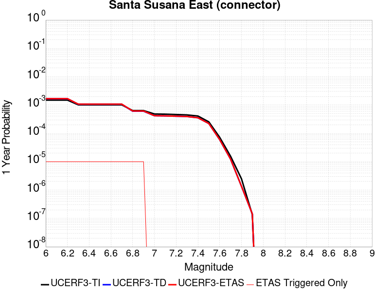 |  |

| Magnitude | 1 wk TI Prob | 1 wk TD Prob | 1 wk ETAS Prob | 1 wk ETAS/TD Gain | 1 wk ETAS Triggered Only | 1 mo TI Prob | 1 mo TD Prob | 1 mo ETAS Prob | 1 mo ETAS/TD Gain | 1 mo ETAS Triggered Only | 1 yr TI Prob | 1 yr TD Prob | 1 yr ETAS Prob | 1 yr ETAS/TD Gain | 1 yr ETAS Triggered Only | 10 yr TI Prob | 10 yr TD Prob | 10 yr ETAS Prob | 10 yr ETAS/TD Gain | 10 yr ETAS Triggered Only |
|-----|-----|-----|-----|-----|-----|-----|-----|-----|-----|-----|-----|-----|-----|-----|-----|-----|-----|-----|-----|-----|
| 6.0 | 2.858397E-5 | 3.202459E-5 | 3.202459E-5 | 1.0 | 0.0 | 1.2249697E-4 | 1.372426E-4 | 1.372426E-4 | 1.0 | 0.0 | 0.0014903803 | 0.0016699297 | 0.001679913 | 1.0059782 | 1.0E-5 | 0.014804244 | 0.016600922 | 0.016610755 | 1.0005924 | 1.0E-5 |
| 6.1 | 2.858397E-5 | 3.202459E-5 | 3.202459E-5 | 1.0 | 0.0 | 1.2249697E-4 | 1.372426E-4 | 1.372426E-4 | 1.0 | 0.0 | 0.0014903803 | 0.0016699297 | 0.001679913 | 1.0059782 | 1.0E-5 | 0.014804244 | 0.016600922 | 0.016610755 | 1.0005924 | 1.0E-5 |
| 6.2 | 2.858397E-5 | 3.202459E-5 | 3.202459E-5 | 1.0 | 0.0 | 1.2249697E-4 | 1.372426E-4 | 1.372426E-4 | 1.0 | 0.0 | 0.0014903803 | 0.0016699297 | 0.001679913 | 1.0059782 | 1.0E-5 | 0.014804244 | 0.016600922 | 0.016610755 | 1.0005924 | 1.0E-5 |
| 6.3 | 1.943582E-5 | 2.0369158E-5 | 2.0369158E-5 | 1.0 | 0.0 | 8.329371E-5 | 8.729411E-5 | 8.729411E-5 | 1.0 | 0.0 | 0.001013629 | 0.0010623998 | 0.0010723892 | 1.0094026 | 1.0E-5 | 0.010090181 | 0.010584643 | 0.010594537 | 1.0009347 | 1.0E-5 |
| 6.4 | 1.943582E-5 | 2.0369158E-5 | 2.0369158E-5 | 1.0 | 0.0 | 8.329371E-5 | 8.729411E-5 | 8.729411E-5 | 1.0 | 0.0 | 0.001013629 | 0.0010623998 | 0.0010723892 | 1.0094026 | 1.0E-5 | 0.010090181 | 0.010584643 | 0.010594537 | 1.0009347 | 1.0E-5 |
| 6.5 | 1.943582E-5 | 2.0369158E-5 | 2.0369158E-5 | 1.0 | 0.0 | 8.329371E-5 | 8.729411E-5 | 8.729411E-5 | 1.0 | 0.0 | 0.001013629 | 0.0010623998 | 0.0010723892 | 1.0094026 | 1.0E-5 | 0.010090181 | 0.010584643 | 0.010594537 | 1.0009347 | 1.0E-5 |
| 6.6 | 1.943582E-5 | 2.0369158E-5 | 2.0369158E-5 | 1.0 | 0.0 | 8.329371E-5 | 8.729411E-5 | 8.729411E-5 | 1.0 | 0.0 | 0.001013629 | 0.0010623998 | 0.0010723892 | 1.0094026 | 1.0E-5 | 0.010090181 | 0.010584643 | 0.010594537 | 1.0009347 | 1.0E-5 |
| 6.7 | 1.9404439E-5 | 2.0356578E-5 | 2.0356578E-5 | 1.0 | 0.0 | 8.3159226E-5 | 8.7240194E-5 | 8.7240194E-5 | 1.0 | 0.0 | 0.0010119933 | 0.001061744 | 0.0010717334 | 1.0094085 | 1.0E-5 | 0.010073971 | 0.010578148 | 0.010588042 | 1.0009353 | 1.0E-5 |
| 6.8 | 1.2217526E-5 | 1.1593805E-5 | 1.1593805E-5 | 1.0 | 0.0 | 5.2359774E-5 | 4.9686885E-5 | 4.9686885E-5 | 1.0 | 0.0 | 6.372938E-4 | 6.0478674E-4 | 6.147807E-4 | 1.0165248 | 1.0E-5 | 0.0063546924 | 0.006033456 | 0.0060433955 | 1.0016475 | 1.0E-5 |
| 6.9 | 1.2217526E-5 | 1.1593805E-5 | 1.1593805E-5 | 1.0 | 0.0 | 5.2359774E-5 | 4.9686885E-5 | 4.9686885E-5 | 1.0 | 0.0 | 6.372938E-4 | 6.0478674E-4 | 6.147807E-4 | 1.0165248 | 1.0E-5 | 0.0063546924 | 0.006033456 | 0.0060433955 | 1.0016475 | 1.0E-5 |
| 7.0 | 9.276017E-6 | 8.059524E-6 | 8.059524E-6 | 1.0 | 0.0 | 3.9753755E-5 | 3.4540375E-5 | 3.4540375E-5 | 1.0 | 0.0 | 4.8389446E-4 | 4.204514E-4 | 4.204514E-4 | 1.0 | 0.0 | 0.0048284214 | 0.0041972855 | 0.0041972855 | 1.0 | 0.0 |
| 7.1 | 9.130355E-6 | 7.942689E-6 | 7.942689E-6 | 1.0 | 0.0 | 3.9129503E-5 | 3.4039673E-5 | 3.4039673E-5 | 1.0 | 0.0 | 4.7629757E-4 | 4.1435764E-4 | 4.1435764E-4 | 1.0 | 0.0 | 0.00475278 | 0.0041365763 | 0.0041365763 | 1.0 | 0.0 |
| 7.2 | 8.851015E-6 | 7.74184E-6 | 7.74184E-6 | 1.0 | 0.0 | 3.7932372E-5 | 3.317891E-5 | 3.317891E-5 | 1.0 | 0.0 | 4.6172875E-4 | 4.0388177E-4 | 4.0388177E-4 | 1.0 | 0.0 | 0.0046077054 | 0.0040322007 | 0.0040322007 | 1.0 | 0.0 |
| 7.3 | 8.573006E-6 | 7.55055E-6 | 7.55055E-6 | 1.0 | 0.0 | 3.6740938E-5 | 3.235912E-5 | 3.235912E-5 | 1.0 | 0.0 | 4.472291E-4 | 3.9390445E-4 | 3.9390445E-4 | 1.0 | 0.0 | 0.004463301 | 0.00393278 | 0.00393278 | 1.0 | 0.0 |
| 7.4 | 7.852282E-6 | 6.8180075E-6 | 6.8180075E-6 | 1.0 | 0.0 | 3.36522E-5 | 2.9219722E-5 | 2.9219722E-5 | 1.0 | 0.0 | 4.096385E-4 | 3.5569505E-4 | 3.5569505E-4 | 1.0 | 0.0 | 0.0040888423 | 0.003551922 | 0.003551922 | 1.0 | 0.0 |
| 7.5 | 4.8869324E-6 | 4.2792326E-6 | 4.2792326E-6 | 1.0 | 0.0 | 2.0943828E-5 | 1.833945E-5 | 1.833945E-5 | 1.0 | 0.0 | 2.5496128E-4 | 2.2326158E-4 | 2.2326158E-4 | 1.0 | 0.0 | 0.0025466895 | 0.0022305371 | 0.0022305371 | 1.0 | 0.0 |
| 7.6 | 1.3894544E-6 | 1.1568486E-6 | 1.1568486E-6 | 1.0 | 0.0 | 5.954791E-6 | 4.9579144E-6 | 4.9579144E-6 | 1.0 | 0.0 | 7.249717E-5 | 6.0361155E-5 | 6.0361155E-5 | 1.0 | 0.0 | 7.247352E-4 | 6.0346944E-4 | 6.0346944E-4 | 1.0 | 0.0 |
| 7.7 | 2.9924632E-7 | 2.3720673E-7 | 2.3720673E-7 | 1.0 | 0.0 | 1.2824837E-6 | 1.0166E-6 | 1.0166E-6 | 1.0 | 0.0 | 1.5614127E-5 | 1.23770415E-5 | 1.23770415E-5 | 1.0 | 0.0 | 1.5613029E-4 | 1.2376424E-4 | 1.2376424E-4 | 1.0 | 0.0 |
| 7.8 | 4.8188564E-8 | 2.6328815E-8 | 2.6328815E-8 | 1.0 | 0.0 | 2.065224E-7 | 1.12837775E-7 | 1.12837775E-7 | 1.0 | 0.0 | 2.5144072E-6 | 1.3737991E-6 | 1.3737991E-6 | 1.0 | 0.0 | 2.5143789E-5 | 1.3737915E-5 | 1.3737915E-5 | 1.0 | 0.0 |
| 7.9 | 2.6127251E-9 | 2.7681977E-9 | 2.7681977E-9 | 1.0 | 0.0 | 1.1197393E-8 | 1.1863704E-8 | 1.1863704E-8 | 1.0 | 0.0 | 1.3632825E-7 | 1.4444059E-7 | 1.4444059E-7 | 1.0 | 0.0 | 1.3632817E-6 | 1.4444059E-6 | 1.4444059E-6 | 1.0 | 0.0 |

## Puente Hills
*[(top)](#table-of-contents)*

| 1 Week | 1 Month | 1 Year | 10 Year |
|-----|-----|-----|-----|
|  |  |  |  |

| Magnitude | 1 wk TI Prob | 1 wk TD Prob | 1 wk ETAS Prob | 1 wk ETAS/TD Gain | 1 wk ETAS Triggered Only | 1 mo TI Prob | 1 mo TD Prob | 1 mo ETAS Prob | 1 mo ETAS/TD Gain | 1 mo ETAS Triggered Only | 1 yr TI Prob | 1 yr TD Prob | 1 yr ETAS Prob | 1 yr ETAS/TD Gain | 1 yr ETAS Triggered Only | 10 yr TI Prob | 10 yr TD Prob | 10 yr ETAS Prob | 10 yr ETAS/TD Gain | 10 yr ETAS Triggered Only |
|-----|-----|-----|-----|-----|-----|-----|-----|-----|-----|-----|-----|-----|-----|-----|-----|-----|-----|-----|-----|-----|
| 6.0 | 1.2101656E-5 | 8.099262E-6 | 8.099262E-6 | 1.0 | 0.0 | 5.1863204E-5 | 3.4710694E-5 | 3.4710694E-5 | 1.0 | 0.0 | 6.312516E-4 | 4.225264E-4 | 4.225264E-4 | 1.0 | 0.0 | 0.0062946146 | 0.004217791 | 0.0042277486 | 1.0023609 | 1.0E-5 |
| 6.1 | 1.2101656E-5 | 8.099262E-6 | 8.099262E-6 | 1.0 | 0.0 | 5.1863204E-5 | 3.4710694E-5 | 3.4710694E-5 | 1.0 | 0.0 | 6.312516E-4 | 4.225264E-4 | 4.225264E-4 | 1.0 | 0.0 | 0.0062946146 | 0.004217791 | 0.0042277486 | 1.0023609 | 1.0E-5 |
| 6.2 | 1.2101656E-5 | 8.099262E-6 | 8.099262E-6 | 1.0 | 0.0 | 5.1863204E-5 | 3.4710694E-5 | 3.4710694E-5 | 1.0 | 0.0 | 6.312516E-4 | 4.225264E-4 | 4.225264E-4 | 1.0 | 0.0 | 0.0062946146 | 0.004217791 | 0.0042277486 | 1.0023609 | 1.0E-5 |
| 6.3 | 1.2101656E-5 | 8.099262E-6 | 8.099262E-6 | 1.0 | 0.0 | 5.1863204E-5 | 3.4710694E-5 | 3.4710694E-5 | 1.0 | 0.0 | 6.312516E-4 | 4.225264E-4 | 4.225264E-4 | 1.0 | 0.0 | 0.0062946146 | 0.004217791 | 0.0042277486 | 1.0023609 | 1.0E-5 |
| 6.4 | 1.2101656E-5 | 8.099262E-6 | 8.099262E-6 | 1.0 | 0.0 | 5.1863204E-5 | 3.4710694E-5 | 3.4710694E-5 | 1.0 | 0.0 | 6.312516E-4 | 4.225264E-4 | 4.225264E-4 | 1.0 | 0.0 | 0.0062946146 | 0.004217791 | 0.0042277486 | 1.0023609 | 1.0E-5 |
| 6.5 | 1.2101656E-5 | 8.099262E-6 | 8.099262E-6 | 1.0 | 0.0 | 5.1863204E-5 | 3.4710694E-5 | 3.4710694E-5 | 1.0 | 0.0 | 6.312516E-4 | 4.225264E-4 | 4.225264E-4 | 1.0 | 0.0 | 0.0062946146 | 0.004217791 | 0.0042277486 | 1.0023609 | 1.0E-5 |
| 6.6 | 1.0222488E-5 | 6.399761E-6 | 6.399761E-6 | 1.0 | 0.0 | 4.3809923E-5 | 2.7427272E-5 | 2.7427272E-5 | 1.0 | 0.0 | 5.332553E-4 | 3.3387833E-4 | 3.3387833E-4 | 1.0 | 0.0 | 0.0053197746 | 0.003334012 | 0.003343979 | 1.0029894 | 1.0E-5 |
| 6.7 | 1.0222488E-5 | 6.399761E-6 | 6.399761E-6 | 1.0 | 0.0 | 4.3809923E-5 | 2.7427272E-5 | 2.7427272E-5 | 1.0 | 0.0 | 5.332553E-4 | 3.3387833E-4 | 3.3387833E-4 | 1.0 | 0.0 | 0.0053197746 | 0.003334012 | 0.003343979 | 1.0029894 | 1.0E-5 |
| 6.8 | 8.6367845E-6 | 5.0287617E-6 | 5.0287617E-6 | 1.0 | 0.0 | 3.7014266E-5 | 2.1551661E-5 | 2.1551661E-5 | 1.0 | 0.0 | 4.505555E-4 | 2.6236044E-4 | 2.6236044E-4 | 1.0 | 0.0 | 0.004496431 | 0.0026205631 | 0.002630537 | 1.003806 | 1.0E-5 |
| 6.9 | 8.066481E-6 | 4.8366114E-6 | 4.8366114E-6 | 1.0 | 0.0 | 3.4570177E-5 | 2.0728174E-5 | 2.0728174E-5 | 1.0 | 0.0 | 4.2081063E-4 | 2.5233682E-4 | 2.5233682E-4 | 1.0 | 0.0 | 0.0042001465 | 0.0025205568 | 0.0025305315 | 1.0039574 | 1.0E-5 |
| 7.0 | 7.393828E-6 | 4.4177677E-6 | 4.4177677E-6 | 1.0 | 0.0 | 3.168745E-5 | 1.8933155E-5 | 1.8933155E-5 | 1.0 | 0.0 | 3.857264E-4 | 2.3048723E-4 | 2.3048723E-4 | 1.0 | 0.0 | 0.0038505755 | 0.0023025272 | 0.0023125042 | 1.004333 | 1.0E-5 |
| 7.1 | 6.4660953E-6 | 3.8048506E-6 | 3.8048506E-6 | 1.0 | 0.0 | 2.7711543E-5 | 1.6306401E-5 | 1.6306401E-5 | 1.0 | 0.0 | 3.373358E-4 | 1.9851272E-4 | 1.9851272E-4 | 1.0 | 0.0 | 0.0033682417 | 0.0019833897 | 0.00199337 | 1.0050318 | 1.0E-5 |
| 7.2 | 5.143232E-6 | 2.7868573E-6 | 2.7868573E-6 | 1.0 | 0.0 | 2.2042237E-5 | 1.194362E-5 | 1.194362E-5 | 1.0 | 0.0 | 2.6833118E-4 | 1.4540396E-4 | 1.4540396E-4 | 1.0 | 0.0 | 0.002680074 | 0.001453098 | 0.0014630836 | 1.0068718 | 1.0E-5 |
| 7.3 | 3.928255E-6 | 2.0916448E-6 | 2.0916448E-6 | 1.0 | 0.0 | 1.683527E-5 | 8.964162E-6 | 8.964162E-6 | 1.0 | 0.0 | 2.0495013E-4 | 1.0913327E-4 | 1.0913327E-4 | 1.0 | 0.0 | 0.002047612 | 0.0010908034 | 0.0010908034 | 1.0 | 0.0 |
| 7.4 | 2.7894434E-6 | 1.3549035E-6 | 1.3549035E-6 | 1.0 | 0.0 | 1.1954703E-5 | 5.806716E-6 | 5.806716E-6 | 1.0 | 0.0 | 1.4553878E-4 | 7.069452E-5 | 7.069452E-5 | 1.0 | 0.0 | 0.001454435 | 7.067247E-4 | 7.067247E-4 | 1.0 | 0.0 |
| 7.5 | 2.041735E-6 | 8.7891215E-7 | 8.7891215E-7 | 1.0 | 0.0 | 8.750263E-6 | 3.766761E-6 | 3.766761E-6 | 1.0 | 0.0 | 1.06529245E-4 | 4.5859386E-5 | 4.5859386E-5 | 1.0 | 0.0 | 0.0010647819 | 4.5850256E-4 | 4.5850256E-4 | 1.0 | 0.0 |
| 7.6 | 1.6959062E-6 | 6.700147E-7 | 6.700147E-7 | 1.0 | 0.0 | 7.268149E-6 | 2.8714885E-6 | 2.8714885E-6 | 1.0 | 0.0 | 8.848612E-5 | 3.495984E-5 | 3.495984E-5 | 1.0 | 0.0 | 8.84509E-4 | 3.495463E-4 | 3.495463E-4 | 1.0 | 0.0 |
| 7.7 | 1.4767965E-6 | 5.4088986E-7 | 5.4088986E-7 | 1.0 | 0.0 | 6.3291122E-6 | 2.3180976E-6 | 2.3180976E-6 | 1.0 | 0.0 | 7.705422E-5 | 2.8222497E-5 | 2.8222497E-5 | 1.0 | 0.0 | 7.702751E-4 | 2.821917E-4 | 2.821917E-4 | 1.0 | 0.0 |
| 7.8 | 1.8432911E-7 | 7.283546E-8 | 7.283546E-8 | 1.0 | 0.0 | 7.8998164E-7 | 3.1215197E-7 | 3.1215197E-7 | 1.0 | 0.0 | 9.617985E-6 | 3.8004468E-6 | 3.8004468E-6 | 1.0 | 0.0 | 9.617568E-5 | 3.8004146E-5 | 3.8004146E-5 | 1.0 | 0.0 |

## Gillem - Big Crack 2011 CFM
*[(top)](#table-of-contents)*

| 1 Week | 1 Month | 1 Year | 10 Year |
|-----|-----|-----|-----|
|  |  |  |  |

| Magnitude | 1 wk TI Prob | 1 wk TD Prob | 1 wk ETAS Prob | 1 wk ETAS/TD Gain | 1 wk ETAS Triggered Only | 1 mo TI Prob | 1 mo TD Prob | 1 mo ETAS Prob | 1 mo ETAS/TD Gain | 1 mo ETAS Triggered Only | 1 yr TI Prob | 1 yr TD Prob | 1 yr ETAS Prob | 1 yr ETAS/TD Gain | 1 yr ETAS Triggered Only | 10 yr TI Prob | 10 yr TD Prob | 10 yr ETAS Prob | 10 yr ETAS/TD Gain | 10 yr ETAS Triggered Only |
|-----|-----|-----|-----|-----|-----|-----|-----|-----|-----|-----|-----|-----|-----|-----|-----|-----|-----|-----|-----|-----|
| 6.0 | 2.196852E-5 | 2.3605418E-5 | 2.3605418E-5 | 1.0 | 0.0 | 9.4147406E-5 | 1.0116266E-4 | 1.0116266E-4 | 1.0 | 0.0 | 0.0011456419 | 0.0012310484 | 0.0012410361 | 1.0081131 | 1.0E-5 | 0.011397537 | 0.012251151 | 0.012261028 | 1.0008062 | 1.0E-5 |
| 6.1 | 9.992795E-6 | 1.0712299E-5 | 1.0712299E-5 | 1.0 | 0.0 | 4.2825563E-5 | 4.590915E-5 | 4.590915E-5 | 1.0 | 0.0 | 5.2127644E-4 | 5.5881887E-4 | 5.5881887E-4 | 1.0 | 0.0 | 0.0052005537 | 0.005575947 | 0.005575947 | 1.0 | 0.0 |
| 6.2 | 9.992795E-6 | 1.0712299E-5 | 1.0712299E-5 | 1.0 | 0.0 | 4.2825563E-5 | 4.590915E-5 | 4.590915E-5 | 1.0 | 0.0 | 5.2127644E-4 | 5.5881887E-4 | 5.5881887E-4 | 1.0 | 0.0 | 0.0052005537 | 0.005575947 | 0.005575947 | 1.0 | 0.0 |
| 6.3 | 4.6127884E-6 | 4.9428445E-6 | 4.9428445E-6 | 1.0 | 0.0 | 1.9768944E-5 | 2.1183472E-5 | 2.1183472E-5 | 1.0 | 0.0 | 2.406603E-4 | 2.578827E-4 | 2.578827E-4 | 1.0 | 0.0 | 0.0024039985 | 0.0025762727 | 0.0025762727 | 1.0 | 0.0 |
| 6.4 | 4.6127884E-6 | 4.9428445E-6 | 4.9428445E-6 | 1.0 | 0.0 | 1.9768944E-5 | 2.1183472E-5 | 2.1183472E-5 | 1.0 | 0.0 | 2.406603E-4 | 2.578827E-4 | 2.578827E-4 | 1.0 | 0.0 | 0.0024039985 | 0.0025762727 | 0.0025762727 | 1.0 | 0.0 |
| 6.5 | 2.716712E-6 | 2.9112218E-6 | 2.9112218E-6 | 1.0 | 0.0 | 1.1643E-5 | 1.2476619E-5 | 1.2476619E-5 | 1.0 | 0.0 | 1.417443E-4 | 1.5189468E-4 | 1.5189468E-4 | 1.0 | 0.0 | 0.0014165393 | 0.0015181466 | 0.0015181466 | 1.0 | 0.0 |
| 6.6 | 1.3818255E-6 | 1.482126E-6 | 1.482126E-6 | 1.0 | 0.0 | 5.922096E-6 | 6.3519597E-6 | 6.3519597E-6 | 1.0 | 0.0 | 7.209913E-5 | 7.73336E-5 | 7.73336E-5 | 1.0 | 0.0 | 7.2075747E-4 | 7.731878E-4 | 7.731878E-4 | 1.0 | 0.0 |

## Mission (connected) 2011 CFM
*[(top)](#table-of-contents)*

| 1 Week | 1 Month | 1 Year | 10 Year |
|-----|-----|-----|-----|
|  |  |  |  |

| Magnitude | 1 wk TI Prob | 1 wk TD Prob | 1 wk ETAS Prob | 1 wk ETAS/TD Gain | 1 wk ETAS Triggered Only | 1 mo TI Prob | 1 mo TD Prob | 1 mo ETAS Prob | 1 mo ETAS/TD Gain | 1 mo ETAS Triggered Only | 1 yr TI Prob | 1 yr TD Prob | 1 yr ETAS Prob | 1 yr ETAS/TD Gain | 1 yr ETAS Triggered Only | 10 yr TI Prob | 10 yr TD Prob | 10 yr ETAS Prob | 10 yr ETAS/TD Gain | 10 yr ETAS Triggered Only |
|-----|-----|-----|-----|-----|-----|-----|-----|-----|-----|-----|-----|-----|-----|-----|-----|-----|-----|-----|-----|-----|
| 6.0 | 1.8735573E-5 | 2.689229E-5 | 2.689229E-5 | 1.0 | 0.0 | 8.029284E-5 | 1.15247625E-4 | 1.15247625E-4 | 1.0 | 0.0 | 9.771269E-4 | 0.0014021697 | 0.0014021697 | 1.0 | 0.0 | 0.009728416 | 0.013942371 | 0.013952232 | 1.0007073 | 1.0E-5 |
| 6.1 | 1.7515964E-5 | 2.5533485E-5 | 2.5533485E-5 | 1.0 | 0.0 | 7.506625E-5 | 1.09424676E-4 | 1.09424676E-4 | 1.0 | 0.0 | 9.135484E-4 | 0.0013313637 | 0.0013313637 | 1.0 | 0.0 | 0.009098019 | 0.013242937 | 0.013252804 | 1.0007452 | 1.0E-5 |
| 6.2 | 1.6486343E-5 | 2.4378065E-5 | 2.4378065E-5 | 1.0 | 0.0 | 7.065384E-5 | 1.0447328E-4 | 1.0447328E-4 | 1.0 | 0.0 | 8.5987104E-4 | 0.001271154 | 0.001271154 | 1.0 | 0.0 | 0.008565514 | 0.012647877 | 0.012657751 | 1.0007807 | 1.0E-5 |
| 6.3 | 1.5229385E-5 | 2.2807342E-5 | 2.2807342E-5 | 1.0 | 0.0 | 6.526716E-5 | 9.774213E-5 | 9.774213E-5 | 1.0 | 0.0 | 7.9433795E-4 | 0.0011892951 | 0.0011892951 | 1.0 | 0.0 | 0.007915046 | 0.011841001 | 0.011850882 | 1.0008345 | 1.0E-5 |
| 6.4 | 1.4435828E-5 | 2.1407075E-5 | 2.1407075E-5 | 1.0 | 0.0 | 6.186637E-5 | 9.1741415E-5 | 9.1741415E-5 | 1.0 | 0.0 | 7.529627E-4 | 0.0011163155 | 0.0011163155 | 1.0 | 0.0 | 0.007504165 | 0.011123841 | 0.0111337295 | 1.000889 | 1.0E-5 |
| 6.5 | 1.30127955E-5 | 1.9045572E-5 | 1.9045572E-5 | 1.0 | 0.0 | 5.576793E-5 | 8.162134E-5 | 8.162134E-5 | 1.0 | 0.0 | 6.78763E-4 | 9.932242E-4 | 9.932242E-4 | 1.0 | 0.0 | 0.0067669353 | 0.009915724 | 0.009925625 | 1.0009985 | 1.0E-5 |
| 6.6 | 1.1220718E-5 | 1.6401224E-5 | 1.6401224E-5 | 1.0 | 0.0 | 4.8087906E-5 | 7.028908E-5 | 7.028908E-5 | 1.0 | 0.0 | 5.8531296E-4 | 8.554312E-4 | 8.554312E-4 | 1.0 | 0.0 | 0.005837737 | 0.008553556 | 0.008563471 | 1.0011591 | 1.0E-5 |
| 6.7 | 8.086152E-6 | 1.1756832E-5 | 1.1756832E-5 | 1.0 | 0.0 | 3.4654473E-5 | 5.0385454E-5 | 5.0385454E-5 | 1.0 | 0.0 | 4.2183654E-4 | 6.13271E-4 | 6.13271E-4 | 1.0 | 0.0 | 0.004210367 | 0.0061530424 | 0.006162981 | 1.0016152 | 1.0E-5 |
| 6.8 | 6.8361655E-6 | 1.0201216E-5 | 1.0201216E-5 | 1.0 | 0.0 | 2.9297524E-5 | 4.371877E-5 | 4.371877E-5 | 1.0 | 0.0 | 3.5663895E-4 | 5.3214666E-4 | 5.3214666E-4 | 1.0 | 0.0 | 0.0035606713 | 0.0053416505 | 0.005351597 | 1.001862 | 1.0E-5 |
| 6.9 | 5.2517353E-6 | 7.873655E-6 | 7.873655E-6 | 1.0 | 0.0 | 2.2507242E-5 | 3.37438E-5 | 3.37438E-5 | 1.0 | 0.0 | 2.739912E-4 | 4.1075356E-4 | 4.1075356E-4 | 1.0 | 0.0 | 0.0027365363 | 0.004132166 | 0.004132166 | 1.0 | 0.0 |
| 7.0 | 4.4602784E-6 | 6.7057636E-6 | 6.7057636E-6 | 1.0 | 0.0 | 1.911534E-5 | 2.8738672E-5 | 2.8738672E-5 | 1.0 | 0.0 | 2.327044E-4 | 3.498373E-4 | 3.498373E-4 | 1.0 | 0.0 | 0.0023246086 | 0.0035242643 | 0.0035242643 | 1.0 | 0.0 |
| 7.1 | 4.1492594E-6 | 6.2543677E-6 | 6.2543677E-6 | 1.0 | 0.0 | 1.7782419E-5 | 2.6804159E-5 | 2.6804159E-5 | 1.0 | 0.0 | 2.1647944E-4 | 3.2629192E-4 | 3.2629192E-4 | 1.0 | 0.0 | 0.0021626868 | 0.0032889978 | 0.0032889978 | 1.0 | 0.0 |
| 7.2 | 2.213247E-6 | 3.3657373E-6 | 3.3657373E-6 | 1.0 | 0.0 | 9.485309E-6 | 1.4424508E-5 | 1.4424508E-5 | 1.0 | 0.0 | 1.15477524E-4 | 1.7560426E-4 | 1.7560426E-4 | 1.0 | 0.0 | 0.0011541754 | 0.0017832896 | 0.0017832896 | 1.0 | 0.0 |
| 7.3 | 1.7362703E-6 | 2.7409405E-6 | 2.7409405E-6 | 1.0 | 0.0 | 7.4411373E-6 | 1.1746835E-5 | 1.1746835E-5 | 1.0 | 0.0 | 9.0592075E-5 | 1.4300835E-4 | 1.4300835E-4 | 1.0 | 0.0 | 9.0555154E-4 | 0.0014544576 | 0.0014544576 | 1.0 | 0.0 |
| 7.4 | 1.1628409E-6 | 1.8513425E-6 | 1.8513425E-6 | 1.0 | 0.0 | 4.9835944E-6 | 7.934301E-6 | 7.934301E-6 | 1.0 | 0.0 | 6.0673574E-5 | 9.6595846E-5 | 9.6595846E-5 | 1.0 | 0.0 | 6.065701E-4 | 9.863016E-4 | 9.863016E-4 | 1.0 | 0.0 |
| 7.5 | 5.5610667E-7 | 9.3602273E-7 | 9.3602273E-7 | 1.0 | 0.0 | 2.3833122E-6 | 4.0115196E-6 | 4.0115196E-6 | 1.0 | 0.0 | 2.9016439E-5 | 4.8839163E-5 | 4.8839163E-5 | 1.0 | 0.0 | 2.901265E-4 | 5.0493027E-4 | 5.0493027E-4 | 1.0 | 0.0 |
| 7.6 | 4.4307663E-7 | 7.800331E-7 | 7.800331E-7 | 1.0 | 0.0 | 1.8988985E-6 | 3.3429944E-6 | 3.3429944E-6 | 1.0 | 0.0 | 2.3118844E-5 | 4.07002E-5 | 4.07002E-5 | 1.0 | 0.0 | 2.3116439E-4 | 4.2288855E-4 | 4.2288855E-4 | 1.0 | 0.0 |
| 7.7 | 3.639119E-7 | 6.369042E-7 | 6.369042E-7 | 1.0 | 0.0 | 1.5596215E-6 | 2.7295864E-6 | 2.7295864E-6 | 1.0 | 0.0 | 1.8988227E-5 | 3.323221E-5 | 3.323221E-5 | 1.0 | 0.0 | 1.8986604E-4 | 3.4760416E-4 | 3.4760416E-4 | 1.0 | 0.0 |
| 7.8 | 3.1152942E-7 | 5.4867644E-7 | 5.4867644E-7 | 1.0 | 0.0 | 1.3351254E-6 | 2.3514683E-6 | 2.3514683E-6 | 1.0 | 0.0 | 1.6255031E-5 | 2.8628752E-5 | 2.8628752E-5 | 1.0 | 0.0 | 1.6253842E-4 | 2.9830585E-4 | 2.9830585E-4 | 1.0 | 0.0 |
| 7.9 | 1.8035962E-7 | 3.7258877E-7 | 3.7258877E-7 | 1.0 | 0.0 | 7.729696E-7 | 1.596808E-6 | 1.596808E-6 | 1.0 | 0.0 | 9.410865E-6 | 1.9440966E-5 | 1.9440966E-5 | 1.0 | 0.0 | 9.410465E-5 | 2.0107611E-4 | 2.0107611E-4 | 1.0 | 0.0 |
| 8.0 | 9.279334E-8 | 1.9731866E-7 | 1.9731866E-7 | 1.0 | 0.0 | 3.976857E-7 | 8.456511E-7 | 8.456511E-7 | 1.0 | 0.0 | 4.841813E-6 | 1.0295754E-5 | 1.0295754E-5 | 1.0 | 0.0 | 4.841707E-5 | 1.0546822E-4 | 1.0546822E-4 | 1.0 | 0.0 |
| 8.1 | 5.9253985E-8 | 1.1871741E-7 | 1.1871741E-7 | 1.0 | 0.0 | 2.5394561E-7 | 5.087888E-7 | 5.087888E-7 | 1.0 | 0.0 | 3.0917836E-6 | 6.1944866E-6 | 6.1944866E-6 | 1.0 | 0.0 | 3.0917407E-5 | 6.332639E-5 | 6.332639E-5 | 1.0 | 0.0 |

## San Andreas (Offshore) 2011 CFM
*[(top)](#table-of-contents)*

| 1 Week | 1 Month | 1 Year | 10 Year |
|-----|-----|-----|-----|
|  |  |  |  |

| Magnitude | 1 wk TI Prob | 1 wk TD Prob | 1 wk ETAS Prob | 1 wk ETAS/TD Gain | 1 wk ETAS Triggered Only | 1 mo TI Prob | 1 mo TD Prob | 1 mo ETAS Prob | 1 mo ETAS/TD Gain | 1 mo ETAS Triggered Only | 1 yr TI Prob | 1 yr TD Prob | 1 yr ETAS Prob | 1 yr ETAS/TD Gain | 1 yr ETAS Triggered Only | 10 yr TI Prob | 10 yr TD Prob | 10 yr ETAS Prob | 10 yr ETAS/TD Gain | 10 yr ETAS Triggered Only |
|-----|-----|-----|-----|-----|-----|-----|-----|-----|-----|-----|-----|-----|-----|-----|-----|-----|-----|-----|-----|-----|
| 6.0 | 1.7072787E-4 | 1.9243768E-4 | 1.9243768E-4 | 1.0 | 0.0 | 7.3148566E-4 | 8.244747E-4 | 8.244747E-4 | 1.0 | 0.0 | 0.008869528 | 0.009992293 | 0.009992293 | 1.0 | 0.0 | 0.085237645 | 0.09690714 | 0.09691617 | 1.0000932 | 1.0E-5 |
| 6.1 | 1.7072787E-4 | 1.9243768E-4 | 1.9243768E-4 | 1.0 | 0.0 | 7.3148566E-4 | 8.244747E-4 | 8.244747E-4 | 1.0 | 0.0 | 0.008869528 | 0.009992293 | 0.009992293 | 1.0 | 0.0 | 0.085237645 | 0.09690714 | 0.09691617 | 1.0000932 | 1.0E-5 |
| 6.2 | 1.6312556E-4 | 1.8424621E-4 | 1.8424621E-4 | 1.0 | 0.0 | 6.989222E-4 | 7.8939006E-4 | 7.8939006E-4 | 1.0 | 0.0 | 0.008476226 | 0.00956897 | 0.00956897 | 1.0 | 0.0 | 0.08160117 | 0.09292438 | 0.092933446 | 1.0000976 | 1.0E-5 |
| 6.3 | 1.5103363E-4 | 1.6896211E-4 | 1.6896211E-4 | 1.0 | 0.0 | 6.471264E-4 | 7.2392455E-4 | 7.2392455E-4 | 1.0 | 0.0 | 0.007850339 | 0.0087786075 | 0.0087786075 | 1.0 | 0.0 | 0.075787395 | 0.08556006 | 0.08556921 | 1.0001069 | 1.0E-5 |
| 6.4 | 1.5047993E-4 | 1.6782133E-4 | 1.6782133E-4 | 1.0 | 0.0 | 6.4475456E-4 | 7.1903825E-4 | 7.1903825E-4 | 1.0 | 0.0 | 0.007821669 | 0.008719592 | 0.008719592 | 1.0 | 0.0 | 0.0755203 | 0.08504028 | 0.08504943 | 1.0001076 | 1.0E-5 |
| 6.5 | 1.2760791E-4 | 1.3748009E-4 | 1.3748009E-4 | 1.0 | 0.0 | 5.467764E-4 | 5.8906875E-4 | 5.8906875E-4 | 1.0 | 0.0 | 0.0066367025 | 0.007148602 | 0.007148602 | 1.0 | 0.0 | 0.064419635 | 0.07031143 | 0.070320725 | 1.0001322 | 1.0E-5 |
| 6.6 | 1.1063525E-4 | 1.1567755E-4 | 1.1567755E-4 | 1.0 | 0.0 | 4.740649E-4 | 4.956678E-4 | 4.956678E-4 | 1.0 | 0.0 | 0.0057564764 | 0.006018259 | 0.006018259 | 1.0 | 0.0 | 0.05609626 | 0.05954285 | 0.059552252 | 1.000158 | 1.0E-5 |
| 6.7 | 1.0391049E-4 | 1.06563464E-4 | 1.06563464E-4 | 1.0 | 0.0 | 4.4525467E-4 | 4.566216E-4 | 4.566216E-4 | 1.0 | 0.0 | 0.0054075094 | 0.0055453847 | 0.0055453847 | 1.0 | 0.0 | 0.052778035 | 0.05503986 | 0.05504931 | 1.0001717 | 1.0E-5 |
| 6.8 | 1.0096706E-4 | 1.0168416E-4 | 1.0168416E-4 | 1.0 | 0.0 | 4.3264418E-4 | 4.3571746E-4 | 4.3571746E-4 | 1.0 | 0.0 | 0.0052547283 | 0.005292134 | 0.005292134 | 1.0 | 0.0 | 0.051321987 | 0.052737482 | 0.052746955 | 1.0001796 | 1.0E-5 |
| 6.9 | 9.800265E-5 | 9.598679E-5 | 9.598679E-5 | 1.0 | 0.0 | 4.1994374E-4 | 4.11308E-4 | 4.11308E-4 | 1.0 | 0.0 | 0.0051008356 | 0.0049963454 | 0.0049963454 | 1.0 | 0.0 | 0.049853306 | 0.05006405 | 0.05007355 | 1.0001898 | 1.0E-5 |
| 7.0 | 9.4642375E-5 | 9.0118105E-5 | 9.0118105E-5 | 1.0 | 0.0 | 4.0554712E-4 | 3.8616415E-4 | 3.8616415E-4 | 1.0 | 0.0 | 0.004926363 | 0.0046915757 | 0.0046915757 | 1.0 | 0.0 | 0.048185747 | 0.047243945 | 0.04725347 | 1.0002017 | 1.0E-5 |
| 7.1 | 9.0996844E-5 | 8.363557E-5 | 8.363557E-5 | 1.0 | 0.0 | 3.8992817E-4 | 3.5838978E-4 | 3.5838978E-4 | 1.0 | 0.0 | 0.004737046 | 0.004354822 | 0.004354822 | 1.0 | 0.0 | 0.04637333 | 0.044094373 | 0.04410393 | 1.0002168 | 1.0E-5 |
| 7.2 | 8.848287E-5 | 7.9909514E-5 | 7.9909514E-5 | 1.0 | 0.0 | 3.791572E-4 | 3.4242525E-4 | 3.4242525E-4 | 1.0 | 0.0 | 0.004606472 | 0.004161212 | 0.004161212 | 1.0 | 0.0 | 0.045121472 | 0.04223721 | 0.04224679 | 1.0002267 | 1.0E-5 |
| 7.3 | 7.9280784E-5 | 6.135467E-5 | 6.135467E-5 | 1.0 | 0.0 | 3.3973053E-4 | 2.6292267E-4 | 2.6292267E-4 | 1.0 | 0.0 | 0.004128377 | 0.0031964872 | 0.0031964872 | 1.0 | 0.0 | 0.040525194 | 0.032944594 | 0.032954264 | 1.0002935 | 1.0E-5 |
| 7.4 | 6.468038E-5 | 3.798989E-5 | 3.798989E-5 | 1.0 | 0.0 | 2.771722E-4 | 1.6280398E-4 | 1.6280398E-4 | 1.0 | 0.0 | 0.0033693502 | 0.0019803944 | 0.0019803944 | 1.0 | 0.0 | 0.0331872 | 0.020852158 | 0.02086195 | 1.0004696 | 1.0E-5 |
| 7.5 | 4.930574E-5 | 1.2737067E-5 | 1.2737067E-5 | 1.0 | 0.0 | 2.1129321E-4 | 5.4586293E-5 | 5.4586293E-5 | 1.0 | 0.0 | 0.0025694598 | 6.643871E-4 | 6.643871E-4 | 1.0 | 0.0 | 0.02539953 | 0.007501229 | 0.0075111543 | 1.0013231 | 1.0E-5 |
| 7.6 | 4.612566E-5 | 1.0366656E-5 | 1.0366656E-5 | 1.0 | 0.0 | 1.9766642E-4 | 4.442778E-5 | 4.442778E-5 | 1.0 | 0.0 | 0.0024039324 | 5.4077536E-4 | 5.4077536E-4 | 1.0 | 0.0 | 0.023780935 | 0.0061902013 | 0.0062001394 | 1.0016055 | 1.0E-5 |
| 7.7 | 3.9435414E-5 | 5.598791E-6 | 5.598791E-6 | 1.0 | 0.0 | 1.6899795E-4 | 2.39946E-5 | 2.39946E-5 | 1.0 | 0.0 | 0.0020556084 | 2.9209527E-4 | 2.9209527E-4 | 1.0 | 0.0 | 0.020366974 | 0.003556676 | 0.0035666404 | 1.0028017 | 1.0E-5 |
| 7.8 | 2.7787428E-5 | 3.7729496E-6 | 3.7729496E-6 | 1.0 | 0.0 | 1.1908354E-4 | 1.6169684E-5 | 1.6169684E-5 | 1.0 | 0.0 | 0.0014488777 | 1.9684815E-4 | 1.9684815E-4 | 1.0 | 0.0 | 0.014394675 | 0.0023984525 | 0.0024084284 | 1.0041593 | 1.0E-5 |
| 7.9 | 1.590671E-5 | 3.0548313E-6 | 3.0548313E-6 | 1.0 | 0.0 | 6.816983E-5 | 1.3092068E-5 | 1.3092068E-5 | 1.0 | 0.0 | 8.2965166E-4 | 1.593843E-4 | 1.593843E-4 | 1.0 | 0.0 | 0.008265611 | 0.001912608 | 0.0019225889 | 1.0052185 | 1.0E-5 |
| 8.0 | 9.193638E-6 | 2.6035711E-6 | 2.6035711E-6 | 1.0 | 0.0 | 3.940071E-5 | 1.1158115E-5 | 1.1158115E-5 | 1.0 | 0.0 | 4.7959806E-4 | 1.358416E-4 | 1.358416E-4 | 1.0 | 0.0 | 0.0047856434 | 0.0016181957 | 0.0016281796 | 1.0061697 | 1.0E-5 |
| 8.1 | 5.601576E-6 | 2.2447791E-6 | 2.2447791E-6 | 1.0 | 0.0 | 2.4006533E-5 | 9.620446E-6 | 9.620446E-6 | 1.0 | 0.0 | 2.9224035E-4 | 1.1712267E-4 | 1.1712267E-4 | 1.0 | 0.0 | 0.0029185633 | 0.0014080945 | 0.0014180804 | 1.0070918 | 1.0E-5 |
| 8.2 | 4.3508785E-6 | 1.8661184E-6 | 1.8661184E-6 | 1.0 | 0.0 | 1.864649E-5 | 7.997626E-6 | 7.997626E-6 | 1.0 | 0.0 | 2.2699735E-4 | 9.736677E-5 | 9.736677E-5 | 1.0 | 0.0 | 0.0022676561 | 0.0011643195 | 0.0011743078 | 1.0085787 | 1.0E-5 |
| 8.3 | 1.9573292E-6 | 7.547989E-7 | 7.547989E-7 | 1.0 | 0.0 | 8.388526E-6 | 3.2348487E-6 | 3.2348487E-6 | 1.0 | 0.0 | 1.0212552E-4 | 3.9383587E-5 | 3.9383587E-5 | 1.0 | 0.0 | 0.001020786 | 4.6598504E-4 | 4.7598037E-4 | 1.0214499 | 1.0E-5 |

## Davis Creek
*[(top)](#table-of-contents)*

| 1 Week | 1 Month | 1 Year | 10 Year |
|-----|-----|-----|-----|
|  |  |  |  |

| Magnitude | 1 wk TI Prob | 1 wk TD Prob | 1 wk ETAS Prob | 1 wk ETAS/TD Gain | 1 wk ETAS Triggered Only | 1 mo TI Prob | 1 mo TD Prob | 1 mo ETAS Prob | 1 mo ETAS/TD Gain | 1 mo ETAS Triggered Only | 1 yr TI Prob | 1 yr TD Prob | 1 yr ETAS Prob | 1 yr ETAS/TD Gain | 1 yr ETAS Triggered Only | 10 yr TI Prob | 10 yr TD Prob | 10 yr ETAS Prob | 10 yr ETAS/TD Gain | 10 yr ETAS Triggered Only |
|-----|-----|-----|-----|-----|-----|-----|-----|-----|-----|-----|-----|-----|-----|-----|-----|-----|-----|-----|-----|-----|
| 6.0 | 2.331472E-5 | 2.541843E-5 | 2.541843E-5 | 1.0 | 0.0 | 9.99164E-5 | 1.08932254E-4 | 1.08932254E-4 | 1.0 | 0.0 | 0.0012158032 | 0.0013255618 | 0.0013255618 | 1.0 | 0.0 | 0.01209173 | 0.013188332 | 0.0131982 | 1.0007483 | 1.0E-5 |
| 6.1 | 1.0407654E-5 | 1.1317512E-5 | 1.1317512E-5 | 1.0 | 0.0 | 4.4603472E-5 | 4.8502872E-5 | 4.8502872E-5 | 1.0 | 0.0 | 5.4291193E-4 | 5.903896E-4 | 5.903896E-4 | 1.0 | 0.0 | 0.0054158745 | 0.005890884 | 0.005890884 | 1.0 | 0.0 |
| 6.2 | 1.0407654E-5 | 1.1317512E-5 | 1.1317512E-5 | 1.0 | 0.0 | 4.4603472E-5 | 4.8502872E-5 | 4.8502872E-5 | 1.0 | 0.0 | 5.4291193E-4 | 5.903896E-4 | 5.903896E-4 | 1.0 | 0.0 | 0.0054158745 | 0.005890884 | 0.005890884 | 1.0 | 0.0 |
| 6.3 | 5.1323277E-6 | 5.568808E-6 | 5.568808E-6 | 1.0 | 0.0 | 2.1995505E-5 | 2.3866149E-5 | 2.3866149E-5 | 1.0 | 0.0 | 2.6776237E-4 | 2.9054025E-4 | 2.9054025E-4 | 1.0 | 0.0 | 0.0026743996 | 0.0029024503 | 0.0029024503 | 1.0 | 0.0 |
| 6.4 | 2.4985154E-6 | 2.7046572E-6 | 2.7046572E-6 | 1.0 | 0.0 | 1.07078795E-5 | 1.1591356E-5 | 1.1591356E-5 | 1.0 | 0.0 | 1.3036063E-4 | 1.4111924E-4 | 1.4111924E-4 | 1.0 | 0.0 | 0.0013028418 | 0.001410651 | 0.001410651 | 1.0 | 0.0 |
| 6.5 | 2.4846438E-6 | 2.6905911E-6 | 2.6905911E-6 | 1.0 | 0.0 | 1.064843E-5 | 1.1531074E-5 | 1.1531074E-5 | 1.0 | 0.0 | 1.2963692E-4 | 1.403854E-4 | 1.403854E-4 | 1.0 | 0.0 | 0.0012956132 | 0.001403322 | 0.001403322 | 1.0 | 0.0 |
| 6.6 | 2.072566E-7 | 2.1018245E-7 | 2.1018245E-7 | 1.0 | 0.0 | 8.882423E-7 | 9.0078163E-7 | 9.0078163E-7 | 1.0 | 0.0 | 1.0814296E-5 | 1.0966963E-5 | 1.0966963E-5 | 1.0 | 0.0 | 1.081377E-4 | 1.096644E-4 | 1.096644E-4 | 1.0 | 0.0 |
| 6.7 | 1.7544528E-7 | 1.7790958E-7 | 1.7790958E-7 | 1.0 | 0.0 | 7.5190815E-7 | 7.624694E-7 | 7.624694E-7 | 1.0 | 0.0 | 9.154443E-6 | 9.283027E-6 | 9.283027E-6 | 1.0 | 0.0 | 9.1540656E-5 | 9.282655E-5 | 9.282655E-5 | 1.0 | 0.0 |
| 6.8 | 1.2320395E-7 | 1.2481225E-7 | 1.2481225E-7 | 1.0 | 0.0 | 5.280168E-7 | 5.349095E-7 | 5.349095E-7 | 1.0 | 0.0 | 6.428586E-6 | 6.5125046E-6 | 6.5125046E-6 | 1.0 | 0.0 | 6.4284E-5 | 6.5123255E-5 | 6.5123255E-5 | 1.0 | 0.0 |
| 6.9 | 6.399997E-8 | 6.486104E-8 | 6.486104E-8 | 1.0 | 0.0 | 2.7428555E-7 | 2.7797586E-7 | 2.7797586E-7 | 1.0 | 0.0 | 3.3394215E-6 | 3.3843514E-6 | 3.3843514E-6 | 1.0 | 0.0 | 3.3393713E-5 | 3.3843065E-5 | 3.3843065E-5 | 1.0 | 0.0 |
| 7.0 | 6.4455685E-9 | 6.5353123E-9 | 6.5353123E-9 | 1.0 | 0.0 | 2.7623864E-8 | 2.800848E-8 | 2.800848E-8 | 1.0 | 0.0 | 3.3632048E-7 | 3.4100327E-7 | 3.4100327E-7 | 1.0 | 0.0 | 3.3631998E-6 | 3.4100326E-6 | 3.4100326E-6 | 1.0 | 0.0 |

## Laguna Salada
*[(top)](#table-of-contents)*

| 1 Week | 1 Month | 1 Year | 10 Year |
|-----|-----|-----|-----|
|  |  |  |  |

| Magnitude | 1 wk TI Prob | 1 wk TD Prob | 1 wk ETAS Prob | 1 wk ETAS/TD Gain | 1 wk ETAS Triggered Only | 1 mo TI Prob | 1 mo TD Prob | 1 mo ETAS Prob | 1 mo ETAS/TD Gain | 1 mo ETAS Triggered Only | 1 yr TI Prob | 1 yr TD Prob | 1 yr ETAS Prob | 1 yr ETAS/TD Gain | 1 yr ETAS Triggered Only | 10 yr TI Prob | 10 yr TD Prob | 10 yr ETAS Prob | 10 yr ETAS/TD Gain | 10 yr ETAS Triggered Only |
|-----|-----|-----|-----|-----|-----|-----|-----|-----|-----|-----|-----|-----|-----|-----|-----|-----|-----|-----|-----|-----|
| 6.0 | 4.6465593E-5 | 4.635094E-5 | 4.635094E-5 | 1.0 | 0.0 | 1.9912305E-4 | 1.9862966E-4 | 1.9862966E-4 | 1.0 | 0.0 | 0.0024216278 | 0.0024157926 | 0.0024257684 | 1.0041294 | 1.0E-5 | 0.02395408 | 0.023978796 | 0.023988556 | 1.000407 | 1.0E-5 |
| 6.1 | 3.982297E-5 | 3.7251466E-5 | 3.7251466E-5 | 1.0 | 0.0 | 1.706587E-4 | 1.5964007E-4 | 1.5964007E-4 | 1.0 | 0.0 | 0.0020757897 | 0.0019420078 | 0.0019420078 | 1.0 | 0.0 | 0.020565065 | 0.019334547 | 0.019334547 | 1.0 | 0.0 |
| 6.2 | 3.6067784E-5 | 3.26074E-5 | 3.26074E-5 | 1.0 | 0.0 | 1.5456705E-4 | 1.3973915E-4 | 1.3973915E-4 | 1.0 | 0.0 | 0.0018802295 | 0.0017001065 | 0.0017001065 | 1.0 | 0.0 | 0.018644003 | 0.016952014 | 0.016952014 | 1.0 | 0.0 |
| 6.3 | 3.2859112E-5 | 2.8853534E-5 | 2.8853534E-5 | 1.0 | 0.0 | 1.4081717E-4 | 1.2365272E-4 | 1.2365272E-4 | 1.0 | 0.0 | 0.0017131006 | 0.0015045331 | 0.0015045331 | 1.0 | 0.0 | 0.016999546 | 0.015020853 | 0.015020853 | 1.0 | 0.0 |
| 6.4 | 2.9132116E-5 | 2.4856314E-5 | 2.4856314E-5 | 1.0 | 0.0 | 1.2484594E-4 | 1.0652322E-4 | 1.0652322E-4 | 1.0 | 0.0 | 0.0015189396 | 0.0012962396 | 0.0012962396 | 1.0 | 0.0 | 0.015085992 | 0.012957967 | 0.012957967 | 1.0 | 0.0 |
| 6.5 | 2.7075037E-5 | 2.2828772E-5 | 2.2828772E-5 | 1.0 | 0.0 | 1.1603071E-4 | 9.7834425E-5 | 9.7834425E-5 | 1.0 | 0.0 | 0.0014117584 | 0.0011905716 | 0.0011905716 | 1.0 | 0.0 | 0.014028233 | 0.011909247 | 0.011909247 | 1.0 | 0.0 |
| 6.6 | 2.2367465E-5 | 1.8575887E-5 | 1.8575887E-5 | 1.0 | 0.0 | 9.5857045E-5 | 7.960898E-5 | 7.960898E-5 | 1.0 | 0.0 | 0.0011664346 | 9.6889073E-4 | 9.6889073E-4 | 1.0 | 0.0 | 0.011603311 | 0.009703396 | 0.009703396 | 1.0 | 0.0 |
| 6.7 | 1.9458053E-5 | 1.5916257E-5 | 1.5916257E-5 | 1.0 | 0.0 | 8.338899E-5 | 6.821121E-5 | 6.821121E-5 | 1.0 | 0.0 | 0.001014788 | 8.3023537E-4 | 8.3023537E-4 | 1.0 | 0.0 | 0.010101665 | 0.008321973 | 0.008321973 | 1.0 | 0.0 |
| 6.8 | 1.0767866E-5 | 9.185353E-6 | 9.185353E-6 | 1.0 | 0.0 | 4.614718E-5 | 3.936559E-5 | 3.936559E-5 | 1.0 | 0.0 | 5.6169706E-4 | 4.7923933E-4 | 4.7923933E-4 | 1.0 | 0.0 | 0.0056027942 | 0.0048101945 | 0.0048101945 | 1.0 | 0.0 |
| 6.9 | 2.1384765E-6 | 1.7914491E-6 | 1.7914491E-6 | 1.0 | 0.0 | 9.164866E-6 | 7.677619E-6 | 7.677619E-6 | 1.0 | 0.0 | 1.1157654E-4 | 9.347139E-5 | 9.347139E-5 | 1.0 | 0.0 | 0.0011152053 | 9.34359E-4 | 9.34359E-4 | 1.0 | 0.0 |
| 7.0 | 2.0952946E-6 | 1.7493854E-6 | 1.7493854E-6 | 1.0 | 0.0 | 8.979802E-6 | 7.497347E-6 | 7.497347E-6 | 1.0 | 0.0 | 1.0932361E-4 | 9.127676E-5 | 9.127676E-5 | 1.0 | 0.0 | 0.0010926984 | 9.1243087E-4 | 9.1243087E-4 | 1.0 | 0.0 |
| 7.1 | 1.7887576E-6 | 1.4500995E-6 | 1.4500995E-6 | 1.0 | 0.0 | 7.666081E-6 | 6.214699E-6 | 6.214699E-6 | 1.0 | 0.0 | 9.333054E-5 | 7.566164E-5 | 7.566164E-5 | 1.0 | 0.0 | 9.329135E-4 | 7.563892E-4 | 7.563892E-4 | 1.0 | 0.0 |
| 7.2 | 9.723109E-7 | 7.1361274E-7 | 7.1361274E-7 | 1.0 | 0.0 | 4.16704E-6 | 3.0583376E-6 | 3.0583376E-6 | 1.0 | 0.0 | 5.073253E-5 | 3.723479E-5 | 3.723479E-5 | 1.0 | 0.0 | 5.072095E-4 | 3.7230176E-4 | 3.7230176E-4 | 1.0 | 0.0 |

## San Andreas (Santa Cruz Mts) 2011 CFM
*[(top)](#table-of-contents)*

| 1 Week | 1 Month | 1 Year | 10 Year |
|-----|-----|-----|-----|
|  |  |  |  |

| Magnitude | 1 wk TI Prob | 1 wk TD Prob | 1 wk ETAS Prob | 1 wk ETAS/TD Gain | 1 wk ETAS Triggered Only | 1 mo TI Prob | 1 mo TD Prob | 1 mo ETAS Prob | 1 mo ETAS/TD Gain | 1 mo ETAS Triggered Only | 1 yr TI Prob | 1 yr TD Prob | 1 yr ETAS Prob | 1 yr ETAS/TD Gain | 1 yr ETAS Triggered Only | 10 yr TI Prob | 10 yr TD Prob | 10 yr ETAS Prob | 10 yr ETAS/TD Gain | 10 yr ETAS Triggered Only |
|-----|-----|-----|-----|-----|-----|-----|-----|-----|-----|-----|-----|-----|-----|-----|-----|-----|-----|-----|-----|-----|
| 6.0 | 1.7221631E-4 | 1.3823692E-4 | 1.3823692E-4 | 1.0 | 0.0 | 7.378611E-4 | 5.923115E-4 | 5.923115E-4 | 1.0 | 0.0 | 0.008946515 | 0.0071879383 | 0.0071879383 | 1.0 | 0.0 | 0.08594794 | 0.070697196 | 0.07070649 | 1.0001315 | 1.0E-5 |
| 6.1 | 1.7221631E-4 | 1.3823692E-4 | 1.3823692E-4 | 1.0 | 0.0 | 7.378611E-4 | 5.923115E-4 | 5.923115E-4 | 1.0 | 0.0 | 0.008946515 | 0.0071879383 | 0.0071879383 | 1.0 | 0.0 | 0.08594794 | 0.070697196 | 0.07070649 | 1.0001315 | 1.0E-5 |
| 6.2 | 1.7221631E-4 | 1.3823692E-4 | 1.3823692E-4 | 1.0 | 0.0 | 7.378611E-4 | 5.923115E-4 | 5.923115E-4 | 1.0 | 0.0 | 0.008946515 | 0.0071879383 | 0.0071879383 | 1.0 | 0.0 | 0.08594794 | 0.070697196 | 0.07070649 | 1.0001315 | 1.0E-5 |
| 6.3 | 1.716926E-4 | 1.3743078E-4 | 1.3743078E-4 | 1.0 | 0.0 | 7.3561794E-4 | 5.888581E-4 | 5.888581E-4 | 1.0 | 0.0 | 0.008919428 | 0.0071461694 | 0.0071461694 | 1.0 | 0.0 | 0.08569809 | 0.0703092 | 0.0703185 | 1.0001322 | 1.0E-5 |
| 6.4 | 1.6392978E-4 | 1.3618424E-4 | 1.3618424E-4 | 1.0 | 0.0 | 7.02367E-4 | 5.8351824E-4 | 5.8351824E-4 | 1.0 | 0.0 | 0.008517839 | 0.0070815794 | 0.0070815794 | 1.0 | 0.0 | 0.08198654 | 0.06954003 | 0.06954934 | 1.0001338 | 1.0E-5 |
| 6.5 | 1.5742714E-4 | 1.26776E-4 | 1.26776E-4 | 1.0 | 0.0 | 6.745133E-4 | 5.4321426E-4 | 5.4321426E-4 | 1.0 | 0.0 | 0.00818132 | 0.006593904 | 0.006593904 | 1.0 | 0.0 | 0.078865945 | 0.0649993 | 0.06500865 | 1.0001439 | 1.0E-5 |
| 6.6 | 1.3038084E-4 | 1.161551E-4 | 1.161551E-4 | 1.0 | 0.0 | 5.5865536E-4 | 4.9771386E-4 | 4.9771386E-4 | 1.0 | 0.0 | 0.006780438 | 0.0060430723 | 0.0060430723 | 1.0 | 0.0 | 0.0657725 | 0.059452567 | 0.059461974 | 1.0001582 | 1.0E-5 |
| 6.7 | 1.2867592E-4 | 1.13418515E-4 | 1.13418515E-4 | 1.0 | 0.0 | 5.5135164E-4 | 4.8599008E-4 | 4.8599008E-4 | 1.0 | 0.0 | 0.0066920654 | 0.005901116 | 0.005901116 | 1.0 | 0.0 | 0.06494093 | 0.05816314 | 0.058172558 | 1.0001619 | 1.0E-5 |
| 6.8 | 1.2801298E-4 | 1.1279377E-4 | 1.1279377E-4 | 1.0 | 0.0 | 5.485117E-4 | 4.833136E-4 | 4.833136E-4 | 1.0 | 0.0 | 0.0066577005 | 0.0058687064 | 0.0058687064 | 1.0 | 0.0 | 0.06461738 | 0.05787688 | 0.057886302 | 1.0001628 | 1.0E-5 |
| 6.9 | 1.269149E-4 | 1.11214715E-4 | 1.11214715E-4 | 1.0 | 0.0 | 5.4380763E-4 | 4.765487E-4 | 4.765487E-4 | 1.0 | 0.0 | 0.006600777 | 0.005786784 | 0.005786784 | 1.0 | 0.0 | 0.06408122 | 0.057148356 | 0.057157785 | 1.000165 | 1.0E-5 |
| 7.0 | 1.2030331E-4 | 1.0851204E-4 | 1.0851204E-4 | 1.0 | 0.0 | 5.154837E-4 | 4.6496998E-4 | 4.6496998E-4 | 1.0 | 0.0 | 0.006257969 | 0.005646552 | 0.005646552 | 1.0 | 0.0 | 0.06084648 | 0.055819258 | 0.055828698 | 1.0001692 | 1.0E-5 |
| 7.1 | 8.049617E-5 | 5.4114953E-5 | 5.4114953E-5 | 1.0 | 0.0 | 3.4493793E-4 | 2.319008E-4 | 2.319008E-4 | 1.0 | 0.0 | 0.0041915346 | 0.0028197719 | 0.0028197719 | 1.0 | 0.0 | 0.041133516 | 0.02971132 | 0.029721022 | 1.0003265 | 1.0E-5 |
| 7.2 | 7.093979E-5 | 4.310381E-5 | 4.310381E-5 | 1.0 | 0.0 | 3.0399222E-4 | 1.8471766E-4 | 1.8471766E-4 | 1.0 | 0.0 | 0.0036948253 | 0.0022466409 | 0.0022466409 | 1.0 | 0.0 | 0.03633994 | 0.024024088 | 0.024033848 | 1.0004063 | 1.0E-5 |
| 7.3 | 6.193693E-5 | 2.9018376E-5 | 2.9018376E-5 | 1.0 | 0.0 | 2.6541698E-4 | 1.2435856E-4 | 1.2435856E-4 | 1.0 | 0.0 | 0.0032266637 | 0.0015130156 | 0.0015130156 | 1.0 | 0.0 | 0.031802133 | 0.016564084 | 0.016573917 | 1.0005937 | 1.0E-5 |
| 7.4 | 5.906492E-5 | 2.7136244E-5 | 2.7136244E-5 | 1.0 | 0.0 | 2.5311083E-4 | 1.16293006E-4 | 1.16293006E-4 | 1.0 | 0.0 | 0.0030772698 | 0.0014149492 | 0.0014149492 | 1.0 | 0.0 | 0.030350044 | 0.015530545 | 0.01554039 | 1.0006338 | 1.0E-5 |
| 7.5 | 5.424296E-5 | 2.4776109E-5 | 2.4776109E-5 | 1.0 | 0.0 | 2.324491E-4 | 1.0617901E-4 | 1.0617901E-4 | 1.0 | 0.0 | 0.002826395 | 0.0012919641 | 0.0012919641 | 1.0 | 0.0 | 0.027907165 | 0.014215293 | 0.014225151 | 1.0006934 | 1.0E-5 |
| 7.6 | 4.43084E-5 | 1.9971396E-5 | 1.9971396E-5 | 1.0 | 0.0 | 1.8987931E-4 | 8.558889E-5 | 8.558889E-5 | 1.0 | 0.0 | 0.0023093296 | 0.0010415468 | 0.0010415468 | 1.0 | 0.0 | 0.022854783 | 0.011448878 | 0.011458764 | 1.0008634 | 1.0E-5 |
| 7.7 | 4.118098E-5 | 1.8999577E-5 | 1.8999577E-5 | 1.0 | 0.0 | 1.7647797E-4 | 8.1424216E-5 | 8.1424216E-5 | 1.0 | 0.0 | 0.002146502 | 9.908893E-4 | 9.908893E-4 | 1.0 | 0.0 | 0.021258866 | 0.010904559 | 0.01091445 | 1.0009071 | 1.0E-5 |
| 7.8 | 3.5408906E-5 | 1.8625631E-5 | 1.8625631E-5 | 1.0 | 0.0 | 1.5174363E-4 | 7.982169E-5 | 7.982169E-5 | 1.0 | 0.0 | 0.0018459131 | 9.7139605E-4 | 9.7139605E-4 | 1.0 | 0.0 | 0.018306552 | 0.0106848935 | 0.010694786 | 1.0009259 | 1.0E-5 |
| 7.9 | 2.5860836E-5 | 1.7371205E-5 | 1.7371205E-5 | 1.0 | 0.0 | 1.10827445E-4 | 7.4445896E-5 | 7.4445896E-5 | 1.0 | 0.0 | 0.001348489 | 9.060022E-4 | 9.060022E-4 | 1.0 | 0.0 | 0.013403354 | 0.009936898 | 0.009946799 | 1.0009964 | 1.0E-5 |
| 8.0 | 1.9777332E-5 | 1.4886952E-5 | 1.4886952E-5 | 1.0 | 0.0 | 8.4757245E-5 | 6.379966E-5 | 6.379966E-5 | 1.0 | 0.0 | 0.0010314309 | 7.7648426E-4 | 7.7648426E-4 | 1.0 | 0.0 | 0.010266567 | 0.008534084 | 0.008543999 | 1.0011618 | 1.0E-5 |
| 8.1 | 1.468494E-5 | 1.2146339E-5 | 1.2146339E-5 | 1.0 | 0.0 | 6.293394E-5 | 5.20547E-5 | 5.20547E-5 | 1.0 | 0.0 | 7.6595135E-4 | 6.3358183E-4 | 6.3358183E-4 | 1.0 | 0.0 | 0.0076331664 | 0.0069899 | 0.0069998302 | 1.0014206 | 1.0E-5 |
| 8.2 | 8.63836E-6 | 5.489407E-6 | 5.489407E-6 | 1.0 | 0.0 | 3.7021015E-5 | 2.3525818E-5 | 2.3525818E-5 | 1.0 | 0.0 | 4.5063766E-4 | 2.863893E-4 | 2.863893E-4 | 1.0 | 0.0 | 0.004497249 | 0.0032568157 | 0.003266783 | 1.0030605 | 1.0E-5 |
| 8.3 | 1.983087E-6 | 7.693574E-7 | 7.693574E-7 | 1.0 | 0.0 | 8.498917E-6 | 3.297242E-6 | 3.297242E-6 | 1.0 | 0.0 | 1.034694E-4 | 4.01432E-5 | 4.01432E-5 | 1.0 | 0.0 | 0.0010342124 | 4.7390026E-4 | 4.8389554E-4 | 1.0210915 | 1.0E-5 |

## Great Valley 04a Trout Creek
*[(top)](#table-of-contents)*

| 1 Week | 1 Month | 1 Year | 10 Year |
|-----|-----|-----|-----|
|  |  |  |  |

| Magnitude | 1 wk TI Prob | 1 wk TD Prob | 1 wk ETAS Prob | 1 wk ETAS/TD Gain | 1 wk ETAS Triggered Only | 1 mo TI Prob | 1 mo TD Prob | 1 mo ETAS Prob | 1 mo ETAS/TD Gain | 1 mo ETAS Triggered Only | 1 yr TI Prob | 1 yr TD Prob | 1 yr ETAS Prob | 1 yr ETAS/TD Gain | 1 yr ETAS Triggered Only | 10 yr TI Prob | 10 yr TD Prob | 10 yr ETAS Prob | 10 yr ETAS/TD Gain | 10 yr ETAS Triggered Only |
|-----|-----|-----|-----|-----|-----|-----|-----|-----|-----|-----|-----|-----|-----|-----|-----|-----|-----|-----|-----|-----|
| 6.0 | 1.4088538E-5 | 1.572052E-5 | 1.572052E-5 | 1.0 | 0.0 | 6.037805E-5 | 6.737199E-5 | 7.737131E-5 | 1.1484196 | 1.0E-5 | 7.3485484E-4 | 8.1995776E-4 | 8.2994957E-4 | 1.0121857 | 1.0E-5 | 0.007324295 | 0.008170608 | 0.008180527 | 1.0012139 | 1.0E-5 |
| 6.1 | 1.4088538E-5 | 1.572052E-5 | 1.572052E-5 | 1.0 | 0.0 | 6.037805E-5 | 6.737199E-5 | 7.737131E-5 | 1.1484196 | 1.0E-5 | 7.3485484E-4 | 8.1995776E-4 | 8.2994957E-4 | 1.0121857 | 1.0E-5 | 0.007324295 | 0.008170608 | 0.008180527 | 1.0012139 | 1.0E-5 |
| 6.2 | 1.4088538E-5 | 1.572052E-5 | 1.572052E-5 | 1.0 | 0.0 | 6.037805E-5 | 6.737199E-5 | 7.737131E-5 | 1.1484196 | 1.0E-5 | 7.3485484E-4 | 8.1995776E-4 | 8.2994957E-4 | 1.0121857 | 1.0E-5 | 0.007324295 | 0.008170608 | 0.008180527 | 1.0012139 | 1.0E-5 |
| 6.3 | 1.2882862E-5 | 1.437949E-5 | 1.437949E-5 | 1.0 | 0.0 | 5.5211098E-5 | 6.162498E-5 | 7.162437E-5 | 1.1622618 | 1.0E-5 | 6.7198783E-4 | 7.500363E-4 | 7.6002884E-4 | 1.0133227 | 1.0E-5 | 0.0066995937 | 0.0074761123 | 0.0074860374 | 1.0013276 | 1.0E-5 |
| 6.4 | 1.2882862E-5 | 1.437949E-5 | 1.437949E-5 | 1.0 | 0.0 | 5.5211098E-5 | 6.162498E-5 | 7.162437E-5 | 1.1622618 | 1.0E-5 | 6.7198783E-4 | 7.500363E-4 | 7.6002884E-4 | 1.0133227 | 1.0E-5 | 0.0066995937 | 0.0074761123 | 0.0074860374 | 1.0013276 | 1.0E-5 |
| 6.5 | 1.2762329E-5 | 1.42460385E-5 | 1.42460385E-5 | 1.0 | 0.0 | 5.469455E-5 | 6.1053084E-5 | 7.105247E-5 | 1.1637819 | 1.0E-5 | 6.657027E-4 | 7.430781E-4 | 7.530707E-4 | 1.0134475 | 1.0E-5 | 0.00663712 | 0.0074069947 | 0.0074169203 | 1.00134 | 1.0E-5 |
| 6.6 | 1.2762329E-5 | 1.42460385E-5 | 1.42460385E-5 | 1.0 | 0.0 | 5.469455E-5 | 6.1053084E-5 | 7.105247E-5 | 1.1637819 | 1.0E-5 | 6.657027E-4 | 7.430781E-4 | 7.530707E-4 | 1.0134475 | 1.0E-5 | 0.00663712 | 0.0074069947 | 0.0074169203 | 1.00134 | 1.0E-5 |
| 6.7 | 1.2557959E-5 | 1.4020262E-5 | 1.4020262E-5 | 1.0 | 0.0 | 5.3818712E-5 | 6.008551E-5 | 7.008491E-5 | 1.1664195 | 1.0E-5 | 6.5504585E-4 | 7.3130586E-4 | 7.4129854E-4 | 1.0136641 | 1.0E-5 | 0.006531183 | 0.007290047 | 0.0072999746 | 1.0013617 | 1.0E-5 |
| 6.8 | 1.1871544E-5 | 1.3259646E-5 | 1.3259646E-5 | 1.0 | 0.0 | 5.0877054E-5 | 5.6825873E-5 | 6.6825305E-5 | 1.1759661 | 1.0E-5 | 6.1925204E-4 | 6.9164543E-4 | 7.016385E-4 | 1.0144483 | 1.0E-5 | 0.0061752927 | 0.006895945 | 0.006905876 | 1.0014402 | 1.0E-5 |
| 6.9 | 1.0500373E-5 | 1.1731991E-5 | 1.1731991E-5 | 1.0 | 0.0 | 4.5000823E-5 | 5.0279043E-5 | 6.027854E-5 | 1.1988801 | 1.0E-5 | 5.4774724E-4 | 6.11984E-4 | 6.219779E-4 | 1.0163302 | 1.0E-5 | 0.005463991 | 0.0061038528 | 0.006113792 | 1.0016283 | 1.0E-5 |
| 7.0 | 8.524332E-6 | 9.534083E-6 | 9.534083E-6 | 1.0 | 0.0 | 3.653234E-5 | 4.085976E-5 | 5.085935E-5 | 1.2447295 | 1.0E-5 | 4.4469046E-4 | 4.9736135E-4 | 5.0735637E-4 | 1.0200961 | 1.0E-5 | 0.0044380166 | 0.0049632136 | 0.004973164 | 1.0020049 | 1.0E-5 |
| 7.1 | 6.006849E-6 | 6.7119777E-6 | 6.7119777E-6 | 1.0 | 0.0 | 2.5743384E-5 | 2.8765333E-5 | 3.8765043E-5 | 1.3476307 | 1.0E-5 | 3.1338062E-4 | 3.5016722E-4 | 3.601637E-4 | 1.0285478 | 1.0E-5 | 0.0031293905 | 0.0034967053 | 0.0035066702 | 1.0028498 | 1.0E-5 |
| 7.2 | 2.9122193E-6 | 3.2467287E-6 | 3.2467287E-6 | 1.0 | 0.0 | 1.248088E-5 | 1.3914488E-5 | 1.3914488E-5 | 1.0 | 0.0 | 1.5194413E-4 | 1.6939746E-4 | 1.6939746E-4 | 1.0 | 0.0 | 0.0015184027 | 0.0016928554 | 0.0016928554 | 1.0 | 0.0 |
| 7.3 | 7.2194007E-7 | 7.989217E-7 | 7.989217E-7 | 1.0 | 0.0 | 3.0940253E-6 | 3.423948E-6 | 3.423948E-6 | 1.0 | 0.0 | 3.7669106E-5 | 4.168623E-5 | 4.168623E-5 | 1.0 | 0.0 | 3.766272E-4 | 4.168291E-4 | 4.168291E-4 | 1.0 | 0.0 |
| 7.4 | 3.112171E-8 | 3.2068883E-8 | 3.2068883E-8 | 1.0 | 0.0 | 1.3337875E-7 | 1.3743806E-7 | 1.3743806E-7 | 1.0 | 0.0 | 1.6238852E-6 | 1.6733072E-6 | 1.6733072E-6 | 1.0 | 0.0 | 1.6238733E-5 | 1.6732954E-5 | 1.6732954E-5 | 1.0 | 0.0 |

## Calaveras (So) - Paicines extension 2011 CFM
*[(top)](#table-of-contents)*

| 1 Week | 1 Month | 1 Year | 10 Year |
|-----|-----|-----|-----|
|  |  |  |  |

| Magnitude | 1 wk TI Prob | 1 wk TD Prob | 1 wk ETAS Prob | 1 wk ETAS/TD Gain | 1 wk ETAS Triggered Only | 1 mo TI Prob | 1 mo TD Prob | 1 mo ETAS Prob | 1 mo ETAS/TD Gain | 1 mo ETAS Triggered Only | 1 yr TI Prob | 1 yr TD Prob | 1 yr ETAS Prob | 1 yr ETAS/TD Gain | 1 yr ETAS Triggered Only | 10 yr TI Prob | 10 yr TD Prob | 10 yr ETAS Prob | 10 yr ETAS/TD Gain | 10 yr ETAS Triggered Only |
|-----|-----|-----|-----|-----|-----|-----|-----|-----|-----|-----|-----|-----|-----|-----|-----|-----|-----|-----|-----|-----|
| 6.0 | 1.5183659E-4 | 3.0538742E-4 | 3.0538742E-4 | 1.0 | 0.0 | 6.5056595E-4 | 0.0013080107 | 0.0013080107 | 1.0 | 0.0 | 0.007891912 | 0.015702842 | 0.015702842 | 1.0 | 0.0 | 0.076174594 | 0.13854265 | 0.13855127 | 1.0000622 | 1.0E-5 |
| 6.1 | 1.5024997E-4 | 3.0232652E-4 | 3.0232652E-4 | 1.0 | 0.0 | 6.437695E-4 | 0.0012949064 | 0.0012949064 | 1.0 | 0.0 | 0.0078097614 | 0.0155462185 | 0.0155462185 | 1.0 | 0.0 | 0.075409345 | 0.13721214 | 0.13722077 | 1.0000628 | 1.0E-5 |
| 6.2 | 1.2743923E-4 | 2.5341182E-4 | 2.5341182E-4 | 1.0 | 0.0 | 5.460538E-4 | 0.001085454 | 0.001085454 | 1.0 | 0.0 | 0.0066279583 | 0.013053368 | 0.013053368 | 1.0 | 0.0 | 0.064337276 | 0.117310405 | 0.11731923 | 1.0000752 | 1.0E-5 |
| 6.3 | 1.1525114E-4 | 2.262457E-4 | 2.262457E-4 | 1.0 | 0.0 | 4.9383997E-4 | 9.6911576E-4 | 9.6911576E-4 | 1.0 | 0.0 | 0.0059959386 | 0.011674539 | 0.011674539 | 1.0 | 0.0 | 0.058367174 | 0.1064267 | 0.106435634 | 1.0000839 | 1.0E-5 |
| 6.4 | 1.07200925E-4 | 2.0861623E-4 | 2.0861623E-4 | 1.0 | 0.0 | 4.5935164E-4 | 8.93614E-4 | 8.93614E-4 | 1.0 | 0.0 | 0.0055782744 | 0.010779322 | 0.010779322 | 1.0 | 0.0 | 0.0544031 | 0.099249505 | 0.09925851 | 1.0000907 | 1.0E-5 |
| 6.5 | 9.69631E-5 | 1.8751183E-4 | 1.8751183E-4 | 1.0 | 0.0 | 4.1548995E-4 | 8.0336037E-4 | 8.0336037E-4 | 1.0 | 0.0 | 0.0050468626 | 0.009701113 | 0.009701113 | 1.0 | 0.0 | 0.04933773 | 0.09014108 | 0.09015018 | 1.000101 | 1.0E-5 |
| 6.6 | 8.0552316E-5 | 1.508417E-4 | 1.508417E-4 | 1.0 | 0.0 | 3.4517853E-4 | 6.4628234E-4 | 6.4628234E-4 | 1.0 | 0.0 | 0.0041944524 | 0.007832806 | 0.007832806 | 1.0 | 0.0 | 0.04116161 | 0.07491137 | 0.074920624 | 1.0001235 | 1.0E-5 |
| 6.7 | 7.815757E-5 | 1.4624608E-4 | 1.4624608E-4 | 1.0 | 0.0 | 3.34918E-4 | 6.2660675E-4 | 6.2660675E-4 | 1.0 | 0.0 | 0.004070005 | 0.0075956066 | 0.0075956066 | 1.0 | 0.0 | 0.039962657 | 0.07276075 | 0.07277003 | 1.0001274 | 1.0E-5 |
| 6.8 | 6.965264E-5 | 1.273421E-4 | 1.273421E-4 | 1.0 | 0.0 | 2.9847719E-4 | 5.456321E-4 | 5.456321E-4 | 1.0 | 0.0 | 0.0036279052 | 0.006619586 | 0.006619586 | 1.0 | 0.0 | 0.03569247 | 0.06385353 | 0.0638629 | 1.0001466 | 1.0E-5 |
| 6.9 | 5.8000453E-5 | 1.0154083E-4 | 1.0154083E-4 | 1.0 | 0.0 | 2.4854968E-4 | 4.3510293E-4 | 4.3510293E-4 | 1.0 | 0.0 | 0.0030218933 | 0.0052846153 | 0.0052846153 | 1.0 | 0.0 | 0.029811295 | 0.051550873 | 0.051550873 | 1.0 | 0.0 |
| 7.0 | 4.9865852E-5 | 8.578075E-5 | 8.578075E-5 | 1.0 | 0.0 | 2.1369329E-4 | 3.6758048E-4 | 3.6758048E-4 | 1.0 | 0.0 | 0.0025986114 | 0.004466198 | 0.004466198 | 1.0 | 0.0 | 0.025684336 | 0.04383052 | 0.04383052 | 1.0 | 0.0 |
| 7.1 | 4.283875E-5 | 7.120278E-5 | 7.120278E-5 | 1.0 | 0.0 | 1.8358172E-4 | 3.051194E-4 | 3.051194E-4 | 1.0 | 0.0 | 0.0022328163 | 0.0037085575 | 0.0037085575 | 1.0 | 0.0 | 0.022105146 | 0.03677475 | 0.03677475 | 1.0 | 0.0 |
| 7.2 | 3.450115E-5 | 5.5854773E-5 | 5.5854773E-5 | 1.0 | 0.0 | 1.478537E-4 | 2.393558E-4 | 2.393558E-4 | 1.0 | 0.0 | 0.0017986323 | 0.0029102915 | 0.0029102915 | 1.0 | 0.0 | 0.017841442 | 0.02911727 | 0.02911727 | 1.0 | 0.0 |
| 7.3 | 2.5709045E-5 | 4.0657033E-5 | 4.0657033E-5 | 1.0 | 0.0 | 1.1017697E-4 | 1.7423289E-4 | 1.7423289E-4 | 1.0 | 0.0 | 0.0013405791 | 0.0021192385 | 0.0021192385 | 1.0 | 0.0 | 0.013325208 | 0.021331005 | 0.021331005 | 1.0 | 0.0 |
| 7.4 | 1.8003093E-5 | 2.8548406E-5 | 2.8548406E-5 | 1.0 | 0.0 | 7.715383E-5 | 1.2234459E-4 | 1.2234459E-4 | 1.0 | 0.0 | 9.3894306E-4 | 0.00148853 | 0.00148853 | 1.0 | 0.0 | 0.009349857 | 0.015070891 | 0.015070891 | 1.0 | 0.0 |
| 7.5 | 1.5595824E-5 | 2.5859636E-5 | 2.5859636E-5 | 1.0 | 0.0 | 6.683753E-5 | 1.10822315E-4 | 1.10822315E-4 | 1.0 | 0.0 | 8.134431E-4 | 0.0013484288 | 0.0013484288 | 1.0 | 0.0 | 0.008104719 | 0.013670188 | 0.013670188 | 1.0 | 0.0 |
| 7.6 | 1.1110309E-5 | 1.9254814E-5 | 1.9254814E-5 | 1.0 | 0.0 | 4.761474E-5 | 8.251803E-5 | 8.251803E-5 | 1.0 | 0.0 | 5.795553E-4 | 0.0010041953 | 0.0010041953 | 1.0 | 0.0 | 0.0057804612 | 0.010219867 | 0.010219867 | 1.0 | 0.0 |
| 7.7 | 6.2140443E-6 | 1.0459921E-5 | 1.0459921E-5 | 1.0 | 0.0 | 2.6631347E-5 | 4.4827466E-5 | 4.4827466E-5 | 1.0 | 0.0 | 3.241884E-4 | 5.456378E-4 | 5.456378E-4 | 1.0 | 0.0 | 0.0032371588 | 0.005630981 | 0.005630981 | 1.0 | 0.0 |
| 7.8 | 5.305533E-6 | 9.453423E-6 | 9.453423E-6 | 1.0 | 0.0 | 2.27378E-5 | 4.051404E-5 | 4.051404E-5 | 1.0 | 0.0 | 2.7679754E-4 | 4.931469E-4 | 4.931469E-4 | 1.0 | 0.0 | 0.0027645302 | 0.0050842287 | 0.0050842287 | 1.0 | 0.0 |
| 7.9 | 3.363505E-6 | 7.399955E-6 | 7.399955E-6 | 1.0 | 0.0 | 1.4414942E-5 | 3.171371E-5 | 3.171371E-5 | 1.0 | 0.0 | 1.7548777E-4 | 3.8604607E-4 | 3.8604607E-4 | 1.0 | 0.0 | 0.0017534926 | 0.003955788 | 0.003955788 | 1.0 | 0.0 |
| 8.0 | 2.0271132E-6 | 4.421605E-6 | 4.421605E-6 | 1.0 | 0.0 | 8.687599E-6 | 1.8949599E-5 | 1.8949599E-5 | 1.0 | 0.0 | 1.05766376E-4 | 2.3068699E-4 | 2.3068699E-4 | 1.0 | 0.0 | 0.0010571606 | 0.0023552408 | 0.0023552408 | 1.0 | 0.0 |
| 8.1 | 1.2206116E-6 | 2.379743E-6 | 2.379743E-6 | 1.0 | 0.0 | 5.2311816E-6 | 1.0198858E-5 | 1.0198858E-5 | 1.0 | 0.0 | 6.3687774E-5 | 1.2416406E-4 | 1.2416406E-4 | 1.0 | 0.0 | 6.366953E-4 | 0.0012728416 | 0.0012728416 | 1.0 | 0.0 |

## Reliz 2011 CFM
*[(top)](#table-of-contents)*

| 1 Week | 1 Month | 1 Year | 10 Year |
|-----|-----|-----|-----|
|  |  |  |  |

| Magnitude | 1 wk TI Prob | 1 wk TD Prob | 1 wk ETAS Prob | 1 wk ETAS/TD Gain | 1 wk ETAS Triggered Only | 1 mo TI Prob | 1 mo TD Prob | 1 mo ETAS Prob | 1 mo ETAS/TD Gain | 1 mo ETAS Triggered Only | 1 yr TI Prob | 1 yr TD Prob | 1 yr ETAS Prob | 1 yr ETAS/TD Gain | 1 yr ETAS Triggered Only | 10 yr TI Prob | 10 yr TD Prob | 10 yr ETAS Prob | 10 yr ETAS/TD Gain | 10 yr ETAS Triggered Only |
|-----|-----|-----|-----|-----|-----|-----|-----|-----|-----|-----|-----|-----|-----|-----|-----|-----|-----|-----|-----|-----|
| 6.0 | 1.6002472E-5 | 1.6283226E-5 | 1.6283226E-5 | 1.0 | 0.0 | 6.8580215E-5 | 6.97835E-5 | 6.97835E-5 | 1.0 | 0.0 | 8.3464425E-4 | 8.4930274E-4 | 8.4930274E-4 | 1.0 | 0.0 | 0.008315164 | 0.008462766 | 0.008472681 | 1.0011716 | 1.0E-5 |
| 6.1 | 1.6002472E-5 | 1.6283226E-5 | 1.6283226E-5 | 1.0 | 0.0 | 6.8580215E-5 | 6.97835E-5 | 6.97835E-5 | 1.0 | 0.0 | 8.3464425E-4 | 8.4930274E-4 | 8.4930274E-4 | 1.0 | 0.0 | 0.008315164 | 0.008462766 | 0.008472681 | 1.0011716 | 1.0E-5 |
| 6.2 | 1.6002472E-5 | 1.6283226E-5 | 1.6283226E-5 | 1.0 | 0.0 | 6.8580215E-5 | 6.97835E-5 | 6.97835E-5 | 1.0 | 0.0 | 8.3464425E-4 | 8.4930274E-4 | 8.4930274E-4 | 1.0 | 0.0 | 0.008315164 | 0.008462766 | 0.008472681 | 1.0011716 | 1.0E-5 |
| 6.3 | 7.792404E-6 | 7.804076E-6 | 7.804076E-6 | 1.0 | 0.0 | 3.339559E-5 | 3.3445616E-5 | 3.3445616E-5 | 1.0 | 0.0 | 4.0651546E-4 | 4.0712504E-4 | 4.0712504E-4 | 1.0 | 0.0 | 0.0040577264 | 0.004064069 | 0.004074028 | 1.0024506 | 1.0E-5 |
| 6.4 | 7.792404E-6 | 7.804076E-6 | 7.804076E-6 | 1.0 | 0.0 | 3.339559E-5 | 3.3445616E-5 | 3.3445616E-5 | 1.0 | 0.0 | 4.0651546E-4 | 4.0712504E-4 | 4.0712504E-4 | 1.0 | 0.0 | 0.0040577264 | 0.004064069 | 0.004074028 | 1.0024506 | 1.0E-5 |
| 6.5 | 5.9659374E-6 | 5.9289855E-6 | 5.9289855E-6 | 1.0 | 0.0 | 2.5568053E-5 | 2.5409692E-5 | 2.5409692E-5 | 1.0 | 0.0 | 3.1124658E-4 | 3.093193E-4 | 3.093193E-4 | 1.0 | 0.0 | 0.00310811 | 0.0030891057 | 0.0030990748 | 1.0032272 | 1.0E-5 |
| 6.6 | 5.2350692E-6 | 5.179223E-6 | 5.179223E-6 | 1.0 | 0.0 | 2.2435817E-5 | 2.2196482E-5 | 2.2196482E-5 | 1.0 | 0.0 | 2.7312184E-4 | 2.702088E-4 | 2.702088E-4 | 1.0 | 0.0 | 0.002727864 | 0.0026990129 | 0.0026990129 | 1.0 | 0.0 |
| 6.7 | 4.580206E-6 | 4.5063475E-6 | 4.5063475E-6 | 1.0 | 0.0 | 1.9629308E-5 | 1.9312776E-5 | 1.9312776E-5 | 1.0 | 0.0 | 2.389606E-4 | 2.3510774E-4 | 2.3510774E-4 | 1.0 | 0.0 | 0.002387038 | 0.0023487923 | 0.0023487923 | 1.0 | 0.0 |
| 6.8 | 4.0765017E-6 | 3.9884576E-6 | 3.9884576E-6 | 1.0 | 0.0 | 1.7470604E-5 | 1.7093278E-5 | 1.7093278E-5 | 1.0 | 0.0 | 2.1268385E-4 | 2.0809082E-4 | 2.0809082E-4 | 1.0 | 0.0 | 0.002124804 | 0.002079158 | 0.002079158 | 1.0 | 0.0 |
| 6.9 | 3.5752896E-6 | 3.472729E-6 | 3.472729E-6 | 1.0 | 0.0 | 1.532258E-5 | 1.48830395E-5 | 1.48830395E-5 | 1.0 | 0.0 | 1.8653645E-4 | 1.8118597E-4 | 1.8118597E-4 | 1.0 | 0.0 | 0.0018637994 | 0.0018105791 | 0.0018105791 | 1.0 | 0.0 |
| 7.0 | 3.0259848E-6 | 2.9081448E-6 | 2.9081448E-6 | 1.0 | 0.0 | 1.2968442E-5 | 1.2463418E-5 | 1.2463418E-5 | 1.0 | 0.0 | 1.5787935E-4 | 1.5173157E-4 | 1.5173157E-4 | 1.0 | 0.0 | 0.0015776722 | 0.0015164752 | 0.0015164752 | 1.0 | 0.0 |
| 7.1 | 2.5861116E-6 | 2.455363E-6 | 2.455363E-6 | 1.0 | 0.0 | 1.1083288E-5 | 1.0522943E-5 | 1.0522943E-5 | 1.0 | 0.0 | 1.3493067E-4 | 1.281093E-4 | 1.281093E-4 | 1.0 | 0.0 | 0.0013484878 | 0.0012805494 | 0.0012805494 | 1.0 | 0.0 |
| 7.2 | 2.1482588E-6 | 2.0034252E-6 | 2.0034252E-6 | 1.0 | 0.0 | 9.20679E-6 | 8.586079E-6 | 8.586079E-6 | 1.0 | 0.0 | 1.12086906E-4 | 1.045305E-4 | 1.045305E-4 | 1.0 | 0.0 | 0.0011203039 | 0.001045008 | 0.001045008 | 1.0 | 0.0 |
| 7.3 | 1.7194744E-6 | 1.561305E-6 | 1.561305E-6 | 1.0 | 0.0 | 7.3691554E-6 | 6.69129E-6 | 6.69129E-6 | 1.0 | 0.0 | 8.971577E-5 | 8.146341E-5 | 8.146341E-5 | 1.0 | 0.0 | 8.967956E-4 | 8.145298E-4 | 8.145298E-4 | 1.0 | 0.0 |
| 7.4 | 1.2755178E-6 | 1.1058027E-6 | 1.1058027E-6 | 1.0 | 0.0 | 5.4664933E-6 | 4.739146E-6 | 4.739146E-6 | 1.0 | 0.0 | 6.655252E-5 | 5.7697573E-5 | 5.7697573E-5 | 1.0 | 0.0 | 6.6532596E-4 | 5.7702005E-4 | 5.7702005E-4 | 1.0 | 0.0 |
| 7.5 | 8.8463224E-7 | 7.0596883E-7 | 7.0596883E-7 | 1.0 | 0.0 | 3.7912755E-6 | 3.0255771E-6 | 3.0255771E-6 | 1.0 | 0.0 | 4.6157802E-5 | 3.683578E-5 | 3.683578E-5 | 1.0 | 0.0 | 4.6148215E-4 | 3.684908E-4 | 3.684908E-4 | 1.0 | 0.0 |
| 7.6 | 5.291355E-7 | 3.5021142E-7 | 3.5021142E-7 | 1.0 | 0.0 | 2.2677216E-6 | 1.5009051E-6 | 1.5009051E-6 | 1.0 | 0.0 | 2.760916E-5 | 1.8273367E-5 | 1.8273367E-5 | 1.0 | 0.0 | 2.760573E-4 | 1.8291175E-4 | 1.8291175E-4 | 1.0 | 0.0 |
| 7.7 | 2.9663357E-7 | 1.3520305E-7 | 1.3520305E-7 | 1.0 | 0.0 | 1.2712861E-6 | 5.794415E-7 | 5.794415E-7 | 1.0 | 0.0 | 1.5477797E-5 | 7.054678E-6 | 7.054678E-6 | 1.0 | 0.0 | 1.547672E-4 | 7.072954E-5 | 7.072954E-5 | 1.0 | 0.0 |
| 7.8 | 1.2509386E-7 | 2.7205136E-8 | 2.7205136E-8 | 1.0 | 0.0 | 5.3611643E-7 | 1.16593434E-7 | 1.16593434E-7 | 1.0 | 0.0 | 6.527198E-6 | 1.4195241E-6 | 1.4195241E-6 | 1.0 | 0.0 | 6.527006E-5 | 1.435183E-5 | 1.435183E-5 | 1.0 | 0.0 |
| 7.9 | 6.213493E-8 | 1.1507776E-8 | 1.1507776E-8 | 1.0 | 0.0 | 2.6629255E-7 | 4.931904E-8 | 4.931904E-8 | 1.0 | 0.0 | 3.242107E-6 | 6.0045915E-7 | 6.0045915E-7 | 1.0 | 0.0 | 3.2420594E-5 | 6.1360365E-6 | 6.1360365E-6 | 1.0 | 0.0 |
| 8.0 | 5.92383E-9 | 1.6809394E-9 | 1.6809394E-9 | 1.0 | 0.0 | 2.5387841E-8 | 7.204026E-9 | 7.204026E-9 | 1.0 | 0.0 | 3.0909692E-7 | 8.7709005E-8 | 8.7709005E-8 | 1.0 | 0.0 | 3.090965E-6 | 9.0193237E-7 | 9.0193237E-7 | 1.0 | 0.0 |

## Green Valley 2011 CFM
*[(top)](#table-of-contents)*

| 1 Week | 1 Month | 1 Year | 10 Year |
|-----|-----|-----|-----|
|  |  |  |  |

| Magnitude | 1 wk TI Prob | 1 wk TD Prob | 1 wk ETAS Prob | 1 wk ETAS/TD Gain | 1 wk ETAS Triggered Only | 1 mo TI Prob | 1 mo TD Prob | 1 mo ETAS Prob | 1 mo ETAS/TD Gain | 1 mo ETAS Triggered Only | 1 yr TI Prob | 1 yr TD Prob | 1 yr ETAS Prob | 1 yr ETAS/TD Gain | 1 yr ETAS Triggered Only | 10 yr TI Prob | 10 yr TD Prob | 10 yr ETAS Prob | 10 yr ETAS/TD Gain | 10 yr ETAS Triggered Only |
|-----|-----|-----|-----|-----|-----|-----|-----|-----|-----|-----|-----|-----|-----|-----|-----|-----|-----|-----|-----|-----|
| 6.0 | 9.9629346E-5 | 1.7306388E-4 | 1.7306388E-4 | 1.0 | 0.0 | 4.2691303E-4 | 7.4149936E-4 | 7.4149936E-4 | 1.0 | 0.0 | 0.0051852856 | 0.008987381 | 0.008997291 | 1.0011027 | 1.0E-5 | 0.050659515 | 0.08552948 | 0.08553862 | 1.0001069 | 1.0E-5 |
| 6.1 | 9.88615E-5 | 1.7153693E-4 | 1.7153693E-4 | 1.0 | 0.0 | 4.2362334E-4 | 7.3495903E-4 | 7.3495903E-4 | 1.0 | 0.0 | 0.0051454236 | 0.008908406 | 0.008918317 | 1.0011126 | 1.0E-5 | 0.050279044 | 0.084817074 | 0.08482623 | 1.0001079 | 1.0E-5 |
| 6.2 | 9.696895E-5 | 1.679268E-4 | 1.679268E-4 | 1.0 | 0.0 | 4.15515E-4 | 7.194957E-4 | 7.194957E-4 | 1.0 | 0.0 | 0.0050471667 | 0.008721775 | 0.008731688 | 1.0011365 | 1.0E-5 | 0.04934063 | 0.08312591 | 0.083135076 | 1.0001103 | 1.0E-5 |
| 6.3 | 9.275224E-5 | 1.597199E-4 | 1.597199E-4 | 1.0 | 0.0 | 3.9744904E-4 | 6.843419E-4 | 6.843419E-4 | 1.0 | 0.0 | 0.0048282105 | 0.008297088 | 0.008307005 | 1.0011952 | 1.0E-5 | 0.047246475 | 0.07926428 | 0.07927349 | 1.0001161 | 1.0E-5 |
| 6.4 | 8.391499E-5 | 1.4370102E-4 | 1.4370102E-4 | 1.0 | 0.0 | 3.595861E-4 | 6.1572343E-4 | 6.1572343E-4 | 1.0 | 0.0 | 0.004369175 | 0.0074676727 | 0.0074775983 | 1.0013291 | 1.0E-5 | 0.04284265 | 0.07163763 | 0.071646914 | 1.0001296 | 1.0E-5 |
| 6.5 | 5.9519385E-5 | 9.935902E-5 | 9.935902E-5 | 1.0 | 0.0 | 2.5505814E-4 | 4.257589E-4 | 4.257589E-4 | 1.0 | 0.0 | 0.0031009112 | 0.0051687798 | 0.0051787277 | 1.0019246 | 1.0E-5 | 0.030579966 | 0.050151456 | 0.050160952 | 1.0001894 | 1.0E-5 |
| 6.6 | 4.5361558E-5 | 7.404101E-5 | 7.404101E-5 | 1.0 | 0.0 | 1.9439218E-4 | 3.1728283E-4 | 3.1728283E-4 | 1.0 | 0.0 | 0.0023641558 | 0.0038543646 | 0.0038543646 | 1.0 | 0.0 | 0.023391623 | 0.037670802 | 0.037670802 | 1.0 | 0.0 |
| 6.7 | 3.8808106E-5 | 6.2664265E-5 | 6.2664265E-5 | 1.0 | 0.0 | 1.6630985E-4 | 2.6853604E-4 | 2.6853604E-4 | 1.0 | 0.0 | 0.0020229418 | 0.0032630423 | 0.0032630423 | 1.0 | 0.0 | 0.020046256 | 0.03201008 | 0.03201008 | 1.0 | 0.0 |
| 6.8 | 2.2284667E-5 | 3.128693E-5 | 3.128693E-5 | 1.0 | 0.0 | 9.550222E-5 | 1.3407998E-4 | 1.3407998E-4 | 1.0 | 0.0 | 0.0011621192 | 0.0016311917 | 0.0016311917 | 1.0 | 0.0 | 0.011560607 | 0.016166827 | 0.016166827 | 1.0 | 0.0 |
| 6.9 | 1.8050168E-5 | 2.4449284E-5 | 2.4449284E-5 | 1.0 | 0.0 | 7.735557E-5 | 1.04778395E-4 | 1.04778395E-4 | 1.0 | 0.0 | 9.4139716E-4 | 0.0012749347 | 0.0012749347 | 1.0 | 0.0 | 0.009374191 | 0.012668457 | 0.012668457 | 1.0 | 0.0 |
| 7.0 | 1.4763166E-5 | 1.9583895E-5 | 1.9583895E-5 | 1.0 | 0.0 | 6.326917E-5 | 8.3928295E-5 | 8.3928295E-5 | 1.0 | 0.0 | 7.7002996E-4 | 0.001021351 | 0.001021351 | 1.0 | 0.0 | 0.007673672 | 0.010165877 | 0.010165877 | 1.0 | 0.0 |
| 7.1 | 1.2399713E-5 | 1.6304628E-5 | 1.6304628E-5 | 1.0 | 0.0 | 5.3140546E-5 | 6.987512E-5 | 6.987512E-5 | 1.0 | 0.0 | 6.467941E-4 | 8.5039943E-4 | 8.5039943E-4 | 1.0 | 0.0 | 0.006449148 | 0.008471731 | 0.008471731 | 1.0 | 0.0 |
| 7.2 | 1.0584195E-5 | 1.3922591E-5 | 1.3922591E-5 | 1.0 | 0.0 | 4.5360044E-5 | 5.966689E-5 | 5.966689E-5 | 1.0 | 0.0 | 5.521186E-4 | 7.262039E-4 | 7.262039E-4 | 1.0 | 0.0 | 0.0055074887 | 0.0072387247 | 0.0072387247 | 1.0 | 0.0 |
| 7.3 | 7.998173E-6 | 1.0544779E-5 | 1.0544779E-5 | 1.0 | 0.0 | 3.4277433E-5 | 4.5191133E-5 | 4.5191133E-5 | 1.0 | 0.0 | 4.1724785E-4 | 5.500642E-4 | 5.500642E-4 | 1.0 | 0.0 | 0.004164653 | 0.005487293 | 0.005487293 | 1.0 | 0.0 |
| 7.4 | 6.7571127E-6 | 8.933404E-6 | 8.933404E-6 | 1.0 | 0.0 | 2.8958733E-5 | 3.828546E-5 | 3.828546E-5 | 1.0 | 0.0 | 3.5251552E-4 | 4.6602674E-4 | 4.6602674E-4 | 1.0 | 0.0 | 0.0035195686 | 0.0046506976 | 0.0046506976 | 1.0 | 0.0 |
| 7.5 | 5.69878E-6 | 7.516847E-6 | 7.516847E-6 | 1.0 | 0.0 | 2.4423114E-5 | 3.2214666E-5 | 3.2214666E-5 | 1.0 | 0.0 | 2.9731085E-4 | 3.9214385E-4 | 3.9214385E-4 | 1.0 | 0.0 | 0.002969134 | 0.0039146706 | 0.0039146706 | 1.0 | 0.0 |
| 7.6 | 4.503664E-6 | 5.935998E-6 | 5.935998E-6 | 1.0 | 0.0 | 1.9301275E-5 | 2.543975E-5 | 2.543975E-5 | 1.0 | 0.0 | 2.3496768E-4 | 3.0968577E-4 | 3.0968577E-4 | 1.0 | 0.0 | 0.002347194 | 0.003092667 | 0.003092667 | 1.0 | 0.0 |
| 7.7 | 1.0873546E-6 | 1.4107495E-6 | 1.4107495E-6 | 1.0 | 0.0 | 4.6600826E-6 | 6.0460557E-6 | 6.0460557E-6 | 1.0 | 0.0 | 5.6735033E-5 | 7.360827E-5 | 7.360827E-5 | 1.0 | 0.0 | 5.672055E-4 | 7.3584093E-4 | 7.3584093E-4 | 1.0 | 0.0 |
| 7.8 | 4.9373917E-8 | 6.178006E-8 | 6.178006E-8 | 1.0 | 0.0 | 2.1160248E-7 | 2.6477167E-7 | 2.6477167E-7 | 1.0 | 0.0 | 2.5762572E-6 | 3.2235916E-6 | 3.2235916E-6 | 1.0 | 0.0 | 2.5762274E-5 | 3.223383E-5 | 3.223383E-5 | 1.0 | 0.0 |

## San Luis Range 2011 CFM
*[(top)](#table-of-contents)*

| 1 Week | 1 Month | 1 Year | 10 Year |
|-----|-----|-----|-----|
|  |  |  |  |

| Magnitude | 1 wk TI Prob | 1 wk TD Prob | 1 wk ETAS Prob | 1 wk ETAS/TD Gain | 1 wk ETAS Triggered Only | 1 mo TI Prob | 1 mo TD Prob | 1 mo ETAS Prob | 1 mo ETAS/TD Gain | 1 mo ETAS Triggered Only | 1 yr TI Prob | 1 yr TD Prob | 1 yr ETAS Prob | 1 yr ETAS/TD Gain | 1 yr ETAS Triggered Only | 10 yr TI Prob | 10 yr TD Prob | 10 yr ETAS Prob | 10 yr ETAS/TD Gain | 10 yr ETAS Triggered Only |
|-----|-----|-----|-----|-----|-----|-----|-----|-----|-----|-----|-----|-----|-----|-----|-----|-----|-----|-----|-----|-----|
| 6.0 | 8.8368415E-6 | 8.965548E-6 | 8.965548E-6 | 1.0 | 0.0 | 3.787163E-5 | 3.8423255E-5 | 3.8423255E-5 | 1.0 | 0.0 | 4.609895E-4 | 4.677106E-4 | 4.7770594E-4 | 1.0213708 | 1.0E-5 | 0.0046003438 | 0.0046680453 | 0.0046779984 | 1.0021322 | 1.0E-5 |
| 6.1 | 8.8368415E-6 | 8.965548E-6 | 8.965548E-6 | 1.0 | 0.0 | 3.787163E-5 | 3.8423255E-5 | 3.8423255E-5 | 1.0 | 0.0 | 4.609895E-4 | 4.677106E-4 | 4.7770594E-4 | 1.0213708 | 1.0E-5 | 0.0046003438 | 0.0046680453 | 0.0046779984 | 1.0021322 | 1.0E-5 |
| 6.2 | 8.8368415E-6 | 8.965548E-6 | 8.965548E-6 | 1.0 | 0.0 | 3.787163E-5 | 3.8423255E-5 | 3.8423255E-5 | 1.0 | 0.0 | 4.609895E-4 | 4.677106E-4 | 4.7770594E-4 | 1.0213708 | 1.0E-5 | 0.0046003438 | 0.0046680453 | 0.0046779984 | 1.0021322 | 1.0E-5 |
| 6.3 | 8.8368415E-6 | 8.965548E-6 | 8.965548E-6 | 1.0 | 0.0 | 3.787163E-5 | 3.8423255E-5 | 3.8423255E-5 | 1.0 | 0.0 | 4.609895E-4 | 4.677106E-4 | 4.7770594E-4 | 1.0213708 | 1.0E-5 | 0.0046003438 | 0.0046680453 | 0.0046779984 | 1.0021322 | 1.0E-5 |
| 6.4 | 3.9094193E-6 | 3.941245E-6 | 3.941245E-6 | 1.0 | 0.0 | 1.6754546E-5 | 1.6890941E-5 | 1.6890941E-5 | 1.0 | 0.0 | 2.039675E-4 | 2.0562808E-4 | 2.0562808E-4 | 1.0 | 0.0 | 0.0020378039 | 0.002054407 | 0.002054407 | 1.0 | 0.0 |
| 6.5 | 3.9094193E-6 | 3.941245E-6 | 3.941245E-6 | 1.0 | 0.0 | 1.6754546E-5 | 1.6890941E-5 | 1.6890941E-5 | 1.0 | 0.0 | 2.039675E-4 | 2.0562808E-4 | 2.0562808E-4 | 1.0 | 0.0 | 0.0020378039 | 0.002054407 | 0.002054407 | 1.0 | 0.0 |
| 6.6 | 3.0587726E-6 | 3.075422E-6 | 3.075422E-6 | 1.0 | 0.0 | 1.3108959E-5 | 1.3180314E-5 | 1.3180314E-5 | 1.0 | 0.0 | 1.595899E-4 | 1.6045863E-4 | 1.6045863E-4 | 1.0 | 0.0 | 0.0015947534 | 0.0016034397 | 0.0016034397 | 1.0 | 0.0 |
| 6.7 | 2.6160574E-6 | 2.625157E-6 | 2.625157E-6 | 1.0 | 0.0 | 1.1211626E-5 | 1.1250625E-5 | 1.1250625E-5 | 1.0 | 0.0 | 1.3649299E-4 | 1.369678E-4 | 1.369678E-4 | 1.0 | 0.0 | 0.0013640919 | 0.0013688401 | 0.0013688401 | 1.0 | 0.0 |
| 6.8 | 2.5110312E-6 | 2.518169E-6 | 2.518169E-6 | 1.0 | 0.0 | 1.0761518E-5 | 1.0792108E-5 | 1.0792108E-5 | 1.0 | 0.0 | 1.310136E-4 | 1.3138604E-4 | 1.3138604E-4 | 1.0 | 0.0 | 0.0013093639 | 0.0013130896 | 0.0013130896 | 1.0 | 0.0 |
| 6.9 | 1.8564405E-6 | 1.8525097E-6 | 1.8525097E-6 | 1.0 | 0.0 | 7.95615E-6 | 7.939303E-6 | 7.939303E-6 | 1.0 | 0.0 | 9.686181E-5 | 9.6656746E-5 | 9.6656746E-5 | 1.0 | 0.0 | 9.68196E-4 | 9.6614915E-4 | 9.6614915E-4 | 1.0 | 0.0 |
| 7.0 | 1.546127E-6 | 1.5369736E-6 | 1.5369736E-6 | 1.0 | 0.0 | 6.626242E-6 | 6.5870136E-6 | 6.5870136E-6 | 1.0 | 0.0 | 8.06715E-5 | 8.0193946E-5 | 8.0193946E-5 | 1.0 | 0.0 | 8.0642226E-4 | 8.0165075E-4 | 8.0165075E-4 | 1.0 | 0.0 |
| 7.1 | 1.3368208E-6 | 1.3235502E-6 | 1.3235502E-6 | 1.0 | 0.0 | 5.7292195E-6 | 5.672346E-6 | 5.672346E-6 | 1.0 | 0.0 | 6.975101E-5 | 6.905863E-5 | 6.905863E-5 | 1.0 | 0.0 | 6.972912E-4 | 6.9037214E-4 | 6.9037214E-4 | 1.0 | 0.0 |
| 7.2 | 1.0623363E-6 | 1.0454515E-6 | 1.0454515E-6 | 1.0 | 0.0 | 4.5528623E-6 | 4.480499E-6 | 4.480499E-6 | 1.0 | 0.0 | 5.5429686E-5 | 5.454871E-5 | 5.454871E-5 | 1.0 | 0.0 | 5.5415864E-4 | 5.453535E-4 | 5.453535E-4 | 1.0 | 0.0 |
| 7.3 | 7.831679E-7 | 7.72751E-7 | 7.72751E-7 | 1.0 | 0.0 | 3.3564295E-6 | 3.3117856E-6 | 3.3117856E-6 | 1.0 | 0.0 | 4.086376E-5 | 4.0320243E-5 | 4.0320243E-5 | 1.0 | 0.0 | 4.0856248E-4 | 4.0312944E-4 | 4.0312944E-4 | 1.0 | 0.0 |
| 7.4 | 5.9558846E-7 | 5.910736E-7 | 5.910736E-7 | 1.0 | 0.0 | 2.5525194E-6 | 2.5331701E-6 | 2.5331701E-6 | 1.0 | 0.0 | 3.107648E-5 | 3.084091E-5 | 3.084091E-5 | 1.0 | 0.0 | 3.1072134E-4 | 3.0836638E-4 | 3.0836638E-4 | 1.0 | 0.0 |
| 7.5 | 4.1616502E-7 | 4.1197126E-7 | 4.1197126E-7 | 1.0 | 0.0 | 1.7835631E-6 | 1.7655899E-6 | 1.7655899E-6 | 1.0 | 0.0 | 2.1714664E-5 | 2.1495845E-5 | 2.1495845E-5 | 1.0 | 0.0 | 2.1712543E-4 | 2.1493771E-4 | 2.1493771E-4 | 1.0 | 0.0 |
| 7.6 | 2.3816014E-7 | 2.337718E-7 | 2.337718E-7 | 1.0 | 0.0 | 1.0206859E-6 | 1.0018788E-6 | 1.0018788E-6 | 1.0 | 0.0 | 1.242678E-5 | 1.21978055E-5 | 1.21978055E-5 | 1.0 | 0.0 | 1.2426086E-4 | 1.2197138E-4 | 1.2197138E-4 | 1.0 | 0.0 |
| 7.7 | 9.918777E-8 | 9.3872394E-8 | 9.3872394E-8 | 1.0 | 0.0 | 4.2509038E-7 | 4.023102E-7 | 4.023102E-7 | 1.0 | 0.0 | 5.1754632E-6 | 4.8981155E-6 | 4.8981155E-6 | 1.0 | 0.0 | 5.1753424E-5 | 4.898008E-5 | 4.898008E-5 | 1.0 | 0.0 |
| 7.8 | 3.4982556E-8 | 2.9690542E-8 | 2.9690542E-8 | 1.0 | 0.0 | 1.4992524E-7 | 1.2724517E-7 | 1.2724517E-7 | 1.0 | 0.0 | 1.8253382E-6 | 1.549209E-6 | 1.549209E-6 | 1.0 | 0.0 | 1.8253233E-5 | 1.5491982E-5 | 1.5491982E-5 | 1.0 | 0.0 |
| 7.9 | 1.6624908E-8 | 1.1480696E-8 | 1.1480696E-8 | 1.0 | 0.0 | 7.12496E-8 | 4.920299E-8 | 4.920299E-8 | 1.0 | 0.0 | 8.6746354E-7 | 5.990462E-7 | 5.990462E-7 | 1.0 | 0.0 | 8.674601E-6 | 5.9904464E-6 | 5.9904464E-6 | 1.0 | 0.0 |
| 8.0 | 6.3352315E-9 | 3.0908693E-9 | 3.0908693E-9 | 1.0 | 0.0 | 2.715099E-8 | 1.3246585E-8 | 1.3246585E-8 | 1.0 | 0.0 | 3.3056327E-7 | 1.6127716E-7 | 1.6127716E-7 | 1.0 | 0.0 | 3.3056278E-6 | 1.6127703E-6 | 1.6127703E-6 | 1.0 | 0.0 |

## Hayward (No) 2011 CFM
*[(top)](#table-of-contents)*

| 1 Week | 1 Month | 1 Year | 10 Year |
|-----|-----|-----|-----|
|  |  |  |  |

| Magnitude | 1 wk TI Prob | 1 wk TD Prob | 1 wk ETAS Prob | 1 wk ETAS/TD Gain | 1 wk ETAS Triggered Only | 1 mo TI Prob | 1 mo TD Prob | 1 mo ETAS Prob | 1 mo ETAS/TD Gain | 1 mo ETAS Triggered Only | 1 yr TI Prob | 1 yr TD Prob | 1 yr ETAS Prob | 1 yr ETAS/TD Gain | 1 yr ETAS Triggered Only | 10 yr TI Prob | 10 yr TD Prob | 10 yr ETAS Prob | 10 yr ETAS/TD Gain | 10 yr ETAS Triggered Only |
|-----|-----|-----|-----|-----|-----|-----|-----|-----|-----|-----|-----|-----|-----|-----|-----|-----|-----|-----|-----|-----|
| 6.0 | 9.3068506E-5 | 1.74068E-4 | 1.74068E-4 | 1.0 | 0.0 | 3.9880406E-4 | 7.457933E-4 | 7.457933E-4 | 1.0 | 0.0 | 0.0048446343 | 0.009042277 | 0.009042277 | 1.0 | 0.0 | 0.047403704 | 0.086425416 | 0.08643455 | 1.0001057 | 1.0E-5 |
| 6.1 | 9.055486E-5 | 1.6958236E-4 | 1.6958236E-4 | 1.0 | 0.0 | 3.880345E-4 | 7.265799E-4 | 7.265799E-4 | 1.0 | 0.0 | 0.0047140904 | 0.008810335 | 0.008810335 | 1.0 | 0.0 | 0.046153355 | 0.08431842 | 0.08432758 | 1.0001086 | 1.0E-5 |
| 6.2 | 9.006742E-5 | 1.6878804E-4 | 1.6878804E-4 | 1.0 | 0.0 | 3.859461E-4 | 7.231776E-4 | 7.231776E-4 | 1.0 | 0.0 | 0.0046887742 | 0.0087693 | 0.0087693 | 1.0 | 0.0 | 0.0459107 | 0.08394261 | 0.08395177 | 1.0001091 | 1.0E-5 |
| 6.3 | 8.8336754E-5 | 1.6558412E-4 | 1.6558412E-4 | 1.0 | 0.0 | 3.7853114E-4 | 7.09454E-4 | 7.09454E-4 | 1.0 | 0.0 | 0.004598882 | 0.008603558 | 0.008603558 | 1.0 | 0.0 | 0.04504866 | 0.082435764 | 0.082444936 | 1.0001113 | 1.0E-5 |
| 6.4 | 8.526157E-5 | 1.5984823E-4 | 1.5984823E-4 | 1.0 | 0.0 | 3.6535555E-4 | 6.848848E-4 | 6.848848E-4 | 1.0 | 0.0 | 0.0044391346 | 0.008306746 | 0.008306746 | 1.0 | 0.0 | 0.043514993 | 0.07973017 | 0.07973938 | 1.0001154 | 1.0E-5 |
| 6.5 | 8.152396E-5 | 1.5317152E-4 | 1.5317152E-4 | 1.0 | 0.0 | 3.493416E-4 | 6.56285E-4 | 6.56285E-4 | 1.0 | 0.0 | 0.0042449418 | 0.007961143 | 0.007961143 | 1.0 | 0.0 | 0.04164765 | 0.07656097 | 0.0765702 | 1.0001206 | 1.0E-5 |
| 6.6 | 7.987405E-5 | 1.5021319E-4 | 1.5021319E-4 | 1.0 | 0.0 | 3.4227243E-4 | 6.436127E-4 | 6.436127E-4 | 1.0 | 0.0 | 0.0041592065 | 0.0078079863 | 0.0078079863 | 1.0 | 0.0 | 0.04082218 | 0.07515338 | 0.07516263 | 1.000123 | 1.0E-5 |
| 6.7 | 7.777665E-5 | 1.4660071E-4 | 1.4660071E-4 | 1.0 | 0.0 | 3.332859E-4 | 6.2813814E-4 | 6.2813814E-4 | 1.0 | 0.0 | 0.004050208 | 0.007620921 | 0.007620921 | 1.0 | 0.0 | 0.039771806 | 0.07342759 | 0.073436856 | 1.0001262 | 1.0E-5 |
| 6.8 | 7.3284005E-5 | 1.3809837E-4 | 1.3809837E-4 | 1.0 | 0.0 | 3.140365E-4 | 5.917165E-4 | 5.917165E-4 | 1.0 | 0.0 | 0.0038166929 | 0.007180489 | 0.007180489 | 1.0 | 0.0 | 0.037518036 | 0.06933746 | 0.06934676 | 1.0001342 | 1.0E-5 |
| 6.9 | 6.458263E-5 | 1.2138554E-4 | 1.2138554E-4 | 1.0 | 0.0 | 2.7675333E-4 | 5.201205E-4 | 5.201205E-4 | 1.0 | 0.0 | 0.0033642664 | 0.006314182 | 0.006314182 | 1.0 | 0.0 | 0.033137884 | 0.0612579 | 0.0612579 | 1.0 | 0.0 |
| 7.0 | 5.3853604E-5 | 1.00309575E-4 | 1.00309575E-4 | 1.0 | 0.0 | 2.3078074E-4 | 4.2982766E-4 | 4.2982766E-4 | 1.0 | 0.0 | 0.0028061352 | 0.0052206595 | 0.0052206595 | 1.0 | 0.0 | 0.027709642 | 0.05098569 | 0.05098569 | 1.0 | 0.0 |
| 7.1 | 4.4308683E-5 | 8.175333E-5 | 8.175333E-5 | 1.0 | 0.0 | 1.8988053E-4 | 3.5032458E-4 | 3.5032458E-4 | 1.0 | 0.0 | 0.0023093442 | 0.004256902 | 0.004256902 | 1.0 | 0.0 | 0.022854926 | 0.041847244 | 0.041847244 | 1.0 | 0.0 |
| 7.2 | 3.295973E-5 | 6.0814917E-5 | 6.0814917E-5 | 1.0 | 0.0 | 1.4124835E-4 | 2.6060943E-4 | 2.6060943E-4 | 1.0 | 0.0 | 0.0017183421 | 0.0031683263 | 0.0031683263 | 1.0 | 0.0 | 0.017051157 | 0.031391077 | 0.031391077 | 1.0 | 0.0 |
| 7.3 | 2.452256E-5 | 4.521987E-5 | 4.521987E-5 | 1.0 | 0.0 | 1.05092455E-4 | 1.9378512E-4 | 1.9378512E-4 | 1.0 | 0.0 | 0.0012787496 | 0.002356795 | 0.002356795 | 1.0 | 0.0 | 0.0127141625 | 0.023460438 | 0.023460438 | 1.0 | 0.0 |
| 7.4 | 1.8829967E-5 | 3.4637967E-5 | 3.4637967E-5 | 1.0 | 0.0 | 8.069736E-5 | 1.4844004E-4 | 1.4844004E-4 | 1.0 | 0.0 | 9.820475E-4 | 0.0018057693 | 0.0018057693 | 1.0 | 0.0 | 0.009777189 | 0.018036935 | 0.018036935 | 1.0 | 0.0 |
| 7.5 | 1.26374125E-5 | 2.2948794E-5 | 2.2948794E-5 | 1.0 | 0.0 | 5.4159216E-5 | 9.83483E-5 | 9.83483E-5 | 1.0 | 0.0 | 6.5918895E-4 | 0.0011967387 | 0.0011967387 | 1.0 | 0.0 | 0.00657237 | 0.012002571 | 0.012002571 | 1.0 | 0.0 |
| 7.6 | 4.666429E-6 | 8.4890125E-6 | 8.4890125E-6 | 1.0 | 0.0 | 1.9998828E-5 | 3.638098E-5 | 3.638098E-5 | 1.0 | 0.0 | 2.4345852E-4 | 4.4284965E-4 | 4.4284965E-4 | 1.0 | 0.0 | 0.0024319198 | 0.004463953 | 0.004463953 | 1.0 | 0.0 |
| 7.7 | 3.8399318E-7 | 7.146951E-7 | 7.146951E-7 | 1.0 | 0.0 | 1.6456839E-6 | 3.0629753E-6 | 3.0629753E-6 | 1.0 | 0.0 | 2.003602E-5 | 3.7291087E-5 | 3.7291087E-5 | 1.0 | 0.0 | 2.0034213E-4 | 3.867874E-4 | 3.867874E-4 | 1.0 | 0.0 |
| 7.8 | 2.5637698E-7 | 5.3775256E-7 | 5.3775256E-7 | 1.0 | 0.0 | 1.098758E-6 | 2.3046516E-6 | 2.3046516E-6 | 1.0 | 0.0 | 1.3377297E-5 | 2.8058774E-5 | 2.8058774E-5 | 1.0 | 0.0 | 1.3376492E-4 | 2.9299298E-4 | 2.9299298E-4 | 1.0 | 0.0 |
| 7.9 | 1.7141245E-7 | 3.7368818E-7 | 3.7368818E-7 | 1.0 | 0.0 | 7.3462456E-7 | 1.6015197E-6 | 1.6015197E-6 | 1.0 | 0.0 | 8.944017E-6 | 1.9498328E-5 | 1.9498328E-5 | 1.0 | 0.0 | 8.943657E-5 | 2.02833E-4 | 2.02833E-4 | 1.0 | 0.0 |
| 8.0 | 1.1808895E-7 | 2.7563618E-7 | 2.7563618E-7 | 1.0 | 0.0 | 5.060954E-7 | 1.1812973E-6 | 1.1812973E-6 | 1.0 | 0.0 | 6.161694E-6 | 1.4382201E-5 | 1.4382201E-5 | 1.0 | 0.0 | 6.161523E-5 | 1.4842243E-4 | 1.4842243E-4 | 1.0 | 0.0 |
| 8.1 | 5.138535E-8 | 1.1250157E-7 | 1.1250157E-7 | 1.0 | 0.0 | 2.2022292E-7 | 4.8214946E-7 | 4.8214946E-7 | 1.0 | 0.0 | 2.6812106E-6 | 5.8701544E-6 | 5.8701544E-6 | 1.0 | 0.0 | 2.6811784E-5 | 6.025778E-5 | 6.025778E-5 | 1.0 | 0.0 |

## Hollywood
*[(top)](#table-of-contents)*

| 1 Week | 1 Month | 1 Year | 10 Year |
|-----|-----|-----|-----|
|  |  |  |  |

| Magnitude | 1 wk TI Prob | 1 wk TD Prob | 1 wk ETAS Prob | 1 wk ETAS/TD Gain | 1 wk ETAS Triggered Only | 1 mo TI Prob | 1 mo TD Prob | 1 mo ETAS Prob | 1 mo ETAS/TD Gain | 1 mo ETAS Triggered Only | 1 yr TI Prob | 1 yr TD Prob | 1 yr ETAS Prob | 1 yr ETAS/TD Gain | 1 yr ETAS Triggered Only | 10 yr TI Prob | 10 yr TD Prob | 10 yr ETAS Prob | 10 yr ETAS/TD Gain | 10 yr ETAS Triggered Only |
|-----|-----|-----|-----|-----|-----|-----|-----|-----|-----|-----|-----|-----|-----|-----|-----|-----|-----|-----|-----|-----|
| 6.0 | 1.24487615E-5 | 1.2593849E-5 | 1.2593849E-5 | 1.0 | 0.0 | 5.3350745E-5 | 5.3972544E-5 | 5.3972544E-5 | 1.0 | 0.0 | 6.4935174E-4 | 6.569223E-4 | 6.569223E-4 | 1.0 | 0.0 | 0.0064745755 | 0.0065502916 | 0.006560226 | 1.0015167 | 1.0E-5 |
| 6.1 | 1.24487615E-5 | 1.2593849E-5 | 1.2593849E-5 | 1.0 | 0.0 | 5.3350745E-5 | 5.3972544E-5 | 5.3972544E-5 | 1.0 | 0.0 | 6.4935174E-4 | 6.569223E-4 | 6.569223E-4 | 1.0 | 0.0 | 0.0064745755 | 0.0065502916 | 0.006560226 | 1.0015167 | 1.0E-5 |
| 6.2 | 1.24487615E-5 | 1.2593849E-5 | 1.2593849E-5 | 1.0 | 0.0 | 5.3350745E-5 | 5.3972544E-5 | 5.3972544E-5 | 1.0 | 0.0 | 6.4935174E-4 | 6.569223E-4 | 6.569223E-4 | 1.0 | 0.0 | 0.0064745755 | 0.0065502916 | 0.006560226 | 1.0015167 | 1.0E-5 |
| 6.3 | 1.24487615E-5 | 1.2593849E-5 | 1.2593849E-5 | 1.0 | 0.0 | 5.3350745E-5 | 5.3972544E-5 | 5.3972544E-5 | 1.0 | 0.0 | 6.4935174E-4 | 6.569223E-4 | 6.569223E-4 | 1.0 | 0.0 | 0.0064745755 | 0.0065502916 | 0.006560226 | 1.0015167 | 1.0E-5 |
| 6.4 | 1.2431024E-5 | 1.2574461E-5 | 1.2574461E-5 | 1.0 | 0.0 | 5.327473E-5 | 5.388946E-5 | 5.388946E-5 | 1.0 | 0.0 | 6.4842677E-4 | 6.559113E-4 | 6.559113E-4 | 1.0 | 0.0 | 0.0064653796 | 0.0065402417 | 0.006550176 | 1.001519 | 1.0E-5 |
| 6.5 | 1.1242222E-5 | 1.1318384E-5 | 1.1318384E-5 | 1.0 | 0.0 | 4.8180063E-5 | 4.8506474E-5 | 4.8506474E-5 | 1.0 | 0.0 | 5.864344E-4 | 5.90409E-4 | 5.90409E-4 | 1.0 | 0.0 | 0.0058488925 | 0.0058886907 | 0.005898632 | 1.0016881 | 1.0E-5 |
| 6.6 | 1.1234066E-5 | 1.13094975E-5 | 1.13094975E-5 | 1.0 | 0.0 | 4.8145106E-5 | 4.846839E-5 | 4.846839E-5 | 1.0 | 0.0 | 5.86009E-4 | 5.899455E-4 | 5.899455E-4 | 1.0 | 0.0 | 0.005844661 | 0.005884081 | 0.0058940225 | 1.0016896 | 1.0E-5 |
| 6.7 | 1.12294E-5 | 1.1304241E-5 | 1.1304241E-5 | 1.0 | 0.0 | 4.812511E-5 | 4.844586E-5 | 4.844586E-5 | 1.0 | 0.0 | 5.857657E-4 | 5.896714E-4 | 5.896714E-4 | 1.0 | 0.0 | 0.0058422405 | 0.005881354 | 0.0058912956 | 1.0016903 | 1.0E-5 |
| 6.8 | 1.0252819E-5 | 1.0218963E-5 | 1.0218963E-5 | 1.0 | 0.0 | 4.3939912E-5 | 4.3794833E-5 | 4.3794833E-5 | 1.0 | 0.0 | 5.3483713E-4 | 5.330738E-4 | 5.330738E-4 | 1.0 | 0.0 | 0.005335517 | 0.005318177 | 0.0053281235 | 1.0018704 | 1.0E-5 |
| 6.9 | 9.252289E-6 | 9.110761E-6 | 9.110761E-6 | 1.0 | 0.0 | 3.9652066E-5 | 3.9045543E-5 | 3.9045543E-5 | 1.0 | 0.0 | 4.8265693E-4 | 4.7527745E-4 | 4.7527745E-4 | 1.0 | 0.0 | 0.0048161 | 0.004742783 | 0.0047527356 | 1.0020984 | 1.0E-5 |
| 7.0 | 8.474604E-6 | 8.2586685E-6 | 8.2586685E-6 | 1.0 | 0.0 | 3.6319227E-5 | 3.5393823E-5 | 3.5393823E-5 | 1.0 | 0.0 | 4.4209688E-4 | 4.3083602E-4 | 4.3083602E-4 | 1.0 | 0.0 | 0.004412184 | 0.004300158 | 0.004310115 | 1.0023155 | 1.0E-5 |
| 7.1 | 6.643643E-6 | 6.26868E-6 | 6.26868E-6 | 1.0 | 0.0 | 2.8472443E-5 | 2.6865497E-5 | 2.6865497E-5 | 1.0 | 0.0 | 3.4659685E-4 | 3.2703875E-4 | 3.2703875E-4 | 1.0 | 0.0 | 0.0034605677 | 0.003265621 | 0.0032755882 | 1.0030522 | 1.0E-5 |
| 7.2 | 5.549002E-6 | 5.1089696E-6 | 5.1089696E-6 | 1.0 | 0.0 | 2.378122E-5 | 2.1895401E-5 | 2.1895401E-5 | 1.0 | 0.0 | 2.8949787E-4 | 2.6654406E-4 | 2.6654406E-4 | 1.0 | 0.0 | 0.0028912104 | 0.00266226 | 0.0026722334 | 1.0037462 | 1.0E-5 |
| 7.3 | 4.3059727E-6 | 3.960103E-6 | 3.960103E-6 | 1.0 | 0.0 | 1.8454039E-5 | 1.6971762E-5 | 1.6971762E-5 | 1.0 | 0.0 | 2.2465475E-4 | 2.066117E-4 | 2.066117E-4 | 1.0 | 0.0 | 0.0022442779 | 0.0020642062 | 0.0020642062 | 1.0 | 0.0 |
| 7.4 | 2.8550733E-6 | 2.701466E-6 | 2.701466E-6 | 1.0 | 0.0 | 1.2235971E-5 | 1.1577661E-5 | 1.1577661E-5 | 1.0 | 0.0 | 1.4896276E-4 | 1.4094895E-4 | 1.4094895E-4 | 1.0 | 0.0 | 0.0014886294 | 0.0014086006 | 0.0014086006 | 1.0 | 0.0 |
| 7.5 | 1.9927045E-6 | 1.897771E-6 | 1.897771E-6 | 1.0 | 0.0 | 8.540134E-6 | 8.133279E-6 | 8.133279E-6 | 1.0 | 0.0 | 1.0397117E-4 | 9.901821E-5 | 9.901821E-5 | 1.0 | 0.0 | 0.0010392254 | 9.897444E-4 | 9.897444E-4 | 1.0 | 0.0 |
| 7.6 | 1.345084E-6 | 1.221694E-6 | 1.221694E-6 | 1.0 | 0.0 | 5.764633E-6 | 5.235821E-6 | 5.235821E-6 | 1.0 | 0.0 | 7.018215E-5 | 6.374427E-5 | 6.374427E-5 | 1.0 | 0.0 | 7.0159987E-4 | 6.372619E-4 | 6.372619E-4 | 1.0 | 0.0 |
| 7.7 | 7.6835164E-7 | 6.2783954E-7 | 6.2783954E-7 | 1.0 | 0.0 | 3.2929315E-6 | 2.6907383E-6 | 2.6907383E-6 | 1.0 | 0.0 | 4.00907E-5 | 3.275926E-5 | 3.275926E-5 | 1.0 | 0.0 | 4.0083472E-4 | 3.275458E-4 | 3.275458E-4 | 1.0 | 0.0 |
| 7.8 | 3.6562128E-7 | 2.4540546E-7 | 2.4540546E-7 | 1.0 | 0.0 | 1.5669474E-6 | 1.0517372E-6 | 1.0517372E-6 | 1.0 | 0.0 | 1.9077417E-5 | 1.280483E-5 | 1.280483E-5 | 1.0 | 0.0 | 1.907578E-4 | 1.2804128E-4 | 1.2804128E-4 | 1.0 | 0.0 |
| 7.9 | 7.5024424E-8 | 5.3828998E-8 | 5.3828998E-8 | 1.0 | 0.0 | 3.215332E-7 | 2.3069569E-7 | 2.3069569E-7 | 1.0 | 0.0 | 3.91466E-6 | 2.808718E-6 | 2.808718E-6 | 1.0 | 0.0 | 3.9145907E-5 | 2.8086954E-5 | 2.8086954E-5 | 1.0 | 0.0 |

## Compton
*[(top)](#table-of-contents)*

| 1 Week | 1 Month | 1 Year | 10 Year |
|-----|-----|-----|-----|
|  |  |  |  |

| Magnitude | 1 wk TI Prob | 1 wk TD Prob | 1 wk ETAS Prob | 1 wk ETAS/TD Gain | 1 wk ETAS Triggered Only | 1 mo TI Prob | 1 mo TD Prob | 1 mo ETAS Prob | 1 mo ETAS/TD Gain | 1 mo ETAS Triggered Only | 1 yr TI Prob | 1 yr TD Prob | 1 yr ETAS Prob | 1 yr ETAS/TD Gain | 1 yr ETAS Triggered Only | 10 yr TI Prob | 10 yr TD Prob | 10 yr ETAS Prob | 10 yr ETAS/TD Gain | 10 yr ETAS Triggered Only |
|-----|-----|-----|-----|-----|-----|-----|-----|-----|-----|-----|-----|-----|-----|-----|-----|-----|-----|-----|-----|-----|
| 6.0 | 1.06050875E-5 | 6.3591647E-6 | 6.3591647E-6 | 1.0 | 0.0 | 4.5449582E-5 | 2.7253294E-5 | 2.7253294E-5 | 1.0 | 0.0 | 5.5320817E-4 | 3.317612E-4 | 3.317612E-4 | 1.0 | 0.0 | 0.0055183303 | 0.003312943 | 0.00332291 | 1.0030085 | 1.0E-5 |
| 6.1 | 1.06050875E-5 | 6.3591647E-6 | 6.3591647E-6 | 1.0 | 0.0 | 4.5449582E-5 | 2.7253294E-5 | 2.7253294E-5 | 1.0 | 0.0 | 5.5320817E-4 | 3.317612E-4 | 3.317612E-4 | 1.0 | 0.0 | 0.0055183303 | 0.003312943 | 0.00332291 | 1.0030085 | 1.0E-5 |
| 6.2 | 1.06050875E-5 | 6.3591647E-6 | 6.3591647E-6 | 1.0 | 0.0 | 4.5449582E-5 | 2.7253294E-5 | 2.7253294E-5 | 1.0 | 0.0 | 5.5320817E-4 | 3.317612E-4 | 3.317612E-4 | 1.0 | 0.0 | 0.0055183303 | 0.003312943 | 0.00332291 | 1.0030085 | 1.0E-5 |
| 6.3 | 1.06050875E-5 | 6.3591647E-6 | 6.3591647E-6 | 1.0 | 0.0 | 4.5449582E-5 | 2.7253294E-5 | 2.7253294E-5 | 1.0 | 0.0 | 5.5320817E-4 | 3.317612E-4 | 3.317612E-4 | 1.0 | 0.0 | 0.0055183303 | 0.003312943 | 0.00332291 | 1.0030085 | 1.0E-5 |
| 6.4 | 1.06050875E-5 | 6.3591647E-6 | 6.3591647E-6 | 1.0 | 0.0 | 4.5449582E-5 | 2.7253294E-5 | 2.7253294E-5 | 1.0 | 0.0 | 5.5320817E-4 | 3.317612E-4 | 3.317612E-4 | 1.0 | 0.0 | 0.0055183303 | 0.003312943 | 0.00332291 | 1.0030085 | 1.0E-5 |
| 6.5 | 1.06050875E-5 | 6.3591647E-6 | 6.3591647E-6 | 1.0 | 0.0 | 4.5449582E-5 | 2.7253294E-5 | 2.7253294E-5 | 1.0 | 0.0 | 5.5320817E-4 | 3.317612E-4 | 3.317612E-4 | 1.0 | 0.0 | 0.0055183303 | 0.003312943 | 0.00332291 | 1.0030085 | 1.0E-5 |
| 6.6 | 1.06050875E-5 | 6.3591647E-6 | 6.3591647E-6 | 1.0 | 0.0 | 4.5449582E-5 | 2.7253294E-5 | 2.7253294E-5 | 1.0 | 0.0 | 5.5320817E-4 | 3.317612E-4 | 3.317612E-4 | 1.0 | 0.0 | 0.0055183303 | 0.003312943 | 0.00332291 | 1.0030085 | 1.0E-5 |
| 6.7 | 1.06050875E-5 | 6.3591647E-6 | 6.3591647E-6 | 1.0 | 0.0 | 4.5449582E-5 | 2.7253294E-5 | 2.7253294E-5 | 1.0 | 0.0 | 5.5320817E-4 | 3.317612E-4 | 3.317612E-4 | 1.0 | 0.0 | 0.0055183303 | 0.003312943 | 0.00332291 | 1.0030085 | 1.0E-5 |
| 6.8 | 1.06050875E-5 | 6.3591647E-6 | 6.3591647E-6 | 1.0 | 0.0 | 4.5449582E-5 | 2.7253294E-5 | 2.7253294E-5 | 1.0 | 0.0 | 5.5320817E-4 | 3.317612E-4 | 3.317612E-4 | 1.0 | 0.0 | 0.0055183303 | 0.003312943 | 0.00332291 | 1.0030085 | 1.0E-5 |
| 6.9 | 1.06050875E-5 | 6.3591647E-6 | 6.3591647E-6 | 1.0 | 0.0 | 4.5449582E-5 | 2.7253294E-5 | 2.7253294E-5 | 1.0 | 0.0 | 5.5320817E-4 | 3.317612E-4 | 3.317612E-4 | 1.0 | 0.0 | 0.0055183303 | 0.003312943 | 0.00332291 | 1.0030085 | 1.0E-5 |
| 7.0 | 7.672486E-6 | 4.272404E-6 | 4.272404E-6 | 1.0 | 0.0 | 3.288167E-5 | 1.8310178E-5 | 1.8310178E-5 | 1.0 | 0.0 | 4.0026082E-4 | 2.2290424E-4 | 2.2290424E-4 | 1.0 | 0.0 | 0.0039954064 | 0.0022268689 | 0.0022368466 | 1.0044806 | 1.0E-5 |
| 7.1 | 7.163992E-6 | 3.8840944E-6 | 3.8840944E-6 | 1.0 | 0.0 | 3.0702464E-5 | 1.6646016E-5 | 1.6646016E-5 | 1.0 | 0.0 | 3.7373835E-4 | 2.0264696E-4 | 2.0264696E-4 | 1.0 | 0.0 | 0.0037311043 | 0.0020246787 | 0.0020346586 | 1.0049291 | 1.0E-5 |
| 7.2 | 6.3689185E-6 | 3.3105225E-6 | 3.3105225E-6 | 1.0 | 0.0 | 2.729508E-5 | 1.4187879E-5 | 1.4187879E-5 | 1.0 | 0.0 | 3.322669E-4 | 1.7272415E-4 | 1.7272415E-4 | 1.0 | 0.0 | 0.0033177056 | 0.0017259408 | 0.0017359236 | 1.0057839 | 1.0E-5 |
| 7.3 | 4.4987873E-6 | 2.4482765E-6 | 2.4482765E-6 | 1.0 | 0.0 | 1.9280375E-5 | 1.0492573E-5 | 1.0492573E-5 | 1.0 | 0.0 | 2.3471327E-4 | 1.2773988E-4 | 1.2773988E-4 | 1.0 | 0.0 | 0.002344655 | 0.0012766948 | 0.0012766948 | 1.0 | 0.0 |
| 7.4 | 2.987296E-6 | 1.7395425E-6 | 1.7395425E-6 | 1.0 | 0.0 | 1.2802635E-5 | 7.4551613E-6 | 7.4551613E-6 | 1.0 | 0.0 | 1.5586092E-4 | 9.076287E-5 | 9.076287E-5 | 1.0 | 0.0 | 0.0015575165 | 9.072638E-4 | 9.072638E-4 | 1.0 | 0.0 |
| 7.5 | 2.4111696E-6 | 1.4472963E-6 | 1.4472963E-6 | 1.0 | 0.0 | 1.0333543E-5 | 6.202684E-6 | 6.202684E-6 | 1.0 | 0.0 | 1.2580362E-4 | 7.5515105E-5 | 7.5515105E-5 | 1.0 | 0.0 | 0.0012573242 | 7.5489917E-4 | 7.5489917E-4 | 1.0 | 0.0 |
| 7.6 | 1.8783096E-6 | 1.1361079E-6 | 1.1361079E-6 | 1.0 | 0.0 | 8.049874E-6 | 4.869025E-6 | 4.869025E-6 | 1.0 | 0.0 | 9.8002805E-5 | 5.9278806E-5 | 5.9278806E-5 | 1.0 | 0.0 | 9.795959E-4 | 5.926339E-4 | 5.926339E-4 | 1.0 | 0.0 |
| 7.7 | 6.6646817E-7 | 3.5604404E-7 | 3.5604404E-7 | 1.0 | 0.0 | 2.856289E-6 | 1.5259021E-6 | 1.5259021E-6 | 1.0 | 0.0 | 3.4774763E-5 | 1.8577713E-5 | 1.8577713E-5 | 1.0 | 0.0 | 3.4769322E-4 | 1.8576295E-4 | 1.8576295E-4 | 1.0 | 0.0 |
| 7.8 | 7.054689E-8 | 4.1346688E-8 | 4.1346688E-8 | 1.0 | 0.0 | 3.0234378E-7 | 1.7720008E-7 | 1.7720008E-7 | 1.0 | 0.0 | 3.6810293E-6 | 2.157409E-6 | 2.157409E-6 | 1.0 | 0.0 | 3.6809684E-5 | 2.1573891E-5 | 2.1573891E-5 | 1.0 | 0.0 |
| 7.9 | 7.420925E-9 | 4.013636E-9 | 4.013636E-9 | 1.0 | 0.0 | 3.1803964E-8 | 1.7201298E-8 | 1.7201298E-8 | 1.0 | 0.0 | 3.872132E-7 | 2.0942578E-7 | 2.0942578E-7 | 1.0 | 0.0 | 3.872125E-6 | 2.094256E-6 | 2.094256E-6 | 1.0 | 0.0 |

## Almanor 2011 CFM
*[(top)](#table-of-contents)*

| 1 Week | 1 Month | 1 Year | 10 Year |
|-----|-----|-----|-----|
|  |  |  |  |

| Magnitude | 1 wk TI Prob | 1 wk TD Prob | 1 wk ETAS Prob | 1 wk ETAS/TD Gain | 1 wk ETAS Triggered Only | 1 mo TI Prob | 1 mo TD Prob | 1 mo ETAS Prob | 1 mo ETAS/TD Gain | 1 mo ETAS Triggered Only | 1 yr TI Prob | 1 yr TD Prob | 1 yr ETAS Prob | 1 yr ETAS/TD Gain | 1 yr ETAS Triggered Only | 10 yr TI Prob | 10 yr TD Prob | 10 yr ETAS Prob | 10 yr ETAS/TD Gain | 10 yr ETAS Triggered Only |
|-----|-----|-----|-----|-----|-----|-----|-----|-----|-----|-----|-----|-----|-----|-----|-----|-----|-----|-----|-----|-----|
| 6.0 | 6.1479834E-5 | 8.329455E-5 | 8.329455E-5 | 1.0 | 0.0 | 2.6345838E-4 | 3.569337E-4 | 3.569337E-4 | 1.0 | 0.0 | 0.0032028882 | 0.0043373085 | 0.0043373085 | 1.0 | 0.0 | 0.031571172 | 0.04259296 | 0.042602535 | 1.0002248 | 1.0E-5 |
| 6.1 | 4.4387216E-5 | 5.978155E-5 | 5.978155E-5 | 1.0 | 0.0 | 1.9021705E-4 | 2.561857E-4 | 2.561857E-4 | 1.0 | 0.0 | 0.0023134327 | 0.0031149355 | 0.0031149355 | 1.0 | 0.0 | 0.022894967 | 0.030760176 | 0.03076987 | 1.0003151 | 1.0E-5 |
| 6.2 | 4.4387216E-5 | 5.978155E-5 | 5.978155E-5 | 1.0 | 0.0 | 1.9021705E-4 | 2.561857E-4 | 2.561857E-4 | 1.0 | 0.0 | 0.0023134327 | 0.0031149355 | 0.0031149355 | 1.0 | 0.0 | 0.022894967 | 0.030760176 | 0.03076987 | 1.0003151 | 1.0E-5 |
| 6.3 | 2.9523822E-5 | 3.9554387E-5 | 3.9554387E-5 | 1.0 | 0.0 | 1.2652454E-4 | 1.695107E-4 | 1.695107E-4 | 1.0 | 0.0 | 0.0015393476 | 0.0020622017 | 0.0020622017 | 1.0 | 0.0 | 0.015287281 | 0.020464182 | 0.020464182 | 1.0 | 0.0 |
| 6.4 | 2.0512744E-5 | 2.7436596E-5 | 2.7436596E-5 | 1.0 | 0.0 | 8.79088E-5 | 1.1758254E-4 | 1.1758254E-4 | 1.0 | 0.0 | 0.001069764 | 0.0014309643 | 0.0014309643 | 1.0 | 0.0 | 0.010646289 | 0.014246759 | 0.014246759 | 1.0 | 0.0 |
| 6.5 | 1.6750226E-5 | 2.2395361E-5 | 2.2395361E-5 | 1.0 | 0.0 | 7.178471E-5 | 9.5978925E-5 | 9.5978925E-5 | 1.0 | 0.0 | 8.7362836E-4 | 0.001168239 | 0.001168239 | 1.0 | 0.0 | 0.008702018 | 0.011650958 | 0.011650958 | 1.0 | 0.0 |
| 6.6 | 1.4745303E-5 | 1.9711524E-5 | 1.9711524E-5 | 1.0 | 0.0 | 6.319262E-5 | 8.447754E-5 | 8.447754E-5 | 1.0 | 0.0 | 7.690986E-4 | 0.0010283467 | 0.0010283467 | 1.0 | 0.0 | 0.0076644225 | 0.0102666635 | 0.0102666635 | 1.0 | 0.0 |
| 6.7 | 9.951145E-7 | 1.1617379E-6 | 1.1617379E-6 | 1.0 | 0.0 | 4.26477E-6 | 4.978868E-6 | 4.978868E-6 | 1.0 | 0.0 | 5.1922336E-5 | 6.061621E-5 | 6.061621E-5 | 1.0 | 0.0 | 5.1910203E-4 | 6.0601404E-4 | 6.0601404E-4 | 1.0 | 0.0 |
| 6.8 | 5.866312E-7 | 6.8499935E-7 | 6.8499935E-7 | 1.0 | 0.0 | 2.5141312E-6 | 2.9357088E-6 | 2.9357088E-6 | 1.0 | 0.0 | 3.0609117E-5 | 3.57418E-5 | 3.57418E-5 | 1.0 | 0.0 | 3.06049E-4 | 3.5737336E-4 | 3.5737336E-4 | 1.0 | 0.0 |

## San Luis Range - Pecho 2011 CFM
*[(top)](#table-of-contents)*

| 1 Week | 1 Month | 1 Year | 10 Year |
|-----|-----|-----|-----|
|  |  |  |  |

| Magnitude | 1 wk TI Prob | 1 wk TD Prob | 1 wk ETAS Prob | 1 wk ETAS/TD Gain | 1 wk ETAS Triggered Only | 1 mo TI Prob | 1 mo TD Prob | 1 mo ETAS Prob | 1 mo ETAS/TD Gain | 1 mo ETAS Triggered Only | 1 yr TI Prob | 1 yr TD Prob | 1 yr ETAS Prob | 1 yr ETAS/TD Gain | 1 yr ETAS Triggered Only | 10 yr TI Prob | 10 yr TD Prob | 10 yr ETAS Prob | 10 yr ETAS/TD Gain | 10 yr ETAS Triggered Only |
|-----|-----|-----|-----|-----|-----|-----|-----|-----|-----|-----|-----|-----|-----|-----|-----|-----|-----|-----|-----|-----|
| 6.0 | 1.687423E-6 | 1.6922143E-6 | 1.6922143E-6 | 1.0 | 0.0 | 7.231793E-6 | 7.252328E-6 | 7.252328E-6 | 1.0 | 0.0 | 8.804352E-5 | 8.829376E-5 | 9.8292876E-5 | 1.1132482 | 1.0E-5 | 8.8008645E-4 | 8.8261074E-4 | 8.926019E-4 | 1.01132 | 1.0E-5 |
| 6.1 | 1.687423E-6 | 1.6922143E-6 | 1.6922143E-6 | 1.0 | 0.0 | 7.231793E-6 | 7.252328E-6 | 7.252328E-6 | 1.0 | 0.0 | 8.804352E-5 | 8.829376E-5 | 9.8292876E-5 | 1.1132482 | 1.0E-5 | 8.8008645E-4 | 8.8261074E-4 | 8.926019E-4 | 1.01132 | 1.0E-5 |
| 6.2 | 1.0765672E-6 | 1.0770717E-6 | 1.0770717E-6 | 1.0 | 0.0 | 4.613851E-6 | 4.616014E-6 | 4.616014E-6 | 1.0 | 0.0 | 5.617219E-5 | 5.619858E-5 | 6.6198016E-5 | 1.1779305 | 1.0E-5 | 5.6157995E-4 | 5.6184997E-4 | 5.7184434E-4 | 1.0177883 | 1.0E-5 |
| 6.3 | 8.523104E-7 | 8.51319E-7 | 8.51319E-7 | 1.0 | 0.0 | 3.6527538E-6 | 3.648505E-6 | 3.648505E-6 | 1.0 | 0.0 | 4.447137E-5 | 4.4419674E-5 | 4.4419674E-5 | 1.0 | 0.0 | 4.4462472E-4 | 4.4411115E-4 | 4.4411115E-4 | 1.0 | 0.0 |
| 6.4 | 8.523104E-7 | 8.51319E-7 | 8.51319E-7 | 1.0 | 0.0 | 3.6527538E-6 | 3.648505E-6 | 3.648505E-6 | 1.0 | 0.0 | 4.447137E-5 | 4.4419674E-5 | 4.4419674E-5 | 1.0 | 0.0 | 4.4462472E-4 | 4.4411115E-4 | 4.4411115E-4 | 1.0 | 0.0 |
| 6.5 | 7.0029404E-7 | 6.9765974E-7 | 6.9765974E-7 | 1.0 | 0.0 | 3.0012568E-6 | 2.989967E-6 | 2.989967E-6 | 1.0 | 0.0 | 3.6539688E-5 | 3.640226E-5 | 3.640226E-5 | 1.0 | 0.0 | 3.653368E-4 | 3.6396465E-4 | 3.6396465E-4 | 1.0 | 0.0 |
| 6.6 | 5.583906E-7 | 5.542981E-7 | 5.542981E-7 | 1.0 | 0.0 | 2.3931002E-6 | 2.375561E-6 | 2.375561E-6 | 1.0 | 0.0 | 2.9135606E-5 | 2.892208E-5 | 2.892208E-5 | 1.0 | 0.0 | 2.9131788E-4 | 2.891839E-4 | 2.891839E-4 | 1.0 | 0.0 |
| 6.7 | 4.73441E-7 | 4.683212E-7 | 4.683212E-7 | 1.0 | 0.0 | 2.0290313E-6 | 2.0070893E-6 | 2.0070893E-6 | 1.0 | 0.0 | 2.4703175E-5 | 2.4436044E-5 | 2.4436044E-5 | 1.0 | 0.0 | 2.470043E-4 | 2.4433402E-4 | 2.4433402E-4 | 1.0 | 0.0 |
| 6.8 | 4.1466086E-7 | 4.087937E-7 | 4.087937E-7 | 1.0 | 0.0 | 1.7771167E-6 | 1.7519718E-6 | 1.7519718E-6 | 1.0 | 0.0 | 2.1636182E-5 | 2.1330052E-5 | 2.1330052E-5 | 1.0 | 0.0 | 2.1634075E-4 | 2.132804E-4 | 2.132804E-4 | 1.0 | 0.0 |
| 6.9 | 3.2056641E-7 | 3.1330646E-7 | 3.1330646E-7 | 1.0 | 0.0 | 1.3738553E-6 | 1.3427413E-6 | 1.3427413E-6 | 1.0 | 0.0 | 1.6726559E-5 | 1.6347754E-5 | 1.6347754E-5 | 1.0 | 0.0 | 1.67253E-4 | 1.6346567E-4 | 1.6346567E-4 | 1.0 | 0.0 |
| 7.0 | 2.6315942E-7 | 2.5490965E-7 | 2.5490965E-7 | 1.0 | 0.0 | 1.1278256E-6 | 1.0924695E-6 | 1.0924695E-6 | 1.0 | 0.0 | 1.3731191E-5 | 1.3300736E-5 | 1.3300736E-5 | 1.0 | 0.0 | 1.3730342E-4 | 1.3299948E-4 | 1.3299948E-4 | 1.0 | 0.0 |
| 7.1 | 2.1832436E-7 | 2.0918556E-7 | 2.0918556E-7 | 1.0 | 0.0 | 9.356755E-7 | 8.965093E-7 | 8.965093E-7 | 1.0 | 0.0 | 1.13917895E-5 | 1.0914946E-5 | 1.0914946E-5 | 1.0 | 0.0 | 1.1391206E-4 | 1.0914415E-4 | 1.0914415E-4 | 1.0 | 0.0 |
| 7.2 | 1.7393015E-7 | 1.637778E-7 | 1.637778E-7 | 1.0 | 0.0 | 7.454147E-7 | 7.019047E-7 | 7.019047E-7 | 1.0 | 0.0 | 9.075386E-6 | 8.545656E-6 | 8.545656E-6 | 1.0 | 0.0 | 9.075015E-5 | 8.545331E-5 | 8.545331E-5 | 1.0 | 0.0 |
| 7.3 | 1.3744894E-7 | 1.263976E-7 | 1.263976E-7 | 1.0 | 0.0 | 5.890667E-7 | 5.4170386E-7 | 5.4170386E-7 | 1.0 | 0.0 | 7.1718637E-6 | 6.5952245E-6 | 6.5952245E-6 | 1.0 | 0.0 | 7.171632E-5 | 6.5950306E-5 | 6.5950306E-5 | 1.0 | 0.0 |
| 7.4 | 1.0915278E-7 | 9.7286296E-8 | 9.7286296E-8 | 1.0 | 0.0 | 4.6779755E-7 | 4.169412E-7 | 4.169412E-7 | 1.0 | 0.0 | 5.6954204E-6 | 5.0762474E-6 | 5.0762474E-6 | 1.0 | 0.0 | 5.6952744E-5 | 5.076132E-5 | 5.076132E-5 | 1.0 | 0.0 |
| 7.5 | 9.490291E-8 | 8.258203E-8 | 8.258203E-8 | 1.0 | 0.0 | 4.0672668E-7 | 3.539229E-7 | 3.539229E-7 | 1.0 | 0.0 | 4.9518862E-6 | 4.309003E-6 | 4.309003E-6 | 1.0 | 0.0 | 4.951776E-5 | 4.30892E-5 | 4.30892E-5 | 1.0 | 0.0 |
| 7.6 | 7.256678E-8 | 5.9435553E-8 | 5.9435553E-8 | 1.0 | 0.0 | 3.1100043E-7 | 2.5472377E-7 | 2.5472377E-7 | 1.0 | 0.0 | 3.7864236E-6 | 3.1012576E-6 | 3.1012576E-6 | 1.0 | 0.0 | 3.7863592E-5 | 3.1012147E-5 | 3.1012147E-5 | 1.0 | 0.0 |
| 7.7 | 5.446273E-8 | 4.058922E-8 | 4.058922E-8 | 1.0 | 0.0 | 2.3341168E-7 | 1.739538E-7 | 1.739538E-7 | 1.0 | 0.0 | 2.8417835E-6 | 2.1178855E-6 | 2.1178855E-6 | 1.0 | 0.0 | 2.8417471E-5 | 2.1178654E-5 | 2.1178654E-5 | 1.0 | 0.0 |
| 7.8 | 3.5850867E-8 | 2.1529909E-8 | 2.1529909E-8 | 1.0 | 0.0 | 1.5364655E-7 | 9.227104E-8 | 9.227104E-8 | 1.0 | 0.0 | 1.8706452E-6 | 1.1233992E-6 | 1.1233992E-6 | 1.0 | 0.0 | 1.8706294E-5 | 1.1233937E-5 | 1.1233937E-5 | 1.0 | 0.0 |
| 7.9 | 2.45879E-8 | 1.1403512E-8 | 1.1403512E-8 | 1.0 | 0.0 | 1.0537671E-7 | 4.887219E-8 | 4.887219E-8 | 1.0 | 0.0 | 1.2829606E-6 | 5.950188E-7 | 5.950188E-7 | 1.0 | 0.0 | 1.2829532E-5 | 5.9501717E-6 | 5.9501717E-6 | 1.0 | 0.0 |
| 8.0 | 1.8151761E-8 | 7.448309E-9 | 7.448309E-9 | 1.0 | 0.0 | 7.779326E-8 | 3.1921324E-8 | 3.1921324E-8 | 1.0 | 0.0 | 9.4713255E-7 | 3.8864206E-7 | 3.8864206E-7 | 1.0 | 0.0 | 9.471285E-6 | 3.886414E-6 | 3.886414E-6 | 1.0 | 0.0 |
| 8.1 | 9.559205E-9 | 4.1043178E-9 | 4.1043178E-9 | 1.0 | 0.0 | 4.096802E-8 | 1.7589933E-8 | 1.7589933E-8 | 1.0 | 0.0 | 4.9878554E-7 | 2.1415741E-7 | 2.1415741E-7 | 1.0 | 0.0 | 4.987844E-6 | 2.1415722E-6 | 2.1415722E-6 | 1.0 | 0.0 |

## San Andreas (North Coast) 2011 CFM
*[(top)](#table-of-contents)*

| 1 Week | 1 Month | 1 Year | 10 Year |
|-----|-----|-----|-----|
|  |  |  |  |

| Magnitude | 1 wk TI Prob | 1 wk TD Prob | 1 wk ETAS Prob | 1 wk ETAS/TD Gain | 1 wk ETAS Triggered Only | 1 mo TI Prob | 1 mo TD Prob | 1 mo ETAS Prob | 1 mo ETAS/TD Gain | 1 mo ETAS Triggered Only | 1 yr TI Prob | 1 yr TD Prob | 1 yr ETAS Prob | 1 yr ETAS/TD Gain | 1 yr ETAS Triggered Only | 10 yr TI Prob | 10 yr TD Prob | 10 yr ETAS Prob | 10 yr ETAS/TD Gain | 10 yr ETAS Triggered Only |
|-----|-----|-----|-----|-----|-----|-----|-----|-----|-----|-----|-----|-----|-----|-----|-----|-----|-----|-----|-----|-----|
| 6.0 | 1.5333705E-4 | 7.1250375E-5 | 7.1250375E-5 | 1.0 | 0.0 | 6.5699324E-4 | 3.053232E-4 | 3.053232E-4 | 1.0 | 0.0 | 0.007969595 | 0.0037110075 | 0.0037110075 | 1.0 | 0.0 | 0.0768977 | 0.039427705 | 0.03943731 | 1.0002437 | 1.0E-5 |
| 6.1 | 1.5333705E-4 | 7.1250375E-5 | 7.1250375E-5 | 1.0 | 0.0 | 6.5699324E-4 | 3.053232E-4 | 3.053232E-4 | 1.0 | 0.0 | 0.007969595 | 0.0037110075 | 0.0037110075 | 1.0 | 0.0 | 0.0768977 | 0.039427705 | 0.03943731 | 1.0002437 | 1.0E-5 |
| 6.2 | 1.3912938E-4 | 6.062947E-5 | 6.062947E-5 | 1.0 | 0.0 | 5.961325E-4 | 2.5981484E-4 | 2.5981484E-4 | 1.0 | 0.0 | 0.007233787 | 0.0031586846 | 0.0031586846 | 1.0 | 0.0 | 0.07002798 | 0.033759642 | 0.033769302 | 1.0002862 | 1.0E-5 |
| 6.3 | 1.3912938E-4 | 6.062947E-5 | 6.062947E-5 | 1.0 | 0.0 | 5.961325E-4 | 2.5981484E-4 | 2.5981484E-4 | 1.0 | 0.0 | 0.007233787 | 0.0031586846 | 0.0031586846 | 1.0 | 0.0 | 0.07002798 | 0.033759642 | 0.033769302 | 1.0002862 | 1.0E-5 |
| 6.4 | 1.2623647E-4 | 5.0554227E-5 | 5.0554227E-5 | 1.0 | 0.0 | 5.4090127E-4 | 2.166431E-4 | 2.166431E-4 | 1.0 | 0.0 | 0.0065656058 | 0.0026344592 | 0.0026344592 | 1.0 | 0.0 | 0.06374981 | 0.028363641 | 0.028373357 | 1.0003426 | 1.0E-5 |
| 6.5 | 1.1736096E-4 | 4.3625514E-5 | 4.3625514E-5 | 1.0 | 0.0 | 5.028786E-4 | 1.8695318E-4 | 1.8695318E-4 | 1.0 | 0.0 | 0.006105373 | 0.0022737952 | 0.0022737952 | 1.0 | 0.0 | 0.05940335 | 0.024634827 | 0.024644582 | 1.0003959 | 1.0E-5 |
| 6.6 | 1.1586959E-4 | 4.252367E-5 | 4.252367E-5 | 1.0 | 0.0 | 4.964894E-4 | 1.8223166E-4 | 1.8223166E-4 | 1.0 | 0.0 | 0.006028018 | 0.002216429 | 0.002216429 | 1.0 | 0.0 | 0.058671024 | 0.02403969 | 0.02404945 | 1.000406 | 1.0E-5 |
| 6.7 | 1.13693764E-4 | 4.0833464E-5 | 4.0833464E-5 | 1.0 | 0.0 | 4.87168E-4 | 1.749889E-4 | 1.749889E-4 | 1.0 | 0.0 | 0.005915152 | 0.0021284241 | 0.0021284241 | 1.0 | 0.0 | 0.057601593 | 0.023129925 | 0.023139693 | 1.0004224 | 1.0E-5 |
| 6.8 | 1.1204889E-4 | 4.0049228E-5 | 4.0049228E-5 | 1.0 | 0.0 | 4.8012115E-4 | 1.7162834E-4 | 1.7162834E-4 | 1.0 | 0.0 | 0.005829819 | 0.0020875887 | 0.0020875887 | 1.0 | 0.0 | 0.05679232 | 0.022689283 | 0.022699056 | 1.0004307 | 1.0E-5 |
| 6.9 | 1.1005794E-4 | 3.9103095E-5 | 3.9103095E-5 | 1.0 | 0.0 | 4.7159163E-4 | 1.6757402E-4 | 1.6757402E-4 | 1.0 | 0.0 | 0.0057265228 | 0.0020383205 | 0.0020383205 | 1.0 | 0.0 | 0.055811852 | 0.022154024 | 0.0221638 | 1.0004414 | 1.0E-5 |
| 7.0 | 1.0647948E-4 | 3.7253933E-5 | 3.7253933E-5 | 1.0 | 0.0 | 4.562608E-4 | 1.5965004E-4 | 1.5965004E-4 | 1.0 | 0.0 | 0.0055408357 | 0.0019420219 | 0.0019420219 | 1.0 | 0.0 | 0.054047033 | 0.021110756 | 0.021120545 | 1.0004637 | 1.0E-5 |
| 7.1 | 1.04795035E-4 | 3.630107E-5 | 3.630107E-5 | 1.0 | 0.0 | 4.4904428E-4 | 1.5556683E-4 | 1.5556683E-4 | 1.0 | 0.0 | 0.0054534175 | 0.0018923962 | 0.0018923962 | 1.0 | 0.0 | 0.053215165 | 0.020577554 | 0.020587347 | 1.000476 | 1.0E-5 |
| 7.2 | 1.02724036E-4 | 3.5206915E-5 | 3.5206915E-5 | 1.0 | 0.0 | 4.401716E-4 | 1.5087813E-4 | 1.5087813E-4 | 1.0 | 0.0 | 0.0053459285 | 0.001835409 | 0.001835409 | 1.0 | 0.0 | 0.052191395 | 0.019965103 | 0.019974904 | 1.0004909 | 1.0E-5 |
| 7.3 | 1.00650694E-4 | 3.4672295E-5 | 3.4672295E-5 | 1.0 | 0.0 | 4.312888E-4 | 1.4858718E-4 | 1.4858718E-4 | 1.0 | 0.0 | 0.005238306 | 0.0018075631 | 0.0018075631 | 1.0 | 0.0 | 0.051165357 | 0.019641154 | 0.019650957 | 1.0004991 | 1.0E-5 |
| 7.4 | 9.672919E-5 | 3.345712E-5 | 3.345712E-5 | 1.0 | 0.0 | 4.144878E-4 | 1.4337986E-4 | 1.4337986E-4 | 1.0 | 0.0 | 0.005034718 | 0.0017442673 | 0.0017442673 | 1.0 | 0.0 | 0.049221683 | 0.01891206 | 0.01892187 | 1.0005188 | 1.0E-5 |
| 7.5 | 8.7600405E-5 | 2.2763736E-5 | 2.2763736E-5 | 1.0 | 0.0 | 3.753763E-4 | 9.7555225E-5 | 9.7555225E-5 | 1.0 | 0.0 | 0.0045606326 | 0.0011870895 | 0.0011870895 | 1.0 | 0.0 | 0.04468165 | 0.013166346 | 0.013176214 | 1.0007495 | 1.0E-5 |
| 7.6 | 7.9562284E-5 | 1.9283596E-5 | 1.9283596E-5 | 1.0 | 0.0 | 3.4093665E-4 | 8.264137E-5 | 8.264137E-5 | 1.0 | 0.0 | 0.0041430052 | 0.0010056958 | 0.0010056958 | 1.0 | 0.0 | 0.040666126 | 0.011254854 | 0.011264741 | 1.0008785 | 1.0E-5 |
| 7.7 | 6.3866544E-5 | 1.1986498E-5 | 1.1986498E-5 | 1.0 | 0.0 | 2.7368503E-4 | 5.1369694E-5 | 5.1369694E-5 | 1.0 | 0.0 | 0.0033270244 | 6.2524684E-4 | 6.2524684E-4 | 1.0 | 0.0 | 0.032776527 | 0.0072368314 | 0.0072467593 | 1.0013719 | 1.0E-5 |
| 7.8 | 4.2543215E-5 | 9.112785E-6 | 9.112785E-6 | 1.0 | 0.0 | 1.8231533E-4 | 3.9054208E-5 | 3.9054208E-5 | 1.0 | 0.0 | 0.0022174292 | 4.7538136E-4 | 4.7538136E-4 | 1.0 | 0.0 | 0.021954332 | 0.005511731 | 0.005521676 | 1.0018044 | 1.0E-5 |
| 7.9 | 2.2636612E-5 | 7.844561E-6 | 7.844561E-6 | 1.0 | 0.0 | 9.7010445E-5 | 3.3619115E-5 | 3.3619115E-5 | 1.0 | 0.0 | 0.0011804621 | 4.0923594E-4 | 4.0923594E-4 | 1.0 | 0.0 | 0.011742111 | 0.004700338 | 0.004710291 | 1.0021175 | 1.0E-5 |
| 8.0 | 1.5167874E-5 | 7.07659E-6 | 7.07659E-6 | 1.0 | 0.0 | 6.500356E-5 | 3.032789E-5 | 3.032789E-5 | 1.0 | 0.0 | 7.9113094E-4 | 3.691796E-4 | 3.691796E-4 | 1.0 | 0.0 | 0.007883203 | 0.004230647 | 0.0042406046 | 1.0023537 | 1.0E-5 |
| 8.1 | 1.0681047E-5 | 6.411601E-6 | 6.411601E-6 | 1.0 | 0.0 | 4.5775112E-5 | 2.7478001E-5 | 2.7478001E-5 | 1.0 | 0.0 | 5.5716943E-4 | 3.344934E-4 | 3.344934E-4 | 1.0 | 0.0 | 0.0055577457 | 0.0038309463 | 0.003840908 | 1.0026003 | 1.0E-5 |
| 8.2 | 8.226114E-6 | 5.13432E-6 | 5.13432E-6 | 1.0 | 0.0 | 3.52543E-5 | 2.2004044E-5 | 2.2004044E-5 | 1.0 | 0.0 | 4.2913653E-4 | 2.678664E-4 | 2.678664E-4 | 1.0 | 0.0 | 0.004283088 | 0.0030556484 | 0.0030656178 | 1.0032626 | 1.0E-5 |
| 8.3 | 1.983087E-6 | 7.693574E-7 | 7.693574E-7 | 1.0 | 0.0 | 8.498917E-6 | 3.297242E-6 | 3.297242E-6 | 1.0 | 0.0 | 1.034694E-4 | 4.01432E-5 | 4.01432E-5 | 1.0 | 0.0 | 0.0010342124 | 4.7390026E-4 | 4.8389554E-4 | 1.0210915 | 1.0E-5 |

## Elsinore (Stepovers Combined)
*[(top)](#table-of-contents)*

| 1 Week | 1 Month | 1 Year | 10 Year |
|-----|-----|-----|-----|
|  |  |  |  |

| Magnitude | 1 wk TI Prob | 1 wk TD Prob | 1 wk ETAS Prob | 1 wk ETAS/TD Gain | 1 wk ETAS Triggered Only | 1 mo TI Prob | 1 mo TD Prob | 1 mo ETAS Prob | 1 mo ETAS/TD Gain | 1 mo ETAS Triggered Only | 1 yr TI Prob | 1 yr TD Prob | 1 yr ETAS Prob | 1 yr ETAS/TD Gain | 1 yr ETAS Triggered Only | 10 yr TI Prob | 10 yr TD Prob | 10 yr ETAS Prob | 10 yr ETAS/TD Gain | 10 yr ETAS Triggered Only |
|-----|-----|-----|-----|-----|-----|-----|-----|-----|-----|-----|-----|-----|-----|-----|-----|-----|-----|-----|-----|-----|
| 6.0 | 2.144392E-5 | 1.9763398E-5 | 1.9763398E-5 | 1.0 | 0.0 | 9.189928E-5 | 8.4697655E-5 | 8.4697655E-5 | 1.0 | 0.0 | 0.0011182994 | 0.0010307278 | 0.0010307278 | 1.0 | 0.0 | 0.011126885 | 0.010266563 | 0.01027646 | 1.000964 | 1.0E-5 |
| 6.1 | 2.144392E-5 | 1.9763398E-5 | 1.9763398E-5 | 1.0 | 0.0 | 9.189928E-5 | 8.4697655E-5 | 8.4697655E-5 | 1.0 | 0.0 | 0.0011182994 | 0.0010307278 | 0.0010307278 | 1.0 | 0.0 | 0.011126885 | 0.010266563 | 0.01027646 | 1.000964 | 1.0E-5 |
| 6.2 | 2.144392E-5 | 1.9763398E-5 | 1.9763398E-5 | 1.0 | 0.0 | 9.189928E-5 | 8.4697655E-5 | 8.4697655E-5 | 1.0 | 0.0 | 0.0011182994 | 0.0010307278 | 0.0010307278 | 1.0 | 0.0 | 0.011126885 | 0.010266563 | 0.01027646 | 1.000964 | 1.0E-5 |
| 6.3 | 1.9751555E-5 | 1.7744453E-5 | 1.7744453E-5 | 1.0 | 0.0 | 8.4646774E-5 | 7.604553E-5 | 7.604553E-5 | 1.0 | 0.0 | 0.0010300872 | 9.2547765E-4 | 9.2547765E-4 | 1.0 | 0.0 | 0.010253254 | 0.009222817 | 0.009232725 | 1.0010743 | 1.0E-5 |
| 6.4 | 1.9751555E-5 | 1.7744453E-5 | 1.7744453E-5 | 1.0 | 0.0 | 8.4646774E-5 | 7.604553E-5 | 7.604553E-5 | 1.0 | 0.0 | 0.0010300872 | 9.2547765E-4 | 9.2547765E-4 | 1.0 | 0.0 | 0.010253254 | 0.009222817 | 0.009232725 | 1.0010743 | 1.0E-5 |
| 6.5 | 1.9751555E-5 | 1.7744453E-5 | 1.7744453E-5 | 1.0 | 0.0 | 8.4646774E-5 | 7.604553E-5 | 7.604553E-5 | 1.0 | 0.0 | 0.0010300872 | 9.2547765E-4 | 9.2547765E-4 | 1.0 | 0.0 | 0.010253254 | 0.009222817 | 0.009232725 | 1.0010743 | 1.0E-5 |
| 6.6 | 1.9188685E-5 | 1.7006269E-5 | 1.7006269E-5 | 1.0 | 0.0 | 8.2234634E-5 | 7.288206E-5 | 7.288206E-5 | 1.0 | 0.0 | 0.0010007467 | 8.8699406E-4 | 8.8699406E-4 | 1.0 | 0.0 | 0.00996252 | 0.008841329 | 0.008851241 | 1.001121 | 1.0E-5 |
| 6.7 | 1.7608272E-5 | 1.4735112E-5 | 1.4735112E-5 | 1.0 | 0.0 | 7.546184E-5 | 6.3149004E-5 | 6.3149004E-5 | 1.0 | 0.0 | 9.183606E-4 | 7.685777E-4 | 7.685777E-4 | 1.0 | 0.0 | 0.009145746 | 0.007666202 | 0.007666202 | 1.0 | 0.0 |
| 6.8 | 1.697165E-5 | 1.378568E-5 | 1.378568E-5 | 1.0 | 0.0 | 7.273361E-5 | 5.9080194E-5 | 5.9080194E-5 | 1.0 | 0.0 | 8.8517193E-4 | 7.1907265E-4 | 7.1907265E-4 | 1.0 | 0.0 | 0.008816543 | 0.007173875 | 0.007173875 | 1.0 | 0.0 |
| 6.9 | 1.600365E-5 | 1.2848904E-5 | 1.2848904E-5 | 1.0 | 0.0 | 6.858527E-5 | 5.506561E-5 | 5.506561E-5 | 1.0 | 0.0 | 8.347058E-4 | 6.7022536E-4 | 6.7022536E-4 | 1.0 | 0.0 | 0.008315775 | 0.0066879243 | 0.0066879243 | 1.0 | 0.0 |
| 7.0 | 1.3314581E-5 | 1.0449482E-5 | 1.0449482E-5 | 1.0 | 0.0 | 5.7061243E-5 | 4.478274E-5 | 4.478274E-5 | 1.0 | 0.0 | 6.944992E-4 | 5.450962E-4 | 5.450962E-4 | 1.0 | 0.0 | 0.006923327 | 0.0054415185 | 0.0054415185 | 1.0 | 0.0 |
| 7.1 | 1.2865345E-5 | 9.939282E-6 | 9.939282E-6 | 1.0 | 0.0 | 5.5136024E-5 | 4.2596243E-5 | 4.2596243E-5 | 1.0 | 0.0 | 6.710743E-4 | 5.184884E-4 | 5.184884E-4 | 1.0 | 0.0 | 0.0066905143 | 0.0051761195 | 0.0051761195 | 1.0 | 0.0 |
| 7.2 | 1.1650051E-5 | 8.635295E-6 | 8.635295E-6 | 1.0 | 0.0 | 4.9927836E-5 | 3.7007892E-5 | 3.7007892E-5 | 1.0 | 0.0 | 6.0770183E-4 | 4.504797E-4 | 4.504797E-4 | 1.0 | 0.0 | 0.0060604266 | 0.004497089 | 0.004497089 | 1.0 | 0.0 |
| 7.3 | 1.0008533E-5 | 7.2022526E-6 | 7.2022526E-6 | 1.0 | 0.0 | 4.2893007E-5 | 3.086644E-5 | 3.086644E-5 | 1.0 | 0.0 | 5.220972E-4 | 3.7573554E-4 | 3.7573554E-4 | 1.0 | 0.0 | 0.005208723 | 0.0037513901 | 0.0037513901 | 1.0 | 0.0 |
| 7.4 | 9.116759E-6 | 6.411122E-6 | 6.411122E-6 | 1.0 | 0.0 | 3.907124E-5 | 2.7475955E-5 | 2.7475955E-5 | 1.0 | 0.0 | 4.7558855E-4 | 3.3446978E-4 | 3.3446978E-4 | 1.0 | 0.0 | 0.00474572 | 0.003339816 | 0.003339816 | 1.0 | 0.0 |
| 7.5 | 7.870524E-6 | 5.3834096E-6 | 5.3834096E-6 | 1.0 | 0.0 | 3.3730383E-5 | 2.3071558E-5 | 2.3071558E-5 | 1.0 | 0.0 | 4.1059E-4 | 2.8086128E-4 | 2.8086128E-4 | 1.0 | 0.0 | 0.0040983222 | 0.00280519 | 0.00280519 | 1.0 | 0.0 |
| 7.6 | 6.9774537E-6 | 4.678376E-6 | 4.678376E-6 | 1.0 | 0.0 | 2.990303E-5 | 2.0050036E-5 | 2.0050036E-5 | 1.0 | 0.0 | 3.640086E-4 | 2.4408301E-4 | 2.4408301E-4 | 1.0 | 0.0 | 0.003634129 | 0.0024382656 | 0.0024382656 | 1.0 | 0.0 |
| 7.7 | 4.1616954E-6 | 2.3287935E-6 | 2.3287935E-6 | 1.0 | 0.0 | 1.7835715E-5 | 9.98051E-6 | 9.98051E-6 | 1.0 | 0.0 | 2.171282E-4 | 1.2150667E-4 | 1.2150667E-4 | 1.0 | 0.0 | 0.0021691616 | 0.0012144755 | 0.0012144755 | 1.0 | 0.0 |
| 7.8 | 2.2692414E-7 | 9.3873886E-8 | 9.3873886E-8 | 1.0 | 0.0 | 9.725317E-7 | 4.023166E-7 | 4.023166E-7 | 1.0 | 0.0 | 1.1840509E-5 | 4.898197E-6 | 4.898197E-6 | 1.0 | 0.0 | 1.1839878E-4 | 4.898122E-5 | 4.898122E-5 | 1.0 | 0.0 |
| 7.9 | 6.676829E-9 | 3.4403498E-9 | 3.4403498E-9 | 1.0 | 0.0 | 2.861498E-8 | 1.4744357E-8 | 1.4744357E-8 | 1.0 | 0.0 | 3.4838732E-7 | 1.7951253E-7 | 1.7951253E-7 | 1.0 | 0.0 | 3.4838679E-6 | 1.7951239E-6 | 1.7951239E-6 | 1.0 | 0.0 |

## Monterey Bay-Tularcitos
*[(top)](#table-of-contents)*

| 1 Week | 1 Month | 1 Year | 10 Year |
|-----|-----|-----|-----|
|  |  |  |  |

| Magnitude | 1 wk TI Prob | 1 wk TD Prob | 1 wk ETAS Prob | 1 wk ETAS/TD Gain | 1 wk ETAS Triggered Only | 1 mo TI Prob | 1 mo TD Prob | 1 mo ETAS Prob | 1 mo ETAS/TD Gain | 1 mo ETAS Triggered Only | 1 yr TI Prob | 1 yr TD Prob | 1 yr ETAS Prob | 1 yr ETAS/TD Gain | 1 yr ETAS Triggered Only | 10 yr TI Prob | 10 yr TD Prob | 10 yr ETAS Prob | 10 yr ETAS/TD Gain | 10 yr ETAS Triggered Only |
|-----|-----|-----|-----|-----|-----|-----|-----|-----|-----|-----|-----|-----|-----|-----|-----|-----|-----|-----|-----|-----|
| 6.0 | 3.0131365E-5 | 3.2800384E-5 | 3.2800384E-5 | 1.0 | 0.0 | 1.2912804E-4 | 1.405661E-4 | 1.405661E-4 | 1.0 | 0.0 | 0.001571 | 0.0017101543 | 0.0017201373 | 1.0058374 | 1.0E-5 | 0.015599402 | 0.016980747 | 0.016990576 | 1.0005789 | 1.0E-5 |
| 6.1 | 3.0131365E-5 | 3.2800384E-5 | 3.2800384E-5 | 1.0 | 0.0 | 1.2912804E-4 | 1.405661E-4 | 1.405661E-4 | 1.0 | 0.0 | 0.001571 | 0.0017101543 | 0.0017201373 | 1.0058374 | 1.0E-5 | 0.015599402 | 0.016980747 | 0.016990576 | 1.0005789 | 1.0E-5 |
| 6.2 | 3.0131365E-5 | 3.2800384E-5 | 3.2800384E-5 | 1.0 | 0.0 | 1.2912804E-4 | 1.405661E-4 | 1.405661E-4 | 1.0 | 0.0 | 0.001571 | 0.0017101543 | 0.0017201373 | 1.0058374 | 1.0E-5 | 0.015599402 | 0.016980747 | 0.016990576 | 1.0005789 | 1.0E-5 |
| 6.3 | 1.6998249E-5 | 1.8331632E-5 | 1.8331632E-5 | 1.0 | 0.0 | 7.28476E-5 | 7.8561876E-5 | 7.8561876E-5 | 1.0 | 0.0 | 8.865586E-4 | 9.560898E-4 | 9.560898E-4 | 1.0 | 0.0 | 0.0088303005 | 0.009521689 | 0.009521689 | 1.0 | 0.0 |
| 6.4 | 1.6998249E-5 | 1.8331632E-5 | 1.8331632E-5 | 1.0 | 0.0 | 7.28476E-5 | 7.8561876E-5 | 7.8561876E-5 | 1.0 | 0.0 | 8.865586E-4 | 9.560898E-4 | 9.560898E-4 | 1.0 | 0.0 | 0.0088303005 | 0.009521689 | 0.009521689 | 1.0 | 0.0 |
| 6.5 | 1.27470785E-5 | 1.36939225E-5 | 1.36939225E-5 | 1.0 | 0.0 | 5.4629192E-5 | 5.8686976E-5 | 5.8686976E-5 | 1.0 | 0.0 | 6.649074E-4 | 7.142901E-4 | 7.142901E-4 | 1.0 | 0.0 | 0.0066292146 | 0.0071209944 | 0.0071209944 | 1.0 | 0.0 |
| 6.6 | 1.2739422E-5 | 1.3686009E-5 | 1.3686009E-5 | 1.0 | 0.0 | 5.4596385E-5 | 5.8653066E-5 | 5.8653066E-5 | 1.0 | 0.0 | 6.645082E-4 | 7.1387744E-4 | 7.1387744E-4 | 1.0 | 0.0 | 0.0066252467 | 0.0071168947 | 0.0071168947 | 1.0 | 0.0 |
| 6.7 | 1.0160109E-5 | 1.0886237E-5 | 1.0886237E-5 | 1.0 | 0.0 | 4.35426E-5 | 4.6654506E-5 | 4.6654506E-5 | 1.0 | 0.0 | 5.300022E-4 | 5.6787767E-4 | 5.6787767E-4 | 1.0 | 0.0 | 0.005287399 | 0.005664977 | 0.005664977 | 1.0 | 0.0 |
| 6.8 | 8.349859E-6 | 8.932988E-6 | 8.932988E-6 | 1.0 | 0.0 | 3.578462E-5 | 3.8283702E-5 | 3.8283702E-5 | 1.0 | 0.0 | 4.3559066E-4 | 4.6601004E-4 | 4.6601004E-4 | 1.0 | 0.0 | 0.004347378 | 0.0046508936 | 0.0046508936 | 1.0 | 0.0 |
| 6.9 | 5.193639E-6 | 5.5366936E-6 | 5.5366936E-6 | 1.0 | 0.0 | 2.2258262E-5 | 2.372849E-5 | 2.372849E-5 | 1.0 | 0.0 | 2.7096065E-4 | 2.888593E-4 | 2.888593E-4 | 1.0 | 0.0 | 0.0027063051 | 0.0028851596 | 0.0028851596 | 1.0 | 0.0 |
| 7.0 | 4.359381E-6 | 4.643596E-6 | 4.643596E-6 | 1.0 | 0.0 | 1.8682927E-5 | 1.9900992E-5 | 1.9900992E-5 | 1.0 | 0.0 | 2.274409E-4 | 2.422706E-4 | 2.422706E-4 | 1.0 | 0.0 | 0.0022720827 | 0.002420358 | 0.002420358 | 1.0 | 0.0 |
| 7.1 | 3.0398533E-6 | 3.23122E-6 | 3.23122E-6 | 1.0 | 0.0 | 1.3027877E-5 | 1.3848027E-5 | 1.3848027E-5 | 1.0 | 0.0 | 1.5860285E-4 | 1.6858931E-4 | 1.6858931E-4 | 1.0 | 0.0 | 0.001584897 | 0.0016848719 | 0.0016848719 | 1.0 | 0.0 |
| 7.2 | 1.642335E-6 | 1.7334357E-6 | 1.7334357E-6 | 1.0 | 0.0 | 7.0385595E-6 | 7.429001E-6 | 7.429001E-6 | 1.0 | 0.0 | 8.569109E-5 | 9.0446396E-5 | 9.0446396E-5 | 1.0 | 0.0 | 8.5658056E-4 | 9.0429856E-4 | 9.0429856E-4 | 1.0 | 0.0 |
| 7.3 | 3.356842E-7 | 3.295888E-7 | 3.295888E-7 | 1.0 | 0.0 | 1.4386458E-6 | 1.4125226E-6 | 1.4125226E-6 | 1.0 | 0.0 | 1.7515373E-5 | 1.7197328E-5 | 1.7197328E-5 | 1.0 | 0.0 | 1.7513991E-4 | 1.7196007E-4 | 1.7196007E-4 | 1.0 | 0.0 |
| 7.4 | 2.1973483E-7 | 2.1012711E-7 | 2.1012711E-7 | 1.0 | 0.0 | 9.417204E-7 | 9.005445E-7 | 9.005445E-7 | 1.0 | 0.0 | 1.1465385E-5 | 1.0964074E-5 | 1.0964074E-5 | 1.0 | 0.0 | 1.1464794E-4 | 1.09635366E-4 | 1.09635366E-4 | 1.0 | 0.0 |
| 7.5 | 1.1944135E-7 | 1.07021656E-7 | 1.07021656E-7 | 1.0 | 0.0 | 5.118914E-7 | 4.5866418E-7 | 4.5866418E-7 | 1.0 | 0.0 | 6.23226E-6 | 5.584222E-6 | 5.584222E-6 | 1.0 | 0.0 | 6.2320854E-5 | 5.584083E-5 | 5.584083E-5 | 1.0 | 0.0 |
| 7.6 | 4.636058E-8 | 3.3402166E-8 | 3.3402166E-8 | 1.0 | 0.0 | 1.9868818E-7 | 1.4315212E-7 | 1.4315212E-7 | 1.0 | 0.0 | 2.419026E-6 | 1.7428757E-6 | 1.7428757E-6 | 1.0 | 0.0 | 2.4189996E-5 | 1.7428623E-5 | 1.7428623E-5 | 1.0 | 0.0 |
| 7.7 | 1.8588572E-8 | 8.018984E-9 | 8.018984E-9 | 1.0 | 0.0 | 7.9665305E-8 | 3.4367073E-8 | 3.4367073E-8 | 1.0 | 0.0 | 9.699246E-7 | 4.1841903E-7 | 4.1841903E-7 | 1.0 | 0.0 | 9.699204E-6 | 4.1841827E-6 | 4.1841827E-6 | 1.0 | 0.0 |
| 7.8 | 2.7960154E-9 | 7.6326545E-10 | 7.6326545E-10 | 1.0 | 0.0 | 1.1982923E-8 | 3.2711382E-9 | 3.2711382E-9 | 1.0 | 0.0 | 1.4589209E-7 | 3.982611E-8 | 3.982611E-8 | 1.0 | 0.0 | 1.4589199E-6 | 3.9826105E-7 | 3.9826105E-7 | 1.0 | 0.0 |

## Calaveras (So) 2011 CFM
*[(top)](#table-of-contents)*

| 1 Week | 1 Month | 1 Year | 10 Year |
|-----|-----|-----|-----|
|  |  |  |  |

| Magnitude | 1 wk TI Prob | 1 wk TD Prob | 1 wk ETAS Prob | 1 wk ETAS/TD Gain | 1 wk ETAS Triggered Only | 1 mo TI Prob | 1 mo TD Prob | 1 mo ETAS Prob | 1 mo ETAS/TD Gain | 1 mo ETAS Triggered Only | 1 yr TI Prob | 1 yr TD Prob | 1 yr ETAS Prob | 1 yr ETAS/TD Gain | 1 yr ETAS Triggered Only | 10 yr TI Prob | 10 yr TD Prob | 10 yr ETAS Prob | 10 yr ETAS/TD Gain | 10 yr ETAS Triggered Only |
|-----|-----|-----|-----|-----|-----|-----|-----|-----|-----|-----|-----|-----|-----|-----|-----|-----|-----|-----|-----|-----|
| 6.0 | 1.5950744E-4 | 3.0739905E-4 | 3.0739905E-4 | 1.0 | 0.0 | 6.834242E-4 | 0.0013167706 | 0.0013167706 | 1.0 | 0.0 | 0.00828899 | 0.015865553 | 0.015865553 | 1.0 | 0.0 | 0.079865426 | 0.14445968 | 0.14446825 | 1.0000592 | 1.0E-5 |
| 6.1 | 1.3584697E-4 | 2.6061598E-4 | 2.6061598E-4 | 1.0 | 0.0 | 5.8207137E-4 | 0.0011164517 | 0.0011164517 | 1.0 | 0.0 | 0.007063716 | 0.013468163 | 0.013468163 | 1.0 | 0.0 | 0.06843361 | 0.124085724 | 0.12409448 | 1.0000706 | 1.0E-5 |
| 6.2 | 1.14676266E-4 | 2.1746816E-4 | 2.1746816E-4 | 1.0 | 0.0 | 4.9137714E-4 | 9.316741E-4 | 9.316741E-4 | 1.0 | 0.0 | 0.0059661185 | 0.011251126 | 0.011251126 | 1.0 | 0.0 | 0.058084648 | 0.10507494 | 0.10508389 | 1.0000851 | 1.0E-5 |
| 6.3 | 8.691518E-5 | 1.6001116E-4 | 1.6001116E-4 | 1.0 | 0.0 | 3.7244044E-4 | 6.855628E-4 | 6.855628E-4 | 1.0 | 0.0 | 0.004525038 | 0.008307241 | 0.008307241 | 1.0 | 0.0 | 0.044339992 | 0.079390146 | 0.07939935 | 1.000116 | 1.0E-5 |
| 6.4 | 8.50982E-5 | 1.5707467E-4 | 1.5707467E-4 | 1.0 | 0.0 | 3.646556E-4 | 6.7298434E-4 | 6.7298434E-4 | 1.0 | 0.0 | 0.0044306475 | 0.008155251 | 0.008155251 | 1.0 | 0.0 | 0.04343345 | 0.077996135 | 0.07800536 | 1.0001183 | 1.0E-5 |
| 6.5 | 8.4062965E-5 | 1.5531975E-4 | 1.5531975E-4 | 1.0 | 0.0 | 3.602201E-4 | 6.654671E-4 | 6.654671E-4 | 1.0 | 0.0 | 0.004376863 | 0.008064441 | 0.008064441 | 1.0 | 0.0 | 0.042916555 | 0.07716733 | 0.07717656 | 1.0001196 | 1.0E-5 |
| 6.6 | 8.194716E-5 | 1.516774E-4 | 1.516774E-4 | 1.0 | 0.0 | 3.5115483E-4 | 6.498649E-4 | 6.498649E-4 | 1.0 | 0.0 | 0.0042669317 | 0.007876252 | 0.007876252 | 1.0 | 0.0 | 0.04185927 | 0.0754524 | 0.07546165 | 1.0001225 | 1.0E-5 |
| 6.7 | 8.012326E-5 | 1.483531E-4 | 1.483531E-4 | 1.0 | 0.0 | 3.433402E-4 | 6.3563243E-4 | 6.3563243E-4 | 1.0 | 0.0 | 0.004172157 | 0.0077047227 | 0.0077047227 | 1.0 | 0.0 | 0.040946912 | 0.0738944 | 0.07390366 | 1.0001253 | 1.0E-5 |
| 6.8 | 7.119773E-5 | 1.289278E-4 | 1.289278E-4 | 1.0 | 0.0 | 3.0509746E-4 | 5.524251E-4 | 5.524251E-4 | 1.0 | 0.0 | 0.0037082357 | 0.0067017726 | 0.0067017726 | 1.0 | 0.0 | 0.036469642 | 0.06473622 | 0.06474557 | 1.0001445 | 1.0E-5 |
| 6.9 | 5.7343088E-5 | 9.928818E-5 | 9.928818E-5 | 1.0 | 0.0 | 2.4573295E-4 | 4.254518E-4 | 4.254518E-4 | 1.0 | 0.0 | 0.0029876942 | 0.0051676547 | 0.0051676547 | 1.0 | 0.0 | 0.02947844 | 0.05055552 | 0.05055552 | 1.0 | 0.0 |
| 7.0 | 4.8746577E-5 | 8.294431E-5 | 8.294431E-5 | 1.0 | 0.0 | 2.0889717E-4 | 3.5542753E-4 | 3.5542753E-4 | 1.0 | 0.0 | 0.0025403565 | 0.0043188105 | 0.0043188105 | 1.0 | 0.0 | 0.025115121 | 0.04253077 | 0.04253077 | 1.0 | 0.0 |
| 7.1 | 4.2998014E-5 | 7.27236E-5 | 7.27236E-5 | 1.0 | 0.0 | 1.8426418E-4 | 3.1163564E-4 | 3.1163564E-4 | 1.0 | 0.0 | 0.002241108 | 0.0037876235 | 0.0037876235 | 1.0 | 0.0 | 0.022186412 | 0.037458975 | 0.037458975 | 1.0 | 0.0 |
| 7.2 | 3.221292E-5 | 5.3976983E-5 | 5.3976983E-5 | 1.0 | 0.0 | 1.3804805E-4 | 2.3130958E-4 | 2.3130958E-4 | 1.0 | 0.0 | 0.0016794393 | 0.002812585 | 0.002812585 | 1.0 | 0.0 | 0.016668037 | 0.02807059 | 0.02807059 | 1.0 | 0.0 |
| 7.3 | 2.3756531E-5 | 3.9534E-5 | 3.9534E-5 | 1.0 | 0.0 | 1.0180973E-4 | 1.6942051E-4 | 1.6942051E-4 | 1.0 | 0.0 | 0.0012388286 | 0.0020607605 | 0.0020607605 | 1.0 | 0.0 | 0.012319452 | 0.020674022 | 0.020674022 | 1.0 | 0.0 |
| 7.4 | 1.5997684E-5 | 2.737303E-5 | 2.737303E-5 | 1.0 | 0.0 | 6.8559704E-5 | 1.1730772E-4 | 1.1730772E-4 | 1.0 | 0.0 | 8.343947E-4 | 0.0014272883 | 0.0014272883 | 1.0 | 0.0 | 0.008312687 | 0.0143921655 | 0.0143921655 | 1.0 | 0.0 |
| 7.5 | 1.3814293E-5 | 2.481389E-5 | 2.481389E-5 | 1.0 | 0.0 | 5.9202768E-5 | 1.0634092E-4 | 1.0634092E-4 | 1.0 | 0.0 | 7.205553E-4 | 0.0012939342 | 0.0012939342 | 1.0 | 0.0 | 0.007182234 | 0.013070965 | 0.013070965 | 1.0 | 0.0 |
| 7.6 | 8.817309E-6 | 1.6456672E-5 | 1.6456672E-5 | 1.0 | 0.0 | 3.7787922E-5 | 7.0526694E-5 | 7.0526694E-5 | 1.0 | 0.0 | 4.5997082E-4 | 8.5832557E-4 | 8.5832557E-4 | 1.0 | 0.0 | 0.004590199 | 0.008732965 | 0.008732965 | 1.0 | 0.0 |
| 7.7 | 4.0352206E-6 | 7.724012E-6 | 7.724012E-6 | 1.0 | 0.0 | 1.7293689E-5 | 3.310249E-5 | 3.310249E-5 | 1.0 | 0.0 | 2.1053031E-4 | 4.0294835E-4 | 4.0294835E-4 | 1.0 | 0.0 | 0.0021033096 | 0.0041733775 | 0.0041733775 | 1.0 | 0.0 |
| 7.8 | 3.413169E-6 | 6.8018153E-6 | 6.8018153E-6 | 1.0 | 0.0 | 1.4627784E-5 | 2.9150313E-5 | 2.9150313E-5 | 1.0 | 0.0 | 1.7807873E-4 | 3.5484732E-4 | 3.5484732E-4 | 1.0 | 0.0 | 0.0017793609 | 0.0036736047 | 0.0036736047 | 1.0 | 0.0 |
| 7.9 | 2.4740732E-6 | 5.2897763E-6 | 5.2897763E-6 | 1.0 | 0.0 | 1.06031275E-5 | 2.2670272E-5 | 2.2670272E-5 | 1.0 | 0.0 | 1.2908543E-4 | 2.7597568E-4 | 2.7597568E-4 | 1.0 | 0.0 | 0.0012901047 | 0.002839954 | 0.002839954 | 1.0 | 0.0 |
| 8.0 | 1.5231818E-6 | 3.2950636E-6 | 3.2950636E-6 | 1.0 | 0.0 | 6.527906E-6 | 1.4121625E-5 | 1.4121625E-5 | 1.0 | 0.0 | 7.9474354E-5 | 1.7191726E-4 | 1.7191726E-4 | 1.0 | 0.0 | 7.944594E-4 | 0.0017594753 | 0.0017594753 | 1.0 | 0.0 |
| 8.1 | 1.0104524E-6 | 2.049573E-6 | 2.049573E-6 | 1.0 | 0.0 | 4.330503E-6 | 8.783854E-6 | 8.783854E-6 | 1.0 | 0.0 | 5.2722597E-5 | 1.0693821E-4 | 1.0693821E-4 | 1.0 | 0.0 | 5.271009E-4 | 0.0010948586 | 0.0010948586 | 1.0 | 0.0 |

## Big Pine (West)
*[(top)](#table-of-contents)*

| 1 Week | 1 Month | 1 Year | 10 Year |
|-----|-----|-----|-----|
|  |  |  |  |

| Magnitude | 1 wk TI Prob | 1 wk TD Prob | 1 wk ETAS Prob | 1 wk ETAS/TD Gain | 1 wk ETAS Triggered Only | 1 mo TI Prob | 1 mo TD Prob | 1 mo ETAS Prob | 1 mo ETAS/TD Gain | 1 mo ETAS Triggered Only | 1 yr TI Prob | 1 yr TD Prob | 1 yr ETAS Prob | 1 yr ETAS/TD Gain | 1 yr ETAS Triggered Only | 10 yr TI Prob | 10 yr TD Prob | 10 yr ETAS Prob | 10 yr ETAS/TD Gain | 10 yr ETAS Triggered Only |
|-----|-----|-----|-----|-----|-----|-----|-----|-----|-----|-----|-----|-----|-----|-----|-----|-----|-----|-----|-----|-----|
| 6.0 | 6.8306974E-7 | 6.8818576E-7 | 6.8818576E-7 | 1.0 | 0.0 | 2.9274386E-6 | 2.9493647E-6 | 2.9493647E-6 | 1.0 | 0.0 | 3.564098E-5 | 3.590802E-5 | 4.5907662E-5 | 1.2784793 | 1.0E-5 | 3.5635266E-4 | 3.5903158E-4 | 3.6902798E-4 | 1.0278428 | 1.0E-5 |
| 6.1 | 6.8306974E-7 | 6.8818576E-7 | 6.8818576E-7 | 1.0 | 0.0 | 2.9274386E-6 | 2.9493647E-6 | 2.9493647E-6 | 1.0 | 0.0 | 3.564098E-5 | 3.590802E-5 | 4.5907662E-5 | 1.2784793 | 1.0E-5 | 3.5635266E-4 | 3.5903158E-4 | 3.6902798E-4 | 1.0278428 | 1.0E-5 |
| 6.2 | 6.8306974E-7 | 6.8818576E-7 | 6.8818576E-7 | 1.0 | 0.0 | 2.9274386E-6 | 2.9493647E-6 | 2.9493647E-6 | 1.0 | 0.0 | 3.564098E-5 | 3.590802E-5 | 4.5907662E-5 | 1.2784793 | 1.0E-5 | 3.5635266E-4 | 3.5903158E-4 | 3.6902798E-4 | 1.0278428 | 1.0E-5 |
| 6.3 | 4.227652E-7 | 4.2665812E-7 | 4.2665812E-7 | 1.0 | 0.0 | 1.8118495E-6 | 1.8285336E-6 | 1.8285336E-6 | 1.0 | 0.0 | 2.2059045E-5 | 2.226219E-5 | 3.2261967E-5 | 1.4491822 | 1.0E-5 | 2.2056856E-4 | 2.226014E-4 | 2.3259918E-4 | 1.0449133 | 1.0E-5 |
| 6.4 | 4.227652E-7 | 4.2665812E-7 | 4.2665812E-7 | 1.0 | 0.0 | 1.8118495E-6 | 1.8285336E-6 | 1.8285336E-6 | 1.0 | 0.0 | 2.2059045E-5 | 2.226219E-5 | 3.2261967E-5 | 1.4491822 | 1.0E-5 | 2.2056856E-4 | 2.226014E-4 | 2.3259918E-4 | 1.0449133 | 1.0E-5 |
| 6.5 | 3.1538403E-7 | 3.1884713E-7 | 3.1884713E-7 | 1.0 | 0.0 | 1.3516451E-6 | 1.366487E-6 | 1.366487E-6 | 1.0 | 0.0 | 1.6456155E-5 | 1.6636857E-5 | 1.6636857E-5 | 1.0 | 0.0 | 1.6454936E-4 | 1.663565E-4 | 1.663565E-4 | 1.0 | 0.0 |
| 6.6 | 3.1538403E-7 | 3.1884713E-7 | 3.1884713E-7 | 1.0 | 0.0 | 1.3516451E-6 | 1.366487E-6 | 1.366487E-6 | 1.0 | 0.0 | 1.6456155E-5 | 1.6636857E-5 | 1.6636857E-5 | 1.0 | 0.0 | 1.6454936E-4 | 1.663565E-4 | 1.663565E-4 | 1.0 | 0.0 |
| 6.7 | 3.1538403E-7 | 3.1884713E-7 | 3.1884713E-7 | 1.0 | 0.0 | 1.3516451E-6 | 1.366487E-6 | 1.366487E-6 | 1.0 | 0.0 | 1.6456155E-5 | 1.6636857E-5 | 1.6636857E-5 | 1.0 | 0.0 | 1.6454936E-4 | 1.663565E-4 | 1.663565E-4 | 1.0 | 0.0 |
| 6.8 | 3.1538403E-7 | 3.1884713E-7 | 3.1884713E-7 | 1.0 | 0.0 | 1.3516451E-6 | 1.366487E-6 | 1.366487E-6 | 1.0 | 0.0 | 1.6456155E-5 | 1.6636857E-5 | 1.6636857E-5 | 1.0 | 0.0 | 1.6454936E-4 | 1.663565E-4 | 1.663565E-4 | 1.0 | 0.0 |
| 6.9 | 3.0402092E-7 | 3.0739977E-7 | 3.0739977E-7 | 1.0 | 0.0 | 1.3029462E-6 | 1.3174271E-6 | 1.3174271E-6 | 1.0 | 0.0 | 1.5863254E-5 | 1.603956E-5 | 1.603956E-5 | 1.0 | 0.0 | 1.5862122E-4 | 1.6038441E-4 | 1.6038441E-4 | 1.0 | 0.0 |
| 7.0 | 2.3673063E-7 | 2.394446E-7 | 2.394446E-7 | 1.0 | 0.0 | 1.0145594E-6 | 1.0261907E-6 | 1.0261907E-6 | 1.0 | 0.0 | 1.235219E-5 | 1.2493803E-5 | 1.2493803E-5 | 1.0 | 0.0 | 1.2351504E-4 | 1.2493129E-4 | 1.2493129E-4 | 1.0 | 0.0 |
| 7.1 | 1.632138E-7 | 1.6514615E-7 | 1.6514615E-7 | 1.0 | 0.0 | 6.9948754E-7 | 7.0776906E-7 | 7.0776906E-7 | 1.0 | 0.0 | 8.516227E-6 | 8.617056E-6 | 8.617056E-6 | 1.0 | 0.0 | 8.5159016E-5 | 8.616739E-5 | 8.616739E-5 | 1.0 | 0.0 |
| 7.2 | 1.1523723E-7 | 1.16572366E-7 | 1.16572366E-7 | 1.0 | 0.0 | 4.9387376E-7 | 4.995957E-7 | 4.995957E-7 | 1.0 | 0.0 | 6.0128964E-6 | 6.0825623E-6 | 6.0825623E-6 | 1.0 | 0.0 | 6.0127335E-5 | 6.082407E-5 | 6.082407E-5 | 1.0 | 0.0 |
| 7.3 | 7.777805E-8 | 7.8624915E-8 | 7.8624915E-8 | 1.0 | 0.0 | 3.3333444E-7 | 3.3696386E-7 | 3.3696386E-7 | 1.0 | 0.0 | 4.0583395E-6 | 4.102528E-6 | 4.102528E-6 | 1.0 | 0.0 | 4.0582654E-5 | 4.1024578E-5 | 4.1024578E-5 | 1.0 | 0.0 |
| 7.4 | 4.609946E-8 | 4.652236E-8 | 4.652236E-8 | 1.0 | 0.0 | 1.975691E-7 | 1.9938153E-7 | 1.9938153E-7 | 1.0 | 0.0 | 2.4054011E-6 | 2.4274675E-6 | 2.4274675E-6 | 1.0 | 0.0 | 2.405375E-5 | 2.4274428E-5 | 2.4274428E-5 | 1.0 | 0.0 |
| 7.5 | 2.3439137E-8 | 2.3608374E-8 | 2.3608374E-8 | 1.0 | 0.0 | 1.00453434E-7 | 1.0117874E-7 | 1.0117874E-7 | 1.0 | 0.0 | 1.2230199E-6 | 1.2318505E-6 | 1.2318505E-6 | 1.0 | 0.0 | 1.2230132E-5 | 1.231844E-5 | 1.231844E-5 | 1.0 | 0.0 |
| 7.6 | 1.6699769E-8 | 1.6817134E-8 | 1.6817134E-8 | 1.0 | 0.0 | 7.157044E-8 | 7.207343E-8 | 7.207343E-8 | 1.0 | 0.0 | 8.713697E-7 | 8.7749373E-7 | 8.7749373E-7 | 1.0 | 0.0 | 8.713663E-6 | 8.774904E-6 | 8.774904E-6 | 1.0 | 0.0 |
| 7.7 | 7.4061512E-9 | 7.454189E-9 | 7.454189E-9 | 1.0 | 0.0 | 3.1740647E-8 | 3.1946527E-8 | 3.1946527E-8 | 1.0 | 0.0 | 3.864423E-7 | 3.8894888E-7 | 3.8894888E-7 | 1.0 | 0.0 | 3.8644166E-6 | 3.8894827E-6 | 3.8894827E-6 | 1.0 | 0.0 |
| 7.8 | 1.2189427E-9 | 1.2270807E-9 | 1.2270807E-9 | 1.0 | 0.0 | 5.2240403E-9 | 5.258917E-9 | 5.258917E-9 | 1.0 | 0.0 | 6.3602684E-8 | 6.402731E-8 | 6.402731E-8 | 1.0 | 0.0 | 6.360267E-7 | 6.40273E-7 | 6.40273E-7 | 1.0 | 0.0 |

## Great Valley 09 (Laguna Seca)
*[(top)](#table-of-contents)*

| 1 Week | 1 Month | 1 Year | 10 Year |
|-----|-----|-----|-----|
|  |  |  |  |

| Magnitude | 1 wk TI Prob | 1 wk TD Prob | 1 wk ETAS Prob | 1 wk ETAS/TD Gain | 1 wk ETAS Triggered Only | 1 mo TI Prob | 1 mo TD Prob | 1 mo ETAS Prob | 1 mo ETAS/TD Gain | 1 mo ETAS Triggered Only | 1 yr TI Prob | 1 yr TD Prob | 1 yr ETAS Prob | 1 yr ETAS/TD Gain | 1 yr ETAS Triggered Only | 10 yr TI Prob | 10 yr TD Prob | 10 yr ETAS Prob | 10 yr ETAS/TD Gain | 10 yr ETAS Triggered Only |
|-----|-----|-----|-----|-----|-----|-----|-----|-----|-----|-----|-----|-----|-----|-----|-----|-----|-----|-----|-----|-----|
| 6.0 | 5.4353277E-5 | 7.051288E-5 | 7.051288E-5 | 1.0 | 0.0 | 2.3292181E-4 | 3.021651E-4 | 3.021651E-4 | 1.0 | 0.0 | 0.0028321352 | 0.0036727623 | 0.0036827256 | 1.0027127 | 1.0E-5 | 0.02796312 | 0.036121234 | 0.036130875 | 1.0002668 | 1.0E-5 |
| 6.1 | 4.5578287E-5 | 5.8229198E-5 | 5.8229198E-5 | 1.0 | 0.0 | 1.953209E-4 | 2.4953127E-4 | 2.4953127E-4 | 1.0 | 0.0 | 0.0023754383 | 0.0030339046 | 0.0030438742 | 1.0032861 | 1.0E-5 | 0.023502063 | 0.029924182 | 0.029933883 | 1.0003241 | 1.0E-5 |
| 6.2 | 2.8536782E-5 | 3.4740468E-5 | 3.4740468E-5 | 1.0 | 0.0 | 1.2229476E-4 | 1.4887958E-4 | 1.4887958E-4 | 1.0 | 0.0 | 0.0014879217 | 0.0018110707 | 0.0018110707 | 1.0 | 0.0 | 0.014779986 | 0.017960638 | 0.017960638 | 1.0 | 0.0 |
| 6.3 | 2.3698774E-5 | 2.8215252E-5 | 2.8215252E-5 | 1.0 | 0.0 | 1.01562226E-4 | 1.2091713E-4 | 1.2091713E-4 | 1.0 | 0.0 | 0.0012358186 | 0.0014712278 | 0.0014712278 | 1.0 | 0.0 | 0.012289686 | 0.014613301 | 0.014613301 | 1.0 | 0.0 |
| 6.4 | 1.9191197E-5 | 2.2123982E-5 | 2.2123982E-5 | 1.0 | 0.0 | 8.2245395E-5 | 9.481376E-5 | 9.481376E-5 | 1.0 | 0.0 | 0.0010008777 | 0.001153789 | 0.001153789 | 1.0 | 0.0 | 0.009963818 | 0.011478378 | 0.011478378 | 1.0 | 0.0 |
| 6.5 | 1.5203241E-5 | 1.6802042E-5 | 1.6802042E-5 | 1.0 | 0.0 | 6.5155116E-5 | 7.200683E-5 | 7.200683E-5 | 1.0 | 0.0 | 7.9297484E-4 | 8.76362E-4 | 8.76362E-4 | 1.0 | 0.0 | 0.007901512 | 0.008730489 | 0.008730489 | 1.0 | 0.0 |
| 6.6 | 1.0984925E-5 | 1.1243591E-5 | 1.1243591E-5 | 1.0 | 0.0 | 4.70774E-5 | 4.8185837E-5 | 4.8185837E-5 | 1.0 | 0.0 | 5.730166E-4 | 5.865083E-4 | 5.865083E-4 | 1.0 | 0.0 | 0.005715413 | 0.0058500012 | 0.0058500012 | 1.0 | 0.0 |
| 6.7 | 9.134616E-6 | 9.020651E-6 | 9.020651E-6 | 1.0 | 0.0 | 3.9147766E-5 | 3.8659375E-5 | 3.8659375E-5 | 1.0 | 0.0 | 4.7651984E-4 | 4.705786E-4 | 4.705786E-4 | 1.0 | 0.0 | 0.004754993 | 0.0046960665 | 0.0046960665 | 1.0 | 0.0 |
| 6.8 | 7.785589E-6 | 7.4525665E-6 | 7.4525665E-6 | 1.0 | 0.0 | 3.3366385E-5 | 3.193919E-5 | 3.193919E-5 | 1.0 | 0.0 | 4.0616E-4 | 3.8879228E-4 | 3.8879228E-4 | 1.0 | 0.0 | 0.0040541845 | 0.003881325 | 0.003881325 | 1.0 | 0.0 |
| 6.9 | 5.579095E-6 | 4.8989014E-6 | 4.8989014E-6 | 1.0 | 0.0 | 2.3910188E-5 | 2.099513E-5 | 2.099513E-5 | 1.0 | 0.0 | 2.9106764E-4 | 2.555871E-4 | 2.555871E-4 | 1.0 | 0.0 | 0.002906867 | 0.002553069 | 0.002553069 | 1.0 | 0.0 |
| 7.0 | 2.6816688E-6 | 1.5217248E-6 | 1.5217248E-6 | 1.0 | 0.0 | 1.1492816E-5 | 6.5216623E-6 | 6.5216623E-6 | 1.0 | 0.0 | 1.3991605E-4 | 7.939843E-5 | 7.939843E-5 | 1.0 | 0.0 | 0.0013982799 | 7.9370936E-4 | 7.9370936E-4 | 1.0 | 0.0 |
| 7.1 | 1.9951021E-6 | 7.4544107E-7 | 7.4544107E-7 | 1.0 | 0.0 | 8.55041E-6 | 3.1947436E-6 | 3.1947436E-6 | 1.0 | 0.0 | 1.0409627E-4 | 3.8895352E-5 | 3.8895352E-5 | 1.0 | 0.0 | 0.0010404752 | 3.888896E-4 | 3.888896E-4 | 1.0 | 0.0 |
| 7.2 | 1.9951021E-6 | 7.4544107E-7 | 7.4544107E-7 | 1.0 | 0.0 | 8.55041E-6 | 3.1947436E-6 | 3.1947436E-6 | 1.0 | 0.0 | 1.0409627E-4 | 3.8895352E-5 | 3.8895352E-5 | 1.0 | 0.0 | 0.0010404752 | 3.888896E-4 | 3.888896E-4 | 1.0 | 0.0 |
| 7.3 | 1.7087556E-6 | 6.579369E-7 | 6.579369E-7 | 1.0 | 0.0 | 7.3232177E-6 | 2.8197267E-6 | 2.8197267E-6 | 1.0 | 0.0 | 8.915652E-5 | 3.4329674E-5 | 3.4329674E-5 | 1.0 | 0.0 | 8.9120766E-4 | 3.4324775E-4 | 3.4324775E-4 | 1.0 | 0.0 |
| 7.4 | 1.3804846E-6 | 6.074255E-7 | 6.074255E-7 | 1.0 | 0.0 | 5.916349E-6 | 2.6032496E-6 | 2.6032496E-6 | 1.0 | 0.0 | 7.2029165E-5 | 3.1694144E-5 | 3.1694144E-5 | 1.0 | 0.0 | 7.200583E-4 | 3.1690026E-4 | 3.1690026E-4 | 1.0 | 0.0 |
| 7.5 | 1.3804846E-6 | 6.074255E-7 | 6.074255E-7 | 1.0 | 0.0 | 5.916349E-6 | 2.6032496E-6 | 2.6032496E-6 | 1.0 | 0.0 | 7.2029165E-5 | 3.1694144E-5 | 3.1694144E-5 | 1.0 | 0.0 | 7.200583E-4 | 3.1690026E-4 | 3.1690026E-4 | 1.0 | 0.0 |

## San Gabriel (Extension)
*[(top)](#table-of-contents)*

| 1 Week | 1 Month | 1 Year | 10 Year |
|-----|-----|-----|-----|
|  |  |  |  |

| Magnitude | 1 wk TI Prob | 1 wk TD Prob | 1 wk ETAS Prob | 1 wk ETAS/TD Gain | 1 wk ETAS Triggered Only | 1 mo TI Prob | 1 mo TD Prob | 1 mo ETAS Prob | 1 mo ETAS/TD Gain | 1 mo ETAS Triggered Only | 1 yr TI Prob | 1 yr TD Prob | 1 yr ETAS Prob | 1 yr ETAS/TD Gain | 1 yr ETAS Triggered Only | 10 yr TI Prob | 10 yr TD Prob | 10 yr ETAS Prob | 10 yr ETAS/TD Gain | 10 yr ETAS Triggered Only |
|-----|-----|-----|-----|-----|-----|-----|-----|-----|-----|-----|-----|-----|-----|-----|-----|-----|-----|-----|-----|-----|
| 6.0 | 5.6486106E-6 | 5.7180964E-6 | 5.7180964E-6 | 1.0 | 0.0 | 2.4208108E-5 | 2.4505905E-5 | 2.4505905E-5 | 1.0 | 0.0 | 2.9469383E-4 | 2.9831982E-4 | 2.9831982E-4 | 1.0 | 0.0 | 0.0029430336 | 0.002979324 | 0.002989294 | 1.0033464 | 1.0E-5 |
| 6.1 | 5.6486106E-6 | 5.7180964E-6 | 5.7180964E-6 | 1.0 | 0.0 | 2.4208108E-5 | 2.4505905E-5 | 2.4505905E-5 | 1.0 | 0.0 | 2.9469383E-4 | 2.9831982E-4 | 2.9831982E-4 | 1.0 | 0.0 | 0.0029430336 | 0.002979324 | 0.002989294 | 1.0033464 | 1.0E-5 |
| 6.2 | 5.6486106E-6 | 5.7180964E-6 | 5.7180964E-6 | 1.0 | 0.0 | 2.4208108E-5 | 2.4505905E-5 | 2.4505905E-5 | 1.0 | 0.0 | 2.9469383E-4 | 2.9831982E-4 | 2.9831982E-4 | 1.0 | 0.0 | 0.0029430336 | 0.002979324 | 0.002989294 | 1.0033464 | 1.0E-5 |
| 6.3 | 5.6486106E-6 | 5.7180964E-6 | 5.7180964E-6 | 1.0 | 0.0 | 2.4208108E-5 | 2.4505905E-5 | 2.4505905E-5 | 1.0 | 0.0 | 2.9469383E-4 | 2.9831982E-4 | 2.9831982E-4 | 1.0 | 0.0 | 0.0029430336 | 0.002979324 | 0.002989294 | 1.0033464 | 1.0E-5 |
| 6.4 | 5.6486106E-6 | 5.7180964E-6 | 5.7180964E-6 | 1.0 | 0.0 | 2.4208108E-5 | 2.4505905E-5 | 2.4505905E-5 | 1.0 | 0.0 | 2.9469383E-4 | 2.9831982E-4 | 2.9831982E-4 | 1.0 | 0.0 | 0.0029430336 | 0.002979324 | 0.002989294 | 1.0033464 | 1.0E-5 |
| 6.5 | 4.7134554E-6 | 4.7555054E-6 | 4.7555054E-6 | 1.0 | 0.0 | 2.0200367E-5 | 2.0380583E-5 | 2.0380583E-5 | 1.0 | 0.0 | 2.459117E-4 | 2.481062E-4 | 2.481062E-4 | 1.0 | 0.0 | 0.0024563975 | 0.0024783802 | 0.0024883556 | 1.0040249 | 1.0E-5 |
| 6.6 | 4.7134554E-6 | 4.7555054E-6 | 4.7555054E-6 | 1.0 | 0.0 | 2.0200367E-5 | 2.0380583E-5 | 2.0380583E-5 | 1.0 | 0.0 | 2.459117E-4 | 2.481062E-4 | 2.481062E-4 | 1.0 | 0.0 | 0.0024563975 | 0.0024783802 | 0.0024883556 | 1.0040249 | 1.0E-5 |
| 6.7 | 4.2468837E-6 | 4.2753154E-6 | 4.2753154E-6 | 1.0 | 0.0 | 1.8200803E-5 | 1.8322657E-5 | 1.8322657E-5 | 1.0 | 0.0 | 2.2157225E-4 | 2.2305622E-4 | 2.2305622E-4 | 1.0 | 0.0 | 0.0022135144 | 0.0022283993 | 0.0022283993 | 1.0 | 0.0 |
| 6.8 | 4.1180615E-6 | 4.142703E-6 | 4.142703E-6 | 1.0 | 0.0 | 1.7648716E-5 | 1.7754324E-5 | 1.7754324E-5 | 1.0 | 0.0 | 2.1485193E-4 | 2.1613819E-4 | 2.1613819E-4 | 1.0 | 0.0 | 0.0021464431 | 0.0021593547 | 0.0021593547 | 1.0 | 0.0 |
| 6.9 | 3.863861E-6 | 3.8810144E-6 | 3.8810144E-6 | 1.0 | 0.0 | 1.65593E-5 | 1.6632815E-5 | 1.6632815E-5 | 1.0 | 0.0 | 2.0159081E-4 | 2.024864E-4 | 2.024864E-4 | 1.0 | 0.0 | 0.0020140803 | 0.0020230904 | 0.0020230904 | 1.0 | 0.0 |
| 7.0 | 3.6947372E-6 | 3.7069108E-6 | 3.7069108E-6 | 1.0 | 0.0 | 1.5834492E-5 | 1.5886668E-5 | 1.5886668E-5 | 1.0 | 0.0 | 1.9276788E-4 | 1.9340368E-4 | 1.9340368E-4 | 1.0 | 0.0 | 0.0019260074 | 0.0019324239 | 0.0019324239 | 1.0 | 0.0 |
| 7.1 | 3.5686835E-6 | 3.574127E-6 | 3.574127E-6 | 1.0 | 0.0 | 1.5294268E-5 | 1.53176E-5 | 1.53176E-5 | 1.0 | 0.0 | 1.861918E-4 | 1.8647649E-4 | 1.8647649E-4 | 1.0 | 0.0 | 0.0018603588 | 0.0018632698 | 0.0018632698 | 1.0 | 0.0 |
| 7.2 | 2.8023446E-6 | 2.778001E-6 | 2.778001E-6 | 1.0 | 0.0 | 1.2009994E-5 | 1.1905665E-5 | 1.1905665E-5 | 1.0 | 0.0 | 1.4621185E-4 | 1.4494194E-4 | 1.4494194E-4 | 1.0 | 0.0 | 0.001461157 | 0.0014484887 | 0.0014484887 | 1.0 | 0.0 |
| 7.3 | 2.5843012E-6 | 2.5471647E-6 | 2.5471647E-6 | 1.0 | 0.0 | 1.1075529E-5 | 1.0916376E-5 | 1.0916376E-5 | 1.0 | 0.0 | 1.3483623E-4 | 1.3289887E-4 | 1.3289887E-4 | 1.0 | 0.0 | 0.0013475444 | 0.0013282074 | 0.0013282074 | 1.0 | 0.0 |
| 7.4 | 2.4464468E-6 | 2.3978484E-6 | 2.3978484E-6 | 1.0 | 0.0 | 1.04847295E-5 | 1.0276453E-5 | 1.0276453E-5 | 1.0 | 0.0 | 1.276441E-4 | 1.2510874E-4 | 1.2510874E-4 | 1.0 | 0.0 | 0.0012757082 | 0.0012503964 | 0.0012503964 | 1.0 | 0.0 |
| 7.5 | 2.0420266E-6 | 1.8920883E-6 | 1.8920883E-6 | 1.0 | 0.0 | 8.751514E-6 | 8.108925E-6 | 8.108925E-6 | 1.0 | 0.0 | 1.0654447E-4 | 9.872172E-5 | 9.872172E-5 | 1.0 | 0.0 | 0.001064934 | 9.867859E-4 | 9.867859E-4 | 1.0 | 0.0 |
| 7.6 | 1.8326596E-6 | 1.6408112E-6 | 1.6408112E-6 | 1.0 | 0.0 | 7.854232E-6 | 7.0320293E-6 | 7.0320293E-6 | 1.0 | 0.0 | 9.562107E-5 | 8.561162E-5 | 8.561162E-5 | 1.0 | 0.0 | 9.5579936E-4 | 8.5579226E-4 | 8.5579226E-4 | 1.0 | 0.0 |
| 7.7 | 1.4786998E-6 | 1.253282E-6 | 1.253282E-6 | 1.0 | 0.0 | 6.3372695E-6 | 5.3711974E-6 | 5.3711974E-6 | 1.0 | 0.0 | 7.715353E-5 | 6.539238E-5 | 6.539238E-5 | 1.0 | 0.0 | 7.7126746E-4 | 6.537391E-4 | 6.537391E-4 | 1.0 | 0.0 |
| 7.8 | 7.6975533E-7 | 6.076896E-7 | 6.076896E-7 | 1.0 | 0.0 | 3.2989474E-6 | 2.6043815E-6 | 2.6043815E-6 | 1.0 | 0.0 | 4.0163945E-5 | 3.1707885E-5 | 3.1707885E-5 | 1.0 | 0.0 | 4.0156685E-4 | 3.170397E-4 | 3.170397E-4 | 1.0 | 0.0 |
| 7.9 | 1.7645915E-7 | 9.23446E-8 | 9.23446E-8 | 1.0 | 0.0 | 7.562533E-7 | 3.957625E-7 | 3.957625E-7 | 1.0 | 0.0 | 9.207345E-6 | 4.818398E-6 | 4.818398E-6 | 1.0 | 0.0 | 9.206964E-5 | 4.818764E-5 | 4.818764E-5 | 1.0 | 0.0 |
| 8.0 | 1.0463461E-7 | 2.5039434E-8 | 2.5039434E-8 | 1.0 | 0.0 | 4.4843398E-7 | 1.07311855E-7 | 1.07311855E-7 | 1.0 | 0.0 | 5.45967E-6 | 1.306521E-6 | 1.306521E-6 | 1.0 | 0.0 | 5.459536E-5 | 1.3069835E-5 | 1.3069835E-5 | 1.0 | 0.0 |
| 8.1 | 7.875717E-8 | 1.3925853E-8 | 1.3925853E-8 | 1.0 | 0.0 | 3.3753068E-7 | 5.968223E-8 | 5.968223E-8 | 1.0 | 0.0 | 4.109428E-6 | 7.2663084E-7 | 7.2663084E-7 | 1.0 | 0.0 | 4.109352E-5 | 7.2709863E-6 | 7.2709863E-6 | 1.0 | 0.0 |
| 8.2 | 1.33163E-8 | 1.7819906E-9 | 1.7819906E-9 | 1.0 | 0.0 | 5.7069855E-8 | 7.637102E-9 | 7.637102E-9 | 1.0 | 0.0 | 6.9482525E-7 | 9.298171E-8 | 9.298171E-8 | 1.0 | 0.0 | 6.9482307E-6 | 9.3179125E-7 | 9.3179125E-7 | 1.0 | 0.0 |

## Ozena
*[(top)](#table-of-contents)*

| 1 Week | 1 Month | 1 Year | 10 Year |
|-----|-----|-----|-----|
|  |  |  |  |

| Magnitude | 1 wk TI Prob | 1 wk TD Prob | 1 wk ETAS Prob | 1 wk ETAS/TD Gain | 1 wk ETAS Triggered Only | 1 mo TI Prob | 1 mo TD Prob | 1 mo ETAS Prob | 1 mo ETAS/TD Gain | 1 mo ETAS Triggered Only | 1 yr TI Prob | 1 yr TD Prob | 1 yr ETAS Prob | 1 yr ETAS/TD Gain | 1 yr ETAS Triggered Only | 10 yr TI Prob | 10 yr TD Prob | 10 yr ETAS Prob | 10 yr ETAS/TD Gain | 10 yr ETAS Triggered Only |
|-----|-----|-----|-----|-----|-----|-----|-----|-----|-----|-----|-----|-----|-----|-----|-----|-----|-----|-----|-----|-----|
| 6.0 | 1.4377547E-6 | 1.4513856E-6 | 1.4513856E-6 | 1.0 | 0.0 | 6.161791E-6 | 6.2202107E-6 | 6.2202107E-6 | 1.0 | 0.0 | 7.5017226E-5 | 7.5728705E-5 | 8.5727945E-5 | 1.1320404 | 1.0E-5 | 7.4991904E-4 | 7.570556E-4 | 7.6704804E-4 | 1.0131991 | 1.0E-5 |
| 6.1 | 1.4377547E-6 | 1.4513856E-6 | 1.4513856E-6 | 1.0 | 0.0 | 6.161791E-6 | 6.2202107E-6 | 6.2202107E-6 | 1.0 | 0.0 | 7.5017226E-5 | 7.5728705E-5 | 8.5727945E-5 | 1.1320404 | 1.0E-5 | 7.4991904E-4 | 7.570556E-4 | 7.6704804E-4 | 1.0131991 | 1.0E-5 |
| 6.2 | 1.4377547E-6 | 1.4513856E-6 | 1.4513856E-6 | 1.0 | 0.0 | 6.161791E-6 | 6.2202107E-6 | 6.2202107E-6 | 1.0 | 0.0 | 7.5017226E-5 | 7.5728705E-5 | 8.5727945E-5 | 1.1320404 | 1.0E-5 | 7.4991904E-4 | 7.570556E-4 | 7.6704804E-4 | 1.0131991 | 1.0E-5 |
| 6.3 | 1.4377547E-6 | 1.4513856E-6 | 1.4513856E-6 | 1.0 | 0.0 | 6.161791E-6 | 6.2202107E-6 | 6.2202107E-6 | 1.0 | 0.0 | 7.5017226E-5 | 7.5728705E-5 | 8.5727945E-5 | 1.1320404 | 1.0E-5 | 7.4991904E-4 | 7.570556E-4 | 7.6704804E-4 | 1.0131991 | 1.0E-5 |
| 6.4 | 1.4377547E-6 | 1.4513856E-6 | 1.4513856E-6 | 1.0 | 0.0 | 6.161791E-6 | 6.2202107E-6 | 6.2202107E-6 | 1.0 | 0.0 | 7.5017226E-5 | 7.5728705E-5 | 8.5727945E-5 | 1.1320404 | 1.0E-5 | 7.4991904E-4 | 7.570556E-4 | 7.6704804E-4 | 1.0131991 | 1.0E-5 |
| 6.5 | 1.4377547E-6 | 1.4513856E-6 | 1.4513856E-6 | 1.0 | 0.0 | 6.161791E-6 | 6.2202107E-6 | 6.2202107E-6 | 1.0 | 0.0 | 7.5017226E-5 | 7.5728705E-5 | 8.5727945E-5 | 1.1320404 | 1.0E-5 | 7.4991904E-4 | 7.570556E-4 | 7.6704804E-4 | 1.0131991 | 1.0E-5 |
| 6.6 | 1.4377547E-6 | 1.4513856E-6 | 1.4513856E-6 | 1.0 | 0.0 | 6.161791E-6 | 6.2202107E-6 | 6.2202107E-6 | 1.0 | 0.0 | 7.5017226E-5 | 7.5728705E-5 | 8.5727945E-5 | 1.1320404 | 1.0E-5 | 7.4991904E-4 | 7.570556E-4 | 7.6704804E-4 | 1.0131991 | 1.0E-5 |
| 6.7 | 1.4377547E-6 | 1.4513856E-6 | 1.4513856E-6 | 1.0 | 0.0 | 6.161791E-6 | 6.2202107E-6 | 6.2202107E-6 | 1.0 | 0.0 | 7.5017226E-5 | 7.5728705E-5 | 8.5727945E-5 | 1.1320404 | 1.0E-5 | 7.4991904E-4 | 7.570556E-4 | 7.6704804E-4 | 1.0131991 | 1.0E-5 |
| 6.8 | 9.223257E-7 | 9.3176743E-7 | 9.3176743E-7 | 1.0 | 0.0 | 3.9528186E-6 | 3.993283E-6 | 3.993283E-6 | 1.0 | 0.0 | 4.81245E-5 | 4.8617178E-5 | 5.861669E-5 | 1.2056786 | 1.0E-5 | 4.811408E-4 | 4.8606945E-4 | 4.960646E-4 | 1.0205632 | 1.0E-5 |
| 6.9 | 9.141515E-7 | 9.2354213E-7 | 9.2354213E-7 | 1.0 | 0.0 | 3.917786E-6 | 3.958032E-6 | 3.958032E-6 | 1.0 | 0.0 | 4.7698002E-5 | 4.8188012E-5 | 5.8187532E-5 | 1.2075105 | 1.0E-5 | 4.7687767E-4 | 4.8177966E-4 | 4.917749E-4 | 1.0207464 | 1.0E-5 |
| 7.0 | 8.767648E-7 | 8.8586256E-7 | 8.8586256E-7 | 1.0 | 0.0 | 3.757558E-6 | 3.7965485E-6 | 3.7965485E-6 | 1.0 | 0.0 | 4.5747307E-5 | 4.6222038E-5 | 4.6222038E-5 | 1.0 | 0.0 | 4.5737892E-4 | 4.6212817E-4 | 4.6212817E-4 | 1.0 | 0.0 |
| 7.1 | 8.199402E-7 | 8.2854444E-7 | 8.2854444E-7 | 1.0 | 0.0 | 3.5140247E-6 | 3.5509001E-6 | 3.5509001E-6 | 1.0 | 0.0 | 4.2782412E-5 | 4.323139E-5 | 4.323139E-5 | 1.0 | 0.0 | 4.2774176E-4 | 4.3223353E-4 | 4.3223353E-4 | 1.0 | 0.0 |
| 7.2 | 7.38705E-7 | 7.464304E-7 | 7.464304E-7 | 1.0 | 0.0 | 3.1658747E-6 | 3.1989837E-6 | 3.1989837E-6 | 1.0 | 0.0 | 3.8543843E-5 | 3.8946964E-5 | 3.8946964E-5 | 1.0 | 0.0 | 3.853716E-4 | 3.8940492E-4 | 3.8940492E-4 | 1.0 | 0.0 |
| 7.3 | 6.490017E-7 | 6.557838E-7 | 6.557838E-7 | 1.0 | 0.0 | 2.7814328E-6 | 2.8104992E-6 | 2.8104992E-6 | 1.0 | 0.0 | 3.386342E-5 | 3.4217326E-5 | 3.4217326E-5 | 1.0 | 0.0 | 3.3858258E-4 | 3.4212394E-4 | 3.4212394E-4 | 1.0 | 0.0 |
| 7.4 | 5.346736E-7 | 5.4022905E-7 | 5.4022905E-7 | 1.0 | 0.0 | 2.291456E-6 | 2.3152654E-6 | 2.3152654E-6 | 1.0 | 0.0 | 2.789812E-5 | 2.8188024E-5 | 2.8188024E-5 | 1.0 | 0.0 | 2.789462E-4 | 2.8184752E-4 | 2.8184752E-4 | 1.0 | 0.0 |
| 7.5 | 2.939325E-7 | 2.9666205E-7 | 2.9666205E-7 | 1.0 | 0.0 | 1.25971E-6 | 1.2714082E-6 | 1.2714082E-6 | 1.0 | 0.0 | 1.5336862E-5 | 1.5479302E-5 | 1.5479302E-5 | 1.0 | 0.0 | 1.5335804E-4 | 1.5478385E-4 | 1.5478385E-4 | 1.0 | 0.0 |
| 7.6 | 1.4151905E-7 | 1.425332E-7 | 1.425332E-7 | 1.0 | 0.0 | 6.065101E-7 | 6.108564E-7 | 6.108564E-7 | 1.0 | 0.0 | 7.3842357E-6 | 7.437152E-6 | 7.437152E-6 | 1.0 | 0.0 | 7.38399E-5 | 7.4369105E-5 | 7.4369105E-5 | 1.0 | 0.0 |
| 7.7 | 4.4957577E-8 | 4.52524E-8 | 4.52524E-8 | 1.0 | 0.0 | 1.9267533E-7 | 1.9393885E-7 | 1.9393885E-7 | 1.0 | 0.0 | 2.3458194E-6 | 2.361203E-6 | 2.361203E-6 | 1.0 | 0.0 | 2.3457947E-5 | 2.3611788E-5 | 2.3611788E-5 | 1.0 | 0.0 |
| 7.8 | 5.9993255E-9 | 6.04132E-9 | 6.04132E-9 | 1.0 | 0.0 | 2.5711394E-8 | 2.589137E-8 | 2.589137E-8 | 1.0 | 0.0 | 3.1303617E-7 | 3.152274E-7 | 3.152274E-7 | 1.0 | 0.0 | 3.1303573E-6 | 3.1522707E-6 | 3.1522707E-6 | 1.0 | 0.0 |

## Hector Mine
*[(top)](#table-of-contents)*

| 1 Week | 1 Month | 1 Year | 10 Year |
|-----|-----|-----|-----|
|  |  |  |  |

| Magnitude | 1 wk TI Prob | 1 wk TD Prob | 1 wk ETAS Prob | 1 wk ETAS/TD Gain | 1 wk ETAS Triggered Only | 1 mo TI Prob | 1 mo TD Prob | 1 mo ETAS Prob | 1 mo ETAS/TD Gain | 1 mo ETAS Triggered Only | 1 yr TI Prob | 1 yr TD Prob | 1 yr ETAS Prob | 1 yr ETAS/TD Gain | 1 yr ETAS Triggered Only | 10 yr TI Prob | 10 yr TD Prob | 10 yr ETAS Prob | 10 yr ETAS/TD Gain | 10 yr ETAS Triggered Only |
|-----|-----|-----|-----|-----|-----|-----|-----|-----|-----|-----|-----|-----|-----|-----|-----|-----|-----|-----|-----|-----|
| 6.0 | 1.8760093E-5 | 2.7966346E-6 | 2.7966346E-6 | 1.0 | 0.0 | 8.039792E-5 | 1.1985544E-5 | 1.1985544E-5 | 1.0 | 0.0 | 9.78405E-4 | 1.4591822E-4 | 1.4591822E-4 | 1.0 | 0.0 | 0.009741086 | 0.0014586165 | 0.0014686019 | 1.0068458 | 1.0E-5 |
| 6.1 | 1.8760093E-5 | 2.7966346E-6 | 2.7966346E-6 | 1.0 | 0.0 | 8.039792E-5 | 1.1985544E-5 | 1.1985544E-5 | 1.0 | 0.0 | 9.78405E-4 | 1.4591822E-4 | 1.4591822E-4 | 1.0 | 0.0 | 0.009741086 | 0.0014586165 | 0.0014686019 | 1.0068458 | 1.0E-5 |
| 6.2 | 1.8760093E-5 | 2.7966346E-6 | 2.7966346E-6 | 1.0 | 0.0 | 8.039792E-5 | 1.1985544E-5 | 1.1985544E-5 | 1.0 | 0.0 | 9.78405E-4 | 1.4591822E-4 | 1.4591822E-4 | 1.0 | 0.0 | 0.009741086 | 0.0014586165 | 0.0014686019 | 1.0068458 | 1.0E-5 |
| 6.3 | 1.8760093E-5 | 2.7966346E-6 | 2.7966346E-6 | 1.0 | 0.0 | 8.039792E-5 | 1.1985544E-5 | 1.1985544E-5 | 1.0 | 0.0 | 9.78405E-4 | 1.4591822E-4 | 1.4591822E-4 | 1.0 | 0.0 | 0.009741086 | 0.0014586165 | 0.0014686019 | 1.0068458 | 1.0E-5 |
| 6.4 | 1.0888055E-5 | 2.7966346E-6 | 2.7966346E-6 | 1.0 | 0.0 | 4.666226E-5 | 1.1985544E-5 | 1.1985544E-5 | 1.0 | 0.0 | 5.679649E-4 | 1.4591822E-4 | 1.4591822E-4 | 1.0 | 0.0 | 0.0056651547 | 0.0014586165 | 0.0014686019 | 1.0068458 | 1.0E-5 |
| 6.5 | 1.0888055E-5 | 2.7966346E-6 | 2.7966346E-6 | 1.0 | 0.0 | 4.666226E-5 | 1.1985544E-5 | 1.1985544E-5 | 1.0 | 0.0 | 5.679649E-4 | 1.4591822E-4 | 1.4591822E-4 | 1.0 | 0.0 | 0.0056651547 | 0.0014586165 | 0.0014686019 | 1.0068458 | 1.0E-5 |
| 6.6 | 1.0730738E-5 | 2.7966346E-6 | 2.7966346E-6 | 1.0 | 0.0 | 4.5988065E-5 | 1.1985544E-5 | 1.1985544E-5 | 1.0 | 0.0 | 5.5976084E-4 | 1.4591822E-4 | 1.4591822E-4 | 1.0 | 0.0 | 0.0055835294 | 0.0014586165 | 0.0014686019 | 1.0068458 | 1.0E-5 |
| 6.7 | 7.881326E-6 | 2.7713115E-6 | 2.7713115E-6 | 1.0 | 0.0 | 3.3776672E-5 | 1.1877018E-5 | 1.1877018E-5 | 1.0 | 0.0 | 4.111534E-4 | 1.445971E-4 | 1.445971E-4 | 1.0 | 0.0 | 0.0041039353 | 0.0014454223 | 0.0014554078 | 1.0069084 | 1.0E-5 |
| 6.8 | 7.5683483E-6 | 2.7330557E-6 | 2.7330557E-6 | 1.0 | 0.0 | 3.2435375E-5 | 1.1713066E-5 | 1.1713066E-5 | 1.0 | 0.0 | 3.9482914E-4 | 1.4260123E-4 | 1.4260123E-4 | 1.0 | 0.0 | 0.0039412836 | 0.0014254894 | 0.0014354752 | 1.0070051 | 1.0E-5 |
| 6.9 | 6.473048E-6 | 2.514108E-6 | 2.514108E-6 | 1.0 | 0.0 | 2.7741338E-5 | 1.0774726E-5 | 1.0774726E-5 | 1.0 | 0.0 | 3.3769844E-4 | 1.3117837E-4 | 1.3117837E-4 | 1.0 | 0.0 | 0.0033718573 | 0.0013113989 | 0.0013213858 | 1.0076154 | 1.0E-5 |
| 7.0 | 4.9959954E-6 | 1.8566844E-6 | 1.8566844E-6 | 1.0 | 0.0 | 2.1411232E-5 | 7.957215E-6 | 7.957215E-6 | 1.0 | 0.0 | 2.6065056E-4 | 9.687835E-5 | 9.687835E-5 | 1.0 | 0.0 | 0.0026034506 | 9.687108E-4 | 9.787012E-4 | 1.010313 | 1.0E-5 |
| 7.1 | 1.2997541E-6 | 1.5604898E-7 | 1.5604898E-7 | 1.0 | 0.0 | 5.5703626E-6 | 6.687812E-7 | 6.687812E-7 | 1.0 | 0.0 | 6.7817055E-5 | 8.142385E-6 | 8.142385E-6 | 1.0 | 0.0 | 6.779636E-4 | 8.142126E-5 | 8.142126E-5 | 1.0 | 0.0 |
| 7.2 | 8.392699E-7 | 9.7293345E-8 | 9.7293345E-8 | 1.0 | 0.0 | 3.596866E-6 | 4.1697143E-7 | 4.1697143E-7 | 1.0 | 0.0 | 4.3790962E-5 | 5.076617E-6 | 5.076617E-6 | 1.0 | 0.0 | 4.3782333E-4 | 5.0765204E-5 | 5.0765204E-5 | 1.0 | 0.0 |
| 7.3 | 3.13015E-7 | 4.8300148E-8 | 4.8300148E-8 | 1.0 | 0.0 | 1.3414921E-6 | 2.0700061E-7 | 2.0700061E-7 | 1.0 | 0.0 | 1.6332544E-5 | 2.5202305E-6 | 2.5202305E-6 | 1.0 | 0.0 | 1.6331344E-4 | 2.5202104E-5 | 2.5202104E-5 | 1.0 | 0.0 |

## Mendocino
*[(top)](#table-of-contents)*

| 1 Week | 1 Month | 1 Year | 10 Year |
|-----|-----|-----|-----|
|  |  |  |  |

| Magnitude | 1 wk TI Prob | 1 wk TD Prob | 1 wk ETAS Prob | 1 wk ETAS/TD Gain | 1 wk ETAS Triggered Only | 1 mo TI Prob | 1 mo TD Prob | 1 mo ETAS Prob | 1 mo ETAS/TD Gain | 1 mo ETAS Triggered Only | 1 yr TI Prob | 1 yr TD Prob | 1 yr ETAS Prob | 1 yr ETAS/TD Gain | 1 yr ETAS Triggered Only | 10 yr TI Prob | 10 yr TD Prob | 10 yr ETAS Prob | 10 yr ETAS/TD Gain | 10 yr ETAS Triggered Only |
|-----|-----|-----|-----|-----|-----|-----|-----|-----|-----|-----|-----|-----|-----|-----|-----|-----|-----|-----|-----|-----|
| 6.0 | 5.5409013E-4 | 0.0010840651 | 0.0010840651 | 1.0 | 0.0 | 0.0023725112 | 0.0046365443 | 0.0046365443 | 1.0 | 0.0 | 0.028505474 | 0.05468172 | 0.05468172 | 1.0 | 0.0 | 0.25113493 | 0.41193083 | 0.4119367 | 1.0000143 | 1.0E-5 |
| 6.1 | 4.2515888E-4 | 8.233533E-4 | 8.233533E-4 | 1.0 | 0.0 | 0.0018208373 | 0.0035227416 | 0.0035227416 | 1.0 | 0.0 | 0.021944538 | 0.04175785 | 0.04175785 | 1.0 | 0.0 | 0.19899574 | 0.3300017 | 0.33000842 | 1.0000203 | 1.0E-5 |
| 6.2 | 4.2515888E-4 | 8.233533E-4 | 8.233533E-4 | 1.0 | 0.0 | 0.0018208373 | 0.0035227416 | 0.0035227416 | 1.0 | 0.0 | 0.021944538 | 0.04175785 | 0.04175785 | 1.0 | 0.0 | 0.19899574 | 0.3300017 | 0.33000842 | 1.0000203 | 1.0E-5 |
| 6.3 | 3.2773745E-4 | 6.1965483E-4 | 6.1965483E-4 | 1.0 | 0.0 | 0.0014038329 | 0.0026526814 | 0.0026526814 | 1.0 | 0.0 | 0.016958237 | 0.031601425 | 0.031601425 | 1.0 | 0.0 | 0.1572094 | 0.26082414 | 0.26083153 | 1.0000284 | 1.0E-5 |
| 6.4 | 2.7417165E-4 | 5.0488714E-4 | 5.0488714E-4 | 1.0 | 0.0 | 0.0011744922 | 0.002161933 | 0.002161933 | 1.0 | 0.0 | 0.014205975 | 0.025846353 | 0.025846353 | 1.0 | 0.0 | 0.13331394 | 0.21952665 | 0.21953446 | 1.0000355 | 1.0E-5 |
| 6.5 | 2.3984899E-4 | 4.3254386E-4 | 4.3254386E-4 | 1.0 | 0.0 | 0.0010275192 | 0.00185236 | 0.00185236 | 1.0 | 0.0 | 0.012438473 | 0.022189107 | 0.022189107 | 1.0 | 0.0 | 0.11764851 | 0.19208325 | 0.19209133 | 1.0000421 | 1.0E-5 |
| 6.6 | 2.1023539E-4 | 3.6955765E-4 | 3.6955765E-4 | 1.0 | 0.0 | 9.0069766E-4 | 0.0015829094 | 0.0015829094 | 1.0 | 0.0 | 0.010910975 | 0.018997893 | 0.018997893 | 1.0 | 0.0 | 0.10390546 | 0.16753985 | 0.16754816 | 1.0000497 | 1.0E-5 |
| 6.7 | 1.2592976E-4 | 1.842647E-4 | 1.842647E-4 | 1.0 | 0.0 | 5.395873E-4 | 7.894302E-4 | 7.894302E-4 | 1.0 | 0.0 | 0.006549705 | 0.009561417 | 0.009561417 | 1.0 | 0.0 | 0.063599944 | 0.091017045 | 0.091026135 | 1.0000999 | 1.0E-5 |
| 6.8 | 1.13663555E-4 | 1.541201E-4 | 1.541201E-4 | 1.0 | 0.0 | 4.8703855E-4 | 6.6030945E-4 | 6.6030945E-4 | 1.0 | 0.0 | 0.0059135845 | 0.008005183 | 0.008005183 | 1.0 | 0.0 | 0.057586733 | 0.07743927 | 0.077448495 | 1.0001191 | 1.0E-5 |
| 6.9 | 9.926894E-5 | 1.2307995E-4 | 1.2307995E-4 | 1.0 | 0.0 | 4.2536893E-4 | 5.273785E-4 | 5.273785E-4 | 1.0 | 0.0 | 0.0051665753 | 0.0064015854 | 0.0064015854 | 1.0 | 0.0 | 0.050480947 | 0.06290405 | 0.062913425 | 1.000149 | 1.0E-5 |
| 7.0 | 9.168125E-5 | 1.0792481E-4 | 1.0792481E-4 | 1.0 | 0.0 | 3.9286047E-4 | 4.6245367E-4 | 4.6245367E-4 | 1.0 | 0.0 | 0.004772591 | 0.0056155208 | 0.0056155208 | 1.0 | 0.0 | 0.04671385 | 0.055664163 | 0.055673607 | 1.0001696 | 1.0E-5 |
| 7.1 | 8.2854116E-5 | 9.113475E-5 | 9.113475E-5 | 1.0 | 0.0 | 3.5504074E-4 | 3.9051977E-4 | 3.9051977E-4 | 1.0 | 0.0 | 0.004314056 | 0.004744216 | 0.004744216 | 1.0 | 0.0 | 0.042312626 | 0.047522213 | 0.04753174 | 1.0002004 | 1.0E-5 |
| 7.2 | 7.8255274E-5 | 8.308447E-5 | 8.308447E-5 | 1.0 | 0.0 | 3.3533663E-4 | 3.5602847E-4 | 3.5602847E-4 | 1.0 | 0.0 | 0.0040750825 | 0.0043261773 | 0.0043261773 | 1.0 | 0.0 | 0.040011603 | 0.043565933 | 0.0435755 | 1.0002196 | 1.0E-5 |
| 7.3 | 6.887904E-5 | 6.2657535E-5 | 6.2657535E-5 | 1.0 | 0.0 | 2.9516246E-4 | 2.6850516E-4 | 2.6850516E-4 | 1.0 | 0.0 | 0.0035876823 | 0.0032642453 | 0.0032642453 | 1.0 | 0.0 | 0.035303112 | 0.033387214 | 0.03339688 | 1.0002896 | 1.0E-5 |
| 7.4 | 5.4898497E-5 | 3.744941E-5 | 3.744941E-5 | 1.0 | 0.0 | 2.3525805E-4 | 1.6048792E-4 | 1.6048792E-4 | 1.0 | 0.0 | 0.0028605047 | 0.0019522452 | 0.0019522452 | 1.0 | 0.0 | 0.02823963 | 0.02043759 | 0.020447386 | 1.0004793 | 1.0E-5 |
| 7.5 | 3.9103943E-5 | 1.1334679E-5 | 1.1334679E-5 | 1.0 | 0.0 | 1.6757756E-4 | 4.8576298E-5 | 4.8576298E-5 | 1.0 | 0.0 | 0.0020383475 | 5.912575E-4 | 5.912575E-4 | 1.0 | 0.0 | 0.020197518 | 0.006640222 | 0.006650156 | 1.001496 | 1.0E-5 |
| 7.6 | 3.641042E-5 | 9.008758E-6 | 9.008758E-6 | 1.0 | 0.0 | 1.5603533E-4 | 3.86084E-5 | 3.86084E-5 | 1.0 | 0.0 | 0.0018980748 | 4.6995725E-4 | 4.6995725E-4 | 1.0 | 0.0 | 0.018819444 | 0.005362647 | 0.0053725936 | 1.0018548 | 1.0E-5 |
| 7.7 | 3.1318774E-5 | 4.4744484E-6 | 4.4744484E-6 | 1.0 | 0.0 | 1.342164E-4 | 1.9176068E-5 | 1.9176068E-5 | 1.0 | 0.0 | 0.0016328598 | 2.3344379E-4 | 2.3344379E-4 | 1.0 | 0.0 | 0.016209139 | 0.0028778263 | 0.0028877975 | 1.0034648 | 1.0E-5 |
| 7.8 | 2.209241E-5 | 2.6945197E-6 | 2.6945197E-6 | 1.0 | 0.0 | 9.467832E-5 | 1.1547891E-5 | 1.1547891E-5 | 1.0 | 0.0 | 0.001152099 | 1.4058653E-4 | 1.4058653E-4 | 1.0 | 0.0 | 0.011461443 | 0.0017459134 | 0.0017558959 | 1.0057176 | 1.0E-5 |
| 7.9 | 1.2640477E-5 | 2.051996E-6 | 2.051996E-6 | 1.0 | 0.0 | 5.4172346E-5 | 8.794239E-6 | 8.794239E-6 | 1.0 | 0.0 | 6.593487E-4 | 1.07064625E-4 | 1.07064625E-4 | 1.0 | 0.0 | 0.006573958 | 0.0013039539 | 0.001313941 | 1.007659 | 1.0E-5 |
| 8.0 | 6.5548907E-6 | 1.64609E-6 | 1.64609E-6 | 1.0 | 0.0 | 2.8092087E-5 | 7.0546525E-6 | 7.0546525E-6 | 1.0 | 0.0 | 3.4196748E-4 | 8.588703E-5 | 8.588703E-5 | 1.0 | 0.0 | 0.0034144172 | 0.0010353618 | 0.0010453515 | 1.0096484 | 1.0E-5 |
| 8.1 | 3.1916707E-6 | 1.3647137E-6 | 1.3647137E-6 | 1.0 | 0.0 | 1.3678517E-5 | 5.84876E-6 | 5.84876E-6 | 1.0 | 0.0 | 1.6652321E-4 | 7.120635E-5 | 7.120635E-5 | 1.0 | 0.0 | 0.0016639848 | 8.6646E-4 | 8.764513E-4 | 1.0115312 | 1.0E-5 |
| 8.2 | 2.1193785E-6 | 1.0349098E-6 | 1.0349098E-6 | 1.0 | 0.0 | 9.083019E-6 | 4.43532E-6 | 4.43532E-6 | 1.0 | 0.0 | 1.1058014E-4 | 5.3998705E-5 | 5.3998705E-5 | 1.0 | 0.0 | 0.0011052513 | 6.530253E-4 | 6.630188E-4 | 1.0153034 | 1.0E-5 |
| 8.3 | 7.536878E-7 | 3.9430077E-7 | 3.9430077E-7 | 1.0 | 0.0 | 3.2300866E-6 | 1.6898595E-6 | 1.6898595E-6 | 1.0 | 0.0 | 3.9325594E-5 | 2.0573858E-5 | 2.0573858E-5 | 1.0 | 0.0 | 3.9318635E-4 | 2.4218905E-4 | 2.521866E-4 | 1.04128 | 1.0E-5 |

## Carson Range (Genoa)
*[(top)](#table-of-contents)*

| 1 Week | 1 Month | 1 Year | 10 Year |
|-----|-----|-----|-----|
|  |  |  |  |

| Magnitude | 1 wk TI Prob | 1 wk TD Prob | 1 wk ETAS Prob | 1 wk ETAS/TD Gain | 1 wk ETAS Triggered Only | 1 mo TI Prob | 1 mo TD Prob | 1 mo ETAS Prob | 1 mo ETAS/TD Gain | 1 mo ETAS Triggered Only | 1 yr TI Prob | 1 yr TD Prob | 1 yr ETAS Prob | 1 yr ETAS/TD Gain | 1 yr ETAS Triggered Only | 10 yr TI Prob | 10 yr TD Prob | 10 yr ETAS Prob | 10 yr ETAS/TD Gain | 10 yr ETAS Triggered Only |
|-----|-----|-----|-----|-----|-----|-----|-----|-----|-----|-----|-----|-----|-----|-----|-----|-----|-----|-----|-----|-----|
| 6.0 | 4.1268457E-5 | 5.0152623E-5 | 5.0152623E-5 | 1.0 | 0.0 | 1.7685282E-4 | 2.1492435E-4 | 2.1492435E-4 | 1.0 | 0.0 | 0.0021510567 | 0.0026139517 | 0.0026139517 | 1.0 | 0.0 | 0.02130354 | 0.025871726 | 0.025881467 | 1.0003765 | 1.0E-5 |
| 6.1 | 4.1268457E-5 | 5.0152623E-5 | 5.0152623E-5 | 1.0 | 0.0 | 1.7685282E-4 | 2.1492435E-4 | 2.1492435E-4 | 1.0 | 0.0 | 0.0021510567 | 0.0026139517 | 0.0026139517 | 1.0 | 0.0 | 0.02130354 | 0.025871726 | 0.025881467 | 1.0003765 | 1.0E-5 |
| 6.2 | 4.1268457E-5 | 5.0152623E-5 | 5.0152623E-5 | 1.0 | 0.0 | 1.7685282E-4 | 2.1492435E-4 | 2.1492435E-4 | 1.0 | 0.0 | 0.0021510567 | 0.0026139517 | 0.0026139517 | 1.0 | 0.0 | 0.02130354 | 0.025871726 | 0.025881467 | 1.0003765 | 1.0E-5 |
| 6.3 | 4.1268457E-5 | 5.0152623E-5 | 5.0152623E-5 | 1.0 | 0.0 | 1.7685282E-4 | 2.1492435E-4 | 2.1492435E-4 | 1.0 | 0.0 | 0.0021510567 | 0.0026139517 | 0.0026139517 | 1.0 | 0.0 | 0.02130354 | 0.025871726 | 0.025881467 | 1.0003765 | 1.0E-5 |
| 6.4 | 4.1268457E-5 | 5.0152623E-5 | 5.0152623E-5 | 1.0 | 0.0 | 1.7685282E-4 | 2.1492435E-4 | 2.1492435E-4 | 1.0 | 0.0 | 0.0021510567 | 0.0026139517 | 0.0026139517 | 1.0 | 0.0 | 0.02130354 | 0.025871726 | 0.025881467 | 1.0003765 | 1.0E-5 |
| 6.5 | 2.5677185E-5 | 3.098169E-5 | 3.098169E-5 | 1.0 | 0.0 | 1.1004044E-4 | 1.3277293E-4 | 1.3277293E-4 | 1.0 | 0.0 | 0.0013389189 | 0.00161549 | 0.00161549 | 1.0 | 0.0 | 0.0133088045 | 0.016055394 | 0.016065234 | 1.0006129 | 1.0E-5 |
| 6.6 | 2.5677185E-5 | 3.098169E-5 | 3.098169E-5 | 1.0 | 0.0 | 1.1004044E-4 | 1.3277293E-4 | 1.3277293E-4 | 1.0 | 0.0 | 0.0013389189 | 0.00161549 | 0.00161549 | 1.0 | 0.0 | 0.0133088045 | 0.016055394 | 0.016065234 | 1.0006129 | 1.0E-5 |
| 6.7 | 1.9969408E-5 | 2.4066088E-5 | 2.4066088E-5 | 1.0 | 0.0 | 8.558037E-5 | 1.0313717E-4 | 1.0313717E-4 | 1.0 | 0.0 | 0.0010414429 | 0.0012551253 | 0.0012551253 | 1.0 | 0.0 | 0.010365757 | 0.012495526 | 0.012495526 | 1.0 | 0.0 |
| 6.8 | 1.4783156E-5 | 1.781951E-5 | 1.781951E-5 | 1.0 | 0.0 | 6.335485E-5 | 7.6367825E-5 | 7.6367825E-5 | 1.0 | 0.0 | 7.710722E-4 | 9.2951185E-4 | 9.2951185E-4 | 1.0 | 0.0 | 0.0076840227 | 0.00926903 | 0.00926903 | 1.0 | 0.0 |
| 6.9 | 1.06660555E-5 | 1.2878442E-5 | 1.2878442E-5 | 1.0 | 0.0 | 4.5710865E-5 | 5.5192806E-5 | 5.5192806E-5 | 1.0 | 0.0 | 5.5638765E-4 | 6.718805E-4 | 6.718805E-4 | 1.0 | 0.0 | 0.005549967 | 0.0067097927 | 0.0067097927 | 1.0 | 0.0 |
| 7.0 | 7.664838E-6 | 9.259327E-6 | 9.259327E-6 | 1.0 | 0.0 | 3.2848893E-5 | 3.9682833E-5 | 3.9682833E-5 | 1.0 | 0.0 | 3.998619E-4 | 4.831385E-4 | 4.831385E-4 | 1.0 | 0.0 | 0.0039914316 | 0.0048313825 | 0.0048313825 | 1.0 | 0.0 |

## Earthquake Valley (No  Extension)
*[(top)](#table-of-contents)*

| 1 Week | 1 Month | 1 Year | 10 Year |
|-----|-----|-----|-----|
|  |  |  |  |

| Magnitude | 1 wk TI Prob | 1 wk TD Prob | 1 wk ETAS Prob | 1 wk ETAS/TD Gain | 1 wk ETAS Triggered Only | 1 mo TI Prob | 1 mo TD Prob | 1 mo ETAS Prob | 1 mo ETAS/TD Gain | 1 mo ETAS Triggered Only | 1 yr TI Prob | 1 yr TD Prob | 1 yr ETAS Prob | 1 yr ETAS/TD Gain | 1 yr ETAS Triggered Only | 10 yr TI Prob | 10 yr TD Prob | 10 yr ETAS Prob | 10 yr ETAS/TD Gain | 10 yr ETAS Triggered Only |
|-----|-----|-----|-----|-----|-----|-----|-----|-----|-----|-----|-----|-----|-----|-----|-----|-----|-----|-----|-----|-----|
| 6.0 | 2.1859703E-5 | 2.520046E-5 | 2.520046E-5 | 1.0 | 0.0 | 9.3681076E-5 | 1.0799832E-4 | 1.0799832E-4 | 1.0 | 0.0 | 0.0011399703 | 0.0013142314 | 0.0013242182 | 1.007599 | 1.0E-5 | 0.011341401 | 0.013078954 | 0.013088823 | 1.0007546 | 1.0E-5 |
| 6.1 | 2.1859703E-5 | 2.520046E-5 | 2.520046E-5 | 1.0 | 0.0 | 9.3681076E-5 | 1.0799832E-4 | 1.0799832E-4 | 1.0 | 0.0 | 0.0011399703 | 0.0013142314 | 0.0013242182 | 1.007599 | 1.0E-5 | 0.011341401 | 0.013078954 | 0.013088823 | 1.0007546 | 1.0E-5 |
| 6.2 | 2.1859703E-5 | 2.520046E-5 | 2.520046E-5 | 1.0 | 0.0 | 9.3681076E-5 | 1.0799832E-4 | 1.0799832E-4 | 1.0 | 0.0 | 0.0011399703 | 0.0013142314 | 0.0013242182 | 1.007599 | 1.0E-5 | 0.011341401 | 0.013078954 | 0.013088823 | 1.0007546 | 1.0E-5 |
| 6.3 | 2.1859703E-5 | 2.520046E-5 | 2.520046E-5 | 1.0 | 0.0 | 9.3681076E-5 | 1.0799832E-4 | 1.0799832E-4 | 1.0 | 0.0 | 0.0011399703 | 0.0013142314 | 0.0013242182 | 1.007599 | 1.0E-5 | 0.011341401 | 0.013078954 | 0.013088823 | 1.0007546 | 1.0E-5 |
| 6.4 | 2.1859703E-5 | 2.520046E-5 | 2.520046E-5 | 1.0 | 0.0 | 9.3681076E-5 | 1.0799832E-4 | 1.0799832E-4 | 1.0 | 0.0 | 0.0011399703 | 0.0013142314 | 0.0013242182 | 1.007599 | 1.0E-5 | 0.011341401 | 0.013078954 | 0.013088823 | 1.0007546 | 1.0E-5 |
| 6.5 | 2.1859703E-5 | 2.520046E-5 | 2.520046E-5 | 1.0 | 0.0 | 9.3681076E-5 | 1.0799832E-4 | 1.0799832E-4 | 1.0 | 0.0 | 0.0011399703 | 0.0013142314 | 0.0013242182 | 1.007599 | 1.0E-5 | 0.011341401 | 0.013078954 | 0.013088823 | 1.0007546 | 1.0E-5 |
| 6.6 | 1.597E-5 | 1.8357787E-5 | 1.8357787E-5 | 1.0 | 0.0 | 6.8441055E-5 | 7.8674355E-5 | 7.8674355E-5 | 1.0 | 0.0 | 8.329513E-4 | 9.575266E-4 | 9.575266E-4 | 1.0 | 0.0 | 0.008298361 | 0.009542619 | 0.009542619 | 1.0 | 0.0 |
| 6.7 | 1.597E-5 | 1.8357787E-5 | 1.8357787E-5 | 1.0 | 0.0 | 6.8441055E-5 | 7.8674355E-5 | 7.8674355E-5 | 1.0 | 0.0 | 8.329513E-4 | 9.575266E-4 | 9.575266E-4 | 1.0 | 0.0 | 0.008298361 | 0.009542619 | 0.009542619 | 1.0 | 0.0 |
| 6.8 | 1.5315149E-5 | 1.7603543E-5 | 1.7603543E-5 | 1.0 | 0.0 | 6.5634704E-5 | 7.544206E-5 | 7.544206E-5 | 1.0 | 0.0 | 7.988095E-4 | 9.1820676E-4 | 9.1820676E-4 | 1.0 | 0.0 | 0.007959441 | 0.00915267 | 0.00915267 | 1.0 | 0.0 |
| 6.9 | 1.3634728E-5 | 1.5677122E-5 | 1.5677122E-5 | 1.0 | 0.0 | 5.8433237E-5 | 6.71864E-5 | 6.71864E-5 | 1.0 | 0.0 | 7.1119244E-4 | 8.1776956E-4 | 8.1776956E-4 | 1.0 | 0.0 | 0.007089207 | 0.008155676 | 0.008155676 | 1.0 | 0.0 |
| 7.0 | 1.3496271E-5 | 1.5519143E-5 | 1.5519143E-5 | 1.0 | 0.0 | 5.783988E-5 | 6.650938E-5 | 6.650938E-5 | 1.0 | 0.0 | 7.03973E-4 | 8.0953294E-4 | 8.0953294E-4 | 1.0 | 0.0 | 0.007017471 | 0.00807391 | 0.00807391 | 1.0 | 0.0 |
| 7.1 | 8.242798E-6 | 9.473406E-6 | 9.473406E-6 | 1.0 | 0.0 | 3.53258E-5 | 4.0600058E-5 | 4.0600058E-5 | 1.0 | 0.0 | 4.300067E-4 | 4.942607E-4 | 4.942607E-4 | 1.0 | 0.0 | 0.004291756 | 0.0049381913 | 0.0049381913 | 1.0 | 0.0 |
| 7.2 | 2.6506527E-7 | 2.2562841E-7 | 2.2562841E-7 | 1.0 | 0.0 | 1.1359936E-6 | 9.669785E-7 | 9.669785E-7 | 1.0 | 0.0 | 1.3830633E-5 | 1.1772905E-5 | 1.1772905E-5 | 1.0 | 0.0 | 1.3829772E-4 | 1.17723226E-4 | 1.17723226E-4 | 1.0 | 0.0 |
| 7.3 | 2.5810488E-7 | 2.195794E-7 | 2.195794E-7 | 1.0 | 0.0 | 1.1061633E-6 | 9.410543E-7 | 9.410543E-7 | 1.0 | 0.0 | 1.3467455E-5 | 1.14572795E-5 | 1.14572795E-5 | 1.0 | 0.0 | 1.3466639E-4 | 1.145673E-4 | 1.145673E-4 | 1.0 | 0.0 |
| 7.4 | 2.2676066E-7 | 1.9112998E-7 | 1.9112998E-7 | 1.0 | 0.0 | 9.71831E-7 | 8.191283E-7 | 8.191283E-7 | 1.0 | 0.0 | 1.1831979E-5 | 9.972845E-6 | 9.972845E-6 | 1.0 | 0.0 | 1.1831349E-4 | 9.972437E-5 | 9.972437E-5 | 1.0 | 0.0 |
| 7.5 | 1.5553917E-7 | 1.3114038E-7 | 1.3114038E-7 | 1.0 | 0.0 | 6.6659624E-7 | 5.6203015E-7 | 5.6203015E-7 | 1.0 | 0.0 | 8.115779E-6 | 6.8426975E-6 | 6.8426975E-6 | 1.0 | 0.0 | 8.115482E-5 | 6.8425084E-5 | 6.8425084E-5 | 1.0 | 0.0 |
| 7.6 | 1.3448629E-7 | 1.1290136E-7 | 1.1290136E-7 | 1.0 | 0.0 | 5.7636964E-7 | 4.838629E-7 | 4.838629E-7 | 1.0 | 0.0 | 7.017278E-6 | 5.8910173E-6 | 5.8910173E-6 | 1.0 | 0.0 | 7.0170565E-5 | 5.8908823E-5 | 5.8908823E-5 | 1.0 | 0.0 |
| 7.7 | 2.9719402E-8 | 1.4584987E-8 | 1.4584987E-8 | 1.0 | 0.0 | 1.2736886E-7 | 6.2507084E-8 | 6.2507084E-8 | 1.0 | 0.0 | 1.5507147E-6 | 7.6102356E-7 | 7.6102356E-7 | 1.0 | 0.0 | 1.550704E-5 | 7.6102147E-6 | 7.6102147E-6 | 1.0 | 0.0 |
| 7.8 | 7.4390196E-9 | 3.2508414E-9 | 3.2508414E-9 | 1.0 | 0.0 | 3.1881513E-8 | 1.3932177E-8 | 1.3932177E-8 | 1.0 | 0.0 | 3.8815733E-7 | 1.6962424E-7 | 1.6962424E-7 | 1.0 | 0.0 | 3.8815665E-6 | 1.6962414E-6 | 1.6962414E-6 | 1.0 | 0.0 |
| 7.9 | 1.5373532E-9 | 8.4413176E-10 | 8.4413176E-10 | 1.0 | 0.0 | 6.5886567E-9 | 3.6177075E-9 | 3.6177075E-9 | 1.0 | 0.0 | 8.021689E-8 | 4.404559E-8 | 4.404559E-8 | 1.0 | 0.0 | 8.0216864E-7 | 4.4045586E-7 | 4.4045586E-7 | 1.0 | 0.0 |

## Sisar
*[(top)](#table-of-contents)*

| 1 Week | 1 Month | 1 Year | 10 Year |
|-----|-----|-----|-----|
|  |  |  |  |

| Magnitude | 1 wk TI Prob | 1 wk TD Prob | 1 wk ETAS Prob | 1 wk ETAS/TD Gain | 1 wk ETAS Triggered Only | 1 mo TI Prob | 1 mo TD Prob | 1 mo ETAS Prob | 1 mo ETAS/TD Gain | 1 mo ETAS Triggered Only | 1 yr TI Prob | 1 yr TD Prob | 1 yr ETAS Prob | 1 yr ETAS/TD Gain | 1 yr ETAS Triggered Only | 10 yr TI Prob | 10 yr TD Prob | 10 yr ETAS Prob | 10 yr ETAS/TD Gain | 10 yr ETAS Triggered Only |
|-----|-----|-----|-----|-----|-----|-----|-----|-----|-----|-----|-----|-----|-----|-----|-----|-----|-----|-----|-----|-----|
| 6.0 | 4.544193E-6 | 3.839747E-6 | 3.839747E-6 | 1.0 | 0.0 | 1.9474966E-5 | 1.6455957E-5 | 1.6455957E-5 | 1.0 | 0.0 | 2.3708193E-4 | 2.0033318E-4 | 2.0033318E-4 | 1.0 | 0.0 | 0.0023682916 | 0.0020015596 | 0.0020115396 | 1.004986 | 1.0E-5 |
| 6.1 | 4.544193E-6 | 3.839747E-6 | 3.839747E-6 | 1.0 | 0.0 | 1.9474966E-5 | 1.6455957E-5 | 1.6455957E-5 | 1.0 | 0.0 | 2.3708193E-4 | 2.0033318E-4 | 2.0033318E-4 | 1.0 | 0.0 | 0.0023682916 | 0.0020015596 | 0.0020115396 | 1.004986 | 1.0E-5 |
| 6.2 | 4.544193E-6 | 3.839747E-6 | 3.839747E-6 | 1.0 | 0.0 | 1.9474966E-5 | 1.6455957E-5 | 1.6455957E-5 | 1.0 | 0.0 | 2.3708193E-4 | 2.0033318E-4 | 2.0033318E-4 | 1.0 | 0.0 | 0.0023682916 | 0.0020015596 | 0.0020115396 | 1.004986 | 1.0E-5 |
| 6.3 | 4.544193E-6 | 3.839747E-6 | 3.839747E-6 | 1.0 | 0.0 | 1.9474966E-5 | 1.6455957E-5 | 1.6455957E-5 | 1.0 | 0.0 | 2.3708193E-4 | 2.0033318E-4 | 2.0033318E-4 | 1.0 | 0.0 | 0.0023682916 | 0.0020015596 | 0.0020115396 | 1.004986 | 1.0E-5 |
| 6.4 | 4.544193E-6 | 3.839747E-6 | 3.839747E-6 | 1.0 | 0.0 | 1.9474966E-5 | 1.6455957E-5 | 1.6455957E-5 | 1.0 | 0.0 | 2.3708193E-4 | 2.0033318E-4 | 2.0033318E-4 | 1.0 | 0.0 | 0.0023682916 | 0.0020015596 | 0.0020115396 | 1.004986 | 1.0E-5 |
| 6.5 | 4.544193E-6 | 3.839747E-6 | 3.839747E-6 | 1.0 | 0.0 | 1.9474966E-5 | 1.6455957E-5 | 1.6455957E-5 | 1.0 | 0.0 | 2.3708193E-4 | 2.0033318E-4 | 2.0033318E-4 | 1.0 | 0.0 | 0.0023682916 | 0.0020015596 | 0.0020115396 | 1.004986 | 1.0E-5 |
| 6.6 | 4.544193E-6 | 3.839747E-6 | 3.839747E-6 | 1.0 | 0.0 | 1.9474966E-5 | 1.6455957E-5 | 1.6455957E-5 | 1.0 | 0.0 | 2.3708193E-4 | 2.0033318E-4 | 2.0033318E-4 | 1.0 | 0.0 | 0.0023682916 | 0.0020015596 | 0.0020115396 | 1.004986 | 1.0E-5 |
| 6.7 | 4.544193E-6 | 3.839747E-6 | 3.839747E-6 | 1.0 | 0.0 | 1.9474966E-5 | 1.6455957E-5 | 1.6455957E-5 | 1.0 | 0.0 | 2.3708193E-4 | 2.0033318E-4 | 2.0033318E-4 | 1.0 | 0.0 | 0.0023682916 | 0.0020015596 | 0.0020115396 | 1.004986 | 1.0E-5 |
| 6.8 | 4.544193E-6 | 3.839747E-6 | 3.839747E-6 | 1.0 | 0.0 | 1.9474966E-5 | 1.6455957E-5 | 1.6455957E-5 | 1.0 | 0.0 | 2.3708193E-4 | 2.0033318E-4 | 2.0033318E-4 | 1.0 | 0.0 | 0.0023682916 | 0.0020015596 | 0.0020115396 | 1.004986 | 1.0E-5 |
| 6.9 | 4.542225E-6 | 3.837709E-6 | 3.837709E-6 | 1.0 | 0.0 | 1.9466532E-5 | 1.644722E-5 | 1.644722E-5 | 1.0 | 0.0 | 2.3697925E-4 | 2.0022686E-4 | 2.0022686E-4 | 1.0 | 0.0 | 0.002367267 | 0.0020004984 | 0.0020104782 | 1.0049888 | 1.0E-5 |
| 7.0 | 4.5278484E-6 | 3.8227727E-6 | 3.8227727E-6 | 1.0 | 0.0 | 1.940492E-5 | 1.638321E-5 | 1.638321E-5 | 1.0 | 0.0 | 2.3622929E-4 | 1.9944766E-4 | 1.9944766E-4 | 1.0 | 0.0 | 0.0023597833 | 0.0019927204 | 0.0020027005 | 1.0050082 | 1.0E-5 |
| 7.1 | 4.5132488E-6 | 3.8075596E-6 | 3.8075596E-6 | 1.0 | 0.0 | 1.9342351E-5 | 1.6318012E-5 | 1.6318012E-5 | 1.0 | 0.0 | 2.3546767E-4 | 1.9865402E-4 | 1.9865402E-4 | 1.0 | 0.0 | 0.0023521832 | 0.0019847981 | 0.0019947784 | 1.0050282 | 1.0E-5 |
| 7.2 | 4.448859E-6 | 3.7400184E-6 | 3.7400184E-6 | 1.0 | 0.0 | 1.9066398E-5 | 1.6028553E-5 | 1.6028553E-5 | 1.0 | 0.0 | 2.3210866E-4 | 1.951305E-4 | 1.951305E-4 | 1.0 | 0.0 | 0.0023186638 | 0.0019496252 | 0.0019596056 | 1.0051192 | 1.0E-5 |
| 7.3 | 4.3424366E-6 | 3.6338495E-6 | 3.6338495E-6 | 1.0 | 0.0 | 1.861031E-5 | 1.5573549E-5 | 1.5573549E-5 | 1.0 | 0.0 | 2.2655698E-4 | 1.895918E-4 | 1.895918E-4 | 1.0 | 0.0 | 0.0022632615 | 0.001894334 | 0.0019043151 | 1.0052689 | 1.0E-5 |
| 7.4 | 4.218641E-6 | 3.533198E-6 | 3.533198E-6 | 1.0 | 0.0 | 1.8079765E-5 | 1.5142192E-5 | 1.5142192E-5 | 1.0 | 0.0 | 2.2009891E-4 | 1.8434091E-4 | 1.8434091E-4 | 1.0 | 0.0 | 0.0021988105 | 0.0018419134 | 0.001851895 | 1.0054191 | 1.0E-5 |
| 7.5 | 3.983779E-6 | 3.3479578E-6 | 3.3479578E-6 | 1.0 | 0.0 | 1.7073227E-5 | 1.4348313E-5 | 1.4348313E-5 | 1.0 | 0.0 | 2.0784672E-4 | 1.7467704E-4 | 1.7467704E-4 | 1.0 | 0.0 | 0.0020765243 | 0.0017454304 | 0.0017554129 | 1.0057193 | 1.0E-5 |
| 7.6 | 2.777393E-6 | 2.3523537E-6 | 2.3523537E-6 | 1.0 | 0.0 | 1.1903058E-5 | 1.0081477E-5 | 1.0081477E-5 | 1.0 | 0.0 | 1.449101E-4 | 1.2273515E-4 | 1.2273515E-4 | 1.0 | 0.0 | 0.0014481564 | 0.0012266813 | 0.001236669 | 1.0081421 | 1.0E-5 |
| 7.7 | 1.9028433E-6 | 1.5939515E-6 | 1.5939515E-6 | 1.0 | 0.0 | 8.155017E-6 | 6.8312033E-6 | 6.8312033E-6 | 1.0 | 0.0 | 9.928281E-5 | 8.316678E-5 | 8.316678E-5 | 1.0 | 0.0 | 9.923846E-4 | 8.313613E-4 | 8.41353E-4 | 1.0120184 | 1.0E-5 |
| 7.8 | 4.9095956E-7 | 4.3584873E-7 | 4.3584873E-7 | 1.0 | 0.0 | 2.1041105E-6 | 1.8679218E-6 | 1.8679218E-6 | 1.0 | 0.0 | 2.5617246E-5 | 2.2741713E-5 | 2.2741713E-5 | 1.0 | 0.0 | 2.5614293E-4 | 2.2739403E-4 | 2.3739175E-4 | 1.0439665 | 1.0E-5 |
| 7.9 | 1.16657894E-7 | 1.03358296E-7 | 1.03358296E-7 | 1.0 | 0.0 | 4.999623E-7 | 4.4296405E-7 | 4.4296405E-7 | 1.0 | 0.0 | 6.087024E-6 | 5.393074E-6 | 5.393074E-6 | 1.0 | 0.0 | 6.0868573E-5 | 5.3929463E-5 | 6.392892E-5 | 1.1854174 | 1.0E-5 |
| 8.0 | 2.5100346E-9 | 1.7069621E-9 | 1.7069621E-9 | 1.0 | 0.0 | 1.0757291E-8 | 7.315552E-9 | 7.315552E-9 | 1.0 | 0.0 | 1.3097001E-7 | 8.9066845E-8 | 8.9066845E-8 | 1.0 | 0.0 | 1.3096993E-6 | 8.9066816E-7 | 8.9066816E-7 | 1.0 | 0.0 |

## Calaveras (Central) 2011 CFM
*[(top)](#table-of-contents)*

| 1 Week | 1 Month | 1 Year | 10 Year |
|-----|-----|-----|-----|
|  |  |  |  |

| Magnitude | 1 wk TI Prob | 1 wk TD Prob | 1 wk ETAS Prob | 1 wk ETAS/TD Gain | 1 wk ETAS Triggered Only | 1 mo TI Prob | 1 mo TD Prob | 1 mo ETAS Prob | 1 mo ETAS/TD Gain | 1 mo ETAS Triggered Only | 1 yr TI Prob | 1 yr TD Prob | 1 yr ETAS Prob | 1 yr ETAS/TD Gain | 1 yr ETAS Triggered Only | 10 yr TI Prob | 10 yr TD Prob | 10 yr ETAS Prob | 10 yr ETAS/TD Gain | 10 yr ETAS Triggered Only |
|-----|-----|-----|-----|-----|-----|-----|-----|-----|-----|-----|-----|-----|-----|-----|-----|-----|-----|-----|-----|-----|
| 6.0 | 1.5010907E-4 | 2.4802002E-4 | 2.4802002E-4 | 1.0 | 0.0 | 6.4316596E-4 | 0.0010625197 | 0.0010625197 | 1.0 | 0.0 | 0.0078024664 | 0.012858193 | 0.012858193 | 1.0 | 0.0 | 0.07534136 | 0.120471895 | 0.12048069 | 1.000073 | 1.0E-5 |
| 6.1 | 1.4521465E-4 | 2.3965587E-4 | 2.3965587E-4 | 1.0 | 0.0 | 6.222001E-4 | 0.0010267016 | 0.0010267016 | 1.0 | 0.0 | 0.0075490056 | 0.012427398 | 0.012427398 | 1.0 | 0.0 | 0.07297657 | 0.11674325 | 0.11675208 | 1.0000757 | 1.0E-5 |
| 6.2 | 1.429998E-4 | 2.3896704E-4 | 2.3896704E-4 | 1.0 | 0.0 | 6.127123E-4 | 0.0010237518 | 0.0010237518 | 1.0 | 0.0 | 0.007434286 | 0.01239193 | 0.01239193 | 1.0 | 0.0 | 0.07190444 | 0.11639657 | 0.116405405 | 1.0000759 | 1.0E-5 |
| 6.3 | 1.3536277E-4 | 2.3227514E-4 | 2.3227514E-4 | 1.0 | 0.0 | 5.799972E-4 | 9.950944E-4 | 9.950944E-4 | 1.0 | 0.0 | 0.0070386264 | 0.012047916 | 0.012047916 | 1.0 | 0.0 | 0.0681982 | 0.113307424 | 0.11331629 | 1.0000782 | 1.0E-5 |
| 6.4 | 1.2993296E-4 | 2.265069E-4 | 2.265069E-4 | 1.0 | 0.0 | 5.5673666E-4 | 9.7039196E-4 | 9.7039196E-4 | 1.0 | 0.0 | 0.006757223 | 0.011750543 | 0.011750543 | 1.0 | 0.0 | 0.06555412 | 0.110584 | 0.110592894 | 1.0000805 | 1.0E-5 |
| 6.5 | 1.0498927E-4 | 1.7996327E-4 | 1.7996327E-4 | 1.0 | 0.0 | 4.498764E-4 | 7.710408E-4 | 7.710408E-4 | 1.0 | 0.0 | 0.005463498 | 0.009346773 | 0.009346773 | 1.0 | 0.0 | 0.053311124 | 0.08926322 | 0.08927233 | 1.000102 | 1.0E-5 |
| 6.6 | 1.0157505E-4 | 1.748358E-4 | 1.748358E-4 | 1.0 | 0.0 | 4.35249E-4 | 7.490787E-4 | 7.490787E-4 | 1.0 | 0.0 | 0.0052862884 | 0.0090817055 | 0.0090817055 | 1.0 | 0.0 | 0.05162293 | 0.086839855 | 0.08684899 | 1.0001051 | 1.0E-5 |
| 6.7 | 9.660386E-5 | 1.6742673E-4 | 1.6742673E-4 | 1.0 | 0.0 | 4.1395082E-4 | 7.173433E-4 | 7.173433E-4 | 1.0 | 0.0 | 0.0050282106 | 0.008698509 | 0.008698509 | 1.0 | 0.0 | 0.049159497 | 0.08332852 | 0.08333769 | 1.00011 | 1.0E-5 |
| 6.8 | 9.089927E-5 | 1.5656375E-4 | 1.5656375E-4 | 1.0 | 0.0 | 3.8951015E-4 | 6.7081227E-4 | 6.7081227E-4 | 1.0 | 0.0 | 0.0047319788 | 0.008136343 | 0.008136343 | 1.0 | 0.0 | 0.046324775 | 0.07821867 | 0.078227885 | 1.0001179 | 1.0E-5 |
| 6.9 | 7.353187E-5 | 1.230578E-4 | 1.230578E-4 | 1.0 | 0.0 | 3.150985E-4 | 5.272846E-4 | 5.272846E-4 | 1.0 | 0.0 | 0.0038295772 | 0.006400914 | 0.006400914 | 1.0 | 0.0 | 0.037642512 | 0.062235985 | 0.062235985 | 1.0 | 0.0 |
| 7.0 | 5.746064E-5 | 9.398498E-5 | 9.398498E-5 | 1.0 | 0.0 | 2.4623662E-4 | 4.0273095E-4 | 4.0273095E-4 | 1.0 | 0.0 | 0.0029938098 | 0.0048922966 | 0.0048922966 | 1.0 | 0.0 | 0.02953797 | 0.048032705 | 0.048032705 | 1.0 | 0.0 |
| 7.1 | 4.9557195E-5 | 8.0598395E-5 | 8.0598395E-5 | 1.0 | 0.0 | 2.123707E-4 | 3.453763E-4 | 3.453763E-4 | 1.0 | 0.0 | 0.0025825473 | 0.0041969116 | 0.0041969116 | 1.0 | 0.0 | 0.0255274 | 0.04140843 | 0.04140843 | 1.0 | 0.0 |
| 7.2 | 3.687595E-5 | 5.9594917E-5 | 5.9594917E-5 | 1.0 | 0.0 | 1.5803022E-4 | 2.5538195E-4 | 2.5538195E-4 | 1.0 | 0.0 | 0.0019223199 | 0.0031048711 | 0.0031048711 | 1.0 | 0.0 | 0.01905776 | 0.030917842 | 0.030917842 | 1.0 | 0.0 |
| 7.3 | 2.5846984E-5 | 4.2533073E-5 | 4.2533073E-5 | 1.0 | 0.0 | 1.1076809E-4 | 1.8227196E-4 | 1.8227196E-4 | 1.0 | 0.0 | 0.0013477671 | 0.00221692 | 0.00221692 | 1.0 | 0.0 | 0.013396223 | 0.022205485 | 0.022205485 | 1.0 | 0.0 |
| 7.4 | 1.7747854E-5 | 2.9966892E-5 | 2.9966892E-5 | 1.0 | 0.0 | 7.6060016E-5 | 1.2842323E-4 | 1.2842323E-4 | 1.0 | 0.0 | 9.2563726E-4 | 0.0015624344 | 0.0015624344 | 1.0 | 0.0 | 0.009217911 | 0.01572418 | 0.01572418 | 1.0 | 0.0 |
| 7.5 | 1.4883479E-5 | 2.6272635E-5 | 2.6272635E-5 | 1.0 | 0.0 | 6.378478E-5 | 1.1259216E-4 | 1.1259216E-4 | 1.0 | 0.0 | 7.76303E-4 | 0.0013699504 | 0.0013699504 | 1.0 | 0.0 | 0.0077359667 | 0.013816696 | 0.013816696 | 1.0 | 0.0 |
| 7.6 | 8.166975E-6 | 1.4986957E-5 | 1.4986957E-5 | 1.0 | 0.0 | 3.5000852E-5 | 6.422824E-5 | 6.422824E-5 | 1.0 | 0.0 | 4.2605202E-4 | 7.816996E-4 | 7.816996E-4 | 1.0 | 0.0 | 0.004252361 | 0.007951348 | 0.007951348 | 1.0 | 0.0 |
| 7.7 | 3.3858064E-6 | 6.267723E-6 | 6.267723E-6 | 1.0 | 0.0 | 1.4510518E-5 | 2.6861395E-5 | 2.6861395E-5 | 1.0 | 0.0 | 1.7665124E-4 | 3.2698846E-4 | 3.2698846E-4 | 1.0 | 0.0 | 0.0017651088 | 0.0033950333 | 0.0033950333 | 1.0 | 0.0 |
| 7.8 | 2.7721615E-6 | 5.378199E-6 | 5.378199E-6 | 1.0 | 0.0 | 1.1880637E-5 | 2.3049222E-5 | 2.3049222E-5 | 1.0 | 0.0 | 1.4463716E-4 | 2.805882E-4 | 2.805882E-4 | 1.0 | 0.0 | 0.0014454306 | 0.002913262 | 0.002913262 | 1.0 | 0.0 |
| 7.9 | 1.9736292E-6 | 4.137029E-6 | 4.137029E-6 | 1.0 | 0.0 | 8.4583835E-6 | 1.7730004E-5 | 1.7730004E-5 | 1.0 | 0.0 | 1.0297595E-4 | 2.1584146E-4 | 2.1584146E-4 | 1.0 | 0.0 | 0.0010292825 | 0.0022278049 | 0.0022278049 | 1.0 | 0.0 |
| 8.0 | 1.1767289E-6 | 2.5595207E-6 | 2.5595207E-6 | 1.0 | 0.0 | 5.0431145E-6 | 1.0969328E-5 | 1.0969328E-5 | 1.0 | 0.0 | 6.139818E-5 | 1.3354342E-4 | 1.3354342E-4 | 1.0 | 0.0 | 6.1381224E-4 | 0.0013685481 | 0.0013685481 | 1.0 | 0.0 |
| 8.1 | 7.5112825E-7 | 1.5439808E-6 | 1.5439808E-6 | 1.0 | 0.0 | 3.2191172E-6 | 6.617044E-6 | 6.617044E-6 | 1.0 | 0.0 | 3.9192048E-5 | 8.0559555E-5 | 8.0559555E-5 | 1.0 | 0.0 | 3.9185135E-4 | 8.2503865E-4 | 8.2503865E-4 | 1.0 | 0.0 |

## Oak Ridge (Onshore)
*[(top)](#table-of-contents)*

| 1 Week | 1 Month | 1 Year | 10 Year |
|-----|-----|-----|-----|
|  |  |  |  |

| Magnitude | 1 wk TI Prob | 1 wk TD Prob | 1 wk ETAS Prob | 1 wk ETAS/TD Gain | 1 wk ETAS Triggered Only | 1 mo TI Prob | 1 mo TD Prob | 1 mo ETAS Prob | 1 mo ETAS/TD Gain | 1 mo ETAS Triggered Only | 1 yr TI Prob | 1 yr TD Prob | 1 yr ETAS Prob | 1 yr ETAS/TD Gain | 1 yr ETAS Triggered Only | 10 yr TI Prob | 10 yr TD Prob | 10 yr ETAS Prob | 10 yr ETAS/TD Gain | 10 yr ETAS Triggered Only |
|-----|-----|-----|-----|-----|-----|-----|-----|-----|-----|-----|-----|-----|-----|-----|-----|-----|-----|-----|-----|-----|
| 6.0 | 3.155064E-5 | 2.9529447E-5 | 2.9529447E-5 | 1.0 | 0.0 | 1.3521002E-4 | 1.2654884E-4 | 1.2654884E-4 | 1.0 | 0.0 | 0.001644939 | 0.0015396813 | 0.0015396813 | 1.0 | 0.0 | 0.01632816 | 0.015294643 | 0.015304491 | 1.0006438 | 1.0E-5 |
| 6.1 | 3.155064E-5 | 2.9529447E-5 | 2.9529447E-5 | 1.0 | 0.0 | 1.3521002E-4 | 1.2654884E-4 | 1.2654884E-4 | 1.0 | 0.0 | 0.001644939 | 0.0015396813 | 0.0015396813 | 1.0 | 0.0 | 0.01632816 | 0.015294643 | 0.015304491 | 1.0006438 | 1.0E-5 |
| 6.2 | 3.155064E-5 | 2.9529447E-5 | 2.9529447E-5 | 1.0 | 0.0 | 1.3521002E-4 | 1.2654884E-4 | 1.2654884E-4 | 1.0 | 0.0 | 0.001644939 | 0.0015396813 | 0.0015396813 | 1.0 | 0.0 | 0.01632816 | 0.015294643 | 0.015304491 | 1.0006438 | 1.0E-5 |
| 6.3 | 3.155064E-5 | 2.9529447E-5 | 2.9529447E-5 | 1.0 | 0.0 | 1.3521002E-4 | 1.2654884E-4 | 1.2654884E-4 | 1.0 | 0.0 | 0.001644939 | 0.0015396813 | 0.0015396813 | 1.0 | 0.0 | 0.01632816 | 0.015294643 | 0.015304491 | 1.0006438 | 1.0E-5 |
| 6.4 | 3.155064E-5 | 2.9529447E-5 | 2.9529447E-5 | 1.0 | 0.0 | 1.3521002E-4 | 1.2654884E-4 | 1.2654884E-4 | 1.0 | 0.0 | 0.001644939 | 0.0015396813 | 0.0015396813 | 1.0 | 0.0 | 0.01632816 | 0.015294643 | 0.015304491 | 1.0006438 | 1.0E-5 |
| 6.5 | 3.155064E-5 | 2.9529447E-5 | 2.9529447E-5 | 1.0 | 0.0 | 1.3521002E-4 | 1.2654884E-4 | 1.2654884E-4 | 1.0 | 0.0 | 0.001644939 | 0.0015396813 | 0.0015396813 | 1.0 | 0.0 | 0.01632816 | 0.015294643 | 0.015304491 | 1.0006438 | 1.0E-5 |
| 6.6 | 3.155064E-5 | 2.9529447E-5 | 2.9529447E-5 | 1.0 | 0.0 | 1.3521002E-4 | 1.2654884E-4 | 1.2654884E-4 | 1.0 | 0.0 | 0.001644939 | 0.0015396813 | 0.0015396813 | 1.0 | 0.0 | 0.01632816 | 0.015294643 | 0.015304491 | 1.0006438 | 1.0E-5 |
| 6.7 | 3.098897E-5 | 2.8867584E-5 | 2.8867584E-5 | 1.0 | 0.0 | 1.328031E-4 | 1.2371257E-4 | 1.2371257E-4 | 1.0 | 0.0 | 0.0016156785 | 0.0015051975 | 0.0015051975 | 1.0 | 0.0 | 0.016039822 | 0.014954466 | 0.014964317 | 1.0006588 | 1.0E-5 |
| 6.8 | 3.0449872E-5 | 2.824273E-5 | 2.824273E-5 | 1.0 | 0.0 | 1.3049292E-4 | 1.21034864E-4 | 1.21034864E-4 | 1.0 | 0.0 | 0.0015875935 | 0.0014726405 | 0.0014726405 | 1.0 | 0.0 | 0.015762992 | 0.014633188 | 0.014643042 | 1.0006734 | 1.0E-5 |
| 6.9 | 2.697928E-5 | 2.4222792E-5 | 2.4222792E-5 | 1.0 | 0.0 | 1.15620365E-4 | 1.0380796E-4 | 1.0380796E-4 | 1.0 | 0.0 | 0.0014067689 | 0.0012631506 | 0.0012631506 | 1.0 | 0.0 | 0.0139789665 | 0.012562426 | 0.0125723 | 1.0007861 | 1.0E-5 |
| 7.0 | 2.4893961E-5 | 2.1864875E-5 | 2.1864875E-5 | 1.0 | 0.0 | 1.0668404E-4 | 9.370334E-5 | 9.370334E-5 | 1.0 | 0.0 | 0.0012981043 | 0.0011402589 | 0.0011402589 | 1.0 | 0.0 | 0.012905477 | 0.011346367 | 0.011356254 | 1.0008713 | 1.0E-5 |
| 7.1 | 2.0945363E-5 | 1.7356973E-5 | 1.7356973E-5 | 1.0 | 0.0 | 8.976275E-5 | 7.438494E-5 | 7.438494E-5 | 1.0 | 0.0 | 0.0010923136 | 9.0526504E-4 | 9.0526504E-4 | 1.0 | 0.0 | 0.0108696 | 0.009016709 | 0.009026619 | 1.0010991 | 1.0E-5 |
| 7.2 | 2.0439404E-5 | 1.6811871E-5 | 1.6811871E-5 | 1.0 | 0.0 | 8.7594504E-5 | 7.204891E-5 | 7.204891E-5 | 1.0 | 0.0 | 0.0010659413 | 8.768472E-4 | 8.768472E-4 | 1.0 | 0.0 | 0.010608427 | 0.0087347925 | 0.0087447055 | 1.0011349 | 1.0E-5 |
| 7.3 | 1.8463334E-5 | 1.538278E-5 | 1.538278E-5 | 1.0 | 0.0 | 7.912617E-5 | 6.5924556E-5 | 6.5924556E-5 | 1.0 | 0.0 | 9.6293533E-4 | 8.023403E-4 | 8.023403E-4 | 1.0 | 0.0 | 0.009587734 | 0.007995299 | 0.008005219 | 1.0012407 | 1.0E-5 |
| 7.4 | 1.763139E-5 | 1.4517647E-5 | 1.4517647E-5 | 1.0 | 0.0 | 7.556091E-5 | 6.221703E-5 | 6.221703E-5 | 1.0 | 0.0 | 9.1956573E-4 | 7.57233E-4 | 7.57233E-4 | 1.0 | 0.0 | 0.009157699 | 0.007547332 | 0.0075572566 | 1.001315 | 1.0E-5 |
| 7.5 | 1.3594944E-5 | 1.116386E-5 | 1.116386E-5 | 1.0 | 0.0 | 5.8262744E-5 | 4.784425E-5 | 4.784425E-5 | 1.0 | 0.0 | 7.0911803E-4 | 5.823506E-4 | 5.823506E-4 | 1.0 | 0.0 | 0.007068595 | 0.005808517 | 0.0058184587 | 1.0017116 | 1.0E-5 |
| 7.6 | 6.9889534E-6 | 5.6369217E-6 | 5.6369217E-6 | 1.0 | 0.0 | 2.9952313E-5 | 2.4158015E-5 | 2.4158015E-5 | 1.0 | 0.0 | 3.646084E-4 | 2.9408454E-4 | 2.9408454E-4 | 1.0 | 0.0 | 0.0036401073 | 0.0029369977 | 0.0029469684 | 1.0033948 | 1.0E-5 |
| 7.7 | 4.0824193E-6 | 3.2833782E-6 | 3.2833782E-6 | 1.0 | 0.0 | 1.7495966E-5 | 1.40715465E-5 | 1.40715465E-5 | 1.0 | 0.0 | 2.1299256E-4 | 1.7130774E-4 | 1.7130774E-4 | 1.0 | 0.0 | 0.0021278851 | 0.0017117702 | 0.0017217532 | 1.005832 | 1.0E-5 |
| 7.8 | 1.7023609E-6 | 1.4370928E-6 | 1.4370928E-6 | 1.0 | 0.0 | 7.295812E-6 | 6.158955E-6 | 6.158955E-6 | 1.0 | 0.0 | 8.882289E-5 | 7.498272E-5 | 7.498272E-5 | 1.0 | 0.0 | 8.8787393E-4 | 7.49577E-4 | 7.595695E-4 | 1.0133308 | 1.0E-5 |
| 7.9 | 2.721225E-7 | 2.2617367E-7 | 2.2617367E-7 | 1.0 | 0.0 | 1.1662388E-6 | 9.693154E-7 | 9.693154E-7 | 1.0 | 0.0 | 1.4198865E-5 | 1.1801353E-5 | 1.1801353E-5 | 1.0 | 0.0 | 1.4197957E-4 | 1.1800755E-4 | 1.2800637E-4 | 1.0847304 | 1.0E-5 |
| 8.0 | 9.364255E-9 | 5.1216933E-9 | 5.1216933E-9 | 1.0 | 0.0 | 4.0132523E-8 | 2.1950115E-8 | 2.1950115E-8 | 1.0 | 0.0 | 4.8861335E-7 | 2.6724263E-7 | 2.6724263E-7 | 1.0 | 0.0 | 4.8861225E-6 | 2.6724233E-6 | 2.6724233E-6 | 1.0 | 0.0 |

## Mono Lake 2011 CFM
*[(top)](#table-of-contents)*

| 1 Week | 1 Month | 1 Year | 10 Year |
|-----|-----|-----|-----|
|  |  |  |  |

| Magnitude | 1 wk TI Prob | 1 wk TD Prob | 1 wk ETAS Prob | 1 wk ETAS/TD Gain | 1 wk ETAS Triggered Only | 1 mo TI Prob | 1 mo TD Prob | 1 mo ETAS Prob | 1 mo ETAS/TD Gain | 1 mo ETAS Triggered Only | 1 yr TI Prob | 1 yr TD Prob | 1 yr ETAS Prob | 1 yr ETAS/TD Gain | 1 yr ETAS Triggered Only | 10 yr TI Prob | 10 yr TD Prob | 10 yr ETAS Prob | 10 yr ETAS/TD Gain | 10 yr ETAS Triggered Only |
|-----|-----|-----|-----|-----|-----|-----|-----|-----|-----|-----|-----|-----|-----|-----|-----|-----|-----|-----|-----|-----|
| 6.0 | 2.0341662E-5 | 2.3830333E-5 | 2.3830333E-5 | 1.0 | 0.0 | 8.717564E-5 | 1.02129E-4 | 1.02129E-4 | 1.0 | 0.0 | 0.0010608466 | 0.0012432429 | 0.0012532304 | 1.0080335 | 1.0E-5 | 0.010557966 | 0.012414961 | 0.012424837 | 1.0007955 | 1.0E-5 |
| 6.1 | 2.0341662E-5 | 2.3830333E-5 | 2.3830333E-5 | 1.0 | 0.0 | 8.717564E-5 | 1.02129E-4 | 1.02129E-4 | 1.0 | 0.0 | 0.0010608466 | 0.0012432429 | 0.0012532304 | 1.0080335 | 1.0E-5 | 0.010557966 | 0.012414961 | 0.012424837 | 1.0007955 | 1.0E-5 |
| 6.2 | 2.0341662E-5 | 2.3830333E-5 | 2.3830333E-5 | 1.0 | 0.0 | 8.717564E-5 | 1.02129E-4 | 1.02129E-4 | 1.0 | 0.0 | 0.0010608466 | 0.0012432429 | 0.0012532304 | 1.0080335 | 1.0E-5 | 0.010557966 | 0.012414961 | 0.012424837 | 1.0007955 | 1.0E-5 |
| 6.3 | 2.0341662E-5 | 2.3830333E-5 | 2.3830333E-5 | 1.0 | 0.0 | 8.717564E-5 | 1.02129E-4 | 1.02129E-4 | 1.0 | 0.0 | 0.0010608466 | 0.0012432429 | 0.0012532304 | 1.0080335 | 1.0E-5 | 0.010557966 | 0.012414961 | 0.012424837 | 1.0007955 | 1.0E-5 |
| 6.4 | 1.749821E-5 | 2.0492844E-5 | 2.0492844E-5 | 1.0 | 0.0 | 7.499018E-5 | 8.782648E-5 | 8.782648E-5 | 1.0 | 0.0 | 9.1262296E-4 | 0.0010692873 | 0.0010792767 | 1.0093421 | 1.0E-5 | 0.009088841 | 0.010692834 | 0.010702727 | 1.0009252 | 1.0E-5 |
| 6.5 | 1.749821E-5 | 2.0492844E-5 | 2.0492844E-5 | 1.0 | 0.0 | 7.499018E-5 | 8.782648E-5 | 8.782648E-5 | 1.0 | 0.0 | 9.1262296E-4 | 0.0010692873 | 0.0010792767 | 1.0093421 | 1.0E-5 | 0.009088841 | 0.010692834 | 0.010702727 | 1.0009252 | 1.0E-5 |

## Great Valley 03a Dunnigan Hills
*[(top)](#table-of-contents)*

| 1 Week | 1 Month | 1 Year | 10 Year |
|-----|-----|-----|-----|
|  |  |  |  |

| Magnitude | 1 wk TI Prob | 1 wk TD Prob | 1 wk ETAS Prob | 1 wk ETAS/TD Gain | 1 wk ETAS Triggered Only | 1 mo TI Prob | 1 mo TD Prob | 1 mo ETAS Prob | 1 mo ETAS/TD Gain | 1 mo ETAS Triggered Only | 1 yr TI Prob | 1 yr TD Prob | 1 yr ETAS Prob | 1 yr ETAS/TD Gain | 1 yr ETAS Triggered Only | 10 yr TI Prob | 10 yr TD Prob | 10 yr ETAS Prob | 10 yr ETAS/TD Gain | 10 yr ETAS Triggered Only |
|-----|-----|-----|-----|-----|-----|-----|-----|-----|-----|-----|-----|-----|-----|-----|-----|-----|-----|-----|-----|-----|
| 6.0 | 1.6591328E-5 | 1.8108833E-5 | 1.8108833E-5 | 1.0 | 0.0 | 7.110376E-5 | 7.7607365E-5 | 7.7607365E-5 | 1.0 | 0.0 | 8.6534437E-4 | 9.445292E-4 | 9.445292E-4 | 1.0 | 0.0 | 0.008619824 | 0.0094119795 | 0.009421886 | 1.0010525 | 1.0E-5 |
| 6.1 | 8.041125E-6 | 8.770148E-6 | 8.770148E-6 | 1.0 | 0.0 | 3.4461507E-5 | 3.7585924E-5 | 3.7585924E-5 | 1.0 | 0.0 | 4.194881E-4 | 4.5753285E-4 | 4.5753285E-4 | 1.0 | 0.0 | 0.004186971 | 0.0045679063 | 0.0045679063 | 1.0 | 0.0 |
| 6.2 | 3.2807004E-6 | 3.5797418E-6 | 3.5797418E-6 | 1.0 | 0.0 | 1.4060069E-5 | 1.5341684E-5 | 1.5341684E-5 | 1.0 | 0.0 | 1.7116789E-4 | 1.8677315E-4 | 1.8677315E-4 | 1.0 | 0.0 | 0.0017103611 | 0.0018665699 | 0.0018665699 | 1.0 | 0.0 |
| 6.3 | 1.9339366E-6 | 2.110483E-6 | 2.110483E-6 | 1.0 | 0.0 | 8.288273E-6 | 9.044911E-6 | 9.044911E-6 | 1.0 | 0.0 | 1.00905054E-4 | 1.1011909E-4 | 1.1011909E-4 | 1.0 | 0.0 | 0.0010085925 | 0.0011009251 | 0.0011009251 | 1.0 | 0.0 |
| 6.4 | 1.3142635E-6 | 1.4340559E-6 | 1.4340559E-6 | 1.0 | 0.0 | 5.6325457E-6 | 6.145954E-6 | 6.145954E-6 | 1.0 | 0.0 | 6.857408E-5 | 7.482699E-5 | 7.482699E-5 | 1.0 | 0.0 | 6.8552926E-4 | 7.482699E-4 | 7.482699E-4 | 1.0 | 0.0 |

## Owens Valley Keough Hot Springs
*[(top)](#table-of-contents)*

| 1 Week | 1 Month | 1 Year | 10 Year |
|-----|-----|-----|-----|
|  |  |  |  |

| Magnitude | 1 wk TI Prob | 1 wk TD Prob | 1 wk ETAS Prob | 1 wk ETAS/TD Gain | 1 wk ETAS Triggered Only | 1 mo TI Prob | 1 mo TD Prob | 1 mo ETAS Prob | 1 mo ETAS/TD Gain | 1 mo ETAS Triggered Only | 1 yr TI Prob | 1 yr TD Prob | 1 yr ETAS Prob | 1 yr ETAS/TD Gain | 1 yr ETAS Triggered Only | 10 yr TI Prob | 10 yr TD Prob | 10 yr ETAS Prob | 10 yr ETAS/TD Gain | 10 yr ETAS Triggered Only |
|-----|-----|-----|-----|-----|-----|-----|-----|-----|-----|-----|-----|-----|-----|-----|-----|-----|-----|-----|-----|-----|
| 6.0 | 1.5708529E-5 | 4.95133E-6 | 4.95133E-6 | 1.0 | 0.0 | 6.7320536E-5 | 2.1219843E-5 | 3.121963E-5 | 1.4712471 | 1.0E-5 | 8.193192E-4 | 2.5832606E-4 | 2.683235E-4 | 1.0387008 | 1.0E-5 | 0.008163051 | 0.002580917 | 0.0025908912 | 1.0038646 | 1.0E-5 |
| 6.1 | 1.5708529E-5 | 4.95133E-6 | 4.95133E-6 | 1.0 | 0.0 | 6.7320536E-5 | 2.1219843E-5 | 3.121963E-5 | 1.4712471 | 1.0E-5 | 8.193192E-4 | 2.5832606E-4 | 2.683235E-4 | 1.0387008 | 1.0E-5 | 0.008163051 | 0.002580917 | 0.0025908912 | 1.0038646 | 1.0E-5 |
| 6.2 | 1.5708529E-5 | 4.95133E-6 | 4.95133E-6 | 1.0 | 0.0 | 6.7320536E-5 | 2.1219843E-5 | 3.121963E-5 | 1.4712471 | 1.0E-5 | 8.193192E-4 | 2.5832606E-4 | 2.683235E-4 | 1.0387008 | 1.0E-5 | 0.008163051 | 0.002580917 | 0.0025908912 | 1.0038646 | 1.0E-5 |
| 6.3 | 1.5708529E-5 | 4.95133E-6 | 4.95133E-6 | 1.0 | 0.0 | 6.7320536E-5 | 2.1219843E-5 | 3.121963E-5 | 1.4712471 | 1.0E-5 | 8.193192E-4 | 2.5832606E-4 | 2.683235E-4 | 1.0387008 | 1.0E-5 | 0.008163051 | 0.002580917 | 0.0025908912 | 1.0038646 | 1.0E-5 |
| 6.4 | 1.4622509E-5 | 3.727112E-6 | 3.727112E-6 | 1.0 | 0.0 | 6.266639E-5 | 1.5973259E-5 | 2.5973099E-5 | 1.6260364 | 1.0E-5 | 7.626962E-4 | 1.9446037E-4 | 2.0445843E-4 | 1.0514144 | 1.0E-5 | 0.007600839 | 0.0019433822 | 0.0019533627 | 1.0051357 | 1.0E-5 |
| 6.5 | 1.3335527E-5 | 2.2782122E-6 | 2.2782122E-6 | 1.0 | 0.0 | 5.7151006E-5 | 9.763733E-6 | 9.763733E-6 | 1.0 | 0.0 | 6.955913E-4 | 1.18867654E-4 | 1.18867654E-4 | 1.0 | 0.0 | 0.0069341804 | 0.0011882635 | 0.0011882635 | 1.0 | 0.0 |
| 6.6 | 1.3332855E-5 | 2.275361E-6 | 2.275361E-6 | 1.0 | 0.0 | 5.7139558E-5 | 9.751515E-6 | 9.751515E-6 | 1.0 | 0.0 | 6.9545204E-4 | 1.1871891E-4 | 1.1871891E-4 | 1.0 | 0.0 | 0.0069327964 | 0.0011867777 | 0.0011867777 | 1.0 | 0.0 |
| 6.7 | 1.3318214E-5 | 2.2645902E-6 | 2.2645902E-6 | 1.0 | 0.0 | 5.707681E-5 | 9.7053535E-6 | 9.7053535E-6 | 1.0 | 0.0 | 6.946886E-4 | 1.1815696E-4 | 1.1815696E-4 | 1.0 | 0.0 | 0.0069252094 | 0.0011811642 | 0.0011811642 | 1.0 | 0.0 |
| 6.8 | 1.2441338E-5 | 1.6782068E-6 | 1.6782068E-6 | 1.0 | 0.0 | 5.331893E-5 | 7.192297E-6 | 7.192297E-6 | 1.0 | 0.0 | 6.489646E-4 | 8.756299E-5 | 8.756299E-5 | 1.0 | 0.0 | 0.0064707273 | 8.754701E-4 | 8.754701E-4 | 1.0 | 0.0 |
| 6.9 | 1.1130476E-5 | 1.0306736E-6 | 1.0306736E-6 | 1.0 | 0.0 | 4.7701167E-5 | 4.417165E-6 | 4.417165E-6 | 1.0 | 0.0 | 5.806069E-4 | 5.3777672E-5 | 5.3777672E-5 | 1.0 | 0.0 | 0.0057909233 | 5.3780153E-4 | 5.3780153E-4 | 1.0 | 0.0 |
| 7.0 | 1.0986073E-5 | 9.582163E-7 | 9.582163E-7 | 1.0 | 0.0 | 4.7082318E-5 | 4.106635E-6 | 4.106635E-6 | 1.0 | 0.0 | 5.730765E-4 | 4.999715E-5 | 4.999715E-5 | 1.0 | 0.0 | 0.0057160086 | 5.0001295E-4 | 5.0001295E-4 | 1.0 | 0.0 |
| 7.1 | 1.0451338E-5 | 8.002528E-7 | 8.002528E-7 | 1.0 | 0.0 | 4.4790682E-5 | 3.4296504E-6 | 3.4296504E-6 | 1.0 | 0.0 | 5.451901E-4 | 4.1755196E-5 | 4.1755196E-5 | 1.0 | 0.0 | 0.005438545 | 4.1762355E-4 | 4.1762355E-4 | 1.0 | 0.0 |
| 7.2 | 9.989061E-6 | 6.546888E-7 | 6.546888E-7 | 1.0 | 0.0 | 4.280956E-5 | 2.805806E-6 | 2.805806E-6 | 1.0 | 0.0 | 5.2108173E-4 | 3.4160155E-5 | 3.4160155E-5 | 1.0 | 0.0 | 0.0051986156 | 3.416869E-4 | 3.416869E-4 | 1.0 | 0.0 |
| 7.3 | 9.465365E-6 | 5.4618476E-7 | 5.4618476E-7 | 1.0 | 0.0 | 4.056522E-5 | 2.3407897E-6 | 2.3407897E-6 | 1.0 | 0.0 | 4.937696E-4 | 2.8498745E-5 | 2.8498745E-5 | 1.0 | 0.0 | 0.0049267393 | 2.8508386E-4 | 2.8508386E-4 | 1.0 | 0.0 |
| 7.4 | 6.3824805E-6 | 4.0178227E-7 | 4.0178227E-7 | 1.0 | 0.0 | 2.73532E-5 | 1.7219229E-6 | 1.7219229E-6 | 1.0 | 0.0 | 3.3297433E-4 | 2.0964211E-5 | 2.0964211E-5 | 1.0 | 0.0 | 0.0033247585 | 2.0971506E-4 | 2.0971506E-4 | 1.0 | 0.0 |
| 7.5 | 1.6192645E-6 | 2.5170255E-7 | 2.5170255E-7 | 1.0 | 0.0 | 6.9396865E-6 | 1.0787247E-6 | 1.0787247E-6 | 1.0 | 0.0 | 8.448741E-5 | 1.3133395E-5 | 1.3133395E-5 | 1.0 | 0.0 | 8.4455294E-4 | 1.3132632E-4 | 1.3132632E-4 | 1.0 | 0.0 |
| 7.6 | 5.7062545E-7 | 1.07960254E-7 | 1.07960254E-7 | 1.0 | 0.0 | 2.4455355E-6 | 4.6268673E-7 | 4.6268673E-7 | 1.0 | 0.0 | 2.9773988E-5 | 5.6331974E-6 | 5.6331974E-6 | 1.0 | 0.0 | 2.977E-4 | 5.6330628E-5 | 5.6330628E-5 | 1.0 | 0.0 |
| 7.7 | 2.5988817E-7 | 4.547274E-8 | 4.547274E-8 | 1.0 | 0.0 | 1.113806E-6 | 1.9488314E-7 | 1.9488314E-7 | 1.0 | 0.0 | 1.3560503E-5 | 2.3727002E-6 | 2.3727002E-6 | 1.0 | 0.0 | 1.3559677E-4 | 2.3726792E-5 | 2.3726792E-5 | 1.0 | 0.0 |

## Del Valle
*[(top)](#table-of-contents)*

| 1 Week | 1 Month | 1 Year | 10 Year |
|-----|-----|-----|-----|
|  |  |  |  |

| Magnitude | 1 wk TI Prob | 1 wk TD Prob | 1 wk ETAS Prob | 1 wk ETAS/TD Gain | 1 wk ETAS Triggered Only | 1 mo TI Prob | 1 mo TD Prob | 1 mo ETAS Prob | 1 mo ETAS/TD Gain | 1 mo ETAS Triggered Only | 1 yr TI Prob | 1 yr TD Prob | 1 yr ETAS Prob | 1 yr ETAS/TD Gain | 1 yr ETAS Triggered Only | 10 yr TI Prob | 10 yr TD Prob | 10 yr ETAS Prob | 10 yr ETAS/TD Gain | 10 yr ETAS Triggered Only |
|-----|-----|-----|-----|-----|-----|-----|-----|-----|-----|-----|-----|-----|-----|-----|-----|-----|-----|-----|-----|-----|
| 6.0 | 1.0716125E-5 | 8.768574E-6 | 8.768574E-6 | 1.0 | 0.0 | 4.592544E-5 | 3.7579175E-5 | 3.7579175E-5 | 1.0 | 0.0 | 5.589988E-4 | 4.5745014E-4 | 4.6744556E-4 | 1.0218503 | 1.0E-5 | 0.0055759475 | 0.00456704 | 0.004576994 | 1.0021796 | 1.0E-5 |
| 6.1 | 1.0716125E-5 | 8.768574E-6 | 8.768574E-6 | 1.0 | 0.0 | 4.592544E-5 | 3.7579175E-5 | 3.7579175E-5 | 1.0 | 0.0 | 5.589988E-4 | 4.5745014E-4 | 4.6744556E-4 | 1.0218503 | 1.0E-5 | 0.0055759475 | 0.00456704 | 0.004576994 | 1.0021796 | 1.0E-5 |
| 6.2 | 1.0716125E-5 | 8.768574E-6 | 8.768574E-6 | 1.0 | 0.0 | 4.592544E-5 | 3.7579175E-5 | 3.7579175E-5 | 1.0 | 0.0 | 5.589988E-4 | 4.5745014E-4 | 4.6744556E-4 | 1.0218503 | 1.0E-5 | 0.0055759475 | 0.00456704 | 0.004576994 | 1.0021796 | 1.0E-5 |
| 6.3 | 7.1293784E-6 | 4.8663333E-6 | 4.8663333E-6 | 1.0 | 0.0 | 3.055412E-5 | 2.085555E-5 | 2.085555E-5 | 1.0 | 0.0 | 3.7193293E-4 | 2.5388747E-4 | 2.6388495E-4 | 1.0393776 | 1.0E-5 | 0.0037131102 | 0.0025360603 | 0.0025460348 | 1.0039331 | 1.0E-5 |
| 6.4 | 7.1293784E-6 | 4.8663333E-6 | 4.8663333E-6 | 1.0 | 0.0 | 3.055412E-5 | 2.085555E-5 | 2.085555E-5 | 1.0 | 0.0 | 3.7193293E-4 | 2.5388747E-4 | 2.6388495E-4 | 1.0393776 | 1.0E-5 | 0.0037131102 | 0.0025360603 | 0.0025460348 | 1.0039331 | 1.0E-5 |
| 6.5 | 7.1293784E-6 | 4.8663333E-6 | 4.8663333E-6 | 1.0 | 0.0 | 3.055412E-5 | 2.085555E-5 | 2.085555E-5 | 1.0 | 0.0 | 3.7193293E-4 | 2.5388747E-4 | 2.6388495E-4 | 1.0393776 | 1.0E-5 | 0.0037131102 | 0.0025360603 | 0.0025460348 | 1.0039331 | 1.0E-5 |
| 6.6 | 7.1293784E-6 | 4.8663333E-6 | 4.8663333E-6 | 1.0 | 0.0 | 3.055412E-5 | 2.085555E-5 | 2.085555E-5 | 1.0 | 0.0 | 3.7193293E-4 | 2.5388747E-4 | 2.6388495E-4 | 1.0393776 | 1.0E-5 | 0.0037131102 | 0.0025360603 | 0.0025460348 | 1.0039331 | 1.0E-5 |
| 6.7 | 7.12272E-6 | 4.8637085E-6 | 4.8637085E-6 | 1.0 | 0.0 | 3.0525585E-5 | 2.0844302E-5 | 2.0844302E-5 | 1.0 | 0.0 | 3.7158563E-4 | 2.5375056E-4 | 2.6374802E-4 | 1.0393988 | 1.0E-5 | 0.003709649 | 0.0025346943 | 0.0025446687 | 1.0039352 | 1.0E-5 |
| 6.8 | 6.7558703E-6 | 4.5598863E-6 | 4.5598863E-6 | 1.0 | 0.0 | 2.895341E-5 | 1.9542227E-5 | 1.9542227E-5 | 1.0 | 0.0 | 3.5245073E-4 | 2.3790127E-4 | 2.478989E-4 | 1.0420243 | 1.0E-5 | 0.0035189227 | 0.0023765413 | 0.0023865176 | 1.0041978 | 1.0E-5 |
| 6.9 | 6.6700386E-6 | 4.503013E-6 | 4.503013E-6 | 1.0 | 0.0 | 2.8585566E-5 | 1.9298488E-5 | 1.9298488E-5 | 1.0 | 0.0 | 3.479737E-4 | 2.3493438E-4 | 2.4493205E-4 | 1.0425551 | 1.0E-5 | 0.003474293 | 0.0023469352 | 0.0023569118 | 1.0042509 | 1.0E-5 |
| 7.0 | 6.3181424E-6 | 4.099144E-6 | 4.099144E-6 | 1.0 | 0.0 | 2.7077473E-5 | 1.7567643E-5 | 1.7567643E-5 | 1.0 | 0.0 | 3.2961834E-4 | 2.138655E-4 | 2.2386335E-4 | 1.0467484 | 1.0E-5 | 0.0032912986 | 0.0021366514 | 0.00214663 | 1.0046703 | 1.0E-5 |
| 7.1 | 6.248759E-6 | 4.034328E-6 | 4.034328E-6 | 1.0 | 0.0 | 2.678012E-5 | 1.7289865E-5 | 1.7289865E-5 | 1.0 | 0.0 | 3.2599916E-4 | 2.104842E-4 | 2.204821E-4 | 1.0474995 | 1.0E-5 | 0.0032552136 | 0.0021029029 | 0.002112882 | 1.0047454 | 1.0E-5 |
| 7.2 | 6.0411944E-6 | 3.870302E-6 | 3.870302E-6 | 1.0 | 0.0 | 2.5890577E-5 | 1.6586906E-5 | 1.6586906E-5 | 1.0 | 0.0 | 3.1517216E-4 | 2.0192728E-4 | 2.1192526E-4 | 1.0495127 | 1.0E-5 | 0.0031472554 | 0.0020174913 | 0.0020274713 | 1.0049467 | 1.0E-5 |
| 7.3 | 4.7691183E-6 | 3.0784236E-6 | 3.0784236E-6 | 1.0 | 0.0 | 2.0438918E-5 | 1.3193178E-5 | 1.3193178E-5 | 1.0 | 0.0 | 2.488154E-4 | 1.6061532E-4 | 1.7061373E-4 | 1.0622506 | 1.0E-5 | 0.00248537 | 0.0016050183 | 0.0016150022 | 1.0062205 | 1.0E-5 |
| 7.4 | 3.5524722E-6 | 2.189551E-6 | 2.189551E-6 | 1.0 | 0.0 | 1.5224792E-5 | 9.383756E-6 | 9.383756E-6 | 1.0 | 0.0 | 1.8534607E-4 | 1.1424133E-4 | 1.2424019E-4 | 1.0875239 | 1.0E-5 | 0.0018519156 | 0.0011418343 | 0.0011518229 | 1.0087478 | 1.0E-5 |
| 7.5 | 2.7133442E-6 | 1.5917716E-6 | 1.5917716E-6 | 1.0 | 0.0 | 1.1628566E-5 | 6.8218606E-6 | 6.8218606E-6 | 1.0 | 0.0 | 1.415686E-4 | 8.3053004E-5 | 8.3053004E-5 | 1.0 | 0.0 | 0.0014147845 | 8.3022163E-4 | 8.3022163E-4 | 1.0 | 0.0 |
| 7.6 | 1.915338E-6 | 1.1740314E-6 | 1.1740314E-6 | 1.0 | 0.0 | 8.208566E-6 | 5.0315534E-6 | 5.0315534E-6 | 1.0 | 0.0 | 9.993471E-5 | 6.125745E-5 | 6.125745E-5 | 1.0 | 0.0 | 9.988978E-4 | 6.124066E-4 | 6.124066E-4 | 1.0 | 0.0 |
| 7.7 | 1.2120448E-6 | 7.181144E-7 | 7.181144E-7 | 1.0 | 0.0 | 5.194467E-6 | 3.0776296E-6 | 3.0776296E-6 | 1.0 | 0.0 | 6.3240805E-5 | 3.7469497E-5 | 3.7469497E-5 | 1.0 | 0.0 | 6.322281E-4 | 3.746322E-4 | 3.746322E-4 | 1.0 | 0.0 |
| 7.8 | 6.272381E-7 | 3.9329873E-7 | 3.9329873E-7 | 1.0 | 0.0 | 2.6881603E-6 | 1.6855649E-6 | 1.6855649E-6 | 1.0 | 0.0 | 3.272786E-5 | 2.0521562E-5 | 2.0521562E-5 | 1.0 | 0.0 | 3.272304E-4 | 2.0519682E-4 | 2.0519682E-4 | 1.0 | 0.0 |
| 7.9 | 2.0292627E-7 | 1.200618E-7 | 1.200618E-7 | 1.0 | 0.0 | 8.6968373E-7 | 5.1455044E-7 | 5.1455044E-7 | 1.0 | 0.0 | 1.0588348E-5 | 6.264634E-6 | 6.264634E-6 | 1.0 | 0.0 | 1.0587843E-4 | 6.26446E-5 | 6.26446E-5 | 1.0 | 0.0 |
| 8.0 | 4.374492E-8 | 2.1904274E-8 | 2.1904274E-8 | 1.0 | 0.0 | 1.8747821E-7 | 9.387546E-8 | 9.387546E-8 | 1.0 | 0.0 | 2.2825448E-6 | 1.1429331E-6 | 1.1429331E-6 | 1.0 | 0.0 | 2.2825214E-5 | 1.1429277E-5 | 1.1429277E-5 | 1.0 | 0.0 |

## La Panza 2011
*[(top)](#table-of-contents)*

| 1 Week | 1 Month | 1 Year | 10 Year |
|-----|-----|-----|-----|
|  |  |  |  |

| Magnitude | 1 wk TI Prob | 1 wk TD Prob | 1 wk ETAS Prob | 1 wk ETAS/TD Gain | 1 wk ETAS Triggered Only | 1 mo TI Prob | 1 mo TD Prob | 1 mo ETAS Prob | 1 mo ETAS/TD Gain | 1 mo ETAS Triggered Only | 1 yr TI Prob | 1 yr TD Prob | 1 yr ETAS Prob | 1 yr ETAS/TD Gain | 1 yr ETAS Triggered Only | 10 yr TI Prob | 10 yr TD Prob | 10 yr ETAS Prob | 10 yr ETAS/TD Gain | 10 yr ETAS Triggered Only |
|-----|-----|-----|-----|-----|-----|-----|-----|-----|-----|-----|-----|-----|-----|-----|-----|-----|-----|-----|-----|-----|
| 6.0 | 4.6754544E-6 | 4.7176713E-6 | 1.4717624E-5 | 3.1196797 | 1.0E-5 | 2.0037509E-5 | 2.0218446E-5 | 3.0218243E-5 | 1.4945879 | 1.0E-5 | 2.4392935E-4 | 2.4613374E-4 | 2.561313E-4 | 1.0406183 | 1.0E-5 | 0.0024366176 | 0.002458806 | 0.0024687813 | 1.004057 | 1.0E-5 |
| 6.1 | 4.6754544E-6 | 4.7176713E-6 | 1.4717624E-5 | 3.1196797 | 1.0E-5 | 2.0037509E-5 | 2.0218446E-5 | 3.0218243E-5 | 1.4945879 | 1.0E-5 | 2.4392935E-4 | 2.4613374E-4 | 2.561313E-4 | 1.0406183 | 1.0E-5 | 0.0024366176 | 0.002458806 | 0.0024687813 | 1.004057 | 1.0E-5 |
| 6.2 | 4.6754544E-6 | 4.7176713E-6 | 1.4717624E-5 | 3.1196797 | 1.0E-5 | 2.0037509E-5 | 2.0218446E-5 | 3.0218243E-5 | 1.4945879 | 1.0E-5 | 2.4392935E-4 | 2.4613374E-4 | 2.561313E-4 | 1.0406183 | 1.0E-5 | 0.0024366176 | 0.002458806 | 0.0024687813 | 1.004057 | 1.0E-5 |
| 6.3 | 4.6754544E-6 | 4.7176713E-6 | 1.4717624E-5 | 3.1196797 | 1.0E-5 | 2.0037509E-5 | 2.0218446E-5 | 3.0218243E-5 | 1.4945879 | 1.0E-5 | 2.4392935E-4 | 2.4613374E-4 | 2.561313E-4 | 1.0406183 | 1.0E-5 | 0.0024366176 | 0.002458806 | 0.0024687813 | 1.004057 | 1.0E-5 |
| 6.4 | 4.6754544E-6 | 4.7176713E-6 | 1.4717624E-5 | 3.1196797 | 1.0E-5 | 2.0037509E-5 | 2.0218446E-5 | 3.0218243E-5 | 1.4945879 | 1.0E-5 | 2.4392935E-4 | 2.4613374E-4 | 2.561313E-4 | 1.0406183 | 1.0E-5 | 0.0024366176 | 0.002458806 | 0.0024687813 | 1.004057 | 1.0E-5 |
| 6.5 | 2.485343E-6 | 2.5006689E-6 | 1.2500644E-5 | 4.99892 | 1.0E-5 | 1.0651426E-5 | 1.0717111E-5 | 2.0717003E-5 | 1.9330773 | 1.0E-5 | 1.296734E-4 | 1.304734E-4 | 1.404721E-4 | 1.0766339 | 1.0E-5 | 0.0012959775 | 0.0013040063 | 0.0013139934 | 1.0076587 | 1.0E-5 |
| 6.6 | 2.485343E-6 | 2.5006689E-6 | 1.2500644E-5 | 4.99892 | 1.0E-5 | 1.0651426E-5 | 1.0717111E-5 | 2.0717003E-5 | 1.9330773 | 1.0E-5 | 1.296734E-4 | 1.304734E-4 | 1.404721E-4 | 1.0766339 | 1.0E-5 | 0.0012959775 | 0.0013040063 | 0.0013139934 | 1.0076587 | 1.0E-5 |
| 6.7 | 1.5108508E-6 | 1.5147012E-6 | 1.5147012E-6 | 1.0 | 0.0 | 6.4750584E-6 | 6.491561E-6 | 6.491561E-6 | 1.0 | 0.0 | 7.8830984E-5 | 7.9032005E-5 | 7.9032005E-5 | 1.0 | 0.0 | 7.880303E-4 | 7.900498E-4 | 7.900498E-4 | 1.0 | 0.0 |
| 6.8 | 1.3865837E-6 | 1.388573E-6 | 1.388573E-6 | 1.0 | 0.0 | 5.942488E-6 | 5.951014E-6 | 5.951014E-6 | 1.0 | 0.0 | 7.234739E-5 | 7.245129E-5 | 7.245129E-5 | 1.0 | 0.0 | 7.232384E-4 | 7.242865E-4 | 7.242865E-4 | 1.0 | 0.0 |
| 6.9 | 9.826583E-7 | 9.796888E-7 | 9.796888E-7 | 1.0 | 0.0 | 4.2113857E-6 | 4.19866E-6 | 4.19866E-6 | 1.0 | 0.0 | 5.1272415E-5 | 5.111754E-5 | 5.111754E-5 | 1.0 | 0.0 | 5.126059E-4 | 5.1106315E-4 | 5.1106315E-4 | 1.0 | 0.0 |
| 7.0 | 6.7797646E-7 | 6.7107953E-7 | 6.7107953E-7 | 1.0 | 0.0 | 2.9056102E-6 | 2.8760521E-6 | 2.8760521E-6 | 1.0 | 0.0 | 3.537523E-5 | 3.5015404E-5 | 3.5015404E-5 | 1.0 | 0.0 | 3.5369597E-4 | 3.5010197E-4 | 3.5010197E-4 | 1.0 | 0.0 |
| 7.1 | 3.4979826E-7 | 3.3879465E-7 | 3.3879465E-7 | 1.0 | 0.0 | 1.4991346E-6 | 1.4519763E-6 | 1.4519763E-6 | 1.0 | 0.0 | 1.825181E-5 | 1.7677681E-5 | 1.7677681E-5 | 1.0 | 0.0 | 1.825031E-4 | 1.767639E-4 | 1.767639E-4 | 1.0 | 0.0 |
| 7.2 | 2.5088332E-7 | 2.3837403E-7 | 2.3837403E-7 | 1.0 | 0.0 | 1.0752137E-6 | 1.0216027E-6 | 1.0216027E-6 | 1.0 | 0.0 | 1.3090649E-5 | 1.2437949E-5 | 1.2437949E-5 | 1.0 | 0.0 | 1.3089878E-4 | 1.2437339E-4 | 1.2437339E-4 | 1.0 | 0.0 |
| 7.3 | 1.0159086E-7 | 8.6499846E-8 | 8.6499846E-8 | 1.0 | 0.0 | 4.3538932E-7 | 3.707136E-7 | 3.707136E-7 | 1.0 | 0.0 | 5.300852E-6 | 4.513429E-6 | 4.513429E-6 | 1.0 | 0.0 | 5.3007258E-5 | 4.5133413E-5 | 4.5133413E-5 | 1.0 | 0.0 |
| 7.4 | 3.5006252E-8 | 1.9421545E-8 | 1.9421545E-8 | 1.0 | 0.0 | 1.5002678E-7 | 8.323519E-8 | 8.323519E-8 | 1.0 | 0.0 | 1.8265745E-6 | 1.013388E-6 | 1.013388E-6 | 1.0 | 0.0 | 1.8265595E-5 | 1.0133836E-5 | 1.0133836E-5 | 1.0 | 0.0 |
| 7.5 | 2.592274E-8 | 1.0251951E-8 | 1.0251951E-8 | 1.0 | 0.0 | 1.1109746E-7 | 4.3936932E-8 | 4.3936932E-8 | 1.0 | 0.0 | 1.3526106E-6 | 5.3493204E-7 | 5.3493204E-7 | 1.0 | 0.0 | 1.3526024E-5 | 5.349308E-6 | 5.349308E-6 | 1.0 | 0.0 |
| 7.6 | 1.9016717E-8 | 5.2530598E-9 | 5.2530598E-9 | 1.0 | 0.0 | 8.150022E-8 | 2.2513113E-8 | 2.2513113E-8 | 1.0 | 0.0 | 9.922647E-7 | 2.7409712E-7 | 2.7409712E-7 | 1.0 | 0.0 | 9.922603E-6 | 2.740968E-6 | 2.740968E-6 | 1.0 | 0.0 |
| 7.7 | 1.17738495E-8 | 1.2433922E-9 | 1.2433922E-9 | 1.0 | 0.0 | 5.0459356E-8 | 5.3288227E-9 | 5.3288227E-9 | 1.0 | 0.0 | 6.1434247E-7 | 6.4878414E-8 | 6.4878414E-8 | 1.0 | 0.0 | 6.143408E-6 | 6.4878395E-7 | 6.4878395E-7 | 1.0 | 0.0 |
| 7.8 | 5.489079E-9 | 2.0205604E-10 | 2.0205604E-10 | 1.0 | 0.0 | 2.3524624E-8 | 8.659543E-10 | 8.659543E-10 | 1.0 | 0.0 | 2.8641225E-7 | 1.0542993E-8 | 1.0542993E-8 | 1.0 | 0.0 | 2.8641189E-6 | 1.0542992E-7 | 1.0542992E-7 | 1.0 | 0.0 |
| 7.9 | 2.5081048E-9 | 6.7194916E-11 | 6.7194916E-11 | 1.0 | 0.0 | 1.0749021E-8 | 2.879772E-10 | 2.879772E-10 | 1.0 | 0.0 | 1.3086932E-7 | 3.5061234E-9 | 3.5061234E-9 | 1.0 | 0.0 | 1.3086925E-6 | 3.5061234E-8 | 3.5061234E-8 | 1.0 | 0.0 |

## Los Osos 2011
*[(top)](#table-of-contents)*

| 1 Week | 1 Month | 1 Year | 10 Year |
|-----|-----|-----|-----|
|  |  |  |  |

| Magnitude | 1 wk TI Prob | 1 wk TD Prob | 1 wk ETAS Prob | 1 wk ETAS/TD Gain | 1 wk ETAS Triggered Only | 1 mo TI Prob | 1 mo TD Prob | 1 mo ETAS Prob | 1 mo ETAS/TD Gain | 1 mo ETAS Triggered Only | 1 yr TI Prob | 1 yr TD Prob | 1 yr ETAS Prob | 1 yr ETAS/TD Gain | 1 yr ETAS Triggered Only | 10 yr TI Prob | 10 yr TD Prob | 10 yr ETAS Prob | 10 yr ETAS/TD Gain | 10 yr ETAS Triggered Only |
|-----|-----|-----|-----|-----|-----|-----|-----|-----|-----|-----|-----|-----|-----|-----|-----|-----|-----|-----|-----|-----|
| 6.0 | 4.8871775E-6 | 4.981565E-6 | 4.981565E-6 | 1.0 | 0.0 | 2.0944879E-5 | 2.1349404E-5 | 2.1349404E-5 | 1.0 | 0.0 | 2.5497406E-4 | 2.599008E-4 | 2.599008E-4 | 1.0 | 0.0 | 0.002546817 | 0.0025962426 | 0.0026062166 | 1.0038418 | 1.0E-5 |
| 6.1 | 4.8871775E-6 | 4.981565E-6 | 4.981565E-6 | 1.0 | 0.0 | 2.0944879E-5 | 2.1349404E-5 | 2.1349404E-5 | 1.0 | 0.0 | 2.5497406E-4 | 2.599008E-4 | 2.599008E-4 | 1.0 | 0.0 | 0.002546817 | 0.0025962426 | 0.0026062166 | 1.0038418 | 1.0E-5 |
| 6.2 | 4.8871775E-6 | 4.981565E-6 | 4.981565E-6 | 1.0 | 0.0 | 2.0944879E-5 | 2.1349404E-5 | 2.1349404E-5 | 1.0 | 0.0 | 2.5497406E-4 | 2.599008E-4 | 2.599008E-4 | 1.0 | 0.0 | 0.002546817 | 0.0025962426 | 0.0026062166 | 1.0038418 | 1.0E-5 |
| 6.3 | 4.8871775E-6 | 4.981565E-6 | 4.981565E-6 | 1.0 | 0.0 | 2.0944879E-5 | 2.1349404E-5 | 2.1349404E-5 | 1.0 | 0.0 | 2.5497406E-4 | 2.599008E-4 | 2.599008E-4 | 1.0 | 0.0 | 0.002546817 | 0.0025962426 | 0.0026062166 | 1.0038418 | 1.0E-5 |
| 6.4 | 4.8871775E-6 | 4.981565E-6 | 4.981565E-6 | 1.0 | 0.0 | 2.0944879E-5 | 2.1349404E-5 | 2.1349404E-5 | 1.0 | 0.0 | 2.5497406E-4 | 2.599008E-4 | 2.599008E-4 | 1.0 | 0.0 | 0.002546817 | 0.0025962426 | 0.0026062166 | 1.0038418 | 1.0E-5 |
| 6.5 | 3.1724062E-6 | 3.2234527E-6 | 3.2234527E-6 | 1.0 | 0.0 | 1.3595956E-5 | 1.3814725E-5 | 1.3814725E-5 | 1.0 | 0.0 | 1.6551818E-4 | 1.6818143E-4 | 1.6818143E-4 | 1.0 | 0.0 | 0.0016539496 | 0.0016805549 | 0.0016805549 | 1.0 | 0.0 |
| 6.6 | 3.1022591E-6 | 3.151161E-6 | 3.151161E-6 | 1.0 | 0.0 | 1.3295328E-5 | 1.3504907E-5 | 1.3504907E-5 | 1.0 | 0.0 | 1.618586E-4 | 1.6440995E-4 | 1.6440995E-4 | 1.0 | 0.0 | 0.0016174077 | 0.0016428961 | 0.0016428961 | 1.0 | 0.0 |
| 6.7 | 2.611518E-6 | 2.6492337E-6 | 2.6492337E-6 | 1.0 | 0.0 | 1.1192172E-5 | 1.135381E-5 | 1.135381E-5 | 1.0 | 0.0 | 1.3625617E-4 | 1.3822391E-4 | 1.3822391E-4 | 1.0 | 0.0 | 0.0013617266 | 0.0013813839 | 0.0013813839 | 1.0 | 0.0 |
| 6.8 | 2.4780884E-6 | 2.5122079E-6 | 2.5122079E-6 | 1.0 | 0.0 | 1.0620336E-5 | 1.0766561E-5 | 1.0766561E-5 | 1.0 | 0.0 | 1.2929492E-4 | 1.3107504E-4 | 1.3107504E-4 | 1.0 | 0.0 | 0.0012921972 | 0.0013099813 | 0.0013099813 | 1.0 | 0.0 |
| 6.9 | 2.1376322E-6 | 2.1635497E-6 | 2.1635497E-6 | 1.0 | 0.0 | 9.161248E-6 | 9.272323E-6 | 9.272323E-6 | 1.0 | 0.0 | 1.1153249E-4 | 1.128847E-4 | 1.128847E-4 | 1.0 | 0.0 | 0.0011147653 | 0.0011282755 | 0.0011282755 | 1.0 | 0.0 |
| 7.0 | 1.9282882E-6 | 1.9495E-6 | 1.9495E-6 | 1.0 | 0.0 | 8.264066E-6 | 8.354974E-6 | 8.354974E-6 | 1.0 | 0.0 | 1.0061036E-4 | 1.01717065E-4 | 1.01717065E-4 | 1.0 | 0.0 | 0.0010056482 | 0.0010167065 | 0.0010167065 | 1.0 | 0.0 |
| 7.1 | 1.6353226E-6 | 1.6501499E-6 | 1.6501499E-6 | 1.0 | 0.0 | 7.0085066E-6 | 7.0720516E-6 | 7.0720516E-6 | 1.0 | 0.0 | 8.532523E-5 | 8.609884E-5 | 8.609884E-5 | 1.0 | 0.0 | 8.529247E-4 | 8.606555E-4 | 8.606555E-4 | 1.0 | 0.0 |
| 7.2 | 1.4446276E-6 | 1.45537E-6 | 1.45537E-6 | 1.0 | 0.0 | 6.191247E-6 | 6.237285E-6 | 6.237285E-6 | 1.0 | 0.0 | 7.537582E-5 | 7.59363E-5 | 7.59363E-5 | 1.0 | 0.0 | 7.535026E-4 | 7.5910415E-4 | 7.5910415E-4 | 1.0 | 0.0 |
| 7.3 | 1.2014582E-6 | 1.2069403E-6 | 1.2069403E-6 | 1.0 | 0.0 | 5.149096E-6 | 5.172591E-6 | 5.172591E-6 | 1.0 | 0.0 | 6.268844E-5 | 6.2974475E-5 | 6.2974475E-5 | 1.0 | 0.0 | 6.267076E-4 | 6.295667E-4 | 6.295667E-4 | 1.0 | 0.0 |
| 7.4 | 9.707733E-7 | 9.710075E-7 | 9.710075E-7 | 1.0 | 0.0 | 4.16045E-6 | 4.161454E-6 | 4.161454E-6 | 1.0 | 0.0 | 5.0652303E-5 | 5.0664526E-5 | 5.0664526E-5 | 1.0 | 0.0 | 5.064076E-4 | 5.0653E-4 | 5.0653E-4 | 1.0 | 0.0 |
| 7.5 | 7.174908E-7 | 7.1151817E-7 | 7.1151817E-7 | 1.0 | 0.0 | 3.074957E-6 | 3.04936E-6 | 3.04936E-6 | 1.0 | 0.0 | 3.743696E-5 | 3.7125326E-5 | 3.7125326E-5 | 1.0 | 0.0 | 3.7430652E-4 | 3.7119142E-4 | 3.7119142E-4 | 1.0 | 0.0 |
| 7.6 | 4.5535776E-7 | 4.4210202E-7 | 4.4210202E-7 | 1.0 | 0.0 | 1.9515319E-6 | 1.8947215E-6 | 1.8947215E-6 | 1.0 | 0.0 | 2.3759641E-5 | 2.306799E-5 | 2.306799E-5 | 1.0 | 0.0 | 2.37571E-4 | 2.3065606E-4 | 2.3065606E-4 | 1.0 | 0.0 |
| 7.7 | 2.1173553E-7 | 1.9062645E-7 | 1.9062645E-7 | 1.0 | 0.0 | 9.0743765E-7 | 8.1697027E-7 | 8.1697027E-7 | 1.0 | 0.0 | 1.1047998E-5 | 9.946568E-6 | 9.946568E-6 | 1.0 | 0.0 | 1.1047449E-4 | 9.946126E-5 | 9.946126E-5 | 1.0 | 0.0 |
| 7.8 | 9.873608E-8 | 7.369176E-8 | 7.369176E-8 | 1.0 | 0.0 | 4.2315455E-7 | 3.1582178E-7 | 3.1582178E-7 | 1.0 | 0.0 | 5.1518946E-6 | 3.845123E-6 | 3.845123E-6 | 1.0 | 0.0 | 5.1517753E-5 | 3.8450573E-5 | 3.8450573E-5 | 1.0 | 0.0 |
| 7.9 | 5.4399106E-8 | 3.189444E-8 | 3.189444E-8 | 1.0 | 0.0 | 2.33139E-7 | 1.3669045E-7 | 1.3669045E-7 | 1.0 | 0.0 | 2.8384638E-6 | 1.664205E-6 | 1.664205E-6 | 1.0 | 0.0 | 2.8384275E-5 | 1.6641927E-5 | 1.6641927E-5 | 1.0 | 0.0 |
| 8.0 | 1.817203E-8 | 8.426773E-9 | 8.426773E-9 | 1.0 | 0.0 | 7.7880124E-8 | 3.6114738E-8 | 3.6114738E-8 | 1.0 | 0.0 | 9.481901E-7 | 4.3969686E-7 | 4.3969686E-7 | 1.0 | 0.0 | 9.481861E-6 | 4.3969603E-6 | 4.3969603E-6 | 1.0 | 0.0 |

## Elmore Ranch
*[(top)](#table-of-contents)*

| 1 Week | 1 Month | 1 Year | 10 Year |
|-----|-----|-----|-----|
|  |  |  |  |

| Magnitude | 1 wk TI Prob | 1 wk TD Prob | 1 wk ETAS Prob | 1 wk ETAS/TD Gain | 1 wk ETAS Triggered Only | 1 mo TI Prob | 1 mo TD Prob | 1 mo ETAS Prob | 1 mo ETAS/TD Gain | 1 mo ETAS Triggered Only | 1 yr TI Prob | 1 yr TD Prob | 1 yr ETAS Prob | 1 yr ETAS/TD Gain | 1 yr ETAS Triggered Only | 10 yr TI Prob | 10 yr TD Prob | 10 yr ETAS Prob | 10 yr ETAS/TD Gain | 10 yr ETAS Triggered Only |
|-----|-----|-----|-----|-----|-----|-----|-----|-----|-----|-----|-----|-----|-----|-----|-----|-----|-----|-----|-----|-----|
| 6.0 | 9.102099E-5 | 8.954503E-5 | 8.954503E-5 | 1.0 | 0.0 | 3.9003167E-4 | 3.837211E-4 | 3.837211E-4 | 1.0 | 0.0 | 0.0047383 | 0.0046632043 | 0.004673158 | 1.0021344 | 1.0E-5 | 0.046385348 | 0.045880616 | 0.045890156 | 1.0002079 | 1.0E-5 |
| 6.1 | 3.8306698E-5 | 4.1508196E-5 | 4.1508196E-5 | 1.0 | 0.0 | 1.6416123E-4 | 1.7788421E-4 | 1.7788421E-4 | 1.0 | 0.0 | 0.0019968306 | 0.002163561 | 0.0021735395 | 1.004612 | 1.0E-5 | 0.019789828 | 0.021632731 | 0.021642515 | 1.0004523 | 1.0E-5 |
| 6.2 | 3.8306698E-5 | 4.1508196E-5 | 4.1508196E-5 | 1.0 | 0.0 | 1.6416123E-4 | 1.7788421E-4 | 1.7788421E-4 | 1.0 | 0.0 | 0.0019968306 | 0.002163561 | 0.0021735395 | 1.004612 | 1.0E-5 | 0.019789828 | 0.021632731 | 0.021642515 | 1.0004523 | 1.0E-5 |
| 6.3 | 3.3197924E-5 | 3.656194E-5 | 3.656194E-5 | 1.0 | 0.0 | 1.4226905E-4 | 1.5668859E-4 | 1.5668859E-4 | 1.0 | 0.0 | 0.0017307495 | 0.001906266 | 0.0019162468 | 1.0052359 | 1.0E-5 | 0.017173318 | 0.019093616 | 0.019103425 | 1.0005138 | 1.0E-5 |
| 6.4 | 2.5148964E-5 | 2.7425167E-5 | 2.7425167E-5 | 1.0 | 0.0 | 1.0777682E-4 | 1.1753479E-4 | 1.1753479E-4 | 1.0 | 0.0 | 0.0013113929 | 0.001430695 | 0.0014406806 | 1.0069796 | 1.0E-5 | 0.01303681 | 0.014389615 | 0.014399471 | 1.000685 | 1.0E-5 |
| 6.5 | 2.5148964E-5 | 2.7425167E-5 | 2.7425167E-5 | 1.0 | 0.0 | 1.0777682E-4 | 1.1753479E-4 | 1.1753479E-4 | 1.0 | 0.0 | 0.0013113929 | 0.001430695 | 0.0014406806 | 1.0069796 | 1.0E-5 | 0.01303681 | 0.014389615 | 0.014399471 | 1.000685 | 1.0E-5 |

