# Parent Section Magnitude-Probability Distributions

Only fault sections with at least one triggered aftershock are plotted. Sections are sorted by total supraseismogenic trigger rate (decreasing)

## Table Of Contents

* [Garlock (Central)](#garlock-central)
* [Tank Canyon](#tank-canyon)
* [Little Lake](#little-lake)
* [Airport Lake](#airport-lake)
* [Owl Lake](#owl-lake)
* [Panamint Valley](#panamint-valley)
* [Garlock (East)](#garlock-east)
* [Ash Hill](#ash-hill)
* [Hunter Mountain-Saline Valley](#hunter-mountain-saline-valley)
* [Blackwater](#blackwater)
* [Garlock (West)](#garlock-west)
* [McLean Lake](#mclean-lake)
* [Gravel Hills-Harper Lk](#gravel-hills-harper-lk)
* [Goldstone Lake](#goldstone-lake)
* [So Sierra Nevada](#so-sierra-nevada)
* [San Andreas (Mojave S)](#san-andreas-mojave-s)
* [Coyote Canyon](#coyote-canyon)
* [San Andreas (Mojave N)](#san-andreas-mojave-n)
* [Death Valley (So)](#death-valley-so)
* [Nelson Lake](#nelson-lake)
* [Lenwood-Lockhart-Old Woman Springs](#lenwood-lockhart-old-woman-springs)
* [Towne Pass](#towne-pass)
* [San Andreas (San Bernardino N)](#san-andreas-san-bernardino-n)
* [Bicycle Lake](#bicycle-lake)
* [Paradise](#paradise)
* [Garlic Springs](#garlic-springs)
* [Helendale-So Lockhart](#helendale-so-lockhart)
* [Death Valley (Black Mtns Frontal)](#death-valley-black-mtns-frontal)
* [San Andreas (San Bernardino S)](#san-andreas-san-bernardino-s)
* [San Andreas (Big Bend)](#san-andreas-big-bend)
* [Coyote Lake](#coyote-lake)
* [San Andreas (Cholame) rev](#san-andreas-cholame-rev)
* [Death Valley (No)](#death-valley-no)
* [White Wolf (Extension)](#white-wolf-extension)
* [San Andreas (Parkfield)](#san-andreas-parkfield)
* [San Andreas (Carrizo) rev](#san-andreas-carrizo-rev)
* [Scodie Lineament](#scodie-lineament)
* [Sierra Nevada  (No Extension)](#sierra-nevada--no-extension)
* [Red Pass](#red-pass)
* [Manix-Afton Hills](#manix-afton-hills)
* [Ludlow](#ludlow)
* [Cady](#cady)
* [San Andreas (San Gorgonio Pass-Garnet HIll)](#san-andreas-san-gorgonio-pass-garnet-hill)
* [San Andreas (North Branch Mill Creek)](#san-andreas-north-branch-mill-creek)
* [Santa Ynez (West)](#santa-ynez-west)
* [San Jacinto (San Bernardino)](#san-jacinto-san-bernardino)
* [Mission Ridge-Arroyo Parida-Santa Ana](#mission-ridge-arroyo-parida-santa-ana)
* [Death Valley (Fish Lake Valley)](#death-valley-fish-lake-valley)
* [Elsinore (Glen Ivy) rev](#elsinore-glen-ivy-rev)
* [Calico-Hidalgo](#calico-hidalgo)
* [San Andreas (Coachella) rev](#san-andreas-coachella-rev)
* [Red Mountain](#red-mountain)
* [Baker](#baker)
* [Lake Isabella (Seismicity)](#lake-isabella-seismicity)
* [Santa Ynez (East)](#santa-ynez-east)
* [San Jacinto (San Jacinto Valley) rev](#san-jacinto-san-jacinto-valley-rev)
* [Owens Valley](#owens-valley)
* [San Jacinto (Stepovers Combined)](#san-jacinto-stepovers-combined)
* [Cleghorn Pass](#cleghorn-pass)
* [Elysian Park (Upper)](#elysian-park-upper)
* [Dry Mountain](#dry-mountain)
* [Pisgah-Bullion Mtn-Mesquite Lk](#pisgah-bullion-mtn-mesquite-lk)
* [Pinto Mtn](#pinto-mtn)
* [Mission Creek](#mission-creek)
* [Independence rev 2011](#independence-rev-2011)
* [Cleghorn Lake](#cleghorn-lake)
* [San Jacinto (Anza) rev](#san-jacinto-anza-rev)
* [Santa Rosa Island](#santa-rosa-island)
* [Pleito](#pleito)
* [San Andreas (Creeping Section) 2011 CFM](#san-andreas-creeping-section-2011-cfm)
* [Raymond](#raymond)
* [San Diego Trough north alt1](#san-diego-trough-north-alt1)
* [Pine Mtn](#pine-mtn)
* [Brawley (Seismic Zone) alt 1](#brawley-seismic-zone-alt-1)
* [Big Pine (Central)](#big-pine-central)
* [Sierra Madre](#sierra-madre)
* [Kern Canyon (North Kern) 2011](#kern-canyon-north-kern-2011)
* [Santa Ynez River](#santa-ynez-river)
* [San Diego Trough south](#san-diego-trough-south)
* [Cucamonga](#cucamonga)
* [Tin Mountain](#tin-mountain)
* [Bullion Mountains](#bullion-mountains)
* [White Mountains](#white-mountains)
* [Oceanic - West Huasna](#oceanic---west-huasna)
* [San Jacinto (Coyote Creek)](#san-jacinto-coyote-creek)
* [Imperial](#imperial)
* [Camp Rock 2011](#camp-rock-2011)
* [Channel Islands Thrust](#channel-islands-thrust)
* [Santa Cruz Island](#santa-cruz-island)
* [Lost Hills](#lost-hills)
* [Kern Canyon (South Kern) 2011](#kern-canyon-south-kern-2011)
* [San Cayetano](#san-cayetano)
* [White Wolf](#white-wolf)
* [Big Pine (East)](#big-pine-east)
* [Ortigalita (North)](#ortigalita-north)
* [Kern Canyon (Lake Isabella) 2011](#kern-canyon-lake-isabella-2011)
* [Ventura-Pitas Point](#ventura-pitas-point)
* [Chino alt 1](#chino-alt-1)
* [Coronado Bank alt1](#coronado-bank-alt1)
* [San Jacinto (Borrego)](#san-jacinto-borrego)
* [Cleghorn](#cleghorn)
* [Rose Canyon](#rose-canyon)
* [San Luis Range 2011 CFM](#san-luis-range-2011-cfm)
* [Hosgri](#hosgri)
* [Deep Springs](#deep-springs)
* [San Clemente](#san-clemente)
* [San Jacinto (Superstition Mtn)](#san-jacinto-superstition-mtn)
* [Oak Ridge (Onshore)](#oak-ridge-onshore)
* [Hosgri (Extension)](#hosgri-extension)
* [Pitas Point (Lower West)](#pitas-point-lower-west)
* [Sheephole](#sheephole)
* [Hollywood](#hollywood)
* [Great Valley 07 (Orestimba)](#great-valley-07-orestimba)
* [Great Valley 09 (Laguna Seca)](#great-valley-09-laguna-seca)
* [Santa Susana East (connector)](#santa-susana-east-connector)
* [Blue Cut](#blue-cut)
* [Rinconada 2011 CFM](#rinconada-2011-cfm)
* [San Jacinto (Lytle Creek connector)](#san-jacinto-lytle-creek-connector)
* [La Panza 2011](#la-panza-2011)
* [Emerson-Copper Mtn 2011](#emerson-copper-mtn-2011)
* [Santa Monica alt 1](#santa-monica-alt-1)
* [Monterey Bay-Tularcitos](#monterey-bay-tularcitos)
* [Burnt Mtn](#burnt-mtn)
* [Johnson Valley (No) 2011 rev](#johnson-valley-no-2011-rev)
* [Elsinore (Temecula) rev](#elsinore-temecula-rev)
* [Holser alt 1](#holser-alt-1)
* [Sierra Madre (San Fernando)](#sierra-madre-san-fernando)
* [Santa Cruz Catalina Ridge alt1](#santa-cruz-catalina-ridge-alt1)
* [Los Osos 2011](#los-osos-2011)
* [Newport-Inglewood (Offshore)](#newport-inglewood-offshore)
* [Palos Verdes](#palos-verdes)
* [Santa Susana alt 1](#santa-susana-alt-1)
* [San Pedro Basin](#san-pedro-basin)
* [Newport-Inglewood alt 1](#newport-inglewood-alt-1)
* [Channel Islands Western Deep Ramp](#channel-islands-western-deep-ramp)
* [Quien Sabe 2011 CFM](#quien-sabe-2011-cfm)
* [Reliz 2011 CFM](#reliz-2011-cfm)
* [Great Valley 06 (Midland) 2011 CFM alt1](#great-valley-06-midland-2011-cfm-alt1)
* [Gillem - Big Crack 2011 CFM](#gillem---big-crack-2011-cfm)
* [Los Alamos extension](#los-alamos-extension)
* [Owens Valley Keough Hot Springs](#owens-valley-keough-hot-springs)
* [Likely 2011 CFM](#likely-2011-cfm)
* [Concord 2011 CFM](#concord-2011-cfm)
* [San Gabriel (Extension)](#san-gabriel-extension)
* [Verdugo](#verdugo)
* [Pitas Point (Lower)-Montalvo](#pitas-point-lower-montalvo)
* [Franklin 2011 CFM](#franklin-2011-cfm)
* [Dog Valley](#dog-valley)
* [Great Valley 03a Dunnigan Hills](#great-valley-03a-dunnigan-hills)
* [Rocky Ledge 2011 CFM](#rocky-ledge-2011-cfm)
* [Del Valle](#del-valle)
* [San Jose](#san-jose)
* [San Gregorio (South) 2011 CFM](#san-gregorio-south-2011-cfm)
* [Northridge Hills](#northridge-hills)
* [San Gregorio (North) 2011 CFM](#san-gregorio-north-2011-cfm)
* [Elsinore (Coyote Mountains)](#elsinore-coyote-mountains)
* [Earthquake Valley (No  Extension)](#earthquake-valley-no--extension)
* [North Frontal  (East)](#north-frontal--east)
* [Elysian Park (Lower CFM)](#elysian-park-lower-cfm)
* [Greenville (So) 2011 CFM](#greenville-so-2011-cfm)
* [Robinson Creek](#robinson-creek)
* [Davis Creek](#davis-creek)
* [Simi-Santa Rosa](#simi-santa-rosa)
* [Green Valley 2011 CFM](#green-valley-2011-cfm)
* [Northridge](#northridge)
* [San Jacinto (Clark) rev](#san-jacinto-clark-rev)
* [Mono Lake 2011 CFM](#mono-lake-2011-cfm)
* [San Gorgonio Pass](#san-gorgonio-pass)
* [Whittier alt 1](#whittier-alt-1)
* [Superstition Hills](#superstition-hills)
* [Hunting Creek - Berryessa 2011 CFM](#hunting-creek---berryessa-2011-cfm)
* [Earthquake Valley (So Extension)](#earthquake-valley-so-extension)
* [Peralta Hills](#peralta-hills)
* [Sisar](#sisar)
* [Surprise Valley 2011 CFM](#surprise-valley-2011-cfm)
* [Yorba Linda](#yorba-linda)
* [Calaveras (So) 2011 CFM](#calaveras-so-2011-cfm)
* [Thirty Mile Bank](#thirty-mile-bank)
* [Fontana (Seismicity)](#fontana-seismicity)
* [Malibu Coast alt 1](#malibu-coast-alt-1)

## Garlock (Central)
*[(top)](#table-of-contents)*

| 1 Week | 1 Month | 1 Year | 10 Year |
|-----|-----|-----|-----|
|  |  |  |  |

| Magnitude | 1 wk TI Prob | 1 wk TD Prob | 1 wk ETAS Prob | 1 wk ETAS/TD Gain | 1 wk ETAS Triggered Only | 1 mo TI Prob | 1 mo TD Prob | 1 mo ETAS Prob | 1 mo ETAS/TD Gain | 1 mo ETAS Triggered Only | 1 yr TI Prob | 1 yr TD Prob | 1 yr ETAS Prob | 1 yr ETAS/TD Gain | 1 yr ETAS Triggered Only | 10 yr TI Prob | 10 yr TD Prob | 10 yr ETAS Prob | 10 yr ETAS/TD Gain | 10 yr ETAS Triggered Only |
|-----|-----|-----|-----|-----|-----|-----|-----|-----|-----|-----|-----|-----|-----|-----|-----|-----|-----|-----|-----|-----|
| 6.0 | 5.5131142E-5 | 7.0252914E-5 | 0.007769712 | 110.59629 | 0.0077 | 2.3625491E-4 | 3.0104956E-4 | 0.019515263 | 64.82409 | 0.01922 | 0.0028726095 | 0.0036591839 | 0.05068647 | 13.851851 | 0.0472 | 0.028357591 | 0.03608289 | 0.10697899 | 2.9648123 | 0.07355 |
| 6.1 | 5.5131142E-5 | 7.0252914E-5 | 0.007769712 | 110.59629 | 0.0077 | 2.3625491E-4 | 3.0104956E-4 | 0.019515263 | 64.82409 | 0.01922 | 0.0028726095 | 0.0036591839 | 0.05068647 | 13.851851 | 0.0472 | 0.028357591 | 0.03608289 | 0.10697899 | 2.9648123 | 0.07355 |
| 6.2 | 4.216245E-5 | 5.166702E-5 | 0.0051914016 | 100.47806 | 0.00514 | 1.806837E-4 | 2.2141146E-4 | 0.012528686 | 56.585533 | 0.01231 | 0.0021976046 | 0.0026923837 | 0.032262556 | 11.982896 | 0.02965 | 0.021759989 | 0.02669258 | 0.07152312 | 2.679513 | 0.04606 |
| 6.3 | 4.216245E-5 | 5.166702E-5 | 0.0051914016 | 100.47806 | 0.00514 | 1.806837E-4 | 2.2141146E-4 | 0.012528686 | 56.585533 | 0.01231 | 0.0021976046 | 0.0026923837 | 0.032262556 | 11.982896 | 0.02965 | 0.021759989 | 0.02669258 | 0.07152312 | 2.679513 | 0.04606 |
| 6.4 | 3.6858168E-5 | 4.411584E-5 | 0.0040239403 | 91.21304 | 0.00398 | 1.5795401E-4 | 1.8905434E-4 | 0.00983723 | 52.03388 | 0.00965 | 0.0019213937 | 0.0022993318 | 0.025366172 | 11.031975 | 0.02312 | 0.019048655 | 0.02285164 | 0.058116924 | 2.5432277 | 0.03609 |
| 6.5 | 3.39199E-5 | 4.0023286E-5 | 0.003669878 | 91.69357 | 0.00363 | 1.453629E-4 | 1.7151721E-4 | 0.008820034 | 51.423607 | 0.00865 | 0.0017683565 | 0.0020862438 | 0.0229626 | 11.006671 | 0.02092 | 0.017543508 | 0.02076252 | 0.052538775 | 2.5304623 | 0.03245 |
| 6.6 | 3.3571985E-5 | 3.947746E-5 | 0.003669334 | 92.94757 | 0.00363 | 1.4387199E-4 | 1.6917827E-4 | 0.008817715 | 52.12085 | 0.00865 | 0.0017502342 | 0.0020578213 | 0.022924792 | 11.140322 | 0.02091 | 0.017365133 | 0.02048383 | 0.052210357 | 2.5488575 | 0.03239 |
| 6.7 | 3.2580007E-5 | 3.8093858E-5 | 0.003527961 | 92.612335 | 0.00349 | 1.3962112E-4 | 1.632493E-4 | 0.00849189 | 52.017925 | 0.00833 | 0.0016985617 | 0.0019857697 | 0.021956034 | 11.056687 | 0.02001 | 0.016856372 | 0.019776449 | 0.05008496 | 2.5325558 | 0.03092 |
| 6.8 | 3.2185937E-5 | 3.7521055E-5 | 0.0034673924 | 92.41191 | 0.00343 | 1.3793244E-4 | 1.6079473E-4 | 0.008309484 | 51.67759 | 0.00815 | 0.0016780337 | 0.0019559395 | 0.021517603 | 11.00116 | 0.0196 | 0.016654192 | 0.01948324 | 0.049281143 | 2.5294123 | 0.03039 |
| 6.9 | 3.165394E-5 | 3.672561E-5 | 0.003396602 | 92.48592 | 0.00336 | 1.3565269E-4 | 1.5738611E-4 | 0.008126132 | 51.631824 | 0.00797 | 0.0016503202 | 0.0019145131 | 0.02102785 | 10.983393 | 0.01915 | 0.01638118 | 0.01907586 | 0.04817988 | 2.5256991 | 0.02967 |
| 7.0 | 3.0903822E-5 | 3.5630834E-5 | 0.0032355168 | 90.80665 | 0.0032 | 1.3243823E-4 | 1.5269476E-4 | 0.007841521 | 51.35422 | 0.00769 | 0.0016112428 | 0.0018574947 | 0.020383019 | 10.9733925 | 0.01856 | 0.015996104 | 0.018515008 | 0.046771962 | 2.5261648 | 0.02879 |
| 7.1 | 3.0069863E-5 | 3.4397097E-5 | 0.0031142912 | 90.53936 | 0.00308 | 1.2886449E-4 | 1.4740792E-4 | 0.007506323 | 50.922115 | 0.00736 | 0.0015677959 | 0.0017932352 | 0.019541351 | 10.897261 | 0.01778 | 0.01556781 | 0.017882649 | 0.044939984 | 2.5130494 | 0.02755 |
| 7.2 | 2.7957109E-5 | 3.1286367E-5 | 0.0025812066 | 82.502594 | 0.00255 | 1.1981068E-4 | 1.3407765E-4 | 0.0063232477 | 47.161087 | 0.00619 | 0.0014577188 | 0.0016311926 | 0.016496904 | 10.1134 | 0.01489 | 0.014481937 | 0.016286217 | 0.03912805 | 2.4025257 | 0.02322 |
| 7.3 | 2.4519275E-5 | 2.6719412E-5 | 0.0016966747 | 63.499706 | 0.00167 | 1.0507837E-4 | 1.14506816E-4 | 0.0043540215 | 38.02412 | 0.00424 | 0.0012785783 | 0.0013932437 | 0.011938531 | 8.568875 | 0.01056 | 0.012712469 | 0.013930428 | 0.030309044 | 2.1757438 | 0.01661 |
| 7.4 | 2.3225532E-5 | 2.5203923E-5 | 0.0015251661 | 60.513046 | 0.0015 | 9.95342E-5 | 1.0801242E-4 | 0.0038776053 | 35.899624 | 0.00377 | 0.0012111551 | 0.0013142723 | 0.010921629 | 8.3100195 | 0.00962 | 0.012045753 | 0.013148054 | 0.028128466 | 2.1393635 | 0.01518 |
| 7.5 | 2.097765E-5 | 2.2487986E-5 | 0.0012724599 | 56.58399 | 0.00125 | 8.9901114E-5 | 9.637359E-5 | 0.0031760768 | 32.955883 | 0.00308 | 0.0010939965 | 0.0011727286 | 0.008953593 | 7.634838 | 0.00779 | 0.010886264 | 0.011742581 | 0.023878383 | 2.0334866 | 0.01228 |
| 7.6 | 1.511254E-5 | 1.5995334E-5 | 6.759848E-4 | 42.261375 | 6.6E-4 | 6.476642E-5 | 6.854967E-5 | 0.0017684331 | 25.797834 | 0.0017 | 7.882459E-4 | 8.342805E-4 | 0.0050207847 | 6.0181017 | 0.00419 | 0.007854558 | 0.008385628 | 0.015217851 | 1.8147539 | 0.00689 |
| 7.7 | 9.934069E-6 | 1.0682508E-5 | 2.5067994E-4 | 23.466394 | 2.4E-4 | 4.2573887E-5 | 4.5781377E-5 | 5.6575757E-4 | 12.357811 | 5.2E-4 | 5.182138E-4 | 5.572461E-4 | 0.001816544 | 3.2598596 | 0.00126 | 0.00517007 | 0.0056296107 | 0.007628295 | 1.3550307 | 0.00201 |
| 7.8 | 6.7562896E-6 | 8.431477E-6 | 1.1843055E-4 | 14.046241 | 1.1E-4 | 2.8955206E-5 | 3.61344E-5 | 3.6612246E-4 | 10.132242 | 3.3E-4 | 3.5247262E-4 | 4.3984767E-4 | 0.0012794782 | 2.9089122 | 8.4E-4 | 0.0035191406 | 0.0044482257 | 0.005752398 | 1.2931894 | 0.00131 |
| 7.9 | 3.975453E-6 | 5.3728795E-6 | 4.5372664E-5 | 8.444757 | 4.0E-5 | 1.7037546E-5 | 2.3026425E-5 | 2.1302205E-4 | 9.2512 | 1.9E-4 | 2.0741238E-4 | 2.8031075E-4 | 8.1016216E-4 | 2.8902287 | 5.3E-4 | 0.002072189 | 0.0028345888 | 0.003612378 | 1.2743921 | 7.8E-4 |
| 8.0 | 1.6729537E-6 | 2.078155E-6 | 2.078155E-6 | 1.0 | 0.0 | 7.169782E-6 | 8.906349E-6 | 1.890626E-5 | 2.1227846 | 1.0E-5 | 8.7288594E-5 | 1.08429434E-4 | 2.5841317E-4 | 2.3832383 | 1.5E-4 | 8.7254314E-4 | 0.001097267 | 0.0013370037 | 1.2184852 | 2.4E-4 |
| 8.1 | 3.6733252E-7 | 3.1499187E-7 | 3.1499187E-7 | 1.0 | 0.0 | 1.5742813E-6 | 1.3499646E-6 | 1.3499646E-6 | 1.0 | 0.0 | 1.9166706E-5 | 1.643571E-5 | 2.6435546E-5 | 1.6084212 | 1.0E-5 | 1.9165053E-4 | 1.6643589E-4 | 1.7643423E-4 | 1.0600731 | 1.0E-5 |

## Tank Canyon
*[(top)](#table-of-contents)*

| 1 Week | 1 Month | 1 Year | 10 Year |
|-----|-----|-----|-----|
|  |  | 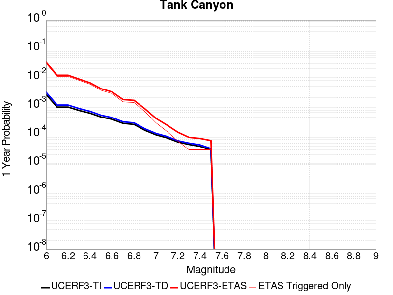 |  |

| Magnitude | 1 wk TI Prob | 1 wk TD Prob | 1 wk ETAS Prob | 1 wk ETAS/TD Gain | 1 wk ETAS Triggered Only | 1 mo TI Prob | 1 mo TD Prob | 1 mo ETAS Prob | 1 mo ETAS/TD Gain | 1 mo ETAS Triggered Only | 1 yr TI Prob | 1 yr TD Prob | 1 yr ETAS Prob | 1 yr ETAS/TD Gain | 1 yr ETAS Triggered Only | 10 yr TI Prob | 10 yr TD Prob | 10 yr ETAS Prob | 10 yr ETAS/TD Gain | 10 yr ETAS Triggered Only |
|-----|-----|-----|-----|-----|-----|-----|-----|-----|-----|-----|-----|-----|-----|-----|-----|-----|-----|-----|-----|-----|
| 6.0 | 4.8284557E-5 | 5.796635E-5 | 0.004567705 | 78.799255 | 0.00451 | 2.0691741E-4 | 2.484074E-4 | 0.011405636 | 45.91504 | 0.01116 | 0.0025163088 | 0.0030208372 | 0.033677947 | 11.148547 | 0.03075 | 0.02488006 | 0.029864404 | 0.08088384 | 2.7083693 | 0.05259 |
| 6.1 | 1.7796336E-5 | 2.0873764E-5 | 0.001400845 | 67.11032 | 0.00138 | 7.626778E-5 | 8.945614E-5 | 0.0039091143 | 43.69867 | 0.00382 | 9.281647E-4 | 0.0010886216 | 0.011956777 | 10.983411 | 0.01088 | 0.009242975 | 0.010836975 | 0.029888256 | 2.7579887 | 0.01926 |
| 6.2 | 1.7796336E-5 | 2.0873764E-5 | 0.001400845 | 67.11032 | 0.00138 | 7.626778E-5 | 8.945614E-5 | 0.0039091143 | 43.69867 | 0.00382 | 9.281647E-4 | 0.0010886216 | 0.011956777 | 10.983411 | 0.01088 | 0.009242975 | 0.010836975 | 0.029888256 | 2.7579887 | 0.01926 |
| 6.3 | 1.3515912E-5 | 1.575988E-5 | 0.0010657434 | 67.62382 | 0.00105 | 5.792405E-5 | 6.7540735E-5 | 0.0029573455 | 43.786102 | 0.00289 | 7.049971E-4 | 8.220222E-4 | 0.008775479 | 10.675476 | 0.00796 | 0.007027647 | 0.008192427 | 0.02214716 | 2.7033696 | 0.01407 |
| 6.4 | 1.0870146E-5 | 1.2618259E-5 | 8.22608E-4 | 65.19189 | 8.1E-4 | 4.658551E-5 | 5.407723E-5 | 0.0023239544 | 42.97473 | 0.00227 | 5.67031E-4 | 6.582093E-4 | 0.006524346 | 9.912266 | 0.00587 | 0.005655863 | 0.006564614 | 0.016876472 | 2.570825 | 0.01038 |
| 6.5 | 7.964826E-6 | 9.196251E-6 | 4.8919185E-4 | 53.1947 | 4.8E-4 | 3.4134522E-5 | 3.941197E-5 | 0.0013193615 | 33.476162 | 0.00128 | 4.1550855E-4 | 4.7974577E-4 | 0.0040380377 | 8.417037 | 0.00356 | 0.0041473247 | 0.0047884025 | 0.011217469 | 2.3426328 | 0.00646 |
| 6.6 | 6.6317E-6 | 7.6124184E-6 | 3.8760953E-4 | 50.918053 | 3.8E-4 | 2.8421264E-5 | 3.2624295E-5 | 0.0010125923 | 31.037985 | 9.8E-4 | 3.4597394E-4 | 3.971375E-4 | 0.0031260534 | 7.8714633 | 0.00273 | 0.0034543579 | 0.00396543 | 0.008816118 | 2.223244 | 0.00487 |
| 6.7 | 4.793663E-6 | 5.4308543E-6 | 2.354296E-4 | 43.35038 | 2.3E-4 | 2.0544108E-5 | 2.3274906E-5 | 5.632623E-4 | 24.200413 | 5.4E-4 | 2.500958E-4 | 2.8333953E-4 | 0.00169294 | 5.9749517 | 0.00141 | 0.0024981452 | 0.0028304753 | 0.005463003 | 1.9300655 | 0.00264 |
| 6.8 | 4.382823E-6 | 4.969316E-6 | 2.3496817E-4 | 47.28381 | 2.3E-4 | 1.8783392E-5 | 2.1296917E-5 | 5.212863E-4 | 24.477076 | 5.0E-4 | 2.286638E-4 | 2.5926338E-4 | 0.0015889186 | 6.128588 | 0.00133 | 0.0022842865 | 0.0025902835 | 0.0050339373 | 1.9433924 | 0.00245 |
| 6.9 | 2.729601E-6 | 3.0735694E-6 | 8.3073326E-5 | 27.02829 | 8.0E-5 | 1.1698237E-5 | 1.317238E-5 | 2.4316936E-4 | 18.460546 | 2.3E-4 | 1.4241673E-4 | 1.6036315E-4 | 8.002605E-4 | 4.9903016 | 6.4E-4 | 0.001423255 | 0.0016026403 | 0.0028406528 | 1.7724832 | 0.00124 |
| 7.0 | 1.8987357E-6 | 2.126954E-6 | 5.212685E-5 | 24.507746 | 5.0E-5 | 8.137413E-6 | 9.115489E-6 | 1.19114484E-4 | 13.067262 | 1.1E-4 | 9.90685E-5 | 1.1097613E-4 | 3.7094727E-4 | 3.3425863 | 2.6E-4 | 9.902435E-4 | 0.0011092757 | 0.0016486768 | 1.4862641 | 5.4E-4 |
| 7.1 | 1.4928986E-6 | 1.6641375E-6 | 2.1664104E-5 | 13.018218 | 2.0E-5 | 6.398121E-6 | 7.1320014E-6 | 4.7131718E-5 | 6.608484 | 4.0E-5 | 7.789434E-5 | 8.682925E-5 | 2.1681796E-4 | 2.4970613 | 1.3E-4 | 7.786704E-4 | 8.680111E-4 | 0.001177742 | 1.3568283 | 3.1E-4 |
| 7.2 | 1.069082E-6 | 1.1828638E-6 | 1.1182852E-5 | 9.454049 | 1.0E-5 | 4.581772E-6 | 5.0694093E-6 | 2.5069308E-5 | 4.945213 | 2.0E-5 | 5.5781646E-5 | 6.171884E-5 | 1.21715144E-4 | 1.9720904 | 6.0E-5 | 5.576765E-4 | 6.170693E-4 | 7.6697674E-4 | 1.2429346 | 1.5E-4 |
| 7.3 | 8.776551E-7 | 9.770052E-7 | 1.0976995E-5 | 11.23535 | 1.0E-5 | 3.7613736E-6 | 4.1871617E-6 | 1.418712E-5 | 3.3882427 | 1.0E-5 | 4.579376E-5 | 5.097802E-5 | 8.097649E-5 | 1.5884589 | 3.0E-5 | 4.5784327E-4 | 5.0971424E-4 | 6.096633E-4 | 1.1960883 | 1.0E-4 |
| 7.4 | 7.55721E-7 | 8.510284E-7 | 1.085102E-5 | 12.75048 | 1.0E-5 | 3.2388E-6 | 3.6472622E-6 | 1.3647226E-5 | 3.7417724 | 1.0E-5 | 3.9431678E-5 | 4.440503E-5 | 7.44037E-5 | 1.675569 | 3.0E-5 | 3.942468E-4 | 4.4401243E-4 | 5.3397246E-4 | 1.202607 | 9.0E-5 |
| 7.5 | 5.587665E-7 | 6.305647E-7 | 1.0630559E-5 | 16.85879 | 1.0E-5 | 2.3947114E-6 | 2.7024203E-6 | 1.2702393E-5 | 4.7003765 | 1.0E-5 | 2.915522E-5 | 3.2901968E-5 | 6.290098E-5 | 1.9117696 | 3.0E-5 | 2.9151395E-4 | 3.2901968E-4 | 4.0899336E-4 | 1.2430665 | 8.0E-5 |

## Little Lake
*[(top)](#table-of-contents)*

| 1 Week | 1 Month | 1 Year | 10 Year |
|-----|-----|-----|-----|
|  |  |  | 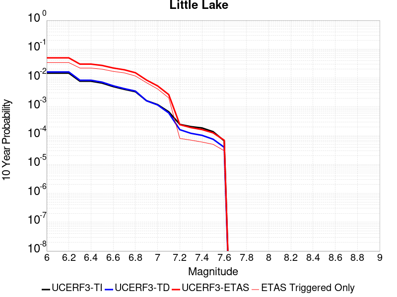 |

| Magnitude | 1 wk TI Prob | 1 wk TD Prob | 1 wk ETAS Prob | 1 wk ETAS/TD Gain | 1 wk ETAS Triggered Only | 1 mo TI Prob | 1 mo TD Prob | 1 mo ETAS Prob | 1 mo ETAS/TD Gain | 1 mo ETAS Triggered Only | 1 yr TI Prob | 1 yr TD Prob | 1 yr ETAS Prob | 1 yr ETAS/TD Gain | 1 yr ETAS Triggered Only | 10 yr TI Prob | 10 yr TD Prob | 10 yr ETAS Prob | 10 yr ETAS/TD Gain | 10 yr ETAS Triggered Only |
|-----|-----|-----|-----|-----|-----|-----|-----|-----|-----|-----|-----|-----|-----|-----|-----|-----|-----|-----|-----|-----|
| 6.0 | 2.8424427E-5 | 3.120616E-5 | 0.003371102 | 108.02681 | 0.00334 | 1.2181328E-4 | 1.3373457E-4 | 0.0086126 | 64.400696 | 0.00848 | 0.0014820677 | 0.0016271356 | 0.023132088 | 14.216447 | 0.02154 | 0.014722223 | 0.016165627 | 0.049861953 | 3.084443 | 0.03425 |
| 6.1 | 2.8424427E-5 | 3.120616E-5 | 0.003371102 | 108.02681 | 0.00334 | 1.2181328E-4 | 1.3373457E-4 | 0.0086126 | 64.400696 | 0.00848 | 0.0014820677 | 0.0016271356 | 0.023132088 | 14.216447 | 0.02154 | 0.014722223 | 0.016165627 | 0.049861953 | 3.084443 | 0.03425 |
| 6.2 | 2.8424427E-5 | 3.120616E-5 | 0.003371102 | 108.02681 | 0.00334 | 1.2181328E-4 | 1.3373457E-4 | 0.0086126 | 64.400696 | 0.00848 | 0.0014820677 | 0.0016271356 | 0.023132088 | 14.216447 | 0.02154 | 0.014722223 | 0.016165627 | 0.049861953 | 3.084443 | 0.03425 |
| 6.3 | 1.48860645E-5 | 1.6081593E-5 | 0.0022460457 | 139.66562 | 0.00223 | 6.379586E-5 | 6.891945E-5 | 0.0056785326 | 82.39376 | 0.00561 | 7.7643775E-4 | 8.387995E-4 | 0.014807073 | 17.652697 | 0.01398 | 0.007737305 | 0.008359154 | 0.030314082 | 3.6264536 | 0.02214 |
| 6.4 | 1.48860645E-5 | 1.6081593E-5 | 0.0022460457 | 139.66562 | 0.00223 | 6.379586E-5 | 6.891945E-5 | 0.0056785326 | 82.39376 | 0.00561 | 7.7643775E-4 | 8.387995E-4 | 0.014807073 | 17.652697 | 0.01398 | 0.007737305 | 0.008359154 | 0.030314082 | 3.6264536 | 0.02214 |
| 6.5 | 1.2797581E-5 | 1.3765735E-5 | 0.0020437378 | 148.46558 | 0.00203 | 5.4845623E-5 | 5.899482E-5 | 0.00522869 | 88.62965 | 0.00517 | 6.675408E-4 | 7.180509E-4 | 0.013518853 | 18.82715 | 0.01281 | 0.006655392 | 0.0071598585 | 0.02721523 | 3.8010848 | 0.0202 |
| 6.6 | 9.661896E-6 | 1.0289158E-5 | 0.0017302715 | 168.16454 | 0.00172 | 4.1407468E-5 | 4.4095737E-5 | 0.004523898 | 102.59264 | 0.00448 | 5.040193E-4 | 5.367496E-4 | 0.011350942 | 21.147556 | 0.01082 | 0.005028777 | 0.0053561367 | 0.022205403 | 4.1457872 | 0.01694 |
| 6.7 | 7.767871E-6 | 8.199779E-6 | 0.0016081866 | 196.12563 | 0.0016 | 3.329045E-5 | 3.514151E-5 | 0.004114998 | 117.09792 | 0.00408 | 4.0523586E-4 | 4.2777765E-4 | 0.01007365 | 23.5488 | 0.00965 | 0.004044977 | 0.0042708935 | 0.019256616 | 4.5088024 | 0.01505 |
| 6.8 | 6.4235196E-6 | 6.735819E-6 | 0.0012867271 | 191.02759 | 0.00128 | 2.752908E-5 | 2.886755E-5 | 0.0032487747 | 112.54072 | 0.00322 | 3.35115E-4 | 3.5141854E-4 | 0.007958745 | 22.64748 | 0.00761 | 0.003346101 | 0.0035098887 | 0.015208683 | 4.3330956 | 0.01174 |
| 6.9 | 3.1283696E-6 | 3.1122067E-6 | 7.831098E-4 | 251.62524 | 7.8E-4 | 1.3407229E-5 | 1.3337969E-5 | 0.002023311 | 151.69559 | 0.00201 | 1.6322079E-4 | 1.6237919E-4 | 0.0046416516 | 28.585262 | 0.00448 | 0.0016310095 | 0.0016227537 | 0.008481605 | 5.2266746 | 0.00687 |
| 7.0 | 2.290603E-6 | 2.2287015E-6 | 4.922276E-4 | 220.85847 | 4.9E-4 | 9.816834E-6 | 9.551549E-6 | 0.0012695395 | 132.91452 | 0.00126 | 1.19513395E-4 | 1.16284944E-4 | 0.0028259698 | 24.302113 | 0.00271 | 0.0011944914 | 0.0011623431 | 0.005317508 | 4.5748177 | 0.00416 |
| 7.1 | 1.293693E-6 | 1.1776951E-6 | 2.7117739E-4 | 230.2611 | 2.7E-4 | 5.5443866E-6 | 5.047259E-6 | 5.7504437E-4 | 113.932014 | 5.7E-4 | 6.750081E-5 | 6.144935E-5 | 0.0013213719 | 21.503433 | 0.00126 | 6.7480316E-4 | 6.14392E-4 | 0.0026631325 | 4.334582 | 0.00205 |
| 7.2 | 4.715842E-7 | 3.0918443E-7 | 3.0918443E-7 | 1.0 | 0.0 | 2.0210737E-6 | 1.3250755E-6 | 1.1325063E-5 | 8.54673 | 1.0E-5 | 2.4606294E-5 | 1.613268E-5 | 5.6132034E-5 | 3.4793992 | 4.0E-5 | 2.460357E-4 | 1.6131563E-4 | 2.4130273E-4 | 1.4958422 | 8.0E-5 |
| 7.3 | 3.9430947E-7 | 2.3098025E-7 | 2.3098025E-7 | 1.0 | 0.0 | 1.6898966E-6 | 9.89915E-7 | 1.0989905E-5 | 11.101868 | 1.0E-5 | 2.0574296E-5 | 1.2052149E-5 | 5.2051666E-5 | 4.31887 | 4.0E-5 | 2.0572392E-4 | 1.20515026E-4 | 1.9050659E-4 | 1.5807704 | 7.0E-5 |
| 7.4 | 3.547123E-7 | 1.9679635E-7 | 1.9679635E-7 | 1.0 | 0.0 | 1.5201948E-6 | 8.4341264E-7 | 8.4341264E-7 | 1.0 | 0.0 | 1.8508214E-5 | 1.0268501E-5 | 4.0268194E-5 | 3.921526 | 3.0E-5 | 1.8506673E-4 | 1.0268033E-4 | 1.6267417E-4 | 1.5842777 | 6.0E-5 |
| 7.5 | 2.6354266E-7 | 1.4423487E-7 | 1.4423487E-7 | 1.0 | 0.0 | 1.129468E-6 | 6.1814933E-7 | 6.1814933E-7 | 1.0 | 0.0 | 1.3751187E-5 | 7.5259427E-6 | 2.7525792E-5 | 3.6574545 | 2.0E-5 | 1.3750336E-4 | 7.525693E-5 | 1.2525317E-4 | 1.6643406 | 5.0E-5 |
| 7.6 | 1.269913E-7 | 7.5727044E-8 | 7.5727044E-8 | 1.0 | 0.0 | 5.4424834E-7 | 3.2454443E-7 | 3.2454443E-7 | 1.0 | 0.0 | 6.6262032E-6 | 3.9513216E-6 | 3.9513216E-6 | 1.0 | 0.0 | 6.626006E-5 | 3.951255E-5 | 6.951136E-5 | 1.7592224 | 3.0E-5 |

## Airport Lake
*[(top)](#table-of-contents)*

| 1 Week | 1 Month | 1 Year | 10 Year |
|-----|-----|-----|-----|
| 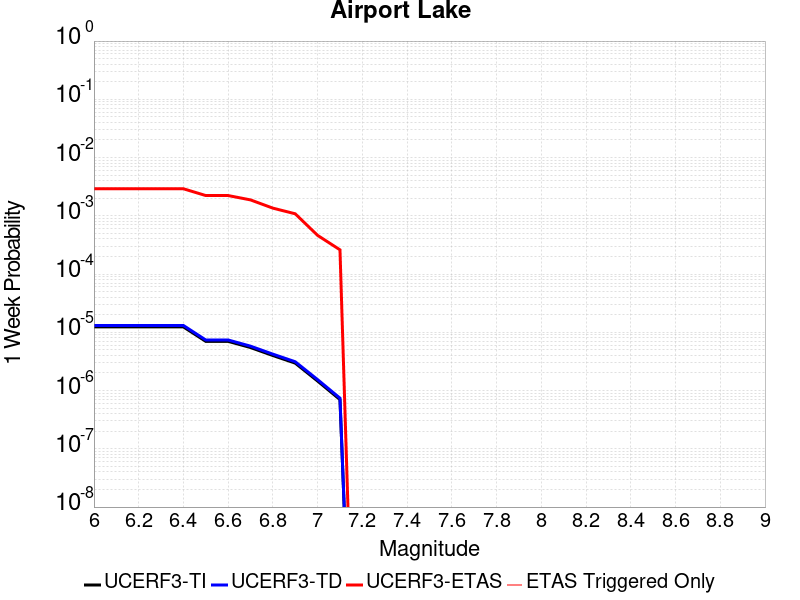 |  | 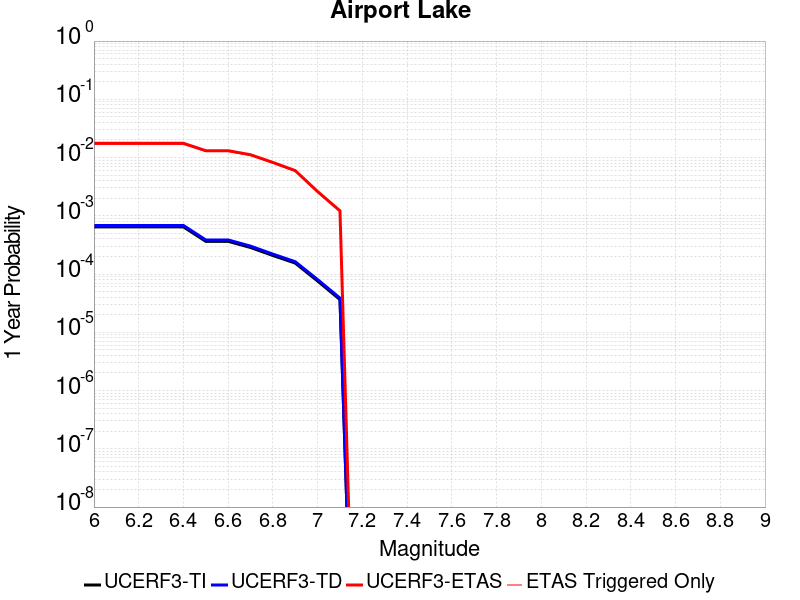 |  |

| Magnitude | 1 wk TI Prob | 1 wk TD Prob | 1 wk ETAS Prob | 1 wk ETAS/TD Gain | 1 wk ETAS Triggered Only | 1 mo TI Prob | 1 mo TD Prob | 1 mo ETAS Prob | 1 mo ETAS/TD Gain | 1 mo ETAS Triggered Only | 1 yr TI Prob | 1 yr TD Prob | 1 yr ETAS Prob | 1 yr ETAS/TD Gain | 1 yr ETAS Triggered Only | 10 yr TI Prob | 10 yr TD Prob | 10 yr ETAS Prob | 10 yr ETAS/TD Gain | 10 yr ETAS Triggered Only |
|-----|-----|-----|-----|-----|-----|-----|-----|-----|-----|-----|-----|-----|-----|-----|-----|-----|-----|-----|-----|-----|
| 6.0 | 1.2387061E-5 | 1.31032575E-5 | 0.0029130653 | 222.31612 | 0.0029 | 5.3086325E-5 | 5.6155768E-5 | 0.0071157594 | 126.71466 | 0.00706 | 6.461343E-4 | 6.835104E-4 | 0.017591946 | 25.73764 | 0.01692 | 0.0064425888 | 0.0068168915 | 0.033215698 | 4.872558 | 0.02658 |
| 6.1 | 1.2387061E-5 | 1.31032575E-5 | 0.0029130653 | 222.31612 | 0.0029 | 5.3086325E-5 | 5.6155768E-5 | 0.0071157594 | 126.71466 | 0.00706 | 6.461343E-4 | 6.835104E-4 | 0.017591946 | 25.73764 | 0.01692 | 0.0064425888 | 0.0068168915 | 0.033215698 | 4.872558 | 0.02658 |
| 6.2 | 1.2387061E-5 | 1.31032575E-5 | 0.0029130653 | 222.31612 | 0.0029 | 5.3086325E-5 | 5.6155768E-5 | 0.0071157594 | 126.71466 | 0.00706 | 6.461343E-4 | 6.835104E-4 | 0.017591946 | 25.73764 | 0.01692 | 0.0064425888 | 0.0068168915 | 0.033215698 | 4.872558 | 0.02658 |
| 6.3 | 1.2387061E-5 | 1.31032575E-5 | 0.0029130653 | 222.31612 | 0.0029 | 5.3086325E-5 | 5.6155768E-5 | 0.0071157594 | 126.71466 | 0.00706 | 6.461343E-4 | 6.835104E-4 | 0.017591946 | 25.73764 | 0.01692 | 0.0064425888 | 0.0068168915 | 0.033215698 | 4.872558 | 0.02658 |
| 6.4 | 1.2387061E-5 | 1.31032575E-5 | 0.0029130653 | 222.31612 | 0.0029 | 5.3086325E-5 | 5.6155768E-5 | 0.0071157594 | 126.71466 | 0.00706 | 6.461343E-4 | 6.835104E-4 | 0.017591946 | 25.73764 | 0.01692 | 0.0064425888 | 0.0068168915 | 0.033215698 | 4.872558 | 0.02658 |
| 6.5 | 6.9922594E-6 | 7.38498E-6 | 0.0022273685 | 301.60794 | 0.00222 | 2.996648E-5 | 3.164956E-5 | 0.005411479 | 170.98117 | 0.00538 | 3.6478083E-4 | 3.8527072E-4 | 0.013120363 | 34.054916 | 0.01274 | 0.003641826 | 0.0038465653 | 0.023689942 | 6.158726 | 0.01992 |
| 6.6 | 6.9922594E-6 | 7.38498E-6 | 0.0022273685 | 301.60794 | 0.00222 | 2.996648E-5 | 3.164956E-5 | 0.005411479 | 170.98117 | 0.00538 | 3.6478083E-4 | 3.8527072E-4 | 0.013120363 | 34.054916 | 0.01274 | 0.003641826 | 0.0038465653 | 0.023689942 | 6.158726 | 0.01992 |
| 6.7 | 5.477277E-6 | 5.7861116E-6 | 0.0018757753 | 324.18582 | 0.00187 | 2.3473833E-5 | 2.4797408E-5 | 0.0046546827 | 187.70844 | 0.00463 | 2.8575645E-4 | 3.0187052E-4 | 0.011178586 | 37.031063 | 0.01088 | 0.0028538927 | 0.0030149885 | 0.019973703 | 6.6248026 | 0.01701 |
| 6.8 | 3.9950432E-6 | 4.2191186E-6 | 0.0013542135 | 320.9707 | 0.00135 | 1.7121502E-5 | 1.8081826E-5 | 0.00343802 | 190.13676 | 0.00342 | 2.0843433E-4 | 2.2012675E-4 | 0.008248359 | 37.47095 | 0.00803 | 0.0020823893 | 0.002199358 | 0.014811559 | 6.7344913 | 0.01264 |
| 6.9 | 2.95695E-6 | 3.1230477E-6 | 0.0010831197 | 346.81497 | 0.00108 | 1.2672582E-5 | 1.3384434E-5 | 0.0026333493 | 196.74716 | 0.00262 | 1.5427776E-4 | 1.6294557E-4 | 0.005971999 | 36.65027 | 0.00581 | 0.001541707 | 0.0016284833 | 0.010623811 | 6.5237455 | 0.00901 |
| 7.0 | 1.456072E-6 | 1.5408239E-6 | 4.6154013E-4 | 299.5411 | 4.6E-4 | 6.2402937E-6 | 6.60352E-6 | 0.0012065956 | 182.72006 | 0.0012 | 7.597293E-5 | 8.03959E-5 | 0.0026101924 | 32.466736 | 0.00253 | 7.594696E-4 | 8.03767E-4 | 0.0046606646 | 5.798527 | 0.00386 |
| 7.1 | 6.995192E-7 | 7.4090326E-7 | 2.6074072E-4 | 351.92276 | 2.6E-4 | 2.997936E-6 | 3.1752998E-6 | 5.431736E-4 | 171.06215 | 5.4E-4 | 3.649926E-5 | 3.8659273E-5 | 0.0012186137 | 31.521898 | 0.00118 | 3.6493264E-4 | 3.8659273E-4 | 0.0022858582 | 5.9128327 | 0.0019 |

## Owl Lake
*[(top)](#table-of-contents)*

| 1 Week | 1 Month | 1 Year | 10 Year |
|-----|-----|-----|-----|
|  |  | 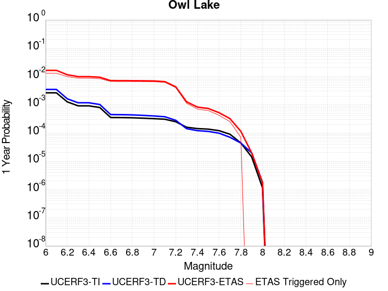 | 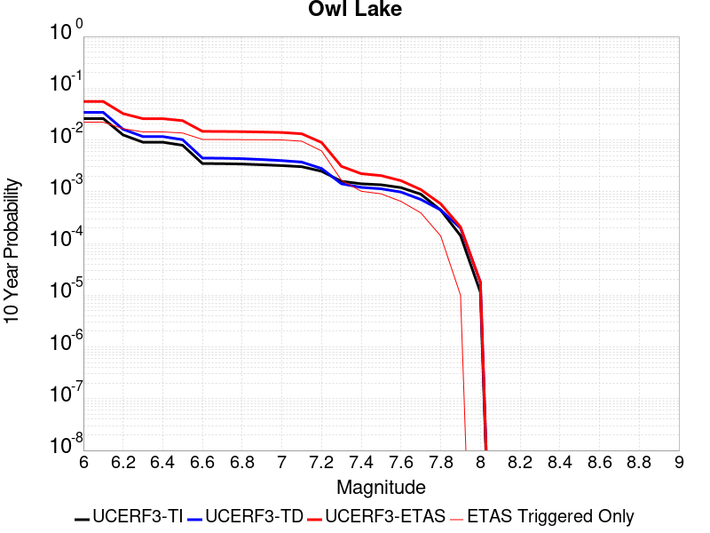 |

| Magnitude | 1 wk TI Prob | 1 wk TD Prob | 1 wk ETAS Prob | 1 wk ETAS/TD Gain | 1 wk ETAS Triggered Only | 1 mo TI Prob | 1 mo TD Prob | 1 mo ETAS Prob | 1 mo ETAS/TD Gain | 1 mo ETAS Triggered Only | 1 yr TI Prob | 1 yr TD Prob | 1 yr ETAS Prob | 1 yr ETAS/TD Gain | 1 yr ETAS Triggered Only | 10 yr TI Prob | 10 yr TD Prob | 10 yr ETAS Prob | 10 yr ETAS/TD Gain | 10 yr ETAS Triggered Only |
|-----|-----|-----|-----|-----|-----|-----|-----|-----|-----|-----|-----|-----|-----|-----|-----|-----|-----|-----|-----|-----|
| 6.0 | 5.0320643E-5 | 6.636149E-5 | 0.0020662288 | 31.13596 | 0.002 | 2.1564208E-4 | 2.8438168E-4 | 0.0051529966 | 18.120003 | 0.00487 | 0.0026222812 | 0.00345791 | 0.016373096 | 4.7349687 | 0.01296 | 0.02591553 | 0.0341423 | 0.055478096 | 1.624908 | 0.02209 |
| 6.1 | 5.0320643E-5 | 6.636149E-5 | 0.0020662288 | 31.13596 | 0.002 | 2.1564208E-4 | 2.8438168E-4 | 0.0051529966 | 18.120003 | 0.00487 | 0.0026222812 | 0.00345791 | 0.016373096 | 4.7349687 | 0.01296 | 0.02591553 | 0.0341423 | 0.055478096 | 1.624908 | 0.02209 |
| 6.2 | 2.4125871E-5 | 3.098269E-5 | 0.0016609322 | 53.60839 | 0.00163 | 1.0339249E-4 | 1.3277736E-4 | 0.0040022633 | 30.142662 | 0.00387 | 0.0012580766 | 0.0016155228 | 0.011469577 | 7.0996075 | 0.00987 | 0.012509781 | 0.016071297 | 0.0323258 | 2.0113995 | 0.01652 |
| 6.3 | 1.7433485E-5 | 2.2356835E-5 | 0.0015423228 | 68.98663 | 0.00152 | 7.471279E-5 | 9.5812386E-5 | 0.003595477 | 37.526226 | 0.0035 | 9.0924866E-4 | 0.0011660426 | 0.00984591 | 8.443868 | 0.00869 | 0.009055373 | 0.01162957 | 0.025783034 | 2.2170238 | 0.01432 |
| 6.4 | 1.7433485E-5 | 2.2356835E-5 | 0.0015423228 | 68.98663 | 0.00152 | 7.471279E-5 | 9.5812386E-5 | 0.003595477 | 37.526226 | 0.0035 | 9.0924866E-4 | 0.0011660426 | 0.00984591 | 8.443868 | 0.00869 | 0.009055373 | 0.01162957 | 0.025783034 | 2.2170238 | 0.01432 |
| 6.5 | 1.5182742E-5 | 1.9430352E-5 | 0.0015094014 | 77.682655 | 0.00149 | 6.506727E-5 | 8.327114E-5 | 0.003472989 | 41.706997 | 0.00339 | 7.919061E-4 | 0.0010135059 | 0.009355043 | 9.230379 | 0.00835 | 0.0078909 | 0.010119047 | 0.023611125 | 2.333335 | 0.01363 |
| 6.6 | 6.7271576E-6 | 8.548157E-6 | 0.0013085371 | 153.07826 | 0.0013 | 2.8830356E-5 | 3.6634476E-5 | 0.0029065292 | 79.33864 | 0.00287 | 3.5095305E-4 | 4.4593913E-4 | 0.0070829783 | 15.883285 | 0.00664 | 0.0035039932 | 0.004468226 | 0.014662472 | 3.2814972 | 0.01024 |
| 6.7 | 6.682835E-6 | 8.4806015E-6 | 0.0013084696 | 154.2897 | 0.0013 | 2.8640408E-5 | 3.634496E-5 | 0.0029062408 | 79.962685 | 0.00287 | 3.4864116E-4 | 4.424157E-4 | 0.0070694825 | 15.979275 | 0.00663 | 0.003480947 | 0.004433152 | 0.014587933 | 3.2906463 | 0.0102 |
| 6.8 | 6.5774975E-6 | 8.327072E-6 | 0.0012983163 | 155.91512 | 0.00129 | 2.8188972E-5 | 3.5686993E-5 | 0.0028855852 | 80.85818 | 0.00285 | 3.4314668E-4 | 4.3440814E-4 | 0.007031541 | 16.186485 | 0.0066 | 0.0034261728 | 0.0043532955 | 0.01445911 | 3.3214169 | 0.01015 |
| 6.9 | 6.363419E-6 | 8.0002355E-6 | 0.0012979899 | 162.24396 | 0.00129 | 2.727151E-5 | 3.4286306E-5 | 0.0028641892 | 83.537415 | 0.00283 | 3.3198006E-4 | 4.173614E-4 | 0.0069846194 | 16.735184 | 0.00657 | 0.0033148455 | 0.004183282 | 0.014231073 | 3.4018915 | 0.01009 |
| 7.0 | 6.1342453E-6 | 7.632424E-6 | 0.0012876226 | 168.70428 | 0.00128 | 2.6289357E-5 | 3.271001E-5 | 0.0028426182 | 86.90362 | 0.00281 | 3.2002592E-4 | 3.981771E-4 | 0.006905585 | 17.342999 | 0.00651 | 0.0031956544 | 0.00399197 | 0.01396201 | 3.4975238 | 0.01001 |
| 7.1 | 5.842926E-6 | 7.142961E-6 | 0.0012271343 | 171.7963 | 0.00122 | 2.504087E-5 | 3.0612362E-5 | 0.0026705316 | 87.23704 | 0.00264 | 3.0482994E-4 | 3.7264716E-4 | 0.0065203556 | 17.497396 | 0.00615 | 0.0030441214 | 0.0037374226 | 0.013162067 | 3.521696 | 0.00946 |
| 7.2 | 4.77173E-6 | 5.3591634E-6 | 8.553546E-4 | 159.606 | 8.5E-4 | 2.045011E-5 | 2.2967664E-5 | 0.0018329261 | 79.80464 | 0.00181 | 2.4895166E-4 | 2.7959948E-4 | 0.004278481 | 15.302178 | 0.004 | 0.0024867293 | 0.0028089995 | 0.008941724 | 3.1832416 | 0.00615 |
| 7.3 | 3.0494948E-6 | 2.7109647E-6 | 2.5271028E-4 | 93.21784 | 2.5E-4 | 1.3069198E-5 | 1.1618369E-5 | 5.0161267E-4 | 43.174103 | 4.9E-4 | 1.5910587E-4 | 1.4144463E-4 | 0.0012612862 | 8.917173 | 0.00112 | 0.0015899199 | 0.0014235033 | 0.003091126 | 2.171492 | 0.00167 |
| 7.4 | 2.7263884E-6 | 2.3061473E-6 | 1.7230575E-4 | 74.71585 | 1.7E-4 | 1.1684469E-5 | 9.883452E-6 | 2.7988077E-4 | 28.318121 | 2.7E-4 | 1.4224913E-4 | 1.2032448E-4 | 8.2024024E-4 | 6.816902 | 7.0E-4 | 0.0014215811 | 0.0012114698 | 0.002230234 | 1.8409325 | 0.00102 |
| 7.5 | 2.6090431E-6 | 2.1660758E-6 | 1.5216575E-4 | 70.249504 | 1.5E-4 | 1.1181565E-5 | 9.283149E-6 | 2.492809E-4 | 26.853056 | 2.4E-4 | 1.3612706E-4 | 1.1301658E-4 | 7.329465E-4 | 6.485301 | 6.2E-4 | 0.001360437 | 0.001138222 | 0.0020471863 | 1.7985824 | 9.1E-4 |
| 7.6 | 2.3008756E-6 | 1.8732376E-6 | 9.1873066E-5 | 49.04507 | 9.0E-5 | 9.860858E-6 | 8.028137E-6 | 1.7802678E-4 | 22.175354 | 1.7E-4 | 1.20049335E-4 | 9.7738266E-5 | 5.176972E-4 | 5.296771 | 4.2E-4 | 0.001199845 | 9.852252E-4 | 0.0016345847 | 1.6590977 | 6.5E-4 |
| 7.7 | 1.7184348E-6 | 1.3423282E-6 | 6.1342245E-5 | 45.6984 | 6.0E-5 | 7.3646997E-6 | 5.7528227E-6 | 1.1575219E-4 | 20.120937 | 1.1E-4 | 8.966153E-5 | 7.0038404E-5 | 3.200209E-4 | 4.56922 | 2.5E-4 | 8.962536E-4 | 7.080495E-4 | 0.0010977734 | 1.550419 | 3.9E-4 |
| 7.8 | 8.4612907E-7 | 8.4087924E-7 | 1.0840871E-5 | 12.892303 | 1.0E-5 | 3.6262625E-6 | 3.6037634E-6 | 4.360362E-5 | 12.099468 | 4.0E-5 | 4.4148852E-5 | 4.3874956E-5 | 1.1387189E-4 | 2.5953732 | 7.0E-5 | 4.414008E-4 | 4.4413717E-4 | 5.84075E-4 | 1.3150779 | 1.4E-4 |
| 7.9 | 2.716738E-7 | 3.7694025E-7 | 3.7694025E-7 | 1.0 | 0.0 | 1.1643157E-6 | 1.6154573E-6 | 1.6154573E-6 | 1.0 | 0.0 | 1.4175452E-5 | 1.9668027E-5 | 1.9668027E-5 | 1.0 | 0.0 | 1.4174548E-4 | 1.9843443E-4 | 2.0843245E-4 | 1.0503845 | 1.0E-5 |
| 8.0 | 2.1995428E-8 | 3.386013E-8 | 3.386013E-8 | 1.0 | 0.0 | 9.426611E-8 | 1.4511484E-7 | 1.4511484E-7 | 1.0 | 0.0 | 1.1476893E-6 | 1.7667724E-6 | 1.7667724E-6 | 1.0 | 0.0 | 1.14768345E-5 | 1.7968985E-5 | 1.7968985E-5 | 1.0 | 0.0 |

## Panamint Valley
*[(top)](#table-of-contents)*

| 1 Week | 1 Month | 1 Year | 10 Year |
|-----|-----|-----|-----|
| 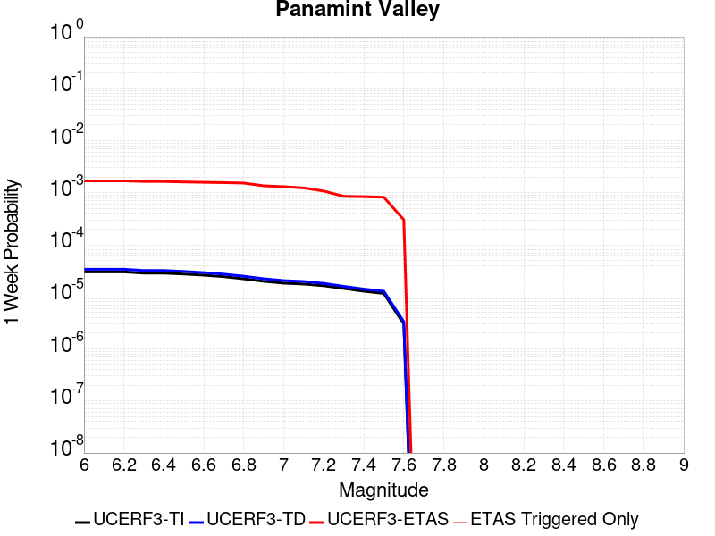 | 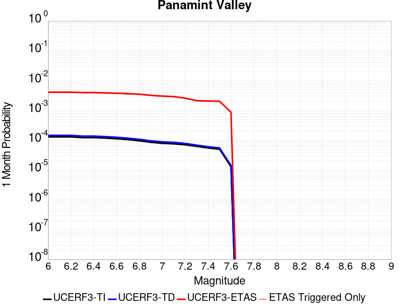 | 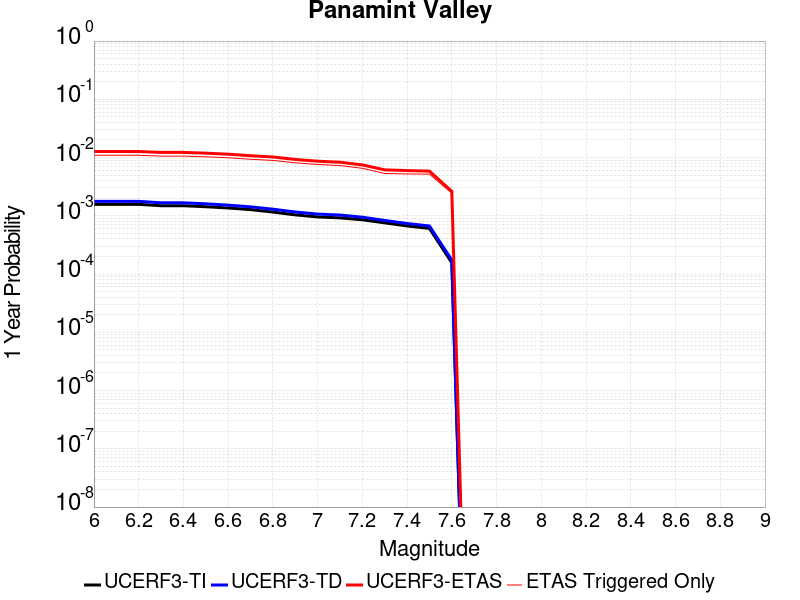 | 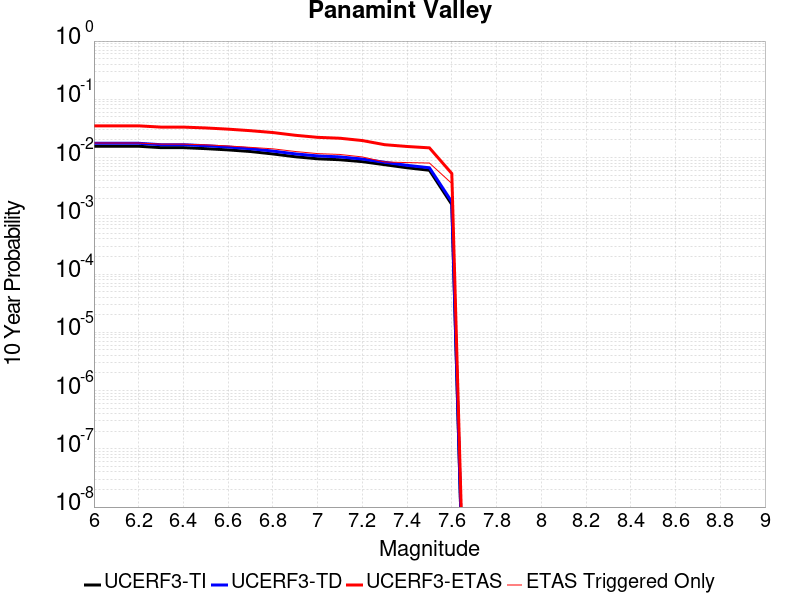 |

| Magnitude | 1 wk TI Prob | 1 wk TD Prob | 1 wk ETAS Prob | 1 wk ETAS/TD Gain | 1 wk ETAS Triggered Only | 1 mo TI Prob | 1 mo TD Prob | 1 mo ETAS Prob | 1 mo ETAS/TD Gain | 1 mo ETAS Triggered Only | 1 yr TI Prob | 1 yr TD Prob | 1 yr ETAS Prob | 1 yr ETAS/TD Gain | 1 yr ETAS Triggered Only | 10 yr TI Prob | 10 yr TD Prob | 10 yr ETAS Prob | 10 yr ETAS/TD Gain | 10 yr ETAS Triggered Only |
|-----|-----|-----|-----|-----|-----|-----|-----|-----|-----|-----|-----|-----|-----|-----|-----|-----|-----|-----|-----|-----|
| 6.0 | 3.0211835E-5 | 3.3985398E-5 | 0.001693929 | 49.842846 | 0.00166 | 1.2947287E-4 | 1.4564373E-4 | 0.0040950687 | 28.117023 | 0.00395 | 0.0015751923 | 0.0017717998 | 0.012143391 | 6.8537035 | 0.01039 | 0.015640736 | 0.01758359 | 0.035031307 | 1.9922726 | 0.01776 |
| 6.1 | 3.0211835E-5 | 3.3985398E-5 | 0.001693929 | 49.842846 | 0.00166 | 1.2947287E-4 | 1.4564373E-4 | 0.0040950687 | 28.117023 | 0.00395 | 0.0015751923 | 0.0017717998 | 0.012143391 | 6.8537035 | 0.01039 | 0.015640736 | 0.01758359 | 0.035031307 | 1.9922726 | 0.01776 |
| 6.2 | 3.0211835E-5 | 3.3985398E-5 | 0.001693929 | 49.842846 | 0.00166 | 1.2947287E-4 | 1.4564373E-4 | 0.0040950687 | 28.117023 | 0.00395 | 0.0015751923 | 0.0017717998 | 0.012143391 | 6.8537035 | 0.01039 | 0.015640736 | 0.01758359 | 0.035031307 | 1.9922726 | 0.01776 |
| 6.3 | 2.8573924E-5 | 3.2103522E-5 | 0.0016520515 | 51.460136 | 0.00162 | 1.2245393E-4 | 1.3757942E-4 | 0.0039870497 | 28.979986 | 0.00385 | 0.001489857 | 0.0016737703 | 0.011647049 | 6.958571 | 0.00999 | 0.01479908 | 0.016618231 | 0.033335723 | 2.0059729 | 0.017 |
| 6.4 | 2.8573924E-5 | 3.2103522E-5 | 0.0016520515 | 51.460136 | 0.00162 | 1.2245393E-4 | 1.3757942E-4 | 0.0039870497 | 28.979986 | 0.00385 | 0.001489857 | 0.0016737703 | 0.011647049 | 6.958571 | 0.00999 | 0.01479908 | 0.016618231 | 0.033335723 | 2.0059729 | 0.017 |
| 6.5 | 2.7468774E-5 | 3.0829244E-5 | 0.0016107805 | 52.24846 | 0.00158 | 1.1771801E-4 | 1.3211879E-4 | 0.0038716246 | 29.304117 | 0.00374 | 0.0014322745 | 0.0016073869 | 0.011341715 | 7.055996 | 0.00975 | 0.014230782 | 0.015964093 | 0.032240048 | 2.0195353 | 0.01654 |
| 6.6 | 2.6135967E-5 | 2.9253257E-5 | 0.0015892077 | 54.325836 | 0.00156 | 1.1200648E-4 | 1.2536523E-4 | 0.0037849064 | 30.191038 | 0.00366 | 0.0013628257 | 0.0015252795 | 0.010871002 | 7.12722 | 0.00936 | 0.013544982 | 0.015154443 | 0.0307347 | 2.0280983 | 0.01582 |
| 6.7 | 2.4498746E-5 | 2.7342086E-5 | 0.0015673 | 57.321884 | 0.00154 | 1.04990395E-4 | 1.1717525E-4 | 0.0036367627 | 31.036953 | 0.00352 | 0.0012775084 | 0.0014257001 | 0.010313012 | 7.233647 | 0.0089 | 0.012701893 | 0.014171662 | 0.028929511 | 2.0413635 | 0.01497 |
| 6.8 | 2.2244329E-5 | 2.4936131E-5 | 0.0015348985 | 61.553192 | 0.00151 | 9.532935E-5 | 1.0686488E-4 | 0.0035065014 | 32.812477 | 0.0034 | 0.0011600169 | 0.0013003252 | 0.009879155 | 7.59745 | 0.00859 | 0.011539802 | 0.012932883 | 0.026880141 | 2.0784338 | 0.01413 |
| 6.9 | 1.9902658E-5 | 2.2290924E-5 | 0.001362261 | 61.112812 | 0.00134 | 8.529431E-5 | 9.552913E-5 | 0.003205232 | 33.552402 | 0.00311 | 0.0010379635 | 0.0011624652 | 0.008973375 | 7.7192636 | 0.00782 | 0.010331288 | 0.011568946 | 0.024131905 | 2.0859208 | 0.01271 |
| 7.0 | 1.8353881E-5 | 2.056681E-5 | 0.0013105402 | 63.72113 | 0.00129 | 7.865712E-5 | 8.814059E-5 | 0.0030278815 | 34.352863 | 0.00294 | 9.5722964E-4 | 0.0010726011 | 0.008274867 | 7.7147675 | 0.00721 | 0.009531168 | 0.0106791705 | 0.02224433 | 2.0829644 | 0.01169 |
| 7.1 | 1.7667631E-5 | 1.9773222E-5 | 0.0012397491 | 62.698383 | 0.00122 | 7.571623E-5 | 8.473973E-5 | 0.0029145 | 34.393547 | 0.00283 | 9.2145515E-4 | 0.0010312354 | 0.008014027 | 7.7712874 | 0.00699 | 0.009176437 | 0.010269388 | 0.021463241 | 2.0900216 | 0.01131 |
| 7.2 | 1.6381597E-5 | 1.8158824E-5 | 0.0010781395 | 59.372765 | 0.00106 | 7.020495E-5 | 7.782131E-5 | 0.0025776268 | 33.12238 | 0.0025 | 8.544101E-4 | 9.4707985E-4 | 0.007221132 | 7.6246285 | 0.00628 | 0.008511325 | 0.009435088 | 0.01958838 | 2.0761204 | 0.01025 |
| 7.3 | 1.4520491E-5 | 1.5966963E-5 | 8.5595355E-4 | 53.607784 | 8.4E-4 | 6.222919E-5 | 6.842814E-5 | 0.0021282872 | 31.102514 | 0.00206 | 7.57377E-4 | 8.3281036E-4 | 0.0059385546 | 7.1307406 | 0.00511 | 0.0075480095 | 0.008300003 | 0.016630283 | 2.0036478 | 0.0084 |
| 7.4 | 1.2852287E-5 | 1.4145856E-5 | 8.4413413E-4 | 59.673595 | 8.3E-4 | 5.5080065E-5 | 6.0623777E-5 | 0.002070502 | 34.153297 | 0.00201 | 6.7039346E-4 | 7.3786033E-4 | 0.005744164 | 7.7848926 | 0.00501 | 0.0066837464 | 0.007357025 | 0.015496697 | 2.106381 | 0.0082 |
| 7.5 | 1.1637851E-5 | 1.2837149E-5 | 8.2282675E-4 | 64.09731 | 8.1E-4 | 4.987555E-5 | 5.5015284E-5 | 0.002024907 | 36.806263 | 0.00197 | 6.070656E-4 | 6.6962093E-4 | 0.005606313 | 8.372369 | 0.00494 | 0.006054099 | 0.0066789286 | 0.014675164 | 2.1972332 | 0.00805 |
| 7.6 | 3.0068115E-6 | 3.3331687E-6 | 3.0333217E-4 | 91.00414 | 3.0E-4 | 1.2886271E-5 | 1.4284972E-5 | 8.7427266E-4 | 61.202267 | 8.6E-4 | 1.5687906E-4 | 1.7391294E-4 | 0.0022935441 | 13.187888 | 0.00212 | 0.0015676835 | 0.001739208 | 0.0053229644 | 3.060568 | 0.00359 |

## Garlock (East)
*[(top)](#table-of-contents)*

| 1 Week | 1 Month | 1 Year | 10 Year |
|-----|-----|-----|-----|
| 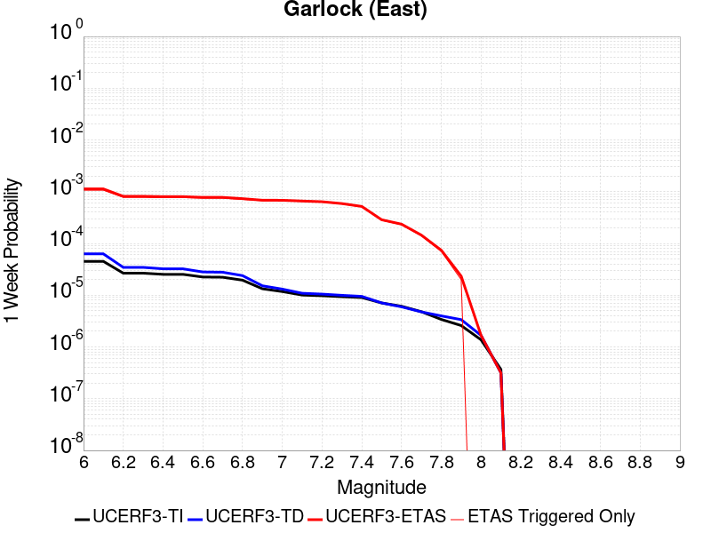 | 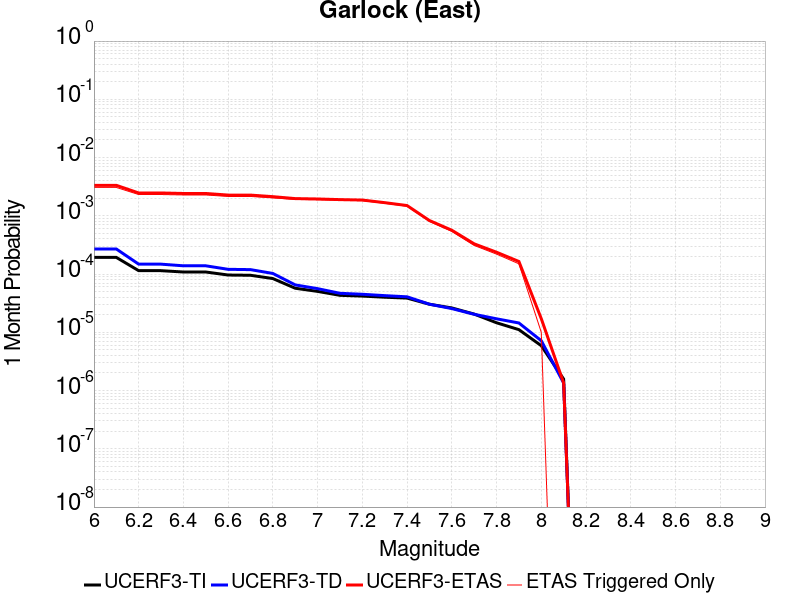 | 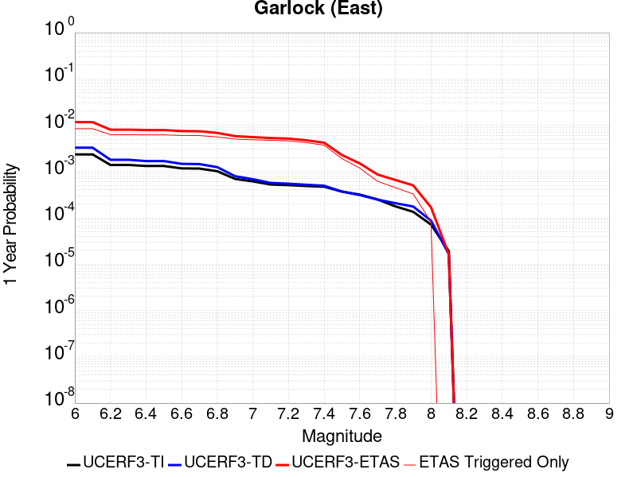 | 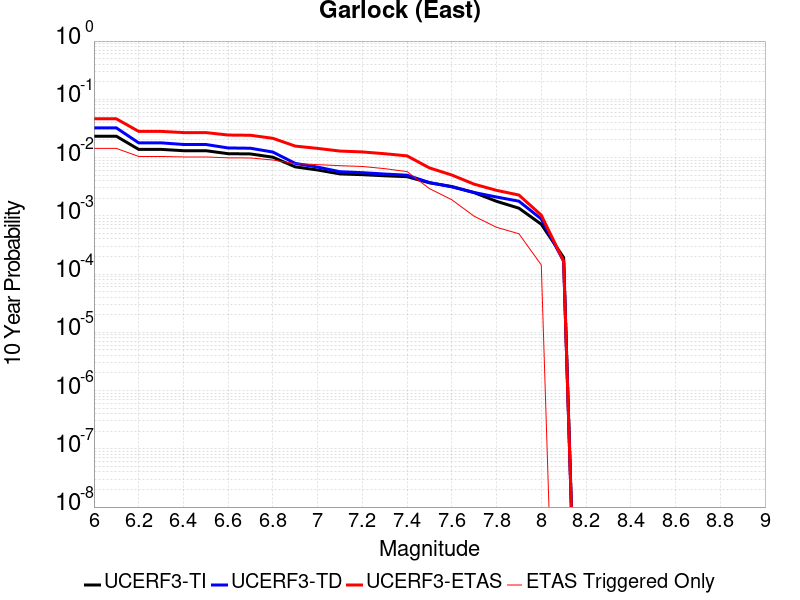 |

| Magnitude | 1 wk TI Prob | 1 wk TD Prob | 1 wk ETAS Prob | 1 wk ETAS/TD Gain | 1 wk ETAS Triggered Only | 1 mo TI Prob | 1 mo TD Prob | 1 mo ETAS Prob | 1 mo ETAS/TD Gain | 1 mo ETAS Triggered Only | 1 yr TI Prob | 1 yr TD Prob | 1 yr ETAS Prob | 1 yr ETAS/TD Gain | 1 yr ETAS Triggered Only | 10 yr TI Prob | 10 yr TD Prob | 10 yr ETAS Prob | 10 yr ETAS/TD Gain | 10 yr ETAS Triggered Only |
|-----|-----|-----|-----|-----|-----|-----|-----|-----|-----|-----|-----|-----|-----|-----|-----|-----|-----|-----|-----|-----|
| 6.0 | 4.5092507E-5 | 6.2906794E-5 | 0.0011328395 | 18.008223 | 0.00107 | 1.9323928E-4 | 2.695752E-4 | 0.0033387477 | 12.385218 | 0.00307 | 0.0023501497 | 0.0032775842 | 0.011759692 | 3.5879145 | 0.00851 | 0.023254504 | 0.03235364 | 0.046326455 | 1.4318776 | 0.01444 |
| 6.1 | 4.5092507E-5 | 6.2906794E-5 | 0.0011328395 | 18.008223 | 0.00107 | 1.9323928E-4 | 2.695752E-4 | 0.0033387477 | 12.385218 | 0.00307 | 0.0023501497 | 0.0032775842 | 0.011759692 | 3.5879145 | 0.00851 | 0.023254504 | 0.03235364 | 0.046326455 | 1.4318776 | 0.01444 |
| 6.2 | 2.6674514E-5 | 3.4512483E-5 | 8.1448554E-4 | 23.59974 | 7.8E-4 | 1.1431433E-4 | 1.4790244E-4 | 0.0024675594 | 16.683695 | 0.00232 | 0.0013908884 | 0.001799258 | 0.007898265 | 4.3897343 | 0.00611 | 0.01382215 | 0.017891733 | 0.028046733 | 1.5675806 | 0.01034 |
| 6.3 | 2.6674514E-5 | 3.4512483E-5 | 8.1448554E-4 | 23.59974 | 7.8E-4 | 1.1431433E-4 | 1.4790244E-4 | 0.0024675594 | 16.683695 | 0.00232 | 0.0013908884 | 0.001799258 | 0.007898265 | 4.3897343 | 0.00611 | 0.01382215 | 0.017891733 | 0.028046733 | 1.5675806 | 0.01034 |
| 6.4 | 2.5312667E-5 | 3.2341675E-5 | 8.0231676E-4 | 24.80752 | 7.7E-4 | 1.0847834E-4 | 1.3859998E-4 | 0.002418284 | 17.447939 | 0.00228 | 0.0013199237 | 0.001686178 | 0.007666078 | 4.5464225 | 0.00599 | 0.013121112 | 0.01677974 | 0.026710264 | 1.5918164 | 0.0101 |
| 6.5 | 2.5312667E-5 | 3.2341675E-5 | 8.0231676E-4 | 24.80752 | 7.7E-4 | 1.0847834E-4 | 1.3859998E-4 | 0.002418284 | 17.447939 | 0.00228 | 0.0013199237 | 0.001686178 | 0.007666078 | 4.5464225 | 0.00599 | 0.013121112 | 0.01677974 | 0.026710264 | 1.5918164 | 0.0101 |
| 6.6 | 2.246556E-5 | 2.813642E-5 | 7.781153E-4 | 27.655094 | 7.5E-4 | 9.627742E-5 | 1.20579214E-4 | 0.00227032 | 18.828453 | 0.00215 | 0.0011715472 | 0.0014670868 | 0.0071986658 | 4.9067755 | 0.00574 | 0.011653901 | 0.014620015 | 0.024178201 | 1.653774 | 0.0097 |
| 6.7 | 2.2241198E-5 | 2.7806154E-5 | 7.777853E-4 | 27.971697 | 7.5E-4 | 9.531594E-5 | 1.1916392E-4 | 0.0022689076 | 19.040224 | 0.00215 | 0.0011598538 | 0.0014498787 | 0.007161585 | 4.939438 | 0.00572 | 0.011538187 | 0.0144502055 | 0.023980472 | 1.6595247 | 0.00967 |
| 6.8 | 1.9528685E-5 | 2.3900653E-5 | 7.338837E-4 | 30.705591 | 7.1E-4 | 8.369167E-5 | 1.0242746E-4 | 0.0021322195 | 20.816875 | 0.00203 | 0.0010184698 | 0.0012463606 | 0.00663963 | 5.3272147 | 0.0054 | 0.010138147 | 0.012437694 | 0.021315878 | 1.7138128 | 0.00899 |
| 6.9 | 1.3318621E-5 | 1.5201007E-5 | 6.8519084E-4 | 45.07536 | 6.7E-4 | 5.7078556E-5 | 6.514558E-5 | 0.001975021 | 30.317041 | 0.00191 | 6.9470983E-4 | 7.928645E-4 | 0.0057089636 | 7.200428 | 0.00492 | 0.0069254204 | 0.007940986 | 0.015798094 | 1.9894372 | 0.00792 |
| 7.0 | 1.1760853E-5 | 1.3109839E-5 | 6.8310107E-4 | 52.105988 | 6.7E-4 | 5.0402683E-5 | 5.618384E-5 | 0.0019460777 | 34.637676 | 0.00189 | 6.134799E-4 | 6.838286E-4 | 0.005510526 | 8.058344 | 0.00483 | 0.0061178906 | 0.006857582 | 0.014504778 | 2.1151447 | 0.0077 |
| 7.1 | 1.0064758E-5 | 1.090491E-5 | 6.608978E-4 | 60.60553 | 6.5E-4 | 4.3133965E-5 | 4.673451E-5 | 0.0018966481 | 40.583458 | 0.00185 | 5.2502943E-4 | 5.688476E-4 | 0.0052162022 | 9.169771 | 0.00465 | 0.005237907 | 0.005714025 | 0.012992199 | 2.2737384 | 0.00732 |
| 7.2 | 9.768808E-6 | 1.0500772E-5 | 6.4049417E-4 | 60.994957 | 6.3E-4 | 4.186565E-5 | 4.500255E-5 | 0.0018649206 | 41.44033 | 0.00182 | 5.095951E-4 | 5.477718E-4 | 0.0050952793 | 9.301828 | 0.00455 | 0.0050842804 | 0.005504284 | 0.012585093 | 2.286418 | 0.00712 |
| 7.3 | 9.344516E-6 | 9.946395E-6 | 5.8994064E-4 | 59.312004 | 5.8E-4 | 4.004731E-5 | 4.2626732E-5 | 0.0016825568 | 39.47187 | 0.00164 | 4.8746695E-4 | 5.1886035E-4 | 0.0047066864 | 9.0712 | 0.00419 | 0.0048639905 | 0.005215945 | 0.011751676 | 2.253029 | 0.00657 |
| 7.4 | 9.023491E-6 | 9.49255E-6 | 5.194877E-4 | 54.725834 | 5.1E-4 | 3.867153E-5 | 4.068174E-5 | 0.0015006224 | 36.886875 | 0.00146 | 4.7072413E-4 | 4.95191E-4 | 0.004273319 | 8.629639 | 0.00378 | 0.004697283 | 0.004979378 | 0.010909701 | 2.1909766 | 0.00596 |
| 7.5 | 7.081253E-6 | 7.0893525E-6 | 2.8708737E-4 | 40.49557 | 2.8E-4 | 3.0347876E-5 | 3.038259E-5 | 8.303583E-4 | 27.33007 | 8.0E-4 | 3.6942272E-4 | 3.6984598E-4 | 0.0024290842 | 6.5678263 | 0.00206 | 0.003688092 | 0.0037251879 | 0.0069132675 | 1.8558171 | 0.0032 |
| 7.6 | 6.116396E-6 | 5.9608415E-6 | 2.3595947E-4 | 39.584927 | 2.3E-4 | 2.6212863E-5 | 2.5546216E-5 | 5.655324E-4 | 22.13762 | 5.4E-4 | 3.1909486E-4 | 3.1098103E-4 | 0.0016405674 | 5.275458 | 0.00133 | 0.0031863707 | 0.003136586 | 0.0052299993 | 1.6674178 | 0.0021 |
| 7.7 | 4.797145E-6 | 4.7587923E-6 | 1.4475813E-4 | 30.41909 | 1.4E-4 | 2.055903E-5 | 2.0394666E-5 | 3.3038834E-4 | 16.199743 | 3.1E-4 | 2.5027743E-4 | 2.482769E-4 | 9.780957E-4 | 3.9395359 | 7.3E-4 | 0.0024999576 | 0.002510134 | 0.0036472725 | 1.453019 | 0.00114 |
| 7.8 | 3.4028885E-6 | 3.979809E-6 | 7.397953E-5 | 18.588713 | 7.0E-5 | 1.4583726E-5 | 1.7056214E-5 | 2.3705246E-4 | 13.898304 | 2.2E-4 | 1.775424E-4 | 2.076397E-4 | 7.475276E-4 | 3.6001186 | 5.4E-4 | 0.0017740062 | 0.0021019245 | 0.0028503481 | 1.3560659 | 7.5E-4 |
| 7.9 | 2.5928412E-6 | 3.373588E-6 | 2.337352E-5 | 6.928386 | 2.0E-5 | 1.1112129E-5 | 1.44581545E-5 | 1.6445598E-4 | 11.374619 | 1.5E-4 | 1.3528178E-4 | 1.7601387E-4 | 5.659452E-4 | 3.2153444 | 3.9E-4 | 0.0013519945 | 0.0017818334 | 0.0023308534 | 1.3081208 | 5.5E-4 |
| 8.0 | 1.3743648E-6 | 1.673991E-6 | 1.673991E-6 | 1.0 | 0.0 | 5.8901214E-6 | 7.174228E-6 | 1.7174156E-5 | 2.3938682 | 1.0E-5 | 7.1709874E-5 | 8.7342756E-5 | 2.173314E-4 | 2.488259 | 1.3E-4 | 7.1686733E-4 | 8.839922E-4 | 0.0010838154 | 1.2260463 | 2.0E-4 |
| 8.1 | 3.6733252E-7 | 3.1499187E-7 | 3.1499187E-7 | 1.0 | 0.0 | 1.5742813E-6 | 1.3499646E-6 | 1.3499646E-6 | 1.0 | 0.0 | 1.9166706E-5 | 1.643571E-5 | 2.6435546E-5 | 1.6084212 | 1.0E-5 | 1.9165053E-4 | 1.6643589E-4 | 1.7643423E-4 | 1.0600731 | 1.0E-5 |

## Ash Hill
*[(top)](#table-of-contents)*

| 1 Week | 1 Month | 1 Year | 10 Year |
|-----|-----|-----|-----|
| 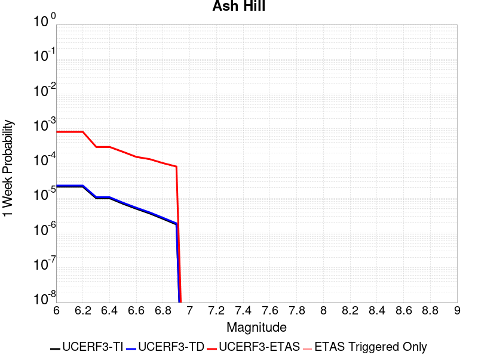 | 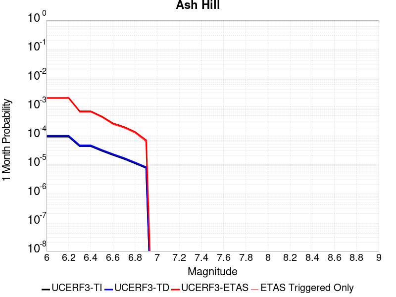 |  | 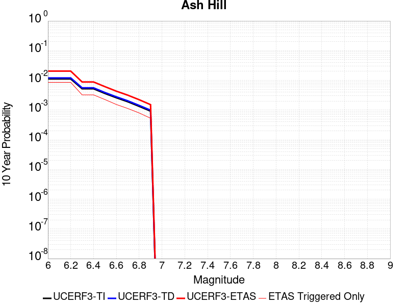 |

| Magnitude | 1 wk TI Prob | 1 wk TD Prob | 1 wk ETAS Prob | 1 wk ETAS/TD Gain | 1 wk ETAS Triggered Only | 1 mo TI Prob | 1 mo TD Prob | 1 mo ETAS Prob | 1 mo ETAS/TD Gain | 1 mo ETAS Triggered Only | 1 yr TI Prob | 1 yr TD Prob | 1 yr ETAS Prob | 1 yr ETAS/TD Gain | 1 yr ETAS Triggered Only | 10 yr TI Prob | 10 yr TD Prob | 10 yr ETAS Prob | 10 yr ETAS/TD Gain | 10 yr ETAS Triggered Only |
|-----|-----|-----|-----|-----|-----|-----|-----|-----|-----|-----|-----|-----|-----|-----|-----|-----|-----|-----|-----|-----|
| 6.0 | 2.1545662E-5 | 2.3194681E-5 | 8.1317633E-4 | 35.058743 | 7.9E-4 | 9.2335285E-5 | 9.9402445E-5 | 0.0018992235 | 19.106407 | 0.0018 | 0.0011236023 | 0.0012096328 | 0.0061136936 | 5.054173 | 0.00491 | 0.011179381 | 0.01203847 | 0.02048554 | 1.7016732 | 0.00855 |
| 6.1 | 2.1545662E-5 | 2.3194681E-5 | 8.1317633E-4 | 35.058743 | 7.9E-4 | 9.2335285E-5 | 9.9402445E-5 | 0.0018992235 | 19.106407 | 0.0018 | 0.0011236023 | 0.0012096328 | 0.0061136936 | 5.054173 | 0.00491 | 0.011179381 | 0.01203847 | 0.02048554 | 1.7016732 | 0.00855 |
| 6.2 | 2.1545662E-5 | 2.3194681E-5 | 8.1317633E-4 | 35.058743 | 7.9E-4 | 9.2335285E-5 | 9.9402445E-5 | 0.0018992235 | 19.106407 | 0.0018 | 0.0011236023 | 0.0012096328 | 0.0061136936 | 5.054173 | 0.00491 | 0.011179381 | 0.01203847 | 0.02048554 | 1.7016732 | 0.00855 |
| 6.3 | 1.0025529E-5 | 1.0747037E-5 | 3.007439E-4 | 27.983892 | 2.9E-4 | 4.2965847E-5 | 4.605799E-5 | 7.360262E-4 | 15.980424 | 6.9E-4 | 5.229836E-4 | 5.60625E-4 | 0.0025095318 | 4.4763107 | 0.00195 | 0.005217545 | 0.0055934195 | 0.008825241 | 1.5777899 | 0.00325 |
| 6.4 | 1.0025529E-5 | 1.0747037E-5 | 3.007439E-4 | 27.983892 | 2.9E-4 | 4.2965847E-5 | 4.605799E-5 | 7.360262E-4 | 15.980424 | 6.9E-4 | 5.229836E-4 | 5.60625E-4 | 0.0025095318 | 4.4763107 | 0.00195 | 0.005217545 | 0.0055934195 | 0.008825241 | 1.5777899 | 0.00325 |
| 6.5 | 6.9617327E-6 | 7.456704E-6 | 2.1745513E-4 | 29.162365 | 2.1E-4 | 2.9835655E-5 | 3.1956963E-5 | 5.219413E-4 | 16.332632 | 4.9E-4 | 3.6318856E-4 | 3.8901521E-4 | 0.0017085017 | 4.3918633 | 0.00132 | 0.0036259557 | 0.0038841967 | 0.0061354185 | 1.5795848 | 0.00226 |
| 6.6 | 4.9919777E-6 | 5.346739E-6 | 1.5534593E-4 | 29.054335 | 1.5E-4 | 2.1394015E-5 | 2.2914432E-5 | 3.5290688E-4 | 15.401075 | 3.3E-4 | 2.60441E-4 | 2.789542E-4 | 0.0012386864 | 4.4404655 | 9.6E-4 | 0.0026013597 | 0.0027866988 | 0.0043224073 | 1.5510852 | 0.00154 |
| 6.7 | 3.6630722E-6 | 3.9246606E-6 | 1.3392416E-4 | 34.123753 | 1.3E-4 | 1.5698786E-5 | 1.6819899E-5 | 2.4681602E-4 | 14.674049 | 2.3E-4 | 1.9111596E-4 | 2.0476876E-4 | 9.146234E-4 | 4.4666157 | 7.1E-4 | 0.0019095168 | 0.002046364 | 0.0031740514 | 1.5510689 | 0.00113 |
| 6.8 | 2.5599613E-6 | 2.7449514E-6 | 1.0274468E-4 | 37.430416 | 1.0E-4 | 1.0971216E-5 | 1.1764052E-5 | 1.7176216E-4 | 14.600595 | 1.6E-4 | 1.3356637E-4 | 1.4322287E-4 | 6.3315267E-4 | 4.4207516 | 4.9E-4 | 0.0013348613 | 0.0014317906 | 0.0022306452 | 1.557941 | 8.0E-4 |
| 6.9 | 1.7684905E-6 | 1.896889E-6 | 8.189674E-5 | 43.17424 | 8.0E-5 | 7.579223E-6 | 8.129524E-6 | 1.1812863E-4 | 14.530817 | 1.1E-4 | 9.2273134E-5 | 9.8976954E-5 | 4.489423E-4 | 4.5358267 | 3.5E-4 | 9.223483E-4 | 9.897696E-4 | 0.001519245 | 1.5349481 | 5.3E-4 |

## Hunter Mountain-Saline Valley
*[(top)](#table-of-contents)*

| 1 Week | 1 Month | 1 Year | 10 Year |
|-----|-----|-----|-----|
|  | 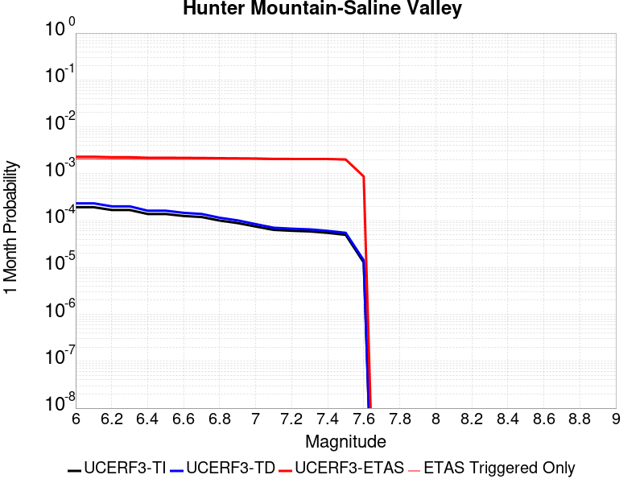 | 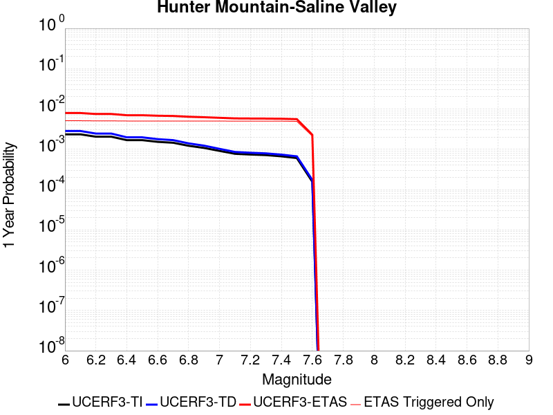 | 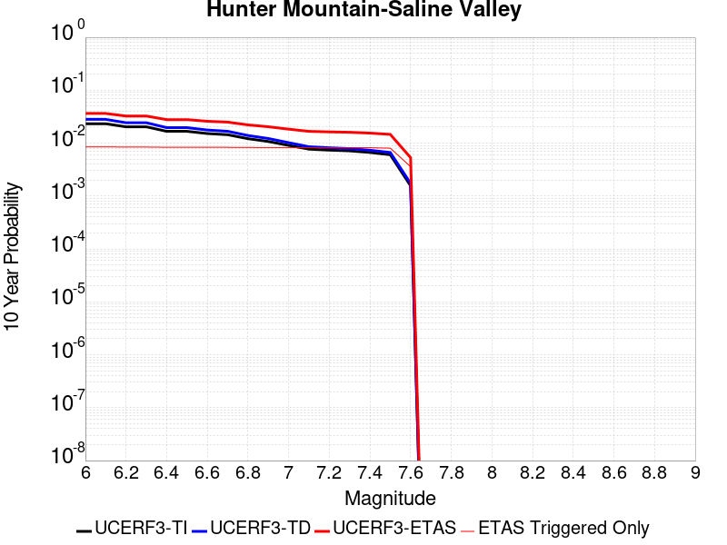 |

| Magnitude | 1 wk TI Prob | 1 wk TD Prob | 1 wk ETAS Prob | 1 wk ETAS/TD Gain | 1 wk ETAS Triggered Only | 1 mo TI Prob | 1 mo TD Prob | 1 mo ETAS Prob | 1 mo ETAS/TD Gain | 1 mo ETAS Triggered Only | 1 yr TI Prob | 1 yr TD Prob | 1 yr ETAS Prob | 1 yr ETAS/TD Gain | 1 yr ETAS Triggered Only | 10 yr TI Prob | 10 yr TD Prob | 10 yr ETAS Prob | 10 yr ETAS/TD Gain | 10 yr ETAS Triggered Only |
|-----|-----|-----|-----|-----|-----|-----|-----|-----|-----|-----|-----|-----|-----|-----|-----|-----|-----|-----|-----|-----|
| 6.0 | 4.5103672E-5 | 5.4571992E-5 | 8.9452614E-4 | 16.391672 | 8.4E-4 | 1.9328714E-4 | 2.3385909E-4 | 0.002303375 | 9.849414 | 0.00207 | 0.002350731 | 0.0028436056 | 0.007939075 | 2.7919042 | 0.00511 | 0.023260195 | 0.028092787 | 0.03634428 | 1.2937227 | 0.00849 |
| 6.1 | 4.5103672E-5 | 5.4571992E-5 | 8.9452614E-4 | 16.391672 | 8.4E-4 | 1.9328714E-4 | 2.3385909E-4 | 0.002303375 | 9.849414 | 0.00207 | 0.002350731 | 0.0028436056 | 0.007939075 | 2.7919042 | 0.00511 | 0.023260195 | 0.028092787 | 0.03634428 | 1.2937227 | 0.00849 |
| 6.2 | 3.9363465E-5 | 4.7064877E-5 | 8.870253E-4 | 18.846865 | 8.4E-4 | 1.6868966E-4 | 2.0169078E-4 | 0.0022512772 | 11.1620245 | 0.00205 | 0.002051862 | 0.0024528939 | 0.0075104577 | 3.0618763 | 0.00507 | 0.020330196 | 0.024274237 | 0.032489847 | 1.3384498 | 0.00842 |
| 6.3 | 3.9363465E-5 | 4.7064877E-5 | 8.870253E-4 | 18.846865 | 8.4E-4 | 1.6868966E-4 | 2.0169078E-4 | 0.0022512772 | 11.1620245 | 0.00205 | 0.002051862 | 0.0024528939 | 0.0075104577 | 3.0618763 | 0.00507 | 0.020330196 | 0.024274237 | 0.032489847 | 1.3384498 | 0.00842 |
| 6.4 | 3.2311684E-5 | 3.795214E-5 | 8.6792064E-4 | 22.86882 | 8.3E-4 | 1.384713E-4 | 1.626423E-4 | 0.0021923122 | 13.479348 | 0.00203 | 0.0016845843 | 0.0019784442 | 0.006998493 | 3.5373716 | 0.00503 | 0.016718714 | 0.019617062 | 0.027803259 | 1.4172999 | 0.00835 |
| 6.5 | 3.2311684E-5 | 3.795214E-5 | 8.6792064E-4 | 22.86882 | 8.3E-4 | 1.384713E-4 | 1.626423E-4 | 0.0021923122 | 13.479348 | 0.00203 | 0.0016845843 | 0.0019784442 | 0.006998493 | 3.5373716 | 0.00503 | 0.016718714 | 0.019617062 | 0.027803259 | 1.4172999 | 0.00835 |
| 6.6 | 2.9305844E-5 | 3.4182853E-5 | 8.641545E-4 | 25.28035 | 8.3E-4 | 1.2559042E-4 | 1.4649007E-4 | 0.0021761926 | 14.855564 | 0.00203 | 0.0015279909 | 0.0017821203 | 0.0068031563 | 3.8174508 | 0.00503 | 0.015175272 | 0.017686214 | 0.025878713 | 1.4632137 | 0.00834 |
| 6.7 | 2.7826512E-5 | 3.2345237E-5 | 8.623184E-4 | 26.659824 | 8.3E-4 | 1.19251024E-4 | 1.3861542E-4 | 0.002168334 | 15.642805 | 0.00203 | 0.0014509142 | 0.0016863967 | 0.006707914 | 3.9776611 | 0.00503 | 0.014414776 | 0.01674368 | 0.024934206 | 1.4891711 | 0.00833 |
| 6.8 | 2.3389874E-5 | 2.6867507E-5 | 8.5684523E-4 | 31.891504 | 8.3E-4 | 1.0023846E-4 | 1.1514164E-4 | 0.0021449078 | 18.62843 | 0.00203 | 0.00121972 | 0.0014009953 | 0.006413962 | 4.578147 | 0.00502 | 0.01213047 | 0.013927842 | 0.022112241 | 1.5876286 | 0.0083 |
| 6.9 | 2.069209E-5 | 2.3570727E-5 | 8.5355114E-4 | 36.21234 | 8.3E-4 | 8.867737E-5 | 1.0101369E-4 | 0.0021308085 | 21.094255 | 0.00203 | 0.0010791123 | 0.001229184 | 0.0062430133 | 5.07899 | 0.00502 | 0.010738871 | 0.012228882 | 0.020387871 | 1.6671901 | 0.00826 |
| 7.0 | 1.7462342E-5 | 1.9634126E-5 | 8.496178E-4 | 43.272503 | 8.3E-4 | 7.483646E-5 | 8.414367E-5 | 0.0021139728 | 25.123373 | 0.00203 | 9.1075303E-4 | 0.0010239903 | 0.0060388497 | 5.89737 | 0.00502 | 0.009070295 | 0.010196352 | 0.018372132 | 1.8018336 | 0.00826 |
| 7.1 | 1.4807709E-5 | 1.6442245E-5 | 8.464286E-4 | 51.478897 | 8.3E-4 | 6.3460066E-5 | 7.046495E-5 | 0.002070324 | 29.380903 | 0.002 | 7.723524E-4 | 8.575896E-4 | 0.00584331 | 6.813644 | 0.00499 | 0.007696735 | 0.008545788 | 0.016685627 | 1.9524971 | 0.00821 |
| 7.2 | 1.4180048E-5 | 1.5698814E-5 | 8.456858E-4 | 53.869408 | 8.3E-4 | 6.077022E-5 | 6.727898E-5 | 0.0020671445 | 30.724964 | 0.002 | 7.396263E-4 | 8.1883004E-4 | 0.005804744 | 7.089071 | 0.00499 | 0.0073716943 | 0.00816108 | 0.016304078 | 1.9977843 | 0.00821 |
| 7.3 | 1.3730402E-5 | 1.5172541E-5 | 8.451599E-4 | 55.70326 | 8.3E-4 | 5.8843252E-5 | 6.502365E-5 | 0.0020648935 | 31.756042 | 0.002 | 7.161811E-4 | 7.913914E-4 | 0.0057774424 | 7.30036 | 0.00499 | 0.007138774 | 0.007888664 | 0.016033897 | 2.0325239 | 0.00821 |
| 7.4 | 1.2810095E-5 | 1.410972E-5 | 8.44098E-4 | 59.823868 | 8.3E-4 | 5.489925E-5 | 6.0468916E-5 | 0.002060348 | 34.072845 | 0.002 | 6.681934E-4 | 7.359762E-4 | 0.005722304 | 7.7751207 | 0.00499 | 0.006661878 | 0.0073382827 | 0.015458256 | 2.1065223 | 0.00818 |
| 7.5 | 1.1595659E-5 | 1.2801013E-5 | 8.2279067E-4 | 64.27543 | 8.1E-4 | 4.9694736E-5 | 5.4860422E-5 | 0.002014753 | 36.72507 | 0.00196 | 6.0486543E-4 | 6.677366E-4 | 0.0055844514 | 8.363255 | 0.00492 | 0.006032217 | 0.0066601736 | 0.014636693 | 2.1976442 | 0.00803 |
| 7.6 | 2.997694E-6 | 3.3252948E-6 | 3.0332428E-4 | 91.21727 | 3.0E-4 | 1.28471975E-5 | 1.4251226E-5 | 8.7423896E-4 | 61.344826 | 8.6E-4 | 1.564034E-4 | 1.7350215E-4 | 0.0022931343 | 13.216749 | 0.00212 | 0.0015629337 | 0.0017351025 | 0.0053188736 | 3.065452 | 0.00359 |

## Blackwater
*[(top)](#table-of-contents)*

| 1 Week | 1 Month | 1 Year | 10 Year |
|-----|-----|-----|-----|
| 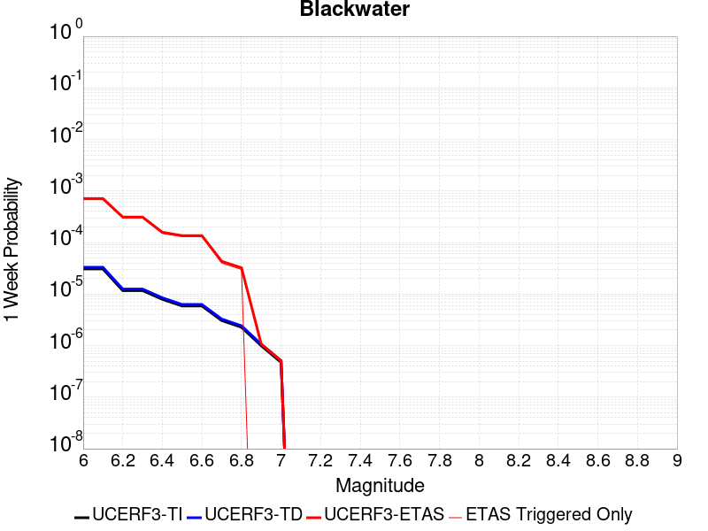 | 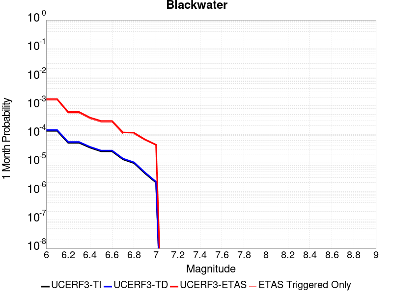 | 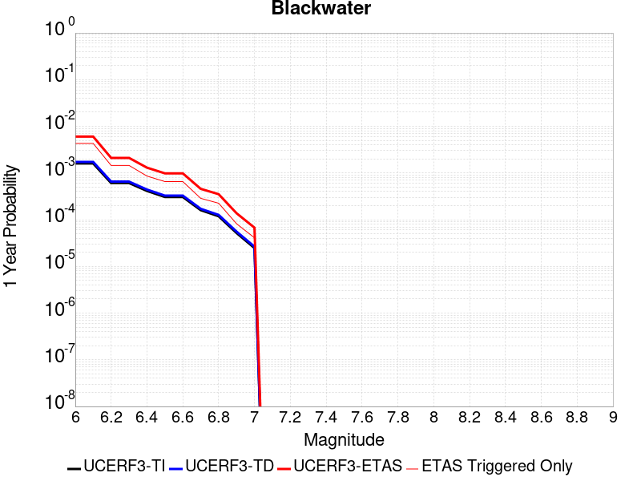 | 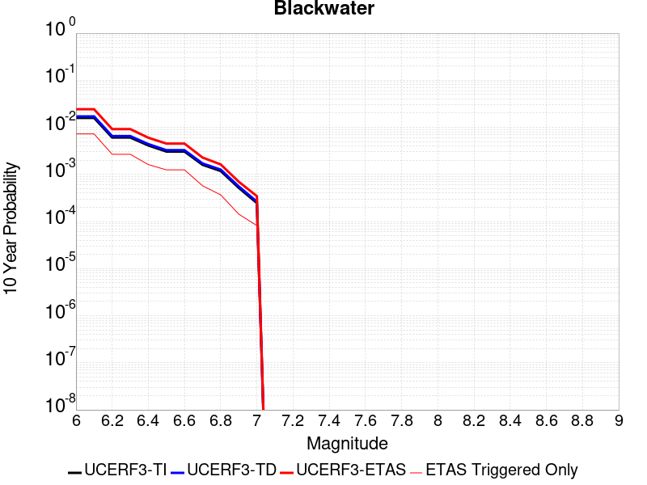 |

| Magnitude | 1 wk TI Prob | 1 wk TD Prob | 1 wk ETAS Prob | 1 wk ETAS/TD Gain | 1 wk ETAS Triggered Only | 1 mo TI Prob | 1 mo TD Prob | 1 mo ETAS Prob | 1 mo ETAS/TD Gain | 1 mo ETAS Triggered Only | 1 yr TI Prob | 1 yr TD Prob | 1 yr ETAS Prob | 1 yr ETAS/TD Gain | 1 yr ETAS Triggered Only | 10 yr TI Prob | 10 yr TD Prob | 10 yr ETAS Prob | 10 yr ETAS/TD Gain | 10 yr ETAS Triggered Only |
|-----|-----|-----|-----|-----|-----|-----|-----|-----|-----|-----|-----|-----|-----|-----|-----|-----|-----|-----|-----|-----|
| 6.0 | 3.0708583E-5 | 3.309619E-5 | 7.130737E-4 | 21.545492 | 6.8E-4 | 1.3160157E-4 | 1.4183388E-4 | 0.0016016267 | 11.292273 | 0.00146 | 0.0016010714 | 0.0017255963 | 0.005758625 | 3.3371797 | 0.00404 | 0.015895851 | 0.017135808 | 0.024065001 | 1.4043691 | 0.00705 |
| 6.1 | 3.0708583E-5 | 3.309619E-5 | 7.130737E-4 | 21.545492 | 6.8E-4 | 1.3160157E-4 | 1.4183388E-4 | 0.0016016267 | 11.292273 | 0.00146 | 0.0016010714 | 0.0017255963 | 0.005758625 | 3.3371797 | 0.00404 | 0.015895851 | 0.017135808 | 0.024065001 | 1.4043691 | 0.00705 |
| 6.2 | 1.1707779E-5 | 1.2545242E-5 | 3.1254147E-4 | 24.91315 | 3.0E-4 | 5.017523E-5 | 5.3764266E-5 | 6.237336E-4 | 11.601267 | 5.7E-4 | 6.107122E-4 | 6.5439293E-4 | 0.0021334244 | 3.260158 | 0.00148 | 0.006090366 | 0.006525631 | 0.009227881 | 1.4140979 | 0.00272 |
| 6.3 | 1.1707779E-5 | 1.2545242E-5 | 3.1254147E-4 | 24.91315 | 3.0E-4 | 5.017523E-5 | 5.3764266E-5 | 6.237336E-4 | 11.601267 | 5.7E-4 | 6.107122E-4 | 6.5439293E-4 | 0.0021334244 | 3.260158 | 0.00148 | 0.006090366 | 0.006525631 | 0.009227881 | 1.4140979 | 0.00272 |
| 6.4 | 7.929244E-6 | 8.480176E-6 | 1.584789E-4 | 18.688162 | 1.5E-4 | 3.3982033E-5 | 3.6343128E-5 | 3.9633006E-4 | 10.905227 | 3.6E-4 | 4.136527E-4 | 4.4239179E-4 | 0.0013519892 | 3.05609 | 9.1E-4 | 0.0041288356 | 0.0044155167 | 0.006068187 | 1.374287 | 0.00166 |
| 6.5 | 5.8832115E-6 | 6.286048E-6 | 1.3628523E-4 | 21.68059 | 1.3E-4 | 2.521352E-5 | 2.6939942E-5 | 3.069324E-4 | 11.393209 | 2.8E-4 | 3.0693135E-4 | 3.2794697E-4 | 0.0010377142 | 3.1642742 | 7.1E-4 | 0.0030650778 | 0.0032748834 | 0.004530757 | 1.3834865 | 0.00126 |
| 6.6 | 5.8832115E-6 | 6.286048E-6 | 1.3628523E-4 | 21.68059 | 1.3E-4 | 2.521352E-5 | 2.6939942E-5 | 3.069324E-4 | 11.393209 | 2.8E-4 | 3.0693135E-4 | 3.2794697E-4 | 0.0010377142 | 3.1642742 | 7.1E-4 | 0.0030650778 | 0.0032748834 | 0.004530757 | 1.3834865 | 0.00126 |
| 6.7 | 3.0715053E-6 | 3.281496E-6 | 4.3281365E-5 | 13.189523 | 4.0E-5 | 1.3163528E-5 | 1.4063485E-5 | 1.2406193E-4 | 8.821565 | 1.1E-4 | 1.6025416E-4 | 1.7121063E-4 | 4.8115756E-4 | 2.8103251 | 3.1E-4 | 0.0016013865 | 0.0017109019 | 0.0022699437 | 1.3267528 | 5.6E-4 |
| 6.8 | 2.2722281E-6 | 2.4287758E-6 | 3.2428703E-5 | 13.3518715 | 3.0E-5 | 9.738084E-6 | 1.0409003E-5 | 1.0040807E-4 | 9.646272 | 9.0E-5 | 1.1855473E-4 | 1.2672316E-4 | 3.266978E-4 | 2.5780435 | 2.0E-4 | 0.001184915 | 0.0012665992 | 0.0016161558 | 1.2759805 | 3.5E-4 |
| 6.9 | 9.952399E-7 | 1.0653588E-6 | 1.0653588E-6 | 1.0 | 0.0 | 4.265307E-6 | 4.5658185E-6 | 4.4565637E-5 | 9.760712 | 4.0E-5 | 5.1928873E-5 | 5.5587938E-5 | 1.2558405E-4 | 2.259196 | 7.0E-5 | 5.191674E-4 | 5.5579096E-4 | 6.9571316E-4 | 1.2517533 | 1.4E-4 |
| 7.0 | 4.7385504E-7 | 5.0756074E-7 | 5.0756074E-7 | 1.0 | 0.0 | 2.0308057E-6 | 2.1752603E-6 | 2.2175216E-5 | 10.194282 | 2.0E-5 | 2.4724779E-5 | 2.6483794E-5 | 5.6483E-5 | 2.132738 | 3.0E-5 | 2.4722028E-4 | 2.6483793E-4 | 3.2482206E-4 | 1.2264936 | 6.0E-5 |

## Garlock (West)
*[(top)](#table-of-contents)*

| 1 Week | 1 Month | 1 Year | 10 Year |
|-----|-----|-----|-----|
| 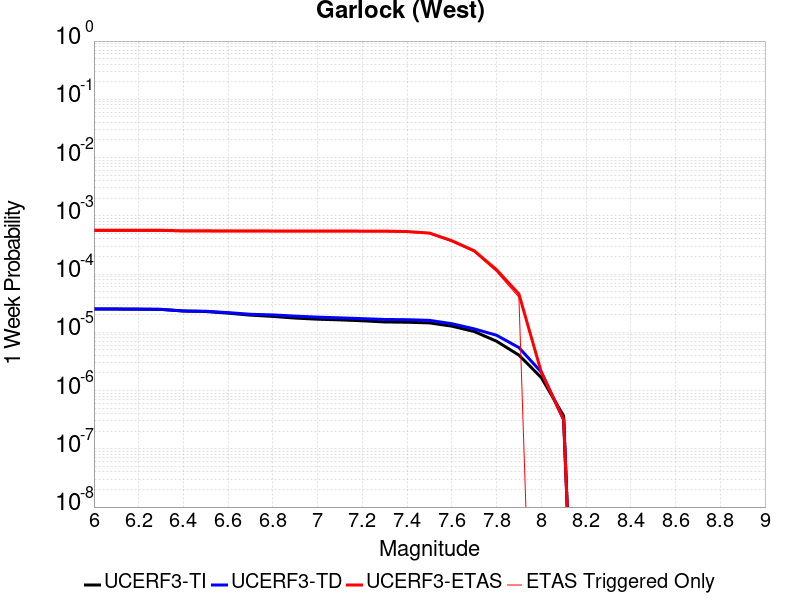 | 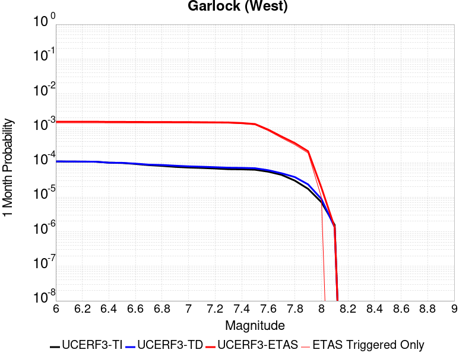 | 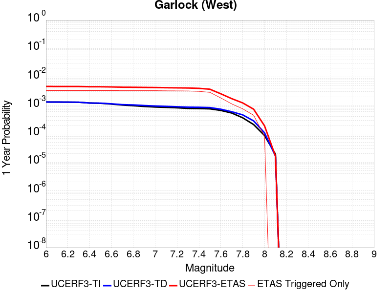 | 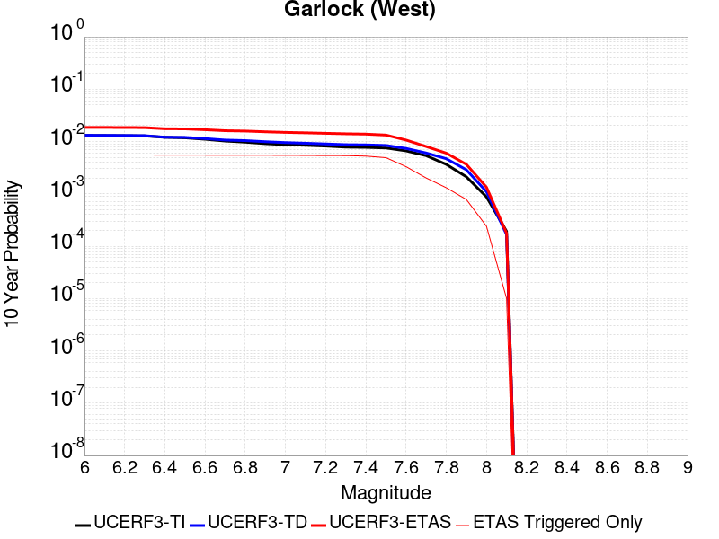 |

| Magnitude | 1 wk TI Prob | 1 wk TD Prob | 1 wk ETAS Prob | 1 wk ETAS/TD Gain | 1 wk ETAS Triggered Only | 1 mo TI Prob | 1 mo TD Prob | 1 mo ETAS Prob | 1 mo ETAS/TD Gain | 1 mo ETAS Triggered Only | 1 yr TI Prob | 1 yr TD Prob | 1 yr ETAS Prob | 1 yr ETAS/TD Gain | 1 yr ETAS Triggered Only | 10 yr TI Prob | 10 yr TD Prob | 10 yr ETAS Prob | 10 yr ETAS/TD Gain | 10 yr ETAS Triggered Only |
|-----|-----|-----|-----|-----|-----|-----|-----|-----|-----|-----|-----|-----|-----|-----|-----|-----|-----|-----|-----|-----|
| 6.0 | 2.5181727E-5 | 2.5202135E-5 | 5.6518853E-4 | 22.426216 | 5.4E-4 | 1.0791722E-4 | 1.080047E-4 | 0.0015278513 | 14.146156 | 0.00142 | 0.0013131002 | 0.0013141674 | 0.0049294103 | 3.7509758 | 0.00362 | 0.013053683 | 0.013144457 | 0.018621506 | 1.4166812 | 0.00555 |
| 6.1 | 2.5077732E-5 | 2.5103205E-5 | 5.6508963E-4 | 22.510658 | 5.4E-4 | 1.0747157E-4 | 1.07580745E-4 | 0.0015274279 | 14.197968 | 0.00142 | 0.001307681 | 0.0013090121 | 0.0049242736 | 3.7618244 | 0.00362 | 0.013000126 | 0.0130935125 | 0.018570844 | 1.418324 | 0.00555 |
| 6.2 | 2.494612E-5 | 2.498488E-5 | 5.649714E-4 | 22.612532 | 5.4E-4 | 1.0690756E-4 | 1.07073676E-4 | 0.0015269216 | 14.260476 | 0.00142 | 0.0013008224 | 0.0013028459 | 0.0049181296 | 3.7749128 | 0.00362 | 0.012932341 | 0.013032575 | 0.018510245 | 1.420306 | 0.00555 |
| 6.3 | 2.4733758E-5 | 2.4804243E-5 | 5.6479085E-4 | 22.76993 | 5.4E-4 | 1.0599751E-4 | 1.0629959E-4 | 0.0015261486 | 14.357052 | 0.00142 | 0.0012897556 | 0.0012934325 | 0.0049087503 | 3.7951345 | 0.00362 | 0.012822957 | 0.012939542 | 0.018417727 | 1.4233679 | 0.00555 |
| 6.4 | 2.3237335E-5 | 2.318352E-5 | 5.531712E-4 | 23.860537 | 5.3E-4 | 9.958477E-5 | 9.935417E-5 | 0.001509214 | 15.190244 | 0.00141 | 0.0012117702 | 0.0012089686 | 0.0048046163 | 3.974145 | 0.0036 | 0.012051838 | 0.012104375 | 0.0175378 | 1.4488811 | 0.0055 |
| 6.5 | 2.2732203E-5 | 2.2998063E-5 | 5.529859E-4 | 24.04489 | 5.3E-4 | 9.742009E-5 | 9.8559416E-5 | 0.0015084204 | 15.304681 | 0.00141 | 0.0011854442 | 0.0011993032 | 0.0047949855 | 3.9981432 | 0.0036 | 0.011791403 | 0.012008769 | 0.017442722 | 1.4524987 | 0.0055 |
| 6.6 | 2.1319436E-5 | 2.1778224E-5 | 5.5176666E-4 | 25.335707 | 5.3E-4 | 9.136581E-5 | 9.333192E-5 | 0.0015032003 | 16.105963 | 0.00141 | 0.001111811 | 0.001135726 | 0.0047316374 | 4.1661787 | 0.0036 | 0.011062649 | 0.0113796545 | 0.016817067 | 1.4778187 | 0.0055 |
| 6.7 | 1.970802E-5 | 2.0398069E-5 | 5.5038725E-4 | 26.98232 | 5.3E-4 | 8.446021E-5 | 8.741738E-5 | 0.0014972942 | 17.128107 | 0.00141 | 0.001027818 | 0.0010637887 | 0.0046499697 | 4.3711405 | 0.00359 | 0.010230771 | 0.010667368 | 0.016098805 | 1.5091636 | 0.00549 |
| 6.8 | 1.8744462E-5 | 1.9905692E-5 | 5.4989517E-4 | 27.625021 | 5.3E-4 | 8.033094E-5 | 8.530733E-5 | 0.001495187 | 17.527065 | 0.00141 | 9.775903E-4 | 0.0010381235 | 0.0046243966 | 4.4545727 | 0.00359 | 0.009733009 | 0.010413141 | 0.015845973 | 1.5217284 | 0.00549 |
| 6.9 | 1.7559682E-5 | 1.895803E-5 | 5.48948E-4 | 28.955961 | 5.3E-4 | 7.5253614E-5 | 8.124618E-5 | 0.0014911316 | 18.353252 | 0.00141 | 9.158276E-4 | 9.887248E-4 | 0.0045751752 | 4.62735 | 0.00359 | 0.0091206245 | 0.009923607 | 0.015349225 | 1.5467386 | 0.00548 |
| 7.0 | 1.6794445E-5 | 1.8220819E-5 | 5.4821116E-4 | 30.087076 | 5.3E-4 | 7.197421E-5 | 7.8086894E-5 | 0.0014879768 | 19.055397 | 0.00141 | 8.759337E-4 | 9.5029466E-4 | 0.0045268927 | 4.763673 | 0.00358 | 0.008724891 | 0.0095425 | 0.014950397 | 1.5667171 | 0.00546 |
| 7.1 | 1.6337795E-5 | 1.7721602E-5 | 5.477122E-4 | 30.906473 | 5.3E-4 | 7.0017246E-5 | 7.5947515E-5 | 0.0014758412 | 19.432383 | 0.0014 | 8.521265E-4 | 9.2427013E-4 | 0.00448098 | 4.848128 | 0.00356 | 0.008488664 | 0.009284343 | 0.014673836 | 1.5804927 | 0.00544 |
| 7.2 | 1.5780008E-5 | 1.7170225E-5 | 5.4716115E-4 | 31.86686 | 5.3E-4 | 6.762685E-5 | 7.358461E-5 | 0.0014634823 | 19.88843 | 0.00139 | 8.2304585E-4 | 8.955257E-4 | 0.0044223643 | 4.9382887 | 0.00353 | 0.008200042 | 0.008999176 | 0.014350581 | 1.5946549 | 0.0054 |
| 7.3 | 1.5058865E-5 | 1.6623266E-5 | 5.4661446E-4 | 32.882496 | 5.3E-4 | 6.45364E-5 | 7.124063E-5 | 0.0014511424 | 20.369589 | 0.00138 | 7.854473E-4 | 8.6701073E-4 | 0.004383959 | 5.056407 | 0.00352 | 0.00782677 | 0.00871586 | 0.014058881 | 1.6130229 | 0.00539 |
| 7.4 | 1.4887923E-5 | 1.6459222E-5 | 5.3645065E-4 | 32.592712 | 5.2E-4 | 6.380382E-5 | 7.053762E-5 | 0.0014004438 | 19.853857 | 0.00133 | 7.7653467E-4 | 8.5845834E-4 | 0.004285514 | 4.9921045 | 0.00343 | 0.0077382675 | 0.0086307125 | 0.013855229 | 1.60534 | 0.00527 |
| 7.5 | 1.4509299E-5 | 1.6051208E-5 | 5.060433E-4 | 31.526808 | 4.9E-4 | 6.218123E-5 | 6.8789086E-5 | 0.0013087038 | 19.024876 | 0.00124 | 7.567935E-4 | 8.3718647E-4 | 0.004024516 | 4.807192 | 0.00319 | 0.0075422134 | 0.008419003 | 0.013297581 | 1.5794722 | 0.00492 |
| 7.6 | 1.2756717E-5 | 1.4055129E-5 | 3.7405008E-4 | 26.613064 | 3.6E-4 | 5.4670498E-5 | 6.023488E-5 | 9.0018427E-4 | 14.944568 | 8.4E-4 | 6.6541E-4 | 7.331136E-4 | 0.002801596 | 3.8215034 | 0.00207 | 0.006634211 | 0.007383898 | 0.010669458 | 1.4449627 | 0.00331 |
| 7.7 | 1.0328985E-5 | 1.1464573E-5 | 2.514618E-4 | 21.933815 | 2.4E-4 | 4.4266326E-5 | 4.913296E-5 | 5.691074E-4 | 11.583007 | 5.2E-4 | 5.388092E-4 | 5.9803E-4 | 0.0018572764 | 3.1056578 | 0.00126 | 0.0053750467 | 0.0060405903 | 0.008038448 | 1.3307389 | 0.00201 |
| 7.8 | 7.0306583E-6 | 8.902813E-6 | 1.1890184E-4 | 13.3555355 | 1.1E-4 | 3.0131043E-5 | 3.8154354E-5 | 3.6814177E-4 | 9.648748 | 3.3E-4 | 3.667837E-4 | 4.644304E-4 | 0.0013040403 | 2.807827 | 8.4E-4 | 0.003661789 | 0.0046969377 | 0.0060007847 | 1.2775952 | 0.00131 |
| 7.9 | 4.060633E-6 | 5.4672782E-6 | 4.546706E-5 | 8.316215 | 4.0E-5 | 1.7402595E-5 | 2.3430983E-5 | 2.1342652E-4 | 9.108731 | 1.9E-4 | 2.11856E-4 | 2.8523497E-4 | 8.150838E-4 | 2.857587 | 5.3E-4 | 0.0021165414 | 0.0028851798 | 0.0036629294 | 1.2695671 | 7.8E-4 |
| 8.0 | 1.6729537E-6 | 2.078155E-6 | 2.078155E-6 | 1.0 | 0.0 | 7.169782E-6 | 8.906349E-6 | 1.890626E-5 | 2.1227846 | 1.0E-5 | 8.7288594E-5 | 1.08429434E-4 | 2.5841317E-4 | 2.3832383 | 1.5E-4 | 8.7254314E-4 | 0.001097267 | 0.0013370037 | 1.2184852 | 2.4E-4 |
| 8.1 | 3.6733252E-7 | 3.1499187E-7 | 3.1499187E-7 | 1.0 | 0.0 | 1.5742813E-6 | 1.3499646E-6 | 1.3499646E-6 | 1.0 | 0.0 | 1.9166706E-5 | 1.643571E-5 | 2.6435546E-5 | 1.6084212 | 1.0E-5 | 1.9165053E-4 | 1.6643589E-4 | 1.7643423E-4 | 1.0600731 | 1.0E-5 |

## McLean Lake
*[(top)](#table-of-contents)*

| 1 Week | 1 Month | 1 Year | 10 Year |
|-----|-----|-----|-----|
| 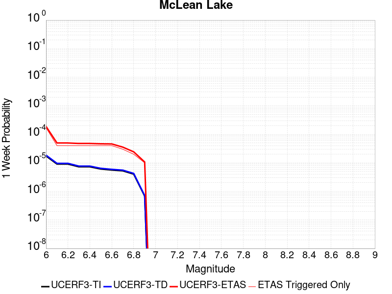 | 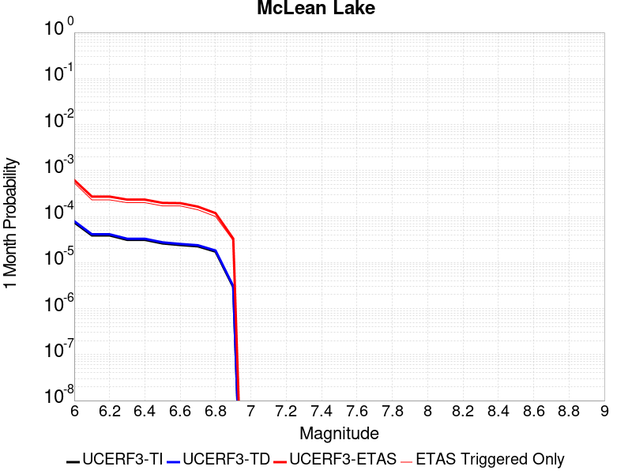 | 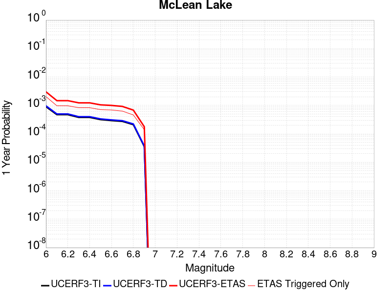 | 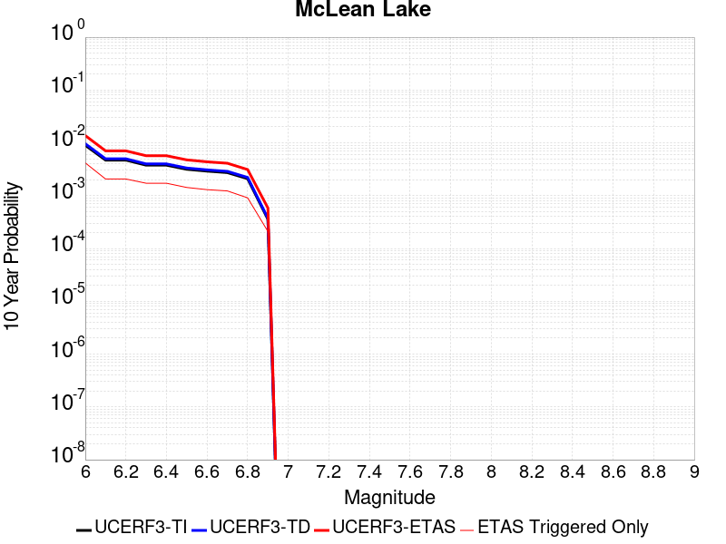 |

| Magnitude | 1 wk TI Prob | 1 wk TD Prob | 1 wk ETAS Prob | 1 wk ETAS/TD Gain | 1 wk ETAS Triggered Only | 1 mo TI Prob | 1 mo TD Prob | 1 mo ETAS Prob | 1 mo ETAS/TD Gain | 1 mo ETAS Triggered Only | 1 yr TI Prob | 1 yr TD Prob | 1 yr ETAS Prob | 1 yr ETAS/TD Gain | 1 yr ETAS Triggered Only | 10 yr TI Prob | 10 yr TD Prob | 10 yr ETAS Prob | 10 yr ETAS/TD Gain | 10 yr ETAS Triggered Only |
|-----|-----|-----|-----|-----|-----|-----|-----|-----|-----|-----|-----|-----|-----|-----|-----|-----|-----|-----|-----|-----|
| 6.0 | 1.7360222E-5 | 1.8501789E-5 | 1.8849864E-4 | 10.18813 | 1.7E-4 | 7.439883E-5 | 7.929125E-5 | 6.192484E-4 | 7.809796 | 5.4E-4 | 9.0542925E-4 | 9.64992E-4 | 0.0030130139 | 3.12232 | 0.00205 | 0.009017491 | 0.009612858 | 0.013752677 | 1.4306543 | 0.00418 |
| 6.1 | 9.062689E-6 | 9.592268E-6 | 4.9591883E-5 | 5.1699853 | 4.0E-5 | 3.8839516E-5 | 4.110912E-5 | 2.7109968E-4 | 6.5946355 | 2.3E-4 | 4.727685E-4 | 5.003975E-4 | 0.0014699121 | 2.937489 | 9.7E-4 | 0.0047176396 | 0.0049935905 | 0.0070532537 | 1.4124614 | 0.00207 |
| 6.2 | 9.062689E-6 | 9.592268E-6 | 4.9591883E-5 | 5.1699853 | 4.0E-5 | 3.8839516E-5 | 4.110912E-5 | 2.7109968E-4 | 6.5946355 | 2.3E-4 | 4.727685E-4 | 5.003975E-4 | 0.0014699121 | 2.937489 | 9.7E-4 | 0.0047176396 | 0.0049935905 | 0.0070532537 | 1.4124614 | 0.00207 |
| 6.3 | 7.2575485E-6 | 7.667767E-6 | 4.766746E-5 | 6.216603 | 4.0E-5 | 3.110341E-5 | 3.2861484E-5 | 2.3285492E-4 | 7.0859523 | 2.0E-4 | 3.786182E-4 | 4.0002225E-4 | 0.0012296903 | 3.0740545 | 8.3E-4 | 0.0037797375 | 0.003993727 | 0.0057068574 | 1.4289554 | 0.00172 |
| 6.4 | 7.2575485E-6 | 7.667767E-6 | 4.766746E-5 | 6.216603 | 4.0E-5 | 3.110341E-5 | 3.2861484E-5 | 2.3285492E-4 | 7.0859523 | 2.0E-4 | 3.786182E-4 | 4.0002225E-4 | 0.0012296903 | 3.0740545 | 8.3E-4 | 0.0037797375 | 0.003993727 | 0.0057068574 | 1.4289554 | 0.00172 |
| 6.5 | 6.06582E-6 | 6.4039245E-6 | 4.6403668E-5 | 7.24613 | 4.0E-5 | 2.5996113E-5 | 2.7445138E-5 | 1.9744047E-4 | 7.1940055 | 1.7E-4 | 3.164567E-4 | 3.340998E-4 | 0.0010438625 | 3.1244035 | 7.1E-4 | 0.0031600643 | 0.0033366138 | 0.0047618425 | 1.4271482 | 0.00143 |
| 6.6 | 5.598744E-6 | 5.910306E-6 | 4.591007E-5 | 7.7677994 | 4.0E-5 | 2.3994397E-5 | 2.5329673E-5 | 1.9532537E-4 | 7.711326 | 1.7E-4 | 2.9209262E-4 | 3.083515E-4 | 9.981388E-4 | 3.237016 | 6.9E-4 | 0.0029170897 | 0.0030798658 | 0.004375862 | 1.4207963 | 0.0013 |
| 6.7 | 5.246996E-6 | 5.539203E-6 | 3.5539037E-5 | 6.4159117 | 3.0E-5 | 2.2486933E-5 | 2.3739261E-5 | 1.6373594E-4 | 6.8972635 | 1.4E-4 | 2.73744E-4 | 2.8899353E-4 | 9.188115E-4 | 3.1793497 | 6.3E-4 | 0.0027340704 | 0.002886801 | 0.00411325 | 1.4248471 | 0.00123 |
| 6.8 | 4.02324E-6 | 4.246936E-6 | 2.424685E-5 | 5.7092576 | 2.0E-5 | 1.7242342E-5 | 1.820106E-5 | 1.1819924E-4 | 6.4940853 | 1.0E-4 | 2.099053E-4 | 2.2158133E-4 | 6.814794E-4 | 3.0755272 | 4.6E-4 | 0.0020970714 | 0.0022141882 | 0.0031221735 | 1.4100758 | 9.1E-4 |
| 6.9 | 6.835972E-7 | 7.1399705E-7 | 1.07139895E-5 | 15.0056505 | 1.0E-5 | 2.9296991E-6 | 3.0599856E-6 | 3.3059892E-5 | 10.803938 | 3.0E-5 | 3.56685E-5 | 3.7255006E-5 | 1.7724979E-4 | 4.7577443 | 1.4E-4 | 3.5662777E-4 | 3.7251884E-4 | 5.8244064E-4 | 1.5635198 | 2.1E-4 |

## Gravel Hills-Harper Lk
*[(top)](#table-of-contents)*

| 1 Week | 1 Month | 1 Year | 10 Year |
|-----|-----|-----|-----|
| 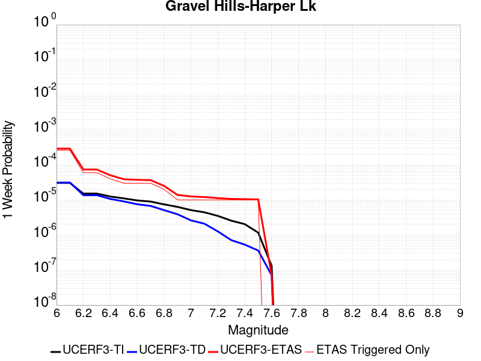 | 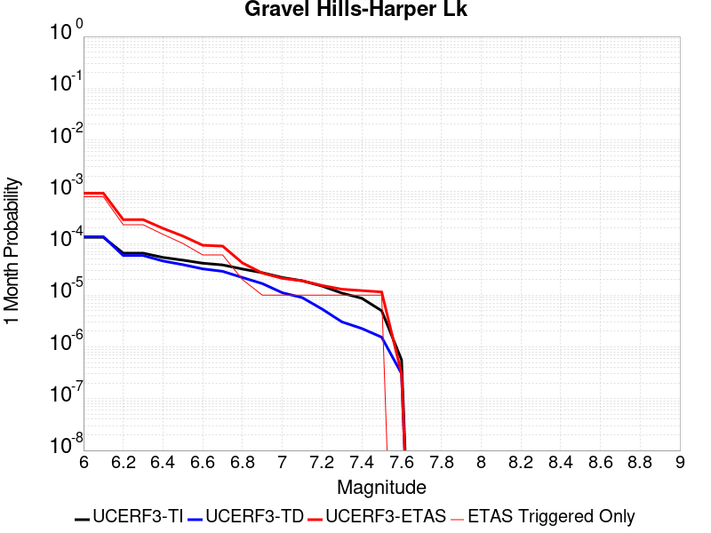 | 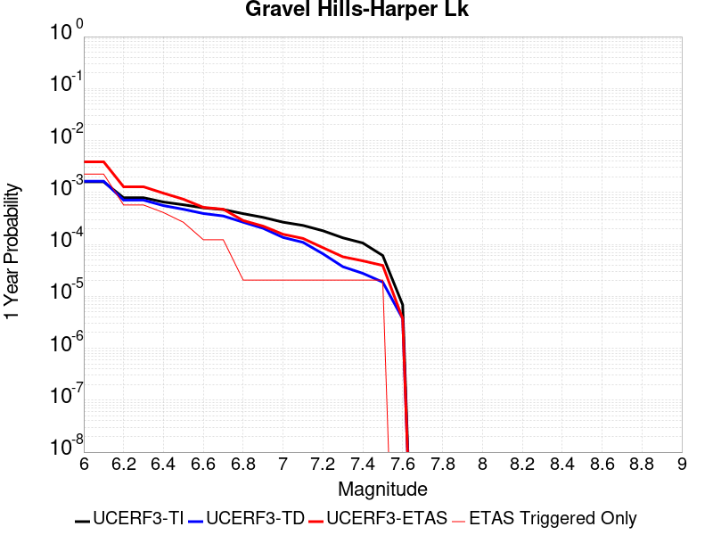 | 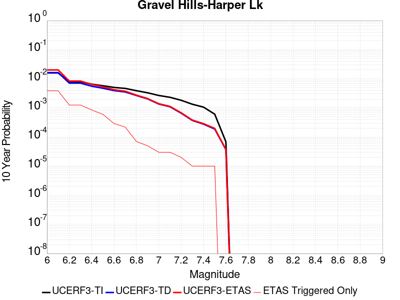 |

| Magnitude | 1 wk TI Prob | 1 wk TD Prob | 1 wk ETAS Prob | 1 wk ETAS/TD Gain | 1 wk ETAS Triggered Only | 1 mo TI Prob | 1 mo TD Prob | 1 mo ETAS Prob | 1 mo ETAS/TD Gain | 1 mo ETAS Triggered Only | 1 yr TI Prob | 1 yr TD Prob | 1 yr ETAS Prob | 1 yr ETAS/TD Gain | 1 yr ETAS Triggered Only | 10 yr TI Prob | 10 yr TD Prob | 10 yr ETAS Prob | 10 yr ETAS/TD Gain | 10 yr ETAS Triggered Only |
|-----|-----|-----|-----|-----|-----|-----|-----|-----|-----|-----|-----|-----|-----|-----|-----|-----|-----|-----|-----|-----|
| 6.0 | 3.0679566E-5 | 3.1465184E-5 | 2.91457E-4 | 9.262841 | 2.6E-4 | 1.3147724E-4 | 1.3484505E-4 | 9.3473715E-4 | 6.931936 | 8.0E-4 | 0.0015995599 | 0.0016407187 | 0.003926961 | 2.3934398 | 0.00229 | 0.015880952 | 0.016307615 | 0.020114506 | 1.2334424 | 0.00387 |
| 6.1 | 3.0679566E-5 | 3.1465184E-5 | 2.91457E-4 | 9.262841 | 2.6E-4 | 1.3147724E-4 | 1.3484505E-4 | 9.3473715E-4 | 6.931936 | 8.0E-4 | 0.0015995599 | 0.0016407187 | 0.003926961 | 2.3934398 | 0.00229 | 0.015880952 | 0.016307615 | 0.020114506 | 1.2334424 | 0.00387 |
| 6.2 | 1.514536E-5 | 1.3635392E-5 | 7.3634576E-5 | 5.400254 | 6.0E-5 | 6.490707E-5 | 5.843615E-5 | 2.884227E-4 | 4.9356894 | 2.3E-4 | 7.8995706E-4 | 7.112398E-4 | 0.0014007491 | 1.9694469 | 6.9E-4 | 0.007871548 | 0.0070908363 | 0.008331973 | 1.1750338 | 0.00125 |
| 6.3 | 1.514536E-5 | 1.3635392E-5 | 7.3634576E-5 | 5.400254 | 6.0E-5 | 6.490707E-5 | 5.843615E-5 | 2.884227E-4 | 4.9356894 | 2.3E-4 | 7.8995706E-4 | 7.112398E-4 | 0.0014007491 | 1.9694469 | 6.9E-4 | 0.007871548 | 0.0070908363 | 0.008331973 | 1.1750338 | 0.00125 |
| 6.4 | 1.2532521E-5 | 1.0689826E-5 | 5.06894E-5 | 4.7418356 | 4.0E-5 | 5.37097E-5 | 4.581277E-5 | 1.958059E-4 | 4.2740464 | 1.5E-4 | 6.537194E-4 | 5.576335E-4 | 0.0010373659 | 1.8603004 | 4.8E-4 | 0.0065179965 | 0.0055629327 | 0.0064082043 | 1.1519471 | 8.5E-4 |
| 6.5 | 1.1094058E-5 | 9.083774E-6 | 3.90835E-5 | 4.302562 | 3.0E-5 | 4.7545094E-5 | 3.89299E-5 | 1.3892601E-4 | 3.5686197 | 1.0E-4 | 5.787078E-4 | 4.738725E-4 | 8.137114E-4 | 1.7171526 | 3.4E-4 | 0.0057720304 | 0.004729028 | 0.0053261905 | 1.126276 | 6.0E-4 |
| 6.6 | 9.688328E-6 | 7.531784E-6 | 3.7531558E-5 | 4.9830904 | 3.0E-5 | 4.1520743E-5 | 3.2278687E-5 | 9.227675E-5 | 2.8587515 | 6.0E-5 | 5.053978E-4 | 3.929247E-4 | 5.428658E-4 | 1.3816025 | 1.5E-4 | 0.0050424994 | 0.0039225565 | 0.0042114193 | 1.0736414 | 2.9E-4 |
| 6.7 | 8.974824E-6 | 6.7494916E-6 | 3.674929E-5 | 5.4447494 | 3.0E-5 | 3.8462964E-5 | 2.8926084E-5 | 8.8924346E-5 | 3.0741923 | 6.0E-5 | 4.6818596E-4 | 3.5212038E-4 | 4.820746E-4 | 1.369062 | 1.3E-4 | 0.004672008 | 0.0035158454 | 0.003735072 | 1.0623538 | 2.2E-4 |
| 6.8 | 7.4780046E-6 | 5.116252E-6 | 2.511615E-5 | 4.9090915 | 2.0E-5 | 3.20482E-5 | 2.1926619E-5 | 4.192618E-5 | 1.9121133 | 2.0E-5 | 3.9011694E-4 | 2.6692526E-4 | 3.069146E-4 | 1.1498147 | 4.0E-5 | 0.0038943281 | 0.002666185 | 0.0027359982 | 1.0261848 | 7.0E-5 |
| 6.9 | 6.3409307E-6 | 3.9075426E-6 | 1.3907504E-5 | 3.559143 | 1.0E-5 | 2.7175134E-5 | 1.674651E-5 | 2.6746342E-5 | 1.5971293 | 1.0E-5 | 3.3080703E-4 | 2.0387067E-4 | 2.3386456E-4 | 1.1471221 | 3.0E-5 | 0.0033031502 | 0.0020369345 | 0.0020868327 | 1.0244967 | 5.0E-5 |
| 7.0 | 5.1239335E-6 | 2.6058885E-6 | 1.2605862E-5 | 4.837453 | 1.0E-5 | 2.195953E-5 | 1.11680465E-5 | 2.1167934E-5 | 1.8954017 | 1.0E-5 | 2.6732447E-4 | 1.3596273E-4 | 1.5596002E-4 | 1.1470791 | 2.0E-5 | 0.0026700313 | 0.0013588208 | 0.0013887801 | 1.022048 | 3.0E-5 |
| 7.1 | 4.438899E-6 | 2.0984994E-6 | 1.2098479E-5 | 5.7653 | 1.0E-5 | 1.9023713E-5 | 8.993539E-6 | 1.8993449E-5 | 2.1118994 | 1.0E-5 | 2.315891E-4 | 1.0949106E-4 | 1.2948886E-4 | 1.1826433 | 2.0E-5 | 0.002313479 | 0.0010943931 | 0.0011243602 | 1.0273825 | 3.0E-5 |
| 7.2 | 3.50367E-6 | 1.2615911E-6 | 1.1261579E-5 | 8.926488 | 1.0E-5 | 1.5015643E-5 | 5.406808E-6 | 1.5406755E-5 | 2.84951 | 1.0E-5 | 1.8280011E-4 | 6.582599E-5 | 8.582467E-5 | 1.3038114 | 2.0E-5 | 0.0018264982 | 6.580731E-4 | 6.7805994E-4 | 1.0303718 | 2.0E-5 |
| 7.3 | 2.561638E-6 | 7.119307E-7 | 1.0711924E-5 | 15.046301 | 1.0E-5 | 1.0978401E-5 | 3.051128E-6 | 1.3051098E-5 | 4.2774663 | 1.0E-5 | 1.3365384E-4 | 3.714687E-5 | 4.71465E-5 | 1.2691916 | 1.0E-5 | 0.0013357349 | 3.7140862E-4 | 3.814049E-4 | 1.0269145 | 1.0E-5 |
| 7.4 | 2.0368864E-6 | 5.304955E-7 | 1.053049E-5 | 19.85029 | 1.0E-5 | 8.729483E-6 | 2.2735503E-6 | 1.2273527E-5 | 5.398397 | 1.0E-5 | 1.06276275E-4 | 2.768013E-5 | 3.7679853E-5 | 1.3612599 | 1.0E-5 | 0.0010622547 | 2.7676736E-4 | 2.8676458E-4 | 1.0361215 | 1.0E-5 |
| 7.5 | 1.1681728E-6 | 3.6031287E-7 | 1.036031E-5 | 28.753647 | 1.0E-5 | 5.0064455E-6 | 1.5441972E-6 | 1.1544182E-5 | 7.4758472 | 1.0E-5 | 6.0951766E-5 | 1.8800443E-5 | 2.8800254E-5 | 1.5318924 | 1.0E-5 | 6.093505E-4 | 1.8798899E-4 | 1.979871E-4 | 1.0531846 | 1.0E-5 |
| 7.6 | 1.3154387E-7 | 7.1198265E-8 | 7.1198265E-8 | 1.0 | 0.0 | 5.6375933E-7 | 3.051354E-7 | 3.051354E-7 | 1.0 | 0.0 | 6.863748E-6 | 3.7150185E-6 | 3.7150185E-6 | 1.0 | 0.0 | 6.863536E-5 | 3.7149723E-5 | 3.7149723E-5 | 1.0 | 0.0 |

## Goldstone Lake
*[(top)](#table-of-contents)*

| 1 Week | 1 Month | 1 Year | 10 Year |
|-----|-----|-----|-----|
| 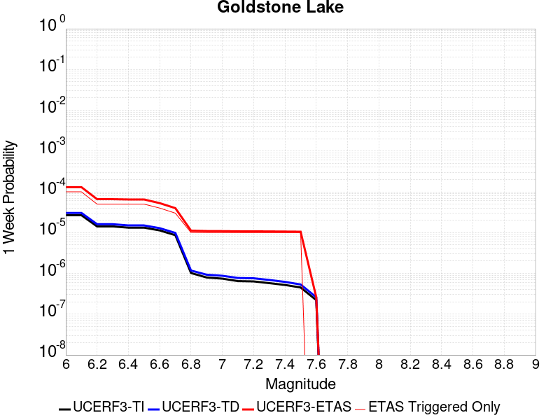 | 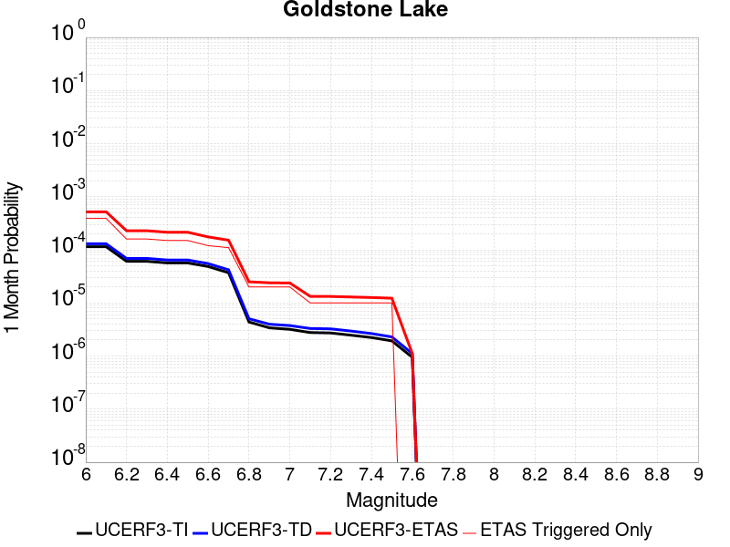 |  | 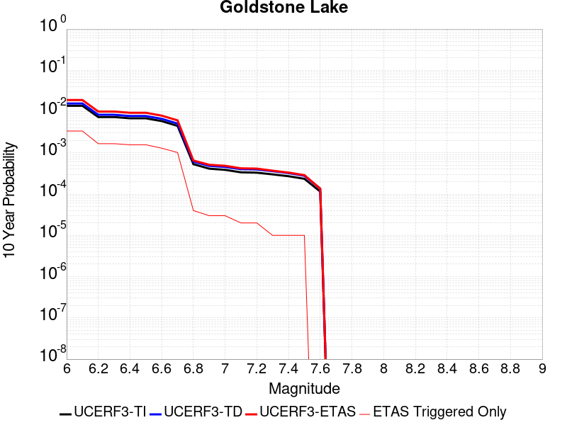 |

| Magnitude | 1 wk TI Prob | 1 wk TD Prob | 1 wk ETAS Prob | 1 wk ETAS/TD Gain | 1 wk ETAS Triggered Only | 1 mo TI Prob | 1 mo TD Prob | 1 mo ETAS Prob | 1 mo ETAS/TD Gain | 1 mo ETAS Triggered Only | 1 yr TI Prob | 1 yr TD Prob | 1 yr ETAS Prob | 1 yr ETAS/TD Gain | 1 yr ETAS Triggered Only | 10 yr TI Prob | 10 yr TD Prob | 10 yr ETAS Prob | 10 yr ETAS/TD Gain | 10 yr ETAS Triggered Only |
|-----|-----|-----|-----|-----|-----|-----|-----|-----|-----|-----|-----|-----|-----|-----|-----|-----|-----|-----|-----|-----|
| 6.0 | 2.671352E-5 | 3.0376628E-5 | 1.3037359E-4 | 4.2919044 | 1.0E-4 | 1.1448149E-4 | 1.3018015E-4 | 5.201294E-4 | 3.9954581 | 3.9E-4 | 0.001392921 | 0.0015839875 | 0.0032313738 | 2.040025 | 0.00165 | 0.013842222 | 0.015746472 | 0.01907325 | 1.2112713 | 0.00338 |
| 6.1 | 2.671352E-5 | 3.0376628E-5 | 1.3037359E-4 | 4.2919044 | 1.0E-4 | 1.1448149E-4 | 1.3018015E-4 | 5.201294E-4 | 3.9954581 | 3.9E-4 | 0.001392921 | 0.0015839875 | 0.0032313738 | 2.040025 | 0.00165 | 0.013842222 | 0.015746472 | 0.01907325 | 1.2112713 | 0.00338 |
| 6.2 | 1.4197047E-5 | 1.6096516E-5 | 6.609571E-5 | 4.106212 | 5.0E-5 | 6.0843064E-5 | 6.89838E-5 | 2.2897276E-4 | 3.319225 | 1.6E-4 | 7.4051257E-4 | 8.396528E-4 | 0.0016489726 | 1.9638745 | 8.1E-4 | 0.007380498 | 0.008374499 | 0.010030515 | 1.1977448 | 0.00167 |
| 6.3 | 1.4197047E-5 | 1.6096516E-5 | 6.609571E-5 | 4.106212 | 5.0E-5 | 6.0843064E-5 | 6.89838E-5 | 2.2897276E-4 | 3.319225 | 1.6E-4 | 7.4051257E-4 | 8.396528E-4 | 0.0016489726 | 1.9638745 | 8.1E-4 | 0.007380498 | 0.008374499 | 0.010030515 | 1.1977448 | 0.00167 |
| 6.4 | 1.3238931E-5 | 1.5008711E-5 | 6.500796E-5 | 4.3313484 | 5.0E-5 | 5.6737044E-5 | 6.432201E-5 | 2.1431237E-4 | 3.3318665 | 1.5E-4 | 6.9055456E-4 | 7.8293716E-4 | 0.0015623264 | 1.9954685 | 7.8E-4 | 0.006884126 | 0.007811414 | 0.00936915 | 1.199418 | 0.00157 |
| 6.5 | 1.3238931E-5 | 1.5008711E-5 | 6.500796E-5 | 4.3313484 | 5.0E-5 | 5.6737044E-5 | 6.432201E-5 | 2.1431237E-4 | 3.3318665 | 1.5E-4 | 6.9055456E-4 | 7.8293716E-4 | 0.0015623264 | 1.9954685 | 7.8E-4 | 0.006884126 | 0.007811414 | 0.00936915 | 1.199418 | 0.00157 |
| 6.6 | 1.1328278E-5 | 1.2855381E-5 | 5.2854866E-5 | 4.1114974 | 4.0E-5 | 4.8548856E-5 | 5.5093864E-5 | 1.7508725E-4 | 3.177981 | 1.2E-4 | 5.90922E-4 | 6.706571E-4 | 0.0013202211 | 1.9685488 | 6.5E-4 | 0.0058935313 | 0.0066957204 | 0.007987016 | 1.1928538 | 0.0013 |
| 6.7 | 8.651175E-6 | 9.8247265E-6 | 3.9824434E-5 | 4.05349 | 3.0E-5 | 3.707594E-5 | 4.2105803E-5 | 1.5210117E-4 | 3.6123564 | 1.1E-4 | 4.5130608E-4 | 5.126081E-4 | 0.0010123518 | 1.9749041 | 5.0E-4 | 0.0045039062 | 0.0051231356 | 0.0061379103 | 1.1980768 | 0.00102 |
| 6.8 | 1.0215377E-6 | 1.1754793E-6 | 1.1175467E-5 | 9.507158 | 1.0E-5 | 4.378012E-6 | 5.037759E-6 | 2.5037658E-5 | 4.9699993 | 2.0E-5 | 5.3300988E-5 | 6.133311E-5 | 1.01330654E-4 | 1.6521363 | 4.0E-5 | 5.3288206E-4 | 6.13173E-4 | 6.531485E-4 | 1.0651945 | 4.0E-5 |
| 6.9 | 7.9360774E-7 | 9.2834586E-7 | 1.0928336E-5 | 11.771837 | 1.0E-5 | 3.4011714E-6 | 3.9786196E-6 | 2.397854E-5 | 6.0268493 | 2.0E-5 | 4.1408475E-5 | 4.8438687E-5 | 7.843723E-5 | 1.6193097 | 3.0E-5 | 4.140076E-4 | 4.842883E-4 | 5.1427376E-4 | 1.0619166 | 3.0E-5 |
| 7.0 | 7.4382757E-7 | 8.7473853E-7 | 1.087473E-5 | 12.431977 | 1.0E-5 | 3.1878285E-6 | 3.7488744E-6 | 2.37488E-5 | 6.3349147 | 2.0E-5 | 3.8811122E-5 | 4.5641656E-5 | 7.564029E-5 | 1.6572642 | 3.0E-5 | 3.8804344E-4 | 4.563295E-4 | 4.8631578E-4 | 1.065712 | 3.0E-5 |
| 7.1 | 6.4709513E-7 | 7.711347E-7 | 1.0771127E-5 | 13.967893 | 1.0E-5 | 2.773262E-6 | 3.304859E-6 | 1.3304826E-5 | 4.0258374 | 1.0E-5 | 3.376394E-5 | 4.0235976E-5 | 6.0235172E-5 | 1.4970475 | 2.0E-5 | 3.375881E-4 | 4.0229288E-4 | 4.2228482E-4 | 1.049695 | 2.0E-5 |
| 7.2 | 6.356704E-7 | 7.5884054E-7 | 1.0758833E-5 | 14.177989 | 1.0E-5 | 2.7242988E-6 | 3.25217E-6 | 1.3252137E-5 | 4.07486 | 1.0E-5 | 3.3167835E-5 | 3.959451E-5 | 5.959372E-5 | 1.5051005 | 2.0E-5 | 3.3162883E-4 | 3.958805E-4 | 4.1587258E-4 | 1.0505003 | 2.0E-5 |
| 7.3 | 5.7695723E-7 | 6.8966074E-7 | 1.0689654E-5 | 15.499872 | 1.0E-5 | 2.4726714E-6 | 2.9556859E-6 | 1.29556565E-5 | 4.3832994 | 1.0E-5 | 3.0104358E-5 | 3.598494E-5 | 4.598458E-5 | 1.277884 | 1.0E-5 | 3.0100282E-4 | 3.5979686E-4 | 3.6979327E-4 | 1.0277835 | 1.0E-5 |
| 7.4 | 5.209647E-7 | 6.193549E-7 | 1.0619348E-5 | 17.14582 | 1.0E-5 | 2.232704E-6 | 2.654376E-6 | 1.2654349E-5 | 4.767354 | 1.0E-5 | 2.718283E-5 | 3.2316606E-5 | 4.2316282E-5 | 1.3094285 | 1.0E-5 | 2.7179506E-4 | 3.231246E-4 | 3.3312137E-4 | 1.0309378 | 1.0E-5 |
| 7.5 | 4.512955E-7 | 5.3489146E-7 | 1.0534886E-5 | 19.695372 | 1.0E-5 | 1.934122E-6 | 2.2923903E-6 | 1.22923675E-5 | 5.3622494 | 1.0E-5 | 2.3547682E-5 | 2.7909547E-5 | 3.7909267E-5 | 1.3582903 | 1.0E-5 | 2.3545188E-4 | 2.7906572E-4 | 2.8906294E-4 | 1.0358238 | 1.0E-5 |
| 7.6 | 2.21172E-7 | 2.6039737E-7 | 2.6039737E-7 | 1.0 | 0.0 | 9.478797E-7 | 1.1159884E-6 | 1.1159884E-6 | 1.0 | 0.0 | 1.1540374E-5 | 1.3587103E-5 | 1.3587103E-5 | 1.0 | 0.0 | 1.1539775E-4 | 1.3586554E-4 | 1.3586554E-4 | 1.0 | 0.0 |

## So Sierra Nevada
*[(top)](#table-of-contents)*

| 1 Week | 1 Month | 1 Year | 10 Year |
|-----|-----|-----|-----|
| 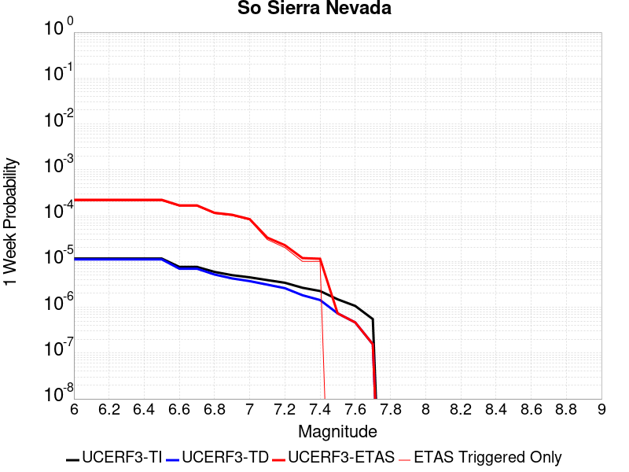 | 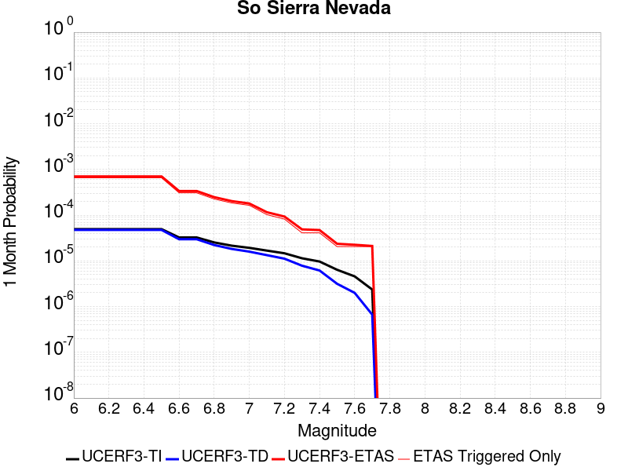 | 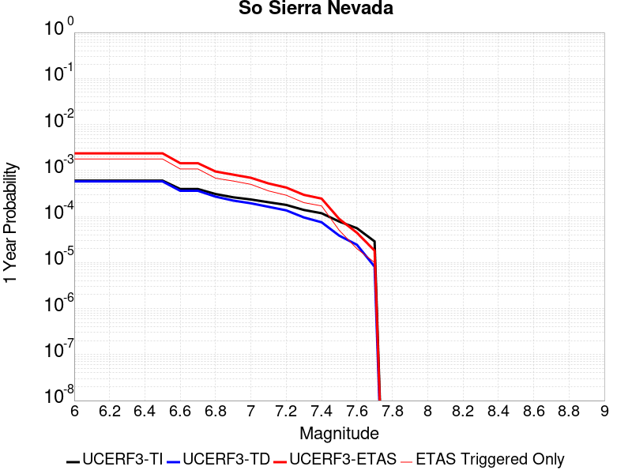 | 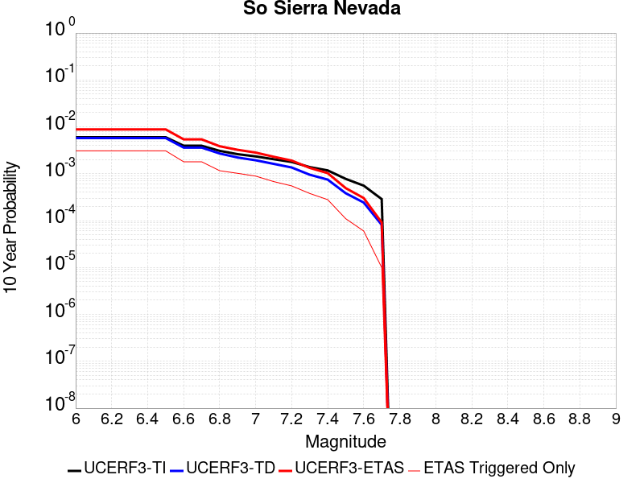 |

| Magnitude | 1 wk TI Prob | 1 wk TD Prob | 1 wk ETAS Prob | 1 wk ETAS/TD Gain | 1 wk ETAS Triggered Only | 1 mo TI Prob | 1 mo TD Prob | 1 mo ETAS Prob | 1 mo ETAS/TD Gain | 1 mo ETAS Triggered Only | 1 yr TI Prob | 1 yr TD Prob | 1 yr ETAS Prob | 1 yr ETAS/TD Gain | 1 yr ETAS Triggered Only | 10 yr TI Prob | 10 yr TD Prob | 10 yr ETAS Prob | 10 yr ETAS/TD Gain | 10 yr ETAS Triggered Only |
|-----|-----|-----|-----|-----|-----|-----|-----|-----|-----|-----|-----|-----|-----|-----|-----|-----|-----|-----|-----|-----|
| 6.0 | 1.15488665E-5 | 1.1079722E-5 | 2.210774E-4 | 19.953335 | 2.1E-4 | 4.9494203E-5 | 4.748373E-5 | 6.874533E-4 | 14.477661 | 6.4E-4 | 6.024253E-4 | 5.779738E-4 | 0.002356945 | 4.0779443 | 0.00178 | 0.006007948 | 0.005765975 | 0.008828216 | 1.5310881 | 0.00308 |
| 6.1 | 1.15488665E-5 | 1.1079722E-5 | 2.210774E-4 | 19.953335 | 2.1E-4 | 4.9494203E-5 | 4.748373E-5 | 6.874533E-4 | 14.477661 | 6.4E-4 | 6.024253E-4 | 5.779738E-4 | 0.002356945 | 4.0779443 | 0.00178 | 0.006007948 | 0.005765975 | 0.008828216 | 1.5310881 | 0.00308 |
| 6.2 | 1.15488665E-5 | 1.1079722E-5 | 2.210774E-4 | 19.953335 | 2.1E-4 | 4.9494203E-5 | 4.748373E-5 | 6.874533E-4 | 14.477661 | 6.4E-4 | 6.024253E-4 | 5.779738E-4 | 0.002356945 | 4.0779443 | 0.00178 | 0.006007948 | 0.005765975 | 0.008828216 | 1.5310881 | 0.00308 |
| 6.3 | 1.15488665E-5 | 1.1079722E-5 | 2.210774E-4 | 19.953335 | 2.1E-4 | 4.9494203E-5 | 4.748373E-5 | 6.874533E-4 | 14.477661 | 6.4E-4 | 6.024253E-4 | 5.779738E-4 | 0.002356945 | 4.0779443 | 0.00178 | 0.006007948 | 0.005765975 | 0.008828216 | 1.5310881 | 0.00308 |
| 6.4 | 1.15488665E-5 | 1.1079722E-5 | 2.210774E-4 | 19.953335 | 2.1E-4 | 4.9494203E-5 | 4.748373E-5 | 6.874533E-4 | 14.477661 | 6.4E-4 | 6.024253E-4 | 5.779738E-4 | 0.002356945 | 4.0779443 | 0.00178 | 0.006007948 | 0.005765975 | 0.008828216 | 1.5310881 | 0.00308 |
| 6.5 | 1.15488665E-5 | 1.1079722E-5 | 2.210774E-4 | 19.953335 | 2.1E-4 | 4.9494203E-5 | 4.748373E-5 | 6.874533E-4 | 14.477661 | 6.4E-4 | 6.024253E-4 | 5.779738E-4 | 0.002356945 | 4.0779443 | 0.00178 | 0.006007948 | 0.005765975 | 0.008828216 | 1.5310881 | 0.00308 |
| 6.6 | 7.587044E-6 | 6.935689E-6 | 1.6693458E-4 | 24.068926 | 1.6E-4 | 3.2515498E-5 | 2.9724059E-5 | 3.8971336E-4 | 13.111041 | 3.6E-4 | 3.9580427E-4 | 3.6183326E-4 | 0.0014414424 | 3.9837203 | 0.00108 | 0.003951 | 0.0036127327 | 0.0054062298 | 1.4964378 | 0.0018 |
| 6.7 | 7.587044E-6 | 6.935689E-6 | 1.6693458E-4 | 24.068926 | 1.6E-4 | 3.2515498E-5 | 2.9724059E-5 | 3.8971336E-4 | 13.111041 | 3.6E-4 | 3.9580427E-4 | 3.6183326E-4 | 0.0014414424 | 3.9837203 | 0.00108 | 0.003951 | 0.0036127327 | 0.0054062298 | 1.4964378 | 0.0018 |
| 6.8 | 5.9026956E-6 | 5.1794364E-6 | 1.1517887E-4 | 22.237722 | 1.1E-4 | 2.5297022E-5 | 2.2197402E-5 | 2.7219186E-4 | 12.262329 | 2.5E-4 | 3.0794772E-4 | 2.7022103E-4 | 9.5003727E-4 | 3.5157785 | 6.8E-4 | 0.0030752132 | 0.0026990408 | 0.00385591 | 1.4286224 | 0.00116 |
| 6.9 | 5.0118915E-6 | 4.2524644E-6 | 1.0425204E-4 | 24.515676 | 1.0E-4 | 2.1479358E-5 | 1.8224722E-5 | 2.282209E-4 | 12.522599 | 2.1E-4 | 2.614798E-4 | 2.2186415E-4 | 8.1173325E-4 | 3.658695 | 5.9E-4 | 0.0026117235 | 0.002216499 | 0.0032342381 | 1.4591652 | 0.00102 |
| 7.0 | 4.4924795E-6 | 3.713954E-6 | 8.3713654E-5 | 22.540306 | 8.0E-5 | 1.925334E-5 | 1.5916852E-5 | 1.8591415E-4 | 11.680334 | 1.7E-4 | 2.3438422E-4 | 1.9377106E-4 | 6.936742E-4 | 3.5798645 | 5.0E-4 | 0.0023413717 | 0.001936084 | 0.002824361 | 1.4588008 | 8.9E-4 |
| 7.1 | 3.9118436E-6 | 3.1120105E-6 | 3.3111915E-5 | 10.64004 | 3.0E-5 | 1.6764936E-5 | 1.3337123E-5 | 1.2333566E-4 | 9.247545 | 1.1E-4 | 2.0409399E-4 | 1.6236794E-4 | 5.223095E-4 | 3.2168264 | 3.6E-4 | 0.0020390663 | 0.0016225493 | 0.002301446 | 1.4184136 | 6.8E-4 |
| 7.2 | 3.4200818E-6 | 2.6054847E-6 | 2.2605433E-5 | 8.676095 | 2.0E-5 | 1.4657411E-5 | 1.11663185E-5 | 9.116543E-5 | 8.164323 | 8.0E-5 | 1.7843937E-4 | 1.3594194E-4 | 4.2590252E-4 | 3.1329737 | 2.9E-4 | 0.0017829615 | 0.0013586376 | 0.0019078903 | 1.4042673 | 5.5E-4 |
| 7.3 | 2.6593618E-6 | 1.8284468E-6 | 1.1828429E-5 | 6.469113 | 1.0E-5 | 1.13972155E-5 | 7.836179E-6 | 6.783571E-5 | 8.6567335 | 6.0E-5 | 1.3875226E-4 | 9.540159E-5 | 2.9538252E-4 | 3.096201 | 2.0E-4 | 0.0013866565 | 9.536353E-4 | 0.0013332729 | 1.3980951 | 3.8E-4 |
| 7.4 | 2.2577992E-6 | 1.4364622E-6 | 1.14364475E-5 | 7.9615374 | 1.0E-5 | 9.676246E-6 | 6.1562537E-6 | 5.6155946E-5 | 9.121773 | 5.0E-5 | 1.1780193E-4 | 7.495006E-5 | 2.449373E-4 | 3.2680068 | 1.7E-4 | 0.001177395 | 7.4927293E-4 | 0.0010290631 | 1.3734156 | 2.8E-4 |
| 7.5 | 1.489319E-6 | 7.3541264E-7 | 7.3541264E-7 | 1.0 | 0.0 | 6.3827797E-6 | 3.1517645E-6 | 1.3151733E-5 | 4.172816 | 1.0E-5 | 7.770758E-5 | 3.837206E-5 | 8.837014E-5 | 2.3029814 | 5.0E-5 | 7.7680405E-4 | 3.836548E-4 | 4.936126E-4 | 1.2866061 | 1.1E-4 |
| 7.6 | 1.0680322E-6 | 4.659796E-7 | 4.659796E-7 | 1.0 | 0.0 | 4.577273E-6 | 1.997054E-6 | 1.1997034E-5 | 6.007366 | 1.0E-5 | 5.5726876E-5 | 2.4313864E-5 | 4.4313376E-5 | 1.822556 | 2.0E-5 | 5.5712904E-4 | 2.431123E-4 | 3.030977E-4 | 1.2467395 | 6.0E-5 |
| 7.7 | 5.509146E-7 | 1.5581199E-7 | 1.5581199E-7 | 1.0 | 0.0 | 2.3610605E-6 | 6.677655E-7 | 1.0667759E-5 | 15.9753065 | 1.0E-5 | 2.8745531E-5 | 8.130016E-6 | 1.8129935E-5 | 2.2299998 | 1.0E-5 | 2.8741814E-4 | 8.12973E-5 | 9.129649E-5 | 1.1229953 | 1.0E-5 |

## San Andreas (Mojave S)
*[(top)](#table-of-contents)*

| 1 Week | 1 Month | 1 Year | 10 Year |
|-----|-----|-----|-----|
| 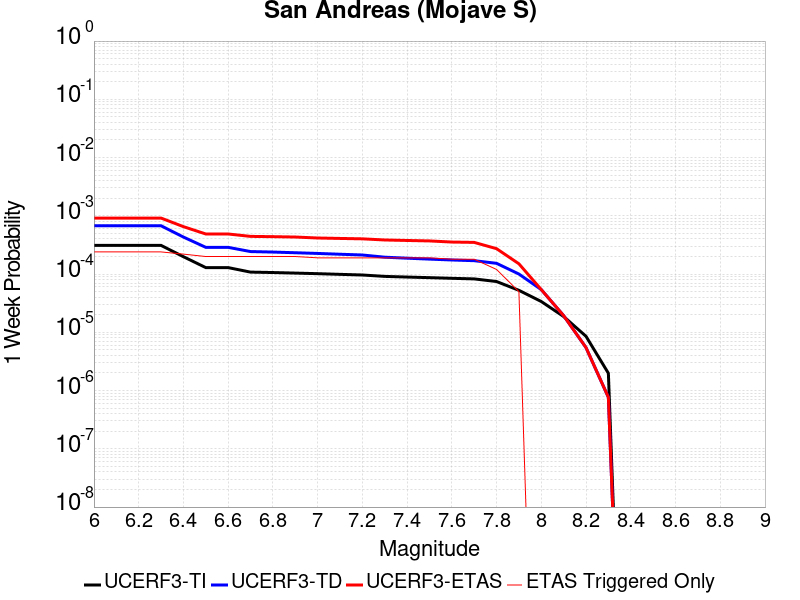 | 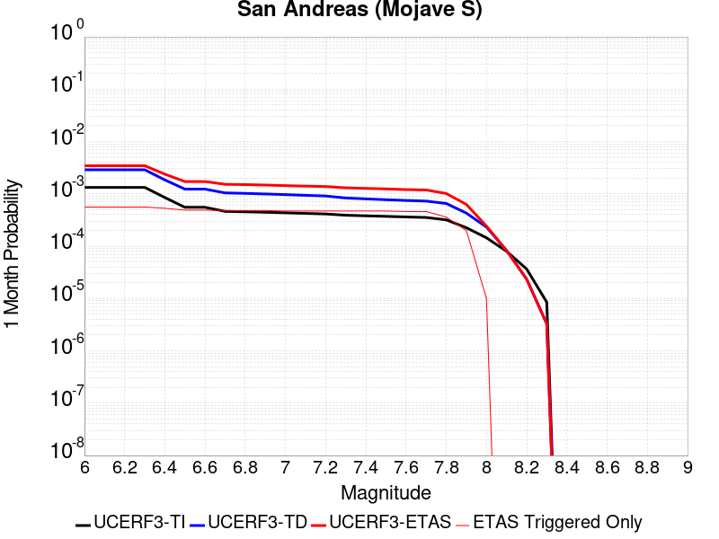 | 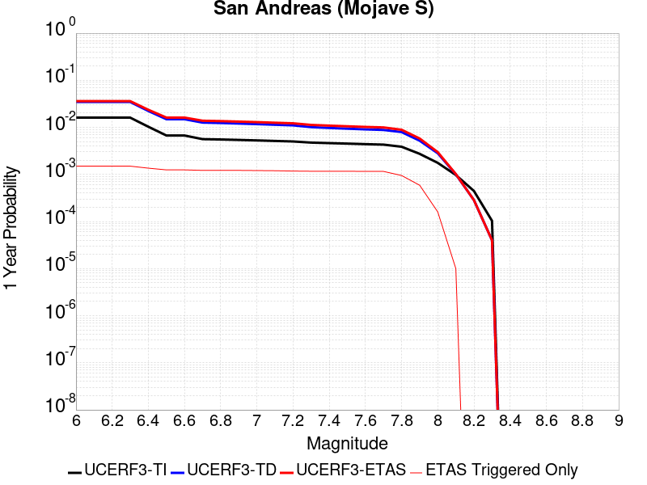 | 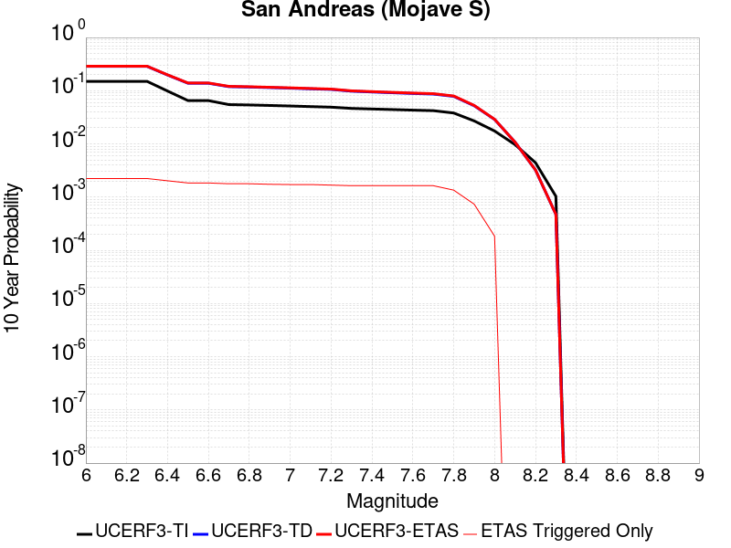 |

| Magnitude | 1 wk TI Prob | 1 wk TD Prob | 1 wk ETAS Prob | 1 wk ETAS/TD Gain | 1 wk ETAS Triggered Only | 1 mo TI Prob | 1 mo TD Prob | 1 mo ETAS Prob | 1 mo ETAS/TD Gain | 1 mo ETAS Triggered Only | 1 yr TI Prob | 1 yr TD Prob | 1 yr ETAS Prob | 1 yr ETAS/TD Gain | 1 yr ETAS Triggered Only | 10 yr TI Prob | 10 yr TD Prob | 10 yr ETAS Prob | 10 yr ETAS/TD Gain | 10 yr ETAS Triggered Only |
|-----|-----|-----|-----|-----|-----|-----|-----|-----|-----|-----|-----|-----|-----|-----|-----|-----|-----|-----|-----|-----|
| 6.0 | 3.1064058E-4 | 6.747043E-4 | 9.145424E-4 | 1.3554714 | 2.4E-4 | 0.0013306376 | 0.002888514 | 0.0034468963 | 1.1933113 | 5.6E-4 | 0.016080605 | 0.03462661 | 0.036074672 | 1.0418193 | 0.0015 | 0.1496549 | 0.28663692 | 0.2883704 | 1.0060476 | 0.00243 |
| 6.1 | 3.1064058E-4 | 6.747043E-4 | 9.145424E-4 | 1.3554714 | 2.4E-4 | 0.0013306376 | 0.002888514 | 0.0034468963 | 1.1933113 | 5.6E-4 | 0.016080605 | 0.03462661 | 0.036074672 | 1.0418193 | 0.0015 | 0.1496549 | 0.28663692 | 0.2883704 | 1.0060476 | 0.00243 |
| 6.2 | 3.1064058E-4 | 6.747043E-4 | 9.145424E-4 | 1.3554714 | 2.4E-4 | 0.0013306376 | 0.002888514 | 0.0034468963 | 1.1933113 | 5.6E-4 | 0.016080605 | 0.03462661 | 0.036074672 | 1.0418193 | 0.0015 | 0.1496549 | 0.28663692 | 0.2883704 | 1.0060476 | 0.00243 |
| 6.3 | 3.1064058E-4 | 6.747043E-4 | 9.145424E-4 | 1.3554714 | 2.4E-4 | 0.0013306376 | 0.002888514 | 0.0034468963 | 1.1933113 | 5.6E-4 | 0.016080605 | 0.03462661 | 0.036074672 | 1.0418193 | 0.0015 | 0.1496549 | 0.28663692 | 0.2883704 | 1.0060476 | 0.00243 |
| 6.4 | 1.9872203E-4 | 4.318848E-4 | 6.5178983E-4 | 1.5091751 | 2.2E-4 | 8.5138786E-4 | 0.0018496502 | 0.0023786698 | 1.2860106 | 5.3E-4 | 0.010316478 | 0.022293096 | 0.02362278 | 1.0596454 | 0.00136 | 0.098504856 | 0.19703239 | 0.1987909 | 1.008925 | 0.00219 |
| 6.5 | 1.291105E-4 | 2.8761322E-4 | 4.875557E-4 | 1.6951784 | 2.0E-4 | 5.5321335E-4 | 0.0012320485 | 0.0017214448 | 1.3972216 | 4.9E-4 | 0.006714592 | 0.0148978485 | 0.016129225 | 1.0826547 | 0.00125 | 0.065152965 | 0.13807017 | 0.13977678 | 1.0123606 | 0.00198 |
| 6.6 | 1.291105E-4 | 2.8761322E-4 | 4.875557E-4 | 1.6951784 | 2.0E-4 | 5.5321335E-4 | 0.0012320485 | 0.0017214448 | 1.3972216 | 4.9E-4 | 0.006714592 | 0.0148978485 | 0.016129225 | 1.0826547 | 0.00125 | 0.065152965 | 0.13807017 | 0.13977678 | 1.0123606 | 0.00198 |
| 6.7 | 1.08001186E-4 | 2.4342406E-4 | 4.4337538E-4 | 1.8214115 | 2.0E-4 | 4.6278012E-4 | 0.0010428295 | 0.0015223288 | 1.4598062 | 4.8E-4 | 0.0056198016 | 0.012622835 | 0.013827435 | 1.0954303 | 0.00122 | 0.054797906 | 0.11921291 | 0.12088641 | 1.0140378 | 0.0019 |
| 6.8 | 1.0624356E-4 | 2.3860046E-4 | 4.3855276E-4 | 1.8380213 | 2.0E-4 | 4.5525006E-4 | 0.0010221732 | 0.0015016826 | 1.4691077 | 4.8E-4 | 0.0055285925 | 0.01237422 | 0.013579124 | 1.097372 | 0.00122 | 0.053930566 | 0.117162056 | 0.11883062 | 1.0142415 | 0.00189 |
| 6.9 | 1.0393785E-4 | 2.3230357E-4 | 4.322571E-4 | 1.8607424 | 2.0E-4 | 4.4537184E-4 | 9.952073E-4 | 0.0014747296 | 1.4818316 | 4.8E-4 | 0.0054089287 | 0.012049583 | 0.013254883 | 1.1000283 | 0.00122 | 0.05279156 | 0.11445948 | 0.11611544 | 1.0144677 | 0.00187 |
| 7.0 | 1.0155622E-4 | 2.2599897E-4 | 4.1595602E-4 | 1.8405218 | 1.9E-4 | 4.3516833E-4 | 9.682079E-4 | 0.0014377529 | 1.4849629 | 4.7E-4 | 0.005285311 | 0.011724443 | 0.012920257 | 1.1019932 | 0.00121 | 0.05161361 | 0.11171984 | 0.11337204 | 1.0147887 | 0.00186 |
| 7.1 | 9.885595E-5 | 2.1888265E-4 | 4.0884106E-4 | 1.8678551 | 1.9E-4 | 4.2359953E-4 | 9.377316E-4 | 0.0014072908 | 1.5007396 | 4.7E-4 | 0.0051451353 | 0.011357316 | 0.012543688 | 1.1044588 | 0.0012 | 0.05027629 | 0.10860426 | 0.11025334 | 1.0151843 | 0.00185 |
| 7.2 | 9.6411415E-5 | 2.125122E-4 | 4.024718E-4 | 1.8938763 | 1.9E-4 | 4.1312634E-4 | 9.1044896E-4 | 0.0013800211 | 1.5157589 | 4.7E-4 | 0.005018219 | 0.01102856 | 0.012195546 | 1.1058149 | 0.00118 | 0.049064007 | 0.10579402 | 0.10743041 | 1.0154678 | 0.00183 |
| 7.3 | 9.1180635E-5 | 1.9479371E-4 | 3.847567E-4 | 1.9752008 | 1.9E-4 | 3.907156E-4 | 8.345632E-4 | 0.0013041709 | 1.5626988 | 4.7E-4 | 0.004746591 | 0.010113581 | 0.011271749 | 1.114516 | 0.00117 | 0.046464786 | 0.09798661 | 0.099619254 | 1.0166619 | 0.00181 |
| 7.4 | 8.887388E-5 | 1.8727897E-4 | 3.7724338E-4 | 2.0143392 | 1.9E-4 | 3.8083247E-4 | 8.023774E-4 | 0.0012720003 | 1.5852892 | 4.7E-4 | 0.0046267817 | 0.009725285 | 0.010883906 | 1.1191349 | 0.00117 | 0.045316286 | 0.09462135 | 0.096260086 | 1.0173188 | 0.00181 |
| 7.5 | 8.6750515E-5 | 1.8059391E-4 | 3.705596E-4 | 2.0518942 | 1.9E-4 | 3.7173493E-4 | 7.7374437E-4 | 0.0012433807 | 1.6069658 | 4.7E-4 | 0.004516484 | 0.009379733 | 0.01053876 | 1.123567 | 0.00117 | 0.04425787 | 0.09158487 | 0.09322002 | 1.0178539 | 0.0018 |
| 7.6 | 8.453092E-5 | 1.7446902E-4 | 3.5443762E-4 | 2.0315218 | 1.8E-4 | 3.6222505E-4 | 7.475102E-4 | 0.0012071664 | 1.6149162 | 4.6E-4 | 0.0044011753 | 0.009063034 | 0.010212521 | 1.1268325 | 0.00116 | 0.04315024 | 0.088743635 | 0.09036567 | 1.0182778 | 0.00178 |
| 7.7 | 8.259102E-5 | 1.6968958E-4 | 3.4965904E-4 | 2.0605805 | 1.8E-4 | 3.539135E-4 | 7.270384E-4 | 0.001186704 | 1.6322439 | 4.6E-4 | 0.004300386 | 0.008815835 | 0.009965609 | 1.1304214 | 0.00116 | 0.042181134 | 0.08649418 | 0.088120215 | 1.0187994 | 0.00178 |
| 7.8 | 7.444844E-5 | 1.5290553E-4 | 2.7288718E-4 | 1.7846782 | 1.2E-4 | 3.1902574E-4 | 6.551449E-4 | 0.001014909 | 1.5491368 | 3.6E-4 | 0.0038772223 | 0.007947266 | 0.008889717 | 1.118588 | 9.5E-4 | 0.03810269 | 0.07832232 | 0.0796864 | 1.0174162 | 0.00148 |
| 7.9 | 5.2586525E-5 | 1.0011239E-4 | 1.5010739E-4 | 1.4993887 | 5.0E-5 | 2.2535135E-4 | 4.2898257E-4 | 6.2889676E-4 | 1.4660194 | 2.0E-4 | 0.0027402006 | 0.005210366 | 0.005797292 | 1.1126457 | 5.9E-4 | 0.027066574 | 0.052222524 | 0.053028136 | 1.0154265 | 8.5E-4 |
| 8.0 | 3.379877E-5 | 5.4101976E-5 | 5.4101976E-5 | 1.0 | 0.0 | 1.4484383E-4 | 2.3184501E-4 | 2.4184269E-4 | 1.0431223 | 1.0E-5 | 0.0017620471 | 0.002819061 | 0.00297861 | 1.0565965 | 1.6E-4 | 0.017481409 | 0.028848516 | 0.029091304 | 1.0084159 | 2.5E-4 |
| 8.1 | 1.8668277E-5 | 1.9322531E-5 | 1.9322531E-5 | 1.0 | 0.0 | 8.000444E-5 | 8.280823E-5 | 8.280823E-5 | 1.0 | 0.0 | 9.736188E-4 | 0.0010077246 | 0.0010177144 | 1.0099133 | 1.0E-5 | 0.009693642 | 0.010805754 | 0.010815646 | 1.0009154 | 1.0E-5 |
| 8.2 | 8.541571E-6 | 5.465789E-6 | 5.465789E-6 | 1.0 | 0.0 | 3.660622E-5 | 2.34246E-5 | 2.34246E-5 | 1.0 | 0.0 | 4.455896E-4 | 2.8515726E-4 | 2.8515726E-4 | 1.0 | 0.0 | 0.0044469717 | 0.0032435213 | 0.0032435213 | 1.0 | 0.0 |
| 8.3 | 1.983087E-6 | 7.668296E-7 | 7.668296E-7 | 1.0 | 0.0 | 8.498917E-6 | 3.2864084E-6 | 3.2864084E-6 | 1.0 | 0.0 | 1.034694E-4 | 4.0011306E-5 | 4.0011306E-5 | 1.0 | 0.0 | 0.0010342124 | 4.724499E-4 | 4.724499E-4 | 1.0 | 0.0 |

## Coyote Canyon
*[(top)](#table-of-contents)*

| 1 Week | 1 Month | 1 Year | 10 Year |
|-----|-----|-----|-----|
| 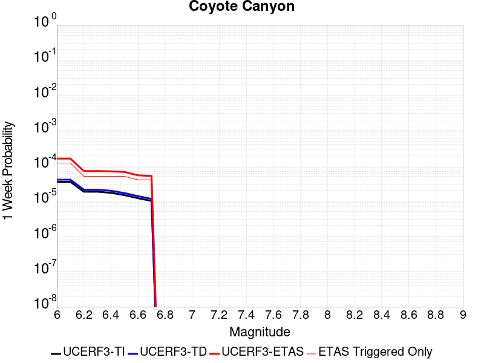 | 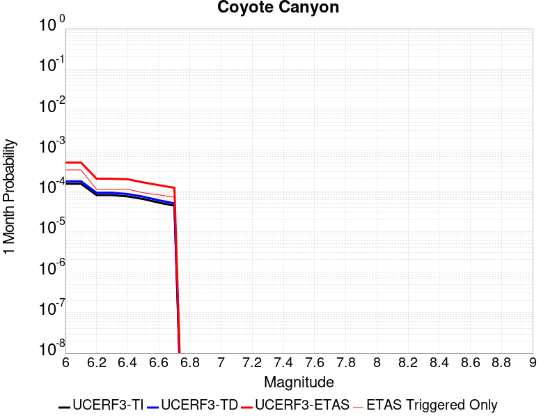 | 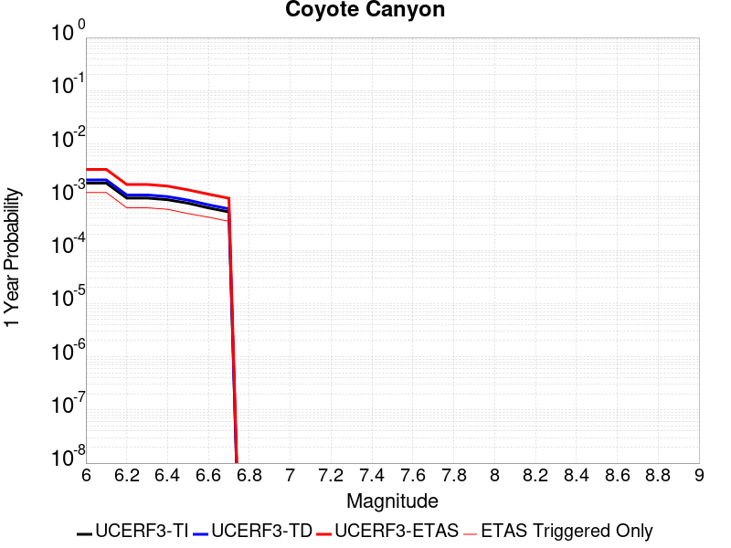 | 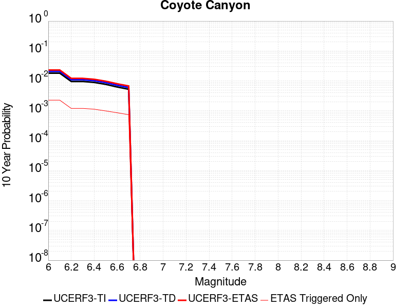 |

| Magnitude | 1 wk TI Prob | 1 wk TD Prob | 1 wk ETAS Prob | 1 wk ETAS/TD Gain | 1 wk ETAS Triggered Only | 1 mo TI Prob | 1 mo TD Prob | 1 mo ETAS Prob | 1 mo ETAS/TD Gain | 1 mo ETAS Triggered Only | 1 yr TI Prob | 1 yr TD Prob | 1 yr ETAS Prob | 1 yr ETAS/TD Gain | 1 yr ETAS Triggered Only | 10 yr TI Prob | 10 yr TD Prob | 10 yr ETAS Prob | 10 yr ETAS/TD Gain | 10 yr ETAS Triggered Only |
|-----|-----|-----|-----|-----|-----|-----|-----|-----|-----|-----|-----|-----|-----|-----|-----|-----|-----|-----|-----|-----|
| 6.0 | 3.5090034E-5 | 4.036513E-5 | 1.6036029E-4 | 3.972743 | 1.2E-4 | 1.503772E-4 | 1.7298339E-4 | 5.029263E-4 | 2.9073675 | 3.3E-4 | 0.0018293047 | 0.0021042947 | 0.0033217275 | 1.5785468 | 0.00122 | 0.018143194 | 0.020869615 | 0.02309224 | 1.1065006 | 0.00227 |
| 6.1 | 3.5090034E-5 | 4.036513E-5 | 1.6036029E-4 | 3.972743 | 1.2E-4 | 1.503772E-4 | 1.7298339E-4 | 5.029263E-4 | 2.9073675 | 3.3E-4 | 0.0018293047 | 0.0021042947 | 0.0033217275 | 1.5785468 | 0.00122 | 0.018143194 | 0.020869615 | 0.02309224 | 1.1065006 | 0.00227 |
| 6.2 | 1.841879E-5 | 2.1060194E-5 | 7.105914E-5 | 3.374097 | 5.0E-5 | 7.8935285E-5 | 9.0255424E-5 | 2.002455E-4 | 2.2186532 | 1.1E-4 | 9.606133E-4 | 0.0010984079 | 0.0017277158 | 1.5729275 | 6.3E-4 | 0.0095647145 | 0.010939874 | 0.012126747 | 1.1084905 | 0.0012 |
| 6.3 | 1.841879E-5 | 2.1060194E-5 | 7.105914E-5 | 3.374097 | 5.0E-5 | 7.8935285E-5 | 9.0255424E-5 | 2.002455E-4 | 2.2186532 | 1.1E-4 | 9.606133E-4 | 0.0010984079 | 0.0017277158 | 1.5729275 | 6.3E-4 | 0.0095647145 | 0.010939874 | 0.012126747 | 1.1084905 | 0.0012 |
| 6.4 | 1.712201E-5 | 1.9565581E-5 | 6.95646E-5 | 3.5554578 | 5.0E-5 | 7.337798E-5 | 8.385037E-5 | 1.9384114E-4 | 2.3117507 | 1.1E-4 | 8.930107E-4 | 0.0010205007 | 0.0016098985 | 1.5775576 | 5.9E-4 | 0.008894307 | 0.0101680625 | 0.011286573 | 1.1100023 | 0.00113 |
| 6.5 | 1.4744935E-5 | 1.6837288E-5 | 6.6836445E-5 | 3.9695492 | 5.0E-5 | 6.3191044E-5 | 7.215834E-5 | 1.6215185E-4 | 2.247167 | 9.0E-5 | 7.6907943E-4 | 8.7826716E-4 | 0.0013678368 | 1.5574268 | 4.9E-4 | 0.007664232 | 0.008757159 | 0.009738489 | 1.1120603 | 9.9E-4 |
| 6.6 | 1.2017839E-5 | 1.3724348E-5 | 5.3723797E-5 | 3.9144883 | 4.0E-5 | 5.150401E-5 | 5.8817808E-5 | 1.388131E-4 | 2.3600523 | 8.0E-5 | 6.268809E-4 | 7.159601E-4 | 0.0011356594 | 1.5862049 | 4.2E-4 | 0.0062511545 | 0.007145228 | 0.007999083 | 1.1195 | 8.6E-4 |
| 6.7 | 1.00956095E-5 | 1.1533734E-5 | 5.1533272E-5 | 4.4680476 | 4.0E-5 | 4.326618E-5 | 4.9429844E-5 | 1.1942638E-4 | 2.4160786 | 7.0E-5 | 5.266384E-4 | 6.0172915E-4 | 9.5151854E-4 | 1.581307 | 3.5E-4 | 0.005253921 | 0.006009526 | 0.006745079 | 1.1223978 | 7.4E-4 |

## San Andreas (Mojave N)
*[(top)](#table-of-contents)*

| 1 Week | 1 Month | 1 Year | 10 Year |
|-----|-----|-----|-----|
| 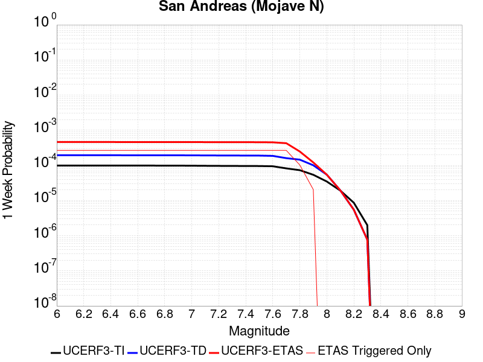 | 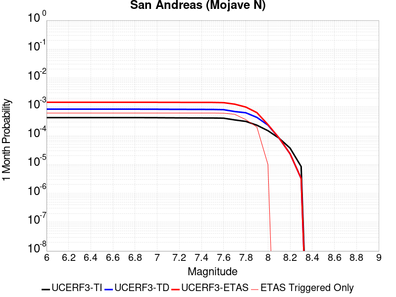 | 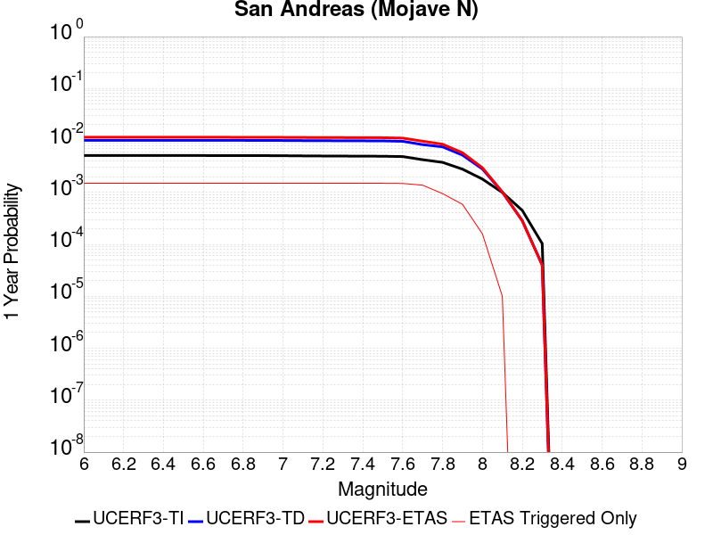 | 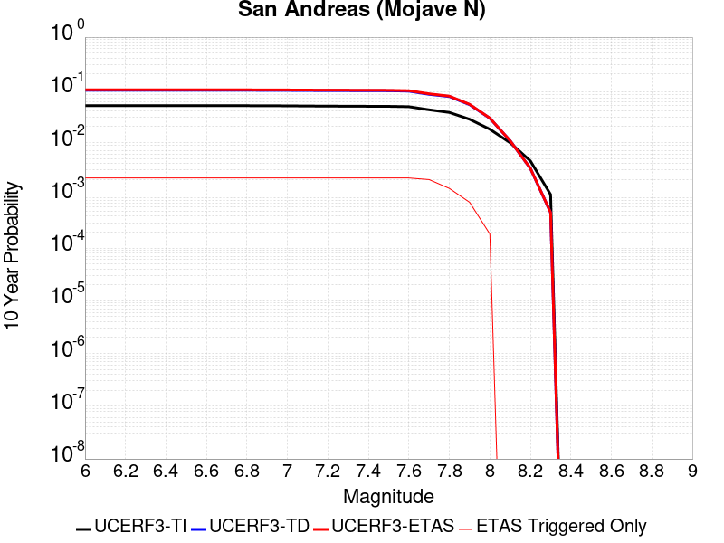 |

| Magnitude | 1 wk TI Prob | 1 wk TD Prob | 1 wk ETAS Prob | 1 wk ETAS/TD Gain | 1 wk ETAS Triggered Only | 1 mo TI Prob | 1 mo TD Prob | 1 mo ETAS Prob | 1 mo ETAS/TD Gain | 1 mo ETAS Triggered Only | 1 yr TI Prob | 1 yr TD Prob | 1 yr ETAS Prob | 1 yr ETAS/TD Gain | 1 yr ETAS Triggered Only | 10 yr TI Prob | 10 yr TD Prob | 10 yr ETAS Prob | 10 yr ETAS/TD Gain | 10 yr ETAS Triggered Only |
|-----|-----|-----|-----|-----|-----|-----|-----|-----|-----|-----|-----|-----|-----|-----|-----|-----|-----|-----|-----|-----|
| 6.0 | 9.877682E-5 | 1.9409315E-4 | 4.6404076E-4 | 2.3908145 | 2.7E-4 | 4.2326056E-4 | 8.315628E-4 | 0.0014410556 | 1.7329485 | 6.1E-4 | 0.0051410277 | 0.010077406 | 0.01156229 | 1.1473478 | 0.0015 | 0.05023708 | 0.09835201 | 0.10050695 | 1.0219104 | 0.00239 |
| 6.1 | 9.877682E-5 | 1.9409315E-4 | 4.6404076E-4 | 2.3908145 | 2.7E-4 | 4.2326056E-4 | 8.315628E-4 | 0.0014410556 | 1.7329485 | 6.1E-4 | 0.0051410277 | 0.010077406 | 0.01156229 | 1.1473478 | 0.0015 | 0.05023708 | 0.09835201 | 0.10050695 | 1.0219104 | 0.00239 |
| 6.2 | 9.877682E-5 | 1.9409315E-4 | 4.6404076E-4 | 2.3908145 | 2.7E-4 | 4.2326056E-4 | 8.315628E-4 | 0.0014410556 | 1.7329485 | 6.1E-4 | 0.0051410277 | 0.010077406 | 0.01156229 | 1.1473478 | 0.0015 | 0.05023708 | 0.09835201 | 0.10050695 | 1.0219104 | 0.00239 |
| 6.3 | 9.877682E-5 | 1.9409315E-4 | 4.6404076E-4 | 2.3908145 | 2.7E-4 | 4.2326056E-4 | 8.315628E-4 | 0.0014410556 | 1.7329485 | 6.1E-4 | 0.0051410277 | 0.010077406 | 0.01156229 | 1.1473478 | 0.0015 | 0.05023708 | 0.09835201 | 0.10050695 | 1.0219104 | 0.00239 |
| 6.4 | 9.877682E-5 | 1.9409315E-4 | 4.6404076E-4 | 2.3908145 | 2.7E-4 | 4.2326056E-4 | 8.315628E-4 | 0.0014410556 | 1.7329485 | 6.1E-4 | 0.0051410277 | 0.010077406 | 0.01156229 | 1.1473478 | 0.0015 | 0.05023708 | 0.09835201 | 0.10050695 | 1.0219104 | 0.00239 |
| 6.5 | 9.861474E-5 | 1.9383078E-4 | 4.6377844E-4 | 2.3926976 | 2.7E-4 | 4.2256617E-4 | 8.304391E-4 | 0.0014399325 | 1.7339412 | 6.1E-4 | 0.0051326132 | 0.010063851 | 0.011548756 | 1.1475483 | 0.0015 | 0.050156746 | 0.098229796 | 0.100385025 | 1.0219407 | 0.00239 |
| 6.6 | 9.861474E-5 | 1.9383078E-4 | 4.6377844E-4 | 2.3926976 | 2.7E-4 | 4.2256617E-4 | 8.304391E-4 | 0.0014399325 | 1.7339412 | 6.1E-4 | 0.0051326132 | 0.010063851 | 0.011548756 | 1.1475483 | 0.0015 | 0.050156746 | 0.098229796 | 0.100385025 | 1.0219407 | 0.00239 |
| 6.7 | 9.8552715E-5 | 1.9373032E-4 | 4.63678E-4 | 2.39342 | 2.7E-4 | 4.223004E-4 | 8.3000876E-4 | 0.0014395025 | 1.734322 | 6.1E-4 | 0.0051293927 | 0.01005866 | 0.011543572 | 1.1476252 | 0.0015 | 0.050125998 | 0.098182976 | 0.10033832 | 1.0219523 | 0.00239 |
| 6.8 | 9.8464974E-5 | 1.9358192E-4 | 4.6352964E-4 | 2.3944883 | 2.7E-4 | 4.219245E-4 | 8.293732E-4 | 0.0014388673 | 1.7348852 | 6.1E-4 | 0.0051248376 | 0.010050993 | 0.011535917 | 1.1477389 | 0.0015 | 0.05008251 | 0.09811299 | 0.100268506 | 1.0219697 | 0.00239 |
| 6.9 | 9.825824E-5 | 1.9326196E-4 | 4.6320978E-4 | 2.3967974 | 2.7E-4 | 4.2103877E-4 | 8.280028E-4 | 0.0014374978 | 1.7361025 | 6.1E-4 | 0.0051141046 | 0.010034463 | 0.011519412 | 1.1479849 | 0.0015 | 0.049980022 | 0.09796208 | 0.10011795 | 1.0220072 | 0.00239 |
| 7.0 | 9.781462E-5 | 1.9257552E-4 | 4.6252352E-4 | 2.4017773 | 2.7E-4 | 4.1913814E-4 | 8.250628E-4 | 0.0014345596 | 1.7387277 | 6.1E-4 | 0.005091073 | 0.009998998 | 0.011483999 | 1.148515 | 0.0015 | 0.04976007 | 0.097638436 | 0.09979508 | 1.022088 | 0.00239 |
| 7.1 | 9.7121134E-5 | 1.9159251E-4 | 4.6154077E-4 | 2.4089708 | 2.7E-4 | 4.1616702E-4 | 8.208525E-4 | 0.0014303519 | 1.7425199 | 6.1E-4 | 0.005055068 | 0.009948207 | 0.011433285 | 1.1492809 | 0.0015 | 0.04941613 | 0.097174905 | 0.09933266 | 1.0222049 | 0.00239 |
| 7.2 | 9.663819E-5 | 1.9090026E-4 | 4.608487E-4 | 2.414081 | 2.7E-4 | 4.1409794E-4 | 8.178876E-4 | 0.0014273888 | 1.7452137 | 6.1E-4 | 0.0050299936 | 0.009912439 | 0.011397569 | 1.149825 | 0.0015 | 0.049176537 | 0.09684814 | 0.09900667 | 1.0222878 | 0.00239 |
| 7.3 | 9.6277574E-5 | 1.9042526E-4 | 4.6037385E-4 | 2.417609 | 2.7E-4 | 4.125529E-4 | 8.158532E-4 | 0.0014253556 | 1.7470735 | 6.1E-4 | 0.0050112694 | 0.009887895 | 0.011373063 | 1.1502006 | 0.0015 | 0.04899759 | 0.09662155 | 0.098780625 | 1.0223457 | 0.00239 |
| 7.4 | 9.593308E-5 | 1.8982294E-4 | 4.597717E-4 | 2.4221082 | 2.7E-4 | 4.1107697E-4 | 8.132734E-4 | 0.0014227773 | 1.7494452 | 6.1E-4 | 0.0049933824 | 0.00985677 | 0.011341985 | 1.1506797 | 0.0015 | 0.04882661 | 0.09633968 | 0.09849943 | 1.022418 | 0.00239 |
| 7.5 | 9.561707E-5 | 1.8928363E-4 | 4.592325E-4 | 2.4261608 | 2.7E-4 | 4.0972308E-4 | 8.109635E-4 | 0.0014204688 | 1.7515817 | 6.1E-4 | 0.0049769743 | 0.009828901 | 0.011314158 | 1.1511111 | 0.0015 | 0.048669744 | 0.09608582 | 0.09824617 | 1.0224836 | 0.00239 |
| 7.6 | 9.418194E-5 | 1.8580563E-4 | 4.4575732E-4 | 2.3990517 | 2.6E-4 | 4.0357444E-4 | 7.96067E-4 | 0.0013955894 | 1.7531054 | 6.0E-4 | 0.004902454 | 0.009649157 | 0.0111247795 | 1.1529276 | 0.00149 | 0.047957025 | 0.09446791 | 0.09662307 | 1.0228138 | 0.00238 |
| 7.7 | 8.202141E-5 | 1.6029038E-4 | 4.102503E-4 | 2.5594194 | 2.5E-4 | 3.51473E-4 | 6.86778E-4 | 0.0012364002 | 1.8002911 | 5.5E-4 | 0.00427079 | 0.008329522 | 0.009698027 | 1.1642958 | 0.00138 | 0.04189639 | 0.08226675 | 0.084285766 | 1.0245423 | 0.0022 |
| 7.8 | 7.2859846E-5 | 1.4523414E-4 | 2.6521672E-4 | 1.826132 | 1.2E-4 | 3.1221908E-4 | 6.2228355E-4 | 9.820595E-4 | 1.5781544 | 3.6E-4 | 0.003794643 | 0.007550025 | 0.008492853 | 1.1248775 | 9.5E-4 | 0.037304975 | 0.074755974 | 0.07612534 | 1.0183177 | 0.00148 |
| 7.9 | 5.3874453E-5 | 1.0050546E-4 | 1.5050043E-4 | 1.4974355 | 5.0E-5 | 2.3087008E-4 | 4.3066658E-4 | 6.305805E-4 | 1.4641963 | 2.0E-4 | 0.0028072202 | 0.005230771 | 0.005817685 | 1.1122041 | 5.9E-4 | 0.02772022 | 0.052447177 | 0.0532526 | 1.0153568 | 8.5E-4 |
| 8.0 | 3.468538E-5 | 5.4288335E-5 | 5.4288335E-5 | 1.0 | 0.0 | 1.4864317E-4 | 2.3264355E-4 | 2.4264122E-4 | 1.0429742 | 1.0E-5 | 0.0018082283 | 0.0028287582 | 0.0029883054 | 1.056402 | 1.6E-4 | 0.017935853 | 0.028961267 | 0.029204028 | 1.0083822 | 2.5E-4 |
| 8.1 | 1.9152367E-5 | 1.9415891E-5 | 1.9415891E-5 | 1.0 | 0.0 | 8.207899E-5 | 8.320831E-5 | 8.320831E-5 | 1.0 | 0.0 | 9.988535E-4 | 0.0010125911 | 0.0010225809 | 1.0098656 | 1.0E-5 | 0.009943757 | 0.010863188 | 0.010873079 | 1.0009105 | 1.0E-5 |
| 8.2 | 8.643924E-6 | 5.4798497E-6 | 5.4798497E-6 | 1.0 | 0.0 | 3.704486E-5 | 2.348486E-5 | 2.348486E-5 | 1.0 | 0.0 | 4.5092785E-4 | 2.858907E-4 | 2.858907E-4 | 1.0 | 0.0 | 0.0045001395 | 0.0032514327 | 0.0032514327 | 1.0 | 0.0 |
| 8.3 | 1.983087E-6 | 7.668296E-7 | 7.668296E-7 | 1.0 | 0.0 | 8.498917E-6 | 3.2864084E-6 | 3.2864084E-6 | 1.0 | 0.0 | 1.034694E-4 | 4.0011306E-5 | 4.0011306E-5 | 1.0 | 0.0 | 0.0010342124 | 4.724499E-4 | 4.724499E-4 | 1.0 | 0.0 |

## Death Valley (So)
*[(top)](#table-of-contents)*

| 1 Week | 1 Month | 1 Year | 10 Year |
|-----|-----|-----|-----|
| 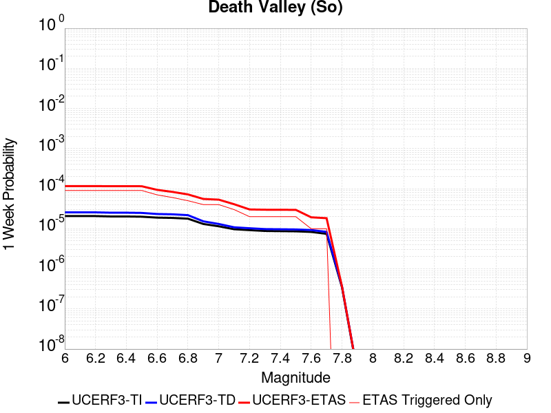 | 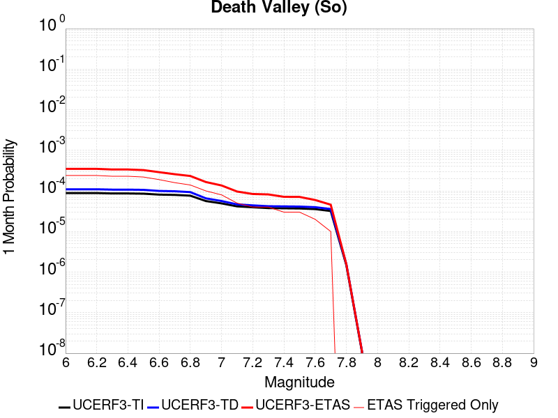 | 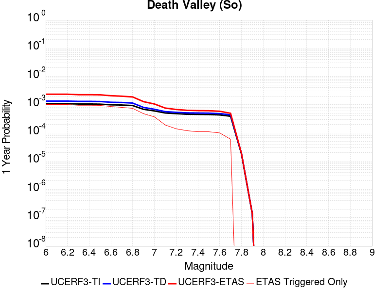 | 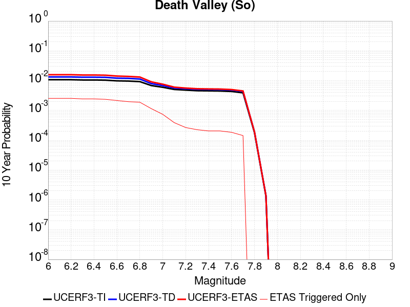 |

| Magnitude | 1 wk TI Prob | 1 wk TD Prob | 1 wk ETAS Prob | 1 wk ETAS/TD Gain | 1 wk ETAS Triggered Only | 1 mo TI Prob | 1 mo TD Prob | 1 mo ETAS Prob | 1 mo ETAS/TD Gain | 1 mo ETAS Triggered Only | 1 yr TI Prob | 1 yr TD Prob | 1 yr ETAS Prob | 1 yr ETAS/TD Gain | 1 yr ETAS Triggered Only | 10 yr TI Prob | 10 yr TD Prob | 10 yr ETAS Prob | 10 yr ETAS/TD Gain | 10 yr ETAS Triggered Only |
|-----|-----|-----|-----|-----|-----|-----|-----|-----|-----|-----|-----|-----|-----|-----|-----|-----|-----|-----|-----|-----|
| 6.0 | 2.0684236E-5 | 2.5618423E-5 | 1.15616116E-4 | 4.5130067 | 9.0E-5 | 8.864371E-5 | 1.09788714E-4 | 3.4976235E-4 | 3.185777 | 2.4E-4 | 0.0010787029 | 0.0013358749 | 0.0023445257 | 1.7550489 | 0.00101 | 0.010734817 | 0.013281729 | 0.015501845 | 1.1671556 | 0.00225 |
| 6.1 | 2.0684236E-5 | 2.5618423E-5 | 1.15616116E-4 | 4.5130067 | 9.0E-5 | 8.864371E-5 | 1.09788714E-4 | 3.4976235E-4 | 3.185777 | 2.4E-4 | 0.0010787029 | 0.0013358749 | 0.0023445257 | 1.7550489 | 0.00101 | 0.010734817 | 0.013281729 | 0.015501845 | 1.1671556 | 0.00225 |
| 6.2 | 2.0684236E-5 | 2.5618423E-5 | 1.15616116E-4 | 4.5130067 | 9.0E-5 | 8.864371E-5 | 1.09788714E-4 | 3.4976235E-4 | 3.185777 | 2.4E-4 | 0.0010787029 | 0.0013358749 | 0.0023445257 | 1.7550489 | 0.00101 | 0.010734817 | 0.013281729 | 0.015501845 | 1.1671556 | 0.00225 |
| 6.3 | 2.0240292E-5 | 2.5118497E-5 | 1.15116236E-4 | 4.5829268 | 9.0E-5 | 8.6741224E-5 | 1.0764636E-4 | 3.376216E-4 | 3.136396 | 2.3E-4 | 0.0010555626 | 0.0013098232 | 0.0022585788 | 1.7243388 | 9.5E-4 | 0.010505628 | 0.013024284 | 0.015126542 | 1.1614107 | 0.00213 |
| 6.4 | 2.0240292E-5 | 2.5118497E-5 | 1.15116236E-4 | 4.5829268 | 9.0E-5 | 8.6741224E-5 | 1.0764636E-4 | 3.376216E-4 | 3.136396 | 2.3E-4 | 0.0010555626 | 0.0013098232 | 0.0022585788 | 1.7243388 | 9.5E-4 | 0.010505628 | 0.013024284 | 0.015126542 | 1.1614107 | 0.00213 |
| 6.5 | 1.9962767E-5 | 2.4807747E-5 | 1.14805516E-4 | 4.627809 | 9.0E-5 | 8.55519E-5 | 1.0631468E-4 | 3.2629128E-4 | 3.0691087 | 2.2E-4 | 0.0010410968 | 0.0012936293 | 0.0022324133 | 1.7256979 | 9.4E-4 | 0.010362327 | 0.012864228 | 0.014887856 | 1.1573067 | 0.00205 |
| 6.6 | 1.8937297E-5 | 2.3311568E-5 | 9.3309936E-5 | 4.002731 | 7.0E-5 | 8.115732E-5 | 9.990298E-5 | 2.89884E-4 | 2.9016552 | 1.9E-4 | 9.876423E-4 | 0.0012156547 | 0.0020746093 | 1.7065778 | 8.6E-4 | 0.009832645 | 0.0120931 | 0.013920727 | 1.1511298 | 0.00185 |
| 6.7 | 1.8621096E-5 | 2.2912203E-5 | 8.291083E-5 | 3.6186318 | 6.0E-5 | 7.980225E-5 | 9.8191544E-5 | 2.5817583E-4 | 2.6293082 | 1.6E-4 | 9.711593E-4 | 0.0011948409 | 0.001993885 | 1.6687452 | 8.0E-4 | 0.009669261 | 0.011887211 | 0.013606528 | 1.1446358 | 0.00174 |
| 6.8 | 1.7830353E-5 | 2.1806247E-5 | 7.180516E-5 | 3.2928708 | 5.0E-5 | 7.641356E-5 | 9.345208E-5 | 2.33439E-4 | 2.4979541 | 1.4E-4 | 9.29938E-4 | 0.0011371992 | 0.0018763577 | 1.6499815 | 7.4E-4 | 0.009260561 | 0.011316643 | 0.012938083 | 1.1432793 | 0.00164 |
| 6.9 | 1.3135183E-5 | 1.5304242E-5 | 5.530363E-5 | 3.6136146 | 4.0E-5 | 5.6292425E-5 | 6.558799E-5 | 1.6558144E-4 | 2.5245693 | 1.0E-4 | 6.8514474E-4 | 7.982477E-4 | 0.0012778646 | 1.6008371 | 4.8E-4 | 0.006830362 | 0.007954813 | 0.008976619 | 1.1284513 | 0.00103 |
| 7.0 | 1.1507512E-5 | 1.3154444E-5 | 5.315392E-5 | 4.0407577 | 4.0E-5 | 4.9316975E-5 | 5.6375004E-5 | 1.363705E-4 | 2.4189887 | 8.0E-5 | 6.002687E-4 | 6.861553E-4 | 0.0010559014 | 1.5388665 | 3.7E-4 | 0.0059864987 | 0.006841068 | 0.007576006 | 1.1074302 | 7.4E-4 |
| 7.1 | 9.715903E-6 | 1.0865454E-5 | 4.086513E-5 | 3.7610142 | 3.0E-5 | 4.1638916E-5 | 4.6565423E-5 | 9.65631E-5 | 2.073708 | 5.0E-5 | 5.068359E-4 | 5.667908E-4 | 7.566831E-4 | 1.3350307 | 1.9E-4 | 0.0050568148 | 0.0056539057 | 0.006021814 | 1.0650715 | 3.7E-4 |
| 7.2 | 9.233269E-6 | 1.0286473E-5 | 3.0286268E-5 | 2.944281 | 2.0E-5 | 3.9570554E-5 | 4.4084165E-5 | 8.40824E-5 | 1.9073154 | 4.0E-5 | 4.81665E-4 | 5.3659675E-4 | 6.765216E-4 | 1.2607635 | 1.4E-4 | 0.0048062233 | 0.005353442 | 0.0056219967 | 1.0501648 | 2.7E-4 |
| 7.3 | 8.8041315E-6 | 9.808313E-6 | 2.9808118E-5 | 3.0390666 | 2.0E-5 | 3.7731446E-5 | 4.2034975E-5 | 8.203329E-5 | 1.9515486 | 4.0E-5 | 4.592835E-4 | 5.1165983E-4 | 6.315984E-4 | 1.2344108 | 1.2E-4 | 0.0045833546 | 0.0051052445 | 0.0053241216 | 1.0428729 | 2.2E-4 |
| 7.4 | 8.708749E-6 | 9.707323E-6 | 2.970713E-5 | 3.06028 | 2.0E-5 | 3.7322676E-5 | 4.1602176E-5 | 7.160092E-5 | 1.7210861 | 3.0E-5 | 4.5430884E-4 | 5.06393E-4 | 6.1633723E-4 | 1.2171127 | 1.1E-4 | 0.004533812 | 0.0050528166 | 0.0052617555 | 1.041351 | 2.1E-4 |
| 7.5 | 8.612678E-6 | 9.604964E-6 | 2.9604773E-5 | 3.0822365 | 2.0E-5 | 3.6910955E-5 | 4.116351E-5 | 7.116227E-5 | 1.7287709 | 3.0E-5 | 4.492982E-4 | 5.010547E-4 | 6.1099953E-4 | 1.2194269 | 1.1E-4 | 0.004483909 | 0.0049996753 | 0.0052086255 | 1.0417928 | 2.1E-4 |
| 7.6 | 8.319024E-6 | 9.28406E-6 | 1.9283967E-5 | 2.077105 | 1.0E-5 | 3.5652476E-5 | 3.9788243E-5 | 5.978745E-5 | 1.5026411 | 2.0E-5 | 4.3398244E-4 | 4.8431839E-4 | 5.8427E-4 | 1.2063757 | 1.0E-4 | 0.0043313587 | 0.004833053 | 0.0050320863 | 1.0411817 | 2.0E-4 |
| 7.7 | 7.4718328E-6 | 8.3453E-6 | 1.8345216E-5 | 2.1982694 | 1.0E-5 | 3.2021748E-5 | 3.57651E-5 | 4.5764744E-5 | 1.2795922 | 1.0E-5 | 3.8979502E-4 | 4.3535716E-4 | 4.9533107E-4 | 1.1377579 | 6.0E-5 | 0.00389112 | 0.004345448 | 0.0044848397 | 1.0320777 | 1.4E-4 |
| 7.8 | 3.4586725E-7 | 3.648288E-7 | 3.648288E-7 | 1.0 | 0.0 | 1.4822873E-6 | 1.5635511E-6 | 1.5635511E-6 | 1.0 | 0.0 | 1.80467E-5 | 1.9036073E-5 | 1.9036073E-5 | 1.0 | 0.0 | 1.8045233E-4 | 1.9034486E-4 | 1.9034486E-4 | 1.0 | 0.0 |
| 7.9 | 2.5591178E-9 | 2.6696871E-9 | 2.6696871E-9 | 1.0 | 0.0 | 1.0967647E-8 | 1.1441516E-8 | 1.1441516E-8 | 1.0 | 0.0 | 1.335311E-7 | 1.3930045E-7 | 1.3930045E-7 | 1.0 | 0.0 | 1.3353102E-6 | 1.3930046E-6 | 1.3930046E-6 | 1.0 | 0.0 |

## Nelson Lake
*[(top)](#table-of-contents)*

| 1 Week | 1 Month | 1 Year | 10 Year |
|-----|-----|-----|-----|
| 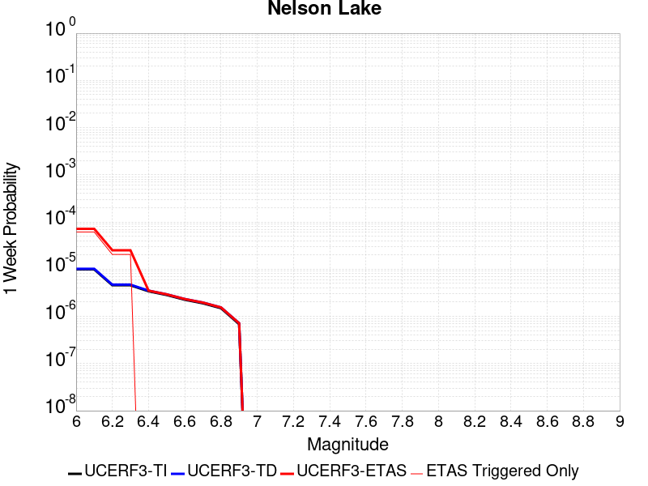 | 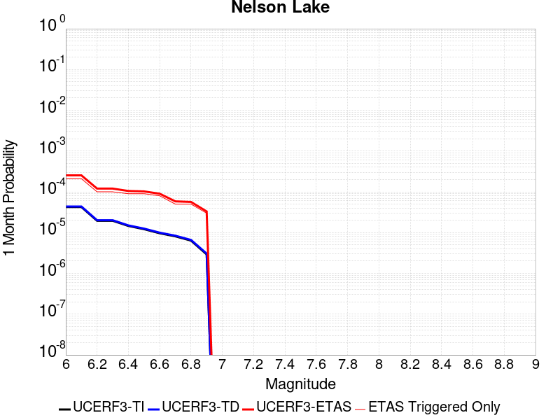 | 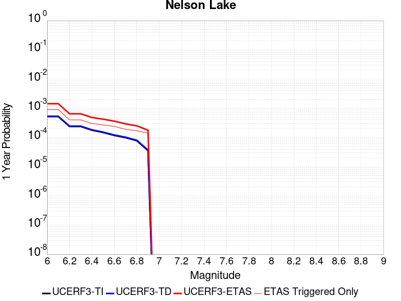 | 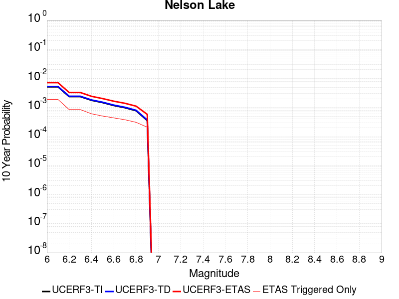 |

| Magnitude | 1 wk TI Prob | 1 wk TD Prob | 1 wk ETAS Prob | 1 wk ETAS/TD Gain | 1 wk ETAS Triggered Only | 1 mo TI Prob | 1 mo TD Prob | 1 mo ETAS Prob | 1 mo ETAS/TD Gain | 1 mo ETAS Triggered Only | 1 yr TI Prob | 1 yr TD Prob | 1 yr ETAS Prob | 1 yr ETAS/TD Gain | 1 yr ETAS Triggered Only | 10 yr TI Prob | 10 yr TD Prob | 10 yr ETAS Prob | 10 yr ETAS/TD Gain | 10 yr ETAS Triggered Only |
|-----|-----|-----|-----|-----|-----|-----|-----|-----|-----|-----|-----|-----|-----|-----|-----|-----|-----|-----|-----|-----|
| 6.0 | 9.913453E-6 | 1.0192293E-5 | 7.019168E-5 | 6.8867407 | 6.0E-5 | 4.2485535E-5 | 4.3680586E-5 | 2.536714E-4 | 5.807418 | 2.1E-4 | 5.1713863E-4 | 5.316917E-4 | 0.0014312131 | 2.6918104 | 9.0E-4 | 0.0051593683 | 0.0053052236 | 0.007195144 | 1.3562375 | 0.0019 |
| 6.1 | 9.913453E-6 | 1.0192293E-5 | 7.019168E-5 | 6.8867407 | 6.0E-5 | 4.2485535E-5 | 4.3680586E-5 | 2.536714E-4 | 5.807418 | 2.1E-4 | 5.1713863E-4 | 5.316917E-4 | 0.0014312131 | 2.6918104 | 9.0E-4 | 0.0051593683 | 0.0053052236 | 0.007195144 | 1.3562375 | 0.0019 |
| 6.2 | 4.5596407E-6 | 4.696332E-6 | 2.4696237E-5 | 5.258623 | 2.0E-5 | 1.954117E-5 | 2.0126989E-5 | 1.20124976E-4 | 5.9683533 | 1.0E-4 | 2.3788778E-4 | 2.450198E-4 | 6.449218E-4 | 2.632121 | 4.0E-4 | 0.0023763329 | 0.0024476226 | 0.003295542 | 1.3464258 | 8.5E-4 |
| 6.3 | 4.5596407E-6 | 4.696332E-6 | 2.4696237E-5 | 5.258623 | 2.0E-5 | 1.954117E-5 | 2.0126989E-5 | 1.20124976E-4 | 5.9683533 | 1.0E-4 | 2.3788778E-4 | 2.450198E-4 | 6.449218E-4 | 2.632121 | 4.0E-4 | 0.0023763329 | 0.0024476226 | 0.003295542 | 1.3464258 | 8.5E-4 |
| 6.4 | 3.4025713E-6 | 3.509912E-6 | 1.3509877E-5 | 3.8490644 | 1.0E-5 | 1.4582367E-5 | 1.50423975E-5 | 1.0504104E-4 | 6.982999 | 9.0E-5 | 1.7752586E-4 | 1.8312664E-4 | 4.830717E-4 | 2.6379106 | 3.0E-4 | 0.001773841 | 0.0018298404 | 0.002438724 | 1.3327525 | 6.1E-4 |
| 6.5 | 2.8352947E-6 | 2.9278688E-6 | 1.292784E-5 | 4.4154434 | 1.0E-5 | 1.2151207E-5 | 1.2547953E-5 | 1.0254682E-4 | 8.172395 | 9.0E-5 | 1.479309E-4 | 1.5276136E-4 | 4.2272013E-4 | 2.7671926 | 2.7E-4 | 0.0014783246 | 0.0015266375 | 0.0020358588 | 1.3335575 | 5.1E-4 |
| 6.6 | 2.251518E-6 | 2.3290781E-6 | 1.2329055E-5 | 5.2935343 | 1.0E-5 | 9.649328E-6 | 9.981729E-6 | 8.998093E-5 | 9.014564 | 8.0E-5 | 1.1747423E-4 | 1.2152141E-4 | 3.6149225E-4 | 2.9747207 | 2.4E-4 | 0.0011741214 | 0.0012146112 | 0.0016540769 | 1.3618158 | 4.4E-4 |
| 6.7 | 1.8911853E-6 | 1.9591491E-6 | 1.195913E-5 | 6.104247 | 1.0E-5 | 8.105055E-6 | 8.39633E-6 | 5.8395908E-5 | 6.954933 | 5.0E-5 | 9.867457E-5 | 1.022211E-4 | 2.9220167E-4 | 2.858526 | 1.9E-4 | 9.863076E-4 | 0.0010217984 | 0.00140141 | 1.3715134 | 3.8E-4 |
| 6.8 | 1.4874814E-6 | 1.5438383E-6 | 1.1543822E-5 | 7.4773526 | 1.0E-5 | 6.374905E-6 | 6.6164357E-6 | 5.6616103E-5 | 8.556889 | 5.0E-5 | 7.76117E-5 | 8.055265E-5 | 2.5053896E-4 | 3.110251 | 1.7E-4 | 7.75846E-4 | 8.052856E-4 | 0.001115036 | 1.3846465 | 3.1E-4 |
| 6.9 | 6.835972E-7 | 7.1399705E-7 | 1.07139895E-5 | 15.0056505 | 1.0E-5 | 2.9296991E-6 | 3.0599856E-6 | 3.3059892E-5 | 10.803938 | 3.0E-5 | 3.56685E-5 | 3.7255006E-5 | 1.7724979E-4 | 4.7577443 | 1.4E-4 | 3.5662777E-4 | 3.7251884E-4 | 5.8244064E-4 | 1.5635198 | 2.1E-4 |

## Lenwood-Lockhart-Old Woman Springs
*[(top)](#table-of-contents)*

| 1 Week | 1 Month | 1 Year | 10 Year |
|-----|-----|-----|-----|
| 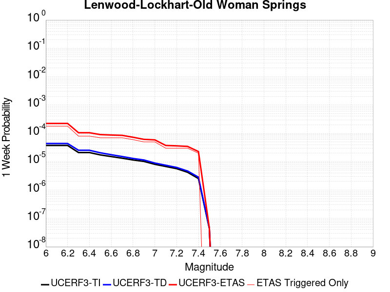 | 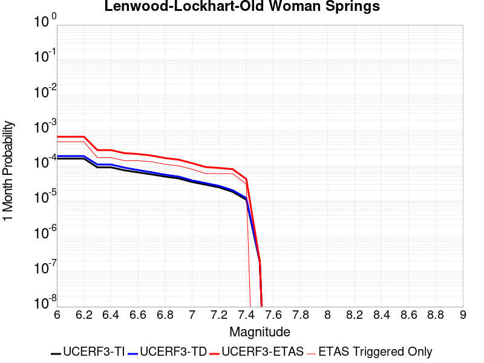 |  | 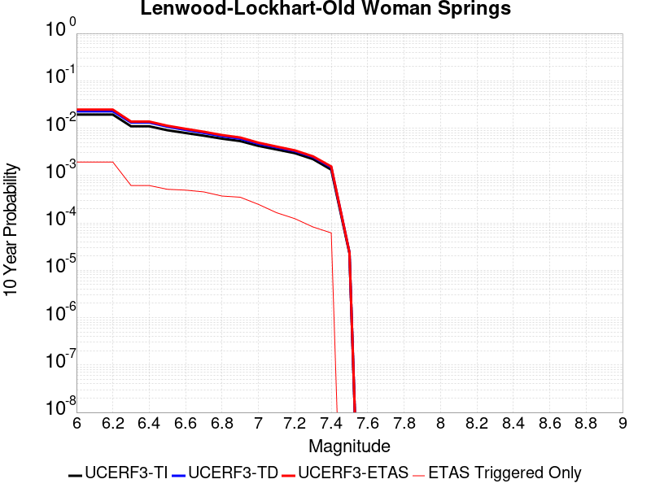 |

| Magnitude | 1 wk TI Prob | 1 wk TD Prob | 1 wk ETAS Prob | 1 wk ETAS/TD Gain | 1 wk ETAS Triggered Only | 1 mo TI Prob | 1 mo TD Prob | 1 mo ETAS Prob | 1 mo ETAS/TD Gain | 1 mo ETAS Triggered Only | 1 yr TI Prob | 1 yr TD Prob | 1 yr ETAS Prob | 1 yr ETAS/TD Gain | 1 yr ETAS Triggered Only | 10 yr TI Prob | 10 yr TD Prob | 10 yr ETAS Prob | 10 yr ETAS/TD Gain | 10 yr ETAS Triggered Only |
|-----|-----|-----|-----|-----|-----|-----|-----|-----|-----|-----|-----|-----|-----|-----|-----|-----|-----|-----|-----|-----|
| 6.0 | 3.744542E-5 | 4.3962966E-5 | 2.2395505E-4 | 5.0941753 | 1.8E-4 | 1.604705E-4 | 1.8840008E-4 | 6.683096E-4 | 3.5472896 | 4.8E-4 | 0.0019519776 | 0.0022915301 | 0.0034388949 | 1.5006981 | 0.00115 | 0.019349206 | 0.022697017 | 0.024465933 | 1.0779362 | 0.00181 |
| 6.1 | 3.744542E-5 | 4.3962966E-5 | 2.2395505E-4 | 5.0941753 | 1.8E-4 | 1.604705E-4 | 1.8840008E-4 | 6.683096E-4 | 3.5472896 | 4.8E-4 | 0.0019519776 | 0.0022915301 | 0.0034388949 | 1.5006981 | 0.00115 | 0.019349206 | 0.022697017 | 0.024465933 | 1.0779362 | 0.00181 |
| 6.2 | 3.744542E-5 | 4.3962966E-5 | 2.2395505E-4 | 5.0941753 | 1.8E-4 | 1.604705E-4 | 1.8840008E-4 | 6.683096E-4 | 3.5472896 | 4.8E-4 | 0.0019519776 | 0.0022915301 | 0.0034388949 | 1.5006981 | 0.00115 | 0.019349206 | 0.022697017 | 0.024465933 | 1.0779362 | 0.00181 |
| 6.3 | 2.1079984E-5 | 2.5353596E-5 | 1.05351566E-4 | 4.155291 | 8.0E-5 | 9.0339665E-5 | 1.0865386E-4 | 2.786354E-4 | 2.5644317 | 1.7E-4 | 0.0010993304 | 0.0013220779 | 0.0017215491 | 1.3021541 | 4.0E-4 | 0.010939079 | 0.013144341 | 0.013746323 | 1.0457978 | 6.1E-4 |
| 6.4 | 2.1079984E-5 | 2.5353596E-5 | 1.05351566E-4 | 4.155291 | 8.0E-5 | 9.0339665E-5 | 1.0865386E-4 | 2.786354E-4 | 2.5644317 | 1.7E-4 | 0.0010993304 | 0.0013220779 | 0.0017215491 | 1.3021541 | 4.0E-4 | 0.010939079 | 0.013144341 | 0.013746323 | 1.0457978 | 6.1E-4 |
| 6.5 | 1.7397282E-5 | 2.0662535E-5 | 9.066109E-5 | 4.387704 | 7.0E-5 | 7.455765E-5 | 8.855078E-5 | 2.2853838E-4 | 2.5808737 | 1.4E-4 | 9.073613E-4 | 0.0010775843 | 0.0013872503 | 1.2873704 | 3.1E-4 | 0.009036654 | 0.010724886 | 0.01120963 | 1.0451981 | 4.9E-4 |
| 6.6 | 1.52050325E-5 | 1.76798E-5 | 8.767856E-5 | 4.959251 | 7.0E-5 | 6.51628E-5 | 7.576841E-5 | 2.157578E-4 | 2.8475957 | 1.4E-4 | 7.9306826E-4 | 9.220979E-4 | 0.0011918489 | 1.2925406 | 2.7E-4 | 0.007902439 | 0.009183581 | 0.009579907 | 1.043156 | 4.0E-4 |
| 6.7 | 1.332523E-5 | 1.5264091E-5 | 8.5263026E-5 | 5.5858564 | 7.0E-5 | 5.7106878E-5 | 6.541593E-5 | 1.9540743E-4 | 2.9871535 | 1.3E-4 | 6.950544E-4 | 7.9615373E-4 | 0.0010359626 | 1.3012093 | 2.4E-4 | 0.006928845 | 0.007933645 | 0.008290789 | 1.0450164 | 3.6E-4 |
| 6.8 | 1.1525329E-5 | 1.303105E-5 | 7.303027E-5 | 5.604327 | 6.0E-5 | 4.9393333E-5 | 5.5846183E-5 | 1.6584004E-4 | 2.969586 | 1.1E-4 | 6.011979E-4 | 6.7971944E-4 | 8.795835E-4 | 1.294039 | 2.0E-4 | 0.00599574 | 0.006776856 | 0.0070847548 | 1.0454339 | 3.1E-4 |
| 6.9 | 1.0253909E-5 | 1.15144985E-5 | 6.151392E-5 | 5.342302 | 5.0E-5 | 4.3944583E-5 | 4.9346934E-5 | 1.49342E-4 | 3.0263684 | 1.0E-4 | 5.3489394E-4 | 6.0063694E-4 | 7.7053485E-4 | 1.2828629 | 1.7E-4 | 0.0053360825 | 0.005990515 | 0.0062588975 | 1.0448012 | 2.7E-4 |
| 7.0 | 8.104563E-6 | 8.991321E-6 | 5.899087E-5 | 6.5608683 | 5.0E-5 | 3.4733377E-5 | 3.8533675E-5 | 1.18530596E-4 | 3.0760262 | 8.0E-5 | 4.2279682E-4 | 4.6904891E-4 | 5.889926E-4 | 1.2557168 | 1.2E-4 | 0.0042199334 | 0.0046808375 | 0.004869948 | 1.040401 | 1.9E-4 |
| 7.1 | 6.7986157E-6 | 7.515848E-6 | 3.7515623E-5 | 4.991535 | 3.0E-5 | 2.91366E-5 | 3.221039E-5 | 9.220846E-5 | 2.8626928 | 6.0E-5 | 3.5468035E-4 | 3.9209312E-4 | 4.7206174E-4 | 1.2039531 | 8.0E-5 | 0.003541148 | 0.0039142296 | 0.0040437207 | 1.0330821 | 1.3E-4 |
| 7.2 | 5.6893327E-6 | 6.280039E-6 | 3.627985E-5 | 5.7770104 | 3.0E-5 | 2.4382627E-5 | 2.6914187E-5 | 8.691257E-5 | 3.2292476 | 6.0E-5 | 2.9681803E-4 | 3.2763294E-4 | 3.9761E-4 | 1.2135837 | 7.0E-5 | 0.002964219 | 0.0032716978 | 0.003381338 | 1.0335116 | 1.1E-4 |
| 7.3 | 4.253348E-6 | 4.706927E-6 | 3.4706787E-5 | 7.373555 | 3.0E-5 | 1.8228506E-5 | 2.01724E-5 | 8.017119E-5 | 3.974301 | 6.0E-5 | 2.2190946E-4 | 2.4557312E-4 | 3.1555592E-4 | 1.2849776 | 7.0E-5 | 0.00221688 | 0.0024531984 | 0.0025429777 | 1.0365968 | 9.0E-5 |
| 7.4 | 2.5448119E-6 | 2.8520535E-6 | 2.2851997E-5 | 8.012471 | 2.0E-5 | 1.0906291E-5 | 1.22230385E-5 | 4.2222673E-5 | 3.4543517 | 3.0E-5 | 1.3277601E-4 | 1.4880698E-4 | 1.8880103E-4 | 1.2687646 | 4.0E-5 | 0.001326967 | 0.0014872355 | 0.0015371612 | 1.0335695 | 5.0E-5 |
| 7.5 | 4.3706837E-8 | 4.5629356E-8 | 4.5629356E-8 | 1.0 | 0.0 | 1.8731501E-7 | 1.9555438E-7 | 1.9555438E-7 | 1.0 | 0.0 | 2.2805577E-6 | 2.3808725E-6 | 2.3808725E-6 | 1.0 | 0.0 | 2.2805343E-5 | 2.3808525E-5 | 2.3808525E-5 | 1.0 | 0.0 |

## Towne Pass
*[(top)](#table-of-contents)*

| 1 Week | 1 Month | 1 Year | 10 Year |
|-----|-----|-----|-----|
| 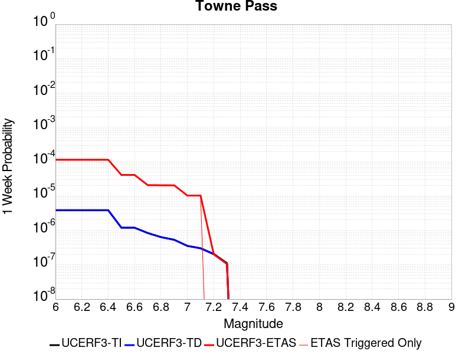 | 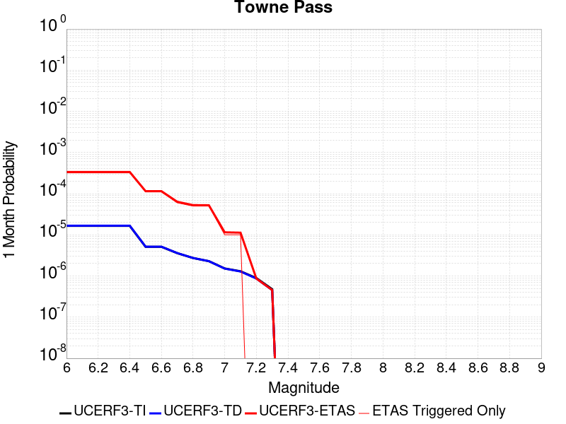 | 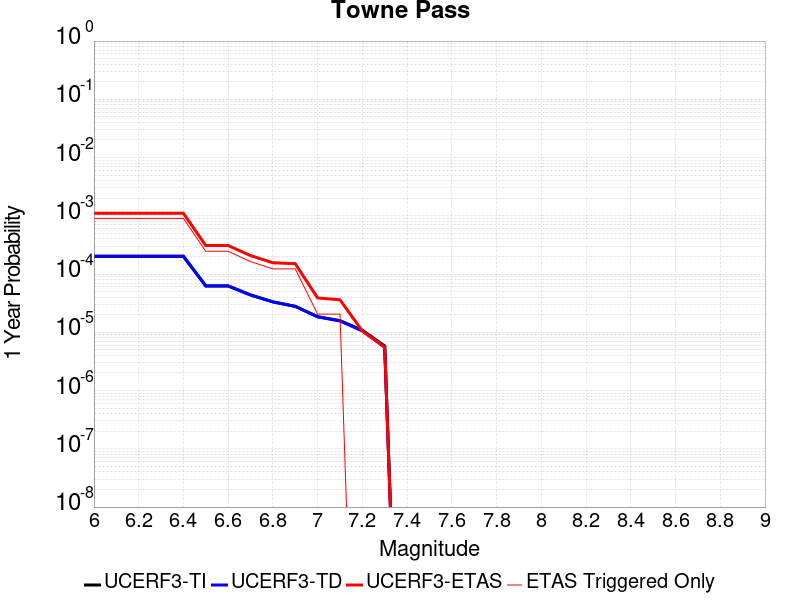 | 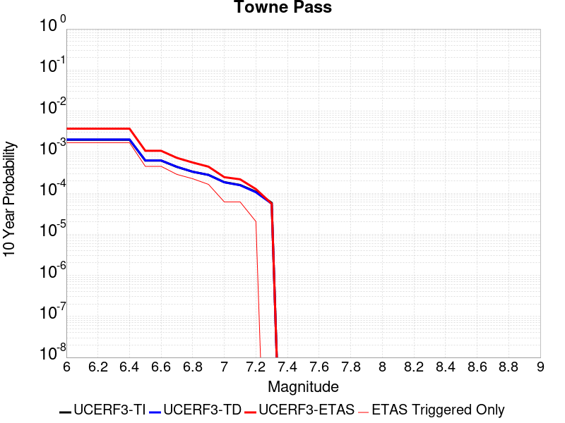 |

| Magnitude | 1 wk TI Prob | 1 wk TD Prob | 1 wk ETAS Prob | 1 wk ETAS/TD Gain | 1 wk ETAS Triggered Only | 1 mo TI Prob | 1 mo TD Prob | 1 mo ETAS Prob | 1 mo ETAS/TD Gain | 1 mo ETAS Triggered Only | 1 yr TI Prob | 1 yr TD Prob | 1 yr ETAS Prob | 1 yr ETAS/TD Gain | 1 yr ETAS Triggered Only | 10 yr TI Prob | 10 yr TD Prob | 10 yr ETAS Prob | 10 yr ETAS/TD Gain | 10 yr ETAS Triggered Only |
|-----|-----|-----|-----|-----|-----|-----|-----|-----|-----|-----|-----|-----|-----|-----|-----|-----|-----|-----|-----|-----|
| 6.0 | 3.849728E-6 | 3.8945495E-6 | 1.1389412E-4 | 29.244492 | 1.1E-4 | 1.649873E-5 | 1.6690845E-5 | 3.366855E-4 | 20.171867 | 3.2E-4 | 2.0085352E-4 | 2.0319645E-4 | 0.0011330075 | 5.5759215 | 9.3E-4 | 0.0020067208 | 0.0020305358 | 0.0037769824 | 1.8600914 | 0.00175 |
| 6.1 | 3.849728E-6 | 3.8945495E-6 | 1.1389412E-4 | 29.244492 | 1.1E-4 | 1.649873E-5 | 1.6690845E-5 | 3.366855E-4 | 20.171867 | 3.2E-4 | 2.0085352E-4 | 2.0319645E-4 | 0.0011330075 | 5.5759215 | 9.3E-4 | 0.0020067208 | 0.0020305358 | 0.0037769824 | 1.8600914 | 0.00175 |
| 6.2 | 3.849728E-6 | 3.8945495E-6 | 1.1389412E-4 | 29.244492 | 1.1E-4 | 1.649873E-5 | 1.6690845E-5 | 3.366855E-4 | 20.171867 | 3.2E-4 | 2.0085352E-4 | 2.0319645E-4 | 0.0011330075 | 5.5759215 | 9.3E-4 | 0.0020067208 | 0.0020305358 | 0.0037769824 | 1.8600914 | 0.00175 |
| 6.3 | 3.849728E-6 | 3.8945495E-6 | 1.1389412E-4 | 29.244492 | 1.1E-4 | 1.649873E-5 | 1.6690845E-5 | 3.366855E-4 | 20.171867 | 3.2E-4 | 2.0085352E-4 | 2.0319645E-4 | 0.0011330075 | 5.5759215 | 9.3E-4 | 0.0020067208 | 0.0020305358 | 0.0037769824 | 1.8600914 | 0.00175 |
| 6.4 | 3.849728E-6 | 3.8945495E-6 | 1.1389412E-4 | 29.244492 | 1.1E-4 | 1.649873E-5 | 1.6690845E-5 | 3.366855E-4 | 20.171867 | 3.2E-4 | 2.0085352E-4 | 2.0319645E-4 | 0.0011330075 | 5.5759215 | 9.3E-4 | 0.0020067208 | 0.0020305358 | 0.0037769824 | 1.8600914 | 0.00175 |
| 6.5 | 1.1953545E-6 | 1.2030553E-6 | 4.1203006E-5 | 34.248642 | 4.0E-5 | 5.1229376E-6 | 5.155942E-6 | 1.1515537E-4 | 22.3345 | 1.1E-4 | 6.236998E-5 | 6.27719E-5 | 2.727587E-4 | 4.345236 | 2.1E-4 | 6.235248E-4 | 6.2755344E-4 | 9.973212E-4 | 1.5892212 | 3.7E-4 |
| 6.6 | 1.1953545E-6 | 1.2030553E-6 | 4.1203006E-5 | 34.248642 | 4.0E-5 | 5.1229376E-6 | 5.155942E-6 | 1.1515537E-4 | 22.3345 | 1.1E-4 | 6.236998E-5 | 6.27719E-5 | 2.727587E-4 | 4.345236 | 2.1E-4 | 6.235248E-4 | 6.2755344E-4 | 9.973212E-4 | 1.5892212 | 3.7E-4 |
| 6.7 | 8.375951E-7 | 8.410697E-7 | 2.0841053E-5 | 24.77922 | 2.0E-5 | 3.5896885E-6 | 3.60458E-6 | 6.360436E-5 | 17.64543 | 6.0E-5 | 4.370358E-5 | 4.3884935E-5 | 1.7387923E-4 | 3.9621623 | 1.3E-4 | 4.3694986E-4 | 4.387684E-4 | 6.886587E-4 | 1.5695267 | 2.5E-4 |
| 6.8 | 6.38041E-7 | 6.39218E-7 | 2.0639205E-5 | 32.288208 | 2.0E-5 | 2.7344586E-6 | 2.739503E-6 | 5.2739368E-5 | 19.251434 | 5.0E-5 | 3.3291526E-5 | 3.335298E-5 | 1.2334998E-4 | 3.6983197 | 9.0E-5 | 3.3286537E-4 | 3.3348353E-4 | 5.034268E-4 | 1.5096003 | 1.7E-4 |
| 6.9 | 5.3460053E-7 | 5.345355E-7 | 2.0534524E-5 | 38.41564 | 2.0E-5 | 2.2911431E-6 | 2.2908646E-6 | 5.229075E-5 | 22.82577 | 5.0E-5 | 2.789431E-5 | 2.7890954E-5 | 1.1788844E-4 | 4.226763 | 9.0E-5 | 2.789081E-4 | 2.7887785E-4 | 4.0884162E-4 | 1.4660239 | 1.3E-4 |
| 7.0 | 3.557783E-7 | 3.5324413E-7 | 1.035324E-5 | 29.309023 | 1.0E-5 | 1.5247632E-6 | 1.5139026E-6 | 1.1513887E-5 | 7.605435 | 1.0E-5 | 1.8563835E-5 | 1.8431618E-5 | 3.8431248E-5 | 2.085072 | 2.0E-5 | 1.8562283E-4 | 1.8430172E-4 | 2.3429251E-4 | 1.2712443 | 5.0E-5 |
| 7.1 | 3.037942E-7 | 3.0002388E-7 | 1.0300021E-5 | 34.33067 | 1.0E-5 | 1.3019744E-6 | 1.2858161E-6 | 1.1285803E-5 | 8.777152 | 1.0E-5 | 1.5851423E-5 | 1.5654707E-5 | 3.5654393E-5 | 2.2775512 | 2.0E-5 | 1.5850292E-4 | 1.5653679E-4 | 2.0652896E-4 | 1.3193637 | 5.0E-5 |
| 7.2 | 2.0808248E-7 | 2.021783E-7 | 2.021783E-7 | 1.0 | 0.0 | 8.917818E-7 | 8.6647816E-7 | 8.6647816E-7 | 1.0 | 0.0 | 1.0857389E-5 | 1.0549325E-5 | 2.054922E-5 | 1.9479179 | 1.0E-5 | 1.0856859E-4 | 1.054887E-4 | 1.3548553E-4 | 1.2843606 | 3.0E-5 |
| 7.3 | 1.1162073E-7 | 1.06369825E-7 | 1.06369825E-7 | 1.0 | 0.0 | 4.7837443E-7 | 4.5587063E-7 | 4.5587063E-7 | 1.0 | 0.0 | 5.8241935E-6 | 5.550213E-6 | 5.550213E-6 | 1.0 | 0.0 | 5.8240406E-5 | 5.5500943E-5 | 5.5500943E-5 | 1.0 | 0.0 |

## San Andreas (San Bernardino N)
*[(top)](#table-of-contents)*

| 1 Week | 1 Month | 1 Year | 10 Year |
|-----|-----|-----|-----|
| 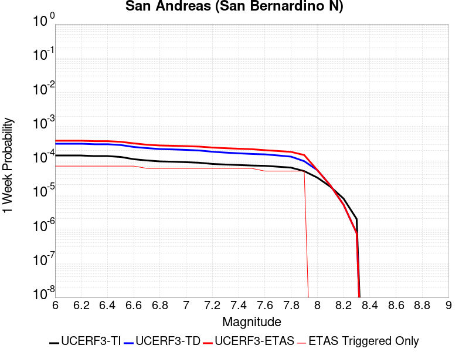 | 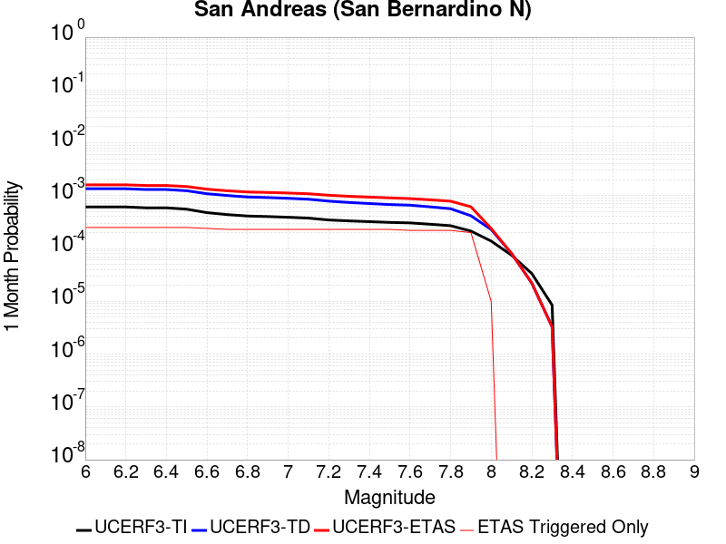 | 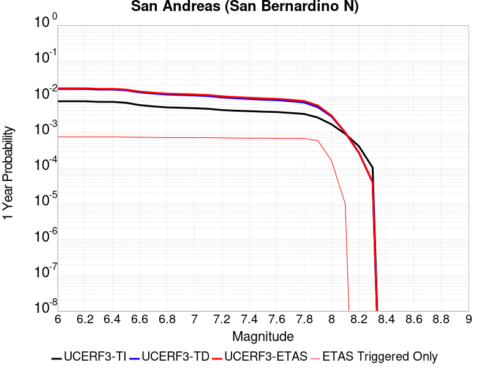 | 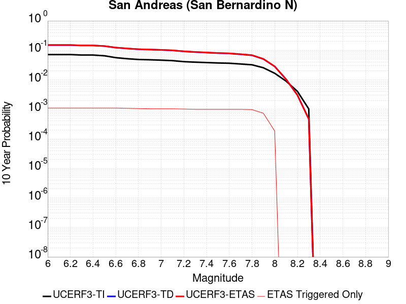 |

| Magnitude | 1 wk TI Prob | 1 wk TD Prob | 1 wk ETAS Prob | 1 wk ETAS/TD Gain | 1 wk ETAS Triggered Only | 1 mo TI Prob | 1 mo TD Prob | 1 mo ETAS Prob | 1 mo ETAS/TD Gain | 1 mo ETAS Triggered Only | 1 yr TI Prob | 1 yr TD Prob | 1 yr ETAS Prob | 1 yr ETAS/TD Gain | 1 yr ETAS Triggered Only | 10 yr TI Prob | 10 yr TD Prob | 10 yr ETAS Prob | 10 yr ETAS/TD Gain | 10 yr ETAS Triggered Only |
|-----|-----|-----|-----|-----|-----|-----|-----|-----|-----|-----|-----|-----|-----|-----|-----|-----|-----|-----|-----|-----|
| 6.0 | 1.4273766E-4 | 3.161376E-4 | 3.8611545E-4 | 1.2213526 | 7.0E-5 | 6.115894E-4 | 0.0013541778 | 0.0016038392 | 1.1843638 | 2.5E-4 | 0.0074207084 | 0.016363978 | 0.017101705 | 1.0450823 | 7.5E-4 | 0.07177748 | 0.15029658 | 0.15132472 | 1.0068407 | 0.00121 |
| 6.1 | 1.4273766E-4 | 3.161376E-4 | 3.8611545E-4 | 1.2213526 | 7.0E-5 | 6.115894E-4 | 0.0013541778 | 0.0016038392 | 1.1843638 | 2.5E-4 | 0.0074207084 | 0.016363978 | 0.017101705 | 1.0450823 | 7.5E-4 | 0.07177748 | 0.15029658 | 0.15132472 | 1.0068407 | 0.00121 |
| 6.2 | 1.4273766E-4 | 3.161376E-4 | 3.8611545E-4 | 1.2213526 | 7.0E-5 | 6.115894E-4 | 0.0013541778 | 0.0016038392 | 1.1843638 | 2.5E-4 | 0.0074207084 | 0.016363978 | 0.017101705 | 1.0450823 | 7.5E-4 | 0.07177748 | 0.15029658 | 0.15132472 | 1.0068407 | 0.00121 |
| 6.3 | 1.3730655E-4 | 3.0518573E-4 | 3.7516438E-4 | 1.2292985 | 7.0E-5 | 5.883239E-4 | 0.001307289 | 0.0015569621 | 1.1909854 | 2.5E-4 | 0.0071393442 | 0.01580149 | 0.016539639 | 1.0467138 | 7.5E-4 | 0.06914291 | 0.14559646 | 0.14663029 | 1.0071006 | 0.00121 |
| 6.4 | 1.3730655E-4 | 3.0518573E-4 | 3.7516438E-4 | 1.2292985 | 7.0E-5 | 5.883239E-4 | 0.001307289 | 0.0015569621 | 1.1909854 | 2.5E-4 | 0.0071393442 | 0.01580149 | 0.016539639 | 1.0467138 | 7.5E-4 | 0.06914291 | 0.14559646 | 0.14663029 | 1.0071006 | 0.00121 |
| 6.5 | 1.2942807E-4 | 2.8932988E-4 | 3.5930963E-4 | 1.2418684 | 7.0E-5 | 5.545738E-4 | 0.0012394012 | 0.0014890913 | 1.2014604 | 2.5E-4 | 0.0067310524 | 0.014986552 | 0.015715463 | 1.0486376 | 7.4E-4 | 0.06530788 | 0.13873914 | 0.13977265 | 1.0074493 | 0.0012 |
| 6.6 | 1.1125901E-4 | 2.537176E-4 | 3.2369982E-4 | 1.2758273 | 7.0E-5 | 4.767372E-4 | 0.0010869103 | 0.0013266493 | 1.2205694 | 2.4E-4 | 0.005788839 | 0.013153472 | 0.0138738705 | 1.0547687 | 7.3E-4 | 0.056403454 | 0.12302898 | 0.124072574 | 1.0084826 | 0.00119 |
| 6.7 | 1.02209575E-4 | 2.3506685E-4 | 2.9505274E-4 | 1.2551866 | 6.0E-5 | 4.3796748E-4 | 0.0010070418 | 0.0012368101 | 1.2281617 | 2.3E-4 | 0.0053192247 | 0.01219223 | 0.012903452 | 1.058334 | 7.2E-4 | 0.051936906 | 0.11482068 | 0.11585634 | 1.0090199 | 0.00117 |
| 6.8 | 9.610582E-5 | 2.2032406E-4 | 2.8031084E-4 | 1.2722661 | 6.0E-5 | 4.1181705E-4 | 9.439049E-4 | 0.0011736879 | 1.2434386 | 2.3E-4 | 0.0050023515 | 0.011431754 | 0.0121336365 | 1.0613977 | 7.1E-4 | 0.048912346 | 0.1082225 | 0.10923913 | 1.0093938 | 0.00114 |
| 6.9 | 9.3877505E-5 | 2.1487933E-4 | 2.7486644E-4 | 1.2791665 | 6.0E-5 | 4.0227012E-4 | 9.2058704E-4 | 0.0011503752 | 1.2496105 | 2.3E-4 | 0.0048866454 | 0.011150793 | 0.011852876 | 1.0629627 | 7.1E-4 | 0.04780577 | 0.10581279 | 0.10682322 | 1.0095493 | 0.00113 |
| 7.0 | 9.1019785E-5 | 2.0814833E-4 | 2.6813583E-4 | 1.288196 | 6.0E-5 | 3.900265E-4 | 8.917599E-4 | 0.0011215548 | 1.257687 | 2.3E-4 | 0.0047382377 | 0.010803353 | 0.011505682 | 1.0650103 | 7.1E-4 | 0.046384744 | 0.10278319 | 0.10379704 | 1.009864 | 0.00113 |
| 7.1 | 8.771155E-5 | 1.9989353E-4 | 2.5988155E-4 | 1.3000997 | 6.0E-5 | 3.758525E-4 | 8.564058E-4 | 0.0010862089 | 1.2683343 | 2.3E-4 | 0.0045664064 | 0.01037709 | 0.011079722 | 1.0677099 | 7.1E-4 | 0.044737056 | 0.09909467 | 0.10011269 | 1.0102732 | 0.00113 |
| 7.2 | 8.0830236E-5 | 1.8394848E-4 | 2.4393744E-4 | 1.3261182 | 6.0E-5 | 3.4636928E-4 | 7.881126E-4 | 0.0010179314 | 1.2916064 | 2.3E-4 | 0.0042088944 | 0.009553162 | 0.010246474 | 1.0725741 | 7.0E-4 | 0.041300658 | 0.09182531 | 0.09284246 | 1.011077 | 0.00112 |
| 7.3 | 7.7668235E-5 | 1.7338296E-4 | 2.3337256E-4 | 1.3459948 | 6.0E-5 | 3.328214E-4 | 7.428583E-4 | 9.7268744E-4 | 1.309385 | 2.3E-4 | 0.0040445733 | 0.009006873 | 0.009690658 | 1.0759182 | 6.9E-4 | 0.03971748 | 0.087092124 | 0.088105455 | 1.0116351 | 0.00111 |
| 7.4 | 7.520177E-5 | 1.6558339E-4 | 2.2557346E-4 | 1.3622952 | 6.0E-5 | 3.2225347E-4 | 7.0945016E-4 | 9.39287E-4 | 1.3239647 | 2.3E-4 | 0.0039163795 | 0.0086034145 | 0.0092874775 | 1.0795107 | 6.9E-4 | 0.038480744 | 0.08354814 | 0.08456541 | 1.0121758 | 0.00111 |
| 7.5 | 7.274697E-5 | 1.5845922E-4 | 2.1844971E-4 | 1.3785863 | 6.0E-5 | 3.1173544E-4 | 6.789343E-4 | 9.087781E-4 | 1.3385363 | 2.3E-4 | 0.003788775 | 0.008234753 | 0.0089190705 | 1.0831013 | 6.9E-4 | 0.03724827 | 0.08026466 | 0.081276365 | 1.0126047 | 0.0011 |
| 7.6 | 7.1185845E-5 | 1.5415733E-4 | 2.0414962E-4 | 1.324294 | 5.0E-5 | 3.0504653E-4 | 6.6050707E-4 | 8.803617E-4 | 1.3328575 | 2.2E-4 | 0.0037076178 | 0.008012074 | 0.008686625 | 1.0841919 | 6.8E-4 | 0.036463667 | 0.078254156 | 0.07924964 | 1.0127212 | 0.00108 |
| 7.7 | 6.709961E-5 | 1.4324463E-4 | 1.9323747E-4 | 1.3490032 | 5.0E-5 | 2.8753807E-4 | 6.1376113E-4 | 8.3362614E-4 | 1.3582256 | 2.2E-4 | 0.003495157 | 0.007446978 | 0.008121914 | 1.0906322 | 6.8E-4 | 0.034406938 | 0.073082365 | 0.07408344 | 1.0136979 | 0.00108 |
| 7.8 | 6.300812E-5 | 1.3208245E-4 | 1.8207585E-4 | 1.3785014 | 5.0E-5 | 2.7000686E-4 | 5.659449E-4 | 7.8582036E-4 | 1.3885105 | 2.2E-4 | 0.0032823787 | 0.0068686386 | 0.007534037 | 1.0968748 | 6.7E-4 | 0.032343175 | 0.06773997 | 0.068728164 | 1.0145881 | 0.00106 |
| 7.9 | 4.983037E-5 | 9.728091E-5 | 1.4727605E-4 | 1.5139254 | 5.0E-5 | 2.1354125E-4 | 4.1685157E-4 | 6.167682E-4 | 1.4795871 | 2.0E-4 | 0.0025967648 | 0.005063368 | 0.0056503806 | 1.1159332 | 5.9E-4 | 0.025666296 | 0.0506703 | 0.051477227 | 1.0159252 | 8.5E-4 |
| 8.0 | 3.2211527E-5 | 5.333152E-5 | 5.333152E-5 | 1.0 | 0.0 | 1.380421E-4 | 2.2854365E-4 | 2.3854137E-4 | 1.0437453 | 1.0E-5 | 0.0016793669 | 0.0027789702 | 0.0029385258 | 1.0574152 | 1.6E-4 | 0.016667323 | 0.02837451 | 0.028617416 | 1.0085608 | 2.5E-4 |
| 8.1 | 1.743376E-5 | 1.8836954E-5 | 1.8836954E-5 | 1.0 | 0.0 | 7.471398E-5 | 8.07273E-5 | 8.07273E-5 | 1.0 | 0.0 | 9.0926304E-4 | 9.824124E-4 | 9.924026E-4 | 1.010169 | 1.0E-5 | 0.009055517 | 0.010490617 | 0.010500512 | 1.0009432 | 1.0E-5 |
| 8.2 | 7.831616E-6 | 5.1597067E-6 | 5.1597067E-6 | 1.0 | 0.0 | 3.3563636E-5 | 2.2112841E-5 | 2.2112841E-5 | 1.0 | 0.0 | 4.0856065E-4 | 2.6919067E-4 | 2.6919067E-4 | 1.0 | 0.0 | 0.004078103 | 0.003044315 | 0.003044315 | 1.0 | 0.0 |
| 8.3 | 1.983087E-6 | 7.668296E-7 | 7.668296E-7 | 1.0 | 0.0 | 8.498917E-6 | 3.2864084E-6 | 3.2864084E-6 | 1.0 | 0.0 | 1.034694E-4 | 4.0011306E-5 | 4.0011306E-5 | 1.0 | 0.0 | 0.0010342124 | 4.724499E-4 | 4.724499E-4 | 1.0 | 0.0 |

## Bicycle Lake
*[(top)](#table-of-contents)*

| 1 Week | 1 Month | 1 Year | 10 Year |
|-----|-----|-----|-----|
| 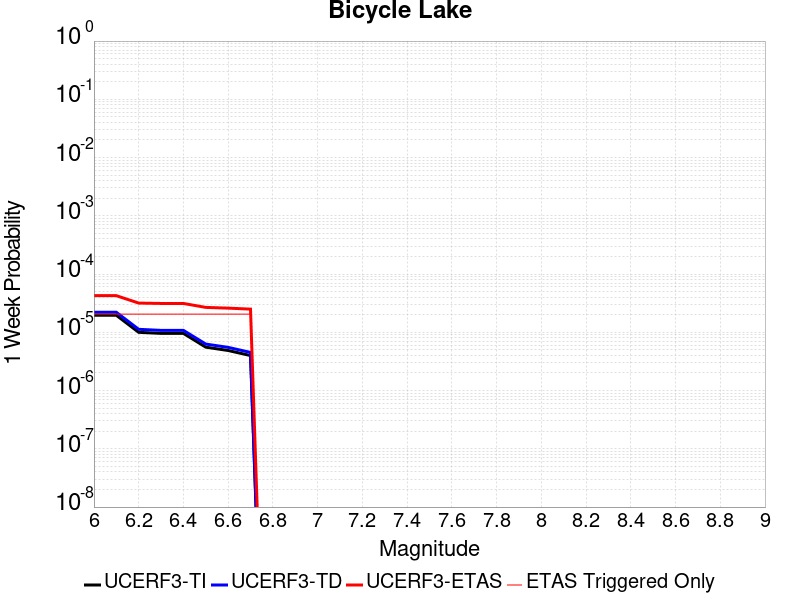 | 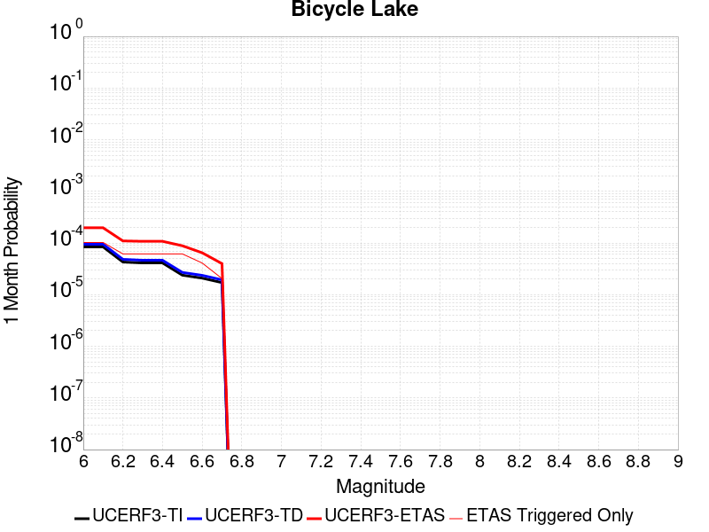 | 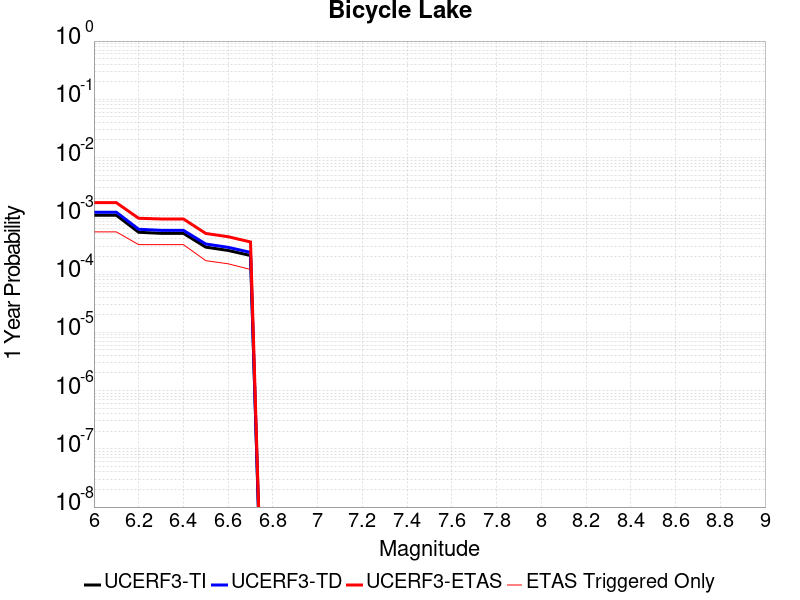 | 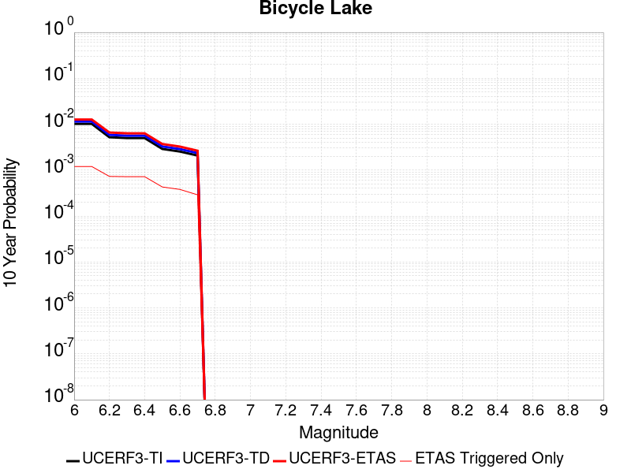 |

| Magnitude | 1 wk TI Prob | 1 wk TD Prob | 1 wk ETAS Prob | 1 wk ETAS/TD Gain | 1 wk ETAS Triggered Only | 1 mo TI Prob | 1 mo TD Prob | 1 mo ETAS Prob | 1 mo ETAS/TD Gain | 1 mo ETAS Triggered Only | 1 yr TI Prob | 1 yr TD Prob | 1 yr ETAS Prob | 1 yr ETAS/TD Gain | 1 yr ETAS Triggered Only | 10 yr TI Prob | 10 yr TD Prob | 10 yr ETAS Prob | 10 yr ETAS/TD Gain | 10 yr ETAS Triggered Only |
|-----|-----|-----|-----|-----|-----|-----|-----|-----|-----|-----|-----|-----|-----|-----|-----|-----|-----|-----|-----|-----|
| 6.0 | 1.9621975E-5 | 2.2097447E-5 | 5.2096784E-5 | 2.3575928 | 3.0E-5 | 8.4091465E-5 | 9.470067E-5 | 1.946912E-4 | 2.0558586 | 1.0E-4 | 0.0010233327 | 0.0011525059 | 0.001681895 | 1.4593375 | 5.3E-4 | 0.01018633 | 0.011478599 | 0.012664825 | 1.1033424 | 0.0012 |
| 6.1 | 1.9621975E-5 | 2.2097447E-5 | 5.2096784E-5 | 2.3575928 | 3.0E-5 | 8.4091465E-5 | 9.470067E-5 | 1.946912E-4 | 2.0558586 | 1.0E-4 | 0.0010233327 | 0.0011525059 | 0.001681895 | 1.4593375 | 5.3E-4 | 0.01018633 | 0.011478599 | 0.012664825 | 1.1033424 | 0.0012 |
| 6.2 | 9.9971285E-6 | 1.1255827E-5 | 3.1255604E-5 | 2.7768373 | 2.0E-5 | 4.2844134E-5 | 4.823866E-5 | 9.823625E-5 | 2.036463 | 5.0E-5 | 5.2150246E-4 | 5.8719947E-4 | 9.0701156E-4 | 1.5446396 | 3.2E-4 | 0.0052028033 | 0.005861584 | 0.006587305 | 1.1238097 | 7.3E-4 |
| 6.3 | 9.589428E-6 | 1.0798527E-5 | 3.079831E-5 | 2.8520846 | 2.0E-5 | 4.10969E-5 | 4.627887E-5 | 9.6276555E-5 | 2.0803566 | 5.0E-5 | 5.002399E-4 | 5.6335144E-4 | 8.831712E-4 | 1.5677091 | 3.2E-4 | 0.0049911533 | 0.0056243236 | 0.006340274 | 1.1272954 | 7.2E-4 |
| 6.4 | 9.589428E-6 | 1.0798527E-5 | 3.079831E-5 | 2.8520846 | 2.0E-5 | 4.10969E-5 | 4.627887E-5 | 9.6276555E-5 | 2.0803566 | 5.0E-5 | 5.002399E-4 | 5.6335144E-4 | 8.831712E-4 | 1.5677091 | 3.2E-4 | 0.0049911533 | 0.0056243236 | 0.006340274 | 1.1272954 | 7.2E-4 |
| 6.5 | 5.557707E-6 | 6.2857107E-6 | 2.6285585E-5 | 4.1818 | 2.0E-5 | 2.3818526E-5 | 2.6938633E-5 | 7.6937285E-5 | 2.8560205 | 5.0E-5 | 2.8995197E-4 | 3.2795538E-4 | 4.9789966E-4 | 1.5181932 | 1.7E-4 | 0.0028957394 | 0.0032773502 | 0.0037059411 | 1.1307735 | 4.3E-4 |
| 6.6 | 4.8742945E-6 | 5.5133855E-6 | 2.5513275E-5 | 4.6275153 | 2.0E-5 | 2.0889667E-5 | 2.3628729E-5 | 6.3627784E-5 | 2.6928146 | 4.0E-5 | 2.54302E-4 | 2.87668E-4 | 4.3762484E-4 | 1.5212845 | 1.5E-4 | 0.002540112 | 0.0028755253 | 0.0032544325 | 1.1317698 | 3.8E-4 |
| 6.7 | 3.991108E-6 | 4.515989E-6 | 2.4515899E-5 | 5.4286885 | 2.0E-5 | 1.7104636E-5 | 1.9354238E-5 | 4.9353657E-5 | 2.550018 | 3.0E-5 | 2.0822904E-4 | 2.3563785E-4 | 3.5560958E-4 | 1.5091361 | 1.2E-4 | 0.0020803404 | 0.0023563786 | 0.002645695 | 1.1227802 | 2.9E-4 |

## Paradise
*[(top)](#table-of-contents)*

| 1 Week | 1 Month | 1 Year | 10 Year |
|-----|-----|-----|-----|
| 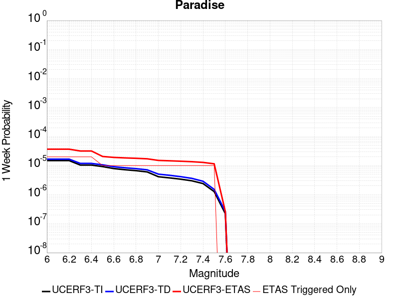 | 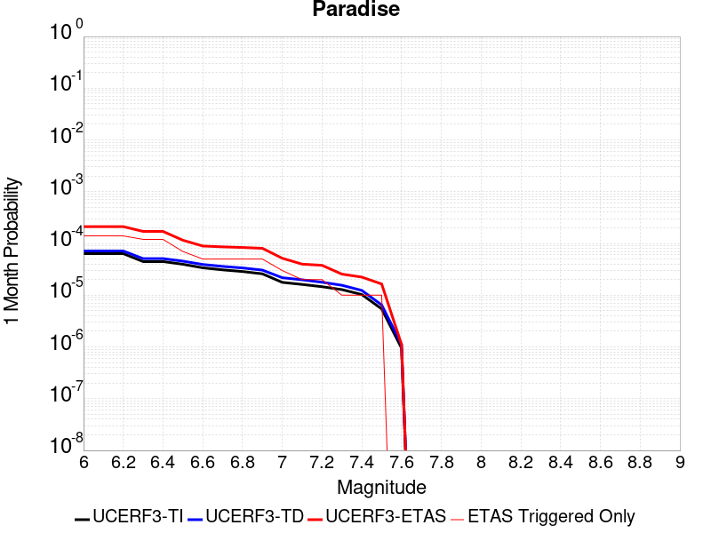 | 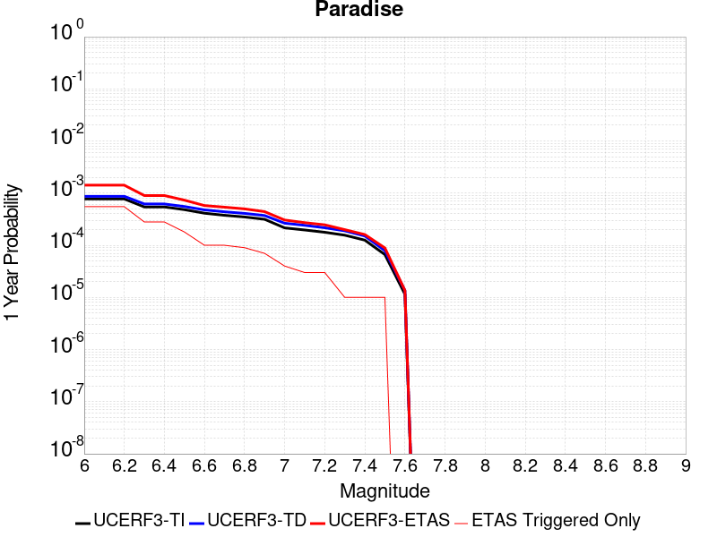 | 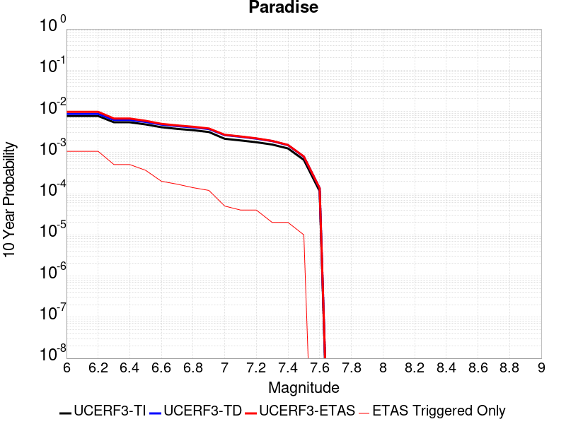 |

| Magnitude | 1 wk TI Prob | 1 wk TD Prob | 1 wk ETAS Prob | 1 wk ETAS/TD Gain | 1 wk ETAS Triggered Only | 1 mo TI Prob | 1 mo TD Prob | 1 mo ETAS Prob | 1 mo ETAS/TD Gain | 1 mo ETAS Triggered Only | 1 yr TI Prob | 1 yr TD Prob | 1 yr ETAS Prob | 1 yr ETAS/TD Gain | 1 yr ETAS Triggered Only | 10 yr TI Prob | 10 yr TD Prob | 10 yr ETAS Prob | 10 yr ETAS/TD Gain | 10 yr ETAS Triggered Only |
|-----|-----|-----|-----|-----|-----|-----|-----|-----|-----|-----|-----|-----|-----|-----|-----|-----|-----|-----|-----|-----|
| 6.0 | 1.4851273E-5 | 1.6694854E-5 | 3.669452E-5 | 2.197954 | 2.0E-5 | 6.364676E-5 | 7.154755E-5 | 2.1153752E-4 | 2.956601 | 1.4E-4 | 7.7462377E-4 | 8.707668E-4 | 0.0014202879 | 1.6310772 | 5.5E-4 | 0.0077192914 | 0.008675928 | 0.009736645 | 1.1222597 | 0.00107 |
| 6.1 | 1.4851273E-5 | 1.6694854E-5 | 3.669452E-5 | 2.197954 | 2.0E-5 | 6.364676E-5 | 7.154755E-5 | 2.1153752E-4 | 2.956601 | 1.4E-4 | 7.7462377E-4 | 8.707668E-4 | 0.0014202879 | 1.6310772 | 5.5E-4 | 0.0077192914 | 0.008675928 | 0.009736645 | 1.1222597 | 0.00107 |
| 6.2 | 1.4851273E-5 | 1.6694854E-5 | 3.669452E-5 | 2.197954 | 2.0E-5 | 6.364676E-5 | 7.154755E-5 | 2.1153752E-4 | 2.956601 | 1.4E-4 | 7.7462377E-4 | 8.707668E-4 | 0.0014202879 | 1.6310772 | 5.5E-4 | 0.0077192914 | 0.008675928 | 0.009736645 | 1.1222597 | 0.00107 |
| 6.3 | 1.0426831E-5 | 1.1888727E-5 | 3.188849E-5 | 2.6822457 | 2.0E-5 | 4.4685654E-5 | 5.0950726E-5 | 1.7094461E-4 | 3.3550966 | 1.2E-4 | 5.43912E-4 | 6.201545E-4 | 8.9998083E-4 | 1.4512204 | 2.8E-4 | 0.0054258266 | 0.006184847 | 0.006691693 | 1.0819496 | 5.1E-4 |
| 6.4 | 1.0426831E-5 | 1.1888727E-5 | 3.188849E-5 | 2.6822457 | 2.0E-5 | 4.4685654E-5 | 5.0950726E-5 | 1.7094461E-4 | 3.3550966 | 1.2E-4 | 5.43912E-4 | 6.201545E-4 | 8.9998083E-4 | 1.4512204 | 2.8E-4 | 0.0054258266 | 0.006184847 | 0.006691693 | 1.0819496 | 5.1E-4 |
| 6.5 | 9.25027E-6 | 1.0620054E-5 | 2.0619947E-5 | 1.9416049 | 1.0E-5 | 3.964341E-5 | 4.551375E-5 | 1.15510564E-4 | 2.5379267 | 7.0E-5 | 4.8255164E-4 | 5.539939E-4 | 7.338942E-4 | 1.3247333 | 1.8E-4 | 0.0048150513 | 0.0055266283 | 0.005894583 | 1.0665786 | 3.7E-4 |
| 6.6 | 7.904275E-6 | 9.159603E-6 | 1.9159512E-5 | 2.0917404 | 1.0E-5 | 3.3875025E-5 | 3.925487E-5 | 8.9252906E-5 | 2.2736773 | 5.0E-5 | 4.1235037E-4 | 4.7782718E-4 | 5.7777937E-4 | 1.2091807 | 1.0E-4 | 0.0041158604 | 0.004768395 | 0.004967441 | 1.0417428 | 2.0E-4 |
| 6.7 | 7.2061953E-6 | 8.407318E-6 | 1.8407234E-5 | 2.18943 | 1.0E-5 | 3.088333E-5 | 3.6030888E-5 | 8.602908E-5 | 2.3876483 | 5.0E-5 | 3.7593965E-4 | 4.385914E-4 | 5.385476E-4 | 1.2279027 | 1.0E-4 | 0.003753043 | 0.0043776273 | 0.004546883 | 1.0386639 | 1.7E-4 |
| 6.8 | 6.6948724E-6 | 7.84223E-6 | 1.7842152E-5 | 2.2751374 | 1.0E-5 | 2.8691995E-5 | 3.3609143E-5 | 8.360746E-5 | 2.4876404 | 5.0E-5 | 3.4926904E-4 | 4.0911807E-4 | 4.990813E-4 | 1.2198954 | 9.0E-5 | 0.003487206 | 0.0040840064 | 0.0042234347 | 1.0341401 | 1.4E-4 |
| 6.9 | 6.0421025E-6 | 7.130678E-6 | 1.7130607E-5 | 2.4023812 | 1.0E-5 | 2.5894467E-5 | 3.055971E-5 | 8.055818E-5 | 2.6360912 | 5.0E-5 | 3.1521954E-4 | 3.7200435E-4 | 4.419783E-4 | 1.1880999 | 7.0E-5 | 0.0031477278 | 0.0037141545 | 0.0038337088 | 1.0321889 | 1.2E-4 |
| 7.0 | 4.134091E-6 | 5.0803487E-6 | 1.5080298E-5 | 2.9683588 | 1.0E-5 | 1.7717413E-5 | 2.177275E-5 | 5.17721E-5 | 2.377839 | 3.0E-5 | 2.1568815E-4 | 2.6505254E-4 | 3.0504193E-4 | 1.1508734 | 4.0E-5 | 0.0021547892 | 0.0026475172 | 0.0026973847 | 1.0188357 | 5.0E-5 |
| 7.1 | 3.7674888E-6 | 4.6319055E-6 | 1.4631859E-5 | 3.1589286 | 1.0E-5 | 1.6146281E-5 | 1.985088E-5 | 3.9850485E-5 | 2.007492 | 2.0E-5 | 1.9656324E-4 | 2.4165919E-4 | 2.7165195E-4 | 1.1241118 | 3.0E-5 | 0.0019638946 | 0.0024141145 | 0.002454018 | 1.0165292 | 4.0E-5 |
| 7.2 | 3.4065345E-6 | 4.156755E-6 | 1.4156713E-5 | 3.4057126 | 1.0E-5 | 1.4599351E-5 | 1.7814553E-5 | 3.7814196E-5 | 2.1226578 | 2.0E-5 | 1.777326E-4 | 2.1687208E-4 | 2.468656E-4 | 1.1383004 | 3.0E-5 | 0.0017759053 | 0.0021667527 | 0.002206666 | 1.0184208 | 4.0E-5 |
| 7.3 | 2.9934936E-6 | 3.6293434E-6 | 1.3629307E-5 | 3.7553093 | 1.0E-5 | 1.2829195E-5 | 1.5554244E-5 | 2.5554089E-5 | 1.6429013 | 1.0E-5 | 1.5618425E-4 | 1.8935793E-4 | 1.9935604E-4 | 1.0528 | 1.0E-5 | 0.0015607453 | 0.0018921113 | 0.0019120733 | 1.0105503 | 2.0E-5 |
| 7.4 | 2.4049796E-6 | 2.8890036E-6 | 1.2888975E-5 | 4.461391 | 1.0E-5 | 1.0307015E-5 | 1.2381393E-5 | 2.238127E-5 | 1.8076535 | 1.0E-5 | 1.2548068E-4 | 1.5073447E-4 | 1.6073298E-4 | 1.0663319 | 1.0E-5 | 0.0012540985 | 0.0015064639 | 0.0015264336 | 1.0132561 | 2.0E-5 |
| 7.5 | 1.2710091E-6 | 1.5134775E-6 | 1.1513463E-5 | 7.6072903 | 1.0E-5 | 5.44717E-6 | 6.486323E-6 | 1.6486258E-5 | 2.5416956 | 1.0E-5 | 6.631728E-5 | 7.896937E-5 | 8.896858E-5 | 1.1266214 | 1.0E-5 | 6.6297496E-4 | 7.8953576E-4 | 7.9952786E-4 | 1.0126556 | 1.0E-5 |
| 7.6 | 2.21172E-7 | 2.6039737E-7 | 2.6039737E-7 | 1.0 | 0.0 | 9.478797E-7 | 1.1159884E-6 | 1.1159884E-6 | 1.0 | 0.0 | 1.1540374E-5 | 1.3587103E-5 | 1.3587103E-5 | 1.0 | 0.0 | 1.1539775E-4 | 1.3586554E-4 | 1.3586554E-4 | 1.0 | 0.0 |

## Garlic Springs
*[(top)](#table-of-contents)*

| 1 Week | 1 Month | 1 Year | 10 Year |
|-----|-----|-----|-----|
| 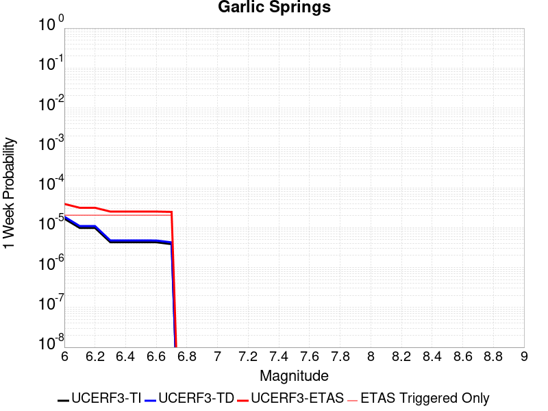 | 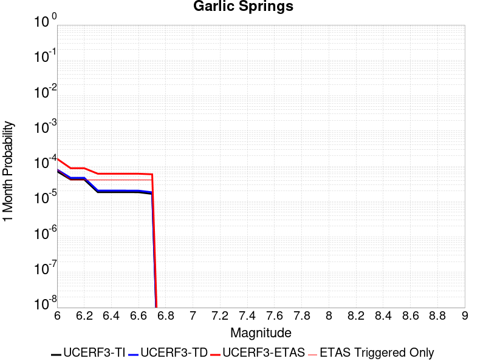 | 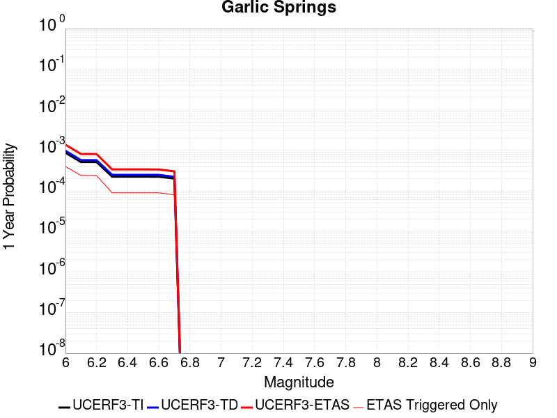 | 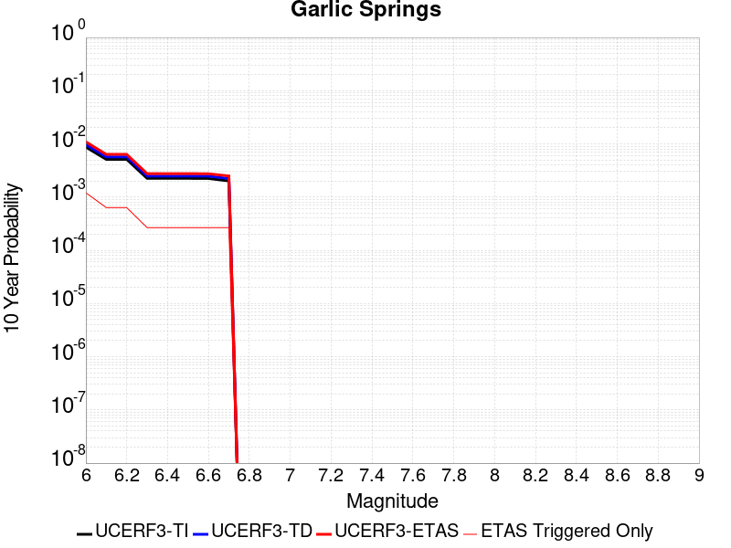 |

| Magnitude | 1 wk TI Prob | 1 wk TD Prob | 1 wk ETAS Prob | 1 wk ETAS/TD Gain | 1 wk ETAS Triggered Only | 1 mo TI Prob | 1 mo TD Prob | 1 mo ETAS Prob | 1 mo ETAS/TD Gain | 1 mo ETAS Triggered Only | 1 yr TI Prob | 1 yr TD Prob | 1 yr ETAS Prob | 1 yr ETAS/TD Gain | 1 yr ETAS Triggered Only | 10 yr TI Prob | 10 yr TD Prob | 10 yr ETAS Prob | 10 yr ETAS/TD Gain | 10 yr ETAS Triggered Only |
|-----|-----|-----|-----|-----|-----|-----|-----|-----|-----|-----|-----|-----|-----|-----|-----|-----|-----|-----|-----|-----|
| 6.0 | 1.6760017E-5 | 1.8777133E-5 | 3.8776758E-5 | 2.0651054 | 2.0E-5 | 7.182667E-5 | 8.0471604E-5 | 1.6046516E-4 | 1.9940594 | 8.0E-5 | 8.7413884E-4 | 9.794189E-4 | 0.001379027 | 1.4080055 | 4.0E-4 | 0.008707083 | 0.009762568 | 0.0107528055 | 1.1014321 | 0.001 |
| 6.1 | 9.852767E-6 | 1.0973752E-5 | 2.0973643E-5 | 1.9112554 | 1.0E-5 | 4.222546E-5 | 4.702992E-5 | 8.702804E-5 | 1.8504823 | 4.0E-5 | 5.139737E-4 | 5.7250983E-4 | 8.123724E-4 | 1.4189668 | 2.4E-4 | 0.005127866 | 0.0057173073 | 0.006204506 | 1.0852147 | 4.9E-4 |
| 6.2 | 9.852767E-6 | 1.0973752E-5 | 2.0973643E-5 | 1.9112554 | 1.0E-5 | 4.222546E-5 | 4.702992E-5 | 8.702804E-5 | 1.8504823 | 4.0E-5 | 5.139737E-4 | 5.7250983E-4 | 8.123724E-4 | 1.4189668 | 2.4E-4 | 0.005127866 | 0.0057173073 | 0.006204506 | 1.0852147 | 4.9E-4 |
| 6.3 | 4.3167724E-6 | 4.7780964E-6 | 1.4778048E-5 | 3.0928738 | 1.0E-5 | 1.8500323E-5 | 2.0477524E-5 | 5.047691E-5 | 2.4649909 | 3.0E-5 | 2.2521814E-4 | 2.4930836E-4 | 3.3928594E-4 | 1.3609087 | 9.0E-5 | 0.0022499003 | 0.0024925452 | 0.0026920468 | 1.0800393 | 2.0E-4 |
| 6.4 | 4.3167724E-6 | 4.7780964E-6 | 1.4778048E-5 | 3.0928738 | 1.0E-5 | 1.8500323E-5 | 2.0477524E-5 | 5.047691E-5 | 2.4649909 | 3.0E-5 | 2.2521814E-4 | 2.4930836E-4 | 3.3928594E-4 | 1.3609087 | 9.0E-5 | 0.0022499003 | 0.0024925452 | 0.0026920468 | 1.0800393 | 2.0E-4 |
| 6.5 | 4.3167724E-6 | 4.7780964E-6 | 1.4778048E-5 | 3.0928738 | 1.0E-5 | 1.8500323E-5 | 2.0477524E-5 | 5.047691E-5 | 2.4649909 | 3.0E-5 | 2.2521814E-4 | 2.4930836E-4 | 3.3928594E-4 | 1.3609087 | 9.0E-5 | 0.0022499003 | 0.0024925452 | 0.0026920468 | 1.0800393 | 2.0E-4 |
| 6.6 | 4.301311E-6 | 4.7609647E-6 | 1.4760917E-5 | 3.1004047 | 1.0E-5 | 1.8434059E-5 | 2.0404104E-5 | 5.040349E-5 | 2.4702625 | 3.0E-5 | 2.2441156E-4 | 2.4841467E-4 | 3.3839233E-4 | 1.3622074 | 9.0E-5 | 0.0022418506 | 0.0024836282 | 0.0026831315 | 1.0803274 | 2.0E-4 |
| 6.7 | 3.8599724E-6 | 4.2711204E-6 | 1.4271078E-5 | 3.3412962 | 1.0E-5 | 1.6542634E-5 | 1.8304801E-5 | 3.8304435E-5 | 2.0925896 | 2.0E-5 | 2.0138794E-4 | 2.2286095E-4 | 3.028431E-4 | 1.3588883 | 8.0E-5 | 0.0020120554 | 0.0022286095 | 0.0024082083 | 1.0805879 | 1.8E-4 |

## Helendale-So Lockhart
*[(top)](#table-of-contents)*

| 1 Week | 1 Month | 1 Year | 10 Year |
|-----|-----|-----|-----|
| 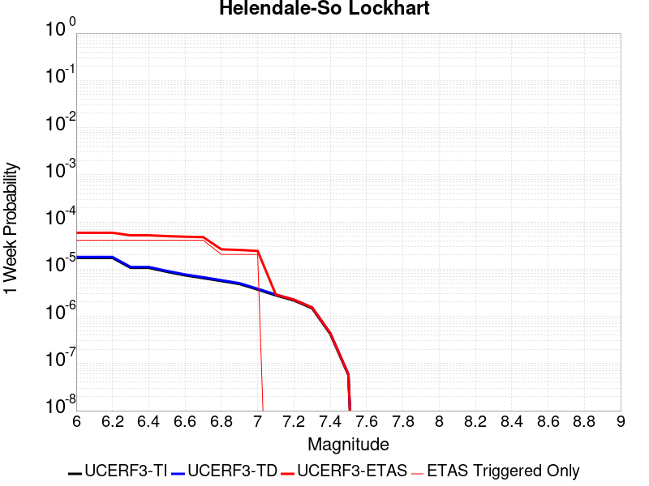 | 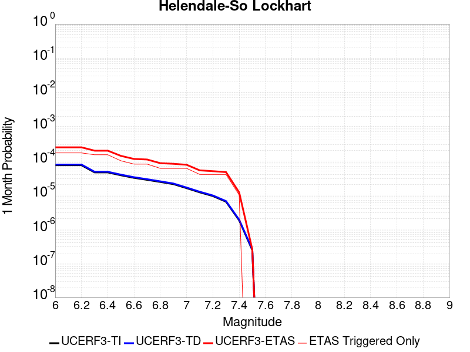 | 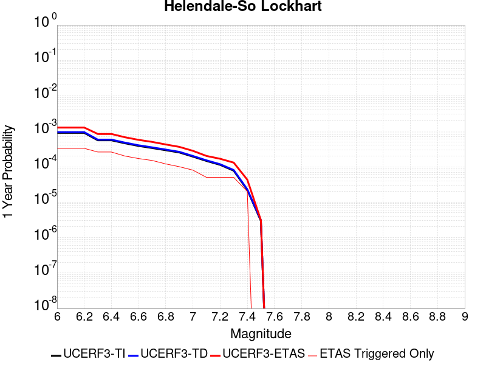 | 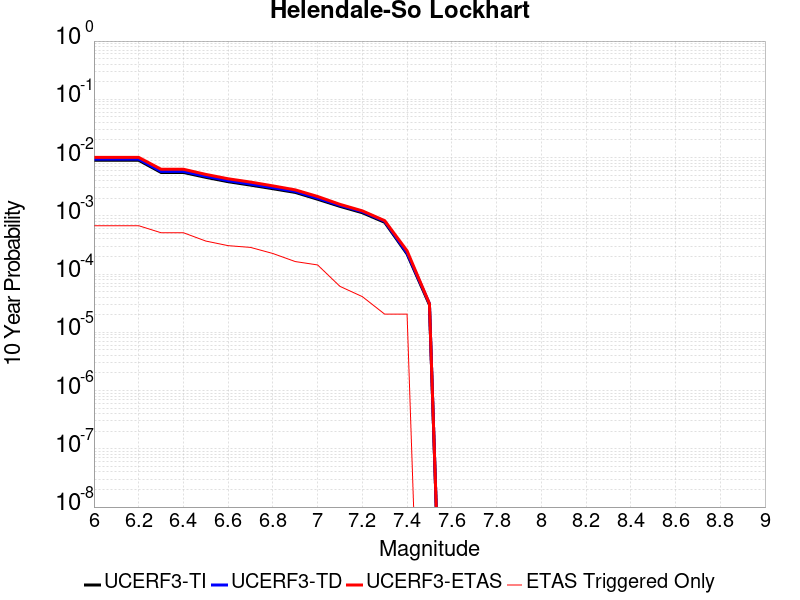 |

| Magnitude | 1 wk TI Prob | 1 wk TD Prob | 1 wk ETAS Prob | 1 wk ETAS/TD Gain | 1 wk ETAS Triggered Only | 1 mo TI Prob | 1 mo TD Prob | 1 mo ETAS Prob | 1 mo ETAS/TD Gain | 1 mo ETAS Triggered Only | 1 yr TI Prob | 1 yr TD Prob | 1 yr ETAS Prob | 1 yr ETAS/TD Gain | 1 yr ETAS Triggered Only | 10 yr TI Prob | 10 yr TD Prob | 10 yr ETAS Prob | 10 yr ETAS/TD Gain | 10 yr ETAS Triggered Only |
|-----|-----|-----|-----|-----|-----|-----|-----|-----|-----|-----|-----|-----|-----|-----|-----|-----|-----|-----|-----|-----|
| 6.0 | 1.7296055E-5 | 1.8103841E-5 | 6.8102934E-5 | 3.7617948 | 5.0E-5 | 7.412385E-5 | 7.7585704E-5 | 2.4757252E-4 | 3.1909554 | 1.7E-4 | 9.0208417E-4 | 9.442173E-4 | 0.0012739057 | 1.3491658 | 3.3E-4 | 0.008984311 | 0.009404174 | 0.0099886255 | 1.0621481 | 5.9E-4 |
| 6.1 | 1.7296055E-5 | 1.8103841E-5 | 6.8102934E-5 | 3.7617948 | 5.0E-5 | 7.412385E-5 | 7.7585704E-5 | 2.4757252E-4 | 3.1909554 | 1.7E-4 | 9.0208417E-4 | 9.442173E-4 | 0.0012739057 | 1.3491658 | 3.3E-4 | 0.008984311 | 0.009404174 | 0.0099886255 | 1.0621481 | 5.9E-4 |
| 6.2 | 1.7296055E-5 | 1.8103841E-5 | 6.8102934E-5 | 3.7617948 | 5.0E-5 | 7.412385E-5 | 7.7585704E-5 | 2.4757252E-4 | 3.1909554 | 1.7E-4 | 9.0208417E-4 | 9.442173E-4 | 0.0012739057 | 1.3491658 | 3.3E-4 | 0.008984311 | 0.009404174 | 0.0099886255 | 1.0621481 | 5.9E-4 |
| 6.3 | 1.0669118E-5 | 1.1135489E-5 | 6.113493E-5 | 5.4900985 | 5.0E-5 | 4.5723988E-5 | 4.7722668E-5 | 1.977155E-4 | 4.1430106 | 1.5E-4 | 5.5654737E-4 | 5.8087136E-4 | 8.407204E-4 | 1.4473433 | 2.6E-4 | 0.0055515557 | 0.005793827 | 0.0062113935 | 1.072071 | 4.2E-4 |
| 6.4 | 1.0669118E-5 | 1.1135489E-5 | 6.113493E-5 | 5.4900985 | 5.0E-5 | 4.5723988E-5 | 4.7722668E-5 | 1.977155E-4 | 4.1430106 | 1.5E-4 | 5.5654737E-4 | 5.8087136E-4 | 8.407204E-4 | 1.4473433 | 2.6E-4 | 0.0055515557 | 0.005793827 | 0.0062113935 | 1.072071 | 4.2E-4 |
| 6.5 | 8.790038E-6 | 9.1702495E-6 | 5.916979E-5 | 6.4523644 | 5.0E-5 | 3.767105E-5 | 3.9300485E-5 | 1.3929655E-4 | 3.5443978 | 1.0E-4 | 4.585485E-4 | 4.7837992E-4 | 6.782842E-4 | 1.4178778 | 2.0E-4 | 0.0045760344 | 0.0047736657 | 0.0051020905 | 1.0687993 | 3.3E-4 |
| 6.6 | 7.396949E-6 | 7.715581E-6 | 5.7715195E-5 | 7.4803433 | 5.0E-5 | 3.1700827E-5 | 3.3066364E-5 | 1.1306372E-4 | 3.419297 | 8.0E-5 | 3.858892E-4 | 4.025096E-4 | 5.724412E-4 | 1.4221802 | 1.7E-4 | 0.003852198 | 0.004017913 | 0.0042967875 | 1.0694079 | 2.8E-4 |
| 6.7 | 6.4600285E-6 | 6.7380697E-6 | 5.6737732E-5 | 8.420473 | 5.0E-5 | 2.7685543E-5 | 2.8877126E-5 | 1.0887482E-4 | 3.770279 | 8.0E-5 | 3.3701936E-4 | 3.5152308E-4 | 5.0147035E-4 | 1.4265646 | 1.5E-4 | 0.0033650869 | 0.003509752 | 0.0037588745 | 1.0709801 | 2.5E-4 |
| 6.8 | 5.600104E-6 | 5.836042E-6 | 4.5835808E-5 | 7.85392 | 4.0E-5 | 2.4000226E-5 | 2.5011372E-5 | 8.500987E-5 | 3.3988488 | 6.0E-5 | 2.9216358E-4 | 3.044715E-4 | 4.2443495E-4 | 1.3940055 | 1.2E-4 | 0.0029177975 | 0.003040605 | 0.003239997 | 1.0655764 | 2.0E-4 |
| 6.9 | 4.839122E-6 | 5.039537E-6 | 4.5039335E-5 | 8.937197 | 4.0E-5 | 2.0738931E-5 | 2.159784E-5 | 8.159655E-5 | 3.7779956 | 6.0E-5 | 2.5246723E-4 | 2.6292243E-4 | 3.6289613E-4 | 1.3802403 | 1.0E-4 | 0.002521806 | 0.002626161 | 0.0027757674 | 1.0569676 | 1.5E-4 |
| 7.0 | 3.6937633E-6 | 3.845229E-6 | 4.3845073E-5 | 11.402462 | 4.0E-5 | 1.5830317E-5 | 1.6479451E-5 | 7.647846E-5 | 4.640838 | 6.0E-5 | 1.9271708E-4 | 2.0061915E-4 | 2.806031E-4 | 1.3986856 | 8.0E-5 | 0.0019255003 | 0.0020044118 | 0.0021241712 | 1.0597479 | 1.2E-4 |
| 7.1 | 2.7858857E-6 | 2.8978693E-6 | 2.2897812E-5 | 7.9016027 | 2.0E-5 | 1.1939455E-5 | 1.2419382E-5 | 5.2418884E-5 | 4.220732 | 4.0E-5 | 1.4535317E-4 | 1.511957E-4 | 2.0118813E-4 | 1.3306472 | 5.0E-5 | 0.0014525814 | 0.0015109498 | 0.001580844 | 1.0462584 | 7.0E-5 |
| 7.2 | 2.1672065E-6 | 2.2540248E-6 | 2.225398E-5 | 9.872997 | 2.0E-5 | 9.2879945E-6 | 9.660072E-6 | 4.9659684E-5 | 5.140716 | 4.0E-5 | 1.1307546E-4 | 1.176052E-4 | 1.6759933E-4 | 1.4251013 | 5.0E-5 | 0.0011301794 | 0.0011754478 | 0.0012353774 | 1.0509844 | 6.0E-5 |
| 7.3 | 1.4823496E-6 | 1.5422185E-6 | 2.1542188E-5 | 13.968311 | 2.0E-5 | 6.3529114E-6 | 6.6094917E-6 | 4.6609228E-5 | 7.0518622 | 4.0E-5 | 7.734395E-5 | 8.046775E-5 | 1.3046373E-4 | 1.621317 | 5.0E-5 | 7.731704E-4 | 8.044012E-4 | 8.54361E-4 | 1.062108 | 5.0E-5 |
| 7.4 | 4.2321457E-7 | 4.4109012E-7 | 1.0441086E-5 | 23.671093 | 1.0E-5 | 1.8137755E-6 | 1.8903852E-6 | 1.1890366E-5 | 6.2899175 | 1.0E-5 | 2.2082493E-5 | 2.3015242E-5 | 4.301478E-5 | 1.8689693 | 2.0E-5 | 2.2080299E-4 | 2.3013311E-4 | 2.501285E-4 | 1.0868862 | 2.0E-5 |
| 7.5 | 5.6942316E-8 | 5.941599E-8 | 5.941599E-8 | 1.0 | 0.0 | 2.440385E-7 | 2.5463993E-7 | 2.5463993E-7 | 1.0 | 0.0 | 2.9711643E-6 | 3.1002376E-6 | 3.1002376E-6 | 1.0 | 0.0 | 2.9711247E-5 | 3.1002022E-5 | 3.1002022E-5 | 1.0 | 0.0 |

## Death Valley (Black Mtns Frontal)
*[(top)](#table-of-contents)*

| 1 Week | 1 Month | 1 Year | 10 Year |
|-----|-----|-----|-----|
| 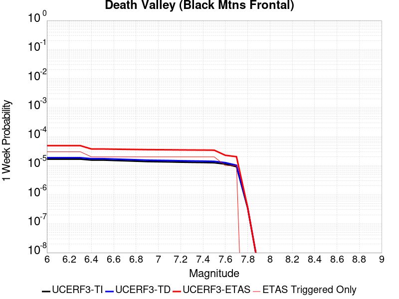 | 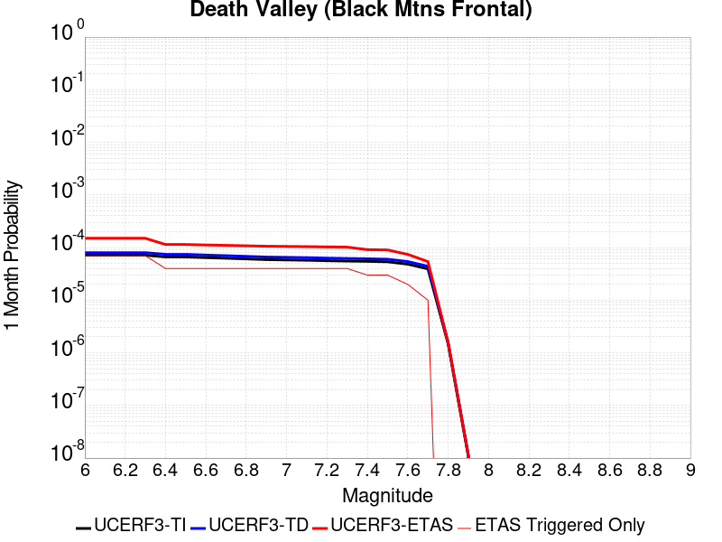 | 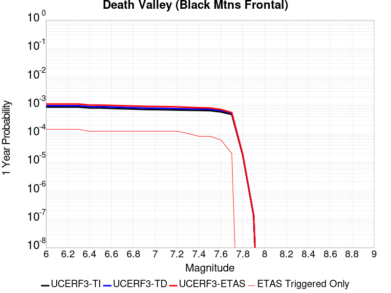 | 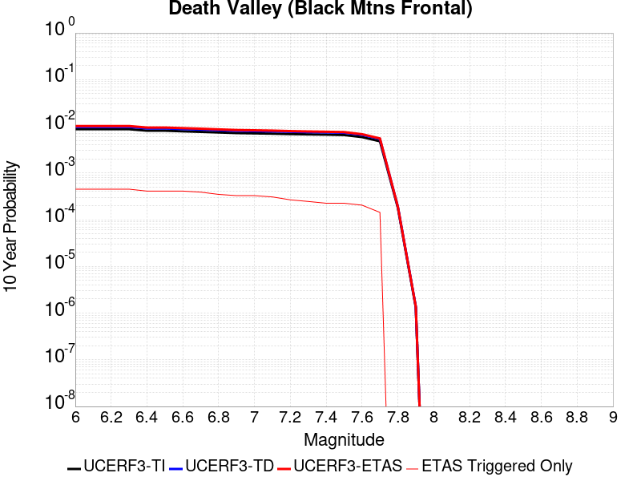 |

| Magnitude | 1 wk TI Prob | 1 wk TD Prob | 1 wk ETAS Prob | 1 wk ETAS/TD Gain | 1 wk ETAS Triggered Only | 1 mo TI Prob | 1 mo TD Prob | 1 mo ETAS Prob | 1 mo ETAS/TD Gain | 1 mo ETAS Triggered Only | 1 yr TI Prob | 1 yr TD Prob | 1 yr ETAS Prob | 1 yr ETAS/TD Gain | 1 yr ETAS Triggered Only | 10 yr TI Prob | 10 yr TD Prob | 10 yr ETAS Prob | 10 yr ETAS/TD Gain | 10 yr ETAS Triggered Only |
|-----|-----|-----|-----|-----|-----|-----|-----|-----|-----|-----|-----|-----|-----|-----|-----|-----|-----|-----|-----|-----|
| 6.0 | 1.6707214E-5 | 1.867056E-5 | 4.867E-5 | 2.6067777 | 3.0E-5 | 7.160038E-5 | 8.001427E-5 | 1.5000868E-4 | 1.8747739 | 7.0E-5 | 8.71386E-4 | 9.7374606E-4 | 0.0012434832 | 1.2770097 | 2.7E-4 | 0.00867977 | 0.009695647 | 0.010250218 | 1.0571979 | 5.6E-4 |
| 6.1 | 1.6707214E-5 | 1.867056E-5 | 4.867E-5 | 2.6067777 | 3.0E-5 | 7.160038E-5 | 8.001427E-5 | 1.5000868E-4 | 1.8747739 | 7.0E-5 | 8.71386E-4 | 9.7374606E-4 | 0.0012434832 | 1.2770097 | 2.7E-4 | 0.00867977 | 0.009695647 | 0.010250218 | 1.0571979 | 5.6E-4 |
| 6.2 | 1.6707214E-5 | 1.867056E-5 | 4.867E-5 | 2.6067777 | 3.0E-5 | 7.160038E-5 | 8.001427E-5 | 1.5000868E-4 | 1.8747739 | 7.0E-5 | 8.71386E-4 | 9.7374606E-4 | 0.0012434832 | 1.2770097 | 2.7E-4 | 0.00867977 | 0.009695647 | 0.010250218 | 1.0571979 | 5.6E-4 |
| 6.3 | 1.6707214E-5 | 1.867056E-5 | 4.867E-5 | 2.6067777 | 3.0E-5 | 7.160038E-5 | 8.001427E-5 | 1.5000868E-4 | 1.8747739 | 7.0E-5 | 8.71386E-4 | 9.7374606E-4 | 0.0012434832 | 1.2770097 | 2.7E-4 | 0.00867977 | 0.009695647 | 0.010250218 | 1.0571979 | 5.6E-4 |
| 6.4 | 1.5515609E-5 | 1.7338483E-5 | 3.7338137E-5 | 2.1534834 | 2.0E-5 | 6.649377E-5 | 7.430571E-5 | 1.1430273E-4 | 1.5382767 | 4.0E-5 | 8.0926094E-4 | 9.0430264E-4 | 0.0011041218 | 1.2209649 | 2.0E-4 | 0.008063202 | 0.009006913 | 0.00945286 | 1.0495117 | 4.5E-4 |
| 6.5 | 1.5515609E-5 | 1.7338483E-5 | 3.7338137E-5 | 2.1534834 | 2.0E-5 | 6.649377E-5 | 7.430571E-5 | 1.1430273E-4 | 1.5382767 | 4.0E-5 | 8.0926094E-4 | 9.0430264E-4 | 0.0011041218 | 1.2209649 | 2.0E-4 | 0.008063202 | 0.009006913 | 0.00945286 | 1.0495117 | 4.5E-4 |
| 6.6 | 1.5041828E-5 | 1.6809407E-5 | 3.680907E-5 | 2.18979 | 2.0E-5 | 6.4463384E-5 | 7.203836E-5 | 1.1203548E-4 | 1.5552198 | 4.0E-5 | 7.8455906E-4 | 8.7672E-4 | 0.001046571 | 1.1937345 | 1.7E-4 | 0.00781795 | 0.008733268 | 0.009129775 | 1.0454018 | 4.0E-4 |
| 6.7 | 1.4634985E-5 | 1.6356273E-5 | 3.6355945E-5 | 2.2227526 | 2.0E-5 | 6.271985E-5 | 7.009646E-5 | 1.1009366E-4 | 1.5706023 | 4.0E-5 | 7.6334673E-4 | 8.53096E-4 | 0.0010129595 | 1.1873921 | 1.6E-4 | 0.007607299 | 0.008498848 | 0.008865704 | 1.0431653 | 3.7E-4 |
| 6.8 | 1.4209158E-5 | 1.5882297E-5 | 3.5881978E-5 | 2.2592437 | 2.0E-5 | 6.089497E-5 | 6.806524E-5 | 1.08062515E-4 | 1.5876315 | 4.0E-5 | 7.4114406E-4 | 8.2838483E-4 | 9.782605E-4 | 1.1809253 | 1.5E-4 | 0.007386771 | 0.008253585 | 0.008590779 | 1.0408542 | 3.4E-4 |
| 6.9 | 1.3780098E-5 | 1.5404834E-5 | 3.5404526E-5 | 2.2982738 | 2.0E-5 | 5.9056227E-5 | 6.601908E-5 | 1.06016436E-4 | 1.6058455 | 4.0E-5 | 7.1877235E-4 | 8.0349133E-4 | 9.533708E-4 | 1.1865352 | 1.5E-4 | 0.0071645193 | 0.008006458 | 0.008323896 | 1.0396477 | 3.2E-4 |
| 7.0 | 1.3585064E-5 | 1.5188394E-5 | 3.518809E-5 | 2.3167748 | 2.0E-5 | 5.8220405E-5 | 6.5091524E-5 | 1.0508892E-4 | 1.6144793 | 4.0E-5 | 7.086029E-4 | 7.922066E-4 | 9.320957E-4 | 1.1765816 | 1.4E-4 | 0.007063476 | 0.007894417 | 0.00820197 | 1.0389583 | 3.1E-4 |
| 7.1 | 1.3398601E-5 | 1.4981575E-5 | 3.4981276E-5 | 2.334953 | 2.0E-5 | 5.742131E-5 | 6.4205204E-5 | 1.04202634E-4 | 1.6229625 | 4.0E-5 | 6.9888023E-4 | 7.814234E-4 | 9.21314E-4 | 1.1790203 | 1.4E-4 | 0.0069668638 | 0.007787346 | 0.00808501 | 1.038224 | 3.0E-4 |
| 7.2 | 1.3126312E-5 | 1.4679792E-5 | 3.46795E-5 | 2.3623972 | 2.0E-5 | 5.6254412E-5 | 6.291191E-5 | 1.0290939E-4 | 1.6357697 | 4.0E-5 | 6.846822E-4 | 7.656887E-4 | 8.955892E-4 | 1.1696517 | 1.3E-4 | 0.006825765 | 0.00763109 | 0.007899029 | 1.0351115 | 2.7E-4 |
| 7.3 | 1.2922429E-5 | 1.4454016E-5 | 3.4453726E-5 | 2.3836784 | 2.0E-5 | 5.5380664E-5 | 6.1944345E-5 | 1.0194186E-4 | 1.6457009 | 4.0E-5 | 6.74051E-4 | 7.5391686E-4 | 8.738264E-4 | 1.1590488 | 1.2E-4 | 0.006720101 | 0.0075141727 | 0.007772219 | 1.0343413 | 2.6E-4 |
| 7.4 | 1.2768878E-5 | 1.4283997E-5 | 3.4283712E-5 | 2.4001484 | 2.0E-5 | 5.4722615E-5 | 6.1215724E-5 | 9.1213886E-5 | 1.4900402 | 3.0E-5 | 6.660441E-4 | 7.45052E-4 | 8.549701E-4 | 1.1475307 | 1.1E-4 | 0.0066405144 | 0.0074261203 | 0.007674264 | 1.033415 | 2.5E-4 |
| 7.5 | 1.2521929E-5 | 1.40122365E-5 | 3.4011955E-5 | 2.4273038 | 2.0E-5 | 5.366431E-5 | 6.0051094E-5 | 9.004929E-5 | 1.4995446 | 3.0E-5 | 6.531671E-4 | 7.308822E-4 | 8.408018E-4 | 1.150393 | 1.1E-4 | 0.006512506 | 0.0072853607 | 0.0075335396 | 1.0340654 | 2.5E-4 |
| 7.6 | 1.1301089E-5 | 1.2648349E-5 | 2.2648223E-5 | 1.790607 | 1.0E-5 | 4.8432343E-5 | 5.4206117E-5 | 7.420503E-5 | 1.368942 | 2.0E-5 | 5.895042E-4 | 6.597649E-4 | 7.59699E-4 | 1.1514691 | 1.0E-4 | 0.0058794282 | 0.0065786145 | 0.0068170354 | 1.0362419 | 2.4E-4 |
| 7.7 | 9.189108E-6 | 1.0283521E-5 | 2.0283418E-5 | 1.9724195 | 1.0E-5 | 3.93813E-5 | 4.407152E-5 | 5.4071075E-5 | 1.2268939 | 1.0E-5 | 4.7936183E-4 | 5.3644367E-4 | 5.9641147E-4 | 1.1117877 | 6.0E-5 | 0.004783291 | 0.0053519984 | 0.0055111423 | 1.0297353 | 1.6E-4 |
| 7.8 | 3.4586725E-7 | 3.648288E-7 | 3.648288E-7 | 1.0 | 0.0 | 1.4822873E-6 | 1.5635511E-6 | 1.5635511E-6 | 1.0 | 0.0 | 1.80467E-5 | 1.9036073E-5 | 1.9036073E-5 | 1.0 | 0.0 | 1.8045233E-4 | 1.9034486E-4 | 1.9034486E-4 | 1.0 | 0.0 |
| 7.9 | 2.5591178E-9 | 2.6696871E-9 | 2.6696871E-9 | 1.0 | 0.0 | 1.0967647E-8 | 1.1441516E-8 | 1.1441516E-8 | 1.0 | 0.0 | 1.335311E-7 | 1.3930045E-7 | 1.3930045E-7 | 1.0 | 0.0 | 1.3353102E-6 | 1.3930046E-6 | 1.3930046E-6 | 1.0 | 0.0 |

## San Andreas (San Bernardino S)
*[(top)](#table-of-contents)*

| 1 Week | 1 Month | 1 Year | 10 Year |
|-----|-----|-----|-----|
| 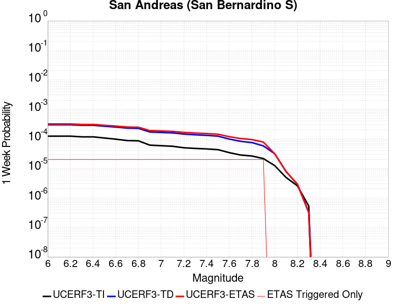 | 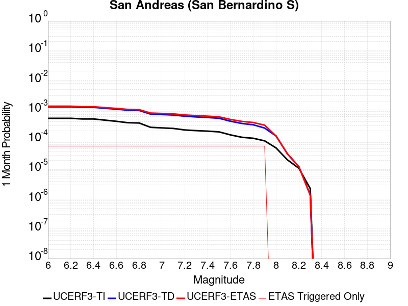 | 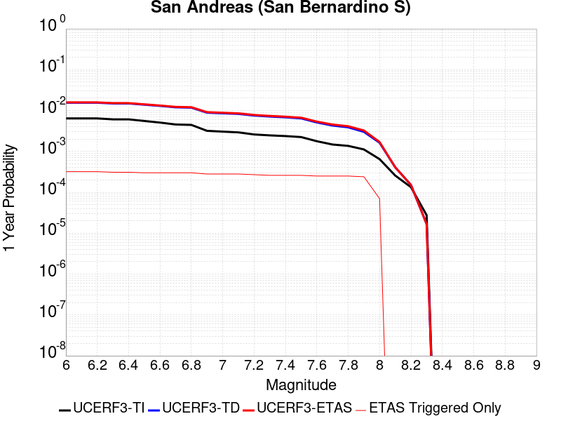 | 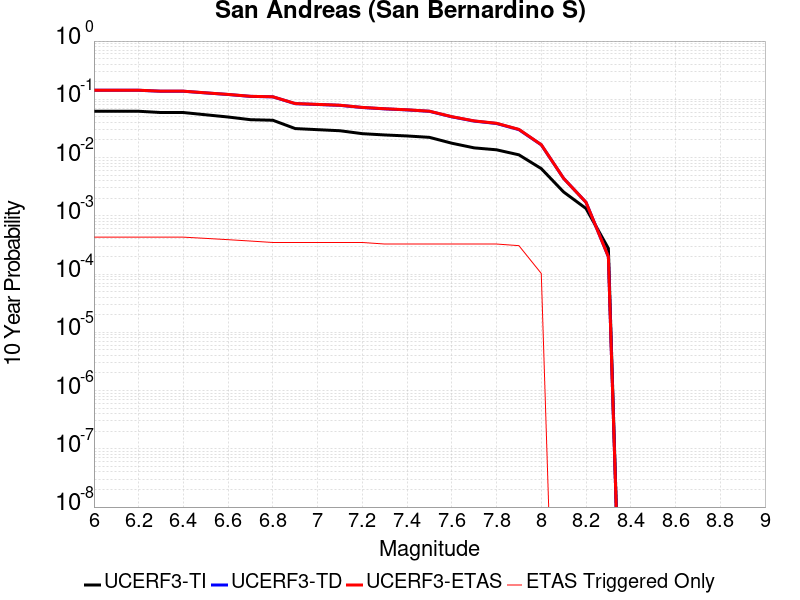 |

| Magnitude | 1 wk TI Prob | 1 wk TD Prob | 1 wk ETAS Prob | 1 wk ETAS/TD Gain | 1 wk ETAS Triggered Only | 1 mo TI Prob | 1 mo TD Prob | 1 mo ETAS Prob | 1 mo ETAS/TD Gain | 1 mo ETAS Triggered Only | 1 yr TI Prob | 1 yr TD Prob | 1 yr ETAS Prob | 1 yr ETAS/TD Gain | 1 yr ETAS Triggered Only | 10 yr TI Prob | 10 yr TD Prob | 10 yr ETAS Prob | 10 yr ETAS/TD Gain | 10 yr ETAS Triggered Only |
|-----|-----|-----|-----|-----|-----|-----|-----|-----|-----|-----|-----|-----|-----|-----|-----|-----|-----|-----|-----|-----|
| 6.0 | 1.2336002E-4 | 3.0008948E-4 | 3.2008346E-4 | 1.0666268 | 2.0E-5 | 5.2857865E-4 | 0.0012854899 | 0.0013653871 | 1.0621531 | 8.0E-5 | 0.006416472 | 0.015543484 | 0.01585851 | 1.0202674 | 3.2E-4 | 0.06234337 | 0.14285627 | 0.14333627 | 1.00336 | 5.6E-4 |
| 6.1 | 1.2336002E-4 | 3.0008948E-4 | 3.2008346E-4 | 1.0666268 | 2.0E-5 | 5.2857865E-4 | 0.0012854899 | 0.0013653871 | 1.0621531 | 8.0E-5 | 0.006416472 | 0.015543484 | 0.01585851 | 1.0202674 | 3.2E-4 | 0.06234337 | 0.14285627 | 0.14333627 | 1.00336 | 5.6E-4 |
| 6.2 | 1.2336002E-4 | 3.0008948E-4 | 3.2008346E-4 | 1.0666268 | 2.0E-5 | 5.2857865E-4 | 0.0012854899 | 0.0013653871 | 1.0621531 | 8.0E-5 | 0.006416472 | 0.015543484 | 0.01585851 | 1.0202674 | 3.2E-4 | 0.06234337 | 0.14285627 | 0.14333627 | 1.00336 | 5.6E-4 |
| 6.3 | 1.1712257E-4 | 2.8797207E-4 | 3.0796631E-4 | 1.0694312 | 2.0E-5 | 5.018573E-4 | 0.001233608 | 0.0013035216 | 1.0566741 | 7.0E-5 | 0.006093008 | 0.01492059 | 0.015225965 | 1.0204667 | 3.1E-4 | 0.059286322 | 0.13756467 | 0.13803901 | 1.0034481 | 5.5E-4 |
| 6.4 | 1.1712257E-4 | 2.8797207E-4 | 3.0796631E-4 | 1.0694312 | 2.0E-5 | 5.018573E-4 | 0.001233608 | 0.0013035216 | 1.0566741 | 7.0E-5 | 0.006093008 | 0.01492059 | 0.015225965 | 1.0204667 | 3.1E-4 | 0.059286322 | 0.13756467 | 0.13803901 | 1.0034481 | 5.5E-4 |
| 6.5 | 1.0689076E-4 | 2.6809986E-4 | 2.880945E-4 | 1.0745791 | 2.0E-5 | 4.5802278E-4 | 0.0011485183 | 0.0012184379 | 1.060878 | 7.0E-5 | 0.0055621783 | 0.013898174 | 0.014194004 | 1.0212855 | 3.0E-4 | 0.05425003 | 0.12881182 | 0.12925613 | 1.0034493 | 5.1E-4 |
| 6.6 | 9.7648895E-5 | 2.5054725E-4 | 2.7054225E-4 | 1.0798053 | 2.0E-5 | 4.1842813E-4 | 0.0010733557 | 0.0011432805 | 1.0651461 | 7.0E-5 | 0.005082469 | 0.012994168 | 0.01329027 | 1.0227873 | 3.0E-4 | 0.049677886 | 0.12097161 | 0.12141112 | 1.0036331 | 5.0E-4 |
| 6.7 | 8.757013E-5 | 2.3125445E-4 | 2.5124985E-4 | 1.0864648 | 2.0E-5 | 3.7524657E-4 | 9.907364E-4 | 0.001060667 | 1.0705845 | 7.0E-5 | 0.00455906 | 0.011999588 | 0.012295988 | 1.0247009 | 3.0E-4 | 0.04466656 | 0.11227982 | 0.1127148 | 1.0038741 | 4.9E-4 |
| 6.8 | 8.562978E-5 | 2.2685292E-4 | 2.468484E-4 | 1.0881429 | 2.0E-5 | 3.6693315E-4 | 9.7188674E-4 | 0.0010418188 | 1.0719548 | 7.0E-5 | 0.004458263 | 0.01177259 | 0.012069058 | 1.025183 | 3.0E-4 | 0.043698758 | 0.11029001 | 0.11071708 | 1.0038722 | 4.8E-4 |
| 6.9 | 6.124075E-5 | 1.7069813E-4 | 1.9069471E-4 | 1.1171459 | 2.0E-5 | 2.6243398E-4 | 7.313591E-4 | 7.913152E-4 | 1.081979 | 6.0E-5 | 0.0031904527 | 0.00886815 | 0.009145668 | 1.0312936 | 2.8E-4 | 0.031450346 | 0.08419993 | 0.0846212 | 1.0050032 | 4.6E-4 |
| 7.0 | 5.8598747E-5 | 1.6498787E-4 | 1.8498457E-4 | 1.121201 | 2.0E-5 | 2.5111332E-4 | 7.069001E-4 | 7.6685764E-4 | 1.0848176 | 6.0E-5 | 0.0030530186 | 0.008572741 | 0.008850341 | 1.0323817 | 2.8E-4 | 0.03011414 | 0.08151753 | 0.08194003 | 1.005183 | 4.6E-4 |
| 7.1 | 5.613814E-5 | 1.5917298E-4 | 1.791698E-4 | 1.1256294 | 2.0E-5 | 2.4056983E-4 | 6.819924E-4 | 7.4195146E-4 | 1.0879176 | 6.0E-5 | 0.0029250039 | 0.008271826 | 0.0085495105 | 1.0335698 | 2.8E-4 | 0.028868021 | 0.078816354 | 0.07923089 | 1.0052595 | 4.5E-4 |
| 7.2 | 4.991222E-5 | 1.4523676E-4 | 1.6523384E-4 | 1.1376861 | 2.0E-5 | 2.1389198E-4 | 6.2229513E-4 | 6.822578E-4 | 1.0963572 | 6.0E-5 | 0.002601025 | 0.0075502265 | 0.007818188 | 1.0354905 | 2.7E-4 | 0.025707912 | 0.072269924 | 0.07267813 | 1.0056483 | 4.4E-4 |
| 7.3 | 4.7410045E-5 | 1.3717797E-4 | 1.5717522E-4 | 1.145776 | 2.0E-5 | 2.0317009E-4 | 5.8777345E-4 | 6.4773817E-4 | 1.1020201 | 6.0E-5 | 0.0024707897 | 0.0071327467 | 0.007390892 | 1.0361916 | 2.6E-4 | 0.024434982 | 0.06855203 | 0.06895255 | 1.0058426 | 4.3E-4 |
| 7.4 | 4.5556746E-5 | 1.3125638E-4 | 1.5125377E-4 | 1.1523535 | 2.0E-5 | 1.952286E-4 | 5.6240644E-4 | 6.2237267E-4 | 1.1066244 | 6.0E-5 | 0.002374317 | 0.006825879 | 0.0070841047 | 1.0378304 | 2.6E-4 | 0.023491086 | 0.065804236 | 0.06620594 | 1.0061046 | 4.3E-4 |
| 7.5 | 4.3084514E-5 | 1.2360894E-4 | 1.4360648E-4 | 1.1617806 | 2.0E-5 | 1.8463485E-4 | 5.2964536E-4 | 5.8961357E-4 | 1.1132233 | 6.0E-5 | 0.0022456115 | 0.006429438 | 0.0066877664 | 1.040179 | 2.6E-4 | 0.022230545 | 0.062204733 | 0.06259861 | 1.0063319 | 4.2E-4 |
| 7.6 | 3.408608E-5 | 9.838868E-5 | 1.18386706E-4 | 1.2032554 | 2.0E-5 | 1.4607502E-4 | 4.215977E-4 | 4.815724E-4 | 1.1422558 | 6.0E-5 | 0.0017770125 | 0.005120897 | 0.005369617 | 1.0485696 | 2.5E-4 | 0.017628696 | 0.050035115 | 0.0504151 | 1.0075943 | 4.0E-4 |
| 7.7 | 2.8315713E-5 | 8.251823E-5 | 1.02516584E-4 | 1.2423507 | 2.0E-5 | 1.2134742E-4 | 3.5360164E-4 | 4.1358045E-4 | 1.1696224 | 6.0E-5 | 0.0014764034 | 0.004296611 | 0.004545537 | 1.0579354 | 2.5E-4 | 0.01466633 | 0.04228543 | 0.042668518 | 1.0090595 | 4.0E-4 |
| 7.8 | 2.6222975E-5 | 7.4660275E-5 | 9.465878E-5 | 1.26786 | 2.0E-5 | 1.1237934E-4 | 3.1993337E-4 | 3.7991419E-4 | 1.187479 | 6.0E-5 | 0.0013673597 | 0.003888238 | 0.004137266 | 1.0640465 | 2.5E-4 | 0.013589768 | 0.03844993 | 0.038834546 | 1.0100031 | 4.0E-4 |
| 7.9 | 2.1469694E-5 | 5.7903162E-5 | 7.7902005E-5 | 1.3453842 | 2.0E-5 | 9.200973E-5 | 2.4813283E-4 | 3.0811795E-4 | 1.241746 | 6.0E-5 | 0.0011196428 | 0.003016835 | 0.003256111 | 1.0793135 | 2.4E-4 | 0.011140184 | 0.030163256 | 0.030522097 | 1.0118966 | 3.7E-4 |
| 8.0 | 1.2420249E-5 | 3.1332525E-5 | 3.1332525E-5 | 1.0 | 0.0 | 5.322855E-5 | 1.3427534E-4 | 1.3427534E-4 | 1.0 | 0.0 | 6.478649E-4 | 0.0016335774 | 0.001703463 | 1.0427808 | 7.0E-5 | 0.0064597935 | 0.016528832 | 0.016646849 | 1.00714 | 1.2E-4 |
| 8.1 | 4.9197724E-6 | 7.827271E-6 | 7.827271E-6 | 1.0 | 0.0 | 2.1084568E-5 | 3.3545013E-5 | 3.3545013E-5 | 1.0 | 0.0 | 2.566744E-4 | 4.0833413E-4 | 4.0833413E-4 | 1.0 | 0.0 | 0.002563781 | 0.0043868436 | 0.0043868436 | 1.0 | 0.0 |
| 8.2 | 2.5634774E-6 | 2.9089954E-6 | 2.9089954E-6 | 1.0 | 0.0 | 1.0986286E-5 | 1.2467063E-5 | 1.2467063E-5 | 1.0 | 0.0 | 1.3374983E-4 | 1.5177597E-4 | 1.5177597E-4 | 1.0 | 0.0 | 0.0013366934 | 0.0017061684 | 0.0017061684 | 1.0 | 0.0 |
| 8.3 | 5.2850464E-7 | 3.211945E-7 | 3.211945E-7 | 1.0 | 0.0 | 2.2650179E-6 | 1.3765473E-6 | 1.3765473E-6 | 1.0 | 0.0 | 2.7576245E-5 | 1.6759346E-5 | 1.6759346E-5 | 1.0 | 0.0 | 2.7572823E-4 | 1.9887649E-4 | 1.9887649E-4 | 1.0 | 0.0 |

## San Andreas (Big Bend)
*[(top)](#table-of-contents)*

| 1 Week | 1 Month | 1 Year | 10 Year |
|-----|-----|-----|-----|
| 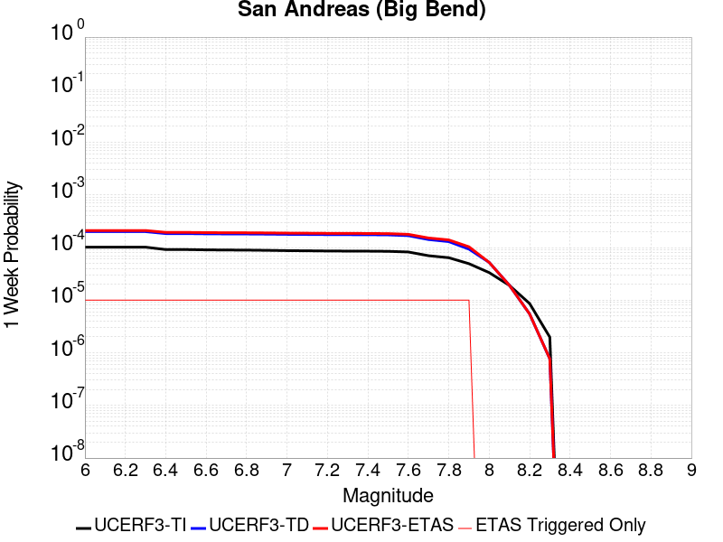 | 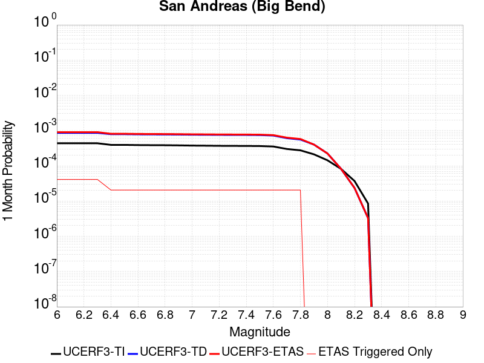 | 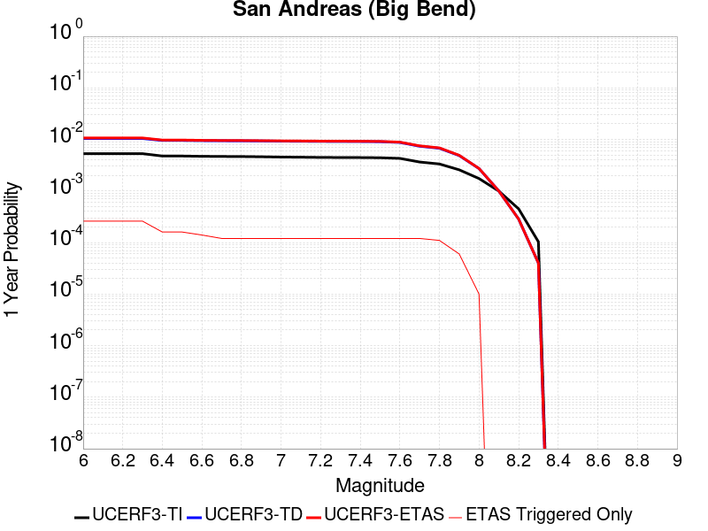 | 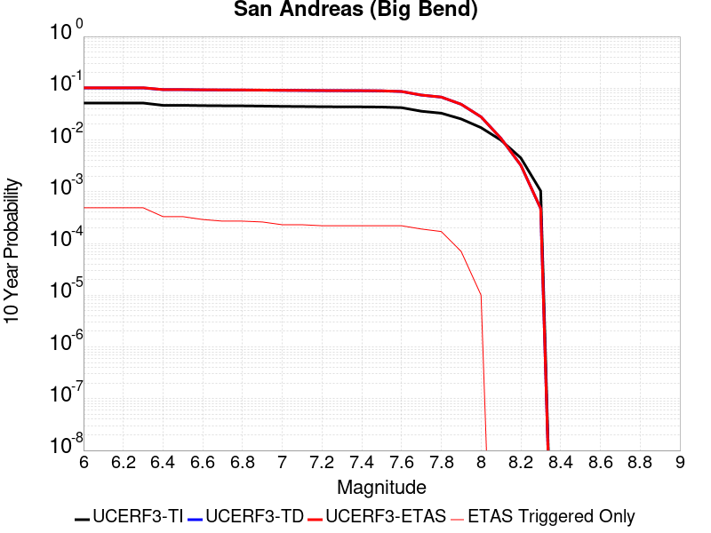 |

| Magnitude | 1 wk TI Prob | 1 wk TD Prob | 1 wk ETAS Prob | 1 wk ETAS/TD Gain | 1 wk ETAS Triggered Only | 1 mo TI Prob | 1 mo TD Prob | 1 mo ETAS Prob | 1 mo ETAS/TD Gain | 1 mo ETAS Triggered Only | 1 yr TI Prob | 1 yr TD Prob | 1 yr ETAS Prob | 1 yr ETAS/TD Gain | 1 yr ETAS Triggered Only | 10 yr TI Prob | 10 yr TD Prob | 10 yr ETAS Prob | 10 yr ETAS/TD Gain | 10 yr ETAS Triggered Only |
|-----|-----|-----|-----|-----|-----|-----|-----|-----|-----|-----|-----|-----|-----|-----|-----|-----|-----|-----|-----|-----|
| 6.0 | 1.0179969E-4 | 2.0080687E-4 | 2.1080486E-4 | 1.0497891 | 1.0E-5 | 4.362114E-4 | 8.60318E-4 | 9.302578E-4 | 1.0812953 | 7.0E-5 | 0.0052979486 | 0.010424351 | 0.010681641 | 1.0246816 | 2.6E-4 | 0.051734097 | 0.1014857 | 0.10192597 | 1.0043383 | 4.9E-4 |
| 6.1 | 1.0179969E-4 | 2.0080687E-4 | 2.1080486E-4 | 1.0497891 | 1.0E-5 | 4.362114E-4 | 8.60318E-4 | 9.302578E-4 | 1.0812953 | 7.0E-5 | 0.0052979486 | 0.010424351 | 0.010681641 | 1.0246816 | 2.6E-4 | 0.051734097 | 0.1014857 | 0.10192597 | 1.0043383 | 4.9E-4 |
| 6.2 | 1.0179969E-4 | 2.0080687E-4 | 2.1080486E-4 | 1.0497891 | 1.0E-5 | 4.362114E-4 | 8.60318E-4 | 9.302578E-4 | 1.0812953 | 7.0E-5 | 0.0052979486 | 0.010424351 | 0.010681641 | 1.0246816 | 2.6E-4 | 0.051734097 | 0.1014857 | 0.10192597 | 1.0043383 | 4.9E-4 |
| 6.3 | 1.0179969E-4 | 2.0080687E-4 | 2.1080486E-4 | 1.0497891 | 1.0E-5 | 4.362114E-4 | 8.60318E-4 | 9.302578E-4 | 1.0812953 | 7.0E-5 | 0.0052979486 | 0.010424351 | 0.010681641 | 1.0246816 | 2.6E-4 | 0.051734097 | 0.1014857 | 0.10192597 | 1.0043383 | 4.9E-4 |
| 6.4 | 9.1639464E-5 | 1.8437792E-4 | 1.9437607E-4 | 1.0542264 | 1.0E-5 | 3.9268145E-4 | 7.89952E-4 | 8.199283E-4 | 1.0379469 | 3.0E-5 | 0.0047704205 | 0.009575372 | 0.00973384 | 1.0165496 | 1.6E-4 | 0.046693064 | 0.09381153 | 0.09411057 | 1.0031877 | 3.3E-4 |
| 6.5 | 9.1639464E-5 | 1.8437792E-4 | 1.9437607E-4 | 1.0542264 | 1.0E-5 | 3.9268145E-4 | 7.89952E-4 | 8.199283E-4 | 1.0379469 | 3.0E-5 | 0.0047704205 | 0.009575372 | 0.00973384 | 1.0165496 | 1.6E-4 | 0.046693064 | 0.09381153 | 0.09411057 | 1.0031877 | 3.3E-4 |
| 6.6 | 9.042622E-5 | 1.8244829E-4 | 1.9244647E-4 | 1.0548 | 1.0E-5 | 3.8748336E-4 | 7.8168715E-4 | 8.116637E-4 | 1.0383486 | 3.0E-5 | 0.0047074095 | 0.009475624 | 0.009614298 | 1.0146347 | 1.4E-4 | 0.046089325 | 0.09290548 | 0.093168534 | 1.0028315 | 2.9E-4 |
| 6.7 | 8.9836685E-5 | 1.8159159E-4 | 1.9158977E-4 | 1.0550586 | 1.0E-5 | 3.8495753E-4 | 7.7801774E-4 | 8.079944E-4 | 1.0385295 | 3.0E-5 | 0.00467679 | 0.009431336 | 0.0095502045 | 1.0126035 | 1.2E-4 | 0.045795817 | 0.09249973 | 0.09274476 | 1.002649 | 2.7E-4 |
| 6.8 | 8.9471854E-5 | 1.8105932E-4 | 1.9105752E-4 | 1.0552205 | 1.0E-5 | 3.8339442E-4 | 7.75738E-4 | 8.0571475E-4 | 1.0386429 | 3.0E-5 | 0.004657841 | 0.00940382 | 0.009522691 | 1.0126407 | 1.2E-4 | 0.04561414 | 0.09224692 | 0.092492014 | 1.0026569 | 2.7E-4 |
| 6.9 | 8.858234E-5 | 1.7987892E-4 | 1.8987713E-4 | 1.055583 | 1.0E-5 | 3.7958333E-4 | 7.706821E-4 | 8.00659E-4 | 1.0388966 | 3.0E-5 | 0.004611638 | 0.009342793 | 0.009461673 | 1.0127242 | 1.2E-4 | 0.04517103 | 0.091686994 | 0.091923155 | 1.0025758 | 2.6E-4 |
| 7.0 | 8.7433385E-5 | 1.7826671E-4 | 1.8826492E-4 | 1.0560857 | 1.0E-5 | 3.746607E-4 | 7.6377665E-4 | 7.937538E-4 | 1.0392485 | 3.0E-5 | 0.004551957 | 0.009259437 | 0.009378326 | 1.0128398 | 1.2E-4 | 0.044598386 | 0.09092137 | 0.09113046 | 1.0022997 | 2.3E-4 |
| 7.1 | 8.684964E-5 | 1.7738611E-4 | 1.8738434E-4 | 1.0563642 | 1.0E-5 | 3.7215967E-4 | 7.600049E-4 | 7.899821E-4 | 1.0394434 | 3.0E-5 | 0.0045216335 | 0.009213906 | 0.0093328 | 1.0129038 | 1.2E-4 | 0.04430731 | 0.09050287 | 0.090712056 | 1.0023113 | 2.3E-4 |
| 7.2 | 8.606521E-5 | 1.7629213E-4 | 1.8629037E-4 | 1.056714 | 1.0E-5 | 3.6879873E-4 | 7.5531914E-4 | 7.852965E-4 | 1.0396883 | 3.0E-5 | 0.0044808835 | 0.009157337 | 0.009276238 | 1.0129843 | 1.2E-4 | 0.043916024 | 0.08998334 | 0.09018354 | 1.0022249 | 2.2E-4 |
| 7.3 | 8.568266E-5 | 1.7571205E-4 | 1.8571029E-4 | 1.0569013 | 1.0E-5 | 3.6715972E-4 | 7.528345E-4 | 7.828119E-4 | 1.0398194 | 3.0E-5 | 0.0044610105 | 0.00912734 | 0.009246245 | 1.0130273 | 1.2E-4 | 0.043725148 | 0.08970444 | 0.0899047 | 1.0022326 | 2.2E-4 |
| 7.4 | 8.5432206E-5 | 1.7533782E-4 | 1.8533606E-4 | 1.0570228 | 1.0E-5 | 3.6608664E-4 | 7.5123156E-4 | 7.8120903E-4 | 1.0399045 | 3.0E-5 | 0.004447999 | 0.009107988 | 0.009226896 | 1.0130552 | 1.2E-4 | 0.043600157 | 0.08952458 | 0.08972488 | 1.0022374 | 2.2E-4 |
| 7.5 | 8.4791965E-5 | 1.7403076E-4 | 1.8402902E-4 | 1.0574511 | 1.0E-5 | 3.633435E-4 | 7.4563315E-4 | 7.7561074E-4 | 1.0402043 | 3.0E-5 | 0.0044147377 | 0.009040395 | 0.00915931 | 1.0131538 | 1.2E-4 | 0.043280575 | 0.0889021 | 0.08910254 | 1.0022546 | 2.2E-4 |
| 7.6 | 8.241105E-5 | 1.684837E-4 | 1.7848202E-4 | 1.059343 | 1.0E-5 | 3.531424E-4 | 7.2187337E-4 | 7.518517E-4 | 1.0415286 | 3.0E-5 | 0.0042910352 | 0.008753479 | 0.008872429 | 1.0135888 | 1.2E-4 | 0.042091176 | 0.08627858 | 0.0864796 | 1.0023298 | 2.2E-4 |
| 7.7 | 7.00432E-5 | 1.4211683E-4 | 1.521154E-4 | 1.0703547 | 1.0E-5 | 3.001506E-4 | 6.0893E-4 | 6.3891173E-4 | 1.0492368 | 3.0E-5 | 0.0036482112 | 0.007388561 | 0.0075076744 | 1.0161213 | 1.2E-4 | 0.035888977 | 0.07354971 | 0.07372574 | 1.0023932 | 1.9E-4 |
| 7.8 | 6.415362E-5 | 1.297541E-4 | 1.3975281E-4 | 1.0770588 | 1.0E-5 | 2.749151E-4 | 5.5597053E-4 | 5.859539E-4 | 1.0539297 | 3.0E-5 | 0.0033419547 | 0.006747963 | 0.0068572205 | 1.0161912 | 1.1E-4 | 0.03292141 | 0.0672817 | 0.067440264 | 1.0023566 | 1.7E-4 |
| 7.9 | 4.939911E-5 | 9.345801E-5 | 1.03457074E-4 | 1.10699 | 1.0E-5 | 2.116933E-4 | 4.0047284E-4 | 4.1046884E-4 | 1.0249605 | 1.0E-5 | 0.0025743195 | 0.0048648654 | 0.004924574 | 1.0122733 | 6.0E-5 | 0.025447013 | 0.048936196 | 0.04900277 | 1.0013604 | 7.0E-5 |
| 8.0 | 3.344983E-5 | 5.225443E-5 | 5.225443E-5 | 1.0 | 0.0 | 1.4334853E-4 | 2.2392833E-4 | 2.2392833E-4 | 1.0 | 0.0 | 0.0017438711 | 0.0027229206 | 0.0027328935 | 1.0036626 | 1.0E-5 | 0.017302496 | 0.02793573 | 0.027945451 | 1.000348 | 1.0E-5 |
| 8.1 | 1.9104898E-5 | 1.9186356E-5 | 1.9186356E-5 | 1.0 | 0.0 | 8.1875565E-5 | 8.222465E-5 | 8.222465E-5 | 1.0 | 0.0 | 9.963791E-4 | 0.001000626 | 0.001000626 | 1.0 | 0.0 | 0.009919235 | 0.010756767 | 0.010756767 | 1.0 | 0.0 |
| 8.2 | 8.643924E-6 | 5.4798497E-6 | 5.4798497E-6 | 1.0 | 0.0 | 3.704486E-5 | 2.348486E-5 | 2.348486E-5 | 1.0 | 0.0 | 4.5092785E-4 | 2.858907E-4 | 2.858907E-4 | 1.0 | 0.0 | 0.0045001395 | 0.0032514327 | 0.0032514327 | 1.0 | 0.0 |
| 8.3 | 1.983087E-6 | 7.668296E-7 | 7.668296E-7 | 1.0 | 0.0 | 8.498917E-6 | 3.2864084E-6 | 3.2864084E-6 | 1.0 | 0.0 | 1.034694E-4 | 4.0011306E-5 | 4.0011306E-5 | 1.0 | 0.0 | 0.0010342124 | 4.724499E-4 | 4.724499E-4 | 1.0 | 0.0 |

## Coyote Lake
*[(top)](#table-of-contents)*

| 1 Week | 1 Month | 1 Year | 10 Year |
|-----|-----|-----|-----|
| 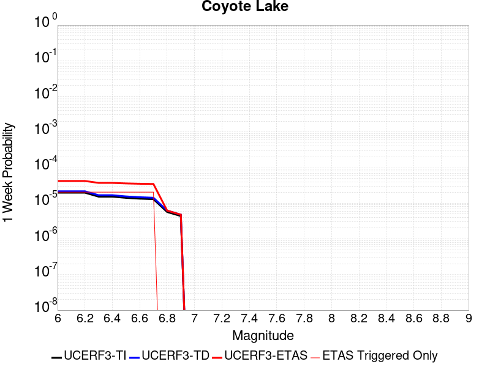 | 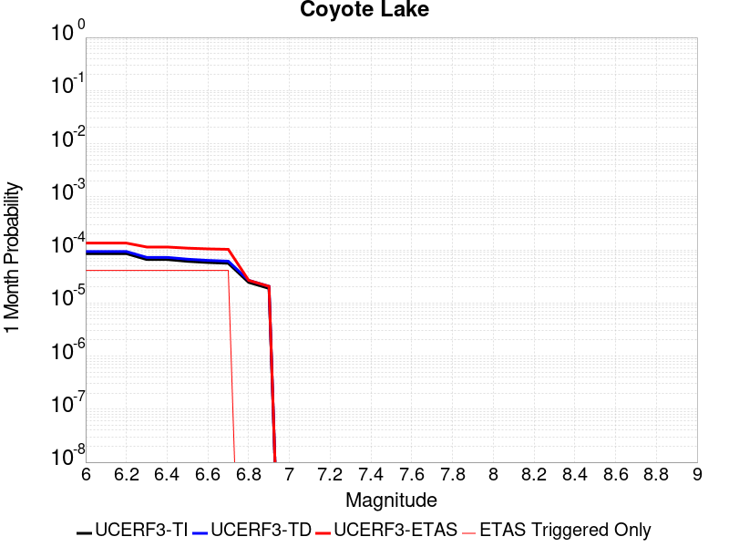 | 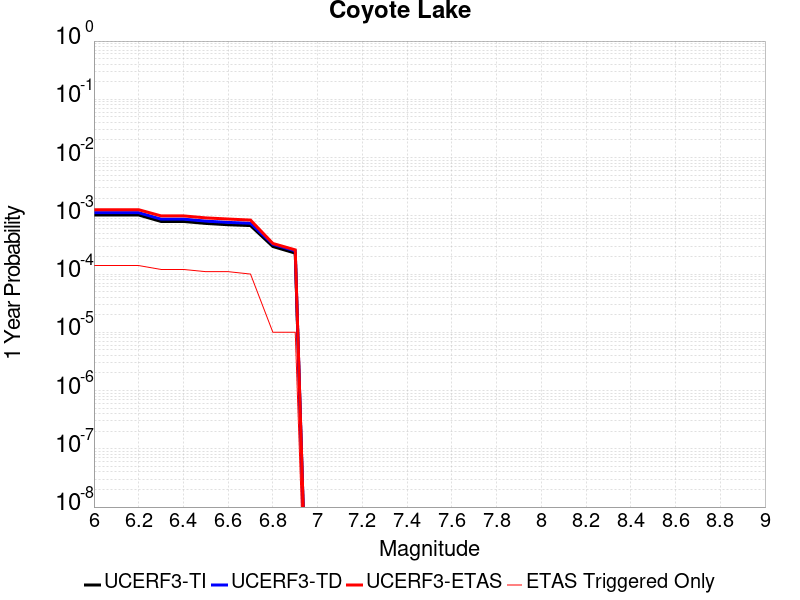 | 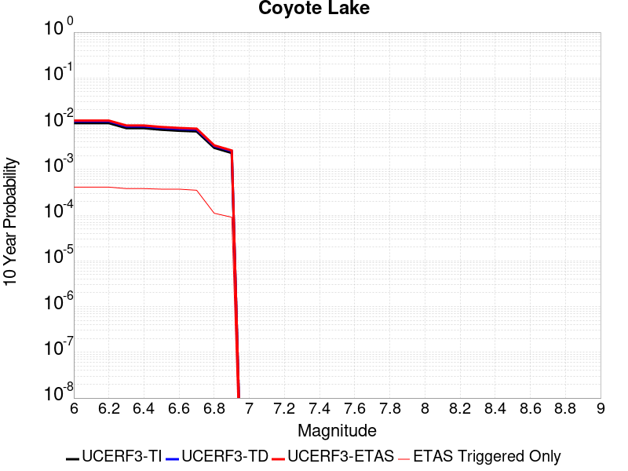 |

| Magnitude | 1 wk TI Prob | 1 wk TD Prob | 1 wk ETAS Prob | 1 wk ETAS/TD Gain | 1 wk ETAS Triggered Only | 1 mo TI Prob | 1 mo TD Prob | 1 mo ETAS Prob | 1 mo ETAS/TD Gain | 1 mo ETAS Triggered Only | 1 yr TI Prob | 1 yr TD Prob | 1 yr ETAS Prob | 1 yr ETAS/TD Gain | 1 yr ETAS Triggered Only | 10 yr TI Prob | 10 yr TD Prob | 10 yr ETAS Prob | 10 yr ETAS/TD Gain | 10 yr ETAS Triggered Only |
|-----|-----|-----|-----|-----|-----|-----|-----|-----|-----|-----|-----|-----|-----|-----|-----|-----|-----|-----|-----|-----|
| 6.0 | 1.980352E-5 | 2.1707021E-5 | 3.1706804E-5 | 1.4606705 | 1.0E-5 | 8.486947E-5 | 9.302718E-5 | 1.230244E-4 | 1.3224564 | 3.0E-5 | 0.0010327959 | 0.0011320895 | 0.001271931 | 1.1235251 | 1.4E-4 | 0.010280091 | 0.011270401 | 0.01167578 | 1.0359684 | 4.1E-4 |
| 6.1 | 1.980352E-5 | 2.1707021E-5 | 3.1706804E-5 | 1.4606705 | 1.0E-5 | 8.486947E-5 | 9.302718E-5 | 1.230244E-4 | 1.3224564 | 3.0E-5 | 0.0010327959 | 0.0011320895 | 0.001271931 | 1.1235251 | 1.4E-4 | 0.010280091 | 0.011270401 | 0.01167578 | 1.0359684 | 4.1E-4 |
| 6.2 | 1.980352E-5 | 2.1707021E-5 | 3.1706804E-5 | 1.4606705 | 1.0E-5 | 8.486947E-5 | 9.302718E-5 | 1.230244E-4 | 1.3224564 | 3.0E-5 | 0.0010327959 | 0.0011320895 | 0.001271931 | 1.1235251 | 1.4E-4 | 0.010280091 | 0.011270401 | 0.01167578 | 1.0359684 | 4.1E-4 |
| 6.3 | 1.5344787E-5 | 1.6820884E-5 | 2.6820715E-5 | 1.5944891 | 1.0E-5 | 6.576172E-5 | 7.208785E-5 | 1.02085694E-4 | 1.4161289 | 3.0E-5 | 8.003548E-4 | 8.7737746E-4 | 9.972722E-4 | 1.1366513 | 1.2E-4 | 0.007974784 | 0.00874518 | 0.009121858 | 1.0430725 | 3.8E-4 |
| 6.4 | 1.5344787E-5 | 1.6820884E-5 | 2.6820715E-5 | 1.5944891 | 1.0E-5 | 6.576172E-5 | 7.208785E-5 | 1.02085694E-4 | 1.4161289 | 3.0E-5 | 8.003548E-4 | 8.7737746E-4 | 9.972722E-4 | 1.1366513 | 1.2E-4 | 0.007974784 | 0.00874518 | 0.009121858 | 1.0430725 | 3.8E-4 |
| 6.5 | 1.4189697E-5 | 1.5558186E-5 | 2.555803E-5 | 1.6427385 | 1.0E-5 | 6.081157E-5 | 6.667658E-5 | 9.667457E-5 | 1.4499031 | 3.0E-5 | 7.401293E-4 | 8.1154524E-4 | 9.2145597E-4 | 1.1354339 | 1.1E-4 | 0.0073766913 | 0.008091759 | 0.008458765 | 1.0453556 | 3.7E-4 |
| 6.6 | 1.3469301E-5 | 1.47717665E-5 | 2.477162E-5 | 1.6769571 | 1.0E-5 | 5.7724297E-5 | 6.3306376E-5 | 9.330447E-5 | 1.473856 | 3.0E-5 | 7.025667E-4 | 7.7054254E-4 | 8.8045775E-4 | 1.1426466 | 1.1E-4 | 0.0070034964 | 0.0076846126 | 0.008051769 | 1.0477781 | 3.7E-4 |
| 6.7 | 1.3027966E-5 | 1.4281927E-5 | 2.4281784E-5 | 1.7001756 | 1.0E-5 | 5.5832945E-5 | 6.120716E-5 | 8.120594E-5 | 1.3267392 | 2.0E-5 | 6.7955407E-4 | 7.450021E-4 | 8.449276E-4 | 1.1341279 | 1.0E-4 | 0.006774798 | 0.007430923 | 0.0077783223 | 1.0467504 | 3.5E-4 |
| 6.8 | 5.695434E-6 | 6.2244944E-6 | 6.2244944E-6 | 1.0 | 0.0 | 2.4408775E-5 | 2.6676302E-5 | 2.6676302E-5 | 1.0 | 0.0 | 2.971363E-4 | 3.2476554E-4 | 3.347623E-4 | 1.0307814 | 1.0E-5 | 0.0029673933 | 0.0032458503 | 0.0033554933 | 1.0337794 | 1.1E-4 |
| 6.9 | 4.385688E-6 | 4.7931144E-6 | 4.7931144E-6 | 1.0 | 0.0 | 1.879567E-5 | 2.0541918E-5 | 2.0541918E-5 | 1.0 | 0.0 | 2.2881327E-4 | 2.5009786E-4 | 2.6009537E-4 | 1.0399743 | 1.0E-5 | 0.002285778 | 0.0025009785 | 0.0025907536 | 1.035896 | 9.0E-5 |

## San Andreas (Cholame) rev
*[(top)](#table-of-contents)*

| 1 Week | 1 Month | 1 Year | 10 Year |
|-----|-----|-----|-----|
| 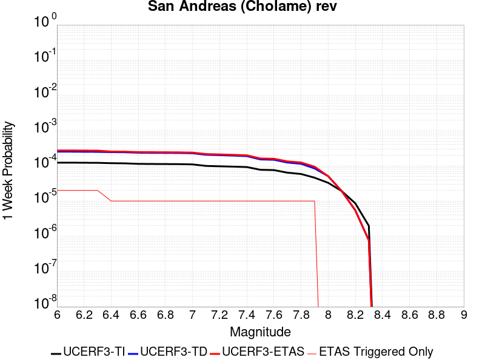 | 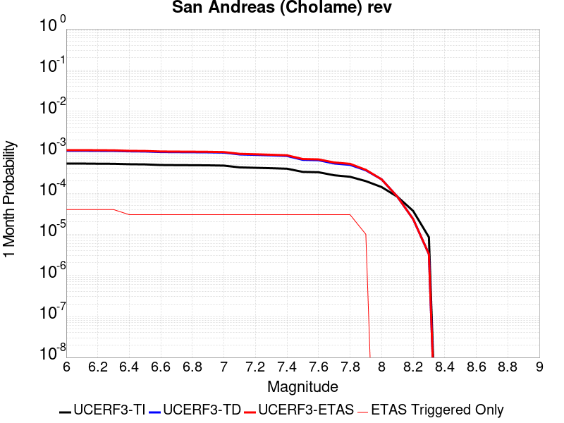 | 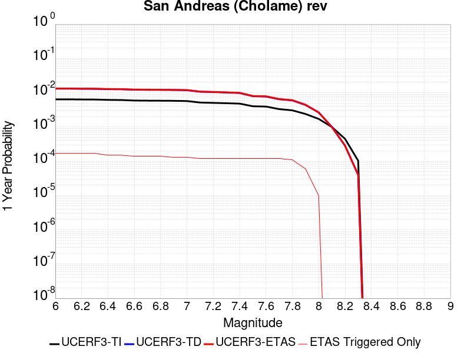 | 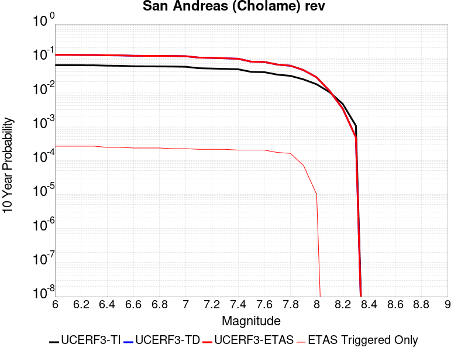 |

| Magnitude | 1 wk TI Prob | 1 wk TD Prob | 1 wk ETAS Prob | 1 wk ETAS/TD Gain | 1 wk ETAS Triggered Only | 1 mo TI Prob | 1 mo TD Prob | 1 mo ETAS Prob | 1 mo ETAS/TD Gain | 1 mo ETAS Triggered Only | 1 yr TI Prob | 1 yr TD Prob | 1 yr ETAS Prob | 1 yr ETAS/TD Gain | 1 yr ETAS Triggered Only | 10 yr TI Prob | 10 yr TD Prob | 10 yr ETAS Prob | 10 yr ETAS/TD Gain | 10 yr ETAS Triggered Only |
|-----|-----|-----|-----|-----|-----|-----|-----|-----|-----|-----|-----|-----|-----|-----|-----|-----|-----|-----|-----|-----|
| 6.0 | 1.2302514E-4 | 2.5213862E-4 | 2.7213356E-4 | 1.0793015 | 2.0E-5 | 5.27144E-4 | 0.0010801482 | 0.0011201049 | 1.036992 | 4.0E-5 | 0.0063991086 | 0.013072014 | 0.013239792 | 1.0128349 | 1.7E-4 | 0.06217949 | 0.12443058 | 0.12465823 | 1.0018295 | 2.6E-4 |
| 6.1 | 1.2302514E-4 | 2.5213862E-4 | 2.7213356E-4 | 1.0793015 | 2.0E-5 | 5.27144E-4 | 0.0010801482 | 0.0011201049 | 1.036992 | 4.0E-5 | 0.0063991086 | 0.013072014 | 0.013239792 | 1.0128349 | 1.7E-4 | 0.06217949 | 0.12443058 | 0.12465823 | 1.0018295 | 2.6E-4 |
| 6.2 | 1.2203569E-4 | 2.5030645E-4 | 2.7030145E-4 | 1.079882 | 2.0E-5 | 5.2290526E-4 | 0.0010723026 | 0.0011122597 | 1.0372629 | 4.0E-5 | 0.006347804 | 0.0129776355 | 0.013145429 | 1.0129294 | 1.7E-4 | 0.061695136 | 0.12361675 | 0.12384461 | 1.0018433 | 2.6E-4 |
| 6.3 | 1.2142645E-4 | 2.491661E-4 | 2.6916113E-4 | 1.0802478 | 2.0E-5 | 5.202953E-4 | 0.0010674193 | 0.0011073767 | 1.0374335 | 4.0E-5 | 0.006316212 | 0.012918889 | 0.013086692 | 1.012989 | 1.7E-4 | 0.06139677 | 0.12311087 | 0.123338856 | 1.0018519 | 2.6E-4 |
| 6.4 | 1.1865206E-4 | 2.4422092E-4 | 2.542185E-4 | 1.0409366 | 1.0E-5 | 5.0840975E-4 | 0.0010462429 | 0.0010762115 | 1.0286441 | 3.0E-5 | 0.006172335 | 0.012664088 | 0.012812189 | 1.0116946 | 1.5E-4 | 0.060036868 | 0.12090351 | 0.12111449 | 1.0017451 | 2.4E-4 |
| 6.5 | 1.17443946E-4 | 2.421537E-4 | 2.5215128E-4 | 1.0412861 | 1.0E-5 | 5.032341E-4 | 0.0010373904 | 0.0010673593 | 1.0288887 | 3.0E-5 | 0.006109677 | 0.012557554 | 0.01270567 | 1.011795 | 1.5E-4 | 0.059444077 | 0.11997763 | 0.12018884 | 1.0017604 | 2.4E-4 |
| 6.6 | 1.13579066E-4 | 2.3524289E-4 | 2.4524055E-4 | 1.0424993 | 1.0E-5 | 4.866766E-4 | 0.0010077958 | 0.0010377655 | 1.029738 | 3.0E-5 | 0.0059092017 | 0.012201327 | 0.012339619 | 1.0113342 | 1.4E-4 | 0.057545185 | 0.11689143 | 0.11709454 | 1.0017376 | 2.3E-4 |
| 6.7 | 1.1271412E-4 | 2.336858E-4 | 2.4368346E-4 | 1.0427825 | 1.0E-5 | 4.829711E-4 | 0.0010011276 | 0.0010310976 | 1.0299362 | 3.0E-5 | 0.005864331 | 0.01212105 | 0.012259353 | 1.0114101 | 1.4E-4 | 0.057119697 | 0.11619493 | 0.116398215 | 1.0017494 | 2.3E-4 |
| 6.8 | 1.1217975E-4 | 2.3256983E-4 | 2.425675E-4 | 1.0429878 | 1.0E-5 | 4.8068175E-4 | 9.963487E-4 | 0.0010263188 | 1.03008 | 3.0E-5 | 0.005836608 | 0.012063511 | 0.012201821 | 1.0114652 | 1.4E-4 | 0.056856725 | 0.11569312 | 0.115896516 | 1.001758 | 2.3E-4 |
| 6.9 | 1.1146753E-4 | 2.3105709E-4 | 2.4105477E-4 | 1.0432694 | 1.0E-5 | 4.7763053E-4 | 9.898704E-4 | 0.0010198407 | 1.030277 | 3.0E-5 | 0.0057996577 | 0.011985509 | 0.01211395 | 1.0107164 | 1.3E-4 | 0.056506127 | 0.11501348 | 0.11520818 | 1.0016928 | 2.2E-4 |
| 7.0 | 1.0965793E-4 | 2.2728977E-4 | 2.372875E-4 | 1.0439867 | 1.0E-5 | 4.698779E-4 | 9.7373687E-4 | 0.0010037076 | 1.0307791 | 3.0E-5 | 0.005705768 | 0.0117912255 | 0.011919693 | 1.0108951 | 1.3E-4 | 0.055614736 | 0.11331484 | 0.11350991 | 1.0017215 | 2.2E-4 |
| 7.1 | 9.927982E-5 | 2.0547757E-4 | 2.1547552E-4 | 1.0486571 | 1.0E-5 | 4.2541555E-4 | 8.80322E-4 | 9.102956E-4 | 1.0340484 | 3.0E-5 | 0.0051671406 | 0.010665542 | 0.010784263 | 1.0111312 | 1.2E-4 | 0.05048634 | 0.10340853 | 0.103596814 | 1.0018208 | 2.1E-4 |
| 7.2 | 9.696786E-5 | 2.0051954E-4 | 2.1051754E-4 | 1.0498605 | 1.0E-5 | 4.1551032E-4 | 8.5908745E-4 | 8.890617E-4 | 1.0348908 | 3.0E-5 | 0.00504711 | 0.010409511 | 0.010528262 | 1.011408 | 1.2E-4 | 0.04934009 | 0.10114636 | 0.10133512 | 1.0018662 | 2.1E-4 |
| 7.3 | 9.4727984E-5 | 1.9481099E-4 | 2.0480904E-4 | 1.0513219 | 1.0E-5 | 4.0591392E-4 | 8.346381E-4 | 8.6461304E-4 | 1.0359137 | 3.0E-5 | 0.0049308087 | 0.010114641 | 0.010233427 | 1.011744 | 1.2E-4 | 0.048228268 | 0.09851684 | 0.09870615 | 1.0019217 | 2.1E-4 |
| 7.4 | 9.220358E-5 | 1.885154E-4 | 1.9851352E-4 | 1.0530361 | 1.0E-5 | 3.9509835E-4 | 8.076739E-4 | 8.376497E-4 | 1.0371137 | 3.0E-5 | 0.004799717 | 0.009789341 | 0.009908167 | 1.0121382 | 1.2E-4 | 0.046973653 | 0.09559427 | 0.09577515 | 1.0018922 | 2.0E-4 |
| 7.5 | 7.71631E-5 | 1.5185357E-4 | 1.6185206E-4 | 1.0658429 | 1.0E-5 | 3.306571E-4 | 6.506389E-4 | 6.806194E-4 | 1.0460786 | 3.0E-5 | 0.0040183207 | 0.007892828 | 0.008011881 | 1.0150837 | 1.2E-4 | 0.03946433 | 0.07831838 | 0.07850272 | 1.0023537 | 2.0E-4 |
| 7.6 | 7.5634416E-5 | 1.4844738E-4 | 1.584459E-4 | 1.067354 | 1.0E-5 | 3.241072E-4 | 6.360481E-4 | 6.66029E-4 | 1.0471362 | 3.0E-5 | 0.0039388672 | 0.007716457 | 0.007835531 | 1.0154312 | 1.2E-4 | 0.038697794 | 0.076681465 | 0.07686613 | 1.0024081 | 2.0E-4 |
| 7.7 | 6.3783E-5 | 1.2365259E-4 | 1.3365135E-4 | 1.0808617 | 1.0E-5 | 2.7332708E-4 | 5.2983203E-4 | 5.5981614E-4 | 1.0565917 | 3.0E-5 | 0.0033226798 | 0.0064316522 | 0.0065508806 | 1.0185378 | 1.2E-4 | 0.032734364 | 0.064570144 | 0.06472917 | 1.0024627 | 1.7E-4 |
| 7.8 | 5.863422E-5 | 1.142205E-4 | 1.2421935E-4 | 1.0875399 | 1.0E-5 | 2.512653E-4 | 4.894246E-4 | 5.1940995E-4 | 1.0612664 | 3.0E-5 | 0.003054864 | 0.0059424853 | 0.006051832 | 1.0184008 | 1.1E-4 | 0.030132094 | 0.059686445 | 0.059836894 | 1.0025207 | 1.6E-4 |
| 7.9 | 4.595283E-5 | 8.4306725E-5 | 9.430588E-5 | 1.1186045 | 1.0E-5 | 1.9692584E-4 | 3.612645E-4 | 3.712609E-4 | 1.0276705 | 1.0E-5 | 0.0023949358 | 0.0043895314 | 0.0044492683 | 1.0136089 | 6.0E-5 | 0.023692891 | 0.044382483 | 0.044449378 | 1.0015072 | 7.0E-5 |
| 8.0 | 3.2950178E-5 | 5.08E-5 | 5.08E-5 | 1.0 | 0.0 | 1.412074E-4 | 2.1769613E-4 | 2.1769613E-4 | 1.0 | 0.0 | 0.0017178444 | 0.0026472306 | 0.0026572042 | 1.0037675 | 1.0E-5 | 0.017046256 | 0.027193451 | 0.02720318 | 1.0003577 | 1.0E-5 |
| 8.1 | 1.9177472E-5 | 1.9198456E-5 | 1.9198456E-5 | 1.0 | 0.0 | 8.218658E-5 | 8.227651E-5 | 8.227651E-5 | 1.0 | 0.0 | 0.0010001622 | 0.0010012568 | 0.0010012568 | 1.0 | 0.0 | 0.009956728 | 0.01076512 | 0.01076512 | 1.0 | 0.0 |
| 8.2 | 8.643924E-6 | 5.4798497E-6 | 5.4798497E-6 | 1.0 | 0.0 | 3.704486E-5 | 2.348486E-5 | 2.348486E-5 | 1.0 | 0.0 | 4.5092785E-4 | 2.858907E-4 | 2.858907E-4 | 1.0 | 0.0 | 0.0045001395 | 0.0032514327 | 0.0032514327 | 1.0 | 0.0 |
| 8.3 | 1.983087E-6 | 7.668296E-7 | 7.668296E-7 | 1.0 | 0.0 | 8.498917E-6 | 3.2864084E-6 | 3.2864084E-6 | 1.0 | 0.0 | 1.034694E-4 | 4.0011306E-5 | 4.0011306E-5 | 1.0 | 0.0 | 0.0010342124 | 4.724499E-4 | 4.724499E-4 | 1.0 | 0.0 |

## Death Valley (No)
*[(top)](#table-of-contents)*

| 1 Week | 1 Month | 1 Year | 10 Year |
|-----|-----|-----|-----|
| 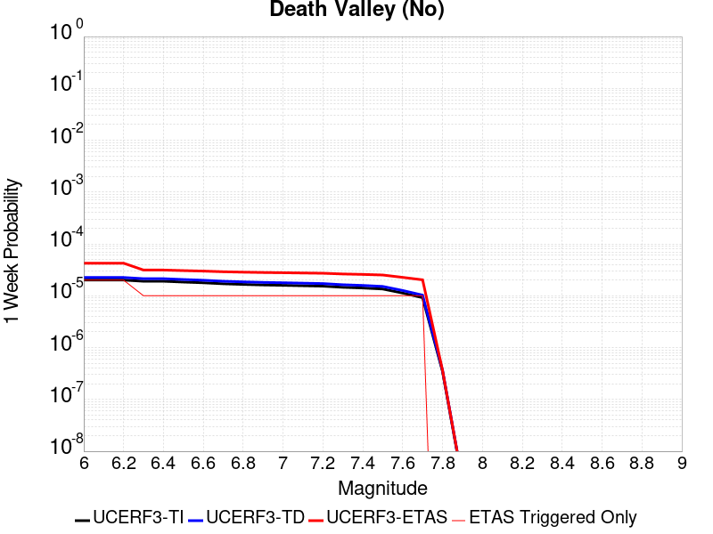 | 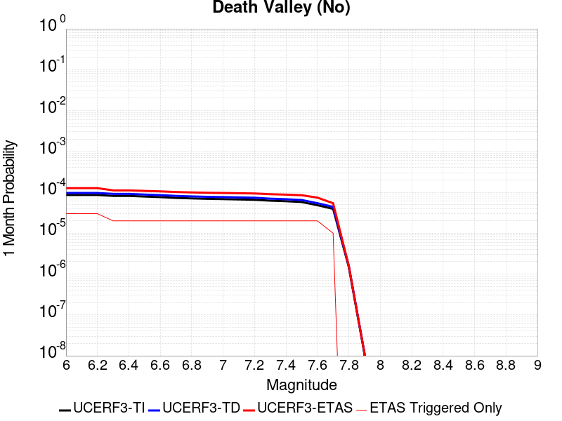 | 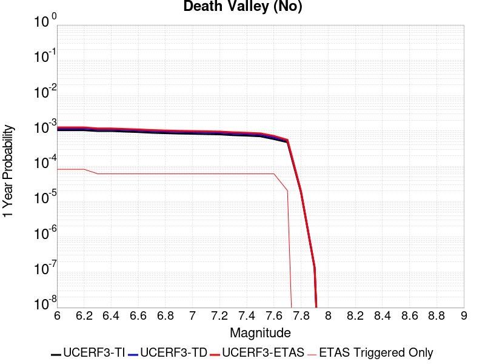 | 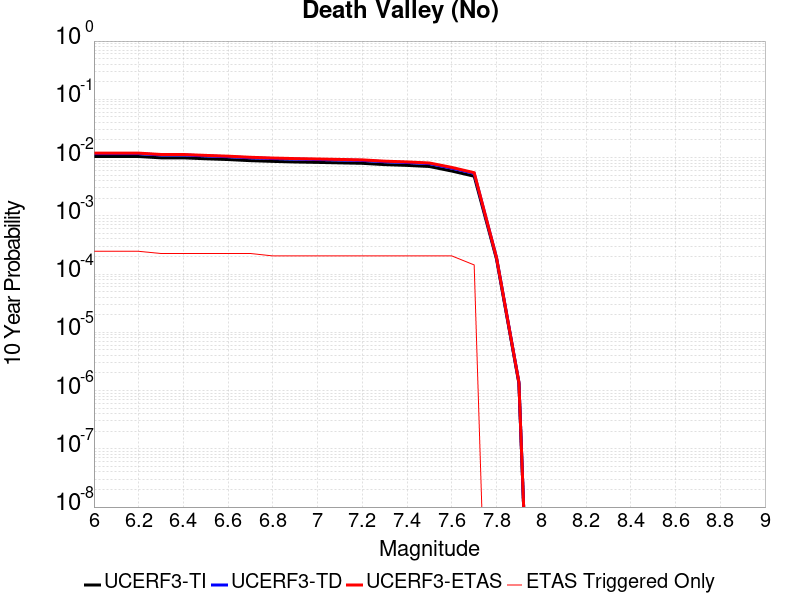 |

| Magnitude | 1 wk TI Prob | 1 wk TD Prob | 1 wk ETAS Prob | 1 wk ETAS/TD Gain | 1 wk ETAS Triggered Only | 1 mo TI Prob | 1 mo TD Prob | 1 mo ETAS Prob | 1 mo ETAS/TD Gain | 1 mo ETAS Triggered Only | 1 yr TI Prob | 1 yr TD Prob | 1 yr ETAS Prob | 1 yr ETAS/TD Gain | 1 yr ETAS Triggered Only | 10 yr TI Prob | 10 yr TD Prob | 10 yr ETAS Prob | 10 yr ETAS/TD Gain | 10 yr ETAS Triggered Only |
|-----|-----|-----|-----|-----|-----|-----|-----|-----|-----|-----|-----|-----|-----|-----|-----|-----|-----|-----|-----|-----|
| 6.0 | 2.0074807E-5 | 2.2500446E-5 | 4.2499996E-5 | 1.8888513 | 2.0E-5 | 8.603206E-5 | 9.642696E-5 | 1.2642407E-4 | 1.3110863 | 3.0E-5 | 0.001046937 | 0.0011733733 | 0.0012932325 | 1.1021492 | 1.2E-4 | 0.010420183 | 0.011672693 | 0.011939541 | 1.0228609 | 2.7E-4 |
| 6.1 | 2.0074807E-5 | 2.2500446E-5 | 4.2499996E-5 | 1.8888513 | 2.0E-5 | 8.603206E-5 | 9.642696E-5 | 1.2642407E-4 | 1.3110863 | 3.0E-5 | 0.001046937 | 0.0011733733 | 0.0012932325 | 1.1021492 | 1.2E-4 | 0.010420183 | 0.011672693 | 0.011939541 | 1.0228609 | 2.7E-4 |
| 6.2 | 2.0074807E-5 | 2.2500446E-5 | 4.2499996E-5 | 1.8888513 | 2.0E-5 | 8.603206E-5 | 9.642696E-5 | 1.2642407E-4 | 1.3110863 | 3.0E-5 | 0.001046937 | 0.0011733733 | 0.0012932325 | 1.1021492 | 1.2E-4 | 0.010420183 | 0.011672693 | 0.011939541 | 1.0228609 | 2.7E-4 |
| 6.3 | 1.9050609E-5 | 2.1337288E-5 | 3.1337077E-5 | 1.4686531 | 1.0E-5 | 8.164292E-5 | 9.144236E-5 | 1.11440524E-4 | 1.2186971 | 2.0E-5 | 9.935491E-4 | 0.0011127489 | 0.0012226264 | 1.0987443 | 1.1E-4 | 0.009891188 | 0.011072595 | 0.011329716 | 1.0232214 | 2.6E-4 |
| 6.4 | 1.9050609E-5 | 2.1337288E-5 | 3.1337077E-5 | 1.4686531 | 1.0E-5 | 8.164292E-5 | 9.144236E-5 | 1.11440524E-4 | 1.2186971 | 2.0E-5 | 9.935491E-4 | 0.0011127489 | 0.0012226264 | 1.0987443 | 1.1E-4 | 0.009891188 | 0.011072595 | 0.011329716 | 1.0232214 | 2.6E-4 |
| 6.5 | 1.8367004E-5 | 2.0561336E-5 | 3.056113E-5 | 1.4863397 | 1.0E-5 | 7.8713354E-5 | 8.811707E-5 | 1.0811531E-4 | 1.2269508 | 2.0E-5 | 9.5791375E-4 | 0.0010723039 | 0.0011721967 | 1.0931572 | 1.0E-4 | 0.009537951 | 0.010672084 | 0.010919416 | 1.0231756 | 2.5E-4 |
| 6.6 | 1.779439E-5 | 1.9911244E-5 | 2.9911045E-5 | 1.5022188 | 1.0E-5 | 7.625944E-5 | 8.533114E-5 | 1.0532944E-4 | 1.234361 | 2.0E-5 | 9.280632E-4 | 0.0010384179 | 0.0011383141 | 1.0962003 | 1.0E-4 | 0.009241969 | 0.010336416 | 0.010583832 | 1.0239364 | 2.5E-4 |
| 6.7 | 1.7025437E-5 | 1.9043726E-5 | 2.9043536E-5 | 1.5250974 | 1.0E-5 | 7.296412E-5 | 8.161345E-5 | 1.0161182E-4 | 1.2450377 | 2.0E-5 | 8.87976E-4 | 9.93197E-4 | 0.0010930976 | 1.100585 | 1.0E-4 | 0.008844362 | 0.009888301 | 0.0101358285 | 1.0250324 | 2.5E-4 |
| 6.8 | 1.6545107E-5 | 1.851284E-5 | 2.8512653E-5 | 1.5401556 | 1.0E-5 | 7.090568E-5 | 7.933836E-5 | 9.933677E-5 | 1.2520648 | 2.0E-5 | 8.629347E-4 | 9.655226E-4 | 0.001065426 | 1.1034708 | 1.0E-4 | 0.008595915 | 0.009613981 | 0.009851673 | 1.0247236 | 2.4E-4 |
| 6.9 | 1.615478E-5 | 1.8087881E-5 | 2.8087701E-5 | 1.5528463 | 1.0E-5 | 6.9232934E-5 | 7.751722E-5 | 9.751567E-5 | 1.2579871 | 2.0E-5 | 8.4258494E-4 | 9.433697E-4 | 0.0010432753 | 1.105903 | 1.0E-4 | 0.008393973 | 0.009394345 | 0.00963209 | 1.0253073 | 2.4E-4 |
| 7.0 | 1.5894311E-5 | 1.7805834E-5 | 2.7805656E-5 | 1.5616037 | 1.0E-5 | 6.81167E-5 | 7.6308526E-5 | 9.6307E-5 | 1.2620739 | 2.0E-5 | 8.2900526E-4 | 9.286663E-4 | 0.0010285735 | 1.1075813 | 1.0E-4 | 0.008259195 | 0.009248544 | 0.009486325 | 1.02571 | 2.4E-4 |
| 7.1 | 1.5602263E-5 | 1.7483784E-5 | 2.748361E-5 | 1.5719485 | 1.0E-5 | 6.6865134E-5 | 7.4928386E-5 | 9.492689E-5 | 1.2669015 | 2.0E-5 | 8.137789E-4 | 9.118773E-4 | 0.0010117862 | 1.1095638 | 1.0E-4 | 0.008108052 | 0.009082039 | 0.00931986 | 1.0261858 | 2.4E-4 |
| 7.2 | 1.5323829E-5 | 1.7170905E-5 | 2.7170734E-5 | 1.5823705 | 1.0E-5 | 6.56719E-5 | 7.358755E-5 | 9.358608E-5 | 1.2717651 | 2.0E-5 | 7.99262E-4 | 8.9556625E-4 | 9.954767E-4 | 1.1115612 | 1.0E-4 | 0.007963934 | 0.008920249 | 0.009158108 | 1.0266651 | 2.4E-4 |
| 7.3 | 1.4556212E-5 | 1.6302716E-5 | 2.6302552E-5 | 1.6133847 | 1.0E-5 | 6.238227E-5 | 6.986695E-5 | 8.986555E-5 | 1.2862384 | 2.0E-5 | 7.592395E-4 | 8.503039E-4 | 9.502189E-4 | 1.117505 | 1.0E-4 | 0.0075665074 | 0.008471149 | 0.008709116 | 1.0280914 | 2.4E-4 |
| 7.4 | 1.411725E-5 | 1.5808211E-5 | 2.5808054E-5 | 1.6325727 | 1.0E-5 | 6.0501097E-5 | 6.774775E-5 | 8.77464E-5 | 1.2951927 | 2.0E-5 | 7.363519E-4 | 8.245226E-4 | 9.244401E-4 | 1.1211823 | 1.0E-4 | 0.0073391674 | 0.008215268 | 0.0084532965 | 1.0289739 | 2.4E-4 |
| 7.5 | 1.3503312E-5 | 1.5126531E-5 | 2.512638E-5 | 1.6610801 | 1.0E-5 | 5.7870053E-5 | 6.482641E-5 | 8.4825115E-5 | 1.3084962 | 2.0E-5 | 7.043401E-4 | 7.8898156E-4 | 8.889027E-4 | 1.1266457 | 1.0E-4 | 0.007021119 | 0.007862429 | 0.008100542 | 1.0302849 | 2.4E-4 |
| 7.6 | 1.1279839E-5 | 1.2626528E-5 | 2.2626402E-5 | 1.7919734 | 1.0E-5 | 4.834127E-5 | 5.4112596E-5 | 7.4111515E-5 | 1.3695797 | 2.0E-5 | 5.88396E-4 | 6.58627E-4 | 7.5856113E-4 | 1.151731 | 1.0E-4 | 0.005868405 | 0.0065673026 | 0.0068057263 | 1.0363047 | 2.4E-4 |
| 7.7 | 9.189108E-6 | 1.0283521E-5 | 2.0283418E-5 | 1.9724195 | 1.0E-5 | 3.93813E-5 | 4.407152E-5 | 5.4071075E-5 | 1.2268939 | 1.0E-5 | 4.7936183E-4 | 5.3644367E-4 | 5.9641147E-4 | 1.1117877 | 6.0E-5 | 0.004783291 | 0.0053519984 | 0.0055111423 | 1.0297353 | 1.6E-4 |
| 7.8 | 3.4586725E-7 | 3.648288E-7 | 3.648288E-7 | 1.0 | 0.0 | 1.4822873E-6 | 1.5635511E-6 | 1.5635511E-6 | 1.0 | 0.0 | 1.80467E-5 | 1.9036073E-5 | 1.9036073E-5 | 1.0 | 0.0 | 1.8045233E-4 | 1.9034486E-4 | 1.9034486E-4 | 1.0 | 0.0 |
| 7.9 | 2.5591178E-9 | 2.6696871E-9 | 2.6696871E-9 | 1.0 | 0.0 | 1.0967647E-8 | 1.1441516E-8 | 1.1441516E-8 | 1.0 | 0.0 | 1.335311E-7 | 1.3930045E-7 | 1.3930045E-7 | 1.0 | 0.0 | 1.3353102E-6 | 1.3930046E-6 | 1.3930046E-6 | 1.0 | 0.0 |

## White Wolf (Extension)
*[(top)](#table-of-contents)*

| 1 Week | 1 Month | 1 Year | 10 Year |
|-----|-----|-----|-----|
| 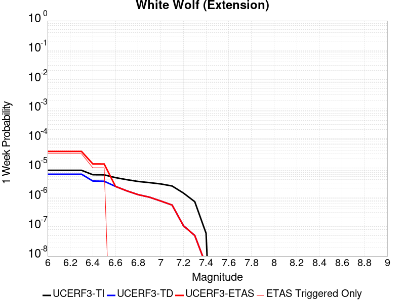 | 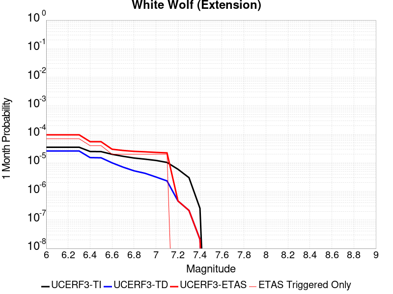 | 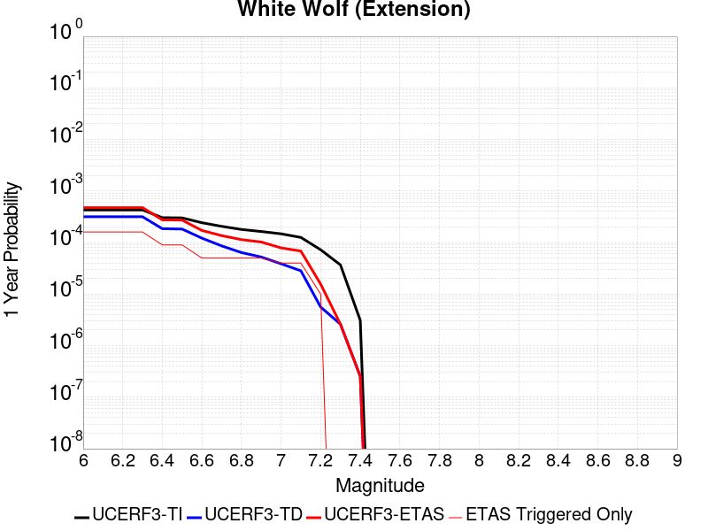 | 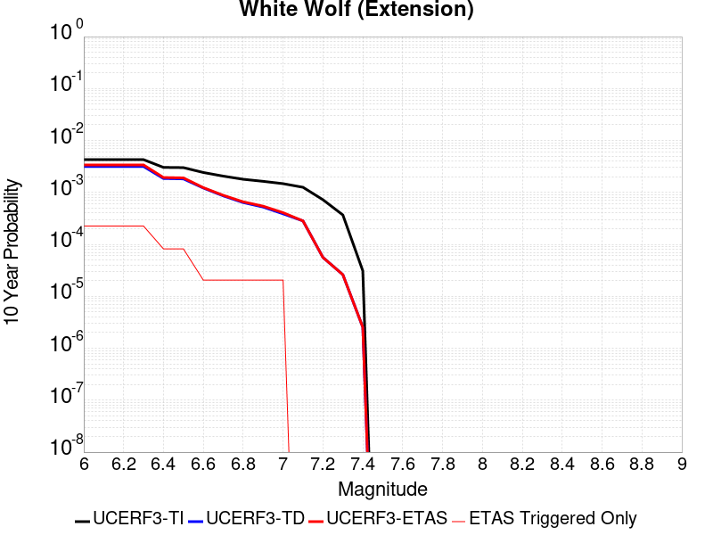 |

| Magnitude | 1 wk TI Prob | 1 wk TD Prob | 1 wk ETAS Prob | 1 wk ETAS/TD Gain | 1 wk ETAS Triggered Only | 1 mo TI Prob | 1 mo TD Prob | 1 mo ETAS Prob | 1 mo ETAS/TD Gain | 1 mo ETAS Triggered Only | 1 yr TI Prob | 1 yr TD Prob | 1 yr ETAS Prob | 1 yr ETAS/TD Gain | 1 yr ETAS Triggered Only | 10 yr TI Prob | 10 yr TD Prob | 10 yr ETAS Prob | 10 yr ETAS/TD Gain | 10 yr ETAS Triggered Only |
|-----|-----|-----|-----|-----|-----|-----|-----|-----|-----|-----|-----|-----|-----|-----|-----|-----|-----|-----|-----|-----|
| 6.0 | 8.222555E-6 | 6.0667057E-6 | 3.6066525E-5 | 5.944993 | 3.0E-5 | 3.5239045E-5 | 2.5999947E-5 | 9.5998126E-5 | 3.6922433 | 7.0E-5 | 4.289509E-4 | 3.1650998E-4 | 4.7645936E-4 | 1.5053532 | 1.6E-4 | 0.0042812387 | 0.0031612439 | 0.003420422 | 1.0819861 | 2.6E-4 |
| 6.1 | 8.222555E-6 | 6.0667057E-6 | 3.6066525E-5 | 5.944993 | 3.0E-5 | 3.5239045E-5 | 2.5999947E-5 | 9.5998126E-5 | 3.6922433 | 7.0E-5 | 4.289509E-4 | 3.1650998E-4 | 4.7645936E-4 | 1.5053532 | 1.6E-4 | 0.0042812387 | 0.0031612439 | 0.003420422 | 1.0819861 | 2.6E-4 |
| 6.2 | 8.222555E-6 | 6.0667057E-6 | 3.6066525E-5 | 5.944993 | 3.0E-5 | 3.5239045E-5 | 2.5999947E-5 | 9.5998126E-5 | 3.6922433 | 7.0E-5 | 4.289509E-4 | 3.1650998E-4 | 4.7645936E-4 | 1.5053532 | 1.6E-4 | 0.0042812387 | 0.0031612439 | 0.003420422 | 1.0819861 | 2.6E-4 |
| 6.3 | 8.222555E-6 | 6.0667057E-6 | 3.6066525E-5 | 5.944993 | 3.0E-5 | 3.5239045E-5 | 2.5999947E-5 | 9.5998126E-5 | 3.6922433 | 7.0E-5 | 4.289509E-4 | 3.1650998E-4 | 4.7645936E-4 | 1.5053532 | 1.6E-4 | 0.0042812387 | 0.0031612439 | 0.003420422 | 1.0819861 | 2.6E-4 |
| 6.4 | 5.821773E-6 | 3.5572016E-6 | 1.3557166E-5 | 3.8111885 | 1.0E-5 | 2.4950215E-5 | 1.5245067E-5 | 5.5244458E-5 | 3.6237595 | 4.0E-5 | 3.0372653E-4 | 1.8559398E-4 | 2.7557727E-4 | 1.4848396 | 9.0E-5 | 0.0030331176 | 0.0018544982 | 0.001984257 | 1.0699698 | 1.3E-4 |
| 6.5 | 5.766023E-6 | 3.4991353E-6 | 1.34991005E-5 | 3.8578389 | 1.0E-5 | 2.4711293E-5 | 1.4996214E-5 | 5.4995613E-5 | 3.6672997 | 4.0E-5 | 3.0081844E-4 | 1.8256472E-4 | 2.725483E-4 | 1.4928858 | 9.0E-5 | 0.0030041158 | 0.0018242556 | 0.0019540184 | 1.071132 | 1.3E-4 |
| 6.6 | 4.643576E-6 | 2.332643E-6 | 2.332643E-6 | 1.0 | 0.0 | 1.9900888E-5 | 9.997005E-6 | 2.9996805E-5 | 3.0005794 | 2.0E-5 | 2.4226638E-4 | 1.2170716E-4 | 1.7170107E-4 | 1.4107722 | 5.0E-5 | 0.0024200242 | 0.0012164476 | 0.0012763746 | 1.049264 | 6.0E-5 |
| 6.7 | 3.9529173E-6 | 1.6483629E-6 | 1.6483629E-6 | 1.0 | 0.0 | 1.6940963E-5 | 7.064394E-6 | 2.7064252E-5 | 3.8310792 | 2.0E-5 | 2.0623671E-4 | 8.600579E-5 | 1.3600149E-4 | 1.5813062 | 5.0E-5 | 0.002060454 | 8.5974357E-4 | 9.19692E-4 | 1.0697283 | 6.0E-5 |
| 6.8 | 3.4377522E-6 | 1.2245362E-6 | 1.2245362E-6 | 1.0 | 0.0 | 1.473314E-5 | 5.2480023E-6 | 2.5247897E-5 | 4.810954 | 2.0E-5 | 1.7936122E-4 | 6.389264E-5 | 1.1388945E-4 | 1.7825127 | 5.0E-5 | 0.0017921652 | 6.3875184E-4 | 6.987135E-4 | 1.0938731 | 6.0E-5 |
| 6.9 | 3.1367306E-6 | 1.0033893E-6 | 1.0033893E-6 | 1.0 | 0.0 | 1.3443062E-5 | 4.3002333E-6 | 2.4300147E-5 | 5.6508904 | 2.0E-5 | 1.63657E-4 | 5.235416E-5 | 1.0235154E-4 | 1.954984 | 5.0E-5 | 0.0016353652 | 5.234259E-4 | 5.833945E-4 | 1.1145694 | 6.0E-5 |
| 7.0 | 2.8298145E-6 | 7.4287595E-7 | 7.4287595E-7 | 1.0 | 0.0 | 1.2127721E-5 | 3.1837506E-6 | 2.3183688E-5 | 7.281879 | 2.0E-5 | 1.47645E-4 | 3.8761526E-5 | 7.875997E-5 | 2.0319111 | 4.0E-5 | 0.0014754693 | 3.8755263E-4 | 4.3753325E-4 | 1.1289648 | 5.0E-5 |
| 7.1 | 2.4091064E-6 | 5.4228286E-7 | 5.4228286E-7 | 1.0 | 0.0 | 1.03247E-5 | 2.3240675E-6 | 2.232402E-5 | 9.605581 | 2.0E-5 | 1.2569598E-4 | 2.8295197E-5 | 6.8294066E-5 | 2.4136276 | 4.0E-5 | 0.001256249 | 2.8291997E-4 | 3.2290866E-4 | 1.1413428 | 4.0E-5 |
| 7.2 | 1.3875518E-6 | 1.07434374E-7 | 1.07434374E-7 | 1.0 | 0.0 | 5.9466374E-6 | 4.6043297E-7 | 4.6043297E-7 | 1.0 | 0.0 | 7.23979E-5 | 5.6057584E-6 | 1.5605701E-5 | 2.78387 | 1.0E-5 | 7.2374323E-4 | 5.605628E-5 | 6.605572E-5 | 1.1783822 | 1.0E-5 |
| 7.3 | 7.056077E-7 | 5.0022493E-8 | 5.0022493E-8 | 1.0 | 0.0 | 3.0240296E-6 | 2.143821E-7 | 2.143821E-7 | 1.0 | 0.0 | 3.681694E-5 | 2.6100993E-6 | 2.6100993E-6 | 1.0 | 0.0 | 3.681084E-4 | 2.6100734E-5 | 2.6100734E-5 | 1.0 | 0.0 |
| 7.4 | 5.9334678E-8 | 4.8685624E-9 | 4.8685624E-9 | 1.0 | 0.0 | 2.5429145E-7 | 2.0865269E-8 | 2.0865269E-8 | 1.0 | 0.0 | 3.095994E-6 | 2.5403463E-7 | 2.5403463E-7 | 1.0 | 0.0 | 3.095951E-5 | 2.5403444E-6 | 2.5403444E-6 | 1.0 | 0.0 |

## San Andreas (Parkfield)
*[(top)](#table-of-contents)*

| 1 Week | 1 Month | 1 Year | 10 Year |
|-----|-----|-----|-----|
| 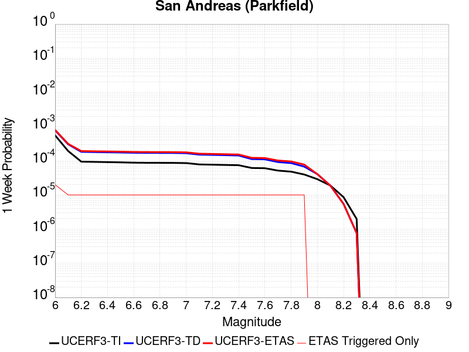 | 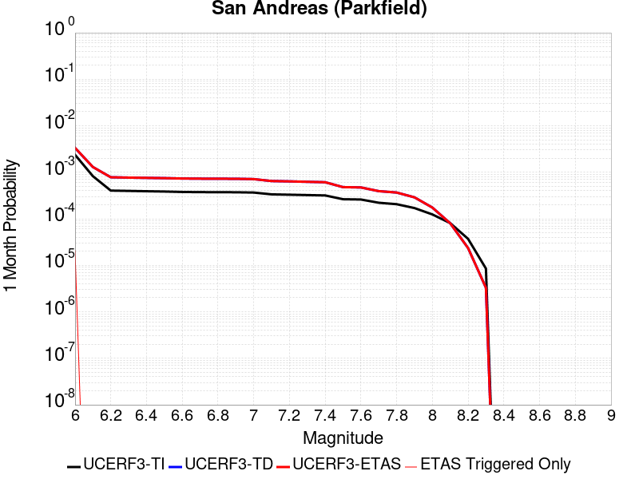 | 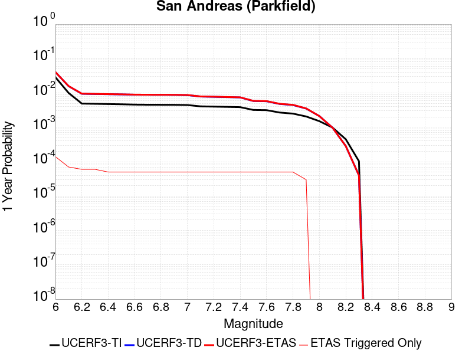 | 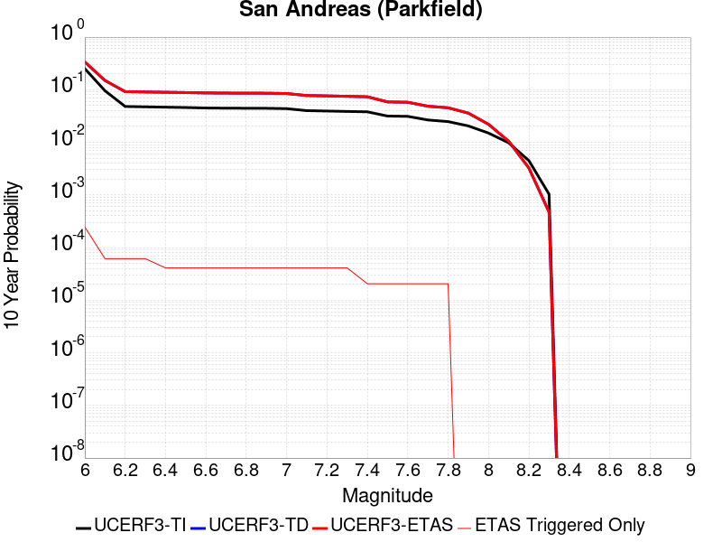 |

| Magnitude | 1 wk TI Prob | 1 wk TD Prob | 1 wk ETAS Prob | 1 wk ETAS/TD Gain | 1 wk ETAS Triggered Only | 1 mo TI Prob | 1 mo TD Prob | 1 mo ETAS Prob | 1 mo ETAS/TD Gain | 1 mo ETAS Triggered Only | 1 yr TI Prob | 1 yr TD Prob | 1 yr ETAS Prob | 1 yr ETAS/TD Gain | 1 yr ETAS Triggered Only | 10 yr TI Prob | 10 yr TD Prob | 10 yr ETAS Prob | 10 yr ETAS/TD Gain | 10 yr ETAS Triggered Only |
|-----|-----|-----|-----|-----|-----|-----|-----|-----|-----|-----|-----|-----|-----|-----|-----|-----|-----|-----|-----|-----|
| 6.0 | 5.556969E-4 | 7.788437E-4 | 7.988281E-4 | 1.0256591 | 2.0E-5 | 0.0023793848 | 0.0033341812 | 0.0033740478 | 1.0119569 | 4.0E-5 | 0.028586963 | 0.04023991 | 0.04037428 | 1.0033392 | 1.4E-4 | 0.25176284 | 0.33731642 | 0.33748874 | 1.0005108 | 2.6E-4 |
| 6.1 | 1.925858E-4 | 3.0304783E-4 | 3.1304482E-4 | 1.0329881 | 1.0E-5 | 8.2510663E-4 | 0.0012982241 | 0.0013281851 | 1.0230784 | 3.0E-5 | 0.0099994885 | 0.015792182 | 0.015861075 | 1.0043626 | 7.0E-5 | 0.095613256 | 0.14979222 | 0.14988574 | 1.0006243 | 1.1E-4 |
| 6.2 | 9.4306815E-5 | 1.8250331E-4 | 1.9250148E-4 | 1.0547836 | 1.0E-5 | 4.0410945E-4 | 7.819238E-4 | 8.0190814E-4 | 1.025558 | 2.0E-5 | 0.0049089384 | 0.009478576 | 0.009538007 | 1.00627 | 6.0E-5 | 0.048019063 | 0.09188674 | 0.091977544 | 1.0009882 | 1.0E-4 |
| 6.3 | 9.283051E-5 | 1.7946832E-4 | 1.8946652E-4 | 1.0557102 | 1.0E-5 | 3.9778434E-4 | 7.689244E-4 | 7.8890903E-4 | 1.0259904 | 2.0E-5 | 0.0048322747 | 0.009321672 | 0.009381113 | 1.0063766 | 6.0E-5 | 0.047285385 | 0.09053965 | 0.0906306 | 1.0010045 | 1.0E-4 |
| 6.4 | 9.138826E-5 | 1.770899E-4 | 1.8708812E-4 | 1.0564585 | 1.0E-5 | 3.916052E-4 | 7.5873715E-4 | 7.78722E-4 | 1.0263395 | 2.0E-5 | 0.0047573745 | 0.009198696 | 0.009248237 | 1.0053855 | 5.0E-5 | 0.046568092 | 0.089441724 | 0.08952367 | 1.0009162 | 9.0E-5 |
| 6.5 | 9.000255E-5 | 1.746699E-4 | 1.8466816E-4 | 1.0572408 | 1.0E-5 | 3.8566816E-4 | 7.483717E-4 | 7.683567E-4 | 1.0267047 | 2.0E-5 | 0.0046854047 | 0.009073567 | 0.009123113 | 1.0054605 | 5.0E-5 | 0.045878403 | 0.08832737 | 0.088409424 | 1.0009289 | 9.0E-5 |
| 6.6 | 8.8109264E-5 | 1.7148067E-4 | 1.8147896E-4 | 1.0583056 | 1.0E-5 | 3.7755648E-4 | 7.3471136E-4 | 7.5469667E-4 | 1.0272015 | 2.0E-5 | 0.0045870654 | 0.008908638 | 0.008958193 | 1.0055625 | 5.0E-5 | 0.04493529 | 0.086858675 | 0.086940855 | 1.0009462 | 9.0E-5 |
| 6.7 | 8.738073E-5 | 1.7015127E-4 | 1.8014957E-4 | 1.0587612 | 1.0E-5 | 3.7443507E-4 | 7.290171E-4 | 7.490025E-4 | 1.0274142 | 2.0E-5 | 0.0045492216 | 0.008839916 | 0.008889475 | 1.0056062 | 5.0E-5 | 0.04457213 | 0.086258985 | 0.08634122 | 1.0009533 | 9.0E-5 |
| 6.8 | 8.710195E-5 | 1.6960612E-4 | 1.7960442E-4 | 1.0589502 | 1.0E-5 | 3.7324068E-4 | 7.266821E-4 | 7.466675E-4 | 1.0275023 | 2.0E-5 | 0.0045347405 | 0.008811726 | 0.008861286 | 1.0056243 | 5.0E-5 | 0.04443313 | 0.08600653 | 0.08608879 | 1.0009564 | 9.0E-5 |
| 6.9 | 8.6801556E-5 | 1.6901553E-4 | 1.7901385E-4 | 1.0591562 | 1.0E-5 | 3.7195362E-4 | 7.2415237E-4 | 7.441379E-4 | 1.0275985 | 2.0E-5 | 0.0045191357 | 0.008781176 | 0.008830736 | 1.005644 | 5.0E-5 | 0.044283327 | 0.08573254 | 0.085814826 | 1.0009598 | 9.0E-5 |
| 7.0 | 8.5571606E-5 | 1.6654332E-4 | 1.7654165E-4 | 1.0600344 | 1.0E-5 | 3.6668387E-4 | 7.13563E-4 | 7.335487E-4 | 1.0280083 | 2.0E-5 | 0.004455241 | 0.008653281 | 0.008702848 | 1.0057281 | 5.0E-5 | 0.043669727 | 0.08458075 | 0.08466314 | 1.000974 | 9.0E-5 |
| 7.1 | 7.82589E-5 | 1.5135074E-4 | 1.6134922E-4 | 1.0660617 | 1.0E-5 | 3.3535215E-4 | 6.484855E-4 | 6.6847255E-4 | 1.0308211 | 2.0E-5 | 0.0040752706 | 0.0078668995 | 0.007916506 | 1.0063057 | 5.0E-5 | 0.040013418 | 0.077491894 | 0.07757492 | 1.0010715 | 9.0E-5 |
| 7.2 | 7.690929E-5 | 1.4872287E-4 | 1.5872139E-4 | 1.0672292 | 1.0E-5 | 3.2956956E-4 | 6.372288E-4 | 6.5721606E-4 | 1.0313659 | 2.0E-5 | 0.004005129 | 0.007730829 | 0.0077804425 | 1.0064176 | 5.0E-5 | 0.0393371 | 0.07626493 | 0.076348074 | 1.00109 | 9.0E-5 |
| 7.3 | 7.5543794E-5 | 1.4568791E-4 | 1.5568646E-4 | 1.0686299 | 1.0E-5 | 3.2371894E-4 | 6.242281E-4 | 6.442156E-4 | 1.0320196 | 2.0E-5 | 0.003934157 | 0.007573656 | 0.007623277 | 1.0065519 | 5.0E-5 | 0.038652334 | 0.07482772 | 0.07491099 | 1.0011128 | 9.0E-5 |
| 7.4 | 7.4214564E-5 | 1.4269682E-4 | 1.526954E-4 | 1.0700686 | 1.0E-5 | 3.1802364E-4 | 6.114152E-4 | 6.3140295E-4 | 1.032691 | 2.0E-5 | 0.003865065 | 0.007418731 | 0.0074683605 | 1.0066897 | 5.0E-5 | 0.03798529 | 0.07340127 | 0.0734754 | 1.00101 | 8.0E-5 |
| 7.5 | 6.149578E-5 | 1.1196503E-4 | 1.2196391E-4 | 1.0893036 | 1.0E-5 | 2.6352672E-4 | 4.7976198E-4 | 4.997524E-4 | 1.0416673 | 2.0E-5 | 0.0032037178 | 0.00582549 | 0.005875199 | 1.008533 | 5.0E-5 | 0.03157923 | 0.058584154 | 0.058659468 | 1.0012856 | 8.0E-5 |
| 7.6 | 6.0643448E-5 | 1.10251094E-4 | 1.2024999E-4 | 1.090692 | 1.0E-5 | 2.598746E-4 | 4.7241923E-4 | 4.924098E-4 | 1.0423152 | 2.0E-5 | 0.0031593828 | 0.0057365666 | 0.0057862797 | 1.008666 | 5.0E-5 | 0.031148417 | 0.057744972 | 0.057820354 | 1.0013055 | 8.0E-5 |
| 7.7 | 5.1652263E-5 | 9.179838E-5 | 1.01797465E-4 | 1.1089244 | 1.0E-5 | 2.2134806E-4 | 3.9336234E-4 | 4.1335446E-4 | 1.0508237 | 2.0E-5 | 0.002691582 | 0.0047786795 | 0.004828441 | 1.0104132 | 5.0E-5 | 0.026592141 | 0.048560265 | 0.048626866 | 1.0013715 | 7.0E-5 |
| 7.8 | 4.8090482E-5 | 8.564368E-5 | 9.564283E-5 | 1.1167529 | 1.0E-5 | 2.060858E-4 | 3.6699275E-4 | 3.8698543E-4 | 1.054477 | 2.0E-5 | 0.0025062072 | 0.004458991 | 0.0045087677 | 1.0111634 | 5.0E-5 | 0.024781305 | 0.045324653 | 0.04539148 | 1.0014744 | 7.0E-5 |
| 7.9 | 3.970278E-5 | 6.754111E-5 | 7.754043E-5 | 1.1480479 | 1.0E-5 | 1.7014367E-4 | 2.894298E-4 | 2.994269E-4 | 1.0345407 | 1.0E-5 | 0.002069531 | 0.0035181176 | 0.003548012 | 1.0084972 | 3.0E-5 | 0.020503636 | 0.03589899 | 0.035937555 | 1.0010742 | 4.0E-5 |
| 8.0 | 2.8982335E-5 | 4.072124E-5 | 4.072124E-5 | 1.0 | 0.0 | 1.2420409E-4 | 1.7450792E-4 | 1.7450792E-4 | 1.0 | 0.0 | 0.0015111357 | 0.002122565 | 0.002122565 | 1.0 | 0.0 | 0.015009012 | 0.02202231 | 0.02202231 | 1.0 | 0.0 |
| 8.1 | 1.8836186E-5 | 1.8694205E-5 | 1.8694205E-5 | 1.0 | 0.0 | 8.0724014E-5 | 8.011556E-5 | 8.011556E-5 | 1.0 | 0.0 | 9.823717E-4 | 9.749711E-4 | 9.749711E-4 | 1.0 | 0.0 | 0.009780403 | 0.010494972 | 0.010494972 | 1.0 | 0.0 |
| 8.2 | 8.643924E-6 | 5.4798497E-6 | 5.4798497E-6 | 1.0 | 0.0 | 3.704486E-5 | 2.348486E-5 | 2.348486E-5 | 1.0 | 0.0 | 4.5092785E-4 | 2.858907E-4 | 2.858907E-4 | 1.0 | 0.0 | 0.0045001395 | 0.0032514327 | 0.0032514327 | 1.0 | 0.0 |
| 8.3 | 1.983087E-6 | 7.668296E-7 | 7.668296E-7 | 1.0 | 0.0 | 8.498917E-6 | 3.2864084E-6 | 3.2864084E-6 | 1.0 | 0.0 | 1.034694E-4 | 4.0011306E-5 | 4.0011306E-5 | 1.0 | 0.0 | 0.0010342124 | 4.724499E-4 | 4.724499E-4 | 1.0 | 0.0 |

## San Andreas (Carrizo) rev
*[(top)](#table-of-contents)*

| 1 Week | 1 Month | 1 Year | 10 Year |
|-----|-----|-----|-----|
| 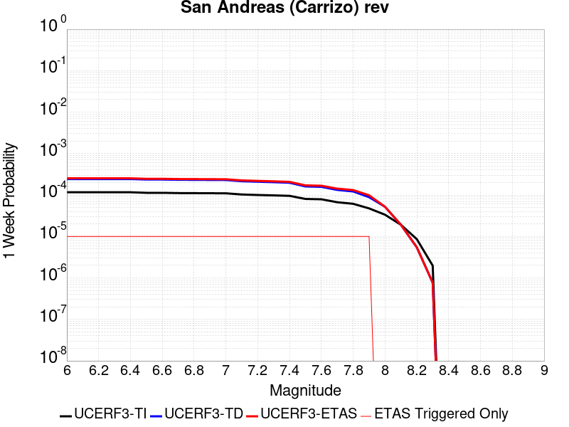 | 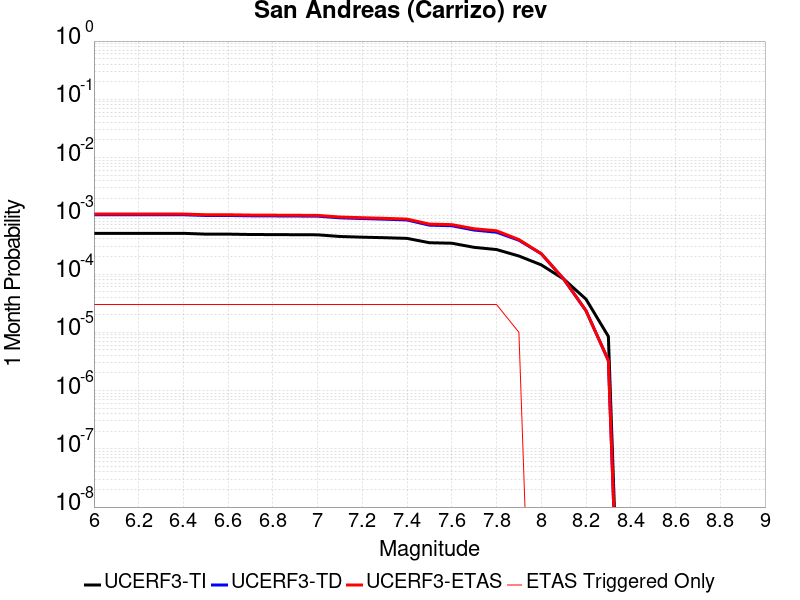 | 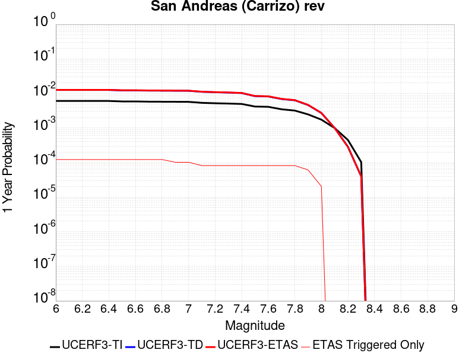 | 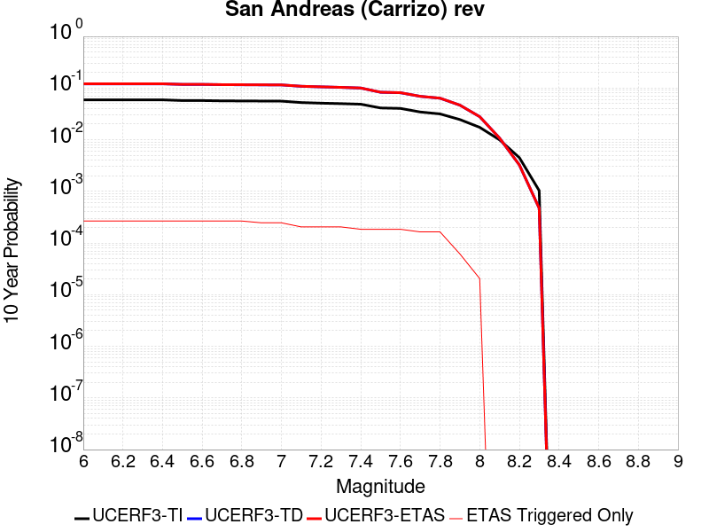 |

| Magnitude | 1 wk TI Prob | 1 wk TD Prob | 1 wk ETAS Prob | 1 wk ETAS/TD Gain | 1 wk ETAS Triggered Only | 1 mo TI Prob | 1 mo TD Prob | 1 mo ETAS Prob | 1 mo ETAS/TD Gain | 1 mo ETAS Triggered Only | 1 yr TI Prob | 1 yr TD Prob | 1 yr ETAS Prob | 1 yr ETAS/TD Gain | 1 yr ETAS Triggered Only | 10 yr TI Prob | 10 yr TD Prob | 10 yr ETAS Prob | 10 yr ETAS/TD Gain | 10 yr ETAS Triggered Only |
|-----|-----|-----|-----|-----|-----|-----|-----|-----|-----|-----|-----|-----|-----|-----|-----|-----|-----|-----|-----|-----|
| 6.0 | 1.1674632E-4 | 2.4332498E-4 | 2.5332253E-4 | 1.0410873 | 1.0E-5 | 5.002454E-4 | 0.0010424062 | 0.0010723749 | 1.0287496 | 3.0E-5 | 0.006073493 | 0.012617926 | 0.0127561595 | 1.0109553 | 1.4E-4 | 0.0591016 | 0.12065402 | 0.12087385 | 1.001822 | 2.5E-4 |
| 6.1 | 1.1674632E-4 | 2.4332498E-4 | 2.5332253E-4 | 1.0410873 | 1.0E-5 | 5.002454E-4 | 0.0010424062 | 0.0010723749 | 1.0287496 | 3.0E-5 | 0.006073493 | 0.012617926 | 0.0127561595 | 1.0109553 | 1.4E-4 | 0.0591016 | 0.12065402 | 0.12087385 | 1.001822 | 2.5E-4 |
| 6.2 | 1.1674632E-4 | 2.4332498E-4 | 2.5332253E-4 | 1.0410873 | 1.0E-5 | 5.002454E-4 | 0.0010424062 | 0.0010723749 | 1.0287496 | 3.0E-5 | 0.006073493 | 0.012617926 | 0.0127561595 | 1.0109553 | 1.4E-4 | 0.0591016 | 0.12065402 | 0.12087385 | 1.001822 | 2.5E-4 |
| 6.3 | 1.1674632E-4 | 2.4332498E-4 | 2.5332253E-4 | 1.0410873 | 1.0E-5 | 5.002454E-4 | 0.0010424062 | 0.0010723749 | 1.0287496 | 3.0E-5 | 0.006073493 | 0.012617926 | 0.0127561595 | 1.0109553 | 1.4E-4 | 0.0591016 | 0.12065402 | 0.12087385 | 1.001822 | 2.5E-4 |
| 6.4 | 1.1674632E-4 | 2.4332498E-4 | 2.5332253E-4 | 1.0410873 | 1.0E-5 | 5.002454E-4 | 0.0010424062 | 0.0010723749 | 1.0287496 | 3.0E-5 | 0.006073493 | 0.012617926 | 0.0127561595 | 1.0109553 | 1.4E-4 | 0.0591016 | 0.12065402 | 0.12087385 | 1.001822 | 2.5E-4 |
| 6.5 | 1.13136164E-4 | 2.3652466E-4 | 2.465223E-4 | 1.0422689 | 1.0E-5 | 4.847792E-4 | 0.0010132849 | 0.0010432545 | 1.0295767 | 3.0E-5 | 0.0058862255 | 0.012267408 | 0.01240569 | 1.0112723 | 1.4E-4 | 0.057327334 | 0.11762535 | 0.117845945 | 1.0018754 | 2.5E-4 |
| 6.6 | 1.13136164E-4 | 2.3652466E-4 | 2.465223E-4 | 1.0422689 | 1.0E-5 | 4.847792E-4 | 0.0010132849 | 0.0010432545 | 1.0295767 | 3.0E-5 | 0.0058862255 | 0.012267408 | 0.01240569 | 1.0112723 | 1.4E-4 | 0.057327334 | 0.11762535 | 0.117845945 | 1.0018754 | 2.5E-4 |
| 6.7 | 1.1149675E-4 | 2.3343669E-4 | 2.4343435E-4 | 1.0428282 | 1.0E-5 | 4.777557E-4 | 0.0010000608 | 0.0010300309 | 1.0299681 | 3.0E-5 | 0.0058011734 | 0.012108203 | 0.012246508 | 1.0114224 | 1.4E-4 | 0.05652051 | 0.11624688 | 0.11646782 | 1.0019006 | 2.5E-4 |
| 6.8 | 1.1103589E-4 | 2.3245816E-4 | 2.4245583E-4 | 1.0430084 | 1.0E-5 | 4.7578133E-4 | 9.958703E-4 | 0.0010258405 | 1.0300944 | 3.0E-5 | 0.005777263 | 0.0120577505 | 0.012196062 | 1.0114708 | 1.4E-4 | 0.056293584 | 0.11580715 | 0.1160282 | 1.0019088 | 2.5E-4 |
| 6.9 | 1.1053259E-4 | 2.3138185E-4 | 2.4137954E-4 | 1.0432086 | 1.0E-5 | 4.7362508E-4 | 9.912612E-4 | 0.0010212314 | 1.0302345 | 3.0E-5 | 0.0057511497 | 0.012002253 | 0.012130693 | 1.0107013 | 1.3E-4 | 0.05604569 | 0.11532332 | 0.11553564 | 1.0018411 | 2.4E-4 |
| 7.0 | 1.1005377E-4 | 2.3039016E-4 | 2.4038786E-4 | 1.0433947 | 1.0E-5 | 4.7157376E-4 | 9.870143E-4 | 0.0010169847 | 1.0303648 | 3.0E-5 | 0.0057263062 | 0.011951115 | 0.012079561 | 1.0107477 | 1.3E-4 | 0.055809796 | 0.11487561 | 0.11508804 | 1.0018492 | 2.4E-4 |
| 7.1 | 1.0308142E-4 | 2.1548544E-4 | 2.254833E-4 | 1.0463969 | 1.0E-5 | 4.417027E-4 | 9.231832E-4 | 9.531555E-4 | 1.0324663 | 3.0E-5 | 0.0053644776 | 0.011182146 | 0.011300804 | 1.0106114 | 1.2E-4 | 0.052368138 | 0.108131535 | 0.10832775 | 1.0018146 | 2.2E-4 |
| 7.2 | 1.0027479E-4 | 2.0956367E-4 | 2.1956158E-4 | 1.0477082 | 1.0E-5 | 4.296783E-4 | 8.978219E-4 | 9.2779496E-4 | 1.0333842 | 3.0E-5 | 0.0052187922 | 0.0108764935 | 0.010995189 | 1.010913 | 1.2E-4 | 0.050979212 | 0.10543535 | 0.10563215 | 1.0018666 | 2.2E-4 |
| 7.3 | 9.816942E-5 | 2.0431461E-4 | 2.1431256E-4 | 1.0489341 | 1.0E-5 | 4.2065824E-4 | 8.753412E-4 | 9.053149E-4 | 1.0342424 | 3.0E-5 | 0.005109493 | 0.010605487 | 0.010724215 | 1.011195 | 1.2E-4 | 0.049935985 | 0.103018686 | 0.10321602 | 1.0019156 | 2.2E-4 |
| 7.4 | 9.5634205E-5 | 1.9800827E-4 | 2.080063E-4 | 1.0504929 | 1.0E-5 | 4.0979648E-4 | 8.4833184E-4 | 8.783064E-4 | 1.0353335 | 3.0E-5 | 0.0049778637 | 0.0102797905 | 0.0103985565 | 1.0115534 | 1.2E-4 | 0.048678253 | 0.100104466 | 0.10029344 | 1.0018878 | 2.1E-4 |
| 7.5 | 8.052417E-5 | 1.6120363E-4 | 1.7120202E-4 | 1.0620234 | 1.0E-5 | 3.4505792E-4 | 6.9068995E-4 | 7.206692E-4 | 1.0434048 | 3.0E-5 | 0.0041929903 | 0.008376808 | 0.008495803 | 1.0142052 | 1.2E-4 | 0.04114753 | 0.08284498 | 0.08303758 | 1.0023248 | 2.1E-4 |
| 7.6 | 7.897024E-5 | 1.5773512E-4 | 1.6773354E-4 | 1.0633874 | 1.0E-5 | 3.384E-4 | 6.758327E-4 | 7.058124E-4 | 1.0443597 | 3.0E-5 | 0.0041122385 | 0.008197296 | 0.008316312 | 1.014519 | 1.2E-4 | 0.040369697 | 0.081185855 | 0.08137881 | 1.0023767 | 2.1E-4 |
| 7.7 | 6.707427E-5 | 1.3282998E-4 | 1.4282865E-4 | 1.0752742 | 1.0E-5 | 2.8742946E-4 | 5.691472E-4 | 5.991301E-4 | 1.0526805 | 3.0E-5 | 0.003493839 | 0.0069073834 | 0.0070265546 | 1.0172527 | 1.2E-4 | 0.034394164 | 0.06907934 | 0.0692469 | 1.0024257 | 1.8E-4 |
| 7.8 | 6.147705E-5 | 1.2203727E-4 | 1.3203605E-4 | 1.0819322 | 1.0E-5 | 2.6344648E-4 | 5.229121E-4 | 5.528964E-4 | 1.057341 | 3.0E-5 | 0.0032027436 | 0.006347895 | 0.0064571965 | 1.0172186 | 1.1E-4 | 0.031569764 | 0.063543044 | 0.06370224 | 1.0025053 | 1.7E-4 |
| 7.9 | 4.7636717E-5 | 8.88427E-5 | 9.884182E-5 | 1.1125485 | 1.0E-5 | 2.0414138E-4 | 3.806989E-4 | 3.906951E-4 | 1.0262575 | 1.0E-5 | 0.0024825884 | 0.0046251663 | 0.0046848888 | 1.0129125 | 6.0E-5 | 0.024550365 | 0.046649244 | 0.04671598 | 1.0014305 | 7.0E-5 |
| 8.0 | 3.3554235E-5 | 5.2164494E-5 | 5.2164494E-5 | 1.0 | 0.0 | 1.4379594E-4 | 2.2354297E-4 | 2.2354297E-4 | 1.0 | 0.0 | 0.0017493097 | 0.0027182405 | 0.0027282133 | 1.0036689 | 1.0E-5 | 0.017356034 | 0.027894506 | 0.027904227 | 1.0003484 | 1.0E-5 |
| 8.1 | 1.9175432E-5 | 1.9198285E-5 | 1.9198285E-5 | 1.0 | 0.0 | 8.217783E-5 | 8.227578E-5 | 8.227578E-5 | 1.0 | 0.0 | 0.0010000558 | 0.0010012479 | 0.0010012479 | 1.0 | 0.0 | 0.009955673 | 0.010765004 | 0.010765004 | 1.0 | 0.0 |
| 8.2 | 8.643924E-6 | 5.4798497E-6 | 5.4798497E-6 | 1.0 | 0.0 | 3.704486E-5 | 2.348486E-5 | 2.348486E-5 | 1.0 | 0.0 | 4.5092785E-4 | 2.858907E-4 | 2.858907E-4 | 1.0 | 0.0 | 0.0045001395 | 0.0032514327 | 0.0032514327 | 1.0 | 0.0 |
| 8.3 | 1.983087E-6 | 7.668296E-7 | 7.668296E-7 | 1.0 | 0.0 | 8.498917E-6 | 3.2864084E-6 | 3.2864084E-6 | 1.0 | 0.0 | 1.034694E-4 | 4.0011306E-5 | 4.0011306E-5 | 1.0 | 0.0 | 0.0010342124 | 4.724499E-4 | 4.724499E-4 | 1.0 | 0.0 |

## Scodie Lineament
*[(top)](#table-of-contents)*

| 1 Week | 1 Month | 1 Year | 10 Year |
|-----|-----|-----|-----|
| 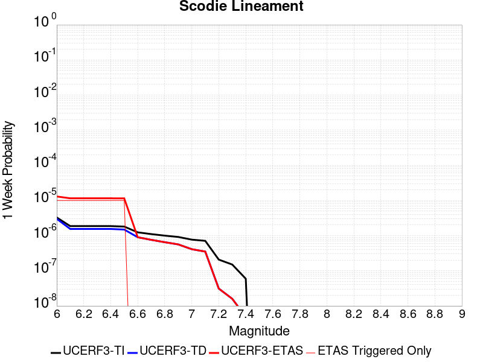 | 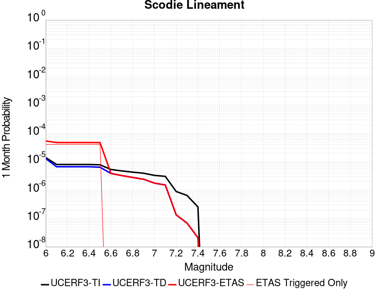 | 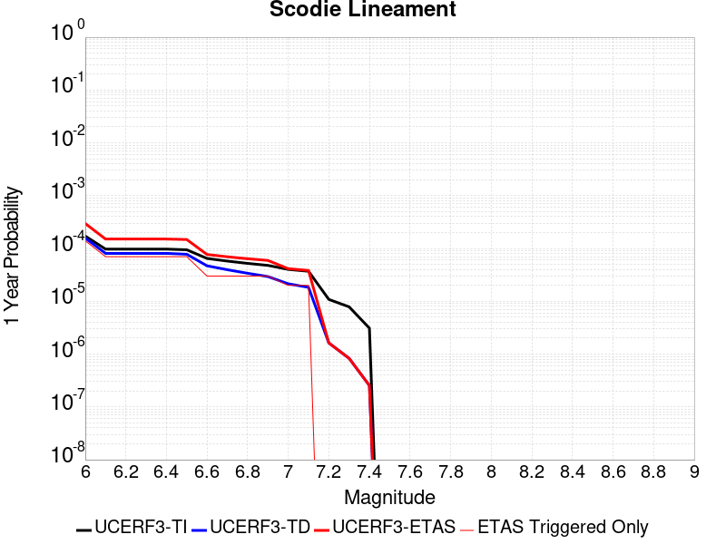 | 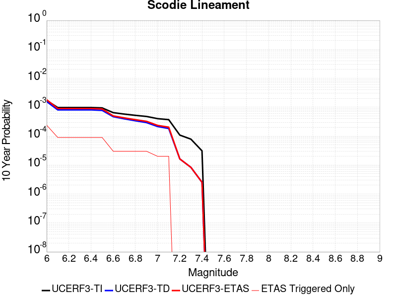 |

| Magnitude | 1 wk TI Prob | 1 wk TD Prob | 1 wk ETAS Prob | 1 wk ETAS/TD Gain | 1 wk ETAS Triggered Only | 1 mo TI Prob | 1 mo TD Prob | 1 mo ETAS Prob | 1 mo ETAS/TD Gain | 1 mo ETAS Triggered Only | 1 yr TI Prob | 1 yr TD Prob | 1 yr ETAS Prob | 1 yr ETAS/TD Gain | 1 yr ETAS Triggered Only | 10 yr TI Prob | 10 yr TD Prob | 10 yr ETAS Prob | 10 yr ETAS/TD Gain | 10 yr ETAS Triggered Only |
|-----|-----|-----|-----|-----|-----|-----|-----|-----|-----|-----|-----|-----|-----|-----|-----|-----|-----|-----|-----|-----|
| 6.0 | 3.2919327E-6 | 3.0133565E-6 | 1.3013327E-5 | 4.3185487 | 1.0E-5 | 1.4108206E-5 | 1.2914339E-5 | 6.291369E-5 | 4.8716154 | 5.0E-5 | 1.7175387E-4 | 1.5722391E-4 | 2.9720188E-4 | 1.8903098 | 1.4E-4 | 0.0017162118 | 0.0015714383 | 0.0018110612 | 1.1524863 | 2.4E-4 |
| 6.1 | 1.8663811E-6 | 1.5490589E-6 | 1.1549044E-5 | 7.4555225 | 1.0E-5 | 7.998751E-6 | 6.6388097E-6 | 4.6638543E-5 | 7.0251365 | 4.0E-5 | 9.738045E-5 | 8.082501E-5 | 1.5081935E-4 | 1.8659986 | 7.0E-5 | 9.7337784E-4 | 8.0800493E-4 | 8.979322E-4 | 1.1112955 | 9.0E-5 |
| 6.2 | 1.8663811E-6 | 1.5490589E-6 | 1.1549044E-5 | 7.4555225 | 1.0E-5 | 7.998751E-6 | 6.6388097E-6 | 4.6638543E-5 | 7.0251365 | 4.0E-5 | 9.738045E-5 | 8.082501E-5 | 1.5081935E-4 | 1.8659986 | 7.0E-5 | 9.7337784E-4 | 8.0800493E-4 | 8.979322E-4 | 1.1112955 | 9.0E-5 |
| 6.3 | 1.8663811E-6 | 1.5490589E-6 | 1.1549044E-5 | 7.4555225 | 1.0E-5 | 7.998751E-6 | 6.6388097E-6 | 4.6638543E-5 | 7.0251365 | 4.0E-5 | 9.738045E-5 | 8.082501E-5 | 1.5081935E-4 | 1.8659986 | 7.0E-5 | 9.7337784E-4 | 8.0800493E-4 | 8.979322E-4 | 1.1112955 | 9.0E-5 |
| 6.4 | 1.8663811E-6 | 1.5490589E-6 | 1.1549044E-5 | 7.4555225 | 1.0E-5 | 7.998751E-6 | 6.6388097E-6 | 4.6638543E-5 | 7.0251365 | 4.0E-5 | 9.738045E-5 | 8.082501E-5 | 1.5081935E-4 | 1.8659986 | 7.0E-5 | 9.7337784E-4 | 8.0800493E-4 | 8.979322E-4 | 1.1112955 | 9.0E-5 |
| 6.5 | 1.8106311E-6 | 1.4909926E-6 | 1.1490978E-5 | 7.7069316 | 1.0E-5 | 7.759824E-6 | 6.3899556E-6 | 4.63897E-5 | 7.2597847 | 4.0E-5 | 9.447177E-5 | 7.779543E-5 | 1.4778998E-4 | 1.8997258 | 7.0E-5 | 9.4431615E-4 | 7.777306E-4 | 8.6766056E-4 | 1.1156313 | 9.0E-5 |
| 6.6 | 1.2414679E-6 | 8.9976135E-7 | 8.9976135E-7 | 1.0 | 0.0 | 5.320566E-6 | 3.8561147E-6 | 2.3856037E-5 | 6.1865473 | 2.0E-5 | 6.477596E-5 | 4.6947276E-5 | 7.694587E-5 | 1.6389847 | 3.0E-5 | 6.475708E-4 | 4.6938224E-4 | 4.993682E-4 | 1.0638838 | 3.0E-5 |
| 6.7 | 1.1062215E-6 | 7.5943603E-7 | 7.5943603E-7 | 1.0 | 0.0 | 4.7409408E-6 | 3.254722E-6 | 2.3254657E-5 | 7.144898 | 2.0E-5 | 5.7719422E-5 | 3.9625593E-5 | 6.96244E-5 | 1.7570565 | 3.0E-5 | 5.770443E-4 | 3.9619225E-4 | 4.2618037E-4 | 1.0756909 | 3.0E-5 |
| 6.8 | 1.0006736E-6 | 6.5004406E-7 | 6.5004406E-7 | 1.0 | 0.0 | 4.288594E-6 | 2.7859005E-6 | 2.2785845E-5 | 8.1789875 | 2.0E-5 | 5.221238E-5 | 3.3917873E-5 | 6.391686E-5 | 1.8844595 | 3.0E-5 | 5.220012E-4 | 3.3913302E-4 | 3.6912286E-4 | 1.0884309 | 3.0E-5 |
| 6.9 | 9.167364E-7 | 5.6316645E-7 | 5.6316645E-7 | 1.0 | 0.0 | 3.9288643E-6 | 2.4135686E-6 | 2.241352E-5 | 9.286465 | 2.0E-5 | 4.7832873E-5 | 2.9384859E-5 | 5.9383976E-5 | 2.0209038 | 3.0E-5 | 4.782258E-4 | 2.9381542E-4 | 3.238066E-4 | 1.102075 | 3.0E-5 |
| 7.0 | 7.6987664E-7 | 4.113416E-7 | 4.113416E-7 | 1.0 | 0.0 | 3.2994672E-6 | 1.7628915E-6 | 2.1762857E-5 | 12.344977 | 2.0E-5 | 4.0170275E-5 | 2.1463033E-5 | 4.1462605E-5 | 1.9318148 | 2.0E-5 | 4.0163012E-4 | 2.1461345E-4 | 2.3460916E-4 | 1.0931708 | 2.0E-5 |
| 7.1 | 7.1038727E-7 | 3.5211795E-7 | 3.5211795E-7 | 1.0 | 0.0 | 3.0445133E-6 | 1.5090762E-6 | 2.1509046E-5 | 14.25312 | 2.0E-5 | 3.706632E-5 | 1.8372884E-5 | 3.8372516E-5 | 2.0885408 | 2.0E-5 | 3.7060137E-4 | 1.8371714E-4 | 2.0371347E-4 | 1.108843 | 2.0E-5 |
| 7.2 | 2.0799602E-7 | 3.1187685E-8 | 3.1187685E-8 | 1.0 | 0.0 | 8.914113E-7 | 1.336615E-7 | 1.336615E-7 | 1.0 | 0.0 | 1.0852878E-5 | 1.6273277E-6 | 1.6273277E-6 | 1.0 | 0.0 | 1.08523476E-4 | 1.6273165E-5 | 1.6273165E-5 | 1.0 | 0.0 |
| 7.3 | 1.5048182E-7 | 1.5946263E-8 | 1.5946263E-8 | 1.0 | 0.0 | 6.449219E-7 | 6.834112E-8 | 6.834112E-8 | 1.0 | 0.0 | 7.851896E-6 | 8.320529E-7 | 8.320529E-7 | 1.0 | 0.0 | 7.851618E-5 | 8.3205005E-6 | 8.3205005E-6 | 1.0 | 0.0 |
| 7.4 | 5.9334678E-8 | 4.8685624E-9 | 4.8685624E-9 | 1.0 | 0.0 | 2.5429145E-7 | 2.0865269E-8 | 2.0865269E-8 | 1.0 | 0.0 | 3.095994E-6 | 2.5403463E-7 | 2.5403463E-7 | 1.0 | 0.0 | 3.095951E-5 | 2.5403444E-6 | 2.5403444E-6 | 1.0 | 0.0 |

## Sierra Nevada  (No Extension)
*[(top)](#table-of-contents)*

| 1 Week | 1 Month | 1 Year | 10 Year |
|-----|-----|-----|-----|
| 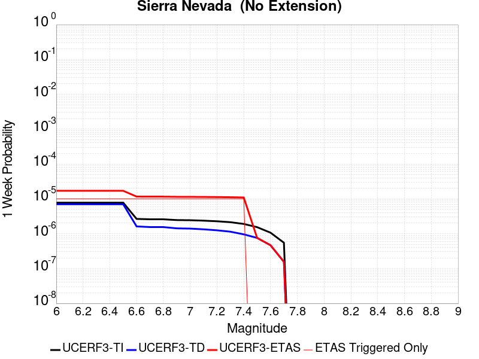 | 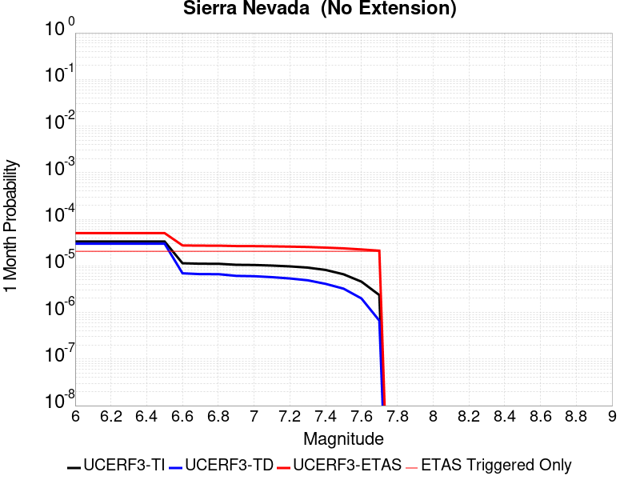 | 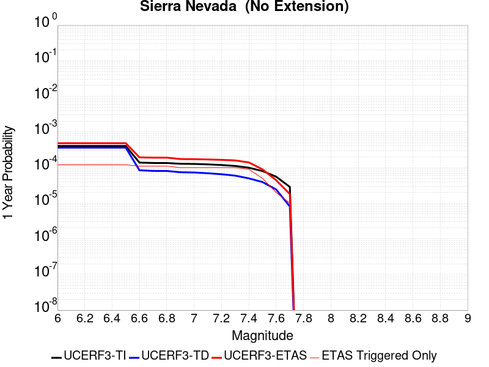 |  |

| Magnitude | 1 wk TI Prob | 1 wk TD Prob | 1 wk ETAS Prob | 1 wk ETAS/TD Gain | 1 wk ETAS Triggered Only | 1 mo TI Prob | 1 mo TD Prob | 1 mo ETAS Prob | 1 mo ETAS/TD Gain | 1 mo ETAS Triggered Only | 1 yr TI Prob | 1 yr TD Prob | 1 yr ETAS Prob | 1 yr ETAS/TD Gain | 1 yr ETAS Triggered Only | 10 yr TI Prob | 10 yr TD Prob | 10 yr ETAS Prob | 10 yr ETAS/TD Gain | 10 yr ETAS Triggered Only |
|-----|-----|-----|-----|-----|-----|-----|-----|-----|-----|-----|-----|-----|-----|-----|-----|-----|-----|-----|-----|-----|
| 6.0 | 7.7690465E-6 | 6.9763832E-6 | 1.6976313E-5 | 2.4333975 | 1.0E-5 | 3.329549E-5 | 2.9898645E-5 | 6.989745E-5 | 2.3378134 | 4.0E-5 | 4.0529718E-4 | 3.6399104E-4 | 4.8394737E-4 | 1.3295585 | 1.2E-4 | 0.004045588 | 0.0036374647 | 0.003866628 | 1.0630008 | 2.3E-4 |
| 6.1 | 7.7690465E-6 | 6.9763832E-6 | 1.6976313E-5 | 2.4333975 | 1.0E-5 | 3.329549E-5 | 2.9898645E-5 | 6.989745E-5 | 2.3378134 | 4.0E-5 | 4.0529718E-4 | 3.6399104E-4 | 4.8394737E-4 | 1.3295585 | 1.2E-4 | 0.004045588 | 0.0036374647 | 0.003866628 | 1.0630008 | 2.3E-4 |
| 6.2 | 7.7690465E-6 | 6.9763832E-6 | 1.6976313E-5 | 2.4333975 | 1.0E-5 | 3.329549E-5 | 2.9898645E-5 | 6.989745E-5 | 2.3378134 | 4.0E-5 | 4.0529718E-4 | 3.6399104E-4 | 4.8394737E-4 | 1.3295585 | 1.2E-4 | 0.004045588 | 0.0036374647 | 0.003866628 | 1.0630008 | 2.3E-4 |
| 6.3 | 7.7690465E-6 | 6.9763832E-6 | 1.6976313E-5 | 2.4333975 | 1.0E-5 | 3.329549E-5 | 2.9898645E-5 | 6.989745E-5 | 2.3378134 | 4.0E-5 | 4.0529718E-4 | 3.6399104E-4 | 4.8394737E-4 | 1.3295585 | 1.2E-4 | 0.004045588 | 0.0036374647 | 0.003866628 | 1.0630008 | 2.3E-4 |
| 6.4 | 7.7690465E-6 | 6.9763832E-6 | 1.6976313E-5 | 2.4333975 | 1.0E-5 | 3.329549E-5 | 2.9898645E-5 | 6.989745E-5 | 2.3378134 | 4.0E-5 | 4.0529718E-4 | 3.6399104E-4 | 4.8394737E-4 | 1.3295585 | 1.2E-4 | 0.004045588 | 0.0036374647 | 0.003866628 | 1.0630008 | 2.3E-4 |
| 6.5 | 7.7690465E-6 | 6.9763832E-6 | 1.6976313E-5 | 2.4333975 | 1.0E-5 | 3.329549E-5 | 2.9898645E-5 | 6.989745E-5 | 2.3378134 | 4.0E-5 | 4.0529718E-4 | 3.6399104E-4 | 4.8394737E-4 | 1.3295585 | 1.2E-4 | 0.004045588 | 0.0036374647 | 0.003866628 | 1.0630008 | 2.3E-4 |
| 6.6 | 2.653E-6 | 1.6148814E-6 | 1.1614865E-5 | 7.192395 | 1.0E-5 | 1.136995E-5 | 6.920902E-6 | 4.6920624E-5 | 6.7795534 | 4.0E-5 | 1.3842035E-4 | 8.4258754E-5 | 1.9424949E-4 | 2.3053923 | 1.1E-4 | 0.0013833415 | 8.4227155E-4 | 0.0010221199 | 1.2135278 | 1.8E-4 |
| 6.7 | 2.5902466E-6 | 1.5502146E-6 | 1.1550199E-5 | 7.45071 | 1.0E-5 | 1.11010095E-5 | 6.64376E-6 | 4.6643494E-5 | 7.020647 | 4.0E-5 | 1.351464E-4 | 8.0884805E-5 | 1.9087591E-4 | 2.3598487 | 1.1E-4 | 0.0013506424 | 8.085567E-4 | 9.884111E-4 | 1.2224389 | 1.8E-4 |
| 6.8 | 2.5853892E-6 | 1.5470148E-6 | 1.1546999E-5 | 7.4640527 | 1.0E-5 | 1.1080193E-5 | 6.6300463E-6 | 4.6629782E-5 | 7.0331 | 4.0E-5 | 1.34893E-4 | 8.071786E-5 | 1.9070898E-4 | 2.3626616 | 1.1E-4 | 0.0013481114 | 8.0688833E-4 | 9.867431E-4 | 1.2228992 | 1.8E-4 |
| 6.9 | 2.458257E-6 | 1.4220883E-6 | 1.1422074E-5 | 8.031902 | 1.0E-5 | 1.0535345E-5 | 6.0946504E-6 | 3.609447E-5 | 5.92232 | 3.0E-5 | 1.2826028E-4 | 7.419986E-5 | 1.7419244E-4 | 2.3476114 | 1.0E-4 | 0.0012818627 | 7.417528E-4 | 9.1162673E-4 | 1.2290169 | 1.7E-4 |
| 7.0 | 2.4341468E-6 | 1.399052E-6 | 1.1399038E-5 | 8.147687 | 1.0E-5 | 1.0432016E-5 | 5.995924E-6 | 3.5995745E-5 | 6.0033693 | 3.0E-5 | 1.270024E-4 | 7.2997944E-5 | 1.7299065E-4 | 2.3698015 | 1.0E-4 | 0.0012692984 | 7.297416E-4 | 8.9961756E-4 | 1.2327892 | 1.7E-4 |
| 7.1 | 2.3652476E-6 | 1.3340014E-6 | 1.1333988E-5 | 8.496235 | 1.0E-5 | 1.0136736E-5 | 5.717136E-6 | 3.5716963E-5 | 6.2473526 | 3.0E-5 | 1.2340778E-4 | 6.960393E-5 | 1.6959697E-4 | 2.4366007 | 1.0E-4 | 0.0012333926 | 6.9582294E-4 | 8.657047E-4 | 1.244145 | 1.7E-4 |
| 7.2 | 2.272158E-6 | 1.2503074E-6 | 1.1250295E-5 | 8.998023 | 1.0E-5 | 9.737784E-6 | 5.3584495E-6 | 3.5358287E-5 | 6.5986047 | 3.0E-5 | 1.1855107E-4 | 6.523718E-5 | 1.6523065E-4 | 2.5327682 | 1.0E-4 | 0.0011848784 | 6.5218186E-4 | 8.22071E-4 | 1.2604935 | 1.7E-4 |
| 7.3 | 2.1382127E-6 | 1.1419947E-6 | 1.1141983E-5 | 9.7565975 | 1.0E-5 | 9.163737E-6 | 4.8942543E-6 | 3.4894107E-5 | 7.1296067 | 3.0E-5 | 1.1156279E-4 | 5.9585927E-5 | 1.5957997E-4 | 2.6781487 | 1.0E-4 | 0.001115068 | 5.957007E-4 | 7.5560535E-4 | 1.2684313 | 1.6E-4 |
| 7.4 | 1.9048055E-6 | 9.575474E-7 | 1.0957538E-5 | 11.443337 | 1.0E-5 | 8.163426E-6 | 4.1037683E-6 | 2.4103687E-5 | 5.8735495 | 2.0E-5 | 9.9385186E-5 | 4.996224E-5 | 1.3995774E-4 | 2.8012705 | 9.0E-5 | 9.934074E-4 | 4.995108E-4 | 6.4943585E-4 | 1.3001438 | 1.5E-4 |
| 7.5 | 1.5373403E-6 | 7.5602395E-7 | 7.5602395E-7 | 1.0 | 0.0 | 6.5885843E-6 | 3.2400987E-6 | 1.3240066E-5 | 4.0863156 | 1.0E-5 | 8.021306E-5 | 3.9447492E-5 | 8.944552E-5 | 2.2674577 | 5.0E-5 | 8.0184115E-4 | 3.944054E-4 | 5.04362E-4 | 1.2787908 | 1.1E-4 |
| 7.6 | 1.0680322E-6 | 4.659796E-7 | 4.659796E-7 | 1.0 | 0.0 | 4.577273E-6 | 1.997054E-6 | 1.1997034E-5 | 6.007366 | 1.0E-5 | 5.5726876E-5 | 2.4313864E-5 | 4.4313376E-5 | 1.822556 | 2.0E-5 | 5.5712904E-4 | 2.431123E-4 | 3.030977E-4 | 1.2467395 | 6.0E-5 |
| 7.7 | 5.509146E-7 | 1.5581199E-7 | 1.5581199E-7 | 1.0 | 0.0 | 2.3610605E-6 | 6.677655E-7 | 1.0667759E-5 | 15.9753065 | 1.0E-5 | 2.8745531E-5 | 8.130016E-6 | 1.8129935E-5 | 2.2299998 | 1.0E-5 | 2.8741814E-4 | 8.12973E-5 | 9.129649E-5 | 1.1229953 | 1.0E-5 |

## Red Pass
*[(top)](#table-of-contents)*

| 1 Week | 1 Month | 1 Year | 10 Year |
|-----|-----|-----|-----|
| 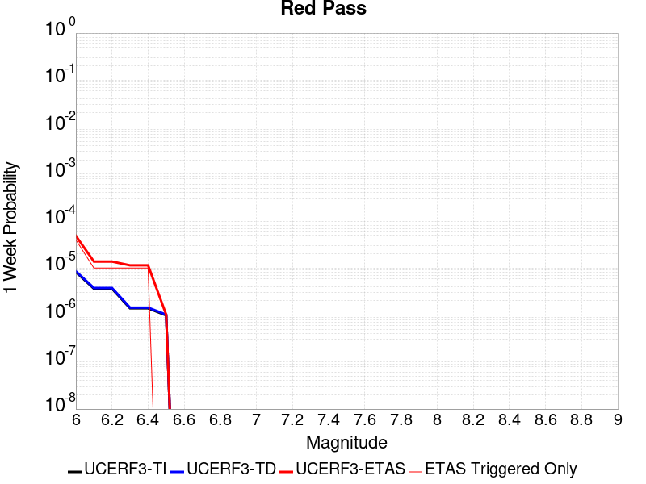 | 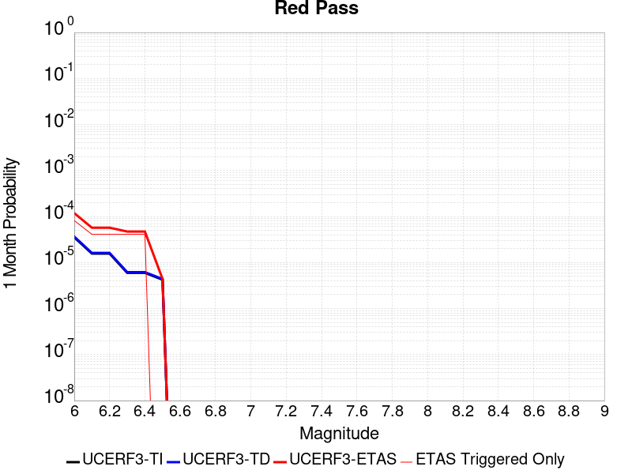 | 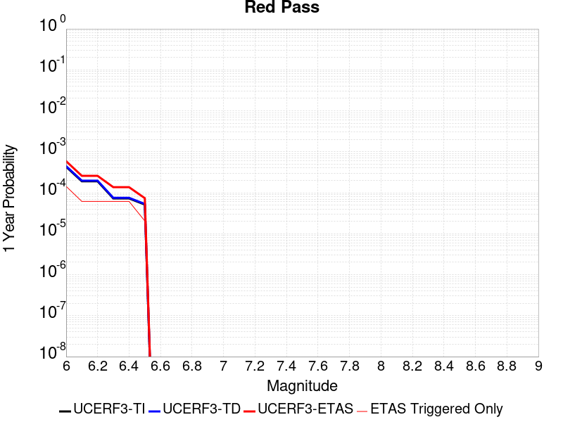 | 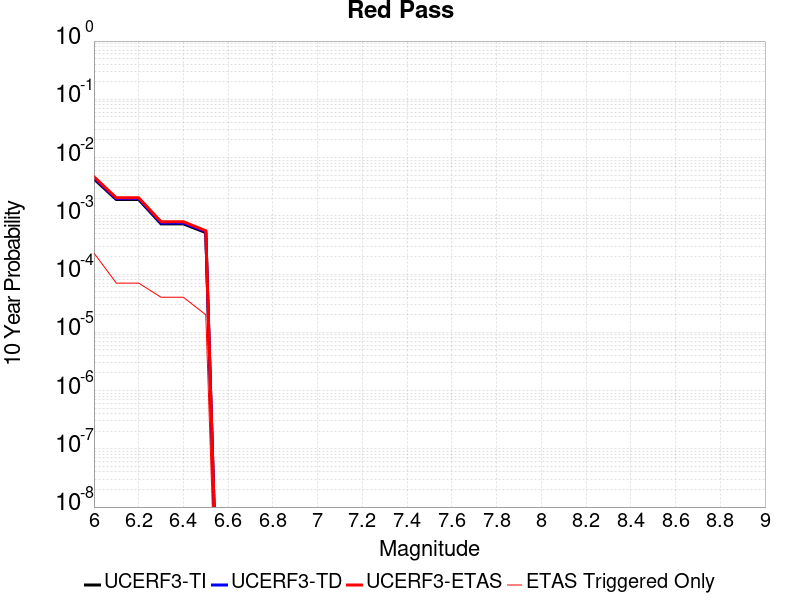 |

| Magnitude | 1 wk TI Prob | 1 wk TD Prob | 1 wk ETAS Prob | 1 wk ETAS/TD Gain | 1 wk ETAS Triggered Only | 1 mo TI Prob | 1 mo TD Prob | 1 mo ETAS Prob | 1 mo ETAS/TD Gain | 1 mo ETAS Triggered Only | 1 yr TI Prob | 1 yr TD Prob | 1 yr ETAS Prob | 1 yr ETAS/TD Gain | 1 yr ETAS Triggered Only | 10 yr TI Prob | 10 yr TD Prob | 10 yr ETAS Prob | 10 yr ETAS/TD Gain | 10 yr ETAS Triggered Only |
|-----|-----|-----|-----|-----|-----|-----|-----|-----|-----|-----|-----|-----|-----|-----|-----|-----|-----|-----|-----|-----|
| 6.0 | 8.258278E-6 | 8.551305E-6 | 4.8550963E-5 | 5.6776085 | 4.0E-5 | 3.539214E-5 | 3.6648038E-5 | 1.0664547E-4 | 2.9099915 | 7.0E-5 | 4.308141E-4 | 4.4611638E-4 | 5.660628E-4 | 1.2688681 | 1.2E-4 | 0.0042997985 | 0.004453966 | 0.0046829414 | 1.0514094 | 2.3E-4 |
| 6.1 | 3.649988E-6 | 3.7753332E-6 | 1.3775296E-5 | 3.6487627 | 1.0E-5 | 1.5642712E-5 | 1.6179927E-5 | 3.61796E-5 | 2.2360797 | 2.0E-5 | 1.9043336E-4 | 1.9697756E-4 | 2.3696967E-4 | 1.2030288 | 4.0E-5 | 0.0019027026 | 0.001968497 | 0.0020383592 | 1.0354902 | 7.0E-5 |
| 6.2 | 3.649988E-6 | 3.7753332E-6 | 1.3775296E-5 | 3.6487627 | 1.0E-5 | 1.5642712E-5 | 1.6179927E-5 | 3.61796E-5 | 2.2360797 | 2.0E-5 | 1.9043336E-4 | 1.9697756E-4 | 2.3696967E-4 | 1.2030288 | 4.0E-5 | 0.0019027026 | 0.001968497 | 0.0020383592 | 1.0354902 | 7.0E-5 |
| 6.3 | 1.3924937E-6 | 1.4411233E-6 | 1.1441109E-5 | 7.9390216 | 1.0E-5 | 5.9678164E-6 | 6.176236E-6 | 2.6176112E-5 | 4.2381983 | 2.0E-5 | 7.265574E-5 | 7.51945E-5 | 1.0519224E-4 | 1.3989354 | 3.0E-5 | 7.263199E-4 | 7.518293E-4 | 7.917992E-4 | 1.0531635 | 4.0E-5 |
| 6.4 | 1.3924937E-6 | 1.4411233E-6 | 1.1441109E-5 | 7.9390216 | 1.0E-5 | 5.9678164E-6 | 6.176236E-6 | 2.6176112E-5 | 4.2381983 | 2.0E-5 | 7.265574E-5 | 7.51945E-5 | 1.0519224E-4 | 1.3989354 | 3.0E-5 | 7.263199E-4 | 7.518293E-4 | 7.917992E-4 | 1.0531635 | 4.0E-5 |
| 6.5 | 9.876812E-7 | 1.022196E-6 | 1.022196E-6 | 1.0 | 0.0 | 4.2329125E-6 | 4.38084E-6 | 4.38084E-6 | 1.0 | 0.0 | 5.153449E-5 | 5.3336724E-5 | 6.333619E-5 | 1.1874781 | 1.0E-5 | 5.1522546E-4 | 5.333672E-4 | 5.533566E-4 | 1.0374776 | 2.0E-5 |

## Manix-Afton Hills
*[(top)](#table-of-contents)*

| 1 Week | 1 Month | 1 Year | 10 Year |
|-----|-----|-----|-----|
| 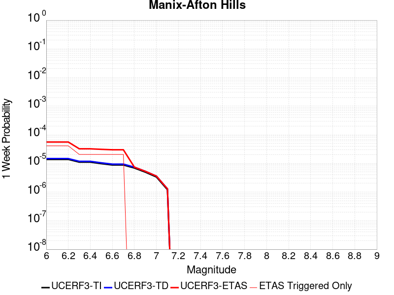 | 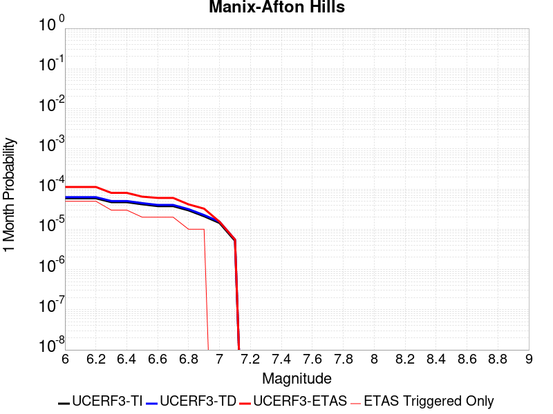 | 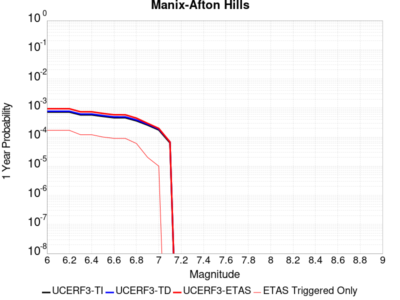 | 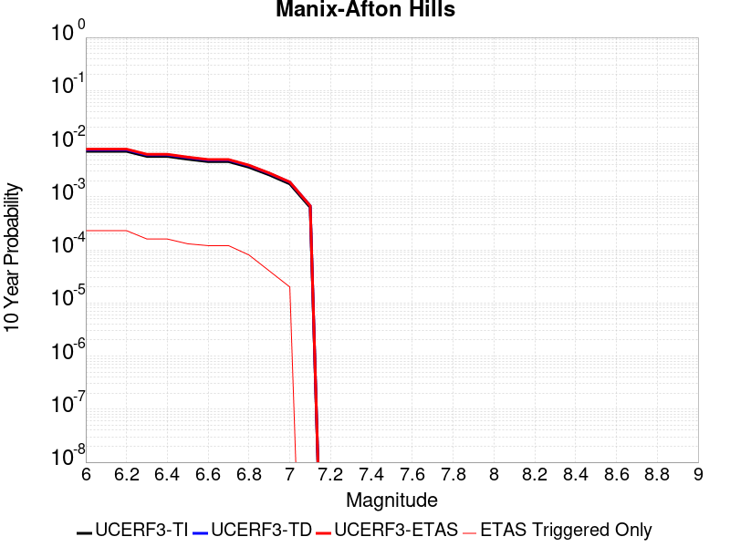 |

| Magnitude | 1 wk TI Prob | 1 wk TD Prob | 1 wk ETAS Prob | 1 wk ETAS/TD Gain | 1 wk ETAS Triggered Only | 1 mo TI Prob | 1 mo TD Prob | 1 mo ETAS Prob | 1 mo ETAS/TD Gain | 1 mo ETAS Triggered Only | 1 yr TI Prob | 1 yr TD Prob | 1 yr ETAS Prob | 1 yr ETAS/TD Gain | 1 yr ETAS Triggered Only | 10 yr TI Prob | 10 yr TD Prob | 10 yr ETAS Prob | 10 yr ETAS/TD Gain | 10 yr ETAS Triggered Only |
|-----|-----|-----|-----|-----|-----|-----|-----|-----|-----|-----|-----|-----|-----|-----|-----|-----|-----|-----|-----|-----|
| 6.0 | 1.3783202E-5 | 1.4711221E-5 | 4.471078E-5 | 3.0392296 | 3.0E-5 | 5.906953E-5 | 6.304667E-5 | 1.1304351E-4 | 1.7930133 | 5.0E-5 | 7.189342E-4 | 7.673403E-4 | 9.372099E-4 | 1.2213745 | 1.7E-4 | 0.0071661277 | 0.007648664 | 0.007876905 | 1.0298406 | 2.3E-4 |
| 6.1 | 1.3783202E-5 | 1.4711221E-5 | 4.471078E-5 | 3.0392296 | 3.0E-5 | 5.906953E-5 | 6.304667E-5 | 1.1304351E-4 | 1.7930133 | 5.0E-5 | 7.189342E-4 | 7.673403E-4 | 9.372099E-4 | 1.2213745 | 1.7E-4 | 0.0071661277 | 0.007648664 | 0.007876905 | 1.0298406 | 2.3E-4 |
| 6.2 | 1.3783202E-5 | 1.4711221E-5 | 4.471078E-5 | 3.0392296 | 3.0E-5 | 5.906953E-5 | 6.304667E-5 | 1.1304351E-4 | 1.7930133 | 5.0E-5 | 7.189342E-4 | 7.673403E-4 | 9.372099E-4 | 1.2213745 | 1.7E-4 | 0.0071661277 | 0.007648664 | 0.007876905 | 1.0298406 | 2.3E-4 |
| 6.3 | 1.10494875E-5 | 1.1793241E-5 | 3.1793006E-5 | 2.6958666 | 2.0E-5 | 4.7354086E-5 | 5.054154E-5 | 8.054003E-5 | 1.5935411 | 3.0E-5 | 5.763835E-4 | 6.151799E-4 | 7.3510606E-4 | 1.1949449 | 1.2E-4 | 0.005748908 | 0.00613581 | 0.0062948284 | 1.0259165 | 1.6E-4 |
| 6.4 | 1.10494875E-5 | 1.1793241E-5 | 3.1793006E-5 | 2.6958666 | 2.0E-5 | 4.7354086E-5 | 5.054154E-5 | 8.054003E-5 | 1.5935411 | 3.0E-5 | 5.763835E-4 | 6.151799E-4 | 7.3510606E-4 | 1.1949449 | 1.2E-4 | 0.005748908 | 0.00613581 | 0.0062948284 | 1.0259165 | 1.6E-4 |
| 6.5 | 9.788949E-6 | 1.0454414E-5 | 2.045431E-5 | 1.9565238 | 1.0E-5 | 4.1951964E-5 | 4.4803914E-5 | 6.480302E-5 | 1.4463695 | 2.0E-5 | 5.1064545E-4 | 5.4536044E-4 | 6.453059E-4 | 1.183265 | 1.0E-4 | 0.0050947363 | 0.005441148 | 0.00557044 | 1.023762 | 1.3E-4 |
| 6.6 | 8.810006E-6 | 9.413714E-6 | 1.941362E-5 | 2.06227 | 1.0E-5 | 3.775662E-5 | 4.0343915E-5 | 6.0343107E-5 | 1.4957178 | 2.0E-5 | 4.5958988E-4 | 4.9108535E-4 | 5.8104115E-4 | 1.1831776 | 9.0E-5 | 0.0045864056 | 0.004900884 | 0.0050202957 | 1.0243654 | 1.2E-4 |
| 6.7 | 8.80128E-6 | 9.404193E-6 | 1.94041E-5 | 2.0633454 | 1.0E-5 | 3.7719226E-5 | 4.0303115E-5 | 6.0302307E-5 | 1.4962195 | 2.0E-5 | 4.591348E-4 | 4.9058883E-4 | 5.805447E-4 | 1.183363 | 9.0E-5 | 0.004581874 | 0.0048959404 | 0.0050153527 | 1.0243901 | 1.2E-4 |
| 6.8 | 6.8994877E-6 | 7.3801443E-6 | 7.3801443E-6 | 1.0 | 0.0 | 2.9568899E-5 | 3.1628853E-5 | 4.1628537E-5 | 1.316157 | 1.0E-5 | 3.5994186E-4 | 3.850214E-4 | 4.449983E-4 | 1.1557755 | 6.0E-5 | 0.003593594 | 0.0038443485 | 0.003924041 | 1.0207298 | 8.0E-5 |
| 6.9 | 4.9328037E-6 | 5.2710093E-6 | 5.2710093E-6 | 1.0 | 0.0 | 2.1140417E-5 | 2.258988E-5 | 3.2589654E-5 | 1.442666 | 1.0E-5 | 2.5735417E-4 | 2.7500323E-4 | 2.9499774E-4 | 1.0727065 | 2.0E-5 | 0.0025705635 | 0.0027472344 | 0.0027871246 | 1.01452 | 4.0E-5 |
| 7.0 | 3.347973E-6 | 3.5900646E-6 | 3.5900646E-6 | 1.0 | 0.0 | 1.4348378E-5 | 1.5385924E-5 | 1.5385924E-5 | 1.0 | 0.0 | 1.746775E-4 | 1.8731161E-4 | 1.9730974E-4 | 1.0533769 | 1.0E-5 | 0.0017454025 | 0.00187194 | 0.0018919025 | 1.0106641 | 2.0E-5 |
| 7.1 | 1.2073567E-6 | 1.2934943E-6 | 1.2934943E-6 | 1.0 | 0.0 | 5.1743755E-6 | 5.5435444E-6 | 5.5435444E-6 | 1.0 | 0.0 | 6.29962E-5 | 6.74922E-5 | 6.74922E-5 | 1.0 | 0.0 | 6.297835E-4 | 6.7487714E-4 | 6.7487714E-4 | 1.0 | 0.0 |

## Ludlow
*[(top)](#table-of-contents)*

| 1 Week | 1 Month | 1 Year | 10 Year |
|-----|-----|-----|-----|
| 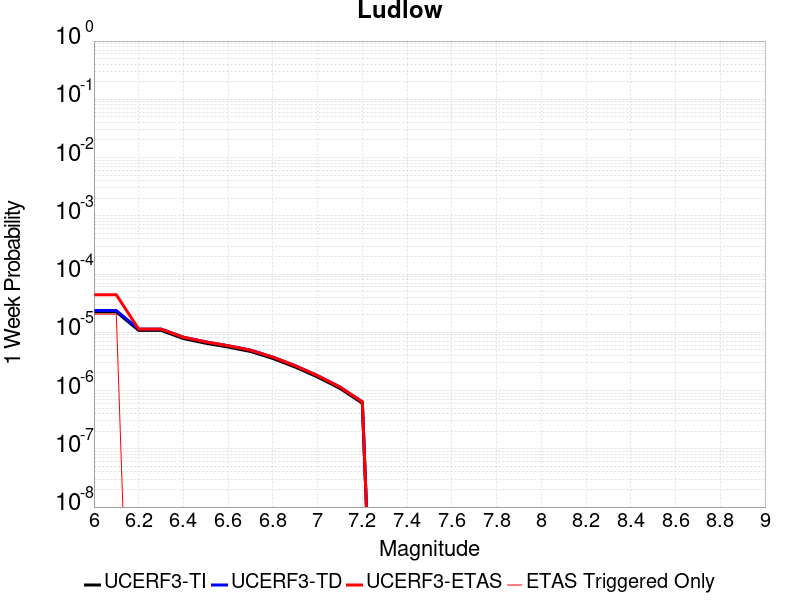 | 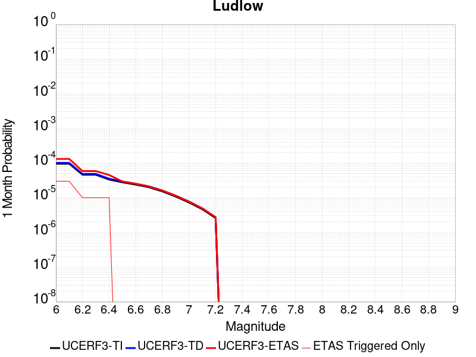 | 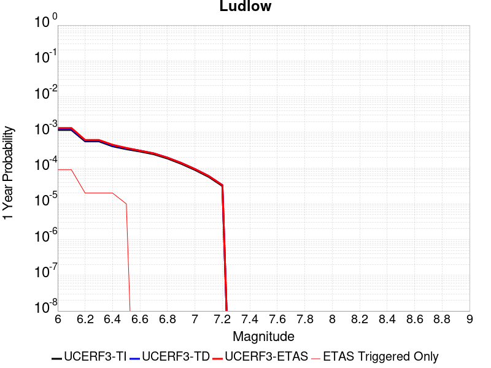 | 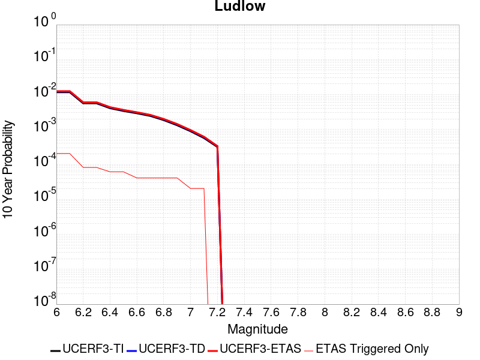 |

| Magnitude | 1 wk TI Prob | 1 wk TD Prob | 1 wk ETAS Prob | 1 wk ETAS/TD Gain | 1 wk ETAS Triggered Only | 1 mo TI Prob | 1 mo TD Prob | 1 mo ETAS Prob | 1 mo ETAS/TD Gain | 1 mo ETAS Triggered Only | 1 yr TI Prob | 1 yr TD Prob | 1 yr ETAS Prob | 1 yr ETAS/TD Gain | 1 yr ETAS Triggered Only | 10 yr TI Prob | 10 yr TD Prob | 10 yr ETAS Prob | 10 yr ETAS/TD Gain | 10 yr ETAS Triggered Only |
|-----|-----|-----|-----|-----|-----|-----|-----|-----|-----|-----|-----|-----|-----|-----|-----|-----|-----|-----|-----|-----|
| 6.0 | 2.2407607E-5 | 2.3657429E-5 | 3.3657194E-5 | 1.4226902 | 1.0E-5 | 9.602906E-5 | 1.0138529E-4 | 1.3138224E-4 | 1.2958709 | 3.0E-5 | 0.0011685267 | 0.001233711 | 0.0013236001 | 1.0728606 | 9.0E-5 | 0.011624013 | 0.012273132 | 0.012480555 | 1.0169005 | 2.1E-4 |
| 6.1 | 2.2407607E-5 | 2.3657429E-5 | 3.3657194E-5 | 1.4226902 | 1.0E-5 | 9.602906E-5 | 1.0138529E-4 | 1.3138224E-4 | 1.2958709 | 3.0E-5 | 0.0011685267 | 0.001233711 | 0.0013236001 | 1.0728606 | 9.0E-5 | 0.011624013 | 0.012273132 | 0.012480555 | 1.0169005 | 2.1E-4 |
| 6.2 | 1.0781252E-5 | 1.1365745E-5 | 1.1365745E-5 | 1.0 | 0.0 | 4.620455E-5 | 4.870945E-5 | 5.8708963E-5 | 1.205289 | 1.0E-5 | 5.623952E-4 | 5.9288024E-4 | 6.1286835E-4 | 1.0337136 | 2.0E-5 | 0.00560974 | 0.005913404 | 0.00598299 | 1.0117675 | 7.0E-5 |
| 6.3 | 1.0781252E-5 | 1.1365745E-5 | 1.1365745E-5 | 1.0 | 0.0 | 4.620455E-5 | 4.870945E-5 | 5.8708963E-5 | 1.205289 | 1.0E-5 | 5.623952E-4 | 5.9288024E-4 | 6.1286835E-4 | 1.0337136 | 2.0E-5 | 0.00560974 | 0.005913404 | 0.00598299 | 1.0117675 | 7.0E-5 |
| 6.4 | 7.814439E-6 | 8.237788E-6 | 8.237788E-6 | 1.0 | 0.0 | 3.3490025E-5 | 3.5304336E-5 | 4.5303983E-5 | 1.2832413 | 1.0E-5 | 4.0766477E-4 | 4.2974693E-4 | 4.4973832E-4 | 1.046519 | 2.0E-5 | 0.0040691774 | 0.0042893053 | 0.004339091 | 1.0116069 | 5.0E-5 |
| 6.5 | 6.4986366E-6 | 6.850969E-6 | 6.850969E-6 | 1.0 | 0.0 | 2.7851002E-5 | 2.936097E-5 | 2.936097E-5 | 1.0 | 0.0 | 3.390332E-4 | 3.574121E-4 | 3.6740853E-4 | 1.0279689 | 1.0E-5 | 0.003385164 | 0.0035684688 | 0.0036083262 | 1.0111693 | 4.0E-5 |
| 6.6 | 5.582177E-6 | 5.8860483E-6 | 5.8860483E-6 | 1.0 | 0.0 | 2.3923398E-5 | 2.522568E-5 | 2.522568E-5 | 1.0 | 0.0 | 2.9122844E-4 | 3.070801E-4 | 3.070801E-4 | 1.0 | 0.0 | 0.0029084706 | 0.003066631 | 0.003096539 | 1.0097528 | 3.0E-5 |
| 6.7 | 4.6858763E-6 | 4.940463E-6 | 4.940463E-6 | 1.0 | 0.0 | 2.0082172E-5 | 2.1173244E-5 | 2.1173244E-5 | 1.0 | 0.0 | 2.4447302E-4 | 2.577543E-4 | 2.577543E-4 | 1.0 | 0.0 | 0.0024420423 | 0.0025746098 | 0.0026045325 | 1.0116223 | 3.0E-5 |
| 6.8 | 3.5584908E-6 | 3.7520454E-6 | 3.7520454E-6 | 1.0 | 0.0 | 1.5250586E-5 | 1.6080097E-5 | 1.6080097E-5 | 1.0 | 0.0 | 1.8566006E-4 | 1.9575801E-4 | 1.9575801E-4 | 1.0 | 0.0 | 0.0018550502 | 0.0019558968 | 0.0019858382 | 1.0153083 | 3.0E-5 |
| 6.9 | 2.532834E-6 | 2.6710227E-6 | 2.6710227E-6 | 1.0 | 0.0 | 1.0854958E-5 | 1.1447192E-5 | 1.1447192E-5 | 1.0 | 0.0 | 1.3215111E-4 | 1.3936093E-4 | 1.3936093E-4 | 1.0 | 0.0 | 0.0013207254 | 0.0013927629 | 0.0014227212 | 1.0215099 | 3.0E-5 |
| 7.0 | 1.7083285E-6 | 1.801957E-6 | 1.801957E-6 | 1.0 | 0.0 | 7.3213873E-6 | 7.7226505E-6 | 7.7226505E-6 | 1.0 | 0.0 | 8.913424E-5 | 9.4019386E-5 | 9.4019386E-5 | 1.0 | 0.0 | 8.9098496E-4 | 9.3981257E-4 | 9.597938E-4 | 1.0212609 | 2.0E-5 |
| 7.1 | 1.0905424E-6 | 1.1497702E-6 | 1.1497702E-6 | 1.0 | 0.0 | 4.6737446E-6 | 4.927578E-6 | 4.927578E-6 | 1.0 | 0.0 | 5.6901354E-5 | 5.999171E-5 | 5.999171E-5 | 1.0 | 0.0 | 5.6886784E-4 | 5.997649E-4 | 6.197529E-4 | 1.0333264 | 2.0E-5 |
| 7.2 | 6.06668E-7 | 6.387322E-7 | 6.387322E-7 | 1.0 | 0.0 | 2.600003E-6 | 2.7374213E-6 | 2.7374213E-6 | 1.0 | 0.0 | 3.1654577E-5 | 3.3327666E-5 | 3.3327666E-5 | 1.0 | 0.0 | 3.1650066E-4 | 3.332335E-4 | 3.332335E-4 | 1.0 | 0.0 |

## Cady
*[(top)](#table-of-contents)*

| 1 Week | 1 Month | 1 Year | 10 Year |
|-----|-----|-----|-----|
| 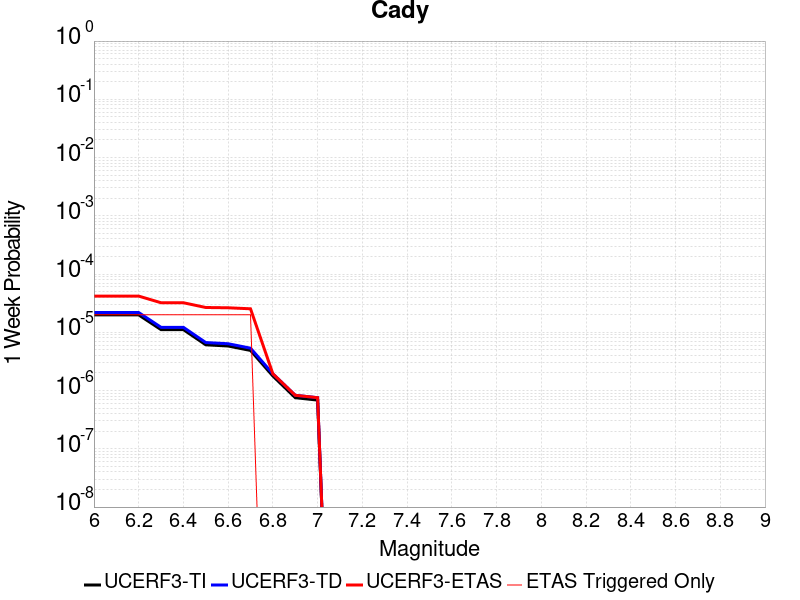 | 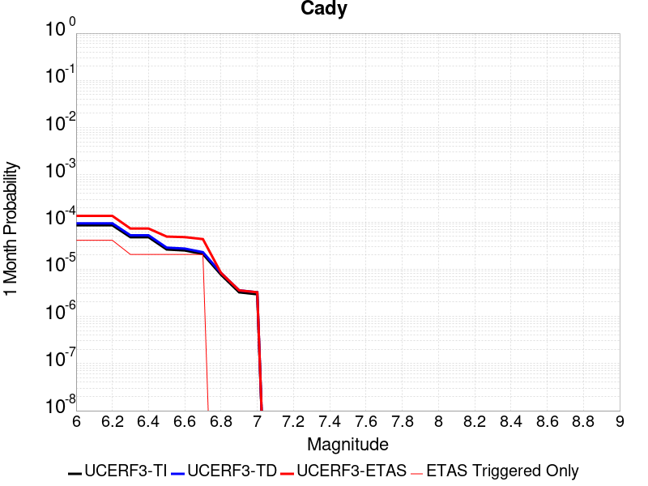 | 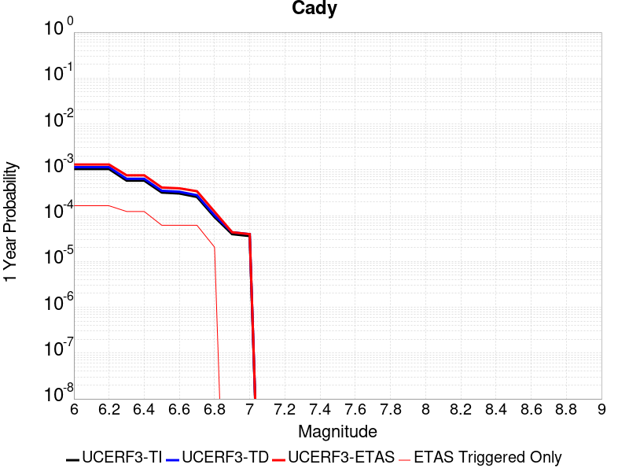 | 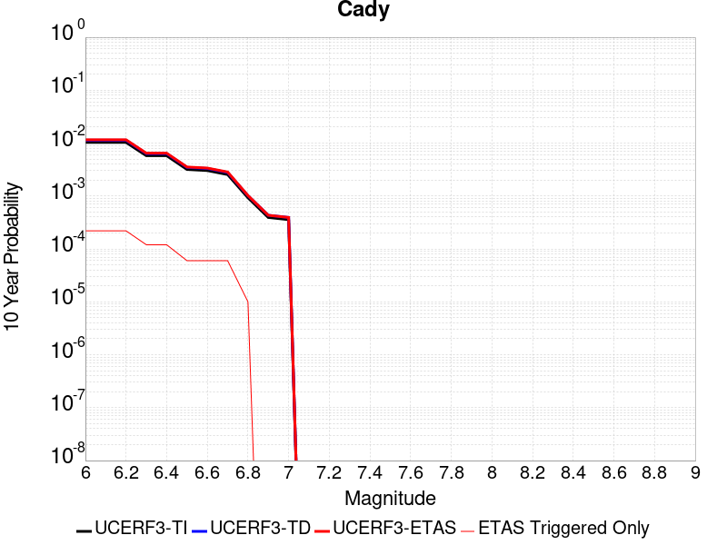 |

| Magnitude | 1 wk TI Prob | 1 wk TD Prob | 1 wk ETAS Prob | 1 wk ETAS/TD Gain | 1 wk ETAS Triggered Only | 1 mo TI Prob | 1 mo TD Prob | 1 mo ETAS Prob | 1 mo ETAS/TD Gain | 1 mo ETAS Triggered Only | 1 yr TI Prob | 1 yr TD Prob | 1 yr ETAS Prob | 1 yr ETAS/TD Gain | 1 yr ETAS Triggered Only | 10 yr TI Prob | 10 yr TD Prob | 10 yr ETAS Prob | 10 yr ETAS/TD Gain | 10 yr ETAS Triggered Only |
|-----|-----|-----|-----|-----|-----|-----|-----|-----|-----|-----|-----|-----|-----|-----|-----|-----|-----|-----|-----|-----|
| 6.0 | 1.9892565E-5 | 2.1859016E-5 | 4.1858577E-5 | 1.9149343 | 2.0E-5 | 8.525106E-5 | 9.3678645E-5 | 1.4367395E-4 | 1.5336896 | 5.0E-5 | 0.0010374374 | 0.0011400316 | 0.0012898607 | 1.1314253 | 1.5E-4 | 0.010326075 | 0.011350849 | 0.011568352 | 1.0191618 | 2.2E-4 |
| 6.1 | 1.9892565E-5 | 2.1859016E-5 | 4.1858577E-5 | 1.9149343 | 2.0E-5 | 8.525106E-5 | 9.3678645E-5 | 1.4367395E-4 | 1.5336896 | 5.0E-5 | 0.0010374374 | 0.0011400316 | 0.0012898607 | 1.1314253 | 1.5E-4 | 0.010326075 | 0.011350849 | 0.011568352 | 1.0191618 | 2.2E-4 |
| 6.2 | 1.9892565E-5 | 2.1859016E-5 | 4.1858577E-5 | 1.9149343 | 2.0E-5 | 8.525106E-5 | 9.3678645E-5 | 1.4367395E-4 | 1.5336896 | 5.0E-5 | 0.0010374374 | 0.0011400316 | 0.0012898607 | 1.1314253 | 1.5E-4 | 0.010326075 | 0.011350849 | 0.011568352 | 1.0191618 | 2.2E-4 |
| 6.3 | 1.1117327E-5 | 1.2176738E-5 | 3.2176493E-5 | 2.642456 | 2.0E-5 | 4.764482E-5 | 5.218515E-5 | 8.2183586E-5 | 1.5748461 | 3.0E-5 | 5.7992124E-4 | 6.3520053E-4 | 7.2514336E-4 | 1.1415975 | 9.0E-5 | 0.0057841022 | 0.0063369554 | 0.006456195 | 1.0188166 | 1.2E-4 |
| 6.4 | 1.1117327E-5 | 1.2176738E-5 | 3.2176493E-5 | 2.642456 | 2.0E-5 | 4.764482E-5 | 5.218515E-5 | 8.2183586E-5 | 1.5748461 | 3.0E-5 | 5.7992124E-4 | 6.3520053E-4 | 7.2514336E-4 | 1.1415975 | 9.0E-5 | 0.0057841022 | 0.0063369554 | 0.006456195 | 1.0188166 | 1.2E-4 |
| 6.5 | 6.103093E-6 | 6.672103E-6 | 2.6671969E-5 | 3.9975355 | 2.0E-5 | 2.615585E-5 | 2.8594486E-5 | 5.859363E-5 | 2.0491233 | 3.0E-5 | 3.1840094E-4 | 3.4809482E-4 | 3.980774E-4 | 1.143589 | 5.0E-5 | 0.0031794512 | 0.0034767296 | 0.003536521 | 1.0171976 | 6.0E-5 |
| 6.6 | 5.817237E-6 | 6.365738E-6 | 2.6365611E-5 | 4.1417994 | 2.0E-5 | 2.4930776E-5 | 2.728152E-5 | 5.72807E-5 | 2.0996156 | 3.0E-5 | 3.034899E-4 | 3.3211432E-4 | 3.8209773E-4 | 1.1505005 | 5.0E-5 | 0.0030307577 | 0.003317402 | 0.003377203 | 1.0180265 | 6.0E-5 |
| 6.7 | 4.8846314E-6 | 5.3406343E-6 | 2.5340527E-5 | 4.7448535 | 2.0E-5 | 2.0933967E-5 | 2.2888298E-5 | 5.288761E-5 | 2.3106835 | 3.0E-5 | 2.5484123E-4 | 2.7864118E-4 | 3.2862724E-4 | 1.1793922 | 5.0E-5 | 0.0025454918 | 0.0027840736 | 0.0028439066 | 1.0214912 | 6.0E-5 |
| 6.8 | 1.7788773E-6 | 1.9399313E-6 | 1.9399313E-6 | 1.0 | 0.0 | 7.6237375E-6 | 8.313974E-6 | 8.313974E-6 | 1.0 | 0.0 | 9.281505E-5 | 1.01219506E-4 | 1.1121849E-4 | 1.0987852 | 1.0E-5 | 9.2776294E-4 | 0.0010118886 | 0.0010218786 | 1.0098726 | 1.0E-5 |
| 6.9 | 7.5455404E-7 | 8.297202E-7 | 8.297202E-7 | 1.0 | 0.0 | 3.233799E-6 | 3.5559406E-6 | 3.5559406E-6 | 1.0 | 0.0 | 3.937079E-5 | 4.3293054E-5 | 4.3293054E-5 | 1.0 | 0.0 | 3.9363815E-4 | 4.3287914E-4 | 4.3287914E-4 | 1.0 | 0.0 |
| 7.0 | 6.8578805E-7 | 7.541916E-7 | 7.541916E-7 | 1.0 | 0.0 | 2.9390883E-6 | 3.2322475E-6 | 3.2322475E-6 | 1.0 | 0.0 | 3.578281E-5 | 3.9352235E-5 | 3.9352235E-5 | 1.0 | 0.0 | 3.577705E-4 | 3.9348513E-4 | 3.9348513E-4 | 1.0 | 0.0 |

## San Andreas (San Gorgonio Pass-Garnet HIll)
*[(top)](#table-of-contents)*

| 1 Week | 1 Month | 1 Year | 10 Year |
|-----|-----|-----|-----|
| 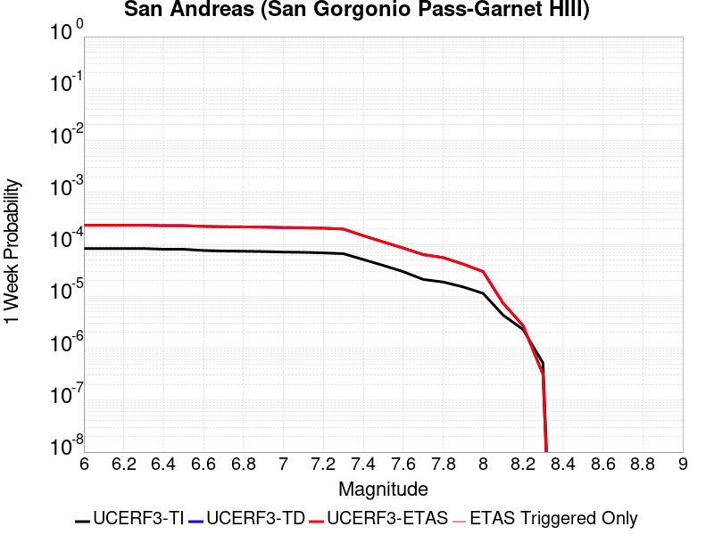 | 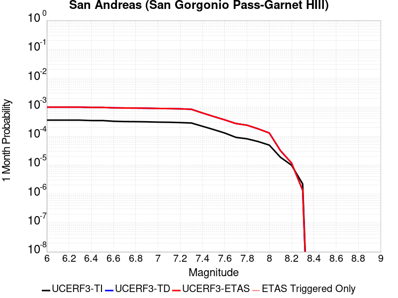 | 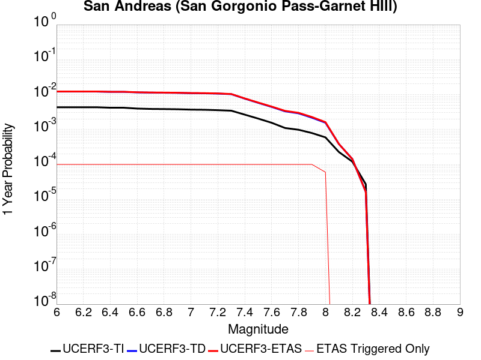 | 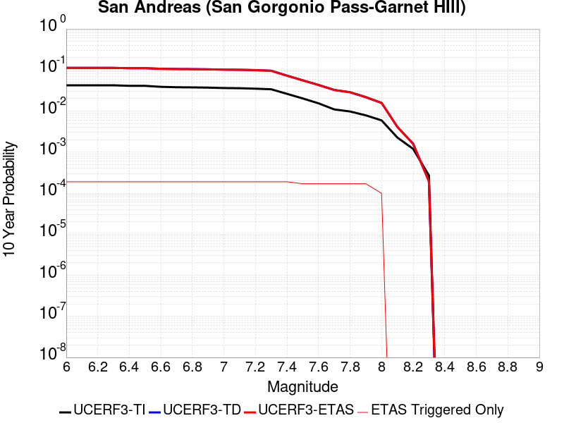 |

| Magnitude | 1 wk TI Prob | 1 wk TD Prob | 1 wk ETAS Prob | 1 wk ETAS/TD Gain | 1 wk ETAS Triggered Only | 1 mo TI Prob | 1 mo TD Prob | 1 mo ETAS Prob | 1 mo ETAS/TD Gain | 1 mo ETAS Triggered Only | 1 yr TI Prob | 1 yr TD Prob | 1 yr ETAS Prob | 1 yr ETAS/TD Gain | 1 yr ETAS Triggered Only | 10 yr TI Prob | 10 yr TD Prob | 10 yr ETAS Prob | 10 yr ETAS/TD Gain | 10 yr ETAS Triggered Only |
|-----|-----|-----|-----|-----|-----|-----|-----|-----|-----|-----|-----|-----|-----|-----|-----|-----|-----|-----|-----|-----|
| 6.0 | 8.31567E-5 | 2.3386451E-4 | 2.3386451E-4 | 1.0 | 0.0 | 3.5633717E-4 | 0.0010018935 | 0.0010018935 | 1.0 | 0.0 | 0.004329778 | 0.012129918 | 0.012228705 | 1.008144 | 1.0E-4 | 0.042463828 | 0.11259502 | 0.11276363 | 1.0014975 | 1.9E-4 |
| 6.1 | 8.31567E-5 | 2.3386451E-4 | 2.3386451E-4 | 1.0 | 0.0 | 3.5633717E-4 | 0.0010018935 | 0.0010018935 | 1.0 | 0.0 | 0.004329778 | 0.012129918 | 0.012228705 | 1.008144 | 1.0E-4 | 0.042463828 | 0.11259502 | 0.11276363 | 1.0014975 | 1.9E-4 |
| 6.2 | 8.31567E-5 | 2.3386451E-4 | 2.3386451E-4 | 1.0 | 0.0 | 3.5633717E-4 | 0.0010018935 | 0.0010018935 | 1.0 | 0.0 | 0.004329778 | 0.012129918 | 0.012228705 | 1.008144 | 1.0E-4 | 0.042463828 | 0.11259502 | 0.11276363 | 1.0014975 | 1.9E-4 |
| 6.3 | 8.31567E-5 | 2.3386451E-4 | 2.3386451E-4 | 1.0 | 0.0 | 3.5633717E-4 | 0.0010018935 | 0.0010018935 | 1.0 | 0.0 | 0.004329778 | 0.012129918 | 0.012228705 | 1.008144 | 1.0E-4 | 0.042463828 | 0.11259502 | 0.11276363 | 1.0014975 | 1.9E-4 |
| 6.4 | 8.059055E-5 | 2.2944735E-4 | 2.2944735E-4 | 1.0 | 0.0 | 3.4534236E-4 | 9.829777E-4 | 9.829777E-4 | 1.0 | 0.0 | 0.0041964394 | 0.011902156 | 0.012000966 | 1.0083019 | 1.0E-4 | 0.041180745 | 0.110576175 | 0.11074517 | 1.0015283 | 1.9E-4 |
| 6.5 | 8.059055E-5 | 2.2944735E-4 | 2.2944735E-4 | 1.0 | 0.0 | 3.4534236E-4 | 9.829777E-4 | 9.829777E-4 | 1.0 | 0.0 | 0.0041964394 | 0.011902156 | 0.012000966 | 1.0083019 | 1.0E-4 | 0.041180745 | 0.110576175 | 0.11074517 | 1.0015283 | 1.9E-4 |
| 6.6 | 7.619237E-5 | 2.2189032E-4 | 2.2189032E-4 | 1.0 | 0.0 | 3.2649786E-4 | 9.506143E-4 | 9.506143E-4 | 1.0 | 0.0 | 0.0039678677 | 0.0115128625 | 0.011611711 | 1.0085859 | 1.0E-4 | 0.03897764 | 0.10711278 | 0.10728242 | 1.0015838 | 1.9E-4 |
| 6.7 | 7.440636E-5 | 2.1864849E-4 | 2.1864849E-4 | 1.0 | 0.0 | 3.188454E-4 | 9.367307E-4 | 9.367307E-4 | 1.0 | 0.0 | 0.0038750346 | 0.011345596 | 0.0114444615 | 1.008714 | 1.0E-4 | 0.038081564 | 0.10562121 | 0.105791144 | 1.0016088 | 1.9E-4 |
| 6.8 | 7.3735864E-5 | 2.1712016E-4 | 2.1712016E-4 | 1.0 | 0.0 | 3.1597257E-4 | 9.3018543E-4 | 9.3018543E-4 | 1.0 | 0.0 | 0.0038401815 | 0.011266734 | 0.011365607 | 1.0087757 | 1.0E-4 | 0.03774495 | 0.10492276 | 0.105092816 | 1.0016209 | 1.9E-4 |
| 6.9 | 7.27575E-5 | 2.1480983E-4 | 2.1480983E-4 | 1.0 | 0.0 | 3.117806E-4 | 9.20291E-4 | 9.20291E-4 | 1.0 | 0.0 | 0.003789323 | 0.011147508 | 0.011246393 | 1.0088706 | 1.0E-4 | 0.037253562 | 0.10387066 | 0.10404093 | 1.0016392 | 1.9E-4 |
| 7.0 | 7.102591E-5 | 2.1065009E-4 | 2.1065009E-4 | 1.0 | 0.0 | 3.0436125E-4 | 9.0247596E-4 | 9.0247596E-4 | 1.0 | 0.0 | 0.003699303 | 0.010932805 | 0.0110317115 | 1.0090468 | 1.0E-4 | 0.03638325 | 0.101972826 | 0.10214345 | 1.0016732 | 1.9E-4 |
| 7.1 | 7.028513E-5 | 2.0900648E-4 | 2.0900648E-4 | 1.0 | 0.0 | 3.0118722E-4 | 8.954368E-4 | 8.954368E-4 | 1.0 | 0.0 | 0.0036607897 | 0.01084796 | 0.0109468745 | 1.0091183 | 1.0E-4 | 0.036010686 | 0.10121585 | 0.101386614 | 1.0016872 | 1.9E-4 |
| 7.2 | 6.8498244E-5 | 2.0508505E-4 | 2.0508505E-4 | 1.0 | 0.0 | 2.9353087E-4 | 8.78642E-4 | 8.78642E-4 | 1.0 | 0.0 | 0.003567883 | 0.010645497 | 0.010744433 | 1.0092937 | 1.0E-4 | 0.035111405 | 0.09940783 | 0.09957894 | 1.0017213 | 1.9E-4 |
| 7.3 | 6.622592E-5 | 1.973576E-4 | 1.973576E-4 | 1.0 | 0.0 | 2.8379448E-4 | 8.4554625E-4 | 8.4554625E-4 | 1.0 | 0.0 | 0.0034497243 | 0.010246415 | 0.01034539 | 1.0096595 | 1.0E-4 | 0.033966612 | 0.09590419 | 0.09607597 | 1.0017911 | 1.9E-4 |
| 7.4 | 5.1050705E-5 | 1.4692261E-4 | 1.4692261E-4 | 1.0 | 0.0 | 2.1877038E-4 | 6.295173E-4 | 6.295173E-4 | 1.0 | 0.0 | 0.002660276 | 0.0076376316 | 0.0077368678 | 1.0129931 | 1.0E-4 | 0.02628654 | 0.07287696 | 0.073053114 | 1.0024171 | 1.9E-4 |
| 7.5 | 3.9302922E-5 | 1.11326524E-4 | 1.11326524E-4 | 1.0 | 0.0 | 1.6843023E-4 | 4.7702674E-4 | 4.7702674E-4 | 1.0 | 0.0 | 0.0020487092 | 0.005792404 | 0.005891825 | 1.017164 | 1.0E-4 | 0.020299247 | 0.05602189 | 0.056182366 | 1.0028645 | 1.7E-4 |
| 7.6 | 2.9851626E-5 | 8.49747E-5 | 8.49747E-5 | 1.0 | 0.0 | 1.2792926E-4 | 3.6412658E-4 | 3.6412658E-4 | 1.0 | 0.0 | 0.0015564259 | 0.004424255 | 0.004523813 | 1.0225027 | 1.0E-4 | 0.0154556995 | 0.043204896 | 0.043367554 | 1.0037647 | 1.7E-4 |
| 7.7 | 2.1135214E-5 | 6.355116E-5 | 6.355116E-5 | 1.0 | 0.0 | 9.0576345E-5 | 2.723337E-4 | 2.723337E-4 | 1.0 | 0.0 | 0.0011022091 | 0.003310627 | 0.003410296 | 1.0301057 | 1.0E-4 | 0.010967582 | 0.032592565 | 0.032757025 | 1.0050459 | 1.7E-4 |
| 7.8 | 1.883379E-5 | 5.5660596E-5 | 5.5660596E-5 | 1.0 | 0.0 | 8.0713755E-5 | 2.3852361E-4 | 2.3852361E-4 | 1.0 | 0.0 | 9.822468E-4 | 0.0029001608 | 0.0029998708 | 1.0343808 | 1.0E-4 | 0.0097791655 | 0.028704397 | 0.028869517 | 1.0057524 | 1.7E-4 |
| 7.9 | 1.5156185E-5 | 4.1675128E-5 | 4.1675128E-5 | 1.0 | 0.0 | 6.495346E-5 | 1.7859548E-4 | 1.7859548E-4 | 1.0 | 0.0 | 7.9052144E-4 | 0.0021722328 | 0.0022720157 | 1.0459356 | 1.0E-4 | 0.007877152 | 0.02176709 | 0.021933388 | 1.00764 | 1.7E-4 |
| 8.0 | 1.1405907E-5 | 2.9986788E-5 | 2.9986788E-5 | 1.0 | 0.0 | 4.8881542E-5 | 1.2850849E-4 | 1.2850849E-4 | 1.0 | 0.0 | 5.9497025E-4 | 0.0015634688 | 0.0016233751 | 1.0383162 | 6.0E-5 | 0.005933798 | 0.015778678 | 0.0158771 | 1.0062376 | 1.0E-4 |
| 8.1 | 4.3511436E-6 | 7.373693E-6 | 7.373693E-6 | 1.0 | 0.0 | 1.8647626E-5 | 3.160116E-5 | 3.160116E-5 | 1.0 | 0.0 | 2.2701119E-4 | 3.8467633E-4 | 3.8467633E-4 | 1.0 | 0.0 | 0.0022677942 | 0.004118566 | 0.004118566 | 1.0 | 0.0 |
| 8.2 | 2.3042528E-6 | 2.7350309E-6 | 2.7350309E-6 | 1.0 | 0.0 | 9.875332E-6 | 1.1721509E-5 | 1.1721509E-5 | 1.0 | 0.0 | 1.2022553E-4 | 1.4270007E-4 | 1.4270007E-4 | 1.0 | 0.0 | 0.0012016051 | 0.0015990696 | 0.0015990696 | 1.0 | 0.0 |
| 8.3 | 5.202968E-7 | 3.1628537E-7 | 3.1628537E-7 | 1.0 | 0.0 | 2.2298414E-6 | 1.3555081E-6 | 1.3555081E-6 | 1.0 | 0.0 | 2.714798E-5 | 1.6503198E-5 | 1.6503198E-5 | 1.0 | 0.0 | 2.7144665E-4 | 1.9580164E-4 | 1.9580164E-4 | 1.0 | 0.0 |

## San Andreas (North Branch Mill Creek)
*[(top)](#table-of-contents)*

| 1 Week | 1 Month | 1 Year | 10 Year |
|-----|-----|-----|-----|
| 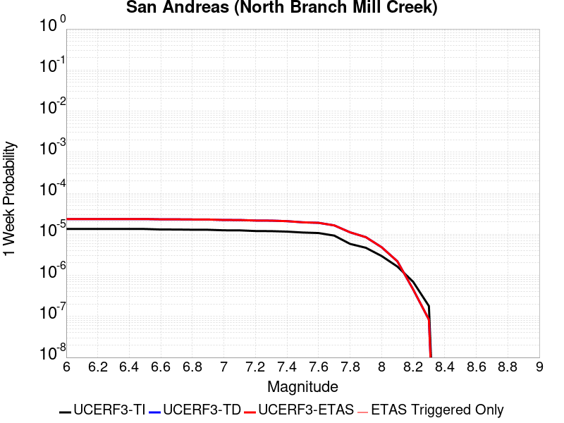 | 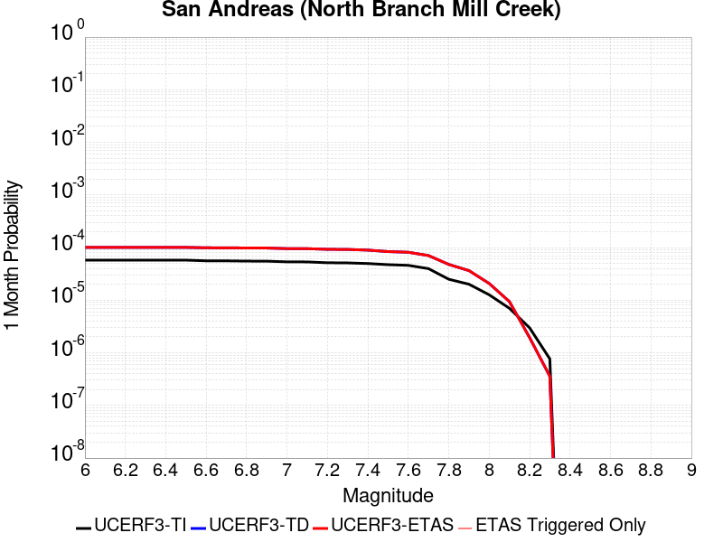 | 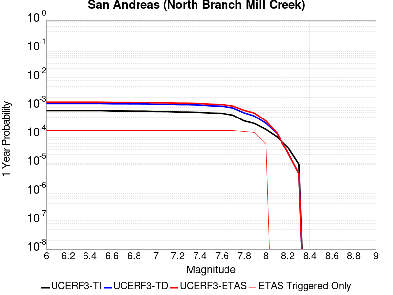 | 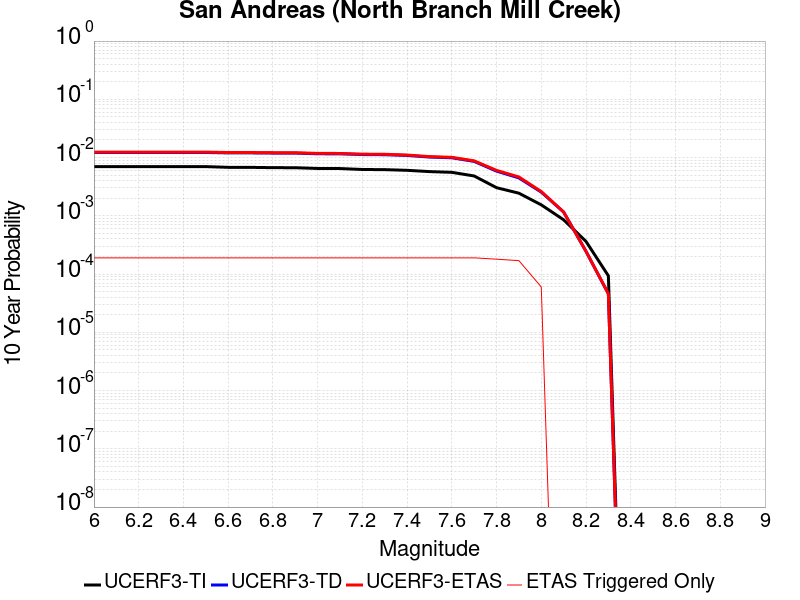 |

| Magnitude | 1 wk TI Prob | 1 wk TD Prob | 1 wk ETAS Prob | 1 wk ETAS/TD Gain | 1 wk ETAS Triggered Only | 1 mo TI Prob | 1 mo TD Prob | 1 mo ETAS Prob | 1 mo ETAS/TD Gain | 1 mo ETAS Triggered Only | 1 yr TI Prob | 1 yr TD Prob | 1 yr ETAS Prob | 1 yr ETAS/TD Gain | 1 yr ETAS Triggered Only | 10 yr TI Prob | 10 yr TD Prob | 10 yr ETAS Prob | 10 yr ETAS/TD Gain | 10 yr ETAS Triggered Only |
|-----|-----|-----|-----|-----|-----|-----|-----|-----|-----|-----|-----|-----|-----|-----|-----|-----|-----|-----|-----|-----|
| 6.0 | 1.3461156E-5 | 2.3506776E-5 | 2.3506776E-5 | 1.0 | 0.0 | 5.7689394E-5 | 1.0073945E-4 | 1.0073945E-4 | 1.0 | 0.0 | 7.02142E-4 | 0.0012258161 | 0.0013656444 | 1.1140696 | 1.4E-4 | 0.0069992766 | 0.012233093 | 0.012420769 | 1.0153416 | 1.9E-4 |
| 6.1 | 1.3461156E-5 | 2.3506776E-5 | 2.3506776E-5 | 1.0 | 0.0 | 5.7689394E-5 | 1.0073945E-4 | 1.0073945E-4 | 1.0 | 0.0 | 7.02142E-4 | 0.0012258161 | 0.0013656444 | 1.1140696 | 1.4E-4 | 0.0069992766 | 0.012233093 | 0.012420769 | 1.0153416 | 1.9E-4 |
| 6.2 | 1.3461156E-5 | 2.3506776E-5 | 2.3506776E-5 | 1.0 | 0.0 | 5.7689394E-5 | 1.0073945E-4 | 1.0073945E-4 | 1.0 | 0.0 | 7.02142E-4 | 0.0012258161 | 0.0013656444 | 1.1140696 | 1.4E-4 | 0.0069992766 | 0.012233093 | 0.012420769 | 1.0153416 | 1.9E-4 |
| 6.3 | 1.3461156E-5 | 2.3506776E-5 | 2.3506776E-5 | 1.0 | 0.0 | 5.7689394E-5 | 1.0073945E-4 | 1.0073945E-4 | 1.0 | 0.0 | 7.02142E-4 | 0.0012258161 | 0.0013656444 | 1.1140696 | 1.4E-4 | 0.0069992766 | 0.012233093 | 0.012420769 | 1.0153416 | 1.9E-4 |
| 6.4 | 1.3461156E-5 | 2.3506776E-5 | 2.3506776E-5 | 1.0 | 0.0 | 5.7689394E-5 | 1.0073945E-4 | 1.0073945E-4 | 1.0 | 0.0 | 7.02142E-4 | 0.0012258161 | 0.0013656444 | 1.1140696 | 1.4E-4 | 0.0069992766 | 0.012233093 | 0.012420769 | 1.0153416 | 1.9E-4 |
| 6.5 | 1.3450706E-5 | 2.3495735E-5 | 2.3495735E-5 | 1.0 | 0.0 | 5.764461E-5 | 1.0069214E-4 | 1.0069214E-4 | 1.0 | 0.0 | 7.0159714E-4 | 0.0012252406 | 0.0013650692 | 1.1141232 | 1.4E-4 | 0.006993862 | 0.012227403 | 0.01241508 | 1.0153489 | 1.9E-4 |
| 6.6 | 1.3074523E-5 | 2.3110017E-5 | 2.3110017E-5 | 1.0 | 0.0 | 5.6032466E-5 | 9.9039185E-5 | 9.9039185E-5 | 1.0 | 0.0 | 6.8198174E-4 | 0.0012051383 | 0.0013449696 | 1.1160293 | 1.4E-4 | 0.006798926 | 0.0120285675 | 0.012216282 | 1.0156057 | 1.9E-4 |
| 6.7 | 1.3050216E-5 | 2.3085311E-5 | 2.3085311E-5 | 1.0 | 0.0 | 5.59283E-5 | 9.893332E-5 | 9.893332E-5 | 1.0 | 0.0 | 6.8071426E-4 | 0.0012038508 | 0.0013436823 | 1.1161535 | 1.4E-4 | 0.0067863287 | 0.012015832 | 0.012203549 | 1.0156225 | 1.9E-4 |
| 6.8 | 1.29049395E-5 | 2.293372E-5 | 2.293372E-5 | 1.0 | 0.0 | 5.530571E-5 | 9.828369E-5 | 9.828369E-5 | 1.0 | 0.0 | 6.73139E-4 | 0.0011959502 | 0.0013357828 | 1.1169218 | 1.4E-4 | 0.0067110364 | 0.011937677 | 0.012125408 | 1.015726 | 1.9E-4 |
| 6.9 | 1.2867369E-5 | 2.2893122E-5 | 2.2893122E-5 | 1.0 | 0.0 | 5.51447E-5 | 9.810971E-5 | 9.810971E-5 | 1.0 | 0.0 | 6.711799E-4 | 0.0011938344 | 0.0013336672 | 1.1171292 | 1.4E-4 | 0.006691564 | 0.011916745 | 0.012104481 | 1.015754 | 1.9E-4 |
| 7.0 | 1.2495996E-5 | 2.2293154E-5 | 2.2293154E-5 | 1.0 | 0.0 | 5.3553173E-5 | 9.5538606E-5 | 9.5538606E-5 | 1.0 | 0.0 | 6.518148E-4 | 0.0011625647 | 0.001302402 | 1.1202834 | 1.4E-4 | 0.0064990623 | 0.011607327 | 0.011795121 | 1.016179 | 1.9E-4 |
| 7.1 | 1.2452067E-5 | 2.2238226E-5 | 2.2238226E-5 | 1.0 | 0.0 | 5.3364907E-5 | 9.5303214E-5 | 9.5303214E-5 | 1.0 | 0.0 | 6.4952404E-4 | 0.0011597018 | 0.0012995395 | 1.1205807 | 1.4E-4 | 0.0064762887 | 0.011578998 | 0.011766797 | 1.016219 | 1.9E-4 |
| 7.2 | 1.2002777E-5 | 2.1616754E-5 | 2.1616754E-5 | 1.0 | 0.0 | 5.143946E-5 | 9.263996E-5 | 9.263996E-5 | 1.0 | 0.0 | 6.2609545E-4 | 0.0011273106 | 0.0012671527 | 1.1240494 | 1.4E-4 | 0.006243344 | 0.011258403 | 0.011446264 | 1.0166863 | 1.9E-4 |
| 7.3 | 1.1923425E-5 | 2.1486576E-5 | 2.1486576E-5 | 1.0 | 0.0 | 5.109939E-5 | 9.208209E-5 | 9.208209E-5 | 1.0 | 0.0 | 6.219575E-4 | 0.0011205255 | 0.0012603686 | 1.1248014 | 1.4E-4 | 0.0062021962 | 0.011191265 | 0.011379139 | 1.0167875 | 1.9E-4 |
| 7.4 | 1.16105175E-5 | 2.0860489E-5 | 2.0860489E-5 | 1.0 | 0.0 | 4.975841E-5 | 8.9399044E-5 | 8.9399044E-5 | 1.0 | 0.0 | 6.0564023E-4 | 0.0010878925 | 0.0012277402 | 1.1285492 | 1.4E-4 | 0.006039923 | 0.01086884 | 0.011056774 | 1.0172912 | 1.9E-4 |
| 7.5 | 1.1037265E-5 | 1.956039E-5 | 1.956039E-5 | 1.0 | 0.0 | 4.7301706E-5 | 8.382756E-5 | 8.382756E-5 | 1.0 | 0.0 | 5.757461E-4 | 0.0010201249 | 0.001159982 | 1.1370981 | 1.4E-4 | 0.005742567 | 0.010198223 | 0.010386286 | 1.0184407 | 1.9E-4 |
| 7.6 | 1.0720915E-5 | 1.900222E-5 | 1.900222E-5 | 1.0 | 0.0 | 4.5945973E-5 | 8.143555E-5 | 8.143555E-5 | 1.0 | 0.0 | 5.592486E-4 | 9.910291E-4 | 0.0011308903 | 1.1411273 | 1.4E-4 | 0.005578433 | 0.009909907 | 0.010098024 | 1.0189828 | 1.9E-4 |
| 7.7 | 9.276279E-6 | 1.6447744E-5 | 1.6447744E-5 | 1.0 | 0.0 | 3.9754876E-5 | 7.048844E-5 | 7.048844E-5 | 1.0 | 0.0 | 4.839081E-4 | 8.578605E-4 | 9.977404E-4 | 1.1630567 | 1.4E-4 | 0.0048285574 | 0.008589173 | 0.008777541 | 1.0219309 | 1.9E-4 |
| 7.8 | 5.8346777E-6 | 1.1159965E-5 | 1.1159965E-5 | 1.0 | 0.0 | 2.5005522E-5 | 4.7827543E-5 | 4.7827543E-5 | 1.0 | 0.0 | 3.043997E-4 | 5.821449E-4 | 7.120692E-4 | 1.2231821 | 1.3E-4 | 0.0030398308 | 0.005849473 | 0.0060284203 | 1.030592 | 1.8E-4 |
| 7.9 | 4.690204E-6 | 8.513225E-6 | 8.513225E-6 | 1.0 | 0.0 | 2.0100719E-5 | 3.648474E-5 | 3.648474E-5 | 1.0 | 0.0 | 2.4469878E-4 | 4.4411127E-4 | 5.6405796E-4 | 1.2700826 | 1.2E-4 | 0.002444295 | 0.0044728746 | 0.004642114 | 1.0378369 | 1.7E-4 |
| 8.0 | 2.9570454E-6 | 4.8494758E-6 | 4.8494758E-6 | 1.0 | 0.0 | 1.267299E-5 | 2.0783302E-5 | 2.0783302E-5 | 1.0 | 0.0 | 1.5428272E-4 | 2.5300734E-4 | 3.0299468E-4 | 1.1975727 | 5.0E-5 | 0.0015417566 | 0.0025509594 | 0.0026108064 | 1.0234605 | 6.0E-5 |
| 8.1 | 1.6376824E-6 | 2.198225E-6 | 2.198225E-6 | 1.0 | 0.0 | 7.01862E-6 | 9.420931E-6 | 9.420931E-6 | 1.0 | 0.0 | 8.544835E-5 | 1.1469381E-4 | 1.1469381E-4 | 1.0 | 0.0 | 8.54155E-4 | 0.0011613552 | 0.0011613552 | 1.0 | 0.0 |
| 8.2 | 6.9631557E-7 | 4.5401492E-7 | 4.5401492E-7 | 1.0 | 0.0 | 2.984206E-6 | 1.9457768E-6 | 1.9457768E-6 | 1.0 | 0.0 | 3.63321E-5 | 2.3689576E-5 | 2.3689576E-5 | 1.0 | 0.0 | 3.6326164E-4 | 2.453756E-4 | 2.453756E-4 | 1.0 | 0.0 |
| 8.3 | 1.7876137E-7 | 8.368747E-8 | 8.368747E-8 | 1.0 | 0.0 | 7.661199E-7 | 3.5866054E-7 | 3.5866054E-7 | 1.0 | 0.0 | 9.32747E-6 | 4.3666837E-6 | 4.3666837E-6 | 1.0 | 0.0 | 9.3270784E-5 | 4.5861943E-5 | 4.5861943E-5 | 1.0 | 0.0 |

## Santa Ynez (West)
*[(top)](#table-of-contents)*

| 1 Week | 1 Month | 1 Year | 10 Year |
|-----|-----|-----|-----|
| 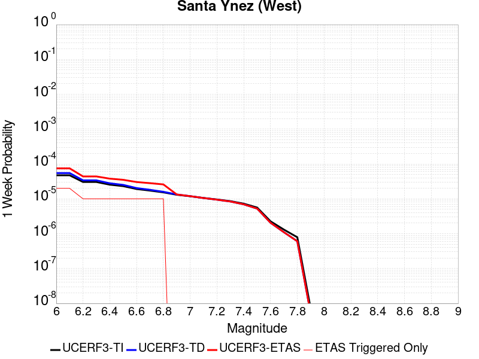 | 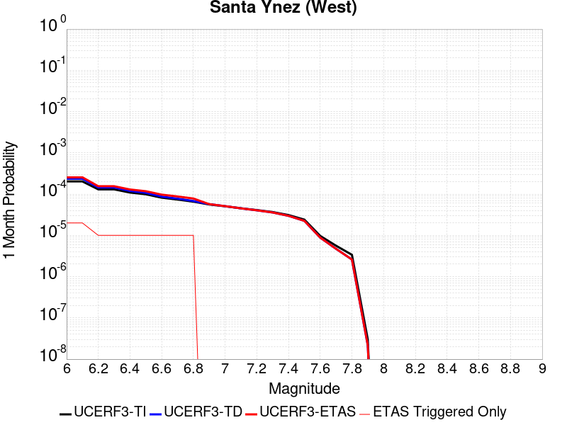 | 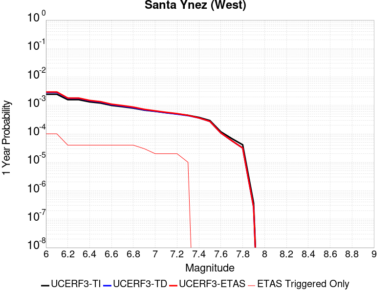 | 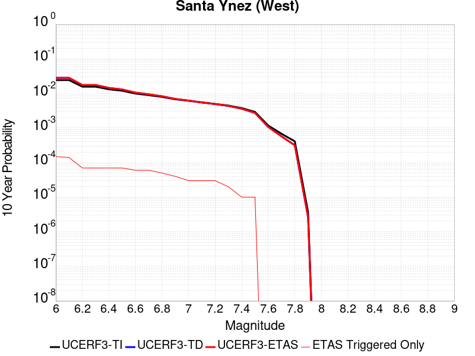 |

| Magnitude | 1 wk TI Prob | 1 wk TD Prob | 1 wk ETAS Prob | 1 wk ETAS/TD Gain | 1 wk ETAS Triggered Only | 1 mo TI Prob | 1 mo TD Prob | 1 mo ETAS Prob | 1 mo ETAS/TD Gain | 1 mo ETAS Triggered Only | 1 yr TI Prob | 1 yr TD Prob | 1 yr ETAS Prob | 1 yr ETAS/TD Gain | 1 yr ETAS Triggered Only | 10 yr TI Prob | 10 yr TD Prob | 10 yr ETAS Prob | 10 yr ETAS/TD Gain | 10 yr ETAS Triggered Only |
|-----|-----|-----|-----|-----|-----|-----|-----|-----|-----|-----|-----|-----|-----|-----|-----|-----|-----|-----|-----|-----|
| 6.0 | 4.7352758E-5 | 5.497349E-5 | 7.497239E-5 | 1.3637917 | 2.0E-5 | 2.0292461E-4 | 2.3558107E-4 | 2.5557636E-4 | 1.0848764 | 2.0E-5 | 0.0024678076 | 0.0028645964 | 0.0029643099 | 1.0348089 | 1.0E-4 | 0.024405818 | 0.028305095 | 0.02845085 | 1.0051494 | 1.5E-4 |
| 6.1 | 4.7352758E-5 | 5.497349E-5 | 7.497239E-5 | 1.3637917 | 2.0E-5 | 2.0292461E-4 | 2.3558107E-4 | 2.5557636E-4 | 1.0848764 | 2.0E-5 | 0.0024678076 | 0.0028645964 | 0.0029643099 | 1.0348089 | 1.0E-4 | 0.024405818 | 0.028305095 | 0.028441133 | 1.0048062 | 1.4E-4 |
| 6.2 | 3.0415853E-5 | 3.3925786E-5 | 4.3925444E-5 | 1.294751 | 1.0E-5 | 1.3034715E-4 | 1.4538833E-4 | 1.5538688E-4 | 1.0687714 | 1.0E-5 | 0.0015858212 | 0.0017687011 | 0.0018086303 | 1.0225755 | 4.0E-5 | 0.015745522 | 0.01755015 | 0.017618923 | 1.0039185 | 7.0E-5 |
| 6.3 | 3.0415853E-5 | 3.3925786E-5 | 4.3925444E-5 | 1.294751 | 1.0E-5 | 1.3034715E-4 | 1.4538833E-4 | 1.5538688E-4 | 1.0687714 | 1.0E-5 | 0.0015858212 | 0.0017687011 | 0.0018086303 | 1.0225755 | 4.0E-5 | 0.015745522 | 0.01755015 | 0.017618923 | 1.0039185 | 7.0E-5 |
| 6.4 | 2.5452082E-5 | 2.7912925E-5 | 3.7912647E-5 | 1.3582469 | 1.0E-5 | 1.09075794E-4 | 1.1962145E-4 | 1.2962025E-4 | 1.083587 | 1.0E-5 | 0.0013271887 | 0.001455435 | 0.0014953767 | 1.0274432 | 4.0E-5 | 0.013192902 | 0.014461209 | 0.014530197 | 1.0047705 | 7.0E-5 |
| 6.5 | 2.3143784E-5 | 2.5128682E-5 | 3.5128433E-5 | 1.3979416 | 1.0E-5 | 9.9183875E-5 | 1.0768999E-4 | 1.1768891E-4 | 1.0928491 | 1.0E-5 | 0.0012068948 | 0.0013103489 | 0.0013502964 | 1.0304862 | 4.0E-5 | 0.012003611 | 0.013027899 | 0.013096987 | 1.005303 | 7.0E-5 |
| 6.6 | 1.9118515E-5 | 2.0354646E-5 | 3.0354444E-5 | 1.4912783 | 1.0E-5 | 8.193392E-5 | 8.723133E-5 | 9.7230455E-5 | 1.1146277 | 1.0E-5 | 9.97089E-4 | 0.001061532 | 0.0011014895 | 1.0376414 | 4.0E-5 | 0.00992627 | 0.010565523 | 0.010624889 | 1.0056188 | 6.0E-5 |
| 6.7 | 1.722807E-5 | 1.8146604E-5 | 2.8146424E-5 | 1.5510573 | 1.0E-5 | 7.3832496E-5 | 7.776888E-5 | 8.7768094E-5 | 1.1285762 | 1.0E-5 | 8.985399E-4 | 9.464303E-4 | 9.863925E-4 | 1.042224 | 4.0E-5 | 0.008949154 | 0.009424643 | 0.009484078 | 1.0063063 | 6.0E-5 |
| 6.8 | 1.5317364E-5 | 1.5926695E-5 | 2.5926534E-5 | 1.6278666 | 1.0E-5 | 6.56442E-5 | 6.82555E-5 | 7.8254816E-5 | 1.1464983 | 1.0E-5 | 7.98925E-4 | 8.306982E-4 | 8.7066495E-4 | 1.0481123 | 4.0E-5 | 0.007960589 | 0.008276418 | 0.008326004 | 1.0059912 | 5.0E-5 |
| 6.9 | 1.3071226E-5 | 1.3329779E-5 | 1.3329779E-5 | 1.0 | 0.0 | 5.6018336E-5 | 5.7126388E-5 | 5.7126388E-5 | 1.0 | 0.0 | 6.8180985E-4 | 6.9529406E-4 | 7.252732E-4 | 1.0431172 | 3.0E-5 | 0.0067972173 | 0.0069314474 | 0.00697117 | 1.0057307 | 4.0E-5 |
| 7.0 | 1.1836986E-5 | 1.19329125E-5 | 1.19329125E-5 | 1.0 | 0.0 | 5.0728955E-5 | 5.1140058E-5 | 5.1140058E-5 | 1.0 | 0.0 | 6.1745E-4 | 6.2245404E-4 | 6.4244156E-4 | 1.0321109 | 2.0E-5 | 0.006157372 | 0.006207299 | 0.0062371125 | 1.0048031 | 3.0E-5 |
| 7.1 | 1.0597169E-5 | 1.0542309E-5 | 1.0542309E-5 | 1.0 | 0.0 | 4.541565E-5 | 4.5180546E-5 | 4.5180546E-5 | 1.0 | 0.0 | 5.5279525E-4 | 5.4993544E-4 | 5.699245E-4 | 1.0363479 | 2.0E-5 | 0.0055142213 | 0.005485877 | 0.0055157123 | 1.0054386 | 3.0E-5 |
| 7.2 | 9.59113E-6 | 9.459241E-6 | 9.459241E-6 | 1.0 | 0.0 | 4.11042E-5 | 4.053898E-5 | 4.053898E-5 | 1.0 | 0.0 | 5.0032866E-4 | 4.9345137E-4 | 5.134415E-4 | 1.0405109 | 2.0E-5 | 0.004992037 | 0.0049236757 | 0.004953528 | 1.006063 | 3.0E-5 |
| 7.3 | 8.586084E-6 | 8.379669E-6 | 8.379669E-6 | 1.0 | 0.0 | 3.679698E-5 | 3.591238E-5 | 3.591238E-5 | 1.0 | 0.0 | 4.4791115E-4 | 4.3714655E-4 | 4.4714217E-4 | 1.0228657 | 1.0E-5 | 0.004470094 | 0.0043629776 | 0.00438289 | 1.004564 | 2.0E-5 |
| 7.4 | 7.2622997E-6 | 6.951613E-6 | 6.951613E-6 | 1.0 | 0.0 | 3.112377E-5 | 2.9792294E-5 | 2.9792294E-5 | 1.0 | 0.0 | 3.78866E-4 | 3.6266178E-4 | 3.6266178E-4 | 1.0 | 0.0 | 0.0037822074 | 0.0036207996 | 0.0036307634 | 1.0027518 | 1.0E-5 |
| 7.5 | 5.627296E-6 | 5.251639E-6 | 5.251639E-6 | 1.0 | 0.0 | 2.411676E-5 | 2.2506834E-5 | 2.2506834E-5 | 1.0 | 0.0 | 2.9358198E-4 | 2.7398695E-4 | 2.7398695E-4 | 1.0 | 0.0 | 0.0029319443 | 0.0027365636 | 0.0027465362 | 1.0036442 | 1.0E-5 |
| 7.6 | 2.265244E-6 | 2.0608784E-6 | 2.0608784E-6 | 1.0 | 0.0 | 9.708152E-6 | 8.832307E-6 | 8.832307E-6 | 1.0 | 0.0 | 1.18190335E-4 | 1.0752812E-4 | 1.0752812E-4 | 1.0 | 0.0 | 0.001181275 | 0.0010747695 | 0.0010747695 | 1.0 | 0.0 |
| 7.7 | 1.3099874E-6 | 1.1016341E-6 | 1.1016341E-6 | 1.0 | 0.0 | 5.61422E-6 | 4.7212807E-6 | 4.7212807E-6 | 1.0 | 0.0 | 6.8350986E-5 | 5.74801E-5 | 5.74801E-5 | 1.0 | 0.0 | 6.832996E-4 | 5.746547E-4 | 5.746547E-4 | 1.0 | 0.0 |
| 7.8 | 7.903951E-7 | 6.071191E-7 | 6.071191E-7 | 1.0 | 0.0 | 3.3874032E-6 | 2.6019363E-6 | 2.6019363E-6 | 1.0 | 0.0 | 4.1240855E-5 | 3.1678126E-5 | 3.1678126E-5 | 1.0 | 0.0 | 4.12332E-4 | 3.1673745E-4 | 3.1673745E-4 | 1.0 | 0.0 |
| 7.9 | 7.0753297E-9 | 5.089978E-9 | 5.089978E-9 | 1.0 | 0.0 | 3.032284E-8 | 2.1814193E-8 | 2.1814193E-8 | 1.0 | 0.0 | 3.6918053E-7 | 2.6558777E-7 | 2.6558777E-7 | 1.0 | 0.0 | 3.691799E-6 | 2.6558755E-6 | 2.6558755E-6 | 1.0 | 0.0 |

## San Jacinto (San Bernardino)
*[(top)](#table-of-contents)*

| 1 Week | 1 Month | 1 Year | 10 Year |
|-----|-----|-----|-----|
| 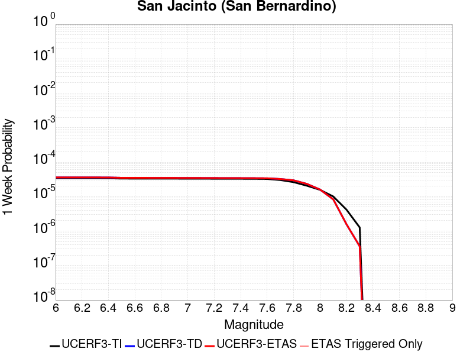 | 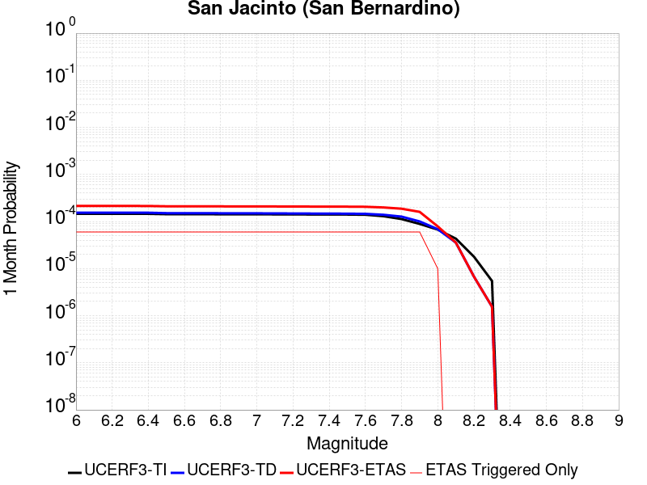 | 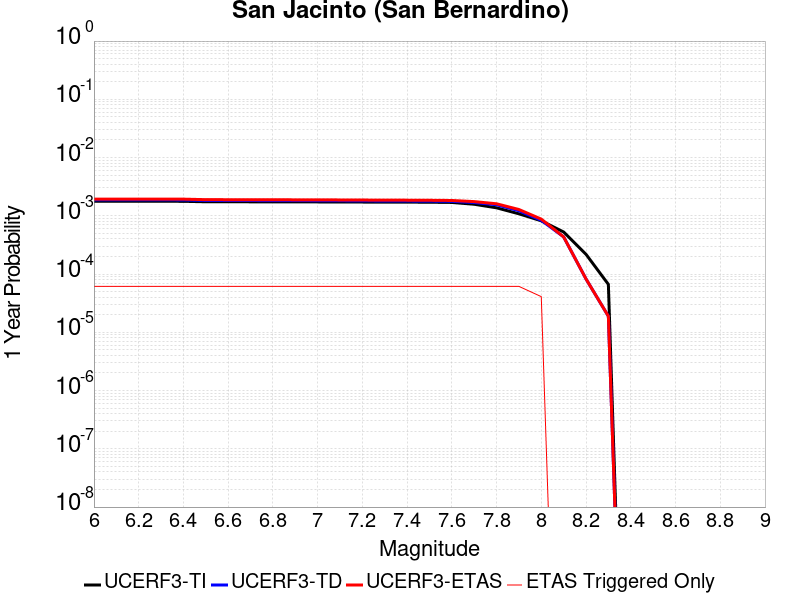 | 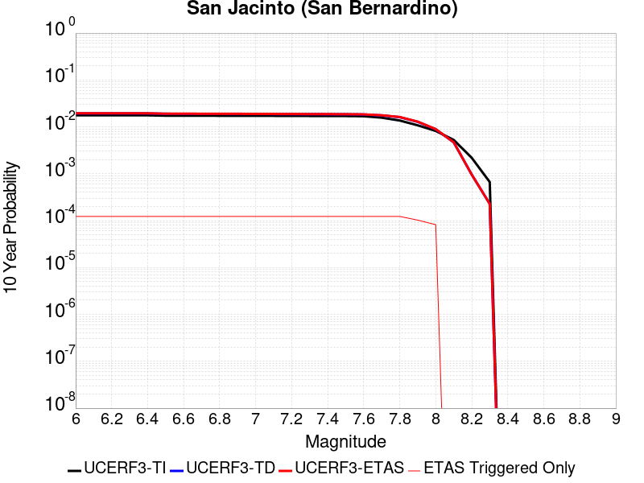 |

| Magnitude | 1 wk TI Prob | 1 wk TD Prob | 1 wk ETAS Prob | 1 wk ETAS/TD Gain | 1 wk ETAS Triggered Only | 1 mo TI Prob | 1 mo TD Prob | 1 mo ETAS Prob | 1 mo ETAS/TD Gain | 1 mo ETAS Triggered Only | 1 yr TI Prob | 1 yr TD Prob | 1 yr ETAS Prob | 1 yr ETAS/TD Gain | 1 yr ETAS Triggered Only | 10 yr TI Prob | 10 yr TD Prob | 10 yr ETAS Prob | 10 yr ETAS/TD Gain | 10 yr ETAS Triggered Only |
|-----|-----|-----|-----|-----|-----|-----|-----|-----|-----|-----|-----|-----|-----|-----|-----|-----|-----|-----|-----|-----|
| 6.0 | 3.409352E-5 | 3.600249E-5 | 5.6001772E-5 | 1.5554972 | 2.0E-5 | 1.461069E-4 | 1.5428728E-4 | 2.1427801E-4 | 1.3888249 | 6.0E-5 | 0.0017774 | 0.001876831 | 0.002006587 | 1.0691357 | 1.3E-4 | 0.01763251 | 0.019358097 | 0.019534614 | 1.0091184 | 1.8E-4 |
| 6.1 | 3.409352E-5 | 3.600249E-5 | 5.6001772E-5 | 1.5554972 | 2.0E-5 | 1.461069E-4 | 1.5428728E-4 | 2.1427801E-4 | 1.3888249 | 6.0E-5 | 0.0017774 | 0.001876831 | 0.002006587 | 1.0691357 | 1.3E-4 | 0.01763251 | 0.019358097 | 0.019534614 | 1.0091184 | 1.8E-4 |
| 6.2 | 3.409352E-5 | 3.600249E-5 | 5.6001772E-5 | 1.5554972 | 2.0E-5 | 1.461069E-4 | 1.5428728E-4 | 2.1427801E-4 | 1.3888249 | 6.0E-5 | 0.0017774 | 0.001876831 | 0.002006587 | 1.0691357 | 1.3E-4 | 0.01763251 | 0.019358097 | 0.019534614 | 1.0091184 | 1.8E-4 |
| 6.3 | 3.409352E-5 | 3.600249E-5 | 5.6001772E-5 | 1.5554972 | 2.0E-5 | 1.461069E-4 | 1.5428728E-4 | 2.1427801E-4 | 1.3888249 | 6.0E-5 | 0.0017774 | 0.001876831 | 0.002006587 | 1.0691357 | 1.3E-4 | 0.01763251 | 0.019358097 | 0.019534614 | 1.0091184 | 1.8E-4 |
| 6.4 | 3.400795E-5 | 3.589515E-5 | 5.589443E-5 | 1.5571584 | 2.0E-5 | 1.4574021E-4 | 1.5382729E-4 | 2.1381807E-4 | 1.3899878 | 6.0E-5 | 0.0017729428 | 0.0018712406 | 0.0020009973 | 1.0693426 | 1.3E-4 | 0.017588645 | 0.019303178 | 0.019479703 | 1.0091449 | 1.8E-4 |
| 6.5 | 3.341482E-5 | 3.5155765E-5 | 5.5155062E-5 | 1.5688767 | 2.0E-5 | 1.4319851E-4 | 1.5065886E-4 | 2.1064983E-4 | 1.3981907 | 6.0E-5 | 0.0017420477 | 0.0018327299 | 0.0019624915 | 1.0708025 | 1.3E-4 | 0.017284546 | 0.018924711 | 0.019101305 | 1.0093313 | 1.8E-4 |
| 6.6 | 3.3364955E-5 | 3.509298E-5 | 5.5092278E-5 | 1.5698946 | 2.0E-5 | 1.4298483E-4 | 1.5038982E-4 | 2.1038081E-4 | 1.3989031 | 6.0E-5 | 0.0017394501 | 0.0018294598 | 0.001959222 | 1.0709292 | 1.3E-4 | 0.017258976 | 0.018892575 | 0.019069174 | 1.0093476 | 1.8E-4 |
| 6.7 | 3.335922E-5 | 3.5082754E-5 | 5.508205E-5 | 1.5700606 | 2.0E-5 | 1.4296026E-4 | 1.5034601E-4 | 2.1033699E-4 | 1.3990195 | 6.0E-5 | 0.0017391514 | 0.0018289272 | 0.0019586894 | 1.0709499 | 1.3E-4 | 0.017256035 | 0.018887365 | 0.019063966 | 1.0093502 | 1.8E-4 |
| 6.8 | 3.327683E-5 | 3.4976816E-5 | 5.4976117E-5 | 1.5717874 | 2.0E-5 | 1.4260718E-4 | 1.4989203E-4 | 2.0988304E-4 | 1.4002281 | 6.0E-5 | 0.0017348597 | 0.0018234095 | 0.0019531723 | 1.071165 | 1.3E-4 | 0.017213784 | 0.018833136 | 0.019009747 | 1.0093776 | 1.8E-4 |
| 6.9 | 3.3235785E-5 | 3.4917768E-5 | 5.491707E-5 | 1.5727543 | 2.0E-5 | 1.4243131E-4 | 1.49639E-4 | 2.0963003E-4 | 1.400905 | 6.0E-5 | 0.0017327217 | 0.0018203339 | 0.0019500973 | 1.0712855 | 1.3E-4 | 0.017192734 | 0.018803004 | 0.01897962 | 1.009393 | 1.8E-4 |
| 7.0 | 3.3197095E-5 | 3.4857694E-5 | 5.4857E-5 | 1.5737414 | 2.0E-5 | 1.422655E-4 | 1.4938158E-4 | 2.0937262E-4 | 1.401596 | 6.0E-5 | 0.0017307063 | 0.001817205 | 0.0019469687 | 1.0714084 | 1.3E-4 | 0.017172894 | 0.01877238 | 0.018949002 | 1.0094086 | 1.8E-4 |
| 7.1 | 3.3129716E-5 | 3.47379E-5 | 5.4737207E-5 | 1.5757201 | 2.0E-5 | 1.4197677E-4 | 1.4886823E-4 | 2.088593E-4 | 1.402981 | 6.0E-5 | 0.0017271966 | 0.0018109654 | 0.0019407299 | 1.0716549 | 1.3E-4 | 0.017138338 | 0.018711457 | 0.01888809 | 1.0094398 | 1.8E-4 |
| 7.2 | 3.3034008E-5 | 3.4605342E-5 | 5.460465E-5 | 1.5779254 | 2.0E-5 | 1.4156665E-4 | 1.4830018E-4 | 2.0829128E-4 | 1.4045248 | 6.0E-5 | 0.0017222111 | 0.001804061 | 0.0019338264 | 1.0719297 | 1.3E-4 | 0.017089253 | 0.018643849 | 0.018820493 | 1.0094746 | 1.8E-4 |
| 7.3 | 3.2956614E-5 | 3.447309E-5 | 5.4472403E-5 | 1.5801426 | 2.0E-5 | 1.4123498E-4 | 1.4773346E-4 | 2.077246E-4 | 1.4060768 | 6.0E-5 | 0.0017181796 | 0.0017971725 | 0.0019269388 | 1.0722059 | 1.3E-4 | 0.017049557 | 0.018576592 | 0.018753247 | 1.0095096 | 1.8E-4 |
| 7.4 | 3.2915937E-5 | 3.439478E-5 | 5.439409E-5 | 1.5814636 | 2.0E-5 | 1.4106068E-4 | 1.4739788E-4 | 2.0738904E-4 | 1.4070015 | 6.0E-5 | 0.0017160608 | 0.0017930934 | 0.0019228603 | 1.0723704 | 1.3E-4 | 0.017028693 | 0.018536855 | 0.018713517 | 1.0095304 | 1.8E-4 |
| 7.5 | 3.281791E-5 | 3.4259683E-5 | 5.4258995E-5 | 1.5837566 | 2.0E-5 | 1.406406E-4 | 1.4681896E-4 | 2.0681015E-4 | 1.4086065 | 6.0E-5 | 0.0017109542 | 0.0017860567 | 0.0019158245 | 1.072656 | 1.3E-4 | 0.016978411 | 0.018467735 | 0.018644411 | 1.0095668 | 1.8E-4 |
| 7.6 | 3.2521442E-5 | 3.39846E-5 | 5.3983924E-5 | 1.5884818 | 2.0E-5 | 1.3937015E-4 | 1.4564018E-4 | 2.0563144E-4 | 1.4119142 | 6.0E-5 | 0.0016955109 | 0.0017717284 | 0.0019014981 | 1.0732447 | 1.3E-4 | 0.016826328 | 0.01832535 | 0.018502051 | 1.0096425 | 1.8E-4 |
| 7.7 | 3.0287873E-5 | 3.246845E-5 | 5.2467803E-5 | 1.6159625 | 2.0E-5 | 1.297987E-4 | 1.391431E-4 | 1.9913475E-4 | 1.4311508 | 6.0E-5 | 0.0015791537 | 0.001692752 | 0.0018225319 | 1.076668 | 1.3E-4 | 0.01567979 | 0.017536119 | 0.017712964 | 1.0100845 | 1.8E-4 |
| 7.8 | 2.6316151E-5 | 2.9678711E-5 | 4.9678118E-5 | 1.6738636 | 2.0E-5 | 1.1277862E-4 | 1.2718828E-4 | 1.8718066E-4 | 1.4716816 | 6.0E-5 | 0.0013722149 | 0.0015474184 | 0.0016772172 | 1.0838809 | 1.3E-4 | 0.013637724 | 0.016077382 | 0.016254488 | 1.0110159 | 1.8E-4 |
| 7.9 | 2.0761147E-5 | 2.3431265E-5 | 4.3430795E-5 | 1.8535404 | 2.0E-5 | 8.897331E-5 | 1.0041584E-4 | 1.6040982E-4 | 1.5974553 | 6.0E-5 | 0.0010827117 | 0.0012218781 | 0.0013417314 | 1.0980895 | 1.2E-4 | 0.010774517 | 0.012799971 | 0.012948051 | 1.0115688 | 1.5E-4 |
| 8.0 | 1.5738568E-5 | 1.6043394E-5 | 1.6043394E-5 | 1.0 | 0.0 | 6.744926E-5 | 6.8755595E-5 | 7.875491E-5 | 1.1454327 | 1.0E-5 | 8.2088535E-4 | 8.3677855E-4 | 8.767451E-4 | 1.0477624 | 4.0E-5 | 0.008178596 | 0.008871087 | 0.008940467 | 1.0078208 | 7.0E-5 |
| 8.1 | 1.0105832E-5 | 8.336244E-6 | 8.336244E-6 | 1.0 | 0.0 | 4.3309992E-5 | 3.5726272E-5 | 3.5726272E-5 | 1.0 | 0.0 | 5.2717153E-4 | 4.3488108E-4 | 4.4487673E-4 | 1.0229847 | 1.0E-5 | 0.005259227 | 0.00468032 | 0.004690273 | 1.0021266 | 1.0E-5 |
| 8.2 | 4.189207E-6 | 1.5801045E-6 | 1.5801045E-6 | 1.0 | 0.0 | 1.7953622E-5 | 6.771859E-6 | 6.771859E-6 | 1.0 | 0.0 | 2.1856341E-4 | 8.244429E-5 | 8.244429E-5 | 1.0 | 0.0 | 0.0021834858 | 9.575395E-4 | 9.575395E-4 | 1.0 | 0.0 |
| 8.3 | 1.2758221E-6 | 3.6194777E-7 | 3.6194777E-7 | 1.0 | 0.0 | 5.4677976E-6 | 1.5512038E-6 | 1.5512038E-6 | 1.0 | 0.0 | 6.65684E-5 | 1.8885747E-5 | 1.8885747E-5 | 1.0 | 0.0 | 6.6548464E-4 | 2.2777634E-4 | 2.2777634E-4 | 1.0 | 0.0 |

## Mission Ridge-Arroyo Parida-Santa Ana
*[(top)](#table-of-contents)*

| 1 Week | 1 Month | 1 Year | 10 Year |
|-----|-----|-----|-----|
| 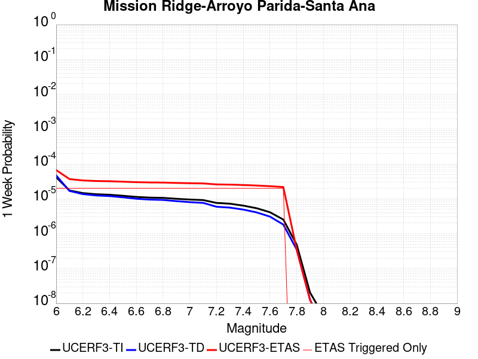 | 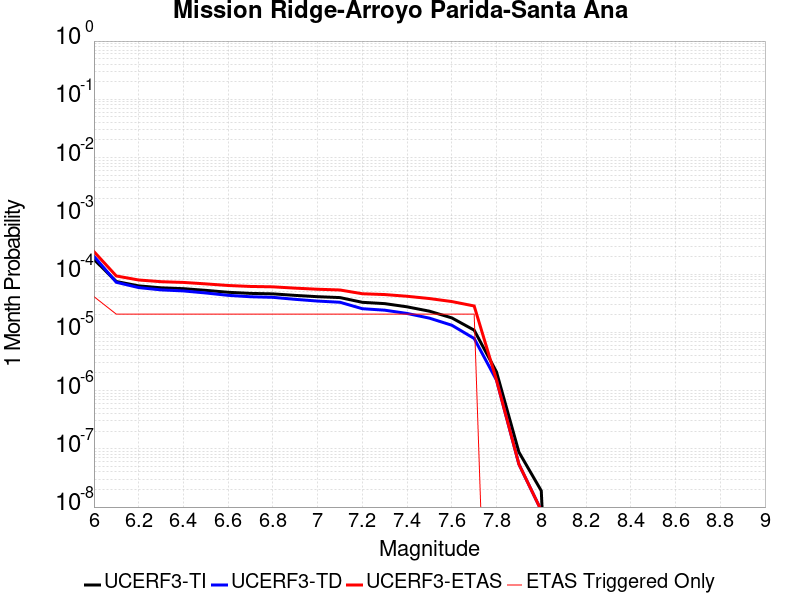 | 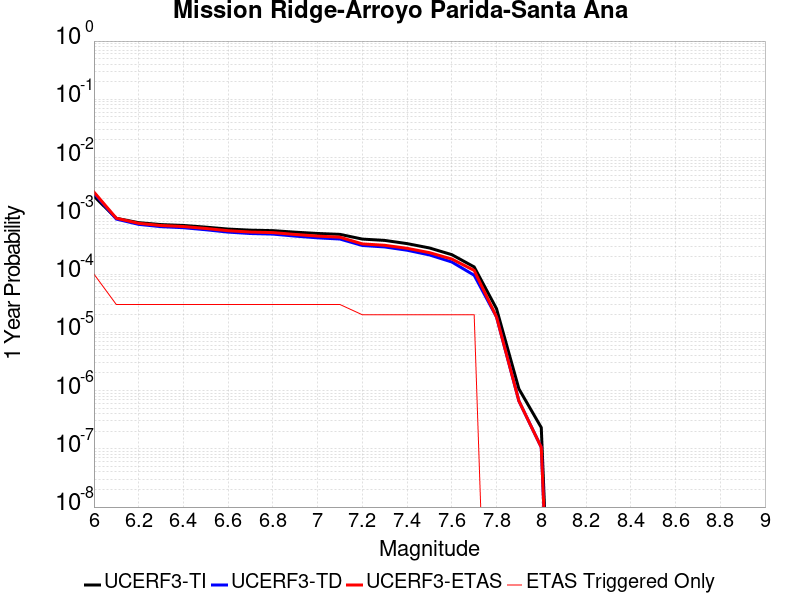 | 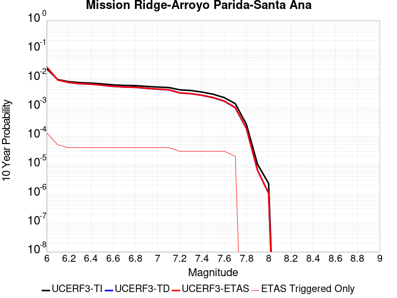 |

| Magnitude | 1 wk TI Prob | 1 wk TD Prob | 1 wk ETAS Prob | 1 wk ETAS/TD Gain | 1 wk ETAS Triggered Only | 1 mo TI Prob | 1 mo TD Prob | 1 mo ETAS Prob | 1 mo ETAS/TD Gain | 1 mo ETAS Triggered Only | 1 yr TI Prob | 1 yr TD Prob | 1 yr ETAS Prob | 1 yr ETAS/TD Gain | 1 yr ETAS Triggered Only | 10 yr TI Prob | 10 yr TD Prob | 10 yr ETAS Prob | 10 yr ETAS/TD Gain | 10 yr ETAS Triggered Only |
|-----|-----|-----|-----|-----|-----|-----|-----|-----|-----|-----|-----|-----|-----|-----|-----|-----|-----|-----|-----|-----|
| 6.0 | 4.169034E-5 | 4.7139558E-5 | 6.7138615E-5 | 1.4242522 | 2.0E-5 | 1.7866064E-4 | 2.0201589E-4 | 2.3200983E-4 | 1.1484731 | 3.0E-5 | 0.0021730233 | 0.0024575135 | 0.0025572677 | 1.0405915 | 1.0E-4 | 0.021518968 | 0.024385266 | 0.024512097 | 1.0052011 | 1.3E-4 |
| 6.1 | 1.73813E-5 | 1.6854512E-5 | 3.6854173E-5 | 2.186606 | 2.0E-5 | 7.4489166E-5 | 7.223168E-5 | 9.223024E-5 | 1.2768668 | 2.0E-5 | 9.065282E-4 | 8.790767E-4 | 9.0905034E-4 | 1.0340967 | 3.0E-5 | 0.009028391 | 0.008757136 | 0.008806698 | 1.0056596 | 5.0E-5 |
| 6.2 | 1.4622182E-5 | 1.367351E-5 | 3.3673237E-5 | 2.4626622 | 2.0E-5 | 6.2664985E-5 | 5.8599464E-5 | 7.859829E-5 | 1.3412801 | 2.0E-5 | 7.6267915E-4 | 7.1321876E-4 | 7.431974E-4 | 1.0420328 | 3.0E-5 | 0.007600669 | 0.007109741 | 0.007149457 | 1.005586 | 4.0E-5 |
| 6.3 | 1.3552434E-5 | 1.2482403E-5 | 3.2482152E-5 | 2.6022356 | 2.0E-5 | 5.8080568E-5 | 5.3494932E-5 | 7.3493866E-5 | 1.3738471 | 2.0E-5 | 7.069015E-4 | 6.511093E-4 | 6.810898E-4 | 1.0460452 | 3.0E-5 | 0.00704657 | 0.0064923796 | 0.00653212 | 1.006121 | 4.0E-5 |
| 6.4 | 1.30977305E-5 | 1.1979351E-5 | 3.197911E-5 | 2.6695194 | 2.0E-5 | 5.613192E-5 | 5.133908E-5 | 7.133806E-5 | 1.3895468 | 2.0E-5 | 6.831918E-4 | 6.2487705E-4 | 6.548583E-4 | 1.0479795 | 3.0E-5 | 0.006810953 | 0.0062315455 | 0.006271296 | 1.006379 | 4.0E-5 |
| 6.5 | 1.225205E-5 | 1.10489855E-5 | 3.1048763E-5 | 2.810101 | 2.0E-5 | 5.2507727E-5 | 4.735195E-5 | 6.735101E-5 | 1.4223491 | 2.0E-5 | 6.3909404E-4 | 5.763602E-4 | 6.063429E-4 | 1.0520208 | 3.0E-5 | 0.006372592 | 0.005748964 | 0.0057887337 | 1.0069178 | 4.0E-5 |
| 6.6 | 1.1352241E-5 | 1.0063705E-5 | 3.0063504E-5 | 2.9873197 | 2.0E-5 | 4.8651553E-5 | 4.3129465E-5 | 6.31286E-5 | 1.4637002 | 2.0E-5 | 5.921717E-4 | 5.249768E-4 | 5.5496104E-4 | 1.0571154 | 3.0E-5 | 0.0059059616 | 0.005237613 | 0.005277403 | 1.0075971 | 4.0E-5 |
| 6.7 | 1.0864116E-5 | 9.517188E-6 | 2.9516998E-5 | 3.101441 | 2.0E-5 | 4.6559664E-5 | 4.0787323E-5 | 6.0786508E-5 | 1.4903284 | 2.0E-5 | 5.667165E-4 | 4.964745E-4 | 5.2645965E-4 | 1.0603961 | 3.0E-5 | 0.005652734 | 0.004953888 | 0.0049936892 | 1.0080345 | 4.0E-5 |
| 6.8 | 1.0666365E-5 | 9.299937E-6 | 2.9299752E-5 | 3.1505322 | 2.0E-5 | 4.571219E-5 | 3.9856277E-5 | 5.985548E-5 | 1.501783 | 2.0E-5 | 5.564038E-4 | 4.8514412E-4 | 5.151296E-4 | 1.0618073 | 3.0E-5 | 0.005550127 | 0.0048410823 | 0.004880889 | 1.0082226 | 4.0E-5 |
| 6.9 | 1.0038665E-5 | 8.592192E-6 | 2.859202E-5 | 3.3276749 | 2.0E-5 | 4.302214E-5 | 3.682317E-5 | 5.6822435E-5 | 1.5431163 | 2.0E-5 | 5.236687E-4 | 4.4823167E-4 | 4.7821822E-4 | 1.0668997 | 3.0E-5 | 0.005224364 | 0.004473487 | 0.004513308 | 1.0089016 | 4.0E-5 |
| 7.0 | 9.5379955E-6 | 8.025209E-6 | 2.8025048E-5 | 3.492127 | 2.0E-5 | 4.0876483E-5 | 3.439331E-5 | 5.439262E-5 | 1.5814885 | 2.0E-5 | 4.975576E-4 | 4.186598E-4 | 4.4864725E-4 | 1.0716273 | 3.0E-5 | 0.00496445 | 0.0041789105 | 0.004218743 | 1.0095319 | 4.0E-5 |
| 7.1 | 9.207389E-6 | 7.652504E-6 | 2.7652351E-5 | 3.6135037 | 2.0E-5 | 3.945964E-5 | 3.2796044E-5 | 5.2795385E-5 | 1.6098096 | 2.0E-5 | 4.803152E-4 | 3.9922036E-4 | 4.292084E-4 | 1.0751165 | 3.0E-5 | 0.004792784 | 0.003985228 | 0.0040250686 | 1.009997 | 4.0E-5 |
| 7.2 | 7.638091E-6 | 5.93121E-6 | 2.5931091E-5 | 4.371973 | 2.0E-5 | 3.2734264E-5 | 2.5419227E-5 | 4.5418717E-5 | 1.786786 | 2.0E-5 | 3.984668E-4 | 3.0943545E-4 | 3.2942925E-4 | 1.0646138 | 2.0E-5 | 0.0039775306 | 0.0030901027 | 0.00312001 | 1.0096784 | 3.0E-5 |
| 7.3 | 7.2500147E-6 | 5.596238E-6 | 2.5596126E-5 | 4.5738096 | 2.0E-5 | 3.1071122E-5 | 2.3983659E-5 | 4.398318E-5 | 1.8338811 | 2.0E-5 | 3.7822526E-4 | 2.919622E-4 | 3.119564E-4 | 1.068482 | 2.0E-5 | 0.0037758215 | 0.002915842 | 0.0029457544 | 1.0102587 | 3.0E-5 |
| 7.4 | 6.3899715E-6 | 4.918567E-6 | 2.4918469E-5 | 5.066205 | 2.0E-5 | 2.7385306E-5 | 2.1079404E-5 | 4.1078983E-5 | 1.9487735 | 2.0E-5 | 3.3336508E-4 | 2.566117E-4 | 2.766066E-4 | 1.0779188 | 2.0E-5 | 0.0033286542 | 0.0025631986 | 0.0025931217 | 1.0116742 | 3.0E-5 |
| 7.5 | 5.379025E-6 | 4.083909E-6 | 2.4083827E-5 | 5.8972487 | 2.0E-5 | 2.305276E-5 | 1.750235E-5 | 3.7502E-5 | 2.1426837 | 2.0E-5 | 2.806312E-4 | 2.1307038E-4 | 2.3306612E-4 | 1.0938457 | 2.0E-5 | 0.0028027708 | 0.0021286723 | 0.0021586083 | 1.0140632 | 3.0E-5 |
| 7.6 | 4.1270696E-6 | 3.0883848E-6 | 2.3088323E-5 | 7.475857 | 2.0E-5 | 1.768732E-5 | 1.3235868E-5 | 3.3235603E-5 | 2.5110257 | 2.0E-5 | 2.1532185E-4 | 1.6113486E-4 | 1.8113163E-4 | 1.1240996 | 2.0E-5 | 0.0021511333 | 0.0016101883 | 0.00164014 | 1.0186014 | 3.0E-5 |
| 7.7 | 2.5406805E-6 | 1.8282261E-6 | 2.182819E-5 | 11.939547 | 2.0E-5 | 1.0888585E-5 | 7.835231E-6 | 2.7835074E-5 | 3.552553 | 2.0E-5 | 1.3256045E-4 | 9.538983E-5 | 1.1538792E-4 | 1.209646 | 2.0E-5 | 0.0013248142 | 9.53495E-4 | 9.734759E-4 | 1.0209554 | 2.0E-5 |
| 7.8 | 4.8608285E-7 | 3.5099296E-7 | 3.5099296E-7 | 1.0 | 0.0 | 2.0832106E-6 | 1.5042547E-6 | 1.5042547E-6 | 1.0 | 0.0 | 2.5362791E-5 | 1.8314147E-5 | 1.8314147E-5 | 1.0 | 0.0 | 2.5359896E-4 | 1.8312651E-4 | 1.8312651E-4 | 1.0 | 0.0 |
| 7.9 | 2.0472514E-8 | 1.2689093E-8 | 1.2689093E-8 | 1.0 | 0.0 | 8.7739345E-8 | 5.438183E-8 | 5.438183E-8 | 1.0 | 0.0 | 1.068226E-6 | 6.6209856E-7 | 6.6209856E-7 | 1.0 | 0.0 | 1.0682209E-5 | 6.620967E-6 | 6.620967E-6 | 1.0 | 0.0 |
| 8.0 | 4.443582E-9 | 2.0322608E-9 | 2.0322608E-9 | 1.0 | 0.0 | 1.9043922E-8 | 8.709689E-9 | 8.709689E-9 | 1.0 | 0.0 | 2.3185973E-7 | 1.0604046E-7 | 1.0604046E-7 | 1.0 | 0.0 | 2.3185949E-6 | 1.0604042E-6 | 1.0604042E-6 | 1.0 | 0.0 |

## Death Valley (Fish Lake Valley)
*[(top)](#table-of-contents)*

| 1 Week | 1 Month | 1 Year | 10 Year |
|-----|-----|-----|-----|
| 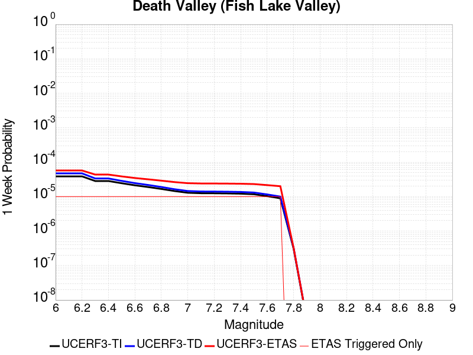 | 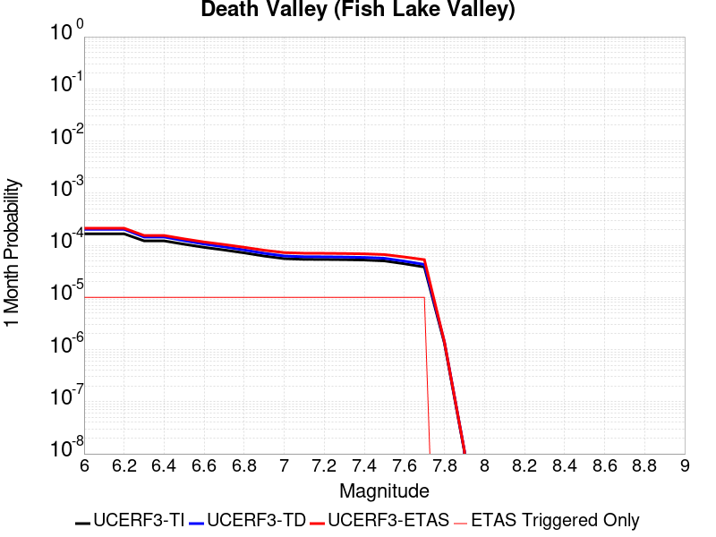 | 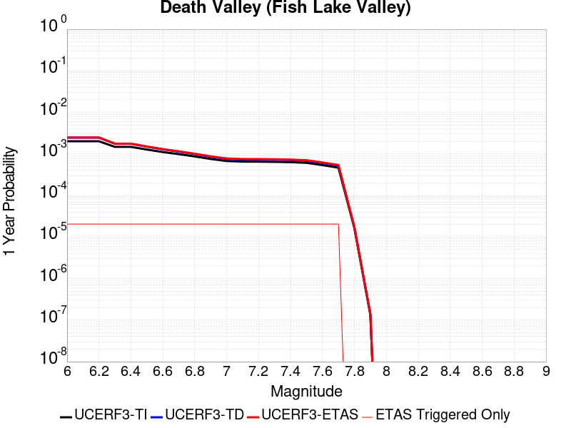 | 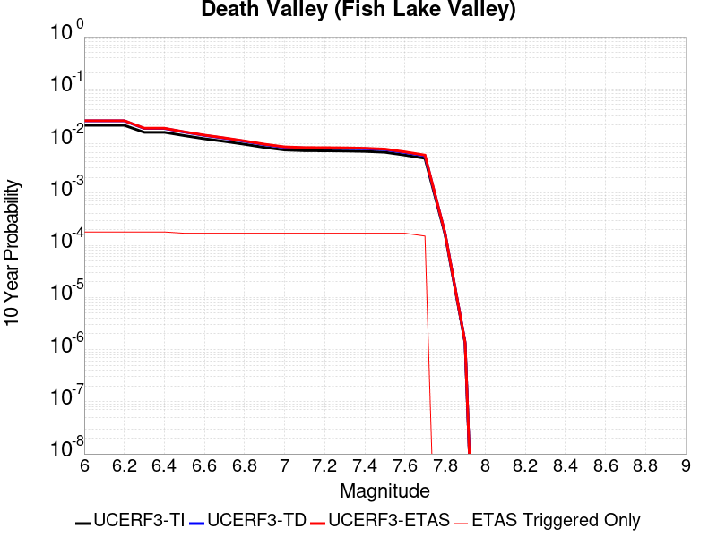 |

| Magnitude | 1 wk TI Prob | 1 wk TD Prob | 1 wk ETAS Prob | 1 wk ETAS/TD Gain | 1 wk ETAS Triggered Only | 1 mo TI Prob | 1 mo TD Prob | 1 mo ETAS Prob | 1 mo ETAS/TD Gain | 1 mo ETAS Triggered Only | 1 yr TI Prob | 1 yr TD Prob | 1 yr ETAS Prob | 1 yr ETAS/TD Gain | 1 yr ETAS Triggered Only | 10 yr TI Prob | 10 yr TD Prob | 10 yr ETAS Prob | 10 yr ETAS/TD Gain | 10 yr ETAS Triggered Only |
|-----|-----|-----|-----|-----|-----|-----|-----|-----|-----|-----|-----|-----|-----|-----|-----|-----|-----|-----|-----|-----|
| 6.0 | 3.872328E-5 | 4.7268895E-5 | 5.7268422E-5 | 1.2115456 | 1.0E-5 | 1.6594635E-4 | 2.0256694E-4 | 2.1256492E-4 | 1.0493563 | 1.0E-5 | 0.0020185246 | 0.0024636039 | 0.0025334314 | 1.0283437 | 7.0E-5 | 0.02000288 | 0.024388881 | 0.024564492 | 1.0072004 | 1.8E-4 |
| 6.1 | 3.872328E-5 | 4.7268895E-5 | 5.7268422E-5 | 1.2115456 | 1.0E-5 | 1.6594635E-4 | 2.0256694E-4 | 2.1256492E-4 | 1.0493563 | 1.0E-5 | 0.0020185246 | 0.0024636039 | 0.0025334314 | 1.0283437 | 7.0E-5 | 0.02000288 | 0.024388881 | 0.024564492 | 1.0072004 | 1.8E-4 |
| 6.2 | 3.872328E-5 | 4.7268895E-5 | 5.7268422E-5 | 1.2115456 | 1.0E-5 | 1.6594635E-4 | 2.0256694E-4 | 2.1256492E-4 | 1.0493563 | 1.0E-5 | 0.0020185246 | 0.0024636039 | 0.0025334314 | 1.0283437 | 7.0E-5 | 0.02000288 | 0.024388881 | 0.024564492 | 1.0072004 | 1.8E-4 |
| 6.3 | 2.8356371E-5 | 3.3610693E-5 | 4.361036E-5 | 1.2975143 | 1.0E-5 | 1.2152165E-4 | 1.4403832E-4 | 1.5403688E-4 | 1.0694159 | 1.0E-5 | 0.0014785219 | 0.001752335 | 0.0018222124 | 1.0398767 | 7.0E-5 | 0.014687235 | 0.01739221 | 0.01756908 | 1.0101695 | 1.8E-4 |
| 6.4 | 2.8356371E-5 | 3.3610693E-5 | 4.361036E-5 | 1.2975143 | 1.0E-5 | 1.2152165E-4 | 1.4403832E-4 | 1.5403688E-4 | 1.0694159 | 1.0E-5 | 0.0014785219 | 0.001752335 | 0.0018222124 | 1.0398767 | 7.0E-5 | 0.014687235 | 0.01739221 | 0.01756908 | 1.0101695 | 1.8E-4 |
| 6.5 | 2.4448687E-5 | 2.8608209E-5 | 3.8607923E-5 | 1.34954 | 1.0E-5 | 1.0477588E-4 | 1.2260114E-4 | 1.325999E-4 | 1.0815554 | 1.0E-5 | 0.0012748998 | 0.0014916973 | 0.0015516077 | 1.0401627 | 6.0E-5 | 0.012676105 | 0.014821712 | 0.014989193 | 1.0112996 | 1.7E-4 |
| 6.6 | 2.1298161E-5 | 2.4660607E-5 | 3.466036E-5 | 1.405495 | 1.0E-5 | 9.127464E-5 | 1.0568422E-4 | 1.15683164E-4 | 1.0946115 | 1.0E-5 | 0.0011107022 | 0.0012859798 | 0.0013459027 | 1.046597 | 6.0E-5 | 0.011051672 | 0.012788794 | 0.01295662 | 1.0131229 | 1.7E-4 |
| 6.7 | 1.8959729E-5 | 2.178146E-5 | 3.178124E-5 | 1.4590961 | 1.0E-5 | 8.125345E-5 | 9.3345916E-5 | 1.0334499E-4 | 1.1071184 | 1.0E-5 | 9.888117E-4 | 0.0011359196 | 0.0011958515 | 1.0527606 | 6.0E-5 | 0.009844234 | 0.011303794 | 0.011471872 | 1.0148692 | 1.7E-4 |
| 6.8 | 1.6691629E-5 | 1.9018706E-5 | 2.9018516E-5 | 1.5257881 | 1.0E-5 | 7.153359E-5 | 8.150629E-5 | 9.150548E-5 | 1.12268 | 1.0E-5 | 8.7057345E-4 | 9.919042E-4 | 0.0010518447 | 1.0604297 | 6.0E-5 | 0.008671708 | 0.009876527 | 0.010044848 | 1.0170425 | 1.7E-4 |
| 6.9 | 1.450505E-5 | 1.6389824E-5 | 2.638966E-5 | 1.6101247 | 1.0E-5 | 6.216302E-5 | 7.024026E-5 | 8.023956E-5 | 1.1423585 | 1.0E-5 | 7.5657194E-4 | 8.548484E-4 | 9.147971E-4 | 1.0701278 | 6.0E-5 | 0.007540013 | 0.008516532 | 0.008685085 | 1.0197911 | 1.7E-4 |
| 7.0 | 1.2940855E-5 | 1.453821E-5 | 2.4538065E-5 | 1.6878326 | 1.0E-5 | 5.545963E-5 | 6.230516E-5 | 7.230454E-5 | 1.1604904 | 1.0E-5 | 6.750118E-4 | 7.583071E-4 | 8.1826164E-4 | 1.0790637 | 6.0E-5 | 0.006729651 | 0.0075578135 | 0.0077265287 | 1.0223233 | 1.7E-4 |
| 7.1 | 1.2544658E-5 | 1.4078437E-5 | 2.4078296E-5 | 1.7102962 | 1.0E-5 | 5.3761712E-5 | 6.033479E-5 | 7.033419E-5 | 1.1657319 | 1.0E-5 | 6.5435225E-4 | 7.343341E-4 | 7.9429004E-4 | 1.0816467 | 6.0E-5 | 0.006524288 | 0.0073196692 | 0.007488425 | 1.0230551 | 1.7E-4 |
| 7.2 | 1.2489416E-5 | 1.4015902E-5 | 2.4015762E-5 | 1.7134653 | 1.0E-5 | 5.3524967E-5 | 6.00668E-5 | 7.00662E-5 | 1.1664714 | 1.0E-5 | 6.514716E-4 | 7.310735E-4 | 7.9102966E-4 | 1.0820111 | 6.0E-5 | 0.006495651 | 0.007287278 | 0.0074560386 | 1.0231583 | 1.7E-4 |
| 7.3 | 1.2368307E-5 | 1.3880038E-5 | 2.3879898E-5 | 1.7204491 | 1.0E-5 | 5.3005948E-5 | 5.948455E-5 | 6.9483955E-5 | 1.1681008 | 1.0E-5 | 6.451563E-4 | 7.239894E-4 | 7.8394596E-4 | 1.0828141 | 6.0E-5 | 0.0064328653 | 0.0072168987 | 0.0073856716 | 1.0233859 | 1.7E-4 |
| 7.4 | 1.2161707E-5 | 1.3648089E-5 | 2.3647954E-5 | 1.7326933 | 1.0E-5 | 5.212056E-5 | 5.8490532E-5 | 6.848995E-5 | 1.1709578 | 1.0E-5 | 6.3438306E-4 | 7.118952E-4 | 7.7185244E-4 | 1.0842221 | 6.0E-5 | 0.006325751 | 0.0070967353 | 0.007265529 | 1.0237846 | 1.7E-4 |
| 7.5 | 1.1707948E-5 | 1.314573E-5 | 2.3145598E-5 | 1.7606933 | 1.0E-5 | 5.0175953E-5 | 5.6337656E-5 | 6.6337096E-5 | 1.1774912 | 1.0E-5 | 6.10721E-4 | 6.857007E-4 | 7.456595E-4 | 1.0874417 | 6.0E-5 | 0.0060904534 | 0.0068364325 | 0.00700527 | 1.0246968 | 1.7E-4 |
| 7.6 | 1.0319538E-5 | 1.157981E-5 | 2.1579694E-5 | 1.863562 | 1.0E-5 | 4.4225842E-5 | 4.9626844E-5 | 5.9626345E-5 | 1.2014939 | 1.0E-5 | 5.383166E-4 | 6.040445E-4 | 6.6400826E-4 | 1.0992705 | 6.0E-5 | 0.0053701443 | 0.0060245576 | 0.0061935335 | 1.0280478 | 1.7E-4 |
| 7.7 | 8.937764E-6 | 1.0022941E-5 | 2.002284E-5 | 1.9977012 | 1.0E-5 | 3.830414E-5 | 4.295478E-5 | 5.295435E-5 | 1.232793 | 1.0E-5 | 4.6625308E-4 | 5.2285404E-4 | 5.8282266E-4 | 1.1146948 | 6.0E-5 | 0.0046527605 | 0.005216748 | 0.0053659654 | 1.0286036 | 1.5E-4 |
| 7.8 | 3.108007E-7 | 3.2846788E-7 | 3.2846788E-7 | 1.0 | 0.0 | 1.3320023E-6 | 1.4077187E-6 | 1.4077187E-6 | 1.0 | 0.0 | 1.6217007E-5 | 1.7138846E-5 | 1.7138846E-5 | 1.0 | 0.0 | 1.6215823E-4 | 1.713756E-4 | 1.713756E-4 | 1.0 | 0.0 |
| 7.9 | 2.5591178E-9 | 2.6696871E-9 | 2.6696871E-9 | 1.0 | 0.0 | 1.0967647E-8 | 1.1441516E-8 | 1.1441516E-8 | 1.0 | 0.0 | 1.335311E-7 | 1.3930045E-7 | 1.3930045E-7 | 1.0 | 0.0 | 1.3353102E-6 | 1.3930046E-6 | 1.3930046E-6 | 1.0 | 0.0 |

## Elsinore (Glen Ivy) rev
*[(top)](#table-of-contents)*

| 1 Week | 1 Month | 1 Year | 10 Year |
|-----|-----|-----|-----|
| 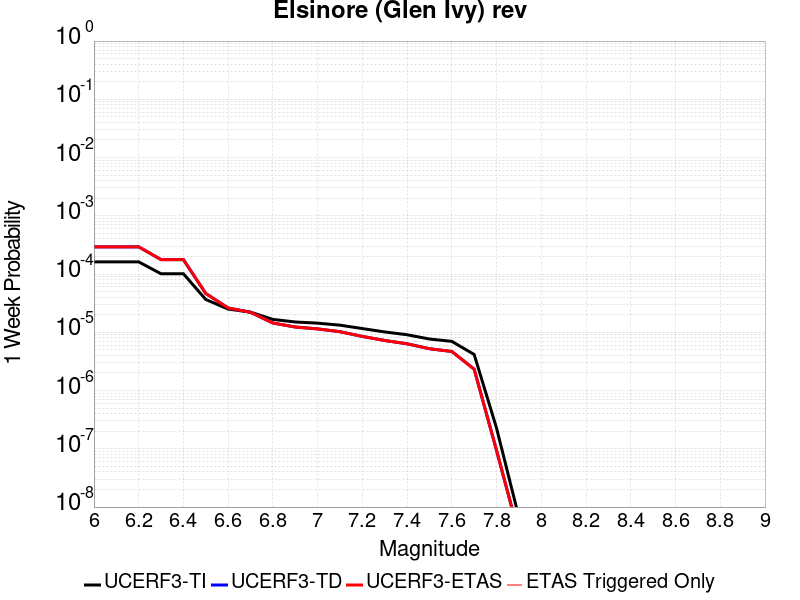 | 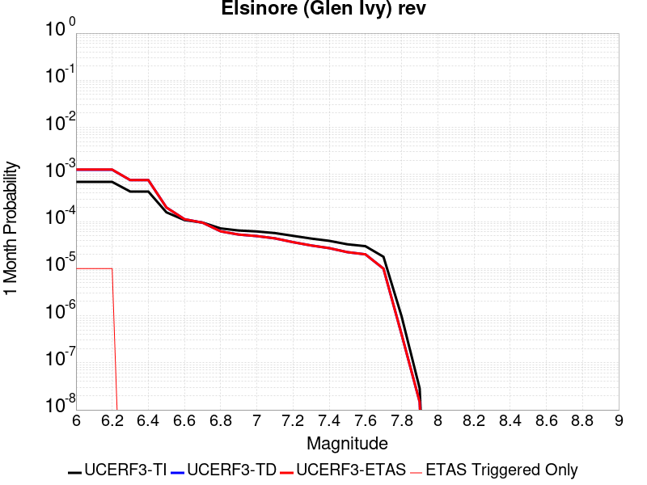 | 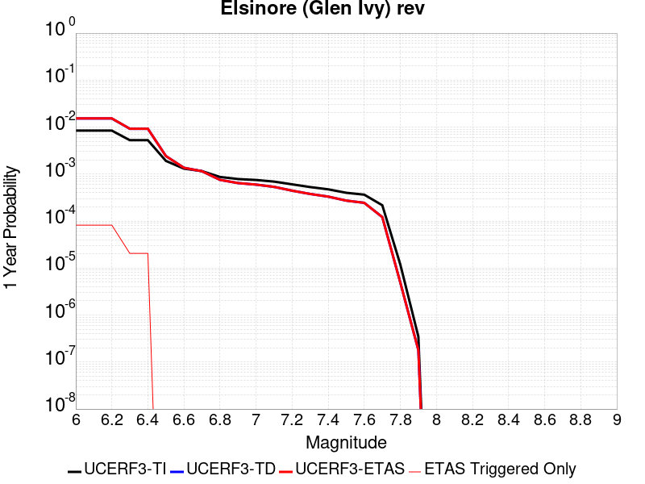 | 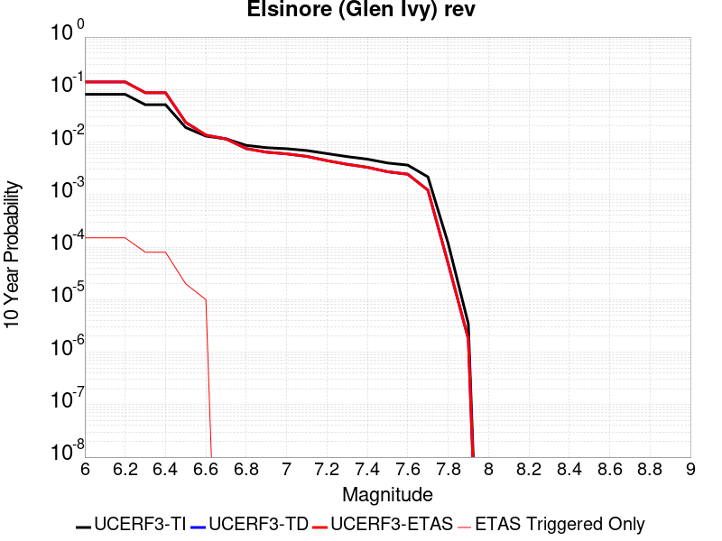 |

| Magnitude | 1 wk TI Prob | 1 wk TD Prob | 1 wk ETAS Prob | 1 wk ETAS/TD Gain | 1 wk ETAS Triggered Only | 1 mo TI Prob | 1 mo TD Prob | 1 mo ETAS Prob | 1 mo ETAS/TD Gain | 1 mo ETAS Triggered Only | 1 yr TI Prob | 1 yr TD Prob | 1 yr ETAS Prob | 1 yr ETAS/TD Gain | 1 yr ETAS Triggered Only | 10 yr TI Prob | 10 yr TD Prob | 10 yr ETAS Prob | 10 yr ETAS/TD Gain | 10 yr ETAS Triggered Only |
|-----|-----|-----|-----|-----|-----|-----|-----|-----|-----|-----|-----|-----|-----|-----|-----|-----|-----|-----|-----|-----|
| 6.0 | 1.6204086E-4 | 2.9362022E-4 | 2.9362022E-4 | 1.0 | 0.0 | 6.94276E-4 | 0.0012579202 | 0.0012679076 | 1.0079396 | 1.0E-5 | 0.008420097 | 0.015235162 | 0.0153336385 | 1.0064638 | 1.0E-4 | 0.081081145 | 0.13969512 | 0.13982417 | 1.0009238 | 1.5E-4 |
| 6.1 | 1.6204086E-4 | 2.9362022E-4 | 2.9362022E-4 | 1.0 | 0.0 | 6.94276E-4 | 0.0012579202 | 0.0012679076 | 1.0079396 | 1.0E-5 | 0.008420097 | 0.015235162 | 0.0153336385 | 1.0064638 | 1.0E-4 | 0.081081145 | 0.13969512 | 0.13982417 | 1.0009238 | 1.5E-4 |
| 6.2 | 1.6204086E-4 | 2.9362022E-4 | 2.9362022E-4 | 1.0 | 0.0 | 6.94276E-4 | 0.0012579202 | 0.0012679076 | 1.0079396 | 1.0E-5 | 0.008420097 | 0.015235162 | 0.0153336385 | 1.0064638 | 1.0E-4 | 0.081081145 | 0.13969512 | 0.13982417 | 1.0009238 | 1.5E-4 |
| 6.3 | 1.0111737E-4 | 1.7703768E-4 | 1.7703768E-4 | 1.0 | 0.0 | 4.332882E-4 | 7.58629E-4 | 7.58629E-4 | 1.0 | 0.0 | 0.005262531 | 0.0092178825 | 0.009267422 | 1.0053742 | 5.0E-5 | 0.0513964 | 0.08702082 | 0.08709386 | 1.0008394 | 8.0E-5 |
| 6.4 | 1.0111737E-4 | 1.7703768E-4 | 1.7703768E-4 | 1.0 | 0.0 | 4.332882E-4 | 7.58629E-4 | 7.58629E-4 | 1.0 | 0.0 | 0.005262531 | 0.0092178825 | 0.009267422 | 1.0053742 | 5.0E-5 | 0.0513964 | 0.08702082 | 0.08709386 | 1.0008394 | 8.0E-5 |
| 6.5 | 3.6624708E-5 | 4.639301E-5 | 4.639301E-5 | 1.0 | 0.0 | 1.569536E-4 | 1.9881407E-4 | 1.9881407E-4 | 1.0 | 0.0 | 0.001909235 | 0.0024182373 | 0.002438189 | 1.0082505 | 2.0E-5 | 0.01892915 | 0.023740914 | 0.023760438 | 1.0008224 | 2.0E-5 |
| 6.6 | 2.5051324E-5 | 2.614908E-5 | 2.614908E-5 | 1.0 | 0.0 | 1.073584E-4 | 1.1206293E-4 | 1.1206293E-4 | 1.0 | 0.0 | 0.0013063047 | 0.0013635567 | 0.0013735432 | 1.0073237 | 1.0E-5 | 0.012986525 | 0.013565315 | 0.013575179 | 1.0007272 | 1.0E-5 |
| 6.7 | 2.2189772E-5 | 2.207403E-5 | 2.207403E-5 | 1.0 | 0.0 | 9.509556E-5 | 9.459976E-5 | 9.459976E-5 | 1.0 | 0.0 | 0.0011571734 | 0.0011511799 | 0.0011511799 | 1.0 | 0.0 | 0.011511663 | 0.011466023 | 0.011466023 | 1.0 | 0.0 |
| 6.8 | 1.6654378E-5 | 1.4438445E-5 | 1.4438445E-5 | 1.0 | 0.0 | 7.137396E-5 | 6.187761E-5 | 6.187761E-5 | 1.0 | 0.0 | 8.686314E-4 | 7.531047E-4 | 7.531047E-4 | 1.0 | 0.0 | 0.008652439 | 0.0075108632 | 0.0075108632 | 1.0 | 0.0 |
| 6.9 | 1.5042909E-5 | 1.23326745E-5 | 1.23326745E-5 | 1.0 | 0.0 | 6.446802E-5 | 5.2853266E-5 | 5.2853266E-5 | 1.0 | 0.0 | 7.8461546E-4 | 6.433017E-4 | 6.433017E-4 | 1.0 | 0.0 | 0.007818509 | 0.006418618 | 0.006418618 | 1.0 | 0.0 |
| 7.0 | 1.4361385E-5 | 1.14519435E-5 | 1.14519435E-5 | 1.0 | 0.0 | 6.154734E-5 | 4.907885E-5 | 4.907885E-5 | 1.0 | 0.0 | 7.490812E-4 | 5.973741E-4 | 5.973741E-4 | 1.0 | 0.0 | 0.007465612 | 0.0059616743 | 0.0059616743 | 1.0 | 0.0 |
| 7.1 | 1.3265571E-5 | 1.0245398E-5 | 1.0245398E-5 | 1.0 | 0.0 | 5.6851208E-5 | 4.3908123E-5 | 4.3908123E-5 | 1.0 | 0.0 | 6.919436E-4 | 5.344528E-4 | 5.344528E-4 | 1.0 | 0.0 | 0.006897931 | 0.0053350315 | 0.0053350315 | 1.0 | 0.0 |
| 7.2 | 1.1596403E-5 | 8.50544E-6 | 8.50544E-6 | 1.0 | 0.0 | 4.9697923E-5 | 3.6451387E-5 | 3.6451387E-5 | 1.0 | 0.0 | 6.049042E-4 | 4.4370696E-4 | 4.4370696E-4 | 1.0 | 0.0 | 0.006032603 | 0.004429626 | 0.004429626 | 1.0 | 0.0 |
| 7.3 | 1.0150827E-5 | 7.23907E-6 | 7.23907E-6 | 1.0 | 0.0 | 4.3502816E-5 | 3.1024225E-5 | 3.1024225E-5 | 1.0 | 0.0 | 5.2951806E-4 | 3.776559E-4 | 3.776559E-4 | 1.0 | 0.0 | 0.005282581 | 0.0037705277 | 0.0037705277 | 1.0 | 0.0 |
| 7.4 | 9.080705E-6 | 6.352785E-6 | 6.352785E-6 | 1.0 | 0.0 | 3.8916725E-5 | 2.7225946E-5 | 2.7225946E-5 | 1.0 | 0.0 | 4.7370812E-4 | 3.3142683E-4 | 3.3142683E-4 | 1.0 | 0.0 | 0.004726996 | 0.0033094764 | 0.0033094764 | 1.0 | 0.0 |
| 7.5 | 7.671649E-6 | 5.2258497E-6 | 5.2258497E-6 | 1.0 | 0.0 | 3.287808E-5 | 2.2396314E-5 | 2.2396314E-5 | 1.0 | 0.0 | 4.0021708E-4 | 2.7264224E-4 | 2.7264224E-4 | 1.0 | 0.0 | 0.0039949706 | 0.0027232026 | 0.0027232026 | 1.0 | 0.0 |
| 7.6 | 6.990086E-6 | 4.687739E-6 | 4.687739E-6 | 1.0 | 0.0 | 2.9957167E-5 | 2.0090161E-5 | 2.0090161E-5 | 1.0 | 0.0 | 3.6466747E-4 | 2.4457145E-4 | 2.4457145E-4 | 1.0 | 0.0 | 0.0036406964 | 0.002443139 | 0.002443139 | 1.0 | 0.0 |
| 7.7 | 4.163505E-6 | 2.3296475E-6 | 2.3296475E-6 | 1.0 | 0.0 | 1.7843471E-5 | 9.984169E-6 | 9.984169E-6 | 1.0 | 0.0 | 2.172226E-4 | 1.21551224E-4 | 1.21551224E-4 | 1.0 | 0.0 | 0.0021701038 | 0.0012149204 | 0.0012149204 | 1.0 | 0.0 |
| 7.8 | 2.2692414E-7 | 9.385943E-8 | 9.385943E-8 | 1.0 | 0.0 | 9.725317E-7 | 4.0225464E-7 | 4.0225464E-7 | 1.0 | 0.0 | 1.1840509E-5 | 4.8974425E-6 | 4.8974425E-6 | 1.0 | 0.0 | 1.1839878E-4 | 4.8973674E-5 | 4.8973674E-5 | 1.0 | 0.0 |
| 7.9 | 6.676829E-9 | 3.4399772E-9 | 3.4399772E-9 | 1.0 | 0.0 | 2.861498E-8 | 1.4742759E-8 | 1.4742759E-8 | 1.0 | 0.0 | 3.4838732E-7 | 1.7949307E-7 | 1.7949307E-7 | 1.0 | 0.0 | 3.4838679E-6 | 1.7949295E-6 | 1.7949295E-6 | 1.0 | 0.0 |

## Calico-Hidalgo
*[(top)](#table-of-contents)*

| 1 Week | 1 Month | 1 Year | 10 Year |
|-----|-----|-----|-----|
| 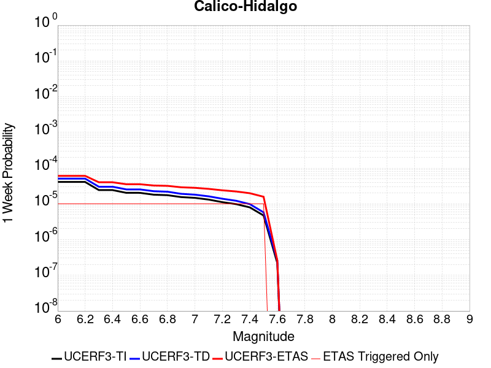 | 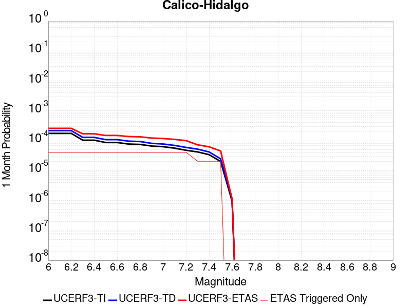 | 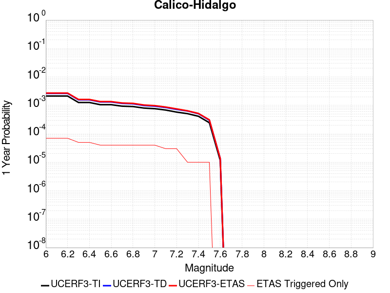 | 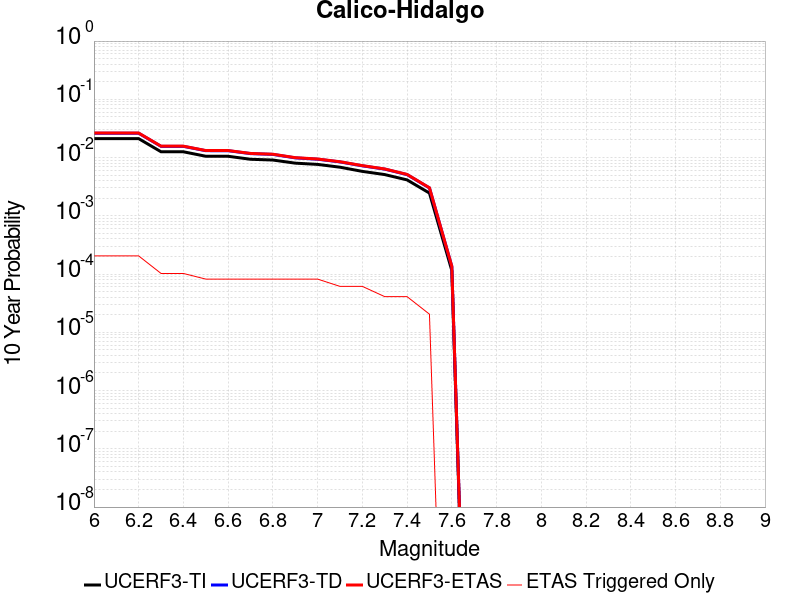 |

| Magnitude | 1 wk TI Prob | 1 wk TD Prob | 1 wk ETAS Prob | 1 wk ETAS/TD Gain | 1 wk ETAS Triggered Only | 1 mo TI Prob | 1 mo TD Prob | 1 mo ETAS Prob | 1 mo ETAS/TD Gain | 1 mo ETAS Triggered Only | 1 yr TI Prob | 1 yr TD Prob | 1 yr ETAS Prob | 1 yr ETAS/TD Gain | 1 yr ETAS Triggered Only | 10 yr TI Prob | 10 yr TD Prob | 10 yr ETAS Prob | 10 yr ETAS/TD Gain | 10 yr ETAS Triggered Only |
|-----|-----|-----|-----|-----|-----|-----|-----|-----|-----|-----|-----|-----|-----|-----|-----|-----|-----|-----|-----|-----|
| 6.0 | 4.0906612E-5 | 5.0704653E-5 | 6.0704144E-5 | 1.1972106 | 1.0E-5 | 1.7530227E-4 | 2.1728984E-4 | 2.372855E-4 | 1.092023 | 2.0E-5 | 0.0021322158 | 0.0026426981 | 0.0027125133 | 1.0264181 | 7.0E-5 | 0.02111873 | 0.026153097 | 0.026299173 | 1.0055854 | 1.5E-4 |
| 6.1 | 4.0906612E-5 | 5.0704653E-5 | 6.0704144E-5 | 1.1972106 | 1.0E-5 | 1.7530227E-4 | 2.1728984E-4 | 2.372855E-4 | 1.092023 | 2.0E-5 | 0.0021322158 | 0.0026426981 | 0.0027125133 | 1.0264181 | 7.0E-5 | 0.02111873 | 0.026153097 | 0.026299173 | 1.0055854 | 1.5E-4 |
| 6.2 | 4.0906612E-5 | 5.0704653E-5 | 6.0704144E-5 | 1.1972106 | 1.0E-5 | 1.7530227E-4 | 2.1728984E-4 | 2.372855E-4 | 1.092023 | 2.0E-5 | 0.0021322158 | 0.0026426981 | 0.0027125133 | 1.0264181 | 7.0E-5 | 0.02111873 | 0.026153097 | 0.026299173 | 1.0055854 | 1.5E-4 |
| 6.3 | 2.4242801E-5 | 3.009103E-5 | 4.009073E-5 | 1.332315 | 1.0E-5 | 1.0389358E-4 | 1.2895538E-4 | 1.489528E-4 | 1.1550725 | 2.0E-5 | 0.0012641704 | 0.001568934 | 0.0016188555 | 1.0318187 | 5.0E-5 | 0.01257003 | 0.015582247 | 0.015651155 | 1.0044223 | 7.0E-5 |
| 6.4 | 2.4242801E-5 | 3.009103E-5 | 4.009073E-5 | 1.332315 | 1.0E-5 | 1.0389358E-4 | 1.2895538E-4 | 1.489528E-4 | 1.1550725 | 2.0E-5 | 0.0012641704 | 0.001568934 | 0.0016188555 | 1.0318187 | 5.0E-5 | 0.01257003 | 0.015582247 | 0.015651155 | 1.0044223 | 7.0E-5 |
| 6.5 | 2.0286952E-5 | 2.5315985E-5 | 3.5315734E-5 | 1.3949974 | 1.0E-5 | 8.694118E-5 | 1.0849266E-4 | 1.284905E-4 | 1.1843243 | 2.0E-5 | 0.0010579949 | 0.0013201149 | 0.0013600622 | 1.0302604 | 4.0E-5 | 0.010529719 | 0.013124665 | 0.013174009 | 1.0037596 | 5.0E-5 |
| 6.6 | 2.0269223E-5 | 2.5296935E-5 | 3.529668E-5 | 1.3952948 | 1.0E-5 | 8.6865206E-5 | 1.08411026E-4 | 1.2840885E-4 | 1.184463 | 2.0E-5 | 0.0010570707 | 0.0013191222 | 0.0013590694 | 1.0302832 | 4.0E-5 | 0.010520565 | 0.013114855 | 0.013164199 | 1.0037625 | 5.0E-5 |
| 6.7 | 1.799852E-5 | 2.25408E-5 | 3.2540574E-5 | 1.44363 | 1.0E-5 | 7.713423E-5 | 9.6599935E-5 | 1.1659801E-4 | 1.2070194 | 2.0E-5 | 9.3870464E-4 | 0.0011754843 | 0.0012154372 | 1.0339885 | 4.0E-5 | 0.009347493 | 0.011694277 | 0.011743692 | 1.0042256 | 5.0E-5 |
| 6.8 | 1.7458793E-5 | 2.1842314E-5 | 3.1842093E-5 | 1.457817 | 1.0E-5 | 7.4821255E-5 | 9.3606635E-5 | 1.13604765E-4 | 1.2136401 | 2.0E-5 | 9.10568E-4 | 0.0011390795 | 0.0011790339 | 1.035076 | 4.0E-5 | 0.009068459 | 0.011333993 | 0.011383426 | 1.0043615 | 5.0E-5 |
| 6.9 | 1.542884E-5 | 1.9026087E-5 | 2.9025896E-5 | 1.5255841 | 1.0E-5 | 6.612192E-5 | 8.1537895E-5 | 1.01536265E-4 | 1.2452648 | 2.0E-5 | 8.04737E-4 | 9.92285E-4 | 0.0010322452 | 1.040271 | 4.0E-5 | 0.008018291 | 0.00987994 | 0.0099294465 | 1.0050107 | 5.0E-5 |
| 7.0 | 1.468253E-5 | 1.8030747E-5 | 2.8030567E-5 | 1.5545982 | 1.0E-5 | 6.292361E-5 | 7.7272416E-5 | 9.7270866E-5 | 1.2588046 | 2.0E-5 | 7.658257E-4 | 9.403986E-4 | 9.80361E-4 | 1.0424951 | 4.0E-5 | 0.0076319184 | 0.009365558 | 0.009415089 | 1.0052887 | 5.0E-5 |
| 7.1 | 1.3139281E-5 | 1.620107E-5 | 2.6200907E-5 | 1.6172332 | 1.0E-5 | 5.6309986E-5 | 6.943138E-5 | 8.942999E-5 | 1.2880342 | 2.0E-5 | 6.853584E-4 | 8.4501173E-4 | 8.749864E-4 | 1.0354725 | 3.0E-5 | 0.0068324856 | 0.008419285 | 0.008458948 | 1.004711 | 4.0E-5 |
| 7.2 | 1.1127404E-5 | 1.3866703E-5 | 2.3866563E-5 | 1.7211419 | 1.0E-5 | 4.7688E-5 | 5.9427435E-5 | 7.9426245E-5 | 1.3365248 | 2.0E-5 | 5.8044674E-4 | 7.2329975E-4 | 7.5327803E-4 | 1.0414466 | 3.0E-5 | 0.0057893298 | 0.0072105634 | 0.007250275 | 1.0055075 | 4.0E-5 |
| 7.3 | 9.808154E-6 | 1.2176301E-5 | 2.217618E-5 | 1.8212575 | 1.0E-5 | 4.2034266E-5 | 5.2183164E-5 | 6.218264E-5 | 1.1916227 | 1.0E-5 | 5.11647E-4 | 6.3515553E-4 | 6.451492E-4 | 1.0157342 | 1.0E-5 | 0.0051047057 | 0.0063344776 | 0.006354351 | 1.0031374 | 2.0E-5 |
| 7.4 | 7.942452E-6 | 9.7922075E-6 | 1.9792109E-5 | 2.0212102 | 1.0E-5 | 3.4038632E-5 | 4.196598E-5 | 5.1965562E-5 | 1.2382783 | 1.0E-5 | 4.1434157E-4 | 5.1082554E-4 | 5.2082044E-4 | 1.0195662 | 1.0E-5 | 0.0041356985 | 0.0050974544 | 0.0051173526 | 1.0039035 | 2.0E-5 |
| 7.5 | 4.7121216E-6 | 5.772871E-6 | 1.5772814E-5 | 2.7322302 | 1.0E-5 | 2.019465E-5 | 2.4740684E-5 | 3.474044E-5 | 1.4041826 | 1.0E-5 | 2.4584212E-4 | 3.0118387E-4 | 3.1118086E-4 | 1.0331923 | 1.0E-5 | 0.0024557032 | 0.0030085093 | 0.003018479 | 1.0033139 | 1.0E-5 |
| 7.6 | 2.21172E-7 | 2.6039737E-7 | 2.6039737E-7 | 1.0 | 0.0 | 9.478797E-7 | 1.1159884E-6 | 1.1159884E-6 | 1.0 | 0.0 | 1.1540374E-5 | 1.3587103E-5 | 1.3587103E-5 | 1.0 | 0.0 | 1.1539775E-4 | 1.3586554E-4 | 1.3586554E-4 | 1.0 | 0.0 |

## San Andreas (Coachella) rev
*[(top)](#table-of-contents)*

| 1 Week | 1 Month | 1 Year | 10 Year |
|-----|-----|-----|-----|
| 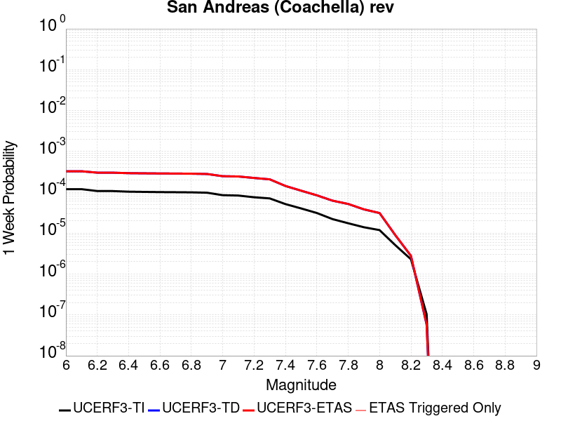 | 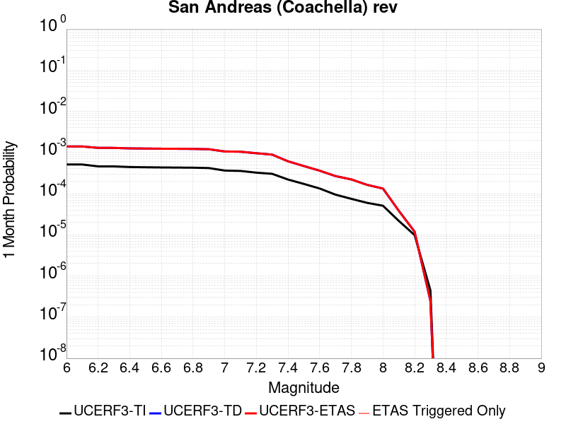 | 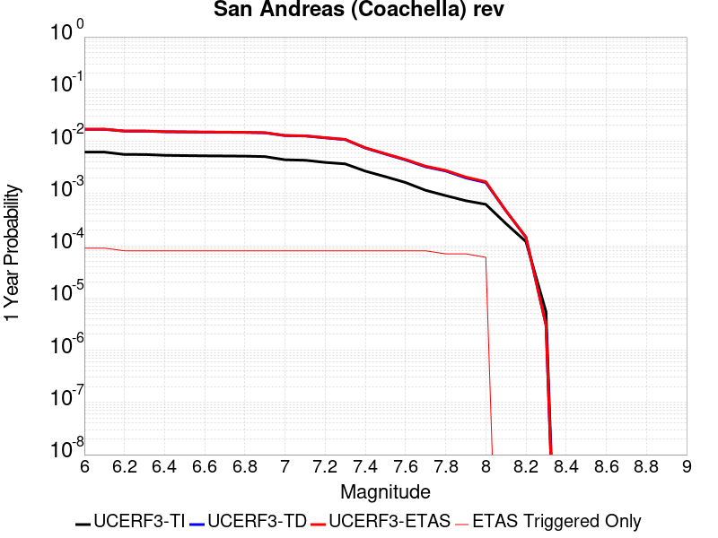 | 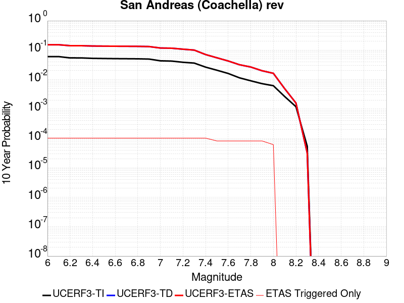 |

| Magnitude | 1 wk TI Prob | 1 wk TD Prob | 1 wk ETAS Prob | 1 wk ETAS/TD Gain | 1 wk ETAS Triggered Only | 1 mo TI Prob | 1 mo TD Prob | 1 mo ETAS Prob | 1 mo ETAS/TD Gain | 1 mo ETAS Triggered Only | 1 yr TI Prob | 1 yr TD Prob | 1 yr ETAS Prob | 1 yr ETAS/TD Gain | 1 yr ETAS Triggered Only | 10 yr TI Prob | 10 yr TD Prob | 10 yr ETAS Prob | 10 yr ETAS/TD Gain | 10 yr ETAS Triggered Only |
|-----|-----|-----|-----|-----|-----|-----|-----|-----|-----|-----|-----|-----|-----|-----|-----|-----|-----|-----|-----|-----|
| 6.0 | 1.1925945E-4 | 3.2733803E-4 | 3.2733803E-4 | 1.0 | 0.0 | 5.110118E-4 | 0.0014021277 | 0.0014021277 | 1.0 | 0.0 | 0.0062038354 | 0.016938623 | 0.017027099 | 1.0052233 | 9.0E-5 | 0.060334753 | 0.15267034 | 0.15278897 | 1.000777 | 1.4E-4 |
| 6.1 | 1.1925945E-4 | 3.2733803E-4 | 3.2733803E-4 | 1.0 | 0.0 | 5.110118E-4 | 0.0014021277 | 0.0014021277 | 1.0 | 0.0 | 0.0062038354 | 0.016938623 | 0.017027099 | 1.0052233 | 9.0E-5 | 0.060334753 | 0.15267034 | 0.15278897 | 1.000777 | 1.4E-4 |
| 6.2 | 1.07432395E-4 | 3.0234526E-4 | 3.0234526E-4 | 1.0 | 0.0 | 4.603433E-4 | 0.0012951259 | 0.0012951259 | 1.0 | 0.0 | 0.005590286 | 0.015655253 | 0.015734002 | 1.0050302 | 8.0E-5 | 0.05451731 | 0.14184146 | 0.14194444 | 1.000726 | 1.2E-4 |
| 6.3 | 1.0718766E-4 | 3.017983E-4 | 3.017983E-4 | 1.0 | 0.0 | 4.592948E-4 | 0.0012927842 | 0.0012927842 | 1.0 | 0.0 | 0.005577586 | 0.015627153 | 0.015705902 | 1.0050393 | 8.0E-5 | 0.054396555 | 0.14160971 | 0.14171273 | 1.0007274 | 1.2E-4 |
| 6.4 | 1.0355944E-4 | 2.9387916E-4 | 2.9387916E-4 | 1.0 | 0.0 | 4.4375064E-4 | 0.0012588782 | 0.0012588782 | 1.0 | 0.0 | 0.0053892885 | 0.015220184 | 0.015298966 | 1.0051762 | 8.0E-5 | 0.052604496 | 0.13816981 | 0.13827324 | 1.0007485 | 1.2E-4 |
| 6.5 | 1.0227914E-4 | 2.910735E-4 | 2.910735E-4 | 1.0 | 0.0 | 4.382655E-4 | 0.0012468654 | 0.0012468654 | 1.0 | 0.0 | 0.0053228354 | 0.015075962 | 0.015154756 | 1.0052265 | 8.0E-5 | 0.051971316 | 0.136949 | 0.13705257 | 1.0007563 | 1.2E-4 |
| 6.6 | 1.0116757E-4 | 2.8873098E-4 | 2.8873098E-4 | 1.0 | 0.0 | 4.3350324E-4 | 0.0012368355 | 0.0012368355 | 1.0 | 0.0 | 0.0052651367 | 0.014955532 | 0.015034335 | 1.0052692 | 8.0E-5 | 0.051421247 | 0.13592719 | 0.13603088 | 1.0007628 | 1.2E-4 |
| 6.7 | 1.0050676E-4 | 2.873166E-4 | 2.873166E-4 | 1.0 | 0.0 | 4.3067214E-4 | 0.0012307797 | 0.0012307797 | 1.0 | 0.0 | 0.005230834 | 0.01488281 | 0.01496162 | 1.0052953 | 8.0E-5 | 0.051094085 | 0.13531192 | 0.13541567 | 1.0007669 | 1.2E-4 |
| 6.8 | 9.976819E-5 | 2.853531E-4 | 2.853531E-4 | 1.0 | 0.0 | 4.2750788E-4 | 0.0012223726 | 0.0012223726 | 1.0 | 0.0 | 0.0051924936 | 0.014781849 | 0.014860667 | 1.005332 | 8.0E-5 | 0.050728295 | 0.13446361 | 0.13456747 | 1.0007725 | 1.2E-4 |
| 6.9 | 9.77719E-5 | 2.8032195E-4 | 2.8032195E-4 | 1.0 | 0.0 | 4.1895514E-4 | 0.0012008306 | 0.0012008306 | 1.0 | 0.0 | 0.0050888555 | 0.014523101 | 0.014601938 | 1.0054284 | 8.0E-5 | 0.049738888 | 0.13229203 | 0.13239616 | 1.0007871 | 1.2E-4 |
| 7.0 | 8.500761E-5 | 2.4766565E-4 | 2.4766565E-4 | 1.0 | 0.0 | 3.6426744E-4 | 0.0010609957 | 0.0010609957 | 1.0 | 0.0 | 0.0044259406 | 0.012841888 | 0.01292086 | 1.0061496 | 8.0E-5 | 0.04338823 | 0.11814933 | 0.11825516 | 1.0008956 | 1.2E-4 |
| 7.1 | 8.319876E-5 | 2.4369264E-4 | 2.4369264E-4 | 1.0 | 0.0 | 3.5651738E-4 | 0.0010439822 | 0.0010439822 | 1.0 | 0.0 | 0.004331963 | 0.012637171 | 0.01271616 | 1.0062505 | 8.0E-5 | 0.042484846 | 0.116369456 | 0.11647549 | 1.0009112 | 1.2E-4 |
| 7.2 | 7.563917E-5 | 2.2417592E-4 | 2.2417592E-4 | 1.0 | 0.0 | 3.2412758E-4 | 9.6040324E-4 | 9.6040324E-4 | 1.0 | 0.0 | 0.0039391145 | 0.0116309095 | 0.011709979 | 1.0067983 | 8.0E-5 | 0.03870018 | 0.10777538 | 0.10788245 | 1.0009934 | 1.2E-4 |
| 7.3 | 7.082985E-5 | 2.073362E-4 | 2.073362E-4 | 1.0 | 0.0 | 3.0352117E-4 | 8.88284E-4 | 8.88284E-4 | 1.0 | 0.0 | 0.0036891096 | 0.010761855 | 0.010840994 | 1.0073537 | 8.0E-5 | 0.03628465 | 0.10029767 | 0.100405626 | 1.0010765 | 1.2E-4 |
| 7.4 | 5.146215E-5 | 1.4276853E-4 | 1.4276853E-4 | 1.0 | 0.0 | 2.2053342E-4 | 6.117225E-4 | 6.117225E-4 | 1.0 | 0.0 | 0.0026816884 | 0.007422478 | 0.007501884 | 1.0106981 | 8.0E-5 | 0.02649557 | 0.07086292 | 0.07097442 | 1.0015734 | 1.2E-4 |
| 7.5 | 4.0285166E-5 | 1.0944253E-4 | 1.0944253E-4 | 1.0 | 0.0 | 1.7263928E-4 | 4.689554E-4 | 4.689554E-4 | 1.0 | 0.0 | 0.002099857 | 0.005694655 | 0.005774199 | 1.0139682 | 8.0E-5 | 0.020801254 | 0.055022955 | 0.055117454 | 1.0017174 | 1.0E-4 |
| 7.6 | 3.1168736E-5 | 8.441267E-5 | 8.441267E-5 | 1.0 | 0.0 | 1.3357346E-4 | 3.6171856E-4 | 3.6171856E-4 | 1.0 | 0.0 | 0.0016250437 | 0.004395057 | 0.0044747056 | 1.0181223 | 8.0E-5 | 0.016132116 | 0.042820677 | 0.042916395 | 1.0022353 | 1.0E-4 |
| 7.7 | 2.2100989E-5 | 6.2408275E-5 | 6.2408275E-5 | 1.0 | 0.0 | 9.4715084E-5 | 2.6743664E-4 | 2.6743664E-4 | 1.0 | 0.0 | 0.001152546 | 0.003251186 | 0.0033309262 | 1.0245264 | 8.0E-5 | 0.011465867 | 0.03190961 | 0.03200642 | 1.0030339 | 1.0E-4 |
| 7.8 | 1.7484861E-5 | 5.1814186E-5 | 5.1814186E-5 | 1.0 | 0.0 | 7.493296E-5 | 2.2204191E-4 | 2.2204191E-4 | 1.0 | 0.0 | 9.1192697E-4 | 0.002700012 | 0.002769823 | 1.0258558 | 7.0E-5 | 0.009081938 | 0.026648527 | 0.02673613 | 1.0032873 | 9.0E-5 |
| 7.9 | 1.3967285E-5 | 3.8237675E-5 | 3.8237675E-5 | 1.0 | 0.0 | 5.985842E-5 | 1.6386545E-4 | 1.6386545E-4 | 1.0 | 0.0 | 7.2853256E-4 | 0.0019932375 | 0.0020630981 | 1.0350487 | 7.0E-5 | 0.0072614877 | 0.019916428 | 0.020004636 | 1.0044289 | 9.0E-5 |
| 8.0 | 1.1887396E-5 | 3.107819E-5 | 3.107819E-5 | 1.0 | 0.0 | 5.094499E-5 | 1.3318544E-4 | 1.3318544E-4 | 1.0 | 0.0 | 6.200787E-4 | 0.0016203277 | 0.0016802305 | 1.0369695 | 6.0E-5 | 0.006183513 | 0.016285317 | 0.016364014 | 1.0048324 | 8.0E-5 |
| 8.1 | 5.100864E-6 | 8.978668E-6 | 8.978668E-6 | 1.0 | 0.0 | 2.1860664E-5 | 3.847944E-5 | 3.847944E-5 | 1.0 | 0.0 | 2.6612106E-4 | 4.6838663E-4 | 4.6838663E-4 | 1.0 | 0.0 | 0.002658026 | 0.004920349 | 0.004920349 | 1.0 | 0.0 |
| 8.2 | 2.3004484E-6 | 2.7885583E-6 | 2.7885583E-6 | 1.0 | 0.0 | 9.859027E-6 | 1.19509095E-5 | 1.19509095E-5 | 1.0 | 0.0 | 1.2002704E-4 | 1.4549264E-4 | 1.4549264E-4 | 1.0 | 0.0 | 0.0011996223 | 0.0015984807 | 0.0015984807 | 1.0 | 0.0 |
| 8.3 | 1.0424446E-7 | 5.8219563E-8 | 5.8219563E-8 | 1.0 | 0.0 | 4.4676187E-7 | 2.495124E-7 | 2.495124E-7 | 1.0 | 0.0 | 5.439312E-6 | 3.0378094E-6 | 3.0378094E-6 | 1.0 | 0.0 | 5.4391792E-5 | 3.193819E-5 | 3.193819E-5 | 1.0 | 0.0 |

## Red Mountain
*[(top)](#table-of-contents)*

| 1 Week | 1 Month | 1 Year | 10 Year |
|-----|-----|-----|-----|
| 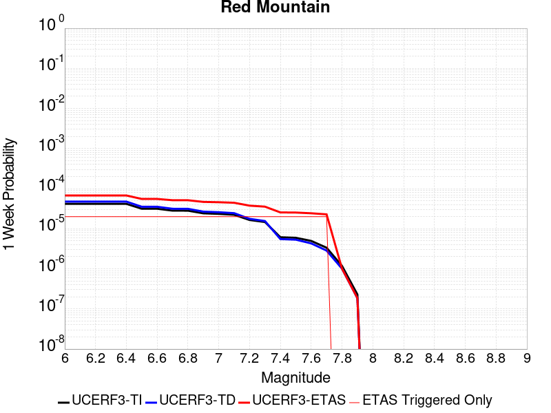 | 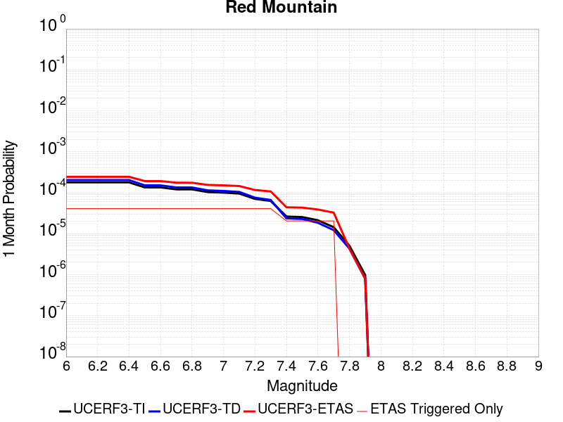 | 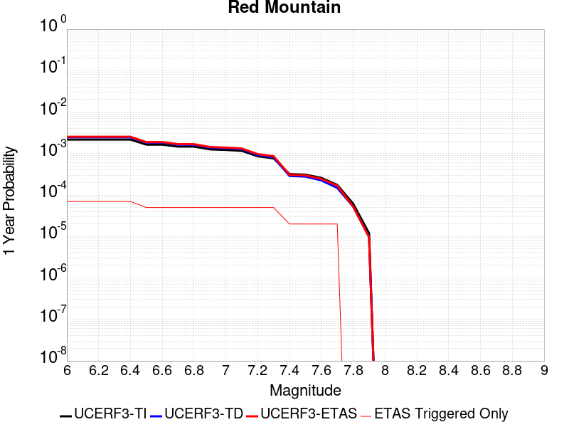 | 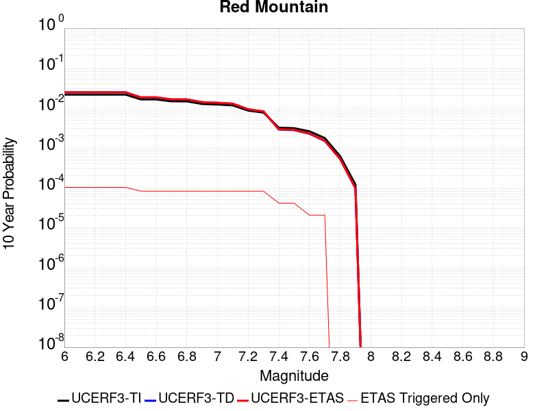 |

| Magnitude | 1 wk TI Prob | 1 wk TD Prob | 1 wk ETAS Prob | 1 wk ETAS/TD Gain | 1 wk ETAS Triggered Only | 1 mo TI Prob | 1 mo TD Prob | 1 mo ETAS Prob | 1 mo ETAS/TD Gain | 1 mo ETAS Triggered Only | 1 yr TI Prob | 1 yr TD Prob | 1 yr ETAS Prob | 1 yr ETAS/TD Gain | 1 yr ETAS Triggered Only | 10 yr TI Prob | 10 yr TD Prob | 10 yr ETAS Prob | 10 yr ETAS/TD Gain | 10 yr ETAS Triggered Only |
|-----|-----|-----|-----|-----|-----|-----|-----|-----|-----|-----|-----|-----|-----|-----|-----|-----|-----|-----|-----|-----|
| 6.0 | 4.1810763E-5 | 4.7591006E-5 | 6.759005E-5 | 1.4202275 | 2.0E-5 | 1.7917668E-4 | 2.0394645E-4 | 2.3394031E-4 | 1.1470674 | 3.0E-5 | 0.0021792934 | 0.0024803858 | 0.0025502122 | 1.0281514 | 7.0E-5 | 0.021580452 | 0.02454463 | 0.024651932 | 1.0043716 | 1.1E-4 |
| 6.1 | 4.1810763E-5 | 4.7591006E-5 | 6.759005E-5 | 1.4202275 | 2.0E-5 | 1.7917668E-4 | 2.0394645E-4 | 2.3394031E-4 | 1.1470674 | 3.0E-5 | 0.0021792934 | 0.0024803858 | 0.0025502122 | 1.0281514 | 7.0E-5 | 0.021580452 | 0.02454463 | 0.024651932 | 1.0043716 | 1.1E-4 |
| 6.2 | 4.1810763E-5 | 4.7591006E-5 | 6.759005E-5 | 1.4202275 | 2.0E-5 | 1.7917668E-4 | 2.0394645E-4 | 2.3394031E-4 | 1.1470674 | 3.0E-5 | 0.0021792934 | 0.0024803858 | 0.0025502122 | 1.0281514 | 7.0E-5 | 0.021580452 | 0.02454463 | 0.024651932 | 1.0043716 | 1.1E-4 |
| 6.3 | 4.1810763E-5 | 4.7591006E-5 | 6.759005E-5 | 1.4202275 | 2.0E-5 | 1.7917668E-4 | 2.0394645E-4 | 2.3394031E-4 | 1.1470674 | 3.0E-5 | 0.0021792934 | 0.0024803858 | 0.0025502122 | 1.0281514 | 7.0E-5 | 0.021580452 | 0.02454463 | 0.024651932 | 1.0043716 | 1.1E-4 |
| 6.4 | 4.1810763E-5 | 4.7591006E-5 | 6.759005E-5 | 1.4202275 | 2.0E-5 | 1.7917668E-4 | 2.0394645E-4 | 2.3394031E-4 | 1.1470674 | 3.0E-5 | 0.0021792934 | 0.0024803858 | 0.0025502122 | 1.0281514 | 7.0E-5 | 0.021580452 | 0.02454463 | 0.024651932 | 1.0043716 | 1.1E-4 |
| 6.5 | 3.154503E-5 | 3.5360477E-5 | 5.5359767E-5 | 1.5655832 | 2.0E-5 | 1.3518598E-4 | 1.5153662E-4 | 1.8153207E-4 | 1.1979419 | 3.0E-5 | 0.0016446467 | 0.0018434891 | 0.001893397 | 1.0270724 | 5.0E-5 | 0.01632528 | 0.018291617 | 0.018370153 | 1.0042936 | 8.0E-5 |
| 6.6 | 3.1535834E-5 | 3.5349858E-5 | 5.534915E-5 | 1.5657531 | 2.0E-5 | 1.3514658E-4 | 1.5149111E-4 | 1.8148657E-4 | 1.1980014 | 3.0E-5 | 0.0016441676 | 0.001842936 | 0.0018928439 | 1.0270807 | 5.0E-5 | 0.01632056 | 0.018286178 | 0.018364714 | 1.0042949 | 8.0E-5 |
| 6.7 | 2.8267326E-5 | 3.146999E-5 | 5.146936E-5 | 1.635506 | 2.0E-5 | 1.2114006E-4 | 1.348649E-4 | 1.6486084E-4 | 1.2224149 | 3.0E-5 | 0.0014738824 | 0.0016408286 | 0.0016907465 | 1.0304224 | 5.0E-5 | 0.014641452 | 0.016295899 | 0.016374595 | 1.0048292 | 8.0E-5 |
| 6.8 | 2.8212884E-5 | 3.1407875E-5 | 5.140725E-5 | 1.636763 | 2.0E-5 | 1.20906756E-4 | 1.3459871E-4 | 1.6459468E-4 | 1.2228547 | 3.0E-5 | 0.0014710457 | 0.0016375926 | 0.0016875108 | 1.0304826 | 5.0E-5 | 0.014613459 | 0.016264014 | 0.016342713 | 1.0048388 | 8.0E-5 |
| 6.9 | 2.4227871E-5 | 2.6707517E-5 | 4.6706984E-5 | 1.7488328 | 2.0E-5 | 1.03829596E-4 | 1.1445619E-4 | 1.4445276E-4 | 1.262079 | 3.0E-5 | 0.0012633923 | 0.0013926893 | 0.0014426196 | 1.0358517 | 5.0E-5 | 0.012562336 | 0.013847304 | 0.013926196 | 1.0056973 | 8.0E-5 |
| 7.0 | 2.348524E-5 | 2.5836282E-5 | 4.5835764E-5 | 1.7740852 | 2.0E-5 | 1.0064714E-4 | 1.1072265E-4 | 1.4071932E-4 | 1.2709173 | 3.0E-5 | 0.0012246901 | 0.0013472902 | 0.0013972229 | 1.0370616 | 5.0E-5 | 0.012179627 | 0.013398857 | 0.0134777855 | 1.0058906 | 8.0E-5 |
| 7.1 | 2.2311642E-5 | 2.4463316E-5 | 4.4462828E-5 | 1.8175306 | 2.0E-5 | 9.561782E-5 | 1.04839E-4 | 1.3483585E-4 | 1.286123 | 3.0E-5 | 0.0011635252 | 0.0012757422 | 0.0013256784 | 1.0391428 | 5.0E-5 | 0.01157452 | 0.012691703 | 0.012770687 | 1.0062233 | 8.0E-5 |
| 7.2 | 1.6533986E-5 | 1.7670676E-5 | 3.767032E-5 | 2.1317985 | 2.0E-5 | 7.085802E-5 | 7.572963E-5 | 1.05727355E-4 | 1.3961161 | 3.0E-5 | 8.623549E-4 | 9.2168164E-4 | 9.7163557E-4 | 1.0541986 | 5.0E-5 | 0.008590161 | 0.009184869 | 0.009254226 | 1.0075512 | 7.0E-5 |
| 7.3 | 1.4703092E-5 | 1.5559806E-5 | 3.5559497E-5 | 2.285343 | 2.0E-5 | 6.301173E-5 | 6.6683526E-5 | 9.668153E-5 | 1.4498562 | 3.0E-5 | 7.668978E-4 | 8.1163115E-4 | 8.615906E-4 | 1.0615543 | 5.0E-5 | 0.0076425658 | 0.008092744 | 0.008162178 | 1.0085797 | 7.0E-5 |
| 7.4 | 6.1331984E-6 | 5.52893E-6 | 2.552882E-5 | 4.6173162 | 2.0E-5 | 2.6284872E-5 | 2.3695204E-5 | 4.369473E-5 | 1.8440326 | 2.0E-5 | 3.199713E-4 | 2.8845144E-4 | 3.0844565E-4 | 1.0693158 | 2.0E-5 | 0.0031951098 | 0.0028808247 | 0.0029207096 | 1.013845 | 4.0E-5 |
| 7.5 | 5.954766E-6 | 5.338558E-6 | 2.5338451E-5 | 4.74631 | 2.0E-5 | 2.5520176E-5 | 2.2879336E-5 | 4.2878877E-5 | 1.8741312 | 2.0E-5 | 3.1066386E-4 | 2.7852083E-4 | 2.9851525E-4 | 1.071788 | 2.0E-5 | 0.003102299 | 0.0027817716 | 0.0028216604 | 1.0143393 | 4.0E-5 |
| 7.6 | 4.9726646E-6 | 4.315341E-6 | 2.4315254E-5 | 5.6346083 | 2.0E-5 | 2.1311245E-5 | 1.8494187E-5 | 3.8493818E-5 | 2.0814009 | 2.0E-5 | 2.5943352E-4 | 2.2514381E-4 | 2.4513932E-4 | 1.0888121 | 2.0E-5 | 0.0025913084 | 0.0022491917 | 0.0022791245 | 1.0133082 | 3.0E-5 |
| 7.7 | 3.3613894E-6 | 2.8526943E-6 | 2.2852637E-5 | 8.010896 | 2.0E-5 | 1.4405875E-5 | 1.2225777E-5 | 3.2225533E-5 | 2.6358678 | 2.0E-5 | 1.7537741E-4 | 1.4883894E-4 | 1.6883596E-4 | 1.1343534 | 2.0E-5 | 0.0017523908 | 0.0014874188 | 0.001507389 | 1.0134261 | 2.0E-5 |
| 7.8 | 1.1828961E-6 | 1.0122844E-6 | 1.0122844E-6 | 1.0 | 0.0 | 5.069545E-6 | 4.338355E-6 | 4.338355E-6 | 1.0 | 0.0 | 6.171996E-5 | 5.281822E-5 | 5.281822E-5 | 1.0 | 0.0 | 6.170282E-4 | 5.280596E-4 | 5.280596E-4 | 1.0 | 0.0 |
| 7.9 | 2.2967266E-7 | 1.8619119E-7 | 1.8619119E-7 | 1.0 | 0.0 | 9.843111E-7 | 7.9796195E-7 | 7.9796195E-7 | 1.0 | 0.0 | 1.19839215E-5 | 9.715147E-6 | 9.715147E-6 | 1.0 | 0.0 | 1.1983275E-4 | 9.714751E-5 | 9.714751E-5 | 1.0 | 0.0 |

## Baker
*[(top)](#table-of-contents)*

| 1 Week | 1 Month | 1 Year | 10 Year |
|-----|-----|-----|-----|
| 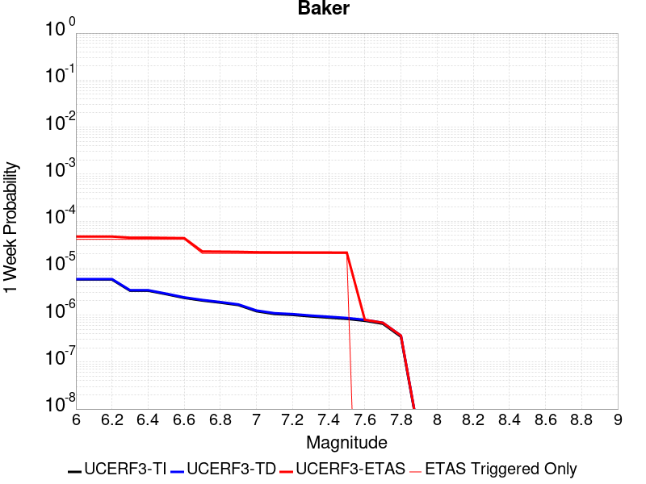 | 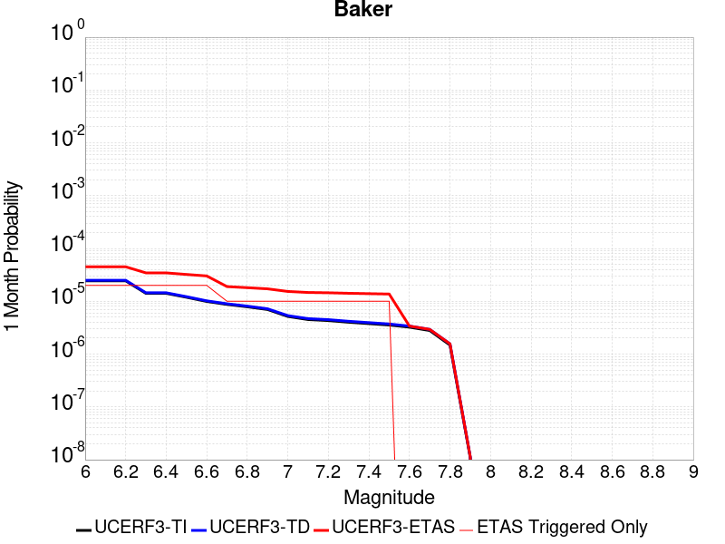 | 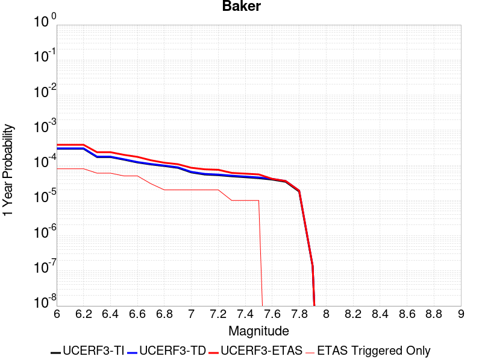 | 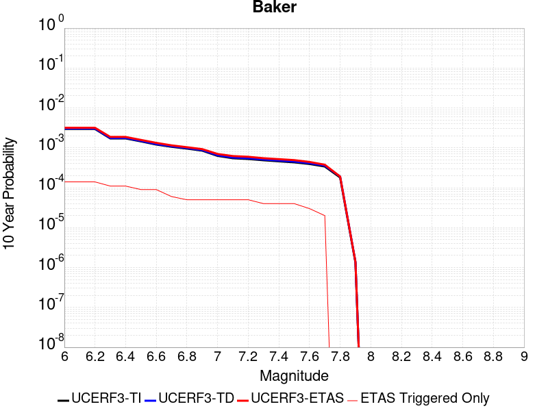 |

| Magnitude | 1 wk TI Prob | 1 wk TD Prob | 1 wk ETAS Prob | 1 wk ETAS/TD Gain | 1 wk ETAS Triggered Only | 1 mo TI Prob | 1 mo TD Prob | 1 mo ETAS Prob | 1 mo ETAS/TD Gain | 1 mo ETAS Triggered Only | 1 yr TI Prob | 1 yr TD Prob | 1 yr ETAS Prob | 1 yr ETAS/TD Gain | 1 yr ETAS Triggered Only | 10 yr TI Prob | 10 yr TD Prob | 10 yr ETAS Prob | 10 yr ETAS/TD Gain | 10 yr ETAS Triggered Only |
|-----|-----|-----|-----|-----|-----|-----|-----|-----|-----|-----|-----|-----|-----|-----|-----|-----|-----|-----|-----|-----|
| 6.0 | 5.695525E-6 | 5.834856E-6 | 2.5834739E-5 | 4.4276567 | 2.0E-5 | 2.4409164E-5 | 2.500631E-5 | 4.500581E-5 | 1.7997781 | 2.0E-5 | 2.9714106E-4 | 3.044133E-4 | 3.8438893E-4 | 1.2627206 | 8.0E-5 | 0.0029674405 | 0.0030403587 | 0.003179933 | 1.0459073 | 1.4E-4 |
| 6.1 | 5.695525E-6 | 5.834856E-6 | 2.5834739E-5 | 4.4276567 | 2.0E-5 | 2.4409164E-5 | 2.500631E-5 | 4.500581E-5 | 1.7997781 | 2.0E-5 | 2.9714106E-4 | 3.044133E-4 | 3.8438893E-4 | 1.2627206 | 8.0E-5 | 0.0029674405 | 0.0030403587 | 0.003179933 | 1.0459073 | 1.4E-4 |
| 6.2 | 5.695525E-6 | 5.834856E-6 | 2.5834739E-5 | 4.4276567 | 2.0E-5 | 2.4409164E-5 | 2.500631E-5 | 4.500581E-5 | 1.7997781 | 2.0E-5 | 2.9714106E-4 | 3.044133E-4 | 3.8438893E-4 | 1.2627206 | 8.0E-5 | 0.0029674405 | 0.0030403587 | 0.003179933 | 1.0459073 | 1.4E-4 |
| 6.3 | 3.2995713E-6 | 3.3836786E-6 | 2.338361E-5 | 6.910707 | 2.0E-5 | 1.4140943E-5 | 1.4501402E-5 | 3.450111E-5 | 2.379157 | 2.0E-5 | 1.7215237E-4 | 1.7654074E-4 | 2.3653015E-4 | 1.3398049 | 6.0E-5 | 0.0017201907 | 0.0017640521 | 0.0018738579 | 1.0622464 | 1.1E-4 |
| 6.4 | 3.2995713E-6 | 3.3836786E-6 | 2.338361E-5 | 6.910707 | 2.0E-5 | 1.4140943E-5 | 1.4501402E-5 | 3.450111E-5 | 2.379157 | 2.0E-5 | 1.7215237E-4 | 1.7654074E-4 | 2.3653015E-4 | 1.3398049 | 6.0E-5 | 0.0017201907 | 0.0017640521 | 0.0018738579 | 1.0622464 | 1.1E-4 |
| 6.5 | 2.782202E-6 | 2.8558507E-6 | 2.2855793E-5 | 8.003147 | 2.0E-5 | 1.1923668E-5 | 1.2239304E-5 | 3.223906E-5 | 2.63406 | 2.0E-5 | 1.4516099E-4 | 1.4900367E-4 | 1.9899622E-4 | 1.3355122 | 5.0E-5 | 0.001450662 | 0.0014890704 | 0.0015789364 | 1.0603504 | 9.0E-5 |
| 6.6 | 2.3163404E-6 | 2.380929E-6 | 2.2380882E-5 | 9.400063 | 2.0E-5 | 9.927136E-6 | 1.0203942E-5 | 3.0203739E-5 | 2.9600067 | 2.0E-5 | 1.20856166E-4 | 1.2422612E-4 | 1.7421991E-4 | 1.4024419 | 5.0E-5 | 0.0012079047 | 0.001241587 | 0.0013314752 | 1.0723978 | 9.0E-5 |
| 6.7 | 2.037056E-6 | 2.0965088E-6 | 1.2096488E-5 | 5.769825 | 1.0E-5 | 8.7302105E-6 | 8.985007E-6 | 1.8984918E-5 | 2.112955 | 1.0E-5 | 1.0628513E-4 | 1.0938713E-4 | 1.3938385E-4 | 1.2742252 | 3.0E-5 | 0.0010623431 | 0.0010933491 | 0.0011532834 | 1.0548173 | 6.0E-5 |
| 6.8 | 1.8356744E-6 | 1.8915364E-6 | 1.1891518E-5 | 6.286698 | 1.0E-5 | 7.867153E-6 | 8.10656E-6 | 1.8106479E-5 | 2.233559 | 1.0E-5 | 9.577837E-5 | 9.869304E-5 | 1.1869107E-4 | 1.2026285 | 2.0E-5 | 9.57371E-4 | 9.865061E-4 | 0.0010364568 | 1.0506339 | 5.0E-5 |
| 6.9 | 1.6310546E-6 | 1.6832144E-6 | 1.1683198E-5 | 6.941004 | 1.0E-5 | 6.9902153E-6 | 7.213757E-6 | 1.7213684E-5 | 2.3862302 | 1.0E-5 | 8.510255E-5 | 8.782406E-5 | 1.0782231E-4 | 1.227708 | 2.0E-5 | 8.5069967E-4 | 8.779048E-4 | 9.278609E-4 | 1.0569038 | 5.0E-5 |
| 7.0 | 1.2058036E-6 | 1.2508729E-6 | 1.1250861E-5 | 8.994408 | 1.0E-5 | 5.1677193E-6 | 5.3608724E-6 | 1.536082E-5 | 2.8653579 | 1.0E-5 | 6.291517E-5 | 6.526669E-5 | 8.526539E-5 | 1.306415 | 2.0E-5 | 6.289736E-4 | 6.5247755E-4 | 7.0244493E-4 | 1.076581 | 5.0E-5 |
| 7.1 | 1.052382E-6 | 1.0951668E-6 | 1.1095156E-5 | 10.131019 | 1.0E-5 | 4.5102006E-6 | 4.693564E-6 | 1.4693516E-5 | 3.1305673 | 1.0E-5 | 5.491031E-5 | 5.7142646E-5 | 7.714151E-5 | 1.3499813 | 2.0E-5 | 5.4896745E-4 | 5.712804E-4 | 6.212519E-4 | 1.0874727 | 5.0E-5 |
| 7.2 | 1.0067454E-6 | 1.0487769E-6 | 1.1048766E-5 | 10.534906 | 1.0E-5 | 4.3146156E-6 | 4.4947506E-6 | 1.4494705E-5 | 3.2248075 | 1.0E-5 | 5.252918E-5 | 5.4722223E-5 | 7.472113E-5 | 1.3654622 | 2.0E-5 | 5.251676E-4 | 5.4708833E-4 | 5.97061E-4 | 1.0913429 | 5.0E-5 |
| 7.3 | 9.3596316E-7 | 9.76778E-7 | 1.0976768E-5 | 11.237731 | 1.0E-5 | 4.0112645E-6 | 4.186185E-6 | 1.4186143E-5 | 3.3888 | 1.0E-5 | 4.8836053E-5 | 5.0965617E-5 | 6.0965107E-5 | 1.1962007 | 1.0E-5 | 4.8825322E-4 | 5.095401E-4 | 5.4951967E-4 | 1.0784621 | 4.0E-5 |
| 7.4 | 8.8117395E-7 | 9.2077187E-7 | 1.0920763E-5 | 11.860443 | 1.0E-5 | 3.7764542E-6 | 3.9461593E-6 | 1.394612E-5 | 3.5340996 | 1.0E-5 | 4.5977362E-5 | 4.8043436E-5 | 5.8042955E-5 | 1.208135 | 1.0E-5 | 4.596785E-4 | 4.8033125E-4 | 5.2031205E-4 | 1.0832359 | 4.0E-5 |
| 7.5 | 8.292386E-7 | 8.674649E-7 | 1.0867456E-5 | 12.527834 | 1.0E-5 | 3.5538749E-6 | 3.7177015E-6 | 1.3717664E-5 | 3.689824 | 1.0E-5 | 4.326757E-5 | 4.5262084E-5 | 5.526163E-5 | 1.2209255 | 1.0E-5 | 4.3259145E-4 | 4.5252938E-4 | 4.9251126E-4 | 1.0883521 | 4.0E-5 |
| 7.6 | 7.553842E-7 | 7.9145207E-7 | 7.9145207E-7 | 1.0 | 0.0 | 3.2373566E-6 | 3.3919332E-6 | 3.3919332E-6 | 1.0 | 0.0 | 3.9414106E-5 | 4.129601E-5 | 4.129601E-5 | 1.0 | 0.0 | 3.9407116E-4 | 4.1288408E-4 | 4.4287168E-4 | 1.0726296 | 3.0E-5 |
| 7.7 | 6.5285366E-7 | 6.852842E-7 | 6.852842E-7 | 1.0 | 0.0 | 2.797941E-6 | 2.9369291E-6 | 2.9369291E-6 | 1.0 | 0.0 | 3.40644E-5 | 3.5756533E-5 | 3.5756533E-5 | 1.0 | 0.0 | 3.405918E-4 | 3.5750846E-4 | 3.775013E-4 | 1.0559227 | 2.0E-5 |
| 7.8 | 3.4586725E-7 | 3.648288E-7 | 3.648288E-7 | 1.0 | 0.0 | 1.4822873E-6 | 1.5635511E-6 | 1.5635511E-6 | 1.0 | 0.0 | 1.80467E-5 | 1.9036073E-5 | 1.9036073E-5 | 1.0 | 0.0 | 1.8045233E-4 | 1.9034486E-4 | 1.9034486E-4 | 1.0 | 0.0 |
| 7.9 | 2.5591178E-9 | 2.6696871E-9 | 2.6696871E-9 | 1.0 | 0.0 | 1.0967647E-8 | 1.1441516E-8 | 1.1441516E-8 | 1.0 | 0.0 | 1.335311E-7 | 1.3930045E-7 | 1.3930045E-7 | 1.0 | 0.0 | 1.3353102E-6 | 1.3930046E-6 | 1.3930046E-6 | 1.0 | 0.0 |

## Lake Isabella (Seismicity)
*[(top)](#table-of-contents)*

| 1 Week | 1 Month | 1 Year | 10 Year |
|-----|-----|-----|-----|
|  | 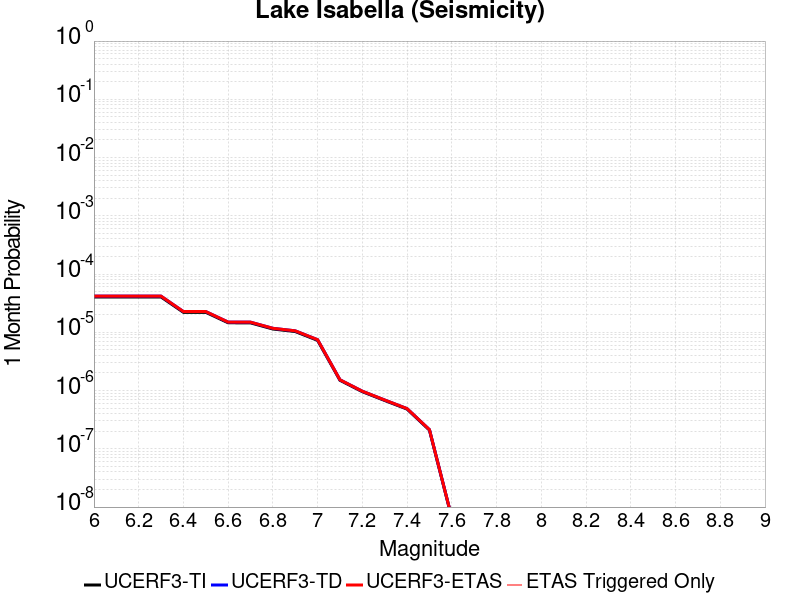 | 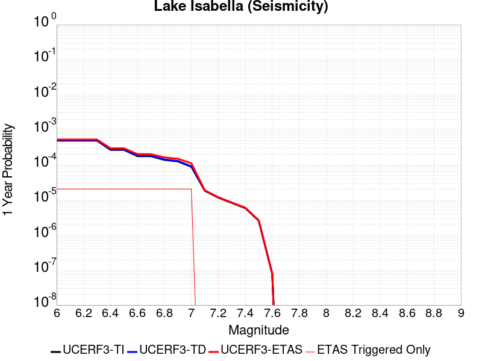 | 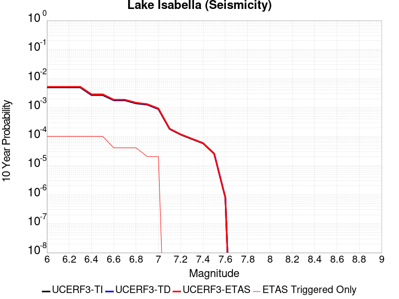 |

| Magnitude | 1 wk TI Prob | 1 wk TD Prob | 1 wk ETAS Prob | 1 wk ETAS/TD Gain | 1 wk ETAS Triggered Only | 1 mo TI Prob | 1 mo TD Prob | 1 mo ETAS Prob | 1 mo ETAS/TD Gain | 1 mo ETAS Triggered Only | 1 yr TI Prob | 1 yr TD Prob | 1 yr ETAS Prob | 1 yr ETAS/TD Gain | 1 yr ETAS Triggered Only | 10 yr TI Prob | 10 yr TD Prob | 10 yr ETAS Prob | 10 yr ETAS/TD Gain | 10 yr ETAS Triggered Only |
|-----|-----|-----|-----|-----|-----|-----|-----|-----|-----|-----|-----|-----|-----|-----|-----|-----|-----|-----|-----|-----|
| 6.0 | 9.431637E-6 | 9.741694E-6 | 9.741694E-6 | 1.0 | 0.0 | 4.0420677E-5 | 4.1749525E-5 | 4.1749525E-5 | 1.0 | 0.0 | 4.920106E-4 | 5.0819496E-4 | 5.5816956E-4 | 1.0983374 | 5.0E-5 | 0.004909227 | 0.005071621 | 0.0052009616 | 1.0255028 | 1.3E-4 |
| 6.1 | 9.431637E-6 | 9.741694E-6 | 9.741694E-6 | 1.0 | 0.0 | 4.0420677E-5 | 4.1749525E-5 | 4.1749525E-5 | 1.0 | 0.0 | 4.920106E-4 | 5.0819496E-4 | 5.5816956E-4 | 1.0983374 | 5.0E-5 | 0.004909227 | 0.005071621 | 0.0052009616 | 1.0255028 | 1.3E-4 |
| 6.2 | 9.431637E-6 | 9.741694E-6 | 9.741694E-6 | 1.0 | 0.0 | 4.0420677E-5 | 4.1749525E-5 | 4.1749525E-5 | 1.0 | 0.0 | 4.920106E-4 | 5.0819496E-4 | 5.5816956E-4 | 1.0983374 | 5.0E-5 | 0.004909227 | 0.005071621 | 0.0052009616 | 1.0255028 | 1.3E-4 |
| 6.3 | 9.431637E-6 | 9.741694E-6 | 9.741694E-6 | 1.0 | 0.0 | 4.0420677E-5 | 4.1749525E-5 | 4.1749525E-5 | 1.0 | 0.0 | 4.920106E-4 | 5.0819496E-4 | 5.5816956E-4 | 1.0983374 | 5.0E-5 | 0.004909227 | 0.005071621 | 0.0052009616 | 1.0255028 | 1.3E-4 |
| 6.4 | 5.144063E-6 | 5.3000977E-6 | 5.3000977E-6 | 1.0 | 0.0 | 2.2045799E-5 | 2.2714525E-5 | 2.2714525E-5 | 1.0 | 0.0 | 2.6837454E-4 | 2.765177E-4 | 2.9651218E-4 | 1.0723081 | 2.0E-5 | 0.0026805066 | 0.002762077 | 0.0028618006 | 1.0361047 | 1.0E-4 |
| 6.5 | 5.144063E-6 | 5.3000977E-6 | 5.3000977E-6 | 1.0 | 0.0 | 2.2045799E-5 | 2.2714525E-5 | 2.2714525E-5 | 1.0 | 0.0 | 2.6837454E-4 | 2.765177E-4 | 2.9651218E-4 | 1.0723081 | 2.0E-5 | 0.0026805066 | 0.002762077 | 0.0028618006 | 1.0361047 | 1.0E-4 |
| 6.6 | 3.4009804E-6 | 3.4987995E-6 | 3.4987995E-6 | 1.0 | 0.0 | 1.4575549E-5 | 1.4994778E-5 | 1.4994778E-5 | 1.0 | 0.0 | 1.7744285E-4 | 1.8254772E-4 | 1.9254591E-4 | 1.0547702 | 1.0E-5 | 0.0017730123 | 0.0018241355 | 0.0018740443 | 1.0273602 | 5.0E-5 |
| 6.7 | 3.3880428E-6 | 3.4856662E-6 | 3.4856662E-6 | 1.0 | 0.0 | 1.4520103E-5 | 1.4938492E-5 | 1.4938492E-5 | 1.0 | 0.0 | 1.767679E-4 | 1.8186258E-4 | 1.9186074E-4 | 1.0549766 | 1.0E-5 | 0.0017662736 | 0.0018172951 | 0.0018672043 | 1.0274634 | 5.0E-5 |
| 6.8 | 2.6582E-6 | 2.7337105E-6 | 2.7337105E-6 | 1.0 | 0.0 | 1.1392236E-5 | 1.1715857E-5 | 1.1715857E-5 | 1.0 | 0.0 | 1.3869164E-4 | 1.4263256E-4 | 1.5263114E-4 | 1.0701002 | 1.0E-5 | 0.0013860512 | 0.0014255423 | 0.0014754711 | 1.0350244 | 5.0E-5 |
| 6.9 | 2.406011E-6 | 2.474338E-6 | 2.474338E-6 | 1.0 | 0.0 | 1.0311434E-5 | 1.0604271E-5 | 1.0604271E-5 | 1.0 | 0.0 | 1.2553448E-4 | 1.2910066E-4 | 1.3909937E-4 | 1.077449 | 1.0E-5 | 0.0012546359 | 0.0012903863 | 0.0013203475 | 1.0232189 | 3.0E-5 |
| 7.0 | 1.6953097E-6 | 1.7429437E-6 | 1.7429437E-6 | 1.0 | 0.0 | 7.265593E-6 | 7.469743E-6 | 7.469743E-6 | 1.0 | 0.0 | 8.8455E-5 | 9.094137E-5 | 1.00940466E-4 | 1.1099509 | 1.0E-5 | 8.84198E-4 | 9.0914435E-4 | 9.2912617E-4 | 1.0219787 | 2.0E-5 |
| 7.1 | 3.5013824E-7 | 3.571492E-7 | 3.571492E-7 | 1.0 | 0.0 | 1.5005916E-6 | 1.5306384E-6 | 1.5306384E-6 | 1.0 | 0.0 | 1.826955E-5 | 1.8635366E-5 | 1.8635366E-5 | 1.0 | 0.0 | 1.8268047E-4 | 1.863383E-4 | 1.863383E-4 | 1.0 | 0.0 |
| 7.2 | 2.2321095E-7 | 2.2750632E-7 | 2.2750632E-7 | 1.0 | 0.0 | 9.56618E-7 | 9.750268E-7 | 9.750268E-7 | 1.0 | 0.0 | 1.1646762E-5 | 1.1870887E-5 | 1.1870887E-5 | 1.0 | 0.0 | 1.1646151E-4 | 1.1870263E-4 | 1.1870263E-4 | 1.0 | 0.0 |
| 7.3 | 1.5760406E-7 | 1.6060963E-7 | 1.6060963E-7 | 1.0 | 0.0 | 6.7544585E-7 | 6.883268E-7 | 6.883268E-7 | 1.0 | 0.0 | 8.223522E-6 | 8.380347E-6 | 8.380347E-6 | 1.0 | 0.0 | 8.2232174E-5 | 8.3800376E-5 | 8.3800376E-5 | 1.0 | 0.0 |
| 7.4 | 1.1216497E-7 | 1.1431735E-7 | 1.1431735E-7 | 1.0 | 0.0 | 4.8070694E-7 | 4.8993144E-7 | 4.8993144E-7 | 1.0 | 0.0 | 5.852591E-6 | 5.964899E-6 | 5.964899E-6 | 1.0 | 0.0 | 5.8524372E-5 | 5.9647435E-5 | 5.9647435E-5 | 1.0 | 0.0 |
| 7.5 | 4.885185E-8 | 4.9787864E-8 | 4.9787864E-8 | 1.0 | 0.0 | 2.0936506E-7 | 2.1337654E-7 | 2.1337654E-7 | 1.0 | 0.0 | 2.5490165E-6 | 2.5978566E-6 | 2.5978566E-6 | 1.0 | 0.0 | 2.5489873E-5 | 2.597828E-5 | 2.597828E-5 | 1.0 | 0.0 |
| 7.6 | 1.504641E-9 | 1.5317939E-9 | 1.5317939E-9 | 1.0 | 0.0 | 6.4484613E-9 | 6.5648313E-9 | 6.5648313E-9 | 1.0 | 0.0 | 7.851001E-8 | 7.992682E-8 | 7.992682E-8 | 1.0 | 0.0 | 7.8509987E-7 | 7.992682E-7 | 7.992682E-7 | 1.0 | 0.0 |

## Santa Ynez (East)
*[(top)](#table-of-contents)*

| 1 Week | 1 Month | 1 Year | 10 Year |
|-----|-----|-----|-----|
| 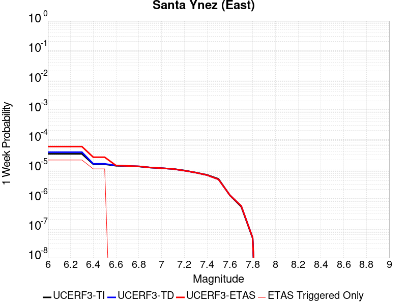 | 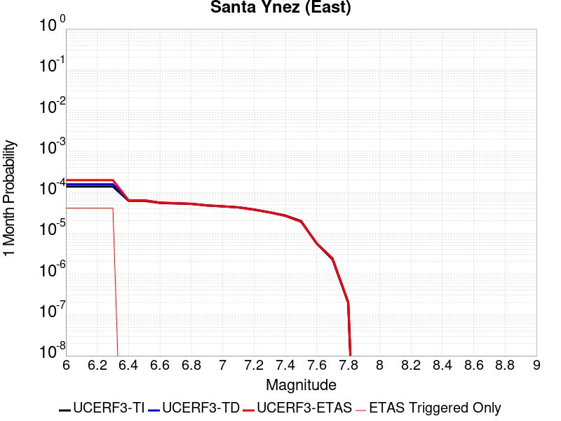 | 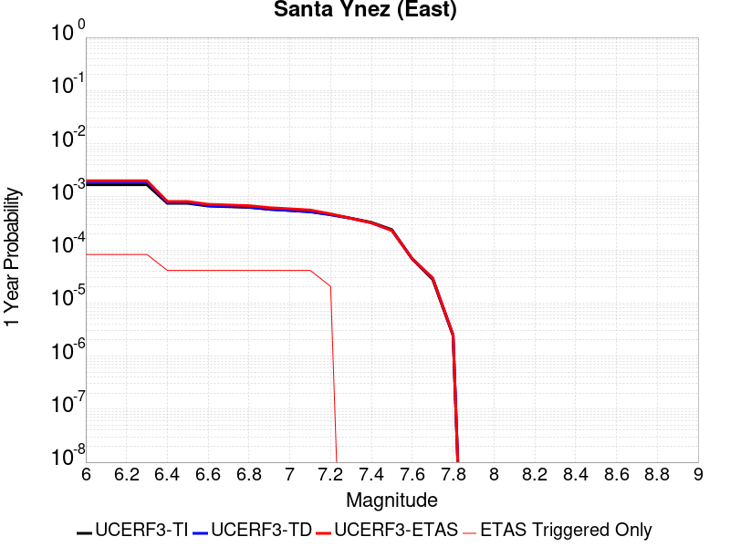 | 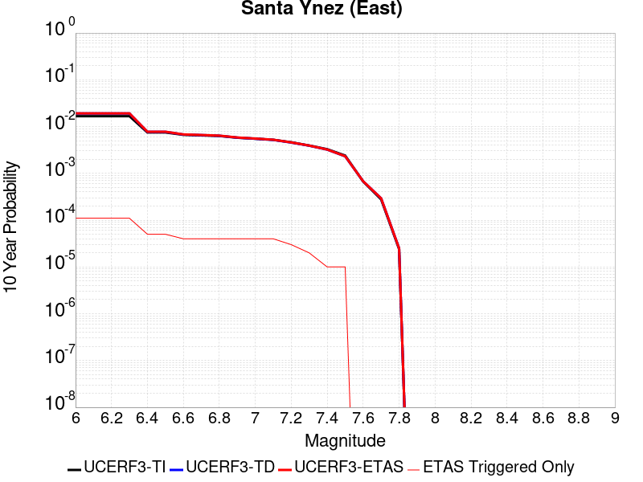 |

| Magnitude | 1 wk TI Prob | 1 wk TD Prob | 1 wk ETAS Prob | 1 wk ETAS/TD Gain | 1 wk ETAS Triggered Only | 1 mo TI Prob | 1 mo TD Prob | 1 mo ETAS Prob | 1 mo ETAS/TD Gain | 1 mo ETAS Triggered Only | 1 yr TI Prob | 1 yr TD Prob | 1 yr ETAS Prob | 1 yr ETAS/TD Gain | 1 yr ETAS Triggered Only | 10 yr TI Prob | 10 yr TD Prob | 10 yr ETAS Prob | 10 yr ETAS/TD Gain | 10 yr ETAS Triggered Only |
|-----|-----|-----|-----|-----|-----|-----|-----|-----|-----|-----|-----|-----|-----|-----|-----|-----|-----|-----|-----|-----|
| 6.0 | 3.2269712E-5 | 3.6751346E-5 | 5.675061E-5 | 1.5441778 | 2.0E-5 | 1.3829143E-4 | 1.5749958E-4 | 1.974933E-4 | 1.2539289 | 4.0E-5 | 0.0016823979 | 0.0019164606 | 0.0019963074 | 1.0416636 | 8.0E-5 | 0.016697178 | 0.019056875 | 0.019164778 | 1.0056622 | 1.1E-4 |
| 6.1 | 3.2269712E-5 | 3.6751346E-5 | 5.675061E-5 | 1.5441778 | 2.0E-5 | 1.3829143E-4 | 1.5749958E-4 | 1.974933E-4 | 1.2539289 | 4.0E-5 | 0.0016823979 | 0.0019164606 | 0.0019963074 | 1.0416636 | 8.0E-5 | 0.016697178 | 0.019056875 | 0.019164778 | 1.0056622 | 1.1E-4 |
| 6.2 | 3.2269712E-5 | 3.6751346E-5 | 5.675061E-5 | 1.5441778 | 2.0E-5 | 1.3829143E-4 | 1.5749958E-4 | 1.974933E-4 | 1.2539289 | 4.0E-5 | 0.0016823979 | 0.0019164606 | 0.0019963074 | 1.0416636 | 8.0E-5 | 0.016697178 | 0.019056875 | 0.019164778 | 1.0056622 | 1.1E-4 |
| 6.3 | 3.2269712E-5 | 3.6751346E-5 | 5.675061E-5 | 1.5441778 | 2.0E-5 | 1.3829143E-4 | 1.5749958E-4 | 1.974933E-4 | 1.2539289 | 4.0E-5 | 0.0016823979 | 0.0019164606 | 0.0019963074 | 1.0416636 | 8.0E-5 | 0.016697178 | 0.019056875 | 0.019164778 | 1.0056622 | 1.1E-4 |
| 6.4 | 1.4404779E-5 | 1.4849569E-5 | 2.4849422E-5 | 1.6734102 | 1.0E-5 | 6.1733306E-5 | 6.363949E-5 | 7.3638854E-5 | 1.1571251 | 1.0E-5 | 7.513438E-4 | 7.7454036E-4 | 8.1450935E-4 | 1.0516036 | 4.0E-5 | 0.0074880854 | 0.007718959 | 0.007768573 | 1.0064275 | 5.0E-5 |
| 6.5 | 1.4404779E-5 | 1.4849569E-5 | 2.4849422E-5 | 1.6734102 | 1.0E-5 | 6.1733306E-5 | 6.363949E-5 | 7.3638854E-5 | 1.1571251 | 1.0E-5 | 7.513438E-4 | 7.7454036E-4 | 8.1450935E-4 | 1.0516036 | 4.0E-5 | 0.0074880854 | 0.007718959 | 0.007768573 | 1.0064275 | 5.0E-5 |
| 6.6 | 1.280208E-5 | 1.3012098E-5 | 1.3012098E-5 | 1.0 | 0.0 | 5.4864904E-5 | 5.5764955E-5 | 5.5764955E-5 | 1.0 | 0.0 | 6.6777546E-4 | 6.7872857E-4 | 7.0870825E-4 | 1.0441703 | 3.0E-5 | 0.006657724 | 0.006766767 | 0.006806496 | 1.0058713 | 4.0E-5 |
| 6.7 | 1.2457027E-5 | 1.2628613E-5 | 1.2628613E-5 | 1.0 | 0.0 | 5.3386164E-5 | 5.4121516E-5 | 5.4121516E-5 | 1.0 | 0.0 | 6.497827E-4 | 6.587319E-4 | 6.887121E-4 | 1.0455121 | 3.0E-5 | 0.00647886 | 0.0065679904 | 0.0066077276 | 1.0060501 | 4.0E-5 |
| 6.8 | 1.2095134E-5 | 1.2231055E-5 | 1.2231055E-5 | 1.0 | 0.0 | 5.1835254E-5 | 5.2417763E-5 | 5.2417763E-5 | 1.0 | 0.0 | 6.309115E-4 | 6.38001E-4 | 6.6798186E-4 | 1.0469918 | 3.0E-5 | 0.0062912325 | 0.0063618817 | 0.0064016273 | 1.0062474 | 4.0E-5 |
| 6.9 | 1.1104036E-5 | 1.11574755E-5 | 1.11574755E-5 | 1.0 | 0.0 | 4.758786E-5 | 4.7816884E-5 | 4.7816884E-5 | 1.0 | 0.0 | 5.7922816E-4 | 5.820163E-4 | 6.1199884E-4 | 1.051515 | 3.0E-5 | 0.005777207 | 0.005805066 | 0.0058448333 | 1.0068505 | 4.0E-5 |
| 7.0 | 1.0577444E-5 | 1.0581802E-5 | 1.0581802E-5 | 1.0 | 0.0 | 4.5331115E-5 | 4.5349796E-5 | 4.5349796E-5 | 1.0 | 0.0 | 5.5176654E-4 | 5.519951E-4 | 5.8197853E-4 | 1.0543183 | 3.0E-5 | 0.0055039856 | 0.0055063786 | 0.005546158 | 1.0072243 | 4.0E-5 |
| 7.1 | 1.0021775E-5 | 9.981102E-6 | 9.981102E-6 | 1.0 | 0.0 | 4.294976E-5 | 4.2775457E-5 | 4.2775457E-5 | 1.0 | 0.0 | 5.2278786E-4 | 5.2066793E-4 | 5.5065233E-4 | 1.0575883 | 3.0E-5 | 0.0052155964 | 0.0051946132 | 0.0052344054 | 1.0076603 | 4.0E-5 |
| 7.2 | 8.874109E-6 | 8.748894E-6 | 8.748894E-6 | 1.0 | 0.0 | 3.8031343E-5 | 3.749473E-5 | 3.749473E-5 | 1.0 | 0.0 | 4.629332E-4 | 4.564038E-4 | 4.7639466E-4 | 1.0438008 | 2.0E-5 | 0.0046197 | 0.0045547825 | 0.004584646 | 1.0065565 | 3.0E-5 |
| 7.3 | 7.5504267E-6 | 7.505199E-6 | 7.505199E-6 | 1.0 | 0.0 | 3.235857E-5 | 3.216475E-5 | 3.216475E-5 | 1.0 | 0.0 | 3.9389438E-4 | 3.9153645E-4 | 4.0153254E-4 | 1.0255305 | 1.0E-5 | 0.0039319694 | 0.003908573 | 0.003928495 | 1.0050969 | 2.0E-5 |
| 7.4 | 6.309394E-6 | 6.1832216E-6 | 6.1832216E-6 | 1.0 | 0.0 | 2.703998E-5 | 2.6499258E-5 | 2.6499258E-5 | 1.0 | 0.0 | 3.2916202E-4 | 3.2258165E-4 | 3.2258165E-4 | 1.0 | 0.0 | 0.003286749 | 0.0032212313 | 0.003231199 | 1.0030944 | 1.0E-5 |
| 7.5 | 4.6103073E-6 | 4.440935E-6 | 4.440935E-6 | 1.0 | 0.0 | 1.975831E-5 | 1.9032443E-5 | 1.9032443E-5 | 1.0 | 0.0 | 2.4053088E-4 | 2.3169606E-4 | 2.3169606E-4 | 1.0 | 0.0 | 0.002402707 | 0.0023146144 | 0.0023245912 | 1.0043104 | 1.0E-5 |
| 7.6 | 1.2858658E-6 | 1.3008267E-6 | 1.3008267E-6 | 1.0 | 0.0 | 5.5108417E-6 | 5.5749606E-6 | 5.5749606E-6 | 1.0 | 0.0 | 6.7092435E-5 | 6.78731E-5 | 6.78731E-5 | 1.0 | 0.0 | 6.707218E-4 | 6.7853054E-4 | 6.7853054E-4 | 1.0 | 0.0 |
| 7.7 | 5.3302307E-7 | 5.612178E-7 | 5.612178E-7 | 1.0 | 0.0 | 2.2843826E-6 | 2.4052172E-6 | 2.4052172E-6 | 1.0 | 0.0 | 2.7812002E-5 | 2.9283161E-5 | 2.9283161E-5 | 1.0 | 0.0 | 2.7808524E-4 | 2.9279658E-4 | 2.9279658E-4 | 1.0 | 0.0 |
| 7.8 | 4.613933E-8 | 4.803036E-8 | 4.803036E-8 | 1.0 | 0.0 | 1.9773998E-7 | 2.0584437E-7 | 2.0584437E-7 | 1.0 | 0.0 | 2.4074816E-6 | 2.5061524E-6 | 2.5061524E-6 | 1.0 | 0.0 | 2.4074554E-5 | 2.5061252E-5 | 2.5061252E-5 | 1.0 | 0.0 |

## San Jacinto (San Jacinto Valley) rev
*[(top)](#table-of-contents)*

| 1 Week | 1 Month | 1 Year | 10 Year |
|-----|-----|-----|-----|
| 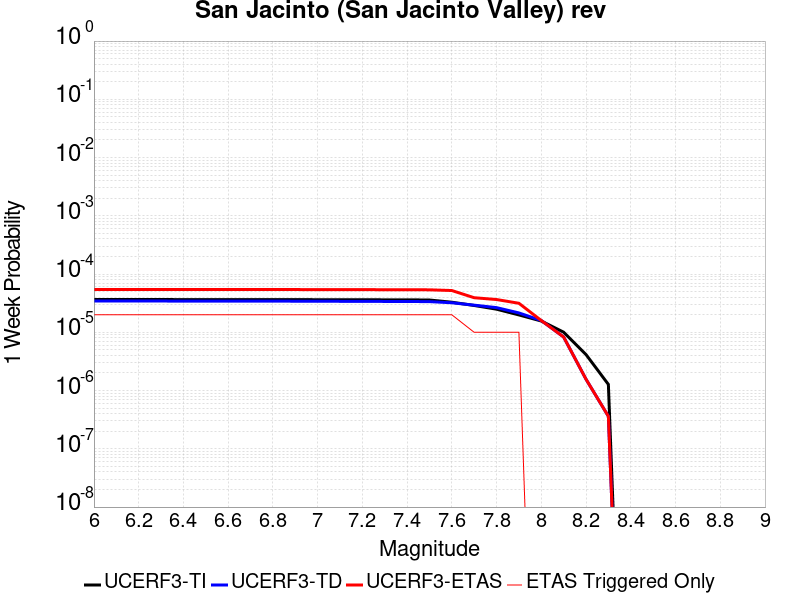 | 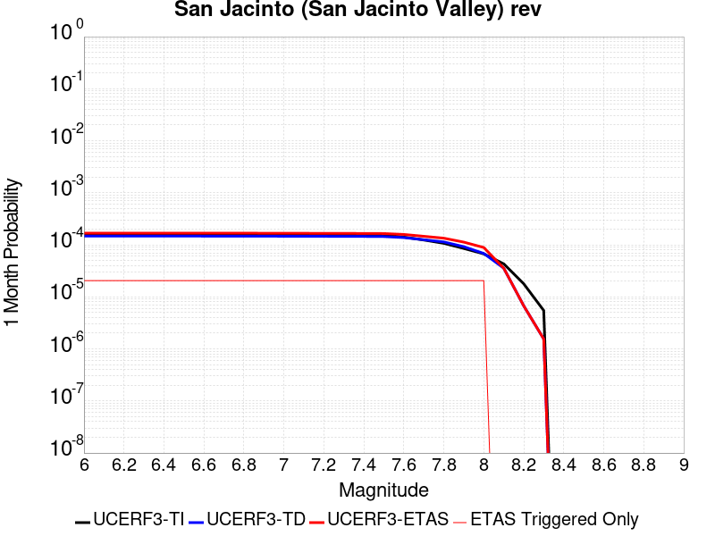 | 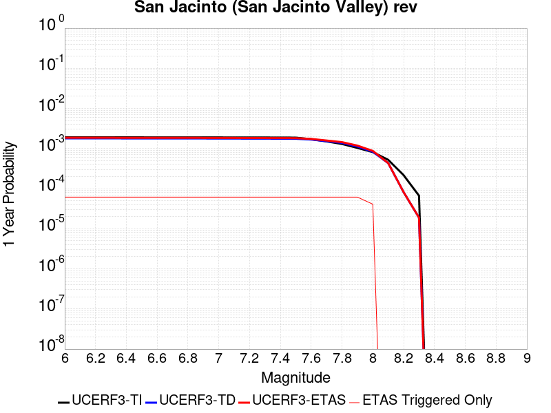 | 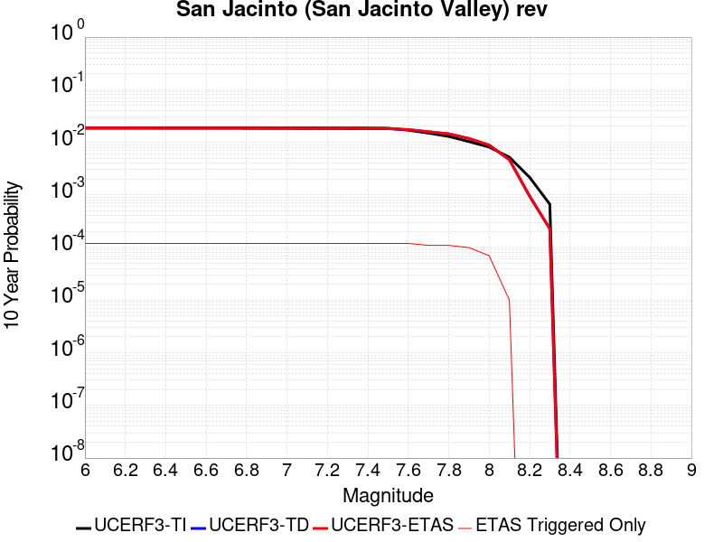 |

| Magnitude | 1 wk TI Prob | 1 wk TD Prob | 1 wk ETAS Prob | 1 wk ETAS/TD Gain | 1 wk ETAS Triggered Only | 1 mo TI Prob | 1 mo TD Prob | 1 mo ETAS Prob | 1 mo ETAS/TD Gain | 1 mo ETAS Triggered Only | 1 yr TI Prob | 1 yr TD Prob | 1 yr ETAS Prob | 1 yr ETAS/TD Gain | 1 yr ETAS Triggered Only | 10 yr TI Prob | 10 yr TD Prob | 10 yr ETAS Prob | 10 yr ETAS/TD Gain | 10 yr ETAS Triggered Only |
|-----|-----|-----|-----|-----|-----|-----|-----|-----|-----|-----|-----|-----|-----|-----|-----|-----|-----|-----|-----|-----|
| 6.0 | 3.652694E-5 | 3.4417048E-5 | 5.441636E-5 | 1.5810874 | 2.0E-5 | 1.5653463E-4 | 1.4749331E-4 | 1.874874E-4 | 1.2711588 | 4.0E-5 | 0.0019041431 | 0.0017942534 | 0.0018840919 | 1.0500702 | 9.0E-5 | 0.018879099 | 0.018534157 | 0.018651934 | 1.0063546 | 1.2E-4 |
| 6.1 | 3.652694E-5 | 3.4417048E-5 | 5.441636E-5 | 1.5810874 | 2.0E-5 | 1.5653463E-4 | 1.4749331E-4 | 1.874874E-4 | 1.2711588 | 4.0E-5 | 0.0019041431 | 0.0017942534 | 0.0018840919 | 1.0500702 | 9.0E-5 | 0.018879099 | 0.018534157 | 0.018651934 | 1.0063546 | 1.2E-4 |
| 6.2 | 3.652694E-5 | 3.4417048E-5 | 5.441636E-5 | 1.5810874 | 2.0E-5 | 1.5653463E-4 | 1.4749331E-4 | 1.874874E-4 | 1.2711588 | 4.0E-5 | 0.0019041431 | 0.0017942534 | 0.0018840919 | 1.0500702 | 9.0E-5 | 0.018879099 | 0.018534157 | 0.018651934 | 1.0063546 | 1.2E-4 |
| 6.3 | 3.652694E-5 | 3.4417048E-5 | 5.441636E-5 | 1.5810874 | 2.0E-5 | 1.5653463E-4 | 1.4749331E-4 | 1.874874E-4 | 1.2711588 | 4.0E-5 | 0.0019041431 | 0.0017942534 | 0.0018840919 | 1.0500702 | 9.0E-5 | 0.018879099 | 0.018534157 | 0.018651934 | 1.0063546 | 1.2E-4 |
| 6.4 | 3.646941E-5 | 3.433862E-5 | 5.4337936E-5 | 1.5824145 | 2.0E-5 | 1.5628811E-4 | 1.4715722E-4 | 1.8715134E-4 | 1.2717781 | 4.0E-5 | 0.0019011468 | 0.0017901688 | 0.0018800077 | 1.0501846 | 9.0E-5 | 0.018849645 | 0.018494038 | 0.018611819 | 1.0063686 | 1.2E-4 |
| 6.5 | 3.646941E-5 | 3.433862E-5 | 5.4337936E-5 | 1.5824145 | 2.0E-5 | 1.5628811E-4 | 1.4715722E-4 | 1.8715134E-4 | 1.2717781 | 4.0E-5 | 0.0019011468 | 0.0017901688 | 0.0018800077 | 1.0501846 | 9.0E-5 | 0.018849645 | 0.018494038 | 0.018611819 | 1.0063686 | 1.2E-4 |
| 6.6 | 3.6442503E-5 | 3.4302004E-5 | 5.430132E-5 | 1.5830363 | 2.0E-5 | 1.561728E-4 | 1.4700032E-4 | 1.8699444E-4 | 1.2720683 | 4.0E-5 | 0.0018997455 | 0.0017882616 | 0.0018781007 | 1.0502383 | 9.0E-5 | 0.018835869 | 0.018475305 | 0.018593088 | 1.0063752 | 1.2E-4 |
| 6.7 | 3.6432113E-5 | 3.4287576E-5 | 5.428689E-5 | 1.5832816 | 2.0E-5 | 1.5612828E-4 | 1.4693849E-4 | 1.8693261E-4 | 1.2721827 | 4.0E-5 | 0.0018992044 | 0.0017875104 | 0.0018773495 | 1.0502594 | 9.0E-5 | 0.018830549 | 0.01846793 | 0.018585714 | 1.0063777 | 1.2E-4 |
| 6.8 | 3.6409598E-5 | 3.425663E-5 | 5.4255946E-5 | 1.5838085 | 2.0E-5 | 1.560318E-4 | 1.4680588E-4 | 1.868E-4 | 1.2724286 | 4.0E-5 | 0.0018980318 | 0.0017858985 | 0.0018757377 | 1.0503048 | 9.0E-5 | 0.018819023 | 0.018452084 | 0.018569868 | 1.0063833 | 1.2E-4 |
| 6.9 | 3.638078E-5 | 3.4217053E-5 | 5.421637E-5 | 1.5844839 | 2.0E-5 | 1.5590832E-4 | 1.4663627E-4 | 1.8663041E-4 | 1.2727438 | 4.0E-5 | 0.0018965311 | 0.001783837 | 0.0018736764 | 1.0503631 | 9.0E-5 | 0.018804269 | 0.018431816 | 0.018549604 | 1.0063905 | 1.2E-4 |
| 7.0 | 3.6294874E-5 | 3.4099063E-5 | 5.409838E-5 | 1.5865064 | 2.0E-5 | 1.5554018E-4 | 1.4613067E-4 | 1.8612482E-4 | 1.2736876 | 4.0E-5 | 0.0018920569 | 0.0017776915 | 0.0018675316 | 1.0505375 | 9.0E-5 | 0.018760284 | 0.018371396 | 0.018489191 | 1.0064119 | 1.2E-4 |
| 7.1 | 3.6260717E-5 | 3.405534E-5 | 5.405466E-5 | 1.5872594 | 2.0E-5 | 1.5539382E-4 | 1.4594331E-4 | 1.8593748E-4 | 1.274039 | 4.0E-5 | 0.001890278 | 0.0017754143 | 0.0018652546 | 1.0506024 | 9.0E-5 | 0.018742796 | 0.018348996 | 0.018466793 | 1.0064199 | 1.2E-4 |
| 7.2 | 3.6210204E-5 | 3.398956E-5 | 5.398888E-5 | 1.588396 | 2.0E-5 | 1.5517735E-4 | 1.4566141E-4 | 1.8565559E-4 | 1.2745694 | 4.0E-5 | 0.001887647 | 0.0017719879 | 0.0018618284 | 1.0507004 | 9.0E-5 | 0.01871693 | 0.018315274 | 0.018433075 | 1.0064319 | 1.2E-4 |
| 7.3 | 3.6119454E-5 | 3.3877837E-5 | 5.387716E-5 | 1.5903364 | 2.0E-5 | 1.5478847E-4 | 1.4518267E-4 | 1.8517686E-4 | 1.275475 | 4.0E-5 | 0.0018829206 | 0.0017661685 | 0.0018560096 | 1.0508678 | 9.0E-5 | 0.018670462 | 0.018257825 | 0.018375633 | 1.0064526 | 1.2E-4 |
| 7.4 | 3.607848E-5 | 3.3825334E-5 | 5.3824657E-5 | 1.5912528 | 2.0E-5 | 1.5461289E-4 | 1.4495767E-4 | 1.8495187E-4 | 1.2759026 | 4.0E-5 | 0.0018807866 | 0.0017634337 | 0.001853275 | 1.0509468 | 9.0E-5 | 0.018649481 | 0.018230818 | 0.01834863 | 1.0064622 | 1.2E-4 |
| 7.5 | 3.5856774E-5 | 3.3635082E-5 | 5.3634412E-5 | 1.5945972 | 2.0E-5 | 1.5366284E-4 | 1.4414241E-4 | 1.8413665E-4 | 1.2774633 | 4.0E-5 | 0.0018692396 | 0.0017535238 | 0.0018433661 | 1.0512352 | 9.0E-5 | 0.018535944 | 0.018131904 | 0.01824973 | 1.0064982 | 1.2E-4 |
| 7.6 | 3.286655E-5 | 3.215777E-5 | 5.2157127E-5 | 1.6219137 | 2.0E-5 | 1.4084904E-4 | 1.3781176E-4 | 1.7780624E-4 | 1.290211 | 4.0E-5 | 0.001713488 | 0.0016765689 | 0.001766418 | 1.053591 | 9.0E-5 | 0.017003361 | 0.017351432 | 0.017469348 | 1.0067959 | 1.2E-4 |
| 7.7 | 2.8882527E-5 | 2.9250317E-5 | 3.9250026E-5 | 1.3418666 | 1.0E-5 | 1.237764E-4 | 1.2535248E-4 | 1.5534872E-4 | 1.2392951 | 3.0E-5 | 0.0015059357 | 0.0015250992 | 0.0016049772 | 1.0523756 | 8.0E-5 | 0.014957713 | 0.015837716 | 0.015945975 | 1.0068355 | 1.1E-4 |
| 7.8 | 2.4950225E-5 | 2.6540692E-5 | 3.6540427E-5 | 1.3767699 | 1.0E-5 | 1.0692515E-4 | 1.1374087E-4 | 1.4373746E-4 | 1.2637274 | 3.0E-5 | 0.0013010362 | 0.0013839162 | 0.0014638056 | 1.057727 | 8.0E-5 | 0.012934455 | 0.0144187445 | 0.014527158 | 1.007519 | 1.1E-4 |
| 7.9 | 1.9881603E-5 | 2.1519538E-5 | 3.151932E-5 | 1.464684 | 1.0E-5 | 8.520408E-5 | 9.222333E-5 | 1.2222056E-4 | 1.3252673 | 3.0E-5 | 0.001036866 | 0.0011222415 | 0.001192163 | 1.0623052 | 7.0E-5 | 0.010320415 | 0.011783319 | 0.01188214 | 1.0083866 | 1.0E-4 |
| 8.0 | 1.563292E-5 | 1.5947082E-5 | 1.5947082E-5 | 1.0 | 0.0 | 6.6996516E-5 | 6.834285E-5 | 7.834217E-5 | 1.146311 | 1.0E-5 | 8.153773E-4 | 8.3175726E-4 | 8.71724E-4 | 1.048051 | 4.0E-5 | 0.00812392 | 0.008815629 | 0.008885012 | 1.0078704 | 7.0E-5 |
| 8.1 | 1.0045313E-5 | 8.307514E-6 | 8.307514E-6 | 1.0 | 0.0 | 4.305063E-5 | 3.5603145E-5 | 3.5603145E-5 | 1.0 | 0.0 | 5.2401534E-4 | 4.333826E-4 | 4.4337826E-4 | 1.0230643 | 1.0E-5 | 0.0052278144 | 0.0046621817 | 0.004672135 | 1.0021349 | 1.0E-5 |
| 8.2 | 4.1554413E-6 | 1.5672123E-6 | 1.5672123E-6 | 1.0 | 0.0 | 1.7808914E-5 | 6.716607E-6 | 6.716607E-6 | 1.0 | 0.0 | 2.1680194E-4 | 8.177165E-5 | 8.177165E-5 | 1.0 | 0.0 | 0.0021659054 | 9.492334E-4 | 9.492334E-4 | 1.0 | 0.0 |
| 8.3 | 1.2758221E-6 | 3.6194777E-7 | 3.6194777E-7 | 1.0 | 0.0 | 5.4677976E-6 | 1.5512038E-6 | 1.5512038E-6 | 1.0 | 0.0 | 6.65684E-5 | 1.8885747E-5 | 1.8885747E-5 | 1.0 | 0.0 | 6.6548464E-4 | 2.2777634E-4 | 2.2777634E-4 | 1.0 | 0.0 |

## Owens Valley
*[(top)](#table-of-contents)*

| 1 Week | 1 Month | 1 Year | 10 Year |
|-----|-----|-----|-----|
| 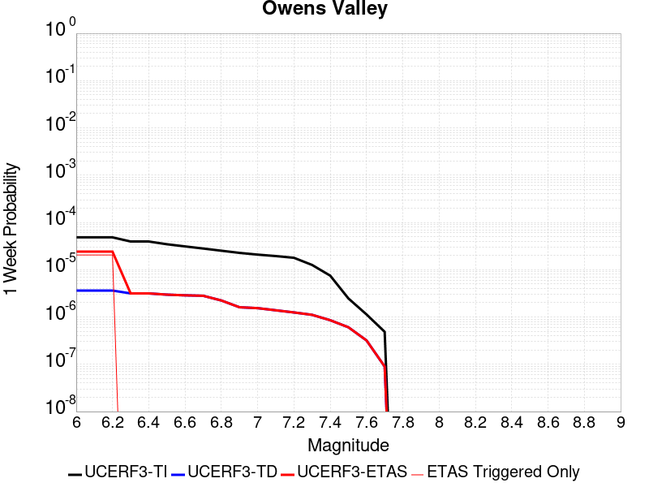 | 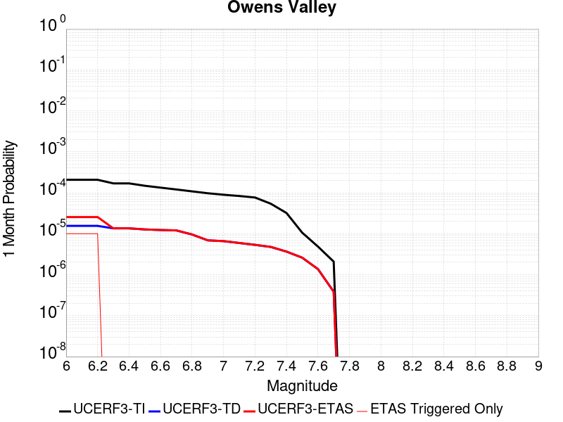 | 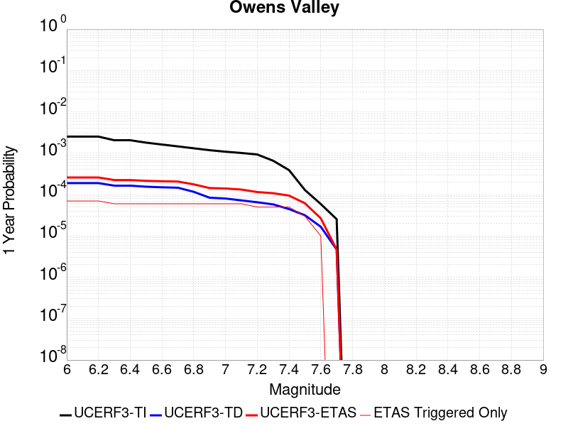 | 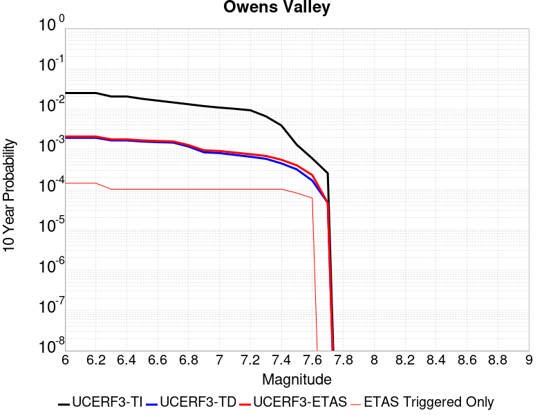 |

| Magnitude | 1 wk TI Prob | 1 wk TD Prob | 1 wk ETAS Prob | 1 wk ETAS/TD Gain | 1 wk ETAS Triggered Only | 1 mo TI Prob | 1 mo TD Prob | 1 mo ETAS Prob | 1 mo ETAS/TD Gain | 1 mo ETAS Triggered Only | 1 yr TI Prob | 1 yr TD Prob | 1 yr ETAS Prob | 1 yr ETAS/TD Gain | 1 yr ETAS Triggered Only | 10 yr TI Prob | 10 yr TD Prob | 10 yr ETAS Prob | 10 yr ETAS/TD Gain | 10 yr ETAS Triggered Only |
|-----|-----|-----|-----|-----|-----|-----|-----|-----|-----|-----|-----|-----|-----|-----|-----|-----|-----|-----|-----|-----|
| 6.0 | 4.83821E-5 | 3.627396E-6 | 1.3627359E-5 | 3.7567885 | 1.0E-5 | 2.0733538E-4 | 1.5545897E-5 | 2.554574E-5 | 1.6432467 | 1.0E-5 | 0.002521386 | 1.8925584E-4 | 2.592426E-4 | 1.3697997 | 7.0E-5 | 0.024929691 | 0.0019254381 | 0.002045207 | 1.0622035 | 1.2E-4 |
| 6.1 | 4.83821E-5 | 3.627396E-6 | 1.3627359E-5 | 3.7567885 | 1.0E-5 | 2.0733538E-4 | 1.5545897E-5 | 2.554574E-5 | 1.6432467 | 1.0E-5 | 0.002521386 | 1.8925584E-4 | 2.592426E-4 | 1.3697997 | 7.0E-5 | 0.024929691 | 0.0019254381 | 0.002045207 | 1.0622035 | 1.2E-4 |
| 6.2 | 4.83821E-5 | 3.627396E-6 | 1.3627359E-5 | 3.7567885 | 1.0E-5 | 2.0733538E-4 | 1.5545897E-5 | 2.554574E-5 | 1.6432467 | 1.0E-5 | 0.002521386 | 1.8925584E-4 | 2.592426E-4 | 1.3697997 | 7.0E-5 | 0.024929691 | 0.0019254381 | 0.002045207 | 1.0622035 | 1.2E-4 |
| 6.3 | 3.953008E-5 | 3.1558448E-6 | 3.1558448E-6 | 1.0 | 0.0 | 1.6940363E-4 | 1.3524983E-5 | 1.3524983E-5 | 1.0 | 0.0 | 0.002060538 | 1.6465495E-4 | 2.2464507E-4 | 1.3643384 | 6.0E-5 | 0.020415364 | 0.0016594394 | 0.0017592735 | 1.0601614 | 1.0E-4 |
| 6.4 | 3.953008E-5 | 3.1558448E-6 | 3.1558448E-6 | 1.0 | 0.0 | 1.6940363E-4 | 1.3524983E-5 | 1.3524983E-5 | 1.0 | 0.0 | 0.002060538 | 1.6465495E-4 | 2.2464507E-4 | 1.3643384 | 6.0E-5 | 0.020415364 | 0.0016594394 | 0.0017592735 | 1.0601614 | 1.0E-4 |
| 6.5 | 3.457342E-5 | 2.9718876E-6 | 2.9718876E-6 | 1.0 | 0.0 | 1.4816338E-4 | 1.2736603E-5 | 1.2736603E-5 | 1.0 | 0.0 | 0.0018023965 | 1.5505782E-4 | 2.1504851E-4 | 1.3868924 | 6.0E-5 | 0.017878477 | 0.0015558768 | 0.0016557212 | 1.0641724 | 1.0E-4 |
| 6.6 | 3.1127765E-5 | 2.8746979E-6 | 2.8746979E-6 | 1.0 | 0.0 | 1.3339789E-4 | 1.232008E-5 | 1.232008E-5 | 1.0 | 0.0 | 0.0016229092 | 1.4998733E-4 | 2.0997833E-4 | 1.3999738 | 6.0E-5 | 0.016111081 | 0.001501365 | 0.0016012148 | 1.066506 | 1.0E-4 |
| 6.7 | 2.806885E-5 | 2.810566E-6 | 2.810566E-6 | 1.0 | 0.0 | 1.2028952E-4 | 1.2045231E-5 | 1.2045231E-5 | 1.0 | 0.0 | 0.001463541 | 1.4664151E-4 | 2.0663271E-4 | 1.4091011 | 6.0E-5 | 0.014539397 | 0.001465831 | 0.0015656843 | 1.0681207 | 1.0E-4 |
| 6.8 | 2.524524E-5 | 2.235501E-6 | 2.235501E-6 | 1.0 | 0.0 | 1.0818939E-4 | 9.5806845E-6 | 9.5806845E-6 | 1.0 | 0.0 | 0.0013164099 | 1.1663889E-4 | 1.7663189E-4 | 1.5143481 | 6.0E-5 | 0.01308639 | 0.0011660501 | 0.0012659335 | 1.0856596 | 1.0E-4 |
| 6.9 | 2.2704568E-5 | 1.6082656E-6 | 1.6082656E-6 | 1.0 | 0.0 | 9.730166E-5 | 6.8925488E-6 | 6.8925488E-6 | 1.0 | 0.0 | 0.0011840039 | 8.391357E-5 | 1.4390853E-4 | 1.7149614 | 6.0E-5 | 0.011777153 | 8.390308E-4 | 9.389469E-4 | 1.1190852 | 1.0E-4 |
| 7.0 | 2.0871712E-5 | 1.5396373E-6 | 1.5396373E-6 | 1.0 | 0.0 | 8.944713E-5 | 6.598429E-6 | 6.598429E-6 | 1.0 | 0.0 | 0.0010884746 | 8.033293E-5 | 1.403281E-4 | 1.7468318 | 6.0E-5 | 0.010831586 | 8.0321095E-4 | 9.031306E-4 | 1.1244003 | 1.0E-4 |
| 7.1 | 1.944928E-5 | 1.3864965E-6 | 1.3864965E-6 | 1.0 | 0.0 | 8.335139E-5 | 5.942114E-6 | 5.942114E-6 | 1.0 | 0.0 | 0.0010143308 | 7.2342846E-5 | 1.3233851E-4 | 1.829324 | 6.0E-5 | 0.010097133 | 7.233511E-4 | 8.2327874E-4 | 1.1381454 | 1.0E-4 |
| 7.2 | 1.7876306E-5 | 1.2489834E-6 | 1.2489834E-6 | 1.0 | 0.0 | 7.6610486E-5 | 5.3527747E-6 | 5.3527747E-6 | 1.0 | 0.0 | 9.3233347E-4 | 6.516809E-5 | 1.1516483E-4 | 1.7671967 | 5.0E-5 | 0.009284316 | 6.516274E-4 | 7.4156874E-4 | 1.1380258 | 9.0E-5 |
| 7.3 | 1.2618672E-5 | 1.1115851E-6 | 1.1115851E-6 | 1.0 | 0.0 | 5.40789E-5 | 4.763928E-6 | 4.763928E-6 | 1.0 | 0.0 | 6.582117E-4 | 5.799928E-5 | 1.07996384E-4 | 1.8620297 | 5.0E-5 | 0.0065626553 | 5.799741E-4 | 6.699219E-4 | 1.1550894 | 9.0E-5 |
| 7.4 | 7.4874442E-6 | 8.549184E-7 | 8.549184E-7 | 1.0 | 0.0 | 3.208865E-5 | 3.663931E-6 | 3.663931E-6 | 1.0 | 0.0 | 3.906093E-4 | 4.4607452E-5 | 9.4605224E-5 | 2.1208389 | 5.0E-5 | 0.003899234 | 4.4607726E-4 | 5.360371E-4 | 1.2016687 | 9.0E-5 |
| 7.5 | 2.4734156E-6 | 6.068976E-7 | 6.068976E-7 | 1.0 | 0.0 | 1.060031E-5 | 2.6009868E-6 | 2.6009868E-6 | 1.0 | 0.0 | 1.2905113E-4 | 3.1666557E-5 | 6.166561E-5 | 1.9473417 | 3.0E-5 | 0.0012897621 | 3.1662078E-4 | 3.8659864E-4 | 1.2210146 | 7.0E-5 |
| 7.6 | 1.1328841E-6 | 3.1967096E-7 | 3.1967096E-7 | 1.0 | 0.0 | 4.8552088E-6 | 1.3700177E-6 | 1.3700177E-6 | 1.0 | 0.0 | 5.9110564E-5 | 1.6679838E-5 | 2.6679672E-5 | 1.5995162 | 1.0E-5 | 5.9094845E-4 | 1.6678606E-4 | 2.0677938E-4 | 1.2397882 | 4.0E-5 |
| 7.7 | 4.8613185E-7 | 8.965384E-8 | 8.965384E-8 | 1.0 | 0.0 | 2.0834207E-6 | 3.842307E-7 | 3.842307E-7 | 1.0 | 0.0 | 2.536535E-5 | 4.677999E-6 | 4.677999E-6 | 1.0 | 0.0 | 2.5362454E-4 | 4.6779078E-5 | 4.6779078E-5 | 1.0 | 0.0 |

## San Jacinto (Stepovers Combined)
*[(top)](#table-of-contents)*

| 1 Week | 1 Month | 1 Year | 10 Year |
|-----|-----|-----|-----|
| 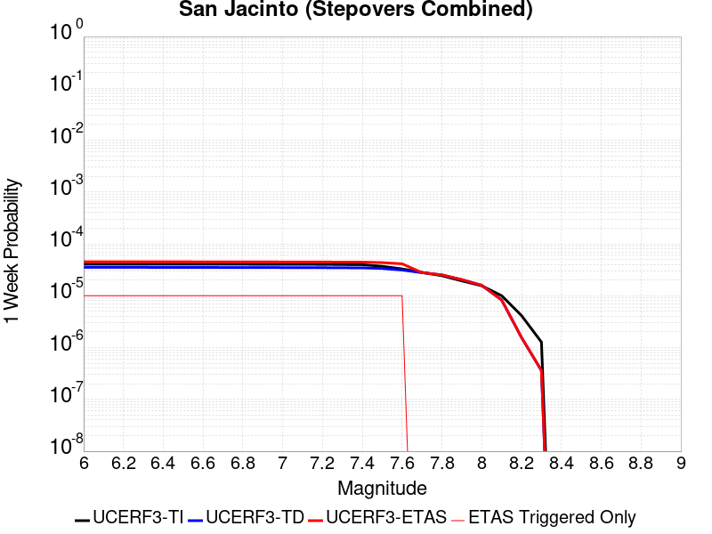 | 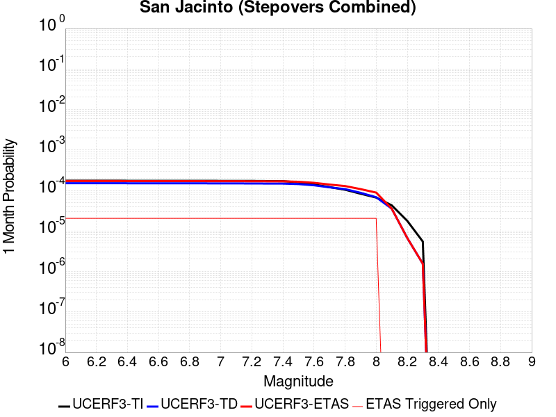 | 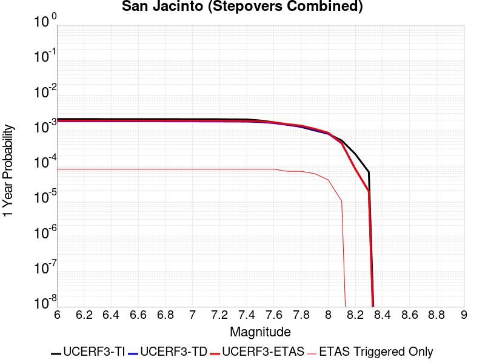 | 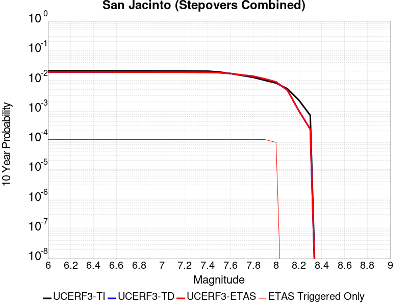 |

| Magnitude | 1 wk TI Prob | 1 wk TD Prob | 1 wk ETAS Prob | 1 wk ETAS/TD Gain | 1 wk ETAS Triggered Only | 1 mo TI Prob | 1 mo TD Prob | 1 mo ETAS Prob | 1 mo ETAS/TD Gain | 1 mo ETAS Triggered Only | 1 yr TI Prob | 1 yr TD Prob | 1 yr ETAS Prob | 1 yr ETAS/TD Gain | 1 yr ETAS Triggered Only | 10 yr TI Prob | 10 yr TD Prob | 10 yr ETAS Prob | 10 yr ETAS/TD Gain | 10 yr ETAS Triggered Only |
|-----|-----|-----|-----|-----|-----|-----|-----|-----|-----|-----|-----|-----|-----|-----|-----|-----|-----|-----|-----|-----|
| 6.0 | 4.0667746E-5 | 3.5287198E-5 | 4.5286844E-5 | 1.283379 | 1.0E-5 | 1.742787E-4 | 1.5122209E-4 | 1.8121755E-4 | 1.1983538 | 3.0E-5 | 0.0021197782 | 0.0018395748 | 0.0019194275 | 1.0434083 | 8.0E-5 | 0.020996714 | 0.018994363 | 0.019102274 | 1.0056812 | 1.1E-4 |
| 6.1 | 4.0667746E-5 | 3.5287198E-5 | 4.5286844E-5 | 1.283379 | 1.0E-5 | 1.742787E-4 | 1.5122209E-4 | 1.8121755E-4 | 1.1983538 | 3.0E-5 | 0.0021197782 | 0.0018395748 | 0.0019194275 | 1.0434083 | 8.0E-5 | 0.020996714 | 0.018994363 | 0.019102274 | 1.0056812 | 1.1E-4 |
| 6.2 | 4.0667746E-5 | 3.5287198E-5 | 4.5286844E-5 | 1.283379 | 1.0E-5 | 1.742787E-4 | 1.5122209E-4 | 1.8121755E-4 | 1.1983538 | 3.0E-5 | 0.0021197782 | 0.0018395748 | 0.0019194275 | 1.0434083 | 8.0E-5 | 0.020996714 | 0.018994363 | 0.019102274 | 1.0056812 | 1.1E-4 |
| 6.3 | 4.0667746E-5 | 3.5287198E-5 | 4.5286844E-5 | 1.283379 | 1.0E-5 | 1.742787E-4 | 1.5122209E-4 | 1.8121755E-4 | 1.1983538 | 3.0E-5 | 0.0021197782 | 0.0018395748 | 0.0019194275 | 1.0434083 | 8.0E-5 | 0.020996714 | 0.018994363 | 0.019102274 | 1.0056812 | 1.1E-4 |
| 6.4 | 4.0577226E-5 | 3.515909E-5 | 4.5158737E-5 | 1.2844114 | 1.0E-5 | 1.738908E-4 | 1.5067312E-4 | 1.806686E-4 | 1.1990765 | 3.0E-5 | 0.0021150648 | 0.0018329041 | 0.0019127574 | 1.0435666 | 8.0E-5 | 0.020950472 | 0.018928928 | 0.019036846 | 1.0057012 | 1.1E-4 |
| 6.5 | 4.0577226E-5 | 3.515909E-5 | 4.5158737E-5 | 1.2844114 | 1.0E-5 | 1.738908E-4 | 1.5067312E-4 | 1.806686E-4 | 1.1990765 | 3.0E-5 | 0.0021150648 | 0.0018329041 | 0.0019127574 | 1.0435666 | 8.0E-5 | 0.020950472 | 0.018928928 | 0.019036846 | 1.0057012 | 1.1E-4 |
| 6.6 | 4.053861E-5 | 3.5104433E-5 | 4.5104083E-5 | 1.2848543 | 1.0E-5 | 1.7372532E-4 | 1.5043891E-4 | 1.8043439E-4 | 1.1993865 | 3.0E-5 | 0.0021130538 | 0.0018300572 | 0.0019099108 | 1.0436345 | 8.0E-5 | 0.020930743 | 0.018901005 | 0.019008927 | 1.0057098 | 1.1E-4 |
| 6.7 | 4.0516545E-5 | 3.50735E-5 | 4.5073146E-5 | 1.2851056 | 1.0E-5 | 1.7363077E-4 | 1.5030634E-4 | 1.8030184E-4 | 1.1995624 | 3.0E-5 | 0.002111905 | 0.0018284466 | 0.0019083003 | 1.043673 | 8.0E-5 | 0.020919468 | 0.018885203 | 0.018993124 | 1.0057147 | 1.1E-4 |
| 6.8 | 4.049434E-5 | 3.504506E-5 | 4.5044708E-5 | 1.285337 | 1.0E-5 | 1.7353562E-4 | 1.5018447E-4 | 1.8017997E-4 | 1.1997243 | 3.0E-5 | 0.0021107488 | 0.0018269654 | 0.0019068192 | 1.0437084 | 8.0E-5 | 0.020908125 | 0.018870614 | 0.018978538 | 1.0057192 | 1.1E-4 |
| 6.9 | 4.046386E-5 | 3.500762E-5 | 4.500727E-5 | 1.2856421 | 1.0E-5 | 1.73405E-4 | 1.5002403E-4 | 1.8001953E-4 | 1.1999379 | 3.0E-5 | 0.0021091616 | 0.0018250152 | 0.0019048692 | 1.0437553 | 8.0E-5 | 0.020892553 | 0.018851386 | 0.018959314 | 1.0057251 | 1.1E-4 |
| 7.0 | 4.036382E-5 | 3.4888177E-5 | 4.4887827E-5 | 1.28662 | 1.0E-5 | 1.7297632E-4 | 1.4951221E-4 | 1.7950773E-4 | 1.2006226 | 3.0E-5 | 0.0021039525 | 0.0018187946 | 0.001898649 | 1.0439051 | 8.0E-5 | 0.02084144 | 0.018789997 | 0.018897932 | 1.0057442 | 1.1E-4 |
| 7.1 | 4.0343282E-5 | 3.486664E-5 | 4.486629E-5 | 1.2867972 | 1.0E-5 | 1.7288832E-4 | 1.4941991E-4 | 1.7941542E-4 | 1.2007464 | 3.0E-5 | 0.002102883 | 0.0018176727 | 0.0018975274 | 1.0439323 | 8.0E-5 | 0.020830948 | 0.018778874 | 0.018886808 | 1.0057477 | 1.1E-4 |
| 7.2 | 4.0257353E-5 | 3.4771132E-5 | 4.4770786E-5 | 1.2875849 | 1.0E-5 | 1.725201E-4 | 1.4901065E-4 | 1.7900618E-4 | 1.2012979 | 3.0E-5 | 0.0020984085 | 0.0018126983 | 0.0018925533 | 1.0440531 | 8.0E-5 | 0.020787042 | 0.01872961 | 0.01883755 | 1.005763 | 1.1E-4 |
| 7.3 | 3.9940667E-5 | 3.4598754E-5 | 4.4598408E-5 | 1.2890178 | 1.0E-5 | 1.7116306E-4 | 1.4827197E-4 | 1.7826751E-4 | 1.2023009 | 3.0E-5 | 0.0020819185 | 0.0018037198 | 0.0018835755 | 1.0442728 | 8.0E-5 | 0.020625217 | 0.018638225 | 0.018746175 | 1.0057919 | 1.1E-4 |
| 7.4 | 3.9721202E-5 | 3.4484117E-5 | 4.4483775E-5 | 1.2899786 | 1.0E-5 | 1.7022261E-4 | 1.4778072E-4 | 1.777763E-4 | 1.2029735 | 3.0E-5 | 0.0020704903 | 0.0017977487 | 0.001877605 | 1.0444201 | 8.0E-5 | 0.020513052 | 0.018577335 | 0.01868529 | 1.0058112 | 1.1E-4 |
| 7.5 | 3.7036873E-5 | 3.355129E-5 | 4.3550954E-5 | 1.2980411 | 1.0E-5 | 1.5871979E-4 | 1.4378333E-4 | 1.7377902E-4 | 1.2086173 | 3.0E-5 | 0.0019307006 | 0.0017491594 | 0.0018290194 | 1.0456562 | 8.0E-5 | 0.019140124 | 0.018078765 | 0.018186776 | 1.0059745 | 1.1E-4 |
| 7.6 | 3.2940967E-5 | 3.133173E-5 | 4.1331416E-5 | 1.3191553 | 1.0E-5 | 1.4116794E-4 | 1.3427193E-4 | 1.6426791E-4 | 1.2233971 | 3.0E-5 | 0.0017173645 | 0.0016335372 | 0.0017134066 | 1.0488935 | 8.0E-5 | 0.01704153 | 0.016911475 | 0.017019615 | 1.0063945 | 1.1E-4 |
| 7.7 | 2.8236149E-5 | 2.7897275E-5 | 2.7897275E-5 | 1.0 | 0.0 | 1.2100645E-4 | 1.1955428E-4 | 1.3955189E-4 | 1.167268 | 2.0E-5 | 0.0014722579 | 0.0014546025 | 0.0015245007 | 1.0480531 | 7.0E-5 | 0.014625421 | 0.015122045 | 0.015220533 | 1.0065129 | 1.0E-4 |
| 7.8 | 2.4329287E-5 | 2.5220394E-5 | 2.5220394E-5 | 1.0 | 0.0 | 1.042642E-4 | 1.0808293E-4 | 1.2808076E-4 | 1.1850231 | 2.0E-5 | 0.0012686774 | 0.0013151162 | 0.0013850242 | 1.0531572 | 7.0E-5 | 0.012614589 | 0.013719083 | 0.013817711 | 1.0071892 | 1.0E-4 |
| 7.9 | 1.9370926E-5 | 2.0433014E-5 | 2.0433014E-5 | 1.0 | 0.0 | 8.301561E-5 | 8.7567125E-5 | 1.0756537E-4 | 1.2283763 | 2.0E-5 | 0.0010102465 | 0.001065609 | 0.0011255451 | 1.0562458 | 6.0E-5 | 0.0100566605 | 0.011205519 | 0.01129451 | 1.0079417 | 9.0E-5 |
| 8.0 | 1.5583017E-5 | 1.5896165E-5 | 1.5896165E-5 | 1.0 | 0.0 | 6.6782646E-5 | 6.8124646E-5 | 7.8123965E-5 | 1.1467798 | 1.0E-5 | 8.127754E-4 | 8.2910265E-4 | 8.690695E-4 | 1.0482049 | 4.0E-5 | 0.008098091 | 0.008786912 | 0.008856297 | 1.0078964 | 7.0E-5 |
| 8.1 | 1.0024873E-5 | 8.298104E-6 | 8.298104E-6 | 1.0 | 0.0 | 4.2963035E-5 | 3.556282E-5 | 3.556282E-5 | 1.0 | 0.0 | 5.229494E-4 | 4.3289183E-4 | 4.428875E-4 | 1.0230905 | 1.0E-5 | 0.0052172043 | 0.0046564727 | 0.0046664258 | 1.0021375 | 1.0E-5 |
| 8.2 | 4.142796E-6 | 1.5626505E-6 | 1.5626505E-6 | 1.0 | 0.0 | 1.775472E-5 | 6.697056E-6 | 6.697056E-6 | 1.0 | 0.0 | 2.1614227E-4 | 8.153364E-5 | 8.153364E-5 | 1.0 | 0.0 | 0.0021593217 | 9.464045E-4 | 9.464045E-4 | 1.0 | 0.0 |
| 8.3 | 1.2750878E-6 | 3.6166134E-7 | 3.6166134E-7 | 1.0 | 0.0 | 5.4646503E-6 | 1.5499762E-6 | 1.5499762E-6 | 1.0 | 0.0 | 6.653009E-5 | 1.8870802E-5 | 1.8870802E-5 | 1.0 | 0.0 | 6.6510175E-4 | 2.2760578E-4 | 2.2760578E-4 | 1.0 | 0.0 |

## Cleghorn Pass
*[(top)](#table-of-contents)*

| 1 Week | 1 Month | 1 Year | 10 Year |
|-----|-----|-----|-----|
|  | 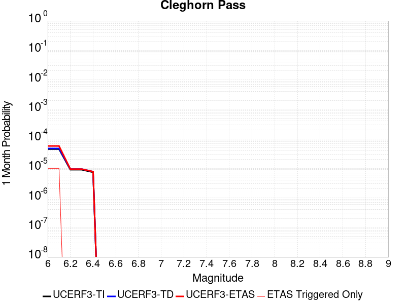 | 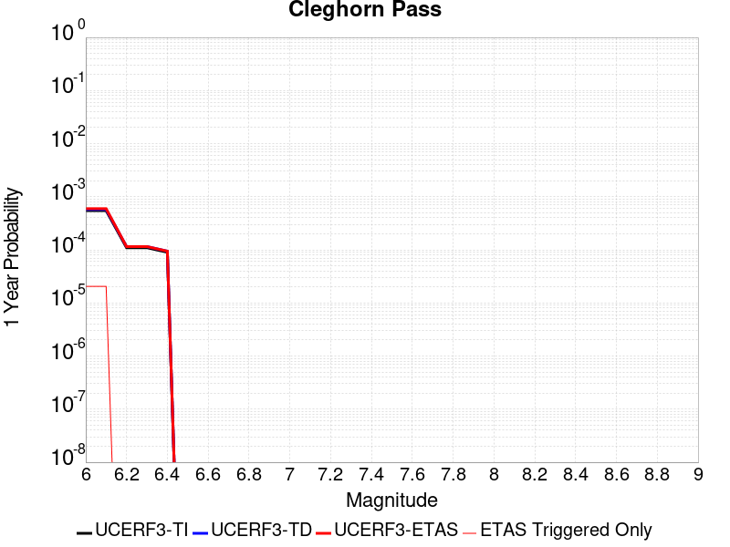 |  |

| Magnitude | 1 wk TI Prob | 1 wk TD Prob | 1 wk ETAS Prob | 1 wk ETAS/TD Gain | 1 wk ETAS Triggered Only | 1 mo TI Prob | 1 mo TD Prob | 1 mo ETAS Prob | 1 mo ETAS/TD Gain | 1 mo ETAS Triggered Only | 1 yr TI Prob | 1 yr TD Prob | 1 yr ETAS Prob | 1 yr ETAS/TD Gain | 1 yr ETAS Triggered Only | 10 yr TI Prob | 10 yr TD Prob | 10 yr ETAS Prob | 10 yr ETAS/TD Gain | 10 yr ETAS Triggered Only |
|-----|-----|-----|-----|-----|-----|-----|-----|-----|-----|-----|-----|-----|-----|-----|-----|-----|-----|-----|-----|-----|
| 6.0 | 1.0522846E-5 | 1.1040714E-5 | 1.1040714E-5 | 1.0 | 0.0 | 4.509713E-5 | 4.7316782E-5 | 5.731631E-5 | 1.2113315 | 1.0E-5 | 5.4891926E-4 | 5.759822E-4 | 6.159592E-4 | 1.0694066 | 4.0E-5 | 0.0054756533 | 0.005750059 | 0.0058494844 | 1.0172911 | 1.0E-4 |
| 6.1 | 1.0522846E-5 | 1.1040714E-5 | 1.1040714E-5 | 1.0 | 0.0 | 4.509713E-5 | 4.7316782E-5 | 5.731631E-5 | 1.2113315 | 1.0E-5 | 5.4891926E-4 | 5.759822E-4 | 6.159592E-4 | 1.0694066 | 4.0E-5 | 0.0054756533 | 0.005750059 | 0.0058494844 | 1.0172911 | 1.0E-4 |
| 6.2 | 2.1045846E-6 | 2.2082168E-6 | 2.2082168E-6 | 1.0 | 0.0 | 9.019617E-6 | 9.463776E-6 | 9.463776E-6 | 1.0 | 0.0 | 1.098083E-4 | 1.1521958E-4 | 1.1521958E-4 | 1.0 | 0.0 | 0.0010975406 | 0.0011520098 | 0.0011719867 | 1.017341 | 2.0E-5 |
| 6.3 | 2.1045846E-6 | 2.2082168E-6 | 2.2082168E-6 | 1.0 | 0.0 | 9.019617E-6 | 9.463776E-6 | 9.463776E-6 | 1.0 | 0.0 | 1.098083E-4 | 1.1521958E-4 | 1.1521958E-4 | 1.0 | 0.0 | 0.0010975406 | 0.0011520098 | 0.0011719867 | 1.017341 | 2.0E-5 |
| 6.4 | 1.7259927E-6 | 1.8108889E-6 | 1.8108889E-6 | 1.0 | 0.0 | 7.3970905E-6 | 7.760952E-6 | 7.760952E-6 | 1.0 | 0.0 | 9.005586E-5 | 9.4489595E-5 | 9.4489595E-5 | 1.0 | 0.0 | 9.001937E-4 | 9.4489596E-4 | 9.648771E-4 | 1.0211463 | 2.0E-5 |

## Elysian Park (Upper)
*[(top)](#table-of-contents)*

| 1 Week | 1 Month | 1 Year | 10 Year |
|-----|-----|-----|-----|
|  | 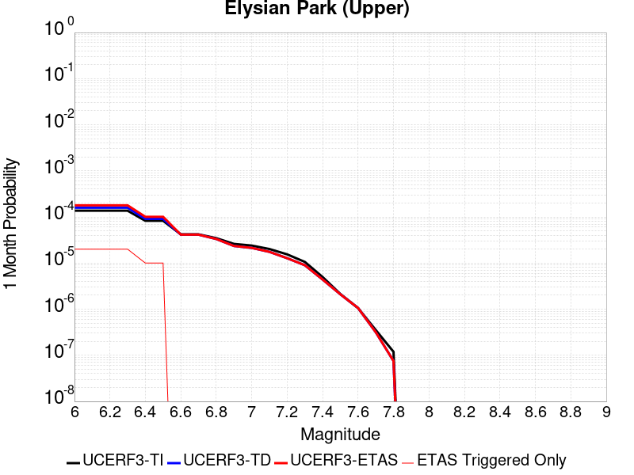 | 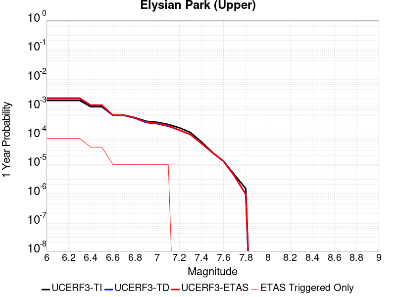 | 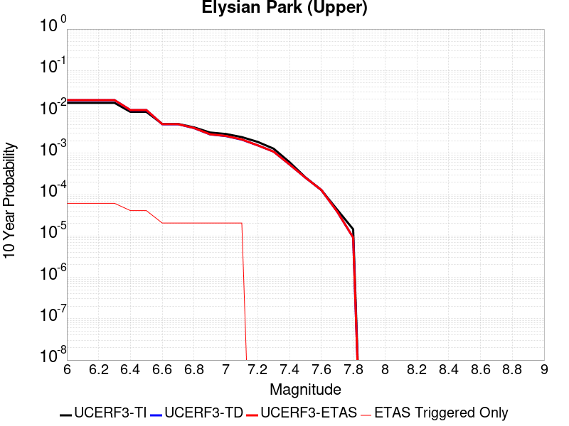 |

| Magnitude | 1 wk TI Prob | 1 wk TD Prob | 1 wk ETAS Prob | 1 wk ETAS/TD Gain | 1 wk ETAS Triggered Only | 1 mo TI Prob | 1 mo TD Prob | 1 mo ETAS Prob | 1 mo ETAS/TD Gain | 1 mo ETAS Triggered Only | 1 yr TI Prob | 1 yr TD Prob | 1 yr ETAS Prob | 1 yr ETAS/TD Gain | 1 yr ETAS Triggered Only | 10 yr TI Prob | 10 yr TD Prob | 10 yr ETAS Prob | 10 yr ETAS/TD Gain | 10 yr ETAS Triggered Only |
|-----|-----|-----|-----|-----|-----|-----|-----|-----|-----|-----|-----|-----|-----|-----|-----|-----|-----|-----|-----|-----|
| 6.0 | 3.1876025E-5 | 3.703652E-5 | 3.703652E-5 | 1.0 | 0.0 | 1.3660437E-4 | 1.5872101E-4 | 1.7871783E-4 | 1.1259873 | 2.0E-5 | 0.0016618895 | 0.0019311584 | 0.002011004 | 1.041346 | 8.0E-5 | 0.016495159 | 0.019190295 | 0.019278567 | 1.0045999 | 9.0E-5 |
| 6.1 | 3.1876025E-5 | 3.703652E-5 | 3.703652E-5 | 1.0 | 0.0 | 1.3660437E-4 | 1.5872101E-4 | 1.7871783E-4 | 1.1259873 | 2.0E-5 | 0.0016618895 | 0.0019311584 | 0.002011004 | 1.041346 | 8.0E-5 | 0.016495159 | 0.019190295 | 0.019278567 | 1.0045999 | 9.0E-5 |
| 6.2 | 3.1876025E-5 | 3.703652E-5 | 3.703652E-5 | 1.0 | 0.0 | 1.3660437E-4 | 1.5872101E-4 | 1.7871783E-4 | 1.1259873 | 2.0E-5 | 0.0016618895 | 0.0019311584 | 0.002011004 | 1.041346 | 8.0E-5 | 0.016495159 | 0.019190295 | 0.019278567 | 1.0045999 | 9.0E-5 |
| 6.3 | 3.1876025E-5 | 3.703652E-5 | 3.703652E-5 | 1.0 | 0.0 | 1.3660437E-4 | 1.5872101E-4 | 1.7871783E-4 | 1.1259873 | 2.0E-5 | 0.0016618895 | 0.0019311584 | 0.002011004 | 1.041346 | 8.0E-5 | 0.016495159 | 0.019190295 | 0.019278567 | 1.0045999 | 9.0E-5 |
| 6.4 | 1.9273462E-5 | 2.120273E-5 | 2.120273E-5 | 1.0 | 0.0 | 8.259794E-5 | 9.0866655E-5 | 1.0086575E-4 | 1.1100414 | 1.0E-5 | 0.001005166 | 0.0011059135 | 0.0011458693 | 1.0361292 | 4.0E-5 | 0.010006315 | 0.011020964 | 0.011070413 | 1.0044868 | 5.0E-5 |
| 6.5 | 1.9273462E-5 | 2.120273E-5 | 2.120273E-5 | 1.0 | 0.0 | 8.259794E-5 | 9.0866655E-5 | 1.0086575E-4 | 1.1100414 | 1.0E-5 | 0.001005166 | 0.0011059135 | 0.0011458693 | 1.0361292 | 4.0E-5 | 0.010006315 | 0.011020964 | 0.011070413 | 1.0044868 | 5.0E-5 |
| 6.6 | 9.813258E-6 | 9.665728E-6 | 9.665728E-6 | 1.0 | 0.0 | 4.205614E-5 | 4.142393E-5 | 4.142393E-5 | 1.0 | 0.0 | 5.119132E-4 | 5.042269E-4 | 5.1422184E-4 | 1.0198224 | 1.0E-5 | 0.005107356 | 0.005031552 | 0.0050415015 | 1.0019774 | 1.0E-5 |
| 6.7 | 9.801478E-6 | 9.653297E-6 | 9.653297E-6 | 1.0 | 0.0 | 4.2005657E-5 | 4.137066E-5 | 4.137066E-5 | 1.0 | 0.0 | 5.112989E-4 | 5.0357863E-4 | 5.135736E-4 | 1.0198479 | 1.0E-5 | 0.0051012407 | 0.0050250986 | 0.0050350484 | 1.0019801 | 1.0E-5 |
| 6.8 | 8.102489E-6 | 7.7731065E-6 | 7.7731065E-6 | 1.0 | 0.0 | 3.4724493E-5 | 3.3312917E-5 | 3.3312917E-5 | 1.0 | 0.0 | 4.2268867E-4 | 4.0551423E-4 | 4.1551018E-4 | 1.0246501 | 1.0E-5 | 0.004218856 | 0.0040482366 | 0.004058196 | 1.0024602 | 1.0E-5 |
| 6.9 | 6.08275E-6 | 5.4815127E-6 | 5.4815127E-6 | 1.0 | 0.0 | 2.6068668E-5 | 2.349199E-5 | 2.349199E-5 | 1.0 | 0.0 | 3.173398E-4 | 2.8597823E-4 | 2.9597536E-4 | 1.0349576 | 1.0E-5 | 0.0031688702 | 0.0028561796 | 0.002866151 | 1.0034912 | 1.0E-5 |
| 7.0 | 5.5995934E-6 | 4.982836E-6 | 4.982836E-6 | 1.0 | 0.0 | 2.3998036E-5 | 2.135484E-5 | 2.135484E-5 | 1.0 | 0.0 | 2.9213692E-4 | 2.599648E-4 | 2.699622E-4 | 1.0384568 | 1.0E-5 | 0.0029175316 | 0.0025966743 | 0.0026066485 | 1.003841 | 1.0E-5 |
| 7.1 | 4.709881E-6 | 4.0874465E-6 | 4.0874465E-6 | 1.0 | 0.0 | 2.0185047E-5 | 1.7517514E-5 | 1.7517514E-5 | 1.0 | 0.0 | 2.4572524E-4 | 2.1325526E-4 | 2.2325313E-4 | 1.0468822 | 1.0E-5 | 0.002454537 | 0.0021305475 | 0.0021405262 | 1.0046836 | 1.0E-5 |
| 7.2 | 3.6063436E-6 | 2.9779865E-6 | 2.9779865E-6 | 1.0 | 0.0 | 1.5455667E-5 | 1.2762738E-5 | 1.2762738E-5 | 1.0 | 0.0 | 1.881565E-4 | 1.5537537E-4 | 1.5537537E-4 | 1.0 | 0.0 | 0.0018799726 | 0.0015526785 | 0.0015526785 | 1.0 | 0.0 |
| 7.3 | 2.471135E-6 | 2.0954842E-6 | 2.0954842E-6 | 1.0 | 0.0 | 1.0590536E-5 | 8.980616E-6 | 8.980616E-6 | 1.0 | 0.0 | 1.2893214E-4 | 1.0933358E-4 | 1.0933358E-4 | 1.0 | 0.0 | 0.0012885736 | 0.0010928052 | 0.0010928052 | 1.0 | 0.0 |
| 7.4 | 1.163943E-6 | 1.0275212E-6 | 1.0275212E-6 | 1.0 | 0.0 | 4.988318E-6 | 4.403655E-6 | 4.403655E-6 | 1.0 | 0.0 | 6.0731076E-5 | 5.3613214E-5 | 5.3613214E-5 | 1.0 | 0.0 | 6.071448E-4 | 5.3600577E-4 | 5.3600577E-4 | 1.0 | 0.0 |
| 7.5 | 4.99459E-7 | 4.9176606E-7 | 4.9176606E-7 | 1.0 | 0.0 | 2.140537E-6 | 2.107567E-6 | 2.107567E-6 | 1.0 | 0.0 | 2.6060725E-5 | 2.5659343E-5 | 2.5659343E-5 | 1.0 | 0.0 | 2.605767E-4 | 2.5656537E-4 | 2.5656537E-4 | 1.0 | 0.0 |
| 7.6 | 2.4667852E-7 | 2.4778674E-7 | 2.4778674E-7 | 1.0 | 0.0 | 1.0571932E-6 | 1.0619428E-6 | 1.0619428E-6 | 1.0 | 0.0 | 1.2871251E-5 | 1.2929081E-5 | 1.2929081E-5 | 1.0 | 0.0 | 1.2870505E-4 | 1.2928365E-4 | 1.2928365E-4 | 1.0 | 0.0 |
| 7.7 | 8.2312795E-8 | 7.386629E-8 | 7.386629E-8 | 1.0 | 0.0 | 3.527691E-7 | 3.1656978E-7 | 3.1656978E-7 | 1.0 | 0.0 | 4.294955E-6 | 3.8542316E-6 | 3.8542316E-6 | 1.0 | 0.0 | 4.2948723E-5 | 3.8541762E-5 | 3.8541762E-5 | 1.0 | 0.0 |
| 7.8 | 2.7819295E-8 | 1.7567322E-8 | 1.7567322E-8 | 1.0 | 0.0 | 1.1922555E-7 | 7.528852E-8 | 7.528852E-8 | 1.0 | 0.0 | 1.45157E-6 | 9.166375E-7 | 9.166375E-7 | 1.0 | 0.0 | 1.45156055E-5 | 9.166352E-6 | 9.166352E-6 | 1.0 | 0.0 |

## Dry Mountain
*[(top)](#table-of-contents)*

| 1 Week | 1 Month | 1 Year | 10 Year |
|-----|-----|-----|-----|
| 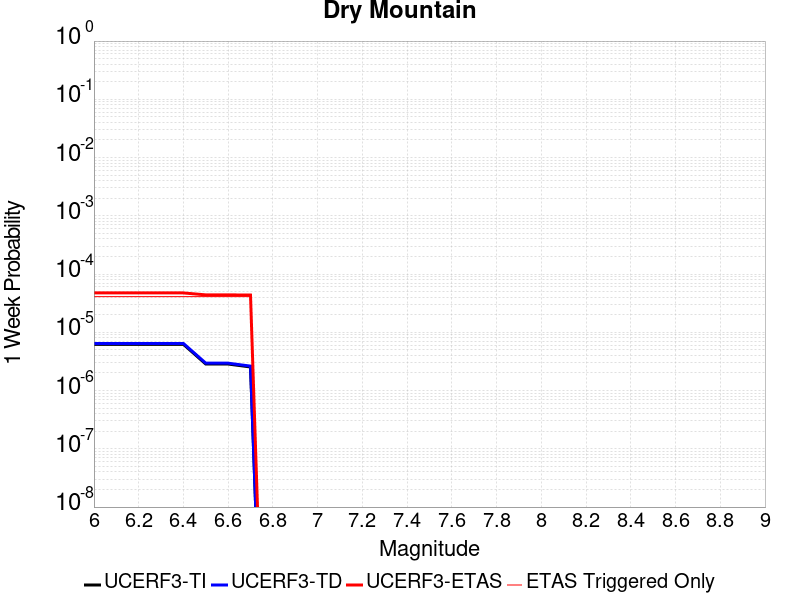 | 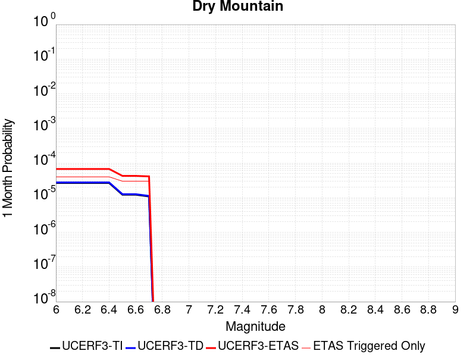 | 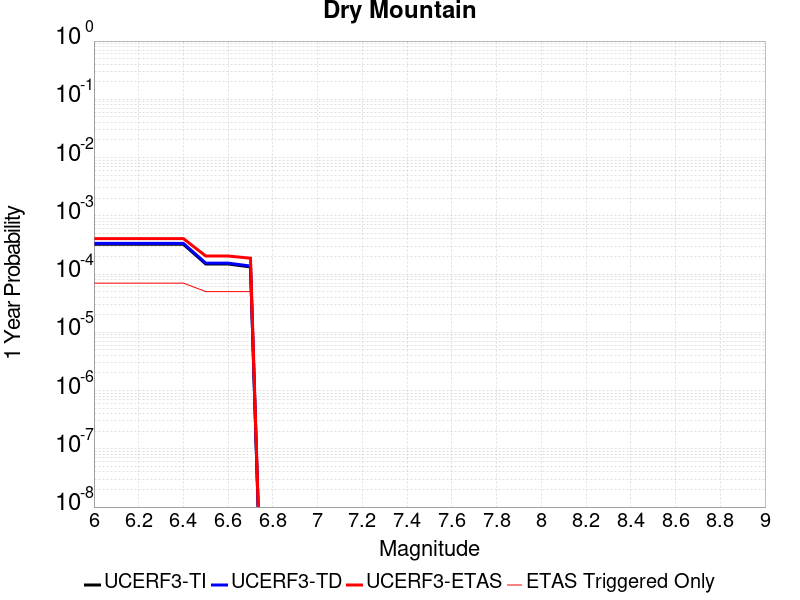 | 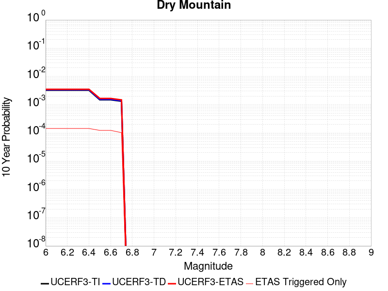 |

| Magnitude | 1 wk TI Prob | 1 wk TD Prob | 1 wk ETAS Prob | 1 wk ETAS/TD Gain | 1 wk ETAS Triggered Only | 1 mo TI Prob | 1 mo TD Prob | 1 mo ETAS Prob | 1 mo ETAS/TD Gain | 1 mo ETAS Triggered Only | 1 yr TI Prob | 1 yr TD Prob | 1 yr ETAS Prob | 1 yr ETAS/TD Gain | 1 yr ETAS Triggered Only | 10 yr TI Prob | 10 yr TD Prob | 10 yr ETAS Prob | 10 yr ETAS/TD Gain | 10 yr ETAS Triggered Only |
|-----|-----|-----|-----|-----|-----|-----|-----|-----|-----|-----|-----|-----|-----|-----|-----|-----|-----|-----|-----|-----|
| 6.0 | 6.222801E-6 | 6.439411E-6 | 2.6439282E-5 | 4.105854 | 2.0E-5 | 2.6668875E-5 | 2.7597274E-5 | 6.759617E-5 | 2.4493785 | 4.0E-5 | 3.2464517E-4 | 3.359609E-4 | 4.059374E-4 | 1.2082876 | 7.0E-5 | 0.0032417132 | 0.0033560924 | 0.0034557567 | 1.0296966 | 1.0E-4 |
| 6.1 | 6.222801E-6 | 6.439411E-6 | 2.6439282E-5 | 4.105854 | 2.0E-5 | 2.6668875E-5 | 2.7597274E-5 | 6.759617E-5 | 2.4493785 | 4.0E-5 | 3.2464517E-4 | 3.359609E-4 | 4.059374E-4 | 1.2082876 | 7.0E-5 | 0.0032417132 | 0.0033560924 | 0.0034557567 | 1.0296966 | 1.0E-4 |
| 6.2 | 6.222801E-6 | 6.439411E-6 | 2.6439282E-5 | 4.105854 | 2.0E-5 | 2.6668875E-5 | 2.7597274E-5 | 6.759617E-5 | 2.4493785 | 4.0E-5 | 3.2464517E-4 | 3.359609E-4 | 4.059374E-4 | 1.2082876 | 7.0E-5 | 0.0032417132 | 0.0033560924 | 0.0034557567 | 1.0296966 | 1.0E-4 |
| 6.3 | 6.222801E-6 | 6.439411E-6 | 2.6439282E-5 | 4.105854 | 2.0E-5 | 2.6668875E-5 | 2.7597274E-5 | 6.759617E-5 | 2.4493785 | 4.0E-5 | 3.2464517E-4 | 3.359609E-4 | 4.059374E-4 | 1.2082876 | 7.0E-5 | 0.0032417132 | 0.0033560924 | 0.0034557567 | 1.0296966 | 1.0E-4 |
| 6.4 | 6.222801E-6 | 6.439411E-6 | 2.6439282E-5 | 4.105854 | 2.0E-5 | 2.6668875E-5 | 2.7597274E-5 | 6.759617E-5 | 2.4493785 | 4.0E-5 | 3.2464517E-4 | 3.359609E-4 | 4.059374E-4 | 1.2082876 | 7.0E-5 | 0.0032417132 | 0.0033560924 | 0.0034557567 | 1.0296966 | 1.0E-4 |
| 6.5 | 2.8528623E-6 | 2.952182E-6 | 2.2952123E-5 | 7.77463 | 2.0E-5 | 1.22264955E-5 | 1.2652196E-5 | 4.2651816E-5 | 3.3710997 | 3.0E-5 | 1.4884741E-4 | 1.5403831E-4 | 2.040306E-4 | 1.3245445 | 5.0E-5 | 0.0014874774 | 0.0015401688 | 0.0016000763 | 1.0388968 | 6.0E-5 |
| 6.6 | 2.8528623E-6 | 2.952182E-6 | 2.2952123E-5 | 7.77463 | 2.0E-5 | 1.22264955E-5 | 1.2652196E-5 | 4.2651816E-5 | 3.3710997 | 3.0E-5 | 1.4884741E-4 | 1.5403831E-4 | 2.040306E-4 | 1.3245445 | 5.0E-5 | 0.0014874774 | 0.0015401688 | 0.0016000763 | 1.0388968 | 6.0E-5 |
| 6.7 | 2.541E-6 | 2.62937E-6 | 2.2629318E-5 | 8.606365 | 2.0E-5 | 1.0889954E-5 | 1.12687285E-5 | 4.126839E-5 | 3.6622047 | 3.0E-5 | 1.3257713E-4 | 1.3719677E-4 | 1.8718991E-4 | 1.36439 | 5.0E-5 | 0.0013249806 | 0.0013719677 | 0.0014218991 | 1.036394 | 5.0E-5 |

## Pisgah-Bullion Mtn-Mesquite Lk
*[(top)](#table-of-contents)*

| 1 Week | 1 Month | 1 Year | 10 Year |
|-----|-----|-----|-----|
| 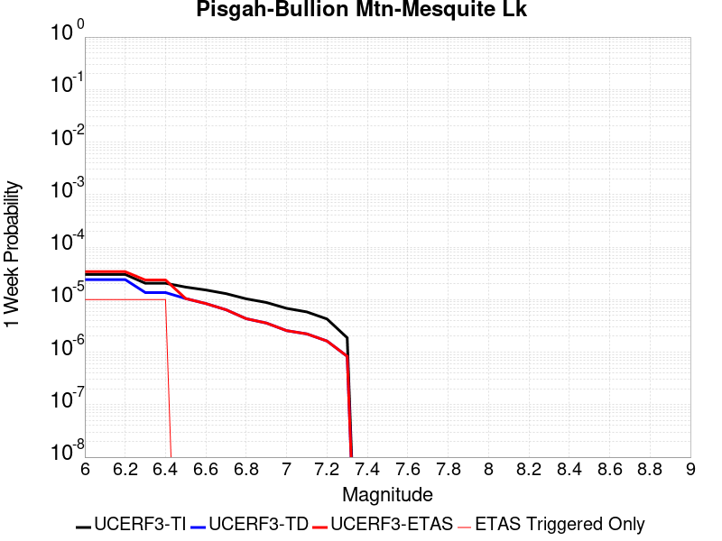 | 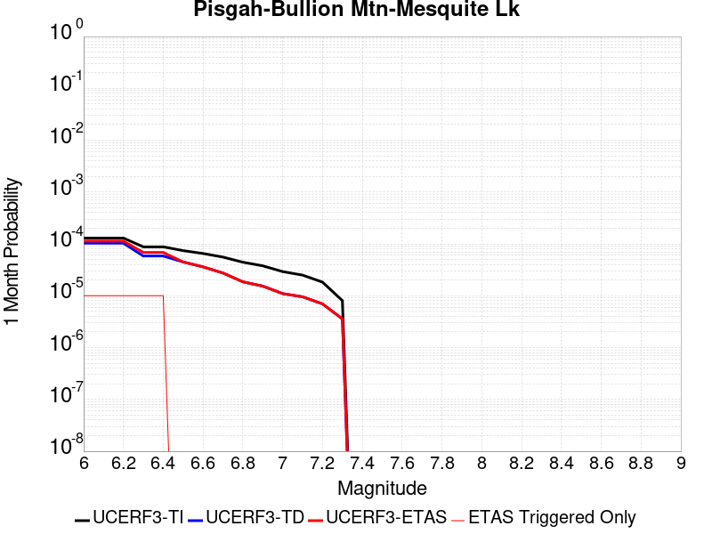 | 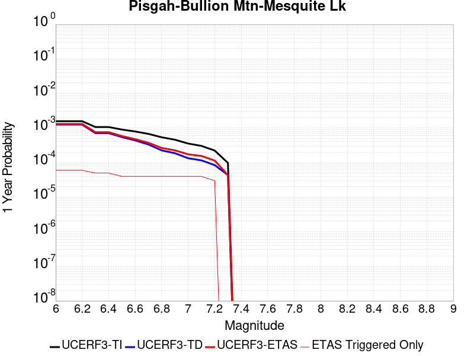 | 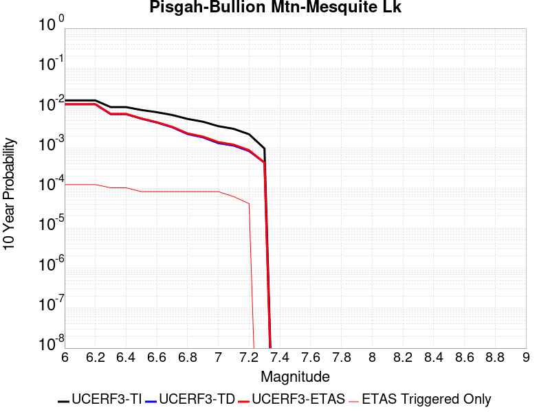 |

| Magnitude | 1 wk TI Prob | 1 wk TD Prob | 1 wk ETAS Prob | 1 wk ETAS/TD Gain | 1 wk ETAS Triggered Only | 1 mo TI Prob | 1 mo TD Prob | 1 mo ETAS Prob | 1 mo ETAS/TD Gain | 1 mo ETAS Triggered Only | 1 yr TI Prob | 1 yr TD Prob | 1 yr ETAS Prob | 1 yr ETAS/TD Gain | 1 yr ETAS Triggered Only | 10 yr TI Prob | 10 yr TD Prob | 10 yr ETAS Prob | 10 yr ETAS/TD Gain | 10 yr ETAS Triggered Only |
|-----|-----|-----|-----|-----|-----|-----|-----|-----|-----|-----|-----|-----|-----|-----|-----|-----|-----|-----|-----|-----|
| 6.0 | 3.0240792E-5 | 2.4091496E-5 | 3.4091256E-5 | 1.4150742 | 1.0E-5 | 1.2959696E-4 | 1.0324575E-4 | 1.1324472E-4 | 1.0968463 | 1.0E-5 | 0.0015767008 | 0.0012563926 | 0.0013163172 | 1.0476958 | 6.0E-5 | 0.015655609 | 0.012502918 | 0.012601668 | 1.0078981 | 1.0E-4 |
| 6.1 | 3.0240792E-5 | 2.4091496E-5 | 3.4091256E-5 | 1.4150742 | 1.0E-5 | 1.2959696E-4 | 1.0324575E-4 | 1.1324472E-4 | 1.0968463 | 1.0E-5 | 0.0015767008 | 0.0012563926 | 0.0013163172 | 1.0476958 | 6.0E-5 | 0.015655609 | 0.012502918 | 0.012601668 | 1.0078981 | 1.0E-4 |
| 6.2 | 3.0240792E-5 | 2.4091496E-5 | 3.4091256E-5 | 1.4150742 | 1.0E-5 | 1.2959696E-4 | 1.0324575E-4 | 1.1324472E-4 | 1.0968463 | 1.0E-5 | 0.0015767008 | 0.0012563926 | 0.0013163172 | 1.0476958 | 6.0E-5 | 0.015655609 | 0.012502918 | 0.012601668 | 1.0078981 | 1.0E-4 |
| 6.3 | 2.0498217E-5 | 1.3638254E-5 | 2.3638118E-5 | 1.7332217 | 1.0E-5 | 8.784654E-5 | 5.8448444E-5 | 6.844786E-5 | 1.171081 | 1.0E-5 | 0.0010690069 | 7.1139366E-4 | 7.613581E-4 | 1.0702345 | 5.0E-5 | 0.01063879 | 0.00709279 | 0.007162294 | 1.0097991 | 7.0E-5 |
| 6.4 | 2.0498217E-5 | 1.3638254E-5 | 2.3638118E-5 | 1.7332217 | 1.0E-5 | 8.784654E-5 | 5.8448444E-5 | 6.844786E-5 | 1.171081 | 1.0E-5 | 0.0010690069 | 7.1139366E-4 | 7.613581E-4 | 1.0702345 | 5.0E-5 | 0.01063879 | 0.00709279 | 0.007162294 | 1.0097991 | 7.0E-5 |
| 6.5 | 1.7316182E-5 | 1.0477178E-5 | 1.0477178E-5 | 1.0 | 0.0 | 7.42101E-5 | 4.4901473E-5 | 4.4901473E-5 | 1.0 | 0.0 | 9.0313336E-4 | 5.465483E-4 | 5.8652647E-4 | 1.0731466 | 4.0E-5 | 0.008994718 | 0.005453037 | 0.0055127097 | 1.010943 | 6.0E-5 |
| 6.6 | 1.5251077E-5 | 8.414378E-6 | 8.414378E-6 | 1.0 | 0.0 | 6.536012E-5 | 3.606116E-5 | 3.606116E-5 | 1.0 | 0.0 | 7.9546886E-4 | 4.389634E-4 | 4.7894585E-4 | 1.0910838 | 4.0E-5 | 0.007926274 | 0.004381681 | 0.004431462 | 1.0113611 | 5.0E-5 |
| 6.7 | 1.2997425E-5 | 6.411573E-6 | 6.411573E-6 | 1.0 | 0.0 | 5.570206E-5 | 2.7477907E-5 | 2.7477907E-5 | 1.0 | 0.0 | 6.7796157E-4 | 3.344968E-4 | 3.7448344E-4 | 1.1195426 | 4.0E-5 | 0.0067589693 | 0.0033403935 | 0.0033902265 | 1.0149183 | 5.0E-5 |
| 6.8 | 1.035386E-5 | 4.333283E-6 | 4.333283E-6 | 1.0 | 0.0 | 4.437293E-5 | 1.8571085E-5 | 1.8571085E-5 | 1.0 | 0.0 | 5.401065E-4 | 2.2608037E-4 | 2.6607132E-4 | 1.1768882 | 4.0E-5 | 0.0053879567 | 0.0022585907 | 0.0023084776 | 1.0220877 | 5.0E-5 |
| 6.9 | 8.816252E-6 | 3.580692E-6 | 3.580692E-6 | 1.0 | 0.0 | 3.778339E-5 | 1.5345737E-5 | 1.5345737E-5 | 1.0 | 0.0 | 4.5991567E-4 | 1.8681891E-4 | 2.2681143E-4 | 1.214071 | 4.0E-5 | 0.00458965 | 0.0018666771 | 0.0019165837 | 1.0267355 | 5.0E-5 |
| 7.0 | 6.8232207E-6 | 2.5676256E-6 | 2.5676256E-6 | 1.0 | 0.0 | 2.9242048E-5 | 1.10040655E-5 | 1.10040655E-5 | 1.0 | 0.0 | 3.5596377E-4 | 1.3396658E-4 | 1.7396122E-4 | 1.2985419 | 4.0E-5 | 0.0035539411 | 0.0013388892 | 0.0013888223 | 1.0372944 | 5.0E-5 |
| 7.1 | 5.837013E-6 | 2.2274157E-6 | 2.2274157E-6 | 1.0 | 0.0 | 2.501553E-5 | 9.546034E-6 | 9.546034E-6 | 1.0 | 0.0 | 3.045215E-4 | 1.1621706E-4 | 1.5621241E-4 | 1.3441435 | 4.0E-5 | 0.0030410455 | 0.0011615918 | 0.0012015454 | 1.0343955 | 4.0E-5 |
| 7.2 | 4.278052E-6 | 1.6275965E-6 | 1.6275965E-6 | 1.0 | 0.0 | 1.833438E-5 | 6.9753964E-6 | 6.9753964E-6 | 1.0 | 0.0 | 2.231982E-4 | 8.492238E-5 | 1.1491983E-4 | 1.3532338 | 3.0E-5 | 0.0022297418 | 8.489225E-4 | 8.78897E-4 | 1.035309 | 3.0E-5 |
| 7.3 | 1.8803692E-6 | 8.3450385E-7 | 8.3450385E-7 | 1.0 | 0.0 | 8.0587E-6 | 3.576441E-6 | 3.576441E-6 | 1.0 | 0.0 | 9.811026E-5 | 4.3542448E-5 | 4.3542448E-5 | 1.0 | 0.0 | 9.806695E-4 | 4.353536E-4 | 4.353536E-4 | 1.0 | 0.0 |

## Pinto Mtn
*[(top)](#table-of-contents)*

| 1 Week | 1 Month | 1 Year | 10 Year |
|-----|-----|-----|-----|
| 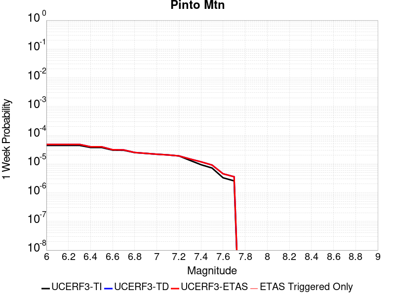 | 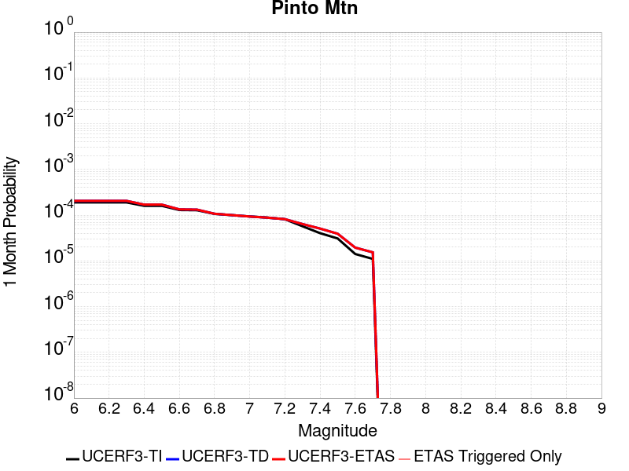 | 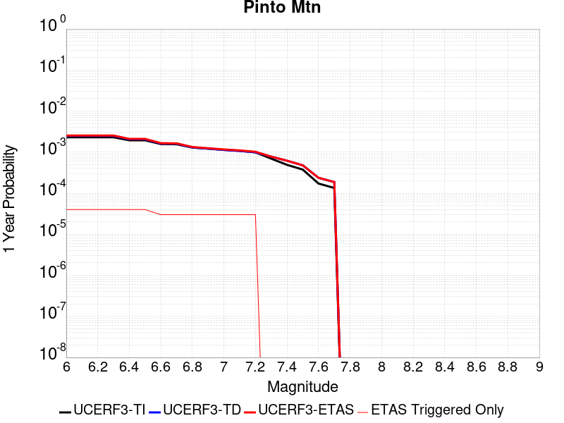 | 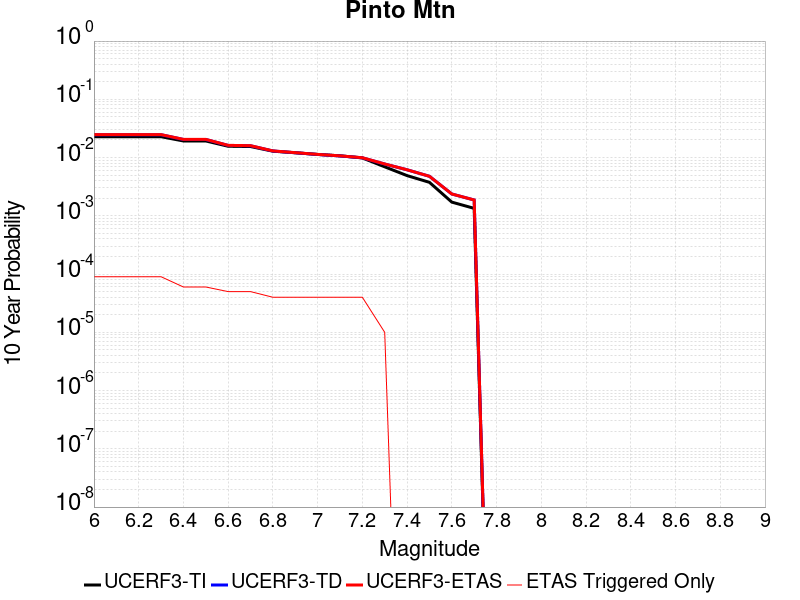 |

| Magnitude | 1 wk TI Prob | 1 wk TD Prob | 1 wk ETAS Prob | 1 wk ETAS/TD Gain | 1 wk ETAS Triggered Only | 1 mo TI Prob | 1 mo TD Prob | 1 mo ETAS Prob | 1 mo ETAS/TD Gain | 1 mo ETAS Triggered Only | 1 yr TI Prob | 1 yr TD Prob | 1 yr ETAS Prob | 1 yr ETAS/TD Gain | 1 yr ETAS Triggered Only | 10 yr TI Prob | 10 yr TD Prob | 10 yr ETAS Prob | 10 yr ETAS/TD Gain | 10 yr ETAS Triggered Only |
|-----|-----|-----|-----|-----|-----|-----|-----|-----|-----|-----|-----|-----|-----|-----|-----|-----|-----|-----|-----|-----|
| 6.0 | 4.4194956E-5 | 4.785523E-5 | 4.785523E-5 | 1.0 | 0.0 | 1.893932E-4 | 2.0507864E-4 | 2.0507864E-4 | 1.0 | 0.0 | 0.0023034236 | 0.002494138 | 0.0025340382 | 1.0159976 | 4.0E-5 | 0.022796938 | 0.024678964 | 0.024766743 | 1.0035568 | 9.0E-5 |
| 6.1 | 4.4194956E-5 | 4.785523E-5 | 4.785523E-5 | 1.0 | 0.0 | 1.893932E-4 | 2.0507864E-4 | 2.0507864E-4 | 1.0 | 0.0 | 0.0023034236 | 0.002494138 | 0.0025340382 | 1.0159976 | 4.0E-5 | 0.022796938 | 0.024678964 | 0.024766743 | 1.0035568 | 9.0E-5 |
| 6.2 | 4.4194956E-5 | 4.785523E-5 | 4.785523E-5 | 1.0 | 0.0 | 1.893932E-4 | 2.0507864E-4 | 2.0507864E-4 | 1.0 | 0.0 | 0.0023034236 | 0.002494138 | 0.0025340382 | 1.0159976 | 4.0E-5 | 0.022796938 | 0.024678964 | 0.024766743 | 1.0035568 | 9.0E-5 |
| 6.3 | 4.4194956E-5 | 4.785523E-5 | 4.785523E-5 | 1.0 | 0.0 | 1.893932E-4 | 2.0507864E-4 | 2.0507864E-4 | 1.0 | 0.0 | 0.0023034236 | 0.002494138 | 0.0025340382 | 1.0159976 | 4.0E-5 | 0.022796938 | 0.024678964 | 0.024766743 | 1.0035568 | 9.0E-5 |
| 6.4 | 3.729929E-5 | 3.960458E-5 | 3.960458E-5 | 1.0 | 0.0 | 1.5984432E-4 | 1.697234E-4 | 1.697234E-4 | 1.0 | 0.0 | 0.0019443673 | 0.0020645177 | 0.002104435 | 1.019335 | 4.0E-5 | 0.019274427 | 0.020463403 | 0.020522175 | 1.0028721 | 6.0E-5 |
| 6.5 | 3.729929E-5 | 3.960458E-5 | 3.960458E-5 | 1.0 | 0.0 | 1.5984432E-4 | 1.697234E-4 | 1.697234E-4 | 1.0 | 0.0 | 0.0019443673 | 0.0020645177 | 0.002104435 | 1.019335 | 4.0E-5 | 0.019274427 | 0.020463403 | 0.020522175 | 1.0028721 | 6.0E-5 |
| 6.6 | 3.0204548E-5 | 3.1206488E-5 | 3.1206488E-5 | 1.0 | 0.0 | 1.2944164E-4 | 1.3373543E-4 | 1.3373543E-4 | 1.0 | 0.0 | 0.0015748127 | 0.0016270474 | 0.0016569986 | 1.0184083 | 3.0E-5 | 0.015636992 | 0.01615522 | 0.016204411 | 1.003045 | 5.0E-5 |
| 6.7 | 2.9857754E-5 | 3.0815863E-5 | 3.0815863E-5 | 1.0 | 0.0 | 1.2795553E-4 | 1.320615E-4 | 1.320615E-4 | 1.0 | 0.0 | 0.0015567453 | 0.0016066976 | 0.0016366494 | 1.0186418 | 3.0E-5 | 0.015458848 | 0.015954657 | 0.016003858 | 1.0030838 | 5.0E-5 |
| 6.8 | 2.4819734E-5 | 2.5010428E-5 | 2.5010428E-5 | 1.0 | 0.0 | 1.0636595E-4 | 1.0718327E-4 | 1.0718327E-4 | 1.0 | 0.0 | 0.0012942362 | 0.0013041968 | 0.0013341577 | 1.0229727 | 3.0E-5 | 0.012867244 | 0.012967796 | 0.013007277 | 1.0030446 | 4.0E-5 |
| 6.9 | 2.331124E-5 | 2.3338684E-5 | 2.3338684E-5 | 1.0 | 0.0 | 9.990149E-5 | 1.00019206E-4 | 1.00019206E-4 | 1.0 | 0.0 | 0.001215622 | 0.001217074 | 0.0012470374 | 1.0246193 | 3.0E-5 | 0.012089936 | 0.012106278 | 0.012145793 | 1.0032641 | 4.0E-5 |
| 7.0 | 2.1818534E-5 | 2.1761793E-5 | 2.1761793E-5 | 1.0 | 0.0 | 9.3504656E-5 | 9.32616E-5 | 9.32616E-5 | 1.0 | 0.0 | 0.0011378246 | 0.0011348884 | 0.0011648544 | 1.0264043 | 3.0E-5 | 0.011320163 | 0.01129303 | 0.011332579 | 1.003502 | 4.0E-5 |
| 7.1 | 2.066081E-5 | 2.054142E-5 | 2.054142E-5 | 1.0 | 0.0 | 8.854332E-5 | 8.80318E-5 | 8.80318E-5 | 1.0 | 0.0 | 0.0010774818 | 0.0010712796 | 0.0011012475 | 1.0279739 | 3.0E-5 | 0.010722724 | 0.010663206 | 0.010702779 | 1.0037112 | 4.0E-5 |
| 7.2 | 1.8990233E-5 | 1.9054683E-5 | 1.9054683E-5 | 1.0 | 0.0 | 8.138417E-5 | 8.166048E-5 | 8.166048E-5 | 1.0 | 0.0 | 9.904018E-4 | 9.937823E-4 | 0.0010237524 | 1.0301577 | 3.0E-5 | 0.009859995 | 0.0098953815 | 0.009934985 | 1.0040023 | 4.0E-5 |
| 7.3 | 1.3335872E-5 | 1.4907276E-5 | 1.4907276E-5 | 1.0 | 0.0 | 5.7152483E-5 | 6.388683E-5 | 6.388683E-5 | 1.0 | 0.0 | 6.956093E-4 | 7.775574E-4 | 7.775574E-4 | 1.0 | 0.0 | 0.006934359 | 0.0077496674 | 0.0077595897 | 1.0012804 | 1.0E-5 |
| 7.4 | 9.414066E-6 | 1.186147E-5 | 1.186147E-5 | 1.0 | 0.0 | 4.0345374E-5 | 5.0833933E-5 | 5.0833933E-5 | 1.0 | 0.0 | 4.910942E-4 | 6.187368E-4 | 6.187368E-4 | 1.0 | 0.0 | 0.0049001034 | 0.0061710896 | 0.0061710896 | 1.0 | 0.0 |
| 7.5 | 7.2101157E-6 | 9.158733E-6 | 9.158733E-6 | 1.0 | 0.0 | 3.090013E-5 | 3.9251165E-5 | 3.9251165E-5 | 1.0 | 0.0 | 3.7614413E-4 | 4.7778594E-4 | 4.7778594E-4 | 1.0 | 0.0 | 0.0037550807 | 0.0047683627 | 0.0047683627 | 1.0 | 0.0 |
| 7.6 | 3.296375E-6 | 4.546122E-6 | 4.546122E-6 | 1.0 | 0.0 | 1.4127245E-5 | 1.9483241E-5 | 1.9483241E-5 | 1.0 | 0.0 | 1.7198564E-4 | 2.3718402E-4 | 2.3718402E-4 | 1.0 | 0.0 | 0.0017185259 | 0.0023694462 | 0.0023694462 | 1.0 | 0.0 |
| 7.7 | 2.5741092E-6 | 3.5850085E-6 | 3.5850085E-6 | 1.0 | 0.0 | 1.103185E-5 | 1.536424E-5 | 1.536424E-5 | 1.0 | 0.0 | 1.3430449E-4 | 1.8704488E-4 | 1.8704488E-4 | 1.0 | 0.0 | 0.0013422335 | 0.0018690043 | 0.0018690043 | 1.0 | 0.0 |

## Mission Creek
*[(top)](#table-of-contents)*

| 1 Week | 1 Month | 1 Year | 10 Year |
|-----|-----|-----|-----|
| 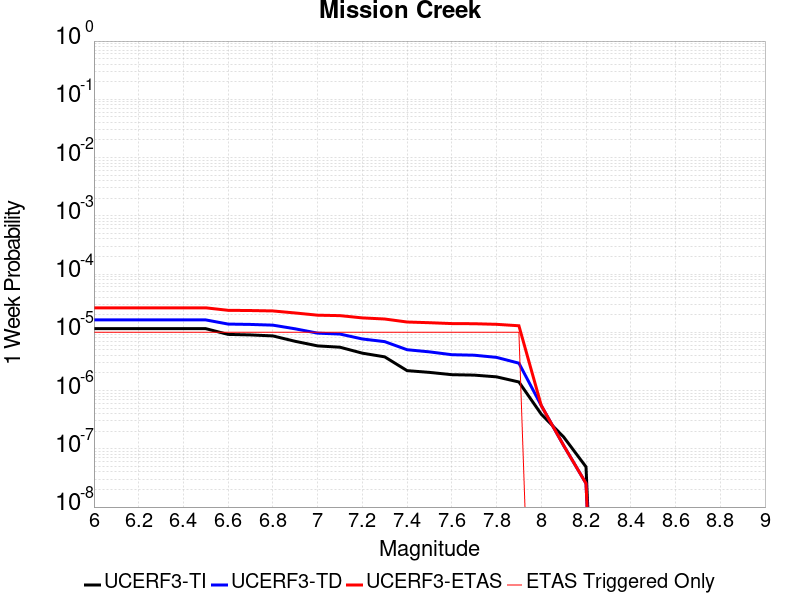 | 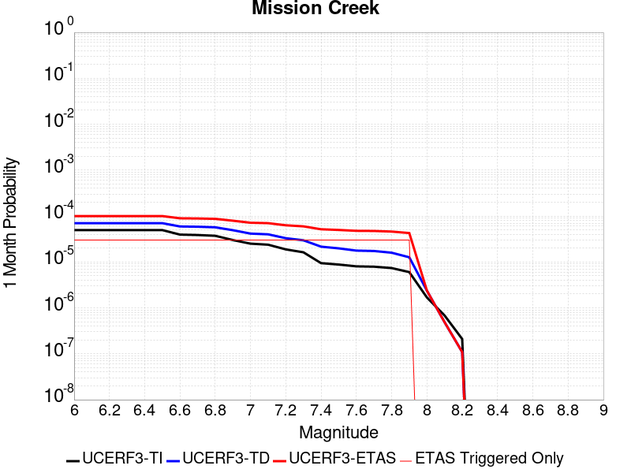 | 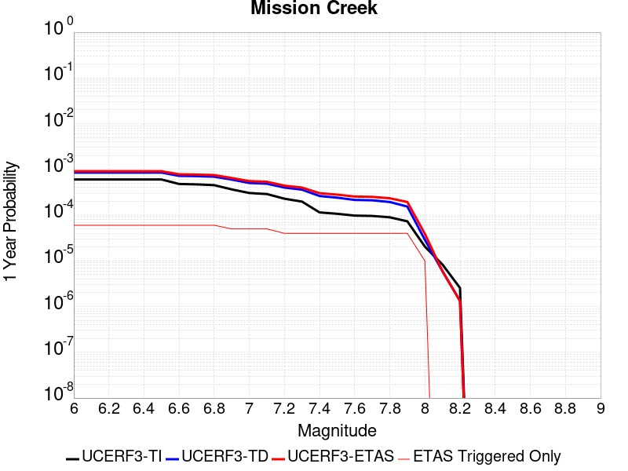 | 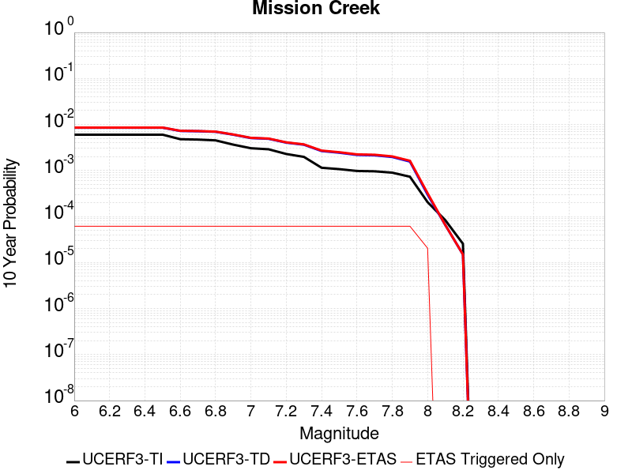 |

| Magnitude | 1 wk TI Prob | 1 wk TD Prob | 1 wk ETAS Prob | 1 wk ETAS/TD Gain | 1 wk ETAS Triggered Only | 1 mo TI Prob | 1 mo TD Prob | 1 mo ETAS Prob | 1 mo ETAS/TD Gain | 1 mo ETAS Triggered Only | 1 yr TI Prob | 1 yr TD Prob | 1 yr ETAS Prob | 1 yr ETAS/TD Gain | 1 yr ETAS Triggered Only | 10 yr TI Prob | 10 yr TD Prob | 10 yr ETAS Prob | 10 yr ETAS/TD Gain | 10 yr ETAS Triggered Only |
|-----|-----|-----|-----|-----|-----|-----|-----|-----|-----|-----|-----|-----|-----|-----|-----|-----|-----|-----|-----|-----|
| 6.0 | 1.1549387E-5 | 1.6324713E-5 | 2.632455E-5 | 1.6125582 | 1.0E-5 | 4.9496433E-5 | 6.9961265E-5 | 9.9959165E-5 | 1.4287788 | 3.0E-5 | 6.0245243E-4 | 8.5146056E-4 | 9.1140944E-4 | 1.0704072 | 6.0E-5 | 0.006008218 | 0.008511184 | 0.008600418 | 1.0104843 | 9.0E-5 |
| 6.1 | 1.1549387E-5 | 1.6324713E-5 | 2.632455E-5 | 1.6125582 | 1.0E-5 | 4.9496433E-5 | 6.9961265E-5 | 9.9959165E-5 | 1.4287788 | 3.0E-5 | 6.0245243E-4 | 8.5146056E-4 | 9.1140944E-4 | 1.0704072 | 6.0E-5 | 0.006008218 | 0.008511184 | 0.008600418 | 1.0104843 | 9.0E-5 |
| 6.2 | 1.1549387E-5 | 1.6324713E-5 | 2.632455E-5 | 1.6125582 | 1.0E-5 | 4.9496433E-5 | 6.9961265E-5 | 9.9959165E-5 | 1.4287788 | 3.0E-5 | 6.0245243E-4 | 8.5146056E-4 | 9.1140944E-4 | 1.0704072 | 6.0E-5 | 0.006008218 | 0.008511184 | 0.008600418 | 1.0104843 | 9.0E-5 |
| 6.3 | 1.1549387E-5 | 1.6324713E-5 | 2.632455E-5 | 1.6125582 | 1.0E-5 | 4.9496433E-5 | 6.9961265E-5 | 9.9959165E-5 | 1.4287788 | 3.0E-5 | 6.0245243E-4 | 8.5146056E-4 | 9.1140944E-4 | 1.0704072 | 6.0E-5 | 0.006008218 | 0.008511184 | 0.008600418 | 1.0104843 | 9.0E-5 |
| 6.4 | 1.1549387E-5 | 1.6324713E-5 | 2.632455E-5 | 1.6125582 | 1.0E-5 | 4.9496433E-5 | 6.9961265E-5 | 9.9959165E-5 | 1.4287788 | 3.0E-5 | 6.0245243E-4 | 8.5146056E-4 | 9.1140944E-4 | 1.0704072 | 6.0E-5 | 0.006008218 | 0.008511184 | 0.008600418 | 1.0104843 | 9.0E-5 |
| 6.5 | 1.1549387E-5 | 1.6324713E-5 | 2.632455E-5 | 1.6125582 | 1.0E-5 | 4.9496433E-5 | 6.9961265E-5 | 9.9959165E-5 | 1.4287788 | 3.0E-5 | 6.0245243E-4 | 8.5146056E-4 | 9.1140944E-4 | 1.0704072 | 6.0E-5 | 0.006008218 | 0.008511184 | 0.008600418 | 1.0104843 | 9.0E-5 |
| 6.6 | 9.202681E-6 | 1.3847972E-5 | 2.3847833E-5 | 1.7221174 | 1.0E-5 | 3.9439463E-5 | 5.9347152E-5 | 8.934537E-5 | 1.5054703 | 3.0E-5 | 4.800697E-4 | 7.2232104E-4 | 7.822777E-4 | 1.0830055 | 6.0E-5 | 0.004790339 | 0.0072283596 | 0.0073177093 | 1.0123609 | 9.0E-5 |
| 6.7 | 9.019164E-6 | 1.365364E-5 | 2.3653503E-5 | 1.7323954 | 1.0E-5 | 3.8652986E-5 | 5.8514335E-5 | 8.8512585E-5 | 1.5126649 | 3.0E-5 | 4.7049852E-4 | 7.121882E-4 | 7.7214546E-4 | 1.0841874 | 6.0E-5 | 0.004695036 | 0.0071276836 | 0.007217042 | 1.0125368 | 9.0E-5 |
| 6.8 | 8.673558E-6 | 1.3275746E-5 | 2.3275614E-5 | 1.7532433 | 1.0E-5 | 3.717186E-5 | 5.6894864E-5 | 8.689315E-5 | 1.5272584 | 3.0E-5 | 4.524734E-4 | 6.924836E-4 | 7.524421E-4 | 1.0865847 | 6.0E-5 | 0.0045155324 | 0.0069318693 | 0.0070212455 | 1.0128936 | 9.0E-5 |
| 6.9 | 7.002255E-6 | 1.1479958E-5 | 2.1479842E-5 | 1.8710734 | 1.0E-5 | 3.000932E-5 | 4.9198927E-5 | 7.919745E-5 | 1.6097394 | 3.0E-5 | 3.653022E-4 | 5.988392E-4 | 6.4880925E-4 | 1.0834448 | 5.0E-5 | 0.0036470229 | 0.0060006846 | 0.006080204 | 1.0132518 | 8.0E-5 |
| 7.0 | 5.84644E-6 | 9.677164E-6 | 1.9677067E-5 | 2.0333507 | 1.0E-5 | 2.5055931E-5 | 4.1472922E-5 | 7.147168E-5 | 1.7233335 | 3.0E-5 | 3.0501327E-4 | 5.0482043E-4 | 5.547952E-4 | 1.0989951 | 5.0E-5 | 0.0030459496 | 0.0050649596 | 0.005144554 | 1.0157148 | 8.0E-5 |
| 7.1 | 5.54703E-6 | 9.331631E-6 | 1.9331537E-5 | 2.071614 | 1.0E-5 | 2.377277E-5 | 3.999212E-5 | 6.999092E-5 | 1.7501178 | 3.0E-5 | 2.8939504E-4 | 4.8679972E-4 | 5.367754E-4 | 1.1026616 | 5.0E-5 | 0.0028901845 | 0.0048855497 | 0.0049651586 | 1.0162948 | 8.0E-5 |
| 7.2 | 4.384709E-6 | 7.6836495E-6 | 1.7683573E-5 | 2.301455 | 1.0E-5 | 1.8791474E-5 | 3.292953E-5 | 6.292854E-5 | 1.9110063 | 3.0E-5 | 2.2876218E-4 | 4.0084694E-4 | 4.408309E-4 | 1.0997487 | 4.0E-5 | 0.0022852682 | 0.0040294197 | 0.0040991376 | 1.0173023 | 7.0E-5 |
| 7.3 | 3.7888456E-6 | 6.9174894E-6 | 1.691742E-5 | 2.4456012 | 1.0E-5 | 1.623781E-5 | 2.9646066E-5 | 5.9645175E-5 | 2.0119088 | 3.0E-5 | 1.9767738E-4 | 3.608844E-4 | 4.0087E-4 | 1.1107988 | 4.0E-5 | 0.0019750162 | 0.0036311483 | 0.003700894 | 1.0192076 | 7.0E-5 |
| 7.4 | 2.1982462E-6 | 5.0257536E-6 | 1.5025704E-5 | 2.9897413 | 1.0E-5 | 9.421021E-6 | 2.1538768E-5 | 5.153812E-5 | 2.3928072 | 3.0E-5 | 1.1469489E-4 | 2.6220313E-4 | 3.0219264E-4 | 1.1525135 | 4.0E-5 | 0.0011463572 | 0.0026468872 | 0.002716702 | 1.0263761 | 7.0E-5 |
| 7.5 | 2.051923E-6 | 4.6169393E-6 | 1.4616893E-5 | 3.165927 | 1.0E-5 | 8.793926E-6 | 1.9786734E-5 | 4.978614E-5 | 2.5161374 | 3.0E-5 | 1.0706078E-4 | 2.40877E-4 | 2.8086736E-4 | 1.1660199 | 4.0E-5 | 0.0010700922 | 0.0024345173 | 0.002494371 | 1.0245855 | 6.0E-5 |
| 7.6 | 1.8733427E-6 | 4.1252324E-6 | 1.4125191E-5 | 3.4240959 | 1.0E-5 | 8.028587E-6 | 1.767945E-5 | 4.7678917E-5 | 2.6968555 | 3.0E-5 | 9.774366E-5 | 2.1522611E-4 | 2.5521748E-4 | 1.185811 | 4.0E-5 | 9.770069E-4 | 0.0021790217 | 0.0022388909 | 1.0274752 | 6.0E-5 |
| 7.7 | 1.8411953E-6 | 4.044895E-6 | 1.4044855E-5 | 3.472242 | 1.0E-5 | 7.890813E-6 | 1.733515E-5 | 4.733463E-5 | 2.730558 | 3.0E-5 | 9.606641E-5 | 2.1103508E-4 | 2.5102665E-4 | 1.189502 | 4.0E-5 | 9.6024893E-4 | 0.0021373003 | 0.0021971723 | 1.0280128 | 6.0E-5 |
| 7.8 | 1.7194251E-6 | 3.7121463E-6 | 1.3712109E-5 | 3.6938493 | 1.0E-5 | 7.368944E-6 | 1.5909101E-5 | 4.5908626E-5 | 2.885683 | 3.0E-5 | 8.97132E-5 | 1.9367617E-4 | 2.3366843E-4 | 1.2064903 | 4.0E-5 | 8.967699E-4 | 0.0019632233 | 0.0020231055 | 1.030502 | 6.0E-5 |
| 7.9 | 1.4035052E-6 | 2.9514722E-6 | 1.2951443E-5 | 4.3881297 | 1.0E-5 | 6.0150082E-6 | 1.2649106E-5 | 4.2648728E-5 | 3.371679 | 3.0E-5 | 7.3230265E-5 | 1.5399205E-4 | 1.9398588E-4 | 1.2597136 | 4.0E-5 | 7.3206134E-4 | 0.0015638224 | 0.0016237285 | 1.0383075 | 6.0E-5 |
| 8.0 | 3.9318823E-7 | 5.5319464E-7 | 5.5319464E-7 | 1.0 | 0.0 | 1.6850913E-6 | 2.3708321E-6 | 2.3708321E-6 | 1.0 | 0.0 | 2.0515794E-5 | 2.8864504E-5 | 3.8864215E-5 | 1.3464363 | 1.0E-5 | 2.0513899E-4 | 2.9916913E-4 | 3.1916314E-4 | 1.0668318 | 2.0E-5 |
| 8.1 | 1.596793E-7 | 1.1391901E-7 | 1.1391901E-7 | 1.0 | 0.0 | 6.8433974E-7 | 4.8822426E-7 | 4.8822426E-7 | 1.0 | 0.0 | 8.331805E-6 | 5.944114E-6 | 5.944114E-6 | 1.0 | 0.0 | 8.331492E-5 | 6.5564316E-5 | 6.5564316E-5 | 1.0 | 0.0 |
| 8.2 | 4.9003038E-8 | 2.5475106E-8 | 2.5475106E-8 | 1.0 | 0.0 | 2.10013E-7 | 1.0917902E-7 | 1.0917902E-7 | 1.0 | 0.0 | 2.5569052E-6 | 1.3292538E-6 | 1.3292538E-6 | 1.0 | 0.0 | 2.556876E-5 | 1.4973085E-5 | 1.4973085E-5 | 1.0 | 0.0 |

## Independence rev 2011
*[(top)](#table-of-contents)*

| 1 Week | 1 Month | 1 Year | 10 Year |
|-----|-----|-----|-----|
| 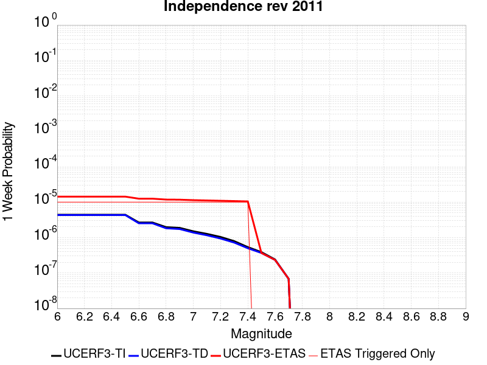 | 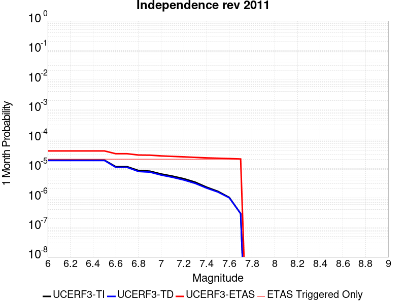 | 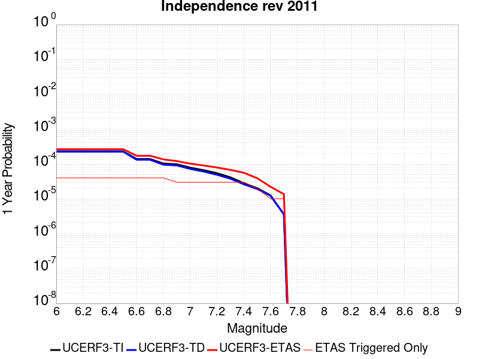 | 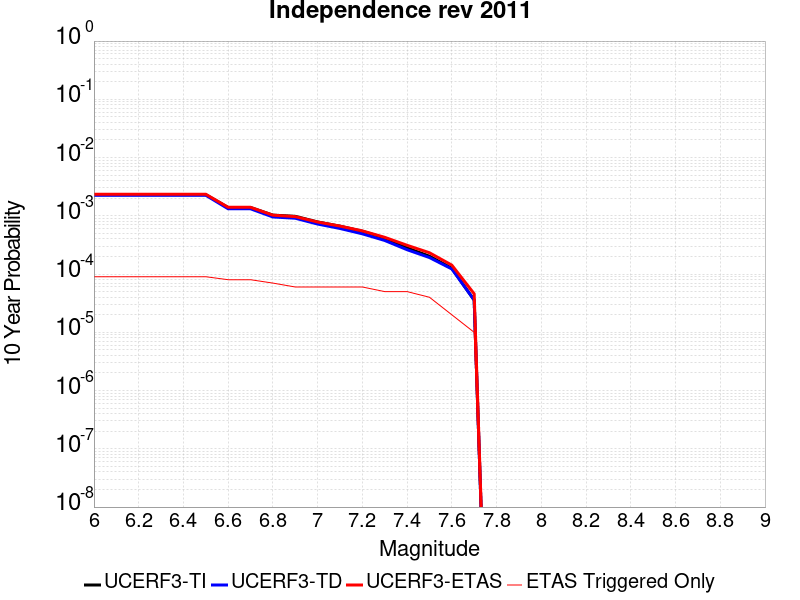 |

| Magnitude | 1 wk TI Prob | 1 wk TD Prob | 1 wk ETAS Prob | 1 wk ETAS/TD Gain | 1 wk ETAS Triggered Only | 1 mo TI Prob | 1 mo TD Prob | 1 mo ETAS Prob | 1 mo ETAS/TD Gain | 1 mo ETAS Triggered Only | 1 yr TI Prob | 1 yr TD Prob | 1 yr ETAS Prob | 1 yr ETAS/TD Gain | 1 yr ETAS Triggered Only | 10 yr TI Prob | 10 yr TD Prob | 10 yr ETAS Prob | 10 yr ETAS/TD Gain | 10 yr ETAS Triggered Only |
|-----|-----|-----|-----|-----|-----|-----|-----|-----|-----|-----|-----|-----|-----|-----|-----|-----|-----|-----|-----|-----|
| 6.0 | 4.422171E-6 | 4.3262453E-6 | 1.4326202E-5 | 3.311463 | 1.0E-5 | 1.8952025E-5 | 1.8540937E-5 | 4.854038E-5 | 2.6180112 | 3.0E-5 | 2.3071647E-4 | 2.257155E-4 | 2.6570648E-4 | 1.1771742 | 4.0E-5 | 0.0023047708 | 0.0022551562 | 0.0023449531 | 1.0398185 | 9.0E-5 |
| 6.1 | 4.422171E-6 | 4.3262453E-6 | 1.4326202E-5 | 3.311463 | 1.0E-5 | 1.8952025E-5 | 1.8540937E-5 | 4.854038E-5 | 2.6180112 | 3.0E-5 | 2.3071647E-4 | 2.257155E-4 | 2.6570648E-4 | 1.1771742 | 4.0E-5 | 0.0023047708 | 0.0022551562 | 0.0023449531 | 1.0398185 | 9.0E-5 |
| 6.2 | 4.422171E-6 | 4.3262453E-6 | 1.4326202E-5 | 3.311463 | 1.0E-5 | 1.8952025E-5 | 1.8540937E-5 | 4.854038E-5 | 2.6180112 | 3.0E-5 | 2.3071647E-4 | 2.257155E-4 | 2.6570648E-4 | 1.1771742 | 4.0E-5 | 0.0023047708 | 0.0022551562 | 0.0023449531 | 1.0398185 | 9.0E-5 |
| 6.3 | 4.422171E-6 | 4.3262453E-6 | 1.4326202E-5 | 3.311463 | 1.0E-5 | 1.8952025E-5 | 1.8540937E-5 | 4.854038E-5 | 2.6180112 | 3.0E-5 | 2.3071647E-4 | 2.257155E-4 | 2.6570648E-4 | 1.1771742 | 4.0E-5 | 0.0023047708 | 0.0022551562 | 0.0023449531 | 1.0398185 | 9.0E-5 |
| 6.4 | 4.422171E-6 | 4.3262453E-6 | 1.4326202E-5 | 3.311463 | 1.0E-5 | 1.8952025E-5 | 1.8540937E-5 | 4.854038E-5 | 2.6180112 | 3.0E-5 | 2.3071647E-4 | 2.257155E-4 | 2.6570648E-4 | 1.1771742 | 4.0E-5 | 0.0023047708 | 0.0022551562 | 0.0023449531 | 1.0398185 | 9.0E-5 |
| 6.5 | 4.422171E-6 | 4.3262453E-6 | 1.4326202E-5 | 3.311463 | 1.0E-5 | 1.8952025E-5 | 1.8540937E-5 | 4.854038E-5 | 2.6180112 | 3.0E-5 | 2.3071647E-4 | 2.257155E-4 | 2.6570648E-4 | 1.1771742 | 4.0E-5 | 0.0023047708 | 0.0022551562 | 0.0023449531 | 1.0398185 | 9.0E-5 |
| 6.6 | 2.663744E-6 | 2.5319996E-6 | 1.2531974E-5 | 4.9494376 | 1.0E-5 | 1.1415996E-5 | 1.0851385E-5 | 4.085106E-5 | 3.764594 | 3.0E-5 | 1.3898089E-4 | 1.3210809E-4 | 1.7210281E-4 | 1.3027424 | 4.0E-5 | 0.0013889399 | 0.0013203438 | 0.0014002381 | 1.0605103 | 8.0E-5 |
| 6.7 | 2.663744E-6 | 2.5319996E-6 | 1.2531974E-5 | 4.9494376 | 1.0E-5 | 1.1415996E-5 | 1.0851385E-5 | 4.085106E-5 | 3.764594 | 3.0E-5 | 1.3898089E-4 | 1.3210809E-4 | 1.7210281E-4 | 1.3027424 | 4.0E-5 | 0.0013889399 | 0.0013203438 | 0.0014002381 | 1.0605103 | 8.0E-5 |
| 6.8 | 1.9716529E-6 | 1.83227E-6 | 1.1832251E-5 | 6.457701 | 1.0E-5 | 8.449913E-6 | 7.852563E-6 | 3.7852325E-5 | 4.820379 | 3.0E-5 | 1.0287284E-4 | 9.560089E-5 | 1.3559706E-4 | 1.4183662 | 4.0E-5 | 0.0010282523 | 9.556105E-4 | 0.0010255435 | 1.0731816 | 7.0E-5 |
| 6.9 | 1.8788617E-6 | 1.7430103E-6 | 1.1742993E-5 | 6.7371907 | 1.0E-5 | 8.0522395E-6 | 7.470024E-6 | 2.7469874E-5 | 3.6773477 | 2.0E-5 | 9.80316E-5 | 9.094387E-5 | 1.20941135E-4 | 1.3298439 | 3.0E-5 | 9.798837E-4 | 9.090785E-4 | 9.6902397E-4 | 1.0659409 | 6.0E-5 |
| 7.0 | 1.5045488E-6 | 1.3849595E-6 | 1.13849455E-5 | 8.220418 | 1.0E-5 | 6.44805E-6 | 5.9355275E-6 | 2.593541E-5 | 4.36952 | 2.0E-5 | 7.8502184E-5 | 7.226271E-5 | 1.02260536E-4 | 1.4151219 | 3.0E-5 | 7.8474457E-4 | 7.2239724E-4 | 7.8235386E-4 | 1.0829968 | 6.0E-5 |
| 7.1 | 1.272341E-6 | 1.1625177E-6 | 1.1162506E-5 | 9.60201 | 1.0E-5 | 5.4528787E-6 | 4.9822092E-6 | 2.498211E-5 | 5.0142636 | 2.0E-5 | 6.6386776E-5 | 6.065674E-5 | 9.0654925E-5 | 1.4945564 | 3.0E-5 | 6.636695E-4 | 6.06405E-4 | 6.663687E-4 | 1.0988837 | 6.0E-5 |
| 7.2 | 1.0416892E-6 | 9.4099494E-7 | 1.0940986E-5 | 11.62704 | 1.0E-5 | 4.464375E-6 | 4.032829E-6 | 2.4032748E-5 | 5.9592776 | 2.0E-5 | 5.4352407E-5 | 4.909861E-5 | 7.909714E-5 | 1.6109853 | 3.0E-5 | 5.4339116E-4 | 4.9087947E-4 | 5.5085E-4 | 1.1221696 | 6.0E-5 |
| 7.3 | 7.9450155E-7 | 7.235053E-7 | 1.0723498E-5 | 14.8215885 | 1.0E-5 | 3.4050022E-6 | 3.1007335E-6 | 2.310067E-5 | 7.4500666 | 2.0E-5 | 4.1455114E-5 | 3.7750786E-5 | 6.774966E-5 | 1.7946554 | 3.0E-5 | 4.144738E-4 | 3.7744487E-4 | 4.2742598E-4 | 1.1324197 | 5.0E-5 |
| 7.4 | 5.3893444E-7 | 5.0195445E-7 | 1.0501949E-5 | 20.922117 | 1.0E-5 | 2.309717E-6 | 2.1512315E-6 | 2.215119E-5 | 10.296981 | 2.0E-5 | 2.8120441E-5 | 2.6190934E-5 | 5.6190147E-5 | 2.1454046 | 3.0E-5 | 2.8116882E-4 | 2.6187891E-4 | 3.1186582E-4 | 1.1908779 | 5.0E-5 |
| 7.5 | 3.8852085E-7 | 3.6825747E-7 | 3.6825747E-7 | 1.0 | 0.0 | 1.6650882E-6 | 1.5782454E-6 | 1.15782295E-5 | 7.33614 | 1.0E-5 | 2.027226E-5 | 1.9214971E-5 | 3.9214585E-5 | 2.0408351 | 2.0E-5 | 2.0270412E-4 | 1.921333E-4 | 2.3212562E-4 | 1.2081488 | 4.0E-5 |
| 7.6 | 2.414929E-7 | 2.3457659E-7 | 2.3457659E-7 | 1.0 | 0.0 | 1.0349692E-6 | 1.0053279E-6 | 1.1005318E-5 | 10.946994 | 1.0E-5 | 1.2600677E-5 | 1.22398E-5 | 2.2239677E-5 | 1.8169968 | 1.0E-5 | 1.2599962E-4 | 1.2239137E-4 | 1.4238893E-4 | 1.1633902 | 2.0E-5 |
| 7.7 | 6.8298014E-8 | 6.858993E-8 | 6.858993E-8 | 1.0 | 0.0 | 2.9270575E-7 | 2.939568E-7 | 1.0293954E-5 | 35.018593 | 1.0E-5 | 3.5636867E-6 | 3.5789185E-6 | 1.3578883E-5 | 3.79413 | 1.0E-5 | 3.5636294E-5 | 3.5788657E-5 | 4.57883E-5 | 1.2794081 | 1.0E-5 |

## Cleghorn Lake
*[(top)](#table-of-contents)*

| 1 Week | 1 Month | 1 Year | 10 Year |
|-----|-----|-----|-----|
|  | 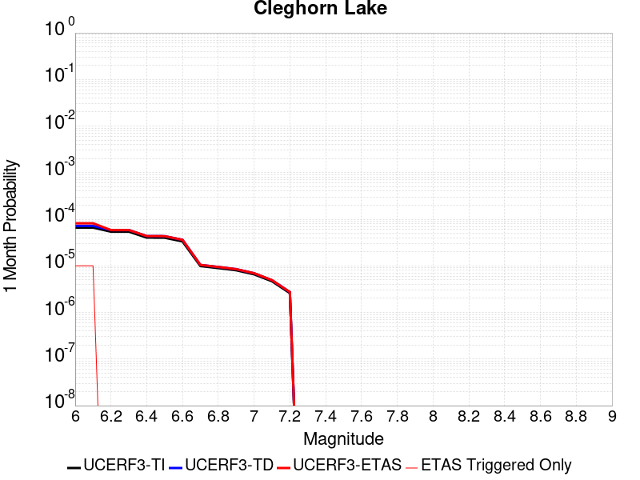 | 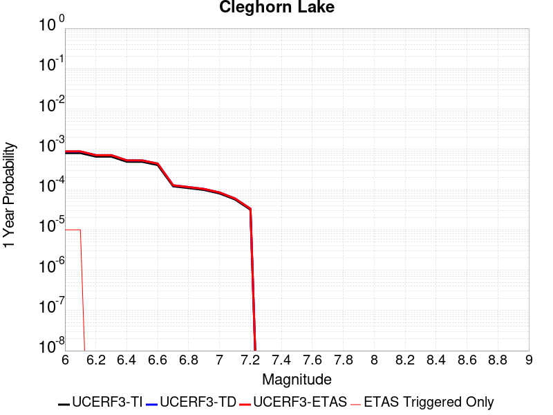 | 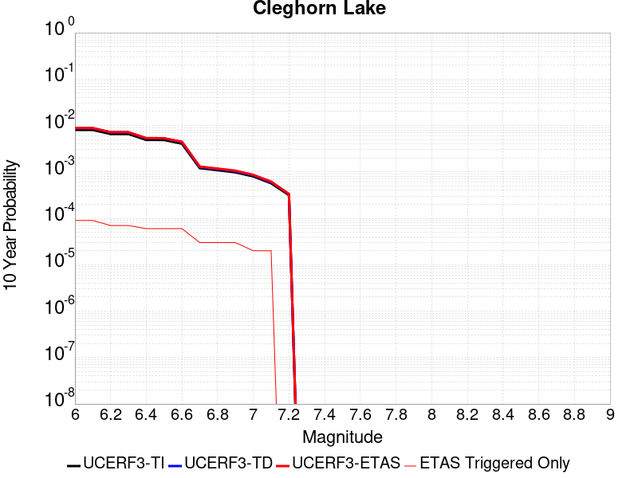 |

| Magnitude | 1 wk TI Prob | 1 wk TD Prob | 1 wk ETAS Prob | 1 wk ETAS/TD Gain | 1 wk ETAS Triggered Only | 1 mo TI Prob | 1 mo TD Prob | 1 mo ETAS Prob | 1 mo ETAS/TD Gain | 1 mo ETAS Triggered Only | 1 yr TI Prob | 1 yr TD Prob | 1 yr ETAS Prob | 1 yr ETAS/TD Gain | 1 yr ETAS Triggered Only | 10 yr TI Prob | 10 yr TD Prob | 10 yr ETAS Prob | 10 yr ETAS/TD Gain | 10 yr ETAS Triggered Only |
|-----|-----|-----|-----|-----|-----|-----|-----|-----|-----|-----|-----|-----|-----|-----|-----|-----|-----|-----|-----|-----|
| 6.0 | 1.5467183E-5 | 1.6794396E-5 | 1.6794396E-5 | 1.0 | 0.0 | 6.6286244E-5 | 7.1974304E-5 | 8.197359E-5 | 1.1389285 | 1.0E-5 | 8.067362E-4 | 8.7598973E-4 | 8.8598096E-4 | 1.0114057 | 1.0E-5 | 0.008038137 | 0.008730795 | 0.008820009 | 1.0102184 | 9.0E-5 |
| 6.1 | 1.5467183E-5 | 1.6794396E-5 | 1.6794396E-5 | 1.0 | 0.0 | 6.6286244E-5 | 7.1974304E-5 | 8.197359E-5 | 1.1389285 | 1.0E-5 | 8.067362E-4 | 8.7598973E-4 | 8.8598096E-4 | 1.0114057 | 1.0E-5 | 0.008038137 | 0.008730795 | 0.008820009 | 1.0102184 | 9.0E-5 |
| 6.2 | 1.2624631E-5 | 1.3681697E-5 | 1.3681697E-5 | 1.0 | 0.0 | 5.410444E-5 | 5.86348E-5 | 5.86348E-5 | 1.0 | 0.0 | 6.585225E-4 | 7.1369356E-4 | 7.1369356E-4 | 1.0 | 0.0 | 0.0065657445 | 0.007118811 | 0.0071883127 | 1.0097631 | 7.0E-5 |
| 6.3 | 1.2624631E-5 | 1.3681697E-5 | 1.3681697E-5 | 1.0 | 0.0 | 5.410444E-5 | 5.86348E-5 | 5.86348E-5 | 1.0 | 0.0 | 6.585225E-4 | 7.1369356E-4 | 7.1369356E-4 | 1.0 | 0.0 | 0.0065657445 | 0.007118811 | 0.0071883127 | 1.0097631 | 7.0E-5 |
| 6.4 | 9.417684E-6 | 1.0170226E-5 | 1.0170226E-5 | 1.0 | 0.0 | 4.036088E-5 | 4.3586184E-5 | 4.3586184E-5 | 1.0 | 0.0 | 4.912829E-4 | 5.305737E-4 | 5.305737E-4 | 1.0 | 0.0 | 0.004901982 | 0.0052971053 | 0.0053567877 | 1.011267 | 6.0E-5 |
| 6.5 | 9.368219E-6 | 1.0117652E-5 | 1.0117652E-5 | 1.0 | 0.0 | 4.014889E-5 | 4.3360877E-5 | 4.3360877E-5 | 1.0 | 0.0 | 4.8870314E-4 | 5.278319E-4 | 5.278319E-4 | 1.0 | 0.0 | 0.004876298 | 0.0052698175 | 0.0053295013 | 1.0113256 | 6.0E-5 |
| 6.6 | 7.803798E-6 | 8.441923E-6 | 8.441923E-6 | 1.0 | 0.0 | 3.3444423E-5 | 3.6179394E-5 | 3.6179394E-5 | 1.0 | 0.0 | 4.0710976E-4 | 4.40435E-4 | 4.40435E-4 | 1.0 | 0.0 | 0.0040636472 | 0.004399538 | 0.0044592745 | 1.0135778 | 6.0E-5 |
| 6.7 | 2.3108669E-6 | 2.4438523E-6 | 2.4438523E-6 | 1.0 | 0.0 | 9.903678E-6 | 1.0473612E-5 | 1.0473612E-5 | 1.0 | 0.0 | 1.205706E-4 | 1.2750895E-4 | 1.2750895E-4 | 1.0 | 0.0 | 0.001205052 | 0.0012743765 | 0.0013043383 | 1.0235109 | 3.0E-5 |
| 6.8 | 2.0882828E-6 | 2.2062986E-6 | 2.2062986E-6 | 1.0 | 0.0 | 8.949753E-6 | 9.455533E-6 | 9.455533E-6 | 1.0 | 0.0 | 1.08957785E-4 | 1.15115196E-4 | 1.15115196E-4 | 1.0 | 0.0 | 0.0010890438 | 0.0011505726 | 0.0011805381 | 1.026044 | 3.0E-5 |
| 6.9 | 1.876935E-6 | 1.9810657E-6 | 1.9810657E-6 | 1.0 | 0.0 | 8.043982E-6 | 8.490254E-6 | 8.490254E-6 | 1.0 | 0.0 | 9.7931086E-5 | 1.033641E-4 | 1.033641E-4 | 1.0 | 0.0 | 9.788794E-4 | 0.0010331762 | 0.0010631452 | 1.0290067 | 3.0E-5 |
| 7.0 | 1.5357559E-6 | 1.6202926E-6 | 1.6202926E-6 | 1.0 | 0.0 | 6.5817944E-6 | 6.944093E-6 | 6.944093E-6 | 1.0 | 0.0 | 8.01304E-5 | 8.454118E-5 | 8.454118E-5 | 1.0 | 0.0 | 8.010151E-4 | 8.4510265E-4 | 8.6508575E-4 | 1.0236458 | 2.0E-5 |
| 7.1 | 1.0905424E-6 | 1.1497702E-6 | 1.1497702E-6 | 1.0 | 0.0 | 4.6737446E-6 | 4.927578E-6 | 4.927578E-6 | 1.0 | 0.0 | 5.6901354E-5 | 5.999171E-5 | 5.999171E-5 | 1.0 | 0.0 | 5.6886784E-4 | 5.997649E-4 | 6.197529E-4 | 1.0333264 | 2.0E-5 |
| 7.2 | 6.06668E-7 | 6.387322E-7 | 6.387322E-7 | 1.0 | 0.0 | 2.600003E-6 | 2.7374213E-6 | 2.7374213E-6 | 1.0 | 0.0 | 3.1654577E-5 | 3.3327666E-5 | 3.3327666E-5 | 1.0 | 0.0 | 3.1650066E-4 | 3.332335E-4 | 3.332335E-4 | 1.0 | 0.0 |

## San Jacinto (Anza) rev
*[(top)](#table-of-contents)*

| 1 Week | 1 Month | 1 Year | 10 Year |
|-----|-----|-----|-----|
| 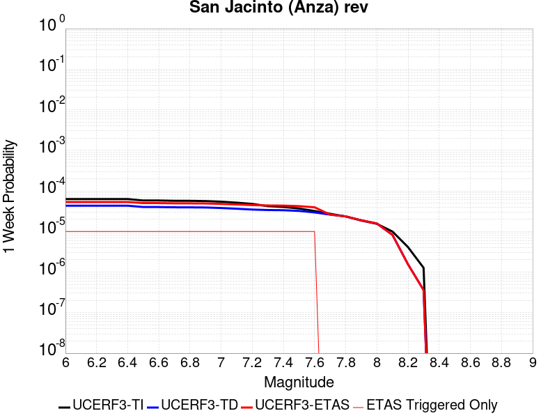 | 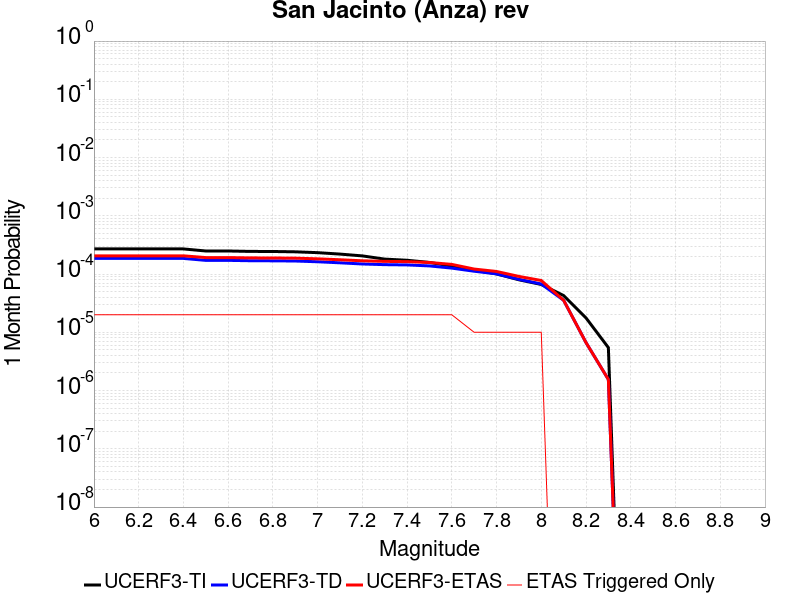 | 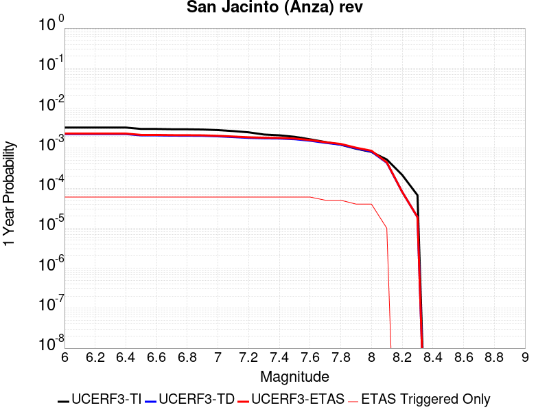 | 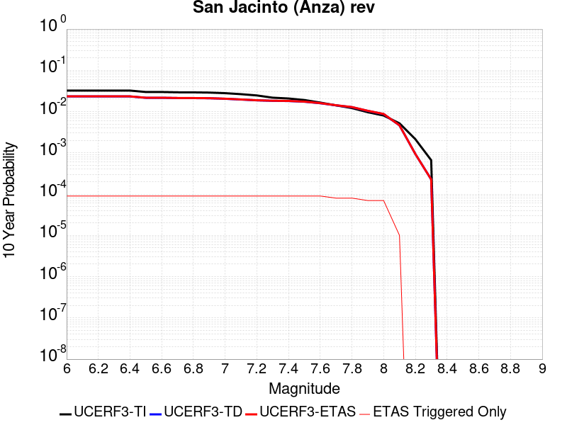 |

| Magnitude | 1 wk TI Prob | 1 wk TD Prob | 1 wk ETAS Prob | 1 wk ETAS/TD Gain | 1 wk ETAS Triggered Only | 1 mo TI Prob | 1 mo TD Prob | 1 mo ETAS Prob | 1 mo ETAS/TD Gain | 1 mo ETAS Triggered Only | 1 yr TI Prob | 1 yr TD Prob | 1 yr ETAS Prob | 1 yr ETAS/TD Gain | 1 yr ETAS Triggered Only | 10 yr TI Prob | 10 yr TD Prob | 10 yr ETAS Prob | 10 yr ETAS/TD Gain | 10 yr ETAS Triggered Only |
|-----|-----|-----|-----|-----|-----|-----|-----|-----|-----|-----|-----|-----|-----|-----|-----|-----|-----|-----|-----|-----|
| 6.0 | 6.3015636E-5 | 4.3319626E-5 | 5.3319192E-5 | 1.2308322 | 1.0E-5 | 2.7003905E-4 | 1.8564239E-4 | 2.0563869E-4 | 1.107714 | 2.0E-5 | 0.0032827691 | 0.0022578652 | 0.0023177296 | 1.0265138 | 6.0E-5 | 0.032346968 | 0.02330496 | 0.023392862 | 1.0037718 | 9.0E-5 |
| 6.1 | 6.3015636E-5 | 4.3319626E-5 | 5.3319192E-5 | 1.2308322 | 1.0E-5 | 2.7003905E-4 | 1.8564239E-4 | 2.0563869E-4 | 1.107714 | 2.0E-5 | 0.0032827691 | 0.0022578652 | 0.0023177296 | 1.0265138 | 6.0E-5 | 0.032346968 | 0.02330496 | 0.023392862 | 1.0037718 | 9.0E-5 |
| 6.2 | 6.3015636E-5 | 4.3319626E-5 | 5.3319192E-5 | 1.2308322 | 1.0E-5 | 2.7003905E-4 | 1.8564239E-4 | 2.0563869E-4 | 1.107714 | 2.0E-5 | 0.0032827691 | 0.0022578652 | 0.0023177296 | 1.0265138 | 6.0E-5 | 0.032346968 | 0.02330496 | 0.023392862 | 1.0037718 | 9.0E-5 |
| 6.3 | 6.3015636E-5 | 4.3319626E-5 | 5.3319192E-5 | 1.2308322 | 1.0E-5 | 2.7003905E-4 | 1.8564239E-4 | 2.0563869E-4 | 1.107714 | 2.0E-5 | 0.0032827691 | 0.0022578652 | 0.0023177296 | 1.0265138 | 6.0E-5 | 0.032346968 | 0.02330496 | 0.023392862 | 1.0037718 | 9.0E-5 |
| 6.4 | 6.3015636E-5 | 4.3319626E-5 | 5.3319192E-5 | 1.2308322 | 1.0E-5 | 2.7003905E-4 | 1.8564239E-4 | 2.0563869E-4 | 1.107714 | 2.0E-5 | 0.0032827691 | 0.0022578652 | 0.0023177296 | 1.0265138 | 6.0E-5 | 0.032346968 | 0.02330496 | 0.023392862 | 1.0037718 | 9.0E-5 |
| 6.5 | 5.811017E-5 | 4.0098632E-5 | 5.009823E-5 | 1.2493751 | 1.0E-5 | 2.4901982E-4 | 1.7184E-4 | 1.9183656E-4 | 1.1163673 | 2.0E-5 | 0.0030276014 | 0.00209015 | 0.0021500248 | 1.0286461 | 6.0E-5 | 0.02986684 | 0.021602087 | 0.021690141 | 1.0040762 | 9.0E-5 |
| 6.6 | 5.811017E-5 | 4.0098632E-5 | 5.009823E-5 | 1.2493751 | 1.0E-5 | 2.4901982E-4 | 1.7184E-4 | 1.9183656E-4 | 1.1163673 | 2.0E-5 | 0.0030276014 | 0.00209015 | 0.0021500248 | 1.0286461 | 6.0E-5 | 0.02986684 | 0.021602087 | 0.021690141 | 1.0040762 | 9.0E-5 |
| 6.7 | 5.712442E-5 | 3.952116E-5 | 4.9520764E-5 | 1.253019 | 1.0E-5 | 2.4479596E-4 | 1.6936543E-4 | 1.8936205E-4 | 1.1180679 | 2.0E-5 | 0.0029763177 | 0.0020600795 | 0.0021199558 | 1.0290651 | 6.0E-5 | 0.029367693 | 0.021293823 | 0.021381907 | 1.0041366 | 9.0E-5 |
| 6.8 | 5.6967532E-5 | 3.9377548E-5 | 4.9377155E-5 | 1.2539418 | 1.0E-5 | 2.4412372E-4 | 1.6875003E-4 | 1.8874666E-4 | 1.1184984 | 2.0E-5 | 0.0029681553 | 0.0020526012 | 0.002112478 | 1.0291712 | 6.0E-5 | 0.029288229 | 0.021218529 | 0.021306619 | 1.0041516 | 9.0E-5 |
| 6.9 | 5.6211324E-5 | 3.9082228E-5 | 4.908184E-5 | 1.2558608 | 1.0E-5 | 2.4088343E-4 | 1.6748454E-4 | 1.8748119E-4 | 1.1193941 | 2.0E-5 | 0.0029288116 | 0.0020372227 | 0.0020971005 | 1.0293919 | 6.0E-5 | 0.028905109 | 0.021057902 | 0.021146007 | 1.0041839 | 9.0E-5 |
| 7.0 | 5.4383527E-5 | 3.7942387E-5 | 4.7942005E-5 | 1.2635475 | 1.0E-5 | 2.3305144E-4 | 1.6260012E-4 | 1.8259686E-4 | 1.1229812 | 2.0E-5 | 0.0028337094 | 0.001977864 | 0.0020377452 | 1.0302757 | 6.0E-5 | 0.027978465 | 0.020448677 | 0.020536836 | 1.0043112 | 9.0E-5 |
| 7.1 | 5.1393665E-5 | 3.640475E-5 | 4.6404384E-5 | 1.2746794 | 1.0E-5 | 2.2023996E-4 | 1.5601104E-4 | 1.7600792E-4 | 1.1281761 | 2.0E-5 | 0.0026781242 | 0.0018977838 | 0.0019576699 | 1.0315558 | 6.0E-5 | 0.026460782 | 0.019622007 | 0.01971024 | 1.0044967 | 9.0E-5 |
| 7.2 | 4.785222E-5 | 3.475601E-5 | 4.4755663E-5 | 1.2877101 | 1.0E-5 | 2.0506482E-4 | 1.4894584E-4 | 1.6894286E-4 | 1.134257 | 2.0E-5 | 0.0024938055 | 0.0018119109 | 0.0018718021 | 1.0330542 | 6.0E-5 | 0.024660049 | 0.018736389 | 0.018824704 | 1.0047135 | 9.0E-5 |
| 7.3 | 4.2143256E-5 | 3.3850083E-5 | 4.3849745E-5 | 1.2954103 | 1.0E-5 | 1.8060145E-4 | 1.4506375E-4 | 1.6506085E-4 | 1.1378504 | 2.0E-5 | 0.002196605 | 0.0017647238 | 0.0018246179 | 1.0339396 | 6.0E-5 | 0.02175019 | 0.018244414 | 0.018332772 | 1.004843 | 9.0E-5 |
| 7.4 | 4.0264713E-5 | 3.3488133E-5 | 4.34878E-5 | 1.2986032 | 1.0E-5 | 1.7255165E-4 | 1.435127E-4 | 1.6350983E-4 | 1.1393405 | 2.0E-5 | 0.002098792 | 0.0017458702 | 0.0018057654 | 1.0343068 | 6.0E-5 | 0.020790804 | 0.018048922 | 0.018137299 | 1.0048964 | 9.0E-5 |
| 7.5 | 3.694492E-5 | 3.2201835E-5 | 4.2201515E-5 | 1.3105313 | 1.0E-5 | 1.5832575E-4 | 1.3800059E-4 | 1.5799783E-4 | 1.1449069 | 2.0E-5 | 0.0019259118 | 0.0016788654 | 0.0017387647 | 1.0356784 | 6.0E-5 | 0.01909306 | 0.017365217 | 0.017453654 | 1.0050927 | 9.0E-5 |
| 7.6 | 3.200565E-5 | 2.9517045E-5 | 3.9516748E-5 | 1.3387773 | 1.0E-5 | 1.3715986E-4 | 1.2649549E-4 | 1.4649297E-4 | 1.1580884 | 2.0E-5 | 0.001668642 | 0.0015389969 | 0.0015989046 | 1.0389265 | 6.0E-5 | 0.01656168 | 0.015953032 | 0.016041597 | 1.0055516 | 9.0E-5 |
| 7.7 | 2.731642E-5 | 2.610537E-5 | 2.610537E-5 | 1.0 | 0.0 | 1.1706512E-4 | 1.11875364E-4 | 1.2187425E-4 | 1.0893751 | 1.0E-5 | 0.001424336 | 0.0013612325 | 0.0014111644 | 1.0366814 | 5.0E-5 | 0.014152412 | 0.0141735645 | 0.014252431 | 1.0055643 | 8.0E-5 |
| 7.8 | 2.3466424E-5 | 2.3516895E-5 | 2.3516895E-5 | 1.0 | 0.0 | 1.0056651E-4 | 1.007828E-4 | 1.10781795E-4 | 1.0992132 | 1.0E-5 | 0.0012237094 | 0.0012263408 | 0.0012762795 | 1.0407217 | 5.0E-5 | 0.012169928 | 0.012815201 | 0.012894175 | 1.0061626 | 8.0E-5 |
| 7.9 | 1.8611925E-5 | 1.8918972E-5 | 1.8918972E-5 | 1.0 | 0.0 | 7.9762955E-5 | 8.107879E-5 | 9.107798E-5 | 1.1233268 | 1.0E-5 | 9.7068126E-4 | 9.86688E-4 | 0.0010266484 | 1.0404997 | 4.0E-5 | 0.0096645225 | 0.010399517 | 0.010468788 | 1.006661 | 7.0E-5 |
| 8.0 | 1.5460775E-5 | 1.5750582E-5 | 1.5750582E-5 | 1.0 | 0.0 | 6.6258784E-5 | 6.7500754E-5 | 7.750008E-5 | 1.1481365 | 1.0E-5 | 8.0640207E-4 | 8.215125E-4 | 8.6147967E-4 | 1.0486506 | 4.0E-5 | 0.008034821 | 0.008707945 | 0.008777335 | 1.0079687 | 7.0E-5 |
| 8.1 | 9.983884E-6 | 8.275629E-6 | 8.275629E-6 | 1.0 | 0.0 | 4.2787375E-5 | 3.54665E-5 | 3.54665E-5 | 1.0 | 0.0 | 5.2081177E-4 | 4.3171959E-4 | 4.4171527E-4 | 1.0231532 | 1.0E-5 | 0.0051959283 | 0.004643071 | 0.0046530245 | 1.0021437 | 1.0E-5 |
| 8.2 | 4.1226E-6 | 1.5546157E-6 | 1.5546157E-6 | 1.0 | 0.0 | 1.7668166E-5 | 6.6626217E-6 | 6.6626217E-6 | 1.0 | 0.0 | 2.1508869E-4 | 8.111443E-5 | 8.111443E-5 | 1.0 | 0.0 | 0.0021488064 | 9.4143586E-4 | 9.4143586E-4 | 1.0 | 0.0 |
| 8.3 | 1.2750878E-6 | 3.6166134E-7 | 3.6166134E-7 | 1.0 | 0.0 | 5.4646503E-6 | 1.5499762E-6 | 1.5499762E-6 | 1.0 | 0.0 | 6.653009E-5 | 1.8870802E-5 | 1.8870802E-5 | 1.0 | 0.0 | 6.6510175E-4 | 2.2760578E-4 | 2.2760578E-4 | 1.0 | 0.0 |

## Santa Rosa Island
*[(top)](#table-of-contents)*

| 1 Week | 1 Month | 1 Year | 10 Year |
|-----|-----|-----|-----|
|  | 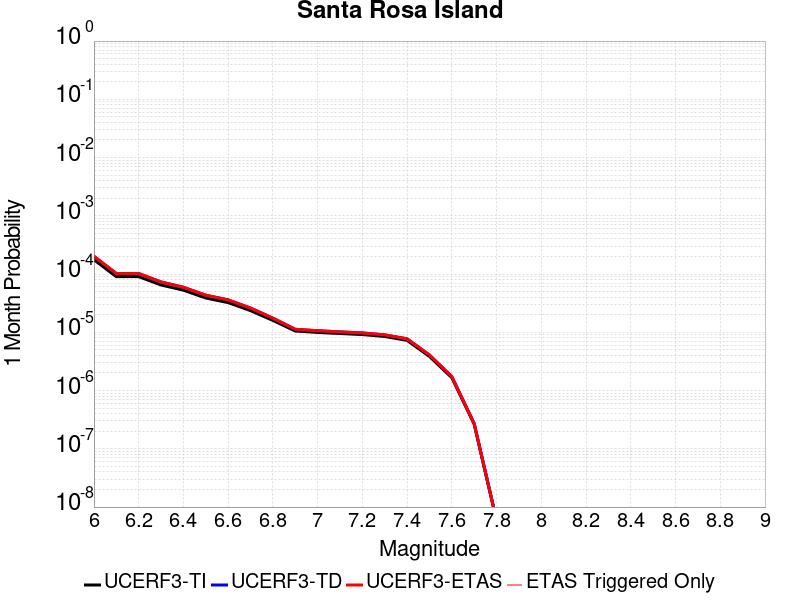 | 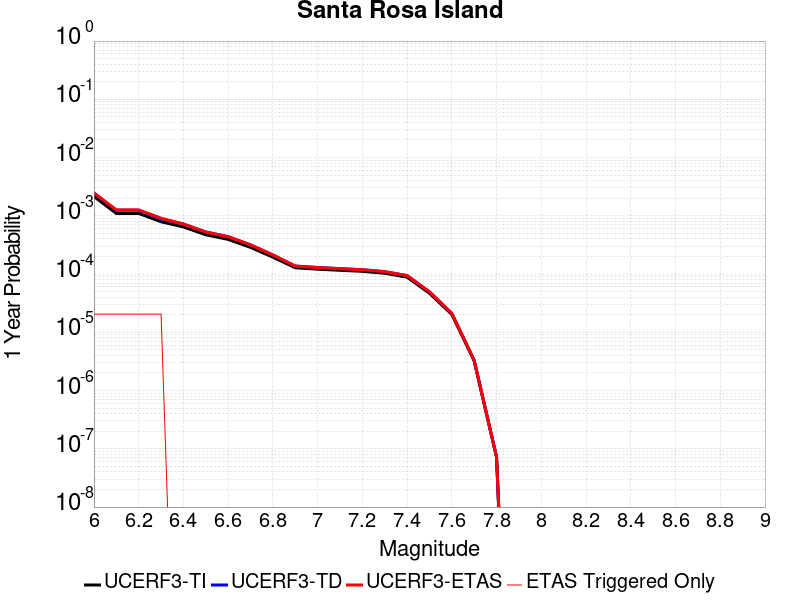 | 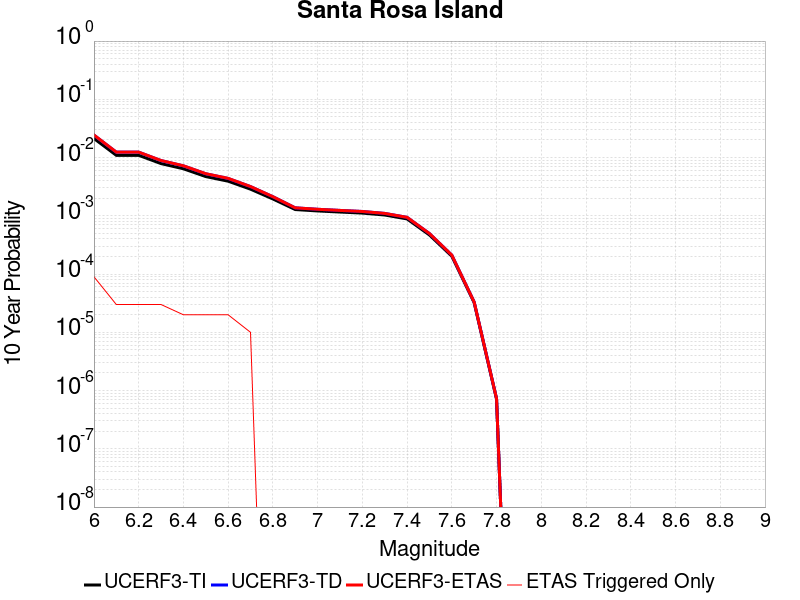 |

| Magnitude | 1 wk TI Prob | 1 wk TD Prob | 1 wk ETAS Prob | 1 wk ETAS/TD Gain | 1 wk ETAS Triggered Only | 1 mo TI Prob | 1 mo TD Prob | 1 mo ETAS Prob | 1 mo ETAS/TD Gain | 1 mo ETAS Triggered Only | 1 yr TI Prob | 1 yr TD Prob | 1 yr ETAS Prob | 1 yr ETAS/TD Gain | 1 yr ETAS Triggered Only | 10 yr TI Prob | 10 yr TD Prob | 10 yr ETAS Prob | 10 yr ETAS/TD Gain | 10 yr ETAS Triggered Only |
|-----|-----|-----|-----|-----|-----|-----|-----|-----|-----|-----|-----|-----|-----|-----|-----|-----|-----|-----|-----|-----|
| 6.0 | 4.1143165E-5 | 4.7092042E-5 | 4.7092042E-5 | 1.0 | 0.0 | 1.7631594E-4 | 2.0180854E-4 | 2.0180854E-4 | 1.0 | 0.0 | 0.002144533 | 0.0024544473 | 0.0024843735 | 1.0121927 | 3.0E-5 | 0.021239553 | 0.024294013 | 0.024381828 | 1.0036147 | 9.0E-5 |
| 6.1 | 2.1061249E-5 | 2.3865383E-5 | 2.3865383E-5 | 1.0 | 0.0 | 9.0259375E-5 | 1.0227637E-4 | 1.0227637E-4 | 1.0 | 0.0 | 0.0010983539 | 0.0012445324 | 0.00125452 | 1.0080252 | 1.0E-5 | 0.01092941 | 0.012378667 | 0.012408296 | 1.0023935 | 3.0E-5 |
| 6.2 | 2.1061249E-5 | 2.3865383E-5 | 2.3865383E-5 | 1.0 | 0.0 | 9.0259375E-5 | 1.0227637E-4 | 1.0227637E-4 | 1.0 | 0.0 | 0.0010983539 | 0.0012445324 | 0.00125452 | 1.0080252 | 1.0E-5 | 0.01092941 | 0.012378667 | 0.012408296 | 1.0023935 | 3.0E-5 |
| 6.3 | 1.5158236E-5 | 1.7074708E-5 | 1.7074708E-5 | 1.0 | 0.0 | 6.496225E-5 | 7.317533E-5 | 7.317533E-5 | 1.0 | 0.0 | 7.906284E-4 | 8.905574E-4 | 9.0054853E-4 | 1.0112189 | 1.0E-5 | 0.007878214 | 0.008871138 | 0.008900872 | 1.0033518 | 3.0E-5 |
| 6.4 | 1.2341918E-5 | 1.3853143E-5 | 1.3853143E-5 | 1.0 | 0.0 | 5.2892858E-5 | 5.9369308E-5 | 5.9369308E-5 | 1.0 | 0.0 | 6.437803E-4 | 7.225897E-4 | 7.225897E-4 | 1.0 | 0.0 | 0.006419184 | 0.0072032386 | 0.0072230943 | 1.0027565 | 2.0E-5 |
| 6.5 | 9.061158E-6 | 1.0117188E-5 | 1.0117188E-5 | 1.0 | 0.0 | 3.883296E-5 | 4.335869E-5 | 4.335869E-5 | 1.0 | 0.0 | 4.726887E-4 | 5.277695E-4 | 5.277695E-4 | 1.0 | 0.0 | 0.004716845 | 0.0052656992 | 0.0052855937 | 1.0037782 | 2.0E-5 |
| 6.6 | 7.5461685E-6 | 8.400861E-6 | 8.400861E-6 | 1.0 | 0.0 | 3.2340322E-5 | 3.6003217E-5 | 3.6003217E-5 | 1.0 | 0.0 | 3.936723E-4 | 4.382553E-4 | 4.382553E-4 | 1.0 | 0.0 | 0.003929756 | 0.0043743397 | 0.0043942523 | 1.0045521 | 2.0E-5 |
| 6.7 | 5.5023775E-6 | 6.0874677E-6 | 6.0874677E-6 | 1.0 | 0.0 | 2.3581404E-5 | 2.6088905E-5 | 2.6088905E-5 | 1.0 | 0.0 | 2.8706578E-4 | 3.1758935E-4 | 3.1758935E-4 | 1.0 | 0.0 | 0.0028669522 | 0.0031716768 | 0.003181645 | 1.003143 | 1.0E-5 |
| 6.8 | 3.7351679E-6 | 4.0831915E-6 | 4.0831915E-6 | 1.0 | 0.0 | 1.6007763E-5 | 1.749929E-5 | 1.749929E-5 | 1.0 | 0.0 | 1.948771E-4 | 2.1303551E-4 | 2.1303551E-4 | 1.0 | 0.0 | 0.0019470629 | 0.002128558 | 0.002128558 | 1.0 | 0.0 |
| 6.9 | 2.456366E-6 | 2.6292953E-6 | 2.6292953E-6 | 1.0 | 0.0 | 1.0527241E-5 | 1.126836E-5 | 1.126836E-5 | 1.0 | 0.0 | 1.2816161E-4 | 1.3718367E-4 | 1.3718367E-4 | 1.0 | 0.0 | 0.0012808773 | 0.0013709929 | 0.0013709929 | 1.0 | 0.0 |
| 7.0 | 2.3245157E-6 | 2.482801E-6 | 2.482801E-6 | 1.0 | 0.0 | 9.962172E-6 | 1.0640532E-5 | 1.0640532E-5 | 1.0 | 0.0 | 1.2128269E-4 | 1.295408E-4 | 1.295408E-4 | 1.0 | 0.0 | 0.0012121652 | 0.0012946551 | 0.0012946551 | 1.0 | 0.0 |
| 7.1 | 2.2248344E-6 | 2.3732712E-6 | 2.3732712E-6 | 1.0 | 0.0 | 9.53497E-6 | 1.0171123E-5 | 1.0171123E-5 | 1.0 | 0.0 | 1.1608207E-4 | 1.238264E-4 | 1.238264E-4 | 1.0 | 0.0 | 0.0011602144 | 0.001237576 | 0.001237576 | 1.0 | 0.0 |
| 7.2 | 2.1350402E-6 | 2.2761742E-6 | 2.2761742E-6 | 1.0 | 0.0 | 9.150141E-6 | 9.7549955E-6 | 9.7549955E-6 | 1.0 | 0.0 | 1.1139726E-4 | 1.1876062E-4 | 1.1876062E-4 | 1.0 | 0.0 | 0.0011134144 | 0.0011869734 | 0.0011869734 | 1.0 | 0.0 |
| 7.3 | 1.9793572E-6 | 2.1087376E-6 | 2.1087376E-6 | 1.0 | 0.0 | 8.482932E-6 | 9.037415E-6 | 9.037415E-6 | 1.0 | 0.0 | 1.032748E-4 | 1.10024994E-4 | 1.10024994E-4 | 1.0 | 0.0 | 0.0010322682 | 0.001099707 | 0.001099707 | 1.0 | 0.0 |
| 7.4 | 1.6951194E-6 | 1.804589E-6 | 1.804589E-6 | 1.0 | 0.0 | 7.264777E-6 | 7.73393E-6 | 7.73393E-6 | 1.0 | 0.0 | 8.844508E-5 | 9.4156545E-5 | 9.4156545E-5 | 1.0 | 0.0 | 8.840988E-4 | 9.411682E-4 | 9.411682E-4 | 1.0 | 0.0 |
| 7.5 | 8.987207E-7 | 9.51229E-7 | 9.51229E-7 | 1.0 | 0.0 | 3.8516546E-6 | 4.0766895E-6 | 4.0766895E-6 | 1.0 | 0.0 | 4.6892885E-5 | 4.9632577E-5 | 4.9632577E-5 | 1.0 | 0.0 | 4.688299E-4 | 4.9621606E-4 | 4.9621606E-4 | 1.0 | 0.0 |
| 7.6 | 3.8783037E-7 | 4.052958E-7 | 4.052958E-7 | 1.0 | 0.0 | 1.6621291E-6 | 1.7369808E-6 | 1.7369808E-6 | 1.0 | 0.0 | 2.0236233E-5 | 2.1147544E-5 | 2.1147544E-5 | 1.0 | 0.0 | 2.023439E-4 | 2.1145596E-4 | 2.1145596E-4 | 1.0 | 0.0 |
| 7.7 | 6.181804E-8 | 6.3390665E-8 | 6.3390665E-8 | 1.0 | 0.0 | 2.6493444E-7 | 2.7167425E-7 | 2.7167425E-7 | 1.0 | 0.0 | 3.225572E-6 | 3.307629E-6 | 3.307629E-6 | 1.0 | 0.0 | 3.225525E-5 | 3.3075805E-5 | 3.3075805E-5 | 1.0 | 0.0 |
| 7.8 | 1.3704449E-9 | 1.3964188E-9 | 1.3964188E-9 | 1.0 | 0.0 | 5.873335E-9 | 5.984652E-9 | 5.984652E-9 | 1.0 | 0.0 | 7.1507856E-8 | 7.286314E-8 | 7.286314E-8 | 1.0 | 0.0 | 7.1507833E-7 | 7.286312E-7 | 7.286312E-7 | 1.0 | 0.0 |

## Pleito
*[(top)](#table-of-contents)*

| 1 Week | 1 Month | 1 Year | 10 Year |
|-----|-----|-----|-----|
| 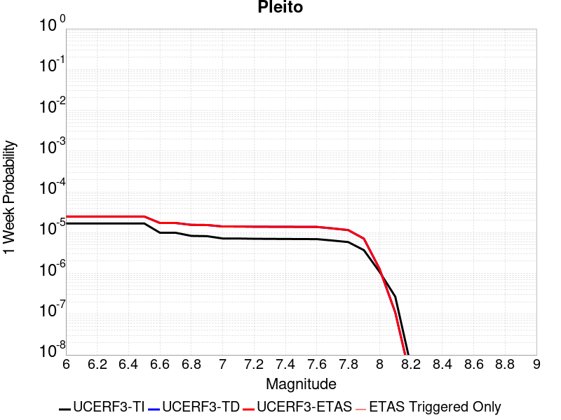 | 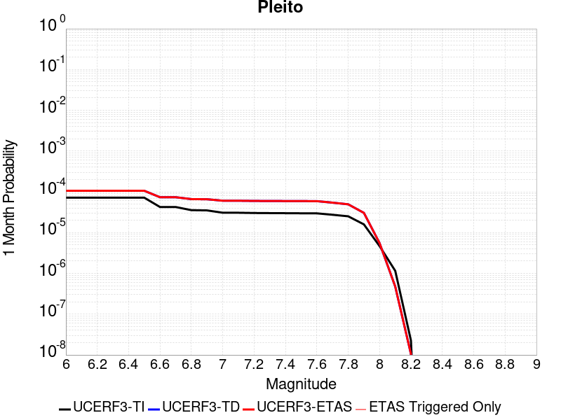 | 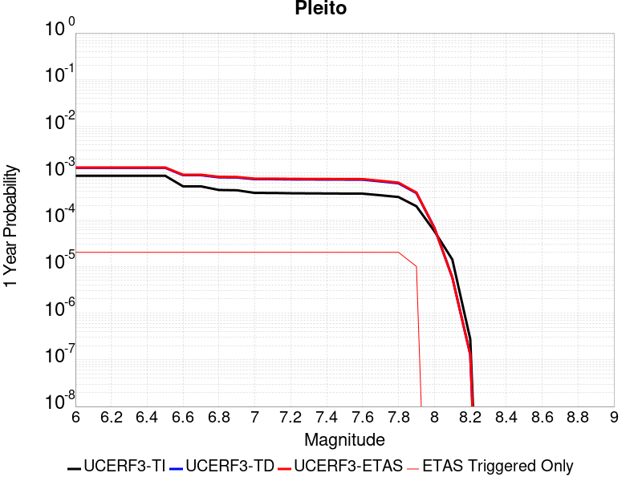 | 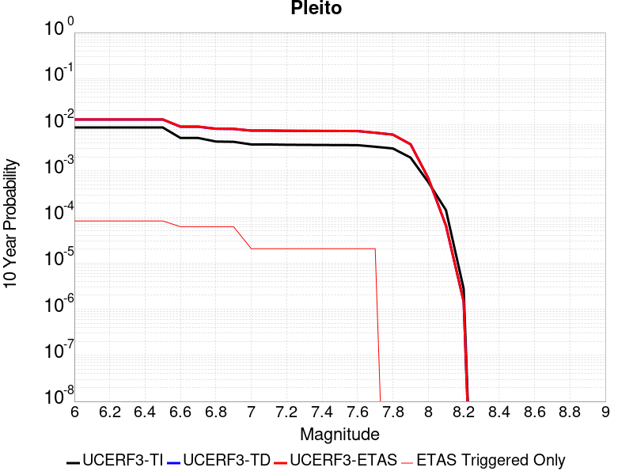 |

| Magnitude | 1 wk TI Prob | 1 wk TD Prob | 1 wk ETAS Prob | 1 wk ETAS/TD Gain | 1 wk ETAS Triggered Only | 1 mo TI Prob | 1 mo TD Prob | 1 mo ETAS Prob | 1 mo ETAS/TD Gain | 1 mo ETAS Triggered Only | 1 yr TI Prob | 1 yr TD Prob | 1 yr ETAS Prob | 1 yr ETAS/TD Gain | 1 yr ETAS Triggered Only | 10 yr TI Prob | 10 yr TD Prob | 10 yr ETAS Prob | 10 yr ETAS/TD Gain | 10 yr ETAS Triggered Only |
|-----|-----|-----|-----|-----|-----|-----|-----|-----|-----|-----|-----|-----|-----|-----|-----|-----|-----|-----|-----|-----|
| 6.0 | 1.6763008E-5 | 2.47705E-5 | 2.47705E-5 | 1.0 | 0.0 | 7.183948E-5 | 1.0615537E-4 | 1.0615537E-4 | 1.0 | 0.0 | 8.742947E-4 | 0.0012917474 | 0.0013117216 | 1.0154629 | 2.0E-5 | 0.00870863 | 0.012957253 | 0.0130263455 | 1.0053324 | 7.0E-5 |
| 6.1 | 1.6763008E-5 | 2.47705E-5 | 2.47705E-5 | 1.0 | 0.0 | 7.183948E-5 | 1.0615537E-4 | 1.0615537E-4 | 1.0 | 0.0 | 8.742947E-4 | 0.0012917474 | 0.0013117216 | 1.0154629 | 2.0E-5 | 0.00870863 | 0.012957253 | 0.0130263455 | 1.0053324 | 7.0E-5 |
| 6.2 | 1.6763008E-5 | 2.47705E-5 | 2.47705E-5 | 1.0 | 0.0 | 7.183948E-5 | 1.0615537E-4 | 1.0615537E-4 | 1.0 | 0.0 | 8.742947E-4 | 0.0012917474 | 0.0013117216 | 1.0154629 | 2.0E-5 | 0.00870863 | 0.012957253 | 0.0130263455 | 1.0053324 | 7.0E-5 |
| 6.3 | 1.6763008E-5 | 2.47705E-5 | 2.47705E-5 | 1.0 | 0.0 | 7.183948E-5 | 1.0615537E-4 | 1.0615537E-4 | 1.0 | 0.0 | 8.742947E-4 | 0.0012917474 | 0.0013117216 | 1.0154629 | 2.0E-5 | 0.00870863 | 0.012957253 | 0.0130263455 | 1.0053324 | 7.0E-5 |
| 6.4 | 1.6763008E-5 | 2.47705E-5 | 2.47705E-5 | 1.0 | 0.0 | 7.183948E-5 | 1.0615537E-4 | 1.0615537E-4 | 1.0 | 0.0 | 8.742947E-4 | 0.0012917474 | 0.0013117216 | 1.0154629 | 2.0E-5 | 0.00870863 | 0.012957253 | 0.0130263455 | 1.0053324 | 7.0E-5 |
| 6.5 | 1.6763008E-5 | 2.47705E-5 | 2.47705E-5 | 1.0 | 0.0 | 7.183948E-5 | 1.0615537E-4 | 1.0615537E-4 | 1.0 | 0.0 | 8.742947E-4 | 0.0012917474 | 0.0013117216 | 1.0154629 | 2.0E-5 | 0.00870863 | 0.012957253 | 0.0130263455 | 1.0053324 | 7.0E-5 |
| 6.6 | 9.910213E-6 | 1.7221182E-5 | 1.7221182E-5 | 1.0 | 0.0 | 4.247165E-5 | 7.3803E-5 | 7.3803E-5 | 1.0 | 0.0 | 5.169696E-4 | 8.9818484E-4 | 9.181669E-4 | 1.0222471 | 2.0E-5 | 0.0051576863 | 0.009054025 | 0.009103572 | 1.0054724 | 5.0E-5 |
| 6.7 | 9.910213E-6 | 1.7221182E-5 | 1.7221182E-5 | 1.0 | 0.0 | 4.247165E-5 | 7.3803E-5 | 7.3803E-5 | 1.0 | 0.0 | 5.169696E-4 | 8.9818484E-4 | 9.181669E-4 | 1.0222471 | 2.0E-5 | 0.0051576863 | 0.009054025 | 0.009103572 | 1.0054724 | 5.0E-5 |
| 6.8 | 8.300162E-6 | 1.5480773E-5 | 1.5480773E-5 | 1.0 | 0.0 | 3.557164E-5 | 6.634449E-5 | 6.634449E-5 | 1.0 | 0.0 | 4.3299864E-4 | 8.0744625E-4 | 8.274301E-4 | 1.0247494 | 2.0E-5 | 0.004321559 | 0.008153455 | 0.008203047 | 1.0060824 | 5.0E-5 |
| 6.9 | 8.183114E-6 | 1.5351985E-5 | 1.5351985E-5 | 1.0 | 0.0 | 3.5070017E-5 | 6.579257E-5 | 6.579257E-5 | 1.0 | 0.0 | 4.2689382E-4 | 8.007316E-4 | 8.2071556E-4 | 1.0249572 | 2.0E-5 | 0.0042607468 | 0.008086799 | 0.008136394 | 1.006133 | 5.0E-5 |
| 7.0 | 7.1748823E-6 | 1.4138895E-5 | 1.4138895E-5 | 1.0 | 0.0 | 3.0749135E-5 | 6.059386E-5 | 6.059386E-5 | 1.0 | 0.0 | 3.743064E-4 | 7.3748105E-4 | 7.574663E-4 | 1.0270994 | 2.0E-5 | 0.0037367654 | 0.0074582137 | 0.00748799 | 1.0039924 | 3.0E-5 |
| 7.1 | 7.1671807E-6 | 1.4129264E-5 | 1.4129264E-5 | 1.0 | 0.0 | 3.0716128E-5 | 6.0552586E-5 | 6.0552586E-5 | 1.0 | 0.0 | 3.7390468E-4 | 7.369789E-4 | 7.5696415E-4 | 1.0271178 | 2.0E-5 | 0.0037327618 | 0.007453226 | 0.0074830027 | 1.0039951 | 3.0E-5 |
| 7.2 | 7.0649667E-6 | 1.3976534E-5 | 1.3976534E-5 | 1.0 | 0.0 | 3.0278077E-5 | 5.989806E-5 | 5.989806E-5 | 1.0 | 0.0 | 3.6857324E-4 | 7.290154E-4 | 7.490008E-4 | 1.0274143 | 2.0E-5 | 0.0036796255 | 0.007373973 | 0.0074037514 | 1.0040383 | 3.0E-5 |
| 7.3 | 7.02082E-6 | 1.39199765E-5 | 1.39199765E-5 | 1.0 | 0.0 | 3.008888E-5 | 5.9655682E-5 | 5.9655682E-5 | 1.0 | 0.0 | 3.6627054E-4 | 7.260664E-4 | 7.460519E-4 | 1.0275257 | 2.0E-5 | 0.0036566744 | 0.0073444657 | 0.0073742457 | 1.0040547 | 3.0E-5 |
| 7.4 | 6.987146E-6 | 1.3879531E-5 | 1.3879531E-5 | 1.0 | 0.0 | 2.9944567E-5 | 5.948235E-5 | 5.948235E-5 | 1.0 | 0.0 | 3.6451413E-4 | 7.239575E-4 | 7.4394303E-4 | 1.0276059 | 2.0E-5 | 0.0036391679 | 0.007323398 | 0.0073531778 | 1.0040665 | 3.0E-5 |
| 7.5 | 6.9494554E-6 | 1.3836431E-5 | 1.3836431E-5 | 1.0 | 0.0 | 2.9783041E-5 | 5.9297647E-5 | 5.9297647E-5 | 1.0 | 0.0 | 3.625482E-4 | 7.217102E-4 | 7.416958E-4 | 1.027692 | 2.0E-5 | 0.0036195726 | 0.007301023 | 0.007330804 | 1.004079 | 3.0E-5 |
| 7.6 | 6.92694E-6 | 1.3795536E-5 | 1.3795536E-5 | 1.0 | 0.0 | 2.9686547E-5 | 5.9122387E-5 | 5.9122387E-5 | 1.0 | 0.0 | 3.6137376E-4 | 7.1957783E-4 | 7.3956343E-4 | 1.0277741 | 2.0E-5 | 0.0036078666 | 0.0072797714 | 0.007309553 | 1.004091 | 3.0E-5 |
| 7.7 | 6.395867E-6 | 1.2674343E-5 | 1.2674343E-5 | 1.0 | 0.0 | 2.741057E-5 | 5.4317487E-5 | 5.4317487E-5 | 1.0 | 0.0 | 3.336726E-4 | 6.6111505E-4 | 6.8110187E-4 | 1.030232 | 2.0E-5 | 0.0033317201 | 0.006698295 | 0.0067280936 | 1.0044488 | 3.0E-5 |
| 7.8 | 5.8664327E-6 | 1.1541453E-5 | 1.1541453E-5 | 1.0 | 0.0 | 2.5141611E-5 | 4.9462433E-5 | 4.9462433E-5 | 1.0 | 0.0 | 3.060561E-4 | 6.020389E-4 | 6.220269E-4 | 1.0332004 | 2.0E-5 | 0.0030563495 | 0.006103509 | 0.006123387 | 1.0032568 | 2.0E-5 |
| 7.9 | 3.7167474E-6 | 7.1174723E-6 | 7.1174723E-6 | 1.0 | 0.0 | 1.592882E-5 | 3.0503097E-5 | 3.0503097E-5 | 1.0 | 0.0 | 1.9391612E-4 | 3.7131205E-4 | 3.8130835E-4 | 1.0269215 | 1.0E-5 | 0.0019374699 | 0.0037692138 | 0.003779176 | 1.0026431 | 1.0E-5 |
| 8.0 | 1.0903841E-6 | 1.2886832E-6 | 1.2886832E-6 | 1.0 | 0.0 | 4.6730665E-6 | 5.522916E-6 | 5.522916E-6 | 1.0 | 0.0 | 5.68931E-5 | 6.723944E-5 | 6.723944E-5 | 1.0 | 0.0 | 5.6878536E-4 | 6.9458556E-4 | 6.9458556E-4 | 1.0 | 0.0 |
| 8.1 | 2.6894583E-7 | 1.1072907E-7 | 1.1072907E-7 | 1.0 | 0.0 | 1.1526245E-6 | 4.7455305E-7 | 4.7455305E-7 | 1.0 | 0.0 | 1.4033113E-5 | 5.7776683E-6 | 5.7776683E-6 | 1.0 | 0.0 | 1.4032227E-4 | 6.4639265E-5 | 6.4639265E-5 | 1.0 | 0.0 |
| 8.2 | 5.2967013E-9 | 2.4608289E-9 | 2.4608289E-9 | 1.0 | 0.0 | 2.2700148E-8 | 1.054641E-8 | 1.054641E-8 | 1.0 | 0.0 | 2.7637427E-7 | 1.2840253E-7 | 1.2840253E-7 | 1.0 | 0.0 | 2.7637393E-6 | 1.46096E-6 | 1.46096E-6 | 1.0 | 0.0 |

## San Andreas (Creeping Section) 2011 CFM
*[(top)](#table-of-contents)*

| 1 Week | 1 Month | 1 Year | 10 Year |
|-----|-----|-----|-----|
| 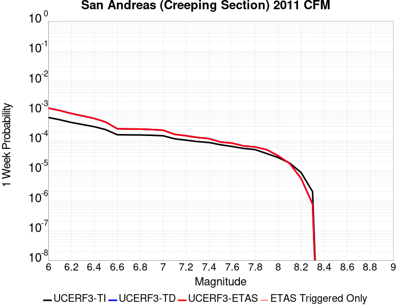 |  | 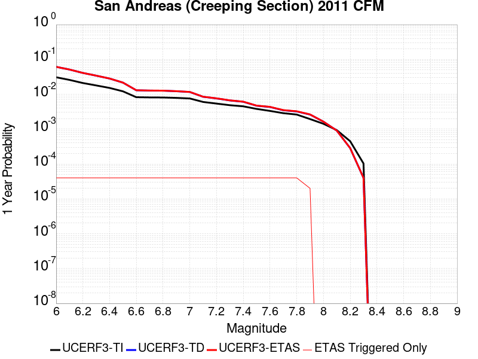 | 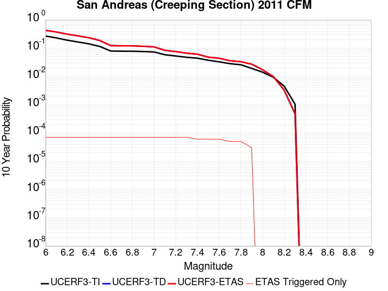 |

| Magnitude | 1 wk TI Prob | 1 wk TD Prob | 1 wk ETAS Prob | 1 wk ETAS/TD Gain | 1 wk ETAS Triggered Only | 1 mo TI Prob | 1 mo TD Prob | 1 mo ETAS Prob | 1 mo ETAS/TD Gain | 1 mo ETAS Triggered Only | 1 yr TI Prob | 1 yr TD Prob | 1 yr ETAS Prob | 1 yr ETAS/TD Gain | 1 yr ETAS Triggered Only | 10 yr TI Prob | 10 yr TD Prob | 10 yr ETAS Prob | 10 yr ETAS/TD Gain | 10 yr ETAS Triggered Only |
|-----|-----|-----|-----|-----|-----|-----|-----|-----|-----|-----|-----|-----|-----|-----|-----|-----|-----|-----|-----|-----|
| 6.0 | 5.986481E-4 | 0.0012278741 | 0.0012378617 | 1.0081341 | 1.0E-5 | 0.0025631124 | 0.0052457973 | 0.0052656927 | 1.0037925 | 2.0E-5 | 0.030762846 | 0.061208665 | 0.061246216 | 1.0006135 | 4.0E-5 | 0.26835477 | 0.4259623 | 0.42600247 | 1.0000943 | 7.0E-5 |
| 6.1 | 5.015945E-4 | 0.0010222398 | 0.0010322296 | 1.0097724 | 1.0E-5 | 0.00214792 | 0.004368119 | 0.0043880315 | 1.0045587 | 2.0E-5 | 0.025839351 | 0.0512512 | 0.05128915 | 1.0007405 | 4.0E-5 | 0.23032776 | 0.37288252 | 0.3729264 | 1.0001178 | 7.0E-5 |
| 6.2 | 4.073338E-4 | 8.109135E-4 | 8.209054E-4 | 1.0123218 | 1.0E-5 | 0.0017445484 | 0.0034676173 | 0.0034875479 | 1.0057477 | 2.0E-5 | 0.021034058 | 0.040936444 | 0.040974807 | 1.0009371 | 4.0E-5 | 0.19150782 | 0.3130621 | 0.31311017 | 1.0001535 | 7.0E-5 |
| 6.3 | 3.464099E-4 | 6.7394925E-4 | 6.839425E-4 | 1.014828 | 1.0E-5 | 0.0014837692 | 0.00288274 | 0.0029026822 | 1.0069178 | 2.0E-5 | 0.017915873 | 0.034192428 | 0.03423106 | 1.0011299 | 4.0E-5 | 0.16538359 | 0.27134693 | 0.27139792 | 1.000188 | 7.0E-5 |
| 6.4 | 2.935057E-4 | 5.545115E-4 | 5.64506E-4 | 1.0180238 | 1.0E-5 | 0.0012572751 | 0.0023718805 | 0.0023918329 | 1.0084121 | 2.0E-5 | 0.015200248 | 0.028267467 | 0.028306337 | 1.0013751 | 4.0E-5 | 0.14201577 | 0.2330172 | 0.2330709 | 1.0002304 | 7.0E-5 |
| 6.5 | 2.3409708E-4 | 4.2095222E-4 | 4.3094798E-4 | 1.0237457 | 1.0E-5 | 0.0010028875 | 0.0018015768 | 0.0018215408 | 1.0110813 | 2.0E-5 | 0.012141965 | 0.021591473 | 0.021630611 | 1.0018126 | 4.0E-5 | 0.11499573 | 0.18685804 | 0.18691495 | 1.0003046 | 7.0E-5 |
| 6.6 | 1.5842178E-4 | 2.5079807E-4 | 2.6079555E-4 | 1.0398628 | 1.0E-5 | 6.7877385E-4 | 0.0010744074 | 0.0010943859 | 1.0185949 | 2.0E-5 | 0.0082328 | 0.013001034 | 0.013040514 | 1.0030367 | 4.0E-5 | 0.07934396 | 0.12318426 | 0.12324564 | 1.0004983 | 7.0E-5 |
| 6.7 | 1.5616413E-4 | 2.461632E-4 | 2.561607E-4 | 1.0406134 | 1.0E-5 | 6.691031E-4 | 0.0010545597 | 0.0010745387 | 1.0189452 | 2.0E-5 | 0.0081159435 | 0.012762894 | 0.012802383 | 1.0030941 | 4.0E-5 | 0.0782586 | 0.12121142 | 0.12127293 | 1.0005075 | 7.0E-5 |
| 6.8 | 1.5538467E-4 | 2.4440174E-4 | 2.5439932E-4 | 1.0409062 | 1.0E-5 | 6.6576427E-4 | 0.0010470168 | 0.0010669959 | 1.0190818 | 2.0E-5 | 0.008075596 | 0.012672268 | 0.0127117615 | 1.0031165 | 4.0E-5 | 0.07788358 | 0.12044227 | 0.120503835 | 1.0005112 | 7.0E-5 |
| 6.9 | 1.5153569E-4 | 2.3549511E-4 | 2.4549276E-4 | 1.0424538 | 1.0E-5 | 6.49277E-4 | 0.0010088764 | 0.0010288563 | 1.019804 | 2.0E-5 | 0.007876333 | 0.012214421 | 0.012253933 | 1.0032349 | 4.0E-5 | 0.07602952 | 0.11651233 | 0.116574176 | 1.0005308 | 7.0E-5 |
| 7.0 | 1.4588932E-4 | 2.2406683E-4 | 2.3406459E-4 | 1.0446196 | 1.0E-5 | 6.250901E-4 | 9.5993496E-4 | 9.799157E-4 | 1.0208148 | 2.0E-5 | 0.0075839474 | 0.011625077 | 0.011664611 | 1.0034008 | 4.0E-5 | 0.073302895 | 0.111358546 | 0.11142075 | 1.0005586 | 7.0E-5 |
| 7.1 | 1.1565079E-4 | 1.6290719E-4 | 1.7290557E-4 | 1.0613747 | 1.0E-5 | 4.955521E-4 | 6.9798774E-4 | 7.1797374E-4 | 1.0286338 | 2.0E-5 | 0.006016669 | 0.008465091 | 0.008504752 | 1.0046853 | 4.0E-5 | 0.058563538 | 0.08370675 | 0.08377089 | 1.0007663 | 7.0E-5 |
| 7.2 | 1.0393792E-4 | 1.4624344E-4 | 1.5624198E-4 | 1.0683692 | 1.0E-5 | 4.4537216E-4 | 6.2660786E-4 | 6.465953E-4 | 1.0318979 | 2.0E-5 | 0.005408933 | 0.007602434 | 0.0076421304 | 1.0052215 | 4.0E-5 | 0.052791595 | 0.07565546 | 0.07572016 | 1.0008552 | 7.0E-5 |
| 7.3 | 9.332884E-5 | 1.2788197E-4 | 1.3788069E-4 | 1.0781871 | 1.0E-5 | 3.999194E-4 | 5.479511E-4 | 5.679401E-4 | 1.0364796 | 2.0E-5 | 0.0048581534 | 0.0066510327 | 0.0066907667 | 1.005974 | 4.0E-5 | 0.047533102 | 0.06651482 | 0.06658016 | 1.0009824 | 7.0E-5 |
| 7.4 | 8.670252E-5 | 1.17095995E-4 | 1.2709483E-4 | 1.08539 | 1.0E-5 | 3.715293E-4 | 5.0174404E-4 | 5.21734E-4 | 1.0398409 | 2.0E-5 | 0.004513991 | 0.006091744 | 0.0061315005 | 1.0065262 | 4.0E-5 | 0.044233937 | 0.061179653 | 0.061235983 | 1.0009208 | 6.0E-5 |
| 7.5 | 7.3036405E-5 | 9.011144E-5 | 1.00110534E-4 | 1.1109637 | 1.0E-5 | 3.129756E-4 | 3.861348E-4 | 4.0612707E-4 | 1.0517753 | 2.0E-5 | 0.0038038217 | 0.004691079 | 0.004730891 | 1.0084869 | 4.0E-5 | 0.03739367 | 0.047901772 | 0.0479589 | 1.0011926 | 6.0E-5 |
| 7.6 | 6.3935775E-5 | 8.284792E-5 | 9.284709E-5 | 1.1206931 | 1.0E-5 | 2.7398168E-4 | 3.550143E-4 | 3.7500716E-4 | 1.0563158 | 2.0E-5 | 0.0033306254 | 0.004313751 | 0.0043535787 | 1.0092326 | 4.0E-5 | 0.032811474 | 0.04401211 | 0.04406947 | 1.0013033 | 6.0E-5 |
| 7.7 | 5.5050095E-5 | 6.6657536E-5 | 7.665687E-5 | 1.1500106 | 1.0E-5 | 2.3590765E-4 | 2.8564388E-4 | 3.0563818E-4 | 1.0699973 | 2.0E-5 | 0.0028683927 | 0.0034721727 | 0.003512034 | 1.0114802 | 4.0E-5 | 0.0283165 | 0.035814673 | 0.03586288 | 1.0013461 | 5.0E-5 |
| 7.8 | 5.027131E-5 | 6.166444E-5 | 7.1663824E-5 | 1.162158 | 1.0E-5 | 2.1543067E-4 | 2.6424942E-4 | 2.8424413E-4 | 1.0756661 | 2.0E-5 | 0.0026197135 | 0.0032124936 | 0.0032523652 | 1.0124114 | 4.0E-5 | 0.025890453 | 0.033143617 | 0.03319196 | 1.0014586 | 5.0E-5 |
| 7.9 | 3.7271806E-5 | 5.0253755E-5 | 6.0253253E-5 | 1.1989801 | 1.0E-5 | 1.5972654E-4 | 2.1535547E-4 | 2.2535332E-4 | 1.0464249 | 1.0E-5 | 0.0019429359 | 0.0026188022 | 0.0026387498 | 1.0076171 | 2.0E-5 | 0.019260362 | 0.027081102 | 0.02711029 | 1.0010778 | 3.0E-5 |
| 8.0 | 2.7310243E-5 | 3.144777E-5 | 3.144777E-5 | 1.0 | 0.0 | 1.17038646E-4 | 1.3476919E-4 | 1.3476919E-4 | 1.0 | 0.0 | 0.0014240141 | 0.0016395808 | 0.0016395808 | 1.0 | 0.0 | 0.014149235 | 0.0172237 | 0.0172237 | 1.0 | 0.0 |
| 8.1 | 1.7940547E-5 | 1.7413187E-5 | 1.7413187E-5 | 1.0 | 0.0 | 7.688579E-5 | 7.4625816E-5 | 7.4625816E-5 | 1.0 | 0.0 | 9.3568244E-4 | 9.081911E-4 | 9.081911E-4 | 1.0 | 0.0 | 0.009317525 | 0.009805583 | 0.009805583 | 1.0 | 0.0 |
| 8.2 | 8.643924E-6 | 5.4798497E-6 | 5.4798497E-6 | 1.0 | 0.0 | 3.704486E-5 | 2.348486E-5 | 2.348486E-5 | 1.0 | 0.0 | 4.5092785E-4 | 2.858907E-4 | 2.858907E-4 | 1.0 | 0.0 | 0.0045001395 | 0.0032514327 | 0.0032514327 | 1.0 | 0.0 |
| 8.3 | 1.983087E-6 | 7.668296E-7 | 7.668296E-7 | 1.0 | 0.0 | 8.498917E-6 | 3.2864084E-6 | 3.2864084E-6 | 1.0 | 0.0 | 1.034694E-4 | 4.0011306E-5 | 4.0011306E-5 | 1.0 | 0.0 | 0.0010342124 | 4.724499E-4 | 4.724499E-4 | 1.0 | 0.0 |

## Raymond
*[(top)](#table-of-contents)*

| 1 Week | 1 Month | 1 Year | 10 Year |
|-----|-----|-----|-----|
|  | 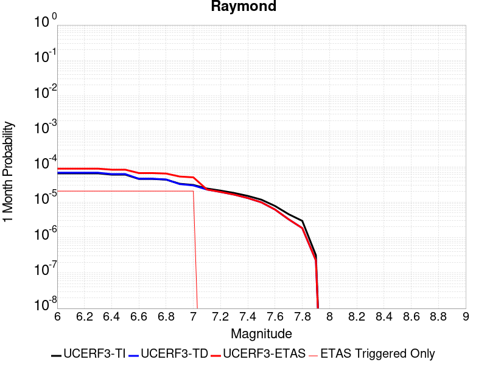 | 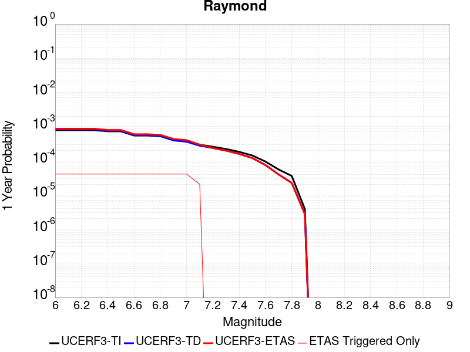 | 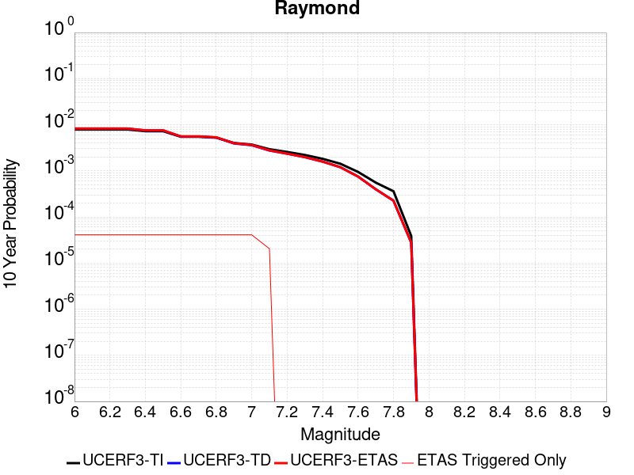 |

| Magnitude | 1 wk TI Prob | 1 wk TD Prob | 1 wk ETAS Prob | 1 wk ETAS/TD Gain | 1 wk ETAS Triggered Only | 1 mo TI Prob | 1 mo TD Prob | 1 mo ETAS Prob | 1 mo ETAS/TD Gain | 1 mo ETAS Triggered Only | 1 yr TI Prob | 1 yr TD Prob | 1 yr ETAS Prob | 1 yr ETAS/TD Gain | 1 yr ETAS Triggered Only | 10 yr TI Prob | 10 yr TD Prob | 10 yr ETAS Prob | 10 yr ETAS/TD Gain | 10 yr ETAS Triggered Only |
|-----|-----|-----|-----|-----|-----|-----|-----|-----|-----|-----|-----|-----|-----|-----|-----|-----|-----|-----|-----|-----|
| 6.0 | 1.5157413E-5 | 1.5810376E-5 | 1.5810376E-5 | 1.0 | 0.0 | 6.4958724E-5 | 6.775714E-5 | 8.775578E-5 | 1.2951518 | 2.0E-5 | 7.905855E-4 | 8.24656E-4 | 8.846065E-4 | 1.0726976 | 6.0E-5 | 0.007877788 | 0.008218477 | 0.008287901 | 1.0084474 | 7.0E-5 |
| 6.1 | 1.5157413E-5 | 1.5810376E-5 | 1.5810376E-5 | 1.0 | 0.0 | 6.4958724E-5 | 6.775714E-5 | 8.775578E-5 | 1.2951518 | 2.0E-5 | 7.905855E-4 | 8.24656E-4 | 8.846065E-4 | 1.0726976 | 6.0E-5 | 0.007877788 | 0.008218477 | 0.008287901 | 1.0084474 | 7.0E-5 |
| 6.2 | 1.5157413E-5 | 1.5810376E-5 | 1.5810376E-5 | 1.0 | 0.0 | 6.4958724E-5 | 6.775714E-5 | 8.775578E-5 | 1.2951518 | 2.0E-5 | 7.905855E-4 | 8.24656E-4 | 8.846065E-4 | 1.0726976 | 6.0E-5 | 0.007877788 | 0.008218477 | 0.008287901 | 1.0084474 | 7.0E-5 |
| 6.3 | 1.5157413E-5 | 1.5810376E-5 | 1.5810376E-5 | 1.0 | 0.0 | 6.4958724E-5 | 6.775714E-5 | 8.775578E-5 | 1.2951518 | 2.0E-5 | 7.905855E-4 | 8.24656E-4 | 8.846065E-4 | 1.0726976 | 6.0E-5 | 0.007877788 | 0.008218477 | 0.008287901 | 1.0084474 | 7.0E-5 |
| 6.4 | 1.3941944E-5 | 1.4454918E-5 | 1.4454918E-5 | 1.0 | 0.0 | 5.9749822E-5 | 6.194831E-5 | 8.194707E-5 | 1.3228298 | 2.0E-5 | 7.2721124E-4 | 7.53983E-4 | 8.1393775E-4 | 1.0795174 | 6.0E-5 | 0.007248361 | 0.0075165825 | 0.0075860564 | 1.0092428 | 7.0E-5 |
| 6.5 | 1.3941944E-5 | 1.4454918E-5 | 1.4454918E-5 | 1.0 | 0.0 | 5.9749822E-5 | 6.194831E-5 | 8.194707E-5 | 1.3228298 | 2.0E-5 | 7.2721124E-4 | 7.53983E-4 | 8.1393775E-4 | 1.0795174 | 6.0E-5 | 0.007248361 | 0.0075165825 | 0.0075860564 | 1.0092428 | 7.0E-5 |
| 6.6 | 1.0542609E-5 | 1.0671283E-5 | 1.0671283E-5 | 1.0 | 0.0 | 4.5181827E-5 | 4.57333E-5 | 5.5732846E-5 | 1.218649 | 1.0E-5 | 5.499499E-4 | 5.566662E-4 | 6.066383E-4 | 1.0897704 | 5.0E-5 | 0.005485909 | 0.0055532786 | 0.0056129456 | 1.0107445 | 6.0E-5 |
| 6.7 | 1.0542609E-5 | 1.0671283E-5 | 1.0671283E-5 | 1.0 | 0.0 | 4.5181827E-5 | 4.57333E-5 | 5.5732846E-5 | 1.218649 | 1.0E-5 | 5.499499E-4 | 5.566662E-4 | 6.066383E-4 | 1.0897704 | 5.0E-5 | 0.005485909 | 0.0055532786 | 0.0056129456 | 1.0107445 | 6.0E-5 |
| 6.8 | 1.0079132E-5 | 1.0176812E-5 | 1.0176812E-5 | 1.0 | 0.0 | 4.3195567E-5 | 4.361421E-5 | 5.3613774E-5 | 1.2292731 | 1.0E-5 | 5.257791E-4 | 5.30879E-4 | 5.8085244E-4 | 1.0941334 | 5.0E-5 | 0.0052453685 | 0.0052966573 | 0.0053563397 | 1.0112679 | 6.0E-5 |
| 6.9 | 7.721598E-6 | 7.5490307E-6 | 7.5490307E-6 | 1.0 | 0.0 | 3.3092143E-5 | 3.2352593E-5 | 4.235227E-5 | 1.3090842 | 1.0E-5 | 4.0282236E-4 | 3.9382285E-4 | 4.4380315E-4 | 1.1269107 | 5.0E-5 | 0.0040209293 | 0.003931383 | 0.003991147 | 1.0152018 | 6.0E-5 |
| 7.0 | 7.137566E-6 | 6.9114235E-6 | 6.9114235E-6 | 1.0 | 0.0 | 3.058921E-5 | 2.9620056E-5 | 3.961976E-5 | 1.337599 | 1.0E-5 | 3.7236E-4 | 3.6056558E-4 | 4.1054757E-4 | 1.138621 | 5.0E-5 | 0.0037173668 | 0.003599924 | 0.0036597082 | 1.016607 | 6.0E-5 |
| 7.1 | 5.654976E-6 | 5.2996397E-6 | 5.2996397E-6 | 1.0 | 0.0 | 2.4235387E-5 | 2.2712544E-5 | 2.2712544E-5 | 1.0 | 0.0 | 2.9502588E-4 | 2.7649035E-4 | 3.0648205E-4 | 1.1084728 | 3.0E-5 | 0.0029463451 | 0.0027614946 | 0.002801384 | 1.014445 | 4.0E-5 |
| 7.2 | 4.9358455E-6 | 4.5267484E-6 | 4.5267484E-6 | 1.0 | 0.0 | 2.1153453E-5 | 1.9400206E-5 | 1.9400206E-5 | 1.0 | 0.0 | 2.5751285E-4 | 2.3617204E-4 | 2.5616732E-4 | 1.084664 | 2.0E-5 | 0.0025721465 | 0.0023592326 | 0.0023891618 | 1.012686 | 3.0E-5 |
| 7.3 | 4.2368597E-6 | 3.8056999E-6 | 3.8056999E-6 | 1.0 | 0.0 | 1.8157843E-5 | 1.6310041E-5 | 1.6310041E-5 | 1.0 | 0.0 | 2.2104931E-4 | 1.9855677E-4 | 2.185528E-4 | 1.1007068 | 2.0E-5 | 0.0022082955 | 0.0019838123 | 0.0020137527 | 1.0150924 | 3.0E-5 |
| 7.4 | 3.4999923E-6 | 3.0438184E-6 | 3.0438184E-6 | 1.0 | 0.0 | 1.49998805E-5 | 1.3044872E-5 | 1.3044872E-5 | 1.0 | 0.0 | 1.8260824E-4 | 1.5880981E-4 | 1.7880664E-4 | 1.1259168 | 2.0E-5 | 0.0018245826 | 0.001586979 | 0.0016169314 | 1.0188738 | 3.0E-5 |
| 7.5 | 2.738017E-6 | 2.3021105E-6 | 2.3021105E-6 | 1.0 | 0.0 | 1.1734306E-5 | 9.86615E-6 | 9.86615E-6 | 1.0 | 0.0 | 1.428558E-4 | 1.2011383E-4 | 1.4011143E-4 | 1.1664888 | 2.0E-5 | 0.0014276401 | 0.0012005034 | 0.0012204794 | 1.0166397 | 2.0E-5 |
| 7.6 | 1.8186392E-6 | 1.4423566E-6 | 1.4423566E-6 | 1.0 | 0.0 | 7.794145E-6 | 6.181514E-6 | 6.181514E-6 | 1.0 | 0.0 | 9.488958E-5 | 7.5257376E-5 | 8.525662E-5 | 1.1328673 | 1.0E-5 | 9.4849075E-4 | 7.523304E-4 | 7.6232286E-4 | 1.0132821 | 1.0E-5 |
| 7.7 | 1.0660348E-6 | 7.644165E-7 | 7.644165E-7 | 1.0 | 0.0 | 4.5687125E-6 | 3.2760668E-6 | 3.2760668E-6 | 1.0 | 0.0 | 5.5622655E-5 | 3.98854E-5 | 4.9885002E-5 | 1.2507083 | 1.0E-5 | 5.5608735E-4 | 3.9879154E-4 | 4.0878754E-4 | 1.0250658 | 1.0E-5 |
| 7.8 | 6.913602E-7 | 4.320714E-7 | 4.320714E-7 | 1.0 | 0.0 | 2.962969E-6 | 1.8517333E-6 | 1.8517333E-6 | 1.0 | 0.0 | 3.607355E-5 | 2.2544626E-5 | 3.25444E-5 | 1.4435546 | 1.0E-5 | 3.6067693E-4 | 2.2543124E-4 | 2.3542899E-4 | 1.0443494 | 1.0E-5 |
| 7.9 | 7.425201E-8 | 5.322516E-8 | 5.322516E-8 | 1.0 | 0.0 | 3.1822285E-7 | 2.2810782E-7 | 2.2810782E-7 | 1.0 | 0.0 | 3.874356E-6 | 2.7772105E-6 | 2.7772105E-6 | 1.0 | 0.0 | 3.8742884E-5 | 2.7771888E-5 | 2.7771888E-5 | 1.0 | 0.0 |

## San Diego Trough north alt1
*[(top)](#table-of-contents)*

| 1 Week | 1 Month | 1 Year | 10 Year |
|-----|-----|-----|-----|
| 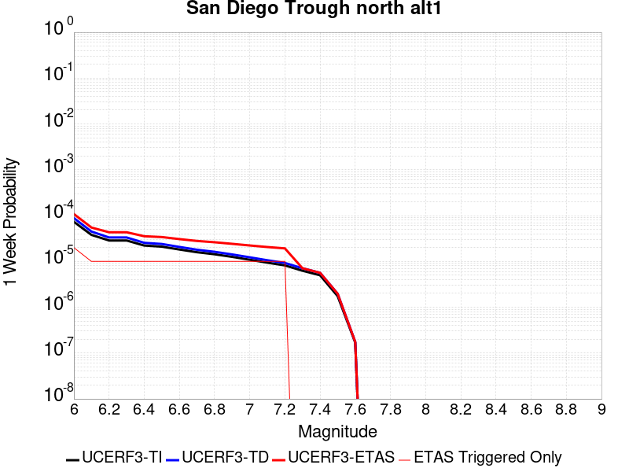 | 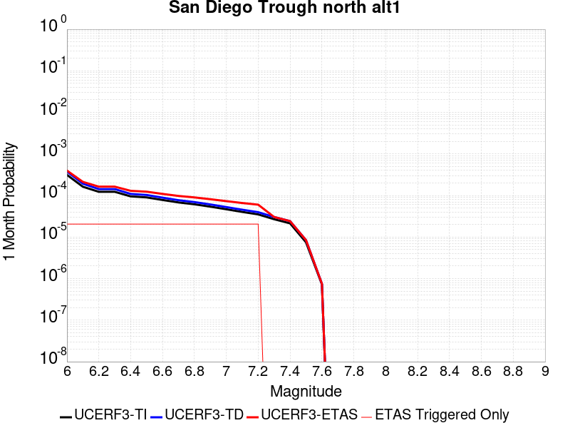 | 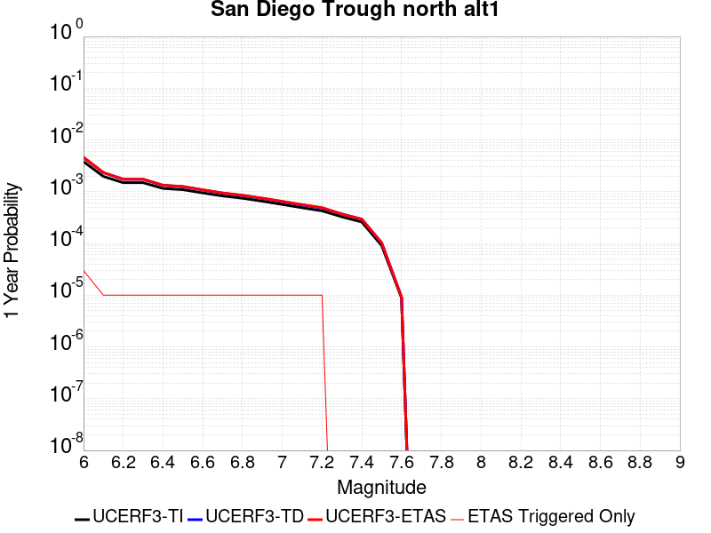 | 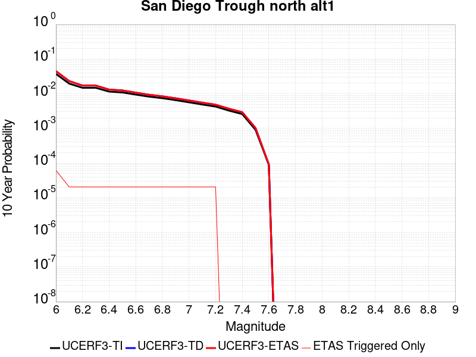 |

| Magnitude | 1 wk TI Prob | 1 wk TD Prob | 1 wk ETAS Prob | 1 wk ETAS/TD Gain | 1 wk ETAS Triggered Only | 1 mo TI Prob | 1 mo TD Prob | 1 mo ETAS Prob | 1 mo ETAS/TD Gain | 1 mo ETAS Triggered Only | 1 yr TI Prob | 1 yr TD Prob | 1 yr ETAS Prob | 1 yr ETAS/TD Gain | 1 yr ETAS Triggered Only | 10 yr TI Prob | 10 yr TD Prob | 10 yr ETAS Prob | 10 yr ETAS/TD Gain | 10 yr ETAS Triggered Only |
|-----|-----|-----|-----|-----|-----|-----|-----|-----|-----|-----|-----|-----|-----|-----|-----|-----|-----|-----|-----|-----|
| 6.0 | 7.329252E-5 | 8.821339E-5 | 1.0821163E-4 | 1.2267029 | 2.0E-5 | 3.14073E-4 | 3.7800625E-4 | 3.979987E-4 | 1.0528892 | 2.0E-5 | 0.0038171355 | 0.0045931544 | 0.0046230163 | 1.0065014 | 3.0E-5 | 0.03752231 | 0.045046188 | 0.045103483 | 1.001272 | 6.0E-5 |
| 6.1 | 3.7940346E-5 | 4.488612E-5 | 5.4885673E-5 | 1.222776 | 1.0E-5 | 1.6259136E-4 | 1.9235547E-4 | 2.0235353E-4 | 1.051977 | 1.0E-5 | 0.0019777524 | 0.002339501 | 0.0023494775 | 1.0042645 | 1.0E-5 | 0.019602431 | 0.023157248 | 0.023167018 | 1.0004219 | 1.0E-5 |
| 6.2 | 2.8645263E-5 | 3.329751E-5 | 4.329718E-5 | 1.3003128 | 1.0E-5 | 1.2275964E-4 | 1.4269596E-4 | 1.5269454E-4 | 1.0700691 | 1.0E-5 | 0.0014935739 | 0.0017359565 | 0.0017459391 | 1.0057505 | 1.0E-5 | 0.0148357535 | 0.01722662 | 0.017236447 | 1.0005705 | 1.0E-5 |
| 6.3 | 2.8645263E-5 | 3.329751E-5 | 4.329718E-5 | 1.3003128 | 1.0E-5 | 1.2275964E-4 | 1.4269596E-4 | 1.5269454E-4 | 1.0700691 | 1.0E-5 | 0.0014935739 | 0.0017359565 | 0.0017459391 | 1.0057505 | 1.0E-5 | 0.0148357535 | 0.01722662 | 0.017236447 | 1.0005705 | 1.0E-5 |
| 6.4 | 2.2204576E-5 | 2.5448817E-5 | 3.5448564E-5 | 1.3929355 | 1.0E-5 | 9.5159E-5 | 1.0906186E-4 | 1.19060765E-4 | 1.0916811 | 1.0E-5 | 0.001157945 | 0.0013270293 | 0.0013370161 | 1.0075257 | 1.0E-5 | 0.011519298 | 0.013192211 | 0.01320208 | 1.000748 | 1.0E-5 |
| 6.5 | 2.1004838E-5 | 2.4025157E-5 | 3.4024917E-5 | 1.4162203 | 1.0E-5 | 9.0017624E-5 | 1.0296095E-4 | 1.1295992E-4 | 1.0971142 | 1.0E-5 | 0.0010954136 | 0.001252838 | 0.0012628254 | 1.0079719 | 1.0E-5 | 0.010900296 | 0.012458827 | 0.012468702 | 1.0007926 | 1.0E-5 |
| 6.6 | 1.820557E-5 | 2.0705167E-5 | 3.070496E-5 | 1.4829613 | 1.0E-5 | 7.802154E-5 | 8.873344E-5 | 9.8732555E-5 | 1.1126871 | 1.0E-5 | 9.4949827E-4 | 0.0010797997 | 0.001089789 | 1.009251 | 1.0E-5 | 0.009454516 | 0.010746201 | 0.010756093 | 1.0009205 | 1.0E-5 |
| 6.7 | 1.5884485E-5 | 1.7983964E-5 | 2.7983784E-5 | 1.5560409 | 1.0E-5 | 6.807459E-5 | 7.707187E-5 | 8.70711E-5 | 1.129739 | 1.0E-5 | 8.284929E-4 | 9.379488E-4 | 9.4793946E-4 | 1.0106516 | 1.0E-5 | 0.008254109 | 0.009340268 | 0.009350174 | 1.0010606 | 1.0E-5 |
| 6.8 | 1.4331171E-5 | 1.6201348E-5 | 2.6201185E-5 | 1.6172227 | 1.0E-5 | 6.141786E-5 | 6.9432506E-5 | 7.943181E-5 | 1.1440147 | 1.0E-5 | 7.4750587E-4 | 8.4501493E-4 | 8.5500645E-4 | 1.0118241 | 1.0E-5 | 0.0074499645 | 0.008418285 | 0.008428201 | 1.0011779 | 1.0E-5 |
| 6.9 | 1.2574203E-5 | 1.4206081E-5 | 2.420594E-5 | 1.7039139 | 1.0E-5 | 5.3888325E-5 | 6.088179E-5 | 7.0881186E-5 | 1.1642427 | 1.0E-5 | 6.558929E-4 | 7.4098515E-4 | 7.509777E-4 | 1.0134856 | 1.0E-5 | 0.0065396037 | 0.0073853307 | 0.007395257 | 1.0013441 | 1.0E-5 |
| 7.0 | 1.0883844E-5 | 1.22894735E-5 | 2.228935E-5 | 1.8136945 | 1.0E-5 | 4.664421E-5 | 5.2668114E-5 | 6.266759E-5 | 1.1898582 | 1.0E-5 | 5.677453E-4 | 6.410466E-4 | 6.510402E-4 | 1.0155895 | 1.0E-5 | 0.00566297 | 0.0063921027 | 0.0064020385 | 1.0015545 | 1.0E-5 |
| 7.1 | 9.393088E-6 | 1.0607203E-5 | 2.0607096E-5 | 1.9427456 | 1.0E-5 | 4.025547E-5 | 4.5458655E-5 | 5.54582E-5 | 1.2199701 | 1.0E-5 | 4.900001E-4 | 5.5331935E-4 | 5.633138E-4 | 1.0180627 | 1.0E-5 | 0.0048892107 | 0.005519513 | 0.0055294577 | 1.0018017 | 1.0E-5 |
| 7.2 | 8.190791E-6 | 9.258787E-6 | 1.9258694E-5 | 2.080045 | 1.0E-5 | 3.510292E-5 | 3.9679915E-5 | 4.967952E-5 | 1.2520066 | 1.0E-5 | 4.2729423E-4 | 4.8299658E-4 | 4.9299176E-4 | 1.0206941 | 1.0E-5 | 0.0042647356 | 0.004819548 | 0.0048295003 | 1.0020648 | 1.0E-5 |
| 7.3 | 6.268162E-6 | 7.08984E-6 | 7.08984E-6 | 1.0 | 0.0 | 2.6863276E-5 | 3.0384675E-5 | 3.0384675E-5 | 1.0 | 0.0 | 3.2701128E-4 | 3.6987104E-4 | 3.6987104E-4 | 1.0 | 0.0 | 0.003265305 | 0.0036926004 | 0.0036926004 | 1.0 | 0.0 |
| 7.4 | 4.985186E-6 | 5.6427807E-6 | 5.6427807E-6 | 1.0 | 0.0 | 2.1364907E-5 | 2.4183124E-5 | 2.4183124E-5 | 1.0 | 0.0 | 2.600867E-4 | 2.9439016E-4 | 2.9439016E-4 | 1.0 | 0.0 | 0.002597825 | 0.002940043 | 0.002940043 | 1.0 | 0.0 |
| 7.5 | 1.7489613E-6 | 1.9697113E-6 | 1.9697113E-6 | 1.0 | 0.0 | 7.495527E-6 | 8.441594E-6 | 8.441594E-6 | 1.0 | 0.0 | 9.125422E-5 | 1.0277178E-4 | 1.0277178E-4 | 1.0 | 0.0 | 9.1216754E-4 | 0.0010272645 | 0.0010272645 | 1.0 | 0.0 |
| 7.6 | 1.6988751E-7 | 1.7533898E-7 | 1.7533898E-7 | 1.0 | 0.0 | 7.2808916E-7 | 7.5145255E-7 | 7.5145255E-7 | 1.0 | 0.0 | 8.864449E-6 | 9.148898E-6 | 9.148898E-6 | 1.0 | 0.0 | 8.8640954E-5 | 9.148542E-5 | 9.148542E-5 | 1.0 | 0.0 |

## Pine Mtn
*[(top)](#table-of-contents)*

| 1 Week | 1 Month | 1 Year | 10 Year |
|-----|-----|-----|-----|
|  | 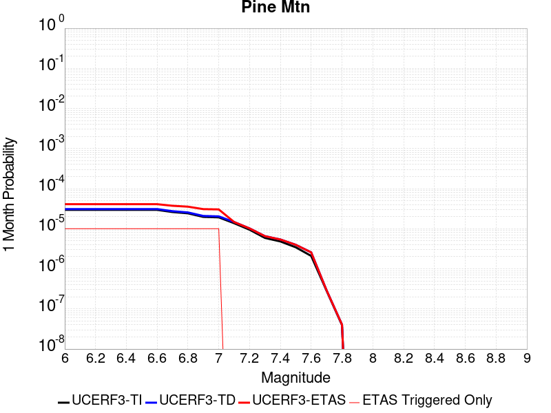 | 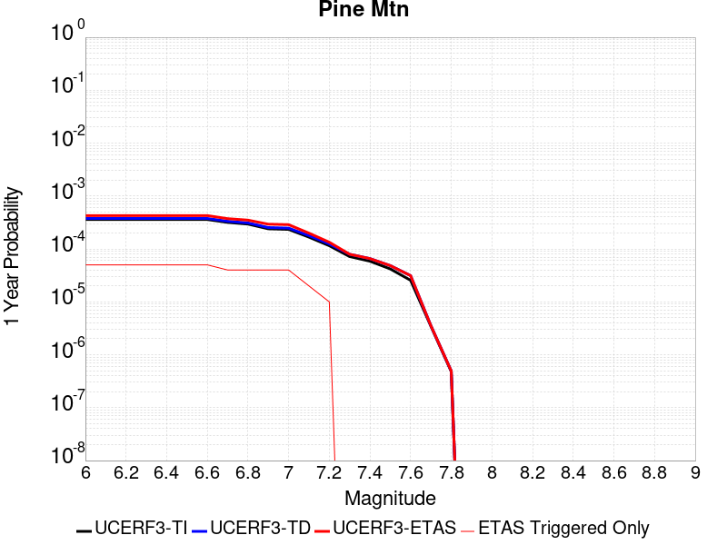 | 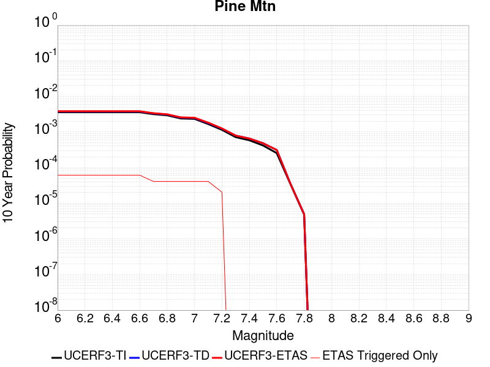 |

| Magnitude | 1 wk TI Prob | 1 wk TD Prob | 1 wk ETAS Prob | 1 wk ETAS/TD Gain | 1 wk ETAS Triggered Only | 1 mo TI Prob | 1 mo TD Prob | 1 mo ETAS Prob | 1 mo ETAS/TD Gain | 1 mo ETAS Triggered Only | 1 yr TI Prob | 1 yr TD Prob | 1 yr ETAS Prob | 1 yr ETAS/TD Gain | 1 yr ETAS Triggered Only | 10 yr TI Prob | 10 yr TD Prob | 10 yr ETAS Prob | 10 yr ETAS/TD Gain | 10 yr ETAS Triggered Only |
|-----|-----|-----|-----|-----|-----|-----|-----|-----|-----|-----|-----|-----|-----|-----|-----|-----|-----|-----|-----|-----|
| 6.0 | 6.894797E-6 | 7.2255634E-6 | 7.2255634E-6 | 1.0 | 0.0 | 2.9548795E-5 | 3.0966352E-5 | 4.096604E-5 | 1.3229212 | 1.0E-5 | 3.596972E-4 | 3.7695307E-4 | 4.2693422E-4 | 1.1325926 | 5.0E-5 | 0.0035911554 | 0.0037634342 | 0.0038331707 | 1.01853 | 7.0E-5 |
| 6.1 | 6.894797E-6 | 7.2255634E-6 | 7.2255634E-6 | 1.0 | 0.0 | 2.9548795E-5 | 3.0966352E-5 | 4.096604E-5 | 1.3229212 | 1.0E-5 | 3.596972E-4 | 3.7695307E-4 | 4.2693422E-4 | 1.1325926 | 5.0E-5 | 0.0035911554 | 0.0037634342 | 0.0038331707 | 1.01853 | 7.0E-5 |
| 6.2 | 6.894797E-6 | 7.2255634E-6 | 7.2255634E-6 | 1.0 | 0.0 | 2.9548795E-5 | 3.0966352E-5 | 4.096604E-5 | 1.3229212 | 1.0E-5 | 3.596972E-4 | 3.7695307E-4 | 4.2693422E-4 | 1.1325926 | 5.0E-5 | 0.0035911554 | 0.0037634342 | 0.0038331707 | 1.01853 | 7.0E-5 |
| 6.3 | 6.894797E-6 | 7.2255634E-6 | 7.2255634E-6 | 1.0 | 0.0 | 2.9548795E-5 | 3.0966352E-5 | 4.096604E-5 | 1.3229212 | 1.0E-5 | 3.596972E-4 | 3.7695307E-4 | 4.2693422E-4 | 1.1325926 | 5.0E-5 | 0.0035911554 | 0.0037634342 | 0.0038331707 | 1.01853 | 7.0E-5 |
| 6.4 | 6.894797E-6 | 7.2255634E-6 | 7.2255634E-6 | 1.0 | 0.0 | 2.9548795E-5 | 3.0966352E-5 | 4.096604E-5 | 1.3229212 | 1.0E-5 | 3.596972E-4 | 3.7695307E-4 | 4.2693422E-4 | 1.1325926 | 5.0E-5 | 0.0035911554 | 0.0037634342 | 0.0038331707 | 1.01853 | 7.0E-5 |
| 6.5 | 6.894797E-6 | 7.2255634E-6 | 7.2255634E-6 | 1.0 | 0.0 | 2.9548795E-5 | 3.0966352E-5 | 4.096604E-5 | 1.3229212 | 1.0E-5 | 3.596972E-4 | 3.7695307E-4 | 4.2693422E-4 | 1.1325926 | 5.0E-5 | 0.0035911554 | 0.0037634342 | 0.0038331707 | 1.01853 | 7.0E-5 |
| 6.6 | 6.894797E-6 | 7.2255634E-6 | 7.2255634E-6 | 1.0 | 0.0 | 2.9548795E-5 | 3.0966352E-5 | 4.096604E-5 | 1.3229212 | 1.0E-5 | 3.596972E-4 | 3.7695307E-4 | 4.2693422E-4 | 1.1325926 | 5.0E-5 | 0.0035911554 | 0.0037634342 | 0.0038331707 | 1.01853 | 7.0E-5 |
| 6.7 | 6.0867933E-6 | 6.397213E-6 | 6.397213E-6 | 1.0 | 0.0 | 2.6085996E-5 | 2.741635E-5 | 3.7416077E-5 | 1.3647358 | 1.0E-5 | 3.1755073E-4 | 3.3374512E-4 | 3.7373177E-4 | 1.1198119 | 4.0E-5 | 0.0031709734 | 0.0033326582 | 0.0033824914 | 1.014953 | 5.0E-5 |
| 6.8 | 5.6530425E-6 | 5.9506933E-6 | 5.9506933E-6 | 1.0 | 0.0 | 2.42271E-5 | 2.5502733E-5 | 3.550248E-5 | 1.3921049 | 1.0E-5 | 2.94925E-4 | 3.104536E-4 | 3.5044117E-4 | 1.1288037 | 4.0E-5 | 0.002945339 | 0.0031004036 | 0.0031502487 | 1.0160769 | 5.0E-5 |
| 6.9 | 4.6015225E-6 | 4.8639267E-6 | 4.8639267E-6 | 1.0 | 0.0 | 1.9720663E-5 | 2.0845242E-5 | 3.0845033E-5 | 1.4797157 | 1.0E-5 | 2.4007261E-4 | 2.5376273E-4 | 2.937526E-4 | 1.1575875 | 4.0E-5 | 0.0023981342 | 0.0025348738 | 0.002584747 | 1.0196749 | 5.0E-5 |
| 7.0 | 4.4875965E-6 | 4.7475655E-6 | 4.7475655E-6 | 1.0 | 0.0 | 1.9232413E-5 | 2.0346559E-5 | 3.0346357E-5 | 1.4914736 | 1.0E-5 | 2.3412947E-4 | 2.4769266E-4 | 2.8768275E-4 | 1.1614505 | 4.0E-5 | 0.0023388295 | 0.0024743096 | 0.002524186 | 1.0201577 | 5.0E-5 |
| 7.1 | 3.203907E-6 | 3.4294974E-6 | 3.4294974E-6 | 1.0 | 0.0 | 1.3730958E-5 | 1.4697767E-5 | 1.4697767E-5 | 1.0 | 0.0 | 1.6716159E-4 | 1.7893128E-4 | 1.9892771E-4 | 1.1117548 | 2.0E-5 | 0.0016703589 | 0.0017879383 | 0.0018178847 | 1.0167491 | 3.0E-5 |
| 7.2 | 2.2060601E-6 | 2.3785535E-6 | 2.3785535E-6 | 1.0 | 0.0 | 9.4545085E-6 | 1.0193763E-5 | 1.0193763E-5 | 1.0 | 0.0 | 1.15102564E-4 | 1.2410246E-4 | 1.3410121E-4 | 1.0805686 | 1.0E-5 | 0.0011504296 | 0.0012403764 | 0.0012603515 | 1.0161041 | 2.0E-5 |
| 7.3 | 1.3765207E-6 | 1.5217128E-6 | 1.5217128E-6 | 1.0 | 0.0 | 5.899361E-6 | 6.52161E-6 | 6.52161E-6 | 1.0 | 0.0 | 7.182235E-5 | 7.93978E-5 | 7.93978E-5 | 1.0 | 0.0 | 7.1799144E-4 | 7.937035E-4 | 7.937035E-4 | 1.0 | 0.0 |
| 7.4 | 1.1245983E-6 | 1.2587657E-6 | 1.2587657E-6 | 1.0 | 0.0 | 4.819698E-6 | 5.3946997E-6 | 5.3946997E-6 | 1.0 | 0.0 | 5.8678244E-5 | 6.567857E-5 | 6.567857E-5 | 1.0 | 0.0 | 5.866275E-4 | 6.5659994E-4 | 6.5659994E-4 | 1.0 | 0.0 |
| 7.5 | 8.031682E-7 | 9.277495E-7 | 9.277495E-7 | 1.0 | 0.0 | 3.4421448E-6 | 3.9760635E-6 | 3.9760635E-6 | 1.0 | 0.0 | 4.1907308E-5 | 4.8407568E-5 | 4.8407568E-5 | 1.0 | 0.0 | 4.1899405E-4 | 4.83977E-4 | 4.83977E-4 | 1.0 | 0.0 |
| 7.6 | 4.8953444E-7 | 6.0034915E-7 | 6.0034915E-7 | 1.0 | 0.0 | 2.098003E-6 | 2.5729225E-6 | 2.5729225E-6 | 1.0 | 0.0 | 2.5542888E-5 | 3.1324933E-5 | 3.1324933E-5 | 1.0 | 0.0 | 2.5539953E-4 | 3.1321004E-4 | 3.1321004E-4 | 1.0 | 0.0 |
| 7.7 | 6.634529E-8 | 6.788847E-8 | 6.788847E-8 | 1.0 | 0.0 | 2.843369E-7 | 2.9095054E-7 | 2.9095054E-7 | 1.0 | 0.0 | 3.4617963E-6 | 3.5423177E-6 | 3.5423177E-6 | 1.0 | 0.0 | 3.4617424E-5 | 3.542266E-5 | 3.542266E-5 | 1.0 | 0.0 |
| 7.8 | 9.235578E-9 | 9.488601E-9 | 9.488601E-9 | 1.0 | 0.0 | 3.9581046E-8 | 4.0665434E-8 | 4.0665434E-8 | 1.0 | 0.0 | 4.818991E-7 | 4.951016E-7 | 4.951016E-7 | 1.0 | 0.0 | 4.8189804E-6 | 4.9510063E-6 | 4.9510063E-6 | 1.0 | 0.0 |

## Brawley (Seismic Zone) alt 1
*[(top)](#table-of-contents)*

| 1 Week | 1 Month | 1 Year | 10 Year |
|-----|-----|-----|-----|
| 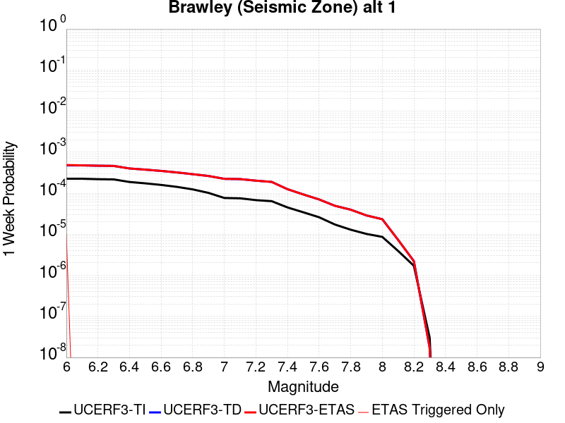 | 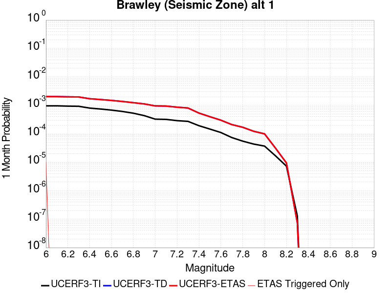 | 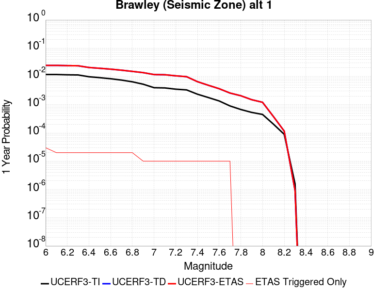 | 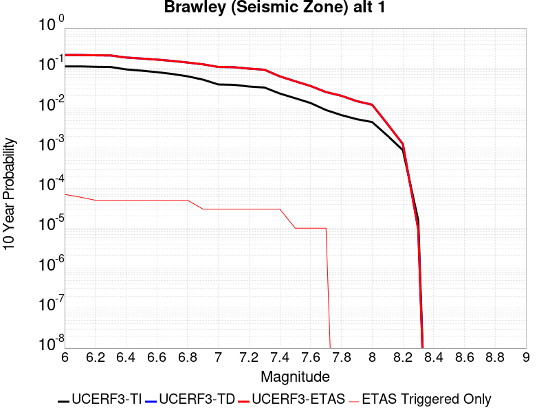 |

| Magnitude | 1 wk TI Prob | 1 wk TD Prob | 1 wk ETAS Prob | 1 wk ETAS/TD Gain | 1 wk ETAS Triggered Only | 1 mo TI Prob | 1 mo TD Prob | 1 mo ETAS Prob | 1 mo ETAS/TD Gain | 1 mo ETAS Triggered Only | 1 yr TI Prob | 1 yr TD Prob | 1 yr ETAS Prob | 1 yr ETAS/TD Gain | 1 yr ETAS Triggered Only | 10 yr TI Prob | 10 yr TD Prob | 10 yr ETAS Prob | 10 yr ETAS/TD Gain | 10 yr ETAS Triggered Only |
|-----|-----|-----|-----|-----|-----|-----|-----|-----|-----|-----|-----|-----|-----|-----|-----|-----|-----|-----|-----|-----|
| 6.0 | 2.2521618E-4 | 4.7641253E-4 | 4.8640775E-4 | 1.0209802 | 1.0E-5 | 9.6485513E-4 | 0.0020402074 | 0.002050187 | 1.0048915 | 1.0E-5 | 0.011683988 | 0.02455069 | 0.024579952 | 1.001192 | 3.0E-5 | 0.11088423 | 0.21353015 | 0.2135852 | 1.0002578 | 7.0E-5 |
| 6.1 | 2.2521618E-4 | 4.7641253E-4 | 4.7641253E-4 | 1.0 | 0.0 | 9.6485513E-4 | 0.0020402074 | 0.0020402074 | 1.0 | 0.0 | 0.011683988 | 0.02455069 | 0.024570197 | 1.0007946 | 2.0E-5 | 0.11088423 | 0.21353015 | 0.21357735 | 1.000221 | 6.0E-5 |
| 6.2 | 2.198148E-4 | 4.6725658E-4 | 4.6725658E-4 | 1.0 | 0.0 | 9.417233E-4 | 0.002001028 | 0.002001028 | 1.0 | 0.0 | 0.011405343 | 0.024084855 | 0.024104374 | 1.0008104 | 2.0E-5 | 0.10837428 | 0.20996629 | 0.21000579 | 1.0001881 | 5.0E-5 |
| 6.3 | 2.1704129E-4 | 4.6161312E-4 | 4.6161312E-4 | 1.0 | 0.0 | 9.298453E-4 | 0.0019768786 | 0.0019768786 | 1.0 | 0.0 | 0.011262234 | 0.023797998 | 0.023817522 | 1.0008204 | 2.0E-5 | 0.107082725 | 0.20785725 | 0.20789686 | 1.0001905 | 5.0E-5 |
| 6.4 | 1.876142E-4 | 4.0053183E-4 | 4.0053183E-4 | 1.0 | 0.0 | 8.038131E-4 | 0.0017154501 | 0.0017154501 | 1.0 | 0.0 | 0.00974259 | 0.02068463 | 0.020704217 | 1.0009469 | 2.0E-5 | 0.093263686 | 0.184608 | 0.18464877 | 1.0002209 | 5.0E-5 |
| 6.5 | 1.7390939E-4 | 3.7485067E-4 | 3.7485067E-4 | 1.0 | 0.0 | 7.45113E-4 | 0.0016055258 | 0.0016055258 | 1.0 | 0.0 | 0.009034078 | 0.019372813 | 0.019392425 | 1.0010123 | 2.0E-5 | 0.086755216 | 0.17442966 | 0.17447095 | 1.0002366 | 5.0E-5 |
| 6.6 | 1.591791E-4 | 3.489955E-4 | 3.489955E-4 | 1.0 | 0.0 | 6.8201777E-4 | 0.0014948477 | 0.0014948477 | 1.0 | 0.0 | 0.008271996 | 0.018049458 | 0.018069098 | 1.001088 | 2.0E-5 | 0.07970774 | 0.16383699 | 0.1638788 | 1.0002552 | 5.0E-5 |
| 6.7 | 1.4268003E-4 | 3.206533E-4 | 3.206533E-4 | 1.0 | 0.0 | 6.1134255E-4 | 0.0013735129 | 0.0013735129 | 1.0 | 0.0 | 0.007417723 | 0.016596261 | 0.01661593 | 1.001185 | 2.0E-5 | 0.07174956 | 0.15196045 | 0.15200286 | 1.0002791 | 5.0E-5 |
| 6.8 | 1.239713E-4 | 2.9059697E-4 | 2.9059697E-4 | 1.0 | 0.0 | 5.3119735E-4 | 0.0012448273 | 0.0012448273 | 1.0 | 0.0 | 0.0064481674 | 0.015051884 | 0.015071582 | 1.0013087 | 2.0E-5 | 0.06264243 | 0.13840161 | 0.13844469 | 1.0003113 | 5.0E-5 |
| 6.9 | 1.0180238E-4 | 2.625907E-4 | 2.625907E-4 | 1.0 | 0.0 | 4.3622297E-4 | 0.0011249076 | 0.0011249076 | 1.0 | 0.0 | 0.005298089 | 0.013610746 | 0.01362061 | 1.0007247 | 1.0E-5 | 0.05173543 | 0.12498065 | 0.1250069 | 1.00021 | 3.0E-5 |
| 7.0 | 7.6619996E-5 | 2.2402873E-4 | 2.2402873E-4 | 1.0 | 0.0 | 3.283301E-4 | 9.59773E-4 | 9.59773E-4 | 1.0 | 0.0 | 0.0039900932 | 0.011623339 | 0.011633222 | 1.0008503 | 1.0E-5 | 0.039192066 | 0.10728151 | 0.1073083 | 1.0002496 | 3.0E-5 |
| 7.1 | 7.5127435E-5 | 2.208599E-4 | 2.208599E-4 | 1.0 | 0.0 | 3.2193496E-4 | 9.4620226E-4 | 9.4620226E-4 | 1.0 | 0.0 | 0.0039125155 | 0.011459865 | 0.01146975 | 1.0008626 | 1.0E-5 | 0.038443442 | 0.10584534 | 0.10587216 | 1.0002534 | 3.0E-5 |
| 7.2 | 6.788582E-5 | 2.0213598E-4 | 2.0213598E-4 | 1.0 | 0.0 | 2.9090676E-4 | 8.660125E-4 | 8.660125E-4 | 1.0 | 0.0 | 0.0035360386 | 0.010493369 | 0.010503264 | 1.000943 | 1.0E-5 | 0.034803 | 0.09751546 | 0.09754253 | 1.0002776 | 3.0E-5 |
| 7.3 | 6.399602E-5 | 1.88444E-4 | 1.88444E-4 | 1.0 | 0.0 | 2.7423984E-4 | 8.0737006E-4 | 8.0737006E-4 | 1.0 | 0.0 | 0.0033337586 | 0.009786017 | 0.009795919 | 1.0010118 | 1.0E-5 | 0.03284188 | 0.091409855 | 0.091437116 | 1.0002981 | 3.0E-5 |
| 7.4 | 4.506759E-5 | 1.2531783E-4 | 1.2531783E-4 | 1.0 | 0.0 | 1.9313251E-4 | 5.369668E-4 | 5.369668E-4 | 1.0 | 0.0 | 0.0023488526 | 0.0065181484 | 0.0065280832 | 1.0015242 | 1.0E-5 | 0.023241805 | 0.062375 | 0.06240313 | 1.000451 | 3.0E-5 |
| 7.5 | 3.43289E-5 | 9.337587E-5 | 9.337587E-5 | 1.0 | 0.0 | 1.4711556E-4 | 4.0012124E-4 | 4.0012124E-4 | 1.0 | 0.0 | 0.0017896603 | 0.004860657 | 0.0048706084 | 1.0020473 | 1.0E-5 | 0.01775316 | 0.04706493 | 0.04707446 | 1.0002024 | 1.0E-5 |
| 7.6 | 2.5980507E-5 | 7.054998E-5 | 7.054998E-5 | 1.0 | 0.0 | 1.1134028E-4 | 3.0232212E-4 | 3.0232212E-4 | 1.0 | 0.0 | 0.001354725 | 0.0036745837 | 0.003684547 | 1.0027114 | 1.0E-5 | 0.013464959 | 0.035849415 | 0.035859056 | 1.0002689 | 1.0E-5 |
| 7.7 | 1.7292105E-5 | 4.9423474E-5 | 4.9423474E-5 | 1.0 | 0.0 | 7.4106916E-5 | 2.1179771E-4 | 2.1179771E-4 | 1.0 | 0.0 | 9.018782E-4 | 0.0025755935 | 0.0025855678 | 1.0038726 | 1.0E-5 | 0.008982267 | 0.025297757 | 0.025307504 | 1.0003853 | 1.0E-5 |
| 7.8 | 1.2927471E-5 | 3.970735E-5 | 3.970735E-5 | 1.0 | 0.0 | 5.5402274E-5 | 1.7016326E-4 | 1.7016326E-4 | 1.0 | 0.0 | 6.743139E-4 | 0.0020697718 | 0.0020697718 | 1.0 | 0.0 | 0.0067227143 | 0.02043814 | 0.02043814 | 1.0 | 0.0 |
| 7.9 | 1.0200774E-5 | 2.8757075E-5 | 2.8757075E-5 | 1.0 | 0.0 | 4.371687E-5 | 1.2323879E-4 | 1.2323879E-4 | 1.0 | 0.0 | 5.321229E-4 | 0.0014994006 | 0.0014994006 | 1.0 | 0.0 | 0.005308505 | 0.0149969105 | 0.0149969105 | 1.0 | 0.0 |
| 8.0 | 8.650396E-6 | 2.3287128E-5 | 2.3287128E-5 | 1.0 | 0.0 | 3.70726E-5 | 9.979816E-5 | 9.979816E-5 | 1.0 | 0.0 | 4.5126543E-4 | 0.0012143662 | 0.0012143662 | 1.0 | 0.0 | 0.0045035016 | 0.012215644 | 0.012215644 | 1.0 | 0.0 |
| 8.1 | 3.9368224E-6 | 7.3321658E-6 | 7.3321658E-6 | 1.0 | 0.0 | 1.6871985E-5 | 3.1423187E-5 | 3.1423187E-5 | 1.0 | 0.0 | 2.0539707E-4 | 3.825103E-4 | 3.825103E-4 | 1.0 | 0.0 | 0.0020520731 | 0.00400326 | 0.00400326 | 1.0 | 0.0 |
| 8.2 | 1.7101195E-6 | 2.2195122E-6 | 2.2195122E-6 | 1.0 | 0.0 | 7.329063E-6 | 9.51216E-6 | 9.51216E-6 | 1.0 | 0.0 | 8.922769E-5 | 1.15804425E-4 | 1.15804425E-4 | 1.0 | 0.0 | 8.9191867E-4 | 0.0012675166 | 0.0012675166 | 1.0 | 0.0 |
| 8.3 | 3.0346666E-8 | 1.7233086E-8 | 1.7233086E-8 | 1.0 | 0.0 | 1.3005713E-7 | 7.385608E-8 | 7.385608E-8 | 1.0 | 0.0 | 1.5834444E-6 | 8.991977E-7 | 8.991977E-7 | 1.0 | 0.0 | 1.5834332E-5 | 9.37692E-6 | 9.37692E-6 | 1.0 | 0.0 |

## Big Pine (Central)
*[(top)](#table-of-contents)*

| 1 Week | 1 Month | 1 Year | 10 Year |
|-----|-----|-----|-----|
|  | 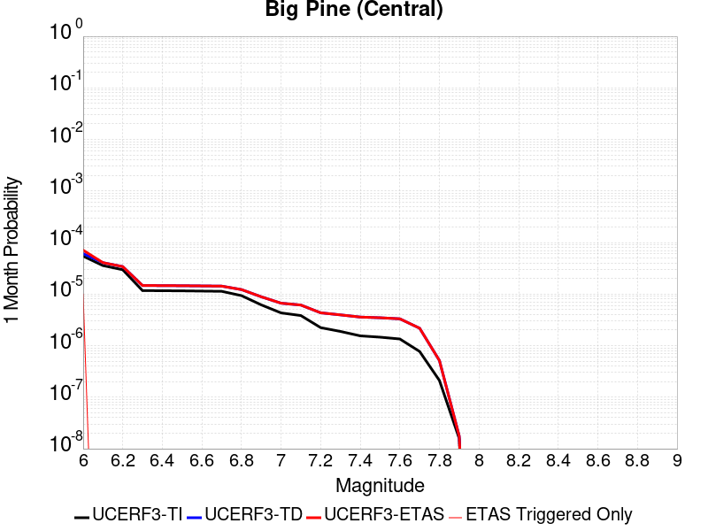 | 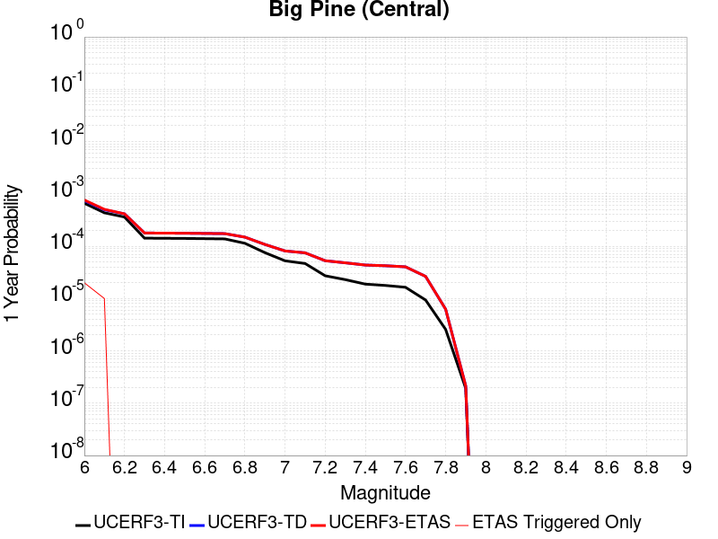 | 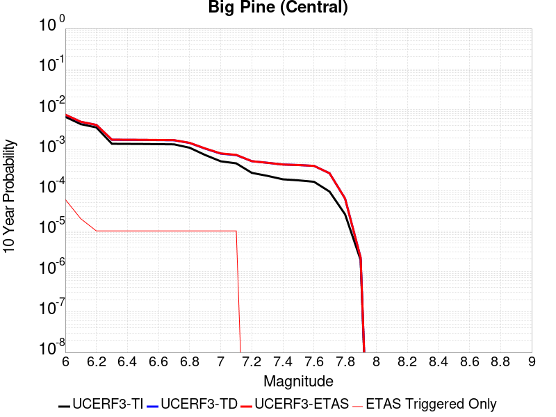 |

| Magnitude | 1 wk TI Prob | 1 wk TD Prob | 1 wk ETAS Prob | 1 wk ETAS/TD Gain | 1 wk ETAS Triggered Only | 1 mo TI Prob | 1 mo TD Prob | 1 mo ETAS Prob | 1 mo ETAS/TD Gain | 1 mo ETAS Triggered Only | 1 yr TI Prob | 1 yr TD Prob | 1 yr ETAS Prob | 1 yr ETAS/TD Gain | 1 yr ETAS Triggered Only | 10 yr TI Prob | 10 yr TD Prob | 10 yr ETAS Prob | 10 yr ETAS/TD Gain | 10 yr ETAS Triggered Only |
|-----|-----|-----|-----|-----|-----|-----|-----|-----|-----|-----|-----|-----|-----|-----|-----|-----|-----|-----|-----|-----|
| 6.0 | 1.2706755E-5 | 1.4251012E-5 | 1.4251012E-5 | 1.0 | 0.0 | 5.4456385E-5 | 6.107454E-5 | 7.107393E-5 | 1.1637243 | 1.0E-5 | 6.628048E-4 | 7.4336544E-4 | 7.633506E-4 | 1.0268847 | 2.0E-5 | 0.006608314 | 0.0074138143 | 0.0074733696 | 1.008033 | 6.0E-5 |
| 6.1 | 8.342579E-6 | 9.511191E-6 | 9.511191E-6 | 1.0 | 0.0 | 3.5753423E-5 | 4.0761734E-5 | 4.0761734E-5 | 1.0 | 0.0 | 4.3521097E-4 | 4.961828E-4 | 5.061779E-4 | 1.0201439 | 1.0E-5 | 0.0043435963 | 0.0049543027 | 0.004974203 | 1.0040169 | 2.0E-5 |
| 6.2 | 6.923899E-6 | 7.967559E-6 | 7.967559E-6 | 1.0 | 0.0 | 2.9673516E-5 | 3.4146342E-5 | 3.4146342E-5 | 1.0 | 0.0 | 3.6121515E-4 | 4.1567165E-4 | 4.1567165E-4 | 1.0 | 0.0 | 0.003606286 | 0.0041522477 | 0.0041622063 | 1.0023984 | 1.0E-5 |
| 6.3 | 2.728396E-6 | 3.4246525E-6 | 3.4246525E-6 | 1.0 | 0.0 | 1.1693074E-5 | 1.4677004E-5 | 1.4677004E-5 | 1.0 | 0.0 | 1.4235388E-4 | 1.7867875E-4 | 1.7867875E-4 | 1.0 | 0.0 | 0.0014226272 | 0.0017868559 | 0.0017968379 | 1.0055864 | 1.0E-5 |
| 6.4 | 2.7136944E-6 | 3.4089458E-6 | 3.4089458E-6 | 1.0 | 0.0 | 1.1630066E-5 | 1.4609691E-5 | 1.4609691E-5 | 1.0 | 0.0 | 1.4158686E-4 | 1.7785933E-4 | 1.7785933E-4 | 1.0 | 0.0 | 0.0014149669 | 0.0017786748 | 0.001788657 | 1.0056121 | 1.0E-5 |
| 6.5 | 2.6971882E-6 | 3.3912906E-6 | 3.3912906E-6 | 1.0 | 0.0 | 1.1559327E-5 | 1.4534027E-5 | 1.4534027E-5 | 1.0 | 0.0 | 1.4072572E-4 | 1.7693828E-4 | 1.7693828E-4 | 1.0 | 0.0 | 0.0014063664 | 0.0017694789 | 0.0017794613 | 1.0056413 | 1.0E-5 |
| 6.6 | 2.669092E-6 | 3.361311E-6 | 3.361311E-6 | 1.0 | 0.0 | 1.1438916E-5 | 1.4405543E-5 | 1.4405543E-5 | 1.0 | 0.0 | 1.3925991E-4 | 1.7537424E-4 | 1.7537424E-4 | 1.0 | 0.0 | 0.0013917267 | 0.0017538633 | 0.0017638458 | 1.0056916 | 1.0E-5 |
| 6.7 | 2.6408059E-6 | 3.3313363E-6 | 3.3313363E-6 | 1.0 | 0.0 | 1.1317691E-5 | 1.4277082E-5 | 1.4277082E-5 | 1.0 | 0.0 | 1.3778417E-4 | 1.7381048E-4 | 1.7381048E-4 | 1.0 | 0.0 | 0.0013769877 | 0.0017382503 | 0.0017482329 | 1.0057429 | 1.0E-5 |
| 6.8 | 2.1786943E-6 | 2.8547915E-6 | 2.8547915E-6 | 1.0 | 0.0 | 9.337228E-6 | 1.2234768E-5 | 1.2234768E-5 | 1.0 | 0.0 | 1.1367482E-4 | 1.4894885E-4 | 1.4894885E-4 | 1.0 | 0.0 | 0.0011361669 | 0.0014899815 | 0.0014999666 | 1.0067015 | 1.0E-5 |
| 6.9 | 1.4411696E-6 | 2.0688422E-6 | 2.0688422E-6 | 1.0 | 0.0 | 6.1764263E-6 | 8.866437E-6 | 8.866437E-6 | 1.0 | 0.0 | 7.51954E-5 | 1.079438E-4 | 1.079438E-4 | 1.0 | 0.0 | 7.5169955E-4 | 0.0010803605 | 0.0010903496 | 1.0092461 | 1.0E-5 |
| 7.0 | 1.0073411E-6 | 1.5545673E-6 | 1.5545673E-6 | 1.0 | 0.0 | 4.317169E-6 | 6.662415E-6 | 6.662415E-6 | 1.0 | 0.0 | 5.2560266E-5 | 8.111204E-5 | 8.111204E-5 | 1.0 | 0.0 | 5.2547833E-4 | 8.1225985E-4 | 8.222517E-4 | 1.0123013 | 1.0E-5 |
| 7.1 | 8.947104E-7 | 1.4305514E-6 | 1.4305514E-6 | 1.0 | 0.0 | 3.834468E-6 | 6.130921E-6 | 6.130921E-6 | 1.0 | 0.0 | 4.6683643E-5 | 7.464155E-5 | 7.464155E-5 | 1.0 | 0.0 | 4.6673836E-4 | 7.476001E-4 | 7.575927E-4 | 1.0133661 | 1.0E-5 |
| 7.2 | 5.215166E-7 | 1.0114496E-6 | 1.0114496E-6 | 1.0 | 0.0 | 2.2350691E-6 | 4.3347773E-6 | 4.3347773E-6 | 1.0 | 0.0 | 2.7211627E-5 | 5.2774678E-5 | 5.2774678E-5 | 1.0 | 0.0 | 2.7208295E-4 | 5.290466E-4 | 5.290466E-4 | 1.0 | 0.0 |
| 7.3 | 4.4024807E-7 | 9.2223235E-7 | 9.2223235E-7 | 1.0 | 0.0 | 1.8867761E-6 | 3.9524184E-6 | 3.9524184E-6 | 1.0 | 0.0 | 2.2971257E-5 | 4.8119677E-5 | 4.8119677E-5 | 1.0 | 0.0 | 2.2968883E-4 | 4.8251753E-4 | 4.8251753E-4 | 1.0 | 0.0 |
| 7.4 | 3.6130905E-7 | 8.3611724E-7 | 8.3611724E-7 | 1.0 | 0.0 | 1.5484665E-6 | 3.583355E-6 | 3.583355E-6 | 1.0 | 0.0 | 1.8852415E-5 | 4.362651E-5 | 4.362651E-5 | 1.0 | 0.0 | 1.8850817E-4 | 4.3759486E-4 | 4.3759486E-4 | 1.0 | 0.0 |
| 7.5 | 3.408184E-7 | 8.110739E-7 | 8.110739E-7 | 1.0 | 0.0 | 1.4606494E-6 | 3.4760267E-6 | 3.4760267E-6 | 1.0 | 0.0 | 1.7783263E-5 | 4.231984E-5 | 4.231984E-5 | 1.0 | 0.0 | 1.778184E-4 | 4.2451176E-4 | 4.2451176E-4 | 1.0 | 0.0 |
| 7.6 | 3.1428627E-7 | 7.7341E-7 | 7.7341E-7 | 1.0 | 0.0 | 1.3469405E-6 | 3.3146102E-6 | 3.3146102E-6 | 1.0 | 0.0 | 1.6398877E-5 | 4.0354673E-5 | 4.0354673E-5 | 1.0 | 0.0 | 1.6397667E-4 | 4.0483844E-4 | 4.0483844E-4 | 1.0 | 0.0 |
| 7.7 | 1.7972785E-7 | 5.0796626E-7 | 5.0796626E-7 | 1.0 | 0.0 | 7.70262E-7 | 2.1769965E-6 | 2.1769965E-6 | 1.0 | 0.0 | 9.377899E-6 | 2.6504622E-5 | 2.6504622E-5 | 1.0 | 0.0 | 9.377503E-5 | 2.663867E-4 | 2.663867E-4 | 1.0 | 0.0 |
| 7.8 | 4.9230927E-8 | 1.1985297E-7 | 1.1985297E-7 | 1.0 | 0.0 | 2.1098968E-7 | 5.136555E-7 | 5.136555E-7 | 1.0 | 0.0 | 2.5687964E-6 | 6.2537392E-6 | 6.2537392E-6 | 1.0 | 0.0 | 2.5687666E-5 | 6.2977226E-5 | 6.2977226E-5 | 1.0 | 0.0 |
| 7.9 | 3.6805972E-9 | 4.1070685E-9 | 4.1070685E-9 | 1.0 | 0.0 | 1.5773987E-8 | 1.7601723E-8 | 1.7601723E-8 | 1.0 | 0.0 | 1.9204828E-7 | 2.1430095E-7 | 2.1430095E-7 | 1.0 | 0.0 | 1.920481E-6 | 2.190991E-6 | 2.190991E-6 | 1.0 | 0.0 |

## Sierra Madre
*[(top)](#table-of-contents)*

| 1 Week | 1 Month | 1 Year | 10 Year |
|-----|-----|-----|-----|
|  | 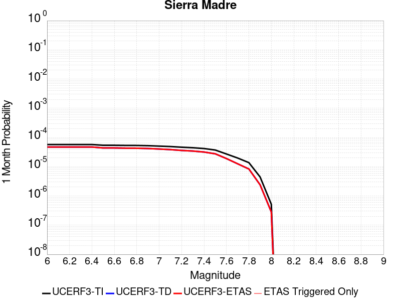 | 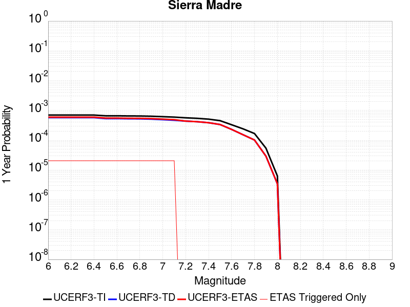 | 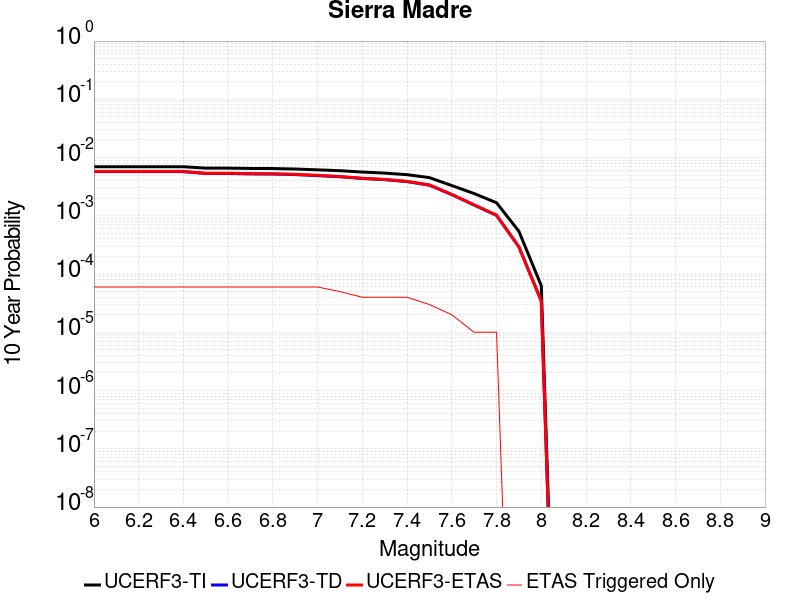 |

| Magnitude | 1 wk TI Prob | 1 wk TD Prob | 1 wk ETAS Prob | 1 wk ETAS/TD Gain | 1 wk ETAS Triggered Only | 1 mo TI Prob | 1 mo TD Prob | 1 mo ETAS Prob | 1 mo ETAS/TD Gain | 1 mo ETAS Triggered Only | 1 yr TI Prob | 1 yr TD Prob | 1 yr ETAS Prob | 1 yr ETAS/TD Gain | 1 yr ETAS Triggered Only | 10 yr TI Prob | 10 yr TD Prob | 10 yr ETAS Prob | 10 yr ETAS/TD Gain | 10 yr ETAS Triggered Only |
|-----|-----|-----|-----|-----|-----|-----|-----|-----|-----|-----|-----|-----|-----|-----|-----|-----|-----|-----|-----|-----|
| 6.0 | 1.3379373E-5 | 1.100113E-5 | 1.100113E-5 | 1.0 | 0.0 | 5.7338908E-5 | 4.7146856E-5 | 4.7146856E-5 | 1.0 | 0.0 | 6.978776E-4 | 5.738633E-4 | 6.2383455E-4 | 1.0870788 | 5.0E-5 | 0.0069569005 | 0.005724178 | 0.0057838345 | 1.0104219 | 6.0E-5 |
| 6.1 | 1.3379373E-5 | 1.100113E-5 | 1.100113E-5 | 1.0 | 0.0 | 5.7338908E-5 | 4.7146856E-5 | 4.7146856E-5 | 1.0 | 0.0 | 6.978776E-4 | 5.738633E-4 | 6.2383455E-4 | 1.0870788 | 5.0E-5 | 0.0069569005 | 0.005724178 | 0.0057838345 | 1.0104219 | 6.0E-5 |
| 6.2 | 1.3379373E-5 | 1.100113E-5 | 1.100113E-5 | 1.0 | 0.0 | 5.7338908E-5 | 4.7146856E-5 | 4.7146856E-5 | 1.0 | 0.0 | 6.978776E-4 | 5.738633E-4 | 6.2383455E-4 | 1.0870788 | 5.0E-5 | 0.0069569005 | 0.005724178 | 0.0057838345 | 1.0104219 | 6.0E-5 |
| 6.3 | 1.3379373E-5 | 1.100113E-5 | 1.100113E-5 | 1.0 | 0.0 | 5.7338908E-5 | 4.7146856E-5 | 4.7146856E-5 | 1.0 | 0.0 | 6.978776E-4 | 5.738633E-4 | 6.2383455E-4 | 1.0870788 | 5.0E-5 | 0.0069569005 | 0.005724178 | 0.0057838345 | 1.0104219 | 6.0E-5 |
| 6.4 | 1.3379373E-5 | 1.100113E-5 | 1.100113E-5 | 1.0 | 0.0 | 5.7338908E-5 | 4.7146856E-5 | 4.7146856E-5 | 1.0 | 0.0 | 6.978776E-4 | 5.738633E-4 | 6.2383455E-4 | 1.0870788 | 5.0E-5 | 0.0069569005 | 0.005724178 | 0.0057838345 | 1.0104219 | 6.0E-5 |
| 6.5 | 1.26563245E-5 | 1.0230579E-5 | 1.0230579E-5 | 1.0 | 0.0 | 5.4240263E-5 | 4.3844608E-5 | 4.3844608E-5 | 1.0 | 0.0 | 6.601751E-4 | 5.3367845E-4 | 5.8365177E-4 | 1.0936394 | 5.0E-5 | 0.006582173 | 0.00532429 | 0.0053839707 | 1.0112091 | 6.0E-5 |
| 6.6 | 1.26563245E-5 | 1.0230579E-5 | 1.0230579E-5 | 1.0 | 0.0 | 5.4240263E-5 | 4.3844608E-5 | 4.3844608E-5 | 1.0 | 0.0 | 6.601751E-4 | 5.3367845E-4 | 5.8365177E-4 | 1.0936394 | 5.0E-5 | 0.006582173 | 0.00532429 | 0.0053839707 | 1.0112091 | 6.0E-5 |
| 6.7 | 1.2502474E-5 | 1.0066722E-5 | 1.0066722E-5 | 1.0 | 0.0 | 5.3580934E-5 | 4.3142387E-5 | 4.3142387E-5 | 1.0 | 0.0 | 6.521526E-4 | 5.2513304E-4 | 5.7510677E-4 | 1.095164 | 5.0E-5 | 0.0065024206 | 0.0052392404 | 0.005298926 | 1.011392 | 6.0E-5 |
| 6.8 | 1.2454966E-5 | 1.0019007E-5 | 1.0019007E-5 | 1.0 | 0.0 | 5.3377335E-5 | 4.29379E-5 | 4.29379E-5 | 1.0 | 0.0 | 6.4967526E-4 | 5.226446E-4 | 5.7261845E-4 | 1.0956173 | 5.0E-5 | 0.006477792 | 0.005214473 | 0.0052741603 | 1.0114465 | 6.0E-5 |
| 6.9 | 1.2225574E-5 | 9.7929815E-6 | 9.7929815E-6 | 1.0 | 0.0 | 5.2394265E-5 | 4.196925E-5 | 4.196925E-5 | 1.0 | 0.0 | 6.3771347E-4 | 5.108569E-4 | 5.6083134E-4 | 1.0978248 | 5.0E-5 | 0.006358865 | 0.0050971415 | 0.0051568355 | 1.0117114 | 6.0E-5 |
| 7.0 | 1.182946E-5 | 9.3995195E-6 | 9.3995195E-6 | 1.0 | 0.0 | 5.06967E-5 | 4.0283037E-5 | 4.0283037E-5 | 1.0 | 0.0 | 6.1705755E-4 | 4.903367E-4 | 5.4031215E-4 | 1.1019207 | 5.0E-5 | 0.006153469 | 0.004892859 | 0.0049525658 | 1.0122027 | 6.0E-5 |
| 7.1 | 1.14369095E-5 | 8.986527E-6 | 8.986527E-6 | 1.0 | 0.0 | 4.9014405E-5 | 3.8513124E-5 | 3.8513124E-5 | 1.0 | 0.0 | 5.9658696E-4 | 4.6879737E-4 | 5.087786E-4 | 1.0852847 | 4.0E-5 | 0.005949879 | 0.00467839 | 0.004728156 | 1.0106374 | 5.0E-5 |
| 7.2 | 1.0836419E-5 | 8.399916E-6 | 8.399916E-6 | 1.0 | 0.0 | 4.644097E-5 | 3.5999146E-5 | 3.5999146E-5 | 1.0 | 0.0 | 5.652721E-4 | 4.3820238E-4 | 4.6818922E-4 | 1.0684315 | 3.0E-5 | 0.0056383642 | 0.0043736803 | 0.0044135056 | 1.0091056 | 4.0E-5 |
| 7.3 | 1.0403439E-5 | 8.021173E-6 | 8.021173E-6 | 1.0 | 0.0 | 4.4585406E-5 | 3.4376008E-5 | 3.4376008E-5 | 1.0 | 0.0 | 5.426921E-4 | 4.1844844E-4 | 4.484359E-4 | 1.0716634 | 3.0E-5 | 0.005413687 | 0.0041769007 | 0.0042167334 | 1.0095365 | 4.0E-5 |
| 7.4 | 9.768864E-6 | 7.414793E-6 | 7.414793E-6 | 1.0 | 0.0 | 4.186589E-5 | 3.17773E-5 | 3.17773E-5 | 1.0 | 0.0 | 5.09598E-4 | 3.8682084E-4 | 4.1680926E-4 | 1.0775253 | 3.0E-5 | 0.0050843097 | 0.0038617672 | 0.0039016127 | 1.0103179 | 4.0E-5 |
| 7.5 | 8.687089E-6 | 6.4504875E-6 | 6.4504875E-6 | 1.0 | 0.0 | 3.722985E-5 | 2.7644659E-5 | 2.7644659E-5 | 1.0 | 0.0 | 4.5317915E-4 | 3.3652261E-4 | 3.665125E-4 | 1.089117 | 3.0E-5 | 0.004522561 | 0.0033604174 | 0.0033903166 | 1.0088974 | 3.0E-5 |
| 7.6 | 6.3506063E-6 | 4.430626E-6 | 4.430626E-6 | 1.0 | 0.0 | 2.72166E-5 | 1.8988261E-5 | 1.8988261E-5 | 1.0 | 0.0 | 3.3131172E-4 | 2.3115781E-4 | 2.511532E-4 | 1.086501 | 2.0E-5 | 0.003308182 | 0.0023093987 | 0.0023293525 | 1.0086403 | 2.0E-5 |
| 7.7 | 4.62223E-6 | 2.9332562E-6 | 2.9332562E-6 | 1.0 | 0.0 | 1.9809406E-5 | 1.2571038E-5 | 1.2571038E-5 | 1.0 | 0.0 | 2.4115283E-4 | 1.5304166E-4 | 1.6304012E-4 | 1.0653317 | 1.0E-5 | 0.0024089129 | 0.0015295637 | 0.0015395484 | 1.0065278 | 1.0E-5 |
| 7.8 | 3.2145008E-6 | 1.9496579E-6 | 1.9496579E-6 | 1.0 | 0.0 | 1.3776359E-5 | 8.35565E-6 | 8.35565E-6 | 1.0 | 0.0 | 1.6771426E-4 | 1.01725294E-4 | 1.1172428E-4 | 1.098294 | 1.0E-5 | 0.0016758774 | 0.0010169316 | 0.0010269214 | 1.0098236 | 1.0E-5 |
| 7.9 | 1.0391769E-6 | 5.6034094E-7 | 5.6034094E-7 | 1.0 | 0.0 | 4.4536077E-6 | 2.401459E-6 | 2.401459E-6 | 1.0 | 0.0 | 5.4221324E-5 | 2.9237375E-5 | 2.9237375E-5 | 1.0 | 0.0 | 5.4208096E-4 | 2.9233572E-4 | 2.9233572E-4 | 1.0 | 0.0 |
| 8.0 | 1.210983E-7 | 6.6141716E-8 | 6.6141716E-8 | 1.0 | 0.0 | 5.1899264E-7 | 2.8346446E-7 | 2.8346446E-7 | 1.0 | 0.0 | 6.3187167E-6 | 3.4511747E-6 | 3.4511747E-6 | 1.0 | 0.0 | 6.318537E-5 | 3.4511228E-5 | 3.4511228E-5 | 1.0 | 0.0 |

## Kern Canyon (North Kern) 2011
*[(top)](#table-of-contents)*

| 1 Week | 1 Month | 1 Year | 10 Year |
|-----|-----|-----|-----|
| 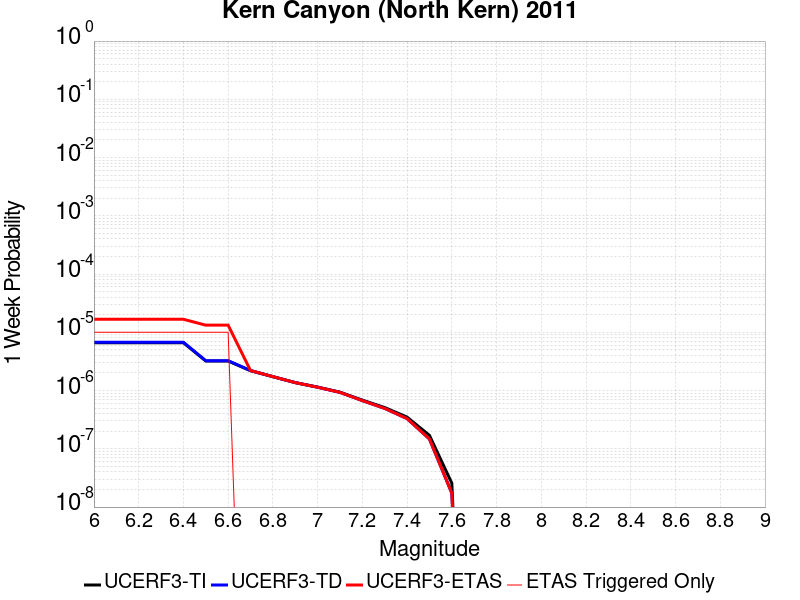 | 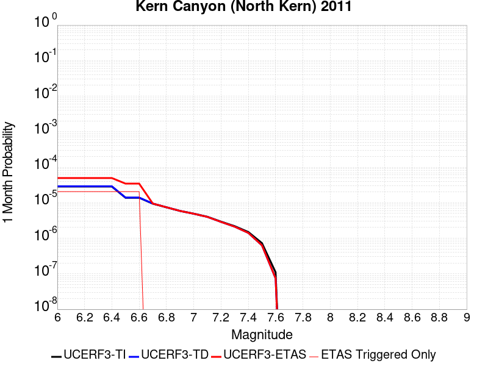 | 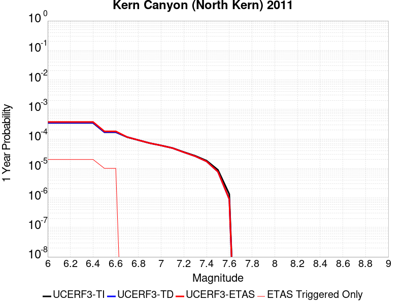 | 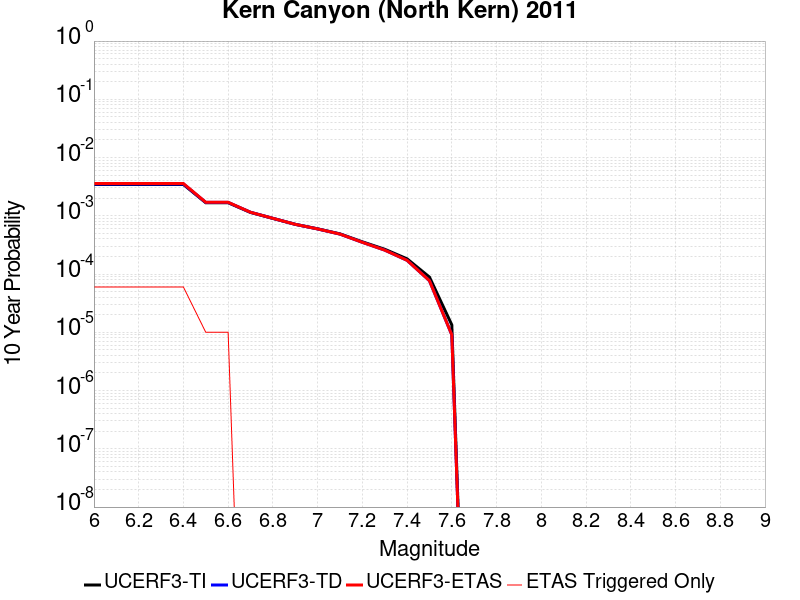 |

| Magnitude | 1 wk TI Prob | 1 wk TD Prob | 1 wk ETAS Prob | 1 wk ETAS/TD Gain | 1 wk ETAS Triggered Only | 1 mo TI Prob | 1 mo TD Prob | 1 mo ETAS Prob | 1 mo ETAS/TD Gain | 1 mo ETAS Triggered Only | 1 yr TI Prob | 1 yr TD Prob | 1 yr ETAS Prob | 1 yr ETAS/TD Gain | 1 yr ETAS Triggered Only | 10 yr TI Prob | 10 yr TD Prob | 10 yr ETAS Prob | 10 yr ETAS/TD Gain | 10 yr ETAS Triggered Only |
|-----|-----|-----|-----|-----|-----|-----|-----|-----|-----|-----|-----|-----|-----|-----|-----|-----|-----|-----|-----|-----|
| 6.0 | 6.6264497E-6 | 6.7573515E-6 | 1.6757283E-5 | 2.4798598 | 1.0E-5 | 2.8398761E-5 | 2.8959801E-5 | 3.895951E-5 | 1.3452963 | 1.0E-5 | 3.4570007E-4 | 3.5253653E-4 | 3.725295E-4 | 1.0567117 | 2.0E-5 | 0.0034516277 | 0.0035205614 | 0.0035803502 | 1.0169828 | 6.0E-5 |
| 6.1 | 6.6264497E-6 | 6.7573515E-6 | 1.6757283E-5 | 2.4798598 | 1.0E-5 | 2.8398761E-5 | 2.8959801E-5 | 3.895951E-5 | 1.3452963 | 1.0E-5 | 3.4570007E-4 | 3.5253653E-4 | 3.725295E-4 | 1.0567117 | 2.0E-5 | 0.0034516277 | 0.0035205614 | 0.0035803502 | 1.0169828 | 6.0E-5 |
| 6.2 | 6.6264497E-6 | 6.7573515E-6 | 1.6757283E-5 | 2.4798598 | 1.0E-5 | 2.8398761E-5 | 2.8959801E-5 | 3.895951E-5 | 1.3452963 | 1.0E-5 | 3.4570007E-4 | 3.5253653E-4 | 3.725295E-4 | 1.0567117 | 2.0E-5 | 0.0034516277 | 0.0035205614 | 0.0035803502 | 1.0169828 | 6.0E-5 |
| 6.3 | 6.6264497E-6 | 6.7573515E-6 | 1.6757283E-5 | 2.4798598 | 1.0E-5 | 2.8398761E-5 | 2.8959801E-5 | 3.895951E-5 | 1.3452963 | 1.0E-5 | 3.4570007E-4 | 3.5253653E-4 | 3.725295E-4 | 1.0567117 | 2.0E-5 | 0.0034516277 | 0.0035205614 | 0.0035803502 | 1.0169828 | 6.0E-5 |
| 6.4 | 6.6264497E-6 | 6.7573515E-6 | 1.6757283E-5 | 2.4798598 | 1.0E-5 | 2.8398761E-5 | 2.8959801E-5 | 3.895951E-5 | 1.3452963 | 1.0E-5 | 3.4570007E-4 | 3.5253653E-4 | 3.725295E-4 | 1.0567117 | 2.0E-5 | 0.0034516277 | 0.0035205614 | 0.0035803502 | 1.0169828 | 6.0E-5 |
| 6.5 | 3.2162225E-6 | 3.2571006E-6 | 1.3257068E-5 | 4.070205 | 1.0E-5 | 1.3783738E-5 | 1.3958933E-5 | 2.3958793E-5 | 1.7163771 | 1.0E-5 | 1.6780409E-4 | 1.6993756E-4 | 1.7993586E-4 | 1.0588351 | 1.0E-5 | 0.0016767744 | 0.0016981558 | 0.0017081387 | 1.0058787 | 1.0E-5 |
| 6.6 | 3.2162225E-6 | 3.2571006E-6 | 1.3257068E-5 | 4.070205 | 1.0E-5 | 1.3783738E-5 | 1.3958933E-5 | 2.3958793E-5 | 1.7163771 | 1.0E-5 | 1.6780409E-4 | 1.6993756E-4 | 1.7993586E-4 | 1.0588351 | 1.0E-5 | 0.0016767744 | 0.0016981558 | 0.0017081387 | 1.0058787 | 1.0E-5 |
| 6.7 | 2.1908265E-6 | 2.2071279E-6 | 2.2071279E-6 | 1.0 | 0.0 | 9.389223E-6 | 9.459087E-6 | 9.459087E-6 | 1.0 | 0.0 | 1.1430779E-4 | 1.1515849E-4 | 1.1515849E-4 | 1.0 | 0.0 | 0.0011424901 | 0.0011510076 | 0.0011510076 | 1.0 | 0.0 |
| 6.8 | 1.7303895E-6 | 1.7365574E-6 | 1.7365574E-6 | 1.0 | 0.0 | 7.415934E-6 | 7.442368E-6 | 7.442368E-6 | 1.0 | 0.0 | 9.028525E-5 | 9.060716E-5 | 9.060716E-5 | 1.0 | 0.0 | 9.024858E-4 | 9.057119E-4 | 9.057119E-4 | 1.0 | 0.0 |
| 6.9 | 1.3700314E-6 | 1.3688657E-6 | 1.3688657E-6 | 1.0 | 0.0 | 5.87155E-6 | 5.866554E-6 | 5.866554E-6 | 1.0 | 0.0 | 7.148377E-5 | 7.1423005E-5 | 7.1423005E-5 | 1.0 | 0.0 | 7.146078E-4 | 7.1400503E-4 | 7.1400503E-4 | 1.0 | 0.0 |
| 7.0 | 1.1467797E-6 | 1.1413833E-6 | 1.1413833E-6 | 1.0 | 0.0 | 4.9147607E-6 | 4.8916336E-6 | 4.8916336E-6 | 1.0 | 0.0 | 5.983557E-5 | 5.9554044E-5 | 5.9554044E-5 | 1.0 | 0.0 | 5.981946E-4 | 5.95384E-4 | 5.95384E-4 | 1.0 | 0.0 |
| 7.1 | 9.3952065E-7 | 9.302714E-7 | 9.302714E-7 | 1.0 | 0.0 | 4.026511E-6 | 3.9868714E-6 | 3.9868714E-6 | 1.0 | 0.0 | 4.9021666E-5 | 4.8539096E-5 | 4.8539096E-5 | 1.0 | 0.0 | 4.901085E-4 | 4.8528673E-4 | 4.8528673E-4 | 1.0 | 0.0 |
| 7.2 | 6.858055E-7 | 6.719318E-7 | 6.719318E-7 | 1.0 | 0.0 | 2.939163E-6 | 2.8797044E-6 | 2.8797044E-6 | 1.0 | 0.0 | 3.5783723E-5 | 3.5059846E-5 | 3.5059846E-5 | 1.0 | 0.0 | 3.5777962E-4 | 3.5054405E-4 | 3.5054405E-4 | 1.0 | 0.0 |
| 7.3 | 5.1101983E-7 | 4.939313E-7 | 4.939313E-7 | 1.0 | 0.0 | 2.1900833E-6 | 2.1168466E-6 | 2.1168466E-6 | 1.0 | 0.0 | 2.6663936E-5 | 2.5772308E-5 | 2.5772308E-5 | 1.0 | 0.0 | 2.6660739E-4 | 2.5769367E-4 | 2.5769367E-4 | 1.0 | 0.0 |
| 7.4 | 3.4999414E-7 | 3.2995996E-7 | 3.2995996E-7 | 1.0 | 0.0 | 1.499974E-6 | 1.4141134E-6 | 1.4141134E-6 | 1.0 | 0.0 | 1.8262032E-5 | 1.7216697E-5 | 1.7216697E-5 | 1.0 | 0.0 | 1.826053E-4 | 1.7215387E-4 | 1.7215387E-4 | 1.0 | 0.0 |
| 7.5 | 1.7021522E-7 | 1.4750091E-7 | 1.4750091E-7 | 1.0 | 0.0 | 7.2949354E-7 | 6.3214657E-7 | 6.3214657E-7 | 1.0 | 0.0 | 8.881548E-6 | 7.696359E-6 | 7.696359E-6 | 1.0 | 0.0 | 8.8811925E-5 | 7.6961E-5 | 7.6961E-5 | 1.0 | 0.0 |
| 7.6 | 2.572245E-8 | 1.7352637E-8 | 1.7352637E-8 | 1.0 | 0.0 | 1.10239064E-7 | 7.4368444E-8 | 7.4368444E-8 | 1.0 | 0.0 | 1.3421597E-6 | 9.0543546E-7 | 9.0543546E-7 | 1.0 | 0.0 | 1.3421517E-5 | 9.0543235E-6 | 9.0543235E-6 | 1.0 | 0.0 |

## Santa Ynez River
*[(top)](#table-of-contents)*

| 1 Week | 1 Month | 1 Year | 10 Year |
|-----|-----|-----|-----|
| 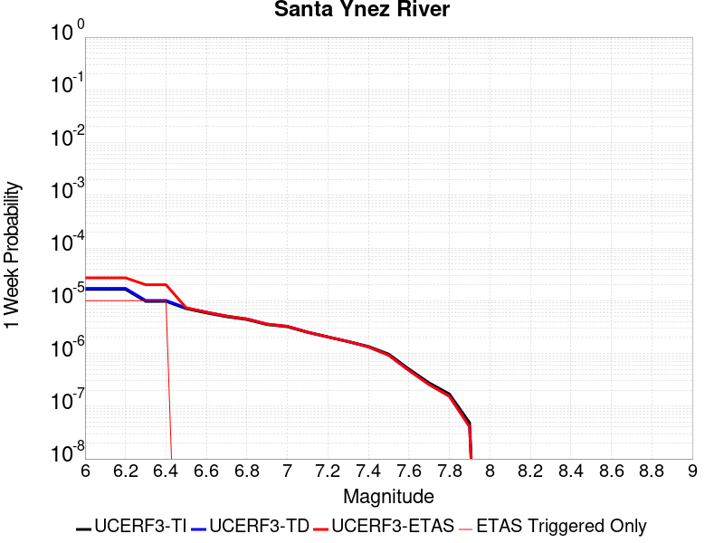 | 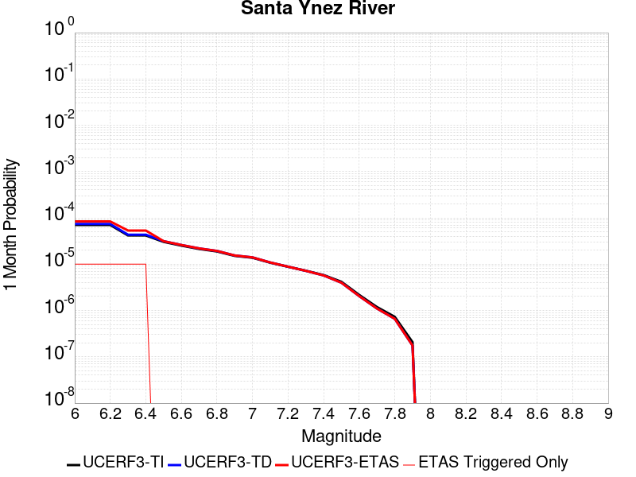 | 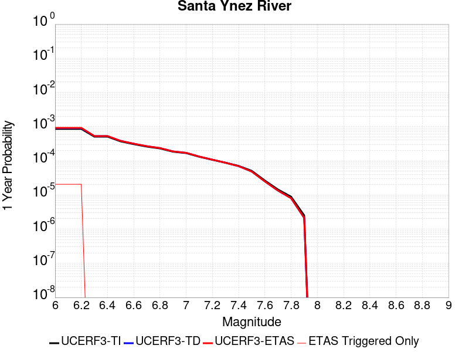 | 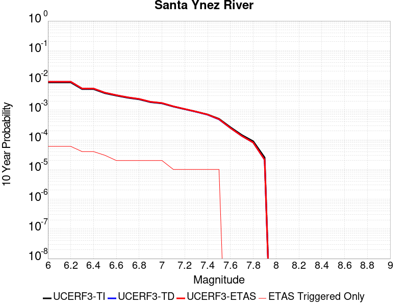 |

| Magnitude | 1 wk TI Prob | 1 wk TD Prob | 1 wk ETAS Prob | 1 wk ETAS/TD Gain | 1 wk ETAS Triggered Only | 1 mo TI Prob | 1 mo TD Prob | 1 mo ETAS Prob | 1 mo ETAS/TD Gain | 1 mo ETAS Triggered Only | 1 yr TI Prob | 1 yr TD Prob | 1 yr ETAS Prob | 1 yr ETAS/TD Gain | 1 yr ETAS Triggered Only | 10 yr TI Prob | 10 yr TD Prob | 10 yr ETAS Prob | 10 yr ETAS/TD Gain | 10 yr ETAS Triggered Only |
|-----|-----|-----|-----|-----|-----|-----|-----|-----|-----|-----|-----|-----|-----|-----|-----|-----|-----|-----|-----|-----|
| 6.0 | 1.6396456E-5 | 1.7209564E-5 | 2.7209393E-5 | 1.5810622 | 1.0E-5 | 7.026863E-5 | 7.375339E-5 | 8.375265E-5 | 1.135577 | 1.0E-5 | 8.551848E-4 | 8.976132E-4 | 9.1759523E-4 | 1.0222613 | 2.0E-5 | 0.0085190125 | 0.008943425 | 0.009002889 | 1.0066489 | 6.0E-5 |
| 6.1 | 1.6396456E-5 | 1.7209564E-5 | 2.7209393E-5 | 1.5810622 | 1.0E-5 | 7.026863E-5 | 7.375339E-5 | 8.375265E-5 | 1.135577 | 1.0E-5 | 8.551848E-4 | 8.976132E-4 | 9.1759523E-4 | 1.0222613 | 2.0E-5 | 0.0085190125 | 0.008943425 | 0.009002889 | 1.0066489 | 6.0E-5 |
| 6.2 | 1.6396456E-5 | 1.7209564E-5 | 2.7209393E-5 | 1.5810622 | 1.0E-5 | 7.026863E-5 | 7.375339E-5 | 8.375265E-5 | 1.135577 | 1.0E-5 | 8.551848E-4 | 8.976132E-4 | 9.1759523E-4 | 1.0222613 | 2.0E-5 | 0.0085190125 | 0.008943425 | 0.009002889 | 1.0066489 | 6.0E-5 |
| 6.3 | 9.736976E-6 | 1.0122399E-5 | 2.0122297E-5 | 1.9878981 | 1.0E-5 | 4.172923E-5 | 4.3381016E-5 | 5.3380583E-5 | 1.2305056 | 1.0E-5 | 5.0793495E-4 | 5.2804087E-4 | 5.380356E-4 | 1.0189279 | 1.0E-5 | 0.005067755 | 0.0052683675 | 0.005308157 | 1.0075525 | 4.0E-5 |
| 6.4 | 9.736976E-6 | 1.0122399E-5 | 2.0122297E-5 | 1.9878981 | 1.0E-5 | 4.172923E-5 | 4.3381016E-5 | 5.3380583E-5 | 1.2305056 | 1.0E-5 | 5.0793495E-4 | 5.2804087E-4 | 5.380356E-4 | 1.0189279 | 1.0E-5 | 0.005067755 | 0.0052683675 | 0.005308157 | 1.0075525 | 4.0E-5 |
| 6.5 | 7.081964E-6 | 7.3299457E-6 | 7.3299457E-6 | 1.0 | 0.0 | 3.035092E-5 | 3.1413685E-5 | 3.1413685E-5 | 1.0 | 0.0 | 3.694598E-4 | 3.8239607E-4 | 3.8239607E-4 | 1.0 | 0.0 | 0.0036884616 | 0.0038175425 | 0.003847428 | 1.0078285 | 3.0E-5 |
| 6.6 | 5.873247E-6 | 6.0597836E-6 | 6.0597836E-6 | 1.0 | 0.0 | 2.5170815E-5 | 2.5970248E-5 | 2.5970248E-5 | 1.0 | 0.0 | 3.064116E-4 | 3.1614274E-4 | 3.1614274E-4 | 1.0 | 0.0 | 0.0030598943 | 0.0031570175 | 0.0031769543 | 1.0063151 | 2.0E-5 |
| 6.7 | 4.973277E-6 | 5.115936E-6 | 5.115936E-6 | 1.0 | 0.0 | 2.1313872E-5 | 2.1925258E-5 | 2.1925258E-5 | 1.0 | 0.0 | 2.5946548E-4 | 2.669078E-4 | 2.669078E-4 | 1.0 | 0.0 | 0.0025916274 | 0.002665921 | 0.002685868 | 1.007482 | 2.0E-5 |
| 6.8 | 4.396492E-6 | 4.5110087E-6 | 4.5110087E-6 | 1.0 | 0.0 | 1.884197E-5 | 1.9332752E-5 | 1.9332752E-5 | 1.0 | 0.0 | 2.2937685E-4 | 2.3535118E-4 | 2.3535118E-4 | 1.0 | 0.0 | 0.0022914023 | 0.0023510547 | 0.0023710076 | 1.0084869 | 2.0E-5 |
| 6.9 | 3.5255632E-6 | 3.6013587E-6 | 3.6013587E-6 | 1.0 | 0.0 | 1.5109469E-5 | 1.5434303E-5 | 1.5434303E-5 | 1.0 | 0.0 | 1.8394225E-4 | 1.878966E-4 | 1.878966E-4 | 1.0 | 0.0 | 0.0018379007 | 0.0018773936 | 0.001897356 | 1.0106331 | 2.0E-5 |
| 7.0 | 3.211603E-6 | 3.2736775E-6 | 3.2736775E-6 | 1.0 | 0.0 | 1.376394E-5 | 1.4029972E-5 | 1.4029972E-5 | 1.0 | 0.0 | 1.6756308E-4 | 1.7080165E-4 | 1.7080165E-4 | 1.0 | 0.0 | 0.0016743679 | 0.001706718 | 0.0017266838 | 1.0116984 | 2.0E-5 |
| 7.1 | 2.5094619E-6 | 2.5409397E-6 | 2.5409397E-6 | 1.0 | 0.0 | 1.0754793E-5 | 1.0889697E-5 | 1.0889697E-5 | 1.0 | 0.0 | 1.3093173E-4 | 1.3257404E-4 | 1.3257404E-4 | 1.0 | 0.0 | 0.0013085462 | 0.0013249556 | 0.0013349423 | 1.0075374 | 1.0E-5 |
| 7.2 | 2.0515774E-6 | 2.0619539E-6 | 2.0619539E-6 | 1.0 | 0.0 | 8.792445E-6 | 8.836915E-6 | 8.836915E-6 | 1.0 | 0.0 | 1.0704277E-4 | 1.0758417E-4 | 1.0758417E-4 | 1.0 | 0.0 | 0.0010699122 | 0.0010753252 | 0.0010853144 | 1.0092895 | 1.0E-5 |
| 7.3 | 1.6845745E-6 | 1.6774045E-6 | 1.6774045E-6 | 1.0 | 0.0 | 7.219585E-6 | 7.1888567E-6 | 7.1888567E-6 | 1.0 | 0.0 | 8.78949E-5 | 8.752084E-5 | 8.752084E-5 | 1.0 | 0.0 | 8.7860145E-4 | 8.748666E-4 | 8.848579E-4 | 1.0114204 | 1.0E-5 |
| 7.4 | 1.3600285E-6 | 1.3333469E-6 | 1.3333469E-6 | 1.0 | 0.0 | 5.82868E-6 | 5.714331E-6 | 5.714331E-6 | 1.0 | 0.0 | 7.096187E-5 | 6.956978E-5 | 6.956978E-5 | 1.0 | 0.0 | 7.0939213E-4 | 6.9548225E-4 | 7.0547534E-4 | 1.0143685 | 1.0E-5 |
| 7.5 | 9.735342E-7 | 9.290183E-7 | 9.290183E-7 | 1.0 | 0.0 | 4.172283E-6 | 3.981501E-6 | 3.981501E-6 | 1.0 | 0.0 | 5.079636E-5 | 4.8473714E-5 | 4.8473714E-5 | 1.0 | 0.0 | 5.0784746E-4 | 4.846331E-4 | 4.946283E-4 | 1.0206242 | 1.0E-5 |
| 7.6 | 5.067187E-7 | 4.778607E-7 | 4.778607E-7 | 1.0 | 0.0 | 2.1716498E-6 | 2.0479727E-6 | 2.0479727E-6 | 1.0 | 0.0 | 2.6439517E-5 | 2.493379E-5 | 2.493379E-5 | 1.0 | 0.0 | 2.643637E-4 | 2.4931066E-4 | 2.4931066E-4 | 1.0 | 0.0 |
| 7.7 | 2.769089E-7 | 2.5759311E-7 | 2.5759311E-7 | 1.0 | 0.0 | 1.1867519E-6 | 1.1039699E-6 | 1.1039699E-6 | 1.0 | 0.0 | 1.4448608E-5 | 1.3440752E-5 | 1.3440752E-5 | 1.0 | 0.0 | 1.444767E-4 | 1.3439942E-4 | 1.3439942E-4 | 1.0 | 0.0 |
| 7.8 | 1.7044663E-7 | 1.5449127E-7 | 1.5449127E-7 | 1.0 | 0.0 | 7.3048534E-7 | 6.6210526E-7 | 6.6210526E-7 | 1.0 | 0.0 | 8.893623E-6 | 8.061102E-6 | 8.061102E-6 | 1.0 | 0.0 | 8.893267E-5 | 8.0608115E-5 | 8.0608115E-5 | 1.0 | 0.0 |
| 7.9 | 4.8344287E-8 | 4.0911235E-8 | 4.0911235E-8 | 1.0 | 0.0 | 2.0718979E-7 | 1.7533385E-7 | 1.7533385E-7 | 1.0 | 0.0 | 2.5225327E-6 | 2.1346877E-6 | 2.1346877E-6 | 1.0 | 0.0 | 2.5225041E-5 | 2.1346676E-5 | 2.1346676E-5 | 1.0 | 0.0 |

## San Diego Trough south
*[(top)](#table-of-contents)*

| 1 Week | 1 Month | 1 Year | 10 Year |
|-----|-----|-----|-----|
| 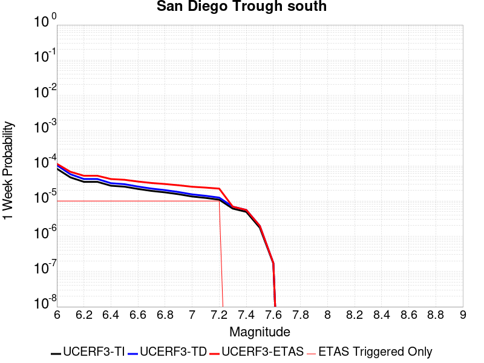 | 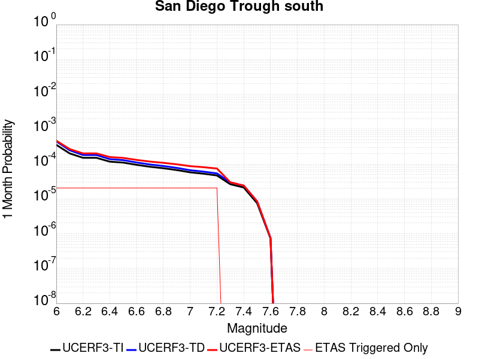 | 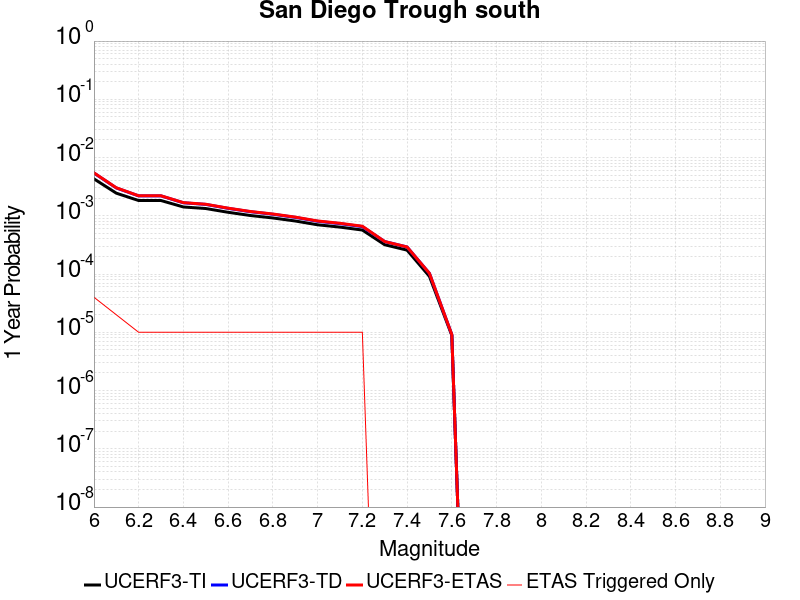 | 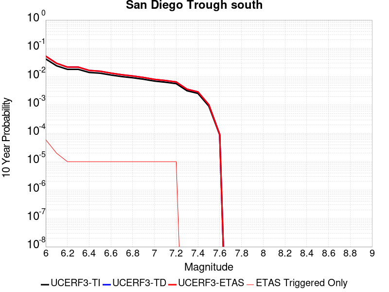 |

| Magnitude | 1 wk TI Prob | 1 wk TD Prob | 1 wk ETAS Prob | 1 wk ETAS/TD Gain | 1 wk ETAS Triggered Only | 1 mo TI Prob | 1 mo TD Prob | 1 mo ETAS Prob | 1 mo ETAS/TD Gain | 1 mo ETAS Triggered Only | 1 yr TI Prob | 1 yr TD Prob | 1 yr ETAS Prob | 1 yr ETAS/TD Gain | 1 yr ETAS Triggered Only | 10 yr TI Prob | 10 yr TD Prob | 10 yr ETAS Prob | 10 yr ETAS/TD Gain | 10 yr ETAS Triggered Only |
|-----|-----|-----|-----|-----|-----|-----|-----|-----|-----|-----|-----|-----|-----|-----|-----|-----|-----|-----|-----|-----|
| 6.0 | 8.279495E-5 | 1.0424506E-4 | 1.14244016E-4 | 1.0959178 | 1.0E-5 | 3.5478722E-4 | 4.4669298E-4 | 4.6668405E-4 | 1.0447534 | 2.0E-5 | 0.004310982 | 0.005425812 | 0.005465595 | 1.0073322 | 4.0E-5 | 0.042283054 | 0.052993916 | 0.053050738 | 1.0010722 | 6.0E-5 |
| 6.1 | 4.6961468E-5 | 5.7731268E-5 | 6.773069E-5 | 1.1732063 | 1.0E-5 | 2.0124791E-4 | 2.4739723E-4 | 2.673923E-4 | 1.0808216 | 2.0E-5 | 0.00244744 | 0.0030080716 | 0.0030280114 | 1.0066288 | 2.0E-5 | 0.024206603 | 0.029680338 | 0.029699745 | 1.0006539 | 2.0E-5 |
| 6.2 | 3.5079658E-5 | 4.2142692E-5 | 5.214227E-5 | 1.237279 | 1.0E-5 | 1.5033272E-4 | 1.805993E-4 | 1.9059748E-4 | 1.0553612 | 1.0E-5 | 0.0018287642 | 0.002196623 | 0.002206601 | 1.0045425 | 1.0E-5 | 0.018137876 | 0.021751693 | 0.021761475 | 1.0004498 | 1.0E-5 |
| 6.3 | 3.5079658E-5 | 4.2142692E-5 | 5.214227E-5 | 1.237279 | 1.0E-5 | 1.5033272E-4 | 1.805993E-4 | 1.9059748E-4 | 1.0553612 | 1.0E-5 | 0.0018287642 | 0.002196623 | 0.002206601 | 1.0045425 | 1.0E-5 | 0.018137876 | 0.021751693 | 0.021761475 | 1.0004498 | 1.0E-5 |
| 6.4 | 2.7196904E-5 | 3.2087937E-5 | 4.2087617E-5 | 1.3116336 | 1.0E-5 | 1.16552954E-4 | 1.3751259E-4 | 1.4751121E-4 | 1.0727106 | 1.0E-5 | 0.0014181085 | 0.0016729443 | 0.0016829276 | 1.0059675 | 1.0E-5 | 0.014090929 | 0.016605038 | 0.016614871 | 1.0005922 | 1.0E-5 |
| 6.5 | 2.5584688E-5 | 3.0102354E-5 | 4.010205E-5 | 1.3321899 | 1.0E-5 | 1.0964406E-4 | 1.2900379E-4 | 1.390025E-4 | 1.0775071 | 1.0E-5 | 0.0013340989 | 0.0015695024 | 0.0015794868 | 1.0063615 | 1.0E-5 | 0.013261181 | 0.015585679 | 0.015595523 | 1.0006316 | 1.0E-5 |
| 6.6 | 2.2034688E-5 | 2.5743318E-5 | 3.574306E-5 | 1.3884404 | 1.0E-5 | 9.443096E-5 | 1.1032389E-4 | 1.2032279E-4 | 1.0906322 | 1.0E-5 | 0.0011490905 | 0.0013423724 | 0.001352359 | 1.0074395 | 1.0E-5 | 0.011431668 | 0.013343615 | 0.013353482 | 1.0007395 | 1.0E-5 |
| 6.7 | 1.9394853E-5 | 2.2542248E-5 | 3.2542022E-5 | 1.4436015 | 1.0E-5 | 8.311815E-5 | 9.660609E-5 | 1.06605126E-4 | 1.1035031 | 1.0E-5 | 0.0010114936 | 0.0011755497 | 0.001185538 | 1.0084966 | 1.0E-5 | 0.01006902 | 0.011694018 | 0.011703901 | 1.0008452 | 1.0E-5 |
| 6.8 | 1.7615313E-5 | 2.0403613E-5 | 3.040341E-5 | 1.4900993 | 1.0E-5 | 7.549201E-5 | 8.744115E-5 | 9.744027E-5 | 1.1143526 | 1.0E-5 | 9.1872766E-4 | 0.0010640804 | 0.0010740698 | 1.0093877 | 1.0E-5 | 0.009149387 | 0.01059042 | 0.0106003145 | 1.0009342 | 1.0E-5 |
| 6.9 | 1.5621423E-5 | 1.8026485E-5 | 2.8026305E-5 | 1.5547293 | 1.0E-5 | 6.6947236E-5 | 7.7254095E-5 | 8.725332E-5 | 1.129433 | 1.0E-5 | 8.147778E-4 | 9.4016624E-4 | 9.501569E-4 | 1.0106264 | 1.0E-5 | 0.008117969 | 0.0093623325 | 0.009372239 | 1.0010581 | 1.0E-5 |
| 7.0 | 1.3444376E-5 | 1.5448395E-5 | 2.544824E-5 | 1.6473064 | 1.0E-5 | 5.7617483E-5 | 6.620574E-5 | 7.6205084E-5 | 1.1510344 | 1.0E-5 | 7.0126704E-4 | 8.057596E-4 | 8.1575155E-4 | 1.0124006 | 1.0E-5 | 0.006990582 | 0.008028714 | 0.0080386335 | 1.0012355 | 1.0E-5 |
| 7.1 | 1.2268361E-5 | 1.40733055E-5 | 2.4073164E-5 | 1.7105551 | 1.0E-5 | 5.2577634E-5 | 6.031279E-5 | 7.0312184E-5 | 1.1657923 | 1.0E-5 | 6.399447E-4 | 7.3406345E-4 | 7.440561E-4 | 1.0136127 | 1.0E-5 | 0.0063810493 | 0.007316692 | 0.007326619 | 1.0013567 | 1.0E-5 |
| 7.2 | 1.0922655E-5 | 1.2513806E-5 | 2.2513681E-5 | 1.7991074 | 1.0E-5 | 4.681054E-5 | 5.362951E-5 | 6.362897E-5 | 1.1864545 | 1.0E-5 | 5.697693E-4 | 6.527462E-4 | 6.627396E-4 | 1.0153099 | 1.0E-5 | 0.0056831064 | 0.0065085697 | 0.0065185046 | 1.0015265 | 1.0E-5 |
| 7.3 | 6.1106753E-6 | 6.9290486E-6 | 6.9290486E-6 | 1.0 | 0.0 | 2.6188345E-5 | 2.9695586E-5 | 2.9695586E-5 | 1.0 | 0.0 | 3.1879646E-4 | 3.6148418E-4 | 3.6148418E-4 | 1.0 | 0.0 | 0.0031833951 | 0.0036090072 | 0.0036090072 | 1.0 | 0.0 |
| 7.4 | 4.933187E-6 | 5.5896517E-6 | 5.5896517E-6 | 1.0 | 0.0 | 2.114206E-5 | 2.3955432E-5 | 2.3955432E-5 | 1.0 | 0.0 | 2.5737417E-4 | 2.9161875E-4 | 2.9161875E-4 | 1.0 | 0.0 | 0.002570763 | 0.002912402 | 0.002912402 | 1.0 | 0.0 |
| 7.5 | 1.7489613E-6 | 1.9697113E-6 | 1.9697113E-6 | 1.0 | 0.0 | 7.495527E-6 | 8.441594E-6 | 8.441594E-6 | 1.0 | 0.0 | 9.125422E-5 | 1.0277178E-4 | 1.0277178E-4 | 1.0 | 0.0 | 9.1216754E-4 | 0.0010272645 | 0.0010272645 | 1.0 | 0.0 |
| 7.6 | 1.6988751E-7 | 1.7533898E-7 | 1.7533898E-7 | 1.0 | 0.0 | 7.2808916E-7 | 7.5145255E-7 | 7.5145255E-7 | 1.0 | 0.0 | 8.864449E-6 | 9.148898E-6 | 9.148898E-6 | 1.0 | 0.0 | 8.8640954E-5 | 9.148542E-5 | 9.148542E-5 | 1.0 | 0.0 |

## Cucamonga
*[(top)](#table-of-contents)*

| 1 Week | 1 Month | 1 Year | 10 Year |
|-----|-----|-----|-----|
| 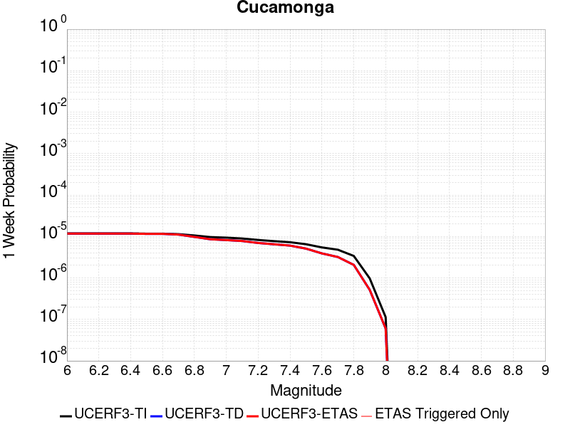 |  | 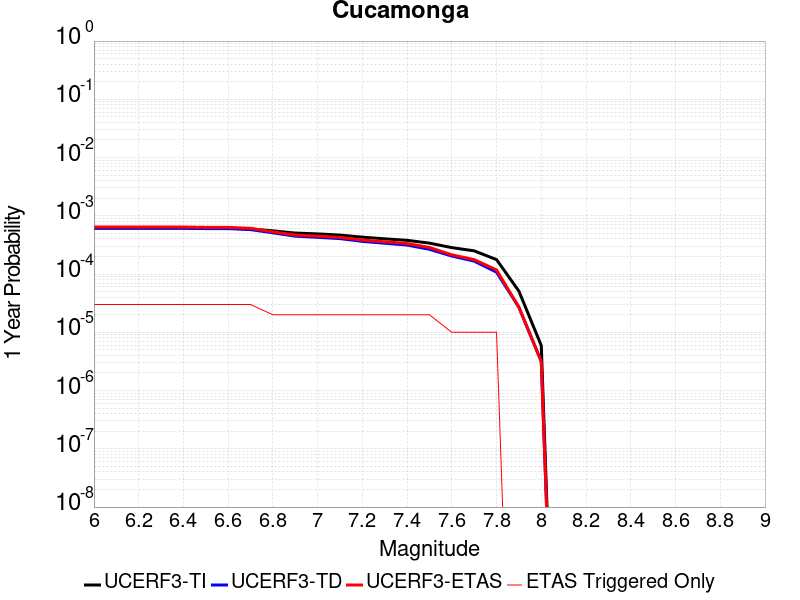 | 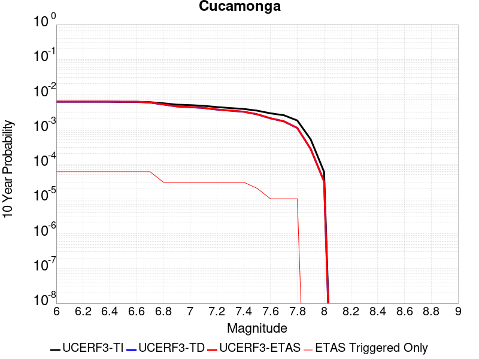 |

| Magnitude | 1 wk TI Prob | 1 wk TD Prob | 1 wk ETAS Prob | 1 wk ETAS/TD Gain | 1 wk ETAS Triggered Only | 1 mo TI Prob | 1 mo TD Prob | 1 mo ETAS Prob | 1 mo ETAS/TD Gain | 1 mo ETAS Triggered Only | 1 yr TI Prob | 1 yr TD Prob | 1 yr ETAS Prob | 1 yr ETAS/TD Gain | 1 yr ETAS Triggered Only | 10 yr TI Prob | 10 yr TD Prob | 10 yr ETAS Prob | 10 yr ETAS/TD Gain | 10 yr ETAS Triggered Only |
|-----|-----|-----|-----|-----|-----|-----|-----|-----|-----|-----|-----|-----|-----|-----|-----|-----|-----|-----|-----|-----|
| 6.0 | 1.1848348E-5 | 1.1737756E-5 | 1.1737756E-5 | 1.0 | 0.0 | 5.0777642E-5 | 5.0303715E-5 | 5.0303715E-5 | 1.0 | 0.0 | 6.180424E-4 | 6.122783E-4 | 6.4225995E-4 | 1.0489674 | 3.0E-5 | 0.0061632637 | 0.0061070886 | 0.006166722 | 1.0097647 | 6.0E-5 |
| 6.1 | 1.1848348E-5 | 1.1737756E-5 | 1.1737756E-5 | 1.0 | 0.0 | 5.0777642E-5 | 5.0303715E-5 | 5.0303715E-5 | 1.0 | 0.0 | 6.180424E-4 | 6.122783E-4 | 6.4225995E-4 | 1.0489674 | 3.0E-5 | 0.0061632637 | 0.0061070886 | 0.006166722 | 1.0097647 | 6.0E-5 |
| 6.2 | 1.1848348E-5 | 1.1737756E-5 | 1.1737756E-5 | 1.0 | 0.0 | 5.0777642E-5 | 5.0303715E-5 | 5.0303715E-5 | 1.0 | 0.0 | 6.180424E-4 | 6.122783E-4 | 6.4225995E-4 | 1.0489674 | 3.0E-5 | 0.0061632637 | 0.0061070886 | 0.006166722 | 1.0097647 | 6.0E-5 |
| 6.3 | 1.1848348E-5 | 1.1737756E-5 | 1.1737756E-5 | 1.0 | 0.0 | 5.0777642E-5 | 5.0303715E-5 | 5.0303715E-5 | 1.0 | 0.0 | 6.180424E-4 | 6.122783E-4 | 6.4225995E-4 | 1.0489674 | 3.0E-5 | 0.0061632637 | 0.0061070886 | 0.006166722 | 1.0097647 | 6.0E-5 |
| 6.4 | 1.1848348E-5 | 1.1737756E-5 | 1.1737756E-5 | 1.0 | 0.0 | 5.0777642E-5 | 5.0303715E-5 | 5.0303715E-5 | 1.0 | 0.0 | 6.180424E-4 | 6.122783E-4 | 6.4225995E-4 | 1.0489674 | 3.0E-5 | 0.0061632637 | 0.0061070886 | 0.006166722 | 1.0097647 | 6.0E-5 |
| 6.5 | 1.16988695E-5 | 1.1576785E-5 | 1.1576785E-5 | 1.0 | 0.0 | 5.013705E-5 | 4.9613864E-5 | 4.9613864E-5 | 1.0 | 0.0 | 6.102476E-4 | 6.0388405E-4 | 6.3386594E-4 | 1.0496484 | 3.0E-5 | 0.006085745 | 0.006023602 | 0.0060832407 | 1.0099008 | 6.0E-5 |
| 6.6 | 1.16988695E-5 | 1.1576785E-5 | 1.1576785E-5 | 1.0 | 0.0 | 5.013705E-5 | 4.9613864E-5 | 4.9613864E-5 | 1.0 | 0.0 | 6.102476E-4 | 6.0388405E-4 | 6.3386594E-4 | 1.0496484 | 3.0E-5 | 0.006085745 | 0.006023602 | 0.0060832407 | 1.0099008 | 6.0E-5 |
| 6.7 | 1.1397107E-5 | 1.1115677E-5 | 1.1115677E-5 | 1.0 | 0.0 | 4.884383E-5 | 4.7637757E-5 | 4.7637757E-5 | 1.0 | 0.0 | 5.9451134E-4 | 5.798378E-4 | 6.098205E-4 | 1.0517086 | 3.0E-5 | 0.005929234 | 0.0057844 | 0.005844053 | 1.0103127 | 6.0E-5 |
| 6.8 | 1.058387E-5 | 9.785641E-6 | 9.785641E-6 | 1.0 | 0.0 | 4.5358654E-5 | 4.1937794E-5 | 4.1937794E-5 | 1.0 | 0.0 | 5.521017E-4 | 5.1047414E-4 | 5.3046393E-4 | 1.0391593 | 2.0E-5 | 0.00550732 | 0.0050940234 | 0.005123871 | 1.0058593 | 3.0E-5 |
| 6.9 | 9.690046E-6 | 8.5800775E-6 | 8.5800775E-6 | 1.0 | 0.0 | 4.1528107E-5 | 3.6771246E-5 | 3.6771246E-5 | 1.0 | 0.0 | 5.054874E-4 | 4.4759834E-4 | 4.6758942E-4 | 1.044663 | 2.0E-5 | 0.005043391 | 0.004467903 | 0.0044977693 | 1.0066845 | 3.0E-5 |
| 7.0 | 9.381461E-6 | 8.187685E-6 | 8.187685E-6 | 1.0 | 0.0 | 4.020564E-5 | 3.5089608E-5 | 3.5089608E-5 | 1.0 | 0.0 | 4.893937E-4 | 4.271326E-4 | 4.4712404E-4 | 1.0468038 | 2.0E-5 | 0.0048831734 | 0.0042640497 | 0.004293922 | 1.0070056 | 3.0E-5 |
| 7.1 | 8.946492E-6 | 7.78246E-6 | 7.78246E-6 | 1.0 | 0.0 | 3.8341543E-5 | 3.335297E-5 | 3.335297E-5 | 1.0 | 0.0 | 4.667083E-4 | 4.059971E-4 | 4.2598898E-4 | 1.0492414 | 2.0E-5 | 0.0046572937 | 0.0040534893 | 0.0040833675 | 1.0073711 | 3.0E-5 |
| 7.2 | 8.251016E-6 | 6.9758194E-6 | 6.9758194E-6 | 1.0 | 0.0 | 3.5361016E-5 | 2.9896028E-5 | 2.9896028E-5 | 1.0 | 0.0 | 4.3043532E-4 | 3.6392358E-4 | 3.839163E-4 | 1.0549366 | 2.0E-5 | 0.0042960253 | 0.0036342086 | 0.0036640994 | 1.0082248 | 3.0E-5 |
| 7.3 | 7.717881E-6 | 6.486875E-6 | 6.486875E-6 | 1.0 | 0.0 | 3.3076216E-5 | 2.7800597E-5 | 2.7800597E-5 | 1.0 | 0.0 | 4.026285E-4 | 3.3841992E-4 | 3.5841318E-4 | 1.0590782 | 2.0E-5 | 0.004018998 | 0.0033799817 | 0.0034098802 | 1.0088458 | 3.0E-5 |
| 7.4 | 7.275623E-6 | 6.0325037E-6 | 6.0325037E-6 | 1.0 | 0.0 | 3.118087E-5 | 2.5853333E-5 | 2.5853333E-5 | 1.0 | 0.0 | 3.7956095E-4 | 3.1471907E-4 | 3.347128E-4 | 1.0635288 | 2.0E-5 | 0.0037891332 | 0.0031436686 | 0.0031735743 | 1.009513 | 3.0E-5 |
| 7.5 | 6.5109502E-6 | 5.101059E-6 | 5.101059E-6 | 1.0 | 0.0 | 2.7903774E-5 | 2.1861499E-5 | 2.1861499E-5 | 1.0 | 0.0 | 3.3967546E-4 | 2.661314E-4 | 2.8612604E-4 | 1.0751308 | 2.0E-5 | 0.0033915674 | 0.00265905 | 0.0026789969 | 1.0075015 | 2.0E-5 |
| 7.6 | 5.4495326E-6 | 3.9089846E-6 | 3.9089846E-6 | 1.0 | 0.0 | 2.335493E-5 | 1.6752683E-5 | 1.6752683E-5 | 1.0 | 0.0 | 2.8430918E-4 | 2.0394489E-4 | 2.1394285E-4 | 1.0490229 | 1.0E-5 | 0.0028394572 | 0.0020384968 | 0.0020484764 | 1.0048956 | 1.0E-5 |
| 7.7 | 4.7997164E-6 | 3.2006355E-6 | 3.2006355E-6 | 1.0 | 0.0 | 2.057005E-5 | 1.3716938E-5 | 1.3716938E-5 | 1.0 | 0.0 | 2.504116E-4 | 1.6699095E-4 | 1.7698928E-4 | 1.0598735 | 1.0E-5 | 0.002501296 | 0.001669585 | 0.0016795683 | 1.0059795 | 1.0E-5 |
| 7.8 | 3.3941733E-6 | 2.0644336E-6 | 2.0644336E-6 | 1.0 | 0.0 | 1.4546376E-5 | 8.847543E-6 | 8.847543E-6 | 1.0 | 0.0 | 1.7708774E-4 | 1.07713524E-4 | 1.1771245E-4 | 1.0928289 | 1.0E-5 | 0.0017694668 | 0.0010768501 | 0.0010868394 | 1.0092764 | 1.0E-5 |
| 7.9 | 9.750552E-7 | 5.1567173E-7 | 5.1567173E-7 | 1.0 | 0.0 | 4.178801E-6 | 2.2100198E-6 | 2.2100198E-6 | 1.0 | 0.0 | 5.0875715E-5 | 2.6906664E-5 | 2.6906664E-5 | 1.0 | 0.0 | 5.086407E-4 | 2.6903447E-4 | 2.6903447E-4 | 1.0 | 0.0 |
| 8.0 | 1.133857E-7 | 6.0540515E-8 | 6.0540515E-8 | 1.0 | 0.0 | 4.8593864E-7 | 2.5945934E-7 | 2.5945934E-7 | 1.0 | 0.0 | 5.9162867E-6 | 3.158913E-6 | 3.158913E-6 | 1.0 | 0.0 | 5.916129E-5 | 3.1588697E-5 | 3.1588697E-5 | 1.0 | 0.0 |

## Tin Mountain
*[(top)](#table-of-contents)*

| 1 Week | 1 Month | 1 Year | 10 Year |
|-----|-----|-----|-----|
|  | 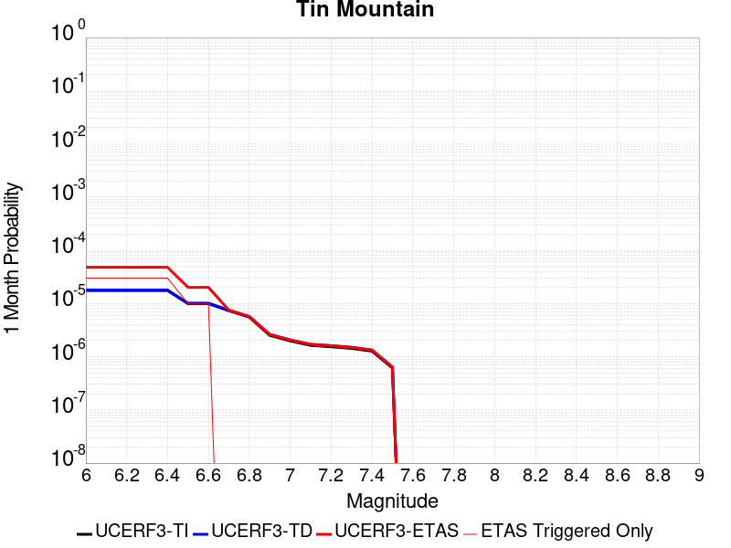 | 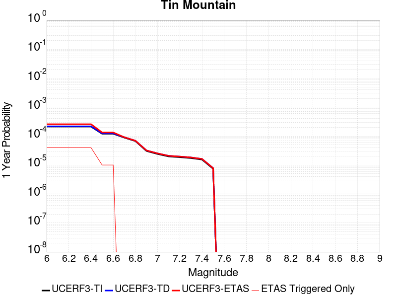 | 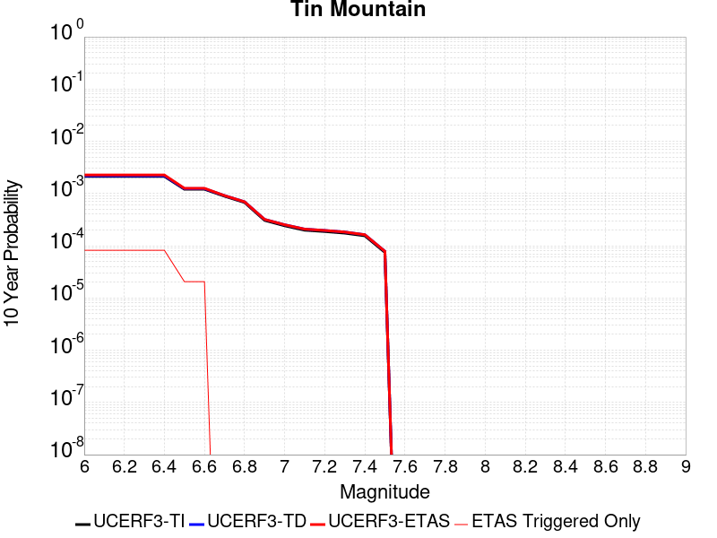 |

| Magnitude | 1 wk TI Prob | 1 wk TD Prob | 1 wk ETAS Prob | 1 wk ETAS/TD Gain | 1 wk ETAS Triggered Only | 1 mo TI Prob | 1 mo TD Prob | 1 mo ETAS Prob | 1 mo ETAS/TD Gain | 1 mo ETAS Triggered Only | 1 yr TI Prob | 1 yr TD Prob | 1 yr ETAS Prob | 1 yr ETAS/TD Gain | 1 yr ETAS Triggered Only | 10 yr TI Prob | 10 yr TD Prob | 10 yr ETAS Prob | 10 yr ETAS/TD Gain | 10 yr ETAS Triggered Only |
|-----|-----|-----|-----|-----|-----|-----|-----|-----|-----|-----|-----|-----|-----|-----|-----|-----|-----|-----|-----|-----|
| 6.0 | 4.083776E-6 | 4.18155E-6 | 4.18155E-6 | 1.0 | 0.0 | 1.750178E-5 | 1.7920827E-5 | 4.792029E-5 | 2.674 | 3.0E-5 | 2.1306332E-4 | 2.1816794E-4 | 2.581592E-4 | 1.183305 | 4.0E-5 | 0.0021285915 | 0.0021799032 | 0.0022397726 | 1.0274642 | 6.0E-5 |
| 6.1 | 4.083776E-6 | 4.18155E-6 | 4.18155E-6 | 1.0 | 0.0 | 1.750178E-5 | 1.7920827E-5 | 4.792029E-5 | 2.674 | 3.0E-5 | 2.1306332E-4 | 2.1816794E-4 | 2.581592E-4 | 1.183305 | 4.0E-5 | 0.0021285915 | 0.0021799032 | 0.0022397726 | 1.0274642 | 6.0E-5 |
| 6.2 | 4.083776E-6 | 4.18155E-6 | 4.18155E-6 | 1.0 | 0.0 | 1.750178E-5 | 1.7920827E-5 | 4.792029E-5 | 2.674 | 3.0E-5 | 2.1306332E-4 | 2.1816794E-4 | 2.581592E-4 | 1.183305 | 4.0E-5 | 0.0021285915 | 0.0021799032 | 0.0022397726 | 1.0274642 | 6.0E-5 |
| 6.3 | 4.083776E-6 | 4.18155E-6 | 4.18155E-6 | 1.0 | 0.0 | 1.750178E-5 | 1.7920827E-5 | 4.792029E-5 | 2.674 | 3.0E-5 | 2.1306332E-4 | 2.1816794E-4 | 2.581592E-4 | 1.183305 | 4.0E-5 | 0.0021285915 | 0.0021799032 | 0.0022397726 | 1.0274642 | 6.0E-5 |
| 6.4 | 4.083776E-6 | 4.18155E-6 | 4.18155E-6 | 1.0 | 0.0 | 1.750178E-5 | 1.7920827E-5 | 4.792029E-5 | 2.674 | 3.0E-5 | 2.1306332E-4 | 2.1816794E-4 | 2.581592E-4 | 1.183305 | 4.0E-5 | 0.0021285915 | 0.0021799032 | 0.0022397726 | 1.0274642 | 6.0E-5 |
| 6.5 | 2.3143427E-6 | 2.3731652E-6 | 2.3731652E-6 | 1.0 | 0.0 | 9.9185745E-6 | 1.0170673E-5 | 2.0170572E-5 | 1.9832091 | 1.0E-5 | 1.2075195E-4 | 1.2382168E-4 | 1.3382045E-4 | 1.0807513 | 1.0E-5 | 0.0012068636 | 0.0012376028 | 0.0012475904 | 1.0080701 | 1.0E-5 |
| 6.6 | 2.3143427E-6 | 2.3731652E-6 | 2.3731652E-6 | 1.0 | 0.0 | 9.9185745E-6 | 1.0170673E-5 | 2.0170572E-5 | 1.9832091 | 1.0E-5 | 1.2075195E-4 | 1.2382168E-4 | 1.3382045E-4 | 1.0807513 | 1.0E-5 | 0.0012068636 | 0.0012376028 | 0.0012475904 | 1.0080701 | 1.0E-5 |
| 6.7 | 1.7029532E-6 | 1.7497979E-6 | 1.7497979E-6 | 1.0 | 0.0 | 7.2983503E-6 | 7.4991153E-6 | 7.4991153E-6 | 1.0 | 0.0 | 8.885379E-5 | 9.129844E-5 | 9.129844E-5 | 1.0 | 0.0 | 8.881827E-4 | 9.1266196E-4 | 9.1266196E-4 | 1.0 | 0.0 |
| 6.8 | 1.2914646E-6 | 1.3299432E-6 | 1.3299432E-6 | 1.0 | 0.0 | 5.534837E-6 | 5.6997465E-6 | 5.6997465E-6 | 1.0 | 0.0 | 6.738455E-5 | 6.939264E-5 | 6.939264E-5 | 1.0 | 0.0 | 6.736412E-4 | 6.937531E-4 | 6.937531E-4 | 1.0 | 0.0 |
| 6.9 | 5.8708974E-7 | 6.117028E-7 | 6.117028E-7 | 1.0 | 0.0 | 2.5160964E-6 | 2.621581E-6 | 2.621581E-6 | 1.0 | 0.0 | 3.0633044E-5 | 3.1917323E-5 | 3.1917323E-5 | 1.0 | 0.0 | 3.0628822E-4 | 3.191315E-4 | 3.191315E-4 | 1.0 | 0.0 |
| 7.0 | 4.6248786E-7 | 4.832044E-7 | 4.832044E-7 | 1.0 | 0.0 | 1.9820893E-6 | 2.0708746E-6 | 2.0708746E-6 | 1.0 | 0.0 | 2.413167E-5 | 2.5212645E-5 | 2.5212645E-5 | 1.0 | 0.0 | 2.412905E-4 | 2.5210154E-4 | 2.5210154E-4 | 1.0 | 0.0 |
| 7.1 | 3.804606E-7 | 3.9871725E-7 | 3.9871725E-7 | 1.0 | 0.0 | 1.6305444E-6 | 1.7087873E-6 | 1.7087873E-6 | 1.0 | 0.0 | 1.9851697E-5 | 2.080432E-5 | 2.080432E-5 | 1.0 | 0.0 | 1.9849923E-4 | 2.080271E-4 | 2.080271E-4 | 1.0 | 0.0 |
| 7.2 | 3.5864858E-7 | 3.7617107E-7 | 3.7617107E-7 | 1.0 | 0.0 | 1.5370645E-6 | 1.6121609E-6 | 1.6121609E-6 | 1.0 | 0.0 | 1.87136E-5 | 1.9627916E-5 | 1.9627916E-5 | 1.0 | 0.0 | 1.8712023E-4 | 1.9626514E-4 | 1.9626514E-4 | 1.0 | 0.0 |
| 7.3 | 3.342063E-7 | 3.50637E-7 | 3.50637E-7 | 1.0 | 0.0 | 1.4323119E-6 | 1.5027293E-6 | 1.5027293E-6 | 1.0 | 0.0 | 1.7438259E-5 | 1.829561E-5 | 1.829561E-5 | 1.0 | 0.0 | 1.743689E-4 | 1.8294434E-4 | 1.8294434E-4 | 1.0 | 0.0 |
| 7.4 | 2.971242E-7 | 3.116602E-7 | 3.116602E-7 | 1.0 | 0.0 | 1.2733886E-6 | 1.3356861E-6 | 1.3356861E-6 | 1.0 | 0.0 | 1.5503398E-5 | 1.626189E-5 | 1.626189E-5 | 1.0 | 0.0 | 1.5502315E-4 | 1.6261027E-4 | 1.6261027E-4 | 1.0 | 0.0 |
| 7.5 | 1.4326713E-7 | 1.501262E-7 | 1.501262E-7 | 1.0 | 0.0 | 6.140018E-7 | 6.43398E-7 | 6.43398E-7 | 1.0 | 0.0 | 7.4754466E-6 | 7.833371E-6 | 7.833371E-6 | 1.0 | 0.0 | 7.475195E-5 | 7.83337E-5 | 7.83337E-5 | 1.0 | 0.0 |

## Bullion Mountains
*[(top)](#table-of-contents)*

| 1 Week | 1 Month | 1 Year | 10 Year |
|-----|-----|-----|-----|
| 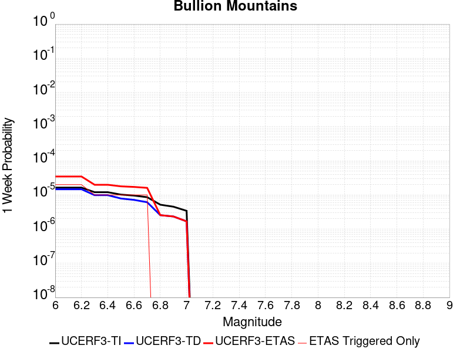 | 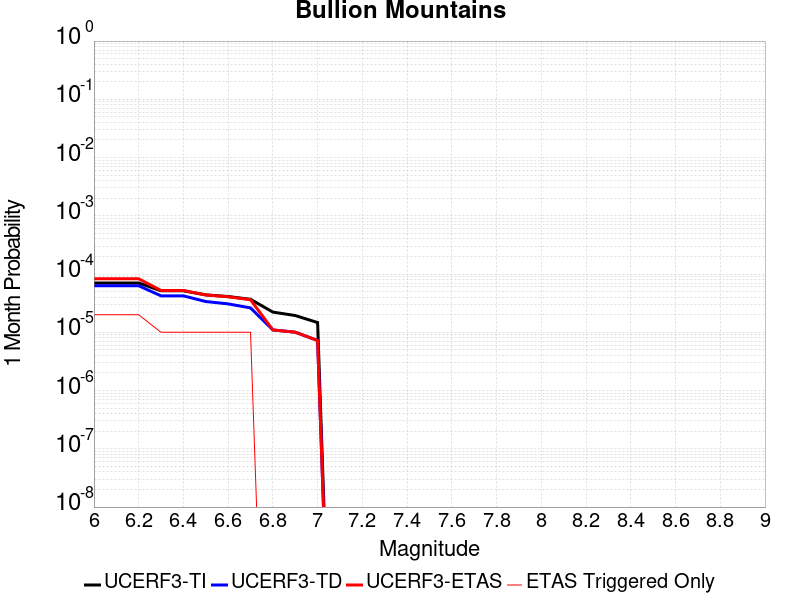 | 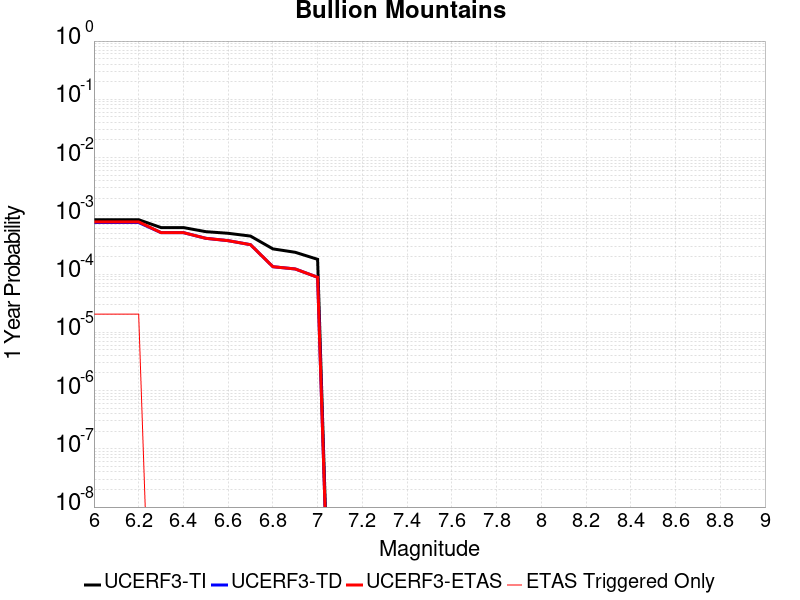 | 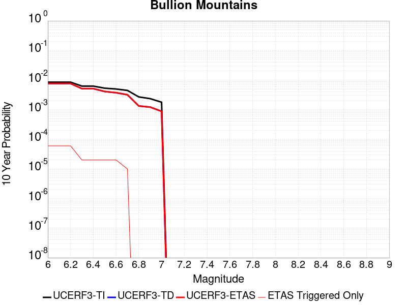 |

| Magnitude | 1 wk TI Prob | 1 wk TD Prob | 1 wk ETAS Prob | 1 wk ETAS/TD Gain | 1 wk ETAS Triggered Only | 1 mo TI Prob | 1 mo TD Prob | 1 mo ETAS Prob | 1 mo ETAS/TD Gain | 1 mo ETAS Triggered Only | 1 yr TI Prob | 1 yr TD Prob | 1 yr ETAS Prob | 1 yr ETAS/TD Gain | 1 yr ETAS Triggered Only | 10 yr TI Prob | 10 yr TD Prob | 10 yr ETAS Prob | 10 yr ETAS/TD Gain | 10 yr ETAS Triggered Only |
|-----|-----|-----|-----|-----|-----|-----|-----|-----|-----|-----|-----|-----|-----|-----|-----|-----|-----|-----|-----|-----|
| 6.0 | 1.6420427E-5 | 1.4692306E-5 | 3.4692013E-5 | 2.3612368 | 2.0E-5 | 7.037136E-5 | 6.296572E-5 | 8.296446E-5 | 1.3176131 | 2.0E-5 | 8.5643446E-4 | 7.663764E-4 | 7.963534E-4 | 1.0391153 | 3.0E-5 | 0.008531413 | 0.0076411283 | 0.00770067 | 1.0077922 | 6.0E-5 |
| 6.1 | 1.6420427E-5 | 1.4692306E-5 | 3.4692013E-5 | 2.3612368 | 2.0E-5 | 7.037136E-5 | 6.296572E-5 | 8.296446E-5 | 1.3176131 | 2.0E-5 | 8.5643446E-4 | 7.663764E-4 | 7.963534E-4 | 1.0391153 | 3.0E-5 | 0.008531413 | 0.0076411283 | 0.00770067 | 1.0077922 | 6.0E-5 |
| 6.2 | 1.6420427E-5 | 1.4692306E-5 | 3.4692013E-5 | 2.3612368 | 2.0E-5 | 7.037136E-5 | 6.296572E-5 | 8.296446E-5 | 1.3176131 | 2.0E-5 | 8.5643446E-4 | 7.663764E-4 | 7.963534E-4 | 1.0391153 | 3.0E-5 | 0.008531413 | 0.0076411283 | 0.00770067 | 1.0077922 | 6.0E-5 |
| 6.3 | 1.2046778E-5 | 9.862485E-6 | 1.9862386E-5 | 2.0139332 | 1.0E-5 | 5.1628023E-5 | 4.226724E-5 | 5.2266816E-5 | 1.2365799 | 1.0E-5 | 6.283899E-4 | 5.145053E-4 | 5.2450015E-4 | 1.0194261 | 1.0E-5 | 0.0062661595 | 0.0051354226 | 0.00515532 | 1.0038745 | 2.0E-5 |
| 6.4 | 1.2046778E-5 | 9.862485E-6 | 1.9862386E-5 | 2.0139332 | 1.0E-5 | 5.1628023E-5 | 4.226724E-5 | 5.2266816E-5 | 1.2365799 | 1.0E-5 | 6.283899E-4 | 5.145053E-4 | 5.2450015E-4 | 1.0194261 | 1.0E-5 | 0.0062661595 | 0.0051354226 | 0.00515532 | 1.0038745 | 2.0E-5 |
| 6.5 | 1.0244343E-5 | 7.879582E-6 | 1.7879504E-5 | 2.269093 | 1.0E-5 | 4.390359E-5 | 3.3769316E-5 | 4.3768978E-5 | 1.2961168 | 1.0E-5 | 5.343951E-4 | 4.1108453E-4 | 4.2108042E-4 | 1.024316 | 1.0E-5 | 0.005331118 | 0.0041052722 | 0.00412519 | 1.0048518 | 2.0E-5 |
| 6.6 | 9.605408E-6 | 7.1776108E-6 | 1.717754E-5 | 2.3932114 | 1.0E-5 | 4.1165385E-5 | 3.076094E-5 | 4.076063E-5 | 1.3250775 | 1.0E-5 | 5.010733E-4 | 3.7447043E-4 | 3.844667E-4 | 1.0266944 | 1.0E-5 | 0.00499945 | 0.0037403915 | 0.0037603166 | 1.005327 | 2.0E-5 |
| 6.7 | 8.60418E-6 | 6.1241044E-6 | 1.6124042E-5 | 2.6328819 | 1.0E-5 | 3.687454E-5 | 2.6246007E-5 | 3.6245743E-5 | 1.3810004 | 1.0E-5 | 4.48855E-4 | 3.1951777E-4 | 3.295146E-4 | 1.0312872 | 1.0E-5 | 0.004479495 | 0.0031924958 | 0.0032024637 | 1.0031223 | 1.0E-5 |
| 6.8 | 5.187994E-6 | 2.5632194E-6 | 2.5632194E-6 | 1.0 | 0.0 | 2.223407E-5 | 1.0985203E-5 | 1.0985203E-5 | 1.0 | 0.0 | 2.7066618E-4 | 1.3374063E-4 | 1.3374063E-4 | 1.0 | 0.0 | 0.0027033675 | 0.001336993 | 0.001336993 | 1.0 | 0.0 |
| 6.9 | 4.5302368E-6 | 2.3443622E-6 | 2.3443622E-6 | 1.0 | 0.0 | 1.9415156E-5 | 1.0047251E-5 | 1.0047251E-5 | 1.0 | 0.0 | 2.3635388E-4 | 1.2232238E-4 | 1.2232238E-4 | 1.0 | 0.0 | 0.0023610266 | 0.0012229396 | 0.0012229396 | 1.0 | 0.0 |
| 7.0 | 3.431668E-6 | 1.6882757E-6 | 1.6882757E-6 | 1.0 | 0.0 | 1.4707065E-5 | 7.2354674E-6 | 7.2354674E-6 | 1.0 | 0.0 | 1.7904381E-4 | 8.8091816E-5 | 8.8091816E-5 | 1.0 | 0.0 | 0.0017889962 | 8.809181E-4 | 8.809181E-4 | 1.0 | 0.0 |

## White Mountains
*[(top)](#table-of-contents)*

| 1 Week | 1 Month | 1 Year | 10 Year |
|-----|-----|-----|-----|
| 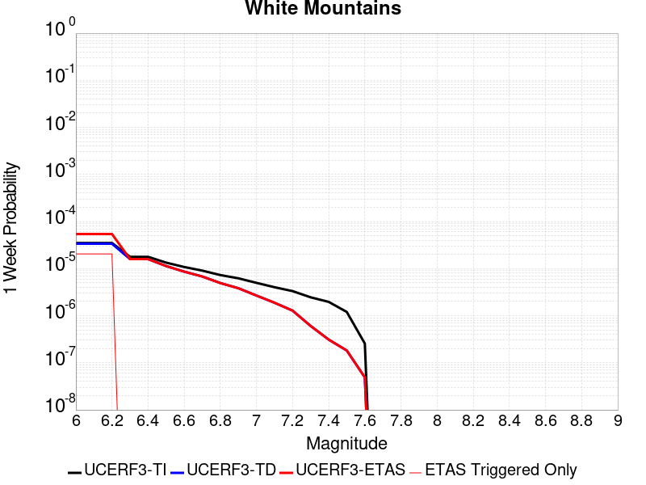 | 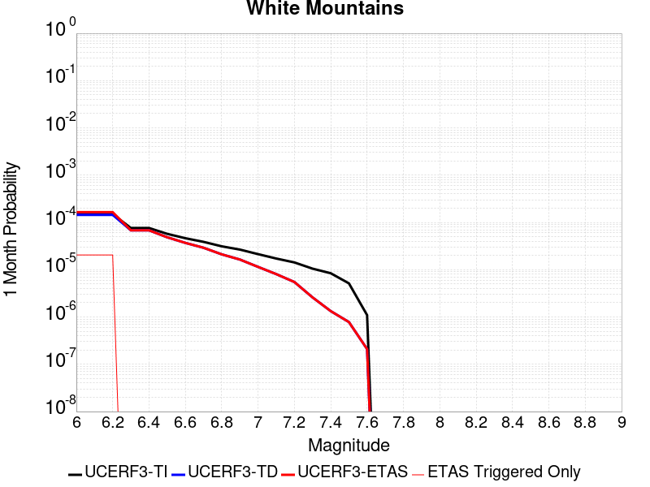 | 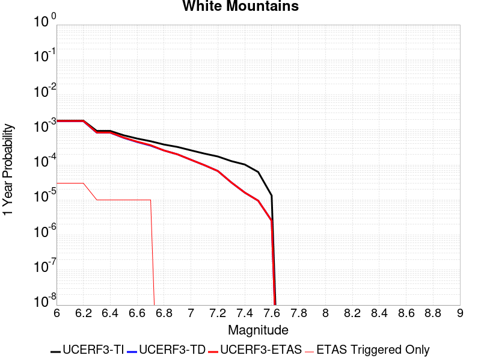 | 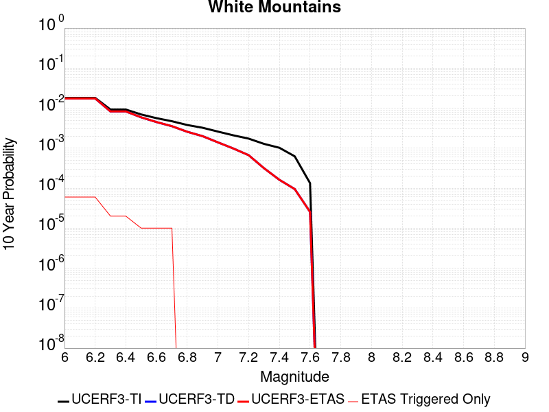 |

| Magnitude | 1 wk TI Prob | 1 wk TD Prob | 1 wk ETAS Prob | 1 wk ETAS/TD Gain | 1 wk ETAS Triggered Only | 1 mo TI Prob | 1 mo TD Prob | 1 mo ETAS Prob | 1 mo ETAS/TD Gain | 1 mo ETAS Triggered Only | 1 yr TI Prob | 1 yr TD Prob | 1 yr ETAS Prob | 1 yr ETAS/TD Gain | 1 yr ETAS Triggered Only | 10 yr TI Prob | 10 yr TD Prob | 10 yr ETAS Prob | 10 yr ETAS/TD Gain | 10 yr ETAS Triggered Only |
|-----|-----|-----|-----|-----|-----|-----|-----|-----|-----|-----|-----|-----|-----|-----|-----|-----|-----|-----|-----|-----|
| 6.0 | 3.503579E-5 | 3.3784425E-5 | 4.378409E-5 | 1.2959844 | 1.0E-5 | 1.5014476E-4 | 1.4478304E-4 | 1.5478159E-4 | 1.0690589 | 1.0E-5 | 0.0018264796 | 0.0017614291 | 0.0017913763 | 1.0170016 | 3.0E-5 | 0.018115403 | 0.017487012 | 0.017545963 | 1.0033711 | 6.0E-5 |
| 6.1 | 3.503579E-5 | 3.3784425E-5 | 4.378409E-5 | 1.2959844 | 1.0E-5 | 1.5014476E-4 | 1.4478304E-4 | 1.5478159E-4 | 1.0690589 | 1.0E-5 | 0.0018264796 | 0.0017614291 | 0.0017913763 | 1.0170016 | 3.0E-5 | 0.018115403 | 0.017487012 | 0.017545963 | 1.0033711 | 6.0E-5 |
| 6.2 | 3.503579E-5 | 3.3784425E-5 | 4.378409E-5 | 1.2959844 | 1.0E-5 | 1.5014476E-4 | 1.4478304E-4 | 1.5478159E-4 | 1.0690589 | 1.0E-5 | 0.0018264796 | 0.0017614291 | 0.0017913763 | 1.0170016 | 3.0E-5 | 0.018115403 | 0.017487012 | 0.017545963 | 1.0033711 | 6.0E-5 |
| 6.3 | 1.7818425E-5 | 1.5916237E-5 | 1.5916237E-5 | 1.0 | 0.0 | 7.636245E-5 | 6.821074E-5 | 6.821074E-5 | 1.0 | 0.0 | 9.293162E-4 | 8.301636E-4 | 8.4015535E-4 | 1.0120358 | 1.0E-5 | 0.009254395 | 0.0082720835 | 0.008291918 | 1.0023978 | 2.0E-5 |
| 6.4 | 1.7818425E-5 | 1.5916237E-5 | 1.5916237E-5 | 1.0 | 0.0 | 7.636245E-5 | 6.821074E-5 | 6.821074E-5 | 1.0 | 0.0 | 9.293162E-4 | 8.301636E-4 | 8.4015535E-4 | 1.0120358 | 1.0E-5 | 0.009254395 | 0.0082720835 | 0.008291918 | 1.0023978 | 2.0E-5 |
| 6.5 | 1.3397557E-5 | 1.1336382E-5 | 1.1336382E-5 | 1.0 | 0.0 | 5.741684E-5 | 4.8583628E-5 | 4.8583628E-5 | 1.0 | 0.0 | 6.988258E-4 | 5.913521E-4 | 6.013462E-4 | 1.0169004 | 1.0E-5 | 0.006966323 | 0.0058984905 | 0.005908432 | 1.0016854 | 1.0E-5 |
| 6.6 | 1.0818695E-5 | 8.625452E-6 | 8.625452E-6 | 1.0 | 0.0 | 4.6365014E-5 | 3.6965725E-5 | 3.6965725E-5 | 1.0 | 0.0 | 5.6434784E-4 | 4.499691E-4 | 4.599646E-4 | 1.0222137 | 1.0E-5 | 0.005629168 | 0.0044910167 | 0.0045009716 | 1.0022167 | 1.0E-5 |
| 6.7 | 9.067908E-6 | 6.8025106E-6 | 6.8025106E-6 | 1.0 | 0.0 | 3.8861883E-5 | 2.915331E-5 | 2.915331E-5 | 1.0 | 0.0 | 4.7304068E-4 | 3.5488693E-4 | 3.6488337E-4 | 1.028168 | 1.0E-5 | 0.00472035 | 0.0035435192 | 0.0035534836 | 1.002812 | 1.0E-5 |
| 6.8 | 7.295947E-6 | 4.9364417E-6 | 4.9364417E-6 | 1.0 | 0.0 | 3.126797E-5 | 2.1156015E-5 | 2.1156015E-5 | 1.0 | 0.0 | 3.8062103E-4 | 2.5754515E-4 | 2.5754515E-4 | 1.0 | 0.0 | 0.0037996976 | 0.0025725798 | 0.0025725798 | 1.0 | 0.0 |
| 6.9 | 6.2243444E-6 | 3.832255E-6 | 3.832255E-6 | 1.0 | 0.0 | 2.6675489E-5 | 1.6423848E-5 | 1.6423848E-5 | 1.0 | 0.0 | 3.2472567E-4 | 1.9994254E-4 | 1.9994254E-4 | 1.0 | 0.0 | 0.0032425157 | 0.0019976792 | 0.0019976792 | 1.0 | 0.0 |
| 7.0 | 4.9878413E-6 | 2.6795697E-6 | 2.6795697E-6 | 1.0 | 0.0 | 2.1376287E-5 | 1.1483821E-5 | 1.1483821E-5 | 1.0 | 0.0 | 2.602252E-4 | 1.3980681E-4 | 1.3980681E-4 | 1.0 | 0.0 | 0.002599207 | 0.0013972148 | 0.0013972148 | 1.0 | 0.0 |
| 7.1 | 4.0252844E-6 | 1.88579E-6 | 1.88579E-6 | 1.0 | 0.0 | 1.7251105E-5 | 8.081933E-6 | 8.081933E-6 | 1.0 | 0.0 | 2.1001195E-4 | 9.839322E-5 | 9.839322E-5 | 1.0 | 0.0 | 0.0020981359 | 9.835094E-4 | 9.835094E-4 | 1.0 | 0.0 |
| 7.2 | 3.3284066E-6 | 1.2819944E-6 | 1.2819944E-6 | 1.0 | 0.0 | 1.4264522E-5 | 5.4942507E-6 | 5.4942507E-6 | 1.0 | 0.0 | 1.736567E-4 | 6.689055E-5 | 6.689055E-5 | 1.0 | 0.0 | 0.0017352107 | 6.6871423E-4 | 6.6871423E-4 | 1.0 | 0.0 |
| 7.3 | 2.458226E-6 | 6.057493E-7 | 6.057493E-7 | 1.0 | 0.0 | 1.0535211E-5 | 2.596066E-6 | 2.596066E-6 | 1.0 | 0.0 | 1.2825865E-4 | 3.1606683E-5 | 3.1606683E-5 | 1.0 | 0.0 | 0.0012818464 | 3.1602563E-4 | 3.1602563E-4 | 1.0 | 0.0 |
| 7.4 | 1.965953E-6 | 3.1091668E-7 | 3.1091668E-7 | 1.0 | 0.0 | 8.425486E-6 | 1.3324994E-6 | 1.3324994E-6 | 1.0 | 0.0 | 1.0257547E-4 | 1.622306E-5 | 1.622306E-5 | 1.0 | 0.0 | 0.0010252813 | 1.6221889E-4 | 1.6221889E-4 | 1.0 | 0.0 |
| 7.5 | 1.2014192E-6 | 1.824589E-7 | 1.824589E-7 | 1.0 | 0.0 | 5.148929E-6 | 7.819665E-7 | 7.819665E-7 | 1.0 | 0.0 | 6.2686406E-5 | 9.520401E-6 | 9.520401E-6 | 1.0 | 0.0 | 6.266873E-4 | 9.520002E-5 | 9.520002E-5 | 1.0 | 0.0 |
| 7.6 | 2.5612175E-7 | 4.8950795E-8 | 4.8950795E-8 | 1.0 | 0.0 | 1.0976642E-6 | 2.097891E-7 | 2.097891E-7 | 1.0 | 0.0 | 1.3363979E-5 | 2.5541797E-6 | 2.5541797E-6 | 1.0 | 0.0 | 1.3363175E-4 | 2.554154E-5 | 2.554154E-5 | 1.0 | 0.0 |

## Oceanic - West Huasna
*[(top)](#table-of-contents)*

| 1 Week | 1 Month | 1 Year | 10 Year |
|-----|-----|-----|-----|
| 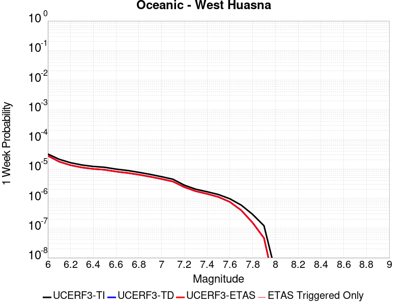 | 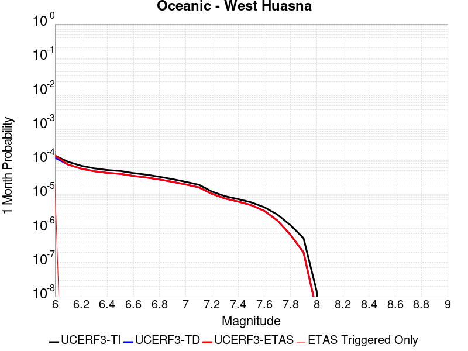 | 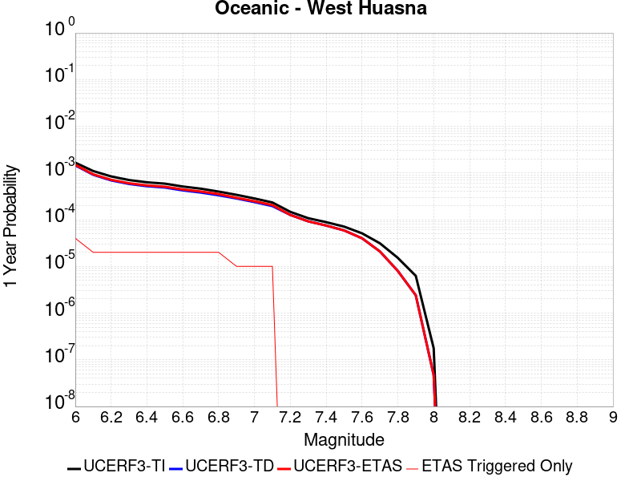 | 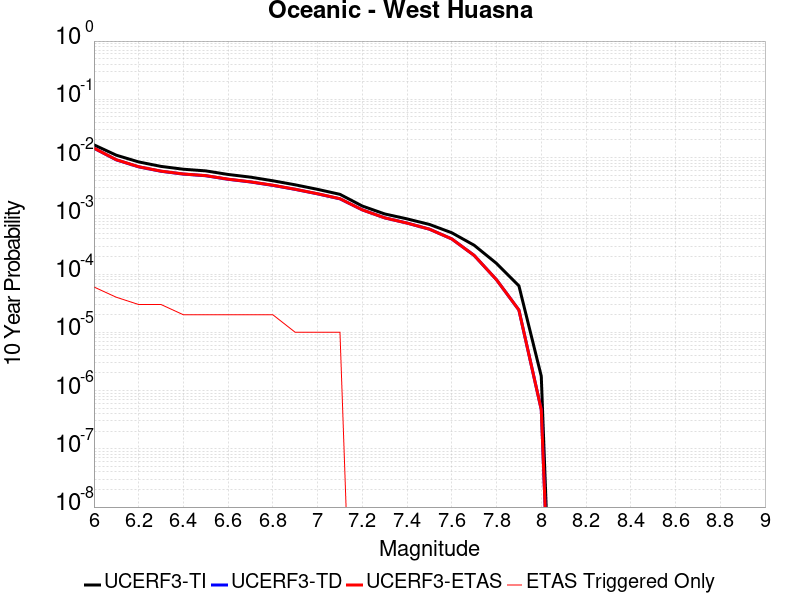 |

| Magnitude | 1 wk TI Prob | 1 wk TD Prob | 1 wk ETAS Prob | 1 wk ETAS/TD Gain | 1 wk ETAS Triggered Only | 1 mo TI Prob | 1 mo TD Prob | 1 mo ETAS Prob | 1 mo ETAS/TD Gain | 1 mo ETAS Triggered Only | 1 yr TI Prob | 1 yr TD Prob | 1 yr ETAS Prob | 1 yr ETAS/TD Gain | 1 yr ETAS Triggered Only | 10 yr TI Prob | 10 yr TD Prob | 10 yr ETAS Prob | 10 yr ETAS/TD Gain | 10 yr ETAS Triggered Only |
|-----|-----|-----|-----|-----|-----|-----|-----|-----|-----|-----|-----|-----|-----|-----|-----|-----|-----|-----|-----|-----|
| 6.0 | 3.195567E-5 | 2.7927153E-5 | 2.7927153E-5 | 1.0 | 0.0 | 1.3694567E-4 | 1.19682554E-4 | 1.3968015E-4 | 1.1670887 | 2.0E-5 | 0.0016660384 | 0.0014562042 | 0.001496146 | 1.0274286 | 4.0E-5 | 0.016536033 | 0.014471174 | 0.014530306 | 1.0040861 | 6.0E-5 |
| 6.1 | 2.1156782E-5 | 1.7573653E-5 | 1.7573653E-5 | 1.0 | 0.0 | 9.066878E-5 | 7.531353E-5 | 7.531353E-5 | 1.0 | 0.0 | 0.0011033333 | 9.1656594E-4 | 9.365476E-4 | 1.0218006 | 2.0E-5 | 0.010978713 | 0.009128864 | 0.009168499 | 1.0043417 | 4.0E-5 |
| 6.2 | 1.6195117E-5 | 1.3327269E-5 | 1.3327269E-5 | 1.0 | 0.0 | 6.9405796E-5 | 5.711563E-5 | 5.711563E-5 | 1.0 | 0.0 | 8.44688E-4 | 6.951635E-4 | 7.151496E-4 | 1.0287502 | 2.0E-5 | 0.008414844 | 0.006930183 | 0.0069599757 | 1.0042989 | 3.0E-5 |
| 6.3 | 1.3559345E-5 | 1.1179233E-5 | 1.1179233E-5 | 1.0 | 0.0 | 5.811018E-5 | 4.7910125E-5 | 4.7910125E-5 | 1.0 | 0.0 | 7.072618E-4 | 5.831506E-4 | 6.0313893E-4 | 1.0342765 | 2.0E-5 | 0.0070501505 | 0.0058163223 | 0.005846148 | 1.0051279 | 3.0E-5 |
| 6.4 | 1.2120619E-5 | 1.0001056E-5 | 1.0001056E-5 | 1.0 | 0.0 | 5.1944477E-5 | 4.2860964E-5 | 4.2860964E-5 | 1.0 | 0.0 | 6.322405E-4 | 5.217078E-4 | 5.416974E-4 | 1.0383157 | 2.0E-5 | 0.006304447 | 0.005204898 | 0.0052247937 | 1.0038226 | 2.0E-5 |
| 6.5 | 1.13511915E-5 | 9.367545E-6 | 9.367545E-6 | 1.0 | 0.0 | 4.8647056E-5 | 4.014601E-5 | 4.014601E-5 | 1.0 | 0.0 | 5.9211696E-4 | 4.8866845E-4 | 5.086587E-4 | 1.0409075 | 2.0E-5 | 0.0059054173 | 0.004875998 | 0.004895901 | 1.0040817 | 2.0E-5 |
| 6.6 | 9.850605E-6 | 8.135479E-6 | 8.135479E-6 | 1.0 | 0.0 | 4.2216197E-5 | 3.4865876E-5 | 3.4865876E-5 | 1.0 | 0.0 | 5.1386096E-4 | 4.2440955E-4 | 4.4440108E-4 | 1.0471042 | 2.0E-5 | 0.0051267436 | 0.0042360225 | 0.004255938 | 1.0047014 | 2.0E-5 |
| 6.7 | 8.8558645E-6 | 7.318487E-6 | 7.318487E-6 | 1.0 | 0.0 | 3.7953152E-5 | 3.136457E-5 | 3.136457E-5 | 1.0 | 0.0 | 4.6198163E-4 | 3.8179688E-4 | 4.0178926E-4 | 1.0523639 | 2.0E-5 | 0.004610224 | 0.003811435 | 0.0038313589 | 1.0052273 | 2.0E-5 |
| 6.8 | 7.67136E-6 | 6.3918033E-6 | 6.3918033E-6 | 1.0 | 0.0 | 3.2876844E-5 | 2.7393156E-5 | 2.7393156E-5 | 1.0 | 0.0 | 4.0020206E-4 | 3.334608E-4 | 3.5345412E-4 | 1.059957 | 2.0E-5 | 0.003994821 | 0.0033296254 | 0.0033495587 | 1.0059867 | 2.0E-5 |
| 6.9 | 6.534529E-6 | 5.45837E-6 | 5.45837E-6 | 1.0 | 0.0 | 2.8004823E-5 | 2.3392806E-5 | 2.3392806E-5 | 1.0 | 0.0 | 3.4090536E-4 | 2.8477033E-4 | 2.9476747E-4 | 1.0351061 | 1.0E-5 | 0.0034038287 | 0.002844071 | 0.0028540425 | 1.0035061 | 1.0E-5 |
| 7.0 | 5.460525E-6 | 4.5699867E-6 | 4.5699867E-6 | 1.0 | 0.0 | 2.3402039E-5 | 1.9585512E-5 | 1.9585512E-5 | 1.0 | 0.0 | 2.8488258E-4 | 2.3842762E-4 | 2.4842523E-4 | 1.0419314 | 1.0E-5 | 0.0028451765 | 0.002381732 | 0.002391708 | 1.0041887 | 1.0E-5 |
| 7.1 | 4.4825083E-6 | 3.7524742E-6 | 3.7524742E-6 | 1.0 | 0.0 | 1.9210609E-5 | 1.6081935E-5 | 1.6081935E-5 | 1.0 | 0.0 | 2.3386406E-4 | 1.9578006E-4 | 2.057781E-4 | 1.0510677 | 1.0E-5 | 0.002336181 | 0.0019560878 | 0.0019660683 | 1.0051023 | 1.0E-5 |
| 7.2 | 2.821708E-6 | 2.4249584E-6 | 2.4249584E-6 | 1.0 | 0.0 | 1.2092979E-5 | 1.0392638E-5 | 1.0392638E-5 | 1.0 | 0.0 | 1.4722206E-4 | 1.2652302E-4 | 1.2652302E-4 | 1.0 | 0.0 | 0.0014712457 | 0.0012645123 | 0.0012645123 | 1.0 | 0.0 |
| 7.3 | 2.0644757E-6 | 1.7687632E-6 | 1.7687632E-6 | 1.0 | 0.0 | 8.847723E-6 | 7.580392E-6 | 7.580392E-6 | 1.0 | 0.0 | 1.0771569E-4 | 9.2287366E-5 | 9.2287366E-5 | 1.0 | 0.0 | 0.001076635 | 9.224921E-4 | 9.224921E-4 | 1.0 | 0.0 |
| 7.4 | 1.6980367E-6 | 1.43801E-6 | 1.43801E-6 | 1.0 | 0.0 | 7.27728E-6 | 6.1628857E-6 | 6.1628857E-6 | 1.0 | 0.0 | 8.8597284E-5 | 7.503055E-5 | 7.503055E-5 | 1.0 | 0.0 | 8.8561967E-4 | 7.500538E-4 | 7.500538E-4 | 1.0 | 0.0 |
| 7.5 | 1.3637683E-6 | 1.1302833E-6 | 1.1302833E-6 | 1.0 | 0.0 | 5.844708E-6 | 4.8440625E-6 | 4.8440625E-6 | 1.0 | 0.0 | 7.1156996E-5 | 5.8974863E-5 | 5.8974863E-5 | 1.0 | 0.0 | 7.1134215E-4 | 5.8959366E-4 | 5.8959366E-4 | 1.0 | 0.0 |
| 7.6 | 9.802994E-7 | 7.677435E-7 | 7.677435E-7 | 1.0 | 0.0 | 4.2012766E-6 | 3.290325E-6 | 3.290325E-6 | 1.0 | 0.0 | 5.1149345E-5 | 4.005897E-5 | 4.005897E-5 | 1.0 | 0.0 | 5.113757E-4 | 4.005189E-4 | 4.005189E-4 | 1.0 | 0.0 |
| 7.7 | 5.986191E-7 | 4.0052313E-7 | 4.0052313E-7 | 1.0 | 0.0 | 2.5655079E-6 | 1.7165265E-6 | 1.7165265E-6 | 1.0 | 0.0 | 3.1234613E-5 | 2.0898511E-5 | 2.0898511E-5 | 1.0 | 0.0 | 3.123022E-4 | 2.0896681E-4 | 2.0896681E-4 | 1.0 | 0.0 |
| 7.8 | 2.9189815E-7 | 1.5287357E-7 | 1.5287357E-7 | 1.0 | 0.0 | 1.2509914E-6 | 6.5517224E-7 | 6.5517224E-7 | 1.0 | 0.0 | 1.5230714E-5 | 7.976692E-6 | 7.976692E-6 | 1.0 | 0.0 | 1.522967E-4 | 7.976538E-5 | 7.976538E-5 | 1.0 | 0.0 |
| 7.9 | 1.2057845E-7 | 4.6221164E-8 | 4.6221164E-8 | 1.0 | 0.0 | 5.1676466E-7 | 1.9809069E-7 | 1.9809069E-7 | 1.0 | 0.0 | 6.2915915E-6 | 2.4117514E-6 | 2.4117514E-6 | 1.0 | 0.0 | 6.2914136E-5 | 2.4118557E-5 | 2.4118557E-5 | 1.0 | 0.0 |
| 8.0 | 3.3806387E-9 | 9.0147434E-10 | 9.0147434E-10 | 1.0 | 0.0 | 1.4488451E-8 | 3.8634624E-9 | 3.8634624E-9 | 1.0 | 0.0 | 1.7639688E-7 | 4.703766E-8 | 4.703766E-8 | 1.0 | 0.0 | 1.7639674E-6 | 4.714705E-7 | 4.714705E-7 | 1.0 | 0.0 |

## San Jacinto (Coyote Creek)
*[(top)](#table-of-contents)*

| 1 Week | 1 Month | 1 Year | 10 Year |
|-----|-----|-----|-----|
| 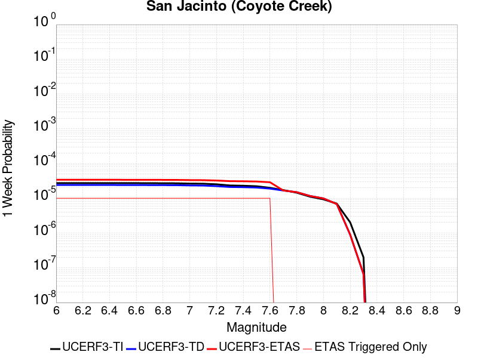 | 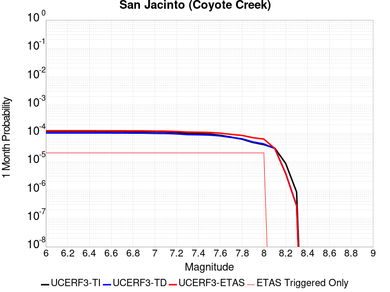 | 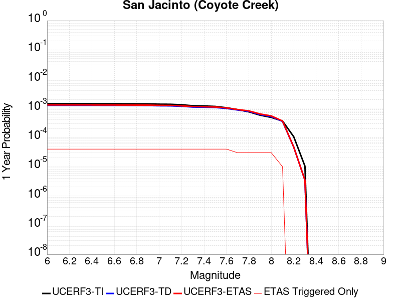 | 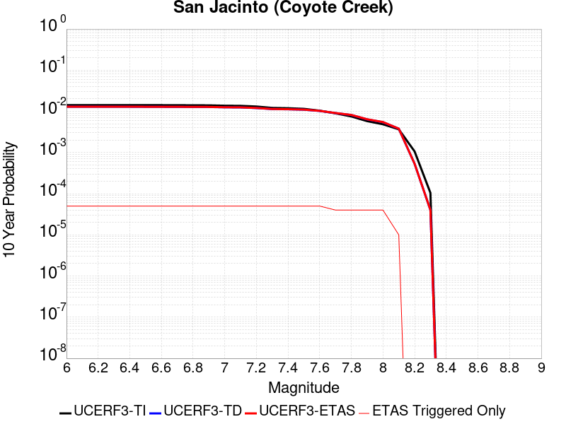 |

| Magnitude | 1 wk TI Prob | 1 wk TD Prob | 1 wk ETAS Prob | 1 wk ETAS/TD Gain | 1 wk ETAS Triggered Only | 1 mo TI Prob | 1 mo TD Prob | 1 mo ETAS Prob | 1 mo ETAS/TD Gain | 1 mo ETAS Triggered Only | 1 yr TI Prob | 1 yr TD Prob | 1 yr ETAS Prob | 1 yr ETAS/TD Gain | 1 yr ETAS Triggered Only | 10 yr TI Prob | 10 yr TD Prob | 10 yr ETAS Prob | 10 yr ETAS/TD Gain | 10 yr ETAS Triggered Only |
|-----|-----|-----|-----|-----|-----|-----|-----|-----|-----|-----|-----|-----|-----|-----|-----|-----|-----|-----|-----|-----|
| 6.0 | 2.7374346E-5 | 2.415327E-5 | 3.415303E-5 | 1.4140126 | 1.0E-5 | 1.1731335E-4 | 1.0350993E-4 | 1.2350785E-4 | 1.1931982 | 2.0E-5 | 0.0014273542 | 0.0012595074 | 0.0012994569 | 1.0317185 | 4.0E-5 | 0.01418221 | 0.01293251 | 0.012981864 | 1.0038162 | 5.0E-5 |
| 6.1 | 2.7374346E-5 | 2.415327E-5 | 3.415303E-5 | 1.4140126 | 1.0E-5 | 1.1731335E-4 | 1.0350993E-4 | 1.2350785E-4 | 1.1931982 | 2.0E-5 | 0.0014273542 | 0.0012595074 | 0.0012994569 | 1.0317185 | 4.0E-5 | 0.01418221 | 0.01293251 | 0.012981864 | 1.0038162 | 5.0E-5 |
| 6.2 | 2.7374346E-5 | 2.415327E-5 | 3.415303E-5 | 1.4140126 | 1.0E-5 | 1.1731335E-4 | 1.0350993E-4 | 1.2350785E-4 | 1.1931982 | 2.0E-5 | 0.0014273542 | 0.0012595074 | 0.0012994569 | 1.0317185 | 4.0E-5 | 0.01418221 | 0.01293251 | 0.012981864 | 1.0038162 | 5.0E-5 |
| 6.3 | 2.7374346E-5 | 2.415327E-5 | 3.415303E-5 | 1.4140126 | 1.0E-5 | 1.1731335E-4 | 1.0350993E-4 | 1.2350785E-4 | 1.1931982 | 2.0E-5 | 0.0014273542 | 0.0012595074 | 0.0012994569 | 1.0317185 | 4.0E-5 | 0.01418221 | 0.01293251 | 0.012981864 | 1.0038162 | 5.0E-5 |
| 6.4 | 2.7374346E-5 | 2.415327E-5 | 3.415303E-5 | 1.4140126 | 1.0E-5 | 1.1731335E-4 | 1.0350993E-4 | 1.2350785E-4 | 1.1931982 | 2.0E-5 | 0.0014273542 | 0.0012595074 | 0.0012994569 | 1.0317185 | 4.0E-5 | 0.01418221 | 0.01293251 | 0.012981864 | 1.0038162 | 5.0E-5 |
| 6.5 | 2.7282445E-5 | 2.4039346E-5 | 3.4039105E-5 | 1.4159747 | 1.0E-5 | 1.16919524E-4 | 1.0302171E-4 | 1.2301965E-4 | 1.1941139 | 2.0E-5 | 0.0014225657 | 0.0012535703 | 0.0012935201 | 1.0318688 | 4.0E-5 | 0.014134934 | 0.012873836 | 0.012923192 | 1.0038339 | 5.0E-5 |
| 6.6 | 2.7282445E-5 | 2.4039346E-5 | 3.4039105E-5 | 1.4159747 | 1.0E-5 | 1.16919524E-4 | 1.0302171E-4 | 1.2301965E-4 | 1.1941139 | 2.0E-5 | 0.0014225657 | 0.0012535703 | 0.0012935201 | 1.0318688 | 4.0E-5 | 0.014134934 | 0.012873836 | 0.012923192 | 1.0038339 | 5.0E-5 |
| 6.7 | 2.7216198E-5 | 2.3964463E-5 | 3.3964225E-5 | 1.4172745 | 1.0E-5 | 1.1663563E-4 | 1.0270082E-4 | 1.2269877E-4 | 1.1947204 | 2.0E-5 | 0.0014191137 | 0.0012496678 | 0.0012896179 | 1.0319685 | 4.0E-5 | 0.014100855 | 0.0128352465 | 0.012884605 | 1.0038456 | 5.0E-5 |
| 6.8 | 2.7078617E-5 | 2.3881676E-5 | 3.388144E-5 | 1.4187211 | 1.0E-5 | 1.1604605E-4 | 1.0234604E-4 | 1.2234399E-4 | 1.1953955 | 2.0E-5 | 0.001411945 | 0.0012453535 | 0.0012853036 | 1.0320793 | 4.0E-5 | 0.014030075 | 0.012792386 | 0.012841746 | 1.0038586 | 5.0E-5 |
| 6.9 | 2.6982952E-5 | 2.3801183E-5 | 3.3800945E-5 | 1.4201372 | 1.0E-5 | 1.15636096E-4 | 1.020011E-4 | 1.2199906E-4 | 1.1960564 | 2.0E-5 | 0.0014069602 | 0.0012411585 | 0.0012811088 | 1.0321879 | 4.0E-5 | 0.013980856 | 0.012750699 | 0.012800061 | 1.0038713 | 5.0E-5 |
| 7.0 | 2.6449972E-5 | 2.3378187E-5 | 3.3377954E-5 | 1.4277391 | 1.0E-5 | 1.1335209E-4 | 1.001884E-4 | 1.2018639E-4 | 1.1996039 | 2.0E-5 | 0.001379188 | 0.0012191138 | 0.001259065 | 1.0327708 | 4.0E-5 | 0.0137065975 | 0.0125320535 | 0.012581427 | 1.0039397 | 5.0E-5 |
| 7.1 | 2.6257849E-5 | 2.3204217E-5 | 3.3203985E-5 | 1.4309461 | 1.0E-5 | 1.1252879E-4 | 9.944286E-5 | 1.19440876E-4 | 1.2011005 | 2.0E-5 | 0.0013691769 | 0.001210047 | 0.0012499986 | 1.0330166 | 4.0E-5 | 0.013607717 | 0.012441914 | 0.012491291 | 1.0039687 | 5.0E-5 |
| 7.2 | 2.5270041E-5 | 2.2398921E-5 | 3.2398697E-5 | 1.4464401 | 1.0E-5 | 1.0829568E-4 | 9.5991854E-5 | 1.1598994E-4 | 1.208331 | 2.0E-5 | 0.0013177024 | 0.0011680766 | 0.0012080299 | 1.0342044 | 4.0E-5 | 0.013099162 | 0.012022921 | 0.012072319 | 1.0041087 | 5.0E-5 |
| 7.3 | 2.339701E-5 | 2.1130656E-5 | 3.1130447E-5 | 1.4732361 | 1.0E-5 | 1.0026905E-4 | 9.055682E-5 | 1.1055502E-4 | 1.2208358 | 2.0E-5 | 0.001220092 | 0.0011019738 | 0.0011419298 | 1.0362585 | 4.0E-5 | 0.012134149 | 0.011361783 | 0.011411215 | 1.0043507 | 5.0E-5 |
| 7.4 | 2.296333E-5 | 2.0860984E-5 | 3.0860774E-5 | 1.4793538 | 1.0E-5 | 9.841056E-5 | 8.940117E-5 | 1.0939938E-4 | 1.2236907 | 2.0E-5 | 0.0011974899 | 0.0010879177 | 0.0011278742 | 1.0367274 | 4.0E-5 | 0.011910575 | 0.011220883 | 0.011270322 | 1.004406 | 5.0E-5 |
| 7.5 | 2.2188895E-5 | 2.0383844E-5 | 3.038364E-5 | 1.4905746 | 1.0E-5 | 9.50918E-5 | 8.735642E-5 | 1.07354674E-4 | 1.2289271 | 2.0E-5 | 0.0011571277 | 0.0010630476 | 0.001103005 | 1.0375876 | 4.0E-5 | 0.011511209 | 0.010970469 | 0.011019921 | 1.0045077 | 5.0E-5 |
| 7.6 | 2.0013189E-5 | 1.8969942E-5 | 2.8969753E-5 | 1.5271397 | 1.0E-5 | 8.5767984E-5 | 8.1297236E-5 | 1.01295605E-4 | 1.2459909 | 2.0E-5 | 0.001043725 | 9.893461E-4 | 0.0010293066 | 1.0403907 | 4.0E-5 | 0.010388365 | 0.010228388 | 0.010277877 | 1.0048383 | 5.0E-5 |
| 7.7 | 1.7230794E-5 | 1.6751088E-5 | 1.6751088E-5 | 1.0 | 0.0 | 7.384417E-5 | 7.17884E-5 | 8.1787686E-5 | 1.1392883 | 1.0E-5 | 8.986819E-4 | 8.736742E-4 | 9.03648E-4 | 1.0343077 | 3.0E-5 | 0.008950562 | 0.009066812 | 0.009106449 | 1.0043716 | 4.0E-5 |
| 7.8 | 1.4478809E-5 | 1.49981E-5 | 1.49981E-5 | 1.0 | 0.0 | 6.205057E-5 | 6.427599E-5 | 7.427535E-5 | 1.1555691 | 1.0E-5 | 7.552038E-4 | 7.822799E-4 | 8.1225636E-4 | 1.0383195 | 3.0E-5 | 0.0075264242 | 0.008145113 | 0.008184787 | 1.0048709 | 4.0E-5 |
| 7.9 | 1.1114467E-5 | 1.1651392E-5 | 1.1651392E-5 | 1.0 | 0.0 | 4.7632562E-5 | 4.9933584E-5 | 5.9933085E-5 | 1.200256 | 1.0E-5 | 5.797721E-4 | 6.077724E-4 | 6.3775416E-4 | 1.0493306 | 3.0E-5 | 0.0057826187 | 0.0063836263 | 0.006423371 | 1.0062261 | 4.0E-5 |
| 8.0 | 9.327402E-6 | 9.904865E-6 | 9.904865E-6 | 1.0 | 0.0 | 3.9973966E-5 | 4.2448733E-5 | 5.2448308E-5 | 1.2355683 | 1.0E-5 | 4.8657437E-4 | 5.166913E-4 | 5.466758E-4 | 1.0580318 | 3.0E-5 | 0.0048551033 | 0.0054529547 | 0.005492736 | 1.0072955 | 4.0E-5 |
| 8.1 | 7.0235833E-6 | 6.83171E-6 | 6.83171E-6 | 1.0 | 0.0 | 3.0100724E-5 | 2.9278432E-5 | 2.9278432E-5 | 1.0 | 0.0 | 3.664147E-4 | 3.5640708E-4 | 3.6640352E-4 | 1.0280478 | 1.0E-5 | 0.003658111 | 0.0037898365 | 0.0037997987 | 1.0026287 | 1.0E-5 |
| 8.2 | 2.0358202E-6 | 9.0030267E-7 | 9.0030267E-7 | 1.0 | 0.0 | 8.724915E-6 | 3.8584344E-6 | 3.8584344E-6 | 1.0 | 0.0 | 1.06220665E-4 | 4.697545E-5 | 4.697545E-5 | 1.0 | 0.0 | 0.001061699 | 5.3301745E-4 | 5.3301745E-4 | 1.0 | 0.0 |
| 8.3 | 2.0051264E-7 | 6.6244816E-8 | 6.6244816E-8 | 1.0 | 0.0 | 8.5933965E-7 | 2.8390633E-7 | 2.8390633E-7 | 1.0 | 0.0 | 1.046241E-5 | 3.4565546E-6 | 3.4565546E-6 | 1.0 | 0.0 | 1.0461917E-4 | 4.018022E-5 | 4.018022E-5 | 1.0 | 0.0 |

## Imperial
*[(top)](#table-of-contents)*

| 1 Week | 1 Month | 1 Year | 10 Year |
|-----|-----|-----|-----|
|  | 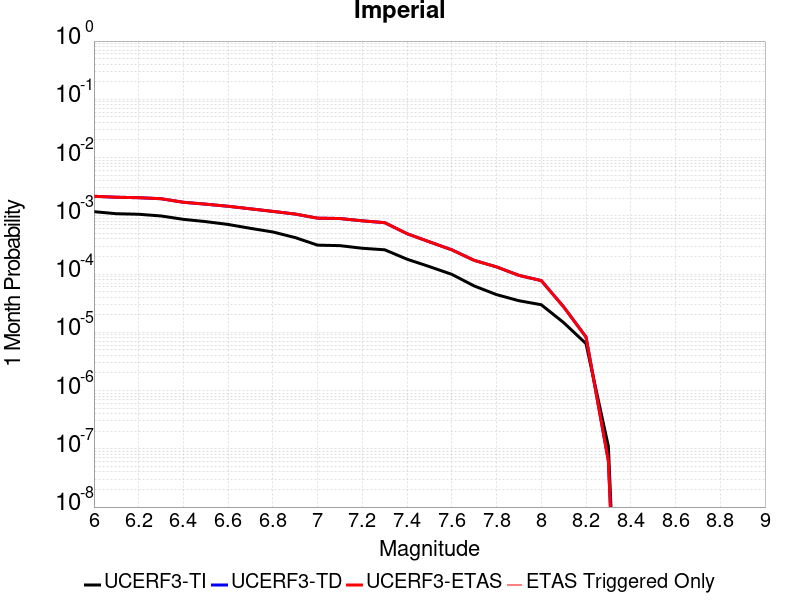 | 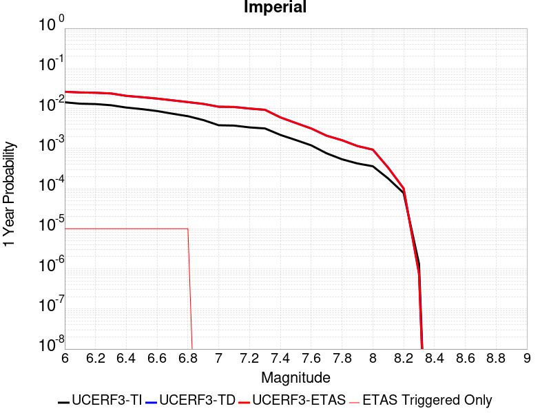 | 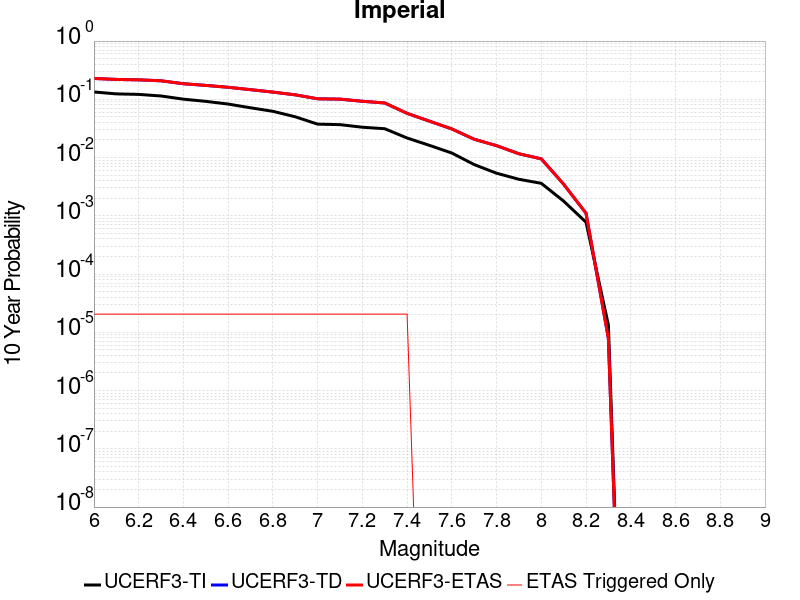 |

| Magnitude | 1 wk TI Prob | 1 wk TD Prob | 1 wk ETAS Prob | 1 wk ETAS/TD Gain | 1 wk ETAS Triggered Only | 1 mo TI Prob | 1 mo TD Prob | 1 mo ETAS Prob | 1 mo ETAS/TD Gain | 1 mo ETAS Triggered Only | 1 yr TI Prob | 1 yr TD Prob | 1 yr ETAS Prob | 1 yr ETAS/TD Gain | 1 yr ETAS Triggered Only | 10 yr TI Prob | 10 yr TD Prob | 10 yr ETAS Prob | 10 yr ETAS/TD Gain | 10 yr ETAS Triggered Only |
|-----|-----|-----|-----|-----|-----|-----|-----|-----|-----|-----|-----|-----|-----|-----|-----|-----|-----|-----|-----|-----|
| 6.0 | 2.7496446E-4 | 5.0565513E-4 | 5.0565513E-4 | 1.0 | 0.0 | 0.0011778869 | 0.002165333 | 0.002165333 | 1.0 | 0.0 | 0.0142467655 | 0.026045265 | 0.026055004 | 1.000374 | 1.0E-5 | 0.13367249 | 0.22808637 | 0.22812496 | 1.0001692 | 5.0E-5 |
| 6.1 | 2.5356023E-4 | 4.8667885E-4 | 4.8667885E-4 | 1.0 | 0.0 | 0.001086234 | 0.0020841376 | 0.0020841376 | 1.0 | 0.0 | 0.013144928 | 0.02507692 | 0.02508667 | 1.0003887 | 1.0E-5 | 0.123940155 | 0.21951756 | 0.21955658 | 1.0001777 | 5.0E-5 |
| 6.2 | 2.4820742E-4 | 4.7763108E-4 | 4.7763108E-4 | 1.0 | 0.0 | 0.0010633124 | 0.0020454223 | 0.0020454223 | 1.0 | 0.0 | 0.01286919 | 0.024616843 | 0.024626596 | 1.0003963 | 1.0E-5 | 0.12148927 | 0.2160229 | 0.21605425 | 1.0001452 | 4.0E-5 |
| 6.3 | 2.3205351E-4 | 4.590021E-4 | 4.590021E-4 | 1.0 | 0.0 | 9.94136E-4 | 0.0019657058 | 0.0019657058 | 1.0 | 0.0 | 0.012036599 | 0.023666281 | 0.023676043 | 1.0004126 | 1.0E-5 | 0.11405133 | 0.20796864 | 0.20800032 | 1.0001523 | 4.0E-5 |
| 6.4 | 2.0304754E-4 | 3.9885996E-4 | 3.9885996E-4 | 1.0 | 0.0 | 8.6991355E-4 | 0.0017082945 | 0.0017082945 | 1.0 | 0.0 | 0.010539869 | 0.020600514 | 0.020610308 | 1.0004754 | 1.0E-5 | 0.100537635 | 0.18510117 | 0.18513377 | 1.0001761 | 4.0E-5 |
| 6.5 | 1.854992E-4 | 3.6997703E-4 | 3.6997703E-4 | 1.0 | 0.0 | 7.9475436E-4 | 0.0015846646 | 0.0015846646 | 1.0 | 0.0 | 0.009633281 | 0.019123985 | 0.019133793 | 1.000513 | 1.0E-5 | 0.0922623 | 0.17333072 | 0.17336379 | 1.0001907 | 4.0E-5 |
| 6.6 | 1.6586106E-4 | 3.4043082E-4 | 3.4043082E-4 | 1.0 | 0.0 | 7.106394E-4 | 0.0014581835 | 0.0014581835 | 1.0 | 0.0 | 0.008617763 | 0.017610526 | 0.017620351 | 1.0005579 | 1.0E-5 | 0.08291132 | 0.16080588 | 0.16083945 | 1.0002087 | 4.0E-5 |
| 6.7 | 1.4224656E-4 | 3.077392E-4 | 3.077392E-4 | 1.0 | 0.0 | 6.094856E-4 | 0.0013182238 | 0.0013182238 | 1.0 | 0.0 | 0.0073952693 | 0.015933173 | 0.015943013 | 1.0006176 | 1.0E-5 | 0.07153955 | 0.1465114 | 0.14654554 | 1.000233 | 4.0E-5 |
| 6.8 | 1.2317259E-4 | 2.779711E-4 | 2.779711E-4 | 1.0 | 0.0 | 5.2777573E-4 | 0.0011907669 | 0.0011907669 | 1.0 | 0.0 | 0.0064067547 | 0.0144026 | 0.014412456 | 1.0006843 | 1.0E-5 | 0.06225166 | 0.13296051 | 0.13299519 | 1.0002608 | 4.0E-5 |
| 6.9 | 9.859898E-5 | 2.5018715E-4 | 2.5018715E-4 | 1.0 | 0.0 | 4.2249862E-4 | 0.0010717943 | 0.0010717943 | 1.0 | 0.0 | 0.0051317946 | 0.012971984 | 0.012971984 | 1.0 | 0.0 | 0.05014893 | 0.11942433 | 0.11944194 | 1.0001475 | 2.0E-5 |
| 7.0 | 7.3191884E-5 | 2.1270063E-4 | 2.1270063E-4 | 1.0 | 0.0 | 3.136418E-4 | 9.1125886E-4 | 9.1125886E-4 | 1.0 | 0.0 | 0.003811904 | 0.011038825 | 0.011038825 | 1.0 | 0.0 | 0.037471764 | 0.10207849 | 0.102096446 | 1.000176 | 2.0E-5 |
| 7.1 | 7.1760296E-5 | 2.0971385E-4 | 2.0971385E-4 | 1.0 | 0.0 | 3.0750787E-4 | 8.984672E-4 | 8.984672E-4 | 1.0 | 0.0 | 0.003737482 | 0.010884652 | 0.010884652 | 1.0 | 0.0 | 0.03675245 | 0.100714855 | 0.10073284 | 1.0001786 | 2.0E-5 |
| 7.2 | 6.46614E-5 | 1.9139807E-4 | 1.9139807E-4 | 1.0 | 0.0 | 2.7709085E-4 | 8.2002254E-4 | 8.2002254E-4 | 1.0 | 0.0 | 0.0033683628 | 0.009938694 | 0.009938694 | 1.0 | 0.0 | 0.033177625 | 0.09252202 | 0.09254017 | 1.0001962 | 2.0E-5 |
| 7.3 | 6.088115E-5 | 1.781138E-4 | 1.781138E-4 | 1.0 | 0.0 | 2.6089314E-4 | 7.631244E-4 | 7.631244E-4 | 1.0 | 0.0 | 0.0031717476 | 0.009252035 | 0.009252035 | 1.0 | 0.0 | 0.031268585 | 0.08657247 | 0.08659074 | 1.000211 | 2.0E-5 |
| 7.4 | 4.199346E-5 | 1.15126604E-4 | 1.15126604E-4 | 1.0 | 0.0 | 1.7995955E-4 | 4.933073E-4 | 4.933073E-4 | 1.0 | 0.0 | 0.0021888057 | 0.005989646 | 0.005989646 | 1.0 | 0.0 | 0.02167372 | 0.057449933 | 0.057468783 | 1.0003282 | 2.0E-5 |
| 7.5 | 3.130448E-5 | 8.335176E-5 | 8.335176E-5 | 1.0 | 0.0 | 1.3415517E-4 | 3.5717324E-4 | 3.5717324E-4 | 1.0 | 0.0 | 0.0016321153 | 0.0043399734 | 0.0043399734 | 1.0 | 0.0 | 0.016201803 | 0.042140562 | 0.042140562 | 1.0 | 0.0 |
| 7.6 | 2.3074248E-5 | 6.0860824E-5 | 6.0860824E-5 | 1.0 | 0.0 | 9.888588E-5 | 2.6080615E-4 | 2.6080615E-4 | 1.0 | 0.0 | 0.0012032706 | 0.0031707147 | 0.0031707147 | 1.0 | 0.0 | 0.011967761 | 0.031033779 | 0.031033779 | 1.0 | 0.0 |
| 7.7 | 1.45864815E-5 | 4.0138115E-5 | 4.0138115E-5 | 1.0 | 0.0 | 6.2511994E-5 | 1.7200918E-4 | 1.7200918E-4 | 1.0 | 0.0 | 7.608177E-4 | 0.0020922057 | 0.0020922057 | 1.0 | 0.0 | 0.007582182 | 0.020633917 | 0.020633917 | 1.0 | 0.0 |
| 7.8 | 1.0352979E-5 | 3.097231E-5 | 3.097231E-5 | 1.0 | 0.0 | 4.4369157E-5 | 1.3273173E-4 | 1.3273173E-4 | 1.0 | 0.0 | 5.400606E-4 | 0.0016148133 | 0.0016148133 | 1.0 | 0.0 | 0.0053875 | 0.016022068 | 0.016022068 | 1.0 | 0.0 |
| 7.9 | 8.137906E-6 | 2.2158269E-5 | 2.2158269E-5 | 1.0 | 0.0 | 3.4876273E-5 | 9.496055E-5 | 9.496055E-5 | 1.0 | 0.0 | 4.2453592E-4 | 0.0011555325 | 0.0011555325 | 1.0 | 0.0 | 0.004237258 | 0.011622174 | 0.011622174 | 1.0 | 0.0 |
| 8.0 | 6.93792E-6 | 1.801665E-5 | 1.801665E-5 | 1.0 | 0.0 | 2.9733603E-5 | 7.721193E-5 | 7.721193E-5 | 1.0 | 0.0 | 3.6194647E-4 | 9.396506E-4 | 9.396506E-4 | 1.0 | 0.0 | 0.0036135751 | 0.00950525 | 0.00950525 | 1.0 | 0.0 |
| 8.1 | 3.4286315E-6 | 6.3835337E-6 | 6.3835337E-6 | 1.0 | 0.0 | 1.4694053E-5 | 2.7357715E-5 | 2.7357715E-5 | 1.0 | 0.0 | 1.7888541E-4 | 3.330294E-4 | 3.330294E-4 | 1.0 | 0.0 | 0.0017874148 | 0.0034878491 | 0.0034878491 | 1.0 | 0.0 |
| 8.2 | 1.4906886E-6 | 1.9381007E-6 | 1.9381007E-6 | 1.0 | 0.0 | 6.3886496E-6 | 8.3061195E-6 | 8.3061195E-6 | 1.0 | 0.0 | 7.7779034E-5 | 1.0112235E-4 | 1.0112235E-4 | 1.0 | 0.0 | 7.775182E-4 | 0.0011082698 | 0.0011082698 | 1.0 | 0.0 |
| 8.3 | 2.5758007E-8 | 1.4514695E-8 | 1.4514695E-8 | 1.0 | 0.0 | 1.10391454E-7 | 6.2205835E-8 | 6.2205835E-8 | 1.0 | 0.0 | 1.3440151E-6 | 7.57356E-7 | 7.57356E-7 | 1.0 | 0.0 | 1.344007E-5 | 7.895551E-6 | 7.895551E-6 | 1.0 | 0.0 |

## Camp Rock 2011
*[(top)](#table-of-contents)*

| 1 Week | 1 Month | 1 Year | 10 Year |
|-----|-----|-----|-----|
| 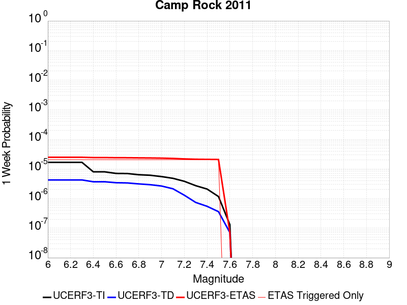 | 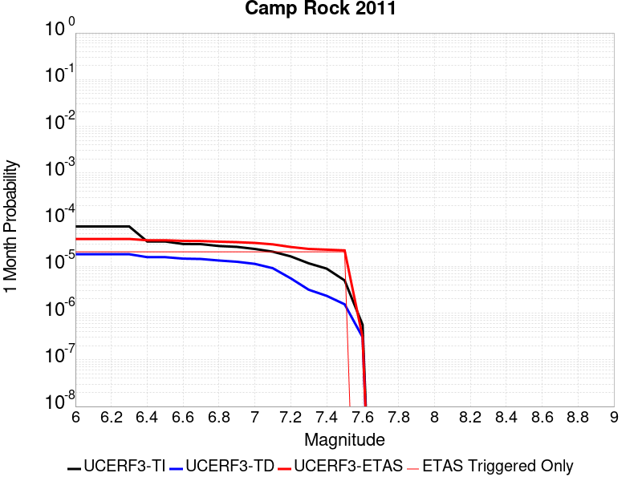 | 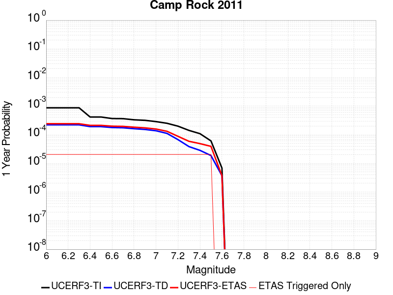 | 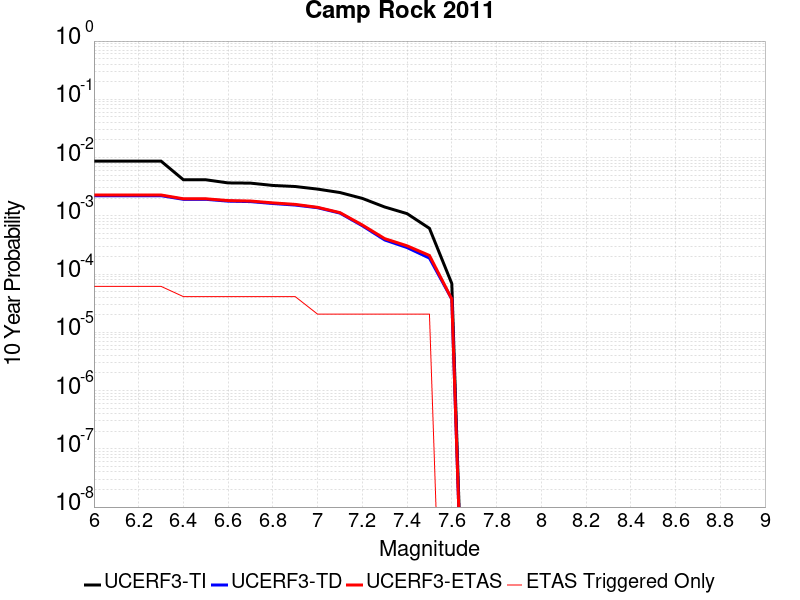 |

| Magnitude | 1 wk TI Prob | 1 wk TD Prob | 1 wk ETAS Prob | 1 wk ETAS/TD Gain | 1 wk ETAS Triggered Only | 1 mo TI Prob | 1 mo TD Prob | 1 mo ETAS Prob | 1 mo ETAS/TD Gain | 1 mo ETAS Triggered Only | 1 yr TI Prob | 1 yr TD Prob | 1 yr ETAS Prob | 1 yr ETAS/TD Gain | 1 yr ETAS Triggered Only | 10 yr TI Prob | 10 yr TD Prob | 10 yr ETAS Prob | 10 yr ETAS/TD Gain | 10 yr ETAS Triggered Only |
|-----|-----|-----|-----|-----|-----|-----|-----|-----|-----|-----|-----|-----|-----|-----|-----|-----|-----|-----|-----|-----|
| 6.0 | 1.6710783E-5 | 4.2503107E-6 | 1.4250268E-5 | 3.3527591 | 1.0E-5 | 7.161568E-5 | 1.8215493E-5 | 2.821531E-5 | 1.5489732 | 1.0E-5 | 8.7157206E-4 | 2.2175159E-4 | 2.4174714E-4 | 1.090171 | 2.0E-5 | 0.008681616 | 0.0022153559 | 0.0022652452 | 1.0225197 | 5.0E-5 |
| 6.1 | 1.6710783E-5 | 4.2503107E-6 | 1.4250268E-5 | 3.3527591 | 1.0E-5 | 7.161568E-5 | 1.8215493E-5 | 2.821531E-5 | 1.5489732 | 1.0E-5 | 8.7157206E-4 | 2.2175159E-4 | 2.4174714E-4 | 1.090171 | 2.0E-5 | 0.008681616 | 0.0022153559 | 0.0022652452 | 1.0225197 | 5.0E-5 |
| 6.2 | 1.6710783E-5 | 4.2503107E-6 | 1.4250268E-5 | 3.3527591 | 1.0E-5 | 7.161568E-5 | 1.8215493E-5 | 2.821531E-5 | 1.5489732 | 1.0E-5 | 8.7157206E-4 | 2.2175159E-4 | 2.4174714E-4 | 1.090171 | 2.0E-5 | 0.008681616 | 0.0022153559 | 0.0022652452 | 1.0225197 | 5.0E-5 |
| 6.3 | 1.6710783E-5 | 4.2503107E-6 | 1.4250268E-5 | 3.3527591 | 1.0E-5 | 7.161568E-5 | 1.8215493E-5 | 2.821531E-5 | 1.5489732 | 1.0E-5 | 8.7157206E-4 | 2.2175159E-4 | 2.4174714E-4 | 1.090171 | 2.0E-5 | 0.008681616 | 0.0022153559 | 0.0022652452 | 1.0225197 | 5.0E-5 |
| 6.4 | 7.982846E-6 | 3.6821327E-6 | 1.3682096E-5 | 3.7158072 | 1.0E-5 | 3.421175E-5 | 1.5780475E-5 | 2.5780319E-5 | 1.6336845 | 1.0E-5 | 4.1644843E-4 | 1.921107E-4 | 2.1210685E-4 | 1.1040866 | 2.0E-5 | 0.0041566887 | 0.0019194811 | 0.0019594042 | 1.0207989 | 4.0E-5 |
| 6.5 | 7.982846E-6 | 3.6821327E-6 | 1.3682096E-5 | 3.7158072 | 1.0E-5 | 3.421175E-5 | 1.5780475E-5 | 2.5780319E-5 | 1.6336845 | 1.0E-5 | 4.1644843E-4 | 1.921107E-4 | 2.1210685E-4 | 1.1040866 | 2.0E-5 | 0.0041566887 | 0.0019194811 | 0.0019594042 | 1.0207989 | 4.0E-5 |
| 6.6 | 7.048869E-6 | 3.4243997E-6 | 1.34243655E-5 | 3.92021 | 1.0E-5 | 3.0209088E-5 | 1.4675918E-5 | 2.467577E-5 | 1.6813784 | 1.0E-5 | 3.677336E-4 | 1.7866497E-4 | 1.986614E-4 | 1.1119213 | 2.0E-5 | 0.0036712566 | 0.0017852448 | 0.0018251734 | 1.0223659 | 4.0E-5 |
| 6.7 | 6.987307E-6 | 3.3623767E-6 | 1.3362343E-5 | 3.9740767 | 1.0E-5 | 2.9945259E-5 | 1.4410108E-5 | 2.4409963E-5 | 1.6939473 | 1.0E-5 | 3.6452254E-4 | 1.7542925E-4 | 1.9542575E-4 | 1.113986 | 2.0E-5 | 0.0036392517 | 0.0017529388 | 0.0017928687 | 1.0227789 | 4.0E-5 |
| 6.8 | 6.3737602E-6 | 3.117947E-6 | 1.3117916E-5 | 4.2072287 | 1.0E-5 | 2.731583E-5 | 1.3362564E-5 | 2.336243E-5 | 1.7483494 | 1.0E-5 | 3.3251947E-4 | 1.6267736E-4 | 1.826741E-4 | 1.1229228 | 2.0E-5 | 0.0033202237 | 0.0016256113 | 0.0016655463 | 1.0245662 | 4.0E-5 |
| 6.9 | 6.112211E-6 | 2.9331534E-6 | 1.2933124E-5 | 4.40929 | 1.0E-5 | 2.6194928E-5 | 1.2570598E-5 | 2.2570473E-5 | 1.7954971 | 1.0E-5 | 3.1887658E-4 | 1.5303657E-4 | 1.730335E-4 | 1.1306677 | 2.0E-5 | 0.003184194 | 0.0015293396 | 0.0015692784 | 1.0261151 | 4.0E-5 |
| 7.0 | 5.5140117E-6 | 2.6419564E-6 | 1.264193E-5 | 4.785064 | 1.0E-5 | 2.3631264E-5 | 1.1322622E-5 | 2.1322508E-5 | 1.8831776 | 1.0E-5 | 2.8767265E-4 | 1.3784446E-4 | 1.578417E-4 | 1.145071 | 2.0E-5 | 0.0028730053 | 0.0013776148 | 0.0014075735 | 1.0217468 | 3.0E-5 |
| 7.1 | 4.8151105E-6 | 2.1342985E-6 | 1.2134277E-5 | 5.6853704 | 1.0E-5 | 2.0636026E-5 | 9.146962E-6 | 1.9146872E-5 | 2.093249 | 1.0E-5 | 2.5121463E-4 | 1.1135879E-4 | 1.3135657E-4 | 1.1795796 | 2.0E-5 | 0.0025093083 | 0.0011130519 | 0.0011430185 | 1.026923 | 3.0E-5 |
| 7.2 | 3.818335E-6 | 1.293763E-6 | 1.12937505E-5 | 8.729381 | 1.0E-5 | 1.6364189E-5 | 5.5446876E-6 | 1.5544632E-5 | 2.803518 | 1.0E-5 | 1.9921579E-4 | 6.750456E-5 | 8.750321E-5 | 1.2962563 | 2.0E-5 | 0.0019903728 | 6.748488E-4 | 6.948353E-4 | 1.0296162 | 2.0E-5 |
| 7.3 | 2.7166698E-6 | 7.383734E-7 | 1.0738366E-5 | 14.543273 | 1.0E-5 | 1.1642818E-5 | 3.1644536E-6 | 1.3164422E-5 | 4.1600933 | 1.0E-5 | 1.4174209E-4 | 3.8526563E-5 | 4.8526177E-5 | 1.2595512 | 1.0E-5 | 0.0014165172 | 3.8520084E-4 | 3.9519698E-4 | 1.0259504 | 1.0E-5 |
| 7.4 | 2.0893426E-6 | 5.461961E-7 | 1.054619E-5 | 19.308434 | 1.0E-5 | 8.954295E-6 | 2.3408381E-6 | 1.23408145E-5 | 5.271964 | 1.0E-5 | 1.0901308E-4 | 2.8499337E-5 | 3.8499053E-5 | 1.3508754 | 1.0E-5 | 0.0010895962 | 2.8495738E-4 | 2.9495452E-4 | 1.0350829 | 1.0E-5 |
| 7.5 | 1.1681728E-6 | 3.6031287E-7 | 1.036031E-5 | 28.753647 | 1.0E-5 | 5.0064455E-6 | 1.5441972E-6 | 1.1544182E-5 | 7.4758472 | 1.0E-5 | 6.0951766E-5 | 1.8800443E-5 | 2.8800254E-5 | 1.5318924 | 1.0E-5 | 6.093505E-4 | 1.8798899E-4 | 1.979871E-4 | 1.0531846 | 1.0E-5 |
| 7.6 | 1.3154387E-7 | 7.1198265E-8 | 7.1198265E-8 | 1.0 | 0.0 | 5.6375933E-7 | 3.051354E-7 | 3.051354E-7 | 1.0 | 0.0 | 6.863748E-6 | 3.7150185E-6 | 3.7150185E-6 | 1.0 | 0.0 | 6.863536E-5 | 3.7149723E-5 | 3.7149723E-5 | 1.0 | 0.0 |

## Channel Islands Thrust
*[(top)](#table-of-contents)*

| 1 Week | 1 Month | 1 Year | 10 Year |
|-----|-----|-----|-----|
|  |  | 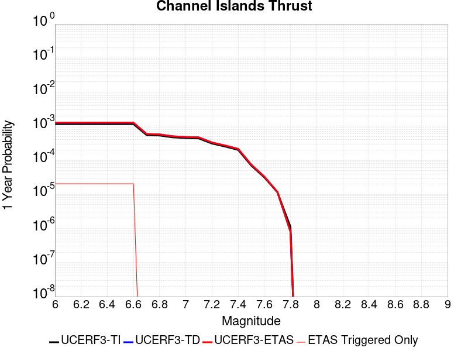 | 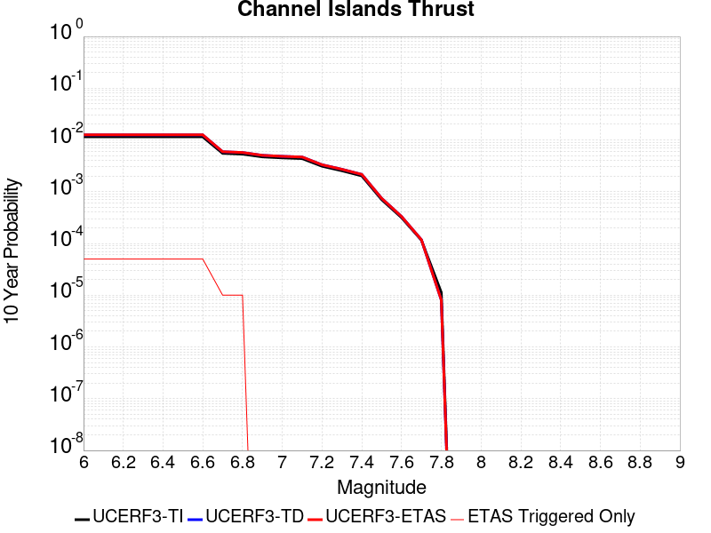 |

| Magnitude | 1 wk TI Prob | 1 wk TD Prob | 1 wk ETAS Prob | 1 wk ETAS/TD Gain | 1 wk ETAS Triggered Only | 1 mo TI Prob | 1 mo TD Prob | 1 mo ETAS Prob | 1 mo ETAS/TD Gain | 1 mo ETAS Triggered Only | 1 yr TI Prob | 1 yr TD Prob | 1 yr ETAS Prob | 1 yr ETAS/TD Gain | 1 yr ETAS Triggered Only | 10 yr TI Prob | 10 yr TD Prob | 10 yr ETAS Prob | 10 yr ETAS/TD Gain | 10 yr ETAS Triggered Only |
|-----|-----|-----|-----|-----|-----|-----|-----|-----|-----|-----|-----|-----|-----|-----|-----|-----|-----|-----|-----|-----|
| 6.0 | 2.2156251E-5 | 2.4092304E-5 | 2.4092304E-5 | 1.0 | 0.0 | 9.495191E-5 | 1.03249244E-4 | 1.03249244E-4 | 1.0 | 0.0 | 0.0011554264 | 0.0012564411 | 0.001276416 | 1.015898 | 2.0E-5 | 0.011494373 | 0.012503966 | 0.012553341 | 1.0039487 | 5.0E-5 |
| 6.1 | 2.2156251E-5 | 2.4092304E-5 | 2.4092304E-5 | 1.0 | 0.0 | 9.495191E-5 | 1.03249244E-4 | 1.03249244E-4 | 1.0 | 0.0 | 0.0011554264 | 0.0012564411 | 0.001276416 | 1.015898 | 2.0E-5 | 0.011494373 | 0.012503966 | 0.012553341 | 1.0039487 | 5.0E-5 |
| 6.2 | 2.2156251E-5 | 2.4092304E-5 | 2.4092304E-5 | 1.0 | 0.0 | 9.495191E-5 | 1.03249244E-4 | 1.03249244E-4 | 1.0 | 0.0 | 0.0011554264 | 0.0012564411 | 0.001276416 | 1.015898 | 2.0E-5 | 0.011494373 | 0.012503966 | 0.012553341 | 1.0039487 | 5.0E-5 |
| 6.3 | 2.2156251E-5 | 2.4092304E-5 | 2.4092304E-5 | 1.0 | 0.0 | 9.495191E-5 | 1.03249244E-4 | 1.03249244E-4 | 1.0 | 0.0 | 0.0011554264 | 0.0012564411 | 0.001276416 | 1.015898 | 2.0E-5 | 0.011494373 | 0.012503966 | 0.012553341 | 1.0039487 | 5.0E-5 |
| 6.4 | 2.2156251E-5 | 2.4092304E-5 | 2.4092304E-5 | 1.0 | 0.0 | 9.495191E-5 | 1.03249244E-4 | 1.03249244E-4 | 1.0 | 0.0 | 0.0011554264 | 0.0012564411 | 0.001276416 | 1.015898 | 2.0E-5 | 0.011494373 | 0.012503966 | 0.012553341 | 1.0039487 | 5.0E-5 |
| 6.5 | 2.2156251E-5 | 2.4092304E-5 | 2.4092304E-5 | 1.0 | 0.0 | 9.495191E-5 | 1.03249244E-4 | 1.03249244E-4 | 1.0 | 0.0 | 0.0011554264 | 0.0012564411 | 0.001276416 | 1.015898 | 2.0E-5 | 0.011494373 | 0.012503966 | 0.012553341 | 1.0039487 | 5.0E-5 |
| 6.6 | 2.2156251E-5 | 2.4092304E-5 | 2.4092304E-5 | 1.0 | 0.0 | 9.495191E-5 | 1.03249244E-4 | 1.03249244E-4 | 1.0 | 0.0 | 0.0011554264 | 0.0012564411 | 0.001276416 | 1.015898 | 2.0E-5 | 0.011494373 | 0.012503966 | 0.012553341 | 1.0039487 | 5.0E-5 |
| 6.7 | 1.0601296E-5 | 1.1379656E-5 | 1.1379656E-5 | 1.0 | 0.0 | 4.5433335E-5 | 4.876907E-5 | 4.876907E-5 | 1.0 | 0.0 | 5.5301044E-4 | 5.9360656E-4 | 6.0360064E-4 | 1.0168362 | 1.0E-5 | 0.005516363 | 0.0059207114 | 0.0059306524 | 1.001679 | 1.0E-5 |
| 6.8 | 1.0246747E-5 | 1.0996777E-5 | 1.0996777E-5 | 1.0 | 0.0 | 4.391389E-5 | 4.712822E-5 | 4.712822E-5 | 1.0 | 0.0 | 5.345204E-4 | 5.736398E-4 | 5.836341E-4 | 1.0174226 | 1.0E-5 | 0.0053323656 | 0.005722081 | 0.0057320236 | 1.0017376 | 1.0E-5 |
| 6.9 | 9.049551E-6 | 9.699738E-6 | 9.699738E-6 | 1.0 | 0.0 | 3.878322E-5 | 4.1569667E-5 | 4.1569667E-5 | 1.0 | 0.0 | 4.7208337E-4 | 5.059973E-4 | 5.059973E-4 | 1.0 | 0.0 | 0.0047108172 | 0.005048869 | 0.005048869 | 1.0 | 0.0 |
| 7.0 | 8.6542195E-6 | 9.274692E-6 | 9.274692E-6 | 1.0 | 0.0 | 3.7088983E-5 | 3.97481E-5 | 3.97481E-5 | 1.0 | 0.0 | 4.5146482E-4 | 4.8382973E-4 | 4.8382973E-4 | 1.0 | 0.0 | 0.004505487 | 0.0048281755 | 0.0048281755 | 1.0 | 0.0 |
| 7.1 | 8.391028E-6 | 8.993012E-6 | 8.993012E-6 | 1.0 | 0.0 | 3.5961057E-5 | 3.8540933E-5 | 3.8540933E-5 | 1.0 | 0.0 | 4.3773788E-4 | 4.691389E-4 | 4.691389E-4 | 1.0 | 0.0 | 0.004368766 | 0.0046818955 | 0.0046818955 | 1.0 | 0.0 |
| 7.2 | 5.965188E-6 | 6.3717544E-6 | 6.3717544E-6 | 1.0 | 0.0 | 2.556484E-5 | 2.7307235E-5 | 2.7307235E-5 | 1.0 | 0.0 | 3.1120746E-4 | 3.3241542E-4 | 3.3241542E-4 | 1.0 | 0.0 | 0.00310772 | 0.00331924 | 0.00331924 | 1.0 | 0.0 |
| 7.3 | 4.877518E-6 | 5.2060545E-6 | 5.2060545E-6 | 1.0 | 0.0 | 2.0903482E-5 | 2.2311473E-5 | 2.2311473E-5 | 1.0 | 0.0 | 2.5447016E-4 | 2.7160876E-4 | 2.7160876E-4 | 1.0 | 0.0 | 0.0025417898 | 0.0027128144 | 0.0027128144 | 1.0 | 0.0 |
| 7.4 | 3.8829853E-6 | 4.1419007E-6 | 4.1419007E-6 | 1.0 | 0.0 | 1.664126E-5 | 1.7750885E-5 | 1.7750885E-5 | 1.0 | 0.0 | 2.0258849E-4 | 2.16096E-4 | 2.16096E-4 | 1.0 | 0.0 | 0.002024039 | 0.0021589005 | 0.0021589005 | 1.0 | 0.0 |
| 7.5 | 1.3489616E-6 | 1.4278027E-6 | 1.4278027E-6 | 1.0 | 0.0 | 5.7812517E-6 | 6.1191404E-6 | 6.1191404E-6 | 1.0 | 0.0 | 7.038446E-5 | 7.449803E-5 | 7.449803E-5 | 1.0 | 0.0 | 7.036218E-4 | 7.447345E-4 | 7.447345E-4 | 1.0 | 0.0 |
| 7.6 | 6.058192E-7 | 6.353832E-7 | 6.353832E-7 | 1.0 | 0.0 | 2.5963652E-6 | 2.723068E-6 | 2.723068E-6 | 1.0 | 0.0 | 3.161029E-5 | 3.3152864E-5 | 3.3152864E-5 | 1.0 | 0.0 | 3.1605794E-4 | 3.314808E-4 | 3.314808E-4 | 1.0 | 0.0 |
| 7.7 | 2.2170494E-7 | 2.260808E-7 | 2.260808E-7 | 1.0 | 0.0 | 9.5016367E-7 | 9.689174E-7 | 9.689174E-7 | 1.0 | 0.0 | 1.1568181E-5 | 1.1796516E-5 | 1.1796516E-5 | 1.0 | 0.0 | 1.1567579E-4 | 1.17960015E-4 | 1.17960015E-4 | 1.0 | 0.0 |
| 7.8 | 2.1613102E-8 | 1.5466789E-8 | 1.5466789E-8 | 1.0 | 0.0 | 9.262757E-8 | 6.628623E-8 | 6.628623E-8 | 1.0 | 0.0 | 1.1277401E-6 | 8.0703467E-7 | 8.0703467E-7 | 1.0 | 0.0 | 1.1277344E-5 | 8.070325E-6 | 8.070325E-6 | 1.0 | 0.0 |

## Santa Cruz Island
*[(top)](#table-of-contents)*

| 1 Week | 1 Month | 1 Year | 10 Year |
|-----|-----|-----|-----|
|  | 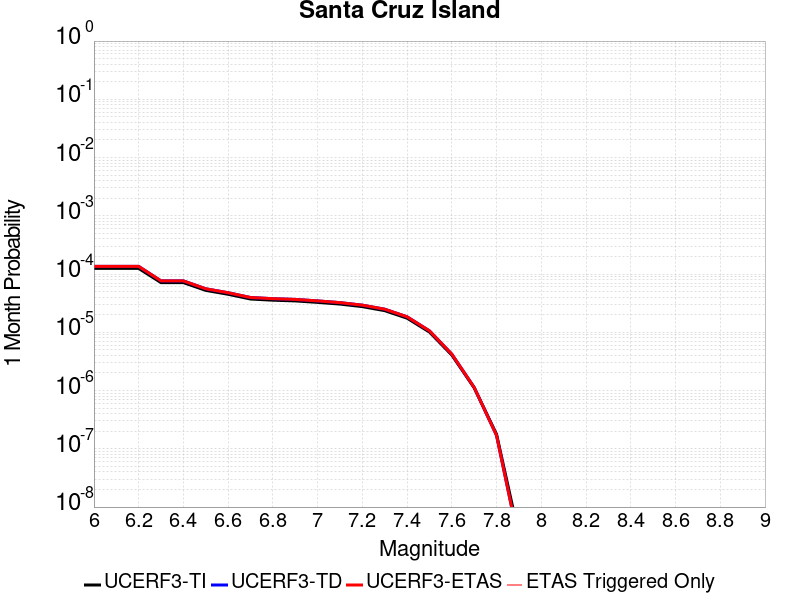 | 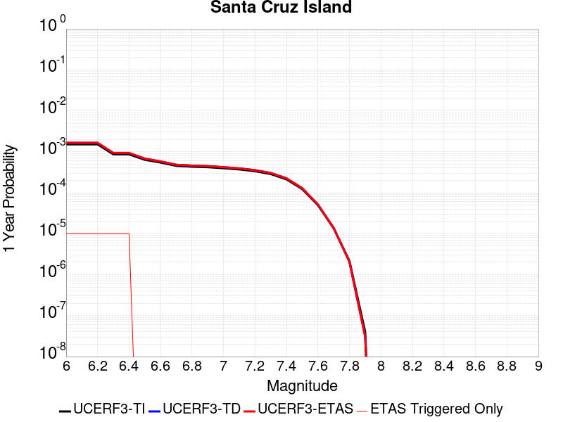 | 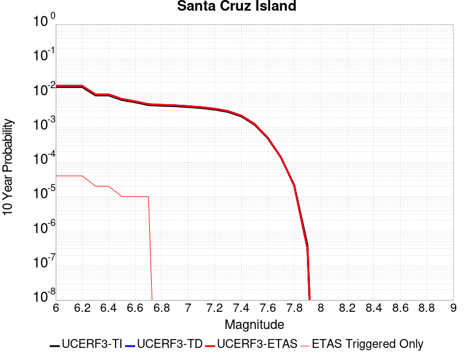 |

| Magnitude | 1 wk TI Prob | 1 wk TD Prob | 1 wk ETAS Prob | 1 wk ETAS/TD Gain | 1 wk ETAS Triggered Only | 1 mo TI Prob | 1 mo TD Prob | 1 mo ETAS Prob | 1 mo ETAS/TD Gain | 1 mo ETAS Triggered Only | 1 yr TI Prob | 1 yr TD Prob | 1 yr ETAS Prob | 1 yr ETAS/TD Gain | 1 yr ETAS Triggered Only | 10 yr TI Prob | 10 yr TD Prob | 10 yr ETAS Prob | 10 yr ETAS/TD Gain | 10 yr ETAS Triggered Only |
|-----|-----|-----|-----|-----|-----|-----|-----|-----|-----|-----|-----|-----|-----|-----|-----|-----|-----|-----|-----|-----|
| 6.0 | 2.9164563E-5 | 3.1600095E-5 | 3.1600095E-5 | 1.0 | 0.0 | 1.2498499E-4 | 1.3542273E-4 | 1.3542273E-4 | 1.0 | 0.0 | 0.0015206301 | 0.0016476609 | 0.0016576444 | 1.0060592 | 1.0E-5 | 0.015102667 | 0.01636818 | 0.016407525 | 1.0024037 | 4.0E-5 |
| 6.1 | 2.9164563E-5 | 3.1600095E-5 | 3.1600095E-5 | 1.0 | 0.0 | 1.2498499E-4 | 1.3542273E-4 | 1.3542273E-4 | 1.0 | 0.0 | 0.0015206301 | 0.0016476609 | 0.0016576444 | 1.0060592 | 1.0E-5 | 0.015102667 | 0.01636818 | 0.016407525 | 1.0024037 | 4.0E-5 |
| 6.2 | 2.9164563E-5 | 3.1600095E-5 | 3.1600095E-5 | 1.0 | 0.0 | 1.2498499E-4 | 1.3542273E-4 | 1.3542273E-4 | 1.0 | 0.0 | 0.0015206301 | 0.0016476609 | 0.0016576444 | 1.0060592 | 1.0E-5 | 0.015102667 | 0.01636818 | 0.016407525 | 1.0024037 | 4.0E-5 |
| 6.3 | 1.6635553E-5 | 1.7804527E-5 | 1.7804527E-5 | 1.0 | 0.0 | 7.1293274E-5 | 7.630298E-5 | 7.630298E-5 | 1.0 | 0.0 | 8.6765E-4 | 9.286111E-4 | 9.3860185E-4 | 1.0107588 | 1.0E-5 | 0.008642701 | 0.009249181 | 0.009268995 | 1.0021423 | 2.0E-5 |
| 6.4 | 1.6635553E-5 | 1.7804527E-5 | 1.7804527E-5 | 1.0 | 0.0 | 7.1293274E-5 | 7.630298E-5 | 7.630298E-5 | 1.0 | 0.0 | 8.6765E-4 | 9.286111E-4 | 9.3860185E-4 | 1.0107588 | 1.0E-5 | 0.008642701 | 0.009249181 | 0.009268995 | 1.0021423 | 2.0E-5 |
| 6.5 | 1.2238748E-5 | 1.3043111E-5 | 1.3043111E-5 | 1.0 | 0.0 | 5.2450723E-5 | 5.5897868E-5 | 5.5897868E-5 | 1.0 | 0.0 | 6.3840044E-4 | 6.8034773E-4 | 6.8034773E-4 | 1.0 | 0.0 | 0.0063656955 | 0.006783047 | 0.00679298 | 1.0014642 | 1.0E-5 |
| 6.6 | 1.0489767E-5 | 1.11567315E-5 | 1.11567315E-5 | 1.0 | 0.0 | 4.495537E-5 | 4.7813697E-5 | 4.7813697E-5 | 1.0 | 0.0 | 5.4719415E-4 | 5.8197853E-4 | 5.8197853E-4 | 1.0 | 0.0 | 0.005458487 | 0.005804785 | 0.0058147274 | 1.0017127 | 1.0E-5 |
| 6.7 | 8.699222E-6 | 9.236859E-6 | 9.236859E-6 | 1.0 | 0.0 | 3.7281847E-5 | 3.958594E-5 | 3.958594E-5 | 1.0 | 0.0 | 4.5381195E-4 | 4.818528E-4 | 4.818528E-4 | 1.0 | 0.0 | 0.0045288634 | 0.004808148 | 0.0048180996 | 1.0020698 | 1.0E-5 |
| 6.8 | 8.307732E-6 | 8.816977E-6 | 8.816977E-6 | 1.0 | 0.0 | 3.560408E-5 | 3.77865E-5 | 3.77865E-5 | 1.0 | 0.0 | 4.3339343E-4 | 4.5995394E-4 | 4.5995394E-4 | 1.0 | 0.0 | 0.004325492 | 0.004590073 | 0.004590073 | 1.0 | 0.0 |
| 6.9 | 8.073121E-6 | 8.565009E-6 | 8.565009E-6 | 1.0 | 0.0 | 3.459863E-5 | 3.6706668E-5 | 3.6706668E-5 | 1.0 | 0.0 | 4.2115687E-4 | 4.4681245E-4 | 4.4681245E-4 | 1.0 | 0.0 | 0.004203596 | 0.0044591925 | 0.0044591925 | 1.0 | 0.0 |
| 7.0 | 7.617019E-6 | 8.0747295E-6 | 8.0747295E-6 | 1.0 | 0.0 | 3.264396E-5 | 3.4605528E-5 | 3.4605528E-5 | 1.0 | 0.0 | 3.9736772E-4 | 4.2124125E-4 | 4.2124125E-4 | 1.0 | 0.0 | 0.003966579 | 0.0042044753 | 0.0042044753 | 1.0 | 0.0 |
| 7.1 | 7.1224836E-6 | 7.5458483E-6 | 7.5458483E-6 | 1.0 | 0.0 | 3.052457E-5 | 3.233895E-5 | 3.233895E-5 | 1.0 | 0.0 | 3.715733E-4 | 3.9365597E-4 | 3.9365597E-4 | 1.0 | 0.0 | 0.003709526 | 0.0039296295 | 0.0039296295 | 1.0 | 0.0 |
| 7.2 | 6.441115E-6 | 6.8274385E-6 | 6.8274385E-6 | 1.0 | 0.0 | 2.7604487E-5 | 2.9260125E-5 | 2.9260125E-5 | 1.0 | 0.0 | 3.360328E-4 | 3.5618403E-4 | 3.5618403E-4 | 1.0 | 0.0 | 0.0033552512 | 0.0035561598 | 0.0035561598 | 1.0 | 0.0 |
| 7.3 | 5.494274E-6 | 5.820041E-6 | 5.820041E-6 | 1.0 | 0.0 | 2.3546674E-5 | 2.4942796E-5 | 2.4942796E-5 | 1.0 | 0.0 | 2.8664304E-4 | 3.0363642E-4 | 3.0363642E-4 | 1.0 | 0.0 | 0.002862736 | 0.0030322387 | 0.0030322387 | 1.0 | 0.0 |
| 7.4 | 4.0802624E-6 | 4.3122895E-6 | 4.3122895E-6 | 1.0 | 0.0 | 1.7486722E-5 | 1.848111E-5 | 1.848111E-5 | 1.0 | 0.0 | 2.1288003E-4 | 2.2498437E-4 | 2.2498437E-4 | 1.0 | 0.0 | 0.0021267622 | 0.002247575 | 0.002247575 | 1.0 | 0.0 |
| 7.5 | 2.3584746E-6 | 2.4753267E-6 | 2.4753267E-6 | 1.0 | 0.0 | 1.0107709E-5 | 1.06085E-5 | 1.06085E-5 | 1.0 | 0.0 | 1.2305441E-4 | 1.2915088E-4 | 1.2915088E-4 | 1.0 | 0.0 | 0.0012298629 | 0.0012907633 | 0.0012907633 | 1.0 | 0.0 |
| 7.6 | 9.4981914E-7 | 9.860988E-7 | 9.860988E-7 | 1.0 | 0.0 | 4.0706473E-6 | 4.226131E-6 | 4.226131E-6 | 1.0 | 0.0 | 4.9559E-5 | 5.145194E-5 | 5.145194E-5 | 1.0 | 0.0 | 4.954795E-4 | 5.144016E-4 | 5.144016E-4 | 1.0 | 0.0 |
| 7.7 | 2.6013532E-7 | 2.641672E-7 | 2.641672E-7 | 1.0 | 0.0 | 1.1148652E-6 | 1.1321447E-6 | 1.1321447E-6 | 1.0 | 0.0 | 1.3573399E-5 | 1.3783775E-5 | 1.3783775E-5 | 1.0 | 0.0 | 1.357257E-4 | 1.3782927E-4 | 1.3782927E-4 | 1.0 | 0.0 |
| 7.8 | 4.1522263E-8 | 3.9656918E-8 | 3.9656918E-8 | 1.0 | 0.0 | 1.7795254E-7 | 1.6995821E-7 | 1.6995821E-7 | 1.0 | 0.0 | 2.16657E-6 | 2.0692394E-6 | 2.0692394E-6 | 1.0 | 0.0 | 2.1665488E-5 | 2.0692223E-5 | 2.0692223E-5 | 1.0 | 0.0 |
| 7.9 | 7.7242046E-10 | 5.946851E-10 | 5.946851E-10 | 1.0 | 0.0 | 3.3103735E-9 | 2.54865E-9 | 2.54865E-9 | 1.0 | 0.0 | 4.0303796E-8 | 3.1029813E-8 | 3.1029813E-8 | 1.0 | 0.0 | 4.030379E-7 | 3.102981E-7 | 3.102981E-7 | 1.0 | 0.0 |

## Lost Hills
*[(top)](#table-of-contents)*

| 1 Week | 1 Month | 1 Year | 10 Year |
|-----|-----|-----|-----|
| 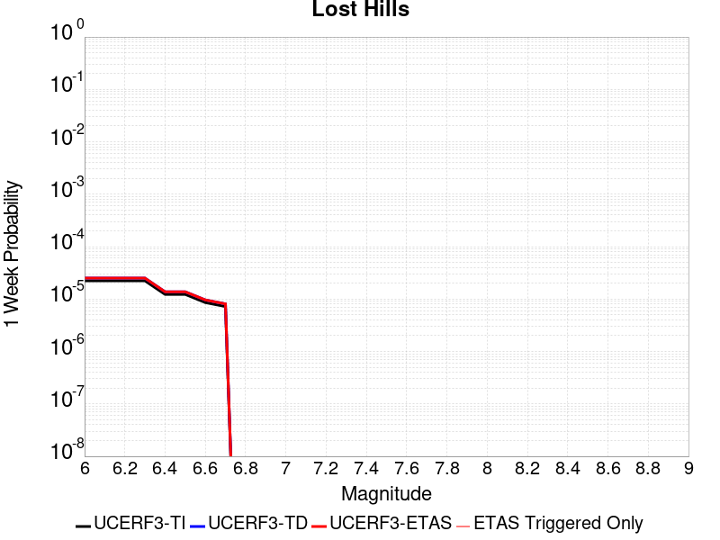 | 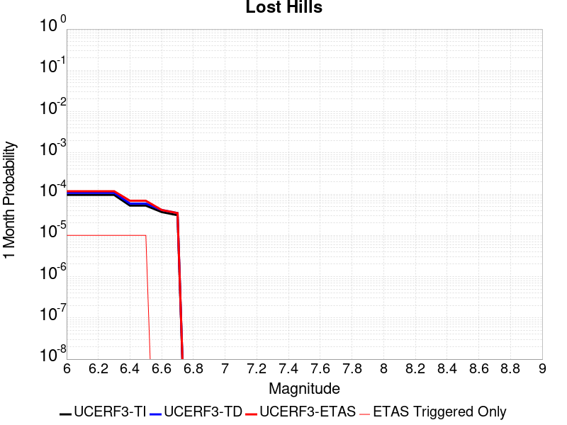 | 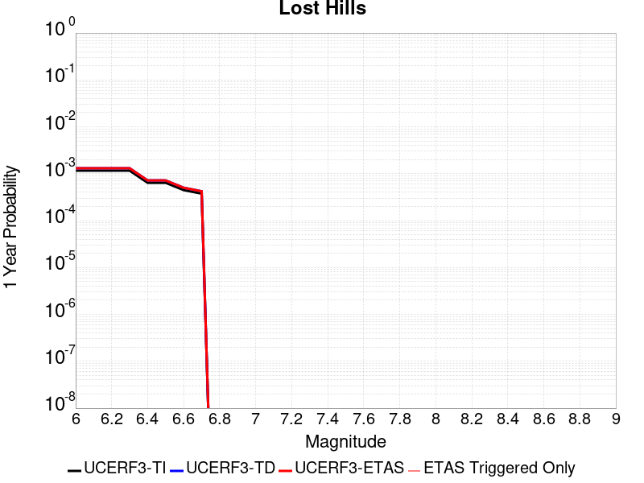 | 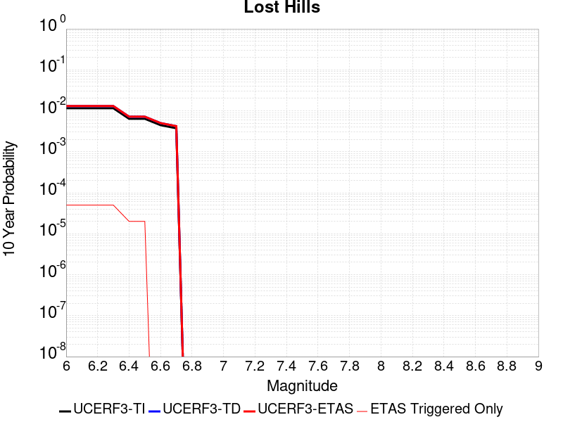 |

| Magnitude | 1 wk TI Prob | 1 wk TD Prob | 1 wk ETAS Prob | 1 wk ETAS/TD Gain | 1 wk ETAS Triggered Only | 1 mo TI Prob | 1 mo TD Prob | 1 mo ETAS Prob | 1 mo ETAS/TD Gain | 1 mo ETAS Triggered Only | 1 yr TI Prob | 1 yr TD Prob | 1 yr ETAS Prob | 1 yr ETAS/TD Gain | 1 yr ETAS Triggered Only | 10 yr TI Prob | 10 yr TD Prob | 10 yr ETAS Prob | 10 yr ETAS/TD Gain | 10 yr ETAS Triggered Only |
|-----|-----|-----|-----|-----|-----|-----|-----|-----|-----|-----|-----|-----|-----|-----|-----|-----|-----|-----|-----|-----|
| 6.0 | 2.233523E-5 | 2.5106996E-5 | 2.5106996E-5 | 1.0 | 0.0 | 9.571891E-5 | 1.0759792E-4 | 1.1759684E-4 | 1.0929286 | 1.0E-5 | 0.0011647546 | 0.0013093855 | 0.0013193724 | 1.0076271 | 1.0E-5 | 0.011586686 | 0.013033304 | 0.013082652 | 1.0037863 | 5.0E-5 |
| 6.1 | 2.233523E-5 | 2.5106996E-5 | 2.5106996E-5 | 1.0 | 0.0 | 9.571891E-5 | 1.0759792E-4 | 1.1759684E-4 | 1.0929286 | 1.0E-5 | 0.0011647546 | 0.0013093855 | 0.0013193724 | 1.0076271 | 1.0E-5 | 0.011586686 | 0.013033304 | 0.013082652 | 1.0037863 | 5.0E-5 |
| 6.2 | 2.233523E-5 | 2.5106996E-5 | 2.5106996E-5 | 1.0 | 0.0 | 9.571891E-5 | 1.0759792E-4 | 1.1759684E-4 | 1.0929286 | 1.0E-5 | 0.0011647546 | 0.0013093855 | 0.0013193724 | 1.0076271 | 1.0E-5 | 0.011586686 | 0.013033304 | 0.013082652 | 1.0037863 | 5.0E-5 |
| 6.3 | 2.233523E-5 | 2.5106996E-5 | 2.5106996E-5 | 1.0 | 0.0 | 9.571891E-5 | 1.0759792E-4 | 1.1759684E-4 | 1.0929286 | 1.0E-5 | 0.0011647546 | 0.0013093855 | 0.0013193724 | 1.0076271 | 1.0E-5 | 0.011586686 | 0.013033304 | 0.013082652 | 1.0037863 | 5.0E-5 |
| 6.4 | 1.2288092E-5 | 1.37813295E-5 | 1.37813295E-5 | 1.0 | 0.0 | 5.2662188E-5 | 5.9062033E-5 | 6.906144E-5 | 1.1693035 | 1.0E-5 | 6.409735E-4 | 7.189368E-4 | 7.289296E-4 | 1.0138994 | 1.0E-5 | 0.006391279 | 0.007175316 | 0.0071951724 | 1.0027673 | 2.0E-5 |
| 6.5 | 1.2288092E-5 | 1.37813295E-5 | 1.37813295E-5 | 1.0 | 0.0 | 5.2662188E-5 | 5.9062033E-5 | 6.906144E-5 | 1.1693035 | 1.0E-5 | 6.409735E-4 | 7.189368E-4 | 7.289296E-4 | 1.0138994 | 1.0E-5 | 0.006391279 | 0.007175316 | 0.0071951724 | 1.0027673 | 2.0E-5 |
| 6.6 | 8.58281E-6 | 9.633926E-6 | 9.633926E-6 | 1.0 | 0.0 | 3.6782953E-5 | 4.1288073E-5 | 4.1288073E-5 | 1.0 | 0.0 | 4.4774043E-4 | 5.026495E-4 | 5.026495E-4 | 1.0 | 0.0 | 0.0044683935 | 0.0050232867 | 0.0050232867 | 1.0 | 0.0 |
| 6.7 | 7.205685E-6 | 8.088433E-6 | 8.088433E-6 | 1.0 | 0.0 | 3.088114E-5 | 3.4664714E-5 | 3.4664714E-5 | 1.0 | 0.0 | 3.7591302E-4 | 4.2204288E-4 | 4.2204288E-4 | 1.0 | 0.0 | 0.0037527776 | 0.004220429 | 0.004220429 | 1.0 | 0.0 |

## Kern Canyon (South Kern) 2011
*[(top)](#table-of-contents)*

| 1 Week | 1 Month | 1 Year | 10 Year |
|-----|-----|-----|-----|
| 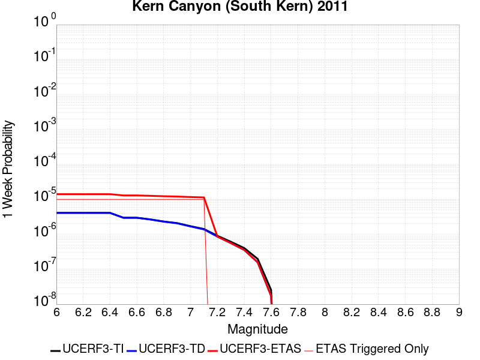 | 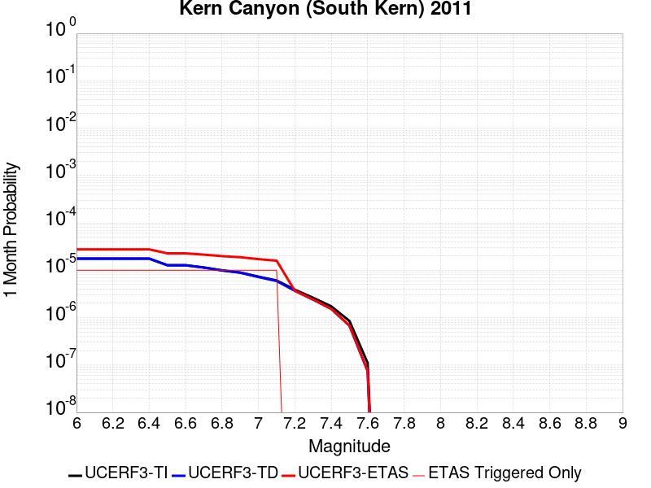 | 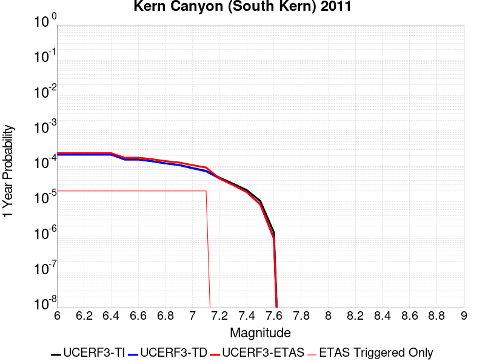 | 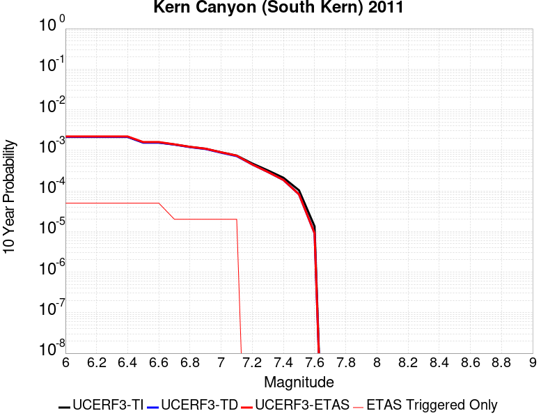 |

| Magnitude | 1 wk TI Prob | 1 wk TD Prob | 1 wk ETAS Prob | 1 wk ETAS/TD Gain | 1 wk ETAS Triggered Only | 1 mo TI Prob | 1 mo TD Prob | 1 mo ETAS Prob | 1 mo ETAS/TD Gain | 1 mo ETAS Triggered Only | 1 yr TI Prob | 1 yr TD Prob | 1 yr ETAS Prob | 1 yr ETAS/TD Gain | 1 yr ETAS Triggered Only | 10 yr TI Prob | 10 yr TD Prob | 10 yr ETAS Prob | 10 yr ETAS/TD Gain | 10 yr ETAS Triggered Only |
|-----|-----|-----|-----|-----|-----|-----|-----|-----|-----|-----|-----|-----|-----|-----|-----|-----|-----|-----|-----|-----|
| 6.0 | 4.105075E-6 | 4.113737E-6 | 1.4113695E-5 | 3.4308698 | 1.0E-5 | 1.7593058E-5 | 1.7630186E-5 | 2.7630009E-5 | 1.567199 | 1.0E-5 | 2.1417443E-4 | 2.14627E-4 | 2.346227E-4 | 1.0931649 | 2.0E-5 | 0.0021396813 | 0.002144261 | 0.0021941538 | 1.0232681 | 5.0E-5 |
| 6.1 | 4.105075E-6 | 4.113737E-6 | 1.4113695E-5 | 3.4308698 | 1.0E-5 | 1.7593058E-5 | 1.7630186E-5 | 2.7630009E-5 | 1.567199 | 1.0E-5 | 2.1417443E-4 | 2.14627E-4 | 2.346227E-4 | 1.0931649 | 2.0E-5 | 0.0021396813 | 0.002144261 | 0.0021941538 | 1.0232681 | 5.0E-5 |
| 6.2 | 4.105075E-6 | 4.113737E-6 | 1.4113695E-5 | 3.4308698 | 1.0E-5 | 1.7593058E-5 | 1.7630186E-5 | 2.7630009E-5 | 1.567199 | 1.0E-5 | 2.1417443E-4 | 2.14627E-4 | 2.346227E-4 | 1.0931649 | 2.0E-5 | 0.0021396813 | 0.002144261 | 0.0021941538 | 1.0232681 | 5.0E-5 |
| 6.3 | 4.105075E-6 | 4.113737E-6 | 1.4113695E-5 | 3.4308698 | 1.0E-5 | 1.7593058E-5 | 1.7630186E-5 | 2.7630009E-5 | 1.567199 | 1.0E-5 | 2.1417443E-4 | 2.14627E-4 | 2.346227E-4 | 1.0931649 | 2.0E-5 | 0.0021396813 | 0.002144261 | 0.0021941538 | 1.0232681 | 5.0E-5 |
| 6.4 | 4.105075E-6 | 4.113737E-6 | 1.4113695E-5 | 3.4308698 | 1.0E-5 | 1.7593058E-5 | 1.7630186E-5 | 2.7630009E-5 | 1.567199 | 1.0E-5 | 2.1417443E-4 | 2.14627E-4 | 2.346227E-4 | 1.0931649 | 2.0E-5 | 0.0021396813 | 0.002144261 | 0.0021941538 | 1.0232681 | 5.0E-5 |
| 6.5 | 2.9849807E-6 | 2.9731623E-6 | 1.29731325E-5 | 4.3634124 | 1.0E-5 | 1.2792712E-5 | 1.2742063E-5 | 2.2741935E-5 | 1.7847923 | 1.0E-5 | 1.5574014E-4 | 1.5512372E-4 | 1.7512061E-4 | 1.1289093 | 2.0E-5 | 0.0015563103 | 0.0015501695 | 0.001600092 | 1.0322045 | 5.0E-5 |
| 6.6 | 2.9849807E-6 | 2.9731623E-6 | 1.29731325E-5 | 4.3634124 | 1.0E-5 | 1.2792712E-5 | 1.2742063E-5 | 2.2741935E-5 | 1.7847923 | 1.0E-5 | 1.5574014E-4 | 1.5512372E-4 | 1.7512061E-4 | 1.1289093 | 2.0E-5 | 0.0015563103 | 0.0015501695 | 0.001600092 | 1.0322045 | 5.0E-5 |
| 6.7 | 2.6756725E-6 | 2.6582275E-6 | 1.2658201E-5 | 4.761895 | 1.0E-5 | 1.1467117E-5 | 1.1392354E-5 | 2.1392241E-5 | 1.8777717 | 1.0E-5 | 1.396032E-4 | 1.386932E-4 | 1.5869043E-4 | 1.1441832 | 2.0E-5 | 0.0013951553 | 0.0013860773 | 0.0014060496 | 1.0144092 | 2.0E-5 |
| 6.8 | 2.3283721E-6 | 2.3047846E-6 | 1.2304762E-5 | 5.33879 | 1.0E-5 | 9.9787E-6 | 9.877612E-6 | 1.9877512E-5 | 2.0123804 | 1.0E-5 | 1.214839E-4 | 1.2025336E-4 | 1.4025095E-4 | 1.1662955 | 2.0E-5 | 0.001214175 | 0.0012018904 | 0.0012218663 | 1.0166204 | 2.0E-5 |
| 6.9 | 2.0972677E-6 | 2.0696464E-6 | 1.2069626E-5 | 5.831733 | 1.0E-5 | 8.988259E-6 | 8.8698835E-6 | 1.8869794E-5 | 2.1274004 | 1.0E-5 | 1.0942656E-4 | 1.0798554E-4 | 1.2798338E-4 | 1.18519 | 2.0E-5 | 0.0010937268 | 0.0010793365 | 0.0010993149 | 1.0185099 | 2.0E-5 |
| 7.0 | 1.7132242E-6 | 1.678708E-6 | 1.1678691E-5 | 6.956952 | 1.0E-5 | 7.3423685E-6 | 7.1944432E-6 | 1.7194372E-5 | 2.3899517 | 1.0E-5 | 8.938967E-5 | 8.7588865E-5 | 1.0758711E-4 | 1.2283195 | 2.0E-5 | 8.935372E-4 | 8.7554724E-4 | 8.9552975E-4 | 1.0228229 | 2.0E-5 |
| 7.1 | 1.4215541E-6 | 1.381579E-6 | 1.1381565E-5 | 8.238086 | 1.0E-5 | 6.0923603E-6 | 5.9210392E-6 | 1.592098E-5 | 2.6888828 | 1.0E-5 | 7.417196E-5 | 7.2086295E-5 | 9.2084854E-5 | 1.2774253 | 2.0E-5 | 7.414721E-4 | 7.206318E-4 | 7.406174E-4 | 1.0277334 | 2.0E-5 |
| 7.2 | 9.097853E-7 | 8.6038E-7 | 8.6038E-7 | 1.0 | 0.0 | 3.899074E-6 | 3.6873375E-6 | 3.6873375E-6 | 1.0 | 0.0 | 4.7470192E-5 | 4.4892422E-5 | 4.4892422E-5 | 1.0 | 0.0 | 4.7460053E-4 | 4.4883462E-4 | 4.4883462E-4 | 1.0 | 0.0 |
| 7.3 | 6.144169E-7 | 5.628223E-7 | 5.628223E-7 | 1.0 | 0.0 | 2.6332125E-6 | 2.4120934E-6 | 2.4120934E-6 | 1.0 | 0.0 | 3.205889E-5 | 2.9366847E-5 | 2.9366847E-5 | 1.0 | 0.0 | 3.2054266E-4 | 2.9363018E-4 | 2.9363018E-4 | 1.0 | 0.0 |
| 7.4 | 4.049844E-7 | 3.5728428E-7 | 3.5728428E-7 | 1.0 | 0.0 | 1.7356463E-6 | 1.5312174E-6 | 1.5312174E-6 | 1.0 | 0.0 | 2.1131287E-5 | 1.8642415E-5 | 1.8642415E-5 | 1.0 | 0.0 | 2.1129279E-4 | 1.8640877E-4 | 1.8640877E-4 | 1.0 | 0.0 |
| 7.5 | 1.9871162E-7 | 1.58305E-7 | 1.58305E-7 | 1.0 | 0.0 | 8.5162094E-7 | 6.7844985E-7 | 6.7844985E-7 | 1.0 | 0.0 | 1.0368436E-5 | 8.260096E-6 | 8.260096E-6 | 1.0 | 0.0 | 1.0367952E-4 | 8.259798E-5 | 8.259798E-5 | 1.0 | 0.0 |
| 7.6 | 2.572245E-8 | 1.7352637E-8 | 1.7352637E-8 | 1.0 | 0.0 | 1.10239064E-7 | 7.4368444E-8 | 7.4368444E-8 | 1.0 | 0.0 | 1.3421597E-6 | 9.0543546E-7 | 9.0543546E-7 | 1.0 | 0.0 | 1.3421517E-5 | 9.0543235E-6 | 9.0543235E-6 | 1.0 | 0.0 |

## San Cayetano
*[(top)](#table-of-contents)*

| 1 Week | 1 Month | 1 Year | 10 Year |
|-----|-----|-----|-----|
| 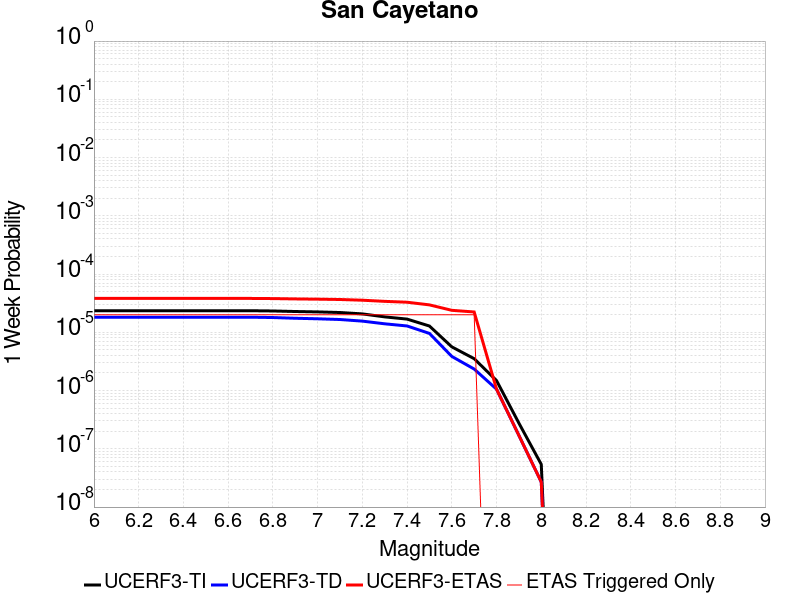 | 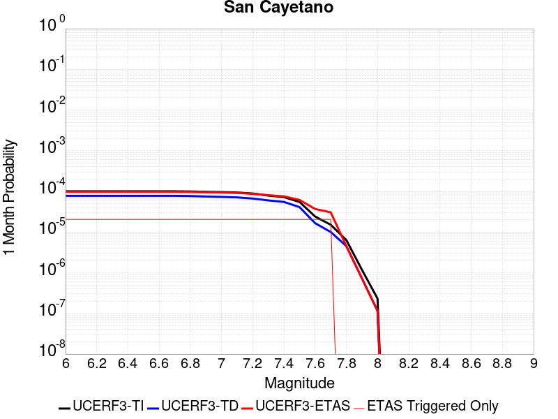 | 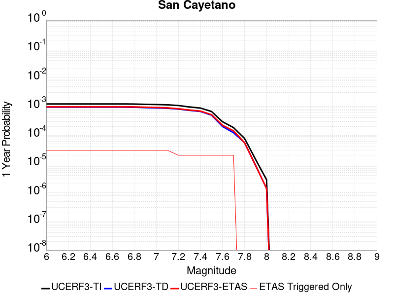 | 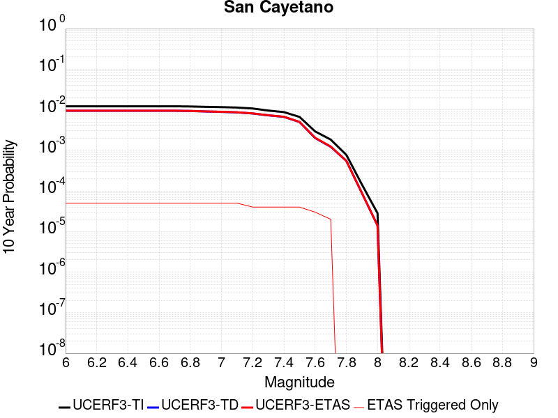 |

| Magnitude | 1 wk TI Prob | 1 wk TD Prob | 1 wk ETAS Prob | 1 wk ETAS/TD Gain | 1 wk ETAS Triggered Only | 1 mo TI Prob | 1 mo TD Prob | 1 mo ETAS Prob | 1 mo ETAS/TD Gain | 1 mo ETAS Triggered Only | 1 yr TI Prob | 1 yr TD Prob | 1 yr ETAS Prob | 1 yr ETAS/TD Gain | 1 yr ETAS Triggered Only | 10 yr TI Prob | 10 yr TD Prob | 10 yr ETAS Prob | 10 yr ETAS/TD Gain | 10 yr ETAS Triggered Only |
|-----|-----|-----|-----|-----|-----|-----|-----|-----|-----|-----|-----|-----|-----|-----|-----|-----|-----|-----|-----|-----|
| 6.0 | 2.3476267E-5 | 1.816963E-5 | 3.8169266E-5 | 2.1007178 | 2.0E-5 | 1.0060869E-4 | 7.786754E-5 | 9.786598E-5 | 1.2568264 | 2.0E-5 | 0.0012242225 | 9.4762864E-4 | 9.776002E-4 | 1.031628 | 3.0E-5 | 0.012175002 | 0.009436766 | 0.009486294 | 1.0052484 | 5.0E-5 |
| 6.1 | 2.3476267E-5 | 1.816963E-5 | 3.8169266E-5 | 2.1007178 | 2.0E-5 | 1.0060869E-4 | 7.786754E-5 | 9.786598E-5 | 1.2568264 | 2.0E-5 | 0.0012242225 | 9.4762864E-4 | 9.776002E-4 | 1.031628 | 3.0E-5 | 0.012175002 | 0.009436766 | 0.009486294 | 1.0052484 | 5.0E-5 |
| 6.2 | 2.3476267E-5 | 1.816963E-5 | 3.8169266E-5 | 2.1007178 | 2.0E-5 | 1.0060869E-4 | 7.786754E-5 | 9.786598E-5 | 1.2568264 | 2.0E-5 | 0.0012242225 | 9.4762864E-4 | 9.776002E-4 | 1.031628 | 3.0E-5 | 0.012175002 | 0.009436766 | 0.009486294 | 1.0052484 | 5.0E-5 |
| 6.3 | 2.3476267E-5 | 1.816963E-5 | 3.8169266E-5 | 2.1007178 | 2.0E-5 | 1.0060869E-4 | 7.786754E-5 | 9.786598E-5 | 1.2568264 | 2.0E-5 | 0.0012242225 | 9.4762864E-4 | 9.776002E-4 | 1.031628 | 3.0E-5 | 0.012175002 | 0.009436766 | 0.009486294 | 1.0052484 | 5.0E-5 |
| 6.4 | 2.3476267E-5 | 1.816963E-5 | 3.8169266E-5 | 2.1007178 | 2.0E-5 | 1.0060869E-4 | 7.786754E-5 | 9.786598E-5 | 1.2568264 | 2.0E-5 | 0.0012242225 | 9.4762864E-4 | 9.776002E-4 | 1.031628 | 3.0E-5 | 0.012175002 | 0.009436766 | 0.009486294 | 1.0052484 | 5.0E-5 |
| 6.5 | 2.3476267E-5 | 1.816963E-5 | 3.8169266E-5 | 2.1007178 | 2.0E-5 | 1.0060869E-4 | 7.786754E-5 | 9.786598E-5 | 1.2568264 | 2.0E-5 | 0.0012242225 | 9.4762864E-4 | 9.776002E-4 | 1.031628 | 3.0E-5 | 0.012175002 | 0.009436766 | 0.009486294 | 1.0052484 | 5.0E-5 |
| 6.6 | 2.3476267E-5 | 1.816963E-5 | 3.8169266E-5 | 2.1007178 | 2.0E-5 | 1.0060869E-4 | 7.786754E-5 | 9.786598E-5 | 1.2568264 | 2.0E-5 | 0.0012242225 | 9.4762864E-4 | 9.776002E-4 | 1.031628 | 3.0E-5 | 0.012175002 | 0.009436766 | 0.009486294 | 1.0052484 | 5.0E-5 |
| 6.7 | 2.3476267E-5 | 1.816963E-5 | 3.8169266E-5 | 2.1007178 | 2.0E-5 | 1.0060869E-4 | 7.786754E-5 | 9.786598E-5 | 1.2568264 | 2.0E-5 | 0.0012242225 | 9.4762864E-4 | 9.776002E-4 | 1.031628 | 3.0E-5 | 0.012175002 | 0.009436766 | 0.009486294 | 1.0052484 | 5.0E-5 |
| 6.8 | 2.3241924E-5 | 1.7937333E-5 | 3.7936974E-5 | 2.114973 | 2.0E-5 | 9.960445E-5 | 7.6872035E-5 | 9.68705E-5 | 1.2601526 | 2.0E-5 | 0.0012120095 | 9.3551876E-4 | 9.654907E-4 | 1.0320377 | 3.0E-5 | 0.012054204 | 0.00931666 | 0.009366195 | 1.0053167 | 5.0E-5 |
| 6.9 | 2.2761007E-5 | 1.7432758E-5 | 3.7432408E-5 | 2.1472454 | 2.0E-5 | 9.7543525E-5 | 7.47097E-5 | 9.470821E-5 | 1.2676829 | 2.0E-5 | 0.0011869454 | 9.092145E-4 | 9.391872E-4 | 1.0329655 | 3.0E-5 | 0.011806256 | 0.009055776 | 0.009105323 | 1.0054713 | 5.0E-5 |
| 7.0 | 2.240283E-5 | 1.7066497E-5 | 3.7066155E-5 | 2.1718667 | 2.0E-5 | 9.600859E-5 | 7.3140094E-5 | 9.313863E-5 | 1.2734278 | 2.0E-5 | 0.0011682777 | 8.901203E-4 | 9.2009356E-4 | 1.0336733 | 3.0E-5 | 0.011621549 | 0.008866365 | 0.008915922 | 1.0055892 | 5.0E-5 |
| 7.1 | 2.1871154E-5 | 1.6586335E-5 | 3.6586003E-5 | 2.205792 | 2.0E-5 | 9.373015E-5 | 7.108237E-5 | 9.1080954E-5 | 1.2813437 | 2.0E-5 | 0.0011405671 | 8.650876E-4 | 8.950617E-4 | 1.0346485 | 3.0E-5 | 0.011347309 | 0.008618002 | 0.0086675715 | 1.0057518 | 5.0E-5 |
| 7.2 | 2.0714133E-5 | 1.5564854E-5 | 3.5564542E-5 | 2.2849262 | 2.0E-5 | 8.8771834E-5 | 6.670483E-5 | 8.67035E-5 | 1.2998084 | 2.0E-5 | 0.0010802611 | 8.1183197E-4 | 8.318157E-4 | 1.0246156 | 2.0E-5 | 0.010750249 | 0.008089437 | 0.008129113 | 1.0049047 | 4.0E-5 |
| 7.3 | 1.8408395E-5 | 1.3997111E-5 | 3.3996832E-5 | 2.4288464 | 2.0E-5 | 7.8890735E-5 | 5.9986254E-5 | 7.998505E-5 | 1.3333898 | 2.0E-5 | 9.600714E-4 | 7.3009095E-4 | 7.500763E-4 | 1.0273738 | 2.0E-5 | 0.009559342 | 0.007277643 | 0.0073173516 | 1.0054563 | 4.0E-5 |
| 7.4 | 1.6856795E-5 | 1.28503E-5 | 3.2850043E-5 | 2.556364 | 2.0E-5 | 7.2241404E-5 | 5.5071567E-5 | 7.5070464E-5 | 1.3631438 | 2.0E-5 | 8.7918417E-4 | 6.702929E-4 | 6.9027947E-4 | 1.0298177 | 2.0E-5 | 0.00875714 | 0.0066833915 | 0.006723124 | 1.005945 | 4.0E-5 |
| 7.5 | 1.2822778E-5 | 9.577698E-6 | 2.9577506E-5 | 3.0881646 | 2.0E-5 | 5.495361E-5 | 4.104664E-5 | 6.1045816E-5 | 1.4872307 | 2.0E-5 | 6.688548E-4 | 4.996298E-4 | 5.1961985E-4 | 1.0400096 | 2.0E-5 | 0.006668452 | 0.0049852366 | 0.005025037 | 1.0079837 | 4.0E-5 |
| 7.6 | 5.6272684E-6 | 3.8549683E-6 | 2.3854891E-5 | 6.1880903 | 2.0E-5 | 2.4116642E-5 | 1.6521188E-5 | 3.6520858E-5 | 2.2105467 | 2.0E-5 | 2.9358055E-4 | 2.01127E-4 | 2.2112299E-4 | 1.0994197 | 2.0E-5 | 0.0029319301 | 0.0020094607 | 0.0020394004 | 1.0148994 | 3.0E-5 |
| 7.7 | 3.5261346E-6 | 2.340742E-6 | 2.2340695E-5 | 9.544279 | 2.0E-5 | 1.5111918E-5 | 1.0031713E-5 | 3.0031513E-5 | 2.9936574 | 2.0E-5 | 1.8397206E-4 | 1.2212934E-4 | 1.421269E-4 | 1.1637409 | 2.0E-5 | 0.0018381984 | 0.0012206296 | 0.0012406051 | 1.0163649 | 2.0E-5 |
| 7.8 | 1.4826929E-6 | 1.0564453E-6 | 1.0564453E-6 | 1.0 | 0.0 | 6.354383E-6 | 4.5276147E-6 | 4.5276147E-6 | 1.0 | 0.0 | 7.736187E-5 | 5.512234E-5 | 5.512234E-5 | 1.0 | 0.0 | 7.733494E-4 | 5.5108865E-4 | 5.5108865E-4 | 1.0 | 0.0 |
| 7.9 | 2.7568166E-7 | 1.6978672E-7 | 1.6978672E-7 | 1.0 | 0.0 | 1.1814923E-6 | 7.2765715E-7 | 7.2765715E-7 | 1.0 | 0.0 | 1.4384574E-5 | 8.85919E-6 | 8.85919E-6 | 1.0 | 0.0 | 1.4383643E-4 | 8.85884E-5 | 8.85884E-5 | 1.0 | 0.0 |
| 8.0 | 5.407832E-8 | 2.6889136E-8 | 2.6889136E-8 | 1.0 | 0.0 | 2.3176422E-7 | 1.15239146E-7 | 1.15239146E-7 | 1.0 | 0.0 | 2.8217257E-6 | 1.4030358E-6 | 1.4030358E-6 | 1.0 | 0.0 | 2.8216898E-5 | 1.4030274E-5 | 1.4030274E-5 | 1.0 | 0.0 |

## White Wolf
*[(top)](#table-of-contents)*

| 1 Week | 1 Month | 1 Year | 10 Year |
|-----|-----|-----|-----|
|  | 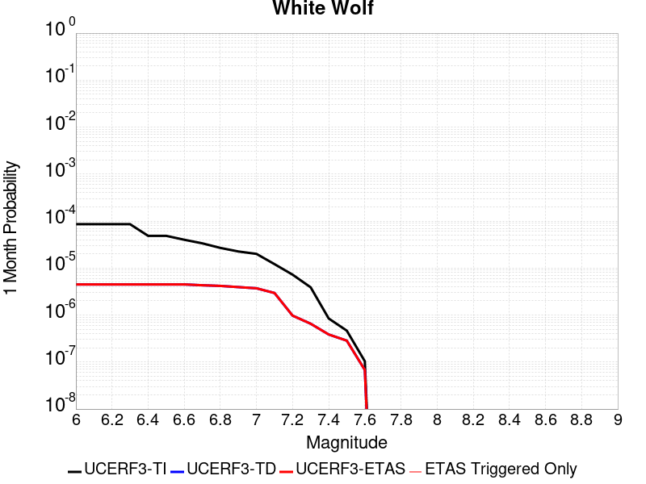 | 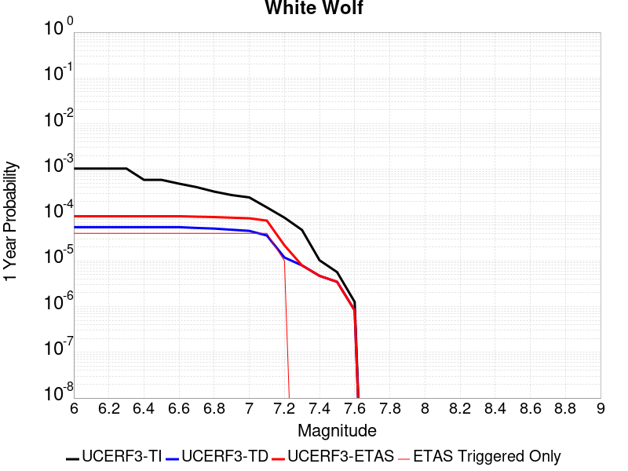 | 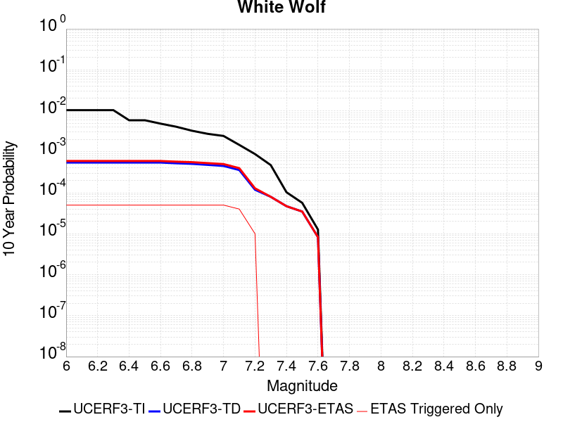 |

| Magnitude | 1 wk TI Prob | 1 wk TD Prob | 1 wk ETAS Prob | 1 wk ETAS/TD Gain | 1 wk ETAS Triggered Only | 1 mo TI Prob | 1 mo TD Prob | 1 mo ETAS Prob | 1 mo ETAS/TD Gain | 1 mo ETAS Triggered Only | 1 yr TI Prob | 1 yr TD Prob | 1 yr ETAS Prob | 1 yr ETAS/TD Gain | 1 yr ETAS Triggered Only | 10 yr TI Prob | 10 yr TD Prob | 10 yr ETAS Prob | 10 yr ETAS/TD Gain | 10 yr ETAS Triggered Only |
|-----|-----|-----|-----|-----|-----|-----|-----|-----|-----|-----|-----|-----|-----|-----|-----|-----|-----|-----|-----|-----|
| 6.0 | 2.0037822E-5 | 1.0469304E-6 | 1.0469304E-6 | 1.0 | 0.0 | 8.587355E-5 | 4.486837E-6 | 2.4486748E-5 | 5.4574633 | 2.0E-5 | 0.001045009 | 5.462592E-5 | 9.4623734E-5 | 1.7322131 | 4.0E-5 | 0.010401085 | 5.4613E-4 | 5.961027E-4 | 1.0915033 | 5.0E-5 |
| 6.1 | 2.0037822E-5 | 1.0469304E-6 | 1.0469304E-6 | 1.0 | 0.0 | 8.587355E-5 | 4.486837E-6 | 2.4486748E-5 | 5.4574633 | 2.0E-5 | 0.001045009 | 5.462592E-5 | 9.4623734E-5 | 1.7322131 | 4.0E-5 | 0.010401085 | 5.4613E-4 | 5.961027E-4 | 1.0915033 | 5.0E-5 |
| 6.2 | 2.0037822E-5 | 1.0469304E-6 | 1.0469304E-6 | 1.0 | 0.0 | 8.587355E-5 | 4.486837E-6 | 2.4486748E-5 | 5.4574633 | 2.0E-5 | 0.001045009 | 5.462592E-5 | 9.4623734E-5 | 1.7322131 | 4.0E-5 | 0.010401085 | 5.4613E-4 | 5.961027E-4 | 1.0915033 | 5.0E-5 |
| 6.3 | 2.0037822E-5 | 1.0469304E-6 | 1.0469304E-6 | 1.0 | 0.0 | 8.587355E-5 | 4.486837E-6 | 2.4486748E-5 | 5.4574633 | 2.0E-5 | 0.001045009 | 5.462592E-5 | 9.4623734E-5 | 1.7322131 | 4.0E-5 | 0.010401085 | 5.4613E-4 | 5.961027E-4 | 1.0915033 | 5.0E-5 |
| 6.4 | 1.132487E-5 | 1.0469304E-6 | 1.0469304E-6 | 1.0 | 0.0 | 4.8534253E-5 | 4.486837E-6 | 2.4486748E-5 | 5.4574633 | 2.0E-5 | 5.907443E-4 | 5.462592E-5 | 9.4623734E-5 | 1.7322131 | 4.0E-5 | 0.005891764 | 5.4613E-4 | 5.961027E-4 | 1.0915033 | 5.0E-5 |
| 6.5 | 1.132487E-5 | 1.0469304E-6 | 1.0469304E-6 | 1.0 | 0.0 | 4.8534253E-5 | 4.486837E-6 | 2.4486748E-5 | 5.4574633 | 2.0E-5 | 5.907443E-4 | 5.462592E-5 | 9.4623734E-5 | 1.7322131 | 4.0E-5 | 0.005891764 | 5.4613E-4 | 5.961027E-4 | 1.0915033 | 5.0E-5 |
| 6.6 | 9.347473E-6 | 1.0469304E-6 | 1.0469304E-6 | 1.0 | 0.0 | 4.0059982E-5 | 4.486837E-6 | 2.4486748E-5 | 5.4574633 | 2.0E-5 | 4.8762115E-4 | 5.462592E-5 | 9.4623734E-5 | 1.7322131 | 4.0E-5 | 0.0048655253 | 5.4613E-4 | 5.961027E-4 | 1.0915033 | 5.0E-5 |
| 6.7 | 7.842647E-6 | 1.0048476E-6 | 1.0048476E-6 | 1.0 | 0.0 | 3.361091E-5 | 4.306483E-6 | 2.4306397E-5 | 5.6441407 | 2.0E-5 | 4.0913603E-4 | 5.243022E-5 | 9.242812E-5 | 1.7628788 | 4.0E-5 | 0.004083836 | 5.2418344E-4 | 5.741572E-4 | 1.0953364 | 5.0E-5 |
| 6.8 | 6.26597E-6 | 9.734948E-7 | 9.734948E-7 | 1.0 | 0.0 | 2.685388E-5 | 4.172114E-6 | 2.417203E-5 | 5.7937126 | 2.0E-5 | 3.2689696E-4 | 5.079436E-5 | 9.0792324E-5 | 1.787449 | 4.0E-5 | 0.003264165 | 5.078324E-4 | 5.57807E-4 | 1.0984076 | 5.0E-5 |
| 6.9 | 5.258436E-6 | 9.183371E-7 | 9.183371E-7 | 1.0 | 0.0 | 2.2535958E-5 | 3.9357246E-6 | 2.3935647E-5 | 6.081636 | 2.0E-5 | 2.7434074E-4 | 4.7916445E-5 | 8.791453E-5 | 1.8347465 | 4.0E-5 | 0.0027400232 | 4.7906593E-4 | 5.29042E-4 | 1.1043198 | 5.0E-5 |
| 7.0 | 4.675028E-6 | 8.66129E-7 | 8.66129E-7 | 1.0 | 0.0 | 2.003568E-5 | 3.7119764E-6 | 2.3711902E-5 | 6.387945 | 2.0E-5 | 2.4390711E-4 | 4.5192424E-5 | 8.5190615E-5 | 1.8850641 | 4.0E-5 | 0.0024363957 | 4.5183706E-4 | 5.018145E-4 | 1.1106094 | 5.0E-5 |
| 7.1 | 2.8270078E-6 | 6.8742594E-7 | 6.8742594E-7 | 1.0 | 0.0 | 1.2115692E-5 | 2.9461082E-6 | 2.294605E-5 | 7.788597 | 2.0E-5 | 1.4749856E-4 | 3.5868317E-5 | 7.586688E-5 | 2.1151502 | 4.0E-5 | 0.001474007 | 3.586294E-4 | 3.9861503E-4 | 1.1114957 | 4.0E-5 |
| 7.2 | 1.6881406E-6 | 2.2706854E-7 | 2.2706854E-7 | 1.0 | 0.0 | 7.2348685E-6 | 9.731506E-7 | 9.731506E-7 | 1.0 | 0.0 | 8.808096E-5 | 1.1848045E-5 | 2.1847927E-5 | 1.8440111 | 1.0E-5 | 8.8046055E-4 | 1.1847429E-4 | 1.284731E-4 | 1.0843965 | 1.0E-5 |
| 7.3 | 9.086107E-7 | 1.5266669E-7 | 1.5266669E-7 | 1.0 | 0.0 | 3.8940398E-6 | 6.5428566E-7 | 6.5428566E-7 | 1.0 | 0.0 | 4.7408903E-5 | 7.965899E-6 | 7.965899E-6 | 1.0 | 0.0 | 4.739879E-4 | 7.965622E-5 | 7.965622E-5 | 1.0 | 0.0 |
| 7.4 | 1.9717383E-7 | 9.003981E-8 | 9.003981E-8 | 1.0 | 0.0 | 8.450304E-7 | 3.8588485E-7 | 3.8588485E-7 | 1.0 | 0.0 | 1.0288197E-5 | 4.698138E-6 | 4.698138E-6 | 1.0 | 0.0 | 1.028772E-4 | 4.6980418E-5 | 4.6980418E-5 | 1.0 | 0.0 |
| 7.5 | 1.086975E-7 | 6.659757E-8 | 6.659757E-8 | 1.0 | 0.0 | 4.6584634E-7 | 2.8541814E-7 | 2.8541814E-7 | 1.0 | 0.0 | 5.6716644E-6 | 3.4749605E-6 | 3.4749605E-6 | 1.0 | 0.0 | 5.6715195E-5 | 3.4749086E-5 | 3.4749086E-5 | 1.0 | 0.0 |
| 7.6 | 2.4217808E-8 | 1.5820843E-8 | 1.5820843E-8 | 1.0 | 0.0 | 1.03790605E-7 | 6.780361E-8 | 6.780361E-8 | 1.0 | 0.0 | 1.2636499E-6 | 8.255087E-7 | 8.255087E-7 | 1.0 | 0.0 | 1.2636427E-5 | 8.255061E-6 | 8.255061E-6 | 1.0 | 0.0 |

## Big Pine (East)
*[(top)](#table-of-contents)*

| 1 Week | 1 Month | 1 Year | 10 Year |
|-----|-----|-----|-----|
|  |  | 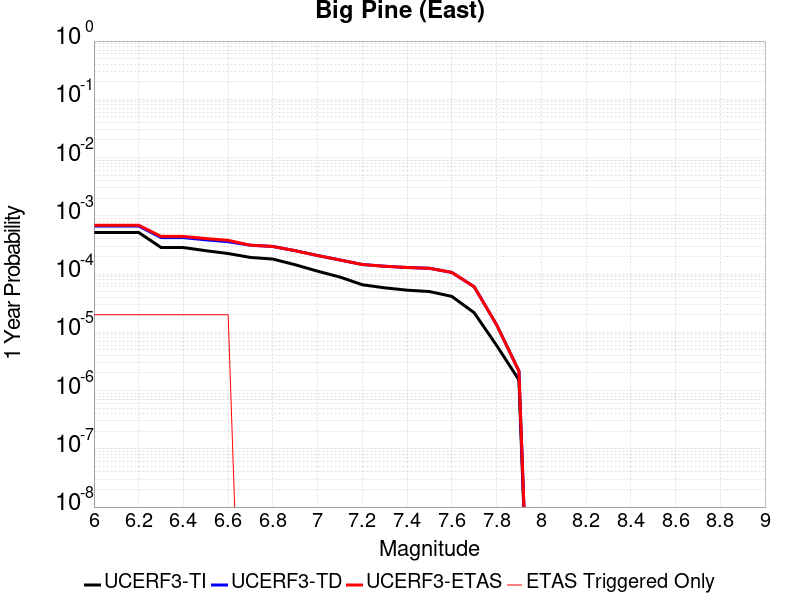 | 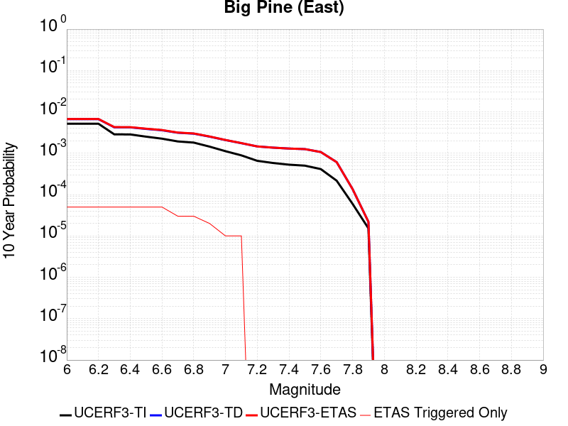 |

| Magnitude | 1 wk TI Prob | 1 wk TD Prob | 1 wk ETAS Prob | 1 wk ETAS/TD Gain | 1 wk ETAS Triggered Only | 1 mo TI Prob | 1 mo TD Prob | 1 mo ETAS Prob | 1 mo ETAS/TD Gain | 1 mo ETAS Triggered Only | 1 yr TI Prob | 1 yr TD Prob | 1 yr ETAS Prob | 1 yr ETAS/TD Gain | 1 yr ETAS Triggered Only | 10 yr TI Prob | 10 yr TD Prob | 10 yr ETAS Prob | 10 yr ETAS/TD Gain | 10 yr ETAS Triggered Only |
|-----|-----|-----|-----|-----|-----|-----|-----|-----|-----|-----|-----|-----|-----|-----|-----|-----|-----|-----|-----|-----|
| 6.0 | 9.916913E-6 | 1.2818231E-5 | 1.2818231E-5 | 1.0 | 0.0 | 4.250036E-5 | 5.4934244E-5 | 5.4934244E-5 | 1.0 | 0.0 | 5.173191E-4 | 6.686413E-4 | 6.886279E-4 | 1.0298914 | 2.0E-5 | 0.0051611643 | 0.0066710766 | 0.006720743 | 1.0074451 | 5.0E-5 |
| 6.1 | 9.916913E-6 | 1.2818231E-5 | 1.2818231E-5 | 1.0 | 0.0 | 4.250036E-5 | 5.4934244E-5 | 5.4934244E-5 | 1.0 | 0.0 | 5.173191E-4 | 6.686413E-4 | 6.886279E-4 | 1.0298914 | 2.0E-5 | 0.0051611643 | 0.0066710766 | 0.006720743 | 1.0074451 | 5.0E-5 |
| 6.2 | 9.916913E-6 | 1.2818231E-5 | 1.2818231E-5 | 1.0 | 0.0 | 4.250036E-5 | 5.4934244E-5 | 5.4934244E-5 | 1.0 | 0.0 | 5.173191E-4 | 6.686413E-4 | 6.886279E-4 | 1.0298914 | 2.0E-5 | 0.0051611643 | 0.0066710766 | 0.006720743 | 1.0074451 | 5.0E-5 |
| 6.3 | 5.479711E-6 | 8.114161E-6 | 8.114161E-6 | 1.0 | 0.0 | 2.3484265E-5 | 3.4774526E-5 | 3.4774526E-5 | 1.0 | 0.0 | 2.858834E-4 | 4.233008E-4 | 4.4329235E-4 | 1.0472277 | 2.0E-5 | 0.0028551589 | 0.0042278613 | 0.00427765 | 1.0117763 | 5.0E-5 |
| 6.4 | 5.465009E-6 | 8.098454E-6 | 8.098454E-6 | 1.0 | 0.0 | 2.3421257E-5 | 3.4707216E-5 | 3.4707216E-5 | 1.0 | 0.0 | 2.851165E-4 | 4.224816E-4 | 4.4247316E-4 | 1.0473193 | 2.0E-5 | 0.0028475097 | 0.0042197 | 0.004269489 | 1.0117992 | 5.0E-5 |
| 6.5 | 4.826767E-6 | 7.423505E-6 | 7.423505E-6 | 1.0 | 0.0 | 2.068598E-5 | 3.181465E-5 | 3.181465E-5 | 1.0 | 0.0 | 2.518227E-4 | 3.8727728E-4 | 4.0726952E-4 | 1.0516226 | 2.0E-5 | 0.0025153751 | 0.003868898 | 0.0039187046 | 1.0128735 | 5.0E-5 |
| 6.6 | 4.3146847E-6 | 6.883437E-6 | 6.883437E-6 | 1.0 | 0.0 | 1.8491375E-5 | 2.9500125E-5 | 2.9500125E-5 | 1.0 | 0.0 | 2.2510924E-4 | 3.5910727E-4 | 3.791001E-4 | 1.0556737 | 2.0E-5 | 0.0022488134 | 0.0035881116 | 0.0036379322 | 1.0138849 | 5.0E-5 |
| 6.7 | 3.6968106E-6 | 5.9966014E-6 | 5.9966014E-6 | 1.0 | 0.0 | 1.5843378E-5 | 2.5699477E-5 | 2.5699477E-5 | 1.0 | 0.0 | 1.9287605E-4 | 3.1284773E-4 | 3.1284773E-4 | 1.0 | 0.0 | 0.0019270873 | 0.003126825 | 0.0031567311 | 1.0095644 | 3.0E-5 |
| 6.8 | 3.4671132E-6 | 5.7032753E-6 | 5.7032753E-6 | 1.0 | 0.0 | 1.4858972E-5 | 2.4442388E-5 | 2.4442388E-5 | 1.0 | 0.0 | 1.8089297E-4 | 2.9754688E-4 | 2.9754688E-4 | 1.0 | 0.0 | 0.0018074579 | 0.002974228 | 0.0030041388 | 1.0100566 | 3.0E-5 |
| 6.9 | 2.7686972E-6 | 4.8262373E-6 | 4.8262373E-6 | 1.0 | 0.0 | 1.1865792E-5 | 2.0683714E-5 | 2.0683714E-5 | 1.0 | 0.0 | 1.4445644E-4 | 2.5179586E-4 | 2.5179586E-4 | 1.0 | 0.0 | 0.0014436257 | 0.002517781 | 0.0025377306 | 1.0079235 | 2.0E-5 |
| 7.0 | 2.1472624E-6 | 3.985962E-6 | 3.985962E-6 | 1.0 | 0.0 | 9.20252E-6 | 1.7082584E-5 | 1.7082584E-5 | 1.0 | 0.0 | 1.12034926E-4 | 2.0796116E-4 | 2.0796116E-4 | 1.0 | 0.0 | 0.0011197845 | 0.0020803085 | 0.0020902876 | 1.004797 | 1.0E-5 |
| 7.1 | 1.7018335E-6 | 3.3457143E-6 | 3.3457143E-6 | 1.0 | 0.0 | 7.293552E-6 | 1.4338699E-5 | 1.4338699E-5 | 1.0 | 0.0 | 8.879537E-5 | 1.7456003E-4 | 1.7456003E-4 | 1.0 | 0.0 | 8.87599E-4 | 0.0017468405 | 0.001756823 | 1.0057147 | 1.0E-5 |
| 7.2 | 1.25603E-6 | 2.795276E-6 | 2.795276E-6 | 1.0 | 0.0 | 5.3829745E-6 | 1.19797005E-5 | 1.19797005E-5 | 1.0 | 0.0 | 6.553574E-5 | 1.4584333E-4 | 1.4584333E-4 | 1.0 | 0.0 | 6.551642E-4 | 0.001460063 | 0.001460063 | 1.0 | 0.0 |
| 7.3 | 1.112297E-6 | 2.6110797E-6 | 2.6110797E-6 | 1.0 | 0.0 | 4.7669787E-6 | 1.11902955E-5 | 1.11902955E-5 | 1.0 | 0.0 | 5.803642E-5 | 1.3623355E-4 | 1.3623355E-4 | 1.0 | 0.0 | 5.802127E-4 | 0.0013639197 | 0.0013639197 | 1.0 | 0.0 |
| 7.4 | 1.0137181E-6 | 2.4842075E-6 | 2.4842075E-6 | 1.0 | 0.0 | 4.3444993E-6 | 1.0646561E-5 | 1.0646561E-5 | 1.0 | 0.0 | 5.2892992E-5 | 1.2961439E-4 | 1.2961439E-4 | 1.0 | 0.0 | 5.288041E-4 | 0.0012975911 | 0.0012975911 | 1.0 | 0.0 |
| 7.5 | 9.598608E-7 | 2.4078427E-6 | 2.4078427E-6 | 1.0 | 0.0 | 4.1136827E-6 | 1.0319286E-5 | 1.0319286E-5 | 1.0 | 0.0 | 5.0082934E-5 | 1.2563028E-4 | 1.2563028E-4 | 1.0 | 0.0 | 5.007165E-4 | 0.0012576039 | 0.0012576039 | 1.0 | 0.0 |
| 7.6 | 7.929459E-7 | 2.0454722E-6 | 2.0454722E-6 | 1.0 | 0.0 | 3.3983351E-6 | 8.766281E-6 | 8.766281E-6 | 1.0 | 0.0 | 4.1373947E-5 | 1.06724416E-4 | 1.06724416E-4 | 1.0 | 0.0 | 4.1366243E-4 | 0.0010688324 | 0.0010688324 | 1.0 | 0.0 |
| 7.7 | 4.155788E-7 | 1.1609936E-6 | 1.1609936E-6 | 1.0 | 0.0 | 1.7810507E-6 | 4.975678E-6 | 4.975678E-6 | 1.0 | 0.0 | 2.1684076E-5 | 6.0577237E-5 | 6.0577237E-5 | 1.0 | 0.0 | 2.1681961E-4 | 6.087925E-4 | 6.087925E-4 | 1.0 | 0.0 |
| 7.8 | 1.14666925E-7 | 2.5929913E-7 | 2.5929913E-7 | 1.0 | 0.0 | 4.914296E-7 | 1.1112816E-6 | 1.1112816E-6 | 1.0 | 0.0 | 5.9831386E-6 | 1.3529773E-5 | 1.3529773E-5 | 1.0 | 0.0 | 5.9829777E-5 | 1.3639126E-4 | 1.3639126E-4 | 1.0 | 0.0 |
| 7.9 | 2.9231824E-8 | 4.148024E-8 | 4.148024E-8 | 1.0 | 0.0 | 1.2527924E-7 | 1.7777246E-7 | 1.7777246E-7 | 1.0 | 0.0 | 1.5252737E-6 | 2.1643777E-6 | 2.1643777E-6 | 1.0 | 0.0 | 1.5252632E-5 | 2.1976275E-5 | 2.1976275E-5 | 1.0 | 0.0 |

## Ortigalita (North)
*[(top)](#table-of-contents)*

| 1 Week | 1 Month | 1 Year | 10 Year |
|-----|-----|-----|-----|
|  | 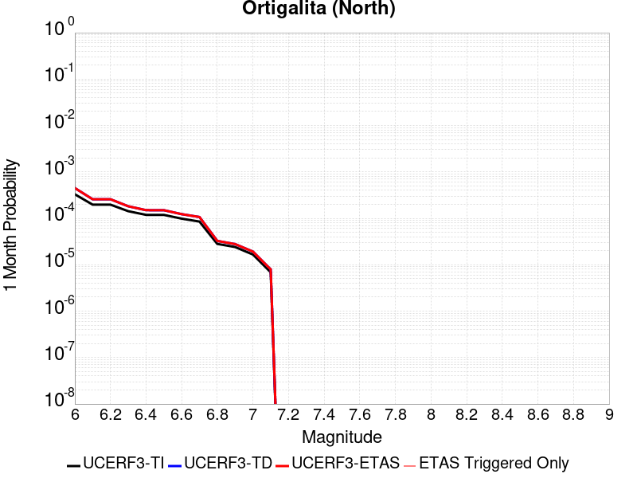 | 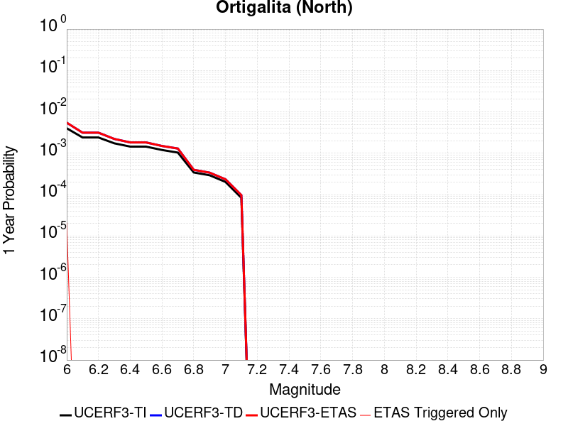 | 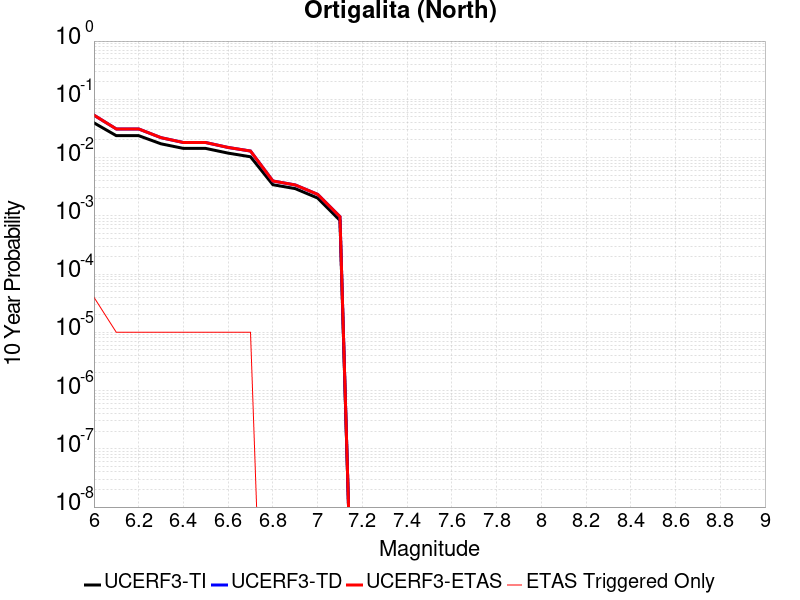 |

| Magnitude | 1 wk TI Prob | 1 wk TD Prob | 1 wk ETAS Prob | 1 wk ETAS/TD Gain | 1 wk ETAS Triggered Only | 1 mo TI Prob | 1 mo TD Prob | 1 mo ETAS Prob | 1 mo ETAS/TD Gain | 1 mo ETAS Triggered Only | 1 yr TI Prob | 1 yr TD Prob | 1 yr ETAS Prob | 1 yr ETAS/TD Gain | 1 yr ETAS Triggered Only | 10 yr TI Prob | 10 yr TD Prob | 10 yr ETAS Prob | 10 yr ETAS/TD Gain | 10 yr ETAS Triggered Only |
|-----|-----|-----|-----|-----|-----|-----|-----|-----|-----|-----|-----|-----|-----|-----|-----|-----|-----|-----|-----|-----|
| 6.0 | 7.711876E-5 | 1.0507023E-4 | 1.0507023E-4 | 1.0 | 0.0 | 3.3046713E-4 | 4.5023413E-4 | 4.5023413E-4 | 1.0 | 0.0 | 0.004016016 | 0.005468329 | 0.0054981653 | 1.0054561 | 3.0E-5 | 0.039442103 | 0.053457033 | 0.053494893 | 1.0007082 | 4.0E-5 |
| 6.1 | 4.607858E-5 | 6.024174E-5 | 6.024174E-5 | 1.0 | 0.0 | 1.9746469E-4 | 2.5815613E-4 | 2.5815613E-4 | 1.0 | 0.0 | 0.0024014818 | 0.0031388826 | 0.0031488512 | 1.0031759 | 1.0E-5 | 0.023756953 | 0.030976266 | 0.030985957 | 1.0003128 | 1.0E-5 |
| 6.2 | 4.607858E-5 | 6.024174E-5 | 6.024174E-5 | 1.0 | 0.0 | 1.9746469E-4 | 2.5815613E-4 | 2.5815613E-4 | 1.0 | 0.0 | 0.0024014818 | 0.0031388826 | 0.0031488512 | 1.0031759 | 1.0E-5 | 0.023756953 | 0.030976266 | 0.030985957 | 1.0003128 | 1.0E-5 |
| 6.3 | 3.327423E-5 | 4.247674E-5 | 4.247674E-5 | 1.0 | 0.0 | 1.4259605E-4 | 1.820322E-4 | 1.820322E-4 | 1.0 | 0.0 | 0.0017347244 | 0.0022142797 | 0.0022242577 | 1.0045061 | 1.0E-5 | 0.017212452 | 0.021946438 | 0.021956218 | 1.0004456 | 1.0E-5 |
| 6.4 | 2.7732503E-5 | 3.4999855E-5 | 3.4999855E-5 | 1.0 | 0.0 | 1.1884817E-4 | 1.4999225E-4 | 1.4999225E-4 | 1.0 | 0.0 | 0.001446016 | 0.001824874 | 0.0018348558 | 1.0054698 | 1.0E-5 | 0.014366428 | 0.018121855 | 0.018131675 | 1.0005418 | 1.0E-5 |
| 6.5 | 2.7689714E-5 | 3.4949666E-5 | 3.4949666E-5 | 1.0 | 0.0 | 1.186648E-4 | 1.4977719E-4 | 1.4977719E-4 | 1.0 | 0.0 | 0.0014437864 | 0.00182226 | 0.0018322418 | 1.0054777 | 1.0E-5 | 0.014344421 | 0.018096142 | 0.018105961 | 1.0005426 | 1.0E-5 |
| 6.6 | 2.2976905E-5 | 2.8719256E-5 | 2.8719256E-5 | 1.0 | 0.0 | 9.846873E-5 | 1.2307815E-4 | 1.2307815E-4 | 1.0 | 0.0 | 0.0011981975 | 0.001497687 | 0.001507672 | 1.006667 | 1.0E-5 | 0.011917574 | 0.014899201 | 0.014909052 | 1.0006611 | 1.0E-5 |
| 6.7 | 1.9871539E-5 | 2.490528E-5 | 2.490528E-5 | 1.0 | 0.0 | 8.516096E-5 | 1.0673395E-4 | 1.0673395E-4 | 1.0 | 0.0 | 0.0010363415 | 0.0012989598 | 0.0013089469 | 1.0076885 | 1.0E-5 | 0.010315218 | 0.012937365 | 0.012947235 | 1.0007629 | 1.0E-5 |
| 6.8 | 6.5640475E-6 | 7.6056526E-6 | 7.6056526E-6 | 1.0 | 0.0 | 2.813133E-5 | 3.2595264E-5 | 3.2595264E-5 | 1.0 | 0.0 | 3.424451E-4 | 3.9677793E-4 | 3.9677793E-4 | 1.0 | 0.0 | 0.0034191788 | 0.0039609824 | 0.0039609824 | 1.0 | 0.0 |
| 6.9 | 5.6219683E-6 | 6.5019726E-6 | 6.5019726E-6 | 1.0 | 0.0 | 2.4093928E-5 | 2.7865315E-5 | 2.7865315E-5 | 1.0 | 0.0 | 2.933041E-4 | 3.3920998E-4 | 3.3920998E-4 | 1.0 | 0.0 | 0.0029291727 | 0.0033871792 | 0.0033871792 | 1.0 | 0.0 |
| 7.0 | 3.875591E-6 | 4.4848484E-6 | 4.4848484E-6 | 1.0 | 0.0 | 1.6609569E-5 | 1.922065E-5 | 1.922065E-5 | 1.0 | 0.0 | 2.0220275E-4 | 2.339884E-4 | 2.339884E-4 | 1.0 | 0.0 | 0.0020201886 | 0.0023376285 | 0.0023376285 | 1.0 | 0.0 |
| 7.1 | 1.6017933E-6 | 1.8570811E-6 | 1.8570811E-6 | 1.0 | 0.0 | 6.8648105E-6 | 7.958901E-6 | 7.958901E-6 | 1.0 | 0.0 | 8.357586E-5 | 9.689637E-5 | 9.689637E-5 | 1.0 | 0.0 | 8.3544437E-4 | 9.686459E-4 | 9.686459E-4 | 1.0 | 0.0 |

## Kern Canyon (Lake Isabella) 2011
*[(top)](#table-of-contents)*

| 1 Week | 1 Month | 1 Year | 10 Year |
|-----|-----|-----|-----|
| 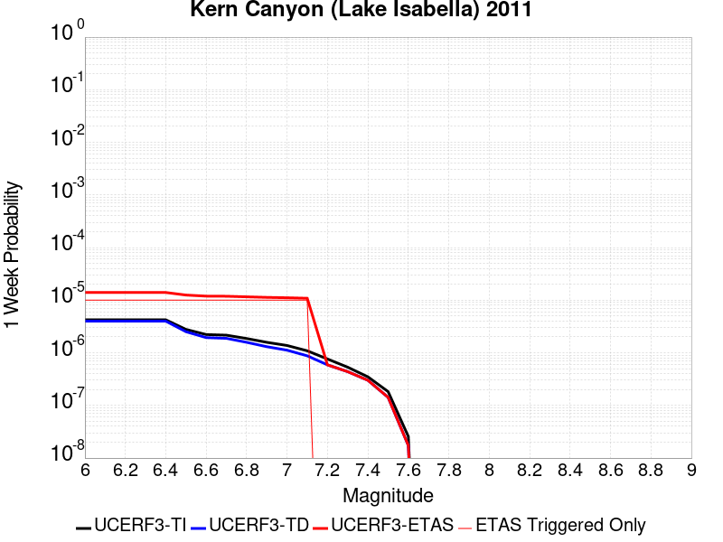 | 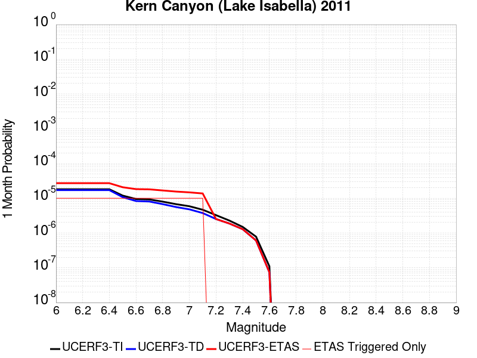 |  | 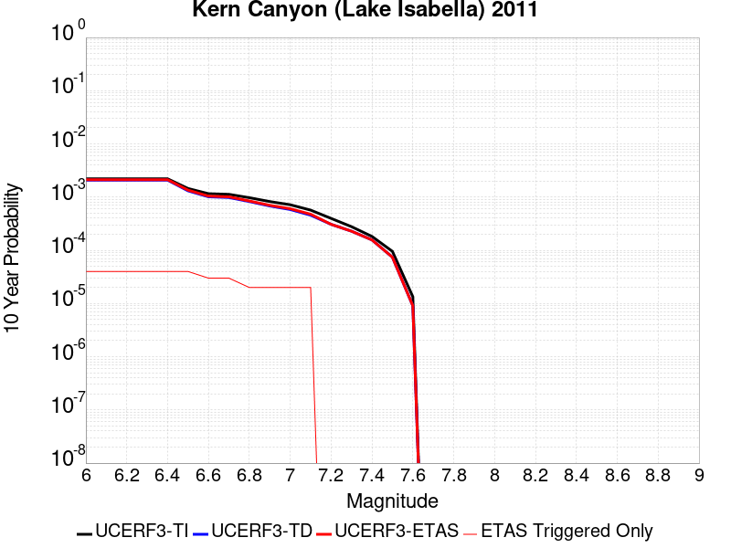 |

| Magnitude | 1 wk TI Prob | 1 wk TD Prob | 1 wk ETAS Prob | 1 wk ETAS/TD Gain | 1 wk ETAS Triggered Only | 1 mo TI Prob | 1 mo TD Prob | 1 mo ETAS Prob | 1 mo ETAS/TD Gain | 1 mo ETAS Triggered Only | 1 yr TI Prob | 1 yr TD Prob | 1 yr ETAS Prob | 1 yr ETAS/TD Gain | 1 yr ETAS Triggered Only | 10 yr TI Prob | 10 yr TD Prob | 10 yr ETAS Prob | 10 yr ETAS/TD Gain | 10 yr ETAS Triggered Only |
|-----|-----|-----|-----|-----|-----|-----|-----|-----|-----|-----|-----|-----|-----|-----|-----|-----|-----|-----|-----|-----|
| 6.0 | 4.2387383E-6 | 4.0016507E-6 | 1.4001611E-5 | 3.4989588 | 1.0E-5 | 1.8165894E-5 | 1.7149829E-5 | 2.7149657E-5 | 1.5830861 | 1.0E-5 | 2.2114732E-4 | 2.0878103E-4 | 2.3877477E-4 | 1.1436613 | 3.0E-5 | 0.0022092736 | 0.0020860326 | 0.0021259494 | 1.0191351 | 4.0E-5 |
| 6.1 | 4.2387383E-6 | 4.0016507E-6 | 1.4001611E-5 | 3.4989588 | 1.0E-5 | 1.8165894E-5 | 1.7149829E-5 | 2.7149657E-5 | 1.5830861 | 1.0E-5 | 2.2114732E-4 | 2.0878103E-4 | 2.3877477E-4 | 1.1436613 | 3.0E-5 | 0.0022092736 | 0.0020860326 | 0.0021259494 | 1.0191351 | 4.0E-5 |
| 6.2 | 4.2387383E-6 | 4.0016507E-6 | 1.4001611E-5 | 3.4989588 | 1.0E-5 | 1.8165894E-5 | 1.7149829E-5 | 2.7149657E-5 | 1.5830861 | 1.0E-5 | 2.2114732E-4 | 2.0878103E-4 | 2.3877477E-4 | 1.1436613 | 3.0E-5 | 0.0022092736 | 0.0020860326 | 0.0021259494 | 1.0191351 | 4.0E-5 |
| 6.3 | 4.2387383E-6 | 4.0016507E-6 | 1.4001611E-5 | 3.4989588 | 1.0E-5 | 1.8165894E-5 | 1.7149829E-5 | 2.7149657E-5 | 1.5830861 | 1.0E-5 | 2.2114732E-4 | 2.0878103E-4 | 2.3877477E-4 | 1.1436613 | 3.0E-5 | 0.0022092736 | 0.0020860326 | 0.0021259494 | 1.0191351 | 4.0E-5 |
| 6.4 | 4.2387383E-6 | 4.0016507E-6 | 1.4001611E-5 | 3.4989588 | 1.0E-5 | 1.8165894E-5 | 1.7149829E-5 | 2.7149657E-5 | 1.5830861 | 1.0E-5 | 2.2114732E-4 | 2.0878103E-4 | 2.3877477E-4 | 1.1436613 | 3.0E-5 | 0.0022092736 | 0.0020860326 | 0.0021259494 | 1.0191351 | 4.0E-5 |
| 6.5 | 2.7857532E-6 | 2.5178747E-6 | 1.2517849E-5 | 4.9715934 | 1.0E-5 | 1.1938888E-5 | 1.0790849E-5 | 2.0790741E-5 | 1.9267012 | 1.0E-5 | 1.4534626E-4 | 1.31371E-4 | 1.6136706E-4 | 1.2283309 | 3.0E-5 | 0.0014525123 | 0.0013129661 | 0.0013529136 | 1.0304254 | 4.0E-5 |
| 6.6 | 2.2233348E-6 | 1.94413E-6 | 1.194411E-5 | 6.143679 | 1.0E-5 | 9.528543E-6 | 8.331959E-6 | 1.8331875E-5 | 2.200188 | 1.0E-5 | 1.1600384E-4 | 1.0143697E-4 | 1.2143494E-4 | 1.1971468 | 2.0E-5 | 0.001159433 | 0.0010139153 | 0.0010438849 | 1.0295583 | 3.0E-5 |
| 6.7 | 2.1635126E-6 | 1.8835098E-6 | 1.18834905E-5 | 6.309227 | 1.0E-5 | 9.272164E-6 | 8.07216E-6 | 1.807208E-5 | 2.2388158 | 1.0E-5 | 1.1288274E-4 | 9.82742E-5 | 1.1827223E-4 | 1.2034922 | 2.0E-5 | 0.0011282542 | 9.823156E-4 | 0.0010122862 | 1.0305101 | 3.0E-5 |
| 6.8 | 1.8685711E-6 | 1.583148E-6 | 1.1583133E-5 | 7.316519 | 1.0E-5 | 8.008137E-6 | 6.784903E-6 | 1.6784836E-5 | 2.4738505 | 1.0E-5 | 9.74947E-5 | 8.260311E-5 | 1.0260146E-4 | 1.2421017 | 2.0E-5 | 9.745194E-4 | 8.25729E-4 | 8.4571243E-4 | 1.024201 | 2.0E-5 |
| 6.9 | 1.5815071E-6 | 1.3064976E-6 | 1.1306484E-5 | 8.654042 | 1.0E-5 | 6.77787E-6 | 5.599263E-6 | 1.5599207E-5 | 2.7859392 | 1.0E-5 | 8.251744E-5 | 6.816892E-5 | 8.816756E-5 | 1.2933688 | 2.0E-5 | 8.248681E-4 | 6.814828E-4 | 7.014692E-4 | 1.0293278 | 2.0E-5 |
| 7.0 | 1.3772564E-6 | 1.1210758E-6 | 1.1121065E-5 | 9.919993 | 1.0E-5 | 5.9025137E-6 | 4.804602E-6 | 1.4804554E-5 | 3.081328 | 1.0E-5 | 7.186073E-5 | 5.849448E-5 | 7.849331E-5 | 1.3418926 | 2.0E-5 | 7.18375E-4 | 5.8479287E-4 | 6.047812E-4 | 1.0341802 | 2.0E-5 |
| 7.1 | 1.0916998E-6 | 8.763808E-7 | 1.08763725E-5 | 12.410555 | 1.0E-5 | 4.678705E-6 | 3.7559125E-6 | 1.37558745E-5 | 3.662459 | 1.0E-5 | 5.6961744E-5 | 4.5727287E-5 | 6.572637E-5 | 1.4373556 | 2.0E-5 | 5.6947145E-4 | 4.5718014E-4 | 4.7717098E-4 | 1.0437264 | 2.0E-5 |
| 7.2 | 7.6277024E-7 | 5.901475E-7 | 5.901475E-7 | 1.0 | 0.0 | 3.2690114E-6 | 2.5292013E-6 | 2.5292013E-6 | 1.0 | 0.0 | 3.9799485E-5 | 3.0792595E-5 | 3.0792595E-5 | 1.0 | 0.0 | 3.9792358E-4 | 3.078839E-4 | 3.078839E-4 | 1.0 | 0.0 |
| 7.3 | 5.3265916E-7 | 4.3824562E-7 | 4.3824562E-7 | 1.0 | 0.0 | 2.282823E-6 | 1.8781942E-6 | 1.8781942E-6 | 1.0 | 0.0 | 2.7793016E-5 | 2.286678E-5 | 2.286678E-5 | 1.0 | 0.0 | 2.778954E-4 | 2.2864464E-4 | 2.2864464E-4 | 1.0 | 0.0 |
| 7.4 | 3.4946007E-7 | 3.006581E-7 | 3.006581E-7 | 1.0 | 0.0 | 1.497685E-6 | 1.288534E-6 | 1.288534E-6 | 1.0 | 0.0 | 1.8234163E-5 | 1.568779E-5 | 1.568779E-5 | 1.0 | 0.0 | 1.8232666E-4 | 1.5686706E-4 | 1.5686706E-4 | 1.0 | 0.0 |
| 7.5 | 1.8317026E-7 | 1.4244868E-7 | 1.4244868E-7 | 1.0 | 0.0 | 7.850152E-7 | 6.104942E-7 | 6.104942E-7 | 1.0 | 0.0 | 9.557518E-6 | 7.4327427E-6 | 7.4327427E-6 | 1.0 | 0.0 | 9.5571064E-5 | 7.432502E-5 | 7.432502E-5 | 1.0 | 0.0 |
| 7.6 | 2.572245E-8 | 1.7352637E-8 | 1.7352637E-8 | 1.0 | 0.0 | 1.10239064E-7 | 7.4368444E-8 | 7.4368444E-8 | 1.0 | 0.0 | 1.3421597E-6 | 9.0543546E-7 | 9.0543546E-7 | 1.0 | 0.0 | 1.3421517E-5 | 9.0543235E-6 | 9.0543235E-6 | 1.0 | 0.0 |

## Ventura-Pitas Point
*[(top)](#table-of-contents)*

| 1 Week | 1 Month | 1 Year | 10 Year |
|-----|-----|-----|-----|
|  | 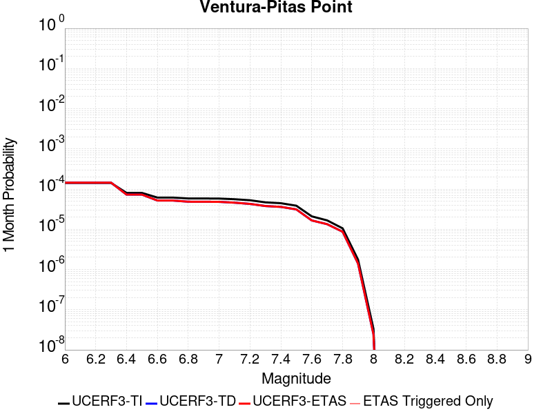 | 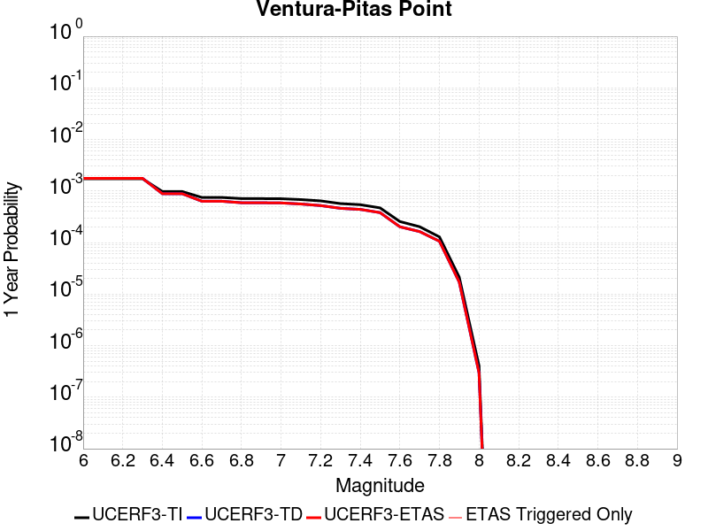 | 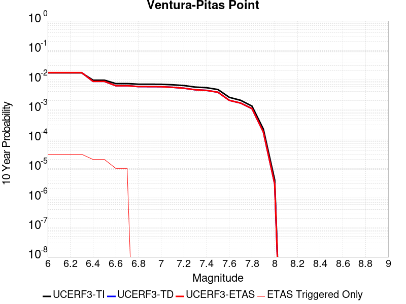 |

| Magnitude | 1 wk TI Prob | 1 wk TD Prob | 1 wk ETAS Prob | 1 wk ETAS/TD Gain | 1 wk ETAS Triggered Only | 1 mo TI Prob | 1 mo TD Prob | 1 mo ETAS Prob | 1 mo ETAS/TD Gain | 1 mo ETAS Triggered Only | 1 yr TI Prob | 1 yr TD Prob | 1 yr ETAS Prob | 1 yr ETAS/TD Gain | 1 yr ETAS Triggered Only | 10 yr TI Prob | 10 yr TD Prob | 10 yr ETAS Prob | 10 yr ETAS/TD Gain | 10 yr ETAS Triggered Only |
|-----|-----|-----|-----|-----|-----|-----|-----|-----|-----|-----|-----|-----|-----|-----|-----|-----|-----|-----|-----|-----|
| 6.0 | 3.3179622E-5 | 3.3735807E-5 | 3.3735807E-5 | 1.0 | 0.0 | 1.4219063E-4 | 1.4457546E-4 | 1.4457546E-4 | 1.0 | 0.0 | 0.0017297962 | 0.001759042 | 0.001759042 | 1.0 | 0.0 | 0.017163932 | 0.01747672 | 0.017506197 | 1.0016866 | 3.0E-5 |
| 6.1 | 3.3179622E-5 | 3.3735807E-5 | 3.3735807E-5 | 1.0 | 0.0 | 1.4219063E-4 | 1.4457546E-4 | 1.4457546E-4 | 1.0 | 0.0 | 0.0017297962 | 0.001759042 | 0.001759042 | 1.0 | 0.0 | 0.017163932 | 0.01747672 | 0.017506197 | 1.0016866 | 3.0E-5 |
| 6.2 | 3.3179622E-5 | 3.3735807E-5 | 3.3735807E-5 | 1.0 | 0.0 | 1.4219063E-4 | 1.4457546E-4 | 1.4457546E-4 | 1.0 | 0.0 | 0.0017297962 | 0.001759042 | 0.001759042 | 1.0 | 0.0 | 0.017163932 | 0.01747672 | 0.017506197 | 1.0016866 | 3.0E-5 |
| 6.3 | 3.3179622E-5 | 3.3735807E-5 | 3.3735807E-5 | 1.0 | 0.0 | 1.4219063E-4 | 1.4457546E-4 | 1.4457546E-4 | 1.0 | 0.0 | 0.0017297962 | 0.001759042 | 0.001759042 | 1.0 | 0.0 | 0.017163932 | 0.01747672 | 0.017506197 | 1.0016866 | 3.0E-5 |
| 6.4 | 1.8754668E-5 | 1.701988E-5 | 1.701988E-5 | 1.0 | 0.0 | 8.037467E-5 | 7.2940435E-5 | 7.2940435E-5 | 1.0 | 0.0 | 9.781223E-4 | 8.87711E-4 | 8.87711E-4 | 1.0 | 0.0 | 0.009738282 | 0.008843987 | 0.00886381 | 1.0022414 | 2.0E-5 |
| 6.5 | 1.8754668E-5 | 1.701988E-5 | 1.701988E-5 | 1.0 | 0.0 | 8.037467E-5 | 7.2940435E-5 | 7.2940435E-5 | 1.0 | 0.0 | 9.781223E-4 | 8.87711E-4 | 8.87711E-4 | 1.0 | 0.0 | 0.009738282 | 0.008843987 | 0.00886381 | 1.0022414 | 2.0E-5 |
| 6.6 | 1.4361558E-5 | 1.2122469E-5 | 1.2122469E-5 | 1.0 | 0.0 | 6.154808E-5 | 5.195242E-5 | 5.195242E-5 | 1.0 | 0.0 | 7.490902E-4 | 6.323394E-4 | 6.323394E-4 | 1.0 | 0.0 | 0.0074657016 | 0.0063056583 | 0.006315595 | 1.0015758 | 1.0E-5 |
| 6.7 | 1.4361558E-5 | 1.2122469E-5 | 1.2122469E-5 | 1.0 | 0.0 | 6.154808E-5 | 5.195242E-5 | 5.195242E-5 | 1.0 | 0.0 | 7.490902E-4 | 6.323394E-4 | 6.323394E-4 | 1.0 | 0.0 | 0.0074657016 | 0.0063056583 | 0.006315595 | 1.0015758 | 1.0E-5 |
| 6.8 | 1.3663846E-5 | 1.13446E-5 | 1.13446E-5 | 1.0 | 0.0 | 5.8558027E-5 | 4.8618822E-5 | 4.8618822E-5 | 1.0 | 0.0 | 7.127108E-4 | 5.917753E-4 | 5.917753E-4 | 1.0 | 0.0 | 0.007104293 | 0.0059022107 | 0.0059022107 | 1.0 | 0.0 |
| 6.9 | 1.3644157E-5 | 1.1322701E-5 | 1.1322701E-5 | 1.0 | 0.0 | 5.8473648E-5 | 4.852497E-5 | 4.852497E-5 | 1.0 | 0.0 | 7.116841E-4 | 5.9063325E-4 | 5.9063325E-4 | 1.0 | 0.0 | 0.007094092 | 0.005890851 | 0.005890851 | 1.0 | 0.0 |
| 7.0 | 1.3568845E-5 | 1.1242266E-5 | 1.1242266E-5 | 1.0 | 0.0 | 5.8150898E-5 | 4.818026E-5 | 4.818026E-5 | 1.0 | 0.0 | 7.077572E-4 | 5.8643875E-4 | 5.8643875E-4 | 1.0 | 0.0 | 0.007055073 | 0.005849127 | 0.005849127 | 1.0 | 0.0 |
| 7.1 | 1.306572E-5 | 1.0720711E-5 | 1.0720711E-5 | 1.0 | 0.0 | 5.599474E-5 | 4.5945108E-5 | 4.5945108E-5 | 1.0 | 0.0 | 6.815227E-4 | 5.5923994E-4 | 5.5923994E-4 | 1.0 | 0.0 | 0.0067943637 | 0.0055785314 | 0.0055785314 | 1.0 | 0.0 |
| 7.2 | 1.232604E-5 | 9.995298E-6 | 9.995298E-6 | 1.0 | 0.0 | 5.2824813E-5 | 4.28363E-5 | 4.28363E-5 | 1.0 | 0.0 | 6.429523E-4 | 5.2140886E-4 | 5.2140886E-4 | 1.0 | 0.0 | 0.0064109527 | 0.005202047 | 0.005202047 | 1.0 | 0.0 |
| 7.3 | 1.0917261E-5 | 8.843967E-6 | 8.843967E-6 | 1.0 | 0.0 | 4.678742E-5 | 3.7902173E-5 | 3.7902173E-5 | 1.0 | 0.0 | 5.69488E-4 | 4.6136283E-4 | 4.6136283E-4 | 1.0 | 0.0 | 0.0056803077 | 0.0046042157 | 0.0046042157 | 1.0 | 0.0 |
| 7.4 | 1.039959E-5 | 8.423679E-6 | 8.423679E-6 | 1.0 | 0.0 | 4.456891E-5 | 3.610099E-5 | 3.610099E-5 | 1.0 | 0.0 | 5.424914E-4 | 4.3944246E-4 | 4.3944246E-4 | 1.0 | 0.0 | 0.0054116896 | 0.004385897 | 0.004385897 | 1.0 | 0.0 |
| 7.5 | 9.015877E-6 | 7.297639E-6 | 7.297639E-6 | 1.0 | 0.0 | 3.86389E-5 | 3.1275227E-5 | 3.1275227E-5 | 1.0 | 0.0 | 4.7032707E-4 | 3.807108E-4 | 3.807108E-4 | 1.0 | 0.0 | 0.004693329 | 0.003800731 | 0.003800731 | 1.0 | 0.0 |
| 7.6 | 4.900162E-6 | 3.8741514E-6 | 3.8741514E-6 | 1.0 | 0.0 | 2.1000526E-5 | 1.66034E-5 | 1.66034E-5 | 1.0 | 0.0 | 2.556514E-4 | 2.0212779E-4 | 2.0212779E-4 | 1.0 | 0.0 | 0.0025535747 | 0.002019453 | 0.002019453 | 1.0 | 0.0 |
| 7.7 | 3.8850626E-6 | 3.126758E-6 | 3.126758E-6 | 1.0 | 0.0 | 1.6650163E-5 | 1.3400323E-5 | 1.3400323E-5 | 1.0 | 0.0 | 2.0269687E-4 | 1.631368E-4 | 1.631368E-4 | 1.0 | 0.0 | 0.002025121 | 0.0016301798 | 0.0016301798 | 1.0 | 0.0 |
| 7.8 | 2.4654719E-6 | 2.029892E-6 | 2.029892E-6 | 1.0 | 0.0 | 1.0566265E-5 | 8.699508E-6 | 8.699508E-6 | 1.0 | 0.0 | 1.2863669E-4 | 1.0591141E-4 | 1.0591141E-4 | 1.0 | 0.0 | 0.0012856225 | 0.001058614 | 0.001058614 | 1.0 | 0.0 |
| 7.9 | 4.095894E-7 | 3.2765047E-7 | 3.2765047E-7 | 1.0 | 0.0 | 1.7553821E-6 | 1.4042156E-6 | 1.4042156E-6 | 1.0 | 0.0 | 2.1371567E-5 | 1.7096194E-5 | 1.7096194E-5 | 1.0 | 0.0 | 2.1369511E-4 | 1.7094909E-4 | 1.7094909E-4 | 1.0 | 0.0 |
| 8.0 | 7.791402E-9 | 5.683553E-9 | 5.683553E-9 | 1.0 | 0.0 | 3.3391725E-8 | 2.4358085E-8 | 2.4358085E-8 | 1.0 | 0.0 | 4.0654416E-7 | 2.9655968E-7 | 2.9655968E-7 | 1.0 | 0.0 | 4.065434E-6 | 2.9655946E-6 | 2.9655946E-6 | 1.0 | 0.0 |

## Chino alt 1
*[(top)](#table-of-contents)*

| 1 Week | 1 Month | 1 Year | 10 Year |
|-----|-----|-----|-----|
| 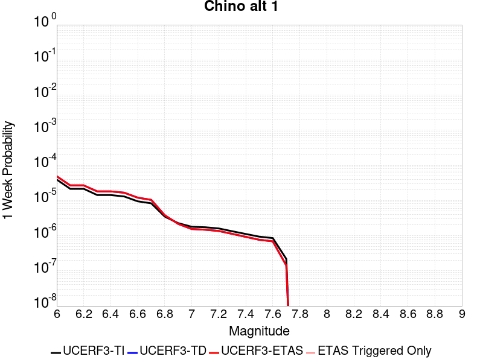 | 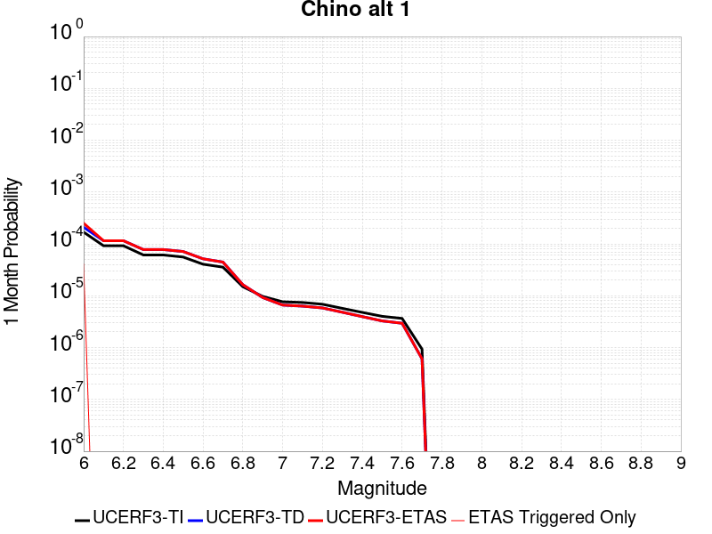 | 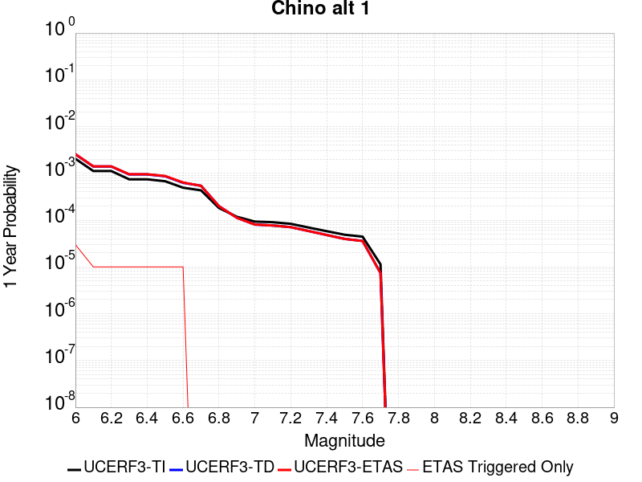 | 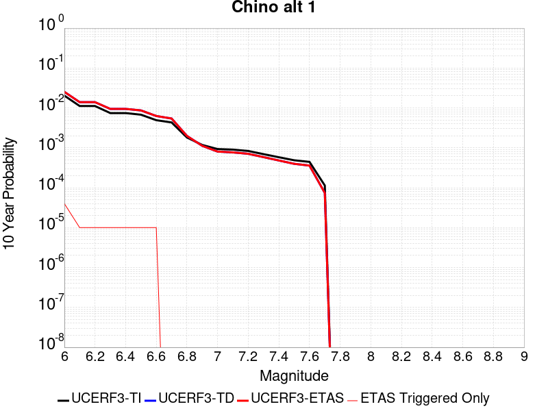 |

| Magnitude | 1 wk TI Prob | 1 wk TD Prob | 1 wk ETAS Prob | 1 wk ETAS/TD Gain | 1 wk ETAS Triggered Only | 1 mo TI Prob | 1 mo TD Prob | 1 mo ETAS Prob | 1 mo ETAS/TD Gain | 1 mo ETAS Triggered Only | 1 yr TI Prob | 1 yr TD Prob | 1 yr ETAS Prob | 1 yr ETAS/TD Gain | 1 yr ETAS Triggered Only | 10 yr TI Prob | 10 yr TD Prob | 10 yr ETAS Prob | 10 yr ETAS/TD Gain | 10 yr ETAS Triggered Only |
|-----|-----|-----|-----|-----|-----|-----|-----|-----|-----|-----|-----|-----|-----|-----|-----|-----|-----|-----|-----|-----|
| 6.0 | 3.939946E-5 | 4.895037E-5 | 4.895037E-5 | 1.0 | 0.0 | 1.6884391E-4 | 2.0977337E-4 | 2.2976917E-4 | 1.0953209 | 2.0E-5 | 0.0020537362 | 0.0025514876 | 0.0025814113 | 1.0117278 | 3.0E-5 | 0.020348595 | 0.025278764 | 0.025317753 | 1.0015423 | 4.0E-5 |
| 6.1 | 2.1505624E-5 | 2.6880154E-5 | 2.6880154E-5 | 1.0 | 0.0 | 9.2163704E-5 | 1.151962E-4 | 1.151962E-4 | 1.0 | 0.0 | 0.0011215154 | 0.0014017228 | 0.0014117088 | 1.0071241 | 1.0E-5 | 0.011158722 | 0.013945717 | 0.013955578 | 1.000707 | 1.0E-5 |
| 6.2 | 2.1505624E-5 | 2.6880154E-5 | 2.6880154E-5 | 1.0 | 0.0 | 9.2163704E-5 | 1.151962E-4 | 1.151962E-4 | 1.0 | 0.0 | 0.0011215154 | 0.0014017228 | 0.0014117088 | 1.0071241 | 1.0E-5 | 0.011158722 | 0.013945717 | 0.013955578 | 1.000707 | 1.0E-5 |
| 6.3 | 1.4290785E-5 | 1.8166014E-5 | 1.8166014E-5 | 1.0 | 0.0 | 6.1244784E-5 | 7.785228E-5 | 7.785228E-5 | 1.0 | 0.0 | 7.454001E-4 | 9.4748475E-4 | 9.574753E-4 | 1.0105443 | 1.0E-5 | 0.007429048 | 0.009444912 | 0.0094548175 | 1.0010488 | 1.0E-5 |
| 6.4 | 1.4290785E-5 | 1.8166014E-5 | 1.8166014E-5 | 1.0 | 0.0 | 6.1244784E-5 | 7.785228E-5 | 7.785228E-5 | 1.0 | 0.0 | 7.454001E-4 | 9.4748475E-4 | 9.574753E-4 | 1.0105443 | 1.0E-5 | 0.007429048 | 0.009444912 | 0.0094548175 | 1.0010488 | 1.0E-5 |
| 6.5 | 1.3017944E-5 | 1.6652937E-5 | 1.6652937E-5 | 1.0 | 0.0 | 5.5789995E-5 | 7.136803E-5 | 7.136803E-5 | 1.0 | 0.0 | 6.790315E-4 | 8.686031E-4 | 8.7859447E-4 | 1.0115027 | 1.0E-5 | 0.0067696036 | 0.008662385 | 0.008672298 | 1.0011444 | 1.0E-5 |
| 6.6 | 9.470016E-6 | 1.2040057E-5 | 1.2040057E-5 | 1.0 | 0.0 | 4.058515E-5 | 5.1599414E-5 | 5.1599414E-5 | 1.0 | 0.0 | 4.940122E-4 | 6.2807574E-4 | 6.3806947E-4 | 1.0159117 | 1.0E-5 | 0.004929154 | 0.0062722242 | 0.0062821615 | 1.0015843 | 1.0E-5 |
| 6.7 | 8.314155E-6 | 1.0408293E-5 | 1.0408293E-5 | 1.0 | 0.0 | 3.5631605E-5 | 4.460639E-5 | 4.460639E-5 | 1.0 | 0.0 | 4.3372845E-4 | 5.429797E-4 | 5.429797E-4 | 1.0 | 0.0 | 0.004328829 | 0.005426062 | 0.005426062 | 1.0 | 0.0 |
| 6.8 | 3.4856364E-6 | 3.8135372E-6 | 3.8135372E-6 | 1.0 | 0.0 | 1.4938357E-5 | 1.634364E-5 | 1.634364E-5 | 1.0 | 0.0 | 1.8185932E-4 | 1.9896773E-4 | 1.9896773E-4 | 1.0 | 0.0 | 0.0018171056 | 0.001989573 | 0.001989573 | 1.0 | 0.0 |
| 6.9 | 2.2645952E-6 | 2.152999E-6 | 2.152999E-6 | 1.0 | 0.0 | 9.705372E-6 | 9.227107E-6 | 9.227107E-6 | 1.0 | 0.0 | 1.18156495E-4 | 1.1233445E-4 | 1.1233445E-4 | 1.0 | 0.0 | 0.0011809369 | 0.0011233927 | 0.0011233927 | 1.0 | 0.0 |
| 7.0 | 1.7864003E-6 | 1.5431575E-6 | 1.5431575E-6 | 1.0 | 0.0 | 7.655979E-6 | 6.613516E-6 | 6.613516E-6 | 1.0 | 0.0 | 9.3207556E-5 | 8.0516635E-5 | 8.0516635E-5 | 1.0 | 0.0 | 9.316847E-4 | 8.0532173E-4 | 8.0532173E-4 | 1.0 | 0.0 |
| 7.1 | 1.7315456E-6 | 1.4734279E-6 | 1.4734279E-6 | 1.0 | 0.0 | 7.420889E-6 | 6.3146763E-6 | 6.3146763E-6 | 1.0 | 0.0 | 9.034557E-5 | 7.6878525E-5 | 7.6878525E-5 | 1.0 | 0.0 | 9.0308854E-4 | 7.6895714E-4 | 7.6895714E-4 | 1.0 | 0.0 |
| 7.2 | 1.6008337E-6 | 1.3574753E-6 | 1.3574753E-6 | 1.0 | 0.0 | 6.860698E-6 | 5.817739E-6 | 5.817739E-6 | 1.0 | 0.0 | 8.352579E-5 | 7.082872E-5 | 7.082872E-5 | 1.0 | 0.0 | 8.34944E-4 | 7.084856E-4 | 7.084856E-4 | 1.0 | 0.0 |
| 7.3 | 1.3320939E-6 | 1.1218251E-6 | 1.1218251E-6 | 1.0 | 0.0 | 5.7089615E-6 | 4.8078136E-6 | 4.8078136E-6 | 1.0 | 0.0 | 6.9504385E-5 | 5.8533606E-5 | 5.8533606E-5 | 1.0 | 0.0 | 6.9482654E-4 | 5.853264E-4 | 5.853264E-4 | 1.0 | 0.0 |
| 7.4 | 1.114294E-6 | 9.2374523E-7 | 9.2374523E-7 | 1.0 | 0.0 | 4.775537E-6 | 3.958902E-6 | 3.958902E-6 | 1.0 | 0.0 | 5.8140613E-5 | 4.8198606E-5 | 4.8198606E-5 | 1.0 | 0.0 | 5.81254E-4 | 4.8189834E-4 | 4.8189834E-4 | 1.0 | 0.0 |
| 7.5 | 9.354081E-7 | 7.623702E-7 | 7.623702E-7 | 1.0 | 0.0 | 4.0088858E-6 | 3.2672967E-6 | 3.2672967E-6 | 1.0 | 0.0 | 4.8807087E-5 | 3.9778646E-5 | 3.9778646E-5 | 1.0 | 0.0 | 4.879637E-4 | 3.9771866E-4 | 3.9771866E-4 | 1.0 | 0.0 |
| 7.6 | 8.521771E-7 | 6.8809493E-7 | 6.8809493E-7 | 1.0 | 0.0 | 3.6521824E-6 | 2.9489752E-6 | 2.9489752E-6 | 1.0 | 0.0 | 4.4464414E-5 | 3.5903213E-5 | 3.5903213E-5 | 1.0 | 0.0 | 4.4455516E-4 | 3.589773E-4 | 3.589773E-4 | 1.0 | 0.0 |
| 7.7 | 2.1803626E-7 | 1.4187151E-7 | 1.4187151E-7 | 1.0 | 0.0 | 9.344408E-7 | 6.080207E-7 | 6.080207E-7 | 1.0 | 0.0 | 1.1376757E-5 | 7.402636E-6 | 7.402636E-6 | 1.0 | 0.0 | 1.13761744E-4 | 7.402486E-5 | 7.402486E-5 | 1.0 | 0.0 |

## Coronado Bank alt1
*[(top)](#table-of-contents)*

| 1 Week | 1 Month | 1 Year | 10 Year |
|-----|-----|-----|-----|
| 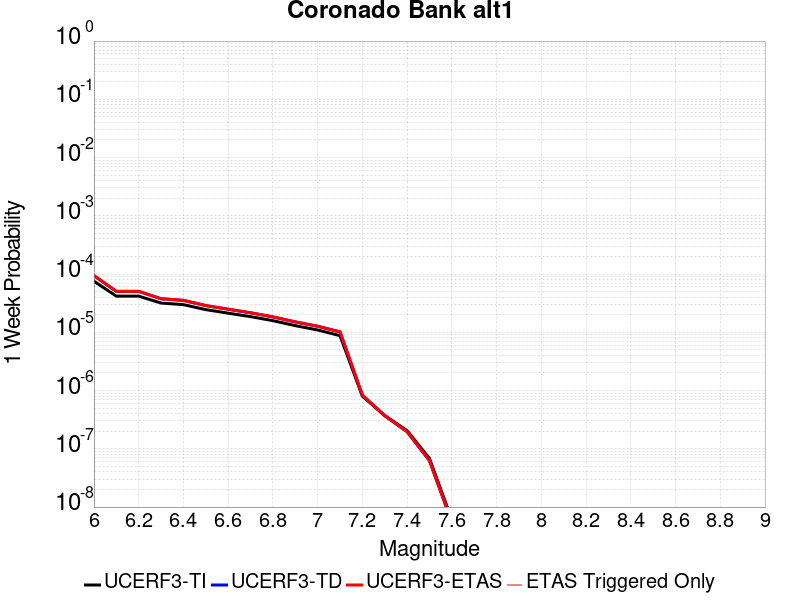 | 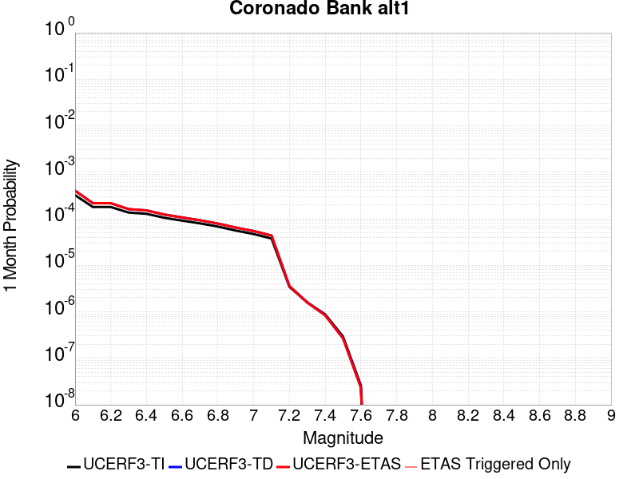 | 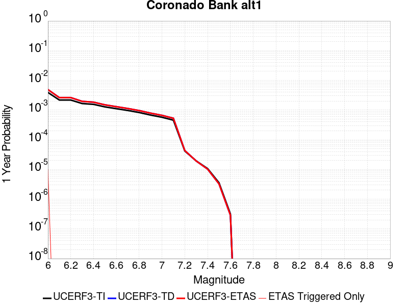 | 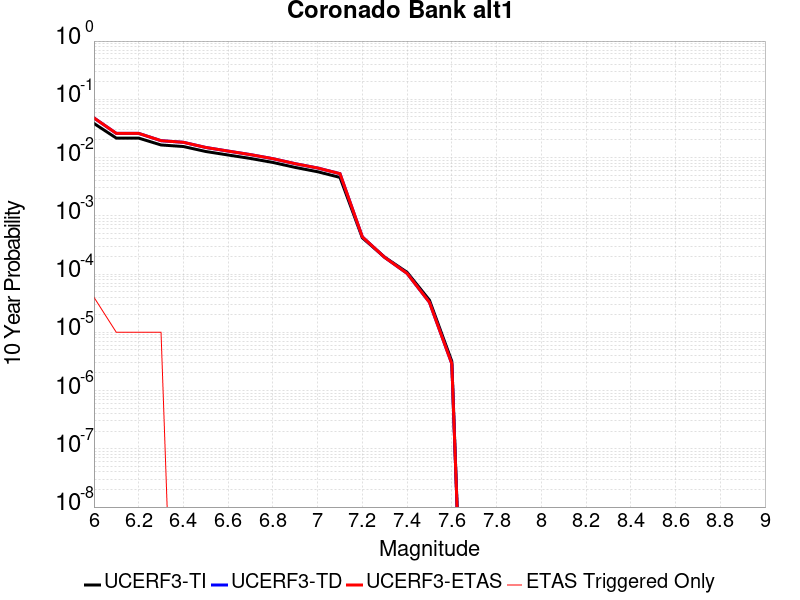 |

| Magnitude | 1 wk TI Prob | 1 wk TD Prob | 1 wk ETAS Prob | 1 wk ETAS/TD Gain | 1 wk ETAS Triggered Only | 1 mo TI Prob | 1 mo TD Prob | 1 mo ETAS Prob | 1 mo ETAS/TD Gain | 1 mo ETAS Triggered Only | 1 yr TI Prob | 1 yr TD Prob | 1 yr ETAS Prob | 1 yr ETAS/TD Gain | 1 yr ETAS Triggered Only | 10 yr TI Prob | 10 yr TD Prob | 10 yr ETAS Prob | 10 yr ETAS/TD Gain | 10 yr ETAS Triggered Only |
|-----|-----|-----|-----|-----|-----|-----|-----|-----|-----|-----|-----|-----|-----|-----|-----|-----|-----|-----|-----|-----|
| 6.0 | 7.533492E-5 | 9.3952294E-5 | 9.3952294E-5 | 1.0 | 0.0 | 3.22824E-4 | 4.0259483E-4 | 4.0259483E-4 | 1.0 | 0.0 | 0.0039233007 | 0.004891124 | 0.0049010753 | 1.0020345 | 1.0E-5 | 0.03854755 | 0.047905073 | 0.047943156 | 1.000795 | 4.0E-5 |
| 6.1 | 4.1807285E-5 | 5.049425E-5 | 5.049425E-5 | 1.0 | 0.0 | 1.7916178E-4 | 2.1638657E-4 | 2.1638657E-4 | 1.0 | 0.0 | 0.0021791123 | 0.002631421 | 0.002631421 | 1.0 | 0.0 | 0.021578677 | 0.026011758 | 0.026021497 | 1.0003744 | 1.0E-5 |
| 6.2 | 4.1807285E-5 | 5.049425E-5 | 5.049425E-5 | 1.0 | 0.0 | 1.7916178E-4 | 2.1638657E-4 | 2.1638657E-4 | 1.0 | 0.0 | 0.0021791123 | 0.002631421 | 0.002631421 | 1.0 | 0.0 | 0.021578677 | 0.026011758 | 0.026021497 | 1.0003744 | 1.0E-5 |
| 6.3 | 3.1793104E-5 | 3.771206E-5 | 3.771206E-5 | 1.0 | 0.0 | 1.3624904E-4 | 1.6161331E-4 | 1.6161331E-4 | 1.0 | 0.0 | 0.0016575698 | 0.001965897 | 0.001965897 | 1.0 | 0.0 | 0.016452603 | 0.019488946 | 0.01949875 | 1.0005031 | 1.0E-5 |
| 6.4 | 2.9878007E-5 | 3.5336663E-5 | 3.5336663E-5 | 1.0 | 0.0 | 1.2804232E-4 | 1.5143424E-4 | 1.5143424E-4 | 1.0 | 0.0 | 0.0015578003 | 0.0018421836 | 0.0018421836 | 1.0 | 0.0 | 0.015469253 | 0.018272884 | 0.018272884 | 1.0 | 0.0 |
| 6.5 | 2.4512565E-5 | 2.8764713E-5 | 2.8764713E-5 | 1.0 | 0.0 | 1.0504962E-4 | 1.2327167E-4 | 1.2327167E-4 | 1.0 | 0.0 | 0.0012782287 | 0.001499827 | 0.001499827 | 1.0 | 0.0 | 0.012709012 | 0.014900027 | 0.014900027 | 1.0 | 0.0 |
| 6.6 | 2.1317413E-5 | 2.4907233E-5 | 2.4907233E-5 | 1.0 | 0.0 | 9.135714E-5 | 1.0674105E-4 | 1.0674105E-4 | 1.0 | 0.0 | 0.0011117056 | 0.0012988199 | 0.0012988199 | 1.0 | 0.0 | 0.011061605 | 0.012914695 | 0.012914695 | 1.0 | 0.0 |
| 6.7 | 1.8585655E-5 | 2.1635356E-5 | 2.1635356E-5 | 1.0 | 0.0 | 7.9650374E-5 | 9.2719776E-5 | 9.2719776E-5 | 1.0 | 0.0 | 9.6931186E-4 | 0.0011282992 | 0.0011282992 | 1.0 | 0.0 | 0.0096509475 | 0.0112278685 | 0.0112278685 | 1.0 | 0.0 |
| 6.8 | 1.5862879E-5 | 1.8419874E-5 | 1.8419874E-5 | 1.0 | 0.0 | 6.798199E-5 | 7.894004E-5 | 7.894004E-5 | 1.0 | 0.0 | 8.273665E-4 | 9.606905E-4 | 9.606905E-4 | 1.0 | 0.0 | 0.008242928 | 0.009567357 | 0.009567357 | 1.0 | 0.0 |
| 6.9 | 1.3021509E-5 | 1.5095589E-5 | 1.5095589E-5 | 1.0 | 0.0 | 5.5805274E-5 | 6.469388E-5 | 6.469388E-5 | 1.0 | 0.0 | 6.792174E-4 | 7.8738143E-4 | 7.8738143E-4 | 1.0 | 0.0 | 0.006771452 | 0.00784774 | 0.00784774 | 1.0 | 0.0 |
| 7.0 | 1.0974371E-5 | 1.27203775E-5 | 1.27203775E-5 | 1.0 | 0.0 | 4.7032172E-5 | 5.4514865E-5 | 5.4514865E-5 | 1.0 | 0.0 | 5.7246623E-4 | 6.635339E-4 | 6.635339E-4 | 1.0 | 0.0 | 0.0057099373 | 0.006617277 | 0.006617277 | 1.0 | 0.0 |
| 7.1 | 8.766221E-6 | 1.0164053E-5 | 1.0164053E-5 | 1.0 | 0.0 | 3.7568978E-5 | 4.3559594E-5 | 4.3559594E-5 | 1.0 | 0.0 | 4.573063E-4 | 5.302262E-4 | 5.302262E-4 | 1.0 | 0.0 | 0.0045636636 | 0.005291311 | 0.005291311 | 1.0 | 0.0 |
| 7.2 | 8.026024E-7 | 8.331837E-7 | 8.331837E-7 | 1.0 | 0.0 | 3.43972E-6 | 3.5707824E-6 | 3.5707824E-6 | 1.0 | 0.0 | 4.1877785E-5 | 4.347342E-5 | 4.347342E-5 | 1.0 | 0.0 | 4.1869894E-4 | 4.3465025E-4 | 4.3465025E-4 | 1.0 | 0.0 |
| 7.3 | 3.7293114E-7 | 3.7001186E-7 | 3.7001186E-7 | 1.0 | 0.0 | 1.5982754E-6 | 1.5857643E-6 | 1.5857643E-6 | 1.0 | 0.0 | 1.9458828E-5 | 1.930651E-5 | 1.930651E-5 | 1.0 | 0.0 | 1.9457124E-4 | 1.9304838E-4 | 1.9304838E-4 | 1.0 | 0.0 |
| 7.4 | 2.0557036E-7 | 1.9674462E-7 | 1.9674462E-7 | 1.0 | 0.0 | 8.810155E-7 | 8.43191E-7 | 8.43191E-7 | 1.0 | 0.0 | 1.0726311E-5 | 1.0265802E-5 | 1.0265802E-5 | 1.0 | 0.0 | 1.0725793E-4 | 1.02653314E-4 | 1.02653314E-4 | 1.0 | 0.0 |
| 7.5 | 6.845446E-8 | 6.279388E-8 | 6.279388E-8 | 1.0 | 0.0 | 2.9337625E-7 | 2.6911658E-7 | 2.6911658E-7 | 1.0 | 0.0 | 3.5718497E-6 | 3.2764897E-6 | 3.2764897E-6 | 1.0 | 0.0 | 3.5717923E-5 | 3.2764423E-5 | 3.2764423E-5 | 1.0 | 0.0 |
| 7.6 | 6.0975145E-9 | 5.531861E-9 | 5.531861E-9 | 1.0 | 0.0 | 2.6132206E-8 | 2.3707976E-8 | 2.3707976E-8 | 1.0 | 0.0 | 3.1815955E-7 | 2.8864457E-7 | 2.8864457E-7 | 1.0 | 0.0 | 3.181591E-6 | 2.886443E-6 | 2.886443E-6 | 1.0 | 0.0 |

## San Jacinto (Borrego)
*[(top)](#table-of-contents)*

| 1 Week | 1 Month | 1 Year | 10 Year |
|-----|-----|-----|-----|
| 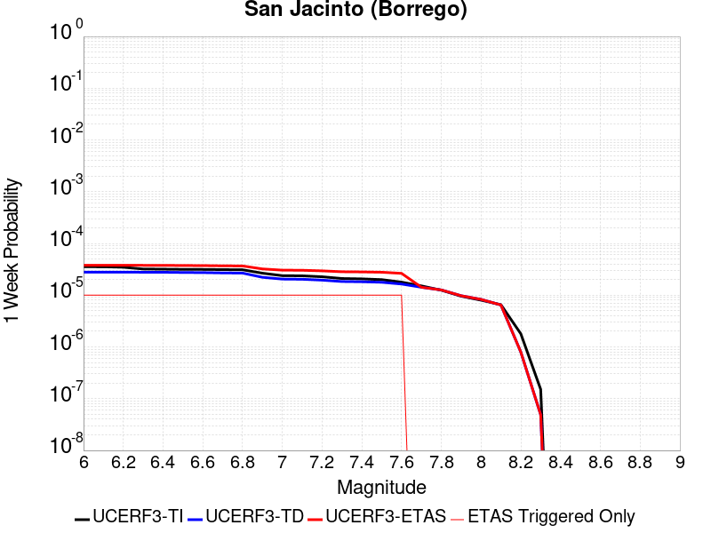 | 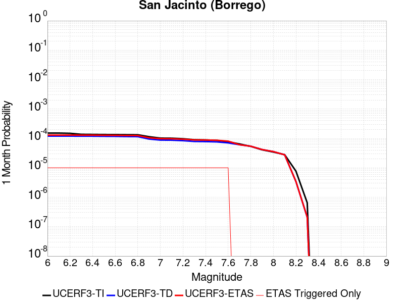 | 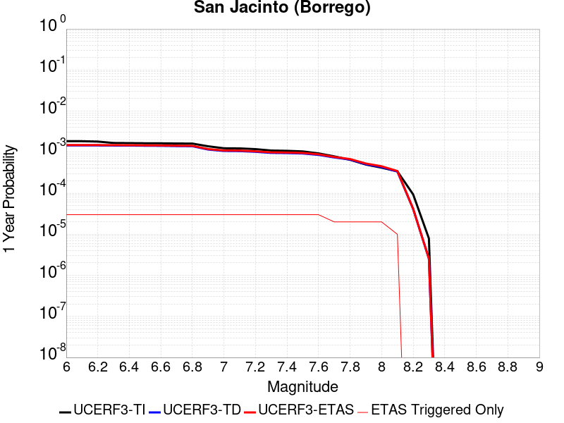 | 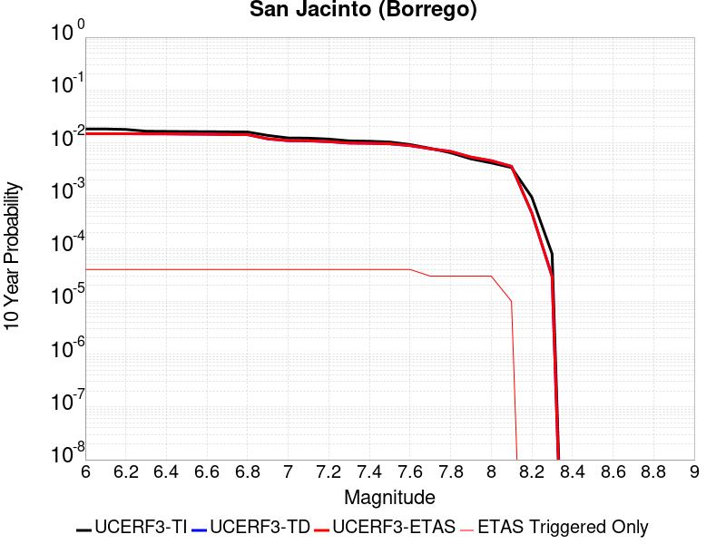 |

| Magnitude | 1 wk TI Prob | 1 wk TD Prob | 1 wk ETAS Prob | 1 wk ETAS/TD Gain | 1 wk ETAS Triggered Only | 1 mo TI Prob | 1 mo TD Prob | 1 mo ETAS Prob | 1 mo ETAS/TD Gain | 1 mo ETAS Triggered Only | 1 yr TI Prob | 1 yr TD Prob | 1 yr ETAS Prob | 1 yr ETAS/TD Gain | 1 yr ETAS Triggered Only | 10 yr TI Prob | 10 yr TD Prob | 10 yr ETAS Prob | 10 yr ETAS/TD Gain | 10 yr ETAS Triggered Only |
|-----|-----|-----|-----|-----|-----|-----|-----|-----|-----|-----|-----|-----|-----|-----|-----|-----|-----|-----|-----|-----|
| 6.0 | 3.543992E-5 | 2.7934115E-5 | 3.7933834E-5 | 1.3579752 | 1.0E-5 | 1.5187653E-4 | 1.1971221E-4 | 1.2971101E-4 | 1.0835236 | 1.0E-5 | 0.0018475284 | 0.001456534 | 0.0014864902 | 1.0205668 | 3.0E-5 | 0.018322436 | 0.014873597 | 0.014913002 | 1.0026493 | 4.0E-5 |
| 6.1 | 3.542281E-5 | 2.7934115E-5 | 3.7933834E-5 | 1.3579752 | 1.0E-5 | 1.5180321E-4 | 1.1971221E-4 | 1.2971101E-4 | 1.0835236 | 1.0E-5 | 0.0018466372 | 0.001456534 | 0.0014864902 | 1.0205668 | 3.0E-5 | 0.018313672 | 0.014873597 | 0.014913002 | 1.0026493 | 4.0E-5 |
| 6.2 | 3.4688688E-5 | 2.7934115E-5 | 3.7933834E-5 | 1.3579752 | 1.0E-5 | 1.4865733E-4 | 1.1971221E-4 | 1.2971101E-4 | 1.0835236 | 1.0E-5 | 0.0018084005 | 0.0014565339 | 0.0014864902 | 1.0205668 | 3.0E-5 | 0.017937548 | 0.014873596 | 0.014913001 | 1.0026493 | 4.0E-5 |
| 6.3 | 3.2087122E-5 | 2.7779462E-5 | 3.7779184E-5 | 1.3599682 | 1.0E-5 | 1.3750899E-4 | 1.1904947E-4 | 1.2904829E-4 | 1.0839887 | 1.0E-5 | 0.0016728862 | 0.0014484759 | 0.0014784324 | 1.0206814 | 3.0E-5 | 0.016603488 | 0.01479463 | 0.014834038 | 1.0026637 | 4.0E-5 |
| 6.4 | 3.1828724E-5 | 2.7746448E-5 | 3.774617E-5 | 1.3603965 | 1.0E-5 | 1.364017E-4 | 1.18908E-4 | 1.289068E-4 | 1.0840887 | 1.0E-5 | 0.0016594254 | 0.0014467557 | 0.0014767123 | 1.020706 | 3.0E-5 | 0.016470885 | 0.014777708 | 0.014817117 | 1.0026668 | 4.0E-5 |
| 6.5 | 3.1563577E-5 | 2.7486154E-5 | 3.748588E-5 | 1.3638096 | 1.0E-5 | 1.3526545E-4 | 1.1779256E-4 | 1.2779138E-4 | 1.084885 | 1.0E-5 | 0.0016456128 | 0.0014331931 | 0.0014631501 | 1.0209023 | 3.0E-5 | 0.0163348 | 0.014644288 | 0.014683703 | 1.0026914 | 4.0E-5 |
| 6.6 | 3.1467625E-5 | 2.7330374E-5 | 3.73301E-5 | 1.3658832 | 1.0E-5 | 1.3485427E-4 | 1.1712498E-4 | 1.2712381E-4 | 1.0853689 | 1.0E-5 | 0.0016406142 | 0.001425076 | 0.0014550333 | 1.0210215 | 3.0E-5 | 0.016285548 | 0.014564533 | 0.01460395 | 1.0027064 | 4.0E-5 |
| 6.7 | 3.1223695E-5 | 2.6948383E-5 | 3.6948113E-5 | 1.3710698 | 1.0E-5 | 1.3380898E-4 | 1.1548802E-4 | 1.2548687E-4 | 1.0865791 | 1.0E-5 | 0.0016279068 | 0.0014051719 | 0.0014351298 | 1.0213197 | 3.0E-5 | 0.01616033 | 0.014368899 | 0.014408325 | 1.0027438 | 4.0E-5 |
| 6.8 | 3.1015585E-5 | 2.6769376E-5 | 3.676911E-5 | 1.3735511 | 1.0E-5 | 1.3291716E-4 | 1.14720926E-4 | 1.2471978E-4 | 1.0871581 | 1.0E-5 | 0.001617065 | 0.0013958444 | 0.0014258026 | 1.0214623 | 3.0E-5 | 0.016053487 | 0.014276173 | 0.014315601 | 1.0027618 | 4.0E-5 |
| 6.9 | 2.6641965E-5 | 2.2191349E-5 | 3.219113E-5 | 1.450616 | 1.0E-5 | 1.1417485E-4 | 9.510233E-5 | 1.0510138E-4 | 1.1051399 | 1.0E-5 | 0.0013891924 | 0.0011572598 | 0.0011872251 | 1.0258933 | 3.0E-5 | 0.0138054015 | 0.011886145 | 0.011925669 | 1.0033252 | 4.0E-5 |
| 7.0 | 2.3854353E-5 | 2.048587E-5 | 3.0485666E-5 | 1.4881313 | 1.0E-5 | 1.02228936E-4 | 8.779365E-5 | 9.779277E-5 | 1.1138935 | 1.0E-5 | 0.0012439266 | 0.0010683661 | 0.001098334 | 1.0280503 | 3.0E-5 | 0.012369866 | 0.010986375 | 0.011025935 | 1.0036008 | 4.0E-5 |
| 7.1 | 2.3672901E-5 | 2.032235E-5 | 3.0322148E-5 | 1.4920591 | 1.0E-5 | 1.0145135E-4 | 8.709289E-5 | 9.709202E-5 | 1.1148099 | 1.0E-5 | 0.0012344702 | 0.0010598428 | 0.001089811 | 1.0282761 | 3.0E-5 | 0.0122763505 | 0.010901547 | 0.010941111 | 1.0036292 | 4.0E-5 |
| 7.2 | 2.2717244E-5 | 1.9549674E-5 | 2.954948E-5 | 1.5115075 | 1.0E-5 | 9.735599E-5 | 8.378164E-5 | 9.378081E-5 | 1.1193479 | 1.0E-5 | 0.0011846646 | 0.0010195666 | 0.0010495359 | 1.0293943 | 3.0E-5 | 0.01178369 | 0.010498884 | 0.010538464 | 1.0037699 | 4.0E-5 |
| 7.3 | 2.1016205E-5 | 1.8391213E-5 | 2.8391029E-5 | 1.543728 | 1.0E-5 | 9.006634E-5 | 7.881711E-5 | 8.881633E-5 | 1.126866 | 1.0E-5 | 0.001096006 | 9.5917797E-4 | 9.891492E-4 | 1.0312468 | 3.0E-5 | 0.010906163 | 0.009894462 | 0.009934067 | 1.0040027 | 4.0E-5 |
| 7.4 | 2.0683625E-5 | 1.8193714E-5 | 2.8193532E-5 | 1.5496304 | 1.0E-5 | 8.86411E-5 | 7.797074E-5 | 8.7969966E-5 | 1.1282432 | 1.0E-5 | 0.001078671 | 9.488824E-4 | 9.788539E-4 | 1.0315862 | 3.0E-5 | 0.010734501 | 0.009791178 | 0.009830786 | 1.0040454 | 4.0E-5 |
| 7.5 | 1.9993966E-5 | 1.7788683E-5 | 2.7788505E-5 | 1.5621452 | 1.0E-5 | 8.568561E-5 | 7.6234996E-5 | 8.6234235E-5 | 1.1311634 | 1.0E-5 | 0.001042723 | 9.2776783E-4 | 9.5774E-4 | 1.0323057 | 3.0E-5 | 0.010378438 | 0.00957807 | 0.009617687 | 1.0041362 | 4.0E-5 |
| 7.6 | 1.788966E-5 | 1.6441732E-5 | 2.6441567E-5 | 1.6081984 | 1.0E-5 | 7.666772E-5 | 7.046267E-5 | 8.046196E-5 | 1.1419091 | 1.0E-5 | 9.3302975E-4 | 8.575471E-4 | 8.875214E-4 | 1.0349535 | 3.0E-5 | 0.00929122 | 0.0088698575 | 0.008909503 | 1.0044696 | 4.0E-5 |
| 7.7 | 1.5125781E-5 | 1.4243621E-5 | 1.4243621E-5 | 1.0 | 0.0 | 6.4823165E-5 | 6.1042665E-5 | 6.1042665E-5 | 1.0 | 0.0 | 7.889362E-4 | 7.4294186E-4 | 7.62927E-4 | 1.0269 | 2.0E-5 | 0.007861412 | 0.0077174758 | 0.0077472446 | 1.0038573 | 3.0E-5 |
| 7.8 | 1.250089E-5 | 1.2636515E-5 | 1.2636515E-5 | 1.0 | 0.0 | 5.3574146E-5 | 5.415537E-5 | 5.415537E-5 | 1.0 | 0.0 | 6.5207E-4 | 6.591428E-4 | 6.791296E-4 | 1.0303224 | 2.0E-5 | 0.006501599 | 0.00687092 | 0.0069007133 | 1.0043362 | 3.0E-5 |
| 7.9 | 9.561E-6 | 9.759914E-6 | 9.759914E-6 | 1.0 | 0.0 | 4.0975072E-5 | 4.1827538E-5 | 4.1827538E-5 | 1.0 | 0.0 | 4.987573E-4 | 5.091318E-4 | 5.2912167E-4 | 1.0392625 | 2.0E-5 | 0.0049763937 | 0.0053551346 | 0.005384974 | 1.0055721 | 3.0E-5 |
| 8.0 | 8.01699E-6 | 8.2982915E-6 | 8.2982915E-6 | 1.0 | 0.0 | 3.4358076E-5 | 3.5563622E-5 | 3.5563622E-5 | 1.0 | 0.0 | 4.1822926E-4 | 4.329016E-4 | 4.5289297E-4 | 1.0461799 | 2.0E-5 | 0.0041744304 | 0.0045759073 | 0.00460577 | 1.0065261 | 3.0E-5 |
| 8.1 | 6.541947E-6 | 6.466171E-6 | 6.466171E-6 | 1.0 | 0.0 | 2.8036617E-5 | 2.7711869E-5 | 2.7711869E-5 | 1.0 | 0.0 | 3.4129233E-4 | 3.3734026E-4 | 3.473369E-4 | 1.0296336 | 1.0E-5 | 0.0034076865 | 0.0035827826 | 0.0035927468 | 1.0027812 | 1.0E-5 |
| 8.2 | 1.7968189E-6 | 7.978815E-7 | 7.978815E-7 | 1.0 | 0.0 | 7.70063E-6 | 3.419488E-6 | 3.419488E-6 | 1.0 | 0.0 | 9.3751136E-5 | 4.163149E-5 | 4.163149E-5 | 1.0 | 0.0 | 9.371159E-4 | 4.7162327E-4 | 4.7162327E-4 | 1.0 | 0.0 |
| 8.3 | 1.5167889E-7 | 4.9030522E-8 | 4.9030522E-8 | 1.0 | 0.0 | 6.500522E-7 | 2.1013079E-7 | 2.1013079E-7 | 1.0 | 0.0 | 7.9143565E-6 | 2.55834E-6 | 2.55834E-6 | 1.0 | 0.0 | 7.914075E-5 | 2.9725656E-5 | 2.9725656E-5 | 1.0 | 0.0 |

## Cleghorn
*[(top)](#table-of-contents)*

| 1 Week | 1 Month | 1 Year | 10 Year |
|-----|-----|-----|-----|
| 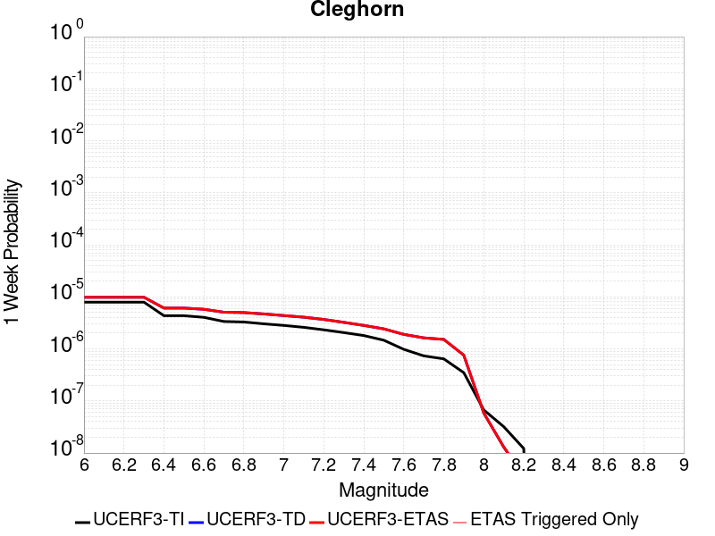 |  | 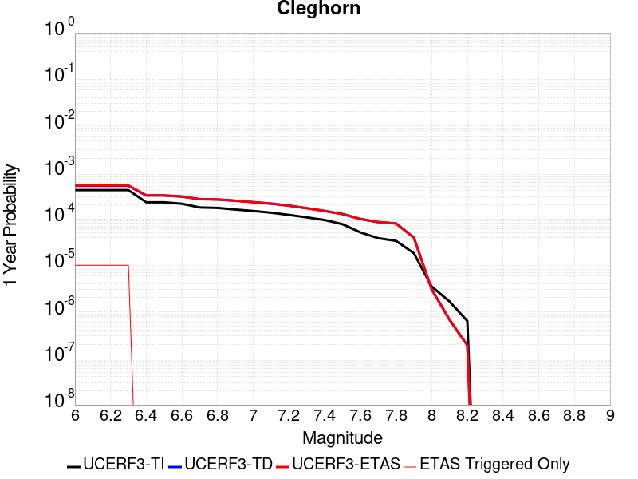 | 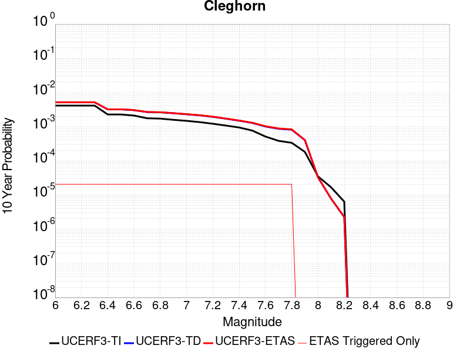 |

| Magnitude | 1 wk TI Prob | 1 wk TD Prob | 1 wk ETAS Prob | 1 wk ETAS/TD Gain | 1 wk ETAS Triggered Only | 1 mo TI Prob | 1 mo TD Prob | 1 mo ETAS Prob | 1 mo ETAS/TD Gain | 1 mo ETAS Triggered Only | 1 yr TI Prob | 1 yr TD Prob | 1 yr ETAS Prob | 1 yr ETAS/TD Gain | 1 yr ETAS Triggered Only | 10 yr TI Prob | 10 yr TD Prob | 10 yr ETAS Prob | 10 yr ETAS/TD Gain | 10 yr ETAS Triggered Only |
|-----|-----|-----|-----|-----|-----|-----|-----|-----|-----|-----|-----|-----|-----|-----|-----|-----|-----|-----|-----|-----|
| 6.0 | 7.9267165E-6 | 9.832575E-6 | 9.832575E-6 | 1.0 | 0.0 | 3.39712E-5 | 4.213899E-5 | 4.213899E-5 | 1.0 | 0.0 | 4.1352084E-4 | 5.12932E-4 | 5.229269E-4 | 1.0194857 | 1.0E-5 | 0.004127522 | 0.005132577 | 0.0051723714 | 1.0077534 | 4.0E-5 |
| 6.1 | 7.9267165E-6 | 9.832575E-6 | 9.832575E-6 | 1.0 | 0.0 | 3.39712E-5 | 4.213899E-5 | 4.213899E-5 | 1.0 | 0.0 | 4.1352084E-4 | 5.12932E-4 | 5.229269E-4 | 1.0194857 | 1.0E-5 | 0.004127522 | 0.005132577 | 0.0051723714 | 1.0077534 | 4.0E-5 |
| 6.2 | 7.9267165E-6 | 9.832575E-6 | 9.832575E-6 | 1.0 | 0.0 | 3.39712E-5 | 4.213899E-5 | 4.213899E-5 | 1.0 | 0.0 | 4.1352084E-4 | 5.12932E-4 | 5.229269E-4 | 1.0194857 | 1.0E-5 | 0.004127522 | 0.005132577 | 0.0051723714 | 1.0077534 | 4.0E-5 |
| 6.3 | 7.9267165E-6 | 9.832575E-6 | 9.832575E-6 | 1.0 | 0.0 | 3.39712E-5 | 4.213899E-5 | 4.213899E-5 | 1.0 | 0.0 | 4.1352084E-4 | 5.12932E-4 | 5.229269E-4 | 1.0194857 | 1.0E-5 | 0.004127522 | 0.005132577 | 0.0051723714 | 1.0077534 | 4.0E-5 |
| 6.4 | 4.3445207E-6 | 6.0924144E-6 | 6.0924144E-6 | 1.0 | 0.0 | 1.8619241E-5 | 2.6110092E-5 | 2.6110092E-5 | 1.0 | 0.0 | 2.2666567E-4 | 3.1784503E-4 | 3.1784503E-4 | 1.0 | 0.0 | 0.0022643462 | 0.0031880767 | 0.003217981 | 1.0093801 | 3.0E-5 |
| 6.5 | 4.3445207E-6 | 6.0924144E-6 | 6.0924144E-6 | 1.0 | 0.0 | 1.8619241E-5 | 2.6110092E-5 | 2.6110092E-5 | 1.0 | 0.0 | 2.2666567E-4 | 3.1784503E-4 | 3.1784503E-4 | 1.0 | 0.0 | 0.0022643462 | 0.0031880767 | 0.003217981 | 1.0093801 | 3.0E-5 |
| 6.6 | 4.040109E-6 | 5.7748202E-6 | 5.7748202E-6 | 1.0 | 0.0 | 1.7314638E-5 | 2.4749E-5 | 2.4749E-5 | 1.0 | 0.0 | 2.1078532E-4 | 3.0127834E-4 | 3.0127834E-4 | 1.0 | 0.0 | 0.002105855 | 0.0030228654 | 0.0030527748 | 1.0098944 | 3.0E-5 |
| 6.7 | 3.3632055E-6 | 5.0683134E-6 | 5.0683134E-6 | 1.0 | 0.0 | 1.4413658E-5 | 2.1721164E-5 | 2.1721164E-5 | 1.0 | 0.0 | 1.7547216E-4 | 2.6442338E-4 | 2.6442338E-4 | 1.0 | 0.0 | 0.0017533366 | 0.0026551976 | 0.002685118 | 1.0112686 | 3.0E-5 |
| 6.8 | 3.2902772E-6 | 4.99022E-6 | 4.99022E-6 | 1.0 | 0.0 | 1.4101111E-5 | 2.1386484E-5 | 2.1386484E-5 | 1.0 | 0.0 | 1.716675E-4 | 2.6034965E-4 | 2.6034965E-4 | 1.0 | 0.0 | 0.0017153495 | 0.0026145563 | 0.0026444779 | 1.0114442 | 3.0E-5 |
| 6.9 | 3.031547E-6 | 4.6919777E-6 | 4.6919777E-6 | 1.0 | 0.0 | 1.299228E-5 | 2.0108322E-5 | 2.0108322E-5 | 1.0 | 0.0 | 1.5816953E-4 | 2.447916E-4 | 2.447916E-4 | 1.0 | 0.0 | 0.00158057 | 0.0024593272 | 0.0024892536 | 1.0121684 | 3.0E-5 |
| 7.0 | 2.8259715E-6 | 4.371534E-6 | 4.371534E-6 | 1.0 | 0.0 | 1.211125E-5 | 1.8735012E-5 | 1.8735012E-5 | 1.0 | 0.0 | 1.4744449E-4 | 2.2807514E-4 | 2.2807514E-4 | 1.0 | 0.0 | 0.001473467 | 0.002292517 | 0.0023224482 | 1.013056 | 3.0E-5 |
| 7.1 | 2.5962665E-6 | 4.066747E-6 | 4.066747E-6 | 1.0 | 0.0 | 1.1126809E-5 | 1.74288E-5 | 1.74288E-5 | 1.0 | 0.0 | 1.3546048E-4 | 2.1217519E-4 | 2.1217519E-4 | 1.0 | 0.0 | 0.0013537793 | 0.0021338374 | 0.0021537947 | 1.0093528 | 2.0E-5 |
| 7.2 | 2.3247253E-6 | 3.6772897E-6 | 3.6772897E-6 | 1.0 | 0.0 | 9.96307E-6 | 1.5759719E-5 | 1.5759719E-5 | 1.0 | 0.0 | 1.21293626E-4 | 1.9185786E-4 | 1.9185786E-4 | 1.0 | 0.0 | 0.0012122744 | 0.0019310551 | 0.0019510165 | 1.010337 | 2.0E-5 |
| 7.3 | 2.056928E-6 | 3.2359856E-6 | 3.2359856E-6 | 1.0 | 0.0 | 8.815376E-6 | 1.3868437E-5 | 1.3868437E-5 | 1.0 | 0.0 | 1.0732192E-4 | 1.688353E-4 | 1.688353E-4 | 1.0 | 0.0 | 0.001072701 | 0.0017012694 | 0.0017212353 | 1.0117359 | 2.0E-5 |
| 7.4 | 1.8055999E-6 | 2.8263637E-6 | 2.8263637E-6 | 1.0 | 0.0 | 7.738263E-6 | 1.21129315E-5 | 1.21129315E-5 | 1.0 | 0.0 | 9.4209274E-5 | 1.474651E-4 | 1.474651E-4 | 1.0 | 0.0 | 9.4169343E-4 | 0.001488009 | 0.0015079792 | 1.0134208 | 2.0E-5 |
| 7.5 | 1.4683443E-6 | 2.425593E-6 | 2.425593E-6 | 1.0 | 0.0 | 6.292889E-6 | 1.0395358E-5 | 1.0395358E-5 | 1.0 | 0.0 | 7.661323E-5 | 1.2655623E-4 | 1.2655623E-4 | 1.0 | 0.0 | 7.658682E-4 | 0.0012792206 | 0.0012892077 | 1.0078073 | 1.0E-5 |
| 7.6 | 9.804088E-7 | 1.901101E-6 | 1.901101E-6 | 1.0 | 0.0 | 4.201745E-6 | 8.147551E-6 | 8.147551E-6 | 1.0 | 0.0 | 5.1155046E-5 | 9.919196E-5 | 9.919196E-5 | 1.0 | 0.0 | 5.114327E-4 | 0.0010058905 | 0.0010158805 | 1.0099314 | 1.0E-5 |
| 7.7 | 7.3434086E-7 | 1.6292396E-6 | 1.6292396E-6 | 1.0 | 0.0 | 3.1471714E-6 | 6.982437E-6 | 6.982437E-6 | 1.0 | 0.0 | 3.831614E-5 | 8.500788E-5 | 8.500788E-5 | 1.0 | 0.0 | 3.8309532E-4 | 8.642013E-4 | 8.741927E-4 | 1.0115614 | 1.0E-5 |
| 7.8 | 6.434184E-7 | 1.522801E-6 | 1.522801E-6 | 1.0 | 0.0 | 2.7575045E-6 | 6.5262734E-6 | 6.5262734E-6 | 1.0 | 0.0 | 3.35721E-5 | 7.9454505E-5 | 7.9454505E-5 | 1.0 | 0.0 | 3.3567028E-4 | 8.083677E-4 | 8.183596E-4 | 1.0123606 | 1.0E-5 |
| 7.9 | 3.4943926E-7 | 7.5788125E-7 | 7.5788125E-7 | 1.0 | 0.0 | 1.497596E-6 | 3.2480586E-6 | 3.2480586E-6 | 1.0 | 0.0 | 1.8233079E-5 | 3.9544404E-5 | 3.9544404E-5 | 1.0 | 0.0 | 1.8231584E-4 | 4.0423044E-4 | 4.0423044E-4 | 1.0 | 0.0 |
| 8.0 | 6.717524E-8 | 5.8440865E-8 | 5.8440865E-8 | 1.0 | 0.0 | 2.8789387E-7 | 2.5046083E-7 | 2.5046083E-7 | 1.0 | 0.0 | 3.505102E-6 | 3.0493563E-6 | 3.0493563E-6 | 1.0 | 0.0 | 3.5050467E-5 | 3.276327E-5 | 3.276327E-5 | 1.0 | 0.0 |
| 8.1 | 3.1984914E-8 | 1.2973213E-8 | 1.2973213E-8 | 1.0 | 0.0 | 1.370782E-7 | 5.5599482E-8 | 5.5599482E-8 | 1.0 | 0.0 | 1.6689258E-6 | 6.769235E-7 | 6.769235E-7 | 1.0 | 0.0 | 1.6689133E-5 | 7.754204E-6 | 7.754204E-6 | 1.0 | 0.0 |
| 8.2 | 1.21887656E-8 | 3.654808E-9 | 3.654808E-9 | 1.0 | 0.0 | 5.2237567E-8 | 1.5663463E-8 | 1.5663463E-8 | 1.0 | 0.0 | 6.359922E-7 | 1.9070265E-7 | 1.9070265E-7 | 1.0 | 0.0 | 6.3599036E-6 | 2.2501451E-6 | 2.2501451E-6 | 1.0 | 0.0 |

## Rose Canyon
*[(top)](#table-of-contents)*

| 1 Week | 1 Month | 1 Year | 10 Year |
|-----|-----|-----|-----|
|  |  | 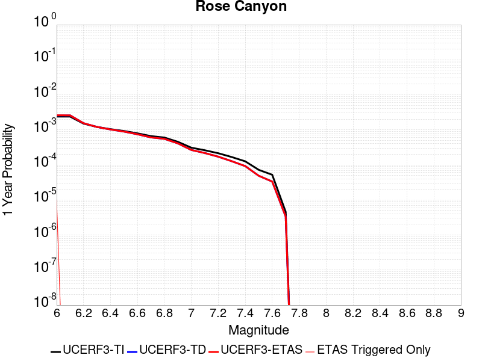 | 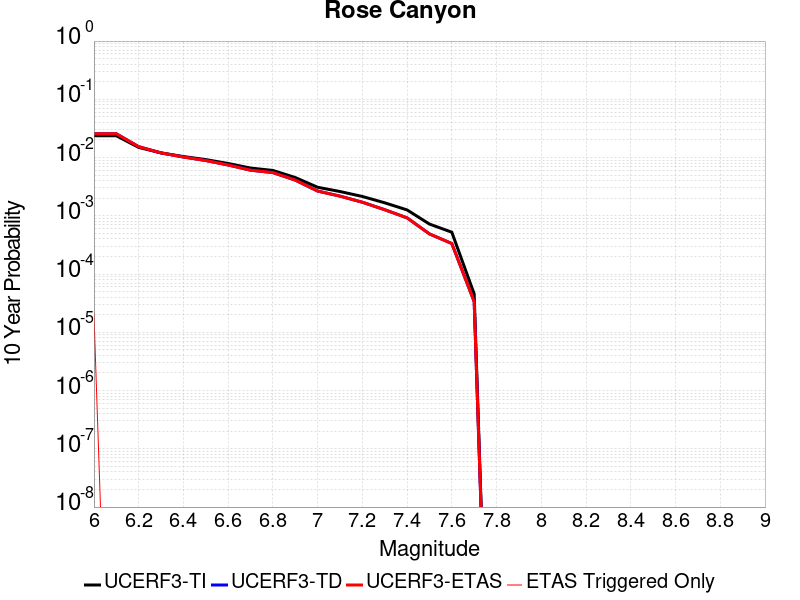 |

| Magnitude | 1 wk TI Prob | 1 wk TD Prob | 1 wk ETAS Prob | 1 wk ETAS/TD Gain | 1 wk ETAS Triggered Only | 1 mo TI Prob | 1 mo TD Prob | 1 mo ETAS Prob | 1 mo ETAS/TD Gain | 1 mo ETAS Triggered Only | 1 yr TI Prob | 1 yr TD Prob | 1 yr ETAS Prob | 1 yr ETAS/TD Gain | 1 yr ETAS Triggered Only | 10 yr TI Prob | 10 yr TD Prob | 10 yr ETAS Prob | 10 yr ETAS/TD Gain | 10 yr ETAS Triggered Only |
|-----|-----|-----|-----|-----|-----|-----|-----|-----|-----|-----|-----|-----|-----|-----|-----|-----|-----|-----|-----|-----|
| 6.0 | 4.5923203E-5 | 4.9715825E-5 | 4.9715825E-5 | 1.0 | 0.0 | 1.9679888E-4 | 2.1305127E-4 | 2.1305127E-4 | 1.0 | 0.0 | 0.0023933933 | 0.0025910123 | 0.0026009865 | 1.0038495 | 1.0E-5 | 0.023677798 | 0.025640773 | 0.025679747 | 1.00152 | 4.0E-5 |
| 6.1 | 4.5923203E-5 | 4.9715825E-5 | 4.9715825E-5 | 1.0 | 0.0 | 1.9679888E-4 | 2.1305127E-4 | 2.1305127E-4 | 1.0 | 0.0 | 0.0023933933 | 0.0025910123 | 0.0025910123 | 1.0 | 0.0 | 0.023677798 | 0.025640773 | 0.02566026 | 1.00076 | 2.0E-5 |
| 6.2 | 2.8844734E-5 | 2.9669445E-5 | 2.9669445E-5 | 1.0 | 0.0 | 1.2361443E-4 | 1.2714828E-4 | 1.2714828E-4 | 1.0 | 0.0 | 0.0015039665 | 0.0015469306 | 0.0015469306 | 1.0 | 0.0 | 0.0149382865 | 0.01537464 | 0.015384487 | 1.0006404 | 1.0E-5 |
| 6.3 | 2.3171577E-5 | 2.3161689E-5 | 2.3161689E-5 | 1.0 | 0.0 | 9.9302975E-5 | 9.926068E-5 | 9.926068E-5 | 1.0 | 0.0 | 0.0012083431 | 0.0012078421 | 0.0012078421 | 1.0 | 0.0 | 0.012017938 | 0.0120226685 | 0.012032548 | 1.0008217 | 1.0E-5 |
| 6.4 | 2.0066604E-5 | 1.9667403E-5 | 1.9667403E-5 | 1.0 | 0.0 | 8.599689E-5 | 8.42862E-5 | 8.42862E-5 | 1.0 | 0.0 | 0.0010465092 | 0.0010257114 | 0.0010257114 | 1.0 | 0.0 | 0.010415946 | 0.010217753 | 0.010227651 | 1.0009687 | 1.0E-5 |
| 6.5 | 1.776989E-5 | 1.7114124E-5 | 1.7114124E-5 | 1.0 | 0.0 | 7.615444E-5 | 7.334422E-5 | 7.334422E-5 | 1.0 | 0.0 | 9.267859E-4 | 8.92607E-4 | 8.92607E-4 | 1.0 | 0.0 | 0.009229303 | 0.008896374 | 0.008906285 | 1.001114 | 1.0E-5 |
| 6.6 | 1.5227364E-5 | 1.43395055E-5 | 1.43395055E-5 | 1.0 | 0.0 | 6.52585E-5 | 6.1453604E-5 | 6.1453604E-5 | 1.0 | 0.0 | 7.942326E-4 | 7.47946E-4 | 7.47946E-4 | 1.0 | 0.0 | 0.007914 | 0.007458486 | 0.0074684117 | 1.0013307 | 1.0E-5 |
| 6.7 | 1.2703898E-5 | 1.167345E-5 | 1.167345E-5 | 1.0 | 0.0 | 5.4444143E-5 | 5.002814E-5 | 5.002814E-5 | 1.0 | 0.0 | 6.626558E-4 | 6.089266E-4 | 6.089266E-4 | 1.0 | 0.0 | 0.006606833 | 0.006075177 | 0.006085116 | 1.001636 | 1.0E-5 |
| 6.8 | 1.1554917E-5 | 1.0609485E-5 | 1.0609485E-5 | 1.0 | 0.0 | 4.9520135E-5 | 4.5468452E-5 | 4.5468452E-5 | 1.0 | 0.0 | 6.0274085E-4 | 5.534419E-4 | 5.534419E-4 | 1.0 | 0.0 | 0.0060110865 | 0.005522644 | 0.005532589 | 1.0018008 | 1.0E-5 |
| 6.9 | 8.732078E-6 | 7.881448E-6 | 7.881448E-6 | 1.0 | 0.0 | 3.7422655E-5 | 3.3777214E-5 | 3.3777214E-5 | 1.0 | 0.0 | 4.5552556E-4 | 4.111629E-4 | 4.111629E-4 | 1.0 | 0.0 | 0.0045459294 | 0.0041048555 | 0.004114814 | 1.0024261 | 1.0E-5 |
| 7.0 | 5.9337494E-6 | 5.107531E-6 | 5.107531E-6 | 1.0 | 0.0 | 2.5430107E-5 | 2.1889235E-5 | 2.1889235E-5 | 1.0 | 0.0 | 3.0956755E-4 | 2.66469E-4 | 2.66469E-4 | 1.0 | 0.0 | 0.0030913667 | 0.0026615104 | 0.0026714837 | 1.0037472 | 1.0E-5 |
| 7.1 | 5.013409E-6 | 4.177419E-6 | 4.177419E-6 | 1.0 | 0.0 | 2.1485863E-5 | 1.7903103E-5 | 1.7903103E-5 | 1.0 | 0.0 | 2.6155898E-4 | 2.1794859E-4 | 2.1794859E-4 | 1.0 | 0.0 | 0.0026125133 | 0.00217736 | 0.00217736 | 1.0 | 0.0 |
| 7.2 | 4.120763E-6 | 3.2821677E-6 | 3.2821677E-6 | 1.0 | 0.0 | 1.7660293E-5 | 1.4066358E-5 | 1.4066358E-5 | 1.0 | 0.0 | 2.1499286E-4 | 1.7124454E-4 | 1.7124454E-4 | 1.0 | 0.0 | 0.0021478499 | 0.0017111353 | 0.0017111353 | 1.0 | 0.0 |
| 7.3 | 3.2081239E-6 | 2.4405597E-6 | 2.4405597E-6 | 1.0 | 0.0 | 1.374903E-5 | 1.04595E-5 | 1.04595E-5 | 1.0 | 0.0 | 1.6738157E-4 | 1.2733703E-4 | 1.2733703E-4 | 1.0 | 0.0 | 0.0016725556 | 0.0012726476 | 0.0012726476 | 1.0 | 0.0 |
| 7.4 | 2.4194755E-6 | 1.7680803E-6 | 1.7680803E-6 | 1.0 | 0.0 | 1.0369139E-5 | 7.5774656E-6 | 7.5774656E-6 | 1.0 | 0.0 | 1.2623696E-4 | 9.2251794E-5 | 9.2251794E-5 | 1.0 | 0.0 | 0.0012616527 | 9.221403E-4 | 9.221403E-4 | 1.0 | 0.0 |
| 7.5 | 1.3842889E-6 | 9.378737E-7 | 9.378737E-7 | 1.0 | 0.0 | 5.9326535E-6 | 4.0194527E-6 | 4.0194527E-6 | 1.0 | 0.0 | 7.222766E-5 | 4.8935777E-5 | 4.8935777E-5 | 1.0 | 0.0 | 7.220419E-4 | 4.8925355E-4 | 4.8925355E-4 | 1.0 | 0.0 |
| 7.6 | 1.0021575E-6 | 6.411548E-7 | 6.411548E-7 | 1.0 | 0.0 | 4.2949537E-6 | 2.7478038E-6 | 2.7478038E-6 | 1.0 | 0.0 | 5.2289808E-5 | 3.345402E-5 | 3.345402E-5 | 1.0 | 0.0 | 5.2277505E-4 | 3.3449198E-4 | 3.3449198E-4 | 1.0 | 0.0 |
| 7.7 | 8.7620116E-8 | 6.449284E-8 | 6.449284E-8 | 1.0 | 0.0 | 3.7551473E-7 | 2.7639786E-7 | 2.7639786E-7 | 1.0 | 0.0 | 4.5718825E-6 | 3.365139E-6 | 3.365139E-6 | 1.0 | 0.0 | 4.5717883E-5 | 3.365091E-5 | 3.365091E-5 | 1.0 | 0.0 |

## San Luis Range 2011 CFM
*[(top)](#table-of-contents)*

| 1 Week | 1 Month | 1 Year | 10 Year |
|-----|-----|-----|-----|
| 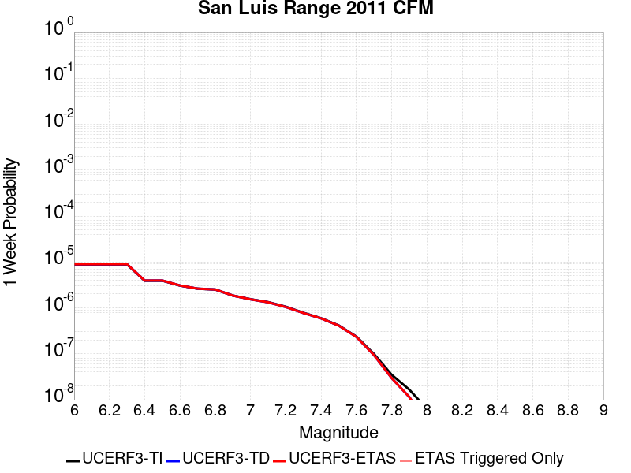 | 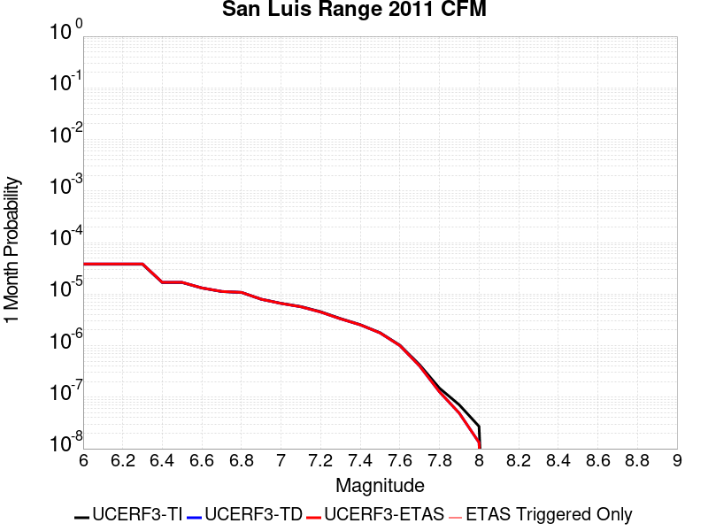 | 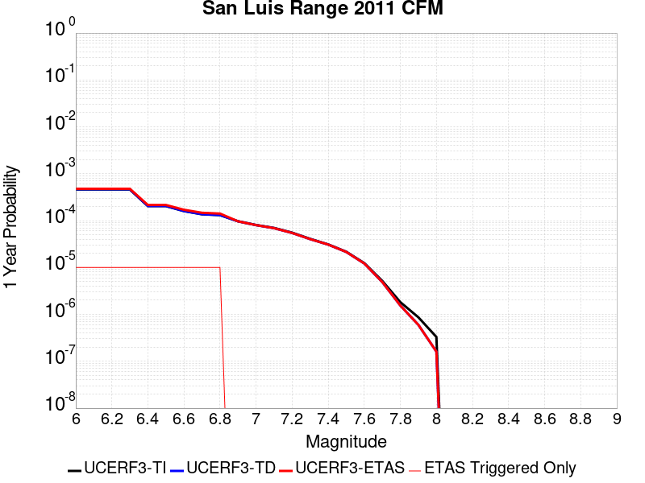 | 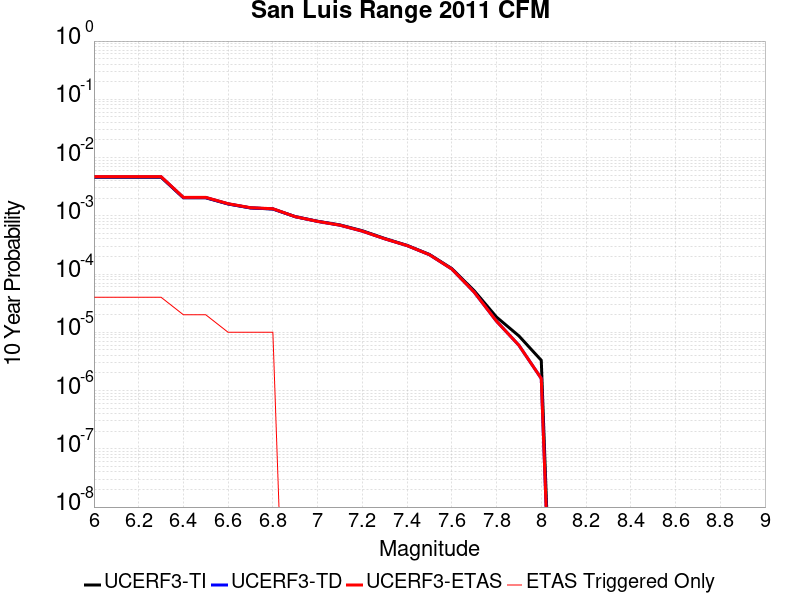 |

| Magnitude | 1 wk TI Prob | 1 wk TD Prob | 1 wk ETAS Prob | 1 wk ETAS/TD Gain | 1 wk ETAS Triggered Only | 1 mo TI Prob | 1 mo TD Prob | 1 mo ETAS Prob | 1 mo ETAS/TD Gain | 1 mo ETAS Triggered Only | 1 yr TI Prob | 1 yr TD Prob | 1 yr ETAS Prob | 1 yr ETAS/TD Gain | 1 yr ETAS Triggered Only | 10 yr TI Prob | 10 yr TD Prob | 10 yr ETAS Prob | 10 yr ETAS/TD Gain | 10 yr ETAS Triggered Only |
|-----|-----|-----|-----|-----|-----|-----|-----|-----|-----|-----|-----|-----|-----|-----|-----|-----|-----|-----|-----|-----|
| 6.0 | 8.8368415E-6 | 8.965477E-6 | 8.965477E-6 | 1.0 | 0.0 | 3.787163E-5 | 3.8422953E-5 | 3.8422953E-5 | 1.0 | 0.0 | 4.609895E-4 | 4.677069E-4 | 4.7770224E-4 | 1.0213709 | 1.0E-5 | 0.0046003438 | 0.0046680085 | 0.0047078216 | 1.008529 | 4.0E-5 |
| 6.1 | 8.8368415E-6 | 8.965477E-6 | 8.965477E-6 | 1.0 | 0.0 | 3.787163E-5 | 3.8422953E-5 | 3.8422953E-5 | 1.0 | 0.0 | 4.609895E-4 | 4.677069E-4 | 4.7770224E-4 | 1.0213709 | 1.0E-5 | 0.0046003438 | 0.0046680085 | 0.0047078216 | 1.008529 | 4.0E-5 |
| 6.2 | 8.8368415E-6 | 8.965477E-6 | 8.965477E-6 | 1.0 | 0.0 | 3.787163E-5 | 3.8422953E-5 | 3.8422953E-5 | 1.0 | 0.0 | 4.609895E-4 | 4.677069E-4 | 4.7770224E-4 | 1.0213709 | 1.0E-5 | 0.0046003438 | 0.0046680085 | 0.0047078216 | 1.008529 | 4.0E-5 |
| 6.3 | 8.8368415E-6 | 8.965477E-6 | 8.965477E-6 | 1.0 | 0.0 | 3.787163E-5 | 3.8422953E-5 | 3.8422953E-5 | 1.0 | 0.0 | 4.609895E-4 | 4.677069E-4 | 4.7770224E-4 | 1.0213709 | 1.0E-5 | 0.0046003438 | 0.0046680085 | 0.0047078216 | 1.008529 | 4.0E-5 |
| 6.4 | 3.9094193E-6 | 3.941213E-6 | 3.941213E-6 | 1.0 | 0.0 | 1.6754546E-5 | 1.6890806E-5 | 1.6890806E-5 | 1.0 | 0.0 | 2.039675E-4 | 2.0562643E-4 | 2.1562437E-4 | 1.0486219 | 1.0E-5 | 0.0020378039 | 0.0020543905 | 0.0020743494 | 1.0097152 | 2.0E-5 |
| 6.5 | 3.9094193E-6 | 3.941213E-6 | 3.941213E-6 | 1.0 | 0.0 | 1.6754546E-5 | 1.6890806E-5 | 1.6890806E-5 | 1.0 | 0.0 | 2.039675E-4 | 2.0562643E-4 | 2.1562437E-4 | 1.0486219 | 1.0E-5 | 0.0020378039 | 0.0020543905 | 0.0020743494 | 1.0097152 | 2.0E-5 |
| 6.6 | 3.0587726E-6 | 3.0753965E-6 | 3.0753965E-6 | 1.0 | 0.0 | 1.3108959E-5 | 1.3180205E-5 | 1.3180205E-5 | 1.0 | 0.0 | 1.595899E-4 | 1.604573E-4 | 1.7045569E-4 | 1.0623119 | 1.0E-5 | 0.0015947534 | 0.0016034264 | 0.0016134104 | 1.0062267 | 1.0E-5 |
| 6.7 | 2.6160574E-6 | 2.6251346E-6 | 2.6251346E-6 | 1.0 | 0.0 | 1.1211626E-5 | 1.1250529E-5 | 1.1250529E-5 | 1.0 | 0.0 | 1.3649299E-4 | 1.3696664E-4 | 1.4696526E-4 | 1.0730004 | 1.0E-5 | 0.0013640919 | 0.0013688284 | 0.0013788147 | 1.0072955 | 1.0E-5 |
| 6.8 | 2.5110312E-6 | 2.5181473E-6 | 2.5181473E-6 | 1.0 | 0.0 | 1.0761518E-5 | 1.0792015E-5 | 1.0792015E-5 | 1.0 | 0.0 | 1.310136E-4 | 1.3138492E-4 | 1.413836E-4 | 1.0761023 | 1.0E-5 | 0.0013093639 | 0.0013130783 | 0.0013230651 | 1.0076057 | 1.0E-5 |
| 6.9 | 1.8564405E-6 | 1.8524926E-6 | 1.8524926E-6 | 1.0 | 0.0 | 7.95615E-6 | 7.93923E-6 | 7.93923E-6 | 1.0 | 0.0 | 9.686181E-5 | 9.665586E-5 | 9.665586E-5 | 1.0 | 0.0 | 9.68196E-4 | 9.661402E-4 | 9.661402E-4 | 1.0 | 0.0 |
| 7.0 | 1.546127E-6 | 1.5369586E-6 | 1.5369586E-6 | 1.0 | 0.0 | 6.626242E-6 | 6.586949E-6 | 6.586949E-6 | 1.0 | 0.0 | 8.06715E-5 | 8.019316E-5 | 8.019316E-5 | 1.0 | 0.0 | 8.0642226E-4 | 8.016429E-4 | 8.016429E-4 | 1.0 | 0.0 |
| 7.1 | 1.3368208E-6 | 1.3235369E-6 | 1.3235369E-6 | 1.0 | 0.0 | 5.7292195E-6 | 5.672289E-6 | 5.672289E-6 | 1.0 | 0.0 | 6.975101E-5 | 6.905793E-5 | 6.905793E-5 | 1.0 | 0.0 | 6.972912E-4 | 6.903652E-4 | 6.903652E-4 | 1.0 | 0.0 |
| 7.2 | 1.0623363E-6 | 1.0454403E-6 | 1.0454403E-6 | 1.0 | 0.0 | 4.5528623E-6 | 4.480451E-6 | 4.480451E-6 | 1.0 | 0.0 | 5.5429686E-5 | 5.4548127E-5 | 5.4548127E-5 | 1.0 | 0.0 | 5.5415864E-4 | 5.4534763E-4 | 5.4534763E-4 | 1.0 | 0.0 |
| 7.3 | 7.831679E-7 | 7.7274194E-7 | 7.7274194E-7 | 1.0 | 0.0 | 3.3564295E-6 | 3.311747E-6 | 3.311747E-6 | 1.0 | 0.0 | 4.086376E-5 | 4.0319774E-5 | 4.0319774E-5 | 1.0 | 0.0 | 4.0856248E-4 | 4.0312472E-4 | 4.0312472E-4 | 1.0 | 0.0 |
| 7.4 | 5.9558846E-7 | 5.91066E-7 | 5.91066E-7 | 1.0 | 0.0 | 2.5525194E-6 | 2.5331376E-6 | 2.5331376E-6 | 1.0 | 0.0 | 3.107648E-5 | 3.0840514E-5 | 3.0840514E-5 | 1.0 | 0.0 | 3.1072134E-4 | 3.0836245E-4 | 3.0836245E-4 | 1.0 | 0.0 |
| 7.5 | 4.1616502E-7 | 4.1196506E-7 | 4.1196506E-7 | 1.0 | 0.0 | 1.7835631E-6 | 1.7655633E-6 | 1.7655633E-6 | 1.0 | 0.0 | 2.1714664E-5 | 2.1495522E-5 | 2.1495522E-5 | 1.0 | 0.0 | 2.1712543E-4 | 2.1493447E-4 | 2.1493447E-4 | 1.0 | 0.0 |
| 7.6 | 2.3816014E-7 | 2.3376697E-7 | 2.3376697E-7 | 1.0 | 0.0 | 1.0206859E-6 | 1.001858E-6 | 1.001858E-6 | 1.0 | 0.0 | 1.242678E-5 | 1.2197554E-5 | 1.2197554E-5 | 1.0 | 0.0 | 1.2426086E-4 | 1.2196886E-4 | 1.2196886E-4 | 1.0 | 0.0 |
| 7.7 | 9.918777E-8 | 9.386869E-8 | 9.386869E-8 | 1.0 | 0.0 | 4.2509038E-7 | 4.0229432E-7 | 4.0229432E-7 | 1.0 | 0.0 | 5.1754632E-6 | 4.8979223E-6 | 4.8979223E-6 | 1.0 | 0.0 | 5.1753424E-5 | 4.897815E-5 | 4.897815E-5 | 1.0 | 0.0 |
| 7.8 | 3.4982556E-8 | 2.9687454E-8 | 2.9687454E-8 | 1.0 | 0.0 | 1.4992524E-7 | 1.2723194E-7 | 1.2723194E-7 | 1.0 | 0.0 | 1.8253382E-6 | 1.5490477E-6 | 1.5490477E-6 | 1.0 | 0.0 | 1.8253233E-5 | 1.549037E-5 | 1.549037E-5 | 1.0 | 0.0 |
| 7.9 | 1.6624908E-8 | 1.1477859E-8 | 1.1477859E-8 | 1.0 | 0.0 | 7.12496E-8 | 4.919082E-8 | 4.919082E-8 | 1.0 | 0.0 | 8.6746354E-7 | 5.9889805E-7 | 5.9889805E-7 | 1.0 | 0.0 | 8.674601E-6 | 5.988965E-6 | 5.988965E-6 | 1.0 | 0.0 |
| 8.0 | 6.3352315E-9 | 3.0893488E-9 | 3.0893488E-9 | 1.0 | 0.0 | 2.715099E-8 | 1.3240064E-8 | 1.3240064E-8 | 1.0 | 0.0 | 3.3056327E-7 | 1.6119778E-7 | 1.6119778E-7 | 1.0 | 0.0 | 3.3056278E-6 | 1.6119766E-6 | 1.6119766E-6 | 1.0 | 0.0 |

## Hosgri
*[(top)](#table-of-contents)*

| 1 Week | 1 Month | 1 Year | 10 Year |
|-----|-----|-----|-----|
| 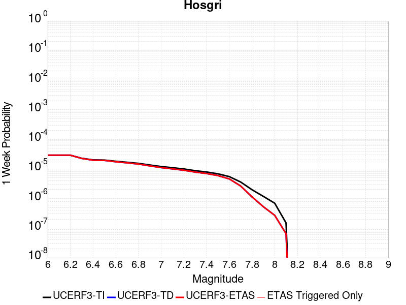 |  | 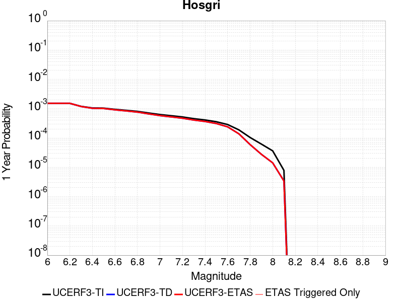 | 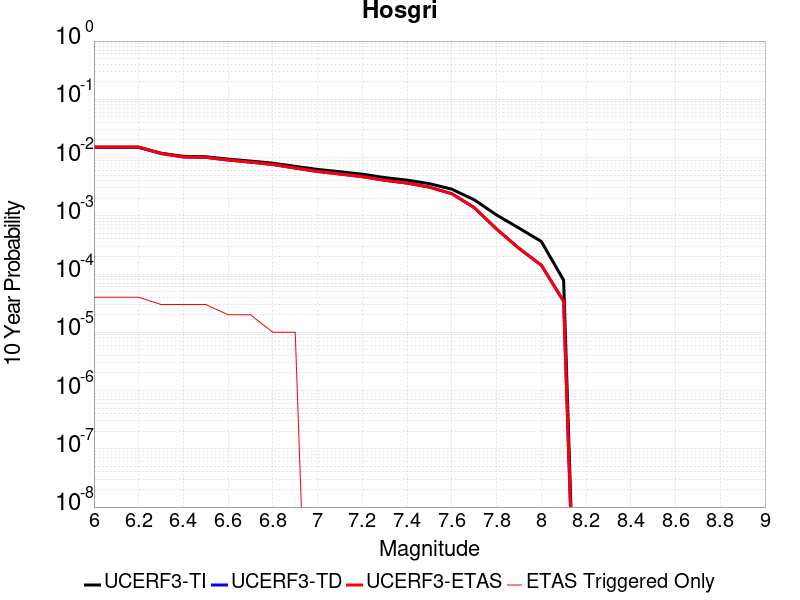 |

| Magnitude | 1 wk TI Prob | 1 wk TD Prob | 1 wk ETAS Prob | 1 wk ETAS/TD Gain | 1 wk ETAS Triggered Only | 1 mo TI Prob | 1 mo TD Prob | 1 mo ETAS Prob | 1 mo ETAS/TD Gain | 1 mo ETAS Triggered Only | 1 yr TI Prob | 1 yr TD Prob | 1 yr ETAS Prob | 1 yr ETAS/TD Gain | 1 yr ETAS Triggered Only | 10 yr TI Prob | 10 yr TD Prob | 10 yr ETAS Prob | 10 yr ETAS/TD Gain | 10 yr ETAS Triggered Only |
|-----|-----|-----|-----|-----|-----|-----|-----|-----|-----|-----|-----|-----|-----|-----|-----|-----|-----|-----|-----|-----|
| 6.0 | 2.883978E-5 | 2.9128829E-5 | 2.9128829E-5 | 1.0 | 0.0 | 1.235932E-4 | 1.2483202E-4 | 1.2483202E-4 | 1.0 | 0.0 | 0.0015037085 | 0.0015187975 | 0.0015187975 | 1.0 | 0.0 | 0.01493574 | 0.015087952 | 0.015127348 | 1.0026112 | 4.0E-5 |
| 6.1 | 2.883978E-5 | 2.9128829E-5 | 2.9128829E-5 | 1.0 | 0.0 | 1.235932E-4 | 1.2483202E-4 | 1.2483202E-4 | 1.0 | 0.0 | 0.0015037085 | 0.0015187975 | 0.0015187975 | 1.0 | 0.0 | 0.01493574 | 0.015087952 | 0.015127348 | 1.0026112 | 4.0E-5 |
| 6.2 | 2.883978E-5 | 2.9128829E-5 | 2.9128829E-5 | 1.0 | 0.0 | 1.235932E-4 | 1.2483202E-4 | 1.2483202E-4 | 1.0 | 0.0 | 0.0015037085 | 0.0015187975 | 0.0015187975 | 1.0 | 0.0 | 0.01493574 | 0.015087952 | 0.015127348 | 1.0026112 | 4.0E-5 |
| 6.3 | 2.2914428E-5 | 2.26423E-5 | 2.26423E-5 | 1.0 | 0.0 | 9.8200995E-5 | 9.703485E-5 | 9.703485E-5 | 1.0 | 0.0 | 0.0011949413 | 0.0011807639 | 0.0011807639 | 1.0 | 0.0 | 0.011885363 | 0.011746303 | 0.011775951 | 1.002524 | 3.0E-5 |
| 6.4 | 2.0195741E-5 | 1.9696858E-5 | 1.9696858E-5 | 1.0 | 0.0 | 8.65503E-5 | 8.4412386E-5 | 8.4412386E-5 | 1.0 | 0.0 | 0.0010532405 | 0.0010272382 | 0.0010272382 | 1.0 | 0.0 | 0.010482626 | 0.010225947 | 0.010255639 | 1.0029037 | 3.0E-5 |
| 6.5 | 1.9924333E-5 | 1.9409275E-5 | 1.9409275E-5 | 1.0 | 0.0 | 8.53872E-5 | 8.317997E-5 | 8.317997E-5 | 1.0 | 0.0 | 0.0010390934 | 0.0010122475 | 0.0010122475 | 1.0 | 0.0 | 0.010342481 | 0.010077406 | 0.010107104 | 1.002947 | 3.0E-5 |
| 6.6 | 1.809694E-5 | 1.7458577E-5 | 1.7458577E-5 | 1.0 | 0.0 | 7.7556004E-5 | 7.482033E-5 | 7.482033E-5 | 1.0 | 0.0 | 9.438353E-4 | 9.1055816E-4 | 9.1055816E-4 | 1.0 | 0.0 | 0.009398366 | 0.009069216 | 0.009089035 | 1.0021852 | 2.0E-5 |
| 6.7 | 1.675989E-5 | 1.6043028E-5 | 1.6043028E-5 | 1.0 | 0.0 | 7.182612E-5 | 6.875403E-5 | 6.875403E-5 | 1.0 | 0.0 | 8.7413215E-4 | 8.3676E-4 | 8.3676E-4 | 1.0 | 0.0 | 0.008707017 | 0.008337 | 0.008356833 | 1.002379 | 2.0E-5 |
| 6.8 | 1.5401129E-5 | 1.4614334E-5 | 1.4614334E-5 | 1.0 | 0.0 | 6.6003166E-5 | 6.263136E-5 | 6.263136E-5 | 1.0 | 0.0 | 8.032922E-4 | 7.622709E-4 | 7.622709E-4 | 1.0 | 0.0 | 0.008003947 | 0.0075974264 | 0.0076073506 | 1.0013062 | 1.0E-5 |
| 6.9 | 1.356559E-5 | 1.2690202E-5 | 1.2690202E-5 | 1.0 | 0.0 | 5.8136946E-5 | 5.4385448E-5 | 5.4385448E-5 | 1.0 | 0.0 | 7.0758746E-4 | 6.619421E-4 | 6.619421E-4 | 1.0 | 0.0 | 0.007053386 | 0.00660051 | 0.006610444 | 1.001505 | 1.0E-5 |
| 7.0 | 1.2030819E-5 | 1.1096183E-5 | 1.1096183E-5 | 1.0 | 0.0 | 5.155963E-5 | 4.75542E-5 | 4.75542E-5 | 1.0 | 0.0 | 6.275577E-4 | 5.788187E-4 | 5.788187E-4 | 1.0 | 0.0 | 0.006257884 | 0.005773872 | 0.005773872 | 1.0 | 0.0 |
| 7.1 | 1.0972698E-5 | 1.0022392E-5 | 1.0022392E-5 | 1.0 | 0.0 | 4.7025E-5 | 4.29524E-5 | 4.29524E-5 | 1.0 | 0.0 | 5.72379E-4 | 5.228201E-4 | 5.228201E-4 | 1.0 | 0.0 | 0.0057090693 | 0.005216653 | 0.005216653 | 1.0 | 0.0 |
| 7.2 | 9.961926E-6 | 9.034952E-6 | 9.034952E-6 | 1.0 | 0.0 | 4.2693267E-5 | 3.872065E-5 | 3.872065E-5 | 1.0 | 0.0 | 5.1966653E-4 | 4.7132198E-4 | 4.7132198E-4 | 1.0 | 0.0 | 0.00518453 | 0.00470397 | 0.00470397 | 1.0 | 0.0 |
| 7.3 | 8.700929E-6 | 7.828299E-6 | 7.828299E-6 | 1.0 | 0.0 | 3.7289166E-5 | 3.3549422E-5 | 3.3549422E-5 | 1.0 | 0.0 | 4.53901E-4 | 4.0838768E-4 | 4.0838768E-4 | 1.0 | 0.0 | 0.00452975 | 0.0040771114 | 0.0040771114 | 1.0 | 0.0 |
| 7.4 | 7.866285E-6 | 6.998933E-6 | 6.998933E-6 | 1.0 | 0.0 | 3.3712215E-5 | 2.999508E-5 | 2.999508E-5 | 1.0 | 0.0 | 4.103689E-4 | 3.6512894E-4 | 3.6512894E-4 | 1.0 | 0.0 | 0.004096119 | 0.0036460275 | 0.0036460275 | 1.0 | 0.0 |
| 7.5 | 6.8381305E-6 | 5.959883E-6 | 5.959883E-6 | 1.0 | 0.0 | 2.9305946E-5 | 2.5542106E-5 | 2.5542106E-5 | 1.0 | 0.0 | 3.5674145E-4 | 3.1093077E-4 | 3.1093077E-4 | 1.0 | 0.0 | 0.0035616932 | 0.0031056926 | 0.0031056926 | 1.0 | 0.0 |
| 7.6 | 5.503376E-6 | 4.5954234E-6 | 4.5954234E-6 | 1.0 | 0.0 | 2.3585684E-5 | 1.9694522E-5 | 1.9694522E-5 | 1.0 | 0.0 | 2.8711787E-4 | 2.3975444E-4 | 2.3975444E-4 | 1.0 | 0.0 | 0.002867472 | 0.002395691 | 0.002395691 | 1.0 | 0.0 |
| 7.7 | 3.6144982E-6 | 2.6523774E-6 | 2.6523774E-6 | 1.0 | 0.0 | 1.5490614E-5 | 1.1367281E-5 | 1.1367281E-5 | 1.0 | 0.0 | 1.8858191E-4 | 1.3838787E-4 | 1.3838787E-4 | 1.0 | 0.0 | 0.0018842196 | 0.0013837481 | 0.0013837481 | 1.0 | 0.0 |
| 7.8 | 1.9853494E-6 | 1.1362536E-6 | 1.1362536E-6 | 1.0 | 0.0 | 8.508612E-6 | 4.8696493E-6 | 4.8696493E-6 | 1.0 | 0.0 | 1.0358743E-4 | 5.9286365E-5 | 5.9286365E-5 | 1.0 | 0.0 | 0.0010353916 | 5.934354E-4 | 5.934354E-4 | 1.0 | 0.0 |
| 7.9 | 1.1818757E-6 | 5.2963003E-7 | 5.2963003E-7 | 1.0 | 0.0 | 5.0651715E-6 | 2.269841E-6 | 2.269841E-6 | 1.0 | 0.0 | 6.1666724E-5 | 2.7634964E-5 | 2.7634964E-5 | 1.0 | 0.0 | 6.1649614E-4 | 2.7700354E-4 | 2.7700354E-4 | 1.0 | 0.0 |
| 8.0 | 6.962958E-7 | 2.7147578E-7 | 2.7147578E-7 | 1.0 | 0.0 | 2.9841215E-6 | 1.163467E-6 | 1.163467E-6 | 1.0 | 0.0 | 3.6331072E-5 | 1.4165119E-5 | 1.4165119E-5 | 1.0 | 0.0 | 3.6325134E-4 | 1.4221264E-4 | 1.4221264E-4 | 1.0 | 0.0 |
| 8.1 | 1.5033264E-7 | 6.529188E-8 | 6.529188E-8 | 1.0 | 0.0 | 6.442826E-7 | 2.798223E-7 | 2.798223E-7 | 1.0 | 0.0 | 7.844113E-6 | 3.4068314E-6 | 3.4068314E-6 | 1.0 | 0.0 | 7.843835E-5 | 3.4085097E-5 | 3.4085097E-5 | 1.0 | 0.0 |

## Deep Springs
*[(top)](#table-of-contents)*

| 1 Week | 1 Month | 1 Year | 10 Year |
|-----|-----|-----|-----|
|  | 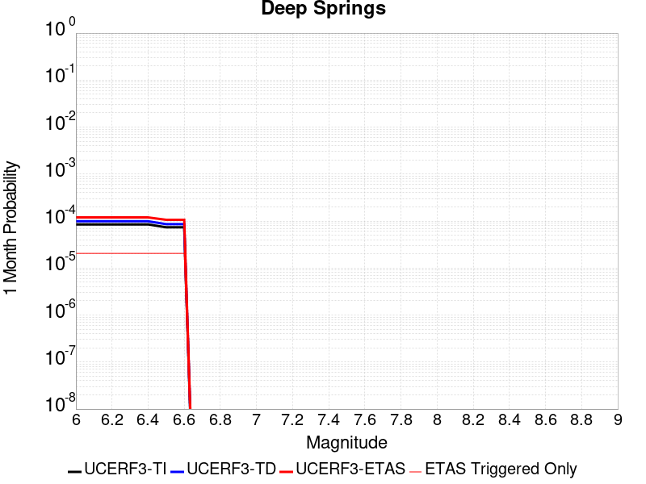 | 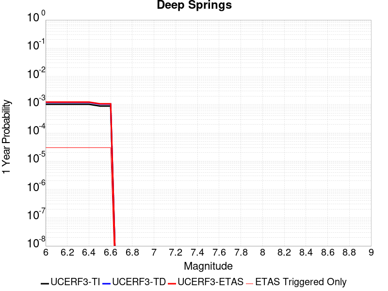 | 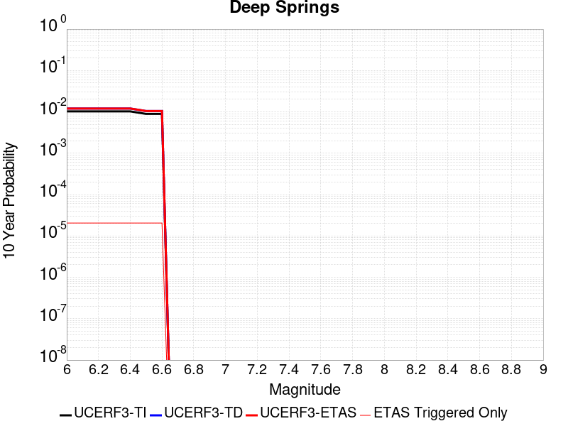 |

| Magnitude | 1 wk TI Prob | 1 wk TD Prob | 1 wk ETAS Prob | 1 wk ETAS/TD Gain | 1 wk ETAS Triggered Only | 1 mo TI Prob | 1 mo TD Prob | 1 mo ETAS Prob | 1 mo ETAS/TD Gain | 1 mo ETAS Triggered Only | 1 yr TI Prob | 1 yr TD Prob | 1 yr ETAS Prob | 1 yr ETAS/TD Gain | 1 yr ETAS Triggered Only | 10 yr TI Prob | 10 yr TD Prob | 10 yr ETAS Prob | 10 yr ETAS/TD Gain | 10 yr ETAS Triggered Only |
|-----|-----|-----|-----|-----|-----|-----|-----|-----|-----|-----|-----|-----|-----|-----|-----|-----|-----|-----|-----|-----|
| 6.0 | 1.9810619E-5 | 2.311303E-5 | 2.311303E-5 | 1.0 | 0.0 | 8.489989E-5 | 9.905495E-5 | 1.0905396E-4 | 1.100944 | 1.0E-5 | 0.001033166 | 0.0012058346 | 0.0012357984 | 1.024849 | 3.0E-5 | 0.010283757 | 0.01204269 | 0.012082209 | 1.0032815 | 4.0E-5 |
| 6.1 | 1.9810619E-5 | 2.311303E-5 | 2.311303E-5 | 1.0 | 0.0 | 8.489989E-5 | 9.905495E-5 | 1.0905396E-4 | 1.100944 | 1.0E-5 | 0.001033166 | 0.0012058346 | 0.0012357984 | 1.024849 | 3.0E-5 | 0.010283757 | 0.01204269 | 0.012082209 | 1.0032815 | 4.0E-5 |
| 6.2 | 1.9810619E-5 | 2.311303E-5 | 2.311303E-5 | 1.0 | 0.0 | 8.489989E-5 | 9.905495E-5 | 1.0905396E-4 | 1.100944 | 1.0E-5 | 0.001033166 | 0.0012058346 | 0.0012357984 | 1.024849 | 3.0E-5 | 0.010283757 | 0.01204269 | 0.012082209 | 1.0032815 | 4.0E-5 |
| 6.3 | 1.9810619E-5 | 2.311303E-5 | 2.311303E-5 | 1.0 | 0.0 | 8.489989E-5 | 9.905495E-5 | 1.0905396E-4 | 1.100944 | 1.0E-5 | 0.001033166 | 0.0012058346 | 0.0012357984 | 1.024849 | 3.0E-5 | 0.010283757 | 0.01204269 | 0.012082209 | 1.0032815 | 4.0E-5 |
| 6.4 | 1.9810619E-5 | 2.311303E-5 | 2.311303E-5 | 1.0 | 0.0 | 8.489989E-5 | 9.905495E-5 | 1.0905396E-4 | 1.100944 | 1.0E-5 | 0.001033166 | 0.0012058346 | 0.0012357984 | 1.024849 | 3.0E-5 | 0.010283757 | 0.01204269 | 0.012082209 | 1.0032815 | 4.0E-5 |
| 6.5 | 1.7190405E-5 | 2.0050999E-5 | 2.0050999E-5 | 1.0 | 0.0 | 7.367108E-5 | 8.593285E-5 | 9.593199E-5 | 1.11636 | 1.0E-5 | 8.9657627E-4 | 0.0010462324 | 0.0010762011 | 1.0286443 | 3.0E-5 | 0.008929676 | 0.010462287 | 0.010501868 | 1.0037832 | 4.0E-5 |
| 6.6 | 1.7190405E-5 | 2.0050999E-5 | 2.0050999E-5 | 1.0 | 0.0 | 7.367108E-5 | 8.593285E-5 | 9.593199E-5 | 1.11636 | 1.0E-5 | 8.9657627E-4 | 0.0010462324 | 0.0010762011 | 1.0286443 | 3.0E-5 | 0.008929676 | 0.010462287 | 0.010501868 | 1.0037832 | 4.0E-5 |

## San Clemente
*[(top)](#table-of-contents)*

| 1 Week | 1 Month | 1 Year | 10 Year |
|-----|-----|-----|-----|
| 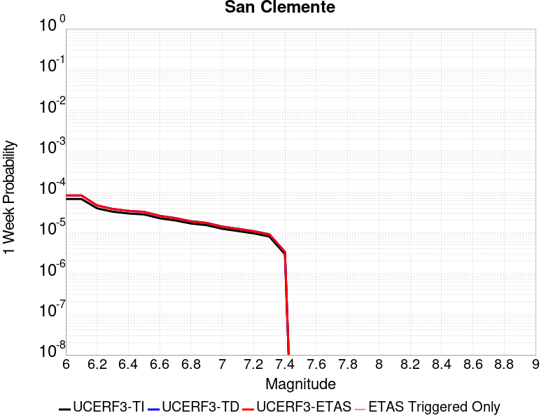 |  | 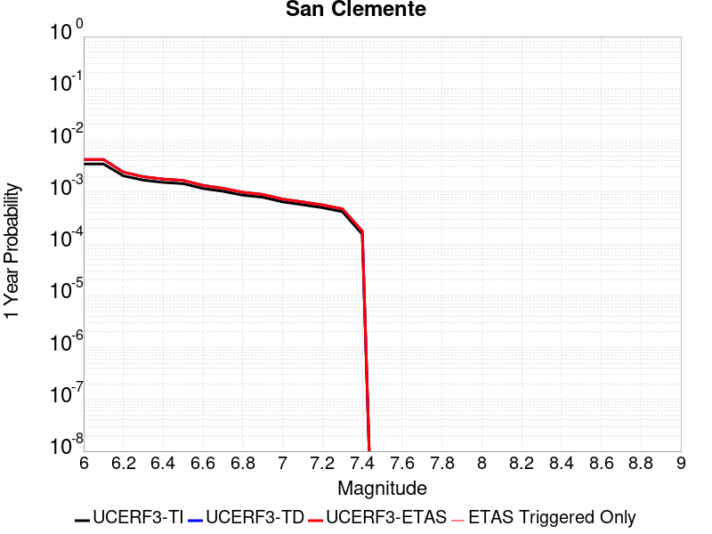 | 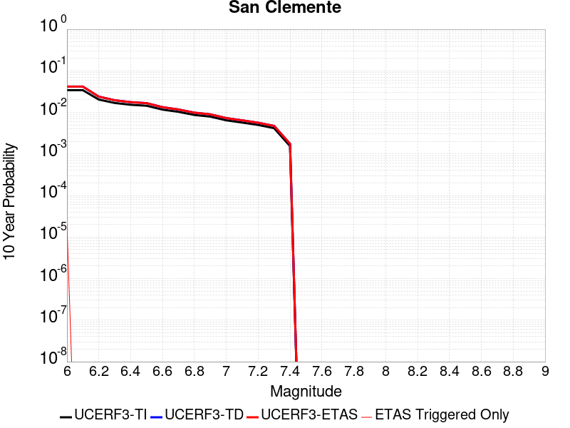 |

| Magnitude | 1 wk TI Prob | 1 wk TD Prob | 1 wk ETAS Prob | 1 wk ETAS/TD Gain | 1 wk ETAS Triggered Only | 1 mo TI Prob | 1 mo TD Prob | 1 mo ETAS Prob | 1 mo ETAS/TD Gain | 1 mo ETAS Triggered Only | 1 yr TI Prob | 1 yr TD Prob | 1 yr ETAS Prob | 1 yr ETAS/TD Gain | 1 yr ETAS Triggered Only | 10 yr TI Prob | 10 yr TD Prob | 10 yr ETAS Prob | 10 yr ETAS/TD Gain | 10 yr ETAS Triggered Only |
|-----|-----|-----|-----|-----|-----|-----|-----|-----|-----|-----|-----|-----|-----|-----|-----|-----|-----|-----|-----|-----|
| 6.0 | 6.681379E-5 | 8.163669E-5 | 8.163669E-5 | 1.0 | 0.0 | 2.8631336E-4 | 3.4982787E-4 | 3.4982787E-4 | 1.0 | 0.0 | 0.003480294 | 0.004251416 | 0.004261373 | 1.0023421 | 1.0E-5 | 0.03426291 | 0.041756913 | 0.041795246 | 1.0009179 | 4.0E-5 |
| 6.1 | 6.681379E-5 | 8.163669E-5 | 8.163669E-5 | 1.0 | 0.0 | 2.8631336E-4 | 3.4982787E-4 | 3.4982787E-4 | 1.0 | 0.0 | 0.003480294 | 0.004251416 | 0.004261373 | 1.0023421 | 1.0E-5 | 0.03426291 | 0.041756913 | 0.04177608 | 1.000459 | 2.0E-5 |
| 6.2 | 3.9400576E-5 | 4.6453104E-5 | 4.6453104E-5 | 1.0 | 0.0 | 1.6884868E-4 | 1.9906988E-4 | 1.9906988E-4 | 1.0 | 0.0 | 0.0020537945 | 0.0024210429 | 0.0024210429 | 1.0 | 0.0 | 0.020349167 | 0.023953425 | 0.023963185 | 1.0004075 | 1.0E-5 |
| 6.3 | 3.2590255E-5 | 3.792992E-5 | 3.792992E-5 | 1.0 | 0.0 | 1.3966505E-4 | 1.6254683E-4 | 1.6254683E-4 | 1.0 | 0.0 | 0.0016990956 | 0.0019772416 | 0.0019772416 | 1.0 | 0.0 | 0.01686163 | 0.019600289 | 0.019610094 | 1.0005002 | 1.0E-5 |
| 6.4 | 2.9454652E-5 | 3.4098495E-5 | 3.4098495E-5 | 1.0 | 0.0 | 1.2622811E-4 | 1.4612835E-4 | 1.4612835E-4 | 1.0 | 0.0 | 0.0015357438 | 0.0017776854 | 0.0017776854 | 1.0 | 0.0 | 0.015251739 | 0.017637825 | 0.017647648 | 1.000557 | 1.0E-5 |
| 6.5 | 2.790836E-5 | 3.2248132E-5 | 3.2248132E-5 | 1.0 | 0.0 | 1.1960178E-4 | 1.3819907E-4 | 1.3819907E-4 | 1.0 | 0.0 | 0.001455179 | 0.0016812999 | 0.0016812999 | 1.0 | 0.0 | 0.014456868 | 0.016688818 | 0.016698651 | 1.0005893 | 1.0E-5 |
| 6.6 | 2.2492153E-5 | 2.5763205E-5 | 2.5763205E-5 | 1.0 | 0.0 | 9.639138E-5 | 1.1040914E-4 | 1.1040914E-4 | 1.0 | 0.0 | 0.0011729331 | 0.0013434167 | 0.0013434167 | 1.0 | 0.0 | 0.011667615 | 0.013354672 | 0.013354672 | 1.0 | 0.0 |
| 6.7 | 1.9862755E-5 | 2.2666847E-5 | 2.2666847E-5 | 1.0 | 0.0 | 8.512331E-5 | 9.714008E-5 | 9.714008E-5 | 1.0 | 0.0 | 0.0010358836 | 0.0011820501 | 0.0011820501 | 1.0 | 0.0 | 0.010310682 | 0.01175892 | 0.01175892 | 1.0 | 0.0 |
| 6.8 | 1.6697575E-5 | 1.8978053E-5 | 1.8978053E-5 | 1.0 | 0.0 | 7.155907E-5 | 8.133203E-5 | 8.133203E-5 | 1.0 | 0.0 | 8.7088346E-4 | 9.89777E-4 | 9.89777E-4 | 1.0 | 0.0 | 0.008674784 | 0.009854714 | 0.009854714 | 1.0 | 0.0 |
| 6.9 | 1.5218415E-5 | 1.726971E-5 | 1.726971E-5 | 1.0 | 0.0 | 6.522015E-5 | 7.401099E-5 | 7.401099E-5 | 1.0 | 0.0 | 7.93766E-4 | 9.0072013E-4 | 9.0072013E-4 | 1.0 | 0.0 | 0.007909367 | 0.00897164 | 0.00897164 | 1.0 | 0.0 |
| 7.0 | 1.2392958E-5 | 1.4033262E-5 | 1.4033262E-5 | 1.0 | 0.0 | 5.3111595E-5 | 6.0141207E-5 | 6.0141207E-5 | 1.0 | 0.0 | 6.4644177E-4 | 7.319808E-4 | 7.319808E-4 | 1.0 | 0.0 | 0.0064456454 | 0.0072964844 | 0.0072964844 | 1.0 | 0.0 |
| 7.1 | 1.0934128E-5 | 1.2375354E-5 | 1.2375354E-5 | 1.0 | 0.0 | 4.6859706E-5 | 5.3036194E-5 | 5.3036194E-5 | 1.0 | 0.0 | 5.7036756E-4 | 6.455317E-4 | 6.455317E-4 | 1.0 | 0.0 | 0.0056890585 | 0.006437312 | 0.006437312 | 1.0 | 0.0 |
| 7.2 | 9.5798805E-6 | 1.0845125E-5 | 1.0845125E-5 | 1.0 | 0.0 | 4.1055984E-5 | 4.647832E-5 | 4.647832E-5 | 1.0 | 0.0 | 4.9974193E-4 | 5.657338E-4 | 5.657338E-4 | 1.0 | 0.0 | 0.0049861963 | 0.00564366 | 0.00564366 | 1.0 | 0.0 |
| 7.3 | 8.0167365E-6 | 9.084078E-6 | 9.084078E-6 | 1.0 | 0.0 | 3.4356988E-5 | 3.8931223E-5 | 3.8931223E-5 | 1.0 | 0.0 | 4.1821605E-4 | 4.738916E-4 | 4.738916E-4 | 1.0 | 0.0 | 0.0041742986 | 0.004729513 | 0.004729513 | 1.0 | 0.0 |
| 7.4 | 2.9581017E-6 | 3.36244E-6 | 3.36244E-6 | 1.0 | 0.0 | 1.2677518E-5 | 1.4410407E-5 | 1.4410407E-5 | 1.0 | 0.0 | 1.5433785E-4 | 1.7543763E-4 | 1.7543763E-4 | 1.0 | 0.0 | 0.001542307 | 0.0017534863 | 0.0017534863 | 1.0 | 0.0 |

## San Jacinto (Superstition Mtn)
*[(top)](#table-of-contents)*

| 1 Week | 1 Month | 1 Year | 10 Year |
|-----|-----|-----|-----|
| 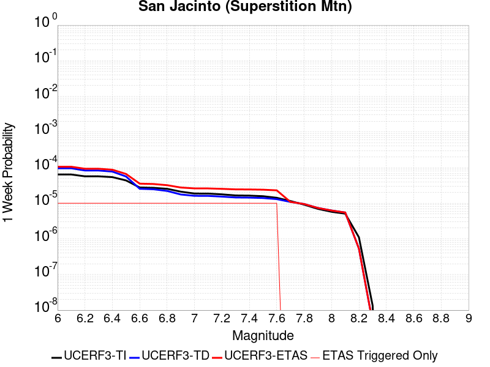 | 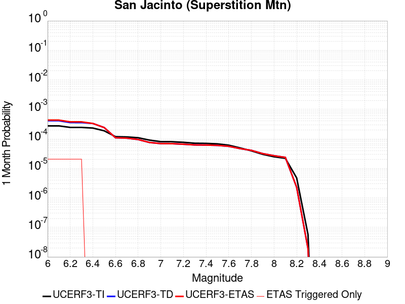 | 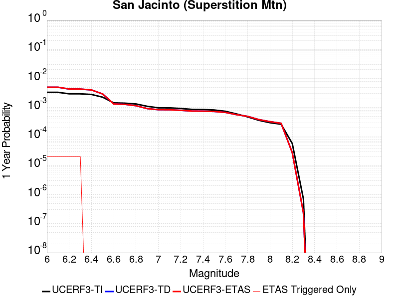 | 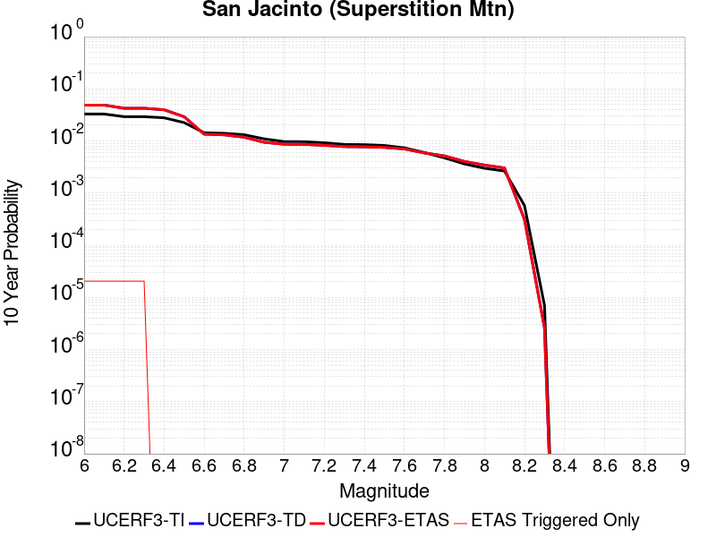 |

| Magnitude | 1 wk TI Prob | 1 wk TD Prob | 1 wk ETAS Prob | 1 wk ETAS/TD Gain | 1 wk ETAS Triggered Only | 1 mo TI Prob | 1 mo TD Prob | 1 mo ETAS Prob | 1 mo ETAS/TD Gain | 1 mo ETAS Triggered Only | 1 yr TI Prob | 1 yr TD Prob | 1 yr ETAS Prob | 1 yr ETAS/TD Gain | 1 yr ETAS Triggered Only | 10 yr TI Prob | 10 yr TD Prob | 10 yr ETAS Prob | 10 yr ETAS/TD Gain | 10 yr ETAS Triggered Only |
|-----|-----|-----|-----|-----|-----|-----|-----|-----|-----|-----|-----|-----|-----|-----|-----|-----|-----|-----|-----|-----|
| 6.0 | 6.4193904E-5 | 9.600102E-5 | 1.0600006E-4 | 1.1041555 | 1.0E-5 | 2.7508775E-4 | 4.1137784E-4 | 4.313696E-4 | 1.0485971 | 2.0E-5 | 0.0033440501 | 0.004998455 | 0.0050283046 | 1.0059719 | 3.0E-5 | 0.03294174 | 0.048827495 | 0.04886554 | 1.0007792 | 4.0E-5 |
| 6.1 | 6.4193904E-5 | 9.600102E-5 | 1.0600006E-4 | 1.1041555 | 1.0E-5 | 2.7508775E-4 | 4.1137784E-4 | 4.313696E-4 | 1.0485971 | 2.0E-5 | 0.0033440501 | 0.004998455 | 0.0050283046 | 1.0059719 | 3.0E-5 | 0.03294174 | 0.048827495 | 0.04886554 | 1.0007792 | 4.0E-5 |
| 6.2 | 5.7023593E-5 | 8.3151084E-5 | 9.315025E-5 | 1.120253 | 1.0E-5 | 2.4436394E-4 | 3.5632253E-4 | 3.763154E-4 | 1.056109 | 2.0E-5 | 0.002971072 | 0.004331238 | 0.0043511516 | 1.0045977 | 2.0E-5 | 0.029316625 | 0.04250735 | 0.042536072 | 1.0006758 | 3.0E-5 |
| 6.3 | 5.6940098E-5 | 8.299644E-5 | 9.299561E-5 | 1.1204771 | 1.0E-5 | 2.4400617E-4 | 3.5565995E-4 | 3.7565283E-4 | 1.0562135 | 2.0E-5 | 0.002966728 | 0.004323203 | 0.0043431167 | 1.0046062 | 2.0E-5 | 0.029274331 | 0.0424306 | 0.042459328 | 1.000677 | 3.0E-5 |
| 6.4 | 5.4171585E-5 | 7.7490105E-5 | 8.748933E-5 | 1.1290387 | 1.0E-5 | 2.3214328E-4 | 3.320675E-4 | 3.4206416E-4 | 1.0301044 | 1.0E-5 | 0.0028226813 | 0.004037075 | 0.004047035 | 1.002467 | 1.0E-5 | 0.02787096 | 0.03971982 | 0.039739028 | 1.0004835 | 2.0E-5 |
| 6.5 | 4.375144E-5 | 5.6427685E-5 | 6.642712E-5 | 1.177208 | 1.0E-5 | 1.874927E-4 | 2.4181715E-4 | 2.5181472E-4 | 1.0413436 | 1.0E-5 | 0.0022803338 | 0.0029413246 | 0.0029512953 | 1.0033898 | 1.0E-5 | 0.022570757 | 0.029240036 | 0.029249744 | 1.000332 | 1.0E-5 |
| 6.6 | 2.772192E-5 | 2.5494404E-5 | 3.549415E-5 | 1.3922329 | 1.0E-5 | 1.1880282E-4 | 1.0925727E-4 | 1.19256176E-4 | 1.0915171 | 1.0E-5 | 0.0014454646 | 0.0013294149 | 0.0013394016 | 1.0075121 | 1.0E-5 | 0.014360986 | 0.013543627 | 0.013553492 | 1.0007284 | 1.0E-5 |
| 6.7 | 2.7124124E-5 | 2.4705407E-5 | 3.470516E-5 | 1.4047596 | 1.0E-5 | 1.1624106E-4 | 1.05876126E-4 | 1.1587507E-4 | 1.09444 | 1.0E-5 | 0.0014143161 | 0.0012882988 | 0.0012982859 | 1.0077522 | 1.0E-5 | 0.014053487 | 0.013137068 | 0.013146936 | 1.0007513 | 1.0E-5 |
| 6.8 | 2.5475807E-5 | 2.2170334E-5 | 3.217011E-5 | 1.4510432 | 1.0E-5 | 1.0917746E-4 | 9.501232E-5 | 1.0501137E-4 | 1.1052395 | 1.0E-5 | 0.001328425 | 0.0011561731 | 0.0011661616 | 1.0086392 | 1.0E-5 | 0.0132051185 | 0.0118252365 | 0.011835119 | 1.0008357 | 1.0E-5 |
| 6.9 | 2.1162023E-5 | 1.7631666E-5 | 2.763149E-5 | 1.5671514 | 1.0E-5 | 9.069123E-5 | 7.5562115E-5 | 8.556136E-5 | 1.1323315 | 1.0E-5 | 0.0011036064 | 9.195843E-4 | 9.2957506E-4 | 1.0108645 | 1.0E-5 | 0.010981417 | 0.009449712 | 0.009459618 | 1.0010482 | 1.0E-5 |
| 7.0 | 1.8754288E-5 | 1.6166736E-5 | 2.6166574E-5 | 1.6185441 | 1.0E-5 | 8.037304E-5 | 6.9284186E-5 | 7.928349E-5 | 1.1443231 | 1.0E-5 | 9.781026E-4 | 8.4321096E-4 | 8.5320254E-4 | 1.0118494 | 1.0E-5 | 0.009738087 | 0.008672746 | 0.008682659 | 1.001143 | 1.0E-5 |
| 7.1 | 1.8678527E-5 | 1.6091873E-5 | 2.6091713E-5 | 1.6214217 | 1.0E-5 | 8.0048376E-5 | 6.896337E-5 | 7.896267E-5 | 1.1449945 | 1.0E-5 | 9.7415317E-4 | 8.3930796E-4 | 8.492996E-4 | 1.0119046 | 1.0E-5 | 0.009698939 | 0.008633699 | 0.008643613 | 1.0011482 | 1.0E-5 |
| 7.2 | 1.7804578E-5 | 1.5386398E-5 | 2.5386244E-5 | 1.6499147 | 1.0E-5 | 7.6303106E-5 | 6.5940054E-5 | 7.593939E-5 | 1.1516429 | 1.0E-5 | 9.285943E-4 | 8.0252666E-4 | 8.1251864E-4 | 1.0124507 | 1.0E-5 | 0.009247236 | 0.008264985 | 0.008274903 | 1.0012 | 1.0E-5 |
| 7.3 | 1.6583685E-5 | 1.4535444E-5 | 2.4535299E-5 | 1.6879635 | 1.0E-5 | 7.1070994E-5 | 6.2293286E-5 | 7.229266E-5 | 1.1605209 | 1.0E-5 | 8.649459E-4 | 7.5815886E-4 | 7.681513E-4 | 1.0131799 | 1.0E-5 | 0.00861587 | 0.007820267 | 0.007830189 | 1.0012687 | 1.0E-5 |
| 7.4 | 1.6387552E-5 | 1.4400321E-5 | 2.4400177E-5 | 1.694419 | 1.0E-5 | 7.023047E-5 | 6.171421E-5 | 7.171359E-5 | 1.1620272 | 1.0E-5 | 8.5472054E-4 | 7.5111346E-4 | 7.6110597E-4 | 1.0133035 | 1.0E-5 | 0.008514405 | 0.007749644 | 0.007759567 | 1.0012804 | 1.0E-5 |
| 7.5 | 1.5790754E-5 | 1.4040957E-5 | 2.4040815E-5 | 1.7121922 | 1.0E-5 | 6.767291E-5 | 6.017415E-5 | 7.017355E-5 | 1.1661743 | 1.0E-5 | 8.236062E-4 | 7.32376E-4 | 7.4236863E-4 | 1.0136442 | 1.0E-5 | 0.008205604 | 0.007560181 | 0.007570105 | 1.0013127 | 1.0E-5 |
| 7.6 | 1.4248672E-5 | 1.30597955E-5 | 2.3059665E-5 | 1.7656988 | 1.0E-5 | 6.106431E-5 | 5.596936E-5 | 6.59688E-5 | 1.1786592 | 1.0E-5 | 7.432043E-4 | 6.8121566E-4 | 6.912089E-4 | 1.0146697 | 1.0E-5 | 0.007407237 | 0.007042702 | 0.007052631 | 1.0014099 | 1.0E-5 |
| 7.7 | 1.15449975E-5 | 1.09083485E-5 | 1.09083485E-5 | 1.0 | 0.0 | 4.947762E-5 | 4.6749232E-5 | 4.6749232E-5 | 1.0 | 0.0 | 6.022235E-4 | 5.69024E-4 | 5.69024E-4 | 1.0 | 0.0 | 0.006005941 | 0.005912628 | 0.005912628 | 1.0 | 0.0 |
| 7.8 | 9.1391985E-6 | 9.518787E-6 | 9.518787E-6 | 1.0 | 0.0 | 3.9167408E-5 | 4.0794166E-5 | 4.0794166E-5 | 1.0 | 0.0 | 4.767588E-4 | 4.9655634E-4 | 4.9655634E-4 | 1.0 | 0.0 | 0.0047573727 | 0.0051790397 | 0.0051790397 | 1.0 | 0.0 |
| 7.9 | 6.973017E-6 | 7.3861297E-6 | 7.3861297E-6 | 1.0 | 0.0 | 2.9884017E-5 | 3.165446E-5 | 3.165446E-5 | 1.0 | 0.0 | 3.6377716E-4 | 3.8532543E-4 | 3.8532543E-4 | 1.0 | 0.0 | 0.0036318225 | 0.004053871 | 0.004053871 | 1.0 | 0.0 |
| 8.0 | 5.7638235E-6 | 6.263572E-6 | 6.263572E-6 | 1.0 | 0.0 | 2.4701867E-5 | 2.6843605E-5 | 2.6843605E-5 | 1.0 | 0.0 | 3.0070372E-4 | 3.267724E-4 | 3.267724E-4 | 1.0 | 0.0 | 0.0030029714 | 0.0034553434 | 0.0034553434 | 1.0 | 0.0 |
| 8.1 | 5.1124434E-6 | 5.498948E-6 | 5.498948E-6 | 1.0 | 0.0 | 2.1910288E-5 | 2.3566712E-5 | 2.3566712E-5 | 1.0 | 0.0 | 2.6672508E-4 | 2.8688743E-4 | 2.8688743E-4 | 1.0 | 0.0 | 0.0026640517 | 0.0030420625 | 0.0030420625 | 1.0 | 0.0 |
| 8.2 | 1.1075938E-6 | 5.341373E-7 | 5.341373E-7 | 1.0 | 0.0 | 4.7468216E-6 | 2.289158E-6 | 2.289158E-6 | 1.0 | 0.0 | 5.779102E-5 | 2.7870163E-5 | 2.7870163E-5 | 1.0 | 0.0 | 5.777599E-4 | 3.1373248E-4 | 3.1373248E-4 | 1.0 | 0.0 |
| 8.3 | 1.3584393E-8 | 4.478424E-9 | 4.478424E-9 | 1.0 | 0.0 | 5.8218827E-8 | 1.9193244E-8 | 1.9193244E-8 | 1.0 | 0.0 | 7.0881396E-7 | 2.3367775E-7 | 2.3367775E-7 | 1.0 | 0.0 | 7.0881174E-6 | 2.6188773E-6 | 2.6188773E-6 | 1.0 | 0.0 |

## Oak Ridge (Onshore)
*[(top)](#table-of-contents)*

| 1 Week | 1 Month | 1 Year | 10 Year |
|-----|-----|-----|-----|
| 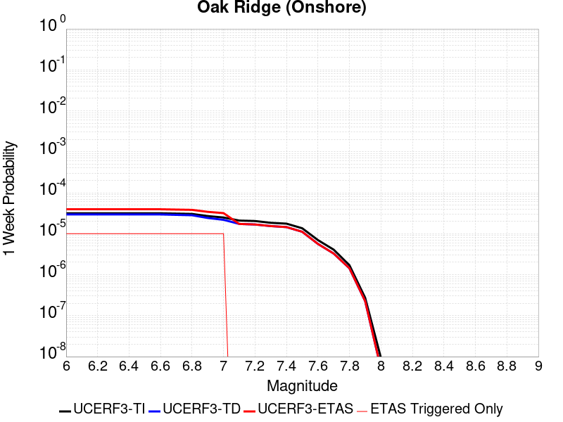 | 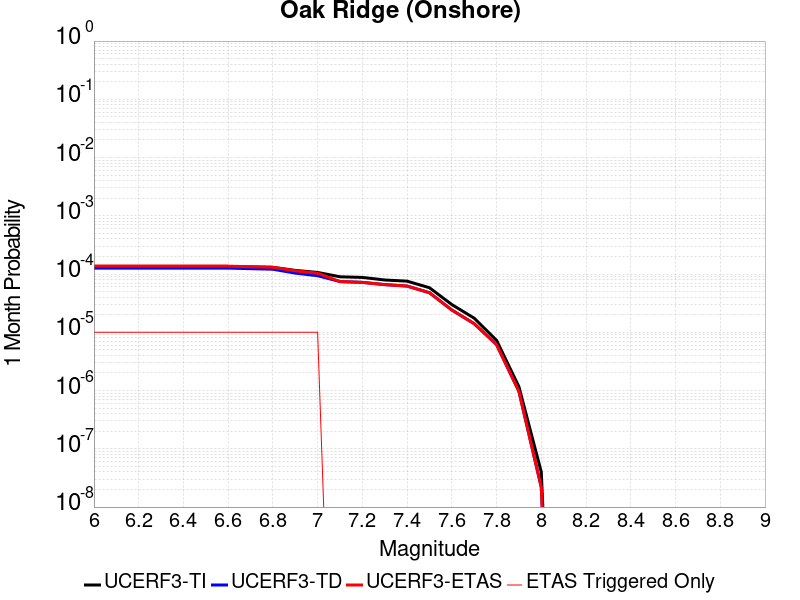 | 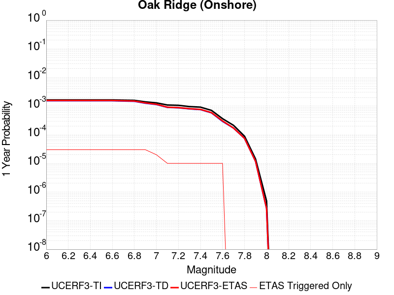 | 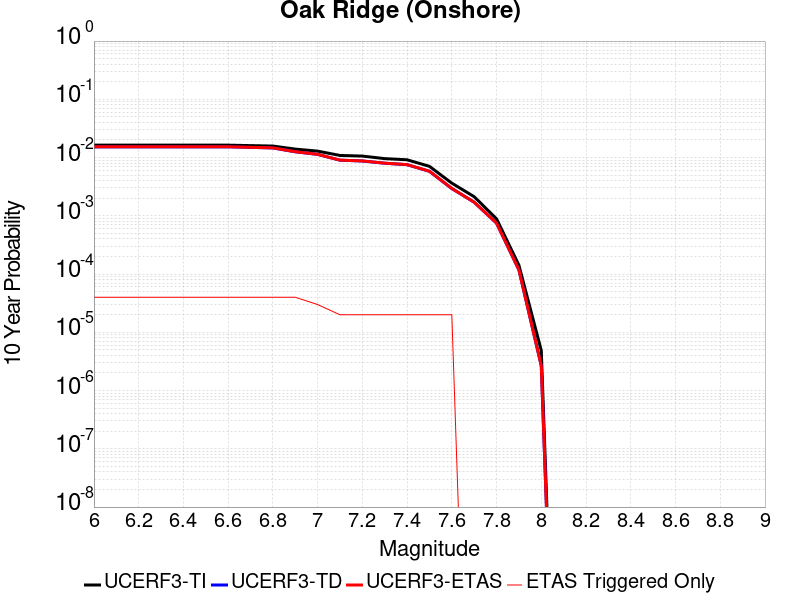 |

| Magnitude | 1 wk TI Prob | 1 wk TD Prob | 1 wk ETAS Prob | 1 wk ETAS/TD Gain | 1 wk ETAS Triggered Only | 1 mo TI Prob | 1 mo TD Prob | 1 mo ETAS Prob | 1 mo ETAS/TD Gain | 1 mo ETAS Triggered Only | 1 yr TI Prob | 1 yr TD Prob | 1 yr ETAS Prob | 1 yr ETAS/TD Gain | 1 yr ETAS Triggered Only | 10 yr TI Prob | 10 yr TD Prob | 10 yr ETAS Prob | 10 yr ETAS/TD Gain | 10 yr ETAS Triggered Only |
|-----|-----|-----|-----|-----|-----|-----|-----|-----|-----|-----|-----|-----|-----|-----|-----|-----|-----|-----|-----|-----|
| 6.0 | 3.155064E-5 | 2.952645E-5 | 3.9526156E-5 | 1.3386694 | 1.0E-5 | 1.3521002E-4 | 1.26536E-4 | 1.3653474E-4 | 1.0790188 | 1.0E-5 | 0.001644939 | 0.0015395252 | 0.0015694791 | 1.0194565 | 3.0E-5 | 0.01632816 | 0.015293104 | 0.015332492 | 1.0025755 | 4.0E-5 |
| 6.1 | 3.155064E-5 | 2.952645E-5 | 3.9526156E-5 | 1.3386694 | 1.0E-5 | 1.3521002E-4 | 1.26536E-4 | 1.3653474E-4 | 1.0790188 | 1.0E-5 | 0.001644939 | 0.0015395252 | 0.0015694791 | 1.0194565 | 3.0E-5 | 0.01632816 | 0.015293104 | 0.015332492 | 1.0025755 | 4.0E-5 |
| 6.2 | 3.155064E-5 | 2.952645E-5 | 3.9526156E-5 | 1.3386694 | 1.0E-5 | 1.3521002E-4 | 1.26536E-4 | 1.3653474E-4 | 1.0790188 | 1.0E-5 | 0.001644939 | 0.0015395252 | 0.0015694791 | 1.0194565 | 3.0E-5 | 0.01632816 | 0.015293104 | 0.015332492 | 1.0025755 | 4.0E-5 |
| 6.3 | 3.155064E-5 | 2.952645E-5 | 3.9526156E-5 | 1.3386694 | 1.0E-5 | 1.3521002E-4 | 1.26536E-4 | 1.3653474E-4 | 1.0790188 | 1.0E-5 | 0.001644939 | 0.0015395252 | 0.0015694791 | 1.0194565 | 3.0E-5 | 0.01632816 | 0.015293104 | 0.015332492 | 1.0025755 | 4.0E-5 |
| 6.4 | 3.155064E-5 | 2.952645E-5 | 3.9526156E-5 | 1.3386694 | 1.0E-5 | 1.3521002E-4 | 1.26536E-4 | 1.3653474E-4 | 1.0790188 | 1.0E-5 | 0.001644939 | 0.0015395252 | 0.0015694791 | 1.0194565 | 3.0E-5 | 0.01632816 | 0.015293104 | 0.015332492 | 1.0025755 | 4.0E-5 |
| 6.5 | 3.155064E-5 | 2.952645E-5 | 3.9526156E-5 | 1.3386694 | 1.0E-5 | 1.3521002E-4 | 1.26536E-4 | 1.3653474E-4 | 1.0790188 | 1.0E-5 | 0.001644939 | 0.0015395252 | 0.0015694791 | 1.0194565 | 3.0E-5 | 0.01632816 | 0.015293104 | 0.015332492 | 1.0025755 | 4.0E-5 |
| 6.6 | 3.155064E-5 | 2.952645E-5 | 3.9526156E-5 | 1.3386694 | 1.0E-5 | 1.3521002E-4 | 1.26536E-4 | 1.3653474E-4 | 1.0790188 | 1.0E-5 | 0.001644939 | 0.0015395252 | 0.0015694791 | 1.0194565 | 3.0E-5 | 0.01632816 | 0.015293104 | 0.015332492 | 1.0025755 | 4.0E-5 |
| 6.7 | 3.098897E-5 | 2.8864635E-5 | 3.8864346E-5 | 1.3464347 | 1.0E-5 | 1.328031E-4 | 1.2369992E-4 | 1.3369869E-4 | 1.0808308 | 1.0E-5 | 0.0016156785 | 0.0015050438 | 0.0015349986 | 1.019903 | 3.0E-5 | 0.016039822 | 0.014952951 | 0.014992353 | 1.002635 | 4.0E-5 |
| 6.8 | 3.0449872E-5 | 2.823982E-5 | 3.8239537E-5 | 1.3540999 | 1.0E-5 | 1.3049292E-4 | 1.2102239E-4 | 1.3102118E-4 | 1.0826193 | 1.0E-5 | 0.0015875935 | 0.001472489 | 0.0015024447 | 1.0203437 | 3.0E-5 | 0.015762992 | 0.014631692 | 0.014671107 | 1.0026938 | 4.0E-5 |
| 6.9 | 2.697928E-5 | 2.4220137E-5 | 3.4219895E-5 | 1.4128696 | 1.0E-5 | 1.15620365E-4 | 1.0379658E-4 | 1.1379554E-4 | 1.0963323 | 1.0E-5 | 0.0014067689 | 0.0012630123 | 0.0012929743 | 1.0237228 | 3.0E-5 | 0.0139789665 | 0.012561057 | 0.012600554 | 1.0031445 | 4.0E-5 |
| 7.0 | 2.4893961E-5 | 2.1862359E-5 | 3.186214E-5 | 1.4573972 | 1.0E-5 | 1.0668404E-4 | 9.369256E-5 | 1.0369162E-4 | 1.1067221 | 1.0E-5 | 0.0012981043 | 0.0011401277 | 0.0011601049 | 1.0175219 | 2.0E-5 | 0.012905477 | 0.011345069 | 0.011374729 | 1.0026144 | 3.0E-5 |
| 7.1 | 2.0945363E-5 | 1.7354718E-5 | 1.7354718E-5 | 1.0 | 0.0 | 8.976275E-5 | 7.437527E-5 | 7.437527E-5 | 1.0 | 0.0 | 0.0010923136 | 9.051474E-4 | 9.1513834E-4 | 1.011038 | 1.0E-5 | 0.0108696 | 0.009015542 | 0.009035362 | 1.0021983 | 2.0E-5 |
| 7.2 | 2.0439404E-5 | 1.6809645E-5 | 1.6809645E-5 | 1.0 | 0.0 | 8.7594504E-5 | 7.2039365E-5 | 7.2039365E-5 | 1.0 | 0.0 | 0.0010659413 | 8.7673106E-4 | 8.867223E-4 | 1.011396 | 1.0E-5 | 0.010608427 | 0.00873364 | 0.0087534655 | 1.00227 | 2.0E-5 |
| 7.3 | 1.8463334E-5 | 1.5382002E-5 | 1.5382002E-5 | 1.0 | 0.0 | 7.912617E-5 | 6.5921224E-5 | 6.5921224E-5 | 1.0 | 0.0 | 9.6293533E-4 | 8.0229976E-4 | 8.1229175E-4 | 1.0124542 | 1.0E-5 | 0.009587734 | 0.007994897 | 0.008014737 | 1.0024816 | 2.0E-5 |
| 7.4 | 1.763139E-5 | 1.4517013E-5 | 1.4517013E-5 | 1.0 | 0.0 | 7.556091E-5 | 6.221431E-5 | 6.221431E-5 | 1.0 | 0.0 | 9.1956573E-4 | 7.5719994E-4 | 7.6719234E-4 | 1.0131966 | 1.0E-5 | 0.009157699 | 0.007547003 | 0.0075668525 | 1.0026301 | 2.0E-5 |
| 7.5 | 1.3594944E-5 | 1.1163477E-5 | 1.1163477E-5 | 1.0 | 0.0 | 5.8262744E-5 | 4.7842612E-5 | 4.7842612E-5 | 1.0 | 0.0 | 7.0911803E-4 | 5.823306E-4 | 5.923248E-4 | 1.0171623 | 1.0E-5 | 0.007068595 | 0.0058083185 | 0.0058282022 | 1.0034233 | 2.0E-5 |
| 7.6 | 6.9889534E-6 | 5.6367617E-6 | 5.6367617E-6 | 1.0 | 0.0 | 2.9952313E-5 | 2.4157329E-5 | 2.4157329E-5 | 1.0 | 0.0 | 3.646084E-4 | 2.940762E-4 | 3.0407327E-4 | 1.0339948 | 1.0E-5 | 0.0036401073 | 0.0029369146 | 0.0029568558 | 1.0067899 | 2.0E-5 |
| 7.7 | 4.0824193E-6 | 3.2832884E-6 | 3.2832884E-6 | 1.0 | 0.0 | 1.7495966E-5 | 1.4071161E-5 | 1.4071161E-5 | 1.0 | 0.0 | 2.1299256E-4 | 1.7130304E-4 | 1.7130304E-4 | 1.0 | 0.0 | 0.0021278851 | 0.0017117234 | 0.0017117234 | 1.0 | 0.0 |
| 7.8 | 1.7023609E-6 | 1.4370602E-6 | 1.4370602E-6 | 1.0 | 0.0 | 7.295812E-6 | 6.158815E-6 | 6.158815E-6 | 1.0 | 0.0 | 8.882289E-5 | 7.498102E-5 | 7.498102E-5 | 1.0 | 0.0 | 8.8787393E-4 | 7.4956E-4 | 7.4956E-4 | 1.0 | 0.0 |
| 7.9 | 2.721225E-7 | 2.2616715E-7 | 2.2616715E-7 | 1.0 | 0.0 | 1.1662388E-6 | 9.692874E-7 | 9.692874E-7 | 1.0 | 0.0 | 1.4198865E-5 | 1.1801013E-5 | 1.1801013E-5 | 1.0 | 0.0 | 1.4197957E-4 | 1.1800414E-4 | 1.1800414E-4 | 1.0 | 0.0 |
| 8.0 | 9.364255E-9 | 5.1209232E-9 | 5.1209232E-9 | 1.0 | 0.0 | 4.0132523E-8 | 2.1946814E-8 | 2.1946814E-8 | 1.0 | 0.0 | 4.8861335E-7 | 2.6720244E-7 | 2.6720244E-7 | 1.0 | 0.0 | 4.8861225E-6 | 2.6720215E-6 | 2.6720215E-6 | 1.0 | 0.0 |

## Hosgri (Extension)
*[(top)](#table-of-contents)*

| 1 Week | 1 Month | 1 Year | 10 Year |
|-----|-----|-----|-----|
|  | 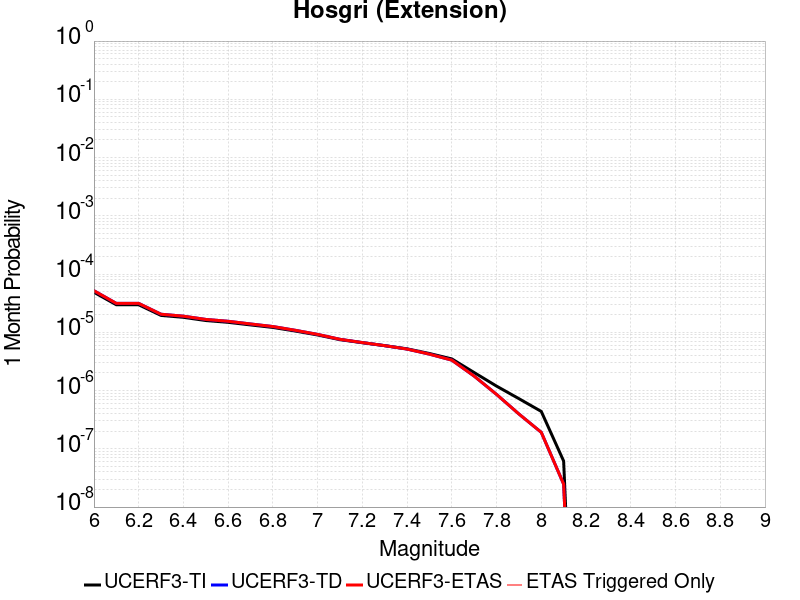 | 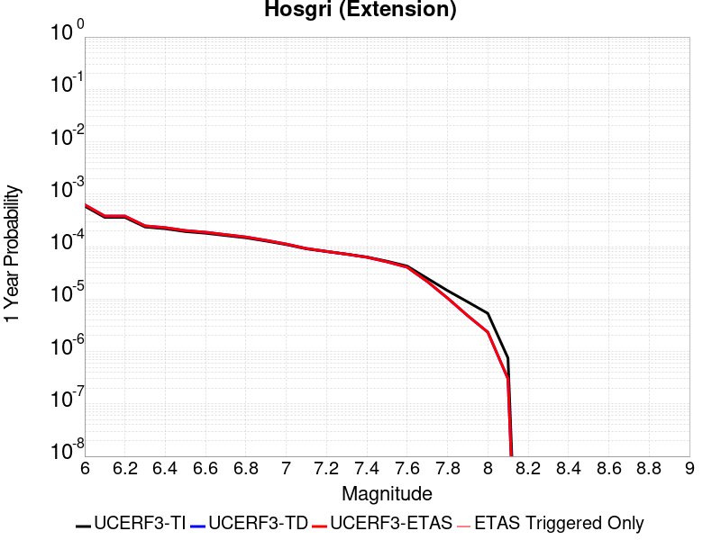 | 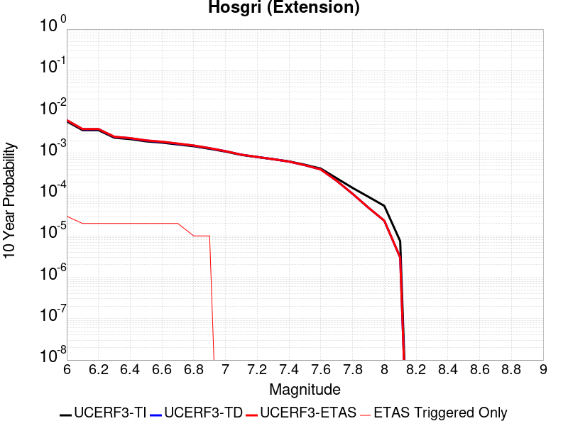 |

| Magnitude | 1 wk TI Prob | 1 wk TD Prob | 1 wk ETAS Prob | 1 wk ETAS/TD Gain | 1 wk ETAS Triggered Only | 1 mo TI Prob | 1 mo TD Prob | 1 mo ETAS Prob | 1 mo ETAS/TD Gain | 1 mo ETAS Triggered Only | 1 yr TI Prob | 1 yr TD Prob | 1 yr ETAS Prob | 1 yr ETAS/TD Gain | 1 yr ETAS Triggered Only | 10 yr TI Prob | 10 yr TD Prob | 10 yr ETAS Prob | 10 yr ETAS/TD Gain | 10 yr ETAS Triggered Only |
|-----|-----|-----|-----|-----|-----|-----|-----|-----|-----|-----|-----|-----|-----|-----|-----|-----|-----|-----|-----|-----|
| 6.0 | 1.1369135E-5 | 1.2083198E-5 | 1.2083198E-5 | 1.0 | 0.0 | 4.8723956E-5 | 5.1784238E-5 | 5.1784238E-5 | 1.0 | 0.0 | 5.9305265E-4 | 6.303134E-4 | 6.4030715E-4 | 1.0158551 | 1.0E-5 | 0.005914725 | 0.0062875054 | 0.006317317 | 1.0047413 | 3.0E-5 |
| 6.1 | 6.934979E-6 | 7.3246356E-6 | 7.3246356E-6 | 1.0 | 0.0 | 2.9721E-5 | 3.139094E-5 | 3.139094E-5 | 1.0 | 0.0 | 3.617931E-4 | 3.8212183E-4 | 3.8212183E-4 | 1.0 | 0.0 | 0.0036120464 | 0.0038150605 | 0.003834984 | 1.0052224 | 2.0E-5 |
| 6.2 | 6.934979E-6 | 7.3246356E-6 | 7.3246356E-6 | 1.0 | 0.0 | 2.9721E-5 | 3.139094E-5 | 3.139094E-5 | 1.0 | 0.0 | 3.617931E-4 | 3.8212183E-4 | 3.8212183E-4 | 1.0 | 0.0 | 0.0036120464 | 0.0038150605 | 0.003834984 | 1.0052224 | 2.0E-5 |
| 6.3 | 4.5484676E-6 | 4.769387E-6 | 4.769387E-6 | 1.0 | 0.0 | 1.9493287E-5 | 2.0440071E-5 | 2.0440071E-5 | 1.0 | 0.0 | 2.3730492E-4 | 2.4882986E-4 | 2.4882986E-4 | 1.0 | 0.0 | 0.0023705168 | 0.0024855551 | 0.0025055055 | 1.0080265 | 2.0E-5 |
| 6.4 | 4.218095E-6 | 4.416915E-6 | 4.416915E-6 | 1.0 | 0.0 | 1.8077424E-5 | 1.89295E-5 | 1.89295E-5 | 1.0 | 0.0 | 2.2007042E-4 | 2.3044262E-4 | 2.3044262E-4 | 1.0 | 0.0 | 0.002198526 | 0.0023020701 | 0.002322024 | 1.0086678 | 2.0E-5 |
| 6.5 | 3.717374E-6 | 3.8839266E-6 | 3.8839266E-6 | 1.0 | 0.0 | 1.5931506E-5 | 1.6645294E-5 | 1.6645294E-5 | 1.0 | 0.0 | 1.9394881E-4 | 2.0263779E-4 | 2.0263779E-4 | 1.0 | 0.0 | 0.0019377962 | 0.002024549 | 0.0020445085 | 1.0098587 | 2.0E-5 |
| 6.6 | 3.4605036E-6 | 3.6083522E-6 | 3.6083522E-6 | 1.0 | 0.0 | 1.4830645E-5 | 1.5464277E-5 | 1.5464277E-5 | 1.0 | 0.0 | 1.8054814E-4 | 1.8826143E-4 | 1.8826143E-4 | 1.0 | 0.0 | 0.0018040152 | 0.0018810342 | 0.0019009965 | 1.0106125 | 2.0E-5 |
| 6.7 | 3.123439E-6 | 3.2466114E-6 | 3.2466114E-6 | 1.0 | 0.0 | 1.33860985E-5 | 1.3913976E-5 | 1.3913976E-5 | 1.0 | 0.0 | 1.6296357E-4 | 1.6938959E-4 | 1.6938959E-4 | 1.0 | 0.0 | 0.001628441 | 0.0016926157 | 0.0017125818 | 1.011796 | 2.0E-5 |
| 6.8 | 2.8290783E-6 | 2.93058E-6 | 2.93058E-6 | 1.0 | 0.0 | 1.2124565E-5 | 1.2559569E-5 | 1.2559569E-5 | 1.0 | 0.0 | 1.4760658E-4 | 1.529021E-4 | 1.529021E-4 | 1.0 | 0.0 | 0.0014750857 | 0.0015279776 | 0.0015379625 | 1.0065346 | 1.0E-5 |
| 6.9 | 2.454112E-6 | 2.5283553E-6 | 2.5283553E-6 | 1.0 | 0.0 | 1.0517581E-5 | 1.08357635E-5 | 1.08357635E-5 | 1.0 | 0.0 | 1.2804402E-4 | 1.3191749E-4 | 1.3191749E-4 | 1.0 | 0.0 | 0.0012797028 | 0.001318398 | 0.0013283849 | 1.0075749 | 1.0E-5 |
| 7.0 | 2.1008145E-6 | 2.1499025E-6 | 2.1499025E-6 | 1.0 | 0.0 | 9.003459E-6 | 9.213836E-6 | 9.213836E-6 | 1.0 | 0.0 | 1.096116E-4 | 1.1217271E-4 | 1.1217271E-4 | 1.0 | 0.0 | 0.0010955755 | 0.0011211646 | 0.0011211646 | 1.0 | 0.0 |
| 7.1 | 1.744384E-6 | 1.7686639E-6 | 1.7686639E-6 | 1.0 | 0.0 | 7.47591E-6 | 7.579966E-6 | 7.579966E-6 | 1.0 | 0.0 | 9.1015405E-5 | 9.22822E-5 | 9.22822E-5 | 1.0 | 0.0 | 9.097813E-4 | 9.224405E-4 | 9.224405E-4 | 1.0 | 0.0 |
| 7.2 | 1.5456587E-6 | 1.556315E-6 | 1.556315E-6 | 1.0 | 0.0 | 6.6242346E-6 | 6.6699045E-6 | 6.6699045E-6 | 1.0 | 0.0 | 8.064707E-5 | 8.120307E-5 | 8.120307E-5 | 1.0 | 0.0 | 8.0617814E-4 | 8.117353E-4 | 8.117353E-4 | 1.0 | 0.0 |
| 7.3 | 1.3775123E-6 | 1.3766333E-6 | 1.3766333E-6 | 1.0 | 0.0 | 5.9036106E-6 | 5.899844E-6 | 5.899844E-6 | 1.0 | 0.0 | 7.187409E-5 | 7.182824E-5 | 7.182824E-5 | 1.0 | 0.0 | 7.185085E-4 | 7.180513E-4 | 7.180513E-4 | 1.0 | 0.0 |
| 7.4 | 1.214491E-6 | 1.2023696E-6 | 1.2023696E-6 | 1.0 | 0.0 | 5.2049513E-6 | 5.1530023E-6 | 5.1530023E-6 | 1.0 | 0.0 | 6.336844E-5 | 6.2736006E-5 | 6.2736006E-5 | 1.0 | 0.0 | 6.335037E-4 | 6.2718376E-4 | 6.2718376E-4 | 1.0 | 0.0 |
| 7.5 | 1.0101123E-6 | 9.842462E-7 | 9.842462E-7 | 1.0 | 0.0 | 4.3290456E-6 | 4.218191E-6 | 4.218191E-6 | 1.0 | 0.0 | 5.2704854E-5 | 5.135527E-5 | 5.135527E-5 | 1.0 | 0.0 | 5.2692357E-4 | 5.1343464E-4 | 5.1343464E-4 | 1.0 | 0.0 |
| 7.6 | 8.1558215E-7 | 7.7661633E-7 | 7.7661633E-7 | 1.0 | 0.0 | 3.4953473E-6 | 3.3283516E-6 | 3.3283516E-6 | 1.0 | 0.0 | 4.255502E-5 | 4.0521933E-5 | 4.0521933E-5 | 1.0 | 0.0 | 4.2546875E-4 | 4.0514587E-4 | 4.0514587E-4 | 1.0 | 0.0 |
| 7.7 | 4.757816E-7 | 4.1310525E-7 | 4.1310525E-7 | 1.0 | 0.0 | 2.0390623E-6 | 1.7704498E-6 | 1.7704498E-6 | 1.0 | 0.0 | 2.4825302E-5 | 2.1555015E-5 | 2.1555015E-5 | 1.0 | 0.0 | 2.482253E-4 | 2.1552936E-4 | 2.1552936E-4 | 1.0 | 0.0 |
| 7.8 | 2.782787E-7 | 2.0049143E-7 | 2.0049143E-7 | 1.0 | 0.0 | 1.1926223E-6 | 8.5924864E-7 | 8.5924864E-7 | 1.0 | 0.0 | 1.452008E-5 | 1.0461303E-5 | 1.0461303E-5 | 1.0 | 0.0 | 1.4519131E-4 | 1.0460813E-4 | 1.0460813E-4 | 1.0 | 0.0 |
| 7.9 | 1.6948086E-7 | 9.2455664E-8 | 9.2455664E-8 | 1.0 | 0.0 | 7.2634634E-7 | 3.9623848E-7 | 3.9623848E-7 | 1.0 | 0.0 | 8.843231E-6 | 4.824193E-6 | 4.824193E-6 | 1.0 | 0.0 | 8.842879E-5 | 4.824089E-5 | 4.824089E-5 | 1.0 | 0.0 |
| 8.0 | 1.0225492E-7 | 4.4748486E-8 | 4.4748486E-8 | 1.0 | 0.0 | 4.382353E-7 | 1.9177921E-7 | 1.9177921E-7 | 1.0 | 0.0 | 5.335502E-6 | 2.3349094E-6 | 2.3349094E-6 | 1.0 | 0.0 | 5.335374E-5 | 2.3348852E-5 | 2.3348852E-5 | 1.0 | 0.0 |
| 8.1 | 1.43711345E-8 | 5.789212E-9 | 5.789212E-9 | 1.0 | 0.0 | 6.1590576E-8 | 2.4810909E-8 | 2.4810909E-8 | 1.0 | 0.0 | 7.4986497E-7 | 3.0207278E-7 | 3.0207278E-7 | 1.0 | 0.0 | 7.4986247E-6 | 3.0207243E-6 | 3.0207243E-6 | 1.0 | 0.0 |

## Pitas Point (Lower West)
*[(top)](#table-of-contents)*

| 1 Week | 1 Month | 1 Year | 10 Year |
|-----|-----|-----|-----|
| 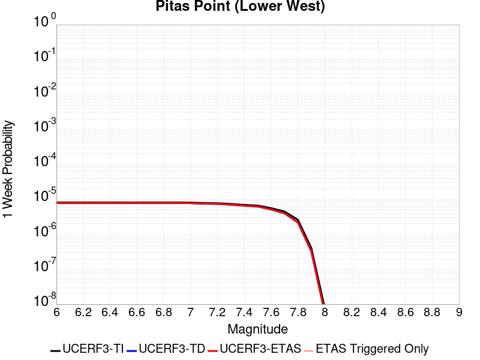 | 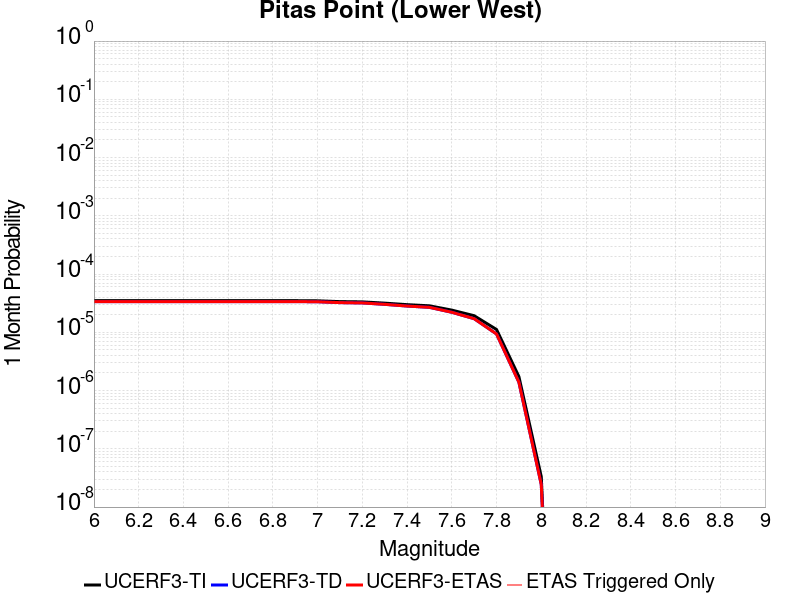 | 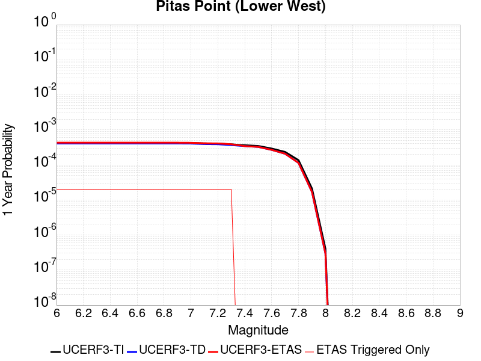 | 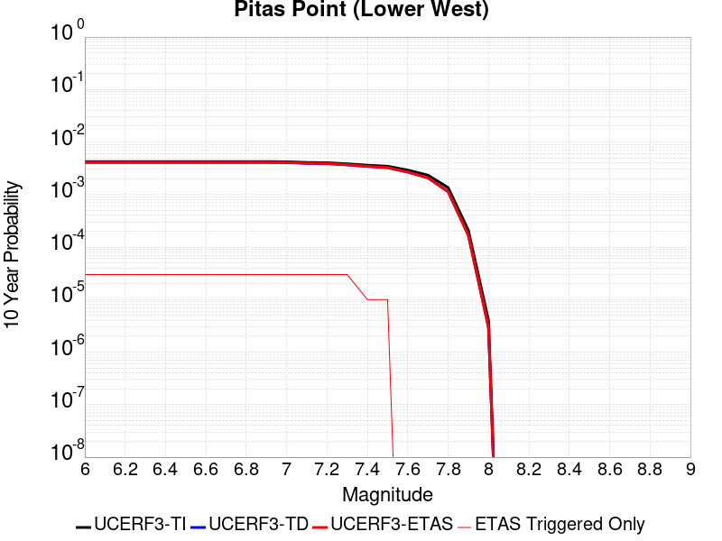 |

| Magnitude | 1 wk TI Prob | 1 wk TD Prob | 1 wk ETAS Prob | 1 wk ETAS/TD Gain | 1 wk ETAS Triggered Only | 1 mo TI Prob | 1 mo TD Prob | 1 mo ETAS Prob | 1 mo ETAS/TD Gain | 1 mo ETAS Triggered Only | 1 yr TI Prob | 1 yr TD Prob | 1 yr ETAS Prob | 1 yr ETAS/TD Gain | 1 yr ETAS Triggered Only | 10 yr TI Prob | 10 yr TD Prob | 10 yr ETAS Prob | 10 yr ETAS/TD Gain | 10 yr ETAS Triggered Only |
|-----|-----|-----|-----|-----|-----|-----|-----|-----|-----|-----|-----|-----|-----|-----|-----|-----|-----|-----|-----|-----|
| 6.0 | 8.151497E-6 | 7.855829E-6 | 7.855829E-6 | 1.0 | 0.0 | 3.493452E-5 | 3.3667406E-5 | 3.3667406E-5 | 1.0 | 0.0 | 4.252448E-4 | 4.098243E-4 | 4.298161E-4 | 1.0487814 | 2.0E-5 | 0.0042443196 | 0.004090766 | 0.0041206433 | 1.0073036 | 3.0E-5 |
| 6.1 | 8.151497E-6 | 7.855829E-6 | 7.855829E-6 | 1.0 | 0.0 | 3.493452E-5 | 3.3667406E-5 | 3.3667406E-5 | 1.0 | 0.0 | 4.252448E-4 | 4.098243E-4 | 4.298161E-4 | 1.0487814 | 2.0E-5 | 0.0042443196 | 0.004090766 | 0.0041206433 | 1.0073036 | 3.0E-5 |
| 6.2 | 8.151497E-6 | 7.855829E-6 | 7.855829E-6 | 1.0 | 0.0 | 3.493452E-5 | 3.3667406E-5 | 3.3667406E-5 | 1.0 | 0.0 | 4.252448E-4 | 4.098243E-4 | 4.298161E-4 | 1.0487814 | 2.0E-5 | 0.0042443196 | 0.004090766 | 0.0041206433 | 1.0073036 | 3.0E-5 |
| 6.3 | 8.151497E-6 | 7.855829E-6 | 7.855829E-6 | 1.0 | 0.0 | 3.493452E-5 | 3.3667406E-5 | 3.3667406E-5 | 1.0 | 0.0 | 4.252448E-4 | 4.098243E-4 | 4.298161E-4 | 1.0487814 | 2.0E-5 | 0.0042443196 | 0.004090766 | 0.0041206433 | 1.0073036 | 3.0E-5 |
| 6.4 | 8.151497E-6 | 7.855829E-6 | 7.855829E-6 | 1.0 | 0.0 | 3.493452E-5 | 3.3667406E-5 | 3.3667406E-5 | 1.0 | 0.0 | 4.252448E-4 | 4.098243E-4 | 4.298161E-4 | 1.0487814 | 2.0E-5 | 0.0042443196 | 0.004090766 | 0.0041206433 | 1.0073036 | 3.0E-5 |
| 6.5 | 8.151497E-6 | 7.855829E-6 | 7.855829E-6 | 1.0 | 0.0 | 3.493452E-5 | 3.3667406E-5 | 3.3667406E-5 | 1.0 | 0.0 | 4.252448E-4 | 4.098243E-4 | 4.298161E-4 | 1.0487814 | 2.0E-5 | 0.0042443196 | 0.004090766 | 0.0041206433 | 1.0073036 | 3.0E-5 |
| 6.6 | 8.151497E-6 | 7.855829E-6 | 7.855829E-6 | 1.0 | 0.0 | 3.493452E-5 | 3.3667406E-5 | 3.3667406E-5 | 1.0 | 0.0 | 4.252448E-4 | 4.098243E-4 | 4.298161E-4 | 1.0487814 | 2.0E-5 | 0.0042443196 | 0.004090766 | 0.0041206433 | 1.0073036 | 3.0E-5 |
| 6.7 | 8.151497E-6 | 7.855829E-6 | 7.855829E-6 | 1.0 | 0.0 | 3.493452E-5 | 3.3667406E-5 | 3.3667406E-5 | 1.0 | 0.0 | 4.252448E-4 | 4.098243E-4 | 4.298161E-4 | 1.0487814 | 2.0E-5 | 0.0042443196 | 0.004090766 | 0.0041206433 | 1.0073036 | 3.0E-5 |
| 6.8 | 8.151497E-6 | 7.855829E-6 | 7.855829E-6 | 1.0 | 0.0 | 3.493452E-5 | 3.3667406E-5 | 3.3667406E-5 | 1.0 | 0.0 | 4.252448E-4 | 4.098243E-4 | 4.298161E-4 | 1.0487814 | 2.0E-5 | 0.0042443196 | 0.004090766 | 0.0041206433 | 1.0073036 | 3.0E-5 |
| 6.9 | 8.151497E-6 | 7.855829E-6 | 7.855829E-6 | 1.0 | 0.0 | 3.493452E-5 | 3.3667406E-5 | 3.3667406E-5 | 1.0 | 0.0 | 4.252448E-4 | 4.098243E-4 | 4.298161E-4 | 1.0487814 | 2.0E-5 | 0.0042443196 | 0.004090766 | 0.0041206433 | 1.0073036 | 3.0E-5 |
| 7.0 | 8.103535E-6 | 7.805258E-6 | 7.805258E-6 | 1.0 | 0.0 | 3.4728975E-5 | 3.345068E-5 | 3.345068E-5 | 1.0 | 0.0 | 4.2274324E-4 | 4.0718666E-4 | 4.2717851E-4 | 1.0490975 | 2.0E-5 | 0.0042193993 | 0.0040644864 | 0.004094364 | 1.007351 | 3.0E-5 |
| 7.1 | 7.853298E-6 | 7.540947E-6 | 7.540947E-6 | 1.0 | 0.0 | 3.3656554E-5 | 3.231795E-5 | 3.231795E-5 | 1.0 | 0.0 | 4.096915E-4 | 3.9340067E-4 | 4.1339282E-4 | 1.0508188 | 2.0E-5 | 0.00408937 | 0.0039271186 | 0.003957001 | 1.0076091 | 3.0E-5 |
| 7.2 | 7.771102E-6 | 7.453228E-6 | 7.453228E-6 | 1.0 | 0.0 | 3.33043E-5 | 3.1942018E-5 | 3.1942018E-5 | 1.0 | 0.0 | 4.0540437E-4 | 3.8882537E-4 | 4.088176E-4 | 1.051417 | 2.0E-5 | 0.0040466557 | 0.0038815264 | 0.00391141 | 1.0076989 | 3.0E-5 |
| 7.3 | 7.3945344E-6 | 7.049329E-6 | 7.049329E-6 | 1.0 | 0.0 | 3.1690477E-5 | 3.0211062E-5 | 3.0211062E-5 | 1.0 | 0.0 | 3.8576324E-4 | 3.6775824E-4 | 3.877509E-4 | 1.0543636 | 2.0E-5 | 0.0038509427 | 0.0036715642 | 0.003701454 | 1.0081409 | 3.0E-5 |
| 7.4 | 6.964645E-6 | 6.5901736E-6 | 6.5901736E-6 | 1.0 | 0.0 | 2.9848137E-5 | 2.8243297E-5 | 2.8243297E-5 | 1.0 | 0.0 | 3.6334046E-4 | 3.4380838E-4 | 3.4380838E-4 | 1.0 | 0.0 | 0.0036274698 | 0.0034328182 | 0.0034427838 | 1.0029031 | 1.0E-5 |
| 7.5 | 6.6525035E-6 | 6.2592094E-6 | 6.2592094E-6 | 1.0 | 0.0 | 2.851042E-5 | 2.682491E-5 | 2.682491E-5 | 1.0 | 0.0 | 3.4705905E-4 | 3.2654483E-4 | 3.2654483E-4 | 1.0 | 0.0 | 0.0034651754 | 0.0032607014 | 0.003270669 | 1.0030569 | 1.0E-5 |
| 7.6 | 5.613338E-6 | 5.1514285E-6 | 5.1514285E-6 | 1.0 | 0.0 | 2.405694E-5 | 2.2077365E-5 | 2.2077365E-5 | 1.0 | 0.0 | 2.928539E-4 | 2.6875906E-4 | 2.6875906E-4 | 1.0 | 0.0 | 0.0029246826 | 0.002684372 | 0.002684372 | 1.0 | 0.0 |
| 7.7 | 4.494704E-6 | 3.996944E-6 | 3.996944E-6 | 1.0 | 0.0 | 1.9262876E-5 | 1.712965E-5 | 1.712965E-5 | 1.0 | 0.0 | 2.3450027E-4 | 2.0853376E-4 | 2.0853376E-4 | 1.0 | 0.0 | 0.0023425296 | 0.002083405 | 0.002083405 | 1.0 | 0.0 |
| 7.8 | 2.6075882E-6 | 2.1836554E-6 | 2.1836554E-6 | 1.0 | 0.0 | 1.117533E-5 | 9.35849E-6 | 9.35849E-6 | 1.0 | 0.0 | 1.3605114E-4 | 1.1393371E-4 | 1.1393371E-4 | 1.0 | 0.0 | 0.0013596788 | 0.0011387577 | 0.0011387577 | 1.0 | 0.0 |
| 7.9 | 4.045984E-7 | 3.242403E-7 | 3.242403E-7 | 1.0 | 0.0 | 1.733992E-6 | 1.3896005E-6 | 1.3896005E-6 | 1.0 | 0.0 | 2.1111147E-5 | 1.6918259E-5 | 1.6918259E-5 | 1.0 | 0.0 | 2.1109142E-4 | 1.6917E-4 | 1.6917E-4 | 1.0 | 0.0 |
| 8.0 | 7.791402E-9 | 5.683553E-9 | 5.683553E-9 | 1.0 | 0.0 | 3.3391725E-8 | 2.4358085E-8 | 2.4358085E-8 | 1.0 | 0.0 | 4.0654416E-7 | 2.9655968E-7 | 2.9655968E-7 | 1.0 | 0.0 | 4.065434E-6 | 2.9655946E-6 | 2.9655946E-6 | 1.0 | 0.0 |

## Sheephole
*[(top)](#table-of-contents)*

| 1 Week | 1 Month | 1 Year | 10 Year |
|-----|-----|-----|-----|
| 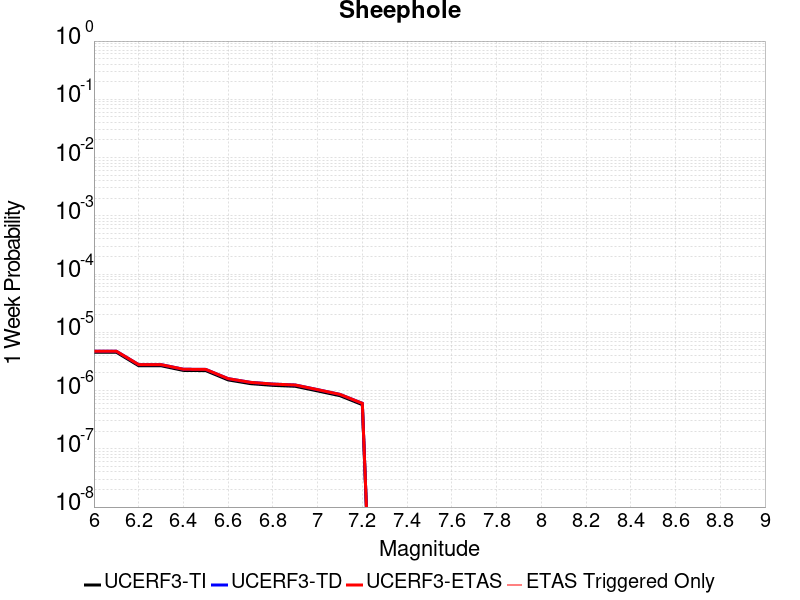 |  | 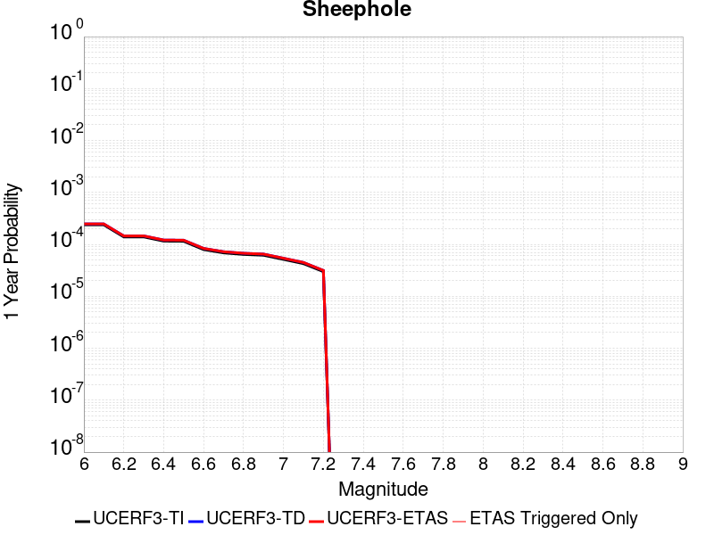 | 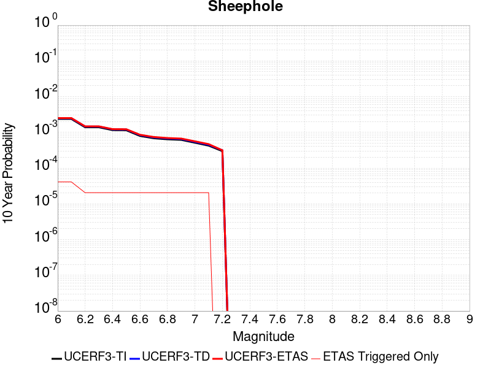 |

| Magnitude | 1 wk TI Prob | 1 wk TD Prob | 1 wk ETAS Prob | 1 wk ETAS/TD Gain | 1 wk ETAS Triggered Only | 1 mo TI Prob | 1 mo TD Prob | 1 mo ETAS Prob | 1 mo ETAS/TD Gain | 1 mo ETAS Triggered Only | 1 yr TI Prob | 1 yr TD Prob | 1 yr ETAS Prob | 1 yr ETAS/TD Gain | 1 yr ETAS Triggered Only | 10 yr TI Prob | 10 yr TD Prob | 10 yr ETAS Prob | 10 yr ETAS/TD Gain | 10 yr ETAS Triggered Only |
|-----|-----|-----|-----|-----|-----|-----|-----|-----|-----|-----|-----|-----|-----|-----|-----|-----|-----|-----|-----|-----|
| 6.0 | 4.5579695E-6 | 4.7412877E-6 | 4.7412877E-6 | 1.0 | 0.0 | 1.9534009E-5 | 2.0319678E-5 | 2.0319678E-5 | 1.0 | 0.0 | 2.3780059E-4 | 2.4736955E-4 | 2.4736955E-4 | 1.0 | 0.0 | 0.0023754628 | 0.0024714863 | 0.0025014123 | 1.0121084 | 3.0E-5 |
| 6.1 | 4.5579695E-6 | 4.7412877E-6 | 4.7412877E-6 | 1.0 | 0.0 | 1.9534009E-5 | 2.0319678E-5 | 2.0319678E-5 | 1.0 | 0.0 | 2.3780059E-4 | 2.4736955E-4 | 2.4736955E-4 | 1.0 | 0.0 | 0.0023754628 | 0.0024714863 | 0.0025014123 | 1.0121084 | 3.0E-5 |
| 6.2 | 2.6677674E-6 | 2.7874107E-6 | 2.7874107E-6 | 1.0 | 0.0 | 1.1433239E-5 | 1.1945997E-5 | 1.1945997E-5 | 1.0 | 0.0 | 1.3919079E-4 | 1.4543389E-4 | 1.4543389E-4 | 1.0 | 0.0 | 0.0013910364 | 0.001453493 | 0.001473464 | 1.01374 | 2.0E-5 |
| 6.3 | 2.6677674E-6 | 2.7874107E-6 | 2.7874107E-6 | 1.0 | 0.0 | 1.1433239E-5 | 1.1945997E-5 | 1.1945997E-5 | 1.0 | 0.0 | 1.3919079E-4 | 1.4543389E-4 | 1.4543389E-4 | 1.0 | 0.0 | 0.0013910364 | 0.001453493 | 0.001473464 | 1.01374 | 2.0E-5 |
| 6.4 | 2.2159759E-6 | 2.3228936E-6 | 2.3228936E-6 | 1.0 | 0.0 | 9.497005E-6 | 9.955224E-6 | 9.955224E-6 | 1.0 | 0.0 | 1.156199E-4 | 1.2119893E-4 | 1.2119893E-4 | 1.0 | 0.0 | 0.0011555976 | 0.0012114076 | 0.0012313834 | 1.0164897 | 2.0E-5 |
| 6.5 | 2.1986082E-6 | 2.3047737E-6 | 2.3047737E-6 | 1.0 | 0.0 | 9.4225725E-6 | 9.877569E-6 | 9.877569E-6 | 1.0 | 0.0 | 1.1471378E-4 | 1.2025358E-4 | 1.2025358E-4 | 1.0 | 0.0 | 0.0011465458 | 0.0012019643 | 0.0012219403 | 1.0166194 | 2.0E-5 |
| 6.6 | 1.5232331E-6 | 1.6019028E-6 | 1.6019028E-6 | 1.0 | 0.0 | 6.5281256E-6 | 6.8652807E-6 | 6.8652807E-6 | 1.0 | 0.0 | 7.947703E-5 | 8.358178E-5 | 8.358178E-5 | 1.0 | 0.0 | 7.9448614E-4 | 8.3552214E-4 | 8.555054E-4 | 1.0239171 | 2.0E-5 |
| 6.7 | 1.3137362E-6 | 1.3828287E-6 | 1.3828287E-6 | 1.0 | 0.0 | 5.6302856E-6 | 5.926396E-6 | 5.926396E-6 | 1.0 | 0.0 | 6.854657E-5 | 7.2151626E-5 | 7.2151626E-5 | 1.0 | 0.0 | 6.8525434E-4 | 7.212959E-4 | 7.4128143E-4 | 1.0277078 | 2.0E-5 |
| 6.8 | 1.2275751E-6 | 1.2922936E-6 | 1.2922936E-6 | 1.0 | 0.0 | 5.2610258E-6 | 5.5383903E-6 | 5.5383903E-6 | 1.0 | 0.0 | 6.4051106E-5 | 6.742795E-5 | 6.742795E-5 | 1.0 | 0.0 | 6.4032647E-4 | 6.740883E-4 | 6.9407484E-4 | 1.0296497 | 2.0E-5 |
| 6.9 | 1.1837088E-6 | 1.2461107E-6 | 1.2461107E-6 | 1.0 | 0.0 | 5.0730278E-6 | 5.340464E-6 | 5.340464E-6 | 1.0 | 0.0 | 6.176237E-5 | 6.501835E-5 | 6.501835E-5 | 1.0 | 0.0 | 6.17452E-4 | 6.500064E-4 | 6.699934E-4 | 1.030749 | 2.0E-5 |
| 7.0 | 9.849371E-7 | 1.036636E-6 | 1.036636E-6 | 1.0 | 0.0 | 4.2211523E-6 | 4.442719E-6 | 4.442719E-6 | 1.0 | 0.0 | 5.1391315E-5 | 5.408886E-5 | 5.408886E-5 | 1.0 | 0.0 | 5.137943E-4 | 5.4076704E-4 | 5.6075625E-4 | 1.0369645 | 2.0E-5 |
| 7.1 | 8.1643645E-7 | 8.5917287E-7 | 8.5917287E-7 | 1.0 | 0.0 | 3.4990085E-6 | 3.6821648E-6 | 3.6821648E-6 | 1.0 | 0.0 | 4.2599597E-5 | 4.482952E-5 | 4.482952E-5 | 1.0 | 0.0 | 4.259143E-4 | 4.482134E-4 | 4.6820444E-4 | 1.0446016 | 2.0E-5 |
| 7.2 | 5.7295756E-7 | 6.029544E-7 | 6.029544E-7 | 1.0 | 0.0 | 2.45553E-6 | 2.584088E-6 | 2.584088E-6 | 1.0 | 0.0 | 2.9895667E-5 | 3.1460884E-5 | 3.1460884E-5 | 1.0 | 0.0 | 2.9891645E-4 | 3.14571E-4 | 3.14571E-4 | 1.0 | 0.0 |

## Hollywood
*[(top)](#table-of-contents)*

| 1 Week | 1 Month | 1 Year | 10 Year |
|-----|-----|-----|-----|
| 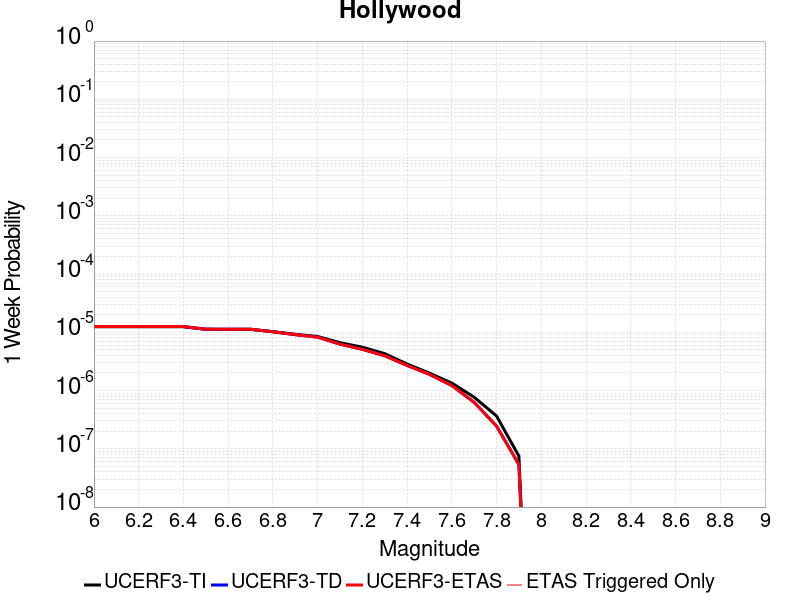 | 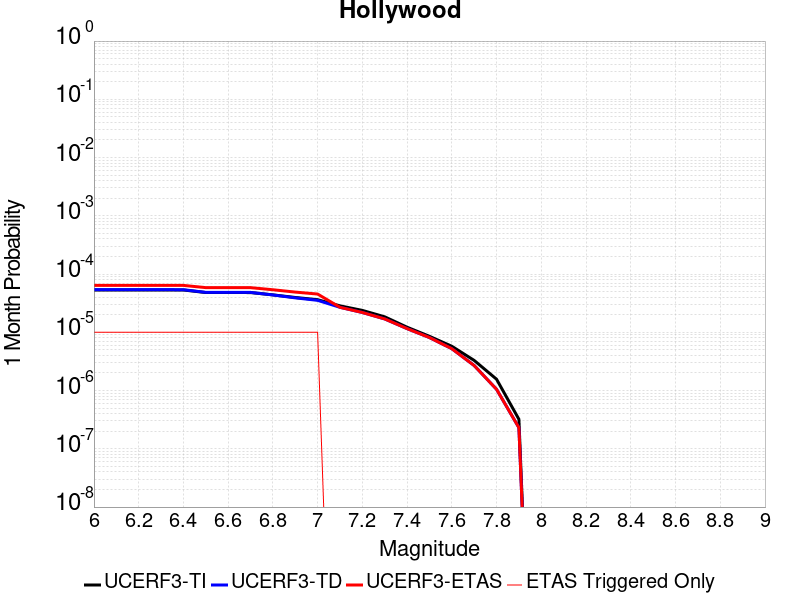 | 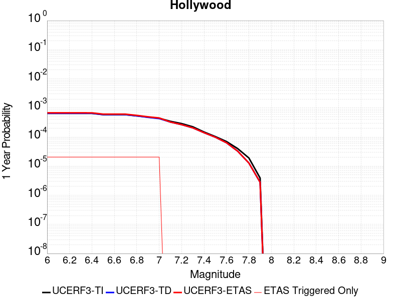 | 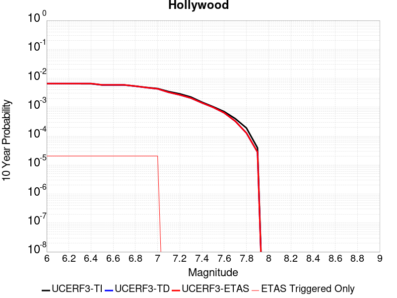 |

| Magnitude | 1 wk TI Prob | 1 wk TD Prob | 1 wk ETAS Prob | 1 wk ETAS/TD Gain | 1 wk ETAS Triggered Only | 1 mo TI Prob | 1 mo TD Prob | 1 mo ETAS Prob | 1 mo ETAS/TD Gain | 1 mo ETAS Triggered Only | 1 yr TI Prob | 1 yr TD Prob | 1 yr ETAS Prob | 1 yr ETAS/TD Gain | 1 yr ETAS Triggered Only | 10 yr TI Prob | 10 yr TD Prob | 10 yr ETAS Prob | 10 yr ETAS/TD Gain | 10 yr ETAS Triggered Only |
|-----|-----|-----|-----|-----|-----|-----|-----|-----|-----|-----|-----|-----|-----|-----|-----|-----|-----|-----|-----|-----|
| 6.0 | 1.24487615E-5 | 1.2593381E-5 | 1.2593381E-5 | 1.0 | 0.0 | 5.3350745E-5 | 5.3970543E-5 | 6.397E-5 | 1.1852763 | 1.0E-5 | 6.4935174E-4 | 6.568979E-4 | 6.868782E-4 | 1.0456392 | 3.0E-5 | 0.0064745755 | 0.0065500494 | 0.006579853 | 1.0045501 | 3.0E-5 |
| 6.1 | 1.24487615E-5 | 1.2593381E-5 | 1.2593381E-5 | 1.0 | 0.0 | 5.3350745E-5 | 5.3970543E-5 | 6.397E-5 | 1.1852763 | 1.0E-5 | 6.4935174E-4 | 6.568979E-4 | 6.868782E-4 | 1.0456392 | 3.0E-5 | 0.0064745755 | 0.0065500494 | 0.006579853 | 1.0045501 | 3.0E-5 |
| 6.2 | 1.24487615E-5 | 1.2593381E-5 | 1.2593381E-5 | 1.0 | 0.0 | 5.3350745E-5 | 5.3970543E-5 | 6.397E-5 | 1.1852763 | 1.0E-5 | 6.4935174E-4 | 6.568979E-4 | 6.868782E-4 | 1.0456392 | 3.0E-5 | 0.0064745755 | 0.0065500494 | 0.006579853 | 1.0045501 | 3.0E-5 |
| 6.3 | 1.24487615E-5 | 1.2593381E-5 | 1.2593381E-5 | 1.0 | 0.0 | 5.3350745E-5 | 5.3970543E-5 | 6.397E-5 | 1.1852763 | 1.0E-5 | 6.4935174E-4 | 6.568979E-4 | 6.868782E-4 | 1.0456392 | 3.0E-5 | 0.0064745755 | 0.0065500494 | 0.006579853 | 1.0045501 | 3.0E-5 |
| 6.4 | 1.2431024E-5 | 1.2573994E-5 | 1.2573994E-5 | 1.0 | 0.0 | 5.327473E-5 | 5.3887463E-5 | 6.3886924E-5 | 1.1855619 | 1.0E-5 | 6.4842677E-4 | 6.55887E-4 | 6.8586733E-4 | 1.0457096 | 3.0E-5 | 0.0064653796 | 0.00654 | 0.0065698037 | 1.0045571 | 3.0E-5 |
| 6.5 | 1.1242222E-5 | 1.1317946E-5 | 1.1317946E-5 | 1.0 | 0.0 | 4.8180063E-5 | 4.8504597E-5 | 5.8504113E-5 | 1.206156 | 1.0E-5 | 5.864344E-4 | 5.9038616E-4 | 6.203684E-4 | 1.0507842 | 3.0E-5 | 0.0058488925 | 0.0058884635 | 0.005918287 | 1.0050647 | 3.0E-5 |
| 6.6 | 1.1234066E-5 | 1.130906E-5 | 1.130906E-5 | 1.0 | 0.0 | 4.8145106E-5 | 4.8466514E-5 | 5.846603E-5 | 1.206318 | 1.0E-5 | 5.86009E-4 | 5.899227E-4 | 6.19905E-4 | 1.0508242 | 3.0E-5 | 0.005844661 | 0.0058838543 | 0.0059136776 | 1.0050687 | 3.0E-5 |
| 6.7 | 1.12294E-5 | 1.1303803E-5 | 1.1303803E-5 | 1.0 | 0.0 | 4.812511E-5 | 4.8443988E-5 | 5.8443504E-5 | 1.206414 | 1.0E-5 | 5.857657E-4 | 5.896486E-4 | 6.196309E-4 | 1.0508478 | 3.0E-5 | 0.0058422405 | 0.0058811274 | 0.005910951 | 1.005071 | 3.0E-5 |
| 6.8 | 1.0252819E-5 | 1.0218574E-5 | 1.0218574E-5 | 1.0 | 0.0 | 4.3939912E-5 | 4.3793167E-5 | 5.379273E-5 | 1.2283361 | 1.0E-5 | 5.3483713E-4 | 5.330535E-4 | 5.630375E-4 | 1.0562495 | 3.0E-5 | 0.005335517 | 0.005317975 | 0.0053478153 | 1.0056113 | 3.0E-5 |
| 6.9 | 9.252289E-6 | 9.110419E-6 | 9.110419E-6 | 1.0 | 0.0 | 3.9652066E-5 | 3.904408E-5 | 4.904369E-5 | 1.2561108 | 1.0E-5 | 4.8265693E-4 | 4.7525964E-4 | 5.052454E-4 | 1.0630934 | 3.0E-5 | 0.0048161 | 0.004742606 | 0.004772464 | 1.0062957 | 3.0E-5 |
| 7.0 | 8.474604E-6 | 8.25836E-6 | 8.25836E-6 | 1.0 | 0.0 | 3.6319227E-5 | 3.53925E-5 | 4.5392146E-5 | 1.2825358 | 1.0E-5 | 4.4209688E-4 | 4.308199E-4 | 4.60807E-4 | 1.0696046 | 3.0E-5 | 0.004412184 | 0.0042999974 | 0.0043298686 | 1.0069468 | 3.0E-5 |
| 7.1 | 6.643643E-6 | 6.2684458E-6 | 6.2684458E-6 | 1.0 | 0.0 | 2.8472443E-5 | 2.6864493E-5 | 2.6864493E-5 | 1.0 | 0.0 | 3.4659685E-4 | 3.2702653E-4 | 3.4702E-4 | 1.0611371 | 2.0E-5 | 0.0034605677 | 0.003265499 | 0.0032854336 | 1.0061046 | 2.0E-5 |
| 7.2 | 5.549002E-6 | 5.108774E-6 | 5.108774E-6 | 1.0 | 0.0 | 2.378122E-5 | 2.1894564E-5 | 2.1894564E-5 | 1.0 | 0.0 | 2.8949787E-4 | 2.6653384E-4 | 2.8652852E-4 | 1.0750173 | 2.0E-5 | 0.0028912104 | 0.0026621583 | 0.002682105 | 1.0074927 | 2.0E-5 |
| 7.3 | 4.3059727E-6 | 3.959942E-6 | 3.959942E-6 | 1.0 | 0.0 | 1.8454039E-5 | 1.6971071E-5 | 1.6971071E-5 | 1.0 | 0.0 | 2.2465475E-4 | 2.0660329E-4 | 2.2659916E-4 | 1.0967839 | 2.0E-5 | 0.0022442779 | 0.0020641224 | 0.002084081 | 1.0096693 | 2.0E-5 |
| 7.4 | 2.8550733E-6 | 2.7013389E-6 | 2.7013389E-6 | 1.0 | 0.0 | 1.2235971E-5 | 1.1577115E-5 | 1.1577115E-5 | 1.0 | 0.0 | 1.4896276E-4 | 1.4094231E-4 | 1.609395E-4 | 1.1418821 | 2.0E-5 | 0.0014886294 | 0.0014085344 | 0.0014285062 | 1.0141791 | 2.0E-5 |
| 7.5 | 1.9927045E-6 | 1.8976702E-6 | 1.8976702E-6 | 1.0 | 0.0 | 8.540134E-6 | 8.132847E-6 | 8.132847E-6 | 1.0 | 0.0 | 1.0397117E-4 | 9.9012956E-5 | 1.1901097E-4 | 1.2019738 | 2.0E-5 | 0.0010392254 | 9.896919E-4 | 0.0010096722 | 1.0201883 | 2.0E-5 |
| 7.6 | 1.345084E-6 | 1.221624E-6 | 1.221624E-6 | 1.0 | 0.0 | 5.764633E-6 | 5.235521E-6 | 5.235521E-6 | 1.0 | 0.0 | 7.018215E-5 | 6.374063E-5 | 7.373999E-5 | 1.1568758 | 1.0E-5 | 7.0159987E-4 | 6.372254E-4 | 6.47219E-4 | 1.015683 | 1.0E-5 |
| 7.7 | 7.6835164E-7 | 6.2778713E-7 | 6.2778713E-7 | 1.0 | 0.0 | 3.2929315E-6 | 2.6905136E-6 | 2.6905136E-6 | 1.0 | 0.0 | 4.00907E-5 | 3.2756525E-5 | 4.2756197E-5 | 1.3052727 | 1.0E-5 | 4.0083472E-4 | 3.2751844E-4 | 3.3751517E-4 | 1.0305226 | 1.0E-5 |
| 7.8 | 3.6562128E-7 | 2.453623E-7 | 2.453623E-7 | 1.0 | 0.0 | 1.5669474E-6 | 1.0515523E-6 | 1.0515523E-6 | 1.0 | 0.0 | 1.9077417E-5 | 1.2802578E-5 | 2.280245E-5 | 1.7810827 | 1.0E-5 | 1.907578E-4 | 1.2801877E-4 | 1.380175E-4 | 1.0781035 | 1.0E-5 |
| 7.9 | 7.5024424E-8 | 5.3819846E-8 | 5.3819846E-8 | 1.0 | 0.0 | 3.215332E-7 | 2.3065647E-7 | 2.3065647E-7 | 1.0 | 0.0 | 3.91466E-6 | 2.8082402E-6 | 2.8082402E-6 | 1.0 | 0.0 | 3.9145907E-5 | 2.8082177E-5 | 2.8082177E-5 | 1.0 | 0.0 |

## Great Valley 07 (Orestimba)
*[(top)](#table-of-contents)*

| 1 Week | 1 Month | 1 Year | 10 Year |
|-----|-----|-----|-----|
|  |  | 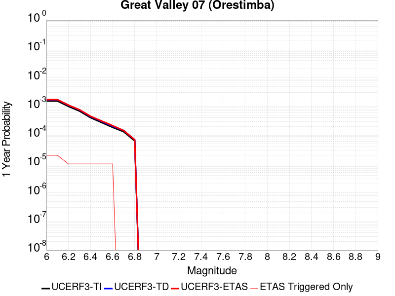 | 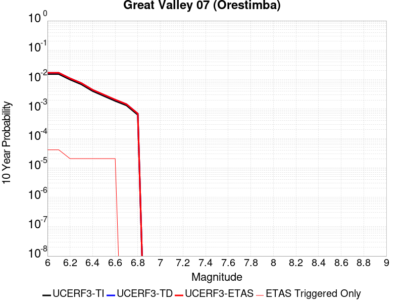 |

| Magnitude | 1 wk TI Prob | 1 wk TD Prob | 1 wk ETAS Prob | 1 wk ETAS/TD Gain | 1 wk ETAS Triggered Only | 1 mo TI Prob | 1 mo TD Prob | 1 mo ETAS Prob | 1 mo ETAS/TD Gain | 1 mo ETAS Triggered Only | 1 yr TI Prob | 1 yr TD Prob | 1 yr ETAS Prob | 1 yr ETAS/TD Gain | 1 yr ETAS Triggered Only | 10 yr TI Prob | 10 yr TD Prob | 10 yr ETAS Prob | 10 yr ETAS/TD Gain | 10 yr ETAS Triggered Only |
|-----|-----|-----|-----|-----|-----|-----|-----|-----|-----|-----|-----|-----|-----|-----|-----|-----|-----|-----|-----|-----|
| 6.0 | 2.9687902E-5 | 3.2757947E-5 | 3.2757947E-5 | 1.0 | 0.0 | 1.2722766E-4 | 1.4038406E-4 | 1.4038406E-4 | 1.0 | 0.0 | 0.0015478961 | 0.0017079079 | 0.0017278737 | 1.0116903 | 2.0E-5 | 0.015371585 | 0.016955366 | 0.016984858 | 1.0017394 | 3.0E-5 |
| 6.1 | 2.9687902E-5 | 3.2757947E-5 | 3.2757947E-5 | 1.0 | 0.0 | 1.2722766E-4 | 1.4038406E-4 | 1.4038406E-4 | 1.0 | 0.0 | 0.0015478961 | 0.0017079079 | 0.0017278737 | 1.0116903 | 2.0E-5 | 0.015371585 | 0.016955366 | 0.016984858 | 1.0017394 | 3.0E-5 |
| 6.2 | 1.9231524E-5 | 2.1159447E-5 | 2.1159447E-5 | 1.0 | 0.0 | 8.2418206E-5 | 9.0680325E-5 | 9.0680325E-5 | 1.0 | 0.0 | 0.0010029797 | 0.0011034969 | 0.0011134859 | 1.0090522 | 1.0E-5 | 0.00998465 | 0.010982586 | 0.010992476 | 1.0009005 | 1.0E-5 |
| 6.3 | 1.324766E-5 | 1.4548723E-5 | 1.4548723E-5 | 1.0 | 0.0 | 5.6774446E-5 | 6.235023E-5 | 6.235023E-5 | 1.0 | 0.0 | 6.910097E-4 | 7.5885886E-4 | 7.6885126E-4 | 1.0131677 | 1.0E-5 | 0.006888649 | 0.0075636217 | 0.0075735464 | 1.0013121 | 1.0E-5 |
| 6.4 | 7.818645E-6 | 8.57295E-6 | 8.57295E-6 | 1.0 | 0.0 | 3.3508048E-5 | 3.6740716E-5 | 3.6740716E-5 | 1.0 | 0.0 | 4.078841E-4 | 4.4722974E-4 | 4.5722528E-4 | 1.0223498 | 1.0E-5 | 0.004071363 | 0.0044636377 | 0.004473593 | 1.0022303 | 1.0E-5 |
| 6.5 | 5.3076565E-6 | 5.817875E-6 | 5.817875E-6 | 1.0 | 0.0 | 2.27469E-5 | 2.4933523E-5 | 2.4933523E-5 | 1.0 | 0.0 | 2.7690834E-4 | 3.0352548E-4 | 3.1352244E-4 | 1.0329362 | 1.0E-5 | 0.0027656353 | 0.0030313185 | 0.0030412881 | 1.0032889 | 1.0E-5 |
| 6.6 | 3.6003578E-6 | 3.9485462E-6 | 3.9485462E-6 | 1.0 | 0.0 | 1.5430012E-5 | 1.6922239E-5 | 1.6922239E-5 | 1.0 | 0.0 | 1.8784421E-4 | 2.0601034E-4 | 2.1600828E-4 | 1.0485313 | 1.0E-5 | 0.0018768552 | 0.0020583477 | 0.0020683273 | 1.0048482 | 1.0E-5 |
| 6.7 | 2.5361826E-6 | 2.783504E-6 | 2.783504E-6 | 1.0 | 0.0 | 1.0869308E-5 | 1.1929255E-5 | 1.1929255E-5 | 1.0 | 0.0 | 1.3232579E-4 | 1.4523033E-4 | 1.4523033E-4 | 1.0 | 0.0 | 0.0013224703 | 0.001451484 | 0.001451484 | 1.0 | 0.0 |
| 6.8 | 1.2115831E-6 | 1.3313972E-6 | 1.3313972E-6 | 1.0 | 0.0 | 5.1924885E-6 | 5.705981E-6 | 5.705981E-6 | 1.0 | 0.0 | 6.3216714E-5 | 6.9469075E-5 | 6.9469075E-5 | 1.0 | 0.0 | 6.3198735E-4 | 6.9456873E-4 | 6.9456873E-4 | 1.0 | 0.0 |

## Great Valley 09 (Laguna Seca)
*[(top)](#table-of-contents)*

| 1 Week | 1 Month | 1 Year | 10 Year |
|-----|-----|-----|-----|
| 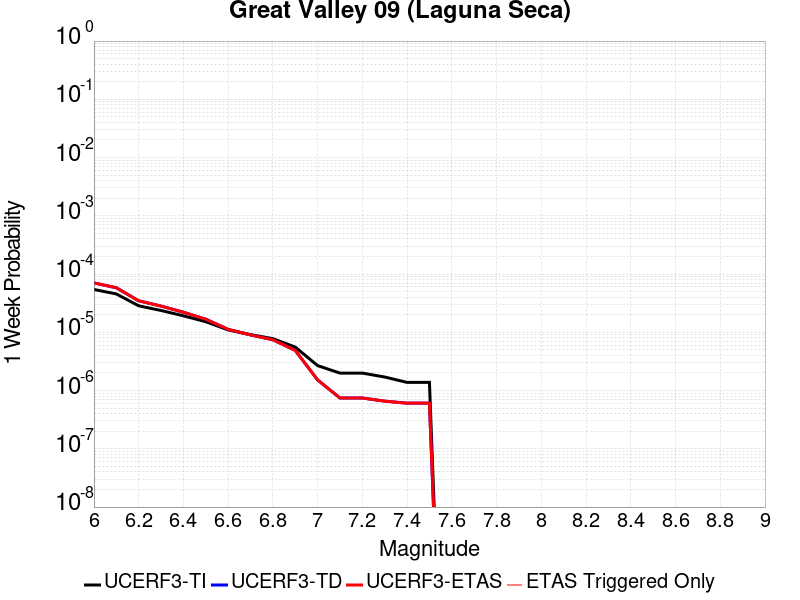 | 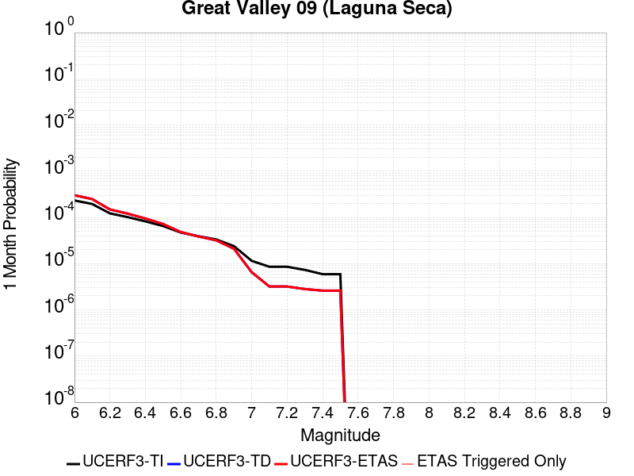 | 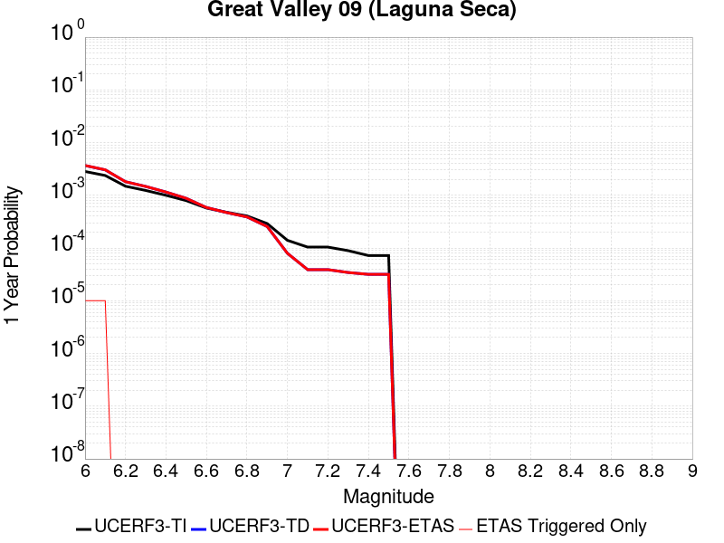 | 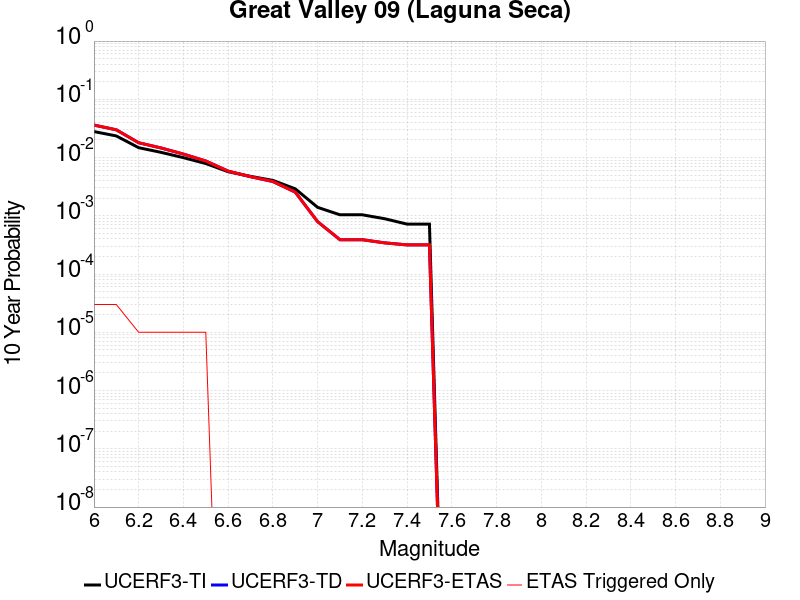 |

| Magnitude | 1 wk TI Prob | 1 wk TD Prob | 1 wk ETAS Prob | 1 wk ETAS/TD Gain | 1 wk ETAS Triggered Only | 1 mo TI Prob | 1 mo TD Prob | 1 mo ETAS Prob | 1 mo ETAS/TD Gain | 1 mo ETAS Triggered Only | 1 yr TI Prob | 1 yr TD Prob | 1 yr ETAS Prob | 1 yr ETAS/TD Gain | 1 yr ETAS Triggered Only | 10 yr TI Prob | 10 yr TD Prob | 10 yr ETAS Prob | 10 yr ETAS/TD Gain | 10 yr ETAS Triggered Only |
|-----|-----|-----|-----|-----|-----|-----|-----|-----|-----|-----|-----|-----|-----|-----|-----|-----|-----|-----|-----|-----|
| 6.0 | 5.4353277E-5 | 7.050538E-5 | 7.050538E-5 | 1.0 | 0.0 | 2.3292181E-4 | 3.0212724E-4 | 3.0212724E-4 | 1.0 | 0.0 | 0.0028321352 | 0.003672335 | 0.0036822984 | 1.0027131 | 1.0E-5 | 0.02796312 | 0.036116913 | 0.03614583 | 1.0008006 | 3.0E-5 |
| 6.1 | 4.5578287E-5 | 5.822371E-5 | 5.822371E-5 | 1.0 | 0.0 | 1.953209E-4 | 2.49502E-4 | 2.49502E-4 | 1.0 | 0.0 | 0.0023754383 | 0.0030335493 | 0.003043519 | 1.0032865 | 1.0E-5 | 0.023502063 | 0.029920705 | 0.029949807 | 1.0009726 | 3.0E-5 |
| 6.2 | 2.8536782E-5 | 3.47386E-5 | 3.47386E-5 | 1.0 | 0.0 | 1.2229476E-4 | 1.488658E-4 | 1.488658E-4 | 1.0 | 0.0 | 0.0014879217 | 0.0018108767 | 0.0018108767 | 1.0 | 0.0 | 0.014779986 | 0.017958745 | 0.017968567 | 1.0005468 | 1.0E-5 |
| 6.3 | 2.3698774E-5 | 2.8214314E-5 | 2.8214314E-5 | 1.0 | 0.0 | 1.01562226E-4 | 1.2090732E-4 | 1.2090732E-4 | 1.0 | 0.0 | 0.0012358186 | 0.0014710726 | 0.0014710726 | 1.0 | 0.0 | 0.012289686 | 0.014611831 | 0.014621684 | 1.0006744 | 1.0E-5 |
| 6.4 | 1.9191197E-5 | 2.2123912E-5 | 2.2123912E-5 | 1.0 | 0.0 | 8.2245395E-5 | 9.480767E-5 | 9.480767E-5 | 1.0 | 0.0 | 0.0010008777 | 0.0011536786 | 0.0011536786 | 1.0 | 0.0 | 0.009963818 | 0.011477305 | 0.01148719 | 1.0008613 | 1.0E-5 |
| 6.5 | 1.5203241E-5 | 1.680269E-5 | 1.680269E-5 | 1.0 | 0.0 | 6.5155116E-5 | 7.200383E-5 | 7.200383E-5 | 1.0 | 0.0 | 7.9297484E-4 | 8.7628904E-4 | 8.7628904E-4 | 1.0 | 0.0 | 0.007901512 | 0.008729759 | 0.008739672 | 1.0011355 | 1.0E-5 |
| 6.6 | 1.0984925E-5 | 1.1242844E-5 | 1.1242844E-5 | 1.0 | 0.0 | 4.70774E-5 | 4.818275E-5 | 4.818275E-5 | 1.0 | 0.0 | 5.730166E-4 | 5.864695E-4 | 5.864695E-4 | 1.0 | 0.0 | 0.005715413 | 0.0058496143 | 0.0058496143 | 1.0 | 0.0 |
| 6.7 | 9.134616E-6 | 9.020084E-6 | 9.020084E-6 | 1.0 | 0.0 | 3.9147766E-5 | 3.865694E-5 | 3.865694E-5 | 1.0 | 0.0 | 4.7651984E-4 | 4.7054898E-4 | 4.7054898E-4 | 1.0 | 0.0 | 0.004754993 | 0.0046957717 | 0.0046957717 | 1.0 | 0.0 |
| 6.8 | 7.785589E-6 | 7.4521E-6 | 7.4521E-6 | 1.0 | 0.0 | 3.3366385E-5 | 3.193719E-5 | 3.193719E-5 | 1.0 | 0.0 | 4.0616E-4 | 3.8876795E-4 | 3.8876795E-4 | 1.0 | 0.0 | 0.0040541845 | 0.0038810824 | 0.0038810824 | 1.0 | 0.0 |
| 6.9 | 5.579095E-6 | 4.8985944E-6 | 4.8985944E-6 | 1.0 | 0.0 | 2.3910188E-5 | 2.0993815E-5 | 2.0993815E-5 | 1.0 | 0.0 | 2.9106764E-4 | 2.555711E-4 | 2.555711E-4 | 1.0 | 0.0 | 0.002906867 | 0.0025529093 | 0.0025529093 | 1.0 | 0.0 |
| 7.0 | 2.6816688E-6 | 1.5216407E-6 | 1.5216407E-6 | 1.0 | 0.0 | 1.1492816E-5 | 6.5213017E-6 | 6.5213017E-6 | 1.0 | 0.0 | 1.3991605E-4 | 7.939404E-5 | 7.939404E-5 | 1.0 | 0.0 | 0.0013982799 | 7.936655E-4 | 7.936655E-4 | 1.0 | 0.0 |
| 7.1 | 1.9951021E-6 | 7.4539724E-7 | 7.4539724E-7 | 1.0 | 0.0 | 8.55041E-6 | 3.194556E-6 | 3.194556E-6 | 1.0 | 0.0 | 1.0409627E-4 | 3.8893068E-5 | 3.8893068E-5 | 1.0 | 0.0 | 0.0010404752 | 3.8886676E-4 | 3.8886676E-4 | 1.0 | 0.0 |
| 7.2 | 1.9951021E-6 | 7.4539724E-7 | 7.4539724E-7 | 1.0 | 0.0 | 8.55041E-6 | 3.194556E-6 | 3.194556E-6 | 1.0 | 0.0 | 1.0409627E-4 | 3.8893068E-5 | 3.8893068E-5 | 1.0 | 0.0 | 0.0010404752 | 3.8886676E-4 | 3.8886676E-4 | 1.0 | 0.0 |
| 7.3 | 1.7087556E-6 | 6.579003E-7 | 6.579003E-7 | 1.0 | 0.0 | 7.3232177E-6 | 2.81957E-6 | 2.81957E-6 | 1.0 | 0.0 | 8.915652E-5 | 3.4327764E-5 | 3.4327764E-5 | 1.0 | 0.0 | 8.9120766E-4 | 3.4322866E-4 | 3.4322866E-4 | 1.0 | 0.0 |
| 7.4 | 1.3804846E-6 | 6.0739524E-7 | 6.0739524E-7 | 1.0 | 0.0 | 5.916349E-6 | 2.60312E-6 | 2.60312E-6 | 1.0 | 0.0 | 7.2029165E-5 | 3.1692565E-5 | 3.1692565E-5 | 1.0 | 0.0 | 7.200583E-4 | 3.1688449E-4 | 3.1688449E-4 | 1.0 | 0.0 |
| 7.5 | 1.3804846E-6 | 6.0739524E-7 | 6.0739524E-7 | 1.0 | 0.0 | 5.916349E-6 | 2.60312E-6 | 2.60312E-6 | 1.0 | 0.0 | 7.2029165E-5 | 3.1692565E-5 | 3.1692565E-5 | 1.0 | 0.0 | 7.200583E-4 | 3.1688449E-4 | 3.1688449E-4 | 1.0 | 0.0 |

## Santa Susana East (connector)
*[(top)](#table-of-contents)*

| 1 Week | 1 Month | 1 Year | 10 Year |
|-----|-----|-----|-----|
| 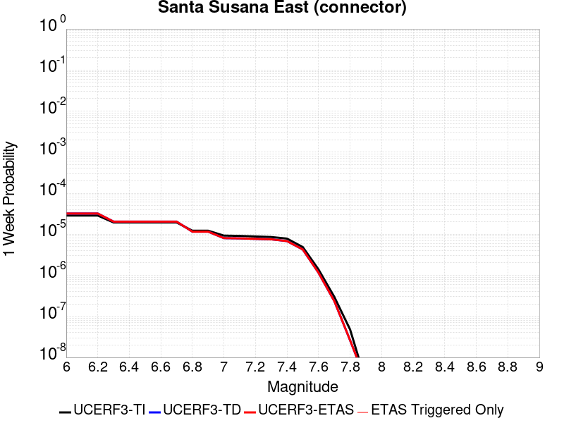 | 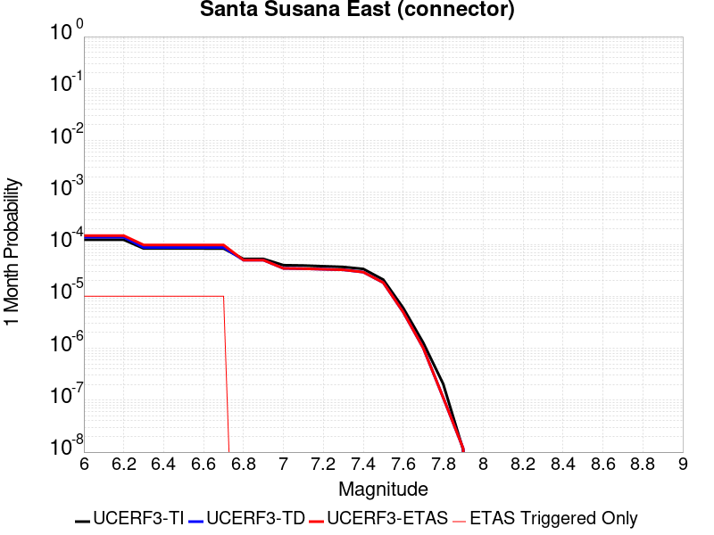 | 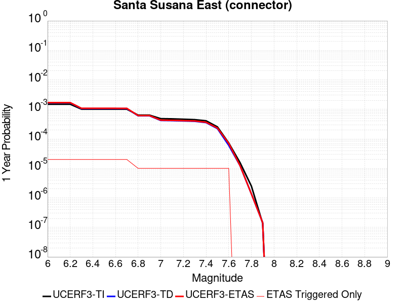 |  |

| Magnitude | 1 wk TI Prob | 1 wk TD Prob | 1 wk ETAS Prob | 1 wk ETAS/TD Gain | 1 wk ETAS Triggered Only | 1 mo TI Prob | 1 mo TD Prob | 1 mo ETAS Prob | 1 mo ETAS/TD Gain | 1 mo ETAS Triggered Only | 1 yr TI Prob | 1 yr TD Prob | 1 yr ETAS Prob | 1 yr ETAS/TD Gain | 1 yr ETAS Triggered Only | 10 yr TI Prob | 10 yr TD Prob | 10 yr ETAS Prob | 10 yr ETAS/TD Gain | 10 yr ETAS Triggered Only |
|-----|-----|-----|-----|-----|-----|-----|-----|-----|-----|-----|-----|-----|-----|-----|-----|-----|-----|-----|-----|-----|
| 6.0 | 2.858397E-5 | 3.202183E-5 | 3.202183E-5 | 1.0 | 0.0 | 1.2249697E-4 | 1.3723079E-4 | 1.4722941E-4 | 1.07286 | 1.0E-5 | 0.0014903803 | 0.0016697859 | 0.0016897526 | 1.0119575 | 2.0E-5 | 0.014804244 | 0.01659952 | 0.016629022 | 1.0017773 | 3.0E-5 |
| 6.1 | 2.858397E-5 | 3.202183E-5 | 3.202183E-5 | 1.0 | 0.0 | 1.2249697E-4 | 1.3723079E-4 | 1.4722941E-4 | 1.07286 | 1.0E-5 | 0.0014903803 | 0.0016697859 | 0.0016897526 | 1.0119575 | 2.0E-5 | 0.014804244 | 0.01659952 | 0.016629022 | 1.0017773 | 3.0E-5 |
| 6.2 | 2.858397E-5 | 3.202183E-5 | 3.202183E-5 | 1.0 | 0.0 | 1.2249697E-4 | 1.3723079E-4 | 1.4722941E-4 | 1.07286 | 1.0E-5 | 0.0014903803 | 0.0016697859 | 0.0016897526 | 1.0119575 | 2.0E-5 | 0.014804244 | 0.01659952 | 0.016629022 | 1.0017773 | 3.0E-5 |
| 6.3 | 1.943582E-5 | 2.0367674E-5 | 2.0367674E-5 | 1.0 | 0.0 | 8.329371E-5 | 8.728774E-5 | 9.728687E-5 | 1.1145536 | 1.0E-5 | 0.001013629 | 0.0010623224 | 0.0010823011 | 1.0188067 | 2.0E-5 | 0.010090181 | 0.010583875 | 0.010603663 | 1.0018697 | 2.0E-5 |
| 6.4 | 1.943582E-5 | 2.0367674E-5 | 2.0367674E-5 | 1.0 | 0.0 | 8.329371E-5 | 8.728774E-5 | 9.728687E-5 | 1.1145536 | 1.0E-5 | 0.001013629 | 0.0010623224 | 0.0010823011 | 1.0188067 | 2.0E-5 | 0.010090181 | 0.010583875 | 0.010603663 | 1.0018697 | 2.0E-5 |
| 6.5 | 1.943582E-5 | 2.0367674E-5 | 2.0367674E-5 | 1.0 | 0.0 | 8.329371E-5 | 8.728774E-5 | 9.728687E-5 | 1.1145536 | 1.0E-5 | 0.001013629 | 0.0010623224 | 0.0010823011 | 1.0188067 | 2.0E-5 | 0.010090181 | 0.010583875 | 0.010603663 | 1.0018697 | 2.0E-5 |
| 6.6 | 1.943582E-5 | 2.0367674E-5 | 2.0367674E-5 | 1.0 | 0.0 | 8.329371E-5 | 8.728774E-5 | 9.728687E-5 | 1.1145536 | 1.0E-5 | 0.001013629 | 0.0010623224 | 0.0010823011 | 1.0188067 | 2.0E-5 | 0.010090181 | 0.010583875 | 0.010603663 | 1.0018697 | 2.0E-5 |
| 6.7 | 1.9404439E-5 | 2.0355095E-5 | 2.0355095E-5 | 1.0 | 0.0 | 8.3159226E-5 | 8.7233835E-5 | 9.7232965E-5 | 1.1146244 | 1.0E-5 | 0.0010119933 | 0.0010616668 | 0.0010816455 | 1.0188183 | 2.0E-5 | 0.010073971 | 0.01057738 | 0.0105971685 | 1.0018709 | 2.0E-5 |
| 6.8 | 1.2217526E-5 | 1.1593199E-5 | 1.1593199E-5 | 1.0 | 0.0 | 5.2359774E-5 | 4.9684288E-5 | 4.9684288E-5 | 1.0 | 0.0 | 6.372938E-4 | 6.047551E-4 | 6.147491E-4 | 1.0165256 | 1.0E-5 | 0.0063546924 | 0.006033141 | 0.006043081 | 1.0016475 | 1.0E-5 |
| 6.9 | 1.2217526E-5 | 1.1593199E-5 | 1.1593199E-5 | 1.0 | 0.0 | 5.2359774E-5 | 4.9684288E-5 | 4.9684288E-5 | 1.0 | 0.0 | 6.372938E-4 | 6.047551E-4 | 6.147491E-4 | 1.0165256 | 1.0E-5 | 0.0063546924 | 0.006033141 | 0.006043081 | 1.0016475 | 1.0E-5 |
| 7.0 | 9.276017E-6 | 8.059215E-6 | 8.059215E-6 | 1.0 | 0.0 | 3.9753755E-5 | 3.4539054E-5 | 3.4539054E-5 | 1.0 | 0.0 | 4.8389446E-4 | 4.204353E-4 | 4.304311E-4 | 1.0237749 | 1.0E-5 | 0.0048284214 | 0.0041971253 | 0.0042070835 | 1.0023726 | 1.0E-5 |
| 7.1 | 9.130355E-6 | 7.942386E-6 | 7.942386E-6 | 1.0 | 0.0 | 3.9129503E-5 | 3.4038374E-5 | 3.4038374E-5 | 1.0 | 0.0 | 4.7629757E-4 | 4.1434186E-4 | 4.2433772E-4 | 1.0241246 | 1.0E-5 | 0.00475278 | 0.004136419 | 0.0041463776 | 1.0024076 | 1.0E-5 |
| 7.2 | 8.851015E-6 | 7.741543E-6 | 7.741543E-6 | 1.0 | 0.0 | 3.7932372E-5 | 3.317764E-5 | 3.317764E-5 | 1.0 | 0.0 | 4.6172875E-4 | 4.0386632E-4 | 4.138623E-4 | 1.0247507 | 1.0E-5 | 0.0046077054 | 0.0040320465 | 0.004042006 | 1.0024701 | 1.0E-5 |
| 7.3 | 8.573006E-6 | 7.5502617E-6 | 7.5502617E-6 | 1.0 | 0.0 | 3.6740938E-5 | 3.2357882E-5 | 3.2357882E-5 | 1.0 | 0.0 | 4.472291E-4 | 3.9388944E-4 | 4.038855E-4 | 1.0253779 | 1.0E-5 | 0.004463301 | 0.00393263 | 0.0039425907 | 1.0025328 | 1.0E-5 |
| 7.4 | 7.852282E-6 | 6.8177665E-6 | 6.8177665E-6 | 1.0 | 0.0 | 3.36522E-5 | 2.9218689E-5 | 2.9218689E-5 | 1.0 | 0.0 | 4.096385E-4 | 3.556825E-4 | 3.6567895E-4 | 1.028105 | 1.0E-5 | 0.0040888423 | 0.0035517968 | 0.0035617612 | 1.0028055 | 1.0E-5 |
| 7.5 | 4.8869324E-6 | 4.279099E-6 | 4.279099E-6 | 1.0 | 0.0 | 2.0943828E-5 | 1.8338877E-5 | 1.8338877E-5 | 1.0 | 0.0 | 2.5496128E-4 | 2.232546E-4 | 2.3325237E-4 | 1.0447819 | 1.0E-5 | 0.0025466895 | 0.0022304675 | 0.0022404452 | 1.0044733 | 1.0E-5 |
| 7.6 | 1.3894544E-6 | 1.1568255E-6 | 1.1568255E-6 | 1.0 | 0.0 | 5.954791E-6 | 4.9578157E-6 | 4.9578157E-6 | 1.0 | 0.0 | 7.249717E-5 | 6.035996E-5 | 7.0359354E-5 | 1.1656628 | 1.0E-5 | 7.247352E-4 | 6.0345745E-4 | 6.134514E-4 | 1.0165612 | 1.0E-5 |
| 7.7 | 2.9924632E-7 | 2.3719628E-7 | 2.3719628E-7 | 1.0 | 0.0 | 1.2824837E-6 | 1.0165551E-6 | 1.0165551E-6 | 1.0 | 0.0 | 1.5614127E-5 | 1.2376496E-5 | 1.2376496E-5 | 1.0 | 0.0 | 1.5613029E-4 | 1.2375879E-4 | 1.2375879E-4 | 1.0 | 0.0 |
| 7.8 | 4.8188564E-8 | 2.63245E-8 | 2.63245E-8 | 1.0 | 0.0 | 2.065224E-7 | 1.1281927E-7 | 1.1281927E-7 | 1.0 | 0.0 | 2.5144072E-6 | 1.3735739E-6 | 1.3735739E-6 | 1.0 | 0.0 | 2.5143789E-5 | 1.3735663E-5 | 1.3735663E-5 | 1.0 | 0.0 |
| 7.9 | 2.6127251E-9 | 2.768132E-9 | 2.768132E-9 | 1.0 | 0.0 | 1.1197393E-8 | 1.1863423E-8 | 1.1863423E-8 | 1.0 | 0.0 | 1.3632825E-7 | 1.4443718E-7 | 1.4443718E-7 | 1.0 | 0.0 | 1.3632817E-6 | 1.4443717E-6 | 1.4443717E-6 | 1.0 | 0.0 |

## Blue Cut
*[(top)](#table-of-contents)*

| 1 Week | 1 Month | 1 Year | 10 Year |
|-----|-----|-----|-----|
|  | 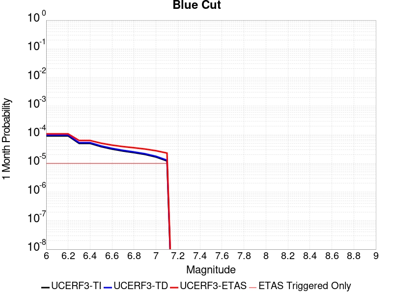 | 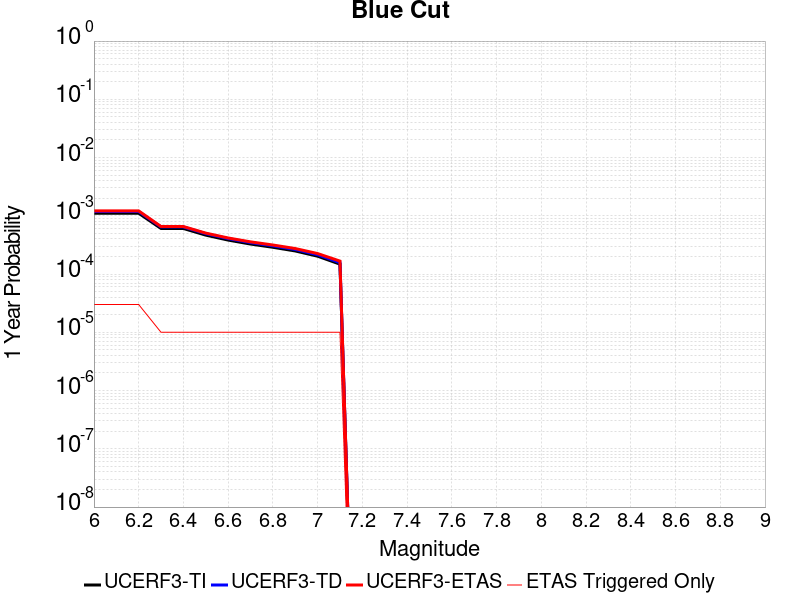 | 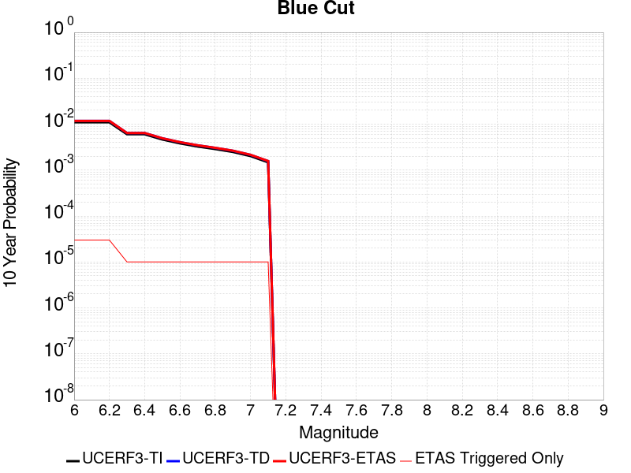 |

| Magnitude | 1 wk TI Prob | 1 wk TD Prob | 1 wk ETAS Prob | 1 wk ETAS/TD Gain | 1 wk ETAS Triggered Only | 1 mo TI Prob | 1 mo TD Prob | 1 mo ETAS Prob | 1 mo ETAS/TD Gain | 1 mo ETAS Triggered Only | 1 yr TI Prob | 1 yr TD Prob | 1 yr ETAS Prob | 1 yr ETAS/TD Gain | 1 yr ETAS Triggered Only | 10 yr TI Prob | 10 yr TD Prob | 10 yr ETAS Prob | 10 yr ETAS/TD Gain | 10 yr ETAS Triggered Only |
|-----|-----|-----|-----|-----|-----|-----|-----|-----|-----|-----|-----|-----|-----|-----|-----|-----|-----|-----|-----|-----|
| 6.0 | 2.1227985E-5 | 2.2719787E-5 | 2.2719787E-5 | 1.0 | 0.0 | 9.097391E-5 | 9.736721E-5 | 1.07366235E-4 | 1.102694 | 1.0E-5 | 0.0011070445 | 0.0011848592 | 0.0012148236 | 1.0252894 | 3.0E-5 | 0.011015458 | 0.011791261 | 0.011820908 | 1.0025142 | 3.0E-5 |
| 6.1 | 2.1227985E-5 | 2.2719787E-5 | 2.2719787E-5 | 1.0 | 0.0 | 9.097391E-5 | 9.736721E-5 | 1.07366235E-4 | 1.102694 | 1.0E-5 | 0.0011070445 | 0.0011848592 | 0.0012148236 | 1.0252894 | 3.0E-5 | 0.011015458 | 0.011791261 | 0.011820908 | 1.0025142 | 3.0E-5 |
| 6.2 | 2.1227985E-5 | 2.2719787E-5 | 2.2719787E-5 | 1.0 | 0.0 | 9.097391E-5 | 9.736721E-5 | 1.07366235E-4 | 1.102694 | 1.0E-5 | 0.0011070445 | 0.0011848592 | 0.0012148236 | 1.0252894 | 3.0E-5 | 0.011015458 | 0.011791261 | 0.011820908 | 1.0025142 | 3.0E-5 |
| 6.3 | 1.1613981E-5 | 1.23536465E-5 | 1.23536465E-5 | 1.0 | 0.0 | 4.9773254E-5 | 5.2943193E-5 | 6.2942665E-5 | 1.1888717 | 1.0E-5 | 6.0582085E-4 | 6.444052E-4 | 6.5439875E-4 | 1.0155082 | 1.0E-5 | 0.0060417196 | 0.0064266133 | 0.006436549 | 1.001546 | 1.0E-5 |
| 6.4 | 1.1613981E-5 | 1.23536465E-5 | 1.23536465E-5 | 1.0 | 0.0 | 4.9773254E-5 | 5.2943193E-5 | 6.2942665E-5 | 1.1888717 | 1.0E-5 | 6.0582085E-4 | 6.444052E-4 | 6.5439875E-4 | 1.0155082 | 1.0E-5 | 0.0060417196 | 0.0064266133 | 0.006436549 | 1.001546 | 1.0E-5 |
| 6.5 | 8.931326E-6 | 9.481677E-6 | 9.481677E-6 | 1.0 | 0.0 | 3.8276554E-5 | 4.063518E-5 | 5.063477E-5 | 1.2460822 | 1.0E-5 | 4.6591737E-4 | 4.9463013E-4 | 5.046252E-4 | 1.0202072 | 1.0E-5 | 0.0046494175 | 0.0049362015 | 0.004946152 | 1.0020158 | 1.0E-5 |
| 6.6 | 7.345353E-6 | 7.790341E-6 | 7.790341E-6 | 1.0 | 0.0 | 3.1479703E-5 | 3.3386797E-5 | 4.3386462E-5 | 1.2995096 | 1.0E-5 | 3.83198E-4 | 4.0641645E-4 | 4.164124E-4 | 1.0245953 | 1.0E-5 | 0.0038253788 | 0.0040575233 | 0.004067483 | 1.0024545 | 1.0E-5 |
| 6.7 | 6.2775666E-6 | 6.655202E-6 | 6.655202E-6 | 1.0 | 0.0 | 2.690358E-5 | 2.8522025E-5 | 3.852174E-5 | 1.3505962 | 1.0E-5 | 3.2750185E-4 | 3.4720785E-4 | 3.5720438E-4 | 1.0287912 | 1.0E-5 | 0.0032701963 | 0.0034673947 | 0.0034773601 | 1.002874 | 1.0E-5 |
| 6.8 | 5.5234095E-6 | 5.8551577E-6 | 5.8551577E-6 | 1.0 | 0.0 | 2.367154E-5 | 2.5093334E-5 | 3.5093082E-5 | 1.3985022 | 1.0E-5 | 2.8816288E-4 | 3.0547578E-4 | 3.1547272E-4 | 1.0327258 | 1.0E-5 | 0.002877895 | 0.003051275 | 0.0030612443 | 1.0032673 | 1.0E-5 |
| 6.9 | 4.7780054E-6 | 5.0654608E-6 | 5.0654608E-6 | 1.0 | 0.0 | 2.0477004E-5 | 2.1708976E-5 | 3.170876E-5 | 1.460629 | 1.0E-5 | 2.4927902E-4 | 2.6428179E-4 | 2.7427915E-4 | 1.0378284 | 1.0E-5 | 0.0024899957 | 0.0026403673 | 0.0026503408 | 1.0037774 | 1.0E-5 |
| 7.0 | 3.883171E-6 | 4.1185203E-6 | 4.1185203E-6 | 1.0 | 0.0 | 1.6642054E-5 | 1.765072E-5 | 2.7650543E-5 | 1.5665392 | 1.0E-5 | 2.0259817E-4 | 2.1488321E-4 | 2.2488106E-4 | 1.0465269 | 1.0E-5 | 0.0020241356 | 0.00214743 | 0.0021574085 | 1.0046468 | 1.0E-5 |
| 7.1 | 2.8358215E-6 | 3.0097403E-6 | 3.0097403E-6 | 1.0 | 0.0 | 1.2153464E-5 | 1.289886E-5 | 2.2898732E-5 | 1.7752522 | 1.0E-5 | 1.4795837E-4 | 1.5703888E-4 | 1.6703732E-4 | 1.0636685 | 1.0E-5 | 0.001478599 | 0.0015699244 | 0.0015799087 | 1.0063597 | 1.0E-5 |

## Rinconada 2011 CFM
*[(top)](#table-of-contents)*

| 1 Week | 1 Month | 1 Year | 10 Year |
|-----|-----|-----|-----|
|  | 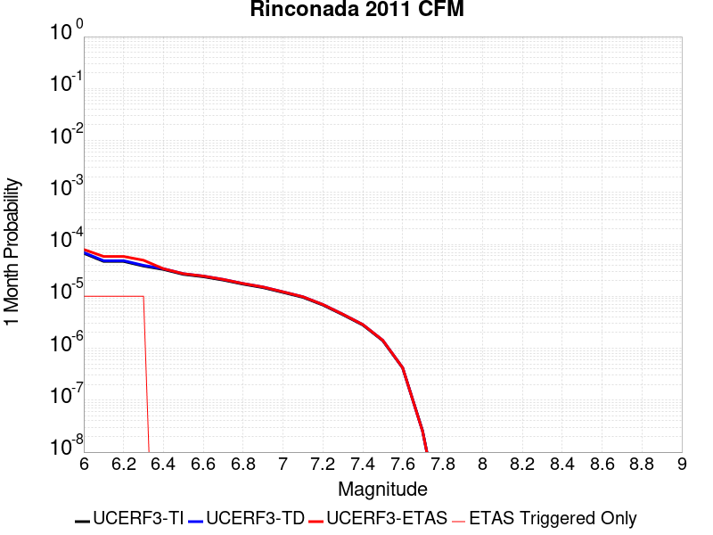 | 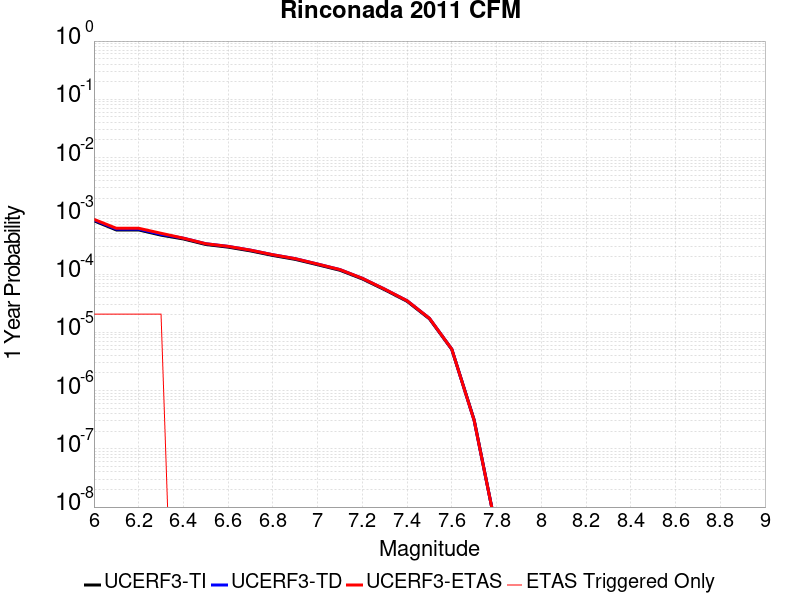 | 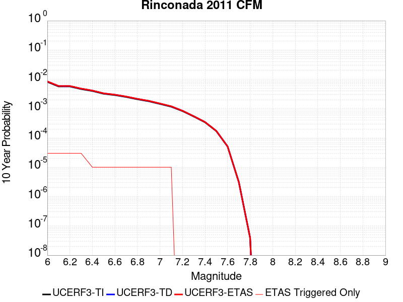 |

| Magnitude | 1 wk TI Prob | 1 wk TD Prob | 1 wk ETAS Prob | 1 wk ETAS/TD Gain | 1 wk ETAS Triggered Only | 1 mo TI Prob | 1 mo TD Prob | 1 mo ETAS Prob | 1 mo ETAS/TD Gain | 1 mo ETAS Triggered Only | 1 yr TI Prob | 1 yr TD Prob | 1 yr ETAS Prob | 1 yr ETAS/TD Gain | 1 yr ETAS Triggered Only | 10 yr TI Prob | 10 yr TD Prob | 10 yr ETAS Prob | 10 yr ETAS/TD Gain | 10 yr ETAS Triggered Only |
|-----|-----|-----|-----|-----|-----|-----|-----|-----|-----|-----|-----|-----|-----|-----|-----|-----|-----|-----|-----|-----|
| 6.0 | 1.5752368E-5 | 1.6274787E-5 | 1.6274787E-5 | 1.0 | 0.0 | 6.75084E-5 | 6.974724E-5 | 7.974655E-5 | 1.1433648 | 1.0E-5 | 8.2160486E-4 | 8.48845E-4 | 8.788195E-4 | 1.0353122 | 3.0E-5 | 0.008185739 | 0.008456407 | 0.008486154 | 1.0035176 | 3.0E-5 |
| 6.1 | 1.0966133E-5 | 1.1323078E-5 | 1.1323078E-5 | 1.0 | 0.0 | 4.6996865E-5 | 4.8526577E-5 | 5.8526093E-5 | 1.2060627 | 1.0E-5 | 5.720366E-4 | 5.9065165E-4 | 6.2063395E-4 | 1.0507613 | 3.0E-5 | 0.0057056635 | 0.0058909142 | 0.0059207375 | 1.0050626 | 3.0E-5 |
| 6.2 | 1.0966133E-5 | 1.1323078E-5 | 1.1323078E-5 | 1.0 | 0.0 | 4.6996865E-5 | 4.8526577E-5 | 5.8526093E-5 | 1.2060627 | 1.0E-5 | 5.720366E-4 | 5.9065165E-4 | 6.2063395E-4 | 1.0507613 | 3.0E-5 | 0.0057056635 | 0.0058909142 | 0.0059207375 | 1.0050626 | 3.0E-5 |
| 6.3 | 8.926149E-6 | 9.212811E-6 | 9.212811E-6 | 1.0 | 0.0 | 3.8254362E-5 | 3.9482882E-5 | 4.9482485E-5 | 1.2532643 | 1.0E-5 | 4.6564735E-4 | 4.8059836E-4 | 5.105839E-4 | 1.0623922 | 3.0E-5 | 0.0046467283 | 0.004795635 | 0.004825491 | 1.0062257 | 3.0E-5 |
| 6.4 | 7.676955E-6 | 7.920225E-6 | 7.920225E-6 | 1.0 | 0.0 | 3.290082E-5 | 3.394338E-5 | 3.394338E-5 | 1.0 | 0.0 | 4.0049385E-4 | 4.1318245E-4 | 4.231783E-4 | 1.0241923 | 1.0E-5 | 0.0039977287 | 0.004124169 | 0.0041341274 | 1.0024147 | 1.0E-5 |
| 6.5 | 6.1671026E-6 | 6.3589814E-6 | 6.3589814E-6 | 1.0 | 0.0 | 2.6430173E-5 | 2.7252492E-5 | 2.7252492E-5 | 1.0 | 0.0 | 3.2173982E-4 | 3.3174866E-4 | 3.4174536E-4 | 1.0301332 | 1.0E-5 | 0.003212744 | 0.0033125463 | 0.003322513 | 1.0030088 | 1.0E-5 |
| 6.6 | 5.553456E-6 | 5.7248362E-6 | 5.7248362E-6 | 1.0 | 0.0 | 2.3800309E-5 | 2.4534782E-5 | 2.4534782E-5 | 1.0 | 0.0 | 2.897302E-4 | 2.986701E-4 | 3.086671E-4 | 1.0334717 | 1.0E-5 | 0.0028935277 | 0.0029826954 | 0.0029926656 | 1.0033426 | 1.0E-5 |
| 6.7 | 4.787857E-6 | 4.93333E-6 | 4.93333E-6 | 1.0 | 0.0 | 2.0519226E-5 | 2.114267E-5 | 2.114267E-5 | 1.0 | 0.0 | 2.4979294E-4 | 2.5738165E-4 | 2.6737907E-4 | 1.0388428 | 1.0E-5 | 0.0024951235 | 0.0025708412 | 0.0025808155 | 1.0038798 | 1.0E-5 |
| 6.8 | 3.9955166E-6 | 4.1134927E-6 | 4.1134927E-6 | 1.0 | 0.0 | 1.7123532E-5 | 1.7629134E-5 | 1.7629134E-5 | 1.0 | 0.0 | 2.0845905E-4 | 2.146136E-4 | 2.2461145E-4 | 1.0465853 | 1.0E-5 | 0.002082636 | 0.002144067 | 0.0021540455 | 1.004654 | 1.0E-5 |
| 6.9 | 3.4250072E-6 | 3.5224598E-6 | 3.5224598E-6 | 1.0 | 0.0 | 1.46785205E-5 | 1.509617E-5 | 1.509617E-5 | 1.0 | 0.0 | 1.7869633E-4 | 1.8378037E-4 | 1.9377854E-4 | 1.0544028 | 1.0E-5 | 0.001785527 | 0.0018362864 | 0.0018462681 | 1.0054358 | 1.0E-5 |
| 7.0 | 2.7712713E-6 | 2.8467105E-6 | 2.8467105E-6 | 1.0 | 0.0 | 1.1876823E-5 | 1.2200131E-5 | 1.2200131E-5 | 1.0 | 0.0 | 1.4459073E-4 | 1.4852648E-4 | 1.58525E-4 | 1.0673181 | 1.0E-5 | 0.0014449668 | 0.0014842737 | 0.0014942589 | 1.0067273 | 1.0E-5 |
| 7.1 | 2.227358E-6 | 2.2857066E-6 | 2.2857066E-6 | 1.0 | 0.0 | 9.545785E-6 | 9.795849E-6 | 9.795849E-6 | 1.0 | 0.0 | 1.16213734E-4 | 1.19257944E-4 | 1.2925675E-4 | 1.0838418 | 1.0E-5 | 0.0011615298 | 0.0011919405 | 0.0012019286 | 1.0083797 | 1.0E-5 |
| 7.2 | 1.581796E-6 | 1.6209067E-6 | 1.6209067E-6 | 1.0 | 0.0 | 6.779108E-6 | 6.9467246E-6 | 6.9467246E-6 | 1.0 | 0.0 | 8.253252E-5 | 8.457309E-5 | 8.457309E-5 | 1.0 | 0.0 | 8.250187E-4 | 8.4540964E-4 | 8.4540964E-4 | 1.0 | 0.0 |
| 7.3 | 1.0306567E-6 | 1.0546512E-6 | 1.0546512E-6 | 1.0 | 0.0 | 4.4170924E-6 | 4.519926E-6 | 4.519926E-6 | 1.0 | 0.0 | 5.3776774E-5 | 5.5028708E-5 | 5.5028708E-5 | 1.0 | 0.0 | 5.376376E-4 | 5.5015105E-4 | 5.5015105E-4 | 1.0 | 0.0 |
| 7.4 | 6.535541E-7 | 6.682764E-7 | 6.682764E-7 | 1.0 | 0.0 | 2.800943E-6 | 2.8640386E-6 | 2.8640386E-6 | 1.0 | 0.0 | 3.4100947E-5 | 3.4869114E-5 | 3.4869114E-5 | 1.0 | 0.0 | 3.4095717E-4 | 3.4863656E-4 | 3.4863656E-4 | 1.0 | 0.0 |
| 7.5 | 3.2656962E-7 | 3.33168E-7 | 3.33168E-7 | 1.0 | 0.0 | 1.3995833E-6 | 1.427862E-6 | 1.427862E-6 | 1.0 | 0.0 | 1.7039794E-5 | 1.7384082E-5 | 1.7384082E-5 | 1.0 | 0.0 | 1.7038487E-4 | 1.7382725E-4 | 1.7382725E-4 | 1.0 | 0.0 |
| 7.6 | 9.754343E-8 | 9.821022E-8 | 9.821022E-8 | 1.0 | 0.0 | 4.180432E-7 | 4.2090088E-7 | 4.2090088E-7 | 1.0 | 0.0 | 5.089664E-6 | 5.1244565E-6 | 5.1244565E-6 | 1.0 | 0.0 | 5.0895473E-5 | 5.124339E-5 | 5.124339E-5 | 1.0 | 0.0 |
| 7.7 | 6.0001453E-9 | 5.8490692E-9 | 5.8490692E-9 | 1.0 | 0.0 | 2.5714908E-8 | 2.506744E-8 | 2.506744E-8 | 1.0 | 0.0 | 3.1307894E-7 | 3.0519604E-7 | 3.0519604E-7 | 1.0 | 0.0 | 3.1307852E-6 | 3.0519564E-6 | 3.0519564E-6 | 1.0 | 0.0 |
| 7.8 | 7.400003E-11 | 7.4654505E-11 | 7.4654505E-11 | 1.0 | 0.0 | 3.171432E-10 | 3.1994807E-10 | 3.1994807E-10 | 1.0 | 0.0 | 3.861218E-9 | 3.8953676E-9 | 3.8953676E-9 | 1.0 | 0.0 | 3.861218E-8 | 3.8953676E-8 | 3.8953676E-8 | 1.0 | 0.0 |

## San Jacinto (Lytle Creek connector)
*[(top)](#table-of-contents)*

| 1 Week | 1 Month | 1 Year | 10 Year |
|-----|-----|-----|-----|
|  | 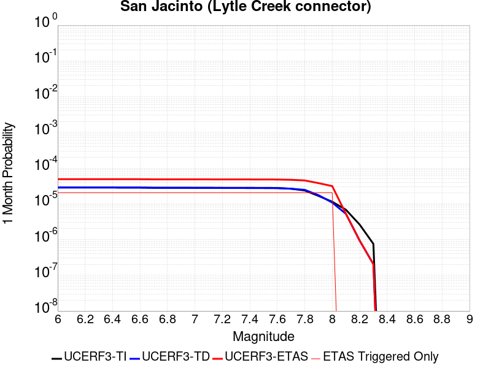 | 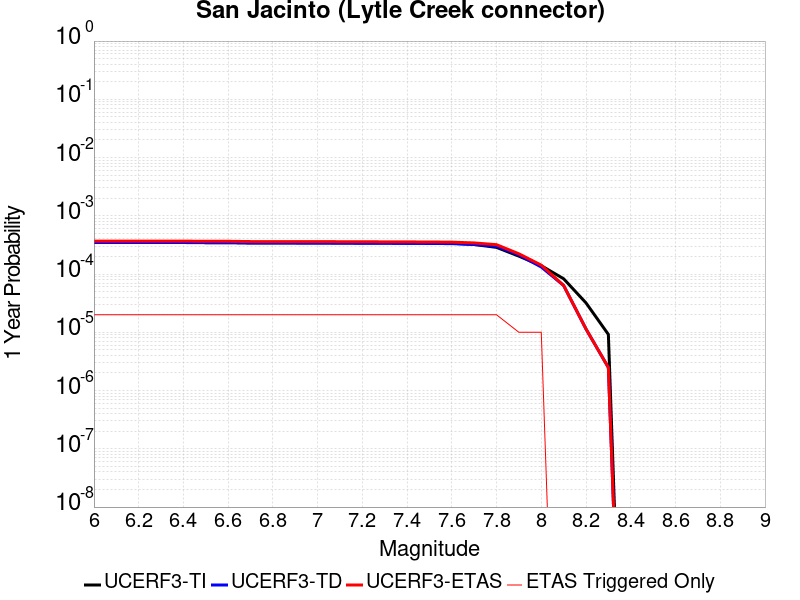 | 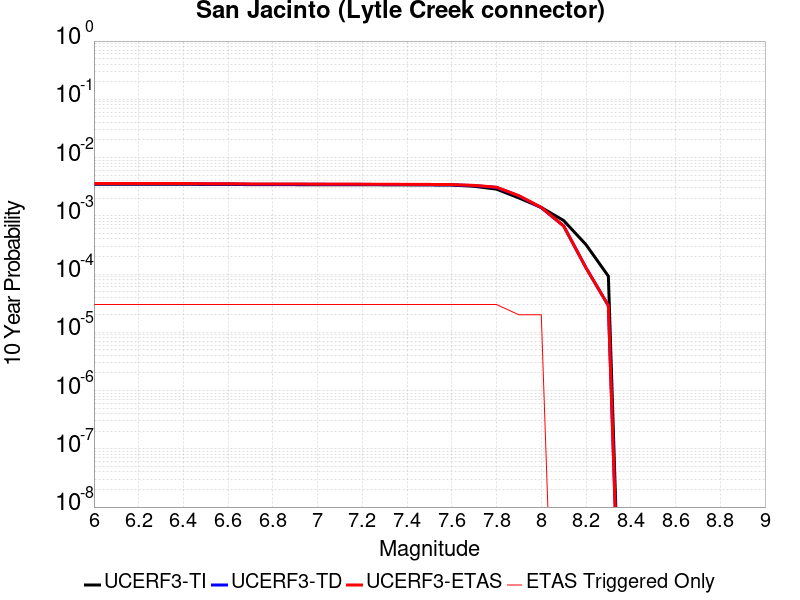 |

| Magnitude | 1 wk TI Prob | 1 wk TD Prob | 1 wk ETAS Prob | 1 wk ETAS/TD Gain | 1 wk ETAS Triggered Only | 1 mo TI Prob | 1 mo TD Prob | 1 mo ETAS Prob | 1 mo ETAS/TD Gain | 1 mo ETAS Triggered Only | 1 yr TI Prob | 1 yr TD Prob | 1 yr ETAS Prob | 1 yr ETAS/TD Gain | 1 yr ETAS Triggered Only | 10 yr TI Prob | 10 yr TD Prob | 10 yr ETAS Prob | 10 yr ETAS/TD Gain | 10 yr ETAS Triggered Only |
|-----|-----|-----|-----|-----|-----|-----|-----|-----|-----|-----|-----|-----|-----|-----|-----|-----|-----|-----|-----|-----|
| 6.0 | 6.693995E-6 | 6.662972E-6 | 6.662972E-6 | 1.0 | 0.0 | 2.8688235E-5 | 2.8555281E-5 | 3.8554997E-5 | 1.3501879 | 1.0E-5 | 3.492233E-4 | 3.4760518E-4 | 3.6759823E-4 | 1.0575166 | 2.0E-5 | 0.00348675 | 0.0035508168 | 0.0035807104 | 1.0084188 | 3.0E-5 |
| 6.1 | 6.693995E-6 | 6.662972E-6 | 6.662972E-6 | 1.0 | 0.0 | 2.8688235E-5 | 2.8555281E-5 | 3.8554997E-5 | 1.3501879 | 1.0E-5 | 3.492233E-4 | 3.4760518E-4 | 3.6759823E-4 | 1.0575166 | 2.0E-5 | 0.00348675 | 0.0035508168 | 0.0035807104 | 1.0084188 | 3.0E-5 |
| 6.2 | 6.693995E-6 | 6.662972E-6 | 6.662972E-6 | 1.0 | 0.0 | 2.8688235E-5 | 2.8555281E-5 | 3.8554997E-5 | 1.3501879 | 1.0E-5 | 3.492233E-4 | 3.4760518E-4 | 3.6759823E-4 | 1.0575166 | 2.0E-5 | 0.00348675 | 0.0035508168 | 0.0035807104 | 1.0084188 | 3.0E-5 |
| 6.3 | 6.693995E-6 | 6.662972E-6 | 6.662972E-6 | 1.0 | 0.0 | 2.8688235E-5 | 2.8555281E-5 | 3.8554997E-5 | 1.3501879 | 1.0E-5 | 3.492233E-4 | 3.4760518E-4 | 3.6759823E-4 | 1.0575166 | 2.0E-5 | 0.00348675 | 0.0035508168 | 0.0035807104 | 1.0084188 | 3.0E-5 |
| 6.4 | 6.693995E-6 | 6.662972E-6 | 6.662972E-6 | 1.0 | 0.0 | 2.8688235E-5 | 2.8555281E-5 | 3.8554997E-5 | 1.3501879 | 1.0E-5 | 3.492233E-4 | 3.4760518E-4 | 3.6759823E-4 | 1.0575166 | 2.0E-5 | 0.00348675 | 0.0035508168 | 0.0035807104 | 1.0084188 | 3.0E-5 |
| 6.5 | 6.6561875E-6 | 6.6231896E-6 | 6.6231896E-6 | 1.0 | 0.0 | 2.8526205E-5 | 2.838479E-5 | 3.8384507E-5 | 1.3522913 | 1.0E-5 | 3.472512E-4 | 3.455301E-4 | 3.6552318E-4 | 1.057862 | 2.0E-5 | 0.0034670907 | 0.0035301324 | 0.0035600264 | 1.0084683 | 3.0E-5 |
| 6.6 | 6.6561875E-6 | 6.6231896E-6 | 6.6231896E-6 | 1.0 | 0.0 | 2.8526205E-5 | 2.838479E-5 | 3.8384507E-5 | 1.3522913 | 1.0E-5 | 3.472512E-4 | 3.455301E-4 | 3.6552318E-4 | 1.057862 | 2.0E-5 | 0.0034670907 | 0.0035301324 | 0.0035600264 | 1.0084683 | 3.0E-5 |
| 6.7 | 6.5802237E-6 | 6.5423656E-6 | 6.5423656E-6 | 1.0 | 0.0 | 2.8200653E-5 | 2.803841E-5 | 3.8038128E-5 | 1.3566436 | 1.0E-5 | 3.4328885E-4 | 3.4131424E-4 | 3.613074E-4 | 1.0585771 | 2.0E-5 | 0.0034275902 | 0.0034881064 | 0.0035180016 | 1.0085707 | 3.0E-5 |
| 6.8 | 6.575632E-6 | 6.5368554E-6 | 6.5368554E-6 | 1.0 | 0.0 | 2.8180975E-5 | 2.8014794E-5 | 3.8014514E-5 | 1.3569443 | 1.0E-5 | 3.4304935E-4 | 3.410268E-4 | 3.6101998E-4 | 1.0586264 | 2.0E-5 | 0.0034252026 | 0.0034852412 | 0.0035151364 | 1.0085777 | 3.0E-5 |
| 6.9 | 6.570433E-6 | 6.528249E-6 | 6.528249E-6 | 1.0 | 0.0 | 2.8158694E-5 | 2.797791E-5 | 3.7977632E-5 | 1.3574148 | 1.0E-5 | 3.4277816E-4 | 3.4057788E-4 | 3.6057108E-4 | 1.0587037 | 2.0E-5 | 0.0034224992 | 0.003480766 | 0.0035106617 | 1.0085888 | 3.0E-5 |
| 7.0 | 6.5643826E-6 | 6.5183694E-6 | 6.5183694E-6 | 1.0 | 0.0 | 2.8132765E-5 | 2.7935572E-5 | 3.7935293E-5 | 1.3579565 | 1.0E-5 | 3.424626E-4 | 3.4006257E-4 | 3.6005577E-4 | 1.0587927 | 2.0E-5 | 0.0034193532 | 0.003475629 | 0.0035055247 | 1.0086015 | 3.0E-5 |
| 7.1 | 6.557402E-6 | 6.5070813E-6 | 6.5070813E-6 | 1.0 | 0.0 | 2.8102848E-5 | 2.7887192E-5 | 3.788691E-5 | 1.3585776 | 1.0E-5 | 3.4209844E-4 | 3.3947374E-4 | 3.5946694E-4 | 1.0588948 | 2.0E-5 | 0.0034157229 | 0.0034697603 | 0.0034996562 | 1.0086161 | 3.0E-5 |
| 7.2 | 6.546394E-6 | 6.489047E-6 | 6.489047E-6 | 1.0 | 0.0 | 2.8055672E-5 | 2.7809905E-5 | 3.7809627E-5 | 1.3595741 | 1.0E-5 | 3.4152428E-4 | 3.3853305E-4 | 3.5852627E-4 | 1.0590584 | 2.0E-5 | 0.0034099987 | 0.003460387 | 0.0034902832 | 1.0086396 | 3.0E-5 |
| 7.3 | 6.5364216E-6 | 6.469831E-6 | 6.469831E-6 | 1.0 | 0.0 | 2.8012933E-5 | 2.7727552E-5 | 3.7727277E-5 | 1.3606421 | 1.0E-5 | 3.4100408E-4 | 3.3753074E-4 | 3.57524E-4 | 1.0592339 | 2.0E-5 | 0.003404813 | 0.0034504079 | 0.0034803043 | 1.0086646 | 3.0E-5 |
| 7.4 | 6.5269523E-6 | 6.4509163E-6 | 6.4509163E-6 | 1.0 | 0.0 | 2.7972354E-5 | 2.764649E-5 | 3.7646216E-5 | 1.3616996 | 1.0E-5 | 3.4051016E-4 | 3.3654412E-4 | 3.5653738E-4 | 1.0594076 | 2.0E-5 | 0.0033998888 | 0.003440589 | 0.0034704858 | 1.0086894 | 3.0E-5 |
| 7.5 | 6.5111835E-6 | 6.4271885E-6 | 6.4271885E-6 | 1.0 | 0.0 | 2.7904773E-5 | 2.7544802E-5 | 3.7544527E-5 | 1.3630348 | 1.0E-5 | 3.3968766E-4 | 3.3530645E-4 | 3.5529974E-4 | 1.0596269 | 2.0E-5 | 0.0033916887 | 0.003428261 | 0.003458158 | 1.0087208 | 3.0E-5 |
| 7.6 | 6.4768806E-6 | 6.3862944E-6 | 6.3862944E-6 | 1.0 | 0.0 | 2.7757764E-5 | 2.7369546E-5 | 3.736927E-5 | 1.3653595 | 1.0E-5 | 3.3789838E-4 | 3.3317335E-4 | 3.531667E-4 | 1.0600088 | 2.0E-5 | 0.0033738504 | 0.0034069915 | 0.0034368893 | 1.0087755 | 3.0E-5 |
| 7.7 | 6.1655364E-6 | 6.1787587E-6 | 6.1787587E-6 | 1.0 | 0.0 | 2.642346E-5 | 2.6480126E-5 | 3.647986E-5 | 1.3776317 | 1.0E-5 | 3.2165812E-4 | 3.2234789E-4 | 3.4234143E-4 | 1.0620247 | 2.0E-5 | 0.0032119295 | 0.003298596 | 0.003328497 | 1.0090648 | 3.0E-5 |
| 7.8 | 5.5043524E-6 | 5.7397438E-6 | 5.7397438E-6 | 1.0 | 0.0 | 2.3589868E-5 | 2.459867E-5 | 3.4598426E-5 | 1.4065161 | 1.0E-5 | 2.871688E-4 | 2.994477E-4 | 3.1944172E-4 | 1.0667696 | 2.0E-5 | 0.0028679797 | 0.0030686588 | 0.0030985668 | 1.0097463 | 3.0E-5 |
| 7.9 | 3.889249E-6 | 4.0789296E-6 | 4.0789296E-6 | 1.0 | 0.0 | 1.6668104E-5 | 1.748101E-5 | 2.7480835E-5 | 1.5720394 | 1.0E-5 | 2.0291525E-4 | 2.1281054E-4 | 2.2280842E-4 | 1.0469801 | 1.0E-5 | 0.0020273007 | 0.0021954647 | 0.0022154208 | 1.0090897 | 2.0E-5 |
| 8.0 | 2.668535E-6 | 2.5329996E-6 | 2.5329996E-6 | 1.0 | 0.0 | 1.1436528E-5 | 1.0855668E-5 | 2.085556E-5 | 1.9211677 | 1.0E-5 | 1.3923083E-4 | 1.3215977E-4 | 1.4215845E-4 | 1.0756559 | 1.0E-5 | 0.0013914363 | 0.0013765821 | 0.0013965546 | 1.0145087 | 2.0E-5 |
| 8.1 | 1.5911459E-6 | 1.2194711E-6 | 1.2194711E-6 | 1.0 | 0.0 | 6.8191785E-6 | 5.226294E-6 | 5.226294E-6 | 1.0 | 0.0 | 8.3020335E-5 | 6.362829E-5 | 6.362829E-5 | 1.0 | 0.0 | 8.298933E-4 | 6.6975754E-4 | 6.6975754E-4 | 1.0 | 0.0 |
| 8.2 | 6.1294963E-7 | 2.1835329E-7 | 2.1835329E-7 | 1.0 | 0.0 | 2.6269242E-6 | 9.357995E-7 | 9.357995E-7 | 1.0 | 0.0 | 3.1982334E-5 | 1.1393299E-5 | 1.1393299E-5 | 1.0 | 0.0 | 3.1977732E-4 | 1.2797497E-4 | 1.2797497E-4 | 1.0 | 0.0 |
| 8.3 | 1.762871E-7 | 4.7604622E-8 | 4.7604622E-8 | 1.0 | 0.0 | 7.5551594E-7 | 2.0401978E-7 | 2.0401978E-7 | 1.0 | 0.0 | 9.1983675E-6 | 2.4839383E-6 | 2.4839383E-6 | 1.0 | 0.0 | 9.197987E-5 | 2.8720697E-5 | 2.8720697E-5 | 1.0 | 0.0 |

## La Panza 2011
*[(top)](#table-of-contents)*

| 1 Week | 1 Month | 1 Year | 10 Year |
|-----|-----|-----|-----|
| 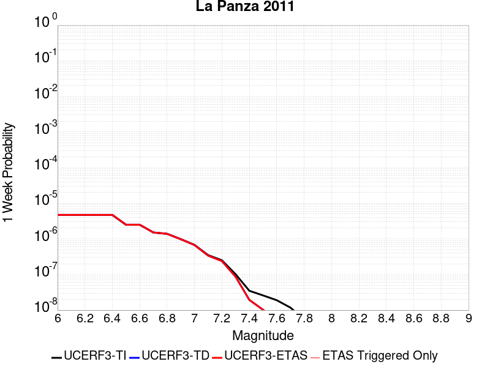 |  | 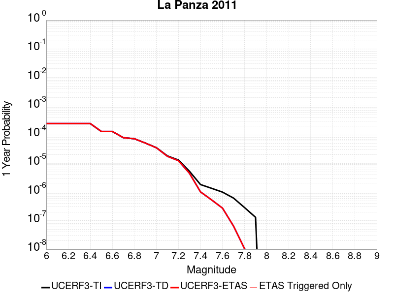 | 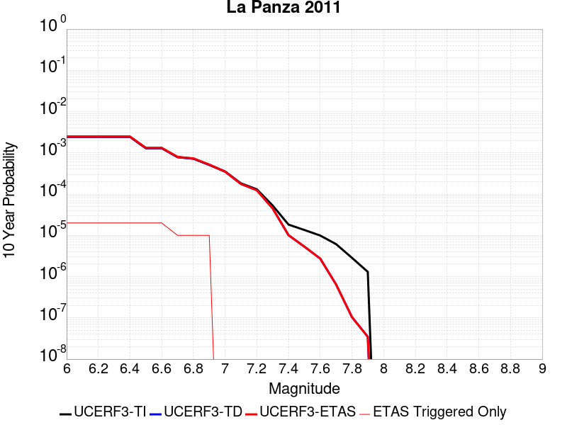 |

| Magnitude | 1 wk TI Prob | 1 wk TD Prob | 1 wk ETAS Prob | 1 wk ETAS/TD Gain | 1 wk ETAS Triggered Only | 1 mo TI Prob | 1 mo TD Prob | 1 mo ETAS Prob | 1 mo ETAS/TD Gain | 1 mo ETAS Triggered Only | 1 yr TI Prob | 1 yr TD Prob | 1 yr ETAS Prob | 1 yr ETAS/TD Gain | 1 yr ETAS Triggered Only | 10 yr TI Prob | 10 yr TD Prob | 10 yr ETAS Prob | 10 yr ETAS/TD Gain | 10 yr ETAS Triggered Only |
|-----|-----|-----|-----|-----|-----|-----|-----|-----|-----|-----|-----|-----|-----|-----|-----|-----|-----|-----|-----|-----|
| 6.0 | 4.6754544E-6 | 4.717608E-6 | 4.717608E-6 | 1.0 | 0.0 | 2.0037509E-5 | 2.0218175E-5 | 2.0218175E-5 | 1.0 | 0.0 | 2.4392935E-4 | 2.4613045E-4 | 2.4613045E-4 | 1.0 | 0.0 | 0.0024366176 | 0.0024587729 | 0.0024787236 | 1.0081141 | 2.0E-5 |
| 6.1 | 4.6754544E-6 | 4.717608E-6 | 4.717608E-6 | 1.0 | 0.0 | 2.0037509E-5 | 2.0218175E-5 | 2.0218175E-5 | 1.0 | 0.0 | 2.4392935E-4 | 2.4613045E-4 | 2.4613045E-4 | 1.0 | 0.0 | 0.0024366176 | 0.0024587729 | 0.0024787236 | 1.0081141 | 2.0E-5 |
| 6.2 | 4.6754544E-6 | 4.717608E-6 | 4.717608E-6 | 1.0 | 0.0 | 2.0037509E-5 | 2.0218175E-5 | 2.0218175E-5 | 1.0 | 0.0 | 2.4392935E-4 | 2.4613045E-4 | 2.4613045E-4 | 1.0 | 0.0 | 0.0024366176 | 0.0024587729 | 0.0024787236 | 1.0081141 | 2.0E-5 |
| 6.3 | 4.6754544E-6 | 4.717608E-6 | 4.717608E-6 | 1.0 | 0.0 | 2.0037509E-5 | 2.0218175E-5 | 2.0218175E-5 | 1.0 | 0.0 | 2.4392935E-4 | 2.4613045E-4 | 2.4613045E-4 | 1.0 | 0.0 | 0.0024366176 | 0.0024587729 | 0.0024787236 | 1.0081141 | 2.0E-5 |
| 6.4 | 4.6754544E-6 | 4.717608E-6 | 4.717608E-6 | 1.0 | 0.0 | 2.0037509E-5 | 2.0218175E-5 | 2.0218175E-5 | 1.0 | 0.0 | 2.4392935E-4 | 2.4613045E-4 | 2.4613045E-4 | 1.0 | 0.0 | 0.0024366176 | 0.0024587729 | 0.0024787236 | 1.0081141 | 2.0E-5 |
| 6.5 | 2.485343E-6 | 2.5006163E-6 | 2.5006163E-6 | 1.0 | 0.0 | 1.0651426E-5 | 1.0716885E-5 | 1.0716885E-5 | 1.0 | 0.0 | 1.296734E-4 | 1.3047065E-4 | 1.3047065E-4 | 1.0 | 0.0 | 0.0012959775 | 0.001303979 | 0.0013239529 | 1.0153177 | 2.0E-5 |
| 6.6 | 2.485343E-6 | 2.5006163E-6 | 2.5006163E-6 | 1.0 | 0.0 | 1.0651426E-5 | 1.0716885E-5 | 1.0716885E-5 | 1.0 | 0.0 | 1.296734E-4 | 1.3047065E-4 | 1.3047065E-4 | 1.0 | 0.0 | 0.0012959775 | 0.001303979 | 0.0013239529 | 1.0153177 | 2.0E-5 |
| 6.7 | 1.5108508E-6 | 1.5146534E-6 | 1.5146534E-6 | 1.0 | 0.0 | 6.4750584E-6 | 6.491356E-6 | 6.491356E-6 | 1.0 | 0.0 | 7.8830984E-5 | 7.90295E-5 | 7.90295E-5 | 1.0 | 0.0 | 7.880303E-4 | 7.900248E-4 | 8.000169E-4 | 1.0126479 | 1.0E-5 |
| 6.8 | 1.3865837E-6 | 1.3885259E-6 | 1.3885259E-6 | 1.0 | 0.0 | 5.942488E-6 | 5.950812E-6 | 5.950812E-6 | 1.0 | 0.0 | 7.234739E-5 | 7.244883E-5 | 7.244883E-5 | 1.0 | 0.0 | 7.232384E-4 | 7.242619E-4 | 7.3425466E-4 | 1.0137972 | 1.0E-5 |
| 6.9 | 9.826583E-7 | 9.796437E-7 | 9.796437E-7 | 1.0 | 0.0 | 4.2113857E-6 | 4.1984663E-6 | 4.1984663E-6 | 1.0 | 0.0 | 5.1272415E-5 | 5.1115185E-5 | 5.1115185E-5 | 1.0 | 0.0 | 5.126059E-4 | 5.1103963E-4 | 5.210345E-4 | 1.019558 | 1.0E-5 |
| 7.0 | 6.7797646E-7 | 6.71036E-7 | 6.71036E-7 | 1.0 | 0.0 | 2.9056102E-6 | 2.8758654E-6 | 2.8758654E-6 | 1.0 | 0.0 | 3.537523E-5 | 3.501313E-5 | 3.501313E-5 | 1.0 | 0.0 | 3.5369597E-4 | 3.5007924E-4 | 3.5007924E-4 | 1.0 | 0.0 |
| 7.1 | 3.4979826E-7 | 3.3875276E-7 | 3.3875276E-7 | 1.0 | 0.0 | 1.4991346E-6 | 1.4517968E-6 | 1.4517968E-6 | 1.0 | 0.0 | 1.825181E-5 | 1.7675495E-5 | 1.7675495E-5 | 1.0 | 0.0 | 1.825031E-4 | 1.7674206E-4 | 1.7674206E-4 | 1.0 | 0.0 |
| 7.2 | 2.5088332E-7 | 2.3833275E-7 | 2.3833275E-7 | 1.0 | 0.0 | 1.0752137E-6 | 1.0214256E-6 | 1.0214256E-6 | 1.0 | 0.0 | 1.3090649E-5 | 1.2435796E-5 | 1.2435796E-5 | 1.0 | 0.0 | 1.3089878E-4 | 1.2435185E-4 | 1.2435185E-4 | 1.0 | 0.0 |
| 7.3 | 1.0159086E-7 | 8.645961E-8 | 8.645961E-8 | 1.0 | 0.0 | 4.3538932E-7 | 3.7054113E-7 | 3.7054113E-7 | 1.0 | 0.0 | 5.300852E-6 | 4.5113293E-6 | 4.5113293E-6 | 1.0 | 0.0 | 5.3007258E-5 | 4.5112418E-5 | 4.5112418E-5 | 1.0 | 0.0 |
| 7.4 | 3.5006252E-8 | 1.940863E-8 | 1.940863E-8 | 1.0 | 0.0 | 1.5002678E-7 | 8.3179835E-8 | 8.3179835E-8 | 1.0 | 0.0 | 1.8265745E-6 | 1.012714E-6 | 1.012714E-6 | 1.0 | 0.0 | 1.8265595E-5 | 1.0127096E-5 | 1.0127096E-5 | 1.0 | 0.0 |
| 7.5 | 2.592274E-8 | 1.0242307E-8 | 1.0242307E-8 | 1.0 | 0.0 | 1.1109746E-7 | 4.3895596E-8 | 4.3895596E-8 | 1.0 | 0.0 | 1.3526106E-6 | 5.3442875E-7 | 5.3442875E-7 | 1.0 | 0.0 | 1.3526024E-5 | 5.3442755E-6 | 5.3442755E-6 | 1.0 | 0.0 |
| 7.6 | 1.9016717E-8 | 5.2468647E-9 | 5.2468647E-9 | 1.0 | 0.0 | 8.150022E-8 | 2.2486562E-8 | 2.2486562E-8 | 1.0 | 0.0 | 9.922647E-7 | 2.7377385E-7 | 2.7377385E-7 | 1.0 | 0.0 | 9.922603E-6 | 2.7377353E-6 | 2.7377353E-6 | 1.0 | 0.0 |
| 7.7 | 1.17738495E-8 | 1.2407027E-9 | 1.2407027E-9 | 1.0 | 0.0 | 5.0459356E-8 | 5.317297E-9 | 5.317297E-9 | 1.0 | 0.0 | 6.1434247E-7 | 6.473808E-8 | 6.473808E-8 | 1.0 | 0.0 | 6.143408E-6 | 6.4738066E-7 | 6.4738066E-7 | 1.0 | 0.0 |
| 7.8 | 5.489079E-9 | 2.0135205E-10 | 2.0135205E-10 | 1.0 | 0.0 | 2.3524624E-8 | 8.6293683E-10 | 8.6293683E-10 | 1.0 | 0.0 | 2.8641225E-7 | 1.0506253E-8 | 1.0506253E-8 | 1.0 | 0.0 | 2.8641189E-6 | 1.0506252E-7 | 1.0506252E-7 | 1.0 | 0.0 |
| 7.9 | 2.5081048E-9 | 6.6927686E-11 | 6.6927686E-11 | 1.0 | 0.0 | 1.0749021E-8 | 2.868329E-10 | 2.868329E-10 | 1.0 | 0.0 | 1.3086932E-7 | 3.492187E-9 | 3.492187E-9 | 1.0 | 0.0 | 1.3086925E-6 | 3.4921865E-8 | 3.4921865E-8 | 1.0 | 0.0 |

## Emerson-Copper Mtn 2011
*[(top)](#table-of-contents)*

| 1 Week | 1 Month | 1 Year | 10 Year |
|-----|-----|-----|-----|
| 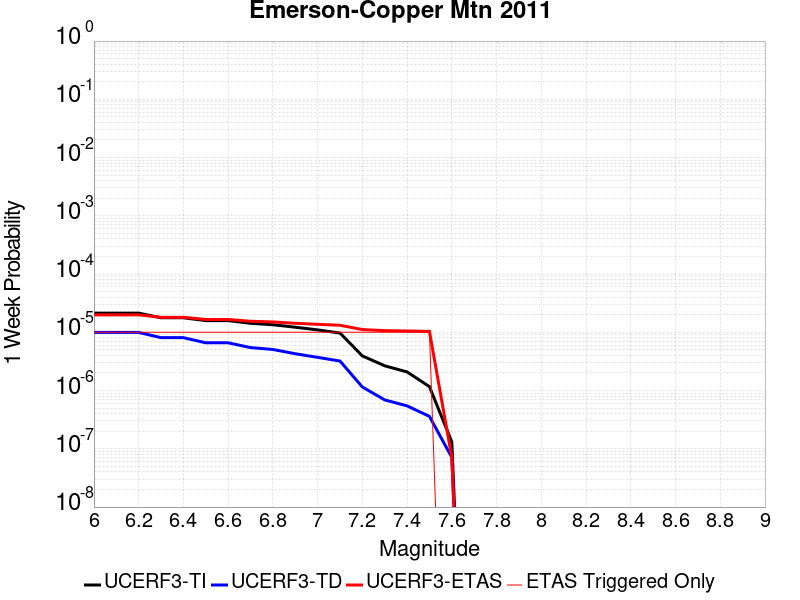 | 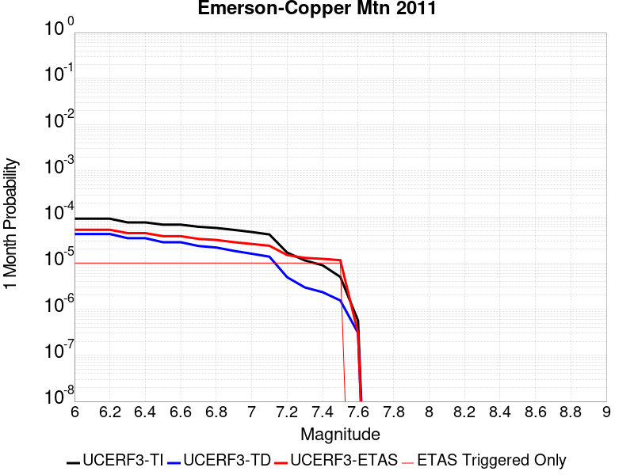 | 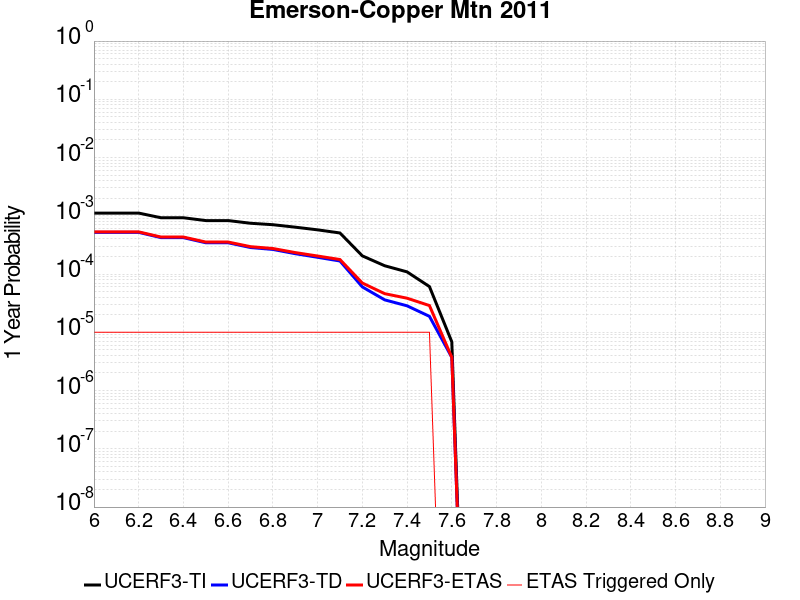 | 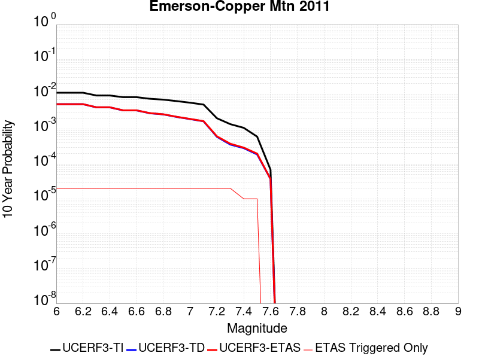 |

| Magnitude | 1 wk TI Prob | 1 wk TD Prob | 1 wk ETAS Prob | 1 wk ETAS/TD Gain | 1 wk ETAS Triggered Only | 1 mo TI Prob | 1 mo TD Prob | 1 mo ETAS Prob | 1 mo ETAS/TD Gain | 1 mo ETAS Triggered Only | 1 yr TI Prob | 1 yr TD Prob | 1 yr ETAS Prob | 1 yr ETAS/TD Gain | 1 yr ETAS Triggered Only | 10 yr TI Prob | 10 yr TD Prob | 10 yr ETAS Prob | 10 yr ETAS/TD Gain | 10 yr ETAS Triggered Only |
|-----|-----|-----|-----|-----|-----|-----|-----|-----|-----|-----|-----|-----|-----|-----|-----|-----|-----|-----|-----|-----|
| 6.0 | 2.1364202E-5 | 9.968277E-6 | 1.9968176E-5 | 2.0031724 | 1.0E-5 | 9.1557646E-5 | 4.2720538E-5 | 5.272011E-5 | 1.2340695 | 1.0E-5 | 0.0011141442 | 5.200071E-4 | 5.3000194E-4 | 1.0192205 | 1.0E-5 | 0.011085749 | 0.005188773 | 0.005208669 | 1.0038345 | 2.0E-5 |
| 6.1 | 2.1364202E-5 | 9.968277E-6 | 1.9968176E-5 | 2.0031724 | 1.0E-5 | 9.1557646E-5 | 4.2720538E-5 | 5.272011E-5 | 1.2340695 | 1.0E-5 | 0.0011141442 | 5.200071E-4 | 5.3000194E-4 | 1.0192205 | 1.0E-5 | 0.011085749 | 0.005188773 | 0.005208669 | 1.0038345 | 2.0E-5 |
| 6.2 | 2.1364202E-5 | 9.968277E-6 | 1.9968176E-5 | 2.0031724 | 1.0E-5 | 9.1557646E-5 | 4.2720538E-5 | 5.272011E-5 | 1.2340695 | 1.0E-5 | 0.0011141442 | 5.200071E-4 | 5.3000194E-4 | 1.0192205 | 1.0E-5 | 0.011085749 | 0.005188773 | 0.005208669 | 1.0038345 | 2.0E-5 |
| 6.3 | 1.7751237E-5 | 8.089365E-6 | 1.8089284E-5 | 2.236181 | 1.0E-5 | 7.607452E-5 | 3.4668283E-5 | 4.4667937E-5 | 1.2884381 | 1.0E-5 | 9.258136E-4 | 4.2201087E-4 | 4.3200664E-4 | 1.023686 | 1.0E-5 | 0.00921966 | 0.0042127175 | 0.004232633 | 1.0047275 | 2.0E-5 |
| 6.4 | 1.7751237E-5 | 8.089365E-6 | 1.8089284E-5 | 2.236181 | 1.0E-5 | 7.607452E-5 | 3.4668283E-5 | 4.4667937E-5 | 1.2884381 | 1.0E-5 | 9.258136E-4 | 4.2201087E-4 | 4.3200664E-4 | 1.023686 | 1.0E-5 | 0.00921966 | 0.0042127175 | 0.004232633 | 1.0047275 | 2.0E-5 |
| 6.5 | 1.5886664E-5 | 6.6039356E-6 | 1.660387E-5 | 2.5142386 | 1.0E-5 | 6.808392E-5 | 2.83023E-5 | 3.8302016E-5 | 1.3533182 | 1.0E-5 | 8.286065E-4 | 3.445307E-4 | 3.5452726E-4 | 1.029015 | 1.0E-5 | 0.008255237 | 0.00344043 | 0.0034603612 | 1.0057932 | 2.0E-5 |
| 6.6 | 1.5886664E-5 | 6.6039356E-6 | 1.660387E-5 | 2.5142386 | 1.0E-5 | 6.808392E-5 | 2.83023E-5 | 3.8302016E-5 | 1.3533182 | 1.0E-5 | 8.286065E-4 | 3.445307E-4 | 3.5452726E-4 | 1.029015 | 1.0E-5 | 0.008255237 | 0.00344043 | 0.0034603612 | 1.0057932 | 2.0E-5 |
| 6.7 | 1.428471E-5 | 5.470503E-6 | 1.5470448E-5 | 2.8279755 | 1.0E-5 | 6.121875E-5 | 2.3444823E-5 | 3.344459E-5 | 1.4265233 | 1.0E-5 | 7.450834E-4 | 2.8540727E-4 | 2.9540443E-4 | 1.0350276 | 1.0E-5 | 0.007425902 | 0.0028507954 | 0.0028707383 | 1.0069956 | 2.0E-5 |
| 6.8 | 1.3490684E-5 | 5.073793E-6 | 1.5073742E-5 | 2.9709022 | 1.0E-5 | 5.7815934E-5 | 2.1744667E-5 | 3.174445E-5 | 1.4598728 | 1.0E-5 | 7.0368167E-4 | 2.6471302E-4 | 2.747104E-4 | 1.0377668 | 1.0E-5 | 0.007014576 | 0.002644358 | 0.002664305 | 1.0075433 | 2.0E-5 |
| 6.9 | 1.2235421E-5 | 4.2897627E-6 | 1.428972E-5 | 3.3311212 | 1.0E-5 | 5.2436466E-5 | 1.8384588E-5 | 2.8384404E-5 | 1.5439239 | 1.0E-5 | 6.38227E-4 | 2.2381297E-4 | 2.3381073E-4 | 1.0446701 | 1.0E-5 | 0.0063639707 | 0.00223623 | 0.0022561853 | 1.0089236 | 2.0E-5 |
| 7.0 | 1.1009851E-5 | 3.7190669E-6 | 1.371903E-5 | 3.6888366 | 1.0E-5 | 4.7184225E-5 | 1.593878E-5 | 2.5938622E-5 | 1.6273906 | 1.0E-5 | 5.743165E-4 | 1.9404081E-4 | 2.0403886E-4 | 1.0515256 | 1.0E-5 | 0.005728345 | 0.0019390517 | 0.0019590128 | 1.0102943 | 2.0E-5 |
| 7.1 | 9.726373E-6 | 3.2118642E-6 | 1.3211832E-5 | 4.1134467 | 1.0E-5 | 4.168379E-5 | 1.3765079E-5 | 2.376494E-5 | 1.7264661 | 1.0E-5 | 5.07382E-4 | 1.6758032E-4 | 1.7757864E-4 | 1.0596629 | 1.0E-5 | 0.0050622504 | 0.0016748707 | 0.0016948372 | 1.0119212 | 2.0E-5 |
| 7.2 | 3.9335127E-6 | 1.1525033E-6 | 1.1152491E-5 | 9.676755 | 1.0E-5 | 1.6857803E-5 | 4.9392906E-6 | 1.4939242E-5 | 3.0245721 | 1.0E-5 | 2.0522442E-4 | 6.0134265E-5 | 7.013367E-5 | 1.1662846 | 1.0E-5 | 0.00205035 | 6.011859E-4 | 6.211739E-4 | 1.0332476 | 2.0E-5 |
| 7.3 | 2.661632E-6 | 6.9116606E-7 | 1.0691159E-5 | 15.468293 | 1.0E-5 | 1.14069435E-5 | 2.962137E-6 | 1.2962108E-5 | 4.3759313 | 1.0E-5 | 1.3887069E-4 | 3.6063433E-5 | 4.606307E-5 | 1.2772793 | 1.0E-5 | 0.0013878393 | 3.6057684E-4 | 3.805696E-4 | 1.0554466 | 2.0E-5 |
| 7.4 | 2.0893426E-6 | 5.461961E-7 | 1.054619E-5 | 19.308434 | 1.0E-5 | 8.954295E-6 | 2.3408381E-6 | 1.23408145E-5 | 5.271964 | 1.0E-5 | 1.0901308E-4 | 2.8499337E-5 | 3.8499053E-5 | 1.3508754 | 1.0E-5 | 0.0010895962 | 2.8495738E-4 | 2.9495452E-4 | 1.0350829 | 1.0E-5 |
| 7.5 | 1.1681728E-6 | 3.6031287E-7 | 1.036031E-5 | 28.753647 | 1.0E-5 | 5.0064455E-6 | 1.5441972E-6 | 1.1544182E-5 | 7.4758472 | 1.0E-5 | 6.0951766E-5 | 1.8800443E-5 | 2.8800254E-5 | 1.5318924 | 1.0E-5 | 6.093505E-4 | 1.8798899E-4 | 1.979871E-4 | 1.0531846 | 1.0E-5 |
| 7.6 | 1.3154387E-7 | 7.1198265E-8 | 7.1198265E-8 | 1.0 | 0.0 | 5.6375933E-7 | 3.051354E-7 | 3.051354E-7 | 1.0 | 0.0 | 6.863748E-6 | 3.7150185E-6 | 3.7150185E-6 | 1.0 | 0.0 | 6.863536E-5 | 3.7149723E-5 | 3.7149723E-5 | 1.0 | 0.0 |

## Santa Monica alt 1
*[(top)](#table-of-contents)*

| 1 Week | 1 Month | 1 Year | 10 Year |
|-----|-----|-----|-----|
| 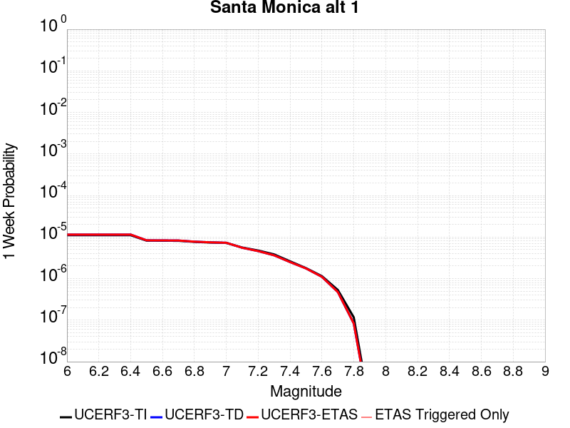 | 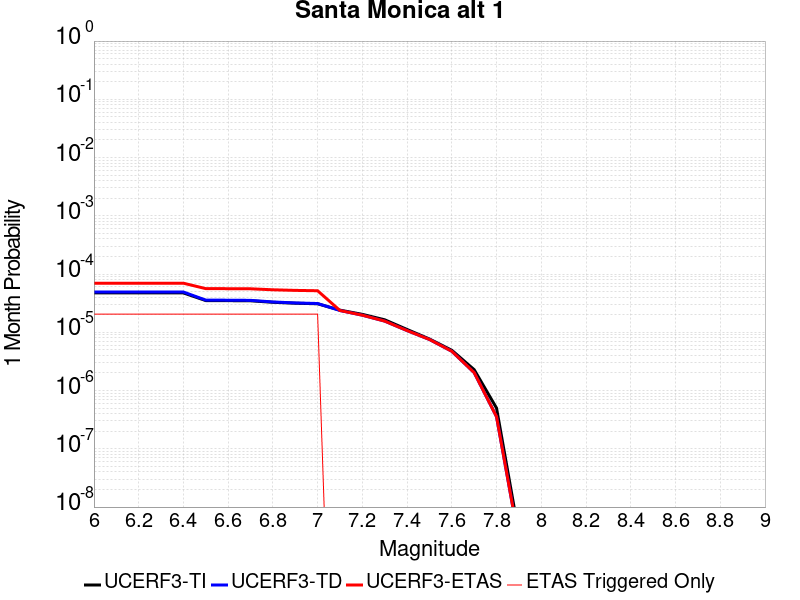 | 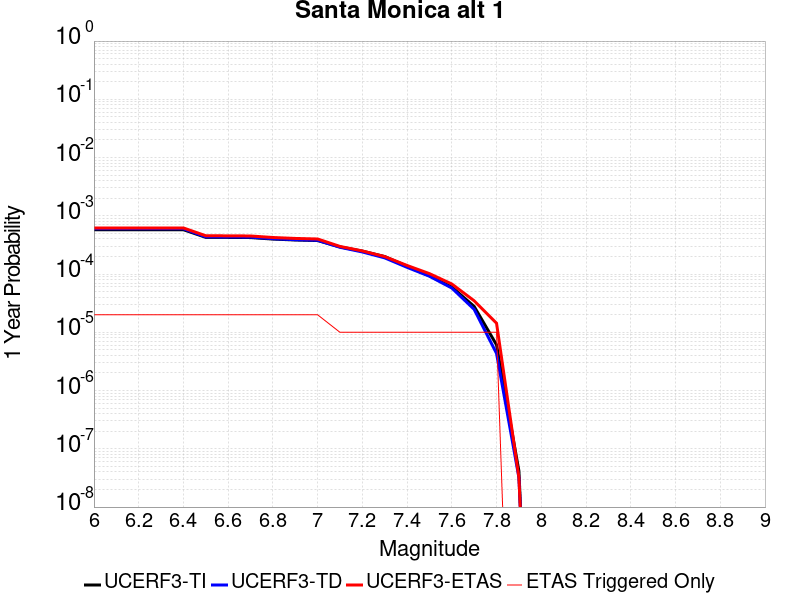 | 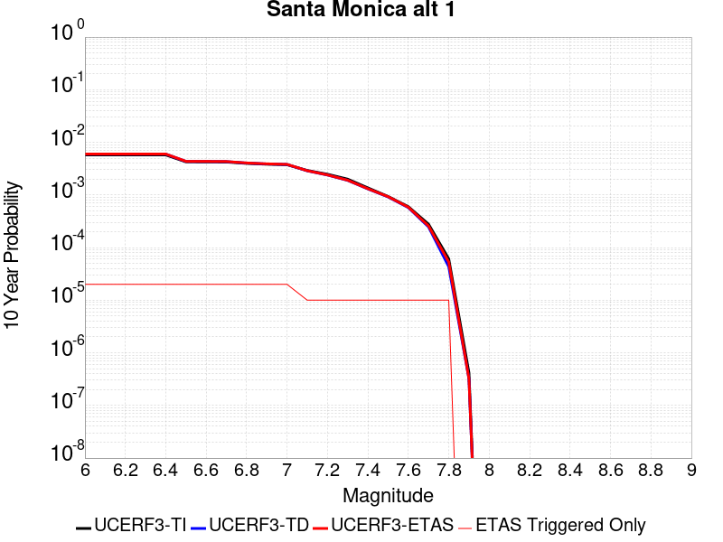 |

| Magnitude | 1 wk TI Prob | 1 wk TD Prob | 1 wk ETAS Prob | 1 wk ETAS/TD Gain | 1 wk ETAS Triggered Only | 1 mo TI Prob | 1 mo TD Prob | 1 mo ETAS Prob | 1 mo ETAS/TD Gain | 1 mo ETAS Triggered Only | 1 yr TI Prob | 1 yr TD Prob | 1 yr ETAS Prob | 1 yr ETAS/TD Gain | 1 yr ETAS Triggered Only | 10 yr TI Prob | 10 yr TD Prob | 10 yr ETAS Prob | 10 yr ETAS/TD Gain | 10 yr ETAS Triggered Only |
|-----|-----|-----|-----|-----|-----|-----|-----|-----|-----|-----|-----|-----|-----|-----|-----|-----|-----|-----|-----|-----|
| 6.0 | 1.1066008E-5 | 1.1480435E-5 | 1.1480435E-5 | 1.0 | 0.0 | 4.742488E-5 | 4.920102E-5 | 5.9200524E-5 | 1.2032379 | 1.0E-5 | 5.7724497E-4 | 5.988717E-4 | 6.188597E-4 | 1.0333761 | 2.0E-5 | 0.005757478 | 0.0059739654 | 0.005993846 | 1.0033278 | 2.0E-5 |
| 6.1 | 1.1066008E-5 | 1.1480435E-5 | 1.1480435E-5 | 1.0 | 0.0 | 4.742488E-5 | 4.920102E-5 | 5.9200524E-5 | 1.2032379 | 1.0E-5 | 5.7724497E-4 | 5.988717E-4 | 6.188597E-4 | 1.0333761 | 2.0E-5 | 0.005757478 | 0.0059739654 | 0.005993846 | 1.0033278 | 2.0E-5 |
| 6.2 | 1.1066008E-5 | 1.1480435E-5 | 1.1480435E-5 | 1.0 | 0.0 | 4.742488E-5 | 4.920102E-5 | 5.9200524E-5 | 1.2032379 | 1.0E-5 | 5.7724497E-4 | 5.988717E-4 | 6.188597E-4 | 1.0333761 | 2.0E-5 | 0.005757478 | 0.0059739654 | 0.005993846 | 1.0033278 | 2.0E-5 |
| 6.3 | 1.1066008E-5 | 1.1480435E-5 | 1.1480435E-5 | 1.0 | 0.0 | 4.742488E-5 | 4.920102E-5 | 5.9200524E-5 | 1.2032379 | 1.0E-5 | 5.7724497E-4 | 5.988717E-4 | 6.188597E-4 | 1.0333761 | 2.0E-5 | 0.005757478 | 0.0059739654 | 0.005993846 | 1.0033278 | 2.0E-5 |
| 6.4 | 1.1066008E-5 | 1.1480435E-5 | 1.1480435E-5 | 1.0 | 0.0 | 4.742488E-5 | 4.920102E-5 | 5.9200524E-5 | 1.2032379 | 1.0E-5 | 5.7724497E-4 | 5.988717E-4 | 6.188597E-4 | 1.0333761 | 2.0E-5 | 0.005757478 | 0.0059739654 | 0.005993846 | 1.0033278 | 2.0E-5 |
| 6.5 | 8.183544E-6 | 8.335519E-6 | 8.335519E-6 | 1.0 | 0.0 | 3.5071862E-5 | 3.5723173E-5 | 4.5722816E-5 | 1.2799203 | 1.0E-5 | 4.2691626E-4 | 4.348444E-4 | 4.548357E-4 | 1.0459734 | 2.0E-5 | 0.0042609703 | 0.004340101 | 0.004360014 | 1.0045882 | 2.0E-5 |
| 6.6 | 8.1543285E-6 | 8.303733E-6 | 8.303733E-6 | 1.0 | 0.0 | 3.4946657E-5 | 3.558695E-5 | 4.5586596E-5 | 1.2809919 | 1.0E-5 | 4.2539247E-4 | 4.3318656E-4 | 4.531779E-4 | 1.0461495 | 2.0E-5 | 0.0042457907 | 0.0043235873 | 0.004343501 | 1.0046058 | 2.0E-5 |
| 6.7 | 8.110878E-6 | 8.257129E-6 | 8.257129E-6 | 1.0 | 0.0 | 3.4760444E-5 | 3.5387224E-5 | 4.538687E-5 | 1.2825779 | 1.0E-5 | 4.231262E-4 | 4.3075587E-4 | 4.5074726E-4 | 1.04641 | 2.0E-5 | 0.0042232145 | 0.0042993743 | 0.0043192883 | 1.0046319 | 2.0E-5 |
| 6.8 | 7.644036E-6 | 7.751141E-6 | 7.751141E-6 | 1.0 | 0.0 | 3.275974E-5 | 3.3218763E-5 | 4.321843E-5 | 1.3010247 | 1.0E-5 | 3.9877684E-4 | 4.0436478E-4 | 4.243567E-4 | 1.0494403 | 2.0E-5 | 0.00398062 | 0.0040364363 | 0.004056356 | 1.0049349 | 2.0E-5 |
| 6.9 | 7.3698293E-6 | 7.455797E-6 | 7.455797E-6 | 1.0 | 0.0 | 3.15846E-5 | 3.1953034E-5 | 4.1952713E-5 | 1.3129493 | 1.0E-5 | 3.8447464E-4 | 3.8896012E-4 | 4.0895233E-4 | 1.0513991 | 2.0E-5 | 0.0038381014 | 0.003882937 | 0.0039028593 | 1.0051308 | 2.0E-5 |
| 7.0 | 7.209872E-6 | 7.285702E-6 | 7.285702E-6 | 1.0 | 0.0 | 3.0899086E-5 | 3.1224074E-5 | 4.122376E-5 | 1.3202558 | 1.0E-5 | 3.7613141E-4 | 3.8008817E-4 | 4.0008055E-4 | 1.0525994 | 2.0E-5 | 0.0037549543 | 0.0037945234 | 0.0038144474 | 1.0052508 | 2.0E-5 |
| 7.1 | 5.603456E-6 | 5.523946E-6 | 5.523946E-6 | 1.0 | 0.0 | 2.4014591E-5 | 2.3673843E-5 | 2.3673843E-5 | 1.0 | 0.0 | 2.923384E-4 | 2.881913E-4 | 2.9818842E-4 | 1.0346892 | 1.0E-5 | 0.0029195412 | 0.0028782175 | 0.0028881887 | 1.0034643 | 1.0E-5 |
| 7.2 | 4.7483613E-6 | 4.591175E-6 | 4.591175E-6 | 1.0 | 0.0 | 2.0349962E-5 | 1.9676318E-5 | 1.9676318E-5 | 1.0 | 0.0 | 2.4773262E-4 | 2.3953296E-4 | 2.4953057E-4 | 1.0417379 | 1.0E-5 | 0.0024745662 | 0.0023927619 | 0.002402738 | 1.0041692 | 1.0E-5 |
| 7.3 | 3.829015E-6 | 3.6342587E-6 | 3.6342587E-6 | 1.0 | 0.0 | 1.6409962E-5 | 1.5575302E-5 | 1.5575302E-5 | 1.0 | 0.0 | 1.9977297E-4 | 1.8961288E-4 | 1.9961098E-4 | 1.052729 | 1.0E-5 | 0.0019959346 | 0.0018945198 | 0.0019045009 | 1.0052683 | 1.0E-5 |
| 7.4 | 2.610755E-6 | 2.499595E-6 | 2.499595E-6 | 1.0 | 0.0 | 1.1188902E-5 | 1.0712507E-5 | 1.0712507E-5 | 1.0 | 0.0 | 1.3621636E-4 | 1.30417E-4 | 1.404157E-4 | 1.0766671 | 1.0E-5 | 0.001361329 | 0.0013034091 | 0.001313396 | 1.0076622 | 1.0E-5 |
| 7.5 | 1.792146E-6 | 1.7584358E-6 | 1.7584358E-6 | 1.0 | 0.0 | 7.680603E-6 | 7.5361318E-6 | 7.5361318E-6 | 1.0 | 0.0 | 9.3507326E-5 | 9.1748574E-5 | 1.0174765E-4 | 1.1089835 | 1.0E-5 | 9.3467993E-4 | 9.171101E-4 | 9.2710095E-4 | 1.0108938 | 1.0E-5 |
| 7.6 | 1.1473018E-6 | 1.1029267E-6 | 1.1029267E-6 | 1.0 | 0.0 | 4.9169985E-6 | 4.7268204E-6 | 4.7268204E-6 | 1.0 | 0.0 | 5.986281E-5 | 5.7547535E-5 | 6.754696E-5 | 1.1737593 | 1.0E-5 | 5.984669E-4 | 5.7532795E-4 | 5.853222E-4 | 1.0173714 | 1.0E-5 |
| 7.7 | 5.330919E-7 | 4.74532E-7 | 4.74532E-7 | 1.0 | 0.0 | 2.2846775E-6 | 2.033707E-6 | 2.033707E-6 | 1.0 | 0.0 | 2.7815593E-5 | 2.4760113E-5 | 3.4759865E-5 | 1.4038653 | 1.0E-5 | 2.7812112E-4 | 2.4757467E-4 | 2.5757222E-4 | 1.0403819 | 1.0E-5 |
| 7.8 | 1.1668574E-7 | 8.2969436E-8 | 8.2969436E-8 | 1.0 | 0.0 | 5.000816E-7 | 3.5558327E-7 | 3.5558327E-7 | 1.0 | 0.0 | 6.0884768E-6 | 4.329218E-6 | 1.43291745E-5 | 3.309876 | 1.0E-5 | 6.08831E-5 | 4.3291366E-5 | 5.3290933E-5 | 1.2309829 | 1.0E-5 |
| 7.9 | 8.007447E-10 | 6.160915E-10 | 6.160915E-10 | 1.0 | 0.0 | 3.4317629E-9 | 2.6403923E-9 | 2.6403923E-9 | 1.0 | 0.0 | 4.1781714E-8 | 3.2146776E-8 | 3.2146776E-8 | 1.0 | 0.0 | 4.1781706E-7 | 3.2146772E-7 | 3.2146772E-7 | 1.0 | 0.0 |

## Monterey Bay-Tularcitos
*[(top)](#table-of-contents)*

| 1 Week | 1 Month | 1 Year | 10 Year |
|-----|-----|-----|-----|
| 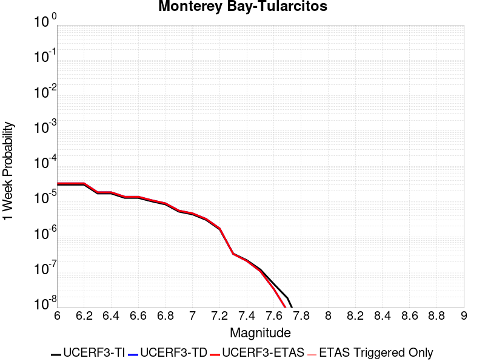 | 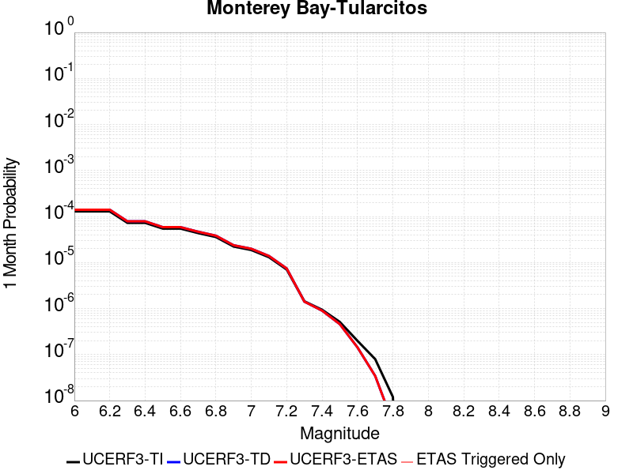 | 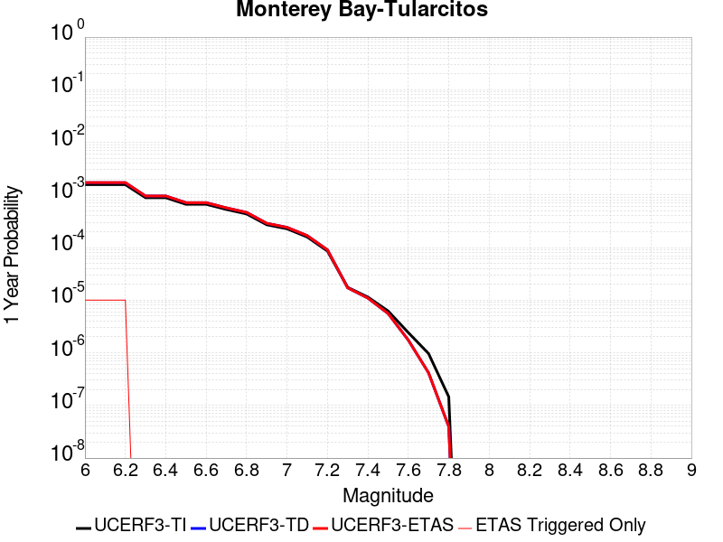 | 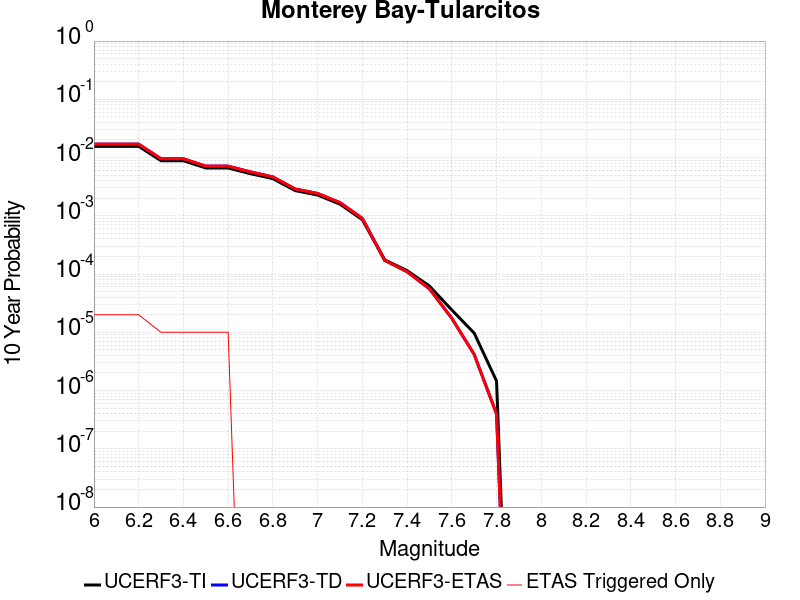 |

| Magnitude | 1 wk TI Prob | 1 wk TD Prob | 1 wk ETAS Prob | 1 wk ETAS/TD Gain | 1 wk ETAS Triggered Only | 1 mo TI Prob | 1 mo TD Prob | 1 mo ETAS Prob | 1 mo ETAS/TD Gain | 1 mo ETAS Triggered Only | 1 yr TI Prob | 1 yr TD Prob | 1 yr ETAS Prob | 1 yr ETAS/TD Gain | 1 yr ETAS Triggered Only | 10 yr TI Prob | 10 yr TD Prob | 10 yr ETAS Prob | 10 yr ETAS/TD Gain | 10 yr ETAS Triggered Only |
|-----|-----|-----|-----|-----|-----|-----|-----|-----|-----|-----|-----|-----|-----|-----|-----|-----|-----|-----|-----|-----|
| 6.0 | 3.0131365E-5 | 3.2799162E-5 | 3.2799162E-5 | 1.0 | 0.0 | 1.2912804E-4 | 1.4056086E-4 | 1.4056086E-4 | 1.0 | 0.0 | 0.001571 | 0.0017100906 | 0.0017200735 | 1.0058377 | 1.0E-5 | 0.015599402 | 0.016980117 | 0.016999777 | 1.0011579 | 2.0E-5 |
| 6.1 | 3.0131365E-5 | 3.2799162E-5 | 3.2799162E-5 | 1.0 | 0.0 | 1.2912804E-4 | 1.4056086E-4 | 1.4056086E-4 | 1.0 | 0.0 | 0.001571 | 0.0017100906 | 0.0017200735 | 1.0058377 | 1.0E-5 | 0.015599402 | 0.016980117 | 0.016999777 | 1.0011579 | 2.0E-5 |
| 6.2 | 3.0131365E-5 | 3.2799162E-5 | 3.2799162E-5 | 1.0 | 0.0 | 1.2912804E-4 | 1.4056086E-4 | 1.4056086E-4 | 1.0 | 0.0 | 0.001571 | 0.0017100906 | 0.0017200735 | 1.0058377 | 1.0E-5 | 0.015599402 | 0.016980117 | 0.016999777 | 1.0011579 | 2.0E-5 |
| 6.3 | 1.6998249E-5 | 1.8330993E-5 | 1.8330993E-5 | 1.0 | 0.0 | 7.28476E-5 | 7.855914E-5 | 7.855914E-5 | 1.0 | 0.0 | 8.865586E-4 | 9.560565E-4 | 9.560565E-4 | 1.0 | 0.0 | 0.0088303005 | 0.00952136 | 0.009531264 | 1.0010402 | 1.0E-5 |
| 6.4 | 1.6998249E-5 | 1.8330993E-5 | 1.8330993E-5 | 1.0 | 0.0 | 7.28476E-5 | 7.855914E-5 | 7.855914E-5 | 1.0 | 0.0 | 8.865586E-4 | 9.560565E-4 | 9.560565E-4 | 1.0 | 0.0 | 0.0088303005 | 0.00952136 | 0.009531264 | 1.0010402 | 1.0E-5 |
| 6.5 | 1.27470785E-5 | 1.3693452E-5 | 1.3693452E-5 | 1.0 | 0.0 | 5.4629192E-5 | 5.868496E-5 | 5.868496E-5 | 1.0 | 0.0 | 6.649074E-4 | 7.142655E-4 | 7.142655E-4 | 1.0 | 0.0 | 0.0066292146 | 0.007120751 | 0.0071306797 | 1.0013944 | 1.0E-5 |
| 6.6 | 1.2739422E-5 | 1.3685539E-5 | 1.3685539E-5 | 1.0 | 0.0 | 5.4596385E-5 | 5.865105E-5 | 5.865105E-5 | 1.0 | 0.0 | 6.645082E-4 | 7.1385293E-4 | 7.1385293E-4 | 1.0 | 0.0 | 0.0066252467 | 0.007116651 | 0.00712658 | 1.0013951 | 1.0E-5 |
| 6.7 | 1.0160109E-5 | 1.0885862E-5 | 1.0885862E-5 | 1.0 | 0.0 | 4.35426E-5 | 4.66529E-5 | 4.66529E-5 | 1.0 | 0.0 | 5.300022E-4 | 5.678581E-4 | 5.678581E-4 | 1.0 | 0.0 | 0.005287399 | 0.005664782 | 0.005664782 | 1.0 | 0.0 |
| 6.8 | 8.349859E-6 | 8.932674E-6 | 8.932674E-6 | 1.0 | 0.0 | 3.578462E-5 | 3.828236E-5 | 3.828236E-5 | 1.0 | 0.0 | 4.3559066E-4 | 4.659937E-4 | 4.659937E-4 | 1.0 | 0.0 | 0.004347378 | 0.0046507306 | 0.0046507306 | 1.0 | 0.0 |
| 6.9 | 5.193639E-6 | 5.536483E-6 | 5.536483E-6 | 1.0 | 0.0 | 2.2258262E-5 | 2.3727587E-5 | 2.3727587E-5 | 1.0 | 0.0 | 2.7096065E-4 | 2.8884833E-4 | 2.8884833E-4 | 1.0 | 0.0 | 0.0027063051 | 0.00288505 | 0.00288505 | 1.0 | 0.0 |
| 7.0 | 4.359381E-6 | 4.6434106E-6 | 4.6434106E-6 | 1.0 | 0.0 | 1.8682927E-5 | 1.9900195E-5 | 1.9900195E-5 | 1.0 | 0.0 | 2.274409E-4 | 2.4226093E-4 | 2.4226093E-4 | 1.0 | 0.0 | 0.0022720827 | 0.0024202613 | 0.0024202613 | 1.0 | 0.0 |
| 7.1 | 3.0398533E-6 | 3.231074E-6 | 3.231074E-6 | 1.0 | 0.0 | 1.3027877E-5 | 1.38474015E-5 | 1.38474015E-5 | 1.0 | 0.0 | 1.5860285E-4 | 1.685817E-4 | 1.685817E-4 | 1.0 | 0.0 | 0.001584897 | 0.0016847957 | 0.0016847957 | 1.0 | 0.0 |
| 7.2 | 1.642335E-6 | 1.7333325E-6 | 1.7333325E-6 | 1.0 | 0.0 | 7.0385595E-6 | 7.4285585E-6 | 7.4285585E-6 | 1.0 | 0.0 | 8.569109E-5 | 9.044101E-5 | 9.044101E-5 | 1.0 | 0.0 | 8.5658056E-4 | 9.042448E-4 | 9.042448E-4 | 1.0 | 0.0 |
| 7.3 | 3.356842E-7 | 3.295272E-7 | 3.295272E-7 | 1.0 | 0.0 | 1.4386458E-6 | 1.4122586E-6 | 1.4122586E-6 | 1.0 | 0.0 | 1.7515373E-5 | 1.7194114E-5 | 1.7194114E-5 | 1.0 | 0.0 | 1.7513991E-4 | 1.7192794E-4 | 1.7192794E-4 | 1.0 | 0.0 |
| 7.4 | 2.1973483E-7 | 2.1006697E-7 | 2.1006697E-7 | 1.0 | 0.0 | 9.417204E-7 | 9.002867E-7 | 9.002867E-7 | 1.0 | 0.0 | 1.1465385E-5 | 1.09609355E-5 | 1.09609355E-5 | 1.0 | 0.0 | 1.1464794E-4 | 1.09603985E-4 | 1.09603985E-4 | 1.0 | 0.0 |
| 7.5 | 1.1944135E-7 | 1.0696283E-7 | 1.0696283E-7 | 1.0 | 0.0 | 5.118914E-7 | 4.5841205E-7 | 4.5841205E-7 | 1.0 | 0.0 | 6.23226E-6 | 5.5811524E-6 | 5.5811524E-6 | 1.0 | 0.0 | 6.2320854E-5 | 5.5810135E-5 | 5.5810135E-5 | 1.0 | 0.0 |
| 7.6 | 4.636058E-8 | 3.3366945E-8 | 3.3366945E-8 | 1.0 | 0.0 | 1.9868818E-7 | 1.4300119E-7 | 1.4300119E-7 | 1.0 | 0.0 | 2.419026E-6 | 1.7410381E-6 | 1.7410381E-6 | 1.0 | 0.0 | 2.4189996E-5 | 1.7410246E-5 | 1.7410246E-5 | 1.0 | 0.0 |
| 7.7 | 1.8588572E-8 | 8.005146E-9 | 8.005146E-9 | 1.0 | 0.0 | 7.9665305E-8 | 3.4307767E-8 | 3.4307767E-8 | 1.0 | 0.0 | 9.699246E-7 | 4.1769698E-7 | 4.1769698E-7 | 1.0 | 0.0 | 9.699204E-6 | 4.176962E-6 | 4.176962E-6 | 1.0 | 0.0 |
| 7.8 | 2.7960154E-9 | 7.612305E-10 | 7.612305E-10 | 1.0 | 0.0 | 1.1982923E-8 | 3.2624166E-9 | 3.2624166E-9 | 1.0 | 0.0 | 1.4589209E-7 | 3.971992E-8 | 3.971992E-8 | 1.0 | 0.0 | 1.4589199E-6 | 3.9719916E-7 | 3.9719916E-7 | 1.0 | 0.0 |

## Burnt Mtn
*[(top)](#table-of-contents)*

| 1 Week | 1 Month | 1 Year | 10 Year |
|-----|-----|-----|-----|
|  |  |  | 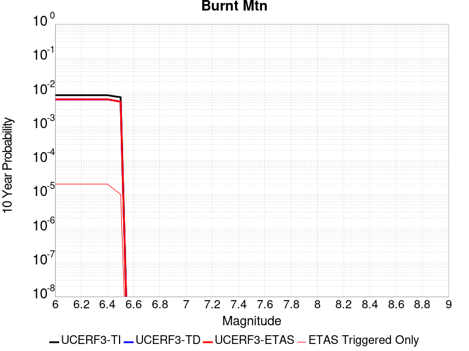 |

| Magnitude | 1 wk TI Prob | 1 wk TD Prob | 1 wk ETAS Prob | 1 wk ETAS/TD Gain | 1 wk ETAS Triggered Only | 1 mo TI Prob | 1 mo TD Prob | 1 mo ETAS Prob | 1 mo ETAS/TD Gain | 1 mo ETAS Triggered Only | 1 yr TI Prob | 1 yr TD Prob | 1 yr ETAS Prob | 1 yr ETAS/TD Gain | 1 yr ETAS Triggered Only | 10 yr TI Prob | 10 yr TD Prob | 10 yr ETAS Prob | 10 yr ETAS/TD Gain | 10 yr ETAS Triggered Only |
|-----|-----|-----|-----|-----|-----|-----|-----|-----|-----|-----|-----|-----|-----|-----|-----|-----|-----|-----|-----|-----|
| 6.0 | 1.5673151E-5 | 1.1749579E-5 | 1.1749579E-5 | 1.0 | 0.0 | 6.716892E-5 | 5.0355095E-5 | 5.0355095E-5 | 1.0 | 0.0 | 8.1747473E-4 | 6.130297E-4 | 6.230236E-4 | 1.0163025 | 1.0E-5 | 0.008144741 | 0.0061260276 | 0.0061459052 | 1.0032448 | 2.0E-5 |
| 6.1 | 1.5673151E-5 | 1.1749579E-5 | 1.1749579E-5 | 1.0 | 0.0 | 6.716892E-5 | 5.0355095E-5 | 5.0355095E-5 | 1.0 | 0.0 | 8.1747473E-4 | 6.130297E-4 | 6.230236E-4 | 1.0163025 | 1.0E-5 | 0.008144741 | 0.0061260276 | 0.0061459052 | 1.0032448 | 2.0E-5 |
| 6.2 | 1.5673151E-5 | 1.1749579E-5 | 1.1749579E-5 | 1.0 | 0.0 | 6.716892E-5 | 5.0355095E-5 | 5.0355095E-5 | 1.0 | 0.0 | 8.1747473E-4 | 6.130297E-4 | 6.230236E-4 | 1.0163025 | 1.0E-5 | 0.008144741 | 0.0061260276 | 0.0061459052 | 1.0032448 | 2.0E-5 |
| 6.3 | 1.5673151E-5 | 1.1749579E-5 | 1.1749579E-5 | 1.0 | 0.0 | 6.716892E-5 | 5.0355095E-5 | 5.0355095E-5 | 1.0 | 0.0 | 8.1747473E-4 | 6.130297E-4 | 6.230236E-4 | 1.0163025 | 1.0E-5 | 0.008144741 | 0.0061260276 | 0.0061459052 | 1.0032448 | 2.0E-5 |
| 6.4 | 1.5673151E-5 | 1.1749579E-5 | 1.1749579E-5 | 1.0 | 0.0 | 6.716892E-5 | 5.0355095E-5 | 5.0355095E-5 | 1.0 | 0.0 | 8.1747473E-4 | 6.130297E-4 | 6.230236E-4 | 1.0163025 | 1.0E-5 | 0.008144741 | 0.0061260276 | 0.0061459052 | 1.0032448 | 2.0E-5 |
| 6.5 | 1.36191375E-5 | 1.0078436E-5 | 1.0078436E-5 | 1.0 | 0.0 | 5.8366426E-5 | 4.3193297E-5 | 4.3193297E-5 | 1.0 | 0.0 | 7.103795E-4 | 5.258784E-4 | 5.358731E-4 | 1.0190058 | 1.0E-5 | 0.0070811296 | 0.005258784 | 0.005268731 | 1.0018916 | 1.0E-5 |

## Johnson Valley (No) 2011 rev
*[(top)](#table-of-contents)*

| 1 Week | 1 Month | 1 Year | 10 Year |
|-----|-----|-----|-----|
| 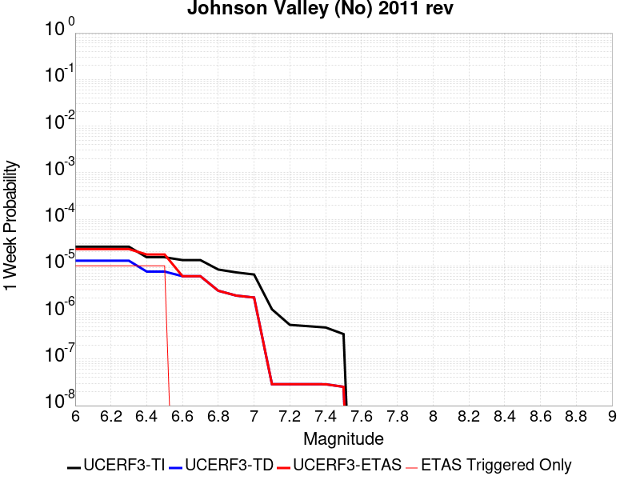 | 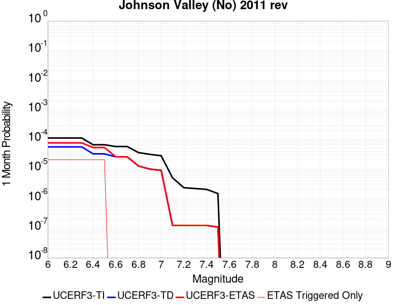 | 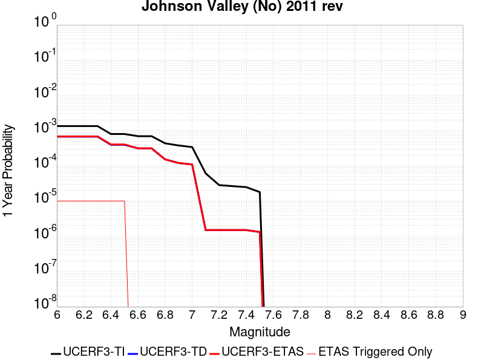 | 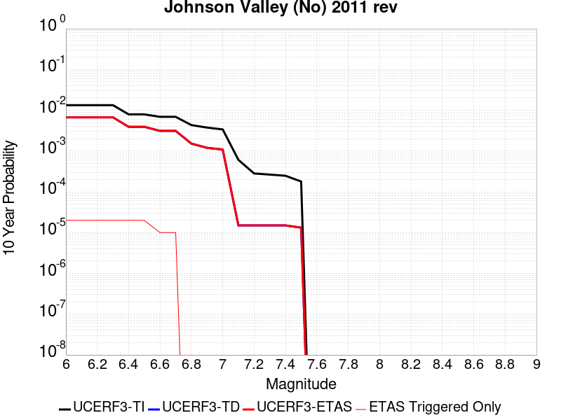 |

| Magnitude | 1 wk TI Prob | 1 wk TD Prob | 1 wk ETAS Prob | 1 wk ETAS/TD Gain | 1 wk ETAS Triggered Only | 1 mo TI Prob | 1 mo TD Prob | 1 mo ETAS Prob | 1 mo ETAS/TD Gain | 1 mo ETAS Triggered Only | 1 yr TI Prob | 1 yr TD Prob | 1 yr ETAS Prob | 1 yr ETAS/TD Gain | 1 yr ETAS Triggered Only | 10 yr TI Prob | 10 yr TD Prob | 10 yr ETAS Prob | 10 yr ETAS/TD Gain | 10 yr ETAS Triggered Only |
|-----|-----|-----|-----|-----|-----|-----|-----|-----|-----|-----|-----|-----|-----|-----|-----|-----|-----|-----|-----|-----|
| 6.0 | 2.577707E-5 | 1.29011505E-5 | 2.2901022E-5 | 1.7751147 | 1.0E-5 | 1.1046848E-4 | 5.5289696E-5 | 6.528915E-5 | 1.1808555 | 1.0E-5 | 0.0013441239 | 6.729838E-4 | 6.829771E-4 | 1.0148492 | 1.0E-5 | 0.013360229 | 0.006713367 | 0.006733233 | 1.0029591 | 2.0E-5 |
| 6.1 | 2.577707E-5 | 1.29011505E-5 | 2.2901022E-5 | 1.7751147 | 1.0E-5 | 1.1046848E-4 | 5.5289696E-5 | 6.528915E-5 | 1.1808555 | 1.0E-5 | 0.0013441239 | 6.729838E-4 | 6.829771E-4 | 1.0148492 | 1.0E-5 | 0.013360229 | 0.006713367 | 0.006733233 | 1.0029591 | 2.0E-5 |
| 6.2 | 2.577707E-5 | 1.29011505E-5 | 2.2901022E-5 | 1.7751147 | 1.0E-5 | 1.1046848E-4 | 5.5289696E-5 | 6.528915E-5 | 1.1808555 | 1.0E-5 | 0.0013441239 | 6.729838E-4 | 6.829771E-4 | 1.0148492 | 1.0E-5 | 0.013360229 | 0.006713367 | 0.006733233 | 1.0029591 | 2.0E-5 |
| 6.3 | 2.577707E-5 | 1.29011505E-5 | 2.2901022E-5 | 1.7751147 | 1.0E-5 | 1.1046848E-4 | 5.5289696E-5 | 6.528915E-5 | 1.1808555 | 1.0E-5 | 0.0013441239 | 6.729838E-4 | 6.829771E-4 | 1.0148492 | 1.0E-5 | 0.013360229 | 0.006713367 | 0.006733233 | 1.0029591 | 2.0E-5 |
| 6.4 | 1.5296591E-5 | 7.536876E-6 | 1.75368E-5 | 2.3267996 | 1.0E-5 | 6.555518E-5 | 3.2300606E-5 | 4.2300282E-5 | 1.3095818 | 1.0E-5 | 7.97842E-4 | 3.9320765E-4 | 4.032037E-4 | 1.0254219 | 1.0E-5 | 0.007949836 | 0.0039269608 | 0.003946882 | 1.005073 | 2.0E-5 |
| 6.5 | 1.5296591E-5 | 7.536876E-6 | 1.75368E-5 | 2.3267996 | 1.0E-5 | 6.555518E-5 | 3.2300606E-5 | 4.2300282E-5 | 1.3095818 | 1.0E-5 | 7.97842E-4 | 3.9320765E-4 | 4.032037E-4 | 1.0254219 | 1.0E-5 | 0.007949836 | 0.0039269608 | 0.003946882 | 1.005073 | 2.0E-5 |
| 6.6 | 1.3289383E-5 | 5.9918434E-6 | 5.9918434E-6 | 1.0 | 0.0 | 5.6953253E-5 | 2.5679172E-5 | 2.5679172E-5 | 1.0 | 0.0 | 6.9318525E-4 | 3.1261603E-4 | 3.1261603E-4 | 1.0 | 0.0 | 0.0069102696 | 0.0031234273 | 0.003133396 | 1.0031916 | 1.0E-5 |
| 6.7 | 1.3289383E-5 | 5.9918434E-6 | 5.9918434E-6 | 1.0 | 0.0 | 5.6953253E-5 | 2.5679172E-5 | 2.5679172E-5 | 1.0 | 0.0 | 6.9318525E-4 | 3.1261603E-4 | 3.1261603E-4 | 1.0 | 0.0 | 0.0069102696 | 0.0031234273 | 0.003133396 | 1.0031916 | 1.0E-5 |
| 6.8 | 8.330789E-6 | 2.9212572E-6 | 2.9212572E-6 | 1.0 | 0.0 | 3.570289E-5 | 1.2519647E-5 | 1.2519647E-5 | 1.0 | 0.0 | 4.34596E-4 | 1.5242174E-4 | 1.5242174E-4 | 1.0 | 0.0 | 0.0043374705 | 0.0015237319 | 0.0015237319 | 1.0 | 0.0 |
| 6.9 | 7.2359003E-6 | 2.3013858E-6 | 2.3013858E-6 | 1.0 | 0.0 | 3.1010633E-5 | 9.863074E-6 | 9.863074E-6 | 1.0 | 0.0 | 3.7748902E-4 | 1.2008165E-4 | 1.2008165E-4 | 1.0 | 0.0 | 0.0037684843 | 0.0012006905 | 0.0012006905 | 1.0 | 0.0 |
| 7.0 | 6.5149957E-6 | 2.0885384E-6 | 2.0885384E-6 | 1.0 | 0.0 | 2.792111E-5 | 8.950878E-6 | 8.950878E-6 | 1.0 | 0.0 | 3.398865E-4 | 1.0897678E-4 | 1.0897678E-4 | 1.0 | 0.0 | 0.003393671 | 0.0010897532 | 0.0010897532 | 1.0 | 0.0 |
| 7.1 | 1.1662233E-6 | 2.8803857E-8 | 2.8803857E-8 | 1.0 | 0.0 | 4.9980904E-6 | 1.2344509E-7 | 1.2344509E-7 | 1.0 | 0.0 | 6.0850052E-5 | 1.5029432E-6 | 1.5029432E-6 | 1.0 | 0.0 | 6.083339E-4 | 1.5029346E-5 | 1.5029346E-5 | 1.0 | 0.0 |
| 7.2 | 5.413881E-7 | 2.8803857E-8 | 2.8803857E-8 | 1.0 | 0.0 | 2.3202326E-6 | 1.2344509E-7 | 1.2344509E-7 | 1.0 | 0.0 | 2.8248465E-5 | 1.5029432E-6 | 1.5029432E-6 | 1.0 | 0.0 | 2.8244875E-4 | 1.5029346E-5 | 1.5029346E-5 | 1.0 | 0.0 |
| 7.3 | 5.076821E-7 | 2.8803855E-8 | 2.8803855E-8 | 1.0 | 0.0 | 2.1757785E-6 | 1.2344509E-7 | 1.2344509E-7 | 1.0 | 0.0 | 2.648978E-5 | 1.5029432E-6 | 1.5029432E-6 | 1.0 | 0.0 | 2.6486625E-4 | 1.5029346E-5 | 1.5029346E-5 | 1.0 | 0.0 |
| 7.4 | 4.7568687E-7 | 2.8785777E-8 | 2.8785777E-8 | 1.0 | 0.0 | 2.0386565E-6 | 1.2336761E-7 | 1.2336761E-7 | 1.0 | 0.0 | 2.482036E-5 | 1.5019998E-6 | 1.5019998E-6 | 1.0 | 0.0 | 2.4817587E-4 | 1.5019913E-5 | 1.5019913E-5 | 1.0 | 0.0 |
| 7.5 | 3.435626E-7 | 2.535922E-8 | 2.535922E-8 | 1.0 | 0.0 | 1.4724103E-6 | 1.0868237E-7 | 1.0868237E-7 | 1.0 | 0.0 | 1.7926448E-5 | 1.3232072E-6 | 1.3232072E-6 | 1.0 | 0.0 | 1.7925001E-4 | 1.3232009E-5 | 1.3232009E-5 | 1.0 | 0.0 |

## Elsinore (Temecula) rev
*[(top)](#table-of-contents)*

| 1 Week | 1 Month | 1 Year | 10 Year |
|-----|-----|-----|-----|
|  | 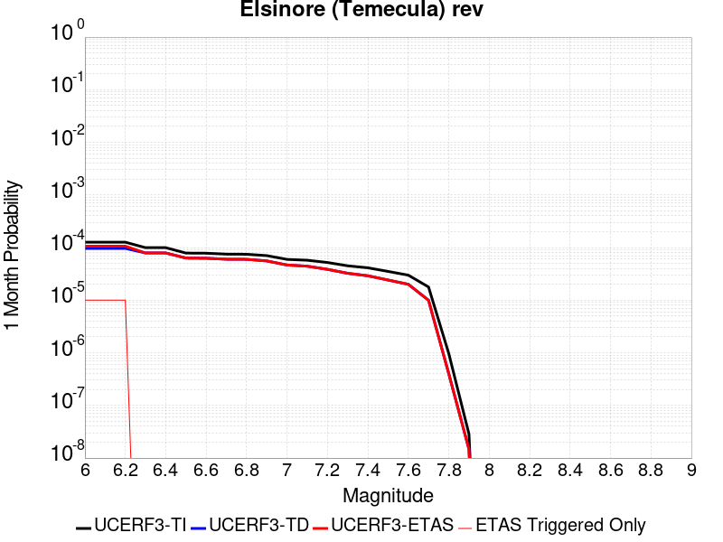 | 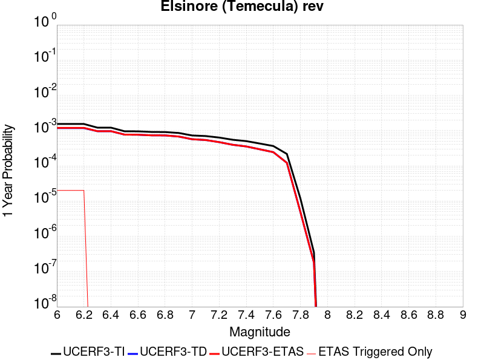 | 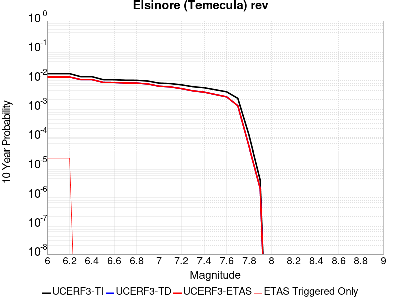 |

| Magnitude | 1 wk TI Prob | 1 wk TD Prob | 1 wk ETAS Prob | 1 wk ETAS/TD Gain | 1 wk ETAS Triggered Only | 1 mo TI Prob | 1 mo TD Prob | 1 mo ETAS Prob | 1 mo ETAS/TD Gain | 1 mo ETAS Triggered Only | 1 yr TI Prob | 1 yr TD Prob | 1 yr ETAS Prob | 1 yr ETAS/TD Gain | 1 yr ETAS Triggered Only | 10 yr TI Prob | 10 yr TD Prob | 10 yr ETAS Prob | 10 yr ETAS/TD Gain | 10 yr ETAS Triggered Only |
|-----|-----|-----|-----|-----|-----|-----|-----|-----|-----|-----|-----|-----|-----|-----|-----|-----|-----|-----|-----|-----|
| 6.0 | 2.9514995E-5 | 2.2518343E-5 | 2.2518343E-5 | 1.0 | 0.0 | 1.264867E-4 | 9.650374E-5 | 1.06502775E-4 | 1.1036129 | 1.0E-5 | 0.0015388876 | 0.001174322 | 0.0011942985 | 1.017011 | 2.0E-5 | 0.015282745 | 0.011697536 | 0.011717302 | 1.0016898 | 2.0E-5 |
| 6.1 | 2.9514995E-5 | 2.2518343E-5 | 2.2518343E-5 | 1.0 | 0.0 | 1.264867E-4 | 9.650374E-5 | 1.06502775E-4 | 1.1036129 | 1.0E-5 | 0.0015388876 | 0.001174322 | 0.0011942985 | 1.017011 | 2.0E-5 | 0.015282745 | 0.011697536 | 0.011717302 | 1.0016898 | 2.0E-5 |
| 6.2 | 2.9514995E-5 | 2.2518343E-5 | 2.2518343E-5 | 1.0 | 0.0 | 1.264867E-4 | 9.650374E-5 | 1.06502775E-4 | 1.1036129 | 1.0E-5 | 0.0015388876 | 0.001174322 | 0.0011942985 | 1.017011 | 2.0E-5 | 0.015282745 | 0.011697536 | 0.011717302 | 1.0016898 | 2.0E-5 |
| 6.3 | 2.3223649E-5 | 1.8407327E-5 | 1.8407327E-5 | 1.0 | 0.0 | 9.952613E-5 | 7.888625E-5 | 7.888625E-5 | 1.0 | 0.0 | 0.001211057 | 9.6003426E-4 | 9.6003426E-4 | 1.0 | 0.0 | 0.012044783 | 0.009570387 | 0.009570387 | 1.0 | 0.0 |
| 6.4 | 2.3223649E-5 | 1.8407327E-5 | 1.8407327E-5 | 1.0 | 0.0 | 9.952613E-5 | 7.888625E-5 | 7.888625E-5 | 1.0 | 0.0 | 0.001211057 | 9.6003426E-4 | 9.6003426E-4 | 1.0 | 0.0 | 0.012044783 | 0.009570387 | 0.009570387 | 1.0 | 0.0 |
| 6.5 | 1.8338875E-5 | 1.4750731E-5 | 1.4750731E-5 | 1.0 | 0.0 | 7.8592806E-5 | 6.3215935E-5 | 6.3215935E-5 | 1.0 | 0.0 | 9.5644733E-4 | 7.6939096E-4 | 7.6939096E-4 | 1.0 | 0.0 | 0.009523412 | 0.007674229 | 0.007674229 | 1.0 | 0.0 |
| 6.6 | 1.8223333E-5 | 1.46132825E-5 | 1.46132825E-5 | 1.0 | 0.0 | 7.809766E-5 | 6.26269E-5 | 6.26269E-5 | 1.0 | 0.0 | 9.504242E-4 | 7.6222455E-4 | 7.6222455E-4 | 1.0 | 0.0 | 0.009463696 | 0.0076030563 | 0.0076030563 | 1.0 | 0.0 |
| 6.7 | 1.7512752E-5 | 1.4027789E-5 | 1.4027789E-5 | 1.0 | 0.0 | 7.505249E-5 | 6.011776E-5 | 6.011776E-5 | 1.0 | 0.0 | 9.13381E-4 | 7.316965E-4 | 7.316965E-4 | 1.0 | 0.0 | 0.00909636 | 0.0072992197 | 0.0072992197 | 1.0 | 0.0 |
| 6.8 | 1.7417142E-5 | 1.3951771E-5 | 1.3951771E-5 | 1.0 | 0.0 | 7.4642754E-5 | 5.979198E-5 | 5.979198E-5 | 1.0 | 0.0 | 9.083966E-4 | 7.277328E-4 | 7.277328E-4 | 1.0 | 0.0 | 0.009046922 | 0.0072597866 | 0.0072597866 | 1.0 | 0.0 |
| 6.9 | 1.6402591E-5 | 1.2989167E-5 | 1.2989167E-5 | 1.0 | 0.0 | 7.0294926E-5 | 5.5666715E-5 | 5.5666715E-5 | 1.0 | 0.0 | 8.5550465E-4 | 6.7753915E-4 | 6.7753915E-4 | 1.0 | 0.0 | 0.008522186 | 0.006760456 | 0.006760456 | 1.0 | 0.0 |
| 7.0 | 1.3912486E-5 | 1.0878723E-5 | 1.0878723E-5 | 1.0 | 0.0 | 5.9623577E-5 | 4.6622277E-5 | 4.6622277E-5 | 1.0 | 0.0 | 7.2567526E-4 | 5.674811E-4 | 5.674811E-4 | 1.0 | 0.0 | 0.0072331014 | 0.005664239 | 0.005664239 | 1.0 | 0.0 |
| 7.1 | 1.3405147E-5 | 1.0327884E-5 | 1.0327884E-5 | 1.0 | 0.0 | 5.7449364E-5 | 4.4261626E-5 | 4.4261626E-5 | 1.0 | 0.0 | 6.9922156E-4 | 5.387546E-4 | 5.387546E-4 | 1.0 | 0.0 | 0.0069702556 | 0.0053778174 | 0.0053778174 | 1.0 | 0.0 |
| 7.2 | 1.21402E-5 | 8.99712E-6 | 8.99712E-6 | 1.0 | 0.0 | 5.202839E-5 | 3.8558526E-5 | 3.8558526E-5 | 1.0 | 0.0 | 6.332616E-4 | 4.693507E-4 | 4.693507E-4 | 1.0 | 0.0 | 0.0063146 | 0.0046850196 | 0.0046850196 | 1.0 | 0.0 |
| 7.3 | 1.05047775E-5 | 7.572085E-6 | 7.572085E-6 | 1.0 | 0.0 | 4.5019697E-5 | 3.2451397E-5 | 3.2451397E-5 | 1.0 | 0.0 | 5.4797693E-4 | 3.950256E-4 | 3.950256E-4 | 1.0 | 0.0 | 0.005466277 | 0.0039436235 | 0.0039436235 | 1.0 | 0.0 |
| 7.4 | 9.624483E-6 | 6.7871442E-6 | 6.7871442E-6 | 1.0 | 0.0 | 4.124713E-5 | 2.9087445E-5 | 2.9087445E-5 | 1.0 | 0.0 | 5.0206814E-4 | 3.540835E-4 | 3.540835E-4 | 1.0 | 0.0 | 0.005009353 | 0.003535347 | 0.003535347 | 1.0 | 0.0 |
| 7.5 | 8.215151E-6 | 5.635765E-6 | 5.635765E-6 | 1.0 | 0.0 | 3.5207315E-5 | 2.4153062E-5 | 2.4153062E-5 | 1.0 | 0.0 | 4.2856473E-4 | 2.940251E-4 | 2.940251E-4 | 1.0 | 0.0 | 0.004277392 | 0.002936489 | 0.002936489 | 1.0 | 0.0 |
| 7.6 | 6.975058E-6 | 4.6762393E-6 | 4.6762393E-6 | 1.0 | 0.0 | 2.9892764E-5 | 2.0040878E-5 | 2.0040878E-5 | 1.0 | 0.0 | 3.6388362E-4 | 2.4397153E-4 | 2.4397153E-4 | 1.0 | 0.0 | 0.0036328835 | 0.0024371531 | 0.0024371531 | 1.0 | 0.0 |
| 7.7 | 4.159604E-6 | 2.3271057E-6 | 2.3271057E-6 | 1.0 | 0.0 | 1.7826753E-5 | 9.973276E-6 | 9.973276E-6 | 1.0 | 0.0 | 2.1701909E-4 | 1.2141861E-4 | 1.2141861E-4 | 1.0 | 0.0 | 0.0021680726 | 0.0012135957 | 0.0012135957 | 1.0 | 0.0 |
| 7.8 | 2.2692414E-7 | 9.385943E-8 | 9.385943E-8 | 1.0 | 0.0 | 9.725317E-7 | 4.0225464E-7 | 4.0225464E-7 | 1.0 | 0.0 | 1.1840509E-5 | 4.8974425E-6 | 4.8974425E-6 | 1.0 | 0.0 | 1.1839878E-4 | 4.8973674E-5 | 4.8973674E-5 | 1.0 | 0.0 |
| 7.9 | 6.676829E-9 | 3.4399772E-9 | 3.4399772E-9 | 1.0 | 0.0 | 2.861498E-8 | 1.4742759E-8 | 1.4742759E-8 | 1.0 | 0.0 | 3.4838732E-7 | 1.7949307E-7 | 1.7949307E-7 | 1.0 | 0.0 | 3.4838679E-6 | 1.7949295E-6 | 1.7949295E-6 | 1.0 | 0.0 |

## Holser alt 1
*[(top)](#table-of-contents)*

| 1 Week | 1 Month | 1 Year | 10 Year |
|-----|-----|-----|-----|
| 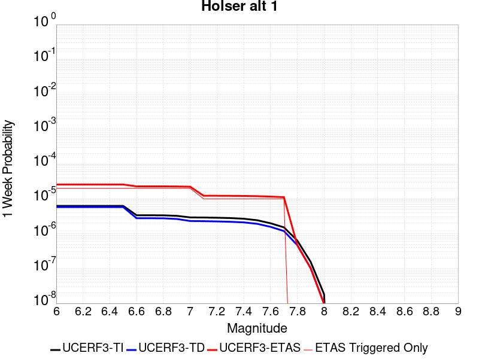 | 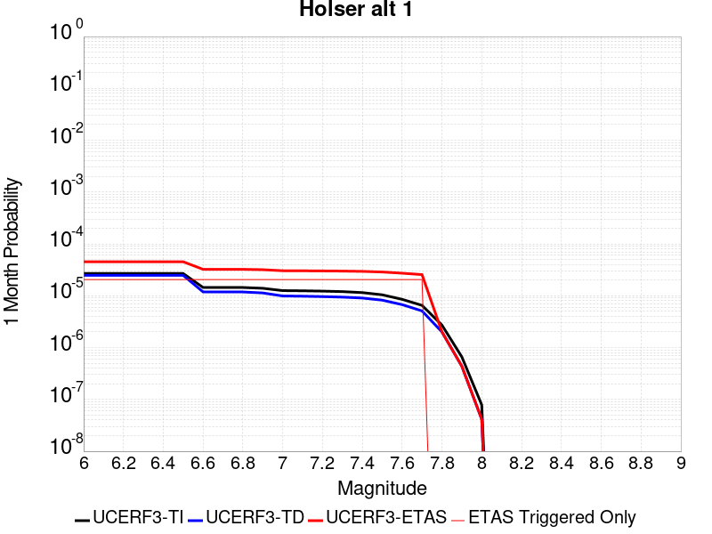 | 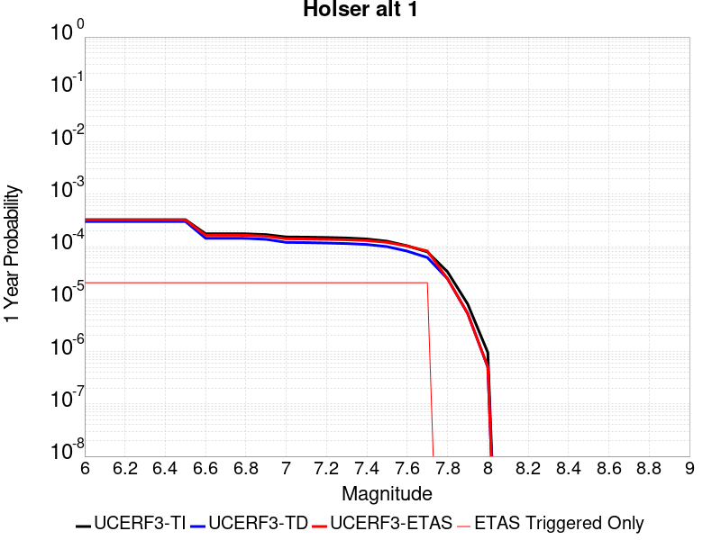 | 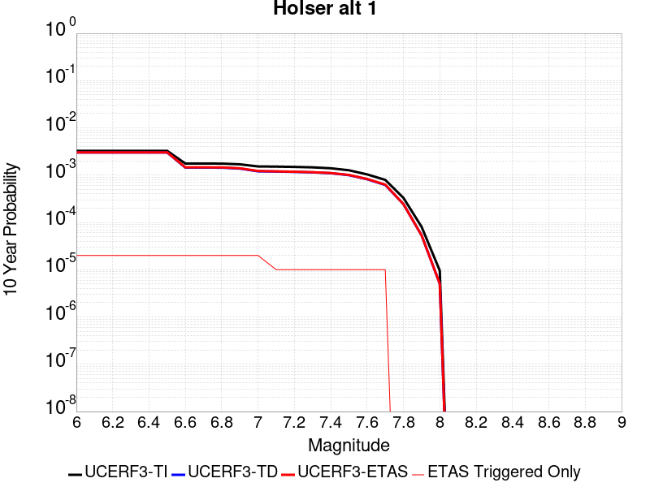 |

| Magnitude | 1 wk TI Prob | 1 wk TD Prob | 1 wk ETAS Prob | 1 wk ETAS/TD Gain | 1 wk ETAS Triggered Only | 1 mo TI Prob | 1 mo TD Prob | 1 mo ETAS Prob | 1 mo ETAS/TD Gain | 1 mo ETAS Triggered Only | 1 yr TI Prob | 1 yr TD Prob | 1 yr ETAS Prob | 1 yr ETAS/TD Gain | 1 yr ETAS Triggered Only | 10 yr TI Prob | 10 yr TD Prob | 10 yr ETAS Prob | 10 yr ETAS/TD Gain | 10 yr ETAS Triggered Only |
|-----|-----|-----|-----|-----|-----|-----|-----|-----|-----|-----|-----|-----|-----|-----|-----|-----|-----|-----|-----|-----|
| 6.0 | 6.2746653E-6 | 5.790017E-6 | 2.5789901E-5 | 4.454201 | 2.0E-5 | 2.6891146E-5 | 2.4814188E-5 | 4.4813693E-5 | 1.8059705 | 2.0E-5 | 3.273505E-4 | 3.020824E-4 | 3.2207635E-4 | 1.0661871 | 2.0E-5 | 0.0032686873 | 0.0030178505 | 0.00303779 | 1.0066072 | 2.0E-5 |
| 6.1 | 6.2746653E-6 | 5.790017E-6 | 2.5789901E-5 | 4.454201 | 2.0E-5 | 2.6891146E-5 | 2.4814188E-5 | 4.4813693E-5 | 1.8059705 | 2.0E-5 | 3.273505E-4 | 3.020824E-4 | 3.2207635E-4 | 1.0661871 | 2.0E-5 | 0.0032686873 | 0.0030178505 | 0.00303779 | 1.0066072 | 2.0E-5 |
| 6.2 | 6.2746653E-6 | 5.790017E-6 | 2.5789901E-5 | 4.454201 | 2.0E-5 | 2.6891146E-5 | 2.4814188E-5 | 4.4813693E-5 | 1.8059705 | 2.0E-5 | 3.273505E-4 | 3.020824E-4 | 3.2207635E-4 | 1.0661871 | 2.0E-5 | 0.0032686873 | 0.0030178505 | 0.00303779 | 1.0066072 | 2.0E-5 |
| 6.3 | 6.2746653E-6 | 5.790017E-6 | 2.5789901E-5 | 4.454201 | 2.0E-5 | 2.6891146E-5 | 2.4814188E-5 | 4.4813693E-5 | 1.8059705 | 2.0E-5 | 3.273505E-4 | 3.020824E-4 | 3.2207635E-4 | 1.0661871 | 2.0E-5 | 0.0032686873 | 0.0030178505 | 0.00303779 | 1.0066072 | 2.0E-5 |
| 6.4 | 6.2746653E-6 | 5.790017E-6 | 2.5789901E-5 | 4.454201 | 2.0E-5 | 2.6891146E-5 | 2.4814188E-5 | 4.4813693E-5 | 1.8059705 | 2.0E-5 | 3.273505E-4 | 3.020824E-4 | 3.2207635E-4 | 1.0661871 | 2.0E-5 | 0.0032686873 | 0.0030178505 | 0.00303779 | 1.0066072 | 2.0E-5 |
| 6.5 | 6.2746653E-6 | 5.790017E-6 | 2.5789901E-5 | 4.454201 | 2.0E-5 | 2.6891146E-5 | 2.4814188E-5 | 4.4813693E-5 | 1.8059705 | 2.0E-5 | 3.273505E-4 | 3.020824E-4 | 3.2207635E-4 | 1.0661871 | 2.0E-5 | 0.0032686873 | 0.0030178505 | 0.00303779 | 1.0066072 | 2.0E-5 |
| 6.6 | 3.375825E-6 | 2.7712251E-6 | 2.277117E-5 | 8.217005 | 2.0E-5 | 1.4467741E-5 | 1.1876626E-5 | 3.187639E-5 | 2.68396 | 2.0E-5 | 1.761305E-4 | 1.4458848E-4 | 1.645856E-4 | 1.1383036 | 2.0E-5 | 0.0017599097 | 0.0014449612 | 0.0014649322 | 1.0138212 | 2.0E-5 |
| 6.7 | 3.375825E-6 | 2.7712251E-6 | 2.277117E-5 | 8.217005 | 2.0E-5 | 1.4467741E-5 | 1.1876626E-5 | 3.187639E-5 | 2.68396 | 2.0E-5 | 1.761305E-4 | 1.4458848E-4 | 1.645856E-4 | 1.1383036 | 2.0E-5 | 0.0017599097 | 0.0014449612 | 0.0014649322 | 1.0138212 | 2.0E-5 |
| 6.8 | 3.366533E-6 | 2.7616245E-6 | 2.276157E-5 | 8.242094 | 2.0E-5 | 1.4427919E-5 | 1.1835481E-5 | 3.1835243E-5 | 2.689814 | 2.0E-5 | 1.7564575E-4 | 1.4408762E-4 | 1.6408473E-4 | 1.1387844 | 2.0E-5 | 0.0017550698 | 0.0014399589 | 0.0014599301 | 1.0138693 | 2.0E-5 |
| 6.9 | 3.253174E-6 | 2.643846E-6 | 2.2643793E-5 | 8.564717 | 2.0E-5 | 1.39421E-5 | 1.1330721E-5 | 3.1330495E-5 | 2.7650928 | 2.0E-5 | 1.6973184E-4 | 1.3794295E-4 | 1.5794019E-4 | 1.1449674 | 2.0E-5 | 0.0016960226 | 0.0013785891 | 0.0013985615 | 1.0144876 | 2.0E-5 |
| 7.0 | 2.9336593E-6 | 2.311832E-6 | 2.2311786E-5 | 9.651127 | 2.0E-5 | 1.2572766E-5 | 9.907814E-6 | 2.9907616E-5 | 3.0185888 | 2.0E-5 | 1.5306266E-4 | 1.20620985E-4 | 1.4061858E-4 | 1.1657887 | 2.0E-5 | 0.0015295728 | 0.0012055576 | 0.0012255335 | 1.0165699 | 2.0E-5 |
| 7.1 | 2.9087812E-6 | 2.287684E-6 | 1.2287661E-5 | 5.371223 | 1.0E-5 | 1.2466146E-5 | 9.804324E-6 | 1.9804225E-5 | 2.0199482 | 1.0E-5 | 1.5176475E-4 | 1.19361124E-4 | 1.2935993E-4 | 1.0837693 | 1.0E-5 | 0.0015166114 | 0.0011929726 | 0.0012029607 | 1.0083724 | 1.0E-5 |
| 7.2 | 2.8674524E-6 | 2.247575E-6 | 1.2247552E-5 | 5.4492297 | 1.0E-5 | 1.2289024E-5 | 9.632428E-6 | 1.9632333E-5 | 2.0381498 | 1.0E-5 | 1.4960859E-4 | 1.1726853E-4 | 1.2726735E-4 | 1.0852643 | 1.0E-5 | 0.0014950791 | 0.0011720689 | 0.0011820571 | 1.0085219 | 1.0E-5 |
| 7.3 | 2.8057775E-6 | 2.1954638E-6 | 1.2195442E-5 | 5.554836 | 1.0E-5 | 1.2024705E-5 | 9.409097E-6 | 1.9409003E-5 | 2.0627913 | 1.0E-5 | 1.4639096E-4 | 1.1454976E-4 | 1.245486E-4 | 1.0872883 | 1.0E-5 | 0.0014629456 | 0.0011449094 | 0.001154898 | 1.0087243 | 1.0E-5 |
| 7.4 | 2.683666E-6 | 2.10926E-6 | 1.2109239E-5 | 5.740989 | 1.0E-5 | 1.1501375E-5 | 9.039655E-6 | 1.9039564E-5 | 2.106227 | 1.0E-5 | 1.4002025E-4 | 1.1005226E-4 | 1.2005116E-4 | 1.090856 | 1.0E-5 | 0.0013993206 | 0.0010999797 | 0.0011099688 | 1.0090811 | 1.0E-5 |
| 7.5 | 2.434495E-6 | 1.9195622E-6 | 1.1919543E-5 | 6.2095113 | 1.0E-5 | 1.0433508E-5 | 8.22667E-6 | 1.8226587E-5 | 2.2155488 | 1.0E-5 | 1.2702055E-4 | 1.0015511E-4 | 1.1015411E-4 | 1.0998352 | 1.0E-5 | 0.0012694797 | 0.0010011018 | 0.0010110918 | 1.009979 | 1.0E-5 |
| 7.6 | 1.9914562E-6 | 1.5731666E-6 | 1.1573151E-5 | 7.3565955 | 1.0E-5 | 8.534785E-6 | 6.7421256E-6 | 1.6742059E-5 | 2.4832017 | 1.0E-5 | 1.03906044E-4 | 8.20823E-5 | 9.208148E-5 | 1.1218189 | 1.0E-5 | 0.0010385747 | 8.205214E-4 | 8.305132E-4 | 1.0121773 | 1.0E-5 |
| 7.7 | 1.5229501E-6 | 1.1896215E-6 | 1.118961E-5 | 9.406026 | 1.0E-5 | 6.526913E-6 | 5.0983676E-6 | 1.5098317E-5 | 2.9614022 | 1.0E-5 | 7.946226E-5 | 6.207087E-5 | 7.207025E-5 | 1.1610962 | 1.0E-5 | 7.943385E-4 | 6.205366E-4 | 6.305304E-4 | 1.016105 | 1.0E-5 |
| 7.8 | 6.3489426E-7 | 4.6878762E-7 | 4.6878762E-7 | 1.0 | 0.0 | 2.7209726E-6 | 2.0090881E-6 | 2.0090881E-6 | 1.0 | 0.0 | 3.312734E-5 | 2.4460376E-5 | 2.4460376E-5 | 1.0 | 0.0 | 3.31224E-4 | 2.44577E-4 | 2.44577E-4 | 1.0 | 0.0 |
| 7.9 | 1.5459432E-7 | 1.0194E-7 | 1.0194E-7 | 1.0 | 0.0 | 6.6254694E-7 | 4.3688564E-7 | 4.3688564E-7 | 1.0 | 0.0 | 8.066479E-6 | 5.31907E-6 | 5.31907E-6 | 1.0 | 0.0 | 8.066186E-5 | 5.3189444E-5 | 5.3189444E-5 | 1.0 | 0.0 |
| 8.0 | 1.8307812E-8 | 9.69079E-9 | 9.69079E-9 | 1.0 | 0.0 | 7.846205E-8 | 4.1531962E-8 | 4.1531962E-8 | 1.0 | 0.0 | 9.55275E-7 | 5.056515E-7 | 5.056515E-7 | 1.0 | 0.0 | 9.552709E-6 | 5.056504E-6 | 5.056504E-6 | 1.0 | 0.0 |

## Sierra Madre (San Fernando)
*[(top)](#table-of-contents)*

| 1 Week | 1 Month | 1 Year | 10 Year |
|-----|-----|-----|-----|
| 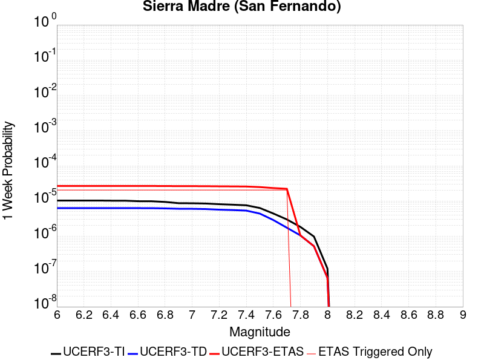 | 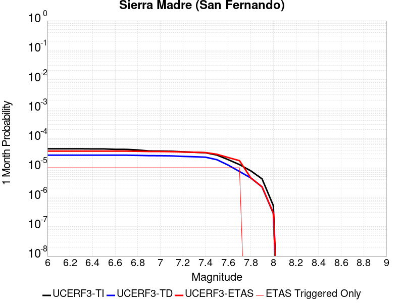 |  | 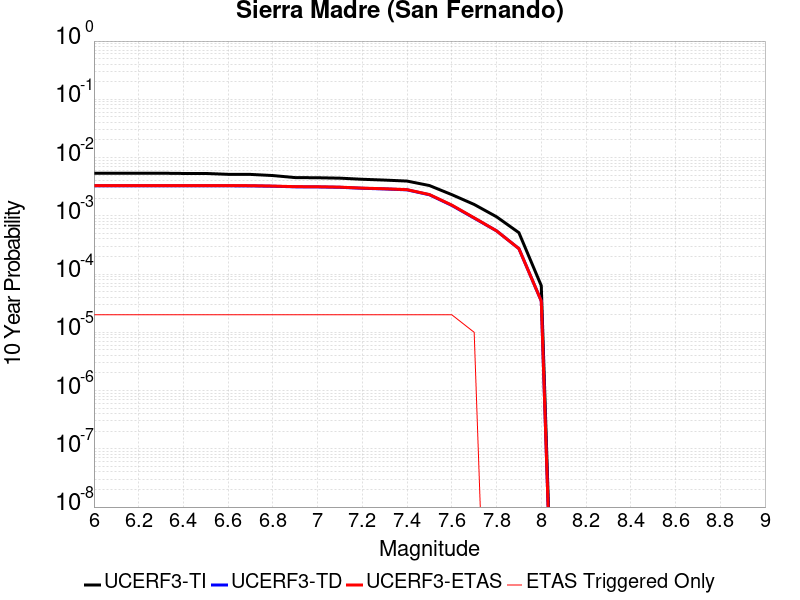 |

| Magnitude | 1 wk TI Prob | 1 wk TD Prob | 1 wk ETAS Prob | 1 wk ETAS/TD Gain | 1 wk ETAS Triggered Only | 1 mo TI Prob | 1 mo TD Prob | 1 mo ETAS Prob | 1 mo ETAS/TD Gain | 1 mo ETAS Triggered Only | 1 yr TI Prob | 1 yr TD Prob | 1 yr ETAS Prob | 1 yr ETAS/TD Gain | 1 yr ETAS Triggered Only | 10 yr TI Prob | 10 yr TD Prob | 10 yr ETAS Prob | 10 yr ETAS/TD Gain | 10 yr ETAS Triggered Only |
|-----|-----|-----|-----|-----|-----|-----|-----|-----|-----|-----|-----|-----|-----|-----|-----|-----|-----|-----|-----|-----|
| 6.0 | 1.0346413E-5 | 6.287434E-6 | 1.6287371E-5 | 2.5904639 | 1.0E-5 | 4.4341014E-5 | 2.6945874E-5 | 3.6945607E-5 | 1.3711044 | 1.0E-5 | 5.3971814E-4 | 3.2801775E-4 | 3.4801118E-4 | 1.0609523 | 2.0E-5 | 0.0053840918 | 0.0032754485 | 0.003295383 | 1.006086 | 2.0E-5 |
| 6.1 | 1.0346413E-5 | 6.287434E-6 | 1.6287371E-5 | 2.5904639 | 1.0E-5 | 4.4341014E-5 | 2.6945874E-5 | 3.6945607E-5 | 1.3711044 | 1.0E-5 | 5.3971814E-4 | 3.2801775E-4 | 3.4801118E-4 | 1.0609523 | 2.0E-5 | 0.0053840918 | 0.0032754485 | 0.003295383 | 1.006086 | 2.0E-5 |
| 6.2 | 1.0346413E-5 | 6.287434E-6 | 1.6287371E-5 | 2.5904639 | 1.0E-5 | 4.4341014E-5 | 2.6945874E-5 | 3.6945607E-5 | 1.3711044 | 1.0E-5 | 5.3971814E-4 | 3.2801775E-4 | 3.4801118E-4 | 1.0609523 | 2.0E-5 | 0.0053840918 | 0.0032754485 | 0.003295383 | 1.006086 | 2.0E-5 |
| 6.3 | 1.0346413E-5 | 6.287434E-6 | 1.6287371E-5 | 2.5904639 | 1.0E-5 | 4.4341014E-5 | 2.6945874E-5 | 3.6945607E-5 | 1.3711044 | 1.0E-5 | 5.3971814E-4 | 3.2801775E-4 | 3.4801118E-4 | 1.0609523 | 2.0E-5 | 0.0053840918 | 0.0032754485 | 0.003295383 | 1.006086 | 2.0E-5 |
| 6.4 | 1.0249558E-5 | 6.287434E-6 | 1.6287371E-5 | 2.5904639 | 1.0E-5 | 4.392594E-5 | 2.6945874E-5 | 3.6945607E-5 | 1.3711044 | 1.0E-5 | 5.3466705E-4 | 3.2801775E-4 | 3.4801118E-4 | 1.0609523 | 2.0E-5 | 0.0053338245 | 0.0032754485 | 0.003295383 | 1.006086 | 2.0E-5 |
| 6.5 | 1.0249558E-5 | 6.287434E-6 | 1.6287371E-5 | 2.5904639 | 1.0E-5 | 4.392594E-5 | 2.6945874E-5 | 3.6945607E-5 | 1.3711044 | 1.0E-5 | 5.3466705E-4 | 3.2801775E-4 | 3.4801118E-4 | 1.0609523 | 2.0E-5 | 0.0053338245 | 0.0032754485 | 0.003295383 | 1.006086 | 2.0E-5 |
| 6.6 | 9.9035515E-6 | 6.287434E-6 | 1.6287371E-5 | 2.5904639 | 1.0E-5 | 4.2443102E-5 | 2.6945874E-5 | 3.6945607E-5 | 1.3711044 | 1.0E-5 | 5.166222E-4 | 3.2801775E-4 | 3.4801118E-4 | 1.0609523 | 2.0E-5 | 0.0051542283 | 0.0032754485 | 0.003295383 | 1.006086 | 2.0E-5 |
| 6.7 | 9.87217E-6 | 6.274855E-6 | 1.6274793E-5 | 2.5936525 | 1.0E-5 | 4.2308613E-5 | 2.6891963E-5 | 3.6891695E-5 | 1.3718483 | 1.0E-5 | 5.149856E-4 | 3.2736157E-4 | 3.4735503E-4 | 1.0610745 | 2.0E-5 | 0.005137938 | 0.003268906 | 0.0032888406 | 1.0060983 | 2.0E-5 |
| 6.8 | 9.4359175E-6 | 6.1788287E-6 | 1.6178767E-5 | 2.6184196 | 1.0E-5 | 4.043902E-5 | 2.6480431E-5 | 3.6480167E-5 | 1.3776274 | 1.0E-5 | 4.9223384E-4 | 3.2235266E-4 | 3.423462E-4 | 1.0620239 | 2.0E-5 | 0.0049114493 | 0.0032189623 | 0.003238898 | 1.0061932 | 2.0E-5 |
| 6.9 | 8.700447E-6 | 6.0400866E-6 | 1.6040027E-5 | 2.6555953 | 1.0E-5 | 3.72871E-5 | 2.5885834E-5 | 3.5885576E-5 | 1.3863016 | 1.0E-5 | 4.5387587E-4 | 3.1511553E-4 | 3.3510925E-4 | 1.0634488 | 2.0E-5 | 0.0045295 | 0.0031467967 | 0.0031667338 | 1.0063356 | 2.0E-5 |
| 7.0 | 8.648878E-6 | 6.0150014E-6 | 1.6014941E-5 | 2.6625 | 1.0E-5 | 3.7066096E-5 | 2.5778329E-5 | 3.577807E-5 | 1.3879128 | 1.0E-5 | 4.5118626E-4 | 3.1380705E-4 | 3.3380077E-4 | 1.0637134 | 2.0E-5 | 0.004502713 | 0.0031337484 | 0.003153686 | 1.0063621 | 2.0E-5 |
| 7.1 | 8.505786E-6 | 5.924631E-6 | 1.5924572E-5 | 2.6878588 | 1.0E-5 | 3.645286E-5 | 2.5391035E-5 | 3.539078E-5 | 1.3938298 | 1.0E-5 | 4.437232E-4 | 3.0909307E-4 | 3.2908688E-4 | 1.0646855 | 2.0E-5 | 0.0044283825 | 0.0030867406 | 0.0031066788 | 1.0064594 | 2.0E-5 |
| 7.2 | 8.139752E-6 | 5.6989234E-6 | 1.5698866E-5 | 2.7547073 | 1.0E-5 | 3.4884186E-5 | 2.4423734E-5 | 3.442349E-5 | 1.4094278 | 1.0E-5 | 4.246322E-4 | 2.9731944E-4 | 3.1731348E-4 | 1.0672477 | 2.0E-5 | 0.004238217 | 0.0029693225 | 0.0029892633 | 1.0067155 | 2.0E-5 |
| 7.3 | 7.8816E-6 | 5.552236E-6 | 1.5552181E-5 | 2.8010662 | 1.0E-5 | 3.3777847E-5 | 2.3795086E-5 | 3.3794848E-5 | 1.4202448 | 1.0E-5 | 4.111677E-4 | 2.8966772E-4 | 3.096619E-4 | 1.0690247 | 2.0E-5 | 0.004104078 | 0.002893007 | 0.002912949 | 1.0068933 | 2.0E-5 |
| 7.4 | 7.5810603E-6 | 5.35647E-6 | 1.5356416E-5 | 2.8668911 | 1.0E-5 | 3.2489854E-5 | 2.2956105E-5 | 3.2955875E-5 | 1.435604 | 1.0E-5 | 3.9549218E-4 | 2.7945577E-4 | 2.9945018E-4 | 1.0715476 | 2.0E-5 | 0.0039478904 | 0.0027911486 | 0.0028110929 | 1.0071455 | 2.0E-5 |
| 7.5 | 6.349153E-6 | 4.4077274E-6 | 1.4407684E-5 | 3.2687328 | 1.0E-5 | 2.7210372E-5 | 1.8890129E-5 | 2.8889941E-5 | 1.529367 | 1.0E-5 | 3.312359E-4 | 2.2996387E-4 | 2.4995927E-4 | 1.0869502 | 2.0E-5 | 0.0033074263 | 0.0022973411 | 0.0023172952 | 1.0086857 | 2.0E-5 |
| 7.6 | 4.430576E-6 | 2.8907298E-6 | 1.2890701E-5 | 4.459324 | 1.0E-5 | 1.8988047E-5 | 1.2388785E-5 | 2.238866E-5 | 1.8071717 | 1.0E-5 | 2.3115493E-4 | 1.5082324E-4 | 1.7082022E-4 | 1.1325855 | 2.0E-5 | 0.0023091463 | 0.0015072313 | 0.0015272012 | 1.0132494 | 2.0E-5 |
| 7.7 | 3.005066E-6 | 1.7511459E-6 | 1.1751128E-5 | 6.7105365 | 1.0E-5 | 1.2878791E-5 | 7.5048893E-6 | 1.7504814E-5 | 2.3324547 | 1.0E-5 | 1.56788E-4 | 9.13682E-5 | 1.0136729E-4 | 1.1094372 | 1.0E-5 | 0.0015667742 | 9.1330754E-4 | 9.232984E-4 | 1.0109392 | 1.0E-5 |
| 7.8 | 1.8459098E-6 | 1.0583101E-6 | 1.0583101E-6 | 1.0 | 0.0 | 7.911018E-6 | 4.535607E-6 | 4.535607E-6 | 1.0 | 0.0 | 9.631238E-5 | 5.5219618E-5 | 5.5219618E-5 | 1.0 | 0.0 | 9.627065E-4 | 5.5205944E-4 | 5.5205944E-4 | 1.0 | 0.0 |
| 7.9 | 9.839262E-7 | 5.234948E-7 | 5.234948E-7 | 1.0 | 0.0 | 4.2168194E-6 | 2.2435472E-6 | 2.2435472E-6 | 1.0 | 0.0 | 5.1338568E-5 | 2.7314849E-5 | 2.7314849E-5 | 1.0 | 0.0 | 5.132671E-4 | 2.731152E-4 | 2.731152E-4 | 1.0 | 0.0 |
| 8.0 | 1.210983E-7 | 6.6141716E-8 | 6.6141716E-8 | 1.0 | 0.0 | 5.1899264E-7 | 2.8346446E-7 | 2.8346446E-7 | 1.0 | 0.0 | 6.3187167E-6 | 3.4511747E-6 | 3.4511747E-6 | 1.0 | 0.0 | 6.318537E-5 | 3.4511228E-5 | 3.4511228E-5 | 1.0 | 0.0 |

## Santa Cruz Catalina Ridge alt1
*[(top)](#table-of-contents)*

| 1 Week | 1 Month | 1 Year | 10 Year |
|-----|-----|-----|-----|
| 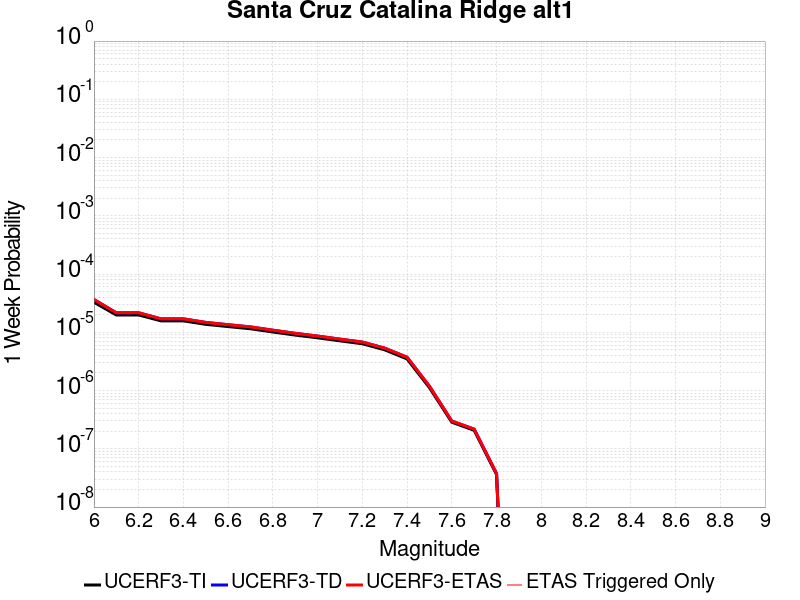 |  | 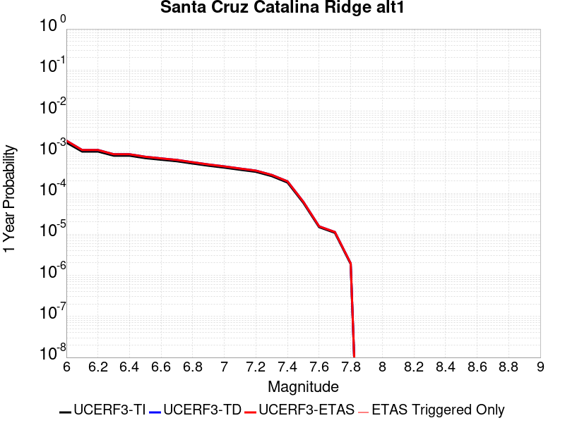 | 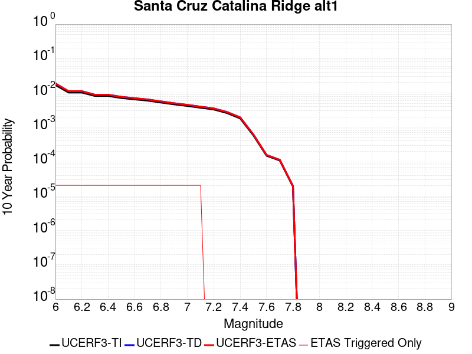 |

| Magnitude | 1 wk TI Prob | 1 wk TD Prob | 1 wk ETAS Prob | 1 wk ETAS/TD Gain | 1 wk ETAS Triggered Only | 1 mo TI Prob | 1 mo TD Prob | 1 mo ETAS Prob | 1 mo ETAS/TD Gain | 1 mo ETAS Triggered Only | 1 yr TI Prob | 1 yr TD Prob | 1 yr ETAS Prob | 1 yr ETAS/TD Gain | 1 yr ETAS Triggered Only | 10 yr TI Prob | 10 yr TD Prob | 10 yr ETAS Prob | 10 yr ETAS/TD Gain | 10 yr ETAS Triggered Only |
|-----|-----|-----|-----|-----|-----|-----|-----|-----|-----|-----|-----|-----|-----|-----|-----|-----|-----|-----|-----|-----|
| 6.0 | 3.2833184E-5 | 3.655896E-5 | 3.655896E-5 | 1.0 | 0.0 | 1.4070606E-4 | 1.5667277E-4 | 1.5667277E-4 | 1.0 | 0.0 | 0.00171175 | 0.0019059887 | 0.0019059887 | 1.0 | 0.0 | 0.016986247 | 0.018913316 | 0.018932939 | 1.0010375 | 2.0E-5 |
| 6.1 | 1.9835548E-5 | 2.1659771E-5 | 2.1659771E-5 | 1.0 | 0.0 | 8.500672E-5 | 9.2824404E-5 | 9.2824404E-5 | 1.0 | 0.0 | 0.0010344655 | 0.0011295713 | 0.0011295713 | 1.0 | 0.0 | 0.010296632 | 0.011240433 | 0.011250321 | 1.0008796 | 1.0E-5 |
| 6.2 | 1.9835548E-5 | 2.1659771E-5 | 2.1659771E-5 | 1.0 | 0.0 | 8.500672E-5 | 9.2824404E-5 | 9.2824404E-5 | 1.0 | 0.0 | 0.0010344655 | 0.0011295713 | 0.0011295713 | 1.0 | 0.0 | 0.010296632 | 0.011240433 | 0.011250321 | 1.0008796 | 1.0E-5 |
| 6.3 | 1.5728183E-5 | 1.7034137E-5 | 1.7034137E-5 | 1.0 | 0.0 | 6.7404755E-5 | 7.3001436E-5 | 7.3001436E-5 | 1.0 | 0.0 | 8.2034385E-4 | 8.884362E-4 | 8.884362E-4 | 1.0 | 0.0 | 0.008173222 | 0.008849524 | 0.008859436 | 1.00112 | 1.0E-5 |
| 6.4 | 1.5728183E-5 | 1.7034137E-5 | 1.7034137E-5 | 1.0 | 0.0 | 6.7404755E-5 | 7.3001436E-5 | 7.3001436E-5 | 1.0 | 0.0 | 8.2034385E-4 | 8.884362E-4 | 8.884362E-4 | 1.0 | 0.0 | 0.008173222 | 0.008849524 | 0.008859436 | 1.00112 | 1.0E-5 |
| 6.5 | 1.3707734E-5 | 1.4794678E-5 | 1.4794678E-5 | 1.0 | 0.0 | 5.8746107E-5 | 6.3404244E-5 | 6.3404244E-5 | 1.0 | 0.0 | 7.1499916E-4 | 7.716768E-4 | 7.716768E-4 | 1.0 | 0.0 | 0.0071270303 | 0.0076903705 | 0.007700294 | 1.0012903 | 1.0E-5 |
| 6.6 | 1.2539813E-5 | 1.3510358E-5 | 1.3510358E-5 | 1.0 | 0.0 | 5.3740947E-5 | 5.7900266E-5 | 5.7900266E-5 | 1.0 | 0.0 | 6.540996E-4 | 7.0471043E-4 | 7.0471043E-4 | 1.0 | 0.0 | 0.0065217763 | 0.0070250607 | 0.0070349905 | 1.0014135 | 1.0E-5 |
| 6.7 | 1.1504083E-5 | 1.23775E-5 | 1.23775E-5 | 1.0 | 0.0 | 4.930228E-5 | 5.304536E-5 | 5.304536E-5 | 1.0 | 0.0 | 6.0008996E-4 | 6.456379E-4 | 6.456379E-4 | 1.0 | 0.0 | 0.005984721 | 0.0064378507 | 0.0064477865 | 1.0015433 | 1.0E-5 |
| 6.8 | 1.012739E-5 | 1.0877178E-5 | 1.0877178E-5 | 1.0 | 0.0 | 4.340238E-5 | 4.6615653E-5 | 4.6615653E-5 | 1.0 | 0.0 | 5.282958E-4 | 5.673993E-4 | 5.673993E-4 | 1.0 | 0.0 | 0.0052704164 | 0.005659675 | 0.0056696185 | 1.0017569 | 1.0E-5 |
| 6.9 | 8.9607865E-6 | 9.60921E-6 | 9.60921E-6 | 1.0 | 0.0 | 3.8402806E-5 | 4.1181684E-5 | 4.1181684E-5 | 1.0 | 0.0 | 4.6745385E-4 | 5.0127273E-4 | 5.0127273E-4 | 1.0 | 0.0 | 0.0046647177 | 0.00500154 | 0.0050114896 | 1.0019894 | 1.0E-5 |
| 7.0 | 8.046829E-6 | 8.619827E-6 | 8.619827E-6 | 1.0 | 0.0 | 3.4485955E-5 | 3.6941598E-5 | 3.6941598E-5 | 1.0 | 0.0 | 4.1978562E-4 | 4.4967196E-4 | 4.4967196E-4 | 1.0 | 0.0 | 0.004189935 | 0.004487711 | 0.0044976664 | 1.0022184 | 1.0E-5 |
| 7.1 | 7.136131E-6 | 7.637727E-6 | 7.637727E-6 | 1.0 | 0.0 | 3.0583058E-5 | 3.273271E-5 | 3.273271E-5 | 1.0 | 0.0 | 3.7228514E-4 | 3.9844858E-4 | 3.9844858E-4 | 1.0 | 0.0 | 0.0037166206 | 0.0039774184 | 0.0039873784 | 1.0025042 | 1.0E-5 |
| 7.2 | 6.362014E-6 | 6.8050217E-6 | 6.8050217E-6 | 1.0 | 0.0 | 2.726549E-5 | 2.9164055E-5 | 2.9164055E-5 | 1.0 | 0.0 | 3.3190678E-4 | 3.5501516E-4 | 3.5501516E-4 | 1.0 | 0.0 | 0.0033141149 | 0.0035445488 | 0.0035445488 | 1.0 | 0.0 |
| 7.3 | 5.004101E-6 | 5.3517642E-6 | 5.3517642E-6 | 1.0 | 0.0 | 2.1445969E-5 | 2.2935934E-5 | 2.2935934E-5 | 1.0 | 0.0 | 2.6107338E-4 | 2.7920975E-4 | 2.7920975E-4 | 1.0 | 0.0 | 0.002607669 | 0.0027886443 | 0.0027886443 | 1.0 | 0.0 |
| 7.4 | 3.4901443E-6 | 3.732087E-6 | 3.732087E-6 | 1.0 | 0.0 | 1.4957676E-5 | 1.5994563E-5 | 1.5994563E-5 | 1.0 | 0.0 | 1.8209449E-4 | 1.9471678E-4 | 1.9471678E-4 | 1.0 | 0.0 | 0.0018194534 | 0.0019455003 | 0.0019455003 | 1.0 | 0.0 |
| 7.5 | 1.1215045E-6 | 1.1893966E-6 | 1.1893966E-6 | 1.0 | 0.0 | 4.806439E-6 | 5.0974045E-6 | 5.0974045E-6 | 1.0 | 0.0 | 5.851682E-5 | 6.205916E-5 | 6.205916E-5 | 1.0 | 0.0 | 5.850142E-4 | 6.204214E-4 | 6.204214E-4 | 1.0 | 0.0 |
| 7.6 | 2.8599047E-7 | 2.9952182E-7 | 2.9952182E-7 | 1.0 | 0.0 | 1.2256729E-6 | 1.2836642E-6 | 1.2836642E-6 | 1.0 | 0.0 | 1.4922465E-5 | 1.5628502E-5 | 1.5628502E-5 | 1.0 | 0.0 | 1.4921463E-4 | 1.5627417E-4 | 1.5627417E-4 | 1.0 | 0.0 |
| 7.7 | 2.0781519E-7 | 2.1744457E-7 | 2.1744457E-7 | 1.0 | 0.0 | 8.906362E-7 | 9.3190494E-7 | 9.3190494E-7 | 1.0 | 0.0 | 1.08434415E-5 | 1.1345885E-5 | 1.1345885E-5 | 1.0 | 0.0 | 1.0842913E-4 | 1.1345315E-4 | 1.1345315E-4 | 1.0 | 0.0 |
| 7.8 | 3.614776E-8 | 3.7641225E-8 | 3.7641225E-8 | 1.0 | 0.0 | 1.5491896E-7 | 1.6131952E-7 | 1.6131952E-7 | 1.0 | 0.0 | 1.8861368E-6 | 1.9640636E-6 | 1.9640636E-6 | 1.0 | 0.0 | 1.8861208E-5 | 1.9640474E-5 | 1.9640474E-5 | 1.0 | 0.0 |

## Los Osos 2011
*[(top)](#table-of-contents)*

| 1 Week | 1 Month | 1 Year | 10 Year |
|-----|-----|-----|-----|
| 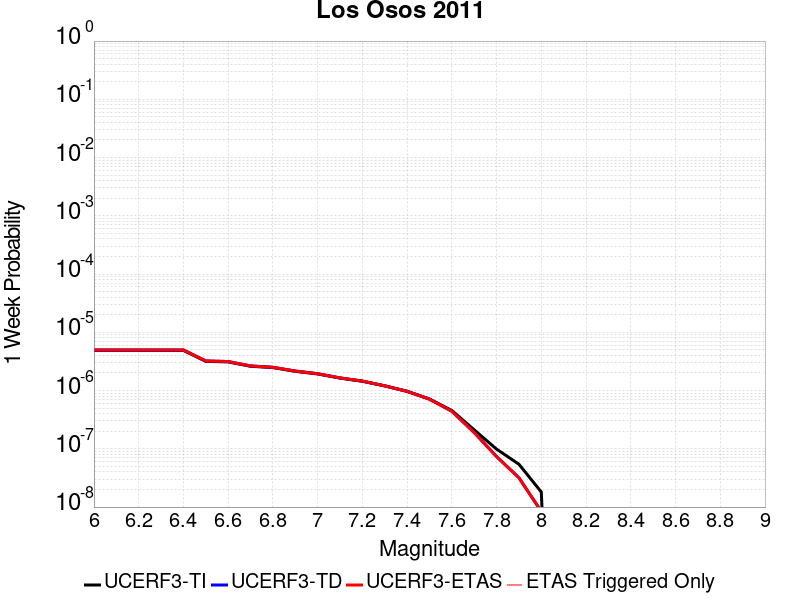 | 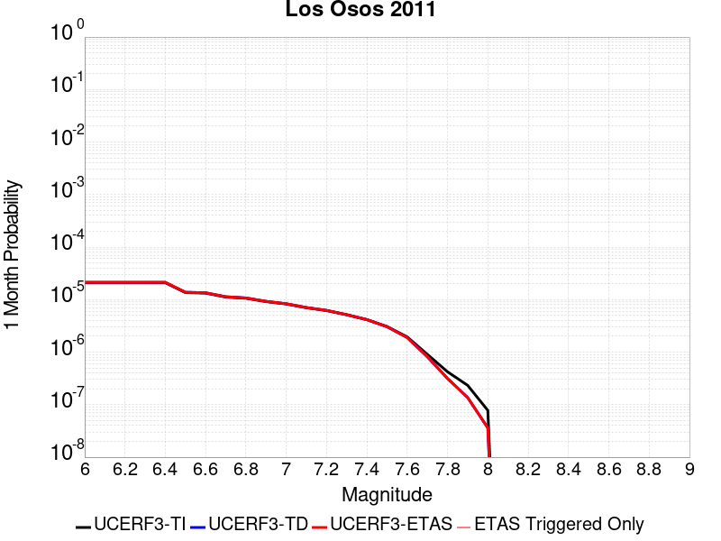 | 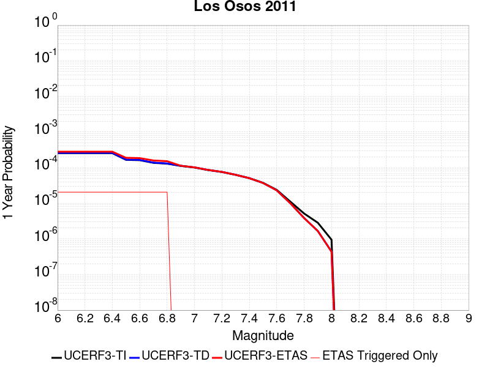 | 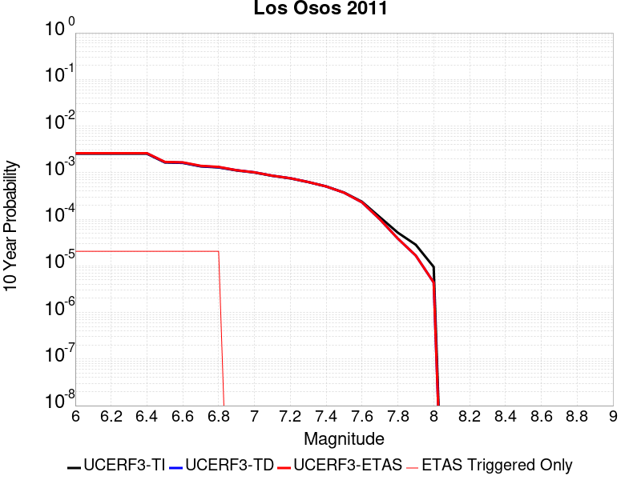 |

| Magnitude | 1 wk TI Prob | 1 wk TD Prob | 1 wk ETAS Prob | 1 wk ETAS/TD Gain | 1 wk ETAS Triggered Only | 1 mo TI Prob | 1 mo TD Prob | 1 mo ETAS Prob | 1 mo ETAS/TD Gain | 1 mo ETAS Triggered Only | 1 yr TI Prob | 1 yr TD Prob | 1 yr ETAS Prob | 1 yr ETAS/TD Gain | 1 yr ETAS Triggered Only | 10 yr TI Prob | 10 yr TD Prob | 10 yr ETAS Prob | 10 yr ETAS/TD Gain | 10 yr ETAS Triggered Only |
|-----|-----|-----|-----|-----|-----|-----|-----|-----|-----|-----|-----|-----|-----|-----|-----|-----|-----|-----|-----|-----|
| 6.0 | 4.8871775E-6 | 4.9815035E-6 | 4.9815035E-6 | 1.0 | 0.0 | 2.0944879E-5 | 2.1349142E-5 | 2.1349142E-5 | 1.0 | 0.0 | 2.5497406E-4 | 2.5989758E-4 | 2.6989498E-4 | 1.0384667 | 1.0E-5 | 0.002546817 | 0.002596211 | 0.002606185 | 1.0038418 | 1.0E-5 |
| 6.1 | 4.8871775E-6 | 4.9815035E-6 | 4.9815035E-6 | 1.0 | 0.0 | 2.0944879E-5 | 2.1349142E-5 | 2.1349142E-5 | 1.0 | 0.0 | 2.5497406E-4 | 2.5989758E-4 | 2.6989498E-4 | 1.0384667 | 1.0E-5 | 0.002546817 | 0.002596211 | 0.002606185 | 1.0038418 | 1.0E-5 |
| 6.2 | 4.8871775E-6 | 4.9815035E-6 | 4.9815035E-6 | 1.0 | 0.0 | 2.0944879E-5 | 2.1349142E-5 | 2.1349142E-5 | 1.0 | 0.0 | 2.5497406E-4 | 2.5989758E-4 | 2.6989498E-4 | 1.0384667 | 1.0E-5 | 0.002546817 | 0.002596211 | 0.002606185 | 1.0038418 | 1.0E-5 |
| 6.3 | 4.8871775E-6 | 4.9815035E-6 | 4.9815035E-6 | 1.0 | 0.0 | 2.0944879E-5 | 2.1349142E-5 | 2.1349142E-5 | 1.0 | 0.0 | 2.5497406E-4 | 2.5989758E-4 | 2.6989498E-4 | 1.0384667 | 1.0E-5 | 0.002546817 | 0.002596211 | 0.002606185 | 1.0038418 | 1.0E-5 |
| 6.4 | 4.8871775E-6 | 4.9815035E-6 | 4.9815035E-6 | 1.0 | 0.0 | 2.0944879E-5 | 2.1349142E-5 | 2.1349142E-5 | 1.0 | 0.0 | 2.5497406E-4 | 2.5989758E-4 | 2.6989498E-4 | 1.0384667 | 1.0E-5 | 0.002546817 | 0.002596211 | 0.002606185 | 1.0038418 | 1.0E-5 |
| 6.5 | 3.1724062E-6 | 3.2234093E-6 | 3.2234093E-6 | 1.0 | 0.0 | 1.3595956E-5 | 1.3814539E-5 | 1.3814539E-5 | 1.0 | 0.0 | 1.6551818E-4 | 1.6817916E-4 | 1.7817748E-4 | 1.0594504 | 1.0E-5 | 0.0016539496 | 0.0016805324 | 0.0016905155 | 1.0059404 | 1.0E-5 |
| 6.6 | 3.1022591E-6 | 3.1511186E-6 | 3.1511186E-6 | 1.0 | 0.0 | 1.3295328E-5 | 1.3504725E-5 | 1.3504725E-5 | 1.0 | 0.0 | 1.618586E-4 | 1.6440774E-4 | 1.744061E-4 | 1.0608144 | 1.0E-5 | 0.0016174077 | 0.001642874 | 0.0016528575 | 1.0060769 | 1.0E-5 |
| 6.7 | 2.611518E-6 | 2.649196E-6 | 2.649196E-6 | 1.0 | 0.0 | 1.1192172E-5 | 1.1353647E-5 | 1.1353647E-5 | 1.0 | 0.0 | 1.3625617E-4 | 1.3822193E-4 | 1.4822054E-4 | 1.0723374 | 1.0E-5 | 0.0013617266 | 0.0013813641 | 0.0013913503 | 1.0072292 | 1.0E-5 |
| 6.8 | 2.4780884E-6 | 2.5121715E-6 | 2.5121715E-6 | 1.0 | 0.0 | 1.0620336E-5 | 1.0766405E-5 | 1.0766405E-5 | 1.0 | 0.0 | 1.2929492E-4 | 1.3107313E-4 | 1.4107183E-4 | 1.0762833 | 1.0E-5 | 0.0012921972 | 0.0013099624 | 0.0013199492 | 1.0076238 | 1.0E-5 |
| 6.9 | 2.1376322E-6 | 2.1635167E-6 | 2.1635167E-6 | 1.0 | 0.0 | 9.161248E-6 | 9.272181E-6 | 9.272181E-6 | 1.0 | 0.0 | 1.1153249E-4 | 1.12882975E-4 | 1.12882975E-4 | 1.0 | 0.0 | 0.0011147653 | 0.0011282583 | 0.0011282583 | 1.0 | 0.0 |
| 7.0 | 1.9282882E-6 | 1.949469E-6 | 1.949469E-6 | 1.0 | 0.0 | 8.264066E-6 | 8.35484E-6 | 8.35484E-6 | 1.0 | 0.0 | 1.0061036E-4 | 1.0171544E-4 | 1.0171544E-4 | 1.0 | 0.0 | 0.0010056482 | 0.0010166903 | 0.0010166903 | 1.0 | 0.0 |
| 7.1 | 1.6353226E-6 | 1.6501212E-6 | 1.6501212E-6 | 1.0 | 0.0 | 7.0085066E-6 | 7.0719293E-6 | 7.0719293E-6 | 1.0 | 0.0 | 8.532523E-5 | 8.6097345E-5 | 8.6097345E-5 | 1.0 | 0.0 | 8.529247E-4 | 8.6064066E-4 | 8.6064066E-4 | 1.0 | 0.0 |
| 7.2 | 1.4446276E-6 | 1.4553431E-6 | 1.4553431E-6 | 1.0 | 0.0 | 6.191247E-6 | 6.2371696E-6 | 6.2371696E-6 | 1.0 | 0.0 | 7.537582E-5 | 7.59349E-5 | 7.59349E-5 | 1.0 | 0.0 | 7.535026E-4 | 7.590901E-4 | 7.590901E-4 | 1.0 | 0.0 |
| 7.3 | 1.2014582E-6 | 1.2069155E-6 | 1.2069155E-6 | 1.0 | 0.0 | 5.149096E-6 | 5.1724846E-6 | 5.1724846E-6 | 1.0 | 0.0 | 6.268844E-5 | 6.297319E-5 | 6.297319E-5 | 1.0 | 0.0 | 6.267076E-4 | 6.295538E-4 | 6.295538E-4 | 1.0 | 0.0 |
| 7.4 | 9.707733E-7 | 9.709848E-7 | 9.709848E-7 | 1.0 | 0.0 | 4.16045E-6 | 4.161357E-6 | 4.161357E-6 | 1.0 | 0.0 | 5.0652303E-5 | 5.0663344E-5 | 5.0663344E-5 | 1.0 | 0.0 | 5.064076E-4 | 5.0651823E-4 | 5.0651823E-4 | 1.0 | 0.0 |
| 7.5 | 7.174908E-7 | 7.1149805E-7 | 7.1149805E-7 | 1.0 | 0.0 | 3.074957E-6 | 3.0492738E-6 | 3.0492738E-6 | 1.0 | 0.0 | 3.743696E-5 | 3.712428E-5 | 3.712428E-5 | 1.0 | 0.0 | 3.7430652E-4 | 3.7118094E-4 | 3.7118094E-4 | 1.0 | 0.0 |
| 7.6 | 4.5535776E-7 | 4.420849E-7 | 4.420849E-7 | 1.0 | 0.0 | 1.9515319E-6 | 1.8946482E-6 | 1.8946482E-6 | 1.0 | 0.0 | 2.3759641E-5 | 2.30671E-5 | 2.30671E-5 | 1.0 | 0.0 | 2.37571E-4 | 2.3064714E-4 | 2.3064714E-4 | 1.0 | 0.0 |
| 7.7 | 2.1173553E-7 | 1.9061258E-7 | 1.9061258E-7 | 1.0 | 0.0 | 9.0743765E-7 | 8.169108E-7 | 8.169108E-7 | 1.0 | 0.0 | 1.1047998E-5 | 9.945844E-6 | 9.945844E-6 | 1.0 | 0.0 | 1.1047449E-4 | 9.945402E-5 | 9.945402E-5 | 1.0 | 0.0 |
| 7.8 | 9.873608E-8 | 7.3679686E-8 | 7.3679686E-8 | 1.0 | 0.0 | 4.2315455E-7 | 3.1577002E-7 | 3.1577002E-7 | 1.0 | 0.0 | 5.1518946E-6 | 3.844493E-6 | 3.844493E-6 | 1.0 | 0.0 | 5.1517753E-5 | 3.8444276E-5 | 3.8444276E-5 | 1.0 | 0.0 |
| 7.9 | 5.4399106E-8 | 3.1883726E-8 | 3.1883726E-8 | 1.0 | 0.0 | 2.33139E-7 | 1.3664453E-7 | 1.3664453E-7 | 1.0 | 0.0 | 2.8384638E-6 | 1.6636459E-6 | 1.6636459E-6 | 1.0 | 0.0 | 2.8384275E-5 | 1.6636335E-5 | 1.6636335E-5 | 1.0 | 0.0 |
| 8.0 | 1.817203E-8 | 8.422238E-9 | 8.422238E-9 | 1.0 | 0.0 | 7.7880124E-8 | 3.6095305E-8 | 3.6095305E-8 | 1.0 | 0.0 | 9.481901E-7 | 4.3946025E-7 | 4.3946025E-7 | 1.0 | 0.0 | 9.481861E-6 | 4.3945943E-6 | 4.3945943E-6 | 1.0 | 0.0 |

## Newport-Inglewood (Offshore)
*[(top)](#table-of-contents)*

| 1 Week | 1 Month | 1 Year | 10 Year |
|-----|-----|-----|-----|
|  |  | 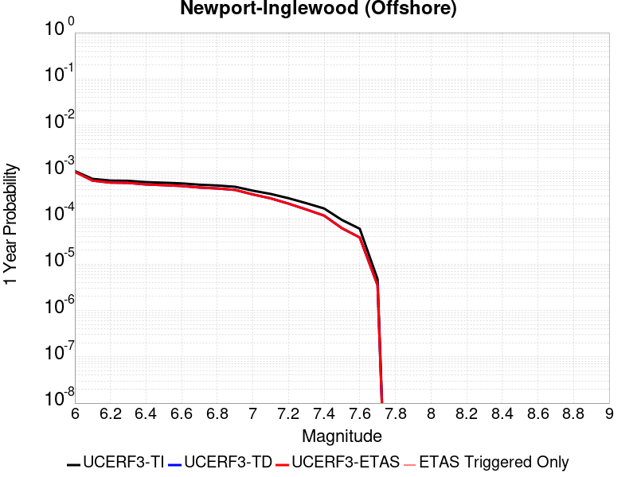 | 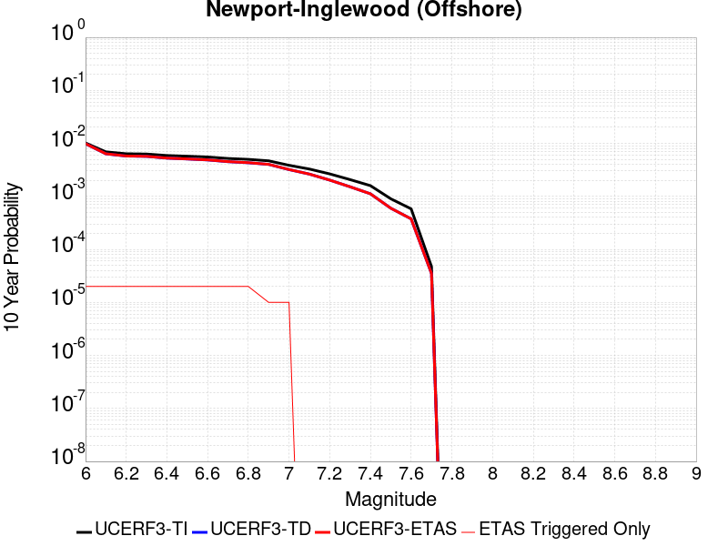 |

| Magnitude | 1 wk TI Prob | 1 wk TD Prob | 1 wk ETAS Prob | 1 wk ETAS/TD Gain | 1 wk ETAS Triggered Only | 1 mo TI Prob | 1 mo TD Prob | 1 mo ETAS Prob | 1 mo ETAS/TD Gain | 1 mo ETAS Triggered Only | 1 yr TI Prob | 1 yr TD Prob | 1 yr ETAS Prob | 1 yr ETAS/TD Gain | 1 yr ETAS Triggered Only | 10 yr TI Prob | 10 yr TD Prob | 10 yr ETAS Prob | 10 yr ETAS/TD Gain | 10 yr ETAS Triggered Only |
|-----|-----|-----|-----|-----|-----|-----|-----|-----|-----|-----|-----|-----|-----|-----|-----|-----|-----|-----|-----|-----|
| 6.0 | 1.9626508E-5 | 1.896559E-5 | 1.896559E-5 | 1.0 | 0.0 | 8.411089E-5 | 8.127864E-5 | 8.127864E-5 | 1.0 | 0.0 | 0.001023569 | 9.891307E-4 | 9.891307E-4 | 1.0 | 0.0 | 0.010188672 | 0.0098486245 | 0.009868427 | 1.0020107 | 2.0E-5 |
| 6.1 | 1.331886E-5 | 1.2218263E-5 | 1.2218263E-5 | 1.0 | 0.0 | 5.707958E-5 | 5.2362942E-5 | 5.2362942E-5 | 1.0 | 0.0 | 6.947222E-4 | 6.3733384E-4 | 6.3733384E-4 | 1.0 | 0.0 | 0.006925544 | 0.0063552377 | 0.0063751107 | 1.003127 | 2.0E-5 |
| 6.2 | 1.2250852E-5 | 1.1076189E-5 | 1.1076189E-5 | 1.0 | 0.0 | 5.2502597E-5 | 4.7468526E-5 | 4.7468526E-5 | 1.0 | 0.0 | 6.3903164E-4 | 5.7777704E-4 | 5.7777704E-4 | 1.0 | 0.0 | 0.006371971 | 0.00576287 | 0.0057827546 | 1.0034505 | 2.0E-5 |
| 6.3 | 1.2106258E-5 | 1.091905E-5 | 1.091905E-5 | 1.0 | 0.0 | 5.1882926E-5 | 4.6795092E-5 | 4.6795092E-5 | 1.0 | 0.0 | 6.3149154E-4 | 5.695823E-4 | 5.695823E-4 | 1.0 | 0.0 | 0.0062970007 | 0.0056813415 | 0.005701228 | 1.0035003 | 2.0E-5 |
| 6.4 | 1.1348758E-5 | 1.0109513E-5 | 1.0109513E-5 | 1.0 | 0.0 | 4.8636626E-5 | 4.332577E-5 | 4.332577E-5 | 1.0 | 0.0 | 5.919901E-4 | 5.273644E-4 | 5.273644E-4 | 1.0 | 0.0 | 0.005904155 | 0.005261225 | 0.0052811196 | 1.0037814 | 2.0E-5 |
| 6.5 | 1.100837E-5 | 9.743537E-6 | 9.743537E-6 | 1.0 | 0.0 | 4.7177873E-5 | 4.175735E-5 | 4.175735E-5 | 1.0 | 0.0 | 5.7423924E-4 | 5.082779E-4 | 5.082779E-4 | 1.0 | 0.0 | 0.005727576 | 0.0050712456 | 0.005091144 | 1.0039238 | 2.0E-5 |
| 6.6 | 1.0634696E-5 | 9.345687E-6 | 9.345687E-6 | 1.0 | 0.0 | 4.557647E-5 | 4.0052335E-5 | 4.0052335E-5 | 1.0 | 0.0 | 5.5475225E-4 | 4.875288E-4 | 4.875288E-4 | 1.0 | 0.0 | 0.0055336943 | 0.004864679 | 0.004884582 | 1.0040913 | 2.0E-5 |
| 6.7 | 9.9780855E-6 | 8.668048E-6 | 8.668048E-6 | 1.0 | 0.0 | 4.276252E-5 | 3.7148253E-5 | 3.7148253E-5 | 1.0 | 0.0 | 5.205093E-4 | 4.521868E-4 | 4.521868E-4 | 1.0 | 0.0 | 0.0051929182 | 0.0045127464 | 0.0045326557 | 1.0044119 | 2.0E-5 |
| 6.8 | 9.59546E-6 | 8.273084E-6 | 8.273084E-6 | 1.0 | 0.0 | 4.1122752E-5 | 3.5455596E-5 | 3.5455596E-5 | 1.0 | 0.0 | 5.0055445E-4 | 4.3158708E-4 | 4.3158708E-4 | 1.0 | 0.0 | 0.004994285 | 0.004307565 | 0.0043274784 | 1.0046229 | 2.0E-5 |
| 6.9 | 9.000614E-6 | 7.706967E-6 | 7.706967E-6 | 1.0 | 0.0 | 3.857349E-5 | 3.3029446E-5 | 3.3029446E-5 | 1.0 | 0.0 | 4.6953102E-4 | 4.0205996E-4 | 4.0205996E-4 | 1.0 | 0.0 | 0.004685402 | 0.004013397 | 0.004023357 | 1.0024817 | 1.0E-5 |
| 7.0 | 7.4070194E-6 | 6.1490105E-6 | 6.1490105E-6 | 1.0 | 0.0 | 3.1743984E-5 | 2.6352638E-5 | 2.6352638E-5 | 1.0 | 0.0 | 3.8641447E-4 | 3.2079627E-4 | 3.2079627E-4 | 1.0 | 0.0 | 0.0038574322 | 0.0032033517 | 0.0032133197 | 1.0031117 | 1.0E-5 |
| 7.1 | 6.299615E-6 | 5.056689E-6 | 5.056689E-6 | 1.0 | 0.0 | 2.699807E-5 | 2.1671345E-5 | 2.1671345E-5 | 1.0 | 0.0 | 3.2865192E-4 | 2.6381682E-4 | 2.6381682E-4 | 1.0 | 0.0 | 0.003281663 | 0.002635051 | 0.002635051 | 1.0 | 0.0 |
| 7.2 | 5.096653E-6 | 3.8928574E-6 | 3.8928574E-6 | 1.0 | 0.0 | 2.1842614E-5 | 1.6683567E-5 | 1.6683567E-5 | 1.0 | 0.0 | 2.6590136E-4 | 2.0310361E-4 | 2.0310361E-4 | 1.0 | 0.0 | 0.0026558342 | 0.002029191 | 0.002029191 | 1.0 | 0.0 |
| 7.3 | 3.9753018E-6 | 2.9099435E-6 | 2.9099435E-6 | 1.0 | 0.0 | 1.7036897E-5 | 1.2471127E-5 | 1.2471127E-5 | 1.0 | 0.0 | 2.0740448E-4 | 1.5182547E-4 | 1.5182547E-4 | 1.0 | 0.0 | 0.00207211 | 0.0015172255 | 0.0015172255 | 1.0 | 0.0 |
| 7.4 | 3.0568392E-6 | 2.145023E-6 | 2.145023E-6 | 1.0 | 0.0 | 1.3100675E-5 | 9.192923E-6 | 9.192923E-6 | 1.0 | 0.0 | 1.5948903E-4 | 1.11918154E-4 | 1.11918154E-4 | 1.0 | 0.0 | 0.0015937461 | 0.0011186242 | 0.0011186242 | 1.0 | 0.0 |
| 7.5 | 1.7279019E-6 | 1.1470016E-6 | 1.1470016E-6 | 1.0 | 0.0 | 7.405273E-6 | 4.9157125E-6 | 4.9157125E-6 | 1.0 | 0.0 | 9.015547E-5 | 5.9847192E-5 | 5.9847192E-5 | 1.0 | 0.0 | 9.01189E-4 | 5.983146E-4 | 5.983146E-4 | 1.0 | 0.0 |
| 7.6 | 1.1156416E-6 | 7.2231035E-7 | 7.2231035E-7 | 1.0 | 0.0 | 4.7813123E-6 | 3.0956123E-6 | 3.0956123E-6 | 1.0 | 0.0 | 5.821092E-5 | 3.7688453E-5 | 3.7688453E-5 | 1.0 | 0.0 | 5.8195676E-4 | 3.7682295E-4 | 3.7682295E-4 | 1.0 | 0.0 |
| 7.7 | 9.117973E-8 | 6.7341894E-8 | 6.7341894E-8 | 1.0 | 0.0 | 3.907702E-7 | 2.8860808E-7 | 2.8860808E-7 | 1.0 | 0.0 | 4.757617E-6 | 3.513798E-6 | 3.513798E-6 | 1.0 | 0.0 | 4.7575148E-5 | 3.5137455E-5 | 3.5137455E-5 | 1.0 | 0.0 |

## Palos Verdes
*[(top)](#table-of-contents)*

| 1 Week | 1 Month | 1 Year | 10 Year |
|-----|-----|-----|-----|
|  |  | 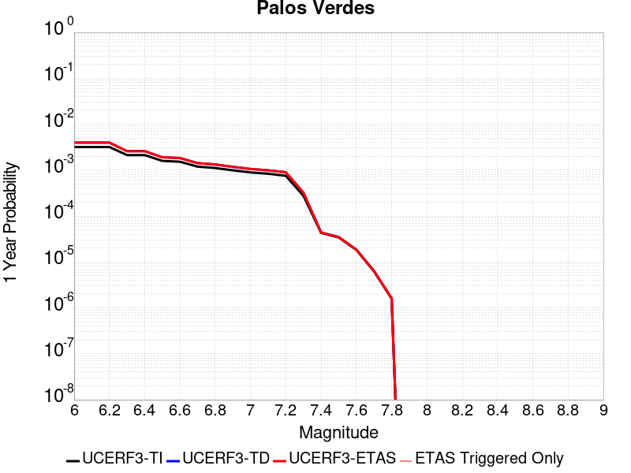 | 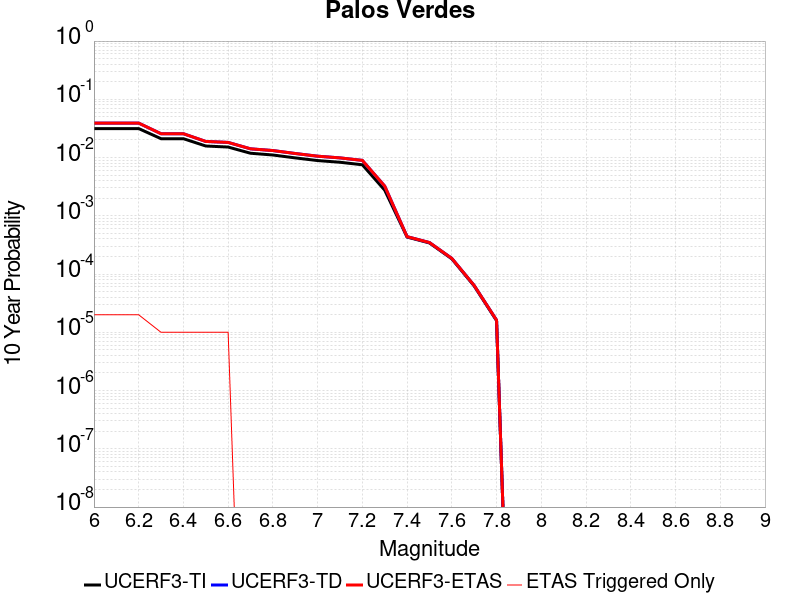 |

| Magnitude | 1 wk TI Prob | 1 wk TD Prob | 1 wk ETAS Prob | 1 wk ETAS/TD Gain | 1 wk ETAS Triggered Only | 1 mo TI Prob | 1 mo TD Prob | 1 mo ETAS Prob | 1 mo ETAS/TD Gain | 1 mo ETAS Triggered Only | 1 yr TI Prob | 1 yr TD Prob | 1 yr ETAS Prob | 1 yr ETAS/TD Gain | 1 yr ETAS Triggered Only | 10 yr TI Prob | 10 yr TD Prob | 10 yr ETAS Prob | 10 yr ETAS/TD Gain | 10 yr ETAS Triggered Only |
|-----|-----|-----|-----|-----|-----|-----|-----|-----|-----|-----|-----|-----|-----|-----|-----|-----|-----|-----|-----|-----|
| 6.0 | 6.126063E-5 | 7.622862E-5 | 7.622862E-5 | 1.0 | 0.0 | 2.6251914E-4 | 3.2665656E-4 | 3.2665656E-4 | 1.0 | 0.0 | 0.0031914865 | 0.0039702994 | 0.0039702994 | 1.0 | 0.0 | 0.031460393 | 0.039050125 | 0.039069343 | 1.0004922 | 2.0E-5 |
| 6.1 | 6.126063E-5 | 7.622862E-5 | 7.622862E-5 | 1.0 | 0.0 | 2.6251914E-4 | 3.2665656E-4 | 3.2665656E-4 | 1.0 | 0.0 | 0.0031914865 | 0.0039702994 | 0.0039702994 | 1.0 | 0.0 | 0.031460393 | 0.039050125 | 0.039069343 | 1.0004922 | 2.0E-5 |
| 6.2 | 6.126063E-5 | 7.622862E-5 | 7.622862E-5 | 1.0 | 0.0 | 2.6251914E-4 | 3.2665656E-4 | 3.2665656E-4 | 1.0 | 0.0 | 0.0031914865 | 0.0039702994 | 0.0039702994 | 1.0 | 0.0 | 0.031460393 | 0.039050125 | 0.039069343 | 1.0004922 | 2.0E-5 |
| 6.3 | 4.0838047E-5 | 4.975089E-5 | 4.975089E-5 | 1.0 | 0.0 | 1.7500846E-4 | 2.1320196E-4 | 2.1320196E-4 | 1.0 | 0.0 | 0.0021286458 | 0.0025928554 | 0.0025928554 | 1.0 | 0.0 | 0.021083709 | 0.025647415 | 0.025657158 | 1.0003799 | 1.0E-5 |
| 6.4 | 4.0838047E-5 | 4.975089E-5 | 4.975089E-5 | 1.0 | 0.0 | 1.7500846E-4 | 2.1320196E-4 | 2.1320196E-4 | 1.0 | 0.0 | 0.0021286458 | 0.0025928554 | 0.0025928554 | 1.0 | 0.0 | 0.021083709 | 0.025647415 | 0.025657158 | 1.0003799 | 1.0E-5 |
| 6.5 | 3.0512005E-5 | 3.6562593E-5 | 3.6562593E-5 | 1.0 | 0.0 | 1.3075917E-4 | 1.566881E-4 | 1.566881E-4 | 1.0 | 0.0 | 0.0015908304 | 0.001906127 | 0.001906127 | 1.0 | 0.0 | 0.015794903 | 0.01890965 | 0.01891946 | 1.0005188 | 1.0E-5 |
| 6.6 | 2.9255087E-5 | 3.5155368E-5 | 3.5155368E-5 | 1.0 | 0.0 | 1.2537291E-4 | 1.5065783E-4 | 1.5065783E-4 | 1.0 | 0.0 | 0.0015253464 | 0.0018328319 | 0.0018328319 | 1.0 | 0.0 | 0.015149189 | 0.01818871 | 0.018198527 | 1.0005398 | 1.0E-5 |
| 6.7 | 2.287198E-5 | 2.7248976E-5 | 2.7248976E-5 | 1.0 | 0.0 | 9.801909E-5 | 1.1677662E-4 | 1.1677662E-4 | 1.0 | 0.0 | 0.001192729 | 0.0014209197 | 0.0014209197 | 1.0 | 0.0 | 0.011863477 | 0.014127577 | 0.014127577 | 1.0 | 0.0 |
| 6.8 | 2.1325764E-5 | 2.5432531E-5 | 2.5432531E-5 | 1.0 | 0.0 | 9.139293E-5 | 1.0899252E-4 | 1.0899252E-4 | 1.0 | 0.0 | 0.001112141 | 0.0013262664 | 0.0013262664 | 1.0 | 0.0 | 0.011065915 | 0.013192548 | 0.013192548 | 1.0 | 0.0 |
| 6.9 | 1.9009392E-5 | 2.2614122E-5 | 2.2614122E-5 | 1.0 | 0.0 | 8.1466285E-5 | 9.6914555E-5 | 9.6914555E-5 | 1.0 | 0.0 | 9.914007E-4 | 0.0011793834 | 0.0011793834 | 1.0 | 0.0 | 0.009869894 | 0.011739929 | 0.011739929 | 1.0 | 0.0 |
| 7.0 | 1.7098473E-5 | 2.0319867E-5 | 2.0319867E-5 | 1.0 | 0.0 | 7.3277115E-5 | 8.708272E-5 | 8.708272E-5 | 1.0 | 0.0 | 8.917837E-4 | 0.0010598017 | 0.0010598017 | 1.0 | 0.0 | 0.008882134 | 0.010555912 | 0.010555912 | 1.0 | 0.0 |
| 7.1 | 1.5982785E-5 | 1.8995239E-5 | 1.8995239E-5 | 1.0 | 0.0 | 6.849585E-5 | 8.1406106E-5 | 8.1406106E-5 | 1.0 | 0.0 | 8.336179E-4 | 9.907534E-4 | 9.907534E-4 | 1.0 | 0.0 | 0.008304977 | 0.009871728 | 0.009871728 | 1.0 | 0.0 |
| 7.2 | 1.4468002E-5 | 1.719767E-5 | 1.719767E-5 | 1.0 | 0.0 | 6.200425E-5 | 7.370269E-5 | 7.370269E-5 | 1.0 | 0.0 | 7.546402E-4 | 8.970449E-4 | 8.970449E-4 | 1.0 | 0.0 | 0.007520827 | 0.008942509 | 0.008942509 | 1.0 | 0.0 |
| 7.3 | 5.288233E-6 | 6.2038207E-6 | 6.2038207E-6 | 1.0 | 0.0 | 2.2663658E-5 | 2.658773E-5 | 2.658773E-5 | 1.0 | 0.0 | 2.7589512E-4 | 3.2369242E-4 | 3.2369242E-4 | 1.0 | 0.0 | 0.0027555283 | 0.0032356323 | 0.0032356323 | 1.0 | 0.0 |
| 7.4 | 8.279556E-7 | 8.408364E-7 | 8.408364E-7 | 1.0 | 0.0 | 3.5483763E-6 | 3.60358E-6 | 3.60358E-6 | 1.0 | 0.0 | 4.3200624E-5 | 4.3872777E-5 | 4.3872777E-5 | 1.0 | 0.0 | 4.3192226E-4 | 4.3864836E-4 | 4.3864836E-4 | 1.0 | 0.0 |
| 7.5 | 6.559831E-7 | 6.667243E-7 | 6.667243E-7 | 1.0 | 0.0 | 2.8113532E-6 | 2.8573872E-6 | 2.8573872E-6 | 1.0 | 0.0 | 3.4227687E-5 | 3.47882E-5 | 3.47882E-5 | 1.0 | 0.0 | 3.4222414E-4 | 3.478342E-4 | 3.478342E-4 | 1.0 | 0.0 |
| 7.6 | 3.5018968E-7 | 3.562011E-7 | 3.562011E-7 | 1.0 | 0.0 | 1.500812E-6 | 1.5265755E-6 | 1.5265755E-6 | 1.0 | 0.0 | 1.8272232E-5 | 1.8585944E-5 | 1.8585944E-5 | 1.0 | 0.0 | 1.8270731E-4 | 1.858485E-4 | 1.858485E-4 | 1.0 | 0.0 |
| 7.7 | 1.1986104E-7 | 1.2198406E-7 | 1.2198406E-7 | 1.0 | 0.0 | 5.1369005E-7 | 5.227887E-7 | 5.227887E-7 | 1.0 | 0.0 | 6.2541585E-6 | 6.364934E-6 | 6.364934E-6 | 1.0 | 0.0 | 6.2539824E-5 | 6.364756E-5 | 6.364756E-5 | 1.0 | 0.0 |
| 7.8 | 3.0445005E-8 | 3.1027664E-8 | 3.1027664E-8 | 1.0 | 0.0 | 1.3047858E-7 | 1.3297569E-7 | 1.3297569E-7 | 1.0 | 0.0 | 1.5885756E-6 | 1.6189781E-6 | 1.6189781E-6 | 1.0 | 0.0 | 1.5885644E-5 | 1.6189684E-5 | 1.6189684E-5 | 1.0 | 0.0 |

## Santa Susana alt 1
*[(top)](#table-of-contents)*

| 1 Week | 1 Month | 1 Year | 10 Year |
|-----|-----|-----|-----|
| 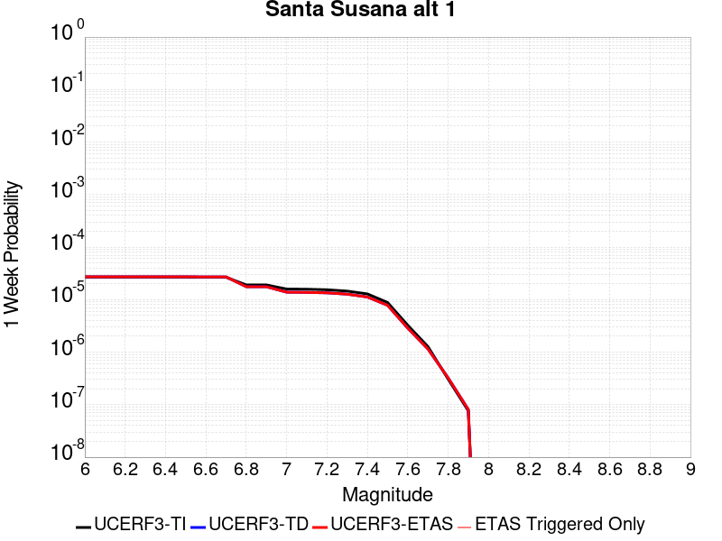 | 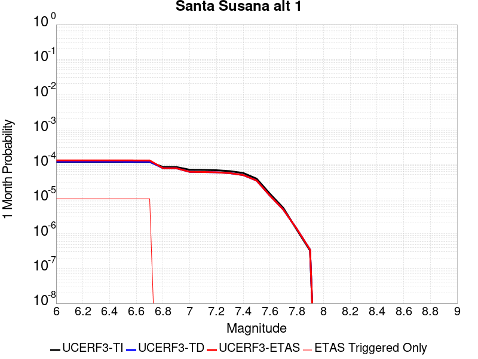 | 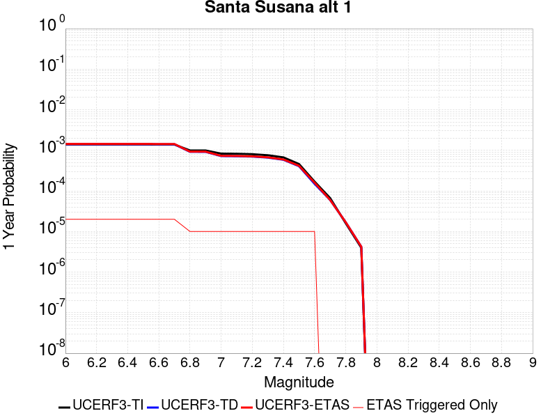 | 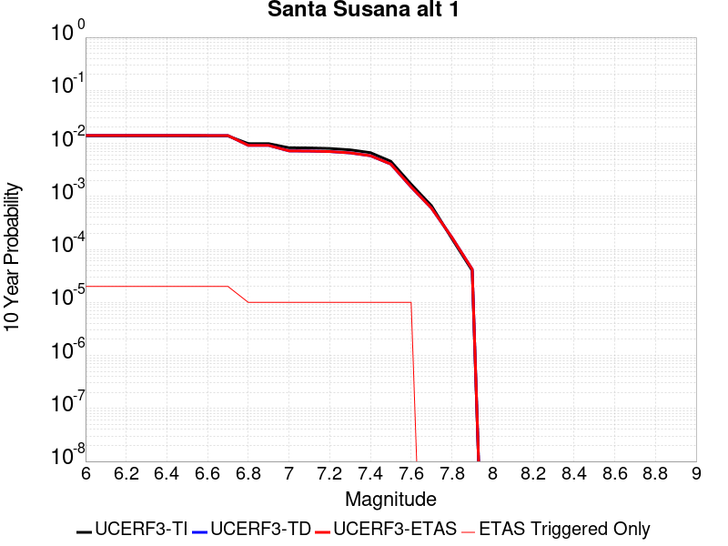 |

| Magnitude | 1 wk TI Prob | 1 wk TD Prob | 1 wk ETAS Prob | 1 wk ETAS/TD Gain | 1 wk ETAS Triggered Only | 1 mo TI Prob | 1 mo TD Prob | 1 mo ETAS Prob | 1 mo ETAS/TD Gain | 1 mo ETAS Triggered Only | 1 yr TI Prob | 1 yr TD Prob | 1 yr ETAS Prob | 1 yr ETAS/TD Gain | 1 yr ETAS Triggered Only | 10 yr TI Prob | 10 yr TD Prob | 10 yr ETAS Prob | 10 yr ETAS/TD Gain | 10 yr ETAS Triggered Only |
|-----|-----|-----|-----|-----|-----|-----|-----|-----|-----|-----|-----|-----|-----|-----|-----|-----|-----|-----|-----|-----|
| 6.0 | 2.674877E-5 | 2.7198636E-5 | 2.7198636E-5 | 1.0 | 0.0 | 1.1463255E-4 | 1.16561016E-4 | 1.2655985E-4 | 1.0857819 | 1.0E-5 | 0.0013947578 | 0.0014183201 | 0.0014382917 | 1.0140812 | 2.0E-5 | 0.013860362 | 0.014104444 | 0.014124162 | 1.001398 | 2.0E-5 |
| 6.1 | 2.674877E-5 | 2.7198636E-5 | 2.7198636E-5 | 1.0 | 0.0 | 1.1463255E-4 | 1.16561016E-4 | 1.2655985E-4 | 1.0857819 | 1.0E-5 | 0.0013947578 | 0.0014183201 | 0.0014382917 | 1.0140812 | 2.0E-5 | 0.013860362 | 0.014104444 | 0.014124162 | 1.001398 | 2.0E-5 |
| 6.2 | 2.674877E-5 | 2.7198636E-5 | 2.7198636E-5 | 1.0 | 0.0 | 1.1463255E-4 | 1.16561016E-4 | 1.2655985E-4 | 1.0857819 | 1.0E-5 | 0.0013947578 | 0.0014183201 | 0.0014382917 | 1.0140812 | 2.0E-5 | 0.013860362 | 0.014104444 | 0.014124162 | 1.001398 | 2.0E-5 |
| 6.3 | 2.674877E-5 | 2.7198636E-5 | 2.7198636E-5 | 1.0 | 0.0 | 1.1463255E-4 | 1.16561016E-4 | 1.2655985E-4 | 1.0857819 | 1.0E-5 | 0.0013947578 | 0.0014183201 | 0.0014382917 | 1.0140812 | 2.0E-5 | 0.013860362 | 0.014104444 | 0.014124162 | 1.001398 | 2.0E-5 |
| 6.4 | 2.674877E-5 | 2.7198636E-5 | 2.7198636E-5 | 1.0 | 0.0 | 1.1463255E-4 | 1.16561016E-4 | 1.2655985E-4 | 1.0857819 | 1.0E-5 | 0.0013947578 | 0.0014183201 | 0.0014382917 | 1.0140812 | 2.0E-5 | 0.013860362 | 0.014104444 | 0.014124162 | 1.001398 | 2.0E-5 |
| 6.5 | 2.674877E-5 | 2.7198636E-5 | 2.7198636E-5 | 1.0 | 0.0 | 1.1463255E-4 | 1.16561016E-4 | 1.2655985E-4 | 1.0857819 | 1.0E-5 | 0.0013947578 | 0.0014183201 | 0.0014382917 | 1.0140812 | 2.0E-5 | 0.013860362 | 0.014104444 | 0.014124162 | 1.001398 | 2.0E-5 |
| 6.6 | 2.6647976E-5 | 2.707497E-5 | 2.707497E-5 | 1.0 | 0.0 | 1.14200615E-4 | 1.16031064E-4 | 1.260299E-4 | 1.0861738 | 1.0E-5 | 0.0013895056 | 0.0014118766 | 0.0014318484 | 1.0141455 | 2.0E-5 | 0.013808494 | 0.014040828 | 0.014060547 | 1.0014044 | 2.0E-5 |
| 6.7 | 2.6647976E-5 | 2.707497E-5 | 2.707497E-5 | 1.0 | 0.0 | 1.14200615E-4 | 1.16031064E-4 | 1.260299E-4 | 1.0861738 | 1.0E-5 | 0.0013895056 | 0.0014118766 | 0.0014318484 | 1.0141455 | 2.0E-5 | 0.013808494 | 0.014040828 | 0.014060547 | 1.0014044 | 2.0E-5 |
| 6.8 | 1.9073179E-5 | 1.7637585E-5 | 1.7637585E-5 | 1.0 | 0.0 | 8.1739636E-5 | 7.5587566E-5 | 7.5587566E-5 | 1.0 | 0.0 | 9.947256E-4 | 9.199082E-4 | 9.29899E-4 | 1.0108607 | 1.0E-5 | 0.009902848 | 0.009163258 | 0.009173166 | 1.0010813 | 1.0E-5 |
| 6.9 | 1.9041876E-5 | 1.7619717E-5 | 1.7619717E-5 | 1.0 | 0.0 | 8.160549E-5 | 7.551099E-5 | 7.551099E-5 | 1.0 | 0.0 | 9.930939E-4 | 9.189767E-4 | 9.289675E-4 | 1.0108716 | 1.0E-5 | 0.0098866755 | 0.009154019 | 0.009163927 | 1.0010824 | 1.0E-5 |
| 7.0 | 1.5917482E-5 | 1.3864059E-5 | 1.3864059E-5 | 1.0 | 0.0 | 6.8215995E-5 | 5.941607E-5 | 5.941607E-5 | 1.0 | 0.0 | 8.302132E-4 | 7.231552E-4 | 7.3314796E-4 | 1.0138183 | 1.0E-5 | 0.008271185 | 0.007208915 | 0.007218843 | 1.0013772 | 1.0E-5 |
| 7.1 | 1.577788E-5 | 1.3744065E-5 | 1.3744065E-5 | 1.0 | 0.0 | 6.761774E-5 | 5.890183E-5 | 5.890183E-5 | 1.0 | 0.0 | 8.2293496E-4 | 7.168985E-4 | 7.268913E-4 | 1.013939 | 1.0E-5 | 0.008198941 | 0.0071467515 | 0.0071566803 | 1.0013893 | 1.0E-5 |
| 7.2 | 1.5416446E-5 | 1.3470131E-5 | 1.3470131E-5 | 1.0 | 0.0 | 6.606882E-5 | 5.7727884E-5 | 5.7727884E-5 | 1.0 | 0.0 | 8.0409093E-4 | 7.0261495E-4 | 7.126079E-4 | 1.0142225 | 1.0E-5 | 0.008011877 | 0.0070048203 | 0.0070147505 | 1.0014176 | 1.0E-5 |
| 7.3 | 1.4534083E-5 | 1.2718048E-5 | 1.2718048E-5 | 1.0 | 0.0 | 6.228744E-5 | 5.4504806E-5 | 5.4504806E-5 | 1.0 | 0.0 | 7.580857E-4 | 6.633984E-4 | 6.733918E-4 | 1.0150639 | 1.0E-5 | 0.007555048 | 0.006615032 | 0.006624966 | 1.0015017 | 1.0E-5 |
| 7.4 | 1.2858995E-5 | 1.1229788E-5 | 1.1229788E-5 | 1.0 | 0.0 | 5.5108816E-5 | 4.8126793E-5 | 4.8126793E-5 | 1.0 | 0.0 | 6.7074323E-4 | 5.8579014E-4 | 5.957843E-4 | 1.017061 | 1.0E-5 | 0.0066872234 | 0.0058432347 | 0.0058531766 | 1.0017014 | 1.0E-5 |
| 7.5 | 8.827668E-6 | 7.805538E-6 | 7.805538E-6 | 1.0 | 0.0 | 3.7832317E-5 | 3.345189E-5 | 3.345189E-5 | 1.0 | 0.0 | 4.605111E-4 | 4.0720313E-4 | 4.1719904E-4 | 1.0245478 | 1.0E-5 | 0.0045955796 | 0.004064819 | 0.004074778 | 1.0024501 | 1.0E-5 |
| 7.6 | 3.2533426E-6 | 2.872008E-6 | 2.872008E-6 | 1.0 | 0.0 | 1.3942822E-5 | 1.230855E-5 | 1.230855E-5 | 1.0 | 0.0 | 1.6974064E-4 | 1.4984666E-4 | 1.5984516E-4 | 1.0667249 | 1.0E-5 | 0.0016961104 | 0.0014974931 | 0.0015074781 | 1.0066679 | 1.0E-5 |
| 7.7 | 1.2751709E-6 | 1.1491198E-6 | 1.1491198E-6 | 1.0 | 0.0 | 5.4650063E-6 | 4.9247906E-6 | 4.9247906E-6 | 1.0 | 0.0 | 6.653442E-5 | 5.9957765E-5 | 5.9957765E-5 | 1.0 | 0.0 | 6.6514505E-4 | 5.994248E-4 | 5.994248E-4 | 1.0 | 0.0 |
| 7.8 | 3.067544E-7 | 3.240072E-7 | 3.240072E-7 | 1.0 | 0.0 | 1.3146611E-6 | 1.3886016E-6 | 1.3886016E-6 | 1.0 | 0.0 | 1.600588E-5 | 1.6906104E-5 | 1.6906104E-5 | 1.0 | 0.0 | 1.6004729E-4 | 1.690492E-4 | 1.690492E-4 | 1.0 | 0.0 |
| 7.9 | 7.622999E-8 | 8.088032E-8 | 8.088032E-8 | 1.0 | 0.0 | 3.2669993E-7 | 3.4662992E-7 | 3.4662992E-7 | 1.0 | 0.0 | 3.977564E-6 | 4.220213E-6 | 4.220213E-6 | 1.0 | 0.0 | 3.977493E-5 | 4.2201536E-5 | 4.2201536E-5 | 1.0 | 0.0 |

## San Pedro Basin
*[(top)](#table-of-contents)*

| 1 Week | 1 Month | 1 Year | 10 Year |
|-----|-----|-----|-----|
| 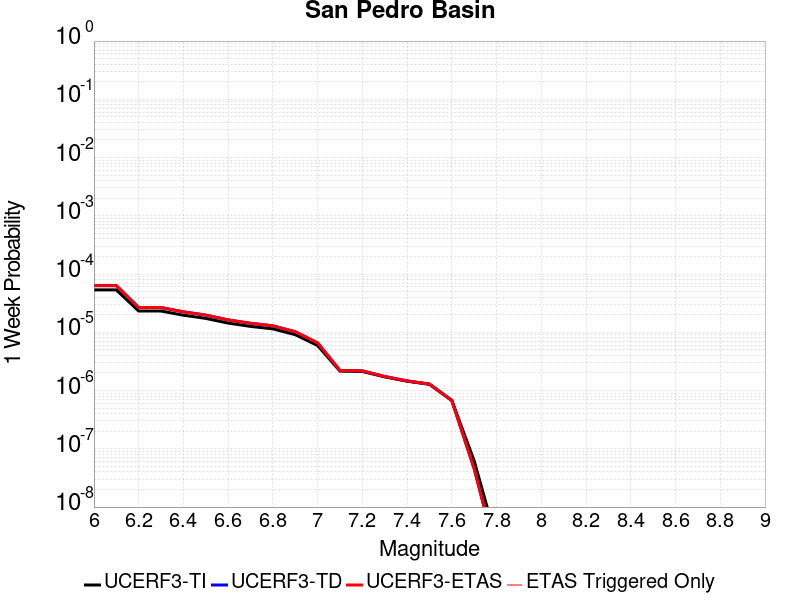 | 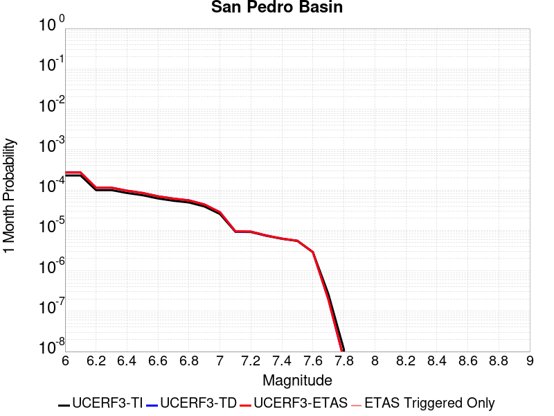 | 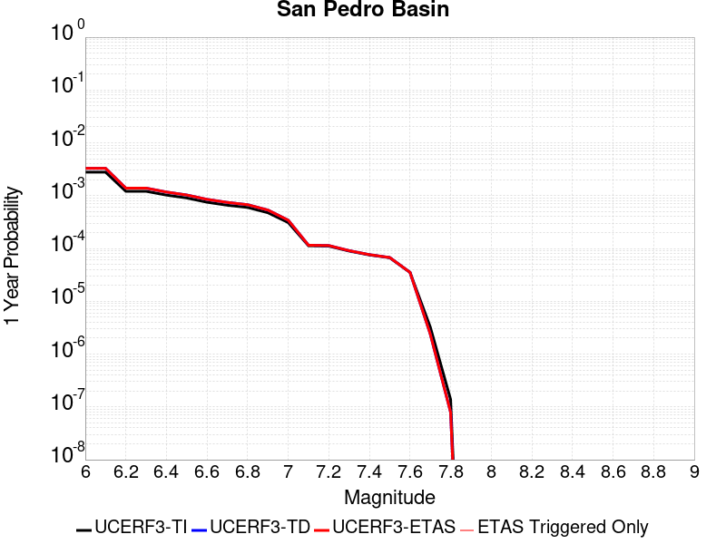 | 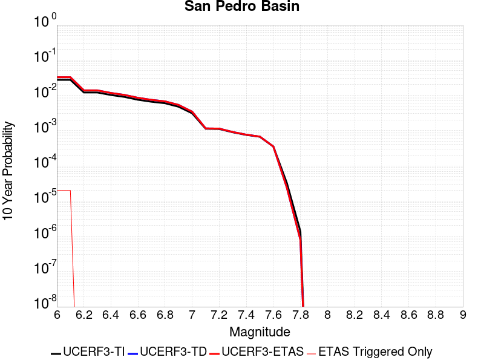 |

| Magnitude | 1 wk TI Prob | 1 wk TD Prob | 1 wk ETAS Prob | 1 wk ETAS/TD Gain | 1 wk ETAS Triggered Only | 1 mo TI Prob | 1 mo TD Prob | 1 mo ETAS Prob | 1 mo ETAS/TD Gain | 1 mo ETAS Triggered Only | 1 yr TI Prob | 1 yr TD Prob | 1 yr ETAS Prob | 1 yr ETAS/TD Gain | 1 yr ETAS Triggered Only | 10 yr TI Prob | 10 yr TD Prob | 10 yr ETAS Prob | 10 yr ETAS/TD Gain | 10 yr ETAS Triggered Only |
|-----|-----|-----|-----|-----|-----|-----|-----|-----|-----|-----|-----|-----|-----|-----|-----|-----|-----|-----|-----|-----|
| 6.0 | 5.3449043E-5 | 6.3371124E-5 | 6.3371124E-5 | 1.0 | 0.0 | 2.2904722E-4 | 2.7156572E-4 | 2.7156572E-4 | 1.0 | 0.0 | 0.0027850836 | 0.0033019078 | 0.0033019078 | 1.0 | 0.0 | 0.027504366 | 0.032590248 | 0.032609597 | 1.0005937 | 2.0E-5 |
| 6.1 | 5.3449043E-5 | 6.3371124E-5 | 6.3371124E-5 | 1.0 | 0.0 | 2.2904722E-4 | 2.7156572E-4 | 2.7156572E-4 | 1.0 | 0.0 | 0.0027850836 | 0.0033019078 | 0.0033019078 | 1.0 | 0.0 | 0.027504366 | 0.032590248 | 0.032609597 | 1.0005937 | 2.0E-5 |
| 6.2 | 2.3189454E-5 | 2.6643334E-5 | 2.6643334E-5 | 1.0 | 0.0 | 9.9379584E-5 | 1.14180984E-4 | 1.14180984E-4 | 1.0 | 0.0 | 0.0012092749 | 0.0013893144 | 0.0013893144 | 1.0 | 0.0 | 0.012027155 | 0.013811161 | 0.013811161 | 1.0 | 0.0 |
| 6.3 | 2.3189454E-5 | 2.6643334E-5 | 2.6643334E-5 | 1.0 | 0.0 | 9.9379584E-5 | 1.14180984E-4 | 1.14180984E-4 | 1.0 | 0.0 | 0.0012092749 | 0.0013893144 | 0.0013893144 | 1.0 | 0.0 | 0.012027155 | 0.013811161 | 0.013811161 | 1.0 | 0.0 |
| 6.4 | 1.966056E-5 | 2.2463848E-5 | 2.2463848E-5 | 1.0 | 0.0 | 8.425682E-5 | 9.627031E-5 | 9.627031E-5 | 1.0 | 0.0 | 0.001025344 | 0.001171501 | 0.001171501 | 1.0 | 0.0 | 0.010206259 | 0.011657341 | 0.011657341 | 1.0 | 0.0 |
| 6.5 | 1.7342953E-5 | 1.9745521E-5 | 1.9745521E-5 | 1.0 | 0.0 | 7.4324824E-5 | 8.4621126E-5 | 8.4621126E-5 | 1.0 | 0.0 | 9.04529E-4 | 0.0010298121 | 0.0010298121 | 1.0 | 0.0 | 0.009008561 | 0.010254124 | 0.010254124 | 1.0 | 0.0 |
| 6.6 | 1.439804E-5 | 1.6323014E-5 | 1.6323014E-5 | 1.0 | 0.0 | 6.170443E-5 | 6.995408E-5 | 6.995408E-5 | 1.0 | 0.0 | 7.509924E-4 | 8.513903E-4 | 8.513903E-4 | 1.0 | 0.0 | 0.0074845953 | 0.008484487 | 0.008484487 | 1.0 | 0.0 |
| 6.7 | 1.2634884E-5 | 1.4285554E-5 | 1.4285554E-5 | 1.0 | 0.0 | 5.414838E-5 | 6.1222534E-5 | 6.1222534E-5 | 1.0 | 0.0 | 6.590571E-4 | 7.451599E-4 | 7.451599E-4 | 1.0 | 0.0 | 0.006571059 | 0.007429634 | 0.007429634 | 1.0 | 0.0 |
| 6.8 | 1.146091E-5 | 1.2933421E-5 | 1.2933421E-5 | 1.0 | 0.0 | 4.911726E-5 | 5.542794E-5 | 5.542794E-5 | 1.0 | 0.0 | 5.9783855E-4 | 6.7465595E-4 | 6.7465595E-4 | 1.0 | 0.0 | 0.0059623276 | 0.0067290184 | 0.0067290184 | 1.0 | 0.0 |
| 6.9 | 9.109035E-6 | 1.0235189E-5 | 1.0235189E-5 | 1.0 | 0.0 | 3.9038136E-5 | 4.3864515E-5 | 4.3864515E-5 | 1.0 | 0.0 | 4.7518566E-4 | 5.339476E-4 | 5.339476E-4 | 1.0 | 0.0 | 0.0047417083 | 0.0053294008 | 0.0053294008 | 1.0 | 0.0 |
| 7.0 | 5.9351028E-6 | 6.584068E-6 | 6.584068E-6 | 1.0 | 0.0 | 2.5435906E-5 | 2.8217262E-5 | 2.8217262E-5 | 1.0 | 0.0 | 3.0963816E-4 | 3.4351464E-4 | 3.4351464E-4 | 1.0 | 0.0 | 0.0030920706 | 0.0034321535 | 0.0034321535 | 1.0 | 0.0 |
| 7.1 | 2.1557585E-6 | 2.2096608E-6 | 2.2096608E-6 | 1.0 | 0.0 | 9.238933E-6 | 9.469942E-6 | 9.469942E-6 | 1.0 | 0.0 | 1.1247819E-4 | 1.1529059E-4 | 1.1529059E-4 | 1.0 | 0.0 | 0.0011242128 | 0.0011523232 | 0.0011523232 | 1.0 | 0.0 |
| 7.2 | 2.1251979E-6 | 2.178007E-6 | 2.178007E-6 | 1.0 | 0.0 | 9.107958E-6 | 9.334282E-6 | 9.334282E-6 | 1.0 | 0.0 | 1.1088375E-4 | 1.1363912E-4 | 1.1363912E-4 | 1.0 | 0.0 | 0.0011082845 | 0.0011358254 | 0.0011358254 | 1.0 | 0.0 |
| 7.3 | 1.7145798E-6 | 1.7442967E-6 | 1.7442967E-6 | 1.0 | 0.0 | 7.3481783E-6 | 7.475536E-6 | 7.475536E-6 | 1.0 | 0.0 | 8.94604E-5 | 9.1010945E-5 | 9.1010945E-5 | 1.0 | 0.0 | 8.9424395E-4 | 9.0974587E-4 | 9.0974587E-4 | 1.0 | 0.0 |
| 7.4 | 1.4467993E-6 | 1.4641943E-6 | 1.4641943E-6 | 1.0 | 0.0 | 6.200554E-6 | 6.2751037E-6 | 6.2751037E-6 | 1.0 | 0.0 | 7.548913E-5 | 7.6396784E-5 | 7.6396784E-5 | 1.0 | 0.0 | 7.546349E-4 | 7.637125E-4 | 7.637125E-4 | 1.0 | 0.0 |
| 7.5 | 1.2803735E-6 | 1.2931564E-6 | 1.2931564E-6 | 1.0 | 0.0 | 5.487303E-6 | 5.5420874E-6 | 5.5420874E-6 | 1.0 | 0.0 | 6.680587E-5 | 6.7472894E-5 | 6.7472894E-5 | 1.0 | 0.0 | 6.678579E-4 | 6.7453115E-4 | 6.7453115E-4 | 1.0 | 0.0 |
| 7.6 | 6.755009E-7 | 6.769501E-7 | 6.769501E-7 | 1.0 | 0.0 | 2.8950008E-6 | 2.9012117E-6 | 2.9012117E-6 | 1.0 | 0.0 | 3.5246063E-5 | 3.5321737E-5 | 3.5321737E-5 | 1.0 | 0.0 | 3.5240475E-4 | 3.5316695E-4 | 3.5316695E-4 | 1.0 | 0.0 |
| 7.7 | 6.211885E-8 | 4.5699863E-8 | 4.5699863E-8 | 1.0 | 0.0 | 2.6622362E-7 | 1.9585654E-7 | 1.9585654E-7 | 1.0 | 0.0 | 3.2412677E-6 | 2.384551E-6 | 2.384551E-6 | 1.0 | 0.0 | 3.2412205E-5 | 2.3845274E-5 | 2.3845274E-5 | 1.0 | 0.0 |
| 7.8 | 2.6580573E-9 | 1.5138681E-9 | 1.5138681E-9 | 1.0 | 0.0 | 1.1391674E-8 | 6.488006E-9 | 6.488006E-9 | 1.0 | 0.0 | 1.3869362E-7 | 7.899148E-8 | 7.899148E-8 | 1.0 | 0.0 | 1.3869354E-6 | 7.8991474E-7 | 7.8991474E-7 | 1.0 | 0.0 |

## Newport-Inglewood alt 1
*[(top)](#table-of-contents)*

| 1 Week | 1 Month | 1 Year | 10 Year |
|-----|-----|-----|-----|
| 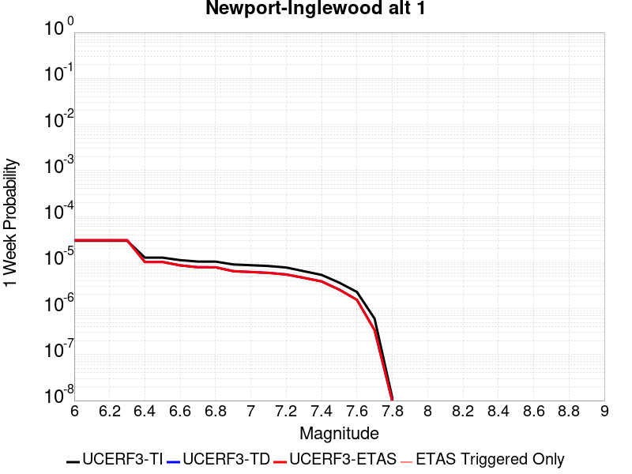 |  | 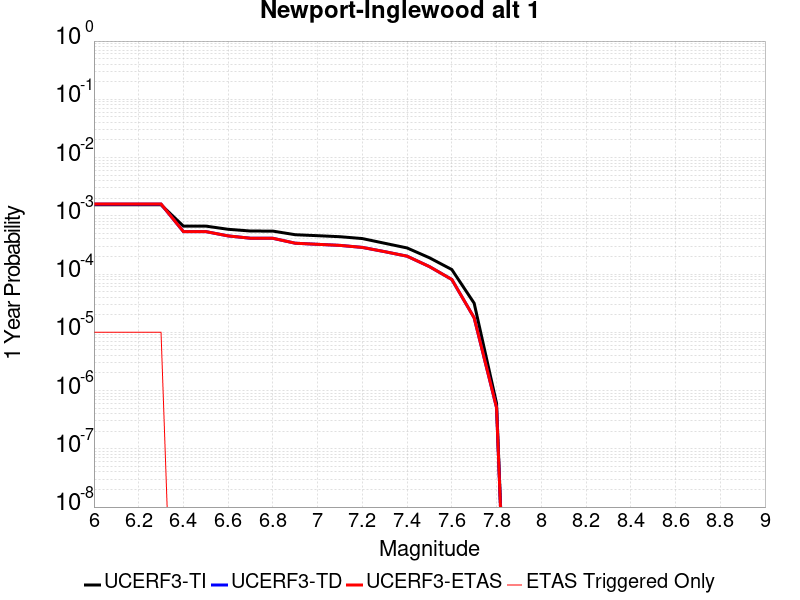 | 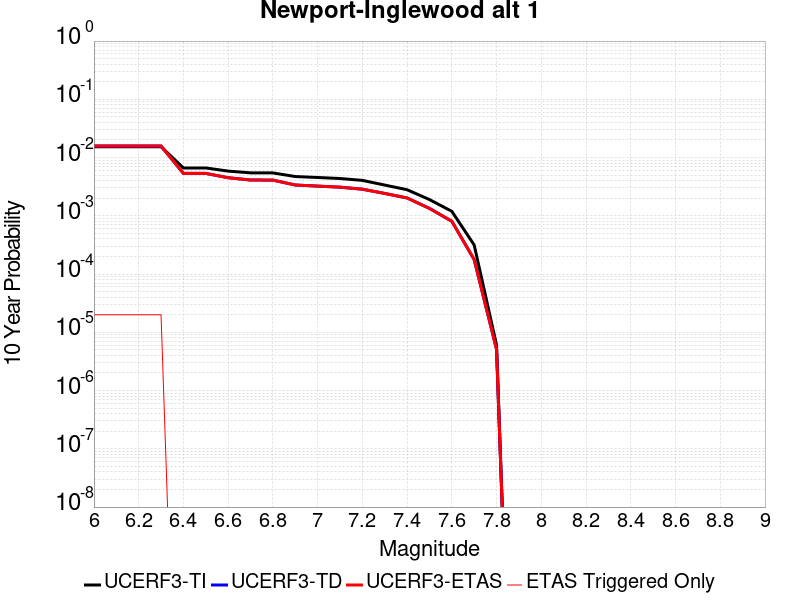 |

| Magnitude | 1 wk TI Prob | 1 wk TD Prob | 1 wk ETAS Prob | 1 wk ETAS/TD Gain | 1 wk ETAS Triggered Only | 1 mo TI Prob | 1 mo TD Prob | 1 mo ETAS Prob | 1 mo ETAS/TD Gain | 1 mo ETAS Triggered Only | 1 yr TI Prob | 1 yr TD Prob | 1 yr ETAS Prob | 1 yr ETAS/TD Gain | 1 yr ETAS Triggered Only | 10 yr TI Prob | 10 yr TD Prob | 10 yr ETAS Prob | 10 yr ETAS/TD Gain | 10 yr ETAS Triggered Only |
|-----|-----|-----|-----|-----|-----|-----|-----|-----|-----|-----|-----|-----|-----|-----|-----|-----|-----|-----|-----|-----|
| 6.0 | 2.9668912E-5 | 3.0405516E-5 | 3.0405516E-5 | 1.0 | 0.0 | 1.2714628E-4 | 1.3030559E-4 | 1.3030559E-4 | 1.0 | 0.0 | 0.0015469068 | 0.0015857986 | 0.0015957827 | 1.0062959 | 1.0E-5 | 0.015361829 | 0.015792403 | 0.015812088 | 1.0012465 | 2.0E-5 |
| 6.1 | 2.9668912E-5 | 3.0405516E-5 | 3.0405516E-5 | 1.0 | 0.0 | 1.2714628E-4 | 1.3030559E-4 | 1.3030559E-4 | 1.0 | 0.0 | 0.0015469068 | 0.0015857986 | 0.0015957827 | 1.0062959 | 1.0E-5 | 0.015361829 | 0.015792403 | 0.015812088 | 1.0012465 | 2.0E-5 |
| 6.2 | 2.9668912E-5 | 3.0405516E-5 | 3.0405516E-5 | 1.0 | 0.0 | 1.2714628E-4 | 1.3030559E-4 | 1.3030559E-4 | 1.0 | 0.0 | 0.0015469068 | 0.0015857986 | 0.0015957827 | 1.0062959 | 1.0E-5 | 0.015361829 | 0.015792403 | 0.015812088 | 1.0012465 | 2.0E-5 |
| 6.3 | 2.9668912E-5 | 3.0405516E-5 | 3.0405516E-5 | 1.0 | 0.0 | 1.2714628E-4 | 1.3030559E-4 | 1.3030559E-4 | 1.0 | 0.0 | 0.0015469068 | 0.0015857986 | 0.0015957827 | 1.0062959 | 1.0E-5 | 0.015361829 | 0.015792403 | 0.015812088 | 1.0012465 | 2.0E-5 |
| 6.4 | 1.275942E-5 | 1.0272664E-5 | 1.0272664E-5 | 1.0 | 0.0 | 5.4682085E-5 | 4.4024986E-5 | 4.4024986E-5 | 1.0 | 0.0 | 6.65551E-4 | 5.3587655E-4 | 5.3587655E-4 | 1.0 | 0.0 | 0.0066356123 | 0.0053462684 | 0.0053462684 | 1.0 | 0.0 |
| 6.5 | 1.275942E-5 | 1.0272664E-5 | 1.0272664E-5 | 1.0 | 0.0 | 5.4682085E-5 | 4.4024986E-5 | 4.4024986E-5 | 1.0 | 0.0 | 6.65551E-4 | 5.3587655E-4 | 5.3587655E-4 | 1.0 | 0.0 | 0.0066356123 | 0.0053462684 | 0.0053462684 | 1.0 | 0.0 |
| 6.6 | 1.1255358E-5 | 8.662018E-6 | 8.662018E-6 | 1.0 | 0.0 | 4.8236358E-5 | 3.7122416E-5 | 3.7122416E-5 | 1.0 | 0.0 | 5.871194E-4 | 4.5187338E-4 | 4.5187338E-4 | 1.0 | 0.0 | 0.005855706 | 0.004509723 | 0.004509723 | 1.0 | 0.0 |
| 6.7 | 1.0504745E-5 | 7.899919E-6 | 7.899919E-6 | 1.0 | 0.0 | 4.5019555E-5 | 3.3856366E-5 | 3.3856366E-5 | 1.0 | 0.0 | 5.4797524E-4 | 4.1212453E-4 | 4.1212453E-4 | 1.0 | 0.0 | 0.0054662596 | 0.0041137324 | 0.0041137324 | 1.0 | 0.0 |
| 6.8 | 1.0476007E-5 | 7.881301E-6 | 7.881301E-6 | 1.0 | 0.0 | 4.4896402E-5 | 3.377657E-5 | 3.377657E-5 | 1.0 | 0.0 | 5.464766E-4 | 4.1115342E-4 | 4.1115342E-4 | 1.0 | 0.0 | 0.005451347 | 0.0041040573 | 0.0041040573 | 1.0 | 0.0 |
| 6.9 | 9.076797E-6 | 6.489738E-6 | 6.489738E-6 | 1.0 | 0.0 | 3.889998E-5 | 2.7812868E-5 | 2.7812868E-5 | 1.0 | 0.0 | 4.7350433E-4 | 3.385694E-4 | 3.385694E-4 | 1.0 | 0.0 | 0.004724967 | 0.0033805731 | 0.0033805731 | 1.0 | 0.0 |
| 7.0 | 8.73795E-6 | 6.212118E-6 | 6.212118E-6 | 1.0 | 0.0 | 3.7447822E-5 | 2.6623095E-5 | 2.6623095E-5 | 1.0 | 0.0 | 4.5583185E-4 | 3.2408824E-4 | 3.2408824E-4 | 1.0 | 0.0 | 0.0045489795 | 0.0032361876 | 0.0032361876 | 1.0 | 0.0 |
| 7.1 | 8.391299E-6 | 5.955894E-6 | 5.955894E-6 | 1.0 | 0.0 | 3.5962214E-5 | 2.552501E-5 | 2.552501E-5 | 1.0 | 0.0 | 4.37752E-4 | 3.1072294E-4 | 3.1072294E-4 | 1.0 | 0.0 | 0.004368907 | 0.0031029144 | 0.0031029144 | 1.0 | 0.0 |
| 7.2 | 7.796882E-6 | 5.496635E-6 | 5.496635E-6 | 1.0 | 0.0 | 3.341478E-5 | 2.3556795E-5 | 2.3556795E-5 | 1.0 | 0.0 | 4.06749E-4 | 2.8676644E-4 | 2.8676644E-4 | 1.0 | 0.0 | 0.0040600533 | 0.002863988 | 0.002863988 | 1.0 | 0.0 |
| 7.3 | 6.4738833E-6 | 4.647859E-6 | 4.647859E-6 | 1.0 | 0.0 | 2.774492E-5 | 1.9919245E-5 | 1.9919245E-5 | 1.0 | 0.0 | 3.3774204E-4 | 2.4248997E-4 | 2.4248997E-4 | 1.0 | 0.0 | 0.0033722918 | 0.0024222704 | 0.0024222704 | 1.0 | 0.0 |
| 7.4 | 5.382145E-6 | 3.8857956E-6 | 3.8857956E-6 | 1.0 | 0.0 | 2.3066134E-5 | 1.6653305E-5 | 1.6653305E-5 | 1.0 | 0.0 | 2.8079396E-4 | 2.0273525E-4 | 2.0273525E-4 | 1.0 | 0.0 | 0.0028043943 | 0.0020255174 | 0.0020255174 | 1.0 | 0.0 |
| 7.5 | 3.648244E-6 | 2.573805E-6 | 2.573805E-6 | 1.0 | 0.0 | 1.5635238E-5 | 1.1030546E-5 | 1.1030546E-5 | 1.0 | 0.0 | 1.9034238E-4 | 1.3428873E-4 | 1.3428873E-4 | 1.0 | 0.0 | 0.0019017943 | 0.0013420862 | 0.0013420862 | 1.0 | 0.0 |
| 7.6 | 2.2906888E-6 | 1.5479983E-6 | 1.5479983E-6 | 1.0 | 0.0 | 9.817201E-6 | 6.6342623E-6 | 6.6342623E-6 | 1.0 | 0.0 | 1.1951787E-4 | 8.076921E-5 | 8.076921E-5 | 1.0 | 0.0 | 0.0011945361 | 8.0740533E-4 | 8.0740533E-4 | 1.0 | 0.0 |
| 7.7 | 6.0479874E-7 | 3.3975476E-7 | 3.3975476E-7 | 1.0 | 0.0 | 2.5919921E-6 | 1.456091E-6 | 1.456091E-6 | 1.0 | 0.0 | 3.1557047E-5 | 1.7727778E-5 | 1.7727778E-5 | 1.0 | 0.0 | 3.1552566E-4 | 1.7726503E-4 | 1.7726503E-4 | 1.0 | 0.0 |
| 7.8 | 1.16056995E-8 | 9.782392E-9 | 9.782392E-9 | 1.0 | 0.0 | 4.9738713E-8 | 4.1924537E-8 | 4.1924537E-8 | 1.0 | 0.0 | 6.0556863E-7 | 5.104312E-7 | 5.104312E-7 | 1.0 | 0.0 | 6.05567E-6 | 5.104312E-6 | 5.104312E-6 | 1.0 | 0.0 |

## Channel Islands Western Deep Ramp
*[(top)](#table-of-contents)*

| 1 Week | 1 Month | 1 Year | 10 Year |
|-----|-----|-----|-----|
|  | 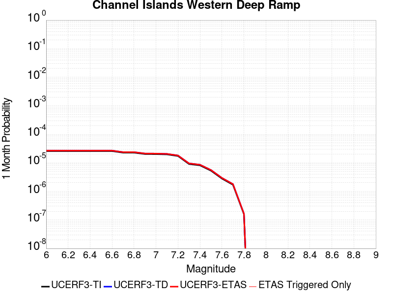 | 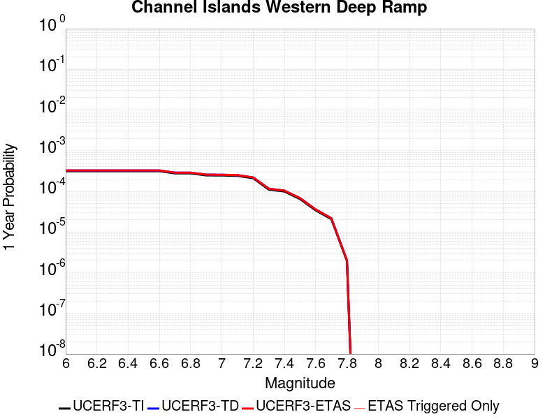 | 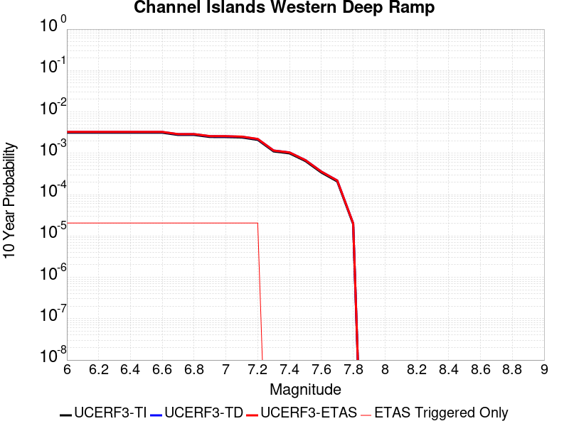 |

| Magnitude | 1 wk TI Prob | 1 wk TD Prob | 1 wk ETAS Prob | 1 wk ETAS/TD Gain | 1 wk ETAS Triggered Only | 1 mo TI Prob | 1 mo TD Prob | 1 mo ETAS Prob | 1 mo ETAS/TD Gain | 1 mo ETAS Triggered Only | 1 yr TI Prob | 1 yr TD Prob | 1 yr ETAS Prob | 1 yr ETAS/TD Gain | 1 yr ETAS Triggered Only | 10 yr TI Prob | 10 yr TD Prob | 10 yr ETAS Prob | 10 yr ETAS/TD Gain | 10 yr ETAS Triggered Only |
|-----|-----|-----|-----|-----|-----|-----|-----|-----|-----|-----|-----|-----|-----|-----|-----|-----|-----|-----|-----|-----|
| 6.0 | 6.0213506E-6 | 6.2549007E-6 | 6.2549007E-6 | 1.0 | 0.0 | 2.5805533E-5 | 2.6806467E-5 | 2.6806467E-5 | 1.0 | 0.0 | 3.1413708E-4 | 3.263243E-4 | 3.263243E-4 | 1.0 | 0.0 | 0.0031369338 | 0.003258893 | 0.0032688605 | 1.0030586 | 1.0E-5 |
| 6.1 | 6.0213506E-6 | 6.2549007E-6 | 6.2549007E-6 | 1.0 | 0.0 | 2.5805533E-5 | 2.6806467E-5 | 2.6806467E-5 | 1.0 | 0.0 | 3.1413708E-4 | 3.263243E-4 | 3.263243E-4 | 1.0 | 0.0 | 0.0031369338 | 0.003258893 | 0.0032688605 | 1.0030586 | 1.0E-5 |
| 6.2 | 6.0213506E-6 | 6.2549007E-6 | 6.2549007E-6 | 1.0 | 0.0 | 2.5805533E-5 | 2.6806467E-5 | 2.6806467E-5 | 1.0 | 0.0 | 3.1413708E-4 | 3.263243E-4 | 3.263243E-4 | 1.0 | 0.0 | 0.0031369338 | 0.003258893 | 0.0032688605 | 1.0030586 | 1.0E-5 |
| 6.3 | 6.0213506E-6 | 6.2549007E-6 | 6.2549007E-6 | 1.0 | 0.0 | 2.5805533E-5 | 2.6806467E-5 | 2.6806467E-5 | 1.0 | 0.0 | 3.1413708E-4 | 3.263243E-4 | 3.263243E-4 | 1.0 | 0.0 | 0.0031369338 | 0.003258893 | 0.0032688605 | 1.0030586 | 1.0E-5 |
| 6.4 | 6.0213506E-6 | 6.2549007E-6 | 6.2549007E-6 | 1.0 | 0.0 | 2.5805533E-5 | 2.6806467E-5 | 2.6806467E-5 | 1.0 | 0.0 | 3.1413708E-4 | 3.263243E-4 | 3.263243E-4 | 1.0 | 0.0 | 0.0031369338 | 0.003258893 | 0.0032688605 | 1.0030586 | 1.0E-5 |
| 6.5 | 6.0213506E-6 | 6.2549007E-6 | 6.2549007E-6 | 1.0 | 0.0 | 2.5805533E-5 | 2.6806467E-5 | 2.6806467E-5 | 1.0 | 0.0 | 3.1413708E-4 | 3.263243E-4 | 3.263243E-4 | 1.0 | 0.0 | 0.0031369338 | 0.003258893 | 0.0032688605 | 1.0030586 | 1.0E-5 |
| 6.6 | 6.0213506E-6 | 6.2549007E-6 | 6.2549007E-6 | 1.0 | 0.0 | 2.5805533E-5 | 2.6806467E-5 | 2.6806467E-5 | 1.0 | 0.0 | 3.1413708E-4 | 3.263243E-4 | 3.263243E-4 | 1.0 | 0.0 | 0.0031369338 | 0.003258893 | 0.0032688605 | 1.0030586 | 1.0E-5 |
| 6.7 | 5.313309E-6 | 5.52527E-6 | 5.52527E-6 | 1.0 | 0.0 | 2.2771126E-5 | 2.3679535E-5 | 2.3679535E-5 | 1.0 | 0.0 | 2.772032E-4 | 2.882643E-4 | 2.882643E-4 | 1.0 | 0.0 | 0.0027685766 | 0.002879307 | 0.002889278 | 1.003463 | 1.0E-5 |
| 6.8 | 5.313309E-6 | 5.52527E-6 | 5.52527E-6 | 1.0 | 0.0 | 2.2771126E-5 | 2.3679535E-5 | 2.3679535E-5 | 1.0 | 0.0 | 2.772032E-4 | 2.882643E-4 | 2.882643E-4 | 1.0 | 0.0 | 0.0027685766 | 0.002879307 | 0.002889278 | 1.003463 | 1.0E-5 |
| 6.9 | 4.744377E-6 | 4.9394575E-6 | 4.9394575E-6 | 1.0 | 0.0 | 2.0332885E-5 | 2.1168953E-5 | 2.1168953E-5 | 1.0 | 0.0 | 2.4752476E-4 | 2.5770525E-4 | 2.5770525E-4 | 1.0 | 0.0 | 0.0024724922 | 0.0025744315 | 0.0025844057 | 1.0038743 | 1.0E-5 |
| 7.0 | 4.722209E-6 | 4.9165E-6 | 4.9165E-6 | 1.0 | 0.0 | 2.0237881E-5 | 2.1070566E-5 | 2.1070566E-5 | 1.0 | 0.0 | 2.4636835E-4 | 2.5650766E-4 | 2.5650766E-4 | 1.0 | 0.0 | 0.002460954 | 0.0025624833 | 0.0025724578 | 1.0038924 | 1.0E-5 |
| 7.1 | 4.611174E-6 | 4.8014354E-6 | 4.8014354E-6 | 1.0 | 0.0 | 1.9762025E-5 | 2.057744E-5 | 2.057744E-5 | 1.0 | 0.0 | 2.4057609E-4 | 2.5050525E-4 | 2.5050525E-4 | 1.0 | 0.0 | 0.002403158 | 0.0025025955 | 0.0025125707 | 1.0039859 | 1.0E-5 |
| 7.2 | 4.043994E-6 | 4.21205E-6 | 4.21205E-6 | 1.0 | 0.0 | 1.7331287E-5 | 1.8051538E-5 | 1.8051538E-5 | 1.0 | 0.0 | 2.10988E-4 | 2.1975888E-4 | 2.1975888E-4 | 1.0 | 0.0 | 0.002107878 | 0.0021957664 | 0.0022057444 | 1.0045443 | 1.0E-5 |
| 7.3 | 2.1233036E-6 | 2.2298022E-6 | 2.2298022E-6 | 1.0 | 0.0 | 9.099841E-6 | 9.556261E-6 | 9.556261E-6 | 1.0 | 0.0 | 1.1078493E-4 | 1.1634132E-4 | 1.1634132E-4 | 1.0 | 0.0 | 0.0011072971 | 0.0011628097 | 0.0011628097 | 1.0 | 0.0 |
| 7.4 | 1.9051884E-6 | 2.0015107E-6 | 2.0015107E-6 | 1.0 | 0.0 | 8.165067E-6 | 8.577875E-6 | 8.577875E-6 | 1.0 | 0.0 | 9.940516E-5 | 1.0443068E-4 | 1.0443068E-4 | 1.0 | 0.0 | 9.93607E-4 | 0.0010438213 | 0.0010438213 | 1.0 | 0.0 |
| 7.5 | 1.2408497E-6 | 1.3038928E-6 | 1.3038928E-6 | 1.0 | 0.0 | 5.317916E-6 | 5.5880996E-6 | 5.5880996E-6 | 1.0 | 0.0 | 6.4743705E-5 | 6.803301E-5 | 6.803301E-5 | 1.0 | 0.0 | 6.4724847E-4 | 6.8012404E-4 | 6.8012404E-4 | 1.0 | 0.0 |
| 7.6 | 6.5440025E-7 | 6.886766E-7 | 6.886766E-7 | 1.0 | 0.0 | 2.8045695E-6 | 2.9514679E-6 | 2.9514679E-6 | 1.0 | 0.0 | 3.4145098E-5 | 3.5933543E-5 | 3.5933543E-5 | 1.0 | 0.0 | 3.4139853E-4 | 3.5927873E-4 | 3.5927873E-4 | 1.0 | 0.0 |
| 7.7 | 3.985963E-7 | 4.1931077E-7 | 4.1931077E-7 | 1.0 | 0.0 | 1.7082689E-6 | 1.797045E-6 | 1.797045E-6 | 1.0 | 0.0 | 2.0797976E-5 | 2.1878815E-5 | 2.1878815E-5 | 1.0 | 0.0 | 2.0796029E-4 | 2.1876777E-4 | 2.1876777E-4 | 1.0 | 0.0 |
| 7.8 | 3.706329E-8 | 3.8592006E-8 | 3.8592006E-8 | 1.0 | 0.0 | 1.5884267E-7 | 1.653943E-7 | 1.653943E-7 | 1.0 | 0.0 | 1.9339077E-6 | 2.0136738E-6 | 2.0136738E-6 | 1.0 | 0.0 | 1.933891E-5 | 2.0136567E-5 | 2.0136567E-5 | 1.0 | 0.0 |

## Quien Sabe 2011 CFM
*[(top)](#table-of-contents)*

| 1 Week | 1 Month | 1 Year | 10 Year |
|-----|-----|-----|-----|
| 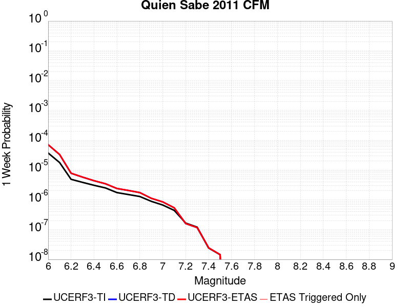 | 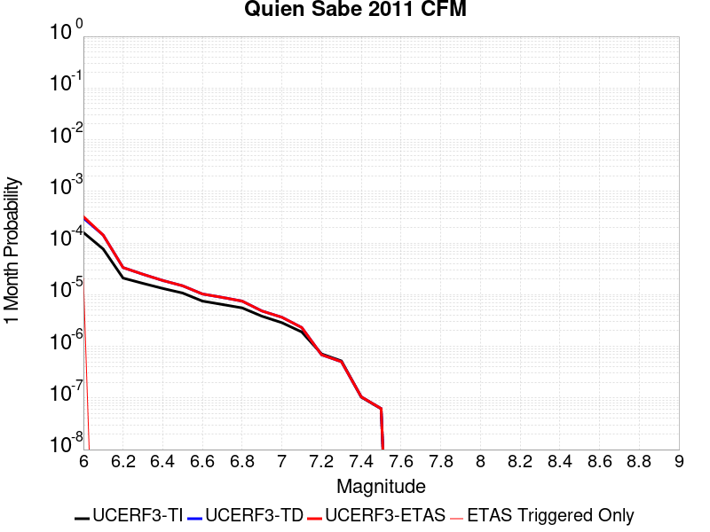 | 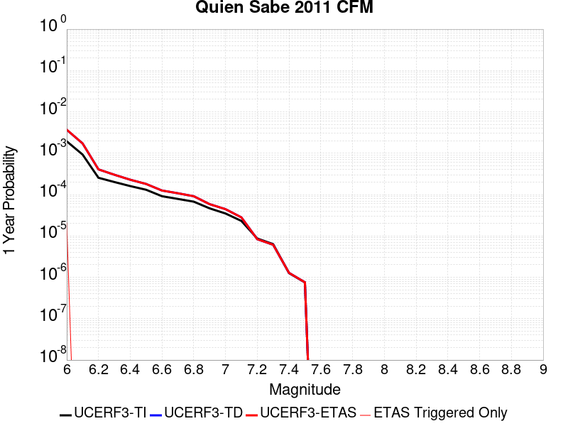 | 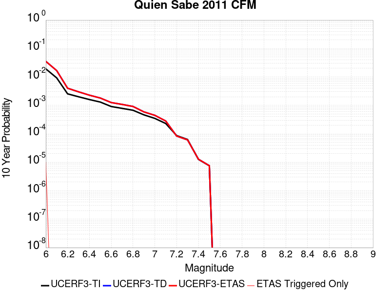 |

| Magnitude | 1 wk TI Prob | 1 wk TD Prob | 1 wk ETAS Prob | 1 wk ETAS/TD Gain | 1 wk ETAS Triggered Only | 1 mo TI Prob | 1 mo TD Prob | 1 mo ETAS Prob | 1 mo ETAS/TD Gain | 1 mo ETAS Triggered Only | 1 yr TI Prob | 1 yr TD Prob | 1 yr ETAS Prob | 1 yr ETAS/TD Gain | 1 yr ETAS Triggered Only | 10 yr TI Prob | 10 yr TD Prob | 10 yr ETAS Prob | 10 yr ETAS/TD Gain | 10 yr ETAS Triggered Only |
|-----|-----|-----|-----|-----|-----|-----|-----|-----|-----|-----|-----|-----|-----|-----|-----|-----|-----|-----|-----|-----|
| 6.0 | 3.729899E-5 | 7.088948E-5 | 7.088948E-5 | 1.0 | 0.0 | 1.5984301E-4 | 3.0378034E-4 | 3.137773E-4 | 1.0329086 | 1.0E-5 | 0.0019443515 | 0.0036853587 | 0.0036953217 | 1.0027034 | 1.0E-5 | 0.019274272 | 0.0353513 | 0.035360944 | 1.0002729 | 1.0E-5 |
| 6.1 | 1.7825725E-5 | 3.315054E-5 | 3.315054E-5 | 1.0 | 0.0 | 7.639373E-5 | 1.4206769E-4 | 1.4206769E-4 | 1.0 | 0.0 | 9.296967E-4 | 0.0017267886 | 0.0017267886 | 1.0 | 0.0 | 0.009258169 | 0.01669935 | 0.01669935 | 1.0 | 0.0 |
| 6.2 | 4.8865336E-6 | 7.805606E-6 | 7.805606E-6 | 1.0 | 0.0 | 2.0942118E-5 | 3.3452223E-5 | 3.3452223E-5 | 1.0 | 0.0 | 2.5494045E-4 | 4.069332E-4 | 4.069332E-4 | 1.0 | 0.0 | 0.0025464818 | 0.004013725 | 0.004013725 | 1.0 | 0.0 |
| 6.3 | 3.858491E-6 | 5.7898515E-6 | 5.7898515E-6 | 1.0 | 0.0 | 1.6536285E-5 | 2.481344E-5 | 2.481344E-5 | 1.0 | 0.0 | 2.0131067E-4 | 3.0206644E-4 | 3.0206644E-4 | 1.0 | 0.0 | 0.002011284 | 0.0030021158 | 0.0030021158 | 1.0 | 0.0 |
| 6.4 | 3.0771805E-6 | 4.3850664E-6 | 4.3850664E-6 | 1.0 | 0.0 | 1.318785E-5 | 1.879302E-5 | 1.879302E-5 | 1.0 | 0.0 | 1.6055023E-4 | 2.2878342E-4 | 2.2878342E-4 | 1.0 | 0.0 | 0.001604343 | 0.002286603 | 0.002286603 | 1.0 | 0.0 |
| 6.5 | 2.5081235E-6 | 3.4637387E-6 | 3.4637387E-6 | 1.0 | 0.0 | 1.0749056E-5 | 1.4844519E-5 | 1.4844519E-5 | 1.0 | 0.0 | 1.308619E-4 | 1.8071849E-4 | 1.8071849E-4 | 1.0 | 0.0 | 0.0013078486 | 0.0018124225 | 0.0018124225 | 1.0 | 0.0 |
| 6.6 | 1.7505364E-6 | 2.4024678E-6 | 2.4024678E-6 | 1.0 | 0.0 | 7.502277E-6 | 1.0296253E-5 | 1.0296253E-5 | 1.0 | 0.0 | 9.13364E-5 | 1.2535039E-4 | 1.2535039E-4 | 1.0 | 0.0 | 9.129886E-4 | 0.001258366 | 0.001258366 | 1.0 | 0.0 |
| 6.7 | 1.505737E-6 | 2.0638643E-6 | 2.0638643E-6 | 1.0 | 0.0 | 6.4531428E-6 | 8.845105E-6 | 8.845105E-6 | 1.0 | 0.0 | 7.8564175E-5 | 1.07684435E-4 | 1.07684435E-4 | 1.0 | 0.0 | 7.853641E-4 | 0.0010818782 | 0.0010818782 | 1.0 | 0.0 |
| 6.8 | 1.2924105E-6 | 1.7485087E-6 | 1.7485087E-6 | 1.0 | 0.0 | 5.5388905E-6 | 7.49359E-6 | 7.49359E-6 | 1.0 | 0.0 | 6.74339E-5 | 9.123119E-5 | 9.123119E-5 | 1.0 | 0.0 | 6.741344E-4 | 9.1614906E-4 | 9.1614906E-4 | 1.0 | 0.0 |
| 6.9 | 8.9075286E-7 | 1.1250673E-6 | 1.1250673E-6 | 1.0 | 0.0 | 3.8175067E-6 | 4.82171E-6 | 4.82171E-6 | 1.0 | 0.0 | 4.6477155E-5 | 5.8702957E-5 | 5.8702957E-5 | 1.0 | 0.0 | 4.6467435E-4 | 5.9043115E-4 | 5.9043115E-4 | 1.0 | 0.0 |
| 7.0 | 6.6891175E-7 | 8.5171826E-7 | 8.5171826E-7 | 1.0 | 0.0 | 2.8667614E-6 | 3.650217E-6 | 3.650217E-6 | 1.0 | 0.0 | 3.4902263E-5 | 4.4440683E-5 | 4.4440683E-5 | 1.0 | 0.0 | 3.4896782E-4 | 4.4681414E-4 | 4.4681414E-4 | 1.0 | 0.0 |
| 7.1 | 4.4205015E-7 | 5.3922207E-7 | 5.3922207E-7 | 1.0 | 0.0 | 1.8944993E-6 | 2.3109505E-6 | 2.3109505E-6 | 1.0 | 0.0 | 2.3065284E-5 | 2.813563E-5 | 2.813563E-5 | 1.0 | 0.0 | 2.3062891E-4 | 2.8270538E-4 | 2.8270538E-4 | 1.0 | 0.0 |
| 7.2 | 1.6620965E-7 | 1.5988428E-7 | 1.5988428E-7 | 1.0 | 0.0 | 7.123269E-7 | 6.8521814E-7 | 6.8521814E-7 | 1.0 | 0.0 | 8.672545E-6 | 8.342503E-6 | 8.342503E-6 | 1.0 | 0.0 | 8.6722066E-5 | 8.357743E-5 | 8.357743E-5 | 1.0 | 0.0 |
| 7.3 | 1.2142488E-7 | 1.17270666E-7 | 1.17270666E-7 | 1.0 | 0.0 | 5.2039223E-7 | 5.025885E-7 | 5.025885E-7 | 1.0 | 0.0 | 6.335757E-6 | 6.1190012E-6 | 6.1190012E-6 | 1.0 | 0.0 | 6.3355765E-5 | 6.1251456E-5 | 6.1251456E-5 | 1.0 | 0.0 |
| 7.4 | 2.4192937E-8 | 2.4544427E-8 | 2.4544427E-8 | 1.0 | 0.0 | 1.0368401E-7 | 1.05190395E-7 | 1.05190395E-7 | 1.0 | 0.0 | 1.2623522E-6 | 1.2806925E-6 | 1.2806925E-6 | 1.0 | 0.0 | 1.2623449E-5 | 1.2813195E-5 | 1.2813195E-5 | 1.0 | 0.0 |
| 7.5 | 1.4432802E-8 | 1.4506849E-8 | 1.4506849E-8 | 1.0 | 0.0 | 6.185486E-8 | 6.217221E-8 | 6.217221E-8 | 1.0 | 0.0 | 7.530827E-7 | 7.5694646E-7 | 7.5694646E-7 | 1.0 | 0.0 | 7.530801E-6 | 7.5737153E-6 | 7.5737153E-6 | 1.0 | 0.0 |

## Reliz 2011 CFM
*[(top)](#table-of-contents)*

| 1 Week | 1 Month | 1 Year | 10 Year |
|-----|-----|-----|-----|
| 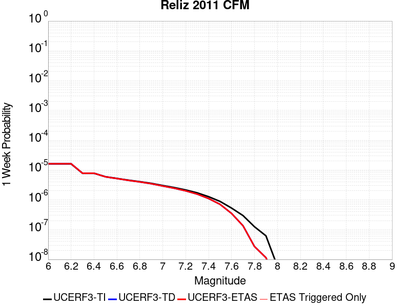 | 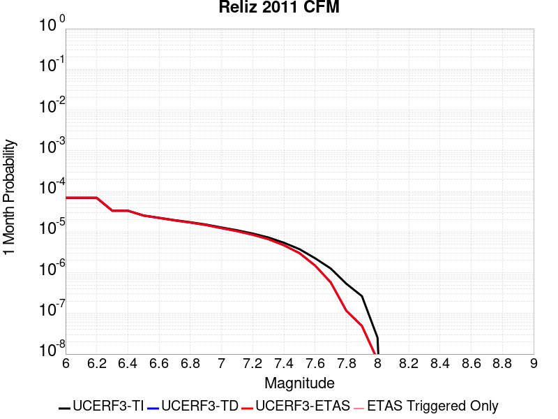 | 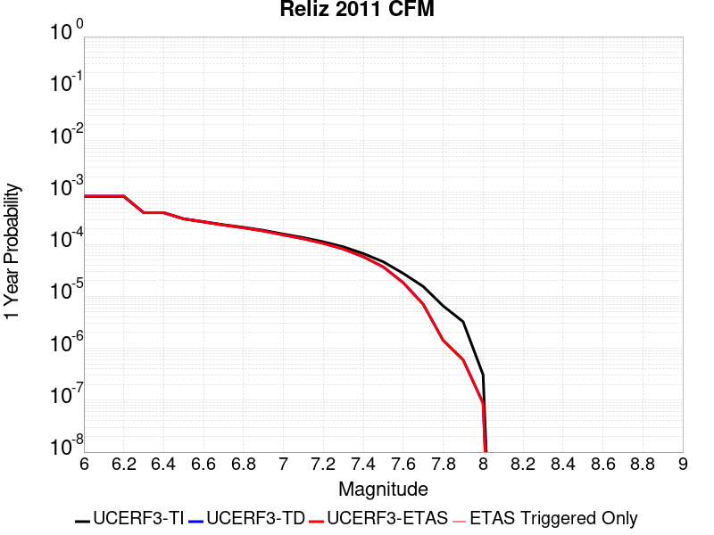 | 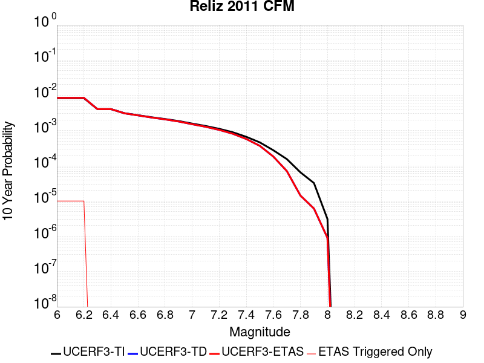 |

| Magnitude | 1 wk TI Prob | 1 wk TD Prob | 1 wk ETAS Prob | 1 wk ETAS/TD Gain | 1 wk ETAS Triggered Only | 1 mo TI Prob | 1 mo TD Prob | 1 mo ETAS Prob | 1 mo ETAS/TD Gain | 1 mo ETAS Triggered Only | 1 yr TI Prob | 1 yr TD Prob | 1 yr ETAS Prob | 1 yr ETAS/TD Gain | 1 yr ETAS Triggered Only | 10 yr TI Prob | 10 yr TD Prob | 10 yr ETAS Prob | 10 yr ETAS/TD Gain | 10 yr ETAS Triggered Only |
|-----|-----|-----|-----|-----|-----|-----|-----|-----|-----|-----|-----|-----|-----|-----|-----|-----|-----|-----|-----|-----|
| 6.0 | 1.6002472E-5 | 1.6282896E-5 | 1.6282896E-5 | 1.0 | 0.0 | 6.8580215E-5 | 6.978209E-5 | 6.978209E-5 | 1.0 | 0.0 | 8.3464425E-4 | 8.492855E-4 | 8.492855E-4 | 1.0 | 0.0 | 0.008315164 | 0.008462595 | 0.008472511 | 1.0011717 | 1.0E-5 |
| 6.1 | 1.6002472E-5 | 1.6282896E-5 | 1.6282896E-5 | 1.0 | 0.0 | 6.8580215E-5 | 6.978209E-5 | 6.978209E-5 | 1.0 | 0.0 | 8.3464425E-4 | 8.492855E-4 | 8.492855E-4 | 1.0 | 0.0 | 0.008315164 | 0.008462595 | 0.008472511 | 1.0011717 | 1.0E-5 |
| 6.2 | 1.6002472E-5 | 1.6282896E-5 | 1.6282896E-5 | 1.0 | 0.0 | 6.8580215E-5 | 6.978209E-5 | 6.978209E-5 | 1.0 | 0.0 | 8.3464425E-4 | 8.492855E-4 | 8.492855E-4 | 1.0 | 0.0 | 0.008315164 | 0.008462595 | 0.008472511 | 1.0011717 | 1.0E-5 |
| 6.3 | 7.792404E-6 | 7.8038565E-6 | 7.8038565E-6 | 1.0 | 0.0 | 3.339559E-5 | 3.3444678E-5 | 3.3444678E-5 | 1.0 | 0.0 | 4.0651546E-4 | 4.0711364E-4 | 4.0711364E-4 | 1.0 | 0.0 | 0.0040577264 | 0.004063955 | 0.004063955 | 1.0 | 0.0 |
| 6.4 | 7.792404E-6 | 7.8038565E-6 | 7.8038565E-6 | 1.0 | 0.0 | 3.339559E-5 | 3.3444678E-5 | 3.3444678E-5 | 1.0 | 0.0 | 4.0651546E-4 | 4.0711364E-4 | 4.0711364E-4 | 1.0 | 0.0 | 0.0040577264 | 0.004063955 | 0.004063955 | 1.0 | 0.0 |
| 6.5 | 5.9659374E-6 | 5.9287863E-6 | 5.9287863E-6 | 1.0 | 0.0 | 2.5568053E-5 | 2.5408837E-5 | 2.5408837E-5 | 1.0 | 0.0 | 3.1124658E-4 | 3.093089E-4 | 3.093089E-4 | 1.0 | 0.0 | 0.00310811 | 0.0030890019 | 0.0030890019 | 1.0 | 0.0 |
| 6.6 | 5.2350692E-6 | 5.1790316E-6 | 5.1790316E-6 | 1.0 | 0.0 | 2.2435817E-5 | 2.2195662E-5 | 2.2195662E-5 | 1.0 | 0.0 | 2.7312184E-4 | 2.701988E-4 | 2.701988E-4 | 1.0 | 0.0 | 0.002727864 | 0.002698913 | 0.002698913 | 1.0 | 0.0 |
| 6.7 | 4.580206E-6 | 4.5061634E-6 | 4.5061634E-6 | 1.0 | 0.0 | 1.9629308E-5 | 1.9311987E-5 | 1.9311987E-5 | 1.0 | 0.0 | 2.389606E-4 | 2.3509814E-4 | 2.3509814E-4 | 1.0 | 0.0 | 0.002387038 | 0.002348696 | 0.002348696 | 1.0 | 0.0 |
| 6.8 | 4.0765017E-6 | 3.9882793E-6 | 3.9882793E-6 | 1.0 | 0.0 | 1.7470604E-5 | 1.7092514E-5 | 1.7092514E-5 | 1.0 | 0.0 | 2.1268385E-4 | 2.0808152E-4 | 2.0808152E-4 | 1.0 | 0.0 | 0.002124804 | 0.002079065 | 0.002079065 | 1.0 | 0.0 |
| 6.9 | 3.5752896E-6 | 3.4725567E-6 | 3.4725567E-6 | 1.0 | 0.0 | 1.532258E-5 | 1.4882301E-5 | 1.4882301E-5 | 1.0 | 0.0 | 1.8653645E-4 | 1.8117698E-4 | 1.8117698E-4 | 1.0 | 0.0 | 0.0018637994 | 0.0018104891 | 0.0018104891 | 1.0 | 0.0 |
| 7.0 | 3.0259848E-6 | 2.9079788E-6 | 2.9079788E-6 | 1.0 | 0.0 | 1.2968442E-5 | 1.2462707E-5 | 1.2462707E-5 | 1.0 | 0.0 | 1.5787935E-4 | 1.517229E-4 | 1.517229E-4 | 1.0 | 0.0 | 0.0015776722 | 0.0015163884 | 0.0015163884 | 1.0 | 0.0 |
| 7.1 | 2.5861116E-6 | 2.4552023E-6 | 2.4552023E-6 | 1.0 | 0.0 | 1.1083288E-5 | 1.0522253E-5 | 1.0522253E-5 | 1.0 | 0.0 | 1.3493067E-4 | 1.2810092E-4 | 1.2810092E-4 | 1.0 | 0.0 | 0.0013484878 | 0.0012804654 | 0.0012804654 | 1.0 | 0.0 |
| 7.2 | 2.1482588E-6 | 2.00327E-6 | 2.00327E-6 | 1.0 | 0.0 | 9.20679E-6 | 8.585415E-6 | 8.585415E-6 | 1.0 | 0.0 | 1.12086906E-4 | 1.0452242E-4 | 1.0452242E-4 | 1.0 | 0.0 | 0.0011203039 | 0.0010449268 | 0.0010449268 | 1.0 | 0.0 |
| 7.3 | 1.7194744E-6 | 1.5611555E-6 | 1.5611555E-6 | 1.0 | 0.0 | 7.3691554E-6 | 6.6906496E-6 | 6.6906496E-6 | 1.0 | 0.0 | 8.971577E-5 | 8.145561E-5 | 8.145561E-5 | 1.0 | 0.0 | 8.967956E-4 | 8.144516E-4 | 8.144516E-4 | 1.0 | 0.0 |
| 7.4 | 1.2755178E-6 | 1.1056595E-6 | 1.1056595E-6 | 1.0 | 0.0 | 5.4664933E-6 | 4.738532E-6 | 4.738532E-6 | 1.0 | 0.0 | 6.655252E-5 | 5.7690104E-5 | 5.7690104E-5 | 1.0 | 0.0 | 6.6532596E-4 | 5.7694514E-4 | 5.7694514E-4 | 1.0 | 0.0 |
| 7.5 | 8.8463224E-7 | 7.0583064E-7 | 7.0583064E-7 | 1.0 | 0.0 | 3.7912755E-6 | 3.0249848E-6 | 3.0249848E-6 | 1.0 | 0.0 | 4.6157802E-5 | 3.682857E-5 | 3.682857E-5 | 1.0 | 0.0 | 4.6148215E-4 | 3.6841843E-4 | 3.6841843E-4 | 1.0 | 0.0 |
| 7.6 | 5.291355E-7 | 3.5010314E-7 | 3.5010314E-7 | 1.0 | 0.0 | 2.2677216E-6 | 1.5004412E-6 | 1.5004412E-6 | 1.0 | 0.0 | 2.760916E-5 | 1.8267718E-5 | 1.8267718E-5 | 1.0 | 0.0 | 2.760573E-4 | 1.82855E-4 | 1.82855E-4 | 1.0 | 0.0 |
| 7.7 | 2.9663357E-7 | 1.3513149E-7 | 1.3513149E-7 | 1.0 | 0.0 | 1.2712861E-6 | 5.791348E-7 | 5.791348E-7 | 1.0 | 0.0 | 1.5477797E-5 | 7.0509436E-6 | 7.0509436E-6 | 1.0 | 0.0 | 1.547672E-4 | 7.069193E-5 | 7.069193E-5 | 1.0 | 0.0 |
| 7.8 | 1.2509386E-7 | 2.7168449E-8 | 2.7168449E-8 | 1.0 | 0.0 | 5.3611643E-7 | 1.1643621E-7 | 1.1643621E-7 | 1.0 | 0.0 | 6.527198E-6 | 1.41761E-6 | 1.41761E-6 | 1.0 | 0.0 | 6.527006E-5 | 1.4332477E-5 | 1.4332477E-5 | 1.0 | 0.0 |
| 7.9 | 6.213493E-8 | 1.1488184E-8 | 1.1488184E-8 | 1.0 | 0.0 | 2.6629255E-7 | 4.9235076E-8 | 4.9235076E-8 | 1.0 | 0.0 | 3.242107E-6 | 5.994369E-7 | 5.994369E-7 | 1.0 | 0.0 | 3.2420594E-5 | 6.1256383E-6 | 6.1256383E-6 | 1.0 | 0.0 |
| 8.0 | 5.92383E-9 | 1.6785642E-9 | 1.6785642E-9 | 1.0 | 0.0 | 2.5387841E-8 | 7.1938473E-9 | 7.1938473E-9 | 1.0 | 0.0 | 3.0909692E-7 | 8.7585086E-8 | 8.7585086E-8 | 1.0 | 0.0 | 3.090965E-6 | 9.0066555E-7 | 9.0066555E-7 | 1.0 | 0.0 |

## Great Valley 06 (Midland) 2011 CFM alt1
*[(top)](#table-of-contents)*

| 1 Week | 1 Month | 1 Year | 10 Year |
|-----|-----|-----|-----|
| 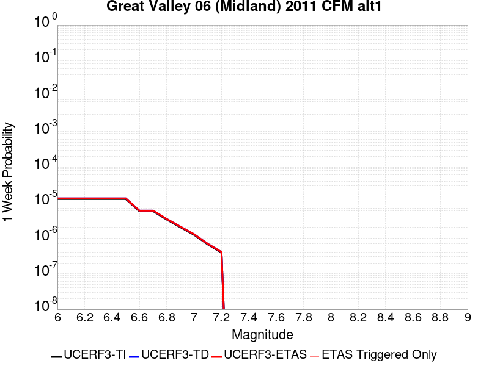 | 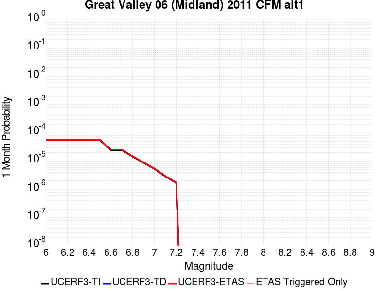 | 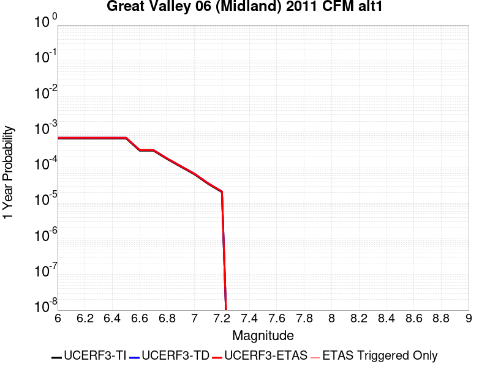 | 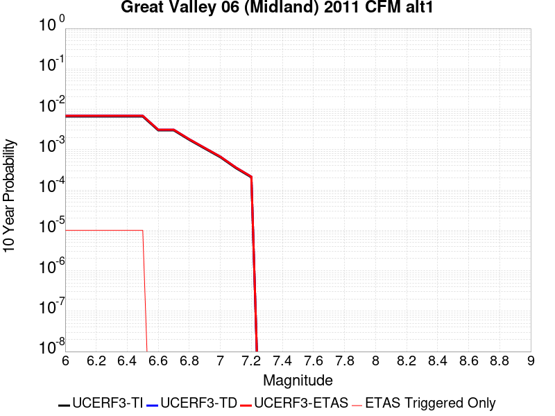 |

| Magnitude | 1 wk TI Prob | 1 wk TD Prob | 1 wk ETAS Prob | 1 wk ETAS/TD Gain | 1 wk ETAS Triggered Only | 1 mo TI Prob | 1 mo TD Prob | 1 mo ETAS Prob | 1 mo ETAS/TD Gain | 1 mo ETAS Triggered Only | 1 yr TI Prob | 1 yr TD Prob | 1 yr ETAS Prob | 1 yr ETAS/TD Gain | 1 yr ETAS Triggered Only | 10 yr TI Prob | 10 yr TD Prob | 10 yr ETAS Prob | 10 yr ETAS/TD Gain | 10 yr ETAS Triggered Only |
|-----|-----|-----|-----|-----|-----|-----|-----|-----|-----|-----|-----|-----|-----|-----|-----|-----|-----|-----|-----|-----|
| 6.0 | 1.2712525E-5 | 1.3210644E-5 | 1.3210644E-5 | 1.0 | 0.0 | 5.4481112E-5 | 5.661596E-5 | 5.661596E-5 | 1.0 | 0.0 | 6.6310563E-4 | 6.891067E-4 | 6.891067E-4 | 1.0 | 0.0 | 0.0066113044 | 0.0068722144 | 0.006882146 | 1.0014452 | 1.0E-5 |
| 6.1 | 1.2712525E-5 | 1.3210644E-5 | 1.3210644E-5 | 1.0 | 0.0 | 5.4481112E-5 | 5.661596E-5 | 5.661596E-5 | 1.0 | 0.0 | 6.6310563E-4 | 6.891067E-4 | 6.891067E-4 | 1.0 | 0.0 | 0.0066113044 | 0.0068722144 | 0.006882146 | 1.0014452 | 1.0E-5 |
| 6.2 | 1.2712525E-5 | 1.3210644E-5 | 1.3210644E-5 | 1.0 | 0.0 | 5.4481112E-5 | 5.661596E-5 | 5.661596E-5 | 1.0 | 0.0 | 6.6310563E-4 | 6.891067E-4 | 6.891067E-4 | 1.0 | 0.0 | 0.0066113044 | 0.0068722144 | 0.006882146 | 1.0014452 | 1.0E-5 |
| 6.3 | 1.2712525E-5 | 1.3210644E-5 | 1.3210644E-5 | 1.0 | 0.0 | 5.4481112E-5 | 5.661596E-5 | 5.661596E-5 | 1.0 | 0.0 | 6.6310563E-4 | 6.891067E-4 | 6.891067E-4 | 1.0 | 0.0 | 0.0066113044 | 0.0068722144 | 0.006882146 | 1.0014452 | 1.0E-5 |
| 6.4 | 1.2712525E-5 | 1.3210644E-5 | 1.3210644E-5 | 1.0 | 0.0 | 5.4481112E-5 | 5.661596E-5 | 5.661596E-5 | 1.0 | 0.0 | 6.6310563E-4 | 6.891067E-4 | 6.891067E-4 | 1.0 | 0.0 | 0.0066113044 | 0.0068722144 | 0.006882146 | 1.0014452 | 1.0E-5 |
| 6.5 | 1.2712525E-5 | 1.3210644E-5 | 1.3210644E-5 | 1.0 | 0.0 | 5.4481112E-5 | 5.661596E-5 | 5.661596E-5 | 1.0 | 0.0 | 6.6310563E-4 | 6.891067E-4 | 6.891067E-4 | 1.0 | 0.0 | 0.0066113044 | 0.0068722144 | 0.006882146 | 1.0014452 | 1.0E-5 |
| 6.6 | 5.7574384E-6 | 5.970676E-6 | 5.970676E-6 | 1.0 | 0.0 | 2.4674504E-5 | 2.558838E-5 | 2.558838E-5 | 1.0 | 0.0 | 3.0037065E-4 | 3.1149792E-4 | 3.1149792E-4 | 1.0 | 0.0 | 0.0029996498 | 0.0031109995 | 0.0031109995 | 1.0 | 0.0 |
| 6.7 | 5.7574384E-6 | 5.970676E-6 | 5.970676E-6 | 1.0 | 0.0 | 2.4674504E-5 | 2.558838E-5 | 2.558838E-5 | 1.0 | 0.0 | 3.0037065E-4 | 3.1149792E-4 | 3.1149792E-4 | 1.0 | 0.0 | 0.0029996498 | 0.0031109995 | 0.0031109995 | 1.0 | 0.0 |
| 6.8 | 3.3474828E-6 | 3.4694015E-6 | 3.4694015E-6 | 1.0 | 0.0 | 1.4346277E-5 | 1.4868788E-5 | 1.4868788E-5 | 1.0 | 0.0 | 1.7465191E-4 | 1.8101394E-4 | 1.8101394E-4 | 1.0 | 0.0 | 0.0017451472 | 0.001808812 | 0.001808812 | 1.0 | 0.0 |
| 6.9 | 2.035106E-6 | 2.1090457E-6 | 2.1090457E-6 | 1.0 | 0.0 | 8.721853E-6 | 9.03874E-6 | 9.03874E-6 | 1.0 | 0.0 | 1.0618339E-4 | 1.10041845E-4 | 1.10041845E-4 | 1.0 | 0.0 | 0.0010613267 | 0.0010999457 | 0.0010999457 | 1.0 | 0.0 |
| 7.0 | 1.2424716E-6 | 1.2878825E-6 | 1.2878825E-6 | 1.0 | 0.0 | 5.3248673E-6 | 5.519487E-6 | 5.519487E-6 | 1.0 | 0.0 | 6.482833E-5 | 6.719813E-5 | 6.719813E-5 | 1.0 | 0.0 | 6.480942E-4 | 6.7182246E-4 | 6.7182246E-4 | 1.0 | 0.0 |
| 7.1 | 6.6904556E-7 | 6.939069E-7 | 6.939069E-7 | 1.0 | 0.0 | 2.867335E-6 | 2.9738846E-6 | 2.9738846E-6 | 1.0 | 0.0 | 3.4909244E-5 | 3.6206704E-5 | 3.6206704E-5 | 1.0 | 0.0 | 3.490376E-4 | 3.6203355E-4 | 3.6203355E-4 | 1.0 | 0.0 |
| 7.2 | 3.948168E-7 | 4.0957252E-7 | 4.0957252E-7 | 1.0 | 0.0 | 1.6920709E-6 | 1.7553108E-6 | 1.7553108E-6 | 1.0 | 0.0 | 2.0600768E-5 | 2.137091E-5 | 2.137091E-5 | 1.0 | 0.0 | 2.0598859E-4 | 2.1370909E-4 | 2.1370909E-4 | 1.0 | 0.0 |

## Gillem - Big Crack 2011 CFM
*[(top)](#table-of-contents)*

| 1 Week | 1 Month | 1 Year | 10 Year |
|-----|-----|-----|-----|
|  | 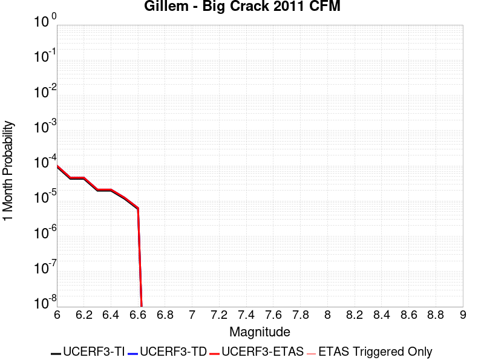 | 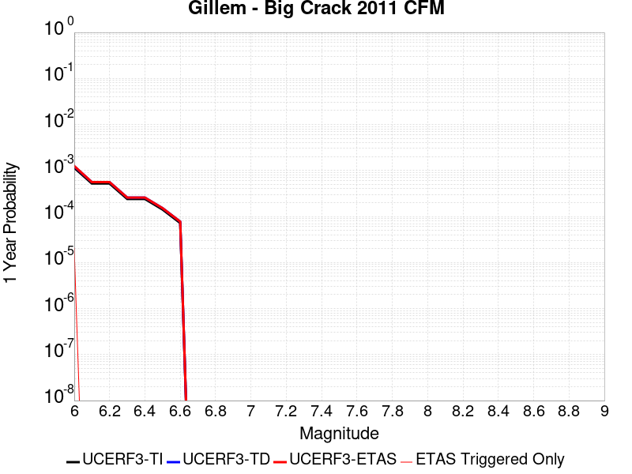 | 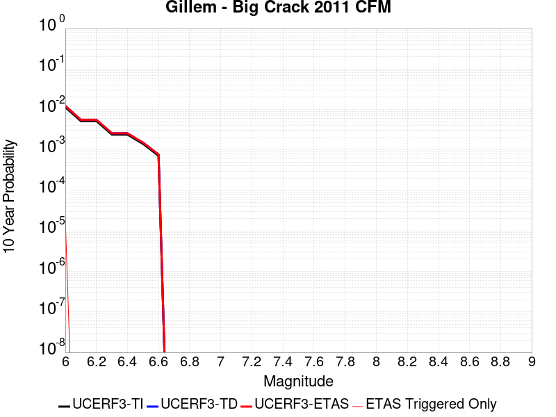 |

| Magnitude | 1 wk TI Prob | 1 wk TD Prob | 1 wk ETAS Prob | 1 wk ETAS/TD Gain | 1 wk ETAS Triggered Only | 1 mo TI Prob | 1 mo TD Prob | 1 mo ETAS Prob | 1 mo ETAS/TD Gain | 1 mo ETAS Triggered Only | 1 yr TI Prob | 1 yr TD Prob | 1 yr ETAS Prob | 1 yr ETAS/TD Gain | 1 yr ETAS Triggered Only | 10 yr TI Prob | 10 yr TD Prob | 10 yr ETAS Prob | 10 yr ETAS/TD Gain | 10 yr ETAS Triggered Only |
|-----|-----|-----|-----|-----|-----|-----|-----|-----|-----|-----|-----|-----|-----|-----|-----|-----|-----|-----|-----|-----|
| 6.0 | 2.196852E-5 | 2.360472E-5 | 2.360472E-5 | 1.0 | 0.0 | 9.4147406E-5 | 1.0115966E-4 | 1.0115966E-4 | 1.0 | 0.0 | 0.0011456419 | 0.0012310119 | 0.0012409997 | 1.0081134 | 1.0E-5 | 0.011397537 | 0.01225079 | 0.012260667 | 1.0008063 | 1.0E-5 |
| 6.1 | 9.992795E-6 | 1.0711992E-5 | 1.0711992E-5 | 1.0 | 0.0 | 4.2825563E-5 | 4.5907833E-5 | 4.5907833E-5 | 1.0 | 0.0 | 5.2127644E-4 | 5.5880286E-4 | 5.5880286E-4 | 1.0 | 0.0 | 0.0052005537 | 0.0055757877 | 0.0055757877 | 1.0 | 0.0 |
| 6.2 | 9.992795E-6 | 1.0711992E-5 | 1.0711992E-5 | 1.0 | 0.0 | 4.2825563E-5 | 4.5907833E-5 | 4.5907833E-5 | 1.0 | 0.0 | 5.2127644E-4 | 5.5880286E-4 | 5.5880286E-4 | 1.0 | 0.0 | 0.0052005537 | 0.0055757877 | 0.0055757877 | 1.0 | 0.0 |
| 6.3 | 4.6127884E-6 | 4.942704E-6 | 4.942704E-6 | 1.0 | 0.0 | 1.9768944E-5 | 2.118287E-5 | 2.118287E-5 | 1.0 | 0.0 | 2.406603E-4 | 2.5787536E-4 | 2.5787536E-4 | 1.0 | 0.0 | 0.0024039985 | 0.0025761996 | 0.0025761996 | 1.0 | 0.0 |
| 6.4 | 4.6127884E-6 | 4.942704E-6 | 4.942704E-6 | 1.0 | 0.0 | 1.9768944E-5 | 2.118287E-5 | 2.118287E-5 | 1.0 | 0.0 | 2.406603E-4 | 2.5787536E-4 | 2.5787536E-4 | 1.0 | 0.0 | 0.0024039985 | 0.0025761996 | 0.0025761996 | 1.0 | 0.0 |
| 6.5 | 2.716712E-6 | 2.911139E-6 | 2.911139E-6 | 1.0 | 0.0 | 1.1643E-5 | 1.2476264E-5 | 1.2476264E-5 | 1.0 | 0.0 | 1.417443E-4 | 1.5189036E-4 | 1.5189036E-4 | 1.0 | 0.0 | 0.0014165393 | 0.0015181034 | 0.0015181034 | 1.0 | 0.0 |
| 6.6 | 1.3818255E-6 | 1.4820831E-6 | 1.4820831E-6 | 1.0 | 0.0 | 5.922096E-6 | 6.3517764E-6 | 6.3517764E-6 | 1.0 | 0.0 | 7.209913E-5 | 7.7331366E-5 | 7.7331366E-5 | 1.0 | 0.0 | 7.2075747E-4 | 7.731655E-4 | 7.731655E-4 | 1.0 | 0.0 |

## Los Alamos extension
*[(top)](#table-of-contents)*

| 1 Week | 1 Month | 1 Year | 10 Year |
|-----|-----|-----|-----|
|  | 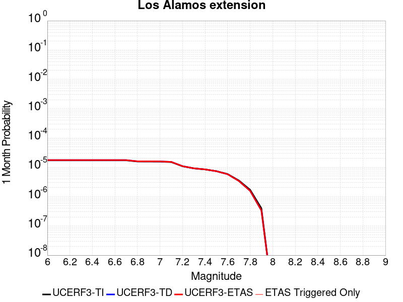 |  | 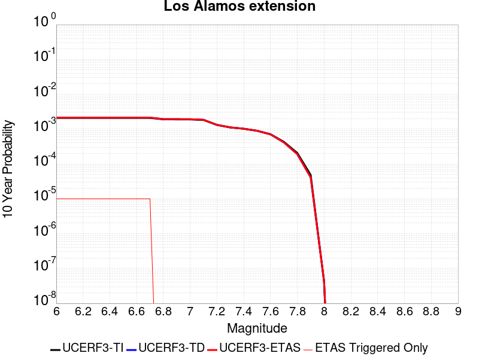 |

| Magnitude | 1 wk TI Prob | 1 wk TD Prob | 1 wk ETAS Prob | 1 wk ETAS/TD Gain | 1 wk ETAS Triggered Only | 1 mo TI Prob | 1 mo TD Prob | 1 mo ETAS Prob | 1 mo ETAS/TD Gain | 1 mo ETAS Triggered Only | 1 yr TI Prob | 1 yr TD Prob | 1 yr ETAS Prob | 1 yr ETAS/TD Gain | 1 yr ETAS Triggered Only | 10 yr TI Prob | 10 yr TD Prob | 10 yr ETAS Prob | 10 yr ETAS/TD Gain | 10 yr ETAS Triggered Only |
|-----|-----|-----|-----|-----|-----|-----|-----|-----|-----|-----|-----|-----|-----|-----|-----|-----|-----|-----|-----|-----|
| 6.0 | 4.0146506E-6 | 4.0861805E-6 | 4.0861805E-6 | 1.0 | 0.0 | 1.7205533E-5 | 1.751209E-5 | 1.751209E-5 | 1.0 | 0.0 | 2.0945723E-4 | 2.1318994E-4 | 2.1318994E-4 | 1.0 | 0.0 | 0.0020925992 | 0.0021299634 | 0.002139942 | 1.0046849 | 1.0E-5 |
| 6.1 | 4.0146506E-6 | 4.0861805E-6 | 4.0861805E-6 | 1.0 | 0.0 | 1.7205533E-5 | 1.751209E-5 | 1.751209E-5 | 1.0 | 0.0 | 2.0945723E-4 | 2.1318994E-4 | 2.1318994E-4 | 1.0 | 0.0 | 0.0020925992 | 0.0021299634 | 0.002139942 | 1.0046849 | 1.0E-5 |
| 6.2 | 4.0146506E-6 | 4.0861805E-6 | 4.0861805E-6 | 1.0 | 0.0 | 1.7205533E-5 | 1.751209E-5 | 1.751209E-5 | 1.0 | 0.0 | 2.0945723E-4 | 2.1318994E-4 | 2.1318994E-4 | 1.0 | 0.0 | 0.0020925992 | 0.0021299634 | 0.002139942 | 1.0046849 | 1.0E-5 |
| 6.3 | 4.0146506E-6 | 4.0861805E-6 | 4.0861805E-6 | 1.0 | 0.0 | 1.7205533E-5 | 1.751209E-5 | 1.751209E-5 | 1.0 | 0.0 | 2.0945723E-4 | 2.1318994E-4 | 2.1318994E-4 | 1.0 | 0.0 | 0.0020925992 | 0.0021299634 | 0.002139942 | 1.0046849 | 1.0E-5 |
| 6.4 | 4.0146506E-6 | 4.0861805E-6 | 4.0861805E-6 | 1.0 | 0.0 | 1.7205533E-5 | 1.751209E-5 | 1.751209E-5 | 1.0 | 0.0 | 2.0945723E-4 | 2.1318994E-4 | 2.1318994E-4 | 1.0 | 0.0 | 0.0020925992 | 0.0021299634 | 0.002139942 | 1.0046849 | 1.0E-5 |
| 6.5 | 4.0146506E-6 | 4.0861805E-6 | 4.0861805E-6 | 1.0 | 0.0 | 1.7205533E-5 | 1.751209E-5 | 1.751209E-5 | 1.0 | 0.0 | 2.0945723E-4 | 2.1318994E-4 | 2.1318994E-4 | 1.0 | 0.0 | 0.0020925992 | 0.0021299634 | 0.002139942 | 1.0046849 | 1.0E-5 |
| 6.6 | 4.0146506E-6 | 4.0861805E-6 | 4.0861805E-6 | 1.0 | 0.0 | 1.7205533E-5 | 1.751209E-5 | 1.751209E-5 | 1.0 | 0.0 | 2.0945723E-4 | 2.1318994E-4 | 2.1318994E-4 | 1.0 | 0.0 | 0.0020925992 | 0.0021299634 | 0.002139942 | 1.0046849 | 1.0E-5 |
| 6.7 | 4.0146506E-6 | 4.0861805E-6 | 4.0861805E-6 | 1.0 | 0.0 | 1.7205533E-5 | 1.751209E-5 | 1.751209E-5 | 1.0 | 0.0 | 2.0945723E-4 | 2.1318994E-4 | 2.1318994E-4 | 1.0 | 0.0 | 0.0020925992 | 0.0021299634 | 0.002139942 | 1.0046849 | 1.0E-5 |
| 6.8 | 3.6584688E-6 | 3.7188781E-6 | 3.7188781E-6 | 1.0 | 0.0 | 1.5679057E-5 | 1.5937956E-5 | 1.5937956E-5 | 1.0 | 0.0 | 1.9087581E-4 | 1.9402828E-4 | 1.9402828E-4 | 1.0 | 0.0 | 0.0019071194 | 0.0019386812 | 0.0019386812 | 1.0 | 0.0 |
| 6.9 | 3.644631E-6 | 3.704588E-6 | 3.704588E-6 | 1.0 | 0.0 | 1.5619753E-5 | 1.5876714E-5 | 1.5876714E-5 | 1.0 | 0.0 | 1.901539E-4 | 1.9328279E-4 | 1.9328279E-4 | 1.0 | 0.0 | 0.0018999127 | 0.0019312392 | 0.0019312392 | 1.0 | 0.0 |
| 7.0 | 3.6318522E-6 | 3.6913484E-6 | 3.6913484E-6 | 1.0 | 0.0 | 1.5564989E-5 | 1.5819975E-5 | 1.5819975E-5 | 1.0 | 0.0 | 1.8948725E-4 | 1.925921E-4 | 1.925921E-4 | 1.0 | 0.0 | 0.0018932576 | 0.0019243443 | 0.0019243443 | 1.0 | 0.0 |
| 7.1 | 3.5001724E-6 | 3.5554185E-6 | 3.5554185E-6 | 1.0 | 0.0 | 1.5000653E-5 | 1.5237424E-5 | 1.5237424E-5 | 1.0 | 0.0 | 1.8261763E-4 | 1.8550076E-4 | 1.8550076E-4 | 1.0 | 0.0 | 0.0018246764 | 0.0018535499 | 0.0018535499 | 1.0 | 0.0 |
| 7.2 | 2.5204702E-6 | 2.5437084E-6 | 2.5437084E-6 | 1.0 | 0.0 | 1.080197E-5 | 1.0901562E-5 | 1.0901562E-5 | 1.0 | 0.0 | 1.3150605E-4 | 1.3271849E-4 | 1.3271849E-4 | 1.0 | 0.0 | 0.0013142825 | 0.0013263979 | 0.0013263979 | 1.0 | 0.0 |
| 7.3 | 2.1399692E-6 | 2.150144E-6 | 2.150144E-6 | 1.0 | 0.0 | 9.1712645E-6 | 9.21487E-6 | 9.21487E-6 | 1.0 | 0.0 | 1.1165442E-4 | 1.121853E-4 | 1.121853E-4 | 1.0 | 0.0 | 0.0011159834 | 0.0011212899 | 0.0011212899 | 1.0 | 0.0 |
| 7.4 | 1.9660122E-6 | 1.970248E-6 | 1.970248E-6 | 1.0 | 0.0 | 8.42574E-6 | 8.4438925E-6 | 8.4438925E-6 | 1.0 | 0.0 | 1.0257855E-4 | 1.0279957E-4 | 1.0279957E-4 | 1.0 | 0.0 | 0.0010253121 | 0.0010275233 | 0.0010275233 | 1.0 | 0.0 |
| 7.5 | 1.7204633E-6 | 1.7151085E-6 | 1.7151085E-6 | 1.0 | 0.0 | 7.373393E-6 | 7.3504443E-6 | 7.3504443E-6 | 1.0 | 0.0 | 8.976737E-5 | 8.9488014E-5 | 8.9488014E-5 | 1.0 | 0.0 | 8.9731114E-4 | 8.9452276E-4 | 8.9452276E-4 | 1.0 | 0.0 |
| 7.6 | 1.3717638E-6 | 1.3535908E-6 | 1.3535908E-6 | 1.0 | 0.0 | 5.878974E-6 | 5.8010905E-6 | 5.8010905E-6 | 1.0 | 0.0 | 7.157416E-5 | 7.062602E-5 | 7.062602E-5 | 1.0 | 0.0 | 7.1551115E-4 | 7.060383E-4 | 7.060383E-4 | 1.0 | 0.0 |
| 7.7 | 8.272564E-7 | 7.957687E-7 | 7.957687E-7 | 1.0 | 0.0 | 3.5453797E-6 | 3.410433E-6 | 3.410433E-6 | 1.0 | 0.0 | 4.3164142E-5 | 4.152123E-5 | 4.152123E-5 | 1.0 | 0.0 | 4.315576E-4 | 4.151349E-4 | 4.151349E-4 | 1.0 | 0.0 |
| 7.8 | 3.9708277E-7 | 3.671928E-7 | 3.671928E-7 | 1.0 | 0.0 | 1.7017821E-6 | 1.5736824E-6 | 1.5736824E-6 | 1.0 | 0.0 | 2.0719E-5 | 1.9159415E-5 | 1.9159415E-5 | 1.0 | 0.0 | 2.071707E-4 | 1.9157771E-4 | 1.9157771E-4 | 1.0 | 0.0 |
| 7.9 | 9.292528E-8 | 7.8891446E-8 | 7.8891446E-8 | 1.0 | 0.0 | 3.9825116E-7 | 3.3810616E-7 | 3.3810616E-7 | 1.0 | 0.0 | 4.848697E-6 | 4.116435E-6 | 4.116435E-6 | 1.0 | 0.0 | 4.8485912E-5 | 4.1163596E-5 | 4.1163596E-5 | 1.0 | 0.0 |
| 8.0 | 7.880441E-11 | 8.235368E-11 | 8.235368E-11 | 1.0 | 0.0 | 3.3773329E-10 | 3.5294412E-10 | 3.5294412E-10 | 1.0 | 0.0 | 4.1119033E-9 | 4.297095E-9 | 4.297095E-9 | 1.0 | 0.0 | 4.1119034E-8 | 4.2970953E-8 | 4.2970953E-8 | 1.0 | 0.0 |

## Owens Valley Keough Hot Springs
*[(top)](#table-of-contents)*

| 1 Week | 1 Month | 1 Year | 10 Year |
|-----|-----|-----|-----|
| 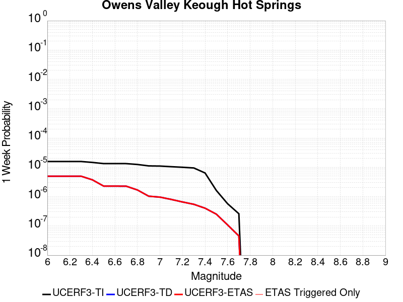 | 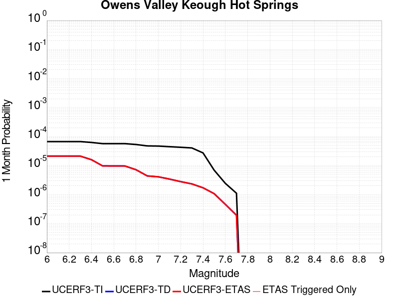 | 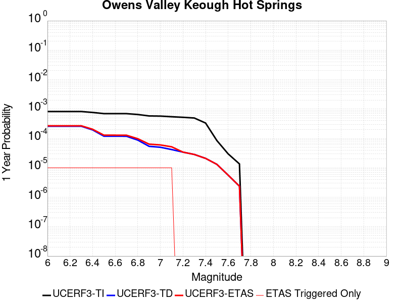 | 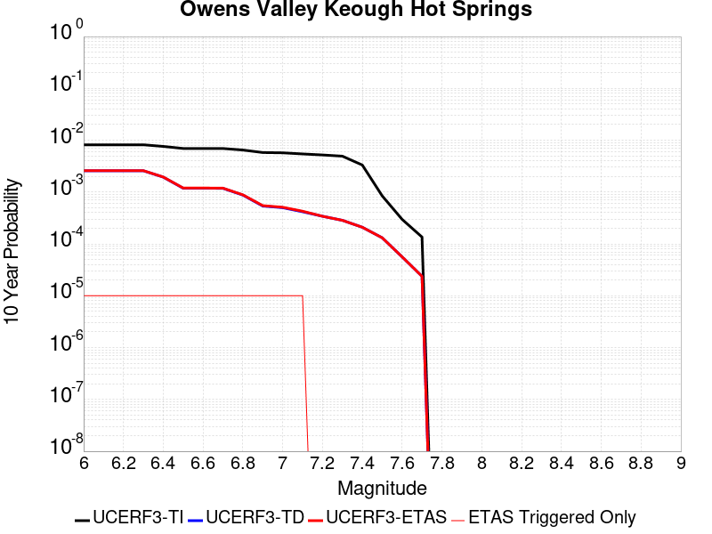 |

| Magnitude | 1 wk TI Prob | 1 wk TD Prob | 1 wk ETAS Prob | 1 wk ETAS/TD Gain | 1 wk ETAS Triggered Only | 1 mo TI Prob | 1 mo TD Prob | 1 mo ETAS Prob | 1 mo ETAS/TD Gain | 1 mo ETAS Triggered Only | 1 yr TI Prob | 1 yr TD Prob | 1 yr ETAS Prob | 1 yr ETAS/TD Gain | 1 yr ETAS Triggered Only | 10 yr TI Prob | 10 yr TD Prob | 10 yr ETAS Prob | 10 yr ETAS/TD Gain | 10 yr ETAS Triggered Only |
|-----|-----|-----|-----|-----|-----|-----|-----|-----|-----|-----|-----|-----|-----|-----|-----|-----|-----|-----|-----|-----|
| 6.0 | 1.5708529E-5 | 4.9508244E-6 | 4.9508244E-6 | 1.0 | 0.0 | 6.7320536E-5 | 2.1217675E-5 | 2.1217675E-5 | 1.0 | 0.0 | 8.193192E-4 | 2.582997E-4 | 2.6829712E-4 | 1.0387048 | 1.0E-5 | 0.008163051 | 0.0025806532 | 0.0025906272 | 1.003865 | 1.0E-5 |
| 6.1 | 1.5708529E-5 | 4.9508244E-6 | 4.9508244E-6 | 1.0 | 0.0 | 6.7320536E-5 | 2.1217675E-5 | 2.1217675E-5 | 1.0 | 0.0 | 8.193192E-4 | 2.582997E-4 | 2.6829712E-4 | 1.0387048 | 1.0E-5 | 0.008163051 | 0.0025806532 | 0.0025906272 | 1.003865 | 1.0E-5 |
| 6.2 | 1.5708529E-5 | 4.9508244E-6 | 4.9508244E-6 | 1.0 | 0.0 | 6.7320536E-5 | 2.1217675E-5 | 2.1217675E-5 | 1.0 | 0.0 | 8.193192E-4 | 2.582997E-4 | 2.6829712E-4 | 1.0387048 | 1.0E-5 | 0.008163051 | 0.0025806532 | 0.0025906272 | 1.003865 | 1.0E-5 |
| 6.3 | 1.5708529E-5 | 4.9508244E-6 | 4.9508244E-6 | 1.0 | 0.0 | 6.7320536E-5 | 2.1217675E-5 | 2.1217675E-5 | 1.0 | 0.0 | 8.193192E-4 | 2.582997E-4 | 2.6829712E-4 | 1.0387048 | 1.0E-5 | 0.008163051 | 0.0025806532 | 0.0025906272 | 1.003865 | 1.0E-5 |
| 6.4 | 1.4622509E-5 | 3.7266684E-6 | 3.7266684E-6 | 1.0 | 0.0 | 6.266639E-5 | 1.5971356E-5 | 1.5971356E-5 | 1.0 | 0.0 | 7.626962E-4 | 1.9443722E-4 | 2.0443527E-4 | 1.0514205 | 1.0E-5 | 0.007600839 | 0.0019431504 | 0.001953131 | 1.0051363 | 1.0E-5 |
| 6.5 | 1.3335527E-5 | 2.2778408E-6 | 2.2778408E-6 | 1.0 | 0.0 | 5.7151006E-5 | 9.762142E-6 | 9.762142E-6 | 1.0 | 0.0 | 6.955913E-4 | 1.18848286E-4 | 1.288471E-4 | 1.0841309 | 1.0E-5 | 0.0069341804 | 0.0011880693 | 0.0011980574 | 1.008407 | 1.0E-5 |
| 6.6 | 1.3332855E-5 | 2.27499E-6 | 2.27499E-6 | 1.0 | 0.0 | 5.7139558E-5 | 9.749924E-6 | 9.749924E-6 | 1.0 | 0.0 | 6.9545204E-4 | 1.1869955E-4 | 1.2869836E-4 | 1.0842363 | 1.0E-5 | 0.0069327964 | 0.0011865837 | 0.0011965717 | 1.0084176 | 1.0E-5 |
| 6.7 | 1.3318214E-5 | 2.26422E-6 | 2.26422E-6 | 1.0 | 0.0 | 5.707681E-5 | 9.703767E-6 | 9.703767E-6 | 1.0 | 0.0 | 6.946886E-4 | 1.1813765E-4 | 1.2813647E-4 | 1.084637 | 1.0E-5 | 0.0069252094 | 0.0011809706 | 0.0011909588 | 1.0084577 | 1.0E-5 |
| 6.8 | 1.2441338E-5 | 1.6778914E-6 | 1.6778914E-6 | 1.0 | 0.0 | 5.331893E-5 | 7.190945E-6 | 7.190945E-6 | 1.0 | 0.0 | 6.489646E-4 | 8.7546534E-5 | 9.7545664E-5 | 1.114215 | 1.0E-5 | 0.0064707273 | 8.75305E-4 | 8.852962E-4 | 1.0114146 | 1.0E-5 |
| 6.9 | 1.1130476E-5 | 1.0304584E-6 | 1.0304584E-6 | 1.0 | 0.0 | 4.7701167E-5 | 4.416243E-6 | 4.416243E-6 | 1.0 | 0.0 | 5.806069E-4 | 5.3766445E-5 | 6.376591E-5 | 1.1859796 | 1.0E-5 | 0.0057909233 | 5.376886E-4 | 5.476833E-4 | 1.0185881 | 1.0E-5 |
| 7.0 | 1.0986073E-5 | 9.580101E-7 | 9.580101E-7 | 1.0 | 0.0 | 4.7082318E-5 | 4.105751E-6 | 4.105751E-6 | 1.0 | 0.0 | 5.730765E-4 | 4.9986385E-5 | 5.9985887E-5 | 1.2000445 | 1.0E-5 | 0.0057160086 | 4.999046E-4 | 5.0989963E-4 | 1.0199938 | 1.0E-5 |
| 7.1 | 1.0451338E-5 | 8.000831E-7 | 8.000831E-7 | 1.0 | 0.0 | 4.4790682E-5 | 3.428923E-6 | 3.428923E-6 | 1.0 | 0.0 | 5.451901E-4 | 4.1746345E-5 | 5.1745927E-5 | 1.239532 | 1.0E-5 | 0.005438545 | 4.1753432E-4 | 4.2753015E-4 | 1.0239401 | 1.0E-5 |
| 7.2 | 9.989061E-6 | 6.545439E-7 | 6.545439E-7 | 1.0 | 0.0 | 4.280956E-5 | 2.805185E-6 | 2.805185E-6 | 1.0 | 0.0 | 5.2108173E-4 | 3.4152596E-5 | 3.4152596E-5 | 1.0 | 0.0 | 0.0051986156 | 3.4161055E-4 | 3.4161055E-4 | 1.0 | 0.0 |
| 7.3 | 9.465365E-6 | 5.4604976E-7 | 5.4604976E-7 | 1.0 | 0.0 | 4.056522E-5 | 2.340211E-6 | 2.340211E-6 | 1.0 | 0.0 | 4.937696E-4 | 2.84917E-5 | 2.84917E-5 | 1.0 | 0.0 | 0.0049267393 | 2.8501268E-4 | 2.8501268E-4 | 1.0 | 0.0 |
| 7.4 | 6.3824805E-6 | 4.016707E-7 | 4.016707E-7 | 1.0 | 0.0 | 2.73532E-5 | 1.7214446E-6 | 1.7214446E-6 | 1.0 | 0.0 | 3.3297433E-4 | 2.0958389E-5 | 2.0958389E-5 | 1.0 | 0.0 | 0.0033247585 | 2.0965615E-4 | 2.0965615E-4 | 1.0 | 0.0 |
| 7.5 | 1.6192645E-6 | 2.5163493E-7 | 2.5163493E-7 | 1.0 | 0.0 | 6.9396865E-6 | 1.0784349E-6 | 1.0784349E-6 | 1.0 | 0.0 | 8.448741E-5 | 1.31298675E-5 | 1.31298675E-5 | 1.0 | 0.0 | 8.4455294E-4 | 1.3129105E-4 | 1.3129105E-4 | 1.0 | 0.0 |
| 7.6 | 5.7062545E-7 | 1.079331E-7 | 1.079331E-7 | 1.0 | 0.0 | 2.4455355E-6 | 4.6257034E-7 | 4.6257034E-7 | 1.0 | 0.0 | 2.9773988E-5 | 5.63178E-6 | 5.63178E-6 | 1.0 | 0.0 | 2.977E-4 | 5.6316454E-5 | 5.6316454E-5 | 1.0 | 0.0 |
| 7.7 | 2.5988817E-7 | 4.5461668E-8 | 4.5461668E-8 | 1.0 | 0.0 | 1.113806E-6 | 1.948357E-7 | 1.948357E-7 | 1.0 | 0.0 | 1.3560503E-5 | 2.3721225E-6 | 2.3721225E-6 | 1.0 | 0.0 | 1.3559677E-4 | 2.3721017E-5 | 2.3721017E-5 | 1.0 | 0.0 |

## Likely 2011 CFM
*[(top)](#table-of-contents)*

| 1 Week | 1 Month | 1 Year | 10 Year |
|-----|-----|-----|-----|
|  |  | 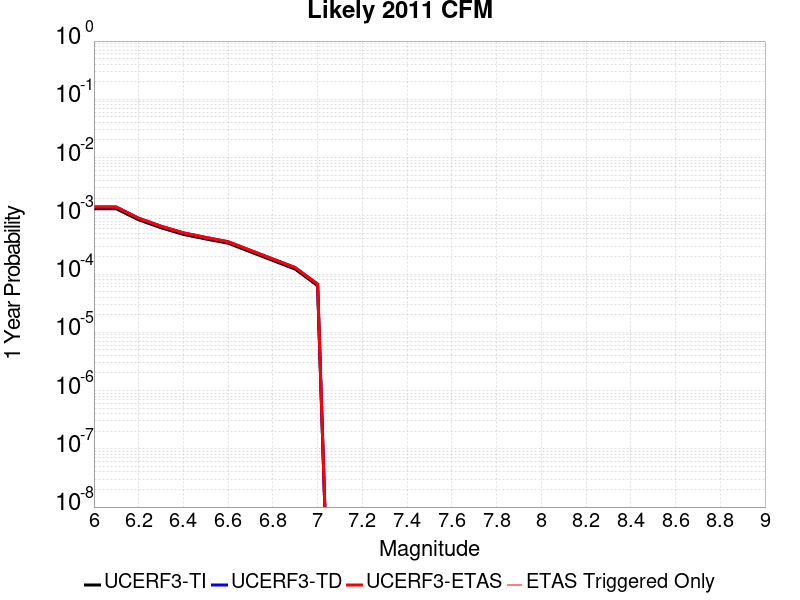 | 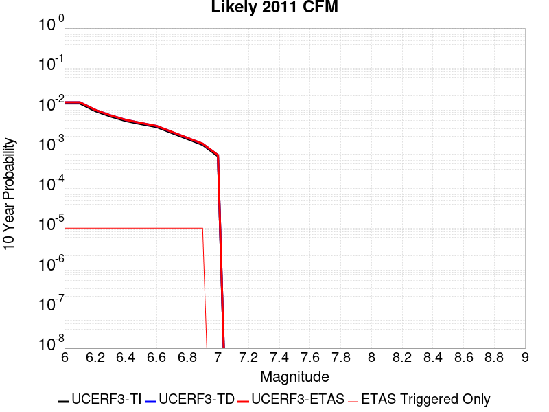 |

| Magnitude | 1 wk TI Prob | 1 wk TD Prob | 1 wk ETAS Prob | 1 wk ETAS/TD Gain | 1 wk ETAS Triggered Only | 1 mo TI Prob | 1 mo TD Prob | 1 mo ETAS Prob | 1 mo ETAS/TD Gain | 1 mo ETAS Triggered Only | 1 yr TI Prob | 1 yr TD Prob | 1 yr ETAS Prob | 1 yr ETAS/TD Gain | 1 yr ETAS Triggered Only | 10 yr TI Prob | 10 yr TD Prob | 10 yr ETAS Prob | 10 yr ETAS/TD Gain | 10 yr ETAS Triggered Only |
|-----|-----|-----|-----|-----|-----|-----|-----|-----|-----|-----|-----|-----|-----|-----|-----|-----|-----|-----|-----|-----|
| 6.0 | 2.5315949E-5 | 2.7105003E-5 | 2.7105003E-5 | 1.0 | 0.0 | 1.0849241E-4 | 1.16159375E-4 | 1.16159375E-4 | 1.0 | 0.0 | 0.0013200947 | 0.0014133675 | 0.0014133675 | 1.0 | 0.0 | 0.013122803 | 0.014048441 | 0.014058301 | 1.0007018 | 1.0E-5 |
| 6.1 | 2.5315949E-5 | 2.7105003E-5 | 2.7105003E-5 | 1.0 | 0.0 | 1.0849241E-4 | 1.16159375E-4 | 1.16159375E-4 | 1.0 | 0.0 | 0.0013200947 | 0.0014133675 | 0.0014133675 | 1.0 | 0.0 | 0.013122803 | 0.014048441 | 0.014058301 | 1.0007018 | 1.0E-5 |
| 6.2 | 1.6375941E-5 | 1.7465996E-5 | 1.7465996E-5 | 1.0 | 0.0 | 7.0180715E-5 | 7.485219E-5 | 7.485219E-5 | 1.0 | 0.0 | 8.5411523E-4 | 9.109567E-4 | 9.109567E-4 | 1.0 | 0.0 | 0.008508399 | 0.009073513 | 0.009083422 | 1.0010921 | 1.0E-5 |
| 6.3 | 1.1945543E-5 | 1.2712695E-5 | 1.2712695E-5 | 1.0 | 0.0 | 5.119418E-5 | 5.4481872E-5 | 5.4481872E-5 | 1.0 | 0.0 | 6.2311086E-4 | 6.6312024E-4 | 6.6312024E-4 | 1.0 | 0.0 | 0.0062136655 | 0.0066119707 | 0.0066219047 | 1.0015024 | 1.0E-5 |
| 6.4 | 9.192729E-6 | 9.768569E-6 | 9.768569E-6 | 1.0 | 0.0 | 3.939681E-5 | 4.1864638E-5 | 4.1864638E-5 | 1.0 | 0.0 | 4.7955062E-4 | 5.095855E-4 | 5.095855E-4 | 1.0 | 0.0 | 0.004785171 | 0.0050844513 | 0.0050944006 | 1.0019568 | 1.0E-5 |
| 6.5 | 7.67906E-6 | 8.152689E-6 | 8.152689E-6 | 1.0 | 0.0 | 3.2909844E-5 | 3.493964E-5 | 3.493964E-5 | 1.0 | 0.0 | 4.006037E-4 | 4.2530894E-4 | 4.2530894E-4 | 1.0 | 0.0 | 0.0039988225 | 0.004245143 | 0.0042551 | 1.0023457 | 1.0E-5 |
| 6.6 | 6.4884057E-6 | 6.884806E-6 | 6.884806E-6 | 1.0 | 0.0 | 2.7807157E-5 | 2.9505987E-5 | 2.9505987E-5 | 1.0 | 0.0 | 3.3849955E-4 | 3.5917762E-4 | 3.5917762E-4 | 1.0 | 0.0 | 0.003379844 | 0.0035861158 | 0.00359608 | 1.0027785 | 1.0E-5 |
| 6.7 | 4.6060636E-6 | 4.88408E-6 | 4.88408E-6 | 1.0 | 0.0 | 1.9740122E-5 | 2.093161E-5 | 2.093161E-5 | 1.0 | 0.0 | 2.403095E-4 | 2.5481338E-4 | 2.5481338E-4 | 1.0 | 0.0 | 0.002400498 | 0.002545295 | 0.0025552695 | 1.0039188 | 1.0E-5 |
| 6.8 | 3.2795615E-6 | 3.477401E-6 | 3.477401E-6 | 1.0 | 0.0 | 1.4055187E-5 | 1.4903065E-5 | 1.4903065E-5 | 1.0 | 0.0 | 1.7110848E-4 | 1.8143027E-4 | 1.8143027E-4 | 1.0 | 0.0 | 0.0017097679 | 0.0018128767 | 0.0018228586 | 1.005506 | 1.0E-5 |
| 6.9 | 2.3289967E-6 | 2.4705769E-6 | 2.4705769E-6 | 1.0 | 0.0 | 9.981376E-6 | 1.0588145E-5 | 1.0588145E-5 | 1.0 | 0.0 | 1.2151648E-4 | 1.2890348E-4 | 1.2890348E-4 | 1.0 | 0.0 | 0.0012145005 | 0.0012883301 | 0.0012983172 | 1.007752 | 1.0E-5 |
| 7.0 | 1.211292E-6 | 1.2864064E-6 | 1.2864064E-6 | 1.0 | 0.0 | 5.1912407E-6 | 5.51316E-6 | 5.51316E-6 | 1.0 | 0.0 | 6.320152E-5 | 6.7120964E-5 | 6.7120964E-5 | 1.0 | 0.0 | 6.3183554E-4 | 6.710367E-4 | 6.710367E-4 | 1.0 | 0.0 |

## Concord 2011 CFM
*[(top)](#table-of-contents)*

| 1 Week | 1 Month | 1 Year | 10 Year |
|-----|-----|-----|-----|
| 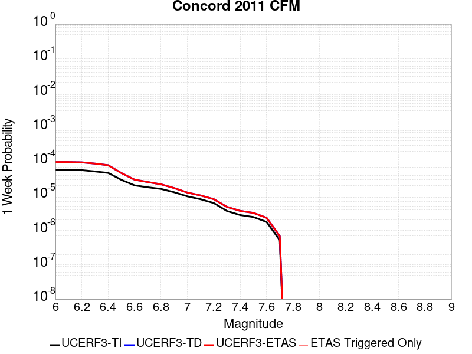 | 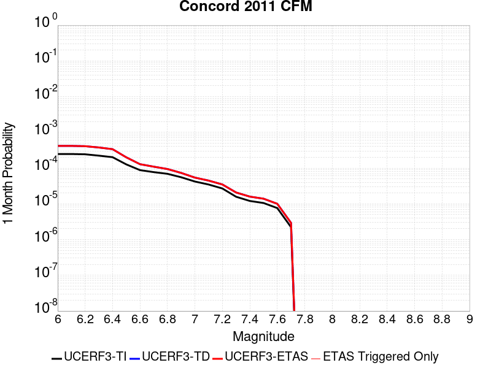 | 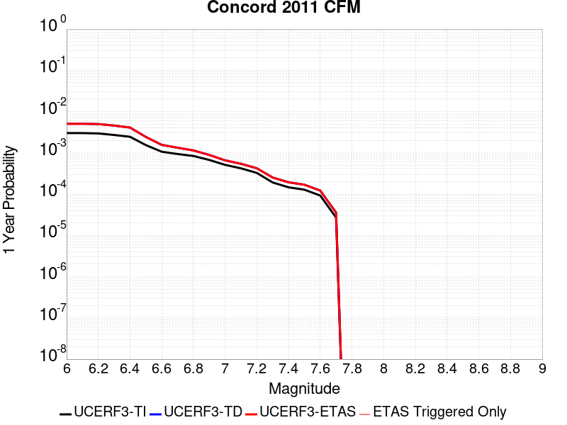 | 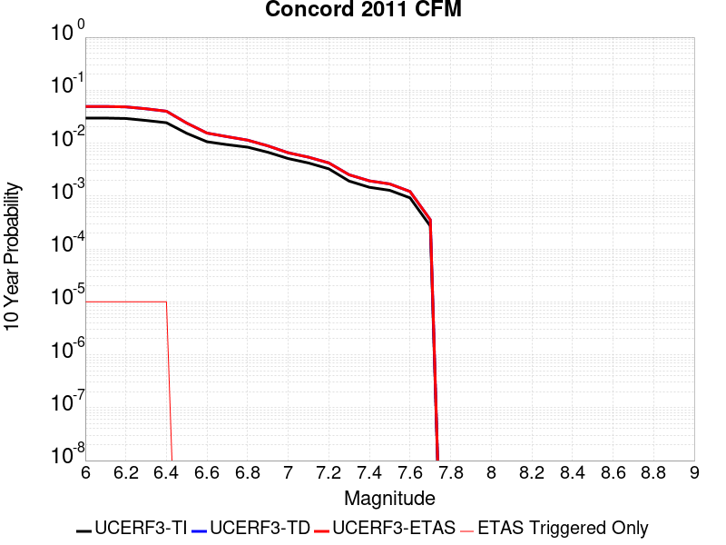 |

| Magnitude | 1 wk TI Prob | 1 wk TD Prob | 1 wk ETAS Prob | 1 wk ETAS/TD Gain | 1 wk ETAS Triggered Only | 1 mo TI Prob | 1 mo TD Prob | 1 mo ETAS Prob | 1 mo ETAS/TD Gain | 1 mo ETAS Triggered Only | 1 yr TI Prob | 1 yr TD Prob | 1 yr ETAS Prob | 1 yr ETAS/TD Gain | 1 yr ETAS Triggered Only | 10 yr TI Prob | 10 yr TD Prob | 10 yr ETAS Prob | 10 yr ETAS/TD Gain | 10 yr ETAS Triggered Only |
|-----|-----|-----|-----|-----|-----|-----|-----|-----|-----|-----|-----|-----|-----|-----|-----|-----|-----|-----|-----|-----|
| 6.0 | 5.7865112E-5 | 9.7592994E-5 | 9.7592994E-5 | 1.0 | 0.0 | 2.4796976E-4 | 4.181934E-4 | 4.181934E-4 | 1.0 | 0.0 | 0.0030148525 | 0.005079523 | 0.005079523 | 1.0 | 0.0 | 0.029742775 | 0.04924955 | 0.049259055 | 1.000193 | 1.0E-5 |
| 6.1 | 5.7865112E-5 | 9.7592994E-5 | 9.7592994E-5 | 1.0 | 0.0 | 2.4796976E-4 | 4.181934E-4 | 4.181934E-4 | 1.0 | 0.0 | 0.0030148525 | 0.005079523 | 0.005079523 | 1.0 | 0.0 | 0.029742775 | 0.04924955 | 0.049259055 | 1.000193 | 1.0E-5 |
| 6.2 | 5.6789337E-5 | 9.579644E-5 | 9.579644E-5 | 1.0 | 0.0 | 2.4336016E-4 | 4.1049632E-4 | 4.1049632E-4 | 1.0 | 0.0 | 0.0029588845 | 0.0049862415 | 0.0049862415 | 1.0 | 0.0 | 0.029197963 | 0.04836609 | 0.048375603 | 1.0001968 | 1.0E-5 |
| 6.3 | 5.203322E-5 | 8.8031295E-5 | 8.8031295E-5 | 1.0 | 0.0 | 2.2298045E-4 | 3.7722682E-4 | 3.7722682E-4 | 1.0 | 0.0 | 0.0027114071 | 0.0045838486 | 0.0045838486 | 1.0 | 0.0 | 0.026785625 | 0.04453707 | 0.044546623 | 1.0002146 | 1.0E-5 |
| 6.4 | 4.7120942E-5 | 7.897469E-5 | 7.897469E-5 | 1.0 | 0.0 | 2.0193127E-4 | 3.3842324E-4 | 3.3842324E-4 | 1.0 | 0.0 | 0.0024557412 | 0.0041132635 | 0.0041132635 | 1.0 | 0.0 | 0.024287801 | 0.04006584 | 0.04007544 | 1.0002396 | 1.0E-5 |
| 6.5 | 2.9598437E-5 | 4.667524E-5 | 4.667524E-5 | 1.0 | 0.0 | 1.2684427E-4 | 2.000226E-4 | 2.000226E-4 | 1.0 | 0.0 | 0.001543235 | 0.0024327657 | 0.0024327657 | 1.0 | 0.0 | 0.015325619 | 0.023910161 | 0.023910161 | 1.0 | 0.0 |
| 6.6 | 2.0443718E-5 | 2.9984598E-5 | 2.9984598E-5 | 1.0 | 0.0 | 8.7613E-5 | 1.2849929E-4 | 1.2849929E-4 | 1.0 | 0.0 | 0.0010661662 | 0.0015633923 | 0.0015633923 | 1.0 | 0.0 | 0.010610655 | 0.015467131 | 0.015467131 | 1.0 | 0.0 |
| 6.7 | 1.798539E-5 | 2.5557623E-5 | 2.5557623E-5 | 1.0 | 0.0 | 7.7077966E-5 | 1.0952819E-4 | 1.0952819E-4 | 1.0 | 0.0 | 9.380202E-4 | 0.0013327115 | 0.0013327115 | 1.0 | 0.0 | 0.009340706 | 0.013217555 | 0.013217555 | 1.0 | 0.0 |
| 6.8 | 1.613555E-5 | 2.1959419E-5 | 2.1959419E-5 | 1.0 | 0.0 | 6.915052E-5 | 9.410847E-5 | 9.410847E-5 | 1.0 | 0.0 | 8.4158237E-4 | 0.0011451824 | 0.0011451824 | 1.0 | 0.0 | 0.008384023 | 0.01137831 | 0.01137831 | 1.0 | 0.0 |
| 6.9 | 1.2916435E-5 | 1.7081215E-5 | 1.7081215E-5 | 1.0 | 0.0 | 5.5354973E-5 | 7.3203184E-5 | 7.3203184E-5 | 1.0 | 0.0 | 6.7373837E-4 | 8.9089014E-4 | 8.9089014E-4 | 1.0 | 0.0 | 0.006716994 | 0.008867221 | 0.008867221 | 1.0 | 0.0 |
| 7.0 | 9.81129E-6 | 1.263095E-5 | 1.263095E-5 | 1.0 | 0.0 | 4.2047708E-5 | 5.4131524E-5 | 5.4131524E-5 | 1.0 | 0.0 | 5.118106E-4 | 6.588537E-4 | 6.588537E-4 | 1.0 | 0.0 | 0.005106334 | 0.006569215 | 0.006569215 | 1.0 | 0.0 |
| 7.1 | 8.0889195E-6 | 1.0418359E-5 | 1.0418359E-5 | 1.0 | 0.0 | 3.4666336E-5 | 4.464935E-5 | 4.464935E-5 | 1.0 | 0.0 | 4.219809E-4 | 5.434713E-4 | 5.434713E-4 | 1.0 | 0.0 | 0.004211805 | 0.0054216487 | 0.0054216487 | 1.0 | 0.0 |
| 7.2 | 6.267438E-6 | 8.115771E-6 | 8.115771E-6 | 1.0 | 0.0 | 2.6860173E-5 | 3.4781417E-5 | 3.4781417E-5 | 1.0 | 0.0 | 3.2697353E-4 | 4.233822E-4 | 4.233822E-4 | 1.0 | 0.0 | 0.0032649285 | 0.0042260066 | 0.0042260066 | 1.0 | 0.0 |
| 7.3 | 3.6761196E-6 | 4.8402017E-6 | 4.8402017E-6 | 1.0 | 0.0 | 1.5754704E-5 | 2.0743557E-5 | 2.0743557E-5 | 1.0 | 0.0 | 1.9179663E-4 | 2.5252375E-4 | 2.5252375E-4 | 1.0 | 0.0 | 0.0019163118 | 0.0025225056 | 0.0025225056 | 1.0 | 0.0 |
| 7.4 | 2.8044356E-6 | 3.7096308E-6 | 3.7096308E-6 | 1.0 | 0.0 | 1.2018954E-5 | 1.5898322E-5 | 1.5898322E-5 | 1.0 | 0.0 | 1.4632095E-4 | 1.93545E-4 | 1.93545E-4 | 1.0 | 0.0 | 0.0014622464 | 0.0019338625 | 0.0019338625 | 1.0 | 0.0 |
| 7.5 | 2.4578699E-6 | 3.244755E-6 | 3.244755E-6 | 1.0 | 0.0 | 1.0533685E-5 | 1.39060185E-5 | 1.39060185E-5 | 1.0 | 0.0 | 1.2824008E-4 | 1.6929273E-4 | 1.6929273E-4 | 1.0 | 0.0 | 0.0012816609 | 0.0016917185 | 0.0016917185 | 1.0 | 0.0 |
| 7.6 | 1.7713267E-6 | 2.3351265E-6 | 2.3351265E-6 | 1.0 | 0.0 | 7.591378E-6 | 1.0007647E-5 | 1.0007647E-5 | 1.0 | 0.0 | 9.2421105E-5 | 1.2183638E-4 | 1.2183638E-4 | 1.0 | 0.0 | 9.2382677E-4 | 0.0012177492 | 0.0012177492 | 1.0 | 0.0 |
| 7.7 | 5.1912366E-7 | 6.8290393E-7 | 6.8290393E-7 | 1.0 | 0.0 | 2.2248137E-6 | 2.926728E-6 | 2.926728E-6 | 1.0 | 0.0 | 2.708677E-5 | 3.5632343E-5 | 3.5632343E-5 | 1.0 | 0.0 | 2.708347E-4 | 3.5627425E-4 | 3.5627425E-4 | 1.0 | 0.0 |

## San Gabriel (Extension)
*[(top)](#table-of-contents)*

| 1 Week | 1 Month | 1 Year | 10 Year |
|-----|-----|-----|-----|
| 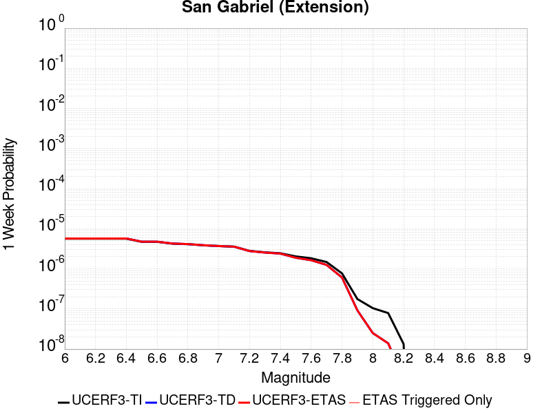 |  | 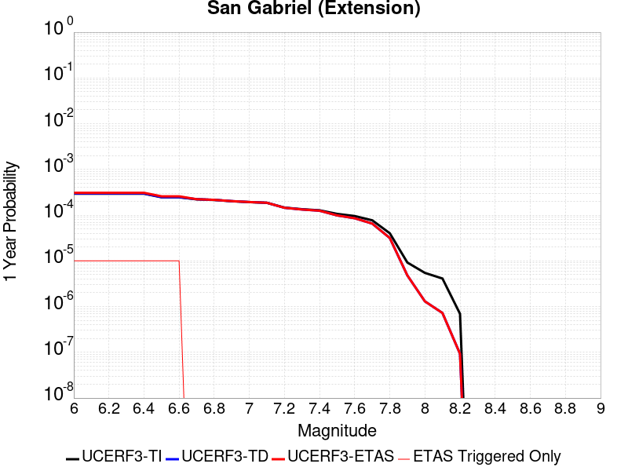 |  |

| Magnitude | 1 wk TI Prob | 1 wk TD Prob | 1 wk ETAS Prob | 1 wk ETAS/TD Gain | 1 wk ETAS Triggered Only | 1 mo TI Prob | 1 mo TD Prob | 1 mo ETAS Prob | 1 mo ETAS/TD Gain | 1 mo ETAS Triggered Only | 1 yr TI Prob | 1 yr TD Prob | 1 yr ETAS Prob | 1 yr ETAS/TD Gain | 1 yr ETAS Triggered Only | 10 yr TI Prob | 10 yr TD Prob | 10 yr ETAS Prob | 10 yr ETAS/TD Gain | 10 yr ETAS Triggered Only |
|-----|-----|-----|-----|-----|-----|-----|-----|-----|-----|-----|-----|-----|-----|-----|-----|-----|-----|-----|-----|-----|
| 6.0 | 5.6486106E-6 | 5.7171446E-6 | 5.7171446E-6 | 1.0 | 0.0 | 2.4208108E-5 | 2.4501825E-5 | 2.4501825E-5 | 1.0 | 0.0 | 2.9469383E-4 | 2.9827014E-4 | 3.0826716E-4 | 1.0335166 | 1.0E-5 | 0.0029430336 | 0.0029788287 | 0.0029887988 | 1.003347 | 1.0E-5 |
| 6.1 | 5.6486106E-6 | 5.7171446E-6 | 5.7171446E-6 | 1.0 | 0.0 | 2.4208108E-5 | 2.4501825E-5 | 2.4501825E-5 | 1.0 | 0.0 | 2.9469383E-4 | 2.9827014E-4 | 3.0826716E-4 | 1.0335166 | 1.0E-5 | 0.0029430336 | 0.0029788287 | 0.0029887988 | 1.003347 | 1.0E-5 |
| 6.2 | 5.6486106E-6 | 5.7171446E-6 | 5.7171446E-6 | 1.0 | 0.0 | 2.4208108E-5 | 2.4501825E-5 | 2.4501825E-5 | 1.0 | 0.0 | 2.9469383E-4 | 2.9827014E-4 | 3.0826716E-4 | 1.0335166 | 1.0E-5 | 0.0029430336 | 0.0029788287 | 0.0029887988 | 1.003347 | 1.0E-5 |
| 6.3 | 5.6486106E-6 | 5.7171446E-6 | 5.7171446E-6 | 1.0 | 0.0 | 2.4208108E-5 | 2.4501825E-5 | 2.4501825E-5 | 1.0 | 0.0 | 2.9469383E-4 | 2.9827014E-4 | 3.0826716E-4 | 1.0335166 | 1.0E-5 | 0.0029430336 | 0.0029788287 | 0.0029887988 | 1.003347 | 1.0E-5 |
| 6.4 | 5.6486106E-6 | 5.7171446E-6 | 5.7171446E-6 | 1.0 | 0.0 | 2.4208108E-5 | 2.4501825E-5 | 2.4501825E-5 | 1.0 | 0.0 | 2.9469383E-4 | 2.9827014E-4 | 3.0826716E-4 | 1.0335166 | 1.0E-5 | 0.0029430336 | 0.0029788287 | 0.0029887988 | 1.003347 | 1.0E-5 |
| 6.5 | 4.7134554E-6 | 4.754565E-6 | 4.754565E-6 | 1.0 | 0.0 | 2.0200367E-5 | 2.0376552E-5 | 2.0376552E-5 | 1.0 | 0.0 | 2.459117E-4 | 2.4805713E-4 | 2.5805464E-4 | 1.0403033 | 1.0E-5 | 0.0024563975 | 0.0024778906 | 0.002487866 | 1.0040257 | 1.0E-5 |
| 6.6 | 4.7134554E-6 | 4.754565E-6 | 4.754565E-6 | 1.0 | 0.0 | 2.0200367E-5 | 2.0376552E-5 | 2.0376552E-5 | 1.0 | 0.0 | 2.459117E-4 | 2.4805713E-4 | 2.5805464E-4 | 1.0403033 | 1.0E-5 | 0.0024563975 | 0.0024778906 | 0.002487866 | 1.0040257 | 1.0E-5 |
| 6.7 | 4.2468837E-6 | 4.2743804E-6 | 4.2743804E-6 | 1.0 | 0.0 | 1.8200803E-5 | 1.8318648E-5 | 1.8318648E-5 | 1.0 | 0.0 | 2.2157225E-4 | 2.2300745E-4 | 2.2300745E-4 | 1.0 | 0.0 | 0.0022135144 | 0.0022279124 | 0.0022279124 | 1.0 | 0.0 |
| 6.8 | 4.1180615E-6 | 4.1417693E-6 | 4.1417693E-6 | 1.0 | 0.0 | 1.7648716E-5 | 1.7750324E-5 | 1.7750324E-5 | 1.0 | 0.0 | 2.1485193E-4 | 2.1608948E-4 | 2.1608948E-4 | 1.0 | 0.0 | 0.0021464431 | 0.0021588686 | 0.0021588686 | 1.0 | 0.0 |
| 6.9 | 3.863861E-6 | 3.8800836E-6 | 3.8800836E-6 | 1.0 | 0.0 | 1.65593E-5 | 1.6628828E-5 | 1.6628828E-5 | 1.0 | 0.0 | 2.0159081E-4 | 2.0243786E-4 | 2.0243786E-4 | 1.0 | 0.0 | 0.0020140803 | 0.0020226059 | 0.0020226059 | 1.0 | 0.0 |
| 7.0 | 3.6947372E-6 | 3.7059822E-6 | 3.7059822E-6 | 1.0 | 0.0 | 1.5834492E-5 | 1.5882688E-5 | 1.5882688E-5 | 1.0 | 0.0 | 1.9276788E-4 | 1.9335524E-4 | 1.9335524E-4 | 1.0 | 0.0 | 0.0019260074 | 0.0019319403 | 0.0019319403 | 1.0 | 0.0 |
| 7.1 | 3.5686835E-6 | 3.5732016E-6 | 3.5732016E-6 | 1.0 | 0.0 | 1.5294268E-5 | 1.5313635E-5 | 1.5313635E-5 | 1.0 | 0.0 | 1.861918E-4 | 1.8642822E-4 | 1.8642822E-4 | 1.0 | 0.0 | 0.0018603588 | 0.0018627879 | 0.0018627879 | 1.0 | 0.0 |
| 7.2 | 2.8023446E-6 | 2.7770893E-6 | 2.7770893E-6 | 1.0 | 0.0 | 1.2009994E-5 | 1.1901758E-5 | 1.1901758E-5 | 1.0 | 0.0 | 1.4621185E-4 | 1.4489438E-4 | 1.4489438E-4 | 1.0 | 0.0 | 0.001461157 | 0.0014480136 | 0.0014480136 | 1.0 | 0.0 |
| 7.3 | 2.5843012E-6 | 2.546262E-6 | 2.546262E-6 | 1.0 | 0.0 | 1.1075529E-5 | 1.0912507E-5 | 1.0912507E-5 | 1.0 | 0.0 | 1.3483623E-4 | 1.3285177E-4 | 1.3285177E-4 | 1.0 | 0.0 | 0.0013475444 | 0.001327737 | 0.001327737 | 1.0 | 0.0 |
| 7.4 | 2.4464468E-6 | 2.3969585E-6 | 2.3969585E-6 | 1.0 | 0.0 | 1.04847295E-5 | 1.027264E-5 | 1.027264E-5 | 1.0 | 0.0 | 1.276441E-4 | 1.250623E-4 | 1.250623E-4 | 1.0 | 0.0 | 0.0012757082 | 0.0012499326 | 0.0012499326 | 1.0 | 0.0 |
| 7.5 | 2.0420266E-6 | 1.8913017E-6 | 1.8913017E-6 | 1.0 | 0.0 | 8.751514E-6 | 8.105554E-6 | 8.105554E-6 | 1.0 | 0.0 | 1.0654447E-4 | 9.8680684E-5 | 9.8680684E-5 | 1.0 | 0.0 | 0.001064934 | 9.863758E-4 | 9.863758E-4 | 1.0 | 0.0 |
| 7.6 | 1.8326596E-6 | 1.640076E-6 | 1.640076E-6 | 1.0 | 0.0 | 7.854232E-6 | 7.0288784E-6 | 7.0288784E-6 | 1.0 | 0.0 | 9.562107E-5 | 8.557326E-5 | 8.557326E-5 | 1.0 | 0.0 | 9.5579936E-4 | 8.5540896E-4 | 8.5540896E-4 | 1.0 | 0.0 |
| 7.7 | 1.4786998E-6 | 1.2526061E-6 | 1.2526061E-6 | 1.0 | 0.0 | 6.3372695E-6 | 5.368301E-6 | 5.368301E-6 | 1.0 | 0.0 | 7.715353E-5 | 6.535712E-5 | 6.535712E-5 | 1.0 | 0.0 | 7.7126746E-4 | 6.533867E-4 | 6.533867E-4 | 1.0 | 0.0 |
| 7.8 | 7.6975533E-7 | 6.071264E-7 | 6.071264E-7 | 1.0 | 0.0 | 3.2989474E-6 | 2.601968E-6 | 2.601968E-6 | 1.0 | 0.0 | 4.0163945E-5 | 3.16785E-5 | 3.16785E-5 | 1.0 | 0.0 | 4.0156685E-4 | 3.1674592E-4 | 3.1674592E-4 | 1.0 | 0.0 |
| 7.9 | 1.7645915E-7 | 9.218553E-8 | 9.218553E-8 | 1.0 | 0.0 | 7.562533E-7 | 3.9508078E-7 | 3.9508078E-7 | 1.0 | 0.0 | 9.207345E-6 | 4.810098E-6 | 4.810098E-6 | 1.0 | 0.0 | 9.206964E-5 | 4.810463E-5 | 4.810463E-5 | 1.0 | 0.0 |
| 8.0 | 1.0463461E-7 | 2.4971815E-8 | 2.4971815E-8 | 1.0 | 0.0 | 4.4843398E-7 | 1.0702206E-7 | 1.0702206E-7 | 1.0 | 0.0 | 5.45967E-6 | 1.3029928E-6 | 1.3029928E-6 | 1.0 | 0.0 | 5.459536E-5 | 1.3034539E-5 | 1.3034539E-5 | 1.0 | 0.0 |
| 8.1 | 7.875717E-8 | 1.38816025E-8 | 1.38816025E-8 | 1.0 | 0.0 | 3.3753068E-7 | 5.949258E-8 | 5.949258E-8 | 1.0 | 0.0 | 4.109428E-6 | 7.243219E-7 | 7.243219E-7 | 1.0 | 0.0 | 4.109352E-5 | 7.247882E-6 | 7.247882E-6 | 1.0 | 0.0 |
| 8.2 | 1.33163E-8 | 1.7755355E-9 | 1.7755355E-9 | 1.0 | 0.0 | 5.7069855E-8 | 7.609438E-9 | 7.609438E-9 | 1.0 | 0.0 | 6.9482525E-7 | 9.26449E-8 | 9.26449E-8 | 1.0 | 0.0 | 6.9482307E-6 | 9.284174E-7 | 9.284174E-7 | 1.0 | 0.0 |

## Verdugo
*[(top)](#table-of-contents)*

| 1 Week | 1 Month | 1 Year | 10 Year |
|-----|-----|-----|-----|
|  | 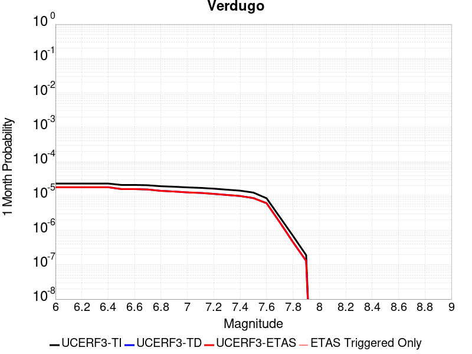 | 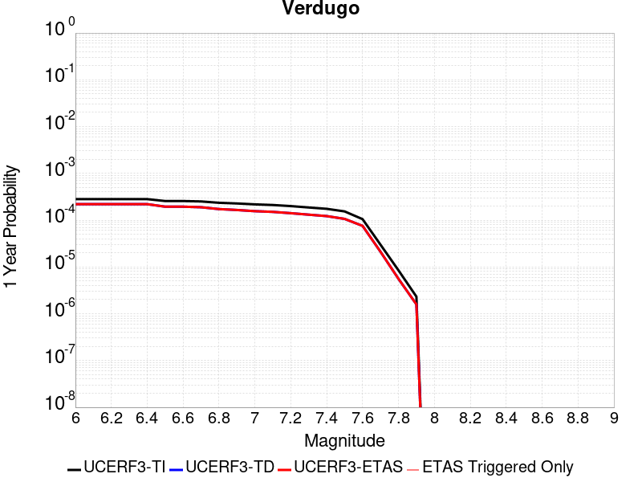 | 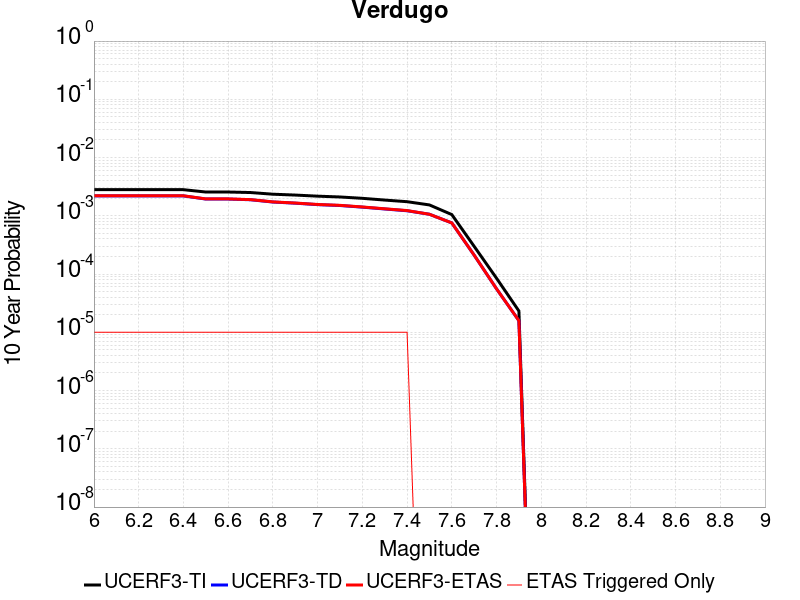 |

| Magnitude | 1 wk TI Prob | 1 wk TD Prob | 1 wk ETAS Prob | 1 wk ETAS/TD Gain | 1 wk ETAS Triggered Only | 1 mo TI Prob | 1 mo TD Prob | 1 mo ETAS Prob | 1 mo ETAS/TD Gain | 1 mo ETAS Triggered Only | 1 yr TI Prob | 1 yr TD Prob | 1 yr ETAS Prob | 1 yr ETAS/TD Gain | 1 yr ETAS Triggered Only | 10 yr TI Prob | 10 yr TD Prob | 10 yr ETAS Prob | 10 yr ETAS/TD Gain | 10 yr ETAS Triggered Only |
|-----|-----|-----|-----|-----|-----|-----|-----|-----|-----|-----|-----|-----|-----|-----|-----|-----|-----|-----|-----|-----|
| 6.0 | 5.392987E-6 | 4.2165602E-6 | 4.2165602E-6 | 1.0 | 0.0 | 2.3112598E-5 | 1.8070848E-5 | 1.8070848E-5 | 1.0 | 0.0 | 2.8135953E-4 | 2.1999085E-4 | 2.1999085E-4 | 1.0 | 0.0 | 0.0028100356 | 0.0021977786 | 0.0022077565 | 1.0045401 | 1.0E-5 |
| 6.1 | 5.392987E-6 | 4.2165602E-6 | 4.2165602E-6 | 1.0 | 0.0 | 2.3112598E-5 | 1.8070848E-5 | 1.8070848E-5 | 1.0 | 0.0 | 2.8135953E-4 | 2.1999085E-4 | 2.1999085E-4 | 1.0 | 0.0 | 0.0028100356 | 0.0021977786 | 0.0022077565 | 1.0045401 | 1.0E-5 |
| 6.2 | 5.392987E-6 | 4.2165602E-6 | 4.2165602E-6 | 1.0 | 0.0 | 2.3112598E-5 | 1.8070848E-5 | 1.8070848E-5 | 1.0 | 0.0 | 2.8135953E-4 | 2.1999085E-4 | 2.1999085E-4 | 1.0 | 0.0 | 0.0028100356 | 0.0021977786 | 0.0022077565 | 1.0045401 | 1.0E-5 |
| 6.3 | 5.392987E-6 | 4.2165602E-6 | 4.2165602E-6 | 1.0 | 0.0 | 2.3112598E-5 | 1.8070848E-5 | 1.8070848E-5 | 1.0 | 0.0 | 2.8135953E-4 | 2.1999085E-4 | 2.1999085E-4 | 1.0 | 0.0 | 0.0028100356 | 0.0021977786 | 0.0022077565 | 1.0045401 | 1.0E-5 |
| 6.4 | 5.392987E-6 | 4.2165602E-6 | 4.2165602E-6 | 1.0 | 0.0 | 2.3112598E-5 | 1.8070848E-5 | 1.8070848E-5 | 1.0 | 0.0 | 2.8135953E-4 | 2.1999085E-4 | 2.1999085E-4 | 1.0 | 0.0 | 0.0028100356 | 0.0021977786 | 0.0022077565 | 1.0045401 | 1.0E-5 |
| 6.5 | 4.9154837E-6 | 3.7225057E-6 | 3.7225057E-6 | 1.0 | 0.0 | 2.1066187E-5 | 1.59535E-5 | 1.59535E-5 | 1.0 | 0.0 | 2.5645064E-4 | 1.9421674E-4 | 1.9421674E-4 | 1.0 | 0.0 | 0.002561549 | 0.001940491 | 0.0019504715 | 1.0051433 | 1.0E-5 |
| 6.6 | 4.9154837E-6 | 3.7225057E-6 | 3.7225057E-6 | 1.0 | 0.0 | 2.1066187E-5 | 1.59535E-5 | 1.59535E-5 | 1.0 | 0.0 | 2.5645064E-4 | 1.9421674E-4 | 1.9421674E-4 | 1.0 | 0.0 | 0.002561549 | 0.001940491 | 0.0019504715 | 1.0051433 | 1.0E-5 |
| 6.7 | 4.817006E-6 | 3.6206918E-6 | 3.6206918E-6 | 1.0 | 0.0 | 2.0644147E-5 | 1.551716E-5 | 1.551716E-5 | 1.0 | 0.0 | 2.513135E-4 | 1.8890524E-4 | 1.8890524E-4 | 1.0 | 0.0 | 0.0025102948 | 0.0018874662 | 0.0018974474 | 1.0052881 | 1.0E-5 |
| 6.8 | 4.507407E-6 | 3.3071422E-6 | 3.3071422E-6 | 1.0 | 0.0 | 1.9317316E-5 | 1.417339E-5 | 1.417339E-5 | 1.0 | 0.0 | 2.3516294E-4 | 1.725475E-4 | 1.725475E-4 | 1.0 | 0.0 | 0.0023491425 | 0.0017241496 | 0.0017341323 | 1.00579 | 1.0E-5 |
| 6.9 | 4.3573054E-6 | 3.161048E-6 | 3.161048E-6 | 1.0 | 0.0 | 1.8674033E-5 | 1.3547278E-5 | 1.3547278E-5 | 1.0 | 0.0 | 2.2733262E-4 | 1.6492575E-4 | 1.6492575E-4 | 1.0 | 0.0 | 0.0022710022 | 0.001648046 | 0.0016580295 | 1.0060577 | 1.0E-5 |
| 7.0 | 4.171527E-6 | 2.983706E-6 | 2.983706E-6 | 1.0 | 0.0 | 1.787785E-5 | 1.278725E-5 | 1.278725E-5 | 1.0 | 0.0 | 2.1764109E-4 | 1.5567376E-4 | 1.5567376E-4 | 1.0 | 0.0 | 0.0021742806 | 0.0015556583 | 0.0015656428 | 1.0064181 | 1.0E-5 |
| 7.1 | 4.0405484E-6 | 2.882296E-6 | 2.882296E-6 | 1.0 | 0.0 | 1.731652E-5 | 1.2352639E-5 | 1.2352639E-5 | 1.0 | 0.0 | 2.1080824E-4 | 1.5038312E-4 | 1.5038312E-4 | 1.0 | 0.0 | 0.0021060838 | 0.0015028245 | 0.0015128094 | 1.0066441 | 1.0E-5 |
| 7.2 | 3.8306007E-6 | 2.7018784E-6 | 2.7018784E-6 | 1.0 | 0.0 | 1.6416758E-5 | 1.1579428E-5 | 1.1579428E-5 | 1.0 | 0.0 | 1.9985568E-4 | 1.4097053E-4 | 1.4097053E-4 | 1.0 | 0.0 | 0.0019967605 | 0.0014088218 | 0.0014188077 | 1.0070882 | 1.0E-5 |
| 7.3 | 3.5750938E-6 | 2.5122074E-6 | 2.5122074E-6 | 1.0 | 0.0 | 1.532174E-5 | 1.0766559E-5 | 1.0766559E-5 | 1.0 | 0.0 | 1.8652623E-4 | 1.3107508E-4 | 1.3107508E-4 | 1.0 | 0.0 | 0.0018636974 | 0.0013099882 | 0.0013199751 | 1.0076237 | 1.0E-5 |
| 7.4 | 3.3510041E-6 | 2.3408884E-6 | 2.3408884E-6 | 1.0 | 0.0 | 1.4361368E-5 | 1.0032341E-5 | 1.0032341E-5 | 1.0 | 0.0 | 1.7483562E-4 | 1.2213702E-4 | 1.2213702E-4 | 1.0 | 0.0 | 0.0017469813 | 0.0012207093 | 0.001230697 | 1.0081819 | 1.0E-5 |
| 7.5 | 2.948287E-6 | 2.0391387E-6 | 2.0391387E-6 | 1.0 | 0.0 | 1.2635454E-5 | 8.739137E-6 | 8.739137E-6 | 1.0 | 0.0 | 1.538258E-4 | 1.06393905E-4 | 1.06393905E-4 | 1.0 | 0.0 | 0.0015371935 | 0.0010634399 | 0.0010634399 | 1.0 | 0.0 |
| 7.6 | 2.0134323E-6 | 1.4471433E-6 | 1.4471433E-6 | 1.0 | 0.0 | 8.628967E-6 | 6.2020285E-6 | 6.2020285E-6 | 1.0 | 0.0 | 1.05052604E-4 | 7.550717E-5 | 7.550717E-5 | 1.0 | 0.0 | 0.0010500296 | 7.5482397E-4 | 7.5482397E-4 | 1.0 | 0.0 |
| 7.7 | 5.726436E-7 | 4.0453094E-7 | 4.0453094E-7 | 1.0 | 0.0 | 2.4541846E-6 | 1.733703E-6 | 1.733703E-6 | 1.0 | 0.0 | 2.9879287E-5 | 2.1107655E-5 | 2.1107655E-5 | 1.0 | 0.0 | 2.987527E-4 | 2.1105906E-4 | 2.1105906E-4 | 1.0 | 0.0 |
| 7.8 | 1.6248204E-7 | 1.068809E-7 | 1.068809E-7 | 1.0 | 0.0 | 6.963514E-7 | 4.5806092E-7 | 4.5806092E-7 | 1.0 | 0.0 | 8.478045E-6 | 5.576878E-6 | 5.576878E-6 | 1.0 | 0.0 | 8.477722E-5 | 5.576741E-5 | 5.576741E-5 | 1.0 | 0.0 |
| 7.9 | 4.4475744E-8 | 3.037577E-8 | 3.037577E-8 | 1.0 | 0.0 | 1.9061031E-7 | 1.3018186E-7 | 1.3018186E-7 | 1.0 | 0.0 | 2.320678E-6 | 1.5849631E-6 | 1.5849631E-6 | 1.0 | 0.0 | 2.3206538E-5 | 1.5849531E-5 | 1.5849531E-5 | 1.0 | 0.0 |

## Pitas Point (Lower)-Montalvo
*[(top)](#table-of-contents)*

| 1 Week | 1 Month | 1 Year | 10 Year |
|-----|-----|-----|-----|
|  | 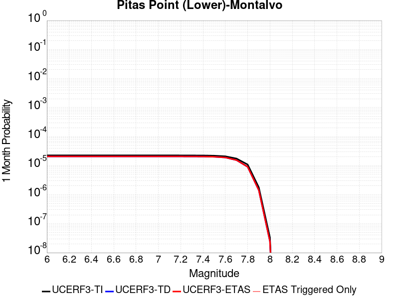 | 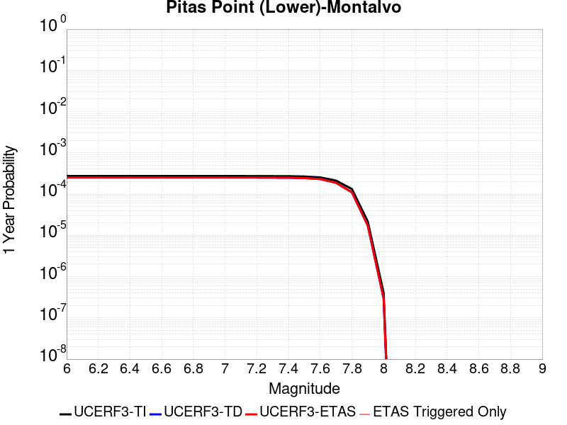 | 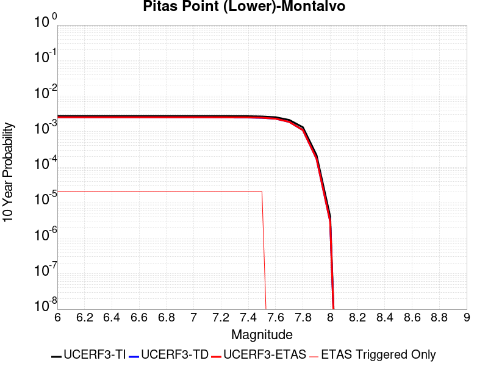 |

| Magnitude | 1 wk TI Prob | 1 wk TD Prob | 1 wk ETAS Prob | 1 wk ETAS/TD Gain | 1 wk ETAS Triggered Only | 1 mo TI Prob | 1 mo TD Prob | 1 mo ETAS Prob | 1 mo ETAS/TD Gain | 1 mo ETAS Triggered Only | 1 yr TI Prob | 1 yr TD Prob | 1 yr ETAS Prob | 1 yr ETAS/TD Gain | 1 yr ETAS Triggered Only | 10 yr TI Prob | 10 yr TD Prob | 10 yr ETAS Prob | 10 yr ETAS/TD Gain | 10 yr ETAS Triggered Only |
|-----|-----|-----|-----|-----|-----|-----|-----|-----|-----|-----|-----|-----|-----|-----|-----|-----|-----|-----|-----|-----|
| 6.0 | 5.2543637E-6 | 4.8379093E-6 | 4.8379093E-6 | 1.0 | 0.0 | 2.2518509E-5 | 2.0733734E-5 | 2.0733734E-5 | 1.0 | 0.0 | 2.7412834E-4 | 2.5240428E-4 | 2.5240428E-4 | 1.0 | 0.0 | 0.0027379042 | 0.0025212085 | 0.0025311834 | 1.0039563 | 1.0E-5 |
| 6.1 | 5.2543637E-6 | 4.8379093E-6 | 4.8379093E-6 | 1.0 | 0.0 | 2.2518509E-5 | 2.0733734E-5 | 2.0733734E-5 | 1.0 | 0.0 | 2.7412834E-4 | 2.5240428E-4 | 2.5240428E-4 | 1.0 | 0.0 | 0.0027379042 | 0.0025212085 | 0.0025311834 | 1.0039563 | 1.0E-5 |
| 6.2 | 5.2543637E-6 | 4.8379093E-6 | 4.8379093E-6 | 1.0 | 0.0 | 2.2518509E-5 | 2.0733734E-5 | 2.0733734E-5 | 1.0 | 0.0 | 2.7412834E-4 | 2.5240428E-4 | 2.5240428E-4 | 1.0 | 0.0 | 0.0027379042 | 0.0025212085 | 0.0025311834 | 1.0039563 | 1.0E-5 |
| 6.3 | 5.2543637E-6 | 4.8379093E-6 | 4.8379093E-6 | 1.0 | 0.0 | 2.2518509E-5 | 2.0733734E-5 | 2.0733734E-5 | 1.0 | 0.0 | 2.7412834E-4 | 2.5240428E-4 | 2.5240428E-4 | 1.0 | 0.0 | 0.0027379042 | 0.0025212085 | 0.0025311834 | 1.0039563 | 1.0E-5 |
| 6.4 | 5.2543637E-6 | 4.8379093E-6 | 4.8379093E-6 | 1.0 | 0.0 | 2.2518509E-5 | 2.0733734E-5 | 2.0733734E-5 | 1.0 | 0.0 | 2.7412834E-4 | 2.5240428E-4 | 2.5240428E-4 | 1.0 | 0.0 | 0.0027379042 | 0.0025212085 | 0.0025311834 | 1.0039563 | 1.0E-5 |
| 6.5 | 5.2543637E-6 | 4.8379093E-6 | 4.8379093E-6 | 1.0 | 0.0 | 2.2518509E-5 | 2.0733734E-5 | 2.0733734E-5 | 1.0 | 0.0 | 2.7412834E-4 | 2.5240428E-4 | 2.5240428E-4 | 1.0 | 0.0 | 0.0027379042 | 0.0025212085 | 0.0025311834 | 1.0039563 | 1.0E-5 |
| 6.6 | 5.2543637E-6 | 4.8379093E-6 | 4.8379093E-6 | 1.0 | 0.0 | 2.2518509E-5 | 2.0733734E-5 | 2.0733734E-5 | 1.0 | 0.0 | 2.7412834E-4 | 2.5240428E-4 | 2.5240428E-4 | 1.0 | 0.0 | 0.0027379042 | 0.0025212085 | 0.0025311834 | 1.0039563 | 1.0E-5 |
| 6.7 | 5.2543637E-6 | 4.8379093E-6 | 4.8379093E-6 | 1.0 | 0.0 | 2.2518509E-5 | 2.0733734E-5 | 2.0733734E-5 | 1.0 | 0.0 | 2.7412834E-4 | 2.5240428E-4 | 2.5240428E-4 | 1.0 | 0.0 | 0.0027379042 | 0.0025212085 | 0.0025311834 | 1.0039563 | 1.0E-5 |
| 6.8 | 5.2543637E-6 | 4.8379093E-6 | 4.8379093E-6 | 1.0 | 0.0 | 2.2518509E-5 | 2.0733734E-5 | 2.0733734E-5 | 1.0 | 0.0 | 2.7412834E-4 | 2.5240428E-4 | 2.5240428E-4 | 1.0 | 0.0 | 0.0027379042 | 0.0025212085 | 0.0025311834 | 1.0039563 | 1.0E-5 |
| 6.9 | 5.2543637E-6 | 4.8379093E-6 | 4.8379093E-6 | 1.0 | 0.0 | 2.2518509E-5 | 2.0733734E-5 | 2.0733734E-5 | 1.0 | 0.0 | 2.7412834E-4 | 2.5240428E-4 | 2.5240428E-4 | 1.0 | 0.0 | 0.0027379042 | 0.0025212085 | 0.0025311834 | 1.0039563 | 1.0E-5 |
| 7.0 | 5.2543637E-6 | 4.8379093E-6 | 4.8379093E-6 | 1.0 | 0.0 | 2.2518509E-5 | 2.0733734E-5 | 2.0733734E-5 | 1.0 | 0.0 | 2.7412834E-4 | 2.5240428E-4 | 2.5240428E-4 | 1.0 | 0.0 | 0.0027379042 | 0.0025212085 | 0.0025311834 | 1.0039563 | 1.0E-5 |
| 7.1 | 5.2543637E-6 | 4.8379093E-6 | 4.8379093E-6 | 1.0 | 0.0 | 2.2518509E-5 | 2.0733734E-5 | 2.0733734E-5 | 1.0 | 0.0 | 2.7412834E-4 | 2.5240428E-4 | 2.5240428E-4 | 1.0 | 0.0 | 0.0027379042 | 0.0025212085 | 0.0025311834 | 1.0039563 | 1.0E-5 |
| 7.2 | 5.2458695E-6 | 4.829063E-6 | 4.829063E-6 | 1.0 | 0.0 | 2.2482105E-5 | 2.0695821E-5 | 2.0695821E-5 | 1.0 | 0.0 | 2.7368523E-4 | 2.519428E-4 | 2.519428E-4 | 1.0 | 0.0 | 0.0027334841 | 0.0025166043 | 0.0025265792 | 1.0039636 | 1.0E-5 |
| 7.3 | 5.22665E-6 | 4.80898E-6 | 4.80898E-6 | 1.0 | 0.0 | 2.2399736E-5 | 2.0609754E-5 | 2.0609754E-5 | 1.0 | 0.0 | 2.7268266E-4 | 2.508952E-4 | 2.508952E-4 | 1.0 | 0.0 | 0.002723483 | 0.0025061516 | 0.0025161265 | 1.0039802 | 1.0E-5 |
| 7.4 | 5.210642E-6 | 4.7921926E-6 | 4.7921926E-6 | 1.0 | 0.0 | 2.233113E-5 | 2.0537807E-5 | 2.0537807E-5 | 1.0 | 0.0 | 2.718476E-4 | 2.5001942E-4 | 2.5001942E-4 | 1.0 | 0.0 | 0.002715153 | 0.002497414 | 0.0025073888 | 1.0039941 | 1.0E-5 |
| 7.5 | 5.1226016E-6 | 4.7000785E-6 | 4.7000785E-6 | 1.0 | 0.0 | 2.1953823E-5 | 2.014304E-5 | 2.014304E-5 | 1.0 | 0.0 | 2.67255E-4 | 2.452142E-4 | 2.452142E-4 | 1.0 | 0.0 | 0.0026693381 | 0.002449468 | 0.0024594436 | 1.0040725 | 1.0E-5 |
| 7.6 | 4.8796987E-6 | 4.4449766E-6 | 4.4449766E-6 | 1.0 | 0.0 | 2.0912828E-5 | 1.9049763E-5 | 1.9049763E-5 | 1.0 | 0.0 | 2.5458392E-4 | 2.3190647E-4 | 2.3190647E-4 | 1.0 | 0.0 | 0.0025429246 | 0.0023166754 | 0.0023166754 | 1.0 | 0.0 |
| 7.7 | 4.0834398E-6 | 3.6091424E-6 | 3.6091424E-6 | 1.0 | 0.0 | 1.7500339E-5 | 1.5467662E-5 | 1.5467662E-5 | 1.0 | 0.0 | 2.1304579E-4 | 1.8830276E-4 | 1.8830276E-4 | 1.0 | 0.0 | 0.0021284167 | 0.0018814557 | 0.0018814557 | 1.0 | 0.0 |
| 7.8 | 2.5445438E-6 | 2.1212452E-6 | 2.1212452E-6 | 1.0 | 0.0 | 1.0905142E-5 | 9.09102E-6 | 9.09102E-6 | 1.0 | 0.0 | 1.3276201E-4 | 1.1067759E-4 | 1.1067759E-4 | 1.0 | 0.0 | 0.0013268272 | 0.0011062294 | 0.0011062294 | 1.0 | 0.0 |
| 7.9 | 4.1677114E-7 | 3.3293983E-7 | 3.3293983E-7 | 1.0 | 0.0 | 1.7861609E-6 | 1.4268842E-6 | 1.4268842E-6 | 1.0 | 0.0 | 2.1746291E-5 | 1.737218E-5 | 1.737218E-5 | 1.0 | 0.0 | 2.1744163E-4 | 1.7370853E-4 | 1.7370853E-4 | 1.0 | 0.0 |
| 8.0 | 7.791402E-9 | 5.683553E-9 | 5.683553E-9 | 1.0 | 0.0 | 3.3391725E-8 | 2.4358085E-8 | 2.4358085E-8 | 1.0 | 0.0 | 4.0654416E-7 | 2.9655968E-7 | 2.9655968E-7 | 1.0 | 0.0 | 4.065434E-6 | 2.9655946E-6 | 2.9655946E-6 | 1.0 | 0.0 |

## Franklin 2011 CFM
*[(top)](#table-of-contents)*

| 1 Week | 1 Month | 1 Year | 10 Year |
|-----|-----|-----|-----|
| 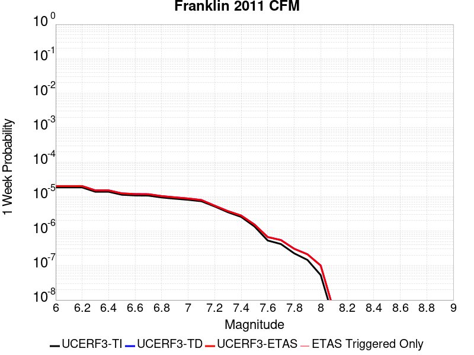 | 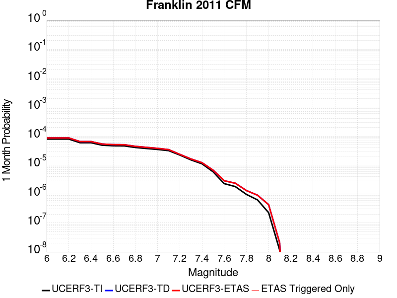 | 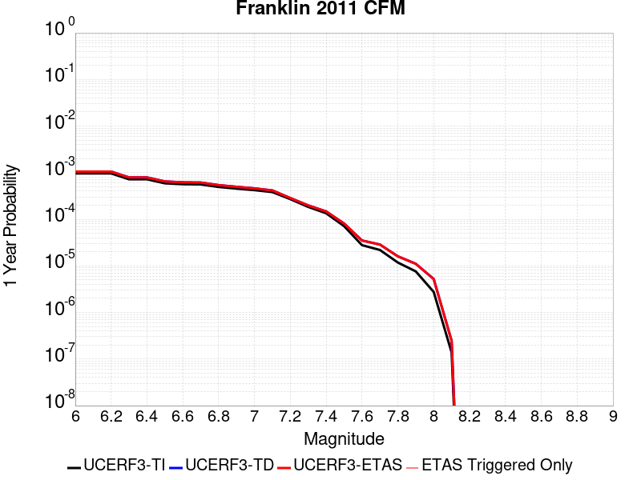 | 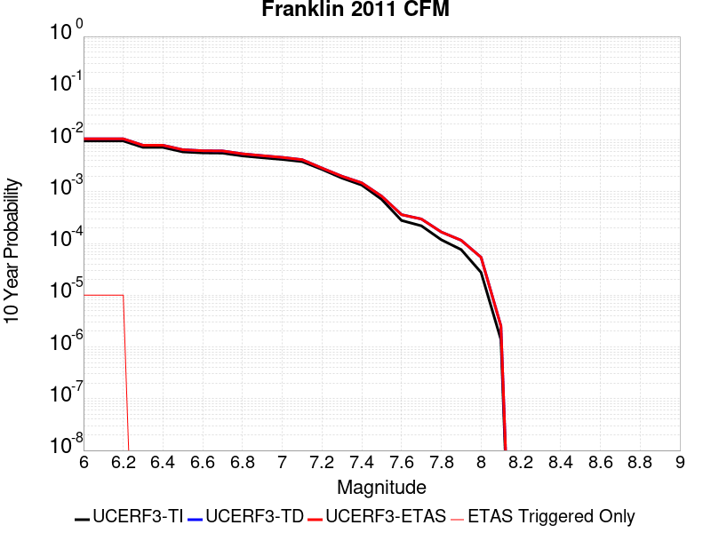 |

| Magnitude | 1 wk TI Prob | 1 wk TD Prob | 1 wk ETAS Prob | 1 wk ETAS/TD Gain | 1 wk ETAS Triggered Only | 1 mo TI Prob | 1 mo TD Prob | 1 mo ETAS Prob | 1 mo ETAS/TD Gain | 1 mo ETAS Triggered Only | 1 yr TI Prob | 1 yr TD Prob | 1 yr ETAS Prob | 1 yr ETAS/TD Gain | 1 yr ETAS Triggered Only | 10 yr TI Prob | 10 yr TD Prob | 10 yr ETAS Prob | 10 yr ETAS/TD Gain | 10 yr ETAS Triggered Only |
|-----|-----|-----|-----|-----|-----|-----|-----|-----|-----|-----|-----|-----|-----|-----|-----|-----|-----|-----|-----|-----|
| 6.0 | 1.845602E-5 | 2.0213281E-5 | 2.0213281E-5 | 1.0 | 0.0 | 7.9094825E-5 | 8.662564E-5 | 8.662564E-5 | 1.0 | 0.0 | 9.6255407E-4 | 0.0010541859 | 0.0010541859 | 1.0 | 0.0 | 0.009583955 | 0.010509172 | 0.010519068 | 1.0009415 | 1.0E-5 |
| 6.1 | 1.845602E-5 | 2.0213281E-5 | 2.0213281E-5 | 1.0 | 0.0 | 7.9094825E-5 | 8.662564E-5 | 8.662564E-5 | 1.0 | 0.0 | 9.6255407E-4 | 0.0010541859 | 0.0010541859 | 1.0 | 0.0 | 0.009583955 | 0.010509172 | 0.010519068 | 1.0009415 | 1.0E-5 |
| 6.2 | 1.845602E-5 | 2.0213281E-5 | 2.0213281E-5 | 1.0 | 0.0 | 7.9094825E-5 | 8.662564E-5 | 8.662564E-5 | 1.0 | 0.0 | 9.6255407E-4 | 0.0010541859 | 0.0010541859 | 1.0 | 0.0 | 0.009583955 | 0.010509172 | 0.010519068 | 1.0009415 | 1.0E-5 |
| 6.3 | 1.3813506E-5 | 1.51554295E-5 | 1.51554295E-5 | 1.0 | 0.0 | 5.9199396E-5 | 6.495027E-5 | 6.495027E-5 | 1.0 | 0.0 | 7.205143E-4 | 7.904903E-4 | 7.904903E-4 | 1.0 | 0.0 | 0.007181826 | 0.007891989 | 0.007891989 | 1.0 | 0.0 |
| 6.4 | 1.3813506E-5 | 1.51554295E-5 | 1.51554295E-5 | 1.0 | 0.0 | 5.9199396E-5 | 6.495027E-5 | 6.495027E-5 | 1.0 | 0.0 | 7.205143E-4 | 7.904903E-4 | 7.904903E-4 | 1.0 | 0.0 | 0.007181826 | 0.007891989 | 0.007891989 | 1.0 | 0.0 |
| 6.5 | 1.1308949E-5 | 1.2418368E-5 | 1.2418368E-5 | 1.0 | 0.0 | 4.8466023E-5 | 5.3220505E-5 | 5.3220505E-5 | 1.0 | 0.0 | 5.899141E-4 | 6.47769E-4 | 6.47769E-4 | 1.0 | 0.0 | 0.0058835056 | 0.0064734593 | 0.0064734593 | 1.0 | 0.0 |
| 6.6 | 1.0813164E-5 | 1.1876584E-5 | 1.1876584E-5 | 1.0 | 0.0 | 4.6341313E-5 | 5.0898663E-5 | 5.0898663E-5 | 1.0 | 0.0 | 5.640594E-4 | 6.1951694E-4 | 6.1951694E-4 | 1.0 | 0.0 | 0.005626298 | 0.0061925333 | 0.0061925333 | 1.0 | 0.0 |
| 6.7 | 1.0706348E-5 | 1.1758347E-5 | 1.1758347E-5 | 1.0 | 0.0 | 4.5883542E-5 | 5.039195E-5 | 5.039195E-5 | 1.0 | 0.0 | 5.5848894E-4 | 6.133512E-4 | 6.133512E-4 | 1.0 | 0.0 | 0.005570874 | 0.006131218 | 0.006131218 | 1.0 | 0.0 |
| 6.8 | 9.443655E-6 | 1.0349647E-5 | 1.0349647E-5 | 1.0 | 0.0 | 4.0472176E-5 | 4.4354885E-5 | 4.4354885E-5 | 1.0 | 0.0 | 4.9263734E-4 | 5.398883E-4 | 5.398883E-4 | 1.0 | 0.0 | 0.0049154665 | 0.0054003512 | 0.0054003512 | 1.0 | 0.0 |
| 6.9 | 8.7001645E-6 | 9.522704E-6 | 9.522704E-6 | 1.0 | 0.0 | 3.728589E-5 | 4.081096E-5 | 4.081096E-5 | 1.0 | 0.0 | 4.538611E-4 | 4.967614E-4 | 4.967614E-4 | 1.0 | 0.0 | 0.0045293528 | 0.0049710795 | 0.0049710795 | 1.0 | 0.0 |
| 7.0 | 8.074731E-6 | 8.81631E-6 | 8.81631E-6 | 1.0 | 0.0 | 3.460553E-5 | 3.778364E-5 | 3.778364E-5 | 1.0 | 0.0 | 4.212409E-4 | 4.5991983E-4 | 4.5991983E-4 | 1.0 | 0.0 | 0.004204433 | 0.0046042353 | 0.0046042353 | 1.0 | 0.0 |
| 7.1 | 7.3370957E-6 | 7.9621705E-6 | 7.9621705E-6 | 1.0 | 0.0 | 3.1444317E-5 | 3.4123146E-5 | 3.4123146E-5 | 1.0 | 0.0 | 3.8276732E-4 | 4.1537115E-4 | 4.1537115E-4 | 1.0 | 0.0 | 0.0038210868 | 0.0041603437 | 0.0041603437 | 1.0 | 0.0 |
| 7.2 | 5.1750103E-6 | 5.4575758E-6 | 5.4575758E-6 | 1.0 | 0.0 | 2.2178427E-5 | 2.33894E-5 | 2.33894E-5 | 1.0 | 0.0 | 2.699889E-4 | 2.8472906E-4 | 2.8472906E-4 | 1.0 | 0.0 | 0.002696611 | 0.0028575582 | 0.0028575582 | 1.0 | 0.0 |
| 7.3 | 3.5221371E-6 | 3.7964737E-6 | 3.7964737E-6 | 1.0 | 0.0 | 1.5094786E-5 | 1.62705E-5 | 1.62705E-5 | 1.0 | 0.0 | 1.8376352E-4 | 1.9807543E-4 | 1.9807543E-4 | 1.0 | 0.0 | 0.0018361164 | 0.0019924217 | 0.0019924217 | 1.0 | 0.0 |
| 7.4 | 2.5749775E-6 | 2.8185839E-6 | 2.8185839E-6 | 1.0 | 0.0 | 1.1035571E-5 | 1.2079589E-5 | 1.2079589E-5 | 1.0 | 0.0 | 1.343498E-4 | 1.4705914E-4 | 1.4705914E-4 | 1.0 | 0.0 | 0.001342686 | 0.0014818412 | 0.0014818412 | 1.0 | 0.0 |
| 7.5 | 1.3642131E-6 | 1.5500917E-6 | 1.5500917E-6 | 1.0 | 0.0 | 5.8466144E-6 | 6.6432335E-6 | 6.6432335E-6 | 1.0 | 0.0 | 7.1180206E-5 | 8.087838E-5 | 8.087838E-5 | 1.0 | 0.0 | 7.115741E-4 | 8.19299E-4 | 8.19299E-4 | 1.0 | 0.0 |
| 7.6 | 5.329124E-7 | 6.70406E-7 | 6.70406E-7 | 1.0 | 0.0 | 2.2839083E-6 | 2.8731654E-6 | 2.8731654E-6 | 1.0 | 0.0 | 2.7806227E-5 | 3.498023E-5 | 3.498023E-5 | 1.0 | 0.0 | 2.780275E-4 | 3.6013933E-4 | 3.6013933E-4 | 1.0 | 0.0 |
| 7.7 | 4.199127E-7 | 5.489591E-7 | 5.489591E-7 | 1.0 | 0.0 | 1.7996247E-6 | 2.3526798E-6 | 2.3526798E-6 | 1.0 | 0.0 | 2.191021E-5 | 2.8643502E-5 | 2.8643502E-5 | 1.0 | 0.0 | 2.190805E-4 | 2.966018E-4 | 2.966018E-4 | 1.0 | 0.0 |
| 7.8 | 2.2586491E-7 | 3.067814E-7 | 3.067814E-7 | 1.0 | 0.0 | 9.67992E-7 | 1.3147768E-6 | 1.3147768E-6 | 1.0 | 0.0 | 1.178524E-5 | 1.600729E-5 | 1.600729E-5 | 1.0 | 0.0 | 1.17846146E-4 | 1.663756E-4 | 1.663756E-4 | 1.0 | 0.0 |
| 7.9 | 1.4568845E-7 | 2.1214095E-7 | 2.1214095E-7 | 1.0 | 0.0 | 6.243789E-7 | 9.091752E-7 | 9.091752E-7 | 1.0 | 0.0 | 7.601787E-6 | 1.1069152E-5 | 1.1069152E-5 | 1.0 | 0.0 | 7.601527E-5 | 1.15139796E-4 | 1.15139796E-4 | 1.0 | 0.0 |
| 8.0 | 5.2868224E-8 | 1.0001987E-7 | 1.0001987E-7 | 1.0 | 0.0 | 2.2657808E-7 | 4.2865648E-7 | 4.2865648E-7 | 1.0 | 0.0 | 2.7585847E-6 | 5.2188802E-6 | 5.2188802E-6 | 1.0 | 0.0 | 2.7585504E-5 | 5.4041117E-5 | 5.4041117E-5 | 1.0 | 0.0 |
| 8.1 | 2.654434E-9 | 4.724749E-9 | 4.724749E-9 | 1.0 | 0.0 | 1.1376145E-8 | 2.0248923E-8 | 2.0248923E-8 | 1.0 | 0.0 | 1.3850456E-7 | 2.465306E-7 | 2.465306E-7 | 1.0 | 0.0 | 1.3850448E-6 | 2.5347126E-6 | 2.5347126E-6 | 1.0 | 0.0 |

## Dog Valley
*[(top)](#table-of-contents)*

| 1 Week | 1 Month | 1 Year | 10 Year |
|-----|-----|-----|-----|
| 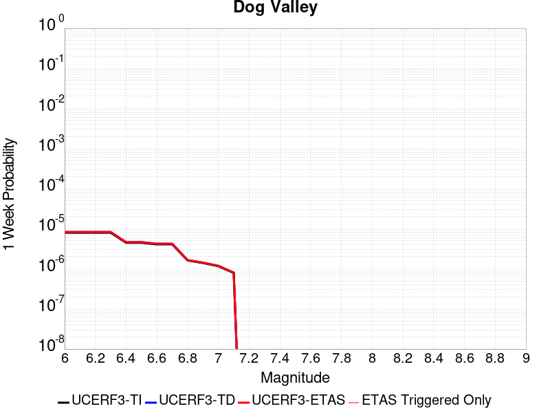 | 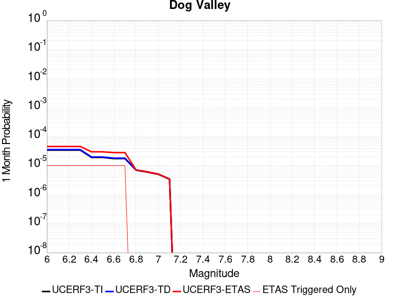 | 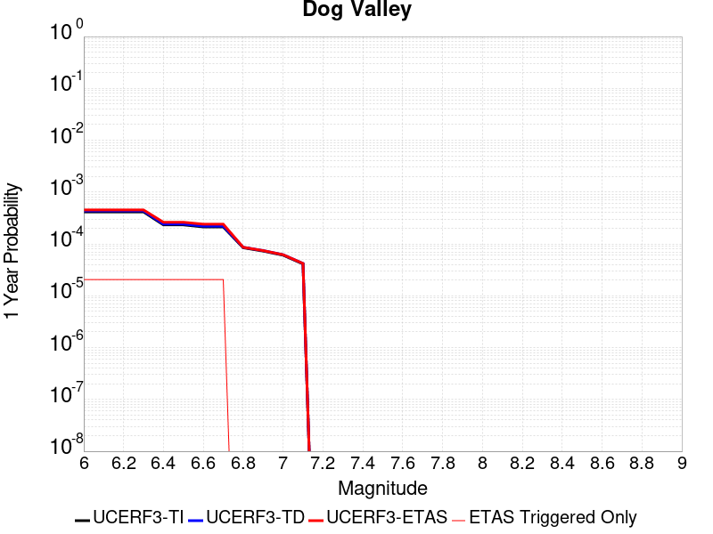 |  |

| Magnitude | 1 wk TI Prob | 1 wk TD Prob | 1 wk ETAS Prob | 1 wk ETAS/TD Gain | 1 wk ETAS Triggered Only | 1 mo TI Prob | 1 mo TD Prob | 1 mo ETAS Prob | 1 mo ETAS/TD Gain | 1 mo ETAS Triggered Only | 1 yr TI Prob | 1 yr TD Prob | 1 yr ETAS Prob | 1 yr ETAS/TD Gain | 1 yr ETAS Triggered Only | 10 yr TI Prob | 10 yr TD Prob | 10 yr ETAS Prob | 10 yr ETAS/TD Gain | 10 yr ETAS Triggered Only |
|-----|-----|-----|-----|-----|-----|-----|-----|-----|-----|-----|-----|-----|-----|-----|-----|-----|-----|-----|-----|-----|
| 6.0 | 7.949598E-6 | 8.275771E-6 | 8.275771E-6 | 1.0 | 0.0 | 3.4069257E-5 | 3.546722E-5 | 4.5466863E-5 | 1.2819405 | 1.0E-5 | 4.1471425E-4 | 4.3174747E-4 | 4.4174315E-4 | 1.0231516 | 1.0E-5 | 0.0041394117 | 0.0043110168 | 0.004320974 | 1.0023097 | 1.0E-5 |
| 6.1 | 7.949598E-6 | 8.275771E-6 | 8.275771E-6 | 1.0 | 0.0 | 3.4069257E-5 | 3.546722E-5 | 4.5466863E-5 | 1.2819405 | 1.0E-5 | 4.1471425E-4 | 4.3174747E-4 | 4.4174315E-4 | 1.0231516 | 1.0E-5 | 0.0041394117 | 0.0043110168 | 0.004320974 | 1.0023097 | 1.0E-5 |
| 6.2 | 7.949598E-6 | 8.275771E-6 | 8.275771E-6 | 1.0 | 0.0 | 3.4069257E-5 | 3.546722E-5 | 4.5466863E-5 | 1.2819405 | 1.0E-5 | 4.1471425E-4 | 4.3174747E-4 | 4.4174315E-4 | 1.0231516 | 1.0E-5 | 0.0041394117 | 0.0043110168 | 0.004320974 | 1.0023097 | 1.0E-5 |
| 6.3 | 7.949598E-6 | 8.275771E-6 | 8.275771E-6 | 1.0 | 0.0 | 3.4069257E-5 | 3.546722E-5 | 4.5466863E-5 | 1.2819405 | 1.0E-5 | 4.1471425E-4 | 4.3174747E-4 | 4.4174315E-4 | 1.0231516 | 1.0E-5 | 0.0041394117 | 0.0043110168 | 0.004320974 | 1.0023097 | 1.0E-5 |
| 6.4 | 4.462132E-6 | 4.623185E-6 | 4.623185E-6 | 1.0 | 0.0 | 1.9123283E-5 | 1.981355E-5 | 2.9813351E-5 | 1.5046952 | 1.0E-5 | 2.328011E-4 | 2.412122E-4 | 2.512098E-4 | 1.0414473 | 1.0E-5 | 0.0023255737 | 0.002410381 | 0.002420357 | 1.0041387 | 1.0E-5 |
| 6.5 | 4.462132E-6 | 4.623185E-6 | 4.623185E-6 | 1.0 | 0.0 | 1.9123283E-5 | 1.981355E-5 | 2.9813351E-5 | 1.5046952 | 1.0E-5 | 2.328011E-4 | 2.412122E-4 | 2.512098E-4 | 1.0414473 | 1.0E-5 | 0.0023255737 | 0.002410381 | 0.002420357 | 1.0041387 | 1.0E-5 |
| 6.6 | 4.074213E-6 | 4.217395E-6 | 4.217395E-6 | 1.0 | 0.0 | 1.7460794E-5 | 1.8074476E-5 | 2.8074295E-5 | 1.5532564 | 1.0E-5 | 2.1256444E-4 | 2.200433E-4 | 2.300411E-4 | 1.0454355 | 1.0E-5 | 0.0021236122 | 0.002199116 | 0.002209094 | 1.0045372 | 1.0E-5 |
| 6.7 | 4.074213E-6 | 4.217395E-6 | 4.217395E-6 | 1.0 | 0.0 | 1.7460794E-5 | 1.8074476E-5 | 2.8074295E-5 | 1.5532564 | 1.0E-5 | 2.1256444E-4 | 2.200433E-4 | 2.300411E-4 | 1.0454355 | 1.0E-5 | 0.0021236122 | 0.002199116 | 0.002209094 | 1.0045372 | 1.0E-5 |
| 6.8 | 1.6159543E-6 | 1.6503452E-6 | 1.6503452E-6 | 1.0 | 0.0 | 6.9255E-6 | 7.072892E-6 | 7.072892E-6 | 1.0 | 0.0 | 8.43147E-5 | 8.610961E-5 | 8.610961E-5 | 1.0 | 0.0 | 8.4282714E-4 | 8.608167E-4 | 8.608167E-4 | 1.0 | 0.0 |
| 6.9 | 1.3952654E-6 | 1.4252917E-6 | 1.4252917E-6 | 1.0 | 0.0 | 5.9796953E-6 | 6.108381E-6 | 6.108381E-6 | 1.0 | 0.0 | 7.280036E-5 | 7.436749E-5 | 7.436749E-5 | 1.0 | 0.0 | 7.2776515E-4 | 7.4347405E-4 | 7.4347405E-4 | 1.0 | 0.0 |
| 7.0 | 1.1619308E-6 | 1.1869561E-6 | 1.1869561E-6 | 1.0 | 0.0 | 4.979694E-6 | 5.086947E-6 | 5.086947E-6 | 1.0 | 0.0 | 6.0626087E-5 | 6.193227E-5 | 6.193227E-5 | 1.0 | 0.0 | 6.060955E-4 | 6.191938E-4 | 6.191938E-4 | 1.0 | 0.0 |
| 7.1 | 7.8723247E-7 | 8.0470204E-7 | 8.0470204E-7 | 1.0 | 0.0 | 3.373849E-6 | 3.4487202E-6 | 3.4487202E-6 | 1.0 | 0.0 | 4.107584E-5 | 4.1987663E-5 | 4.1987663E-5 | 1.0 | 0.0 | 4.1068246E-4 | 4.1982718E-4 | 4.1982718E-4 | 1.0 | 0.0 |

## Great Valley 03a Dunnigan Hills
*[(top)](#table-of-contents)*

| 1 Week | 1 Month | 1 Year | 10 Year |
|-----|-----|-----|-----|
|  | 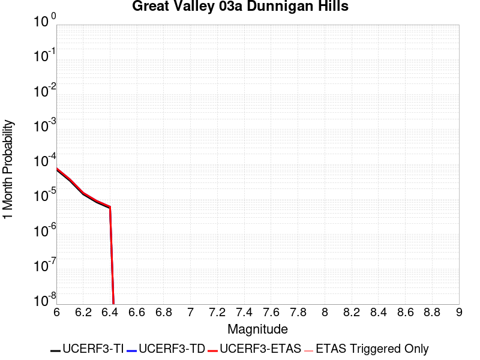 | 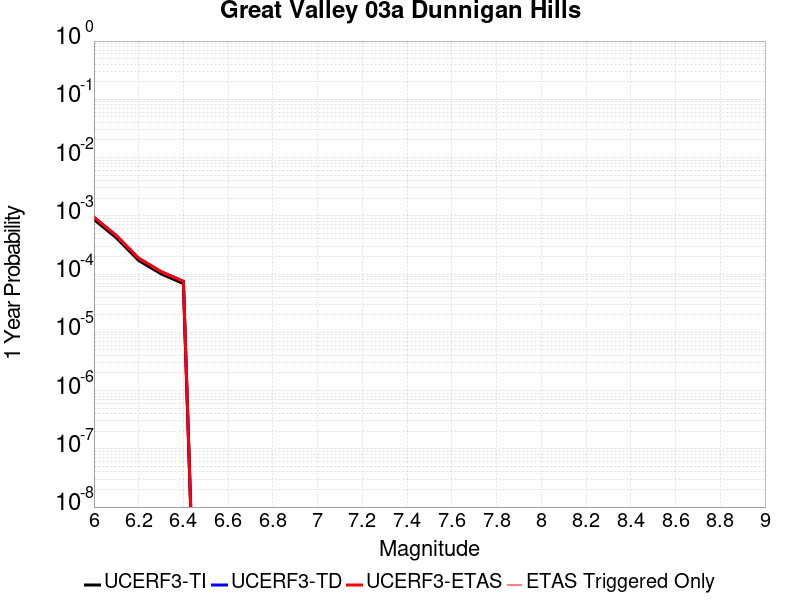 | 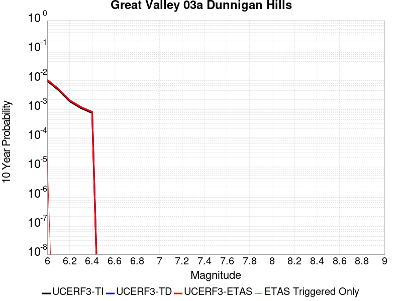 |

| Magnitude | 1 wk TI Prob | 1 wk TD Prob | 1 wk ETAS Prob | 1 wk ETAS/TD Gain | 1 wk ETAS Triggered Only | 1 mo TI Prob | 1 mo TD Prob | 1 mo ETAS Prob | 1 mo ETAS/TD Gain | 1 mo ETAS Triggered Only | 1 yr TI Prob | 1 yr TD Prob | 1 yr ETAS Prob | 1 yr ETAS/TD Gain | 1 yr ETAS Triggered Only | 10 yr TI Prob | 10 yr TD Prob | 10 yr ETAS Prob | 10 yr ETAS/TD Gain | 10 yr ETAS Triggered Only |
|-----|-----|-----|-----|-----|-----|-----|-----|-----|-----|-----|-----|-----|-----|-----|-----|-----|-----|-----|-----|-----|
| 6.0 | 1.6591328E-5 | 1.8108174E-5 | 1.8108174E-5 | 1.0 | 0.0 | 7.110376E-5 | 7.760454E-5 | 7.760454E-5 | 1.0 | 0.0 | 8.6534437E-4 | 9.4449485E-4 | 9.4449485E-4 | 1.0 | 0.0 | 0.008619824 | 0.009411639 | 0.009421544 | 1.0010525 | 1.0E-5 |
| 6.1 | 8.041125E-6 | 8.769832E-6 | 8.769832E-6 | 1.0 | 0.0 | 3.4461507E-5 | 3.7584567E-5 | 3.7584567E-5 | 1.0 | 0.0 | 4.194881E-4 | 4.5751635E-4 | 4.5751635E-4 | 1.0 | 0.0 | 0.004186971 | 0.004567742 | 0.004567742 | 1.0 | 0.0 |
| 6.2 | 3.2807004E-6 | 3.579612E-6 | 3.579612E-6 | 1.0 | 0.0 | 1.4060069E-5 | 1.5341127E-5 | 1.5341127E-5 | 1.0 | 0.0 | 1.7116789E-4 | 1.8676638E-4 | 1.8676638E-4 | 1.0 | 0.0 | 0.0017103611 | 0.0018665022 | 0.0018665022 | 1.0 | 0.0 |
| 6.3 | 1.9339366E-6 | 2.1104063E-6 | 2.1104063E-6 | 1.0 | 0.0 | 8.288273E-6 | 9.044583E-6 | 9.044583E-6 | 1.0 | 0.0 | 1.00905054E-4 | 1.10115085E-4 | 1.10115085E-4 | 1.0 | 0.0 | 0.0010085925 | 0.0011008852 | 0.0011008852 | 1.0 | 0.0 |
| 6.4 | 1.3142635E-6 | 1.4340039E-6 | 1.4340039E-6 | 1.0 | 0.0 | 5.6325457E-6 | 6.1457313E-6 | 6.1457313E-6 | 1.0 | 0.0 | 6.857408E-5 | 7.4824275E-5 | 7.4824275E-5 | 1.0 | 0.0 | 6.8552926E-4 | 7.482428E-4 | 7.482428E-4 | 1.0 | 0.0 |

## Rocky Ledge 2011 CFM
*[(top)](#table-of-contents)*

| 1 Week | 1 Month | 1 Year | 10 Year |
|-----|-----|-----|-----|
|  | 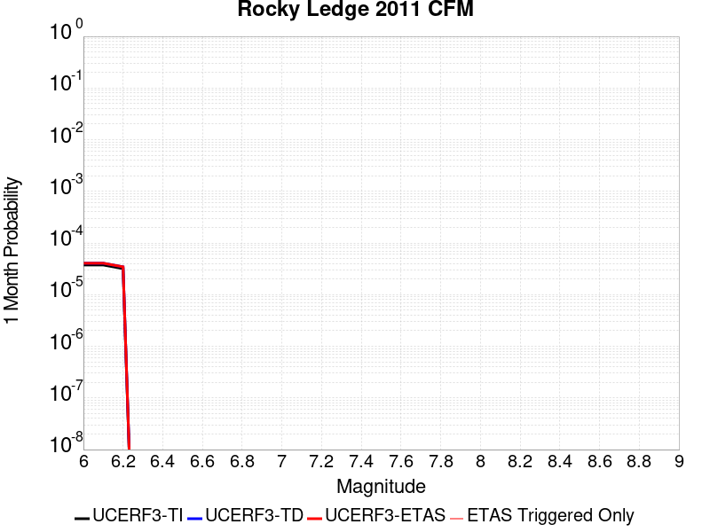 | 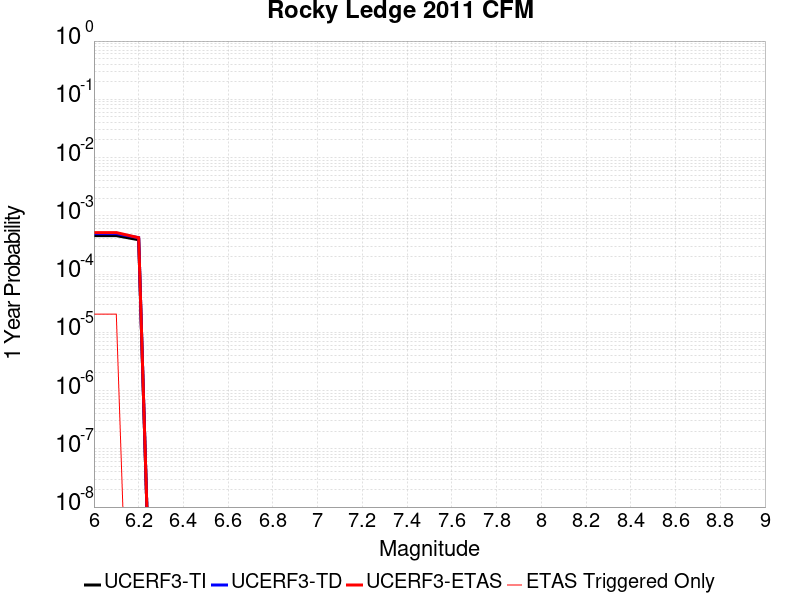 | 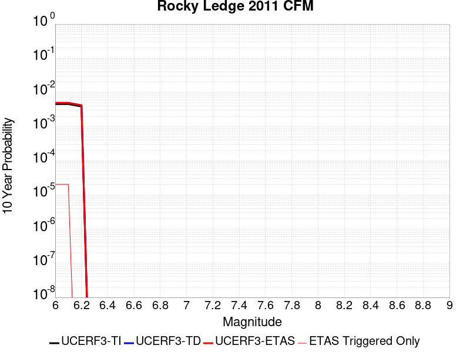 |

| Magnitude | 1 wk TI Prob | 1 wk TD Prob | 1 wk ETAS Prob | 1 wk ETAS/TD Gain | 1 wk ETAS Triggered Only | 1 mo TI Prob | 1 mo TD Prob | 1 mo ETAS Prob | 1 mo ETAS/TD Gain | 1 mo ETAS Triggered Only | 1 yr TI Prob | 1 yr TD Prob | 1 yr ETAS Prob | 1 yr ETAS/TD Gain | 1 yr ETAS Triggered Only | 10 yr TI Prob | 10 yr TD Prob | 10 yr ETAS Prob | 10 yr ETAS/TD Gain | 10 yr ETAS Triggered Only |
|-----|-----|-----|-----|-----|-----|-----|-----|-----|-----|-----|-----|-----|-----|-----|-----|-----|-----|-----|-----|-----|
| 6.0 | 8.7550525E-6 | 9.486711E-6 | 9.486711E-6 | 1.0 | 0.0 | 3.7521113E-5 | 4.0657163E-5 | 4.0657163E-5 | 1.0 | 0.0 | 4.567238E-4 | 4.94971E-4 | 5.0496607E-4 | 1.0201932 | 1.0E-5 | 0.0045578624 | 0.004946774 | 0.0049567246 | 1.0020115 | 1.0E-5 |
| 6.1 | 8.7550525E-6 | 9.486711E-6 | 9.486711E-6 | 1.0 | 0.0 | 3.7521113E-5 | 4.0657163E-5 | 4.0657163E-5 | 1.0 | 0.0 | 4.567238E-4 | 4.94971E-4 | 5.0496607E-4 | 1.0201932 | 1.0E-5 | 0.0045578624 | 0.004946774 | 0.0049567246 | 1.0020115 | 1.0E-5 |
| 6.2 | 7.442295E-6 | 8.063129E-6 | 8.063129E-6 | 1.0 | 0.0 | 3.189516E-5 | 3.455627E-5 | 3.455627E-5 | 1.0 | 0.0 | 3.8825438E-4 | 4.2072256E-4 | 4.2072256E-4 | 1.0 | 0.0 | 0.0038757676 | 0.0042072255 | 0.0042072255 | 1.0 | 0.0 |

## Del Valle
*[(top)](#table-of-contents)*

| 1 Week | 1 Month | 1 Year | 10 Year |
|-----|-----|-----|-----|
| 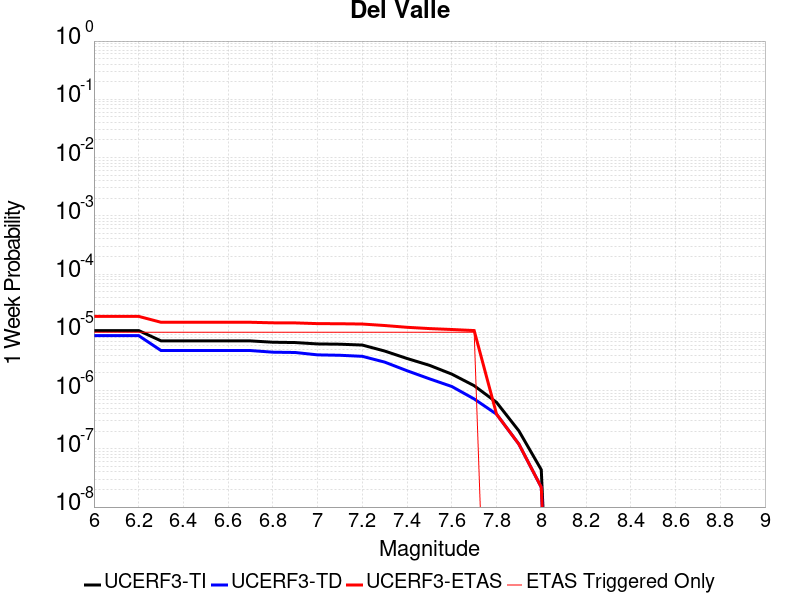 | 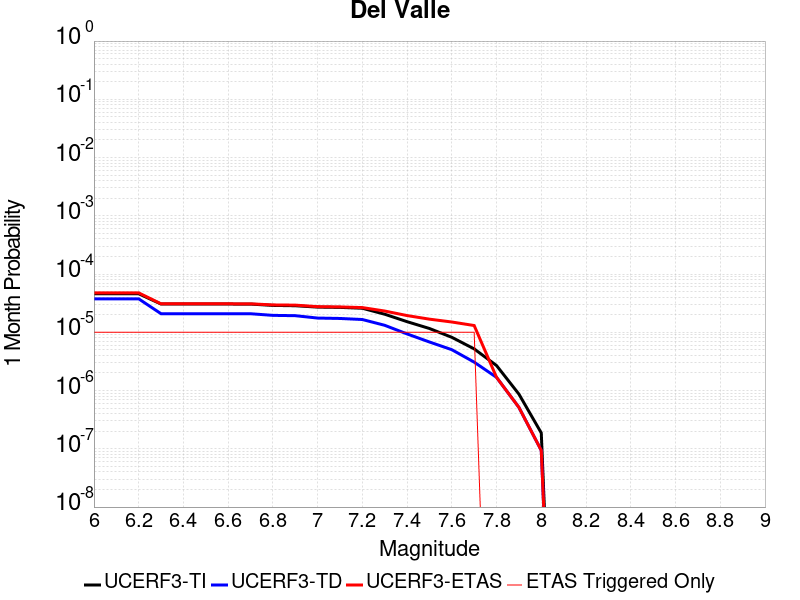 | 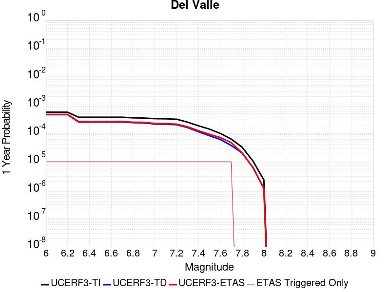 | 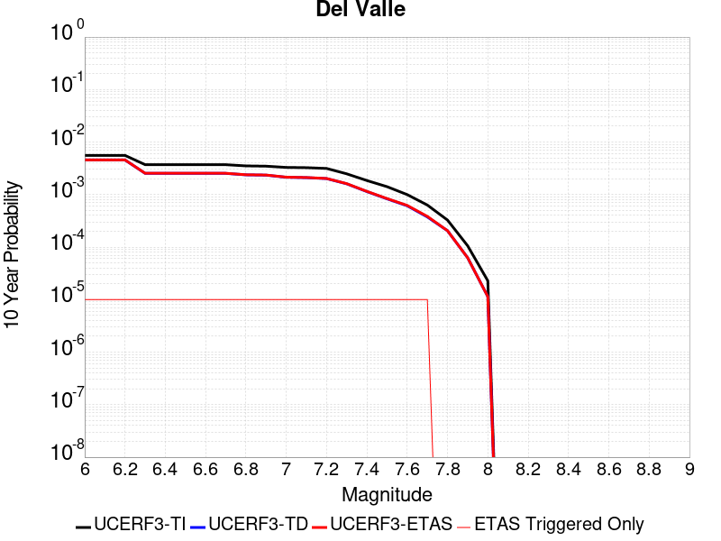 |

| Magnitude | 1 wk TI Prob | 1 wk TD Prob | 1 wk ETAS Prob | 1 wk ETAS/TD Gain | 1 wk ETAS Triggered Only | 1 mo TI Prob | 1 mo TD Prob | 1 mo ETAS Prob | 1 mo ETAS/TD Gain | 1 mo ETAS Triggered Only | 1 yr TI Prob | 1 yr TD Prob | 1 yr ETAS Prob | 1 yr ETAS/TD Gain | 1 yr ETAS Triggered Only | 10 yr TI Prob | 10 yr TD Prob | 10 yr ETAS Prob | 10 yr ETAS/TD Gain | 10 yr ETAS Triggered Only |
|-----|-----|-----|-----|-----|-----|-----|-----|-----|-----|-----|-----|-----|-----|-----|-----|-----|-----|-----|-----|-----|
| 6.0 | 1.0716125E-5 | 8.768052E-6 | 1.8767963E-5 | 2.140494 | 1.0E-5 | 4.592544E-5 | 3.7576934E-5 | 4.757656E-5 | 1.2661107 | 1.0E-5 | 5.589988E-4 | 4.574229E-4 | 4.6741831E-4 | 1.0218517 | 1.0E-5 | 0.0055759475 | 0.0045667686 | 0.004576723 | 1.0021797 | 1.0E-5 |
| 6.1 | 1.0716125E-5 | 8.768052E-6 | 1.8767963E-5 | 2.140494 | 1.0E-5 | 4.592544E-5 | 3.7576934E-5 | 4.757656E-5 | 1.2661107 | 1.0E-5 | 5.589988E-4 | 4.574229E-4 | 4.6741831E-4 | 1.0218517 | 1.0E-5 | 0.0055759475 | 0.0045667686 | 0.004576723 | 1.0021797 | 1.0E-5 |
| 6.2 | 1.0716125E-5 | 8.768052E-6 | 1.8767963E-5 | 2.140494 | 1.0E-5 | 4.592544E-5 | 3.7576934E-5 | 4.757656E-5 | 1.2661107 | 1.0E-5 | 5.589988E-4 | 4.574229E-4 | 4.6741831E-4 | 1.0218517 | 1.0E-5 | 0.0055759475 | 0.0045667686 | 0.004576723 | 1.0021797 | 1.0E-5 |
| 6.3 | 7.1293784E-6 | 4.865947E-6 | 1.4865898E-5 | 3.0550883 | 1.0E-5 | 3.055412E-5 | 2.0853897E-5 | 3.0853687E-5 | 1.4795166 | 1.0E-5 | 3.7193293E-4 | 2.5386736E-4 | 2.6386481E-4 | 1.0393807 | 1.0E-5 | 0.0037131102 | 0.0025358594 | 0.002545834 | 1.0039334 | 1.0E-5 |
| 6.4 | 7.1293784E-6 | 4.865947E-6 | 1.4865898E-5 | 3.0550883 | 1.0E-5 | 3.055412E-5 | 2.0853897E-5 | 3.0853687E-5 | 1.4795166 | 1.0E-5 | 3.7193293E-4 | 2.5386736E-4 | 2.6386481E-4 | 1.0393807 | 1.0E-5 | 0.0037131102 | 0.0025358594 | 0.002545834 | 1.0039334 | 1.0E-5 |
| 6.5 | 7.1293784E-6 | 4.865947E-6 | 1.4865898E-5 | 3.0550883 | 1.0E-5 | 3.055412E-5 | 2.0853897E-5 | 3.0853687E-5 | 1.4795166 | 1.0E-5 | 3.7193293E-4 | 2.5386736E-4 | 2.6386481E-4 | 1.0393807 | 1.0E-5 | 0.0037131102 | 0.0025358594 | 0.002545834 | 1.0039334 | 1.0E-5 |
| 6.6 | 7.1293784E-6 | 4.865947E-6 | 1.4865898E-5 | 3.0550883 | 1.0E-5 | 3.055412E-5 | 2.0853897E-5 | 3.0853687E-5 | 1.4795166 | 1.0E-5 | 3.7193293E-4 | 2.5386736E-4 | 2.6386481E-4 | 1.0393807 | 1.0E-5 | 0.0037131102 | 0.0025358594 | 0.002545834 | 1.0039334 | 1.0E-5 |
| 6.7 | 7.12272E-6 | 4.863323E-6 | 1.4863274E-5 | 3.0561974 | 1.0E-5 | 3.0525585E-5 | 2.084265E-5 | 3.0842442E-5 | 1.4797754 | 1.0E-5 | 3.7158563E-4 | 2.5373045E-4 | 2.637279E-4 | 1.0394019 | 1.0E-5 | 0.003709649 | 0.0025344936 | 0.002544468 | 1.0039356 | 1.0E-5 |
| 6.8 | 6.7558703E-6 | 4.5595193E-6 | 1.4559474E-5 | 3.1932034 | 1.0E-5 | 2.895341E-5 | 1.9540656E-5 | 2.9540459E-5 | 1.5117435 | 1.0E-5 | 3.5245073E-4 | 2.3788214E-4 | 2.4787977E-4 | 1.0420276 | 1.0E-5 | 0.0035189227 | 0.0023763503 | 0.0023863264 | 1.0041981 | 1.0E-5 |
| 6.9 | 6.6700386E-6 | 4.5026545E-6 | 1.450261E-5 | 3.2209022 | 1.0E-5 | 2.8585566E-5 | 1.9296951E-5 | 2.9296758E-5 | 1.5182066 | 1.0E-5 | 3.479737E-4 | 2.3491567E-4 | 2.4491333E-4 | 1.0425584 | 1.0E-5 | 0.003474293 | 0.0023467485 | 0.002356725 | 1.0042512 | 1.0E-5 |
| 7.0 | 6.3181424E-6 | 4.09881E-6 | 1.40987695E-5 | 3.4397223 | 1.0E-5 | 2.7077473E-5 | 1.7566214E-5 | 2.7566039E-5 | 1.5692647 | 1.0E-5 | 3.2961834E-4 | 2.1384809E-4 | 2.2384596E-4 | 1.0467522 | 1.0E-5 | 0.0032912986 | 0.002136478 | 0.0021464564 | 1.0046706 | 1.0E-5 |
| 7.1 | 6.248759E-6 | 4.034E-6 | 1.403396E-5 | 3.478919 | 1.0E-5 | 2.678012E-5 | 1.728846E-5 | 2.7288286E-5 | 1.5784105 | 1.0E-5 | 3.2599916E-4 | 2.1046709E-4 | 2.2046498E-4 | 1.0475034 | 1.0E-5 | 0.0032552136 | 0.002102732 | 0.002112711 | 1.0047457 | 1.0E-5 |
| 7.2 | 6.0411944E-6 | 3.869988E-6 | 1.386995E-5 | 3.5839772 | 1.0E-5 | 2.5890577E-5 | 1.6585562E-5 | 2.6585396E-5 | 1.6029241 | 1.0E-5 | 3.1517216E-4 | 2.0191091E-4 | 2.1190889E-4 | 1.0495168 | 1.0E-5 | 0.0031472554 | 0.002017328 | 0.0020273079 | 1.0049471 | 1.0E-5 |
| 7.3 | 4.7691183E-6 | 3.078193E-6 | 1.3078162E-5 | 4.248649 | 1.0E-5 | 2.0438918E-5 | 1.319219E-5 | 2.3192059E-5 | 1.7580142 | 1.0E-5 | 2.488154E-4 | 1.6060329E-4 | 1.7060169E-4 | 1.0622553 | 1.0E-5 | 0.00248537 | 0.0016048981 | 0.001614882 | 1.0062209 | 1.0E-5 |
| 7.4 | 3.5524722E-6 | 2.1893868E-6 | 1.2189365E-5 | 5.5674787 | 1.0E-5 | 1.5224792E-5 | 9.383053E-6 | 1.938296E-5 | 2.065741 | 1.0E-5 | 1.8534607E-4 | 1.1423277E-4 | 1.2423162E-4 | 1.0875306 | 1.0E-5 | 0.0018519156 | 0.0011417487 | 0.0011517373 | 1.0087485 | 1.0E-5 |
| 7.5 | 2.7133442E-6 | 1.591647E-6 | 1.1591631E-5 | 7.28279 | 1.0E-5 | 1.1628566E-5 | 6.8213267E-6 | 1.682126E-5 | 2.4659805 | 1.0E-5 | 1.415686E-4 | 8.304651E-5 | 9.304567E-5 | 1.1204045 | 1.0E-5 | 0.0014147845 | 8.3015667E-4 | 8.4014836E-4 | 1.012036 | 1.0E-5 |
| 7.6 | 1.915338E-6 | 1.1739402E-6 | 1.1173928E-5 | 9.5183115 | 1.0E-5 | 8.208566E-6 | 5.031163E-6 | 1.50311125E-5 | 2.987602 | 1.0E-5 | 9.993471E-5 | 6.125269E-5 | 7.125208E-5 | 1.1632482 | 1.0E-5 | 9.988978E-4 | 6.12359E-4 | 6.2235293E-4 | 1.0163203 | 1.0E-5 |
| 7.7 | 1.2120448E-6 | 7.1804885E-7 | 1.0718041E-5 | 14.926619 | 1.0E-5 | 5.194467E-6 | 3.0773488E-6 | 1.3077318E-5 | 4.2495403 | 1.0E-5 | 6.3240805E-5 | 3.746608E-5 | 4.7465706E-5 | 1.266898 | 1.0E-5 | 6.322281E-4 | 3.7459802E-4 | 3.8459428E-4 | 1.0266852 | 1.0E-5 |
| 7.8 | 6.272381E-7 | 3.9326522E-7 | 3.9326522E-7 | 1.0 | 0.0 | 2.6881603E-6 | 1.6854212E-6 | 1.6854212E-6 | 1.0 | 0.0 | 3.272786E-5 | 2.0519812E-5 | 2.0519812E-5 | 1.0 | 0.0 | 3.272304E-4 | 2.0517933E-4 | 2.0517933E-4 | 1.0 | 0.0 |
| 7.9 | 2.0292627E-7 | 1.2005012E-7 | 1.2005012E-7 | 1.0 | 0.0 | 8.6968373E-7 | 5.145004E-7 | 5.145004E-7 | 1.0 | 0.0 | 1.0588348E-5 | 6.2640247E-6 | 6.2640247E-6 | 1.0 | 0.0 | 1.0587843E-4 | 6.26385E-5 | 6.26385E-5 | 1.0 | 0.0 |
| 8.0 | 4.374492E-8 | 2.1900798E-8 | 2.1900798E-8 | 1.0 | 0.0 | 1.8747821E-7 | 9.386056E-8 | 9.386056E-8 | 1.0 | 0.0 | 2.2825448E-6 | 1.1427518E-6 | 1.1427518E-6 | 1.0 | 0.0 | 2.2825214E-5 | 1.1427463E-5 | 1.1427463E-5 | 1.0 | 0.0 |

## San Jose
*[(top)](#table-of-contents)*

| 1 Week | 1 Month | 1 Year | 10 Year |
|-----|-----|-----|-----|
| 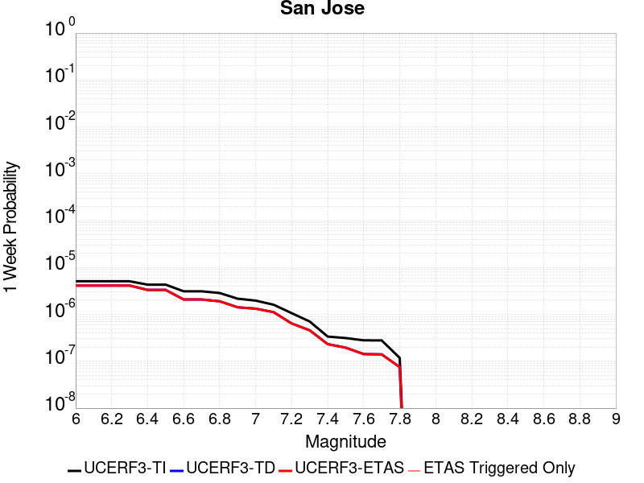 | 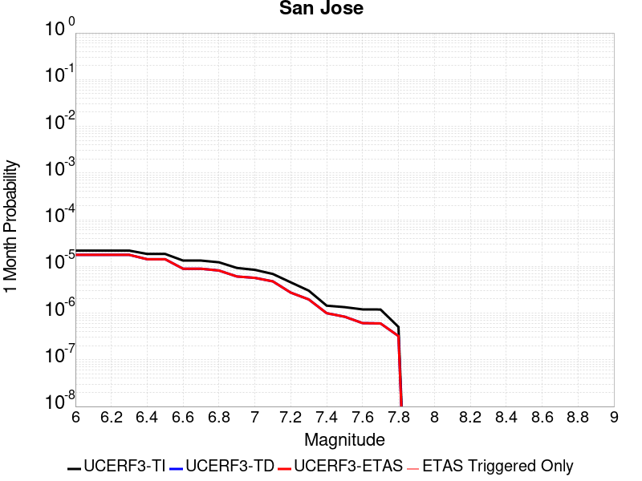 | 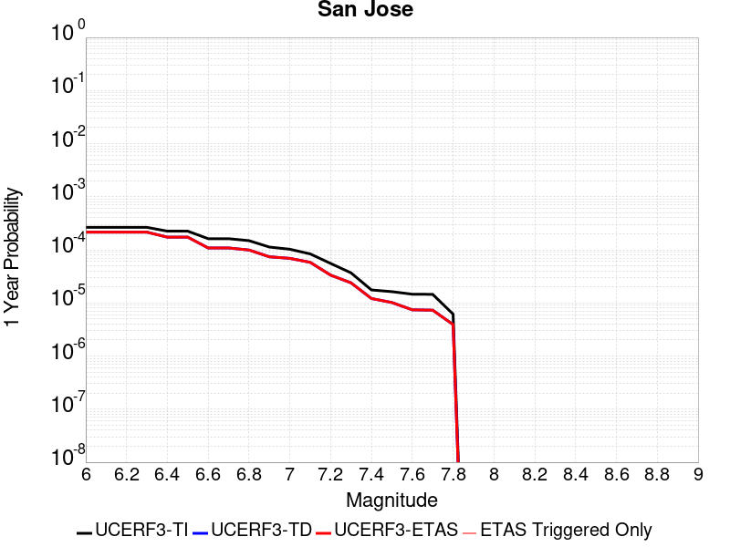 | 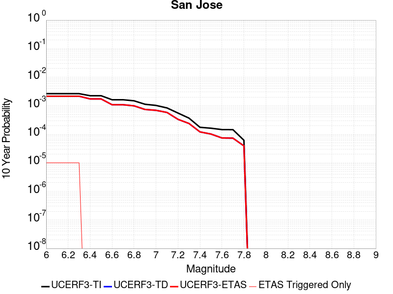 |

| Magnitude | 1 wk TI Prob | 1 wk TD Prob | 1 wk ETAS Prob | 1 wk ETAS/TD Gain | 1 wk ETAS Triggered Only | 1 mo TI Prob | 1 mo TD Prob | 1 mo ETAS Prob | 1 mo ETAS/TD Gain | 1 mo ETAS Triggered Only | 1 yr TI Prob | 1 yr TD Prob | 1 yr ETAS Prob | 1 yr ETAS/TD Gain | 1 yr ETAS Triggered Only | 10 yr TI Prob | 10 yr TD Prob | 10 yr ETAS Prob | 10 yr ETAS/TD Gain | 10 yr ETAS Triggered Only |
|-----|-----|-----|-----|-----|-----|-----|-----|-----|-----|-----|-----|-----|-----|-----|-----|-----|-----|-----|-----|-----|
| 6.0 | 5.0851277E-6 | 4.125751E-6 | 4.125751E-6 | 1.0 | 0.0 | 2.1793223E-5 | 1.7681685E-5 | 1.7681685E-5 | 1.0 | 0.0 | 2.653002E-4 | 2.1525587E-4 | 2.1525587E-4 | 1.0 | 0.0 | 0.0026498367 | 0.002150765 | 0.0021607433 | 1.0046395 | 1.0E-5 |
| 6.1 | 5.0851277E-6 | 4.125751E-6 | 4.125751E-6 | 1.0 | 0.0 | 2.1793223E-5 | 1.7681685E-5 | 1.7681685E-5 | 1.0 | 0.0 | 2.653002E-4 | 2.1525587E-4 | 2.1525587E-4 | 1.0 | 0.0 | 0.0026498367 | 0.002150765 | 0.0021607433 | 1.0046395 | 1.0E-5 |
| 6.2 | 5.0851277E-6 | 4.125751E-6 | 4.125751E-6 | 1.0 | 0.0 | 2.1793223E-5 | 1.7681685E-5 | 1.7681685E-5 | 1.0 | 0.0 | 2.653002E-4 | 2.1525587E-4 | 2.1525587E-4 | 1.0 | 0.0 | 0.0026498367 | 0.002150765 | 0.0021607433 | 1.0046395 | 1.0E-5 |
| 6.3 | 5.0851277E-6 | 4.125751E-6 | 4.125751E-6 | 1.0 | 0.0 | 2.1793223E-5 | 1.7681685E-5 | 1.7681685E-5 | 1.0 | 0.0 | 2.653002E-4 | 2.1525587E-4 | 2.1525587E-4 | 1.0 | 0.0 | 0.0026498367 | 0.002150765 | 0.0021607433 | 1.0046395 | 1.0E-5 |
| 6.4 | 4.3115124E-6 | 3.3238575E-6 | 3.3238575E-6 | 1.0 | 0.0 | 1.8477778E-5 | 1.4245038E-5 | 1.4245038E-5 | 1.0 | 0.0 | 2.2494372E-4 | 1.7342175E-4 | 1.7342175E-4 | 1.0 | 0.0 | 0.0022471617 | 0.0017331139 | 0.0017331139 | 1.0 | 0.0 |
| 6.5 | 4.3115124E-6 | 3.3238575E-6 | 3.3238575E-6 | 1.0 | 0.0 | 1.8477778E-5 | 1.4245038E-5 | 1.4245038E-5 | 1.0 | 0.0 | 2.2494372E-4 | 1.7342175E-4 | 1.7342175E-4 | 1.0 | 0.0 | 0.0022471617 | 0.0017331139 | 0.0017331139 | 1.0 | 0.0 |
| 6.6 | 3.110396E-6 | 2.080055E-6 | 2.080055E-6 | 1.0 | 0.0 | 1.33302E-5 | 8.914493E-6 | 8.914493E-6 | 1.0 | 0.0 | 1.622831E-4 | 1.0852883E-4 | 1.0852883E-4 | 1.0 | 0.0 | 0.0016216465 | 0.0010848183 | 0.0010848183 | 1.0 | 0.0 |
| 6.7 | 3.110396E-6 | 2.080055E-6 | 2.080055E-6 | 1.0 | 0.0 | 1.33302E-5 | 8.914493E-6 | 8.914493E-6 | 1.0 | 0.0 | 1.622831E-4 | 1.0852883E-4 | 1.0852883E-4 | 1.0 | 0.0 | 0.0016216465 | 0.0010848183 | 0.0010848183 | 1.0 | 0.0 |
| 6.8 | 2.856651E-6 | 1.9025018E-6 | 1.9025018E-6 | 1.0 | 0.0 | 1.2242733E-5 | 8.153555E-6 | 8.153555E-6 | 1.0 | 0.0 | 1.4904508E-4 | 9.926526E-5 | 9.926526E-5 | 1.0 | 0.0 | 0.0014894515 | 9.922662E-4 | 9.922662E-4 | 1.0 | 0.0 |
| 6.9 | 2.1618725E-6 | 1.4187265E-6 | 1.4187265E-6 | 1.0 | 0.0 | 9.265135E-6 | 6.080242E-6 | 6.080242E-6 | 1.0 | 0.0 | 1.12797185E-4 | 7.402452E-5 | 7.402452E-5 | 1.0 | 0.0 | 0.0011273995 | 7.4003986E-4 | 7.4003986E-4 | 1.0 | 0.0 |
| 7.0 | 1.9684312E-6 | 1.3256941E-6 | 1.3256941E-6 | 1.0 | 0.0 | 8.436106E-6 | 5.6815347E-6 | 5.6815347E-6 | 1.0 | 0.0 | 1.02704755E-4 | 6.917057E-5 | 6.917057E-5 | 1.0 | 0.0 | 0.001026573 | 6.9153105E-4 | 6.9153105E-4 | 1.0 | 0.0 |
| 7.1 | 1.6070337E-6 | 1.1155666E-6 | 1.1155666E-6 | 1.0 | 0.0 | 6.887269E-6 | 4.7809913E-6 | 4.7809913E-6 | 1.0 | 0.0 | 8.384928E-5 | 5.820708E-5 | 5.820708E-5 | 1.0 | 0.0 | 8.3817646E-4 | 5.81957E-4 | 5.81957E-4 | 1.0 | 0.0 |
| 7.2 | 1.0631658E-6 | 6.4041933E-7 | 6.4041933E-7 | 1.0 | 0.0 | 4.556417E-6 | 2.7446513E-6 | 2.7446513E-6 | 1.0 | 0.0 | 5.5472963E-5 | 3.3415632E-5 | 3.3415632E-5 | 1.0 | 0.0 | 5.545912E-4 | 3.3413994E-4 | 3.3413994E-4 | 1.0 | 0.0 |
| 7.3 | 7.060711E-7 | 4.582818E-7 | 4.582818E-7 | 1.0 | 0.0 | 3.0260155E-6 | 1.9640634E-6 | 1.9640634E-6 | 1.0 | 0.0 | 3.6841117E-5 | 2.3912218E-5 | 2.3912218E-5 | 1.0 | 0.0 | 3.6835007E-4 | 2.3912982E-4 | 2.3912982E-4 | 1.0 | 0.0 |
| 7.4 | 3.3677085E-7 | 2.3235627E-7 | 2.3235627E-7 | 1.0 | 0.0 | 1.4433028E-6 | 9.958122E-7 | 9.958122E-7 | 1.0 | 0.0 | 1.757207E-5 | 1.2123949E-5 | 1.2123949E-5 | 1.0 | 0.0 | 1.7570681E-4 | 1.2126564E-4 | 1.2126564E-4 | 1.0 | 0.0 |
| 7.5 | 3.129161E-7 | 1.9532963E-7 | 1.9532963E-7 | 1.0 | 0.0 | 1.3410682E-6 | 8.371268E-7 | 8.371268E-7 | 1.0 | 0.0 | 1.6327383E-5 | 1.0191973E-5 | 1.0191973E-5 | 1.0 | 0.0 | 1.6326184E-4 | 1.0194778E-4 | 1.0194778E-4 | 1.0 | 0.0 |
| 7.6 | 2.8008668E-7 | 1.4243734E-7 | 1.4243734E-7 | 1.0 | 0.0 | 1.2003709E-6 | 6.104456E-7 | 6.104456E-7 | 1.0 | 0.0 | 1.46144175E-5 | 7.4321515E-6 | 7.4321515E-6 | 1.0 | 0.0 | 1.4613457E-4 | 7.4351636E-5 | 7.4351636E-5 | 1.0 | 0.0 |
| 7.7 | 2.7852005E-7 | 1.4018305E-7 | 1.4018305E-7 | 1.0 | 0.0 | 1.1936568E-6 | 6.007844E-7 | 6.007844E-7 | 1.0 | 0.0 | 1.4532674E-5 | 7.314527E-6 | 7.314527E-6 | 1.0 | 0.0 | 1.4531724E-4 | 7.317547E-5 | 7.317547E-5 | 1.0 | 0.0 |
| 7.8 | 1.1810797E-7 | 7.5195864E-8 | 7.5195864E-8 | 1.0 | 0.0 | 5.0617695E-7 | 3.2226794E-7 | 3.2226794E-7 | 1.0 | 0.0 | 6.1626865E-6 | 3.9236056E-6 | 3.9236056E-6 | 1.0 | 0.0 | 6.162516E-5 | 3.9253733E-5 | 3.9253733E-5 | 1.0 | 0.0 |

## San Gregorio (South) 2011 CFM
*[(top)](#table-of-contents)*

| 1 Week | 1 Month | 1 Year | 10 Year |
|-----|-----|-----|-----|
| 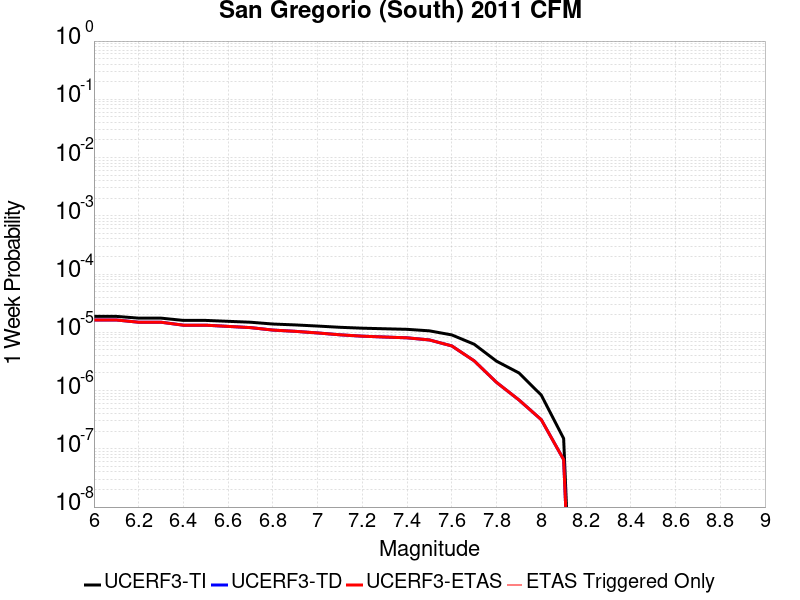 | 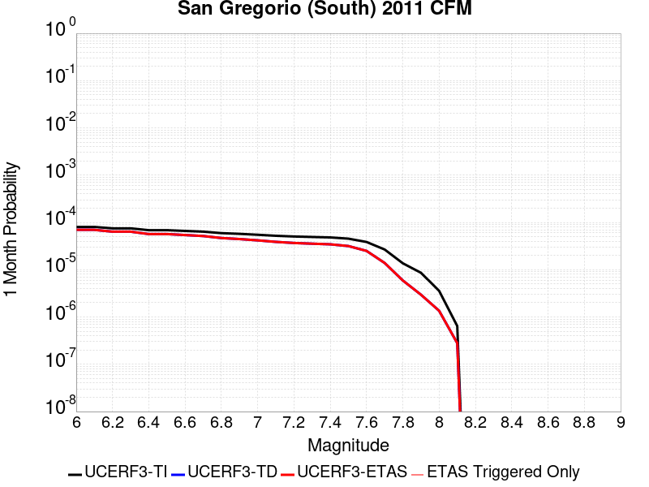 | 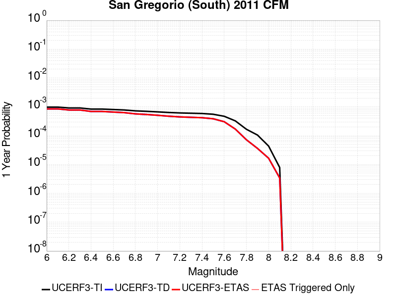 | 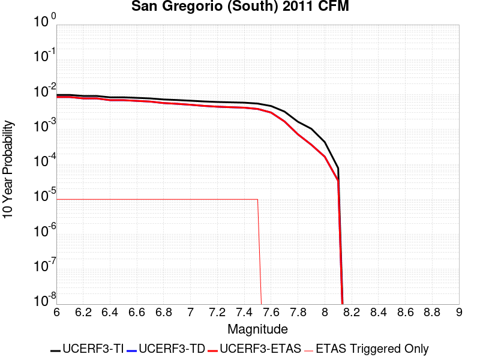 |

| Magnitude | 1 wk TI Prob | 1 wk TD Prob | 1 wk ETAS Prob | 1 wk ETAS/TD Gain | 1 wk ETAS Triggered Only | 1 mo TI Prob | 1 mo TD Prob | 1 mo ETAS Prob | 1 mo ETAS/TD Gain | 1 mo ETAS Triggered Only | 1 yr TI Prob | 1 yr TD Prob | 1 yr ETAS Prob | 1 yr ETAS/TD Gain | 1 yr ETAS Triggered Only | 10 yr TI Prob | 10 yr TD Prob | 10 yr ETAS Prob | 10 yr ETAS/TD Gain | 10 yr ETAS Triggered Only |
|-----|-----|-----|-----|-----|-----|-----|-----|-----|-----|-----|-----|-----|-----|-----|-----|-----|-----|-----|-----|-----|
| 6.0 | 1.8770423E-5 | 1.6280406E-5 | 1.6280406E-5 | 1.0 | 0.0 | 8.044219E-5 | 6.977132E-5 | 6.977132E-5 | 1.0 | 0.0 | 9.789435E-4 | 8.491386E-4 | 8.491386E-4 | 1.0 | 0.0 | 0.009746423 | 0.008471654 | 0.008481569 | 1.0011704 | 1.0E-5 |
| 6.1 | 1.8770423E-5 | 1.6280406E-5 | 1.6280406E-5 | 1.0 | 0.0 | 8.044219E-5 | 6.977132E-5 | 6.977132E-5 | 1.0 | 0.0 | 9.789435E-4 | 8.491386E-4 | 8.491386E-4 | 1.0 | 0.0 | 0.009746423 | 0.008471654 | 0.008481569 | 1.0011704 | 1.0E-5 |
| 6.2 | 1.7508692E-5 | 1.4899894E-5 | 1.4899894E-5 | 1.0 | 0.0 | 7.5035096E-5 | 6.385514E-5 | 6.385514E-5 | 1.0 | 0.0 | 9.1316935E-4 | 7.771621E-4 | 7.771621E-4 | 1.0 | 0.0 | 0.00909426 | 0.0077570733 | 0.0077669956 | 1.0012791 | 1.0E-5 |
| 6.3 | 1.7508692E-5 | 1.4899894E-5 | 1.4899894E-5 | 1.0 | 0.0 | 7.5035096E-5 | 6.385514E-5 | 6.385514E-5 | 1.0 | 0.0 | 9.1316935E-4 | 7.771621E-4 | 7.771621E-4 | 1.0 | 0.0 | 0.00909426 | 0.0077570733 | 0.0077669956 | 1.0012791 | 1.0E-5 |
| 6.4 | 1.6004591E-5 | 1.324971E-5 | 1.324971E-5 | 1.0 | 0.0 | 6.85893E-5 | 5.678324E-5 | 5.678324E-5 | 1.0 | 0.0 | 8.347548E-4 | 6.911177E-4 | 6.911177E-4 | 1.0 | 0.0 | 0.008316261 | 0.0069021136 | 0.0069120442 | 1.0014389 | 1.0E-5 |
| 6.5 | 1.6004591E-5 | 1.324971E-5 | 1.324971E-5 | 1.0 | 0.0 | 6.85893E-5 | 5.678324E-5 | 5.678324E-5 | 1.0 | 0.0 | 8.347548E-4 | 6.911177E-4 | 6.911177E-4 | 1.0 | 0.0 | 0.008316261 | 0.0069021136 | 0.0069120442 | 1.0014389 | 1.0E-5 |
| 6.6 | 1.5442201E-5 | 1.2634333E-5 | 1.2634333E-5 | 1.0 | 0.0 | 6.617918E-5 | 5.4146025E-5 | 5.4146025E-5 | 1.0 | 0.0 | 8.0543366E-4 | 6.590293E-4 | 6.590293E-4 | 1.0 | 0.0 | 0.008025207 | 0.006583161 | 0.006593095 | 1.0015091 | 1.0E-5 |
| 6.7 | 1.489921E-5 | 1.2042835E-5 | 1.2042835E-5 | 1.0 | 0.0 | 6.3852196E-5 | 5.1611136E-5 | 5.1611136E-5 | 1.0 | 0.0 | 7.7712315E-4 | 6.281851E-4 | 6.281851E-4 | 1.0 | 0.0 | 0.0077441116 | 0.0062764906 | 0.006286428 | 1.0015832 | 1.0E-5 |
| 6.8 | 1.3876024E-5 | 1.0921772E-5 | 1.0921772E-5 | 1.0 | 0.0 | 5.9467322E-5 | 4.6806756E-5 | 4.6806756E-5 | 1.0 | 0.0 | 7.237741E-4 | 5.697236E-4 | 5.697236E-4 | 1.0 | 0.0 | 0.0072142133 | 0.0056949924 | 0.0057049356 | 1.0017459 | 1.0E-5 |
| 6.9 | 1.33922495E-5 | 1.0393267E-5 | 1.0393267E-5 | 1.0 | 0.0 | 5.7394092E-5 | 4.4541815E-5 | 4.4541815E-5 | 1.0 | 0.0 | 6.9854903E-4 | 5.421619E-4 | 5.421619E-4 | 1.0 | 0.0 | 0.0069635725 | 0.0054207467 | 0.005430693 | 1.0018348 | 1.0E-5 |
| 7.0 | 1.2807324E-5 | 9.753221E-6 | 9.753221E-6 | 1.0 | 0.0 | 5.4887376E-5 | 4.179885E-5 | 4.179885E-5 | 1.0 | 0.0 | 6.680489E-4 | 5.0878234E-4 | 5.0878234E-4 | 1.0 | 0.0 | 0.006660442 | 0.005088521 | 0.00509847 | 1.0019552 | 1.0E-5 |
| 7.1 | 1.2191438E-5 | 9.062097E-6 | 9.062097E-6 | 1.0 | 0.0 | 5.224797E-5 | 3.883698E-5 | 3.883698E-5 | 1.0 | 0.0 | 6.3593336E-4 | 4.7273774E-4 | 4.7273774E-4 | 1.0 | 0.0 | 0.0063411663 | 0.0047296593 | 0.004739612 | 1.0021043 | 1.0E-5 |
| 7.2 | 1.1769438E-5 | 8.582283E-6 | 8.582283E-6 | 1.0 | 0.0 | 5.0439474E-5 | 3.6780693E-5 | 3.6780693E-5 | 1.0 | 0.0 | 6.1392755E-4 | 4.47713E-4 | 4.47713E-4 | 1.0 | 0.0 | 0.0061223423 | 0.004480447 | 0.0044904025 | 1.002222 | 1.0E-5 |
| 7.3 | 1.150374E-5 | 8.297709E-6 | 8.297709E-6 | 1.0 | 0.0 | 4.9300812E-5 | 3.5561126E-5 | 3.5561126E-5 | 1.0 | 0.0 | 6.0007203E-4 | 4.3287076E-4 | 4.3287076E-4 | 1.0 | 0.0 | 0.0059845424 | 0.004332595 | 0.0043425513 | 1.0022981 | 1.0E-5 |
| 7.4 | 1.12514E-5 | 8.043448E-6 | 8.043448E-6 | 1.0 | 0.0 | 4.8219394E-5 | 3.4471464E-5 | 3.4471464E-5 | 1.0 | 0.0 | 5.8691297E-4 | 4.1960934E-4 | 4.1960934E-4 | 1.0 | 0.0 | 0.005853653 | 0.0042004758 | 0.0042104335 | 1.0023707 | 1.0E-5 |
| 7.5 | 1.059696E-5 | 7.393731E-6 | 7.393731E-6 | 1.0 | 0.0 | 4.5414752E-5 | 3.1687036E-5 | 3.1687036E-5 | 1.0 | 0.0 | 5.5278436E-4 | 3.857214E-4 | 3.857214E-4 | 1.0 | 0.0 | 0.0055141128 | 0.00386276 | 0.0038727215 | 1.0025789 | 1.0E-5 |
| 7.6 | 9.018592E-6 | 5.837476E-6 | 5.837476E-6 | 1.0 | 0.0 | 3.8650534E-5 | 2.5017514E-5 | 2.5017514E-5 | 1.0 | 0.0 | 4.7046866E-4 | 3.045457E-4 | 3.045457E-4 | 1.0 | 0.0 | 0.004694739 | 0.003053146 | 0.003053146 | 1.0 | 0.0 |
| 7.7 | 6.243489E-6 | 3.239967E-6 | 3.239967E-6 | 1.0 | 0.0 | 2.6757538E-5 | 1.3885499E-5 | 1.3885499E-5 | 1.0 | 0.0 | 3.257243E-4 | 1.6904285E-4 | 1.6904285E-4 | 1.0 | 0.0 | 0.003252473 | 0.001699331 | 0.001699331 | 1.0 | 0.0 |
| 7.8 | 3.1941963E-6 | 1.3812611E-6 | 1.3812611E-6 | 1.0 | 0.0 | 1.368934E-5 | 5.919677E-6 | 5.919677E-6 | 1.0 | 0.0 | 1.6665498E-4 | 7.2069684E-5 | 7.2069684E-5 | 1.0 | 0.0 | 0.0016653005 | 7.2645675E-4 | 7.2645675E-4 | 1.0 | 0.0 |
| 7.9 | 2.0098398E-6 | 6.9180976E-7 | 6.9180976E-7 | 1.0 | 0.0 | 8.6135715E-6 | 2.9648954E-6 | 2.9648954E-6 | 1.0 | 0.0 | 1.0486518E-4 | 3.6097004E-5 | 3.6097004E-5 | 1.0 | 0.0 | 0.0010481571 | 3.6582787E-4 | 3.6582787E-4 | 1.0 | 0.0 |
| 8.0 | 8.353119E-7 | 3.163282E-7 | 3.163282E-7 | 1.0 | 0.0 | 3.579903E-6 | 1.3556916E-6 | 1.3556916E-6 | 1.0 | 0.0 | 4.358445E-5 | 1.650542E-5 | 1.650542E-5 | 1.0 | 0.0 | 4.3575902E-4 | 1.6624204E-4 | 1.6624204E-4 | 1.0 | 0.0 |
| 8.1 | 1.5033264E-7 | 6.529188E-8 | 6.529188E-8 | 1.0 | 0.0 | 6.442826E-7 | 2.798223E-7 | 2.798223E-7 | 1.0 | 0.0 | 7.844113E-6 | 3.4068314E-6 | 3.4068314E-6 | 1.0 | 0.0 | 7.843835E-5 | 3.4085097E-5 | 3.4085097E-5 | 1.0 | 0.0 |

## Northridge Hills
*[(top)](#table-of-contents)*

| 1 Week | 1 Month | 1 Year | 10 Year |
|-----|-----|-----|-----|
| 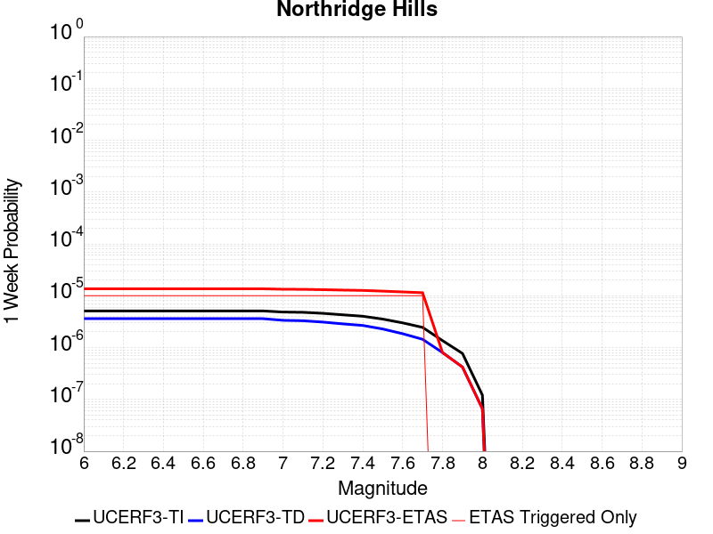 | 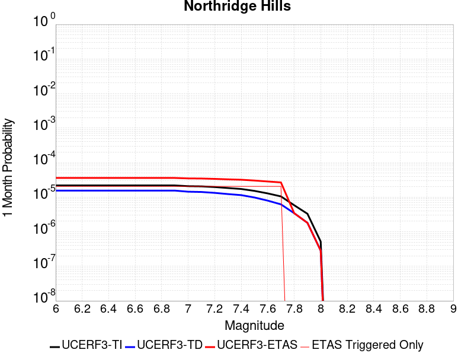 | 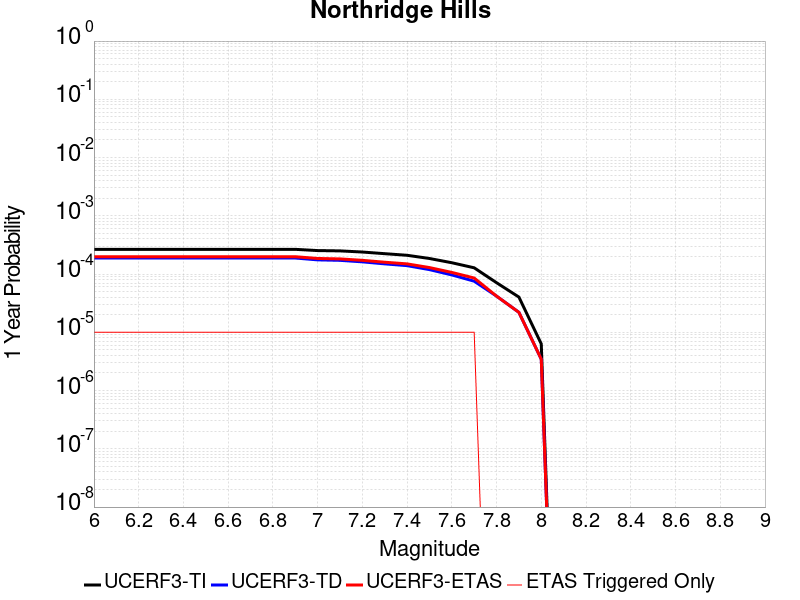 | 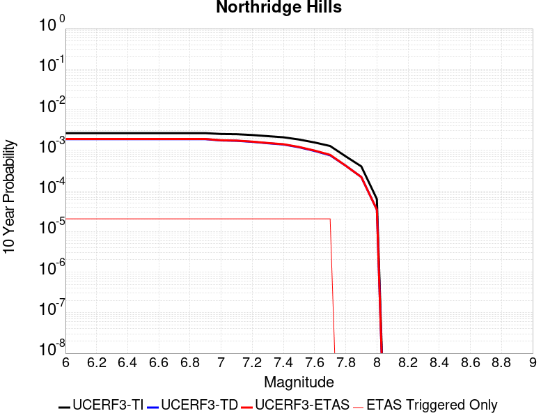 |

| Magnitude | 1 wk TI Prob | 1 wk TD Prob | 1 wk ETAS Prob | 1 wk ETAS/TD Gain | 1 wk ETAS Triggered Only | 1 mo TI Prob | 1 mo TD Prob | 1 mo ETAS Prob | 1 mo ETAS/TD Gain | 1 mo ETAS Triggered Only | 1 yr TI Prob | 1 yr TD Prob | 1 yr ETAS Prob | 1 yr ETAS/TD Gain | 1 yr ETAS Triggered Only | 10 yr TI Prob | 10 yr TD Prob | 10 yr ETAS Prob | 10 yr ETAS/TD Gain | 10 yr ETAS Triggered Only |
|-----|-----|-----|-----|-----|-----|-----|-----|-----|-----|-----|-----|-----|-----|-----|-----|-----|-----|-----|-----|-----|
| 6.0 | 5.095982E-6 | 3.6153342E-6 | 1.3615298E-5 | 3.7659862 | 1.0E-5 | 2.183974E-5 | 1.5494197E-5 | 2.5494042E-5 | 1.6453929 | 1.0E-5 | 2.658664E-4 | 1.8862565E-4 | 1.9862376E-4 | 1.0530051 | 1.0E-5 | 0.0026554854 | 0.0018846678 | 0.001894649 | 1.005296 | 1.0E-5 |
| 6.1 | 5.095982E-6 | 3.6153342E-6 | 1.3615298E-5 | 3.7659862 | 1.0E-5 | 2.183974E-5 | 1.5494197E-5 | 2.5494042E-5 | 1.6453929 | 1.0E-5 | 2.658664E-4 | 1.8862565E-4 | 1.9862376E-4 | 1.0530051 | 1.0E-5 | 0.0026554854 | 0.0018846678 | 0.001894649 | 1.005296 | 1.0E-5 |
| 6.2 | 5.095982E-6 | 3.6153342E-6 | 1.3615298E-5 | 3.7659862 | 1.0E-5 | 2.183974E-5 | 1.5494197E-5 | 2.5494042E-5 | 1.6453929 | 1.0E-5 | 2.658664E-4 | 1.8862565E-4 | 1.9862376E-4 | 1.0530051 | 1.0E-5 | 0.0026554854 | 0.0018846678 | 0.001894649 | 1.005296 | 1.0E-5 |
| 6.3 | 5.095982E-6 | 3.6153342E-6 | 1.3615298E-5 | 3.7659862 | 1.0E-5 | 2.183974E-5 | 1.5494197E-5 | 2.5494042E-5 | 1.6453929 | 1.0E-5 | 2.658664E-4 | 1.8862565E-4 | 1.9862376E-4 | 1.0530051 | 1.0E-5 | 0.0026554854 | 0.0018846678 | 0.001894649 | 1.005296 | 1.0E-5 |
| 6.4 | 5.095982E-6 | 3.6153342E-6 | 1.3615298E-5 | 3.7659862 | 1.0E-5 | 2.183974E-5 | 1.5494197E-5 | 2.5494042E-5 | 1.6453929 | 1.0E-5 | 2.658664E-4 | 1.8862565E-4 | 1.9862376E-4 | 1.0530051 | 1.0E-5 | 0.0026554854 | 0.0018846678 | 0.001894649 | 1.005296 | 1.0E-5 |
| 6.5 | 5.095982E-6 | 3.6153342E-6 | 1.3615298E-5 | 3.7659862 | 1.0E-5 | 2.183974E-5 | 1.5494197E-5 | 2.5494042E-5 | 1.6453929 | 1.0E-5 | 2.658664E-4 | 1.8862565E-4 | 1.9862376E-4 | 1.0530051 | 1.0E-5 | 0.0026554854 | 0.0018846678 | 0.001894649 | 1.005296 | 1.0E-5 |
| 6.6 | 5.095982E-6 | 3.6153342E-6 | 1.3615298E-5 | 3.7659862 | 1.0E-5 | 2.183974E-5 | 1.5494197E-5 | 2.5494042E-5 | 1.6453929 | 1.0E-5 | 2.658664E-4 | 1.8862565E-4 | 1.9862376E-4 | 1.0530051 | 1.0E-5 | 0.0026554854 | 0.0018846678 | 0.001894649 | 1.005296 | 1.0E-5 |
| 6.7 | 5.095982E-6 | 3.6153342E-6 | 1.3615298E-5 | 3.7659862 | 1.0E-5 | 2.183974E-5 | 1.5494197E-5 | 2.5494042E-5 | 1.6453929 | 1.0E-5 | 2.658664E-4 | 1.8862565E-4 | 1.9862376E-4 | 1.0530051 | 1.0E-5 | 0.0026554854 | 0.0018846678 | 0.001894649 | 1.005296 | 1.0E-5 |
| 6.8 | 5.095982E-6 | 3.6153342E-6 | 1.3615298E-5 | 3.7659862 | 1.0E-5 | 2.183974E-5 | 1.5494197E-5 | 2.5494042E-5 | 1.6453929 | 1.0E-5 | 2.658664E-4 | 1.8862565E-4 | 1.9862376E-4 | 1.0530051 | 1.0E-5 | 0.0026554854 | 0.0018846678 | 0.001894649 | 1.005296 | 1.0E-5 |
| 6.9 | 5.0942654E-6 | 3.613549E-6 | 1.3613513E-5 | 3.7673526 | 1.0E-5 | 2.1832384E-5 | 1.5486547E-5 | 2.5486393E-5 | 1.6457117 | 1.0E-5 | 2.6577685E-4 | 1.8853252E-4 | 1.9853063E-4 | 1.0530312 | 1.0E-5 | 0.002654592 | 0.0018837382 | 0.0018937193 | 1.0052986 | 1.0E-5 |
| 7.0 | 4.851143E-6 | 3.3588624E-6 | 1.3358829E-5 | 3.9771886 | 1.0E-5 | 2.0790447E-5 | 1.4395046E-5 | 2.4394902E-5 | 1.6946734 | 1.0E-5 | 2.5309427E-4 | 1.7524562E-4 | 1.8524387E-4 | 1.0570527 | 1.0E-5 | 0.0025280623 | 0.0017510786 | 0.0017610611 | 1.0057007 | 1.0E-5 |
| 7.1 | 4.7910607E-6 | 3.2971432E-6 | 1.329711E-5 | 4.0329185 | 1.0E-5 | 2.0532956E-5 | 1.4130537E-5 | 2.4130395E-5 | 1.7076771 | 1.0E-5 | 2.4996005E-4 | 1.7202574E-4 | 1.8202403E-4 | 1.0581208 | 1.0E-5 | 0.0024967908 | 0.00171893 | 0.0017289127 | 1.0058075 | 1.0E-5 |
| 7.2 | 4.580079E-6 | 3.1069198E-6 | 1.3106889E-5 | 4.2186117 | 1.0E-5 | 1.9628762E-5 | 1.3315303E-5 | 2.331517E-5 | 1.7510056 | 1.0E-5 | 2.3895396E-4 | 1.6210177E-4 | 1.7210016E-4 | 1.0616796 | 1.0E-5 | 0.0023869718 | 0.0016198389 | 0.0016298227 | 1.0061635 | 1.0E-5 |
| 7.3 | 4.290062E-6 | 2.8683467E-6 | 1.2868318E-5 | 4.486319 | 1.0E-5 | 1.838585E-5 | 1.2292857E-5 | 2.2292734E-5 | 1.8134706 | 1.0E-5 | 2.2382473E-4 | 1.4965527E-4 | 1.5965378E-4 | 1.0668103 | 1.0E-5 | 0.0022359942 | 0.001495548 | 0.001505533 | 1.0066766 | 1.0E-5 |
| 7.4 | 4.0259683E-6 | 2.6740217E-6 | 1.2673995E-5 | 4.7396755 | 1.0E-5 | 1.7254037E-5 | 1.1460043E-5 | 2.1459928E-5 | 1.8725871 | 1.0E-5 | 2.1004764E-4 | 1.3951711E-4 | 1.4951572E-4 | 1.0716658 | 1.0E-5 | 0.002098492 | 0.001394298 | 0.0014042842 | 1.0071621 | 1.0E-5 |
| 7.5 | 3.5477108E-6 | 2.285331E-6 | 1.2285308E-5 | 5.375724 | 1.0E-5 | 1.5204386E-5 | 9.794238E-6 | 1.979414E-5 | 2.0209985 | 1.0E-5 | 1.8509767E-4 | 1.1923834E-4 | 1.2923715E-4 | 1.0838556 | 1.0E-5 | 0.0018494357 | 0.0011917452 | 0.0012017332 | 1.008381 | 1.0E-5 |
| 7.6 | 2.9990608E-6 | 1.8529445E-6 | 1.1852926E-5 | 6.396806 | 1.0E-5 | 1.2853055E-5 | 7.941167E-6 | 1.7941087E-5 | 2.2592509 | 1.0E-5 | 1.564747E-4 | 9.667942E-5 | 1.0667845E-4 | 1.1034247 | 1.0E-5 | 0.0015636457 | 9.663744E-4 | 9.763647E-4 | 1.010338 | 1.0E-5 |
| 7.7 | 2.4542855E-6 | 1.446239E-6 | 1.1446225E-5 | 7.914476 | 1.0E-5 | 1.05183235E-5 | 6.1981527E-6 | 1.6198092E-5 | 2.613374 | 1.0E-5 | 1.2805307E-4 | 7.54599E-5 | 8.545915E-5 | 1.1325107 | 1.0E-5 | 0.001279793 | 7.5434335E-4 | 7.643358E-4 | 1.0132465 | 1.0E-5 |
| 7.8 | 1.3623128E-6 | 8.0169184E-7 | 8.0169184E-7 | 1.0 | 0.0 | 5.8384703E-6 | 3.4358175E-6 | 3.4358175E-6 | 1.0 | 0.0 | 7.108106E-5 | 4.1830277E-5 | 4.1830277E-5 | 1.0 | 0.0 | 7.1058323E-4 | 4.1822426E-4 | 4.1822426E-4 | 1.0 | 0.0 |
| 7.9 | 7.716622E-7 | 4.2194137E-7 | 4.2194137E-7 | 1.0 | 0.0 | 3.3071194E-6 | 1.808319E-6 | 1.808319E-6 | 1.0 | 0.0 | 4.0263436E-5 | 2.2016062E-5 | 2.2016062E-5 | 1.0 | 0.0 | 4.0256142E-4 | 2.2013891E-4 | 2.2013891E-4 | 1.0 | 0.0 |
| 8.0 | 1.2117711E-7 | 6.622407E-8 | 6.622407E-8 | 1.0 | 0.0 | 5.1933034E-7 | 2.8381743E-7 | 2.8381743E-7 | 1.0 | 0.0 | 6.3228285E-6 | 3.4554716E-6 | 3.4554716E-6 | 1.0 | 0.0 | 6.3226486E-5 | 3.45542E-5 | 3.45542E-5 | 1.0 | 0.0 |

## San Gregorio (North) 2011 CFM
*[(top)](#table-of-contents)*

| 1 Week | 1 Month | 1 Year | 10 Year |
|-----|-----|-----|-----|
| 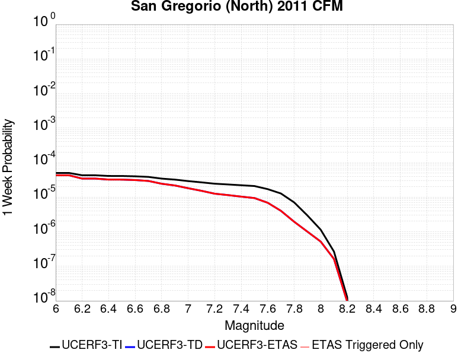 | 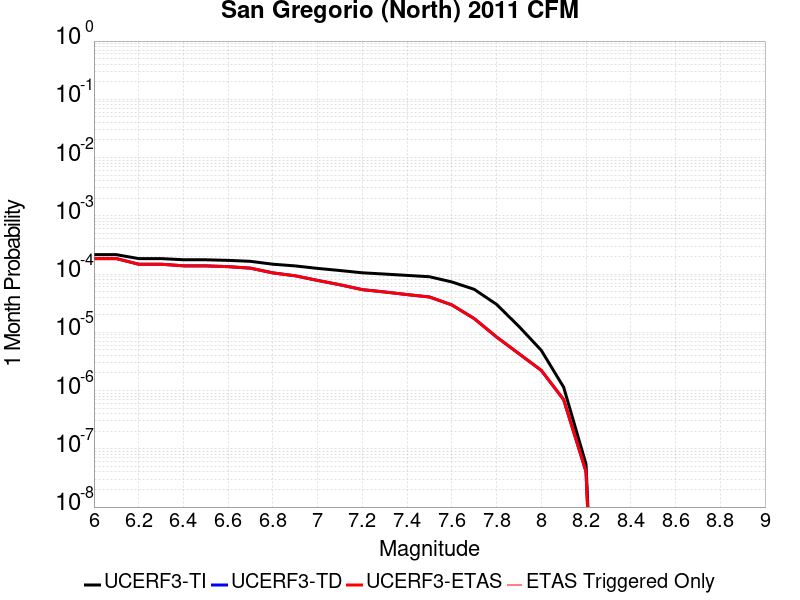 | 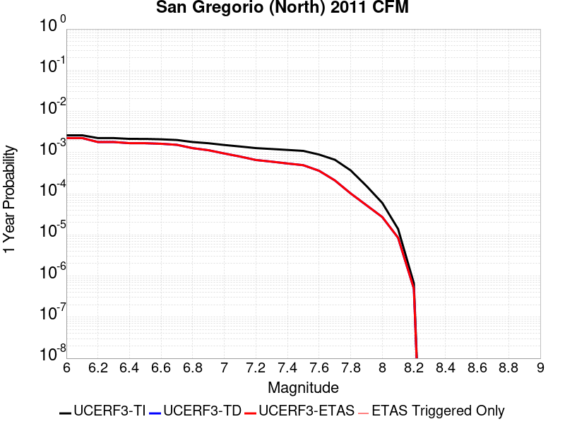 | 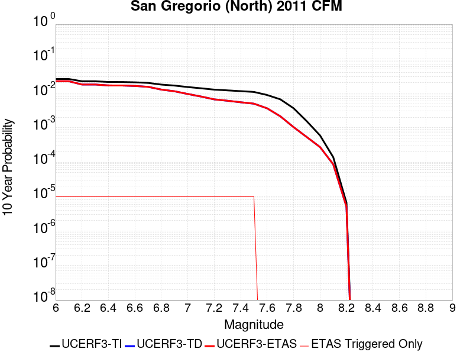 |

| Magnitude | 1 wk TI Prob | 1 wk TD Prob | 1 wk ETAS Prob | 1 wk ETAS/TD Gain | 1 wk ETAS Triggered Only | 1 mo TI Prob | 1 mo TD Prob | 1 mo ETAS Prob | 1 mo ETAS/TD Gain | 1 mo ETAS Triggered Only | 1 yr TI Prob | 1 yr TD Prob | 1 yr ETAS Prob | 1 yr ETAS/TD Gain | 1 yr ETAS Triggered Only | 10 yr TI Prob | 10 yr TD Prob | 10 yr ETAS Prob | 10 yr ETAS/TD Gain | 10 yr ETAS Triggered Only |
|-----|-----|-----|-----|-----|-----|-----|-----|-----|-----|-----|-----|-----|-----|-----|-----|-----|-----|-----|-----|-----|
| 6.0 | 5.0283932E-5 | 4.3060794E-5 | 4.3060794E-5 | 1.0 | 0.0 | 2.1548476E-4 | 1.8453323E-4 | 1.8453323E-4 | 1.0 | 0.0 | 0.0026203706 | 0.002244392 | 0.002244392 | 1.0 | 0.0 | 0.02589687 | 0.022294713 | 0.02230449 | 1.0004386 | 1.0E-5 |
| 6.1 | 5.0283932E-5 | 4.3060794E-5 | 4.3060794E-5 | 1.0 | 0.0 | 2.1548476E-4 | 1.8453323E-4 | 1.8453323E-4 | 1.0 | 0.0 | 0.0026203706 | 0.002244392 | 0.002244392 | 1.0 | 0.0 | 0.02589687 | 0.022294713 | 0.02230449 | 1.0004386 | 1.0E-5 |
| 6.2 | 4.2998647E-5 | 3.4444227E-5 | 3.4444227E-5 | 1.0 | 0.0 | 1.842669E-4 | 1.4760974E-4 | 1.4760974E-4 | 1.0 | 0.0 | 0.0022411412 | 0.0017956786 | 0.0017956786 | 1.0 | 0.0 | 0.022186736 | 0.017887903 | 0.017897725 | 1.0005491 | 1.0E-5 |
| 6.3 | 4.2998647E-5 | 3.4444227E-5 | 3.4444227E-5 | 1.0 | 0.0 | 1.842669E-4 | 1.4760974E-4 | 1.4760974E-4 | 1.0 | 0.0 | 0.0022411412 | 0.0017956786 | 0.0017956786 | 1.0 | 0.0 | 0.022186736 | 0.017887903 | 0.017897725 | 1.0005491 | 1.0E-5 |
| 6.4 | 4.1101295E-5 | 3.232945E-5 | 3.232945E-5 | 1.0 | 0.0 | 1.7613651E-4 | 1.385474E-4 | 1.385474E-4 | 1.0 | 0.0 | 0.0021423528 | 0.0016855211 | 0.0016855211 | 1.0 | 0.0 | 0.02121817 | 0.01680324 | 0.016813073 | 1.0005851 | 1.0E-5 |
| 6.5 | 4.1032585E-5 | 3.2247484E-5 | 3.2247484E-5 | 1.0 | 0.0 | 1.7584208E-4 | 1.3819615E-4 | 1.3819615E-4 | 1.0 | 0.0 | 0.0021387753 | 0.0016812512 | 0.0016812512 | 1.0 | 0.0 | 0.021183075 | 0.016761193 | 0.016771026 | 1.0005866 | 1.0E-5 |
| 6.6 | 4.011629E-5 | 3.1269094E-5 | 3.1269094E-5 | 1.0 | 0.0 | 1.7191563E-4 | 1.340035E-4 | 1.340035E-4 | 1.0 | 0.0 | 0.0020910634 | 0.0016302838 | 0.0016302838 | 1.0 | 0.0 | 0.020714961 | 0.016258746 | 0.016268583 | 1.0006051 | 1.0E-5 |
| 6.7 | 3.8583938E-5 | 2.9456065E-5 | 2.9456065E-5 | 1.0 | 0.0 | 1.6534925E-4 | 1.2623426E-4 | 1.2623426E-4 | 1.0 | 0.0 | 0.0020112682 | 0.0015358328 | 0.0015358328 | 1.0 | 0.0 | 0.019931622 | 0.015327258 | 0.015337104 | 1.0006424 | 1.0E-5 |
| 6.8 | 3.44341E-5 | 2.4453162E-5 | 2.4453162E-5 | 1.0 | 0.0 | 1.4756636E-4 | 1.04795115E-4 | 1.04795115E-4 | 1.0 | 0.0 | 0.0017951399 | 0.001275144 | 0.001275144 | 1.0 | 0.0 | 0.017807078 | 0.012752353 | 0.012762225 | 1.0007741 | 1.0E-5 |
| 6.9 | 3.221199E-5 | 2.1780248E-5 | 2.1780248E-5 | 1.0 | 0.0 | 1.3804408E-4 | 9.3340626E-5 | 9.3340626E-5 | 1.0 | 0.0 | 0.0016793909 | 0.001135838 | 0.001135838 | 1.0 | 0.0 | 0.01666756 | 0.01137376 | 0.011383647 | 1.0008693 | 1.0E-5 |
| 7.0 | 2.9186718E-5 | 1.8148972E-5 | 1.8148972E-5 | 1.0 | 0.0 | 1.2507994E-4 | 7.777901E-5 | 7.777901E-5 | 1.0 | 0.0 | 0.0015217843 | 9.4655243E-4 | 9.4655243E-4 | 1.0 | 0.0 | 0.015114053 | 0.009497915 | 0.00950782 | 1.0010428 | 1.0E-5 |
| 7.1 | 2.6840138E-5 | 1.528651E-5 | 1.528651E-5 | 1.0 | 0.0 | 1.1502409E-4 | 6.551198E-5 | 6.551198E-5 | 1.0 | 0.0 | 0.0013995186 | 7.973184E-4 | 7.973184E-4 | 1.0 | 0.0 | 0.013907375 | 0.008016792 | 0.008026712 | 1.0012374 | 1.0E-5 |
| 7.2 | 2.453002E-5 | 1.260862E-5 | 1.260862E-5 | 1.0 | 0.0 | 1.05124425E-4 | 5.4035827E-5 | 5.4035827E-5 | 1.0 | 0.0 | 0.0012791384 | 6.576882E-4 | 6.576882E-4 | 1.0 | 0.0 | 0.012718005 | 0.0066286726 | 0.0066386065 | 1.0014986 | 1.0E-5 |
| 7.3 | 2.3330727E-5 | 1.1490594E-5 | 1.1490594E-5 | 1.0 | 0.0 | 9.9985E-5 | 4.9244478E-5 | 4.9244478E-5 | 1.0 | 0.0 | 0.0012166376 | 5.9938704E-4 | 5.9938704E-4 | 1.0 | 0.0 | 0.012099981 | 0.0060475916 | 0.006057531 | 1.0016435 | 1.0E-5 |
| 7.4 | 2.2136466E-5 | 1.03708635E-5 | 1.03708635E-5 | 1.0 | 0.0 | 9.486712E-5 | 4.4445802E-5 | 4.4445802E-5 | 1.0 | 0.0 | 0.0011543952 | 5.409935E-4 | 5.409935E-4 | 1.0 | 0.0 | 0.011484168 | 0.005465259 | 0.005475204 | 1.0018197 | 1.0E-5 |
| 7.5 | 2.0994974E-5 | 9.429039E-6 | 9.429039E-6 | 1.0 | 0.0 | 8.997535E-5 | 4.0409544E-5 | 4.0409544E-5 | 1.0 | 0.0 | 0.0010948994 | 4.9187534E-4 | 4.9187534E-4 | 1.0 | 0.0 | 0.010895205 | 0.0049743364 | 0.0049842866 | 1.0020003 | 1.0E-5 |
| 7.6 | 1.7091823E-5 | 6.895248E-6 | 6.895248E-6 | 1.0 | 0.0 | 7.3248615E-5 | 2.9550729E-5 | 2.9550729E-5 | 1.0 | 0.0 | 8.9143694E-4 | 3.5972084E-4 | 3.5972084E-4 | 1.0 | 0.0 | 0.008878695 | 0.0036490853 | 0.0036490853 | 1.0 | 0.0 |
| 7.7 | 1.2772179E-5 | 4.0219356E-6 | 4.0219356E-6 | 1.0 | 0.0 | 5.473676E-5 | 1.7236755E-5 | 1.7236755E-5 | 1.0 | 0.0 | 6.6621625E-4 | 2.098373E-4 | 2.098373E-4 | 1.0 | 0.0 | 0.006642225 | 0.002137503 | 0.002137503 | 1.0 | 0.0 |
| 7.8 | 7.041923E-6 | 1.9413242E-6 | 1.9413242E-6 | 1.0 | 0.0 | 3.017932E-5 | 8.319934E-6 | 8.319934E-6 | 1.0 | 0.0 | 3.6737128E-4 | 1.0129049E-4 | 1.0129049E-4 | 1.0 | 0.0 | 0.0036676454 | 0.0010382815 | 0.0010382815 | 1.0 | 0.0 |
| 7.9 | 2.946768E-6 | 1.0037718E-6 | 1.0037718E-6 | 1.0 | 0.0 | 1.2628945E-5 | 4.3018717E-6 | 4.3018717E-6 | 1.0 | 0.0 | 1.5374656E-4 | 5.237403E-5 | 5.237403E-5 | 1.0 | 0.0 | 0.0015364023 | 5.3422514E-4 | 5.3422514E-4 | 1.0 | 0.0 |
| 8.0 | 1.1433375E-6 | 5.1838697E-7 | 5.1838697E-7 | 1.0 | 0.0 | 4.9000087E-6 | 2.2216566E-6 | 2.2216566E-6 | 1.0 | 0.0 | 5.965597E-5 | 2.7048332E-5 | 2.7048332E-5 | 1.0 | 0.0 | 5.963996E-4 | 2.741109E-4 | 2.741109E-4 | 1.0 | 0.0 |
| 8.1 | 2.6675295E-7 | 1.6298877E-7 | 1.6298877E-7 | 1.0 | 0.0 | 1.1432264E-6 | 6.9852314E-7 | 6.9852314E-7 | 1.0 | 0.0 | 1.3918692E-5 | 8.504486E-6 | 8.504486E-6 | 1.0 | 0.0 | 1.391782E-4 | 8.6426866E-5 | 8.6426866E-5 | 1.0 | 0.0 |
| 8.2 | 1.2704569E-8 | 9.439506E-9 | 9.439506E-9 | 1.0 | 0.0 | 5.444815E-8 | 4.0455028E-8 | 4.0455028E-8 | 1.0 | 0.0 | 6.629061E-7 | 4.9253987E-7 | 4.9253987E-7 | 1.0 | 0.0 | 6.629041E-6 | 5.11646E-6 | 5.11646E-6 | 1.0 | 0.0 |

## Elsinore (Coyote Mountains)
*[(top)](#table-of-contents)*

| 1 Week | 1 Month | 1 Year | 10 Year |
|-----|-----|-----|-----|
| 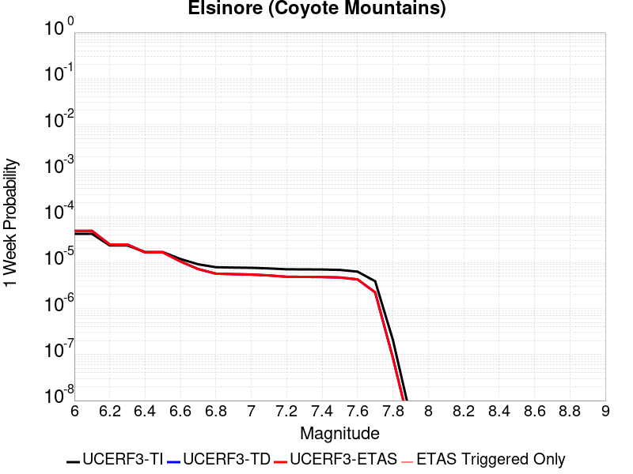 |  | 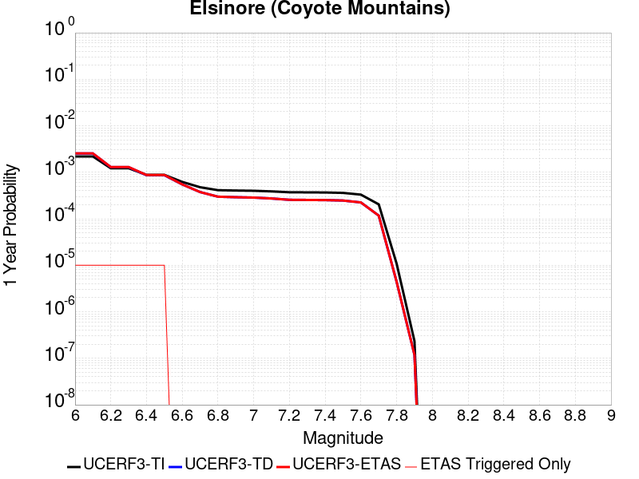 | 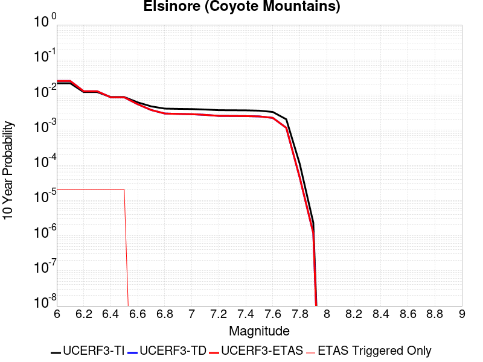 |

| Magnitude | 1 wk TI Prob | 1 wk TD Prob | 1 wk ETAS Prob | 1 wk ETAS/TD Gain | 1 wk ETAS Triggered Only | 1 mo TI Prob | 1 mo TD Prob | 1 mo ETAS Prob | 1 mo ETAS/TD Gain | 1 mo ETAS Triggered Only | 1 yr TI Prob | 1 yr TD Prob | 1 yr ETAS Prob | 1 yr ETAS/TD Gain | 1 yr ETAS Triggered Only | 10 yr TI Prob | 10 yr TD Prob | 10 yr ETAS Prob | 10 yr ETAS/TD Gain | 10 yr ETAS Triggered Only |
|-----|-----|-----|-----|-----|-----|-----|-----|-----|-----|-----|-----|-----|-----|-----|-----|-----|-----|-----|-----|-----|
| 6.0 | 4.20513E-5 | 4.8633563E-5 | 4.8633563E-5 | 1.0 | 0.0 | 1.8020741E-4 | 2.0841615E-4 | 2.0841615E-4 | 1.0 | 0.0 | 0.0021918174 | 0.0025350873 | 0.002545062 | 1.0039346 | 1.0E-5 | 0.021703249 | 0.025112117 | 0.025121866 | 1.0003883 | 1.0E-5 |
| 6.1 | 4.20513E-5 | 4.8633563E-5 | 4.8633563E-5 | 1.0 | 0.0 | 1.8020741E-4 | 2.0841615E-4 | 2.0841615E-4 | 1.0 | 0.0 | 0.0021918174 | 0.0025350873 | 0.002545062 | 1.0039346 | 1.0E-5 | 0.021703249 | 0.025112117 | 0.025121866 | 1.0003883 | 1.0E-5 |
| 6.2 | 2.3413893E-5 | 2.4696421E-5 | 2.4696421E-5 | 1.0 | 0.0 | 1.0034139E-4 | 1.0583805E-4 | 1.0583805E-4 | 1.0 | 0.0 | 0.0012209718 | 0.0012879103 | 0.0012978973 | 1.0077546 | 1.0E-5 | 0.012142851 | 0.012813029 | 0.0128229 | 1.0007704 | 1.0E-5 |
| 6.3 | 2.3413893E-5 | 2.4696421E-5 | 2.4696421E-5 | 1.0 | 0.0 | 1.0034139E-4 | 1.0583805E-4 | 1.0583805E-4 | 1.0 | 0.0 | 0.0012209718 | 0.0012879103 | 0.0012978973 | 1.0077546 | 1.0E-5 | 0.012142851 | 0.012813029 | 0.0128229 | 1.0007704 | 1.0E-5 |
| 6.4 | 1.6894814E-5 | 1.6568854E-5 | 1.6568854E-5 | 1.0 | 0.0 | 7.240433E-5 | 7.100766E-5 | 7.100766E-5 | 1.0 | 0.0 | 8.811662E-4 | 8.6421217E-4 | 8.742035E-4 | 1.0115613 | 1.0E-5 | 0.0087768035 | 0.008612194 | 0.008622108 | 1.0011511 | 1.0E-5 |
| 6.5 | 1.6894814E-5 | 1.6568854E-5 | 1.6568854E-5 | 1.0 | 0.0 | 7.240433E-5 | 7.100766E-5 | 7.100766E-5 | 1.0 | 0.0 | 8.811662E-4 | 8.6421217E-4 | 8.742035E-4 | 1.0115613 | 1.0E-5 | 0.0087768035 | 0.008612194 | 0.008622108 | 1.0011511 | 1.0E-5 |
| 6.6 | 1.1910969E-5 | 1.05310955E-5 | 1.05310955E-5 | 1.0 | 0.0 | 5.1046012E-5 | 4.513256E-5 | 4.513256E-5 | 1.0 | 0.0 | 6.21308E-4 | 5.4936187E-4 | 5.4936187E-4 | 1.0 | 0.0 | 0.0061957375 | 0.0054813414 | 0.0054813414 | 1.0 | 0.0 |
| 6.7 | 9.1486E-6 | 7.2030907E-6 | 7.2030907E-6 | 1.0 | 0.0 | 3.9207694E-5 | 3.0870044E-5 | 3.0870044E-5 | 1.0 | 0.0 | 4.7724912E-4 | 3.757818E-4 | 3.757818E-4 | 1.0 | 0.0 | 0.0047622547 | 0.0037518432 | 0.0037518432 | 1.0 | 0.0 |
| 6.8 | 7.90441E-6 | 5.7292227E-6 | 5.7292227E-6 | 1.0 | 0.0 | 3.3875604E-5 | 2.4553588E-5 | 2.4553588E-5 | 1.0 | 0.0 | 4.1235742E-4 | 2.989002E-4 | 2.989002E-4 | 1.0 | 0.0 | 0.0041159308 | 0.0029851105 | 0.0029851105 | 1.0 | 0.0 |
| 6.9 | 7.77015E-6 | 5.5831756E-6 | 5.5831756E-6 | 1.0 | 0.0 | 3.3300217E-5 | 2.3927683E-5 | 2.3927683E-5 | 1.0 | 0.0 | 4.0535472E-4 | 2.9128187E-4 | 2.9128187E-4 | 1.0 | 0.0 | 0.004046161 | 0.0029091279 | 0.0029091279 | 1.0 | 0.0 |
| 7.0 | 7.675798E-6 | 5.480033E-6 | 5.480033E-6 | 1.0 | 0.0 | 3.289586E-5 | 2.348565E-5 | 2.348565E-5 | 1.0 | 0.0 | 4.004335E-4 | 2.8590154E-4 | 2.8590154E-4 | 1.0 | 0.0 | 0.003997127 | 0.0028554637 | 0.0028554637 | 1.0 | 0.0 |
| 7.1 | 7.447814E-6 | 5.2389046E-6 | 5.2389046E-6 | 1.0 | 0.0 | 3.191881E-5 | 2.2452263E-5 | 2.2452263E-5 | 1.0 | 0.0 | 3.8854225E-4 | 2.7332324E-4 | 2.7332324E-4 | 1.0 | 0.0 | 0.003878636 | 0.0027299952 | 0.0027299952 | 1.0 | 0.0 |
| 7.2 | 7.128185E-6 | 4.9055616E-6 | 4.9055616E-6 | 1.0 | 0.0 | 3.0549007E-5 | 2.1023672E-5 | 2.1023672E-5 | 1.0 | 0.0 | 3.7187067E-4 | 2.5593434E-4 | 2.5593434E-4 | 1.0 | 0.0 | 0.00371249 | 0.0025565142 | 0.0025565142 | 1.0 | 0.0 |
| 7.3 | 7.0913875E-6 | 4.8742363E-6 | 4.8742363E-6 | 1.0 | 0.0 | 3.0391306E-5 | 2.0889423E-5 | 2.0889423E-5 | 1.0 | 0.0 | 3.6995133E-4 | 2.5430025E-4 | 2.5430025E-4 | 1.0 | 0.0 | 0.0036933604 | 0.0025402107 | 0.0025402107 | 1.0 | 0.0 |
| 7.4 | 7.051521E-6 | 4.8380875E-6 | 4.8380875E-6 | 1.0 | 0.0 | 3.0220453E-5 | 2.0734502E-5 | 2.0734502E-5 | 1.0 | 0.0 | 3.6787192E-4 | 2.524145E-4 | 2.524145E-4 | 1.0 | 0.0 | 0.0036726352 | 0.0025213964 | 0.0025213964 | 1.0 | 0.0 |
| 7.5 | 6.910666E-6 | 4.7336343E-6 | 4.7336343E-6 | 1.0 | 0.0 | 2.9616802E-5 | 2.0286852E-5 | 2.0286852E-5 | 1.0 | 0.0 | 3.605249E-4 | 2.4696562E-4 | 2.4696562E-4 | 1.0 | 0.0 | 0.0035994058 | 0.0024670297 | 0.0024670297 | 1.0 | 0.0 |
| 7.6 | 6.341753E-6 | 4.3067316E-6 | 4.3067316E-6 | 1.0 | 0.0 | 2.7178658E-5 | 1.8457298E-5 | 1.8457298E-5 | 1.0 | 0.0 | 3.3084993E-4 | 2.246956E-4 | 2.246956E-4 | 1.0 | 0.0 | 0.0033035777 | 0.0022447994 | 0.0022447994 | 1.0 | 0.0 |
| 7.7 | 3.9205916E-6 | 2.2440495E-6 | 2.2440495E-6 | 1.0 | 0.0 | 1.6802427E-5 | 9.6173235E-6 | 9.6173235E-6 | 1.0 | 0.0 | 2.0455034E-4 | 1.1708537E-4 | 1.1708537E-4 | 1.0 | 0.0 | 0.0020436216 | 0.0011703098 | 0.0011703098 | 1.0 | 0.0 |
| 7.8 | 2.0846227E-7 | 8.4868525E-8 | 8.4868525E-8 | 1.0 | 0.0 | 8.9340944E-7 | 3.6372222E-7 | 3.6372222E-7 | 1.0 | 0.0 | 1.0877206E-5 | 4.4283124E-6 | 4.4283124E-6 | 1.0 | 0.0 | 1.0876673E-4 | 4.4282566E-5 | 4.4282566E-5 | 1.0 | 0.0 |
| 7.9 | 4.4969806E-9 | 2.2692683E-9 | 2.2692683E-9 | 1.0 | 0.0 | 1.9272775E-8 | 9.725436E-9 | 9.725436E-9 | 1.0 | 0.0 | 2.3464601E-7 | 1.1840718E-7 | 1.1840718E-7 | 1.0 | 0.0 | 2.3464577E-6 | 1.1840713E-6 | 1.1840713E-6 | 1.0 | 0.0 |

## Earthquake Valley (No  Extension)
*[(top)](#table-of-contents)*

| 1 Week | 1 Month | 1 Year | 10 Year |
|-----|-----|-----|-----|
| 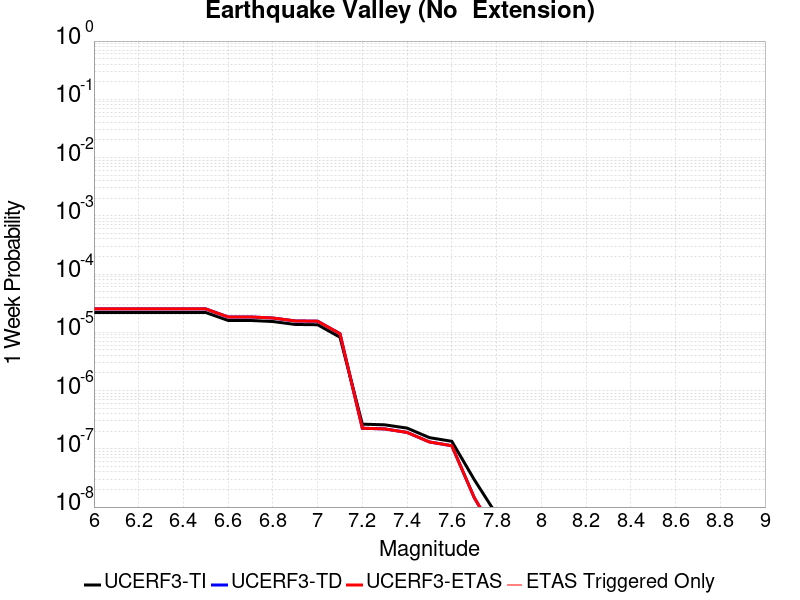 |  | 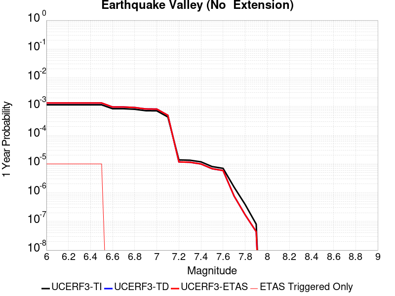 | 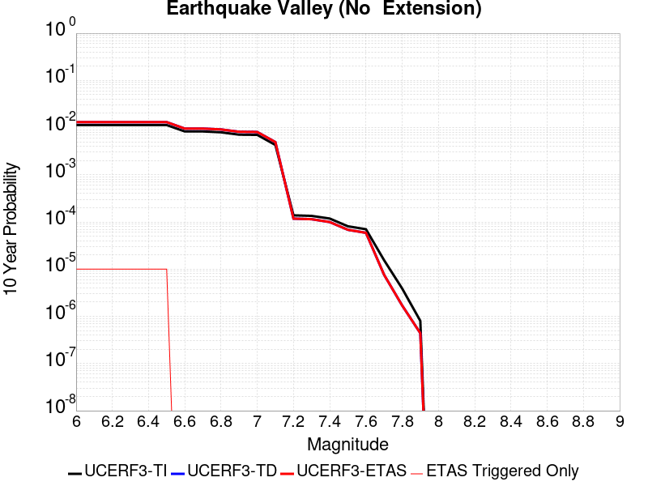 |

| Magnitude | 1 wk TI Prob | 1 wk TD Prob | 1 wk ETAS Prob | 1 wk ETAS/TD Gain | 1 wk ETAS Triggered Only | 1 mo TI Prob | 1 mo TD Prob | 1 mo ETAS Prob | 1 mo ETAS/TD Gain | 1 mo ETAS Triggered Only | 1 yr TI Prob | 1 yr TD Prob | 1 yr ETAS Prob | 1 yr ETAS/TD Gain | 1 yr ETAS Triggered Only | 10 yr TI Prob | 10 yr TD Prob | 10 yr ETAS Prob | 10 yr ETAS/TD Gain | 10 yr ETAS Triggered Only |
|-----|-----|-----|-----|-----|-----|-----|-----|-----|-----|-----|-----|-----|-----|-----|-----|-----|-----|-----|-----|-----|
| 6.0 | 2.1859703E-5 | 2.5198888E-5 | 2.5198888E-5 | 1.0 | 0.0 | 9.3681076E-5 | 1.0799158E-4 | 1.0799158E-4 | 1.0 | 0.0 | 0.0011399703 | 0.0013141495 | 0.0013241363 | 1.0075995 | 1.0E-5 | 0.011341401 | 0.013078143 | 0.013088012 | 1.0007546 | 1.0E-5 |
| 6.1 | 2.1859703E-5 | 2.5198888E-5 | 2.5198888E-5 | 1.0 | 0.0 | 9.3681076E-5 | 1.0799158E-4 | 1.0799158E-4 | 1.0 | 0.0 | 0.0011399703 | 0.0013141495 | 0.0013241363 | 1.0075995 | 1.0E-5 | 0.011341401 | 0.013078143 | 0.013088012 | 1.0007546 | 1.0E-5 |
| 6.2 | 2.1859703E-5 | 2.5198888E-5 | 2.5198888E-5 | 1.0 | 0.0 | 9.3681076E-5 | 1.0799158E-4 | 1.0799158E-4 | 1.0 | 0.0 | 0.0011399703 | 0.0013141495 | 0.0013241363 | 1.0075995 | 1.0E-5 | 0.011341401 | 0.013078143 | 0.013088012 | 1.0007546 | 1.0E-5 |
| 6.3 | 2.1859703E-5 | 2.5198888E-5 | 2.5198888E-5 | 1.0 | 0.0 | 9.3681076E-5 | 1.0799158E-4 | 1.0799158E-4 | 1.0 | 0.0 | 0.0011399703 | 0.0013141495 | 0.0013241363 | 1.0075995 | 1.0E-5 | 0.011341401 | 0.013078143 | 0.013088012 | 1.0007546 | 1.0E-5 |
| 6.4 | 2.1859703E-5 | 2.5198888E-5 | 2.5198888E-5 | 1.0 | 0.0 | 9.3681076E-5 | 1.0799158E-4 | 1.0799158E-4 | 1.0 | 0.0 | 0.0011399703 | 0.0013141495 | 0.0013241363 | 1.0075995 | 1.0E-5 | 0.011341401 | 0.013078143 | 0.013088012 | 1.0007546 | 1.0E-5 |
| 6.5 | 2.1859703E-5 | 2.5198888E-5 | 2.5198888E-5 | 1.0 | 0.0 | 9.3681076E-5 | 1.0799158E-4 | 1.0799158E-4 | 1.0 | 0.0 | 0.0011399703 | 0.0013141495 | 0.0013241363 | 1.0075995 | 1.0E-5 | 0.011341401 | 0.013078143 | 0.013088012 | 1.0007546 | 1.0E-5 |
| 6.6 | 1.597E-5 | 1.8356655E-5 | 1.8356655E-5 | 1.0 | 0.0 | 6.8441055E-5 | 7.86695E-5 | 7.86695E-5 | 1.0 | 0.0 | 8.329513E-4 | 9.574676E-4 | 9.574676E-4 | 1.0 | 0.0 | 0.008298361 | 0.009542032 | 0.009542032 | 1.0 | 0.0 |
| 6.7 | 1.597E-5 | 1.8356655E-5 | 1.8356655E-5 | 1.0 | 0.0 | 6.8441055E-5 | 7.86695E-5 | 7.86695E-5 | 1.0 | 0.0 | 8.329513E-4 | 9.574676E-4 | 9.574676E-4 | 1.0 | 0.0 | 0.008298361 | 0.009542032 | 0.009542032 | 1.0 | 0.0 |
| 6.8 | 1.5315149E-5 | 1.7602457E-5 | 1.7602457E-5 | 1.0 | 0.0 | 6.5634704E-5 | 7.5437405E-5 | 7.5437405E-5 | 1.0 | 0.0 | 7.988095E-4 | 9.181501E-4 | 9.181501E-4 | 1.0 | 0.0 | 0.007959441 | 0.009152108 | 0.009152108 | 1.0 | 0.0 |
| 6.9 | 1.3634728E-5 | 1.5676149E-5 | 1.5676149E-5 | 1.0 | 0.0 | 5.8433237E-5 | 6.718223E-5 | 6.718223E-5 | 1.0 | 0.0 | 7.1119244E-4 | 8.1771874E-4 | 8.1771874E-4 | 1.0 | 0.0 | 0.007089207 | 0.00815517 | 0.00815517 | 1.0 | 0.0 |
| 7.0 | 1.3496271E-5 | 1.5518177E-5 | 1.5518177E-5 | 1.0 | 0.0 | 5.783988E-5 | 6.650524E-5 | 6.650524E-5 | 1.0 | 0.0 | 7.03973E-4 | 8.094826E-4 | 8.094826E-4 | 1.0 | 0.0 | 0.007017471 | 0.008073409 | 0.008073409 | 1.0 | 0.0 |
| 7.1 | 8.242798E-6 | 9.472804E-6 | 9.472804E-6 | 1.0 | 0.0 | 3.53258E-5 | 4.0597475E-5 | 4.0597475E-5 | 1.0 | 0.0 | 4.300067E-4 | 4.9422926E-4 | 4.9422926E-4 | 1.0 | 0.0 | 0.004291756 | 0.004937878 | 0.004937878 | 1.0 | 0.0 |
| 7.2 | 2.6506527E-7 | 2.256113E-7 | 2.256113E-7 | 1.0 | 0.0 | 1.1359936E-6 | 9.669052E-7 | 9.669052E-7 | 1.0 | 0.0 | 1.3830633E-5 | 1.1772012E-5 | 1.1772012E-5 | 1.0 | 0.0 | 1.3829772E-4 | 1.177143E-4 | 1.177143E-4 | 1.0 | 0.0 |
| 7.3 | 2.5810488E-7 | 2.1956254E-7 | 2.1956254E-7 | 1.0 | 0.0 | 1.1061633E-6 | 9.40982E-7 | 9.40982E-7 | 1.0 | 0.0 | 1.3467455E-5 | 1.1456399E-5 | 1.1456399E-5 | 1.0 | 0.0 | 1.3466639E-4 | 1.145585E-4 | 1.145585E-4 | 1.0 | 0.0 |
| 7.4 | 2.2676066E-7 | 1.9111387E-7 | 1.9111387E-7 | 1.0 | 0.0 | 9.71831E-7 | 8.1905915E-7 | 8.1905915E-7 | 1.0 | 0.0 | 1.1831979E-5 | 9.972004E-6 | 9.972004E-6 | 1.0 | 0.0 | 1.1831349E-4 | 9.971595E-5 | 9.971595E-5 | 1.0 | 0.0 |
| 7.5 | 1.5553917E-7 | 1.3112768E-7 | 1.3112768E-7 | 1.0 | 0.0 | 6.6659624E-7 | 5.6197564E-7 | 5.6197564E-7 | 1.0 | 0.0 | 8.115779E-6 | 6.8420345E-6 | 6.8420345E-6 | 1.0 | 0.0 | 8.115482E-5 | 6.8418456E-5 | 6.8418456E-5 | 1.0 | 0.0 |
| 7.6 | 1.3448629E-7 | 1.1289034E-7 | 1.1289034E-7 | 1.0 | 0.0 | 5.7636964E-7 | 4.8381565E-7 | 4.8381565E-7 | 1.0 | 0.0 | 7.017278E-6 | 5.890442E-6 | 5.890442E-6 | 1.0 | 0.0 | 7.0170565E-5 | 5.890307E-5 | 5.890307E-5 | 1.0 | 0.0 |
| 7.7 | 2.9719402E-8 | 1.4582792E-8 | 1.4582792E-8 | 1.0 | 0.0 | 1.2736886E-7 | 6.2497676E-8 | 6.2497676E-8 | 1.0 | 0.0 | 1.5507147E-6 | 7.60909E-7 | 7.60909E-7 | 1.0 | 0.0 | 1.550704E-5 | 7.6090696E-6 | 7.6090696E-6 | 1.0 | 0.0 |
| 7.8 | 7.4390196E-9 | 3.2503715E-9 | 3.2503715E-9 | 1.0 | 0.0 | 3.1881513E-8 | 1.3930164E-8 | 1.3930164E-8 | 1.0 | 0.0 | 3.8815733E-7 | 1.6959973E-7 | 1.6959973E-7 | 1.0 | 0.0 | 3.8815665E-6 | 1.6959963E-6 | 1.6959963E-6 | 1.0 | 0.0 |
| 7.9 | 1.5373532E-9 | 8.4404506E-10 | 8.4404506E-10 | 1.0 | 0.0 | 6.5886567E-9 | 3.6173358E-9 | 3.6173358E-9 | 1.0 | 0.0 | 8.021689E-8 | 4.4041062E-8 | 4.4041062E-8 | 1.0 | 0.0 | 8.0216864E-7 | 4.4041062E-7 | 4.4041062E-7 | 1.0 | 0.0 |

## North Frontal  (East)
*[(top)](#table-of-contents)*

| 1 Week | 1 Month | 1 Year | 10 Year |
|-----|-----|-----|-----|
|  | 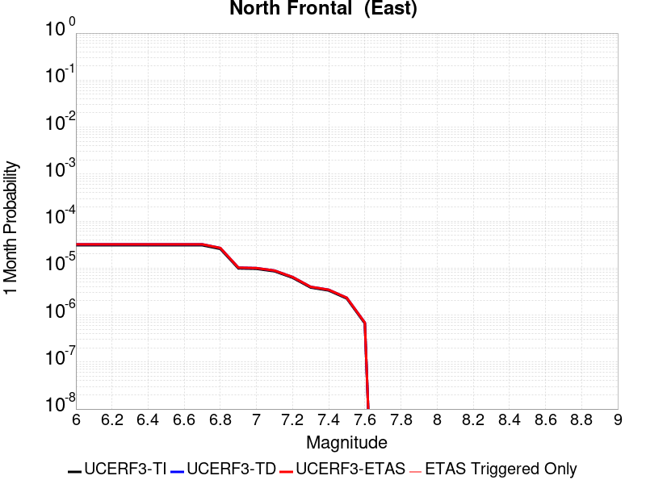 | 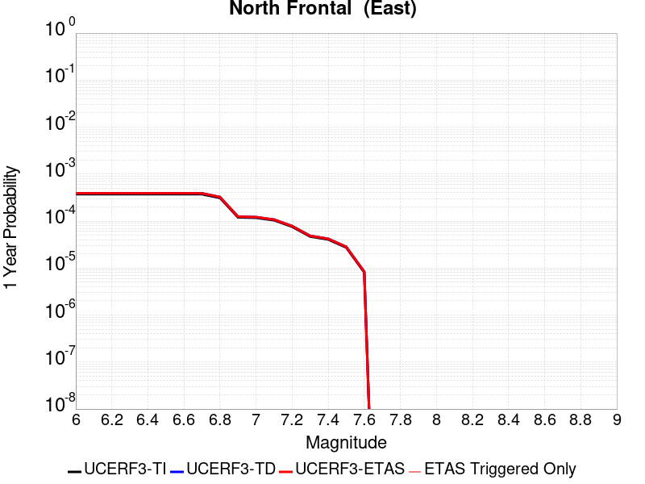 | 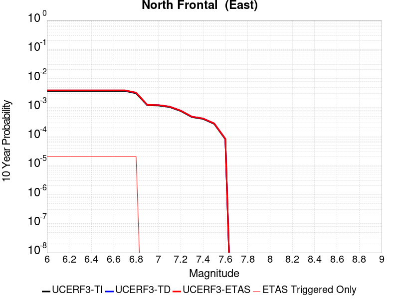 |

| Magnitude | 1 wk TI Prob | 1 wk TD Prob | 1 wk ETAS Prob | 1 wk ETAS/TD Gain | 1 wk ETAS Triggered Only | 1 mo TI Prob | 1 mo TD Prob | 1 mo ETAS Prob | 1 mo ETAS/TD Gain | 1 mo ETAS Triggered Only | 1 yr TI Prob | 1 yr TD Prob | 1 yr ETAS Prob | 1 yr ETAS/TD Gain | 1 yr ETAS Triggered Only | 10 yr TI Prob | 10 yr TD Prob | 10 yr ETAS Prob | 10 yr ETAS/TD Gain | 10 yr ETAS Triggered Only |
|-----|-----|-----|-----|-----|-----|-----|-----|-----|-----|-----|-----|-----|-----|-----|-----|-----|-----|-----|-----|-----|
| 6.0 | 7.135738E-6 | 7.4772242E-6 | 7.4772242E-6 | 1.0 | 0.0 | 3.0581377E-5 | 3.2044965E-5 | 3.2044965E-5 | 1.0 | 0.0 | 3.7226462E-4 | 3.9009753E-4 | 3.9009753E-4 | 1.0 | 0.0 | 0.0037164164 | 0.0038960855 | 0.0039060465 | 1.0025567 | 1.0E-5 |
| 6.1 | 7.135738E-6 | 7.4772242E-6 | 7.4772242E-6 | 1.0 | 0.0 | 3.0581377E-5 | 3.2044965E-5 | 3.2044965E-5 | 1.0 | 0.0 | 3.7226462E-4 | 3.9009753E-4 | 3.9009753E-4 | 1.0 | 0.0 | 0.0037164164 | 0.0038960855 | 0.0039060465 | 1.0025567 | 1.0E-5 |
| 6.2 | 7.135738E-6 | 7.4772242E-6 | 7.4772242E-6 | 1.0 | 0.0 | 3.0581377E-5 | 3.2044965E-5 | 3.2044965E-5 | 1.0 | 0.0 | 3.7226462E-4 | 3.9009753E-4 | 3.9009753E-4 | 1.0 | 0.0 | 0.0037164164 | 0.0038960855 | 0.0039060465 | 1.0025567 | 1.0E-5 |
| 6.3 | 7.135738E-6 | 7.4772242E-6 | 7.4772242E-6 | 1.0 | 0.0 | 3.0581377E-5 | 3.2044965E-5 | 3.2044965E-5 | 1.0 | 0.0 | 3.7226462E-4 | 3.9009753E-4 | 3.9009753E-4 | 1.0 | 0.0 | 0.0037164164 | 0.0038960855 | 0.0039060465 | 1.0025567 | 1.0E-5 |
| 6.4 | 7.135738E-6 | 7.4772242E-6 | 7.4772242E-6 | 1.0 | 0.0 | 3.0581377E-5 | 3.2044965E-5 | 3.2044965E-5 | 1.0 | 0.0 | 3.7226462E-4 | 3.9009753E-4 | 3.9009753E-4 | 1.0 | 0.0 | 0.0037164164 | 0.0038960855 | 0.0039060465 | 1.0025567 | 1.0E-5 |
| 6.5 | 7.135738E-6 | 7.4772242E-6 | 7.4772242E-6 | 1.0 | 0.0 | 3.0581377E-5 | 3.2044965E-5 | 3.2044965E-5 | 1.0 | 0.0 | 3.7226462E-4 | 3.9009753E-4 | 3.9009753E-4 | 1.0 | 0.0 | 0.0037164164 | 0.0038960855 | 0.0039060465 | 1.0025567 | 1.0E-5 |
| 6.6 | 7.135738E-6 | 7.4772242E-6 | 7.4772242E-6 | 1.0 | 0.0 | 3.0581377E-5 | 3.2044965E-5 | 3.2044965E-5 | 1.0 | 0.0 | 3.7226462E-4 | 3.9009753E-4 | 3.9009753E-4 | 1.0 | 0.0 | 0.0037164164 | 0.0038960855 | 0.0039060465 | 1.0025567 | 1.0E-5 |
| 6.7 | 7.135738E-6 | 7.4772242E-6 | 7.4772242E-6 | 1.0 | 0.0 | 3.0581377E-5 | 3.2044965E-5 | 3.2044965E-5 | 1.0 | 0.0 | 3.7226462E-4 | 3.9009753E-4 | 3.9009753E-4 | 1.0 | 0.0 | 0.0037164164 | 0.0038960855 | 0.0039060465 | 1.0025567 | 1.0E-5 |
| 6.8 | 5.959142E-6 | 6.236721E-6 | 6.236721E-6 | 1.0 | 0.0 | 2.553893E-5 | 2.6728634E-5 | 2.6728634E-5 | 1.0 | 0.0 | 3.108921E-4 | 3.253906E-4 | 3.253906E-4 | 1.0 | 0.0 | 0.0031045752 | 0.0032509149 | 0.0032608823 | 1.0030661 | 1.0E-5 |
| 6.9 | 2.2946929E-6 | 2.3824725E-6 | 2.3824725E-6 | 1.0 | 0.0 | 9.834361E-6 | 1.021056E-5 | 1.021056E-5 | 1.0 | 0.0 | 1.1972676E-4 | 1.2430694E-4 | 1.2430694E-4 | 1.0 | 0.0 | 0.0011966228 | 0.0012424206 | 0.0012424206 | 1.0 | 0.0 |
| 7.0 | 2.2468673E-6 | 2.3321654E-6 | 2.3321654E-6 | 1.0 | 0.0 | 9.629396E-6 | 9.994959E-6 | 9.994959E-6 | 1.0 | 0.0 | 1.1723159E-4 | 1.2168231E-4 | 1.2168231E-4 | 1.0 | 0.0 | 0.0011716976 | 0.0012162031 | 0.0012162031 | 1.0 | 0.0 |
| 7.1 | 1.9921076E-6 | 2.0646132E-6 | 2.0646132E-6 | 1.0 | 0.0 | 8.537577E-6 | 8.848315E-6 | 8.848315E-6 | 1.0 | 0.0 | 1.0394004E-4 | 1.0772334E-4 | 1.0772334E-4 | 1.0 | 0.0 | 0.0010389143 | 0.001076754 | 0.001076754 | 1.0 | 0.0 |
| 7.2 | 1.4524545E-6 | 1.504522E-6 | 1.504522E-6 | 1.0 | 0.0 | 6.2247905E-6 | 6.447937E-6 | 6.447937E-6 | 1.0 | 0.0 | 7.5784184E-5 | 7.850105E-5 | 7.850105E-5 | 1.0 | 0.0 | 7.575835E-4 | 7.8475766E-4 | 7.8475766E-4 | 1.0 | 0.0 |
| 7.3 | 8.9802575E-7 | 9.308773E-7 | 9.308773E-7 | 1.0 | 0.0 | 3.848676E-6 | 3.989469E-6 | 3.989469E-6 | 1.0 | 0.0 | 4.685662E-5 | 4.8570815E-5 | 4.8570815E-5 | 1.0 | 0.0 | 4.6846745E-4 | 4.856133E-4 | 4.856133E-4 | 1.0 | 0.0 |
| 7.4 | 7.776139E-7 | 8.060514E-7 | 8.060514E-7 | 1.0 | 0.0 | 3.3326266E-6 | 3.454502E-6 | 3.454502E-6 | 1.0 | 0.0 | 4.0573974E-5 | 4.2057858E-5 | 4.2057858E-5 | 1.0 | 0.0 | 4.0566566E-4 | 4.2050975E-4 | 4.2050975E-4 | 1.0 | 0.0 |
| 7.5 | 5.244417E-7 | 5.4412465E-7 | 5.4412465E-7 | 1.0 | 0.0 | 2.2476054E-6 | 2.331961E-6 | 2.331961E-6 | 1.0 | 0.0 | 2.7364253E-5 | 2.8391321E-5 | 2.8391321E-5 | 1.0 | 0.0 | 2.7360884E-4 | 2.8388345E-4 | 2.8388345E-4 | 1.0 | 0.0 |
| 7.6 | 1.5489647E-7 | 1.6089587E-7 | 1.6089587E-7 | 1.0 | 0.0 | 6.6384183E-7 | 6.8955364E-7 | 6.8955364E-7 | 1.0 | 0.0 | 8.082245E-6 | 8.395304E-6 | 8.395304E-6 | 1.0 | 0.0 | 8.08195E-5 | 8.395186E-5 | 8.395186E-5 | 1.0 | 0.0 |

## Elysian Park (Lower CFM)
*[(top)](#table-of-contents)*

| 1 Week | 1 Month | 1 Year | 10 Year |
|-----|-----|-----|-----|
| 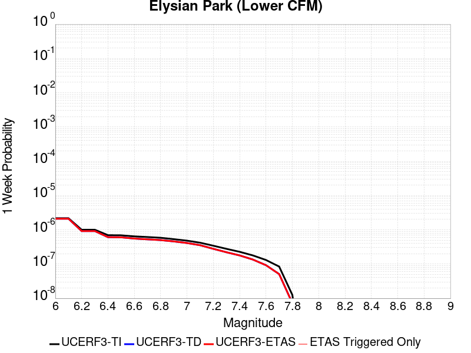 |  | 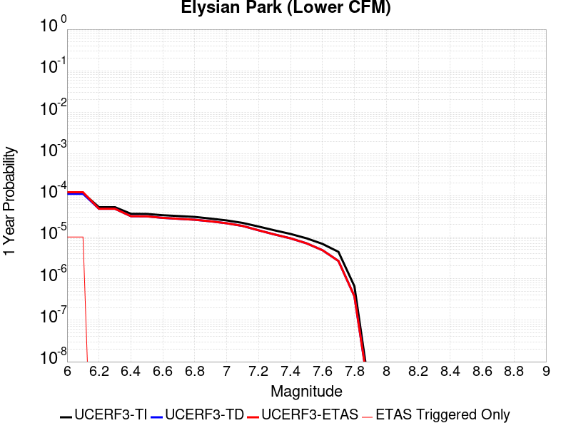 | 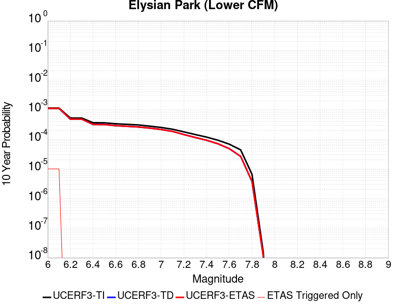 |

| Magnitude | 1 wk TI Prob | 1 wk TD Prob | 1 wk ETAS Prob | 1 wk ETAS/TD Gain | 1 wk ETAS Triggered Only | 1 mo TI Prob | 1 mo TD Prob | 1 mo ETAS Prob | 1 mo ETAS/TD Gain | 1 mo ETAS Triggered Only | 1 yr TI Prob | 1 yr TD Prob | 1 yr ETAS Prob | 1 yr ETAS/TD Gain | 1 yr ETAS Triggered Only | 10 yr TI Prob | 10 yr TD Prob | 10 yr ETAS Prob | 10 yr ETAS/TD Gain | 10 yr ETAS Triggered Only |
|-----|-----|-----|-----|-----|-----|-----|-----|-----|-----|-----|-----|-----|-----|-----|-----|-----|-----|-----|-----|-----|
| 6.0 | 2.1766498E-6 | 2.1037984E-6 | 2.1037984E-6 | 1.0 | 0.0 | 9.328466E-6 | 9.016256E-6 | 9.016256E-6 | 1.0 | 0.0 | 1.1356815E-4 | 1.0976882E-4 | 1.1976773E-4 | 1.0910906 | 1.0E-5 | 0.0011351013 | 0.001097288 | 0.001107277 | 1.0091034 | 1.0E-5 |
| 6.1 | 2.1766498E-6 | 2.1037984E-6 | 2.1037984E-6 | 1.0 | 0.0 | 9.328466E-6 | 9.016256E-6 | 9.016256E-6 | 1.0 | 0.0 | 1.1356815E-4 | 1.0976882E-4 | 1.1976773E-4 | 1.0910906 | 1.0E-5 | 0.0011351013 | 0.001097288 | 0.001107277 | 1.0091034 | 1.0E-5 |
| 6.2 | 1.0031182E-6 | 9.1862864E-7 | 9.1862864E-7 | 1.0 | 0.0 | 4.299071E-6 | 3.9369743E-6 | 3.9369743E-6 | 1.0 | 0.0 | 5.2339932E-5 | 4.793171E-5 | 4.793171E-5 | 1.0 | 0.0 | 5.2327604E-4 | 4.792235E-4 | 4.792235E-4 | 1.0 | 0.0 |
| 6.3 | 1.0031182E-6 | 9.1862864E-7 | 9.1862864E-7 | 1.0 | 0.0 | 4.299071E-6 | 3.9369743E-6 | 3.9369743E-6 | 1.0 | 0.0 | 5.2339932E-5 | 4.793171E-5 | 4.793171E-5 | 1.0 | 0.0 | 5.2327604E-4 | 4.792235E-4 | 4.792235E-4 | 1.0 | 0.0 |
| 6.4 | 6.9606244E-7 | 6.092012E-7 | 6.092012E-7 | 1.0 | 0.0 | 2.9831212E-6 | 2.6108596E-6 | 2.6108596E-6 | 1.0 | 0.0 | 3.6318896E-5 | 3.1786756E-5 | 3.1786756E-5 | 1.0 | 0.0 | 3.6312963E-4 | 3.1782233E-4 | 3.1782233E-4 | 1.0 | 0.0 |
| 6.5 | 6.901879E-7 | 6.0326954E-7 | 6.0326954E-7 | 1.0 | 0.0 | 2.9579448E-6 | 2.5854383E-6 | 2.5854383E-6 | 1.0 | 0.0 | 3.6012385E-5 | 3.147726E-5 | 3.147726E-5 | 1.0 | 0.0 | 3.600655E-4 | 3.1472824E-4 | 3.1472824E-4 | 1.0 | 0.0 |
| 6.6 | 6.4198554E-7 | 5.546678E-7 | 5.546678E-7 | 1.0 | 0.0 | 2.7513638E-6 | 2.3771454E-6 | 2.3771454E-6 | 1.0 | 0.0 | 3.3497337E-5 | 2.8941362E-5 | 2.8941362E-5 | 1.0 | 0.0 | 3.349229E-4 | 2.8937607E-4 | 2.8937607E-4 | 1.0 | 0.0 |
| 6.7 | 6.138733E-7 | 5.2634846E-7 | 5.2634846E-7 | 1.0 | 0.0 | 2.6308828E-6 | 2.2557772E-6 | 2.2557772E-6 | 1.0 | 0.0 | 3.203053E-5 | 2.7463742E-5 | 2.7463742E-5 | 1.0 | 0.0 | 3.2025913E-4 | 2.746036E-4 | 2.746036E-4 | 1.0 | 0.0 |
| 6.8 | 5.84778E-7 | 5.003004E-7 | 5.003004E-7 | 1.0 | 0.0 | 2.506189E-6 | 2.1441429E-6 | 2.1441429E-6 | 1.0 | 0.0 | 3.0512423E-5 | 2.6104626E-5 | 2.6104626E-5 | 1.0 | 0.0 | 3.0508233E-4 | 2.6101572E-4 | 2.6101572E-4 | 1.0 | 0.0 |
| 6.9 | 5.322785E-7 | 4.5801403E-7 | 4.5801403E-7 | 1.0 | 0.0 | 2.2811914E-6 | 1.9629158E-6 | 1.9629158E-6 | 1.0 | 0.0 | 2.7773152E-5 | 2.3898237E-5 | 2.3898237E-5 | 1.0 | 0.0 | 2.7769682E-4 | 2.3895678E-4 | 2.3895678E-4 | 1.0 | 0.0 |
| 7.0 | 4.8147206E-7 | 4.1124733E-7 | 4.1124733E-7 | 1.0 | 0.0 | 2.06345E-6 | 1.7624873E-6 | 1.7624873E-6 | 1.0 | 0.0 | 2.5122214E-5 | 2.1458072E-5 | 2.1458072E-5 | 1.0 | 0.0 | 2.5119373E-4 | 2.1456009E-4 | 2.1456009E-4 | 1.0 | 0.0 |
| 7.1 | 4.1932955E-7 | 3.5456276E-7 | 3.5456276E-7 | 1.0 | 0.0 | 1.7971255E-6 | 1.5195537E-6 | 1.5195537E-6 | 1.0 | 0.0 | 2.1879783E-5 | 1.850041E-5 | 1.850041E-5 | 1.0 | 0.0 | 2.1877629E-4 | 1.8498875E-4 | 1.8498875E-4 | 1.0 | 0.0 |
| 7.2 | 3.426051E-7 | 2.7810796E-7 | 2.7810796E-7 | 1.0 | 0.0 | 1.4683067E-6 | 1.1918906E-6 | 1.1918906E-6 | 1.0 | 0.0 | 1.7876488E-5 | 1.4511173E-5 | 1.4511173E-5 | 1.0 | 0.0 | 1.787505E-4 | 1.4510227E-4 | 1.4510227E-4 | 1.0 | 0.0 |
| 7.3 | 2.7771645E-7 | 2.2096945E-7 | 2.2096945E-7 | 1.0 | 0.0 | 1.1902127E-6 | 9.470116E-7 | 9.470116E-7 | 1.0 | 0.0 | 1.4490744E-5 | 1.1529804E-5 | 1.1529804E-5 | 1.0 | 0.0 | 1.4489799E-4 | 1.1529209E-4 | 1.1529209E-4 | 1.0 | 0.0 |
| 7.4 | 2.2756493E-7 | 1.784018E-7 | 1.784018E-7 | 1.0 | 0.0 | 9.752779E-7 | 7.6457894E-7 | 7.6457894E-7 | 1.0 | 0.0 | 1.1873944E-5 | 9.308708E-6 | 9.308708E-6 | 1.0 | 0.0 | 1.18733085E-4 | 9.30832E-5 | 9.30832E-5 | 1.0 | 0.0 |
| 7.5 | 1.7874558E-7 | 1.354304E-7 | 1.354304E-7 | 1.0 | 0.0 | 7.660522E-7 | 5.804159E-7 | 5.804159E-7 | 1.0 | 0.0 | 9.326646E-6 | 7.06654E-6 | 7.06654E-6 | 1.0 | 0.0 | 9.326255E-5 | 7.066317E-5 | 7.066317E-5 | 1.0 | 0.0 |
| 7.6 | 1.3124549E-7 | 9.251099E-8 | 9.251099E-8 | 1.0 | 0.0 | 5.624805E-7 | 3.964756E-7 | 3.964756E-7 | 1.0 | 0.0 | 6.8481786E-6 | 4.82708E-6 | 4.82708E-6 | 1.0 | 0.0 | 6.8479676E-5 | 4.8269765E-5 | 4.8269765E-5 | 1.0 | 0.0 |
| 7.7 | 8.439993E-8 | 5.0902187E-8 | 5.0902187E-8 | 1.0 | 0.0 | 3.6171392E-7 | 2.1815221E-7 | 2.1815221E-7 | 1.0 | 0.0 | 4.403858E-6 | 2.656E-6 | 2.656E-6 | 1.0 | 0.0 | 4.4037708E-5 | 2.6559695E-5 | 2.6559695E-5 | 1.0 | 0.0 |
| 7.8 | 1.2591407E-8 | 7.2279613E-9 | 7.2279613E-9 | 1.0 | 0.0 | 5.3963173E-8 | 3.0976977E-8 | 3.0976977E-8 | 1.0 | 0.0 | 6.570014E-7 | 3.7714463E-7 | 3.7714463E-7 | 1.0 | 0.0 | 6.5699946E-6 | 3.77144E-6 | 3.77144E-6 | 1.0 | 0.0 |
| 7.9 | 2.8324232E-11 | 2.1406432E-11 | 2.1406432E-11 | 1.0 | 0.0 | 1.2138957E-10 | 9.17425E-11 | 9.17425E-11 | 1.0 | 0.0 | 1.4779177E-9 | 1.1169644E-9 | 1.1169644E-9 | 1.0 | 0.0 | 1.4779177E-8 | 1.1169644E-8 | 1.1169644E-8 | 1.0 | 0.0 |

## Greenville (So) 2011 CFM
*[(top)](#table-of-contents)*

| 1 Week | 1 Month | 1 Year | 10 Year |
|-----|-----|-----|-----|
| 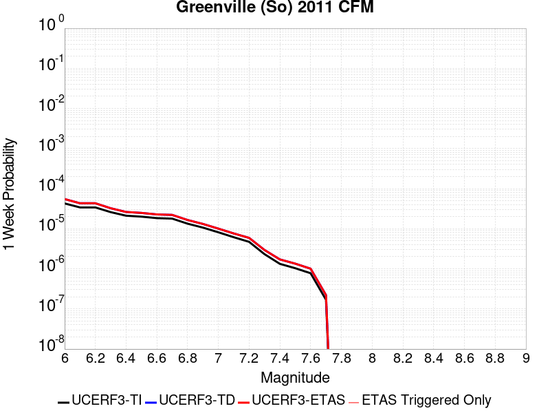 |  | 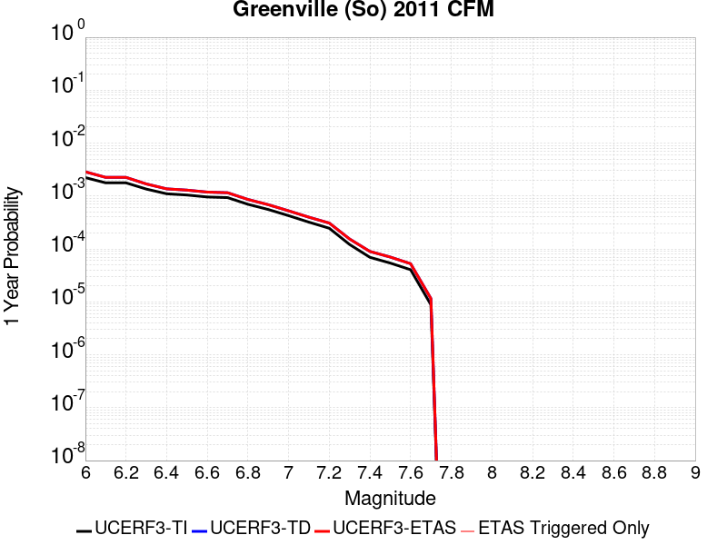 | 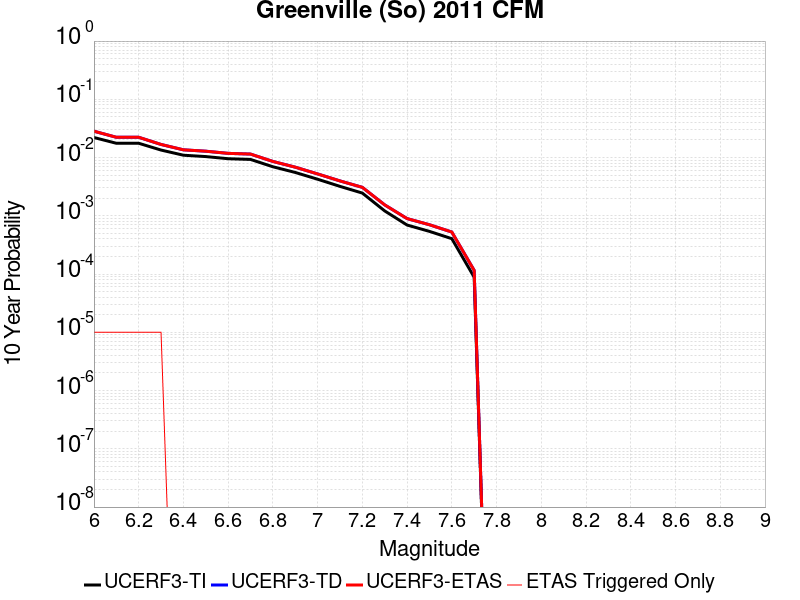 |

| Magnitude | 1 wk TI Prob | 1 wk TD Prob | 1 wk ETAS Prob | 1 wk ETAS/TD Gain | 1 wk ETAS Triggered Only | 1 mo TI Prob | 1 mo TD Prob | 1 mo ETAS Prob | 1 mo ETAS/TD Gain | 1 mo ETAS Triggered Only | 1 yr TI Prob | 1 yr TD Prob | 1 yr ETAS Prob | 1 yr ETAS/TD Gain | 1 yr ETAS Triggered Only | 10 yr TI Prob | 10 yr TD Prob | 10 yr ETAS Prob | 10 yr ETAS/TD Gain | 10 yr ETAS Triggered Only |
|-----|-----|-----|-----|-----|-----|-----|-----|-----|-----|-----|-----|-----|-----|-----|-----|-----|-----|-----|-----|-----|
| 6.0 | 4.279693E-5 | 5.5042052E-5 | 5.5042052E-5 | 1.0 | 0.0 | 1.8340252E-4 | 2.3587522E-4 | 2.3587522E-4 | 1.0 | 0.0 | 0.0022306389 | 0.0028683394 | 0.0028683394 | 1.0 | 0.0 | 0.022083808 | 0.028339082 | 0.0283488 | 1.0003428 | 1.0E-5 |
| 6.1 | 3.4037297E-5 | 4.319379E-5 | 4.319379E-5 | 1.0 | 0.0 | 1.4586597E-4 | 1.851043E-4 | 1.851043E-4 | 1.0 | 0.0 | 0.0017744715 | 0.0022515068 | 0.0022515068 | 1.0 | 0.0 | 0.01760369 | 0.022303257 | 0.022313034 | 1.0004383 | 1.0E-5 |
| 6.2 | 3.4037297E-5 | 4.319379E-5 | 4.319379E-5 | 1.0 | 0.0 | 1.4586597E-4 | 1.851043E-4 | 1.851043E-4 | 1.0 | 0.0 | 0.0017744715 | 0.0022515068 | 0.0022515068 | 1.0 | 0.0 | 0.01760369 | 0.022303257 | 0.022313034 | 1.0004383 | 1.0E-5 |
| 6.3 | 2.5956324E-5 | 3.242983E-5 | 3.242983E-5 | 1.0 | 0.0 | 1.11236644E-4 | 1.3897801E-4 | 1.3897801E-4 | 1.0 | 0.0 | 0.0013534647 | 0.0016908189 | 0.0016908189 | 1.0 | 0.0 | 0.013452509 | 0.016786352 | 0.016796185 | 1.0005857 | 1.0E-5 |
| 6.4 | 2.1145053E-5 | 2.6198357E-5 | 2.6198357E-5 | 1.0 | 0.0 | 9.061851E-5 | 1.1227402E-4 | 1.1227402E-4 | 1.0 | 0.0 | 0.0011027219 | 0.0013661105 | 0.0013661105 | 1.0 | 0.0 | 0.01097266 | 0.013580529 | 0.013580529 | 1.0 | 0.0 |
| 6.5 | 2.0030959E-5 | 2.4796413E-5 | 2.4796413E-5 | 1.0 | 0.0 | 8.584414E-5 | 1.0626618E-4 | 1.0626618E-4 | 1.0 | 0.0 | 0.0010446513 | 0.001293055 | 0.001293055 | 1.0 | 0.0 | 0.010397541 | 0.012858664 | 0.012858664 | 1.0 | 0.0 |
| 6.6 | 1.8395405E-5 | 2.2755032E-5 | 2.2755032E-5 | 1.0 | 0.0 | 7.8835066E-5 | 9.751807E-5 | 9.751807E-5 | 1.0 | 0.0 | 9.5939427E-4 | 0.0011866642 | 0.0011866642 | 1.0 | 0.0 | 0.009552629 | 0.0118063325 | 0.0118063325 | 1.0 | 0.0 |
| 6.7 | 1.7883482E-5 | 2.2126056E-5 | 2.2126056E-5 | 1.0 | 0.0 | 7.664124E-5 | 9.4822666E-5 | 9.4822666E-5 | 1.0 | 0.0 | 9.3270757E-4 | 0.001153883 | 0.001153883 | 1.0 | 0.0 | 0.009288026 | 0.01148197 | 0.01148197 | 1.0 | 0.0 |
| 6.8 | 1.3373564E-5 | 1.6506328E-5 | 1.6506328E-5 | 1.0 | 0.0 | 5.7314013E-5 | 7.0739574E-5 | 7.0739574E-5 | 1.0 | 0.0 | 6.975747E-4 | 8.6092873E-4 | 8.6092873E-4 | 1.0 | 0.0 | 0.0069538904 | 0.008577544 | 0.008577544 | 1.0 | 0.0 |
| 6.9 | 1.06692905E-5 | 1.3152838E-5 | 1.3152838E-5 | 1.0 | 0.0 | 4.5724726E-5 | 5.636815E-5 | 5.636815E-5 | 1.0 | 0.0 | 5.5655633E-4 | 6.8607734E-4 | 6.8607734E-4 | 1.0 | 0.0 | 0.005551645 | 0.006840826 | 0.006840826 | 1.0 | 0.0 |
| 7.0 | 8.157512E-6 | 1.0062801E-5 | 1.0062801E-5 | 1.0 | 0.0 | 3.4960296E-5 | 4.3125594E-5 | 4.3125594E-5 | 1.0 | 0.0 | 4.2555845E-4 | 5.249313E-4 | 5.249313E-4 | 1.0 | 0.0 | 0.004247444 | 0.005237391 | 0.005237391 | 1.0 | 0.0 |
| 7.1 | 6.1467113E-6 | 7.6275246E-6 | 7.6275246E-6 | 1.0 | 0.0 | 2.6342783E-5 | 3.2688986E-5 | 3.2688986E-5 | 1.0 | 0.0 | 3.206762E-4 | 3.979166E-4 | 3.979166E-4 | 1.0 | 0.0 | 0.0032021382 | 0.003972229 | 0.003972229 | 1.0 | 0.0 |
| 7.2 | 4.713467E-6 | 5.9142176E-6 | 5.9142176E-6 | 1.0 | 0.0 | 2.0200418E-5 | 2.5346404E-5 | 2.5346404E-5 | 1.0 | 0.0 | 2.4591232E-4 | 3.0854935E-4 | 3.0854935E-4 | 1.0 | 0.0 | 0.0024564038 | 0.003081363 | 0.003081363 | 1.0 | 0.0 |
| 7.3 | 2.3266216E-6 | 2.954034E-6 | 2.954034E-6 | 1.0 | 0.0 | 9.971197E-6 | 1.2660085E-5 | 1.2660085E-5 | 1.0 | 0.0 | 1.2139256E-4 | 1.541258E-4 | 1.541258E-4 | 1.0 | 0.0 | 0.0012132627 | 0.0015402584 | 0.0015402584 | 1.0 | 0.0 |
| 7.4 | 1.3314E-6 | 1.7179633E-6 | 1.7179633E-6 | 1.0 | 0.0 | 5.7059874E-6 | 7.3626793E-6 | 7.3626793E-6 | 1.0 | 0.0 | 6.946818E-5 | 8.963698E-5 | 8.963698E-5 | 1.0 | 0.0 | 6.9446466E-4 | 8.9604704E-4 | 8.9604704E-4 | 1.0 | 0.0 |
| 7.5 | 1.0362941E-6 | 1.3468865E-6 | 1.3468865E-6 | 1.0 | 0.0 | 4.4412527E-6 | 5.7723582E-6 | 5.7723582E-6 | 1.0 | 0.0 | 5.407091E-5 | 7.027624E-5 | 7.027624E-5 | 1.0 | 0.0 | 5.405776E-4 | 7.0257037E-4 | 7.0257037E-4 | 1.0 | 0.0 |
| 7.6 | 7.764784E-7 | 1.0088623E-6 | 1.0088623E-6 | 1.0 | 0.0 | 3.3277602E-6 | 4.323689E-6 | 4.323689E-6 | 1.0 | 0.0 | 4.0514726E-5 | 5.263968E-5 | 5.263968E-5 | 1.0 | 0.0 | 4.050734E-4 | 5.2629353E-4 | 5.2629353E-4 | 1.0 | 0.0 |
| 7.7 | 1.6927763E-7 | 2.2139328E-7 | 2.2139328E-7 | 1.0 | 0.0 | 7.2547533E-7 | 9.48828E-7 | 9.48828E-7 | 1.0 | 0.0 | 8.832627E-6 | 1.1551923E-5 | 1.1551923E-5 | 1.0 | 0.0 | 8.8322755E-5 | 1.1551595E-4 | 1.1551595E-4 | 1.0 | 0.0 |

## Robinson Creek
*[(top)](#table-of-contents)*

| 1 Week | 1 Month | 1 Year | 10 Year |
|-----|-----|-----|-----|
|  | 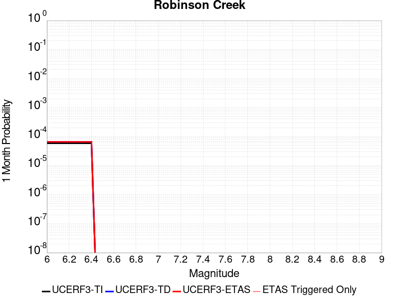 | 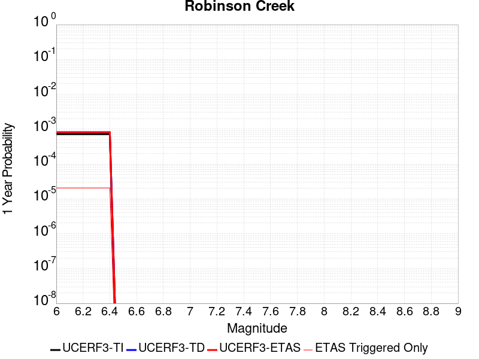 | 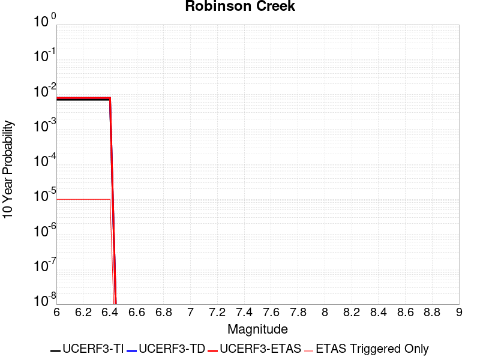 |

| Magnitude | 1 wk TI Prob | 1 wk TD Prob | 1 wk ETAS Prob | 1 wk ETAS/TD Gain | 1 wk ETAS Triggered Only | 1 mo TI Prob | 1 mo TD Prob | 1 mo ETAS Prob | 1 mo ETAS/TD Gain | 1 mo ETAS Triggered Only | 1 yr TI Prob | 1 yr TD Prob | 1 yr ETAS Prob | 1 yr ETAS/TD Gain | 1 yr ETAS Triggered Only | 10 yr TI Prob | 10 yr TD Prob | 10 yr ETAS Prob | 10 yr ETAS/TD Gain | 10 yr ETAS Triggered Only |
|-----|-----|-----|-----|-----|-----|-----|-----|-----|-----|-----|-----|-----|-----|-----|-----|-----|-----|-----|-----|-----|
| 6.0 | 1.3705327E-5 | 1.5285246E-5 | 1.5285246E-5 | 1.0 | 0.0 | 5.8735794E-5 | 6.5508204E-5 | 6.5508204E-5 | 1.0 | 0.0 | 7.1487366E-4 | 7.9756236E-4 | 8.075544E-4 | 1.0125282 | 1.0E-5 | 0.0071257832 | 0.007975623 | 0.007985543 | 1.0012438 | 1.0E-5 |
| 6.1 | 1.3705327E-5 | 1.5285246E-5 | 1.5285246E-5 | 1.0 | 0.0 | 5.8735794E-5 | 6.5508204E-5 | 6.5508204E-5 | 1.0 | 0.0 | 7.1487366E-4 | 7.9756236E-4 | 8.075544E-4 | 1.0125282 | 1.0E-5 | 0.0071257832 | 0.007975623 | 0.007985543 | 1.0012438 | 1.0E-5 |
| 6.2 | 1.3705327E-5 | 1.5285246E-5 | 1.5285246E-5 | 1.0 | 0.0 | 5.8735794E-5 | 6.5508204E-5 | 6.5508204E-5 | 1.0 | 0.0 | 7.1487366E-4 | 7.9756236E-4 | 8.075544E-4 | 1.0125282 | 1.0E-5 | 0.0071257832 | 0.007975623 | 0.007985543 | 1.0012438 | 1.0E-5 |
| 6.3 | 1.3705327E-5 | 1.5285246E-5 | 1.5285246E-5 | 1.0 | 0.0 | 5.8735794E-5 | 6.5508204E-5 | 6.5508204E-5 | 1.0 | 0.0 | 7.1487366E-4 | 7.9756236E-4 | 8.075544E-4 | 1.0125282 | 1.0E-5 | 0.0071257832 | 0.007975623 | 0.007985543 | 1.0012438 | 1.0E-5 |
| 6.4 | 1.3705327E-5 | 1.5285246E-5 | 1.5285246E-5 | 1.0 | 0.0 | 5.8735794E-5 | 6.5508204E-5 | 6.5508204E-5 | 1.0 | 0.0 | 7.1487366E-4 | 7.9756236E-4 | 8.075544E-4 | 1.0125282 | 1.0E-5 | 0.0071257832 | 0.007975623 | 0.007985543 | 1.0012438 | 1.0E-5 |

## Davis Creek
*[(top)](#table-of-contents)*

| 1 Week | 1 Month | 1 Year | 10 Year |
|-----|-----|-----|-----|
| 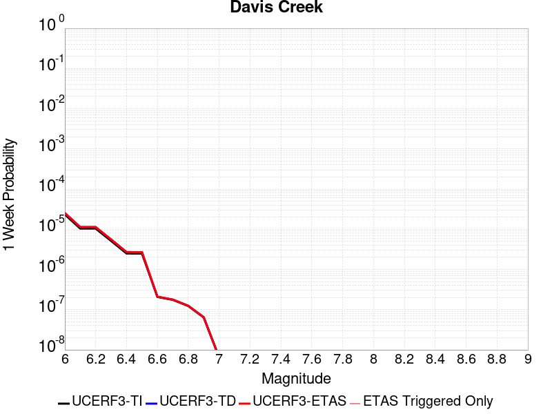 | 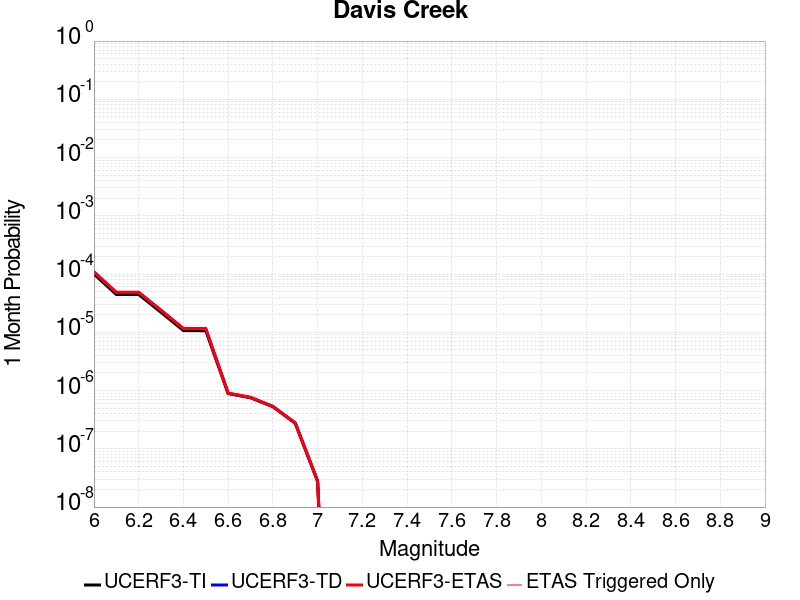 | 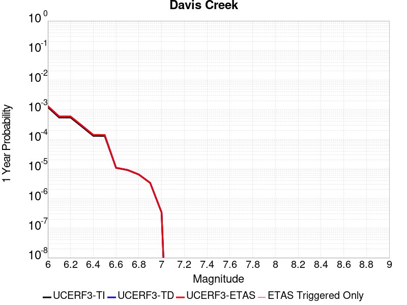 | 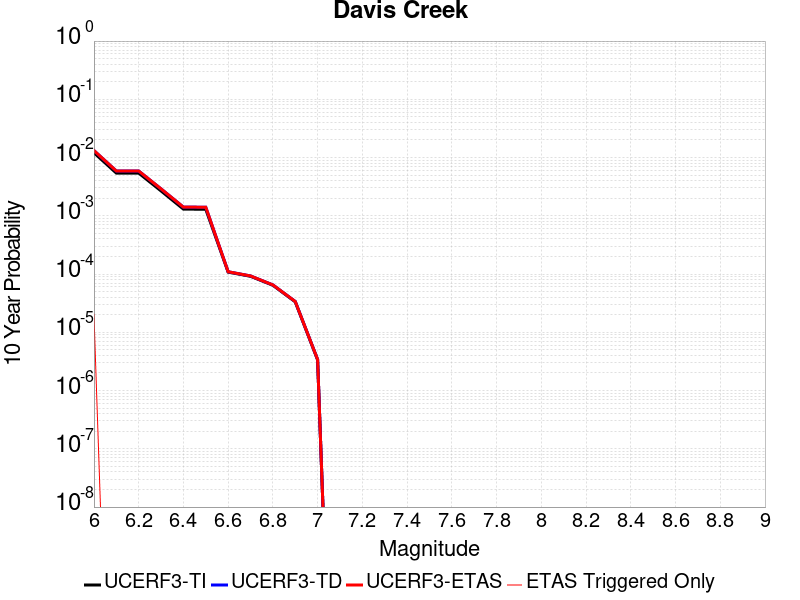 |

| Magnitude | 1 wk TI Prob | 1 wk TD Prob | 1 wk ETAS Prob | 1 wk ETAS/TD Gain | 1 wk ETAS Triggered Only | 1 mo TI Prob | 1 mo TD Prob | 1 mo ETAS Prob | 1 mo ETAS/TD Gain | 1 mo ETAS Triggered Only | 1 yr TI Prob | 1 yr TD Prob | 1 yr ETAS Prob | 1 yr ETAS/TD Gain | 1 yr ETAS Triggered Only | 10 yr TI Prob | 10 yr TD Prob | 10 yr ETAS Prob | 10 yr ETAS/TD Gain | 10 yr ETAS Triggered Only |
|-----|-----|-----|-----|-----|-----|-----|-----|-----|-----|-----|-----|-----|-----|-----|-----|-----|-----|-----|-----|-----|
| 6.0 | 2.331472E-5 | 2.5417517E-5 | 2.5417517E-5 | 1.0 | 0.0 | 9.99164E-5 | 1.0892834E-4 | 1.0892834E-4 | 1.0 | 0.0 | 0.0012158032 | 0.0013255142 | 0.0013255142 | 1.0 | 0.0 | 0.01209173 | 0.013187861 | 0.013197729 | 1.0007483 | 1.0E-5 |
| 6.1 | 1.0407654E-5 | 1.1317118E-5 | 1.1317118E-5 | 1.0 | 0.0 | 4.4603472E-5 | 4.8501184E-5 | 4.8501184E-5 | 1.0 | 0.0 | 5.4291193E-4 | 5.9036905E-4 | 5.9036905E-4 | 1.0 | 0.0 | 0.0054158745 | 0.005890679 | 0.005890679 | 1.0 | 0.0 |
| 6.2 | 1.0407654E-5 | 1.1317118E-5 | 1.1317118E-5 | 1.0 | 0.0 | 4.4603472E-5 | 4.8501184E-5 | 4.8501184E-5 | 1.0 | 0.0 | 5.4291193E-4 | 5.9036905E-4 | 5.9036905E-4 | 1.0 | 0.0 | 0.0054158745 | 0.005890679 | 0.005890679 | 1.0 | 0.0 |
| 6.3 | 5.1323277E-6 | 5.5686187E-6 | 5.5686187E-6 | 1.0 | 0.0 | 2.1995505E-5 | 2.386534E-5 | 2.386534E-5 | 1.0 | 0.0 | 2.6776237E-4 | 2.9053038E-4 | 2.9053038E-4 | 1.0 | 0.0 | 0.0026743996 | 0.0029023518 | 0.0029023518 | 1.0 | 0.0 |
| 6.4 | 2.4985154E-6 | 2.7045678E-6 | 2.7045678E-6 | 1.0 | 0.0 | 1.07078795E-5 | 1.1590974E-5 | 1.1590974E-5 | 1.0 | 0.0 | 1.3036063E-4 | 1.411146E-4 | 1.411146E-4 | 1.0 | 0.0 | 0.0013028418 | 0.0014106046 | 0.0014106046 | 1.0 | 0.0 |
| 6.5 | 2.4846438E-6 | 2.690502E-6 | 2.690502E-6 | 1.0 | 0.0 | 1.064843E-5 | 1.1530692E-5 | 1.1530692E-5 | 1.0 | 0.0 | 1.2963692E-4 | 1.4038075E-4 | 1.4038075E-4 | 1.0 | 0.0 | 0.0012956132 | 0.0014032754 | 0.0014032754 | 1.0 | 0.0 |
| 6.6 | 2.072566E-7 | 2.1018127E-7 | 2.1018127E-7 | 1.0 | 0.0 | 8.882423E-7 | 9.0077657E-7 | 9.0077657E-7 | 1.0 | 0.0 | 1.0814296E-5 | 1.0966901E-5 | 1.0966901E-5 | 1.0 | 0.0 | 1.081377E-4 | 1.09663786E-4 | 1.09663786E-4 | 1.0 | 0.0 |
| 6.7 | 1.7544528E-7 | 1.7790859E-7 | 1.7790859E-7 | 1.0 | 0.0 | 7.5190815E-7 | 7.6246516E-7 | 7.6246516E-7 | 1.0 | 0.0 | 9.154443E-6 | 9.282975E-6 | 9.282975E-6 | 1.0 | 0.0 | 9.1540656E-5 | 9.2826034E-5 | 9.2826034E-5 | 1.0 | 0.0 |
| 6.8 | 1.2320395E-7 | 1.2481159E-7 | 1.2481159E-7 | 1.0 | 0.0 | 5.280168E-7 | 5.3490675E-7 | 5.3490675E-7 | 1.0 | 0.0 | 6.428586E-6 | 6.512471E-6 | 6.512471E-6 | 1.0 | 0.0 | 6.4284E-5 | 6.512291E-5 | 6.512291E-5 | 1.0 | 0.0 |
| 6.9 | 6.399997E-8 | 6.486069E-8 | 6.486069E-8 | 1.0 | 0.0 | 2.7428555E-7 | 2.7797438E-7 | 2.7797438E-7 | 1.0 | 0.0 | 3.3394215E-6 | 3.3843335E-6 | 3.3843335E-6 | 1.0 | 0.0 | 3.3393713E-5 | 3.3842884E-5 | 3.3842884E-5 | 1.0 | 0.0 |
| 7.0 | 6.4455685E-9 | 6.5352763E-9 | 6.5352763E-9 | 1.0 | 0.0 | 2.7623864E-8 | 2.8008326E-8 | 2.8008326E-8 | 1.0 | 0.0 | 3.3632048E-7 | 3.4100137E-7 | 3.4100137E-7 | 1.0 | 0.0 | 3.3631998E-6 | 3.4100137E-6 | 3.4100137E-6 | 1.0 | 0.0 |

## Simi-Santa Rosa
*[(top)](#table-of-contents)*

| 1 Week | 1 Month | 1 Year | 10 Year |
|-----|-----|-----|-----|
|  |  | 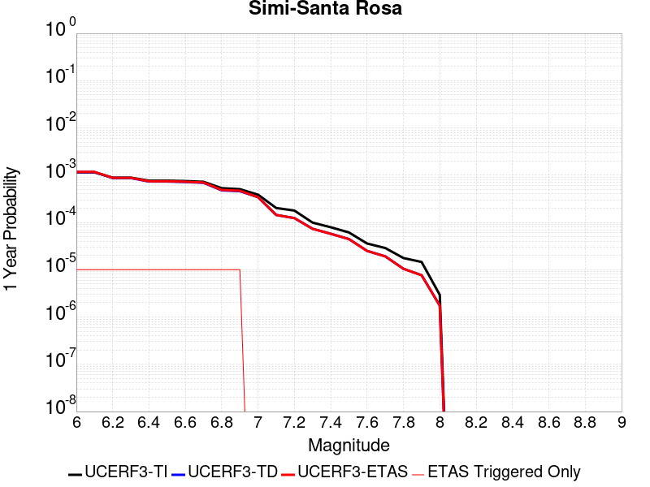 | 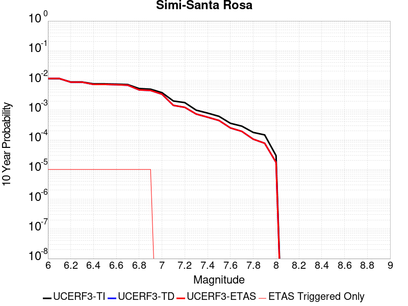 |

| Magnitude | 1 wk TI Prob | 1 wk TD Prob | 1 wk ETAS Prob | 1 wk ETAS/TD Gain | 1 wk ETAS Triggered Only | 1 mo TI Prob | 1 mo TD Prob | 1 mo ETAS Prob | 1 mo ETAS/TD Gain | 1 mo ETAS Triggered Only | 1 yr TI Prob | 1 yr TD Prob | 1 yr ETAS Prob | 1 yr ETAS/TD Gain | 1 yr ETAS Triggered Only | 10 yr TI Prob | 10 yr TD Prob | 10 yr ETAS Prob | 10 yr ETAS/TD Gain | 10 yr ETAS Triggered Only |
|-----|-----|-----|-----|-----|-----|-----|-----|-----|-----|-----|-----|-----|-----|-----|-----|-----|-----|-----|-----|-----|
| 6.0 | 2.198912E-5 | 2.2275886E-5 | 2.2275886E-5 | 1.0 | 0.0 | 9.4235686E-5 | 9.5464835E-5 | 9.5464835E-5 | 1.0 | 0.0 | 0.0011467156 | 0.0011617085 | 0.0011716968 | 1.008598 | 1.0E-5 | 0.011408163 | 0.011560804 | 0.011570688 | 1.000855 | 1.0E-5 |
| 6.1 | 2.198912E-5 | 2.2275886E-5 | 2.2275886E-5 | 1.0 | 0.0 | 9.4235686E-5 | 9.5464835E-5 | 9.5464835E-5 | 1.0 | 0.0 | 0.0011467156 | 0.0011617085 | 0.0011716968 | 1.008598 | 1.0E-5 | 0.011408163 | 0.011560804 | 0.011570688 | 1.000855 | 1.0E-5 |
| 6.2 | 1.69983E-5 | 1.6668911E-5 | 1.6668911E-5 | 1.0 | 0.0 | 7.284782E-5 | 7.14364E-5 | 7.14364E-5 | 1.0 | 0.0 | 8.865613E-4 | 8.694203E-4 | 8.794116E-4 | 1.0114919 | 1.0E-5 | 0.008830327 | 0.0086631095 | 0.0086730225 | 1.0011443 | 1.0E-5 |
| 6.3 | 1.69983E-5 | 1.6668911E-5 | 1.6668911E-5 | 1.0 | 0.0 | 7.284782E-5 | 7.14364E-5 | 7.14364E-5 | 1.0 | 0.0 | 8.865613E-4 | 8.694203E-4 | 8.794116E-4 | 1.0114919 | 1.0E-5 | 0.008830327 | 0.0086631095 | 0.0086730225 | 1.0011443 | 1.0E-5 |
| 6.4 | 1.4666188E-5 | 1.4052852E-5 | 1.4052852E-5 | 1.0 | 0.0 | 6.285358E-5 | 6.022526E-5 | 6.022526E-5 | 1.0 | 0.0 | 7.6497364E-4 | 7.330208E-4 | 7.430134E-4 | 1.0136322 | 1.0E-5 | 0.0076234564 | 0.0073085045 | 0.0073184315 | 1.0013583 | 1.0E-5 |
| 6.5 | 1.4666188E-5 | 1.4052852E-5 | 1.4052852E-5 | 1.0 | 0.0 | 6.285358E-5 | 6.022526E-5 | 6.022526E-5 | 1.0 | 0.0 | 7.6497364E-4 | 7.330208E-4 | 7.430134E-4 | 1.0136322 | 1.0E-5 | 0.0076234564 | 0.0073085045 | 0.0073184315 | 1.0013583 | 1.0E-5 |
| 6.6 | 1.4377586E-5 | 1.3729887E-5 | 1.3729887E-5 | 1.0 | 0.0 | 6.1616774E-5 | 5.8841186E-5 | 5.8841186E-5 | 1.0 | 0.0 | 7.4992597E-4 | 7.1618083E-4 | 7.2617363E-4 | 1.013953 | 1.0E-5 | 0.007474003 | 0.007141196 | 0.0071511245 | 1.0013903 | 1.0E-5 |
| 6.7 | 1.3881404E-5 | 1.3207847E-5 | 1.3207847E-5 | 1.0 | 0.0 | 5.9490372E-5 | 5.6603967E-5 | 5.6603967E-5 | 1.0 | 0.0 | 7.240546E-4 | 6.889601E-4 | 6.989532E-4 | 1.0145047 | 1.0E-5 | 0.007217 | 0.0068706917 | 0.006880623 | 1.0014454 | 1.0E-5 |
| 6.8 | 1.0176516E-5 | 9.154378E-6 | 9.154378E-6 | 1.0 | 0.0 | 4.3612912E-5 | 3.9232553E-5 | 3.9232553E-5 | 1.0 | 0.0 | 5.308578E-4 | 4.7756822E-4 | 4.8756343E-4 | 1.0209295 | 1.0E-5 | 0.0052959146 | 0.004767053 | 0.004777005 | 1.0020877 | 1.0E-5 |
| 6.9 | 9.699797E-6 | 8.7749395E-6 | 8.7749395E-6 | 1.0 | 0.0 | 4.15699E-5 | 3.7606434E-5 | 3.7606434E-5 | 1.0 | 0.0 | 5.05996E-4 | 4.5777857E-4 | 4.67774E-4 | 1.0218346 | 1.0E-5 | 0.005048454 | 0.004569974 | 0.0045799282 | 1.0021782 | 1.0E-5 |
| 7.0 | 7.4049476E-6 | 6.559509E-6 | 6.559509E-6 | 1.0 | 0.0 | 3.1735104E-5 | 2.811195E-5 | 2.811195E-5 | 1.0 | 0.0 | 3.8630638E-4 | 3.422219E-4 | 3.422219E-4 | 1.0 | 0.0 | 0.0038563553 | 0.0034181913 | 0.0034181913 | 1.0 | 0.0 |
| 7.1 | 3.873439E-6 | 2.759614E-6 | 2.759614E-6 | 1.0 | 0.0 | 1.6600346E-5 | 1.1826865E-5 | 1.1826865E-5 | 1.0 | 0.0 | 2.0209046E-4 | 1.439828E-4 | 1.439828E-4 | 1.0 | 0.0 | 0.0020190678 | 0.0014389188 | 0.0014389188 | 1.0 | 0.0 |
| 7.2 | 3.417706E-6 | 2.3677471E-6 | 2.3677471E-6 | 1.0 | 0.0 | 1.4647229E-5 | 1.014745E-5 | 1.014745E-5 | 1.0 | 0.0 | 1.7831543E-4 | 1.2353843E-4 | 1.2353843E-4 | 1.0 | 0.0 | 0.0017817242 | 0.0012347198 | 0.0012347198 | 1.0 | 0.0 |
| 7.3 | 1.90225E-6 | 1.4074596E-6 | 1.4074596E-6 | 1.0 | 0.0 | 8.152474E-6 | 6.0319558E-6 | 6.0319558E-6 | 1.0 | 0.0 | 9.9251854E-5 | 7.343661E-5 | 7.343661E-5 | 1.0 | 0.0 | 9.920754E-4 | 7.341257E-4 | 7.341257E-4 | 1.0 | 0.0 |
| 7.4 | 1.5170556E-6 | 1.1025584E-6 | 1.1025584E-6 | 1.0 | 0.0 | 6.5016507E-6 | 4.7252415E-6 | 4.7252415E-6 | 1.0 | 0.0 | 7.915472E-5 | 5.752831E-5 | 5.752831E-5 | 1.0 | 0.0 | 7.9126534E-4 | 5.751353E-4 | 5.751353E-4 | 1.0 | 0.0 |
| 7.5 | 1.178732E-6 | 8.5358926E-7 | 8.5358926E-7 | 1.0 | 0.0 | 5.0516987E-6 | 3.6582346E-6 | 3.6582346E-6 | 1.0 | 0.0 | 6.1502695E-5 | 4.4538105E-5 | 4.4538105E-5 | 1.0 | 0.0 | 6.148568E-4 | 4.4529274E-4 | 4.4529274E-4 | 1.0 | 0.0 |
| 7.6 | 6.8722386E-7 | 4.793958E-7 | 4.793958E-7 | 1.0 | 0.0 | 2.9452417E-6 | 2.0545517E-6 | 2.0545517E-6 | 1.0 | 0.0 | 3.5857727E-5 | 2.5013882E-5 | 2.5013882E-5 | 1.0 | 0.0 | 3.5851944E-4 | 2.5011078E-4 | 2.5011078E-4 | 1.0 | 0.0 |
| 7.7 | 5.5126515E-7 | 3.673869E-7 | 3.673869E-7 | 1.0 | 0.0 | 2.3625628E-6 | 1.5745143E-6 | 1.5745143E-6 | 1.0 | 0.0 | 2.8763823E-5 | 1.9169544E-5 | 1.9169544E-5 | 1.0 | 0.0 | 2.87601E-4 | 1.91679E-4 | 1.91679E-4 | 1.0 | 0.0 |
| 7.8 | 3.3860243E-7 | 2.0081488E-7 | 2.0081488E-7 | 1.0 | 0.0 | 1.4511525E-6 | 8.6063494E-7 | 8.6063494E-7 | 1.0 | 0.0 | 1.7667637E-5 | 1.047818E-5 | 1.047818E-5 | 1.0 | 0.0 | 1.7666233E-4 | 1.0477692E-4 | 1.0477692E-4 | 1.0 | 0.0 |
| 7.9 | 2.7955386E-7 | 1.4654502E-7 | 1.4654502E-7 | 1.0 | 0.0 | 1.1980875E-6 | 6.280499E-7 | 6.280499E-7 | 1.0 | 0.0 | 1.4586617E-5 | 7.646482E-6 | 7.646482E-6 | 1.0 | 0.0 | 1.458566E-4 | 7.646223E-5 | 7.646223E-5 | 1.0 | 0.0 |
| 8.0 | 5.6259015E-8 | 3.3357086E-8 | 3.3357086E-8 | 1.0 | 0.0 | 2.4111003E-7 | 1.4295894E-7 | 1.4295894E-7 | 1.0 | 0.0 | 2.9355108E-6 | 1.7405239E-6 | 1.7405239E-6 | 1.0 | 0.0 | 2.935472E-5 | 1.7405117E-5 | 1.7405117E-5 | 1.0 | 0.0 |

## Green Valley 2011 CFM
*[(top)](#table-of-contents)*

| 1 Week | 1 Month | 1 Year | 10 Year |
|-----|-----|-----|-----|
|  |  | 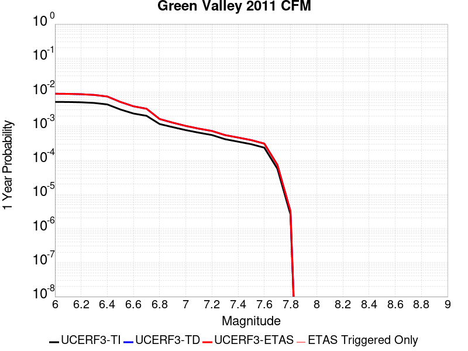 | 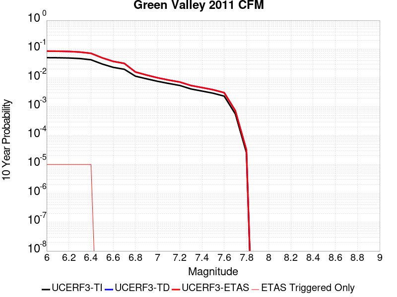 |

| Magnitude | 1 wk TI Prob | 1 wk TD Prob | 1 wk ETAS Prob | 1 wk ETAS/TD Gain | 1 wk ETAS Triggered Only | 1 mo TI Prob | 1 mo TD Prob | 1 mo ETAS Prob | 1 mo ETAS/TD Gain | 1 mo ETAS Triggered Only | 1 yr TI Prob | 1 yr TD Prob | 1 yr ETAS Prob | 1 yr ETAS/TD Gain | 1 yr ETAS Triggered Only | 10 yr TI Prob | 10 yr TD Prob | 10 yr ETAS Prob | 10 yr ETAS/TD Gain | 10 yr ETAS Triggered Only |
|-----|-----|-----|-----|-----|-----|-----|-----|-----|-----|-----|-----|-----|-----|-----|-----|-----|-----|-----|-----|-----|
| 6.0 | 9.9629346E-5 | 1.7306181E-4 | 1.7306181E-4 | 1.0 | 0.0 | 4.2691303E-4 | 7.414477E-4 | 7.414477E-4 | 1.0 | 0.0 | 0.0051852856 | 0.00898687 | 0.00898687 | 1.0 | 0.0 | 0.050659515 | 0.085523866 | 0.08553301 | 1.0001069 | 1.0E-5 |
| 6.1 | 9.88615E-5 | 1.7153492E-4 | 1.7153492E-4 | 1.0 | 0.0 | 4.2362334E-4 | 7.349076E-4 | 7.349076E-4 | 1.0 | 0.0 | 0.0051454236 | 0.008907897 | 0.008907897 | 1.0 | 0.0 | 0.050279044 | 0.08481148 | 0.08482063 | 1.0001079 | 1.0E-5 |
| 6.2 | 9.696895E-5 | 1.679252E-4 | 1.679252E-4 | 1.0 | 0.0 | 4.15515E-4 | 7.1944593E-4 | 7.1944593E-4 | 1.0 | 0.0 | 0.0050471667 | 0.008721275 | 0.008721275 | 1.0 | 0.0 | 0.04934063 | 0.08312038 | 0.083129555 | 1.0001103 | 1.0E-5 |
| 6.3 | 9.275224E-5 | 1.5971852E-4 | 1.5971852E-4 | 1.0 | 0.0 | 3.9744904E-4 | 6.842931E-4 | 6.842931E-4 | 1.0 | 0.0 | 0.0048282105 | 0.008296597 | 0.008296597 | 1.0 | 0.0 | 0.047246475 | 0.07925882 | 0.07926803 | 1.0001161 | 1.0E-5 |
| 6.4 | 8.391499E-5 | 1.4368363E-4 | 1.4368363E-4 | 1.0 | 0.0 | 3.595861E-4 | 6.156491E-4 | 6.156491E-4 | 1.0 | 0.0 | 0.004369175 | 0.007467232 | 0.007467232 | 1.0 | 0.0 | 0.04284265 | 0.07163251 | 0.071641795 | 1.0001296 | 1.0E-5 |
| 6.5 | 5.9519385E-5 | 9.9345336E-5 | 9.9345336E-5 | 1.0 | 0.0 | 2.5505814E-4 | 4.257004E-4 | 4.257004E-4 | 1.0 | 0.0 | 0.0031009112 | 0.0051684165 | 0.0051684165 | 1.0 | 0.0 | 0.030579966 | 0.050147217 | 0.050147217 | 1.0 | 0.0 |
| 6.6 | 4.5361558E-5 | 7.4029726E-5 | 7.4029726E-5 | 1.0 | 0.0 | 1.9439218E-4 | 3.1723455E-4 | 3.1723455E-4 | 1.0 | 0.0 | 0.0023641558 | 0.003854048 | 0.003854048 | 1.0 | 0.0 | 0.023391623 | 0.03766713 | 0.03766713 | 1.0 | 0.0 |
| 6.7 | 3.8808106E-5 | 6.265495E-5 | 6.265495E-5 | 1.0 | 0.0 | 1.6630985E-4 | 2.684962E-4 | 2.684962E-4 | 1.0 | 0.0 | 0.0020229418 | 0.003262755 | 0.003262755 | 1.0 | 0.0 | 0.020046256 | 0.03200691 | 0.03200691 | 1.0 | 0.0 |
| 6.8 | 2.2284667E-5 | 3.1285566E-5 | 3.1285566E-5 | 1.0 | 0.0 | 9.550222E-5 | 1.340742E-4 | 1.340742E-4 | 1.0 | 0.0 | 0.0011621192 | 0.001631124 | 0.001631124 | 1.0 | 0.0 | 0.011560607 | 0.016166156 | 0.016166156 | 1.0 | 0.0 |
| 6.9 | 1.8050168E-5 | 2.4448267E-5 | 2.4448267E-5 | 1.0 | 0.0 | 7.735557E-5 | 1.0477412E-4 | 1.0477412E-4 | 1.0 | 0.0 | 9.4139716E-4 | 0.001274882 | 0.001274882 | 1.0 | 0.0 | 0.009374191 | 0.01266794 | 0.01266794 | 1.0 | 0.0 |
| 7.0 | 1.4763166E-5 | 1.958302E-5 | 1.958302E-5 | 1.0 | 0.0 | 6.326917E-5 | 8.392455E-5 | 8.392455E-5 | 1.0 | 0.0 | 7.7002996E-4 | 0.0010213053 | 0.0010213053 | 1.0 | 0.0 | 0.007673672 | 0.010165428 | 0.010165428 | 1.0 | 0.0 |
| 7.1 | 1.2399713E-5 | 1.630385E-5 | 1.630385E-5 | 1.0 | 0.0 | 5.3140546E-5 | 6.987178E-5 | 6.987178E-5 | 1.0 | 0.0 | 6.467941E-4 | 8.5035886E-4 | 8.5035886E-4 | 1.0 | 0.0 | 0.006449148 | 0.008471329 | 0.008471329 | 1.0 | 0.0 |
| 7.2 | 1.0584195E-5 | 1.3921863E-5 | 1.3921863E-5 | 1.0 | 0.0 | 4.5360044E-5 | 5.9663773E-5 | 5.9663773E-5 | 1.0 | 0.0 | 5.521186E-4 | 7.2616595E-4 | 7.2616595E-4 | 1.0 | 0.0 | 0.0055074887 | 0.0072383475 | 0.0072383475 | 1.0 | 0.0 |
| 7.3 | 7.998173E-6 | 1.054412E-5 | 1.054412E-5 | 1.0 | 0.0 | 3.4277433E-5 | 4.5188313E-5 | 4.5188313E-5 | 1.0 | 0.0 | 4.1724785E-4 | 5.500299E-4 | 5.500299E-4 | 1.0 | 0.0 | 0.004164653 | 0.0054869517 | 0.0054869517 | 1.0 | 0.0 |
| 7.4 | 6.7571127E-6 | 8.932785E-6 | 8.932785E-6 | 1.0 | 0.0 | 2.8958733E-5 | 3.8282808E-5 | 3.8282808E-5 | 1.0 | 0.0 | 3.5251552E-4 | 4.6599447E-4 | 4.6599447E-4 | 1.0 | 0.0 | 0.0035195686 | 0.0046503763 | 0.0046503763 | 1.0 | 0.0 |
| 7.5 | 5.69878E-6 | 7.5163775E-6 | 7.5163775E-6 | 1.0 | 0.0 | 2.4423114E-5 | 3.2212654E-5 | 3.2212654E-5 | 1.0 | 0.0 | 2.9731085E-4 | 3.9211934E-4 | 3.9211934E-4 | 1.0 | 0.0 | 0.002969134 | 0.0039144265 | 0.0039144265 | 1.0 | 0.0 |
| 7.6 | 4.503664E-6 | 5.9357344E-6 | 5.9357344E-6 | 1.0 | 0.0 | 1.9301275E-5 | 2.5438618E-5 | 2.5438618E-5 | 1.0 | 0.0 | 2.3496768E-4 | 3.09672E-4 | 3.09672E-4 | 1.0 | 0.0 | 0.002347194 | 0.0030925297 | 0.0030925297 | 1.0 | 0.0 |
| 7.7 | 1.0873546E-6 | 1.4107108E-6 | 1.4107108E-6 | 1.0 | 0.0 | 4.6600826E-6 | 6.0458897E-6 | 6.0458897E-6 | 1.0 | 0.0 | 5.6735033E-5 | 7.360625E-5 | 7.360625E-5 | 1.0 | 0.0 | 5.672055E-4 | 7.3582074E-4 | 7.3582074E-4 | 1.0 | 0.0 |
| 7.8 | 4.9373917E-8 | 6.177787E-8 | 6.177787E-8 | 1.0 | 0.0 | 2.1160248E-7 | 2.6476226E-7 | 2.6476226E-7 | 1.0 | 0.0 | 2.5762572E-6 | 3.223477E-6 | 3.223477E-6 | 1.0 | 0.0 | 2.5762274E-5 | 3.223268E-5 | 3.223268E-5 | 1.0 | 0.0 |

## Northridge
*[(top)](#table-of-contents)*

| 1 Week | 1 Month | 1 Year | 10 Year |
|-----|-----|-----|-----|
|  | 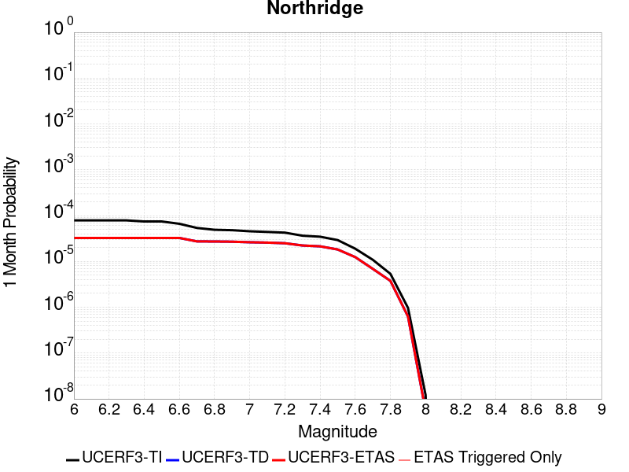 | 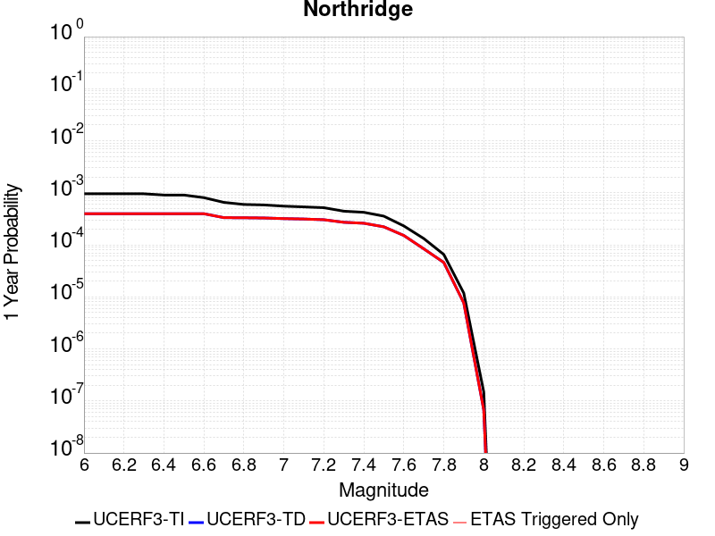 | 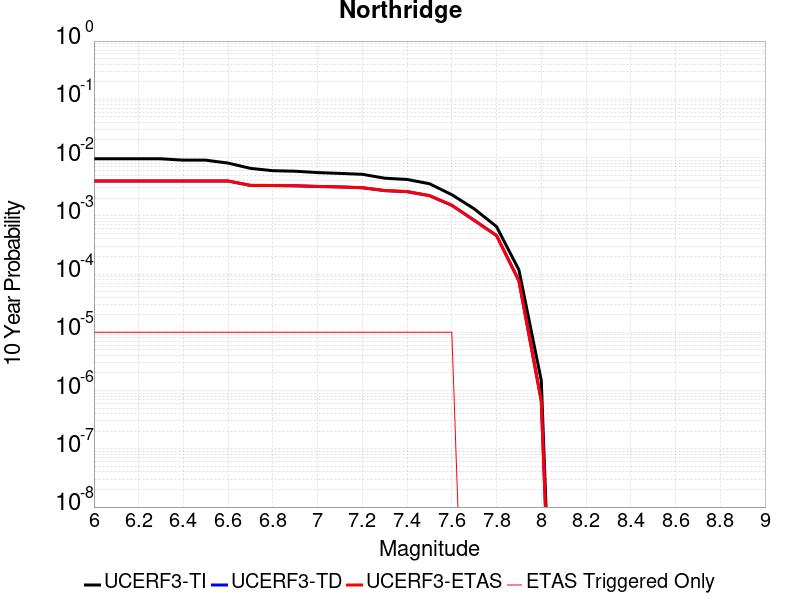 |

| Magnitude | 1 wk TI Prob | 1 wk TD Prob | 1 wk ETAS Prob | 1 wk ETAS/TD Gain | 1 wk ETAS Triggered Only | 1 mo TI Prob | 1 mo TD Prob | 1 mo ETAS Prob | 1 mo ETAS/TD Gain | 1 mo ETAS Triggered Only | 1 yr TI Prob | 1 yr TD Prob | 1 yr ETAS Prob | 1 yr ETAS/TD Gain | 1 yr ETAS Triggered Only | 10 yr TI Prob | 10 yr TD Prob | 10 yr ETAS Prob | 10 yr ETAS/TD Gain | 10 yr ETAS Triggered Only |
|-----|-----|-----|-----|-----|-----|-----|-----|-----|-----|-----|-----|-----|-----|-----|-----|-----|-----|-----|-----|-----|
| 6.0 | 1.8340852E-5 | 7.5881535E-6 | 7.5881535E-6 | 1.0 | 0.0 | 7.860128E-5 | 3.2520264E-5 | 3.2520264E-5 | 1.0 | 0.0 | 9.565505E-4 | 3.9586448E-4 | 3.9586448E-4 | 1.0 | 0.0 | 0.009524435 | 0.003951816 | 0.0039617764 | 1.0025204 | 1.0E-5 |
| 6.1 | 1.8340852E-5 | 7.5881535E-6 | 7.5881535E-6 | 1.0 | 0.0 | 7.860128E-5 | 3.2520264E-5 | 3.2520264E-5 | 1.0 | 0.0 | 9.565505E-4 | 3.9586448E-4 | 3.9586448E-4 | 1.0 | 0.0 | 0.009524435 | 0.003951816 | 0.0039617764 | 1.0025204 | 1.0E-5 |
| 6.2 | 1.8340852E-5 | 7.5881535E-6 | 7.5881535E-6 | 1.0 | 0.0 | 7.860128E-5 | 3.2520264E-5 | 3.2520264E-5 | 1.0 | 0.0 | 9.565505E-4 | 3.9586448E-4 | 3.9586448E-4 | 1.0 | 0.0 | 0.009524435 | 0.003951816 | 0.0039617764 | 1.0025204 | 1.0E-5 |
| 6.3 | 1.8340852E-5 | 7.5881535E-6 | 7.5881535E-6 | 1.0 | 0.0 | 7.860128E-5 | 3.2520264E-5 | 3.2520264E-5 | 1.0 | 0.0 | 9.565505E-4 | 3.9586448E-4 | 3.9586448E-4 | 1.0 | 0.0 | 0.009524435 | 0.003951816 | 0.0039617764 | 1.0025204 | 1.0E-5 |
| 6.4 | 1.7361892E-5 | 7.5881535E-6 | 7.5881535E-6 | 1.0 | 0.0 | 7.440598E-5 | 3.2520264E-5 | 3.2520264E-5 | 1.0 | 0.0 | 9.055163E-4 | 3.9586448E-4 | 3.9586448E-4 | 1.0 | 0.0 | 0.009018354 | 0.003951816 | 0.0039617764 | 1.0025204 | 1.0E-5 |
| 6.5 | 1.7361892E-5 | 7.5881535E-6 | 7.5881535E-6 | 1.0 | 0.0 | 7.440598E-5 | 3.2520264E-5 | 3.2520264E-5 | 1.0 | 0.0 | 9.055163E-4 | 3.9586448E-4 | 3.9586448E-4 | 1.0 | 0.0 | 0.009018354 | 0.003951816 | 0.0039617764 | 1.0025204 | 1.0E-5 |
| 6.6 | 1.5458201E-5 | 7.5881535E-6 | 7.5881535E-6 | 1.0 | 0.0 | 6.624775E-5 | 3.2520264E-5 | 3.2520264E-5 | 1.0 | 0.0 | 8.0626784E-4 | 3.9586448E-4 | 3.9586448E-4 | 1.0 | 0.0 | 0.008033488 | 0.003951816 | 0.0039617764 | 1.0025204 | 1.0E-5 |
| 6.7 | 1.2538368E-5 | 6.381707E-6 | 6.381707E-6 | 1.0 | 0.0 | 5.3734755E-5 | 2.7349888E-5 | 2.7349888E-5 | 1.0 | 0.0 | 6.5402425E-4 | 3.3293446E-4 | 3.3293446E-4 | 1.0 | 0.0 | 0.0065210275 | 0.0033244046 | 0.0033343714 | 1.0029981 | 1.0E-5 |
| 6.8 | 1.1438097E-5 | 6.3503594E-6 | 6.3503594E-6 | 1.0 | 0.0 | 4.9019498E-5 | 2.7215545E-5 | 2.7215545E-5 | 1.0 | 0.0 | 5.9664896E-4 | 3.3129932E-4 | 3.3129932E-4 | 1.0 | 0.0 | 0.005950495 | 0.003308102 | 0.0033180688 | 1.0030129 | 1.0E-5 |
| 6.9 | 1.1204891E-5 | 6.2868094E-6 | 6.2868094E-6 | 1.0 | 0.0 | 4.8020076E-5 | 2.6943193E-5 | 2.6943193E-5 | 1.0 | 0.0 | 5.8448757E-4 | 3.2798442E-4 | 3.2798442E-4 | 1.0 | 0.0 | 0.0058295266 | 0.0032750512 | 0.0032850185 | 1.0030434 | 1.0E-5 |
| 7.0 | 1.061046E-5 | 6.1154565E-6 | 6.1154565E-6 | 1.0 | 0.0 | 4.5472607E-5 | 2.6208838E-5 | 2.6208838E-5 | 1.0 | 0.0 | 5.534883E-4 | 3.1904632E-4 | 3.1904632E-4 | 1.0 | 0.0 | 0.0055211177 | 0.003185929 | 0.0031958972 | 1.0031288 | 1.0E-5 |
| 7.1 | 1.0266979E-5 | 6.0043685E-6 | 6.0043685E-6 | 1.0 | 0.0 | 4.40006E-5 | 2.5732756E-5 | 2.5732756E-5 | 1.0 | 0.0 | 5.355756E-4 | 3.132517E-4 | 3.132517E-4 | 1.0 | 0.0 | 0.0053428668 | 0.0031281472 | 0.0031381159 | 1.0031868 | 1.0E-5 |
| 7.2 | 9.91273E-6 | 5.820076E-6 | 5.820076E-6 | 1.0 | 0.0 | 4.248244E-5 | 2.4942945E-5 | 2.4942945E-5 | 1.0 | 0.0 | 5.171009E-4 | 3.0363846E-4 | 3.0363846E-4 | 1.0 | 0.0 | 0.0051589934 | 0.003032281 | 0.0030422506 | 1.0032878 | 1.0E-5 |
| 7.3 | 8.4959265E-6 | 5.1931415E-6 | 5.1931415E-6 | 1.0 | 0.0 | 3.6410605E-5 | 2.2256132E-5 | 2.2256132E-5 | 1.0 | 0.0 | 4.4320893E-4 | 2.7093495E-4 | 2.7093495E-4 | 1.0 | 0.0 | 0.00442326 | 0.0027060728 | 0.0027160458 | 1.0036854 | 1.0E-5 |
| 7.4 | 8.0847185E-6 | 4.9820114E-6 | 4.9820114E-6 | 1.0 | 0.0 | 3.4648332E-5 | 2.1351305E-5 | 2.1351305E-5 | 1.0 | 0.0 | 4.2176177E-4 | 2.5992136E-4 | 2.5992136E-4 | 1.0 | 0.0 | 0.0042096223 | 0.0025961995 | 0.0026061735 | 1.0038418 | 1.0E-5 |
| 7.5 | 6.8220684E-6 | 4.2533693E-6 | 4.2533693E-6 | 1.0 | 0.0 | 2.9237108E-5 | 1.8228598E-5 | 1.8228598E-5 | 1.0 | 0.0 | 3.5590364E-4 | 2.2191078E-4 | 2.2191078E-4 | 1.0 | 0.0 | 0.0035533418 | 0.0022169128 | 0.0022268908 | 1.0045007 | 1.0E-5 |
| 7.6 | 4.4224143E-6 | 2.8999916E-6 | 2.8999916E-6 | 1.0 | 0.0 | 1.8953066E-5 | 1.2428477E-5 | 1.2428477E-5 | 1.0 | 0.0 | 2.3072914E-4 | 1.5130632E-4 | 1.5130632E-4 | 1.0 | 0.0 | 0.0023048974 | 0.0015120446 | 0.0015220294 | 1.0066036 | 1.0E-5 |
| 7.7 | 2.5297056E-6 | 1.6046072E-6 | 1.6046072E-6 | 1.0 | 0.0 | 1.0841551E-5 | 6.87687E-6 | 6.87687E-6 | 1.0 | 0.0 | 1.319879E-4 | 8.372273E-5 | 8.372273E-5 | 1.0 | 0.0 | 0.0013190953 | 8.3691656E-4 | 8.3691656E-4 | 1.0 | 0.0 |
| 7.8 | 1.2508156E-6 | 8.78015E-7 | 8.78015E-7 | 1.0 | 0.0 | 5.3606273E-6 | 3.7629159E-6 | 3.7629159E-6 | 1.0 | 0.0 | 6.526368E-5 | 4.581255E-5 | 4.581255E-5 | 1.0 | 0.0 | 6.524452E-4 | 4.5803236E-4 | 4.5803236E-4 | 1.0 | 0.0 |
| 7.9 | 2.262199E-7 | 1.4664893E-7 | 1.4664893E-7 | 1.0 | 0.0 | 9.695135E-7 | 6.2849523E-7 | 6.2849523E-7 | 1.0 | 0.0 | 1.1803763E-5 | 7.651904E-6 | 7.651904E-6 | 1.0 | 0.0 | 1.1803136E-4 | 7.651648E-5 | 7.651648E-5 | 1.0 | 0.0 |
| 8.0 | 2.865362E-9 | 1.2753953E-9 | 1.2753953E-9 | 1.0 | 0.0 | 1.2280123E-8 | 5.46598E-9 | 5.46598E-9 | 1.0 | 0.0 | 1.4951048E-7 | 6.654831E-8 | 6.654831E-8 | 1.0 | 0.0 | 1.4951038E-6 | 6.6548307E-7 | 6.6548307E-7 | 1.0 | 0.0 |

## San Jacinto (Clark) rev
*[(top)](#table-of-contents)*

| 1 Week | 1 Month | 1 Year | 10 Year |
|-----|-----|-----|-----|
| 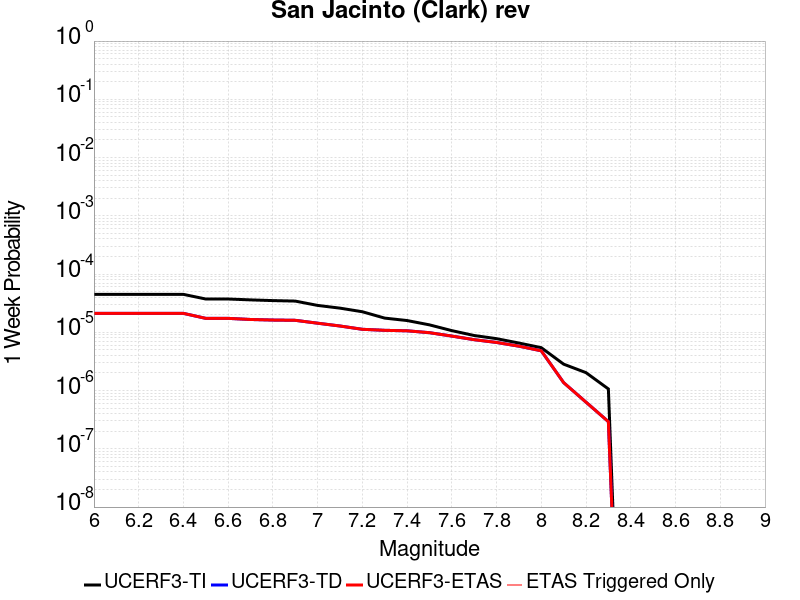 |  | 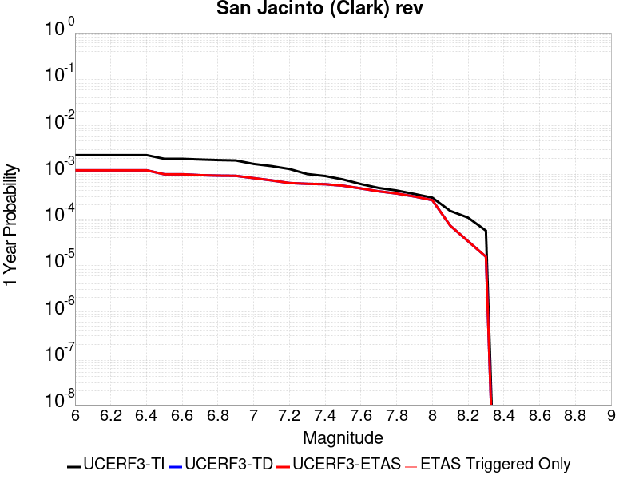 | 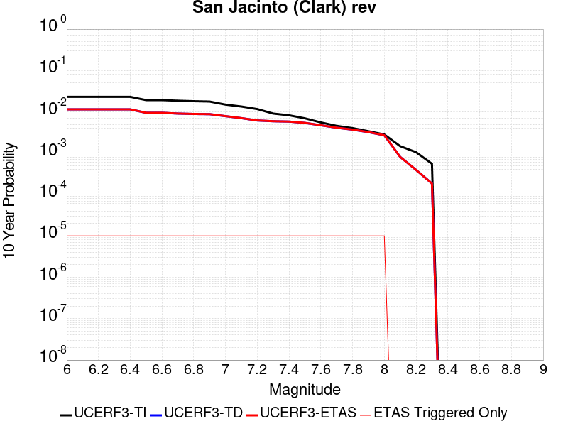 |

| Magnitude | 1 wk TI Prob | 1 wk TD Prob | 1 wk ETAS Prob | 1 wk ETAS/TD Gain | 1 wk ETAS Triggered Only | 1 mo TI Prob | 1 mo TD Prob | 1 mo ETAS Prob | 1 mo ETAS/TD Gain | 1 mo ETAS Triggered Only | 1 yr TI Prob | 1 yr TD Prob | 1 yr ETAS Prob | 1 yr ETAS/TD Gain | 1 yr ETAS Triggered Only | 10 yr TI Prob | 10 yr TD Prob | 10 yr ETAS Prob | 10 yr ETAS/TD Gain | 10 yr ETAS Triggered Only |
|-----|-----|-----|-----|-----|-----|-----|-----|-----|-----|-----|-----|-----|-----|-----|-----|-----|-----|-----|-----|-----|
| 6.0 | 4.482615E-5 | 2.1162805E-5 | 2.1162805E-5 | 1.0 | 0.0 | 1.9209793E-4 | 9.069463E-5 | 9.069463E-5 | 1.0 | 0.0 | 0.0023362834 | 0.0011036571 | 0.0011036571 | 1.0 | 0.0 | 0.02311874 | 0.011508432 | 0.011518316 | 1.0008589 | 1.0E-5 |
| 6.1 | 4.482615E-5 | 2.1162805E-5 | 2.1162805E-5 | 1.0 | 0.0 | 1.9209793E-4 | 9.069463E-5 | 9.069463E-5 | 1.0 | 0.0 | 0.0023362834 | 0.0011036571 | 0.0011036571 | 1.0 | 0.0 | 0.02311874 | 0.011508432 | 0.011518316 | 1.0008589 | 1.0E-5 |
| 6.2 | 4.482615E-5 | 2.1162805E-5 | 2.1162805E-5 | 1.0 | 0.0 | 1.9209793E-4 | 9.069463E-5 | 9.069463E-5 | 1.0 | 0.0 | 0.0023362834 | 0.0011036571 | 0.0011036571 | 1.0 | 0.0 | 0.02311874 | 0.011508432 | 0.011518316 | 1.0008589 | 1.0E-5 |
| 6.3 | 4.482615E-5 | 2.1162805E-5 | 2.1162805E-5 | 1.0 | 0.0 | 1.9209793E-4 | 9.069463E-5 | 9.069463E-5 | 1.0 | 0.0 | 0.0023362834 | 0.0011036571 | 0.0011036571 | 1.0 | 0.0 | 0.02311874 | 0.011508432 | 0.011518316 | 1.0008589 | 1.0E-5 |
| 6.4 | 4.482615E-5 | 2.1162805E-5 | 2.1162805E-5 | 1.0 | 0.0 | 1.9209793E-4 | 9.069463E-5 | 9.069463E-5 | 1.0 | 0.0 | 0.0023362834 | 0.0011036571 | 0.0011036571 | 1.0 | 0.0 | 0.02311874 | 0.011508432 | 0.011518316 | 1.0008589 | 1.0E-5 |
| 6.5 | 3.7294863E-5 | 1.7363767E-5 | 1.7363767E-5 | 1.0 | 0.0 | 1.5982533E-4 | 7.441404E-5 | 7.441404E-5 | 1.0 | 0.0 | 0.0019441366 | 9.056189E-4 | 9.056189E-4 | 1.0 | 0.0 | 0.01927216 | 0.009498186 | 0.009508091 | 1.0010428 | 1.0E-5 |
| 6.6 | 3.7294863E-5 | 1.7363767E-5 | 1.7363767E-5 | 1.0 | 0.0 | 1.5982533E-4 | 7.441404E-5 | 7.441404E-5 | 1.0 | 0.0 | 0.0019441366 | 9.056189E-4 | 9.056189E-4 | 1.0 | 0.0 | 0.01927216 | 0.009498186 | 0.009508091 | 1.0010428 | 1.0E-5 |
| 6.7 | 3.6039248E-5 | 1.661182E-5 | 1.661182E-5 | 1.0 | 0.0 | 1.5444479E-4 | 7.11916E-5 | 7.11916E-5 | 1.0 | 0.0 | 0.0018787434 | 8.6641713E-4 | 8.6641713E-4 | 1.0 | 0.0 | 0.01862939 | 0.009100041 | 0.009109951 | 1.0010889 | 1.0E-5 |
| 6.8 | 3.5031844E-5 | 1.6240316E-5 | 1.6240316E-5 | 1.0 | 0.0 | 1.5012783E-4 | 6.959952E-5 | 6.959952E-5 | 1.0 | 0.0 | 0.0018262739 | 8.470488E-4 | 8.470488E-4 | 1.0 | 0.0 | 0.01811338 | 0.008899899 | 0.00890981 | 1.0011137 | 1.0E-5 |
| 6.9 | 3.435112E-5 | 1.6070499E-5 | 1.6070499E-5 | 1.0 | 0.0 | 1.4721078E-4 | 6.887177E-5 | 6.887177E-5 | 1.0 | 0.0 | 0.0017908178 | 8.381953E-4 | 8.381953E-4 | 1.0 | 0.0 | 0.017764548 | 0.008808068 | 0.00881798 | 1.0011253 | 1.0E-5 |
| 7.0 | 2.8959772E-5 | 1.4343366E-5 | 1.4343366E-5 | 1.0 | 0.0 | 1.241074E-4 | 6.1470135E-5 | 6.1470135E-5 | 1.0 | 0.0 | 0.0015099603 | 7.481447E-4 | 7.481447E-4 | 1.0 | 0.0 | 0.014997416 | 0.0078715505 | 0.007881472 | 1.0012604 | 1.0E-5 |
| 7.1 | 2.6002877E-5 | 1.2835043E-5 | 1.2835043E-5 | 1.0 | 0.0 | 1.11436144E-4 | 5.500618E-5 | 5.500618E-5 | 1.0 | 0.0 | 0.0013558907 | 6.694966E-4 | 6.694966E-4 | 1.0 | 0.0 | 0.013476475 | 0.007049743 | 0.0070596724 | 1.0014085 | 1.0E-5 |
| 7.2 | 2.2544838E-5 | 1.1267972E-5 | 1.1267972E-5 | 1.0 | 0.0 | 9.661716E-5 | 4.829042E-5 | 4.829042E-5 | 1.0 | 0.0 | 0.001175679 | 5.8777875E-4 | 5.8777875E-4 | 1.0 | 0.0 | 0.011694785 | 0.0061956523 | 0.0062055904 | 1.0016041 | 1.0E-5 |
| 7.3 | 1.75334E-5 | 1.081679E-5 | 1.081679E-5 | 1.0 | 0.0 | 7.514098E-5 | 4.6356854E-5 | 4.6356854E-5 | 1.0 | 0.0 | 9.144575E-4 | 5.6424993E-4 | 5.6424993E-4 | 1.0 | 0.0 | 0.009107036 | 0.005936473 | 0.005946414 | 1.0016745 | 1.0E-5 |
| 7.4 | 1.5924552E-5 | 1.0616479E-5 | 1.0616479E-5 | 1.0 | 0.0 | 6.82463E-5 | 4.5498407E-5 | 4.5498407E-5 | 1.0 | 0.0 | 8.305819E-4 | 5.538037E-4 | 5.538037E-4 | 1.0 | 0.0 | 0.008274844 | 0.005823671 | 0.0058336128 | 1.0017071 | 1.0E-5 |
| 7.5 | 1.3428931E-5 | 9.856627E-6 | 9.856627E-6 | 1.0 | 0.0 | 5.7551293E-5 | 4.224201E-5 | 4.224201E-5 | 1.0 | 0.0 | 7.004617E-4 | 5.1417615E-4 | 5.1417615E-4 | 1.0 | 0.0 | 0.006982579 | 0.005409115 | 0.0054190606 | 1.0018387 | 1.0E-5 |
| 7.6 | 1.0688787E-5 | 8.61931E-6 | 8.61931E-6 | 1.0 | 0.0 | 4.5808283E-5 | 3.6939382E-5 | 3.6939382E-5 | 1.0 | 0.0 | 5.5757316E-4 | 4.4964463E-4 | 4.4964463E-4 | 1.0 | 0.0 | 0.005561762 | 0.004744031 | 0.0047539836 | 1.002098 | 1.0E-5 |
| 7.7 | 8.81236E-6 | 7.4723484E-6 | 7.4723484E-6 | 1.0 | 0.0 | 3.776671E-5 | 3.202396E-5 | 3.202396E-5 | 1.0 | 0.0 | 4.597127E-4 | 3.8982215E-4 | 3.8982215E-4 | 1.0 | 0.0 | 0.0045876284 | 0.004136955 | 0.0041469135 | 1.0024072 | 1.0E-5 |
| 7.8 | 7.780431E-6 | 6.7006613E-6 | 6.7006613E-6 | 1.0 | 0.0 | 3.3344273E-5 | 2.8716804E-5 | 2.8716804E-5 | 1.0 | 0.0 | 4.0589093E-4 | 3.4957117E-4 | 3.4957117E-4 | 1.0 | 0.0 | 0.0040515037 | 0.0037249678 | 0.0037349304 | 1.0026746 | 1.0E-5 |
| 7.9 | 6.5437994E-6 | 5.784193E-6 | 5.784193E-6 | 1.0 | 0.0 | 2.8044553E-5 | 2.4789164E-5 | 2.4789164E-5 | 1.0 | 0.0 | 3.4138895E-4 | 3.0176644E-4 | 3.0176644E-4 | 1.0 | 0.0 | 0.0034086495 | 0.003236521 | 0.0032464887 | 1.0030798 | 1.0E-5 |
| 8.0 | 5.4488164E-6 | 4.8167294E-6 | 4.8167294E-6 | 1.0 | 0.0 | 2.3351862E-5 | 2.0642963E-5 | 2.0642963E-5 | 1.0 | 0.0 | 2.8427184E-4 | 2.5129924E-4 | 2.5129924E-4 | 1.0 | 0.0 | 0.0028390845 | 0.0027126544 | 0.0027226275 | 1.0036764 | 1.0E-5 |
| 8.1 | 2.8397242E-6 | 1.3684335E-6 | 1.3684335E-6 | 1.0 | 0.0 | 1.217019E-5 | 5.864702E-6 | 5.864702E-6 | 1.0 | 0.0 | 1.4816198E-4 | 7.140042E-5 | 7.140042E-5 | 1.0 | 0.0 | 0.0014806325 | 8.12321E-4 | 8.12321E-4 | 1.0 | 0.0 |
| 8.2 | 2.030244E-6 | 6.326596E-7 | 6.326596E-7 | 1.0 | 0.0 | 8.701017E-6 | 2.7113954E-6 | 2.7113954E-6 | 1.0 | 0.0 | 1.05929736E-4 | 3.3010747E-5 | 3.3010747E-5 | 1.0 | 0.0 | 0.0010587925 | 3.9531066E-4 | 3.9531066E-4 | 1.0 | 0.0 |
| 8.3 | 1.0659804E-6 | 2.9287372E-7 | 2.9287372E-7 | 1.0 | 0.0 | 4.568479E-6 | 1.2551725E-6 | 1.2551725E-6 | 1.0 | 0.0 | 5.5619817E-5 | 1.5281621E-5 | 1.5281621E-5 | 1.0 | 0.0 | 5.5605895E-4 | 1.8588232E-4 | 1.8588232E-4 | 1.0 | 0.0 |

## Mono Lake 2011 CFM
*[(top)](#table-of-contents)*

| 1 Week | 1 Month | 1 Year | 10 Year |
|-----|-----|-----|-----|
|  |  | 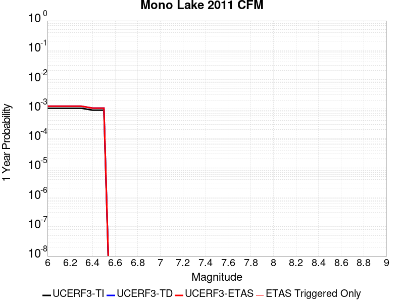 | 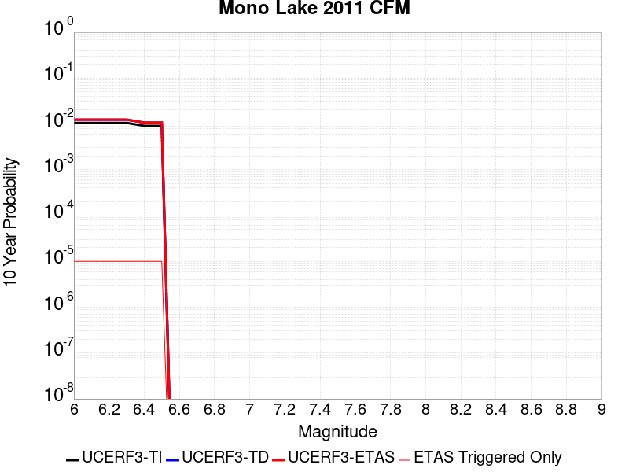 |

| Magnitude | 1 wk TI Prob | 1 wk TD Prob | 1 wk ETAS Prob | 1 wk ETAS/TD Gain | 1 wk ETAS Triggered Only | 1 mo TI Prob | 1 mo TD Prob | 1 mo ETAS Prob | 1 mo ETAS/TD Gain | 1 mo ETAS Triggered Only | 1 yr TI Prob | 1 yr TD Prob | 1 yr ETAS Prob | 1 yr ETAS/TD Gain | 1 yr ETAS Triggered Only | 10 yr TI Prob | 10 yr TD Prob | 10 yr ETAS Prob | 10 yr ETAS/TD Gain | 10 yr ETAS Triggered Only |
|-----|-----|-----|-----|-----|-----|-----|-----|-----|-----|-----|-----|-----|-----|-----|-----|-----|-----|-----|-----|-----|
| 6.0 | 2.0341662E-5 | 2.3828708E-5 | 2.3828708E-5 | 1.0 | 0.0 | 8.717564E-5 | 1.0212203E-4 | 1.0212203E-4 | 1.0 | 0.0 | 0.0010608466 | 0.0012431581 | 0.0012431581 | 1.0 | 0.0 | 0.010557966 | 0.012414116 | 0.012423992 | 1.0007955 | 1.0E-5 |
| 6.1 | 2.0341662E-5 | 2.3828708E-5 | 2.3828708E-5 | 1.0 | 0.0 | 8.717564E-5 | 1.0212203E-4 | 1.0212203E-4 | 1.0 | 0.0 | 0.0010608466 | 0.0012431581 | 0.0012431581 | 1.0 | 0.0 | 0.010557966 | 0.012414116 | 0.012423992 | 1.0007955 | 1.0E-5 |
| 6.2 | 2.0341662E-5 | 2.3828708E-5 | 2.3828708E-5 | 1.0 | 0.0 | 8.717564E-5 | 1.0212203E-4 | 1.0212203E-4 | 1.0 | 0.0 | 0.0010608466 | 0.0012431581 | 0.0012431581 | 1.0 | 0.0 | 0.010557966 | 0.012414116 | 0.012423992 | 1.0007955 | 1.0E-5 |
| 6.3 | 2.0341662E-5 | 2.3828708E-5 | 2.3828708E-5 | 1.0 | 0.0 | 8.717564E-5 | 1.0212203E-4 | 1.0212203E-4 | 1.0 | 0.0 | 0.0010608466 | 0.0012431581 | 0.0012431581 | 1.0 | 0.0 | 0.010557966 | 0.012414116 | 0.012423992 | 1.0007955 | 1.0E-5 |
| 6.4 | 1.749821E-5 | 2.049145E-5 | 2.049145E-5 | 1.0 | 0.0 | 7.499018E-5 | 8.78205E-5 | 8.78205E-5 | 1.0 | 0.0 | 9.1262296E-4 | 0.0010692145 | 0.0010692145 | 1.0 | 0.0 | 0.009088841 | 0.0106921075 | 0.010702 | 1.0009253 | 1.0E-5 |
| 6.5 | 1.749821E-5 | 2.049145E-5 | 2.049145E-5 | 1.0 | 0.0 | 7.499018E-5 | 8.78205E-5 | 8.78205E-5 | 1.0 | 0.0 | 9.1262296E-4 | 0.0010692145 | 0.0010692145 | 1.0 | 0.0 | 0.009088841 | 0.0106921075 | 0.010702 | 1.0009253 | 1.0E-5 |

## San Gorgonio Pass
*[(top)](#table-of-contents)*

| 1 Week | 1 Month | 1 Year | 10 Year |
|-----|-----|-----|-----|
| 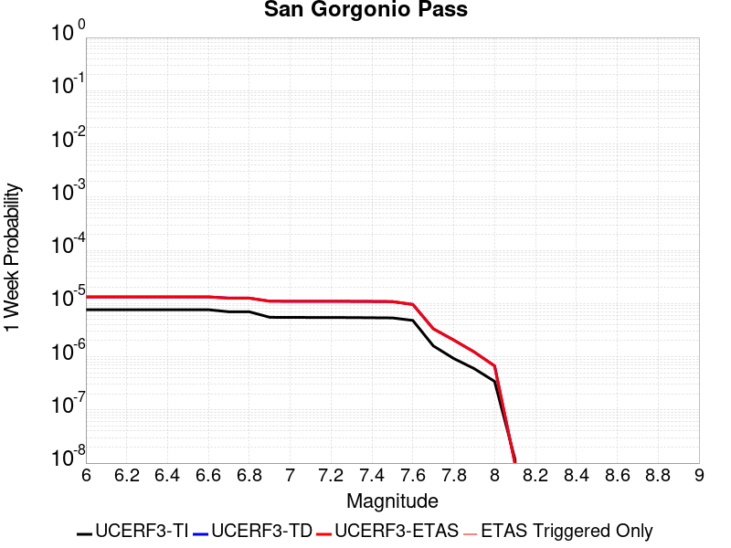 |  | 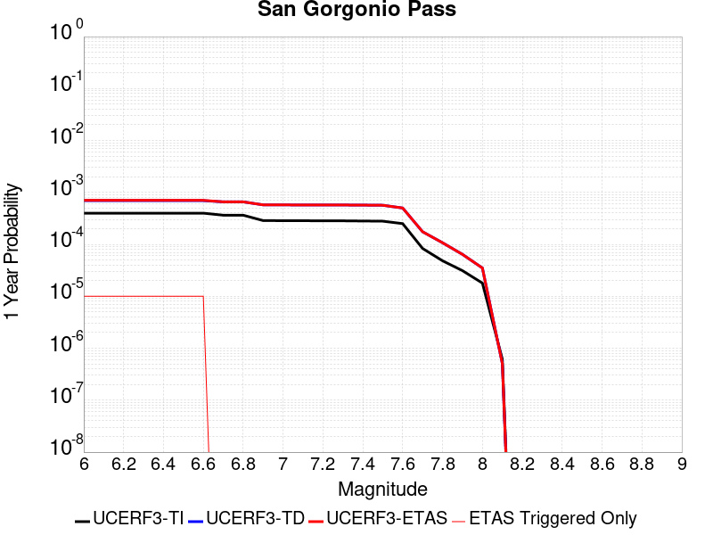 | 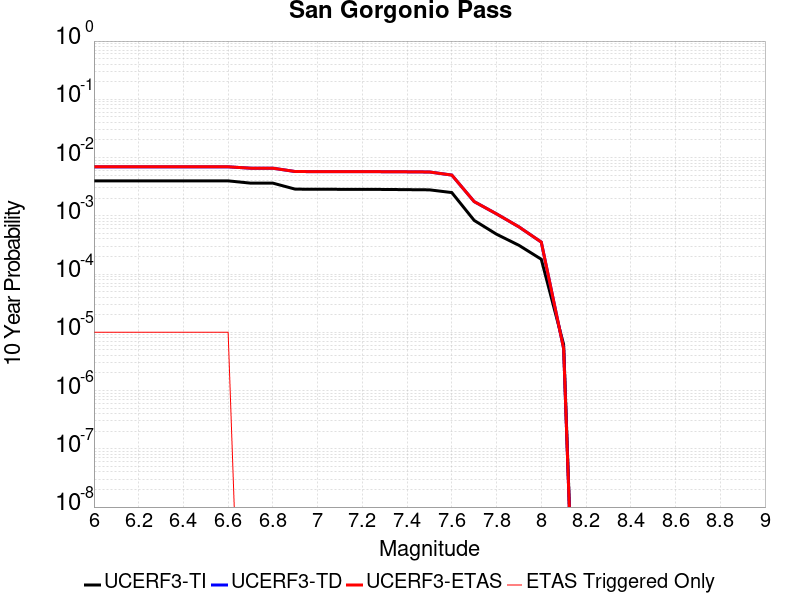 |

| Magnitude | 1 wk TI Prob | 1 wk TD Prob | 1 wk ETAS Prob | 1 wk ETAS/TD Gain | 1 wk ETAS Triggered Only | 1 mo TI Prob | 1 mo TD Prob | 1 mo ETAS Prob | 1 mo ETAS/TD Gain | 1 mo ETAS Triggered Only | 1 yr TI Prob | 1 yr TD Prob | 1 yr ETAS Prob | 1 yr ETAS/TD Gain | 1 yr ETAS Triggered Only | 10 yr TI Prob | 10 yr TD Prob | 10 yr ETAS Prob | 10 yr ETAS/TD Gain | 10 yr ETAS Triggered Only |
|-----|-----|-----|-----|-----|-----|-----|-----|-----|-----|-----|-----|-----|-----|-----|-----|-----|-----|-----|-----|-----|
| 6.0 | 7.644328E-6 | 1.33162985E-5 | 1.33162985E-5 | 1.0 | 0.0 | 3.2760996E-5 | 5.706865E-5 | 6.7068075E-5 | 1.1752175 | 1.0E-5 | 3.987921E-4 | 6.945979E-4 | 7.0459093E-4 | 1.0143868 | 1.0E-5 | 0.003980772 | 0.006931046 | 0.0069409767 | 1.0014328 | 1.0E-5 |
| 6.1 | 7.644328E-6 | 1.33162985E-5 | 1.33162985E-5 | 1.0 | 0.0 | 3.2760996E-5 | 5.706865E-5 | 6.7068075E-5 | 1.1752175 | 1.0E-5 | 3.987921E-4 | 6.945979E-4 | 7.0459093E-4 | 1.0143868 | 1.0E-5 | 0.003980772 | 0.006931046 | 0.0069409767 | 1.0014328 | 1.0E-5 |
| 6.2 | 7.644328E-6 | 1.33162985E-5 | 1.33162985E-5 | 1.0 | 0.0 | 3.2760996E-5 | 5.706865E-5 | 6.7068075E-5 | 1.1752175 | 1.0E-5 | 3.987921E-4 | 6.945979E-4 | 7.0459093E-4 | 1.0143868 | 1.0E-5 | 0.003980772 | 0.006931046 | 0.0069409767 | 1.0014328 | 1.0E-5 |
| 6.3 | 7.644328E-6 | 1.33162985E-5 | 1.33162985E-5 | 1.0 | 0.0 | 3.2760996E-5 | 5.706865E-5 | 6.7068075E-5 | 1.1752175 | 1.0E-5 | 3.987921E-4 | 6.945979E-4 | 7.0459093E-4 | 1.0143868 | 1.0E-5 | 0.003980772 | 0.006931046 | 0.0069409767 | 1.0014328 | 1.0E-5 |
| 6.4 | 7.644328E-6 | 1.33162985E-5 | 1.33162985E-5 | 1.0 | 0.0 | 3.2760996E-5 | 5.706865E-5 | 6.7068075E-5 | 1.1752175 | 1.0E-5 | 3.987921E-4 | 6.945979E-4 | 7.0459093E-4 | 1.0143868 | 1.0E-5 | 0.003980772 | 0.006931046 | 0.0069409767 | 1.0014328 | 1.0E-5 |
| 6.5 | 7.644328E-6 | 1.33162985E-5 | 1.33162985E-5 | 1.0 | 0.0 | 3.2760996E-5 | 5.706865E-5 | 6.7068075E-5 | 1.1752175 | 1.0E-5 | 3.987921E-4 | 6.945979E-4 | 7.0459093E-4 | 1.0143868 | 1.0E-5 | 0.003980772 | 0.006931046 | 0.0069409767 | 1.0014328 | 1.0E-5 |
| 6.6 | 7.644328E-6 | 1.33162985E-5 | 1.33162985E-5 | 1.0 | 0.0 | 3.2760996E-5 | 5.706865E-5 | 6.7068075E-5 | 1.1752175 | 1.0E-5 | 3.987921E-4 | 6.945979E-4 | 7.0459093E-4 | 1.0143868 | 1.0E-5 | 0.003980772 | 0.006931046 | 0.0069409767 | 1.0014328 | 1.0E-5 |
| 6.7 | 6.987586E-6 | 1.2620567E-5 | 1.2620567E-5 | 1.0 | 0.0 | 2.9946454E-5 | 5.4087068E-5 | 5.4087068E-5 | 1.0 | 0.0 | 3.645371E-4 | 6.583192E-4 | 6.583192E-4 | 1.0 | 0.0 | 0.0036393967 | 0.0065704198 | 0.0065704198 | 1.0 | 0.0 |
| 6.8 | 6.987586E-6 | 1.2620567E-5 | 1.2620567E-5 | 1.0 | 0.0 | 2.9946454E-5 | 5.4087068E-5 | 5.4087068E-5 | 1.0 | 0.0 | 3.645371E-4 | 6.583192E-4 | 6.583192E-4 | 1.0 | 0.0 | 0.0036393967 | 0.0065704198 | 0.0065704198 | 1.0 | 0.0 |
| 6.9 | 5.504702E-6 | 1.1051418E-5 | 1.1051418E-5 | 1.0 | 0.0 | 2.3591367E-5 | 4.7362388E-5 | 4.7362388E-5 | 1.0 | 0.0 | 2.8718702E-4 | 5.7648955E-4 | 5.7648955E-4 | 1.0 | 0.0 | 0.0028681618 | 0.0057563665 | 0.0057563665 | 1.0 | 0.0 |
| 7.0 | 5.4825764E-6 | 1.1027759E-5 | 1.1027759E-5 | 1.0 | 0.0 | 2.3496545E-5 | 4.7260994E-5 | 4.7260994E-5 | 1.0 | 0.0 | 2.8603288E-4 | 5.752558E-4 | 5.752558E-4 | 1.0 | 0.0 | 0.00285665 | 0.005744092 | 0.005744092 | 1.0 | 0.0 |
| 7.1 | 5.4692787E-6 | 1.1013469E-5 | 1.1013469E-5 | 1.0 | 0.0 | 2.3439556E-5 | 4.7199755E-5 | 4.7199755E-5 | 1.0 | 0.0 | 2.8533922E-4 | 5.7451054E-4 | 5.7451054E-4 | 1.0 | 0.0 | 0.0028497311 | 0.0057366784 | 0.0057366784 | 1.0 | 0.0 |
| 7.2 | 5.453661E-6 | 1.0996495E-5 | 1.0996495E-5 | 1.0 | 0.0 | 2.3372622E-5 | 4.712701E-5 | 4.712701E-5 | 1.0 | 0.0 | 2.8452452E-4 | 5.736254E-4 | 5.736254E-4 | 1.0 | 0.0 | 0.002841605 | 0.0057278727 | 0.0057278727 | 1.0 | 0.0 |
| 7.3 | 5.4422303E-6 | 1.0983417E-5 | 1.0983417E-5 | 1.0 | 0.0 | 2.3323635E-5 | 4.7070967E-5 | 4.7070967E-5 | 1.0 | 0.0 | 2.8392827E-4 | 5.729434E-4 | 5.729434E-4 | 1.0 | 0.0 | 0.0028356577 | 0.005721088 | 0.005721088 | 1.0 | 0.0 |
| 7.4 | 5.398595E-6 | 1.0930781E-5 | 1.0930781E-5 | 1.0 | 0.0 | 2.313663E-5 | 4.6845395E-5 | 4.6845395E-5 | 1.0 | 0.0 | 2.8165206E-4 | 5.7019846E-4 | 5.7019846E-4 | 1.0 | 0.0 | 0.0028129534 | 0.00569378 | 0.00569378 | 1.0 | 0.0 |
| 7.5 | 5.3578788E-6 | 1.0857324E-5 | 1.0857324E-5 | 1.0 | 0.0 | 2.2962136E-5 | 4.653059E-5 | 4.653059E-5 | 1.0 | 0.0 | 2.7952815E-4 | 5.663677E-4 | 5.663677E-4 | 1.0 | 0.0 | 0.002791768 | 0.005655692 | 0.005655692 | 1.0 | 0.0 |
| 7.6 | 4.8091474E-6 | 9.605609E-6 | 9.605609E-6 | 1.0 | 0.0 | 2.0610469E-5 | 4.1166273E-5 | 4.1166273E-5 | 1.0 | 0.0 | 2.5090357E-4 | 5.01089E-4 | 5.01089E-4 | 1.0 | 0.0 | 0.0025062046 | 0.0050062994 | 0.0050062994 | 1.0 | 0.0 |
| 7.7 | 1.5991155E-6 | 3.3539093E-6 | 3.3539093E-6 | 1.0 | 0.0 | 6.853334E-6 | 1.4373819E-5 | 1.4373819E-5 | 1.0 | 0.0 | 8.343615E-5 | 1.7498745E-4 | 1.7498745E-4 | 1.0 | 0.0 | 8.340483E-4 | 0.0017539478 | 0.0017539478 | 1.0 | 0.0 |
| 7.8 | 9.258398E-7 | 2.0587727E-6 | 2.0587727E-6 | 1.0 | 0.0 | 3.967879E-6 | 8.823282E-6 | 8.823282E-6 | 1.0 | 0.0 | 4.8307855E-5 | 1.07418186E-4 | 1.07418186E-4 | 1.0 | 0.0 | 4.8297356E-4 | 0.0010790897 | 0.0010790897 | 1.0 | 0.0 |
| 7.9 | 5.975575E-7 | 1.2297422E-6 | 1.2297422E-6 | 1.0 | 0.0 | 2.5609581E-6 | 5.2703135E-6 | 5.2703135E-6 | 1.0 | 0.0 | 3.117922E-5 | 6.416419E-5 | 6.416419E-5 | 1.0 | 0.0 | 3.1174847E-4 | 6.466005E-4 | 6.466005E-4 | 1.0 | 0.0 |
| 8.0 | 3.4413725E-7 | 6.718214E-7 | 6.718214E-7 | 1.0 | 0.0 | 1.4748731E-6 | 2.8792315E-6 | 2.8792315E-6 | 1.0 | 0.0 | 1.7956432E-5 | 3.5054083E-5 | 3.5054083E-5 | 1.0 | 0.0 | 1.7954981E-4 | 3.5391308E-4 | 3.5391308E-4 | 1.0 | 0.0 |
| 8.1 | 1.1787731E-8 | 9.643016E-9 | 9.643016E-9 | 1.0 | 0.0 | 5.0518846E-8 | 4.1327212E-8 | 4.1327212E-8 | 1.0 | 0.0 | 6.1506677E-7 | 5.031587E-7 | 5.031587E-7 | 1.0 | 0.0 | 6.1506507E-6 | 5.247088E-6 | 5.247088E-6 | 1.0 | 0.0 |

## Whittier alt 1
*[(top)](#table-of-contents)*

| 1 Week | 1 Month | 1 Year | 10 Year |
|-----|-----|-----|-----|
|  |  | 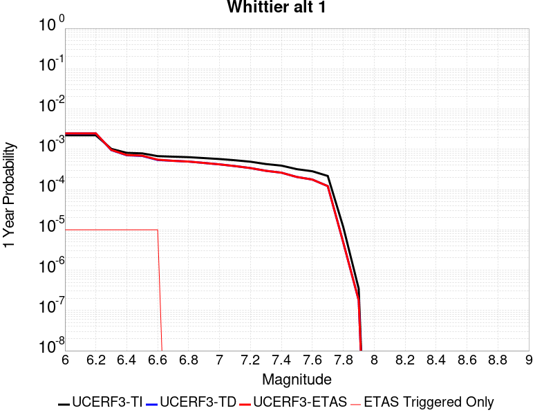 | 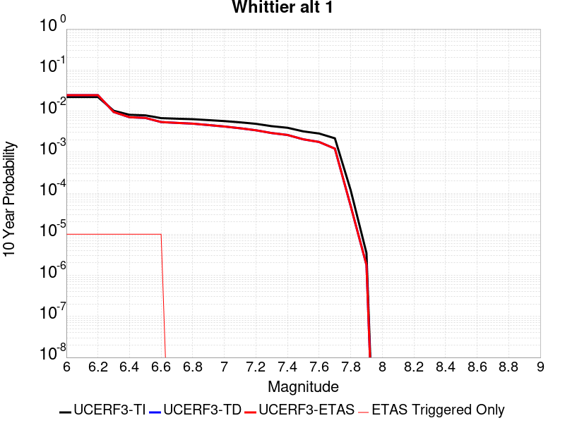 |

| Magnitude | 1 wk TI Prob | 1 wk TD Prob | 1 wk ETAS Prob | 1 wk ETAS/TD Gain | 1 wk ETAS Triggered Only | 1 mo TI Prob | 1 mo TD Prob | 1 mo ETAS Prob | 1 mo ETAS/TD Gain | 1 mo ETAS Triggered Only | 1 yr TI Prob | 1 yr TD Prob | 1 yr ETAS Prob | 1 yr ETAS/TD Gain | 1 yr ETAS Triggered Only | 10 yr TI Prob | 10 yr TD Prob | 10 yr ETAS Prob | 10 yr ETAS/TD Gain | 10 yr ETAS Triggered Only |
|-----|-----|-----|-----|-----|-----|-----|-----|-----|-----|-----|-----|-----|-----|-----|-----|-----|-----|-----|-----|-----|
| 6.0 | 4.2554693E-5 | 4.7253463E-5 | 5.725299E-5 | 1.2116147 | 1.0E-5 | 1.8236451E-4 | 2.0250095E-4 | 2.1249891E-4 | 1.0493724 | 1.0E-5 | 0.002218027 | 0.0024629822 | 0.0024729574 | 1.0040501 | 1.0E-5 | 0.02196019 | 0.02439089 | 0.024400644 | 1.0004 | 1.0E-5 |
| 6.1 | 4.2554693E-5 | 4.7253463E-5 | 5.725299E-5 | 1.2116147 | 1.0E-5 | 1.8236451E-4 | 2.0250095E-4 | 2.1249891E-4 | 1.0493724 | 1.0E-5 | 0.002218027 | 0.0024629822 | 0.0024729574 | 1.0040501 | 1.0E-5 | 0.02196019 | 0.02439089 | 0.024400644 | 1.0004 | 1.0E-5 |
| 6.2 | 4.2554693E-5 | 4.7253463E-5 | 5.725299E-5 | 1.2116147 | 1.0E-5 | 1.8236451E-4 | 2.0250095E-4 | 2.1249891E-4 | 1.0493724 | 1.0E-5 | 0.002218027 | 0.0024629822 | 0.0024729574 | 1.0040501 | 1.0E-5 | 0.02196019 | 0.02439089 | 0.024400644 | 1.0004 | 1.0E-5 |
| 6.3 | 1.9617712E-5 | 1.8269313E-5 | 2.826913E-5 | 1.5473559 | 1.0E-5 | 8.40732E-5 | 7.829482E-5 | 8.829404E-5 | 1.1277124 | 1.0E-5 | 0.0010231105 | 9.528416E-4 | 9.6283207E-4 | 1.0104849 | 1.0E-5 | 0.01018413 | 0.009490847 | 0.009500752 | 1.0010437 | 1.0E-5 |
| 6.4 | 1.5611336E-5 | 1.3604893E-5 | 2.3604756E-5 | 1.7350197 | 1.0E-5 | 6.690401E-5 | 5.8305417E-5 | 6.8304835E-5 | 1.1715007 | 1.0E-5 | 8.142519E-4 | 7.0964324E-4 | 7.196361E-4 | 1.0140816 | 1.0E-5 | 0.008112748 | 0.0070757363 | 0.0070856656 | 1.0014033 | 1.0E-5 |
| 6.5 | 1.5150166E-5 | 1.3101541E-5 | 2.3101411E-5 | 1.7632589 | 1.0E-5 | 6.492767E-5 | 5.614829E-5 | 6.6147724E-5 | 1.1780899 | 1.0E-5 | 7.9020765E-4 | 6.833969E-4 | 6.9339003E-4 | 1.0146228 | 1.0E-5 | 0.007874036 | 0.0068149036 | 0.006824835 | 1.0014573 | 1.0E-5 |
| 6.6 | 1.295588E-5 | 1.0381249E-5 | 2.0381145E-5 | 1.9632652 | 1.0E-5 | 5.552402E-5 | 4.449032E-5 | 5.4489876E-5 | 1.224758 | 1.0E-5 | 6.7579525E-4 | 5.4153695E-4 | 5.5153156E-4 | 1.018456 | 1.0E-5 | 0.006737438 | 0.005403607 | 0.005413553 | 1.0018406 | 1.0E-5 |
| 6.7 | 1.2542085E-5 | 9.899882E-6 | 9.899882E-6 | 1.0 | 0.0 | 5.3750682E-5 | 4.2427386E-5 | 4.2427386E-5 | 1.0 | 0.0 | 6.542181E-4 | 5.1643286E-4 | 5.1643286E-4 | 1.0 | 0.0 | 0.006522954 | 0.0051537454 | 0.0051537454 | 1.0 | 0.0 |
| 6.8 | 1.2195878E-5 | 9.495912E-6 | 9.495912E-6 | 1.0 | 0.0 | 5.2267E-5 | 4.0696144E-5 | 4.0696144E-5 | 1.0 | 0.0 | 6.36165E-4 | 4.953648E-4 | 4.953648E-4 | 1.0 | 0.0 | 0.0063434686 | 0.0049439464 | 0.0049439464 | 1.0 | 0.0 |
| 6.9 | 1.1580298E-5 | 8.773408E-6 | 8.773408E-6 | 1.0 | 0.0 | 4.9628903E-5 | 3.7599788E-5 | 3.7599788E-5 | 1.0 | 0.0 | 6.040644E-4 | 4.576829E-4 | 4.576829E-4 | 1.0 | 0.0 | 0.00602425 | 0.0045686625 | 0.0045686625 | 1.0 | 0.0 |
| 7.0 | 1.0964795E-5 | 8.084448E-6 | 8.084448E-6 | 1.0 | 0.0 | 4.6991136E-5 | 3.4647182E-5 | 3.4647182E-5 | 1.0 | 0.0 | 5.7196687E-4 | 4.2174934E-4 | 4.2174934E-4 | 1.0 | 0.0 | 0.0057049696 | 0.004210698 | 0.004210698 | 1.0 | 0.0 |
| 7.1 | 1.0230601E-5 | 7.3269985E-6 | 7.3269985E-6 | 1.0 | 0.0 | 4.3844695E-5 | 3.140105E-5 | 3.140105E-5 | 1.0 | 0.0 | 5.336784E-4 | 3.8224205E-4 | 3.8224205E-4 | 1.0 | 0.0 | 0.005323986 | 0.0038170093 | 0.0038170093 | 1.0 | 0.0 |
| 7.2 | 9.40865E-6 | 6.5435725E-6 | 6.5435725E-6 | 1.0 | 0.0 | 4.032216E-5 | 2.8043587E-5 | 2.8043587E-5 | 1.0 | 0.0 | 4.908117E-4 | 3.413784E-4 | 3.413784E-4 | 1.0 | 0.0 | 0.0048972913 | 0.0034096325 | 0.0034096325 | 1.0 | 0.0 |
| 7.3 | 8.237384E-6 | 5.5979945E-6 | 5.5979945E-6 | 1.0 | 0.0 | 3.5302593E-5 | 2.399119E-5 | 2.399119E-5 | 1.0 | 0.0 | 4.2972428E-4 | 2.9205464E-4 | 2.9205464E-4 | 1.0 | 0.0 | 0.0042889426 | 0.002917029 | 0.002917029 | 1.0 | 0.0 |
| 7.4 | 7.5316966E-6 | 5.0280382E-6 | 5.0280382E-6 | 1.0 | 0.0 | 3.2278298E-5 | 2.1548563E-5 | 2.1548563E-5 | 1.0 | 0.0 | 3.9291743E-4 | 2.6232318E-4 | 2.6232318E-4 | 1.0 | 0.0 | 0.0039222343 | 0.0026202472 | 0.0026202472 | 1.0 | 0.0 |
| 7.5 | 6.149649E-6 | 3.934013E-6 | 3.934013E-6 | 1.0 | 0.0 | 2.6355372E-5 | 1.685995E-5 | 1.685995E-5 | 1.0 | 0.0 | 3.208294E-4 | 2.0525148E-4 | 2.0525148E-4 | 1.0 | 0.0 | 0.003203666 | 0.0020507083 | 0.0020507083 | 1.0 | 0.0 |
| 7.6 | 5.457711E-6 | 3.395529E-6 | 3.395529E-6 | 1.0 | 0.0 | 2.338998E-5 | 1.4552191E-5 | 1.4552191E-5 | 1.0 | 0.0 | 2.8473578E-4 | 1.7715934E-4 | 1.7715934E-4 | 1.0 | 0.0 | 0.0028437122 | 0.0017702618 | 0.0017702618 | 1.0 | 0.0 |
| 7.7 | 4.1676276E-6 | 2.3333084E-6 | 2.3333084E-6 | 1.0 | 0.0 | 1.7861139E-5 | 9.99986E-6 | 9.99986E-6 | 1.0 | 0.0 | 2.1743766E-4 | 1.2174223E-4 | 1.2174223E-4 | 1.0 | 0.0 | 0.0021722503 | 0.0012168285 | 0.0012168285 | 1.0 | 0.0 |
| 7.8 | 2.2692414E-7 | 9.385943E-8 | 9.385943E-8 | 1.0 | 0.0 | 9.725317E-7 | 4.0225464E-7 | 4.0225464E-7 | 1.0 | 0.0 | 1.1840509E-5 | 4.8974425E-6 | 4.8974425E-6 | 1.0 | 0.0 | 1.1839878E-4 | 4.8973674E-5 | 4.8973674E-5 | 1.0 | 0.0 |
| 7.9 | 6.676829E-9 | 3.4399772E-9 | 3.4399772E-9 | 1.0 | 0.0 | 2.861498E-8 | 1.4742759E-8 | 1.4742759E-8 | 1.0 | 0.0 | 3.4838732E-7 | 1.7949307E-7 | 1.7949307E-7 | 1.0 | 0.0 | 3.4838679E-6 | 1.7949295E-6 | 1.7949295E-6 | 1.0 | 0.0 |

## Superstition Hills
*[(top)](#table-of-contents)*

| 1 Week | 1 Month | 1 Year | 10 Year |
|-----|-----|-----|-----|
| 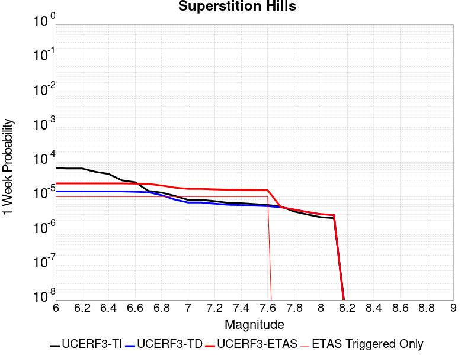 | 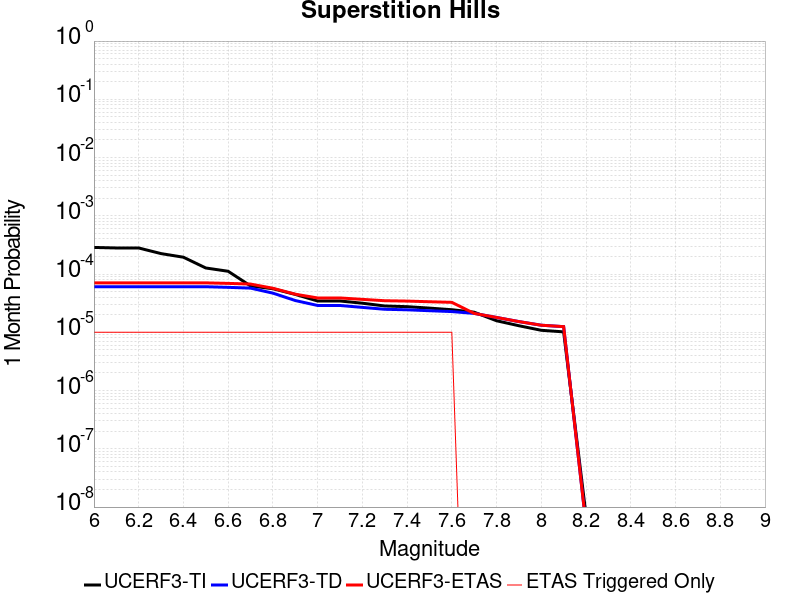 | 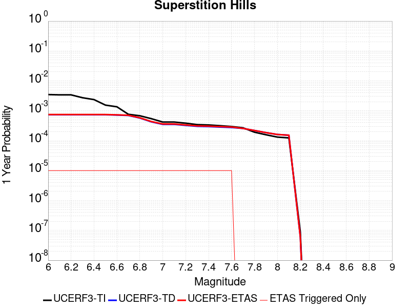 | 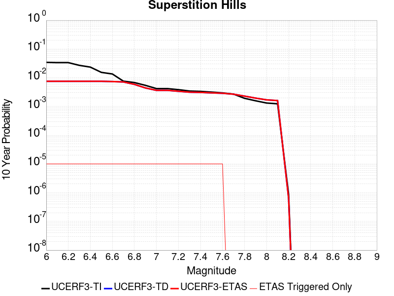 |

| Magnitude | 1 wk TI Prob | 1 wk TD Prob | 1 wk ETAS Prob | 1 wk ETAS/TD Gain | 1 wk ETAS Triggered Only | 1 mo TI Prob | 1 mo TD Prob | 1 mo ETAS Prob | 1 mo ETAS/TD Gain | 1 mo ETAS Triggered Only | 1 yr TI Prob | 1 yr TD Prob | 1 yr ETAS Prob | 1 yr ETAS/TD Gain | 1 yr ETAS Triggered Only | 10 yr TI Prob | 10 yr TD Prob | 10 yr ETAS Prob | 10 yr ETAS/TD Gain | 10 yr ETAS Triggered Only |
|-----|-----|-----|-----|-----|-----|-----|-----|-----|-----|-----|-----|-----|-----|-----|-----|-----|-----|-----|-----|-----|
| 6.0 | 6.6865185E-5 | 1.4140716E-5 | 2.4140574E-5 | 1.7071677 | 1.0E-5 | 2.8653358E-4 | 6.0601753E-5 | 7.060115E-5 | 1.1650017 | 1.0E-5 | 0.0034829667 | 7.3759275E-4 | 7.475854E-4 | 1.0135477 | 1.0E-5 | 0.03428881 | 0.0075219767 | 0.0075319014 | 1.0013194 | 1.0E-5 |
| 6.1 | 6.544851E-5 | 1.4140715E-5 | 2.4140574E-5 | 1.7071677 | 1.0E-5 | 2.8046346E-4 | 6.0601753E-5 | 7.060115E-5 | 1.1650017 | 1.0E-5 | 0.0034092965 | 7.3759275E-4 | 7.475854E-4 | 1.0135477 | 1.0E-5 | 0.033574644 | 0.007521976 | 0.007531901 | 1.0013194 | 1.0E-5 |
| 6.2 | 6.544851E-5 | 1.4140715E-5 | 2.4140574E-5 | 1.7071677 | 1.0E-5 | 2.8046346E-4 | 6.0601753E-5 | 7.060115E-5 | 1.1650017 | 1.0E-5 | 0.0034092965 | 7.3759275E-4 | 7.475854E-4 | 1.0135477 | 1.0E-5 | 0.033574644 | 0.007521976 | 0.007531901 | 1.0013194 | 1.0E-5 |
| 6.3 | 5.2402065E-5 | 1.41407145E-5 | 2.4140572E-5 | 1.7071679 | 1.0E-5 | 2.2456095E-4 | 6.0601746E-5 | 7.060114E-5 | 1.1650017 | 1.0E-5 | 0.0027306017 | 7.375927E-4 | 7.475853E-4 | 1.0135477 | 1.0E-5 | 0.02697292 | 0.0075219707 | 0.0075318953 | 1.0013194 | 1.0E-5 |
| 6.4 | 4.542238E-5 | 1.4140714E-5 | 2.4140572E-5 | 1.7071679 | 1.0E-5 | 1.9465282E-4 | 6.0601742E-5 | 7.0601134E-5 | 1.1650017 | 1.0E-5 | 0.0023673223 | 7.3759264E-4 | 7.4758526E-4 | 1.0135477 | 1.0E-5 | 0.023422617 | 0.007521968 | 0.0075318925 | 1.0013194 | 1.0E-5 |
| 6.5 | 2.9672969E-5 | 1.4140713E-5 | 2.414057E-5 | 1.707168 | 1.0E-5 | 1.2716366E-4 | 6.060174E-5 | 7.0601134E-5 | 1.1650017 | 1.0E-5 | 0.0015471181 | 7.375926E-4 | 7.475852E-4 | 1.0135477 | 1.0E-5 | 0.015363912 | 0.0075219613 | 0.007531886 | 1.0013194 | 1.0E-5 |
| 6.6 | 2.6056105E-5 | 1.3806452E-5 | 2.3806315E-5 | 1.7242891 | 1.0E-5 | 1.1166424E-4 | 5.916926E-5 | 6.9168666E-5 | 1.1689967 | 1.0E-5 | 0.0013586642 | 7.201637E-4 | 7.301565E-4 | 1.0138757 | 1.0E-5 | 0.013503874 | 0.007346386 | 0.0073563126 | 1.0013512 | 1.0E-5 |
| 6.7 | 1.4611248E-5 | 1.3386336E-5 | 2.3386203E-5 | 1.7470204 | 1.0E-5 | 6.261813E-5 | 5.736884E-5 | 6.7368266E-5 | 1.1743007 | 1.0E-5 | 7.6210906E-4 | 6.9825776E-4 | 7.0825074E-4 | 1.0143113 | 1.0E-5 | 0.0075950073 | 0.007127569 | 0.007137498 | 1.001393 | 1.0E-5 |
| 6.8 | 1.30607E-5 | 1.0981634E-5 | 2.0981524E-5 | 1.9106014 | 1.0E-5 | 5.597323E-5 | 4.7063342E-5 | 5.7062873E-5 | 1.2124696 | 1.0E-5 | 6.8126095E-4 | 5.728543E-4 | 5.8284856E-4 | 1.0174464 | 1.0E-5 | 0.006791762 | 0.005875862 | 0.0058858036 | 1.0016919 | 1.0E-5 |
| 6.9 | 1.0443096E-5 | 8.197917E-6 | 1.8197836E-5 | 2.219812 | 1.0E-5 | 4.4755358E-5 | 3.513347E-5 | 4.513312E-5 | 1.2846189 | 1.0E-5 | 5.447602E-4 | 4.2766842E-4 | 4.3766413E-4 | 1.0233727 | 1.0E-5 | 0.005434267 | 0.004410797 | 0.0044207526 | 1.0022571 | 1.0E-5 |
| 7.0 | 8.045912E-6 | 6.742015E-6 | 1.6741948E-5 | 2.483226 | 1.0E-5 | 3.4482026E-5 | 2.8894035E-5 | 3.8893748E-5 | 1.3460822 | 1.0E-5 | 4.197378E-4 | 3.5172913E-4 | 3.617256E-4 | 1.0284209 | 1.0E-5 | 0.0041894587 | 0.003634624 | 0.0036445877 | 1.0027413 | 1.0E-5 |
| 7.1 | 8.045912E-6 | 6.742015E-6 | 1.6741948E-5 | 2.483226 | 1.0E-5 | 3.4482026E-5 | 2.8894035E-5 | 3.8893748E-5 | 1.3460822 | 1.0E-5 | 4.197378E-4 | 3.5172913E-4 | 3.617256E-4 | 1.0284209 | 1.0E-5 | 0.0041894587 | 0.003634624 | 0.0036445877 | 1.0027413 | 1.0E-5 |
| 7.2 | 7.375506E-6 | 6.2489075E-6 | 1.6248845E-5 | 2.6002698 | 1.0E-5 | 3.1608928E-5 | 2.6780763E-5 | 3.6780493E-5 | 1.3733923 | 1.0E-5 | 3.8477074E-4 | 3.2600787E-4 | 3.360046E-4 | 1.0306641 | 1.0E-5 | 0.003841052 | 0.0033750783 | 0.0033850446 | 1.0029529 | 1.0E-5 |
| 7.3 | 6.6063913E-6 | 5.8012956E-6 | 1.5801237E-5 | 2.723743 | 1.0E-5 | 2.8312797E-5 | 2.4862462E-5 | 3.4862212E-5 | 1.4022027 | 1.0E-5 | 3.446538E-4 | 3.0265914E-4 | 3.1265614E-4 | 1.0330305 | 1.0E-5 | 0.0034411973 | 0.0031393243 | 0.0031492927 | 1.0031754 | 1.0E-5 |
| 7.4 | 6.4313126E-6 | 5.6827116E-6 | 1.5682655E-5 | 2.7597134 | 1.0E-5 | 2.7562477E-5 | 2.4354254E-5 | 3.4354012E-5 | 1.4105959 | 1.0E-5 | 3.355215E-4 | 2.964734E-4 | 3.0647044E-4 | 1.0337199 | 1.0E-5 | 0.0033501536 | 0.003077082 | 0.0030870514 | 1.0032399 | 1.0E-5 |
| 7.5 | 6.0742927E-6 | 5.478511E-6 | 1.5478456E-5 | 2.8253036 | 1.0E-5 | 2.6032423E-5 | 2.3479126E-5 | 3.347889E-5 | 1.4259002 | 1.0E-5 | 3.1689866E-4 | 2.8582153E-4 | 2.9581867E-4 | 1.0349768 | 1.0E-5 | 0.0031644711 | 0.0029689074 | 0.0029788776 | 1.0033582 | 1.0E-5 |
| 7.6 | 5.6987187E-6 | 5.2966907E-6 | 1.5296639E-5 | 2.8879611 | 1.0E-5 | 2.4422852E-5 | 2.269991E-5 | 3.269968E-5 | 1.4405204 | 1.0E-5 | 2.9730765E-4 | 2.76337E-4 | 2.8633425E-4 | 1.0361778 | 1.0E-5 | 0.002969102 | 0.0028721471 | 0.0028821183 | 1.0034717 | 1.0E-5 |
| 7.7 | 5.1658035E-6 | 4.9276673E-6 | 4.9276673E-6 | 1.0 | 0.0 | 2.2138971E-5 | 2.1118407E-5 | 2.1118407E-5 | 1.0 | 0.0 | 2.6950863E-4 | 2.5708685E-4 | 2.5708685E-4 | 1.0 | 0.0 | 0.00269182 | 0.002677178 | 0.002677178 | 1.0 | 0.0 |
| 7.8 | 3.6864697E-6 | 4.198542E-6 | 4.198542E-6 | 1.0 | 0.0 | 1.579906E-5 | 1.7993629E-5 | 1.7993629E-5 | 1.0 | 0.0 | 1.9233658E-4 | 2.1905087E-4 | 2.1905087E-4 | 1.0 | 0.0 | 0.0019217018 | 0.0022903313 | 0.0022903313 | 1.0 | 0.0 |
| 7.9 | 3.0265903E-6 | 3.565613E-6 | 3.565613E-6 | 1.0 | 0.0 | 1.2971037E-5 | 1.5281112E-5 | 1.5281112E-5 | 1.0 | 0.0 | 1.5791094E-4 | 1.8603209E-4 | 1.8603209E-4 | 1.0 | 0.0 | 0.0015779877 | 0.0019544594 | 0.0019544594 | 1.0 | 0.0 |
| 8.0 | 2.5271493E-6 | 3.0884585E-6 | 3.0884585E-6 | 1.0 | 0.0 | 1.0830595E-5 | 1.3236186E-5 | 1.3236186E-5 | 1.0 | 0.0 | 1.3185451E-4 | 1.6113906E-4 | 1.6113906E-4 | 1.0 | 0.0 | 0.0013177631 | 0.0016982564 | 0.0016982564 | 1.0 | 0.0 |
| 8.1 | 2.3749135E-6 | 2.919021E-6 | 2.919021E-6 | 1.0 | 0.0 | 1.0178161E-5 | 1.2510032E-5 | 1.2510032E-5 | 1.0 | 0.0 | 1.2391206E-4 | 1.5229941E-4 | 1.5229941E-4 | 1.0 | 0.0 | 0.0012384299 | 0.0016058089 | 0.0016058089 | 1.0 | 0.0 |
| 8.2 | 1.7186406E-9 | 1.1449343E-9 | 1.1449343E-9 | 1.0 | 0.0 | 7.3656024E-9 | 4.906861E-9 | 4.906861E-9 | 1.0 | 0.0 | 8.9676206E-8 | 5.974103E-8 | 5.974103E-8 | 1.0 | 0.0 | 8.9676166E-7 | 6.393774E-7 | 6.393774E-7 | 1.0 | 0.0 |

## Hunting Creek - Berryessa 2011 CFM
*[(top)](#table-of-contents)*

| 1 Week | 1 Month | 1 Year | 10 Year |
|-----|-----|-----|-----|
| 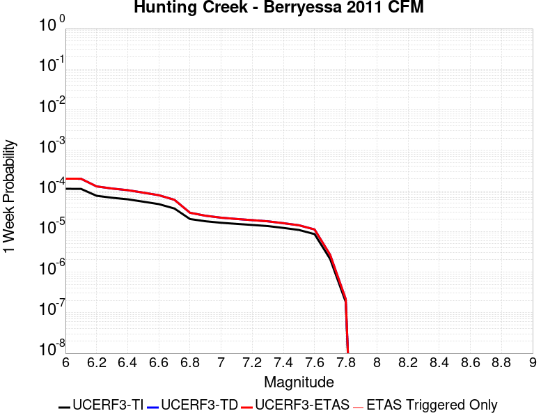 |  | 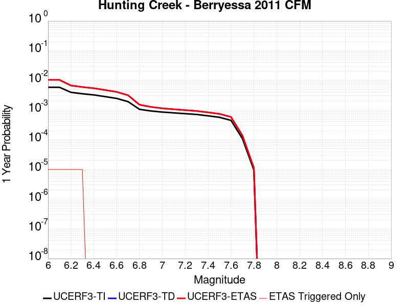 |  |

| Magnitude | 1 wk TI Prob | 1 wk TD Prob | 1 wk ETAS Prob | 1 wk ETAS/TD Gain | 1 wk ETAS Triggered Only | 1 mo TI Prob | 1 mo TD Prob | 1 mo ETAS Prob | 1 mo ETAS/TD Gain | 1 mo ETAS Triggered Only | 1 yr TI Prob | 1 yr TD Prob | 1 yr ETAS Prob | 1 yr ETAS/TD Gain | 1 yr ETAS Triggered Only | 10 yr TI Prob | 10 yr TD Prob | 10 yr ETAS Prob | 10 yr ETAS/TD Gain | 10 yr ETAS Triggered Only |
|-----|-----|-----|-----|-----|-----|-----|-----|-----|-----|-----|-----|-----|-----|-----|-----|-----|-----|-----|-----|-----|
| 6.0 | 1.1270982E-4 | 2.0014354E-4 | 2.0014354E-4 | 1.0 | 0.0 | 4.8295266E-4 | 8.574329E-4 | 8.574329E-4 | 1.0 | 0.0 | 0.0058641075 | 0.010387073 | 0.0103969695 | 1.0009527 | 1.0E-5 | 0.057117578 | 0.09804065 | 0.09804967 | 1.000092 | 1.0E-5 |
| 6.1 | 1.1239393E-4 | 1.9962489E-4 | 1.9962489E-4 | 1.0 | 0.0 | 4.8159933E-4 | 8.552116E-4 | 8.552116E-4 | 1.0 | 0.0 | 0.0058477195 | 0.010360309 | 0.010370206 | 1.0009552 | 1.0E-5 | 0.056962132 | 0.09779912 | 0.097808145 | 1.0000923 | 1.0E-5 |
| 6.2 | 7.596265E-5 | 1.2941175E-4 | 1.2941175E-4 | 1.0 | 0.0 | 3.2551357E-4 | 5.544276E-4 | 5.544276E-4 | 1.0 | 0.0 | 0.0039559277 | 0.0067212153 | 0.006731148 | 1.0014778 | 1.0E-5 | 0.038862433 | 0.0645938 | 0.06460315 | 1.0001448 | 1.0E-5 |
| 6.3 | 6.78794E-5 | 1.145196E-4 | 1.145196E-4 | 1.0 | 0.0 | 2.9087928E-4 | 4.9066654E-4 | 4.9066654E-4 | 1.0 | 0.0 | 0.003535705 | 0.0059528556 | 0.005962796 | 1.0016699 | 1.0E-5 | 0.034799766 | 0.05746746 | 0.057476886 | 1.000164 | 1.0E-5 |
| 6.4 | 6.2165134E-5 | 1.0437306E-4 | 1.0437306E-4 | 1.0 | 0.0 | 2.6639478E-4 | 4.4723987E-4 | 4.4723987E-4 | 1.0 | 0.0 | 0.0032385332 | 0.005427739 | 0.005427739 | 1.0 | 0.0 | 0.03191742 | 0.052552443 | 0.052552443 | 1.0 | 0.0 |
| 6.5 | 5.4368087E-5 | 9.071981E-5 | 9.071981E-5 | 1.0 | 0.0 | 2.3298527E-4 | 3.887444E-4 | 3.887444E-4 | 1.0 | 0.0 | 0.0028329059 | 0.004720021 | 0.004720021 | 1.0 | 0.0 | 0.027970633 | 0.045881823 | 0.045881823 | 1.0 | 0.0 |
| 6.6 | 4.729947E-5 | 7.848042E-5 | 7.848042E-5 | 1.0 | 0.0 | 2.0269625E-4 | 3.363043E-4 | 3.363043E-4 | 1.0 | 0.0 | 0.002465034 | 0.0040850975 | 0.0040850975 | 1.0 | 0.0 | 0.02437869 | 0.039853033 | 0.039853033 | 1.0 | 0.0 |
| 6.7 | 3.6875328E-5 | 6.0455113E-5 | 6.0455113E-5 | 1.0 | 0.0 | 1.5802756E-4 | 2.5907016E-4 | 2.5907016E-4 | 1.0 | 0.0 | 0.0019222875 | 0.0031483201 | 0.0031483201 | 1.0 | 0.0 | 0.019057442 | 0.030893533 | 0.030893533 | 1.0 | 0.0 |
| 6.8 | 2.0292036E-5 | 2.897696E-5 | 2.897696E-5 | 1.0 | 0.0 | 8.6962966E-5 | 1.241811E-4 | 1.241811E-4 | 1.0 | 0.0 | 0.0010582599 | 0.00151084 | 0.00151084 | 1.0 | 0.0 | 0.010532344 | 0.014978847 | 0.014978847 | 1.0 | 0.0 |
| 6.9 | 1.7871042E-5 | 2.4472789E-5 | 2.4472789E-5 | 1.0 | 0.0 | 7.658793E-5 | 1.048792E-4 | 1.048792E-4 | 1.0 | 0.0 | 9.320591E-4 | 0.0012761577 | 0.0012761577 | 1.0 | 0.0 | 0.009281595 | 0.012680048 | 0.012680048 | 1.0 | 0.0 |
| 7.0 | 1.6415532E-5 | 2.1906764E-5 | 2.1906764E-5 | 1.0 | 0.0 | 7.035038E-5 | 9.388277E-5 | 9.388277E-5 | 1.0 | 0.0 | 8.561793E-4 | 0.0011424269 | 0.0011424269 | 1.0 | 0.0 | 0.008528882 | 0.011364769 | 0.011364769 | 1.0 | 0.0 |
| 7.1 | 1.5409885E-5 | 2.03468E-5 | 2.03468E-5 | 1.0 | 0.0 | 6.6040695E-5 | 8.719768E-5 | 8.719768E-5 | 1.0 | 0.0 | 8.0374884E-4 | 0.0010611176 | 0.0010611176 | 1.0 | 0.0 | 0.00800848 | 0.010560832 | 0.010560832 | 1.0 | 0.0 |
| 7.2 | 1.4497423E-5 | 1.905539E-5 | 1.905539E-5 | 1.0 | 0.0 | 6.213033E-5 | 8.166341E-5 | 8.166341E-5 | 1.0 | 0.0 | 7.5617427E-4 | 9.938016E-4 | 9.938016E-4 | 1.0 | 0.0 | 0.0075360634 | 0.009894148 | 0.009894148 | 1.0 | 0.0 |
| 7.3 | 1.3615175E-5 | 1.7826538E-5 | 1.7826538E-5 | 1.0 | 0.0 | 5.8349444E-5 | 7.639723E-5 | 7.639723E-5 | 1.0 | 0.0 | 7.101729E-4 | 9.2974224E-4 | 9.2974224E-4 | 1.0 | 0.0 | 0.0070790765 | 0.009259034 | 0.009259034 | 1.0 | 0.0 |
| 7.4 | 1.2252825E-5 | 1.6026612E-5 | 1.6026612E-5 | 1.0 | 0.0 | 5.251105E-5 | 6.868369E-5 | 6.868369E-5 | 1.0 | 0.0 | 6.391345E-4 | 8.359059E-4 | 8.359059E-4 | 1.0 | 0.0 | 0.0063729943 | 0.008328059 | 0.008328059 | 1.0 | 0.0 |
| 7.5 | 1.0913301E-5 | 1.4241439E-5 | 1.4241439E-5 | 1.0 | 0.0 | 4.6770452E-5 | 6.103333E-5 | 6.103333E-5 | 1.0 | 0.0 | 5.6928146E-4 | 7.4283016E-4 | 7.4283016E-4 | 1.0 | 0.0 | 0.0056782532 | 0.0074038464 | 0.0074038464 | 1.0 | 0.0 |
| 7.6 | 8.623192E-6 | 1.1234897E-5 | 1.1234897E-5 | 1.0 | 0.0 | 3.6956015E-5 | 4.8148686E-5 | 4.8148686E-5 | 1.0 | 0.0 | 4.4984656E-4 | 5.860551E-4 | 5.860551E-4 | 1.0 | 0.0 | 0.00448937 | 0.0058454107 | 0.0058454107 | 1.0 | 0.0 |
| 7.7 | 2.0993634E-6 | 2.6626365E-6 | 2.6626365E-6 | 1.0 | 0.0 | 8.997241E-6 | 1.141125E-5 | 1.141125E-5 | 1.0 | 0.0 | 1.09535904E-4 | 1.3892318E-4 | 1.3892318E-4 | 1.0 | 0.0 | 0.0010948193 | 0.0013883698 | 0.0013883698 | 1.0 | 0.0 |
| 7.8 | 1.8428308E-7 | 2.167475E-7 | 2.167475E-7 | 1.0 | 0.0 | 7.897844E-7 | 9.2891753E-7 | 9.2891753E-7 | 1.0 | 0.0 | 9.615583E-6 | 1.1309516E-5 | 1.1309516E-5 | 1.0 | 0.0 | 9.615166E-5 | 1.13088005E-4 | 1.13088005E-4 | 1.0 | 0.0 |

## Earthquake Valley (So Extension)
*[(top)](#table-of-contents)*

| 1 Week | 1 Month | 1 Year | 10 Year |
|-----|-----|-----|-----|
|  | 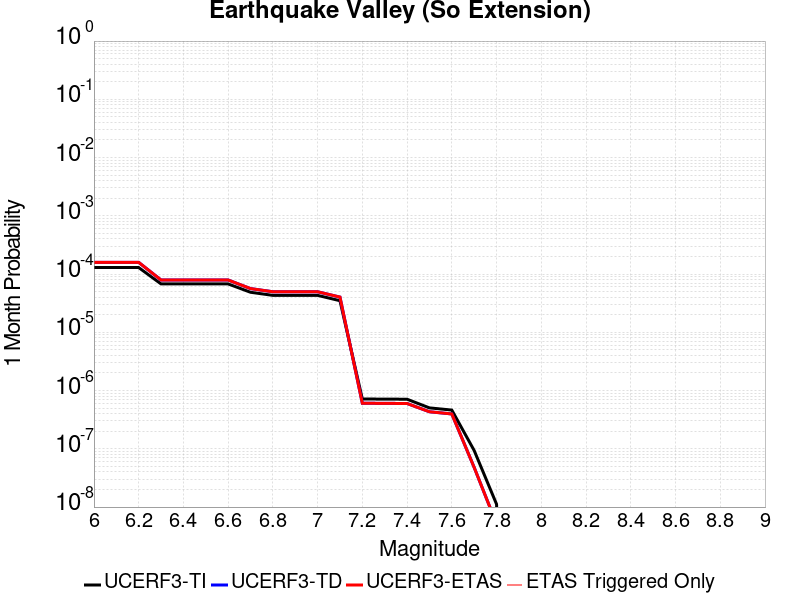 |  | 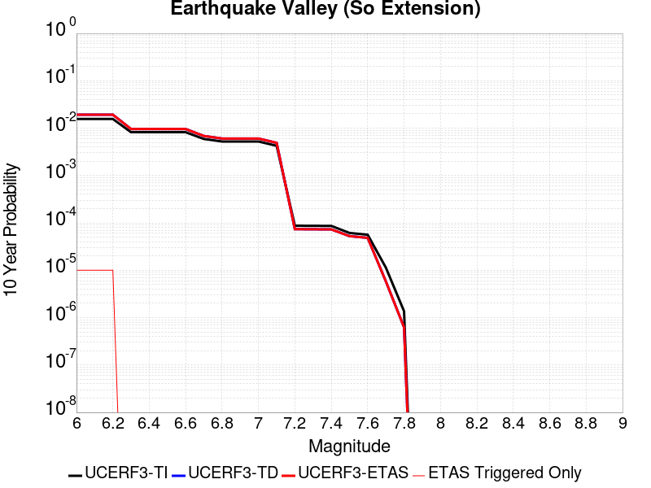 |

| Magnitude | 1 wk TI Prob | 1 wk TD Prob | 1 wk ETAS Prob | 1 wk ETAS/TD Gain | 1 wk ETAS Triggered Only | 1 mo TI Prob | 1 mo TD Prob | 1 mo ETAS Prob | 1 mo ETAS/TD Gain | 1 mo ETAS Triggered Only | 1 yr TI Prob | 1 yr TD Prob | 1 yr ETAS Prob | 1 yr ETAS/TD Gain | 1 yr ETAS Triggered Only | 10 yr TI Prob | 10 yr TD Prob | 10 yr ETAS Prob | 10 yr ETAS/TD Gain | 10 yr ETAS Triggered Only |
|-----|-----|-----|-----|-----|-----|-----|-----|-----|-----|-----|-----|-----|-----|-----|-----|-----|-----|-----|-----|-----|
| 6.0 | 3.0194888E-5 | 3.707326E-5 | 3.707326E-5 | 1.0 | 0.0 | 1.2940024E-4 | 1.588788E-4 | 1.588788E-4 | 1.0 | 0.0 | 0.0015743093 | 0.0019331772 | 0.0019331772 | 1.0 | 0.0 | 0.01563203 | 0.019213596 | 0.019223403 | 1.0005105 | 1.0E-5 |
| 6.1 | 3.0194888E-5 | 3.707326E-5 | 3.707326E-5 | 1.0 | 0.0 | 1.2940024E-4 | 1.588788E-4 | 1.588788E-4 | 1.0 | 0.0 | 0.0015743093 | 0.0019331772 | 0.0019331772 | 1.0 | 0.0 | 0.01563203 | 0.019213596 | 0.019223403 | 1.0005105 | 1.0E-5 |
| 6.2 | 3.0194888E-5 | 3.707326E-5 | 3.707326E-5 | 1.0 | 0.0 | 1.2940024E-4 | 1.588788E-4 | 1.588788E-4 | 1.0 | 0.0 | 0.0015743093 | 0.0019331772 | 0.0019331772 | 1.0 | 0.0 | 0.01563203 | 0.019213596 | 0.019223403 | 1.0005105 | 1.0E-5 |
| 6.3 | 1.5795305E-5 | 1.8447001E-5 | 1.8447001E-5 | 1.0 | 0.0 | 6.769241E-5 | 7.905681E-5 | 7.905681E-5 | 1.0 | 0.0 | 8.238434E-4 | 9.622029E-4 | 9.622029E-4 | 1.0 | 0.0 | 0.008207959 | 0.009591279 | 0.009591279 | 1.0 | 0.0 |
| 6.4 | 1.5795305E-5 | 1.8447001E-5 | 1.8447001E-5 | 1.0 | 0.0 | 6.769241E-5 | 7.905681E-5 | 7.905681E-5 | 1.0 | 0.0 | 8.238434E-4 | 9.622029E-4 | 9.622029E-4 | 1.0 | 0.0 | 0.008207959 | 0.009591279 | 0.009591279 | 1.0 | 0.0 |
| 6.5 | 1.5795305E-5 | 1.8447001E-5 | 1.8447001E-5 | 1.0 | 0.0 | 6.769241E-5 | 7.905681E-5 | 7.905681E-5 | 1.0 | 0.0 | 8.238434E-4 | 9.622029E-4 | 9.622029E-4 | 1.0 | 0.0 | 0.008207959 | 0.009591279 | 0.009591279 | 1.0 | 0.0 |
| 6.6 | 1.5795305E-5 | 1.8447001E-5 | 1.8447001E-5 | 1.0 | 0.0 | 6.769241E-5 | 7.905681E-5 | 7.905681E-5 | 1.0 | 0.0 | 8.238434E-4 | 9.622029E-4 | 9.622029E-4 | 1.0 | 0.0 | 0.008207959 | 0.009591279 | 0.009591279 | 1.0 | 0.0 |
| 6.7 | 1.1363076E-5 | 1.3138576E-5 | 1.3138576E-5 | 1.0 | 0.0 | 4.8697988E-5 | 5.6307395E-5 | 5.6307395E-5 | 1.0 | 0.0 | 5.927367E-4 | 6.85403E-4 | 6.85403E-4 | 1.0 | 0.0 | 0.0059115817 | 0.0068403645 | 0.0068403645 | 1.0 | 0.0 |
| 6.8 | 1.0049611E-5 | 1.15945795E-5 | 1.15945795E-5 | 1.0 | 0.0 | 4.306905E-5 | 4.969052E-5 | 4.969052E-5 | 1.0 | 0.0 | 5.242395E-4 | 6.048873E-4 | 6.048873E-4 | 1.0 | 0.0 | 0.0052300454 | 0.0060395855 | 0.0060395855 | 1.0 | 0.0 |
| 6.9 | 1.0049611E-5 | 1.15945795E-5 | 1.15945795E-5 | 1.0 | 0.0 | 4.306905E-5 | 4.969052E-5 | 4.969052E-5 | 1.0 | 0.0 | 5.242395E-4 | 6.048873E-4 | 6.048873E-4 | 1.0 | 0.0 | 0.0052300454 | 0.0060395855 | 0.0060395855 | 1.0 | 0.0 |
| 7.0 | 1.0049611E-5 | 1.15945795E-5 | 1.15945795E-5 | 1.0 | 0.0 | 4.306905E-5 | 4.969052E-5 | 4.969052E-5 | 1.0 | 0.0 | 5.242395E-4 | 6.048873E-4 | 6.048873E-4 | 1.0 | 0.0 | 0.0052300454 | 0.0060395855 | 0.0060395855 | 1.0 | 0.0 |
| 7.1 | 8.140254E-6 | 9.383657E-6 | 9.383657E-6 | 1.0 | 0.0 | 3.4886336E-5 | 4.021543E-5 | 4.021543E-5 | 1.0 | 0.0 | 4.2465836E-4 | 4.895799E-4 | 4.895799E-4 | 1.0 | 0.0 | 0.0042384774 | 0.00489159 | 0.00489159 | 1.0 | 0.0 |
| 7.2 | 1.673835E-7 | 1.4154533E-7 | 1.4154533E-7 | 1.0 | 0.0 | 7.173577E-7 | 6.066227E-7 | 6.066227E-7 | 1.0 | 0.0 | 8.733795E-6 | 7.38561E-6 | 7.38561E-6 | 1.0 | 0.0 | 8.733451E-5 | 7.3854E-5 | 7.3854E-5 | 1.0 | 0.0 |
| 7.3 | 1.6632116E-7 | 1.405276E-7 | 1.405276E-7 | 1.0 | 0.0 | 7.1280476E-7 | 6.02261E-7 | 6.02261E-7 | 1.0 | 0.0 | 8.678364E-6 | 7.332507E-6 | 7.332507E-6 | 1.0 | 0.0 | 8.6780245E-5 | 7.3323004E-5 | 7.3323004E-5 | 1.0 | 0.0 |
| 7.4 | 1.6569169E-7 | 1.3997388E-7 | 1.3997388E-7 | 1.0 | 0.0 | 7.1010703E-7 | 5.998879E-7 | 5.998879E-7 | 1.0 | 0.0 | 8.645519E-6 | 7.3036144E-6 | 7.3036144E-6 | 1.0 | 0.0 | 8.645182E-5 | 7.30341E-5 | 7.30341E-5 | 1.0 | 0.0 |
| 7.5 | 1.1764555E-7 | 1.0096232E-7 | 1.0096232E-7 | 1.0 | 0.0 | 5.041951E-7 | 4.3269557E-7 | 4.3269557E-7 | 1.0 | 0.0 | 6.138558E-6 | 5.268058E-6 | 5.268058E-6 | 1.0 | 0.0 | 6.1383886E-5 | 5.267955E-5 | 5.267955E-5 | 1.0 | 0.0 |
| 7.6 | 1.07927605E-7 | 9.261032E-8 | 9.261032E-8 | 1.0 | 0.0 | 4.6254678E-7 | 3.9690133E-7 | 3.9690133E-7 | 1.0 | 0.0 | 5.6314925E-6 | 4.832265E-6 | 4.832265E-6 | 1.0 | 0.0 | 5.63135E-5 | 4.832181E-5 | 4.832181E-5 | 1.0 | 0.0 |
| 7.7 | 2.1826905E-8 | 1.1181076E-8 | 1.1181076E-8 | 1.0 | 0.0 | 9.3543875E-8 | 4.7918892E-8 | 4.7918892E-8 | 1.0 | 0.0 | 1.1388961E-6 | 5.8341243E-7 | 5.8341243E-7 | 1.0 | 0.0 | 1.1388902E-5 | 5.8341143E-6 | 5.8341143E-6 | 1.0 | 0.0 |
| 7.8 | 2.6169649E-9 | 1.1970057E-9 | 1.1970057E-9 | 1.0 | 0.0 | 1.1215564E-8 | 5.130025E-9 | 5.130025E-9 | 1.0 | 0.0 | 1.3654947E-7 | 6.245805E-8 | 6.245805E-8 | 1.0 | 0.0 | 1.365494E-6 | 6.245805E-7 | 6.245805E-7 | 1.0 | 0.0 |

## Peralta Hills
*[(top)](#table-of-contents)*

| 1 Week | 1 Month | 1 Year | 10 Year |
|-----|-----|-----|-----|
| 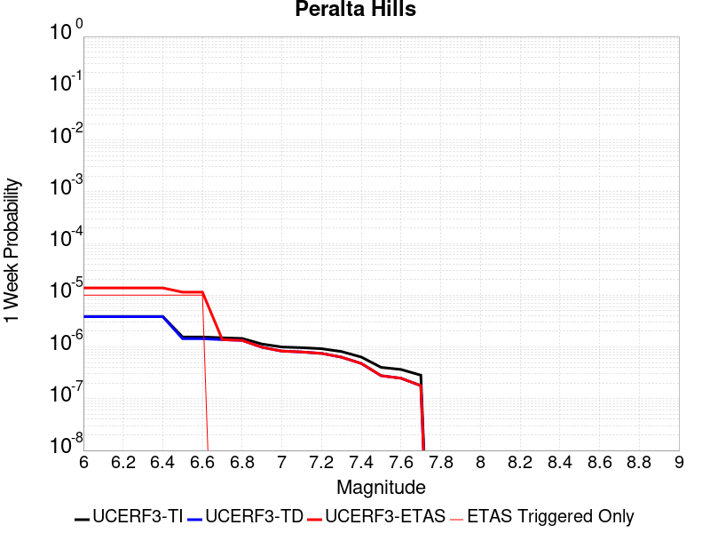 | 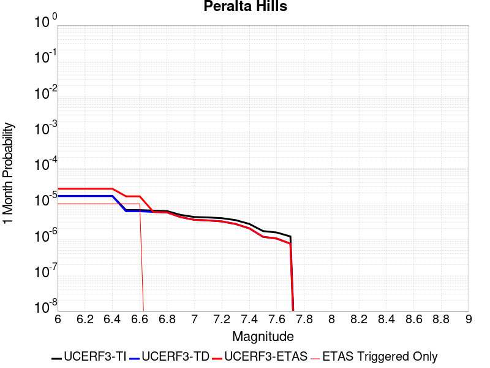 | 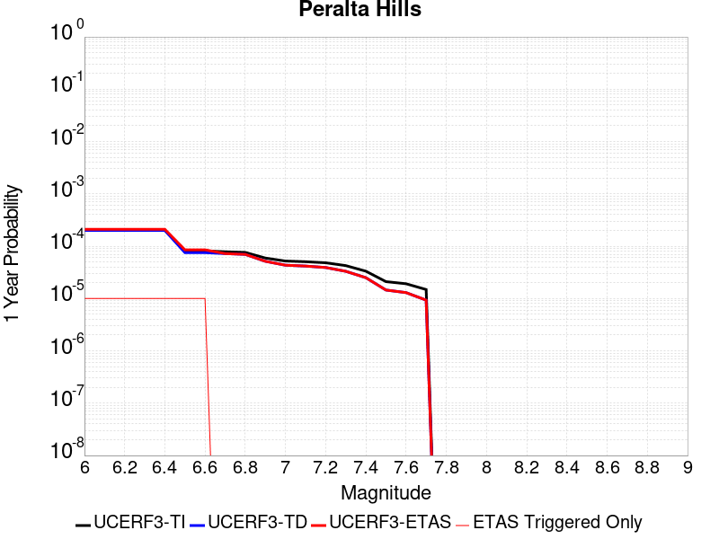 | 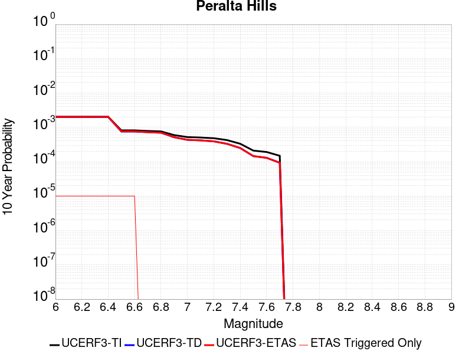 |

| Magnitude | 1 wk TI Prob | 1 wk TD Prob | 1 wk ETAS Prob | 1 wk ETAS/TD Gain | 1 wk ETAS Triggered Only | 1 mo TI Prob | 1 mo TD Prob | 1 mo ETAS Prob | 1 mo ETAS/TD Gain | 1 mo ETAS Triggered Only | 1 yr TI Prob | 1 yr TD Prob | 1 yr ETAS Prob | 1 yr ETAS/TD Gain | 1 yr ETAS Triggered Only | 10 yr TI Prob | 10 yr TD Prob | 10 yr ETAS Prob | 10 yr ETAS/TD Gain | 10 yr ETAS Triggered Only |
|-----|-----|-----|-----|-----|-----|-----|-----|-----|-----|-----|-----|-----|-----|-----|-----|-----|-----|-----|-----|-----|
| 6.0 | 3.8850067E-6 | 3.839573E-6 | 1.3839534E-5 | 3.6044464 | 1.0E-5 | 1.6649923E-5 | 1.645525E-5 | 2.6455085E-5 | 1.6076988 | 1.0E-5 | 2.0269395E-4 | 2.0033166E-4 | 2.1032966E-4 | 1.0499072 | 1.0E-5 | 0.0020250916 | 0.0020022383 | 0.0020122183 | 1.0049844 | 1.0E-5 |
| 6.1 | 3.8850067E-6 | 3.839573E-6 | 1.3839534E-5 | 3.6044464 | 1.0E-5 | 1.6649923E-5 | 1.645525E-5 | 2.6455085E-5 | 1.6076988 | 1.0E-5 | 2.0269395E-4 | 2.0033166E-4 | 2.1032966E-4 | 1.0499072 | 1.0E-5 | 0.0020250916 | 0.0020022383 | 0.0020122183 | 1.0049844 | 1.0E-5 |
| 6.2 | 3.8850067E-6 | 3.839573E-6 | 1.3839534E-5 | 3.6044464 | 1.0E-5 | 1.6649923E-5 | 1.645525E-5 | 2.6455085E-5 | 1.6076988 | 1.0E-5 | 2.0269395E-4 | 2.0033166E-4 | 2.1032966E-4 | 1.0499072 | 1.0E-5 | 0.0020250916 | 0.0020022383 | 0.0020122183 | 1.0049844 | 1.0E-5 |
| 6.3 | 3.8850067E-6 | 3.839573E-6 | 1.3839534E-5 | 3.6044464 | 1.0E-5 | 1.6649923E-5 | 1.645525E-5 | 2.6455085E-5 | 1.6076988 | 1.0E-5 | 2.0269395E-4 | 2.0033166E-4 | 2.1032966E-4 | 1.0499072 | 1.0E-5 | 0.0020250916 | 0.0020022383 | 0.0020122183 | 1.0049844 | 1.0E-5 |
| 6.4 | 3.8850067E-6 | 3.839573E-6 | 1.3839534E-5 | 3.6044464 | 1.0E-5 | 1.6649923E-5 | 1.645525E-5 | 2.6455085E-5 | 1.6076988 | 1.0E-5 | 2.0269395E-4 | 2.0033166E-4 | 2.1032966E-4 | 1.0499072 | 1.0E-5 | 0.0020250916 | 0.0020022383 | 0.0020122183 | 1.0049844 | 1.0E-5 |
| 6.5 | 1.5587785E-6 | 1.4431308E-6 | 1.1443117E-5 | 7.9293685 | 1.0E-5 | 6.6804623E-6 | 6.184833E-6 | 1.6184771E-5 | 2.6168485 | 1.0E-5 | 8.133159E-5 | 7.529798E-5 | 8.529723E-5 | 1.1327957 | 1.0E-5 | 8.1301836E-4 | 7.527487E-4 | 7.627412E-4 | 1.0132747 | 1.0E-5 |
| 6.6 | 1.5587785E-6 | 1.4431308E-6 | 1.1443117E-5 | 7.9293685 | 1.0E-5 | 6.6804623E-6 | 6.184833E-6 | 1.6184771E-5 | 2.6168485 | 1.0E-5 | 8.133159E-5 | 7.529798E-5 | 8.529723E-5 | 1.1327957 | 1.0E-5 | 8.1301836E-4 | 7.527487E-4 | 7.627412E-4 | 1.0132747 | 1.0E-5 |
| 6.7 | 1.5018579E-6 | 1.3837531E-6 | 1.3837531E-6 | 1.0 | 0.0 | 6.436518E-6 | 5.9303584E-6 | 5.9303584E-6 | 1.0 | 0.0 | 7.836179E-5 | 7.219996E-5 | 7.219996E-5 | 1.0 | 0.0 | 7.833416E-4 | 7.2178856E-4 | 7.2178856E-4 | 1.0 | 0.0 |
| 6.8 | 1.4584314E-6 | 1.3381849E-6 | 1.3381849E-6 | 1.0 | 0.0 | 6.250405E-6 | 5.7350667E-6 | 5.7350667E-6 | 1.0 | 0.0 | 7.6096025E-5 | 6.982244E-5 | 6.982244E-5 | 1.0 | 0.0 | 7.6069974E-4 | 6.980284E-4 | 6.980284E-4 | 1.0 | 0.0 |
| 6.9 | 1.1382393E-6 | 9.862651E-7 | 9.862651E-7 | 1.0 | 0.0 | 4.8781594E-6 | 4.2268443E-6 | 4.2268443E-6 | 1.0 | 0.0 | 5.9389975E-5 | 5.1460698E-5 | 5.1460698E-5 | 1.0 | 0.0 | 5.93741E-4 | 5.1449606E-4 | 5.1449606E-4 | 1.0 | 0.0 |
| 7.0 | 9.970413E-7 | 8.309953E-7 | 8.309953E-7 | 1.0 | 0.0 | 4.273027E-6 | 3.561404E-6 | 3.561404E-6 | 1.0 | 0.0 | 5.2022864E-5 | 4.33593E-5 | 4.33593E-5 | 1.0 | 0.0 | 5.2010687E-4 | 4.335152E-4 | 4.335152E-4 | 1.0 | 0.0 |
| 7.1 | 9.684443E-7 | 7.994381E-7 | 7.994381E-7 | 1.0 | 0.0 | 4.150469E-6 | 3.426159E-6 | 3.426159E-6 | 1.0 | 0.0 | 5.053079E-5 | 4.171276E-5 | 4.171276E-5 | 1.0 | 0.0 | 5.05193E-4 | 4.17056E-4 | 4.17056E-4 | 1.0 | 0.0 |
| 7.2 | 9.240811E-7 | 7.5034313E-7 | 7.5034313E-7 | 1.0 | 0.0 | 3.960342E-6 | 3.2157527E-6 | 3.2157527E-6 | 1.0 | 0.0 | 4.8216094E-5 | 3.9151153E-5 | 3.9151153E-5 | 1.0 | 0.0 | 4.8205635E-4 | 3.914491E-4 | 3.914491E-4 | 1.0 | 0.0 |
| 7.3 | 8.158643E-7 | 6.3502733E-7 | 6.3502733E-7 | 1.0 | 0.0 | 3.4965567E-6 | 2.7215433E-6 | 2.7215433E-6 | 1.0 | 0.0 | 4.2569747E-5 | 3.3134347E-5 | 3.3134347E-5 | 1.0 | 0.0 | 4.2561593E-4 | 3.3130022E-4 | 3.3130022E-4 | 1.0 | 0.0 |
| 7.4 | 6.3822824E-7 | 4.7959236E-7 | 4.7959236E-7 | 1.0 | 0.0 | 2.7352612E-6 | 2.0553946E-6 | 2.0553946E-6 | 1.0 | 0.0 | 3.3301294E-5 | 2.5024194E-5 | 2.5024194E-5 | 1.0 | 0.0 | 3.3296304E-4 | 2.502189E-4 | 2.502189E-4 | 1.0 | 0.0 |
| 7.5 | 4.0292628E-7 | 2.784719E-7 | 2.784719E-7 | 1.0 | 0.0 | 1.7268258E-6 | 1.1934507E-6 | 1.1934507E-6 | 1.0 | 0.0 | 2.1023901E-5 | 1.4530193E-5 | 1.4530193E-5 | 1.0 | 0.0 | 2.1021912E-4 | 1.4529523E-4 | 1.4529523E-4 | 1.0 | 0.0 |
| 7.6 | 3.672993E-7 | 2.4855962E-7 | 2.4855962E-7 | 1.0 | 0.0 | 1.5741389E-6 | 1.0652552E-6 | 1.0652552E-6 | 1.0 | 0.0 | 1.9164972E-5 | 1.2969433E-5 | 1.2969433E-5 | 1.0 | 0.0 | 1.916332E-4 | 1.2968948E-4 | 1.2968948E-4 | 1.0 | 0.0 |
| 7.7 | 2.8466823E-7 | 1.7860675E-7 | 1.7860675E-7 | 1.0 | 0.0 | 1.2200061E-6 | 7.6545746E-7 | 7.6545746E-7 | 1.0 | 0.0 | 1.4853474E-5 | 9.319431E-6 | 9.319431E-6 | 1.0 | 0.0 | 1.485248E-4 | 9.3193E-5 | 9.3193E-5 | 1.0 | 0.0 |

## Sisar
*[(top)](#table-of-contents)*

| 1 Week | 1 Month | 1 Year | 10 Year |
|-----|-----|-----|-----|
| 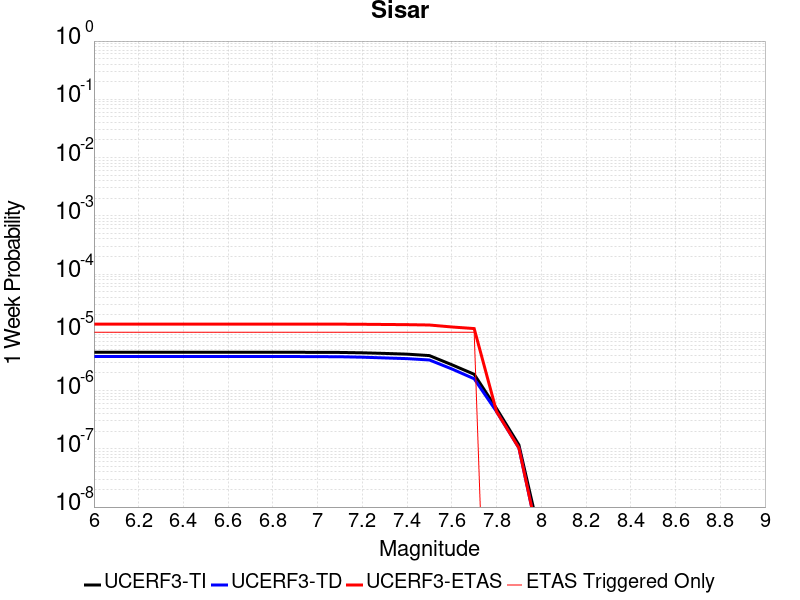 | 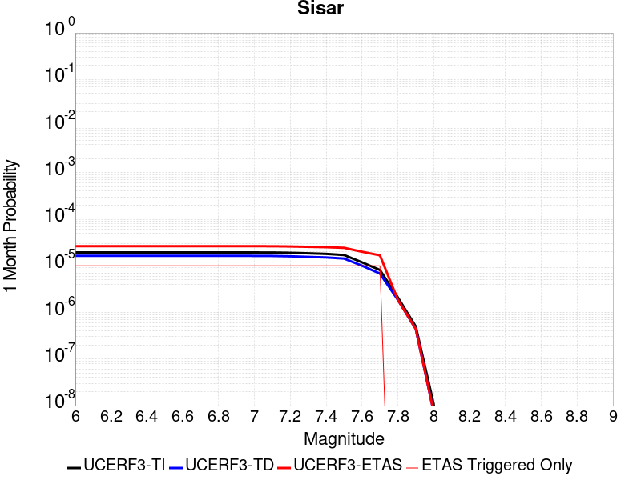 | 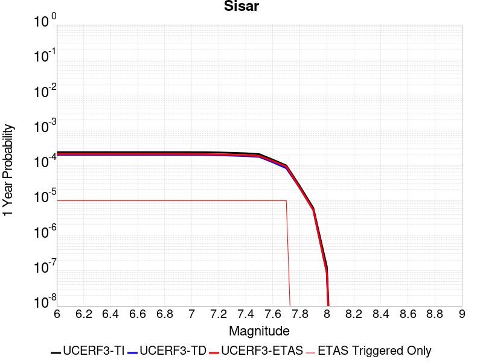 | 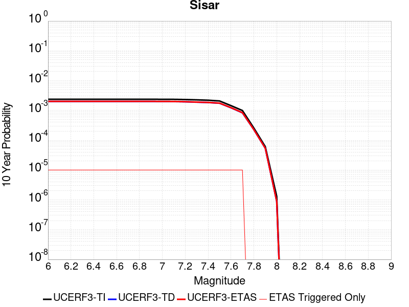 |

| Magnitude | 1 wk TI Prob | 1 wk TD Prob | 1 wk ETAS Prob | 1 wk ETAS/TD Gain | 1 wk ETAS Triggered Only | 1 mo TI Prob | 1 mo TD Prob | 1 mo ETAS Prob | 1 mo ETAS/TD Gain | 1 mo ETAS Triggered Only | 1 yr TI Prob | 1 yr TD Prob | 1 yr ETAS Prob | 1 yr ETAS/TD Gain | 1 yr ETAS Triggered Only | 10 yr TI Prob | 10 yr TD Prob | 10 yr ETAS Prob | 10 yr ETAS/TD Gain | 10 yr ETAS Triggered Only |
|-----|-----|-----|-----|-----|-----|-----|-----|-----|-----|-----|-----|-----|-----|-----|-----|-----|-----|-----|-----|-----|
| 6.0 | 4.544193E-6 | 3.8396215E-6 | 1.38395835E-5 | 3.6044133 | 1.0E-5 | 1.9474966E-5 | 1.6455419E-5 | 2.6455255E-5 | 1.6076925 | 1.0E-5 | 2.3708193E-4 | 2.0032664E-4 | 2.1032464E-4 | 1.0499085 | 1.0E-5 | 0.0023682916 | 0.0020014944 | 0.0020114745 | 1.0049863 | 1.0E-5 |
| 6.1 | 4.544193E-6 | 3.8396215E-6 | 1.38395835E-5 | 3.6044133 | 1.0E-5 | 1.9474966E-5 | 1.6455419E-5 | 2.6455255E-5 | 1.6076925 | 1.0E-5 | 2.3708193E-4 | 2.0032664E-4 | 2.1032464E-4 | 1.0499085 | 1.0E-5 | 0.0023682916 | 0.0020014944 | 0.0020114745 | 1.0049863 | 1.0E-5 |
| 6.2 | 4.544193E-6 | 3.8396215E-6 | 1.38395835E-5 | 3.6044133 | 1.0E-5 | 1.9474966E-5 | 1.6455419E-5 | 2.6455255E-5 | 1.6076925 | 1.0E-5 | 2.3708193E-4 | 2.0032664E-4 | 2.1032464E-4 | 1.0499085 | 1.0E-5 | 0.0023682916 | 0.0020014944 | 0.0020114745 | 1.0049863 | 1.0E-5 |
| 6.3 | 4.544193E-6 | 3.8396215E-6 | 1.38395835E-5 | 3.6044133 | 1.0E-5 | 1.9474966E-5 | 1.6455419E-5 | 2.6455255E-5 | 1.6076925 | 1.0E-5 | 2.3708193E-4 | 2.0032664E-4 | 2.1032464E-4 | 1.0499085 | 1.0E-5 | 0.0023682916 | 0.0020014944 | 0.0020114745 | 1.0049863 | 1.0E-5 |
| 6.4 | 4.544193E-6 | 3.8396215E-6 | 1.38395835E-5 | 3.6044133 | 1.0E-5 | 1.9474966E-5 | 1.6455419E-5 | 2.6455255E-5 | 1.6076925 | 1.0E-5 | 2.3708193E-4 | 2.0032664E-4 | 2.1032464E-4 | 1.0499085 | 1.0E-5 | 0.0023682916 | 0.0020014944 | 0.0020114745 | 1.0049863 | 1.0E-5 |
| 6.5 | 4.544193E-6 | 3.8396215E-6 | 1.38395835E-5 | 3.6044133 | 1.0E-5 | 1.9474966E-5 | 1.6455419E-5 | 2.6455255E-5 | 1.6076925 | 1.0E-5 | 2.3708193E-4 | 2.0032664E-4 | 2.1032464E-4 | 1.0499085 | 1.0E-5 | 0.0023682916 | 0.0020014944 | 0.0020114745 | 1.0049863 | 1.0E-5 |
| 6.6 | 4.544193E-6 | 3.8396215E-6 | 1.38395835E-5 | 3.6044133 | 1.0E-5 | 1.9474966E-5 | 1.6455419E-5 | 2.6455255E-5 | 1.6076925 | 1.0E-5 | 2.3708193E-4 | 2.0032664E-4 | 2.1032464E-4 | 1.0499085 | 1.0E-5 | 0.0023682916 | 0.0020014944 | 0.0020114745 | 1.0049863 | 1.0E-5 |
| 6.7 | 4.544193E-6 | 3.8396215E-6 | 1.38395835E-5 | 3.6044133 | 1.0E-5 | 1.9474966E-5 | 1.6455419E-5 | 2.6455255E-5 | 1.6076925 | 1.0E-5 | 2.3708193E-4 | 2.0032664E-4 | 2.1032464E-4 | 1.0499085 | 1.0E-5 | 0.0023682916 | 0.0020014944 | 0.0020114745 | 1.0049863 | 1.0E-5 |
| 6.8 | 4.544193E-6 | 3.8396215E-6 | 1.38395835E-5 | 3.6044133 | 1.0E-5 | 1.9474966E-5 | 1.6455419E-5 | 2.6455255E-5 | 1.6076925 | 1.0E-5 | 2.3708193E-4 | 2.0032664E-4 | 2.1032464E-4 | 1.0499085 | 1.0E-5 | 0.0023682916 | 0.0020014944 | 0.0020114745 | 1.0049863 | 1.0E-5 |
| 6.9 | 4.542225E-6 | 3.8375833E-6 | 1.3837545E-5 | 3.6057966 | 1.0E-5 | 1.9466532E-5 | 1.6446686E-5 | 2.644652E-5 | 1.6080153 | 1.0E-5 | 2.3697925E-4 | 2.0022033E-4 | 2.1021832E-4 | 1.049935 | 1.0E-5 | 0.002367267 | 0.0020004332 | 0.002010413 | 1.0049889 | 1.0E-5 |
| 7.0 | 4.5278484E-6 | 3.8226476E-6 | 1.382261E-5 | 3.615978 | 1.0E-5 | 1.940492E-5 | 1.6382673E-5 | 2.638251E-5 | 1.6103909 | 1.0E-5 | 2.3622929E-4 | 1.9944114E-4 | 2.0943914E-4 | 1.0501301 | 1.0E-5 | 0.0023597833 | 0.0019926552 | 0.0020026353 | 1.0050085 | 1.0E-5 |
| 7.1 | 4.5132488E-6 | 3.807435E-6 | 1.38073965E-5 | 3.6264303 | 1.0E-5 | 1.9342351E-5 | 1.6317477E-5 | 2.6317315E-5 | 1.6128298 | 1.0E-5 | 2.3546767E-4 | 1.9864751E-4 | 2.0864554E-4 | 1.0503304 | 1.0E-5 | 0.0023521832 | 0.0019847332 | 0.0019947134 | 1.0050285 | 1.0E-5 |
| 7.2 | 4.448859E-6 | 3.739895E-6 | 1.3739857E-5 | 3.673862 | 1.0E-5 | 1.9066398E-5 | 1.6028025E-5 | 2.6027865E-5 | 1.6238972 | 1.0E-5 | 2.3210866E-4 | 1.9512406E-4 | 2.0512211E-4 | 1.0512395 | 1.0E-5 | 0.0023186638 | 0.001949561 | 0.0019595413 | 1.0051193 | 1.0E-5 |
| 7.3 | 4.3424366E-6 | 3.6337285E-6 | 1.3633692E-5 | 3.7519844 | 1.0E-5 | 1.861031E-5 | 1.557303E-5 | 2.5572876E-5 | 1.6421257 | 1.0E-5 | 2.2655698E-4 | 1.895855E-4 | 1.9958359E-4 | 1.0527366 | 1.0E-5 | 0.0022632615 | 0.001894271 | 0.0019042521 | 1.005269 | 1.0E-5 |
| 7.4 | 4.218641E-6 | 3.533081E-6 | 1.3533046E-5 | 3.8303807 | 1.0E-5 | 1.8079765E-5 | 1.514169E-5 | 2.5141539E-5 | 1.6604183 | 1.0E-5 | 2.2009891E-4 | 1.8433481E-4 | 1.9433297E-4 | 1.0542392 | 1.0E-5 | 0.0021988105 | 0.0018418524 | 0.001851834 | 1.0054194 | 1.0E-5 |
| 7.5 | 3.983779E-6 | 3.3478473E-6 | 1.3347813E-5 | 3.986984 | 1.0E-5 | 1.7073227E-5 | 1.434784E-5 | 2.4347697E-5 | 1.696959 | 1.0E-5 | 2.0784672E-4 | 1.7467128E-4 | 1.8466954E-4 | 1.0572404 | 1.0E-5 | 0.0020765243 | 0.0017453729 | 0.0017553554 | 1.0057194 | 1.0E-5 |
| 7.6 | 2.777393E-6 | 2.352279E-6 | 1.2352255E-5 | 5.2511864 | 1.0E-5 | 1.1903058E-5 | 1.0081157E-5 | 2.0081055E-5 | 1.9919397 | 1.0E-5 | 1.449101E-4 | 1.2273125E-4 | 1.3273001E-4 | 1.0814688 | 1.0E-5 | 0.0014481564 | 0.0012266424 | 0.0012366301 | 1.0081424 | 1.0E-5 |
| 7.7 | 1.9028433E-6 | 1.5938915E-6 | 1.1593876E-5 | 7.273943 | 1.0E-5 | 8.155017E-6 | 6.830946E-6 | 1.6830878E-5 | 2.463916 | 1.0E-5 | 9.928281E-5 | 8.316364E-5 | 9.316281E-5 | 1.1202348 | 1.0E-5 | 9.923846E-4 | 8.313299E-4 | 8.413216E-4 | 1.0120189 | 1.0E-5 |
| 7.8 | 4.9095956E-7 | 4.358398E-7 | 4.358398E-7 | 1.0 | 0.0 | 2.1041105E-6 | 1.8678836E-6 | 1.8678836E-6 | 1.0 | 0.0 | 2.5617246E-5 | 2.2741247E-5 | 2.2741247E-5 | 1.0 | 0.0 | 2.5614293E-4 | 2.2738938E-4 | 2.2738938E-4 | 1.0 | 0.0 |
| 7.9 | 1.16657894E-7 | 1.0335634E-7 | 1.0335634E-7 | 1.0 | 0.0 | 4.999623E-7 | 4.4295567E-7 | 4.4295567E-7 | 1.0 | 0.0 | 6.087024E-6 | 5.392972E-6 | 5.392972E-6 | 1.0 | 0.0 | 6.0868573E-5 | 5.3928445E-5 | 5.3928445E-5 | 1.0 | 0.0 |
| 8.0 | 2.5100346E-9 | 1.7068081E-9 | 1.7068081E-9 | 1.0 | 0.0 | 1.0757291E-8 | 7.3148922E-9 | 7.3148922E-9 | 1.0 | 0.0 | 1.3097001E-7 | 8.905881E-8 | 8.905881E-8 | 1.0 | 0.0 | 1.3096993E-6 | 8.905878E-7 | 8.905878E-7 | 1.0 | 0.0 |

## Surprise Valley 2011 CFM
*[(top)](#table-of-contents)*

| 1 Week | 1 Month | 1 Year | 10 Year |
|-----|-----|-----|-----|
|  | 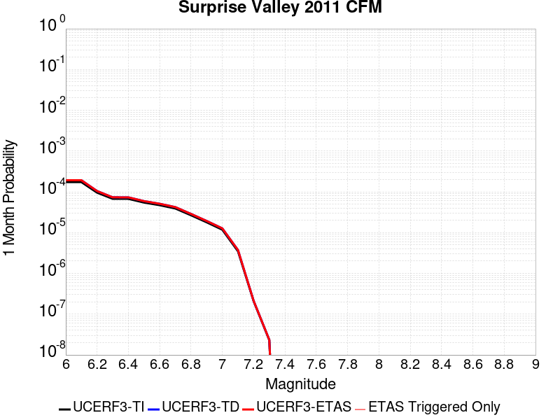 | 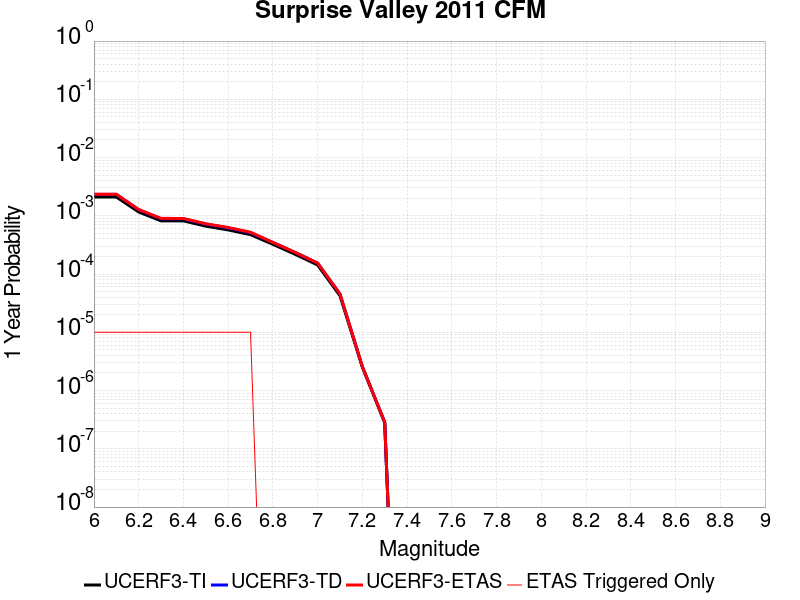 | 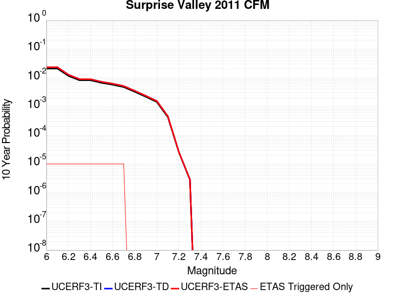 |

| Magnitude | 1 wk TI Prob | 1 wk TD Prob | 1 wk ETAS Prob | 1 wk ETAS/TD Gain | 1 wk ETAS Triggered Only | 1 mo TI Prob | 1 mo TD Prob | 1 mo ETAS Prob | 1 mo ETAS/TD Gain | 1 mo ETAS Triggered Only | 1 yr TI Prob | 1 yr TD Prob | 1 yr ETAS Prob | 1 yr ETAS/TD Gain | 1 yr ETAS Triggered Only | 10 yr TI Prob | 10 yr TD Prob | 10 yr ETAS Prob | 10 yr ETAS/TD Gain | 10 yr ETAS Triggered Only |
|-----|-----|-----|-----|-----|-----|-----|-----|-----|-----|-----|-----|-----|-----|-----|-----|-----|-----|-----|-----|-----|
| 6.0 | 4.0396248E-5 | 4.485197E-5 | 4.485197E-5 | 1.0 | 0.0 | 1.7311527E-4 | 1.9220974E-4 | 1.9220974E-4 | 1.0 | 0.0 | 0.002105641 | 0.002337852 | 0.0023478286 | 1.0042675 | 1.0E-5 | 0.020858008 | 0.023154303 | 0.023164071 | 1.0004219 | 1.0E-5 |
| 6.1 | 4.0396248E-5 | 4.485197E-5 | 4.485197E-5 | 1.0 | 0.0 | 1.7311527E-4 | 1.9220974E-4 | 1.9220974E-4 | 1.0 | 0.0 | 0.002105641 | 0.002337852 | 0.0023478286 | 1.0042675 | 1.0E-5 | 0.020858008 | 0.023154303 | 0.023164071 | 1.0004219 | 1.0E-5 |
| 6.2 | 2.2295266E-5 | 2.4401555E-5 | 2.4401555E-5 | 1.0 | 0.0 | 9.554764E-5 | 1.0457408E-4 | 1.0457408E-4 | 1.0 | 0.0 | 0.0011626717 | 0.0012724766 | 0.0012824639 | 1.0078487 | 1.0E-5 | 0.011566074 | 0.012655139 | 0.012665013 | 1.0007802 | 1.0E-5 |
| 6.3 | 1.572643E-5 | 1.7097005E-5 | 1.7097005E-5 | 1.0 | 0.0 | 6.7397246E-5 | 7.327088E-5 | 7.327088E-5 | 1.0 | 0.0 | 8.202525E-4 | 8.917184E-4 | 9.017094E-4 | 1.0112044 | 1.0E-5 | 0.008172315 | 0.00888251 | 0.008892421 | 1.0011158 | 1.0E-5 |
| 6.4 | 1.5714395E-5 | 1.7084827E-5 | 1.7084827E-5 | 1.0 | 0.0 | 6.734567E-5 | 7.321869E-5 | 7.321869E-5 | 1.0 | 0.0 | 8.1962504E-4 | 8.910835E-4 | 9.0107456E-4 | 1.0112123 | 1.0E-5 | 0.008166086 | 0.008876211 | 0.008886122 | 1.0011166 | 1.0E-5 |
| 6.5 | 1.2733495E-5 | 1.3801754E-5 | 1.3801754E-5 | 1.0 | 0.0 | 5.457098E-5 | 5.914907E-5 | 5.914907E-5 | 1.0 | 0.0 | 6.641992E-4 | 7.199087E-4 | 7.299015E-4 | 1.0138806 | 1.0E-5 | 0.0066221743 | 0.0071764593 | 0.0071863877 | 1.0013834 | 1.0E-5 |
| 6.6 | 1.0983784E-5 | 1.1886684E-5 | 1.1886684E-5 | 1.0 | 0.0 | 4.7072506E-5 | 5.0941966E-5 | 5.0941966E-5 | 1.0 | 0.0 | 5.7295704E-4 | 6.2004727E-4 | 6.3004106E-4 | 1.0161178 | 1.0E-5 | 0.0057148207 | 0.006183722 | 0.00619366 | 1.0016072 | 1.0E-5 |
| 6.7 | 9.104806E-6 | 9.839597E-6 | 9.839597E-6 | 1.0 | 0.0 | 3.902001E-5 | 4.2169042E-5 | 4.2169042E-5 | 1.0 | 0.0 | 4.7496508E-4 | 5.1329104E-4 | 5.232859E-4 | 1.0194721 | 1.0E-5 | 0.004739512 | 0.005121452 | 0.0051314007 | 1.0019425 | 1.0E-5 |
| 6.8 | 6.2162403E-6 | 6.7042038E-6 | 6.7042038E-6 | 1.0 | 0.0 | 2.6640759E-5 | 2.8731998E-5 | 2.8731998E-5 | 1.0 | 0.0 | 3.2430296E-4 | 3.4975816E-4 | 3.4975816E-4 | 1.0 | 0.0 | 0.003238301 | 0.0034923002 | 0.0034923002 | 1.0 | 0.0 |
| 6.9 | 4.1792696E-6 | 4.5032766E-6 | 4.5032766E-6 | 1.0 | 0.0 | 1.7911032E-5 | 1.9299621E-5 | 1.9299621E-5 | 1.0 | 0.0 | 2.1804498E-4 | 2.3494911E-4 | 2.3494911E-4 | 1.0 | 0.0 | 0.0021783116 | 0.0023471604 | 0.0023471604 | 1.0 | 0.0 |
| 7.0 | 2.7478413E-6 | 2.9622734E-6 | 2.9622734E-6 | 1.0 | 0.0 | 1.177641E-5 | 1.2695402E-5 | 1.2695402E-5 | 1.0 | 0.0 | 1.4336836E-4 | 1.5455681E-4 | 1.5455681E-4 | 1.0 | 0.0 | 0.001432759 | 0.0015446156 | 0.0015446156 | 1.0 | 0.0 |
| 7.1 | 8.128648E-7 | 8.725007E-7 | 8.725007E-7 | 1.0 | 0.0 | 3.4837017E-6 | 3.739287E-6 | 3.739287E-6 | 1.0 | 0.0 | 4.2413245E-5 | 4.5525467E-5 | 4.5525467E-5 | 1.0 | 0.0 | 4.2405148E-4 | 4.5522023E-4 | 4.5522023E-4 | 1.0 | 0.0 |
| 7.2 | 4.8641045E-8 | 4.9402168E-8 | 4.9402168E-8 | 1.0 | 0.0 | 2.084616E-7 | 2.1172356E-7 | 2.1172356E-7 | 1.0 | 0.0 | 2.538017E-6 | 2.5777315E-6 | 2.5777315E-6 | 1.0 | 0.0 | 2.537988E-5 | 2.5777028E-5 | 2.5777028E-5 | 1.0 | 0.0 |
| 7.3 | 5.3911844E-9 | 5.4758256E-9 | 5.4758256E-9 | 1.0 | 0.0 | 2.3105075E-8 | 2.3467823E-8 | 2.3467823E-8 | 1.0 | 0.0 | 2.8130427E-7 | 2.8572074E-7 | 2.8572074E-7 | 1.0 | 0.0 | 2.8130391E-6 | 2.8572053E-6 | 2.8572053E-6 | 1.0 | 0.0 |

## Yorba Linda
*[(top)](#table-of-contents)*

| 1 Week | 1 Month | 1 Year | 10 Year |
|-----|-----|-----|-----|
| 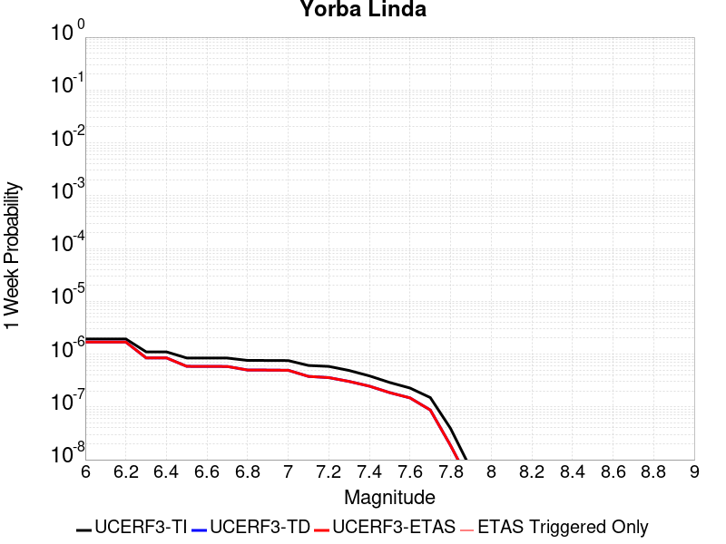 | 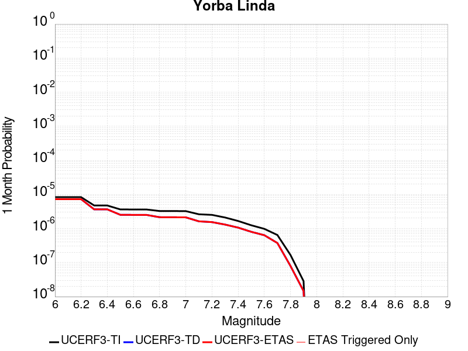 | 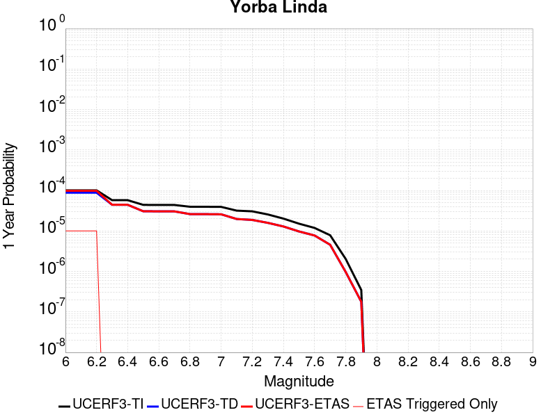 | 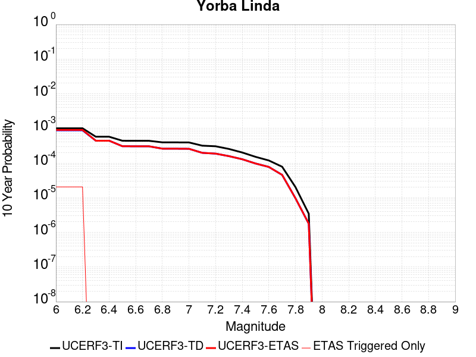 |

| Magnitude | 1 wk TI Prob | 1 wk TD Prob | 1 wk ETAS Prob | 1 wk ETAS/TD Gain | 1 wk ETAS Triggered Only | 1 mo TI Prob | 1 mo TD Prob | 1 mo ETAS Prob | 1 mo ETAS/TD Gain | 1 mo ETAS Triggered Only | 1 yr TI Prob | 1 yr TD Prob | 1 yr ETAS Prob | 1 yr ETAS/TD Gain | 1 yr ETAS Triggered Only | 10 yr TI Prob | 10 yr TD Prob | 10 yr ETAS Prob | 10 yr ETAS/TD Gain | 10 yr ETAS Triggered Only |
|-----|-----|-----|-----|-----|-----|-----|-----|-----|-----|-----|-----|-----|-----|-----|-----|-----|-----|-----|-----|-----|
| 6.0 | 1.9346849E-6 | 1.6909353E-6 | 1.6909353E-6 | 1.0 | 0.0 | 8.29148E-6 | 7.2468506E-6 | 7.2468506E-6 | 1.0 | 0.0 | 1.009441E-4 | 8.822778E-5 | 9.8226905E-5 | 1.113333 | 1.0E-5 | 0.0010089825 | 8.820206E-4 | 8.920118E-4 | 1.0113276 | 1.0E-5 |
| 6.1 | 1.9346849E-6 | 1.6909353E-6 | 1.6909353E-6 | 1.0 | 0.0 | 8.29148E-6 | 7.2468506E-6 | 7.2468506E-6 | 1.0 | 0.0 | 1.009441E-4 | 8.822778E-5 | 9.8226905E-5 | 1.113333 | 1.0E-5 | 0.0010089825 | 8.820206E-4 | 8.920118E-4 | 1.0113276 | 1.0E-5 |
| 6.2 | 1.9346849E-6 | 1.6909353E-6 | 1.6909353E-6 | 1.0 | 0.0 | 8.29148E-6 | 7.2468506E-6 | 7.2468506E-6 | 1.0 | 0.0 | 1.009441E-4 | 8.822778E-5 | 9.8226905E-5 | 1.113333 | 1.0E-5 | 0.0010089825 | 8.820206E-4 | 8.920118E-4 | 1.0113276 | 1.0E-5 |
| 6.3 | 1.1028608E-6 | 8.482089E-7 | 8.482089E-7 | 1.0 | 0.0 | 4.7265376E-6 | 3.6351764E-6 | 3.6351764E-6 | 1.0 | 0.0 | 5.754407E-5 | 4.4257442E-5 | 4.4257442E-5 | 1.0 | 0.0 | 5.7529175E-4 | 4.424928E-4 | 4.424928E-4 | 1.0 | 0.0 |
| 6.4 | 1.1028608E-6 | 8.482089E-7 | 8.482089E-7 | 1.0 | 0.0 | 4.7265376E-6 | 3.6351764E-6 | 3.6351764E-6 | 1.0 | 0.0 | 5.754407E-5 | 4.4257442E-5 | 4.4257442E-5 | 1.0 | 0.0 | 5.7529175E-4 | 4.424928E-4 | 4.424928E-4 | 1.0 | 0.0 |
| 6.5 | 8.4451364E-7 | 5.869332E-7 | 5.869332E-7 | 1.0 | 0.0 | 3.619339E-6 | 2.5154256E-6 | 2.5154256E-6 | 1.0 | 0.0 | 4.406456E-5 | 3.06249E-5 | 3.06249E-5 | 1.0 | 0.0 | 4.4055824E-4 | 3.062089E-4 | 3.062089E-4 | 1.0 | 0.0 |
| 6.6 | 8.422957E-7 | 5.8448654E-7 | 5.8448654E-7 | 1.0 | 0.0 | 3.6098338E-6 | 2.50494E-6 | 2.50494E-6 | 1.0 | 0.0 | 4.3948843E-5 | 3.0497242E-5 | 3.0497242E-5 | 1.0 | 0.0 | 4.394015E-4 | 3.049327E-4 | 3.049327E-4 | 1.0 | 0.0 |
| 6.7 | 8.4119705E-7 | 5.832708E-7 | 5.832708E-7 | 1.0 | 0.0 | 3.6051254E-6 | 2.4997296E-6 | 2.4997296E-6 | 1.0 | 0.0 | 4.3891516E-5 | 3.0433805E-5 | 3.0433805E-5 | 1.0 | 0.0 | 4.388285E-4 | 3.042985E-4 | 3.042985E-4 | 1.0 | 0.0 |
| 6.8 | 7.5919155E-7 | 4.995215E-7 | 4.995215E-7 | 1.0 | 0.0 | 3.253674E-6 | 2.1408048E-6 | 2.1408048E-6 | 1.0 | 0.0 | 3.961276E-5 | 2.6064004E-5 | 2.6064004E-5 | 1.0 | 0.0 | 3.9605703E-4 | 2.6061118E-4 | 2.6061118E-4 | 1.0 | 0.0 |
| 6.9 | 7.5804564E-7 | 4.9813985E-7 | 4.9813985E-7 | 1.0 | 0.0 | 3.248763E-6 | 2.1348835E-6 | 2.1348835E-6 | 1.0 | 0.0 | 3.955297E-5 | 2.5991914E-5 | 2.5991914E-5 | 1.0 | 0.0 | 3.9545933E-4 | 2.5989045E-4 | 2.5989045E-4 | 1.0 | 0.0 |
| 7.0 | 7.539293E-7 | 4.9435334E-7 | 4.9435334E-7 | 1.0 | 0.0 | 3.2311218E-6 | 2.1186554E-6 | 2.1186554E-6 | 1.0 | 0.0 | 3.9338196E-5 | 2.5794343E-5 | 2.5794343E-5 | 1.0 | 0.0 | 3.9331234E-4 | 2.579152E-4 | 2.579152E-4 | 1.0 | 0.0 |
| 7.1 | 6.0900885E-7 | 3.7819254E-7 | 3.7819254E-7 | 1.0 | 0.0 | 2.6100352E-6 | 1.6208243E-6 | 1.6208243E-6 | 1.0 | 0.0 | 3.1776715E-5 | 1.973336E-5 | 1.973336E-5 | 1.0 | 0.0 | 3.1772171E-4 | 1.9731643E-4 | 1.9731643E-4 | 1.0 | 0.0 |
| 7.2 | 5.849925E-7 | 3.5880925E-7 | 3.5880925E-7 | 1.0 | 0.0 | 2.5071083E-6 | 1.5377531E-6 | 1.5377531E-6 | 1.0 | 0.0 | 3.0523614E-5 | 1.8721987E-5 | 1.8721987E-5 | 1.0 | 0.0 | 3.0519423E-4 | 1.8720442E-4 | 1.8720442E-4 | 1.0 | 0.0 |
| 7.3 | 4.89808E-7 | 3.0381156E-7 | 3.0381156E-7 | 1.0 | 0.0 | 2.0991754E-6 | 1.3020489E-6 | 1.3020489E-6 | 1.0 | 0.0 | 2.5557161E-5 | 1.5852333E-5 | 1.5852333E-5 | 1.0 | 0.0 | 2.5554223E-4 | 1.5851225E-4 | 1.5851225E-4 | 1.0 | 0.0 |
| 7.4 | 3.8700415E-7 | 2.4723562E-7 | 2.4723562E-7 | 1.0 | 0.0 | 1.6585881E-6 | 1.0595808E-6 | 1.0595808E-6 | 1.0 | 0.0 | 2.0193123E-5 | 1.2900321E-5 | 1.2900321E-5 | 1.0 | 0.0 | 2.0191289E-4 | 1.2899585E-4 | 1.2899585E-4 | 1.0 | 0.0 |
| 7.5 | 2.900565E-7 | 1.8638156E-7 | 1.8638156E-7 | 1.0 | 0.0 | 1.2430987E-6 | 7.987778E-7 | 7.987778E-7 | 1.0 | 0.0 | 1.5134622E-5 | 9.725078E-6 | 9.725078E-6 | 1.0 | 0.0 | 1.5133592E-4 | 9.72466E-5 | 9.72466E-5 | 1.0 | 0.0 |
| 7.6 | 2.2770318E-7 | 1.4814714E-7 | 1.4814714E-7 | 1.0 | 0.0 | 9.758704E-7 | 6.3491615E-7 | 6.3491615E-7 | 1.0 | 0.0 | 1.1881158E-5 | 7.730077E-6 | 7.730077E-6 | 1.0 | 0.0 | 1.1880523E-4 | 7.729814E-5 | 7.729814E-5 | 1.0 | 0.0 |
| 7.7 | 1.5017194E-7 | 8.735904E-8 | 8.735904E-8 | 1.0 | 0.0 | 6.4359386E-7 | 3.7439585E-7 | 3.7439585E-7 | 1.0 | 0.0 | 7.835727E-6 | 4.55826E-6 | 4.55826E-6 | 1.0 | 0.0 | 7.835451E-5 | 4.558169E-5 | 4.558169E-5 | 1.0 | 0.0 |
| 7.8 | 3.895753E-8 | 1.8534175E-8 | 1.8534175E-8 | 1.0 | 0.0 | 1.6696083E-7 | 7.9432176E-8 | 7.9432176E-8 | 1.0 | 0.0 | 2.0327461E-6 | 9.670864E-7 | 9.670864E-7 | 1.0 | 0.0 | 2.0327276E-5 | 9.670824E-6 | 9.670824E-6 | 1.0 | 0.0 |
| 7.9 | 6.648505E-9 | 3.4185708E-9 | 3.4185708E-9 | 1.0 | 0.0 | 2.8493591E-8 | 1.4651016E-8 | 1.4651016E-8 | 1.0 | 0.0 | 3.4690942E-7 | 1.7837611E-7 | 1.7837611E-7 | 1.0 | 0.0 | 3.4690888E-6 | 1.7837599E-6 | 1.7837599E-6 | 1.0 | 0.0 |

## Calaveras (So) 2011 CFM
*[(top)](#table-of-contents)*

| 1 Week | 1 Month | 1 Year | 10 Year |
|-----|-----|-----|-----|
| 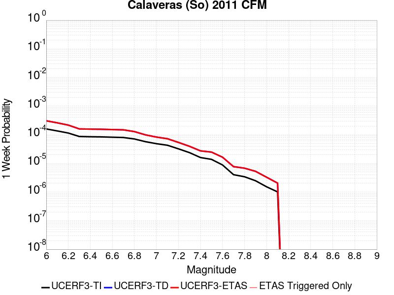 | 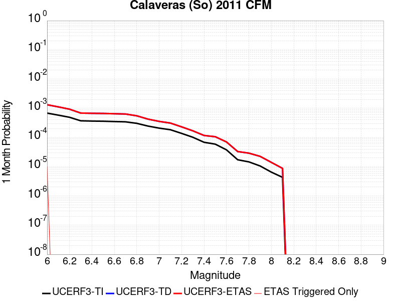 |  | 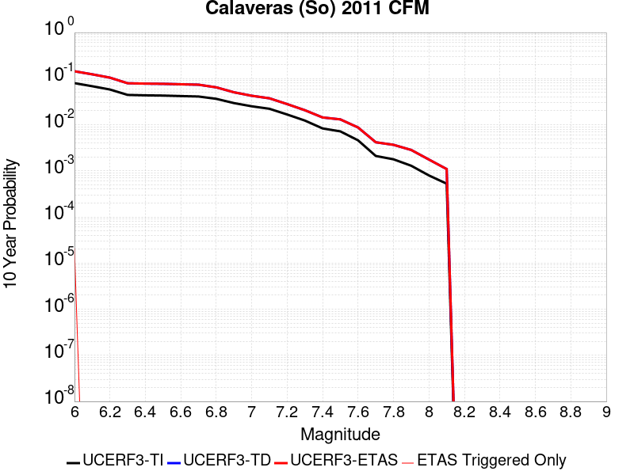 |

| Magnitude | 1 wk TI Prob | 1 wk TD Prob | 1 wk ETAS Prob | 1 wk ETAS/TD Gain | 1 wk ETAS Triggered Only | 1 mo TI Prob | 1 mo TD Prob | 1 mo ETAS Prob | 1 mo ETAS/TD Gain | 1 mo ETAS Triggered Only | 1 yr TI Prob | 1 yr TD Prob | 1 yr ETAS Prob | 1 yr ETAS/TD Gain | 1 yr ETAS Triggered Only | 10 yr TI Prob | 10 yr TD Prob | 10 yr ETAS Prob | 10 yr ETAS/TD Gain | 10 yr ETAS Triggered Only |
|-----|-----|-----|-----|-----|-----|-----|-----|-----|-----|-----|-----|-----|-----|-----|-----|-----|-----|-----|-----|-----|
| 6.0 | 1.5950744E-4 | 3.0719102E-4 | 3.0719102E-4 | 1.0 | 0.0 | 6.834242E-4 | 0.0013158836 | 0.0013258704 | 1.0075895 | 1.0E-5 | 0.00828899 | 0.015860915 | 0.015870756 | 1.0006205 | 1.0E-5 | 0.079865426 | 0.14441721 | 0.14442576 | 1.0000592 | 1.0E-5 |
| 6.1 | 1.3584697E-4 | 2.604323E-4 | 2.604323E-4 | 1.0 | 0.0 | 5.8207137E-4 | 0.0011156795 | 0.0011156795 | 1.0 | 0.0 | 0.007063716 | 0.013463869 | 0.013463869 | 1.0 | 0.0 | 0.06843361 | 0.124044694 | 0.124044694 | 1.0 | 0.0 |
| 6.2 | 1.14676266E-4 | 2.1731424E-4 | 2.1731424E-4 | 1.0 | 0.0 | 4.9137714E-4 | 9.310301E-4 | 9.310301E-4 | 1.0 | 0.0 | 0.0059661185 | 0.01124721 | 0.01124721 | 1.0 | 0.0 | 0.058084648 | 0.10503508 | 0.10503508 | 1.0 | 0.0 |
| 6.3 | 8.691518E-5 | 1.5990793E-4 | 1.5990793E-4 | 1.0 | 0.0 | 3.7244044E-4 | 6.851358E-4 | 6.851358E-4 | 1.0 | 0.0 | 0.004525038 | 0.008302716 | 0.008302716 | 1.0 | 0.0 | 0.044339992 | 0.079350494 | 0.079350494 | 1.0 | 0.0 |
| 6.4 | 8.50982E-5 | 1.5697183E-4 | 1.5697183E-4 | 1.0 | 0.0 | 3.646556E-4 | 6.725591E-4 | 6.725591E-4 | 1.0 | 0.0 | 0.0044306475 | 0.008150746 | 0.008150746 | 1.0 | 0.0 | 0.04343345 | 0.0779566 | 0.0779566 | 1.0 | 0.0 |
| 6.5 | 8.4062965E-5 | 1.5521735E-4 | 1.5521735E-4 | 1.0 | 0.0 | 3.602201E-4 | 6.650437E-4 | 6.650437E-4 | 1.0 | 0.0 | 0.004376863 | 0.008059946 | 0.008059946 | 1.0 | 0.0 | 0.042916555 | 0.07712786 | 0.07712786 | 1.0 | 0.0 |
| 6.6 | 8.194716E-5 | 1.5157646E-4 | 1.5157646E-4 | 1.0 | 0.0 | 3.5115483E-4 | 6.494477E-4 | 6.494477E-4 | 1.0 | 0.0 | 0.0042669317 | 0.007871782 | 0.007871782 | 1.0 | 0.0 | 0.04185927 | 0.075413086 | 0.075413086 | 1.0 | 0.0 |
| 6.7 | 8.012326E-5 | 1.4825336E-4 | 1.4825336E-4 | 1.0 | 0.0 | 3.433402E-4 | 6.3521386E-4 | 6.3521386E-4 | 1.0 | 0.0 | 0.004172157 | 0.0077002714 | 0.0077002714 | 1.0 | 0.0 | 0.040946912 | 0.073855184 | 0.073855184 | 1.0 | 0.0 |
| 6.8 | 7.119773E-5 | 1.2883788E-4 | 1.2883788E-4 | 1.0 | 0.0 | 3.0509746E-4 | 5.5204553E-4 | 5.5204553E-4 | 1.0 | 0.0 | 0.0037082357 | 0.0066975304 | 0.0066975304 | 1.0 | 0.0 | 0.036469642 | 0.064698465 | 0.064698465 | 1.0 | 0.0 |
| 6.9 | 5.7343088E-5 | 9.921204E-5 | 9.921204E-5 | 1.0 | 0.0 | 2.4573295E-4 | 4.2512562E-4 | 4.2512562E-4 | 1.0 | 0.0 | 0.0029876942 | 0.005163703 | 0.005163703 | 1.0 | 0.0 | 0.02947844 | 0.050519872 | 0.050519872 | 1.0 | 0.0 |
| 7.0 | 4.8746577E-5 | 8.286983E-5 | 8.286983E-5 | 1.0 | 0.0 | 2.0889717E-4 | 3.5510844E-4 | 3.5510844E-4 | 1.0 | 0.0 | 0.0025403565 | 0.004314941 | 0.004314941 | 1.0 | 0.0 | 0.025115121 | 0.042495564 | 0.042495564 | 1.0 | 0.0 |
| 7.1 | 4.2998014E-5 | 7.266396E-5 | 7.266396E-5 | 1.0 | 0.0 | 1.8426418E-4 | 3.1138014E-4 | 3.1138014E-4 | 1.0 | 0.0 | 0.002241108 | 0.0037845233 | 0.0037845233 | 1.0 | 0.0 | 0.022186412 | 0.03743038 | 0.03743038 | 1.0 | 0.0 |
| 7.2 | 3.221292E-5 | 5.3919634E-5 | 5.3919634E-5 | 1.0 | 0.0 | 1.3804805E-4 | 2.3106382E-4 | 2.3106382E-4 | 1.0 | 0.0 | 0.0016794393 | 0.002809601 | 0.002809601 | 1.0 | 0.0 | 0.016668037 | 0.0280428 | 0.0280428 | 1.0 | 0.0 |
| 7.3 | 2.3756531E-5 | 3.9484363E-5 | 3.9484363E-5 | 1.0 | 0.0 | 1.0180973E-4 | 1.6920782E-4 | 1.6920782E-4 | 1.0 | 0.0 | 0.0012388286 | 0.0020581756 | 0.0020581756 | 1.0 | 0.0 | 0.012319452 | 0.020649675 | 0.020649675 | 1.0 | 0.0 |
| 7.4 | 1.5997684E-5 | 2.7347376E-5 | 2.7347376E-5 | 1.0 | 0.0 | 6.8559704E-5 | 1.17197786E-4 | 1.17197786E-4 | 1.0 | 0.0 | 8.343947E-4 | 0.0014259516 | 0.0014259516 | 1.0 | 0.0 | 0.008312687 | 0.014379721 | 0.014379721 | 1.0 | 0.0 |
| 7.5 | 1.3814293E-5 | 2.4788933E-5 | 2.4788933E-5 | 1.0 | 0.0 | 5.9202768E-5 | 1.0623397E-4 | 1.0623397E-4 | 1.0 | 0.0 | 7.205553E-4 | 0.0012926336 | 0.0012926336 | 1.0 | 0.0 | 0.007182234 | 0.013058846 | 0.013058846 | 1.0 | 0.0 |
| 7.6 | 8.817309E-6 | 1.643521E-5 | 1.643521E-5 | 1.0 | 0.0 | 3.7787922E-5 | 7.043472E-5 | 7.043472E-5 | 1.0 | 0.0 | 4.5997082E-4 | 8.572067E-4 | 8.572067E-4 | 1.0 | 0.0 | 0.004590199 | 0.008722494 | 0.008722494 | 1.0 | 0.0 |
| 7.7 | 4.0352206E-6 | 7.711002E-6 | 7.711002E-6 | 1.0 | 0.0 | 1.7293689E-5 | 3.304673E-5 | 3.304673E-5 | 1.0 | 0.0 | 2.1053031E-4 | 4.0226974E-4 | 4.0226974E-4 | 1.0 | 0.0 | 0.0021033096 | 0.00416701 | 0.00416701 | 1.0 | 0.0 |
| 7.8 | 3.413169E-6 | 6.7905053E-6 | 6.7905053E-6 | 1.0 | 0.0 | 1.4627784E-5 | 2.910184E-5 | 2.910184E-5 | 1.0 | 0.0 | 1.7807873E-4 | 3.5425735E-4 | 3.5425735E-4 | 1.0 | 0.0 | 0.0017793609 | 0.0036680899 | 0.0036680899 | 1.0 | 0.0 |
| 7.9 | 2.4740732E-6 | 5.2815635E-6 | 5.2815635E-6 | 1.0 | 0.0 | 1.06031275E-5 | 2.2635075E-5 | 2.2635075E-5 | 1.0 | 0.0 | 1.2908543E-4 | 2.7554724E-4 | 2.7554724E-4 | 1.0 | 0.0 | 0.0012901047 | 0.0028359778 | 0.0028359778 | 1.0 | 0.0 |
| 8.0 | 1.5231818E-6 | 3.2903374E-6 | 3.2903374E-6 | 1.0 | 0.0 | 6.527906E-6 | 1.410137E-5 | 1.410137E-5 | 1.0 | 0.0 | 7.9474354E-5 | 1.7167069E-4 | 1.7167069E-4 | 1.0 | 0.0 | 7.944594E-4 | 0.0017571712 | 0.0017571712 | 1.0 | 0.0 |
| 8.1 | 1.0104524E-6 | 2.0467116E-6 | 2.0467116E-6 | 1.0 | 0.0 | 4.330503E-6 | 8.771593E-6 | 8.771593E-6 | 1.0 | 0.0 | 5.2722597E-5 | 1.0678893E-4 | 1.0678893E-4 | 1.0 | 0.0 | 5.271009E-4 | 0.0010934469 | 0.0010934469 | 1.0 | 0.0 |

## Thirty Mile Bank
*[(top)](#table-of-contents)*

| 1 Week | 1 Month | 1 Year | 10 Year |
|-----|-----|-----|-----|
| 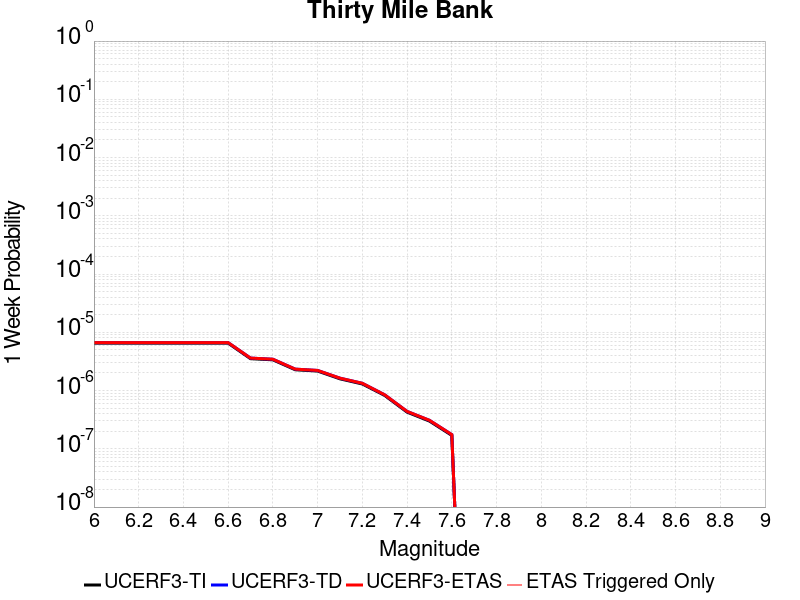 | 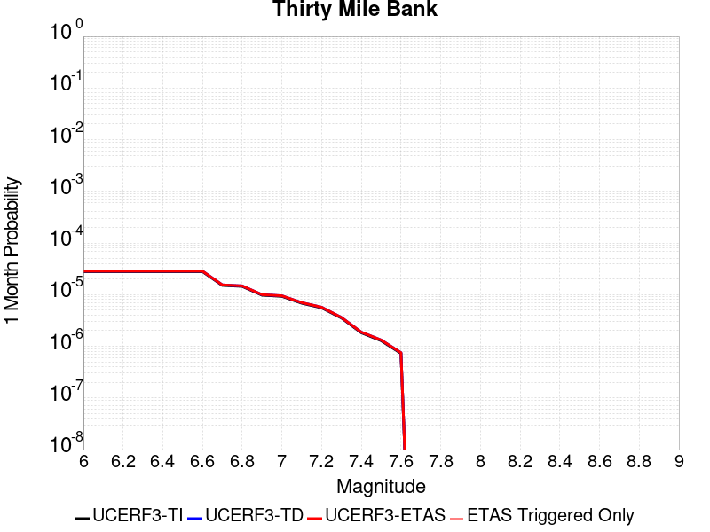 | 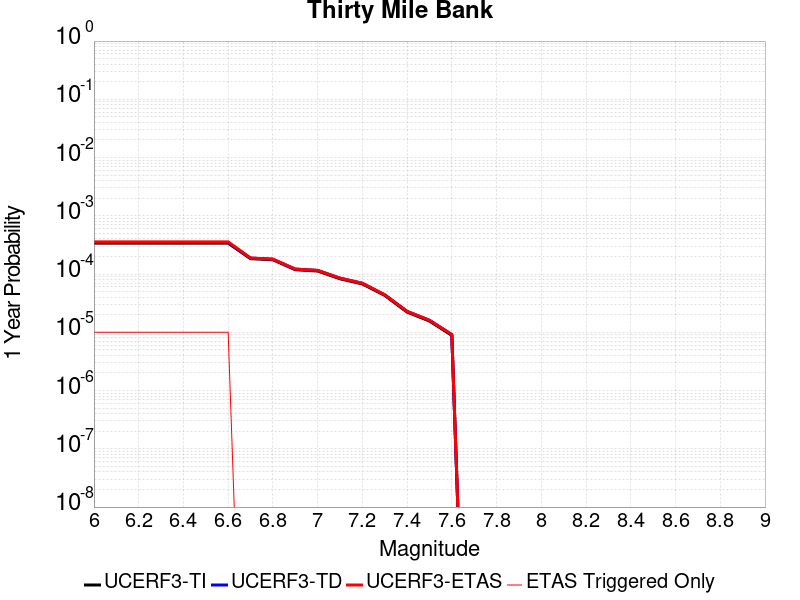 | 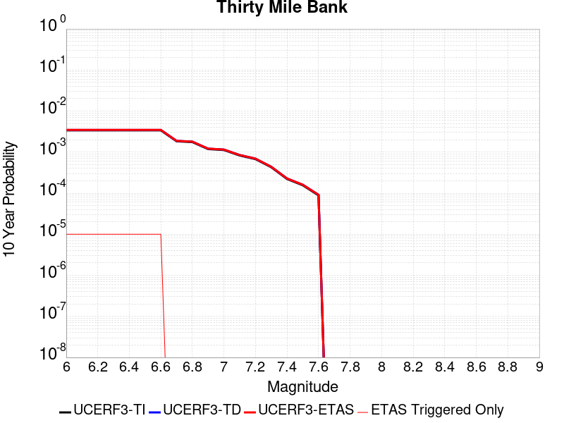 |

| Magnitude | 1 wk TI Prob | 1 wk TD Prob | 1 wk ETAS Prob | 1 wk ETAS/TD Gain | 1 wk ETAS Triggered Only | 1 mo TI Prob | 1 mo TD Prob | 1 mo ETAS Prob | 1 mo ETAS/TD Gain | 1 mo ETAS Triggered Only | 1 yr TI Prob | 1 yr TD Prob | 1 yr ETAS Prob | 1 yr ETAS/TD Gain | 1 yr ETAS Triggered Only | 10 yr TI Prob | 10 yr TD Prob | 10 yr ETAS Prob | 10 yr ETAS/TD Gain | 10 yr ETAS Triggered Only |
|-----|-----|-----|-----|-----|-----|-----|-----|-----|-----|-----|-----|-----|-----|-----|-----|-----|-----|-----|-----|-----|
| 6.0 | 6.5124755E-6 | 6.6592843E-6 | 6.6592843E-6 | 1.0 | 0.0 | 2.791031E-5 | 2.8539502E-5 | 2.8539502E-5 | 1.0 | 0.0 | 3.3975503E-4 | 3.474174E-4 | 3.5741393E-4 | 1.0287738 | 1.0E-5 | 0.0033923604 | 0.0034691745 | 0.0034791396 | 1.0028726 | 1.0E-5 |
| 6.1 | 6.5124755E-6 | 6.6592843E-6 | 6.6592843E-6 | 1.0 | 0.0 | 2.791031E-5 | 2.8539502E-5 | 2.8539502E-5 | 1.0 | 0.0 | 3.3975503E-4 | 3.474174E-4 | 3.5741393E-4 | 1.0287738 | 1.0E-5 | 0.0033923604 | 0.0034691745 | 0.0034791396 | 1.0028726 | 1.0E-5 |
| 6.2 | 6.5124755E-6 | 6.6592843E-6 | 6.6592843E-6 | 1.0 | 0.0 | 2.791031E-5 | 2.8539502E-5 | 2.8539502E-5 | 1.0 | 0.0 | 3.3975503E-4 | 3.474174E-4 | 3.5741393E-4 | 1.0287738 | 1.0E-5 | 0.0033923604 | 0.0034691745 | 0.0034791396 | 1.0028726 | 1.0E-5 |
| 6.3 | 6.5124755E-6 | 6.6592843E-6 | 6.6592843E-6 | 1.0 | 0.0 | 2.791031E-5 | 2.8539502E-5 | 2.8539502E-5 | 1.0 | 0.0 | 3.3975503E-4 | 3.474174E-4 | 3.5741393E-4 | 1.0287738 | 1.0E-5 | 0.0033923604 | 0.0034691745 | 0.0034791396 | 1.0028726 | 1.0E-5 |
| 6.4 | 6.5124755E-6 | 6.6592843E-6 | 6.6592843E-6 | 1.0 | 0.0 | 2.791031E-5 | 2.8539502E-5 | 2.8539502E-5 | 1.0 | 0.0 | 3.3975503E-4 | 3.474174E-4 | 3.5741393E-4 | 1.0287738 | 1.0E-5 | 0.0033923604 | 0.0034691745 | 0.0034791396 | 1.0028726 | 1.0E-5 |
| 6.5 | 6.5124755E-6 | 6.6592843E-6 | 6.6592843E-6 | 1.0 | 0.0 | 2.791031E-5 | 2.8539502E-5 | 2.8539502E-5 | 1.0 | 0.0 | 3.3975503E-4 | 3.474174E-4 | 3.5741393E-4 | 1.0287738 | 1.0E-5 | 0.0033923604 | 0.0034691745 | 0.0034791396 | 1.0028726 | 1.0E-5 |
| 6.6 | 6.5124755E-6 | 6.6592843E-6 | 6.6592843E-6 | 1.0 | 0.0 | 2.791031E-5 | 2.8539502E-5 | 2.8539502E-5 | 1.0 | 0.0 | 3.3975503E-4 | 3.474174E-4 | 3.5741393E-4 | 1.0287738 | 1.0E-5 | 0.0033923604 | 0.0034691745 | 0.0034791396 | 1.0028726 | 1.0E-5 |
| 6.7 | 3.5261137E-6 | 3.6099111E-6 | 3.6099111E-6 | 1.0 | 0.0 | 1.5111828E-5 | 1.547096E-5 | 1.547096E-5 | 1.0 | 0.0 | 1.8397097E-4 | 1.883433E-4 | 1.883433E-4 | 1.0 | 0.0 | 0.0018381875 | 0.0018819018 | 0.0018819018 | 1.0 | 0.0 |
| 6.8 | 3.370743E-6 | 3.4509465E-6 | 3.4509465E-6 | 1.0 | 0.0 | 1.4445961E-5 | 1.478969E-5 | 1.478969E-5 | 1.0 | 0.0 | 1.7586538E-4 | 1.8005022E-4 | 1.8005022E-4 | 1.0 | 0.0 | 0.0017572626 | 0.0017991053 | 0.0017991053 | 1.0 | 0.0 |
| 6.9 | 2.2756835E-6 | 2.3331688E-6 | 2.3331688E-6 | 1.0 | 0.0 | 9.752893E-6 | 9.9992585E-6 | 9.9992585E-6 | 1.0 | 0.0 | 1.18735006E-4 | 1.2173442E-4 | 1.2173442E-4 | 1.0 | 0.0 | 0.0011867158 | 0.0012167019 | 0.0012167019 | 1.0 | 0.0 |
| 7.0 | 2.1617404E-6 | 2.2159875E-6 | 2.2159875E-6 | 1.0 | 0.0 | 9.264569E-6 | 9.4970555E-6 | 9.4970555E-6 | 1.0 | 0.0 | 1.1279029E-4 | 1.1562076E-4 | 1.1562076E-4 | 1.0 | 0.0 | 0.0011273306 | 0.0011556301 | 0.0011556301 | 1.0 | 0.0 |
| 7.1 | 1.5900777E-6 | 1.6327073E-6 | 1.6327073E-6 | 1.0 | 0.0 | 6.814601E-6 | 6.9972984E-6 | 6.9972984E-6 | 1.0 | 0.0 | 8.296461E-5 | 8.518891E-5 | 8.518891E-5 | 1.0 | 0.0 | 8.293364E-4 | 8.515753E-4 | 8.515753E-4 | 1.0 | 0.0 |
| 7.2 | 1.2971728E-6 | 1.332904E-6 | 1.332904E-6 | 1.0 | 0.0 | 5.5593005E-6 | 5.712434E-6 | 5.712434E-6 | 1.0 | 0.0 | 6.768238E-5 | 6.954677E-5 | 6.954677E-5 | 1.0 | 0.0 | 6.7661767E-4 | 6.9526036E-4 | 6.9526036E-4 | 1.0 | 0.0 |
| 7.3 | 8.2454284E-7 | 8.448919E-7 | 8.448919E-7 | 1.0 | 0.0 | 3.5337503E-6 | 3.6209606E-6 | 3.6209606E-6 | 1.0 | 0.0 | 4.302256E-5 | 4.4084365E-5 | 4.4084365E-5 | 1.0 | 0.0 | 4.301423E-4 | 4.4076223E-4 | 4.4076223E-4 | 1.0 | 0.0 |
| 7.4 | 4.2619024E-7 | 4.3863636E-7 | 4.3863636E-7 | 1.0 | 0.0 | 1.8265283E-6 | 1.8798688E-6 | 1.8798688E-6 | 1.0 | 0.0 | 2.2237757E-5 | 2.2887167E-5 | 2.2887167E-5 | 1.0 | 0.0 | 2.223553E-4 | 2.2884848E-4 | 2.2884848E-4 | 1.0 | 0.0 |
| 7.5 | 2.993922E-7 | 3.0864658E-7 | 3.0864658E-7 | 1.0 | 0.0 | 1.2831089E-6 | 1.3227703E-6 | 1.3227703E-6 | 1.0 | 0.0 | 1.5621737E-5 | 1.6104612E-5 | 1.6104612E-5 | 1.0 | 0.0 | 1.562064E-4 | 1.6103471E-4 | 1.6103471E-4 | 1.0 | 0.0 |
| 7.6 | 1.6988751E-7 | 1.7533898E-7 | 1.7533898E-7 | 1.0 | 0.0 | 7.2808916E-7 | 7.5145255E-7 | 7.5145255E-7 | 1.0 | 0.0 | 8.864449E-6 | 9.148898E-6 | 9.148898E-6 | 1.0 | 0.0 | 8.8640954E-5 | 9.148542E-5 | 9.148542E-5 | 1.0 | 0.0 |

## Fontana (Seismicity)
*[(top)](#table-of-contents)*

| 1 Week | 1 Month | 1 Year | 10 Year |
|-----|-----|-----|-----|
|  |  | 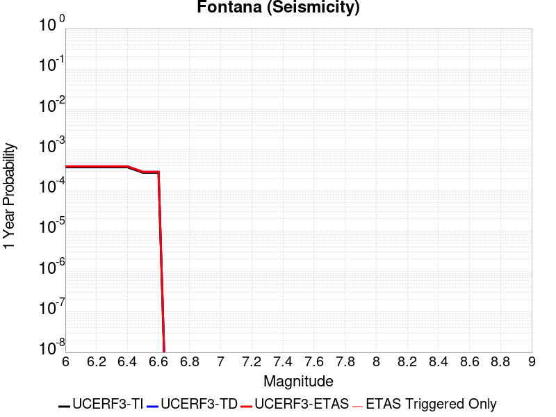 | 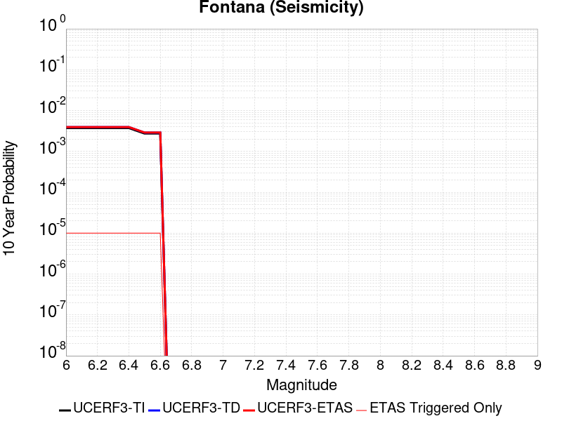 |

| Magnitude | 1 wk TI Prob | 1 wk TD Prob | 1 wk ETAS Prob | 1 wk ETAS/TD Gain | 1 wk ETAS Triggered Only | 1 mo TI Prob | 1 mo TD Prob | 1 mo ETAS Prob | 1 mo ETAS/TD Gain | 1 mo ETAS Triggered Only | 1 yr TI Prob | 1 yr TD Prob | 1 yr ETAS Prob | 1 yr ETAS/TD Gain | 1 yr ETAS Triggered Only | 10 yr TI Prob | 10 yr TD Prob | 10 yr ETAS Prob | 10 yr ETAS/TD Gain | 10 yr ETAS Triggered Only |
|-----|-----|-----|-----|-----|-----|-----|-----|-----|-----|-----|-----|-----|-----|-----|-----|-----|-----|-----|-----|-----|
| 6.0 | 7.1789214E-6 | 7.552053E-6 | 7.552053E-6 | 1.0 | 0.0 | 3.076644E-5 | 3.236577E-5 | 3.236577E-5 | 1.0 | 0.0 | 3.7451705E-4 | 3.9402276E-4 | 3.9402276E-4 | 1.0 | 0.0 | 0.003738865 | 0.003937241 | 0.0039472017 | 1.0025299 | 1.0E-5 |
| 6.1 | 7.1789214E-6 | 7.552053E-6 | 7.552053E-6 | 1.0 | 0.0 | 3.076644E-5 | 3.236577E-5 | 3.236577E-5 | 1.0 | 0.0 | 3.7451705E-4 | 3.9402276E-4 | 3.9402276E-4 | 1.0 | 0.0 | 0.003738865 | 0.003937241 | 0.0039472017 | 1.0025299 | 1.0E-5 |
| 6.2 | 7.1789214E-6 | 7.552053E-6 | 7.552053E-6 | 1.0 | 0.0 | 3.076644E-5 | 3.236577E-5 | 3.236577E-5 | 1.0 | 0.0 | 3.7451705E-4 | 3.9402276E-4 | 3.9402276E-4 | 1.0 | 0.0 | 0.003738865 | 0.003937241 | 0.0039472017 | 1.0025299 | 1.0E-5 |
| 6.3 | 7.1789214E-6 | 7.552053E-6 | 7.552053E-6 | 1.0 | 0.0 | 3.076644E-5 | 3.236577E-5 | 3.236577E-5 | 1.0 | 0.0 | 3.7451705E-4 | 3.9402276E-4 | 3.9402276E-4 | 1.0 | 0.0 | 0.003738865 | 0.003937241 | 0.0039472017 | 1.0025299 | 1.0E-5 |
| 6.4 | 7.1789214E-6 | 7.552053E-6 | 7.552053E-6 | 1.0 | 0.0 | 3.076644E-5 | 3.236577E-5 | 3.236577E-5 | 1.0 | 0.0 | 3.7451705E-4 | 3.9402276E-4 | 3.9402276E-4 | 1.0 | 0.0 | 0.003738865 | 0.003937241 | 0.0039472017 | 1.0025299 | 1.0E-5 |
| 6.5 | 5.2611317E-6 | 5.5327637E-6 | 5.5327637E-6 | 1.0 | 0.0 | 2.2547512E-5 | 2.3711844E-5 | 2.3711844E-5 | 1.0 | 0.0 | 2.744814E-4 | 2.886917E-4 | 2.886917E-4 | 1.0 | 0.0 | 0.002741426 | 0.002886917 | 0.0028968882 | 1.0034539 | 1.0E-5 |
| 6.6 | 5.2611317E-6 | 5.5327637E-6 | 5.5327637E-6 | 1.0 | 0.0 | 2.2547512E-5 | 2.3711844E-5 | 2.3711844E-5 | 1.0 | 0.0 | 2.744814E-4 | 2.886917E-4 | 2.886917E-4 | 1.0 | 0.0 | 0.002741426 | 0.002886917 | 0.0028968882 | 1.0034539 | 1.0E-5 |

## Malibu Coast alt 1
*[(top)](#table-of-contents)*

| 1 Week | 1 Month | 1 Year | 10 Year |
|-----|-----|-----|-----|
| 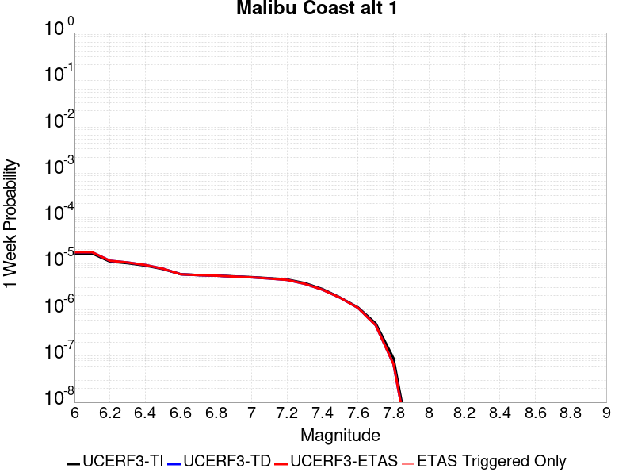 |  | 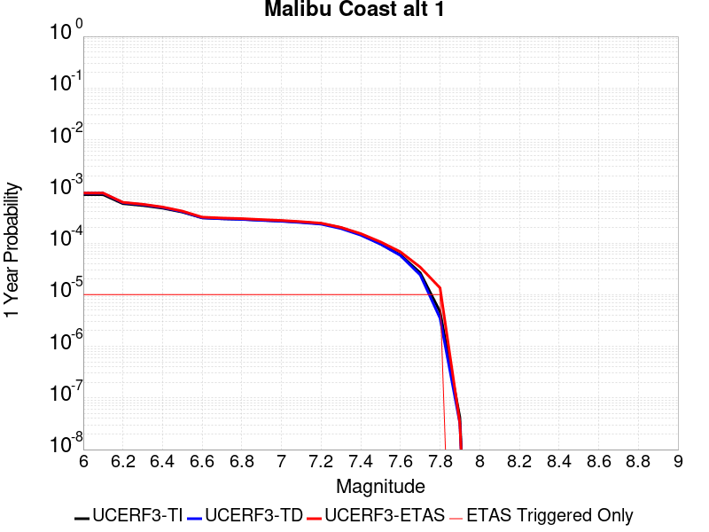 | 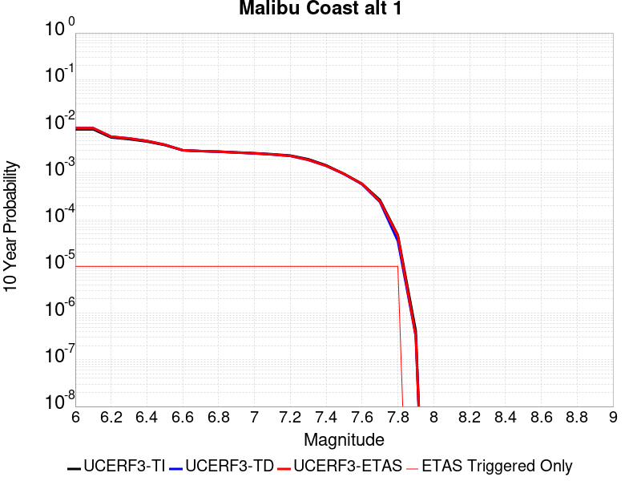 |

| Magnitude | 1 wk TI Prob | 1 wk TD Prob | 1 wk ETAS Prob | 1 wk ETAS/TD Gain | 1 wk ETAS Triggered Only | 1 mo TI Prob | 1 mo TD Prob | 1 mo ETAS Prob | 1 mo ETAS/TD Gain | 1 mo ETAS Triggered Only | 1 yr TI Prob | 1 yr TD Prob | 1 yr ETAS Prob | 1 yr ETAS/TD Gain | 1 yr ETAS Triggered Only | 10 yr TI Prob | 10 yr TD Prob | 10 yr ETAS Prob | 10 yr ETAS/TD Gain | 10 yr ETAS Triggered Only |
|-----|-----|-----|-----|-----|-----|-----|-----|-----|-----|-----|-----|-----|-----|-----|-----|-----|-----|-----|-----|-----|
| 6.0 | 1.6572556E-5 | 1.7598268E-5 | 1.7598268E-5 | 1.0 | 0.0 | 7.102331E-5 | 7.541908E-5 | 7.541908E-5 | 1.0 | 0.0 | 8.6436566E-4 | 9.178593E-4 | 9.2785014E-4 | 1.0108849 | 1.0E-5 | 0.0086101135 | 0.009142617 | 0.009152526 | 1.0010837 | 1.0E-5 |
| 6.1 | 1.6572556E-5 | 1.7598268E-5 | 1.7598268E-5 | 1.0 | 0.0 | 7.102331E-5 | 7.541908E-5 | 7.541908E-5 | 1.0 | 0.0 | 8.6436566E-4 | 9.178593E-4 | 9.2785014E-4 | 1.0108849 | 1.0E-5 | 0.0086101135 | 0.009142617 | 0.009152526 | 1.0010837 | 1.0E-5 |
| 6.2 | 1.1085717E-5 | 1.1557268E-5 | 1.1557268E-5 | 1.0 | 0.0 | 4.750935E-5 | 4.953023E-5 | 4.953023E-5 | 1.0 | 0.0 | 5.782728E-4 | 6.028672E-4 | 6.128612E-4 | 1.0165774 | 1.0E-5 | 0.0057677035 | 0.0060126884 | 0.0060226284 | 1.0016532 | 1.0E-5 |
| 6.3 | 1.0208568E-5 | 1.05923455E-5 | 1.05923455E-5 | 1.0 | 0.0 | 4.375027E-5 | 4.5394994E-5 | 4.5394994E-5 | 1.0 | 0.0 | 5.325294E-4 | 5.525468E-4 | 5.625413E-4 | 1.018088 | 1.0E-5 | 0.0053125503 | 0.005512038 | 0.0055219824 | 1.0018042 | 1.0E-5 |
| 6.4 | 9.0682315E-6 | 9.34273E-6 | 9.34273E-6 | 1.0 | 0.0 | 3.8863272E-5 | 4.0039668E-5 | 4.0039668E-5 | 1.0 | 0.0 | 4.730576E-4 | 4.8737595E-4 | 4.973711E-4 | 1.020508 | 1.0E-5 | 0.0047205184 | 0.004863284 | 0.0048732357 | 1.0020462 | 1.0E-5 |
| 6.5 | 7.605796E-6 | 7.74866E-6 | 7.74866E-6 | 1.0 | 0.0 | 3.259586E-5 | 3.320813E-5 | 3.320813E-5 | 1.0 | 0.0 | 3.9678233E-4 | 4.042353E-4 | 4.1423127E-4 | 1.0247281 | 1.0E-5 | 0.0039607463 | 0.004035138 | 0.0040450976 | 1.0024682 | 1.0E-5 |
| 6.6 | 5.889873E-6 | 5.8795895E-6 | 5.8795895E-6 | 1.0 | 0.0 | 2.5242069E-5 | 2.5197998E-5 | 2.5197998E-5 | 1.0 | 0.0 | 3.0727885E-4 | 3.0674253E-4 | 3.1673946E-4 | 1.0325906 | 1.0E-5 | 0.003068543 | 0.0030632042 | 0.0030731736 | 1.0032545 | 1.0E-5 |
| 6.7 | 5.66586E-6 | 5.64169E-6 | 5.64169E-6 | 1.0 | 0.0 | 2.428203E-5 | 2.417845E-5 | 2.417845E-5 | 1.0 | 0.0 | 2.955936E-4 | 2.9433295E-4 | 3.0433E-4 | 1.0339651 | 1.0E-5 | 0.0029520073 | 0.002939443 | 0.0029494138 | 1.003392 | 1.0E-5 |
| 6.8 | 5.521556E-6 | 5.489475E-6 | 5.489475E-6 | 1.0 | 0.0 | 2.3663597E-5 | 2.3526109E-5 | 2.3526109E-5 | 1.0 | 0.0 | 2.880662E-4 | 2.8639284E-4 | 2.9638998E-4 | 1.0349071 | 1.0E-5 | 0.0028769306 | 0.002860249 | 0.0028702205 | 1.0034862 | 1.0E-5 |
| 6.9 | 5.29752E-6 | 5.249977E-6 | 5.249977E-6 | 1.0 | 0.0 | 2.270346E-5 | 2.249971E-5 | 2.249971E-5 | 1.0 | 0.0 | 2.7637955E-4 | 2.738996E-4 | 2.8389686E-4 | 1.0364997 | 1.0E-5 | 0.0027603607 | 0.0027356306 | 0.0027456032 | 1.0036454 | 1.0E-5 |
| 7.0 | 5.106743E-6 | 5.047723E-6 | 5.047723E-6 | 1.0 | 0.0 | 2.1885859E-5 | 2.1632919E-5 | 2.1632919E-5 | 1.0 | 0.0 | 2.6642776E-4 | 2.6334904E-4 | 2.733464E-4 | 1.0379624 | 1.0E-5 | 0.0026610855 | 0.002630379 | 0.0026403528 | 1.0037917 | 1.0E-5 |
| 7.1 | 4.8469647E-6 | 4.7704148E-6 | 4.7704148E-6 | 1.0 | 0.0 | 2.0772539E-5 | 2.0444475E-5 | 2.0444475E-5 | 1.0 | 0.0 | 2.528763E-4 | 2.488831E-4 | 2.588806E-4 | 1.0401695 | 1.0E-5 | 0.0025258875 | 0.0024860518 | 0.002496027 | 1.0040125 | 1.0E-5 |
| 7.2 | 4.545514E-6 | 4.448232E-6 | 4.448232E-6 | 1.0 | 0.0 | 1.9480629E-5 | 1.9063713E-5 | 1.9063713E-5 | 1.0 | 0.0 | 2.3715083E-4 | 2.3207605E-4 | 2.4207373E-4 | 1.0430794 | 1.0E-5 | 0.0023689792 | 0.0023183445 | 0.0023283213 | 1.0043035 | 1.0E-5 |
| 7.3 | 3.794097E-6 | 3.6519655E-6 | 3.6519655E-6 | 1.0 | 0.0 | 1.6260314E-5 | 1.5651187E-5 | 1.5651187E-5 | 1.0 | 0.0 | 1.9795135E-4 | 1.9053658E-4 | 2.0053466E-4 | 1.0524733 | 1.0E-5 | 0.001977751 | 0.0019037367 | 0.0019137177 | 1.0052428 | 1.0E-5 |
| 7.4 | 2.808217E-6 | 2.7191E-6 | 2.7191E-6 | 1.0 | 0.0 | 1.203516E-5 | 1.1653234E-5 | 1.1653234E-5 | 1.0 | 0.0 | 1.4651821E-4 | 1.418689E-4 | 1.5186748E-4 | 1.0704776 | 1.0E-5 | 0.0014642165 | 0.0014177861 | 0.0014277719 | 1.0070432 | 1.0E-5 |
| 7.5 | 1.83809E-6 | 1.8190852E-6 | 1.8190852E-6 | 1.0 | 0.0 | 7.877505E-6 | 7.796056E-6 | 7.796056E-6 | 1.0 | 0.0 | 9.59044E-5 | 9.4912866E-5 | 1.04911924E-4 | 1.1053498 | 1.0E-5 | 9.5863023E-4 | 9.487253E-4 | 9.5871586E-4 | 1.0105305 | 1.0E-5 |
| 7.6 | 1.1292672E-6 | 1.100155E-6 | 1.100155E-6 | 1.0 | 0.0 | 4.839708E-6 | 4.7149415E-6 | 4.7149415E-6 | 1.0 | 0.0 | 5.8921847E-5 | 5.7402918E-5 | 6.740234E-5 | 1.1741972 | 1.0E-5 | 5.890623E-4 | 5.7388254E-4 | 5.838768E-4 | 1.0174152 | 1.0E-5 |
| 7.7 | 5.065272E-7 | 4.609203E-7 | 4.609203E-7 | 1.0 | 0.0 | 2.170829E-6 | 1.9753713E-6 | 1.9753713E-6 | 1.0 | 0.0 | 2.6429525E-5 | 2.404989E-5 | 3.404965E-5 | 1.4157923 | 1.0E-5 | 2.642638E-4 | 2.4047401E-4 | 2.504716E-4 | 1.0415745 | 1.0E-5 |
| 7.8 | 8.952991E-8 | 6.708074E-8 | 6.708074E-8 | 1.0 | 0.0 | 3.8369956E-7 | 2.8748886E-7 | 2.8748886E-7 | 1.0 | 0.0 | 4.671532E-6 | 3.5001713E-6 | 1.3500136E-5 | 3.856993 | 1.0E-5 | 4.671434E-5 | 3.5001183E-5 | 4.500083E-5 | 1.2856946 | 1.0E-5 |
| 7.9 | 8.007447E-10 | 6.160915E-10 | 6.160915E-10 | 1.0 | 0.0 | 3.4317629E-9 | 2.6403923E-9 | 2.6403923E-9 | 1.0 | 0.0 | 4.1781714E-8 | 3.2146776E-8 | 3.2146776E-8 | 1.0 | 0.0 | 4.1781706E-7 | 3.2146772E-7 | 3.2146772E-7 | 1.0 | 0.0 |

