# Parent Section Magnitude-Probability Distributions

Only fault sections with at least one triggered aftershock are plotted. Sections are sorted by total supraseismogenic trigger rate (decreasing)

## Table Of Contents

* [Garlock (Central)](#garlock-central)
* [Tank Canyon](#tank-canyon)
* [Little Lake](#little-lake)
* [Airport Lake](#airport-lake)
* [Owl Lake](#owl-lake)
* [Panamint Valley](#panamint-valley)
* [Garlock (East)](#garlock-east)
* [Ash Hill](#ash-hill)
* [Hunter Mountain-Saline Valley](#hunter-mountain-saline-valley)
* [Blackwater](#blackwater)
* [Garlock (West)](#garlock-west)
* [McLean Lake](#mclean-lake)
* [Goldstone Lake](#goldstone-lake)
* [Gravel Hills-Harper Lk](#gravel-hills-harper-lk)
* [Coyote Canyon](#coyote-canyon)
* [So Sierra Nevada](#so-sierra-nevada)
* [Death Valley (So)](#death-valley-so)
* [San Andreas (Mojave S)](#san-andreas-mojave-s)
* [Nelson Lake](#nelson-lake)
* [San Andreas (Mojave N)](#san-andreas-mojave-n)
* [Lenwood-Lockhart-Old Woman Springs](#lenwood-lockhart-old-woman-springs)
* [Towne Pass](#towne-pass)
* [Bicycle Lake](#bicycle-lake)
* [Paradise](#paradise)
* [Garlic Springs](#garlic-springs)
* [San Andreas (San Bernardino N)](#san-andreas-san-bernardino-n)
* [Helendale-So Lockhart](#helendale-so-lockhart)
* [Coyote Lake](#coyote-lake)
* [San Andreas (Big Bend)](#san-andreas-big-bend)
* [Death Valley (Black Mtns Frontal)](#death-valley-black-mtns-frontal)
* [San Andreas (San Bernardino S)](#san-andreas-san-bernardino-s)
* [San Andreas (Cholame) rev](#san-andreas-cholame-rev)
* [Manix-Afton Hills](#manix-afton-hills)
* [San Andreas (Carrizo) rev](#san-andreas-carrizo-rev)
* [Sierra Nevada  (No Extension)](#sierra-nevada--no-extension)
* [San Andreas (Parkfield)](#san-andreas-parkfield)
* [Death Valley (No)](#death-valley-no)
* [White Wolf (Extension)](#white-wolf-extension)
* [Cady](#cady)
* [Ludlow](#ludlow)
* [Red Pass](#red-pass)
* [Calico-Hidalgo](#calico-hidalgo)
* [Santa Ynez (West)](#santa-ynez-west)
* [Scodie Lineament](#scodie-lineament)
* [Mission Ridge-Arroyo Parida-Santa Ana](#mission-ridge-arroyo-parida-santa-ana)
* [San Andreas (San Gorgonio Pass-Garnet HIll)](#san-andreas-san-gorgonio-pass-garnet-hill)
* [Red Mountain](#red-mountain)
* [Death Valley (Fish Lake Valley)](#death-valley-fish-lake-valley)
* [Elsinore (Glen Ivy) rev](#elsinore-glen-ivy-rev)
* [Baker](#baker)
* [Santa Ynez (East)](#santa-ynez-east)
* [Dry Mountain](#dry-mountain)
* [Owens Valley](#owens-valley)
* [Pinto Mtn](#pinto-mtn)
* [San Andreas (North Branch Mill Creek)](#san-andreas-north-branch-mill-creek)
* [San Jacinto (San Bernardino)](#san-jacinto-san-bernardino)
* [Pisgah-Bullion Mtn-Mesquite Lk](#pisgah-bullion-mtn-mesquite-lk)
* [Cleghorn Lake](#cleghorn-lake)
* [Lake Isabella (Seismicity)](#lake-isabella-seismicity)
* [White Mountains](#white-mountains)
* [San Andreas (Coachella) rev](#san-andreas-coachella-rev)
* [San Jacinto (Stepovers Combined)](#san-jacinto-stepovers-combined)
* [San Jacinto (San Jacinto Valley) rev](#san-jacinto-san-jacinto-valley-rev)
* [Santa Rosa Island](#santa-rosa-island)
* [Elysian Park (Upper)](#elysian-park-upper)
* [San Jacinto (Anza) rev](#san-jacinto-anza-rev)
* [San Diego Trough north alt1](#san-diego-trough-north-alt1)
* [Independence rev 2011](#independence-rev-2011)
* [Santa Cruz Island](#santa-cruz-island)
* [Cleghorn Pass](#cleghorn-pass)
* [Pleito](#pleito)
* [Bullion Mountains](#bullion-mountains)
* [Tin Mountain](#tin-mountain)
* [Santa Ynez River](#santa-ynez-river)
* [Channel Islands Thrust](#channel-islands-thrust)
* [San Luis Range 2011 CFM](#san-luis-range-2011-cfm)
* [Camp Rock 2011](#camp-rock-2011)
* [Oceanic - West Huasna](#oceanic---west-huasna)
* [Pine Mtn](#pine-mtn)
* [Big Pine (Central)](#big-pine-central)
* [San Jacinto (Coyote Creek)](#san-jacinto-coyote-creek)
* [Kern Canyon (North Kern) 2011](#kern-canyon-north-kern-2011)
* [Ventura-Pitas Point](#ventura-pitas-point)
* [Mission Creek](#mission-creek)
* [San Cayetano](#san-cayetano)
* [Pitas Point (Lower West)](#pitas-point-lower-west)
* [Chino alt 1](#chino-alt-1)
* [Los Osos 2011](#los-osos-2011)
* [Emerson-Copper Mtn 2011](#emerson-copper-mtn-2011)
* [Cucamonga](#cucamonga)
* [Elsinore (Temecula) rev](#elsinore-temecula-rev)
* [Raymond](#raymond)
* [Great Valley 09 (Laguna Seca)](#great-valley-09-laguna-seca)
* [San Jacinto (Lytle Creek connector)](#san-jacinto-lytle-creek-connector)
* [San Jacinto (Borrego)](#san-jacinto-borrego)
* [Lost Hills](#lost-hills)
* [Big Pine (East)](#big-pine-east)
* [Monterey Bay-Tularcitos](#monterey-bay-tularcitos)
* [Sheephole](#sheephole)
* [Great Valley 07 (Orestimba)](#great-valley-07-orestimba)
* [Coronado Bank alt1](#coronado-bank-alt1)
* [San Diego Trough south](#san-diego-trough-south)
* [Robinson Creek](#robinson-creek)
* [Channel Islands Western Deep Ramp](#channel-islands-western-deep-ramp)
* [Earthquake Valley (No  Extension)](#earthquake-valley-no--extension)
* [Santa Monica alt 1](#santa-monica-alt-1)
* [Pitas Point (Lower)-Montalvo](#pitas-point-lower-montalvo)
* [Yorba Linda](#yorba-linda)
* [Dog Valley](#dog-valley)
* [Santa Susana East (connector)](#santa-susana-east-connector)
* [Rocky Ledge 2011 CFM](#rocky-ledge-2011-cfm)
* [Santa Cruz Catalina Ridge alt1](#santa-cruz-catalina-ridge-alt1)
* [Sierra Madre](#sierra-madre)
* [Northridge Hills](#northridge-hills)
* [North Frontal  (East)](#north-frontal--east)
* [White Wolf](#white-wolf)
* [Rinconada 2011 CFM](#rinconada-2011-cfm)
* [Newport-Inglewood (Offshore)](#newport-inglewood-offshore)
* [La Panza 2011](#la-panza-2011)
* [Earthquake Valley (So Extension)](#earthquake-valley-so-extension)
* [Oak Ridge (Onshore)](#oak-ridge-onshore)
* [Sierra Madre (San Fernando)](#sierra-madre-san-fernando)
* [Davis Creek](#davis-creek)
* [San Clemente](#san-clemente)
* [Cleghorn](#cleghorn)
* [Ortigalita (North)](#ortigalita-north)
* [Thirty Mile Bank](#thirty-mile-bank)
* [Johnson Valley (No) 2011 rev](#johnson-valley-no-2011-rev)
* [Hosgri (Extension)](#hosgri-extension)
* [Hosgri](#hosgri)
* [San Gabriel (Extension)](#san-gabriel-extension)
* [Gillem - Big Crack 2011 CFM](#gillem---big-crack-2011-cfm)
* [Deep Springs](#deep-springs)
* [Imperial](#imperial)
* [San Andreas (Creeping Section) 2011 CFM](#san-andreas-creeping-section-2011-cfm)
* [Quien Sabe 2011 CFM](#quien-sabe-2011-cfm)
* [Elsinore (Coyote Mountains)](#elsinore-coyote-mountains)
* [Rose Canyon](#rose-canyon)
* [Kern Canyon (South Kern) 2011](#kern-canyon-south-kern-2011)
* [Surprise Valley 2011 CFM](#surprise-valley-2011-cfm)
* [Hunting Creek - Berryessa 2011 CFM](#hunting-creek---berryessa-2011-cfm)
* [Newport-Inglewood alt 1](#newport-inglewood-alt-1)
* [Calaveras (So) 2011 CFM](#calaveras-so-2011-cfm)
* [Holser alt 1](#holser-alt-1)
* [Brawley (Seismic Zone) alt 1](#brawley-seismic-zone-alt-1)
* [Hollywood](#hollywood)
* [Great Valley 03a Dunnigan Hills](#great-valley-03a-dunnigan-hills)
* [Simi-Santa Rosa](#simi-santa-rosa)
* [San Jacinto (Superstition Mtn)](#san-jacinto-superstition-mtn)

## Garlock (Central)
*[(top)](#table-of-contents)*

| 1 Week | 1 Month | 1 Year | 10 Year |
|-----|-----|-----|-----|
|  |  |  | 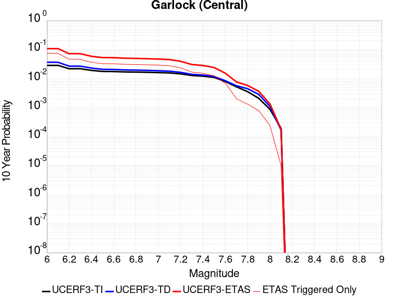 |

| Magnitude | 1 wk TI Prob | 1 wk TD Prob | 1 wk ETAS Prob | 1 wk ETAS/TD Gain | 1 wk ETAS Triggered Only | 1 mo TI Prob | 1 mo TD Prob | 1 mo ETAS Prob | 1 mo ETAS/TD Gain | 1 mo ETAS Triggered Only | 1 yr TI Prob | 1 yr TD Prob | 1 yr ETAS Prob | 1 yr ETAS/TD Gain | 1 yr ETAS Triggered Only | 10 yr TI Prob | 10 yr TD Prob | 10 yr ETAS Prob | 10 yr ETAS/TD Gain | 10 yr ETAS Triggered Only |
|-----|-----|-----|-----|-----|-----|-----|-----|-----|-----|-----|-----|-----|-----|-----|-----|-----|-----|-----|-----|-----|
| 6.0 | 5.5131142E-5 | 7.0252914E-5 | 0.008389341 | 119.41626 | 0.008319672 | 2.3625491E-4 | 3.0104956E-4 | 0.020725226 | 68.84324 | 0.020430328 | 0.0028726095 | 0.0036591839 | 0.052210383 | 14.268313 | 0.04872951 | 0.028357591 | 0.03608289 | 0.108554445 | 3.0084743 | 0.07518443 |
| 6.1 | 5.5131142E-5 | 7.0252914E-5 | 0.008389341 | 119.41626 | 0.008319672 | 2.3625491E-4 | 3.0104956E-4 | 0.020725226 | 68.84324 | 0.020430328 | 0.0028726095 | 0.0036591839 | 0.052210383 | 14.268313 | 0.04872951 | 0.028357591 | 0.03608289 | 0.108554445 | 3.0084743 | 0.07518443 |
| 6.2 | 4.216245E-5 | 5.166702E-5 | 0.0055841682 | 108.07993 | 0.0055327867 | 1.806837E-4 | 2.2141146E-4 | 0.013579109 | 61.329746 | 0.013360656 | 0.0021976046 | 0.0026923837 | 0.033449516 | 12.423754 | 0.030840164 | 0.021759989 | 0.02669258 | 0.07236623 | 2.711099 | 0.04692623 |
| 6.3 | 4.216245E-5 | 5.166702E-5 | 0.0055841682 | 108.07993 | 0.0055327867 | 1.806837E-4 | 2.2141146E-4 | 0.013579109 | 61.329746 | 0.013360656 | 0.0021976046 | 0.0026923837 | 0.033449516 | 12.423754 | 0.030840164 | 0.021759989 | 0.02669258 | 0.07236623 | 2.711099 | 0.04692623 |
| 6.4 | 3.6858168E-5 | 4.411584E-5 | 0.0043472047 | 98.54067 | 0.004303279 | 1.5795401E-4 | 1.8905434E-4 | 0.010617411 | 56.16063 | 0.010430328 | 0.0019213937 | 0.0022993318 | 0.026280949 | 11.429819 | 0.024036886 | 0.019048655 | 0.02285164 | 0.05897409 | 2.5807378 | 0.036967214 |
| 6.5 | 3.39199E-5 | 4.0023286E-5 | 0.003994783 | 99.81147 | 0.003954918 | 1.453629E-4 | 1.7151721E-4 | 0.009616618 | 56.067947 | 0.0094467215 | 0.0017683565 | 0.0020862438 | 0.02376224 | 11.389962 | 0.02172131 | 0.017543508 | 0.02076252 | 0.053109463 | 2.5579488 | 0.033032786 |
| 6.6 | 3.3571985E-5 | 3.947746E-5 | 0.0039942395 | 101.17772 | 0.003954918 | 1.4387199E-4 | 1.6917827E-4 | 0.009614302 | 56.82941 | 0.0094467215 | 0.0017502342 | 0.0020578213 | 0.023734434 | 11.533769 | 0.02172131 | 0.017365133 | 0.02048383 | 0.052799832 | 2.577635 | 0.032991804 |
| 6.7 | 3.2580007E-5 | 3.8093858E-5 | 0.003890406 | 102.12686 | 0.003852459 | 1.3962112E-4 | 1.632493E-4 | 0.009403544 | 57.602356 | 0.009241804 | 0.0016985617 | 0.0019857697 | 0.022886805 | 11.525408 | 0.020942623 | 0.016856372 | 0.019776449 | 0.050870426 | 2.572273 | 0.031721313 |
| 6.8 | 3.2185937E-5 | 3.7521055E-5 | 0.0038283623 | 102.03238 | 0.0037909837 | 1.3793244E-4 | 1.6079473E-4 | 0.009175738 | 57.06492 | 0.009016394 | 0.0016780337 | 0.0019559395 | 0.022366758 | 11.435302 | 0.02045082 | 0.016654192 | 0.01948324 | 0.04996365 | 2.5644424 | 0.031086065 |
| 6.9 | 3.165394E-5 | 3.672561E-5 | 0.0037046238 | 100.87303 | 0.0036680328 | 1.3565269E-4 | 1.5738611E-4 | 0.008926498 | 56.71719 | 0.008770492 | 0.0016503202 | 0.0019145131 | 0.021794412 | 11.383789 | 0.019918032 | 0.01638118 | 0.01907586 | 0.0488453 | 2.560582 | 0.03034836 |
| 7.0 | 3.0903822E-5 | 3.5630834E-5 | 0.0035396044 | 99.34104 | 0.0035040984 | 1.3243823E-4 | 1.5269476E-4 | 0.008635006 | 56.550766 | 0.008483606 | 0.0016112428 | 0.0018574947 | 0.021104464 | 11.36179 | 0.019282786 | 0.015996104 | 0.018515008 | 0.047376297 | 2.5588052 | 0.029405737 |
| 7.1 | 3.0069863E-5 | 3.4397097E-5 | 0.0034359195 | 99.88981 | 0.0034016394 | 1.2886449E-4 | 1.4740792E-4 | 0.008383899 | 56.875496 | 0.008237705 | 0.0015677959 | 0.0017932352 | 0.020243697 | 11.288924 | 0.018483607 | 0.01556781 | 0.017882649 | 0.04547451 | 2.5429404 | 0.028094262 |
| 7.2 | 2.7957109E-5 | 3.1286367E-5 | 0.002900049 | 92.693695 | 0.0028688523 | 1.1981068E-4 | 1.3407765E-4 | 0.007223291 | 53.873936 | 0.007090164 | 0.0014577188 | 0.0016311926 | 0.01728185 | 10.594611 | 0.01567623 | 0.014481937 | 0.016286217 | 0.03983084 | 2.445678 | 0.023934426 |
| 7.3 | 2.4519275E-5 | 2.6719412E-5 | 0.0017274936 | 64.65313 | 0.0017008197 | 1.0507837E-4 | 1.14506816E-4 | 0.0047041452 | 41.08179 | 0.004590164 | 0.0012785783 | 0.0013932437 | 0.012115988 | 8.696245 | 0.010737705 | 0.012712469 | 0.013930428 | 0.030459218 | 2.1865242 | 0.016762296 |
| 7.4 | 2.3225532E-5 | 2.5203923E-5 | 0.0015415591 | 61.163464 | 0.0015163934 | 9.95342E-5 | 1.0801242E-4 | 0.0041034822 | 37.99084 | 0.0039959014 | 0.0012111551 | 0.0013142723 | 0.010973692 | 8.349633 | 0.009672131 | 0.012045753 | 0.013148054 | 0.028011499 | 2.1304674 | 0.015061475 |
| 7.5 | 2.097765E-5 | 2.2487986E-5 | 0.0013339339 | 59.317627 | 0.0013114754 | 8.9901114E-5 | 9.637359E-5 | 0.0034362157 | 35.65516 | 0.003340164 | 0.0010939965 | 0.0011727286 | 0.00897095 | 7.649638 | 0.0078073773 | 0.010886264 | 0.011742581 | 0.023711026 | 2.0192347 | 0.012110656 |
| 7.6 | 1.511254E-5 | 1.5995334E-5 | 6.717226E-4 | 41.994907 | 6.557377E-4 | 6.476642E-5 | 6.854967E-5 | 0.0018717047 | 27.304358 | 0.0018032787 | 7.882459E-4 | 8.342805E-4 | 0.0051134946 | 6.1292267 | 0.004282787 | 0.007854558 | 0.008385628 | 0.015152177 | 1.8069221 | 0.0068237707 |
| 7.7 | 9.934069E-6 | 1.0682508E-5 | 2.770731E-4 | 25.937084 | 2.6639344E-4 | 4.2573887E-5 | 4.5781377E-5 | 6.4001646E-4 | 13.979843 | 5.9426227E-4 | 5.182138E-4 | 5.572461E-4 | 0.0016836672 | 3.021407 | 0.0011270492 | 0.00517007 | 0.0056296107 | 0.0074227373 | 1.3185171 | 0.0018032787 |
| 7.8 | 6.7562896E-6 | 8.431477E-6 | 1.1088963E-4 | 13.151863 | 1.0245902E-4 | 2.8955206E-5 | 3.61344E-5 | 4.254646E-4 | 11.774503 | 3.8934426E-4 | 3.5247262E-4 | 4.3984767E-4 | 0.0011977109 | 2.723013 | 7.581967E-4 | 0.0035191406 | 0.0044482257 | 0.005631463 | 1.2660022 | 0.0011885245 |
| 7.9 | 3.975453E-6 | 5.3728795E-6 | 2.5864572E-5 | 4.8139124 | 2.0491803E-5 | 1.7037546E-5 | 2.3026425E-5 | 2.2793974E-4 | 9.899051 | 2.0491803E-4 | 2.0741238E-4 | 2.8031075E-4 | 7.3100405E-4 | 2.6078346 | 4.5081967E-4 | 0.002072189 | 0.0028345888 | 0.0035089015 | 1.2378873 | 6.762295E-4 |
| 8.0 | 1.6729537E-6 | 2.078155E-6 | 2.078155E-6 | 1.0 | 0.0 | 7.169782E-6 | 8.906349E-6 | 2.939797E-5 | 3.3007882 | 2.0491803E-5 | 8.7288594E-5 | 1.08429434E-4 | 1.9038776E-4 | 1.7558678 | 8.196721E-5 | 8.7254314E-4 | 0.001097267 | 0.0012610216 | 1.1492386 | 1.6393443E-4 |
| 8.1 | 3.6733252E-7 | 3.1499187E-7 | 3.1499187E-7 | 1.0 | 0.0 | 1.5742813E-6 | 1.3499646E-6 | 1.3499646E-6 | 1.0 | 0.0 | 1.9166706E-5 | 1.643571E-5 | 1.643571E-5 | 1.0 | 0.0 | 1.9165053E-4 | 1.6643589E-4 | 1.6643589E-4 | 1.0 | 0.0 |

## Tank Canyon
*[(top)](#table-of-contents)*

| 1 Week | 1 Month | 1 Year | 10 Year |
|-----|-----|-----|-----|
|  |  |  |  |

| Magnitude | 1 wk TI Prob | 1 wk TD Prob | 1 wk ETAS Prob | 1 wk ETAS/TD Gain | 1 wk ETAS Triggered Only | 1 mo TI Prob | 1 mo TD Prob | 1 mo ETAS Prob | 1 mo ETAS/TD Gain | 1 mo ETAS Triggered Only | 1 yr TI Prob | 1 yr TD Prob | 1 yr ETAS Prob | 1 yr ETAS/TD Gain | 1 yr ETAS Triggered Only | 10 yr TI Prob | 10 yr TD Prob | 10 yr ETAS Prob | 10 yr ETAS/TD Gain | 10 yr ETAS Triggered Only |
|-----|-----|-----|-----|-----|-----|-----|-----|-----|-----|-----|-----|-----|-----|-----|-----|-----|-----|-----|-----|-----|
| 6.0 | 4.8284557E-5 | 5.796635E-5 | 0.004299524 | 74.17275 | 0.004241803 | 2.0691741E-4 | 2.484074E-4 | 0.011393179 | 45.864895 | 0.011147541 | 0.0025163088 | 0.0030208372 | 0.03374741 | 11.171541 | 0.030819671 | 0.02488006 | 0.029864404 | 0.08143268 | 2.726747 | 0.05315574 |
| 6.1 | 1.7796336E-5 | 2.0873764E-5 | 0.0013528132 | 64.80926 | 0.0013319672 | 7.626778E-5 | 8.945614E-5 | 0.0040235305 | 44.977688 | 0.0039344262 | 9.281647E-4 | 0.0010886216 | 0.012387783 | 11.37933 | 0.011311475 | 0.009242975 | 0.010836975 | 0.030539157 | 2.8180518 | 0.019918032 |
| 6.2 | 1.7796336E-5 | 2.0873764E-5 | 0.0013528132 | 64.80926 | 0.0013319672 | 7.626778E-5 | 8.945614E-5 | 0.0040235305 | 44.977688 | 0.0039344262 | 9.281647E-4 | 0.0010886216 | 0.012387783 | 11.37933 | 0.011311475 | 0.009242975 | 0.010836975 | 0.030539157 | 2.8180518 | 0.019918032 |
| 6.3 | 1.3515912E-5 | 1.575988E-5 | 0.0010608254 | 67.31177 | 0.001045082 | 5.792405E-5 | 6.7540735E-5 | 0.0031411035 | 46.506805 | 0.0030737706 | 7.049971E-4 | 8.220222E-4 | 0.00923723 | 11.237203 | 0.008422131 | 0.007027647 | 0.008192427 | 0.02290695 | 2.7961125 | 0.0148360655 |
| 6.4 | 1.0870146E-5 | 1.2618259E-5 | 8.732631E-4 | 69.206314 | 8.6065574E-4 | 4.658551E-5 | 5.407723E-5 | 0.0025334514 | 46.848763 | 0.0024795083 | 5.67031E-4 | 6.582093E-4 | 0.006924574 | 10.520322 | 0.006270492 | 0.005655863 | 0.006564614 | 0.017740762 | 2.7024837 | 0.01125 |
| 6.5 | 7.964826E-6 | 9.196251E-6 | 5.624698E-4 | 61.16295 | 5.5327866E-4 | 3.4134522E-5 | 3.941197E-5 | 0.0014942726 | 37.91418 | 0.0014549181 | 4.1550855E-4 | 4.7974577E-4 | 0.0044122846 | 9.19713 | 0.0039344262 | 0.0041473247 | 0.0047884025 | 0.011926191 | 2.4906406 | 0.007172131 |
| 6.6 | 6.6317E-6 | 7.6124184E-6 | 4.789203E-4 | 62.91303 | 4.7131148E-4 | 2.8421264E-5 | 3.2624295E-5 | 0.0011801278 | 36.173283 | 0.001147541 | 3.4597394E-4 | 3.971375E-4 | 0.0032853342 | 8.272536 | 0.0028893442 | 0.0034543579 | 0.00396543 | 0.00921094 | 2.32281 | 0.0052663935 |
| 6.7 | 4.793663E-6 | 5.4308543E-6 | 3.1280622E-4 | 57.59798 | 3.0737705E-4 | 2.0544108E-5 | 2.3274906E-5 | 7.4047135E-4 | 31.814148 | 7.172131E-4 | 2.500958E-4 | 2.8333953E-4 | 0.0017993033 | 6.3503437 | 0.0015163934 | 0.0024981452 | 0.0028304753 | 0.0057116416 | 2.0179088 | 0.0028893442 |
| 6.8 | 4.382823E-6 | 4.969316E-6 | 3.1234484E-4 | 62.8547 | 3.0737705E-4 | 1.8783392E-5 | 2.1296917E-5 | 6.565293E-4 | 30.827433 | 6.352459E-4 | 2.286638E-4 | 2.5926338E-4 | 0.0016113718 | 6.215192 | 0.001352459 | 0.0022842865 | 0.0025902835 | 0.00520644 | 2.0099885 | 0.0026229508 |
| 6.9 | 2.729601E-6 | 3.0735694E-6 | 1.0553227E-4 | 34.33541 | 1.0245902E-4 | 1.1698237E-5 | 1.317238E-5 | 3.0005386E-4 | 22.779015 | 2.8688525E-4 | 1.4241673E-4 | 1.6036315E-4 | 7.7501865E-4 | 4.832897 | 6.147541E-4 | 0.001423255 | 0.0016026403 | 0.0029324729 | 1.829776 | 0.0013319672 |
| 7.0 | 1.8987357E-6 | 2.126954E-6 | 6.360223E-5 | 29.902966 | 6.147541E-5 | 8.137413E-6 | 9.115489E-6 | 1.9354004E-4 | 21.231997 | 1.8442623E-4 | 9.90685E-5 | 1.1097613E-4 | 4.7978765E-4 | 4.323341 | 3.6885246E-4 | 9.902435E-4 | 0.0011092757 | 0.0017847551 | 1.6089373 | 6.762295E-4 |
| 7.1 | 1.4928986E-6 | 1.6641375E-6 | 2.2155906E-5 | 13.313747 | 2.0491803E-5 | 6.398121E-6 | 7.1320014E-6 | 6.8606976E-5 | 9.619596 | 6.147541E-5 | 7.789434E-5 | 8.682925E-5 | 2.5074944E-4 | 2.8878453 | 1.6393443E-4 | 7.786704E-4 | 8.680111E-4 | 0.0012160693 | 1.4009837 | 3.4836066E-4 |
| 7.2 | 1.069082E-6 | 1.1828638E-6 | 1.1828638E-6 | 1.0 | 0.0 | 4.581772E-6 | 5.0694093E-6 | 2.5561108E-5 | 5.0422263 | 2.0491803E-5 | 5.5781646E-5 | 6.171884E-5 | 1.0269992E-4 | 1.6639962 | 4.0983607E-5 | 5.576765E-4 | 6.170693E-4 | 7.194651E-4 | 1.1659389 | 1.0245902E-4 |
| 7.3 | 8.776551E-7 | 9.770052E-7 | 9.770052E-7 | 1.0 | 0.0 | 3.7613736E-6 | 4.1871617E-6 | 4.1871617E-6 | 1.0 | 0.0 | 4.579376E-5 | 5.097802E-5 | 7.146878E-5 | 1.4019529 | 2.0491803E-5 | 4.5784327E-4 | 5.0971424E-4 | 5.916397E-4 | 1.1607281 | 8.196721E-5 |
| 7.4 | 7.55721E-7 | 8.510284E-7 | 8.510284E-7 | 1.0 | 0.0 | 3.2388E-6 | 3.6472622E-6 | 3.6472622E-6 | 1.0 | 0.0 | 3.9431678E-5 | 4.440503E-5 | 6.4895925E-5 | 1.4614543 | 2.0491803E-5 | 3.942468E-4 | 4.4401243E-4 | 5.2594324E-4 | 1.1845237 | 8.196721E-5 |
| 7.5 | 5.587665E-7 | 6.305647E-7 | 6.305647E-7 | 1.0 | 0.0 | 2.3947114E-6 | 2.7024203E-6 | 2.7024203E-6 | 1.0 | 0.0 | 2.915522E-5 | 3.2901968E-5 | 5.3393098E-5 | 1.6227934 | 2.0491803E-5 | 2.9151395E-4 | 3.2901968E-4 | 3.9047486E-4 | 1.1867827 | 6.147541E-5 |

## Little Lake
*[(top)](#table-of-contents)*

| 1 Week | 1 Month | 1 Year | 10 Year |
|-----|-----|-----|-----|
|  | 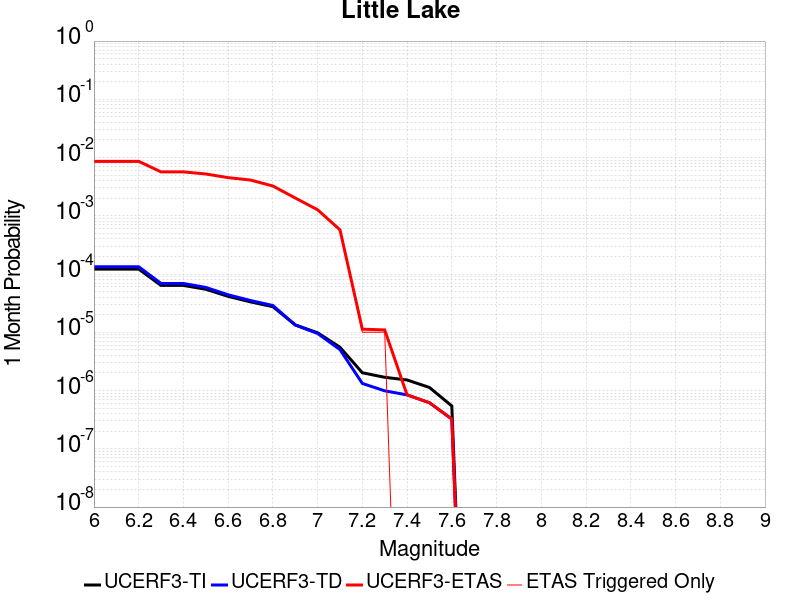 |  |  |

| Magnitude | 1 wk TI Prob | 1 wk TD Prob | 1 wk ETAS Prob | 1 wk ETAS/TD Gain | 1 wk ETAS Triggered Only | 1 mo TI Prob | 1 mo TD Prob | 1 mo ETAS Prob | 1 mo ETAS/TD Gain | 1 mo ETAS Triggered Only | 1 yr TI Prob | 1 yr TD Prob | 1 yr ETAS Prob | 1 yr ETAS/TD Gain | 1 yr ETAS Triggered Only | 10 yr TI Prob | 10 yr TD Prob | 10 yr ETAS Prob | 10 yr ETAS/TD Gain | 10 yr ETAS Triggered Only |
|-----|-----|-----|-----|-----|-----|-----|-----|-----|-----|-----|-----|-----|-----|-----|-----|-----|-----|-----|-----|-----|
| 6.0 | 2.8424427E-5 | 3.120616E-5 | 0.0034737217 | 111.315254 | 0.003442623 | 1.2181328E-4 | 1.3373457E-4 | 0.008739141 | 65.34691 | 0.008606558 | 0.0014820677 | 0.0016271356 | 0.022760725 | 13.988216 | 0.021168033 | 0.014722223 | 0.016165627 | 0.049995013 | 3.092674 | 0.034385245 |
| 6.1 | 2.8424427E-5 | 3.120616E-5 | 0.0034737217 | 111.315254 | 0.003442623 | 1.2181328E-4 | 1.3373457E-4 | 0.008739141 | 65.34691 | 0.008606558 | 0.0014820677 | 0.0016271356 | 0.022760725 | 13.988216 | 0.021168033 | 0.014722223 | 0.016165627 | 0.049995013 | 3.092674 | 0.034385245 |
| 6.2 | 2.8424427E-5 | 3.120616E-5 | 0.0034737217 | 111.315254 | 0.003442623 | 1.2181328E-4 | 1.3373457E-4 | 0.008739141 | 65.34691 | 0.008606558 | 0.0014820677 | 0.0016271356 | 0.022760725 | 13.988216 | 0.021168033 | 0.014722223 | 0.016165627 | 0.049995013 | 3.092674 | 0.034385245 |
| 6.3 | 1.48860645E-5 | 1.6081593E-5 | 0.0022291609 | 138.61566 | 0.0022131146 | 6.379586E-5 | 6.891945E-5 | 0.0057857386 | 83.94928 | 0.0057172133 | 7.7643775E-4 | 8.387995E-4 | 0.014843436 | 17.696047 | 0.014016394 | 0.007737305 | 0.008359154 | 0.030894598 | 3.6959004 | 0.02272541 |
| 6.4 | 1.48860645E-5 | 1.6081593E-5 | 0.0022291609 | 138.61566 | 0.0022131146 | 6.379586E-5 | 6.891945E-5 | 0.0057857386 | 83.94928 | 0.0057172133 | 7.7643775E-4 | 8.387995E-4 | 0.014843436 | 17.696047 | 0.014016394 | 0.007737305 | 0.008359154 | 0.030894598 | 3.6959004 | 0.02272541 |
| 6.5 | 1.2797581E-5 | 1.3765735E-5 | 0.002103901 | 152.83607 | 0.002090164 | 5.4845623E-5 | 5.899482E-5 | 0.0054890024 | 93.04211 | 0.0054303277 | 6.675408E-4 | 7.180509E-4 | 0.01359814 | 18.93757 | 0.012889344 | 0.006655392 | 0.0071598585 | 0.027830465 | 3.8870132 | 0.020819671 |
| 6.6 | 9.661896E-6 | 1.0289158E-5 | 0.0018135493 | 176.25829 | 0.0018032787 | 4.1407468E-5 | 4.4095737E-5 | 0.0047774934 | 108.34366 | 0.0047336067 | 5.040193E-4 | 5.367496E-4 | 0.011412057 | 21.261415 | 0.010881147 | 0.005028777 | 0.0053561367 | 0.022782786 | 4.2535853 | 0.017520491 |
| 6.7 | 7.767871E-6 | 8.199779E-6 | 0.0017294971 | 210.91998 | 0.0017213115 | 3.329045E-5 | 3.514151E-5 | 0.004379251 | 124.61761 | 0.004344262 | 4.0523586E-4 | 4.2777765E-4 | 0.010116254 | 23.648394 | 0.009692623 | 0.004044977 | 0.0042708935 | 0.019798554 | 4.6356936 | 0.015594263 |
| 6.8 | 6.4235196E-6 | 6.735819E-6 | 0.0013591857 | 201.78477 | 0.001352459 | 2.752908E-5 | 2.886755E-5 | 0.0034304087 | 118.8327 | 0.0034016394 | 3.35115E-4 | 3.5141854E-4 | 0.007869268 | 22.392862 | 0.0075204917 | 0.003346101 | 0.0035098887 | 0.015251319 | 4.345243 | 0.011782787 |
| 6.9 | 3.1283696E-6 | 3.1122067E-6 | 8.6376525E-4 | 277.54108 | 8.6065574E-4 | 1.3407229E-5 | 1.3337969E-5 | 0.002103474 | 157.70572 | 0.002090164 | 1.6322079E-4 | 1.6237919E-4 | 0.0044649593 | 27.497114 | 0.004303279 | 0.0016310095 | 0.0016227537 | 0.00845591 | 5.2108397 | 0.006844262 |
| 7.0 | 2.290603E-6 | 2.2287015E-6 | 5.964897E-4 | 267.64 | 5.9426227E-4 | 9.816834E-6 | 9.551549E-6 | 0.0012595396 | 131.86758 | 0.00125 | 1.19513395E-4 | 1.16284944E-4 | 0.0027184414 | 23.377415 | 0.002602459 | 0.0011944914 | 0.0011623431 | 0.00535828 | 4.609895 | 0.00420082 |
| 7.1 | 1.293693E-6 | 1.1776951E-6 | 2.880626E-4 | 244.59862 | 2.8688525E-4 | 5.5443866E-6 | 5.047259E-6 | 5.1733974E-4 | 102.499146 | 5.1229505E-4 | 6.750081E-5 | 6.144935E-5 | 0.0012703914 | 20.6738 | 0.0012090164 | 6.7480316E-4 | 6.14392E-4 | 0.002723751 | 4.433246 | 0.0021106557 |
| 7.2 | 4.715842E-7 | 3.0918443E-7 | 3.0918443E-7 | 1.0 | 0.0 | 2.0210737E-6 | 1.3250755E-6 | 1.3250755E-6 | 1.0 | 0.0 | 2.4606294E-5 | 1.613268E-5 | 5.7115627E-5 | 3.540368 | 4.0983607E-5 | 2.460357E-4 | 1.6131563E-4 | 2.6375812E-4 | 1.6350437 | 1.0245902E-4 |
| 7.3 | 3.9430947E-7 | 2.3098025E-7 | 2.3098025E-7 | 1.0 | 0.0 | 1.6898966E-6 | 9.89915E-7 | 9.89915E-7 | 1.0 | 0.0 | 2.0574296E-5 | 1.2052149E-5 | 5.3035263E-5 | 4.4004817 | 4.0983607E-5 | 2.0572392E-4 | 1.20515026E-4 | 2.0247237E-4 | 1.6800591 | 8.196721E-5 |
| 7.4 | 3.547123E-7 | 1.9679635E-7 | 1.9679635E-7 | 1.0 | 0.0 | 1.5201948E-6 | 8.4341264E-7 | 8.4341264E-7 | 1.0 | 0.0 | 1.8508214E-5 | 1.0268501E-5 | 5.1251685E-5 | 4.9911556 | 4.0983607E-5 | 1.8506673E-4 | 1.0268033E-4 | 1.8463912E-4 | 1.7981937 | 8.196721E-5 |
| 7.5 | 2.6354266E-7 | 1.4423487E-7 | 1.4423487E-7 | 1.0 | 0.0 | 1.129468E-6 | 6.1814933E-7 | 6.1814933E-7 | 1.0 | 0.0 | 1.3751187E-5 | 7.5259427E-6 | 2.8017592E-5 | 3.7228017 | 2.0491803E-5 | 1.3750336E-4 | 7.525693E-5 | 1.3672771E-4 | 1.8168123 | 6.147541E-5 |
| 7.6 | 1.269913E-7 | 7.5727044E-8 | 7.5727044E-8 | 1.0 | 0.0 | 5.4424834E-7 | 3.2454443E-7 | 3.2454443E-7 | 1.0 | 0.0 | 6.6262032E-6 | 3.9513216E-6 | 3.9513216E-6 | 1.0 | 0.0 | 6.626006E-5 | 3.951255E-5 | 8.049454E-5 | 2.037189 | 4.0983607E-5 |

## Airport Lake
*[(top)](#table-of-contents)*

| 1 Week | 1 Month | 1 Year | 10 Year |
|-----|-----|-----|-----|
|  | 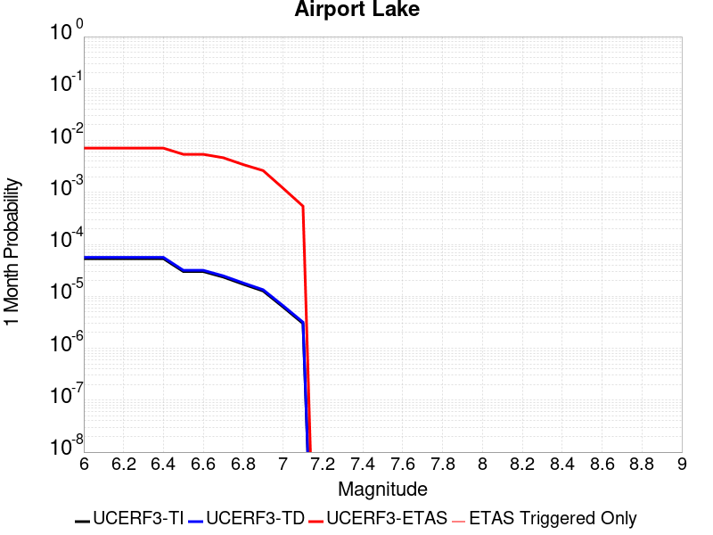 |  |  |

| Magnitude | 1 wk TI Prob | 1 wk TD Prob | 1 wk ETAS Prob | 1 wk ETAS/TD Gain | 1 wk ETAS Triggered Only | 1 mo TI Prob | 1 mo TD Prob | 1 mo ETAS Prob | 1 mo ETAS/TD Gain | 1 mo ETAS Triggered Only | 1 yr TI Prob | 1 yr TD Prob | 1 yr ETAS Prob | 1 yr ETAS/TD Gain | 1 yr ETAS Triggered Only | 10 yr TI Prob | 10 yr TD Prob | 10 yr ETAS Prob | 10 yr ETAS/TD Gain | 10 yr ETAS Triggered Only |
|-----|-----|-----|-----|-----|-----|-----|-----|-----|-----|-----|-----|-----|-----|-----|-----|-----|-----|-----|-----|-----|
| 6.0 | 1.2387061E-5 | 1.31032575E-5 | 0.0029229012 | 223.06676 | 0.0029098361 | 5.3086325E-5 | 5.6155768E-5 | 0.0071049402 | 126.522 | 0.00704918 | 6.461343E-4 | 6.835104E-4 | 0.017291004 | 25.297352 | 0.016618852 | 0.0064425888 | 0.0068168915 | 0.033335693 | 4.8901606 | 0.026700819 |
| 6.1 | 1.2387061E-5 | 1.31032575E-5 | 0.0029229012 | 223.06676 | 0.0029098361 | 5.3086325E-5 | 5.6155768E-5 | 0.0071049402 | 126.522 | 0.00704918 | 6.461343E-4 | 6.835104E-4 | 0.017291004 | 25.297352 | 0.016618852 | 0.0064425888 | 0.0068168915 | 0.033335693 | 4.8901606 | 0.026700819 |
| 6.2 | 1.2387061E-5 | 1.31032575E-5 | 0.0029229012 | 223.06676 | 0.0029098361 | 5.3086325E-5 | 5.6155768E-5 | 0.0071049402 | 126.522 | 0.00704918 | 6.461343E-4 | 6.835104E-4 | 0.017291004 | 25.297352 | 0.016618852 | 0.0064425888 | 0.0068168915 | 0.033335693 | 4.8901606 | 0.026700819 |
| 6.3 | 1.2387061E-5 | 1.31032575E-5 | 0.0029229012 | 223.06676 | 0.0029098361 | 5.3086325E-5 | 5.6155768E-5 | 0.0071049402 | 126.522 | 0.00704918 | 6.461343E-4 | 6.835104E-4 | 0.017291004 | 25.297352 | 0.016618852 | 0.0064425888 | 0.0068168915 | 0.033335693 | 4.8901606 | 0.026700819 |
| 6.4 | 1.2387061E-5 | 1.31032575E-5 | 0.0029229012 | 223.06676 | 0.0029098361 | 5.3086325E-5 | 5.6155768E-5 | 0.0071049402 | 126.522 | 0.00704918 | 6.461343E-4 | 6.835104E-4 | 0.017291004 | 25.297352 | 0.016618852 | 0.0064425888 | 0.0068168915 | 0.033335693 | 4.8901606 | 0.026700819 |
| 6.5 | 6.9922594E-6 | 7.38498E-6 | 0.00230245 | 311.7747 | 0.002295082 | 2.996648E-5 | 3.164956E-5 | 0.0054618055 | 172.57129 | 0.0054303277 | 3.6478083E-4 | 3.8527072E-4 | 0.013003359 | 33.751225 | 0.012622951 | 0.003641826 | 0.0038465653 | 0.023994178 | 6.2378187 | 0.02022541 |
| 6.6 | 6.9922594E-6 | 7.38498E-6 | 0.00230245 | 311.7747 | 0.002295082 | 2.996648E-5 | 3.164956E-5 | 0.0054618055 | 172.57129 | 0.0054303277 | 3.6478083E-4 | 3.8527072E-4 | 0.013003359 | 33.751225 | 0.012622951 | 0.003641826 | 0.0038465653 | 0.023994178 | 6.2378187 | 0.02022541 |
| 6.7 | 5.477277E-6 | 5.7861116E-6 | 0.0019320045 | 333.90378 | 0.0019262295 | 2.3473833E-5 | 2.4797408E-5 | 0.004717304 | 190.23375 | 0.004692623 | 2.8575645E-4 | 3.0187052E-4 | 0.011097791 | 36.763416 | 0.010799181 | 0.0028538927 | 0.0030149885 | 0.020339645 | 6.746177 | 0.017377049 |
| 6.8 | 3.9950432E-6 | 4.2191186E-6 | 0.0014796227 | 350.69476 | 0.0014754098 | 1.7121502E-5 | 1.8081826E-5 | 0.003624574 | 200.45398 | 0.0036065574 | 2.0843433E-4 | 2.2012675E-4 | 0.008312607 | 37.76282 | 0.008094262 | 0.0020823893 | 0.002199358 | 0.015121695 | 6.8755035 | 0.01295082 |
| 6.9 | 2.95695E-6 | 3.1230477E-6 | 0.0012121357 | 388.12592 | 0.0012090164 | 1.2672582E-5 | 1.3384434E-5 | 0.0027797408 | 207.6846 | 0.0027663934 | 1.5427776E-4 | 1.6294557E-4 | 0.006002158 | 36.835358 | 0.005840164 | 0.001541707 | 0.0016284833 | 0.010834778 | 6.653294 | 0.009221312 |
| 7.0 | 1.456072E-6 | 1.5408239E-6 | 5.343269E-4 | 346.78 | 5.327869E-4 | 6.2402937E-6 | 6.60352E-6 | 0.0011951203 | 180.9823 | 0.0011885245 | 7.597293E-5 | 8.03959E-5 | 0.0024982344 | 31.074152 | 0.0024180328 | 7.594696E-4 | 8.03767E-4 | 0.0047145556 | 5.865575 | 0.0039139343 |
| 7.1 | 6.995192E-7 | 7.4090326E-7 | 2.6713414E-4 | 360.552 | 2.6639344E-4 | 2.997936E-6 | 3.1752998E-6 | 4.94977E-4 | 155.88356 | 4.918033E-4 | 3.649926E-5 | 3.8659273E-5 | 0.001186156 | 30.682312 | 0.001147541 | 3.6493264E-4 | 3.8659273E-4 | 0.0023530454 | 6.086626 | 0.0019672131 |

## Owl Lake
*[(top)](#table-of-contents)*

| 1 Week | 1 Month | 1 Year | 10 Year |
|-----|-----|-----|-----|
|  |  |  |  |

| Magnitude | 1 wk TI Prob | 1 wk TD Prob | 1 wk ETAS Prob | 1 wk ETAS/TD Gain | 1 wk ETAS Triggered Only | 1 mo TI Prob | 1 mo TD Prob | 1 mo ETAS Prob | 1 mo ETAS/TD Gain | 1 mo ETAS Triggered Only | 1 yr TI Prob | 1 yr TD Prob | 1 yr ETAS Prob | 1 yr ETAS/TD Gain | 1 yr ETAS Triggered Only | 10 yr TI Prob | 10 yr TD Prob | 10 yr ETAS Prob | 10 yr ETAS/TD Gain | 10 yr ETAS Triggered Only |
|-----|-----|-----|-----|-----|-----|-----|-----|-----|-----|-----|-----|-----|-----|-----|-----|-----|-----|-----|-----|-----|
| 6.0 | 5.0320643E-5 | 6.636149E-5 | 0.002176877 | 32.803318 | 0.0021106557 | 2.1564208E-4 | 2.8438168E-4 | 0.0055902493 | 19.657558 | 0.005307377 | 0.0026222812 | 0.00345791 | 0.01687447 | 4.8799624 | 0.013463114 | 0.02591553 | 0.0341423 | 0.055933475 | 1.6382457 | 0.022561476 |
| 6.1 | 5.0320643E-5 | 6.636149E-5 | 0.002176877 | 32.803318 | 0.0021106557 | 2.1564208E-4 | 2.8438168E-4 | 0.0055902493 | 19.657558 | 0.005307377 | 0.0026222812 | 0.00345791 | 0.01687447 | 4.8799624 | 0.013463114 | 0.02591553 | 0.0341423 | 0.055933475 | 1.6382457 | 0.022561476 |
| 6.2 | 2.4125871E-5 | 3.098269E-5 | 0.0018137144 | 58.5396 | 0.0017827869 | 1.0339249E-4 | 1.3277736E-4 | 0.004292061 | 32.325245 | 0.004159836 | 0.0012580766 | 0.0016155228 | 0.011844872 | 7.3319125 | 0.0102459015 | 0.012509781 | 0.016071297 | 0.032685176 | 2.0337608 | 0.016885245 |
| 6.3 | 1.7433485E-5 | 2.2356835E-5 | 0.0017026472 | 76.15778 | 0.0016803278 | 7.471279E-5 | 9.5812386E-5 | 0.0038249632 | 39.921387 | 0.0037295083 | 9.0924866E-4 | 0.0011660426 | 0.010151454 | 8.705903 | 0.008995902 | 0.009055373 | 0.01162957 | 0.025867775 | 2.2243106 | 0.014405738 |
| 6.4 | 1.7433485E-5 | 2.2356835E-5 | 0.0017026472 | 76.15778 | 0.0016803278 | 7.471279E-5 | 9.5812386E-5 | 0.0038249632 | 39.921387 | 0.0037295083 | 9.0924866E-4 | 0.0011660426 | 0.010151454 | 8.705903 | 0.008995902 | 0.009055373 | 0.01162957 | 0.025867775 | 2.2243106 | 0.014405738 |
| 6.5 | 1.5182742E-5 | 1.9430352E-5 | 0.0016587428 | 85.36864 | 0.0016393443 | 6.506727E-5 | 8.327114E-5 | 0.0036895282 | 44.307407 | 0.0036065574 | 7.919061E-4 | 0.0010135059 | 0.00959087 | 9.463062 | 0.008586066 | 0.0078909 | 0.010119047 | 0.023669057 | 2.3390598 | 0.013688524 |
| 6.6 | 6.7271576E-6 | 8.548157E-6 | 0.0014839454 | 173.59828 | 0.0014754098 | 2.8830356E-5 | 3.6634476E-5 | 0.0031922567 | 87.13805 | 0.0031557376 | 3.5095305E-4 | 4.4593913E-4 | 0.0073485975 | 16.478926 | 0.006905738 | 0.0035039932 | 0.004468226 | 0.015137552 | 3.3878214 | 0.010717213 |
| 6.7 | 6.682835E-6 | 8.4806015E-6 | 0.0014838779 | 174.97319 | 0.0014754098 | 2.8640408E-5 | 3.634496E-5 | 0.003191968 | 87.82422 | 0.0031557376 | 3.4864116E-4 | 4.424157E-4 | 0.007345098 | 16.602255 | 0.006905738 | 0.003480947 | 0.004433152 | 0.015062052 | 3.3975947 | 0.010676229 |
| 6.8 | 6.5774975E-6 | 8.327072E-6 | 0.001463233 | 175.72 | 0.0014549181 | 2.8188972E-5 | 3.5686993E-5 | 0.00315033 | 88.2767 | 0.003114754 | 3.4314668E-4 | 4.3440814E-4 | 0.0072756973 | 16.748528 | 0.006844262 | 0.0034261728 | 0.0043532955 | 0.014901438 | 3.4230247 | 0.010594263 |
| 6.9 | 6.363419E-6 | 8.0002355E-6 | 0.0014629066 | 182.85794 | 0.0014549181 | 2.727151E-5 | 3.4286306E-5 | 0.0031284424 | 91.24467 | 0.0030942622 | 3.3198006E-4 | 4.173614E-4 | 0.0072382838 | 17.342964 | 0.0068237707 | 0.0033148455 | 0.004183282 | 0.014692414 | 3.5121737 | 0.010553279 |
| 7.0 | 6.1342453E-6 | 7.632424E-6 | 0.0014625393 | 191.62187 | 0.0014549181 | 2.6289357E-5 | 3.271001E-5 | 0.0031063799 | 94.96726 | 0.0030737706 | 3.2002592E-4 | 3.981771E-4 | 0.0071577798 | 17.976372 | 0.006762295 | 0.0031956544 | 0.00399197 | 0.014421481 | 3.6126225 | 0.010471311 |
| 7.1 | 5.842926E-6 | 7.142961E-6 | 0.0014210673 | 198.94653 | 0.0014139344 | 2.504087E-5 | 3.0612362E-5 | 0.003022324 | 98.72888 | 0.0029918032 | 3.0482994E-4 | 3.7264716E-4 | 0.0067841914 | 18.205402 | 0.0064139343 | 0.0030441214 | 0.0037374226 | 0.013577557 | 3.6328664 | 0.009877049 |
| 7.2 | 4.77173E-6 | 5.3591634E-6 | 0.0010504355 | 196.00737 | 0.001045082 | 2.045011E-5 | 2.2967664E-5 | 0.0021745577 | 94.67909 | 0.0021516394 | 2.4895166E-4 | 2.7959948E-4 | 0.004622647 | 16.533104 | 0.004344262 | 0.0024867293 | 0.0028089995 | 0.009450128 | 3.3642328 | 0.006659836 |
| 7.3 | 3.0494948E-6 | 2.7109647E-6 | 2.0762844E-4 | 76.588394 | 2.0491803E-4 | 1.3069198E-5 | 1.1618369E-5 | 4.8292437E-4 | 41.56559 | 4.7131148E-4 | 1.5910587E-4 | 1.4144463E-4 | 0.0011863788 | 8.387585 | 0.001045082 | 0.0015899199 | 0.0014235033 | 0.003162827 | 2.2218616 | 0.0017418033 |
| 7.4 | 2.7263884E-6 | 2.3061473E-6 | 1.4574843E-4 | 63.199966 | 1.4344262E-4 | 1.1684469E-5 | 9.883452E-6 | 2.3529107E-4 | 23.806566 | 2.2540984E-4 | 1.4224913E-4 | 1.2032448E-4 | 7.350046E-4 | 6.108521 | 6.147541E-4 | 0.0014215811 | 0.0012114698 | 0.0021529507 | 1.7771394 | 9.4262295E-4 |
| 7.5 | 2.6090431E-6 | 2.1660758E-6 | 1.4560838E-4 | 67.222206 | 1.4344262E-4 | 1.1181565E-5 | 9.283149E-6 | 2.1419927E-4 | 23.07399 | 2.0491803E-4 | 1.3612706E-4 | 1.1301658E-4 | 6.662327E-4 | 5.8950005 | 5.5327866E-4 | 0.001360437 | 0.001138222 | 0.0019569614 | 1.7193141 | 8.1967213E-4 |
| 7.6 | 2.3008756E-6 | 1.8732376E-6 | 8.38403E-5 | 44.756893 | 8.196721E-5 | 9.860858E-6 | 8.028137E-6 | 1.514696E-4 | 18.867342 | 1.4344262E-4 | 1.20049335E-4 | 9.7738266E-5 | 4.8704448E-4 | 4.9831505 | 3.8934426E-4 | 0.001199845 | 9.852252E-4 | 0.001578902 | 1.6025798 | 5.9426227E-4 |
| 7.7 | 1.7184348E-6 | 1.3423282E-6 | 8.330943E-5 | 62.063385 | 8.196721E-5 | 7.3646997E-6 | 5.7528227E-6 | 1.4919462E-4 | 25.934158 | 1.4344262E-4 | 8.966153E-5 | 7.0038404E-5 | 3.5690356E-4 | 5.095826 | 2.8688525E-4 | 8.962536E-4 | 7.080495E-4 | 0.0011175954 | 1.5784142 | 4.0983607E-4 |
| 7.8 | 8.4612907E-7 | 8.4087924E-7 | 2.1332666E-5 | 25.369474 | 2.0491803E-5 | 3.6262625E-6 | 3.6037634E-6 | 8.557068E-5 | 23.744812 | 8.196721E-5 | 4.4148852E-5 | 4.3874956E-5 | 1.6682038E-4 | 3.8021777 | 1.2295082E-4 | 4.414008E-4 | 4.4413717E-4 | 6.489642E-4 | 1.4611796 | 2.0491803E-4 |
| 7.9 | 2.716738E-7 | 3.7694025E-7 | 3.7694025E-7 | 1.0 | 0.0 | 1.1643157E-6 | 1.6154573E-6 | 1.6154573E-6 | 1.0 | 0.0 | 1.4175452E-5 | 1.9668027E-5 | 1.9668027E-5 | 1.0 | 0.0 | 1.4174548E-4 | 1.9843443E-4 | 1.9843443E-4 | 1.0 | 0.0 |
| 8.0 | 2.1995428E-8 | 3.386013E-8 | 3.386013E-8 | 1.0 | 0.0 | 9.426611E-8 | 1.4511484E-7 | 1.4511484E-7 | 1.0 | 0.0 | 1.1476893E-6 | 1.7667724E-6 | 1.7667724E-6 | 1.0 | 0.0 | 1.14768345E-5 | 1.7968985E-5 | 1.7968985E-5 | 1.0 | 0.0 |

## Panamint Valley
*[(top)](#table-of-contents)*

| 1 Week | 1 Month | 1 Year | 10 Year |
|-----|-----|-----|-----|
|  |  |  | 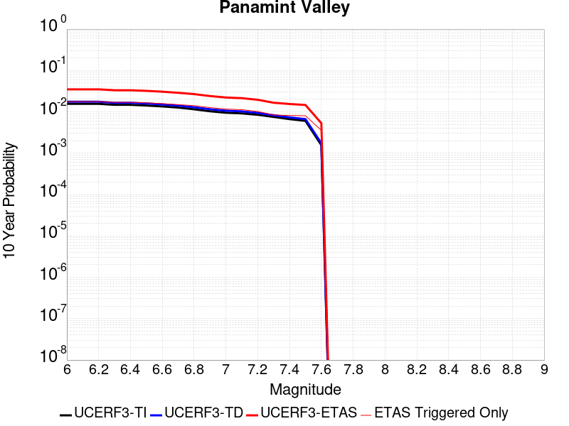 |

| Magnitude | 1 wk TI Prob | 1 wk TD Prob | 1 wk ETAS Prob | 1 wk ETAS/TD Gain | 1 wk ETAS Triggered Only | 1 mo TI Prob | 1 mo TD Prob | 1 mo ETAS Prob | 1 mo ETAS/TD Gain | 1 mo ETAS Triggered Only | 1 yr TI Prob | 1 yr TD Prob | 1 yr ETAS Prob | 1 yr ETAS/TD Gain | 1 yr ETAS Triggered Only | 10 yr TI Prob | 10 yr TD Prob | 10 yr ETAS Prob | 10 yr ETAS/TD Gain | 10 yr ETAS Triggered Only |
|-----|-----|-----|-----|-----|-----|-----|-----|-----|-----|-----|-----|-----|-----|-----|-----|-----|-----|-----|-----|-----|
| 6.0 | 3.0211835E-5 | 3.3985398E-5 | 0.0019806405 | 58.279163 | 0.0019467213 | 1.2947287E-4 | 1.4564373E-4 | 0.0047966056 | 32.933826 | 0.004651639 | 0.0015751923 | 0.0017717998 | 0.012695035 | 7.1650505 | 0.010942623 | 0.015640736 | 0.01758359 | 0.03548048 | 2.0178177 | 0.018217213 |
| 6.1 | 3.0211835E-5 | 3.3985398E-5 | 0.0019806405 | 58.279163 | 0.0019467213 | 1.2947287E-4 | 1.4564373E-4 | 0.0047966056 | 32.933826 | 0.004651639 | 0.0015751923 | 0.0017717998 | 0.012695035 | 7.1650505 | 0.010942623 | 0.015640736 | 0.01758359 | 0.03548048 | 2.0178177 | 0.018217213 |
| 6.2 | 3.0211835E-5 | 3.3985398E-5 | 0.0019806405 | 58.279163 | 0.0019467213 | 1.2947287E-4 | 1.4564373E-4 | 0.0047966056 | 32.933826 | 0.004651639 | 0.0015751923 | 0.0017717998 | 0.012695035 | 7.1650505 | 0.010942623 | 0.015640736 | 0.01758359 | 0.03548048 | 2.0178177 | 0.018217213 |
| 6.3 | 2.8573924E-5 | 3.2103522E-5 | 0.0019582713 | 60.998642 | 0.0019262295 | 1.2245393E-4 | 1.3757942E-4 | 0.004665645 | 33.912376 | 0.0045286887 | 0.001489857 | 0.0016737703 | 0.0122503005 | 7.3189855 | 0.010594263 | 0.01479908 | 0.016618231 | 0.033887867 | 2.0391982 | 0.017561475 |
| 6.4 | 2.8573924E-5 | 3.2103522E-5 | 0.0019582713 | 60.998642 | 0.0019262295 | 1.2245393E-4 | 1.3757942E-4 | 0.004665645 | 33.912376 | 0.0045286887 | 0.001489857 | 0.0016737703 | 0.0122503005 | 7.3189855 | 0.010594263 | 0.01479908 | 0.016618231 | 0.033887867 | 2.0391982 | 0.017561475 |
| 6.5 | 2.7468774E-5 | 3.0829244E-5 | 0.0018955258 | 61.48467 | 0.0018647541 | 1.1771801E-4 | 1.3211879E-4 | 0.0044962964 | 34.032223 | 0.004364754 | 0.0014322745 | 0.0016073869 | 0.011898196 | 7.4021983 | 0.010307377 | 0.014230782 | 0.015964093 | 0.03276126 | 2.0521846 | 0.017069671 |
| 6.6 | 2.6135967E-5 | 2.9253257E-5 | 0.0018734616 | 64.04284 | 0.0018442622 | 1.1200648E-4 | 1.2536523E-4 | 0.0043666367 | 34.83132 | 0.004241803 | 0.0013628257 | 0.0015252795 | 0.011428185 | 7.4925184 | 0.009918033 | 0.013544982 | 0.015154443 | 0.031138001 | 2.054711 | 0.016229508 |
| 6.7 | 2.4498746E-5 | 2.7342086E-5 | 0.0018305714 | 66.95068 | 0.0018032787 | 1.04990395E-4 | 1.1717525E-4 | 0.004174077 | 35.622513 | 0.004057377 | 0.0012775084 | 0.0014257001 | 0.010756641 | 7.5448127 | 0.009344262 | 0.012701893 | 0.014171662 | 0.029140899 | 2.0562797 | 0.015184427 |
| 6.8 | 2.2244329E-5 | 2.4936131E-5 | 0.0017871873 | 71.67059 | 0.001762295 | 9.532935E-5 | 1.0686488E-4 | 0.0039794017 | 37.237694 | 0.0038729508 | 0.0011600169 | 0.0013003252 | 0.0102231335 | 7.8619823 | 0.008934426 | 0.011539802 | 0.012932883 | 0.02711186 | 2.0963507 | 0.014364754 |
| 6.9 | 1.9902658E-5 | 2.2290924E-5 | 0.0015591419 | 69.945145 | 0.0015368853 | 8.529431E-5 | 9.552913E-5 | 0.0035992928 | 37.677433 | 0.0035040984 | 0.0010379635 | 0.0011624652 | 0.009288254 | 7.9901357 | 0.008135246 | 0.010331288 | 0.011568946 | 0.024349684 | 2.1047451 | 0.012930328 |
| 7.0 | 1.8353881E-5 | 2.056681E-5 | 0.0014959463 | 72.73595 | 0.0014754098 | 7.865712E-5 | 8.814059E-5 | 0.00342801 | 38.892525 | 0.003340164 | 9.5722964E-4 | 0.0010726011 | 0.008666906 | 8.08027 | 0.007602459 | 0.009531168 | 0.0106791705 | 0.022376673 | 2.095357 | 0.011823771 |
| 7.1 | 1.7667631E-5 | 1.9773222E-5 | 0.0014131883 | 71.4698 | 0.0013934426 | 7.571623E-5 | 8.473973E-5 | 0.00328119 | 38.720802 | 0.0031967212 | 9.2145515E-4 | 0.0010312354 | 0.008318795 | 8.066824 | 0.007295082 | 0.009176437 | 0.010269388 | 0.021505265 | 2.0941136 | 0.011352459 |
| 7.2 | 1.6381597E-5 | 1.8158824E-5 | 0.0012476447 | 68.70735 | 0.0012295082 | 7.020495E-5 | 7.782131E-5 | 0.0029669406 | 38.125046 | 0.0028893442 | 8.544101E-4 | 9.4707985E-4 | 0.0074777743 | 7.8956113 | 0.006536885 | 0.008511325 | 0.009435088 | 0.019645214 | 2.0821443 | 0.010307377 |
| 7.3 | 1.4520491E-5 | 1.5966963E-5 | 9.585749E-4 | 60.03489 | 9.4262295E-4 | 6.222919E-5 | 6.842814E-5 | 0.0023838435 | 34.83718 | 0.0023155739 | 7.57377E-4 | 8.3281036E-4 | 0.006156242 | 7.3921294 | 0.0053278687 | 0.0075480095 | 0.008300003 | 0.016733518 | 2.0160856 | 0.008504098 |
| 7.4 | 1.2852287E-5 | 1.4145856E-5 | 9.3626394E-4 | 66.18645 | 9.221311E-4 | 5.5080065E-5 | 6.0623777E-5 | 0.002335076 | 38.517494 | 0.00227459 | 6.7039346E-4 | 7.3786033E-4 | 0.0059798914 | 8.104367 | 0.0052459016 | 0.0066837464 | 0.007357025 | 0.01563583 | 2.1252925 | 0.008340164 |
| 7.5 | 1.1637851E-5 | 1.2837149E-5 | 8.939734E-4 | 69.63956 | 8.811475E-4 | 4.987555E-5 | 5.5015284E-5 | 0.002288499 | 41.59751 | 0.0022336065 | 6.070656E-4 | 6.6962093E-4 | 0.0058505754 | 8.737146 | 0.0051844264 | 0.006054099 | 0.0066789286 | 0.0148005495 | 2.2160065 | 0.00817623 |
| 7.6 | 3.0068115E-6 | 3.3331687E-6 | 3.3120092E-4 | 99.36518 | 3.2786885E-4 | 1.2886271E-5 | 1.4284972E-5 | 0.0010388605 | 72.724014 | 0.0010245901 | 1.5687906E-4 | 1.7391294E-4 | 0.0026325018 | 15.136894 | 0.0024590164 | 0.0015676835 | 0.001739208 | 0.005605423 | 3.2229745 | 0.0038729508 |

## Garlock (East)
*[(top)](#table-of-contents)*

| 1 Week | 1 Month | 1 Year | 10 Year |
|-----|-----|-----|-----|
|  |  |  | 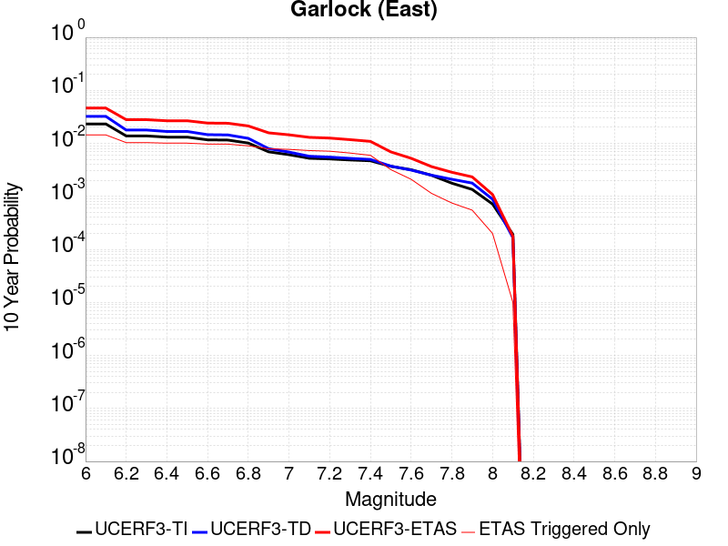 |

| Magnitude | 1 wk TI Prob | 1 wk TD Prob | 1 wk ETAS Prob | 1 wk ETAS/TD Gain | 1 wk ETAS Triggered Only | 1 mo TI Prob | 1 mo TD Prob | 1 mo ETAS Prob | 1 mo ETAS/TD Gain | 1 mo ETAS Triggered Only | 1 yr TI Prob | 1 yr TD Prob | 1 yr ETAS Prob | 1 yr ETAS/TD Gain | 1 yr ETAS Triggered Only | 10 yr TI Prob | 10 yr TD Prob | 10 yr ETAS Prob | 10 yr ETAS/TD Gain | 10 yr ETAS Triggered Only |
|-----|-----|-----|-----|-----|-----|-----|-----|-----|-----|-----|-----|-----|-----|-----|-----|-----|-----|-----|-----|-----|
| 6.0 | 4.5092507E-5 | 6.2906794E-5 | 0.001107923 | 17.612137 | 0.001045082 | 1.9323928E-4 | 2.695752E-4 | 0.003567866 | 13.235143 | 0.0032991804 | 0.0023501497 | 0.0032775842 | 0.011672111 | 3.5611932 | 0.008422131 | 0.023254504 | 0.03235364 | 0.046273474 | 1.43024 | 0.014385246 |
| 6.1 | 4.5092507E-5 | 6.2906794E-5 | 0.001107923 | 17.612137 | 0.001045082 | 1.9323928E-4 | 2.695752E-4 | 0.003567866 | 13.235143 | 0.0032991804 | 0.0023501497 | 0.0032775842 | 0.011672111 | 3.5611932 | 0.008422131 | 0.023254504 | 0.03235364 | 0.046273474 | 1.43024 | 0.014385246 |
| 6.2 | 2.6674514E-5 | 3.4512483E-5 | 7.7219197E-4 | 22.374279 | 7.377049E-4 | 1.1431433E-4 | 1.4790244E-4 | 0.0026475326 | 17.900534 | 0.0025 | 0.0013908884 | 0.001799258 | 0.008038012 | 4.4674044 | 0.00625 | 0.01382215 | 0.017891733 | 0.028155569 | 1.5736636 | 0.0104508195 |
| 6.3 | 2.6674514E-5 | 3.4512483E-5 | 7.7219197E-4 | 22.374279 | 7.377049E-4 | 1.1431433E-4 | 1.4790244E-4 | 0.0026475326 | 17.900534 | 0.0025 | 0.0013908884 | 0.001799258 | 0.008038012 | 4.4674044 | 0.00625 | 0.01382215 | 0.017891733 | 0.028155569 | 1.5736636 | 0.0104508195 |
| 6.4 | 2.5312667E-5 | 3.2341675E-5 | 7.7002274E-4 | 23.808994 | 7.377049E-4 | 1.0847834E-4 | 1.3859998E-4 | 0.0026177645 | 18.887192 | 0.0024795083 | 0.0013199237 | 0.001686178 | 0.007884725 | 4.6760926 | 0.0062090163 | 0.013121112 | 0.01677974 | 0.026853718 | 1.6003656 | 0.0102459015 |
| 6.5 | 2.5312667E-5 | 3.2341675E-5 | 7.7002274E-4 | 23.808994 | 7.377049E-4 | 1.0847834E-4 | 1.3859998E-4 | 0.0026177645 | 18.887192 | 0.0024795083 | 0.0013199237 | 0.001686178 | 0.007884725 | 4.6760926 | 0.0062090163 | 0.013121112 | 0.01677974 | 0.026853718 | 1.6003656 | 0.0102459015 |
| 6.6 | 2.246556E-5 | 2.813642E-5 | 7.6582056E-4 | 27.218126 | 7.377049E-4 | 9.627742E-5 | 1.20579214E-4 | 0.0024768524 | 20.541288 | 0.0023565574 | 0.0011715472 | 0.0014670868 | 0.0074828384 | 5.1004744 | 0.00602459 | 0.011653901 | 0.014620015 | 0.024372855 | 1.6670882 | 0.009897541 |
| 6.7 | 2.2241198E-5 | 2.7806154E-5 | 7.654906E-4 | 27.529537 | 7.377049E-4 | 9.531594E-5 | 1.1916392E-4 | 0.0024754405 | 20.773405 | 0.0023565574 | 0.0011598538 | 0.0014498787 | 0.0074248095 | 5.120987 | 0.0059836064 | 0.011538187 | 0.0144502055 | 0.024144137 | 1.6708509 | 0.009836066 |
| 6.8 | 1.9528685E-5 | 2.3900653E-5 | 7.410966E-4 | 31.00738 | 7.172131E-4 | 8.369167E-5 | 1.0242746E-4 | 0.0023153154 | 22.604443 | 0.0022131146 | 0.0010184698 | 0.0012463606 | 0.00683365 | 5.482884 | 0.0055942624 | 0.010138147 | 0.012437694 | 0.021402655 | 1.7207897 | 0.009077868 |
| 6.9 | 1.3318621E-5 | 1.5201007E-5 | 6.7092874E-4 | 44.137127 | 6.557377E-4 | 5.7078556E-5 | 6.514558E-5 | 0.0021551733 | 33.08242 | 0.002090164 | 6.9470983E-4 | 7.928645E-4 | 0.005829851 | 7.3528976 | 0.0050409837 | 0.0069254204 | 0.007940986 | 0.015747352 | 1.9830475 | 0.0078688525 |
| 7.0 | 1.1760853E-5 | 1.3109839E-5 | 6.6883897E-4 | 51.018093 | 6.557377E-4 | 5.0402683E-5 | 5.618384E-5 | 0.002105249 | 37.470722 | 0.0020491802 | 6.134799E-4 | 6.838286E-4 | 0.0055370647 | 8.097154 | 0.0048565576 | 0.0061178906 | 0.006857582 | 0.014367203 | 2.0950832 | 0.0075614755 |
| 7.1 | 1.0064758E-5 | 1.090491E-5 | 6.6663546E-4 | 61.131683 | 6.557377E-4 | 4.3133965E-5 | 4.673451E-5 | 0.0020753283 | 44.40676 | 0.0020286886 | 5.2502943E-4 | 5.688476E-4 | 0.0052997614 | 9.316663 | 0.0047336067 | 0.005237907 | 0.005714025 | 0.0129266735 | 2.262271 | 0.0072540985 |
| 7.2 | 9.768808E-6 | 1.0500772E-5 | 6.4574E-4 | 61.494526 | 6.352459E-4 | 4.186565E-5 | 4.500255E-5 | 0.002032618 | 45.16673 | 0.001987705 | 5.095951E-4 | 5.477718E-4 | 0.005155902 | 9.412499 | 0.004610656 | 0.0050842804 | 0.005504284 | 0.012494285 | 2.26992 | 0.0070286887 |
| 7.3 | 9.344516E-6 | 9.946395E-6 | 6.246944E-4 | 62.806107 | 6.147541E-4 | 4.004731E-5 | 4.2626732E-5 | 0.0018458286 | 43.302135 | 0.0018032787 | 4.8746695E-4 | 5.1886035E-4 | 0.0047379816 | 9.131516 | 0.0042213113 | 0.0048639905 | 0.005215945 | 0.011637195 | 2.2310808 | 0.006454918 |
| 7.4 | 9.023491E-6 | 9.49255E-6 | 5.422744E-4 | 57.126312 | 5.327869E-4 | 3.867153E-5 | 4.068174E-5 | 0.0015775044 | 38.77672 | 0.0015368853 | 4.7072413E-4 | 4.95191E-4 | 0.0042023705 | 8.486363 | 0.0037090164 | 0.004697283 | 0.004979378 | 0.010688513 | 2.1465557 | 0.0057377047 |
| 7.5 | 7.081253E-6 | 7.0893525E-6 | 3.144642E-4 | 44.357258 | 3.0737705E-4 | 3.0347876E-5 | 3.038259E-5 | 9.1150333E-4 | 30.000845 | 8.811475E-4 | 3.6942272E-4 | 3.6984598E-4 | 0.0022748788 | 6.150882 | 0.0019057377 | 0.003688092 | 0.0037251879 | 0.0066445996 | 1.7836952 | 0.0029303278 |
| 7.6 | 6.116396E-6 | 5.9608415E-6 | 2.3136934E-4 | 38.814877 | 2.2540984E-4 | 2.6212863E-5 | 2.5546216E-5 | 5.378282E-4 | 21.053146 | 5.1229505E-4 | 3.1909486E-4 | 3.1098103E-4 | 0.001499136 | 4.820667 | 0.0011885245 | 0.0031863707 | 0.003136586 | 0.0050159185 | 1.5991651 | 0.0018852459 |
| 7.7 | 4.797145E-6 | 4.7587923E-6 | 1.6869244E-4 | 35.44858 | 1.6393443E-4 | 2.055903E-5 | 2.0394666E-5 | 3.687482E-4 | 18.080622 | 3.4836066E-4 | 2.5027743E-4 | 2.482769E-4 | 8.6287834E-4 | 3.475468 | 6.147541E-4 | 0.0024999576 | 0.002510134 | 0.0034912715 | 1.3908706 | 9.836066E-4 |
| 7.8 | 3.4028885E-6 | 3.979809E-6 | 8.5946696E-5 | 21.595682 | 8.196721E-5 | 1.4583726E-5 | 1.7056214E-5 | 2.6295366E-4 | 15.4168825 | 2.4590164E-4 | 1.775424E-4 | 2.076397E-4 | 6.583658E-4 | 3.1707122 | 4.5081967E-4 | 0.0017740062 | 0.0021019245 | 0.002735835 | 1.3015858 | 6.352459E-4 |
| 7.9 | 2.5928412E-6 | 3.373588E-6 | 2.3865323E-5 | 7.0741663 | 2.0491803E-5 | 1.1112129E-5 | 1.44581545E-5 | 1.7839021E-4 | 12.338381 | 1.6393443E-4 | 1.3528178E-4 | 1.7601387E-4 | 5.03825E-4 | 2.8624165 | 3.2786885E-4 | 0.0013519945 | 0.0017818334 | 0.0022727603 | 1.275518 | 4.918033E-4 |
| 8.0 | 1.3743648E-6 | 1.673991E-6 | 1.673991E-6 | 1.0 | 0.0 | 5.8901214E-6 | 7.174228E-6 | 2.7665885E-5 | 3.8562872 | 2.0491803E-5 | 7.1709874E-5 | 8.7342756E-5 | 1.693028E-4 | 1.9383727 | 8.196721E-5 | 7.1686733E-4 | 8.839922E-4 | 0.0010273079 | 1.1621234 | 1.4344262E-4 |
| 8.1 | 3.6733252E-7 | 3.1499187E-7 | 3.1499187E-7 | 1.0 | 0.0 | 1.5742813E-6 | 1.3499646E-6 | 1.3499646E-6 | 1.0 | 0.0 | 1.9166706E-5 | 1.643571E-5 | 1.643571E-5 | 1.0 | 0.0 | 1.9165053E-4 | 1.6643589E-4 | 1.6643589E-4 | 1.0 | 0.0 |

## Ash Hill
*[(top)](#table-of-contents)*

| 1 Week | 1 Month | 1 Year | 10 Year |
|-----|-----|-----|-----|
|  |  | 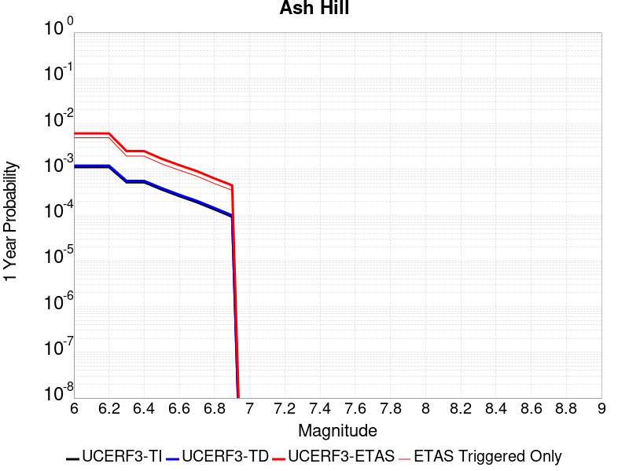 |  |

| Magnitude | 1 wk TI Prob | 1 wk TD Prob | 1 wk ETAS Prob | 1 wk ETAS/TD Gain | 1 wk ETAS Triggered Only | 1 mo TI Prob | 1 mo TD Prob | 1 mo ETAS Prob | 1 mo ETAS/TD Gain | 1 mo ETAS Triggered Only | 1 yr TI Prob | 1 yr TD Prob | 1 yr ETAS Prob | 1 yr ETAS/TD Gain | 1 yr ETAS Triggered Only | 10 yr TI Prob | 10 yr TD Prob | 10 yr ETAS Prob | 10 yr ETAS/TD Gain | 10 yr ETAS Triggered Only |
|-----|-----|-----|-----|-----|-----|-----|-----|-----|-----|-----|-----|-----|-----|-----|-----|-----|-----|-----|-----|-----|
| 6.0 | 2.1545662E-5 | 2.3194681E-5 | 8.428478E-4 | 36.337975 | 8.1967213E-4 | 9.2335285E-5 | 9.9402445E-5 | 0.0020459304 | 20.582293 | 0.0019467213 | 0.0011236023 | 0.0012096328 | 0.006387788 | 5.280766 | 0.0051844264 | 0.011179381 | 0.01203847 | 0.020500928 | 1.7029512 | 0.008565574 |
| 6.1 | 2.1545662E-5 | 2.3194681E-5 | 8.428478E-4 | 36.337975 | 8.1967213E-4 | 9.2335285E-5 | 9.9402445E-5 | 0.0020459304 | 20.582293 | 0.0019467213 | 0.0011236023 | 0.0012096328 | 0.006387788 | 5.280766 | 0.0051844264 | 0.011179381 | 0.01203847 | 0.020500928 | 1.7029512 | 0.008565574 |
| 6.2 | 2.1545662E-5 | 2.3194681E-5 | 8.428478E-4 | 36.337975 | 8.1967213E-4 | 9.2335285E-5 | 9.9402445E-5 | 0.0020459304 | 20.582293 | 0.0019467213 | 0.0011236023 | 0.0012096328 | 0.006387788 | 5.280766 | 0.0051844264 | 0.011179381 | 0.01203847 | 0.020500928 | 1.7029512 | 0.008565574 |
| 6.3 | 1.0025529E-5 | 1.0747037E-5 | 3.181208E-4 | 29.60079 | 3.0737705E-4 | 4.2965847E-5 | 4.605799E-5 | 7.017655E-4 | 15.236564 | 6.557377E-4 | 5.229836E-4 | 5.60625E-4 | 0.0025881762 | 4.616591 | 0.0020286886 | 0.005217545 | 0.0055934195 | 0.008813014 | 1.5756041 | 0.003237705 |
| 6.4 | 1.0025529E-5 | 1.0747037E-5 | 3.181208E-4 | 29.60079 | 3.0737705E-4 | 4.2965847E-5 | 4.605799E-5 | 7.017655E-4 | 15.236564 | 6.557377E-4 | 5.229836E-4 | 5.60625E-4 | 0.0025881762 | 4.616591 | 0.0020286886 | 0.005217545 | 0.0055934195 | 0.008813014 | 1.5756041 | 0.003237705 |
| 6.5 | 6.9617327E-6 | 7.456704E-6 | 2.1237321E-4 | 28.48084 | 2.0491803E-4 | 2.9835655E-5 | 3.1956963E-5 | 4.6227107E-4 | 14.465426 | 4.3032787E-4 | 3.6318856E-4 | 3.8901521E-4 | 0.0017614319 | 4.5279255 | 0.0013729509 | 0.0036259557 | 0.0038841967 | 0.0060683032 | 1.5623058 | 0.002192623 |
| 6.6 | 4.9919777E-6 | 5.346739E-6 | 1.4878859E-4 | 27.827915 | 1.4344262E-4 | 2.1394015E-5 | 2.2914432E-5 | 2.6881043E-4 | 11.731054 | 2.4590164E-4 | 2.60441E-4 | 2.789542E-4 | 0.0013032586 | 4.6719446 | 0.0010245901 | 0.0026013597 | 0.0027866988 | 0.0042375624 | 1.5206388 | 0.0014549181 |
| 6.7 | 3.6630722E-6 | 3.9246606E-6 | 1.2687499E-4 | 32.327633 | 1.2295082E-4 | 1.5698786E-5 | 1.6819899E-5 | 2.0124302E-4 | 11.96458 | 1.8442623E-4 | 1.9111596E-4 | 2.0476876E-4 | 9.832978E-4 | 4.8019915 | 7.786885E-4 | 0.0019095168 | 0.002046364 | 0.003109757 | 1.5196501 | 0.0010655738 |
| 6.8 | 2.5599613E-6 | 2.7449514E-6 | 8.471194E-5 | 30.860998 | 8.196721E-5 | 1.0971216E-5 | 1.1764052E-5 | 1.3471342E-4 | 11.451278 | 1.2295082E-4 | 1.3356637E-4 | 1.4322287E-4 | 7.578889E-4 | 5.2916756 | 6.147541E-4 | 0.0013348613 | 0.0014317906 | 0.0022298268 | 1.5573692 | 7.991803E-4 |
| 6.9 | 1.7684905E-6 | 1.896889E-6 | 6.337218E-5 | 33.40848 | 6.147541E-5 | 7.579223E-6 | 8.129524E-6 | 6.960444E-5 | 8.561933 | 6.147541E-5 | 9.2273134E-5 | 9.8976954E-5 | 5.2926224E-4 | 5.3473277 | 4.3032787E-4 | 9.223483E-4 | 9.897696E-4 | 0.0015834437 | 1.5998105 | 5.9426227E-4 |

## Hunter Mountain-Saline Valley
*[(top)](#table-of-contents)*

| 1 Week | 1 Month | 1 Year | 10 Year |
|-----|-----|-----|-----|
| 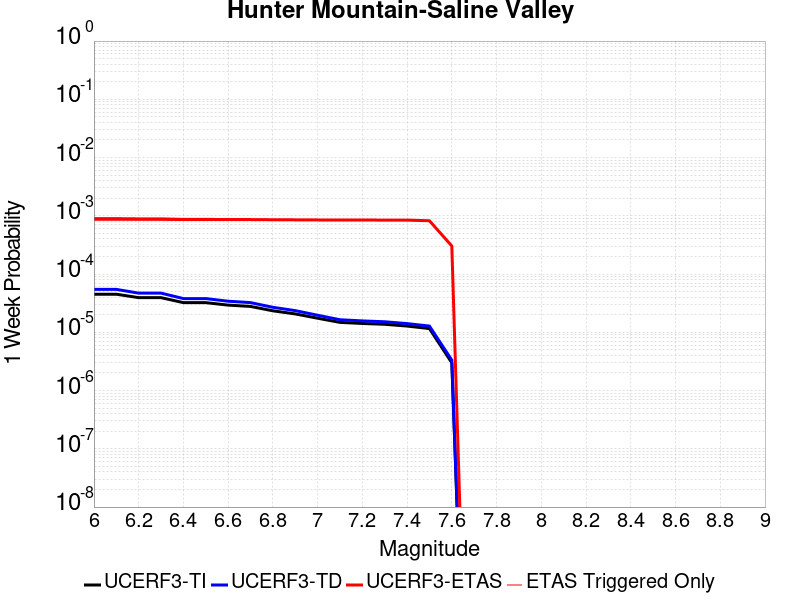 | 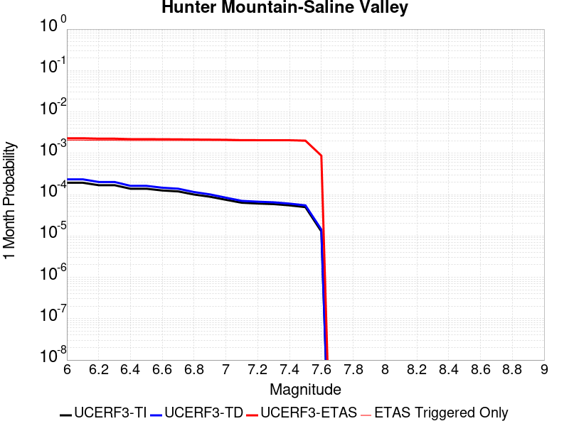 |  |  |

| Magnitude | 1 wk TI Prob | 1 wk TD Prob | 1 wk ETAS Prob | 1 wk ETAS/TD Gain | 1 wk ETAS Triggered Only | 1 mo TI Prob | 1 mo TD Prob | 1 mo ETAS Prob | 1 mo ETAS/TD Gain | 1 mo ETAS Triggered Only | 1 yr TI Prob | 1 yr TD Prob | 1 yr ETAS Prob | 1 yr ETAS/TD Gain | 1 yr ETAS Triggered Only | 10 yr TI Prob | 10 yr TD Prob | 10 yr ETAS Prob | 10 yr ETAS/TD Gain | 10 yr ETAS Triggered Only |
|-----|-----|-----|-----|-----|-----|-----|-----|-----|-----|-----|-----|-----|-----|-----|-----|-----|-----|-----|-----|-----|
| 6.0 | 4.5103672E-5 | 5.4571992E-5 | 9.766528E-4 | 17.896595 | 9.221311E-4 | 1.9328714E-4 | 2.3385909E-4 | 0.0025488914 | 10.899261 | 0.0023155739 | 0.002350731 | 0.0028436056 | 0.008156324 | 2.8683035 | 0.0053278687 | 0.023260195 | 0.028092787 | 0.036338065 | 1.2935016 | 0.008483606 |
| 6.1 | 4.5103672E-5 | 5.4571992E-5 | 9.766528E-4 | 17.896595 | 9.221311E-4 | 1.9328714E-4 | 2.3385909E-4 | 0.0025488914 | 10.899261 | 0.0023155739 | 0.002350731 | 0.0028436056 | 0.008156324 | 2.8683035 | 0.0053278687 | 0.023260195 | 0.028092787 | 0.036338065 | 1.2935016 | 0.008483606 |
| 6.2 | 3.9363465E-5 | 4.7064877E-5 | 9.691526E-4 | 20.591845 | 9.221311E-4 | 1.6868966E-4 | 2.0169078E-4 | 0.0025167975 | 12.478496 | 0.0023155739 | 0.002051862 | 0.0024528939 | 0.0077472525 | 3.1584132 | 0.005307377 | 0.020330196 | 0.024274237 | 0.032531917 | 1.3401828 | 0.0084631145 |
| 6.3 | 3.9363465E-5 | 4.7064877E-5 | 9.691526E-4 | 20.591845 | 9.221311E-4 | 1.6868966E-4 | 2.0169078E-4 | 0.0025167975 | 12.478496 | 0.0023155739 | 0.002051862 | 0.0024528939 | 0.0077472525 | 3.1584132 | 0.005307377 | 0.020330196 | 0.024274237 | 0.032531917 | 1.3401828 | 0.0084631145 |
| 6.4 | 3.2311684E-5 | 3.795214E-5 | 9.600483E-4 | 25.29629 | 9.221311E-4 | 1.384713E-4 | 1.626423E-4 | 0.0024778394 | 15.234902 | 0.0023155739 | 0.0016845843 | 0.0019784442 | 0.0072548697 | 3.666957 | 0.0052868854 | 0.016718714 | 0.019617062 | 0.027873974 | 1.4209048 | 0.008422131 |
| 6.5 | 3.2311684E-5 | 3.795214E-5 | 9.600483E-4 | 25.29629 | 9.221311E-4 | 1.384713E-4 | 1.626423E-4 | 0.0024778394 | 15.234902 | 0.0023155739 | 0.0016845843 | 0.0019784442 | 0.0072548697 | 3.666957 | 0.0052868854 | 0.016718714 | 0.019617062 | 0.027873974 | 1.4209048 | 0.008422131 |
| 6.6 | 2.9305844E-5 | 3.4182853E-5 | 9.562825E-4 | 27.975502 | 9.221311E-4 | 1.2559042E-4 | 1.4649007E-4 | 0.0024617247 | 16.80472 | 0.0023155739 | 0.0015279909 | 0.0017821203 | 0.0070595834 | 3.9613397 | 0.0052868854 | 0.015175272 | 0.017686214 | 0.025939262 | 1.4666373 | 0.00840164 |
| 6.7 | 2.7826512E-5 | 3.2345237E-5 | 9.5444656E-4 | 29.5081 | 9.221311E-4 | 1.19251024E-4 | 1.3861542E-4 | 0.0024538683 | 17.702707 | 0.0023155739 | 0.0014509142 | 0.0016863967 | 0.006964366 | 4.129732 | 0.0052868854 | 0.014414776 | 0.01674368 | 0.025004646 | 1.493378 | 0.00840164 |
| 6.8 | 2.3389874E-5 | 2.6867507E-5 | 9.489739E-4 | 35.320503 | 9.221311E-4 | 1.0023846E-4 | 1.1514164E-4 | 0.0024304488 | 21.10834 | 0.0023155739 | 0.00121972 | 0.0014009953 | 0.0066600107 | 4.753771 | 0.0052663935 | 0.01213047 | 0.013927842 | 0.022192258 | 1.5933738 | 0.008381148 |
| 6.9 | 2.069209E-5 | 2.3570727E-5 | 9.4568013E-4 | 40.120956 | 9.221311E-4 | 8.867737E-5 | 1.0101369E-4 | 0.0024163537 | 23.92105 | 0.0023155739 | 0.0010791123 | 0.001229184 | 0.006489104 | 5.2791967 | 0.0052663935 | 0.010738871 | 0.012228882 | 0.020507537 | 1.6769756 | 0.008381148 |
| 7.0 | 1.7462342E-5 | 1.9634126E-5 | 9.4174716E-4 | 47.96481 | 9.221311E-4 | 7.483646E-5 | 8.414367E-5 | 0.0023995226 | 28.51697 | 0.0023155739 | 9.1075303E-4 | 0.0010239903 | 0.0062849913 | 6.1377444 | 0.0052663935 | 0.009070295 | 0.010196352 | 0.018492043 | 1.8135939 | 0.008381148 |
| 7.1 | 1.4807709E-5 | 1.6442245E-5 | 9.3855825E-4 | 57.082123 | 9.221311E-4 | 6.3460066E-5 | 7.046495E-5 | 0.002344895 | 33.277462 | 0.00227459 | 7.723524E-4 | 8.575896E-4 | 0.006078518 | 7.08791 | 0.0052254098 | 0.007696735 | 0.008545788 | 0.016794361 | 1.9652209 | 0.008319672 |
| 7.2 | 1.4180048E-5 | 1.5698814E-5 | 9.3781546E-4 | 59.737984 | 9.221311E-4 | 6.077022E-5 | 6.727898E-5 | 0.002341716 | 34.806057 | 0.00227459 | 7.396263E-4 | 8.1883004E-4 | 0.0060399612 | 7.376331 | 0.0052254098 | 0.0073716943 | 0.00816108 | 0.016412854 | 2.011113 | 0.008319672 |
| 7.3 | 1.3730402E-5 | 1.5172541E-5 | 9.372897E-4 | 61.775394 | 9.221311E-4 | 5.8843252E-5 | 6.502365E-5 | 0.002339466 | 35.978695 | 0.00227459 | 7.161811E-4 | 7.913914E-4 | 0.006012666 | 7.597588 | 0.0052254098 | 0.007138774 | 0.007888664 | 0.016142705 | 2.0463169 | 0.008319672 |
| 7.4 | 1.2810095E-5 | 1.410972E-5 | 9.3622785E-4 | 66.35339 | 9.221311E-4 | 5.489925E-5 | 6.0468916E-5 | 0.0023349216 | 38.613583 | 0.00227459 | 6.681934E-4 | 7.359762E-4 | 0.00595754 | 8.094746 | 0.0052254098 | 0.006661878 | 0.0073382827 | 0.015596903 | 2.1254158 | 0.008319672 |
| 7.5 | 1.1595659E-5 | 1.2801013E-5 | 8.9393725E-4 | 69.83332 | 8.811475E-4 | 4.9694736E-5 | 5.4860422E-5 | 0.0022883445 | 41.71212 | 0.0022336065 | 6.0486543E-4 | 6.677366E-4 | 0.0058282227 | 8.728326 | 0.0051639345 | 0.006032217 | 0.0066601736 | 0.014761592 | 2.2163975 | 0.008155738 |
| 7.6 | 2.997694E-6 | 3.3252948E-6 | 3.3119306E-4 | 99.59811 | 3.2786885E-4 | 1.28471975E-5 | 1.4251226E-5 | 0.0010388268 | 72.89385 | 0.0010245901 | 1.564034E-4 | 1.7350215E-4 | 0.002632092 | 15.170371 | 0.0024590164 | 0.0015629337 | 0.0017351025 | 0.0056013335 | 3.2282436 | 0.0038729508 |

## Blackwater
*[(top)](#table-of-contents)*

| 1 Week | 1 Month | 1 Year | 10 Year |
|-----|-----|-----|-----|
|  |  |  | 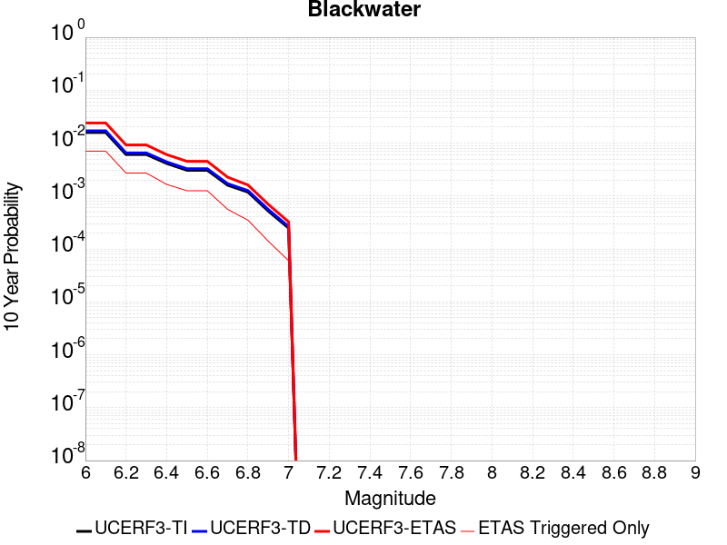 |

| Magnitude | 1 wk TI Prob | 1 wk TD Prob | 1 wk ETAS Prob | 1 wk ETAS/TD Gain | 1 wk ETAS Triggered Only | 1 mo TI Prob | 1 mo TD Prob | 1 mo ETAS Prob | 1 mo ETAS/TD Gain | 1 mo ETAS Triggered Only | 1 yr TI Prob | 1 yr TD Prob | 1 yr ETAS Prob | 1 yr ETAS/TD Gain | 1 yr ETAS Triggered Only | 10 yr TI Prob | 10 yr TD Prob | 10 yr ETAS Prob | 10 yr ETAS/TD Gain | 10 yr ETAS Triggered Only |
|-----|-----|-----|-----|-----|-----|-----|-----|-----|-----|-----|-----|-----|-----|-----|-----|-----|-----|-----|-----|-----|
| 6.0 | 3.0708583E-5 | 3.309619E-5 | 8.3225005E-4 | 25.1464 | 7.991803E-4 | 1.3160157E-4 | 1.4183388E-4 | 0.001719479 | 12.12319 | 0.0015778688 | 0.0016010714 | 0.0017255963 | 0.0060214493 | 3.489489 | 0.004303279 | 0.015895851 | 0.017135808 | 0.024265602 | 1.4160757 | 0.0072540985 |
| 6.1 | 3.0708583E-5 | 3.309619E-5 | 8.3225005E-4 | 25.1464 | 7.991803E-4 | 1.3160157E-4 | 1.4183388E-4 | 0.001719479 | 12.12319 | 0.0015778688 | 0.0016010714 | 0.0017255963 | 0.0060214493 | 3.489489 | 0.004303279 | 0.015895851 | 0.017135808 | 0.024265602 | 1.4160757 | 0.0072540985 |
| 6.2 | 1.1707779E-5 | 1.2545242E-5 | 2.994269E-4 | 23.867765 | 2.8688525E-4 | 5.017523E-5 | 5.3764266E-5 | 6.0701324E-4 | 11.290273 | 5.5327866E-4 | 6.107122E-4 | 6.5439293E-4 | 0.002108359 | 3.2218544 | 0.0014549181 | 0.006090366 | 0.006525631 | 0.00919254 | 1.4086821 | 0.0026844263 |
| 6.3 | 1.1707779E-5 | 1.2545242E-5 | 2.994269E-4 | 23.867765 | 2.8688525E-4 | 5.017523E-5 | 5.3764266E-5 | 6.0701324E-4 | 11.290273 | 5.5327866E-4 | 6.107122E-4 | 6.5439293E-4 | 0.002108359 | 3.2218544 | 0.0014549181 | 0.006090366 | 0.006525631 | 0.00919254 | 1.4086821 | 0.0026844263 |
| 6.4 | 7.929244E-6 | 8.480176E-6 | 1.5192159E-4 | 17.91491 | 1.4344262E-4 | 3.3982033E-5 | 3.6343128E-5 | 3.846911E-4 | 10.584975 | 3.4836066E-4 | 4.136527E-4 | 4.4239179E-4 | 0.0013026667 | 2.9445999 | 8.6065574E-4 | 0.0041288356 | 0.0044155167 | 0.006027221 | 1.3650092 | 0.0016188525 |
| 6.5 | 5.8832115E-6 | 6.286048E-6 | 1.292361E-4 | 20.559196 | 1.2295082E-4 | 2.521352E-5 | 2.6939942E-5 | 2.9332621E-4 | 10.888153 | 2.6639344E-4 | 3.0693135E-4 | 3.2794697E-4 | 9.834697E-4 | 2.9988678 | 6.557377E-4 | 0.0030650778 | 0.0032748834 | 0.0045207897 | 1.380443 | 0.00125 |
| 6.6 | 5.8832115E-6 | 6.286048E-6 | 1.292361E-4 | 20.559196 | 1.2295082E-4 | 2.521352E-5 | 2.6939942E-5 | 2.9332621E-4 | 10.888153 | 2.6639344E-4 | 3.0693135E-4 | 3.2794697E-4 | 9.834697E-4 | 2.9988678 | 6.557377E-4 | 0.0030650778 | 0.0032748834 | 0.0045207897 | 1.380443 | 0.00125 |
| 6.7 | 3.0715053E-6 | 3.281496E-6 | 4.426497E-5 | 13.4892645 | 4.0983607E-5 | 1.3163528E-5 | 1.4063485E-5 | 1.1652106E-4 | 8.285362 | 1.0245902E-4 | 1.6025416E-4 | 1.7121063E-4 | 4.5804676E-4 | 2.6753407 | 2.8688525E-4 | 0.0016013865 | 0.0017109019 | 0.0022836907 | 1.3347876 | 5.737705E-4 |
| 6.8 | 2.2722281E-6 | 2.4287758E-6 | 4.341228E-5 | 17.874142 | 4.0983607E-5 | 9.738084E-6 | 1.0409003E-5 | 1.12866954E-4 | 10.8432045 | 1.0245902E-4 | 1.1855473E-4 | 1.2672316E-4 | 3.5210443E-4 | 2.7785325 | 2.2540984E-4 | 0.001184915 | 0.0012665992 | 0.0016349844 | 1.290846 | 3.6885246E-4 |
| 6.9 | 9.952399E-7 | 1.0653588E-6 | 1.0653588E-6 | 1.0 | 0.0 | 4.265307E-6 | 4.5658185E-6 | 6.604095E-5 | 14.464208 | 6.147541E-5 | 5.1928873E-5 | 5.5587938E-5 | 1.375506E-4 | 2.4744685 | 8.196721E-5 | 5.191674E-4 | 5.5579096E-4 | 6.9915387E-4 | 1.2579439 | 1.4344262E-4 |
| 7.0 | 4.7385504E-7 | 5.0756074E-7 | 5.0756074E-7 | 1.0 | 0.0 | 2.0308057E-6 | 2.1752603E-6 | 4.3158776E-5 | 19.840742 | 4.0983607E-5 | 2.4724779E-5 | 2.6483794E-5 | 6.746632E-5 | 2.5474565 | 4.0983607E-5 | 2.4722028E-4 | 2.6483793E-4 | 3.4678343E-4 | 1.3094175 | 8.196721E-5 |

## Garlock (West)
*[(top)](#table-of-contents)*

| 1 Week | 1 Month | 1 Year | 10 Year |
|-----|-----|-----|-----|
|  |  |  | 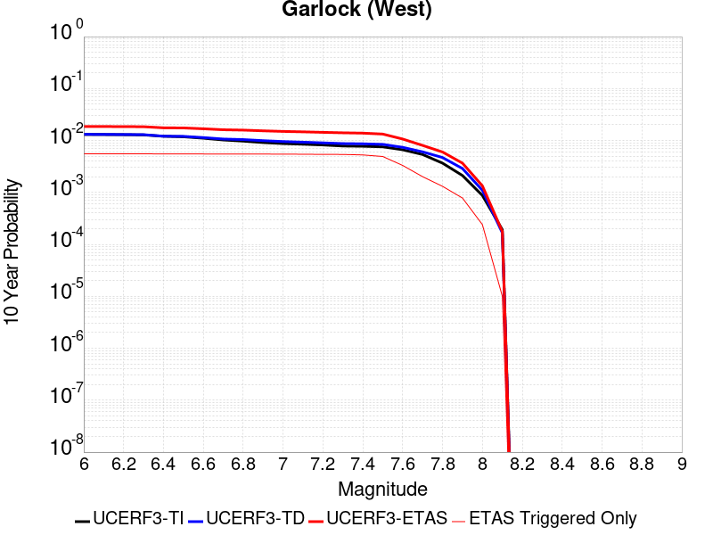 |

| Magnitude | 1 wk TI Prob | 1 wk TD Prob | 1 wk ETAS Prob | 1 wk ETAS/TD Gain | 1 wk ETAS Triggered Only | 1 mo TI Prob | 1 mo TD Prob | 1 mo ETAS Prob | 1 mo ETAS/TD Gain | 1 mo ETAS Triggered Only | 1 yr TI Prob | 1 yr TD Prob | 1 yr ETAS Prob | 1 yr ETAS/TD Gain | 1 yr ETAS Triggered Only | 10 yr TI Prob | 10 yr TD Prob | 10 yr ETAS Prob | 10 yr ETAS/TD Gain | 10 yr ETAS Triggered Only |
|-----|-----|-----|-----|-----|-----|-----|-----|-----|-----|-----|-----|-----|-----|-----|-----|-----|-----|-----|-----|-----|
| 6.0 | 2.5181727E-5 | 2.5202135E-5 | 5.374843E-4 | 21.326935 | 5.1229505E-4 | 1.0791722E-4 | 1.080047E-4 | 0.0015627656 | 14.469422 | 0.0014549181 | 0.0013131002 | 0.0013141674 | 0.004629477 | 3.5227451 | 0.003319672 | 0.013053683 | 0.013144457 | 0.018280959 | 1.3907733 | 0.005204918 |
| 6.1 | 2.5077732E-5 | 2.5103205E-5 | 5.373854E-4 | 21.407045 | 5.1229505E-4 | 1.0747157E-4 | 1.07580745E-4 | 0.0015623423 | 14.522508 | 0.0014549181 | 0.001307681 | 0.0013090121 | 0.004624339 | 3.5326939 | 0.003319672 | 0.013000126 | 0.0130935125 | 0.01823028 | 1.392314 | 0.005204918 |
| 6.2 | 2.494612E-5 | 2.498488E-5 | 5.372672E-4 | 21.503693 | 5.1229505E-4 | 1.0690756E-4 | 1.07073676E-4 | 0.0015618359 | 14.586554 | 0.0014549181 | 0.0013008224 | 0.0013028459 | 0.004618193 | 3.5446963 | 0.003319672 | 0.012932341 | 0.013032575 | 0.01816966 | 1.3941727 | 0.005204918 |
| 6.3 | 2.4733758E-5 | 2.4804243E-5 | 5.370866E-4 | 21.653013 | 5.1229505E-4 | 1.0599751E-4 | 1.0629959E-4 | 0.001561063 | 14.685504 | 0.0014549181 | 0.0012897556 | 0.0012934325 | 0.004608811 | 3.5632403 | 0.003319672 | 0.012822957 | 0.012939542 | 0.01807711 | 1.3970441 | 0.005204918 |
| 6.4 | 2.3237335E-5 | 2.318352E-5 | 5.354667E-4 | 23.09687 | 5.1229505E-4 | 9.958477E-5 | 9.935417E-5 | 0.0015541277 | 15.642299 | 0.0014549181 | 0.0012117702 | 0.0012089686 | 0.0045246272 | 3.7425516 | 0.003319672 | 0.012051838 | 0.012104375 | 0.017226048 | 1.4231256 | 0.0051844264 |
| 6.5 | 2.2732203E-5 | 2.2998063E-5 | 5.352814E-4 | 23.275063 | 5.1229505E-4 | 9.742009E-5 | 9.8559416E-5 | 0.0015533341 | 15.760382 | 0.0014549181 | 0.0011854442 | 0.0011993032 | 0.004514994 | 3.764681 | 0.003319672 | 0.011791403 | 0.012008769 | 0.017130937 | 1.4265356 | 0.0051844264 |
| 6.6 | 2.1319436E-5 | 2.1778224E-5 | 5.3406216E-4 | 24.52276 | 5.1229505E-4 | 9.136581E-5 | 9.333192E-5 | 0.0015481141 | 16.587189 | 0.0014549181 | 0.001111811 | 0.001135726 | 0.004451628 | 3.919632 | 0.003319672 | 0.011062649 | 0.0113796545 | 0.016505083 | 1.4504029 | 0.0051844264 |
| 6.7 | 1.970802E-5 | 2.0398069E-5 | 5.326827E-4 | 26.114368 | 5.1229505E-4 | 8.446021E-5 | 8.741738E-5 | 0.0015422083 | 17.641895 | 0.0014549181 | 0.001027818 | 0.0010637887 | 0.0043594595 | 4.09805 | 0.0032991804 | 0.010230771 | 0.010667368 | 0.015776217 | 1.4789231 | 0.0051639345 |
| 6.8 | 1.8744462E-5 | 1.9905692E-5 | 5.3219055E-4 | 26.7356 | 5.1229505E-4 | 8.033094E-5 | 8.530733E-5 | 0.0015401012 | 18.053564 | 0.0014549181 | 9.775903E-4 | 0.0010381235 | 0.004333879 | 4.1747236 | 0.0032991804 | 0.009733009 | 0.010413141 | 0.015523302 | 1.4907416 | 0.0051639345 |
| 6.9 | 1.7559682E-5 | 1.895803E-5 | 5.312434E-4 | 28.022078 | 5.1229505E-4 | 7.5253614E-5 | 8.124618E-5 | 0.001536046 | 18.90607 | 0.0014549181 | 9.158276E-4 | 9.887248E-4 | 0.004284643 | 4.333504 | 0.0032991804 | 0.0091206245 | 0.009923607 | 0.015016008 | 1.5131603 | 0.0051434427 |
| 7.0 | 1.6794445E-5 | 1.8220819E-5 | 5.3050654E-4 | 29.115408 | 5.1229505E-4 | 7.197421E-5 | 7.8086894E-5 | 0.0015328913 | 19.630585 | 0.0014549181 | 8.759337E-4 | 9.5029466E-4 | 0.0042463397 | 4.4684453 | 0.0032991804 | 0.008724891 | 0.0095425 | 0.014616565 | 1.5317333 | 0.0051229508 |
| 7.1 | 1.6337795E-5 | 1.7721602E-5 | 5.300076E-4 | 29.907433 | 5.1229505E-4 | 7.0017246E-5 | 7.5947515E-5 | 0.0015102648 | 19.885637 | 0.0014344262 | 8.521265E-4 | 9.2427013E-4 | 0.0041794553 | 4.5218983 | 0.0032581966 | 0.008488664 | 0.009284343 | 0.014319127 | 1.5422877 | 0.005081967 |
| 7.2 | 1.5780008E-5 | 1.7170225E-5 | 5.2945653E-4 | 30.835735 | 5.1229505E-4 | 6.762685E-5 | 7.358461E-5 | 0.0015079053 | 20.492128 | 0.0014344262 | 8.2304585E-4 | 8.955257E-4 | 0.0041303313 | 4.612186 | 0.003237705 | 0.008200042 | 0.008999176 | 0.013994795 | 1.5551196 | 0.0050409837 |
| 7.3 | 1.5058865E-5 | 1.6623266E-5 | 5.2890985E-4 | 31.817444 | 5.1229505E-4 | 6.45364E-5 | 7.124063E-5 | 0.0014850743 | 20.84589 | 0.0014139344 | 7.854473E-4 | 8.6701073E-4 | 0.0040814346 | 4.7074785 | 0.003217213 | 0.00782677 | 0.00871586 | 0.013692593 | 1.5709975 | 0.005020492 |
| 7.4 | 1.4887923E-5 | 1.6459222E-5 | 5.082544E-4 | 30.879614 | 4.918033E-4 | 6.380382E-5 | 7.053762E-5 | 0.0014229013 | 20.172232 | 0.001352459 | 7.7653467E-4 | 8.5845834E-4 | 0.0039705387 | 4.6251965 | 0.003114754 | 0.0077382675 | 0.0086307125 | 0.01346567 | 1.5602037 | 0.004877049 |
| 7.5 | 1.4509299E-5 | 1.6051208E-5 | 5.078466E-4 | 31.639153 | 4.918033E-4 | 6.218123E-5 | 6.8789086E-5 | 0.001318703 | 19.170238 | 0.00125 | 7.567935E-4 | 8.3718647E-4 | 0.003703637 | 4.4239097 | 0.0028688523 | 0.0075422134 | 0.008419003 | 0.0128892455 | 1.5309705 | 0.004508197 |
| 7.6 | 1.2756717E-5 | 1.4055129E-5 | 3.4191937E-4 | 24.327017 | 3.2786885E-4 | 5.4670498E-5 | 6.023488E-5 | 8.388765E-4 | 13.926756 | 7.786885E-4 | 6.6541E-4 | 7.331136E-4 | 0.002555547 | 3.4858813 | 0.0018237705 | 0.006634211 | 0.007383898 | 0.01033327 | 1.3994329 | 0.0029713116 |
| 7.7 | 1.0328985E-5 | 1.1464573E-5 | 2.7785497E-4 | 24.235964 | 2.6639344E-4 | 4.4266326E-5 | 4.913296E-5 | 6.433661E-4 | 13.094389 | 5.9426227E-4 | 5.388092E-4 | 5.9803E-4 | 0.0017244052 | 2.883476 | 0.0011270492 | 0.0053750467 | 0.0060405903 | 0.007832976 | 1.2967236 | 0.0018032787 |
| 7.8 | 7.0306583E-6 | 8.902813E-6 | 1.1136092E-4 | 12.50851 | 1.0245902E-4 | 3.0131043E-5 | 3.8154354E-5 | 4.2748376E-4 | 11.204062 | 3.8934426E-4 | 3.667837E-4 | 4.644304E-4 | 0.001222275 | 2.631772 | 7.581967E-4 | 0.003661789 | 0.0046969377 | 0.00587988 | 1.251854 | 0.0011885245 |
| 7.9 | 4.060633E-6 | 5.4672782E-6 | 2.5958969E-5 | 4.7480607 | 2.0491803E-5 | 1.7402595E-5 | 2.3430983E-5 | 2.2834422E-4 | 9.745397 | 2.0491803E-4 | 2.11856E-4 | 2.8523497E-4 | 7.3592603E-4 | 2.5800695 | 4.5081967E-4 | 0.0021165414 | 0.0028851798 | 0.0035594583 | 1.2337041 | 6.762295E-4 |
| 8.0 | 1.6729537E-6 | 2.078155E-6 | 2.078155E-6 | 1.0 | 0.0 | 7.169782E-6 | 8.906349E-6 | 2.939797E-5 | 3.3007882 | 2.0491803E-5 | 8.7288594E-5 | 1.08429434E-4 | 1.9038776E-4 | 1.7558678 | 8.196721E-5 | 8.7254314E-4 | 0.001097267 | 0.0012610216 | 1.1492386 | 1.6393443E-4 |
| 8.1 | 3.6733252E-7 | 3.1499187E-7 | 3.1499187E-7 | 1.0 | 0.0 | 1.5742813E-6 | 1.3499646E-6 | 1.3499646E-6 | 1.0 | 0.0 | 1.9166706E-5 | 1.643571E-5 | 1.643571E-5 | 1.0 | 0.0 | 1.9165053E-4 | 1.6643589E-4 | 1.6643589E-4 | 1.0 | 0.0 |

## McLean Lake
*[(top)](#table-of-contents)*

| 1 Week | 1 Month | 1 Year | 10 Year |
|-----|-----|-----|-----|
|  |  |  |  |

| Magnitude | 1 wk TI Prob | 1 wk TD Prob | 1 wk ETAS Prob | 1 wk ETAS/TD Gain | 1 wk ETAS Triggered Only | 1 mo TI Prob | 1 mo TD Prob | 1 mo ETAS Prob | 1 mo ETAS/TD Gain | 1 mo ETAS Triggered Only | 1 yr TI Prob | 1 yr TD Prob | 1 yr ETAS Prob | 1 yr ETAS/TD Gain | 1 yr ETAS Triggered Only | 10 yr TI Prob | 10 yr TD Prob | 10 yr ETAS Prob | 10 yr ETAS/TD Gain | 10 yr ETAS Triggered Only |
|-----|-----|-----|-----|-----|-----|-----|-----|-----|-----|-----|-----|-----|-----|-----|-----|-----|-----|-----|-----|-----|
| 6.0 | 1.7360222E-5 | 1.8501789E-5 | 2.2341603E-4 | 12.075375 | 2.0491803E-4 | 7.439883E-5 | 7.929125E-5 | 6.3252606E-4 | 7.9772496 | 5.5327866E-4 | 9.0542925E-4 | 9.64992E-4 | 0.0031350271 | 3.2487597 | 0.002172131 | 0.009017491 | 0.009612858 | 0.013935654 | 1.449689 | 0.004364754 |
| 6.1 | 9.062689E-6 | 9.592268E-6 | 3.0083875E-5 | 3.136263 | 2.0491803E-5 | 3.8839516E-5 | 4.110912E-5 | 2.2552776E-4 | 5.486076 | 1.8442623E-4 | 4.727685E-4 | 5.003975E-4 | 0.0015039934 | 3.0055974 | 0.0010040983 | 0.0047176396 | 0.0049935905 | 0.007093706 | 1.4205624 | 0.0021106557 |
| 6.2 | 9.062689E-6 | 9.592268E-6 | 3.0083875E-5 | 3.136263 | 2.0491803E-5 | 3.8839516E-5 | 4.110912E-5 | 2.2552776E-4 | 5.486076 | 1.8442623E-4 | 4.727685E-4 | 5.003975E-4 | 0.0015039934 | 3.0055974 | 0.0010040983 | 0.0047176396 | 0.0049935905 | 0.007093706 | 1.4205624 | 0.0021106557 |
| 6.3 | 7.2575485E-6 | 7.667767E-6 | 2.8159413E-5 | 3.6724398 | 2.0491803E-5 | 3.110341E-5 | 3.2861484E-5 | 1.7629939E-4 | 5.364925 | 1.4344262E-4 | 3.786182E-4 | 4.0002225E-4 | 0.0012808173 | 3.2018652 | 8.811475E-4 | 0.0037797375 | 0.003993727 | 0.0057693934 | 1.444614 | 0.0017827869 |
| 6.4 | 7.2575485E-6 | 7.667767E-6 | 2.8159413E-5 | 3.6724398 | 2.0491803E-5 | 3.110341E-5 | 3.2861484E-5 | 1.7629939E-4 | 5.364925 | 1.4344262E-4 | 3.786182E-4 | 4.0002225E-4 | 0.0012808173 | 3.2018652 | 8.811475E-4 | 0.0037797375 | 0.003993727 | 0.0057693934 | 1.444614 | 0.0017827869 |
| 6.5 | 6.06582E-6 | 6.4039245E-6 | 2.6895597E-5 | 4.1998615 | 2.0491803E-5 | 2.5996113E-5 | 2.7445138E-5 | 1.7088382E-4 | 6.2263784 | 1.4344262E-4 | 3.164567E-4 | 3.340998E-4 | 0.0011534981 | 3.4525554 | 8.1967213E-4 | 0.0031600643 | 0.0033366138 | 0.004909218 | 1.4713174 | 0.0015778688 |
| 6.6 | 5.598744E-6 | 5.910306E-6 | 2.6401987E-5 | 4.46711 | 2.0491803E-5 | 2.3994397E-5 | 2.5329673E-5 | 1.6876866E-4 | 6.6628838 | 1.4344262E-4 | 2.9209262E-4 | 3.083515E-4 | 0.0011072854 | 3.590984 | 7.991803E-4 | 0.0029170897 | 0.0030798658 | 0.0045711603 | 1.4842076 | 0.0014959016 |
| 6.7 | 5.246996E-6 | 5.539203E-6 | 5.539203E-6 | 1.0 | 0.0 | 2.2486933E-5 | 2.3739261E-5 | 1.2619584E-4 | 5.3159127 | 1.0245902E-4 | 2.73744E-4 | 2.8899353E-4 | 9.855134E-4 | 3.4101577 | 6.967213E-4 | 0.0027340704 | 0.002886801 | 0.0042557884 | 1.474223 | 0.0013729509 |
| 6.8 | 4.02324E-6 | 4.246936E-6 | 4.246936E-6 | 1.0 | 0.0 | 1.7242342E-5 | 1.820106E-5 | 1.00166784E-4 | 5.503349 | 8.196721E-5 | 2.099053E-4 | 2.2158133E-4 | 7.337629E-4 | 3.3114834 | 5.1229505E-4 | 0.0020970714 | 0.0022141882 | 0.0032569563 | 1.4709482 | 0.001045082 |
| 6.9 | 6.835972E-7 | 7.1399705E-7 | 7.1399705E-7 | 1.0 | 0.0 | 2.9296991E-6 | 3.0599856E-6 | 2.3551725E-5 | 7.696679 | 2.0491803E-5 | 3.56685E-5 | 3.7255006E-5 | 2.0118333E-4 | 5.400169 | 1.6393443E-4 | 3.5662777E-4 | 3.7251884E-4 | 6.388131E-4 | 1.7148476 | 2.6639344E-4 |

## Goldstone Lake
*[(top)](#table-of-contents)*

| 1 Week | 1 Month | 1 Year | 10 Year |
|-----|-----|-----|-----|
| 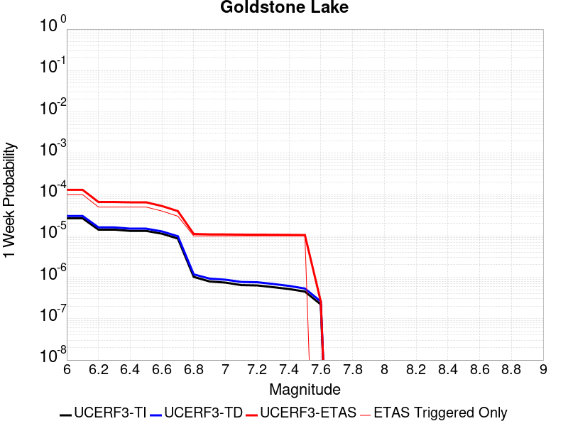 |  |  |  |

| Magnitude | 1 wk TI Prob | 1 wk TD Prob | 1 wk ETAS Prob | 1 wk ETAS/TD Gain | 1 wk ETAS Triggered Only | 1 mo TI Prob | 1 mo TD Prob | 1 mo ETAS Prob | 1 mo ETAS/TD Gain | 1 mo ETAS Triggered Only | 1 yr TI Prob | 1 yr TD Prob | 1 yr ETAS Prob | 1 yr ETAS/TD Gain | 1 yr ETAS Triggered Only | 10 yr TI Prob | 10 yr TD Prob | 10 yr ETAS Prob | 10 yr ETAS/TD Gain | 10 yr ETAS Triggered Only |
|-----|-----|-----|-----|-----|-----|-----|-----|-----|-----|-----|-----|-----|-----|-----|-----|-----|-----|-----|-----|-----|
| 6.0 | 2.671352E-5 | 3.0376628E-5 | 1.3283253E-4 | 4.3728533 | 1.0245902E-4 | 1.1448149E-4 | 1.3018015E-4 | 5.399629E-4 | 4.1478124 | 4.0983607E-4 | 0.001392921 | 0.0015839875 | 0.0033230318 | 2.0978901 | 0.0017418033 | 0.013842222 | 0.015746472 | 0.019397086 | 1.2318368 | 0.0037090164 |
| 6.1 | 2.671352E-5 | 3.0376628E-5 | 1.3283253E-4 | 4.3728533 | 1.0245902E-4 | 1.1448149E-4 | 1.3018015E-4 | 5.399629E-4 | 4.1478124 | 4.0983607E-4 | 0.001392921 | 0.0015839875 | 0.0033230318 | 2.0978901 | 0.0017418033 | 0.013842222 | 0.015746472 | 0.019397086 | 1.2318368 | 0.0037090164 |
| 6.2 | 1.4197047E-5 | 1.6096516E-5 | 7.7570934E-5 | 4.8191137 | 6.147541E-5 | 6.0843064E-5 | 6.89838E-5 | 2.943781E-4 | 4.267351 | 2.2540984E-4 | 7.4051257E-4 | 8.396528E-4 | 0.0017814842 | 2.1216917 | 9.4262295E-4 | 0.007380498 | 0.008374499 | 0.010223637 | 1.2208058 | 0.0018647541 |
| 6.3 | 1.4197047E-5 | 1.6096516E-5 | 7.7570934E-5 | 4.8191137 | 6.147541E-5 | 6.0843064E-5 | 6.89838E-5 | 2.943781E-4 | 4.267351 | 2.2540984E-4 | 7.4051257E-4 | 8.396528E-4 | 0.0017814842 | 2.1216917 | 9.4262295E-4 | 0.007380498 | 0.008374499 | 0.010223637 | 1.2208058 | 0.0018647541 |
| 6.4 | 1.3238931E-5 | 1.5008711E-5 | 7.64832E-5 | 5.0959206 | 6.147541E-5 | 5.6737044E-5 | 6.432201E-5 | 2.8971734E-4 | 4.504171 | 2.2540984E-4 | 6.9055456E-4 | 7.8293716E-4 | 0.0017248221 | 2.2030149 | 9.4262295E-4 | 0.006884126 | 0.007811414 | 0.009600607 | 1.2290485 | 0.0018032787 |
| 6.5 | 1.3238931E-5 | 1.5008711E-5 | 7.64832E-5 | 5.0959206 | 6.147541E-5 | 5.6737044E-5 | 6.432201E-5 | 2.8971734E-4 | 4.504171 | 2.2540984E-4 | 6.9055456E-4 | 7.8293716E-4 | 0.0017248221 | 2.2030149 | 9.4262295E-4 | 0.006884126 | 0.007811414 | 0.009600607 | 1.2290485 | 0.0018032787 |
| 6.6 | 1.1328278E-5 | 1.2855381E-5 | 5.383846E-5 | 4.1880097 | 4.0983607E-5 | 4.8548856E-5 | 5.5093864E-5 | 2.1901926E-4 | 3.9753838 | 1.6393443E-4 | 5.90922E-4 | 6.706571E-4 | 0.0013669111 | 2.038167 | 6.967213E-4 | 0.0058935313 | 0.0066957204 | 0.008120542 | 1.2127959 | 0.0014344262 |
| 6.7 | 8.651175E-6 | 9.8247265E-6 | 5.0807932E-5 | 5.1714344 | 4.0983607E-5 | 3.707594E-5 | 4.2105803E-5 | 2.0603332E-4 | 4.893229 | 1.6393443E-4 | 4.5130608E-4 | 5.126081E-4 | 0.0010656032 | 2.0787873 | 5.5327866E-4 | 0.0045039062 | 0.0051231356 | 0.006224024 | 1.2148856 | 0.0011065573 |
| 6.8 | 1.0215377E-6 | 1.1754793E-6 | 2.1667258E-5 | 18.432703 | 2.0491803E-5 | 4.378012E-6 | 5.037759E-6 | 4.602116E-5 | 9.135244 | 4.0983607E-5 | 5.3300988E-5 | 6.133311E-5 | 1.2280475E-4 | 2.0022588 | 6.147541E-5 | 5.3288206E-4 | 6.13173E-4 | 6.746107E-4 | 1.1001964 | 6.147541E-5 |
| 6.9 | 7.9360774E-7 | 9.2834586E-7 | 2.142013E-5 | 23.073437 | 2.0491803E-5 | 3.4011714E-6 | 3.9786196E-6 | 4.4962064E-5 | 11.3009205 | 4.0983607E-5 | 4.1408475E-5 | 4.8438687E-5 | 8.942031E-5 | 1.8460515 | 4.0983607E-5 | 4.140076E-4 | 4.842883E-4 | 5.25252E-4 | 1.0845854 | 4.0983607E-5 |
| 7.0 | 7.4382757E-7 | 8.7473853E-7 | 2.1366524E-5 | 24.426184 | 2.0491803E-5 | 3.1878285E-6 | 3.7488744E-6 | 4.473233E-5 | 11.932202 | 4.0983607E-5 | 3.8811122E-5 | 4.5641656E-5 | 8.66234E-5 | 1.897902 | 4.0983607E-5 | 3.8804344E-4 | 4.563295E-4 | 4.9729436E-4 | 1.0897704 | 4.0983607E-5 |
| 7.1 | 6.4709513E-7 | 7.711347E-7 | 2.1262922E-5 | 27.573551 | 2.0491803E-5 | 2.773262E-6 | 3.304859E-6 | 2.3796594E-5 | 7.2004867 | 2.0491803E-5 | 3.376394E-5 | 4.0235976E-5 | 6.0726958E-5 | 1.5092701 | 2.0491803E-5 | 3.375881E-4 | 4.0229288E-4 | 4.2277644E-4 | 1.050917 | 2.0491803E-5 |
| 7.2 | 6.356704E-7 | 7.5884054E-7 | 2.1250627E-5 | 28.004076 | 2.0491803E-5 | 2.7242988E-6 | 3.25217E-6 | 2.3743907E-5 | 7.3009424 | 2.0491803E-5 | 3.3167835E-5 | 3.959451E-5 | 6.0085502E-5 | 1.517521 | 2.0491803E-5 | 3.3162883E-4 | 3.958805E-4 | 4.163642E-4 | 1.0517421 | 2.0491803E-5 |
| 7.3 | 5.7695723E-7 | 6.8966074E-7 | 2.118145E-5 | 30.712854 | 2.0491803E-5 | 2.4726714E-6 | 2.9556859E-6 | 2.3447428E-5 | 7.9329906 | 2.0491803E-5 | 3.0104358E-5 | 3.598494E-5 | 5.6476005E-5 | 1.5694345 | 2.0491803E-5 | 3.0100282E-4 | 3.5979686E-4 | 3.802813E-4 | 1.0569333 | 2.0491803E-5 |
| 7.4 | 5.209647E-7 | 6.193549E-7 | 2.1111146E-5 | 34.085697 | 2.0491803E-5 | 2.232704E-6 | 2.654376E-6 | 2.3146125E-5 | 8.719987 | 2.0491803E-5 | 2.718283E-5 | 3.2316606E-5 | 5.2807747E-5 | 1.6340747 | 2.0491803E-5 | 2.7179506E-4 | 3.231246E-4 | 3.4360978E-4 | 1.0633972 | 2.0491803E-5 |
| 7.5 | 4.512955E-7 | 5.3489146E-7 | 2.1026684E-5 | 39.31019 | 2.0491803E-5 | 1.934122E-6 | 2.2923903E-6 | 2.2784146E-5 | 9.939035 | 2.0491803E-5 | 2.3547682E-5 | 2.7909547E-5 | 4.840078E-5 | 1.7342016 | 2.0491803E-5 | 2.3545188E-4 | 2.7906572E-4 | 2.9955182E-4 | 1.0734096 | 2.0491803E-5 |
| 7.6 | 2.21172E-7 | 2.6039737E-7 | 2.6039737E-7 | 1.0 | 0.0 | 9.478797E-7 | 1.1159884E-6 | 1.1159884E-6 | 1.0 | 0.0 | 1.1540374E-5 | 1.3587103E-5 | 1.3587103E-5 | 1.0 | 0.0 | 1.1539775E-4 | 1.3586554E-4 | 1.3586554E-4 | 1.0 | 0.0 |

## Gravel Hills-Harper Lk
*[(top)](#table-of-contents)*

| 1 Week | 1 Month | 1 Year | 10 Year |
|-----|-----|-----|-----|
|  | 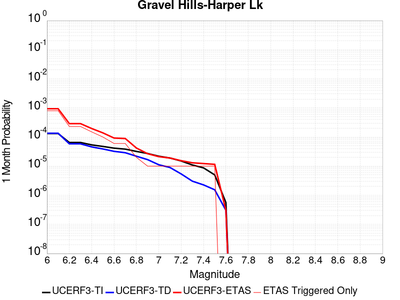 |  |  |

| Magnitude | 1 wk TI Prob | 1 wk TD Prob | 1 wk ETAS Prob | 1 wk ETAS/TD Gain | 1 wk ETAS Triggered Only | 1 mo TI Prob | 1 mo TD Prob | 1 mo ETAS Prob | 1 mo ETAS/TD Gain | 1 mo ETAS Triggered Only | 1 yr TI Prob | 1 yr TD Prob | 1 yr ETAS Prob | 1 yr ETAS/TD Gain | 1 yr ETAS Triggered Only | 10 yr TI Prob | 10 yr TD Prob | 10 yr ETAS Prob | 10 yr ETAS/TD Gain | 10 yr ETAS Triggered Only |
|-----|-----|-----|-----|-----|-----|-----|-----|-----|-----|-----|-----|-----|-----|-----|-----|-----|-----|-----|-----|-----|
| 6.0 | 3.0679566E-5 | 3.1465184E-5 | 3.3883256E-4 | 10.768492 | 3.0737705E-4 | 1.3147724E-4 | 1.3484505E-4 | 9.7489567E-4 | 7.229748 | 8.401639E-4 | 0.0015995599 | 0.0016407187 | 0.0038911186 | 2.3715942 | 0.0022540984 | 0.015880952 | 0.016307615 | 0.01993599 | 1.2224957 | 0.0036885245 |
| 6.1 | 3.0679566E-5 | 3.1465184E-5 | 3.3883256E-4 | 10.768492 | 3.0737705E-4 | 1.3147724E-4 | 1.3484505E-4 | 9.7489567E-4 | 7.229748 | 8.401639E-4 | 0.0015995599 | 0.0016407187 | 0.0038911186 | 2.3715942 | 0.0022540984 | 0.015880952 | 0.016307615 | 0.01993599 | 1.2224957 | 0.0036885245 |
| 6.2 | 1.514536E-5 | 1.3635392E-5 | 7.5109965E-5 | 5.5084567 | 6.147541E-5 | 6.490707E-5 | 5.843615E-5 | 2.428516E-4 | 4.155845 | 1.8442623E-4 | 7.8995706E-4 | 7.112398E-4 | 0.0012846022 | 1.806145 | 5.737705E-4 | 0.007871548 | 0.0070908363 | 0.008169201 | 1.1520786 | 0.0010860655 |
| 6.3 | 1.514536E-5 | 1.3635392E-5 | 7.5109965E-5 | 5.5084567 | 6.147541E-5 | 6.490707E-5 | 5.843615E-5 | 2.428516E-4 | 4.155845 | 1.8442623E-4 | 7.8995706E-4 | 7.112398E-4 | 0.0012846022 | 1.806145 | 5.737705E-4 | 0.007871548 | 0.0070908363 | 0.008169201 | 1.1520786 | 0.0010860655 |
| 6.4 | 1.2532521E-5 | 1.0689826E-5 | 5.1672996E-5 | 4.833848 | 4.0983607E-5 | 5.37097E-5 | 4.581277E-5 | 1.8924882E-4 | 4.1309185 | 1.4344262E-4 | 6.537194E-4 | 5.576335E-4 | 9.6724107E-4 | 1.7345461 | 4.0983607E-4 | 0.0065179965 | 0.0055629327 | 0.006316912 | 1.1355362 | 7.581967E-4 |
| 6.5 | 1.1094058E-5 | 9.083774E-6 | 5.0067007E-5 | 5.511697 | 4.0983607E-5 | 4.7545094E-5 | 3.89299E-5 | 1.4138492E-4 | 3.6317825 | 1.0245902E-4 | 5.787078E-4 | 4.738725E-4 | 7.401397E-4 | 1.5618963 | 2.6639344E-4 | 0.0057720304 | 0.004729028 | 0.005259295 | 1.1121303 | 5.327869E-4 |
| 6.6 | 9.688328E-6 | 7.531784E-6 | 4.851508E-5 | 6.44138 | 4.0983607E-5 | 4.1520743E-5 | 3.2278687E-5 | 1.1424326E-4 | 3.539278 | 8.196721E-5 | 5.053978E-4 | 3.929247E-4 | 5.158272E-4 | 1.312789 | 1.2295082E-4 | 0.0050424994 | 0.0039225565 | 0.004228728 | 1.0780541 | 3.0737705E-4 |
| 6.7 | 8.974824E-6 | 6.7494916E-6 | 4.773282E-5 | 7.0720615 | 4.0983607E-5 | 3.8462964E-5 | 2.8926084E-5 | 1.1089093E-4 | 3.8335962 | 8.196721E-5 | 4.6818596E-4 | 3.5212038E-4 | 4.750279E-4 | 1.3490497 | 1.2295082E-4 | 0.004672008 | 0.0035158454 | 0.0037404627 | 1.0638871 | 2.2540984E-4 |
| 6.8 | 7.4780046E-6 | 5.116252E-6 | 2.5607951E-5 | 5.0052166 | 2.0491803E-5 | 3.20482E-5 | 2.1926619E-5 | 4.241797E-5 | 1.9345424 | 2.0491803E-5 | 3.9011694E-4 | 2.6692526E-4 | 2.874116E-4 | 1.0767493 | 2.0491803E-5 | 0.0038943281 | 0.002666185 | 0.002707059 | 1.0153307 | 4.0983607E-5 |
| 6.9 | 6.3409307E-6 | 3.9075426E-6 | 2.4399265E-5 | 6.244146 | 2.0491803E-5 | 2.7175134E-5 | 1.674651E-5 | 3.723797E-5 | 2.2236257 | 2.0491803E-5 | 3.3080703E-4 | 2.0387067E-4 | 2.243583E-4 | 1.1004932 | 2.0491803E-5 | 0.0033031502 | 0.0020369345 | 0.0020573847 | 1.0100396 | 2.0491803E-5 |
| 7.0 | 5.1239335E-6 | 2.6058885E-6 | 2.3097638E-5 | 8.863633 | 2.0491803E-5 | 2.195953E-5 | 1.11680465E-5 | 3.165962E-5 | 2.8348396 | 2.0491803E-5 | 2.6732447E-4 | 1.3596273E-4 | 1.5645176E-4 | 1.1506958 | 2.0491803E-5 | 0.0026700313 | 0.0013588208 | 0.0013792848 | 1.0150601 | 2.0491803E-5 |
| 7.1 | 4.438899E-6 | 2.0984994E-6 | 2.259026E-5 | 10.764958 | 2.0491803E-5 | 1.9023713E-5 | 8.993539E-6 | 2.9485158E-5 | 3.2784822 | 2.0491803E-5 | 2.315891E-4 | 1.0949106E-4 | 1.2998062E-4 | 1.1871345 | 2.0491803E-5 | 0.002313479 | 0.0010943931 | 0.0011148624 | 1.0187038 | 2.0491803E-5 |
| 7.2 | 3.50367E-6 | 1.2615911E-6 | 2.1753369E-5 | 17.242804 | 2.0491803E-5 | 1.5015643E-5 | 5.406808E-6 | 2.58985E-5 | 4.7899795 | 2.0491803E-5 | 1.8280011E-4 | 6.582599E-5 | 8.631644E-5 | 1.3112822 | 2.0491803E-5 | 0.0018264982 | 6.580731E-4 | 6.7855144E-4 | 1.0311186 | 2.0491803E-5 |
| 7.3 | 2.561638E-6 | 7.119307E-7 | 2.120372E-5 | 29.783403 | 2.0491803E-5 | 1.0978401E-5 | 3.051128E-6 | 2.3542869E-5 | 7.7161193 | 2.0491803E-5 | 1.3365384E-4 | 3.714687E-5 | 5.7637913E-5 | 1.5516223 | 2.0491803E-5 | 0.0013357349 | 3.7140862E-4 | 3.9189283E-4 | 1.0551527 | 2.0491803E-5 |
| 7.4 | 2.0368864E-6 | 5.304955E-7 | 2.1022288E-5 | 39.627644 | 2.0491803E-5 | 8.729483E-6 | 2.2735503E-6 | 2.2765307E-5 | 10.013109 | 2.0491803E-5 | 1.06276275E-4 | 2.768013E-5 | 4.8171365E-5 | 1.7402868 | 2.0491803E-5 | 0.0010622547 | 2.7676736E-4 | 2.972535E-4 | 1.0740193 | 2.0491803E-5 |
| 7.5 | 1.1681728E-6 | 3.6031287E-7 | 2.0852109E-5 | 57.872227 | 2.0491803E-5 | 5.0064455E-6 | 1.5441972E-6 | 2.2035969E-5 | 14.270179 | 2.0491803E-5 | 6.0951766E-5 | 1.8800443E-5 | 3.929186E-5 | 2.0899434 | 2.0491803E-5 | 6.093505E-4 | 1.8798899E-4 | 2.0847694E-4 | 1.1089848 | 2.0491803E-5 |
| 7.6 | 1.3154387E-7 | 7.1198265E-8 | 7.1198265E-8 | 1.0 | 0.0 | 5.6375933E-7 | 3.051354E-7 | 3.051354E-7 | 1.0 | 0.0 | 6.863748E-6 | 3.7150185E-6 | 3.7150185E-6 | 1.0 | 0.0 | 6.863536E-5 | 3.7149723E-5 | 3.7149723E-5 | 1.0 | 0.0 |

## Coyote Canyon
*[(top)](#table-of-contents)*

| 1 Week | 1 Month | 1 Year | 10 Year |
|-----|-----|-----|-----|
|  | 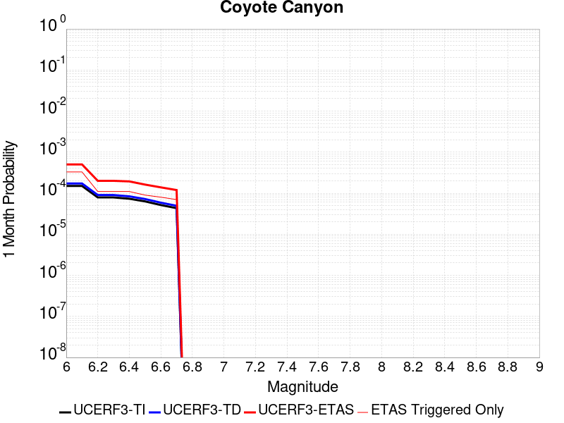 |  | 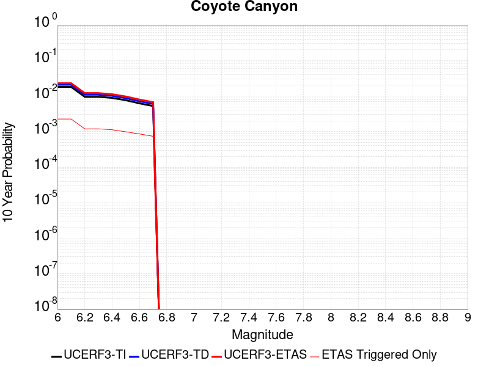 |

| Magnitude | 1 wk TI Prob | 1 wk TD Prob | 1 wk ETAS Prob | 1 wk ETAS/TD Gain | 1 wk ETAS Triggered Only | 1 mo TI Prob | 1 mo TD Prob | 1 mo ETAS Prob | 1 mo ETAS/TD Gain | 1 mo ETAS Triggered Only | 1 yr TI Prob | 1 yr TD Prob | 1 yr ETAS Prob | 1 yr ETAS/TD Gain | 1 yr ETAS Triggered Only | 10 yr TI Prob | 10 yr TD Prob | 10 yr ETAS Prob | 10 yr ETAS/TD Gain | 10 yr ETAS Triggered Only |
|-----|-----|-----|-----|-----|-----|-----|-----|-----|-----|-----|-----|-----|-----|-----|-----|-----|-----|-----|-----|-----|
| 6.0 | 3.5090034E-5 | 4.036513E-5 | 2.2478391E-4 | 5.5687647 | 1.8442623E-4 | 1.503772E-4 | 1.7298339E-4 | 6.2372506E-4 | 3.6056933 | 4.5081967E-4 | 0.0018293047 | 0.0021042947 | 0.0036174972 | 1.719102 | 0.0015163934 | 0.018143194 | 0.020869615 | 0.023578275 | 1.1297896 | 0.0027663934 |
| 6.1 | 3.5090034E-5 | 4.036513E-5 | 2.2478391E-4 | 5.5687647 | 1.8442623E-4 | 1.503772E-4 | 1.7298339E-4 | 6.2372506E-4 | 3.6056933 | 4.5081967E-4 | 0.0018293047 | 0.0021042947 | 0.0036174972 | 1.719102 | 0.0015163934 | 0.018143194 | 0.020869615 | 0.023578275 | 1.1297896 | 0.0027663934 |
| 6.2 | 1.841879E-5 | 2.1060194E-5 | 8.253431E-5 | 3.918972 | 6.147541E-5 | 7.8935285E-5 | 9.0255424E-5 | 2.336851E-4 | 2.5891528 | 1.4344262E-4 | 9.606133E-4 | 0.0010984079 | 0.0018967104 | 1.7267815 | 7.991803E-4 | 0.0095647145 | 0.010939874 | 0.012358608 | 1.1296847 | 0.0014344262 |
| 6.3 | 1.841879E-5 | 2.1060194E-5 | 8.253431E-5 | 3.918972 | 6.147541E-5 | 7.8935285E-5 | 9.0255424E-5 | 2.336851E-4 | 2.5891528 | 1.4344262E-4 | 9.606133E-4 | 0.0010984079 | 0.0018967104 | 1.7267815 | 7.991803E-4 | 0.0095647145 | 0.010939874 | 0.012358608 | 1.1296847 | 0.0014344262 |
| 6.4 | 1.712201E-5 | 1.9565581E-5 | 8.103979E-5 | 4.1419563 | 6.147541E-5 | 7.337798E-5 | 8.385037E-5 | 2.2728097E-4 | 2.7105541 | 1.4344262E-4 | 8.930107E-4 | 0.0010205007 | 0.0017369818 | 1.702088 | 7.172131E-4 | 0.008894307 | 0.0101680625 | 0.011466202 | 1.1276684 | 0.0013114754 |
| 6.5 | 1.4744935E-5 | 1.6837288E-5 | 7.831166E-5 | 4.6510854 | 6.147541E-5 | 6.3191044E-5 | 7.215834E-5 | 1.7460996E-4 | 2.4198167 | 1.0245902E-4 | 7.6907943E-4 | 8.7826716E-4 | 0.0014310599 | 1.629413 | 5.5327866E-4 | 0.007664232 | 0.008757159 | 0.009854026 | 1.1252538 | 0.0011065573 |
| 6.6 | 1.2017839E-5 | 1.3724348E-5 | 5.470739E-5 | 3.986156 | 4.0983607E-5 | 5.150401E-5 | 5.8817808E-5 | 1.407802E-4 | 2.3934963 | 8.196721E-5 | 6.268809E-4 | 7.159601E-4 | 0.0011459799 | 1.6006198 | 4.3032787E-4 | 0.0062511545 | 0.007145228 | 0.008081116 | 1.1309808 | 9.4262295E-4 |
| 6.7 | 1.00956095E-5 | 1.1533734E-5 | 5.251687E-5 | 4.553327 | 4.0983607E-5 | 4.326618E-5 | 4.9429844E-5 | 1.1090221E-4 | 2.2436287 | 6.147541E-5 | 5.266384E-4 | 6.0172915E-4 | 9.7035966E-4 | 1.6126187 | 3.6885246E-4 | 0.005253921 | 0.006009526 | 0.006824272 | 1.1355758 | 8.1967213E-4 |

## So Sierra Nevada
*[(top)](#table-of-contents)*

| 1 Week | 1 Month | 1 Year | 10 Year |
|-----|-----|-----|-----|
|  |  |  |  |

| Magnitude | 1 wk TI Prob | 1 wk TD Prob | 1 wk ETAS Prob | 1 wk ETAS/TD Gain | 1 wk ETAS Triggered Only | 1 mo TI Prob | 1 mo TD Prob | 1 mo ETAS Prob | 1 mo ETAS/TD Gain | 1 mo ETAS Triggered Only | 1 yr TI Prob | 1 yr TD Prob | 1 yr ETAS Prob | 1 yr ETAS/TD Gain | 1 yr ETAS Triggered Only | 10 yr TI Prob | 10 yr TD Prob | 10 yr ETAS Prob | 10 yr ETAS/TD Gain | 10 yr ETAS Triggered Only |
|-----|-----|-----|-----|-----|-----|-----|-----|-----|-----|-----|-----|-----|-----|-----|-----|-----|-----|-----|-----|-----|
| 6.0 | 1.15488665E-5 | 1.1079722E-5 | 2.3648706E-4 | 21.344133 | 2.2540984E-4 | 4.9494203E-5 | 4.748373E-5 | 7.031903E-4 | 14.809079 | 6.557377E-4 | 6.024253E-4 | 5.779738E-4 | 0.0023392504 | 4.0473294 | 0.001762295 | 0.006007948 | 0.005765975 | 0.008720154 | 1.5123469 | 0.0029713116 |
| 6.1 | 1.15488665E-5 | 1.1079722E-5 | 2.3648706E-4 | 21.344133 | 2.2540984E-4 | 4.9494203E-5 | 4.748373E-5 | 7.031903E-4 | 14.809079 | 6.557377E-4 | 6.024253E-4 | 5.779738E-4 | 0.0023392504 | 4.0473294 | 0.001762295 | 0.006007948 | 0.005765975 | 0.008720154 | 1.5123469 | 0.0029713116 |
| 6.2 | 1.15488665E-5 | 1.1079722E-5 | 2.3648706E-4 | 21.344133 | 2.2540984E-4 | 4.9494203E-5 | 4.748373E-5 | 7.031903E-4 | 14.809079 | 6.557377E-4 | 6.024253E-4 | 5.779738E-4 | 0.0023392504 | 4.0473294 | 0.001762295 | 0.006007948 | 0.005765975 | 0.008720154 | 1.5123469 | 0.0029713116 |
| 6.3 | 1.15488665E-5 | 1.1079722E-5 | 2.3648706E-4 | 21.344133 | 2.2540984E-4 | 4.9494203E-5 | 4.748373E-5 | 7.031903E-4 | 14.809079 | 6.557377E-4 | 6.024253E-4 | 5.779738E-4 | 0.0023392504 | 4.0473294 | 0.001762295 | 0.006007948 | 0.005765975 | 0.008720154 | 1.5123469 | 0.0029713116 |
| 6.4 | 1.15488665E-5 | 1.1079722E-5 | 2.3648706E-4 | 21.344133 | 2.2540984E-4 | 4.9494203E-5 | 4.748373E-5 | 7.031903E-4 | 14.809079 | 6.557377E-4 | 6.024253E-4 | 5.779738E-4 | 0.0023392504 | 4.0473294 | 0.001762295 | 0.006007948 | 0.005765975 | 0.008720154 | 1.5123469 | 0.0029713116 |
| 6.5 | 1.15488665E-5 | 1.1079722E-5 | 2.3648706E-4 | 21.344133 | 2.2540984E-4 | 4.9494203E-5 | 4.748373E-5 | 7.031903E-4 | 14.809079 | 6.557377E-4 | 6.024253E-4 | 5.779738E-4 | 0.0023392504 | 4.0473294 | 0.001762295 | 0.006007948 | 0.005765975 | 0.008720154 | 1.5123469 | 0.0029713116 |
| 6.6 | 7.587044E-6 | 6.935689E-6 | 1.9136064E-4 | 27.59072 | 1.8442623E-4 | 3.2515498E-5 | 2.9724059E-5 | 3.3709197E-4 | 11.340712 | 3.0737705E-4 | 3.9580427E-4 | 3.6183326E-4 | 0.0013245995 | 3.660801 | 9.631147E-4 | 0.003951 | 0.0036127327 | 0.0052665723 | 1.4577807 | 0.001659836 |
| 6.7 | 7.587044E-6 | 6.935689E-6 | 1.9136064E-4 | 27.59072 | 1.8442623E-4 | 3.2515498E-5 | 2.9724059E-5 | 3.3709197E-4 | 11.340712 | 3.0737705E-4 | 3.9580427E-4 | 3.6183326E-4 | 0.0013245995 | 3.660801 | 9.631147E-4 | 0.003951 | 0.0036127327 | 0.0052665723 | 1.4577807 | 0.001659836 |
| 6.8 | 5.9026956E-6 | 5.1794364E-6 | 1.4862132E-4 | 28.694496 | 1.4344262E-4 | 2.5297022E-5 | 2.2197402E-5 | 2.4760223E-4 | 11.154559 | 2.2540984E-4 | 3.0794772E-4 | 2.7022103E-4 | 8.6432276E-4 | 3.198577 | 5.9426227E-4 | 0.0030752132 | 0.0026990408 | 0.0038026115 | 1.4088751 | 0.0011065573 |
| 6.9 | 5.0118915E-6 | 4.2524644E-6 | 1.2720276E-4 | 29.912718 | 1.2295082E-4 | 2.1479358E-5 | 1.8224722E-5 | 2.0264758E-4 | 11.119378 | 1.8442623E-4 | 2.614798E-4 | 2.2186415E-4 | 7.545328E-4 | 3.4008777 | 5.327869E-4 | 0.0026117235 | 0.002216499 | 0.0031979254 | 1.4427823 | 9.836066E-4 |
| 7.0 | 4.4924795E-6 | 3.713954E-6 | 1.0617259E-4 | 28.587482 | 1.0245902E-4 | 1.925334E-5 | 1.5916852E-5 | 1.7984866E-4 | 11.299262 | 1.6393443E-4 | 2.3438422E-4 | 1.9377106E-4 | 6.445034E-4 | 3.3261075 | 4.5081967E-4 | 0.0023413717 | 0.001936084 | 0.0027950734 | 1.4436736 | 8.6065574E-4 |
| 7.1 | 3.9118436E-6 | 3.1120105E-6 | 4.409549E-5 | 14.169454 | 4.0983607E-5 | 1.6764936E-5 | 1.3337123E-5 | 1.1579477E-4 | 8.68214 | 1.0245902E-4 | 2.0409399E-4 | 1.6236794E-4 | 4.4920662E-4 | 2.7665966 | 2.8688525E-4 | 0.0020390663 | 0.0016225493 | 0.0022567643 | 1.3908758 | 6.352459E-4 |
| 7.2 | 3.4200818E-6 | 2.6054847E-6 | 2.3097235E-5 | 8.864851 | 2.0491803E-5 | 1.4657411E-5 | 1.11663185E-5 | 9.3132614E-5 | 8.340494 | 8.196721E-5 | 1.7843937E-4 | 1.3594194E-4 | 4.0229916E-4 | 2.9593453 | 2.6639344E-4 | 0.0017829615 | 0.0013586376 | 0.0019316286 | 1.4217393 | 5.737705E-4 |
| 7.3 | 2.6593618E-6 | 1.8284468E-6 | 1.8284468E-6 | 1.0 | 0.0 | 1.13972155E-5 | 7.836179E-6 | 4.8819464E-5 | 6.230009 | 4.0983607E-5 | 1.3875226E-4 | 9.540159E-5 | 3.0030007E-4 | 3.147747 | 2.0491803E-4 | 0.0013866565 | 9.536353E-4 | 0.0013630806 | 1.429352 | 4.0983607E-4 |
| 7.4 | 2.2577992E-6 | 1.4364622E-6 | 1.4364622E-6 | 1.0 | 0.0 | 9.676246E-6 | 6.1562537E-6 | 4.713961E-5 | 7.657191 | 4.0983607E-5 | 1.1780193E-4 | 7.495006E-5 | 2.5936248E-4 | 3.4604702 | 1.8442623E-4 | 0.001177395 | 7.4927293E-4 | 0.0010564197 | 1.4099264 | 3.0737705E-4 |
| 7.5 | 1.489319E-6 | 7.3541264E-7 | 7.3541264E-7 | 1.0 | 0.0 | 6.3827797E-6 | 3.1517645E-6 | 2.3643503E-5 | 7.501672 | 2.0491803E-5 | 7.770758E-5 | 3.837206E-5 | 1.2033613E-4 | 3.136035 | 8.196721E-5 | 7.7680405E-4 | 3.836548E-4 | 5.270424E-4 | 1.3737411 | 1.4344262E-4 |
| 7.6 | 1.0680322E-6 | 4.659796E-7 | 4.659796E-7 | 1.0 | 0.0 | 4.577273E-6 | 1.997054E-6 | 2.2488817E-5 | 11.260996 | 2.0491803E-5 | 5.5726876E-5 | 2.4313864E-5 | 6.529647E-5 | 2.6855655 | 4.0983607E-5 | 5.5712904E-4 | 2.431123E-4 | 3.455464E-4 | 1.4213449 | 1.0245902E-4 |
| 7.7 | 5.509146E-7 | 1.5581199E-7 | 1.5581199E-7 | 1.0 | 0.0 | 2.3610605E-6 | 6.677655E-7 | 2.1159554E-5 | 31.687103 | 2.0491803E-5 | 2.8745531E-5 | 8.130016E-6 | 2.8621653E-5 | 3.5204916 | 2.0491803E-5 | 2.8741814E-4 | 8.12973E-5 | 1.0178744E-4 | 1.2520396 | 2.0491803E-5 |

## Death Valley (So)
*[(top)](#table-of-contents)*

| 1 Week | 1 Month | 1 Year | 10 Year |
|-----|-----|-----|-----|
|  |  |  |  |

| Magnitude | 1 wk TI Prob | 1 wk TD Prob | 1 wk ETAS Prob | 1 wk ETAS/TD Gain | 1 wk ETAS Triggered Only | 1 mo TI Prob | 1 mo TD Prob | 1 mo ETAS Prob | 1 mo ETAS/TD Gain | 1 mo ETAS Triggered Only | 1 yr TI Prob | 1 yr TD Prob | 1 yr ETAS Prob | 1 yr ETAS/TD Gain | 1 yr ETAS Triggered Only | 10 yr TI Prob | 10 yr TD Prob | 10 yr ETAS Prob | 10 yr ETAS/TD Gain | 10 yr ETAS Triggered Only |
|-----|-----|-----|-----|-----|-----|-----|-----|-----|-----|-----|-----|-----|-----|-----|-----|-----|-----|-----|-----|-----|
| 6.0 | 2.0684236E-5 | 2.5618423E-5 | 8.709226E-5 | 3.3995948 | 6.147541E-5 | 8.864371E-5 | 1.09788714E-4 | 3.5566336E-4 | 3.2395258 | 2.4590164E-4 | 0.0010787029 | 0.0013358749 | 0.0024614185 | 1.8425517 | 0.0011270492 | 0.010734817 | 0.013281729 | 0.015788963 | 1.1887733 | 0.0025409835 |
| 6.1 | 2.0684236E-5 | 2.5618423E-5 | 8.709226E-5 | 3.3995948 | 6.147541E-5 | 8.864371E-5 | 1.09788714E-4 | 3.5566336E-4 | 3.2395258 | 2.4590164E-4 | 0.0010787029 | 0.0013358749 | 0.0024614185 | 1.8425517 | 0.0011270492 | 0.010734817 | 0.013281729 | 0.015788963 | 1.1887733 | 0.0025409835 |
| 6.2 | 2.0684236E-5 | 2.5618423E-5 | 8.709226E-5 | 3.3995948 | 6.147541E-5 | 8.864371E-5 | 1.09788714E-4 | 3.5566336E-4 | 3.2395258 | 2.4590164E-4 | 0.0010787029 | 0.0013358749 | 0.0024614185 | 1.8425517 | 0.0011270492 | 0.010734817 | 0.013281729 | 0.015788963 | 1.1887733 | 0.0025409835 |
| 6.3 | 2.0240292E-5 | 2.5118497E-5 | 8.6592365E-5 | 3.4473543 | 6.147541E-5 | 8.6741224E-5 | 1.0764636E-4 | 3.5352152E-4 | 3.284101 | 2.4590164E-4 | 0.0010555626 | 0.0013098232 | 0.0024149313 | 1.8437077 | 0.0011065573 | 0.010505628 | 0.013024284 | 0.015431048 | 1.1847905 | 0.0024385245 |
| 6.4 | 2.0240292E-5 | 2.5118497E-5 | 8.6592365E-5 | 3.4473543 | 6.147541E-5 | 8.6741224E-5 | 1.0764636E-4 | 3.5352152E-4 | 3.284101 | 2.4590164E-4 | 0.0010555626 | 0.0013098232 | 0.0024149313 | 1.8437077 | 0.0011065573 | 0.010505628 | 0.013024284 | 0.015431048 | 1.1847905 | 0.0024385245 |
| 6.5 | 1.9962767E-5 | 2.4807747E-5 | 8.628163E-5 | 3.4780116 | 6.147541E-5 | 8.55519E-5 | 1.0631468E-4 | 3.5219017E-4 | 3.3127146 | 2.4590164E-4 | 0.0010410968 | 0.0012936293 | 0.0023987552 | 1.8542833 | 0.0011065573 | 0.010362327 | 0.012864228 | 0.01519047 | 1.1808302 | 0.0023565574 |
| 6.6 | 1.8937297E-5 | 2.3311568E-5 | 8.478555E-5 | 3.6370587 | 6.147541E-5 | 8.115732E-5 | 9.990298E-5 | 3.2529028E-4 | 3.256062 | 2.2540984E-4 | 9.876423E-4 | 0.0012156547 | 0.0022185324 | 1.8249693 | 0.0010040983 | 0.009832645 | 0.0120931 | 0.014218719 | 1.1757712 | 0.0021516394 |
| 6.7 | 1.8621096E-5 | 2.2912203E-5 | 6.389487E-5 | 2.788683 | 4.0983607E-5 | 7.980225E-5 | 9.8191544E-5 | 2.8259968E-4 | 2.8780448 | 1.8442623E-4 | 9.711593E-4 | 0.0011948409 | 0.002095403 | 1.7537087 | 9.0163935E-4 | 0.009669261 | 0.011887211 | 0.01383104 | 1.1635227 | 0.0019672131 |
| 6.8 | 1.7830353E-5 | 2.1806247E-5 | 6.278896E-5 | 2.8794024 | 4.0983607E-5 | 7.641356E-5 | 9.345208E-5 | 2.573712E-4 | 2.7540445 | 1.6393443E-4 | 9.29938E-4 | 0.0011371992 | 0.0019968762 | 1.7559599 | 8.6065574E-4 | 0.009260561 | 0.011316643 | 0.013180554 | 1.1647053 | 0.0018852459 |
| 6.9 | 1.3135183E-5 | 1.5304242E-5 | 3.5795732E-5 | 2.3389418 | 2.0491803E-5 | 5.6292425E-5 | 6.558799E-5 | 1.680403E-4 | 2.5620587 | 1.0245902E-4 | 6.8514474E-4 | 7.982477E-4 | 0.0013510848 | 1.6925633 | 5.5327866E-4 | 0.006830362 | 0.007954813 | 0.009093225 | 1.1431099 | 0.001147541 |
| 7.0 | 1.1507512E-5 | 1.3154444E-5 | 3.3645978E-5 | 2.557765 | 2.0491803E-5 | 4.9316975E-5 | 5.6375004E-5 | 1.1784695E-4 | 2.0904114 | 6.147541E-5 | 6.002687E-4 | 6.861553E-4 | 0.0010137992 | 1.4775069 | 3.2786885E-4 | 0.0059864987 | 0.006841068 | 0.0075737266 | 1.107097 | 7.377049E-4 |
| 7.1 | 9.715903E-6 | 1.0865454E-5 | 3.1357034E-5 | 2.8859386 | 2.0491803E-5 | 4.1638916E-5 | 4.6565423E-5 | 8.754712E-5 | 1.8800886 | 4.0983607E-5 | 5.068359E-4 | 5.667908E-4 | 7.3063234E-4 | 1.2890687 | 1.6393443E-4 | 0.0050568148 | 0.0056539057 | 0.0060410486 | 1.0684736 | 3.8934426E-4 |
| 7.2 | 9.233269E-6 | 1.0286473E-5 | 3.0778065E-5 | 2.9920912 | 2.0491803E-5 | 3.9570554E-5 | 4.4084165E-5 | 8.506596E-5 | 1.9296263 | 4.0983607E-5 | 4.81665E-4 | 5.3659675E-4 | 6.5948156E-4 | 1.2290078 | 1.2295082E-4 | 0.0048062233 | 0.005353442 | 0.0056184093 | 1.0494947 | 2.6639344E-4 |
| 7.3 | 8.8041315E-6 | 9.808313E-6 | 3.0299916E-5 | 3.0892076 | 2.0491803E-5 | 3.7731446E-5 | 4.2034975E-5 | 8.301686E-5 | 1.9749473 | 4.0983607E-5 | 4.592835E-4 | 5.1165983E-4 | 6.1406643E-4 | 1.2001458 | 1.0245902E-4 | 0.0045833546 | 0.0051052445 | 0.0053295037 | 1.0439272 | 2.2540984E-4 |
| 7.4 | 8.708749E-6 | 9.707323E-6 | 3.0198928E-5 | 3.1109428 | 2.0491803E-5 | 3.7322676E-5 | 4.1602176E-5 | 6.2093124E-5 | 1.4925452 | 2.0491803E-5 | 4.5430884E-4 | 5.06393E-4 | 5.883187E-4 | 1.1617829 | 8.196721E-5 | 0.004533812 | 0.0050528166 | 0.0052566994 | 1.0403503 | 2.0491803E-4 |
| 7.5 | 8.612678E-6 | 9.604964E-6 | 3.0096571E-5 | 3.133439 | 2.0491803E-5 | 3.6910955E-5 | 4.116351E-5 | 6.165447E-5 | 1.4977943 | 2.0491803E-5 | 4.492982E-4 | 5.010547E-4 | 5.829808E-4 | 1.1635073 | 8.196721E-5 | 0.004483909 | 0.0049996753 | 0.005203569 | 1.0407814 | 2.0491803E-4 |
| 7.6 | 8.319024E-6 | 9.28406E-6 | 9.28406E-6 | 1.0 | 0.0 | 3.5652476E-5 | 3.9788243E-5 | 3.9788243E-5 | 1.0 | 0.0 | 4.3398244E-4 | 4.8431839E-4 | 5.4576405E-4 | 1.1268703 | 6.147541E-5 | 0.0043313587 | 0.004833053 | 0.0050165877 | 1.037975 | 1.8442623E-4 |
| 7.7 | 7.4718328E-6 | 8.3453E-6 | 8.3453E-6 | 1.0 | 0.0 | 3.2021748E-5 | 3.57651E-5 | 3.57651E-5 | 1.0 | 0.0 | 3.8979502E-4 | 4.3535716E-4 | 4.5584005E-4 | 1.0470484 | 2.0491803E-5 | 0.00389112 | 0.004345448 | 0.0044882675 | 1.0328664 | 1.4344262E-4 |
| 7.8 | 3.4586725E-7 | 3.648288E-7 | 3.648288E-7 | 1.0 | 0.0 | 1.4822873E-6 | 1.5635511E-6 | 1.5635511E-6 | 1.0 | 0.0 | 1.80467E-5 | 1.9036073E-5 | 1.9036073E-5 | 1.0 | 0.0 | 1.8045233E-4 | 1.9034486E-4 | 1.9034486E-4 | 1.0 | 0.0 |
| 7.9 | 2.5591178E-9 | 2.6696871E-9 | 2.6696871E-9 | 1.0 | 0.0 | 1.0967647E-8 | 1.1441516E-8 | 1.1441516E-8 | 1.0 | 0.0 | 1.335311E-7 | 1.3930045E-7 | 1.3930045E-7 | 1.0 | 0.0 | 1.3353102E-6 | 1.3930046E-6 | 1.3930046E-6 | 1.0 | 0.0 |

## San Andreas (Mojave S)
*[(top)](#table-of-contents)*

| 1 Week | 1 Month | 1 Year | 10 Year |
|-----|-----|-----|-----|
|  | 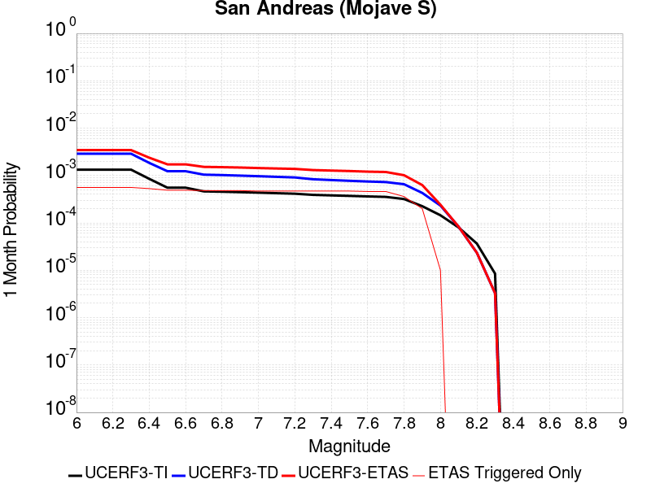 |  |  |

| Magnitude | 1 wk TI Prob | 1 wk TD Prob | 1 wk ETAS Prob | 1 wk ETAS/TD Gain | 1 wk ETAS Triggered Only | 1 mo TI Prob | 1 mo TD Prob | 1 mo ETAS Prob | 1 mo ETAS/TD Gain | 1 mo ETAS Triggered Only | 1 yr TI Prob | 1 yr TD Prob | 1 yr ETAS Prob | 1 yr ETAS/TD Gain | 1 yr ETAS Triggered Only | 10 yr TI Prob | 10 yr TD Prob | 10 yr ETAS Prob | 10 yr ETAS/TD Gain | 10 yr ETAS Triggered Only |
|-----|-----|-----|-----|-----|-----|-----|-----|-----|-----|-----|-----|-----|-----|-----|-----|-----|-----|-----|-----|-----|
| 6.0 | 3.1064058E-4 | 6.747043E-4 | 9.2044007E-4 | 1.3642125 | 2.4590164E-4 | 0.0013306376 | 0.002888514 | 0.0035014923 | 1.2122123 | 6.147541E-4 | 0.016080605 | 0.03462661 | 0.035971805 | 1.0388485 | 0.0013934426 | 0.1496549 | 0.28663692 | 0.2882303 | 1.0055588 | 0.0022336065 |
| 6.1 | 3.1064058E-4 | 6.747043E-4 | 9.2044007E-4 | 1.3642125 | 2.4590164E-4 | 0.0013306376 | 0.002888514 | 0.0035014923 | 1.2122123 | 6.147541E-4 | 0.016080605 | 0.03462661 | 0.035971805 | 1.0388485 | 0.0013934426 | 0.1496549 | 0.28663692 | 0.2882303 | 1.0055588 | 0.0022336065 |
| 6.2 | 3.1064058E-4 | 6.747043E-4 | 9.2044007E-4 | 1.3642125 | 2.4590164E-4 | 0.0013306376 | 0.002888514 | 0.0035014923 | 1.2122123 | 6.147541E-4 | 0.016080605 | 0.03462661 | 0.035971805 | 1.0388485 | 0.0013934426 | 0.1496549 | 0.28663692 | 0.2882303 | 1.0055588 | 0.0022336065 |
| 6.3 | 3.1064058E-4 | 6.747043E-4 | 9.2044007E-4 | 1.3642125 | 2.4590164E-4 | 0.0013306376 | 0.002888514 | 0.0035014923 | 1.2122123 | 6.147541E-4 | 0.016080605 | 0.03462661 | 0.035971805 | 1.0388485 | 0.0013934426 | 0.1496549 | 0.28663692 | 0.2882303 | 1.0055588 | 0.0022336065 |
| 6.4 | 1.9872203E-4 | 4.318848E-4 | 6.571973E-4 | 1.5216957 | 2.2540984E-4 | 8.5138786E-4 | 0.0018496502 | 0.0024428132 | 1.3206893 | 5.9426227E-4 | 0.010316478 | 0.022293096 | 0.023495195 | 1.0539224 | 0.0012295082 | 0.098504856 | 0.19703239 | 0.19866137 | 1.0082675 | 0.0020286886 |
| 6.5 | 1.291105E-4 | 2.8761322E-4 | 4.924723E-4 | 1.7122729 | 2.0491803E-4 | 5.5321335E-4 | 0.0012320485 | 0.0017846456 | 1.4485189 | 5.5327866E-4 | 0.006714592 | 0.0148978485 | 0.016008107 | 1.0745248 | 0.0011270492 | 0.065152965 | 0.13807017 | 0.13965979 | 1.0115131 | 0.0018442622 |
| 6.6 | 1.291105E-4 | 2.8761322E-4 | 4.924723E-4 | 1.7122729 | 2.0491803E-4 | 5.5321335E-4 | 0.0012320485 | 0.0017846456 | 1.4485189 | 5.5327866E-4 | 0.006714592 | 0.0148978485 | 0.016008107 | 1.0745248 | 0.0011270492 | 0.065152965 | 0.13807017 | 0.13965979 | 1.0115131 | 0.0018442622 |
| 6.7 | 1.08001186E-4 | 2.4342406E-4 | 4.482922E-4 | 1.8416101 | 2.0491803E-4 | 4.6278012E-4 | 0.0010428295 | 0.0015955311 | 1.530002 | 5.5327866E-4 | 0.0056198016 | 0.012622835 | 0.013715425 | 1.0865566 | 0.0011065573 | 0.054797906 | 0.11921291 | 0.120783165 | 1.0131719 | 0.0017827869 |
| 6.8 | 1.0624356E-4 | 2.3860046E-4 | 4.4346962E-4 | 1.8586284 | 2.0491803E-4 | 4.5525006E-4 | 0.0010221732 | 0.0015748864 | 1.5407236 | 5.5327866E-4 | 0.0055285925 | 0.01237422 | 0.013467086 | 1.0883179 | 0.0011065573 | 0.053930566 | 0.117162056 | 0.11873597 | 1.0134336 | 0.0017827869 |
| 6.9 | 1.0393785E-4 | 2.3230357E-4 | 4.37174E-4 | 1.8819082 | 2.0491803E-4 | 4.4537184E-4 | 9.952073E-4 | 0.0015479354 | 1.5553899 | 5.5327866E-4 | 0.0054089287 | 0.012049583 | 0.0131428065 | 1.0907271 | 0.0011065573 | 0.05279156 | 0.11445948 | 0.11600192 | 1.0134759 | 0.0017418033 |
| 7.0 | 1.0155622E-4 | 2.2599897E-4 | 4.103835E-4 | 1.8158646 | 1.8442623E-4 | 4.3516833E-4 | 9.682079E-4 | 0.001500479 | 1.5497487 | 5.327869E-4 | 0.005285311 | 0.011724443 | 0.012797776 | 1.0915465 | 0.0010860655 | 0.05161361 | 0.11171984 | 0.11324885 | 1.0136861 | 0.0017213115 |
| 7.1 | 9.885595E-5 | 2.1888265E-4 | 4.032685E-4 | 1.842396 | 1.8442623E-4 | 4.2359953E-4 | 9.377316E-4 | 0.0014700189 | 1.5676329 | 5.327869E-4 | 0.0051451353 | 0.011357316 | 0.012431047 | 1.0945408 | 0.0010860655 | 0.05027629 | 0.10860426 | 0.11013863 | 1.0141281 | 0.0017213115 |
| 7.2 | 9.6411415E-5 | 2.125122E-4 | 3.9689924E-4 | 1.867654 | 1.8442623E-4 | 4.1312634E-4 | 9.1044896E-4 | 0.0014427508 | 1.5846586 | 5.327869E-4 | 0.005018219 | 0.01102856 | 0.0120621165 | 1.0937164 | 0.001045082 | 0.049064007 | 0.10579402 | 0.10729658 | 1.0142027 | 0.0016803278 |
| 7.3 | 9.1180635E-5 | 1.9479371E-4 | 3.7918403E-4 | 1.9465927 | 1.8442623E-4 | 3.907156E-4 | 8.345632E-4 | 0.0013669054 | 1.6378692 | 5.327869E-4 | 0.004746591 | 0.010113581 | 0.011127809 | 1.1002837 | 0.0010245901 | 0.046464786 | 0.09798661 | 0.09946532 | 1.015091 | 0.0016393443 |
| 7.4 | 8.887388E-5 | 1.8727897E-4 | 3.7167067E-4 | 1.9845829 | 1.8442623E-4 | 3.8083247E-4 | 8.023774E-4 | 0.0013347368 | 1.6634775 | 5.327869E-4 | 0.0046267817 | 0.009725285 | 0.01073991 | 1.1043286 | 0.0010245901 | 0.045316286 | 0.09462135 | 0.096105576 | 1.0156859 | 0.0016393443 |
| 7.5 | 8.6750515E-5 | 1.8059391E-4 | 3.6498683E-4 | 2.0210361 | 1.8442623E-4 | 3.7173493E-4 | 7.7374437E-4 | 0.001306119 | 1.6880498 | 5.327869E-4 | 0.004516484 | 0.009379733 | 0.010394714 | 1.1082098 | 0.0010245901 | 0.04425787 | 0.09158487 | 0.093074076 | 1.0162604 | 0.0016393443 |
| 7.6 | 8.453092E-5 | 1.7446902E-4 | 3.588631E-4 | 2.056887 | 1.8442623E-4 | 3.6222505E-4 | 7.475102E-4 | 0.0012798988 | 1.7122159 | 5.327869E-4 | 0.0044011753 | 0.009063034 | 0.010078339 | 1.1120269 | 0.0010245901 | 0.04315024 | 0.088743635 | 0.0902375 | 1.0168334 | 0.0016393443 |
| 7.7 | 8.259102E-5 | 1.6968958E-4 | 3.540845E-4 | 2.0866604 | 1.8442623E-4 | 3.539135E-4 | 7.270384E-4 | 0.001259438 | 1.7322853 | 5.327869E-4 | 0.004300386 | 0.008815835 | 0.009831393 | 1.115197 | 0.0010245901 | 0.042181134 | 0.08649418 | 0.08799173 | 1.0173138 | 0.0016393443 |
| 7.8 | 7.444844E-5 | 1.5290553E-4 | 2.553489E-4 | 1.669978 | 1.0245902E-4 | 3.1902574E-4 | 6.551449E-4 | 0.0010647124 | 1.6251557 | 4.0983607E-4 | 0.0038772223 | 0.007947266 | 0.008780753 | 1.1048772 | 8.401639E-4 | 0.03810269 | 0.07832232 | 0.079568855 | 1.0159154 | 0.001352459 |
| 7.9 | 5.2586525E-5 | 1.0011239E-4 | 1.2060214E-4 | 1.2046674 | 2.0491803E-5 | 2.2535135E-4 | 4.2898257E-4 | 6.338127E-4 | 1.4774789 | 2.0491803E-4 | 0.0027402006 | 0.005210366 | 0.0057199923 | 1.09781 | 5.1229505E-4 | 0.027066574 | 0.052222524 | 0.052921705 | 1.0133885 | 7.377049E-4 |
| 8.0 | 3.379877E-5 | 5.4101976E-5 | 5.4101976E-5 | 1.0 | 0.0 | 1.4484383E-4 | 2.3184501E-4 | 2.5233207E-4 | 1.0883653 | 2.0491803E-5 | 0.0017620471 | 0.002819061 | 0.0029212313 | 1.0362426 | 1.0245902E-4 | 0.017481409 | 0.028848516 | 0.029027622 | 1.0062085 | 1.8442623E-4 |
| 8.1 | 1.8668277E-5 | 1.9322531E-5 | 1.9322531E-5 | 1.0 | 0.0 | 8.000444E-5 | 8.280823E-5 | 8.280823E-5 | 1.0 | 0.0 | 9.736188E-4 | 0.0010077246 | 0.0010077246 | 1.0 | 0.0 | 0.009693642 | 0.010805754 | 0.010805754 | 1.0 | 0.0 |
| 8.2 | 8.541571E-6 | 5.465789E-6 | 5.465789E-6 | 1.0 | 0.0 | 3.660622E-5 | 2.34246E-5 | 2.34246E-5 | 1.0 | 0.0 | 4.455896E-4 | 2.8515726E-4 | 2.8515726E-4 | 1.0 | 0.0 | 0.0044469717 | 0.0032435213 | 0.0032435213 | 1.0 | 0.0 |
| 8.3 | 1.983087E-6 | 7.668296E-7 | 7.668296E-7 | 1.0 | 0.0 | 8.498917E-6 | 3.2864084E-6 | 3.2864084E-6 | 1.0 | 0.0 | 1.034694E-4 | 4.0011306E-5 | 4.0011306E-5 | 1.0 | 0.0 | 0.0010342124 | 4.724499E-4 | 4.724499E-4 | 1.0 | 0.0 |

## Nelson Lake
*[(top)](#table-of-contents)*

| 1 Week | 1 Month | 1 Year | 10 Year |
|-----|-----|-----|-----|
|  |  | 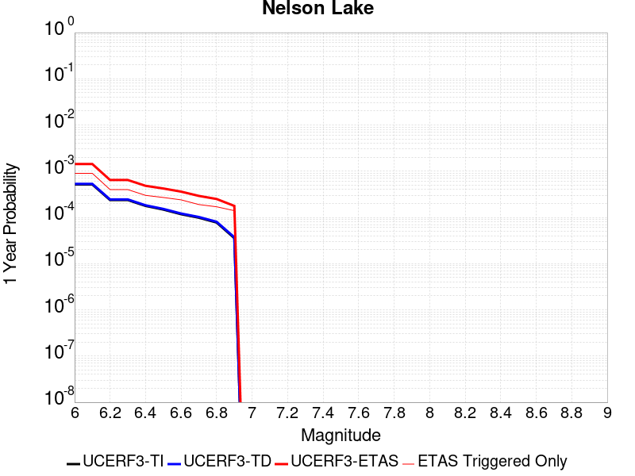 |  |

| Magnitude | 1 wk TI Prob | 1 wk TD Prob | 1 wk ETAS Prob | 1 wk ETAS/TD Gain | 1 wk ETAS Triggered Only | 1 mo TI Prob | 1 mo TD Prob | 1 mo ETAS Prob | 1 mo ETAS/TD Gain | 1 mo ETAS Triggered Only | 1 yr TI Prob | 1 yr TD Prob | 1 yr ETAS Prob | 1 yr ETAS/TD Gain | 1 yr ETAS Triggered Only | 10 yr TI Prob | 10 yr TD Prob | 10 yr ETAS Prob | 10 yr ETAS/TD Gain | 10 yr ETAS Triggered Only |
|-----|-----|-----|-----|-----|-----|-----|-----|-----|-----|-----|-----|-----|-----|-----|-----|-----|-----|-----|-----|-----|
| 6.0 | 9.913453E-6 | 1.0192293E-5 | 7.166708E-5 | 7.0314965 | 6.147541E-5 | 4.2485535E-5 | 4.3680586E-5 | 2.6908057E-4 | 6.1601872 | 2.2540984E-4 | 5.1713863E-4 | 5.316917E-4 | 0.0015147752 | 2.848973 | 9.836066E-4 | 0.0051593683 | 0.0053052236 | 0.0073231496 | 1.3803658 | 0.0020286886 |
| 6.1 | 9.913453E-6 | 1.0192293E-5 | 7.166708E-5 | 7.0314965 | 6.147541E-5 | 4.2485535E-5 | 4.3680586E-5 | 2.6908057E-4 | 6.1601872 | 2.2540984E-4 | 5.1713863E-4 | 5.316917E-4 | 0.0015147752 | 2.848973 | 9.836066E-4 | 0.0051593683 | 0.0053052236 | 0.0073231496 | 1.3803658 | 0.0020286886 |
| 6.2 | 4.5596407E-6 | 4.696332E-6 | 2.518804E-5 | 5.3633432 | 2.0491803E-5 | 1.954117E-5 | 2.0126989E-5 | 1.2258394E-4 | 6.090526 | 1.0245902E-4 | 2.3788778E-4 | 2.450198E-4 | 7.776761E-4 | 3.1739318 | 5.327869E-4 | 0.0023763329 | 0.0024476226 | 0.0034492633 | 1.40923 | 0.0010040983 |
| 6.3 | 4.5596407E-6 | 4.696332E-6 | 2.518804E-5 | 5.3633432 | 2.0491803E-5 | 1.954117E-5 | 2.0126989E-5 | 1.2258394E-4 | 6.090526 | 1.0245902E-4 | 2.3788778E-4 | 2.450198E-4 | 7.776761E-4 | 3.1739318 | 5.327869E-4 | 0.0023763329 | 0.0024476226 | 0.0034492633 | 1.40923 | 0.0010040983 |
| 6.4 | 3.4025713E-6 | 3.509912E-6 | 3.509912E-6 | 1.0 | 0.0 | 1.4582367E-5 | 1.50423975E-5 | 9.700838E-5 | 6.448997 | 8.196721E-5 | 1.7752586E-4 | 1.8312664E-4 | 5.723996E-4 | 3.1257036 | 3.8934426E-4 | 0.001773841 | 0.0018298404 | 0.0025661953 | 1.4024149 | 7.377049E-4 |
| 6.5 | 2.8352947E-6 | 2.9278688E-6 | 2.9278688E-6 | 1.0 | 0.0 | 1.2151207E-5 | 1.2547953E-5 | 9.451414E-5 | 7.5322356 | 8.196721E-5 | 1.479309E-4 | 1.5276136E-4 | 5.0106883E-4 | 3.2800753 | 3.4836066E-4 | 0.0014783246 | 0.0015266375 | 0.002140453 | 1.4020703 | 6.147541E-4 |
| 6.6 | 2.251518E-6 | 2.3290781E-6 | 2.3290781E-6 | 1.0 | 0.0 | 9.649328E-6 | 9.981729E-6 | 9.1948124E-5 | 9.211643 | 8.196721E-5 | 1.1747423E-4 | 1.2152141E-4 | 4.288611E-4 | 3.5290992 | 3.0737705E-4 | 0.0011741214 | 0.0012146112 | 0.0017876849 | 1.4718164 | 5.737705E-4 |
| 6.7 | 1.8911853E-6 | 1.9591491E-6 | 1.9591491E-6 | 1.0 | 0.0 | 8.105055E-6 | 8.39633E-6 | 6.9871225E-5 | 8.321639 | 6.147541E-5 | 9.867457E-5 | 1.022211E-4 | 3.6858732E-4 | 3.6057851 | 2.6639344E-4 | 9.863076E-4 | 0.0010217984 | 0.0015540408 | 1.520888 | 5.327869E-4 |
| 6.8 | 1.4874814E-6 | 1.5438383E-6 | 1.5438383E-6 | 1.0 | 0.0 | 6.374905E-6 | 6.6164357E-6 | 6.809144E-5 | 10.291257 | 6.147541E-5 | 7.76117E-5 | 8.055265E-5 | 3.0594433E-4 | 3.7980666 | 2.2540984E-4 | 7.75846E-4 | 8.052856E-4 | 0.0012147917 | 1.5085227 | 4.0983607E-4 |
| 6.9 | 6.835972E-7 | 7.1399705E-7 | 7.1399705E-7 | 1.0 | 0.0 | 2.9296991E-6 | 3.0599856E-6 | 2.3551725E-5 | 7.696679 | 2.0491803E-5 | 3.56685E-5 | 3.7255006E-5 | 2.0118333E-4 | 5.400169 | 1.6393443E-4 | 3.5662777E-4 | 3.7251884E-4 | 6.388131E-4 | 1.7148476 | 2.6639344E-4 |

## San Andreas (Mojave N)
*[(top)](#table-of-contents)*

| 1 Week | 1 Month | 1 Year | 10 Year |
|-----|-----|-----|-----|
|  |  |  | 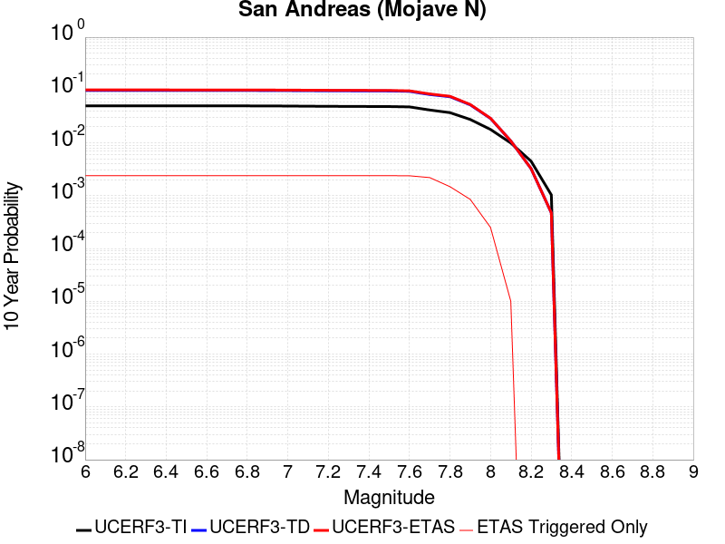 |

| Magnitude | 1 wk TI Prob | 1 wk TD Prob | 1 wk ETAS Prob | 1 wk ETAS/TD Gain | 1 wk ETAS Triggered Only | 1 mo TI Prob | 1 mo TD Prob | 1 mo ETAS Prob | 1 mo ETAS/TD Gain | 1 mo ETAS Triggered Only | 1 yr TI Prob | 1 yr TD Prob | 1 yr ETAS Prob | 1 yr ETAS/TD Gain | 1 yr ETAS Triggered Only | 10 yr TI Prob | 10 yr TD Prob | 10 yr ETAS Prob | 10 yr ETAS/TD Gain | 10 yr ETAS Triggered Only |
|-----|-----|-----|-----|-----|-----|-----|-----|-----|-----|-----|-----|-----|-----|-----|-----|-----|-----|-----|-----|-----|
| 6.0 | 9.877682E-5 | 1.9409315E-4 | 4.6043488E-4 | 2.3722367 | 2.6639344E-4 | 4.2326056E-4 | 8.315628E-4 | 0.0014662804 | 1.7632829 | 6.352459E-4 | 0.0051410277 | 0.010077406 | 0.011335094 | 1.1248028 | 0.0012704917 | 0.05023708 | 0.09835201 | 0.10027355 | 1.0195374 | 0.0021311475 |
| 6.1 | 9.877682E-5 | 1.9409315E-4 | 4.6043488E-4 | 2.3722367 | 2.6639344E-4 | 4.2326056E-4 | 8.315628E-4 | 0.0014662804 | 1.7632829 | 6.352459E-4 | 0.0051410277 | 0.010077406 | 0.011335094 | 1.1248028 | 0.0012704917 | 0.05023708 | 0.09835201 | 0.10027355 | 1.0195374 | 0.0021311475 |
| 6.2 | 9.877682E-5 | 1.9409315E-4 | 4.6043488E-4 | 2.3722367 | 2.6639344E-4 | 4.2326056E-4 | 8.315628E-4 | 0.0014662804 | 1.7632829 | 6.352459E-4 | 0.0051410277 | 0.010077406 | 0.011335094 | 1.1248028 | 0.0012704917 | 0.05023708 | 0.09835201 | 0.10027355 | 1.0195374 | 0.0021311475 |
| 6.3 | 9.877682E-5 | 1.9409315E-4 | 4.6043488E-4 | 2.3722367 | 2.6639344E-4 | 4.2326056E-4 | 8.315628E-4 | 0.0014662804 | 1.7632829 | 6.352459E-4 | 0.0051410277 | 0.010077406 | 0.011335094 | 1.1248028 | 0.0012704917 | 0.05023708 | 0.09835201 | 0.10027355 | 1.0195374 | 0.0021311475 |
| 6.4 | 9.877682E-5 | 1.9409315E-4 | 4.6043488E-4 | 2.3722367 | 2.6639344E-4 | 4.2326056E-4 | 8.315628E-4 | 0.0014662804 | 1.7632829 | 6.352459E-4 | 0.0051410277 | 0.010077406 | 0.011335094 | 1.1248028 | 0.0012704917 | 0.05023708 | 0.09835201 | 0.10027355 | 1.0195374 | 0.0021311475 |
| 6.5 | 9.861474E-5 | 1.9383078E-4 | 4.601726E-4 | 2.3740945 | 2.6639344E-4 | 4.2256617E-4 | 8.304391E-4 | 0.0014651575 | 1.7643166 | 6.352459E-4 | 0.0051326132 | 0.010063851 | 0.011321557 | 1.1249726 | 0.0012704917 | 0.050156746 | 0.098229796 | 0.1001516 | 1.0195644 | 0.0021311475 |
| 6.6 | 9.861474E-5 | 1.9383078E-4 | 4.601726E-4 | 2.3740945 | 2.6639344E-4 | 4.2256617E-4 | 8.304391E-4 | 0.0014651575 | 1.7643166 | 6.352459E-4 | 0.0051326132 | 0.010063851 | 0.011321557 | 1.1249726 | 0.0012704917 | 0.050156746 | 0.098229796 | 0.1001516 | 1.0195644 | 0.0021311475 |
| 6.7 | 9.8552715E-5 | 1.9373032E-4 | 4.6007216E-4 | 2.3748074 | 2.6639344E-4 | 4.223004E-4 | 8.3000876E-4 | 0.0014647275 | 1.7647132 | 6.352459E-4 | 0.0051293927 | 0.01005866 | 0.011316373 | 1.1250378 | 0.0012704917 | 0.050125998 | 0.098182976 | 0.10010488 | 1.0195748 | 0.0021311475 |
| 6.8 | 9.8464974E-5 | 1.9358192E-4 | 4.599238E-4 | 2.3758614 | 2.6639344E-4 | 4.219245E-4 | 8.293732E-4 | 0.0014640922 | 1.7652997 | 6.352459E-4 | 0.0051248376 | 0.010050993 | 0.011308716 | 1.1251341 | 0.0012704917 | 0.05008251 | 0.09811299 | 0.10003505 | 1.0195903 | 0.0021311475 |
| 6.9 | 9.825824E-5 | 1.9326196E-4 | 4.5960394E-4 | 2.3781395 | 2.6639344E-4 | 4.2103877E-4 | 8.280028E-4 | 0.0014627228 | 1.7665673 | 6.352459E-4 | 0.0051141046 | 0.010034463 | 0.011292207 | 1.1253424 | 0.0012704917 | 0.049980022 | 0.09796208 | 0.09988446 | 1.0196236 | 0.0021311475 |
| 7.0 | 9.781462E-5 | 1.9257552E-4 | 4.5891767E-4 | 2.3830528 | 2.6639344E-4 | 4.1913814E-4 | 8.250628E-4 | 0.0014597846 | 1.7693012 | 6.352459E-4 | 0.005091073 | 0.009998998 | 0.011256786 | 1.1257914 | 0.0012704917 | 0.04976007 | 0.097638436 | 0.099561505 | 1.0196958 | 0.0021311475 |
| 7.1 | 9.7121134E-5 | 1.9159251E-4 | 4.5793492E-4 | 2.3901505 | 2.6639344E-4 | 4.1616702E-4 | 8.208525E-4 | 0.001455577 | 1.7732503 | 6.352459E-4 | 0.005055068 | 0.009948207 | 0.01120606 | 1.1264402 | 0.0012704917 | 0.04941613 | 0.097174905 | 0.09909896 | 1.0198 | 0.0021311475 |
| 7.2 | 9.663819E-5 | 1.9090026E-4 | 4.5724286E-4 | 2.3951924 | 2.6639344E-4 | 4.1409794E-4 | 8.178876E-4 | 0.001452614 | 1.7760557 | 6.352459E-4 | 0.0050299936 | 0.009912439 | 0.011170336 | 1.126901 | 0.0012704917 | 0.049176537 | 0.09684814 | 0.09877289 | 1.0198739 | 0.0021311475 |
| 7.3 | 9.6277574E-5 | 1.9042526E-4 | 4.5676797E-4 | 2.3986733 | 2.6639344E-4 | 4.125529E-4 | 8.158532E-4 | 0.0014505809 | 1.7779925 | 6.352459E-4 | 0.0050112694 | 0.009887895 | 0.011145824 | 1.1272191 | 0.0012704917 | 0.04899759 | 0.09662155 | 0.09854678 | 1.0199255 | 0.0021311475 |
| 7.4 | 9.593308E-5 | 1.8982294E-4 | 4.561658E-4 | 2.4031122 | 2.6639344E-4 | 4.1107697E-4 | 8.132734E-4 | 0.0014480026 | 1.7804624 | 6.352459E-4 | 0.0049933824 | 0.00985677 | 0.011114739 | 1.1276249 | 0.0012704917 | 0.04882661 | 0.09633968 | 0.098265514 | 1.0199901 | 0.0021311475 |
| 7.5 | 9.561707E-5 | 1.8928363E-4 | 4.5562664E-4 | 2.4071107 | 2.6639344E-4 | 4.0972308E-4 | 8.109635E-4 | 0.0014456942 | 1.7826872 | 6.352459E-4 | 0.0049769743 | 0.009828901 | 0.011086905 | 1.1279904 | 0.0012704917 | 0.048669744 | 0.09608582 | 0.098012194 | 1.0200485 | 0.0021311475 |
| 7.6 | 9.418194E-5 | 1.8580563E-4 | 4.5214957E-4 | 2.4334545 | 2.6639344E-4 | 4.0357444E-4 | 7.96067E-4 | 0.0014308073 | 1.7973452 | 6.352459E-4 | 0.004902454 | 0.009649157 | 0.010907389 | 1.1303982 | 0.0012704917 | 0.047957025 | 0.09446791 | 0.09639773 | 1.0204283 | 0.0021311475 |
| 7.7 | 8.202141E-5 | 1.6029038E-4 | 4.266411E-4 | 2.6616764 | 2.6639344E-4 | 3.51473E-4 | 6.86778E-4 | 0.0013011099 | 1.8945131 | 6.147541E-4 | 0.00427079 | 0.008329522 | 0.009528467 | 1.1439394 | 0.0012090164 | 0.04189639 | 0.08226675 | 0.08409093 | 1.022174 | 0.001987705 |
| 7.8 | 7.2859846E-5 | 1.4523414E-4 | 2.4767828E-4 | 1.7053723 | 1.0245902E-4 | 3.1221908E-4 | 6.2228355E-4 | 0.0010318646 | 1.6581904 | 4.0983607E-4 | 0.003794643 | 0.007550025 | 0.008383846 | 1.1104394 | 8.401639E-4 | 0.037304975 | 0.074755974 | 0.07600733 | 1.0167392 | 0.001352459 |
| 7.9 | 5.3874453E-5 | 1.0050546E-4 | 1.209952E-4 | 1.203867 | 2.0491803E-5 | 2.3087008E-4 | 4.3066658E-4 | 6.3549634E-4 | 1.4756111 | 2.0491803E-4 | 0.0028072202 | 0.005230771 | 0.0057403864 | 1.0974264 | 5.1229505E-4 | 0.02772022 | 0.052447177 | 0.053146195 | 1.013328 | 7.377049E-4 |
| 8.0 | 3.468538E-5 | 5.4288335E-5 | 5.4288335E-5 | 1.0 | 0.0 | 1.4864317E-4 | 2.3264355E-4 | 2.531306E-4 | 1.0880619 | 2.0491803E-5 | 0.0018082283 | 0.0028287582 | 0.0029309273 | 1.036118 | 1.0245902E-4 | 0.017935853 | 0.028961267 | 0.029140353 | 1.0061836 | 1.8442623E-4 |
| 8.1 | 1.9152367E-5 | 1.9415891E-5 | 1.9415891E-5 | 1.0 | 0.0 | 8.207899E-5 | 8.320831E-5 | 8.320831E-5 | 1.0 | 0.0 | 9.988535E-4 | 0.0010125911 | 0.0010125911 | 1.0 | 0.0 | 0.009943757 | 0.010863188 | 0.010863188 | 1.0 | 0.0 |
| 8.2 | 8.643924E-6 | 5.4798497E-6 | 5.4798497E-6 | 1.0 | 0.0 | 3.704486E-5 | 2.348486E-5 | 2.348486E-5 | 1.0 | 0.0 | 4.5092785E-4 | 2.858907E-4 | 2.858907E-4 | 1.0 | 0.0 | 0.0045001395 | 0.0032514327 | 0.0032514327 | 1.0 | 0.0 |
| 8.3 | 1.983087E-6 | 7.668296E-7 | 7.668296E-7 | 1.0 | 0.0 | 8.498917E-6 | 3.2864084E-6 | 3.2864084E-6 | 1.0 | 0.0 | 1.034694E-4 | 4.0011306E-5 | 4.0011306E-5 | 1.0 | 0.0 | 0.0010342124 | 4.724499E-4 | 4.724499E-4 | 1.0 | 0.0 |

## Lenwood-Lockhart-Old Woman Springs
*[(top)](#table-of-contents)*

| 1 Week | 1 Month | 1 Year | 10 Year |
|-----|-----|-----|-----|
|  |  |  | 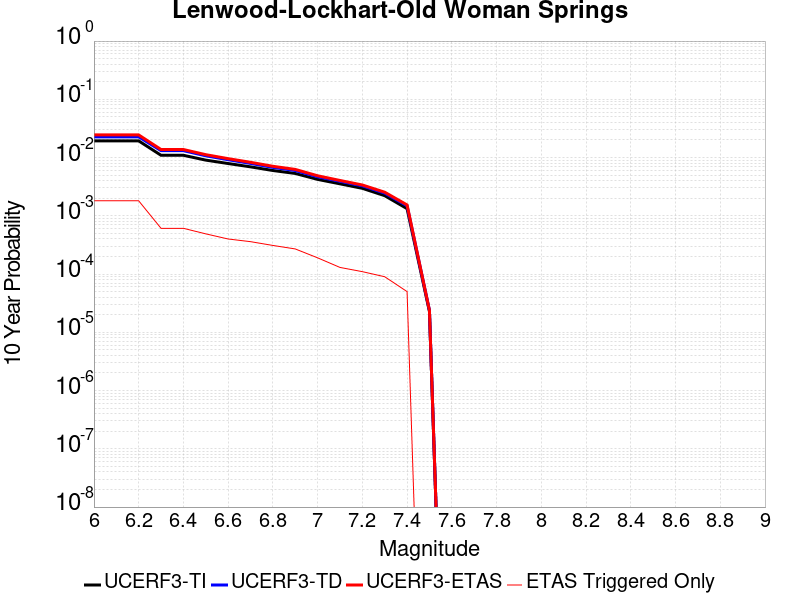 |

| Magnitude | 1 wk TI Prob | 1 wk TD Prob | 1 wk ETAS Prob | 1 wk ETAS/TD Gain | 1 wk ETAS Triggered Only | 1 mo TI Prob | 1 mo TD Prob | 1 mo ETAS Prob | 1 mo ETAS/TD Gain | 1 mo ETAS Triggered Only | 1 yr TI Prob | 1 yr TD Prob | 1 yr ETAS Prob | 1 yr ETAS/TD Gain | 1 yr ETAS Triggered Only | 10 yr TI Prob | 10 yr TD Prob | 10 yr ETAS Prob | 10 yr ETAS/TD Gain | 10 yr ETAS Triggered Only |
|-----|-----|-----|-----|-----|-----|-----|-----|-----|-----|-----|-----|-----|-----|-----|-----|-----|-----|-----|-----|-----|
| 6.0 | 3.744542E-5 | 4.3962966E-5 | 2.693629E-4 | 6.127041 | 2.2540984E-4 | 1.604705E-4 | 1.8840008E-4 | 6.596228E-4 | 3.501181 | 4.7131148E-4 | 0.0019519776 | 0.0022915301 | 0.0034364413 | 1.4996275 | 0.001147541 | 0.019349206 | 0.022697017 | 0.024579525 | 1.0829408 | 0.0019262295 |
| 6.1 | 3.744542E-5 | 4.3962966E-5 | 2.693629E-4 | 6.127041 | 2.2540984E-4 | 1.604705E-4 | 1.8840008E-4 | 6.596228E-4 | 3.501181 | 4.7131148E-4 | 0.0019519776 | 0.0022915301 | 0.0034364413 | 1.4996275 | 0.001147541 | 0.019349206 | 0.022697017 | 0.024579525 | 1.0829408 | 0.0019262295 |
| 6.2 | 3.744542E-5 | 4.3962966E-5 | 2.693629E-4 | 6.127041 | 2.2540984E-4 | 1.604705E-4 | 1.8840008E-4 | 6.596228E-4 | 3.501181 | 4.7131148E-4 | 0.0019519776 | 0.0022915301 | 0.0034364413 | 1.4996275 | 0.001147541 | 0.019349206 | 0.022697017 | 0.024579525 | 1.0829408 | 0.0019262295 |
| 6.3 | 2.1079984E-5 | 2.5353596E-5 | 8.682745E-5 | 3.42466 | 6.147541E-5 | 9.0339665E-5 | 1.0865386E-4 | 2.520809E-4 | 2.3200364 | 1.4344262E-4 | 0.0010993304 | 0.0013220779 | 0.0016904427 | 1.2786256 | 3.6885246E-4 | 0.010939079 | 0.013144341 | 0.013751015 | 1.0461547 | 6.147541E-4 |
| 6.4 | 2.1079984E-5 | 2.5353596E-5 | 8.682745E-5 | 3.42466 | 6.147541E-5 | 9.0339665E-5 | 1.0865386E-4 | 2.520809E-4 | 2.3200364 | 1.4344262E-4 | 0.0010993304 | 0.0013220779 | 0.0016904427 | 1.2786256 | 3.6885246E-4 | 0.010939079 | 0.013144341 | 0.013751015 | 1.0461547 | 6.147541E-4 |
| 6.5 | 1.7397282E-5 | 2.0662535E-5 | 8.213668E-5 | 3.9751499 | 6.147541E-5 | 7.455765E-5 | 8.855078E-5 | 2.1149071E-4 | 2.388355 | 1.2295082E-4 | 9.073613E-4 | 0.0010775843 | 0.0013846302 | 1.284939 | 3.0737705E-4 | 0.009036654 | 0.010724886 | 0.011231687 | 1.0472547 | 5.1229505E-4 |
| 6.6 | 1.52050325E-5 | 1.76798E-5 | 7.9154124E-5 | 4.4770937 | 6.147541E-5 | 6.51628E-5 | 7.576841E-5 | 1.9870991E-4 | 2.6225958 | 1.2295082E-4 | 7.9306826E-4 | 9.220979E-4 | 0.0012291915 | 1.333038 | 3.0737705E-4 | 0.007902439 | 0.009183581 | 0.009670868 | 1.0530607 | 4.918033E-4 |
| 6.7 | 1.332523E-5 | 1.5264091E-5 | 7.6738565E-5 | 5.0273914 | 6.147541E-5 | 5.7106878E-5 | 6.541593E-5 | 1.6786825E-4 | 2.5661678 | 1.0245902E-4 | 6.950544E-4 | 7.9615373E-4 | 0.0010623351 | 1.3343341 | 2.6639344E-4 | 0.006928845 | 0.007933645 | 0.008380888 | 1.056373 | 4.5081967E-4 |
| 6.8 | 1.1525329E-5 | 1.303105E-5 | 5.4014123E-5 | 4.1450324 | 4.0983607E-5 | 4.9393333E-5 | 5.5846183E-5 | 1.3780882E-4 | 2.4676497 | 8.196721E-5 | 6.011979E-4 | 6.7971944E-4 | 8.844982E-4 | 1.3012695 | 2.0491803E-4 | 0.00599574 | 0.006776856 | 0.0071432088 | 1.0540594 | 3.6885246E-4 |
| 6.9 | 1.0253909E-5 | 1.15144985E-5 | 5.249763E-5 | 4.5592637 | 4.0983607E-5 | 4.3944583E-5 | 4.9346934E-5 | 1.3131011E-4 | 2.6609576 | 8.196721E-5 | 5.3489394E-4 | 6.0063694E-4 | 7.849524E-4 | 1.3068666 | 1.8442623E-4 | 0.0053360825 | 0.005990515 | 0.0063367886 | 1.0578036 | 3.4836066E-4 |
| 7.0 | 8.104563E-6 | 8.991321E-6 | 4.997456E-5 | 5.558089 | 4.0983607E-5 | 3.4733377E-5 | 3.8533675E-5 | 7.95157E-5 | 2.063538 | 4.0983607E-5 | 4.2279682E-4 | 4.6904891E-4 | 5.714599E-4 | 1.2183375 | 1.0245902E-4 | 0.0042199334 | 0.0046808375 | 0.004925588 | 1.0522878 | 2.4590164E-4 |
| 7.1 | 6.7986157E-6 | 7.515848E-6 | 2.8007498E-5 | 3.7264585 | 2.0491803E-5 | 2.91366E-5 | 3.221039E-5 | 5.2701536E-5 | 1.6361656 | 2.0491803E-5 | 3.5468035E-4 | 3.9209312E-4 | 4.535444E-4 | 1.1567264 | 6.147541E-5 | 0.003541148 | 0.0039142296 | 0.004077522 | 1.0417178 | 1.6393443E-4 |
| 7.2 | 5.6893327E-6 | 6.280039E-6 | 2.6771713E-5 | 4.262985 | 2.0491803E-5 | 2.4382627E-5 | 2.6914187E-5 | 4.740544E-5 | 1.761355 | 2.0491803E-5 | 2.9681803E-4 | 3.2763294E-4 | 3.6860313E-4 | 1.125049 | 4.0983607E-5 | 0.002964219 | 0.0032716978 | 0.0033942463 | 1.0374572 | 1.2295082E-4 |
| 7.3 | 4.253348E-6 | 4.706927E-6 | 2.5198633E-5 | 5.3535213 | 2.0491803E-5 | 1.8228506E-5 | 2.01724E-5 | 4.066379E-5 | 2.0158134 | 2.0491803E-5 | 2.2190946E-4 | 2.4557312E-4 | 2.8654665E-4 | 1.1668487 | 4.0983607E-5 | 0.00221688 | 0.0024531984 | 0.0025349646 | 1.0333304 | 8.196721E-5 |
| 7.4 | 2.5448119E-6 | 2.8520535E-6 | 2.3343799E-5 | 8.184909 | 2.0491803E-5 | 1.0906291E-5 | 1.22230385E-5 | 3.271459E-5 | 2.6764698 | 2.0491803E-5 | 1.3277601E-4 | 1.4880698E-4 | 1.8978449E-4 | 1.2753736 | 4.0983607E-5 | 0.001326967 | 0.0014872355 | 0.0015486195 | 1.0412738 | 6.147541E-5 |
| 7.5 | 4.3706837E-8 | 4.5629356E-8 | 4.5629356E-8 | 1.0 | 0.0 | 1.8731501E-7 | 1.9555438E-7 | 1.9555438E-7 | 1.0 | 0.0 | 2.2805577E-6 | 2.3808725E-6 | 2.3808725E-6 | 1.0 | 0.0 | 2.2805343E-5 | 2.3808525E-5 | 2.3808525E-5 | 1.0 | 0.0 |

## Towne Pass
*[(top)](#table-of-contents)*

| 1 Week | 1 Month | 1 Year | 10 Year |
|-----|-----|-----|-----|
|  |  | 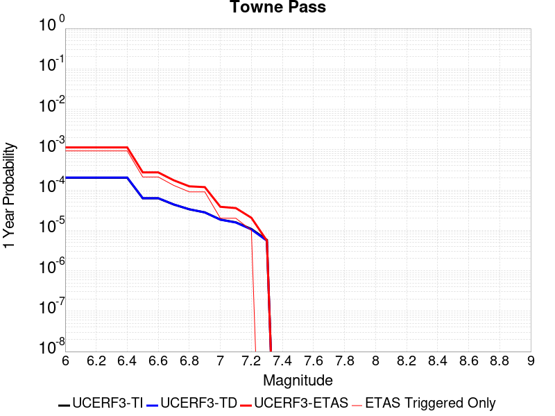 | 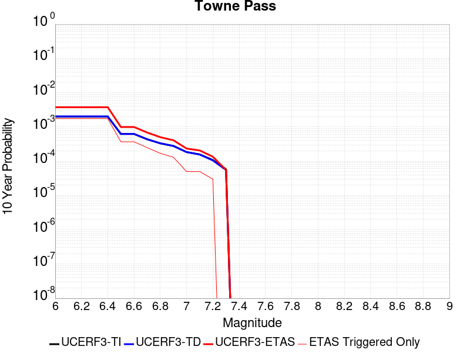 |

| Magnitude | 1 wk TI Prob | 1 wk TD Prob | 1 wk ETAS Prob | 1 wk ETAS/TD Gain | 1 wk ETAS Triggered Only | 1 mo TI Prob | 1 mo TD Prob | 1 mo ETAS Prob | 1 mo ETAS/TD Gain | 1 mo ETAS Triggered Only | 1 yr TI Prob | 1 yr TD Prob | 1 yr ETAS Prob | 1 yr ETAS/TD Gain | 1 yr ETAS Triggered Only | 10 yr TI Prob | 10 yr TD Prob | 10 yr ETAS Prob | 10 yr ETAS/TD Gain | 10 yr ETAS Triggered Only |
|-----|-----|-----|-----|-----|-----|-----|-----|-----|-----|-----|-----|-----|-----|-----|-----|-----|-----|-----|-----|-----|
| 6.0 | 3.849728E-6 | 3.8945495E-6 | 1.0635317E-4 | 27.308207 | 1.0245902E-4 | 1.649873E-5 | 1.6690845E-5 | 3.4455422E-4 | 20.643307 | 3.2786885E-4 | 2.0085352E-4 | 2.0319645E-4 | 0.0011046526 | 5.436377 | 9.0163935E-4 | 0.0020067208 | 0.0020305358 | 0.003727902 | 1.8359203 | 0.0017008197 |
| 6.1 | 3.849728E-6 | 3.8945495E-6 | 1.0635317E-4 | 27.308207 | 1.0245902E-4 | 1.649873E-5 | 1.6690845E-5 | 3.4455422E-4 | 20.643307 | 3.2786885E-4 | 2.0085352E-4 | 2.0319645E-4 | 0.0011046526 | 5.436377 | 9.0163935E-4 | 0.0020067208 | 0.0020305358 | 0.003727902 | 1.8359203 | 0.0017008197 |
| 6.2 | 3.849728E-6 | 3.8945495E-6 | 1.0635317E-4 | 27.308207 | 1.0245902E-4 | 1.649873E-5 | 1.6690845E-5 | 3.4455422E-4 | 20.643307 | 3.2786885E-4 | 2.0085352E-4 | 2.0319645E-4 | 0.0011046526 | 5.436377 | 9.0163935E-4 | 0.0020067208 | 0.0020305358 | 0.003727902 | 1.8359203 | 0.0017008197 |
| 6.3 | 3.849728E-6 | 3.8945495E-6 | 1.0635317E-4 | 27.308207 | 1.0245902E-4 | 1.649873E-5 | 1.6690845E-5 | 3.4455422E-4 | 20.643307 | 3.2786885E-4 | 2.0085352E-4 | 2.0319645E-4 | 0.0011046526 | 5.436377 | 9.0163935E-4 | 0.0020067208 | 0.0020305358 | 0.003727902 | 1.8359203 | 0.0017008197 |
| 6.4 | 3.849728E-6 | 3.8945495E-6 | 1.0635317E-4 | 27.308207 | 1.0245902E-4 | 1.649873E-5 | 1.6690845E-5 | 3.4455422E-4 | 20.643307 | 3.2786885E-4 | 2.0085352E-4 | 2.0319645E-4 | 0.0011046526 | 5.436377 | 9.0163935E-4 | 0.0020067208 | 0.0020305358 | 0.003727902 | 1.8359203 | 0.0017008197 |
| 6.5 | 1.1953545E-6 | 1.2030553E-6 | 6.267839E-5 | 52.099346 | 6.147541E-5 | 5.1229376E-6 | 5.155942E-6 | 1.4859783E-4 | 28.820696 | 1.4344262E-4 | 6.236998E-5 | 6.27719E-5 | 3.086581E-4 | 4.917138 | 2.4590164E-4 | 6.235248E-4 | 6.2755344E-4 | 0.0010780902 | 1.7179258 | 4.5081967E-4 |
| 6.6 | 1.1953545E-6 | 1.2030553E-6 | 6.267839E-5 | 52.099346 | 6.147541E-5 | 5.1229376E-6 | 5.155942E-6 | 1.4859783E-4 | 28.820696 | 1.4344262E-4 | 6.236998E-5 | 6.27719E-5 | 3.086581E-4 | 4.917138 | 2.4590164E-4 | 6.235248E-4 | 6.2755344E-4 | 0.0010780902 | 1.7179258 | 4.5081967E-4 |
| 6.7 | 8.375951E-7 | 8.410697E-7 | 4.182464E-5 | 49.727913 | 4.0983607E-5 | 3.5896885E-6 | 3.60458E-6 | 1.0606323E-4 | 29.424574 | 1.0245902E-4 | 4.370358E-5 | 4.3884935E-5 | 2.0781216E-4 | 4.7353873 | 1.6393443E-4 | 4.3694986E-4 | 4.387684E-4 | 7.2552776E-4 | 1.6535552 | 2.8688525E-4 |
| 6.8 | 6.38041E-7 | 6.39218E-7 | 4.16228E-5 | 65.11518 | 4.0983607E-5 | 2.7344586E-6 | 2.739503E-6 | 8.4706495E-5 | 30.920385 | 8.196721E-5 | 3.3291526E-5 | 3.335298E-5 | 1.5629969E-4 | 4.686229 | 1.2295082E-4 | 3.3286537E-4 | 3.3348353E-4 | 5.588182E-4 | 1.6756995 | 2.2540984E-4 |
| 6.9 | 5.3460053E-7 | 5.345355E-7 | 4.151812E-5 | 77.671394 | 4.0983607E-5 | 2.2911431E-6 | 2.2908646E-6 | 8.425789E-5 | 36.77995 | 8.196721E-5 | 2.789431E-5 | 2.7890954E-5 | 1.5083834E-4 | 5.408146 | 1.2295082E-4 | 2.789081E-4 | 2.7887785E-4 | 4.4276656E-4 | 1.587672 | 1.6393443E-4 |
| 7.0 | 3.557783E-7 | 3.5324413E-7 | 2.084504E-5 | 59.010292 | 2.0491803E-5 | 1.5247632E-6 | 1.5139026E-6 | 2.2005675E-5 | 14.535727 | 2.0491803E-5 | 1.8563835E-5 | 1.8431618E-5 | 3.892304E-5 | 2.1117542 | 2.0491803E-5 | 1.8562283E-4 | 1.8430172E-4 | 2.457658E-4 | 1.333497 | 6.147541E-5 |
| 7.1 | 3.037942E-7 | 3.0002388E-7 | 2.079182E-5 | 69.30055 | 2.0491803E-5 | 1.3019744E-6 | 1.2858161E-6 | 2.1777592E-5 | 16.936787 | 2.0491803E-5 | 1.5851423E-5 | 1.5654707E-5 | 3.614619E-5 | 2.3089664 | 2.0491803E-5 | 1.5850292E-4 | 1.5653679E-4 | 2.1800256E-4 | 1.3926604 | 6.147541E-5 |
| 7.2 | 2.0808248E-7 | 2.021783E-7 | 2.021783E-7 | 1.0 | 0.0 | 8.917818E-7 | 8.6647816E-7 | 8.6647816E-7 | 1.0 | 0.0 | 1.0857389E-5 | 1.0549325E-5 | 1.0549325E-5 | 1.0 | 0.0 | 1.0856859E-4 | 1.054887E-4 | 1.2597835E-4 | 1.1942354 | 2.0491803E-5 |
| 7.3 | 1.1162073E-7 | 1.06369825E-7 | 1.06369825E-7 | 1.0 | 0.0 | 4.7837443E-7 | 4.5587063E-7 | 4.5587063E-7 | 1.0 | 0.0 | 5.8241935E-6 | 5.550213E-6 | 5.550213E-6 | 1.0 | 0.0 | 5.8240406E-5 | 5.5500943E-5 | 5.5500943E-5 | 1.0 | 0.0 |

## Bicycle Lake
*[(top)](#table-of-contents)*

| 1 Week | 1 Month | 1 Year | 10 Year |
|-----|-----|-----|-----|
| 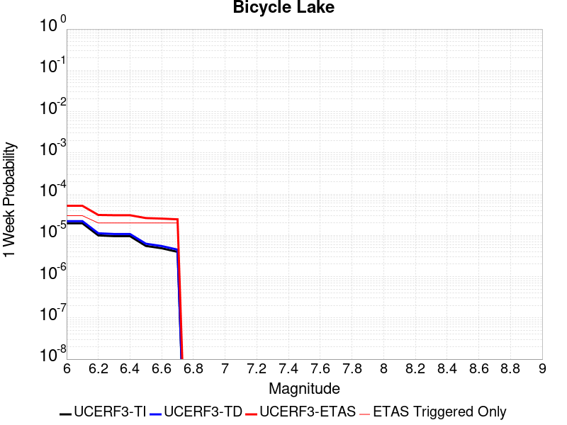 |  |  |  |

| Magnitude | 1 wk TI Prob | 1 wk TD Prob | 1 wk ETAS Prob | 1 wk ETAS/TD Gain | 1 wk ETAS Triggered Only | 1 mo TI Prob | 1 mo TD Prob | 1 mo ETAS Prob | 1 mo ETAS/TD Gain | 1 mo ETAS Triggered Only | 1 yr TI Prob | 1 yr TD Prob | 1 yr ETAS Prob | 1 yr ETAS/TD Gain | 1 yr ETAS Triggered Only | 10 yr TI Prob | 10 yr TD Prob | 10 yr ETAS Prob | 10 yr ETAS/TD Gain | 10 yr ETAS Triggered Only |
|-----|-----|-----|-----|-----|-----|-----|-----|-----|-----|-----|-----|-----|-----|-----|-----|-----|-----|-----|-----|-----|
| 6.0 | 1.9621975E-5 | 2.2097447E-5 | 4.25888E-5 | 1.9273175 | 2.0491803E-5 | 8.4091465E-5 | 9.470067E-5 | 1.9714999E-4 | 2.0818224 | 1.0245902E-4 | 0.0010233327 | 0.0011525059 | 0.001827956 | 1.5860709 | 6.762295E-4 | 0.01018633 | 0.011478599 | 0.01289656 | 1.1235309 | 0.0014344262 |
| 6.1 | 1.9621975E-5 | 2.2097447E-5 | 4.25888E-5 | 1.9273175 | 2.0491803E-5 | 8.4091465E-5 | 9.470067E-5 | 1.9714999E-4 | 2.0818224 | 1.0245902E-4 | 0.0010233327 | 0.0011525059 | 0.001827956 | 1.5860709 | 6.762295E-4 | 0.01018633 | 0.011478599 | 0.01289656 | 1.1235309 | 0.0014344262 |
| 6.2 | 9.9971285E-6 | 1.1255827E-5 | 3.17474E-5 | 2.8205302 | 2.0491803E-5 | 4.2844134E-5 | 4.823866E-5 | 1.0971111E-4 | 2.2743397 | 6.147541E-5 | 5.2150246E-4 | 5.8719947E-4 | 0.0010377544 | 1.7672945 | 4.5081967E-4 | 0.0052028033 | 0.005861584 | 0.006737567 | 1.1494447 | 8.811475E-4 |
| 6.3 | 9.589428E-6 | 1.0798527E-5 | 3.129011E-5 | 2.8976276 | 2.0491803E-5 | 4.10969E-5 | 4.627887E-5 | 1.0775144E-4 | 2.3283074 | 6.147541E-5 | 5.002399E-4 | 5.6335144E-4 | 0.0010139171 | 1.799795 | 4.5081967E-4 | 0.0049911533 | 0.0056243236 | 0.006500515 | 1.1557862 | 8.811475E-4 |
| 6.4 | 9.589428E-6 | 1.0798527E-5 | 3.129011E-5 | 2.8976276 | 2.0491803E-5 | 4.10969E-5 | 4.627887E-5 | 1.0775144E-4 | 2.3283074 | 6.147541E-5 | 5.002399E-4 | 5.6335144E-4 | 0.0010139171 | 1.799795 | 4.5081967E-4 | 0.0049911533 | 0.0056243236 | 0.006500515 | 1.1557862 | 8.811475E-4 |
| 6.5 | 5.557707E-6 | 6.2857107E-6 | 2.6777385E-5 | 4.260041 | 2.0491803E-5 | 2.3818526E-5 | 2.6938633E-5 | 8.841239E-5 | 3.2819922 | 6.147541E-5 | 2.8995197E-4 | 3.2795538E-4 | 5.737764E-4 | 1.7495562 | 2.4590164E-4 | 0.0028957394 | 0.0032773502 | 0.0037879664 | 1.1558015 | 5.1229505E-4 |
| 6.6 | 4.8742945E-6 | 5.5133855E-6 | 2.6005077E-5 | 4.7167163 | 2.0491803E-5 | 2.0889667E-5 | 2.3628729E-5 | 6.461137E-5 | 2.734441 | 4.0983607E-5 | 2.54302E-4 | 2.87668E-4 | 4.925271E-4 | 1.7121372 | 2.0491803E-4 | 0.002540112 | 0.0028755253 | 0.0033250486 | 1.1563274 | 4.5081967E-4 |
| 6.7 | 3.991108E-6 | 4.515989E-6 | 2.50077E-5 | 5.537591 | 2.0491803E-5 | 1.7104636E-5 | 1.9354238E-5 | 3.9845647E-5 | 2.0587554 | 2.0491803E-5 | 2.0822904E-4 | 2.3563785E-4 | 3.790467E-4 | 1.6085984 | 1.4344262E-4 | 0.0020803404 | 0.0023563786 | 0.0026425878 | 1.1214615 | 2.8688525E-4 |

## Paradise
*[(top)](#table-of-contents)*

| 1 Week | 1 Month | 1 Year | 10 Year |
|-----|-----|-----|-----|
|  | 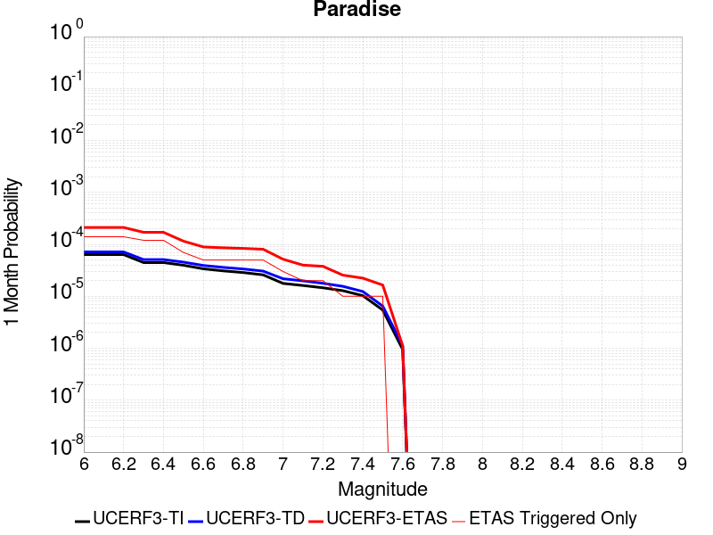 |  |  |

| Magnitude | 1 wk TI Prob | 1 wk TD Prob | 1 wk ETAS Prob | 1 wk ETAS/TD Gain | 1 wk ETAS Triggered Only | 1 mo TI Prob | 1 mo TD Prob | 1 mo ETAS Prob | 1 mo ETAS/TD Gain | 1 mo ETAS Triggered Only | 1 yr TI Prob | 1 yr TD Prob | 1 yr ETAS Prob | 1 yr ETAS/TD Gain | 1 yr ETAS Triggered Only | 10 yr TI Prob | 10 yr TD Prob | 10 yr ETAS Prob | 10 yr ETAS/TD Gain | 10 yr ETAS Triggered Only |
|-----|-----|-----|-----|-----|-----|-----|-----|-----|-----|-----|-----|-----|-----|-----|-----|-----|-----|-----|-----|-----|
| 6.0 | 1.4851273E-5 | 1.6694854E-5 | 3.7186313E-5 | 2.2274117 | 2.0491803E-5 | 6.364676E-5 | 7.154755E-5 | 2.559606E-4 | 3.5774894 | 1.8442623E-4 | 7.7462377E-4 | 8.707668E-4 | 0.0015259335 | 1.7524021 | 6.557377E-4 | 0.0077192914 | 0.008675928 | 0.009976026 | 1.1498511 | 0.0013114754 |
| 6.1 | 1.4851273E-5 | 1.6694854E-5 | 3.7186313E-5 | 2.2274117 | 2.0491803E-5 | 6.364676E-5 | 7.154755E-5 | 2.559606E-4 | 3.5774894 | 1.8442623E-4 | 7.7462377E-4 | 8.707668E-4 | 0.0015259335 | 1.7524021 | 6.557377E-4 | 0.0077192914 | 0.008675928 | 0.009976026 | 1.1498511 | 0.0013114754 |
| 6.2 | 1.4851273E-5 | 1.6694854E-5 | 3.7186313E-5 | 2.2274117 | 2.0491803E-5 | 6.364676E-5 | 7.154755E-5 | 2.559606E-4 | 3.5774894 | 1.8442623E-4 | 7.7462377E-4 | 8.707668E-4 | 0.0015259335 | 1.7524021 | 6.557377E-4 | 0.0077192914 | 0.008675928 | 0.009976026 | 1.1498511 | 0.0013114754 |
| 6.3 | 1.0426831E-5 | 1.1888727E-5 | 3.238029E-5 | 2.7236125 | 2.0491803E-5 | 4.4685654E-5 | 5.0950726E-5 | 2.148768E-4 | 4.217345 | 1.6393443E-4 | 5.43912E-4 | 6.201545E-4 | 9.682991E-4 | 1.5613837 | 3.4836066E-4 | 0.0054258266 | 0.006184847 | 0.0068365294 | 1.1053675 | 6.557377E-4 |
| 6.4 | 1.0426831E-5 | 1.1888727E-5 | 3.238029E-5 | 2.7236125 | 2.0491803E-5 | 4.4685654E-5 | 5.0950726E-5 | 2.148768E-4 | 4.217345 | 1.6393443E-4 | 5.43912E-4 | 6.201545E-4 | 9.682991E-4 | 1.5613837 | 3.4836066E-4 | 0.0054258266 | 0.006184847 | 0.0068365294 | 1.1053675 | 6.557377E-4 |
| 6.5 | 9.25027E-6 | 1.0620054E-5 | 3.111164E-5 | 2.929518 | 2.0491803E-5 | 3.964341E-5 | 4.551375E-5 | 1.6845898E-4 | 3.7012765 | 1.2295082E-4 | 4.8255164E-4 | 5.539939E-4 | 7.9975935E-4 | 1.4436247 | 2.4590164E-4 | 0.0048150513 | 0.0055266283 | 0.0060157133 | 1.0884961 | 4.918033E-4 |
| 6.6 | 7.904275E-6 | 9.159603E-6 | 2.9651219E-5 | 3.237173 | 2.0491803E-5 | 3.3875025E-5 | 3.925487E-5 | 1.21218865E-4 | 3.0879955 | 8.196721E-5 | 4.1235037E-4 | 4.7782718E-4 | 6.0071924E-4 | 1.2571894 | 1.2295082E-4 | 0.0041158604 | 0.004768395 | 0.005053912 | 1.059877 | 2.8688525E-4 |
| 6.7 | 7.2061953E-6 | 8.407318E-6 | 2.8898949E-5 | 3.4373565 | 2.0491803E-5 | 3.088333E-5 | 3.6030888E-5 | 1.1799514E-4 | 3.2748332 | 8.196721E-5 | 3.7593965E-4 | 4.385914E-4 | 5.614883E-4 | 1.2802081 | 1.2295082E-4 | 0.003753043 | 0.0043776273 | 0.0046428544 | 1.060587 | 2.6639344E-4 |
| 6.8 | 6.6948724E-6 | 7.84223E-6 | 2.8333872E-5 | 3.6129866 | 2.0491803E-5 | 2.8691995E-5 | 3.3609143E-5 | 1.155736E-4 | 3.4387546 | 8.196721E-5 | 3.4926904E-4 | 4.0911807E-4 | 5.320186E-4 | 1.3004035 | 1.2295082E-4 | 0.003487206 | 0.0040840064 | 0.0043084957 | 1.0549679 | 2.2540984E-4 |
| 6.9 | 6.0421025E-6 | 7.130678E-6 | 2.7622335E-5 | 3.8737319 | 2.0491803E-5 | 2.5894467E-5 | 3.055971E-5 | 1.12524416E-4 | 3.6821165 | 8.196721E-5 | 3.1521954E-4 | 3.7200435E-4 | 4.539411E-4 | 1.2202574 | 8.196721E-5 | 0.0031477278 | 0.0037141545 | 0.0038978958 | 1.0494705 | 1.8442623E-4 |
| 7.0 | 4.134091E-6 | 5.0803487E-6 | 2.5572048E-5 | 5.033522 | 2.0491803E-5 | 1.7717413E-5 | 2.177275E-5 | 8.324682E-5 | 3.8234408 | 6.147541E-5 | 2.1568815E-4 | 2.6505254E-4 | 3.2651165E-4 | 1.2318752 | 6.147541E-5 | 0.0021547892 | 0.0026475172 | 0.0027292673 | 1.0308781 | 8.196721E-5 |
| 7.1 | 3.7674888E-6 | 4.6319055E-6 | 2.5123614E-5 | 5.424034 | 2.0491803E-5 | 1.6146281E-5 | 1.985088E-5 | 6.0833674E-5 | 3.0645328 | 4.0983607E-5 | 1.9656324E-4 | 2.4165919E-4 | 2.826329E-4 | 1.1695516 | 4.0983607E-5 | 0.0019638946 | 0.0024141145 | 0.0024754417 | 1.0254035 | 6.147541E-5 |
| 7.2 | 3.4065345E-6 | 4.156755E-6 | 2.4648474E-5 | 5.929739 | 2.0491803E-5 | 1.4599351E-5 | 1.7814553E-5 | 5.879743E-5 | 3.300528 | 4.0983607E-5 | 1.777326E-4 | 2.1687208E-4 | 2.578468E-4 | 1.1889349 | 4.0983607E-5 | 0.0017759053 | 0.0021667527 | 0.0022280947 | 1.0283107 | 6.147541E-5 |
| 7.3 | 2.9934936E-6 | 3.6293434E-6 | 2.4121073E-5 | 6.646126 | 2.0491803E-5 | 1.2829195E-5 | 1.5554244E-5 | 3.6045727E-5 | 2.3174207 | 2.0491803E-5 | 1.5618425E-4 | 1.8935793E-4 | 2.0984586E-4 | 1.1081969 | 2.0491803E-5 | 0.0015607453 | 0.0018921113 | 0.0019330173 | 1.0216193 | 4.0983607E-5 |
| 7.4 | 2.4049796E-6 | 2.8890036E-6 | 2.3380748E-5 | 8.093015 | 2.0491803E-5 | 1.0307015E-5 | 1.2381393E-5 | 3.2872944E-5 | 2.6550276 | 2.0491803E-5 | 1.2548068E-4 | 1.5073447E-4 | 1.7122319E-4 | 1.1359259 | 2.0491803E-5 | 0.0012540985 | 0.0015064639 | 0.0015473857 | 1.0271642 | 4.0983607E-5 |
| 7.5 | 1.2710091E-6 | 1.5134775E-6 | 2.200525E-5 | 14.539529 | 2.0491803E-5 | 5.44717E-6 | 6.486323E-6 | 2.6977994E-5 | 4.159212 | 2.0491803E-5 | 6.631728E-5 | 7.896937E-5 | 9.9459554E-5 | 1.25947 | 2.0491803E-5 | 6.6297496E-4 | 7.8953576E-4 | 8.1001135E-4 | 1.0259337 | 2.0491803E-5 |
| 7.6 | 2.21172E-7 | 2.6039737E-7 | 2.6039737E-7 | 1.0 | 0.0 | 9.478797E-7 | 1.1159884E-6 | 1.1159884E-6 | 1.0 | 0.0 | 1.1540374E-5 | 1.3587103E-5 | 1.3587103E-5 | 1.0 | 0.0 | 1.1539775E-4 | 1.3586554E-4 | 1.3586554E-4 | 1.0 | 0.0 |

## Garlic Springs
*[(top)](#table-of-contents)*

| 1 Week | 1 Month | 1 Year | 10 Year |
|-----|-----|-----|-----|
|  |  | 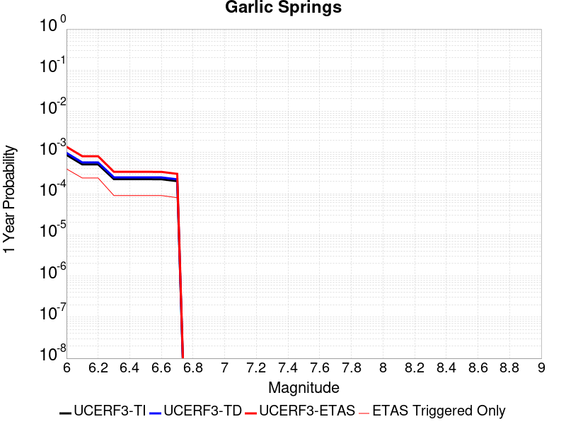 |  |

| Magnitude | 1 wk TI Prob | 1 wk TD Prob | 1 wk ETAS Prob | 1 wk ETAS/TD Gain | 1 wk ETAS Triggered Only | 1 mo TI Prob | 1 mo TD Prob | 1 mo ETAS Prob | 1 mo ETAS/TD Gain | 1 mo ETAS Triggered Only | 1 yr TI Prob | 1 yr TD Prob | 1 yr ETAS Prob | 1 yr ETAS/TD Gain | 1 yr ETAS Triggered Only | 10 yr TI Prob | 10 yr TD Prob | 10 yr ETAS Prob | 10 yr ETAS/TD Gain | 10 yr ETAS Triggered Only |
|-----|-----|-----|-----|-----|-----|-----|-----|-----|-----|-----|-----|-----|-----|-----|-----|-----|-----|-----|-----|-----|
| 6.0 | 1.6760017E-5 | 1.8777133E-5 | 3.926855E-5 | 2.0912964 | 2.0491803E-5 | 7.182667E-5 | 8.0471604E-5 | 1.6243222E-4 | 2.0185037 | 8.196721E-5 | 8.7413884E-4 | 9.794189E-4 | 0.0014707404 | 1.501646 | 4.918033E-4 | 0.008707083 | 0.009762568 | 0.010959782 | 1.122633 | 0.0012090164 |
| 6.1 | 9.852767E-6 | 1.0973752E-5 | 3.146533E-5 | 2.8673265 | 2.0491803E-5 | 4.222546E-5 | 4.702992E-5 | 8.80116E-5 | 1.871396 | 4.0983607E-5 | 5.139737E-4 | 5.7250983E-4 | 9.0019096E-4 | 1.572359 | 3.2786885E-4 | 0.005127866 | 0.0057173073 | 0.0063489215 | 1.110474 | 6.352459E-4 |
| 6.2 | 9.852767E-6 | 1.0973752E-5 | 3.146533E-5 | 2.8673265 | 2.0491803E-5 | 4.222546E-5 | 4.702992E-5 | 8.80116E-5 | 1.871396 | 4.0983607E-5 | 5.139737E-4 | 5.7250983E-4 | 9.0019096E-4 | 1.572359 | 3.2786885E-4 | 0.005127866 | 0.0057173073 | 0.0063489215 | 1.110474 | 6.352459E-4 |
| 6.3 | 4.3167724E-6 | 4.7780964E-6 | 2.5269801E-5 | 5.288676 | 2.0491803E-5 | 1.8500323E-5 | 2.0477524E-5 | 6.146029E-5 | 3.0013535 | 4.0983607E-5 | 2.2521814E-4 | 2.4930836E-4 | 3.9271524E-4 | 1.5752188 | 1.4344262E-4 | 0.0022499003 | 0.0024925452 | 0.0027582748 | 1.1066097 | 2.6639344E-4 |
| 6.4 | 4.3167724E-6 | 4.7780964E-6 | 2.5269801E-5 | 5.288676 | 2.0491803E-5 | 1.8500323E-5 | 2.0477524E-5 | 6.146029E-5 | 3.0013535 | 4.0983607E-5 | 2.2521814E-4 | 2.4930836E-4 | 3.9271524E-4 | 1.5752188 | 1.4344262E-4 | 0.0022499003 | 0.0024925452 | 0.0027582748 | 1.1066097 | 2.6639344E-4 |
| 6.5 | 4.3167724E-6 | 4.7780964E-6 | 2.5269801E-5 | 5.288676 | 2.0491803E-5 | 1.8500323E-5 | 2.0477524E-5 | 6.146029E-5 | 3.0013535 | 4.0983607E-5 | 2.2521814E-4 | 2.4930836E-4 | 3.9271524E-4 | 1.5752188 | 1.4344262E-4 | 0.0022499003 | 0.0024925452 | 0.0027582748 | 1.1066097 | 2.6639344E-4 |
| 6.6 | 4.301311E-6 | 4.7609647E-6 | 2.525267E-5 | 5.304108 | 2.0491803E-5 | 1.8434059E-5 | 2.0404104E-5 | 6.1386876E-5 | 3.0085552 | 4.0983607E-5 | 2.2441156E-4 | 2.4841467E-4 | 3.9182167E-4 | 1.5772887 | 1.4344262E-4 | 0.0022418506 | 0.0024836282 | 0.0027493602 | 1.1069934 | 2.6639344E-4 |
| 6.7 | 3.8599724E-6 | 4.2711204E-6 | 2.4762836E-5 | 5.797738 | 2.0491803E-5 | 1.6542634E-5 | 1.8304801E-5 | 5.9287657E-5 | 3.238913 | 4.0983607E-5 | 2.0138794E-4 | 2.2286095E-4 | 3.662716E-4 | 1.6434983 | 1.4344262E-4 | 0.0020120554 | 0.0022286095 | 0.0024944092 | 1.1192671 | 2.6639344E-4 |

## San Andreas (San Bernardino N)
*[(top)](#table-of-contents)*

| 1 Week | 1 Month | 1 Year | 10 Year |
|-----|-----|-----|-----|
|  | 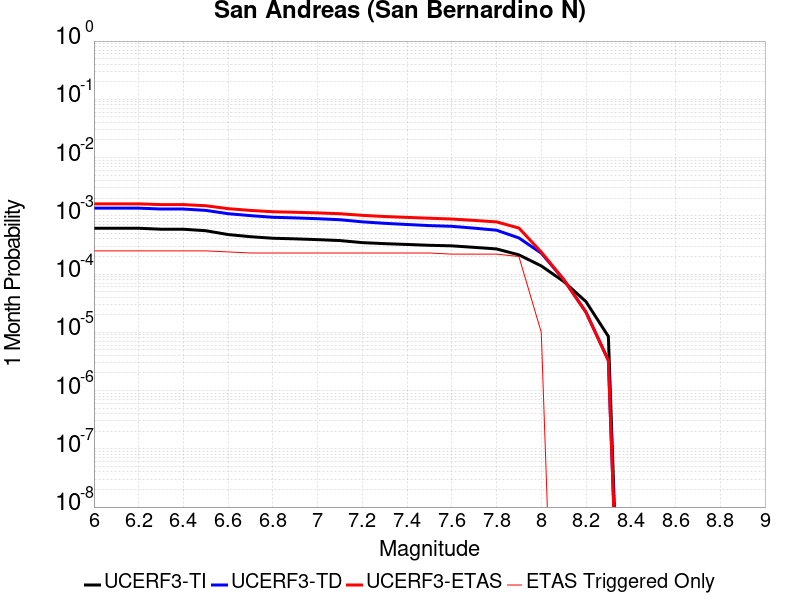 | 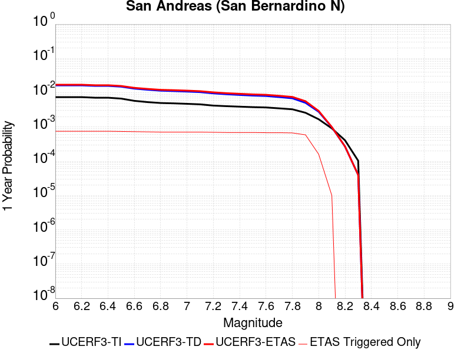 | 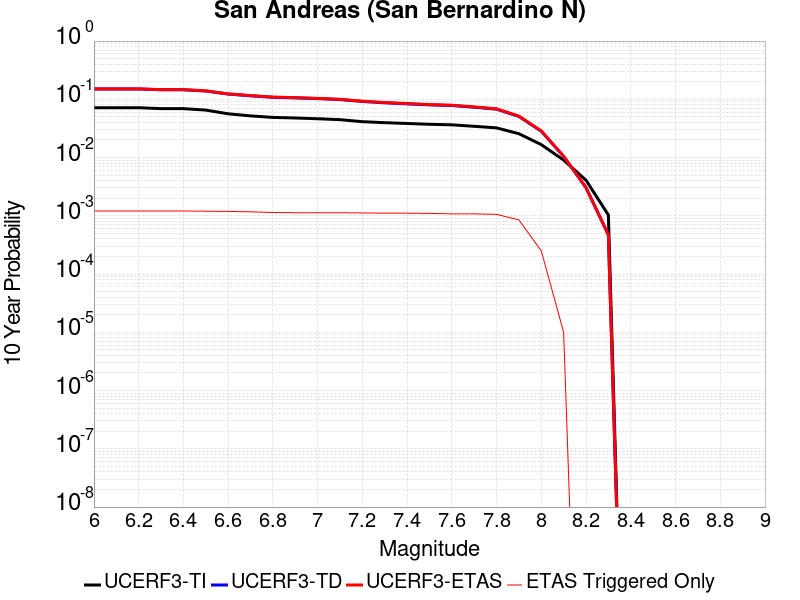 |

| Magnitude | 1 wk TI Prob | 1 wk TD Prob | 1 wk ETAS Prob | 1 wk ETAS/TD Gain | 1 wk ETAS Triggered Only | 1 mo TI Prob | 1 mo TD Prob | 1 mo ETAS Prob | 1 mo ETAS/TD Gain | 1 mo ETAS Triggered Only | 1 yr TI Prob | 1 yr TD Prob | 1 yr ETAS Prob | 1 yr ETAS/TD Gain | 1 yr ETAS Triggered Only | 10 yr TI Prob | 10 yr TD Prob | 10 yr ETAS Prob | 10 yr ETAS/TD Gain | 10 yr ETAS Triggered Only |
|-----|-----|-----|-----|-----|-----|-----|-----|-----|-----|-----|-----|-----|-----|-----|-----|-----|-----|-----|-----|-----|
| 6.0 | 1.4273766E-4 | 3.161376E-4 | 3.366229E-4 | 1.0647987 | 2.0491803E-5 | 6.115894E-4 | 0.0013541778 | 0.0015997464 | 1.1813415 | 2.4590164E-4 | 0.0074207084 | 0.016363978 | 0.016988829 | 1.0381845 | 6.352459E-4 | 0.07177748 | 0.15029658 | 0.15123682 | 1.006256 | 0.0011065573 |
| 6.1 | 1.4273766E-4 | 3.161376E-4 | 3.366229E-4 | 1.0647987 | 2.0491803E-5 | 6.115894E-4 | 0.0013541778 | 0.0015997464 | 1.1813415 | 2.4590164E-4 | 0.0074207084 | 0.016363978 | 0.016988829 | 1.0381845 | 6.352459E-4 | 0.07177748 | 0.15029658 | 0.15123682 | 1.006256 | 0.0011065573 |
| 6.2 | 1.4273766E-4 | 3.161376E-4 | 3.366229E-4 | 1.0647987 | 2.0491803E-5 | 6.115894E-4 | 0.0013541778 | 0.0015997464 | 1.1813415 | 2.4590164E-4 | 0.0074207084 | 0.016363978 | 0.016988829 | 1.0381845 | 6.352459E-4 | 0.07177748 | 0.15029658 | 0.15123682 | 1.006256 | 0.0011065573 |
| 6.3 | 1.3730655E-4 | 3.0518573E-4 | 3.256713E-4 | 1.0671248 | 2.0491803E-5 | 5.883239E-4 | 0.001307289 | 0.0015528691 | 1.1878545 | 2.4590164E-4 | 0.0071393442 | 0.01580149 | 0.016426697 | 1.0395664 | 6.352459E-4 | 0.06914291 | 0.14559646 | 0.14654191 | 1.0064936 | 0.0011065573 |
| 6.4 | 1.3730655E-4 | 3.0518573E-4 | 3.256713E-4 | 1.0671248 | 2.0491803E-5 | 5.883239E-4 | 0.001307289 | 0.0015528691 | 1.1878545 | 2.4590164E-4 | 0.0071393442 | 0.01580149 | 0.016426697 | 1.0395664 | 6.352459E-4 | 0.06914291 | 0.14559646 | 0.14654191 | 1.0064936 | 0.0011065573 |
| 6.5 | 1.2942807E-4 | 2.8932988E-4 | 3.0981578E-4 | 1.0708046 | 2.0491803E-5 | 5.545738E-4 | 0.0012394012 | 0.001484998 | 1.1981577 | 2.4590164E-4 | 0.0067310524 | 0.014986552 | 0.015612278 | 1.0417525 | 6.352459E-4 | 0.06530788 | 0.13873914 | 0.13969217 | 1.0068692 | 0.0011065573 |
| 6.6 | 1.1125901E-4 | 2.537176E-4 | 2.7420418E-4 | 1.0807457 | 2.0491803E-5 | 4.767372E-4 | 0.0010869103 | 0.0013325446 | 1.2259933 | 2.4590164E-4 | 0.005788839 | 0.013153472 | 0.013780362 | 1.0476596 | 6.352459E-4 | 0.056403454 | 0.12302898 | 0.123999394 | 1.0078877 | 0.0011065573 |
| 6.7 | 1.02209575E-4 | 2.3506685E-4 | 2.5555384E-4 | 1.0871539 | 2.0491803E-5 | 4.3796748E-4 | 0.0010070418 | 0.0012526958 | 1.2439363 | 2.4590164E-4 | 0.0053192247 | 0.01219223 | 0.012819731 | 1.0514673 | 6.352459E-4 | 0.051936906 | 0.11482068 | 0.115782045 | 1.0083728 | 0.0010860655 |
| 6.8 | 9.610582E-5 | 2.2032406E-4 | 2.4081134E-4 | 1.0929871 | 2.0491803E-5 | 4.1181705E-4 | 9.439049E-4 | 0.0011895745 | 1.2602694 | 2.4590164E-4 | 0.0050023515 | 0.011431754 | 0.012059737 | 1.0549333 | 6.352459E-4 | 0.048912346 | 0.1082225 | 0.109172754 | 1.0087806 | 0.0010655738 |
| 6.9 | 9.3877505E-5 | 2.1487933E-4 | 2.3536672E-4 | 1.0953437 | 2.0491803E-5 | 4.0227012E-4 | 9.2058704E-4 | 0.0011662623 | 1.266868 | 2.4590164E-4 | 0.0048866454 | 0.011150793 | 0.011778955 | 1.0563334 | 6.352459E-4 | 0.04780577 | 0.10581279 | 0.10674729 | 1.0088316 | 0.001045082 |
| 7.0 | 9.1019785E-5 | 2.0814833E-4 | 2.2863586E-4 | 1.0984275 | 2.0491803E-5 | 3.900265E-4 | 8.917599E-4 | 0.0011374422 | 1.2755028 | 2.4590164E-4 | 0.0047382377 | 0.010803353 | 0.011431736 | 1.0581656 | 6.352459E-4 | 0.046384744 | 0.10278319 | 0.10372085 | 1.0091227 | 0.001045082 |
| 7.1 | 8.771155E-5 | 1.9989353E-4 | 2.2038123E-4 | 1.102493 | 2.0491803E-5 | 3.758525E-4 | 8.564058E-4 | 0.0011020969 | 1.2868862 | 2.4590164E-4 | 0.0045664064 | 0.01037709 | 0.011005744 | 1.060581 | 6.352459E-4 | 0.044737056 | 0.09909467 | 0.10003618 | 1.0095012 | 0.001045082 |
| 7.2 | 8.0830236E-5 | 1.8394848E-4 | 2.0443651E-4 | 1.1113791 | 2.0491803E-5 | 3.4636928E-4 | 7.881126E-4 | 0.0010338204 | 1.3117675 | 2.4590164E-4 | 0.0042088944 | 0.009553162 | 0.010162043 | 1.0637361 | 6.147541E-4 | 0.041300658 | 0.09182531 | 0.09275581 | 1.0101335 | 0.0010245901 |
| 7.3 | 7.7668235E-5 | 1.7338296E-4 | 1.9387121E-4 | 1.1181676 | 2.0491803E-5 | 3.328214E-4 | 7.428583E-4 | 9.885773E-4 | 1.330775 | 2.4590164E-4 | 0.0040445733 | 0.009006873 | 0.0095957825 | 1.0653845 | 5.9426227E-4 | 0.03971748 | 0.087092124 | 0.08800878 | 1.0105251 | 0.0010040983 |
| 7.4 | 7.520177E-5 | 1.6558339E-4 | 1.860718E-4 | 1.1237347 | 2.0491803E-5 | 3.2225347E-4 | 7.0945016E-4 | 9.5517735E-4 | 1.3463628 | 2.4590164E-4 | 0.0039163795 | 0.0086034145 | 0.009192564 | 1.0684786 | 5.9426227E-4 | 0.038480744 | 0.08354814 | 0.08446835 | 1.0110141 | 0.0010040983 |
| 7.5 | 7.274697E-5 | 1.5845922E-4 | 1.7894778E-4 | 1.1292986 | 2.0491803E-5 | 3.1173544E-4 | 6.789343E-4 | 9.24669E-4 | 1.3619418 | 2.4590164E-4 | 0.003788775 | 0.008234753 | 0.008824121 | 1.0715709 | 5.9426227E-4 | 0.03724827 | 0.08026466 | 0.081188165 | 1.0115057 | 0.0010040983 |
| 7.6 | 7.1185845E-5 | 1.5415733E-4 | 1.7464597E-4 | 1.1329074 | 2.0491803E-5 | 3.0504653E-4 | 6.6050707E-4 | 9.0624625E-4 | 1.3720464 | 2.4590164E-4 | 0.0037076178 | 0.008012074 | 0.008601575 | 1.0735766 | 5.9426227E-4 | 0.036463667 | 0.078254156 | 0.07917968 | 1.0118271 | 0.0010040983 |
| 7.7 | 6.709961E-5 | 1.4324463E-4 | 1.637335E-4 | 1.1430341 | 2.0491803E-5 | 2.8753807E-4 | 6.1376113E-4 | 8.5951184E-4 | 1.4004012 | 2.4590164E-4 | 0.003495157 | 0.007446978 | 0.008036815 | 1.0792049 | 5.9426227E-4 | 0.034406938 | 0.073082365 | 0.074013084 | 1.0127351 | 0.0010040983 |
| 7.8 | 6.300812E-5 | 1.3208245E-4 | 1.5257155E-4 | 1.1551236 | 2.0491803E-5 | 2.7000686E-4 | 5.659449E-4 | 8.1170734E-4 | 1.4342517 | 2.4590164E-4 | 0.0032823787 | 0.0068686386 | 0.007458819 | 1.0859239 | 5.9426227E-4 | 0.032343175 | 0.06773997 | 0.06865695 | 1.0135367 | 9.836066E-4 |
| 7.9 | 4.983037E-5 | 9.728091E-5 | 1.17770716E-4 | 1.2106252 | 2.0491803E-5 | 2.1354125E-4 | 4.1685157E-4 | 6.216842E-4 | 1.4913802 | 2.0491803E-4 | 0.0025967648 | 0.005063368 | 0.005573069 | 1.1006645 | 5.1229505E-4 | 0.025666296 | 0.0506703 | 0.051370624 | 1.0138212 | 7.377049E-4 |
| 8.0 | 3.2211527E-5 | 5.333152E-5 | 5.333152E-5 | 1.0 | 0.0 | 1.380421E-4 | 2.2854365E-4 | 2.4903077E-4 | 1.089642 | 2.0491803E-5 | 0.0016793669 | 0.0027789702 | 0.0028811446 | 1.036767 | 1.0245902E-4 | 0.016667323 | 0.02837451 | 0.028553702 | 1.0063152 | 1.8442623E-4 |
| 8.1 | 1.743376E-5 | 1.8836954E-5 | 1.8836954E-5 | 1.0 | 0.0 | 7.471398E-5 | 8.07273E-5 | 8.07273E-5 | 1.0 | 0.0 | 9.0926304E-4 | 9.824124E-4 | 9.824124E-4 | 1.0 | 0.0 | 0.009055517 | 0.010490617 | 0.010490617 | 1.0 | 0.0 |
| 8.2 | 7.831616E-6 | 5.1597067E-6 | 5.1597067E-6 | 1.0 | 0.0 | 3.3563636E-5 | 2.2112841E-5 | 2.2112841E-5 | 1.0 | 0.0 | 4.0856065E-4 | 2.6919067E-4 | 2.6919067E-4 | 1.0 | 0.0 | 0.004078103 | 0.003044315 | 0.003044315 | 1.0 | 0.0 |
| 8.3 | 1.983087E-6 | 7.668296E-7 | 7.668296E-7 | 1.0 | 0.0 | 8.498917E-6 | 3.2864084E-6 | 3.2864084E-6 | 1.0 | 0.0 | 1.034694E-4 | 4.0011306E-5 | 4.0011306E-5 | 1.0 | 0.0 | 0.0010342124 | 4.724499E-4 | 4.724499E-4 | 1.0 | 0.0 |

## Helendale-So Lockhart
*[(top)](#table-of-contents)*

| 1 Week | 1 Month | 1 Year | 10 Year |
|-----|-----|-----|-----|
|  | 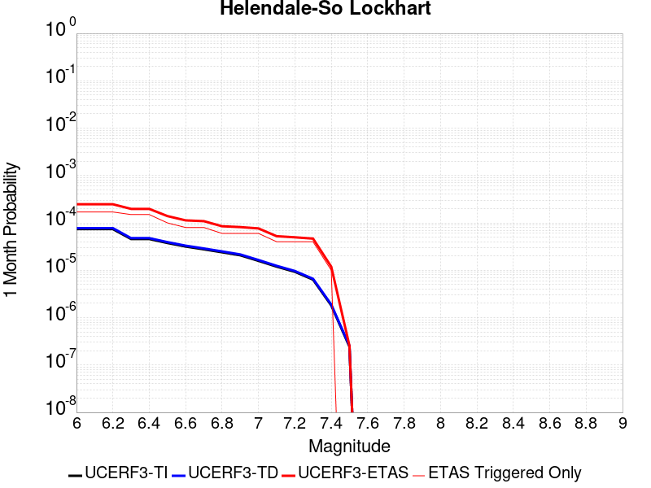 |  | 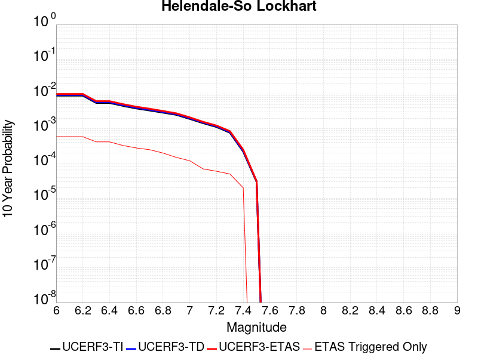 |

| Magnitude | 1 wk TI Prob | 1 wk TD Prob | 1 wk ETAS Prob | 1 wk ETAS/TD Gain | 1 wk ETAS Triggered Only | 1 mo TI Prob | 1 mo TD Prob | 1 mo ETAS Prob | 1 mo ETAS/TD Gain | 1 mo ETAS Triggered Only | 1 yr TI Prob | 1 yr TD Prob | 1 yr ETAS Prob | 1 yr ETAS/TD Gain | 1 yr ETAS Triggered Only | 10 yr TI Prob | 10 yr TD Prob | 10 yr ETAS Prob | 10 yr ETAS/TD Gain | 10 yr ETAS Triggered Only |
|-----|-----|-----|-----|-----|-----|-----|-----|-----|-----|-----|-----|-----|-----|-----|-----|-----|-----|-----|-----|-----|
| 6.0 | 1.7296055E-5 | 1.8103841E-5 | 5.9086706E-5 | 3.2637663 | 4.0983607E-5 | 7.412385E-5 | 7.7585704E-5 | 2.4150741E-4 | 3.1127825 | 1.6393443E-4 | 9.0208417E-4 | 9.442173E-4 | 0.0012717766 | 1.346911 | 3.2786885E-4 | 0.008984311 | 0.009404174 | 0.010074045 | 1.0712311 | 6.762295E-4 |
| 6.1 | 1.7296055E-5 | 1.8103841E-5 | 5.9086706E-5 | 3.2637663 | 4.0983607E-5 | 7.412385E-5 | 7.7585704E-5 | 2.4150741E-4 | 3.1127825 | 1.6393443E-4 | 9.0208417E-4 | 9.442173E-4 | 0.0012717766 | 1.346911 | 3.2786885E-4 | 0.008984311 | 0.009404174 | 0.010074045 | 1.0712311 | 6.762295E-4 |
| 6.2 | 1.7296055E-5 | 1.8103841E-5 | 5.9086706E-5 | 3.2637663 | 4.0983607E-5 | 7.412385E-5 | 7.7585704E-5 | 2.4150741E-4 | 3.1127825 | 1.6393443E-4 | 9.0208417E-4 | 9.442173E-4 | 0.0012717766 | 1.346911 | 3.2786885E-4 | 0.008984311 | 0.009404174 | 0.010074045 | 1.0712311 | 6.762295E-4 |
| 6.3 | 1.0669118E-5 | 1.1135489E-5 | 5.2118638E-5 | 4.6804085 | 4.0983607E-5 | 4.5723988E-5 | 4.7722668E-5 | 1.7066763E-4 | 3.5762382 | 1.2295082E-4 | 5.5654737E-4 | 5.8087136E-4 | 8.4711006E-4 | 1.4583436 | 2.6639344E-4 | 0.0055515557 | 0.005793827 | 0.006303154 | 1.0879085 | 5.1229505E-4 |
| 6.4 | 1.0669118E-5 | 1.1135489E-5 | 5.2118638E-5 | 4.6804085 | 4.0983607E-5 | 4.5723988E-5 | 4.7722668E-5 | 1.7066763E-4 | 3.5762382 | 1.2295082E-4 | 5.5654737E-4 | 5.8087136E-4 | 8.4711006E-4 | 1.4583436 | 2.6639344E-4 | 0.0055515557 | 0.005793827 | 0.006303154 | 1.0879085 | 5.1229505E-4 |
| 6.5 | 8.790038E-6 | 9.1702495E-6 | 5.015348E-5 | 5.469151 | 4.0983607E-5 | 3.767105E-5 | 3.9300485E-5 | 1.0077348E-4 | 2.564179 | 6.147541E-5 | 4.585485E-4 | 4.7837992E-4 | 6.627179E-4 | 1.3853381 | 1.8442623E-4 | 0.0045760344 | 0.0047736657 | 0.005140757 | 1.0768993 | 3.6885246E-4 |
| 6.6 | 7.396949E-6 | 7.715581E-6 | 4.8698872E-5 | 6.3117566 | 4.0983607E-5 | 3.1700827E-5 | 3.3066364E-5 | 7.4048614E-5 | 2.239394 | 4.0983607E-5 | 3.858892E-4 | 4.025096E-4 | 5.458945E-4 | 1.3562273 | 1.4344262E-4 | 0.003852198 | 0.004017913 | 0.004324055 | 1.0761943 | 3.0737705E-4 |
| 6.7 | 6.4600285E-6 | 6.7380697E-6 | 4.77214E-5 | 7.082355 | 4.0983607E-5 | 2.7685543E-5 | 2.8877126E-5 | 6.985955E-5 | 2.4192002 | 4.0983607E-5 | 3.3701936E-4 | 3.5152308E-4 | 4.7443068E-4 | 1.3496431 | 1.2295082E-4 | 0.0033650869 | 0.003509752 | 0.0037956303 | 1.0814526 | 2.8688525E-4 |
| 6.8 | 5.600104E-6 | 5.836042E-6 | 2.6327725E-5 | 4.5112295 | 2.0491803E-5 | 2.4000226E-5 | 2.5011372E-5 | 4.5502664E-5 | 1.819279 | 2.0491803E-5 | 2.9216358E-4 | 3.044715E-4 | 4.0689931E-4 | 1.3364118 | 1.0245902E-4 | 0.0029177975 | 0.003040605 | 0.0032653294 | 1.0739079 | 2.2540984E-4 |
| 6.9 | 4.839122E-6 | 5.039537E-6 | 2.5531237E-5 | 5.066187 | 2.0491803E-5 | 2.0738931E-5 | 2.159784E-5 | 4.20892E-5 | 1.948769 | 2.0491803E-5 | 2.5246723E-4 | 2.6292243E-4 | 3.4486808E-4 | 1.3116724 | 8.196721E-5 | 0.002521806 | 0.002626161 | 0.002789665 | 1.0622597 | 1.6393443E-4 |
| 7.0 | 3.6937633E-6 | 3.845229E-6 | 2.4336954E-5 | 6.3291297 | 2.0491803E-5 | 1.5830317E-5 | 1.6479451E-5 | 3.6970916E-5 | 2.2434556 | 2.0491803E-5 | 1.9271708E-4 | 2.0061915E-4 | 2.6208223E-4 | 1.3063669 | 6.147541E-5 | 0.0019255003 | 0.0020044118 | 0.002147567 | 1.07142 | 1.4344262E-4 |
| 7.1 | 2.7858857E-6 | 2.8978693E-6 | 2.8978693E-6 | 1.0 | 0.0 | 1.1939455E-5 | 1.2419382E-5 | 1.2419382E-5 | 1.0 | 0.0 | 1.4535317E-4 | 1.511957E-4 | 1.716844E-4 | 1.1355112 | 2.0491803E-5 | 0.0014525814 | 0.0015109498 | 0.0015723323 | 1.0406251 | 6.147541E-5 |
| 7.2 | 2.1672065E-6 | 2.2540248E-6 | 2.2540248E-6 | 1.0 | 0.0 | 9.2879945E-6 | 9.660072E-6 | 9.660072E-6 | 1.0 | 0.0 | 1.1307546E-4 | 1.176052E-4 | 1.380946E-4 | 1.1742219 | 2.0491803E-5 | 0.0011301794 | 0.0011754478 | 0.0012163833 | 1.0348254 | 4.0983607E-5 |
| 7.3 | 1.4823496E-6 | 1.5422185E-6 | 1.5422185E-6 | 1.0 | 0.0 | 6.3529114E-6 | 6.6094917E-6 | 6.6094917E-6 | 1.0 | 0.0 | 7.734395E-5 | 8.046775E-5 | 1.009579E-4 | 1.2546381 | 2.0491803E-5 | 7.731704E-4 | 8.044012E-4 | 8.2487654E-4 | 1.0254542 | 2.0491803E-5 |
| 7.4 | 4.2321457E-7 | 4.4109012E-7 | 4.4109012E-7 | 1.0 | 0.0 | 1.8137755E-6 | 1.8903852E-6 | 1.8903852E-6 | 1.0 | 0.0 | 2.2082493E-5 | 2.3015242E-5 | 4.3506574E-5 | 1.8903375 | 2.0491803E-5 | 2.2080299E-4 | 2.3013311E-4 | 2.5062019E-4 | 1.0890228 | 2.0491803E-5 |
| 7.5 | 5.6942316E-8 | 5.941599E-8 | 5.941599E-8 | 1.0 | 0.0 | 2.440385E-7 | 2.5463993E-7 | 2.5463993E-7 | 1.0 | 0.0 | 2.9711643E-6 | 3.1002376E-6 | 3.1002376E-6 | 1.0 | 0.0 | 2.9711247E-5 | 3.1002022E-5 | 3.1002022E-5 | 1.0 | 0.0 |

## Coyote Lake
*[(top)](#table-of-contents)*

| 1 Week | 1 Month | 1 Year | 10 Year |
|-----|-----|-----|-----|
|  |  |  | 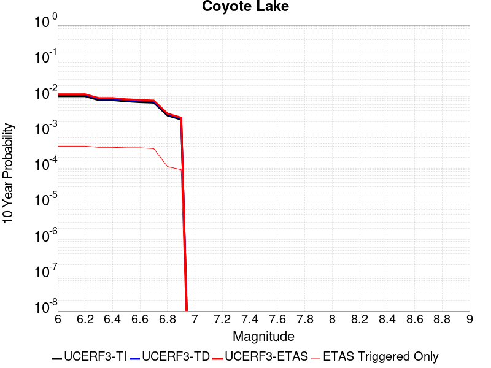 |

| Magnitude | 1 wk TI Prob | 1 wk TD Prob | 1 wk ETAS Prob | 1 wk ETAS/TD Gain | 1 wk ETAS Triggered Only | 1 mo TI Prob | 1 mo TD Prob | 1 mo ETAS Prob | 1 mo ETAS/TD Gain | 1 mo ETAS Triggered Only | 1 yr TI Prob | 1 yr TD Prob | 1 yr ETAS Prob | 1 yr ETAS/TD Gain | 1 yr ETAS Triggered Only | 10 yr TI Prob | 10 yr TD Prob | 10 yr ETAS Prob | 10 yr ETAS/TD Gain | 10 yr ETAS Triggered Only |
|-----|-----|-----|-----|-----|-----|-----|-----|-----|-----|-----|-----|-----|-----|-----|-----|-----|-----|-----|-----|-----|
| 6.0 | 1.980352E-5 | 2.1707021E-5 | 4.219838E-5 | 1.9439968 | 2.0491803E-5 | 8.486947E-5 | 9.302718E-5 | 1.3400697E-4 | 1.4405142 | 4.0983607E-5 | 0.0010327959 | 0.0011320895 | 0.0012958383 | 1.1446431 | 1.6393443E-4 | 0.010280091 | 0.011270401 | 0.011756661 | 1.043145 | 4.918033E-4 |
| 6.1 | 1.980352E-5 | 2.1707021E-5 | 4.219838E-5 | 1.9439968 | 2.0491803E-5 | 8.486947E-5 | 9.302718E-5 | 1.3400697E-4 | 1.4405142 | 4.0983607E-5 | 0.0010327959 | 0.0011320895 | 0.0012958383 | 1.1446431 | 1.6393443E-4 | 0.010280091 | 0.011270401 | 0.011756661 | 1.043145 | 4.918033E-4 |
| 6.2 | 1.980352E-5 | 2.1707021E-5 | 4.219838E-5 | 1.9439968 | 2.0491803E-5 | 8.486947E-5 | 9.302718E-5 | 1.3400697E-4 | 1.4405142 | 4.0983607E-5 | 0.0010327959 | 0.0011320895 | 0.0012958383 | 1.1446431 | 1.6393443E-4 | 0.010280091 | 0.011270401 | 0.011756661 | 1.043145 | 4.918033E-4 |
| 6.3 | 1.5344787E-5 | 1.6820884E-5 | 3.7312344E-5 | 2.2182152 | 2.0491803E-5 | 6.576172E-5 | 7.208785E-5 | 1.13068505E-4 | 1.568482 | 4.0983607E-5 | 8.003548E-4 | 8.7737746E-4 | 0.001041168 | 1.186682 | 1.6393443E-4 | 0.007974784 | 0.00874518 | 0.00921237 | 1.0534226 | 4.7131148E-4 |
| 6.4 | 1.5344787E-5 | 1.6820884E-5 | 3.7312344E-5 | 2.2182152 | 2.0491803E-5 | 6.576172E-5 | 7.208785E-5 | 1.13068505E-4 | 1.568482 | 4.0983607E-5 | 8.003548E-4 | 8.7737746E-4 | 0.001041168 | 1.186682 | 1.6393443E-4 | 0.007974784 | 0.00874518 | 0.00921237 | 1.0534226 | 4.7131148E-4 |
| 6.5 | 1.4189697E-5 | 1.5558186E-5 | 3.604967E-5 | 2.317087 | 2.0491803E-5 | 6.081157E-5 | 6.667658E-5 | 1.0765745E-4 | 1.6146218 | 4.0983607E-5 | 7.401293E-4 | 8.1154524E-4 | 9.548715E-4 | 1.176609 | 1.4344262E-4 | 0.0073766913 | 0.008091759 | 0.008538931 | 1.0552626 | 4.5081967E-4 |
| 6.6 | 1.3469301E-5 | 1.47717665E-5 | 3.5263267E-5 | 2.3872073 | 2.0491803E-5 | 5.7724297E-5 | 6.3306376E-5 | 1.04287385E-4 | 1.6473441 | 4.0983607E-5 | 7.025667E-4 | 7.7054254E-4 | 9.138746E-4 | 1.1860145 | 1.4344262E-4 | 0.0070034964 | 0.0076846126 | 0.008131968 | 1.0582144 | 4.5081967E-4 |
| 6.7 | 1.3027966E-5 | 1.4281927E-5 | 3.477344E-5 | 2.434786 | 2.0491803E-5 | 5.5832945E-5 | 6.120716E-5 | 1.02188256E-4 | 1.6695474 | 4.0983607E-5 | 6.7955407E-4 | 7.450021E-4 | 8.883379E-4 | 1.1923964 | 1.4344262E-4 | 0.006774798 | 0.007430923 | 0.007878393 | 1.0602173 | 4.5081967E-4 |
| 6.8 | 5.695434E-6 | 6.2244944E-6 | 6.2244944E-6 | 1.0 | 0.0 | 2.4408775E-5 | 2.6676302E-5 | 2.6676302E-5 | 1.0 | 0.0 | 2.971363E-4 | 3.2476554E-4 | 3.452507E-4 | 1.0630767 | 2.0491803E-5 | 0.0029673933 | 0.0032458503 | 0.0033684021 | 1.0377564 | 1.2295082E-4 |
| 6.9 | 4.385688E-6 | 4.7931144E-6 | 4.7931144E-6 | 1.0 | 0.0 | 1.879567E-5 | 2.0541918E-5 | 2.0541918E-5 | 1.0 | 0.0 | 2.2881327E-4 | 2.5009786E-4 | 2.7058454E-4 | 1.0819147 | 2.0491803E-5 | 0.002285778 | 0.0025009785 | 0.002623622 | 1.0490382 | 1.2295082E-4 |

## San Andreas (Big Bend)
*[(top)](#table-of-contents)*

| 1 Week | 1 Month | 1 Year | 10 Year |
|-----|-----|-----|-----|
|  | 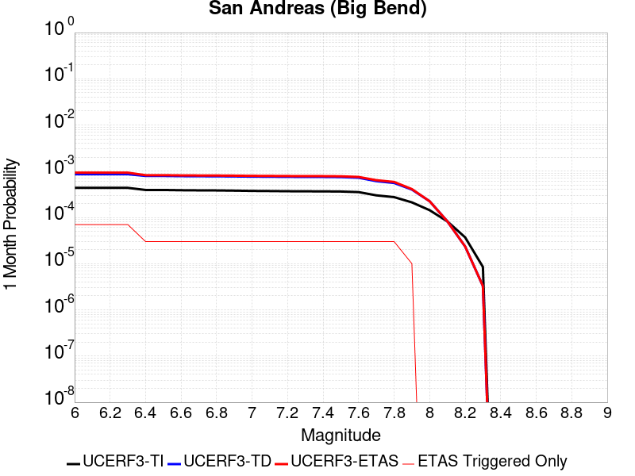 |  |  |

| Magnitude | 1 wk TI Prob | 1 wk TD Prob | 1 wk ETAS Prob | 1 wk ETAS/TD Gain | 1 wk ETAS Triggered Only | 1 mo TI Prob | 1 mo TD Prob | 1 mo ETAS Prob | 1 mo ETAS/TD Gain | 1 mo ETAS Triggered Only | 1 yr TI Prob | 1 yr TD Prob | 1 yr ETAS Prob | 1 yr ETAS/TD Gain | 1 yr ETAS Triggered Only | 10 yr TI Prob | 10 yr TD Prob | 10 yr ETAS Prob | 10 yr ETAS/TD Gain | 10 yr ETAS Triggered Only |
|-----|-----|-----|-----|-----|-----|-----|-----|-----|-----|-----|-----|-----|-----|-----|-----|-----|-----|-----|-----|-----|
| 6.0 | 1.0179969E-4 | 2.0080687E-4 | 2.0080687E-4 | 1.0 | 0.0 | 4.362114E-4 | 8.60318E-4 | 9.012664E-4 | 1.0475968 | 4.0983607E-5 | 0.0052979486 | 0.010424351 | 0.010586577 | 1.0155622 | 1.6393443E-4 | 0.051734097 | 0.1014857 | 0.101872355 | 1.0038099 | 4.3032787E-4 |
| 6.1 | 1.0179969E-4 | 2.0080687E-4 | 2.0080687E-4 | 1.0 | 0.0 | 4.362114E-4 | 8.60318E-4 | 9.012664E-4 | 1.0475968 | 4.0983607E-5 | 0.0052979486 | 0.010424351 | 0.010586577 | 1.0155622 | 1.6393443E-4 | 0.051734097 | 0.1014857 | 0.101872355 | 1.0038099 | 4.3032787E-4 |
| 6.2 | 1.0179969E-4 | 2.0080687E-4 | 2.0080687E-4 | 1.0 | 0.0 | 4.362114E-4 | 8.60318E-4 | 9.012664E-4 | 1.0475968 | 4.0983607E-5 | 0.0052979486 | 0.010424351 | 0.010586577 | 1.0155622 | 1.6393443E-4 | 0.051734097 | 0.1014857 | 0.101872355 | 1.0038099 | 4.3032787E-4 |
| 6.3 | 1.0179969E-4 | 2.0080687E-4 | 2.0080687E-4 | 1.0 | 0.0 | 4.362114E-4 | 8.60318E-4 | 9.012664E-4 | 1.0475968 | 4.0983607E-5 | 0.0052979486 | 0.010424351 | 0.010586577 | 1.0155622 | 1.6393443E-4 | 0.051734097 | 0.1014857 | 0.101872355 | 1.0038099 | 4.3032787E-4 |
| 6.4 | 9.1639464E-5 | 1.8437792E-4 | 1.8437792E-4 | 1.0 | 0.0 | 3.9268145E-4 | 7.89952E-4 | 8.1042765E-4 | 1.02592 | 2.0491803E-5 | 0.0047704205 | 0.009575372 | 0.009697145 | 1.0127174 | 1.2295082E-4 | 0.046693064 | 0.09381153 | 0.09410864 | 1.0031672 | 3.2786885E-4 |
| 6.5 | 9.1639464E-5 | 1.8437792E-4 | 1.8437792E-4 | 1.0 | 0.0 | 3.9268145E-4 | 7.89952E-4 | 8.1042765E-4 | 1.02592 | 2.0491803E-5 | 0.0047704205 | 0.009575372 | 0.009697145 | 1.0127174 | 1.2295082E-4 | 0.046693064 | 0.09381153 | 0.09410864 | 1.0031672 | 3.2786885E-4 |
| 6.6 | 9.042622E-5 | 1.8244829E-4 | 1.8244829E-4 | 1.0 | 0.0 | 3.8748336E-4 | 7.8168715E-4 | 8.021629E-4 | 1.0261943 | 2.0491803E-5 | 0.0047074095 | 0.009475624 | 0.009577112 | 1.0107105 | 1.0245902E-4 | 0.046089325 | 0.09290548 | 0.09316571 | 1.0028011 | 2.8688525E-4 |
| 6.7 | 8.9836685E-5 | 1.8159159E-4 | 1.8159159E-4 | 1.0 | 0.0 | 3.8495753E-4 | 7.7801774E-4 | 7.9849357E-4 | 1.026318 | 2.0491803E-5 | 0.00467679 | 0.009431336 | 0.00951253 | 1.0086089 | 8.196721E-5 | 0.045795817 | 0.09249973 | 0.09274149 | 1.0026135 | 2.6639344E-4 |
| 6.8 | 8.9471854E-5 | 1.8105932E-4 | 1.8105932E-4 | 1.0 | 0.0 | 3.8339442E-4 | 7.75738E-4 | 7.962139E-4 | 1.0263954 | 2.0491803E-5 | 0.004657841 | 0.00940382 | 0.009485017 | 1.0086344 | 8.196721E-5 | 0.04561414 | 0.09224692 | 0.092488736 | 1.0026214 | 2.6639344E-4 |
| 6.9 | 8.858234E-5 | 1.7987892E-4 | 1.7987892E-4 | 1.0 | 0.0 | 3.7958333E-4 | 7.706821E-4 | 7.911581E-4 | 1.0265687 | 2.0491803E-5 | 0.004611638 | 0.009342793 | 0.009423995 | 1.0086913 | 8.196721E-5 | 0.04517103 | 0.091686994 | 0.09192897 | 1.002639 | 2.6639344E-4 |
| 7.0 | 8.7433385E-5 | 1.7826671E-4 | 1.7826671E-4 | 1.0 | 0.0 | 3.746607E-4 | 7.6377665E-4 | 7.842528E-4 | 1.0268091 | 2.0491803E-5 | 0.004551957 | 0.009259437 | 0.009340646 | 1.0087703 | 8.196721E-5 | 0.044598386 | 0.09092137 | 0.091126285 | 1.0022538 | 2.2540984E-4 |
| 7.1 | 8.684964E-5 | 1.7738611E-4 | 1.7738611E-4 | 1.0 | 0.0 | 3.7215967E-4 | 7.600049E-4 | 7.8048115E-4 | 1.0269423 | 2.0491803E-5 | 0.0045216335 | 0.009213906 | 0.009295117 | 1.0088141 | 8.196721E-5 | 0.04430731 | 0.09050287 | 0.09070788 | 1.0022652 | 2.2540984E-4 |
| 7.2 | 8.606521E-5 | 1.7629213E-4 | 1.7629213E-4 | 1.0 | 0.0 | 3.6879873E-4 | 7.5531914E-4 | 7.757955E-4 | 1.0271095 | 2.0491803E-5 | 0.0044808835 | 0.009157337 | 0.009238554 | 1.008869 | 8.196721E-5 | 0.043916024 | 0.08998334 | 0.09016982 | 1.0020723 | 2.0491803E-4 |
| 7.3 | 8.568266E-5 | 1.7571205E-4 | 1.7571205E-4 | 1.0 | 0.0 | 3.6715972E-4 | 7.528345E-4 | 7.7331084E-4 | 1.027199 | 2.0491803E-5 | 0.0044610105 | 0.00912734 | 0.009208559 | 1.0088985 | 8.196721E-5 | 0.043725148 | 0.08970444 | 0.08989097 | 1.0020795 | 2.0491803E-4 |
| 7.4 | 8.5432206E-5 | 1.7533782E-4 | 1.7533782E-4 | 1.0 | 0.0 | 3.6608664E-4 | 7.5123156E-4 | 7.71708E-4 | 1.0272571 | 2.0491803E-5 | 0.004447999 | 0.009107988 | 0.009189209 | 1.0089176 | 8.196721E-5 | 0.043600157 | 0.08952458 | 0.08971115 | 1.002084 | 2.0491803E-4 |
| 7.5 | 8.4791965E-5 | 1.7403076E-4 | 1.7403076E-4 | 1.0 | 0.0 | 3.633435E-4 | 7.4563315E-4 | 7.661097E-4 | 1.0274619 | 2.0491803E-5 | 0.0044147377 | 0.009040395 | 0.009121621 | 1.0089848 | 8.196721E-5 | 0.043280575 | 0.0889021 | 0.0890888 | 1.0021001 | 2.0491803E-4 |
| 7.6 | 8.241105E-5 | 1.684837E-4 | 1.684837E-4 | 1.0 | 0.0 | 3.531424E-4 | 7.2187337E-4 | 7.4235036E-4 | 1.0283664 | 2.0491803E-5 | 0.0042910352 | 0.008753479 | 0.008834729 | 1.009282 | 8.196721E-5 | 0.042091176 | 0.08627858 | 0.08646582 | 1.0021702 | 2.0491803E-4 |
| 7.7 | 7.00432E-5 | 1.4211683E-4 | 1.4211683E-4 | 1.0 | 0.0 | 3.001506E-4 | 6.0893E-4 | 6.2940933E-4 | 1.0336317 | 2.0491803E-5 | 0.0036482112 | 0.007388561 | 0.007469923 | 1.0110118 | 8.196721E-5 | 0.035888977 | 0.07354971 | 0.073720574 | 1.002323 | 1.8442623E-4 |
| 7.8 | 6.415362E-5 | 1.297541E-4 | 1.297541E-4 | 1.0 | 0.0 | 2.749151E-4 | 5.5597053E-4 | 5.7645096E-4 | 1.0368372 | 2.0491803E-5 | 0.0033419547 | 0.006747963 | 0.006829377 | 1.0120649 | 8.196721E-5 | 0.03292141 | 0.0672817 | 0.06743461 | 1.0022726 | 1.6393443E-4 |
| 7.9 | 4.939911E-5 | 9.345801E-5 | 9.345801E-5 | 1.0 | 0.0 | 2.116933E-4 | 4.0047284E-4 | 4.0047284E-4 | 1.0 | 0.0 | 0.0025743195 | 0.0048648654 | 0.004926042 | 1.0125751 | 6.147541E-5 | 0.025447013 | 0.048936196 | 0.04899466 | 1.0011947 | 6.147541E-5 |
| 8.0 | 3.344983E-5 | 5.225443E-5 | 5.225443E-5 | 1.0 | 0.0 | 1.4334853E-4 | 2.2392833E-4 | 2.2392833E-4 | 1.0 | 0.0 | 0.0017438711 | 0.0027229206 | 0.0027433566 | 1.0075052 | 2.0491803E-5 | 0.017302496 | 0.02793573 | 0.02795565 | 1.000713 | 2.0491803E-5 |
| 8.1 | 1.9104898E-5 | 1.9186356E-5 | 1.9186356E-5 | 1.0 | 0.0 | 8.1875565E-5 | 8.222465E-5 | 8.222465E-5 | 1.0 | 0.0 | 9.963791E-4 | 0.001000626 | 0.001000626 | 1.0 | 0.0 | 0.009919235 | 0.010756767 | 0.010756767 | 1.0 | 0.0 |
| 8.2 | 8.643924E-6 | 5.4798497E-6 | 5.4798497E-6 | 1.0 | 0.0 | 3.704486E-5 | 2.348486E-5 | 2.348486E-5 | 1.0 | 0.0 | 4.5092785E-4 | 2.858907E-4 | 2.858907E-4 | 1.0 | 0.0 | 0.0045001395 | 0.0032514327 | 0.0032514327 | 1.0 | 0.0 |
| 8.3 | 1.983087E-6 | 7.668296E-7 | 7.668296E-7 | 1.0 | 0.0 | 8.498917E-6 | 3.2864084E-6 | 3.2864084E-6 | 1.0 | 0.0 | 1.034694E-4 | 4.0011306E-5 | 4.0011306E-5 | 1.0 | 0.0 | 0.0010342124 | 4.724499E-4 | 4.724499E-4 | 1.0 | 0.0 |

## Death Valley (Black Mtns Frontal)
*[(top)](#table-of-contents)*

| 1 Week | 1 Month | 1 Year | 10 Year |
|-----|-----|-----|-----|
| 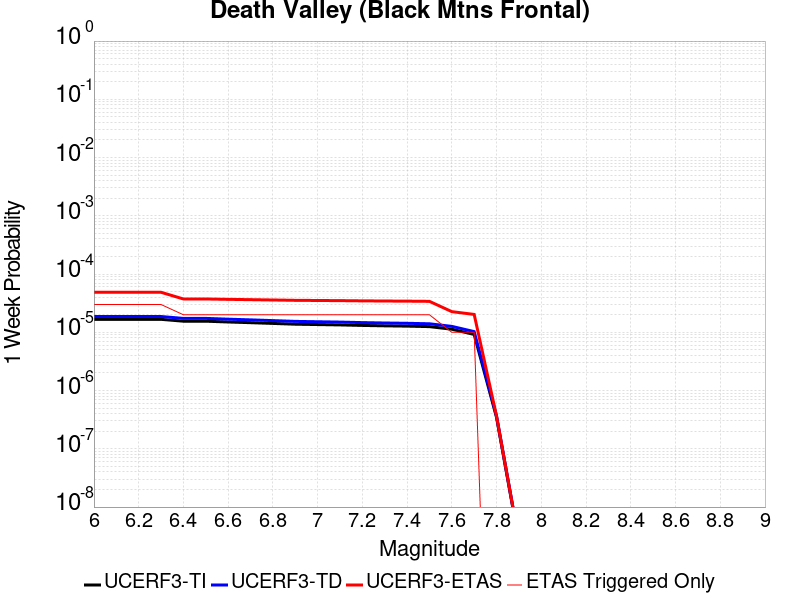 |  | 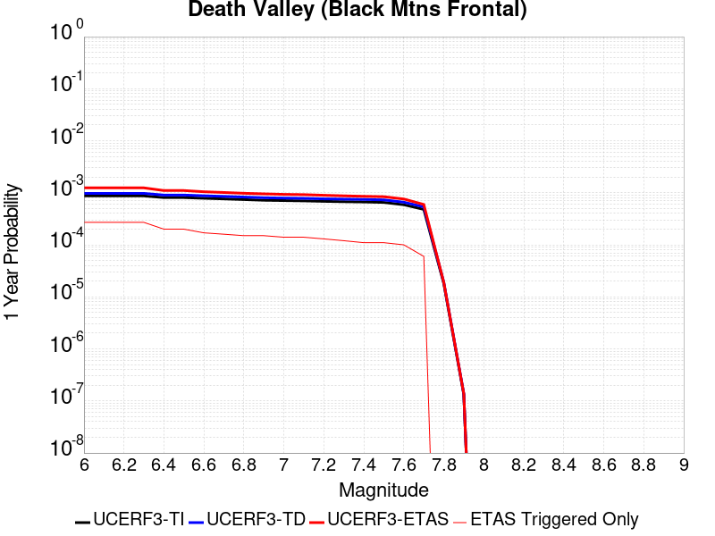 | 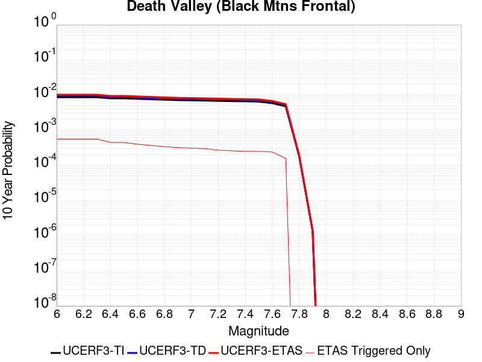 |

| Magnitude | 1 wk TI Prob | 1 wk TD Prob | 1 wk ETAS Prob | 1 wk ETAS/TD Gain | 1 wk ETAS Triggered Only | 1 mo TI Prob | 1 mo TD Prob | 1 mo ETAS Prob | 1 mo ETAS/TD Gain | 1 mo ETAS Triggered Only | 1 yr TI Prob | 1 yr TD Prob | 1 yr ETAS Prob | 1 yr ETAS/TD Gain | 1 yr ETAS Triggered Only | 10 yr TI Prob | 10 yr TD Prob | 10 yr ETAS Prob | 10 yr ETAS/TD Gain | 10 yr ETAS Triggered Only |
|-----|-----|-----|-----|-----|-----|-----|-----|-----|-----|-----|-----|-----|-----|-----|-----|-----|-----|-----|-----|-----|
| 6.0 | 1.6707214E-5 | 1.867056E-5 | 3.916198E-5 | 2.0975258 | 2.0491803E-5 | 7.160038E-5 | 8.001427E-5 | 1.20994606E-4 | 1.5121627 | 4.0983607E-5 | 8.71386E-4 | 9.7374606E-4 | 0.001117049 | 1.1471666 | 1.4344262E-4 | 0.00867977 | 0.009695647 | 0.010142096 | 1.0460463 | 4.5081967E-4 |
| 6.1 | 1.6707214E-5 | 1.867056E-5 | 3.916198E-5 | 2.0975258 | 2.0491803E-5 | 7.160038E-5 | 8.001427E-5 | 1.20994606E-4 | 1.5121627 | 4.0983607E-5 | 8.71386E-4 | 9.7374606E-4 | 0.001117049 | 1.1471666 | 1.4344262E-4 | 0.00867977 | 0.009695647 | 0.010142096 | 1.0460463 | 4.5081967E-4 |
| 6.2 | 1.6707214E-5 | 1.867056E-5 | 3.916198E-5 | 2.0975258 | 2.0491803E-5 | 7.160038E-5 | 8.001427E-5 | 1.20994606E-4 | 1.5121627 | 4.0983607E-5 | 8.71386E-4 | 9.7374606E-4 | 0.001117049 | 1.1471666 | 1.4344262E-4 | 0.00867977 | 0.009695647 | 0.010142096 | 1.0460463 | 4.5081967E-4 |
| 6.3 | 1.6707214E-5 | 1.867056E-5 | 3.916198E-5 | 2.0975258 | 2.0491803E-5 | 7.160038E-5 | 8.001427E-5 | 1.20994606E-4 | 1.5121627 | 4.0983607E-5 | 8.71386E-4 | 9.7374606E-4 | 0.001117049 | 1.1471666 | 1.4344262E-4 | 0.00867977 | 0.009695647 | 0.010142096 | 1.0460463 | 4.5081967E-4 |
| 6.4 | 1.5515609E-5 | 1.7338483E-5 | 3.7829934E-5 | 2.1818478 | 2.0491803E-5 | 6.649377E-5 | 7.430571E-5 | 1.1528627E-4 | 1.551513 | 4.0983607E-5 | 8.0926094E-4 | 9.0430264E-4 | 0.0010271423 | 1.1358391 | 1.2295082E-4 | 0.008063202 | 0.009006913 | 0.009413058 | 1.0450926 | 4.0983607E-4 |
| 6.5 | 1.5515609E-5 | 1.7338483E-5 | 3.7829934E-5 | 2.1818478 | 2.0491803E-5 | 6.649377E-5 | 7.430571E-5 | 1.1528627E-4 | 1.551513 | 4.0983607E-5 | 8.0926094E-4 | 9.0430264E-4 | 0.0010271423 | 1.1358391 | 1.2295082E-4 | 0.008063202 | 0.009006913 | 0.009413058 | 1.0450926 | 4.0983607E-4 |
| 6.6 | 1.5041828E-5 | 1.6809407E-5 | 3.7300866E-5 | 2.219047 | 2.0491803E-5 | 6.4463384E-5 | 7.203836E-5 | 1.13019014E-4 | 1.5688727 | 4.0983607E-5 | 7.8455906E-4 | 8.7672E-4 | 9.99563E-4 | 1.1401166 | 1.2295082E-4 | 0.00781795 | 0.008733268 | 0.009139525 | 1.0465183 | 4.0983607E-4 |
| 6.7 | 1.4634985E-5 | 1.6356273E-5 | 3.684774E-5 | 2.2528203 | 2.0491803E-5 | 6.271985E-5 | 7.009646E-5 | 1.1107719E-4 | 1.5846335 | 4.0983607E-5 | 7.6334673E-4 | 8.53096E-4 | 9.7594195E-4 | 1.1440002 | 1.2295082E-4 | 0.007607299 | 0.008498848 | 0.0088848835 | 1.0454221 | 3.8934426E-4 |
| 6.8 | 1.4209158E-5 | 1.5882297E-5 | 3.6373774E-5 | 2.2902088 | 2.0491803E-5 | 6.089497E-5 | 6.806524E-5 | 1.0904606E-4 | 1.6020814 | 4.0983607E-5 | 7.4114406E-4 | 8.2838483E-4 | 9.512338E-4 | 1.1482993 | 1.2295082E-4 | 0.007386771 | 0.008253585 | 0.008599071 | 1.0418588 | 3.4836066E-4 |
| 6.9 | 1.3780098E-5 | 1.5404834E-5 | 3.5896323E-5 | 2.3301985 | 2.0491803E-5 | 5.9056227E-5 | 6.601908E-5 | 1.0699998E-4 | 1.6207433 | 4.0983607E-5 | 7.1877235E-4 | 8.0349133E-4 | 9.263434E-4 | 1.1528977 | 1.2295082E-4 | 0.0071645193 | 0.008006458 | 0.008331701 | 1.0406227 | 3.2786885E-4 |
| 7.0 | 1.3585064E-5 | 1.5188394E-5 | 3.5679885E-5 | 2.3491547 | 2.0491803E-5 | 5.8220405E-5 | 6.5091524E-5 | 1.0607246E-4 | 1.6295894 | 4.0983607E-5 | 7.086029E-4 | 7.922066E-4 | 9.1506E-4 | 1.1550775 | 1.2295082E-4 | 0.007063476 | 0.007894417 | 0.0082196975 | 1.0412039 | 3.2786885E-4 |
| 7.1 | 1.3398601E-5 | 1.4981575E-5 | 3.5473073E-5 | 2.36778 | 2.0491803E-5 | 5.742131E-5 | 6.4205204E-5 | 1.0518618E-4 | 1.6382812 | 4.0983607E-5 | 6.9888023E-4 | 7.814234E-4 | 9.0427813E-4 | 1.1572192 | 1.2295082E-4 | 0.0069668638 | 0.007787346 | 0.00809233 | 1.039164 | 3.0737705E-4 |
| 7.2 | 1.3126312E-5 | 1.4679792E-5 | 3.5171295E-5 | 2.3958988 | 2.0491803E-5 | 5.6254412E-5 | 6.291191E-5 | 1.0389293E-4 | 1.6514034 | 4.0983607E-5 | 6.846822E-4 | 7.656887E-4 | 8.885454E-4 | 1.1604525 | 1.2295082E-4 | 0.006825765 | 0.00763109 | 0.00789545 | 1.0346426 | 2.6639344E-4 |
| 7.3 | 1.2922429E-5 | 1.4454016E-5 | 3.4945522E-5 | 2.4177034 | 2.0491803E-5 | 5.5380664E-5 | 6.1944345E-5 | 1.0292541E-4 | 1.6615789 | 4.0983607E-5 | 6.74051E-4 | 7.5391686E-4 | 8.562986E-4 | 1.1357998 | 1.0245902E-4 | 0.006720101 | 0.0075141727 | 0.0077582267 | 1.0324792 | 2.4590164E-4 |
| 7.4 | 1.2768878E-5 | 1.4283997E-5 | 3.477551E-5 | 2.4345782 | 2.0491803E-5 | 5.4722615E-5 | 6.1215724E-5 | 8.1706276E-5 | 1.3347269 | 2.0491803E-5 | 6.660441E-4 | 7.45052E-4 | 8.2695816E-4 | 1.1099335 | 8.196721E-5 | 0.0066405144 | 0.0074261203 | 0.007649856 | 1.0301282 | 2.2540984E-4 |
| 7.5 | 1.2521929E-5 | 1.40122365E-5 | 3.450375E-5 | 2.4624014 | 2.0491803E-5 | 5.366431E-5 | 6.0051094E-5 | 8.0541664E-5 | 1.341219 | 2.0491803E-5 | 6.531671E-4 | 7.308822E-4 | 8.1278954E-4 | 1.1120664 | 8.196721E-5 | 0.006512506 | 0.0072853607 | 0.007509128 | 1.0307148 | 2.2540984E-4 |
| 7.6 | 1.1301089E-5 | 1.2648349E-5 | 1.2648349E-5 | 1.0 | 0.0 | 4.8432343E-5 | 5.4206117E-5 | 5.4206117E-5 | 1.0 | 0.0 | 5.895042E-4 | 6.597649E-4 | 7.211998E-4 | 1.0931163 | 6.147541E-5 | 0.0058794282 | 0.0065786145 | 0.0067821844 | 1.0309442 | 2.0491803E-4 |
| 7.7 | 9.189108E-6 | 1.0283521E-5 | 1.0283521E-5 | 1.0 | 0.0 | 3.93813E-5 | 4.407152E-5 | 4.407152E-5 | 1.0 | 0.0 | 4.7936183E-4 | 5.3644367E-4 | 5.569245E-4 | 1.0381789 | 2.0491803E-5 | 0.004783291 | 0.0053519984 | 0.0054946733 | 1.0266583 | 1.4344262E-4 |
| 7.8 | 3.4586725E-7 | 3.648288E-7 | 3.648288E-7 | 1.0 | 0.0 | 1.4822873E-6 | 1.5635511E-6 | 1.5635511E-6 | 1.0 | 0.0 | 1.80467E-5 | 1.9036073E-5 | 1.9036073E-5 | 1.0 | 0.0 | 1.8045233E-4 | 1.9034486E-4 | 1.9034486E-4 | 1.0 | 0.0 |
| 7.9 | 2.5591178E-9 | 2.6696871E-9 | 2.6696871E-9 | 1.0 | 0.0 | 1.0967647E-8 | 1.1441516E-8 | 1.1441516E-8 | 1.0 | 0.0 | 1.335311E-7 | 1.3930045E-7 | 1.3930045E-7 | 1.0 | 0.0 | 1.3353102E-6 | 1.3930046E-6 | 1.3930046E-6 | 1.0 | 0.0 |

## San Andreas (San Bernardino S)
*[(top)](#table-of-contents)*

| 1 Week | 1 Month | 1 Year | 10 Year |
|-----|-----|-----|-----|
|  |  |  |  |

| Magnitude | 1 wk TI Prob | 1 wk TD Prob | 1 wk ETAS Prob | 1 wk ETAS/TD Gain | 1 wk ETAS Triggered Only | 1 mo TI Prob | 1 mo TD Prob | 1 mo ETAS Prob | 1 mo ETAS/TD Gain | 1 mo ETAS Triggered Only | 1 yr TI Prob | 1 yr TD Prob | 1 yr ETAS Prob | 1 yr ETAS/TD Gain | 1 yr ETAS Triggered Only | 10 yr TI Prob | 10 yr TD Prob | 10 yr ETAS Prob | 10 yr ETAS/TD Gain | 10 yr ETAS Triggered Only |
|-----|-----|-----|-----|-----|-----|-----|-----|-----|-----|-----|-----|-----|-----|-----|-----|-----|-----|-----|-----|-----|
| 6.0 | 1.2336002E-4 | 3.0008948E-4 | 3.0008948E-4 | 1.0 | 0.0 | 5.2857865E-4 | 0.0012854899 | 0.0013468863 | 1.0477611 | 6.147541E-5 | 0.006416472 | 0.015543484 | 0.015765391 | 1.0142765 | 2.2540984E-4 | 0.06234337 | 0.14285627 | 0.14322512 | 1.002582 | 4.3032787E-4 |
| 6.1 | 1.2336002E-4 | 3.0008948E-4 | 3.0008948E-4 | 1.0 | 0.0 | 5.2857865E-4 | 0.0012854899 | 0.0013468863 | 1.0477611 | 6.147541E-5 | 0.006416472 | 0.015543484 | 0.015765391 | 1.0142765 | 2.2540984E-4 | 0.06234337 | 0.14285627 | 0.14322512 | 1.002582 | 4.3032787E-4 |
| 6.2 | 1.2336002E-4 | 3.0008948E-4 | 3.0008948E-4 | 1.0 | 0.0 | 5.2857865E-4 | 0.0012854899 | 0.0013468863 | 1.0477611 | 6.147541E-5 | 0.006416472 | 0.015543484 | 0.015765391 | 1.0142765 | 2.2540984E-4 | 0.06234337 | 0.14285627 | 0.14322512 | 1.002582 | 4.3032787E-4 |
| 6.3 | 1.1712257E-4 | 2.8797207E-4 | 2.8797207E-4 | 1.0 | 0.0 | 5.018573E-4 | 0.001233608 | 0.0012950075 | 1.0497724 | 6.147541E-5 | 0.006093008 | 0.01492059 | 0.015142636 | 1.0148818 | 2.2540984E-4 | 0.059286322 | 0.13756467 | 0.1379358 | 1.0026978 | 4.3032787E-4 |
| 6.4 | 1.1712257E-4 | 2.8797207E-4 | 2.8797207E-4 | 1.0 | 0.0 | 5.018573E-4 | 0.001233608 | 0.0012950075 | 1.0497724 | 6.147541E-5 | 0.006093008 | 0.01492059 | 0.015142636 | 1.0148818 | 2.2540984E-4 | 0.059286322 | 0.13756467 | 0.1379358 | 1.0026978 | 4.3032787E-4 |
| 6.5 | 1.0689076E-4 | 2.6809986E-4 | 2.6809986E-4 | 1.0 | 0.0 | 4.5802278E-4 | 0.0011485183 | 0.0012099231 | 1.0534644 | 6.147541E-5 | 0.0055621783 | 0.013898174 | 0.014120451 | 1.0159932 | 2.2540984E-4 | 0.05425003 | 0.12881182 | 0.12916887 | 1.0027719 | 4.0983607E-4 |
| 6.6 | 9.7648895E-5 | 2.5054725E-4 | 2.5054725E-4 | 1.0 | 0.0 | 4.1842813E-4 | 0.0010733557 | 0.0011347651 | 1.0572126 | 6.147541E-5 | 0.005082469 | 0.012994168 | 0.013216649 | 1.0171216 | 2.2540984E-4 | 0.049677886 | 0.12097161 | 0.121313855 | 1.0028291 | 3.8934426E-4 |
| 6.7 | 8.757013E-5 | 2.3125445E-4 | 2.3125445E-4 | 1.0 | 0.0 | 3.7524657E-4 | 9.907364E-4 | 0.0010521509 | 1.0619887 | 6.147541E-5 | 0.00455906 | 0.011999588 | 0.012222294 | 1.0185593 | 2.2540984E-4 | 0.04466656 | 0.11227982 | 0.11260725 | 1.0029162 | 3.6885246E-4 |
| 6.8 | 8.562978E-5 | 2.2685292E-4 | 2.2685292E-4 | 1.0 | 0.0 | 3.6693315E-4 | 9.7188674E-4 | 0.0010333024 | 1.0631922 | 6.147541E-5 | 0.004458263 | 0.01177259 | 0.011995346 | 1.0189216 | 2.2540984E-4 | 0.043698758 | 0.11029001 | 0.11059996 | 1.0028102 | 3.4836066E-4 |
| 6.9 | 6.124075E-5 | 1.7069813E-4 | 1.7069813E-4 | 1.0 | 0.0 | 2.6243398E-4 | 7.313591E-4 | 7.9278956E-4 | 1.0839949 | 6.147541E-5 | 0.0031904527 | 0.00886815 | 0.009091562 | 1.0251925 | 2.2540984E-4 | 0.031450346 | 0.08419993 | 0.08451896 | 1.003789 | 3.4836066E-4 |
| 7.0 | 5.8598747E-5 | 1.6498787E-4 | 1.6498787E-4 | 1.0 | 0.0 | 2.5111332E-4 | 7.069001E-4 | 7.6833204E-4 | 1.0869033 | 6.147541E-5 | 0.0030530186 | 0.008572741 | 0.008796219 | 1.0260683 | 2.2540984E-4 | 0.03011414 | 0.08151753 | 0.0818375 | 1.0039251 | 3.4836066E-4 |
| 7.1 | 5.613814E-5 | 1.5917298E-4 | 1.5917298E-4 | 1.0 | 0.0 | 2.4056983E-4 | 6.819924E-4 | 7.4342586E-4 | 1.0900794 | 6.147541E-5 | 0.0029250039 | 0.008271826 | 0.008495372 | 1.0270249 | 2.2540984E-4 | 0.028868021 | 0.078816354 | 0.07913726 | 1.0040716 | 3.4836066E-4 |
| 7.2 | 4.991222E-5 | 1.4523676E-4 | 1.4523676E-4 | 1.0 | 0.0 | 2.1389198E-4 | 6.2229513E-4 | 6.837323E-4 | 1.0987267 | 6.147541E-5 | 0.002601025 | 0.0075502265 | 0.0077739344 | 1.0296293 | 2.2540984E-4 | 0.025707912 | 0.072269924 | 0.07259311 | 1.0044719 | 3.4836066E-4 |
| 7.3 | 4.7410045E-5 | 1.3717797E-4 | 1.3717797E-4 | 1.0 | 0.0 | 2.0317009E-4 | 5.8777345E-4 | 6.4921274E-4 | 1.1045288 | 6.147541E-5 | 0.0024707897 | 0.0071327467 | 0.007336203 | 1.0285243 | 2.0491803E-4 | 0.024434982 | 0.06855203 | 0.068857424 | 1.0044549 | 3.2786885E-4 |
| 7.4 | 4.5556746E-5 | 1.3125638E-4 | 1.3125638E-4 | 1.0 | 0.0 | 1.952286E-4 | 5.6240644E-4 | 6.2384724E-4 | 1.1092464 | 6.147541E-5 | 0.002374317 | 0.006825879 | 0.007029399 | 1.0298158 | 2.0491803E-4 | 0.023491086 | 0.065804236 | 0.06611053 | 1.0046546 | 3.2786885E-4 |
| 7.5 | 4.3084514E-5 | 1.2360894E-4 | 1.2360894E-4 | 1.0 | 0.0 | 1.8463485E-4 | 5.2964536E-4 | 5.910882E-4 | 1.1160076 | 6.147541E-5 | 0.0022456115 | 0.006429438 | 0.0066330386 | 1.0316669 | 2.0491803E-4 | 0.022230545 | 0.062204733 | 0.06251221 | 1.0049429 | 3.2786885E-4 |
| 7.6 | 3.408608E-5 | 9.838868E-5 | 9.838868E-5 | 1.0 | 0.0 | 1.4607502E-4 | 4.215977E-4 | 4.8304722E-4 | 1.1457539 | 6.147541E-5 | 0.0017770125 | 0.005120897 | 0.005324766 | 1.0398111 | 2.0491803E-4 | 0.017628696 | 0.050035115 | 0.05034658 | 1.0062249 | 3.2786885E-4 |
| 7.7 | 2.8315713E-5 | 8.251823E-5 | 8.251823E-5 | 1.0 | 0.0 | 1.2134742E-4 | 3.5360164E-4 | 4.150553E-4 | 1.1737936 | 6.147541E-5 | 0.0014764034 | 0.004296611 | 0.0045006485 | 1.047488 | 2.0491803E-4 | 0.01466633 | 0.04228543 | 0.042599436 | 1.0074258 | 3.2786885E-4 |
| 7.8 | 2.6222975E-5 | 7.4660275E-5 | 7.4660275E-5 | 1.0 | 0.0 | 1.1237934E-4 | 3.1993337E-4 | 3.813891E-4 | 1.1920892 | 6.147541E-5 | 0.0013673597 | 0.003888238 | 0.0040923594 | 1.0524971 | 2.0491803E-4 | 0.013589768 | 0.03844993 | 0.03876519 | 1.0081993 | 3.2786885E-4 |
| 7.9 | 2.1469694E-5 | 5.7903162E-5 | 5.7903162E-5 | 1.0 | 0.0 | 9.200973E-5 | 2.4813283E-4 | 3.09593E-4 | 1.2476906 | 6.147541E-5 | 0.0011196428 | 0.003016835 | 0.003221135 | 1.0677199 | 2.0491803E-4 | 0.011140184 | 0.030163256 | 0.030461363 | 1.009883 | 3.0737705E-4 |
| 8.0 | 1.2420249E-5 | 3.1332525E-5 | 3.1332525E-5 | 1.0 | 0.0 | 5.322855E-5 | 1.3427534E-4 | 1.3427534E-4 | 1.0 | 0.0 | 6.478649E-4 | 0.0016335774 | 0.0016949524 | 1.037571 | 6.147541E-5 | 0.0064597935 | 0.016528832 | 0.016629597 | 1.0060964 | 1.0245902E-4 |
| 8.1 | 4.9197724E-6 | 7.827271E-6 | 7.827271E-6 | 1.0 | 0.0 | 2.1084568E-5 | 3.3545013E-5 | 3.3545013E-5 | 1.0 | 0.0 | 2.566744E-4 | 4.0833413E-4 | 4.0833413E-4 | 1.0 | 0.0 | 0.002563781 | 0.0043868436 | 0.0043868436 | 1.0 | 0.0 |
| 8.2 | 2.5634774E-6 | 2.9089954E-6 | 2.9089954E-6 | 1.0 | 0.0 | 1.0986286E-5 | 1.2467063E-5 | 1.2467063E-5 | 1.0 | 0.0 | 1.3374983E-4 | 1.5177597E-4 | 1.5177597E-4 | 1.0 | 0.0 | 0.0013366934 | 0.0017061684 | 0.0017061684 | 1.0 | 0.0 |
| 8.3 | 5.2850464E-7 | 3.211945E-7 | 3.211945E-7 | 1.0 | 0.0 | 2.2650179E-6 | 1.3765473E-6 | 1.3765473E-6 | 1.0 | 0.0 | 2.7576245E-5 | 1.6759346E-5 | 1.6759346E-5 | 1.0 | 0.0 | 2.7572823E-4 | 1.9887649E-4 | 1.9887649E-4 | 1.0 | 0.0 |

## San Andreas (Cholame) rev
*[(top)](#table-of-contents)*

| 1 Week | 1 Month | 1 Year | 10 Year |
|-----|-----|-----|-----|
|  |  |  |  |

| Magnitude | 1 wk TI Prob | 1 wk TD Prob | 1 wk ETAS Prob | 1 wk ETAS/TD Gain | 1 wk ETAS Triggered Only | 1 mo TI Prob | 1 mo TD Prob | 1 mo ETAS Prob | 1 mo ETAS/TD Gain | 1 mo ETAS Triggered Only | 1 yr TI Prob | 1 yr TD Prob | 1 yr ETAS Prob | 1 yr ETAS/TD Gain | 1 yr ETAS Triggered Only | 10 yr TI Prob | 10 yr TD Prob | 10 yr ETAS Prob | 10 yr ETAS/TD Gain | 10 yr ETAS Triggered Only |
|-----|-----|-----|-----|-----|-----|-----|-----|-----|-----|-----|-----|-----|-----|-----|-----|-----|-----|-----|-----|-----|
| 6.0 | 1.2302514E-4 | 2.5213862E-4 | 2.5213862E-4 | 1.0 | 0.0 | 5.27144E-4 | 0.0010801482 | 0.0011006178 | 1.0189508 | 2.0491803E-5 | 0.0063991086 | 0.013072014 | 0.013213581 | 1.0108298 | 1.4344262E-4 | 0.06217949 | 0.12443058 | 0.12466383 | 1.0018746 | 2.6639344E-4 |
| 6.1 | 1.2302514E-4 | 2.5213862E-4 | 2.5213862E-4 | 1.0 | 0.0 | 5.27144E-4 | 0.0010801482 | 0.0011006178 | 1.0189508 | 2.0491803E-5 | 0.0063991086 | 0.013072014 | 0.013213581 | 1.0108298 | 1.4344262E-4 | 0.06217949 | 0.12443058 | 0.12466383 | 1.0018746 | 2.6639344E-4 |
| 6.2 | 1.2203569E-4 | 2.5030645E-4 | 2.5030645E-4 | 1.0 | 0.0 | 5.2290526E-4 | 0.0010723026 | 0.0010927723 | 1.0190896 | 2.0491803E-5 | 0.006347804 | 0.0129776355 | 0.013119216 | 1.0109097 | 1.4344262E-4 | 0.061695136 | 0.12361675 | 0.12385021 | 1.0018886 | 2.6639344E-4 |
| 6.3 | 1.2142645E-4 | 2.491661E-4 | 2.491661E-4 | 1.0 | 0.0 | 5.202953E-4 | 0.0010674193 | 0.0010878893 | 1.0191771 | 2.0491803E-5 | 0.006316212 | 0.012918889 | 0.0130604785 | 1.0109599 | 1.4344262E-4 | 0.06139677 | 0.12311087 | 0.12334446 | 1.0018975 | 2.6639344E-4 |
| 6.4 | 1.1865206E-4 | 2.4422092E-4 | 2.4422092E-4 | 1.0 | 0.0 | 5.0840975E-4 | 0.0010462429 | 0.0010667132 | 1.0195656 | 2.0491803E-5 | 0.006172335 | 0.012664088 | 0.012785482 | 1.0095856 | 1.2295082E-4 | 0.060036868 | 0.12090351 | 0.12111968 | 1.001788 | 2.4590164E-4 |
| 6.5 | 1.17443946E-4 | 2.421537E-4 | 2.421537E-4 | 1.0 | 0.0 | 5.032341E-4 | 0.0010373904 | 0.001057861 | 1.0197327 | 2.0491803E-5 | 0.006109677 | 0.012557554 | 0.01267896 | 1.009668 | 1.2295082E-4 | 0.059444077 | 0.11997763 | 0.12019403 | 1.0018036 | 2.4590164E-4 |
| 6.6 | 1.13579066E-4 | 2.3524289E-4 | 2.3524289E-4 | 1.0 | 0.0 | 4.866766E-4 | 0.0010077958 | 0.001028267 | 1.0203128 | 2.0491803E-5 | 0.0059092017 | 0.012201327 | 0.012322778 | 1.0099539 | 1.2295082E-4 | 0.057545185 | 0.11689143 | 0.11710858 | 1.0018578 | 2.4590164E-4 |
| 6.7 | 1.1271412E-4 | 2.336858E-4 | 2.336858E-4 | 1.0 | 0.0 | 4.829711E-4 | 0.0010011276 | 0.0010215989 | 1.0204482 | 2.0491803E-5 | 0.005864331 | 0.01212105 | 0.01224251 | 1.0100206 | 1.2295082E-4 | 0.057119697 | 0.11619493 | 0.11641227 | 1.0018704 | 2.4590164E-4 |
| 6.8 | 1.1217975E-4 | 2.3256983E-4 | 2.3256983E-4 | 1.0 | 0.0 | 4.8068175E-4 | 9.963487E-4 | 0.0010168201 | 1.0205464 | 2.0491803E-5 | 0.005836608 | 0.012063511 | 0.012184978 | 1.010069 | 1.2295082E-4 | 0.056856725 | 0.11569312 | 0.115910575 | 1.0018796 | 2.4590164E-4 |
| 6.9 | 1.1146753E-4 | 2.3105709E-4 | 2.3105709E-4 | 1.0 | 0.0 | 4.7763053E-4 | 9.898704E-4 | 0.0010103419 | 1.020681 | 2.0491803E-5 | 0.0057996577 | 0.011985509 | 0.01208674 | 1.0084461 | 1.0245902E-4 | 0.056506127 | 0.11501348 | 0.11521297 | 1.0017345 | 2.2540984E-4 |
| 7.0 | 1.0965793E-4 | 2.2728977E-4 | 2.2728977E-4 | 1.0 | 0.0 | 4.698779E-4 | 9.7373687E-4 | 9.942087E-4 | 1.021024 | 2.0491803E-5 | 0.005705768 | 0.0117912255 | 0.011892477 | 1.008587 | 1.0245902E-4 | 0.055614736 | 0.11331484 | 0.11351471 | 1.0017638 | 2.2540984E-4 |
| 7.1 | 9.927982E-5 | 2.0547757E-4 | 2.0547757E-4 | 1.0 | 0.0 | 4.2541555E-4 | 8.80322E-4 | 9.0079574E-4 | 1.0232571 | 2.0491803E-5 | 0.0051671406 | 0.010665542 | 0.0107466355 | 1.0076033 | 8.196721E-5 | 0.05048634 | 0.10340853 | 0.103592254 | 1.0017767 | 2.0491803E-4 |
| 7.2 | 9.696786E-5 | 2.0051954E-4 | 2.0051954E-4 | 1.0 | 0.0 | 4.1551032E-4 | 8.5908745E-4 | 8.7956164E-4 | 1.0238324 | 2.0491803E-5 | 0.00504711 | 0.010409511 | 0.010490624 | 1.0077924 | 8.196721E-5 | 0.04934009 | 0.10114636 | 0.101330556 | 1.001821 | 2.0491803E-4 |
| 7.3 | 9.4727984E-5 | 1.9481099E-4 | 1.9481099E-4 | 1.0 | 0.0 | 4.0591392E-4 | 8.346381E-4 | 8.551128E-4 | 1.0245312 | 2.0491803E-5 | 0.0049308087 | 0.010114641 | 0.01019578 | 1.0080218 | 8.196721E-5 | 0.048228268 | 0.09851684 | 0.09870157 | 1.0018752 | 2.0491803E-4 |
| 7.4 | 9.220358E-5 | 1.885154E-4 | 1.885154E-4 | 1.0 | 0.0 | 3.9509835E-4 | 8.076739E-4 | 8.281492E-4 | 1.0253509 | 2.0491803E-5 | 0.004799717 | 0.009789341 | 0.009870506 | 1.0082911 | 8.196721E-5 | 0.046973653 | 0.09559427 | 0.09576107 | 1.0017449 | 1.8442623E-4 |
| 7.5 | 7.71631E-5 | 1.5185357E-4 | 1.5185357E-4 | 1.0 | 0.0 | 3.306571E-4 | 6.506389E-4 | 6.711174E-4 | 1.0314744 | 2.0491803E-5 | 0.0040183207 | 0.007892828 | 0.007974149 | 1.010303 | 8.196721E-5 | 0.03946433 | 0.07831838 | 0.078488365 | 1.0021704 | 1.8442623E-4 |
| 7.6 | 7.5634416E-5 | 1.4844738E-4 | 1.4844738E-4 | 1.0 | 0.0 | 3.241072E-4 | 6.360481E-4 | 6.565268E-4 | 1.0321969 | 2.0491803E-5 | 0.0039388672 | 0.007716457 | 0.0077977916 | 1.0105404 | 8.196721E-5 | 0.038697794 | 0.076681465 | 0.07685175 | 1.0022206 | 1.8442623E-4 |
| 7.7 | 6.3783E-5 | 1.2365259E-4 | 1.2365259E-4 | 1.0 | 0.0 | 2.7332708E-4 | 5.2983203E-4 | 5.50313E-4 | 1.0386555 | 2.0491803E-5 | 0.0033226798 | 0.0064316522 | 0.006513092 | 1.0126624 | 8.196721E-5 | 0.032734364 | 0.064570144 | 0.06472349 | 1.0023749 | 1.6393443E-4 |
| 7.8 | 5.863422E-5 | 1.142205E-4 | 1.142205E-4 | 1.0 | 0.0 | 2.512653E-4 | 4.894246E-4 | 5.099064E-4 | 1.0418487 | 2.0491803E-5 | 0.003054864 | 0.0059424853 | 0.006023966 | 1.0137115 | 8.196721E-5 | 0.030132094 | 0.059686445 | 0.059840593 | 1.0025827 | 1.6393443E-4 |
| 7.9 | 4.595283E-5 | 8.4306725E-5 | 8.4306725E-5 | 1.0 | 0.0 | 1.9692584E-4 | 3.612645E-4 | 3.612645E-4 | 1.0 | 0.0 | 0.0023949358 | 0.0043895314 | 0.004450737 | 1.0139436 | 6.147541E-5 | 0.023692891 | 0.044382483 | 0.04444123 | 1.0013237 | 6.147541E-5 |
| 8.0 | 3.2950178E-5 | 5.08E-5 | 5.08E-5 | 1.0 | 0.0 | 1.412074E-4 | 2.1769613E-4 | 2.1769613E-4 | 1.0 | 0.0 | 0.0017178444 | 0.0026472306 | 0.002667668 | 1.0077204 | 2.0491803E-5 | 0.017046256 | 0.027193451 | 0.027213387 | 1.000733 | 2.0491803E-5 |
| 8.1 | 1.9177472E-5 | 1.9198456E-5 | 1.9198456E-5 | 1.0 | 0.0 | 8.218658E-5 | 8.227651E-5 | 8.227651E-5 | 1.0 | 0.0 | 0.0010001622 | 0.0010012568 | 0.0010012568 | 1.0 | 0.0 | 0.009956728 | 0.01076512 | 0.01076512 | 1.0 | 0.0 |
| 8.2 | 8.643924E-6 | 5.4798497E-6 | 5.4798497E-6 | 1.0 | 0.0 | 3.704486E-5 | 2.348486E-5 | 2.348486E-5 | 1.0 | 0.0 | 4.5092785E-4 | 2.858907E-4 | 2.858907E-4 | 1.0 | 0.0 | 0.0045001395 | 0.0032514327 | 0.0032514327 | 1.0 | 0.0 |
| 8.3 | 1.983087E-6 | 7.668296E-7 | 7.668296E-7 | 1.0 | 0.0 | 8.498917E-6 | 3.2864084E-6 | 3.2864084E-6 | 1.0 | 0.0 | 1.034694E-4 | 4.0011306E-5 | 4.0011306E-5 | 1.0 | 0.0 | 0.0010342124 | 4.724499E-4 | 4.724499E-4 | 1.0 | 0.0 |

## Manix-Afton Hills
*[(top)](#table-of-contents)*

| 1 Week | 1 Month | 1 Year | 10 Year |
|-----|-----|-----|-----|
|  |  |  |  |

| Magnitude | 1 wk TI Prob | 1 wk TD Prob | 1 wk ETAS Prob | 1 wk ETAS/TD Gain | 1 wk ETAS Triggered Only | 1 mo TI Prob | 1 mo TD Prob | 1 mo ETAS Prob | 1 mo ETAS/TD Gain | 1 mo ETAS Triggered Only | 1 yr TI Prob | 1 yr TD Prob | 1 yr ETAS Prob | 1 yr ETAS/TD Gain | 1 yr ETAS Triggered Only | 10 yr TI Prob | 10 yr TD Prob | 10 yr ETAS Prob | 10 yr ETAS/TD Gain | 10 yr ETAS Triggered Only |
|-----|-----|-----|-----|-----|-----|-----|-----|-----|-----|-----|-----|-----|-----|-----|-----|-----|-----|-----|-----|-----|
| 6.0 | 1.3783202E-5 | 1.4711221E-5 | 5.5694225E-5 | 3.785833 | 4.0983607E-5 | 5.906953E-5 | 6.304667E-5 | 1.4500871E-4 | 2.300022 | 8.196721E-5 | 7.189342E-4 | 7.673403E-4 | 9.925772E-4 | 1.2935293 | 2.2540984E-4 | 0.0071661277 | 0.007648664 | 0.007933355 | 1.037221 | 2.8688525E-4 |
| 6.1 | 1.3783202E-5 | 1.4711221E-5 | 5.5694225E-5 | 3.785833 | 4.0983607E-5 | 5.906953E-5 | 6.304667E-5 | 1.4500871E-4 | 2.300022 | 8.196721E-5 | 7.189342E-4 | 7.673403E-4 | 9.925772E-4 | 1.2935293 | 2.2540984E-4 | 0.0071661277 | 0.007648664 | 0.007933355 | 1.037221 | 2.8688525E-4 |
| 6.2 | 1.3783202E-5 | 1.4711221E-5 | 5.5694225E-5 | 3.785833 | 4.0983607E-5 | 5.906953E-5 | 6.304667E-5 | 1.4500871E-4 | 2.300022 | 8.196721E-5 | 7.189342E-4 | 7.673403E-4 | 9.925772E-4 | 1.2935293 | 2.2540984E-4 | 0.0071661277 | 0.007648664 | 0.007933355 | 1.037221 | 2.8688525E-4 |
| 6.3 | 1.10494875E-5 | 1.1793241E-5 | 3.2284803E-5 | 2.7375684 | 2.0491803E-5 | 4.7354086E-5 | 5.054154E-5 | 9.152308E-5 | 1.8108486 | 4.0983607E-5 | 5.763835E-4 | 6.151799E-4 | 7.585343E-4 | 1.2330284 | 1.4344262E-4 | 0.005748908 | 0.00613581 | 0.0063191047 | 1.0298729 | 1.8442623E-4 |
| 6.4 | 1.10494875E-5 | 1.1793241E-5 | 3.2284803E-5 | 2.7375684 | 2.0491803E-5 | 4.7354086E-5 | 5.054154E-5 | 9.152308E-5 | 1.8108486 | 4.0983607E-5 | 5.763835E-4 | 6.151799E-4 | 7.585343E-4 | 1.2330284 | 1.4344262E-4 | 0.005748908 | 0.00613581 | 0.0063191047 | 1.0298729 | 1.8442623E-4 |
| 6.5 | 9.788949E-6 | 1.0454414E-5 | 3.0946005E-5 | 2.9600897 | 2.0491803E-5 | 4.1951964E-5 | 4.4803914E-5 | 8.578569E-5 | 1.9146917 | 4.0983607E-5 | 5.1064545E-4 | 5.4536044E-4 | 6.887248E-4 | 1.2628801 | 1.4344262E-4 | 0.0050947363 | 0.005441148 | 0.0056041903 | 1.0299647 | 1.6393443E-4 |
| 6.6 | 8.810006E-6 | 9.413714E-6 | 2.9905324E-5 | 3.1767828 | 2.0491803E-5 | 3.775662E-5 | 4.0343915E-5 | 8.132587E-5 | 2.015815 | 4.0983607E-5 | 4.5958988E-4 | 4.9108535E-4 | 6.344575E-4 | 1.2919496 | 1.4344262E-4 | 0.0045864056 | 0.004900884 | 0.005064015 | 1.0332861 | 1.6393443E-4 |
| 6.7 | 8.80128E-6 | 9.404193E-6 | 2.9895804E-5 | 3.1789865 | 2.0491803E-5 | 3.7719226E-5 | 4.0303115E-5 | 8.128507E-5 | 2.0168433 | 4.0983607E-5 | 4.591348E-4 | 4.9058883E-4 | 6.3396106E-4 | 1.2922453 | 1.4344262E-4 | 0.004581874 | 0.0048959404 | 0.0050590723 | 1.0333198 | 1.6393443E-4 |
| 6.8 | 6.8994877E-6 | 7.3801443E-6 | 7.3801443E-6 | 1.0 | 0.0 | 2.9568899E-5 | 3.1628853E-5 | 5.212001E-5 | 1.6478628 | 2.0491803E-5 | 3.5994186E-4 | 3.850214E-4 | 4.6695705E-4 | 1.212808 | 8.196721E-5 | 0.003593594 | 0.0038443485 | 0.0039464138 | 1.0265493 | 1.0245902E-4 |
| 6.9 | 4.9328037E-6 | 5.2710093E-6 | 5.2710093E-6 | 1.0 | 0.0 | 2.1140417E-5 | 2.258988E-5 | 4.308122E-5 | 1.9071027 | 2.0491803E-5 | 2.5735417E-4 | 2.7500323E-4 | 3.1597557E-4 | 1.1489886 | 4.0983607E-5 | 0.0025705635 | 0.0027472344 | 0.002808541 | 1.0223157 | 6.147541E-5 |
| 7.0 | 3.347973E-6 | 3.5900646E-6 | 3.5900646E-6 | 1.0 | 0.0 | 1.4348378E-5 | 1.5385924E-5 | 1.5385924E-5 | 1.0 | 0.0 | 1.746775E-4 | 1.8731161E-4 | 2.0779957E-4 | 1.109379 | 2.0491803E-5 | 0.0017454025 | 0.00187194 | 0.0018923935 | 1.0109264 | 2.0491803E-5 |
| 7.1 | 1.2073567E-6 | 1.2934943E-6 | 1.2934943E-6 | 1.0 | 0.0 | 5.1743755E-6 | 5.5435444E-6 | 5.5435444E-6 | 1.0 | 0.0 | 6.29962E-5 | 6.74922E-5 | 6.74922E-5 | 1.0 | 0.0 | 6.297835E-4 | 6.7487714E-4 | 6.7487714E-4 | 1.0 | 0.0 |

## San Andreas (Carrizo) rev
*[(top)](#table-of-contents)*

| 1 Week | 1 Month | 1 Year | 10 Year |
|-----|-----|-----|-----|
|  |  | 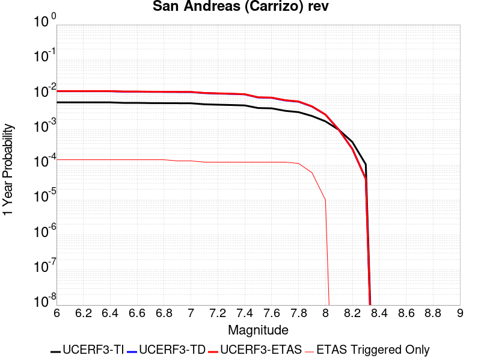 |  |

| Magnitude | 1 wk TI Prob | 1 wk TD Prob | 1 wk ETAS Prob | 1 wk ETAS/TD Gain | 1 wk ETAS Triggered Only | 1 mo TI Prob | 1 mo TD Prob | 1 mo ETAS Prob | 1 mo ETAS/TD Gain | 1 mo ETAS Triggered Only | 1 yr TI Prob | 1 yr TD Prob | 1 yr ETAS Prob | 1 yr ETAS/TD Gain | 1 yr ETAS Triggered Only | 10 yr TI Prob | 10 yr TD Prob | 10 yr ETAS Prob | 10 yr ETAS/TD Gain | 10 yr ETAS Triggered Only |
|-----|-----|-----|-----|-----|-----|-----|-----|-----|-----|-----|-----|-----|-----|-----|-----|-----|-----|-----|-----|-----|
| 6.0 | 1.1674632E-4 | 2.4332498E-4 | 2.4332498E-4 | 1.0 | 0.0 | 5.002454E-4 | 0.0010424062 | 0.0010628767 | 1.0196377 | 2.0491803E-5 | 0.006073493 | 0.012617926 | 0.012739326 | 1.0096211 | 1.2295082E-4 | 0.0591016 | 0.12065402 | 0.12088827 | 1.0019416 | 2.6639344E-4 |
| 6.1 | 1.1674632E-4 | 2.4332498E-4 | 2.4332498E-4 | 1.0 | 0.0 | 5.002454E-4 | 0.0010424062 | 0.0010628767 | 1.0196377 | 2.0491803E-5 | 0.006073493 | 0.012617926 | 0.012739326 | 1.0096211 | 1.2295082E-4 | 0.0591016 | 0.12065402 | 0.12088827 | 1.0019416 | 2.6639344E-4 |
| 6.2 | 1.1674632E-4 | 2.4332498E-4 | 2.4332498E-4 | 1.0 | 0.0 | 5.002454E-4 | 0.0010424062 | 0.0010628767 | 1.0196377 | 2.0491803E-5 | 0.006073493 | 0.012617926 | 0.012739326 | 1.0096211 | 1.2295082E-4 | 0.0591016 | 0.12065402 | 0.12088827 | 1.0019416 | 2.6639344E-4 |
| 6.3 | 1.1674632E-4 | 2.4332498E-4 | 2.4332498E-4 | 1.0 | 0.0 | 5.002454E-4 | 0.0010424062 | 0.0010628767 | 1.0196377 | 2.0491803E-5 | 0.006073493 | 0.012617926 | 0.012739326 | 1.0096211 | 1.2295082E-4 | 0.0591016 | 0.12065402 | 0.12088827 | 1.0019416 | 2.6639344E-4 |
| 6.4 | 1.1674632E-4 | 2.4332498E-4 | 2.4332498E-4 | 1.0 | 0.0 | 5.002454E-4 | 0.0010424062 | 0.0010628767 | 1.0196377 | 2.0491803E-5 | 0.006073493 | 0.012617926 | 0.012739326 | 1.0096211 | 1.2295082E-4 | 0.0591016 | 0.12065402 | 0.12088827 | 1.0019416 | 2.6639344E-4 |
| 6.5 | 1.13136164E-4 | 2.3652466E-4 | 2.3652466E-4 | 1.0 | 0.0 | 4.847792E-4 | 0.0010132849 | 0.001033756 | 1.0202026 | 2.0491803E-5 | 0.0058862255 | 0.012267408 | 0.012388851 | 1.0098996 | 1.2295082E-4 | 0.057327334 | 0.11762535 | 0.11786041 | 1.0019984 | 2.6639344E-4 |
| 6.6 | 1.13136164E-4 | 2.3652466E-4 | 2.3652466E-4 | 1.0 | 0.0 | 4.847792E-4 | 0.0010132849 | 0.001033756 | 1.0202026 | 2.0491803E-5 | 0.0058862255 | 0.012267408 | 0.012388851 | 1.0098996 | 1.2295082E-4 | 0.057327334 | 0.11762535 | 0.11786041 | 1.0019984 | 2.6639344E-4 |
| 6.7 | 1.1149675E-4 | 2.3343669E-4 | 2.3343669E-4 | 1.0 | 0.0 | 4.777557E-4 | 0.0010000608 | 0.0010205322 | 1.02047 | 2.0491803E-5 | 0.0058011734 | 0.012108203 | 0.012229665 | 1.0100313 | 1.2295082E-4 | 0.05652051 | 0.11624688 | 0.1164823 | 1.0020252 | 2.6639344E-4 |
| 6.8 | 1.1103589E-4 | 2.3245816E-4 | 2.3245816E-4 | 1.0 | 0.0 | 4.7578133E-4 | 9.958703E-4 | 0.0010163417 | 1.0205563 | 2.0491803E-5 | 0.005777263 | 0.0120577505 | 0.012179218 | 1.0100739 | 1.2295082E-4 | 0.056293584 | 0.11580715 | 0.116042696 | 1.002034 | 2.6639344E-4 |
| 6.9 | 1.1053259E-4 | 2.3138185E-4 | 2.3138185E-4 | 1.0 | 0.0 | 4.7362508E-4 | 9.912612E-4 | 0.0010117326 | 1.0206519 | 2.0491803E-5 | 0.0057511497 | 0.012002253 | 0.012103482 | 1.0084342 | 1.0245902E-4 | 0.05604569 | 0.11532332 | 0.11554086 | 1.0018864 | 2.4590164E-4 |
| 7.0 | 1.1005377E-4 | 2.3039016E-4 | 2.3039016E-4 | 1.0 | 0.0 | 4.7157376E-4 | 9.870143E-4 | 0.0010074859 | 1.0207409 | 2.0491803E-5 | 0.0057263062 | 0.011951115 | 0.01205235 | 1.0084708 | 1.0245902E-4 | 0.055809796 | 0.11487561 | 0.11509326 | 1.0018947 | 2.4590164E-4 |
| 7.1 | 1.0308142E-4 | 2.1548544E-4 | 2.1548544E-4 | 1.0 | 0.0 | 4.417027E-4 | 9.231832E-4 | 9.4365614E-4 | 1.0221764 | 2.0491803E-5 | 0.0053644776 | 0.011182146 | 0.011263196 | 1.0072482 | 8.196721E-5 | 0.052368138 | 0.108131535 | 0.1083143 | 1.0016901 | 2.0491803E-4 |
| 7.2 | 1.0027479E-4 | 2.0956367E-4 | 2.0956367E-4 | 1.0 | 0.0 | 4.296783E-4 | 8.978219E-4 | 9.182953E-4 | 1.0228034 | 2.0491803E-5 | 0.0052187922 | 0.0108764935 | 0.01095757 | 1.0074542 | 8.196721E-5 | 0.050979212 | 0.10543535 | 0.105618656 | 1.0017387 | 2.0491803E-4 |
| 7.3 | 9.816942E-5 | 2.0431461E-4 | 2.0431461E-4 | 1.0 | 0.0 | 4.2065824E-4 | 8.753412E-4 | 8.95815E-4 | 1.0233896 | 2.0491803E-5 | 0.005109493 | 0.010605487 | 0.010686586 | 1.0076468 | 8.196721E-5 | 0.049935985 | 0.103018686 | 0.10320249 | 1.0017842 | 2.0491803E-4 |
| 7.4 | 9.5634205E-5 | 1.9800827E-4 | 1.9800827E-4 | 1.0 | 0.0 | 4.0979648E-4 | 8.4833184E-4 | 8.6880627E-4 | 1.0241349 | 2.0491803E-5 | 0.0049778637 | 0.0102797905 | 0.010360915 | 1.0078917 | 8.196721E-5 | 0.048678253 | 0.100104466 | 0.100270435 | 1.001658 | 1.8442623E-4 |
| 7.5 | 8.052417E-5 | 1.6120363E-4 | 1.6120363E-4 | 1.0 | 0.0 | 3.4505792E-4 | 6.9068995E-4 | 7.1116764E-4 | 1.0296481 | 2.0491803E-5 | 0.0041929903 | 0.008376808 | 0.008458089 | 1.009703 | 8.196721E-5 | 0.04114753 | 0.08284498 | 0.08301412 | 1.0020417 | 1.8442623E-4 |
| 7.6 | 7.897024E-5 | 1.5773512E-4 | 1.5773512E-4 | 1.0 | 0.0 | 3.384E-4 | 6.758327E-4 | 6.9631066E-4 | 1.0303004 | 2.0491803E-5 | 0.0041122385 | 0.008197296 | 0.008278592 | 1.0099174 | 8.196721E-5 | 0.040369697 | 0.081185855 | 0.08135531 | 1.0020872 | 1.8442623E-4 |
| 7.7 | 6.707427E-5 | 1.3282998E-4 | 1.3282998E-4 | 1.0 | 0.0 | 2.8742946E-4 | 5.691472E-4 | 5.8962737E-4 | 1.0359839 | 2.0491803E-5 | 0.003493839 | 0.0069073834 | 0.0069887848 | 1.0117847 | 8.196721E-5 | 0.034394164 | 0.06907934 | 0.06923195 | 1.0022092 | 1.6393443E-4 |
| 7.8 | 6.147705E-5 | 1.2203727E-4 | 1.2203727E-4 | 1.0 | 0.0 | 2.6344648E-4 | 5.229121E-4 | 5.4339314E-4 | 1.0391674 | 2.0491803E-5 | 0.0032027436 | 0.006347895 | 0.006429342 | 1.0128305 | 8.196721E-5 | 0.031569764 | 0.063543044 | 0.063696556 | 1.002416 | 1.6393443E-4 |
| 7.9 | 4.7636717E-5 | 8.88427E-5 | 8.88427E-5 | 1.0 | 0.0 | 2.0414138E-4 | 3.806989E-4 | 3.806989E-4 | 1.0 | 0.0 | 0.0024825884 | 0.0046251663 | 0.0046863575 | 1.0132301 | 6.147541E-5 | 0.024550365 | 0.046649244 | 0.046707854 | 1.0012563 | 6.147541E-5 |
| 8.0 | 3.3554235E-5 | 5.2164494E-5 | 5.2164494E-5 | 1.0 | 0.0 | 1.4379594E-4 | 2.2354297E-4 | 2.2354297E-4 | 1.0 | 0.0 | 0.0017493097 | 0.0027182405 | 0.0027386767 | 1.0075182 | 2.0491803E-5 | 0.017356034 | 0.027894506 | 0.027914427 | 1.0007142 | 2.0491803E-5 |
| 8.1 | 1.9175432E-5 | 1.9198285E-5 | 1.9198285E-5 | 1.0 | 0.0 | 8.217783E-5 | 8.227578E-5 | 8.227578E-5 | 1.0 | 0.0 | 0.0010000558 | 0.0010012479 | 0.0010012479 | 1.0 | 0.0 | 0.009955673 | 0.010765004 | 0.010765004 | 1.0 | 0.0 |
| 8.2 | 8.643924E-6 | 5.4798497E-6 | 5.4798497E-6 | 1.0 | 0.0 | 3.704486E-5 | 2.348486E-5 | 2.348486E-5 | 1.0 | 0.0 | 4.5092785E-4 | 2.858907E-4 | 2.858907E-4 | 1.0 | 0.0 | 0.0045001395 | 0.0032514327 | 0.0032514327 | 1.0 | 0.0 |
| 8.3 | 1.983087E-6 | 7.668296E-7 | 7.668296E-7 | 1.0 | 0.0 | 8.498917E-6 | 3.2864084E-6 | 3.2864084E-6 | 1.0 | 0.0 | 1.034694E-4 | 4.0011306E-5 | 4.0011306E-5 | 1.0 | 0.0 | 0.0010342124 | 4.724499E-4 | 4.724499E-4 | 1.0 | 0.0 |

## Sierra Nevada  (No Extension)
*[(top)](#table-of-contents)*

| 1 Week | 1 Month | 1 Year | 10 Year |
|-----|-----|-----|-----|
| 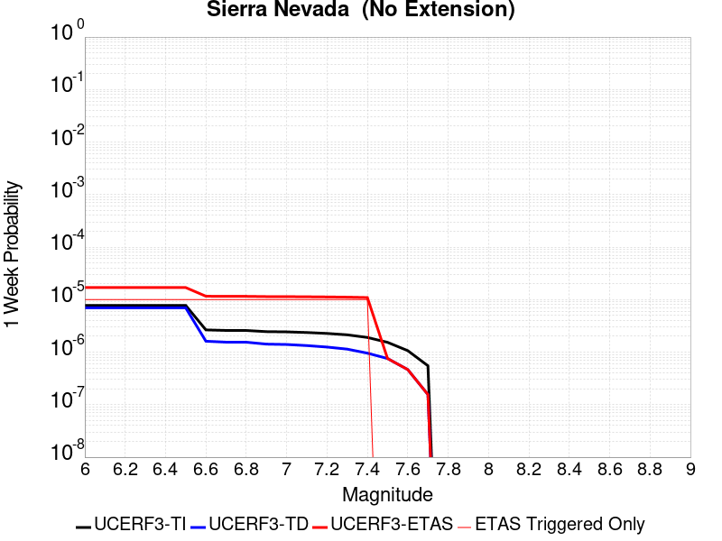 |  |  |  |

| Magnitude | 1 wk TI Prob | 1 wk TD Prob | 1 wk ETAS Prob | 1 wk ETAS/TD Gain | 1 wk ETAS Triggered Only | 1 mo TI Prob | 1 mo TD Prob | 1 mo ETAS Prob | 1 mo ETAS/TD Gain | 1 mo ETAS Triggered Only | 1 yr TI Prob | 1 yr TD Prob | 1 yr ETAS Prob | 1 yr ETAS/TD Gain | 1 yr ETAS Triggered Only | 10 yr TI Prob | 10 yr TD Prob | 10 yr ETAS Prob | 10 yr ETAS/TD Gain | 10 yr ETAS Triggered Only |
|-----|-----|-----|-----|-----|-----|-----|-----|-----|-----|-----|-----|-----|-----|-----|-----|-----|-----|-----|-----|-----|
| 6.0 | 7.7690465E-6 | 6.9763832E-6 | 6.9763832E-6 | 1.0 | 0.0 | 3.329549E-5 | 2.9898645E-5 | 5.0389834E-5 | 1.6853552 | 2.0491803E-5 | 4.0529718E-4 | 3.6399104E-4 | 4.868971E-4 | 1.3376623 | 1.2295082E-4 | 0.004045588 | 0.0036374647 | 0.003882472 | 1.0673566 | 2.4590164E-4 |
| 6.1 | 7.7690465E-6 | 6.9763832E-6 | 6.9763832E-6 | 1.0 | 0.0 | 3.329549E-5 | 2.9898645E-5 | 5.0389834E-5 | 1.6853552 | 2.0491803E-5 | 4.0529718E-4 | 3.6399104E-4 | 4.868971E-4 | 1.3376623 | 1.2295082E-4 | 0.004045588 | 0.0036374647 | 0.003882472 | 1.0673566 | 2.4590164E-4 |
| 6.2 | 7.7690465E-6 | 6.9763832E-6 | 6.9763832E-6 | 1.0 | 0.0 | 3.329549E-5 | 2.9898645E-5 | 5.0389834E-5 | 1.6853552 | 2.0491803E-5 | 4.0529718E-4 | 3.6399104E-4 | 4.868971E-4 | 1.3376623 | 1.2295082E-4 | 0.004045588 | 0.0036374647 | 0.003882472 | 1.0673566 | 2.4590164E-4 |
| 6.3 | 7.7690465E-6 | 6.9763832E-6 | 6.9763832E-6 | 1.0 | 0.0 | 3.329549E-5 | 2.9898645E-5 | 5.0389834E-5 | 1.6853552 | 2.0491803E-5 | 4.0529718E-4 | 3.6399104E-4 | 4.868971E-4 | 1.3376623 | 1.2295082E-4 | 0.004045588 | 0.0036374647 | 0.003882472 | 1.0673566 | 2.4590164E-4 |
| 6.4 | 7.7690465E-6 | 6.9763832E-6 | 6.9763832E-6 | 1.0 | 0.0 | 3.329549E-5 | 2.9898645E-5 | 5.0389834E-5 | 1.6853552 | 2.0491803E-5 | 4.0529718E-4 | 3.6399104E-4 | 4.868971E-4 | 1.3376623 | 1.2295082E-4 | 0.004045588 | 0.0036374647 | 0.003882472 | 1.0673566 | 2.4590164E-4 |
| 6.5 | 7.7690465E-6 | 6.9763832E-6 | 6.9763832E-6 | 1.0 | 0.0 | 3.329549E-5 | 2.9898645E-5 | 5.0389834E-5 | 1.6853552 | 2.0491803E-5 | 4.0529718E-4 | 3.6399104E-4 | 4.868971E-4 | 1.3376623 | 1.2295082E-4 | 0.004045588 | 0.0036374647 | 0.003882472 | 1.0673566 | 2.4590164E-4 |
| 6.6 | 2.653E-6 | 1.6148814E-6 | 1.6148814E-6 | 1.0 | 0.0 | 1.136995E-5 | 6.920902E-6 | 2.7412563E-5 | 3.960837 | 2.0491803E-5 | 1.3842035E-4 | 8.4258754E-5 | 1.8670913E-4 | 2.2159019 | 1.0245902E-4 | 0.0013833415 | 8.4227155E-4 | 0.0010265424 | 1.2187785 | 1.8442623E-4 |
| 6.7 | 2.5902466E-6 | 1.5502146E-6 | 1.5502146E-6 | 1.0 | 0.0 | 1.11010095E-5 | 6.64376E-6 | 2.7135427E-5 | 4.0843477 | 2.0491803E-5 | 1.351464E-4 | 8.0884805E-5 | 1.8333553E-4 | 2.2666252 | 1.0245902E-4 | 0.0013506424 | 8.085567E-4 | 9.928338E-4 | 1.2279087 | 1.8442623E-4 |
| 6.8 | 2.5853892E-6 | 1.5470148E-6 | 1.5470148E-6 | 1.0 | 0.0 | 1.1080193E-5 | 6.6300463E-6 | 2.7121714E-5 | 4.0907273 | 2.0491803E-5 | 1.34893E-4 | 8.071786E-5 | 1.831686E-4 | 2.2692451 | 1.0245902E-4 | 0.0013481114 | 8.0688833E-4 | 9.911658E-4 | 1.2283803 | 1.8442623E-4 |
| 6.9 | 2.458257E-6 | 1.4220883E-6 | 1.4220883E-6 | 1.0 | 0.0 | 1.0535345E-5 | 6.0946504E-6 | 2.658633E-5 | 4.3622403 | 2.0491803E-5 | 1.2826028E-4 | 7.419986E-5 | 1.7665127E-4 | 2.3807495 | 1.0245902E-4 | 0.0012818627 | 7.417528E-4 | 9.2604227E-4 | 1.2484512 | 1.8442623E-4 |
| 7.0 | 2.4341468E-6 | 1.399052E-6 | 1.399052E-6 | 1.0 | 0.0 | 1.0432016E-5 | 5.995924E-6 | 2.6487603E-5 | 4.417602 | 2.0491803E-5 | 1.270024E-4 | 7.2997944E-5 | 1.7544949E-4 | 2.4034853 | 1.0245902E-4 | 0.0012692984 | 7.297416E-4 | 9.140332E-4 | 1.2525437 | 1.8442623E-4 |
| 7.1 | 2.3652476E-6 | 1.3340014E-6 | 1.3340014E-6 | 1.0 | 0.0 | 1.0136736E-5 | 5.717136E-6 | 2.6208822E-5 | 4.584257 | 2.0491803E-5 | 1.2340778E-4 | 6.960393E-5 | 1.720558E-4 | 2.471927 | 1.0245902E-4 | 0.0012333926 | 6.9582294E-4 | 8.8012085E-4 | 1.2648633 | 1.8442623E-4 |
| 7.2 | 2.272158E-6 | 1.2503074E-6 | 1.2503074E-6 | 1.0 | 0.0 | 9.737784E-6 | 5.3584495E-6 | 2.5850142E-5 | 4.8241835 | 2.0491803E-5 | 1.1855107E-4 | 6.523718E-5 | 1.6768952E-4 | 2.5704591 | 1.0245902E-4 | 0.0011848784 | 6.5218186E-4 | 8.364878E-4 | 1.282599 | 1.8442623E-4 |
| 7.3 | 2.1382127E-6 | 1.1419947E-6 | 1.1419947E-6 | 1.0 | 0.0 | 9.163737E-6 | 4.8942543E-6 | 2.5385956E-5 | 5.18689 | 2.0491803E-5 | 1.1156279E-4 | 5.9585927E-5 | 1.6203884E-4 | 2.7194147 | 1.0245902E-4 | 0.001115068 | 5.957007E-4 | 7.5953745E-4 | 1.275032 | 1.6393443E-4 |
| 7.4 | 1.9048055E-6 | 9.575474E-7 | 9.575474E-7 | 1.0 | 0.0 | 8.163426E-6 | 4.1037683E-6 | 2.4595487E-5 | 5.993391 | 2.0491803E-5 | 9.9385186E-5 | 4.996224E-5 | 1.5241613E-4 | 3.0506265 | 1.0245902E-4 | 9.934074E-4 | 4.995108E-4 | 6.633633E-4 | 1.328026 | 1.6393443E-4 |
| 7.5 | 1.5373403E-6 | 7.5602395E-7 | 7.5602395E-7 | 1.0 | 0.0 | 6.5885843E-6 | 3.2400987E-6 | 2.3731836E-5 | 7.3244176 | 2.0491803E-5 | 8.021306E-5 | 3.9447492E-5 | 1.21411475E-4 | 3.0777996 | 8.196721E-5 | 8.0184115E-4 | 3.944054E-4 | 5.377914E-4 | 1.36355 | 1.4344262E-4 |
| 7.6 | 1.0680322E-6 | 4.659796E-7 | 4.659796E-7 | 1.0 | 0.0 | 4.577273E-6 | 1.997054E-6 | 2.2488817E-5 | 11.260996 | 2.0491803E-5 | 5.5726876E-5 | 2.4313864E-5 | 6.529647E-5 | 2.6855655 | 4.0983607E-5 | 5.5712904E-4 | 2.431123E-4 | 3.455464E-4 | 1.4213449 | 1.0245902E-4 |
| 7.7 | 5.509146E-7 | 1.5581199E-7 | 1.5581199E-7 | 1.0 | 0.0 | 2.3610605E-6 | 6.677655E-7 | 2.1159554E-5 | 31.687103 | 2.0491803E-5 | 2.8745531E-5 | 8.130016E-6 | 2.8621653E-5 | 3.5204916 | 2.0491803E-5 | 2.8741814E-4 | 8.12973E-5 | 1.0178744E-4 | 1.2520396 | 2.0491803E-5 |

## San Andreas (Parkfield)
*[(top)](#table-of-contents)*

| 1 Week | 1 Month | 1 Year | 10 Year |
|-----|-----|-----|-----|
|  |  | 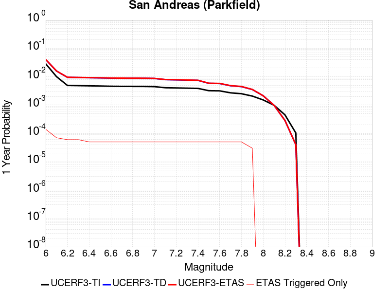 |  |

| Magnitude | 1 wk TI Prob | 1 wk TD Prob | 1 wk ETAS Prob | 1 wk ETAS/TD Gain | 1 wk ETAS Triggered Only | 1 mo TI Prob | 1 mo TD Prob | 1 mo ETAS Prob | 1 mo ETAS/TD Gain | 1 mo ETAS Triggered Only | 1 yr TI Prob | 1 yr TD Prob | 1 yr ETAS Prob | 1 yr ETAS/TD Gain | 1 yr ETAS Triggered Only | 10 yr TI Prob | 10 yr TD Prob | 10 yr ETAS Prob | 10 yr ETAS/TD Gain | 10 yr ETAS Triggered Only |
|-----|-----|-----|-----|-----|-----|-----|-----|-----|-----|-----|-----|-----|-----|-----|-----|-----|-----|-----|-----|-----|
| 6.0 | 5.556969E-4 | 7.788437E-4 | 7.9931953E-4 | 1.02629 | 2.0491803E-5 | 0.0023793848 | 0.0033341812 | 0.0033546046 | 1.0061255 | 2.0491803E-5 | 0.028586963 | 0.04023991 | 0.040338248 | 1.0024438 | 1.0245902E-4 | 0.25176284 | 0.33731642 | 0.33747938 | 1.000483 | 2.4590164E-4 |
| 6.1 | 1.925858E-4 | 3.0304783E-4 | 3.0304783E-4 | 1.0 | 0.0 | 8.2510663E-4 | 0.0012982241 | 0.0012982241 | 1.0 | 0.0 | 0.0099994885 | 0.015792182 | 0.015812349 | 1.0012771 | 2.0491803E-5 | 0.095613256 | 0.14979222 | 0.1498445 | 1.0003489 | 6.147541E-5 |
| 6.2 | 9.4306815E-5 | 1.8250331E-4 | 1.8250331E-4 | 1.0 | 0.0 | 4.0410945E-4 | 7.819238E-4 | 7.819238E-4 | 1.0 | 0.0 | 0.0049089384 | 0.009478576 | 0.009498873 | 1.0021414 | 2.0491803E-5 | 0.048019063 | 0.09188674 | 0.09194256 | 1.0006076 | 6.147541E-5 |
| 6.3 | 9.283051E-5 | 1.7946832E-4 | 1.7946832E-4 | 1.0 | 0.0 | 3.9778434E-4 | 7.689244E-4 | 7.689244E-4 | 1.0 | 0.0 | 0.0048322747 | 0.009321672 | 0.009341973 | 1.0021778 | 2.0491803E-5 | 0.047285385 | 0.09053965 | 0.09059556 | 1.0006175 | 6.147541E-5 |
| 6.4 | 9.138826E-5 | 1.770899E-4 | 1.770899E-4 | 1.0 | 0.0 | 3.916052E-4 | 7.5873715E-4 | 7.5873715E-4 | 1.0 | 0.0 | 0.0047573745 | 0.009198696 | 0.009198696 | 1.0 | 0.0 | 0.046568092 | 0.089441724 | 0.089479044 | 1.0004172 | 4.0983607E-5 |
| 6.5 | 9.000255E-5 | 1.746699E-4 | 1.746699E-4 | 1.0 | 0.0 | 3.8566816E-4 | 7.483717E-4 | 7.483717E-4 | 1.0 | 0.0 | 0.0046854047 | 0.009073567 | 0.009073567 | 1.0 | 0.0 | 0.045878403 | 0.08832737 | 0.088364735 | 1.000423 | 4.0983607E-5 |
| 6.6 | 8.8109264E-5 | 1.7148067E-4 | 1.7148067E-4 | 1.0 | 0.0 | 3.7755648E-4 | 7.3471136E-4 | 7.3471136E-4 | 1.0 | 0.0 | 0.0045870654 | 0.008908638 | 0.008908638 | 1.0 | 0.0 | 0.04493529 | 0.086858675 | 0.0868961 | 1.0004308 | 4.0983607E-5 |
| 6.7 | 8.738073E-5 | 1.7015127E-4 | 1.7015127E-4 | 1.0 | 0.0 | 3.7443507E-4 | 7.290171E-4 | 7.290171E-4 | 1.0 | 0.0 | 0.0045492216 | 0.008839916 | 0.008839916 | 1.0 | 0.0 | 0.04457213 | 0.086258985 | 0.08629643 | 1.0004342 | 4.0983607E-5 |
| 6.8 | 8.710195E-5 | 1.6960612E-4 | 1.6960612E-4 | 1.0 | 0.0 | 3.7324068E-4 | 7.266821E-4 | 7.266821E-4 | 1.0 | 0.0 | 0.0045347405 | 0.008811726 | 0.008811726 | 1.0 | 0.0 | 0.04443313 | 0.08600653 | 0.08604399 | 1.0004356 | 4.0983607E-5 |
| 6.9 | 8.6801556E-5 | 1.6901553E-4 | 1.6901553E-4 | 1.0 | 0.0 | 3.7195362E-4 | 7.2415237E-4 | 7.2415237E-4 | 1.0 | 0.0 | 0.0045191357 | 0.008781176 | 0.008781176 | 1.0 | 0.0 | 0.044283327 | 0.08573254 | 0.08577002 | 1.000437 | 4.0983607E-5 |
| 7.0 | 8.5571606E-5 | 1.6654332E-4 | 1.6654332E-4 | 1.0 | 0.0 | 3.6668387E-4 | 7.13563E-4 | 7.13563E-4 | 1.0 | 0.0 | 0.004455241 | 0.008653281 | 0.008653281 | 1.0 | 0.0 | 0.043669727 | 0.08458075 | 0.08461827 | 1.0004436 | 4.0983607E-5 |
| 7.1 | 7.82589E-5 | 1.5135074E-4 | 1.5135074E-4 | 1.0 | 0.0 | 3.3535215E-4 | 6.484855E-4 | 6.484855E-4 | 1.0 | 0.0 | 0.0040752706 | 0.0078668995 | 0.0078668995 | 1.0 | 0.0 | 0.040013418 | 0.077491894 | 0.077529706 | 1.0004879 | 4.0983607E-5 |
| 7.2 | 7.690929E-5 | 1.4872287E-4 | 1.4872287E-4 | 1.0 | 0.0 | 3.2956956E-4 | 6.372288E-4 | 6.372288E-4 | 1.0 | 0.0 | 0.004005129 | 0.007730829 | 0.007730829 | 1.0 | 0.0 | 0.0393371 | 0.07626493 | 0.07630279 | 1.0004964 | 4.0983607E-5 |
| 7.3 | 7.5543794E-5 | 1.4568791E-4 | 1.4568791E-4 | 1.0 | 0.0 | 3.2371894E-4 | 6.242281E-4 | 6.242281E-4 | 1.0 | 0.0 | 0.003934157 | 0.007573656 | 0.007573656 | 1.0 | 0.0 | 0.038652334 | 0.07482772 | 0.07486564 | 1.0005068 | 4.0983607E-5 |
| 7.4 | 7.4214564E-5 | 1.4269682E-4 | 1.4269682E-4 | 1.0 | 0.0 | 3.1802364E-4 | 6.114152E-4 | 6.114152E-4 | 1.0 | 0.0 | 0.003865065 | 0.007418731 | 0.007418731 | 1.0 | 0.0 | 0.03798529 | 0.07340127 | 0.073420264 | 1.0002587 | 2.0491803E-5 |
| 7.5 | 6.149578E-5 | 1.1196503E-4 | 1.1196503E-4 | 1.0 | 0.0 | 2.6352672E-4 | 4.7976198E-4 | 4.7976198E-4 | 1.0 | 0.0 | 0.0032037178 | 0.00582549 | 0.00582549 | 1.0 | 0.0 | 0.03157923 | 0.058584154 | 0.058603443 | 1.0003293 | 2.0491803E-5 |
| 7.6 | 6.0643448E-5 | 1.10251094E-4 | 1.10251094E-4 | 1.0 | 0.0 | 2.598746E-4 | 4.7241923E-4 | 4.7241923E-4 | 1.0 | 0.0 | 0.0031593828 | 0.0057365666 | 0.0057365666 | 1.0 | 0.0 | 0.031148417 | 0.057744972 | 0.057764284 | 1.0003344 | 2.0491803E-5 |
| 7.7 | 5.1652263E-5 | 9.179838E-5 | 9.179838E-5 | 1.0 | 0.0 | 2.2134806E-4 | 3.9336234E-4 | 3.9336234E-4 | 1.0 | 0.0 | 0.002691582 | 0.0047786795 | 0.0047786795 | 1.0 | 0.0 | 0.026592141 | 0.048560265 | 0.04857976 | 1.0004015 | 2.0491803E-5 |
| 7.8 | 4.8090482E-5 | 8.564368E-5 | 8.564368E-5 | 1.0 | 0.0 | 2.060858E-4 | 3.6699275E-4 | 3.6699275E-4 | 1.0 | 0.0 | 0.0025062072 | 0.004458991 | 0.004458991 | 1.0 | 0.0 | 0.024781305 | 0.045324653 | 0.04534422 | 1.0004317 | 2.0491803E-5 |
| 7.9 | 3.970278E-5 | 6.754111E-5 | 6.754111E-5 | 1.0 | 0.0 | 1.7014367E-4 | 2.894298E-4 | 2.894298E-4 | 1.0 | 0.0 | 0.002069531 | 0.0035181176 | 0.0035181176 | 1.0 | 0.0 | 0.020503636 | 0.03589899 | 0.03589899 | 1.0 | 0.0 |
| 8.0 | 2.8982335E-5 | 4.072124E-5 | 4.072124E-5 | 1.0 | 0.0 | 1.2420409E-4 | 1.7450792E-4 | 1.7450792E-4 | 1.0 | 0.0 | 0.0015111357 | 0.002122565 | 0.002122565 | 1.0 | 0.0 | 0.015009012 | 0.02202231 | 0.02202231 | 1.0 | 0.0 |
| 8.1 | 1.8836186E-5 | 1.8694205E-5 | 1.8694205E-5 | 1.0 | 0.0 | 8.0724014E-5 | 8.011556E-5 | 8.011556E-5 | 1.0 | 0.0 | 9.823717E-4 | 9.749711E-4 | 9.749711E-4 | 1.0 | 0.0 | 0.009780403 | 0.010494972 | 0.010494972 | 1.0 | 0.0 |
| 8.2 | 8.643924E-6 | 5.4798497E-6 | 5.4798497E-6 | 1.0 | 0.0 | 3.704486E-5 | 2.348486E-5 | 2.348486E-5 | 1.0 | 0.0 | 4.5092785E-4 | 2.858907E-4 | 2.858907E-4 | 1.0 | 0.0 | 0.0045001395 | 0.0032514327 | 0.0032514327 | 1.0 | 0.0 |
| 8.3 | 1.983087E-6 | 7.668296E-7 | 7.668296E-7 | 1.0 | 0.0 | 8.498917E-6 | 3.2864084E-6 | 3.2864084E-6 | 1.0 | 0.0 | 1.034694E-4 | 4.0011306E-5 | 4.0011306E-5 | 1.0 | 0.0 | 0.0010342124 | 4.724499E-4 | 4.724499E-4 | 1.0 | 0.0 |

## Death Valley (No)
*[(top)](#table-of-contents)*

| 1 Week | 1 Month | 1 Year | 10 Year |
|-----|-----|-----|-----|
|  |  | 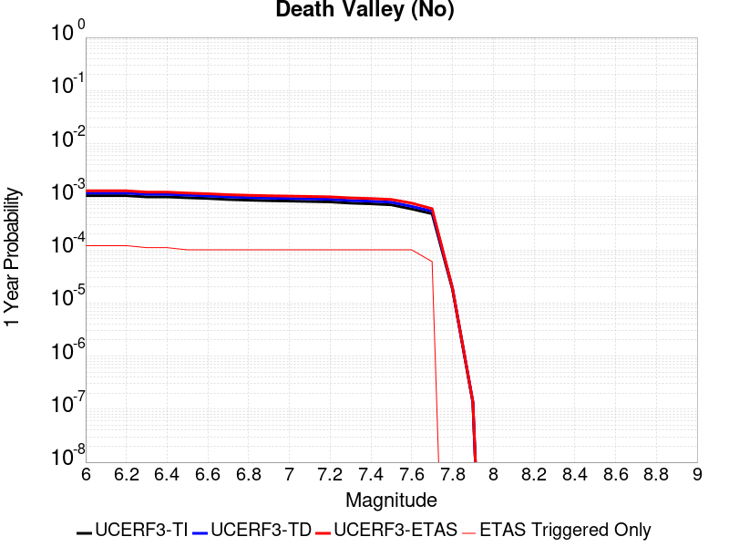 | 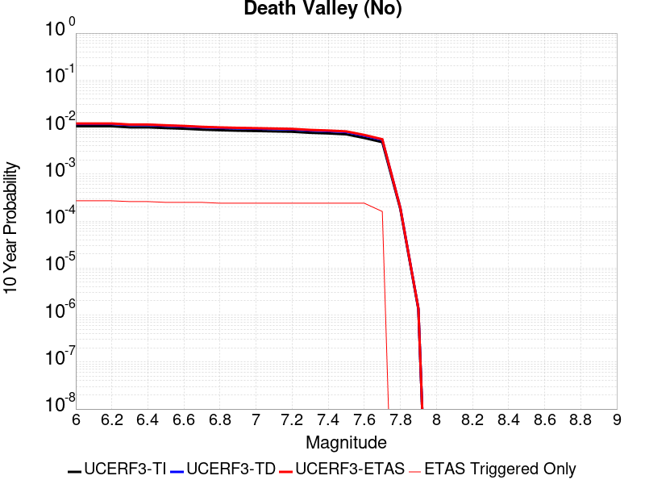 |

| Magnitude | 1 wk TI Prob | 1 wk TD Prob | 1 wk ETAS Prob | 1 wk ETAS/TD Gain | 1 wk ETAS Triggered Only | 1 mo TI Prob | 1 mo TD Prob | 1 mo ETAS Prob | 1 mo ETAS/TD Gain | 1 mo ETAS Triggered Only | 1 yr TI Prob | 1 yr TD Prob | 1 yr ETAS Prob | 1 yr ETAS/TD Gain | 1 yr ETAS Triggered Only | 10 yr TI Prob | 10 yr TD Prob | 10 yr ETAS Prob | 10 yr ETAS/TD Gain | 10 yr ETAS Triggered Only |
|-----|-----|-----|-----|-----|-----|-----|-----|-----|-----|-----|-----|-----|-----|-----|-----|-----|-----|-----|-----|-----|
| 6.0 | 2.0074807E-5 | 2.2500446E-5 | 4.299179E-5 | 1.9107083 | 2.0491803E-5 | 8.603206E-5 | 9.642696E-5 | 1.1691679E-4 | 1.2124907 | 2.0491803E-5 | 0.001046937 | 0.0011733733 | 0.0012552444 | 1.069774 | 8.196721E-5 | 0.010420183 | 0.011672693 | 0.011915725 | 1.0208205 | 2.4590164E-4 |
| 6.1 | 2.0074807E-5 | 2.2500446E-5 | 4.299179E-5 | 1.9107083 | 2.0491803E-5 | 8.603206E-5 | 9.642696E-5 | 1.1691679E-4 | 1.2124907 | 2.0491803E-5 | 0.001046937 | 0.0011733733 | 0.0012552444 | 1.069774 | 8.196721E-5 | 0.010420183 | 0.011672693 | 0.011915725 | 1.0208205 | 2.4590164E-4 |
| 6.2 | 2.0074807E-5 | 2.2500446E-5 | 4.299179E-5 | 1.9107083 | 2.0491803E-5 | 8.603206E-5 | 9.642696E-5 | 1.1691679E-4 | 1.2124907 | 2.0491803E-5 | 0.001046937 | 0.0011733733 | 0.0012552444 | 1.069774 | 8.196721E-5 | 0.010420183 | 0.011672693 | 0.011915725 | 1.0208205 | 2.4590164E-4 |
| 6.3 | 1.9050609E-5 | 2.1337288E-5 | 2.1337288E-5 | 1.0 | 0.0 | 8.164292E-5 | 9.144236E-5 | 9.144236E-5 | 1.0 | 0.0 | 9.935491E-4 | 0.0011127489 | 0.0011741559 | 1.055185 | 6.147541E-5 | 0.009891188 | 0.011072595 | 0.011295509 | 1.0201321 | 2.2540984E-4 |
| 6.4 | 1.9050609E-5 | 2.1337288E-5 | 2.1337288E-5 | 1.0 | 0.0 | 8.164292E-5 | 9.144236E-5 | 9.144236E-5 | 1.0 | 0.0 | 9.935491E-4 | 0.0011127489 | 0.0011741559 | 1.055185 | 6.147541E-5 | 0.009891188 | 0.011072595 | 0.011295509 | 1.0201321 | 2.2540984E-4 |
| 6.5 | 1.8367004E-5 | 2.0561336E-5 | 2.0561336E-5 | 1.0 | 0.0 | 7.8713354E-5 | 8.811707E-5 | 8.811707E-5 | 1.0 | 0.0 | 9.5791375E-4 | 0.0010723039 | 0.0011337134 | 1.0572687 | 6.147541E-5 | 0.009537951 | 0.010672084 | 0.010895088 | 1.0208961 | 2.2540984E-4 |
| 6.6 | 1.779439E-5 | 1.9911244E-5 | 1.9911244E-5 | 1.0 | 0.0 | 7.625944E-5 | 8.533114E-5 | 8.533114E-5 | 1.0 | 0.0 | 9.280632E-4 | 0.0010384179 | 0.0010998296 | 1.0591396 | 6.147541E-5 | 0.009241969 | 0.010336416 | 0.010559496 | 1.0215819 | 2.2540984E-4 |
| 6.7 | 1.7025437E-5 | 1.9043726E-5 | 1.9043726E-5 | 1.0 | 0.0 | 7.296412E-5 | 8.161345E-5 | 8.161345E-5 | 1.0 | 0.0 | 8.87976E-4 | 9.93197E-4 | 0.0010546113 | 1.061835 | 6.147541E-5 | 0.008844362 | 0.009888301 | 0.010111482 | 1.0225703 | 2.2540984E-4 |
| 6.8 | 1.6545107E-5 | 1.851284E-5 | 1.851284E-5 | 1.0 | 0.0 | 7.090568E-5 | 7.933836E-5 | 7.933836E-5 | 1.0 | 0.0 | 8.629347E-4 | 9.655226E-4 | 0.0010269387 | 1.0636091 | 6.147541E-5 | 0.008595915 | 0.009613981 | 0.009816929 | 1.0211097 | 2.0491803E-4 |
| 6.9 | 1.615478E-5 | 1.8087881E-5 | 1.8087881E-5 | 1.0 | 0.0 | 6.9232934E-5 | 7.751722E-5 | 7.751722E-5 | 1.0 | 0.0 | 8.4258494E-4 | 9.433697E-4 | 0.001004787 | 1.0651042 | 6.147541E-5 | 0.008393973 | 0.009394345 | 0.009597338 | 1.021608 | 2.0491803E-4 |
| 7.0 | 1.5894311E-5 | 1.7805834E-5 | 1.7805834E-5 | 1.0 | 0.0 | 6.81167E-5 | 7.6308526E-5 | 7.6308526E-5 | 1.0 | 0.0 | 8.2900526E-4 | 9.286663E-4 | 9.900847E-4 | 1.066136 | 6.147541E-5 | 0.008259195 | 0.009248544 | 0.009451568 | 1.0219519 | 2.0491803E-4 |
| 7.1 | 1.5602263E-5 | 1.7483784E-5 | 1.7483784E-5 | 1.0 | 0.0 | 6.6865134E-5 | 7.4928386E-5 | 7.4928386E-5 | 1.0 | 0.0 | 8.137789E-4 | 9.118773E-4 | 9.732967E-4 | 1.0673548 | 6.147541E-5 | 0.008108052 | 0.009082039 | 0.009285096 | 1.0223581 | 2.0491803E-4 |
| 7.2 | 1.5323829E-5 | 1.7170905E-5 | 1.7170905E-5 | 1.0 | 0.0 | 6.56719E-5 | 7.358755E-5 | 7.358755E-5 | 1.0 | 0.0 | 7.99262E-4 | 8.9556625E-4 | 9.569866E-4 | 1.0685827 | 6.147541E-5 | 0.007963934 | 0.008920249 | 0.009123339 | 1.0227673 | 2.0491803E-4 |
| 7.3 | 1.4556212E-5 | 1.6302716E-5 | 1.6302716E-5 | 1.0 | 0.0 | 6.238227E-5 | 6.986695E-5 | 6.986695E-5 | 1.0 | 0.0 | 7.592395E-4 | 8.503039E-4 | 9.11727E-4 | 1.0722367 | 6.147541E-5 | 0.0075665074 | 0.008471149 | 0.008674331 | 1.0239851 | 2.0491803E-4 |
| 7.4 | 1.411725E-5 | 1.5808211E-5 | 1.5808211E-5 | 1.0 | 0.0 | 6.0501097E-5 | 6.774775E-5 | 6.774775E-5 | 1.0 | 0.0 | 7.363519E-4 | 8.245226E-4 | 8.859473E-4 | 1.0744973 | 6.147541E-5 | 0.0073391674 | 0.008215268 | 0.008418503 | 1.0247387 | 2.0491803E-4 |
| 7.5 | 1.3503312E-5 | 1.5126531E-5 | 1.5126531E-5 | 1.0 | 0.0 | 5.7870053E-5 | 6.482641E-5 | 6.482641E-5 | 1.0 | 0.0 | 7.043401E-4 | 7.8898156E-4 | 8.5040845E-4 | 1.077856 | 6.147541E-5 | 0.007021119 | 0.007862429 | 0.008065736 | 1.025858 | 2.0491803E-4 |
| 7.6 | 1.1279839E-5 | 1.2626528E-5 | 1.2626528E-5 | 1.0 | 0.0 | 4.834127E-5 | 5.4112596E-5 | 5.4112596E-5 | 1.0 | 0.0 | 5.88396E-4 | 6.58627E-4 | 7.2006194E-4 | 1.0932772 | 6.147541E-5 | 0.005868405 | 0.0065673026 | 0.006770875 | 1.0309979 | 2.0491803E-4 |
| 7.7 | 9.189108E-6 | 1.0283521E-5 | 1.0283521E-5 | 1.0 | 0.0 | 3.93813E-5 | 4.407152E-5 | 4.407152E-5 | 1.0 | 0.0 | 4.7936183E-4 | 5.3644367E-4 | 5.569245E-4 | 1.0381789 | 2.0491803E-5 | 0.004783291 | 0.0053519984 | 0.0054946733 | 1.0266583 | 1.4344262E-4 |
| 7.8 | 3.4586725E-7 | 3.648288E-7 | 3.648288E-7 | 1.0 | 0.0 | 1.4822873E-6 | 1.5635511E-6 | 1.5635511E-6 | 1.0 | 0.0 | 1.80467E-5 | 1.9036073E-5 | 1.9036073E-5 | 1.0 | 0.0 | 1.8045233E-4 | 1.9034486E-4 | 1.9034486E-4 | 1.0 | 0.0 |
| 7.9 | 2.5591178E-9 | 2.6696871E-9 | 2.6696871E-9 | 1.0 | 0.0 | 1.0967647E-8 | 1.1441516E-8 | 1.1441516E-8 | 1.0 | 0.0 | 1.335311E-7 | 1.3930045E-7 | 1.3930045E-7 | 1.0 | 0.0 | 1.3353102E-6 | 1.3930046E-6 | 1.3930046E-6 | 1.0 | 0.0 |

## White Wolf (Extension)
*[(top)](#table-of-contents)*

| 1 Week | 1 Month | 1 Year | 10 Year |
|-----|-----|-----|-----|
| 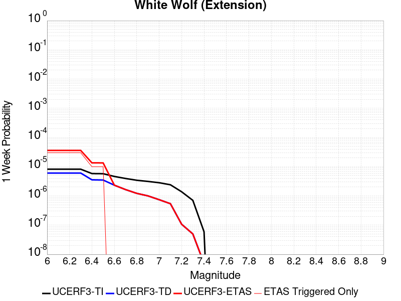 |  |  | 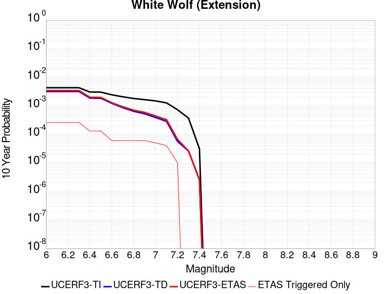 |

| Magnitude | 1 wk TI Prob | 1 wk TD Prob | 1 wk ETAS Prob | 1 wk ETAS/TD Gain | 1 wk ETAS Triggered Only | 1 mo TI Prob | 1 mo TD Prob | 1 mo ETAS Prob | 1 mo ETAS/TD Gain | 1 mo ETAS Triggered Only | 1 yr TI Prob | 1 yr TD Prob | 1 yr ETAS Prob | 1 yr ETAS/TD Gain | 1 yr ETAS Triggered Only | 10 yr TI Prob | 10 yr TD Prob | 10 yr ETAS Prob | 10 yr ETAS/TD Gain | 10 yr ETAS Triggered Only |
|-----|-----|-----|-----|-----|-----|-----|-----|-----|-----|-----|-----|-----|-----|-----|-----|-----|-----|-----|-----|-----|
| 6.0 | 8.222555E-6 | 6.0667057E-6 | 6.754174E-5 | 11.133183 | 6.147541E-5 | 3.5239045E-5 | 2.5999947E-5 | 1.07965025E-4 | 4.1525097 | 8.196721E-5 | 4.289509E-4 | 3.1650998E-4 | 4.3942188E-4 | 1.388335 | 1.2295082E-4 | 0.0042812387 | 0.0031612439 | 0.0033859413 | 1.0710788 | 2.2540984E-4 |
| 6.1 | 8.222555E-6 | 6.0667057E-6 | 6.754174E-5 | 11.133183 | 6.147541E-5 | 3.5239045E-5 | 2.5999947E-5 | 1.07965025E-4 | 4.1525097 | 8.196721E-5 | 4.289509E-4 | 3.1650998E-4 | 4.3942188E-4 | 1.388335 | 1.2295082E-4 | 0.0042812387 | 0.0031612439 | 0.0033859413 | 1.0710788 | 2.2540984E-4 |
| 6.2 | 8.222555E-6 | 6.0667057E-6 | 6.754174E-5 | 11.133183 | 6.147541E-5 | 3.5239045E-5 | 2.5999947E-5 | 1.07965025E-4 | 4.1525097 | 8.196721E-5 | 4.289509E-4 | 3.1650998E-4 | 4.3942188E-4 | 1.388335 | 1.2295082E-4 | 0.0042812387 | 0.0031612439 | 0.0033859413 | 1.0710788 | 2.2540984E-4 |
| 6.3 | 8.222555E-6 | 6.0667057E-6 | 6.754174E-5 | 11.133183 | 6.147541E-5 | 3.5239045E-5 | 2.5999947E-5 | 1.07965025E-4 | 4.1525097 | 8.196721E-5 | 4.289509E-4 | 3.1650998E-4 | 4.3942188E-4 | 1.388335 | 1.2295082E-4 | 0.0042812387 | 0.0031612439 | 0.0033859413 | 1.0710788 | 2.2540984E-4 |
| 6.4 | 5.821773E-6 | 3.5572016E-6 | 2.4048932E-5 | 6.7606325 | 2.0491803E-5 | 2.4950215E-5 | 1.5245067E-5 | 5.6228047E-5 | 3.6882782 | 4.0983607E-5 | 3.0372653E-4 | 1.8559398E-4 | 2.2656997E-4 | 1.220783 | 4.0983607E-5 | 0.0030331176 | 0.0018544982 | 0.0019363133 | 1.0441172 | 8.196721E-5 |
| 6.5 | 5.766023E-6 | 3.4991353E-6 | 2.3990868E-5 | 6.856227 | 2.0491803E-5 | 2.4711293E-5 | 1.4996214E-5 | 5.5979206E-5 | 3.7328892 | 4.0983607E-5 | 3.0081844E-4 | 1.8256472E-4 | 2.2354083E-4 | 1.2244471 | 4.0983607E-5 | 0.0030041158 | 0.0018242556 | 0.0019060732 | 1.0448499 | 8.196721E-5 |
| 6.6 | 4.643576E-6 | 2.332643E-6 | 2.332643E-6 | 1.0 | 0.0 | 1.9900888E-5 | 9.997005E-6 | 9.997005E-6 | 1.0 | 0.0 | 2.4226638E-4 | 1.2170716E-4 | 1.2170716E-4 | 1.0 | 0.0 | 0.0024200242 | 0.0012164476 | 0.0012369144 | 1.0168251 | 2.0491803E-5 |
| 6.7 | 3.9529173E-6 | 1.6483629E-6 | 1.6483629E-6 | 1.0 | 0.0 | 1.6940963E-5 | 7.064394E-6 | 7.064394E-6 | 1.0 | 0.0 | 2.0623671E-4 | 8.600579E-5 | 8.600579E-5 | 1.0 | 0.0 | 0.002060454 | 8.5974357E-4 | 8.8021776E-4 | 1.0238143 | 2.0491803E-5 |
| 6.8 | 3.4377522E-6 | 1.2245362E-6 | 1.2245362E-6 | 1.0 | 0.0 | 1.473314E-5 | 5.2480023E-6 | 5.2480023E-6 | 1.0 | 0.0 | 1.7936122E-4 | 6.389264E-5 | 6.389264E-5 | 1.0 | 0.0 | 0.0017921652 | 6.3875184E-4 | 6.592306E-4 | 1.0320605 | 2.0491803E-5 |
| 6.9 | 3.1367306E-6 | 1.0033893E-6 | 1.0033893E-6 | 1.0 | 0.0 | 1.3443062E-5 | 4.3002333E-6 | 4.3002333E-6 | 1.0 | 0.0 | 1.63657E-4 | 5.235416E-5 | 5.235416E-5 | 1.0 | 0.0 | 0.0016353652 | 5.234259E-4 | 5.43907E-4 | 1.0391289 | 2.0491803E-5 |
| 7.0 | 2.8298145E-6 | 7.4287595E-7 | 7.4287595E-7 | 1.0 | 0.0 | 1.2127721E-5 | 3.1837506E-6 | 3.1837506E-6 | 1.0 | 0.0 | 1.47645E-4 | 3.8761526E-5 | 3.8761526E-5 | 1.0 | 0.0 | 0.0014754693 | 3.8755263E-4 | 4.080365E-4 | 1.0528544 | 2.0491803E-5 |
| 7.1 | 2.4091064E-6 | 5.4228286E-7 | 5.4228286E-7 | 1.0 | 0.0 | 1.03247E-5 | 2.3240675E-6 | 2.3240675E-6 | 1.0 | 0.0 | 1.2569598E-4 | 2.8295197E-5 | 2.8295197E-5 | 1.0 | 0.0 | 0.001256249 | 2.8291997E-4 | 2.8291997E-4 | 1.0 | 0.0 |
| 7.2 | 1.3875518E-6 | 1.07434374E-7 | 1.07434374E-7 | 1.0 | 0.0 | 5.9466374E-6 | 4.6043297E-7 | 4.6043297E-7 | 1.0 | 0.0 | 7.23979E-5 | 5.6057584E-6 | 5.6057584E-6 | 1.0 | 0.0 | 7.2374323E-4 | 5.605628E-5 | 5.605628E-5 | 1.0 | 0.0 |
| 7.3 | 7.056077E-7 | 5.0022493E-8 | 5.0022493E-8 | 1.0 | 0.0 | 3.0240296E-6 | 2.143821E-7 | 2.143821E-7 | 1.0 | 0.0 | 3.681694E-5 | 2.6100993E-6 | 2.6100993E-6 | 1.0 | 0.0 | 3.681084E-4 | 2.6100734E-5 | 2.6100734E-5 | 1.0 | 0.0 |
| 7.4 | 5.9334678E-8 | 4.8685624E-9 | 4.8685624E-9 | 1.0 | 0.0 | 2.5429145E-7 | 2.0865269E-8 | 2.0865269E-8 | 1.0 | 0.0 | 3.095994E-6 | 2.5403463E-7 | 2.5403463E-7 | 1.0 | 0.0 | 3.095951E-5 | 2.5403444E-6 | 2.5403444E-6 | 1.0 | 0.0 |

## Cady
*[(top)](#table-of-contents)*

| 1 Week | 1 Month | 1 Year | 10 Year |
|-----|-----|-----|-----|
|  |  |  |  |

| Magnitude | 1 wk TI Prob | 1 wk TD Prob | 1 wk ETAS Prob | 1 wk ETAS/TD Gain | 1 wk ETAS Triggered Only | 1 mo TI Prob | 1 mo TD Prob | 1 mo ETAS Prob | 1 mo ETAS/TD Gain | 1 mo ETAS Triggered Only | 1 yr TI Prob | 1 yr TD Prob | 1 yr ETAS Prob | 1 yr ETAS/TD Gain | 1 yr ETAS Triggered Only | 10 yr TI Prob | 10 yr TD Prob | 10 yr ETAS Prob | 10 yr ETAS/TD Gain | 10 yr ETAS Triggered Only |
|-----|-----|-----|-----|-----|-----|-----|-----|-----|-----|-----|-----|-----|-----|-----|-----|-----|-----|-----|-----|-----|
| 6.0 | 1.9892565E-5 | 2.1859016E-5 | 4.235037E-5 | 1.9374326 | 2.0491803E-5 | 8.525106E-5 | 9.3678645E-5 | 1.3465842E-4 | 1.4374504 | 4.0983607E-5 | 0.0010374374 | 0.0011400316 | 0.0013037792 | 1.1436342 | 1.6393443E-4 | 0.010326075 | 0.011350849 | 0.0115737 | 1.019633 | 2.2540984E-4 |
| 6.1 | 1.9892565E-5 | 2.1859016E-5 | 4.235037E-5 | 1.9374326 | 2.0491803E-5 | 8.525106E-5 | 9.3678645E-5 | 1.3465842E-4 | 1.4374504 | 4.0983607E-5 | 0.0010374374 | 0.0011400316 | 0.0013037792 | 1.1436342 | 1.6393443E-4 | 0.010326075 | 0.011350849 | 0.0115737 | 1.019633 | 2.2540984E-4 |
| 6.2 | 1.9892565E-5 | 2.1859016E-5 | 4.235037E-5 | 1.9374326 | 2.0491803E-5 | 8.525106E-5 | 9.3678645E-5 | 1.3465842E-4 | 1.4374504 | 4.0983607E-5 | 0.0010374374 | 0.0011400316 | 0.0013037792 | 1.1436342 | 1.6393443E-4 | 0.010326075 | 0.011350849 | 0.0115737 | 1.019633 | 2.2540984E-4 |
| 6.3 | 1.1117327E-5 | 1.2176738E-5 | 3.2668293E-5 | 2.6828444 | 2.0491803E-5 | 4.764482E-5 | 5.218515E-5 | 7.267589E-5 | 1.3926545 | 2.0491803E-5 | 5.7992124E-4 | 6.3520053E-4 | 7.5807323E-4 | 1.1934392 | 1.2295082E-4 | 0.0057841022 | 0.0063369554 | 0.006479489 | 1.0224924 | 1.4344262E-4 |
| 6.4 | 1.1117327E-5 | 1.2176738E-5 | 3.2668293E-5 | 2.6828444 | 2.0491803E-5 | 4.764482E-5 | 5.218515E-5 | 7.267589E-5 | 1.3926545 | 2.0491803E-5 | 5.7992124E-4 | 6.3520053E-4 | 7.5807323E-4 | 1.1934392 | 1.2295082E-4 | 0.0057841022 | 0.0063369554 | 0.006479489 | 1.0224924 | 1.4344262E-4 |
| 6.5 | 6.103093E-6 | 6.672103E-6 | 2.716377E-5 | 4.0712457 | 2.0491803E-5 | 2.615585E-5 | 2.8594486E-5 | 4.9085702E-5 | 1.7166142 | 2.0491803E-5 | 3.1840094E-4 | 3.4809482E-4 | 4.095488E-4 | 1.1765438 | 6.147541E-5 | 0.0031794512 | 0.0034767296 | 0.0035379913 | 1.0176204 | 6.147541E-5 |
| 6.6 | 5.817237E-6 | 6.365738E-6 | 2.6857411E-5 | 4.2190566 | 2.0491803E-5 | 2.4930776E-5 | 2.728152E-5 | 4.7772763E-5 | 1.7511035 | 2.0491803E-5 | 3.034899E-4 | 3.3211432E-4 | 3.9356932E-4 | 1.1850417 | 6.147541E-5 | 0.0030307577 | 0.003317402 | 0.0033786735 | 1.0184697 | 6.147541E-5 |
| 6.7 | 4.8846314E-6 | 5.3406343E-6 | 2.5832329E-5 | 4.83694 | 2.0491803E-5 | 2.0933967E-5 | 2.2888298E-5 | 4.3379634E-5 | 1.8952756 | 2.0491803E-5 | 2.5484123E-4 | 2.7864118E-4 | 3.4009945E-4 | 1.2205642 | 6.147541E-5 | 0.0025454918 | 0.0027840736 | 0.002845378 | 1.0220196 | 6.147541E-5 |
| 6.8 | 1.7788773E-6 | 1.9399313E-6 | 1.9399313E-6 | 1.0 | 0.0 | 7.6237375E-6 | 8.313974E-6 | 8.313974E-6 | 1.0 | 0.0 | 9.281505E-5 | 1.01219506E-4 | 1.2170923E-4 | 1.2024287 | 2.0491803E-5 | 9.2776294E-4 | 0.0010118886 | 0.0010323597 | 1.0202305 | 2.0491803E-5 |
| 6.9 | 7.5455404E-7 | 8.297202E-7 | 8.297202E-7 | 1.0 | 0.0 | 3.233799E-6 | 3.5559406E-6 | 3.5559406E-6 | 1.0 | 0.0 | 3.937079E-5 | 4.3293054E-5 | 4.3293054E-5 | 1.0 | 0.0 | 3.9363815E-4 | 4.3287914E-4 | 4.3287914E-4 | 1.0 | 0.0 |
| 7.0 | 6.8578805E-7 | 7.541916E-7 | 7.541916E-7 | 1.0 | 0.0 | 2.9390883E-6 | 3.2322475E-6 | 3.2322475E-6 | 1.0 | 0.0 | 3.578281E-5 | 3.9352235E-5 | 3.9352235E-5 | 1.0 | 0.0 | 3.577705E-4 | 3.9348513E-4 | 3.9348513E-4 | 1.0 | 0.0 |

## Ludlow
*[(top)](#table-of-contents)*

| 1 Week | 1 Month | 1 Year | 10 Year |
|-----|-----|-----|-----|
|  |  | 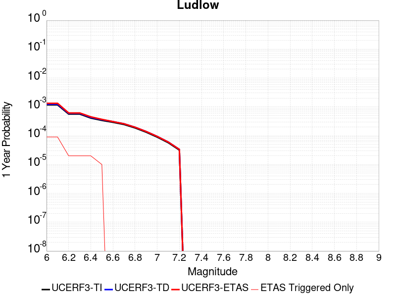 |  |

| Magnitude | 1 wk TI Prob | 1 wk TD Prob | 1 wk ETAS Prob | 1 wk ETAS/TD Gain | 1 wk ETAS Triggered Only | 1 mo TI Prob | 1 mo TD Prob | 1 mo ETAS Prob | 1 mo ETAS/TD Gain | 1 mo ETAS Triggered Only | 1 yr TI Prob | 1 yr TD Prob | 1 yr ETAS Prob | 1 yr ETAS/TD Gain | 1 yr ETAS Triggered Only | 10 yr TI Prob | 10 yr TD Prob | 10 yr ETAS Prob | 10 yr ETAS/TD Gain | 10 yr ETAS Triggered Only |
|-----|-----|-----|-----|-----|-----|-----|-----|-----|-----|-----|-----|-----|-----|-----|-----|-----|-----|-----|-----|-----|
| 6.0 | 2.2407607E-5 | 2.3657429E-5 | 4.4148746E-5 | 1.8661685 | 2.0491803E-5 | 9.602906E-5 | 1.0138529E-4 | 1.2187501E-4 | 1.2020977 | 2.0491803E-5 | 0.0011685267 | 0.001233711 | 0.0013155772 | 1.0663576 | 8.196721E-5 | 0.011624013 | 0.012273132 | 0.012475535 | 1.0164915 | 2.0491803E-4 |
| 6.1 | 2.2407607E-5 | 2.3657429E-5 | 4.4148746E-5 | 1.8661685 | 2.0491803E-5 | 9.602906E-5 | 1.0138529E-4 | 1.2187501E-4 | 1.2020977 | 2.0491803E-5 | 0.0011685267 | 0.001233711 | 0.0013155772 | 1.0663576 | 8.196721E-5 | 0.011624013 | 0.012273132 | 0.012475535 | 1.0164915 | 2.0491803E-4 |
| 6.2 | 1.0781252E-5 | 1.1365745E-5 | 1.1365745E-5 | 1.0 | 0.0 | 4.620455E-5 | 4.870945E-5 | 4.870945E-5 | 1.0 | 0.0 | 5.623952E-4 | 5.9288024E-4 | 6.1335985E-4 | 1.0345427 | 2.0491803E-5 | 0.00560974 | 0.005913404 | 0.005994886 | 1.0137793 | 8.196721E-5 |
| 6.3 | 1.0781252E-5 | 1.1365745E-5 | 1.1365745E-5 | 1.0 | 0.0 | 4.620455E-5 | 4.870945E-5 | 4.870945E-5 | 1.0 | 0.0 | 5.623952E-4 | 5.9288024E-4 | 6.1335985E-4 | 1.0345427 | 2.0491803E-5 | 0.00560974 | 0.005913404 | 0.005994886 | 1.0137793 | 8.196721E-5 |
| 6.4 | 7.814439E-6 | 8.237788E-6 | 8.237788E-6 | 1.0 | 0.0 | 3.3490025E-5 | 3.5304336E-5 | 3.5304336E-5 | 1.0 | 0.0 | 4.0766477E-4 | 4.2974693E-4 | 4.502299E-4 | 1.047663 | 2.0491803E-5 | 0.0040691774 | 0.0042893053 | 0.004350517 | 1.0142708 | 6.147541E-5 |
| 6.5 | 6.4986366E-6 | 6.850969E-6 | 6.850969E-6 | 1.0 | 0.0 | 2.7851002E-5 | 2.936097E-5 | 2.936097E-5 | 1.0 | 0.0 | 3.390332E-4 | 3.574121E-4 | 3.778966E-4 | 1.0573133 | 2.0491803E-5 | 0.003385164 | 0.0035684688 | 0.003629725 | 1.0171659 | 6.147541E-5 |
| 6.6 | 5.582177E-6 | 5.8860483E-6 | 5.8860483E-6 | 1.0 | 0.0 | 2.3923398E-5 | 2.522568E-5 | 2.522568E-5 | 1.0 | 0.0 | 2.9122844E-4 | 3.070801E-4 | 3.070801E-4 | 1.0 | 0.0 | 0.0029084706 | 0.003066631 | 0.0031074889 | 1.0133234 | 4.0983607E-5 |
| 6.7 | 4.6858763E-6 | 4.940463E-6 | 4.940463E-6 | 1.0 | 0.0 | 2.0082172E-5 | 2.1173244E-5 | 2.1173244E-5 | 1.0 | 0.0 | 2.4447302E-4 | 2.577543E-4 | 2.577543E-4 | 1.0 | 0.0 | 0.0024420423 | 0.0025746098 | 0.002615488 | 1.0158774 | 4.0983607E-5 |
| 6.8 | 3.5584908E-6 | 3.7520454E-6 | 3.7520454E-6 | 1.0 | 0.0 | 1.5250586E-5 | 1.6080097E-5 | 1.6080097E-5 | 1.0 | 0.0 | 1.8566006E-4 | 1.9575801E-4 | 1.9575801E-4 | 1.0 | 0.0 | 0.0018550502 | 0.0019558968 | 0.0019968003 | 1.0209129 | 4.0983607E-5 |
| 6.9 | 2.532834E-6 | 2.6710227E-6 | 2.6710227E-6 | 1.0 | 0.0 | 1.0854958E-5 | 1.1447192E-5 | 1.1447192E-5 | 1.0 | 0.0 | 1.3215111E-4 | 1.3936093E-4 | 1.3936093E-4 | 1.0 | 0.0 | 0.0013207254 | 0.0013927629 | 0.0014336895 | 1.0293851 | 4.0983607E-5 |
| 7.0 | 1.7083285E-6 | 1.801957E-6 | 1.801957E-6 | 1.0 | 0.0 | 7.3213873E-6 | 7.7226505E-6 | 7.7226505E-6 | 1.0 | 0.0 | 8.913424E-5 | 9.4019386E-5 | 9.4019386E-5 | 1.0 | 0.0 | 8.9098496E-4 | 9.3981257E-4 | 9.6028514E-4 | 1.0217836 | 2.0491803E-5 |
| 7.1 | 1.0905424E-6 | 1.1497702E-6 | 1.1497702E-6 | 1.0 | 0.0 | 4.6737446E-6 | 4.927578E-6 | 4.927578E-6 | 1.0 | 0.0 | 5.6901354E-5 | 5.999171E-5 | 5.999171E-5 | 1.0 | 0.0 | 5.6886784E-4 | 5.997649E-4 | 6.202445E-4 | 1.034146 | 2.0491803E-5 |
| 7.2 | 6.06668E-7 | 6.387322E-7 | 6.387322E-7 | 1.0 | 0.0 | 2.600003E-6 | 2.7374213E-6 | 2.7374213E-6 | 1.0 | 0.0 | 3.1654577E-5 | 3.3327666E-5 | 3.3327666E-5 | 1.0 | 0.0 | 3.1650066E-4 | 3.332335E-4 | 3.332335E-4 | 1.0 | 0.0 |

## Red Pass
*[(top)](#table-of-contents)*

| 1 Week | 1 Month | 1 Year | 10 Year |
|-----|-----|-----|-----|
| 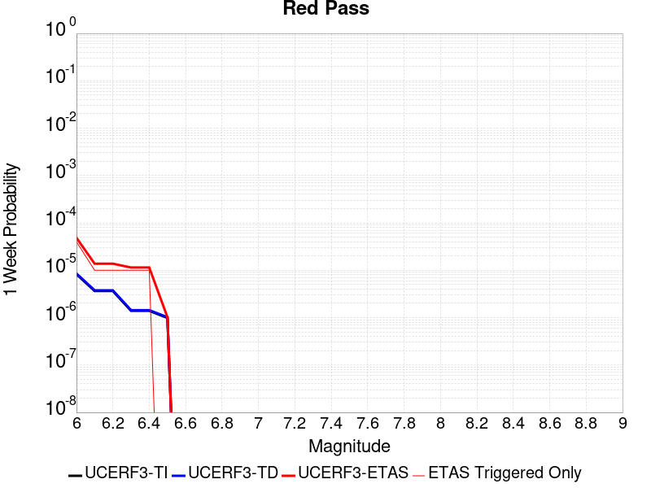 | 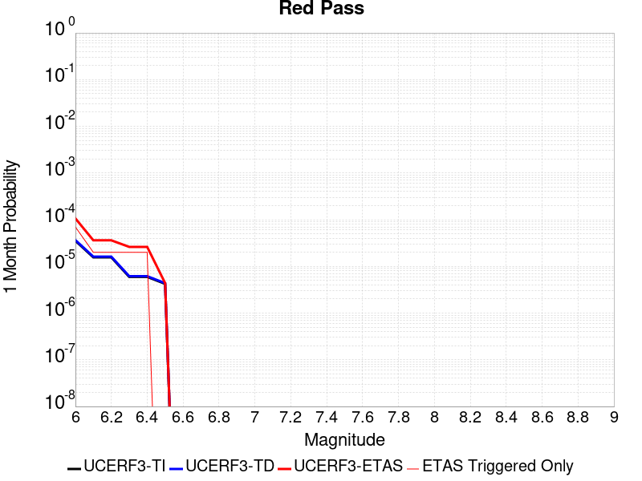 |  |  |

| Magnitude | 1 wk TI Prob | 1 wk TD Prob | 1 wk ETAS Prob | 1 wk ETAS/TD Gain | 1 wk ETAS Triggered Only | 1 mo TI Prob | 1 mo TD Prob | 1 mo ETAS Prob | 1 mo ETAS/TD Gain | 1 mo ETAS Triggered Only | 1 yr TI Prob | 1 yr TD Prob | 1 yr ETAS Prob | 1 yr ETAS/TD Gain | 1 yr ETAS Triggered Only | 10 yr TI Prob | 10 yr TD Prob | 10 yr ETAS Prob | 10 yr ETAS/TD Gain | 10 yr ETAS Triggered Only |
|-----|-----|-----|-----|-----|-----|-----|-----|-----|-----|-----|-----|-----|-----|-----|-----|-----|-----|-----|-----|-----|
| 6.0 | 8.258278E-6 | 8.551305E-6 | 4.9534563E-5 | 5.7926316 | 4.0983607E-5 | 3.539214E-5 | 3.6648038E-5 | 1.18612246E-4 | 3.2365239 | 8.196721E-5 | 4.308141E-4 | 4.4611638E-4 | 5.89495E-4 | 1.3213929 | 1.4344262E-4 | 0.0042997985 | 0.004453966 | 0.004678372 | 1.0503833 | 2.2540984E-4 |
| 6.1 | 3.649988E-6 | 3.7753332E-6 | 2.426706E-5 | 6.4277925 | 2.0491803E-5 | 1.5642712E-5 | 1.6179927E-5 | 5.716287E-5 | 3.53295 | 4.0983607E-5 | 1.9043336E-4 | 1.9697756E-4 | 2.5844085E-4 | 1.312032 | 6.147541E-5 | 0.0019027026 | 0.001968497 | 0.002050303 | 1.0415576 | 8.196721E-5 |
| 6.2 | 3.649988E-6 | 3.7753332E-6 | 2.426706E-5 | 6.4277925 | 2.0491803E-5 | 1.5642712E-5 | 1.6179927E-5 | 5.716287E-5 | 3.53295 | 4.0983607E-5 | 1.9043336E-4 | 1.9697756E-4 | 2.5844085E-4 | 1.312032 | 6.147541E-5 | 0.0019027026 | 0.001968497 | 0.002050303 | 1.0415576 | 8.196721E-5 |
| 6.3 | 1.3924937E-6 | 1.4411233E-6 | 2.1932898E-5 | 15.219306 | 2.0491803E-5 | 5.9678164E-6 | 6.176236E-6 | 4.715959E-5 | 7.635652 | 4.0983607E-5 | 7.265574E-5 | 7.51945E-5 | 1.3666529E-4 | 1.8174906 | 6.147541E-5 | 7.263199E-4 | 7.518293E-4 | 8.3373487E-4 | 1.1089418 | 8.196721E-5 |
| 6.4 | 1.3924937E-6 | 1.4411233E-6 | 2.1932898E-5 | 15.219306 | 2.0491803E-5 | 5.9678164E-6 | 6.176236E-6 | 4.715959E-5 | 7.635652 | 4.0983607E-5 | 7.265574E-5 | 7.51945E-5 | 1.3666529E-4 | 1.8174906 | 6.147541E-5 | 7.263199E-4 | 7.518293E-4 | 8.3373487E-4 | 1.1089418 | 8.196721E-5 |
| 6.5 | 9.876812E-7 | 1.022196E-6 | 1.022196E-6 | 1.0 | 0.0 | 4.2329125E-6 | 4.38084E-6 | 4.38084E-6 | 1.0 | 0.0 | 5.153449E-5 | 5.3336724E-5 | 7.382743E-5 | 1.3841764 | 2.0491803E-5 | 5.1522546E-4 | 5.333672E-4 | 5.74329E-4 | 1.0767984 | 4.0983607E-5 |

## Calico-Hidalgo
*[(top)](#table-of-contents)*

| 1 Week | 1 Month | 1 Year | 10 Year |
|-----|-----|-----|-----|
|  |  |  |  |

| Magnitude | 1 wk TI Prob | 1 wk TD Prob | 1 wk ETAS Prob | 1 wk ETAS/TD Gain | 1 wk ETAS Triggered Only | 1 mo TI Prob | 1 mo TD Prob | 1 mo ETAS Prob | 1 mo ETAS/TD Gain | 1 mo ETAS Triggered Only | 1 yr TI Prob | 1 yr TD Prob | 1 yr ETAS Prob | 1 yr ETAS/TD Gain | 1 yr ETAS Triggered Only | 10 yr TI Prob | 10 yr TD Prob | 10 yr ETAS Prob | 10 yr ETAS/TD Gain | 10 yr ETAS Triggered Only |
|-----|-----|-----|-----|-----|-----|-----|-----|-----|-----|-----|-----|-----|-----|-----|-----|-----|-----|-----|-----|-----|
| 6.0 | 4.0906612E-5 | 5.0704653E-5 | 7.119541E-5 | 1.40412 | 2.0491803E-5 | 1.7530227E-4 | 2.1728984E-4 | 2.5826454E-4 | 1.1885717 | 4.0983607E-5 | 0.0021322158 | 0.0026426981 | 0.002724449 | 1.0309346 | 8.196721E-5 | 0.02111873 | 0.026153097 | 0.026352655 | 1.0076303 | 2.0491803E-4 |
| 6.1 | 4.0906612E-5 | 5.0704653E-5 | 7.119541E-5 | 1.40412 | 2.0491803E-5 | 1.7530227E-4 | 2.1728984E-4 | 2.5826454E-4 | 1.1885717 | 4.0983607E-5 | 0.0021322158 | 0.0026426981 | 0.002724449 | 1.0309346 | 8.196721E-5 | 0.02111873 | 0.026153097 | 0.026352655 | 1.0076303 | 2.0491803E-4 |
| 6.2 | 4.0906612E-5 | 5.0704653E-5 | 7.119541E-5 | 1.40412 | 2.0491803E-5 | 1.7530227E-4 | 2.1728984E-4 | 2.5826454E-4 | 1.1885717 | 4.0983607E-5 | 0.0021322158 | 0.0026426981 | 0.002724449 | 1.0309346 | 8.196721E-5 | 0.02111873 | 0.026153097 | 0.026352655 | 1.0076303 | 2.0491803E-4 |
| 6.3 | 2.4242801E-5 | 3.009103E-5 | 5.0582217E-5 | 1.6809732 | 2.0491803E-5 | 1.0389358E-4 | 1.2895538E-4 | 1.699337E-4 | 1.3177713 | 4.0983607E-5 | 0.0012641704 | 0.001568934 | 0.0016303129 | 1.0391214 | 6.147541E-5 | 0.01257003 | 0.015582247 | 0.015683109 | 1.006473 | 1.0245902E-4 |
| 6.4 | 2.4242801E-5 | 3.009103E-5 | 5.0582217E-5 | 1.6809732 | 2.0491803E-5 | 1.0389358E-4 | 1.2895538E-4 | 1.699337E-4 | 1.3177713 | 4.0983607E-5 | 0.0012641704 | 0.001568934 | 0.0016303129 | 1.0391214 | 6.147541E-5 | 0.01257003 | 0.015582247 | 0.015683109 | 1.006473 | 1.0245902E-4 |
| 6.5 | 2.0286952E-5 | 2.5315985E-5 | 4.5807268E-5 | 1.8094208 | 2.0491803E-5 | 8.694118E-5 | 1.0849266E-4 | 1.4947183E-4 | 1.3777137 | 4.0983607E-5 | 0.0010579949 | 0.0013201149 | 0.0013815092 | 1.0465068 | 6.147541E-5 | 0.010529719 | 0.013124665 | 0.013205556 | 1.0061634 | 8.196721E-5 |
| 6.6 | 2.0269223E-5 | 2.5296935E-5 | 4.578822E-5 | 1.8100303 | 2.0491803E-5 | 8.6865206E-5 | 1.08411026E-4 | 1.493902E-4 | 1.3779981 | 4.0983607E-5 | 0.0010570707 | 0.0013191222 | 0.0013805164 | 1.0465418 | 6.147541E-5 | 0.010520565 | 0.013114855 | 0.0131957475 | 1.006168 | 8.196721E-5 |
| 6.7 | 1.799852E-5 | 2.25408E-5 | 4.303214E-5 | 1.9090778 | 2.0491803E-5 | 7.713423E-5 | 9.6599935E-5 | 1.3757958E-4 | 1.4242202 | 4.0983607E-5 | 9.3870464E-4 | 0.0011754843 | 0.0012368874 | 1.0522364 | 6.147541E-5 | 0.009347493 | 0.011694277 | 0.011775285 | 1.0069273 | 8.196721E-5 |
| 6.8 | 1.7458793E-5 | 2.1842314E-5 | 4.2333668E-5 | 1.9381496 | 2.0491803E-5 | 7.4821255E-5 | 9.3606635E-5 | 1.345864E-4 | 1.437787 | 4.0983607E-5 | 9.10568E-4 | 0.0011390795 | 0.0012004848 | 1.0539079 | 6.147541E-5 | 0.009068459 | 0.011333993 | 0.011415031 | 1.00715 | 8.196721E-5 |
| 6.9 | 1.542884E-5 | 1.9026087E-5 | 3.95175E-5 | 2.0770168 | 2.0491803E-5 | 6.612192E-5 | 8.1537895E-5 | 1.2251816E-4 | 1.5025916 | 4.0983607E-5 | 8.04737E-4 | 9.92285E-4 | 0.0010536993 | 1.0618919 | 6.147541E-5 | 0.008018291 | 0.00987994 | 0.0099610975 | 1.0082144 | 8.196721E-5 |
| 7.0 | 1.468253E-5 | 1.8030747E-5 | 3.852218E-5 | 2.1364717 | 2.0491803E-5 | 6.292361E-5 | 7.7272416E-5 | 1.1825285E-4 | 1.5303372 | 4.0983607E-5 | 7.658257E-4 | 9.403986E-4 | 0.0010018161 | 1.0653101 | 6.147541E-5 | 0.0076319184 | 0.009365558 | 0.009446757 | 1.00867 | 8.196721E-5 |
| 7.1 | 1.3139281E-5 | 1.620107E-5 | 3.669254E-5 | 2.2648222 | 2.0491803E-5 | 5.6309986E-5 | 6.943138E-5 | 1.1041214E-4 | 1.590234 | 4.0983607E-5 | 6.853584E-4 | 8.4501173E-4 | 8.8596076E-4 | 1.0484596 | 4.0983607E-5 | 0.0068324856 | 0.008419285 | 0.008480242 | 1.0072403 | 6.147541E-5 |
| 7.2 | 1.1127404E-5 | 1.3866703E-5 | 3.435822E-5 | 2.4777498 | 2.0491803E-5 | 4.7688E-5 | 5.9427435E-5 | 1.0040861E-4 | 1.6896002 | 4.0983607E-5 | 5.8044674E-4 | 7.2329975E-4 | 7.6425367E-4 | 1.056621 | 4.0983607E-5 | 0.0057893298 | 0.0072105634 | 0.0072715953 | 1.0084642 | 6.147541E-5 |
| 7.3 | 9.808154E-6 | 1.2176301E-5 | 3.2667856E-5 | 2.6829047 | 2.0491803E-5 | 4.2034266E-5 | 5.2183164E-5 | 7.26739E-5 | 1.3926694 | 2.0491803E-5 | 5.11647E-4 | 6.3515553E-4 | 6.556343E-4 | 1.0322422 | 2.0491803E-5 | 0.0051047057 | 0.0063344776 | 0.0063752015 | 1.006429 | 4.0983607E-5 |
| 7.4 | 7.942452E-6 | 9.7922075E-6 | 3.028381E-5 | 3.0926437 | 2.0491803E-5 | 3.4038632E-5 | 4.196598E-5 | 6.245693E-5 | 1.488275 | 2.0491803E-5 | 4.1434157E-4 | 5.1082554E-4 | 5.3130684E-4 | 1.0400946 | 2.0491803E-5 | 0.0041356985 | 0.0050974544 | 0.005138229 | 1.0079991 | 4.0983607E-5 |
| 7.5 | 4.7121216E-6 | 5.772871E-6 | 2.6264555E-5 | 4.549652 | 2.0491803E-5 | 2.019465E-5 | 2.4740684E-5 | 4.523198E-5 | 1.8282429 | 2.0491803E-5 | 2.4584212E-4 | 3.0118387E-4 | 3.216695E-4 | 1.068017 | 2.0491803E-5 | 0.0024557032 | 0.0030085093 | 0.0030289395 | 1.0067908 | 2.0491803E-5 |
| 7.6 | 2.21172E-7 | 2.6039737E-7 | 2.6039737E-7 | 1.0 | 0.0 | 9.478797E-7 | 1.1159884E-6 | 1.1159884E-6 | 1.0 | 0.0 | 1.1540374E-5 | 1.3587103E-5 | 1.3587103E-5 | 1.0 | 0.0 | 1.1539775E-4 | 1.3586554E-4 | 1.3586554E-4 | 1.0 | 0.0 |

## Santa Ynez (West)
*[(top)](#table-of-contents)*

| 1 Week | 1 Month | 1 Year | 10 Year |
|-----|-----|-----|-----|
|  |  | 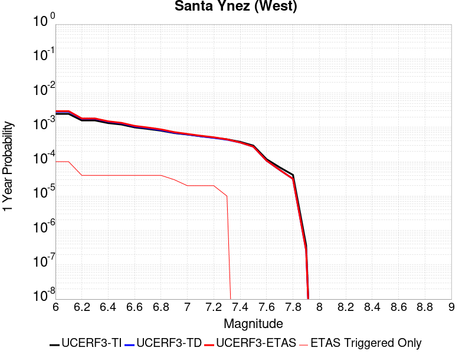 |  |

| Magnitude | 1 wk TI Prob | 1 wk TD Prob | 1 wk ETAS Prob | 1 wk ETAS/TD Gain | 1 wk ETAS Triggered Only | 1 mo TI Prob | 1 mo TD Prob | 1 mo ETAS Prob | 1 mo ETAS/TD Gain | 1 mo ETAS Triggered Only | 1 yr TI Prob | 1 yr TD Prob | 1 yr ETAS Prob | 1 yr ETAS/TD Gain | 1 yr ETAS Triggered Only | 10 yr TI Prob | 10 yr TD Prob | 10 yr ETAS Prob | 10 yr ETAS/TD Gain | 10 yr ETAS Triggered Only |
|-----|-----|-----|-----|-----|-----|-----|-----|-----|-----|-----|-----|-----|-----|-----|-----|-----|-----|-----|-----|-----|
| 6.0 | 4.7352758E-5 | 5.497349E-5 | 7.5464166E-5 | 1.3727374 | 2.0491803E-5 | 2.0292461E-4 | 2.3558107E-4 | 2.5606804E-4 | 1.0869635 | 2.0491803E-5 | 0.0024678076 | 0.0028645964 | 0.002987195 | 1.0427979 | 1.2295082E-4 | 0.024405818 | 0.028305095 | 0.02846439 | 1.0056278 | 1.6393443E-4 |
| 6.1 | 4.7352758E-5 | 5.497349E-5 | 7.5464166E-5 | 1.3727374 | 2.0491803E-5 | 2.0292461E-4 | 2.3558107E-4 | 2.5606804E-4 | 1.0869635 | 2.0491803E-5 | 0.0024678076 | 0.0028645964 | 0.002987195 | 1.0427979 | 1.2295082E-4 | 0.024405818 | 0.028305095 | 0.02846439 | 1.0056278 | 1.6393443E-4 |
| 6.2 | 3.0415853E-5 | 3.3925786E-5 | 3.3925786E-5 | 1.0 | 0.0 | 1.3034715E-4 | 1.4538833E-4 | 1.4538833E-4 | 1.0 | 0.0 | 0.0015858212 | 0.0017687011 | 0.0018096123 | 1.0231307 | 4.0983607E-5 | 0.015745522 | 0.01755015 | 0.017610546 | 1.0034413 | 6.147541E-5 |
| 6.3 | 3.0415853E-5 | 3.3925786E-5 | 3.3925786E-5 | 1.0 | 0.0 | 1.3034715E-4 | 1.4538833E-4 | 1.4538833E-4 | 1.0 | 0.0 | 0.0015858212 | 0.0017687011 | 0.0018096123 | 1.0231307 | 4.0983607E-5 | 0.015745522 | 0.01755015 | 0.017610546 | 1.0034413 | 6.147541E-5 |
| 6.4 | 2.5452082E-5 | 2.7912925E-5 | 2.7912925E-5 | 1.0 | 0.0 | 1.09075794E-4 | 1.1962145E-4 | 1.1962145E-4 | 1.0 | 0.0 | 0.0013271887 | 0.001455435 | 0.0014963589 | 1.028118 | 4.0983607E-5 | 0.013192902 | 0.014461209 | 0.014521795 | 1.0041896 | 6.147541E-5 |
| 6.5 | 2.3143784E-5 | 2.5128682E-5 | 2.5128682E-5 | 1.0 | 0.0 | 9.9183875E-5 | 1.0768999E-4 | 1.0768999E-4 | 1.0 | 0.0 | 0.0012068948 | 0.0013103489 | 0.0013512787 | 1.0312359 | 4.0983607E-5 | 0.012003611 | 0.013027899 | 0.013088574 | 1.0046573 | 6.147541E-5 |
| 6.6 | 1.9118515E-5 | 2.0354646E-5 | 2.0354646E-5 | 1.0 | 0.0 | 8.193392E-5 | 8.723133E-5 | 8.723133E-5 | 1.0 | 0.0 | 9.97089E-4 | 0.001061532 | 0.0011024721 | 1.038567 | 4.0983607E-5 | 0.00992627 | 0.010565523 | 0.01062635 | 1.005757 | 6.147541E-5 |
| 6.7 | 1.722807E-5 | 1.8146604E-5 | 1.8146604E-5 | 1.0 | 0.0 | 7.3832496E-5 | 7.776888E-5 | 7.776888E-5 | 1.0 | 0.0 | 8.985399E-4 | 9.464303E-4 | 9.873752E-4 | 1.0432624 | 4.0983607E-5 | 0.008949154 | 0.009424643 | 0.009485539 | 1.0064614 | 6.147541E-5 |
| 6.8 | 1.5317364E-5 | 1.5926695E-5 | 1.5926695E-5 | 1.0 | 0.0 | 6.56442E-5 | 6.82555E-5 | 6.82555E-5 | 1.0 | 0.0 | 7.98925E-4 | 8.306982E-4 | 8.7164773E-4 | 1.0492953 | 4.0983607E-5 | 0.007960589 | 0.008276418 | 0.008337385 | 1.0073663 | 6.147541E-5 |
| 6.9 | 1.3071226E-5 | 1.3329779E-5 | 1.3329779E-5 | 1.0 | 0.0 | 5.6018336E-5 | 5.7126388E-5 | 5.7126388E-5 | 1.0 | 0.0 | 6.8180985E-4 | 6.9529406E-4 | 7.362492E-4 | 1.0589033 | 4.0983607E-5 | 0.0067972173 | 0.0069314474 | 0.0069924966 | 1.0088075 | 6.147541E-5 |
| 7.0 | 1.1836986E-5 | 1.19329125E-5 | 1.19329125E-5 | 1.0 | 0.0 | 5.0728955E-5 | 5.1140058E-5 | 5.1140058E-5 | 1.0 | 0.0 | 6.1745E-4 | 6.2245404E-4 | 6.4293307E-4 | 1.0329005 | 2.0491803E-5 | 0.006157372 | 0.006207299 | 0.006248028 | 1.0065615 | 4.0983607E-5 |
| 7.1 | 1.0597169E-5 | 1.0542309E-5 | 1.0542309E-5 | 1.0 | 0.0 | 4.541565E-5 | 4.5180546E-5 | 4.5180546E-5 | 1.0 | 0.0 | 5.5279525E-4 | 5.4993544E-4 | 5.70416E-4 | 1.0372417 | 2.0491803E-5 | 0.0055142213 | 0.005485877 | 0.005526636 | 1.0074297 | 4.0983607E-5 |
| 7.2 | 9.59113E-6 | 9.459241E-6 | 9.459241E-6 | 1.0 | 0.0 | 4.11042E-5 | 4.053898E-5 | 4.053898E-5 | 1.0 | 0.0 | 5.0032866E-4 | 4.9345137E-4 | 5.139331E-4 | 1.041507 | 2.0491803E-5 | 0.004992037 | 0.0049236757 | 0.0049644574 | 1.0082828 | 4.0983607E-5 |
| 7.3 | 8.586084E-6 | 8.379669E-6 | 8.379669E-6 | 1.0 | 0.0 | 3.679698E-5 | 3.591238E-5 | 3.591238E-5 | 1.0 | 0.0 | 4.4791115E-4 | 4.3714655E-4 | 4.3714655E-4 | 1.0 | 0.0 | 0.004470094 | 0.0043629776 | 0.00438338 | 1.0046762 | 2.0491803E-5 |
| 7.4 | 7.2622997E-6 | 6.951613E-6 | 6.951613E-6 | 1.0 | 0.0 | 3.112377E-5 | 2.9792294E-5 | 2.9792294E-5 | 1.0 | 0.0 | 3.78866E-4 | 3.6266178E-4 | 3.6266178E-4 | 1.0 | 0.0 | 0.0037822074 | 0.0036207996 | 0.0036412172 | 1.005639 | 2.0491803E-5 |
| 7.5 | 5.627296E-6 | 5.251639E-6 | 5.251639E-6 | 1.0 | 0.0 | 2.411676E-5 | 2.2506834E-5 | 2.2506834E-5 | 1.0 | 0.0 | 2.9358198E-4 | 2.7398695E-4 | 2.7398695E-4 | 1.0 | 0.0 | 0.0029319443 | 0.0027365636 | 0.0027569993 | 1.0074676 | 2.0491803E-5 |
| 7.6 | 2.265244E-6 | 2.0608784E-6 | 2.0608784E-6 | 1.0 | 0.0 | 9.708152E-6 | 8.832307E-6 | 8.832307E-6 | 1.0 | 0.0 | 1.18190335E-4 | 1.0752812E-4 | 1.0752812E-4 | 1.0 | 0.0 | 0.001181275 | 0.0010747695 | 0.0010747695 | 1.0 | 0.0 |
| 7.7 | 1.3099874E-6 | 1.1016341E-6 | 1.1016341E-6 | 1.0 | 0.0 | 5.61422E-6 | 4.7212807E-6 | 4.7212807E-6 | 1.0 | 0.0 | 6.8350986E-5 | 5.74801E-5 | 5.74801E-5 | 1.0 | 0.0 | 6.832996E-4 | 5.746547E-4 | 5.746547E-4 | 1.0 | 0.0 |
| 7.8 | 7.903951E-7 | 6.071191E-7 | 6.071191E-7 | 1.0 | 0.0 | 3.3874032E-6 | 2.6019363E-6 | 2.6019363E-6 | 1.0 | 0.0 | 4.1240855E-5 | 3.1678126E-5 | 3.1678126E-5 | 1.0 | 0.0 | 4.12332E-4 | 3.1673745E-4 | 3.1673745E-4 | 1.0 | 0.0 |
| 7.9 | 7.0753297E-9 | 5.089978E-9 | 5.089978E-9 | 1.0 | 0.0 | 3.032284E-8 | 2.1814193E-8 | 2.1814193E-8 | 1.0 | 0.0 | 3.6918053E-7 | 2.6558777E-7 | 2.6558777E-7 | 1.0 | 0.0 | 3.691799E-6 | 2.6558755E-6 | 2.6558755E-6 | 1.0 | 0.0 |

## Scodie Lineament
*[(top)](#table-of-contents)*

| 1 Week | 1 Month | 1 Year | 10 Year |
|-----|-----|-----|-----|
| 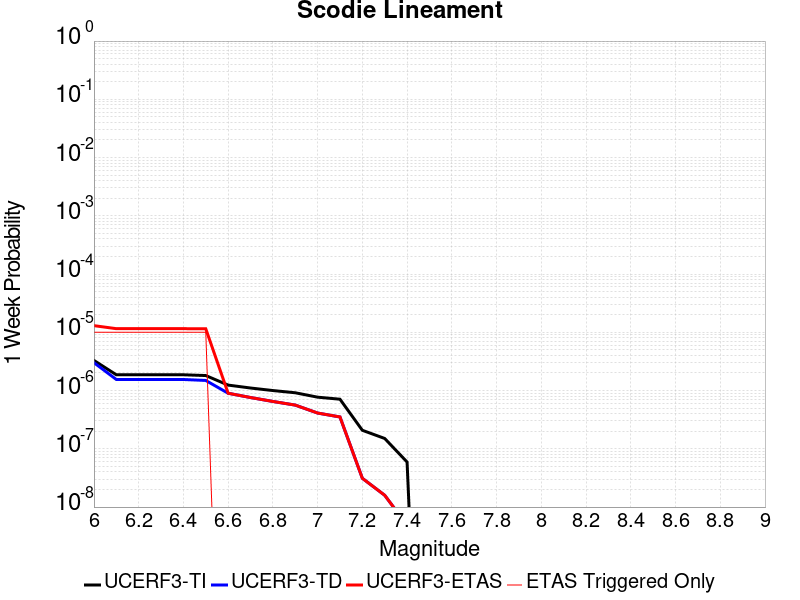 |  |  |  |

| Magnitude | 1 wk TI Prob | 1 wk TD Prob | 1 wk ETAS Prob | 1 wk ETAS/TD Gain | 1 wk ETAS Triggered Only | 1 mo TI Prob | 1 mo TD Prob | 1 mo ETAS Prob | 1 mo ETAS/TD Gain | 1 mo ETAS Triggered Only | 1 yr TI Prob | 1 yr TD Prob | 1 yr ETAS Prob | 1 yr ETAS/TD Gain | 1 yr ETAS Triggered Only | 10 yr TI Prob | 10 yr TD Prob | 10 yr ETAS Prob | 10 yr ETAS/TD Gain | 10 yr ETAS Triggered Only |
|-----|-----|-----|-----|-----|-----|-----|-----|-----|-----|-----|-----|-----|-----|-----|-----|-----|-----|-----|-----|-----|
| 6.0 | 3.2919327E-6 | 3.0133565E-6 | 2.3505097E-5 | 7.8003044 | 2.0491803E-5 | 1.4108206E-5 | 1.2914339E-5 | 5.3897416E-5 | 4.173455 | 4.0983607E-5 | 1.7175387E-4 | 1.5722391E-4 | 2.1868965E-4 | 1.390944 | 6.147541E-5 | 0.0017162118 | 0.0015714383 | 0.0017555747 | 1.117177 | 1.8442623E-4 |
| 6.1 | 1.8663811E-6 | 1.5490589E-6 | 2.2040831E-5 | 14.22853 | 2.0491803E-5 | 7.998751E-6 | 6.6388097E-6 | 4.7622143E-5 | 7.1732955 | 4.0983607E-5 | 9.738045E-5 | 8.082501E-5 | 1.218053E-4 | 1.5070249 | 4.0983607E-5 | 9.7337784E-4 | 8.0800493E-4 | 8.6943066E-4 | 1.0760214 | 6.147541E-5 |
| 6.2 | 1.8663811E-6 | 1.5490589E-6 | 2.2040831E-5 | 14.22853 | 2.0491803E-5 | 7.998751E-6 | 6.6388097E-6 | 4.7622143E-5 | 7.1732955 | 4.0983607E-5 | 9.738045E-5 | 8.082501E-5 | 1.218053E-4 | 1.5070249 | 4.0983607E-5 | 9.7337784E-4 | 8.0800493E-4 | 8.6943066E-4 | 1.0760214 | 6.147541E-5 |
| 6.3 | 1.8663811E-6 | 1.5490589E-6 | 2.2040831E-5 | 14.22853 | 2.0491803E-5 | 7.998751E-6 | 6.6388097E-6 | 4.7622143E-5 | 7.1732955 | 4.0983607E-5 | 9.738045E-5 | 8.082501E-5 | 1.218053E-4 | 1.5070249 | 4.0983607E-5 | 9.7337784E-4 | 8.0800493E-4 | 8.6943066E-4 | 1.0760214 | 6.147541E-5 |
| 6.4 | 1.8663811E-6 | 1.5490589E-6 | 2.2040831E-5 | 14.22853 | 2.0491803E-5 | 7.998751E-6 | 6.6388097E-6 | 4.7622143E-5 | 7.1732955 | 4.0983607E-5 | 9.738045E-5 | 8.082501E-5 | 1.218053E-4 | 1.5070249 | 4.0983607E-5 | 9.7337784E-4 | 8.0800493E-4 | 8.6943066E-4 | 1.0760214 | 6.147541E-5 |
| 6.5 | 1.8106311E-6 | 1.4909926E-6 | 2.1982765E-5 | 14.743711 | 2.0491803E-5 | 7.759824E-6 | 6.3899556E-6 | 4.73733E-5 | 7.413714 | 4.0983607E-5 | 9.447177E-5 | 7.779543E-5 | 1.18775846E-4 | 1.5267715 | 4.0983607E-5 | 9.4431615E-4 | 7.777306E-4 | 8.391582E-4 | 1.0789832 | 6.147541E-5 |
| 6.6 | 1.2414679E-6 | 8.9976135E-7 | 8.9976135E-7 | 1.0 | 0.0 | 5.320566E-6 | 3.8561147E-6 | 3.8561147E-6 | 1.0 | 0.0 | 6.477596E-5 | 4.6947276E-5 | 4.6947276E-5 | 1.0 | 0.0 | 6.475708E-4 | 4.6938224E-4 | 4.6938224E-4 | 1.0 | 0.0 |
| 6.7 | 1.1062215E-6 | 7.5943603E-7 | 7.5943603E-7 | 1.0 | 0.0 | 4.7409408E-6 | 3.254722E-6 | 3.254722E-6 | 1.0 | 0.0 | 5.7719422E-5 | 3.9625593E-5 | 3.9625593E-5 | 1.0 | 0.0 | 5.770443E-4 | 3.9619225E-4 | 3.9619225E-4 | 1.0 | 0.0 |
| 6.8 | 1.0006736E-6 | 6.5004406E-7 | 6.5004406E-7 | 1.0 | 0.0 | 4.288594E-6 | 2.7859005E-6 | 2.7859005E-6 | 1.0 | 0.0 | 5.221238E-5 | 3.3917873E-5 | 3.3917873E-5 | 1.0 | 0.0 | 5.220012E-4 | 3.3913302E-4 | 3.3913302E-4 | 1.0 | 0.0 |
| 6.9 | 9.167364E-7 | 5.6316645E-7 | 5.6316645E-7 | 1.0 | 0.0 | 3.9288643E-6 | 2.4135686E-6 | 2.4135686E-6 | 1.0 | 0.0 | 4.7832873E-5 | 2.9384859E-5 | 2.9384859E-5 | 1.0 | 0.0 | 4.782258E-4 | 2.9381542E-4 | 2.9381542E-4 | 1.0 | 0.0 |
| 7.0 | 7.6987664E-7 | 4.113416E-7 | 4.113416E-7 | 1.0 | 0.0 | 3.2994672E-6 | 1.7628915E-6 | 1.7628915E-6 | 1.0 | 0.0 | 4.0170275E-5 | 2.1463033E-5 | 2.1463033E-5 | 1.0 | 0.0 | 4.0163012E-4 | 2.1461345E-4 | 2.1461345E-4 | 1.0 | 0.0 |
| 7.1 | 7.1038727E-7 | 3.5211795E-7 | 3.5211795E-7 | 1.0 | 0.0 | 3.0445133E-6 | 1.5090762E-6 | 1.5090762E-6 | 1.0 | 0.0 | 3.706632E-5 | 1.8372884E-5 | 1.8372884E-5 | 1.0 | 0.0 | 3.7060137E-4 | 1.8371714E-4 | 1.8371714E-4 | 1.0 | 0.0 |
| 7.2 | 2.0799602E-7 | 3.1187685E-8 | 3.1187685E-8 | 1.0 | 0.0 | 8.914113E-7 | 1.336615E-7 | 1.336615E-7 | 1.0 | 0.0 | 1.0852878E-5 | 1.6273277E-6 | 1.6273277E-6 | 1.0 | 0.0 | 1.08523476E-4 | 1.6273165E-5 | 1.6273165E-5 | 1.0 | 0.0 |
| 7.3 | 1.5048182E-7 | 1.5946263E-8 | 1.5946263E-8 | 1.0 | 0.0 | 6.449219E-7 | 6.834112E-8 | 6.834112E-8 | 1.0 | 0.0 | 7.851896E-6 | 8.320529E-7 | 8.320529E-7 | 1.0 | 0.0 | 7.851618E-5 | 8.3205005E-6 | 8.3205005E-6 | 1.0 | 0.0 |
| 7.4 | 5.9334678E-8 | 4.8685624E-9 | 4.8685624E-9 | 1.0 | 0.0 | 2.5429145E-7 | 2.0865269E-8 | 2.0865269E-8 | 1.0 | 0.0 | 3.095994E-6 | 2.5403463E-7 | 2.5403463E-7 | 1.0 | 0.0 | 3.095951E-5 | 2.5403444E-6 | 2.5403444E-6 | 1.0 | 0.0 |

## Mission Ridge-Arroyo Parida-Santa Ana
*[(top)](#table-of-contents)*

| 1 Week | 1 Month | 1 Year | 10 Year |
|-----|-----|-----|-----|
|  | 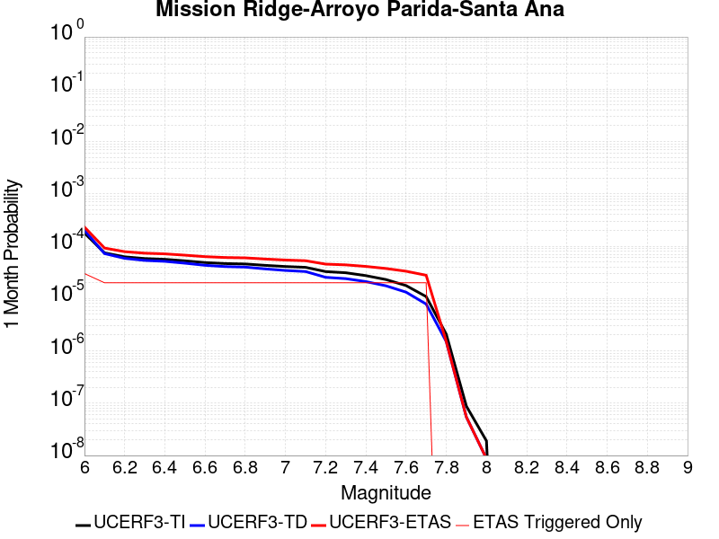 |  |  |

| Magnitude | 1 wk TI Prob | 1 wk TD Prob | 1 wk ETAS Prob | 1 wk ETAS/TD Gain | 1 wk ETAS Triggered Only | 1 mo TI Prob | 1 mo TD Prob | 1 mo ETAS Prob | 1 mo ETAS/TD Gain | 1 mo ETAS Triggered Only | 1 yr TI Prob | 1 yr TD Prob | 1 yr ETAS Prob | 1 yr ETAS/TD Gain | 1 yr ETAS Triggered Only | 10 yr TI Prob | 10 yr TD Prob | 10 yr ETAS Prob | 10 yr ETAS/TD Gain | 10 yr ETAS Triggered Only |
|-----|-----|-----|-----|-----|-----|-----|-----|-----|-----|-----|-----|-----|-----|-----|-----|-----|-----|-----|-----|-----|
| 6.0 | 4.169034E-5 | 4.7139558E-5 | 6.76304E-5 | 1.4346845 | 2.0491803E-5 | 1.7866064E-4 | 2.0201589E-4 | 2.4299121E-4 | 1.2028322 | 4.0983607E-5 | 0.0021730233 | 0.0024575135 | 0.0025801621 | 1.0499077 | 1.2295082E-4 | 0.021518968 | 0.024385266 | 0.024525212 | 1.0057389 | 1.4344262E-4 |
| 6.1 | 1.73813E-5 | 1.6854512E-5 | 3.734597E-5 | 2.2157848 | 2.0491803E-5 | 7.4489166E-5 | 7.223168E-5 | 9.272201E-5 | 1.283675 | 2.0491803E-5 | 9.065282E-4 | 8.790767E-4 | 9.200243E-4 | 1.0465802 | 4.0983607E-5 | 0.009028391 | 0.008757136 | 0.00879776 | 1.004639 | 4.0983607E-5 |
| 6.2 | 1.4622182E-5 | 1.367351E-5 | 3.4165034E-5 | 2.4986293 | 2.0491803E-5 | 6.2664985E-5 | 5.8599464E-5 | 7.909007E-5 | 1.3496722 | 2.0491803E-5 | 7.6267915E-4 | 7.1321876E-4 | 7.5417315E-4 | 1.0574219 | 4.0983607E-5 | 0.007600669 | 0.007109741 | 0.0071504335 | 1.0057235 | 4.0983607E-5 |
| 6.3 | 1.3552434E-5 | 1.2482403E-5 | 3.297395E-5 | 2.641635 | 2.0491803E-5 | 5.8080568E-5 | 5.3494932E-5 | 7.398564E-5 | 1.3830402 | 2.0491803E-5 | 7.069015E-4 | 6.511093E-4 | 6.9206627E-4 | 1.0629033 | 4.0983607E-5 | 0.00704657 | 0.0064923796 | 0.0065330975 | 1.0062716 | 4.0983607E-5 |
| 6.4 | 1.30977305E-5 | 1.1979351E-5 | 3.2470907E-5 | 2.7105732 | 2.0491803E-5 | 5.613192E-5 | 5.133908E-5 | 7.182983E-5 | 1.3991258 | 2.0491803E-5 | 6.831918E-4 | 6.2487705E-4 | 6.6583505E-4 | 1.0655457 | 4.0983607E-5 | 0.006810953 | 0.0062315455 | 0.0062722736 | 1.0065358 | 4.0983607E-5 |
| 6.5 | 1.225205E-5 | 1.10489855E-5 | 3.1540563E-5 | 2.8546116 | 2.0491803E-5 | 5.2507727E-5 | 4.735195E-5 | 6.784278E-5 | 1.4327347 | 2.0491803E-5 | 6.3909404E-4 | 5.763602E-4 | 6.173202E-4 | 1.0710666 | 4.0983607E-5 | 0.006372592 | 0.005748964 | 0.0057897116 | 1.0070878 | 4.0983607E-5 |
| 6.6 | 1.1352241E-5 | 1.0063705E-5 | 3.0555304E-5 | 3.0361881 | 2.0491803E-5 | 4.8651553E-5 | 4.3129465E-5 | 6.3620384E-5 | 1.4751025 | 2.0491803E-5 | 5.921717E-4 | 5.249768E-4 | 5.659389E-4 | 1.0780265 | 4.0983607E-5 | 0.0059059616 | 0.005237613 | 0.0052783815 | 1.0077839 | 4.0983607E-5 |
| 6.7 | 1.0864116E-5 | 9.517188E-6 | 3.0008796E-5 | 3.1531157 | 2.0491803E-5 | 4.6559664E-5 | 4.0787323E-5 | 6.127829E-5 | 1.5023857 | 2.0491803E-5 | 5.667165E-4 | 4.964745E-4 | 5.374378E-4 | 1.0825083 | 4.0983607E-5 | 0.005652734 | 0.004953888 | 0.004994668 | 1.008232 | 4.0983607E-5 |
| 6.8 | 1.0666365E-5 | 9.299937E-6 | 2.979155E-5 | 3.2034142 | 2.0491803E-5 | 4.571219E-5 | 3.9856277E-5 | 6.034726E-5 | 1.514122 | 2.0491803E-5 | 5.564038E-4 | 4.8514412E-4 | 5.2610785E-4 | 1.0844362 | 4.0983607E-5 | 0.005550127 | 0.0048410823 | 0.0048818677 | 1.0084248 | 4.0983607E-5 |
| 6.9 | 1.0038665E-5 | 8.592192E-6 | 2.908382E-5 | 3.3849127 | 2.0491803E-5 | 4.302214E-5 | 3.682317E-5 | 5.7314217E-5 | 1.5564716 | 2.0491803E-5 | 5.236687E-4 | 4.4823167E-4 | 4.891969E-4 | 1.091393 | 4.0983607E-5 | 0.005224364 | 0.004473487 | 0.004514287 | 1.0091205 | 4.0983607E-5 |
| 7.0 | 9.5379955E-6 | 8.025209E-6 | 2.8516848E-5 | 3.5534086 | 2.0491803E-5 | 4.0876483E-5 | 3.439331E-5 | 5.4884407E-5 | 1.5957873 | 2.0491803E-5 | 4.975576E-4 | 4.186598E-4 | 4.5962626E-4 | 1.0978514 | 4.0983607E-5 | 0.00496445 | 0.0041789105 | 0.004219723 | 1.0097662 | 4.0983607E-5 |
| 7.1 | 9.207389E-6 | 7.652504E-6 | 2.814415E-5 | 3.6777701 | 2.0491803E-5 | 3.945964E-5 | 3.2796044E-5 | 5.3287175E-5 | 1.624805 | 2.0491803E-5 | 4.803152E-4 | 3.9922036E-4 | 4.401876E-4 | 1.1026181 | 4.0983607E-5 | 0.004792784 | 0.003985228 | 0.0040260484 | 1.0102429 | 4.0983607E-5 |
| 7.2 | 7.638091E-6 | 5.93121E-6 | 2.6422891E-5 | 4.4548903 | 2.0491803E-5 | 3.2734264E-5 | 2.5419227E-5 | 4.591051E-5 | 1.8061332 | 2.0491803E-5 | 3.984668E-4 | 3.0943545E-4 | 3.299209E-4 | 1.0662028 | 2.0491803E-5 | 0.0039775306 | 0.0030901027 | 0.003110531 | 1.006611 | 2.0491803E-5 |
| 7.3 | 7.2500147E-6 | 5.596238E-6 | 2.6087926E-5 | 4.6616898 | 2.0491803E-5 | 3.1071122E-5 | 2.3983659E-5 | 4.447497E-5 | 1.8543864 | 2.0491803E-5 | 3.7822526E-4 | 2.919622E-4 | 3.1244804E-4 | 1.070166 | 2.0491803E-5 | 0.0037758215 | 0.002915842 | 0.002936274 | 1.0070072 | 2.0491803E-5 |
| 7.4 | 6.3899715E-6 | 4.918567E-6 | 2.5410269E-5 | 5.1661935 | 2.0491803E-5 | 2.7385306E-5 | 2.1079404E-5 | 4.1570776E-5 | 1.972104 | 2.0491803E-5 | 3.3336508E-4 | 2.566117E-4 | 2.7709827E-4 | 1.0798348 | 2.0491803E-5 | 0.0033286542 | 0.0025631986 | 0.0025836378 | 1.0079741 | 2.0491803E-5 |
| 7.5 | 5.379025E-6 | 4.083909E-6 | 2.457563E-5 | 6.017673 | 2.0491803E-5 | 2.305276E-5 | 1.750235E-5 | 3.7993796E-5 | 2.1707826 | 2.0491803E-5 | 2.806312E-4 | 2.1307038E-4 | 2.3355782E-4 | 1.0961534 | 2.0491803E-5 | 0.0028027708 | 0.0021286723 | 0.0021491204 | 1.0096061 | 2.0491803E-5 |
| 7.6 | 4.1270696E-6 | 3.0883848E-6 | 2.3580125E-5 | 7.6350994 | 2.0491803E-5 | 1.768732E-5 | 1.3235868E-5 | 3.37274E-5 | 2.548182 | 2.0491803E-5 | 2.1532185E-4 | 1.6113486E-4 | 1.8162336E-4 | 1.1271513 | 2.0491803E-5 | 0.0021511333 | 0.0016101883 | 0.0016306471 | 1.0127058 | 2.0491803E-5 |
| 7.7 | 2.5406805E-6 | 1.8282261E-6 | 2.2319991E-5 | 12.208551 | 2.0491803E-5 | 1.0888585E-5 | 7.835231E-6 | 2.8326875E-5 | 3.6153207 | 2.0491803E-5 | 1.3256045E-4 | 9.538983E-5 | 1.1587967E-4 | 1.2148012 | 2.0491803E-5 | 0.0013248142 | 9.53495E-4 | 9.7396725E-4 | 1.0214708 | 2.0491803E-5 |
| 7.8 | 4.8608285E-7 | 3.5099296E-7 | 3.5099296E-7 | 1.0 | 0.0 | 2.0832106E-6 | 1.5042547E-6 | 1.5042547E-6 | 1.0 | 0.0 | 2.5362791E-5 | 1.8314147E-5 | 1.8314147E-5 | 1.0 | 0.0 | 2.5359896E-4 | 1.8312651E-4 | 1.8312651E-4 | 1.0 | 0.0 |
| 7.9 | 2.0472514E-8 | 1.2689093E-8 | 1.2689093E-8 | 1.0 | 0.0 | 8.7739345E-8 | 5.438183E-8 | 5.438183E-8 | 1.0 | 0.0 | 1.068226E-6 | 6.6209856E-7 | 6.6209856E-7 | 1.0 | 0.0 | 1.0682209E-5 | 6.620967E-6 | 6.620967E-6 | 1.0 | 0.0 |
| 8.0 | 4.443582E-9 | 2.0322608E-9 | 2.0322608E-9 | 1.0 | 0.0 | 1.9043922E-8 | 8.709689E-9 | 8.709689E-9 | 1.0 | 0.0 | 2.3185973E-7 | 1.0604046E-7 | 1.0604046E-7 | 1.0 | 0.0 | 2.3185949E-6 | 1.0604042E-6 | 1.0604042E-6 | 1.0 | 0.0 |

## San Andreas (San Gorgonio Pass-Garnet HIll)
*[(top)](#table-of-contents)*

| 1 Week | 1 Month | 1 Year | 10 Year |
|-----|-----|-----|-----|
|  |  |  |  |

| Magnitude | 1 wk TI Prob | 1 wk TD Prob | 1 wk ETAS Prob | 1 wk ETAS/TD Gain | 1 wk ETAS Triggered Only | 1 mo TI Prob | 1 mo TD Prob | 1 mo ETAS Prob | 1 mo ETAS/TD Gain | 1 mo ETAS Triggered Only | 1 yr TI Prob | 1 yr TD Prob | 1 yr ETAS Prob | 1 yr ETAS/TD Gain | 1 yr ETAS Triggered Only | 10 yr TI Prob | 10 yr TD Prob | 10 yr ETAS Prob | 10 yr ETAS/TD Gain | 10 yr ETAS Triggered Only |
|-----|-----|-----|-----|-----|-----|-----|-----|-----|-----|-----|-----|-----|-----|-----|-----|-----|-----|-----|-----|-----|
| 6.0 | 8.31567E-5 | 2.3386451E-4 | 2.3386451E-4 | 1.0 | 0.0 | 3.5633717E-4 | 0.0010018935 | 0.0010018935 | 1.0 | 0.0 | 0.004329778 | 0.012129918 | 0.012231135 | 1.0083443 | 1.0245902E-4 | 0.042463828 | 0.11259502 | 0.112740494 | 1.001292 | 1.6393443E-4 |
| 6.1 | 8.31567E-5 | 2.3386451E-4 | 2.3386451E-4 | 1.0 | 0.0 | 3.5633717E-4 | 0.0010018935 | 0.0010018935 | 1.0 | 0.0 | 0.004329778 | 0.012129918 | 0.012231135 | 1.0083443 | 1.0245902E-4 | 0.042463828 | 0.11259502 | 0.112740494 | 1.001292 | 1.6393443E-4 |
| 6.2 | 8.31567E-5 | 2.3386451E-4 | 2.3386451E-4 | 1.0 | 0.0 | 3.5633717E-4 | 0.0010018935 | 0.0010018935 | 1.0 | 0.0 | 0.004329778 | 0.012129918 | 0.012231135 | 1.0083443 | 1.0245902E-4 | 0.042463828 | 0.11259502 | 0.112740494 | 1.001292 | 1.6393443E-4 |
| 6.3 | 8.31567E-5 | 2.3386451E-4 | 2.3386451E-4 | 1.0 | 0.0 | 3.5633717E-4 | 0.0010018935 | 0.0010018935 | 1.0 | 0.0 | 0.004329778 | 0.012129918 | 0.012231135 | 1.0083443 | 1.0245902E-4 | 0.042463828 | 0.11259502 | 0.112740494 | 1.001292 | 1.6393443E-4 |
| 6.4 | 8.059055E-5 | 2.2944735E-4 | 2.2944735E-4 | 1.0 | 0.0 | 3.4534236E-4 | 9.829777E-4 | 9.829777E-4 | 1.0 | 0.0 | 0.0041964394 | 0.011902156 | 0.012003396 | 1.008506 | 1.0245902E-4 | 0.041180745 | 0.110576175 | 0.11072198 | 1.0013186 | 1.6393443E-4 |
| 6.5 | 8.059055E-5 | 2.2944735E-4 | 2.2944735E-4 | 1.0 | 0.0 | 3.4534236E-4 | 9.829777E-4 | 9.829777E-4 | 1.0 | 0.0 | 0.0041964394 | 0.011902156 | 0.012003396 | 1.008506 | 1.0245902E-4 | 0.041180745 | 0.110576175 | 0.11072198 | 1.0013186 | 1.6393443E-4 |
| 6.6 | 7.619237E-5 | 2.2189032E-4 | 2.2189032E-4 | 1.0 | 0.0 | 3.2649786E-4 | 9.506143E-4 | 9.506143E-4 | 1.0 | 0.0 | 0.0039678677 | 0.0115128625 | 0.011614142 | 1.008797 | 1.0245902E-4 | 0.03897764 | 0.10711278 | 0.107259154 | 1.0013665 | 1.6393443E-4 |
| 6.7 | 7.440636E-5 | 2.1864849E-4 | 2.1864849E-4 | 1.0 | 0.0 | 3.188454E-4 | 9.367307E-4 | 9.367307E-4 | 1.0 | 0.0 | 0.0038750346 | 0.011345596 | 0.011446893 | 1.0089283 | 1.0245902E-4 | 0.038081564 | 0.10562121 | 0.10576783 | 1.0013882 | 1.6393443E-4 |
| 6.8 | 7.3735864E-5 | 2.1712016E-4 | 2.1712016E-4 | 1.0 | 0.0 | 3.1597257E-4 | 9.3018543E-4 | 9.3018543E-4 | 1.0 | 0.0 | 0.0038401815 | 0.011266734 | 0.011368039 | 1.0089915 | 1.0245902E-4 | 0.03774495 | 0.10492276 | 0.10506949 | 1.0013984 | 1.6393443E-4 |
| 6.9 | 7.27575E-5 | 2.1480983E-4 | 2.1480983E-4 | 1.0 | 0.0 | 3.117806E-4 | 9.20291E-4 | 9.20291E-4 | 1.0 | 0.0 | 0.003789323 | 0.011147508 | 0.011248825 | 1.0090888 | 1.0245902E-4 | 0.037253562 | 0.10387066 | 0.10401757 | 1.0014143 | 1.6393443E-4 |
| 7.0 | 7.102591E-5 | 2.1065009E-4 | 2.1065009E-4 | 1.0 | 0.0 | 3.0436125E-4 | 9.0247596E-4 | 9.0247596E-4 | 1.0 | 0.0 | 0.003699303 | 0.010932805 | 0.011034144 | 1.0092692 | 1.0245902E-4 | 0.03638325 | 0.101972826 | 0.10212004 | 1.0014437 | 1.6393443E-4 |
| 7.1 | 7.028513E-5 | 2.0900648E-4 | 2.0900648E-4 | 1.0 | 0.0 | 3.0118722E-4 | 8.954368E-4 | 8.954368E-4 | 1.0 | 0.0 | 0.0036607897 | 0.01084796 | 0.010949307 | 1.0093426 | 1.0245902E-4 | 0.036010686 | 0.10121585 | 0.10136319 | 1.0014557 | 1.6393443E-4 |
| 7.2 | 6.8498244E-5 | 2.0508505E-4 | 2.0508505E-4 | 1.0 | 0.0 | 2.9353087E-4 | 8.78642E-4 | 8.78642E-4 | 1.0 | 0.0 | 0.003567883 | 0.010645497 | 0.0107468655 | 1.0095222 | 1.0245902E-4 | 0.035111405 | 0.09940783 | 0.09955547 | 1.0014852 | 1.6393443E-4 |
| 7.3 | 6.622592E-5 | 1.973576E-4 | 1.973576E-4 | 1.0 | 0.0 | 2.8379448E-4 | 8.4554625E-4 | 8.4554625E-4 | 1.0 | 0.0 | 0.0034497243 | 0.010246415 | 0.010347824 | 1.009897 | 1.0245902E-4 | 0.033966612 | 0.09590419 | 0.0960524 | 1.0015454 | 1.6393443E-4 |
| 7.4 | 5.1050705E-5 | 1.4692261E-4 | 1.4692261E-4 | 1.0 | 0.0 | 2.1877038E-4 | 6.295173E-4 | 6.295173E-4 | 1.0 | 0.0 | 0.002660276 | 0.0076376316 | 0.007739308 | 1.0133126 | 1.0245902E-4 | 0.02628654 | 0.07287696 | 0.073028944 | 1.0020856 | 1.6393443E-4 |
| 7.5 | 3.9302922E-5 | 1.11326524E-4 | 1.11326524E-4 | 1.0 | 0.0 | 1.6843023E-4 | 4.7702674E-4 | 4.7702674E-4 | 1.0 | 0.0 | 0.0020487092 | 0.005792404 | 0.00589427 | 1.0175861 | 1.0245902E-4 | 0.020299247 | 0.05602189 | 0.0561573 | 1.0024171 | 1.4344262E-4 |
| 7.6 | 2.9851626E-5 | 8.49747E-5 | 8.49747E-5 | 1.0 | 0.0 | 1.2792926E-4 | 3.6412658E-4 | 3.6412658E-4 | 1.0 | 0.0 | 0.0015564259 | 0.004424255 | 0.004526261 | 1.023056 | 1.0245902E-4 | 0.0154556995 | 0.043204896 | 0.043342143 | 1.0031766 | 1.4344262E-4 |
| 7.7 | 2.1135214E-5 | 6.355116E-5 | 6.355116E-5 | 1.0 | 0.0 | 9.0576345E-5 | 2.723337E-4 | 2.723337E-4 | 1.0 | 0.0 | 0.0011022091 | 0.003310627 | 0.0034127468 | 1.0308461 | 1.0245902E-4 | 0.010967582 | 0.032592565 | 0.032731336 | 1.0042577 | 1.4344262E-4 |
| 7.8 | 1.883379E-5 | 5.5660596E-5 | 5.5660596E-5 | 1.0 | 0.0 | 8.0713755E-5 | 2.3852361E-4 | 2.3852361E-4 | 1.0 | 0.0 | 9.822468E-4 | 0.0029001608 | 0.0030023227 | 1.0352262 | 1.0245902E-4 | 0.0097791655 | 0.028704397 | 0.028843723 | 1.0048538 | 1.4344262E-4 |
| 7.9 | 1.5156185E-5 | 4.1675128E-5 | 4.1675128E-5 | 1.0 | 0.0 | 6.495346E-5 | 1.7859548E-4 | 1.7859548E-4 | 1.0 | 0.0 | 7.9052144E-4 | 0.0021722328 | 0.0022744692 | 1.0470651 | 1.0245902E-4 | 0.007877152 | 0.02176709 | 0.02190741 | 1.0064465 | 1.4344262E-4 |
| 8.0 | 1.1405907E-5 | 2.9986788E-5 | 2.9986788E-5 | 1.0 | 0.0 | 4.8881542E-5 | 1.2850849E-4 | 1.2850849E-4 | 1.0 | 0.0 | 5.9497025E-4 | 0.0015634688 | 0.0016248482 | 1.0392584 | 6.147541E-5 | 0.005933798 | 0.015778678 | 0.015859352 | 1.0051129 | 8.196721E-5 |
| 8.1 | 4.3511436E-6 | 7.373693E-6 | 7.373693E-6 | 1.0 | 0.0 | 1.8647626E-5 | 3.160116E-5 | 3.160116E-5 | 1.0 | 0.0 | 2.2701119E-4 | 3.8467633E-4 | 3.8467633E-4 | 1.0 | 0.0 | 0.0022677942 | 0.004118566 | 0.004118566 | 1.0 | 0.0 |
| 8.2 | 2.3042528E-6 | 2.7350309E-6 | 2.7350309E-6 | 1.0 | 0.0 | 9.875332E-6 | 1.1721509E-5 | 1.1721509E-5 | 1.0 | 0.0 | 1.2022553E-4 | 1.4270007E-4 | 1.4270007E-4 | 1.0 | 0.0 | 0.0012016051 | 0.0015990696 | 0.0015990696 | 1.0 | 0.0 |
| 8.3 | 5.202968E-7 | 3.1628537E-7 | 3.1628537E-7 | 1.0 | 0.0 | 2.2298414E-6 | 1.3555081E-6 | 1.3555081E-6 | 1.0 | 0.0 | 2.714798E-5 | 1.6503198E-5 | 1.6503198E-5 | 1.0 | 0.0 | 2.7144665E-4 | 1.9580164E-4 | 1.9580164E-4 | 1.0 | 0.0 |

## Red Mountain
*[(top)](#table-of-contents)*

| 1 Week | 1 Month | 1 Year | 10 Year |
|-----|-----|-----|-----|
|  | 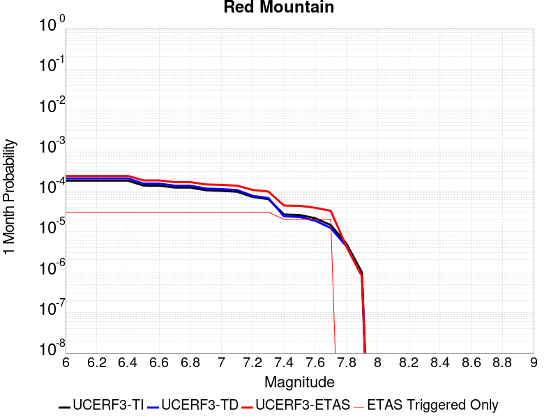 |  |  |

| Magnitude | 1 wk TI Prob | 1 wk TD Prob | 1 wk ETAS Prob | 1 wk ETAS/TD Gain | 1 wk ETAS Triggered Only | 1 mo TI Prob | 1 mo TD Prob | 1 mo ETAS Prob | 1 mo ETAS/TD Gain | 1 mo ETAS Triggered Only | 1 yr TI Prob | 1 yr TD Prob | 1 yr ETAS Prob | 1 yr ETAS/TD Gain | 1 yr ETAS Triggered Only | 10 yr TI Prob | 10 yr TD Prob | 10 yr ETAS Prob | 10 yr ETAS/TD Gain | 10 yr ETAS Triggered Only |
|-----|-----|-----|-----|-----|-----|-----|-----|-----|-----|-----|-----|-----|-----|-----|-----|-----|-----|-----|-----|-----|
| 6.0 | 4.1810763E-5 | 4.7591006E-5 | 6.8081834E-5 | 1.430561 | 2.0491803E-5 | 1.7917668E-4 | 2.0394645E-4 | 2.4492168E-4 | 1.2009118 | 4.0983607E-5 | 0.0021792934 | 0.0024803858 | 0.0025621497 | 1.0329642 | 8.196721E-5 | 0.021580452 | 0.02454463 | 0.024644574 | 1.004072 | 1.0245902E-4 |
| 6.1 | 4.1810763E-5 | 4.7591006E-5 | 6.8081834E-5 | 1.430561 | 2.0491803E-5 | 1.7917668E-4 | 2.0394645E-4 | 2.4492168E-4 | 1.2009118 | 4.0983607E-5 | 0.0021792934 | 0.0024803858 | 0.0025621497 | 1.0329642 | 8.196721E-5 | 0.021580452 | 0.02454463 | 0.024644574 | 1.004072 | 1.0245902E-4 |
| 6.2 | 4.1810763E-5 | 4.7591006E-5 | 6.8081834E-5 | 1.430561 | 2.0491803E-5 | 1.7917668E-4 | 2.0394645E-4 | 2.4492168E-4 | 1.2009118 | 4.0983607E-5 | 0.0021792934 | 0.0024803858 | 0.0025621497 | 1.0329642 | 8.196721E-5 | 0.021580452 | 0.02454463 | 0.024644574 | 1.004072 | 1.0245902E-4 |
| 6.3 | 4.1810763E-5 | 4.7591006E-5 | 6.8081834E-5 | 1.430561 | 2.0491803E-5 | 1.7917668E-4 | 2.0394645E-4 | 2.4492168E-4 | 1.2009118 | 4.0983607E-5 | 0.0021792934 | 0.0024803858 | 0.0025621497 | 1.0329642 | 8.196721E-5 | 0.021580452 | 0.02454463 | 0.024644574 | 1.004072 | 1.0245902E-4 |
| 6.4 | 4.1810763E-5 | 4.7591006E-5 | 6.8081834E-5 | 1.430561 | 2.0491803E-5 | 1.7917668E-4 | 2.0394645E-4 | 2.4492168E-4 | 1.2009118 | 4.0983607E-5 | 0.0021792934 | 0.0024803858 | 0.0025621497 | 1.0329642 | 8.196721E-5 | 0.021580452 | 0.02454463 | 0.024644574 | 1.004072 | 1.0245902E-4 |
| 6.5 | 3.154503E-5 | 3.5360477E-5 | 5.5851553E-5 | 1.579491 | 2.0491803E-5 | 1.3518598E-4 | 1.5153662E-4 | 1.9251401E-4 | 1.2704126 | 4.0983607E-5 | 0.0016446467 | 0.0018434891 | 0.0019048512 | 1.0332859 | 6.147541E-5 | 0.01632528 | 0.018291617 | 0.018372085 | 1.0043992 | 8.196721E-5 |
| 6.6 | 3.1535834E-5 | 3.5349858E-5 | 5.5840937E-5 | 1.5796651 | 2.0491803E-5 | 1.3514658E-4 | 1.5149111E-4 | 1.924685E-4 | 1.2704937 | 4.0983607E-5 | 0.0016441676 | 0.001842936 | 0.0019042982 | 1.0332959 | 6.147541E-5 | 0.01632056 | 0.018286178 | 0.018366646 | 1.0044005 | 8.196721E-5 |
| 6.7 | 2.8267326E-5 | 3.146999E-5 | 5.196115E-5 | 1.6511333 | 2.0491803E-5 | 1.2114006E-4 | 1.348649E-4 | 1.7584297E-4 | 1.3038454 | 4.0983607E-5 | 0.0014738824 | 0.0016408286 | 0.0017022031 | 1.0374047 | 6.147541E-5 | 0.014641452 | 0.016295899 | 0.01637653 | 1.004948 | 8.196721E-5 |
| 6.8 | 2.8212884E-5 | 3.1407875E-5 | 5.1899035E-5 | 1.6524211 | 2.0491803E-5 | 1.20906756E-4 | 1.3459871E-4 | 1.755768E-4 | 1.3044463 | 4.0983607E-5 | 0.0014710457 | 0.0016375926 | 0.0016989673 | 1.0374787 | 6.147541E-5 | 0.014613459 | 0.016264014 | 0.016344648 | 1.0049578 | 8.196721E-5 |
| 6.9 | 2.4227871E-5 | 2.6707517E-5 | 4.7198773E-5 | 1.7672467 | 2.0491803E-5 | 1.03829596E-4 | 1.1445619E-4 | 1.554351E-4 | 1.3580314 | 4.0983607E-5 | 0.0012633923 | 0.0013926893 | 0.001454079 | 1.04408 | 6.147541E-5 | 0.012562336 | 0.013847304 | 0.013928136 | 1.0058374 | 8.196721E-5 |
| 7.0 | 2.348524E-5 | 2.5836282E-5 | 4.6327554E-5 | 1.7931201 | 2.0491803E-5 | 1.0064714E-4 | 1.1072265E-4 | 1.5170172E-4 | 1.3701056 | 4.0983607E-5 | 0.0012246901 | 0.0013472902 | 0.0014086828 | 1.0455674 | 6.147541E-5 | 0.012179627 | 0.013398857 | 0.013479725 | 1.0060356 | 8.196721E-5 |
| 7.1 | 2.2311642E-5 | 2.4463316E-5 | 4.4954617E-5 | 1.8376338 | 2.0491803E-5 | 9.561782E-5 | 1.04839E-4 | 1.4581831E-4 | 1.3908786 | 4.0983607E-5 | 0.0011635252 | 0.0012757422 | 0.0013371392 | 1.0481265 | 6.147541E-5 | 0.01157452 | 0.012691703 | 0.01277263 | 1.0063764 | 8.196721E-5 |
| 7.2 | 1.6533986E-5 | 1.7670676E-5 | 3.8162118E-5 | 2.1596298 | 2.0491803E-5 | 7.085802E-5 | 7.572963E-5 | 1.1671013E-4 | 1.5411422 | 4.0983607E-5 | 8.623549E-4 | 9.2168164E-4 | 9.831004E-4 | 1.0666378 | 6.147541E-5 | 0.008590161 | 0.009184869 | 0.009266084 | 1.0088422 | 8.196721E-5 |
| 7.3 | 1.4703092E-5 | 1.5559806E-5 | 3.605129E-5 | 2.3169498 | 2.0491803E-5 | 6.301173E-5 | 6.6683526E-5 | 1.07664404E-4 | 1.6145576 | 4.0983607E-5 | 7.668978E-4 | 8.1163115E-4 | 8.730567E-4 | 1.0756816 | 6.147541E-5 | 0.0076425658 | 0.008092744 | 0.008174048 | 1.0100465 | 8.196721E-5 |
| 7.4 | 6.1331984E-6 | 5.52893E-6 | 2.602062E-5 | 4.706267 | 2.0491803E-5 | 2.6284872E-5 | 2.3695204E-5 | 4.418652E-5 | 1.8647876 | 2.0491803E-5 | 3.199713E-4 | 2.8845144E-4 | 3.0893733E-4 | 1.0710202 | 2.0491803E-5 | 0.0031951098 | 0.0028808247 | 0.0029216902 | 1.0141853 | 4.0983607E-5 |
| 7.5 | 5.954766E-6 | 5.338558E-6 | 2.5830252E-5 | 4.8384323 | 2.0491803E-5 | 2.5520176E-5 | 2.2879336E-5 | 4.337067E-5 | 1.8956263 | 2.0491803E-5 | 3.1066386E-4 | 2.7852083E-4 | 2.9900693E-4 | 1.0735532 | 2.0491803E-5 | 0.003102299 | 0.0027817716 | 0.0028226413 | 1.014692 | 4.0983607E-5 |
| 7.6 | 4.9726646E-6 | 4.315341E-6 | 2.4807056E-5 | 5.7485743 | 2.0491803E-5 | 2.1311245E-5 | 1.8494187E-5 | 3.8985614E-5 | 2.1079926 | 2.0491803E-5 | 2.5943352E-4 | 2.2514381E-4 | 2.45631E-4 | 1.090996 | 2.0491803E-5 | 0.0025913084 | 0.0022491917 | 0.0022696375 | 1.0090903 | 2.0491803E-5 |
| 7.7 | 3.3613894E-6 | 2.8526943E-6 | 2.3344439E-5 | 8.183295 | 2.0491803E-5 | 1.4405875E-5 | 1.2225777E-5 | 3.271733E-5 | 2.676094 | 2.0491803E-5 | 1.7537741E-4 | 1.4883894E-4 | 1.6932769E-4 | 1.1376572 | 2.0491803E-5 | 0.0017523908 | 0.0014874188 | 0.00150788 | 1.0137563 | 2.0491803E-5 |
| 7.8 | 1.1828961E-6 | 1.0122844E-6 | 1.0122844E-6 | 1.0 | 0.0 | 5.069545E-6 | 4.338355E-6 | 4.338355E-6 | 1.0 | 0.0 | 6.171996E-5 | 5.281822E-5 | 5.281822E-5 | 1.0 | 0.0 | 6.170282E-4 | 5.280596E-4 | 5.280596E-4 | 1.0 | 0.0 |
| 7.9 | 2.2967266E-7 | 1.8619119E-7 | 1.8619119E-7 | 1.0 | 0.0 | 9.843111E-7 | 7.9796195E-7 | 7.9796195E-7 | 1.0 | 0.0 | 1.19839215E-5 | 9.715147E-6 | 9.715147E-6 | 1.0 | 0.0 | 1.1983275E-4 | 9.714751E-5 | 9.714751E-5 | 1.0 | 0.0 |

## Death Valley (Fish Lake Valley)
*[(top)](#table-of-contents)*

| 1 Week | 1 Month | 1 Year | 10 Year |
|-----|-----|-----|-----|
|  |  | 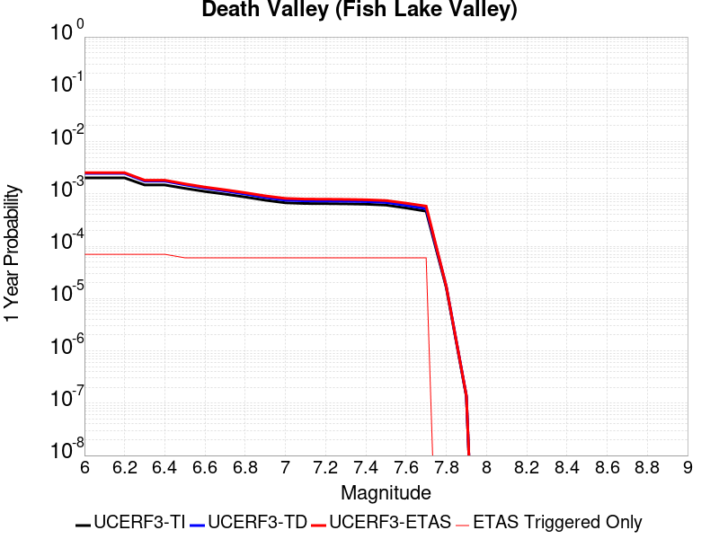 |  |

| Magnitude | 1 wk TI Prob | 1 wk TD Prob | 1 wk ETAS Prob | 1 wk ETAS/TD Gain | 1 wk ETAS Triggered Only | 1 mo TI Prob | 1 mo TD Prob | 1 mo ETAS Prob | 1 mo ETAS/TD Gain | 1 mo ETAS Triggered Only | 1 yr TI Prob | 1 yr TD Prob | 1 yr ETAS Prob | 1 yr ETAS/TD Gain | 1 yr ETAS Triggered Only | 10 yr TI Prob | 10 yr TD Prob | 10 yr ETAS Prob | 10 yr ETAS/TD Gain | 10 yr ETAS Triggered Only |
|-----|-----|-----|-----|-----|-----|-----|-----|-----|-----|-----|-----|-----|-----|-----|-----|-----|-----|-----|-----|-----|
| 6.0 | 3.872328E-5 | 4.7268895E-5 | 4.7268895E-5 | 1.0 | 0.0 | 1.6594635E-4 | 2.0256694E-4 | 2.0256694E-4 | 1.0 | 0.0 | 0.0020185246 | 0.0024636039 | 0.0024840452 | 1.0082973 | 2.0491803E-5 | 0.02000288 | 0.024388881 | 0.024528826 | 1.005738 | 1.4344262E-4 |
| 6.1 | 3.872328E-5 | 4.7268895E-5 | 4.7268895E-5 | 1.0 | 0.0 | 1.6594635E-4 | 2.0256694E-4 | 2.0256694E-4 | 1.0 | 0.0 | 0.0020185246 | 0.0024636039 | 0.0024840452 | 1.0082973 | 2.0491803E-5 | 0.02000288 | 0.024388881 | 0.024528826 | 1.005738 | 1.4344262E-4 |
| 6.2 | 3.872328E-5 | 4.7268895E-5 | 4.7268895E-5 | 1.0 | 0.0 | 1.6594635E-4 | 2.0256694E-4 | 2.0256694E-4 | 1.0 | 0.0 | 0.0020185246 | 0.0024636039 | 0.0024840452 | 1.0082973 | 2.0491803E-5 | 0.02000288 | 0.024388881 | 0.024528826 | 1.005738 | 1.4344262E-4 |
| 6.3 | 2.8356371E-5 | 3.3610693E-5 | 3.3610693E-5 | 1.0 | 0.0 | 1.2152165E-4 | 1.4403832E-4 | 1.4403832E-4 | 1.0 | 0.0 | 0.0014785219 | 0.001752335 | 0.0017727909 | 1.0116735 | 2.0491803E-5 | 0.014687235 | 0.01739221 | 0.017533157 | 1.0081041 | 1.4344262E-4 |
| 6.4 | 2.8356371E-5 | 3.3610693E-5 | 3.3610693E-5 | 1.0 | 0.0 | 1.2152165E-4 | 1.4403832E-4 | 1.4403832E-4 | 1.0 | 0.0 | 0.0014785219 | 0.001752335 | 0.0017727909 | 1.0116735 | 2.0491803E-5 | 0.014687235 | 0.01739221 | 0.017533157 | 1.0081041 | 1.4344262E-4 |
| 6.5 | 2.4448687E-5 | 2.8608209E-5 | 2.8608209E-5 | 1.0 | 0.0 | 1.0477588E-4 | 1.2260114E-4 | 1.2260114E-4 | 1.0 | 0.0 | 0.0012748998 | 0.0014916973 | 0.0015121585 | 1.0137167 | 2.0491803E-5 | 0.012676105 | 0.014821712 | 0.014963029 | 1.0095345 | 1.4344262E-4 |
| 6.6 | 2.1298161E-5 | 2.4660607E-5 | 2.4660607E-5 | 1.0 | 0.0 | 9.127464E-5 | 1.0568422E-4 | 1.0568422E-4 | 1.0 | 0.0 | 0.0011107022 | 0.0012859798 | 0.0013064452 | 1.0159143 | 2.0491803E-5 | 0.011051672 | 0.012788794 | 0.0129304025 | 1.0110729 | 1.4344262E-4 |
| 6.7 | 1.8959729E-5 | 2.178146E-5 | 2.178146E-5 | 1.0 | 0.0 | 8.125345E-5 | 9.3345916E-5 | 9.3345916E-5 | 1.0 | 0.0 | 9.888117E-4 | 0.0011359196 | 0.0011563881 | 1.0180193 | 2.0491803E-5 | 0.009844234 | 0.011303794 | 0.011445615 | 1.0125463 | 1.4344262E-4 |
| 6.8 | 1.6691629E-5 | 1.9018706E-5 | 1.9018706E-5 | 1.0 | 0.0 | 7.153359E-5 | 8.150629E-5 | 8.150629E-5 | 1.0 | 0.0 | 8.7057345E-4 | 9.919042E-4 | 0.0010123756 | 1.0206386 | 2.0491803E-5 | 0.008671708 | 0.009876527 | 0.010018553 | 1.0143801 | 1.4344262E-4 |
| 6.9 | 1.450505E-5 | 1.6389824E-5 | 1.6389824E-5 | 1.0 | 0.0 | 6.216302E-5 | 7.024026E-5 | 7.024026E-5 | 1.0 | 0.0 | 7.5657194E-4 | 8.548484E-4 | 8.7532273E-4 | 1.0239508 | 2.0491803E-5 | 0.007540013 | 0.008516532 | 0.008658754 | 1.0166994 | 1.4344262E-4 |
| 7.0 | 1.2940855E-5 | 1.453821E-5 | 1.453821E-5 | 1.0 | 0.0 | 5.545963E-5 | 6.230516E-5 | 6.230516E-5 | 1.0 | 0.0 | 6.750118E-4 | 7.583071E-4 | 7.787834E-4 | 1.0270026 | 2.0491803E-5 | 0.006729651 | 0.0075578135 | 0.007700172 | 1.0188359 | 1.4344262E-4 |
| 7.1 | 1.2544658E-5 | 1.4078437E-5 | 1.4078437E-5 | 1.0 | 0.0 | 5.3761712E-5 | 6.033479E-5 | 6.033479E-5 | 1.0 | 0.0 | 6.5435225E-4 | 7.343341E-4 | 7.5481087E-4 | 1.0278848 | 2.0491803E-5 | 0.006524288 | 0.0073196692 | 0.007462062 | 1.0194534 | 1.4344262E-4 |
| 7.2 | 1.2489416E-5 | 1.4015902E-5 | 1.4015902E-5 | 1.0 | 0.0 | 5.3524967E-5 | 6.00668E-5 | 6.00668E-5 | 1.0 | 0.0 | 6.514716E-4 | 7.310735E-4 | 7.515503E-4 | 1.0280093 | 2.0491803E-5 | 0.006495651 | 0.007287278 | 0.0074296747 | 1.0195405 | 1.4344262E-4 |
| 7.3 | 1.2368307E-5 | 1.3880038E-5 | 1.3880038E-5 | 1.0 | 0.0 | 5.3005948E-5 | 5.948455E-5 | 5.948455E-5 | 1.0 | 0.0 | 6.451563E-4 | 7.239894E-4 | 7.444663E-4 | 1.0282835 | 2.0491803E-5 | 0.0064328653 | 0.0072168987 | 0.007359306 | 1.0197325 | 1.4344262E-4 |
| 7.4 | 1.2161707E-5 | 1.3648089E-5 | 1.3648089E-5 | 1.0 | 0.0 | 5.212056E-5 | 5.8490532E-5 | 5.8490532E-5 | 1.0 | 0.0 | 6.3438306E-4 | 7.118952E-4 | 7.323724E-4 | 1.0287644 | 2.0491803E-5 | 0.006325751 | 0.0070967353 | 0.00723916 | 1.020069 | 1.4344262E-4 |
| 7.5 | 1.1707948E-5 | 1.314573E-5 | 1.314573E-5 | 1.0 | 0.0 | 5.0175953E-5 | 5.6337656E-5 | 5.6337656E-5 | 1.0 | 0.0 | 6.10721E-4 | 6.857007E-4 | 7.061784E-4 | 1.029864 | 2.0491803E-5 | 0.0060904534 | 0.0068364325 | 0.0069788946 | 1.0208386 | 1.4344262E-4 |
| 7.6 | 1.0319538E-5 | 1.157981E-5 | 1.157981E-5 | 1.0 | 0.0 | 4.4225842E-5 | 4.9626844E-5 | 4.9626844E-5 | 1.0 | 0.0 | 5.383166E-4 | 6.040445E-4 | 6.245239E-4 | 1.0339038 | 2.0491803E-5 | 0.0053701443 | 0.0060245576 | 0.006167136 | 1.0236663 | 1.4344262E-4 |
| 7.7 | 8.937764E-6 | 1.0022941E-5 | 1.0022941E-5 | 1.0 | 0.0 | 3.830414E-5 | 4.295478E-5 | 4.295478E-5 | 1.0 | 0.0 | 4.6625308E-4 | 5.2285404E-4 | 5.433351E-4 | 1.0391717 | 2.0491803E-5 | 0.0046527605 | 0.005216748 | 0.0053390577 | 1.0234455 | 1.2295082E-4 |
| 7.8 | 3.108007E-7 | 3.2846788E-7 | 3.2846788E-7 | 1.0 | 0.0 | 1.3320023E-6 | 1.4077187E-6 | 1.4077187E-6 | 1.0 | 0.0 | 1.6217007E-5 | 1.7138846E-5 | 1.7138846E-5 | 1.0 | 0.0 | 1.6215823E-4 | 1.713756E-4 | 1.713756E-4 | 1.0 | 0.0 |
| 7.9 | 2.5591178E-9 | 2.6696871E-9 | 2.6696871E-9 | 1.0 | 0.0 | 1.0967647E-8 | 1.1441516E-8 | 1.1441516E-8 | 1.0 | 0.0 | 1.335311E-7 | 1.3930045E-7 | 1.3930045E-7 | 1.0 | 0.0 | 1.3353102E-6 | 1.3930046E-6 | 1.3930046E-6 | 1.0 | 0.0 |

## Elsinore (Glen Ivy) rev
*[(top)](#table-of-contents)*

| 1 Week | 1 Month | 1 Year | 10 Year |
|-----|-----|-----|-----|
|  |  |  |  |

| Magnitude | 1 wk TI Prob | 1 wk TD Prob | 1 wk ETAS Prob | 1 wk ETAS/TD Gain | 1 wk ETAS Triggered Only | 1 mo TI Prob | 1 mo TD Prob | 1 mo ETAS Prob | 1 mo ETAS/TD Gain | 1 mo ETAS Triggered Only | 1 yr TI Prob | 1 yr TD Prob | 1 yr ETAS Prob | 1 yr ETAS/TD Gain | 1 yr ETAS Triggered Only | 10 yr TI Prob | 10 yr TD Prob | 10 yr ETAS Prob | 10 yr ETAS/TD Gain | 10 yr ETAS Triggered Only |
|-----|-----|-----|-----|-----|-----|-----|-----|-----|-----|-----|-----|-----|-----|-----|-----|-----|-----|-----|-----|-----|
| 6.0 | 1.6204086E-4 | 2.9362022E-4 | 2.9362022E-4 | 1.0 | 0.0 | 6.94276E-4 | 0.0012579202 | 0.0012783862 | 1.0162697 | 2.0491803E-5 | 0.008420097 | 0.015235162 | 0.015315881 | 1.0052981 | 8.196721E-5 | 0.081081145 | 0.13969512 | 0.1398009 | 1.0007572 | 1.2295082E-4 |
| 6.1 | 1.6204086E-4 | 2.9362022E-4 | 2.9362022E-4 | 1.0 | 0.0 | 6.94276E-4 | 0.0012579202 | 0.0012783862 | 1.0162697 | 2.0491803E-5 | 0.008420097 | 0.015235162 | 0.015315881 | 1.0052981 | 8.196721E-5 | 0.081081145 | 0.13969512 | 0.1398009 | 1.0007572 | 1.2295082E-4 |
| 6.2 | 1.6204086E-4 | 2.9362022E-4 | 2.9362022E-4 | 1.0 | 0.0 | 6.94276E-4 | 0.0012579202 | 0.0012783862 | 1.0162697 | 2.0491803E-5 | 0.008420097 | 0.015235162 | 0.015315881 | 1.0052981 | 8.196721E-5 | 0.081081145 | 0.13969512 | 0.1398009 | 1.0007572 | 1.2295082E-4 |
| 6.3 | 1.0111737E-4 | 1.7703768E-4 | 1.7703768E-4 | 1.0 | 0.0 | 4.332882E-4 | 7.58629E-4 | 7.58629E-4 | 1.0 | 0.0 | 0.005262531 | 0.0092178825 | 0.009238186 | 1.0022025 | 2.0491803E-5 | 0.0513964 | 0.08702082 | 0.087076955 | 1.0006449 | 6.147541E-5 |
| 6.4 | 1.0111737E-4 | 1.7703768E-4 | 1.7703768E-4 | 1.0 | 0.0 | 4.332882E-4 | 7.58629E-4 | 7.58629E-4 | 1.0 | 0.0 | 0.005262531 | 0.0092178825 | 0.009238186 | 1.0022025 | 2.0491803E-5 | 0.0513964 | 0.08702082 | 0.087076955 | 1.0006449 | 6.147541E-5 |
| 6.5 | 3.6624708E-5 | 4.639301E-5 | 4.639301E-5 | 1.0 | 0.0 | 1.569536E-4 | 1.9881407E-4 | 1.9881407E-4 | 1.0 | 0.0 | 0.001909235 | 0.0024182373 | 0.0024182373 | 1.0 | 0.0 | 0.01892915 | 0.023740914 | 0.023740914 | 1.0 | 0.0 |
| 6.6 | 2.5051324E-5 | 2.614908E-5 | 2.614908E-5 | 1.0 | 0.0 | 1.073584E-4 | 1.1206293E-4 | 1.1206293E-4 | 1.0 | 0.0 | 0.0013063047 | 0.0013635567 | 0.0013635567 | 1.0 | 0.0 | 0.012986525 | 0.013565315 | 0.013565315 | 1.0 | 0.0 |
| 6.7 | 2.2189772E-5 | 2.207403E-5 | 2.207403E-5 | 1.0 | 0.0 | 9.509556E-5 | 9.459976E-5 | 9.459976E-5 | 1.0 | 0.0 | 0.0011571734 | 0.0011511799 | 0.0011511799 | 1.0 | 0.0 | 0.011511663 | 0.011466023 | 0.011466023 | 1.0 | 0.0 |
| 6.8 | 1.6654378E-5 | 1.4438445E-5 | 1.4438445E-5 | 1.0 | 0.0 | 7.137396E-5 | 6.187761E-5 | 6.187761E-5 | 1.0 | 0.0 | 8.686314E-4 | 7.531047E-4 | 7.531047E-4 | 1.0 | 0.0 | 0.008652439 | 0.0075108632 | 0.0075108632 | 1.0 | 0.0 |
| 6.9 | 1.5042909E-5 | 1.23326745E-5 | 1.23326745E-5 | 1.0 | 0.0 | 6.446802E-5 | 5.2853266E-5 | 5.2853266E-5 | 1.0 | 0.0 | 7.8461546E-4 | 6.433017E-4 | 6.433017E-4 | 1.0 | 0.0 | 0.007818509 | 0.006418618 | 0.006418618 | 1.0 | 0.0 |
| 7.0 | 1.4361385E-5 | 1.14519435E-5 | 1.14519435E-5 | 1.0 | 0.0 | 6.154734E-5 | 4.907885E-5 | 4.907885E-5 | 1.0 | 0.0 | 7.490812E-4 | 5.973741E-4 | 5.973741E-4 | 1.0 | 0.0 | 0.007465612 | 0.0059616743 | 0.0059616743 | 1.0 | 0.0 |
| 7.1 | 1.3265571E-5 | 1.0245398E-5 | 1.0245398E-5 | 1.0 | 0.0 | 5.6851208E-5 | 4.3908123E-5 | 4.3908123E-5 | 1.0 | 0.0 | 6.919436E-4 | 5.344528E-4 | 5.344528E-4 | 1.0 | 0.0 | 0.006897931 | 0.0053350315 | 0.0053350315 | 1.0 | 0.0 |
| 7.2 | 1.1596403E-5 | 8.50544E-6 | 8.50544E-6 | 1.0 | 0.0 | 4.9697923E-5 | 3.6451387E-5 | 3.6451387E-5 | 1.0 | 0.0 | 6.049042E-4 | 4.4370696E-4 | 4.4370696E-4 | 1.0 | 0.0 | 0.006032603 | 0.004429626 | 0.004429626 | 1.0 | 0.0 |
| 7.3 | 1.0150827E-5 | 7.23907E-6 | 7.23907E-6 | 1.0 | 0.0 | 4.3502816E-5 | 3.1024225E-5 | 3.1024225E-5 | 1.0 | 0.0 | 5.2951806E-4 | 3.776559E-4 | 3.776559E-4 | 1.0 | 0.0 | 0.005282581 | 0.0037705277 | 0.0037705277 | 1.0 | 0.0 |
| 7.4 | 9.080705E-6 | 6.352785E-6 | 6.352785E-6 | 1.0 | 0.0 | 3.8916725E-5 | 2.7225946E-5 | 2.7225946E-5 | 1.0 | 0.0 | 4.7370812E-4 | 3.3142683E-4 | 3.3142683E-4 | 1.0 | 0.0 | 0.004726996 | 0.0033094764 | 0.0033094764 | 1.0 | 0.0 |
| 7.5 | 7.671649E-6 | 5.2258497E-6 | 5.2258497E-6 | 1.0 | 0.0 | 3.287808E-5 | 2.2396314E-5 | 2.2396314E-5 | 1.0 | 0.0 | 4.0021708E-4 | 2.7264224E-4 | 2.7264224E-4 | 1.0 | 0.0 | 0.0039949706 | 0.0027232026 | 0.0027232026 | 1.0 | 0.0 |
| 7.6 | 6.990086E-6 | 4.687739E-6 | 4.687739E-6 | 1.0 | 0.0 | 2.9957167E-5 | 2.0090161E-5 | 2.0090161E-5 | 1.0 | 0.0 | 3.6466747E-4 | 2.4457145E-4 | 2.4457145E-4 | 1.0 | 0.0 | 0.0036406964 | 0.002443139 | 0.002443139 | 1.0 | 0.0 |
| 7.7 | 4.163505E-6 | 2.3296475E-6 | 2.3296475E-6 | 1.0 | 0.0 | 1.7843471E-5 | 9.984169E-6 | 9.984169E-6 | 1.0 | 0.0 | 2.172226E-4 | 1.21551224E-4 | 1.21551224E-4 | 1.0 | 0.0 | 0.0021701038 | 0.0012149204 | 0.0012149204 | 1.0 | 0.0 |
| 7.8 | 2.2692414E-7 | 9.385943E-8 | 9.385943E-8 | 1.0 | 0.0 | 9.725317E-7 | 4.0225464E-7 | 4.0225464E-7 | 1.0 | 0.0 | 1.1840509E-5 | 4.8974425E-6 | 4.8974425E-6 | 1.0 | 0.0 | 1.1839878E-4 | 4.8973674E-5 | 4.8973674E-5 | 1.0 | 0.0 |
| 7.9 | 6.676829E-9 | 3.4399772E-9 | 3.4399772E-9 | 1.0 | 0.0 | 2.861498E-8 | 1.4742759E-8 | 1.4742759E-8 | 1.0 | 0.0 | 3.4838732E-7 | 1.7949307E-7 | 1.7949307E-7 | 1.0 | 0.0 | 3.4838679E-6 | 1.7949295E-6 | 1.7949295E-6 | 1.0 | 0.0 |

## Baker
*[(top)](#table-of-contents)*

| 1 Week | 1 Month | 1 Year | 10 Year |
|-----|-----|-----|-----|
|  |  | 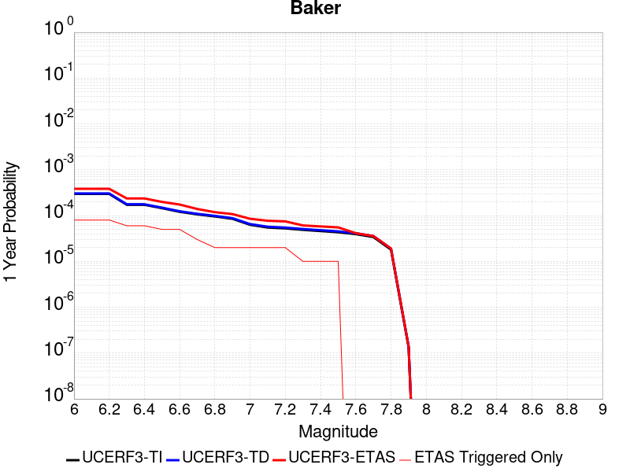 |  |

| Magnitude | 1 wk TI Prob | 1 wk TD Prob | 1 wk ETAS Prob | 1 wk ETAS/TD Gain | 1 wk ETAS Triggered Only | 1 mo TI Prob | 1 mo TD Prob | 1 mo ETAS Prob | 1 mo ETAS/TD Gain | 1 mo ETAS Triggered Only | 1 yr TI Prob | 1 yr TD Prob | 1 yr ETAS Prob | 1 yr ETAS/TD Gain | 1 yr ETAS Triggered Only | 10 yr TI Prob | 10 yr TD Prob | 10 yr ETAS Prob | 10 yr ETAS/TD Gain | 10 yr ETAS Triggered Only |
|-----|-----|-----|-----|-----|-----|-----|-----|-----|-----|-----|-----|-----|-----|-----|-----|-----|-----|-----|-----|-----|
| 6.0 | 5.695525E-6 | 5.834856E-6 | 4.6818222E-5 | 8.023887 | 4.0983607E-5 | 2.4409164E-5 | 2.500631E-5 | 6.598889E-5 | 2.6388896 | 4.0983607E-5 | 2.9714106E-4 | 3.044133E-4 | 3.8635556E-4 | 1.269181 | 8.196721E-5 | 0.0029674405 | 0.0030403587 | 0.003183365 | 1.047036 | 1.4344262E-4 |
| 6.1 | 5.695525E-6 | 5.834856E-6 | 4.6818222E-5 | 8.023887 | 4.0983607E-5 | 2.4409164E-5 | 2.500631E-5 | 6.598889E-5 | 2.6388896 | 4.0983607E-5 | 2.9714106E-4 | 3.044133E-4 | 3.8635556E-4 | 1.269181 | 8.196721E-5 | 0.0029674405 | 0.0030403587 | 0.003183365 | 1.047036 | 1.4344262E-4 |
| 6.2 | 5.695525E-6 | 5.834856E-6 | 4.6818222E-5 | 8.023887 | 4.0983607E-5 | 2.4409164E-5 | 2.500631E-5 | 6.598889E-5 | 2.6388896 | 4.0983607E-5 | 2.9714106E-4 | 3.044133E-4 | 3.8635556E-4 | 1.269181 | 8.196721E-5 | 0.0029674405 | 0.0030403587 | 0.003183365 | 1.047036 | 1.4344262E-4 |
| 6.3 | 3.2995713E-6 | 3.3836786E-6 | 4.4367145E-5 | 13.112104 | 4.0983607E-5 | 1.4140943E-5 | 1.4501402E-5 | 5.5484415E-5 | 3.8261414 | 4.0983607E-5 | 1.7215237E-4 | 1.7654074E-4 | 2.3800529E-4 | 1.3481607 | 6.147541E-5 | 0.0017201907 | 0.0017640521 | 0.001886786 | 1.069575 | 1.2295082E-4 |
| 6.4 | 3.2995713E-6 | 3.3836786E-6 | 4.4367145E-5 | 13.112104 | 4.0983607E-5 | 1.4140943E-5 | 1.4501402E-5 | 5.5484415E-5 | 3.8261414 | 4.0983607E-5 | 1.7215237E-4 | 1.7654074E-4 | 2.3800529E-4 | 1.3481607 | 6.147541E-5 | 0.0017201907 | 0.0017640521 | 0.001886786 | 1.069575 | 1.2295082E-4 |
| 6.5 | 2.782202E-6 | 2.8558507E-6 | 4.383934E-5 | 15.350712 | 4.0983607E-5 | 1.1923668E-5 | 1.2239304E-5 | 5.3222408E-5 | 4.348483 | 4.0983607E-5 | 1.4516099E-4 | 1.4900367E-4 | 2.1046991E-4 | 1.412515 | 6.147541E-5 | 0.001450662 | 0.0014890704 | 0.0016118381 | 1.0824459 | 1.2295082E-4 |
| 6.6 | 2.3163404E-6 | 2.380929E-6 | 4.3364438E-5 | 18.213243 | 4.0983607E-5 | 9.927136E-6 | 1.0203942E-5 | 5.118713E-5 | 5.0164075 | 4.0983607E-5 | 1.20856166E-4 | 1.2422612E-4 | 1.8569389E-4 | 1.4948056 | 6.147541E-5 | 0.0012079047 | 0.001241587 | 0.0013643851 | 1.0989043 | 1.2295082E-4 |
| 6.7 | 2.037056E-6 | 2.0965088E-6 | 2.2588269E-5 | 10.774231 | 2.0491803E-5 | 8.7302105E-6 | 8.985007E-6 | 2.9476627E-5 | 3.2806458 | 2.0491803E-5 | 1.0628513E-4 | 1.0938713E-4 | 1.5036625E-4 | 1.3746247 | 4.0983607E-5 | 0.0010623431 | 0.0010933491 | 0.0011752266 | 1.0748869 | 8.196721E-5 |
| 6.8 | 1.8356744E-6 | 1.8915364E-6 | 2.2383301E-5 | 11.833397 | 2.0491803E-5 | 7.867153E-6 | 8.10656E-6 | 2.8598197E-5 | 3.5277846 | 2.0491803E-5 | 9.577837E-5 | 9.869304E-5 | 1.396726E-4 | 1.4152224 | 4.0983607E-5 | 9.57371E-4 | 9.865061E-4 | 0.0010683924 | 1.0830064 | 8.196721E-5 |
| 6.9 | 1.6310546E-6 | 1.6832144E-6 | 2.2174983E-5 | 13.174188 | 2.0491803E-5 | 6.9902153E-6 | 7.213757E-6 | 2.7705411E-5 | 3.8406358 | 2.0491803E-5 | 8.510255E-5 | 8.782406E-5 | 1.2880407E-4 | 1.4666148 | 4.0983607E-5 | 8.5069967E-4 | 8.779048E-4 | 9.598001E-4 | 1.0932848 | 8.196721E-5 |
| 7.0 | 1.2058036E-6 | 1.2508729E-6 | 2.174265E-5 | 17.381983 | 2.0491803E-5 | 5.1677193E-6 | 5.3608724E-6 | 2.5852565E-5 | 4.822455 | 2.0491803E-5 | 6.291517E-5 | 6.526669E-5 | 1.0624762E-4 | 1.6278996 | 4.0983607E-5 | 6.289736E-4 | 6.5247755E-4 | 7.343913E-4 | 1.1255426 | 8.196721E-5 |
| 7.1 | 1.052382E-6 | 1.0951668E-6 | 2.1586948E-5 | 19.711105 | 2.0491803E-5 | 4.5102006E-6 | 4.693564E-6 | 2.518527E-5 | 5.3659167 | 2.0491803E-5 | 5.491031E-5 | 5.7142646E-5 | 9.812391E-5 | 1.7171748 | 4.0983607E-5 | 5.4896745E-4 | 5.712804E-4 | 6.5320084E-4 | 1.1433978 | 8.196721E-5 |
| 7.2 | 1.0067454E-6 | 1.0487769E-6 | 2.1540558E-5 | 20.538742 | 2.0491803E-5 | 4.3146156E-6 | 4.4947506E-6 | 2.4986462E-5 | 5.559032 | 2.0491803E-5 | 5.252918E-5 | 5.4722223E-5 | 9.570359E-5 | 1.748898 | 4.0983607E-5 | 5.251676E-4 | 5.4708833E-4 | 6.290107E-4 | 1.1497425 | 8.196721E-5 |
| 7.3 | 9.3596316E-7 | 9.76778E-7 | 2.146856E-5 | 21.978956 | 2.0491803E-5 | 4.0112645E-6 | 4.186185E-6 | 2.4677902E-5 | 5.895082 | 2.0491803E-5 | 4.8836053E-5 | 5.0965617E-5 | 7.145637E-5 | 1.4020506 | 2.0491803E-5 | 4.8825322E-4 | 5.095401E-4 | 5.7098415E-4 | 1.1205873 | 6.147541E-5 |
| 7.4 | 8.8117395E-7 | 9.2077187E-7 | 2.1412556E-5 | 23.255007 | 2.0491803E-5 | 3.7764542E-6 | 3.9461593E-6 | 2.443788E-5 | 6.192827 | 2.0491803E-5 | 4.5977362E-5 | 4.8043436E-5 | 6.853425E-5 | 1.4265062 | 2.0491803E-5 | 4.596785E-4 | 4.8033125E-4 | 5.417771E-4 | 1.127924 | 6.147541E-5 |
| 7.5 | 8.292386E-7 | 8.674649E-7 | 2.135925E-5 | 24.62261 | 2.0491803E-5 | 3.5538749E-6 | 3.7177015E-6 | 2.4209428E-5 | 6.5119343 | 2.0491803E-5 | 4.326757E-5 | 4.5262084E-5 | 6.575296E-5 | 1.4527161 | 2.0491803E-5 | 4.3259145E-4 | 4.5252938E-4 | 5.1397696E-4 | 1.135787 | 6.147541E-5 |
| 7.6 | 7.553842E-7 | 7.9145207E-7 | 7.9145207E-7 | 1.0 | 0.0 | 3.2373566E-6 | 3.3919332E-6 | 3.3919332E-6 | 1.0 | 0.0 | 3.9414106E-5 | 4.129601E-5 | 4.129601E-5 | 1.0 | 0.0 | 3.9407116E-4 | 4.1288408E-4 | 4.5385075E-4 | 1.0992208 | 4.0983607E-5 |
| 7.7 | 6.5285366E-7 | 6.852842E-7 | 6.852842E-7 | 1.0 | 0.0 | 2.797941E-6 | 2.9369291E-6 | 2.9369291E-6 | 1.0 | 0.0 | 3.40644E-5 | 3.5756533E-5 | 3.5756533E-5 | 1.0 | 0.0 | 3.405918E-4 | 3.5750846E-4 | 3.984774E-4 | 1.1145958 | 4.0983607E-5 |
| 7.8 | 3.4586725E-7 | 3.648288E-7 | 3.648288E-7 | 1.0 | 0.0 | 1.4822873E-6 | 1.5635511E-6 | 1.5635511E-6 | 1.0 | 0.0 | 1.80467E-5 | 1.9036073E-5 | 1.9036073E-5 | 1.0 | 0.0 | 1.8045233E-4 | 1.9034486E-4 | 1.9034486E-4 | 1.0 | 0.0 |
| 7.9 | 2.5591178E-9 | 2.6696871E-9 | 2.6696871E-9 | 1.0 | 0.0 | 1.0967647E-8 | 1.1441516E-8 | 1.1441516E-8 | 1.0 | 0.0 | 1.335311E-7 | 1.3930045E-7 | 1.3930045E-7 | 1.0 | 0.0 | 1.3353102E-6 | 1.3930046E-6 | 1.3930046E-6 | 1.0 | 0.0 |

## Santa Ynez (East)
*[(top)](#table-of-contents)*

| 1 Week | 1 Month | 1 Year | 10 Year |
|-----|-----|-----|-----|
|  |  |  |  |

| Magnitude | 1 wk TI Prob | 1 wk TD Prob | 1 wk ETAS Prob | 1 wk ETAS/TD Gain | 1 wk ETAS Triggered Only | 1 mo TI Prob | 1 mo TD Prob | 1 mo ETAS Prob | 1 mo ETAS/TD Gain | 1 mo ETAS Triggered Only | 1 yr TI Prob | 1 yr TD Prob | 1 yr ETAS Prob | 1 yr ETAS/TD Gain | 1 yr ETAS Triggered Only | 10 yr TI Prob | 10 yr TD Prob | 10 yr ETAS Prob | 10 yr ETAS/TD Gain | 10 yr ETAS Triggered Only |
|-----|-----|-----|-----|-----|-----|-----|-----|-----|-----|-----|-----|-----|-----|-----|-----|-----|-----|-----|-----|-----|
| 6.0 | 3.2269712E-5 | 3.6751346E-5 | 3.6751346E-5 | 1.0 | 0.0 | 1.3829143E-4 | 1.5749958E-4 | 1.9847674E-4 | 1.2601731 | 4.0983607E-5 | 0.0016823979 | 0.0019164606 | 0.0019982709 | 1.0426881 | 8.196721E-5 | 0.016697178 | 0.019056875 | 0.019177483 | 1.0063288 | 1.2295082E-4 |
| 6.1 | 3.2269712E-5 | 3.6751346E-5 | 3.6751346E-5 | 1.0 | 0.0 | 1.3829143E-4 | 1.5749958E-4 | 1.9847674E-4 | 1.2601731 | 4.0983607E-5 | 0.0016823979 | 0.0019164606 | 0.0019982709 | 1.0426881 | 8.196721E-5 | 0.016697178 | 0.019056875 | 0.019177483 | 1.0063288 | 1.2295082E-4 |
| 6.2 | 3.2269712E-5 | 3.6751346E-5 | 3.6751346E-5 | 1.0 | 0.0 | 1.3829143E-4 | 1.5749958E-4 | 1.9847674E-4 | 1.2601731 | 4.0983607E-5 | 0.0016823979 | 0.0019164606 | 0.0019982709 | 1.0426881 | 8.196721E-5 | 0.016697178 | 0.019056875 | 0.019177483 | 1.0063288 | 1.2295082E-4 |
| 6.3 | 3.2269712E-5 | 3.6751346E-5 | 3.6751346E-5 | 1.0 | 0.0 | 1.3829143E-4 | 1.5749958E-4 | 1.9847674E-4 | 1.2601731 | 4.0983607E-5 | 0.0016823979 | 0.0019164606 | 0.0019982709 | 1.0426881 | 8.196721E-5 | 0.016697178 | 0.019056875 | 0.019177483 | 1.0063288 | 1.2295082E-4 |
| 6.4 | 1.4404779E-5 | 1.4849569E-5 | 1.4849569E-5 | 1.0 | 0.0 | 6.1733306E-5 | 6.363949E-5 | 6.363949E-5 | 1.0 | 0.0 | 7.513438E-4 | 7.7454036E-4 | 8.154922E-4 | 1.0528724 | 4.0983607E-5 | 0.0074880854 | 0.007718959 | 0.0077799596 | 1.0079027 | 6.147541E-5 |
| 6.5 | 1.4404779E-5 | 1.4849569E-5 | 1.4849569E-5 | 1.0 | 0.0 | 6.1733306E-5 | 6.363949E-5 | 6.363949E-5 | 1.0 | 0.0 | 7.513438E-4 | 7.7454036E-4 | 8.154922E-4 | 1.0528724 | 4.0983607E-5 | 0.0074880854 | 0.007718959 | 0.0077799596 | 1.0079027 | 6.147541E-5 |
| 6.6 | 1.280208E-5 | 1.3012098E-5 | 1.3012098E-5 | 1.0 | 0.0 | 5.4864904E-5 | 5.5764955E-5 | 5.5764955E-5 | 1.0 | 0.0 | 6.6777546E-4 | 6.7872857E-4 | 7.1968435E-4 | 1.060342 | 4.0983607E-5 | 0.006657724 | 0.006766767 | 0.006827826 | 1.0090234 | 6.147541E-5 |
| 6.7 | 1.2457027E-5 | 1.2628613E-5 | 1.2628613E-5 | 1.0 | 0.0 | 5.3386164E-5 | 5.4121516E-5 | 5.4121516E-5 | 1.0 | 0.0 | 6.497827E-4 | 6.587319E-4 | 6.996885E-4 | 1.0621749 | 4.0983607E-5 | 0.00647886 | 0.0065679904 | 0.006629062 | 1.0092983 | 6.147541E-5 |
| 6.8 | 1.2095134E-5 | 1.2231055E-5 | 1.2231055E-5 | 1.0 | 0.0 | 5.1835254E-5 | 5.2417763E-5 | 5.2417763E-5 | 1.0 | 0.0 | 6.309115E-4 | 6.38001E-4 | 6.7895843E-4 | 1.0641966 | 4.0983607E-5 | 0.0062912325 | 0.0063618817 | 0.0064229663 | 1.0096016 | 6.147541E-5 |
| 6.9 | 1.1104036E-5 | 1.11574755E-5 | 1.11574755E-5 | 1.0 | 0.0 | 4.758786E-5 | 4.7816884E-5 | 4.7816884E-5 | 1.0 | 0.0 | 5.7922816E-4 | 5.820163E-4 | 6.2297605E-4 | 1.0703756 | 4.0983607E-5 | 0.005777207 | 0.005805066 | 0.0058661844 | 1.0105284 | 6.147541E-5 |
| 7.0 | 1.0577444E-5 | 1.0581802E-5 | 1.0581802E-5 | 1.0 | 0.0 | 4.5331115E-5 | 4.5349796E-5 | 4.5349796E-5 | 1.0 | 0.0 | 5.5176654E-4 | 5.519951E-4 | 5.929561E-4 | 1.0742054 | 4.0983607E-5 | 0.0055039856 | 0.0055063786 | 0.0055675153 | 1.0111029 | 6.147541E-5 |
| 7.1 | 1.0021775E-5 | 9.981102E-6 | 9.981102E-6 | 1.0 | 0.0 | 4.294976E-5 | 4.2775457E-5 | 4.2775457E-5 | 1.0 | 0.0 | 5.2278786E-4 | 5.2066793E-4 | 5.616302E-4 | 1.0786725 | 4.0983607E-5 | 0.0052155964 | 0.0051946132 | 0.005255769 | 1.011773 | 6.147541E-5 |
| 7.2 | 8.874109E-6 | 8.748894E-6 | 8.748894E-6 | 1.0 | 0.0 | 3.8031343E-5 | 3.749473E-5 | 3.749473E-5 | 1.0 | 0.0 | 4.629332E-4 | 4.564038E-4 | 4.7688626E-4 | 1.0448779 | 2.0491803E-5 | 0.0046197 | 0.0045547825 | 0.0045955796 | 1.0089569 | 4.0983607E-5 |
| 7.3 | 7.5504267E-6 | 7.505199E-6 | 7.505199E-6 | 1.0 | 0.0 | 3.235857E-5 | 3.216475E-5 | 3.216475E-5 | 1.0 | 0.0 | 3.9389438E-4 | 3.9153645E-4 | 3.9153645E-4 | 1.0 | 0.0 | 0.0039319694 | 0.003908573 | 0.003928985 | 1.0052223 | 2.0491803E-5 |
| 7.4 | 6.309394E-6 | 6.1832216E-6 | 6.1832216E-6 | 1.0 | 0.0 | 2.703998E-5 | 2.6499258E-5 | 2.6499258E-5 | 1.0 | 0.0 | 3.2916202E-4 | 3.2258165E-4 | 3.2258165E-4 | 1.0 | 0.0 | 0.003286749 | 0.0032212313 | 0.003241657 | 1.006341 | 2.0491803E-5 |
| 7.5 | 4.6103073E-6 | 4.440935E-6 | 4.440935E-6 | 1.0 | 0.0 | 1.975831E-5 | 1.9032443E-5 | 1.9032443E-5 | 1.0 | 0.0 | 2.4053088E-4 | 2.3169606E-4 | 2.3169606E-4 | 1.0 | 0.0 | 0.002402707 | 0.0023146144 | 0.0023350588 | 1.0088327 | 2.0491803E-5 |
| 7.6 | 1.2858658E-6 | 1.3008267E-6 | 1.3008267E-6 | 1.0 | 0.0 | 5.5108417E-6 | 5.5749606E-6 | 5.5749606E-6 | 1.0 | 0.0 | 6.7092435E-5 | 6.78731E-5 | 6.78731E-5 | 1.0 | 0.0 | 6.707218E-4 | 6.7853054E-4 | 6.7853054E-4 | 1.0 | 0.0 |
| 7.7 | 5.3302307E-7 | 5.612178E-7 | 5.612178E-7 | 1.0 | 0.0 | 2.2843826E-6 | 2.4052172E-6 | 2.4052172E-6 | 1.0 | 0.0 | 2.7812002E-5 | 2.9283161E-5 | 2.9283161E-5 | 1.0 | 0.0 | 2.7808524E-4 | 2.9279658E-4 | 2.9279658E-4 | 1.0 | 0.0 |
| 7.8 | 4.613933E-8 | 4.803036E-8 | 4.803036E-8 | 1.0 | 0.0 | 1.9773998E-7 | 2.0584437E-7 | 2.0584437E-7 | 1.0 | 0.0 | 2.4074816E-6 | 2.5061524E-6 | 2.5061524E-6 | 1.0 | 0.0 | 2.4074554E-5 | 2.5061252E-5 | 2.5061252E-5 | 1.0 | 0.0 |

## Dry Mountain
*[(top)](#table-of-contents)*

| 1 Week | 1 Month | 1 Year | 10 Year |
|-----|-----|-----|-----|
|  | 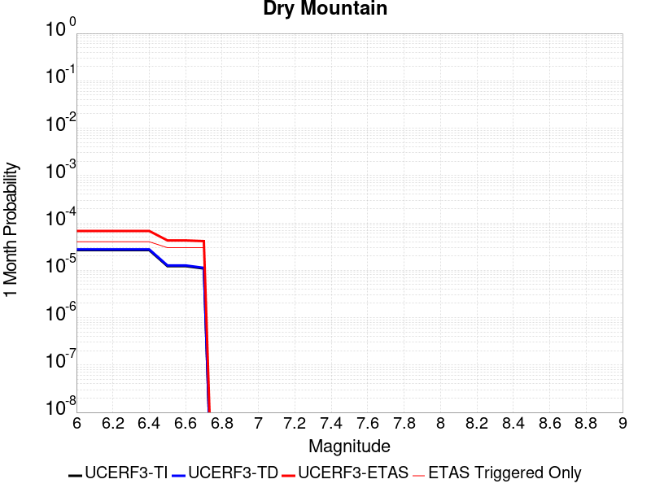 |  |  |

| Magnitude | 1 wk TI Prob | 1 wk TD Prob | 1 wk ETAS Prob | 1 wk ETAS/TD Gain | 1 wk ETAS Triggered Only | 1 mo TI Prob | 1 mo TD Prob | 1 mo ETAS Prob | 1 mo ETAS/TD Gain | 1 mo ETAS Triggered Only | 1 yr TI Prob | 1 yr TD Prob | 1 yr ETAS Prob | 1 yr ETAS/TD Gain | 1 yr ETAS Triggered Only | 10 yr TI Prob | 10 yr TD Prob | 10 yr ETAS Prob | 10 yr ETAS/TD Gain | 10 yr ETAS Triggered Only |
|-----|-----|-----|-----|-----|-----|-----|-----|-----|-----|-----|-----|-----|-----|-----|-----|-----|-----|-----|-----|-----|
| 6.0 | 6.222801E-6 | 6.439411E-6 | 4.7422753E-5 | 7.364455 | 4.0983607E-5 | 2.6668875E-5 | 2.7597274E-5 | 1.0956222E-4 | 3.970038 | 8.196721E-5 | 3.2464517E-4 | 3.359609E-4 | 4.5887043E-4 | 1.3658447 | 1.2295082E-4 | 0.0032417132 | 0.0033560924 | 0.0034990537 | 1.0425975 | 1.4344262E-4 |
| 6.1 | 6.222801E-6 | 6.439411E-6 | 4.7422753E-5 | 7.364455 | 4.0983607E-5 | 2.6668875E-5 | 2.7597274E-5 | 1.0956222E-4 | 3.970038 | 8.196721E-5 | 3.2464517E-4 | 3.359609E-4 | 4.5887043E-4 | 1.3658447 | 1.2295082E-4 | 0.0032417132 | 0.0033560924 | 0.0034990537 | 1.0425975 | 1.4344262E-4 |
| 6.2 | 6.222801E-6 | 6.439411E-6 | 4.7422753E-5 | 7.364455 | 4.0983607E-5 | 2.6668875E-5 | 2.7597274E-5 | 1.0956222E-4 | 3.970038 | 8.196721E-5 | 3.2464517E-4 | 3.359609E-4 | 4.5887043E-4 | 1.3658447 | 1.2295082E-4 | 0.0032417132 | 0.0033560924 | 0.0034990537 | 1.0425975 | 1.4344262E-4 |
| 6.3 | 6.222801E-6 | 6.439411E-6 | 4.7422753E-5 | 7.364455 | 4.0983607E-5 | 2.6668875E-5 | 2.7597274E-5 | 1.0956222E-4 | 3.970038 | 8.196721E-5 | 3.2464517E-4 | 3.359609E-4 | 4.5887043E-4 | 1.3658447 | 1.2295082E-4 | 0.0032417132 | 0.0033560924 | 0.0034990537 | 1.0425975 | 1.4344262E-4 |
| 6.4 | 6.222801E-6 | 6.439411E-6 | 4.7422753E-5 | 7.364455 | 4.0983607E-5 | 2.6668875E-5 | 2.7597274E-5 | 1.0956222E-4 | 3.970038 | 8.196721E-5 | 3.2464517E-4 | 3.359609E-4 | 4.5887043E-4 | 1.3658447 | 1.2295082E-4 | 0.0032417132 | 0.0033560924 | 0.0034990537 | 1.0425975 | 1.4344262E-4 |
| 6.5 | 2.8528623E-6 | 2.952182E-6 | 4.3935666E-5 | 14.882439 | 4.0983607E-5 | 1.22264955E-5 | 1.2652196E-5 | 7.412683E-5 | 5.858811 | 6.147541E-5 | 1.4884741E-4 | 1.5403831E-4 | 2.5648155E-4 | 1.6650504 | 1.0245902E-4 | 0.0014874774 | 0.0015401688 | 0.0016629301 | 1.0797065 | 1.2295082E-4 |
| 6.6 | 2.8528623E-6 | 2.952182E-6 | 4.3935666E-5 | 14.882439 | 4.0983607E-5 | 1.22264955E-5 | 1.2652196E-5 | 7.412683E-5 | 5.858811 | 6.147541E-5 | 1.4884741E-4 | 1.5403831E-4 | 2.5648155E-4 | 1.6650504 | 1.0245902E-4 | 0.0014874774 | 0.0015401688 | 0.0016629301 | 1.0797065 | 1.2295082E-4 |
| 6.7 | 2.541E-6 | 2.62937E-6 | 4.361287E-5 | 16.586813 | 4.0983607E-5 | 1.0889954E-5 | 1.12687285E-5 | 7.2743445E-5 | 6.4553375 | 6.147541E-5 | 1.3257713E-4 | 1.3719677E-4 | 2.3964173E-4 | 1.746701 | 1.0245902E-4 | 0.0013249806 | 0.0013719677 | 0.0014742862 | 1.0745779 | 1.0245902E-4 |

## Owens Valley
*[(top)](#table-of-contents)*

| 1 Week | 1 Month | 1 Year | 10 Year |
|-----|-----|-----|-----|
|  |  |  |  |

| Magnitude | 1 wk TI Prob | 1 wk TD Prob | 1 wk ETAS Prob | 1 wk ETAS/TD Gain | 1 wk ETAS Triggered Only | 1 mo TI Prob | 1 mo TD Prob | 1 mo ETAS Prob | 1 mo ETAS/TD Gain | 1 mo ETAS Triggered Only | 1 yr TI Prob | 1 yr TD Prob | 1 yr ETAS Prob | 1 yr ETAS/TD Gain | 1 yr ETAS Triggered Only | 10 yr TI Prob | 10 yr TD Prob | 10 yr ETAS Prob | 10 yr ETAS/TD Gain | 10 yr ETAS Triggered Only |
|-----|-----|-----|-----|-----|-----|-----|-----|-----|-----|-----|-----|-----|-----|-----|-----|-----|-----|-----|-----|-----|
| 6.0 | 4.83821E-5 | 3.627396E-6 | 2.4119125E-5 | 6.649157 | 2.0491803E-5 | 2.0733538E-4 | 1.5545897E-5 | 3.603738E-5 | 2.3181283 | 2.0491803E-5 | 0.002521386 | 1.8925584E-4 | 2.7120754E-4 | 1.4330207 | 8.196721E-5 | 0.024929691 | 0.0019254381 | 0.0020686046 | 1.0743552 | 1.4344262E-4 |
| 6.1 | 4.83821E-5 | 3.627396E-6 | 2.4119125E-5 | 6.649157 | 2.0491803E-5 | 2.0733538E-4 | 1.5545897E-5 | 3.603738E-5 | 2.3181283 | 2.0491803E-5 | 0.002521386 | 1.8925584E-4 | 2.7120754E-4 | 1.4330207 | 8.196721E-5 | 0.024929691 | 0.0019254381 | 0.0020686046 | 1.0743552 | 1.4344262E-4 |
| 6.2 | 4.83821E-5 | 3.627396E-6 | 2.4119125E-5 | 6.649157 | 2.0491803E-5 | 2.0733538E-4 | 1.5545897E-5 | 3.603738E-5 | 2.3181283 | 2.0491803E-5 | 0.002521386 | 1.8925584E-4 | 2.7120754E-4 | 1.4330207 | 8.196721E-5 | 0.024929691 | 0.0019254381 | 0.0020686046 | 1.0743552 | 1.4344262E-4 |
| 6.3 | 3.953008E-5 | 3.1558448E-6 | 3.1558448E-6 | 1.0 | 0.0 | 1.6940363E-4 | 1.3524983E-5 | 1.3524983E-5 | 1.0 | 0.0 | 0.002060538 | 1.6465495E-4 | 2.2612025E-4 | 1.3732976 | 6.147541E-5 | 0.020415364 | 0.0016594394 | 0.0017617284 | 1.0616407 | 1.0245902E-4 |
| 6.4 | 3.953008E-5 | 3.1558448E-6 | 3.1558448E-6 | 1.0 | 0.0 | 1.6940363E-4 | 1.3524983E-5 | 1.3524983E-5 | 1.0 | 0.0 | 0.002060538 | 1.6465495E-4 | 2.2612025E-4 | 1.3732976 | 6.147541E-5 | 0.020415364 | 0.0016594394 | 0.0017617284 | 1.0616407 | 1.0245902E-4 |
| 6.5 | 3.457342E-5 | 2.9718876E-6 | 2.9718876E-6 | 1.0 | 0.0 | 1.4816338E-4 | 1.2736603E-5 | 1.2736603E-5 | 1.0 | 0.0 | 0.0018023965 | 1.5505782E-4 | 2.1652368E-4 | 1.3964062 | 6.147541E-5 | 0.017878477 | 0.0015558768 | 0.0016581764 | 1.0657505 | 1.0245902E-4 |
| 6.6 | 3.1127765E-5 | 2.8746979E-6 | 2.8746979E-6 | 1.0 | 0.0 | 1.3339789E-4 | 1.232008E-5 | 1.232008E-5 | 1.0 | 0.0 | 0.0016229092 | 1.4998733E-4 | 2.1145352E-4 | 1.4098092 | 6.147541E-5 | 0.016111081 | 0.001501365 | 0.0016036702 | 1.0681415 | 1.0245902E-4 |
| 6.7 | 2.806885E-5 | 2.810566E-6 | 2.810566E-6 | 1.0 | 0.0 | 1.2028952E-4 | 1.2045231E-5 | 1.2045231E-5 | 1.0 | 0.0 | 0.001463541 | 1.4664151E-4 | 2.081079E-4 | 1.419161 | 6.147541E-5 | 0.014539397 | 0.001465831 | 0.0015681398 | 1.0697958 | 1.0245902E-4 |
| 6.8 | 2.524524E-5 | 2.235501E-6 | 2.235501E-6 | 1.0 | 0.0 | 1.0818939E-4 | 9.5806845E-6 | 9.5806845E-6 | 1.0 | 0.0 | 0.0013164099 | 1.1663889E-4 | 1.7810713E-4 | 1.5269961 | 6.147541E-5 | 0.01308639 | 0.0011660501 | 0.0012683896 | 1.0877659 | 1.0245902E-4 |
| 6.9 | 2.2704568E-5 | 1.6082656E-6 | 1.6082656E-6 | 1.0 | 0.0 | 9.730166E-5 | 6.8925488E-6 | 6.8925488E-6 | 1.0 | 0.0 | 0.0011840039 | 8.391357E-5 | 1.4538382E-4 | 1.7325424 | 6.147541E-5 | 0.011777153 | 8.390308E-4 | 9.4140385E-4 | 1.1220134 | 1.0245902E-4 |
| 7.0 | 2.0871712E-5 | 1.5396373E-6 | 1.5396373E-6 | 1.0 | 0.0 | 8.944713E-5 | 6.598429E-6 | 6.598429E-6 | 1.0 | 0.0 | 0.0010884746 | 8.033293E-5 | 1.4180341E-4 | 1.7651964 | 6.147541E-5 | 0.010831586 | 8.0321095E-4 | 9.055876E-4 | 1.1274593 | 1.0245902E-4 |
| 7.1 | 1.944928E-5 | 1.3864965E-6 | 1.3864965E-6 | 1.0 | 0.0 | 8.335139E-5 | 5.942114E-6 | 5.942114E-6 | 1.0 | 0.0 | 0.0010143308 | 7.2342846E-5 | 1.3381381E-4 | 1.8497173 | 6.147541E-5 | 0.010097133 | 7.233511E-4 | 8.25736E-4 | 1.1415424 | 1.0245902E-4 |
| 7.2 | 1.7876306E-5 | 1.2489834E-6 | 1.2489834E-6 | 1.0 | 0.0 | 7.6610486E-5 | 5.3527747E-6 | 5.3527747E-6 | 1.0 | 0.0 | 9.3233347E-4 | 6.516809E-5 | 1.266395E-4 | 1.9432746 | 6.147541E-5 | 0.009284316 | 6.516274E-4 | 7.5401965E-4 | 1.1571331 | 1.0245902E-4 |
| 7.3 | 1.2618672E-5 | 1.1115851E-6 | 1.1115851E-6 | 1.0 | 0.0 | 5.40789E-5 | 4.763928E-6 | 4.763928E-6 | 1.0 | 0.0 | 6.582117E-4 | 5.799928E-5 | 1.1947113E-4 | 2.0598724 | 6.147541E-5 | 0.0065626553 | 5.799741E-4 | 6.823737E-4 | 1.1765589 | 1.0245902E-4 |
| 7.4 | 7.4874442E-6 | 8.549184E-7 | 8.549184E-7 | 1.0 | 0.0 | 3.208865E-5 | 3.663931E-6 | 3.663931E-6 | 1.0 | 0.0 | 3.906093E-4 | 4.4607452E-5 | 1.0608012E-4 | 2.3780806 | 6.147541E-5 | 0.003899234 | 4.4607726E-4 | 5.4849056E-4 | 1.2295865 | 1.0245902E-4 |
| 7.5 | 2.4734156E-6 | 6.068976E-7 | 6.068976E-7 | 1.0 | 0.0 | 1.060031E-5 | 2.6009868E-6 | 2.6009868E-6 | 1.0 | 0.0 | 1.2905113E-4 | 3.1666557E-5 | 7.2648865E-5 | 2.2941825 | 4.0983607E-5 | 0.0012897621 | 3.1662078E-4 | 3.9856206E-4 | 1.2587993 | 8.196721E-5 |
| 7.6 | 1.1328841E-6 | 3.1967096E-7 | 3.1967096E-7 | 1.0 | 0.0 | 4.8552088E-6 | 1.3700177E-6 | 1.3700177E-6 | 1.0 | 0.0 | 5.9110564E-5 | 1.6679838E-5 | 3.71713E-5 | 2.2285168 | 2.0491803E-5 | 5.9094845E-4 | 1.6678606E-4 | 2.2825121E-4 | 1.3685269 | 6.147541E-5 |
| 7.7 | 4.8613185E-7 | 8.965384E-8 | 8.965384E-8 | 1.0 | 0.0 | 2.0834207E-6 | 3.842307E-7 | 3.842307E-7 | 1.0 | 0.0 | 2.536535E-5 | 4.677999E-6 | 4.677999E-6 | 1.0 | 0.0 | 2.5362454E-4 | 4.6779078E-5 | 4.6779078E-5 | 1.0 | 0.0 |

## Pinto Mtn
*[(top)](#table-of-contents)*

| 1 Week | 1 Month | 1 Year | 10 Year |
|-----|-----|-----|-----|
|  |  |  | 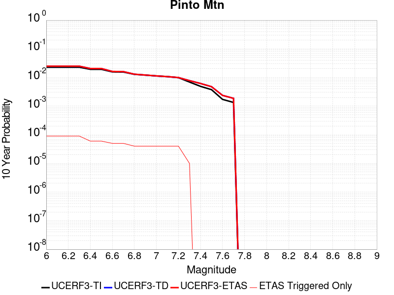 |

| Magnitude | 1 wk TI Prob | 1 wk TD Prob | 1 wk ETAS Prob | 1 wk ETAS/TD Gain | 1 wk ETAS Triggered Only | 1 mo TI Prob | 1 mo TD Prob | 1 mo ETAS Prob | 1 mo ETAS/TD Gain | 1 mo ETAS Triggered Only | 1 yr TI Prob | 1 yr TD Prob | 1 yr ETAS Prob | 1 yr ETAS/TD Gain | 1 yr ETAS Triggered Only | 10 yr TI Prob | 10 yr TD Prob | 10 yr ETAS Prob | 10 yr ETAS/TD Gain | 10 yr ETAS Triggered Only |
|-----|-----|-----|-----|-----|-----|-----|-----|-----|-----|-----|-----|-----|-----|-----|-----|-----|-----|-----|-----|-----|
| 6.0 | 4.4194956E-5 | 4.785523E-5 | 4.785523E-5 | 1.0 | 0.0 | 1.893932E-4 | 2.0507864E-4 | 2.0507864E-4 | 1.0 | 0.0 | 0.0023034236 | 0.002494138 | 0.0025350193 | 1.016391 | 4.0983607E-5 | 0.022796938 | 0.024678964 | 0.024798881 | 1.0048591 | 1.2295082E-4 |
| 6.1 | 4.4194956E-5 | 4.785523E-5 | 4.785523E-5 | 1.0 | 0.0 | 1.893932E-4 | 2.0507864E-4 | 2.0507864E-4 | 1.0 | 0.0 | 0.0023034236 | 0.002494138 | 0.0025350193 | 1.016391 | 4.0983607E-5 | 0.022796938 | 0.024678964 | 0.024798881 | 1.0048591 | 1.2295082E-4 |
| 6.2 | 4.4194956E-5 | 4.785523E-5 | 4.785523E-5 | 1.0 | 0.0 | 1.893932E-4 | 2.0507864E-4 | 2.0507864E-4 | 1.0 | 0.0 | 0.0023034236 | 0.002494138 | 0.0025350193 | 1.016391 | 4.0983607E-5 | 0.022796938 | 0.024678964 | 0.024798881 | 1.0048591 | 1.2295082E-4 |
| 6.3 | 4.4194956E-5 | 4.785523E-5 | 4.785523E-5 | 1.0 | 0.0 | 1.893932E-4 | 2.0507864E-4 | 2.0507864E-4 | 1.0 | 0.0 | 0.0023034236 | 0.002494138 | 0.0025350193 | 1.016391 | 4.0983607E-5 | 0.022796938 | 0.024678964 | 0.024798881 | 1.0048591 | 1.2295082E-4 |
| 6.4 | 3.729929E-5 | 3.960458E-5 | 3.960458E-5 | 1.0 | 0.0 | 1.5984432E-4 | 1.697234E-4 | 1.697234E-4 | 1.0 | 0.0 | 0.0019443673 | 0.0020645177 | 0.0021054165 | 1.0198104 | 4.0983607E-5 | 0.019274427 | 0.020463403 | 0.02052362 | 1.0029427 | 6.147541E-5 |
| 6.5 | 3.729929E-5 | 3.960458E-5 | 3.960458E-5 | 1.0 | 0.0 | 1.5984432E-4 | 1.697234E-4 | 1.697234E-4 | 1.0 | 0.0 | 0.0019443673 | 0.0020645177 | 0.0021054165 | 1.0198104 | 4.0983607E-5 | 0.019274427 | 0.020463403 | 0.02052362 | 1.0029427 | 6.147541E-5 |
| 6.6 | 3.0204548E-5 | 3.1206488E-5 | 3.1206488E-5 | 1.0 | 0.0 | 1.2944164E-4 | 1.3373543E-4 | 1.3373543E-4 | 1.0 | 0.0 | 0.0015748127 | 0.0016270474 | 0.0016679644 | 1.0251479 | 4.0983607E-5 | 0.015636992 | 0.01615522 | 0.016215703 | 1.0037438 | 6.147541E-5 |
| 6.7 | 2.9857754E-5 | 3.0815863E-5 | 3.0815863E-5 | 1.0 | 0.0 | 1.2795553E-4 | 1.320615E-4 | 1.320615E-4 | 1.0 | 0.0 | 0.0015567453 | 0.0016066976 | 0.0016476153 | 1.025467 | 4.0983607E-5 | 0.015458848 | 0.015954657 | 0.016015152 | 1.0037917 | 6.147541E-5 |
| 6.8 | 2.4819734E-5 | 2.5010428E-5 | 2.5010428E-5 | 1.0 | 0.0 | 1.0636595E-4 | 1.0718327E-4 | 1.0718327E-4 | 1.0 | 0.0 | 0.0012942362 | 0.0013041968 | 0.0013451269 | 1.0313834 | 4.0983607E-5 | 0.012867244 | 0.012967796 | 0.013028474 | 1.0046792 | 6.147541E-5 |
| 6.9 | 2.331124E-5 | 2.3338684E-5 | 2.3338684E-5 | 1.0 | 0.0 | 9.990149E-5 | 1.00019206E-4 | 1.00019206E-4 | 1.0 | 0.0 | 0.001215622 | 0.001217074 | 0.0012580077 | 1.0336329 | 4.0983607E-5 | 0.012089936 | 0.012106278 | 0.012167009 | 1.0050164 | 6.147541E-5 |
| 7.0 | 2.1818534E-5 | 2.1761793E-5 | 2.1761793E-5 | 1.0 | 0.0 | 9.3504656E-5 | 9.32616E-5 | 9.32616E-5 | 1.0 | 0.0 | 0.0011378246 | 0.0011348884 | 0.0011758255 | 1.0360714 | 4.0983607E-5 | 0.011320163 | 0.01129303 | 0.011353811 | 1.0053822 | 6.147541E-5 |
| 7.1 | 2.066081E-5 | 2.054142E-5 | 2.054142E-5 | 1.0 | 0.0 | 8.854332E-5 | 8.80318E-5 | 8.80318E-5 | 1.0 | 0.0 | 0.0010774818 | 0.0010712796 | 0.0011122194 | 1.0382158 | 4.0983607E-5 | 0.010722724 | 0.010663206 | 0.010724026 | 1.0057037 | 6.147541E-5 |
| 7.2 | 1.8990233E-5 | 1.9054683E-5 | 1.9054683E-5 | 1.0 | 0.0 | 8.138417E-5 | 8.166048E-5 | 8.166048E-5 | 1.0 | 0.0 | 9.904018E-4 | 9.937823E-4 | 0.0010347251 | 1.0411991 | 4.0983607E-5 | 0.009859995 | 0.0098953815 | 0.009956248 | 1.0061511 | 6.147541E-5 |
| 7.3 | 1.3335872E-5 | 1.4907276E-5 | 1.4907276E-5 | 1.0 | 0.0 | 5.7152483E-5 | 6.388683E-5 | 6.388683E-5 | 1.0 | 0.0 | 6.956093E-4 | 7.775574E-4 | 7.775574E-4 | 1.0 | 0.0 | 0.006934359 | 0.0077496674 | 0.0077700005 | 1.0026237 | 2.0491803E-5 |
| 7.4 | 9.414066E-6 | 1.186147E-5 | 1.186147E-5 | 1.0 | 0.0 | 4.0345374E-5 | 5.0833933E-5 | 5.0833933E-5 | 1.0 | 0.0 | 4.910942E-4 | 6.187368E-4 | 6.187368E-4 | 1.0 | 0.0 | 0.0049001034 | 0.0061710896 | 0.0061710896 | 1.0 | 0.0 |
| 7.5 | 7.2101157E-6 | 9.158733E-6 | 9.158733E-6 | 1.0 | 0.0 | 3.090013E-5 | 3.9251165E-5 | 3.9251165E-5 | 1.0 | 0.0 | 3.7614413E-4 | 4.7778594E-4 | 4.7778594E-4 | 1.0 | 0.0 | 0.0037550807 | 0.0047683627 | 0.0047683627 | 1.0 | 0.0 |
| 7.6 | 3.296375E-6 | 4.546122E-6 | 4.546122E-6 | 1.0 | 0.0 | 1.4127245E-5 | 1.9483241E-5 | 1.9483241E-5 | 1.0 | 0.0 | 1.7198564E-4 | 2.3718402E-4 | 2.3718402E-4 | 1.0 | 0.0 | 0.0017185259 | 0.0023694462 | 0.0023694462 | 1.0 | 0.0 |
| 7.7 | 2.5741092E-6 | 3.5850085E-6 | 3.5850085E-6 | 1.0 | 0.0 | 1.103185E-5 | 1.536424E-5 | 1.536424E-5 | 1.0 | 0.0 | 1.3430449E-4 | 1.8704488E-4 | 1.8704488E-4 | 1.0 | 0.0 | 0.0013422335 | 0.0018690043 | 0.0018690043 | 1.0 | 0.0 |

## San Andreas (North Branch Mill Creek)
*[(top)](#table-of-contents)*

| 1 Week | 1 Month | 1 Year | 10 Year |
|-----|-----|-----|-----|
|  |  |  |  |

| Magnitude | 1 wk TI Prob | 1 wk TD Prob | 1 wk ETAS Prob | 1 wk ETAS/TD Gain | 1 wk ETAS Triggered Only | 1 mo TI Prob | 1 mo TD Prob | 1 mo ETAS Prob | 1 mo ETAS/TD Gain | 1 mo ETAS Triggered Only | 1 yr TI Prob | 1 yr TD Prob | 1 yr ETAS Prob | 1 yr ETAS/TD Gain | 1 yr ETAS Triggered Only | 10 yr TI Prob | 10 yr TD Prob | 10 yr ETAS Prob | 10 yr ETAS/TD Gain | 10 yr ETAS Triggered Only |
|-----|-----|-----|-----|-----|-----|-----|-----|-----|-----|-----|-----|-----|-----|-----|-----|-----|-----|-----|-----|-----|
| 6.0 | 1.3461156E-5 | 2.3506776E-5 | 2.3506776E-5 | 1.0 | 0.0 | 5.7689394E-5 | 1.0073945E-4 | 1.0073945E-4 | 1.0 | 0.0 | 7.02142E-4 | 0.0012258161 | 0.0013281495 | 1.0834819 | 1.0245902E-4 | 0.0069992766 | 0.012233093 | 0.01235454 | 1.0099277 | 1.2295082E-4 |
| 6.1 | 1.3461156E-5 | 2.3506776E-5 | 2.3506776E-5 | 1.0 | 0.0 | 5.7689394E-5 | 1.0073945E-4 | 1.0073945E-4 | 1.0 | 0.0 | 7.02142E-4 | 0.0012258161 | 0.0013281495 | 1.0834819 | 1.0245902E-4 | 0.0069992766 | 0.012233093 | 0.01235454 | 1.0099277 | 1.2295082E-4 |
| 6.2 | 1.3461156E-5 | 2.3506776E-5 | 2.3506776E-5 | 1.0 | 0.0 | 5.7689394E-5 | 1.0073945E-4 | 1.0073945E-4 | 1.0 | 0.0 | 7.02142E-4 | 0.0012258161 | 0.0013281495 | 1.0834819 | 1.0245902E-4 | 0.0069992766 | 0.012233093 | 0.01235454 | 1.0099277 | 1.2295082E-4 |
| 6.3 | 1.3461156E-5 | 2.3506776E-5 | 2.3506776E-5 | 1.0 | 0.0 | 5.7689394E-5 | 1.0073945E-4 | 1.0073945E-4 | 1.0 | 0.0 | 7.02142E-4 | 0.0012258161 | 0.0013281495 | 1.0834819 | 1.0245902E-4 | 0.0069992766 | 0.012233093 | 0.01235454 | 1.0099277 | 1.2295082E-4 |
| 6.4 | 1.3461156E-5 | 2.3506776E-5 | 2.3506776E-5 | 1.0 | 0.0 | 5.7689394E-5 | 1.0073945E-4 | 1.0073945E-4 | 1.0 | 0.0 | 7.02142E-4 | 0.0012258161 | 0.0013281495 | 1.0834819 | 1.0245902E-4 | 0.0069992766 | 0.012233093 | 0.01235454 | 1.0099277 | 1.2295082E-4 |
| 6.5 | 1.3450706E-5 | 2.3495735E-5 | 2.3495735E-5 | 1.0 | 0.0 | 5.764461E-5 | 1.0069214E-4 | 1.0069214E-4 | 1.0 | 0.0 | 7.0159714E-4 | 0.0012252406 | 0.0013275741 | 1.0835211 | 1.0245902E-4 | 0.006993862 | 0.012227403 | 0.01234885 | 1.0099324 | 1.2295082E-4 |
| 6.6 | 1.3074523E-5 | 2.3110017E-5 | 2.3110017E-5 | 1.0 | 0.0 | 5.6032466E-5 | 9.9039185E-5 | 9.9039185E-5 | 1.0 | 0.0 | 6.8198174E-4 | 0.0012051383 | 0.0013074739 | 1.084916 | 1.0245902E-4 | 0.006798926 | 0.0120285675 | 0.012150039 | 1.0100986 | 1.2295082E-4 |
| 6.7 | 1.3050216E-5 | 2.3085311E-5 | 2.3085311E-5 | 1.0 | 0.0 | 5.59283E-5 | 9.893332E-5 | 9.893332E-5 | 1.0 | 0.0 | 6.8071426E-4 | 0.0012038508 | 0.0013061864 | 1.085007 | 1.0245902E-4 | 0.0067863287 | 0.012015832 | 0.012137305 | 1.0101094 | 1.2295082E-4 |
| 6.8 | 1.29049395E-5 | 2.293372E-5 | 2.293372E-5 | 1.0 | 0.0 | 5.530571E-5 | 9.828369E-5 | 9.828369E-5 | 1.0 | 0.0 | 6.73139E-4 | 0.0011959502 | 0.0012982867 | 1.0855691 | 1.0245902E-4 | 0.0067110364 | 0.011937677 | 0.01205916 | 1.0101764 | 1.2295082E-4 |
| 6.9 | 1.2867369E-5 | 2.2893122E-5 | 2.2893122E-5 | 1.0 | 0.0 | 5.51447E-5 | 9.810971E-5 | 9.810971E-5 | 1.0 | 0.0 | 6.711799E-4 | 0.0011938344 | 0.0012961711 | 1.085721 | 1.0245902E-4 | 0.006691564 | 0.011916745 | 0.012038231 | 1.0101945 | 1.2295082E-4 |
| 7.0 | 1.2495996E-5 | 2.2293154E-5 | 2.2293154E-5 | 1.0 | 0.0 | 5.3553173E-5 | 9.5538606E-5 | 9.5538606E-5 | 1.0 | 0.0 | 6.518148E-4 | 0.0011625647 | 0.0012649046 | 1.0880294 | 1.0245902E-4 | 0.0064990623 | 0.011607327 | 0.01172885 | 1.0104696 | 1.2295082E-4 |
| 7.1 | 1.2452067E-5 | 2.2238226E-5 | 2.2238226E-5 | 1.0 | 0.0 | 5.3364907E-5 | 9.5303214E-5 | 9.5303214E-5 | 1.0 | 0.0 | 6.4952404E-4 | 0.0011597018 | 0.0012620421 | 1.088247 | 1.0245902E-4 | 0.0064762887 | 0.011578998 | 0.011700524 | 1.0104954 | 1.2295082E-4 |
| 7.2 | 1.2002777E-5 | 2.1616754E-5 | 2.1616754E-5 | 1.0 | 0.0 | 5.143946E-5 | 9.263996E-5 | 9.263996E-5 | 1.0 | 0.0 | 6.2609545E-4 | 0.0011273106 | 0.0012296541 | 1.0907855 | 1.0245902E-4 | 0.006243344 | 0.011258403 | 0.011379969 | 1.0107979 | 1.2295082E-4 |
| 7.3 | 1.1923425E-5 | 2.1486576E-5 | 2.1486576E-5 | 1.0 | 0.0 | 5.109939E-5 | 9.208209E-5 | 9.208209E-5 | 1.0 | 0.0 | 6.219575E-4 | 0.0011205255 | 0.0012228697 | 1.0913359 | 1.0245902E-4 | 0.0062021962 | 0.011191265 | 0.01131284 | 1.0108634 | 1.2295082E-4 |
| 7.4 | 1.16105175E-5 | 2.0860489E-5 | 2.0860489E-5 | 1.0 | 0.0 | 4.975841E-5 | 8.9399044E-5 | 8.9399044E-5 | 1.0 | 0.0 | 6.0564023E-4 | 0.0010878925 | 0.00119024 | 1.0940788 | 1.0245902E-4 | 0.006039923 | 0.01086884 | 0.010990454 | 1.0111892 | 1.2295082E-4 |
| 7.5 | 1.1037265E-5 | 1.956039E-5 | 1.956039E-5 | 1.0 | 0.0 | 4.7301706E-5 | 8.382756E-5 | 8.382756E-5 | 1.0 | 0.0 | 5.757461E-4 | 0.0010201249 | 0.0011224793 | 1.1003352 | 1.0245902E-4 | 0.005742567 | 0.010198223 | 0.01031992 | 1.0119332 | 1.2295082E-4 |
| 7.6 | 1.0720915E-5 | 1.900222E-5 | 1.900222E-5 | 1.0 | 0.0 | 4.5945973E-5 | 8.143555E-5 | 8.143555E-5 | 1.0 | 0.0 | 5.592486E-4 | 9.910291E-4 | 0.0010933866 | 1.103284 | 1.0245902E-4 | 0.005578433 | 0.009909907 | 0.01003164 | 1.0122839 | 1.2295082E-4 |
| 7.7 | 9.276279E-6 | 1.6447744E-5 | 1.6447744E-5 | 1.0 | 0.0 | 3.9754876E-5 | 7.048844E-5 | 7.048844E-5 | 1.0 | 0.0 | 4.839081E-4 | 8.578605E-4 | 9.602316E-4 | 1.119333 | 1.0245902E-4 | 0.0048285574 | 0.008589173 | 0.008711067 | 1.0141916 | 1.2295082E-4 |
| 7.8 | 5.8346777E-6 | 1.1159965E-5 | 1.1159965E-5 | 1.0 | 0.0 | 2.5005522E-5 | 4.7827543E-5 | 4.7827543E-5 | 1.0 | 0.0 | 3.043997E-4 | 5.821449E-4 | 6.8454427E-4 | 1.1759001 | 1.0245902E-4 | 0.0030398308 | 0.005849473 | 0.0059717046 | 1.0208962 | 1.2295082E-4 |
| 7.9 | 4.690204E-6 | 8.513225E-6 | 8.513225E-6 | 1.0 | 0.0 | 2.0100719E-5 | 3.648474E-5 | 3.648474E-5 | 1.0 | 0.0 | 2.4469878E-4 | 4.4411127E-4 | 5.260421E-4 | 1.1844826 | 8.196721E-5 | 0.002444295 | 0.0044728746 | 0.004574875 | 1.0228043 | 1.0245902E-4 |
| 8.0 | 2.9570454E-6 | 4.8494758E-6 | 4.8494758E-6 | 1.0 | 0.0 | 1.267299E-5 | 2.0783302E-5 | 2.0783302E-5 | 1.0 | 0.0 | 1.5428272E-4 | 2.5300734E-4 | 2.5300734E-4 | 1.0 | 0.0 | 0.0015417566 | 0.0025509594 | 0.0025509594 | 1.0 | 0.0 |
| 8.1 | 1.6376824E-6 | 2.198225E-6 | 2.198225E-6 | 1.0 | 0.0 | 7.01862E-6 | 9.420931E-6 | 9.420931E-6 | 1.0 | 0.0 | 8.544835E-5 | 1.1469381E-4 | 1.1469381E-4 | 1.0 | 0.0 | 8.54155E-4 | 0.0011613552 | 0.0011613552 | 1.0 | 0.0 |
| 8.2 | 6.9631557E-7 | 4.5401492E-7 | 4.5401492E-7 | 1.0 | 0.0 | 2.984206E-6 | 1.9457768E-6 | 1.9457768E-6 | 1.0 | 0.0 | 3.63321E-5 | 2.3689576E-5 | 2.3689576E-5 | 1.0 | 0.0 | 3.6326164E-4 | 2.453756E-4 | 2.453756E-4 | 1.0 | 0.0 |
| 8.3 | 1.7876137E-7 | 8.368747E-8 | 8.368747E-8 | 1.0 | 0.0 | 7.661199E-7 | 3.5866054E-7 | 3.5866054E-7 | 1.0 | 0.0 | 9.32747E-6 | 4.3666837E-6 | 4.3666837E-6 | 1.0 | 0.0 | 9.3270784E-5 | 4.5861943E-5 | 4.5861943E-5 | 1.0 | 0.0 |

## San Jacinto (San Bernardino)
*[(top)](#table-of-contents)*

| 1 Week | 1 Month | 1 Year | 10 Year |
|-----|-----|-----|-----|
|  |  |  |  |

| Magnitude | 1 wk TI Prob | 1 wk TD Prob | 1 wk ETAS Prob | 1 wk ETAS/TD Gain | 1 wk ETAS Triggered Only | 1 mo TI Prob | 1 mo TD Prob | 1 mo ETAS Prob | 1 mo ETAS/TD Gain | 1 mo ETAS Triggered Only | 1 yr TI Prob | 1 yr TD Prob | 1 yr ETAS Prob | 1 yr ETAS/TD Gain | 1 yr ETAS Triggered Only | 10 yr TI Prob | 10 yr TD Prob | 10 yr ETAS Prob | 10 yr ETAS/TD Gain | 10 yr ETAS Triggered Only |
|-----|-----|-----|-----|-----|-----|-----|-----|-----|-----|-----|-----|-----|-----|-----|-----|-----|-----|-----|-----|-----|
| 6.0 | 3.409352E-5 | 3.600249E-5 | 3.600249E-5 | 1.0 | 0.0 | 1.461069E-4 | 1.5428728E-4 | 1.7477592E-4 | 1.1327955 | 2.0491803E-5 | 0.0017774 | 0.001876831 | 0.0019381911 | 1.0326934 | 6.147541E-5 | 0.01763251 | 0.019358097 | 0.019478668 | 1.0062284 | 1.2295082E-4 |
| 6.1 | 3.409352E-5 | 3.600249E-5 | 3.600249E-5 | 1.0 | 0.0 | 1.461069E-4 | 1.5428728E-4 | 1.7477592E-4 | 1.1327955 | 2.0491803E-5 | 0.0017774 | 0.001876831 | 0.0019381911 | 1.0326934 | 6.147541E-5 | 0.01763251 | 0.019358097 | 0.019478668 | 1.0062284 | 1.2295082E-4 |
| 6.2 | 3.409352E-5 | 3.600249E-5 | 3.600249E-5 | 1.0 | 0.0 | 1.461069E-4 | 1.5428728E-4 | 1.7477592E-4 | 1.1327955 | 2.0491803E-5 | 0.0017774 | 0.001876831 | 0.0019381911 | 1.0326934 | 6.147541E-5 | 0.01763251 | 0.019358097 | 0.019478668 | 1.0062284 | 1.2295082E-4 |
| 6.3 | 3.409352E-5 | 3.600249E-5 | 3.600249E-5 | 1.0 | 0.0 | 1.461069E-4 | 1.5428728E-4 | 1.7477592E-4 | 1.1327955 | 2.0491803E-5 | 0.0017774 | 0.001876831 | 0.0019381911 | 1.0326934 | 6.147541E-5 | 0.01763251 | 0.019358097 | 0.019478668 | 1.0062284 | 1.2295082E-4 |
| 6.4 | 3.400795E-5 | 3.589515E-5 | 3.589515E-5 | 1.0 | 0.0 | 1.4574021E-4 | 1.5382729E-4 | 1.7431595E-4 | 1.1331925 | 2.0491803E-5 | 0.0017729428 | 0.0018712406 | 0.001932601 | 1.0327913 | 6.147541E-5 | 0.017588645 | 0.019303178 | 0.019423755 | 1.0062466 | 1.2295082E-4 |
| 6.5 | 3.341482E-5 | 3.5155765E-5 | 3.5155765E-5 | 1.0 | 0.0 | 1.4319851E-4 | 1.5065886E-4 | 1.7114758E-4 | 1.1359941 | 2.0491803E-5 | 0.0017420477 | 0.0018327299 | 0.0018940927 | 1.0334816 | 6.147541E-5 | 0.017284546 | 0.018924711 | 0.019045334 | 1.0063739 | 1.2295082E-4 |
| 6.6 | 3.3364955E-5 | 3.509298E-5 | 3.509298E-5 | 1.0 | 0.0 | 1.4298483E-4 | 1.5038982E-4 | 1.7087854E-4 | 1.1362374 | 2.0491803E-5 | 0.0017394501 | 0.0018294598 | 0.0018908228 | 1.0335416 | 6.147541E-5 | 0.017258976 | 0.018892575 | 0.019013202 | 1.006385 | 1.2295082E-4 |
| 6.7 | 3.335922E-5 | 3.5082754E-5 | 3.5082754E-5 | 1.0 | 0.0 | 1.4296026E-4 | 1.5034601E-4 | 1.7083473E-4 | 1.1362771 | 2.0491803E-5 | 0.0017391514 | 0.0018289272 | 0.0018902902 | 1.0335513 | 6.147541E-5 | 0.017256035 | 0.018887365 | 0.019007994 | 1.0063868 | 1.2295082E-4 |
| 6.8 | 3.327683E-5 | 3.4976816E-5 | 3.4976816E-5 | 1.0 | 0.0 | 1.4260718E-4 | 1.4989203E-4 | 1.7038076E-4 | 1.1366899 | 2.0491803E-5 | 0.0017348597 | 0.0018234095 | 0.0018847728 | 1.033653 | 6.147541E-5 | 0.017213784 | 0.018833136 | 0.018953772 | 1.0064055 | 1.2295082E-4 |
| 6.9 | 3.3235785E-5 | 3.4917768E-5 | 3.4917768E-5 | 1.0 | 0.0 | 1.4243131E-4 | 1.49639E-4 | 1.7012774E-4 | 1.136921 | 2.0491803E-5 | 0.0017327217 | 0.0018203339 | 0.0018816974 | 1.03371 | 6.147541E-5 | 0.017192734 | 0.018803004 | 0.018923642 | 1.006416 | 1.2295082E-4 |
| 7.0 | 3.3197095E-5 | 3.4857694E-5 | 3.4857694E-5 | 1.0 | 0.0 | 1.422655E-4 | 1.4938158E-4 | 1.6987033E-4 | 1.1371571 | 2.0491803E-5 | 0.0017307063 | 0.001817205 | 0.0018785687 | 1.0337682 | 6.147541E-5 | 0.017172894 | 0.01877238 | 0.018893022 | 1.0064266 | 1.2295082E-4 |
| 7.1 | 3.3129716E-5 | 3.47379E-5 | 3.47379E-5 | 1.0 | 0.0 | 1.4197677E-4 | 1.4886823E-4 | 1.6935698E-4 | 1.1376301 | 2.0491803E-5 | 0.0017271966 | 0.0018109654 | 0.0018723294 | 1.0338848 | 6.147541E-5 | 0.017138338 | 0.018711457 | 0.018832108 | 1.0064479 | 1.2295082E-4 |
| 7.2 | 3.3034008E-5 | 3.4605342E-5 | 3.4605342E-5 | 1.0 | 0.0 | 1.4156665E-4 | 1.4830018E-4 | 1.6878896E-4 | 1.1381574 | 2.0491803E-5 | 0.0017222111 | 0.001804061 | 0.0018654255 | 1.0340147 | 6.147541E-5 | 0.017089253 | 0.018643849 | 0.018764507 | 1.0064718 | 1.2295082E-4 |
| 7.3 | 3.2956614E-5 | 3.447309E-5 | 3.447309E-5 | 1.0 | 0.0 | 1.4123498E-4 | 1.4773346E-4 | 1.6822224E-4 | 1.1386875 | 2.0491803E-5 | 0.0017181796 | 0.0017971725 | 0.0018585373 | 1.0341452 | 6.147541E-5 | 0.017049557 | 0.018576592 | 0.018697258 | 1.0064956 | 1.2295082E-4 |
| 7.4 | 3.2915937E-5 | 3.439478E-5 | 3.439478E-5 | 1.0 | 0.0 | 1.4106068E-4 | 1.4739788E-4 | 1.6788665E-4 | 1.1390033 | 2.0491803E-5 | 0.0017160608 | 0.0017930934 | 0.0018544586 | 1.0342231 | 6.147541E-5 | 0.017028693 | 0.018536855 | 0.018657526 | 1.0065098 | 1.2295082E-4 |
| 7.5 | 3.281791E-5 | 3.4259683E-5 | 3.4259683E-5 | 1.0 | 0.0 | 1.406406E-4 | 1.4681896E-4 | 1.6730775E-4 | 1.1395514 | 2.0491803E-5 | 0.0017109542 | 0.0017860567 | 0.0018474222 | 1.0343581 | 6.147541E-5 | 0.016978411 | 0.018467735 | 0.018588416 | 1.0065347 | 1.2295082E-4 |
| 7.6 | 3.2521442E-5 | 3.39846E-5 | 3.39846E-5 | 1.0 | 0.0 | 1.3937015E-4 | 1.4564018E-4 | 1.6612899E-4 | 1.1406811 | 2.0491803E-5 | 0.0016955109 | 0.0017717284 | 0.0018330949 | 1.0346365 | 6.147541E-5 | 0.016826328 | 0.01832535 | 0.018446047 | 1.0065864 | 1.2295082E-4 |
| 7.7 | 3.0287873E-5 | 3.246845E-5 | 3.246845E-5 | 1.0 | 0.0 | 1.297987E-4 | 1.391431E-4 | 1.5963205E-4 | 1.1472509 | 2.0491803E-5 | 0.0015791537 | 0.001692752 | 0.0017541234 | 1.0362554 | 6.147541E-5 | 0.01567979 | 0.017536119 | 0.017656915 | 1.0068884 | 1.2295082E-4 |
| 7.8 | 2.6316151E-5 | 2.9678711E-5 | 2.9678711E-5 | 1.0 | 0.0 | 1.1277862E-4 | 1.2718828E-4 | 1.4767748E-4 | 1.1610935 | 2.0491803E-5 | 0.0013722149 | 0.0015474184 | 0.0016087986 | 1.0396663 | 6.147541E-5 | 0.013637724 | 0.016077382 | 0.016198358 | 1.0075245 | 1.2295082E-4 |
| 7.9 | 2.0761147E-5 | 2.3431265E-5 | 2.3431265E-5 | 1.0 | 0.0 | 8.897331E-5 | 1.0041584E-4 | 1.2090559E-4 | 1.2040489 | 2.0491803E-5 | 0.0010827117 | 0.0012218781 | 0.0012832783 | 1.0502508 | 6.147541E-5 | 0.010774517 | 0.012799971 | 0.012901118 | 1.0079021 | 1.0245902E-4 |
| 8.0 | 1.5738568E-5 | 1.6043394E-5 | 1.6043394E-5 | 1.0 | 0.0 | 6.744926E-5 | 6.8755595E-5 | 8.924599E-5 | 1.2980179 | 2.0491803E-5 | 8.2088535E-4 | 8.3677855E-4 | 8.7772787E-4 | 1.0489368 | 4.0983607E-5 | 0.008178596 | 0.008871087 | 0.008952327 | 1.0091579 | 8.196721E-5 |
| 8.1 | 1.0105832E-5 | 8.336244E-6 | 8.336244E-6 | 1.0 | 0.0 | 4.3309992E-5 | 3.5726272E-5 | 3.5726272E-5 | 1.0 | 0.0 | 5.2717153E-4 | 4.3488108E-4 | 4.3488108E-4 | 1.0 | 0.0 | 0.005259227 | 0.00468032 | 0.00468032 | 1.0 | 0.0 |
| 8.2 | 4.189207E-6 | 1.5801045E-6 | 1.5801045E-6 | 1.0 | 0.0 | 1.7953622E-5 | 6.771859E-6 | 6.771859E-6 | 1.0 | 0.0 | 2.1856341E-4 | 8.244429E-5 | 8.244429E-5 | 1.0 | 0.0 | 0.0021834858 | 9.575395E-4 | 9.575395E-4 | 1.0 | 0.0 |
| 8.3 | 1.2758221E-6 | 3.6194777E-7 | 3.6194777E-7 | 1.0 | 0.0 | 5.4677976E-6 | 1.5512038E-6 | 1.5512038E-6 | 1.0 | 0.0 | 6.65684E-5 | 1.8885747E-5 | 1.8885747E-5 | 1.0 | 0.0 | 6.6548464E-4 | 2.2777634E-4 | 2.2777634E-4 | 1.0 | 0.0 |

## Pisgah-Bullion Mtn-Mesquite Lk
*[(top)](#table-of-contents)*

| 1 Week | 1 Month | 1 Year | 10 Year |
|-----|-----|-----|-----|
|  |  |  |  |

| Magnitude | 1 wk TI Prob | 1 wk TD Prob | 1 wk ETAS Prob | 1 wk ETAS/TD Gain | 1 wk ETAS Triggered Only | 1 mo TI Prob | 1 mo TD Prob | 1 mo ETAS Prob | 1 mo ETAS/TD Gain | 1 mo ETAS Triggered Only | 1 yr TI Prob | 1 yr TD Prob | 1 yr ETAS Prob | 1 yr ETAS/TD Gain | 1 yr ETAS Triggered Only | 10 yr TI Prob | 10 yr TD Prob | 10 yr ETAS Prob | 10 yr ETAS/TD Gain | 10 yr ETAS Triggered Only |
|-----|-----|-----|-----|-----|-----|-----|-----|-----|-----|-----|-----|-----|-----|-----|-----|-----|-----|-----|-----|-----|
| 6.0 | 3.0240792E-5 | 2.4091496E-5 | 4.4582805E-5 | 1.850562 | 2.0491803E-5 | 1.2959696E-4 | 1.0324575E-4 | 1.2373544E-4 | 1.1984555 | 2.0491803E-5 | 0.0015767008 | 0.0012563926 | 0.0013382569 | 1.0651581 | 8.196721E-5 | 0.015655609 | 0.012502918 | 0.012624332 | 1.0097108 | 1.2295082E-4 |
| 6.1 | 3.0240792E-5 | 2.4091496E-5 | 4.4582805E-5 | 1.850562 | 2.0491803E-5 | 1.2959696E-4 | 1.0324575E-4 | 1.2373544E-4 | 1.1984555 | 2.0491803E-5 | 0.0015767008 | 0.0012563926 | 0.0013382569 | 1.0651581 | 8.196721E-5 | 0.015655609 | 0.012502918 | 0.012624332 | 1.0097108 | 1.2295082E-4 |
| 6.2 | 3.0240792E-5 | 2.4091496E-5 | 4.4582805E-5 | 1.850562 | 2.0491803E-5 | 1.2959696E-4 | 1.0324575E-4 | 1.2373544E-4 | 1.1984555 | 2.0491803E-5 | 0.0015767008 | 0.0012563926 | 0.0013382569 | 1.0651581 | 8.196721E-5 | 0.015655609 | 0.012502918 | 0.012624332 | 1.0097108 | 1.2295082E-4 |
| 6.3 | 2.0498217E-5 | 1.3638254E-5 | 3.412978E-5 | 2.5025034 | 2.0491803E-5 | 8.784654E-5 | 5.8448444E-5 | 7.893905E-5 | 1.3505757 | 2.0491803E-5 | 0.0010690069 | 7.1139366E-4 | 7.933026E-4 | 1.1151386 | 8.196721E-5 | 0.01063879 | 0.00709279 | 0.0071945223 | 1.014343 | 1.0245902E-4 |
| 6.4 | 2.0498217E-5 | 1.3638254E-5 | 3.412978E-5 | 2.5025034 | 2.0491803E-5 | 8.784654E-5 | 5.8448444E-5 | 7.893905E-5 | 1.3505757 | 2.0491803E-5 | 0.0010690069 | 7.1139366E-4 | 7.933026E-4 | 1.1151386 | 8.196721E-5 | 0.01063879 | 0.00709279 | 0.0071945223 | 1.014343 | 1.0245902E-4 |
| 6.5 | 1.7316182E-5 | 1.0477178E-5 | 1.0477178E-5 | 1.0 | 0.0 | 7.42101E-5 | 4.4901473E-5 | 4.4901473E-5 | 1.0 | 0.0 | 9.0313336E-4 | 5.465483E-4 | 6.0799014E-4 | 1.1124179 | 6.147541E-5 | 0.008994718 | 0.005453037 | 0.005534557 | 1.0149496 | 8.196721E-5 |
| 6.6 | 1.5251077E-5 | 8.414378E-6 | 8.414378E-6 | 1.0 | 0.0 | 6.536012E-5 | 3.606116E-5 | 3.606116E-5 | 1.0 | 0.0 | 7.9546886E-4 | 4.389634E-4 | 5.0041184E-4 | 1.1399853 | 6.147541E-5 | 0.007926274 | 0.004381681 | 0.004463289 | 1.0186248 | 8.196721E-5 |
| 6.7 | 1.2997425E-5 | 6.411573E-6 | 6.411573E-6 | 1.0 | 0.0 | 5.570206E-5 | 2.7477907E-5 | 2.7477907E-5 | 1.0 | 0.0 | 6.7796157E-4 | 3.344968E-4 | 3.9595168E-4 | 1.1837232 | 6.147541E-5 | 0.0067589693 | 0.0033403935 | 0.003422087 | 1.0244563 | 8.196721E-5 |
| 6.8 | 1.035386E-5 | 4.333283E-6 | 4.333283E-6 | 1.0 | 0.0 | 4.437293E-5 | 1.8571085E-5 | 1.8571085E-5 | 1.0 | 0.0 | 5.401065E-4 | 2.2608037E-4 | 2.875419E-4 | 1.2718569 | 6.147541E-5 | 0.0053879567 | 0.0022585907 | 0.0023403727 | 1.0362093 | 8.196721E-5 |
| 6.9 | 8.816252E-6 | 3.580692E-6 | 3.580692E-6 | 1.0 | 0.0 | 3.778339E-5 | 1.5345737E-5 | 1.5345737E-5 | 1.0 | 0.0 | 4.5991567E-4 | 1.8681891E-4 | 2.4828283E-4 | 1.3290027 | 6.147541E-5 | 0.00458965 | 0.0018666771 | 0.0019484912 | 1.0438288 | 8.196721E-5 |
| 7.0 | 6.8232207E-6 | 2.5676256E-6 | 2.5676256E-6 | 1.0 | 0.0 | 2.9242048E-5 | 1.10040655E-5 | 1.10040655E-5 | 1.0 | 0.0 | 3.5596377E-4 | 1.3396658E-4 | 1.9543375E-4 | 1.4588248 | 6.147541E-5 | 0.0035539411 | 0.0013388892 | 0.0014207467 | 1.0611384 | 8.196721E-5 |
| 7.1 | 5.837013E-6 | 2.2274157E-6 | 2.2274157E-6 | 1.0 | 0.0 | 2.501553E-5 | 9.546034E-6 | 9.546034E-6 | 1.0 | 0.0 | 3.045215E-4 | 1.1621706E-4 | 1.7768532E-4 | 1.5289092 | 6.147541E-5 | 0.0030410455 | 0.0011615918 | 0.0012229958 | 1.0528619 | 6.147541E-5 |
| 7.2 | 4.278052E-6 | 1.6275965E-6 | 1.6275965E-6 | 1.0 | 0.0 | 1.833438E-5 | 6.9753964E-6 | 6.9753964E-6 | 1.0 | 0.0 | 2.231982E-4 | 8.492238E-5 | 1.259025E-4 | 1.4825598 | 4.0983607E-5 | 0.0022297418 | 8.489225E-4 | 8.8987127E-4 | 1.0482363 | 4.0983607E-5 |
| 7.3 | 1.8803692E-6 | 8.3450385E-7 | 8.3450385E-7 | 1.0 | 0.0 | 8.0587E-6 | 3.576441E-6 | 3.576441E-6 | 1.0 | 0.0 | 9.811026E-5 | 4.3542448E-5 | 4.3542448E-5 | 1.0 | 0.0 | 9.806695E-4 | 4.353536E-4 | 4.353536E-4 | 1.0 | 0.0 |

## Cleghorn Lake
*[(top)](#table-of-contents)*

| 1 Week | 1 Month | 1 Year | 10 Year |
|-----|-----|-----|-----|
|  |  |  |  |

| Magnitude | 1 wk TI Prob | 1 wk TD Prob | 1 wk ETAS Prob | 1 wk ETAS/TD Gain | 1 wk ETAS Triggered Only | 1 mo TI Prob | 1 mo TD Prob | 1 mo ETAS Prob | 1 mo ETAS/TD Gain | 1 mo ETAS Triggered Only | 1 yr TI Prob | 1 yr TD Prob | 1 yr ETAS Prob | 1 yr ETAS/TD Gain | 1 yr ETAS Triggered Only | 10 yr TI Prob | 10 yr TD Prob | 10 yr ETAS Prob | 10 yr ETAS/TD Gain | 10 yr ETAS Triggered Only |
|-----|-----|-----|-----|-----|-----|-----|-----|-----|-----|-----|-----|-----|-----|-----|-----|-----|-----|-----|-----|-----|
| 6.0 | 1.5467183E-5 | 1.6794396E-5 | 1.6794396E-5 | 1.0 | 0.0 | 6.6286244E-5 | 7.1974304E-5 | 7.1974304E-5 | 1.0 | 0.0 | 8.067362E-4 | 8.7598973E-4 | 8.7598973E-4 | 1.0 | 0.0 | 0.008038137 | 0.008730795 | 0.00883236 | 1.0116329 | 1.0245902E-4 |
| 6.1 | 1.5467183E-5 | 1.6794396E-5 | 1.6794396E-5 | 1.0 | 0.0 | 6.6286244E-5 | 7.1974304E-5 | 7.1974304E-5 | 1.0 | 0.0 | 8.067362E-4 | 8.7598973E-4 | 8.7598973E-4 | 1.0 | 0.0 | 0.008038137 | 0.008730795 | 0.00883236 | 1.0116329 | 1.0245902E-4 |
| 6.2 | 1.2624631E-5 | 1.3681697E-5 | 1.3681697E-5 | 1.0 | 0.0 | 5.410444E-5 | 5.86348E-5 | 5.86348E-5 | 1.0 | 0.0 | 6.585225E-4 | 7.1369356E-4 | 7.1369356E-4 | 1.0 | 0.0 | 0.0065657445 | 0.007118811 | 0.0072001945 | 1.0114322 | 8.196721E-5 |
| 6.3 | 1.2624631E-5 | 1.3681697E-5 | 1.3681697E-5 | 1.0 | 0.0 | 5.410444E-5 | 5.86348E-5 | 5.86348E-5 | 1.0 | 0.0 | 6.585225E-4 | 7.1369356E-4 | 7.1369356E-4 | 1.0 | 0.0 | 0.0065657445 | 0.007118811 | 0.0072001945 | 1.0114322 | 8.196721E-5 |
| 6.4 | 9.417684E-6 | 1.0170226E-5 | 1.0170226E-5 | 1.0 | 0.0 | 4.036088E-5 | 4.3586184E-5 | 4.3586184E-5 | 1.0 | 0.0 | 4.912829E-4 | 5.305737E-4 | 5.305737E-4 | 1.0 | 0.0 | 0.004901982 | 0.0052971053 | 0.0053786384 | 1.015392 | 8.196721E-5 |
| 6.5 | 9.368219E-6 | 1.0117652E-5 | 1.0117652E-5 | 1.0 | 0.0 | 4.014889E-5 | 4.3360877E-5 | 4.3360877E-5 | 1.0 | 0.0 | 4.8870314E-4 | 5.278319E-4 | 5.278319E-4 | 1.0 | 0.0 | 0.004876298 | 0.0052698175 | 0.005351353 | 1.0154722 | 8.196721E-5 |
| 6.6 | 7.803798E-6 | 8.441923E-6 | 8.441923E-6 | 1.0 | 0.0 | 3.3444423E-5 | 3.6179394E-5 | 3.6179394E-5 | 1.0 | 0.0 | 4.0710976E-4 | 4.40435E-4 | 4.40435E-4 | 1.0 | 0.0 | 0.0040636472 | 0.004399538 | 0.0044811447 | 1.0185488 | 8.196721E-5 |
| 6.7 | 2.3108669E-6 | 2.4438523E-6 | 2.4438523E-6 | 1.0 | 0.0 | 9.903678E-6 | 1.0473612E-5 | 1.0473612E-5 | 1.0 | 0.0 | 1.205706E-4 | 1.2750895E-4 | 1.2750895E-4 | 1.0 | 0.0 | 0.001205052 | 0.0012743765 | 0.0013153079 | 1.0321188 | 4.0983607E-5 |
| 6.8 | 2.0882828E-6 | 2.2062986E-6 | 2.2062986E-6 | 1.0 | 0.0 | 8.949753E-6 | 9.455533E-6 | 9.455533E-6 | 1.0 | 0.0 | 1.08957785E-4 | 1.15115196E-4 | 1.15115196E-4 | 1.0 | 0.0 | 0.0010890438 | 0.0011505726 | 0.001191509 | 1.0355792 | 4.0983607E-5 |
| 6.9 | 1.876935E-6 | 1.9810657E-6 | 1.9810657E-6 | 1.0 | 0.0 | 8.043982E-6 | 8.490254E-6 | 8.490254E-6 | 1.0 | 0.0 | 9.7931086E-5 | 1.033641E-4 | 1.033641E-4 | 1.0 | 0.0 | 9.788794E-4 | 0.0010331762 | 0.0010741175 | 1.0396266 | 4.0983607E-5 |
| 7.0 | 1.5357559E-6 | 1.6202926E-6 | 1.6202926E-6 | 1.0 | 0.0 | 6.5817944E-6 | 6.944093E-6 | 6.944093E-6 | 1.0 | 0.0 | 8.01304E-5 | 8.454118E-5 | 8.454118E-5 | 1.0 | 0.0 | 8.010151E-4 | 8.4510265E-4 | 8.6557714E-4 | 1.0242273 | 2.0491803E-5 |
| 7.1 | 1.0905424E-6 | 1.1497702E-6 | 1.1497702E-6 | 1.0 | 0.0 | 4.6737446E-6 | 4.927578E-6 | 4.927578E-6 | 1.0 | 0.0 | 5.6901354E-5 | 5.999171E-5 | 5.999171E-5 | 1.0 | 0.0 | 5.6886784E-4 | 5.997649E-4 | 6.202445E-4 | 1.034146 | 2.0491803E-5 |
| 7.2 | 6.06668E-7 | 6.387322E-7 | 6.387322E-7 | 1.0 | 0.0 | 2.600003E-6 | 2.7374213E-6 | 2.7374213E-6 | 1.0 | 0.0 | 3.1654577E-5 | 3.3327666E-5 | 3.3327666E-5 | 1.0 | 0.0 | 3.1650066E-4 | 3.332335E-4 | 3.332335E-4 | 1.0 | 0.0 |

## Lake Isabella (Seismicity)
*[(top)](#table-of-contents)*

| 1 Week | 1 Month | 1 Year | 10 Year |
|-----|-----|-----|-----|
|  |  |  |  |

| Magnitude | 1 wk TI Prob | 1 wk TD Prob | 1 wk ETAS Prob | 1 wk ETAS/TD Gain | 1 wk ETAS Triggered Only | 1 mo TI Prob | 1 mo TD Prob | 1 mo ETAS Prob | 1 mo ETAS/TD Gain | 1 mo ETAS Triggered Only | 1 yr TI Prob | 1 yr TD Prob | 1 yr ETAS Prob | 1 yr ETAS/TD Gain | 1 yr ETAS Triggered Only | 10 yr TI Prob | 10 yr TD Prob | 10 yr ETAS Prob | 10 yr ETAS/TD Gain | 10 yr ETAS Triggered Only |
|-----|-----|-----|-----|-----|-----|-----|-----|-----|-----|-----|-----|-----|-----|-----|-----|-----|-----|-----|-----|-----|
| 6.0 | 9.431637E-6 | 9.741694E-6 | 9.741694E-6 | 1.0 | 0.0 | 4.0420677E-5 | 4.1749525E-5 | 4.1749525E-5 | 1.0 | 0.0 | 4.920106E-4 | 5.0819496E-4 | 5.286764E-4 | 1.0403023 | 2.0491803E-5 | 0.004909227 | 0.005071621 | 0.00517356 | 1.0201 | 1.0245902E-4 |
| 6.1 | 9.431637E-6 | 9.741694E-6 | 9.741694E-6 | 1.0 | 0.0 | 4.0420677E-5 | 4.1749525E-5 | 4.1749525E-5 | 1.0 | 0.0 | 4.920106E-4 | 5.0819496E-4 | 5.286764E-4 | 1.0403023 | 2.0491803E-5 | 0.004909227 | 0.005071621 | 0.00517356 | 1.0201 | 1.0245902E-4 |
| 6.2 | 9.431637E-6 | 9.741694E-6 | 9.741694E-6 | 1.0 | 0.0 | 4.0420677E-5 | 4.1749525E-5 | 4.1749525E-5 | 1.0 | 0.0 | 4.920106E-4 | 5.0819496E-4 | 5.286764E-4 | 1.0403023 | 2.0491803E-5 | 0.004909227 | 0.005071621 | 0.00517356 | 1.0201 | 1.0245902E-4 |
| 6.3 | 9.431637E-6 | 9.741694E-6 | 9.741694E-6 | 1.0 | 0.0 | 4.0420677E-5 | 4.1749525E-5 | 4.1749525E-5 | 1.0 | 0.0 | 4.920106E-4 | 5.0819496E-4 | 5.286764E-4 | 1.0403023 | 2.0491803E-5 | 0.004909227 | 0.005071621 | 0.00517356 | 1.0201 | 1.0245902E-4 |
| 6.4 | 5.144063E-6 | 5.3000977E-6 | 5.3000977E-6 | 1.0 | 0.0 | 2.2045799E-5 | 2.2714525E-5 | 2.2714525E-5 | 1.0 | 0.0 | 2.6837454E-4 | 2.765177E-4 | 2.9700383E-4 | 1.0740862 | 2.0491803E-5 | 0.0026805066 | 0.002762077 | 0.0028642528 | 1.0369924 | 1.0245902E-4 |
| 6.5 | 5.144063E-6 | 5.3000977E-6 | 5.3000977E-6 | 1.0 | 0.0 | 2.2045799E-5 | 2.2714525E-5 | 2.2714525E-5 | 1.0 | 0.0 | 2.6837454E-4 | 2.765177E-4 | 2.9700383E-4 | 1.0740862 | 2.0491803E-5 | 0.0026805066 | 0.002762077 | 0.0028642528 | 1.0369924 | 1.0245902E-4 |
| 6.6 | 3.4009804E-6 | 3.4987995E-6 | 3.4987995E-6 | 1.0 | 0.0 | 1.4575549E-5 | 1.4994778E-5 | 1.4994778E-5 | 1.0 | 0.0 | 1.7744285E-4 | 1.8254772E-4 | 2.0303579E-4 | 1.112234 | 2.0491803E-5 | 0.0017730123 | 0.0018241355 | 0.0018650444 | 1.0224265 | 4.0983607E-5 |
| 6.7 | 3.3880428E-6 | 3.4856662E-6 | 3.4856662E-6 | 1.0 | 0.0 | 1.4520103E-5 | 1.4938492E-5 | 1.4938492E-5 | 1.0 | 0.0 | 1.767679E-4 | 1.8186258E-4 | 2.0235065E-4 | 1.112657 | 2.0491803E-5 | 0.0017662736 | 0.0018172951 | 0.0018582043 | 1.022511 | 4.0983607E-5 |
| 6.8 | 2.6582E-6 | 2.7337105E-6 | 2.7337105E-6 | 1.0 | 0.0 | 1.1392236E-5 | 1.1715857E-5 | 1.1715857E-5 | 1.0 | 0.0 | 1.3869164E-4 | 1.4263256E-4 | 1.6312145E-4 | 1.143648 | 2.0491803E-5 | 0.0013860512 | 0.0014255423 | 0.0014664675 | 1.0287085 | 4.0983607E-5 |
| 6.9 | 2.406011E-6 | 2.474338E-6 | 2.474338E-6 | 1.0 | 0.0 | 1.0311434E-5 | 1.0604271E-5 | 1.0604271E-5 | 1.0 | 0.0 | 1.2553448E-4 | 1.2910066E-4 | 1.4958983E-4 | 1.1587068 | 2.0491803E-5 | 0.0012546359 | 0.0012903863 | 0.0013108517 | 1.0158598 | 2.0491803E-5 |
| 7.0 | 1.6953097E-6 | 1.7429437E-6 | 1.7429437E-6 | 1.0 | 0.0 | 7.265593E-6 | 7.469743E-6 | 7.469743E-6 | 1.0 | 0.0 | 8.8455E-5 | 9.094137E-5 | 1.1143131E-4 | 1.2253094 | 2.0491803E-5 | 8.84198E-4 | 9.0914435E-4 | 9.296175E-4 | 1.0225191 | 2.0491803E-5 |
| 7.1 | 3.5013824E-7 | 3.571492E-7 | 3.571492E-7 | 1.0 | 0.0 | 1.5005916E-6 | 1.5306384E-6 | 1.5306384E-6 | 1.0 | 0.0 | 1.826955E-5 | 1.8635366E-5 | 1.8635366E-5 | 1.0 | 0.0 | 1.8268047E-4 | 1.863383E-4 | 1.863383E-4 | 1.0 | 0.0 |
| 7.2 | 2.2321095E-7 | 2.2750632E-7 | 2.2750632E-7 | 1.0 | 0.0 | 9.56618E-7 | 9.750268E-7 | 9.750268E-7 | 1.0 | 0.0 | 1.1646762E-5 | 1.1870887E-5 | 1.1870887E-5 | 1.0 | 0.0 | 1.1646151E-4 | 1.1870263E-4 | 1.1870263E-4 | 1.0 | 0.0 |
| 7.3 | 1.5760406E-7 | 1.6060963E-7 | 1.6060963E-7 | 1.0 | 0.0 | 6.7544585E-7 | 6.883268E-7 | 6.883268E-7 | 1.0 | 0.0 | 8.223522E-6 | 8.380347E-6 | 8.380347E-6 | 1.0 | 0.0 | 8.2232174E-5 | 8.3800376E-5 | 8.3800376E-5 | 1.0 | 0.0 |
| 7.4 | 1.1216497E-7 | 1.1431735E-7 | 1.1431735E-7 | 1.0 | 0.0 | 4.8070694E-7 | 4.8993144E-7 | 4.8993144E-7 | 1.0 | 0.0 | 5.852591E-6 | 5.964899E-6 | 5.964899E-6 | 1.0 | 0.0 | 5.8524372E-5 | 5.9647435E-5 | 5.9647435E-5 | 1.0 | 0.0 |
| 7.5 | 4.885185E-8 | 4.9787864E-8 | 4.9787864E-8 | 1.0 | 0.0 | 2.0936506E-7 | 2.1337654E-7 | 2.1337654E-7 | 1.0 | 0.0 | 2.5490165E-6 | 2.5978566E-6 | 2.5978566E-6 | 1.0 | 0.0 | 2.5489873E-5 | 2.597828E-5 | 2.597828E-5 | 1.0 | 0.0 |
| 7.6 | 1.504641E-9 | 1.5317939E-9 | 1.5317939E-9 | 1.0 | 0.0 | 6.4484613E-9 | 6.5648313E-9 | 6.5648313E-9 | 1.0 | 0.0 | 7.851001E-8 | 7.992682E-8 | 7.992682E-8 | 1.0 | 0.0 | 7.8509987E-7 | 7.992682E-7 | 7.992682E-7 | 1.0 | 0.0 |

## White Mountains
*[(top)](#table-of-contents)*

| 1 Week | 1 Month | 1 Year | 10 Year |
|-----|-----|-----|-----|
|  | 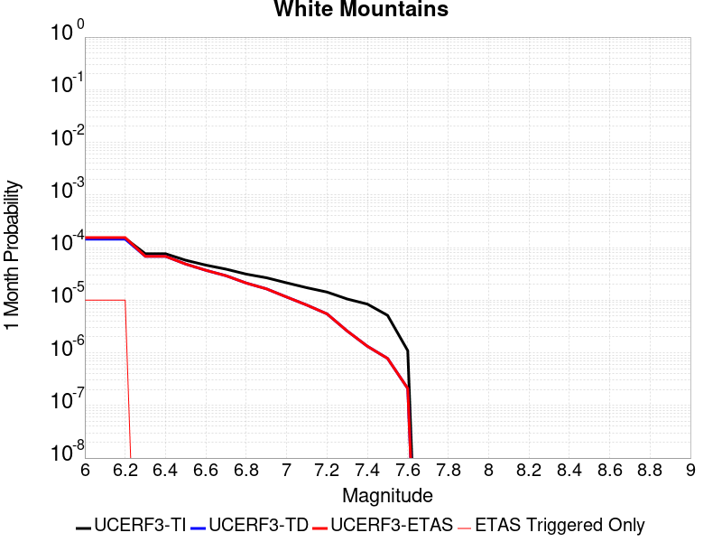 |  |  |

| Magnitude | 1 wk TI Prob | 1 wk TD Prob | 1 wk ETAS Prob | 1 wk ETAS/TD Gain | 1 wk ETAS Triggered Only | 1 mo TI Prob | 1 mo TD Prob | 1 mo ETAS Prob | 1 mo ETAS/TD Gain | 1 mo ETAS Triggered Only | 1 yr TI Prob | 1 yr TD Prob | 1 yr ETAS Prob | 1 yr ETAS/TD Gain | 1 yr ETAS Triggered Only | 10 yr TI Prob | 10 yr TD Prob | 10 yr ETAS Prob | 10 yr ETAS/TD Gain | 10 yr ETAS Triggered Only |
|-----|-----|-----|-----|-----|-----|-----|-----|-----|-----|-----|-----|-----|-----|-----|-----|-----|-----|-----|-----|-----|
| 6.0 | 3.503579E-5 | 3.3784425E-5 | 5.4275537E-5 | 1.6065253 | 2.0491803E-5 | 1.5014476E-4 | 1.4478304E-4 | 1.6527188E-4 | 1.1415141 | 2.0491803E-5 | 0.0018264796 | 0.0017614291 | 0.0018023405 | 1.0232263 | 4.0983607E-5 | 0.018115403 | 0.017487012 | 0.017587679 | 1.0057567 | 1.0245902E-4 |
| 6.1 | 3.503579E-5 | 3.3784425E-5 | 5.4275537E-5 | 1.6065253 | 2.0491803E-5 | 1.5014476E-4 | 1.4478304E-4 | 1.6527188E-4 | 1.1415141 | 2.0491803E-5 | 0.0018264796 | 0.0017614291 | 0.0018023405 | 1.0232263 | 4.0983607E-5 | 0.018115403 | 0.017487012 | 0.017587679 | 1.0057567 | 1.0245902E-4 |
| 6.2 | 3.503579E-5 | 3.3784425E-5 | 5.4275537E-5 | 1.6065253 | 2.0491803E-5 | 1.5014476E-4 | 1.4478304E-4 | 1.6527188E-4 | 1.1415141 | 2.0491803E-5 | 0.0018264796 | 0.0017614291 | 0.0018023405 | 1.0232263 | 4.0983607E-5 | 0.018115403 | 0.017487012 | 0.017587679 | 1.0057567 | 1.0245902E-4 |
| 6.3 | 1.7818425E-5 | 1.5916237E-5 | 1.5916237E-5 | 1.0 | 0.0 | 7.636245E-5 | 6.821074E-5 | 6.821074E-5 | 1.0 | 0.0 | 9.293162E-4 | 8.301636E-4 | 8.301636E-4 | 1.0 | 0.0 | 0.009254395 | 0.0082720835 | 0.008292405 | 1.0024568 | 2.0491803E-5 |
| 6.4 | 1.7818425E-5 | 1.5916237E-5 | 1.5916237E-5 | 1.0 | 0.0 | 7.636245E-5 | 6.821074E-5 | 6.821074E-5 | 1.0 | 0.0 | 9.293162E-4 | 8.301636E-4 | 8.301636E-4 | 1.0 | 0.0 | 0.009254395 | 0.0082720835 | 0.008292405 | 1.0024568 | 2.0491803E-5 |
| 6.5 | 1.3397557E-5 | 1.1336382E-5 | 1.1336382E-5 | 1.0 | 0.0 | 5.741684E-5 | 4.8583628E-5 | 4.8583628E-5 | 1.0 | 0.0 | 6.988258E-4 | 5.913521E-4 | 5.913521E-4 | 1.0 | 0.0 | 0.006966323 | 0.0058984905 | 0.0058984905 | 1.0 | 0.0 |
| 6.6 | 1.0818695E-5 | 8.625452E-6 | 8.625452E-6 | 1.0 | 0.0 | 4.6365014E-5 | 3.6965725E-5 | 3.6965725E-5 | 1.0 | 0.0 | 5.6434784E-4 | 4.499691E-4 | 4.499691E-4 | 1.0 | 0.0 | 0.005629168 | 0.0044910167 | 0.0044910167 | 1.0 | 0.0 |
| 6.7 | 9.067908E-6 | 6.8025106E-6 | 6.8025106E-6 | 1.0 | 0.0 | 3.8861883E-5 | 2.915331E-5 | 2.915331E-5 | 1.0 | 0.0 | 4.7304068E-4 | 3.5488693E-4 | 3.5488693E-4 | 1.0 | 0.0 | 0.00472035 | 0.0035435192 | 0.0035435192 | 1.0 | 0.0 |
| 6.8 | 7.295947E-6 | 4.9364417E-6 | 4.9364417E-6 | 1.0 | 0.0 | 3.126797E-5 | 2.1156015E-5 | 2.1156015E-5 | 1.0 | 0.0 | 3.8062103E-4 | 2.5754515E-4 | 2.5754515E-4 | 1.0 | 0.0 | 0.0037996976 | 0.0025725798 | 0.0025725798 | 1.0 | 0.0 |
| 6.9 | 6.2243444E-6 | 3.832255E-6 | 3.832255E-6 | 1.0 | 0.0 | 2.6675489E-5 | 1.6423848E-5 | 1.6423848E-5 | 1.0 | 0.0 | 3.2472567E-4 | 1.9994254E-4 | 1.9994254E-4 | 1.0 | 0.0 | 0.0032425157 | 0.0019976792 | 0.0019976792 | 1.0 | 0.0 |
| 7.0 | 4.9878413E-6 | 2.6795697E-6 | 2.6795697E-6 | 1.0 | 0.0 | 2.1376287E-5 | 1.1483821E-5 | 1.1483821E-5 | 1.0 | 0.0 | 2.602252E-4 | 1.3980681E-4 | 1.3980681E-4 | 1.0 | 0.0 | 0.002599207 | 0.0013972148 | 0.0013972148 | 1.0 | 0.0 |
| 7.1 | 4.0252844E-6 | 1.88579E-6 | 1.88579E-6 | 1.0 | 0.0 | 1.7251105E-5 | 8.081933E-6 | 8.081933E-6 | 1.0 | 0.0 | 2.1001195E-4 | 9.839322E-5 | 9.839322E-5 | 1.0 | 0.0 | 0.0020981359 | 9.835094E-4 | 9.835094E-4 | 1.0 | 0.0 |
| 7.2 | 3.3284066E-6 | 1.2819944E-6 | 1.2819944E-6 | 1.0 | 0.0 | 1.4264522E-5 | 5.4942507E-6 | 5.4942507E-6 | 1.0 | 0.0 | 1.736567E-4 | 6.689055E-5 | 6.689055E-5 | 1.0 | 0.0 | 0.0017352107 | 6.6871423E-4 | 6.6871423E-4 | 1.0 | 0.0 |
| 7.3 | 2.458226E-6 | 6.057493E-7 | 6.057493E-7 | 1.0 | 0.0 | 1.0535211E-5 | 2.596066E-6 | 2.596066E-6 | 1.0 | 0.0 | 1.2825865E-4 | 3.1606683E-5 | 3.1606683E-5 | 1.0 | 0.0 | 0.0012818464 | 3.1602563E-4 | 3.1602563E-4 | 1.0 | 0.0 |
| 7.4 | 1.965953E-6 | 3.1091668E-7 | 3.1091668E-7 | 1.0 | 0.0 | 8.425486E-6 | 1.3324994E-6 | 1.3324994E-6 | 1.0 | 0.0 | 1.0257547E-4 | 1.622306E-5 | 1.622306E-5 | 1.0 | 0.0 | 0.0010252813 | 1.6221889E-4 | 1.6221889E-4 | 1.0 | 0.0 |
| 7.5 | 1.2014192E-6 | 1.824589E-7 | 1.824589E-7 | 1.0 | 0.0 | 5.148929E-6 | 7.819665E-7 | 7.819665E-7 | 1.0 | 0.0 | 6.2686406E-5 | 9.520401E-6 | 9.520401E-6 | 1.0 | 0.0 | 6.266873E-4 | 9.520002E-5 | 9.520002E-5 | 1.0 | 0.0 |
| 7.6 | 2.5612175E-7 | 4.8950795E-8 | 4.8950795E-8 | 1.0 | 0.0 | 1.0976642E-6 | 2.097891E-7 | 2.097891E-7 | 1.0 | 0.0 | 1.3363979E-5 | 2.5541797E-6 | 2.5541797E-6 | 1.0 | 0.0 | 1.3363175E-4 | 2.554154E-5 | 2.554154E-5 | 1.0 | 0.0 |

## San Andreas (Coachella) rev
*[(top)](#table-of-contents)*

| 1 Week | 1 Month | 1 Year | 10 Year |
|-----|-----|-----|-----|
|  |  | 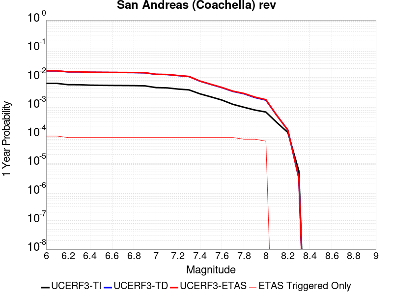 |  |

| Magnitude | 1 wk TI Prob | 1 wk TD Prob | 1 wk ETAS Prob | 1 wk ETAS/TD Gain | 1 wk ETAS Triggered Only | 1 mo TI Prob | 1 mo TD Prob | 1 mo ETAS Prob | 1 mo ETAS/TD Gain | 1 mo ETAS Triggered Only | 1 yr TI Prob | 1 yr TD Prob | 1 yr ETAS Prob | 1 yr ETAS/TD Gain | 1 yr ETAS Triggered Only | 10 yr TI Prob | 10 yr TD Prob | 10 yr ETAS Prob | 10 yr ETAS/TD Gain | 10 yr ETAS Triggered Only |
|-----|-----|-----|-----|-----|-----|-----|-----|-----|-----|-----|-----|-----|-----|-----|-----|-----|-----|-----|-----|-----|
| 6.0 | 1.1925945E-4 | 3.2733803E-4 | 3.2733803E-4 | 1.0 | 0.0 | 5.110118E-4 | 0.0014021277 | 0.0014021277 | 1.0 | 0.0 | 0.0062038354 | 0.016938623 | 0.016999057 | 1.0035678 | 6.147541E-5 | 0.060334753 | 0.15267034 | 0.15275715 | 1.0005686 | 1.0245902E-4 |
| 6.1 | 1.1925945E-4 | 3.2733803E-4 | 3.2733803E-4 | 1.0 | 0.0 | 5.110118E-4 | 0.0014021277 | 0.0014021277 | 1.0 | 0.0 | 0.0062038354 | 0.016938623 | 0.016999057 | 1.0035678 | 6.147541E-5 | 0.060334753 | 0.15267034 | 0.15275715 | 1.0005686 | 1.0245902E-4 |
| 6.2 | 1.07432395E-4 | 3.0234526E-4 | 3.0234526E-4 | 1.0 | 0.0 | 4.603433E-4 | 0.0012951259 | 0.0012951259 | 1.0 | 0.0 | 0.005590286 | 0.015655253 | 0.015715767 | 1.0038654 | 6.147541E-5 | 0.05451731 | 0.14184146 | 0.14192939 | 1.0006199 | 1.0245902E-4 |
| 6.3 | 1.0718766E-4 | 3.017983E-4 | 3.017983E-4 | 1.0 | 0.0 | 4.592948E-4 | 0.0012927842 | 0.0012927842 | 1.0 | 0.0 | 0.005577586 | 0.015627153 | 0.015687667 | 1.0038724 | 6.147541E-5 | 0.054396555 | 0.14160971 | 0.14169766 | 1.0006211 | 1.0245902E-4 |
| 6.4 | 1.0355944E-4 | 2.9387916E-4 | 2.9387916E-4 | 1.0 | 0.0 | 4.4375064E-4 | 0.0012588782 | 0.0012588782 | 1.0 | 0.0 | 0.0053892885 | 0.015220184 | 0.0152807245 | 1.0039775 | 6.147541E-5 | 0.052604496 | 0.13816981 | 0.13825811 | 1.0006391 | 1.0245902E-4 |
| 6.5 | 1.0227914E-4 | 2.910735E-4 | 2.910735E-4 | 1.0 | 0.0 | 4.382655E-4 | 0.0012468654 | 0.0012468654 | 1.0 | 0.0 | 0.0053228354 | 0.015075962 | 0.015136511 | 1.0040163 | 6.147541E-5 | 0.051971316 | 0.136949 | 0.13703743 | 1.0006456 | 1.0245902E-4 |
| 6.6 | 1.0116757E-4 | 2.8873098E-4 | 2.8873098E-4 | 1.0 | 0.0 | 4.3350324E-4 | 0.0012368355 | 0.0012368355 | 1.0 | 0.0 | 0.0052651367 | 0.014955532 | 0.015016087 | 1.0040491 | 6.147541E-5 | 0.051421247 | 0.13592719 | 0.13601573 | 1.0006514 | 1.0245902E-4 |
| 6.7 | 1.0050676E-4 | 2.873166E-4 | 2.873166E-4 | 1.0 | 0.0 | 4.3067214E-4 | 0.0012307797 | 0.0012307797 | 1.0 | 0.0 | 0.005230834 | 0.01488281 | 0.0149433715 | 1.0040692 | 6.147541E-5 | 0.051094085 | 0.13531192 | 0.13540052 | 1.0006547 | 1.0245902E-4 |
| 6.8 | 9.976819E-5 | 2.853531E-4 | 2.853531E-4 | 1.0 | 0.0 | 4.2750788E-4 | 0.0012223726 | 0.0012223726 | 1.0 | 0.0 | 0.0051924936 | 0.014781849 | 0.014842416 | 1.0040973 | 6.147541E-5 | 0.050728295 | 0.13446361 | 0.13455229 | 1.0006595 | 1.0245902E-4 |
| 6.9 | 9.77719E-5 | 2.8032195E-4 | 2.8032195E-4 | 1.0 | 0.0 | 4.1895514E-4 | 0.0012008306 | 0.0012008306 | 1.0 | 0.0 | 0.0050888555 | 0.014523101 | 0.014583684 | 1.0041715 | 6.147541E-5 | 0.049738888 | 0.13229203 | 0.13238095 | 1.000672 | 1.0245902E-4 |
| 7.0 | 8.500761E-5 | 2.4766565E-4 | 2.4766565E-4 | 1.0 | 0.0 | 3.6426744E-4 | 0.0010609957 | 0.0010609957 | 1.0 | 0.0 | 0.0044259406 | 0.012841888 | 0.012902574 | 1.0047256 | 6.147541E-5 | 0.04338823 | 0.11814933 | 0.118239686 | 1.0007647 | 1.0245902E-4 |
| 7.1 | 8.319876E-5 | 2.4369264E-4 | 2.4369264E-4 | 1.0 | 0.0 | 3.5651738E-4 | 0.0010439822 | 0.0010439822 | 1.0 | 0.0 | 0.004331963 | 0.012637171 | 0.01269787 | 1.0048032 | 6.147541E-5 | 0.042484846 | 0.116369456 | 0.116459996 | 1.000778 | 1.0245902E-4 |
| 7.2 | 7.563917E-5 | 2.2417592E-4 | 2.2417592E-4 | 1.0 | 0.0 | 3.2412758E-4 | 9.6040324E-4 | 9.6040324E-4 | 1.0 | 0.0 | 0.0039391145 | 0.0116309095 | 0.01169167 | 1.005224 | 6.147541E-5 | 0.03870018 | 0.10777538 | 0.1078668 | 1.0008482 | 1.0245902E-4 |
| 7.3 | 7.082985E-5 | 2.073362E-4 | 2.073362E-4 | 1.0 | 0.0 | 3.0352117E-4 | 8.88284E-4 | 8.88284E-4 | 1.0 | 0.0 | 0.0036891096 | 0.010761855 | 0.010822669 | 1.0056509 | 6.147541E-5 | 0.03628465 | 0.10029767 | 0.100389846 | 1.0009191 | 1.0245902E-4 |
| 7.4 | 5.146215E-5 | 1.4276853E-4 | 1.4276853E-4 | 1.0 | 0.0 | 2.2053342E-4 | 6.117225E-4 | 6.117225E-4 | 1.0 | 0.0 | 0.0026816884 | 0.007422478 | 0.007483497 | 1.0082209 | 6.147541E-5 | 0.02649557 | 0.07086292 | 0.070958115 | 1.0013434 | 1.0245902E-4 |
| 7.5 | 4.0285166E-5 | 1.0944253E-4 | 1.0944253E-4 | 1.0 | 0.0 | 1.7263928E-4 | 4.689554E-4 | 4.689554E-4 | 1.0 | 0.0 | 0.002099857 | 0.005694655 | 0.00575578 | 1.0107338 | 6.147541E-5 | 0.020801254 | 0.055022955 | 0.055100415 | 1.0014077 | 8.196721E-5 |
| 7.6 | 3.1168736E-5 | 8.441267E-5 | 8.441267E-5 | 1.0 | 0.0 | 1.3357346E-4 | 3.6171856E-4 | 3.6171856E-4 | 1.0 | 0.0 | 0.0016250437 | 0.004395057 | 0.0044562626 | 1.0139259 | 6.147541E-5 | 0.016132116 | 0.042820677 | 0.04289913 | 1.0018322 | 8.196721E-5 |
| 7.7 | 2.2100989E-5 | 6.2408275E-5 | 6.2408275E-5 | 1.0 | 0.0 | 9.4715084E-5 | 2.6743664E-4 | 2.6743664E-4 | 1.0 | 0.0 | 0.001152546 | 0.003251186 | 0.0033124618 | 1.0188471 | 6.147541E-5 | 0.011465867 | 0.03190961 | 0.03198896 | 1.0024867 | 8.196721E-5 |
| 7.8 | 1.7484861E-5 | 5.1814186E-5 | 5.1814186E-5 | 1.0 | 0.0 | 7.493296E-5 | 2.2204191E-4 | 2.2204191E-4 | 1.0 | 0.0 | 9.1192697E-4 | 0.002700012 | 0.0027613214 | 1.0227071 | 6.147541E-5 | 0.009081938 | 0.026648527 | 0.02672831 | 1.002994 | 8.196721E-5 |
| 7.9 | 1.3967285E-5 | 3.8237675E-5 | 3.8237675E-5 | 1.0 | 0.0 | 5.985842E-5 | 1.6386545E-4 | 1.6386545E-4 | 1.0 | 0.0 | 7.2853256E-4 | 0.0019932375 | 0.0020545905 | 1.0307806 | 6.147541E-5 | 0.0072614877 | 0.019916428 | 0.019996764 | 1.0040336 | 8.196721E-5 |
| 8.0 | 1.1887396E-5 | 3.107819E-5 | 3.107819E-5 | 1.0 | 0.0 | 5.094499E-5 | 1.3318544E-4 | 1.3318544E-4 | 1.0 | 0.0 | 6.200787E-4 | 0.0016203277 | 0.0016612449 | 1.0252525 | 4.0983607E-5 | 0.006183513 | 0.016285317 | 0.016345792 | 1.0037134 | 6.147541E-5 |
| 8.1 | 5.100864E-6 | 8.978668E-6 | 8.978668E-6 | 1.0 | 0.0 | 2.1860664E-5 | 3.847944E-5 | 3.847944E-5 | 1.0 | 0.0 | 2.6612106E-4 | 4.6838663E-4 | 4.6838663E-4 | 1.0 | 0.0 | 0.002658026 | 0.004920349 | 0.004920349 | 1.0 | 0.0 |
| 8.2 | 2.3004484E-6 | 2.7885583E-6 | 2.7885583E-6 | 1.0 | 0.0 | 9.859027E-6 | 1.19509095E-5 | 1.19509095E-5 | 1.0 | 0.0 | 1.2002704E-4 | 1.4549264E-4 | 1.4549264E-4 | 1.0 | 0.0 | 0.0011996223 | 0.0015984807 | 0.0015984807 | 1.0 | 0.0 |
| 8.3 | 1.0424446E-7 | 5.8219563E-8 | 5.8219563E-8 | 1.0 | 0.0 | 4.4676187E-7 | 2.495124E-7 | 2.495124E-7 | 1.0 | 0.0 | 5.439312E-6 | 3.0378094E-6 | 3.0378094E-6 | 1.0 | 0.0 | 5.4391792E-5 | 3.193819E-5 | 3.193819E-5 | 1.0 | 0.0 |

## San Jacinto (Stepovers Combined)
*[(top)](#table-of-contents)*

| 1 Week | 1 Month | 1 Year | 10 Year |
|-----|-----|-----|-----|
|  |  | 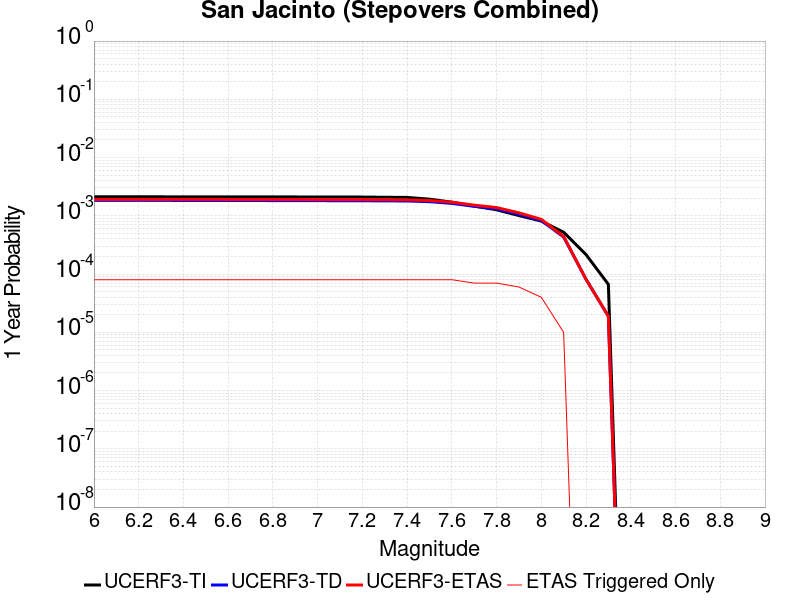 |  |

| Magnitude | 1 wk TI Prob | 1 wk TD Prob | 1 wk ETAS Prob | 1 wk ETAS/TD Gain | 1 wk ETAS Triggered Only | 1 mo TI Prob | 1 mo TD Prob | 1 mo ETAS Prob | 1 mo ETAS/TD Gain | 1 mo ETAS Triggered Only | 1 yr TI Prob | 1 yr TD Prob | 1 yr ETAS Prob | 1 yr ETAS/TD Gain | 1 yr ETAS Triggered Only | 10 yr TI Prob | 10 yr TD Prob | 10 yr ETAS Prob | 10 yr ETAS/TD Gain | 10 yr ETAS Triggered Only |
|-----|-----|-----|-----|-----|-----|-----|-----|-----|-----|-----|-----|-----|-----|-----|-----|-----|-----|-----|-----|-----|
| 6.0 | 4.0667746E-5 | 3.5287198E-5 | 3.5287198E-5 | 1.0 | 0.0 | 1.742787E-4 | 1.5122209E-4 | 1.717108E-4 | 1.1354876 | 2.0491803E-5 | 0.0021197782 | 0.0018395748 | 0.0019009371 | 1.0333568 | 6.147541E-5 | 0.020996714 | 0.018994363 | 0.019094875 | 1.0052917 | 1.0245902E-4 |
| 6.1 | 4.0667746E-5 | 3.5287198E-5 | 3.5287198E-5 | 1.0 | 0.0 | 1.742787E-4 | 1.5122209E-4 | 1.717108E-4 | 1.1354876 | 2.0491803E-5 | 0.0021197782 | 0.0018395748 | 0.0019009371 | 1.0333568 | 6.147541E-5 | 0.020996714 | 0.018994363 | 0.019094875 | 1.0052917 | 1.0245902E-4 |
| 6.2 | 4.0667746E-5 | 3.5287198E-5 | 3.5287198E-5 | 1.0 | 0.0 | 1.742787E-4 | 1.5122209E-4 | 1.717108E-4 | 1.1354876 | 2.0491803E-5 | 0.0021197782 | 0.0018395748 | 0.0019009371 | 1.0333568 | 6.147541E-5 | 0.020996714 | 0.018994363 | 0.019094875 | 1.0052917 | 1.0245902E-4 |
| 6.3 | 4.0667746E-5 | 3.5287198E-5 | 3.5287198E-5 | 1.0 | 0.0 | 1.742787E-4 | 1.5122209E-4 | 1.717108E-4 | 1.1354876 | 2.0491803E-5 | 0.0021197782 | 0.0018395748 | 0.0019009371 | 1.0333568 | 6.147541E-5 | 0.020996714 | 0.018994363 | 0.019094875 | 1.0052917 | 1.0245902E-4 |
| 6.4 | 4.0577226E-5 | 3.515909E-5 | 3.515909E-5 | 1.0 | 0.0 | 1.738908E-4 | 1.5067312E-4 | 1.7116184E-4 | 1.1359812 | 2.0491803E-5 | 0.0021150648 | 0.0018329041 | 0.0018942668 | 1.0334784 | 6.147541E-5 | 0.020950472 | 0.018928928 | 0.019029448 | 1.0053104 | 1.0245902E-4 |
| 6.5 | 4.0577226E-5 | 3.515909E-5 | 3.515909E-5 | 1.0 | 0.0 | 1.738908E-4 | 1.5067312E-4 | 1.7116184E-4 | 1.1359812 | 2.0491803E-5 | 0.0021150648 | 0.0018329041 | 0.0018942668 | 1.0334784 | 6.147541E-5 | 0.020950472 | 0.018928928 | 0.019029448 | 1.0053104 | 1.0245902E-4 |
| 6.6 | 4.053861E-5 | 3.5104433E-5 | 3.5104433E-5 | 1.0 | 0.0 | 1.7372532E-4 | 1.5043891E-4 | 1.7092763E-4 | 1.1361929 | 2.0491803E-5 | 0.0021130538 | 0.0018300572 | 0.0018914202 | 1.0335306 | 6.147541E-5 | 0.020930743 | 0.018901005 | 0.019001529 | 1.0053184 | 1.0245902E-4 |
| 6.7 | 4.0516545E-5 | 3.50735E-5 | 3.50735E-5 | 1.0 | 0.0 | 1.7363077E-4 | 1.5030634E-4 | 1.7079506E-4 | 1.1363131 | 2.0491803E-5 | 0.002111905 | 0.0018284466 | 0.0018898096 | 1.0335602 | 6.147541E-5 | 0.020919468 | 0.018885203 | 0.018985726 | 1.0053229 | 1.0245902E-4 |
| 6.8 | 4.049434E-5 | 3.504506E-5 | 3.504506E-5 | 1.0 | 0.0 | 1.7353562E-4 | 1.5018447E-4 | 1.706732E-4 | 1.1364237 | 2.0491803E-5 | 0.0021107488 | 0.0018269654 | 0.0018883285 | 1.0335875 | 6.147541E-5 | 0.020908125 | 0.018870614 | 0.01897114 | 1.0053271 | 1.0245902E-4 |
| 6.9 | 4.046386E-5 | 3.500762E-5 | 3.500762E-5 | 1.0 | 0.0 | 1.73405E-4 | 1.5002403E-4 | 1.7051277E-4 | 1.1365696 | 2.0491803E-5 | 0.0021091616 | 0.0018250152 | 0.0018863784 | 1.0336235 | 6.147541E-5 | 0.020892553 | 0.018851386 | 0.018951913 | 1.0053326 | 1.0245902E-4 |
| 7.0 | 4.036382E-5 | 3.4888177E-5 | 3.4888177E-5 | 1.0 | 0.0 | 1.7297632E-4 | 1.4951221E-4 | 1.7000095E-4 | 1.1370373 | 2.0491803E-5 | 0.0021039525 | 0.0018187946 | 0.0018801582 | 1.0337386 | 6.147541E-5 | 0.02084144 | 0.018789997 | 0.018890532 | 1.0053504 | 1.0245902E-4 |
| 7.1 | 4.0343282E-5 | 3.486664E-5 | 3.486664E-5 | 1.0 | 0.0 | 1.7288832E-4 | 1.4941991E-4 | 1.6990866E-4 | 1.1371219 | 2.0491803E-5 | 0.002102883 | 0.0018176727 | 0.0018790364 | 1.0337595 | 6.147541E-5 | 0.020830948 | 0.018778874 | 0.01887941 | 1.0053536 | 1.0245902E-4 |
| 7.2 | 4.0257353E-5 | 3.4771132E-5 | 3.4771132E-5 | 1.0 | 0.0 | 1.725201E-4 | 1.4901065E-4 | 1.694994E-4 | 1.1374986 | 2.0491803E-5 | 0.0020984085 | 0.0018126983 | 0.0018740622 | 1.0338523 | 6.147541E-5 | 0.020787042 | 0.01872961 | 0.01883015 | 1.005368 | 1.0245902E-4 |
| 7.3 | 3.9940667E-5 | 3.4598754E-5 | 3.4598754E-5 | 1.0 | 0.0 | 1.7116306E-4 | 1.4827197E-4 | 1.6876073E-4 | 1.1381837 | 2.0491803E-5 | 0.0020819185 | 0.0018037198 | 0.0018650843 | 1.0340211 | 6.147541E-5 | 0.020625217 | 0.018638225 | 0.018738775 | 1.0053948 | 1.0245902E-4 |
| 7.4 | 3.9721202E-5 | 3.4484117E-5 | 3.4484117E-5 | 1.0 | 0.0 | 1.7022261E-4 | 1.4778072E-4 | 1.682695E-4 | 1.138643 | 2.0491803E-5 | 0.0020704903 | 0.0017977487 | 0.0018591137 | 1.0341343 | 6.147541E-5 | 0.020513052 | 0.018577335 | 0.01867789 | 1.0054128 | 1.0245902E-4 |
| 7.5 | 3.7036873E-5 | 3.355129E-5 | 3.355129E-5 | 1.0 | 0.0 | 1.5871979E-4 | 1.4378333E-4 | 1.6427218E-4 | 1.1424981 | 2.0491803E-5 | 0.0019307006 | 0.0017491594 | 0.0018105273 | 1.0350842 | 6.147541E-5 | 0.019140124 | 0.018078765 | 0.01817937 | 1.0055649 | 1.0245902E-4 |
| 7.6 | 3.2940967E-5 | 3.133173E-5 | 3.133173E-5 | 1.0 | 0.0 | 1.4116794E-4 | 1.3427193E-4 | 1.5476099E-4 | 1.1525937 | 2.0491803E-5 | 0.0017173645 | 0.0016335372 | 0.0016949122 | 1.0375718 | 6.147541E-5 | 0.01704153 | 0.016911475 | 0.017012201 | 1.005956 | 1.0245902E-4 |
| 7.7 | 2.8236149E-5 | 2.7897275E-5 | 2.7897275E-5 | 1.0 | 0.0 | 1.2100645E-4 | 1.1955428E-4 | 1.4004363E-4 | 1.1713812 | 2.0491803E-5 | 0.0014722579 | 0.0014546025 | 0.0015159885 | 1.0422012 | 6.147541E-5 | 0.014625421 | 0.015122045 | 0.015222955 | 1.006673 | 1.0245902E-4 |
| 7.8 | 2.4329287E-5 | 2.5220394E-5 | 2.5220394E-5 | 1.0 | 0.0 | 1.042642E-4 | 1.0808293E-4 | 1.2857252E-4 | 1.1895728 | 2.0491803E-5 | 0.0012686774 | 0.0013151162 | 0.0013765107 | 1.0466838 | 6.147541E-5 | 0.012614589 | 0.013719083 | 0.013820136 | 1.007366 | 1.0245902E-4 |
| 7.9 | 1.9370926E-5 | 2.0433014E-5 | 2.0433014E-5 | 1.0 | 0.0 | 8.301561E-5 | 8.7567125E-5 | 1.0805713E-4 | 1.233992 | 2.0491803E-5 | 0.0010102465 | 0.001065609 | 0.001127019 | 1.0576289 | 6.147541E-5 | 0.0100566605 | 0.011205519 | 0.01130683 | 1.0090412 | 1.0245902E-4 |
| 8.0 | 1.5583017E-5 | 1.5896165E-5 | 1.5896165E-5 | 1.0 | 0.0 | 6.6782646E-5 | 6.8124646E-5 | 8.861505E-5 | 1.3007782 | 2.0491803E-5 | 8.127754E-4 | 8.2910265E-4 | 8.7005226E-4 | 1.0493903 | 4.0983607E-5 | 0.008098091 | 0.008786912 | 0.008868159 | 1.0092463 | 8.196721E-5 |
| 8.1 | 1.0024873E-5 | 8.298104E-6 | 8.298104E-6 | 1.0 | 0.0 | 4.2963035E-5 | 3.556282E-5 | 3.556282E-5 | 1.0 | 0.0 | 5.229494E-4 | 4.3289183E-4 | 4.3289183E-4 | 1.0 | 0.0 | 0.0052172043 | 0.0046564727 | 0.0046564727 | 1.0 | 0.0 |
| 8.2 | 4.142796E-6 | 1.5626505E-6 | 1.5626505E-6 | 1.0 | 0.0 | 1.775472E-5 | 6.697056E-6 | 6.697056E-6 | 1.0 | 0.0 | 2.1614227E-4 | 8.153364E-5 | 8.153364E-5 | 1.0 | 0.0 | 0.0021593217 | 9.464045E-4 | 9.464045E-4 | 1.0 | 0.0 |
| 8.3 | 1.2750878E-6 | 3.6166134E-7 | 3.6166134E-7 | 1.0 | 0.0 | 5.4646503E-6 | 1.5499762E-6 | 1.5499762E-6 | 1.0 | 0.0 | 6.653009E-5 | 1.8870802E-5 | 1.8870802E-5 | 1.0 | 0.0 | 6.6510175E-4 | 2.2760578E-4 | 2.2760578E-4 | 1.0 | 0.0 |

## San Jacinto (San Jacinto Valley) rev
*[(top)](#table-of-contents)*

| 1 Week | 1 Month | 1 Year | 10 Year |
|-----|-----|-----|-----|
| 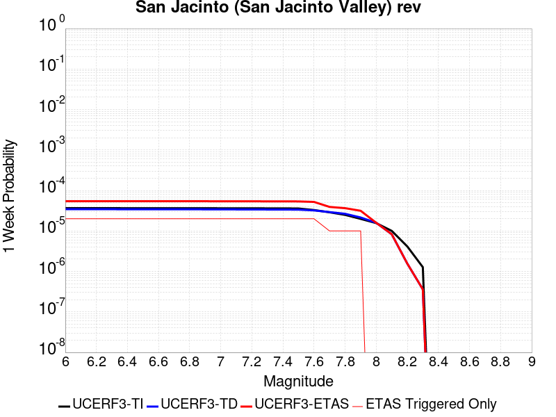 |  |  |  |

| Magnitude | 1 wk TI Prob | 1 wk TD Prob | 1 wk ETAS Prob | 1 wk ETAS/TD Gain | 1 wk ETAS Triggered Only | 1 mo TI Prob | 1 mo TD Prob | 1 mo ETAS Prob | 1 mo ETAS/TD Gain | 1 mo ETAS Triggered Only | 1 yr TI Prob | 1 yr TD Prob | 1 yr ETAS Prob | 1 yr ETAS/TD Gain | 1 yr ETAS Triggered Only | 10 yr TI Prob | 10 yr TD Prob | 10 yr ETAS Prob | 10 yr ETAS/TD Gain | 10 yr ETAS Triggered Only |
|-----|-----|-----|-----|-----|-----|-----|-----|-----|-----|-----|-----|-----|-----|-----|-----|-----|-----|-----|-----|-----|
| 6.0 | 3.652694E-5 | 3.4417048E-5 | 3.4417048E-5 | 1.0 | 0.0 | 1.5653463E-4 | 1.4749331E-4 | 1.6798209E-4 | 1.1389133 | 2.0491803E-5 | 0.0019041431 | 0.0017942534 | 0.0018556184 | 1.0342009 | 6.147541E-5 | 0.018879099 | 0.018534157 | 0.018634718 | 1.0054257 | 1.0245902E-4 |
| 6.1 | 3.652694E-5 | 3.4417048E-5 | 3.4417048E-5 | 1.0 | 0.0 | 1.5653463E-4 | 1.4749331E-4 | 1.6798209E-4 | 1.1389133 | 2.0491803E-5 | 0.0019041431 | 0.0017942534 | 0.0018556184 | 1.0342009 | 6.147541E-5 | 0.018879099 | 0.018534157 | 0.018634718 | 1.0054257 | 1.0245902E-4 |
| 6.2 | 3.652694E-5 | 3.4417048E-5 | 3.4417048E-5 | 1.0 | 0.0 | 1.5653463E-4 | 1.4749331E-4 | 1.6798209E-4 | 1.1389133 | 2.0491803E-5 | 0.0019041431 | 0.0017942534 | 0.0018556184 | 1.0342009 | 6.147541E-5 | 0.018879099 | 0.018534157 | 0.018634718 | 1.0054257 | 1.0245902E-4 |
| 6.3 | 3.652694E-5 | 3.4417048E-5 | 3.4417048E-5 | 1.0 | 0.0 | 1.5653463E-4 | 1.4749331E-4 | 1.6798209E-4 | 1.1389133 | 2.0491803E-5 | 0.0019041431 | 0.0017942534 | 0.0018556184 | 1.0342009 | 6.147541E-5 | 0.018879099 | 0.018534157 | 0.018634718 | 1.0054257 | 1.0245902E-4 |
| 6.4 | 3.646941E-5 | 3.433862E-5 | 3.433862E-5 | 1.0 | 0.0 | 1.5628811E-4 | 1.4715722E-4 | 1.6764601E-4 | 1.1392306 | 2.0491803E-5 | 0.0019011468 | 0.0017901688 | 0.0018515342 | 1.0342791 | 6.147541E-5 | 0.018849645 | 0.018494038 | 0.018594602 | 1.0054376 | 1.0245902E-4 |
| 6.5 | 3.646941E-5 | 3.433862E-5 | 3.433862E-5 | 1.0 | 0.0 | 1.5628811E-4 | 1.4715722E-4 | 1.6764601E-4 | 1.1392306 | 2.0491803E-5 | 0.0019011468 | 0.0017901688 | 0.0018515342 | 1.0342791 | 6.147541E-5 | 0.018849645 | 0.018494038 | 0.018594602 | 1.0054376 | 1.0245902E-4 |
| 6.6 | 3.6442503E-5 | 3.4302004E-5 | 3.4302004E-5 | 1.0 | 0.0 | 1.561728E-4 | 1.4700032E-4 | 1.6748911E-4 | 1.1393793 | 2.0491803E-5 | 0.0018997455 | 0.0017882616 | 0.0018496271 | 1.0343157 | 6.147541E-5 | 0.018835869 | 0.018475305 | 0.018575871 | 1.0054432 | 1.0245902E-4 |
| 6.7 | 3.6432113E-5 | 3.4287576E-5 | 3.4287576E-5 | 1.0 | 0.0 | 1.5612828E-4 | 1.4693849E-4 | 1.6742728E-4 | 1.1394379 | 2.0491803E-5 | 0.0018992044 | 0.0017875104 | 0.0018488759 | 1.0343301 | 6.147541E-5 | 0.018830549 | 0.01846793 | 0.018568495 | 1.0054455 | 1.0245902E-4 |
| 6.8 | 3.6409598E-5 | 3.425663E-5 | 3.425663E-5 | 1.0 | 0.0 | 1.560318E-4 | 1.4680588E-4 | 1.6729467E-4 | 1.1395639 | 2.0491803E-5 | 0.0018980318 | 0.0017858985 | 0.0018472641 | 1.0343612 | 6.147541E-5 | 0.018819023 | 0.018452084 | 0.018552652 | 1.0054502 | 1.0245902E-4 |
| 6.9 | 3.638078E-5 | 3.4217053E-5 | 3.4217053E-5 | 1.0 | 0.0 | 1.5590832E-4 | 1.4663627E-4 | 1.6712508E-4 | 1.1397253 | 2.0491803E-5 | 0.0018965311 | 0.001783837 | 0.0018452028 | 1.0344009 | 6.147541E-5 | 0.018804269 | 0.018431816 | 0.018532386 | 1.0054563 | 1.0245902E-4 |
| 7.0 | 3.6294874E-5 | 3.4099063E-5 | 3.4099063E-5 | 1.0 | 0.0 | 1.5554018E-4 | 1.4613067E-4 | 1.6661947E-4 | 1.1402088 | 2.0491803E-5 | 0.0018920569 | 0.0017776915 | 0.0018390577 | 1.0345201 | 6.147541E-5 | 0.018760284 | 0.018371396 | 0.018471973 | 1.0054747 | 1.0245902E-4 |
| 7.1 | 3.6260717E-5 | 3.405534E-5 | 3.405534E-5 | 1.0 | 0.0 | 1.5539382E-4 | 1.4594331E-4 | 1.6643213E-4 | 1.1403888 | 2.0491803E-5 | 0.001890278 | 0.0017754143 | 0.0018367807 | 1.0345645 | 6.147541E-5 | 0.018742796 | 0.018348996 | 0.018449575 | 1.0054815 | 1.0245902E-4 |
| 7.2 | 3.6210204E-5 | 3.398956E-5 | 3.398956E-5 | 1.0 | 0.0 | 1.5517735E-4 | 1.4566141E-4 | 1.6615023E-4 | 1.1406605 | 2.0491803E-5 | 0.001887647 | 0.0017719879 | 0.0018333544 | 1.0346315 | 6.147541E-5 | 0.01871693 | 0.018315274 | 0.018415857 | 1.0054917 | 1.0245902E-4 |
| 7.3 | 3.6119454E-5 | 3.3877837E-5 | 3.3877837E-5 | 1.0 | 0.0 | 1.5478847E-4 | 1.4518267E-4 | 1.6567149E-4 | 1.1411245 | 2.0491803E-5 | 0.0018829206 | 0.0017661685 | 0.0018275353 | 1.0347457 | 6.147541E-5 | 0.018670462 | 0.018257825 | 0.018358413 | 1.0055094 | 1.0245902E-4 |
| 7.4 | 3.607848E-5 | 3.3825334E-5 | 3.3825334E-5 | 1.0 | 0.0 | 1.5461289E-4 | 1.4495767E-4 | 1.654465E-4 | 1.1413436 | 2.0491803E-5 | 0.0018807866 | 0.0017634337 | 0.0018248006 | 1.0347997 | 6.147541E-5 | 0.018649481 | 0.018230818 | 0.018331409 | 1.0055176 | 1.0245902E-4 |
| 7.5 | 3.5856774E-5 | 3.3635082E-5 | 3.3635082E-5 | 1.0 | 0.0 | 1.5366284E-4 | 1.4414241E-4 | 1.6463126E-4 | 1.1421431 | 2.0491803E-5 | 0.0018692396 | 0.0017535238 | 0.0018148915 | 1.0349967 | 6.147541E-5 | 0.018535944 | 0.018131904 | 0.018232506 | 1.0055484 | 1.0245902E-4 |
| 7.6 | 3.286655E-5 | 3.215777E-5 | 3.215777E-5 | 1.0 | 0.0 | 1.4084904E-4 | 1.3781176E-4 | 1.5830074E-4 | 1.1486737 | 2.0491803E-5 | 0.001713488 | 0.0016765689 | 0.0017379412 | 1.036606 | 6.147541E-5 | 0.017003361 | 0.017351432 | 0.017452113 | 1.0058025 | 1.0245902E-4 |
| 7.7 | 2.8882527E-5 | 2.9250317E-5 | 2.9250317E-5 | 1.0 | 0.0 | 1.237764E-4 | 1.2535248E-4 | 1.4584172E-4 | 1.163453 | 2.0491803E-5 | 0.0015059357 | 0.0015250992 | 0.0015864809 | 1.0402477 | 6.147541E-5 | 0.014957713 | 0.015837716 | 0.015938552 | 1.0063668 | 1.0245902E-4 |
| 7.8 | 2.4950225E-5 | 2.6540692E-5 | 2.6540692E-5 | 1.0 | 0.0 | 1.0692515E-4 | 1.1374087E-4 | 1.3423034E-4 | 1.1801417 | 2.0491803E-5 | 0.0013010362 | 0.0013839162 | 0.0014453066 | 1.0443598 | 6.147541E-5 | 0.012934455 | 0.0144187445 | 0.014519726 | 1.0070035 | 1.0245902E-4 |
| 7.9 | 1.9881603E-5 | 2.1519538E-5 | 2.1519538E-5 | 1.0 | 0.0 | 8.520408E-5 | 9.222333E-5 | 1.1271325E-4 | 1.2221771 | 2.0491803E-5 | 0.001036866 | 0.0011222415 | 0.0011836479 | 1.0547177 | 6.147541E-5 | 0.010320415 | 0.011783319 | 0.01188457 | 1.0085928 | 1.0245902E-4 |
| 8.0 | 1.563292E-5 | 1.5947082E-5 | 1.5947082E-5 | 1.0 | 0.0 | 6.6996516E-5 | 6.834285E-5 | 8.883326E-5 | 1.2998178 | 2.0491803E-5 | 8.153773E-4 | 8.3175726E-4 | 8.7270676E-4 | 1.0492325 | 4.0983607E-5 | 0.00812392 | 0.008815629 | 0.008896874 | 1.009216 | 8.196721E-5 |
| 8.1 | 1.0045313E-5 | 8.307514E-6 | 8.307514E-6 | 1.0 | 0.0 | 4.305063E-5 | 3.5603145E-5 | 3.5603145E-5 | 1.0 | 0.0 | 5.2401534E-4 | 4.333826E-4 | 4.333826E-4 | 1.0 | 0.0 | 0.0052278144 | 0.0046621817 | 0.0046621817 | 1.0 | 0.0 |
| 8.2 | 4.1554413E-6 | 1.5672123E-6 | 1.5672123E-6 | 1.0 | 0.0 | 1.7808914E-5 | 6.716607E-6 | 6.716607E-6 | 1.0 | 0.0 | 2.1680194E-4 | 8.177165E-5 | 8.177165E-5 | 1.0 | 0.0 | 0.0021659054 | 9.492334E-4 | 9.492334E-4 | 1.0 | 0.0 |
| 8.3 | 1.2758221E-6 | 3.6194777E-7 | 3.6194777E-7 | 1.0 | 0.0 | 5.4677976E-6 | 1.5512038E-6 | 1.5512038E-6 | 1.0 | 0.0 | 6.65684E-5 | 1.8885747E-5 | 1.8885747E-5 | 1.0 | 0.0 | 6.6548464E-4 | 2.2777634E-4 | 2.2777634E-4 | 1.0 | 0.0 |

## Santa Rosa Island
*[(top)](#table-of-contents)*

| 1 Week | 1 Month | 1 Year | 10 Year |
|-----|-----|-----|-----|
| 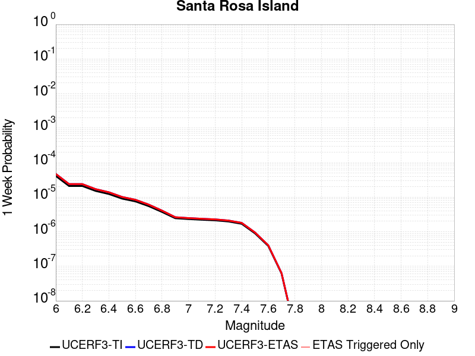 |  |  |  |

| Magnitude | 1 wk TI Prob | 1 wk TD Prob | 1 wk ETAS Prob | 1 wk ETAS/TD Gain | 1 wk ETAS Triggered Only | 1 mo TI Prob | 1 mo TD Prob | 1 mo ETAS Prob | 1 mo ETAS/TD Gain | 1 mo ETAS Triggered Only | 1 yr TI Prob | 1 yr TD Prob | 1 yr ETAS Prob | 1 yr ETAS/TD Gain | 1 yr ETAS Triggered Only | 10 yr TI Prob | 10 yr TD Prob | 10 yr ETAS Prob | 10 yr ETAS/TD Gain | 10 yr ETAS Triggered Only |
|-----|-----|-----|-----|-----|-----|-----|-----|-----|-----|-----|-----|-----|-----|-----|-----|-----|-----|-----|-----|-----|
| 6.0 | 4.1143165E-5 | 4.7092042E-5 | 4.7092042E-5 | 1.0 | 0.0 | 1.7631594E-4 | 2.0180854E-4 | 2.0180854E-4 | 1.0 | 0.0 | 0.002144533 | 0.0024544473 | 0.0024748887 | 1.0083283 | 2.0491803E-5 | 0.021239553 | 0.024294013 | 0.02437399 | 1.003292 | 8.196721E-5 |
| 6.1 | 2.1061249E-5 | 2.3865383E-5 | 2.3865383E-5 | 1.0 | 0.0 | 9.0259375E-5 | 1.0227637E-4 | 1.0227637E-4 | 1.0 | 0.0 | 0.0010983539 | 0.0012445324 | 0.0012649987 | 1.0164449 | 2.0491803E-5 | 0.01092941 | 0.012378667 | 0.012398905 | 1.001635 | 2.0491803E-5 |
| 6.2 | 2.1061249E-5 | 2.3865383E-5 | 2.3865383E-5 | 1.0 | 0.0 | 9.0259375E-5 | 1.0227637E-4 | 1.0227637E-4 | 1.0 | 0.0 | 0.0010983539 | 0.0012445324 | 0.0012649987 | 1.0164449 | 2.0491803E-5 | 0.01092941 | 0.012378667 | 0.012398905 | 1.001635 | 2.0491803E-5 |
| 6.3 | 1.5158236E-5 | 1.7074708E-5 | 1.7074708E-5 | 1.0 | 0.0 | 6.496225E-5 | 7.317533E-5 | 7.317533E-5 | 1.0 | 0.0 | 7.906284E-4 | 8.905574E-4 | 9.11031E-4 | 1.0229896 | 2.0491803E-5 | 0.007878214 | 0.008871138 | 0.008891448 | 1.0022894 | 2.0491803E-5 |
| 6.4 | 1.2341918E-5 | 1.3853143E-5 | 1.3853143E-5 | 1.0 | 0.0 | 5.2892858E-5 | 5.9369308E-5 | 5.9369308E-5 | 1.0 | 0.0 | 6.437803E-4 | 7.225897E-4 | 7.225897E-4 | 1.0 | 0.0 | 0.006419184 | 0.0072032386 | 0.0072032386 | 1.0 | 0.0 |
| 6.5 | 9.061158E-6 | 1.0117188E-5 | 1.0117188E-5 | 1.0 | 0.0 | 3.883296E-5 | 4.335869E-5 | 4.335869E-5 | 1.0 | 0.0 | 4.726887E-4 | 5.277695E-4 | 5.277695E-4 | 1.0 | 0.0 | 0.004716845 | 0.0052656992 | 0.0052656992 | 1.0 | 0.0 |
| 6.6 | 7.5461685E-6 | 8.400861E-6 | 8.400861E-6 | 1.0 | 0.0 | 3.2340322E-5 | 3.6003217E-5 | 3.6003217E-5 | 1.0 | 0.0 | 3.936723E-4 | 4.382553E-4 | 4.382553E-4 | 1.0 | 0.0 | 0.003929756 | 0.0043743397 | 0.0043743397 | 1.0 | 0.0 |
| 6.7 | 5.5023775E-6 | 6.0874677E-6 | 6.0874677E-6 | 1.0 | 0.0 | 2.3581404E-5 | 2.6088905E-5 | 2.6088905E-5 | 1.0 | 0.0 | 2.8706578E-4 | 3.1758935E-4 | 3.1758935E-4 | 1.0 | 0.0 | 0.0028669522 | 0.0031716768 | 0.0031716768 | 1.0 | 0.0 |
| 6.8 | 3.7351679E-6 | 4.0831915E-6 | 4.0831915E-6 | 1.0 | 0.0 | 1.6007763E-5 | 1.749929E-5 | 1.749929E-5 | 1.0 | 0.0 | 1.948771E-4 | 2.1303551E-4 | 2.1303551E-4 | 1.0 | 0.0 | 0.0019470629 | 0.002128558 | 0.002128558 | 1.0 | 0.0 |
| 6.9 | 2.456366E-6 | 2.6292953E-6 | 2.6292953E-6 | 1.0 | 0.0 | 1.0527241E-5 | 1.126836E-5 | 1.126836E-5 | 1.0 | 0.0 | 1.2816161E-4 | 1.3718367E-4 | 1.3718367E-4 | 1.0 | 0.0 | 0.0012808773 | 0.0013709929 | 0.0013709929 | 1.0 | 0.0 |
| 7.0 | 2.3245157E-6 | 2.482801E-6 | 2.482801E-6 | 1.0 | 0.0 | 9.962172E-6 | 1.0640532E-5 | 1.0640532E-5 | 1.0 | 0.0 | 1.2128269E-4 | 1.295408E-4 | 1.295408E-4 | 1.0 | 0.0 | 0.0012121652 | 0.0012946551 | 0.0012946551 | 1.0 | 0.0 |
| 7.1 | 2.2248344E-6 | 2.3732712E-6 | 2.3732712E-6 | 1.0 | 0.0 | 9.53497E-6 | 1.0171123E-5 | 1.0171123E-5 | 1.0 | 0.0 | 1.1608207E-4 | 1.238264E-4 | 1.238264E-4 | 1.0 | 0.0 | 0.0011602144 | 0.001237576 | 0.001237576 | 1.0 | 0.0 |
| 7.2 | 2.1350402E-6 | 2.2761742E-6 | 2.2761742E-6 | 1.0 | 0.0 | 9.150141E-6 | 9.7549955E-6 | 9.7549955E-6 | 1.0 | 0.0 | 1.1139726E-4 | 1.1876062E-4 | 1.1876062E-4 | 1.0 | 0.0 | 0.0011134144 | 0.0011869734 | 0.0011869734 | 1.0 | 0.0 |
| 7.3 | 1.9793572E-6 | 2.1087376E-6 | 2.1087376E-6 | 1.0 | 0.0 | 8.482932E-6 | 9.037415E-6 | 9.037415E-6 | 1.0 | 0.0 | 1.032748E-4 | 1.10024994E-4 | 1.10024994E-4 | 1.0 | 0.0 | 0.0010322682 | 0.001099707 | 0.001099707 | 1.0 | 0.0 |
| 7.4 | 1.6951194E-6 | 1.804589E-6 | 1.804589E-6 | 1.0 | 0.0 | 7.264777E-6 | 7.73393E-6 | 7.73393E-6 | 1.0 | 0.0 | 8.844508E-5 | 9.4156545E-5 | 9.4156545E-5 | 1.0 | 0.0 | 8.840988E-4 | 9.411682E-4 | 9.411682E-4 | 1.0 | 0.0 |
| 7.5 | 8.987207E-7 | 9.51229E-7 | 9.51229E-7 | 1.0 | 0.0 | 3.8516546E-6 | 4.0766895E-6 | 4.0766895E-6 | 1.0 | 0.0 | 4.6892885E-5 | 4.9632577E-5 | 4.9632577E-5 | 1.0 | 0.0 | 4.688299E-4 | 4.9621606E-4 | 4.9621606E-4 | 1.0 | 0.0 |
| 7.6 | 3.8783037E-7 | 4.052958E-7 | 4.052958E-7 | 1.0 | 0.0 | 1.6621291E-6 | 1.7369808E-6 | 1.7369808E-6 | 1.0 | 0.0 | 2.0236233E-5 | 2.1147544E-5 | 2.1147544E-5 | 1.0 | 0.0 | 2.023439E-4 | 2.1145596E-4 | 2.1145596E-4 | 1.0 | 0.0 |
| 7.7 | 6.181804E-8 | 6.3390665E-8 | 6.3390665E-8 | 1.0 | 0.0 | 2.6493444E-7 | 2.7167425E-7 | 2.7167425E-7 | 1.0 | 0.0 | 3.225572E-6 | 3.307629E-6 | 3.307629E-6 | 1.0 | 0.0 | 3.225525E-5 | 3.3075805E-5 | 3.3075805E-5 | 1.0 | 0.0 |
| 7.8 | 1.3704449E-9 | 1.3964188E-9 | 1.3964188E-9 | 1.0 | 0.0 | 5.873335E-9 | 5.984652E-9 | 5.984652E-9 | 1.0 | 0.0 | 7.1507856E-8 | 7.286314E-8 | 7.286314E-8 | 1.0 | 0.0 | 7.1507833E-7 | 7.286312E-7 | 7.286312E-7 | 1.0 | 0.0 |

## Elysian Park (Upper)
*[(top)](#table-of-contents)*

| 1 Week | 1 Month | 1 Year | 10 Year |
|-----|-----|-----|-----|
|  |  |  |  |

| Magnitude | 1 wk TI Prob | 1 wk TD Prob | 1 wk ETAS Prob | 1 wk ETAS/TD Gain | 1 wk ETAS Triggered Only | 1 mo TI Prob | 1 mo TD Prob | 1 mo ETAS Prob | 1 mo ETAS/TD Gain | 1 mo ETAS Triggered Only | 1 yr TI Prob | 1 yr TD Prob | 1 yr ETAS Prob | 1 yr ETAS/TD Gain | 1 yr ETAS Triggered Only | 10 yr TI Prob | 10 yr TD Prob | 10 yr ETAS Prob | 10 yr ETAS/TD Gain | 10 yr ETAS Triggered Only |
|-----|-----|-----|-----|-----|-----|-----|-----|-----|-----|-----|-----|-----|-----|-----|-----|-----|-----|-----|-----|-----|
| 6.0 | 3.1876025E-5 | 3.703652E-5 | 3.703652E-5 | 1.0 | 0.0 | 1.3660437E-4 | 1.5872101E-4 | 1.7920957E-4 | 1.1290853 | 2.0491803E-5 | 0.0016618895 | 0.0019311584 | 0.001992515 | 1.031772 | 6.147541E-5 | 0.016495159 | 0.019190295 | 0.01925059 | 1.003142 | 6.147541E-5 |
| 6.1 | 3.1876025E-5 | 3.703652E-5 | 3.703652E-5 | 1.0 | 0.0 | 1.3660437E-4 | 1.5872101E-4 | 1.7920957E-4 | 1.1290853 | 2.0491803E-5 | 0.0016618895 | 0.0019311584 | 0.001992515 | 1.031772 | 6.147541E-5 | 0.016495159 | 0.019190295 | 0.01925059 | 1.003142 | 6.147541E-5 |
| 6.2 | 3.1876025E-5 | 3.703652E-5 | 3.703652E-5 | 1.0 | 0.0 | 1.3660437E-4 | 1.5872101E-4 | 1.7920957E-4 | 1.1290853 | 2.0491803E-5 | 0.0016618895 | 0.0019311584 | 0.001992515 | 1.031772 | 6.147541E-5 | 0.016495159 | 0.019190295 | 0.01925059 | 1.003142 | 6.147541E-5 |
| 6.3 | 3.1876025E-5 | 3.703652E-5 | 3.703652E-5 | 1.0 | 0.0 | 1.3660437E-4 | 1.5872101E-4 | 1.7920957E-4 | 1.1290853 | 2.0491803E-5 | 0.0016618895 | 0.0019311584 | 0.001992515 | 1.031772 | 6.147541E-5 | 0.016495159 | 0.019190295 | 0.01925059 | 1.003142 | 6.147541E-5 |
| 6.4 | 1.9273462E-5 | 2.120273E-5 | 2.120273E-5 | 1.0 | 0.0 | 8.259794E-5 | 9.0866655E-5 | 1.113566E-4 | 1.2254946 | 2.0491803E-5 | 0.001005166 | 0.0011059135 | 0.0011468518 | 1.0370176 | 4.0983607E-5 | 0.010006315 | 0.011020964 | 0.011061496 | 1.0036777 | 4.0983607E-5 |
| 6.5 | 1.9273462E-5 | 2.120273E-5 | 2.120273E-5 | 1.0 | 0.0 | 8.259794E-5 | 9.0866655E-5 | 1.113566E-4 | 1.2254946 | 2.0491803E-5 | 0.001005166 | 0.0011059135 | 0.0011468518 | 1.0370176 | 4.0983607E-5 | 0.010006315 | 0.011020964 | 0.011061496 | 1.0036777 | 4.0983607E-5 |
| 6.6 | 9.813258E-6 | 9.665728E-6 | 9.665728E-6 | 1.0 | 0.0 | 4.205614E-5 | 4.142393E-5 | 4.142393E-5 | 1.0 | 0.0 | 5.119132E-4 | 5.042269E-4 | 5.2470836E-4 | 1.0406196 | 2.0491803E-5 | 0.005107356 | 0.005031552 | 0.0050519407 | 1.0040522 | 2.0491803E-5 |
| 6.7 | 9.801478E-6 | 9.653297E-6 | 9.653297E-6 | 1.0 | 0.0 | 4.2005657E-5 | 4.137066E-5 | 4.137066E-5 | 1.0 | 0.0 | 5.112989E-4 | 5.0357863E-4 | 5.240601E-4 | 1.0406718 | 2.0491803E-5 | 0.0051012407 | 0.0050250986 | 0.005045487 | 1.0040574 | 2.0491803E-5 |
| 6.8 | 8.102489E-6 | 7.7731065E-6 | 7.7731065E-6 | 1.0 | 0.0 | 3.4724493E-5 | 3.3312917E-5 | 3.3312917E-5 | 1.0 | 0.0 | 4.2268867E-4 | 4.0551423E-4 | 4.2599774E-4 | 1.0505124 | 2.0491803E-5 | 0.004218856 | 0.0040482366 | 0.0040686456 | 1.0050414 | 2.0491803E-5 |
| 6.9 | 6.08275E-6 | 5.4815127E-6 | 5.4815127E-6 | 1.0 | 0.0 | 2.6068668E-5 | 2.349199E-5 | 2.349199E-5 | 1.0 | 0.0 | 3.173398E-4 | 2.8597823E-4 | 3.0646415E-4 | 1.0716347 | 2.0491803E-5 | 0.0031688702 | 0.0028561796 | 0.002876613 | 1.0071541 | 2.0491803E-5 |
| 7.0 | 5.5995934E-6 | 4.982836E-6 | 4.982836E-6 | 1.0 | 0.0 | 2.3998036E-5 | 2.135484E-5 | 2.135484E-5 | 1.0 | 0.0 | 2.9213692E-4 | 2.599648E-4 | 2.804513E-4 | 1.0788049 | 2.0491803E-5 | 0.0029175316 | 0.0025966743 | 0.0026171128 | 1.007871 | 2.0491803E-5 |
| 7.1 | 4.709881E-6 | 4.0874465E-6 | 4.0874465E-6 | 1.0 | 0.0 | 2.0185047E-5 | 1.7517514E-5 | 1.7517514E-5 | 1.0 | 0.0 | 2.4572524E-4 | 2.1325526E-4 | 2.337427E-4 | 1.09607 | 2.0491803E-5 | 0.002454537 | 0.0021305475 | 0.0021509957 | 1.0095977 | 2.0491803E-5 |
| 7.2 | 3.6063436E-6 | 2.9779865E-6 | 2.9779865E-6 | 1.0 | 0.0 | 1.5455667E-5 | 1.2762738E-5 | 1.2762738E-5 | 1.0 | 0.0 | 1.881565E-4 | 1.5537537E-4 | 1.5537537E-4 | 1.0 | 0.0 | 0.0018799726 | 0.0015526785 | 0.0015526785 | 1.0 | 0.0 |
| 7.3 | 2.471135E-6 | 2.0954842E-6 | 2.0954842E-6 | 1.0 | 0.0 | 1.0590536E-5 | 8.980616E-6 | 8.980616E-6 | 1.0 | 0.0 | 1.2893214E-4 | 1.0933358E-4 | 1.0933358E-4 | 1.0 | 0.0 | 0.0012885736 | 0.0010928052 | 0.0010928052 | 1.0 | 0.0 |
| 7.4 | 1.163943E-6 | 1.0275212E-6 | 1.0275212E-6 | 1.0 | 0.0 | 4.988318E-6 | 4.403655E-6 | 4.403655E-6 | 1.0 | 0.0 | 6.0731076E-5 | 5.3613214E-5 | 5.3613214E-5 | 1.0 | 0.0 | 6.071448E-4 | 5.3600577E-4 | 5.3600577E-4 | 1.0 | 0.0 |
| 7.5 | 4.99459E-7 | 4.9176606E-7 | 4.9176606E-7 | 1.0 | 0.0 | 2.140537E-6 | 2.107567E-6 | 2.107567E-6 | 1.0 | 0.0 | 2.6060725E-5 | 2.5659343E-5 | 2.5659343E-5 | 1.0 | 0.0 | 2.605767E-4 | 2.5656537E-4 | 2.5656537E-4 | 1.0 | 0.0 |
| 7.6 | 2.4667852E-7 | 2.4778674E-7 | 2.4778674E-7 | 1.0 | 0.0 | 1.0571932E-6 | 1.0619428E-6 | 1.0619428E-6 | 1.0 | 0.0 | 1.2871251E-5 | 1.2929081E-5 | 1.2929081E-5 | 1.0 | 0.0 | 1.2870505E-4 | 1.2928365E-4 | 1.2928365E-4 | 1.0 | 0.0 |
| 7.7 | 8.2312795E-8 | 7.386629E-8 | 7.386629E-8 | 1.0 | 0.0 | 3.527691E-7 | 3.1656978E-7 | 3.1656978E-7 | 1.0 | 0.0 | 4.294955E-6 | 3.8542316E-6 | 3.8542316E-6 | 1.0 | 0.0 | 4.2948723E-5 | 3.8541762E-5 | 3.8541762E-5 | 1.0 | 0.0 |
| 7.8 | 2.7819295E-8 | 1.7567322E-8 | 1.7567322E-8 | 1.0 | 0.0 | 1.1922555E-7 | 7.528852E-8 | 7.528852E-8 | 1.0 | 0.0 | 1.45157E-6 | 9.166375E-7 | 9.166375E-7 | 1.0 | 0.0 | 1.45156055E-5 | 9.166352E-6 | 9.166352E-6 | 1.0 | 0.0 |

## San Jacinto (Anza) rev
*[(top)](#table-of-contents)*

| 1 Week | 1 Month | 1 Year | 10 Year |
|-----|-----|-----|-----|
|  | 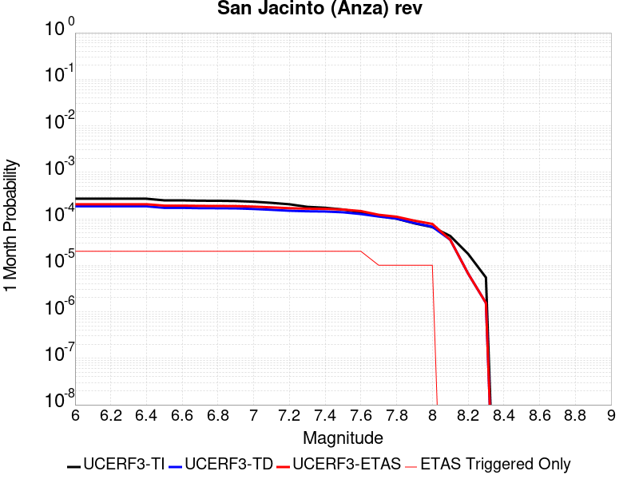 |  |  |

| Magnitude | 1 wk TI Prob | 1 wk TD Prob | 1 wk ETAS Prob | 1 wk ETAS/TD Gain | 1 wk ETAS Triggered Only | 1 mo TI Prob | 1 mo TD Prob | 1 mo ETAS Prob | 1 mo ETAS/TD Gain | 1 mo ETAS Triggered Only | 1 yr TI Prob | 1 yr TD Prob | 1 yr ETAS Prob | 1 yr ETAS/TD Gain | 1 yr ETAS Triggered Only | 10 yr TI Prob | 10 yr TD Prob | 10 yr ETAS Prob | 10 yr ETAS/TD Gain | 10 yr ETAS Triggered Only |
|-----|-----|-----|-----|-----|-----|-----|-----|-----|-----|-----|-----|-----|-----|-----|-----|-----|-----|-----|-----|-----|
| 6.0 | 6.3015636E-5 | 4.3319626E-5 | 4.3319626E-5 | 1.0 | 0.0 | 2.7003905E-4 | 1.8564239E-4 | 2.061304E-4 | 1.1103628 | 2.0491803E-5 | 0.0032827691 | 0.0022578652 | 0.0022987563 | 1.0181105 | 4.0983607E-5 | 0.032346968 | 0.02330496 | 0.023385016 | 1.0034351 | 8.196721E-5 |
| 6.1 | 6.3015636E-5 | 4.3319626E-5 | 4.3319626E-5 | 1.0 | 0.0 | 2.7003905E-4 | 1.8564239E-4 | 2.061304E-4 | 1.1103628 | 2.0491803E-5 | 0.0032827691 | 0.0022578652 | 0.0022987563 | 1.0181105 | 4.0983607E-5 | 0.032346968 | 0.02330496 | 0.023385016 | 1.0034351 | 8.196721E-5 |
| 6.2 | 6.3015636E-5 | 4.3319626E-5 | 4.3319626E-5 | 1.0 | 0.0 | 2.7003905E-4 | 1.8564239E-4 | 2.061304E-4 | 1.1103628 | 2.0491803E-5 | 0.0032827691 | 0.0022578652 | 0.0022987563 | 1.0181105 | 4.0983607E-5 | 0.032346968 | 0.02330496 | 0.023385016 | 1.0034351 | 8.196721E-5 |
| 6.3 | 6.3015636E-5 | 4.3319626E-5 | 4.3319626E-5 | 1.0 | 0.0 | 2.7003905E-4 | 1.8564239E-4 | 2.061304E-4 | 1.1103628 | 2.0491803E-5 | 0.0032827691 | 0.0022578652 | 0.0022987563 | 1.0181105 | 4.0983607E-5 | 0.032346968 | 0.02330496 | 0.023385016 | 1.0034351 | 8.196721E-5 |
| 6.4 | 6.3015636E-5 | 4.3319626E-5 | 4.3319626E-5 | 1.0 | 0.0 | 2.7003905E-4 | 1.8564239E-4 | 2.061304E-4 | 1.1103628 | 2.0491803E-5 | 0.0032827691 | 0.0022578652 | 0.0022987563 | 1.0181105 | 4.0983607E-5 | 0.032346968 | 0.02330496 | 0.023385016 | 1.0034351 | 8.196721E-5 |
| 6.5 | 5.811017E-5 | 4.0098632E-5 | 4.0098632E-5 | 1.0 | 0.0 | 2.4901982E-4 | 1.7184E-4 | 1.9232828E-4 | 1.1192288 | 2.0491803E-5 | 0.0030276014 | 0.00209015 | 0.0021310481 | 1.019567 | 4.0983607E-5 | 0.02986684 | 0.021602087 | 0.021682283 | 1.0037124 | 8.196721E-5 |
| 6.6 | 5.811017E-5 | 4.0098632E-5 | 4.0098632E-5 | 1.0 | 0.0 | 2.4901982E-4 | 1.7184E-4 | 1.9232828E-4 | 1.1192288 | 2.0491803E-5 | 0.0030276014 | 0.00209015 | 0.0021310481 | 1.019567 | 4.0983607E-5 | 0.02986684 | 0.021602087 | 0.021682283 | 1.0037124 | 8.196721E-5 |
| 6.7 | 5.712442E-5 | 3.952116E-5 | 3.952116E-5 | 1.0 | 0.0 | 2.4479596E-4 | 1.6936543E-4 | 1.8985376E-4 | 1.1209712 | 2.0491803E-5 | 0.0029763177 | 0.0020600795 | 0.0021009787 | 1.0198532 | 4.0983607E-5 | 0.029367693 | 0.021293823 | 0.021374045 | 1.0037674 | 8.196721E-5 |
| 6.8 | 5.6967532E-5 | 3.9377548E-5 | 3.9377548E-5 | 1.0 | 0.0 | 2.4412372E-4 | 1.6875003E-4 | 1.8923839E-4 | 1.1214124 | 2.0491803E-5 | 0.0029681553 | 0.0020526012 | 0.0020935007 | 1.0199257 | 4.0983607E-5 | 0.029288229 | 0.021218529 | 0.021298757 | 1.0037811 | 8.196721E-5 |
| 6.9 | 5.6211324E-5 | 3.9082228E-5 | 3.9082228E-5 | 1.0 | 0.0 | 2.4088343E-4 | 1.6748454E-4 | 1.8797291E-4 | 1.12233 | 2.0491803E-5 | 0.0029288116 | 0.0020372227 | 0.002078123 | 1.0200764 | 4.0983607E-5 | 0.028905109 | 0.021057902 | 0.021138143 | 1.0038105 | 8.196721E-5 |
| 7.0 | 5.4383527E-5 | 3.7942387E-5 | 3.7942387E-5 | 1.0 | 0.0 | 2.3305144E-4 | 1.6260012E-4 | 1.8308859E-4 | 1.1260053 | 2.0491803E-5 | 0.0028337094 | 0.001977864 | 0.0020187665 | 1.0206802 | 4.0983607E-5 | 0.027978465 | 0.020448677 | 0.020528968 | 1.0039265 | 8.196721E-5 |
| 7.1 | 5.1393665E-5 | 3.640475E-5 | 3.640475E-5 | 1.0 | 0.0 | 2.2023996E-4 | 1.5601104E-4 | 1.7649964E-4 | 1.131328 | 2.0491803E-5 | 0.0026781242 | 0.0018977838 | 0.0019386896 | 1.0215545 | 4.0983607E-5 | 0.026460782 | 0.019622007 | 0.019702366 | 1.0040953 | 8.196721E-5 |
| 7.2 | 4.785222E-5 | 3.475601E-5 | 3.475601E-5 | 1.0 | 0.0 | 2.0506482E-4 | 1.4894584E-4 | 1.694346E-4 | 1.1375583 | 2.0491803E-5 | 0.0024938055 | 0.0018119109 | 0.0018528202 | 1.022578 | 4.0983607E-5 | 0.024660049 | 0.018736389 | 0.018816821 | 1.0042928 | 8.196721E-5 |
| 7.3 | 4.2143256E-5 | 3.3850083E-5 | 3.3850083E-5 | 1.0 | 0.0 | 1.8060145E-4 | 1.4506375E-4 | 1.6555257E-4 | 1.1412402 | 2.0491803E-5 | 0.002196605 | 0.0017647238 | 0.001805635 | 1.0231829 | 4.0983607E-5 | 0.02175019 | 0.018244414 | 0.018324886 | 1.0044107 | 8.196721E-5 |
| 7.4 | 4.0264713E-5 | 3.3488133E-5 | 3.3488133E-5 | 1.0 | 0.0 | 1.7255165E-4 | 1.435127E-4 | 1.6400157E-4 | 1.1427668 | 2.0491803E-5 | 0.002098792 | 0.0017458702 | 0.0017867823 | 1.0234336 | 4.0983607E-5 | 0.020790804 | 0.018048922 | 0.01812941 | 1.0044594 | 8.196721E-5 |
| 7.5 | 3.694492E-5 | 3.2201835E-5 | 3.2201835E-5 | 1.0 | 0.0 | 1.5832575E-4 | 1.3800059E-4 | 1.5848957E-4 | 1.1484702 | 2.0491803E-5 | 0.0019259118 | 0.0016788654 | 0.0017197801 | 1.0243706 | 4.0983607E-5 | 0.01909306 | 0.017365217 | 0.017445762 | 1.0046382 | 8.196721E-5 |
| 7.6 | 3.200565E-5 | 2.9517045E-5 | 2.9517045E-5 | 1.0 | 0.0 | 1.3715986E-4 | 1.2649549E-4 | 1.469847E-4 | 1.1619759 | 2.0491803E-5 | 0.001668642 | 0.0015389969 | 0.0015799174 | 1.026589 | 4.0983607E-5 | 0.01656168 | 0.015953032 | 0.016033692 | 1.005056 | 8.196721E-5 |
| 7.7 | 2.731642E-5 | 2.610537E-5 | 2.610537E-5 | 1.0 | 0.0 | 1.1706512E-4 | 1.11875364E-4 | 1.3236488E-4 | 1.1831459 | 2.0491803E-5 | 0.001424336 | 0.0013612325 | 0.0014021603 | 1.0300667 | 4.0983607E-5 | 0.014152412 | 0.0141735645 | 0.014254371 | 1.0057012 | 8.196721E-5 |
| 7.8 | 2.3466424E-5 | 2.3516895E-5 | 2.3516895E-5 | 1.0 | 0.0 | 1.0056651E-4 | 1.007828E-4 | 1.2127254E-4 | 1.2033058 | 2.0491803E-5 | 0.0012237094 | 0.0012263408 | 0.0012672741 | 1.0333785 | 4.0983607E-5 | 0.012169928 | 0.012815201 | 0.012896117 | 1.0063142 | 8.196721E-5 |
| 7.9 | 1.8611925E-5 | 1.8918972E-5 | 1.8918972E-5 | 1.0 | 0.0 | 7.9762955E-5 | 8.107879E-5 | 1.01568934E-4 | 1.2527189 | 2.0491803E-5 | 9.7068126E-4 | 9.86688E-4 | 0.0010276311 | 1.0414956 | 4.0983607E-5 | 0.0096645225 | 0.010399517 | 0.010480631 | 1.0077999 | 8.196721E-5 |
| 8.0 | 1.5460775E-5 | 1.5750582E-5 | 1.5750582E-5 | 1.0 | 0.0 | 6.6258784E-5 | 6.7500754E-5 | 8.7991175E-5 | 1.3035583 | 2.0491803E-5 | 8.0640207E-4 | 8.215125E-4 | 8.6246245E-4 | 1.049847 | 4.0983607E-5 | 0.008034821 | 0.008707945 | 0.0087891985 | 1.009331 | 8.196721E-5 |
| 8.1 | 9.983884E-6 | 8.275629E-6 | 8.275629E-6 | 1.0 | 0.0 | 4.2787375E-5 | 3.54665E-5 | 3.54665E-5 | 1.0 | 0.0 | 5.2081177E-4 | 4.3171959E-4 | 4.3171959E-4 | 1.0 | 0.0 | 0.0051959283 | 0.004643071 | 0.004643071 | 1.0 | 0.0 |
| 8.2 | 4.1226E-6 | 1.5546157E-6 | 1.5546157E-6 | 1.0 | 0.0 | 1.7668166E-5 | 6.6626217E-6 | 6.6626217E-6 | 1.0 | 0.0 | 2.1508869E-4 | 8.111443E-5 | 8.111443E-5 | 1.0 | 0.0 | 0.0021488064 | 9.4143586E-4 | 9.4143586E-4 | 1.0 | 0.0 |
| 8.3 | 1.2750878E-6 | 3.6166134E-7 | 3.6166134E-7 | 1.0 | 0.0 | 5.4646503E-6 | 1.5499762E-6 | 1.5499762E-6 | 1.0 | 0.0 | 6.653009E-5 | 1.8870802E-5 | 1.8870802E-5 | 1.0 | 0.0 | 6.6510175E-4 | 2.2760578E-4 | 2.2760578E-4 | 1.0 | 0.0 |

## San Diego Trough north alt1
*[(top)](#table-of-contents)*

| 1 Week | 1 Month | 1 Year | 10 Year |
|-----|-----|-----|-----|
|  | 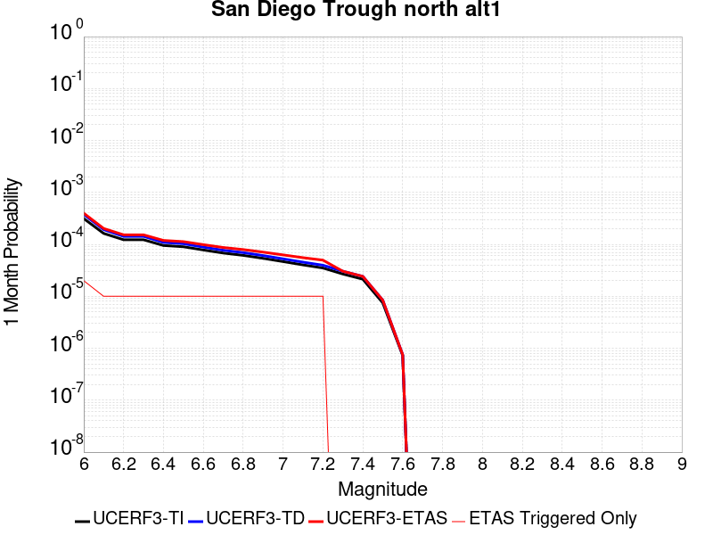 |  |  |

| Magnitude | 1 wk TI Prob | 1 wk TD Prob | 1 wk ETAS Prob | 1 wk ETAS/TD Gain | 1 wk ETAS Triggered Only | 1 mo TI Prob | 1 mo TD Prob | 1 mo ETAS Prob | 1 mo ETAS/TD Gain | 1 mo ETAS Triggered Only | 1 yr TI Prob | 1 yr TD Prob | 1 yr ETAS Prob | 1 yr ETAS/TD Gain | 1 yr ETAS Triggered Only | 10 yr TI Prob | 10 yr TD Prob | 10 yr ETAS Prob | 10 yr ETAS/TD Gain | 10 yr ETAS Triggered Only |
|-----|-----|-----|-----|-----|-----|-----|-----|-----|-----|-----|-----|-----|-----|-----|-----|-----|-----|-----|-----|-----|
| 6.0 | 7.329252E-5 | 8.821339E-5 | 1.0870339E-4 | 1.2322776 | 2.0491803E-5 | 3.14073E-4 | 3.7800625E-4 | 3.9849032E-4 | 1.0541897 | 2.0491803E-5 | 0.0038171355 | 0.0045931544 | 0.0046339496 | 1.0088818 | 4.0983607E-5 | 0.03752231 | 0.045046188 | 0.045104895 | 1.0013032 | 6.147541E-5 |
| 6.1 | 3.7940346E-5 | 4.488612E-5 | 6.5377004E-5 | 1.4565083 | 2.0491803E-5 | 1.6259136E-4 | 1.9235547E-4 | 2.1284333E-4 | 1.1065104 | 2.0491803E-5 | 0.0019777524 | 0.002339501 | 0.0023599449 | 1.0087385 | 2.0491803E-5 | 0.019602431 | 0.023157248 | 0.023177266 | 1.0008644 | 2.0491803E-5 |
| 6.2 | 2.8645263E-5 | 3.329751E-5 | 5.3788634E-5 | 1.615395 | 2.0491803E-5 | 1.2275964E-4 | 1.4269596E-4 | 1.6318486E-4 | 1.1435841 | 2.0491803E-5 | 0.0014935739 | 0.0017359565 | 0.0017564127 | 1.0117838 | 2.0491803E-5 | 0.0148357535 | 0.01722662 | 0.017246759 | 1.0011691 | 2.0491803E-5 |
| 6.3 | 2.8645263E-5 | 3.329751E-5 | 5.3788634E-5 | 1.615395 | 2.0491803E-5 | 1.2275964E-4 | 1.4269596E-4 | 1.6318486E-4 | 1.1435841 | 2.0491803E-5 | 0.0014935739 | 0.0017359565 | 0.0017564127 | 1.0117838 | 2.0491803E-5 | 0.0148357535 | 0.01722662 | 0.017246759 | 1.0011691 | 2.0491803E-5 |
| 6.4 | 2.2204576E-5 | 2.5448817E-5 | 4.5940098E-5 | 1.8051958 | 2.0491803E-5 | 9.5159E-5 | 1.0906186E-4 | 1.2955142E-4 | 1.1878711 | 2.0491803E-5 | 0.001157945 | 0.0013270293 | 0.001347494 | 1.0154214 | 2.0491803E-5 | 0.011519298 | 0.013192211 | 0.013212433 | 1.0015328 | 2.0491803E-5 |
| 6.5 | 2.1004838E-5 | 2.4025157E-5 | 4.451647E-5 | 1.8529105 | 2.0491803E-5 | 9.0017624E-5 | 1.0296095E-4 | 1.2345065E-4 | 1.1990045 | 2.0491803E-5 | 0.0010954136 | 0.001252838 | 0.0012733041 | 1.0163358 | 2.0491803E-5 | 0.010900296 | 0.012458827 | 0.012479064 | 1.0016242 | 2.0491803E-5 |
| 6.6 | 1.820557E-5 | 2.0705167E-5 | 4.1196545E-5 | 1.9896747 | 2.0491803E-5 | 7.802154E-5 | 8.873344E-5 | 1.0922342E-4 | 1.2309161 | 2.0491803E-5 | 9.4949827E-4 | 0.0010797997 | 0.0011002694 | 1.0189569 | 2.0491803E-5 | 0.009454516 | 0.010746201 | 0.010766472 | 1.0018864 | 2.0491803E-5 |
| 6.7 | 1.5884485E-5 | 1.7983964E-5 | 3.84754E-5 | 2.1394281 | 2.0491803E-5 | 6.807459E-5 | 7.707187E-5 | 9.756209E-5 | 1.2658587 | 2.0491803E-5 | 8.284929E-4 | 9.379488E-4 | 9.584214E-4 | 1.021827 | 2.0491803E-5 | 0.008254109 | 0.009340268 | 0.009360568 | 1.0021734 | 2.0491803E-5 |
| 6.8 | 1.4331171E-5 | 1.6201348E-5 | 3.6692818E-5 | 2.2648005 | 2.0491803E-5 | 6.141786E-5 | 6.9432506E-5 | 8.992289E-5 | 1.2951123 | 2.0491803E-5 | 7.4750587E-4 | 8.4501493E-4 | 8.654894E-4 | 1.0242298 | 2.0491803E-5 | 0.0074499645 | 0.008418285 | 0.008438605 | 1.0024137 | 2.0491803E-5 |
| 6.9 | 1.2574203E-5 | 1.4206081E-5 | 3.4697594E-5 | 2.4424465 | 2.0491803E-5 | 5.3888325E-5 | 6.088179E-5 | 8.1372345E-5 | 1.336563 | 2.0491803E-5 | 6.558929E-4 | 7.4098515E-4 | 7.6146174E-4 | 1.0276343 | 2.0491803E-5 | 0.0065396037 | 0.0073853307 | 0.0074056713 | 1.0027542 | 2.0491803E-5 |
| 7.0 | 1.0883844E-5 | 1.22894735E-5 | 3.2781023E-5 | 2.6674068 | 2.0491803E-5 | 4.664421E-5 | 5.2668114E-5 | 7.315884E-5 | 1.3890537 | 2.0491803E-5 | 5.677453E-4 | 6.410466E-4 | 6.615253E-4 | 1.0319457 | 2.0491803E-5 | 0.00566297 | 0.0063921027 | 0.0064124633 | 1.0031853 | 2.0491803E-5 |
| 7.1 | 9.393088E-6 | 1.0607203E-5 | 3.109879E-5 | 2.9318557 | 2.0491803E-5 | 4.025547E-5 | 4.5458655E-5 | 6.594953E-5 | 1.4507585 | 2.0491803E-5 | 4.900001E-4 | 5.5331935E-4 | 5.737998E-4 | 1.0370138 | 2.0491803E-5 | 0.0048892107 | 0.005519513 | 0.005539892 | 1.0036922 | 2.0491803E-5 |
| 7.2 | 8.190791E-6 | 9.258787E-6 | 2.9750401E-5 | 3.2132072 | 2.0491803E-5 | 3.510292E-5 | 3.9679915E-5 | 6.0170907E-5 | 1.5164071 | 2.0491803E-5 | 4.2729423E-4 | 4.8299658E-4 | 5.0347846E-4 | 1.042406 | 2.0491803E-5 | 0.0042647356 | 0.004819548 | 0.0048399414 | 1.0042313 | 2.0491803E-5 |
| 7.3 | 6.268162E-6 | 7.08984E-6 | 7.08984E-6 | 1.0 | 0.0 | 2.6863276E-5 | 3.0384675E-5 | 3.0384675E-5 | 1.0 | 0.0 | 3.2701128E-4 | 3.6987104E-4 | 3.6987104E-4 | 1.0 | 0.0 | 0.003265305 | 0.0036926004 | 0.0036926004 | 1.0 | 0.0 |
| 7.4 | 4.985186E-6 | 5.6427807E-6 | 5.6427807E-6 | 1.0 | 0.0 | 2.1364907E-5 | 2.4183124E-5 | 2.4183124E-5 | 1.0 | 0.0 | 2.600867E-4 | 2.9439016E-4 | 2.9439016E-4 | 1.0 | 0.0 | 0.002597825 | 0.002940043 | 0.002940043 | 1.0 | 0.0 |
| 7.5 | 1.7489613E-6 | 1.9697113E-6 | 1.9697113E-6 | 1.0 | 0.0 | 7.495527E-6 | 8.441594E-6 | 8.441594E-6 | 1.0 | 0.0 | 9.125422E-5 | 1.0277178E-4 | 1.0277178E-4 | 1.0 | 0.0 | 9.1216754E-4 | 0.0010272645 | 0.0010272645 | 1.0 | 0.0 |
| 7.6 | 1.6988751E-7 | 1.7533898E-7 | 1.7533898E-7 | 1.0 | 0.0 | 7.2808916E-7 | 7.5145255E-7 | 7.5145255E-7 | 1.0 | 0.0 | 8.864449E-6 | 9.148898E-6 | 9.148898E-6 | 1.0 | 0.0 | 8.8640954E-5 | 9.148542E-5 | 9.148542E-5 | 1.0 | 0.0 |

## Independence rev 2011
*[(top)](#table-of-contents)*

| 1 Week | 1 Month | 1 Year | 10 Year |
|-----|-----|-----|-----|
|  | 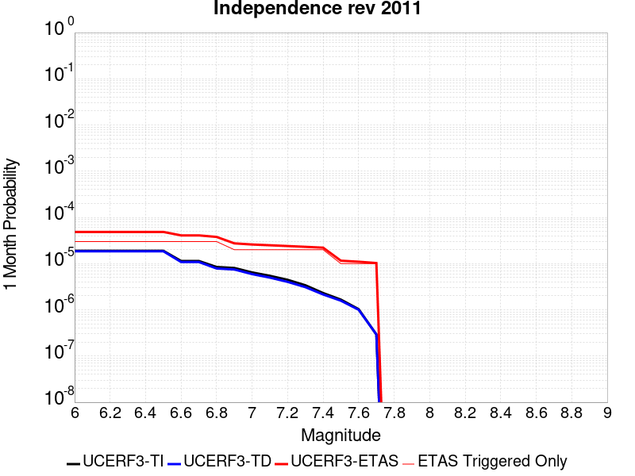 |  |  |

| Magnitude | 1 wk TI Prob | 1 wk TD Prob | 1 wk ETAS Prob | 1 wk ETAS/TD Gain | 1 wk ETAS Triggered Only | 1 mo TI Prob | 1 mo TD Prob | 1 mo ETAS Prob | 1 mo ETAS/TD Gain | 1 mo ETAS Triggered Only | 1 yr TI Prob | 1 yr TD Prob | 1 yr ETAS Prob | 1 yr ETAS/TD Gain | 1 yr ETAS Triggered Only | 10 yr TI Prob | 10 yr TD Prob | 10 yr ETAS Prob | 10 yr ETAS/TD Gain | 10 yr ETAS Triggered Only |
|-----|-----|-----|-----|-----|-----|-----|-----|-----|-----|-----|-----|-----|-----|-----|-----|-----|-----|-----|-----|-----|
| 6.0 | 4.422171E-6 | 4.3262453E-6 | 4.3262453E-6 | 1.0 | 0.0 | 1.8952025E-5 | 1.8540937E-5 | 3.903236E-5 | 2.1051989 | 2.0491803E-5 | 2.3071647E-4 | 2.257155E-4 | 2.6668987E-4 | 1.181531 | 4.0983607E-5 | 0.0023047708 | 0.0022551562 | 0.0023369384 | 1.0362647 | 8.196721E-5 |
| 6.1 | 4.422171E-6 | 4.3262453E-6 | 4.3262453E-6 | 1.0 | 0.0 | 1.8952025E-5 | 1.8540937E-5 | 3.903236E-5 | 2.1051989 | 2.0491803E-5 | 2.3071647E-4 | 2.257155E-4 | 2.6668987E-4 | 1.181531 | 4.0983607E-5 | 0.0023047708 | 0.0022551562 | 0.0023369384 | 1.0362647 | 8.196721E-5 |
| 6.2 | 4.422171E-6 | 4.3262453E-6 | 4.3262453E-6 | 1.0 | 0.0 | 1.8952025E-5 | 1.8540937E-5 | 3.903236E-5 | 2.1051989 | 2.0491803E-5 | 2.3071647E-4 | 2.257155E-4 | 2.6668987E-4 | 1.181531 | 4.0983607E-5 | 0.0023047708 | 0.0022551562 | 0.0023369384 | 1.0362647 | 8.196721E-5 |
| 6.3 | 4.422171E-6 | 4.3262453E-6 | 4.3262453E-6 | 1.0 | 0.0 | 1.8952025E-5 | 1.8540937E-5 | 3.903236E-5 | 2.1051989 | 2.0491803E-5 | 2.3071647E-4 | 2.257155E-4 | 2.6668987E-4 | 1.181531 | 4.0983607E-5 | 0.0023047708 | 0.0022551562 | 0.0023369384 | 1.0362647 | 8.196721E-5 |
| 6.4 | 4.422171E-6 | 4.3262453E-6 | 4.3262453E-6 | 1.0 | 0.0 | 1.8952025E-5 | 1.8540937E-5 | 3.903236E-5 | 2.1051989 | 2.0491803E-5 | 2.3071647E-4 | 2.257155E-4 | 2.6668987E-4 | 1.181531 | 4.0983607E-5 | 0.0023047708 | 0.0022551562 | 0.0023369384 | 1.0362647 | 8.196721E-5 |
| 6.5 | 4.422171E-6 | 4.3262453E-6 | 4.3262453E-6 | 1.0 | 0.0 | 1.8952025E-5 | 1.8540937E-5 | 3.903236E-5 | 2.1051989 | 2.0491803E-5 | 2.3071647E-4 | 2.257155E-4 | 2.6668987E-4 | 1.181531 | 4.0983607E-5 | 0.0023047708 | 0.0022551562 | 0.0023369384 | 1.0362647 | 8.196721E-5 |
| 6.6 | 2.663744E-6 | 2.5319996E-6 | 2.5319996E-6 | 1.0 | 0.0 | 1.1415996E-5 | 1.0851385E-5 | 3.1342966E-5 | 2.888384 | 2.0491803E-5 | 1.3898089E-4 | 1.3210809E-4 | 1.7308629E-4 | 1.3101869 | 4.0983607E-5 | 0.0013889399 | 0.0013203438 | 0.0014022028 | 1.0619982 | 8.196721E-5 |
| 6.7 | 2.663744E-6 | 2.5319996E-6 | 2.5319996E-6 | 1.0 | 0.0 | 1.1415996E-5 | 1.0851385E-5 | 3.1342966E-5 | 2.888384 | 2.0491803E-5 | 1.3898089E-4 | 1.3210809E-4 | 1.7308629E-4 | 1.3101869 | 4.0983607E-5 | 0.0013889399 | 0.0013203438 | 0.0014022028 | 1.0619982 | 8.196721E-5 |
| 6.8 | 1.9716529E-6 | 1.83227E-6 | 1.83227E-6 | 1.0 | 0.0 | 8.449913E-6 | 7.852563E-6 | 2.8344204E-5 | 3.6095483 | 2.0491803E-5 | 1.0287284E-4 | 9.560089E-5 | 1.3658058E-4 | 1.4286538 | 4.0983607E-5 | 0.0010282523 | 9.556105E-4 | 0.0010374994 | 1.0856928 | 8.196721E-5 |
| 6.9 | 1.8788617E-6 | 1.7430103E-6 | 1.7430103E-6 | 1.0 | 0.0 | 8.0522395E-6 | 7.470024E-6 | 2.7961674E-5 | 3.743184 | 2.0491803E-5 | 9.80316E-5 | 9.094387E-5 | 1.3192375E-4 | 1.4506063 | 4.0983607E-5 | 9.798837E-4 | 9.090785E-4 | 9.909712E-4 | 1.0900832 | 8.196721E-5 |
| 7.0 | 1.5045488E-6 | 1.3849595E-6 | 1.3849595E-6 | 1.0 | 0.0 | 6.44805E-6 | 5.9355275E-6 | 2.642721E-5 | 4.4523773 | 2.0491803E-5 | 7.8502184E-5 | 7.226271E-5 | 1.13243346E-4 | 1.5671065 | 4.0983607E-5 | 7.8474457E-4 | 7.2239724E-4 | 8.043052E-4 | 1.1133837 | 8.196721E-5 |
| 7.1 | 1.272341E-6 | 1.1625177E-6 | 1.1625177E-6 | 1.0 | 0.0 | 5.4528787E-6 | 4.9822092E-6 | 2.547391E-5 | 5.1129746 | 2.0491803E-5 | 6.6386776E-5 | 6.065674E-5 | 1.0163786E-4 | 1.6756235 | 4.0983607E-5 | 6.636695E-4 | 6.06405E-4 | 6.883226E-4 | 1.1350871 | 8.196721E-5 |
| 7.2 | 1.0416892E-6 | 9.4099494E-7 | 9.4099494E-7 | 1.0 | 0.0 | 4.464375E-6 | 4.032829E-6 | 2.452455E-5 | 6.081227 | 2.0491803E-5 | 5.4352407E-5 | 4.909861E-5 | 9.0080204E-5 | 1.8346794 | 4.0983607E-5 | 5.4339116E-4 | 4.9087947E-4 | 5.7280646E-4 | 1.1668984 | 8.196721E-5 |
| 7.3 | 7.9450155E-7 | 7.235053E-7 | 7.235053E-7 | 1.0 | 0.0 | 3.4050022E-6 | 3.1007335E-6 | 2.3592473E-5 | 7.608675 | 2.0491803E-5 | 4.1455114E-5 | 3.7750786E-5 | 7.8732846E-5 | 2.085595 | 4.0983607E-5 | 4.144738E-4 | 3.7744487E-4 | 4.3889706E-4 | 1.162811 | 6.147541E-5 |
| 7.4 | 5.3893444E-7 | 5.0195445E-7 | 5.0195445E-7 | 1.0 | 0.0 | 2.309717E-6 | 2.1512315E-6 | 2.2642991E-5 | 10.525595 | 2.0491803E-5 | 2.8120441E-5 | 2.6190934E-5 | 6.717347E-5 | 2.5647604 | 4.0983607E-5 | 2.8116882E-4 | 2.6187891E-4 | 3.2333823E-4 | 1.234686 | 6.147541E-5 |
| 7.5 | 3.8852085E-7 | 3.6825747E-7 | 3.6825747E-7 | 1.0 | 0.0 | 1.6650882E-6 | 1.5782454E-6 | 2.2070017E-5 | 13.983893 | 2.0491803E-5 | 2.027226E-5 | 1.9214971E-5 | 6.0197788E-5 | 3.1328588 | 4.0983607E-5 | 2.0270412E-4 | 1.921333E-4 | 2.535969E-4 | 1.3199008 | 6.147541E-5 |
| 7.6 | 2.414929E-7 | 2.3457659E-7 | 2.3457659E-7 | 1.0 | 0.0 | 1.0349692E-6 | 1.0053279E-6 | 2.1497111E-5 | 21.383184 | 2.0491803E-5 | 1.2600677E-5 | 1.22398E-5 | 3.273135E-5 | 2.6741738 | 2.0491803E-5 | 1.2599962E-4 | 1.2239137E-4 | 1.6336997E-4 | 1.334816 | 4.0983607E-5 |
| 7.7 | 6.8298014E-8 | 6.858993E-8 | 6.858993E-8 | 1.0 | 0.0 | 2.9270575E-7 | 2.939568E-7 | 2.0785754E-5 | 70.710236 | 2.0491803E-5 | 3.5636867E-6 | 3.5789185E-6 | 2.4070649E-5 | 6.7256765 | 2.0491803E-5 | 3.5636294E-5 | 3.5788657E-5 | 5.627973E-5 | 1.5725577 | 2.0491803E-5 |

## Santa Cruz Island
*[(top)](#table-of-contents)*

| 1 Week | 1 Month | 1 Year | 10 Year |
|-----|-----|-----|-----|
|  | 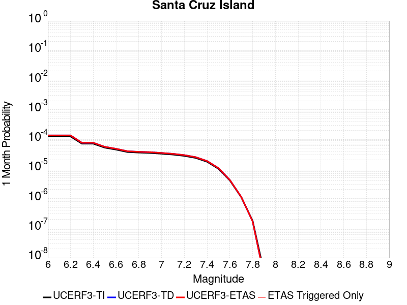 |  |  |

| Magnitude | 1 wk TI Prob | 1 wk TD Prob | 1 wk ETAS Prob | 1 wk ETAS/TD Gain | 1 wk ETAS Triggered Only | 1 mo TI Prob | 1 mo TD Prob | 1 mo ETAS Prob | 1 mo ETAS/TD Gain | 1 mo ETAS Triggered Only | 1 yr TI Prob | 1 yr TD Prob | 1 yr ETAS Prob | 1 yr ETAS/TD Gain | 1 yr ETAS Triggered Only | 10 yr TI Prob | 10 yr TD Prob | 10 yr ETAS Prob | 10 yr ETAS/TD Gain | 10 yr ETAS Triggered Only |
|-----|-----|-----|-----|-----|-----|-----|-----|-----|-----|-----|-----|-----|-----|-----|-----|-----|-----|-----|-----|-----|
| 6.0 | 2.9164563E-5 | 3.1600095E-5 | 3.1600095E-5 | 1.0 | 0.0 | 1.2498499E-4 | 1.3542273E-4 | 1.3542273E-4 | 1.0 | 0.0 | 0.0015206301 | 0.0016476609 | 0.0016476609 | 1.0 | 0.0 | 0.015102667 | 0.01636818 | 0.01642865 | 1.0036943 | 6.147541E-5 |
| 6.1 | 2.9164563E-5 | 3.1600095E-5 | 3.1600095E-5 | 1.0 | 0.0 | 1.2498499E-4 | 1.3542273E-4 | 1.3542273E-4 | 1.0 | 0.0 | 0.0015206301 | 0.0016476609 | 0.0016476609 | 1.0 | 0.0 | 0.015102667 | 0.01636818 | 0.01642865 | 1.0036943 | 6.147541E-5 |
| 6.2 | 2.9164563E-5 | 3.1600095E-5 | 3.1600095E-5 | 1.0 | 0.0 | 1.2498499E-4 | 1.3542273E-4 | 1.3542273E-4 | 1.0 | 0.0 | 0.0015206301 | 0.0016476609 | 0.0016476609 | 1.0 | 0.0 | 0.015102667 | 0.01636818 | 0.01642865 | 1.0036943 | 6.147541E-5 |
| 6.3 | 1.6635553E-5 | 1.7804527E-5 | 1.7804527E-5 | 1.0 | 0.0 | 7.1293274E-5 | 7.630298E-5 | 7.630298E-5 | 1.0 | 0.0 | 8.6765E-4 | 9.286111E-4 | 9.286111E-4 | 1.0 | 0.0 | 0.008642701 | 0.009249181 | 0.009269482 | 1.002195 | 2.0491803E-5 |
| 6.4 | 1.6635553E-5 | 1.7804527E-5 | 1.7804527E-5 | 1.0 | 0.0 | 7.1293274E-5 | 7.630298E-5 | 7.630298E-5 | 1.0 | 0.0 | 8.6765E-4 | 9.286111E-4 | 9.286111E-4 | 1.0 | 0.0 | 0.008642701 | 0.009249181 | 0.009269482 | 1.002195 | 2.0491803E-5 |
| 6.5 | 1.2238748E-5 | 1.3043111E-5 | 1.3043111E-5 | 1.0 | 0.0 | 5.2450723E-5 | 5.5897868E-5 | 5.5897868E-5 | 1.0 | 0.0 | 6.3840044E-4 | 6.8034773E-4 | 6.8034773E-4 | 1.0 | 0.0 | 0.0063656955 | 0.006783047 | 0.0068034003 | 1.0030005 | 2.0491803E-5 |
| 6.6 | 1.0489767E-5 | 1.11567315E-5 | 1.11567315E-5 | 1.0 | 0.0 | 4.495537E-5 | 4.7813697E-5 | 4.7813697E-5 | 1.0 | 0.0 | 5.4719415E-4 | 5.8197853E-4 | 5.8197853E-4 | 1.0 | 0.0 | 0.005458487 | 0.005804785 | 0.005825158 | 1.0035096 | 2.0491803E-5 |
| 6.7 | 8.699222E-6 | 9.236859E-6 | 9.236859E-6 | 1.0 | 0.0 | 3.7281847E-5 | 3.958594E-5 | 3.958594E-5 | 1.0 | 0.0 | 4.5381195E-4 | 4.818528E-4 | 4.818528E-4 | 1.0 | 0.0 | 0.0045288634 | 0.004808148 | 0.004828541 | 1.0042413 | 2.0491803E-5 |
| 6.8 | 8.307732E-6 | 8.816977E-6 | 8.816977E-6 | 1.0 | 0.0 | 3.560408E-5 | 3.77865E-5 | 3.77865E-5 | 1.0 | 0.0 | 4.3339343E-4 | 4.5995394E-4 | 4.5995394E-4 | 1.0 | 0.0 | 0.004325492 | 0.004590073 | 0.004590073 | 1.0 | 0.0 |
| 6.9 | 8.073121E-6 | 8.565009E-6 | 8.565009E-6 | 1.0 | 0.0 | 3.459863E-5 | 3.6706668E-5 | 3.6706668E-5 | 1.0 | 0.0 | 4.2115687E-4 | 4.4681245E-4 | 4.4681245E-4 | 1.0 | 0.0 | 0.004203596 | 0.0044591925 | 0.0044591925 | 1.0 | 0.0 |
| 7.0 | 7.617019E-6 | 8.0747295E-6 | 8.0747295E-6 | 1.0 | 0.0 | 3.264396E-5 | 3.4605528E-5 | 3.4605528E-5 | 1.0 | 0.0 | 3.9736772E-4 | 4.2124125E-4 | 4.2124125E-4 | 1.0 | 0.0 | 0.003966579 | 0.0042044753 | 0.0042044753 | 1.0 | 0.0 |
| 7.1 | 7.1224836E-6 | 7.5458483E-6 | 7.5458483E-6 | 1.0 | 0.0 | 3.052457E-5 | 3.233895E-5 | 3.233895E-5 | 1.0 | 0.0 | 3.715733E-4 | 3.9365597E-4 | 3.9365597E-4 | 1.0 | 0.0 | 0.003709526 | 0.0039296295 | 0.0039296295 | 1.0 | 0.0 |
| 7.2 | 6.441115E-6 | 6.8274385E-6 | 6.8274385E-6 | 1.0 | 0.0 | 2.7604487E-5 | 2.9260125E-5 | 2.9260125E-5 | 1.0 | 0.0 | 3.360328E-4 | 3.5618403E-4 | 3.5618403E-4 | 1.0 | 0.0 | 0.0033552512 | 0.0035561598 | 0.0035561598 | 1.0 | 0.0 |
| 7.3 | 5.494274E-6 | 5.820041E-6 | 5.820041E-6 | 1.0 | 0.0 | 2.3546674E-5 | 2.4942796E-5 | 2.4942796E-5 | 1.0 | 0.0 | 2.8664304E-4 | 3.0363642E-4 | 3.0363642E-4 | 1.0 | 0.0 | 0.002862736 | 0.0030322387 | 0.0030322387 | 1.0 | 0.0 |
| 7.4 | 4.0802624E-6 | 4.3122895E-6 | 4.3122895E-6 | 1.0 | 0.0 | 1.7486722E-5 | 1.848111E-5 | 1.848111E-5 | 1.0 | 0.0 | 2.1288003E-4 | 2.2498437E-4 | 2.2498437E-4 | 1.0 | 0.0 | 0.0021267622 | 0.002247575 | 0.002247575 | 1.0 | 0.0 |
| 7.5 | 2.3584746E-6 | 2.4753267E-6 | 2.4753267E-6 | 1.0 | 0.0 | 1.0107709E-5 | 1.06085E-5 | 1.06085E-5 | 1.0 | 0.0 | 1.2305441E-4 | 1.2915088E-4 | 1.2915088E-4 | 1.0 | 0.0 | 0.0012298629 | 0.0012907633 | 0.0012907633 | 1.0 | 0.0 |
| 7.6 | 9.4981914E-7 | 9.860988E-7 | 9.860988E-7 | 1.0 | 0.0 | 4.0706473E-6 | 4.226131E-6 | 4.226131E-6 | 1.0 | 0.0 | 4.9559E-5 | 5.145194E-5 | 5.145194E-5 | 1.0 | 0.0 | 4.954795E-4 | 5.144016E-4 | 5.144016E-4 | 1.0 | 0.0 |
| 7.7 | 2.6013532E-7 | 2.641672E-7 | 2.641672E-7 | 1.0 | 0.0 | 1.1148652E-6 | 1.1321447E-6 | 1.1321447E-6 | 1.0 | 0.0 | 1.3573399E-5 | 1.3783775E-5 | 1.3783775E-5 | 1.0 | 0.0 | 1.357257E-4 | 1.3782927E-4 | 1.3782927E-4 | 1.0 | 0.0 |
| 7.8 | 4.1522263E-8 | 3.9656918E-8 | 3.9656918E-8 | 1.0 | 0.0 | 1.7795254E-7 | 1.6995821E-7 | 1.6995821E-7 | 1.0 | 0.0 | 2.16657E-6 | 2.0692394E-6 | 2.0692394E-6 | 1.0 | 0.0 | 2.1665488E-5 | 2.0692223E-5 | 2.0692223E-5 | 1.0 | 0.0 |
| 7.9 | 7.7242046E-10 | 5.946851E-10 | 5.946851E-10 | 1.0 | 0.0 | 3.3103735E-9 | 2.54865E-9 | 2.54865E-9 | 1.0 | 0.0 | 4.0303796E-8 | 3.1029813E-8 | 3.1029813E-8 | 1.0 | 0.0 | 4.030379E-7 | 3.102981E-7 | 3.102981E-7 | 1.0 | 0.0 |

## Cleghorn Pass
*[(top)](#table-of-contents)*

| 1 Week | 1 Month | 1 Year | 10 Year |
|-----|-----|-----|-----|
|  |  |  |  |

| Magnitude | 1 wk TI Prob | 1 wk TD Prob | 1 wk ETAS Prob | 1 wk ETAS/TD Gain | 1 wk ETAS Triggered Only | 1 mo TI Prob | 1 mo TD Prob | 1 mo ETAS Prob | 1 mo ETAS/TD Gain | 1 mo ETAS Triggered Only | 1 yr TI Prob | 1 yr TD Prob | 1 yr ETAS Prob | 1 yr ETAS/TD Gain | 1 yr ETAS Triggered Only | 10 yr TI Prob | 10 yr TD Prob | 10 yr ETAS Prob | 10 yr ETAS/TD Gain | 10 yr ETAS Triggered Only |
|-----|-----|-----|-----|-----|-----|-----|-----|-----|-----|-----|-----|-----|-----|-----|-----|-----|-----|-----|-----|-----|
| 6.0 | 1.0522846E-5 | 1.1040714E-5 | 1.1040714E-5 | 1.0 | 0.0 | 4.509713E-5 | 4.7316782E-5 | 4.7316782E-5 | 1.0 | 0.0 | 5.4891926E-4 | 5.759822E-4 | 5.964622E-4 | 1.0355567 | 2.0491803E-5 | 0.0054756533 | 0.005750059 | 0.0058111814 | 1.0106298 | 6.147541E-5 |
| 6.1 | 1.0522846E-5 | 1.1040714E-5 | 1.1040714E-5 | 1.0 | 0.0 | 4.509713E-5 | 4.7316782E-5 | 4.7316782E-5 | 1.0 | 0.0 | 5.4891926E-4 | 5.759822E-4 | 5.964622E-4 | 1.0355567 | 2.0491803E-5 | 0.0054756533 | 0.005750059 | 0.0058111814 | 1.0106298 | 6.147541E-5 |
| 6.2 | 2.1045846E-6 | 2.2082168E-6 | 2.2082168E-6 | 1.0 | 0.0 | 9.019617E-6 | 9.463776E-6 | 9.463776E-6 | 1.0 | 0.0 | 1.098083E-4 | 1.1521958E-4 | 1.1521958E-4 | 1.0 | 0.0 | 0.0010975406 | 0.0011520098 | 0.001172478 | 1.0177674 | 2.0491803E-5 |
| 6.3 | 2.1045846E-6 | 2.2082168E-6 | 2.2082168E-6 | 1.0 | 0.0 | 9.019617E-6 | 9.463776E-6 | 9.463776E-6 | 1.0 | 0.0 | 1.098083E-4 | 1.1521958E-4 | 1.1521958E-4 | 1.0 | 0.0 | 0.0010975406 | 0.0011520098 | 0.001172478 | 1.0177674 | 2.0491803E-5 |
| 6.4 | 1.7259927E-6 | 1.8108889E-6 | 1.8108889E-6 | 1.0 | 0.0 | 7.3970905E-6 | 7.760952E-6 | 7.760952E-6 | 1.0 | 0.0 | 9.005586E-5 | 9.4489595E-5 | 9.4489595E-5 | 1.0 | 0.0 | 9.001937E-4 | 9.4489596E-4 | 9.653684E-4 | 1.0216663 | 2.0491803E-5 |

## Pleito
*[(top)](#table-of-contents)*

| 1 Week | 1 Month | 1 Year | 10 Year |
|-----|-----|-----|-----|
| 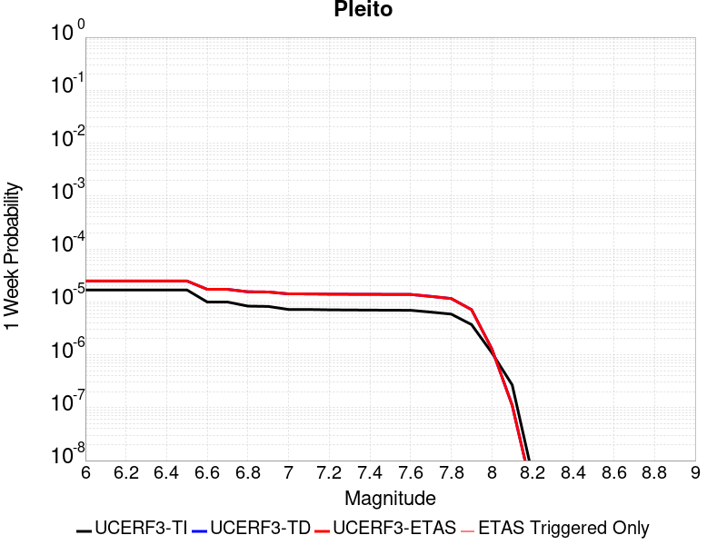 |  |  |  |

| Magnitude | 1 wk TI Prob | 1 wk TD Prob | 1 wk ETAS Prob | 1 wk ETAS/TD Gain | 1 wk ETAS Triggered Only | 1 mo TI Prob | 1 mo TD Prob | 1 mo ETAS Prob | 1 mo ETAS/TD Gain | 1 mo ETAS Triggered Only | 1 yr TI Prob | 1 yr TD Prob | 1 yr ETAS Prob | 1 yr ETAS/TD Gain | 1 yr ETAS Triggered Only | 10 yr TI Prob | 10 yr TD Prob | 10 yr ETAS Prob | 10 yr ETAS/TD Gain | 10 yr ETAS Triggered Only |
|-----|-----|-----|-----|-----|-----|-----|-----|-----|-----|-----|-----|-----|-----|-----|-----|-----|-----|-----|-----|-----|
| 6.0 | 1.6763008E-5 | 2.47705E-5 | 2.47705E-5 | 1.0 | 0.0 | 7.183948E-5 | 1.0615537E-4 | 1.0615537E-4 | 1.0 | 0.0 | 8.742947E-4 | 0.0012917474 | 0.0012917474 | 1.0 | 0.0 | 0.00870863 | 0.012957253 | 0.0130381575 | 1.0062441 | 8.196721E-5 |
| 6.1 | 1.6763008E-5 | 2.47705E-5 | 2.47705E-5 | 1.0 | 0.0 | 7.183948E-5 | 1.0615537E-4 | 1.0615537E-4 | 1.0 | 0.0 | 8.742947E-4 | 0.0012917474 | 0.0012917474 | 1.0 | 0.0 | 0.00870863 | 0.012957253 | 0.0130381575 | 1.0062441 | 8.196721E-5 |
| 6.2 | 1.6763008E-5 | 2.47705E-5 | 2.47705E-5 | 1.0 | 0.0 | 7.183948E-5 | 1.0615537E-4 | 1.0615537E-4 | 1.0 | 0.0 | 8.742947E-4 | 0.0012917474 | 0.0012917474 | 1.0 | 0.0 | 0.00870863 | 0.012957253 | 0.0130381575 | 1.0062441 | 8.196721E-5 |
| 6.3 | 1.6763008E-5 | 2.47705E-5 | 2.47705E-5 | 1.0 | 0.0 | 7.183948E-5 | 1.0615537E-4 | 1.0615537E-4 | 1.0 | 0.0 | 8.742947E-4 | 0.0012917474 | 0.0012917474 | 1.0 | 0.0 | 0.00870863 | 0.012957253 | 0.0130381575 | 1.0062441 | 8.196721E-5 |
| 6.4 | 1.6763008E-5 | 2.47705E-5 | 2.47705E-5 | 1.0 | 0.0 | 7.183948E-5 | 1.0615537E-4 | 1.0615537E-4 | 1.0 | 0.0 | 8.742947E-4 | 0.0012917474 | 0.0012917474 | 1.0 | 0.0 | 0.00870863 | 0.012957253 | 0.0130381575 | 1.0062441 | 8.196721E-5 |
| 6.5 | 1.6763008E-5 | 2.47705E-5 | 2.47705E-5 | 1.0 | 0.0 | 7.183948E-5 | 1.0615537E-4 | 1.0615537E-4 | 1.0 | 0.0 | 8.742947E-4 | 0.0012917474 | 0.0012917474 | 1.0 | 0.0 | 0.00870863 | 0.012957253 | 0.0130381575 | 1.0062441 | 8.196721E-5 |
| 6.6 | 9.910213E-6 | 1.7221182E-5 | 1.7221182E-5 | 1.0 | 0.0 | 4.247165E-5 | 7.3803E-5 | 7.3803E-5 | 1.0 | 0.0 | 5.169696E-4 | 8.9818484E-4 | 8.9818484E-4 | 1.0 | 0.0 | 0.0051576863 | 0.009054025 | 0.009114943 | 1.0067284 | 6.147541E-5 |
| 6.7 | 9.910213E-6 | 1.7221182E-5 | 1.7221182E-5 | 1.0 | 0.0 | 4.247165E-5 | 7.3803E-5 | 7.3803E-5 | 1.0 | 0.0 | 5.169696E-4 | 8.9818484E-4 | 8.9818484E-4 | 1.0 | 0.0 | 0.0051576863 | 0.009054025 | 0.009114943 | 1.0067284 | 6.147541E-5 |
| 6.8 | 8.300162E-6 | 1.5480773E-5 | 1.5480773E-5 | 1.0 | 0.0 | 3.557164E-5 | 6.634449E-5 | 6.634449E-5 | 1.0 | 0.0 | 4.3299864E-4 | 8.0744625E-4 | 8.0744625E-4 | 1.0 | 0.0 | 0.004321559 | 0.008153455 | 0.008214429 | 1.0074784 | 6.147541E-5 |
| 6.9 | 8.183114E-6 | 1.5351985E-5 | 1.5351985E-5 | 1.0 | 0.0 | 3.5070017E-5 | 6.579257E-5 | 6.579257E-5 | 1.0 | 0.0 | 4.2689382E-4 | 8.007316E-4 | 8.007316E-4 | 1.0 | 0.0 | 0.0042607468 | 0.008086799 | 0.008147777 | 1.0075405 | 6.147541E-5 |
| 7.0 | 7.1748823E-6 | 1.4138895E-5 | 1.4138895E-5 | 1.0 | 0.0 | 3.0749135E-5 | 6.059386E-5 | 6.059386E-5 | 1.0 | 0.0 | 3.743064E-4 | 7.3748105E-4 | 7.3748105E-4 | 1.0 | 0.0 | 0.0037367654 | 0.0074582137 | 0.007478553 | 1.002727 | 2.0491803E-5 |
| 7.1 | 7.1671807E-6 | 1.4129264E-5 | 1.4129264E-5 | 1.0 | 0.0 | 3.0716128E-5 | 6.0552586E-5 | 6.0552586E-5 | 1.0 | 0.0 | 3.7390468E-4 | 7.369789E-4 | 7.369789E-4 | 1.0 | 0.0 | 0.0037327618 | 0.007453226 | 0.007473565 | 1.0027289 | 2.0491803E-5 |
| 7.2 | 7.0649667E-6 | 1.3976534E-5 | 1.3976534E-5 | 1.0 | 0.0 | 3.0278077E-5 | 5.989806E-5 | 5.989806E-5 | 1.0 | 0.0 | 3.6857324E-4 | 7.290154E-4 | 7.290154E-4 | 1.0 | 0.0 | 0.0036796255 | 0.007373973 | 0.0073943133 | 1.0027585 | 2.0491803E-5 |
| 7.3 | 7.02082E-6 | 1.39199765E-5 | 1.39199765E-5 | 1.0 | 0.0 | 3.008888E-5 | 5.9655682E-5 | 5.9655682E-5 | 1.0 | 0.0 | 3.6627054E-4 | 7.260664E-4 | 7.260664E-4 | 1.0 | 0.0 | 0.0036566744 | 0.0073444657 | 0.007364807 | 1.0027696 | 2.0491803E-5 |
| 7.4 | 6.987146E-6 | 1.3879531E-5 | 1.3879531E-5 | 1.0 | 0.0 | 2.9944567E-5 | 5.948235E-5 | 5.948235E-5 | 1.0 | 0.0 | 3.6451413E-4 | 7.239575E-4 | 7.239575E-4 | 1.0 | 0.0 | 0.0036391679 | 0.007323398 | 0.0073437393 | 1.0027777 | 2.0491803E-5 |
| 7.5 | 6.9494554E-6 | 1.3836431E-5 | 1.3836431E-5 | 1.0 | 0.0 | 2.9783041E-5 | 5.9297647E-5 | 5.9297647E-5 | 1.0 | 0.0 | 3.625482E-4 | 7.217102E-4 | 7.217102E-4 | 1.0 | 0.0 | 0.0036195726 | 0.007301023 | 0.0073213656 | 1.0027862 | 2.0491803E-5 |
| 7.6 | 6.92694E-6 | 1.3795536E-5 | 1.3795536E-5 | 1.0 | 0.0 | 2.9686547E-5 | 5.9122387E-5 | 5.9122387E-5 | 1.0 | 0.0 | 3.6137376E-4 | 7.1957783E-4 | 7.1957783E-4 | 1.0 | 0.0 | 0.0036078666 | 0.0072797714 | 0.0073001143 | 1.0027944 | 2.0491803E-5 |
| 7.7 | 6.395867E-6 | 1.2674343E-5 | 1.2674343E-5 | 1.0 | 0.0 | 2.741057E-5 | 5.4317487E-5 | 5.4317487E-5 | 1.0 | 0.0 | 3.336726E-4 | 6.6111505E-4 | 6.6111505E-4 | 1.0 | 0.0 | 0.0033317201 | 0.006698295 | 0.0067186495 | 1.0030388 | 2.0491803E-5 |
| 7.8 | 5.8664327E-6 | 1.1541453E-5 | 1.1541453E-5 | 1.0 | 0.0 | 2.5141611E-5 | 4.9462433E-5 | 4.9462433E-5 | 1.0 | 0.0 | 3.060561E-4 | 6.020389E-4 | 6.020389E-4 | 1.0 | 0.0 | 0.0030563495 | 0.006103509 | 0.006103509 | 1.0 | 0.0 |
| 7.9 | 3.7167474E-6 | 7.1174723E-6 | 7.1174723E-6 | 1.0 | 0.0 | 1.592882E-5 | 3.0503097E-5 | 3.0503097E-5 | 1.0 | 0.0 | 1.9391612E-4 | 3.7131205E-4 | 3.7131205E-4 | 1.0 | 0.0 | 0.0019374699 | 0.0037692138 | 0.0037692138 | 1.0 | 0.0 |
| 8.0 | 1.0903841E-6 | 1.2886832E-6 | 1.2886832E-6 | 1.0 | 0.0 | 4.6730665E-6 | 5.522916E-6 | 5.522916E-6 | 1.0 | 0.0 | 5.68931E-5 | 6.723944E-5 | 6.723944E-5 | 1.0 | 0.0 | 5.6878536E-4 | 6.9458556E-4 | 6.9458556E-4 | 1.0 | 0.0 |
| 8.1 | 2.6894583E-7 | 1.1072907E-7 | 1.1072907E-7 | 1.0 | 0.0 | 1.1526245E-6 | 4.7455305E-7 | 4.7455305E-7 | 1.0 | 0.0 | 1.4033113E-5 | 5.7776683E-6 | 5.7776683E-6 | 1.0 | 0.0 | 1.4032227E-4 | 6.4639265E-5 | 6.4639265E-5 | 1.0 | 0.0 |
| 8.2 | 5.2967013E-9 | 2.4608289E-9 | 2.4608289E-9 | 1.0 | 0.0 | 2.2700148E-8 | 1.054641E-8 | 1.054641E-8 | 1.0 | 0.0 | 2.7637427E-7 | 1.2840253E-7 | 1.2840253E-7 | 1.0 | 0.0 | 2.7637393E-6 | 1.46096E-6 | 1.46096E-6 | 1.0 | 0.0 |

## Bullion Mountains
*[(top)](#table-of-contents)*

| 1 Week | 1 Month | 1 Year | 10 Year |
|-----|-----|-----|-----|
|  |  | 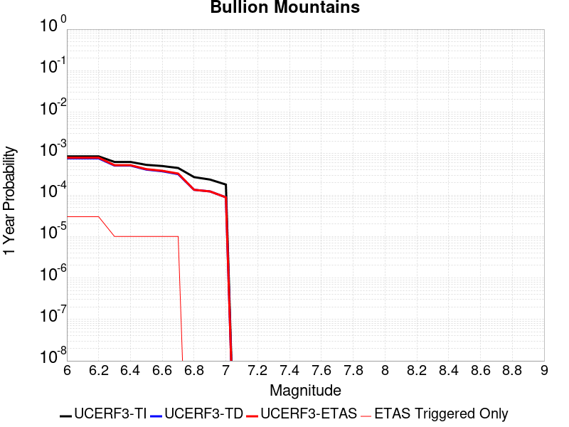 |  |

| Magnitude | 1 wk TI Prob | 1 wk TD Prob | 1 wk ETAS Prob | 1 wk ETAS/TD Gain | 1 wk ETAS Triggered Only | 1 mo TI Prob | 1 mo TD Prob | 1 mo ETAS Prob | 1 mo ETAS/TD Gain | 1 mo ETAS Triggered Only | 1 yr TI Prob | 1 yr TD Prob | 1 yr ETAS Prob | 1 yr ETAS/TD Gain | 1 yr ETAS Triggered Only | 10 yr TI Prob | 10 yr TD Prob | 10 yr ETAS Prob | 10 yr ETAS/TD Gain | 10 yr ETAS Triggered Only |
|-----|-----|-----|-----|-----|-----|-----|-----|-----|-----|-----|-----|-----|-----|-----|-----|-----|-----|-----|-----|-----|
| 6.0 | 1.6420427E-5 | 1.4692306E-5 | 1.4692306E-5 | 1.0 | 0.0 | 7.037136E-5 | 6.296572E-5 | 6.296572E-5 | 1.0 | 0.0 | 8.5643446E-4 | 7.663764E-4 | 7.868525E-4 | 1.026718 | 2.0491803E-5 | 0.008531413 | 0.0076411283 | 0.007722469 | 1.0106452 | 8.196721E-5 |
| 6.1 | 1.6420427E-5 | 1.4692306E-5 | 1.4692306E-5 | 1.0 | 0.0 | 7.037136E-5 | 6.296572E-5 | 6.296572E-5 | 1.0 | 0.0 | 8.5643446E-4 | 7.663764E-4 | 7.868525E-4 | 1.026718 | 2.0491803E-5 | 0.008531413 | 0.0076411283 | 0.007722469 | 1.0106452 | 8.196721E-5 |
| 6.2 | 1.6420427E-5 | 1.4692306E-5 | 1.4692306E-5 | 1.0 | 0.0 | 7.037136E-5 | 6.296572E-5 | 6.296572E-5 | 1.0 | 0.0 | 8.5643446E-4 | 7.663764E-4 | 7.868525E-4 | 1.026718 | 2.0491803E-5 | 0.008531413 | 0.0076411283 | 0.007722469 | 1.0106452 | 8.196721E-5 |
| 6.3 | 1.2046778E-5 | 9.862485E-6 | 9.862485E-6 | 1.0 | 0.0 | 5.1628023E-5 | 4.226724E-5 | 4.226724E-5 | 1.0 | 0.0 | 6.283899E-4 | 5.145053E-4 | 5.145053E-4 | 1.0 | 0.0 | 0.0062661595 | 0.0051354226 | 0.005155809 | 1.0039698 | 2.0491803E-5 |
| 6.4 | 1.2046778E-5 | 9.862485E-6 | 9.862485E-6 | 1.0 | 0.0 | 5.1628023E-5 | 4.226724E-5 | 4.226724E-5 | 1.0 | 0.0 | 6.283899E-4 | 5.145053E-4 | 5.145053E-4 | 1.0 | 0.0 | 0.0062661595 | 0.0051354226 | 0.005155809 | 1.0039698 | 2.0491803E-5 |
| 6.5 | 1.0244343E-5 | 7.879582E-6 | 7.879582E-6 | 1.0 | 0.0 | 4.390359E-5 | 3.3769316E-5 | 3.3769316E-5 | 1.0 | 0.0 | 5.343951E-4 | 4.1108453E-4 | 4.1108453E-4 | 1.0 | 0.0 | 0.005331118 | 0.0041052722 | 0.00412568 | 1.0049711 | 2.0491803E-5 |
| 6.6 | 9.605408E-6 | 7.1776108E-6 | 7.1776108E-6 | 1.0 | 0.0 | 4.1165385E-5 | 3.076094E-5 | 3.076094E-5 | 1.0 | 0.0 | 5.010733E-4 | 3.7447043E-4 | 3.7447043E-4 | 1.0 | 0.0 | 0.00499945 | 0.0037403915 | 0.0037608065 | 1.005458 | 2.0491803E-5 |
| 6.7 | 8.60418E-6 | 6.1241044E-6 | 6.1241044E-6 | 1.0 | 0.0 | 3.687454E-5 | 2.6246007E-5 | 2.6246007E-5 | 1.0 | 0.0 | 4.48855E-4 | 3.1951777E-4 | 3.1951777E-4 | 1.0 | 0.0 | 0.004479495 | 0.0031924958 | 0.0031924958 | 1.0 | 0.0 |
| 6.8 | 5.187994E-6 | 2.5632194E-6 | 2.5632194E-6 | 1.0 | 0.0 | 2.223407E-5 | 1.0985203E-5 | 1.0985203E-5 | 1.0 | 0.0 | 2.7066618E-4 | 1.3374063E-4 | 1.3374063E-4 | 1.0 | 0.0 | 0.0027033675 | 0.001336993 | 0.001336993 | 1.0 | 0.0 |
| 6.9 | 4.5302368E-6 | 2.3443622E-6 | 2.3443622E-6 | 1.0 | 0.0 | 1.9415156E-5 | 1.0047251E-5 | 1.0047251E-5 | 1.0 | 0.0 | 2.3635388E-4 | 1.2232238E-4 | 1.2232238E-4 | 1.0 | 0.0 | 0.0023610266 | 0.0012229396 | 0.0012229396 | 1.0 | 0.0 |
| 7.0 | 3.431668E-6 | 1.6882757E-6 | 1.6882757E-6 | 1.0 | 0.0 | 1.4707065E-5 | 7.2354674E-6 | 7.2354674E-6 | 1.0 | 0.0 | 1.7904381E-4 | 8.8091816E-5 | 8.8091816E-5 | 1.0 | 0.0 | 0.0017889962 | 8.809181E-4 | 8.809181E-4 | 1.0 | 0.0 |

## Tin Mountain
*[(top)](#table-of-contents)*

| 1 Week | 1 Month | 1 Year | 10 Year |
|-----|-----|-----|-----|
|  |  |  |  |

| Magnitude | 1 wk TI Prob | 1 wk TD Prob | 1 wk ETAS Prob | 1 wk ETAS/TD Gain | 1 wk ETAS Triggered Only | 1 mo TI Prob | 1 mo TD Prob | 1 mo ETAS Prob | 1 mo ETAS/TD Gain | 1 mo ETAS Triggered Only | 1 yr TI Prob | 1 yr TD Prob | 1 yr ETAS Prob | 1 yr ETAS/TD Gain | 1 yr ETAS Triggered Only | 10 yr TI Prob | 10 yr TD Prob | 10 yr ETAS Prob | 10 yr ETAS/TD Gain | 10 yr ETAS Triggered Only |
|-----|-----|-----|-----|-----|-----|-----|-----|-----|-----|-----|-----|-----|-----|-----|-----|-----|-----|-----|-----|-----|
| 6.0 | 4.083776E-6 | 4.18155E-6 | 4.18155E-6 | 1.0 | 0.0 | 1.750178E-5 | 1.7920827E-5 | 7.939513E-5 | 4.430328 | 6.147541E-5 | 2.1306332E-4 | 2.1816794E-4 | 3.0011727E-4 | 1.375625 | 8.196721E-5 | 0.0021285915 | 0.0021799032 | 0.0022616917 | 1.0375193 | 8.196721E-5 |
| 6.1 | 4.083776E-6 | 4.18155E-6 | 4.18155E-6 | 1.0 | 0.0 | 1.750178E-5 | 1.7920827E-5 | 7.939513E-5 | 4.430328 | 6.147541E-5 | 2.1306332E-4 | 2.1816794E-4 | 3.0011727E-4 | 1.375625 | 8.196721E-5 | 0.0021285915 | 0.0021799032 | 0.0022616917 | 1.0375193 | 8.196721E-5 |
| 6.2 | 4.083776E-6 | 4.18155E-6 | 4.18155E-6 | 1.0 | 0.0 | 1.750178E-5 | 1.7920827E-5 | 7.939513E-5 | 4.430328 | 6.147541E-5 | 2.1306332E-4 | 2.1816794E-4 | 3.0011727E-4 | 1.375625 | 8.196721E-5 | 0.0021285915 | 0.0021799032 | 0.0022616917 | 1.0375193 | 8.196721E-5 |
| 6.3 | 4.083776E-6 | 4.18155E-6 | 4.18155E-6 | 1.0 | 0.0 | 1.750178E-5 | 1.7920827E-5 | 7.939513E-5 | 4.430328 | 6.147541E-5 | 2.1306332E-4 | 2.1816794E-4 | 3.0011727E-4 | 1.375625 | 8.196721E-5 | 0.0021285915 | 0.0021799032 | 0.0022616917 | 1.0375193 | 8.196721E-5 |
| 6.4 | 4.083776E-6 | 4.18155E-6 | 4.18155E-6 | 1.0 | 0.0 | 1.750178E-5 | 1.7920827E-5 | 7.939513E-5 | 4.430328 | 6.147541E-5 | 2.1306332E-4 | 2.1816794E-4 | 3.0011727E-4 | 1.375625 | 8.196721E-5 | 0.0021285915 | 0.0021799032 | 0.0022616917 | 1.0375193 | 8.196721E-5 |
| 6.5 | 2.3143427E-6 | 2.3731652E-6 | 2.3731652E-6 | 1.0 | 0.0 | 9.9185745E-6 | 1.0170673E-5 | 3.0662268E-5 | 3.014773 | 2.0491803E-5 | 1.2075195E-4 | 1.2382168E-4 | 1.4431094E-4 | 1.1654739 | 2.0491803E-5 | 0.0012068636 | 0.0012376028 | 0.0012580693 | 1.0165372 | 2.0491803E-5 |
| 6.6 | 2.3143427E-6 | 2.3731652E-6 | 2.3731652E-6 | 1.0 | 0.0 | 9.9185745E-6 | 1.0170673E-5 | 3.0662268E-5 | 3.014773 | 2.0491803E-5 | 1.2075195E-4 | 1.2382168E-4 | 1.4431094E-4 | 1.1654739 | 2.0491803E-5 | 0.0012068636 | 0.0012376028 | 0.0012580693 | 1.0165372 | 2.0491803E-5 |
| 6.7 | 1.7029532E-6 | 1.7497979E-6 | 1.7497979E-6 | 1.0 | 0.0 | 7.2983503E-6 | 7.4991153E-6 | 7.4991153E-6 | 1.0 | 0.0 | 8.885379E-5 | 9.129844E-5 | 9.129844E-5 | 1.0 | 0.0 | 8.881827E-4 | 9.1266196E-4 | 9.1266196E-4 | 1.0 | 0.0 |
| 6.8 | 1.2914646E-6 | 1.3299432E-6 | 1.3299432E-6 | 1.0 | 0.0 | 5.534837E-6 | 5.6997465E-6 | 5.6997465E-6 | 1.0 | 0.0 | 6.738455E-5 | 6.939264E-5 | 6.939264E-5 | 1.0 | 0.0 | 6.736412E-4 | 6.937531E-4 | 6.937531E-4 | 1.0 | 0.0 |
| 6.9 | 5.8708974E-7 | 6.117028E-7 | 6.117028E-7 | 1.0 | 0.0 | 2.5160964E-6 | 2.621581E-6 | 2.621581E-6 | 1.0 | 0.0 | 3.0633044E-5 | 3.1917323E-5 | 3.1917323E-5 | 1.0 | 0.0 | 3.0628822E-4 | 3.191315E-4 | 3.191315E-4 | 1.0 | 0.0 |
| 7.0 | 4.6248786E-7 | 4.832044E-7 | 4.832044E-7 | 1.0 | 0.0 | 1.9820893E-6 | 2.0708746E-6 | 2.0708746E-6 | 1.0 | 0.0 | 2.413167E-5 | 2.5212645E-5 | 2.5212645E-5 | 1.0 | 0.0 | 2.412905E-4 | 2.5210154E-4 | 2.5210154E-4 | 1.0 | 0.0 |
| 7.1 | 3.804606E-7 | 3.9871725E-7 | 3.9871725E-7 | 1.0 | 0.0 | 1.6305444E-6 | 1.7087873E-6 | 1.7087873E-6 | 1.0 | 0.0 | 1.9851697E-5 | 2.080432E-5 | 2.080432E-5 | 1.0 | 0.0 | 1.9849923E-4 | 2.080271E-4 | 2.080271E-4 | 1.0 | 0.0 |
| 7.2 | 3.5864858E-7 | 3.7617107E-7 | 3.7617107E-7 | 1.0 | 0.0 | 1.5370645E-6 | 1.6121609E-6 | 1.6121609E-6 | 1.0 | 0.0 | 1.87136E-5 | 1.9627916E-5 | 1.9627916E-5 | 1.0 | 0.0 | 1.8712023E-4 | 1.9626514E-4 | 1.9626514E-4 | 1.0 | 0.0 |
| 7.3 | 3.342063E-7 | 3.50637E-7 | 3.50637E-7 | 1.0 | 0.0 | 1.4323119E-6 | 1.5027293E-6 | 1.5027293E-6 | 1.0 | 0.0 | 1.7438259E-5 | 1.829561E-5 | 1.829561E-5 | 1.0 | 0.0 | 1.743689E-4 | 1.8294434E-4 | 1.8294434E-4 | 1.0 | 0.0 |
| 7.4 | 2.971242E-7 | 3.116602E-7 | 3.116602E-7 | 1.0 | 0.0 | 1.2733886E-6 | 1.3356861E-6 | 1.3356861E-6 | 1.0 | 0.0 | 1.5503398E-5 | 1.626189E-5 | 1.626189E-5 | 1.0 | 0.0 | 1.5502315E-4 | 1.6261027E-4 | 1.6261027E-4 | 1.0 | 0.0 |
| 7.5 | 1.4326713E-7 | 1.501262E-7 | 1.501262E-7 | 1.0 | 0.0 | 6.140018E-7 | 6.43398E-7 | 6.43398E-7 | 1.0 | 0.0 | 7.4754466E-6 | 7.833371E-6 | 7.833371E-6 | 1.0 | 0.0 | 7.475195E-5 | 7.83337E-5 | 7.83337E-5 | 1.0 | 0.0 |

## Santa Ynez River
*[(top)](#table-of-contents)*

| 1 Week | 1 Month | 1 Year | 10 Year |
|-----|-----|-----|-----|
| 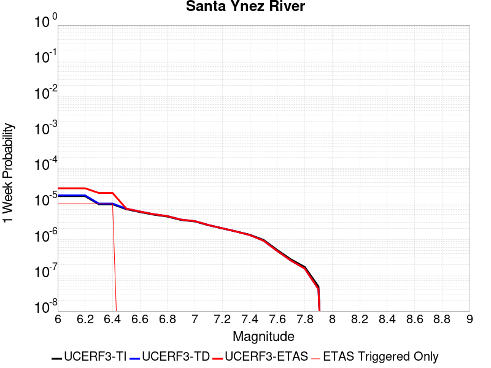 |  |  |  |

| Magnitude | 1 wk TI Prob | 1 wk TD Prob | 1 wk ETAS Prob | 1 wk ETAS/TD Gain | 1 wk ETAS Triggered Only | 1 mo TI Prob | 1 mo TD Prob | 1 mo ETAS Prob | 1 mo ETAS/TD Gain | 1 mo ETAS Triggered Only | 1 yr TI Prob | 1 yr TD Prob | 1 yr ETAS Prob | 1 yr ETAS/TD Gain | 1 yr ETAS Triggered Only | 10 yr TI Prob | 10 yr TD Prob | 10 yr ETAS Prob | 10 yr ETAS/TD Gain | 10 yr ETAS Triggered Only |
|-----|-----|-----|-----|-----|-----|-----|-----|-----|-----|-----|-----|-----|-----|-----|-----|-----|-----|-----|-----|-----|
| 6.0 | 1.6396456E-5 | 1.7209564E-5 | 1.7209564E-5 | 1.0 | 0.0 | 7.026863E-5 | 7.375339E-5 | 7.375339E-5 | 1.0 | 0.0 | 8.551848E-4 | 8.976132E-4 | 9.1808656E-4 | 1.0228087 | 2.0491803E-5 | 0.0085190125 | 0.008943425 | 0.009024659 | 1.0090832 | 8.196721E-5 |
| 6.1 | 1.6396456E-5 | 1.7209564E-5 | 1.7209564E-5 | 1.0 | 0.0 | 7.026863E-5 | 7.375339E-5 | 7.375339E-5 | 1.0 | 0.0 | 8.551848E-4 | 8.976132E-4 | 9.1808656E-4 | 1.0228087 | 2.0491803E-5 | 0.0085190125 | 0.008943425 | 0.009024659 | 1.0090832 | 8.196721E-5 |
| 6.2 | 1.6396456E-5 | 1.7209564E-5 | 1.7209564E-5 | 1.0 | 0.0 | 7.026863E-5 | 7.375339E-5 | 7.375339E-5 | 1.0 | 0.0 | 8.551848E-4 | 8.976132E-4 | 9.1808656E-4 | 1.0228087 | 2.0491803E-5 | 0.0085190125 | 0.008943425 | 0.009024659 | 1.0090832 | 8.196721E-5 |
| 6.3 | 9.736976E-6 | 1.0122399E-5 | 1.0122399E-5 | 1.0 | 0.0 | 4.172923E-5 | 4.3381016E-5 | 4.3381016E-5 | 1.0 | 0.0 | 5.0793495E-4 | 5.2804087E-4 | 5.2804087E-4 | 1.0 | 0.0 | 0.005067755 | 0.0052683675 | 0.005329519 | 1.0116073 | 6.147541E-5 |
| 6.4 | 9.736976E-6 | 1.0122399E-5 | 1.0122399E-5 | 1.0 | 0.0 | 4.172923E-5 | 4.3381016E-5 | 4.3381016E-5 | 1.0 | 0.0 | 5.0793495E-4 | 5.2804087E-4 | 5.2804087E-4 | 1.0 | 0.0 | 0.005067755 | 0.0052683675 | 0.005329519 | 1.0116073 | 6.147541E-5 |
| 6.5 | 7.081964E-6 | 7.3299457E-6 | 7.3299457E-6 | 1.0 | 0.0 | 3.035092E-5 | 3.1413685E-5 | 3.1413685E-5 | 1.0 | 0.0 | 3.694598E-4 | 3.8239607E-4 | 3.8239607E-4 | 1.0 | 0.0 | 0.0036884616 | 0.0038175425 | 0.0038787832 | 1.0160419 | 6.147541E-5 |
| 6.6 | 5.873247E-6 | 6.0597836E-6 | 6.0597836E-6 | 1.0 | 0.0 | 2.5170815E-5 | 2.5970248E-5 | 2.5970248E-5 | 1.0 | 0.0 | 3.064116E-4 | 3.1614274E-4 | 3.1614274E-4 | 1.0 | 0.0 | 0.0030598943 | 0.0031570175 | 0.0031978718 | 1.0129408 | 4.0983607E-5 |
| 6.7 | 4.973277E-6 | 5.115936E-6 | 5.115936E-6 | 1.0 | 0.0 | 2.1313872E-5 | 2.1925258E-5 | 2.1925258E-5 | 1.0 | 0.0 | 2.5946548E-4 | 2.669078E-4 | 2.669078E-4 | 1.0 | 0.0 | 0.0025916274 | 0.002665921 | 0.0027067955 | 1.0153322 | 4.0983607E-5 |
| 6.8 | 4.396492E-6 | 4.5110087E-6 | 4.5110087E-6 | 1.0 | 0.0 | 1.884197E-5 | 1.9332752E-5 | 1.9332752E-5 | 1.0 | 0.0 | 2.2937685E-4 | 2.3535118E-4 | 2.3535118E-4 | 1.0 | 0.0 | 0.0022914023 | 0.0023510547 | 0.0023919418 | 1.017391 | 4.0983607E-5 |
| 6.9 | 3.5255632E-6 | 3.6013587E-6 | 3.6013587E-6 | 1.0 | 0.0 | 1.5109469E-5 | 1.5434303E-5 | 1.5434303E-5 | 1.0 | 0.0 | 1.8394225E-4 | 1.878966E-4 | 1.878966E-4 | 1.0 | 0.0 | 0.0018379007 | 0.0018773936 | 0.0019183002 | 1.0217891 | 4.0983607E-5 |
| 7.0 | 3.211603E-6 | 3.2736775E-6 | 3.2736775E-6 | 1.0 | 0.0 | 1.376394E-5 | 1.4029972E-5 | 1.4029972E-5 | 1.0 | 0.0 | 1.6756308E-4 | 1.7080165E-4 | 1.7080165E-4 | 1.0 | 0.0 | 0.0016743679 | 0.001706718 | 0.0017476316 | 1.0239722 | 4.0983607E-5 |
| 7.1 | 2.5094619E-6 | 2.5409397E-6 | 2.5409397E-6 | 1.0 | 0.0 | 1.0754793E-5 | 1.0889697E-5 | 1.0889697E-5 | 1.0 | 0.0 | 1.3093173E-4 | 1.3257404E-4 | 1.3257404E-4 | 1.0 | 0.0 | 0.0013085462 | 0.0013249556 | 0.0013454203 | 1.0154456 | 2.0491803E-5 |
| 7.2 | 2.0515774E-6 | 2.0619539E-6 | 2.0619539E-6 | 1.0 | 0.0 | 8.792445E-6 | 8.836915E-6 | 8.836915E-6 | 1.0 | 0.0 | 1.0704277E-4 | 1.0758417E-4 | 1.0758417E-4 | 1.0 | 0.0 | 0.0010699122 | 0.0010753252 | 0.001095795 | 1.0190359 | 2.0491803E-5 |
| 7.3 | 1.6845745E-6 | 1.6774045E-6 | 1.6774045E-6 | 1.0 | 0.0 | 7.219585E-6 | 7.1888567E-6 | 7.1888567E-6 | 1.0 | 0.0 | 8.78949E-5 | 8.752084E-5 | 8.752084E-5 | 1.0 | 0.0 | 8.7860145E-4 | 8.748666E-4 | 8.953405E-4 | 1.0234023 | 2.0491803E-5 |
| 7.4 | 1.3600285E-6 | 1.3333469E-6 | 1.3333469E-6 | 1.0 | 0.0 | 5.82868E-6 | 5.714331E-6 | 5.714331E-6 | 1.0 | 0.0 | 7.096187E-5 | 6.956978E-5 | 6.956978E-5 | 1.0 | 0.0 | 7.0939213E-4 | 6.9548225E-4 | 7.159598E-4 | 1.0294436 | 2.0491803E-5 |
| 7.5 | 9.735342E-7 | 9.290183E-7 | 9.290183E-7 | 1.0 | 0.0 | 4.172283E-6 | 3.981501E-6 | 3.981501E-6 | 1.0 | 0.0 | 5.079636E-5 | 4.8473714E-5 | 4.8473714E-5 | 1.0 | 0.0 | 5.0784746E-4 | 4.846331E-4 | 5.0511496E-4 | 1.0422627 | 2.0491803E-5 |
| 7.6 | 5.067187E-7 | 4.778607E-7 | 4.778607E-7 | 1.0 | 0.0 | 2.1716498E-6 | 2.0479727E-6 | 2.0479727E-6 | 1.0 | 0.0 | 2.6439517E-5 | 2.493379E-5 | 2.493379E-5 | 1.0 | 0.0 | 2.643637E-4 | 2.4931066E-4 | 2.4931066E-4 | 1.0 | 0.0 |
| 7.7 | 2.769089E-7 | 2.5759311E-7 | 2.5759311E-7 | 1.0 | 0.0 | 1.1867519E-6 | 1.1039699E-6 | 1.1039699E-6 | 1.0 | 0.0 | 1.4448608E-5 | 1.3440752E-5 | 1.3440752E-5 | 1.0 | 0.0 | 1.444767E-4 | 1.3439942E-4 | 1.3439942E-4 | 1.0 | 0.0 |
| 7.8 | 1.7044663E-7 | 1.5449127E-7 | 1.5449127E-7 | 1.0 | 0.0 | 7.3048534E-7 | 6.6210526E-7 | 6.6210526E-7 | 1.0 | 0.0 | 8.893623E-6 | 8.061102E-6 | 8.061102E-6 | 1.0 | 0.0 | 8.893267E-5 | 8.0608115E-5 | 8.0608115E-5 | 1.0 | 0.0 |
| 7.9 | 4.8344287E-8 | 4.0911235E-8 | 4.0911235E-8 | 1.0 | 0.0 | 2.0718979E-7 | 1.7533385E-7 | 1.7533385E-7 | 1.0 | 0.0 | 2.5225327E-6 | 2.1346877E-6 | 2.1346877E-6 | 1.0 | 0.0 | 2.5225041E-5 | 2.1346676E-5 | 2.1346676E-5 | 1.0 | 0.0 |

## Channel Islands Thrust
*[(top)](#table-of-contents)*

| 1 Week | 1 Month | 1 Year | 10 Year |
|-----|-----|-----|-----|
|  |  |  |  |

| Magnitude | 1 wk TI Prob | 1 wk TD Prob | 1 wk ETAS Prob | 1 wk ETAS/TD Gain | 1 wk ETAS Triggered Only | 1 mo TI Prob | 1 mo TD Prob | 1 mo ETAS Prob | 1 mo ETAS/TD Gain | 1 mo ETAS Triggered Only | 1 yr TI Prob | 1 yr TD Prob | 1 yr ETAS Prob | 1 yr ETAS/TD Gain | 1 yr ETAS Triggered Only | 10 yr TI Prob | 10 yr TD Prob | 10 yr ETAS Prob | 10 yr ETAS/TD Gain | 10 yr ETAS Triggered Only |
|-----|-----|-----|-----|-----|-----|-----|-----|-----|-----|-----|-----|-----|-----|-----|-----|-----|-----|-----|-----|-----|
| 6.0 | 2.2156251E-5 | 2.4092304E-5 | 2.4092304E-5 | 1.0 | 0.0 | 9.495191E-5 | 1.03249244E-4 | 1.03249244E-4 | 1.0 | 0.0 | 0.0011554264 | 0.0012564411 | 0.0012769072 | 1.0162889 | 2.0491803E-5 | 0.011494373 | 0.012503966 | 0.012564672 | 1.004855 | 6.147541E-5 |
| 6.1 | 2.2156251E-5 | 2.4092304E-5 | 2.4092304E-5 | 1.0 | 0.0 | 9.495191E-5 | 1.03249244E-4 | 1.03249244E-4 | 1.0 | 0.0 | 0.0011554264 | 0.0012564411 | 0.0012769072 | 1.0162889 | 2.0491803E-5 | 0.011494373 | 0.012503966 | 0.012564672 | 1.004855 | 6.147541E-5 |
| 6.2 | 2.2156251E-5 | 2.4092304E-5 | 2.4092304E-5 | 1.0 | 0.0 | 9.495191E-5 | 1.03249244E-4 | 1.03249244E-4 | 1.0 | 0.0 | 0.0011554264 | 0.0012564411 | 0.0012769072 | 1.0162889 | 2.0491803E-5 | 0.011494373 | 0.012503966 | 0.012564672 | 1.004855 | 6.147541E-5 |
| 6.3 | 2.2156251E-5 | 2.4092304E-5 | 2.4092304E-5 | 1.0 | 0.0 | 9.495191E-5 | 1.03249244E-4 | 1.03249244E-4 | 1.0 | 0.0 | 0.0011554264 | 0.0012564411 | 0.0012769072 | 1.0162889 | 2.0491803E-5 | 0.011494373 | 0.012503966 | 0.012564672 | 1.004855 | 6.147541E-5 |
| 6.4 | 2.2156251E-5 | 2.4092304E-5 | 2.4092304E-5 | 1.0 | 0.0 | 9.495191E-5 | 1.03249244E-4 | 1.03249244E-4 | 1.0 | 0.0 | 0.0011554264 | 0.0012564411 | 0.0012769072 | 1.0162889 | 2.0491803E-5 | 0.011494373 | 0.012503966 | 0.012564672 | 1.004855 | 6.147541E-5 |
| 6.5 | 2.2156251E-5 | 2.4092304E-5 | 2.4092304E-5 | 1.0 | 0.0 | 9.495191E-5 | 1.03249244E-4 | 1.03249244E-4 | 1.0 | 0.0 | 0.0011554264 | 0.0012564411 | 0.0012769072 | 1.0162889 | 2.0491803E-5 | 0.011494373 | 0.012503966 | 0.012564672 | 1.004855 | 6.147541E-5 |
| 6.6 | 2.2156251E-5 | 2.4092304E-5 | 2.4092304E-5 | 1.0 | 0.0 | 9.495191E-5 | 1.03249244E-4 | 1.03249244E-4 | 1.0 | 0.0 | 0.0011554264 | 0.0012564411 | 0.0012769072 | 1.0162889 | 2.0491803E-5 | 0.011494373 | 0.012503966 | 0.012564672 | 1.004855 | 6.147541E-5 |
| 6.7 | 1.0601296E-5 | 1.1379656E-5 | 1.1379656E-5 | 1.0 | 0.0 | 4.5433335E-5 | 4.876907E-5 | 4.876907E-5 | 1.0 | 0.0 | 5.5301044E-4 | 5.9360656E-4 | 5.9360656E-4 | 1.0 | 0.0 | 0.005516363 | 0.0059207114 | 0.0059207114 | 1.0 | 0.0 |
| 6.8 | 1.0246747E-5 | 1.0996777E-5 | 1.0996777E-5 | 1.0 | 0.0 | 4.391389E-5 | 4.712822E-5 | 4.712822E-5 | 1.0 | 0.0 | 5.345204E-4 | 5.736398E-4 | 5.736398E-4 | 1.0 | 0.0 | 0.0053323656 | 0.005722081 | 0.005722081 | 1.0 | 0.0 |
| 6.9 | 9.049551E-6 | 9.699738E-6 | 9.699738E-6 | 1.0 | 0.0 | 3.878322E-5 | 4.1569667E-5 | 4.1569667E-5 | 1.0 | 0.0 | 4.7208337E-4 | 5.059973E-4 | 5.059973E-4 | 1.0 | 0.0 | 0.0047108172 | 0.005048869 | 0.005048869 | 1.0 | 0.0 |
| 7.0 | 8.6542195E-6 | 9.274692E-6 | 9.274692E-6 | 1.0 | 0.0 | 3.7088983E-5 | 3.97481E-5 | 3.97481E-5 | 1.0 | 0.0 | 4.5146482E-4 | 4.8382973E-4 | 4.8382973E-4 | 1.0 | 0.0 | 0.004505487 | 0.0048281755 | 0.0048281755 | 1.0 | 0.0 |
| 7.1 | 8.391028E-6 | 8.993012E-6 | 8.993012E-6 | 1.0 | 0.0 | 3.5961057E-5 | 3.8540933E-5 | 3.8540933E-5 | 1.0 | 0.0 | 4.3773788E-4 | 4.691389E-4 | 4.691389E-4 | 1.0 | 0.0 | 0.004368766 | 0.0046818955 | 0.0046818955 | 1.0 | 0.0 |
| 7.2 | 5.965188E-6 | 6.3717544E-6 | 6.3717544E-6 | 1.0 | 0.0 | 2.556484E-5 | 2.7307235E-5 | 2.7307235E-5 | 1.0 | 0.0 | 3.1120746E-4 | 3.3241542E-4 | 3.3241542E-4 | 1.0 | 0.0 | 0.00310772 | 0.00331924 | 0.00331924 | 1.0 | 0.0 |
| 7.3 | 4.877518E-6 | 5.2060545E-6 | 5.2060545E-6 | 1.0 | 0.0 | 2.0903482E-5 | 2.2311473E-5 | 2.2311473E-5 | 1.0 | 0.0 | 2.5447016E-4 | 2.7160876E-4 | 2.7160876E-4 | 1.0 | 0.0 | 0.0025417898 | 0.0027128144 | 0.0027128144 | 1.0 | 0.0 |
| 7.4 | 3.8829853E-6 | 4.1419007E-6 | 4.1419007E-6 | 1.0 | 0.0 | 1.664126E-5 | 1.7750885E-5 | 1.7750885E-5 | 1.0 | 0.0 | 2.0258849E-4 | 2.16096E-4 | 2.16096E-4 | 1.0 | 0.0 | 0.002024039 | 0.0021589005 | 0.0021589005 | 1.0 | 0.0 |
| 7.5 | 1.3489616E-6 | 1.4278027E-6 | 1.4278027E-6 | 1.0 | 0.0 | 5.7812517E-6 | 6.1191404E-6 | 6.1191404E-6 | 1.0 | 0.0 | 7.038446E-5 | 7.449803E-5 | 7.449803E-5 | 1.0 | 0.0 | 7.036218E-4 | 7.447345E-4 | 7.447345E-4 | 1.0 | 0.0 |
| 7.6 | 6.058192E-7 | 6.353832E-7 | 6.353832E-7 | 1.0 | 0.0 | 2.5963652E-6 | 2.723068E-6 | 2.723068E-6 | 1.0 | 0.0 | 3.161029E-5 | 3.3152864E-5 | 3.3152864E-5 | 1.0 | 0.0 | 3.1605794E-4 | 3.314808E-4 | 3.314808E-4 | 1.0 | 0.0 |
| 7.7 | 2.2170494E-7 | 2.260808E-7 | 2.260808E-7 | 1.0 | 0.0 | 9.5016367E-7 | 9.689174E-7 | 9.689174E-7 | 1.0 | 0.0 | 1.1568181E-5 | 1.1796516E-5 | 1.1796516E-5 | 1.0 | 0.0 | 1.1567579E-4 | 1.17960015E-4 | 1.17960015E-4 | 1.0 | 0.0 |
| 7.8 | 2.1613102E-8 | 1.5466789E-8 | 1.5466789E-8 | 1.0 | 0.0 | 9.262757E-8 | 6.628623E-8 | 6.628623E-8 | 1.0 | 0.0 | 1.1277401E-6 | 8.0703467E-7 | 8.0703467E-7 | 1.0 | 0.0 | 1.1277344E-5 | 8.070325E-6 | 8.070325E-6 | 1.0 | 0.0 |

## San Luis Range 2011 CFM
*[(top)](#table-of-contents)*

| 1 Week | 1 Month | 1 Year | 10 Year |
|-----|-----|-----|-----|
|  |  | 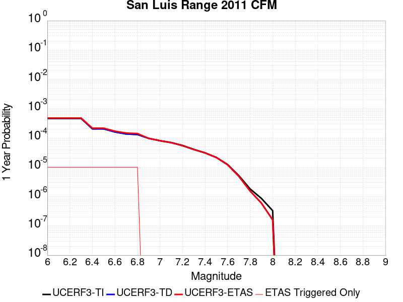 |  |

| Magnitude | 1 wk TI Prob | 1 wk TD Prob | 1 wk ETAS Prob | 1 wk ETAS/TD Gain | 1 wk ETAS Triggered Only | 1 mo TI Prob | 1 mo TD Prob | 1 mo ETAS Prob | 1 mo ETAS/TD Gain | 1 mo ETAS Triggered Only | 1 yr TI Prob | 1 yr TD Prob | 1 yr ETAS Prob | 1 yr ETAS/TD Gain | 1 yr ETAS Triggered Only | 10 yr TI Prob | 10 yr TD Prob | 10 yr ETAS Prob | 10 yr ETAS/TD Gain | 10 yr ETAS Triggered Only |
|-----|-----|-----|-----|-----|-----|-----|-----|-----|-----|-----|-----|-----|-----|-----|-----|-----|-----|-----|-----|-----|
| 6.0 | 8.8368415E-6 | 8.965477E-6 | 8.965477E-6 | 1.0 | 0.0 | 3.787163E-5 | 3.8422953E-5 | 3.8422953E-5 | 1.0 | 0.0 | 4.609895E-4 | 4.677069E-4 | 4.8818914E-4 | 1.0437928 | 2.0491803E-5 | 0.0046003438 | 0.0046680085 | 0.004729197 | 1.013108 | 6.147541E-5 |
| 6.1 | 8.8368415E-6 | 8.965477E-6 | 8.965477E-6 | 1.0 | 0.0 | 3.787163E-5 | 3.8422953E-5 | 3.8422953E-5 | 1.0 | 0.0 | 4.609895E-4 | 4.677069E-4 | 4.8818914E-4 | 1.0437928 | 2.0491803E-5 | 0.0046003438 | 0.0046680085 | 0.004729197 | 1.013108 | 6.147541E-5 |
| 6.2 | 8.8368415E-6 | 8.965477E-6 | 8.965477E-6 | 1.0 | 0.0 | 3.787163E-5 | 3.8422953E-5 | 3.8422953E-5 | 1.0 | 0.0 | 4.609895E-4 | 4.677069E-4 | 4.8818914E-4 | 1.0437928 | 2.0491803E-5 | 0.0046003438 | 0.0046680085 | 0.004729197 | 1.013108 | 6.147541E-5 |
| 6.3 | 8.8368415E-6 | 8.965477E-6 | 8.965477E-6 | 1.0 | 0.0 | 3.787163E-5 | 3.8422953E-5 | 3.8422953E-5 | 1.0 | 0.0 | 4.609895E-4 | 4.677069E-4 | 4.8818914E-4 | 1.0437928 | 2.0491803E-5 | 0.0046003438 | 0.0046680085 | 0.004729197 | 1.013108 | 6.147541E-5 |
| 6.4 | 3.9094193E-6 | 3.941213E-6 | 3.941213E-6 | 1.0 | 0.0 | 1.6754546E-5 | 1.6890806E-5 | 1.6890806E-5 | 1.0 | 0.0 | 2.039675E-4 | 2.0562643E-4 | 2.2611402E-4 | 1.099635 | 2.0491803E-5 | 0.0020378039 | 0.0020543905 | 0.00209529 | 1.0199083 | 4.0983607E-5 |
| 6.5 | 3.9094193E-6 | 3.941213E-6 | 3.941213E-6 | 1.0 | 0.0 | 1.6754546E-5 | 1.6890806E-5 | 1.6890806E-5 | 1.0 | 0.0 | 2.039675E-4 | 2.0562643E-4 | 2.2611402E-4 | 1.099635 | 2.0491803E-5 | 0.0020378039 | 0.0020543905 | 0.00209529 | 1.0199083 | 4.0983607E-5 |
| 6.6 | 3.0587726E-6 | 3.0753965E-6 | 3.0753965E-6 | 1.0 | 0.0 | 1.3108959E-5 | 1.3180205E-5 | 1.3180205E-5 | 1.0 | 0.0 | 1.595899E-4 | 1.604573E-4 | 1.8094582E-4 | 1.1276883 | 2.0491803E-5 | 0.0015947534 | 0.0016034264 | 0.0016238854 | 1.0127596 | 2.0491803E-5 |
| 6.7 | 2.6160574E-6 | 2.6251346E-6 | 2.6251346E-6 | 1.0 | 0.0 | 1.1211626E-5 | 1.1250529E-5 | 1.1250529E-5 | 1.0 | 0.0 | 1.3649299E-4 | 1.3696664E-4 | 1.5745564E-4 | 1.1495911 | 2.0491803E-5 | 0.0013640919 | 0.0013688284 | 0.0013892922 | 1.0149498 | 2.0491803E-5 |
| 6.8 | 2.5110312E-6 | 2.5181473E-6 | 2.5181473E-6 | 1.0 | 0.0 | 1.0761518E-5 | 1.0792015E-5 | 1.0792015E-5 | 1.0 | 0.0 | 1.310136E-4 | 1.3138492E-4 | 1.5187403E-4 | 1.1559472 | 2.0491803E-5 | 0.0013093639 | 0.0013130783 | 0.0013335432 | 1.0155854 | 2.0491803E-5 |
| 6.9 | 1.8564405E-6 | 1.8524926E-6 | 1.8524926E-6 | 1.0 | 0.0 | 7.95615E-6 | 7.93923E-6 | 7.93923E-6 | 1.0 | 0.0 | 9.686181E-5 | 9.665586E-5 | 9.665586E-5 | 1.0 | 0.0 | 9.68196E-4 | 9.661402E-4 | 9.661402E-4 | 1.0 | 0.0 |
| 7.0 | 1.546127E-6 | 1.5369586E-6 | 1.5369586E-6 | 1.0 | 0.0 | 6.626242E-6 | 6.586949E-6 | 6.586949E-6 | 1.0 | 0.0 | 8.06715E-5 | 8.019316E-5 | 8.019316E-5 | 1.0 | 0.0 | 8.0642226E-4 | 8.016429E-4 | 8.016429E-4 | 1.0 | 0.0 |
| 7.1 | 1.3368208E-6 | 1.3235369E-6 | 1.3235369E-6 | 1.0 | 0.0 | 5.7292195E-6 | 5.672289E-6 | 5.672289E-6 | 1.0 | 0.0 | 6.975101E-5 | 6.905793E-5 | 6.905793E-5 | 1.0 | 0.0 | 6.972912E-4 | 6.903652E-4 | 6.903652E-4 | 1.0 | 0.0 |
| 7.2 | 1.0623363E-6 | 1.0454403E-6 | 1.0454403E-6 | 1.0 | 0.0 | 4.5528623E-6 | 4.480451E-6 | 4.480451E-6 | 1.0 | 0.0 | 5.5429686E-5 | 5.4548127E-5 | 5.4548127E-5 | 1.0 | 0.0 | 5.5415864E-4 | 5.4534763E-4 | 5.4534763E-4 | 1.0 | 0.0 |
| 7.3 | 7.831679E-7 | 7.7274194E-7 | 7.7274194E-7 | 1.0 | 0.0 | 3.3564295E-6 | 3.311747E-6 | 3.311747E-6 | 1.0 | 0.0 | 4.086376E-5 | 4.0319774E-5 | 4.0319774E-5 | 1.0 | 0.0 | 4.0856248E-4 | 4.0312472E-4 | 4.0312472E-4 | 1.0 | 0.0 |
| 7.4 | 5.9558846E-7 | 5.91066E-7 | 5.91066E-7 | 1.0 | 0.0 | 2.5525194E-6 | 2.5331376E-6 | 2.5331376E-6 | 1.0 | 0.0 | 3.107648E-5 | 3.0840514E-5 | 3.0840514E-5 | 1.0 | 0.0 | 3.1072134E-4 | 3.0836245E-4 | 3.0836245E-4 | 1.0 | 0.0 |
| 7.5 | 4.1616502E-7 | 4.1196506E-7 | 4.1196506E-7 | 1.0 | 0.0 | 1.7835631E-6 | 1.7655633E-6 | 1.7655633E-6 | 1.0 | 0.0 | 2.1714664E-5 | 2.1495522E-5 | 2.1495522E-5 | 1.0 | 0.0 | 2.1712543E-4 | 2.1493447E-4 | 2.1493447E-4 | 1.0 | 0.0 |
| 7.6 | 2.3816014E-7 | 2.3376697E-7 | 2.3376697E-7 | 1.0 | 0.0 | 1.0206859E-6 | 1.001858E-6 | 1.001858E-6 | 1.0 | 0.0 | 1.242678E-5 | 1.2197554E-5 | 1.2197554E-5 | 1.0 | 0.0 | 1.2426086E-4 | 1.2196886E-4 | 1.2196886E-4 | 1.0 | 0.0 |
| 7.7 | 9.918777E-8 | 9.386869E-8 | 9.386869E-8 | 1.0 | 0.0 | 4.2509038E-7 | 4.0229432E-7 | 4.0229432E-7 | 1.0 | 0.0 | 5.1754632E-6 | 4.8979223E-6 | 4.8979223E-6 | 1.0 | 0.0 | 5.1753424E-5 | 4.897815E-5 | 4.897815E-5 | 1.0 | 0.0 |
| 7.8 | 3.4982556E-8 | 2.9687454E-8 | 2.9687454E-8 | 1.0 | 0.0 | 1.4992524E-7 | 1.2723194E-7 | 1.2723194E-7 | 1.0 | 0.0 | 1.8253382E-6 | 1.5490477E-6 | 1.5490477E-6 | 1.0 | 0.0 | 1.8253233E-5 | 1.549037E-5 | 1.549037E-5 | 1.0 | 0.0 |
| 7.9 | 1.6624908E-8 | 1.1477859E-8 | 1.1477859E-8 | 1.0 | 0.0 | 7.12496E-8 | 4.919082E-8 | 4.919082E-8 | 1.0 | 0.0 | 8.6746354E-7 | 5.9889805E-7 | 5.9889805E-7 | 1.0 | 0.0 | 8.674601E-6 | 5.988965E-6 | 5.988965E-6 | 1.0 | 0.0 |
| 8.0 | 6.3352315E-9 | 3.0893488E-9 | 3.0893488E-9 | 1.0 | 0.0 | 2.715099E-8 | 1.3240064E-8 | 1.3240064E-8 | 1.0 | 0.0 | 3.3056327E-7 | 1.6119778E-7 | 1.6119778E-7 | 1.0 | 0.0 | 3.3056278E-6 | 1.6119766E-6 | 1.6119766E-6 | 1.0 | 0.0 |

## Camp Rock 2011
*[(top)](#table-of-contents)*

| 1 Week | 1 Month | 1 Year | 10 Year |
|-----|-----|-----|-----|
|  |  |  |  |

| Magnitude | 1 wk TI Prob | 1 wk TD Prob | 1 wk ETAS Prob | 1 wk ETAS/TD Gain | 1 wk ETAS Triggered Only | 1 mo TI Prob | 1 mo TD Prob | 1 mo ETAS Prob | 1 mo ETAS/TD Gain | 1 mo ETAS Triggered Only | 1 yr TI Prob | 1 yr TD Prob | 1 yr ETAS Prob | 1 yr ETAS/TD Gain | 1 yr ETAS Triggered Only | 10 yr TI Prob | 10 yr TD Prob | 10 yr ETAS Prob | 10 yr ETAS/TD Gain | 10 yr ETAS Triggered Only |
|-----|-----|-----|-----|-----|-----|-----|-----|-----|-----|-----|-----|-----|-----|-----|-----|-----|-----|-----|-----|-----|
| 6.0 | 1.6710783E-5 | 4.2503107E-6 | 2.4742027E-5 | 5.821228 | 2.0491803E-5 | 7.161568E-5 | 1.8215493E-5 | 3.8706923E-5 | 2.1249452 | 2.0491803E-5 | 8.7157206E-4 | 2.2175159E-4 | 2.4223884E-4 | 1.0923884 | 2.0491803E-5 | 0.008681616 | 0.0022153559 | 0.002276695 | 1.0276881 | 6.147541E-5 |
| 6.1 | 1.6710783E-5 | 4.2503107E-6 | 2.4742027E-5 | 5.821228 | 2.0491803E-5 | 7.161568E-5 | 1.8215493E-5 | 3.8706923E-5 | 2.1249452 | 2.0491803E-5 | 8.7157206E-4 | 2.2175159E-4 | 2.4223884E-4 | 1.0923884 | 2.0491803E-5 | 0.008681616 | 0.0022153559 | 0.002276695 | 1.0276881 | 6.147541E-5 |
| 6.2 | 1.6710783E-5 | 4.2503107E-6 | 2.4742027E-5 | 5.821228 | 2.0491803E-5 | 7.161568E-5 | 1.8215493E-5 | 3.8706923E-5 | 2.1249452 | 2.0491803E-5 | 8.7157206E-4 | 2.2175159E-4 | 2.4223884E-4 | 1.0923884 | 2.0491803E-5 | 0.008681616 | 0.0022153559 | 0.002276695 | 1.0276881 | 6.147541E-5 |
| 6.3 | 1.6710783E-5 | 4.2503107E-6 | 2.4742027E-5 | 5.821228 | 2.0491803E-5 | 7.161568E-5 | 1.8215493E-5 | 3.8706923E-5 | 2.1249452 | 2.0491803E-5 | 8.7157206E-4 | 2.2175159E-4 | 2.4223884E-4 | 1.0923884 | 2.0491803E-5 | 0.008681616 | 0.0022153559 | 0.002276695 | 1.0276881 | 6.147541E-5 |
| 6.4 | 7.982846E-6 | 3.6821327E-6 | 2.417386E-5 | 6.565179 | 2.0491803E-5 | 3.421175E-5 | 1.5780475E-5 | 3.6271955E-5 | 2.2985337 | 2.0491803E-5 | 4.1644843E-4 | 1.921107E-4 | 2.1259856E-4 | 1.1066462 | 2.0491803E-5 | 0.0041566887 | 0.0019194811 | 0.001960386 | 1.0213104 | 4.0983607E-5 |
| 6.5 | 7.982846E-6 | 3.6821327E-6 | 2.417386E-5 | 6.565179 | 2.0491803E-5 | 3.421175E-5 | 1.5780475E-5 | 3.6271955E-5 | 2.2985337 | 2.0491803E-5 | 4.1644843E-4 | 1.921107E-4 | 2.1259856E-4 | 1.1066462 | 2.0491803E-5 | 0.0041566887 | 0.0019194811 | 0.001960386 | 1.0213104 | 4.0983607E-5 |
| 6.6 | 7.048869E-6 | 3.4243997E-6 | 2.3916133E-5 | 6.984037 | 2.0491803E-5 | 3.0209088E-5 | 1.4675918E-5 | 3.516742E-5 | 2.3962672 | 2.0491803E-5 | 3.677336E-4 | 1.7866497E-4 | 1.991531E-4 | 1.1146735 | 2.0491803E-5 | 0.0036712566 | 0.0017852448 | 0.0018261552 | 1.0229158 | 4.0983607E-5 |
| 6.7 | 6.987307E-6 | 3.3623767E-6 | 2.385411E-5 | 7.0944195 | 2.0491803E-5 | 2.9945259E-5 | 1.4410108E-5 | 3.4901615E-5 | 2.4220233 | 2.0491803E-5 | 3.6452254E-4 | 1.7542925E-4 | 1.9591746E-4 | 1.116789 | 2.0491803E-5 | 0.0036392517 | 0.0017529388 | 0.0017938506 | 1.0233389 | 4.0983607E-5 |
| 6.8 | 6.3737602E-6 | 3.117947E-6 | 2.3609686E-5 | 7.5721893 | 2.0491803E-5 | 2.731583E-5 | 1.3362564E-5 | 3.3854092E-5 | 2.5335028 | 2.0491803E-5 | 3.3251947E-4 | 1.6267736E-4 | 1.8316583E-4 | 1.1259454 | 2.0491803E-5 | 0.0033202237 | 0.0016256113 | 0.0016665283 | 1.0251702 | 4.0983607E-5 |
| 6.9 | 6.112211E-6 | 2.9331534E-6 | 2.3424896E-5 | 7.98625 | 2.0491803E-5 | 2.6194928E-5 | 1.2570598E-5 | 3.3062144E-5 | 2.630117 | 2.0491803E-5 | 3.1887658E-4 | 1.5303657E-4 | 1.7352523E-4 | 1.1338809 | 2.0491803E-5 | 0.003184194 | 0.0015293396 | 0.0015702605 | 1.0267572 | 4.0983607E-5 |
| 7.0 | 5.5140117E-6 | 2.6419564E-6 | 2.3133705E-5 | 8.756279 | 2.0491803E-5 | 2.3631264E-5 | 1.1322622E-5 | 3.1814194E-5 | 2.8097904 | 2.0491803E-5 | 2.8767265E-4 | 1.3784446E-4 | 1.5833344E-4 | 1.1486384 | 2.0491803E-5 | 0.0028730053 | 0.0013776148 | 0.0013980784 | 1.0148543 | 2.0491803E-5 |
| 7.1 | 4.8151105E-6 | 2.1342985E-6 | 2.2626058E-5 | 10.601169 | 2.0491803E-5 | 2.0636026E-5 | 9.146962E-6 | 2.9638579E-5 | 3.2402647 | 2.0491803E-5 | 2.5121463E-4 | 1.1135879E-4 | 1.3184831E-4 | 1.1839955 | 2.0491803E-5 | 0.0025093083 | 0.0011130519 | 0.0011335209 | 1.0183899 | 2.0491803E-5 |
| 7.2 | 3.818335E-6 | 1.293763E-6 | 2.178554E-5 | 16.838894 | 2.0491803E-5 | 1.6364189E-5 | 5.5446876E-6 | 2.6036378E-5 | 4.695734 | 2.0491803E-5 | 1.9921579E-4 | 6.750456E-5 | 8.799498E-5 | 1.3035413 | 2.0491803E-5 | 0.0019903728 | 6.748488E-4 | 6.953268E-4 | 1.0303445 | 2.0491803E-5 |
| 7.3 | 2.7166698E-6 | 7.383734E-7 | 2.1230162E-5 | 28.75261 | 2.0491803E-5 | 1.1642818E-5 | 3.1644536E-6 | 2.3656192E-5 | 7.4756007 | 2.0491803E-5 | 1.4174209E-4 | 3.8526563E-5 | 5.9017577E-5 | 1.5318671 | 2.0491803E-5 | 0.0014165172 | 3.8520084E-4 | 4.0568475E-4 | 1.0531772 | 2.0491803E-5 |
| 7.4 | 2.0893426E-6 | 5.461961E-7 | 2.1037988E-5 | 38.517284 | 2.0491803E-5 | 8.954295E-6 | 2.3408381E-6 | 2.2832593E-5 | 9.7540245 | 2.0491803E-5 | 1.0901308E-4 | 2.8499337E-5 | 4.8990558E-5 | 1.7190069 | 2.0491803E-5 | 0.0010895962 | 2.8495738E-4 | 3.0544333E-4 | 1.0718913 | 2.0491803E-5 |
| 7.5 | 1.1681728E-6 | 3.6031287E-7 | 2.0852109E-5 | 57.872227 | 2.0491803E-5 | 5.0064455E-6 | 1.5441972E-6 | 2.2035969E-5 | 14.270179 | 2.0491803E-5 | 6.0951766E-5 | 1.8800443E-5 | 3.929186E-5 | 2.0899434 | 2.0491803E-5 | 6.093505E-4 | 1.8798899E-4 | 2.0847694E-4 | 1.1089848 | 2.0491803E-5 |
| 7.6 | 1.3154387E-7 | 7.1198265E-8 | 7.1198265E-8 | 1.0 | 0.0 | 5.6375933E-7 | 3.051354E-7 | 3.051354E-7 | 1.0 | 0.0 | 6.863748E-6 | 3.7150185E-6 | 3.7150185E-6 | 1.0 | 0.0 | 6.863536E-5 | 3.7149723E-5 | 3.7149723E-5 | 1.0 | 0.0 |

## Oceanic - West Huasna
*[(top)](#table-of-contents)*

| 1 Week | 1 Month | 1 Year | 10 Year |
|-----|-----|-----|-----|
|  |  |  |  |

| Magnitude | 1 wk TI Prob | 1 wk TD Prob | 1 wk ETAS Prob | 1 wk ETAS/TD Gain | 1 wk ETAS Triggered Only | 1 mo TI Prob | 1 mo TD Prob | 1 mo ETAS Prob | 1 mo ETAS/TD Gain | 1 mo ETAS Triggered Only | 1 yr TI Prob | 1 yr TD Prob | 1 yr ETAS Prob | 1 yr ETAS/TD Gain | 1 yr ETAS Triggered Only | 10 yr TI Prob | 10 yr TD Prob | 10 yr ETAS Prob | 10 yr ETAS/TD Gain | 10 yr ETAS Triggered Only |
|-----|-----|-----|-----|-----|-----|-----|-----|-----|-----|-----|-----|-----|-----|-----|-----|-----|-----|-----|-----|-----|
| 6.0 | 3.195567E-5 | 2.7927153E-5 | 2.7927153E-5 | 1.0 | 0.0 | 1.3694567E-4 | 1.19682554E-4 | 1.19682554E-4 | 1.0 | 0.0 | 0.0016660384 | 0.0014562042 | 0.0014766662 | 1.0140516 | 2.0491803E-5 | 0.016536033 | 0.014471174 | 0.01453176 | 1.0041866 | 6.147541E-5 |
| 6.1 | 2.1156782E-5 | 1.7573653E-5 | 1.7573653E-5 | 1.0 | 0.0 | 9.066878E-5 | 7.531353E-5 | 7.531353E-5 | 1.0 | 0.0 | 0.0011033333 | 9.1656594E-4 | 9.37039E-4 | 1.0223366 | 2.0491803E-5 | 0.010978713 | 0.009128864 | 0.009189778 | 1.0066727 | 6.147541E-5 |
| 6.2 | 1.6195117E-5 | 1.3327269E-5 | 1.3327269E-5 | 1.0 | 0.0 | 6.9405796E-5 | 5.711563E-5 | 5.711563E-5 | 1.0 | 0.0 | 8.44688E-4 | 6.951635E-4 | 7.156411E-4 | 1.0294572 | 2.0491803E-5 | 0.008414844 | 0.006930183 | 0.006970883 | 1.0058728 | 4.0983607E-5 |
| 6.3 | 1.3559345E-5 | 1.1179233E-5 | 1.1179233E-5 | 1.0 | 0.0 | 5.811018E-5 | 4.7910125E-5 | 4.7910125E-5 | 1.0 | 0.0 | 7.072618E-4 | 5.831506E-4 | 6.036305E-4 | 1.0351193 | 2.0491803E-5 | 0.0070501505 | 0.0058163223 | 0.0058570676 | 1.0070053 | 4.0983607E-5 |
| 6.4 | 1.2120619E-5 | 1.0001056E-5 | 1.0001056E-5 | 1.0 | 0.0 | 5.1944477E-5 | 4.2860964E-5 | 4.2860964E-5 | 1.0 | 0.0 | 6.322405E-4 | 5.217078E-4 | 5.4218894E-4 | 1.0392578 | 2.0491803E-5 | 0.006304447 | 0.005204898 | 0.005225283 | 1.0039165 | 2.0491803E-5 |
| 6.5 | 1.13511915E-5 | 9.367545E-6 | 9.367545E-6 | 1.0 | 0.0 | 4.8647056E-5 | 4.014601E-5 | 4.014601E-5 | 1.0 | 0.0 | 5.9211696E-4 | 4.8866845E-4 | 5.0915027E-4 | 1.0419135 | 2.0491803E-5 | 0.0059054173 | 0.004875998 | 0.0048963903 | 1.0041821 | 2.0491803E-5 |
| 6.6 | 9.850605E-6 | 8.135479E-6 | 8.135479E-6 | 1.0 | 0.0 | 4.2216197E-5 | 3.4865876E-5 | 3.4865876E-5 | 1.0 | 0.0 | 5.1386096E-4 | 4.2440955E-4 | 4.4489268E-4 | 1.0482626 | 2.0491803E-5 | 0.0051267436 | 0.0042360225 | 0.0042564278 | 1.004817 | 2.0491803E-5 |
| 6.7 | 8.8558645E-6 | 7.318487E-6 | 7.318487E-6 | 1.0 | 0.0 | 3.7953152E-5 | 3.136457E-5 | 3.136457E-5 | 1.0 | 0.0 | 4.6198163E-4 | 3.8179688E-4 | 4.022809E-4 | 1.0536515 | 2.0491803E-5 | 0.004610224 | 0.003811435 | 0.0038318487 | 1.005356 | 2.0491803E-5 |
| 6.8 | 7.67136E-6 | 6.3918033E-6 | 6.3918033E-6 | 1.0 | 0.0 | 3.2876844E-5 | 2.7393156E-5 | 2.7393156E-5 | 1.0 | 0.0 | 4.0020206E-4 | 3.334608E-4 | 3.5394577E-4 | 1.0614314 | 2.0491803E-5 | 0.003994821 | 0.0033296254 | 0.0033500488 | 1.0061339 | 2.0491803E-5 |
| 6.9 | 6.534529E-6 | 5.45837E-6 | 5.45837E-6 | 1.0 | 0.0 | 2.8004823E-5 | 2.3392806E-5 | 2.3392806E-5 | 1.0 | 0.0 | 3.4090536E-4 | 2.8477033E-4 | 2.8477033E-4 | 1.0 | 0.0 | 0.0034038287 | 0.002844071 | 0.002844071 | 1.0 | 0.0 |
| 7.0 | 5.460525E-6 | 4.5699867E-6 | 4.5699867E-6 | 1.0 | 0.0 | 2.3402039E-5 | 1.9585512E-5 | 1.9585512E-5 | 1.0 | 0.0 | 2.8488258E-4 | 2.3842762E-4 | 2.3842762E-4 | 1.0 | 0.0 | 0.0028451765 | 0.002381732 | 0.002381732 | 1.0 | 0.0 |
| 7.1 | 4.4825083E-6 | 3.7524742E-6 | 3.7524742E-6 | 1.0 | 0.0 | 1.9210609E-5 | 1.6081935E-5 | 1.6081935E-5 | 1.0 | 0.0 | 2.3386406E-4 | 1.9578006E-4 | 1.9578006E-4 | 1.0 | 0.0 | 0.002336181 | 0.0019560878 | 0.0019560878 | 1.0 | 0.0 |
| 7.2 | 2.821708E-6 | 2.4249584E-6 | 2.4249584E-6 | 1.0 | 0.0 | 1.2092979E-5 | 1.0392638E-5 | 1.0392638E-5 | 1.0 | 0.0 | 1.4722206E-4 | 1.2652302E-4 | 1.2652302E-4 | 1.0 | 0.0 | 0.0014712457 | 0.0012645123 | 0.0012645123 | 1.0 | 0.0 |
| 7.3 | 2.0644757E-6 | 1.7687632E-6 | 1.7687632E-6 | 1.0 | 0.0 | 8.847723E-6 | 7.580392E-6 | 7.580392E-6 | 1.0 | 0.0 | 1.0771569E-4 | 9.2287366E-5 | 9.2287366E-5 | 1.0 | 0.0 | 0.001076635 | 9.224921E-4 | 9.224921E-4 | 1.0 | 0.0 |
| 7.4 | 1.6980367E-6 | 1.43801E-6 | 1.43801E-6 | 1.0 | 0.0 | 7.27728E-6 | 6.1628857E-6 | 6.1628857E-6 | 1.0 | 0.0 | 8.8597284E-5 | 7.503055E-5 | 7.503055E-5 | 1.0 | 0.0 | 8.8561967E-4 | 7.500538E-4 | 7.500538E-4 | 1.0 | 0.0 |
| 7.5 | 1.3637683E-6 | 1.1302833E-6 | 1.1302833E-6 | 1.0 | 0.0 | 5.844708E-6 | 4.8440625E-6 | 4.8440625E-6 | 1.0 | 0.0 | 7.1156996E-5 | 5.8974863E-5 | 5.8974863E-5 | 1.0 | 0.0 | 7.1134215E-4 | 5.8959366E-4 | 5.8959366E-4 | 1.0 | 0.0 |
| 7.6 | 9.802994E-7 | 7.677435E-7 | 7.677435E-7 | 1.0 | 0.0 | 4.2012766E-6 | 3.290325E-6 | 3.290325E-6 | 1.0 | 0.0 | 5.1149345E-5 | 4.005897E-5 | 4.005897E-5 | 1.0 | 0.0 | 5.113757E-4 | 4.005189E-4 | 4.005189E-4 | 1.0 | 0.0 |
| 7.7 | 5.986191E-7 | 4.0052313E-7 | 4.0052313E-7 | 1.0 | 0.0 | 2.5655079E-6 | 1.7165265E-6 | 1.7165265E-6 | 1.0 | 0.0 | 3.1234613E-5 | 2.0898511E-5 | 2.0898511E-5 | 1.0 | 0.0 | 3.123022E-4 | 2.0896681E-4 | 2.0896681E-4 | 1.0 | 0.0 |
| 7.8 | 2.9189815E-7 | 1.5287357E-7 | 1.5287357E-7 | 1.0 | 0.0 | 1.2509914E-6 | 6.5517224E-7 | 6.5517224E-7 | 1.0 | 0.0 | 1.5230714E-5 | 7.976692E-6 | 7.976692E-6 | 1.0 | 0.0 | 1.522967E-4 | 7.976538E-5 | 7.976538E-5 | 1.0 | 0.0 |
| 7.9 | 1.2057845E-7 | 4.6221164E-8 | 4.6221164E-8 | 1.0 | 0.0 | 5.1676466E-7 | 1.9809069E-7 | 1.9809069E-7 | 1.0 | 0.0 | 6.2915915E-6 | 2.4117514E-6 | 2.4117514E-6 | 1.0 | 0.0 | 6.2914136E-5 | 2.4118557E-5 | 2.4118557E-5 | 1.0 | 0.0 |
| 8.0 | 3.3806387E-9 | 9.0147434E-10 | 9.0147434E-10 | 1.0 | 0.0 | 1.4488451E-8 | 3.8634624E-9 | 3.8634624E-9 | 1.0 | 0.0 | 1.7639688E-7 | 4.703766E-8 | 4.703766E-8 | 1.0 | 0.0 | 1.7639674E-6 | 4.714705E-7 | 4.714705E-7 | 1.0 | 0.0 |

## Pine Mtn
*[(top)](#table-of-contents)*

| 1 Week | 1 Month | 1 Year | 10 Year |
|-----|-----|-----|-----|
|  |  |  |  |

| Magnitude | 1 wk TI Prob | 1 wk TD Prob | 1 wk ETAS Prob | 1 wk ETAS/TD Gain | 1 wk ETAS Triggered Only | 1 mo TI Prob | 1 mo TD Prob | 1 mo ETAS Prob | 1 mo ETAS/TD Gain | 1 mo ETAS Triggered Only | 1 yr TI Prob | 1 yr TD Prob | 1 yr ETAS Prob | 1 yr ETAS/TD Gain | 1 yr ETAS Triggered Only | 10 yr TI Prob | 10 yr TD Prob | 10 yr ETAS Prob | 10 yr ETAS/TD Gain | 10 yr ETAS Triggered Only |
|-----|-----|-----|-----|-----|-----|-----|-----|-----|-----|-----|-----|-----|-----|-----|-----|-----|-----|-----|-----|-----|
| 6.0 | 6.894797E-6 | 7.2255634E-6 | 7.2255634E-6 | 1.0 | 0.0 | 2.9548795E-5 | 3.0966352E-5 | 3.0966352E-5 | 1.0 | 0.0 | 3.596972E-4 | 3.7695307E-4 | 4.1792123E-4 | 1.1086824 | 4.0983607E-5 | 0.0035911554 | 0.0037634342 | 0.0038246782 | 1.0162735 | 6.147541E-5 |
| 6.1 | 6.894797E-6 | 7.2255634E-6 | 7.2255634E-6 | 1.0 | 0.0 | 2.9548795E-5 | 3.0966352E-5 | 3.0966352E-5 | 1.0 | 0.0 | 3.596972E-4 | 3.7695307E-4 | 4.1792123E-4 | 1.1086824 | 4.0983607E-5 | 0.0035911554 | 0.0037634342 | 0.0038246782 | 1.0162735 | 6.147541E-5 |
| 6.2 | 6.894797E-6 | 7.2255634E-6 | 7.2255634E-6 | 1.0 | 0.0 | 2.9548795E-5 | 3.0966352E-5 | 3.0966352E-5 | 1.0 | 0.0 | 3.596972E-4 | 3.7695307E-4 | 4.1792123E-4 | 1.1086824 | 4.0983607E-5 | 0.0035911554 | 0.0037634342 | 0.0038246782 | 1.0162735 | 6.147541E-5 |
| 6.3 | 6.894797E-6 | 7.2255634E-6 | 7.2255634E-6 | 1.0 | 0.0 | 2.9548795E-5 | 3.0966352E-5 | 3.0966352E-5 | 1.0 | 0.0 | 3.596972E-4 | 3.7695307E-4 | 4.1792123E-4 | 1.1086824 | 4.0983607E-5 | 0.0035911554 | 0.0037634342 | 0.0038246782 | 1.0162735 | 6.147541E-5 |
| 6.4 | 6.894797E-6 | 7.2255634E-6 | 7.2255634E-6 | 1.0 | 0.0 | 2.9548795E-5 | 3.0966352E-5 | 3.0966352E-5 | 1.0 | 0.0 | 3.596972E-4 | 3.7695307E-4 | 4.1792123E-4 | 1.1086824 | 4.0983607E-5 | 0.0035911554 | 0.0037634342 | 0.0038246782 | 1.0162735 | 6.147541E-5 |
| 6.5 | 6.894797E-6 | 7.2255634E-6 | 7.2255634E-6 | 1.0 | 0.0 | 2.9548795E-5 | 3.0966352E-5 | 3.0966352E-5 | 1.0 | 0.0 | 3.596972E-4 | 3.7695307E-4 | 4.1792123E-4 | 1.1086824 | 4.0983607E-5 | 0.0035911554 | 0.0037634342 | 0.0038246782 | 1.0162735 | 6.147541E-5 |
| 6.6 | 6.894797E-6 | 7.2255634E-6 | 7.2255634E-6 | 1.0 | 0.0 | 2.9548795E-5 | 3.0966352E-5 | 3.0966352E-5 | 1.0 | 0.0 | 3.596972E-4 | 3.7695307E-4 | 4.1792123E-4 | 1.1086824 | 4.0983607E-5 | 0.0035911554 | 0.0037634342 | 0.0038246782 | 1.0162735 | 6.147541E-5 |
| 6.7 | 6.0867933E-6 | 6.397213E-6 | 6.397213E-6 | 1.0 | 0.0 | 2.6085996E-5 | 2.741635E-5 | 2.741635E-5 | 1.0 | 0.0 | 3.1755073E-4 | 3.3374512E-4 | 3.7471505E-4 | 1.1227582 | 4.0983607E-5 | 0.0031709734 | 0.0033326582 | 0.003373505 | 1.0122566 | 4.0983607E-5 |
| 6.8 | 5.6530425E-6 | 5.9506933E-6 | 5.9506933E-6 | 1.0 | 0.0 | 2.42271E-5 | 2.5502733E-5 | 2.5502733E-5 | 1.0 | 0.0 | 2.94925E-4 | 3.104536E-4 | 3.5142447E-4 | 1.131971 | 4.0983607E-5 | 0.002945339 | 0.0031004036 | 0.0031412602 | 1.0131779 | 4.0983607E-5 |
| 6.9 | 4.6015225E-6 | 4.8639267E-6 | 4.8639267E-6 | 1.0 | 0.0 | 1.9720663E-5 | 2.0845242E-5 | 2.0845242E-5 | 1.0 | 0.0 | 2.4007261E-4 | 2.5376273E-4 | 2.9473595E-4 | 1.1614627 | 4.0983607E-5 | 0.0023981342 | 0.0025348738 | 0.0025757535 | 1.0161269 | 4.0983607E-5 |
| 7.0 | 4.4875965E-6 | 4.7475655E-6 | 4.7475655E-6 | 1.0 | 0.0 | 1.9232413E-5 | 2.0346559E-5 | 2.0346559E-5 | 1.0 | 0.0 | 2.3412947E-4 | 2.4769266E-4 | 2.886661E-4 | 1.1654205 | 4.0983607E-5 | 0.0023388295 | 0.0024743096 | 0.002515192 | 1.0165226 | 4.0983607E-5 |
| 7.1 | 3.203907E-6 | 3.4294974E-6 | 3.4294974E-6 | 1.0 | 0.0 | 1.3730958E-5 | 1.4697767E-5 | 1.4697767E-5 | 1.0 | 0.0 | 1.6716159E-4 | 1.7893128E-4 | 2.1990757E-4 | 1.2290057 | 4.0983607E-5 | 0.0016703589 | 0.0017879383 | 0.0018288486 | 1.0228813 | 4.0983607E-5 |
| 7.2 | 2.2060601E-6 | 2.3785535E-6 | 2.3785535E-6 | 1.0 | 0.0 | 9.4545085E-6 | 1.0193763E-5 | 1.0193763E-5 | 1.0 | 0.0 | 1.15102564E-4 | 1.2410246E-4 | 1.4459172E-4 | 1.1650995 | 2.0491803E-5 | 0.0011504296 | 0.0012403764 | 0.0012608427 | 1.0165001 | 2.0491803E-5 |
| 7.3 | 1.3765207E-6 | 1.5217128E-6 | 1.5217128E-6 | 1.0 | 0.0 | 5.899361E-6 | 6.52161E-6 | 6.52161E-6 | 1.0 | 0.0 | 7.182235E-5 | 7.93978E-5 | 7.93978E-5 | 1.0 | 0.0 | 7.1799144E-4 | 7.937035E-4 | 7.937035E-4 | 1.0 | 0.0 |
| 7.4 | 1.1245983E-6 | 1.2587657E-6 | 1.2587657E-6 | 1.0 | 0.0 | 4.819698E-6 | 5.3946997E-6 | 5.3946997E-6 | 1.0 | 0.0 | 5.8678244E-5 | 6.567857E-5 | 6.567857E-5 | 1.0 | 0.0 | 5.866275E-4 | 6.5659994E-4 | 6.5659994E-4 | 1.0 | 0.0 |
| 7.5 | 8.031682E-7 | 9.277495E-7 | 9.277495E-7 | 1.0 | 0.0 | 3.4421448E-6 | 3.9760635E-6 | 3.9760635E-6 | 1.0 | 0.0 | 4.1907308E-5 | 4.8407568E-5 | 4.8407568E-5 | 1.0 | 0.0 | 4.1899405E-4 | 4.83977E-4 | 4.83977E-4 | 1.0 | 0.0 |
| 7.6 | 4.8953444E-7 | 6.0034915E-7 | 6.0034915E-7 | 1.0 | 0.0 | 2.098003E-6 | 2.5729225E-6 | 2.5729225E-6 | 1.0 | 0.0 | 2.5542888E-5 | 3.1324933E-5 | 3.1324933E-5 | 1.0 | 0.0 | 2.5539953E-4 | 3.1321004E-4 | 3.1321004E-4 | 1.0 | 0.0 |
| 7.7 | 6.634529E-8 | 6.788847E-8 | 6.788847E-8 | 1.0 | 0.0 | 2.843369E-7 | 2.9095054E-7 | 2.9095054E-7 | 1.0 | 0.0 | 3.4617963E-6 | 3.5423177E-6 | 3.5423177E-6 | 1.0 | 0.0 | 3.4617424E-5 | 3.542266E-5 | 3.542266E-5 | 1.0 | 0.0 |
| 7.8 | 9.235578E-9 | 9.488601E-9 | 9.488601E-9 | 1.0 | 0.0 | 3.9581046E-8 | 4.0665434E-8 | 4.0665434E-8 | 1.0 | 0.0 | 4.818991E-7 | 4.951016E-7 | 4.951016E-7 | 1.0 | 0.0 | 4.8189804E-6 | 4.9510063E-6 | 4.9510063E-6 | 1.0 | 0.0 |

## Big Pine (Central)
*[(top)](#table-of-contents)*

| 1 Week | 1 Month | 1 Year | 10 Year |
|-----|-----|-----|-----|
| 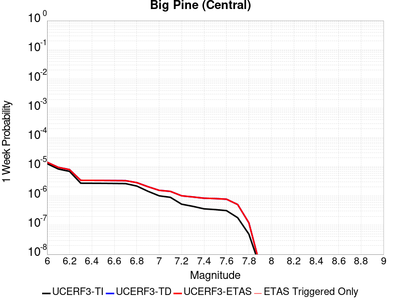 |  |  |  |

| Magnitude | 1 wk TI Prob | 1 wk TD Prob | 1 wk ETAS Prob | 1 wk ETAS/TD Gain | 1 wk ETAS Triggered Only | 1 mo TI Prob | 1 mo TD Prob | 1 mo ETAS Prob | 1 mo ETAS/TD Gain | 1 mo ETAS Triggered Only | 1 yr TI Prob | 1 yr TD Prob | 1 yr ETAS Prob | 1 yr ETAS/TD Gain | 1 yr ETAS Triggered Only | 10 yr TI Prob | 10 yr TD Prob | 10 yr ETAS Prob | 10 yr ETAS/TD Gain | 10 yr ETAS Triggered Only |
|-----|-----|-----|-----|-----|-----|-----|-----|-----|-----|-----|-----|-----|-----|-----|-----|-----|-----|-----|-----|-----|
| 6.0 | 1.2706755E-5 | 1.4251012E-5 | 1.4251012E-5 | 1.0 | 0.0 | 5.4456385E-5 | 6.107454E-5 | 6.107454E-5 | 1.0 | 0.0 | 6.628048E-4 | 7.4336544E-4 | 7.4336544E-4 | 1.0 | 0.0 | 0.006608314 | 0.0074138143 | 0.007474834 | 1.0082306 | 6.147541E-5 |
| 6.1 | 8.342579E-6 | 9.511191E-6 | 9.511191E-6 | 1.0 | 0.0 | 3.5753423E-5 | 4.0761734E-5 | 4.0761734E-5 | 1.0 | 0.0 | 4.3521097E-4 | 4.961828E-4 | 4.961828E-4 | 1.0 | 0.0 | 0.0043435963 | 0.0049543027 | 0.0049746926 | 1.0041157 | 2.0491803E-5 |
| 6.2 | 6.923899E-6 | 7.967559E-6 | 7.967559E-6 | 1.0 | 0.0 | 2.9673516E-5 | 3.4146342E-5 | 3.4146342E-5 | 1.0 | 0.0 | 3.6121515E-4 | 4.1567165E-4 | 4.1567165E-4 | 1.0 | 0.0 | 0.003606286 | 0.0041522477 | 0.0041726544 | 1.0049146 | 2.0491803E-5 |
| 6.3 | 2.728396E-6 | 3.4246525E-6 | 3.4246525E-6 | 1.0 | 0.0 | 1.1693074E-5 | 1.4677004E-5 | 1.4677004E-5 | 1.0 | 0.0 | 1.4235388E-4 | 1.7867875E-4 | 1.7867875E-4 | 1.0 | 0.0 | 0.0014226272 | 0.0017868559 | 0.001807311 | 1.0114475 | 2.0491803E-5 |
| 6.4 | 2.7136944E-6 | 3.4089458E-6 | 3.4089458E-6 | 1.0 | 0.0 | 1.1630066E-5 | 1.4609691E-5 | 1.4609691E-5 | 1.0 | 0.0 | 1.4158686E-4 | 1.7785933E-4 | 1.7785933E-4 | 1.0 | 0.0 | 0.0014149669 | 0.0017786748 | 0.0017991301 | 1.0115004 | 2.0491803E-5 |
| 6.5 | 2.6971882E-6 | 3.3912906E-6 | 3.3912906E-6 | 1.0 | 0.0 | 1.1559327E-5 | 1.4534027E-5 | 1.4534027E-5 | 1.0 | 0.0 | 1.4072572E-4 | 1.7693828E-4 | 1.7693828E-4 | 1.0 | 0.0 | 0.0014063664 | 0.0017694789 | 0.0017899345 | 1.0115602 | 2.0491803E-5 |
| 6.6 | 2.669092E-6 | 3.361311E-6 | 3.361311E-6 | 1.0 | 0.0 | 1.1438916E-5 | 1.4405543E-5 | 1.4405543E-5 | 1.0 | 0.0 | 1.3925991E-4 | 1.7537424E-4 | 1.7537424E-4 | 1.0 | 0.0 | 0.0013917267 | 0.0017538633 | 0.0017743192 | 1.0116633 | 2.0491803E-5 |
| 6.7 | 2.6408059E-6 | 3.3313363E-6 | 3.3313363E-6 | 1.0 | 0.0 | 1.1317691E-5 | 1.4277082E-5 | 1.4277082E-5 | 1.0 | 0.0 | 1.3778417E-4 | 1.7381048E-4 | 1.7381048E-4 | 1.0 | 0.0 | 0.0013769877 | 0.0017382503 | 0.0017587064 | 1.0117682 | 2.0491803E-5 |
| 6.8 | 2.1786943E-6 | 2.8547915E-6 | 2.8547915E-6 | 1.0 | 0.0 | 9.337228E-6 | 1.2234768E-5 | 1.2234768E-5 | 1.0 | 0.0 | 1.1367482E-4 | 1.4894885E-4 | 1.4894885E-4 | 1.0 | 0.0 | 0.0011361669 | 0.0014899815 | 0.0015104428 | 1.0137326 | 2.0491803E-5 |
| 6.9 | 1.4411696E-6 | 2.0688422E-6 | 2.0688422E-6 | 1.0 | 0.0 | 6.1764263E-6 | 8.866437E-6 | 8.866437E-6 | 1.0 | 0.0 | 7.51954E-5 | 1.079438E-4 | 1.079438E-4 | 1.0 | 0.0 | 7.5169955E-4 | 0.0010803605 | 0.0011008302 | 1.0189471 | 2.0491803E-5 |
| 7.0 | 1.0073411E-6 | 1.5545673E-6 | 1.5545673E-6 | 1.0 | 0.0 | 4.317169E-6 | 6.662415E-6 | 6.662415E-6 | 1.0 | 0.0 | 5.2560266E-5 | 8.111204E-5 | 8.111204E-5 | 1.0 | 0.0 | 5.2547833E-4 | 8.1225985E-4 | 8.32735E-4 | 1.0252076 | 2.0491803E-5 |
| 7.1 | 8.947104E-7 | 1.4305514E-6 | 1.4305514E-6 | 1.0 | 0.0 | 3.834468E-6 | 6.130921E-6 | 6.130921E-6 | 1.0 | 0.0 | 4.6683643E-5 | 7.464155E-5 | 7.464155E-5 | 1.0 | 0.0 | 4.6673836E-4 | 7.476001E-4 | 7.680766E-4 | 1.0273896 | 2.0491803E-5 |
| 7.2 | 5.215166E-7 | 1.0114496E-6 | 1.0114496E-6 | 1.0 | 0.0 | 2.2350691E-6 | 4.3347773E-6 | 4.3347773E-6 | 1.0 | 0.0 | 2.7211627E-5 | 5.2774678E-5 | 5.2774678E-5 | 1.0 | 0.0 | 2.7208295E-4 | 5.290466E-4 | 5.290466E-4 | 1.0 | 0.0 |
| 7.3 | 4.4024807E-7 | 9.2223235E-7 | 9.2223235E-7 | 1.0 | 0.0 | 1.8867761E-6 | 3.9524184E-6 | 3.9524184E-6 | 1.0 | 0.0 | 2.2971257E-5 | 4.8119677E-5 | 4.8119677E-5 | 1.0 | 0.0 | 2.2968883E-4 | 4.8251753E-4 | 4.8251753E-4 | 1.0 | 0.0 |
| 7.4 | 3.6130905E-7 | 8.3611724E-7 | 8.3611724E-7 | 1.0 | 0.0 | 1.5484665E-6 | 3.583355E-6 | 3.583355E-6 | 1.0 | 0.0 | 1.8852415E-5 | 4.362651E-5 | 4.362651E-5 | 1.0 | 0.0 | 1.8850817E-4 | 4.3759486E-4 | 4.3759486E-4 | 1.0 | 0.0 |
| 7.5 | 3.408184E-7 | 8.110739E-7 | 8.110739E-7 | 1.0 | 0.0 | 1.4606494E-6 | 3.4760267E-6 | 3.4760267E-6 | 1.0 | 0.0 | 1.7783263E-5 | 4.231984E-5 | 4.231984E-5 | 1.0 | 0.0 | 1.778184E-4 | 4.2451176E-4 | 4.2451176E-4 | 1.0 | 0.0 |
| 7.6 | 3.1428627E-7 | 7.7341E-7 | 7.7341E-7 | 1.0 | 0.0 | 1.3469405E-6 | 3.3146102E-6 | 3.3146102E-6 | 1.0 | 0.0 | 1.6398877E-5 | 4.0354673E-5 | 4.0354673E-5 | 1.0 | 0.0 | 1.6397667E-4 | 4.0483844E-4 | 4.0483844E-4 | 1.0 | 0.0 |
| 7.7 | 1.7972785E-7 | 5.0796626E-7 | 5.0796626E-7 | 1.0 | 0.0 | 7.70262E-7 | 2.1769965E-6 | 2.1769965E-6 | 1.0 | 0.0 | 9.377899E-6 | 2.6504622E-5 | 2.6504622E-5 | 1.0 | 0.0 | 9.377503E-5 | 2.663867E-4 | 2.663867E-4 | 1.0 | 0.0 |
| 7.8 | 4.9230927E-8 | 1.1985297E-7 | 1.1985297E-7 | 1.0 | 0.0 | 2.1098968E-7 | 5.136555E-7 | 5.136555E-7 | 1.0 | 0.0 | 2.5687964E-6 | 6.2537392E-6 | 6.2537392E-6 | 1.0 | 0.0 | 2.5687666E-5 | 6.2977226E-5 | 6.2977226E-5 | 1.0 | 0.0 |
| 7.9 | 3.6805972E-9 | 4.1070685E-9 | 4.1070685E-9 | 1.0 | 0.0 | 1.5773987E-8 | 1.7601723E-8 | 1.7601723E-8 | 1.0 | 0.0 | 1.9204828E-7 | 2.1430095E-7 | 2.1430095E-7 | 1.0 | 0.0 | 1.920481E-6 | 2.190991E-6 | 2.190991E-6 | 1.0 | 0.0 |

## San Jacinto (Coyote Creek)
*[(top)](#table-of-contents)*

| 1 Week | 1 Month | 1 Year | 10 Year |
|-----|-----|-----|-----|
|  |  | 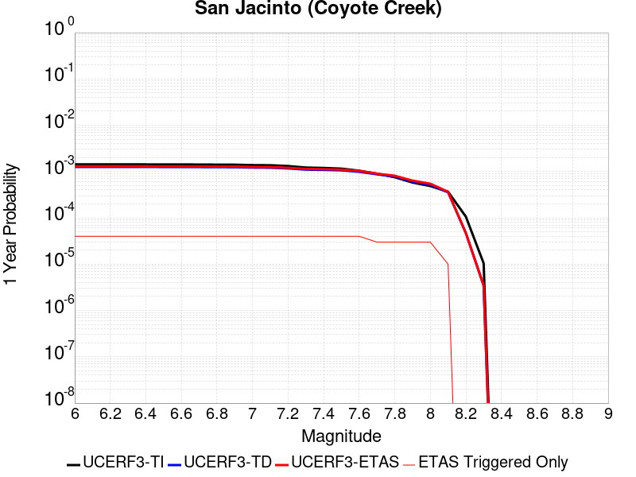 | 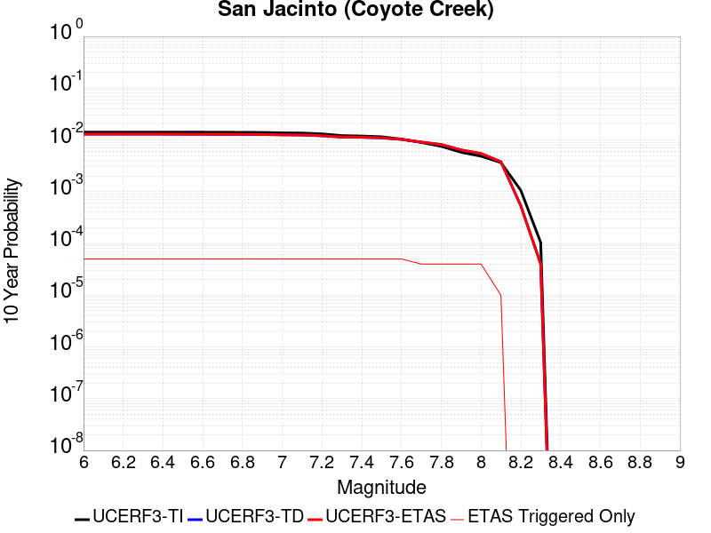 |

| Magnitude | 1 wk TI Prob | 1 wk TD Prob | 1 wk ETAS Prob | 1 wk ETAS/TD Gain | 1 wk ETAS Triggered Only | 1 mo TI Prob | 1 mo TD Prob | 1 mo ETAS Prob | 1 mo ETAS/TD Gain | 1 mo ETAS Triggered Only | 1 yr TI Prob | 1 yr TD Prob | 1 yr ETAS Prob | 1 yr ETAS/TD Gain | 1 yr ETAS Triggered Only | 10 yr TI Prob | 10 yr TD Prob | 10 yr ETAS Prob | 10 yr ETAS/TD Gain | 10 yr ETAS Triggered Only |
|-----|-----|-----|-----|-----|-----|-----|-----|-----|-----|-----|-----|-----|-----|-----|-----|-----|-----|-----|-----|-----|
| 6.0 | 2.7374346E-5 | 2.415327E-5 | 2.415327E-5 | 1.0 | 0.0 | 1.1731335E-4 | 1.0350993E-4 | 1.239996E-4 | 1.1979489 | 2.0491803E-5 | 0.0014273542 | 0.0012595074 | 0.0013004394 | 1.0324984 | 4.0983607E-5 | 0.01418221 | 0.01293251 | 0.01299319 | 1.0046921 | 6.147541E-5 |
| 6.1 | 2.7374346E-5 | 2.415327E-5 | 2.415327E-5 | 1.0 | 0.0 | 1.1731335E-4 | 1.0350993E-4 | 1.239996E-4 | 1.1979489 | 2.0491803E-5 | 0.0014273542 | 0.0012595074 | 0.0013004394 | 1.0324984 | 4.0983607E-5 | 0.01418221 | 0.01293251 | 0.01299319 | 1.0046921 | 6.147541E-5 |
| 6.2 | 2.7374346E-5 | 2.415327E-5 | 2.415327E-5 | 1.0 | 0.0 | 1.1731335E-4 | 1.0350993E-4 | 1.239996E-4 | 1.1979489 | 2.0491803E-5 | 0.0014273542 | 0.0012595074 | 0.0013004394 | 1.0324984 | 4.0983607E-5 | 0.01418221 | 0.01293251 | 0.01299319 | 1.0046921 | 6.147541E-5 |
| 6.3 | 2.7374346E-5 | 2.415327E-5 | 2.415327E-5 | 1.0 | 0.0 | 1.1731335E-4 | 1.0350993E-4 | 1.239996E-4 | 1.1979489 | 2.0491803E-5 | 0.0014273542 | 0.0012595074 | 0.0013004394 | 1.0324984 | 4.0983607E-5 | 0.01418221 | 0.01293251 | 0.01299319 | 1.0046921 | 6.147541E-5 |
| 6.4 | 2.7374346E-5 | 2.415327E-5 | 2.415327E-5 | 1.0 | 0.0 | 1.1731335E-4 | 1.0350993E-4 | 1.239996E-4 | 1.1979489 | 2.0491803E-5 | 0.0014273542 | 0.0012595074 | 0.0013004394 | 1.0324984 | 4.0983607E-5 | 0.01418221 | 0.01293251 | 0.01299319 | 1.0046921 | 6.147541E-5 |
| 6.5 | 2.7282445E-5 | 2.4039346E-5 | 2.4039346E-5 | 1.0 | 0.0 | 1.16919524E-4 | 1.0302171E-4 | 1.235114E-4 | 1.1988871 | 2.0491803E-5 | 0.0014225657 | 0.0012535703 | 0.0012945025 | 1.0326525 | 4.0983607E-5 | 0.014134934 | 0.012873836 | 0.01293452 | 1.0047138 | 6.147541E-5 |
| 6.6 | 2.7282445E-5 | 2.4039346E-5 | 2.4039346E-5 | 1.0 | 0.0 | 1.16919524E-4 | 1.0302171E-4 | 1.235114E-4 | 1.1988871 | 2.0491803E-5 | 0.0014225657 | 0.0012535703 | 0.0012945025 | 1.0326525 | 4.0983607E-5 | 0.014134934 | 0.012873836 | 0.01293452 | 1.0047138 | 6.147541E-5 |
| 6.7 | 2.7216198E-5 | 2.3964463E-5 | 2.3964463E-5 | 1.0 | 0.0 | 1.1663563E-4 | 1.0270082E-4 | 1.2319052E-4 | 1.1995087 | 2.0491803E-5 | 0.0014191137 | 0.0012496678 | 0.0012906003 | 1.0327547 | 4.0983607E-5 | 0.014100855 | 0.0128352465 | 0.012895932 | 1.0047281 | 6.147541E-5 |
| 6.8 | 2.7078617E-5 | 2.3881676E-5 | 2.3881676E-5 | 1.0 | 0.0 | 1.1604605E-4 | 1.0234604E-4 | 1.2283574E-4 | 1.2002003 | 2.0491803E-5 | 0.001411945 | 0.0012453535 | 0.001286286 | 1.0328683 | 4.0983607E-5 | 0.014030075 | 0.012792386 | 0.012853075 | 1.0047442 | 6.147541E-5 |
| 6.9 | 2.6982952E-5 | 2.3801183E-5 | 2.3801183E-5 | 1.0 | 0.0 | 1.15636096E-4 | 1.020011E-4 | 1.224908E-4 | 1.2008774 | 2.0491803E-5 | 0.0014069602 | 0.0012411585 | 0.0012820913 | 1.0329795 | 4.0983607E-5 | 0.013980856 | 0.012750699 | 0.012811391 | 1.0047599 | 6.147541E-5 |
| 7.0 | 2.6449972E-5 | 2.3378187E-5 | 2.3378187E-5 | 1.0 | 0.0 | 1.1335209E-4 | 1.001884E-4 | 1.20678145E-4 | 1.2045122 | 2.0491803E-5 | 0.001379188 | 0.0012191138 | 0.0012600474 | 1.0335766 | 4.0983607E-5 | 0.0137065975 | 0.0125320535 | 0.012592758 | 1.004844 | 6.147541E-5 |
| 7.1 | 2.6257849E-5 | 2.3204217E-5 | 2.3204217E-5 | 1.0 | 0.0 | 1.1252879E-4 | 9.944286E-5 | 1.1993263E-4 | 1.2060456 | 2.0491803E-5 | 0.0013691769 | 0.001210047 | 0.001250981 | 1.0338285 | 4.0983607E-5 | 0.013607717 | 0.012441914 | 0.012502625 | 1.0048795 | 6.147541E-5 |
| 7.2 | 2.5270041E-5 | 2.2398921E-5 | 2.2398921E-5 | 1.0 | 0.0 | 1.0829568E-4 | 9.5991854E-5 | 1.1648169E-4 | 1.2134539 | 2.0491803E-5 | 0.0013177024 | 0.0011680766 | 0.0012090123 | 1.0350454 | 4.0983607E-5 | 0.013099162 | 0.012022921 | 0.012083657 | 1.0050517 | 6.147541E-5 |
| 7.3 | 2.339701E-5 | 2.1130656E-5 | 2.1130656E-5 | 1.0 | 0.0 | 1.0026905E-4 | 9.055682E-5 | 1.1104677E-4 | 1.2262661 | 2.0491803E-5 | 0.001220092 | 0.0011019738 | 0.0011429122 | 1.0371501 | 4.0983607E-5 | 0.012134149 | 0.011361783 | 0.011422561 | 1.0053493 | 6.147541E-5 |
| 7.4 | 2.296333E-5 | 2.0860984E-5 | 2.0860984E-5 | 1.0 | 0.0 | 9.841056E-5 | 8.940117E-5 | 1.0989114E-4 | 1.2291913 | 2.0491803E-5 | 0.0011974899 | 0.0010879177 | 0.0011288568 | 1.0376307 | 4.0983607E-5 | 0.011910575 | 0.011220883 | 0.011281668 | 1.0054172 | 6.147541E-5 |
| 7.5 | 2.2188895E-5 | 2.0383844E-5 | 2.0383844E-5 | 1.0 | 0.0 | 9.50918E-5 | 8.735642E-5 | 1.07846434E-4 | 1.2345564 | 2.0491803E-5 | 0.0011571277 | 0.0010630476 | 0.0011039876 | 1.038512 | 4.0983607E-5 | 0.011511209 | 0.010970469 | 0.01103127 | 1.0055423 | 6.147541E-5 |
| 7.6 | 2.0013189E-5 | 1.8969942E-5 | 1.8969942E-5 | 1.0 | 0.0 | 8.5767984E-5 | 8.1297236E-5 | 1.0178737E-4 | 1.2520398 | 2.0491803E-5 | 0.001043725 | 9.893461E-4 | 0.0010302892 | 1.041384 | 4.0983607E-5 | 0.010388365 | 0.010228388 | 0.010289234 | 1.0059488 | 6.147541E-5 |
| 7.7 | 1.7230794E-5 | 1.6751088E-5 | 1.6751088E-5 | 1.0 | 0.0 | 7.384417E-5 | 7.17884E-5 | 9.227874E-5 | 1.2854267 | 2.0491803E-5 | 8.986819E-4 | 8.736742E-4 | 9.14622E-4 | 1.0468684 | 4.0983607E-5 | 0.008950562 | 0.009066812 | 0.00912773 | 1.0067188 | 6.147541E-5 |
| 7.8 | 1.4478809E-5 | 1.49981E-5 | 1.49981E-5 | 1.0 | 0.0 | 6.205057E-5 | 6.427599E-5 | 8.476648E-5 | 1.3187891 | 2.0491803E-5 | 7.552038E-4 | 7.822799E-4 | 8.232314E-4 | 1.052349 | 4.0983607E-5 | 0.0075264242 | 0.008145113 | 0.008206087 | 1.0074861 | 6.147541E-5 |
| 7.9 | 1.1114467E-5 | 1.1651392E-5 | 1.1651392E-5 | 1.0 | 0.0 | 4.7632562E-5 | 4.9933584E-5 | 7.0424365E-5 | 1.4103607 | 2.0491803E-5 | 5.797721E-4 | 6.077724E-4 | 6.487311E-4 | 1.0673915 | 4.0983607E-5 | 0.0057826187 | 0.0063836263 | 0.0064447094 | 1.0095687 | 6.147541E-5 |
| 8.0 | 9.327402E-6 | 9.904865E-6 | 9.904865E-6 | 1.0 | 0.0 | 3.9973966E-5 | 4.2448733E-5 | 6.293967E-5 | 1.4827219 | 2.0491803E-5 | 4.8657437E-4 | 5.166913E-4 | 5.576537E-4 | 1.0792783 | 4.0983607E-5 | 0.0048551033 | 0.0054529547 | 0.0055140946 | 1.0112123 | 6.147541E-5 |
| 8.1 | 7.0235833E-6 | 6.83171E-6 | 6.83171E-6 | 1.0 | 0.0 | 3.0100724E-5 | 2.9278432E-5 | 2.9278432E-5 | 1.0 | 0.0 | 3.664147E-4 | 3.5640708E-4 | 3.5640708E-4 | 1.0 | 0.0 | 0.003658111 | 0.0037898365 | 0.0037898365 | 1.0 | 0.0 |
| 8.2 | 2.0358202E-6 | 9.0030267E-7 | 9.0030267E-7 | 1.0 | 0.0 | 8.724915E-6 | 3.8584344E-6 | 3.8584344E-6 | 1.0 | 0.0 | 1.06220665E-4 | 4.697545E-5 | 4.697545E-5 | 1.0 | 0.0 | 0.001061699 | 5.3301745E-4 | 5.3301745E-4 | 1.0 | 0.0 |
| 8.3 | 2.0051264E-7 | 6.6244816E-8 | 6.6244816E-8 | 1.0 | 0.0 | 8.5933965E-7 | 2.8390633E-7 | 2.8390633E-7 | 1.0 | 0.0 | 1.046241E-5 | 3.4565546E-6 | 3.4565546E-6 | 1.0 | 0.0 | 1.0461917E-4 | 4.018022E-5 | 4.018022E-5 | 1.0 | 0.0 |

## Kern Canyon (North Kern) 2011
*[(top)](#table-of-contents)*

| 1 Week | 1 Month | 1 Year | 10 Year |
|-----|-----|-----|-----|
|  |  | 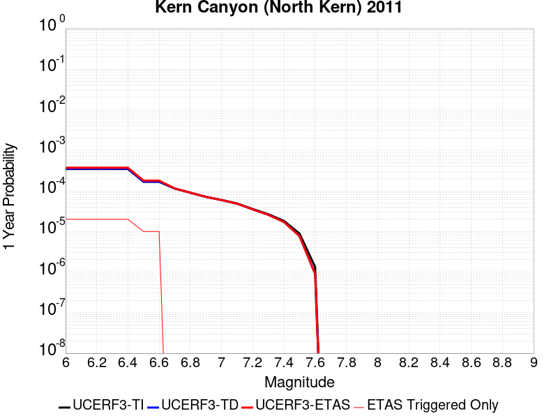 |  |

| Magnitude | 1 wk TI Prob | 1 wk TD Prob | 1 wk ETAS Prob | 1 wk ETAS/TD Gain | 1 wk ETAS Triggered Only | 1 mo TI Prob | 1 mo TD Prob | 1 mo ETAS Prob | 1 mo ETAS/TD Gain | 1 mo ETAS Triggered Only | 1 yr TI Prob | 1 yr TD Prob | 1 yr ETAS Prob | 1 yr ETAS/TD Gain | 1 yr ETAS Triggered Only | 10 yr TI Prob | 10 yr TD Prob | 10 yr ETAS Prob | 10 yr ETAS/TD Gain | 10 yr ETAS Triggered Only |
|-----|-----|-----|-----|-----|-----|-----|-----|-----|-----|-----|-----|-----|-----|-----|-----|-----|-----|-----|-----|-----|
| 6.0 | 6.6264497E-6 | 6.7573515E-6 | 2.7249016E-5 | 4.0324993 | 2.0491803E-5 | 2.8398761E-5 | 2.8959801E-5 | 4.945101E-5 | 1.7075742 | 2.0491803E-5 | 3.4570007E-4 | 3.5253653E-4 | 3.7302112E-4 | 1.0581063 | 2.0491803E-5 | 0.0034516277 | 0.0035205614 | 0.0035818203 | 1.0174004 | 6.147541E-5 |
| 6.1 | 6.6264497E-6 | 6.7573515E-6 | 2.7249016E-5 | 4.0324993 | 2.0491803E-5 | 2.8398761E-5 | 2.8959801E-5 | 4.945101E-5 | 1.7075742 | 2.0491803E-5 | 3.4570007E-4 | 3.5253653E-4 | 3.7302112E-4 | 1.0581063 | 2.0491803E-5 | 0.0034516277 | 0.0035205614 | 0.0035818203 | 1.0174004 | 6.147541E-5 |
| 6.2 | 6.6264497E-6 | 6.7573515E-6 | 2.7249016E-5 | 4.0324993 | 2.0491803E-5 | 2.8398761E-5 | 2.8959801E-5 | 4.945101E-5 | 1.7075742 | 2.0491803E-5 | 3.4570007E-4 | 3.5253653E-4 | 3.7302112E-4 | 1.0581063 | 2.0491803E-5 | 0.0034516277 | 0.0035205614 | 0.0035818203 | 1.0174004 | 6.147541E-5 |
| 6.3 | 6.6264497E-6 | 6.7573515E-6 | 2.7249016E-5 | 4.0324993 | 2.0491803E-5 | 2.8398761E-5 | 2.8959801E-5 | 4.945101E-5 | 1.7075742 | 2.0491803E-5 | 3.4570007E-4 | 3.5253653E-4 | 3.7302112E-4 | 1.0581063 | 2.0491803E-5 | 0.0034516277 | 0.0035205614 | 0.0035818203 | 1.0174004 | 6.147541E-5 |
| 6.4 | 6.6264497E-6 | 6.7573515E-6 | 2.7249016E-5 | 4.0324993 | 2.0491803E-5 | 2.8398761E-5 | 2.8959801E-5 | 4.945101E-5 | 1.7075742 | 2.0491803E-5 | 3.4570007E-4 | 3.5253653E-4 | 3.7302112E-4 | 1.0581063 | 2.0491803E-5 | 0.0034516277 | 0.0035205614 | 0.0035818203 | 1.0174004 | 6.147541E-5 |
| 6.5 | 3.2162225E-6 | 3.2571006E-6 | 2.3748837E-5 | 7.2914042 | 2.0491803E-5 | 1.3783738E-5 | 1.3958933E-5 | 3.4450448E-5 | 2.467986 | 2.0491803E-5 | 1.6780409E-4 | 1.6993756E-4 | 1.9042588E-4 | 1.1205639 | 2.0491803E-5 | 0.0016767744 | 0.0016981558 | 0.0017186127 | 1.0120466 | 2.0491803E-5 |
| 6.6 | 3.2162225E-6 | 3.2571006E-6 | 2.3748837E-5 | 7.2914042 | 2.0491803E-5 | 1.3783738E-5 | 1.3958933E-5 | 3.4450448E-5 | 2.467986 | 2.0491803E-5 | 1.6780409E-4 | 1.6993756E-4 | 1.9042588E-4 | 1.1205639 | 2.0491803E-5 | 0.0016767744 | 0.0016981558 | 0.0017186127 | 1.0120466 | 2.0491803E-5 |
| 6.7 | 2.1908265E-6 | 2.2071279E-6 | 2.2071279E-6 | 1.0 | 0.0 | 9.389223E-6 | 9.459087E-6 | 9.459087E-6 | 1.0 | 0.0 | 1.1430779E-4 | 1.1515849E-4 | 1.1515849E-4 | 1.0 | 0.0 | 0.0011424901 | 0.0011510076 | 0.0011510076 | 1.0 | 0.0 |
| 6.8 | 1.7303895E-6 | 1.7365574E-6 | 1.7365574E-6 | 1.0 | 0.0 | 7.415934E-6 | 7.442368E-6 | 7.442368E-6 | 1.0 | 0.0 | 9.028525E-5 | 9.060716E-5 | 9.060716E-5 | 1.0 | 0.0 | 9.024858E-4 | 9.057119E-4 | 9.057119E-4 | 1.0 | 0.0 |
| 6.9 | 1.3700314E-6 | 1.3688657E-6 | 1.3688657E-6 | 1.0 | 0.0 | 5.87155E-6 | 5.866554E-6 | 5.866554E-6 | 1.0 | 0.0 | 7.148377E-5 | 7.1423005E-5 | 7.1423005E-5 | 1.0 | 0.0 | 7.146078E-4 | 7.1400503E-4 | 7.1400503E-4 | 1.0 | 0.0 |
| 7.0 | 1.1467797E-6 | 1.1413833E-6 | 1.1413833E-6 | 1.0 | 0.0 | 4.9147607E-6 | 4.8916336E-6 | 4.8916336E-6 | 1.0 | 0.0 | 5.983557E-5 | 5.9554044E-5 | 5.9554044E-5 | 1.0 | 0.0 | 5.981946E-4 | 5.95384E-4 | 5.95384E-4 | 1.0 | 0.0 |
| 7.1 | 9.3952065E-7 | 9.302714E-7 | 9.302714E-7 | 1.0 | 0.0 | 4.026511E-6 | 3.9868714E-6 | 3.9868714E-6 | 1.0 | 0.0 | 4.9021666E-5 | 4.8539096E-5 | 4.8539096E-5 | 1.0 | 0.0 | 4.901085E-4 | 4.8528673E-4 | 4.8528673E-4 | 1.0 | 0.0 |
| 7.2 | 6.858055E-7 | 6.719318E-7 | 6.719318E-7 | 1.0 | 0.0 | 2.939163E-6 | 2.8797044E-6 | 2.8797044E-6 | 1.0 | 0.0 | 3.5783723E-5 | 3.5059846E-5 | 3.5059846E-5 | 1.0 | 0.0 | 3.5777962E-4 | 3.5054405E-4 | 3.5054405E-4 | 1.0 | 0.0 |
| 7.3 | 5.1101983E-7 | 4.939313E-7 | 4.939313E-7 | 1.0 | 0.0 | 2.1900833E-6 | 2.1168466E-6 | 2.1168466E-6 | 1.0 | 0.0 | 2.6663936E-5 | 2.5772308E-5 | 2.5772308E-5 | 1.0 | 0.0 | 2.6660739E-4 | 2.5769367E-4 | 2.5769367E-4 | 1.0 | 0.0 |
| 7.4 | 3.4999414E-7 | 3.2995996E-7 | 3.2995996E-7 | 1.0 | 0.0 | 1.499974E-6 | 1.4141134E-6 | 1.4141134E-6 | 1.0 | 0.0 | 1.8262032E-5 | 1.7216697E-5 | 1.7216697E-5 | 1.0 | 0.0 | 1.826053E-4 | 1.7215387E-4 | 1.7215387E-4 | 1.0 | 0.0 |
| 7.5 | 1.7021522E-7 | 1.4750091E-7 | 1.4750091E-7 | 1.0 | 0.0 | 7.2949354E-7 | 6.3214657E-7 | 6.3214657E-7 | 1.0 | 0.0 | 8.881548E-6 | 7.696359E-6 | 7.696359E-6 | 1.0 | 0.0 | 8.8811925E-5 | 7.6961E-5 | 7.6961E-5 | 1.0 | 0.0 |
| 7.6 | 2.572245E-8 | 1.7352637E-8 | 1.7352637E-8 | 1.0 | 0.0 | 1.10239064E-7 | 7.4368444E-8 | 7.4368444E-8 | 1.0 | 0.0 | 1.3421597E-6 | 9.0543546E-7 | 9.0543546E-7 | 1.0 | 0.0 | 1.3421517E-5 | 9.0543235E-6 | 9.0543235E-6 | 1.0 | 0.0 |

## Ventura-Pitas Point
*[(top)](#table-of-contents)*

| 1 Week | 1 Month | 1 Year | 10 Year |
|-----|-----|-----|-----|
|  | 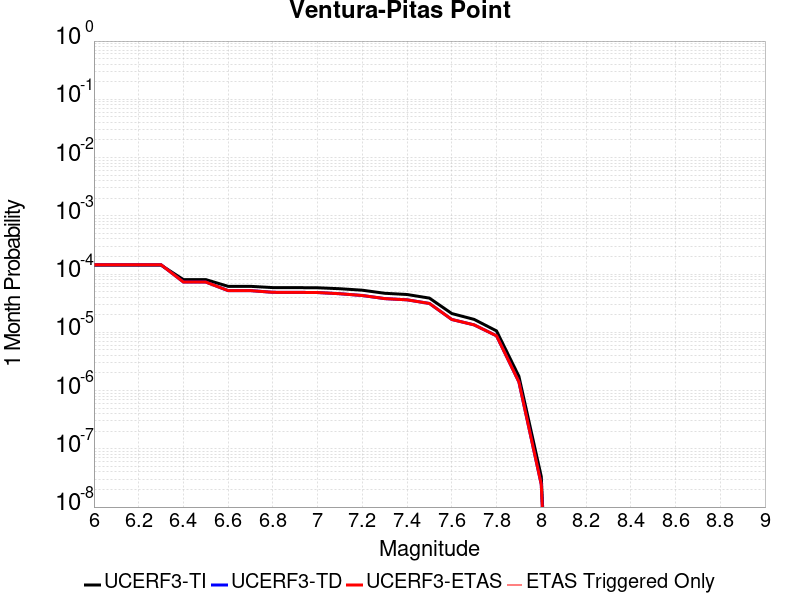 |  |  |

| Magnitude | 1 wk TI Prob | 1 wk TD Prob | 1 wk ETAS Prob | 1 wk ETAS/TD Gain | 1 wk ETAS Triggered Only | 1 mo TI Prob | 1 mo TD Prob | 1 mo ETAS Prob | 1 mo ETAS/TD Gain | 1 mo ETAS Triggered Only | 1 yr TI Prob | 1 yr TD Prob | 1 yr ETAS Prob | 1 yr ETAS/TD Gain | 1 yr ETAS Triggered Only | 10 yr TI Prob | 10 yr TD Prob | 10 yr ETAS Prob | 10 yr ETAS/TD Gain | 10 yr ETAS Triggered Only |
|-----|-----|-----|-----|-----|-----|-----|-----|-----|-----|-----|-----|-----|-----|-----|-----|-----|-----|-----|-----|-----|
| 6.0 | 3.3179622E-5 | 3.3735807E-5 | 3.3735807E-5 | 1.0 | 0.0 | 1.4219063E-4 | 1.4457546E-4 | 1.4457546E-4 | 1.0 | 0.0 | 0.0017297962 | 0.001759042 | 0.001759042 | 1.0 | 0.0 | 0.017163932 | 0.01747672 | 0.017516987 | 1.0023041 | 4.0983607E-5 |
| 6.1 | 3.3179622E-5 | 3.3735807E-5 | 3.3735807E-5 | 1.0 | 0.0 | 1.4219063E-4 | 1.4457546E-4 | 1.4457546E-4 | 1.0 | 0.0 | 0.0017297962 | 0.001759042 | 0.001759042 | 1.0 | 0.0 | 0.017163932 | 0.01747672 | 0.017516987 | 1.0023041 | 4.0983607E-5 |
| 6.2 | 3.3179622E-5 | 3.3735807E-5 | 3.3735807E-5 | 1.0 | 0.0 | 1.4219063E-4 | 1.4457546E-4 | 1.4457546E-4 | 1.0 | 0.0 | 0.0017297962 | 0.001759042 | 0.001759042 | 1.0 | 0.0 | 0.017163932 | 0.01747672 | 0.017516987 | 1.0023041 | 4.0983607E-5 |
| 6.3 | 3.3179622E-5 | 3.3735807E-5 | 3.3735807E-5 | 1.0 | 0.0 | 1.4219063E-4 | 1.4457546E-4 | 1.4457546E-4 | 1.0 | 0.0 | 0.0017297962 | 0.001759042 | 0.001759042 | 1.0 | 0.0 | 0.017163932 | 0.01747672 | 0.017516987 | 1.0023041 | 4.0983607E-5 |
| 6.4 | 1.8754668E-5 | 1.701988E-5 | 1.701988E-5 | 1.0 | 0.0 | 8.037467E-5 | 7.2940435E-5 | 7.2940435E-5 | 1.0 | 0.0 | 9.781223E-4 | 8.87711E-4 | 8.87711E-4 | 1.0 | 0.0 | 0.009738282 | 0.008843987 | 0.008884608 | 1.0045931 | 4.0983607E-5 |
| 6.5 | 1.8754668E-5 | 1.701988E-5 | 1.701988E-5 | 1.0 | 0.0 | 8.037467E-5 | 7.2940435E-5 | 7.2940435E-5 | 1.0 | 0.0 | 9.781223E-4 | 8.87711E-4 | 8.87711E-4 | 1.0 | 0.0 | 0.009738282 | 0.008843987 | 0.008884608 | 1.0045931 | 4.0983607E-5 |
| 6.6 | 1.4361558E-5 | 1.2122469E-5 | 1.2122469E-5 | 1.0 | 0.0 | 6.154808E-5 | 5.195242E-5 | 5.195242E-5 | 1.0 | 0.0 | 7.490902E-4 | 6.323394E-4 | 6.323394E-4 | 1.0 | 0.0 | 0.0074657016 | 0.0063056583 | 0.0063260207 | 1.0032293 | 2.0491803E-5 |
| 6.7 | 1.4361558E-5 | 1.2122469E-5 | 1.2122469E-5 | 1.0 | 0.0 | 6.154808E-5 | 5.195242E-5 | 5.195242E-5 | 1.0 | 0.0 | 7.490902E-4 | 6.323394E-4 | 6.323394E-4 | 1.0 | 0.0 | 0.0074657016 | 0.0063056583 | 0.0063260207 | 1.0032293 | 2.0491803E-5 |
| 6.8 | 1.3663846E-5 | 1.13446E-5 | 1.13446E-5 | 1.0 | 0.0 | 5.8558027E-5 | 4.8618822E-5 | 4.8618822E-5 | 1.0 | 0.0 | 7.127108E-4 | 5.917753E-4 | 5.917753E-4 | 1.0 | 0.0 | 0.007104293 | 0.0059022107 | 0.0059022107 | 1.0 | 0.0 |
| 6.9 | 1.3644157E-5 | 1.1322701E-5 | 1.1322701E-5 | 1.0 | 0.0 | 5.8473648E-5 | 4.852497E-5 | 4.852497E-5 | 1.0 | 0.0 | 7.116841E-4 | 5.9063325E-4 | 5.9063325E-4 | 1.0 | 0.0 | 0.007094092 | 0.005890851 | 0.005890851 | 1.0 | 0.0 |
| 7.0 | 1.3568845E-5 | 1.1242266E-5 | 1.1242266E-5 | 1.0 | 0.0 | 5.8150898E-5 | 4.818026E-5 | 4.818026E-5 | 1.0 | 0.0 | 7.077572E-4 | 5.8643875E-4 | 5.8643875E-4 | 1.0 | 0.0 | 0.007055073 | 0.005849127 | 0.005849127 | 1.0 | 0.0 |
| 7.1 | 1.306572E-5 | 1.0720711E-5 | 1.0720711E-5 | 1.0 | 0.0 | 5.599474E-5 | 4.5945108E-5 | 4.5945108E-5 | 1.0 | 0.0 | 6.815227E-4 | 5.5923994E-4 | 5.5923994E-4 | 1.0 | 0.0 | 0.0067943637 | 0.0055785314 | 0.0055785314 | 1.0 | 0.0 |
| 7.2 | 1.232604E-5 | 9.995298E-6 | 9.995298E-6 | 1.0 | 0.0 | 5.2824813E-5 | 4.28363E-5 | 4.28363E-5 | 1.0 | 0.0 | 6.429523E-4 | 5.2140886E-4 | 5.2140886E-4 | 1.0 | 0.0 | 0.0064109527 | 0.005202047 | 0.005202047 | 1.0 | 0.0 |
| 7.3 | 1.0917261E-5 | 8.843967E-6 | 8.843967E-6 | 1.0 | 0.0 | 4.678742E-5 | 3.7902173E-5 | 3.7902173E-5 | 1.0 | 0.0 | 5.69488E-4 | 4.6136283E-4 | 4.6136283E-4 | 1.0 | 0.0 | 0.0056803077 | 0.0046042157 | 0.0046042157 | 1.0 | 0.0 |
| 7.4 | 1.039959E-5 | 8.423679E-6 | 8.423679E-6 | 1.0 | 0.0 | 4.456891E-5 | 3.610099E-5 | 3.610099E-5 | 1.0 | 0.0 | 5.424914E-4 | 4.3944246E-4 | 4.3944246E-4 | 1.0 | 0.0 | 0.0054116896 | 0.004385897 | 0.004385897 | 1.0 | 0.0 |
| 7.5 | 9.015877E-6 | 7.297639E-6 | 7.297639E-6 | 1.0 | 0.0 | 3.86389E-5 | 3.1275227E-5 | 3.1275227E-5 | 1.0 | 0.0 | 4.7032707E-4 | 3.807108E-4 | 3.807108E-4 | 1.0 | 0.0 | 0.004693329 | 0.003800731 | 0.003800731 | 1.0 | 0.0 |
| 7.6 | 4.900162E-6 | 3.8741514E-6 | 3.8741514E-6 | 1.0 | 0.0 | 2.1000526E-5 | 1.66034E-5 | 1.66034E-5 | 1.0 | 0.0 | 2.556514E-4 | 2.0212779E-4 | 2.0212779E-4 | 1.0 | 0.0 | 0.0025535747 | 0.002019453 | 0.002019453 | 1.0 | 0.0 |
| 7.7 | 3.8850626E-6 | 3.126758E-6 | 3.126758E-6 | 1.0 | 0.0 | 1.6650163E-5 | 1.3400323E-5 | 1.3400323E-5 | 1.0 | 0.0 | 2.0269687E-4 | 1.631368E-4 | 1.631368E-4 | 1.0 | 0.0 | 0.002025121 | 0.0016301798 | 0.0016301798 | 1.0 | 0.0 |
| 7.8 | 2.4654719E-6 | 2.029892E-6 | 2.029892E-6 | 1.0 | 0.0 | 1.0566265E-5 | 8.699508E-6 | 8.699508E-6 | 1.0 | 0.0 | 1.2863669E-4 | 1.0591141E-4 | 1.0591141E-4 | 1.0 | 0.0 | 0.0012856225 | 0.001058614 | 0.001058614 | 1.0 | 0.0 |
| 7.9 | 4.095894E-7 | 3.2765047E-7 | 3.2765047E-7 | 1.0 | 0.0 | 1.7553821E-6 | 1.4042156E-6 | 1.4042156E-6 | 1.0 | 0.0 | 2.1371567E-5 | 1.7096194E-5 | 1.7096194E-5 | 1.0 | 0.0 | 2.1369511E-4 | 1.7094909E-4 | 1.7094909E-4 | 1.0 | 0.0 |
| 8.0 | 7.791402E-9 | 5.683553E-9 | 5.683553E-9 | 1.0 | 0.0 | 3.3391725E-8 | 2.4358085E-8 | 2.4358085E-8 | 1.0 | 0.0 | 4.0654416E-7 | 2.9655968E-7 | 2.9655968E-7 | 1.0 | 0.0 | 4.065434E-6 | 2.9655946E-6 | 2.9655946E-6 | 1.0 | 0.0 |

## Mission Creek
*[(top)](#table-of-contents)*

| 1 Week | 1 Month | 1 Year | 10 Year |
|-----|-----|-----|-----|
|  |  |  |  |

| Magnitude | 1 wk TI Prob | 1 wk TD Prob | 1 wk ETAS Prob | 1 wk ETAS/TD Gain | 1 wk ETAS Triggered Only | 1 mo TI Prob | 1 mo TD Prob | 1 mo ETAS Prob | 1 mo ETAS/TD Gain | 1 mo ETAS Triggered Only | 1 yr TI Prob | 1 yr TD Prob | 1 yr ETAS Prob | 1 yr ETAS/TD Gain | 1 yr ETAS Triggered Only | 10 yr TI Prob | 10 yr TD Prob | 10 yr ETAS Prob | 10 yr ETAS/TD Gain | 10 yr ETAS Triggered Only |
|-----|-----|-----|-----|-----|-----|-----|-----|-----|-----|-----|-----|-----|-----|-----|-----|-----|-----|-----|-----|-----|
| 6.0 | 1.1549387E-5 | 1.6324713E-5 | 1.6324713E-5 | 1.0 | 0.0 | 4.9496433E-5 | 6.9961265E-5 | 1.10942005E-4 | 1.5857632 | 4.0983607E-5 | 6.0245243E-4 | 8.5146056E-4 | 8.9240924E-4 | 1.0480924 | 4.0983607E-5 | 0.006008218 | 0.008511184 | 0.008572136 | 1.0071614 | 6.147541E-5 |
| 6.1 | 1.1549387E-5 | 1.6324713E-5 | 1.6324713E-5 | 1.0 | 0.0 | 4.9496433E-5 | 6.9961265E-5 | 1.10942005E-4 | 1.5857632 | 4.0983607E-5 | 6.0245243E-4 | 8.5146056E-4 | 8.9240924E-4 | 1.0480924 | 4.0983607E-5 | 0.006008218 | 0.008511184 | 0.008572136 | 1.0071614 | 6.147541E-5 |
| 6.2 | 1.1549387E-5 | 1.6324713E-5 | 1.6324713E-5 | 1.0 | 0.0 | 4.9496433E-5 | 6.9961265E-5 | 1.10942005E-4 | 1.5857632 | 4.0983607E-5 | 6.0245243E-4 | 8.5146056E-4 | 8.9240924E-4 | 1.0480924 | 4.0983607E-5 | 0.006008218 | 0.008511184 | 0.008572136 | 1.0071614 | 6.147541E-5 |
| 6.3 | 1.1549387E-5 | 1.6324713E-5 | 1.6324713E-5 | 1.0 | 0.0 | 4.9496433E-5 | 6.9961265E-5 | 1.10942005E-4 | 1.5857632 | 4.0983607E-5 | 6.0245243E-4 | 8.5146056E-4 | 8.9240924E-4 | 1.0480924 | 4.0983607E-5 | 0.006008218 | 0.008511184 | 0.008572136 | 1.0071614 | 6.147541E-5 |
| 6.4 | 1.1549387E-5 | 1.6324713E-5 | 1.6324713E-5 | 1.0 | 0.0 | 4.9496433E-5 | 6.9961265E-5 | 1.10942005E-4 | 1.5857632 | 4.0983607E-5 | 6.0245243E-4 | 8.5146056E-4 | 8.9240924E-4 | 1.0480924 | 4.0983607E-5 | 0.006008218 | 0.008511184 | 0.008572136 | 1.0071614 | 6.147541E-5 |
| 6.5 | 1.1549387E-5 | 1.6324713E-5 | 1.6324713E-5 | 1.0 | 0.0 | 4.9496433E-5 | 6.9961265E-5 | 1.10942005E-4 | 1.5857632 | 4.0983607E-5 | 6.0245243E-4 | 8.5146056E-4 | 8.9240924E-4 | 1.0480924 | 4.0983607E-5 | 0.006008218 | 0.008511184 | 0.008572136 | 1.0071614 | 6.147541E-5 |
| 6.6 | 9.202681E-6 | 1.3847972E-5 | 1.3847972E-5 | 1.0 | 0.0 | 3.9439463E-5 | 5.9347152E-5 | 1.00328325E-4 | 1.6905332 | 4.0983607E-5 | 4.800697E-4 | 7.2232104E-4 | 7.632751E-4 | 1.0566977 | 4.0983607E-5 | 0.004790339 | 0.0072283596 | 0.007289391 | 1.0084432 | 6.147541E-5 |
| 6.7 | 9.019164E-6 | 1.365364E-5 | 1.365364E-5 | 1.0 | 0.0 | 3.8652986E-5 | 5.8514335E-5 | 9.949555E-5 | 1.7003618 | 4.0983607E-5 | 4.7049852E-4 | 7.121882E-4 | 7.531426E-4 | 1.057505 | 4.0983607E-5 | 0.004695036 | 0.0071276836 | 0.0071887206 | 1.0085634 | 6.147541E-5 |
| 6.8 | 8.673558E-6 | 1.3275746E-5 | 1.3275746E-5 | 1.0 | 0.0 | 3.717186E-5 | 5.6894864E-5 | 9.787614E-5 | 1.7202983 | 4.0983607E-5 | 4.524734E-4 | 6.924836E-4 | 7.334389E-4 | 1.0591425 | 4.0983607E-5 | 0.0045155324 | 0.0069318693 | 0.006992919 | 1.0088071 | 6.147541E-5 |
| 6.9 | 7.002255E-6 | 1.1479958E-5 | 1.1479958E-5 | 1.0 | 0.0 | 3.000932E-5 | 4.9198927E-5 | 9.018052E-5 | 1.8329773 | 4.0983607E-5 | 3.653022E-4 | 5.988392E-4 | 6.3979824E-4 | 1.0683974 | 4.0983607E-5 | 0.0036470229 | 0.0060006846 | 0.006061791 | 1.0101832 | 6.147541E-5 |
| 7.0 | 5.84644E-6 | 9.677164E-6 | 9.677164E-6 | 1.0 | 0.0 | 2.5055931E-5 | 4.1472922E-5 | 8.245483E-5 | 1.9881606 | 4.0983607E-5 | 3.0501327E-4 | 5.0482043E-4 | 5.457833E-4 | 1.0811435 | 4.0983607E-5 | 0.0030459496 | 0.0050649596 | 0.0051261233 | 1.0120759 | 6.147541E-5 |
| 7.1 | 5.54703E-6 | 9.331631E-6 | 9.331631E-6 | 1.0 | 0.0 | 2.377277E-5 | 3.999212E-5 | 8.097409E-5 | 2.0247512 | 4.0983607E-5 | 2.8939504E-4 | 4.8679972E-4 | 5.277634E-4 | 1.0841489 | 4.0983607E-5 | 0.0028901845 | 0.0048855497 | 0.0049467245 | 1.0125216 | 6.147541E-5 |
| 7.2 | 4.384709E-6 | 7.6836495E-6 | 7.6836495E-6 | 1.0 | 0.0 | 1.8791474E-5 | 3.292953E-5 | 7.391179E-5 | 2.2445443 | 4.0983607E-5 | 2.2876218E-4 | 4.0084694E-4 | 4.418141E-4 | 1.1022016 | 4.0983607E-5 | 0.0022852682 | 0.0040294197 | 0.004090647 | 1.0151951 | 6.147541E-5 |
| 7.3 | 3.7888456E-6 | 6.9174894E-6 | 6.9174894E-6 | 1.0 | 0.0 | 1.623781E-5 | 2.9646066E-5 | 7.0628455E-5 | 2.3823888 | 4.0983607E-5 | 1.9767738E-4 | 3.608844E-4 | 4.0185323E-4 | 1.1135234 | 4.0983607E-5 | 0.0019750162 | 0.0036311483 | 0.0036924004 | 1.0168686 | 6.147541E-5 |
| 7.4 | 2.1982462E-6 | 5.0257536E-6 | 5.0257536E-6 | 1.0 | 0.0 | 9.421021E-6 | 2.1538768E-5 | 6.252149E-5 | 2.9027424 | 4.0983607E-5 | 1.1469489E-4 | 2.6220313E-4 | 3.03176E-4 | 1.1562638 | 4.0983607E-5 | 0.0011463572 | 0.0026468872 | 0.0027082 | 1.023164 | 6.147541E-5 |
| 7.5 | 2.051923E-6 | 4.6169393E-6 | 4.6169393E-6 | 1.0 | 0.0 | 8.793926E-6 | 1.9786734E-5 | 6.076953E-5 | 3.071226 | 4.0983607E-5 | 1.0706078E-4 | 2.40877E-4 | 2.8185072E-4 | 1.1701024 | 4.0983607E-5 | 0.0010700922 | 0.0024345173 | 0.002495843 | 1.0251901 | 6.147541E-5 |
| 7.6 | 1.8733427E-6 | 4.1252324E-6 | 4.1252324E-6 | 1.0 | 0.0 | 8.028587E-6 | 1.767945E-5 | 5.8662332E-5 | 3.3181086 | 4.0983607E-5 | 9.774366E-5 | 2.1522611E-4 | 2.562009E-4 | 1.1903802 | 4.0983607E-5 | 9.770069E-4 | 0.0021790217 | 0.002240363 | 1.0281509 | 6.147541E-5 |
| 7.7 | 1.8411953E-6 | 4.044895E-6 | 4.044895E-6 | 1.0 | 0.0 | 7.890813E-6 | 1.733515E-5 | 5.8318044E-5 | 3.3641503 | 4.0983607E-5 | 9.606641E-5 | 2.1103508E-4 | 2.5201004E-4 | 1.1941619 | 4.0983607E-5 | 9.6024893E-4 | 0.0021373003 | 0.0021986444 | 1.0287017 | 6.147541E-5 |
| 7.8 | 1.7194251E-6 | 3.7121463E-6 | 3.7121463E-6 | 1.0 | 0.0 | 7.368944E-6 | 1.5909101E-5 | 5.6892055E-5 | 3.5760698 | 4.0983607E-5 | 8.97132E-5 | 1.9367617E-4 | 2.3465184E-4 | 1.211568 | 4.0983607E-5 | 8.967699E-4 | 0.0019632233 | 0.002024578 | 1.031252 | 6.147541E-5 |
| 7.9 | 1.4035052E-6 | 2.9514722E-6 | 2.9514722E-6 | 1.0 | 0.0 | 6.0150082E-6 | 1.2649106E-5 | 5.3632193E-5 | 4.239999 | 4.0983607E-5 | 7.3230265E-5 | 1.5399205E-4 | 1.9496934E-4 | 1.2661 | 4.0983607E-5 | 7.3206134E-4 | 0.0015638224 | 0.0016252017 | 1.0392495 | 6.147541E-5 |
| 8.0 | 3.9318823E-7 | 5.5319464E-7 | 5.5319464E-7 | 1.0 | 0.0 | 1.6850913E-6 | 2.3708321E-6 | 2.3708321E-6 | 1.0 | 0.0 | 2.0515794E-5 | 2.8864504E-5 | 2.8864504E-5 | 1.0 | 0.0 | 2.0513899E-4 | 2.9916913E-4 | 3.196548E-4 | 1.0684752 | 2.0491803E-5 |
| 8.1 | 1.596793E-7 | 1.1391901E-7 | 1.1391901E-7 | 1.0 | 0.0 | 6.8433974E-7 | 4.8822426E-7 | 4.8822426E-7 | 1.0 | 0.0 | 8.331805E-6 | 5.944114E-6 | 5.944114E-6 | 1.0 | 0.0 | 8.331492E-5 | 6.5564316E-5 | 6.5564316E-5 | 1.0 | 0.0 |
| 8.2 | 4.9003038E-8 | 2.5475106E-8 | 2.5475106E-8 | 1.0 | 0.0 | 2.10013E-7 | 1.0917902E-7 | 1.0917902E-7 | 1.0 | 0.0 | 2.5569052E-6 | 1.3292538E-6 | 1.3292538E-6 | 1.0 | 0.0 | 2.556876E-5 | 1.4973085E-5 | 1.4973085E-5 | 1.0 | 0.0 |

## San Cayetano
*[(top)](#table-of-contents)*

| 1 Week | 1 Month | 1 Year | 10 Year |
|-----|-----|-----|-----|
| 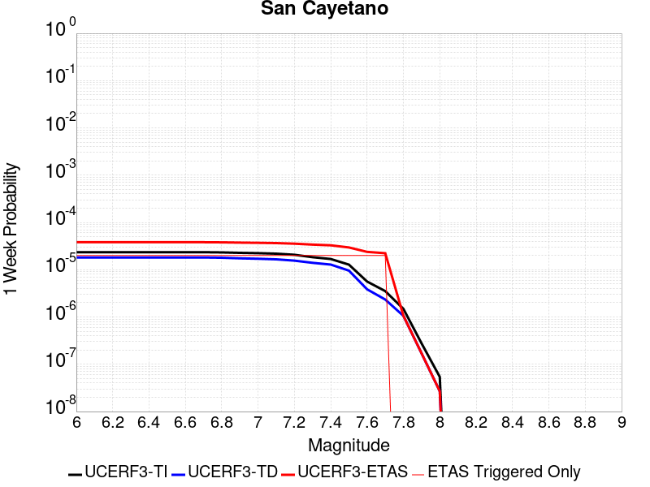 |  |  |  |

| Magnitude | 1 wk TI Prob | 1 wk TD Prob | 1 wk ETAS Prob | 1 wk ETAS/TD Gain | 1 wk ETAS Triggered Only | 1 mo TI Prob | 1 mo TD Prob | 1 mo ETAS Prob | 1 mo ETAS/TD Gain | 1 mo ETAS Triggered Only | 1 yr TI Prob | 1 yr TD Prob | 1 yr ETAS Prob | 1 yr ETAS/TD Gain | 1 yr ETAS Triggered Only | 10 yr TI Prob | 10 yr TD Prob | 10 yr ETAS Prob | 10 yr ETAS/TD Gain | 10 yr ETAS Triggered Only |
|-----|-----|-----|-----|-----|-----|-----|-----|-----|-----|-----|-----|-----|-----|-----|-----|-----|-----|-----|-----|-----|
| 6.0 | 2.3476267E-5 | 1.816963E-5 | 3.8661063E-5 | 2.1277847 | 2.0491803E-5 | 1.0060869E-4 | 7.786754E-5 | 9.835775E-5 | 1.2631419 | 2.0491803E-5 | 0.0012242225 | 9.4762864E-4 | 9.885734E-4 | 1.0432076 | 4.0983607E-5 | 0.012175002 | 0.009436766 | 0.009497661 | 1.006453 | 6.147541E-5 |
| 6.1 | 2.3476267E-5 | 1.816963E-5 | 3.8661063E-5 | 2.1277847 | 2.0491803E-5 | 1.0060869E-4 | 7.786754E-5 | 9.835775E-5 | 1.2631419 | 2.0491803E-5 | 0.0012242225 | 9.4762864E-4 | 9.885734E-4 | 1.0432076 | 4.0983607E-5 | 0.012175002 | 0.009436766 | 0.009497661 | 1.006453 | 6.147541E-5 |
| 6.2 | 2.3476267E-5 | 1.816963E-5 | 3.8661063E-5 | 2.1277847 | 2.0491803E-5 | 1.0060869E-4 | 7.786754E-5 | 9.835775E-5 | 1.2631419 | 2.0491803E-5 | 0.0012242225 | 9.4762864E-4 | 9.885734E-4 | 1.0432076 | 4.0983607E-5 | 0.012175002 | 0.009436766 | 0.009497661 | 1.006453 | 6.147541E-5 |
| 6.3 | 2.3476267E-5 | 1.816963E-5 | 3.8661063E-5 | 2.1277847 | 2.0491803E-5 | 1.0060869E-4 | 7.786754E-5 | 9.835775E-5 | 1.2631419 | 2.0491803E-5 | 0.0012242225 | 9.4762864E-4 | 9.885734E-4 | 1.0432076 | 4.0983607E-5 | 0.012175002 | 0.009436766 | 0.009497661 | 1.006453 | 6.147541E-5 |
| 6.4 | 2.3476267E-5 | 1.816963E-5 | 3.8661063E-5 | 2.1277847 | 2.0491803E-5 | 1.0060869E-4 | 7.786754E-5 | 9.835775E-5 | 1.2631419 | 2.0491803E-5 | 0.0012242225 | 9.4762864E-4 | 9.885734E-4 | 1.0432076 | 4.0983607E-5 | 0.012175002 | 0.009436766 | 0.009497661 | 1.006453 | 6.147541E-5 |
| 6.5 | 2.3476267E-5 | 1.816963E-5 | 3.8661063E-5 | 2.1277847 | 2.0491803E-5 | 1.0060869E-4 | 7.786754E-5 | 9.835775E-5 | 1.2631419 | 2.0491803E-5 | 0.0012242225 | 9.4762864E-4 | 9.885734E-4 | 1.0432076 | 4.0983607E-5 | 0.012175002 | 0.009436766 | 0.009497661 | 1.006453 | 6.147541E-5 |
| 6.6 | 2.3476267E-5 | 1.816963E-5 | 3.8661063E-5 | 2.1277847 | 2.0491803E-5 | 1.0060869E-4 | 7.786754E-5 | 9.835775E-5 | 1.2631419 | 2.0491803E-5 | 0.0012242225 | 9.4762864E-4 | 9.885734E-4 | 1.0432076 | 4.0983607E-5 | 0.012175002 | 0.009436766 | 0.009497661 | 1.006453 | 6.147541E-5 |
| 6.7 | 2.3476267E-5 | 1.816963E-5 | 3.8661063E-5 | 2.1277847 | 2.0491803E-5 | 1.0060869E-4 | 7.786754E-5 | 9.835775E-5 | 1.2631419 | 2.0491803E-5 | 0.0012242225 | 9.4762864E-4 | 9.885734E-4 | 1.0432076 | 4.0983607E-5 | 0.012175002 | 0.009436766 | 0.009497661 | 1.006453 | 6.147541E-5 |
| 6.8 | 2.3241924E-5 | 1.7937333E-5 | 3.8428767E-5 | 2.1423905 | 2.0491803E-5 | 9.960445E-5 | 7.6872035E-5 | 9.736227E-5 | 1.2665498 | 2.0491803E-5 | 0.0012120095 | 9.3551876E-4 | 9.7646407E-4 | 1.0437675 | 4.0983607E-5 | 0.012054204 | 0.00931666 | 0.009377562 | 1.006537 | 6.147541E-5 |
| 6.9 | 2.2761007E-5 | 1.7432758E-5 | 3.7924205E-5 | 2.1754563 | 2.0491803E-5 | 9.7543525E-5 | 7.47097E-5 | 9.5199975E-5 | 1.2742652 | 2.0491803E-5 | 0.0011869454 | 9.092145E-4 | 9.501608E-4 | 1.0450349 | 4.0983607E-5 | 0.011806256 | 0.009055776 | 0.009116694 | 1.0067271 | 6.147541E-5 |
| 7.0 | 2.240283E-5 | 1.7066497E-5 | 3.755795E-5 | 2.200683 | 2.0491803E-5 | 9.600859E-5 | 7.3140094E-5 | 9.36304E-5 | 1.2801515 | 2.0491803E-5 | 0.0011682777 | 8.901203E-4 | 9.310674E-4 | 1.0460018 | 4.0983607E-5 | 0.011621549 | 0.008866365 | 0.008927295 | 1.006872 | 6.147541E-5 |
| 7.1 | 2.1871154E-5 | 1.6586335E-5 | 3.70778E-5 | 2.2354426 | 2.0491803E-5 | 9.373015E-5 | 7.108237E-5 | 9.157272E-5 | 1.288262 | 2.0491803E-5 | 0.0011405671 | 8.650876E-4 | 9.0603577E-4 | 1.0473341 | 4.0983607E-5 | 0.011347309 | 0.008618002 | 0.008678948 | 1.0070719 | 6.147541E-5 |
| 7.2 | 2.0714133E-5 | 1.5564854E-5 | 3.605634E-5 | 2.3165228 | 2.0491803E-5 | 8.8771834E-5 | 6.670483E-5 | 8.7195265E-5 | 1.3071806 | 2.0491803E-5 | 0.0010802611 | 8.1183197E-4 | 8.3230715E-4 | 1.025221 | 2.0491803E-5 | 0.010750249 | 0.008089437 | 0.008130089 | 1.0050254 | 4.0983607E-5 |
| 7.3 | 1.8408395E-5 | 1.3997111E-5 | 3.448863E-5 | 2.4639819 | 2.0491803E-5 | 7.8890735E-5 | 5.9986254E-5 | 8.047683E-5 | 1.3415878 | 2.0491803E-5 | 9.600714E-4 | 7.3009095E-4 | 7.5056776E-4 | 1.028047 | 2.0491803E-5 | 0.009559342 | 0.007277643 | 0.007318328 | 1.0055904 | 4.0983607E-5 |
| 7.4 | 1.6856795E-5 | 1.28503E-5 | 3.334184E-5 | 2.5946352 | 2.0491803E-5 | 7.2241404E-5 | 5.5071567E-5 | 7.556224E-5 | 1.3720735 | 2.0491803E-5 | 8.7918417E-4 | 6.702929E-4 | 6.90771E-4 | 1.030551 | 2.0491803E-5 | 0.00875714 | 0.0066833915 | 0.0067241015 | 1.0060911 | 4.0983607E-5 |
| 7.5 | 1.2822778E-5 | 9.577698E-6 | 3.0069305E-5 | 3.1395128 | 2.0491803E-5 | 5.495361E-5 | 4.104664E-5 | 6.1537605E-5 | 1.4992117 | 2.0491803E-5 | 6.688548E-4 | 4.996298E-4 | 5.201114E-4 | 1.0409935 | 2.0491803E-5 | 0.006668452 | 0.0049852366 | 0.0050260155 | 1.00818 | 4.0983607E-5 |
| 7.6 | 5.6272684E-6 | 3.8549683E-6 | 2.4346693E-5 | 6.315666 | 2.0491803E-5 | 2.4116642E-5 | 1.6521188E-5 | 3.7012655E-5 | 2.2403142 | 2.0491803E-5 | 2.9358055E-4 | 2.01127E-4 | 2.2161468E-4 | 1.1018645 | 2.0491803E-5 | 0.0029319301 | 0.0020094607 | 0.0020299111 | 1.0101771 | 2.0491803E-5 |
| 7.7 | 3.5261346E-6 | 2.340742E-6 | 2.2832497E-5 | 9.754385 | 2.0491803E-5 | 1.5111918E-5 | 1.0031713E-5 | 3.052331E-5 | 3.0426817 | 2.0491803E-5 | 1.8397206E-4 | 1.2212934E-4 | 1.4261864E-4 | 1.1677673 | 2.0491803E-5 | 0.0018381984 | 0.0012206296 | 0.0012410963 | 1.0167674 | 2.0491803E-5 |
| 7.8 | 1.4826929E-6 | 1.0564453E-6 | 1.0564453E-6 | 1.0 | 0.0 | 6.354383E-6 | 4.5276147E-6 | 4.5276147E-6 | 1.0 | 0.0 | 7.736187E-5 | 5.512234E-5 | 5.512234E-5 | 1.0 | 0.0 | 7.733494E-4 | 5.5108865E-4 | 5.5108865E-4 | 1.0 | 0.0 |
| 7.9 | 2.7568166E-7 | 1.6978672E-7 | 1.6978672E-7 | 1.0 | 0.0 | 1.1814923E-6 | 7.2765715E-7 | 7.2765715E-7 | 1.0 | 0.0 | 1.4384574E-5 | 8.85919E-6 | 8.85919E-6 | 1.0 | 0.0 | 1.4383643E-4 | 8.85884E-5 | 8.85884E-5 | 1.0 | 0.0 |
| 8.0 | 5.407832E-8 | 2.6889136E-8 | 2.6889136E-8 | 1.0 | 0.0 | 2.3176422E-7 | 1.15239146E-7 | 1.15239146E-7 | 1.0 | 0.0 | 2.8217257E-6 | 1.4030358E-6 | 1.4030358E-6 | 1.0 | 0.0 | 2.8216898E-5 | 1.4030274E-5 | 1.4030274E-5 | 1.0 | 0.0 |

## Pitas Point (Lower West)
*[(top)](#table-of-contents)*

| 1 Week | 1 Month | 1 Year | 10 Year |
|-----|-----|-----|-----|
|  | 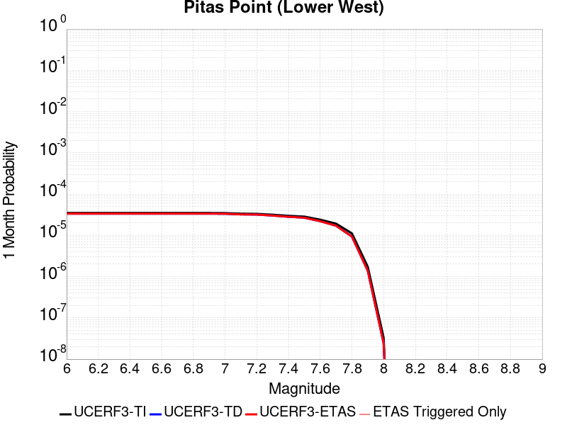 |  | 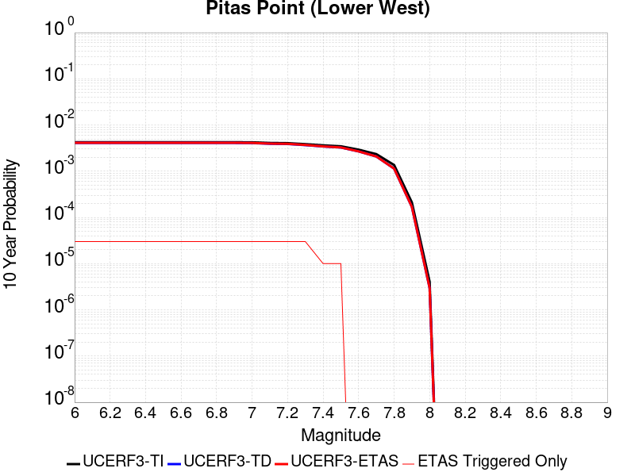 |

| Magnitude | 1 wk TI Prob | 1 wk TD Prob | 1 wk ETAS Prob | 1 wk ETAS/TD Gain | 1 wk ETAS Triggered Only | 1 mo TI Prob | 1 mo TD Prob | 1 mo ETAS Prob | 1 mo ETAS/TD Gain | 1 mo ETAS Triggered Only | 1 yr TI Prob | 1 yr TD Prob | 1 yr ETAS Prob | 1 yr ETAS/TD Gain | 1 yr ETAS Triggered Only | 10 yr TI Prob | 10 yr TD Prob | 10 yr ETAS Prob | 10 yr ETAS/TD Gain | 10 yr ETAS Triggered Only |
|-----|-----|-----|-----|-----|-----|-----|-----|-----|-----|-----|-----|-----|-----|-----|-----|-----|-----|-----|-----|-----|
| 6.0 | 8.151497E-6 | 7.855829E-6 | 7.855829E-6 | 1.0 | 0.0 | 3.493452E-5 | 3.3667406E-5 | 3.3667406E-5 | 1.0 | 0.0 | 4.252448E-4 | 4.098243E-4 | 4.5079112E-4 | 1.0999619 | 4.0983607E-5 | 0.0042443196 | 0.004090766 | 0.0041519897 | 1.0149664 | 6.147541E-5 |
| 6.1 | 8.151497E-6 | 7.855829E-6 | 7.855829E-6 | 1.0 | 0.0 | 3.493452E-5 | 3.3667406E-5 | 3.3667406E-5 | 1.0 | 0.0 | 4.252448E-4 | 4.098243E-4 | 4.5079112E-4 | 1.0999619 | 4.0983607E-5 | 0.0042443196 | 0.004090766 | 0.0041519897 | 1.0149664 | 6.147541E-5 |
| 6.2 | 8.151497E-6 | 7.855829E-6 | 7.855829E-6 | 1.0 | 0.0 | 3.493452E-5 | 3.3667406E-5 | 3.3667406E-5 | 1.0 | 0.0 | 4.252448E-4 | 4.098243E-4 | 4.5079112E-4 | 1.0999619 | 4.0983607E-5 | 0.0042443196 | 0.004090766 | 0.0041519897 | 1.0149664 | 6.147541E-5 |
| 6.3 | 8.151497E-6 | 7.855829E-6 | 7.855829E-6 | 1.0 | 0.0 | 3.493452E-5 | 3.3667406E-5 | 3.3667406E-5 | 1.0 | 0.0 | 4.252448E-4 | 4.098243E-4 | 4.5079112E-4 | 1.0999619 | 4.0983607E-5 | 0.0042443196 | 0.004090766 | 0.0041519897 | 1.0149664 | 6.147541E-5 |
| 6.4 | 8.151497E-6 | 7.855829E-6 | 7.855829E-6 | 1.0 | 0.0 | 3.493452E-5 | 3.3667406E-5 | 3.3667406E-5 | 1.0 | 0.0 | 4.252448E-4 | 4.098243E-4 | 4.5079112E-4 | 1.0999619 | 4.0983607E-5 | 0.0042443196 | 0.004090766 | 0.0041519897 | 1.0149664 | 6.147541E-5 |
| 6.5 | 8.151497E-6 | 7.855829E-6 | 7.855829E-6 | 1.0 | 0.0 | 3.493452E-5 | 3.3667406E-5 | 3.3667406E-5 | 1.0 | 0.0 | 4.252448E-4 | 4.098243E-4 | 4.5079112E-4 | 1.0999619 | 4.0983607E-5 | 0.0042443196 | 0.004090766 | 0.0041519897 | 1.0149664 | 6.147541E-5 |
| 6.6 | 8.151497E-6 | 7.855829E-6 | 7.855829E-6 | 1.0 | 0.0 | 3.493452E-5 | 3.3667406E-5 | 3.3667406E-5 | 1.0 | 0.0 | 4.252448E-4 | 4.098243E-4 | 4.5079112E-4 | 1.0999619 | 4.0983607E-5 | 0.0042443196 | 0.004090766 | 0.0041519897 | 1.0149664 | 6.147541E-5 |
| 6.7 | 8.151497E-6 | 7.855829E-6 | 7.855829E-6 | 1.0 | 0.0 | 3.493452E-5 | 3.3667406E-5 | 3.3667406E-5 | 1.0 | 0.0 | 4.252448E-4 | 4.098243E-4 | 4.5079112E-4 | 1.0999619 | 4.0983607E-5 | 0.0042443196 | 0.004090766 | 0.0041519897 | 1.0149664 | 6.147541E-5 |
| 6.8 | 8.151497E-6 | 7.855829E-6 | 7.855829E-6 | 1.0 | 0.0 | 3.493452E-5 | 3.3667406E-5 | 3.3667406E-5 | 1.0 | 0.0 | 4.252448E-4 | 4.098243E-4 | 4.5079112E-4 | 1.0999619 | 4.0983607E-5 | 0.0042443196 | 0.004090766 | 0.0041519897 | 1.0149664 | 6.147541E-5 |
| 6.9 | 8.151497E-6 | 7.855829E-6 | 7.855829E-6 | 1.0 | 0.0 | 3.493452E-5 | 3.3667406E-5 | 3.3667406E-5 | 1.0 | 0.0 | 4.252448E-4 | 4.098243E-4 | 4.5079112E-4 | 1.0999619 | 4.0983607E-5 | 0.0042443196 | 0.004090766 | 0.0041519897 | 1.0149664 | 6.147541E-5 |
| 7.0 | 8.103535E-6 | 7.805258E-6 | 7.805258E-6 | 1.0 | 0.0 | 3.4728975E-5 | 3.345068E-5 | 3.345068E-5 | 1.0 | 0.0 | 4.2274324E-4 | 4.0718666E-4 | 4.481536E-4 | 1.1006097 | 4.0983607E-5 | 0.0042193993 | 0.0040644864 | 0.0041257115 | 1.0150635 | 6.147541E-5 |
| 7.1 | 7.853298E-6 | 7.540947E-6 | 7.540947E-6 | 1.0 | 0.0 | 3.3656554E-5 | 3.231795E-5 | 3.231795E-5 | 1.0 | 0.0 | 4.096915E-4 | 3.9340067E-4 | 4.3436815E-4 | 1.1041368 | 4.0983607E-5 | 0.00408937 | 0.0039271186 | 0.0039883526 | 1.0155926 | 6.147541E-5 |
| 7.2 | 7.771102E-6 | 7.453228E-6 | 7.453228E-6 | 1.0 | 0.0 | 3.33043E-5 | 3.1942018E-5 | 3.1942018E-5 | 1.0 | 0.0 | 4.0540437E-4 | 3.8882537E-4 | 4.2979306E-4 | 1.1053627 | 4.0983607E-5 | 0.0040466557 | 0.0038815264 | 0.003942763 | 1.0157765 | 6.147541E-5 |
| 7.3 | 7.3945344E-6 | 7.049329E-6 | 7.049329E-6 | 1.0 | 0.0 | 3.1690477E-5 | 3.0211062E-5 | 3.0211062E-5 | 1.0 | 0.0 | 3.8576324E-4 | 3.6775824E-4 | 4.0872677E-4 | 1.1114007 | 4.0983607E-5 | 0.0038509427 | 0.0036715642 | 0.0037328138 | 1.0166821 | 6.147541E-5 |
| 7.4 | 6.964645E-6 | 6.5901736E-6 | 6.5901736E-6 | 1.0 | 0.0 | 2.9848137E-5 | 2.8243297E-5 | 2.8243297E-5 | 1.0 | 0.0 | 3.6334046E-4 | 3.4380838E-4 | 3.4380838E-4 | 1.0 | 0.0 | 0.0036274698 | 0.0034328182 | 0.0034532396 | 1.0059489 | 2.0491803E-5 |
| 7.5 | 6.6525035E-6 | 6.2592094E-6 | 6.2592094E-6 | 1.0 | 0.0 | 2.851042E-5 | 2.682491E-5 | 2.682491E-5 | 1.0 | 0.0 | 3.4705905E-4 | 3.2654483E-4 | 3.2654483E-4 | 1.0 | 0.0 | 0.0034651754 | 0.0032607014 | 0.0032811265 | 1.006264 | 2.0491803E-5 |
| 7.6 | 5.613338E-6 | 5.1514285E-6 | 5.1514285E-6 | 1.0 | 0.0 | 2.405694E-5 | 2.2077365E-5 | 2.2077365E-5 | 1.0 | 0.0 | 2.928539E-4 | 2.6875906E-4 | 2.6875906E-4 | 1.0 | 0.0 | 0.0029246826 | 0.002684372 | 0.002684372 | 1.0 | 0.0 |
| 7.7 | 4.494704E-6 | 3.996944E-6 | 3.996944E-6 | 1.0 | 0.0 | 1.9262876E-5 | 1.712965E-5 | 1.712965E-5 | 1.0 | 0.0 | 2.3450027E-4 | 2.0853376E-4 | 2.0853376E-4 | 1.0 | 0.0 | 0.0023425296 | 0.002083405 | 0.002083405 | 1.0 | 0.0 |
| 7.8 | 2.6075882E-6 | 2.1836554E-6 | 2.1836554E-6 | 1.0 | 0.0 | 1.117533E-5 | 9.35849E-6 | 9.35849E-6 | 1.0 | 0.0 | 1.3605114E-4 | 1.1393371E-4 | 1.1393371E-4 | 1.0 | 0.0 | 0.0013596788 | 0.0011387577 | 0.0011387577 | 1.0 | 0.0 |
| 7.9 | 4.045984E-7 | 3.242403E-7 | 3.242403E-7 | 1.0 | 0.0 | 1.733992E-6 | 1.3896005E-6 | 1.3896005E-6 | 1.0 | 0.0 | 2.1111147E-5 | 1.6918259E-5 | 1.6918259E-5 | 1.0 | 0.0 | 2.1109142E-4 | 1.6917E-4 | 1.6917E-4 | 1.0 | 0.0 |
| 8.0 | 7.791402E-9 | 5.683553E-9 | 5.683553E-9 | 1.0 | 0.0 | 3.3391725E-8 | 2.4358085E-8 | 2.4358085E-8 | 1.0 | 0.0 | 4.0654416E-7 | 2.9655968E-7 | 2.9655968E-7 | 1.0 | 0.0 | 4.065434E-6 | 2.9655946E-6 | 2.9655946E-6 | 1.0 | 0.0 |

## Chino alt 1
*[(top)](#table-of-contents)*

| 1 Week | 1 Month | 1 Year | 10 Year |
|-----|-----|-----|-----|
|  |  |  |  |

| Magnitude | 1 wk TI Prob | 1 wk TD Prob | 1 wk ETAS Prob | 1 wk ETAS/TD Gain | 1 wk ETAS Triggered Only | 1 mo TI Prob | 1 mo TD Prob | 1 mo ETAS Prob | 1 mo ETAS/TD Gain | 1 mo ETAS Triggered Only | 1 yr TI Prob | 1 yr TD Prob | 1 yr ETAS Prob | 1 yr ETAS/TD Gain | 1 yr ETAS Triggered Only | 10 yr TI Prob | 10 yr TD Prob | 10 yr ETAS Prob | 10 yr ETAS/TD Gain | 10 yr ETAS Triggered Only |
|-----|-----|-----|-----|-----|-----|-----|-----|-----|-----|-----|-----|-----|-----|-----|-----|-----|-----|-----|-----|-----|
| 6.0 | 3.939946E-5 | 4.895037E-5 | 4.895037E-5 | 1.0 | 0.0 | 1.6884391E-4 | 2.0977337E-4 | 2.507484E-4 | 1.1953299 | 4.0983607E-5 | 0.0020537362 | 0.0025514876 | 0.002592367 | 1.0160216 | 4.0983607E-5 | 0.020348595 | 0.025278764 | 0.025318712 | 1.0015802 | 4.0983607E-5 |
| 6.1 | 2.1505624E-5 | 2.6880154E-5 | 2.6880154E-5 | 1.0 | 0.0 | 9.2163704E-5 | 1.151962E-4 | 1.151962E-4 | 1.0 | 0.0 | 0.0011215154 | 0.0014017228 | 0.0014017228 | 1.0 | 0.0 | 0.011158722 | 0.013945717 | 0.013945717 | 1.0 | 0.0 |
| 6.2 | 2.1505624E-5 | 2.6880154E-5 | 2.6880154E-5 | 1.0 | 0.0 | 9.2163704E-5 | 1.151962E-4 | 1.151962E-4 | 1.0 | 0.0 | 0.0011215154 | 0.0014017228 | 0.0014017228 | 1.0 | 0.0 | 0.011158722 | 0.013945717 | 0.013945717 | 1.0 | 0.0 |
| 6.3 | 1.4290785E-5 | 1.8166014E-5 | 1.8166014E-5 | 1.0 | 0.0 | 6.1244784E-5 | 7.785228E-5 | 7.785228E-5 | 1.0 | 0.0 | 7.454001E-4 | 9.4748475E-4 | 9.4748475E-4 | 1.0 | 0.0 | 0.007429048 | 0.009444912 | 0.009444912 | 1.0 | 0.0 |
| 6.4 | 1.4290785E-5 | 1.8166014E-5 | 1.8166014E-5 | 1.0 | 0.0 | 6.1244784E-5 | 7.785228E-5 | 7.785228E-5 | 1.0 | 0.0 | 7.454001E-4 | 9.4748475E-4 | 9.4748475E-4 | 1.0 | 0.0 | 0.007429048 | 0.009444912 | 0.009444912 | 1.0 | 0.0 |
| 6.5 | 1.3017944E-5 | 1.6652937E-5 | 1.6652937E-5 | 1.0 | 0.0 | 5.5789995E-5 | 7.136803E-5 | 7.136803E-5 | 1.0 | 0.0 | 6.790315E-4 | 8.686031E-4 | 8.686031E-4 | 1.0 | 0.0 | 0.0067696036 | 0.008662385 | 0.008662385 | 1.0 | 0.0 |
| 6.6 | 9.470016E-6 | 1.2040057E-5 | 1.2040057E-5 | 1.0 | 0.0 | 4.058515E-5 | 5.1599414E-5 | 5.1599414E-5 | 1.0 | 0.0 | 4.940122E-4 | 6.2807574E-4 | 6.2807574E-4 | 1.0 | 0.0 | 0.004929154 | 0.0062722242 | 0.0062722242 | 1.0 | 0.0 |
| 6.7 | 8.314155E-6 | 1.0408293E-5 | 1.0408293E-5 | 1.0 | 0.0 | 3.5631605E-5 | 4.460639E-5 | 4.460639E-5 | 1.0 | 0.0 | 4.3372845E-4 | 5.429797E-4 | 5.429797E-4 | 1.0 | 0.0 | 0.004328829 | 0.005426062 | 0.005426062 | 1.0 | 0.0 |
| 6.8 | 3.4856364E-6 | 3.8135372E-6 | 3.8135372E-6 | 1.0 | 0.0 | 1.4938357E-5 | 1.634364E-5 | 1.634364E-5 | 1.0 | 0.0 | 1.8185932E-4 | 1.9896773E-4 | 1.9896773E-4 | 1.0 | 0.0 | 0.0018171056 | 0.001989573 | 0.001989573 | 1.0 | 0.0 |
| 6.9 | 2.2645952E-6 | 2.152999E-6 | 2.152999E-6 | 1.0 | 0.0 | 9.705372E-6 | 9.227107E-6 | 9.227107E-6 | 1.0 | 0.0 | 1.18156495E-4 | 1.1233445E-4 | 1.1233445E-4 | 1.0 | 0.0 | 0.0011809369 | 0.0011233927 | 0.0011233927 | 1.0 | 0.0 |
| 7.0 | 1.7864003E-6 | 1.5431575E-6 | 1.5431575E-6 | 1.0 | 0.0 | 7.655979E-6 | 6.613516E-6 | 6.613516E-6 | 1.0 | 0.0 | 9.3207556E-5 | 8.0516635E-5 | 8.0516635E-5 | 1.0 | 0.0 | 9.316847E-4 | 8.0532173E-4 | 8.0532173E-4 | 1.0 | 0.0 |
| 7.1 | 1.7315456E-6 | 1.4734279E-6 | 1.4734279E-6 | 1.0 | 0.0 | 7.420889E-6 | 6.3146763E-6 | 6.3146763E-6 | 1.0 | 0.0 | 9.034557E-5 | 7.6878525E-5 | 7.6878525E-5 | 1.0 | 0.0 | 9.0308854E-4 | 7.6895714E-4 | 7.6895714E-4 | 1.0 | 0.0 |
| 7.2 | 1.6008337E-6 | 1.3574753E-6 | 1.3574753E-6 | 1.0 | 0.0 | 6.860698E-6 | 5.817739E-6 | 5.817739E-6 | 1.0 | 0.0 | 8.352579E-5 | 7.082872E-5 | 7.082872E-5 | 1.0 | 0.0 | 8.34944E-4 | 7.084856E-4 | 7.084856E-4 | 1.0 | 0.0 |
| 7.3 | 1.3320939E-6 | 1.1218251E-6 | 1.1218251E-6 | 1.0 | 0.0 | 5.7089615E-6 | 4.8078136E-6 | 4.8078136E-6 | 1.0 | 0.0 | 6.9504385E-5 | 5.8533606E-5 | 5.8533606E-5 | 1.0 | 0.0 | 6.9482654E-4 | 5.853264E-4 | 5.853264E-4 | 1.0 | 0.0 |
| 7.4 | 1.114294E-6 | 9.2374523E-7 | 9.2374523E-7 | 1.0 | 0.0 | 4.775537E-6 | 3.958902E-6 | 3.958902E-6 | 1.0 | 0.0 | 5.8140613E-5 | 4.8198606E-5 | 4.8198606E-5 | 1.0 | 0.0 | 5.81254E-4 | 4.8189834E-4 | 4.8189834E-4 | 1.0 | 0.0 |
| 7.5 | 9.354081E-7 | 7.623702E-7 | 7.623702E-7 | 1.0 | 0.0 | 4.0088858E-6 | 3.2672967E-6 | 3.2672967E-6 | 1.0 | 0.0 | 4.8807087E-5 | 3.9778646E-5 | 3.9778646E-5 | 1.0 | 0.0 | 4.879637E-4 | 3.9771866E-4 | 3.9771866E-4 | 1.0 | 0.0 |
| 7.6 | 8.521771E-7 | 6.8809493E-7 | 6.8809493E-7 | 1.0 | 0.0 | 3.6521824E-6 | 2.9489752E-6 | 2.9489752E-6 | 1.0 | 0.0 | 4.4464414E-5 | 3.5903213E-5 | 3.5903213E-5 | 1.0 | 0.0 | 4.4455516E-4 | 3.589773E-4 | 3.589773E-4 | 1.0 | 0.0 |
| 7.7 | 2.1803626E-7 | 1.4187151E-7 | 1.4187151E-7 | 1.0 | 0.0 | 9.344408E-7 | 6.080207E-7 | 6.080207E-7 | 1.0 | 0.0 | 1.1376757E-5 | 7.402636E-6 | 7.402636E-6 | 1.0 | 0.0 | 1.13761744E-4 | 7.402486E-5 | 7.402486E-5 | 1.0 | 0.0 |

## Los Osos 2011
*[(top)](#table-of-contents)*

| 1 Week | 1 Month | 1 Year | 10 Year |
|-----|-----|-----|-----|
|  |  |  |  |

| Magnitude | 1 wk TI Prob | 1 wk TD Prob | 1 wk ETAS Prob | 1 wk ETAS/TD Gain | 1 wk ETAS Triggered Only | 1 mo TI Prob | 1 mo TD Prob | 1 mo ETAS Prob | 1 mo ETAS/TD Gain | 1 mo ETAS Triggered Only | 1 yr TI Prob | 1 yr TD Prob | 1 yr ETAS Prob | 1 yr ETAS/TD Gain | 1 yr ETAS Triggered Only | 10 yr TI Prob | 10 yr TD Prob | 10 yr ETAS Prob | 10 yr ETAS/TD Gain | 10 yr ETAS Triggered Only |
|-----|-----|-----|-----|-----|-----|-----|-----|-----|-----|-----|-----|-----|-----|-----|-----|-----|-----|-----|-----|-----|
| 6.0 | 4.8871775E-6 | 4.9815035E-6 | 4.9815035E-6 | 1.0 | 0.0 | 2.0944879E-5 | 2.1349142E-5 | 2.1349142E-5 | 1.0 | 0.0 | 2.5497406E-4 | 2.5989758E-4 | 2.8038406E-4 | 1.0788252 | 2.0491803E-5 | 0.002546817 | 0.002596211 | 0.0026166495 | 1.0078725 | 2.0491803E-5 |
| 6.1 | 4.8871775E-6 | 4.9815035E-6 | 4.9815035E-6 | 1.0 | 0.0 | 2.0944879E-5 | 2.1349142E-5 | 2.1349142E-5 | 1.0 | 0.0 | 2.5497406E-4 | 2.5989758E-4 | 2.8038406E-4 | 1.0788252 | 2.0491803E-5 | 0.002546817 | 0.002596211 | 0.0026166495 | 1.0078725 | 2.0491803E-5 |
| 6.2 | 4.8871775E-6 | 4.9815035E-6 | 4.9815035E-6 | 1.0 | 0.0 | 2.0944879E-5 | 2.1349142E-5 | 2.1349142E-5 | 1.0 | 0.0 | 2.5497406E-4 | 2.5989758E-4 | 2.8038406E-4 | 1.0788252 | 2.0491803E-5 | 0.002546817 | 0.002596211 | 0.0026166495 | 1.0078725 | 2.0491803E-5 |
| 6.3 | 4.8871775E-6 | 4.9815035E-6 | 4.9815035E-6 | 1.0 | 0.0 | 2.0944879E-5 | 2.1349142E-5 | 2.1349142E-5 | 1.0 | 0.0 | 2.5497406E-4 | 2.5989758E-4 | 2.8038406E-4 | 1.0788252 | 2.0491803E-5 | 0.002546817 | 0.002596211 | 0.0026166495 | 1.0078725 | 2.0491803E-5 |
| 6.4 | 4.8871775E-6 | 4.9815035E-6 | 4.9815035E-6 | 1.0 | 0.0 | 2.0944879E-5 | 2.1349142E-5 | 2.1349142E-5 | 1.0 | 0.0 | 2.5497406E-4 | 2.5989758E-4 | 2.8038406E-4 | 1.0788252 | 2.0491803E-5 | 0.002546817 | 0.002596211 | 0.0026166495 | 1.0078725 | 2.0491803E-5 |
| 6.5 | 3.1724062E-6 | 3.2234093E-6 | 3.2234093E-6 | 1.0 | 0.0 | 1.3595956E-5 | 1.3814539E-5 | 1.3814539E-5 | 1.0 | 0.0 | 1.6551818E-4 | 1.6817916E-4 | 1.8866752E-4 | 1.1218246 | 2.0491803E-5 | 0.0016539496 | 0.0016805324 | 0.0017009898 | 1.0121732 | 2.0491803E-5 |
| 6.6 | 3.1022591E-6 | 3.1511186E-6 | 3.1511186E-6 | 1.0 | 0.0 | 1.3295328E-5 | 1.3504725E-5 | 1.3504725E-5 | 1.0 | 0.0 | 1.618586E-4 | 1.6440774E-4 | 1.8489617E-4 | 1.1246196 | 2.0491803E-5 | 0.0016174077 | 0.001642874 | 0.0016633321 | 1.0124526 | 2.0491803E-5 |
| 6.7 | 2.611518E-6 | 2.649196E-6 | 2.649196E-6 | 1.0 | 0.0 | 1.1192172E-5 | 1.1353647E-5 | 1.1353647E-5 | 1.0 | 0.0 | 1.3625617E-4 | 1.3822193E-4 | 1.587109E-4 | 1.1482325 | 2.0491803E-5 | 0.0013617266 | 0.0013813641 | 0.0014018276 | 1.014814 | 2.0491803E-5 |
| 6.8 | 2.4780884E-6 | 2.5121715E-6 | 2.5121715E-6 | 1.0 | 0.0 | 1.0620336E-5 | 1.0766405E-5 | 1.0766405E-5 | 1.0 | 0.0 | 1.2929492E-4 | 1.3107313E-4 | 1.5156224E-4 | 1.1563182 | 2.0491803E-5 | 0.0012921972 | 0.0013099624 | 0.0013304272 | 1.0156225 | 2.0491803E-5 |
| 6.9 | 2.1376322E-6 | 2.1635167E-6 | 2.1635167E-6 | 1.0 | 0.0 | 9.161248E-6 | 9.272181E-6 | 9.272181E-6 | 1.0 | 0.0 | 1.1153249E-4 | 1.12882975E-4 | 1.12882975E-4 | 1.0 | 0.0 | 0.0011147653 | 0.0011282583 | 0.0011282583 | 1.0 | 0.0 |
| 7.0 | 1.9282882E-6 | 1.949469E-6 | 1.949469E-6 | 1.0 | 0.0 | 8.264066E-6 | 8.35484E-6 | 8.35484E-6 | 1.0 | 0.0 | 1.0061036E-4 | 1.0171544E-4 | 1.0171544E-4 | 1.0 | 0.0 | 0.0010056482 | 0.0010166903 | 0.0010166903 | 1.0 | 0.0 |
| 7.1 | 1.6353226E-6 | 1.6501212E-6 | 1.6501212E-6 | 1.0 | 0.0 | 7.0085066E-6 | 7.0719293E-6 | 7.0719293E-6 | 1.0 | 0.0 | 8.532523E-5 | 8.6097345E-5 | 8.6097345E-5 | 1.0 | 0.0 | 8.529247E-4 | 8.6064066E-4 | 8.6064066E-4 | 1.0 | 0.0 |
| 7.2 | 1.4446276E-6 | 1.4553431E-6 | 1.4553431E-6 | 1.0 | 0.0 | 6.191247E-6 | 6.2371696E-6 | 6.2371696E-6 | 1.0 | 0.0 | 7.537582E-5 | 7.59349E-5 | 7.59349E-5 | 1.0 | 0.0 | 7.535026E-4 | 7.590901E-4 | 7.590901E-4 | 1.0 | 0.0 |
| 7.3 | 1.2014582E-6 | 1.2069155E-6 | 1.2069155E-6 | 1.0 | 0.0 | 5.149096E-6 | 5.1724846E-6 | 5.1724846E-6 | 1.0 | 0.0 | 6.268844E-5 | 6.297319E-5 | 6.297319E-5 | 1.0 | 0.0 | 6.267076E-4 | 6.295538E-4 | 6.295538E-4 | 1.0 | 0.0 |
| 7.4 | 9.707733E-7 | 9.709848E-7 | 9.709848E-7 | 1.0 | 0.0 | 4.16045E-6 | 4.161357E-6 | 4.161357E-6 | 1.0 | 0.0 | 5.0652303E-5 | 5.0663344E-5 | 5.0663344E-5 | 1.0 | 0.0 | 5.064076E-4 | 5.0651823E-4 | 5.0651823E-4 | 1.0 | 0.0 |
| 7.5 | 7.174908E-7 | 7.1149805E-7 | 7.1149805E-7 | 1.0 | 0.0 | 3.074957E-6 | 3.0492738E-6 | 3.0492738E-6 | 1.0 | 0.0 | 3.743696E-5 | 3.712428E-5 | 3.712428E-5 | 1.0 | 0.0 | 3.7430652E-4 | 3.7118094E-4 | 3.7118094E-4 | 1.0 | 0.0 |
| 7.6 | 4.5535776E-7 | 4.420849E-7 | 4.420849E-7 | 1.0 | 0.0 | 1.9515319E-6 | 1.8946482E-6 | 1.8946482E-6 | 1.0 | 0.0 | 2.3759641E-5 | 2.30671E-5 | 2.30671E-5 | 1.0 | 0.0 | 2.37571E-4 | 2.3064714E-4 | 2.3064714E-4 | 1.0 | 0.0 |
| 7.7 | 2.1173553E-7 | 1.9061258E-7 | 1.9061258E-7 | 1.0 | 0.0 | 9.0743765E-7 | 8.169108E-7 | 8.169108E-7 | 1.0 | 0.0 | 1.1047998E-5 | 9.945844E-6 | 9.945844E-6 | 1.0 | 0.0 | 1.1047449E-4 | 9.945402E-5 | 9.945402E-5 | 1.0 | 0.0 |
| 7.8 | 9.873608E-8 | 7.3679686E-8 | 7.3679686E-8 | 1.0 | 0.0 | 4.2315455E-7 | 3.1577002E-7 | 3.1577002E-7 | 1.0 | 0.0 | 5.1518946E-6 | 3.844493E-6 | 3.844493E-6 | 1.0 | 0.0 | 5.1517753E-5 | 3.8444276E-5 | 3.8444276E-5 | 1.0 | 0.0 |
| 7.9 | 5.4399106E-8 | 3.1883726E-8 | 3.1883726E-8 | 1.0 | 0.0 | 2.33139E-7 | 1.3664453E-7 | 1.3664453E-7 | 1.0 | 0.0 | 2.8384638E-6 | 1.6636459E-6 | 1.6636459E-6 | 1.0 | 0.0 | 2.8384275E-5 | 1.6636335E-5 | 1.6636335E-5 | 1.0 | 0.0 |
| 8.0 | 1.817203E-8 | 8.422238E-9 | 8.422238E-9 | 1.0 | 0.0 | 7.7880124E-8 | 3.6095305E-8 | 3.6095305E-8 | 1.0 | 0.0 | 9.481901E-7 | 4.3946025E-7 | 4.3946025E-7 | 1.0 | 0.0 | 9.481861E-6 | 4.3945943E-6 | 4.3945943E-6 | 1.0 | 0.0 |

## Emerson-Copper Mtn 2011
*[(top)](#table-of-contents)*

| 1 Week | 1 Month | 1 Year | 10 Year |
|-----|-----|-----|-----|
|  |  |  | 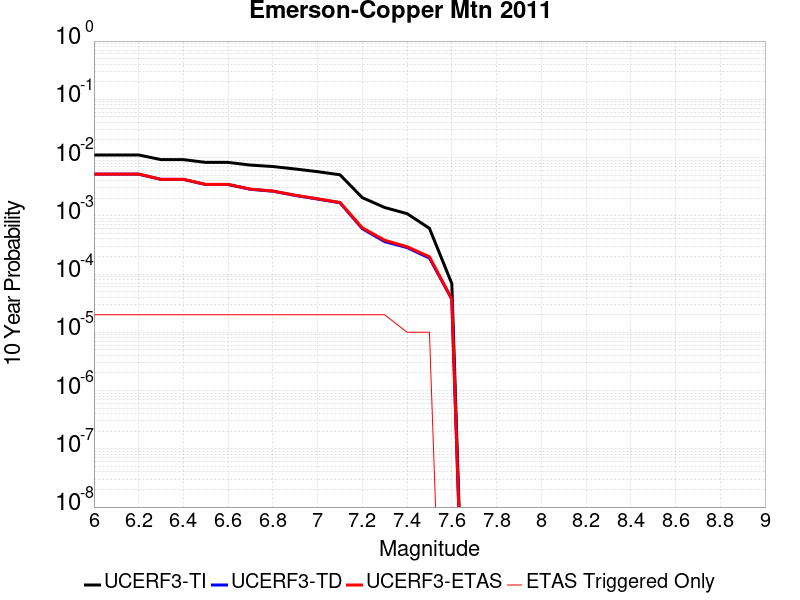 |

| Magnitude | 1 wk TI Prob | 1 wk TD Prob | 1 wk ETAS Prob | 1 wk ETAS/TD Gain | 1 wk ETAS Triggered Only | 1 mo TI Prob | 1 mo TD Prob | 1 mo ETAS Prob | 1 mo ETAS/TD Gain | 1 mo ETAS Triggered Only | 1 yr TI Prob | 1 yr TD Prob | 1 yr ETAS Prob | 1 yr ETAS/TD Gain | 1 yr ETAS Triggered Only | 10 yr TI Prob | 10 yr TD Prob | 10 yr ETAS Prob | 10 yr ETAS/TD Gain | 10 yr ETAS Triggered Only |
|-----|-----|-----|-----|-----|-----|-----|-----|-----|-----|-----|-----|-----|-----|-----|-----|-----|-----|-----|-----|-----|
| 6.0 | 2.1364202E-5 | 9.968277E-6 | 3.0459876E-5 | 3.0556812 | 2.0491803E-5 | 9.1557646E-5 | 4.2720538E-5 | 6.321146E-5 | 1.4796505 | 2.0491803E-5 | 0.0011141442 | 5.200071E-4 | 5.404883E-4 | 1.0393863 | 2.0491803E-5 | 0.011085749 | 0.005188773 | 0.005229544 | 1.0078576 | 4.0983607E-5 |
| 6.1 | 2.1364202E-5 | 9.968277E-6 | 3.0459876E-5 | 3.0556812 | 2.0491803E-5 | 9.1557646E-5 | 4.2720538E-5 | 6.321146E-5 | 1.4796505 | 2.0491803E-5 | 0.0011141442 | 5.200071E-4 | 5.404883E-4 | 1.0393863 | 2.0491803E-5 | 0.011085749 | 0.005188773 | 0.005229544 | 1.0078576 | 4.0983607E-5 |
| 6.2 | 2.1364202E-5 | 9.968277E-6 | 3.0459876E-5 | 3.0556812 | 2.0491803E-5 | 9.1557646E-5 | 4.2720538E-5 | 6.321146E-5 | 1.4796505 | 2.0491803E-5 | 0.0011141442 | 5.200071E-4 | 5.404883E-4 | 1.0393863 | 2.0491803E-5 | 0.011085749 | 0.005188773 | 0.005229544 | 1.0078576 | 4.0983607E-5 |
| 6.3 | 1.7751237E-5 | 8.089365E-6 | 2.8581002E-5 | 3.5331576 | 2.0491803E-5 | 7.607452E-5 | 3.4668283E-5 | 5.5159377E-5 | 1.5910617 | 2.0491803E-5 | 9.258136E-4 | 4.2201087E-4 | 4.4249403E-4 | 1.048537 | 2.0491803E-5 | 0.00921966 | 0.0042127175 | 0.004253528 | 1.0096875 | 4.0983607E-5 |
| 6.4 | 1.7751237E-5 | 8.089365E-6 | 2.8581002E-5 | 3.5331576 | 2.0491803E-5 | 7.607452E-5 | 3.4668283E-5 | 5.5159377E-5 | 1.5910617 | 2.0491803E-5 | 9.258136E-4 | 4.2201087E-4 | 4.4249403E-4 | 1.048537 | 2.0491803E-5 | 0.00921966 | 0.0042127175 | 0.004253528 | 1.0096875 | 4.0983607E-5 |
| 6.5 | 1.5886664E-5 | 6.6039356E-6 | 2.7095602E-5 | 4.102948 | 2.0491803E-5 | 6.808392E-5 | 2.83023E-5 | 4.879352E-5 | 1.7240126 | 2.0491803E-5 | 8.286065E-4 | 3.445307E-4 | 3.6501547E-4 | 1.059457 | 2.0491803E-5 | 0.008255237 | 0.00344043 | 0.0034812726 | 1.0118713 | 4.0983607E-5 |
| 6.6 | 1.5886664E-5 | 6.6039356E-6 | 2.7095602E-5 | 4.102948 | 2.0491803E-5 | 6.808392E-5 | 2.83023E-5 | 4.879352E-5 | 1.7240126 | 2.0491803E-5 | 8.286065E-4 | 3.445307E-4 | 3.6501547E-4 | 1.059457 | 2.0491803E-5 | 0.008255237 | 0.00344043 | 0.0034812726 | 1.0118713 | 4.0983607E-5 |
| 6.7 | 1.428471E-5 | 5.470503E-6 | 2.5962194E-5 | 4.7458515 | 2.0491803E-5 | 6.121875E-5 | 2.3444823E-5 | 4.3936147E-5 | 1.8740233 | 2.0491803E-5 | 7.450834E-4 | 2.8540727E-4 | 3.0589325E-4 | 1.0717779 | 2.0491803E-5 | 0.007425902 | 0.0028507954 | 0.002891662 | 1.0143353 | 4.0983607E-5 |
| 6.8 | 1.3490684E-5 | 5.073793E-6 | 2.5565492E-5 | 5.038734 | 2.0491803E-5 | 5.7815934E-5 | 2.1744667E-5 | 4.2236024E-5 | 1.9423624 | 2.0491803E-5 | 7.0368167E-4 | 2.6471302E-4 | 2.851994E-4 | 1.0773909 | 2.0491803E-5 | 0.007014576 | 0.002644358 | 0.0026852333 | 1.0154575 | 4.0983607E-5 |
| 6.9 | 1.2235421E-5 | 4.2897627E-6 | 2.4781479E-5 | 5.776888 | 2.0491803E-5 | 5.2436466E-5 | 1.8384588E-5 | 3.8876013E-5 | 2.114598 | 2.0491803E-5 | 6.38227E-4 | 2.2381297E-4 | 2.443002E-4 | 1.0915372 | 2.0491803E-5 | 0.0063639707 | 0.00223623 | 0.0022771219 | 1.0182861 | 4.0983607E-5 |
| 7.0 | 1.1009851E-5 | 3.7190669E-6 | 2.4210794E-5 | 6.5099106 | 2.0491803E-5 | 4.7184225E-5 | 1.593878E-5 | 3.6430258E-5 | 2.2856364 | 2.0491803E-5 | 5.743165E-4 | 1.9404081E-4 | 2.1452864E-4 | 1.1055851 | 2.0491803E-5 | 0.005728345 | 0.0019390517 | 0.0019799557 | 1.0210949 | 4.0983607E-5 |
| 7.1 | 9.726373E-6 | 3.2118642E-6 | 2.3703602E-5 | 7.380014 | 2.0491803E-5 | 4.168379E-5 | 1.3765079E-5 | 3.4256598E-5 | 2.4886599 | 2.0491803E-5 | 5.07382E-4 | 1.6758032E-4 | 1.8806869E-4 | 1.12226 | 2.0491803E-5 | 0.0050622504 | 0.0016748707 | 0.0017157857 | 1.0244287 | 4.0983607E-5 |
| 7.2 | 3.9335127E-6 | 1.1525033E-6 | 2.1644282E-5 | 18.780235 | 2.0491803E-5 | 1.6857803E-5 | 4.9392906E-6 | 2.5430993E-5 | 5.1487136 | 2.0491803E-5 | 2.0522442E-4 | 6.0134265E-5 | 8.0624835E-5 | 1.340747 | 2.0491803E-5 | 0.00205035 | 6.011859E-4 | 6.421449E-4 | 1.0681303 | 4.0983607E-5 |
| 7.3 | 2.661632E-6 | 6.9116606E-7 | 2.1182956E-5 | 30.648142 | 2.0491803E-5 | 1.14069435E-5 | 2.962137E-6 | 2.345388E-5 | 7.9178915 | 2.0491803E-5 | 1.3887069E-4 | 3.6063433E-5 | 5.6554494E-5 | 1.5681951 | 2.0491803E-5 | 0.0013878393 | 3.6057684E-4 | 4.0154567E-4 | 1.1136203 | 4.0983607E-5 |
| 7.4 | 2.0893426E-6 | 5.461961E-7 | 2.1037988E-5 | 38.517284 | 2.0491803E-5 | 8.954295E-6 | 2.3408381E-6 | 2.2832593E-5 | 9.7540245 | 2.0491803E-5 | 1.0901308E-4 | 2.8499337E-5 | 4.8990558E-5 | 1.7190069 | 2.0491803E-5 | 0.0010895962 | 2.8495738E-4 | 3.0544333E-4 | 1.0718913 | 2.0491803E-5 |
| 7.5 | 1.1681728E-6 | 3.6031287E-7 | 2.0852109E-5 | 57.872227 | 2.0491803E-5 | 5.0064455E-6 | 1.5441972E-6 | 2.2035969E-5 | 14.270179 | 2.0491803E-5 | 6.0951766E-5 | 1.8800443E-5 | 3.929186E-5 | 2.0899434 | 2.0491803E-5 | 6.093505E-4 | 1.8798899E-4 | 2.0847694E-4 | 1.1089848 | 2.0491803E-5 |
| 7.6 | 1.3154387E-7 | 7.1198265E-8 | 7.1198265E-8 | 1.0 | 0.0 | 5.6375933E-7 | 3.051354E-7 | 3.051354E-7 | 1.0 | 0.0 | 6.863748E-6 | 3.7150185E-6 | 3.7150185E-6 | 1.0 | 0.0 | 6.863536E-5 | 3.7149723E-5 | 3.7149723E-5 | 1.0 | 0.0 |

## Cucamonga
*[(top)](#table-of-contents)*

| 1 Week | 1 Month | 1 Year | 10 Year |
|-----|-----|-----|-----|
|  |  |  |  |

| Magnitude | 1 wk TI Prob | 1 wk TD Prob | 1 wk ETAS Prob | 1 wk ETAS/TD Gain | 1 wk ETAS Triggered Only | 1 mo TI Prob | 1 mo TD Prob | 1 mo ETAS Prob | 1 mo ETAS/TD Gain | 1 mo ETAS Triggered Only | 1 yr TI Prob | 1 yr TD Prob | 1 yr ETAS Prob | 1 yr ETAS/TD Gain | 1 yr ETAS Triggered Only | 10 yr TI Prob | 10 yr TD Prob | 10 yr ETAS Prob | 10 yr ETAS/TD Gain | 10 yr ETAS Triggered Only |
|-----|-----|-----|-----|-----|-----|-----|-----|-----|-----|-----|-----|-----|-----|-----|-----|-----|-----|-----|-----|-----|
| 6.0 | 1.1848348E-5 | 1.1737756E-5 | 1.1737756E-5 | 1.0 | 0.0 | 5.0777642E-5 | 5.0303715E-5 | 5.0303715E-5 | 1.0 | 0.0 | 6.180424E-4 | 6.122783E-4 | 6.3275755E-4 | 1.0334476 | 2.0491803E-5 | 0.0061632637 | 0.0061070886 | 0.006147822 | 1.0066699 | 4.0983607E-5 |
| 6.1 | 1.1848348E-5 | 1.1737756E-5 | 1.1737756E-5 | 1.0 | 0.0 | 5.0777642E-5 | 5.0303715E-5 | 5.0303715E-5 | 1.0 | 0.0 | 6.180424E-4 | 6.122783E-4 | 6.3275755E-4 | 1.0334476 | 2.0491803E-5 | 0.0061632637 | 0.0061070886 | 0.006147822 | 1.0066699 | 4.0983607E-5 |
| 6.2 | 1.1848348E-5 | 1.1737756E-5 | 1.1737756E-5 | 1.0 | 0.0 | 5.0777642E-5 | 5.0303715E-5 | 5.0303715E-5 | 1.0 | 0.0 | 6.180424E-4 | 6.122783E-4 | 6.3275755E-4 | 1.0334476 | 2.0491803E-5 | 0.0061632637 | 0.0061070886 | 0.006147822 | 1.0066699 | 4.0983607E-5 |
| 6.3 | 1.1848348E-5 | 1.1737756E-5 | 1.1737756E-5 | 1.0 | 0.0 | 5.0777642E-5 | 5.0303715E-5 | 5.0303715E-5 | 1.0 | 0.0 | 6.180424E-4 | 6.122783E-4 | 6.3275755E-4 | 1.0334476 | 2.0491803E-5 | 0.0061632637 | 0.0061070886 | 0.006147822 | 1.0066699 | 4.0983607E-5 |
| 6.4 | 1.1848348E-5 | 1.1737756E-5 | 1.1737756E-5 | 1.0 | 0.0 | 5.0777642E-5 | 5.0303715E-5 | 5.0303715E-5 | 1.0 | 0.0 | 6.180424E-4 | 6.122783E-4 | 6.3275755E-4 | 1.0334476 | 2.0491803E-5 | 0.0061632637 | 0.0061070886 | 0.006147822 | 1.0066699 | 4.0983607E-5 |
| 6.5 | 1.16988695E-5 | 1.1576785E-5 | 1.1576785E-5 | 1.0 | 0.0 | 5.013705E-5 | 4.9613864E-5 | 4.9613864E-5 | 1.0 | 0.0 | 6.102476E-4 | 6.0388405E-4 | 6.243635E-4 | 1.0339129 | 2.0491803E-5 | 0.006085745 | 0.006023602 | 0.0060643386 | 1.0067629 | 4.0983607E-5 |
| 6.6 | 1.16988695E-5 | 1.1576785E-5 | 1.1576785E-5 | 1.0 | 0.0 | 5.013705E-5 | 4.9613864E-5 | 4.9613864E-5 | 1.0 | 0.0 | 6.102476E-4 | 6.0388405E-4 | 6.243635E-4 | 1.0339129 | 2.0491803E-5 | 0.006085745 | 0.006023602 | 0.0060643386 | 1.0067629 | 4.0983607E-5 |
| 6.7 | 1.1397107E-5 | 1.1115677E-5 | 1.1115677E-5 | 1.0 | 0.0 | 4.884383E-5 | 4.7637757E-5 | 4.7637757E-5 | 1.0 | 0.0 | 5.9451134E-4 | 5.798378E-4 | 6.003178E-4 | 1.03532 | 2.0491803E-5 | 0.005929234 | 0.0057844 | 0.005825146 | 1.0070442 | 4.0983607E-5 |
| 6.8 | 1.058387E-5 | 9.785641E-6 | 9.785641E-6 | 1.0 | 0.0 | 4.5358654E-5 | 4.1937794E-5 | 4.1937794E-5 | 1.0 | 0.0 | 5.521017E-4 | 5.1047414E-4 | 5.1047414E-4 | 1.0 | 0.0 | 0.00550732 | 0.0050940234 | 0.0050940234 | 1.0 | 0.0 |
| 6.9 | 9.690046E-6 | 8.5800775E-6 | 8.5800775E-6 | 1.0 | 0.0 | 4.1528107E-5 | 3.6771246E-5 | 3.6771246E-5 | 1.0 | 0.0 | 5.054874E-4 | 4.4759834E-4 | 4.4759834E-4 | 1.0 | 0.0 | 0.005043391 | 0.004467903 | 0.004467903 | 1.0 | 0.0 |
| 7.0 | 9.381461E-6 | 8.187685E-6 | 8.187685E-6 | 1.0 | 0.0 | 4.020564E-5 | 3.5089608E-5 | 3.5089608E-5 | 1.0 | 0.0 | 4.893937E-4 | 4.271326E-4 | 4.271326E-4 | 1.0 | 0.0 | 0.0048831734 | 0.0042640497 | 0.0042640497 | 1.0 | 0.0 |
| 7.1 | 8.946492E-6 | 7.78246E-6 | 7.78246E-6 | 1.0 | 0.0 | 3.8341543E-5 | 3.335297E-5 | 3.335297E-5 | 1.0 | 0.0 | 4.667083E-4 | 4.059971E-4 | 4.059971E-4 | 1.0 | 0.0 | 0.0046572937 | 0.0040534893 | 0.0040534893 | 1.0 | 0.0 |
| 7.2 | 8.251016E-6 | 6.9758194E-6 | 6.9758194E-6 | 1.0 | 0.0 | 3.5361016E-5 | 2.9896028E-5 | 2.9896028E-5 | 1.0 | 0.0 | 4.3043532E-4 | 3.6392358E-4 | 3.6392358E-4 | 1.0 | 0.0 | 0.0042960253 | 0.0036342086 | 0.0036342086 | 1.0 | 0.0 |
| 7.3 | 7.717881E-6 | 6.486875E-6 | 6.486875E-6 | 1.0 | 0.0 | 3.3076216E-5 | 2.7800597E-5 | 2.7800597E-5 | 1.0 | 0.0 | 4.026285E-4 | 3.3841992E-4 | 3.3841992E-4 | 1.0 | 0.0 | 0.004018998 | 0.0033799817 | 0.0033799817 | 1.0 | 0.0 |
| 7.4 | 7.275623E-6 | 6.0325037E-6 | 6.0325037E-6 | 1.0 | 0.0 | 3.118087E-5 | 2.5853333E-5 | 2.5853333E-5 | 1.0 | 0.0 | 3.7956095E-4 | 3.1471907E-4 | 3.1471907E-4 | 1.0 | 0.0 | 0.0037891332 | 0.0031436686 | 0.0031436686 | 1.0 | 0.0 |
| 7.5 | 6.5109502E-6 | 5.101059E-6 | 5.101059E-6 | 1.0 | 0.0 | 2.7903774E-5 | 2.1861499E-5 | 2.1861499E-5 | 1.0 | 0.0 | 3.3967546E-4 | 2.661314E-4 | 2.661314E-4 | 1.0 | 0.0 | 0.0033915674 | 0.00265905 | 0.00265905 | 1.0 | 0.0 |
| 7.6 | 5.4495326E-6 | 3.9089846E-6 | 3.9089846E-6 | 1.0 | 0.0 | 2.335493E-5 | 1.6752683E-5 | 1.6752683E-5 | 1.0 | 0.0 | 2.8430918E-4 | 2.0394489E-4 | 2.0394489E-4 | 1.0 | 0.0 | 0.0028394572 | 0.0020384968 | 0.0020384968 | 1.0 | 0.0 |
| 7.7 | 4.7997164E-6 | 3.2006355E-6 | 3.2006355E-6 | 1.0 | 0.0 | 2.057005E-5 | 1.3716938E-5 | 1.3716938E-5 | 1.0 | 0.0 | 2.504116E-4 | 1.6699095E-4 | 1.6699095E-4 | 1.0 | 0.0 | 0.002501296 | 0.001669585 | 0.001669585 | 1.0 | 0.0 |
| 7.8 | 3.3941733E-6 | 2.0644336E-6 | 2.0644336E-6 | 1.0 | 0.0 | 1.4546376E-5 | 8.847543E-6 | 8.847543E-6 | 1.0 | 0.0 | 1.7708774E-4 | 1.07713524E-4 | 1.07713524E-4 | 1.0 | 0.0 | 0.0017694668 | 0.0010768501 | 0.0010768501 | 1.0 | 0.0 |
| 7.9 | 9.750552E-7 | 5.1567173E-7 | 5.1567173E-7 | 1.0 | 0.0 | 4.178801E-6 | 2.2100198E-6 | 2.2100198E-6 | 1.0 | 0.0 | 5.0875715E-5 | 2.6906664E-5 | 2.6906664E-5 | 1.0 | 0.0 | 5.086407E-4 | 2.6903447E-4 | 2.6903447E-4 | 1.0 | 0.0 |
| 8.0 | 1.133857E-7 | 6.0540515E-8 | 6.0540515E-8 | 1.0 | 0.0 | 4.8593864E-7 | 2.5945934E-7 | 2.5945934E-7 | 1.0 | 0.0 | 5.9162867E-6 | 3.158913E-6 | 3.158913E-6 | 1.0 | 0.0 | 5.916129E-5 | 3.1588697E-5 | 3.1588697E-5 | 1.0 | 0.0 |

## Elsinore (Temecula) rev
*[(top)](#table-of-contents)*

| 1 Week | 1 Month | 1 Year | 10 Year |
|-----|-----|-----|-----|
|  |  |  |  |

| Magnitude | 1 wk TI Prob | 1 wk TD Prob | 1 wk ETAS Prob | 1 wk ETAS/TD Gain | 1 wk ETAS Triggered Only | 1 mo TI Prob | 1 mo TD Prob | 1 mo ETAS Prob | 1 mo ETAS/TD Gain | 1 mo ETAS Triggered Only | 1 yr TI Prob | 1 yr TD Prob | 1 yr ETAS Prob | 1 yr ETAS/TD Gain | 1 yr ETAS Triggered Only | 10 yr TI Prob | 10 yr TD Prob | 10 yr ETAS Prob | 10 yr ETAS/TD Gain | 10 yr ETAS Triggered Only |
|-----|-----|-----|-----|-----|-----|-----|-----|-----|-----|-----|-----|-----|-----|-----|-----|-----|-----|-----|-----|-----|
| 6.0 | 2.9514995E-5 | 2.2518343E-5 | 2.2518343E-5 | 1.0 | 0.0 | 1.264867E-4 | 9.650374E-5 | 1.1699357E-4 | 1.2123215 | 2.0491803E-5 | 0.0015388876 | 0.001174322 | 0.0012152574 | 1.0348588 | 4.0983607E-5 | 0.015282745 | 0.011697536 | 0.0117380405 | 1.0034627 | 4.0983607E-5 |
| 6.1 | 2.9514995E-5 | 2.2518343E-5 | 2.2518343E-5 | 1.0 | 0.0 | 1.264867E-4 | 9.650374E-5 | 1.1699357E-4 | 1.2123215 | 2.0491803E-5 | 0.0015388876 | 0.001174322 | 0.0012152574 | 1.0348588 | 4.0983607E-5 | 0.015282745 | 0.011697536 | 0.0117380405 | 1.0034627 | 4.0983607E-5 |
| 6.2 | 2.9514995E-5 | 2.2518343E-5 | 2.2518343E-5 | 1.0 | 0.0 | 1.264867E-4 | 9.650374E-5 | 1.1699357E-4 | 1.2123215 | 2.0491803E-5 | 0.0015388876 | 0.001174322 | 0.0012152574 | 1.0348588 | 4.0983607E-5 | 0.015282745 | 0.011697536 | 0.0117380405 | 1.0034627 | 4.0983607E-5 |
| 6.3 | 2.3223649E-5 | 1.8407327E-5 | 1.8407327E-5 | 1.0 | 0.0 | 9.952613E-5 | 7.888625E-5 | 7.888625E-5 | 1.0 | 0.0 | 0.001211057 | 9.6003426E-4 | 9.6003426E-4 | 1.0 | 0.0 | 0.012044783 | 0.009570387 | 0.009570387 | 1.0 | 0.0 |
| 6.4 | 2.3223649E-5 | 1.8407327E-5 | 1.8407327E-5 | 1.0 | 0.0 | 9.952613E-5 | 7.888625E-5 | 7.888625E-5 | 1.0 | 0.0 | 0.001211057 | 9.6003426E-4 | 9.6003426E-4 | 1.0 | 0.0 | 0.012044783 | 0.009570387 | 0.009570387 | 1.0 | 0.0 |
| 6.5 | 1.8338875E-5 | 1.4750731E-5 | 1.4750731E-5 | 1.0 | 0.0 | 7.8592806E-5 | 6.3215935E-5 | 6.3215935E-5 | 1.0 | 0.0 | 9.5644733E-4 | 7.6939096E-4 | 7.6939096E-4 | 1.0 | 0.0 | 0.009523412 | 0.007674229 | 0.007674229 | 1.0 | 0.0 |
| 6.6 | 1.8223333E-5 | 1.46132825E-5 | 1.46132825E-5 | 1.0 | 0.0 | 7.809766E-5 | 6.26269E-5 | 6.26269E-5 | 1.0 | 0.0 | 9.504242E-4 | 7.6222455E-4 | 7.6222455E-4 | 1.0 | 0.0 | 0.009463696 | 0.0076030563 | 0.0076030563 | 1.0 | 0.0 |
| 6.7 | 1.7512752E-5 | 1.4027789E-5 | 1.4027789E-5 | 1.0 | 0.0 | 7.505249E-5 | 6.011776E-5 | 6.011776E-5 | 1.0 | 0.0 | 9.13381E-4 | 7.316965E-4 | 7.316965E-4 | 1.0 | 0.0 | 0.00909636 | 0.0072992197 | 0.0072992197 | 1.0 | 0.0 |
| 6.8 | 1.7417142E-5 | 1.3951771E-5 | 1.3951771E-5 | 1.0 | 0.0 | 7.4642754E-5 | 5.979198E-5 | 5.979198E-5 | 1.0 | 0.0 | 9.083966E-4 | 7.277328E-4 | 7.277328E-4 | 1.0 | 0.0 | 0.009046922 | 0.0072597866 | 0.0072597866 | 1.0 | 0.0 |
| 6.9 | 1.6402591E-5 | 1.2989167E-5 | 1.2989167E-5 | 1.0 | 0.0 | 7.0294926E-5 | 5.5666715E-5 | 5.5666715E-5 | 1.0 | 0.0 | 8.5550465E-4 | 6.7753915E-4 | 6.7753915E-4 | 1.0 | 0.0 | 0.008522186 | 0.006760456 | 0.006760456 | 1.0 | 0.0 |
| 7.0 | 1.3912486E-5 | 1.0878723E-5 | 1.0878723E-5 | 1.0 | 0.0 | 5.9623577E-5 | 4.6622277E-5 | 4.6622277E-5 | 1.0 | 0.0 | 7.2567526E-4 | 5.674811E-4 | 5.674811E-4 | 1.0 | 0.0 | 0.0072331014 | 0.005664239 | 0.005664239 | 1.0 | 0.0 |
| 7.1 | 1.3405147E-5 | 1.0327884E-5 | 1.0327884E-5 | 1.0 | 0.0 | 5.7449364E-5 | 4.4261626E-5 | 4.4261626E-5 | 1.0 | 0.0 | 6.9922156E-4 | 5.387546E-4 | 5.387546E-4 | 1.0 | 0.0 | 0.0069702556 | 0.0053778174 | 0.0053778174 | 1.0 | 0.0 |
| 7.2 | 1.21402E-5 | 8.99712E-6 | 8.99712E-6 | 1.0 | 0.0 | 5.202839E-5 | 3.8558526E-5 | 3.8558526E-5 | 1.0 | 0.0 | 6.332616E-4 | 4.693507E-4 | 4.693507E-4 | 1.0 | 0.0 | 0.0063146 | 0.0046850196 | 0.0046850196 | 1.0 | 0.0 |
| 7.3 | 1.05047775E-5 | 7.572085E-6 | 7.572085E-6 | 1.0 | 0.0 | 4.5019697E-5 | 3.2451397E-5 | 3.2451397E-5 | 1.0 | 0.0 | 5.4797693E-4 | 3.950256E-4 | 3.950256E-4 | 1.0 | 0.0 | 0.005466277 | 0.0039436235 | 0.0039436235 | 1.0 | 0.0 |
| 7.4 | 9.624483E-6 | 6.7871442E-6 | 6.7871442E-6 | 1.0 | 0.0 | 4.124713E-5 | 2.9087445E-5 | 2.9087445E-5 | 1.0 | 0.0 | 5.0206814E-4 | 3.540835E-4 | 3.540835E-4 | 1.0 | 0.0 | 0.005009353 | 0.003535347 | 0.003535347 | 1.0 | 0.0 |
| 7.5 | 8.215151E-6 | 5.635765E-6 | 5.635765E-6 | 1.0 | 0.0 | 3.5207315E-5 | 2.4153062E-5 | 2.4153062E-5 | 1.0 | 0.0 | 4.2856473E-4 | 2.940251E-4 | 2.940251E-4 | 1.0 | 0.0 | 0.004277392 | 0.002936489 | 0.002936489 | 1.0 | 0.0 |
| 7.6 | 6.975058E-6 | 4.6762393E-6 | 4.6762393E-6 | 1.0 | 0.0 | 2.9892764E-5 | 2.0040878E-5 | 2.0040878E-5 | 1.0 | 0.0 | 3.6388362E-4 | 2.4397153E-4 | 2.4397153E-4 | 1.0 | 0.0 | 0.0036328835 | 0.0024371531 | 0.0024371531 | 1.0 | 0.0 |
| 7.7 | 4.159604E-6 | 2.3271057E-6 | 2.3271057E-6 | 1.0 | 0.0 | 1.7826753E-5 | 9.973276E-6 | 9.973276E-6 | 1.0 | 0.0 | 2.1701909E-4 | 1.2141861E-4 | 1.2141861E-4 | 1.0 | 0.0 | 0.0021680726 | 0.0012135957 | 0.0012135957 | 1.0 | 0.0 |
| 7.8 | 2.2692414E-7 | 9.385943E-8 | 9.385943E-8 | 1.0 | 0.0 | 9.725317E-7 | 4.0225464E-7 | 4.0225464E-7 | 1.0 | 0.0 | 1.1840509E-5 | 4.8974425E-6 | 4.8974425E-6 | 1.0 | 0.0 | 1.1839878E-4 | 4.8973674E-5 | 4.8973674E-5 | 1.0 | 0.0 |
| 7.9 | 6.676829E-9 | 3.4399772E-9 | 3.4399772E-9 | 1.0 | 0.0 | 2.861498E-8 | 1.4742759E-8 | 1.4742759E-8 | 1.0 | 0.0 | 3.4838732E-7 | 1.7949307E-7 | 1.7949307E-7 | 1.0 | 0.0 | 3.4838679E-6 | 1.7949295E-6 | 1.7949295E-6 | 1.0 | 0.0 |

## Raymond
*[(top)](#table-of-contents)*

| 1 Week | 1 Month | 1 Year | 10 Year |
|-----|-----|-----|-----|
|  |  | 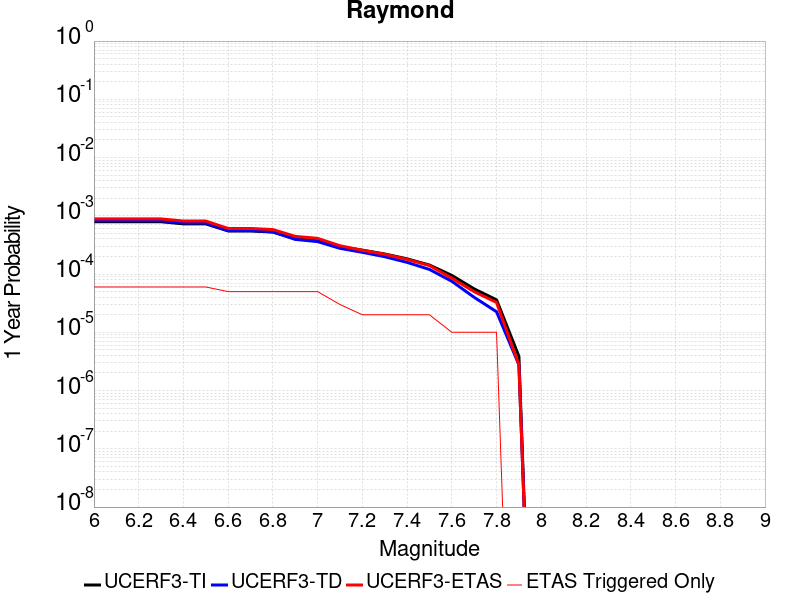 |  |

| Magnitude | 1 wk TI Prob | 1 wk TD Prob | 1 wk ETAS Prob | 1 wk ETAS/TD Gain | 1 wk ETAS Triggered Only | 1 mo TI Prob | 1 mo TD Prob | 1 mo ETAS Prob | 1 mo ETAS/TD Gain | 1 mo ETAS Triggered Only | 1 yr TI Prob | 1 yr TD Prob | 1 yr ETAS Prob | 1 yr ETAS/TD Gain | 1 yr ETAS Triggered Only | 10 yr TI Prob | 10 yr TD Prob | 10 yr ETAS Prob | 10 yr ETAS/TD Gain | 10 yr ETAS Triggered Only |
|-----|-----|-----|-----|-----|-----|-----|-----|-----|-----|-----|-----|-----|-----|-----|-----|-----|-----|-----|-----|-----|
| 6.0 | 1.5157413E-5 | 1.5810376E-5 | 1.5810376E-5 | 1.0 | 0.0 | 6.4958724E-5 | 6.775714E-5 | 8.824755E-5 | 1.3024096 | 2.0491803E-5 | 7.905855E-4 | 8.24656E-4 | 8.656058E-4 | 1.0496569 | 4.0983607E-5 | 0.007877788 | 0.008218477 | 0.008259123 | 1.0049458 | 4.0983607E-5 |
| 6.1 | 1.5157413E-5 | 1.5810376E-5 | 1.5810376E-5 | 1.0 | 0.0 | 6.4958724E-5 | 6.775714E-5 | 8.824755E-5 | 1.3024096 | 2.0491803E-5 | 7.905855E-4 | 8.24656E-4 | 8.656058E-4 | 1.0496569 | 4.0983607E-5 | 0.007877788 | 0.008218477 | 0.008259123 | 1.0049458 | 4.0983607E-5 |
| 6.2 | 1.5157413E-5 | 1.5810376E-5 | 1.5810376E-5 | 1.0 | 0.0 | 6.4958724E-5 | 6.775714E-5 | 8.824755E-5 | 1.3024096 | 2.0491803E-5 | 7.905855E-4 | 8.24656E-4 | 8.656058E-4 | 1.0496569 | 4.0983607E-5 | 0.007877788 | 0.008218477 | 0.008259123 | 1.0049458 | 4.0983607E-5 |
| 6.3 | 1.5157413E-5 | 1.5810376E-5 | 1.5810376E-5 | 1.0 | 0.0 | 6.4958724E-5 | 6.775714E-5 | 8.824755E-5 | 1.3024096 | 2.0491803E-5 | 7.905855E-4 | 8.24656E-4 | 8.656058E-4 | 1.0496569 | 4.0983607E-5 | 0.007877788 | 0.008218477 | 0.008259123 | 1.0049458 | 4.0983607E-5 |
| 6.4 | 1.3941944E-5 | 1.4454918E-5 | 1.4454918E-5 | 1.0 | 0.0 | 5.9749822E-5 | 6.194831E-5 | 8.243884E-5 | 1.3307682 | 2.0491803E-5 | 7.2721124E-4 | 7.53983E-4 | 7.949357E-4 | 1.0543152 | 4.0983607E-5 | 0.007248361 | 0.0075165825 | 0.007557258 | 1.0054114 | 4.0983607E-5 |
| 6.5 | 1.3941944E-5 | 1.4454918E-5 | 1.4454918E-5 | 1.0 | 0.0 | 5.9749822E-5 | 6.194831E-5 | 8.243884E-5 | 1.3307682 | 2.0491803E-5 | 7.2721124E-4 | 7.53983E-4 | 7.949357E-4 | 1.0543152 | 4.0983607E-5 | 0.007248361 | 0.0075165825 | 0.007557258 | 1.0054114 | 4.0983607E-5 |
| 6.6 | 1.0542609E-5 | 1.0671283E-5 | 1.0671283E-5 | 1.0 | 0.0 | 4.5181827E-5 | 4.57333E-5 | 6.6224165E-5 | 1.4480513 | 2.0491803E-5 | 5.499499E-4 | 5.566662E-4 | 5.9762696E-4 | 1.0735823 | 4.0983607E-5 | 0.005485909 | 0.0055532786 | 0.0055940347 | 1.0073391 | 4.0983607E-5 |
| 6.7 | 1.0542609E-5 | 1.0671283E-5 | 1.0671283E-5 | 1.0 | 0.0 | 4.5181827E-5 | 4.57333E-5 | 6.6224165E-5 | 1.4480513 | 2.0491803E-5 | 5.499499E-4 | 5.566662E-4 | 5.9762696E-4 | 1.0735823 | 4.0983607E-5 | 0.005485909 | 0.0055532786 | 0.0055940347 | 1.0073391 | 4.0983607E-5 |
| 6.8 | 1.0079132E-5 | 1.0176812E-5 | 1.0176812E-5 | 1.0 | 0.0 | 4.3195567E-5 | 4.361421E-5 | 6.410512E-5 | 1.4698218 | 2.0491803E-5 | 5.257791E-4 | 5.30879E-4 | 5.7184085E-4 | 1.0771586 | 4.0983607E-5 | 0.0052453685 | 0.0052966573 | 0.005337424 | 1.0076966 | 4.0983607E-5 |
| 6.9 | 7.721598E-6 | 7.5490307E-6 | 7.5490307E-6 | 1.0 | 0.0 | 3.3092143E-5 | 3.2352593E-5 | 5.2843734E-5 | 1.6333693 | 2.0491803E-5 | 4.0282236E-4 | 3.9382285E-4 | 4.347903E-4 | 1.1040251 | 4.0983607E-5 | 0.0040209293 | 0.003931383 | 0.0039722053 | 1.0103837 | 4.0983607E-5 |
| 7.0 | 7.137566E-6 | 6.9114235E-6 | 6.9114235E-6 | 1.0 | 0.0 | 3.058921E-5 | 2.9620056E-5 | 5.011125E-5 | 1.6918014 | 2.0491803E-5 | 3.7236E-4 | 3.6056558E-4 | 4.0153443E-4 | 1.1136237 | 4.0983607E-5 | 0.0037173668 | 0.003599924 | 0.0036407602 | 1.0113436 | 4.0983607E-5 |
| 7.1 | 5.654976E-6 | 5.2996397E-6 | 5.2996397E-6 | 1.0 | 0.0 | 2.4235387E-5 | 2.2712544E-5 | 2.2712544E-5 | 1.0 | 0.0 | 2.9502588E-4 | 2.7649035E-4 | 2.969765E-4 | 1.0740935 | 2.0491803E-5 | 0.0029463451 | 0.0027614946 | 0.00278193 | 1.0074 | 2.0491803E-5 |
| 7.2 | 4.9358455E-6 | 4.5267484E-6 | 4.5267484E-6 | 1.0 | 0.0 | 2.1153453E-5 | 1.9400206E-5 | 1.9400206E-5 | 1.0 | 0.0 | 2.5751285E-4 | 2.3617204E-4 | 2.3617204E-4 | 1.0 | 0.0 | 0.0025721465 | 0.0023592326 | 0.0023592326 | 1.0 | 0.0 |
| 7.3 | 4.2368597E-6 | 3.8056999E-6 | 3.8056999E-6 | 1.0 | 0.0 | 1.8157843E-5 | 1.6310041E-5 | 1.6310041E-5 | 1.0 | 0.0 | 2.2104931E-4 | 1.9855677E-4 | 1.9855677E-4 | 1.0 | 0.0 | 0.0022082955 | 0.0019838123 | 0.0019838123 | 1.0 | 0.0 |
| 7.4 | 3.4999923E-6 | 3.0438184E-6 | 3.0438184E-6 | 1.0 | 0.0 | 1.49998805E-5 | 1.3044872E-5 | 1.3044872E-5 | 1.0 | 0.0 | 1.8260824E-4 | 1.5880981E-4 | 1.5880981E-4 | 1.0 | 0.0 | 0.0018245826 | 0.001586979 | 0.001586979 | 1.0 | 0.0 |
| 7.5 | 2.738017E-6 | 2.3021105E-6 | 2.3021105E-6 | 1.0 | 0.0 | 1.1734306E-5 | 9.86615E-6 | 9.86615E-6 | 1.0 | 0.0 | 1.428558E-4 | 1.2011383E-4 | 1.2011383E-4 | 1.0 | 0.0 | 0.0014276401 | 0.0012005034 | 0.0012005034 | 1.0 | 0.0 |
| 7.6 | 1.8186392E-6 | 1.4423566E-6 | 1.4423566E-6 | 1.0 | 0.0 | 7.794145E-6 | 6.181514E-6 | 6.181514E-6 | 1.0 | 0.0 | 9.488958E-5 | 7.5257376E-5 | 7.5257376E-5 | 1.0 | 0.0 | 9.4849075E-4 | 7.523304E-4 | 7.523304E-4 | 1.0 | 0.0 |
| 7.7 | 1.0660348E-6 | 7.644165E-7 | 7.644165E-7 | 1.0 | 0.0 | 4.5687125E-6 | 3.2760668E-6 | 3.2760668E-6 | 1.0 | 0.0 | 5.5622655E-5 | 3.98854E-5 | 3.98854E-5 | 1.0 | 0.0 | 5.5608735E-4 | 3.9879154E-4 | 3.9879154E-4 | 1.0 | 0.0 |
| 7.8 | 6.913602E-7 | 4.320714E-7 | 4.320714E-7 | 1.0 | 0.0 | 2.962969E-6 | 1.8517333E-6 | 1.8517333E-6 | 1.0 | 0.0 | 3.607355E-5 | 2.2544626E-5 | 2.2544626E-5 | 1.0 | 0.0 | 3.6067693E-4 | 2.2543124E-4 | 2.2543124E-4 | 1.0 | 0.0 |
| 7.9 | 7.425201E-8 | 5.322516E-8 | 5.322516E-8 | 1.0 | 0.0 | 3.1822285E-7 | 2.2810782E-7 | 2.2810782E-7 | 1.0 | 0.0 | 3.874356E-6 | 2.7772105E-6 | 2.7772105E-6 | 1.0 | 0.0 | 3.8742884E-5 | 2.7771888E-5 | 2.7771888E-5 | 1.0 | 0.0 |

## Great Valley 09 (Laguna Seca)
*[(top)](#table-of-contents)*

| 1 Week | 1 Month | 1 Year | 10 Year |
|-----|-----|-----|-----|
|  |  |  |  |

| Magnitude | 1 wk TI Prob | 1 wk TD Prob | 1 wk ETAS Prob | 1 wk ETAS/TD Gain | 1 wk ETAS Triggered Only | 1 mo TI Prob | 1 mo TD Prob | 1 mo ETAS Prob | 1 mo ETAS/TD Gain | 1 mo ETAS Triggered Only | 1 yr TI Prob | 1 yr TD Prob | 1 yr ETAS Prob | 1 yr ETAS/TD Gain | 1 yr ETAS Triggered Only | 10 yr TI Prob | 10 yr TD Prob | 10 yr ETAS Prob | 10 yr ETAS/TD Gain | 10 yr ETAS Triggered Only |
|-----|-----|-----|-----|-----|-----|-----|-----|-----|-----|-----|-----|-----|-----|-----|-----|-----|-----|-----|-----|-----|
| 6.0 | 5.4353277E-5 | 7.050538E-5 | 7.050538E-5 | 1.0 | 0.0 | 2.3292181E-4 | 3.0212724E-4 | 3.0212724E-4 | 1.0 | 0.0 | 0.0028321352 | 0.003672335 | 0.0036927518 | 1.0055596 | 2.0491803E-5 | 0.02796312 | 0.036116913 | 0.036156416 | 1.0010937 | 4.0983607E-5 |
| 6.1 | 4.5578287E-5 | 5.822371E-5 | 5.822371E-5 | 1.0 | 0.0 | 1.953209E-4 | 2.49502E-4 | 2.49502E-4 | 1.0 | 0.0 | 0.0023754383 | 0.0030335493 | 0.003053979 | 1.0067346 | 2.0491803E-5 | 0.023502063 | 0.029920705 | 0.029960463 | 1.0013287 | 4.0983607E-5 |
| 6.2 | 2.8536782E-5 | 3.47386E-5 | 3.47386E-5 | 1.0 | 0.0 | 1.2229476E-4 | 1.488658E-4 | 1.488658E-4 | 1.0 | 0.0 | 0.0014879217 | 0.0018108767 | 0.0018108767 | 1.0 | 0.0 | 0.014779986 | 0.017958745 | 0.01797887 | 1.0011206 | 2.0491803E-5 |
| 6.3 | 2.3698774E-5 | 2.8214314E-5 | 2.8214314E-5 | 1.0 | 0.0 | 1.01562226E-4 | 1.2090732E-4 | 1.2090732E-4 | 1.0 | 0.0 | 0.0012358186 | 0.0014710726 | 0.0014710726 | 1.0 | 0.0 | 0.012289686 | 0.014611831 | 0.014632023 | 1.0013819 | 2.0491803E-5 |
| 6.4 | 1.9191197E-5 | 2.2123912E-5 | 2.2123912E-5 | 1.0 | 0.0 | 8.2245395E-5 | 9.480767E-5 | 9.480767E-5 | 1.0 | 0.0 | 0.0010008777 | 0.0011536786 | 0.0011536786 | 1.0 | 0.0 | 0.009963818 | 0.011477305 | 0.011497561 | 1.0017649 | 2.0491803E-5 |
| 6.5 | 1.5203241E-5 | 1.680269E-5 | 1.680269E-5 | 1.0 | 0.0 | 6.5155116E-5 | 7.200383E-5 | 7.200383E-5 | 1.0 | 0.0 | 7.9297484E-4 | 8.7628904E-4 | 8.7628904E-4 | 1.0 | 0.0 | 0.007901512 | 0.008729759 | 0.008750072 | 1.0023268 | 2.0491803E-5 |
| 6.6 | 1.0984925E-5 | 1.1242844E-5 | 1.1242844E-5 | 1.0 | 0.0 | 4.70774E-5 | 4.818275E-5 | 4.818275E-5 | 1.0 | 0.0 | 5.730166E-4 | 5.864695E-4 | 5.864695E-4 | 1.0 | 0.0 | 0.005715413 | 0.0058496143 | 0.0058496143 | 1.0 | 0.0 |
| 6.7 | 9.134616E-6 | 9.020084E-6 | 9.020084E-6 | 1.0 | 0.0 | 3.9147766E-5 | 3.865694E-5 | 3.865694E-5 | 1.0 | 0.0 | 4.7651984E-4 | 4.7054898E-4 | 4.7054898E-4 | 1.0 | 0.0 | 0.004754993 | 0.0046957717 | 0.0046957717 | 1.0 | 0.0 |
| 6.8 | 7.785589E-6 | 7.4521E-6 | 7.4521E-6 | 1.0 | 0.0 | 3.3366385E-5 | 3.193719E-5 | 3.193719E-5 | 1.0 | 0.0 | 4.0616E-4 | 3.8876795E-4 | 3.8876795E-4 | 1.0 | 0.0 | 0.0040541845 | 0.0038810824 | 0.0038810824 | 1.0 | 0.0 |
| 6.9 | 5.579095E-6 | 4.8985944E-6 | 4.8985944E-6 | 1.0 | 0.0 | 2.3910188E-5 | 2.0993815E-5 | 2.0993815E-5 | 1.0 | 0.0 | 2.9106764E-4 | 2.555711E-4 | 2.555711E-4 | 1.0 | 0.0 | 0.002906867 | 0.0025529093 | 0.0025529093 | 1.0 | 0.0 |
| 7.0 | 2.6816688E-6 | 1.5216407E-6 | 1.5216407E-6 | 1.0 | 0.0 | 1.1492816E-5 | 6.5213017E-6 | 6.5213017E-6 | 1.0 | 0.0 | 1.3991605E-4 | 7.939404E-5 | 7.939404E-5 | 1.0 | 0.0 | 0.0013982799 | 7.936655E-4 | 7.936655E-4 | 1.0 | 0.0 |
| 7.1 | 1.9951021E-6 | 7.4539724E-7 | 7.4539724E-7 | 1.0 | 0.0 | 8.55041E-6 | 3.194556E-6 | 3.194556E-6 | 1.0 | 0.0 | 1.0409627E-4 | 3.8893068E-5 | 3.8893068E-5 | 1.0 | 0.0 | 0.0010404752 | 3.8886676E-4 | 3.8886676E-4 | 1.0 | 0.0 |
| 7.2 | 1.9951021E-6 | 7.4539724E-7 | 7.4539724E-7 | 1.0 | 0.0 | 8.55041E-6 | 3.194556E-6 | 3.194556E-6 | 1.0 | 0.0 | 1.0409627E-4 | 3.8893068E-5 | 3.8893068E-5 | 1.0 | 0.0 | 0.0010404752 | 3.8886676E-4 | 3.8886676E-4 | 1.0 | 0.0 |
| 7.3 | 1.7087556E-6 | 6.579003E-7 | 6.579003E-7 | 1.0 | 0.0 | 7.3232177E-6 | 2.81957E-6 | 2.81957E-6 | 1.0 | 0.0 | 8.915652E-5 | 3.4327764E-5 | 3.4327764E-5 | 1.0 | 0.0 | 8.9120766E-4 | 3.4322866E-4 | 3.4322866E-4 | 1.0 | 0.0 |
| 7.4 | 1.3804846E-6 | 6.0739524E-7 | 6.0739524E-7 | 1.0 | 0.0 | 5.916349E-6 | 2.60312E-6 | 2.60312E-6 | 1.0 | 0.0 | 7.2029165E-5 | 3.1692565E-5 | 3.1692565E-5 | 1.0 | 0.0 | 7.200583E-4 | 3.1688449E-4 | 3.1688449E-4 | 1.0 | 0.0 |
| 7.5 | 1.3804846E-6 | 6.0739524E-7 | 6.0739524E-7 | 1.0 | 0.0 | 5.916349E-6 | 2.60312E-6 | 2.60312E-6 | 1.0 | 0.0 | 7.2029165E-5 | 3.1692565E-5 | 3.1692565E-5 | 1.0 | 0.0 | 7.200583E-4 | 3.1688449E-4 | 3.1688449E-4 | 1.0 | 0.0 |

## San Jacinto (Lytle Creek connector)
*[(top)](#table-of-contents)*

| 1 Week | 1 Month | 1 Year | 10 Year |
|-----|-----|-----|-----|
|  | 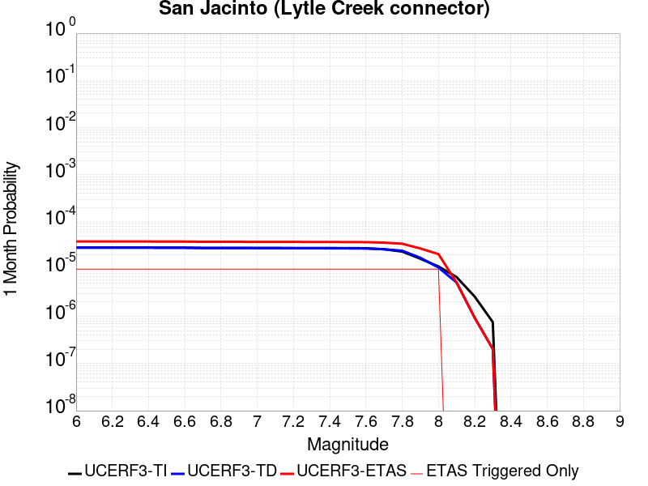 |  |  |

| Magnitude | 1 wk TI Prob | 1 wk TD Prob | 1 wk ETAS Prob | 1 wk ETAS/TD Gain | 1 wk ETAS Triggered Only | 1 mo TI Prob | 1 mo TD Prob | 1 mo ETAS Prob | 1 mo ETAS/TD Gain | 1 mo ETAS Triggered Only | 1 yr TI Prob | 1 yr TD Prob | 1 yr ETAS Prob | 1 yr ETAS/TD Gain | 1 yr ETAS Triggered Only | 10 yr TI Prob | 10 yr TD Prob | 10 yr ETAS Prob | 10 yr ETAS/TD Gain | 10 yr ETAS Triggered Only |
|-----|-----|-----|-----|-----|-----|-----|-----|-----|-----|-----|-----|-----|-----|-----|-----|-----|-----|-----|-----|-----|
| 6.0 | 6.693995E-6 | 6.662972E-6 | 6.662972E-6 | 1.0 | 0.0 | 2.8688235E-5 | 2.8555281E-5 | 4.90465E-5 | 1.7175982 | 2.0491803E-5 | 3.492233E-4 | 3.4760518E-4 | 3.6808985E-4 | 1.0589309 | 2.0491803E-5 | 0.00348675 | 0.0035508168 | 0.0035916548 | 1.0115011 | 4.0983607E-5 |
| 6.1 | 6.693995E-6 | 6.662972E-6 | 6.662972E-6 | 1.0 | 0.0 | 2.8688235E-5 | 2.8555281E-5 | 4.90465E-5 | 1.7175982 | 2.0491803E-5 | 3.492233E-4 | 3.4760518E-4 | 3.6808985E-4 | 1.0589309 | 2.0491803E-5 | 0.00348675 | 0.0035508168 | 0.0035916548 | 1.0115011 | 4.0983607E-5 |
| 6.2 | 6.693995E-6 | 6.662972E-6 | 6.662972E-6 | 1.0 | 0.0 | 2.8688235E-5 | 2.8555281E-5 | 4.90465E-5 | 1.7175982 | 2.0491803E-5 | 3.492233E-4 | 3.4760518E-4 | 3.6808985E-4 | 1.0589309 | 2.0491803E-5 | 0.00348675 | 0.0035508168 | 0.0035916548 | 1.0115011 | 4.0983607E-5 |
| 6.3 | 6.693995E-6 | 6.662972E-6 | 6.662972E-6 | 1.0 | 0.0 | 2.8688235E-5 | 2.8555281E-5 | 4.90465E-5 | 1.7175982 | 2.0491803E-5 | 3.492233E-4 | 3.4760518E-4 | 3.6808985E-4 | 1.0589309 | 2.0491803E-5 | 0.00348675 | 0.0035508168 | 0.0035916548 | 1.0115011 | 4.0983607E-5 |
| 6.4 | 6.693995E-6 | 6.662972E-6 | 6.662972E-6 | 1.0 | 0.0 | 2.8688235E-5 | 2.8555281E-5 | 4.90465E-5 | 1.7175982 | 2.0491803E-5 | 3.492233E-4 | 3.4760518E-4 | 3.6808985E-4 | 1.0589309 | 2.0491803E-5 | 0.00348675 | 0.0035508168 | 0.0035916548 | 1.0115011 | 4.0983607E-5 |
| 6.5 | 6.6561875E-6 | 6.6231896E-6 | 6.6231896E-6 | 1.0 | 0.0 | 2.8526205E-5 | 2.838479E-5 | 4.8876012E-5 | 1.7219086 | 2.0491803E-5 | 3.472512E-4 | 3.455301E-4 | 3.660148E-4 | 1.0592849 | 2.0491803E-5 | 0.0034670907 | 0.0035301324 | 0.003570971 | 1.0115687 | 4.0983607E-5 |
| 6.6 | 6.6561875E-6 | 6.6231896E-6 | 6.6231896E-6 | 1.0 | 0.0 | 2.8526205E-5 | 2.838479E-5 | 4.8876012E-5 | 1.7219086 | 2.0491803E-5 | 3.472512E-4 | 3.455301E-4 | 3.660148E-4 | 1.0592849 | 2.0491803E-5 | 0.0034670907 | 0.0035301324 | 0.003570971 | 1.0115687 | 4.0983607E-5 |
| 6.7 | 6.5802237E-6 | 6.5423656E-6 | 6.5423656E-6 | 1.0 | 0.0 | 2.8200653E-5 | 2.803841E-5 | 4.8529637E-5 | 1.7308271 | 2.0491803E-5 | 3.4328885E-4 | 3.4131424E-4 | 3.6179903E-4 | 1.0600175 | 2.0491803E-5 | 0.0034275902 | 0.0034881064 | 0.003528947 | 1.0117085 | 4.0983607E-5 |
| 6.8 | 6.575632E-6 | 6.5368554E-6 | 6.5368554E-6 | 1.0 | 0.0 | 2.8180975E-5 | 2.8014794E-5 | 4.8506023E-5 | 1.7314432 | 2.0491803E-5 | 3.4304935E-4 | 3.410268E-4 | 3.6151163E-4 | 1.060068 | 2.0491803E-5 | 0.0034252026 | 0.0034852412 | 0.0035260818 | 1.0117182 | 4.0983607E-5 |
| 6.9 | 6.570433E-6 | 6.528249E-6 | 6.528249E-6 | 1.0 | 0.0 | 2.8158694E-5 | 2.797791E-5 | 4.846914E-5 | 1.7324075 | 2.0491803E-5 | 3.4277816E-4 | 3.4057788E-4 | 3.610627E-4 | 1.0601473 | 2.0491803E-5 | 0.0034224992 | 0.003480766 | 0.003521607 | 1.0117333 | 4.0983607E-5 |
| 7.0 | 6.5643826E-6 | 6.5183694E-6 | 6.5183694E-6 | 1.0 | 0.0 | 2.8132765E-5 | 2.7935572E-5 | 4.8426802E-5 | 1.7335175 | 2.0491803E-5 | 3.424626E-4 | 3.4006257E-4 | 3.605474E-4 | 1.0602385 | 2.0491803E-5 | 0.0034193532 | 0.003475629 | 0.0035164703 | 1.0117507 | 4.0983607E-5 |
| 7.1 | 6.557402E-6 | 6.5070813E-6 | 6.5070813E-6 | 1.0 | 0.0 | 2.8102848E-5 | 2.7887192E-5 | 4.8378424E-5 | 1.7347901 | 2.0491803E-5 | 3.4209844E-4 | 3.3947374E-4 | 3.599586E-4 | 1.0603429 | 2.0491803E-5 | 0.0034157229 | 0.0034697603 | 0.0035106016 | 1.0117707 | 4.0983607E-5 |
| 7.2 | 6.546394E-6 | 6.489047E-6 | 6.489047E-6 | 1.0 | 0.0 | 2.8055672E-5 | 2.7809905E-5 | 4.830114E-5 | 1.7368323 | 2.0491803E-5 | 3.4152428E-4 | 3.3853305E-4 | 3.5901793E-4 | 1.0605106 | 2.0491803E-5 | 0.0034099987 | 0.003460387 | 0.0035012288 | 1.0118027 | 4.0983607E-5 |
| 7.3 | 6.5364216E-6 | 6.469831E-6 | 6.469831E-6 | 1.0 | 0.0 | 2.8012933E-5 | 2.7727552E-5 | 4.8218786E-5 | 1.7390207 | 2.0491803E-5 | 3.4100408E-4 | 3.3753074E-4 | 3.5801562E-4 | 1.0606904 | 2.0491803E-5 | 0.003404813 | 0.0034504079 | 0.00349125 | 1.0118369 | 4.0983607E-5 |
| 7.4 | 6.5269523E-6 | 6.4509163E-6 | 6.4509163E-6 | 1.0 | 0.0 | 2.7972354E-5 | 2.764649E-5 | 4.813773E-5 | 1.7411876 | 2.0491803E-5 | 3.4051016E-4 | 3.3654412E-4 | 3.5702903E-4 | 1.0608684 | 2.0491803E-5 | 0.0033998888 | 0.003440589 | 0.0034814316 | 1.0118709 | 4.0983607E-5 |
| 7.5 | 6.5111835E-6 | 6.4271885E-6 | 6.4271885E-6 | 1.0 | 0.0 | 2.7904773E-5 | 2.7544802E-5 | 4.8036043E-5 | 1.743924 | 2.0491803E-5 | 3.3968766E-4 | 3.3530645E-4 | 3.5579136E-4 | 1.0610932 | 2.0491803E-5 | 0.0033916887 | 0.003428261 | 0.0034691042 | 1.0119137 | 4.0983607E-5 |
| 7.6 | 6.4768806E-6 | 6.3862944E-6 | 6.3862944E-6 | 1.0 | 0.0 | 2.7757764E-5 | 2.7369546E-5 | 4.7860787E-5 | 1.7486877 | 2.0491803E-5 | 3.3789838E-4 | 3.3317335E-4 | 3.536583E-4 | 1.0614845 | 2.0491803E-5 | 0.0033738504 | 0.0034069915 | 0.0034478356 | 1.0119883 | 4.0983607E-5 |
| 7.7 | 6.1655364E-6 | 6.1787587E-6 | 6.1787587E-6 | 1.0 | 0.0 | 2.642346E-5 | 2.6480126E-5 | 4.6971385E-5 | 1.7738355 | 2.0491803E-5 | 3.2165812E-4 | 3.2234789E-4 | 3.4283308E-4 | 1.06355 | 2.0491803E-5 | 0.0032119295 | 0.003298596 | 0.0033394443 | 1.0123836 | 4.0983607E-5 |
| 7.8 | 5.5043524E-6 | 5.7397438E-6 | 5.7397438E-6 | 1.0 | 0.0 | 2.3589868E-5 | 2.459867E-5 | 4.508997E-5 | 1.8330246 | 2.0491803E-5 | 2.871688E-4 | 2.994477E-4 | 3.1993337E-4 | 1.0684115 | 2.0491803E-5 | 0.0028679797 | 0.0030686588 | 0.0031095166 | 1.0133146 | 4.0983607E-5 |
| 7.9 | 3.889249E-6 | 4.0789296E-6 | 4.0789296E-6 | 1.0 | 0.0 | 1.6668104E-5 | 1.748101E-5 | 3.7972455E-5 | 2.1722116 | 2.0491803E-5 | 2.0291525E-4 | 2.1281054E-4 | 2.33298E-4 | 1.0962708 | 2.0491803E-5 | 0.0020273007 | 0.0021954647 | 0.0022363584 | 1.0186265 | 4.0983607E-5 |
| 8.0 | 2.668535E-6 | 2.5329996E-6 | 2.5329996E-6 | 1.0 | 0.0 | 1.1436528E-5 | 1.0855668E-5 | 3.134725E-5 | 2.8876388 | 2.0491803E-5 | 1.3923083E-4 | 1.3215977E-4 | 1.5264886E-4 | 1.1550328 | 2.0491803E-5 | 0.0013914363 | 0.0013765821 | 0.0014175093 | 1.029731 | 4.0983607E-5 |
| 8.1 | 1.5911459E-6 | 1.2194711E-6 | 1.2194711E-6 | 1.0 | 0.0 | 6.8191785E-6 | 5.226294E-6 | 5.226294E-6 | 1.0 | 0.0 | 8.3020335E-5 | 6.362829E-5 | 6.362829E-5 | 1.0 | 0.0 | 8.298933E-4 | 6.6975754E-4 | 6.6975754E-4 | 1.0 | 0.0 |
| 8.2 | 6.1294963E-7 | 2.1835329E-7 | 2.1835329E-7 | 1.0 | 0.0 | 2.6269242E-6 | 9.357995E-7 | 9.357995E-7 | 1.0 | 0.0 | 3.1982334E-5 | 1.1393299E-5 | 1.1393299E-5 | 1.0 | 0.0 | 3.1977732E-4 | 1.2797497E-4 | 1.2797497E-4 | 1.0 | 0.0 |
| 8.3 | 1.762871E-7 | 4.7604622E-8 | 4.7604622E-8 | 1.0 | 0.0 | 7.5551594E-7 | 2.0401978E-7 | 2.0401978E-7 | 1.0 | 0.0 | 9.1983675E-6 | 2.4839383E-6 | 2.4839383E-6 | 1.0 | 0.0 | 9.197987E-5 | 2.8720697E-5 | 2.8720697E-5 | 1.0 | 0.0 |

## San Jacinto (Borrego)
*[(top)](#table-of-contents)*

| 1 Week | 1 Month | 1 Year | 10 Year |
|-----|-----|-----|-----|
|  |  | 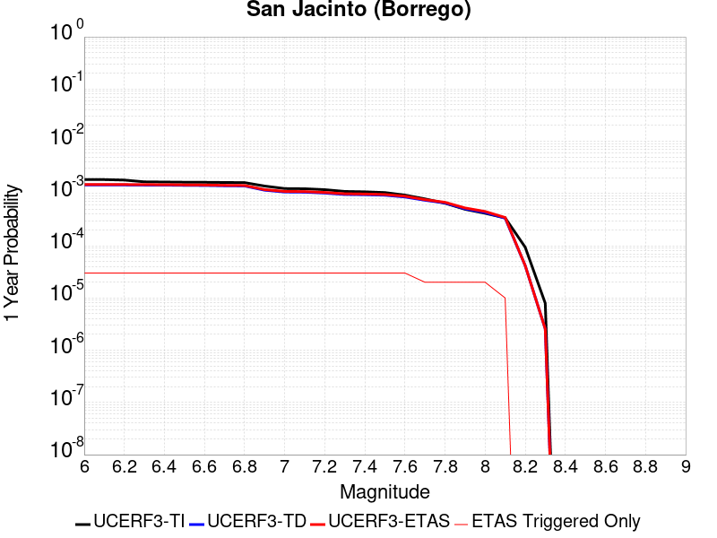 | 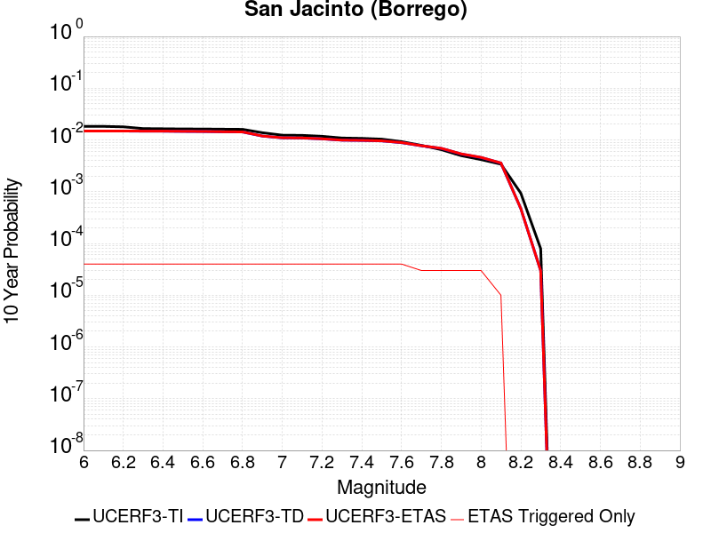 |

| Magnitude | 1 wk TI Prob | 1 wk TD Prob | 1 wk ETAS Prob | 1 wk ETAS/TD Gain | 1 wk ETAS Triggered Only | 1 mo TI Prob | 1 mo TD Prob | 1 mo ETAS Prob | 1 mo ETAS/TD Gain | 1 mo ETAS Triggered Only | 1 yr TI Prob | 1 yr TD Prob | 1 yr ETAS Prob | 1 yr ETAS/TD Gain | 1 yr ETAS Triggered Only | 10 yr TI Prob | 10 yr TD Prob | 10 yr ETAS Prob | 10 yr ETAS/TD Gain | 10 yr ETAS Triggered Only |
|-----|-----|-----|-----|-----|-----|-----|-----|-----|-----|-----|-----|-----|-----|-----|-----|-----|-----|-----|-----|-----|
| 6.0 | 3.543992E-5 | 2.7934115E-5 | 2.7934115E-5 | 1.0 | 0.0 | 1.5187653E-4 | 1.1971221E-4 | 1.1971221E-4 | 1.0 | 0.0 | 0.0018475284 | 0.001456534 | 0.0014769959 | 1.0140483 | 2.0491803E-5 | 0.018322436 | 0.014873597 | 0.014913971 | 1.0027145 | 4.0983607E-5 |
| 6.1 | 3.542281E-5 | 2.7934115E-5 | 2.7934115E-5 | 1.0 | 0.0 | 1.5180321E-4 | 1.1971221E-4 | 1.1971221E-4 | 1.0 | 0.0 | 0.0018466372 | 0.001456534 | 0.0014769959 | 1.0140483 | 2.0491803E-5 | 0.018313672 | 0.014873597 | 0.014913971 | 1.0027145 | 4.0983607E-5 |
| 6.2 | 3.4688688E-5 | 2.7934115E-5 | 2.7934115E-5 | 1.0 | 0.0 | 1.4865733E-4 | 1.1971221E-4 | 1.1971221E-4 | 1.0 | 0.0 | 0.0018084005 | 0.0014565339 | 0.0014769959 | 1.0140483 | 2.0491803E-5 | 0.017937548 | 0.014873596 | 0.014913971 | 1.0027145 | 4.0983607E-5 |
| 6.3 | 3.2087122E-5 | 2.7779462E-5 | 2.7779462E-5 | 1.0 | 0.0 | 1.3750899E-4 | 1.1904947E-4 | 1.1904947E-4 | 1.0 | 0.0 | 0.0016728862 | 0.0014484759 | 0.001468938 | 1.0141267 | 2.0491803E-5 | 0.016603488 | 0.01479463 | 0.0148350075 | 1.0027292 | 4.0983607E-5 |
| 6.4 | 3.1828724E-5 | 2.7746448E-5 | 2.7746448E-5 | 1.0 | 0.0 | 1.364017E-4 | 1.18908E-4 | 1.18908E-4 | 1.0 | 0.0 | 0.0016594254 | 0.0014467557 | 0.0014672178 | 1.0141435 | 2.0491803E-5 | 0.016470885 | 0.014777708 | 0.014818086 | 1.0027324 | 4.0983607E-5 |
| 6.5 | 3.1563577E-5 | 2.7486154E-5 | 2.7486154E-5 | 1.0 | 0.0 | 1.3526545E-4 | 1.1779256E-4 | 1.1779256E-4 | 1.0 | 0.0 | 0.0016456128 | 0.0014331931 | 0.0014536555 | 1.0142775 | 2.0491803E-5 | 0.0163348 | 0.014644288 | 0.014684672 | 1.0027577 | 4.0983607E-5 |
| 6.6 | 3.1467625E-5 | 2.7330374E-5 | 2.7330374E-5 | 1.0 | 0.0 | 1.3485427E-4 | 1.1712498E-4 | 1.1712498E-4 | 1.0 | 0.0 | 0.0016406142 | 0.001425076 | 0.0014455387 | 1.014359 | 2.0491803E-5 | 0.016285548 | 0.014564533 | 0.01460492 | 1.0027729 | 4.0983607E-5 |
| 6.7 | 3.1223695E-5 | 2.6948383E-5 | 2.6948383E-5 | 1.0 | 0.0 | 1.3380898E-4 | 1.1548802E-4 | 1.1548802E-4 | 1.0 | 0.0 | 0.0016279068 | 0.0014051719 | 0.0014256348 | 1.0145626 | 2.0491803E-5 | 0.01616033 | 0.014368899 | 0.014409294 | 1.0028113 | 4.0983607E-5 |
| 6.8 | 3.1015585E-5 | 2.6769376E-5 | 2.6769376E-5 | 1.0 | 0.0 | 1.3291716E-4 | 1.14720926E-4 | 1.14720926E-4 | 1.0 | 0.0 | 0.001617065 | 0.0013958444 | 0.0014163076 | 1.0146601 | 2.0491803E-5 | 0.016053487 | 0.014276173 | 0.014316572 | 1.0028298 | 4.0983607E-5 |
| 6.9 | 2.6641965E-5 | 2.2191349E-5 | 2.2191349E-5 | 1.0 | 0.0 | 1.1417485E-4 | 9.510233E-5 | 9.510233E-5 | 1.0 | 0.0 | 0.0013891924 | 0.0011572598 | 0.001177728 | 1.0176867 | 2.0491803E-5 | 0.0138054015 | 0.011886145 | 0.011926641 | 1.003407 | 4.0983607E-5 |
| 7.0 | 2.3854353E-5 | 2.048587E-5 | 2.048587E-5 | 1.0 | 0.0 | 1.02228936E-4 | 8.779365E-5 | 8.779365E-5 | 1.0 | 0.0 | 0.0012439266 | 0.0010683661 | 0.001088836 | 1.01916 | 2.0491803E-5 | 0.012369866 | 0.010986375 | 0.011026908 | 1.0036894 | 4.0983607E-5 |
| 7.1 | 2.3672901E-5 | 2.032235E-5 | 2.032235E-5 | 1.0 | 0.0 | 1.0145135E-4 | 8.709289E-5 | 8.709289E-5 | 1.0 | 0.0 | 0.0012344702 | 0.0010598428 | 0.0010803128 | 1.0193143 | 2.0491803E-5 | 0.0122763505 | 0.010901547 | 0.010942084 | 1.0037185 | 4.0983607E-5 |
| 7.2 | 2.2717244E-5 | 1.9549674E-5 | 1.9549674E-5 | 1.0 | 0.0 | 9.735599E-5 | 8.378164E-5 | 8.378164E-5 | 1.0 | 0.0 | 0.0011846646 | 0.0010195666 | 0.0010400374 | 1.0200781 | 2.0491803E-5 | 0.01178369 | 0.010498884 | 0.010539438 | 1.0038626 | 4.0983607E-5 |
| 7.3 | 2.1016205E-5 | 1.8391213E-5 | 1.8391213E-5 | 1.0 | 0.0 | 9.006634E-5 | 7.881711E-5 | 7.881711E-5 | 1.0 | 0.0 | 0.001096006 | 9.5917797E-4 | 9.796501E-4 | 1.0213435 | 2.0491803E-5 | 0.010906163 | 0.009894462 | 0.00993504 | 1.004101 | 4.0983607E-5 |
| 7.4 | 2.0683625E-5 | 1.8193714E-5 | 1.8193714E-5 | 1.0 | 0.0 | 8.86411E-5 | 7.797074E-5 | 7.797074E-5 | 1.0 | 0.0 | 0.001078671 | 9.488824E-4 | 9.6935476E-4 | 1.0215752 | 2.0491803E-5 | 0.010734501 | 0.009791178 | 0.00983176 | 1.0041448 | 4.0983607E-5 |
| 7.5 | 1.9993966E-5 | 1.7788683E-5 | 1.7788683E-5 | 1.0 | 0.0 | 8.568561E-5 | 7.6234996E-5 | 7.6234996E-5 | 1.0 | 0.0 | 0.001042723 | 9.2776783E-4 | 9.4824063E-4 | 1.0220667 | 2.0491803E-5 | 0.010378438 | 0.00957807 | 0.009618661 | 1.0042379 | 4.0983607E-5 |
| 7.6 | 1.788966E-5 | 1.6441732E-5 | 1.6441732E-5 | 1.0 | 0.0 | 7.666772E-5 | 7.046267E-5 | 7.046267E-5 | 1.0 | 0.0 | 9.3302975E-4 | 8.575471E-4 | 8.7802135E-4 | 1.0238754 | 2.0491803E-5 | 0.00929122 | 0.0088698575 | 0.008910477 | 1.0045795 | 4.0983607E-5 |
| 7.7 | 1.5125781E-5 | 1.4243621E-5 | 1.4243621E-5 | 1.0 | 0.0 | 6.4823165E-5 | 6.1042665E-5 | 6.1042665E-5 | 1.0 | 0.0 | 7.889362E-4 | 7.4294186E-4 | 7.634184E-4 | 1.0275614 | 2.0491803E-5 | 0.007861412 | 0.0077174758 | 0.0077581434 | 1.0052695 | 4.0983607E-5 |
| 7.8 | 1.250089E-5 | 1.2636515E-5 | 1.2636515E-5 | 1.0 | 0.0 | 5.3574146E-5 | 5.415537E-5 | 5.415537E-5 | 1.0 | 0.0 | 6.5207E-4 | 6.591428E-4 | 6.7962107E-4 | 1.0310681 | 2.0491803E-5 | 0.006501599 | 0.00687092 | 0.0069116214 | 1.0059239 | 4.0983607E-5 |
| 7.9 | 9.561E-6 | 9.759914E-6 | 9.759914E-6 | 1.0 | 0.0 | 4.0975072E-5 | 4.1827538E-5 | 4.1827538E-5 | 1.0 | 0.0 | 4.987573E-4 | 5.091318E-4 | 5.2961323E-4 | 1.040228 | 2.0491803E-5 | 0.0049763937 | 0.0053551346 | 0.0053958986 | 1.0076121 | 4.0983607E-5 |
| 8.0 | 8.01699E-6 | 8.2982915E-6 | 8.2982915E-6 | 1.0 | 0.0 | 3.4358076E-5 | 3.5563622E-5 | 3.5563622E-5 | 1.0 | 0.0 | 4.1822926E-4 | 4.329016E-4 | 4.5338456E-4 | 1.0473155 | 2.0491803E-5 | 0.0041744304 | 0.0045759073 | 0.0046167034 | 1.0089154 | 4.0983607E-5 |
| 8.1 | 6.541947E-6 | 6.466171E-6 | 6.466171E-6 | 1.0 | 0.0 | 2.8036617E-5 | 2.7711869E-5 | 2.7711869E-5 | 1.0 | 0.0 | 3.4129233E-4 | 3.3734026E-4 | 3.3734026E-4 | 1.0 | 0.0 | 0.0034076865 | 0.0035827826 | 0.0035827826 | 1.0 | 0.0 |
| 8.2 | 1.7968189E-6 | 7.978815E-7 | 7.978815E-7 | 1.0 | 0.0 | 7.70063E-6 | 3.419488E-6 | 3.419488E-6 | 1.0 | 0.0 | 9.3751136E-5 | 4.163149E-5 | 4.163149E-5 | 1.0 | 0.0 | 9.371159E-4 | 4.7162327E-4 | 4.7162327E-4 | 1.0 | 0.0 |
| 8.3 | 1.5167889E-7 | 4.9030522E-8 | 4.9030522E-8 | 1.0 | 0.0 | 6.500522E-7 | 2.1013079E-7 | 2.1013079E-7 | 1.0 | 0.0 | 7.9143565E-6 | 2.55834E-6 | 2.55834E-6 | 1.0 | 0.0 | 7.914075E-5 | 2.9725656E-5 | 2.9725656E-5 | 1.0 | 0.0 |

## Lost Hills
*[(top)](#table-of-contents)*

| 1 Week | 1 Month | 1 Year | 10 Year |
|-----|-----|-----|-----|
|  |  | 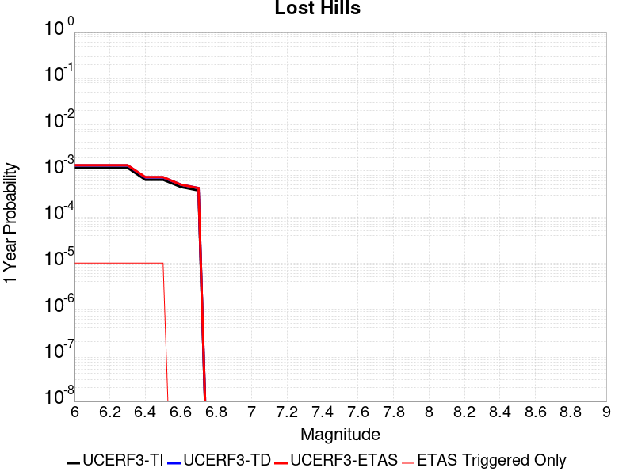 |  |

| Magnitude | 1 wk TI Prob | 1 wk TD Prob | 1 wk ETAS Prob | 1 wk ETAS/TD Gain | 1 wk ETAS Triggered Only | 1 mo TI Prob | 1 mo TD Prob | 1 mo ETAS Prob | 1 mo ETAS/TD Gain | 1 mo ETAS Triggered Only | 1 yr TI Prob | 1 yr TD Prob | 1 yr ETAS Prob | 1 yr ETAS/TD Gain | 1 yr ETAS Triggered Only | 10 yr TI Prob | 10 yr TD Prob | 10 yr ETAS Prob | 10 yr ETAS/TD Gain | 10 yr ETAS Triggered Only |
|-----|-----|-----|-----|-----|-----|-----|-----|-----|-----|-----|-----|-----|-----|-----|-----|-----|-----|-----|-----|-----|
| 6.0 | 2.233523E-5 | 2.5106996E-5 | 2.5106996E-5 | 1.0 | 0.0 | 9.571891E-5 | 1.0759792E-4 | 1.0759792E-4 | 1.0 | 0.0 | 0.0011647546 | 0.0013093855 | 0.0013093855 | 1.0 | 0.0 | 0.011586686 | 0.013033304 | 0.013073754 | 1.0031035 | 4.0983607E-5 |
| 6.1 | 2.233523E-5 | 2.5106996E-5 | 2.5106996E-5 | 1.0 | 0.0 | 9.571891E-5 | 1.0759792E-4 | 1.0759792E-4 | 1.0 | 0.0 | 0.0011647546 | 0.0013093855 | 0.0013093855 | 1.0 | 0.0 | 0.011586686 | 0.013033304 | 0.013073754 | 1.0031035 | 4.0983607E-5 |
| 6.2 | 2.233523E-5 | 2.5106996E-5 | 2.5106996E-5 | 1.0 | 0.0 | 9.571891E-5 | 1.0759792E-4 | 1.0759792E-4 | 1.0 | 0.0 | 0.0011647546 | 0.0013093855 | 0.0013093855 | 1.0 | 0.0 | 0.011586686 | 0.013033304 | 0.013073754 | 1.0031035 | 4.0983607E-5 |
| 6.3 | 2.233523E-5 | 2.5106996E-5 | 2.5106996E-5 | 1.0 | 0.0 | 9.571891E-5 | 1.0759792E-4 | 1.0759792E-4 | 1.0 | 0.0 | 0.0011647546 | 0.0013093855 | 0.0013093855 | 1.0 | 0.0 | 0.011586686 | 0.013033304 | 0.013073754 | 1.0031035 | 4.0983607E-5 |
| 6.4 | 1.2288092E-5 | 1.37813295E-5 | 1.37813295E-5 | 1.0 | 0.0 | 5.2662188E-5 | 5.9062033E-5 | 5.9062033E-5 | 1.0 | 0.0 | 6.409735E-4 | 7.189368E-4 | 7.189368E-4 | 1.0 | 0.0 | 0.006391279 | 0.007175316 | 0.007175316 | 1.0 | 0.0 |
| 6.5 | 1.2288092E-5 | 1.37813295E-5 | 1.37813295E-5 | 1.0 | 0.0 | 5.2662188E-5 | 5.9062033E-5 | 5.9062033E-5 | 1.0 | 0.0 | 6.409735E-4 | 7.189368E-4 | 7.189368E-4 | 1.0 | 0.0 | 0.006391279 | 0.007175316 | 0.007175316 | 1.0 | 0.0 |
| 6.6 | 8.58281E-6 | 9.633926E-6 | 9.633926E-6 | 1.0 | 0.0 | 3.6782953E-5 | 4.1288073E-5 | 4.1288073E-5 | 1.0 | 0.0 | 4.4774043E-4 | 5.026495E-4 | 5.026495E-4 | 1.0 | 0.0 | 0.0044683935 | 0.0050232867 | 0.0050232867 | 1.0 | 0.0 |
| 6.7 | 7.205685E-6 | 8.088433E-6 | 8.088433E-6 | 1.0 | 0.0 | 3.088114E-5 | 3.4664714E-5 | 3.4664714E-5 | 1.0 | 0.0 | 3.7591302E-4 | 4.2204288E-4 | 4.2204288E-4 | 1.0 | 0.0 | 0.0037527776 | 0.004220429 | 0.004220429 | 1.0 | 0.0 |

## Big Pine (East)
*[(top)](#table-of-contents)*

| 1 Week | 1 Month | 1 Year | 10 Year |
|-----|-----|-----|-----|
|  |  |  |  |

| Magnitude | 1 wk TI Prob | 1 wk TD Prob | 1 wk ETAS Prob | 1 wk ETAS/TD Gain | 1 wk ETAS Triggered Only | 1 mo TI Prob | 1 mo TD Prob | 1 mo ETAS Prob | 1 mo ETAS/TD Gain | 1 mo ETAS Triggered Only | 1 yr TI Prob | 1 yr TD Prob | 1 yr ETAS Prob | 1 yr ETAS/TD Gain | 1 yr ETAS Triggered Only | 10 yr TI Prob | 10 yr TD Prob | 10 yr ETAS Prob | 10 yr ETAS/TD Gain | 10 yr ETAS Triggered Only |
|-----|-----|-----|-----|-----|-----|-----|-----|-----|-----|-----|-----|-----|-----|-----|-----|-----|-----|-----|-----|-----|
| 6.0 | 9.916913E-6 | 1.2818231E-5 | 1.2818231E-5 | 1.0 | 0.0 | 4.250036E-5 | 5.4934244E-5 | 5.4934244E-5 | 1.0 | 0.0 | 5.173191E-4 | 6.686413E-4 | 6.891194E-4 | 1.0306264 | 2.0491803E-5 | 0.0051611643 | 0.0066710766 | 0.006711787 | 1.0061024 | 4.0983607E-5 |
| 6.1 | 9.916913E-6 | 1.2818231E-5 | 1.2818231E-5 | 1.0 | 0.0 | 4.250036E-5 | 5.4934244E-5 | 5.4934244E-5 | 1.0 | 0.0 | 5.173191E-4 | 6.686413E-4 | 6.891194E-4 | 1.0306264 | 2.0491803E-5 | 0.0051611643 | 0.0066710766 | 0.006711787 | 1.0061024 | 4.0983607E-5 |
| 6.2 | 9.916913E-6 | 1.2818231E-5 | 1.2818231E-5 | 1.0 | 0.0 | 4.250036E-5 | 5.4934244E-5 | 5.4934244E-5 | 1.0 | 0.0 | 5.173191E-4 | 6.686413E-4 | 6.891194E-4 | 1.0306264 | 2.0491803E-5 | 0.0051611643 | 0.0066710766 | 0.006711787 | 1.0061024 | 4.0983607E-5 |
| 6.3 | 5.479711E-6 | 8.114161E-6 | 8.114161E-6 | 1.0 | 0.0 | 2.3484265E-5 | 3.4774526E-5 | 3.4774526E-5 | 1.0 | 0.0 | 2.858834E-4 | 4.233008E-4 | 4.4378394E-4 | 1.0483891 | 2.0491803E-5 | 0.0028551589 | 0.0042278613 | 0.0042686714 | 1.0096527 | 4.0983607E-5 |
| 6.4 | 5.465009E-6 | 8.098454E-6 | 8.098454E-6 | 1.0 | 0.0 | 2.3421257E-5 | 3.4707216E-5 | 3.4707216E-5 | 1.0 | 0.0 | 2.851165E-4 | 4.224816E-4 | 4.4296475E-4 | 1.0484829 | 2.0491803E-5 | 0.0028475097 | 0.0042197 | 0.0042605107 | 1.0096714 | 4.0983607E-5 |
| 6.5 | 4.826767E-6 | 7.423505E-6 | 7.423505E-6 | 1.0 | 0.0 | 2.068598E-5 | 3.181465E-5 | 3.181465E-5 | 1.0 | 0.0 | 2.518227E-4 | 3.8727728E-4 | 4.0776114E-4 | 1.052892 | 2.0491803E-5 | 0.0025153751 | 0.003868898 | 0.003909723 | 1.0105522 | 4.0983607E-5 |
| 6.6 | 4.3146847E-6 | 6.883437E-6 | 6.883437E-6 | 1.0 | 0.0 | 1.8491375E-5 | 2.9500125E-5 | 2.9500125E-5 | 1.0 | 0.0 | 2.2510924E-4 | 3.5910727E-4 | 3.7959171E-4 | 1.0570427 | 2.0491803E-5 | 0.0022488134 | 0.0035881116 | 0.0036289482 | 1.011381 | 4.0983607E-5 |
| 6.7 | 3.6968106E-6 | 5.9966014E-6 | 5.9966014E-6 | 1.0 | 0.0 | 1.5843378E-5 | 2.5699477E-5 | 2.5699477E-5 | 1.0 | 0.0 | 1.9287605E-4 | 3.1284773E-4 | 3.1284773E-4 | 1.0 | 0.0 | 0.0019270873 | 0.003126825 | 0.0031472526 | 1.006533 | 2.0491803E-5 |
| 6.8 | 3.4671132E-6 | 5.7032753E-6 | 5.7032753E-6 | 1.0 | 0.0 | 1.4858972E-5 | 2.4442388E-5 | 2.4442388E-5 | 1.0 | 0.0 | 1.8089297E-4 | 2.9754688E-4 | 2.9754688E-4 | 1.0 | 0.0 | 0.0018074579 | 0.002974228 | 0.002994659 | 1.0068693 | 2.0491803E-5 |
| 6.9 | 2.7686972E-6 | 4.8262373E-6 | 4.8262373E-6 | 1.0 | 0.0 | 1.1865792E-5 | 2.0683714E-5 | 2.0683714E-5 | 1.0 | 0.0 | 1.4445644E-4 | 2.5179586E-4 | 2.5179586E-4 | 1.0 | 0.0 | 0.0014436257 | 0.002517781 | 0.0025382212 | 1.0081184 | 2.0491803E-5 |
| 7.0 | 2.1472624E-6 | 3.985962E-6 | 3.985962E-6 | 1.0 | 0.0 | 9.20252E-6 | 1.7082584E-5 | 1.7082584E-5 | 1.0 | 0.0 | 1.12034926E-4 | 2.0796116E-4 | 2.0796116E-4 | 1.0 | 0.0 | 0.0011197845 | 0.0020803085 | 0.0021007576 | 1.0098299 | 2.0491803E-5 |
| 7.1 | 1.7018335E-6 | 3.3457143E-6 | 3.3457143E-6 | 1.0 | 0.0 | 7.293552E-6 | 1.4338699E-5 | 1.4338699E-5 | 1.0 | 0.0 | 8.879537E-5 | 1.7456003E-4 | 1.7456003E-4 | 1.0 | 0.0 | 8.87599E-4 | 0.0017468405 | 0.0017672966 | 1.0117103 | 2.0491803E-5 |
| 7.2 | 1.25603E-6 | 2.795276E-6 | 2.795276E-6 | 1.0 | 0.0 | 5.3829745E-6 | 1.19797005E-5 | 1.19797005E-5 | 1.0 | 0.0 | 6.553574E-5 | 1.4584333E-4 | 1.4584333E-4 | 1.0 | 0.0 | 6.551642E-4 | 0.001460063 | 0.001460063 | 1.0 | 0.0 |
| 7.3 | 1.112297E-6 | 2.6110797E-6 | 2.6110797E-6 | 1.0 | 0.0 | 4.7669787E-6 | 1.11902955E-5 | 1.11902955E-5 | 1.0 | 0.0 | 5.803642E-5 | 1.3623355E-4 | 1.3623355E-4 | 1.0 | 0.0 | 5.802127E-4 | 0.0013639197 | 0.0013639197 | 1.0 | 0.0 |
| 7.4 | 1.0137181E-6 | 2.4842075E-6 | 2.4842075E-6 | 1.0 | 0.0 | 4.3444993E-6 | 1.0646561E-5 | 1.0646561E-5 | 1.0 | 0.0 | 5.2892992E-5 | 1.2961439E-4 | 1.2961439E-4 | 1.0 | 0.0 | 5.288041E-4 | 0.0012975911 | 0.0012975911 | 1.0 | 0.0 |
| 7.5 | 9.598608E-7 | 2.4078427E-6 | 2.4078427E-6 | 1.0 | 0.0 | 4.1136827E-6 | 1.0319286E-5 | 1.0319286E-5 | 1.0 | 0.0 | 5.0082934E-5 | 1.2563028E-4 | 1.2563028E-4 | 1.0 | 0.0 | 5.007165E-4 | 0.0012576039 | 0.0012576039 | 1.0 | 0.0 |
| 7.6 | 7.929459E-7 | 2.0454722E-6 | 2.0454722E-6 | 1.0 | 0.0 | 3.3983351E-6 | 8.766281E-6 | 8.766281E-6 | 1.0 | 0.0 | 4.1373947E-5 | 1.06724416E-4 | 1.06724416E-4 | 1.0 | 0.0 | 4.1366243E-4 | 0.0010688324 | 0.0010688324 | 1.0 | 0.0 |
| 7.7 | 4.155788E-7 | 1.1609936E-6 | 1.1609936E-6 | 1.0 | 0.0 | 1.7810507E-6 | 4.975678E-6 | 4.975678E-6 | 1.0 | 0.0 | 2.1684076E-5 | 6.0577237E-5 | 6.0577237E-5 | 1.0 | 0.0 | 2.1681961E-4 | 6.087925E-4 | 6.087925E-4 | 1.0 | 0.0 |
| 7.8 | 1.14666925E-7 | 2.5929913E-7 | 2.5929913E-7 | 1.0 | 0.0 | 4.914296E-7 | 1.1112816E-6 | 1.1112816E-6 | 1.0 | 0.0 | 5.9831386E-6 | 1.3529773E-5 | 1.3529773E-5 | 1.0 | 0.0 | 5.9829777E-5 | 1.3639126E-4 | 1.3639126E-4 | 1.0 | 0.0 |
| 7.9 | 2.9231824E-8 | 4.148024E-8 | 4.148024E-8 | 1.0 | 0.0 | 1.2527924E-7 | 1.7777246E-7 | 1.7777246E-7 | 1.0 | 0.0 | 1.5252737E-6 | 2.1643777E-6 | 2.1643777E-6 | 1.0 | 0.0 | 1.5252632E-5 | 2.1976275E-5 | 2.1976275E-5 | 1.0 | 0.0 |

## Monterey Bay-Tularcitos
*[(top)](#table-of-contents)*

| 1 Week | 1 Month | 1 Year | 10 Year |
|-----|-----|-----|-----|
|  |  |  | 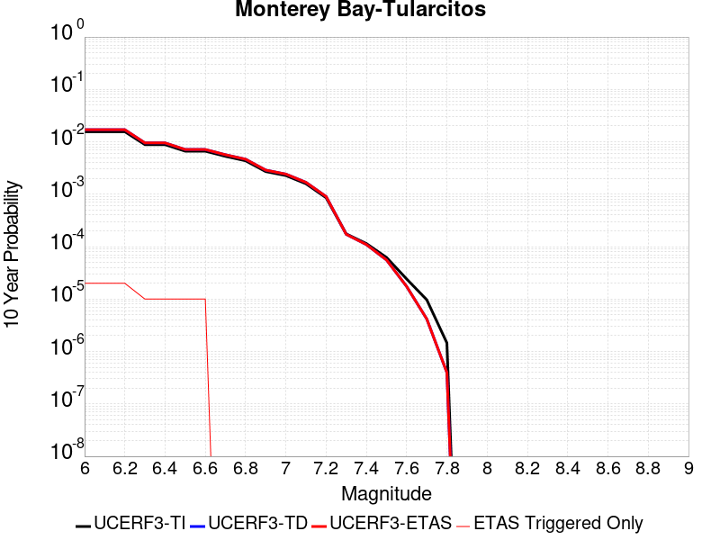 |

| Magnitude | 1 wk TI Prob | 1 wk TD Prob | 1 wk ETAS Prob | 1 wk ETAS/TD Gain | 1 wk ETAS Triggered Only | 1 mo TI Prob | 1 mo TD Prob | 1 mo ETAS Prob | 1 mo ETAS/TD Gain | 1 mo ETAS Triggered Only | 1 yr TI Prob | 1 yr TD Prob | 1 yr ETAS Prob | 1 yr ETAS/TD Gain | 1 yr ETAS Triggered Only | 10 yr TI Prob | 10 yr TD Prob | 10 yr ETAS Prob | 10 yr ETAS/TD Gain | 10 yr ETAS Triggered Only |
|-----|-----|-----|-----|-----|-----|-----|-----|-----|-----|-----|-----|-----|-----|-----|-----|-----|-----|-----|-----|-----|
| 6.0 | 3.0131365E-5 | 3.2799162E-5 | 3.2799162E-5 | 1.0 | 0.0 | 1.2912804E-4 | 1.4056086E-4 | 1.4056086E-4 | 1.0 | 0.0 | 0.001571 | 0.0017100906 | 0.0017305474 | 1.0119624 | 2.0491803E-5 | 0.015599402 | 0.016980117 | 0.017020406 | 1.0023726 | 4.0983607E-5 |
| 6.1 | 3.0131365E-5 | 3.2799162E-5 | 3.2799162E-5 | 1.0 | 0.0 | 1.2912804E-4 | 1.4056086E-4 | 1.4056086E-4 | 1.0 | 0.0 | 0.001571 | 0.0017100906 | 0.0017305474 | 1.0119624 | 2.0491803E-5 | 0.015599402 | 0.016980117 | 0.017020406 | 1.0023726 | 4.0983607E-5 |
| 6.2 | 3.0131365E-5 | 3.2799162E-5 | 3.2799162E-5 | 1.0 | 0.0 | 1.2912804E-4 | 1.4056086E-4 | 1.4056086E-4 | 1.0 | 0.0 | 0.001571 | 0.0017100906 | 0.0017305474 | 1.0119624 | 2.0491803E-5 | 0.015599402 | 0.016980117 | 0.017020406 | 1.0023726 | 4.0983607E-5 |
| 6.3 | 1.6998249E-5 | 1.8330993E-5 | 1.8330993E-5 | 1.0 | 0.0 | 7.28476E-5 | 7.855914E-5 | 7.855914E-5 | 1.0 | 0.0 | 8.865586E-4 | 9.560565E-4 | 9.560565E-4 | 1.0 | 0.0 | 0.0088303005 | 0.00952136 | 0.009541656 | 1.0021317 | 2.0491803E-5 |
| 6.4 | 1.6998249E-5 | 1.8330993E-5 | 1.8330993E-5 | 1.0 | 0.0 | 7.28476E-5 | 7.855914E-5 | 7.855914E-5 | 1.0 | 0.0 | 8.865586E-4 | 9.560565E-4 | 9.560565E-4 | 1.0 | 0.0 | 0.0088303005 | 0.00952136 | 0.009541656 | 1.0021317 | 2.0491803E-5 |
| 6.5 | 1.27470785E-5 | 1.3693452E-5 | 1.3693452E-5 | 1.0 | 0.0 | 5.4629192E-5 | 5.868496E-5 | 5.868496E-5 | 1.0 | 0.0 | 6.649074E-4 | 7.142655E-4 | 7.142655E-4 | 1.0 | 0.0 | 0.0066292146 | 0.007120751 | 0.0071410965 | 1.0028572 | 2.0491803E-5 |
| 6.6 | 1.2739422E-5 | 1.3685539E-5 | 1.3685539E-5 | 1.0 | 0.0 | 5.4596385E-5 | 5.865105E-5 | 5.865105E-5 | 1.0 | 0.0 | 6.645082E-4 | 7.1385293E-4 | 7.1385293E-4 | 1.0 | 0.0 | 0.0066252467 | 0.007116651 | 0.0071369973 | 1.0028589 | 2.0491803E-5 |
| 6.7 | 1.0160109E-5 | 1.0885862E-5 | 1.0885862E-5 | 1.0 | 0.0 | 4.35426E-5 | 4.66529E-5 | 4.66529E-5 | 1.0 | 0.0 | 5.300022E-4 | 5.678581E-4 | 5.678581E-4 | 1.0 | 0.0 | 0.005287399 | 0.005664782 | 0.005664782 | 1.0 | 0.0 |
| 6.8 | 8.349859E-6 | 8.932674E-6 | 8.932674E-6 | 1.0 | 0.0 | 3.578462E-5 | 3.828236E-5 | 3.828236E-5 | 1.0 | 0.0 | 4.3559066E-4 | 4.659937E-4 | 4.659937E-4 | 1.0 | 0.0 | 0.004347378 | 0.0046507306 | 0.0046507306 | 1.0 | 0.0 |
| 6.9 | 5.193639E-6 | 5.536483E-6 | 5.536483E-6 | 1.0 | 0.0 | 2.2258262E-5 | 2.3727587E-5 | 2.3727587E-5 | 1.0 | 0.0 | 2.7096065E-4 | 2.8884833E-4 | 2.8884833E-4 | 1.0 | 0.0 | 0.0027063051 | 0.00288505 | 0.00288505 | 1.0 | 0.0 |
| 7.0 | 4.359381E-6 | 4.6434106E-6 | 4.6434106E-6 | 1.0 | 0.0 | 1.8682927E-5 | 1.9900195E-5 | 1.9900195E-5 | 1.0 | 0.0 | 2.274409E-4 | 2.4226093E-4 | 2.4226093E-4 | 1.0 | 0.0 | 0.0022720827 | 0.0024202613 | 0.0024202613 | 1.0 | 0.0 |
| 7.1 | 3.0398533E-6 | 3.231074E-6 | 3.231074E-6 | 1.0 | 0.0 | 1.3027877E-5 | 1.38474015E-5 | 1.38474015E-5 | 1.0 | 0.0 | 1.5860285E-4 | 1.685817E-4 | 1.685817E-4 | 1.0 | 0.0 | 0.001584897 | 0.0016847957 | 0.0016847957 | 1.0 | 0.0 |
| 7.2 | 1.642335E-6 | 1.7333325E-6 | 1.7333325E-6 | 1.0 | 0.0 | 7.0385595E-6 | 7.4285585E-6 | 7.4285585E-6 | 1.0 | 0.0 | 8.569109E-5 | 9.044101E-5 | 9.044101E-5 | 1.0 | 0.0 | 8.5658056E-4 | 9.042448E-4 | 9.042448E-4 | 1.0 | 0.0 |
| 7.3 | 3.356842E-7 | 3.295272E-7 | 3.295272E-7 | 1.0 | 0.0 | 1.4386458E-6 | 1.4122586E-6 | 1.4122586E-6 | 1.0 | 0.0 | 1.7515373E-5 | 1.7194114E-5 | 1.7194114E-5 | 1.0 | 0.0 | 1.7513991E-4 | 1.7192794E-4 | 1.7192794E-4 | 1.0 | 0.0 |
| 7.4 | 2.1973483E-7 | 2.1006697E-7 | 2.1006697E-7 | 1.0 | 0.0 | 9.417204E-7 | 9.002867E-7 | 9.002867E-7 | 1.0 | 0.0 | 1.1465385E-5 | 1.09609355E-5 | 1.09609355E-5 | 1.0 | 0.0 | 1.1464794E-4 | 1.09603985E-4 | 1.09603985E-4 | 1.0 | 0.0 |
| 7.5 | 1.1944135E-7 | 1.0696283E-7 | 1.0696283E-7 | 1.0 | 0.0 | 5.118914E-7 | 4.5841205E-7 | 4.5841205E-7 | 1.0 | 0.0 | 6.23226E-6 | 5.5811524E-6 | 5.5811524E-6 | 1.0 | 0.0 | 6.2320854E-5 | 5.5810135E-5 | 5.5810135E-5 | 1.0 | 0.0 |
| 7.6 | 4.636058E-8 | 3.3366945E-8 | 3.3366945E-8 | 1.0 | 0.0 | 1.9868818E-7 | 1.4300119E-7 | 1.4300119E-7 | 1.0 | 0.0 | 2.419026E-6 | 1.7410381E-6 | 1.7410381E-6 | 1.0 | 0.0 | 2.4189996E-5 | 1.7410246E-5 | 1.7410246E-5 | 1.0 | 0.0 |
| 7.7 | 1.8588572E-8 | 8.005146E-9 | 8.005146E-9 | 1.0 | 0.0 | 7.9665305E-8 | 3.4307767E-8 | 3.4307767E-8 | 1.0 | 0.0 | 9.699246E-7 | 4.1769698E-7 | 4.1769698E-7 | 1.0 | 0.0 | 9.699204E-6 | 4.176962E-6 | 4.176962E-6 | 1.0 | 0.0 |
| 7.8 | 2.7960154E-9 | 7.612305E-10 | 7.612305E-10 | 1.0 | 0.0 | 1.1982923E-8 | 3.2624166E-9 | 3.2624166E-9 | 1.0 | 0.0 | 1.4589209E-7 | 3.971992E-8 | 3.971992E-8 | 1.0 | 0.0 | 1.4589199E-6 | 3.9719916E-7 | 3.9719916E-7 | 1.0 | 0.0 |

## Sheephole
*[(top)](#table-of-contents)*

| 1 Week | 1 Month | 1 Year | 10 Year |
|-----|-----|-----|-----|
|  |  |  |  |

| Magnitude | 1 wk TI Prob | 1 wk TD Prob | 1 wk ETAS Prob | 1 wk ETAS/TD Gain | 1 wk ETAS Triggered Only | 1 mo TI Prob | 1 mo TD Prob | 1 mo ETAS Prob | 1 mo ETAS/TD Gain | 1 mo ETAS Triggered Only | 1 yr TI Prob | 1 yr TD Prob | 1 yr ETAS Prob | 1 yr ETAS/TD Gain | 1 yr ETAS Triggered Only | 10 yr TI Prob | 10 yr TD Prob | 10 yr ETAS Prob | 10 yr ETAS/TD Gain | 10 yr ETAS Triggered Only |
|-----|-----|-----|-----|-----|-----|-----|-----|-----|-----|-----|-----|-----|-----|-----|-----|-----|-----|-----|-----|-----|
| 6.0 | 4.5579695E-6 | 4.7412877E-6 | 4.7412877E-6 | 1.0 | 0.0 | 1.9534009E-5 | 2.0319678E-5 | 2.0319678E-5 | 1.0 | 0.0 | 2.3780059E-4 | 2.4736955E-4 | 2.4736955E-4 | 1.0 | 0.0 | 0.0023754628 | 0.0024714863 | 0.0025123686 | 1.0165416 | 4.0983607E-5 |
| 6.1 | 4.5579695E-6 | 4.7412877E-6 | 4.7412877E-6 | 1.0 | 0.0 | 1.9534009E-5 | 2.0319678E-5 | 2.0319678E-5 | 1.0 | 0.0 | 2.3780059E-4 | 2.4736955E-4 | 2.4736955E-4 | 1.0 | 0.0 | 0.0023754628 | 0.0024714863 | 0.0025123686 | 1.0165416 | 4.0983607E-5 |
| 6.2 | 2.6677674E-6 | 2.7874107E-6 | 2.7874107E-6 | 1.0 | 0.0 | 1.1433239E-5 | 1.1945997E-5 | 1.1945997E-5 | 1.0 | 0.0 | 1.3919079E-4 | 1.4543389E-4 | 1.4543389E-4 | 1.0 | 0.0 | 0.0013910364 | 0.001453493 | 0.0014739551 | 1.0140778 | 2.0491803E-5 |
| 6.3 | 2.6677674E-6 | 2.7874107E-6 | 2.7874107E-6 | 1.0 | 0.0 | 1.1433239E-5 | 1.1945997E-5 | 1.1945997E-5 | 1.0 | 0.0 | 1.3919079E-4 | 1.4543389E-4 | 1.4543389E-4 | 1.0 | 0.0 | 0.0013910364 | 0.001453493 | 0.0014739551 | 1.0140778 | 2.0491803E-5 |
| 6.4 | 2.2159759E-6 | 2.3228936E-6 | 2.3228936E-6 | 1.0 | 0.0 | 9.497005E-6 | 9.955224E-6 | 9.955224E-6 | 1.0 | 0.0 | 1.156199E-4 | 1.2119893E-4 | 1.2119893E-4 | 1.0 | 0.0 | 0.0011555976 | 0.0012114076 | 0.0012318746 | 1.0168952 | 2.0491803E-5 |
| 6.5 | 2.1986082E-6 | 2.3047737E-6 | 2.3047737E-6 | 1.0 | 0.0 | 9.4225725E-6 | 9.877569E-6 | 9.877569E-6 | 1.0 | 0.0 | 1.1471378E-4 | 1.2025358E-4 | 1.2025358E-4 | 1.0 | 0.0 | 0.0011465458 | 0.0012019643 | 0.0012224315 | 1.0170281 | 2.0491803E-5 |
| 6.6 | 1.5232331E-6 | 1.6019028E-6 | 1.6019028E-6 | 1.0 | 0.0 | 6.5281256E-6 | 6.8652807E-6 | 6.8652807E-6 | 1.0 | 0.0 | 7.947703E-5 | 8.358178E-5 | 8.358178E-5 | 1.0 | 0.0 | 7.9448614E-4 | 8.3552214E-4 | 8.559968E-4 | 1.0245053 | 2.0491803E-5 |
| 6.7 | 1.3137362E-6 | 1.3828287E-6 | 1.3828287E-6 | 1.0 | 0.0 | 5.6302856E-6 | 5.926396E-6 | 5.926396E-6 | 1.0 | 0.0 | 6.854657E-5 | 7.2151626E-5 | 7.2151626E-5 | 1.0 | 0.0 | 6.8525434E-4 | 7.212959E-4 | 7.417729E-4 | 1.0283892 | 2.0491803E-5 |
| 6.8 | 1.2275751E-6 | 1.2922936E-6 | 1.2922936E-6 | 1.0 | 0.0 | 5.2610258E-6 | 5.5383903E-6 | 5.5383903E-6 | 1.0 | 0.0 | 6.4051106E-5 | 6.742795E-5 | 6.742795E-5 | 1.0 | 0.0 | 6.4032647E-4 | 6.740883E-4 | 6.945663E-4 | 1.0303788 | 2.0491803E-5 |
| 6.9 | 1.1837088E-6 | 1.2461107E-6 | 1.2461107E-6 | 1.0 | 0.0 | 5.0730278E-6 | 5.340464E-6 | 5.340464E-6 | 1.0 | 0.0 | 6.176237E-5 | 6.501835E-5 | 6.501835E-5 | 1.0 | 0.0 | 6.17452E-4 | 6.500064E-4 | 6.704849E-4 | 1.0315051 | 2.0491803E-5 |
| 7.0 | 9.849371E-7 | 1.036636E-6 | 1.036636E-6 | 1.0 | 0.0 | 4.2211523E-6 | 4.442719E-6 | 4.442719E-6 | 1.0 | 0.0 | 5.1391315E-5 | 5.408886E-5 | 5.408886E-5 | 1.0 | 0.0 | 5.137943E-4 | 5.4076704E-4 | 5.6124775E-4 | 1.0378735 | 2.0491803E-5 |
| 7.1 | 8.1643645E-7 | 8.5917287E-7 | 8.5917287E-7 | 1.0 | 0.0 | 3.4990085E-6 | 3.6821648E-6 | 3.6821648E-6 | 1.0 | 0.0 | 4.2599597E-5 | 4.482952E-5 | 4.482952E-5 | 1.0 | 0.0 | 4.259143E-4 | 4.482134E-4 | 4.6869603E-4 | 1.0456984 | 2.0491803E-5 |
| 7.2 | 5.7295756E-7 | 6.029544E-7 | 6.029544E-7 | 1.0 | 0.0 | 2.45553E-6 | 2.584088E-6 | 2.584088E-6 | 1.0 | 0.0 | 2.9895667E-5 | 3.1460884E-5 | 3.1460884E-5 | 1.0 | 0.0 | 2.9891645E-4 | 3.14571E-4 | 3.14571E-4 | 1.0 | 0.0 |

## Great Valley 07 (Orestimba)
*[(top)](#table-of-contents)*

| 1 Week | 1 Month | 1 Year | 10 Year |
|-----|-----|-----|-----|
|  |  | 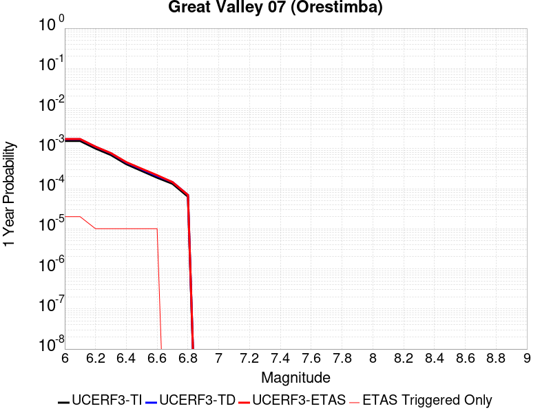 |  |

| Magnitude | 1 wk TI Prob | 1 wk TD Prob | 1 wk ETAS Prob | 1 wk ETAS/TD Gain | 1 wk ETAS Triggered Only | 1 mo TI Prob | 1 mo TD Prob | 1 mo ETAS Prob | 1 mo ETAS/TD Gain | 1 mo ETAS Triggered Only | 1 yr TI Prob | 1 yr TD Prob | 1 yr ETAS Prob | 1 yr ETAS/TD Gain | 1 yr ETAS Triggered Only | 10 yr TI Prob | 10 yr TD Prob | 10 yr ETAS Prob | 10 yr ETAS/TD Gain | 10 yr ETAS Triggered Only |
|-----|-----|-----|-----|-----|-----|-----|-----|-----|-----|-----|-----|-----|-----|-----|-----|-----|-----|-----|-----|-----|
| 6.0 | 2.9687902E-5 | 3.2757947E-5 | 3.2757947E-5 | 1.0 | 0.0 | 1.2722766E-4 | 1.4038406E-4 | 1.4038406E-4 | 1.0 | 0.0 | 0.0015478961 | 0.0017079079 | 0.0017488215 | 1.0239553 | 4.0983607E-5 | 0.015371585 | 0.016955366 | 0.016995655 | 1.0023762 | 4.0983607E-5 |
| 6.1 | 2.9687902E-5 | 3.2757947E-5 | 3.2757947E-5 | 1.0 | 0.0 | 1.2722766E-4 | 1.4038406E-4 | 1.4038406E-4 | 1.0 | 0.0 | 0.0015478961 | 0.0017079079 | 0.0017488215 | 1.0239553 | 4.0983607E-5 | 0.015371585 | 0.016955366 | 0.016995655 | 1.0023762 | 4.0983607E-5 |
| 6.2 | 1.9231524E-5 | 2.1159447E-5 | 2.1159447E-5 | 1.0 | 0.0 | 8.2418206E-5 | 9.0680325E-5 | 9.0680325E-5 | 1.0 | 0.0 | 0.0010029797 | 0.0011034969 | 0.0011239661 | 1.0185494 | 2.0491803E-5 | 0.00998465 | 0.010982586 | 0.011002853 | 1.0018454 | 2.0491803E-5 |
| 6.3 | 1.324766E-5 | 1.4548723E-5 | 1.4548723E-5 | 1.0 | 0.0 | 5.6774446E-5 | 6.235023E-5 | 6.235023E-5 | 1.0 | 0.0 | 6.910097E-4 | 7.5885886E-4 | 7.793351E-4 | 1.0269829 | 2.0491803E-5 | 0.006888649 | 0.0075636217 | 0.0075839586 | 1.0026888 | 2.0491803E-5 |
| 6.4 | 7.818645E-6 | 8.57295E-6 | 8.57295E-6 | 1.0 | 0.0 | 3.3508048E-5 | 3.6740716E-5 | 3.6740716E-5 | 1.0 | 0.0 | 4.078841E-4 | 4.4722974E-4 | 4.677124E-4 | 1.0457989 | 2.0491803E-5 | 0.004071363 | 0.0044636377 | 0.004484038 | 1.0045704 | 2.0491803E-5 |
| 6.5 | 5.3076565E-6 | 5.817875E-6 | 5.817875E-6 | 1.0 | 0.0 | 2.27469E-5 | 2.4933523E-5 | 2.4933523E-5 | 1.0 | 0.0 | 2.7690834E-4 | 3.0352548E-4 | 3.2401105E-4 | 1.0674921 | 2.0491803E-5 | 0.0027656353 | 0.0030313185 | 0.0030517483 | 1.0067395 | 2.0491803E-5 |
| 6.6 | 3.6003578E-6 | 3.9485462E-6 | 3.9485462E-6 | 1.0 | 0.0 | 1.5430012E-5 | 1.6922239E-5 | 1.6922239E-5 | 1.0 | 0.0 | 1.8784421E-4 | 2.0601034E-4 | 2.2649793E-4 | 1.0994493 | 2.0491803E-5 | 0.0018768552 | 0.0020583477 | 0.0020787974 | 1.009935 | 2.0491803E-5 |
| 6.7 | 2.5361826E-6 | 2.783504E-6 | 2.783504E-6 | 1.0 | 0.0 | 1.0869308E-5 | 1.1929255E-5 | 1.1929255E-5 | 1.0 | 0.0 | 1.3232579E-4 | 1.4523033E-4 | 1.4523033E-4 | 1.0 | 0.0 | 0.0013224703 | 0.001451484 | 0.001451484 | 1.0 | 0.0 |
| 6.8 | 1.2115831E-6 | 1.3313972E-6 | 1.3313972E-6 | 1.0 | 0.0 | 5.1924885E-6 | 5.705981E-6 | 5.705981E-6 | 1.0 | 0.0 | 6.3216714E-5 | 6.9469075E-5 | 6.9469075E-5 | 1.0 | 0.0 | 6.3198735E-4 | 6.9456873E-4 | 6.9456873E-4 | 1.0 | 0.0 |

## Coronado Bank alt1
*[(top)](#table-of-contents)*

| 1 Week | 1 Month | 1 Year | 10 Year |
|-----|-----|-----|-----|
|  |  |  |  |

| Magnitude | 1 wk TI Prob | 1 wk TD Prob | 1 wk ETAS Prob | 1 wk ETAS/TD Gain | 1 wk ETAS Triggered Only | 1 mo TI Prob | 1 mo TD Prob | 1 mo ETAS Prob | 1 mo ETAS/TD Gain | 1 mo ETAS Triggered Only | 1 yr TI Prob | 1 yr TD Prob | 1 yr ETAS Prob | 1 yr ETAS/TD Gain | 1 yr ETAS Triggered Only | 10 yr TI Prob | 10 yr TD Prob | 10 yr ETAS Prob | 10 yr ETAS/TD Gain | 10 yr ETAS Triggered Only |
|-----|-----|-----|-----|-----|-----|-----|-----|-----|-----|-----|-----|-----|-----|-----|-----|-----|-----|-----|-----|-----|
| 6.0 | 7.533492E-5 | 9.3952294E-5 | 9.3952294E-5 | 1.0 | 0.0 | 3.22824E-4 | 4.0259483E-4 | 4.0259483E-4 | 1.0 | 0.0 | 0.0039233007 | 0.004891124 | 0.004891124 | 1.0 | 0.0 | 0.03854755 | 0.047905073 | 0.047944095 | 1.0008146 | 4.0983607E-5 |
| 6.1 | 4.1807285E-5 | 5.049425E-5 | 5.049425E-5 | 1.0 | 0.0 | 1.7916178E-4 | 2.1638657E-4 | 2.1638657E-4 | 1.0 | 0.0 | 0.0021791123 | 0.002631421 | 0.002631421 | 1.0 | 0.0 | 0.021578677 | 0.026011758 | 0.026031716 | 1.0007674 | 2.0491803E-5 |
| 6.2 | 4.1807285E-5 | 5.049425E-5 | 5.049425E-5 | 1.0 | 0.0 | 1.7916178E-4 | 2.1638657E-4 | 2.1638657E-4 | 1.0 | 0.0 | 0.0021791123 | 0.002631421 | 0.002631421 | 1.0 | 0.0 | 0.021578677 | 0.026011758 | 0.026031716 | 1.0007674 | 2.0491803E-5 |
| 6.3 | 3.1793104E-5 | 3.771206E-5 | 3.771206E-5 | 1.0 | 0.0 | 1.3624904E-4 | 1.6161331E-4 | 1.6161331E-4 | 1.0 | 0.0 | 0.0016575698 | 0.001965897 | 0.001965897 | 1.0 | 0.0 | 0.016452603 | 0.019488946 | 0.019509038 | 1.0010309 | 2.0491803E-5 |
| 6.4 | 2.9878007E-5 | 3.5336663E-5 | 3.5336663E-5 | 1.0 | 0.0 | 1.2804232E-4 | 1.5143424E-4 | 1.5143424E-4 | 1.0 | 0.0 | 0.0015578003 | 0.0018421836 | 0.0018421836 | 1.0 | 0.0 | 0.015469253 | 0.018272884 | 0.018272884 | 1.0 | 0.0 |
| 6.5 | 2.4512565E-5 | 2.8764713E-5 | 2.8764713E-5 | 1.0 | 0.0 | 1.0504962E-4 | 1.2327167E-4 | 1.2327167E-4 | 1.0 | 0.0 | 0.0012782287 | 0.001499827 | 0.001499827 | 1.0 | 0.0 | 0.012709012 | 0.014900027 | 0.014900027 | 1.0 | 0.0 |
| 6.6 | 2.1317413E-5 | 2.4907233E-5 | 2.4907233E-5 | 1.0 | 0.0 | 9.135714E-5 | 1.0674105E-4 | 1.0674105E-4 | 1.0 | 0.0 | 0.0011117056 | 0.0012988199 | 0.0012988199 | 1.0 | 0.0 | 0.011061605 | 0.012914695 | 0.012914695 | 1.0 | 0.0 |
| 6.7 | 1.8585655E-5 | 2.1635356E-5 | 2.1635356E-5 | 1.0 | 0.0 | 7.9650374E-5 | 9.2719776E-5 | 9.2719776E-5 | 1.0 | 0.0 | 9.6931186E-4 | 0.0011282992 | 0.0011282992 | 1.0 | 0.0 | 0.0096509475 | 0.0112278685 | 0.0112278685 | 1.0 | 0.0 |
| 6.8 | 1.5862879E-5 | 1.8419874E-5 | 1.8419874E-5 | 1.0 | 0.0 | 6.798199E-5 | 7.894004E-5 | 7.894004E-5 | 1.0 | 0.0 | 8.273665E-4 | 9.606905E-4 | 9.606905E-4 | 1.0 | 0.0 | 0.008242928 | 0.009567357 | 0.009567357 | 1.0 | 0.0 |
| 6.9 | 1.3021509E-5 | 1.5095589E-5 | 1.5095589E-5 | 1.0 | 0.0 | 5.5805274E-5 | 6.469388E-5 | 6.469388E-5 | 1.0 | 0.0 | 6.792174E-4 | 7.8738143E-4 | 7.8738143E-4 | 1.0 | 0.0 | 0.006771452 | 0.00784774 | 0.00784774 | 1.0 | 0.0 |
| 7.0 | 1.0974371E-5 | 1.27203775E-5 | 1.27203775E-5 | 1.0 | 0.0 | 4.7032172E-5 | 5.4514865E-5 | 5.4514865E-5 | 1.0 | 0.0 | 5.7246623E-4 | 6.635339E-4 | 6.635339E-4 | 1.0 | 0.0 | 0.0057099373 | 0.006617277 | 0.006617277 | 1.0 | 0.0 |
| 7.1 | 8.766221E-6 | 1.0164053E-5 | 1.0164053E-5 | 1.0 | 0.0 | 3.7568978E-5 | 4.3559594E-5 | 4.3559594E-5 | 1.0 | 0.0 | 4.573063E-4 | 5.302262E-4 | 5.302262E-4 | 1.0 | 0.0 | 0.0045636636 | 0.005291311 | 0.005291311 | 1.0 | 0.0 |
| 7.2 | 8.026024E-7 | 8.331837E-7 | 8.331837E-7 | 1.0 | 0.0 | 3.43972E-6 | 3.5707824E-6 | 3.5707824E-6 | 1.0 | 0.0 | 4.1877785E-5 | 4.347342E-5 | 4.347342E-5 | 1.0 | 0.0 | 4.1869894E-4 | 4.3465025E-4 | 4.3465025E-4 | 1.0 | 0.0 |
| 7.3 | 3.7293114E-7 | 3.7001186E-7 | 3.7001186E-7 | 1.0 | 0.0 | 1.5982754E-6 | 1.5857643E-6 | 1.5857643E-6 | 1.0 | 0.0 | 1.9458828E-5 | 1.930651E-5 | 1.930651E-5 | 1.0 | 0.0 | 1.9457124E-4 | 1.9304838E-4 | 1.9304838E-4 | 1.0 | 0.0 |
| 7.4 | 2.0557036E-7 | 1.9674462E-7 | 1.9674462E-7 | 1.0 | 0.0 | 8.810155E-7 | 8.43191E-7 | 8.43191E-7 | 1.0 | 0.0 | 1.0726311E-5 | 1.0265802E-5 | 1.0265802E-5 | 1.0 | 0.0 | 1.0725793E-4 | 1.02653314E-4 | 1.02653314E-4 | 1.0 | 0.0 |
| 7.5 | 6.845446E-8 | 6.279388E-8 | 6.279388E-8 | 1.0 | 0.0 | 2.9337625E-7 | 2.6911658E-7 | 2.6911658E-7 | 1.0 | 0.0 | 3.5718497E-6 | 3.2764897E-6 | 3.2764897E-6 | 1.0 | 0.0 | 3.5717923E-5 | 3.2764423E-5 | 3.2764423E-5 | 1.0 | 0.0 |
| 7.6 | 6.0975145E-9 | 5.531861E-9 | 5.531861E-9 | 1.0 | 0.0 | 2.6132206E-8 | 2.3707976E-8 | 2.3707976E-8 | 1.0 | 0.0 | 3.1815955E-7 | 2.8864457E-7 | 2.8864457E-7 | 1.0 | 0.0 | 3.181591E-6 | 2.886443E-6 | 2.886443E-6 | 1.0 | 0.0 |

## San Diego Trough south
*[(top)](#table-of-contents)*

| 1 Week | 1 Month | 1 Year | 10 Year |
|-----|-----|-----|-----|
| 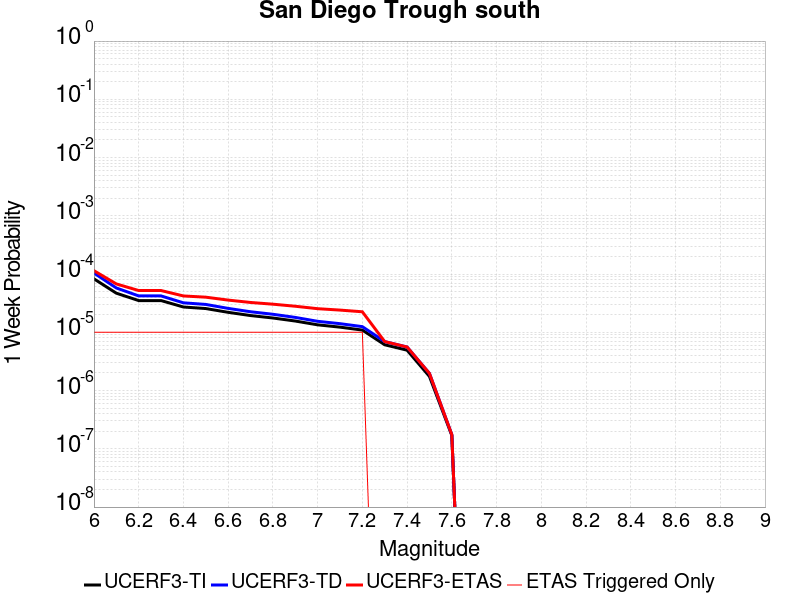 |  | 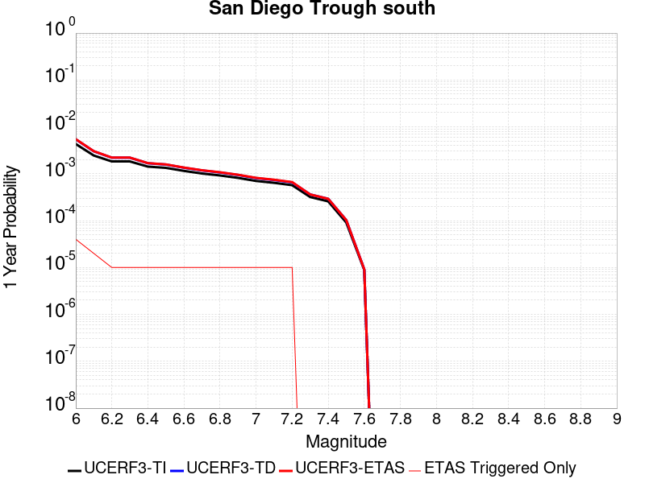 |  |

| Magnitude | 1 wk TI Prob | 1 wk TD Prob | 1 wk ETAS Prob | 1 wk ETAS/TD Gain | 1 wk ETAS Triggered Only | 1 mo TI Prob | 1 mo TD Prob | 1 mo ETAS Prob | 1 mo ETAS/TD Gain | 1 mo ETAS Triggered Only | 1 yr TI Prob | 1 yr TD Prob | 1 yr ETAS Prob | 1 yr ETAS/TD Gain | 1 yr ETAS Triggered Only | 10 yr TI Prob | 10 yr TD Prob | 10 yr ETAS Prob | 10 yr ETAS/TD Gain | 10 yr ETAS Triggered Only |
|-----|-----|-----|-----|-----|-----|-----|-----|-----|-----|-----|-----|-----|-----|-----|-----|-----|-----|-----|-----|-----|
| 6.0 | 8.279495E-5 | 1.0424506E-4 | 1.2473472E-4 | 1.1965529 | 2.0491803E-5 | 3.5478722E-4 | 4.4669298E-4 | 4.6717565E-4 | 1.045854 | 2.0491803E-5 | 0.004310982 | 0.005425812 | 0.005446193 | 1.0037563 | 2.0491803E-5 | 0.042283054 | 0.052993916 | 0.05303273 | 1.0007324 | 4.0983607E-5 |
| 6.1 | 4.6961468E-5 | 5.7731268E-5 | 7.822189E-5 | 1.354931 | 2.0491803E-5 | 2.0124791E-4 | 2.4739723E-4 | 2.6788397E-4 | 1.0828091 | 2.0491803E-5 | 0.00244744 | 0.0030080716 | 0.0030285018 | 1.0067918 | 2.0491803E-5 | 0.024206603 | 0.029680338 | 0.029700221 | 1.00067 | 2.0491803E-5 |
| 6.2 | 3.5079658E-5 | 4.2142692E-5 | 6.263363E-5 | 1.4862276 | 2.0491803E-5 | 1.5033272E-4 | 1.805993E-4 | 2.0108739E-4 | 1.113445 | 2.0491803E-5 | 0.0018287642 | 0.002196623 | 0.0022170697 | 1.0093083 | 2.0491803E-5 | 0.018137876 | 0.021751693 | 0.02177174 | 1.0009216 | 2.0491803E-5 |
| 6.3 | 3.5079658E-5 | 4.2142692E-5 | 6.263363E-5 | 1.4862276 | 2.0491803E-5 | 1.5033272E-4 | 1.805993E-4 | 2.0108739E-4 | 1.113445 | 2.0491803E-5 | 0.0018287642 | 0.002196623 | 0.0022170697 | 1.0093083 | 2.0491803E-5 | 0.018137876 | 0.021751693 | 0.02177174 | 1.0009216 | 2.0491803E-5 |
| 6.4 | 2.7196904E-5 | 3.2087937E-5 | 5.2579086E-5 | 1.6385934 | 2.0491803E-5 | 1.16552954E-4 | 1.3751259E-4 | 1.5800157E-4 | 1.1489972 | 2.0491803E-5 | 0.0014181085 | 0.0016729443 | 0.0016934018 | 1.0122285 | 2.0491803E-5 | 0.014090929 | 0.016605038 | 0.01662519 | 1.0012136 | 2.0491803E-5 |
| 6.5 | 2.5584688E-5 | 3.0102354E-5 | 5.059354E-5 | 1.6807171 | 2.0491803E-5 | 1.0964406E-4 | 1.2900379E-4 | 1.4949296E-4 | 1.158826 | 2.0491803E-5 | 0.0013340989 | 0.0015695024 | 0.001589962 | 1.0130358 | 2.0491803E-5 | 0.013261181 | 0.015585679 | 0.015605851 | 1.0012943 | 2.0491803E-5 |
| 6.6 | 2.2034688E-5 | 2.5743318E-5 | 4.6234592E-5 | 1.7959843 | 2.0491803E-5 | 9.443096E-5 | 1.1032389E-4 | 1.3081344E-4 | 1.1857218 | 2.0491803E-5 | 0.0011490905 | 0.0013423724 | 0.0013628367 | 1.0152448 | 2.0491803E-5 | 0.011431668 | 0.013343615 | 0.013363834 | 1.0015152 | 2.0491803E-5 |
| 6.7 | 1.9394853E-5 | 2.2542248E-5 | 4.303359E-5 | 1.9090194 | 2.0491803E-5 | 8.311815E-5 | 9.660609E-5 | 1.17095915E-4 | 1.2120966 | 2.0491803E-5 | 0.0010114936 | 0.0011755497 | 0.0011960175 | 1.0174112 | 2.0491803E-5 | 0.01006902 | 0.011694018 | 0.01171427 | 1.0017319 | 2.0491803E-5 |
| 6.8 | 1.7615313E-5 | 2.0403613E-5 | 4.0895E-5 | 2.0043018 | 2.0491803E-5 | 7.549201E-5 | 8.744115E-5 | 1.0793116E-4 | 1.2343291 | 2.0491803E-5 | 9.1872766E-4 | 0.0010640804 | 0.0010845504 | 1.0192373 | 2.0491803E-5 | 0.009149387 | 0.01059042 | 0.010610695 | 1.0019145 | 2.0491803E-5 |
| 6.9 | 1.5621423E-5 | 1.8026485E-5 | 3.851792E-5 | 2.1367404 | 2.0491803E-5 | 6.6947236E-5 | 7.7254095E-5 | 9.774431E-5 | 1.2652315 | 2.0491803E-5 | 8.147778E-4 | 9.4016624E-4 | 9.606388E-4 | 1.0217755 | 2.0491803E-5 | 0.008117969 | 0.0093623325 | 0.009382633 | 1.0021683 | 2.0491803E-5 |
| 7.0 | 1.3444376E-5 | 1.5448395E-5 | 3.5939884E-5 | 2.3264475 | 2.0491803E-5 | 5.7617483E-5 | 6.620574E-5 | 8.669619E-5 | 1.3094965 | 2.0491803E-5 | 7.0126704E-4 | 8.057596E-4 | 8.262349E-4 | 1.0254111 | 2.0491803E-5 | 0.006990582 | 0.008028714 | 0.008049041 | 1.0025318 | 2.0491803E-5 |
| 7.1 | 1.2268361E-5 | 1.40733055E-5 | 3.456482E-5 | 2.4560556 | 2.0491803E-5 | 5.2577634E-5 | 6.031279E-5 | 8.080335E-5 | 1.3397384 | 2.0491803E-5 | 6.399447E-4 | 7.3406345E-4 | 7.545402E-4 | 1.0278951 | 2.0491803E-5 | 0.0063810493 | 0.007316692 | 0.0073370337 | 1.0027802 | 2.0491803E-5 |
| 7.2 | 1.0922655E-5 | 1.2513806E-5 | 3.300535E-5 | 2.637515 | 2.0491803E-5 | 4.681054E-5 | 5.362951E-5 | 7.412021E-5 | 1.3820789 | 2.0491803E-5 | 5.697693E-4 | 6.527462E-4 | 6.732246E-4 | 1.0313728 | 2.0491803E-5 | 0.0056831064 | 0.0065085697 | 0.006528928 | 1.0031279 | 2.0491803E-5 |
| 7.3 | 6.1106753E-6 | 6.9290486E-6 | 6.9290486E-6 | 1.0 | 0.0 | 2.6188345E-5 | 2.9695586E-5 | 2.9695586E-5 | 1.0 | 0.0 | 3.1879646E-4 | 3.6148418E-4 | 3.6148418E-4 | 1.0 | 0.0 | 0.0031833951 | 0.0036090072 | 0.0036090072 | 1.0 | 0.0 |
| 7.4 | 4.933187E-6 | 5.5896517E-6 | 5.5896517E-6 | 1.0 | 0.0 | 2.114206E-5 | 2.3955432E-5 | 2.3955432E-5 | 1.0 | 0.0 | 2.5737417E-4 | 2.9161875E-4 | 2.9161875E-4 | 1.0 | 0.0 | 0.002570763 | 0.002912402 | 0.002912402 | 1.0 | 0.0 |
| 7.5 | 1.7489613E-6 | 1.9697113E-6 | 1.9697113E-6 | 1.0 | 0.0 | 7.495527E-6 | 8.441594E-6 | 8.441594E-6 | 1.0 | 0.0 | 9.125422E-5 | 1.0277178E-4 | 1.0277178E-4 | 1.0 | 0.0 | 9.1216754E-4 | 0.0010272645 | 0.0010272645 | 1.0 | 0.0 |
| 7.6 | 1.6988751E-7 | 1.7533898E-7 | 1.7533898E-7 | 1.0 | 0.0 | 7.2808916E-7 | 7.5145255E-7 | 7.5145255E-7 | 1.0 | 0.0 | 8.864449E-6 | 9.148898E-6 | 9.148898E-6 | 1.0 | 0.0 | 8.8640954E-5 | 9.148542E-5 | 9.148542E-5 | 1.0 | 0.0 |

## Robinson Creek
*[(top)](#table-of-contents)*

| 1 Week | 1 Month | 1 Year | 10 Year |
|-----|-----|-----|-----|
|  |  |  |  |

| Magnitude | 1 wk TI Prob | 1 wk TD Prob | 1 wk ETAS Prob | 1 wk ETAS/TD Gain | 1 wk ETAS Triggered Only | 1 mo TI Prob | 1 mo TD Prob | 1 mo ETAS Prob | 1 mo ETAS/TD Gain | 1 mo ETAS Triggered Only | 1 yr TI Prob | 1 yr TD Prob | 1 yr ETAS Prob | 1 yr ETAS/TD Gain | 1 yr ETAS Triggered Only | 10 yr TI Prob | 10 yr TD Prob | 10 yr ETAS Prob | 10 yr ETAS/TD Gain | 10 yr ETAS Triggered Only |
|-----|-----|-----|-----|-----|-----|-----|-----|-----|-----|-----|-----|-----|-----|-----|-----|-----|-----|-----|-----|-----|
| 6.0 | 1.3705327E-5 | 1.5285246E-5 | 1.5285246E-5 | 1.0 | 0.0 | 5.8735794E-5 | 6.5508204E-5 | 6.5508204E-5 | 1.0 | 0.0 | 7.1487366E-4 | 7.9756236E-4 | 8.1803784E-4 | 1.0256726 | 2.0491803E-5 | 0.0071257832 | 0.007975623 | 0.007995952 | 1.0025488 | 2.0491803E-5 |
| 6.1 | 1.3705327E-5 | 1.5285246E-5 | 1.5285246E-5 | 1.0 | 0.0 | 5.8735794E-5 | 6.5508204E-5 | 6.5508204E-5 | 1.0 | 0.0 | 7.1487366E-4 | 7.9756236E-4 | 8.1803784E-4 | 1.0256726 | 2.0491803E-5 | 0.0071257832 | 0.007975623 | 0.007995952 | 1.0025488 | 2.0491803E-5 |
| 6.2 | 1.3705327E-5 | 1.5285246E-5 | 1.5285246E-5 | 1.0 | 0.0 | 5.8735794E-5 | 6.5508204E-5 | 6.5508204E-5 | 1.0 | 0.0 | 7.1487366E-4 | 7.9756236E-4 | 8.1803784E-4 | 1.0256726 | 2.0491803E-5 | 0.0071257832 | 0.007975623 | 0.007995952 | 1.0025488 | 2.0491803E-5 |
| 6.3 | 1.3705327E-5 | 1.5285246E-5 | 1.5285246E-5 | 1.0 | 0.0 | 5.8735794E-5 | 6.5508204E-5 | 6.5508204E-5 | 1.0 | 0.0 | 7.1487366E-4 | 7.9756236E-4 | 8.1803784E-4 | 1.0256726 | 2.0491803E-5 | 0.0071257832 | 0.007975623 | 0.007995952 | 1.0025488 | 2.0491803E-5 |
| 6.4 | 1.3705327E-5 | 1.5285246E-5 | 1.5285246E-5 | 1.0 | 0.0 | 5.8735794E-5 | 6.5508204E-5 | 6.5508204E-5 | 1.0 | 0.0 | 7.1487366E-4 | 7.9756236E-4 | 8.1803784E-4 | 1.0256726 | 2.0491803E-5 | 0.0071257832 | 0.007975623 | 0.007995952 | 1.0025488 | 2.0491803E-5 |

## Channel Islands Western Deep Ramp
*[(top)](#table-of-contents)*

| 1 Week | 1 Month | 1 Year | 10 Year |
|-----|-----|-----|-----|
|  |  |  |  |

| Magnitude | 1 wk TI Prob | 1 wk TD Prob | 1 wk ETAS Prob | 1 wk ETAS/TD Gain | 1 wk ETAS Triggered Only | 1 mo TI Prob | 1 mo TD Prob | 1 mo ETAS Prob | 1 mo ETAS/TD Gain | 1 mo ETAS Triggered Only | 1 yr TI Prob | 1 yr TD Prob | 1 yr ETAS Prob | 1 yr ETAS/TD Gain | 1 yr ETAS Triggered Only | 10 yr TI Prob | 10 yr TD Prob | 10 yr ETAS Prob | 10 yr ETAS/TD Gain | 10 yr ETAS Triggered Only |
|-----|-----|-----|-----|-----|-----|-----|-----|-----|-----|-----|-----|-----|-----|-----|-----|-----|-----|-----|-----|-----|
| 6.0 | 6.0213506E-6 | 6.2549007E-6 | 6.2549007E-6 | 1.0 | 0.0 | 2.5805533E-5 | 2.6806467E-5 | 2.6806467E-5 | 1.0 | 0.0 | 3.1413708E-4 | 3.263243E-4 | 3.263243E-4 | 1.0 | 0.0 | 0.0031369338 | 0.003258893 | 0.003279318 | 1.0062674 | 2.0491803E-5 |
| 6.1 | 6.0213506E-6 | 6.2549007E-6 | 6.2549007E-6 | 1.0 | 0.0 | 2.5805533E-5 | 2.6806467E-5 | 2.6806467E-5 | 1.0 | 0.0 | 3.1413708E-4 | 3.263243E-4 | 3.263243E-4 | 1.0 | 0.0 | 0.0031369338 | 0.003258893 | 0.003279318 | 1.0062674 | 2.0491803E-5 |
| 6.2 | 6.0213506E-6 | 6.2549007E-6 | 6.2549007E-6 | 1.0 | 0.0 | 2.5805533E-5 | 2.6806467E-5 | 2.6806467E-5 | 1.0 | 0.0 | 3.1413708E-4 | 3.263243E-4 | 3.263243E-4 | 1.0 | 0.0 | 0.0031369338 | 0.003258893 | 0.003279318 | 1.0062674 | 2.0491803E-5 |
| 6.3 | 6.0213506E-6 | 6.2549007E-6 | 6.2549007E-6 | 1.0 | 0.0 | 2.5805533E-5 | 2.6806467E-5 | 2.6806467E-5 | 1.0 | 0.0 | 3.1413708E-4 | 3.263243E-4 | 3.263243E-4 | 1.0 | 0.0 | 0.0031369338 | 0.003258893 | 0.003279318 | 1.0062674 | 2.0491803E-5 |
| 6.4 | 6.0213506E-6 | 6.2549007E-6 | 6.2549007E-6 | 1.0 | 0.0 | 2.5805533E-5 | 2.6806467E-5 | 2.6806467E-5 | 1.0 | 0.0 | 3.1413708E-4 | 3.263243E-4 | 3.263243E-4 | 1.0 | 0.0 | 0.0031369338 | 0.003258893 | 0.003279318 | 1.0062674 | 2.0491803E-5 |
| 6.5 | 6.0213506E-6 | 6.2549007E-6 | 6.2549007E-6 | 1.0 | 0.0 | 2.5805533E-5 | 2.6806467E-5 | 2.6806467E-5 | 1.0 | 0.0 | 3.1413708E-4 | 3.263243E-4 | 3.263243E-4 | 1.0 | 0.0 | 0.0031369338 | 0.003258893 | 0.003279318 | 1.0062674 | 2.0491803E-5 |
| 6.6 | 6.0213506E-6 | 6.2549007E-6 | 6.2549007E-6 | 1.0 | 0.0 | 2.5805533E-5 | 2.6806467E-5 | 2.6806467E-5 | 1.0 | 0.0 | 3.1413708E-4 | 3.263243E-4 | 3.263243E-4 | 1.0 | 0.0 | 0.0031369338 | 0.003258893 | 0.003279318 | 1.0062674 | 2.0491803E-5 |
| 6.7 | 5.313309E-6 | 5.52527E-6 | 5.52527E-6 | 1.0 | 0.0 | 2.2771126E-5 | 2.3679535E-5 | 2.3679535E-5 | 1.0 | 0.0 | 2.772032E-4 | 2.882643E-4 | 2.882643E-4 | 1.0 | 0.0 | 0.0027685766 | 0.002879307 | 0.0028997397 | 1.0070964 | 2.0491803E-5 |
| 6.8 | 5.313309E-6 | 5.52527E-6 | 5.52527E-6 | 1.0 | 0.0 | 2.2771126E-5 | 2.3679535E-5 | 2.3679535E-5 | 1.0 | 0.0 | 2.772032E-4 | 2.882643E-4 | 2.882643E-4 | 1.0 | 0.0 | 0.0027685766 | 0.002879307 | 0.0028997397 | 1.0070964 | 2.0491803E-5 |
| 6.9 | 4.744377E-6 | 4.9394575E-6 | 4.9394575E-6 | 1.0 | 0.0 | 2.0332885E-5 | 2.1168953E-5 | 2.1168953E-5 | 1.0 | 0.0 | 2.4752476E-4 | 2.5770525E-4 | 2.5770525E-4 | 1.0 | 0.0 | 0.0024724922 | 0.0025744315 | 0.0025948705 | 1.0079392 | 2.0491803E-5 |
| 7.0 | 4.722209E-6 | 4.9165E-6 | 4.9165E-6 | 1.0 | 0.0 | 2.0237881E-5 | 2.1070566E-5 | 2.1070566E-5 | 1.0 | 0.0 | 2.4636835E-4 | 2.5650766E-4 | 2.5650766E-4 | 1.0 | 0.0 | 0.002460954 | 0.0025624833 | 0.0025829226 | 1.0079764 | 2.0491803E-5 |
| 7.1 | 4.611174E-6 | 4.8014354E-6 | 4.8014354E-6 | 1.0 | 0.0 | 1.9762025E-5 | 2.057744E-5 | 2.057744E-5 | 1.0 | 0.0 | 2.4057609E-4 | 2.5050525E-4 | 2.5050525E-4 | 1.0 | 0.0 | 0.002403158 | 0.0025025955 | 0.0025230362 | 1.0081677 | 2.0491803E-5 |
| 7.2 | 4.043994E-6 | 4.21205E-6 | 4.21205E-6 | 1.0 | 0.0 | 1.7331287E-5 | 1.8051538E-5 | 1.8051538E-5 | 1.0 | 0.0 | 2.10988E-4 | 2.1975888E-4 | 2.1975888E-4 | 1.0 | 0.0 | 0.002107878 | 0.0021957664 | 0.0022162131 | 1.0093119 | 2.0491803E-5 |
| 7.3 | 2.1233036E-6 | 2.2298022E-6 | 2.2298022E-6 | 1.0 | 0.0 | 9.099841E-6 | 9.556261E-6 | 9.556261E-6 | 1.0 | 0.0 | 1.1078493E-4 | 1.1634132E-4 | 1.1634132E-4 | 1.0 | 0.0 | 0.0011072971 | 0.0011628097 | 0.0011628097 | 1.0 | 0.0 |
| 7.4 | 1.9051884E-6 | 2.0015107E-6 | 2.0015107E-6 | 1.0 | 0.0 | 8.165067E-6 | 8.577875E-6 | 8.577875E-6 | 1.0 | 0.0 | 9.940516E-5 | 1.0443068E-4 | 1.0443068E-4 | 1.0 | 0.0 | 9.93607E-4 | 0.0010438213 | 0.0010438213 | 1.0 | 0.0 |
| 7.5 | 1.2408497E-6 | 1.3038928E-6 | 1.3038928E-6 | 1.0 | 0.0 | 5.317916E-6 | 5.5880996E-6 | 5.5880996E-6 | 1.0 | 0.0 | 6.4743705E-5 | 6.803301E-5 | 6.803301E-5 | 1.0 | 0.0 | 6.4724847E-4 | 6.8012404E-4 | 6.8012404E-4 | 1.0 | 0.0 |
| 7.6 | 6.5440025E-7 | 6.886766E-7 | 6.886766E-7 | 1.0 | 0.0 | 2.8045695E-6 | 2.9514679E-6 | 2.9514679E-6 | 1.0 | 0.0 | 3.4145098E-5 | 3.5933543E-5 | 3.5933543E-5 | 1.0 | 0.0 | 3.4139853E-4 | 3.5927873E-4 | 3.5927873E-4 | 1.0 | 0.0 |
| 7.7 | 3.985963E-7 | 4.1931077E-7 | 4.1931077E-7 | 1.0 | 0.0 | 1.7082689E-6 | 1.797045E-6 | 1.797045E-6 | 1.0 | 0.0 | 2.0797976E-5 | 2.1878815E-5 | 2.1878815E-5 | 1.0 | 0.0 | 2.0796029E-4 | 2.1876777E-4 | 2.1876777E-4 | 1.0 | 0.0 |
| 7.8 | 3.706329E-8 | 3.8592006E-8 | 3.8592006E-8 | 1.0 | 0.0 | 1.5884267E-7 | 1.653943E-7 | 1.653943E-7 | 1.0 | 0.0 | 1.9339077E-6 | 2.0136738E-6 | 2.0136738E-6 | 1.0 | 0.0 | 1.933891E-5 | 2.0136567E-5 | 2.0136567E-5 | 1.0 | 0.0 |

## Earthquake Valley (No  Extension)
*[(top)](#table-of-contents)*

| 1 Week | 1 Month | 1 Year | 10 Year |
|-----|-----|-----|-----|
|  | 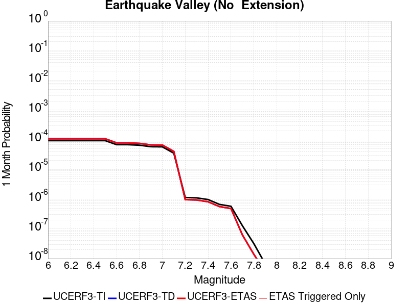 |  |  |

| Magnitude | 1 wk TI Prob | 1 wk TD Prob | 1 wk ETAS Prob | 1 wk ETAS/TD Gain | 1 wk ETAS Triggered Only | 1 mo TI Prob | 1 mo TD Prob | 1 mo ETAS Prob | 1 mo ETAS/TD Gain | 1 mo ETAS Triggered Only | 1 yr TI Prob | 1 yr TD Prob | 1 yr ETAS Prob | 1 yr ETAS/TD Gain | 1 yr ETAS Triggered Only | 10 yr TI Prob | 10 yr TD Prob | 10 yr ETAS Prob | 10 yr ETAS/TD Gain | 10 yr ETAS Triggered Only |
|-----|-----|-----|-----|-----|-----|-----|-----|-----|-----|-----|-----|-----|-----|-----|-----|-----|-----|-----|-----|-----|
| 6.0 | 2.1859703E-5 | 2.5198888E-5 | 2.5198888E-5 | 1.0 | 0.0 | 9.3681076E-5 | 1.0799158E-4 | 1.0799158E-4 | 1.0 | 0.0 | 0.0011399703 | 0.0013141495 | 0.0013346144 | 1.0155727 | 2.0491803E-5 | 0.011341401 | 0.013078143 | 0.013098367 | 1.0015464 | 2.0491803E-5 |
| 6.1 | 2.1859703E-5 | 2.5198888E-5 | 2.5198888E-5 | 1.0 | 0.0 | 9.3681076E-5 | 1.0799158E-4 | 1.0799158E-4 | 1.0 | 0.0 | 0.0011399703 | 0.0013141495 | 0.0013346144 | 1.0155727 | 2.0491803E-5 | 0.011341401 | 0.013078143 | 0.013098367 | 1.0015464 | 2.0491803E-5 |
| 6.2 | 2.1859703E-5 | 2.5198888E-5 | 2.5198888E-5 | 1.0 | 0.0 | 9.3681076E-5 | 1.0799158E-4 | 1.0799158E-4 | 1.0 | 0.0 | 0.0011399703 | 0.0013141495 | 0.0013346144 | 1.0155727 | 2.0491803E-5 | 0.011341401 | 0.013078143 | 0.013098367 | 1.0015464 | 2.0491803E-5 |
| 6.3 | 2.1859703E-5 | 2.5198888E-5 | 2.5198888E-5 | 1.0 | 0.0 | 9.3681076E-5 | 1.0799158E-4 | 1.0799158E-4 | 1.0 | 0.0 | 0.0011399703 | 0.0013141495 | 0.0013346144 | 1.0155727 | 2.0491803E-5 | 0.011341401 | 0.013078143 | 0.013098367 | 1.0015464 | 2.0491803E-5 |
| 6.4 | 2.1859703E-5 | 2.5198888E-5 | 2.5198888E-5 | 1.0 | 0.0 | 9.3681076E-5 | 1.0799158E-4 | 1.0799158E-4 | 1.0 | 0.0 | 0.0011399703 | 0.0013141495 | 0.0013346144 | 1.0155727 | 2.0491803E-5 | 0.011341401 | 0.013078143 | 0.013098367 | 1.0015464 | 2.0491803E-5 |
| 6.5 | 2.1859703E-5 | 2.5198888E-5 | 2.5198888E-5 | 1.0 | 0.0 | 9.3681076E-5 | 1.0799158E-4 | 1.0799158E-4 | 1.0 | 0.0 | 0.0011399703 | 0.0013141495 | 0.0013346144 | 1.0155727 | 2.0491803E-5 | 0.011341401 | 0.013078143 | 0.013098367 | 1.0015464 | 2.0491803E-5 |
| 6.6 | 1.597E-5 | 1.8356655E-5 | 1.8356655E-5 | 1.0 | 0.0 | 6.8441055E-5 | 7.86695E-5 | 7.86695E-5 | 1.0 | 0.0 | 8.329513E-4 | 9.574676E-4 | 9.574676E-4 | 1.0 | 0.0 | 0.008298361 | 0.009542032 | 0.009542032 | 1.0 | 0.0 |
| 6.7 | 1.597E-5 | 1.8356655E-5 | 1.8356655E-5 | 1.0 | 0.0 | 6.8441055E-5 | 7.86695E-5 | 7.86695E-5 | 1.0 | 0.0 | 8.329513E-4 | 9.574676E-4 | 9.574676E-4 | 1.0 | 0.0 | 0.008298361 | 0.009542032 | 0.009542032 | 1.0 | 0.0 |
| 6.8 | 1.5315149E-5 | 1.7602457E-5 | 1.7602457E-5 | 1.0 | 0.0 | 6.5634704E-5 | 7.5437405E-5 | 7.5437405E-5 | 1.0 | 0.0 | 7.988095E-4 | 9.181501E-4 | 9.181501E-4 | 1.0 | 0.0 | 0.007959441 | 0.009152108 | 0.009152108 | 1.0 | 0.0 |
| 6.9 | 1.3634728E-5 | 1.5676149E-5 | 1.5676149E-5 | 1.0 | 0.0 | 5.8433237E-5 | 6.718223E-5 | 6.718223E-5 | 1.0 | 0.0 | 7.1119244E-4 | 8.1771874E-4 | 8.1771874E-4 | 1.0 | 0.0 | 0.007089207 | 0.00815517 | 0.00815517 | 1.0 | 0.0 |
| 7.0 | 1.3496271E-5 | 1.5518177E-5 | 1.5518177E-5 | 1.0 | 0.0 | 5.783988E-5 | 6.650524E-5 | 6.650524E-5 | 1.0 | 0.0 | 7.03973E-4 | 8.094826E-4 | 8.094826E-4 | 1.0 | 0.0 | 0.007017471 | 0.008073409 | 0.008073409 | 1.0 | 0.0 |
| 7.1 | 8.242798E-6 | 9.472804E-6 | 9.472804E-6 | 1.0 | 0.0 | 3.53258E-5 | 4.0597475E-5 | 4.0597475E-5 | 1.0 | 0.0 | 4.300067E-4 | 4.9422926E-4 | 4.9422926E-4 | 1.0 | 0.0 | 0.004291756 | 0.004937878 | 0.004937878 | 1.0 | 0.0 |
| 7.2 | 2.6506527E-7 | 2.256113E-7 | 2.256113E-7 | 1.0 | 0.0 | 1.1359936E-6 | 9.669052E-7 | 9.669052E-7 | 1.0 | 0.0 | 1.3830633E-5 | 1.1772012E-5 | 1.1772012E-5 | 1.0 | 0.0 | 1.3829772E-4 | 1.177143E-4 | 1.177143E-4 | 1.0 | 0.0 |
| 7.3 | 2.5810488E-7 | 2.1956254E-7 | 2.1956254E-7 | 1.0 | 0.0 | 1.1061633E-6 | 9.40982E-7 | 9.40982E-7 | 1.0 | 0.0 | 1.3467455E-5 | 1.1456399E-5 | 1.1456399E-5 | 1.0 | 0.0 | 1.3466639E-4 | 1.145585E-4 | 1.145585E-4 | 1.0 | 0.0 |
| 7.4 | 2.2676066E-7 | 1.9111387E-7 | 1.9111387E-7 | 1.0 | 0.0 | 9.71831E-7 | 8.1905915E-7 | 8.1905915E-7 | 1.0 | 0.0 | 1.1831979E-5 | 9.972004E-6 | 9.972004E-6 | 1.0 | 0.0 | 1.1831349E-4 | 9.971595E-5 | 9.971595E-5 | 1.0 | 0.0 |
| 7.5 | 1.5553917E-7 | 1.3112768E-7 | 1.3112768E-7 | 1.0 | 0.0 | 6.6659624E-7 | 5.6197564E-7 | 5.6197564E-7 | 1.0 | 0.0 | 8.115779E-6 | 6.8420345E-6 | 6.8420345E-6 | 1.0 | 0.0 | 8.115482E-5 | 6.8418456E-5 | 6.8418456E-5 | 1.0 | 0.0 |
| 7.6 | 1.3448629E-7 | 1.1289034E-7 | 1.1289034E-7 | 1.0 | 0.0 | 5.7636964E-7 | 4.8381565E-7 | 4.8381565E-7 | 1.0 | 0.0 | 7.017278E-6 | 5.890442E-6 | 5.890442E-6 | 1.0 | 0.0 | 7.0170565E-5 | 5.890307E-5 | 5.890307E-5 | 1.0 | 0.0 |
| 7.7 | 2.9719402E-8 | 1.4582792E-8 | 1.4582792E-8 | 1.0 | 0.0 | 1.2736886E-7 | 6.2497676E-8 | 6.2497676E-8 | 1.0 | 0.0 | 1.5507147E-6 | 7.60909E-7 | 7.60909E-7 | 1.0 | 0.0 | 1.550704E-5 | 7.6090696E-6 | 7.6090696E-6 | 1.0 | 0.0 |
| 7.8 | 7.4390196E-9 | 3.2503715E-9 | 3.2503715E-9 | 1.0 | 0.0 | 3.1881513E-8 | 1.3930164E-8 | 1.3930164E-8 | 1.0 | 0.0 | 3.8815733E-7 | 1.6959973E-7 | 1.6959973E-7 | 1.0 | 0.0 | 3.8815665E-6 | 1.6959963E-6 | 1.6959963E-6 | 1.0 | 0.0 |
| 7.9 | 1.5373532E-9 | 8.4404506E-10 | 8.4404506E-10 | 1.0 | 0.0 | 6.5886567E-9 | 3.6173358E-9 | 3.6173358E-9 | 1.0 | 0.0 | 8.021689E-8 | 4.4041062E-8 | 4.4041062E-8 | 1.0 | 0.0 | 8.0216864E-7 | 4.4041062E-7 | 4.4041062E-7 | 1.0 | 0.0 |

## Santa Monica alt 1
*[(top)](#table-of-contents)*

| 1 Week | 1 Month | 1 Year | 10 Year |
|-----|-----|-----|-----|
|  |  |  |  |

| Magnitude | 1 wk TI Prob | 1 wk TD Prob | 1 wk ETAS Prob | 1 wk ETAS/TD Gain | 1 wk ETAS Triggered Only | 1 mo TI Prob | 1 mo TD Prob | 1 mo ETAS Prob | 1 mo ETAS/TD Gain | 1 mo ETAS Triggered Only | 1 yr TI Prob | 1 yr TD Prob | 1 yr ETAS Prob | 1 yr ETAS/TD Gain | 1 yr ETAS Triggered Only | 10 yr TI Prob | 10 yr TD Prob | 10 yr ETAS Prob | 10 yr ETAS/TD Gain | 10 yr ETAS Triggered Only |
|-----|-----|-----|-----|-----|-----|-----|-----|-----|-----|-----|-----|-----|-----|-----|-----|-----|-----|-----|-----|-----|
| 6.0 | 1.1066008E-5 | 1.1480435E-5 | 1.1480435E-5 | 1.0 | 0.0 | 4.742488E-5 | 4.920102E-5 | 6.9691814E-5 | 1.416471 | 2.0491803E-5 | 5.7724497E-4 | 5.988717E-4 | 6.193512E-4 | 1.0341969 | 2.0491803E-5 | 0.005757478 | 0.0059739654 | 0.005994335 | 1.0034097 | 2.0491803E-5 |
| 6.1 | 1.1066008E-5 | 1.1480435E-5 | 1.1480435E-5 | 1.0 | 0.0 | 4.742488E-5 | 4.920102E-5 | 6.9691814E-5 | 1.416471 | 2.0491803E-5 | 5.7724497E-4 | 5.988717E-4 | 6.193512E-4 | 1.0341969 | 2.0491803E-5 | 0.005757478 | 0.0059739654 | 0.005994335 | 1.0034097 | 2.0491803E-5 |
| 6.2 | 1.1066008E-5 | 1.1480435E-5 | 1.1480435E-5 | 1.0 | 0.0 | 4.742488E-5 | 4.920102E-5 | 6.9691814E-5 | 1.416471 | 2.0491803E-5 | 5.7724497E-4 | 5.988717E-4 | 6.193512E-4 | 1.0341969 | 2.0491803E-5 | 0.005757478 | 0.0059739654 | 0.005994335 | 1.0034097 | 2.0491803E-5 |
| 6.3 | 1.1066008E-5 | 1.1480435E-5 | 1.1480435E-5 | 1.0 | 0.0 | 4.742488E-5 | 4.920102E-5 | 6.9691814E-5 | 1.416471 | 2.0491803E-5 | 5.7724497E-4 | 5.988717E-4 | 6.193512E-4 | 1.0341969 | 2.0491803E-5 | 0.005757478 | 0.0059739654 | 0.005994335 | 1.0034097 | 2.0491803E-5 |
| 6.4 | 1.1066008E-5 | 1.1480435E-5 | 1.1480435E-5 | 1.0 | 0.0 | 4.742488E-5 | 4.920102E-5 | 6.9691814E-5 | 1.416471 | 2.0491803E-5 | 5.7724497E-4 | 5.988717E-4 | 6.193512E-4 | 1.0341969 | 2.0491803E-5 | 0.005757478 | 0.0059739654 | 0.005994335 | 1.0034097 | 2.0491803E-5 |
| 6.5 | 8.183544E-6 | 8.335519E-6 | 8.335519E-6 | 1.0 | 0.0 | 3.5071862E-5 | 3.5723173E-5 | 5.6214245E-5 | 1.5736073 | 2.0491803E-5 | 4.2691626E-4 | 4.348444E-4 | 4.553273E-4 | 1.047104 | 2.0491803E-5 | 0.0042609703 | 0.004340101 | 0.004360504 | 1.004701 | 2.0491803E-5 |
| 6.6 | 8.1543285E-6 | 8.303733E-6 | 8.303733E-6 | 1.0 | 0.0 | 3.4946657E-5 | 3.558695E-5 | 5.6078024E-5 | 1.575803 | 2.0491803E-5 | 4.2539247E-4 | 4.3318656E-4 | 4.536695E-4 | 1.0472844 | 2.0491803E-5 | 0.0042457907 | 0.0043235873 | 0.0043439902 | 1.004719 | 2.0491803E-5 |
| 6.7 | 8.110878E-6 | 8.257129E-6 | 8.257129E-6 | 1.0 | 0.0 | 3.4760444E-5 | 3.5387224E-5 | 5.5878303E-5 | 1.579053 | 2.0491803E-5 | 4.231262E-4 | 4.3075587E-4 | 4.5123886E-4 | 1.0475513 | 2.0491803E-5 | 0.0042232145 | 0.0042993743 | 0.004319778 | 1.0047457 | 2.0491803E-5 |
| 6.8 | 7.644036E-6 | 7.751141E-6 | 7.751141E-6 | 1.0 | 0.0 | 3.275974E-5 | 3.3218763E-5 | 5.3709886E-5 | 1.6168538 | 2.0491803E-5 | 3.9877684E-4 | 4.0436478E-4 | 4.2484832E-4 | 1.0506561 | 2.0491803E-5 | 0.00398062 | 0.0040364363 | 0.004056846 | 1.0050563 | 2.0491803E-5 |
| 6.9 | 7.3698293E-6 | 7.455797E-6 | 7.455797E-6 | 1.0 | 0.0 | 3.15846E-5 | 3.1953034E-5 | 5.2444182E-5 | 1.6412896 | 2.0491803E-5 | 3.8447464E-4 | 3.8896012E-4 | 4.0944395E-4 | 1.0526631 | 2.0491803E-5 | 0.0038381014 | 0.003882937 | 0.0039033492 | 1.0052569 | 2.0491803E-5 |
| 7.0 | 7.209872E-6 | 7.285702E-6 | 7.285702E-6 | 1.0 | 0.0 | 3.0899086E-5 | 3.1224074E-5 | 5.1715237E-5 | 1.6562617 | 2.0491803E-5 | 3.7613141E-4 | 3.8008817E-4 | 4.0057217E-4 | 1.0538929 | 2.0491803E-5 | 0.0037549543 | 0.0037945234 | 0.0038149375 | 1.0053799 | 2.0491803E-5 |
| 7.1 | 5.603456E-6 | 5.523946E-6 | 5.523946E-6 | 1.0 | 0.0 | 2.4014591E-5 | 2.3673843E-5 | 2.3673843E-5 | 1.0 | 0.0 | 2.923384E-4 | 2.881913E-4 | 2.881913E-4 | 1.0 | 0.0 | 0.0029195412 | 0.0028782175 | 0.0028782175 | 1.0 | 0.0 |
| 7.2 | 4.7483613E-6 | 4.591175E-6 | 4.591175E-6 | 1.0 | 0.0 | 2.0349962E-5 | 1.9676318E-5 | 1.9676318E-5 | 1.0 | 0.0 | 2.4773262E-4 | 2.3953296E-4 | 2.3953296E-4 | 1.0 | 0.0 | 0.0024745662 | 0.0023927619 | 0.0023927619 | 1.0 | 0.0 |
| 7.3 | 3.829015E-6 | 3.6342587E-6 | 3.6342587E-6 | 1.0 | 0.0 | 1.6409962E-5 | 1.5575302E-5 | 1.5575302E-5 | 1.0 | 0.0 | 1.9977297E-4 | 1.8961288E-4 | 1.8961288E-4 | 1.0 | 0.0 | 0.0019959346 | 0.0018945198 | 0.0018945198 | 1.0 | 0.0 |
| 7.4 | 2.610755E-6 | 2.499595E-6 | 2.499595E-6 | 1.0 | 0.0 | 1.1188902E-5 | 1.0712507E-5 | 1.0712507E-5 | 1.0 | 0.0 | 1.3621636E-4 | 1.30417E-4 | 1.30417E-4 | 1.0 | 0.0 | 0.001361329 | 0.0013034091 | 0.0013034091 | 1.0 | 0.0 |
| 7.5 | 1.792146E-6 | 1.7584358E-6 | 1.7584358E-6 | 1.0 | 0.0 | 7.680603E-6 | 7.5361318E-6 | 7.5361318E-6 | 1.0 | 0.0 | 9.3507326E-5 | 9.1748574E-5 | 9.1748574E-5 | 1.0 | 0.0 | 9.3467993E-4 | 9.171101E-4 | 9.171101E-4 | 1.0 | 0.0 |
| 7.6 | 1.1473018E-6 | 1.1029267E-6 | 1.1029267E-6 | 1.0 | 0.0 | 4.9169985E-6 | 4.7268204E-6 | 4.7268204E-6 | 1.0 | 0.0 | 5.986281E-5 | 5.7547535E-5 | 5.7547535E-5 | 1.0 | 0.0 | 5.984669E-4 | 5.7532795E-4 | 5.7532795E-4 | 1.0 | 0.0 |
| 7.7 | 5.330919E-7 | 4.74532E-7 | 4.74532E-7 | 1.0 | 0.0 | 2.2846775E-6 | 2.033707E-6 | 2.033707E-6 | 1.0 | 0.0 | 2.7815593E-5 | 2.4760113E-5 | 2.4760113E-5 | 1.0 | 0.0 | 2.7812112E-4 | 2.4757467E-4 | 2.4757467E-4 | 1.0 | 0.0 |
| 7.8 | 1.1668574E-7 | 8.2969436E-8 | 8.2969436E-8 | 1.0 | 0.0 | 5.000816E-7 | 3.5558327E-7 | 3.5558327E-7 | 1.0 | 0.0 | 6.0884768E-6 | 4.329218E-6 | 4.329218E-6 | 1.0 | 0.0 | 6.08831E-5 | 4.3291366E-5 | 4.3291366E-5 | 1.0 | 0.0 |
| 7.9 | 8.007447E-10 | 6.160915E-10 | 6.160915E-10 | 1.0 | 0.0 | 3.4317629E-9 | 2.6403923E-9 | 2.6403923E-9 | 1.0 | 0.0 | 4.1781714E-8 | 3.2146776E-8 | 3.2146776E-8 | 1.0 | 0.0 | 4.1781706E-7 | 3.2146772E-7 | 3.2146772E-7 | 1.0 | 0.0 |

## Pitas Point (Lower)-Montalvo
*[(top)](#table-of-contents)*

| 1 Week | 1 Month | 1 Year | 10 Year |
|-----|-----|-----|-----|
|  | 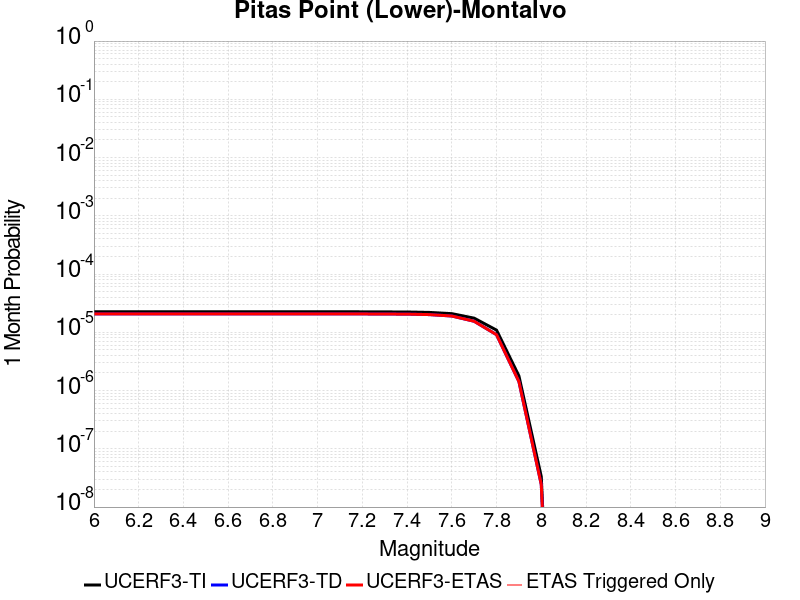 |  |  |

| Magnitude | 1 wk TI Prob | 1 wk TD Prob | 1 wk ETAS Prob | 1 wk ETAS/TD Gain | 1 wk ETAS Triggered Only | 1 mo TI Prob | 1 mo TD Prob | 1 mo ETAS Prob | 1 mo ETAS/TD Gain | 1 mo ETAS Triggered Only | 1 yr TI Prob | 1 yr TD Prob | 1 yr ETAS Prob | 1 yr ETAS/TD Gain | 1 yr ETAS Triggered Only | 10 yr TI Prob | 10 yr TD Prob | 10 yr ETAS Prob | 10 yr ETAS/TD Gain | 10 yr ETAS Triggered Only |
|-----|-----|-----|-----|-----|-----|-----|-----|-----|-----|-----|-----|-----|-----|-----|-----|-----|-----|-----|-----|-----|
| 6.0 | 5.2543637E-6 | 4.8379093E-6 | 4.8379093E-6 | 1.0 | 0.0 | 2.2518509E-5 | 2.0733734E-5 | 2.0733734E-5 | 1.0 | 0.0 | 2.7412834E-4 | 2.5240428E-4 | 2.5240428E-4 | 1.0 | 0.0 | 0.0027379042 | 0.0025212085 | 0.0025416487 | 1.0081073 | 2.0491803E-5 |
| 6.1 | 5.2543637E-6 | 4.8379093E-6 | 4.8379093E-6 | 1.0 | 0.0 | 2.2518509E-5 | 2.0733734E-5 | 2.0733734E-5 | 1.0 | 0.0 | 2.7412834E-4 | 2.5240428E-4 | 2.5240428E-4 | 1.0 | 0.0 | 0.0027379042 | 0.0025212085 | 0.0025416487 | 1.0081073 | 2.0491803E-5 |
| 6.2 | 5.2543637E-6 | 4.8379093E-6 | 4.8379093E-6 | 1.0 | 0.0 | 2.2518509E-5 | 2.0733734E-5 | 2.0733734E-5 | 1.0 | 0.0 | 2.7412834E-4 | 2.5240428E-4 | 2.5240428E-4 | 1.0 | 0.0 | 0.0027379042 | 0.0025212085 | 0.0025416487 | 1.0081073 | 2.0491803E-5 |
| 6.3 | 5.2543637E-6 | 4.8379093E-6 | 4.8379093E-6 | 1.0 | 0.0 | 2.2518509E-5 | 2.0733734E-5 | 2.0733734E-5 | 1.0 | 0.0 | 2.7412834E-4 | 2.5240428E-4 | 2.5240428E-4 | 1.0 | 0.0 | 0.0027379042 | 0.0025212085 | 0.0025416487 | 1.0081073 | 2.0491803E-5 |
| 6.4 | 5.2543637E-6 | 4.8379093E-6 | 4.8379093E-6 | 1.0 | 0.0 | 2.2518509E-5 | 2.0733734E-5 | 2.0733734E-5 | 1.0 | 0.0 | 2.7412834E-4 | 2.5240428E-4 | 2.5240428E-4 | 1.0 | 0.0 | 0.0027379042 | 0.0025212085 | 0.0025416487 | 1.0081073 | 2.0491803E-5 |
| 6.5 | 5.2543637E-6 | 4.8379093E-6 | 4.8379093E-6 | 1.0 | 0.0 | 2.2518509E-5 | 2.0733734E-5 | 2.0733734E-5 | 1.0 | 0.0 | 2.7412834E-4 | 2.5240428E-4 | 2.5240428E-4 | 1.0 | 0.0 | 0.0027379042 | 0.0025212085 | 0.0025416487 | 1.0081073 | 2.0491803E-5 |
| 6.6 | 5.2543637E-6 | 4.8379093E-6 | 4.8379093E-6 | 1.0 | 0.0 | 2.2518509E-5 | 2.0733734E-5 | 2.0733734E-5 | 1.0 | 0.0 | 2.7412834E-4 | 2.5240428E-4 | 2.5240428E-4 | 1.0 | 0.0 | 0.0027379042 | 0.0025212085 | 0.0025416487 | 1.0081073 | 2.0491803E-5 |
| 6.7 | 5.2543637E-6 | 4.8379093E-6 | 4.8379093E-6 | 1.0 | 0.0 | 2.2518509E-5 | 2.0733734E-5 | 2.0733734E-5 | 1.0 | 0.0 | 2.7412834E-4 | 2.5240428E-4 | 2.5240428E-4 | 1.0 | 0.0 | 0.0027379042 | 0.0025212085 | 0.0025416487 | 1.0081073 | 2.0491803E-5 |
| 6.8 | 5.2543637E-6 | 4.8379093E-6 | 4.8379093E-6 | 1.0 | 0.0 | 2.2518509E-5 | 2.0733734E-5 | 2.0733734E-5 | 1.0 | 0.0 | 2.7412834E-4 | 2.5240428E-4 | 2.5240428E-4 | 1.0 | 0.0 | 0.0027379042 | 0.0025212085 | 0.0025416487 | 1.0081073 | 2.0491803E-5 |
| 6.9 | 5.2543637E-6 | 4.8379093E-6 | 4.8379093E-6 | 1.0 | 0.0 | 2.2518509E-5 | 2.0733734E-5 | 2.0733734E-5 | 1.0 | 0.0 | 2.7412834E-4 | 2.5240428E-4 | 2.5240428E-4 | 1.0 | 0.0 | 0.0027379042 | 0.0025212085 | 0.0025416487 | 1.0081073 | 2.0491803E-5 |
| 7.0 | 5.2543637E-6 | 4.8379093E-6 | 4.8379093E-6 | 1.0 | 0.0 | 2.2518509E-5 | 2.0733734E-5 | 2.0733734E-5 | 1.0 | 0.0 | 2.7412834E-4 | 2.5240428E-4 | 2.5240428E-4 | 1.0 | 0.0 | 0.0027379042 | 0.0025212085 | 0.0025416487 | 1.0081073 | 2.0491803E-5 |
| 7.1 | 5.2543637E-6 | 4.8379093E-6 | 4.8379093E-6 | 1.0 | 0.0 | 2.2518509E-5 | 2.0733734E-5 | 2.0733734E-5 | 1.0 | 0.0 | 2.7412834E-4 | 2.5240428E-4 | 2.5240428E-4 | 1.0 | 0.0 | 0.0027379042 | 0.0025212085 | 0.0025416487 | 1.0081073 | 2.0491803E-5 |
| 7.2 | 5.2458695E-6 | 4.829063E-6 | 4.829063E-6 | 1.0 | 0.0 | 2.2482105E-5 | 2.0695821E-5 | 2.0695821E-5 | 1.0 | 0.0 | 2.7368523E-4 | 2.519428E-4 | 2.519428E-4 | 1.0 | 0.0 | 0.0027334841 | 0.0025166043 | 0.0025370445 | 1.0081222 | 2.0491803E-5 |
| 7.3 | 5.22665E-6 | 4.80898E-6 | 4.80898E-6 | 1.0 | 0.0 | 2.2399736E-5 | 2.0609754E-5 | 2.0609754E-5 | 1.0 | 0.0 | 2.7268266E-4 | 2.508952E-4 | 2.508952E-4 | 1.0 | 0.0 | 0.002723483 | 0.0025061516 | 0.0025265922 | 1.0081561 | 2.0491803E-5 |
| 7.4 | 5.210642E-6 | 4.7921926E-6 | 4.7921926E-6 | 1.0 | 0.0 | 2.233113E-5 | 2.0537807E-5 | 2.0537807E-5 | 1.0 | 0.0 | 2.718476E-4 | 2.5001942E-4 | 2.5001942E-4 | 1.0 | 0.0 | 0.002715153 | 0.002497414 | 0.0025178546 | 1.0081847 | 2.0491803E-5 |
| 7.5 | 5.1226016E-6 | 4.7000785E-6 | 4.7000785E-6 | 1.0 | 0.0 | 2.1953823E-5 | 2.014304E-5 | 2.014304E-5 | 1.0 | 0.0 | 2.67255E-4 | 2.452142E-4 | 2.452142E-4 | 1.0 | 0.0 | 0.0026693381 | 0.002449468 | 0.0024699096 | 1.0083454 | 2.0491803E-5 |
| 7.6 | 4.8796987E-6 | 4.4449766E-6 | 4.4449766E-6 | 1.0 | 0.0 | 2.0912828E-5 | 1.9049763E-5 | 1.9049763E-5 | 1.0 | 0.0 | 2.5458392E-4 | 2.3190647E-4 | 2.3190647E-4 | 1.0 | 0.0 | 0.0025429246 | 0.0023166754 | 0.0023166754 | 1.0 | 0.0 |
| 7.7 | 4.0834398E-6 | 3.6091424E-6 | 3.6091424E-6 | 1.0 | 0.0 | 1.7500339E-5 | 1.5467662E-5 | 1.5467662E-5 | 1.0 | 0.0 | 2.1304579E-4 | 1.8830276E-4 | 1.8830276E-4 | 1.0 | 0.0 | 0.0021284167 | 0.0018814557 | 0.0018814557 | 1.0 | 0.0 |
| 7.8 | 2.5445438E-6 | 2.1212452E-6 | 2.1212452E-6 | 1.0 | 0.0 | 1.0905142E-5 | 9.09102E-6 | 9.09102E-6 | 1.0 | 0.0 | 1.3276201E-4 | 1.1067759E-4 | 1.1067759E-4 | 1.0 | 0.0 | 0.0013268272 | 0.0011062294 | 0.0011062294 | 1.0 | 0.0 |
| 7.9 | 4.1677114E-7 | 3.3293983E-7 | 3.3293983E-7 | 1.0 | 0.0 | 1.7861609E-6 | 1.4268842E-6 | 1.4268842E-6 | 1.0 | 0.0 | 2.1746291E-5 | 1.737218E-5 | 1.737218E-5 | 1.0 | 0.0 | 2.1744163E-4 | 1.7370853E-4 | 1.7370853E-4 | 1.0 | 0.0 |
| 8.0 | 7.791402E-9 | 5.683553E-9 | 5.683553E-9 | 1.0 | 0.0 | 3.3391725E-8 | 2.4358085E-8 | 2.4358085E-8 | 1.0 | 0.0 | 4.0654416E-7 | 2.9655968E-7 | 2.9655968E-7 | 1.0 | 0.0 | 4.065434E-6 | 2.9655946E-6 | 2.9655946E-6 | 1.0 | 0.0 |

## Yorba Linda
*[(top)](#table-of-contents)*

| 1 Week | 1 Month | 1 Year | 10 Year |
|-----|-----|-----|-----|
|  |  |  |  |

| Magnitude | 1 wk TI Prob | 1 wk TD Prob | 1 wk ETAS Prob | 1 wk ETAS/TD Gain | 1 wk ETAS Triggered Only | 1 mo TI Prob | 1 mo TD Prob | 1 mo ETAS Prob | 1 mo ETAS/TD Gain | 1 mo ETAS Triggered Only | 1 yr TI Prob | 1 yr TD Prob | 1 yr ETAS Prob | 1 yr ETAS/TD Gain | 1 yr ETAS Triggered Only | 10 yr TI Prob | 10 yr TD Prob | 10 yr ETAS Prob | 10 yr ETAS/TD Gain | 10 yr ETAS Triggered Only |
|-----|-----|-----|-----|-----|-----|-----|-----|-----|-----|-----|-----|-----|-----|-----|-----|-----|-----|-----|-----|-----|
| 6.0 | 1.9346849E-6 | 1.6909353E-6 | 1.6909353E-6 | 1.0 | 0.0 | 8.29148E-6 | 7.2468506E-6 | 7.2468506E-6 | 1.0 | 0.0 | 1.009441E-4 | 8.822778E-5 | 1.0871778E-4 | 1.2322397 | 2.0491803E-5 | 0.0010089825 | 8.820206E-4 | 9.0249436E-4 | 1.0232123 | 2.0491803E-5 |
| 6.1 | 1.9346849E-6 | 1.6909353E-6 | 1.6909353E-6 | 1.0 | 0.0 | 8.29148E-6 | 7.2468506E-6 | 7.2468506E-6 | 1.0 | 0.0 | 1.009441E-4 | 8.822778E-5 | 1.0871778E-4 | 1.2322397 | 2.0491803E-5 | 0.0010089825 | 8.820206E-4 | 9.0249436E-4 | 1.0232123 | 2.0491803E-5 |
| 6.2 | 1.9346849E-6 | 1.6909353E-6 | 1.6909353E-6 | 1.0 | 0.0 | 8.29148E-6 | 7.2468506E-6 | 7.2468506E-6 | 1.0 | 0.0 | 1.009441E-4 | 8.822778E-5 | 1.0871778E-4 | 1.2322397 | 2.0491803E-5 | 0.0010089825 | 8.820206E-4 | 9.0249436E-4 | 1.0232123 | 2.0491803E-5 |
| 6.3 | 1.1028608E-6 | 8.482089E-7 | 8.482089E-7 | 1.0 | 0.0 | 4.7265376E-6 | 3.6351764E-6 | 3.6351764E-6 | 1.0 | 0.0 | 5.754407E-5 | 4.4257442E-5 | 4.4257442E-5 | 1.0 | 0.0 | 5.7529175E-4 | 4.424928E-4 | 4.424928E-4 | 1.0 | 0.0 |
| 6.4 | 1.1028608E-6 | 8.482089E-7 | 8.482089E-7 | 1.0 | 0.0 | 4.7265376E-6 | 3.6351764E-6 | 3.6351764E-6 | 1.0 | 0.0 | 5.754407E-5 | 4.4257442E-5 | 4.4257442E-5 | 1.0 | 0.0 | 5.7529175E-4 | 4.424928E-4 | 4.424928E-4 | 1.0 | 0.0 |
| 6.5 | 8.4451364E-7 | 5.869332E-7 | 5.869332E-7 | 1.0 | 0.0 | 3.619339E-6 | 2.5154256E-6 | 2.5154256E-6 | 1.0 | 0.0 | 4.406456E-5 | 3.06249E-5 | 3.06249E-5 | 1.0 | 0.0 | 4.4055824E-4 | 3.062089E-4 | 3.062089E-4 | 1.0 | 0.0 |
| 6.6 | 8.422957E-7 | 5.8448654E-7 | 5.8448654E-7 | 1.0 | 0.0 | 3.6098338E-6 | 2.50494E-6 | 2.50494E-6 | 1.0 | 0.0 | 4.3948843E-5 | 3.0497242E-5 | 3.0497242E-5 | 1.0 | 0.0 | 4.394015E-4 | 3.049327E-4 | 3.049327E-4 | 1.0 | 0.0 |
| 6.7 | 8.4119705E-7 | 5.832708E-7 | 5.832708E-7 | 1.0 | 0.0 | 3.6051254E-6 | 2.4997296E-6 | 2.4997296E-6 | 1.0 | 0.0 | 4.3891516E-5 | 3.0433805E-5 | 3.0433805E-5 | 1.0 | 0.0 | 4.388285E-4 | 3.042985E-4 | 3.042985E-4 | 1.0 | 0.0 |
| 6.8 | 7.5919155E-7 | 4.995215E-7 | 4.995215E-7 | 1.0 | 0.0 | 3.253674E-6 | 2.1408048E-6 | 2.1408048E-6 | 1.0 | 0.0 | 3.961276E-5 | 2.6064004E-5 | 2.6064004E-5 | 1.0 | 0.0 | 3.9605703E-4 | 2.6061118E-4 | 2.6061118E-4 | 1.0 | 0.0 |
| 6.9 | 7.5804564E-7 | 4.9813985E-7 | 4.9813985E-7 | 1.0 | 0.0 | 3.248763E-6 | 2.1348835E-6 | 2.1348835E-6 | 1.0 | 0.0 | 3.955297E-5 | 2.5991914E-5 | 2.5991914E-5 | 1.0 | 0.0 | 3.9545933E-4 | 2.5989045E-4 | 2.5989045E-4 | 1.0 | 0.0 |
| 7.0 | 7.539293E-7 | 4.9435334E-7 | 4.9435334E-7 | 1.0 | 0.0 | 3.2311218E-6 | 2.1186554E-6 | 2.1186554E-6 | 1.0 | 0.0 | 3.9338196E-5 | 2.5794343E-5 | 2.5794343E-5 | 1.0 | 0.0 | 3.9331234E-4 | 2.579152E-4 | 2.579152E-4 | 1.0 | 0.0 |
| 7.1 | 6.0900885E-7 | 3.7819254E-7 | 3.7819254E-7 | 1.0 | 0.0 | 2.6100352E-6 | 1.6208243E-6 | 1.6208243E-6 | 1.0 | 0.0 | 3.1776715E-5 | 1.973336E-5 | 1.973336E-5 | 1.0 | 0.0 | 3.1772171E-4 | 1.9731643E-4 | 1.9731643E-4 | 1.0 | 0.0 |
| 7.2 | 5.849925E-7 | 3.5880925E-7 | 3.5880925E-7 | 1.0 | 0.0 | 2.5071083E-6 | 1.5377531E-6 | 1.5377531E-6 | 1.0 | 0.0 | 3.0523614E-5 | 1.8721987E-5 | 1.8721987E-5 | 1.0 | 0.0 | 3.0519423E-4 | 1.8720442E-4 | 1.8720442E-4 | 1.0 | 0.0 |
| 7.3 | 4.89808E-7 | 3.0381156E-7 | 3.0381156E-7 | 1.0 | 0.0 | 2.0991754E-6 | 1.3020489E-6 | 1.3020489E-6 | 1.0 | 0.0 | 2.5557161E-5 | 1.5852333E-5 | 1.5852333E-5 | 1.0 | 0.0 | 2.5554223E-4 | 1.5851225E-4 | 1.5851225E-4 | 1.0 | 0.0 |
| 7.4 | 3.8700415E-7 | 2.4723562E-7 | 2.4723562E-7 | 1.0 | 0.0 | 1.6585881E-6 | 1.0595808E-6 | 1.0595808E-6 | 1.0 | 0.0 | 2.0193123E-5 | 1.2900321E-5 | 1.2900321E-5 | 1.0 | 0.0 | 2.0191289E-4 | 1.2899585E-4 | 1.2899585E-4 | 1.0 | 0.0 |
| 7.5 | 2.900565E-7 | 1.8638156E-7 | 1.8638156E-7 | 1.0 | 0.0 | 1.2430987E-6 | 7.987778E-7 | 7.987778E-7 | 1.0 | 0.0 | 1.5134622E-5 | 9.725078E-6 | 9.725078E-6 | 1.0 | 0.0 | 1.5133592E-4 | 9.72466E-5 | 9.72466E-5 | 1.0 | 0.0 |
| 7.6 | 2.2770318E-7 | 1.4814714E-7 | 1.4814714E-7 | 1.0 | 0.0 | 9.758704E-7 | 6.3491615E-7 | 6.3491615E-7 | 1.0 | 0.0 | 1.1881158E-5 | 7.730077E-6 | 7.730077E-6 | 1.0 | 0.0 | 1.1880523E-4 | 7.729814E-5 | 7.729814E-5 | 1.0 | 0.0 |
| 7.7 | 1.5017194E-7 | 8.735904E-8 | 8.735904E-8 | 1.0 | 0.0 | 6.4359386E-7 | 3.7439585E-7 | 3.7439585E-7 | 1.0 | 0.0 | 7.835727E-6 | 4.55826E-6 | 4.55826E-6 | 1.0 | 0.0 | 7.835451E-5 | 4.558169E-5 | 4.558169E-5 | 1.0 | 0.0 |
| 7.8 | 3.895753E-8 | 1.8534175E-8 | 1.8534175E-8 | 1.0 | 0.0 | 1.6696083E-7 | 7.9432176E-8 | 7.9432176E-8 | 1.0 | 0.0 | 2.0327461E-6 | 9.670864E-7 | 9.670864E-7 | 1.0 | 0.0 | 2.0327276E-5 | 9.670824E-6 | 9.670824E-6 | 1.0 | 0.0 |
| 7.9 | 6.648505E-9 | 3.4185708E-9 | 3.4185708E-9 | 1.0 | 0.0 | 2.8493591E-8 | 1.4651016E-8 | 1.4651016E-8 | 1.0 | 0.0 | 3.4690942E-7 | 1.7837611E-7 | 1.7837611E-7 | 1.0 | 0.0 | 3.4690888E-6 | 1.7837599E-6 | 1.7837599E-6 | 1.0 | 0.0 |

## Dog Valley
*[(top)](#table-of-contents)*

| 1 Week | 1 Month | 1 Year | 10 Year |
|-----|-----|-----|-----|
|  |  | 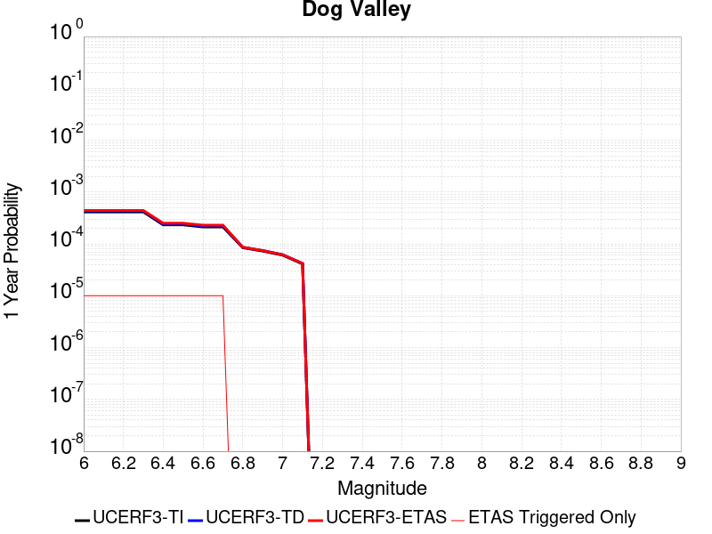 |  |

| Magnitude | 1 wk TI Prob | 1 wk TD Prob | 1 wk ETAS Prob | 1 wk ETAS/TD Gain | 1 wk ETAS Triggered Only | 1 mo TI Prob | 1 mo TD Prob | 1 mo ETAS Prob | 1 mo ETAS/TD Gain | 1 mo ETAS Triggered Only | 1 yr TI Prob | 1 yr TD Prob | 1 yr ETAS Prob | 1 yr ETAS/TD Gain | 1 yr ETAS Triggered Only | 10 yr TI Prob | 10 yr TD Prob | 10 yr ETAS Prob | 10 yr ETAS/TD Gain | 10 yr ETAS Triggered Only |
|-----|-----|-----|-----|-----|-----|-----|-----|-----|-----|-----|-----|-----|-----|-----|-----|-----|-----|-----|-----|-----|
| 6.0 | 7.949598E-6 | 8.275771E-6 | 8.275771E-6 | 1.0 | 0.0 | 3.4069257E-5 | 3.546722E-5 | 5.5958295E-5 | 1.577747 | 2.0491803E-5 | 4.1471425E-4 | 4.3174747E-4 | 4.5223042E-4 | 1.047442 | 2.0491803E-5 | 0.0041394117 | 0.0043110168 | 0.00433142 | 1.0047328 | 2.0491803E-5 |
| 6.1 | 7.949598E-6 | 8.275771E-6 | 8.275771E-6 | 1.0 | 0.0 | 3.4069257E-5 | 3.546722E-5 | 5.5958295E-5 | 1.577747 | 2.0491803E-5 | 4.1471425E-4 | 4.3174747E-4 | 4.5223042E-4 | 1.047442 | 2.0491803E-5 | 0.0041394117 | 0.0043110168 | 0.00433142 | 1.0047328 | 2.0491803E-5 |
| 6.2 | 7.949598E-6 | 8.275771E-6 | 8.275771E-6 | 1.0 | 0.0 | 3.4069257E-5 | 3.546722E-5 | 5.5958295E-5 | 1.577747 | 2.0491803E-5 | 4.1471425E-4 | 4.3174747E-4 | 4.5223042E-4 | 1.047442 | 2.0491803E-5 | 0.0041394117 | 0.0043110168 | 0.00433142 | 1.0047328 | 2.0491803E-5 |
| 6.3 | 7.949598E-6 | 8.275771E-6 | 8.275771E-6 | 1.0 | 0.0 | 3.4069257E-5 | 3.546722E-5 | 5.5958295E-5 | 1.577747 | 2.0491803E-5 | 4.1471425E-4 | 4.3174747E-4 | 4.5223042E-4 | 1.047442 | 2.0491803E-5 | 0.0041394117 | 0.0043110168 | 0.00433142 | 1.0047328 | 2.0491803E-5 |
| 6.4 | 4.462132E-6 | 4.623185E-6 | 4.623185E-6 | 1.0 | 0.0 | 1.9123283E-5 | 1.981355E-5 | 4.0304945E-5 | 2.0342114 | 2.0491803E-5 | 2.328011E-4 | 2.412122E-4 | 2.6169905E-4 | 1.0849329 | 2.0491803E-5 | 0.0023255737 | 0.002410381 | 0.0024308234 | 1.008481 | 2.0491803E-5 |
| 6.5 | 4.462132E-6 | 4.623185E-6 | 4.623185E-6 | 1.0 | 0.0 | 1.9123283E-5 | 1.981355E-5 | 4.0304945E-5 | 2.0342114 | 2.0491803E-5 | 2.328011E-4 | 2.412122E-4 | 2.6169905E-4 | 1.0849329 | 2.0491803E-5 | 0.0023255737 | 0.002410381 | 0.0024308234 | 1.008481 | 2.0491803E-5 |
| 6.6 | 4.074213E-6 | 4.217395E-6 | 4.217395E-6 | 1.0 | 0.0 | 1.7460794E-5 | 1.8074476E-5 | 3.8565908E-5 | 2.133722 | 2.0491803E-5 | 2.1256444E-4 | 2.200433E-4 | 2.405306E-4 | 1.0931058 | 2.0491803E-5 | 0.0021236122 | 0.002199116 | 0.0022195627 | 1.0092977 | 2.0491803E-5 |
| 6.7 | 4.074213E-6 | 4.217395E-6 | 4.217395E-6 | 1.0 | 0.0 | 1.7460794E-5 | 1.8074476E-5 | 3.8565908E-5 | 2.133722 | 2.0491803E-5 | 2.1256444E-4 | 2.200433E-4 | 2.405306E-4 | 1.0931058 | 2.0491803E-5 | 0.0021236122 | 0.002199116 | 0.0022195627 | 1.0092977 | 2.0491803E-5 |
| 6.8 | 1.6159543E-6 | 1.6503452E-6 | 1.6503452E-6 | 1.0 | 0.0 | 6.9255E-6 | 7.072892E-6 | 7.072892E-6 | 1.0 | 0.0 | 8.43147E-5 | 8.610961E-5 | 8.610961E-5 | 1.0 | 0.0 | 8.4282714E-4 | 8.608167E-4 | 8.608167E-4 | 1.0 | 0.0 |
| 6.9 | 1.3952654E-6 | 1.4252917E-6 | 1.4252917E-6 | 1.0 | 0.0 | 5.9796953E-6 | 6.108381E-6 | 6.108381E-6 | 1.0 | 0.0 | 7.280036E-5 | 7.436749E-5 | 7.436749E-5 | 1.0 | 0.0 | 7.2776515E-4 | 7.4347405E-4 | 7.4347405E-4 | 1.0 | 0.0 |
| 7.0 | 1.1619308E-6 | 1.1869561E-6 | 1.1869561E-6 | 1.0 | 0.0 | 4.979694E-6 | 5.086947E-6 | 5.086947E-6 | 1.0 | 0.0 | 6.0626087E-5 | 6.193227E-5 | 6.193227E-5 | 1.0 | 0.0 | 6.060955E-4 | 6.191938E-4 | 6.191938E-4 | 1.0 | 0.0 |
| 7.1 | 7.8723247E-7 | 8.0470204E-7 | 8.0470204E-7 | 1.0 | 0.0 | 3.373849E-6 | 3.4487202E-6 | 3.4487202E-6 | 1.0 | 0.0 | 4.107584E-5 | 4.1987663E-5 | 4.1987663E-5 | 1.0 | 0.0 | 4.1068246E-4 | 4.1982718E-4 | 4.1982718E-4 | 1.0 | 0.0 |

## Santa Susana East (connector)
*[(top)](#table-of-contents)*

| 1 Week | 1 Month | 1 Year | 10 Year |
|-----|-----|-----|-----|
|  | 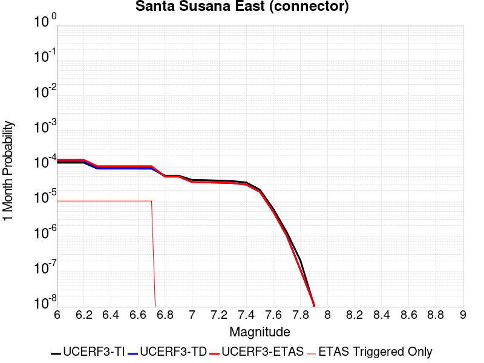 |  |  |

| Magnitude | 1 wk TI Prob | 1 wk TD Prob | 1 wk ETAS Prob | 1 wk ETAS/TD Gain | 1 wk ETAS Triggered Only | 1 mo TI Prob | 1 mo TD Prob | 1 mo ETAS Prob | 1 mo ETAS/TD Gain | 1 mo ETAS Triggered Only | 1 yr TI Prob | 1 yr TD Prob | 1 yr ETAS Prob | 1 yr ETAS/TD Gain | 1 yr ETAS Triggered Only | 10 yr TI Prob | 10 yr TD Prob | 10 yr ETAS Prob | 10 yr ETAS/TD Gain | 10 yr ETAS Triggered Only |
|-----|-----|-----|-----|-----|-----|-----|-----|-----|-----|-----|-----|-----|-----|-----|-----|-----|-----|-----|-----|-----|
| 6.0 | 2.858397E-5 | 3.202183E-5 | 3.202183E-5 | 1.0 | 0.0 | 1.2249697E-4 | 1.3723079E-4 | 1.3723079E-4 | 1.0 | 0.0 | 0.0014903803 | 0.0016697859 | 0.0016697859 | 1.0 | 0.0 | 0.014804244 | 0.01659952 | 0.016619671 | 1.001214 | 2.0491803E-5 |
| 6.1 | 2.858397E-5 | 3.202183E-5 | 3.202183E-5 | 1.0 | 0.0 | 1.2249697E-4 | 1.3723079E-4 | 1.3723079E-4 | 1.0 | 0.0 | 0.0014903803 | 0.0016697859 | 0.0016697859 | 1.0 | 0.0 | 0.014804244 | 0.01659952 | 0.016619671 | 1.001214 | 2.0491803E-5 |
| 6.2 | 2.858397E-5 | 3.202183E-5 | 3.202183E-5 | 1.0 | 0.0 | 1.2249697E-4 | 1.3723079E-4 | 1.3723079E-4 | 1.0 | 0.0 | 0.0014903803 | 0.0016697859 | 0.0016697859 | 1.0 | 0.0 | 0.014804244 | 0.01659952 | 0.016619671 | 1.001214 | 2.0491803E-5 |
| 6.3 | 1.943582E-5 | 2.0367674E-5 | 2.0367674E-5 | 1.0 | 0.0 | 8.329371E-5 | 8.728774E-5 | 8.728774E-5 | 1.0 | 0.0 | 0.001013629 | 0.0010623224 | 0.0010623224 | 1.0 | 0.0 | 0.010090181 | 0.010583875 | 0.010583875 | 1.0 | 0.0 |
| 6.4 | 1.943582E-5 | 2.0367674E-5 | 2.0367674E-5 | 1.0 | 0.0 | 8.329371E-5 | 8.728774E-5 | 8.728774E-5 | 1.0 | 0.0 | 0.001013629 | 0.0010623224 | 0.0010623224 | 1.0 | 0.0 | 0.010090181 | 0.010583875 | 0.010583875 | 1.0 | 0.0 |
| 6.5 | 1.943582E-5 | 2.0367674E-5 | 2.0367674E-5 | 1.0 | 0.0 | 8.329371E-5 | 8.728774E-5 | 8.728774E-5 | 1.0 | 0.0 | 0.001013629 | 0.0010623224 | 0.0010623224 | 1.0 | 0.0 | 0.010090181 | 0.010583875 | 0.010583875 | 1.0 | 0.0 |
| 6.6 | 1.943582E-5 | 2.0367674E-5 | 2.0367674E-5 | 1.0 | 0.0 | 8.329371E-5 | 8.728774E-5 | 8.728774E-5 | 1.0 | 0.0 | 0.001013629 | 0.0010623224 | 0.0010623224 | 1.0 | 0.0 | 0.010090181 | 0.010583875 | 0.010583875 | 1.0 | 0.0 |
| 6.7 | 1.9404439E-5 | 2.0355095E-5 | 2.0355095E-5 | 1.0 | 0.0 | 8.3159226E-5 | 8.7233835E-5 | 8.7233835E-5 | 1.0 | 0.0 | 0.0010119933 | 0.0010616668 | 0.0010616668 | 1.0 | 0.0 | 0.010073971 | 0.01057738 | 0.01057738 | 1.0 | 0.0 |
| 6.8 | 1.2217526E-5 | 1.1593199E-5 | 1.1593199E-5 | 1.0 | 0.0 | 5.2359774E-5 | 4.9684288E-5 | 4.9684288E-5 | 1.0 | 0.0 | 6.372938E-4 | 6.047551E-4 | 6.047551E-4 | 1.0 | 0.0 | 0.0063546924 | 0.006033141 | 0.006033141 | 1.0 | 0.0 |
| 6.9 | 1.2217526E-5 | 1.1593199E-5 | 1.1593199E-5 | 1.0 | 0.0 | 5.2359774E-5 | 4.9684288E-5 | 4.9684288E-5 | 1.0 | 0.0 | 6.372938E-4 | 6.047551E-4 | 6.047551E-4 | 1.0 | 0.0 | 0.0063546924 | 0.006033141 | 0.006033141 | 1.0 | 0.0 |
| 7.0 | 9.276017E-6 | 8.059215E-6 | 8.059215E-6 | 1.0 | 0.0 | 3.9753755E-5 | 3.4539054E-5 | 3.4539054E-5 | 1.0 | 0.0 | 4.8389446E-4 | 4.204353E-4 | 4.204353E-4 | 1.0 | 0.0 | 0.0048284214 | 0.0041971253 | 0.0041971253 | 1.0 | 0.0 |
| 7.1 | 9.130355E-6 | 7.942386E-6 | 7.942386E-6 | 1.0 | 0.0 | 3.9129503E-5 | 3.4038374E-5 | 3.4038374E-5 | 1.0 | 0.0 | 4.7629757E-4 | 4.1434186E-4 | 4.1434186E-4 | 1.0 | 0.0 | 0.00475278 | 0.004136419 | 0.004136419 | 1.0 | 0.0 |
| 7.2 | 8.851015E-6 | 7.741543E-6 | 7.741543E-6 | 1.0 | 0.0 | 3.7932372E-5 | 3.317764E-5 | 3.317764E-5 | 1.0 | 0.0 | 4.6172875E-4 | 4.0386632E-4 | 4.0386632E-4 | 1.0 | 0.0 | 0.0046077054 | 0.0040320465 | 0.0040320465 | 1.0 | 0.0 |
| 7.3 | 8.573006E-6 | 7.5502617E-6 | 7.5502617E-6 | 1.0 | 0.0 | 3.6740938E-5 | 3.2357882E-5 | 3.2357882E-5 | 1.0 | 0.0 | 4.472291E-4 | 3.9388944E-4 | 3.9388944E-4 | 1.0 | 0.0 | 0.004463301 | 0.00393263 | 0.00393263 | 1.0 | 0.0 |
| 7.4 | 7.852282E-6 | 6.8177665E-6 | 6.8177665E-6 | 1.0 | 0.0 | 3.36522E-5 | 2.9218689E-5 | 2.9218689E-5 | 1.0 | 0.0 | 4.096385E-4 | 3.556825E-4 | 3.556825E-4 | 1.0 | 0.0 | 0.0040888423 | 0.0035517968 | 0.0035517968 | 1.0 | 0.0 |
| 7.5 | 4.8869324E-6 | 4.279099E-6 | 4.279099E-6 | 1.0 | 0.0 | 2.0943828E-5 | 1.8338877E-5 | 1.8338877E-5 | 1.0 | 0.0 | 2.5496128E-4 | 2.232546E-4 | 2.232546E-4 | 1.0 | 0.0 | 0.0025466895 | 0.0022304675 | 0.0022304675 | 1.0 | 0.0 |
| 7.6 | 1.3894544E-6 | 1.1568255E-6 | 1.1568255E-6 | 1.0 | 0.0 | 5.954791E-6 | 4.9578157E-6 | 4.9578157E-6 | 1.0 | 0.0 | 7.249717E-5 | 6.035996E-5 | 6.035996E-5 | 1.0 | 0.0 | 7.247352E-4 | 6.0345745E-4 | 6.0345745E-4 | 1.0 | 0.0 |
| 7.7 | 2.9924632E-7 | 2.3719628E-7 | 2.3719628E-7 | 1.0 | 0.0 | 1.2824837E-6 | 1.0165551E-6 | 1.0165551E-6 | 1.0 | 0.0 | 1.5614127E-5 | 1.2376496E-5 | 1.2376496E-5 | 1.0 | 0.0 | 1.5613029E-4 | 1.2375879E-4 | 1.2375879E-4 | 1.0 | 0.0 |
| 7.8 | 4.8188564E-8 | 2.63245E-8 | 2.63245E-8 | 1.0 | 0.0 | 2.065224E-7 | 1.1281927E-7 | 1.1281927E-7 | 1.0 | 0.0 | 2.5144072E-6 | 1.3735739E-6 | 1.3735739E-6 | 1.0 | 0.0 | 2.5143789E-5 | 1.3735663E-5 | 1.3735663E-5 | 1.0 | 0.0 |
| 7.9 | 2.6127251E-9 | 2.768132E-9 | 2.768132E-9 | 1.0 | 0.0 | 1.1197393E-8 | 1.1863423E-8 | 1.1863423E-8 | 1.0 | 0.0 | 1.3632825E-7 | 1.4443718E-7 | 1.4443718E-7 | 1.0 | 0.0 | 1.3632817E-6 | 1.4443717E-6 | 1.4443717E-6 | 1.0 | 0.0 |

## Rocky Ledge 2011 CFM
*[(top)](#table-of-contents)*

| 1 Week | 1 Month | 1 Year | 10 Year |
|-----|-----|-----|-----|
|  |  |  |  |

| Magnitude | 1 wk TI Prob | 1 wk TD Prob | 1 wk ETAS Prob | 1 wk ETAS/TD Gain | 1 wk ETAS Triggered Only | 1 mo TI Prob | 1 mo TD Prob | 1 mo ETAS Prob | 1 mo ETAS/TD Gain | 1 mo ETAS Triggered Only | 1 yr TI Prob | 1 yr TD Prob | 1 yr ETAS Prob | 1 yr ETAS/TD Gain | 1 yr ETAS Triggered Only | 10 yr TI Prob | 10 yr TD Prob | 10 yr ETAS Prob | 10 yr ETAS/TD Gain | 10 yr ETAS Triggered Only |
|-----|-----|-----|-----|-----|-----|-----|-----|-----|-----|-----|-----|-----|-----|-----|-----|-----|-----|-----|-----|-----|
| 6.0 | 8.7550525E-6 | 9.486711E-6 | 9.486711E-6 | 1.0 | 0.0 | 3.7521113E-5 | 4.0657163E-5 | 4.0657163E-5 | 1.0 | 0.0 | 4.567238E-4 | 4.94971E-4 | 5.154527E-4 | 1.0413796 | 2.0491803E-5 | 0.0045578624 | 0.004946774 | 0.0049671642 | 1.004122 | 2.0491803E-5 |
| 6.1 | 8.7550525E-6 | 9.486711E-6 | 9.486711E-6 | 1.0 | 0.0 | 3.7521113E-5 | 4.0657163E-5 | 4.0657163E-5 | 1.0 | 0.0 | 4.567238E-4 | 4.94971E-4 | 5.154527E-4 | 1.0413796 | 2.0491803E-5 | 0.0045578624 | 0.004946774 | 0.0049671642 | 1.004122 | 2.0491803E-5 |
| 6.2 | 7.442295E-6 | 8.063129E-6 | 8.063129E-6 | 1.0 | 0.0 | 3.189516E-5 | 3.455627E-5 | 3.455627E-5 | 1.0 | 0.0 | 3.8825438E-4 | 4.2072256E-4 | 4.2072256E-4 | 1.0 | 0.0 | 0.0038757676 | 0.0042072255 | 0.0042072255 | 1.0 | 0.0 |

## Santa Cruz Catalina Ridge alt1
*[(top)](#table-of-contents)*

| 1 Week | 1 Month | 1 Year | 10 Year |
|-----|-----|-----|-----|
|  |  |  |  |

| Magnitude | 1 wk TI Prob | 1 wk TD Prob | 1 wk ETAS Prob | 1 wk ETAS/TD Gain | 1 wk ETAS Triggered Only | 1 mo TI Prob | 1 mo TD Prob | 1 mo ETAS Prob | 1 mo ETAS/TD Gain | 1 mo ETAS Triggered Only | 1 yr TI Prob | 1 yr TD Prob | 1 yr ETAS Prob | 1 yr ETAS/TD Gain | 1 yr ETAS Triggered Only | 10 yr TI Prob | 10 yr TD Prob | 10 yr ETAS Prob | 10 yr ETAS/TD Gain | 10 yr ETAS Triggered Only |
|-----|-----|-----|-----|-----|-----|-----|-----|-----|-----|-----|-----|-----|-----|-----|-----|-----|-----|-----|-----|-----|
| 6.0 | 3.2833184E-5 | 3.655896E-5 | 3.655896E-5 | 1.0 | 0.0 | 1.4070606E-4 | 1.5667277E-4 | 1.5667277E-4 | 1.0 | 0.0 | 0.00171175 | 0.0019059887 | 0.0019059887 | 1.0 | 0.0 | 0.016986247 | 0.018913316 | 0.018933421 | 1.001063 | 2.0491803E-5 |
| 6.1 | 1.9835548E-5 | 2.1659771E-5 | 2.1659771E-5 | 1.0 | 0.0 | 8.500672E-5 | 9.2824404E-5 | 9.2824404E-5 | 1.0 | 0.0 | 0.0010344655 | 0.0011295713 | 0.0011295713 | 1.0 | 0.0 | 0.010296632 | 0.011240433 | 0.011260695 | 1.0018026 | 2.0491803E-5 |
| 6.2 | 1.9835548E-5 | 2.1659771E-5 | 2.1659771E-5 | 1.0 | 0.0 | 8.500672E-5 | 9.2824404E-5 | 9.2824404E-5 | 1.0 | 0.0 | 0.0010344655 | 0.0011295713 | 0.0011295713 | 1.0 | 0.0 | 0.010296632 | 0.011240433 | 0.011260695 | 1.0018026 | 2.0491803E-5 |
| 6.3 | 1.5728183E-5 | 1.7034137E-5 | 1.7034137E-5 | 1.0 | 0.0 | 6.7404755E-5 | 7.3001436E-5 | 7.3001436E-5 | 1.0 | 0.0 | 8.2034385E-4 | 8.884362E-4 | 8.884362E-4 | 1.0 | 0.0 | 0.008173222 | 0.008849524 | 0.008869835 | 1.0022951 | 2.0491803E-5 |
| 6.4 | 1.5728183E-5 | 1.7034137E-5 | 1.7034137E-5 | 1.0 | 0.0 | 6.7404755E-5 | 7.3001436E-5 | 7.3001436E-5 | 1.0 | 0.0 | 8.2034385E-4 | 8.884362E-4 | 8.884362E-4 | 1.0 | 0.0 | 0.008173222 | 0.008849524 | 0.008869835 | 1.0022951 | 2.0491803E-5 |
| 6.5 | 1.3707734E-5 | 1.4794678E-5 | 1.4794678E-5 | 1.0 | 0.0 | 5.8746107E-5 | 6.3404244E-5 | 6.3404244E-5 | 1.0 | 0.0 | 7.1499916E-4 | 7.716768E-4 | 7.716768E-4 | 1.0 | 0.0 | 0.0071270303 | 0.0076903705 | 0.0077107046 | 1.0026441 | 2.0491803E-5 |
| 6.6 | 1.2539813E-5 | 1.3510358E-5 | 1.3510358E-5 | 1.0 | 0.0 | 5.3740947E-5 | 5.7900266E-5 | 5.7900266E-5 | 1.0 | 0.0 | 6.540996E-4 | 7.0471043E-4 | 7.0471043E-4 | 1.0 | 0.0 | 0.0065217763 | 0.0070250607 | 0.0070454082 | 1.0028964 | 2.0491803E-5 |
| 6.7 | 1.1504083E-5 | 1.23775E-5 | 1.23775E-5 | 1.0 | 0.0 | 4.930228E-5 | 5.304536E-5 | 5.304536E-5 | 1.0 | 0.0 | 6.0008996E-4 | 6.456379E-4 | 6.456379E-4 | 1.0 | 0.0 | 0.005984721 | 0.0064378507 | 0.0064582108 | 1.0031625 | 2.0491803E-5 |
| 6.8 | 1.012739E-5 | 1.0877178E-5 | 1.0877178E-5 | 1.0 | 0.0 | 4.340238E-5 | 4.6615653E-5 | 4.6615653E-5 | 1.0 | 0.0 | 5.282958E-4 | 5.673993E-4 | 5.673993E-4 | 1.0 | 0.0 | 0.0052704164 | 0.005659675 | 0.0056800507 | 1.0036001 | 2.0491803E-5 |
| 6.9 | 8.9607865E-6 | 9.60921E-6 | 9.60921E-6 | 1.0 | 0.0 | 3.8402806E-5 | 4.1181684E-5 | 4.1181684E-5 | 1.0 | 0.0 | 4.6745385E-4 | 5.0127273E-4 | 5.0127273E-4 | 1.0 | 0.0 | 0.0046647177 | 0.00500154 | 0.005021929 | 1.0040766 | 2.0491803E-5 |
| 7.0 | 8.046829E-6 | 8.619827E-6 | 8.619827E-6 | 1.0 | 0.0 | 3.4485955E-5 | 3.6941598E-5 | 3.6941598E-5 | 1.0 | 0.0 | 4.1978562E-4 | 4.4967196E-4 | 4.4967196E-4 | 1.0 | 0.0 | 0.004189935 | 0.004487711 | 0.004508111 | 1.0045457 | 2.0491803E-5 |
| 7.1 | 7.136131E-6 | 7.637727E-6 | 7.637727E-6 | 1.0 | 0.0 | 3.0583058E-5 | 3.273271E-5 | 3.273271E-5 | 1.0 | 0.0 | 3.7228514E-4 | 3.9844858E-4 | 3.9844858E-4 | 1.0 | 0.0 | 0.0037166206 | 0.0039774184 | 0.003997829 | 1.0051316 | 2.0491803E-5 |
| 7.2 | 6.362014E-6 | 6.8050217E-6 | 6.8050217E-6 | 1.0 | 0.0 | 2.726549E-5 | 2.9164055E-5 | 2.9164055E-5 | 1.0 | 0.0 | 3.3190678E-4 | 3.5501516E-4 | 3.5501516E-4 | 1.0 | 0.0 | 0.0033141149 | 0.0035445488 | 0.0035445488 | 1.0 | 0.0 |
| 7.3 | 5.004101E-6 | 5.3517642E-6 | 5.3517642E-6 | 1.0 | 0.0 | 2.1445969E-5 | 2.2935934E-5 | 2.2935934E-5 | 1.0 | 0.0 | 2.6107338E-4 | 2.7920975E-4 | 2.7920975E-4 | 1.0 | 0.0 | 0.002607669 | 0.0027886443 | 0.0027886443 | 1.0 | 0.0 |
| 7.4 | 3.4901443E-6 | 3.732087E-6 | 3.732087E-6 | 1.0 | 0.0 | 1.4957676E-5 | 1.5994563E-5 | 1.5994563E-5 | 1.0 | 0.0 | 1.8209449E-4 | 1.9471678E-4 | 1.9471678E-4 | 1.0 | 0.0 | 0.0018194534 | 0.0019455003 | 0.0019455003 | 1.0 | 0.0 |
| 7.5 | 1.1215045E-6 | 1.1893966E-6 | 1.1893966E-6 | 1.0 | 0.0 | 4.806439E-6 | 5.0974045E-6 | 5.0974045E-6 | 1.0 | 0.0 | 5.851682E-5 | 6.205916E-5 | 6.205916E-5 | 1.0 | 0.0 | 5.850142E-4 | 6.204214E-4 | 6.204214E-4 | 1.0 | 0.0 |
| 7.6 | 2.8599047E-7 | 2.9952182E-7 | 2.9952182E-7 | 1.0 | 0.0 | 1.2256729E-6 | 1.2836642E-6 | 1.2836642E-6 | 1.0 | 0.0 | 1.4922465E-5 | 1.5628502E-5 | 1.5628502E-5 | 1.0 | 0.0 | 1.4921463E-4 | 1.5627417E-4 | 1.5627417E-4 | 1.0 | 0.0 |
| 7.7 | 2.0781519E-7 | 2.1744457E-7 | 2.1744457E-7 | 1.0 | 0.0 | 8.906362E-7 | 9.3190494E-7 | 9.3190494E-7 | 1.0 | 0.0 | 1.08434415E-5 | 1.1345885E-5 | 1.1345885E-5 | 1.0 | 0.0 | 1.0842913E-4 | 1.1345315E-4 | 1.1345315E-4 | 1.0 | 0.0 |
| 7.8 | 3.614776E-8 | 3.7641225E-8 | 3.7641225E-8 | 1.0 | 0.0 | 1.5491896E-7 | 1.6131952E-7 | 1.6131952E-7 | 1.0 | 0.0 | 1.8861368E-6 | 1.9640636E-6 | 1.9640636E-6 | 1.0 | 0.0 | 1.8861208E-5 | 1.9640474E-5 | 1.9640474E-5 | 1.0 | 0.0 |

## Sierra Madre
*[(top)](#table-of-contents)*

| 1 Week | 1 Month | 1 Year | 10 Year |
|-----|-----|-----|-----|
|  |  |  |  |

| Magnitude | 1 wk TI Prob | 1 wk TD Prob | 1 wk ETAS Prob | 1 wk ETAS/TD Gain | 1 wk ETAS Triggered Only | 1 mo TI Prob | 1 mo TD Prob | 1 mo ETAS Prob | 1 mo ETAS/TD Gain | 1 mo ETAS Triggered Only | 1 yr TI Prob | 1 yr TD Prob | 1 yr ETAS Prob | 1 yr ETAS/TD Gain | 1 yr ETAS Triggered Only | 10 yr TI Prob | 10 yr TD Prob | 10 yr ETAS Prob | 10 yr ETAS/TD Gain | 10 yr ETAS Triggered Only |
|-----|-----|-----|-----|-----|-----|-----|-----|-----|-----|-----|-----|-----|-----|-----|-----|-----|-----|-----|-----|-----|
| 6.0 | 1.3379373E-5 | 1.100113E-5 | 1.100113E-5 | 1.0 | 0.0 | 5.7338908E-5 | 4.7146856E-5 | 4.7146856E-5 | 1.0 | 0.0 | 6.978776E-4 | 5.738633E-4 | 5.943433E-4 | 1.035688 | 2.0491803E-5 | 0.0069569005 | 0.005724178 | 0.0057445527 | 1.0035594 | 2.0491803E-5 |
| 6.1 | 1.3379373E-5 | 1.100113E-5 | 1.100113E-5 | 1.0 | 0.0 | 5.7338908E-5 | 4.7146856E-5 | 4.7146856E-5 | 1.0 | 0.0 | 6.978776E-4 | 5.738633E-4 | 5.943433E-4 | 1.035688 | 2.0491803E-5 | 0.0069569005 | 0.005724178 | 0.0057445527 | 1.0035594 | 2.0491803E-5 |
| 6.2 | 1.3379373E-5 | 1.100113E-5 | 1.100113E-5 | 1.0 | 0.0 | 5.7338908E-5 | 4.7146856E-5 | 4.7146856E-5 | 1.0 | 0.0 | 6.978776E-4 | 5.738633E-4 | 5.943433E-4 | 1.035688 | 2.0491803E-5 | 0.0069569005 | 0.005724178 | 0.0057445527 | 1.0035594 | 2.0491803E-5 |
| 6.3 | 1.3379373E-5 | 1.100113E-5 | 1.100113E-5 | 1.0 | 0.0 | 5.7338908E-5 | 4.7146856E-5 | 4.7146856E-5 | 1.0 | 0.0 | 6.978776E-4 | 5.738633E-4 | 5.943433E-4 | 1.035688 | 2.0491803E-5 | 0.0069569005 | 0.005724178 | 0.0057445527 | 1.0035594 | 2.0491803E-5 |
| 6.4 | 1.3379373E-5 | 1.100113E-5 | 1.100113E-5 | 1.0 | 0.0 | 5.7338908E-5 | 4.7146856E-5 | 4.7146856E-5 | 1.0 | 0.0 | 6.978776E-4 | 5.738633E-4 | 5.943433E-4 | 1.035688 | 2.0491803E-5 | 0.0069569005 | 0.005724178 | 0.0057445527 | 1.0035594 | 2.0491803E-5 |
| 6.5 | 1.26563245E-5 | 1.0230579E-5 | 1.0230579E-5 | 1.0 | 0.0 | 5.4240263E-5 | 4.3844608E-5 | 4.3844608E-5 | 1.0 | 0.0 | 6.601751E-4 | 5.3367845E-4 | 5.541593E-4 | 1.0383768 | 2.0491803E-5 | 0.006582173 | 0.00532429 | 0.0053446726 | 1.0038283 | 2.0491803E-5 |
| 6.6 | 1.26563245E-5 | 1.0230579E-5 | 1.0230579E-5 | 1.0 | 0.0 | 5.4240263E-5 | 4.3844608E-5 | 4.3844608E-5 | 1.0 | 0.0 | 6.601751E-4 | 5.3367845E-4 | 5.541593E-4 | 1.0383768 | 2.0491803E-5 | 0.006582173 | 0.00532429 | 0.0053446726 | 1.0038283 | 2.0491803E-5 |
| 6.7 | 1.2502474E-5 | 1.0066722E-5 | 1.0066722E-5 | 1.0 | 0.0 | 5.3580934E-5 | 4.3142387E-5 | 4.3142387E-5 | 1.0 | 0.0 | 6.521526E-4 | 5.2513304E-4 | 5.4561405E-4 | 1.0390016 | 2.0491803E-5 | 0.0065024206 | 0.0052392404 | 0.005259625 | 1.0038908 | 2.0491803E-5 |
| 6.8 | 1.2454966E-5 | 1.0019007E-5 | 1.0019007E-5 | 1.0 | 0.0 | 5.3377335E-5 | 4.29379E-5 | 4.29379E-5 | 1.0 | 0.0 | 6.4967526E-4 | 5.226446E-4 | 5.431257E-4 | 1.0391874 | 2.0491803E-5 | 0.006477792 | 0.005214473 | 0.005234858 | 1.0039093 | 2.0491803E-5 |
| 6.9 | 1.2225574E-5 | 9.7929815E-6 | 9.7929815E-6 | 1.0 | 0.0 | 5.2394265E-5 | 4.196925E-5 | 4.196925E-5 | 1.0 | 0.0 | 6.3771347E-4 | 5.108569E-4 | 5.313382E-4 | 1.0400921 | 2.0491803E-5 | 0.006358865 | 0.0050971415 | 0.005117529 | 1.0039997 | 2.0491803E-5 |
| 7.0 | 1.182946E-5 | 9.3995195E-6 | 9.3995195E-6 | 1.0 | 0.0 | 5.06967E-5 | 4.0283037E-5 | 4.0283037E-5 | 1.0 | 0.0 | 6.1705755E-4 | 4.903367E-4 | 5.108184E-4 | 1.0417708 | 2.0491803E-5 | 0.006153469 | 0.004892859 | 0.004913251 | 1.0041676 | 2.0491803E-5 |
| 7.1 | 1.14369095E-5 | 8.986527E-6 | 8.986527E-6 | 1.0 | 0.0 | 4.9014405E-5 | 3.8513124E-5 | 3.8513124E-5 | 1.0 | 0.0 | 5.9658696E-4 | 4.6879737E-4 | 4.8927957E-4 | 1.0436909 | 2.0491803E-5 | 0.005949879 | 0.00467839 | 0.004698786 | 1.0043596 | 2.0491803E-5 |
| 7.2 | 1.0836419E-5 | 8.399916E-6 | 8.399916E-6 | 1.0 | 0.0 | 4.644097E-5 | 3.5999146E-5 | 3.5999146E-5 | 1.0 | 0.0 | 5.652721E-4 | 4.3820238E-4 | 4.3820238E-4 | 1.0 | 0.0 | 0.0056383642 | 0.0043736803 | 0.0043736803 | 1.0 | 0.0 |
| 7.3 | 1.0403439E-5 | 8.021173E-6 | 8.021173E-6 | 1.0 | 0.0 | 4.4585406E-5 | 3.4376008E-5 | 3.4376008E-5 | 1.0 | 0.0 | 5.426921E-4 | 4.1844844E-4 | 4.1844844E-4 | 1.0 | 0.0 | 0.005413687 | 0.0041769007 | 0.0041769007 | 1.0 | 0.0 |
| 7.4 | 9.768864E-6 | 7.414793E-6 | 7.414793E-6 | 1.0 | 0.0 | 4.186589E-5 | 3.17773E-5 | 3.17773E-5 | 1.0 | 0.0 | 5.09598E-4 | 3.8682084E-4 | 3.8682084E-4 | 1.0 | 0.0 | 0.0050843097 | 0.0038617672 | 0.0038617672 | 1.0 | 0.0 |
| 7.5 | 8.687089E-6 | 6.4504875E-6 | 6.4504875E-6 | 1.0 | 0.0 | 3.722985E-5 | 2.7644659E-5 | 2.7644659E-5 | 1.0 | 0.0 | 4.5317915E-4 | 3.3652261E-4 | 3.3652261E-4 | 1.0 | 0.0 | 0.004522561 | 0.0033604174 | 0.0033604174 | 1.0 | 0.0 |
| 7.6 | 6.3506063E-6 | 4.430626E-6 | 4.430626E-6 | 1.0 | 0.0 | 2.72166E-5 | 1.8988261E-5 | 1.8988261E-5 | 1.0 | 0.0 | 3.3131172E-4 | 2.3115781E-4 | 2.3115781E-4 | 1.0 | 0.0 | 0.003308182 | 0.0023093987 | 0.0023093987 | 1.0 | 0.0 |
| 7.7 | 4.62223E-6 | 2.9332562E-6 | 2.9332562E-6 | 1.0 | 0.0 | 1.9809406E-5 | 1.2571038E-5 | 1.2571038E-5 | 1.0 | 0.0 | 2.4115283E-4 | 1.5304166E-4 | 1.5304166E-4 | 1.0 | 0.0 | 0.0024089129 | 0.0015295637 | 0.0015295637 | 1.0 | 0.0 |
| 7.8 | 3.2145008E-6 | 1.9496579E-6 | 1.9496579E-6 | 1.0 | 0.0 | 1.3776359E-5 | 8.35565E-6 | 8.35565E-6 | 1.0 | 0.0 | 1.6771426E-4 | 1.01725294E-4 | 1.01725294E-4 | 1.0 | 0.0 | 0.0016758774 | 0.0010169316 | 0.0010169316 | 1.0 | 0.0 |
| 7.9 | 1.0391769E-6 | 5.6034094E-7 | 5.6034094E-7 | 1.0 | 0.0 | 4.4536077E-6 | 2.401459E-6 | 2.401459E-6 | 1.0 | 0.0 | 5.4221324E-5 | 2.9237375E-5 | 2.9237375E-5 | 1.0 | 0.0 | 5.4208096E-4 | 2.9233572E-4 | 2.9233572E-4 | 1.0 | 0.0 |
| 8.0 | 1.210983E-7 | 6.6141716E-8 | 6.6141716E-8 | 1.0 | 0.0 | 5.1899264E-7 | 2.8346446E-7 | 2.8346446E-7 | 1.0 | 0.0 | 6.3187167E-6 | 3.4511747E-6 | 3.4511747E-6 | 1.0 | 0.0 | 6.318537E-5 | 3.4511228E-5 | 3.4511228E-5 | 1.0 | 0.0 |

## Northridge Hills
*[(top)](#table-of-contents)*

| 1 Week | 1 Month | 1 Year | 10 Year |
|-----|-----|-----|-----|
|  |  | 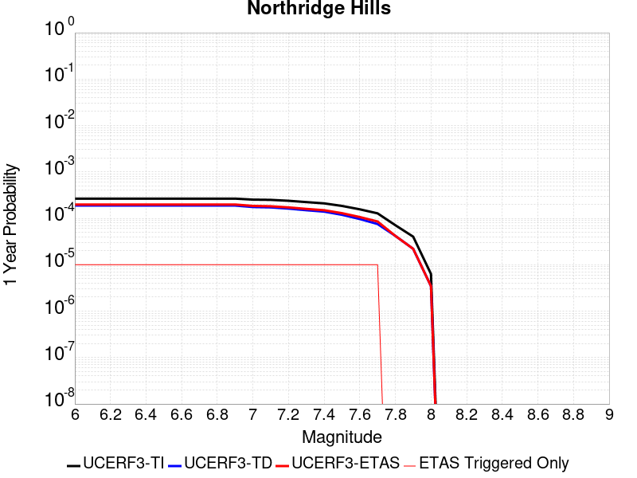 | 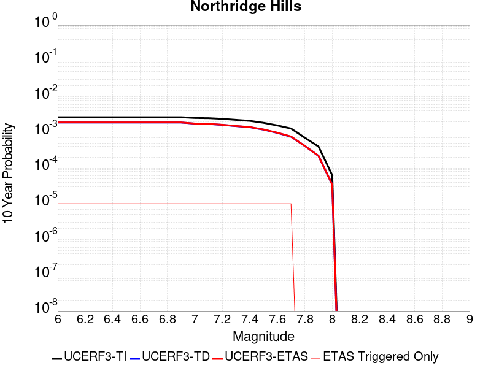 |

| Magnitude | 1 wk TI Prob | 1 wk TD Prob | 1 wk ETAS Prob | 1 wk ETAS/TD Gain | 1 wk ETAS Triggered Only | 1 mo TI Prob | 1 mo TD Prob | 1 mo ETAS Prob | 1 mo ETAS/TD Gain | 1 mo ETAS Triggered Only | 1 yr TI Prob | 1 yr TD Prob | 1 yr ETAS Prob | 1 yr ETAS/TD Gain | 1 yr ETAS Triggered Only | 10 yr TI Prob | 10 yr TD Prob | 10 yr ETAS Prob | 10 yr ETAS/TD Gain | 10 yr ETAS Triggered Only |
|-----|-----|-----|-----|-----|-----|-----|-----|-----|-----|-----|-----|-----|-----|-----|-----|-----|-----|-----|-----|-----|
| 6.0 | 5.095982E-6 | 3.6153342E-6 | 2.4107063E-5 | 6.6680045 | 2.0491803E-5 | 2.183974E-5 | 1.5494197E-5 | 3.5985682E-5 | 2.3225265 | 2.0491803E-5 | 2.658664E-4 | 1.8862565E-4 | 2.0911358E-4 | 1.108617 | 2.0491803E-5 | 0.0026554854 | 0.0018846678 | 0.001905121 | 1.0108525 | 2.0491803E-5 |
| 6.1 | 5.095982E-6 | 3.6153342E-6 | 2.4107063E-5 | 6.6680045 | 2.0491803E-5 | 2.183974E-5 | 1.5494197E-5 | 3.5985682E-5 | 2.3225265 | 2.0491803E-5 | 2.658664E-4 | 1.8862565E-4 | 2.0911358E-4 | 1.108617 | 2.0491803E-5 | 0.0026554854 | 0.0018846678 | 0.001905121 | 1.0108525 | 2.0491803E-5 |
| 6.2 | 5.095982E-6 | 3.6153342E-6 | 2.4107063E-5 | 6.6680045 | 2.0491803E-5 | 2.183974E-5 | 1.5494197E-5 | 3.5985682E-5 | 2.3225265 | 2.0491803E-5 | 2.658664E-4 | 1.8862565E-4 | 2.0911358E-4 | 1.108617 | 2.0491803E-5 | 0.0026554854 | 0.0018846678 | 0.001905121 | 1.0108525 | 2.0491803E-5 |
| 6.3 | 5.095982E-6 | 3.6153342E-6 | 2.4107063E-5 | 6.6680045 | 2.0491803E-5 | 2.183974E-5 | 1.5494197E-5 | 3.5985682E-5 | 2.3225265 | 2.0491803E-5 | 2.658664E-4 | 1.8862565E-4 | 2.0911358E-4 | 1.108617 | 2.0491803E-5 | 0.0026554854 | 0.0018846678 | 0.001905121 | 1.0108525 | 2.0491803E-5 |
| 6.4 | 5.095982E-6 | 3.6153342E-6 | 2.4107063E-5 | 6.6680045 | 2.0491803E-5 | 2.183974E-5 | 1.5494197E-5 | 3.5985682E-5 | 2.3225265 | 2.0491803E-5 | 2.658664E-4 | 1.8862565E-4 | 2.0911358E-4 | 1.108617 | 2.0491803E-5 | 0.0026554854 | 0.0018846678 | 0.001905121 | 1.0108525 | 2.0491803E-5 |
| 6.5 | 5.095982E-6 | 3.6153342E-6 | 2.4107063E-5 | 6.6680045 | 2.0491803E-5 | 2.183974E-5 | 1.5494197E-5 | 3.5985682E-5 | 2.3225265 | 2.0491803E-5 | 2.658664E-4 | 1.8862565E-4 | 2.0911358E-4 | 1.108617 | 2.0491803E-5 | 0.0026554854 | 0.0018846678 | 0.001905121 | 1.0108525 | 2.0491803E-5 |
| 6.6 | 5.095982E-6 | 3.6153342E-6 | 2.4107063E-5 | 6.6680045 | 2.0491803E-5 | 2.183974E-5 | 1.5494197E-5 | 3.5985682E-5 | 2.3225265 | 2.0491803E-5 | 2.658664E-4 | 1.8862565E-4 | 2.0911358E-4 | 1.108617 | 2.0491803E-5 | 0.0026554854 | 0.0018846678 | 0.001905121 | 1.0108525 | 2.0491803E-5 |
| 6.7 | 5.095982E-6 | 3.6153342E-6 | 2.4107063E-5 | 6.6680045 | 2.0491803E-5 | 2.183974E-5 | 1.5494197E-5 | 3.5985682E-5 | 2.3225265 | 2.0491803E-5 | 2.658664E-4 | 1.8862565E-4 | 2.0911358E-4 | 1.108617 | 2.0491803E-5 | 0.0026554854 | 0.0018846678 | 0.001905121 | 1.0108525 | 2.0491803E-5 |
| 6.8 | 5.095982E-6 | 3.6153342E-6 | 2.4107063E-5 | 6.6680045 | 2.0491803E-5 | 2.183974E-5 | 1.5494197E-5 | 3.5985682E-5 | 2.3225265 | 2.0491803E-5 | 2.658664E-4 | 1.8862565E-4 | 2.0911358E-4 | 1.108617 | 2.0491803E-5 | 0.0026554854 | 0.0018846678 | 0.001905121 | 1.0108525 | 2.0491803E-5 |
| 6.9 | 5.0942654E-6 | 3.613549E-6 | 2.4105278E-5 | 6.670804 | 2.0491803E-5 | 2.1832384E-5 | 1.5486547E-5 | 3.5978035E-5 | 2.3231797 | 2.0491803E-5 | 2.6577685E-4 | 1.8853252E-4 | 2.0902047E-4 | 1.1086706 | 2.0491803E-5 | 0.002654592 | 0.0018837382 | 0.0019041913 | 1.0108578 | 2.0491803E-5 |
| 7.0 | 4.851143E-6 | 3.3588624E-6 | 2.3850596E-5 | 7.100796 | 2.0491803E-5 | 2.0790447E-5 | 1.4395046E-5 | 3.4886554E-5 | 2.4235113 | 2.0491803E-5 | 2.5309427E-4 | 1.7524562E-4 | 1.9573382E-4 | 1.1169114 | 2.0491803E-5 | 0.0025280623 | 0.0017510786 | 0.0017715346 | 1.0116819 | 2.0491803E-5 |
| 7.1 | 4.7910607E-6 | 3.2971432E-6 | 2.3788878E-5 | 7.2149973 | 2.0491803E-5 | 2.0532956E-5 | 1.4130537E-5 | 3.462205E-5 | 2.450158 | 2.0491803E-5 | 2.4996005E-4 | 1.7202574E-4 | 1.9251402E-4 | 1.1191001 | 2.0491803E-5 | 0.0024967908 | 0.00171893 | 0.0017393865 | 1.0119008 | 2.0491803E-5 |
| 7.2 | 4.580079E-6 | 3.1069198E-6 | 2.3598659E-5 | 7.595516 | 2.0491803E-5 | 1.9628762E-5 | 1.3315303E-5 | 3.380683E-5 | 2.538946 | 2.0491803E-5 | 2.3895396E-4 | 1.6210177E-4 | 1.8259026E-4 | 1.1263927 | 2.0491803E-5 | 0.0023869718 | 0.0016198389 | 0.0016402975 | 1.01263 | 2.0491803E-5 |
| 7.3 | 4.290062E-6 | 2.8683467E-6 | 2.3360091E-5 | 8.144096 | 2.0491803E-5 | 1.838585E-5 | 1.2292857E-5 | 3.2784406E-5 | 2.6669478 | 2.0491803E-5 | 2.2382473E-4 | 1.4965527E-4 | 1.7014402E-4 | 1.1369063 | 2.0491803E-5 | 0.0022359942 | 0.001495548 | 0.0015160091 | 1.0136814 | 2.0491803E-5 |
| 7.4 | 4.0259683E-6 | 2.6740217E-6 | 2.316577E-5 | 8.663269 | 2.0491803E-5 | 1.7254037E-5 | 1.1460043E-5 | 3.195161E-5 | 2.7880883 | 2.0491803E-5 | 2.1004764E-4 | 1.3951711E-4 | 1.6000606E-4 | 1.1468562 | 2.0491803E-5 | 0.002098492 | 0.001394298 | 0.0014147613 | 1.0146763 | 2.0491803E-5 |
| 7.5 | 3.5477108E-6 | 2.285331E-6 | 2.2777087E-5 | 9.966647 | 2.0491803E-5 | 1.5204386E-5 | 9.794238E-6 | 3.028584E-5 | 3.0922098 | 2.0491803E-5 | 1.8509767E-4 | 1.1923834E-4 | 1.3972771E-4 | 1.1718353 | 2.0491803E-5 | 0.0018494357 | 0.0011917452 | 0.0012122126 | 1.0171742 | 2.0491803E-5 |
| 7.6 | 2.9990608E-6 | 1.8529445E-6 | 2.234471E-5 | 12.059029 | 2.0491803E-5 | 1.2853055E-5 | 7.941167E-6 | 2.8432807E-5 | 3.5804322 | 2.0491803E-5 | 1.564747E-4 | 9.667942E-5 | 1.1716924E-4 | 1.2119358 | 2.0491803E-5 | 0.0015636457 | 9.663744E-4 | 9.868464E-4 | 1.0211843 | 2.0491803E-5 |
| 7.7 | 2.4542855E-6 | 1.446239E-6 | 2.1938013E-5 | 15.169008 | 2.0491803E-5 | 1.05183235E-5 | 6.1981527E-6 | 2.668983E-5 | 4.306094 | 2.0491803E-5 | 1.2805307E-4 | 7.54599E-5 | 9.5950156E-5 | 1.2715384 | 2.0491803E-5 | 0.001279793 | 7.5434335E-4 | 7.748197E-4 | 1.0271446 | 2.0491803E-5 |
| 7.8 | 1.3623128E-6 | 8.0169184E-7 | 8.0169184E-7 | 1.0 | 0.0 | 5.8384703E-6 | 3.4358175E-6 | 3.4358175E-6 | 1.0 | 0.0 | 7.108106E-5 | 4.1830277E-5 | 4.1830277E-5 | 1.0 | 0.0 | 7.1058323E-4 | 4.1822426E-4 | 4.1822426E-4 | 1.0 | 0.0 |
| 7.9 | 7.716622E-7 | 4.2194137E-7 | 4.2194137E-7 | 1.0 | 0.0 | 3.3071194E-6 | 1.808319E-6 | 1.808319E-6 | 1.0 | 0.0 | 4.0263436E-5 | 2.2016062E-5 | 2.2016062E-5 | 1.0 | 0.0 | 4.0256142E-4 | 2.2013891E-4 | 2.2013891E-4 | 1.0 | 0.0 |
| 8.0 | 1.2117711E-7 | 6.622407E-8 | 6.622407E-8 | 1.0 | 0.0 | 5.1933034E-7 | 2.8381743E-7 | 2.8381743E-7 | 1.0 | 0.0 | 6.3228285E-6 | 3.4554716E-6 | 3.4554716E-6 | 1.0 | 0.0 | 6.3226486E-5 | 3.45542E-5 | 3.45542E-5 | 1.0 | 0.0 |

## North Frontal  (East)
*[(top)](#table-of-contents)*

| 1 Week | 1 Month | 1 Year | 10 Year |
|-----|-----|-----|-----|
|  |  |  |  |

| Magnitude | 1 wk TI Prob | 1 wk TD Prob | 1 wk ETAS Prob | 1 wk ETAS/TD Gain | 1 wk ETAS Triggered Only | 1 mo TI Prob | 1 mo TD Prob | 1 mo ETAS Prob | 1 mo ETAS/TD Gain | 1 mo ETAS Triggered Only | 1 yr TI Prob | 1 yr TD Prob | 1 yr ETAS Prob | 1 yr ETAS/TD Gain | 1 yr ETAS Triggered Only | 10 yr TI Prob | 10 yr TD Prob | 10 yr ETAS Prob | 10 yr ETAS/TD Gain | 10 yr ETAS Triggered Only |
|-----|-----|-----|-----|-----|-----|-----|-----|-----|-----|-----|-----|-----|-----|-----|-----|-----|-----|-----|-----|-----|
| 6.0 | 7.135738E-6 | 7.4772242E-6 | 7.4772242E-6 | 1.0 | 0.0 | 3.0581377E-5 | 3.2044965E-5 | 3.2044965E-5 | 1.0 | 0.0 | 3.7226462E-4 | 3.9009753E-4 | 3.9009753E-4 | 1.0 | 0.0 | 0.0037164164 | 0.0038960855 | 0.0039164973 | 1.0052391 | 2.0491803E-5 |
| 6.1 | 7.135738E-6 | 7.4772242E-6 | 7.4772242E-6 | 1.0 | 0.0 | 3.0581377E-5 | 3.2044965E-5 | 3.2044965E-5 | 1.0 | 0.0 | 3.7226462E-4 | 3.9009753E-4 | 3.9009753E-4 | 1.0 | 0.0 | 0.0037164164 | 0.0038960855 | 0.0039164973 | 1.0052391 | 2.0491803E-5 |
| 6.2 | 7.135738E-6 | 7.4772242E-6 | 7.4772242E-6 | 1.0 | 0.0 | 3.0581377E-5 | 3.2044965E-5 | 3.2044965E-5 | 1.0 | 0.0 | 3.7226462E-4 | 3.9009753E-4 | 3.9009753E-4 | 1.0 | 0.0 | 0.0037164164 | 0.0038960855 | 0.0039164973 | 1.0052391 | 2.0491803E-5 |
| 6.3 | 7.135738E-6 | 7.4772242E-6 | 7.4772242E-6 | 1.0 | 0.0 | 3.0581377E-5 | 3.2044965E-5 | 3.2044965E-5 | 1.0 | 0.0 | 3.7226462E-4 | 3.9009753E-4 | 3.9009753E-4 | 1.0 | 0.0 | 0.0037164164 | 0.0038960855 | 0.0039164973 | 1.0052391 | 2.0491803E-5 |
| 6.4 | 7.135738E-6 | 7.4772242E-6 | 7.4772242E-6 | 1.0 | 0.0 | 3.0581377E-5 | 3.2044965E-5 | 3.2044965E-5 | 1.0 | 0.0 | 3.7226462E-4 | 3.9009753E-4 | 3.9009753E-4 | 1.0 | 0.0 | 0.0037164164 | 0.0038960855 | 0.0039164973 | 1.0052391 | 2.0491803E-5 |
| 6.5 | 7.135738E-6 | 7.4772242E-6 | 7.4772242E-6 | 1.0 | 0.0 | 3.0581377E-5 | 3.2044965E-5 | 3.2044965E-5 | 1.0 | 0.0 | 3.7226462E-4 | 3.9009753E-4 | 3.9009753E-4 | 1.0 | 0.0 | 0.0037164164 | 0.0038960855 | 0.0039164973 | 1.0052391 | 2.0491803E-5 |
| 6.6 | 7.135738E-6 | 7.4772242E-6 | 7.4772242E-6 | 1.0 | 0.0 | 3.0581377E-5 | 3.2044965E-5 | 3.2044965E-5 | 1.0 | 0.0 | 3.7226462E-4 | 3.9009753E-4 | 3.9009753E-4 | 1.0 | 0.0 | 0.0037164164 | 0.0038960855 | 0.0039164973 | 1.0052391 | 2.0491803E-5 |
| 6.7 | 7.135738E-6 | 7.4772242E-6 | 7.4772242E-6 | 1.0 | 0.0 | 3.0581377E-5 | 3.2044965E-5 | 3.2044965E-5 | 1.0 | 0.0 | 3.7226462E-4 | 3.9009753E-4 | 3.9009753E-4 | 1.0 | 0.0 | 0.0037164164 | 0.0038960855 | 0.0039164973 | 1.0052391 | 2.0491803E-5 |
| 6.8 | 5.959142E-6 | 6.236721E-6 | 6.236721E-6 | 1.0 | 0.0 | 2.553893E-5 | 2.6728634E-5 | 2.6728634E-5 | 1.0 | 0.0 | 3.108921E-4 | 3.253906E-4 | 3.253906E-4 | 1.0 | 0.0 | 0.0031045752 | 0.0032509149 | 0.00327134 | 1.0062829 | 2.0491803E-5 |
| 6.9 | 2.2946929E-6 | 2.3824725E-6 | 2.3824725E-6 | 1.0 | 0.0 | 9.834361E-6 | 1.021056E-5 | 1.021056E-5 | 1.0 | 0.0 | 1.1972676E-4 | 1.2430694E-4 | 1.2430694E-4 | 1.0 | 0.0 | 0.0011966228 | 0.0012424206 | 0.0012424206 | 1.0 | 0.0 |
| 7.0 | 2.2468673E-6 | 2.3321654E-6 | 2.3321654E-6 | 1.0 | 0.0 | 9.629396E-6 | 9.994959E-6 | 9.994959E-6 | 1.0 | 0.0 | 1.1723159E-4 | 1.2168231E-4 | 1.2168231E-4 | 1.0 | 0.0 | 0.0011716976 | 0.0012162031 | 0.0012162031 | 1.0 | 0.0 |
| 7.1 | 1.9921076E-6 | 2.0646132E-6 | 2.0646132E-6 | 1.0 | 0.0 | 8.537577E-6 | 8.848315E-6 | 8.848315E-6 | 1.0 | 0.0 | 1.0394004E-4 | 1.0772334E-4 | 1.0772334E-4 | 1.0 | 0.0 | 0.0010389143 | 0.001076754 | 0.001076754 | 1.0 | 0.0 |
| 7.2 | 1.4524545E-6 | 1.504522E-6 | 1.504522E-6 | 1.0 | 0.0 | 6.2247905E-6 | 6.447937E-6 | 6.447937E-6 | 1.0 | 0.0 | 7.5784184E-5 | 7.850105E-5 | 7.850105E-5 | 1.0 | 0.0 | 7.575835E-4 | 7.8475766E-4 | 7.8475766E-4 | 1.0 | 0.0 |
| 7.3 | 8.9802575E-7 | 9.308773E-7 | 9.308773E-7 | 1.0 | 0.0 | 3.848676E-6 | 3.989469E-6 | 3.989469E-6 | 1.0 | 0.0 | 4.685662E-5 | 4.8570815E-5 | 4.8570815E-5 | 1.0 | 0.0 | 4.6846745E-4 | 4.856133E-4 | 4.856133E-4 | 1.0 | 0.0 |
| 7.4 | 7.776139E-7 | 8.060514E-7 | 8.060514E-7 | 1.0 | 0.0 | 3.3326266E-6 | 3.454502E-6 | 3.454502E-6 | 1.0 | 0.0 | 4.0573974E-5 | 4.2057858E-5 | 4.2057858E-5 | 1.0 | 0.0 | 4.0566566E-4 | 4.2050975E-4 | 4.2050975E-4 | 1.0 | 0.0 |
| 7.5 | 5.244417E-7 | 5.4412465E-7 | 5.4412465E-7 | 1.0 | 0.0 | 2.2476054E-6 | 2.331961E-6 | 2.331961E-6 | 1.0 | 0.0 | 2.7364253E-5 | 2.8391321E-5 | 2.8391321E-5 | 1.0 | 0.0 | 2.7360884E-4 | 2.8388345E-4 | 2.8388345E-4 | 1.0 | 0.0 |
| 7.6 | 1.5489647E-7 | 1.6089587E-7 | 1.6089587E-7 | 1.0 | 0.0 | 6.6384183E-7 | 6.8955364E-7 | 6.8955364E-7 | 1.0 | 0.0 | 8.082245E-6 | 8.395304E-6 | 8.395304E-6 | 1.0 | 0.0 | 8.08195E-5 | 8.395186E-5 | 8.395186E-5 | 1.0 | 0.0 |

## White Wolf
*[(top)](#table-of-contents)*

| 1 Week | 1 Month | 1 Year | 10 Year |
|-----|-----|-----|-----|
|  | 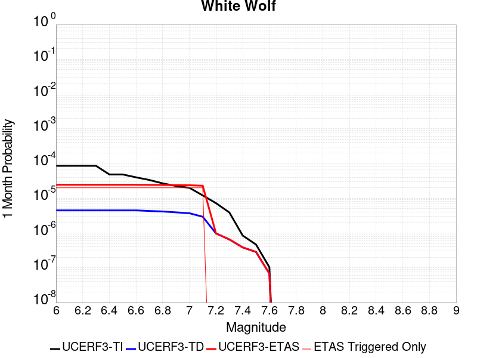 |  |  |

| Magnitude | 1 wk TI Prob | 1 wk TD Prob | 1 wk ETAS Prob | 1 wk ETAS/TD Gain | 1 wk ETAS Triggered Only | 1 mo TI Prob | 1 mo TD Prob | 1 mo ETAS Prob | 1 mo ETAS/TD Gain | 1 mo ETAS Triggered Only | 1 yr TI Prob | 1 yr TD Prob | 1 yr ETAS Prob | 1 yr ETAS/TD Gain | 1 yr ETAS Triggered Only | 10 yr TI Prob | 10 yr TD Prob | 10 yr ETAS Prob | 10 yr ETAS/TD Gain | 10 yr ETAS Triggered Only |
|-----|-----|-----|-----|-----|-----|-----|-----|-----|-----|-----|-----|-----|-----|-----|-----|-----|-----|-----|-----|-----|
| 6.0 | 2.0037822E-5 | 1.0469304E-6 | 1.0469304E-6 | 1.0 | 0.0 | 8.587355E-5 | 4.486837E-6 | 4.486837E-6 | 1.0 | 0.0 | 0.001045009 | 5.462592E-5 | 5.462592E-5 | 1.0 | 0.0 | 0.010401085 | 5.4613E-4 | 5.666106E-4 | 1.0375013 | 2.0491803E-5 |
| 6.1 | 2.0037822E-5 | 1.0469304E-6 | 1.0469304E-6 | 1.0 | 0.0 | 8.587355E-5 | 4.486837E-6 | 4.486837E-6 | 1.0 | 0.0 | 0.001045009 | 5.462592E-5 | 5.462592E-5 | 1.0 | 0.0 | 0.010401085 | 5.4613E-4 | 5.666106E-4 | 1.0375013 | 2.0491803E-5 |
| 6.2 | 2.0037822E-5 | 1.0469304E-6 | 1.0469304E-6 | 1.0 | 0.0 | 8.587355E-5 | 4.486837E-6 | 4.486837E-6 | 1.0 | 0.0 | 0.001045009 | 5.462592E-5 | 5.462592E-5 | 1.0 | 0.0 | 0.010401085 | 5.4613E-4 | 5.666106E-4 | 1.0375013 | 2.0491803E-5 |
| 6.3 | 2.0037822E-5 | 1.0469304E-6 | 1.0469304E-6 | 1.0 | 0.0 | 8.587355E-5 | 4.486837E-6 | 4.486837E-6 | 1.0 | 0.0 | 0.001045009 | 5.462592E-5 | 5.462592E-5 | 1.0 | 0.0 | 0.010401085 | 5.4613E-4 | 5.666106E-4 | 1.0375013 | 2.0491803E-5 |
| 6.4 | 1.132487E-5 | 1.0469304E-6 | 1.0469304E-6 | 1.0 | 0.0 | 4.8534253E-5 | 4.486837E-6 | 4.486837E-6 | 1.0 | 0.0 | 5.907443E-4 | 5.462592E-5 | 5.462592E-5 | 1.0 | 0.0 | 0.005891764 | 5.4613E-4 | 5.666106E-4 | 1.0375013 | 2.0491803E-5 |
| 6.5 | 1.132487E-5 | 1.0469304E-6 | 1.0469304E-6 | 1.0 | 0.0 | 4.8534253E-5 | 4.486837E-6 | 4.486837E-6 | 1.0 | 0.0 | 5.907443E-4 | 5.462592E-5 | 5.462592E-5 | 1.0 | 0.0 | 0.005891764 | 5.4613E-4 | 5.666106E-4 | 1.0375013 | 2.0491803E-5 |
| 6.6 | 9.347473E-6 | 1.0469304E-6 | 1.0469304E-6 | 1.0 | 0.0 | 4.0059982E-5 | 4.486837E-6 | 4.486837E-6 | 1.0 | 0.0 | 4.8762115E-4 | 5.462592E-5 | 5.462592E-5 | 1.0 | 0.0 | 0.0048655253 | 5.4613E-4 | 5.666106E-4 | 1.0375013 | 2.0491803E-5 |
| 6.7 | 7.842647E-6 | 1.0048476E-6 | 1.0048476E-6 | 1.0 | 0.0 | 3.361091E-5 | 4.306483E-6 | 4.306483E-6 | 1.0 | 0.0 | 4.0913603E-4 | 5.243022E-5 | 5.243022E-5 | 1.0 | 0.0 | 0.004083836 | 5.2418344E-4 | 5.446645E-4 | 1.0390723 | 2.0491803E-5 |
| 6.8 | 6.26597E-6 | 9.734948E-7 | 9.734948E-7 | 1.0 | 0.0 | 2.685388E-5 | 4.172114E-6 | 4.172114E-6 | 1.0 | 0.0 | 3.2689696E-4 | 5.079436E-5 | 5.079436E-5 | 1.0 | 0.0 | 0.003264165 | 5.078324E-4 | 5.283138E-4 | 1.040331 | 2.0491803E-5 |
| 6.9 | 5.258436E-6 | 9.183371E-7 | 9.183371E-7 | 1.0 | 0.0 | 2.2535958E-5 | 3.9357246E-6 | 3.9357246E-6 | 1.0 | 0.0 | 2.7434074E-4 | 4.7916445E-5 | 4.7916445E-5 | 1.0 | 0.0 | 0.0027400232 | 4.7906593E-4 | 4.995479E-4 | 1.042754 | 2.0491803E-5 |
| 7.0 | 4.675028E-6 | 8.66129E-7 | 8.66129E-7 | 1.0 | 0.0 | 2.003568E-5 | 3.7119764E-6 | 3.7119764E-6 | 1.0 | 0.0 | 2.4390711E-4 | 4.5192424E-5 | 4.5192424E-5 | 1.0 | 0.0 | 0.0024363957 | 4.5183706E-4 | 4.723196E-4 | 1.0453317 | 2.0491803E-5 |
| 7.1 | 2.8270078E-6 | 6.8742594E-7 | 6.8742594E-7 | 1.0 | 0.0 | 1.2115692E-5 | 2.9461082E-6 | 2.9461082E-6 | 1.0 | 0.0 | 1.4749856E-4 | 3.5868317E-5 | 3.5868317E-5 | 1.0 | 0.0 | 0.001474007 | 3.586294E-4 | 3.586294E-4 | 1.0 | 0.0 |
| 7.2 | 1.6881406E-6 | 2.2706854E-7 | 2.2706854E-7 | 1.0 | 0.0 | 7.2348685E-6 | 9.731506E-7 | 9.731506E-7 | 1.0 | 0.0 | 8.808096E-5 | 1.1848045E-5 | 1.1848045E-5 | 1.0 | 0.0 | 8.8046055E-4 | 1.1847429E-4 | 1.1847429E-4 | 1.0 | 0.0 |
| 7.3 | 9.086107E-7 | 1.5266669E-7 | 1.5266669E-7 | 1.0 | 0.0 | 3.8940398E-6 | 6.5428566E-7 | 6.5428566E-7 | 1.0 | 0.0 | 4.7408903E-5 | 7.965899E-6 | 7.965899E-6 | 1.0 | 0.0 | 4.739879E-4 | 7.965622E-5 | 7.965622E-5 | 1.0 | 0.0 |
| 7.4 | 1.9717383E-7 | 9.003981E-8 | 9.003981E-8 | 1.0 | 0.0 | 8.450304E-7 | 3.8588485E-7 | 3.8588485E-7 | 1.0 | 0.0 | 1.0288197E-5 | 4.698138E-6 | 4.698138E-6 | 1.0 | 0.0 | 1.028772E-4 | 4.6980418E-5 | 4.6980418E-5 | 1.0 | 0.0 |
| 7.5 | 1.086975E-7 | 6.659757E-8 | 6.659757E-8 | 1.0 | 0.0 | 4.6584634E-7 | 2.8541814E-7 | 2.8541814E-7 | 1.0 | 0.0 | 5.6716644E-6 | 3.4749605E-6 | 3.4749605E-6 | 1.0 | 0.0 | 5.6715195E-5 | 3.4749086E-5 | 3.4749086E-5 | 1.0 | 0.0 |
| 7.6 | 2.4217808E-8 | 1.5820843E-8 | 1.5820843E-8 | 1.0 | 0.0 | 1.03790605E-7 | 6.780361E-8 | 6.780361E-8 | 1.0 | 0.0 | 1.2636499E-6 | 8.255087E-7 | 8.255087E-7 | 1.0 | 0.0 | 1.2636427E-5 | 8.255061E-6 | 8.255061E-6 | 1.0 | 0.0 |

## Rinconada 2011 CFM
*[(top)](#table-of-contents)*

| 1 Week | 1 Month | 1 Year | 10 Year |
|-----|-----|-----|-----|
|  |  |  |  |

| Magnitude | 1 wk TI Prob | 1 wk TD Prob | 1 wk ETAS Prob | 1 wk ETAS/TD Gain | 1 wk ETAS Triggered Only | 1 mo TI Prob | 1 mo TD Prob | 1 mo ETAS Prob | 1 mo ETAS/TD Gain | 1 mo ETAS Triggered Only | 1 yr TI Prob | 1 yr TD Prob | 1 yr ETAS Prob | 1 yr ETAS/TD Gain | 1 yr ETAS Triggered Only | 10 yr TI Prob | 10 yr TD Prob | 10 yr ETAS Prob | 10 yr ETAS/TD Gain | 10 yr ETAS Triggered Only |
|-----|-----|-----|-----|-----|-----|-----|-----|-----|-----|-----|-----|-----|-----|-----|-----|-----|-----|-----|-----|-----|
| 6.0 | 1.5752368E-5 | 1.6274787E-5 | 1.6274787E-5 | 1.0 | 0.0 | 6.75084E-5 | 6.974724E-5 | 9.023762E-5 | 1.2937804 | 2.0491803E-5 | 8.2160486E-4 | 8.48845E-4 | 8.6931937E-4 | 1.0241203 | 2.0491803E-5 | 0.008185739 | 0.008456407 | 0.008476726 | 1.0024028 | 2.0491803E-5 |
| 6.1 | 1.0966133E-5 | 1.1323078E-5 | 1.1323078E-5 | 1.0 | 0.0 | 4.6996865E-5 | 4.8526577E-5 | 6.901739E-5 | 1.4222594 | 2.0491803E-5 | 5.720366E-4 | 5.9065165E-4 | 6.1113137E-4 | 1.0346731 | 2.0491803E-5 | 0.0057056635 | 0.0058909142 | 0.0059112855 | 1.003458 | 2.0491803E-5 |
| 6.2 | 1.0966133E-5 | 1.1323078E-5 | 1.1323078E-5 | 1.0 | 0.0 | 4.6996865E-5 | 4.8526577E-5 | 6.901739E-5 | 1.4222594 | 2.0491803E-5 | 5.720366E-4 | 5.9065165E-4 | 6.1113137E-4 | 1.0346731 | 2.0491803E-5 | 0.0057056635 | 0.0058909142 | 0.0059112855 | 1.003458 | 2.0491803E-5 |
| 6.3 | 8.926149E-6 | 9.212811E-6 | 9.212811E-6 | 1.0 | 0.0 | 3.8254362E-5 | 3.9482882E-5 | 5.9973874E-5 | 1.5189843 | 2.0491803E-5 | 4.6564735E-4 | 4.8059836E-4 | 5.010803E-4 | 1.0426176 | 2.0491803E-5 | 0.0046467283 | 0.004795635 | 0.0048160283 | 1.0042526 | 2.0491803E-5 |
| 6.4 | 7.676955E-6 | 7.920225E-6 | 7.920225E-6 | 1.0 | 0.0 | 3.290082E-5 | 3.394338E-5 | 3.394338E-5 | 1.0 | 0.0 | 4.0049385E-4 | 4.1318245E-4 | 4.1318245E-4 | 1.0 | 0.0 | 0.0039977287 | 0.004124169 | 0.004124169 | 1.0 | 0.0 |
| 6.5 | 6.1671026E-6 | 6.3589814E-6 | 6.3589814E-6 | 1.0 | 0.0 | 2.6430173E-5 | 2.7252492E-5 | 2.7252492E-5 | 1.0 | 0.0 | 3.2173982E-4 | 3.3174866E-4 | 3.3174866E-4 | 1.0 | 0.0 | 0.003212744 | 0.0033125463 | 0.0033125463 | 1.0 | 0.0 |
| 6.6 | 5.553456E-6 | 5.7248362E-6 | 5.7248362E-6 | 1.0 | 0.0 | 2.3800309E-5 | 2.4534782E-5 | 2.4534782E-5 | 1.0 | 0.0 | 2.897302E-4 | 2.986701E-4 | 2.986701E-4 | 1.0 | 0.0 | 0.0028935277 | 0.0029826954 | 0.0029826954 | 1.0 | 0.0 |
| 6.7 | 4.787857E-6 | 4.93333E-6 | 4.93333E-6 | 1.0 | 0.0 | 2.0519226E-5 | 2.114267E-5 | 2.114267E-5 | 1.0 | 0.0 | 2.4979294E-4 | 2.5738165E-4 | 2.5738165E-4 | 1.0 | 0.0 | 0.0024951235 | 0.0025708412 | 0.0025708412 | 1.0 | 0.0 |
| 6.8 | 3.9955166E-6 | 4.1134927E-6 | 4.1134927E-6 | 1.0 | 0.0 | 1.7123532E-5 | 1.7629134E-5 | 1.7629134E-5 | 1.0 | 0.0 | 2.0845905E-4 | 2.146136E-4 | 2.146136E-4 | 1.0 | 0.0 | 0.002082636 | 0.002144067 | 0.002144067 | 1.0 | 0.0 |
| 6.9 | 3.4250072E-6 | 3.5224598E-6 | 3.5224598E-6 | 1.0 | 0.0 | 1.46785205E-5 | 1.509617E-5 | 1.509617E-5 | 1.0 | 0.0 | 1.7869633E-4 | 1.8378037E-4 | 1.8378037E-4 | 1.0 | 0.0 | 0.001785527 | 0.0018362864 | 0.0018362864 | 1.0 | 0.0 |
| 7.0 | 2.7712713E-6 | 2.8467105E-6 | 2.8467105E-6 | 1.0 | 0.0 | 1.1876823E-5 | 1.2200131E-5 | 1.2200131E-5 | 1.0 | 0.0 | 1.4459073E-4 | 1.4852648E-4 | 1.4852648E-4 | 1.0 | 0.0 | 0.0014449668 | 0.0014842737 | 0.0014842737 | 1.0 | 0.0 |
| 7.1 | 2.227358E-6 | 2.2857066E-6 | 2.2857066E-6 | 1.0 | 0.0 | 9.545785E-6 | 9.795849E-6 | 9.795849E-6 | 1.0 | 0.0 | 1.16213734E-4 | 1.19257944E-4 | 1.19257944E-4 | 1.0 | 0.0 | 0.0011615298 | 0.0011919405 | 0.0011919405 | 1.0 | 0.0 |
| 7.2 | 1.581796E-6 | 1.6209067E-6 | 1.6209067E-6 | 1.0 | 0.0 | 6.779108E-6 | 6.9467246E-6 | 6.9467246E-6 | 1.0 | 0.0 | 8.253252E-5 | 8.457309E-5 | 8.457309E-5 | 1.0 | 0.0 | 8.250187E-4 | 8.4540964E-4 | 8.4540964E-4 | 1.0 | 0.0 |
| 7.3 | 1.0306567E-6 | 1.0546512E-6 | 1.0546512E-6 | 1.0 | 0.0 | 4.4170924E-6 | 4.519926E-6 | 4.519926E-6 | 1.0 | 0.0 | 5.3776774E-5 | 5.5028708E-5 | 5.5028708E-5 | 1.0 | 0.0 | 5.376376E-4 | 5.5015105E-4 | 5.5015105E-4 | 1.0 | 0.0 |
| 7.4 | 6.535541E-7 | 6.682764E-7 | 6.682764E-7 | 1.0 | 0.0 | 2.800943E-6 | 2.8640386E-6 | 2.8640386E-6 | 1.0 | 0.0 | 3.4100947E-5 | 3.4869114E-5 | 3.4869114E-5 | 1.0 | 0.0 | 3.4095717E-4 | 3.4863656E-4 | 3.4863656E-4 | 1.0 | 0.0 |
| 7.5 | 3.2656962E-7 | 3.33168E-7 | 3.33168E-7 | 1.0 | 0.0 | 1.3995833E-6 | 1.427862E-6 | 1.427862E-6 | 1.0 | 0.0 | 1.7039794E-5 | 1.7384082E-5 | 1.7384082E-5 | 1.0 | 0.0 | 1.7038487E-4 | 1.7382725E-4 | 1.7382725E-4 | 1.0 | 0.0 |
| 7.6 | 9.754343E-8 | 9.821022E-8 | 9.821022E-8 | 1.0 | 0.0 | 4.180432E-7 | 4.2090088E-7 | 4.2090088E-7 | 1.0 | 0.0 | 5.089664E-6 | 5.1244565E-6 | 5.1244565E-6 | 1.0 | 0.0 | 5.0895473E-5 | 5.124339E-5 | 5.124339E-5 | 1.0 | 0.0 |
| 7.7 | 6.0001453E-9 | 5.8490692E-9 | 5.8490692E-9 | 1.0 | 0.0 | 2.5714908E-8 | 2.506744E-8 | 2.506744E-8 | 1.0 | 0.0 | 3.1307894E-7 | 3.0519604E-7 | 3.0519604E-7 | 1.0 | 0.0 | 3.1307852E-6 | 3.0519564E-6 | 3.0519564E-6 | 1.0 | 0.0 |
| 7.8 | 7.400003E-11 | 7.4654505E-11 | 7.4654505E-11 | 1.0 | 0.0 | 3.171432E-10 | 3.1994807E-10 | 3.1994807E-10 | 1.0 | 0.0 | 3.861218E-9 | 3.8953676E-9 | 3.8953676E-9 | 1.0 | 0.0 | 3.861218E-8 | 3.8953676E-8 | 3.8953676E-8 | 1.0 | 0.0 |

## Newport-Inglewood (Offshore)
*[(top)](#table-of-contents)*

| 1 Week | 1 Month | 1 Year | 10 Year |
|-----|-----|-----|-----|
|  |  |  | 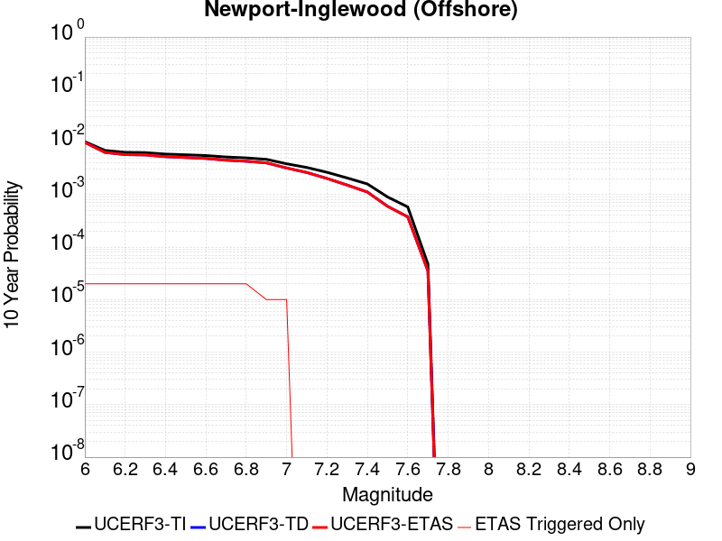 |

| Magnitude | 1 wk TI Prob | 1 wk TD Prob | 1 wk ETAS Prob | 1 wk ETAS/TD Gain | 1 wk ETAS Triggered Only | 1 mo TI Prob | 1 mo TD Prob | 1 mo ETAS Prob | 1 mo ETAS/TD Gain | 1 mo ETAS Triggered Only | 1 yr TI Prob | 1 yr TD Prob | 1 yr ETAS Prob | 1 yr ETAS/TD Gain | 1 yr ETAS Triggered Only | 10 yr TI Prob | 10 yr TD Prob | 10 yr ETAS Prob | 10 yr ETAS/TD Gain | 10 yr ETAS Triggered Only |
|-----|-----|-----|-----|-----|-----|-----|-----|-----|-----|-----|-----|-----|-----|-----|-----|-----|-----|-----|-----|-----|
| 6.0 | 1.9626508E-5 | 1.896559E-5 | 1.896559E-5 | 1.0 | 0.0 | 8.411089E-5 | 8.127864E-5 | 8.127864E-5 | 1.0 | 0.0 | 0.001023569 | 9.891307E-4 | 9.891307E-4 | 1.0 | 0.0 | 0.010188672 | 0.0098486245 | 0.009868914 | 1.0020602 | 2.0491803E-5 |
| 6.1 | 1.331886E-5 | 1.2218263E-5 | 1.2218263E-5 | 1.0 | 0.0 | 5.707958E-5 | 5.2362942E-5 | 5.2362942E-5 | 1.0 | 0.0 | 6.947222E-4 | 6.3733384E-4 | 6.3733384E-4 | 1.0 | 0.0 | 0.006925544 | 0.0063552377 | 0.006375599 | 1.0032039 | 2.0491803E-5 |
| 6.2 | 1.2250852E-5 | 1.1076189E-5 | 1.1076189E-5 | 1.0 | 0.0 | 5.2502597E-5 | 4.7468526E-5 | 4.7468526E-5 | 1.0 | 0.0 | 6.3903164E-4 | 5.7777704E-4 | 5.7777704E-4 | 1.0 | 0.0 | 0.006371971 | 0.00576287 | 0.0057832436 | 1.0035354 | 2.0491803E-5 |
| 6.3 | 1.2106258E-5 | 1.091905E-5 | 1.091905E-5 | 1.0 | 0.0 | 5.1882926E-5 | 4.6795092E-5 | 4.6795092E-5 | 1.0 | 0.0 | 6.3149154E-4 | 5.695823E-4 | 5.695823E-4 | 1.0 | 0.0 | 0.0062970007 | 0.0056813415 | 0.005701717 | 1.0035864 | 2.0491803E-5 |
| 6.4 | 1.1348758E-5 | 1.0109513E-5 | 1.0109513E-5 | 1.0 | 0.0 | 4.8636626E-5 | 4.332577E-5 | 4.332577E-5 | 1.0 | 0.0 | 5.919901E-4 | 5.273644E-4 | 5.273644E-4 | 1.0 | 0.0 | 0.005904155 | 0.005261225 | 0.005281609 | 1.0038744 | 2.0491803E-5 |
| 6.5 | 1.100837E-5 | 9.743537E-6 | 9.743537E-6 | 1.0 | 0.0 | 4.7177873E-5 | 4.175735E-5 | 4.175735E-5 | 1.0 | 0.0 | 5.7423924E-4 | 5.082779E-4 | 5.082779E-4 | 1.0 | 0.0 | 0.005727576 | 0.0050712456 | 0.005091633 | 1.0040203 | 2.0491803E-5 |
| 6.6 | 1.0634696E-5 | 9.345687E-6 | 9.345687E-6 | 1.0 | 0.0 | 4.557647E-5 | 4.0052335E-5 | 4.0052335E-5 | 1.0 | 0.0 | 5.5475225E-4 | 4.875288E-4 | 4.875288E-4 | 1.0 | 0.0 | 0.0055336943 | 0.004864679 | 0.0048850714 | 1.0041919 | 2.0491803E-5 |
| 6.7 | 9.9780855E-6 | 8.668048E-6 | 8.668048E-6 | 1.0 | 0.0 | 4.276252E-5 | 3.7148253E-5 | 3.7148253E-5 | 1.0 | 0.0 | 5.205093E-4 | 4.521868E-4 | 4.521868E-4 | 1.0 | 0.0 | 0.0051929182 | 0.0045127464 | 0.0045331456 | 1.0045204 | 2.0491803E-5 |
| 6.8 | 9.59546E-6 | 8.273084E-6 | 8.273084E-6 | 1.0 | 0.0 | 4.1122752E-5 | 3.5455596E-5 | 3.5455596E-5 | 1.0 | 0.0 | 5.0055445E-4 | 4.3158708E-4 | 4.3158708E-4 | 1.0 | 0.0 | 0.004994285 | 0.004307565 | 0.004327968 | 1.0047367 | 2.0491803E-5 |
| 6.9 | 9.000614E-6 | 7.706967E-6 | 7.706967E-6 | 1.0 | 0.0 | 3.857349E-5 | 3.3029446E-5 | 3.3029446E-5 | 1.0 | 0.0 | 4.6953102E-4 | 4.0205996E-4 | 4.0205996E-4 | 1.0 | 0.0 | 0.004685402 | 0.004013397 | 0.004013397 | 1.0 | 0.0 |
| 7.0 | 7.4070194E-6 | 6.1490105E-6 | 6.1490105E-6 | 1.0 | 0.0 | 3.1743984E-5 | 2.6352638E-5 | 2.6352638E-5 | 1.0 | 0.0 | 3.8641447E-4 | 3.2079627E-4 | 3.2079627E-4 | 1.0 | 0.0 | 0.0038574322 | 0.0032033517 | 0.0032033517 | 1.0 | 0.0 |
| 7.1 | 6.299615E-6 | 5.056689E-6 | 5.056689E-6 | 1.0 | 0.0 | 2.699807E-5 | 2.1671345E-5 | 2.1671345E-5 | 1.0 | 0.0 | 3.2865192E-4 | 2.6381682E-4 | 2.6381682E-4 | 1.0 | 0.0 | 0.003281663 | 0.002635051 | 0.002635051 | 1.0 | 0.0 |
| 7.2 | 5.096653E-6 | 3.8928574E-6 | 3.8928574E-6 | 1.0 | 0.0 | 2.1842614E-5 | 1.6683567E-5 | 1.6683567E-5 | 1.0 | 0.0 | 2.6590136E-4 | 2.0310361E-4 | 2.0310361E-4 | 1.0 | 0.0 | 0.0026558342 | 0.002029191 | 0.002029191 | 1.0 | 0.0 |
| 7.3 | 3.9753018E-6 | 2.9099435E-6 | 2.9099435E-6 | 1.0 | 0.0 | 1.7036897E-5 | 1.2471127E-5 | 1.2471127E-5 | 1.0 | 0.0 | 2.0740448E-4 | 1.5182547E-4 | 1.5182547E-4 | 1.0 | 0.0 | 0.00207211 | 0.0015172255 | 0.0015172255 | 1.0 | 0.0 |
| 7.4 | 3.0568392E-6 | 2.145023E-6 | 2.145023E-6 | 1.0 | 0.0 | 1.3100675E-5 | 9.192923E-6 | 9.192923E-6 | 1.0 | 0.0 | 1.5948903E-4 | 1.11918154E-4 | 1.11918154E-4 | 1.0 | 0.0 | 0.0015937461 | 0.0011186242 | 0.0011186242 | 1.0 | 0.0 |
| 7.5 | 1.7279019E-6 | 1.1470016E-6 | 1.1470016E-6 | 1.0 | 0.0 | 7.405273E-6 | 4.9157125E-6 | 4.9157125E-6 | 1.0 | 0.0 | 9.015547E-5 | 5.9847192E-5 | 5.9847192E-5 | 1.0 | 0.0 | 9.01189E-4 | 5.983146E-4 | 5.983146E-4 | 1.0 | 0.0 |
| 7.6 | 1.1156416E-6 | 7.2231035E-7 | 7.2231035E-7 | 1.0 | 0.0 | 4.7813123E-6 | 3.0956123E-6 | 3.0956123E-6 | 1.0 | 0.0 | 5.821092E-5 | 3.7688453E-5 | 3.7688453E-5 | 1.0 | 0.0 | 5.8195676E-4 | 3.7682295E-4 | 3.7682295E-4 | 1.0 | 0.0 |
| 7.7 | 9.117973E-8 | 6.7341894E-8 | 6.7341894E-8 | 1.0 | 0.0 | 3.907702E-7 | 2.8860808E-7 | 2.8860808E-7 | 1.0 | 0.0 | 4.757617E-6 | 3.513798E-6 | 3.513798E-6 | 1.0 | 0.0 | 4.7575148E-5 | 3.5137455E-5 | 3.5137455E-5 | 1.0 | 0.0 |

## La Panza 2011
*[(top)](#table-of-contents)*

| 1 Week | 1 Month | 1 Year | 10 Year |
|-----|-----|-----|-----|
|  |  |  |  |

| Magnitude | 1 wk TI Prob | 1 wk TD Prob | 1 wk ETAS Prob | 1 wk ETAS/TD Gain | 1 wk ETAS Triggered Only | 1 mo TI Prob | 1 mo TD Prob | 1 mo ETAS Prob | 1 mo ETAS/TD Gain | 1 mo ETAS Triggered Only | 1 yr TI Prob | 1 yr TD Prob | 1 yr ETAS Prob | 1 yr ETAS/TD Gain | 1 yr ETAS Triggered Only | 10 yr TI Prob | 10 yr TD Prob | 10 yr ETAS Prob | 10 yr ETAS/TD Gain | 10 yr ETAS Triggered Only |
|-----|-----|-----|-----|-----|-----|-----|-----|-----|-----|-----|-----|-----|-----|-----|-----|-----|-----|-----|-----|-----|
| 6.0 | 4.6754544E-6 | 4.717608E-6 | 4.717608E-6 | 1.0 | 0.0 | 2.0037509E-5 | 2.0218175E-5 | 2.0218175E-5 | 1.0 | 0.0 | 2.4392935E-4 | 2.4613045E-4 | 2.4613045E-4 | 1.0 | 0.0 | 0.0024366176 | 0.0024587729 | 0.0024792142 | 1.0083137 | 2.0491803E-5 |
| 6.1 | 4.6754544E-6 | 4.717608E-6 | 4.717608E-6 | 1.0 | 0.0 | 2.0037509E-5 | 2.0218175E-5 | 2.0218175E-5 | 1.0 | 0.0 | 2.4392935E-4 | 2.4613045E-4 | 2.4613045E-4 | 1.0 | 0.0 | 0.0024366176 | 0.0024587729 | 0.0024792142 | 1.0083137 | 2.0491803E-5 |
| 6.2 | 4.6754544E-6 | 4.717608E-6 | 4.717608E-6 | 1.0 | 0.0 | 2.0037509E-5 | 2.0218175E-5 | 2.0218175E-5 | 1.0 | 0.0 | 2.4392935E-4 | 2.4613045E-4 | 2.4613045E-4 | 1.0 | 0.0 | 0.0024366176 | 0.0024587729 | 0.0024792142 | 1.0083137 | 2.0491803E-5 |
| 6.3 | 4.6754544E-6 | 4.717608E-6 | 4.717608E-6 | 1.0 | 0.0 | 2.0037509E-5 | 2.0218175E-5 | 2.0218175E-5 | 1.0 | 0.0 | 2.4392935E-4 | 2.4613045E-4 | 2.4613045E-4 | 1.0 | 0.0 | 0.0024366176 | 0.0024587729 | 0.0024792142 | 1.0083137 | 2.0491803E-5 |
| 6.4 | 4.6754544E-6 | 4.717608E-6 | 4.717608E-6 | 1.0 | 0.0 | 2.0037509E-5 | 2.0218175E-5 | 2.0218175E-5 | 1.0 | 0.0 | 2.4392935E-4 | 2.4613045E-4 | 2.4613045E-4 | 1.0 | 0.0 | 0.0024366176 | 0.0024587729 | 0.0024792142 | 1.0083137 | 2.0491803E-5 |
| 6.5 | 2.485343E-6 | 2.5006163E-6 | 2.5006163E-6 | 1.0 | 0.0 | 1.0651426E-5 | 1.0716885E-5 | 1.0716885E-5 | 1.0 | 0.0 | 1.296734E-4 | 1.3047065E-4 | 1.3047065E-4 | 1.0 | 0.0 | 0.0012959775 | 0.001303979 | 0.0013244441 | 1.0156944 | 2.0491803E-5 |
| 6.6 | 2.485343E-6 | 2.5006163E-6 | 2.5006163E-6 | 1.0 | 0.0 | 1.0651426E-5 | 1.0716885E-5 | 1.0716885E-5 | 1.0 | 0.0 | 1.296734E-4 | 1.3047065E-4 | 1.3047065E-4 | 1.0 | 0.0 | 0.0012959775 | 0.001303979 | 0.0013244441 | 1.0156944 | 2.0491803E-5 |
| 6.7 | 1.5108508E-6 | 1.5146534E-6 | 1.5146534E-6 | 1.0 | 0.0 | 6.4750584E-6 | 6.491356E-6 | 6.491356E-6 | 1.0 | 0.0 | 7.8830984E-5 | 7.90295E-5 | 7.90295E-5 | 1.0 | 0.0 | 7.880303E-4 | 7.900248E-4 | 8.105004E-4 | 1.0259176 | 2.0491803E-5 |
| 6.8 | 1.3865837E-6 | 1.3885259E-6 | 1.3885259E-6 | 1.0 | 0.0 | 5.942488E-6 | 5.950812E-6 | 5.950812E-6 | 1.0 | 0.0 | 7.234739E-5 | 7.244883E-5 | 7.244883E-5 | 1.0 | 0.0 | 7.232384E-4 | 7.242619E-4 | 7.4473885E-4 | 1.0282729 | 2.0491803E-5 |
| 6.9 | 9.826583E-7 | 9.796437E-7 | 9.796437E-7 | 1.0 | 0.0 | 4.2113857E-6 | 4.1984663E-6 | 4.1984663E-6 | 1.0 | 0.0 | 5.1272415E-5 | 5.1115185E-5 | 5.1115185E-5 | 1.0 | 0.0 | 5.126059E-4 | 5.1103963E-4 | 5.31521E-4 | 1.0400778 | 2.0491803E-5 |
| 7.0 | 6.7797646E-7 | 6.71036E-7 | 6.71036E-7 | 1.0 | 0.0 | 2.9056102E-6 | 2.8758654E-6 | 2.8758654E-6 | 1.0 | 0.0 | 3.537523E-5 | 3.501313E-5 | 3.501313E-5 | 1.0 | 0.0 | 3.5369597E-4 | 3.5007924E-4 | 3.5007924E-4 | 1.0 | 0.0 |
| 7.1 | 3.4979826E-7 | 3.3875276E-7 | 3.3875276E-7 | 1.0 | 0.0 | 1.4991346E-6 | 1.4517968E-6 | 1.4517968E-6 | 1.0 | 0.0 | 1.825181E-5 | 1.7675495E-5 | 1.7675495E-5 | 1.0 | 0.0 | 1.825031E-4 | 1.7674206E-4 | 1.7674206E-4 | 1.0 | 0.0 |
| 7.2 | 2.5088332E-7 | 2.3833275E-7 | 2.3833275E-7 | 1.0 | 0.0 | 1.0752137E-6 | 1.0214256E-6 | 1.0214256E-6 | 1.0 | 0.0 | 1.3090649E-5 | 1.2435796E-5 | 1.2435796E-5 | 1.0 | 0.0 | 1.3089878E-4 | 1.2435185E-4 | 1.2435185E-4 | 1.0 | 0.0 |
| 7.3 | 1.0159086E-7 | 8.645961E-8 | 8.645961E-8 | 1.0 | 0.0 | 4.3538932E-7 | 3.7054113E-7 | 3.7054113E-7 | 1.0 | 0.0 | 5.300852E-6 | 4.5113293E-6 | 4.5113293E-6 | 1.0 | 0.0 | 5.3007258E-5 | 4.5112418E-5 | 4.5112418E-5 | 1.0 | 0.0 |
| 7.4 | 3.5006252E-8 | 1.940863E-8 | 1.940863E-8 | 1.0 | 0.0 | 1.5002678E-7 | 8.3179835E-8 | 8.3179835E-8 | 1.0 | 0.0 | 1.8265745E-6 | 1.012714E-6 | 1.012714E-6 | 1.0 | 0.0 | 1.8265595E-5 | 1.0127096E-5 | 1.0127096E-5 | 1.0 | 0.0 |
| 7.5 | 2.592274E-8 | 1.0242307E-8 | 1.0242307E-8 | 1.0 | 0.0 | 1.1109746E-7 | 4.3895596E-8 | 4.3895596E-8 | 1.0 | 0.0 | 1.3526106E-6 | 5.3442875E-7 | 5.3442875E-7 | 1.0 | 0.0 | 1.3526024E-5 | 5.3442755E-6 | 5.3442755E-6 | 1.0 | 0.0 |
| 7.6 | 1.9016717E-8 | 5.2468647E-9 | 5.2468647E-9 | 1.0 | 0.0 | 8.150022E-8 | 2.2486562E-8 | 2.2486562E-8 | 1.0 | 0.0 | 9.922647E-7 | 2.7377385E-7 | 2.7377385E-7 | 1.0 | 0.0 | 9.922603E-6 | 2.7377353E-6 | 2.7377353E-6 | 1.0 | 0.0 |
| 7.7 | 1.17738495E-8 | 1.2407027E-9 | 1.2407027E-9 | 1.0 | 0.0 | 5.0459356E-8 | 5.317297E-9 | 5.317297E-9 | 1.0 | 0.0 | 6.1434247E-7 | 6.473808E-8 | 6.473808E-8 | 1.0 | 0.0 | 6.143408E-6 | 6.4738066E-7 | 6.4738066E-7 | 1.0 | 0.0 |
| 7.8 | 5.489079E-9 | 2.0135205E-10 | 2.0135205E-10 | 1.0 | 0.0 | 2.3524624E-8 | 8.6293683E-10 | 8.6293683E-10 | 1.0 | 0.0 | 2.8641225E-7 | 1.0506253E-8 | 1.0506253E-8 | 1.0 | 0.0 | 2.8641189E-6 | 1.0506252E-7 | 1.0506252E-7 | 1.0 | 0.0 |
| 7.9 | 2.5081048E-9 | 6.6927686E-11 | 6.6927686E-11 | 1.0 | 0.0 | 1.0749021E-8 | 2.868329E-10 | 2.868329E-10 | 1.0 | 0.0 | 1.3086932E-7 | 3.492187E-9 | 3.492187E-9 | 1.0 | 0.0 | 1.3086925E-6 | 3.4921865E-8 | 3.4921865E-8 | 1.0 | 0.0 |

## Earthquake Valley (So Extension)
*[(top)](#table-of-contents)*

| 1 Week | 1 Month | 1 Year | 10 Year |
|-----|-----|-----|-----|
|  |  |  |  |

| Magnitude | 1 wk TI Prob | 1 wk TD Prob | 1 wk ETAS Prob | 1 wk ETAS/TD Gain | 1 wk ETAS Triggered Only | 1 mo TI Prob | 1 mo TD Prob | 1 mo ETAS Prob | 1 mo ETAS/TD Gain | 1 mo ETAS Triggered Only | 1 yr TI Prob | 1 yr TD Prob | 1 yr ETAS Prob | 1 yr ETAS/TD Gain | 1 yr ETAS Triggered Only | 10 yr TI Prob | 10 yr TD Prob | 10 yr ETAS Prob | 10 yr ETAS/TD Gain | 10 yr ETAS Triggered Only |
|-----|-----|-----|-----|-----|-----|-----|-----|-----|-----|-----|-----|-----|-----|-----|-----|-----|-----|-----|-----|-----|
| 6.0 | 3.0194888E-5 | 3.707326E-5 | 3.707326E-5 | 1.0 | 0.0 | 1.2940024E-4 | 1.588788E-4 | 1.588788E-4 | 1.0 | 0.0 | 0.0015743093 | 0.0019331772 | 0.0019331772 | 1.0 | 0.0 | 0.01563203 | 0.019213596 | 0.019233694 | 1.0010461 | 2.0491803E-5 |
| 6.1 | 3.0194888E-5 | 3.707326E-5 | 3.707326E-5 | 1.0 | 0.0 | 1.2940024E-4 | 1.588788E-4 | 1.588788E-4 | 1.0 | 0.0 | 0.0015743093 | 0.0019331772 | 0.0019331772 | 1.0 | 0.0 | 0.01563203 | 0.019213596 | 0.019233694 | 1.0010461 | 2.0491803E-5 |
| 6.2 | 3.0194888E-5 | 3.707326E-5 | 3.707326E-5 | 1.0 | 0.0 | 1.2940024E-4 | 1.588788E-4 | 1.588788E-4 | 1.0 | 0.0 | 0.0015743093 | 0.0019331772 | 0.0019331772 | 1.0 | 0.0 | 0.01563203 | 0.019213596 | 0.019233694 | 1.0010461 | 2.0491803E-5 |
| 6.3 | 1.5795305E-5 | 1.8447001E-5 | 1.8447001E-5 | 1.0 | 0.0 | 6.769241E-5 | 7.905681E-5 | 7.905681E-5 | 1.0 | 0.0 | 8.238434E-4 | 9.622029E-4 | 9.622029E-4 | 1.0 | 0.0 | 0.008207959 | 0.009591279 | 0.009591279 | 1.0 | 0.0 |
| 6.4 | 1.5795305E-5 | 1.8447001E-5 | 1.8447001E-5 | 1.0 | 0.0 | 6.769241E-5 | 7.905681E-5 | 7.905681E-5 | 1.0 | 0.0 | 8.238434E-4 | 9.622029E-4 | 9.622029E-4 | 1.0 | 0.0 | 0.008207959 | 0.009591279 | 0.009591279 | 1.0 | 0.0 |
| 6.5 | 1.5795305E-5 | 1.8447001E-5 | 1.8447001E-5 | 1.0 | 0.0 | 6.769241E-5 | 7.905681E-5 | 7.905681E-5 | 1.0 | 0.0 | 8.238434E-4 | 9.622029E-4 | 9.622029E-4 | 1.0 | 0.0 | 0.008207959 | 0.009591279 | 0.009591279 | 1.0 | 0.0 |
| 6.6 | 1.5795305E-5 | 1.8447001E-5 | 1.8447001E-5 | 1.0 | 0.0 | 6.769241E-5 | 7.905681E-5 | 7.905681E-5 | 1.0 | 0.0 | 8.238434E-4 | 9.622029E-4 | 9.622029E-4 | 1.0 | 0.0 | 0.008207959 | 0.009591279 | 0.009591279 | 1.0 | 0.0 |
| 6.7 | 1.1363076E-5 | 1.3138576E-5 | 1.3138576E-5 | 1.0 | 0.0 | 4.8697988E-5 | 5.6307395E-5 | 5.6307395E-5 | 1.0 | 0.0 | 5.927367E-4 | 6.85403E-4 | 6.85403E-4 | 1.0 | 0.0 | 0.0059115817 | 0.0068403645 | 0.0068403645 | 1.0 | 0.0 |
| 6.8 | 1.0049611E-5 | 1.15945795E-5 | 1.15945795E-5 | 1.0 | 0.0 | 4.306905E-5 | 4.969052E-5 | 4.969052E-5 | 1.0 | 0.0 | 5.242395E-4 | 6.048873E-4 | 6.048873E-4 | 1.0 | 0.0 | 0.0052300454 | 0.0060395855 | 0.0060395855 | 1.0 | 0.0 |
| 6.9 | 1.0049611E-5 | 1.15945795E-5 | 1.15945795E-5 | 1.0 | 0.0 | 4.306905E-5 | 4.969052E-5 | 4.969052E-5 | 1.0 | 0.0 | 5.242395E-4 | 6.048873E-4 | 6.048873E-4 | 1.0 | 0.0 | 0.0052300454 | 0.0060395855 | 0.0060395855 | 1.0 | 0.0 |
| 7.0 | 1.0049611E-5 | 1.15945795E-5 | 1.15945795E-5 | 1.0 | 0.0 | 4.306905E-5 | 4.969052E-5 | 4.969052E-5 | 1.0 | 0.0 | 5.242395E-4 | 6.048873E-4 | 6.048873E-4 | 1.0 | 0.0 | 0.0052300454 | 0.0060395855 | 0.0060395855 | 1.0 | 0.0 |
| 7.1 | 8.140254E-6 | 9.383657E-6 | 9.383657E-6 | 1.0 | 0.0 | 3.4886336E-5 | 4.021543E-5 | 4.021543E-5 | 1.0 | 0.0 | 4.2465836E-4 | 4.895799E-4 | 4.895799E-4 | 1.0 | 0.0 | 0.0042384774 | 0.00489159 | 0.00489159 | 1.0 | 0.0 |
| 7.2 | 1.673835E-7 | 1.4154533E-7 | 1.4154533E-7 | 1.0 | 0.0 | 7.173577E-7 | 6.066227E-7 | 6.066227E-7 | 1.0 | 0.0 | 8.733795E-6 | 7.38561E-6 | 7.38561E-6 | 1.0 | 0.0 | 8.733451E-5 | 7.3854E-5 | 7.3854E-5 | 1.0 | 0.0 |
| 7.3 | 1.6632116E-7 | 1.405276E-7 | 1.405276E-7 | 1.0 | 0.0 | 7.1280476E-7 | 6.02261E-7 | 6.02261E-7 | 1.0 | 0.0 | 8.678364E-6 | 7.332507E-6 | 7.332507E-6 | 1.0 | 0.0 | 8.6780245E-5 | 7.3323004E-5 | 7.3323004E-5 | 1.0 | 0.0 |
| 7.4 | 1.6569169E-7 | 1.3997388E-7 | 1.3997388E-7 | 1.0 | 0.0 | 7.1010703E-7 | 5.998879E-7 | 5.998879E-7 | 1.0 | 0.0 | 8.645519E-6 | 7.3036144E-6 | 7.3036144E-6 | 1.0 | 0.0 | 8.645182E-5 | 7.30341E-5 | 7.30341E-5 | 1.0 | 0.0 |
| 7.5 | 1.1764555E-7 | 1.0096232E-7 | 1.0096232E-7 | 1.0 | 0.0 | 5.041951E-7 | 4.3269557E-7 | 4.3269557E-7 | 1.0 | 0.0 | 6.138558E-6 | 5.268058E-6 | 5.268058E-6 | 1.0 | 0.0 | 6.1383886E-5 | 5.267955E-5 | 5.267955E-5 | 1.0 | 0.0 |
| 7.6 | 1.07927605E-7 | 9.261032E-8 | 9.261032E-8 | 1.0 | 0.0 | 4.6254678E-7 | 3.9690133E-7 | 3.9690133E-7 | 1.0 | 0.0 | 5.6314925E-6 | 4.832265E-6 | 4.832265E-6 | 1.0 | 0.0 | 5.63135E-5 | 4.832181E-5 | 4.832181E-5 | 1.0 | 0.0 |
| 7.7 | 2.1826905E-8 | 1.1181076E-8 | 1.1181076E-8 | 1.0 | 0.0 | 9.3543875E-8 | 4.7918892E-8 | 4.7918892E-8 | 1.0 | 0.0 | 1.1388961E-6 | 5.8341243E-7 | 5.8341243E-7 | 1.0 | 0.0 | 1.1388902E-5 | 5.8341143E-6 | 5.8341143E-6 | 1.0 | 0.0 |
| 7.8 | 2.6169649E-9 | 1.1970057E-9 | 1.1970057E-9 | 1.0 | 0.0 | 1.1215564E-8 | 5.130025E-9 | 5.130025E-9 | 1.0 | 0.0 | 1.3654947E-7 | 6.245805E-8 | 6.245805E-8 | 1.0 | 0.0 | 1.365494E-6 | 6.245805E-7 | 6.245805E-7 | 1.0 | 0.0 |

## Oak Ridge (Onshore)
*[(top)](#table-of-contents)*

| 1 Week | 1 Month | 1 Year | 10 Year |
|-----|-----|-----|-----|
|  |  |  | 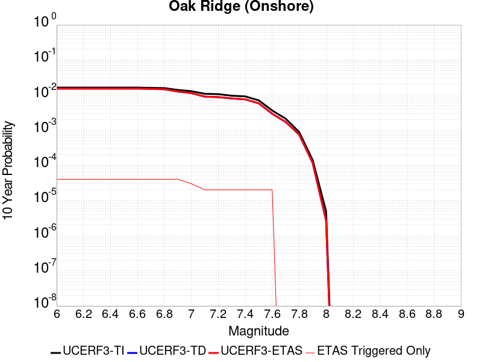 |

| Magnitude | 1 wk TI Prob | 1 wk TD Prob | 1 wk ETAS Prob | 1 wk ETAS/TD Gain | 1 wk ETAS Triggered Only | 1 mo TI Prob | 1 mo TD Prob | 1 mo ETAS Prob | 1 mo ETAS/TD Gain | 1 mo ETAS Triggered Only | 1 yr TI Prob | 1 yr TD Prob | 1 yr ETAS Prob | 1 yr ETAS/TD Gain | 1 yr ETAS Triggered Only | 10 yr TI Prob | 10 yr TD Prob | 10 yr ETAS Prob | 10 yr ETAS/TD Gain | 10 yr ETAS Triggered Only |
|-----|-----|-----|-----|-----|-----|-----|-----|-----|-----|-----|-----|-----|-----|-----|-----|-----|-----|-----|-----|-----|
| 6.0 | 3.155064E-5 | 2.952645E-5 | 2.952645E-5 | 1.0 | 0.0 | 1.3521002E-4 | 1.26536E-4 | 1.26536E-4 | 1.0 | 0.0 | 0.001644939 | 0.0015395252 | 0.0015599855 | 1.0132899 | 2.0491803E-5 | 0.01632816 | 0.015293104 | 0.015313283 | 1.0013194 | 2.0491803E-5 |
| 6.1 | 3.155064E-5 | 2.952645E-5 | 2.952645E-5 | 1.0 | 0.0 | 1.3521002E-4 | 1.26536E-4 | 1.26536E-4 | 1.0 | 0.0 | 0.001644939 | 0.0015395252 | 0.0015599855 | 1.0132899 | 2.0491803E-5 | 0.01632816 | 0.015293104 | 0.015313283 | 1.0013194 | 2.0491803E-5 |
| 6.2 | 3.155064E-5 | 2.952645E-5 | 2.952645E-5 | 1.0 | 0.0 | 1.3521002E-4 | 1.26536E-4 | 1.26536E-4 | 1.0 | 0.0 | 0.001644939 | 0.0015395252 | 0.0015599855 | 1.0132899 | 2.0491803E-5 | 0.01632816 | 0.015293104 | 0.015313283 | 1.0013194 | 2.0491803E-5 |
| 6.3 | 3.155064E-5 | 2.952645E-5 | 2.952645E-5 | 1.0 | 0.0 | 1.3521002E-4 | 1.26536E-4 | 1.26536E-4 | 1.0 | 0.0 | 0.001644939 | 0.0015395252 | 0.0015599855 | 1.0132899 | 2.0491803E-5 | 0.01632816 | 0.015293104 | 0.015313283 | 1.0013194 | 2.0491803E-5 |
| 6.4 | 3.155064E-5 | 2.952645E-5 | 2.952645E-5 | 1.0 | 0.0 | 1.3521002E-4 | 1.26536E-4 | 1.26536E-4 | 1.0 | 0.0 | 0.001644939 | 0.0015395252 | 0.0015599855 | 1.0132899 | 2.0491803E-5 | 0.01632816 | 0.015293104 | 0.015313283 | 1.0013194 | 2.0491803E-5 |
| 6.5 | 3.155064E-5 | 2.952645E-5 | 2.952645E-5 | 1.0 | 0.0 | 1.3521002E-4 | 1.26536E-4 | 1.26536E-4 | 1.0 | 0.0 | 0.001644939 | 0.0015395252 | 0.0015599855 | 1.0132899 | 2.0491803E-5 | 0.01632816 | 0.015293104 | 0.015313283 | 1.0013194 | 2.0491803E-5 |
| 6.6 | 3.155064E-5 | 2.952645E-5 | 2.952645E-5 | 1.0 | 0.0 | 1.3521002E-4 | 1.26536E-4 | 1.26536E-4 | 1.0 | 0.0 | 0.001644939 | 0.0015395252 | 0.0015599855 | 1.0132899 | 2.0491803E-5 | 0.01632816 | 0.015293104 | 0.015313283 | 1.0013194 | 2.0491803E-5 |
| 6.7 | 3.098897E-5 | 2.8864635E-5 | 2.8864635E-5 | 1.0 | 0.0 | 1.328031E-4 | 1.2369992E-4 | 1.2369992E-4 | 1.0 | 0.0 | 0.0016156785 | 0.0015050438 | 0.0015255049 | 1.013595 | 2.0491803E-5 | 0.016039822 | 0.014952951 | 0.014973136 | 1.0013499 | 2.0491803E-5 |
| 6.8 | 3.0449872E-5 | 2.823982E-5 | 2.823982E-5 | 1.0 | 0.0 | 1.3049292E-4 | 1.2102239E-4 | 1.2102239E-4 | 1.0 | 0.0 | 0.0015875935 | 0.001472489 | 0.0014929506 | 1.013896 | 2.0491803E-5 | 0.015762992 | 0.014631692 | 0.014651884 | 1.00138 | 2.0491803E-5 |
| 6.9 | 2.697928E-5 | 2.4220137E-5 | 2.4220137E-5 | 1.0 | 0.0 | 1.15620365E-4 | 1.0379658E-4 | 1.0379658E-4 | 1.0 | 0.0 | 0.0014067689 | 0.0012630123 | 0.0012834781 | 1.016204 | 2.0491803E-5 | 0.0139789665 | 0.012561057 | 0.012581292 | 1.0016109 | 2.0491803E-5 |
| 7.0 | 2.4893961E-5 | 2.1862359E-5 | 2.1862359E-5 | 1.0 | 0.0 | 1.0668404E-4 | 9.369256E-5 | 9.369256E-5 | 1.0 | 0.0 | 0.0012981043 | 0.0011401277 | 0.0011401277 | 1.0 | 0.0 | 0.012905477 | 0.011345069 | 0.011345069 | 1.0 | 0.0 |
| 7.1 | 2.0945363E-5 | 1.7354718E-5 | 1.7354718E-5 | 1.0 | 0.0 | 8.976275E-5 | 7.437527E-5 | 7.437527E-5 | 1.0 | 0.0 | 0.0010923136 | 9.051474E-4 | 9.051474E-4 | 1.0 | 0.0 | 0.0108696 | 0.009015542 | 0.009015542 | 1.0 | 0.0 |
| 7.2 | 2.0439404E-5 | 1.6809645E-5 | 1.6809645E-5 | 1.0 | 0.0 | 8.7594504E-5 | 7.2039365E-5 | 7.2039365E-5 | 1.0 | 0.0 | 0.0010659413 | 8.7673106E-4 | 8.7673106E-4 | 1.0 | 0.0 | 0.010608427 | 0.00873364 | 0.00873364 | 1.0 | 0.0 |
| 7.3 | 1.8463334E-5 | 1.5382002E-5 | 1.5382002E-5 | 1.0 | 0.0 | 7.912617E-5 | 6.5921224E-5 | 6.5921224E-5 | 1.0 | 0.0 | 9.6293533E-4 | 8.0229976E-4 | 8.0229976E-4 | 1.0 | 0.0 | 0.009587734 | 0.007994897 | 0.007994897 | 1.0 | 0.0 |
| 7.4 | 1.763139E-5 | 1.4517013E-5 | 1.4517013E-5 | 1.0 | 0.0 | 7.556091E-5 | 6.221431E-5 | 6.221431E-5 | 1.0 | 0.0 | 9.1956573E-4 | 7.5719994E-4 | 7.5719994E-4 | 1.0 | 0.0 | 0.009157699 | 0.007547003 | 0.007547003 | 1.0 | 0.0 |
| 7.5 | 1.3594944E-5 | 1.1163477E-5 | 1.1163477E-5 | 1.0 | 0.0 | 5.8262744E-5 | 4.7842612E-5 | 4.7842612E-5 | 1.0 | 0.0 | 7.0911803E-4 | 5.823306E-4 | 5.823306E-4 | 1.0 | 0.0 | 0.007068595 | 0.0058083185 | 0.0058083185 | 1.0 | 0.0 |
| 7.6 | 6.9889534E-6 | 5.6367617E-6 | 5.6367617E-6 | 1.0 | 0.0 | 2.9952313E-5 | 2.4157329E-5 | 2.4157329E-5 | 1.0 | 0.0 | 3.646084E-4 | 2.940762E-4 | 2.940762E-4 | 1.0 | 0.0 | 0.0036401073 | 0.0029369146 | 0.0029369146 | 1.0 | 0.0 |
| 7.7 | 4.0824193E-6 | 3.2832884E-6 | 3.2832884E-6 | 1.0 | 0.0 | 1.7495966E-5 | 1.4071161E-5 | 1.4071161E-5 | 1.0 | 0.0 | 2.1299256E-4 | 1.7130304E-4 | 1.7130304E-4 | 1.0 | 0.0 | 0.0021278851 | 0.0017117234 | 0.0017117234 | 1.0 | 0.0 |
| 7.8 | 1.7023609E-6 | 1.4370602E-6 | 1.4370602E-6 | 1.0 | 0.0 | 7.295812E-6 | 6.158815E-6 | 6.158815E-6 | 1.0 | 0.0 | 8.882289E-5 | 7.498102E-5 | 7.498102E-5 | 1.0 | 0.0 | 8.8787393E-4 | 7.4956E-4 | 7.4956E-4 | 1.0 | 0.0 |
| 7.9 | 2.721225E-7 | 2.2616715E-7 | 2.2616715E-7 | 1.0 | 0.0 | 1.1662388E-6 | 9.692874E-7 | 9.692874E-7 | 1.0 | 0.0 | 1.4198865E-5 | 1.1801013E-5 | 1.1801013E-5 | 1.0 | 0.0 | 1.4197957E-4 | 1.1800414E-4 | 1.1800414E-4 | 1.0 | 0.0 |
| 8.0 | 9.364255E-9 | 5.1209232E-9 | 5.1209232E-9 | 1.0 | 0.0 | 4.0132523E-8 | 2.1946814E-8 | 2.1946814E-8 | 1.0 | 0.0 | 4.8861335E-7 | 2.6720244E-7 | 2.6720244E-7 | 1.0 | 0.0 | 4.8861225E-6 | 2.6720215E-6 | 2.6720215E-6 | 1.0 | 0.0 |

## Sierra Madre (San Fernando)
*[(top)](#table-of-contents)*

| 1 Week | 1 Month | 1 Year | 10 Year |
|-----|-----|-----|-----|
| 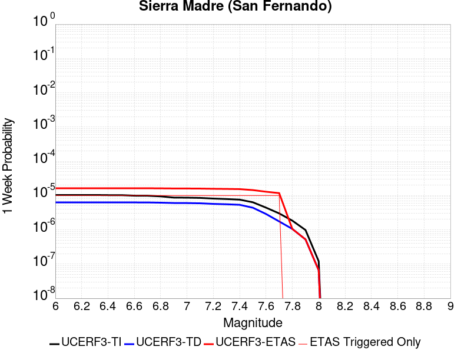 |  |  |  |

| Magnitude | 1 wk TI Prob | 1 wk TD Prob | 1 wk ETAS Prob | 1 wk ETAS/TD Gain | 1 wk ETAS Triggered Only | 1 mo TI Prob | 1 mo TD Prob | 1 mo ETAS Prob | 1 mo ETAS/TD Gain | 1 mo ETAS Triggered Only | 1 yr TI Prob | 1 yr TD Prob | 1 yr ETAS Prob | 1 yr ETAS/TD Gain | 1 yr ETAS Triggered Only | 10 yr TI Prob | 10 yr TD Prob | 10 yr ETAS Prob | 10 yr ETAS/TD Gain | 10 yr ETAS Triggered Only |
|-----|-----|-----|-----|-----|-----|-----|-----|-----|-----|-----|-----|-----|-----|-----|-----|-----|-----|-----|-----|-----|
| 6.0 | 1.0346413E-5 | 6.287434E-6 | 2.677911E-5 | 4.259147 | 2.0491803E-5 | 4.4341014E-5 | 2.6945874E-5 | 4.7437126E-5 | 1.7604597 | 2.0491803E-5 | 5.3971814E-4 | 3.2801775E-4 | 3.4850283E-4 | 1.0624511 | 2.0491803E-5 | 0.0053840918 | 0.0032754485 | 0.003295873 | 1.0062357 | 2.0491803E-5 |
| 6.1 | 1.0346413E-5 | 6.287434E-6 | 2.677911E-5 | 4.259147 | 2.0491803E-5 | 4.4341014E-5 | 2.6945874E-5 | 4.7437126E-5 | 1.7604597 | 2.0491803E-5 | 5.3971814E-4 | 3.2801775E-4 | 3.4850283E-4 | 1.0624511 | 2.0491803E-5 | 0.0053840918 | 0.0032754485 | 0.003295873 | 1.0062357 | 2.0491803E-5 |
| 6.2 | 1.0346413E-5 | 6.287434E-6 | 2.677911E-5 | 4.259147 | 2.0491803E-5 | 4.4341014E-5 | 2.6945874E-5 | 4.7437126E-5 | 1.7604597 | 2.0491803E-5 | 5.3971814E-4 | 3.2801775E-4 | 3.4850283E-4 | 1.0624511 | 2.0491803E-5 | 0.0053840918 | 0.0032754485 | 0.003295873 | 1.0062357 | 2.0491803E-5 |
| 6.3 | 1.0346413E-5 | 6.287434E-6 | 2.677911E-5 | 4.259147 | 2.0491803E-5 | 4.4341014E-5 | 2.6945874E-5 | 4.7437126E-5 | 1.7604597 | 2.0491803E-5 | 5.3971814E-4 | 3.2801775E-4 | 3.4850283E-4 | 1.0624511 | 2.0491803E-5 | 0.0053840918 | 0.0032754485 | 0.003295873 | 1.0062357 | 2.0491803E-5 |
| 6.4 | 1.0249558E-5 | 6.287434E-6 | 2.677911E-5 | 4.259147 | 2.0491803E-5 | 4.392594E-5 | 2.6945874E-5 | 4.7437126E-5 | 1.7604597 | 2.0491803E-5 | 5.3466705E-4 | 3.2801775E-4 | 3.4850283E-4 | 1.0624511 | 2.0491803E-5 | 0.0053338245 | 0.0032754485 | 0.003295873 | 1.0062357 | 2.0491803E-5 |
| 6.5 | 1.0249558E-5 | 6.287434E-6 | 2.677911E-5 | 4.259147 | 2.0491803E-5 | 4.392594E-5 | 2.6945874E-5 | 4.7437126E-5 | 1.7604597 | 2.0491803E-5 | 5.3466705E-4 | 3.2801775E-4 | 3.4850283E-4 | 1.0624511 | 2.0491803E-5 | 0.0053338245 | 0.0032754485 | 0.003295873 | 1.0062357 | 2.0491803E-5 |
| 6.6 | 9.9035515E-6 | 6.287434E-6 | 2.677911E-5 | 4.259147 | 2.0491803E-5 | 4.2443102E-5 | 2.6945874E-5 | 4.7437126E-5 | 1.7604597 | 2.0491803E-5 | 5.166222E-4 | 3.2801775E-4 | 3.4850283E-4 | 1.0624511 | 2.0491803E-5 | 0.0051542283 | 0.0032754485 | 0.003295873 | 1.0062357 | 2.0491803E-5 |
| 6.7 | 9.87217E-6 | 6.274855E-6 | 2.676653E-5 | 4.2656813 | 2.0491803E-5 | 4.2308613E-5 | 2.6891963E-5 | 4.7383215E-5 | 1.7619842 | 2.0491803E-5 | 5.149856E-4 | 3.2736157E-4 | 3.4784668E-4 | 1.0625764 | 2.0491803E-5 | 0.005137938 | 0.003268906 | 0.0032893308 | 1.0062482 | 2.0491803E-5 |
| 6.8 | 9.4359175E-6 | 6.1788287E-6 | 2.6670505E-5 | 4.316434 | 2.0491803E-5 | 4.043902E-5 | 2.6480431E-5 | 4.697169E-5 | 1.7738265 | 2.0491803E-5 | 4.9223384E-4 | 3.2235266E-4 | 3.4283785E-4 | 1.063549 | 2.0491803E-5 | 0.0049114493 | 0.0032189623 | 0.003239388 | 1.0063455 | 2.0491803E-5 |
| 6.9 | 8.700447E-6 | 6.0400866E-6 | 2.6531767E-5 | 4.3926134 | 2.0491803E-5 | 3.72871E-5 | 2.5885834E-5 | 4.6377107E-5 | 1.7916018 | 2.0491803E-5 | 4.5387587E-4 | 3.1511553E-4 | 3.356009E-4 | 1.065009 | 2.0491803E-5 | 0.0045295 | 0.0031467967 | 0.003167224 | 1.0064914 | 2.0491803E-5 |
| 7.0 | 8.648878E-6 | 6.0150014E-6 | 2.6506681E-5 | 4.406762 | 2.0491803E-5 | 3.7066096E-5 | 2.5778329E-5 | 4.6269604E-5 | 1.7949032 | 2.0491803E-5 | 4.5118626E-4 | 3.1380705E-4 | 3.3429242E-4 | 1.0652802 | 2.0491803E-5 | 0.004502713 | 0.0031337484 | 0.003154176 | 1.0065186 | 2.0491803E-5 |
| 7.1 | 8.505786E-6 | 5.924631E-6 | 2.6416314E-5 | 4.4587274 | 2.0491803E-5 | 3.645286E-5 | 2.5391035E-5 | 4.5882316E-5 | 1.8070283 | 2.0491803E-5 | 4.437232E-4 | 3.0909307E-4 | 3.2957853E-4 | 1.0662761 | 2.0491803E-5 | 0.0044283825 | 0.0030867406 | 0.0031071692 | 1.0066181 | 2.0491803E-5 |
| 7.2 | 8.139752E-6 | 5.6989234E-6 | 2.619061E-5 | 4.595712 | 2.0491803E-5 | 3.4884186E-5 | 2.4423734E-5 | 4.4915036E-5 | 1.8389914 | 2.0491803E-5 | 4.246322E-4 | 2.9731944E-4 | 3.1780516E-4 | 1.0689013 | 2.0491803E-5 | 0.004238217 | 0.0029693225 | 0.0029897536 | 1.0068806 | 2.0491803E-5 |
| 7.3 | 7.8816E-6 | 5.552236E-6 | 2.6043925E-5 | 4.6907096 | 2.0491803E-5 | 3.3777847E-5 | 2.3795086E-5 | 4.42864E-5 | 1.8611574 | 2.0491803E-5 | 4.111677E-4 | 2.8966772E-4 | 3.1015358E-4 | 1.070722 | 2.0491803E-5 | 0.004104078 | 0.002893007 | 0.0029134394 | 1.0070627 | 2.0491803E-5 |
| 7.4 | 7.5810603E-6 | 5.35647E-6 | 2.5848163E-5 | 4.825597 | 2.0491803E-5 | 3.2489854E-5 | 2.2956105E-5 | 4.3447435E-5 | 1.8926312 | 2.0491803E-5 | 3.9549218E-4 | 2.7945577E-4 | 2.9994184E-4 | 1.073307 | 2.0491803E-5 | 0.0039478904 | 0.0027911486 | 0.0028115832 | 1.0073212 | 2.0491803E-5 |
| 7.5 | 6.349153E-6 | 4.4077274E-6 | 2.489944E-5 | 5.6490426 | 2.0491803E-5 | 2.7210372E-5 | 1.8890129E-5 | 3.9381546E-5 | 2.0847685 | 2.0491803E-5 | 3.312359E-4 | 2.2996387E-4 | 2.5045098E-4 | 1.0890883 | 2.0491803E-5 | 0.0033074263 | 0.0022973411 | 0.0023177858 | 1.0088993 | 2.0491803E-5 |
| 7.6 | 4.430576E-6 | 2.8907298E-6 | 2.3382474E-5 | 8.0887785 | 2.0491803E-5 | 1.8988047E-5 | 1.2388785E-5 | 3.2880333E-5 | 2.6540403 | 2.0491803E-5 | 2.3115493E-4 | 1.5082324E-4 | 1.7131194E-4 | 1.1358459 | 2.0491803E-5 | 0.0023091463 | 0.0015072313 | 0.0015276922 | 1.0135752 | 2.0491803E-5 |
| 7.7 | 3.005066E-6 | 1.7511459E-6 | 2.2242913E-5 | 12.70192 | 2.0491803E-5 | 1.2878791E-5 | 7.5048893E-6 | 2.7996539E-5 | 3.7304401 | 2.0491803E-5 | 1.56788E-4 | 9.13682E-5 | 1.11858135E-4 | 1.2242566 | 2.0491803E-5 | 0.0015667742 | 9.1330754E-4 | 9.337806E-4 | 1.0224165 | 2.0491803E-5 |
| 7.8 | 1.8459098E-6 | 1.0583101E-6 | 1.0583101E-6 | 1.0 | 0.0 | 7.911018E-6 | 4.535607E-6 | 4.535607E-6 | 1.0 | 0.0 | 9.631238E-5 | 5.5219618E-5 | 5.5219618E-5 | 1.0 | 0.0 | 9.627065E-4 | 5.5205944E-4 | 5.5205944E-4 | 1.0 | 0.0 |
| 7.9 | 9.839262E-7 | 5.234948E-7 | 5.234948E-7 | 1.0 | 0.0 | 4.2168194E-6 | 2.2435472E-6 | 2.2435472E-6 | 1.0 | 0.0 | 5.1338568E-5 | 2.7314849E-5 | 2.7314849E-5 | 1.0 | 0.0 | 5.132671E-4 | 2.731152E-4 | 2.731152E-4 | 1.0 | 0.0 |
| 8.0 | 1.210983E-7 | 6.6141716E-8 | 6.6141716E-8 | 1.0 | 0.0 | 5.1899264E-7 | 2.8346446E-7 | 2.8346446E-7 | 1.0 | 0.0 | 6.3187167E-6 | 3.4511747E-6 | 3.4511747E-6 | 1.0 | 0.0 | 6.318537E-5 | 3.4511228E-5 | 3.4511228E-5 | 1.0 | 0.0 |

## Davis Creek
*[(top)](#table-of-contents)*

| 1 Week | 1 Month | 1 Year | 10 Year |
|-----|-----|-----|-----|
|  |  |  |  |

| Magnitude | 1 wk TI Prob | 1 wk TD Prob | 1 wk ETAS Prob | 1 wk ETAS/TD Gain | 1 wk ETAS Triggered Only | 1 mo TI Prob | 1 mo TD Prob | 1 mo ETAS Prob | 1 mo ETAS/TD Gain | 1 mo ETAS Triggered Only | 1 yr TI Prob | 1 yr TD Prob | 1 yr ETAS Prob | 1 yr ETAS/TD Gain | 1 yr ETAS Triggered Only | 10 yr TI Prob | 10 yr TD Prob | 10 yr ETAS Prob | 10 yr ETAS/TD Gain | 10 yr ETAS Triggered Only |
|-----|-----|-----|-----|-----|-----|-----|-----|-----|-----|-----|-----|-----|-----|-----|-----|-----|-----|-----|-----|-----|
| 6.0 | 2.331472E-5 | 2.5417517E-5 | 2.5417517E-5 | 1.0 | 0.0 | 9.99164E-5 | 1.0892834E-4 | 1.0892834E-4 | 1.0 | 0.0 | 0.0012158032 | 0.0013255142 | 0.0013255142 | 1.0 | 0.0 | 0.01209173 | 0.013187861 | 0.013208083 | 1.0015334 | 2.0491803E-5 |
| 6.1 | 1.0407654E-5 | 1.1317118E-5 | 1.1317118E-5 | 1.0 | 0.0 | 4.4603472E-5 | 4.8501184E-5 | 4.8501184E-5 | 1.0 | 0.0 | 5.4291193E-4 | 5.9036905E-4 | 5.9036905E-4 | 1.0 | 0.0 | 0.0054158745 | 0.005890679 | 0.005890679 | 1.0 | 0.0 |
| 6.2 | 1.0407654E-5 | 1.1317118E-5 | 1.1317118E-5 | 1.0 | 0.0 | 4.4603472E-5 | 4.8501184E-5 | 4.8501184E-5 | 1.0 | 0.0 | 5.4291193E-4 | 5.9036905E-4 | 5.9036905E-4 | 1.0 | 0.0 | 0.0054158745 | 0.005890679 | 0.005890679 | 1.0 | 0.0 |
| 6.3 | 5.1323277E-6 | 5.5686187E-6 | 5.5686187E-6 | 1.0 | 0.0 | 2.1995505E-5 | 2.386534E-5 | 2.386534E-5 | 1.0 | 0.0 | 2.6776237E-4 | 2.9053038E-4 | 2.9053038E-4 | 1.0 | 0.0 | 0.0026743996 | 0.0029023518 | 0.0029023518 | 1.0 | 0.0 |
| 6.4 | 2.4985154E-6 | 2.7045678E-6 | 2.7045678E-6 | 1.0 | 0.0 | 1.07078795E-5 | 1.1590974E-5 | 1.1590974E-5 | 1.0 | 0.0 | 1.3036063E-4 | 1.411146E-4 | 1.411146E-4 | 1.0 | 0.0 | 0.0013028418 | 0.0014106046 | 0.0014106046 | 1.0 | 0.0 |
| 6.5 | 2.4846438E-6 | 2.690502E-6 | 2.690502E-6 | 1.0 | 0.0 | 1.064843E-5 | 1.1530692E-5 | 1.1530692E-5 | 1.0 | 0.0 | 1.2963692E-4 | 1.4038075E-4 | 1.4038075E-4 | 1.0 | 0.0 | 0.0012956132 | 0.0014032754 | 0.0014032754 | 1.0 | 0.0 |
| 6.6 | 2.072566E-7 | 2.1018127E-7 | 2.1018127E-7 | 1.0 | 0.0 | 8.882423E-7 | 9.0077657E-7 | 9.0077657E-7 | 1.0 | 0.0 | 1.0814296E-5 | 1.0966901E-5 | 1.0966901E-5 | 1.0 | 0.0 | 1.081377E-4 | 1.09663786E-4 | 1.09663786E-4 | 1.0 | 0.0 |
| 6.7 | 1.7544528E-7 | 1.7790859E-7 | 1.7790859E-7 | 1.0 | 0.0 | 7.5190815E-7 | 7.6246516E-7 | 7.6246516E-7 | 1.0 | 0.0 | 9.154443E-6 | 9.282975E-6 | 9.282975E-6 | 1.0 | 0.0 | 9.1540656E-5 | 9.2826034E-5 | 9.2826034E-5 | 1.0 | 0.0 |
| 6.8 | 1.2320395E-7 | 1.2481159E-7 | 1.2481159E-7 | 1.0 | 0.0 | 5.280168E-7 | 5.3490675E-7 | 5.3490675E-7 | 1.0 | 0.0 | 6.428586E-6 | 6.512471E-6 | 6.512471E-6 | 1.0 | 0.0 | 6.4284E-5 | 6.512291E-5 | 6.512291E-5 | 1.0 | 0.0 |
| 6.9 | 6.399997E-8 | 6.486069E-8 | 6.486069E-8 | 1.0 | 0.0 | 2.7428555E-7 | 2.7797438E-7 | 2.7797438E-7 | 1.0 | 0.0 | 3.3394215E-6 | 3.3843335E-6 | 3.3843335E-6 | 1.0 | 0.0 | 3.3393713E-5 | 3.3842884E-5 | 3.3842884E-5 | 1.0 | 0.0 |
| 7.0 | 6.4455685E-9 | 6.5352763E-9 | 6.5352763E-9 | 1.0 | 0.0 | 2.7623864E-8 | 2.8008326E-8 | 2.8008326E-8 | 1.0 | 0.0 | 3.3632048E-7 | 3.4100137E-7 | 3.4100137E-7 | 1.0 | 0.0 | 3.3631998E-6 | 3.4100137E-6 | 3.4100137E-6 | 1.0 | 0.0 |

## San Clemente
*[(top)](#table-of-contents)*

| 1 Week | 1 Month | 1 Year | 10 Year |
|-----|-----|-----|-----|
|  |  |  |  |

| Magnitude | 1 wk TI Prob | 1 wk TD Prob | 1 wk ETAS Prob | 1 wk ETAS/TD Gain | 1 wk ETAS Triggered Only | 1 mo TI Prob | 1 mo TD Prob | 1 mo ETAS Prob | 1 mo ETAS/TD Gain | 1 mo ETAS Triggered Only | 1 yr TI Prob | 1 yr TD Prob | 1 yr ETAS Prob | 1 yr ETAS/TD Gain | 1 yr ETAS Triggered Only | 10 yr TI Prob | 10 yr TD Prob | 10 yr ETAS Prob | 10 yr ETAS/TD Gain | 10 yr ETAS Triggered Only |
|-----|-----|-----|-----|-----|-----|-----|-----|-----|-----|-----|-----|-----|-----|-----|-----|-----|-----|-----|-----|-----|
| 6.0 | 6.681379E-5 | 8.163669E-5 | 8.163669E-5 | 1.0 | 0.0 | 2.8631336E-4 | 3.4982787E-4 | 3.4982787E-4 | 1.0 | 0.0 | 0.003480294 | 0.004251416 | 0.004251416 | 1.0 | 0.0 | 0.03426291 | 0.041756913 | 0.04177655 | 1.0004703 | 2.0491803E-5 |
| 6.1 | 6.681379E-5 | 8.163669E-5 | 8.163669E-5 | 1.0 | 0.0 | 2.8631336E-4 | 3.4982787E-4 | 3.4982787E-4 | 1.0 | 0.0 | 0.003480294 | 0.004251416 | 0.004251416 | 1.0 | 0.0 | 0.03426291 | 0.041756913 | 0.041756913 | 1.0 | 0.0 |
| 6.2 | 3.9400576E-5 | 4.6453104E-5 | 4.6453104E-5 | 1.0 | 0.0 | 1.6884868E-4 | 1.9906988E-4 | 1.9906988E-4 | 1.0 | 0.0 | 0.0020537945 | 0.0024210429 | 0.0024210429 | 1.0 | 0.0 | 0.020349167 | 0.023953425 | 0.023953425 | 1.0 | 0.0 |
| 6.3 | 3.2590255E-5 | 3.792992E-5 | 3.792992E-5 | 1.0 | 0.0 | 1.3966505E-4 | 1.6254683E-4 | 1.6254683E-4 | 1.0 | 0.0 | 0.0016990956 | 0.0019772416 | 0.0019772416 | 1.0 | 0.0 | 0.01686163 | 0.019600289 | 0.019600289 | 1.0 | 0.0 |
| 6.4 | 2.9454652E-5 | 3.4098495E-5 | 3.4098495E-5 | 1.0 | 0.0 | 1.2622811E-4 | 1.4612835E-4 | 1.4612835E-4 | 1.0 | 0.0 | 0.0015357438 | 0.0017776854 | 0.0017776854 | 1.0 | 0.0 | 0.015251739 | 0.017637825 | 0.017637825 | 1.0 | 0.0 |
| 6.5 | 2.790836E-5 | 3.2248132E-5 | 3.2248132E-5 | 1.0 | 0.0 | 1.1960178E-4 | 1.3819907E-4 | 1.3819907E-4 | 1.0 | 0.0 | 0.001455179 | 0.0016812999 | 0.0016812999 | 1.0 | 0.0 | 0.014456868 | 0.016688818 | 0.016688818 | 1.0 | 0.0 |
| 6.6 | 2.2492153E-5 | 2.5763205E-5 | 2.5763205E-5 | 1.0 | 0.0 | 9.639138E-5 | 1.1040914E-4 | 1.1040914E-4 | 1.0 | 0.0 | 0.0011729331 | 0.0013434167 | 0.0013434167 | 1.0 | 0.0 | 0.011667615 | 0.013354672 | 0.013354672 | 1.0 | 0.0 |
| 6.7 | 1.9862755E-5 | 2.2666847E-5 | 2.2666847E-5 | 1.0 | 0.0 | 8.512331E-5 | 9.714008E-5 | 9.714008E-5 | 1.0 | 0.0 | 0.0010358836 | 0.0011820501 | 0.0011820501 | 1.0 | 0.0 | 0.010310682 | 0.01175892 | 0.01175892 | 1.0 | 0.0 |
| 6.8 | 1.6697575E-5 | 1.8978053E-5 | 1.8978053E-5 | 1.0 | 0.0 | 7.155907E-5 | 8.133203E-5 | 8.133203E-5 | 1.0 | 0.0 | 8.7088346E-4 | 9.89777E-4 | 9.89777E-4 | 1.0 | 0.0 | 0.008674784 | 0.009854714 | 0.009854714 | 1.0 | 0.0 |
| 6.9 | 1.5218415E-5 | 1.726971E-5 | 1.726971E-5 | 1.0 | 0.0 | 6.522015E-5 | 7.401099E-5 | 7.401099E-5 | 1.0 | 0.0 | 7.93766E-4 | 9.0072013E-4 | 9.0072013E-4 | 1.0 | 0.0 | 0.007909367 | 0.00897164 | 0.00897164 | 1.0 | 0.0 |
| 7.0 | 1.2392958E-5 | 1.4033262E-5 | 1.4033262E-5 | 1.0 | 0.0 | 5.3111595E-5 | 6.0141207E-5 | 6.0141207E-5 | 1.0 | 0.0 | 6.4644177E-4 | 7.319808E-4 | 7.319808E-4 | 1.0 | 0.0 | 0.0064456454 | 0.0072964844 | 0.0072964844 | 1.0 | 0.0 |
| 7.1 | 1.0934128E-5 | 1.2375354E-5 | 1.2375354E-5 | 1.0 | 0.0 | 4.6859706E-5 | 5.3036194E-5 | 5.3036194E-5 | 1.0 | 0.0 | 5.7036756E-4 | 6.455317E-4 | 6.455317E-4 | 1.0 | 0.0 | 0.0056890585 | 0.006437312 | 0.006437312 | 1.0 | 0.0 |
| 7.2 | 9.5798805E-6 | 1.0845125E-5 | 1.0845125E-5 | 1.0 | 0.0 | 4.1055984E-5 | 4.647832E-5 | 4.647832E-5 | 1.0 | 0.0 | 4.9974193E-4 | 5.657338E-4 | 5.657338E-4 | 1.0 | 0.0 | 0.0049861963 | 0.00564366 | 0.00564366 | 1.0 | 0.0 |
| 7.3 | 8.0167365E-6 | 9.084078E-6 | 9.084078E-6 | 1.0 | 0.0 | 3.4356988E-5 | 3.8931223E-5 | 3.8931223E-5 | 1.0 | 0.0 | 4.1821605E-4 | 4.738916E-4 | 4.738916E-4 | 1.0 | 0.0 | 0.0041742986 | 0.004729513 | 0.004729513 | 1.0 | 0.0 |
| 7.4 | 2.9581017E-6 | 3.36244E-6 | 3.36244E-6 | 1.0 | 0.0 | 1.2677518E-5 | 1.4410407E-5 | 1.4410407E-5 | 1.0 | 0.0 | 1.5433785E-4 | 1.7543763E-4 | 1.7543763E-4 | 1.0 | 0.0 | 0.001542307 | 0.0017534863 | 0.0017534863 | 1.0 | 0.0 |

## Cleghorn
*[(top)](#table-of-contents)*

| 1 Week | 1 Month | 1 Year | 10 Year |
|-----|-----|-----|-----|
|  |  |  |  |

| Magnitude | 1 wk TI Prob | 1 wk TD Prob | 1 wk ETAS Prob | 1 wk ETAS/TD Gain | 1 wk ETAS Triggered Only | 1 mo TI Prob | 1 mo TD Prob | 1 mo ETAS Prob | 1 mo ETAS/TD Gain | 1 mo ETAS Triggered Only | 1 yr TI Prob | 1 yr TD Prob | 1 yr ETAS Prob | 1 yr ETAS/TD Gain | 1 yr ETAS Triggered Only | 10 yr TI Prob | 10 yr TD Prob | 10 yr ETAS Prob | 10 yr ETAS/TD Gain | 10 yr ETAS Triggered Only |
|-----|-----|-----|-----|-----|-----|-----|-----|-----|-----|-----|-----|-----|-----|-----|-----|-----|-----|-----|-----|-----|
| 6.0 | 7.9267165E-6 | 9.832575E-6 | 9.832575E-6 | 1.0 | 0.0 | 3.39712E-5 | 4.213899E-5 | 4.213899E-5 | 1.0 | 0.0 | 4.1352084E-4 | 5.12932E-4 | 5.12932E-4 | 1.0 | 0.0 | 0.004127522 | 0.005132577 | 0.0051529636 | 1.003972 | 2.0491803E-5 |
| 6.1 | 7.9267165E-6 | 9.832575E-6 | 9.832575E-6 | 1.0 | 0.0 | 3.39712E-5 | 4.213899E-5 | 4.213899E-5 | 1.0 | 0.0 | 4.1352084E-4 | 5.12932E-4 | 5.12932E-4 | 1.0 | 0.0 | 0.004127522 | 0.005132577 | 0.0051529636 | 1.003972 | 2.0491803E-5 |
| 6.2 | 7.9267165E-6 | 9.832575E-6 | 9.832575E-6 | 1.0 | 0.0 | 3.39712E-5 | 4.213899E-5 | 4.213899E-5 | 1.0 | 0.0 | 4.1352084E-4 | 5.12932E-4 | 5.12932E-4 | 1.0 | 0.0 | 0.004127522 | 0.005132577 | 0.0051529636 | 1.003972 | 2.0491803E-5 |
| 6.3 | 7.9267165E-6 | 9.832575E-6 | 9.832575E-6 | 1.0 | 0.0 | 3.39712E-5 | 4.213899E-5 | 4.213899E-5 | 1.0 | 0.0 | 4.1352084E-4 | 5.12932E-4 | 5.12932E-4 | 1.0 | 0.0 | 0.004127522 | 0.005132577 | 0.0051529636 | 1.003972 | 2.0491803E-5 |
| 6.4 | 4.3445207E-6 | 6.0924144E-6 | 6.0924144E-6 | 1.0 | 0.0 | 1.8619241E-5 | 2.6110092E-5 | 2.6110092E-5 | 1.0 | 0.0 | 2.2666567E-4 | 3.1784503E-4 | 3.1784503E-4 | 1.0 | 0.0 | 0.0022643462 | 0.0031880767 | 0.0032085031 | 1.0064071 | 2.0491803E-5 |
| 6.5 | 4.3445207E-6 | 6.0924144E-6 | 6.0924144E-6 | 1.0 | 0.0 | 1.8619241E-5 | 2.6110092E-5 | 2.6110092E-5 | 1.0 | 0.0 | 2.2666567E-4 | 3.1784503E-4 | 3.1784503E-4 | 1.0 | 0.0 | 0.0022643462 | 0.0031880767 | 0.0032085031 | 1.0064071 | 2.0491803E-5 |
| 6.6 | 4.040109E-6 | 5.7748202E-6 | 5.7748202E-6 | 1.0 | 0.0 | 1.7314638E-5 | 2.4749E-5 | 2.4749E-5 | 1.0 | 0.0 | 2.1078532E-4 | 3.0127834E-4 | 3.0127834E-4 | 1.0 | 0.0 | 0.002105855 | 0.0030228654 | 0.0030432953 | 1.0067585 | 2.0491803E-5 |
| 6.7 | 3.3632055E-6 | 5.0683134E-6 | 5.0683134E-6 | 1.0 | 0.0 | 1.4413658E-5 | 2.1721164E-5 | 2.1721164E-5 | 1.0 | 0.0 | 1.7547216E-4 | 2.6442338E-4 | 2.6442338E-4 | 1.0 | 0.0 | 0.0017533366 | 0.0026551976 | 0.002675635 | 1.0076971 | 2.0491803E-5 |
| 6.8 | 3.2902772E-6 | 4.99022E-6 | 4.99022E-6 | 1.0 | 0.0 | 1.4101111E-5 | 2.1386484E-5 | 2.1386484E-5 | 1.0 | 0.0 | 1.716675E-4 | 2.6034965E-4 | 2.6034965E-4 | 1.0 | 0.0 | 0.0017153495 | 0.0026145563 | 0.0026349945 | 1.0078171 | 2.0491803E-5 |
| 6.9 | 3.031547E-6 | 4.6919777E-6 | 4.6919777E-6 | 1.0 | 0.0 | 1.299228E-5 | 2.0108322E-5 | 2.0108322E-5 | 1.0 | 0.0 | 1.5816953E-4 | 2.447916E-4 | 2.447916E-4 | 1.0 | 0.0 | 0.00158057 | 0.0024593272 | 0.0024797688 | 1.0083117 | 2.0491803E-5 |
| 7.0 | 2.8259715E-6 | 4.371534E-6 | 4.371534E-6 | 1.0 | 0.0 | 1.211125E-5 | 1.8735012E-5 | 1.8735012E-5 | 1.0 | 0.0 | 1.4744449E-4 | 2.2807514E-4 | 2.2807514E-4 | 1.0 | 0.0 | 0.001473467 | 0.002292517 | 0.0023129617 | 1.008918 | 2.0491803E-5 |
| 7.1 | 2.5962665E-6 | 4.066747E-6 | 4.066747E-6 | 1.0 | 0.0 | 1.1126809E-5 | 1.74288E-5 | 1.74288E-5 | 1.0 | 0.0 | 1.3546048E-4 | 2.1217519E-4 | 2.1217519E-4 | 1.0 | 0.0 | 0.0013537793 | 0.0021338374 | 0.0021542856 | 1.0095828 | 2.0491803E-5 |
| 7.2 | 2.3247253E-6 | 3.6772897E-6 | 3.6772897E-6 | 1.0 | 0.0 | 9.96307E-6 | 1.5759719E-5 | 1.5759719E-5 | 1.0 | 0.0 | 1.21293626E-4 | 1.9185786E-4 | 1.9185786E-4 | 1.0 | 0.0 | 0.0012122744 | 0.0019310551 | 0.0019515073 | 1.0105913 | 2.0491803E-5 |
| 7.3 | 2.056928E-6 | 3.2359856E-6 | 3.2359856E-6 | 1.0 | 0.0 | 8.815376E-6 | 1.3868437E-5 | 1.3868437E-5 | 1.0 | 0.0 | 1.0732192E-4 | 1.688353E-4 | 1.688353E-4 | 1.0 | 0.0 | 0.001072701 | 0.0017012694 | 0.0017217264 | 1.0120245 | 2.0491803E-5 |
| 7.4 | 1.8055999E-6 | 2.8263637E-6 | 2.8263637E-6 | 1.0 | 0.0 | 7.738263E-6 | 1.21129315E-5 | 1.21129315E-5 | 1.0 | 0.0 | 9.4209274E-5 | 1.474651E-4 | 1.474651E-4 | 1.0 | 0.0 | 9.4169343E-4 | 0.001488009 | 0.0015084704 | 1.0137508 | 2.0491803E-5 |
| 7.5 | 1.4683443E-6 | 2.425593E-6 | 2.425593E-6 | 1.0 | 0.0 | 6.292889E-6 | 1.0395358E-5 | 1.0395358E-5 | 1.0 | 0.0 | 7.661323E-5 | 1.2655623E-4 | 1.2655623E-4 | 1.0 | 0.0 | 7.658682E-4 | 0.0012792206 | 0.0012996861 | 1.0159985 | 2.0491803E-5 |
| 7.6 | 9.804088E-7 | 1.901101E-6 | 1.901101E-6 | 1.0 | 0.0 | 4.201745E-6 | 8.147551E-6 | 8.147551E-6 | 1.0 | 0.0 | 5.1155046E-5 | 9.919196E-5 | 9.919196E-5 | 1.0 | 0.0 | 5.114327E-4 | 0.0010058905 | 0.0010263617 | 1.0203513 | 2.0491803E-5 |
| 7.7 | 7.3434086E-7 | 1.6292396E-6 | 1.6292396E-6 | 1.0 | 0.0 | 3.1471714E-6 | 6.982437E-6 | 6.982437E-6 | 1.0 | 0.0 | 3.831614E-5 | 8.500788E-5 | 8.500788E-5 | 1.0 | 0.0 | 3.8309532E-4 | 8.642013E-4 | 8.846754E-4 | 1.0236913 | 2.0491803E-5 |
| 7.8 | 6.434184E-7 | 1.522801E-6 | 1.522801E-6 | 1.0 | 0.0 | 2.7575045E-6 | 6.5262734E-6 | 6.5262734E-6 | 1.0 | 0.0 | 3.35721E-5 | 7.9454505E-5 | 7.9454505E-5 | 1.0 | 0.0 | 3.3567028E-4 | 8.083677E-4 | 8.288429E-4 | 1.0253291 | 2.0491803E-5 |
| 7.9 | 3.4943926E-7 | 7.5788125E-7 | 7.5788125E-7 | 1.0 | 0.0 | 1.497596E-6 | 3.2480586E-6 | 3.2480586E-6 | 1.0 | 0.0 | 1.8233079E-5 | 3.9544404E-5 | 3.9544404E-5 | 1.0 | 0.0 | 1.8231584E-4 | 4.0423044E-4 | 4.0423044E-4 | 1.0 | 0.0 |
| 8.0 | 6.717524E-8 | 5.8440865E-8 | 5.8440865E-8 | 1.0 | 0.0 | 2.8789387E-7 | 2.5046083E-7 | 2.5046083E-7 | 1.0 | 0.0 | 3.505102E-6 | 3.0493563E-6 | 3.0493563E-6 | 1.0 | 0.0 | 3.5050467E-5 | 3.276327E-5 | 3.276327E-5 | 1.0 | 0.0 |
| 8.1 | 3.1984914E-8 | 1.2973213E-8 | 1.2973213E-8 | 1.0 | 0.0 | 1.370782E-7 | 5.5599482E-8 | 5.5599482E-8 | 1.0 | 0.0 | 1.6689258E-6 | 6.769235E-7 | 6.769235E-7 | 1.0 | 0.0 | 1.6689133E-5 | 7.754204E-6 | 7.754204E-6 | 1.0 | 0.0 |
| 8.2 | 1.21887656E-8 | 3.654808E-9 | 3.654808E-9 | 1.0 | 0.0 | 5.2237567E-8 | 1.5663463E-8 | 1.5663463E-8 | 1.0 | 0.0 | 6.359922E-7 | 1.9070265E-7 | 1.9070265E-7 | 1.0 | 0.0 | 6.3599036E-6 | 2.2501451E-6 | 2.2501451E-6 | 1.0 | 0.0 |

## Ortigalita (North)
*[(top)](#table-of-contents)*

| 1 Week | 1 Month | 1 Year | 10 Year |
|-----|-----|-----|-----|
|  |  |  |  |

| Magnitude | 1 wk TI Prob | 1 wk TD Prob | 1 wk ETAS Prob | 1 wk ETAS/TD Gain | 1 wk ETAS Triggered Only | 1 mo TI Prob | 1 mo TD Prob | 1 mo ETAS Prob | 1 mo ETAS/TD Gain | 1 mo ETAS Triggered Only | 1 yr TI Prob | 1 yr TD Prob | 1 yr ETAS Prob | 1 yr ETAS/TD Gain | 1 yr ETAS Triggered Only | 10 yr TI Prob | 10 yr TD Prob | 10 yr ETAS Prob | 10 yr ETAS/TD Gain | 10 yr ETAS Triggered Only |
|-----|-----|-----|-----|-----|-----|-----|-----|-----|-----|-----|-----|-----|-----|-----|-----|-----|-----|-----|-----|-----|
| 6.0 | 7.711876E-5 | 1.0507023E-4 | 1.0507023E-4 | 1.0 | 0.0 | 3.3046713E-4 | 4.5023413E-4 | 4.5023413E-4 | 1.0 | 0.0 | 0.004016016 | 0.005468329 | 0.005488709 | 1.0037268 | 2.0491803E-5 | 0.039442103 | 0.053457033 | 0.053476427 | 1.0003629 | 2.0491803E-5 |
| 6.1 | 4.607858E-5 | 6.024174E-5 | 6.024174E-5 | 1.0 | 0.0 | 1.9746469E-4 | 2.5815613E-4 | 2.5815613E-4 | 1.0 | 0.0 | 0.0024014818 | 0.0031388826 | 0.0031388826 | 1.0 | 0.0 | 0.023756953 | 0.030976266 | 0.030976266 | 1.0 | 0.0 |
| 6.2 | 4.607858E-5 | 6.024174E-5 | 6.024174E-5 | 1.0 | 0.0 | 1.9746469E-4 | 2.5815613E-4 | 2.5815613E-4 | 1.0 | 0.0 | 0.0024014818 | 0.0031388826 | 0.0031388826 | 1.0 | 0.0 | 0.023756953 | 0.030976266 | 0.030976266 | 1.0 | 0.0 |
| 6.3 | 3.327423E-5 | 4.247674E-5 | 4.247674E-5 | 1.0 | 0.0 | 1.4259605E-4 | 1.820322E-4 | 1.820322E-4 | 1.0 | 0.0 | 0.0017347244 | 0.0022142797 | 0.0022142797 | 1.0 | 0.0 | 0.017212452 | 0.021946438 | 0.021946438 | 1.0 | 0.0 |
| 6.4 | 2.7732503E-5 | 3.4999855E-5 | 3.4999855E-5 | 1.0 | 0.0 | 1.1884817E-4 | 1.4999225E-4 | 1.4999225E-4 | 1.0 | 0.0 | 0.001446016 | 0.001824874 | 0.001824874 | 1.0 | 0.0 | 0.014366428 | 0.018121855 | 0.018121855 | 1.0 | 0.0 |
| 6.5 | 2.7689714E-5 | 3.4949666E-5 | 3.4949666E-5 | 1.0 | 0.0 | 1.186648E-4 | 1.4977719E-4 | 1.4977719E-4 | 1.0 | 0.0 | 0.0014437864 | 0.00182226 | 0.00182226 | 1.0 | 0.0 | 0.014344421 | 0.018096142 | 0.018096142 | 1.0 | 0.0 |
| 6.6 | 2.2976905E-5 | 2.8719256E-5 | 2.8719256E-5 | 1.0 | 0.0 | 9.846873E-5 | 1.2307815E-4 | 1.2307815E-4 | 1.0 | 0.0 | 0.0011981975 | 0.001497687 | 0.001497687 | 1.0 | 0.0 | 0.011917574 | 0.014899201 | 0.014899201 | 1.0 | 0.0 |
| 6.7 | 1.9871539E-5 | 2.490528E-5 | 2.490528E-5 | 1.0 | 0.0 | 8.516096E-5 | 1.0673395E-4 | 1.0673395E-4 | 1.0 | 0.0 | 0.0010363415 | 0.0012989598 | 0.0012989598 | 1.0 | 0.0 | 0.010315218 | 0.012937365 | 0.012937365 | 1.0 | 0.0 |
| 6.8 | 6.5640475E-6 | 7.6056526E-6 | 7.6056526E-6 | 1.0 | 0.0 | 2.813133E-5 | 3.2595264E-5 | 3.2595264E-5 | 1.0 | 0.0 | 3.424451E-4 | 3.9677793E-4 | 3.9677793E-4 | 1.0 | 0.0 | 0.0034191788 | 0.0039609824 | 0.0039609824 | 1.0 | 0.0 |
| 6.9 | 5.6219683E-6 | 6.5019726E-6 | 6.5019726E-6 | 1.0 | 0.0 | 2.4093928E-5 | 2.7865315E-5 | 2.7865315E-5 | 1.0 | 0.0 | 2.933041E-4 | 3.3920998E-4 | 3.3920998E-4 | 1.0 | 0.0 | 0.0029291727 | 0.0033871792 | 0.0033871792 | 1.0 | 0.0 |
| 7.0 | 3.875591E-6 | 4.4848484E-6 | 4.4848484E-6 | 1.0 | 0.0 | 1.6609569E-5 | 1.922065E-5 | 1.922065E-5 | 1.0 | 0.0 | 2.0220275E-4 | 2.339884E-4 | 2.339884E-4 | 1.0 | 0.0 | 0.0020201886 | 0.0023376285 | 0.0023376285 | 1.0 | 0.0 |
| 7.1 | 1.6017933E-6 | 1.8570811E-6 | 1.8570811E-6 | 1.0 | 0.0 | 6.8648105E-6 | 7.958901E-6 | 7.958901E-6 | 1.0 | 0.0 | 8.357586E-5 | 9.689637E-5 | 9.689637E-5 | 1.0 | 0.0 | 8.3544437E-4 | 9.686459E-4 | 9.686459E-4 | 1.0 | 0.0 |

## Thirty Mile Bank
*[(top)](#table-of-contents)*

| 1 Week | 1 Month | 1 Year | 10 Year |
|-----|-----|-----|-----|
|  |  |  | 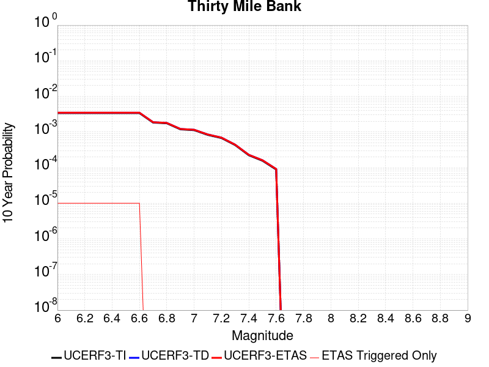 |

| Magnitude | 1 wk TI Prob | 1 wk TD Prob | 1 wk ETAS Prob | 1 wk ETAS/TD Gain | 1 wk ETAS Triggered Only | 1 mo TI Prob | 1 mo TD Prob | 1 mo ETAS Prob | 1 mo ETAS/TD Gain | 1 mo ETAS Triggered Only | 1 yr TI Prob | 1 yr TD Prob | 1 yr ETAS Prob | 1 yr ETAS/TD Gain | 1 yr ETAS Triggered Only | 10 yr TI Prob | 10 yr TD Prob | 10 yr ETAS Prob | 10 yr ETAS/TD Gain | 10 yr ETAS Triggered Only |
|-----|-----|-----|-----|-----|-----|-----|-----|-----|-----|-----|-----|-----|-----|-----|-----|-----|-----|-----|-----|-----|
| 6.0 | 6.5124755E-6 | 6.6592843E-6 | 6.6592843E-6 | 1.0 | 0.0 | 2.791031E-5 | 2.8539502E-5 | 2.8539502E-5 | 1.0 | 0.0 | 3.3975503E-4 | 3.474174E-4 | 3.6790207E-4 | 1.0589627 | 2.0491803E-5 | 0.0033923604 | 0.0034691745 | 0.0034895951 | 1.0058863 | 2.0491803E-5 |
| 6.1 | 6.5124755E-6 | 6.6592843E-6 | 6.6592843E-6 | 1.0 | 0.0 | 2.791031E-5 | 2.8539502E-5 | 2.8539502E-5 | 1.0 | 0.0 | 3.3975503E-4 | 3.474174E-4 | 3.6790207E-4 | 1.0589627 | 2.0491803E-5 | 0.0033923604 | 0.0034691745 | 0.0034895951 | 1.0058863 | 2.0491803E-5 |
| 6.2 | 6.5124755E-6 | 6.6592843E-6 | 6.6592843E-6 | 1.0 | 0.0 | 2.791031E-5 | 2.8539502E-5 | 2.8539502E-5 | 1.0 | 0.0 | 3.3975503E-4 | 3.474174E-4 | 3.6790207E-4 | 1.0589627 | 2.0491803E-5 | 0.0033923604 | 0.0034691745 | 0.0034895951 | 1.0058863 | 2.0491803E-5 |
| 6.3 | 6.5124755E-6 | 6.6592843E-6 | 6.6592843E-6 | 1.0 | 0.0 | 2.791031E-5 | 2.8539502E-5 | 2.8539502E-5 | 1.0 | 0.0 | 3.3975503E-4 | 3.474174E-4 | 3.6790207E-4 | 1.0589627 | 2.0491803E-5 | 0.0033923604 | 0.0034691745 | 0.0034895951 | 1.0058863 | 2.0491803E-5 |
| 6.4 | 6.5124755E-6 | 6.6592843E-6 | 6.6592843E-6 | 1.0 | 0.0 | 2.791031E-5 | 2.8539502E-5 | 2.8539502E-5 | 1.0 | 0.0 | 3.3975503E-4 | 3.474174E-4 | 3.6790207E-4 | 1.0589627 | 2.0491803E-5 | 0.0033923604 | 0.0034691745 | 0.0034895951 | 1.0058863 | 2.0491803E-5 |
| 6.5 | 6.5124755E-6 | 6.6592843E-6 | 6.6592843E-6 | 1.0 | 0.0 | 2.791031E-5 | 2.8539502E-5 | 2.8539502E-5 | 1.0 | 0.0 | 3.3975503E-4 | 3.474174E-4 | 3.6790207E-4 | 1.0589627 | 2.0491803E-5 | 0.0033923604 | 0.0034691745 | 0.0034895951 | 1.0058863 | 2.0491803E-5 |
| 6.6 | 6.5124755E-6 | 6.6592843E-6 | 6.6592843E-6 | 1.0 | 0.0 | 2.791031E-5 | 2.8539502E-5 | 2.8539502E-5 | 1.0 | 0.0 | 3.3975503E-4 | 3.474174E-4 | 3.6790207E-4 | 1.0589627 | 2.0491803E-5 | 0.0033923604 | 0.0034691745 | 0.0034895951 | 1.0058863 | 2.0491803E-5 |
| 6.7 | 3.5261137E-6 | 3.6099111E-6 | 3.6099111E-6 | 1.0 | 0.0 | 1.5111828E-5 | 1.547096E-5 | 1.547096E-5 | 1.0 | 0.0 | 1.8397097E-4 | 1.883433E-4 | 1.883433E-4 | 1.0 | 0.0 | 0.0018381875 | 0.0018819018 | 0.0018819018 | 1.0 | 0.0 |
| 6.8 | 3.370743E-6 | 3.4509465E-6 | 3.4509465E-6 | 1.0 | 0.0 | 1.4445961E-5 | 1.478969E-5 | 1.478969E-5 | 1.0 | 0.0 | 1.7586538E-4 | 1.8005022E-4 | 1.8005022E-4 | 1.0 | 0.0 | 0.0017572626 | 0.0017991053 | 0.0017991053 | 1.0 | 0.0 |
| 6.9 | 2.2756835E-6 | 2.3331688E-6 | 2.3331688E-6 | 1.0 | 0.0 | 9.752893E-6 | 9.9992585E-6 | 9.9992585E-6 | 1.0 | 0.0 | 1.18735006E-4 | 1.2173442E-4 | 1.2173442E-4 | 1.0 | 0.0 | 0.0011867158 | 0.0012167019 | 0.0012167019 | 1.0 | 0.0 |
| 7.0 | 2.1617404E-6 | 2.2159875E-6 | 2.2159875E-6 | 1.0 | 0.0 | 9.264569E-6 | 9.4970555E-6 | 9.4970555E-6 | 1.0 | 0.0 | 1.1279029E-4 | 1.1562076E-4 | 1.1562076E-4 | 1.0 | 0.0 | 0.0011273306 | 0.0011556301 | 0.0011556301 | 1.0 | 0.0 |
| 7.1 | 1.5900777E-6 | 1.6327073E-6 | 1.6327073E-6 | 1.0 | 0.0 | 6.814601E-6 | 6.9972984E-6 | 6.9972984E-6 | 1.0 | 0.0 | 8.296461E-5 | 8.518891E-5 | 8.518891E-5 | 1.0 | 0.0 | 8.293364E-4 | 8.515753E-4 | 8.515753E-4 | 1.0 | 0.0 |
| 7.2 | 1.2971728E-6 | 1.332904E-6 | 1.332904E-6 | 1.0 | 0.0 | 5.5593005E-6 | 5.712434E-6 | 5.712434E-6 | 1.0 | 0.0 | 6.768238E-5 | 6.954677E-5 | 6.954677E-5 | 1.0 | 0.0 | 6.7661767E-4 | 6.9526036E-4 | 6.9526036E-4 | 1.0 | 0.0 |
| 7.3 | 8.2454284E-7 | 8.448919E-7 | 8.448919E-7 | 1.0 | 0.0 | 3.5337503E-6 | 3.6209606E-6 | 3.6209606E-6 | 1.0 | 0.0 | 4.302256E-5 | 4.4084365E-5 | 4.4084365E-5 | 1.0 | 0.0 | 4.301423E-4 | 4.4076223E-4 | 4.4076223E-4 | 1.0 | 0.0 |
| 7.4 | 4.2619024E-7 | 4.3863636E-7 | 4.3863636E-7 | 1.0 | 0.0 | 1.8265283E-6 | 1.8798688E-6 | 1.8798688E-6 | 1.0 | 0.0 | 2.2237757E-5 | 2.2887167E-5 | 2.2887167E-5 | 1.0 | 0.0 | 2.223553E-4 | 2.2884848E-4 | 2.2884848E-4 | 1.0 | 0.0 |
| 7.5 | 2.993922E-7 | 3.0864658E-7 | 3.0864658E-7 | 1.0 | 0.0 | 1.2831089E-6 | 1.3227703E-6 | 1.3227703E-6 | 1.0 | 0.0 | 1.5621737E-5 | 1.6104612E-5 | 1.6104612E-5 | 1.0 | 0.0 | 1.562064E-4 | 1.6103471E-4 | 1.6103471E-4 | 1.0 | 0.0 |
| 7.6 | 1.6988751E-7 | 1.7533898E-7 | 1.7533898E-7 | 1.0 | 0.0 | 7.2808916E-7 | 7.5145255E-7 | 7.5145255E-7 | 1.0 | 0.0 | 8.864449E-6 | 9.148898E-6 | 9.148898E-6 | 1.0 | 0.0 | 8.8640954E-5 | 9.148542E-5 | 9.148542E-5 | 1.0 | 0.0 |

## Johnson Valley (No) 2011 rev
*[(top)](#table-of-contents)*

| 1 Week | 1 Month | 1 Year | 10 Year |
|-----|-----|-----|-----|
|  | 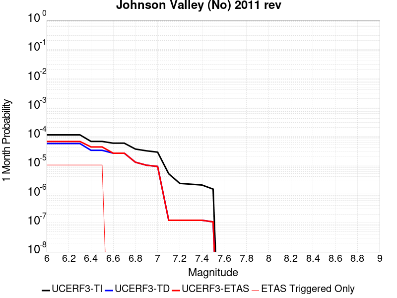 |  | 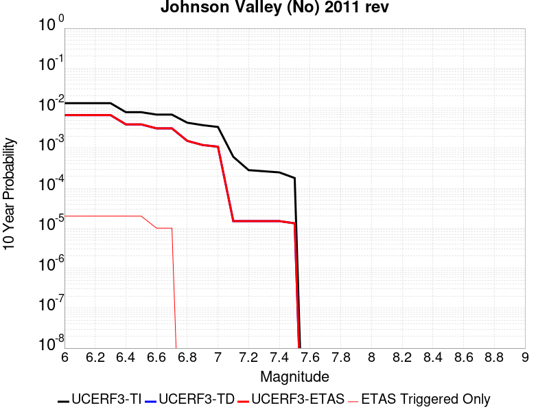 |

| Magnitude | 1 wk TI Prob | 1 wk TD Prob | 1 wk ETAS Prob | 1 wk ETAS/TD Gain | 1 wk ETAS Triggered Only | 1 mo TI Prob | 1 mo TD Prob | 1 mo ETAS Prob | 1 mo ETAS/TD Gain | 1 mo ETAS Triggered Only | 1 yr TI Prob | 1 yr TD Prob | 1 yr ETAS Prob | 1 yr ETAS/TD Gain | 1 yr ETAS Triggered Only | 10 yr TI Prob | 10 yr TD Prob | 10 yr ETAS Prob | 10 yr ETAS/TD Gain | 10 yr ETAS Triggered Only |
|-----|-----|-----|-----|-----|-----|-----|-----|-----|-----|-----|-----|-----|-----|-----|-----|-----|-----|-----|-----|-----|
| 6.0 | 2.577707E-5 | 1.29011505E-5 | 3.339269E-5 | 2.5883498 | 2.0491803E-5 | 1.1046848E-4 | 5.5289696E-5 | 7.5780365E-5 | 1.3706056 | 2.0491803E-5 | 0.0013441239 | 6.729838E-4 | 6.9346186E-4 | 1.0304286 | 2.0491803E-5 | 0.013360229 | 0.006713367 | 0.0067337216 | 1.0030318 | 2.0491803E-5 |
| 6.1 | 2.577707E-5 | 1.29011505E-5 | 3.339269E-5 | 2.5883498 | 2.0491803E-5 | 1.1046848E-4 | 5.5289696E-5 | 7.5780365E-5 | 1.3706056 | 2.0491803E-5 | 0.0013441239 | 6.729838E-4 | 6.9346186E-4 | 1.0304286 | 2.0491803E-5 | 0.013360229 | 0.006713367 | 0.0067337216 | 1.0030318 | 2.0491803E-5 |
| 6.2 | 2.577707E-5 | 1.29011505E-5 | 3.339269E-5 | 2.5883498 | 2.0491803E-5 | 1.1046848E-4 | 5.5289696E-5 | 7.5780365E-5 | 1.3706056 | 2.0491803E-5 | 0.0013441239 | 6.729838E-4 | 6.9346186E-4 | 1.0304286 | 2.0491803E-5 | 0.013360229 | 0.006713367 | 0.0067337216 | 1.0030318 | 2.0491803E-5 |
| 6.3 | 2.577707E-5 | 1.29011505E-5 | 3.339269E-5 | 2.5883498 | 2.0491803E-5 | 1.1046848E-4 | 5.5289696E-5 | 7.5780365E-5 | 1.3706056 | 2.0491803E-5 | 0.0013441239 | 6.729838E-4 | 6.9346186E-4 | 1.0304286 | 2.0491803E-5 | 0.013360229 | 0.006713367 | 0.0067337216 | 1.0030318 | 2.0491803E-5 |
| 6.4 | 1.5296591E-5 | 7.536876E-6 | 2.8028526E-5 | 3.7188516 | 2.0491803E-5 | 6.555518E-5 | 3.2300606E-5 | 5.2791747E-5 | 1.6343888 | 2.0491803E-5 | 7.97842E-4 | 3.9320765E-4 | 4.136914E-4 | 1.052094 | 2.0491803E-5 | 0.007949836 | 0.0039269608 | 0.003947372 | 1.0051978 | 2.0491803E-5 |
| 6.5 | 1.5296591E-5 | 7.536876E-6 | 2.8028526E-5 | 3.7188516 | 2.0491803E-5 | 6.555518E-5 | 3.2300606E-5 | 5.2791747E-5 | 1.6343888 | 2.0491803E-5 | 7.97842E-4 | 3.9320765E-4 | 4.136914E-4 | 1.052094 | 2.0491803E-5 | 0.007949836 | 0.0039269608 | 0.003947372 | 1.0051978 | 2.0491803E-5 |
| 6.6 | 1.3289383E-5 | 5.9918434E-6 | 5.9918434E-6 | 1.0 | 0.0 | 5.6953253E-5 | 2.5679172E-5 | 2.5679172E-5 | 1.0 | 0.0 | 6.9318525E-4 | 3.1261603E-4 | 3.1261603E-4 | 1.0 | 0.0 | 0.0069102696 | 0.0031234273 | 0.0031234273 | 1.0 | 0.0 |
| 6.7 | 1.3289383E-5 | 5.9918434E-6 | 5.9918434E-6 | 1.0 | 0.0 | 5.6953253E-5 | 2.5679172E-5 | 2.5679172E-5 | 1.0 | 0.0 | 6.9318525E-4 | 3.1261603E-4 | 3.1261603E-4 | 1.0 | 0.0 | 0.0069102696 | 0.0031234273 | 0.0031234273 | 1.0 | 0.0 |
| 6.8 | 8.330789E-6 | 2.9212572E-6 | 2.9212572E-6 | 1.0 | 0.0 | 3.570289E-5 | 1.2519647E-5 | 1.2519647E-5 | 1.0 | 0.0 | 4.34596E-4 | 1.5242174E-4 | 1.5242174E-4 | 1.0 | 0.0 | 0.0043374705 | 0.0015237319 | 0.0015237319 | 1.0 | 0.0 |
| 6.9 | 7.2359003E-6 | 2.3013858E-6 | 2.3013858E-6 | 1.0 | 0.0 | 3.1010633E-5 | 9.863074E-6 | 9.863074E-6 | 1.0 | 0.0 | 3.7748902E-4 | 1.2008165E-4 | 1.2008165E-4 | 1.0 | 0.0 | 0.0037684843 | 0.0012006905 | 0.0012006905 | 1.0 | 0.0 |
| 7.0 | 6.5149957E-6 | 2.0885384E-6 | 2.0885384E-6 | 1.0 | 0.0 | 2.792111E-5 | 8.950878E-6 | 8.950878E-6 | 1.0 | 0.0 | 3.398865E-4 | 1.0897678E-4 | 1.0897678E-4 | 1.0 | 0.0 | 0.003393671 | 0.0010897532 | 0.0010897532 | 1.0 | 0.0 |
| 7.1 | 1.1662233E-6 | 2.8803857E-8 | 2.8803857E-8 | 1.0 | 0.0 | 4.9980904E-6 | 1.2344509E-7 | 1.2344509E-7 | 1.0 | 0.0 | 6.0850052E-5 | 1.5029432E-6 | 1.5029432E-6 | 1.0 | 0.0 | 6.083339E-4 | 1.5029346E-5 | 1.5029346E-5 | 1.0 | 0.0 |
| 7.2 | 5.413881E-7 | 2.8803857E-8 | 2.8803857E-8 | 1.0 | 0.0 | 2.3202326E-6 | 1.2344509E-7 | 1.2344509E-7 | 1.0 | 0.0 | 2.8248465E-5 | 1.5029432E-6 | 1.5029432E-6 | 1.0 | 0.0 | 2.8244875E-4 | 1.5029346E-5 | 1.5029346E-5 | 1.0 | 0.0 |
| 7.3 | 5.076821E-7 | 2.8803855E-8 | 2.8803855E-8 | 1.0 | 0.0 | 2.1757785E-6 | 1.2344509E-7 | 1.2344509E-7 | 1.0 | 0.0 | 2.648978E-5 | 1.5029432E-6 | 1.5029432E-6 | 1.0 | 0.0 | 2.6486625E-4 | 1.5029346E-5 | 1.5029346E-5 | 1.0 | 0.0 |
| 7.4 | 4.7568687E-7 | 2.8785777E-8 | 2.8785777E-8 | 1.0 | 0.0 | 2.0386565E-6 | 1.2336761E-7 | 1.2336761E-7 | 1.0 | 0.0 | 2.482036E-5 | 1.5019998E-6 | 1.5019998E-6 | 1.0 | 0.0 | 2.4817587E-4 | 1.5019913E-5 | 1.5019913E-5 | 1.0 | 0.0 |
| 7.5 | 3.435626E-7 | 2.535922E-8 | 2.535922E-8 | 1.0 | 0.0 | 1.4724103E-6 | 1.0868237E-7 | 1.0868237E-7 | 1.0 | 0.0 | 1.7926448E-5 | 1.3232072E-6 | 1.3232072E-6 | 1.0 | 0.0 | 1.7925001E-4 | 1.3232009E-5 | 1.3232009E-5 | 1.0 | 0.0 |

## Hosgri (Extension)
*[(top)](#table-of-contents)*

| 1 Week | 1 Month | 1 Year | 10 Year |
|-----|-----|-----|-----|
|  |  |  |  |

| Magnitude | 1 wk TI Prob | 1 wk TD Prob | 1 wk ETAS Prob | 1 wk ETAS/TD Gain | 1 wk ETAS Triggered Only | 1 mo TI Prob | 1 mo TD Prob | 1 mo ETAS Prob | 1 mo ETAS/TD Gain | 1 mo ETAS Triggered Only | 1 yr TI Prob | 1 yr TD Prob | 1 yr ETAS Prob | 1 yr ETAS/TD Gain | 1 yr ETAS Triggered Only | 10 yr TI Prob | 10 yr TD Prob | 10 yr ETAS Prob | 10 yr ETAS/TD Gain | 10 yr ETAS Triggered Only |
|-----|-----|-----|-----|-----|-----|-----|-----|-----|-----|-----|-----|-----|-----|-----|-----|-----|-----|-----|-----|-----|
| 6.0 | 1.1369135E-5 | 1.2083198E-5 | 1.2083198E-5 | 1.0 | 0.0 | 4.8723956E-5 | 5.1784238E-5 | 5.1784238E-5 | 1.0 | 0.0 | 5.9305265E-4 | 6.303134E-4 | 6.303134E-4 | 1.0 | 0.0 | 0.005914725 | 0.0062875054 | 0.0063078683 | 1.0032387 | 2.0491803E-5 |
| 6.1 | 6.934979E-6 | 7.3246356E-6 | 7.3246356E-6 | 1.0 | 0.0 | 2.9721E-5 | 3.139094E-5 | 3.139094E-5 | 1.0 | 0.0 | 3.617931E-4 | 3.8212183E-4 | 3.8212183E-4 | 1.0 | 0.0 | 0.0036120464 | 0.0038150605 | 0.0038354741 | 1.0053508 | 2.0491803E-5 |
| 6.2 | 6.934979E-6 | 7.3246356E-6 | 7.3246356E-6 | 1.0 | 0.0 | 2.9721E-5 | 3.139094E-5 | 3.139094E-5 | 1.0 | 0.0 | 3.617931E-4 | 3.8212183E-4 | 3.8212183E-4 | 1.0 | 0.0 | 0.0036120464 | 0.0038150605 | 0.0038354741 | 1.0053508 | 2.0491803E-5 |
| 6.3 | 4.5484676E-6 | 4.769387E-6 | 4.769387E-6 | 1.0 | 0.0 | 1.9493287E-5 | 2.0440071E-5 | 2.0440071E-5 | 1.0 | 0.0 | 2.3730492E-4 | 2.4882986E-4 | 2.4882986E-4 | 1.0 | 0.0 | 0.0023705168 | 0.0024855551 | 0.002505996 | 1.0082239 | 2.0491803E-5 |
| 6.4 | 4.218095E-6 | 4.416915E-6 | 4.416915E-6 | 1.0 | 0.0 | 1.8077424E-5 | 1.89295E-5 | 1.89295E-5 | 1.0 | 0.0 | 2.2007042E-4 | 2.3044262E-4 | 2.3044262E-4 | 1.0 | 0.0 | 0.002198526 | 0.0023020701 | 0.0023225148 | 1.008881 | 2.0491803E-5 |
| 6.5 | 3.717374E-6 | 3.8839266E-6 | 3.8839266E-6 | 1.0 | 0.0 | 1.5931506E-5 | 1.6645294E-5 | 1.6645294E-5 | 1.0 | 0.0 | 1.9394881E-4 | 2.0263779E-4 | 2.0263779E-4 | 1.0 | 0.0 | 0.0019377962 | 0.002024549 | 0.0020449993 | 1.0101012 | 2.0491803E-5 |
| 6.6 | 3.4605036E-6 | 3.6083522E-6 | 3.6083522E-6 | 1.0 | 0.0 | 1.4830645E-5 | 1.5464277E-5 | 1.5464277E-5 | 1.0 | 0.0 | 1.8054814E-4 | 1.8826143E-4 | 1.8826143E-4 | 1.0 | 0.0 | 0.0018040152 | 0.0018810342 | 0.0019014875 | 1.0108734 | 2.0491803E-5 |
| 6.7 | 3.123439E-6 | 3.2466114E-6 | 3.2466114E-6 | 1.0 | 0.0 | 1.33860985E-5 | 1.3913976E-5 | 1.3913976E-5 | 1.0 | 0.0 | 1.6296357E-4 | 1.6938959E-4 | 1.6938959E-4 | 1.0 | 0.0 | 0.001628441 | 0.0016926157 | 0.0017130728 | 1.0120862 | 2.0491803E-5 |
| 6.8 | 2.8290783E-6 | 2.93058E-6 | 2.93058E-6 | 1.0 | 0.0 | 1.2124565E-5 | 1.2559569E-5 | 1.2559569E-5 | 1.0 | 0.0 | 1.4760658E-4 | 1.529021E-4 | 1.529021E-4 | 1.0 | 0.0 | 0.0014750857 | 0.0015279776 | 0.0015484382 | 1.0133905 | 2.0491803E-5 |
| 6.9 | 2.454112E-6 | 2.5283553E-6 | 2.5283553E-6 | 1.0 | 0.0 | 1.0517581E-5 | 1.08357635E-5 | 1.08357635E-5 | 1.0 | 0.0 | 1.2804402E-4 | 1.3191749E-4 | 1.3191749E-4 | 1.0 | 0.0 | 0.0012797028 | 0.001318398 | 0.0013388628 | 1.0155225 | 2.0491803E-5 |
| 7.0 | 2.1008145E-6 | 2.1499025E-6 | 2.1499025E-6 | 1.0 | 0.0 | 9.003459E-6 | 9.213836E-6 | 9.213836E-6 | 1.0 | 0.0 | 1.096116E-4 | 1.1217271E-4 | 1.1217271E-4 | 1.0 | 0.0 | 0.0010955755 | 0.0011211646 | 0.0011211646 | 1.0 | 0.0 |
| 7.1 | 1.744384E-6 | 1.7686639E-6 | 1.7686639E-6 | 1.0 | 0.0 | 7.47591E-6 | 7.579966E-6 | 7.579966E-6 | 1.0 | 0.0 | 9.1015405E-5 | 9.22822E-5 | 9.22822E-5 | 1.0 | 0.0 | 9.097813E-4 | 9.224405E-4 | 9.224405E-4 | 1.0 | 0.0 |
| 7.2 | 1.5456587E-6 | 1.556315E-6 | 1.556315E-6 | 1.0 | 0.0 | 6.6242346E-6 | 6.6699045E-6 | 6.6699045E-6 | 1.0 | 0.0 | 8.064707E-5 | 8.120307E-5 | 8.120307E-5 | 1.0 | 0.0 | 8.0617814E-4 | 8.117353E-4 | 8.117353E-4 | 1.0 | 0.0 |
| 7.3 | 1.3775123E-6 | 1.3766333E-6 | 1.3766333E-6 | 1.0 | 0.0 | 5.9036106E-6 | 5.899844E-6 | 5.899844E-6 | 1.0 | 0.0 | 7.187409E-5 | 7.182824E-5 | 7.182824E-5 | 1.0 | 0.0 | 7.185085E-4 | 7.180513E-4 | 7.180513E-4 | 1.0 | 0.0 |
| 7.4 | 1.214491E-6 | 1.2023696E-6 | 1.2023696E-6 | 1.0 | 0.0 | 5.2049513E-6 | 5.1530023E-6 | 5.1530023E-6 | 1.0 | 0.0 | 6.336844E-5 | 6.2736006E-5 | 6.2736006E-5 | 1.0 | 0.0 | 6.335037E-4 | 6.2718376E-4 | 6.2718376E-4 | 1.0 | 0.0 |
| 7.5 | 1.0101123E-6 | 9.842462E-7 | 9.842462E-7 | 1.0 | 0.0 | 4.3290456E-6 | 4.218191E-6 | 4.218191E-6 | 1.0 | 0.0 | 5.2704854E-5 | 5.135527E-5 | 5.135527E-5 | 1.0 | 0.0 | 5.2692357E-4 | 5.1343464E-4 | 5.1343464E-4 | 1.0 | 0.0 |
| 7.6 | 8.1558215E-7 | 7.7661633E-7 | 7.7661633E-7 | 1.0 | 0.0 | 3.4953473E-6 | 3.3283516E-6 | 3.3283516E-6 | 1.0 | 0.0 | 4.255502E-5 | 4.0521933E-5 | 4.0521933E-5 | 1.0 | 0.0 | 4.2546875E-4 | 4.0514587E-4 | 4.0514587E-4 | 1.0 | 0.0 |
| 7.7 | 4.757816E-7 | 4.1310525E-7 | 4.1310525E-7 | 1.0 | 0.0 | 2.0390623E-6 | 1.7704498E-6 | 1.7704498E-6 | 1.0 | 0.0 | 2.4825302E-5 | 2.1555015E-5 | 2.1555015E-5 | 1.0 | 0.0 | 2.482253E-4 | 2.1552936E-4 | 2.1552936E-4 | 1.0 | 0.0 |
| 7.8 | 2.782787E-7 | 2.0049143E-7 | 2.0049143E-7 | 1.0 | 0.0 | 1.1926223E-6 | 8.5924864E-7 | 8.5924864E-7 | 1.0 | 0.0 | 1.452008E-5 | 1.0461303E-5 | 1.0461303E-5 | 1.0 | 0.0 | 1.4519131E-4 | 1.0460813E-4 | 1.0460813E-4 | 1.0 | 0.0 |
| 7.9 | 1.6948086E-7 | 9.2455664E-8 | 9.2455664E-8 | 1.0 | 0.0 | 7.2634634E-7 | 3.9623848E-7 | 3.9623848E-7 | 1.0 | 0.0 | 8.843231E-6 | 4.824193E-6 | 4.824193E-6 | 1.0 | 0.0 | 8.842879E-5 | 4.824089E-5 | 4.824089E-5 | 1.0 | 0.0 |
| 8.0 | 1.0225492E-7 | 4.4748486E-8 | 4.4748486E-8 | 1.0 | 0.0 | 4.382353E-7 | 1.9177921E-7 | 1.9177921E-7 | 1.0 | 0.0 | 5.335502E-6 | 2.3349094E-6 | 2.3349094E-6 | 1.0 | 0.0 | 5.335374E-5 | 2.3348852E-5 | 2.3348852E-5 | 1.0 | 0.0 |
| 8.1 | 1.43711345E-8 | 5.789212E-9 | 5.789212E-9 | 1.0 | 0.0 | 6.1590576E-8 | 2.4810909E-8 | 2.4810909E-8 | 1.0 | 0.0 | 7.4986497E-7 | 3.0207278E-7 | 3.0207278E-7 | 1.0 | 0.0 | 7.4986247E-6 | 3.0207243E-6 | 3.0207243E-6 | 1.0 | 0.0 |

## Hosgri
*[(top)](#table-of-contents)*

| 1 Week | 1 Month | 1 Year | 10 Year |
|-----|-----|-----|-----|
|  |  |  |  |

| Magnitude | 1 wk TI Prob | 1 wk TD Prob | 1 wk ETAS Prob | 1 wk ETAS/TD Gain | 1 wk ETAS Triggered Only | 1 mo TI Prob | 1 mo TD Prob | 1 mo ETAS Prob | 1 mo ETAS/TD Gain | 1 mo ETAS Triggered Only | 1 yr TI Prob | 1 yr TD Prob | 1 yr ETAS Prob | 1 yr ETAS/TD Gain | 1 yr ETAS Triggered Only | 10 yr TI Prob | 10 yr TD Prob | 10 yr ETAS Prob | 10 yr ETAS/TD Gain | 10 yr ETAS Triggered Only |
|-----|-----|-----|-----|-----|-----|-----|-----|-----|-----|-----|-----|-----|-----|-----|-----|-----|-----|-----|-----|-----|
| 6.0 | 2.883978E-5 | 2.9128829E-5 | 2.9128829E-5 | 1.0 | 0.0 | 1.235932E-4 | 1.2483202E-4 | 1.2483202E-4 | 1.0 | 0.0 | 0.0015037085 | 0.0015187975 | 0.0015187975 | 1.0 | 0.0 | 0.01493574 | 0.015087952 | 0.015108135 | 1.0013376 | 2.0491803E-5 |
| 6.1 | 2.883978E-5 | 2.9128829E-5 | 2.9128829E-5 | 1.0 | 0.0 | 1.235932E-4 | 1.2483202E-4 | 1.2483202E-4 | 1.0 | 0.0 | 0.0015037085 | 0.0015187975 | 0.0015187975 | 1.0 | 0.0 | 0.01493574 | 0.015087952 | 0.015108135 | 1.0013376 | 2.0491803E-5 |
| 6.2 | 2.883978E-5 | 2.9128829E-5 | 2.9128829E-5 | 1.0 | 0.0 | 1.235932E-4 | 1.2483202E-4 | 1.2483202E-4 | 1.0 | 0.0 | 0.0015037085 | 0.0015187975 | 0.0015187975 | 1.0 | 0.0 | 0.01493574 | 0.015087952 | 0.015108135 | 1.0013376 | 2.0491803E-5 |
| 6.3 | 2.2914428E-5 | 2.26423E-5 | 2.26423E-5 | 1.0 | 0.0 | 9.8200995E-5 | 9.703485E-5 | 9.703485E-5 | 1.0 | 0.0 | 0.0011949413 | 0.0011807639 | 0.0011807639 | 1.0 | 0.0 | 0.011885363 | 0.011746303 | 0.011766555 | 1.001724 | 2.0491803E-5 |
| 6.4 | 2.0195741E-5 | 1.9696858E-5 | 1.9696858E-5 | 1.0 | 0.0 | 8.65503E-5 | 8.4412386E-5 | 8.4412386E-5 | 1.0 | 0.0 | 0.0010532405 | 0.0010272382 | 0.0010272382 | 1.0 | 0.0 | 0.010482626 | 0.010225947 | 0.010246228 | 1.0019834 | 2.0491803E-5 |
| 6.5 | 1.9924333E-5 | 1.9409275E-5 | 1.9409275E-5 | 1.0 | 0.0 | 8.53872E-5 | 8.317997E-5 | 8.317997E-5 | 1.0 | 0.0 | 0.0010390934 | 0.0010122475 | 0.0010122475 | 1.0 | 0.0 | 0.010342481 | 0.010077406 | 0.010097691 | 1.002013 | 2.0491803E-5 |
| 6.6 | 1.809694E-5 | 1.7458577E-5 | 1.7458577E-5 | 1.0 | 0.0 | 7.7556004E-5 | 7.482033E-5 | 7.482033E-5 | 1.0 | 0.0 | 9.438353E-4 | 9.1055816E-4 | 9.1055816E-4 | 1.0 | 0.0 | 0.009398366 | 0.009069216 | 0.009089522 | 1.002239 | 2.0491803E-5 |
| 6.7 | 1.675989E-5 | 1.6043028E-5 | 1.6043028E-5 | 1.0 | 0.0 | 7.182612E-5 | 6.875403E-5 | 6.875403E-5 | 1.0 | 0.0 | 8.7413215E-4 | 8.3676E-4 | 8.3676E-4 | 1.0 | 0.0 | 0.008707017 | 0.008337 | 0.008357321 | 1.0024375 | 2.0491803E-5 |
| 6.8 | 1.5401129E-5 | 1.4614334E-5 | 1.4614334E-5 | 1.0 | 0.0 | 6.6003166E-5 | 6.263136E-5 | 6.263136E-5 | 1.0 | 0.0 | 8.032922E-4 | 7.622709E-4 | 7.622709E-4 | 1.0 | 0.0 | 0.008003947 | 0.0075974264 | 0.007617763 | 1.0026767 | 2.0491803E-5 |
| 6.9 | 1.356559E-5 | 1.2690202E-5 | 1.2690202E-5 | 1.0 | 0.0 | 5.8136946E-5 | 5.4385448E-5 | 5.4385448E-5 | 1.0 | 0.0 | 7.0758746E-4 | 6.619421E-4 | 6.619421E-4 | 1.0 | 0.0 | 0.007053386 | 0.00660051 | 0.0066208662 | 1.0030841 | 2.0491803E-5 |
| 7.0 | 1.2030819E-5 | 1.1096183E-5 | 1.1096183E-5 | 1.0 | 0.0 | 5.155963E-5 | 4.75542E-5 | 4.75542E-5 | 1.0 | 0.0 | 6.275577E-4 | 5.788187E-4 | 5.788187E-4 | 1.0 | 0.0 | 0.006257884 | 0.005773872 | 0.005773872 | 1.0 | 0.0 |
| 7.1 | 1.0972698E-5 | 1.0022392E-5 | 1.0022392E-5 | 1.0 | 0.0 | 4.7025E-5 | 4.29524E-5 | 4.29524E-5 | 1.0 | 0.0 | 5.72379E-4 | 5.228201E-4 | 5.228201E-4 | 1.0 | 0.0 | 0.0057090693 | 0.005216653 | 0.005216653 | 1.0 | 0.0 |
| 7.2 | 9.961926E-6 | 9.034952E-6 | 9.034952E-6 | 1.0 | 0.0 | 4.2693267E-5 | 3.872065E-5 | 3.872065E-5 | 1.0 | 0.0 | 5.1966653E-4 | 4.7132198E-4 | 4.7132198E-4 | 1.0 | 0.0 | 0.00518453 | 0.00470397 | 0.00470397 | 1.0 | 0.0 |
| 7.3 | 8.700929E-6 | 7.828299E-6 | 7.828299E-6 | 1.0 | 0.0 | 3.7289166E-5 | 3.3549422E-5 | 3.3549422E-5 | 1.0 | 0.0 | 4.53901E-4 | 4.0838768E-4 | 4.0838768E-4 | 1.0 | 0.0 | 0.00452975 | 0.0040771114 | 0.0040771114 | 1.0 | 0.0 |
| 7.4 | 7.866285E-6 | 6.998933E-6 | 6.998933E-6 | 1.0 | 0.0 | 3.3712215E-5 | 2.999508E-5 | 2.999508E-5 | 1.0 | 0.0 | 4.103689E-4 | 3.6512894E-4 | 3.6512894E-4 | 1.0 | 0.0 | 0.004096119 | 0.0036460275 | 0.0036460275 | 1.0 | 0.0 |
| 7.5 | 6.8381305E-6 | 5.959883E-6 | 5.959883E-6 | 1.0 | 0.0 | 2.9305946E-5 | 2.5542106E-5 | 2.5542106E-5 | 1.0 | 0.0 | 3.5674145E-4 | 3.1093077E-4 | 3.1093077E-4 | 1.0 | 0.0 | 0.0035616932 | 0.0031056926 | 0.0031056926 | 1.0 | 0.0 |
| 7.6 | 5.503376E-6 | 4.5954234E-6 | 4.5954234E-6 | 1.0 | 0.0 | 2.3585684E-5 | 1.9694522E-5 | 1.9694522E-5 | 1.0 | 0.0 | 2.8711787E-4 | 2.3975444E-4 | 2.3975444E-4 | 1.0 | 0.0 | 0.002867472 | 0.002395691 | 0.002395691 | 1.0 | 0.0 |
| 7.7 | 3.6144982E-6 | 2.6523774E-6 | 2.6523774E-6 | 1.0 | 0.0 | 1.5490614E-5 | 1.1367281E-5 | 1.1367281E-5 | 1.0 | 0.0 | 1.8858191E-4 | 1.3838787E-4 | 1.3838787E-4 | 1.0 | 0.0 | 0.0018842196 | 0.0013837481 | 0.0013837481 | 1.0 | 0.0 |
| 7.8 | 1.9853494E-6 | 1.1362536E-6 | 1.1362536E-6 | 1.0 | 0.0 | 8.508612E-6 | 4.8696493E-6 | 4.8696493E-6 | 1.0 | 0.0 | 1.0358743E-4 | 5.9286365E-5 | 5.9286365E-5 | 1.0 | 0.0 | 0.0010353916 | 5.934354E-4 | 5.934354E-4 | 1.0 | 0.0 |
| 7.9 | 1.1818757E-6 | 5.2963003E-7 | 5.2963003E-7 | 1.0 | 0.0 | 5.0651715E-6 | 2.269841E-6 | 2.269841E-6 | 1.0 | 0.0 | 6.1666724E-5 | 2.7634964E-5 | 2.7634964E-5 | 1.0 | 0.0 | 6.1649614E-4 | 2.7700354E-4 | 2.7700354E-4 | 1.0 | 0.0 |
| 8.0 | 6.962958E-7 | 2.7147578E-7 | 2.7147578E-7 | 1.0 | 0.0 | 2.9841215E-6 | 1.163467E-6 | 1.163467E-6 | 1.0 | 0.0 | 3.6331072E-5 | 1.4165119E-5 | 1.4165119E-5 | 1.0 | 0.0 | 3.6325134E-4 | 1.4221264E-4 | 1.4221264E-4 | 1.0 | 0.0 |
| 8.1 | 1.5033264E-7 | 6.529188E-8 | 6.529188E-8 | 1.0 | 0.0 | 6.442826E-7 | 2.798223E-7 | 2.798223E-7 | 1.0 | 0.0 | 7.844113E-6 | 3.4068314E-6 | 3.4068314E-6 | 1.0 | 0.0 | 7.843835E-5 | 3.4085097E-5 | 3.4085097E-5 | 1.0 | 0.0 |

## San Gabriel (Extension)
*[(top)](#table-of-contents)*

| 1 Week | 1 Month | 1 Year | 10 Year |
|-----|-----|-----|-----|
|  |  |  |  |

| Magnitude | 1 wk TI Prob | 1 wk TD Prob | 1 wk ETAS Prob | 1 wk ETAS/TD Gain | 1 wk ETAS Triggered Only | 1 mo TI Prob | 1 mo TD Prob | 1 mo ETAS Prob | 1 mo ETAS/TD Gain | 1 mo ETAS Triggered Only | 1 yr TI Prob | 1 yr TD Prob | 1 yr ETAS Prob | 1 yr ETAS/TD Gain | 1 yr ETAS Triggered Only | 10 yr TI Prob | 10 yr TD Prob | 10 yr ETAS Prob | 10 yr ETAS/TD Gain | 10 yr ETAS Triggered Only |
|-----|-----|-----|-----|-----|-----|-----|-----|-----|-----|-----|-----|-----|-----|-----|-----|-----|-----|-----|-----|-----|
| 6.0 | 5.6486106E-6 | 5.7171446E-6 | 5.7171446E-6 | 1.0 | 0.0 | 2.4208108E-5 | 2.4501825E-5 | 2.4501825E-5 | 1.0 | 0.0 | 2.9469383E-4 | 2.9827014E-4 | 3.1875583E-4 | 1.0686817 | 2.0491803E-5 | 0.0029430336 | 0.0029788287 | 0.0029992594 | 1.0068587 | 2.0491803E-5 |
| 6.1 | 5.6486106E-6 | 5.7171446E-6 | 5.7171446E-6 | 1.0 | 0.0 | 2.4208108E-5 | 2.4501825E-5 | 2.4501825E-5 | 1.0 | 0.0 | 2.9469383E-4 | 2.9827014E-4 | 3.1875583E-4 | 1.0686817 | 2.0491803E-5 | 0.0029430336 | 0.0029788287 | 0.0029992594 | 1.0068587 | 2.0491803E-5 |
| 6.2 | 5.6486106E-6 | 5.7171446E-6 | 5.7171446E-6 | 1.0 | 0.0 | 2.4208108E-5 | 2.4501825E-5 | 2.4501825E-5 | 1.0 | 0.0 | 2.9469383E-4 | 2.9827014E-4 | 3.1875583E-4 | 1.0686817 | 2.0491803E-5 | 0.0029430336 | 0.0029788287 | 0.0029992594 | 1.0068587 | 2.0491803E-5 |
| 6.3 | 5.6486106E-6 | 5.7171446E-6 | 5.7171446E-6 | 1.0 | 0.0 | 2.4208108E-5 | 2.4501825E-5 | 2.4501825E-5 | 1.0 | 0.0 | 2.9469383E-4 | 2.9827014E-4 | 3.1875583E-4 | 1.0686817 | 2.0491803E-5 | 0.0029430336 | 0.0029788287 | 0.0029992594 | 1.0068587 | 2.0491803E-5 |
| 6.4 | 5.6486106E-6 | 5.7171446E-6 | 5.7171446E-6 | 1.0 | 0.0 | 2.4208108E-5 | 2.4501825E-5 | 2.4501825E-5 | 1.0 | 0.0 | 2.9469383E-4 | 2.9827014E-4 | 3.1875583E-4 | 1.0686817 | 2.0491803E-5 | 0.0029430336 | 0.0029788287 | 0.0029992594 | 1.0068587 | 2.0491803E-5 |
| 6.5 | 4.7134554E-6 | 4.754565E-6 | 4.754565E-6 | 1.0 | 0.0 | 2.0200367E-5 | 2.0376552E-5 | 2.0376552E-5 | 1.0 | 0.0 | 2.459117E-4 | 2.4805713E-4 | 2.6854384E-4 | 1.0825887 | 2.0491803E-5 | 0.0024563975 | 0.0024778906 | 0.0024983317 | 1.0082494 | 2.0491803E-5 |
| 6.6 | 4.7134554E-6 | 4.754565E-6 | 4.754565E-6 | 1.0 | 0.0 | 2.0200367E-5 | 2.0376552E-5 | 2.0376552E-5 | 1.0 | 0.0 | 2.459117E-4 | 2.4805713E-4 | 2.6854384E-4 | 1.0825887 | 2.0491803E-5 | 0.0024563975 | 0.0024778906 | 0.0024983317 | 1.0082494 | 2.0491803E-5 |
| 6.7 | 4.2468837E-6 | 4.2743804E-6 | 4.2743804E-6 | 1.0 | 0.0 | 1.8200803E-5 | 1.8318648E-5 | 1.8318648E-5 | 1.0 | 0.0 | 2.2157225E-4 | 2.2300745E-4 | 2.2300745E-4 | 1.0 | 0.0 | 0.0022135144 | 0.0022279124 | 0.0022279124 | 1.0 | 0.0 |
| 6.8 | 4.1180615E-6 | 4.1417693E-6 | 4.1417693E-6 | 1.0 | 0.0 | 1.7648716E-5 | 1.7750324E-5 | 1.7750324E-5 | 1.0 | 0.0 | 2.1485193E-4 | 2.1608948E-4 | 2.1608948E-4 | 1.0 | 0.0 | 0.0021464431 | 0.0021588686 | 0.0021588686 | 1.0 | 0.0 |
| 6.9 | 3.863861E-6 | 3.8800836E-6 | 3.8800836E-6 | 1.0 | 0.0 | 1.65593E-5 | 1.6628828E-5 | 1.6628828E-5 | 1.0 | 0.0 | 2.0159081E-4 | 2.0243786E-4 | 2.0243786E-4 | 1.0 | 0.0 | 0.0020140803 | 0.0020226059 | 0.0020226059 | 1.0 | 0.0 |
| 7.0 | 3.6947372E-6 | 3.7059822E-6 | 3.7059822E-6 | 1.0 | 0.0 | 1.5834492E-5 | 1.5882688E-5 | 1.5882688E-5 | 1.0 | 0.0 | 1.9276788E-4 | 1.9335524E-4 | 1.9335524E-4 | 1.0 | 0.0 | 0.0019260074 | 0.0019319403 | 0.0019319403 | 1.0 | 0.0 |
| 7.1 | 3.5686835E-6 | 3.5732016E-6 | 3.5732016E-6 | 1.0 | 0.0 | 1.5294268E-5 | 1.5313635E-5 | 1.5313635E-5 | 1.0 | 0.0 | 1.861918E-4 | 1.8642822E-4 | 1.8642822E-4 | 1.0 | 0.0 | 0.0018603588 | 0.0018627879 | 0.0018627879 | 1.0 | 0.0 |
| 7.2 | 2.8023446E-6 | 2.7770893E-6 | 2.7770893E-6 | 1.0 | 0.0 | 1.2009994E-5 | 1.1901758E-5 | 1.1901758E-5 | 1.0 | 0.0 | 1.4621185E-4 | 1.4489438E-4 | 1.4489438E-4 | 1.0 | 0.0 | 0.001461157 | 0.0014480136 | 0.0014480136 | 1.0 | 0.0 |
| 7.3 | 2.5843012E-6 | 2.546262E-6 | 2.546262E-6 | 1.0 | 0.0 | 1.1075529E-5 | 1.0912507E-5 | 1.0912507E-5 | 1.0 | 0.0 | 1.3483623E-4 | 1.3285177E-4 | 1.3285177E-4 | 1.0 | 0.0 | 0.0013475444 | 0.001327737 | 0.001327737 | 1.0 | 0.0 |
| 7.4 | 2.4464468E-6 | 2.3969585E-6 | 2.3969585E-6 | 1.0 | 0.0 | 1.04847295E-5 | 1.027264E-5 | 1.027264E-5 | 1.0 | 0.0 | 1.276441E-4 | 1.250623E-4 | 1.250623E-4 | 1.0 | 0.0 | 0.0012757082 | 0.0012499326 | 0.0012499326 | 1.0 | 0.0 |
| 7.5 | 2.0420266E-6 | 1.8913017E-6 | 1.8913017E-6 | 1.0 | 0.0 | 8.751514E-6 | 8.105554E-6 | 8.105554E-6 | 1.0 | 0.0 | 1.0654447E-4 | 9.8680684E-5 | 9.8680684E-5 | 1.0 | 0.0 | 0.001064934 | 9.863758E-4 | 9.863758E-4 | 1.0 | 0.0 |
| 7.6 | 1.8326596E-6 | 1.640076E-6 | 1.640076E-6 | 1.0 | 0.0 | 7.854232E-6 | 7.0288784E-6 | 7.0288784E-6 | 1.0 | 0.0 | 9.562107E-5 | 8.557326E-5 | 8.557326E-5 | 1.0 | 0.0 | 9.5579936E-4 | 8.5540896E-4 | 8.5540896E-4 | 1.0 | 0.0 |
| 7.7 | 1.4786998E-6 | 1.2526061E-6 | 1.2526061E-6 | 1.0 | 0.0 | 6.3372695E-6 | 5.368301E-6 | 5.368301E-6 | 1.0 | 0.0 | 7.715353E-5 | 6.535712E-5 | 6.535712E-5 | 1.0 | 0.0 | 7.7126746E-4 | 6.533867E-4 | 6.533867E-4 | 1.0 | 0.0 |
| 7.8 | 7.6975533E-7 | 6.071264E-7 | 6.071264E-7 | 1.0 | 0.0 | 3.2989474E-6 | 2.601968E-6 | 2.601968E-6 | 1.0 | 0.0 | 4.0163945E-5 | 3.16785E-5 | 3.16785E-5 | 1.0 | 0.0 | 4.0156685E-4 | 3.1674592E-4 | 3.1674592E-4 | 1.0 | 0.0 |
| 7.9 | 1.7645915E-7 | 9.218553E-8 | 9.218553E-8 | 1.0 | 0.0 | 7.562533E-7 | 3.9508078E-7 | 3.9508078E-7 | 1.0 | 0.0 | 9.207345E-6 | 4.810098E-6 | 4.810098E-6 | 1.0 | 0.0 | 9.206964E-5 | 4.810463E-5 | 4.810463E-5 | 1.0 | 0.0 |
| 8.0 | 1.0463461E-7 | 2.4971815E-8 | 2.4971815E-8 | 1.0 | 0.0 | 4.4843398E-7 | 1.0702206E-7 | 1.0702206E-7 | 1.0 | 0.0 | 5.45967E-6 | 1.3029928E-6 | 1.3029928E-6 | 1.0 | 0.0 | 5.459536E-5 | 1.3034539E-5 | 1.3034539E-5 | 1.0 | 0.0 |
| 8.1 | 7.875717E-8 | 1.38816025E-8 | 1.38816025E-8 | 1.0 | 0.0 | 3.3753068E-7 | 5.949258E-8 | 5.949258E-8 | 1.0 | 0.0 | 4.109428E-6 | 7.243219E-7 | 7.243219E-7 | 1.0 | 0.0 | 4.109352E-5 | 7.247882E-6 | 7.247882E-6 | 1.0 | 0.0 |
| 8.2 | 1.33163E-8 | 1.7755355E-9 | 1.7755355E-9 | 1.0 | 0.0 | 5.7069855E-8 | 7.609438E-9 | 7.609438E-9 | 1.0 | 0.0 | 6.9482525E-7 | 9.26449E-8 | 9.26449E-8 | 1.0 | 0.0 | 6.9482307E-6 | 9.284174E-7 | 9.284174E-7 | 1.0 | 0.0 |

## Gillem - Big Crack 2011 CFM
*[(top)](#table-of-contents)*

| 1 Week | 1 Month | 1 Year | 10 Year |
|-----|-----|-----|-----|
|  |  |  |  |

| Magnitude | 1 wk TI Prob | 1 wk TD Prob | 1 wk ETAS Prob | 1 wk ETAS/TD Gain | 1 wk ETAS Triggered Only | 1 mo TI Prob | 1 mo TD Prob | 1 mo ETAS Prob | 1 mo ETAS/TD Gain | 1 mo ETAS Triggered Only | 1 yr TI Prob | 1 yr TD Prob | 1 yr ETAS Prob | 1 yr ETAS/TD Gain | 1 yr ETAS Triggered Only | 10 yr TI Prob | 10 yr TD Prob | 10 yr ETAS Prob | 10 yr ETAS/TD Gain | 10 yr ETAS Triggered Only |
|-----|-----|-----|-----|-----|-----|-----|-----|-----|-----|-----|-----|-----|-----|-----|-----|-----|-----|-----|-----|-----|
| 6.0 | 2.196852E-5 | 2.360472E-5 | 2.360472E-5 | 1.0 | 0.0 | 9.4147406E-5 | 1.0115966E-4 | 1.0115966E-4 | 1.0 | 0.0 | 0.0011456419 | 0.0012310119 | 0.0012514786 | 1.0166258 | 2.0491803E-5 | 0.011397537 | 0.01225079 | 0.012271031 | 1.0016522 | 2.0491803E-5 |
| 6.1 | 9.992795E-6 | 1.0711992E-5 | 1.0711992E-5 | 1.0 | 0.0 | 4.2825563E-5 | 4.5907833E-5 | 4.5907833E-5 | 1.0 | 0.0 | 5.2127644E-4 | 5.5880286E-4 | 5.5880286E-4 | 1.0 | 0.0 | 0.0052005537 | 0.0055757877 | 0.0055757877 | 1.0 | 0.0 |
| 6.2 | 9.992795E-6 | 1.0711992E-5 | 1.0711992E-5 | 1.0 | 0.0 | 4.2825563E-5 | 4.5907833E-5 | 4.5907833E-5 | 1.0 | 0.0 | 5.2127644E-4 | 5.5880286E-4 | 5.5880286E-4 | 1.0 | 0.0 | 0.0052005537 | 0.0055757877 | 0.0055757877 | 1.0 | 0.0 |
| 6.3 | 4.6127884E-6 | 4.942704E-6 | 4.942704E-6 | 1.0 | 0.0 | 1.9768944E-5 | 2.118287E-5 | 2.118287E-5 | 1.0 | 0.0 | 2.406603E-4 | 2.5787536E-4 | 2.5787536E-4 | 1.0 | 0.0 | 0.0024039985 | 0.0025761996 | 0.0025761996 | 1.0 | 0.0 |
| 6.4 | 4.6127884E-6 | 4.942704E-6 | 4.942704E-6 | 1.0 | 0.0 | 1.9768944E-5 | 2.118287E-5 | 2.118287E-5 | 1.0 | 0.0 | 2.406603E-4 | 2.5787536E-4 | 2.5787536E-4 | 1.0 | 0.0 | 0.0024039985 | 0.0025761996 | 0.0025761996 | 1.0 | 0.0 |
| 6.5 | 2.716712E-6 | 2.911139E-6 | 2.911139E-6 | 1.0 | 0.0 | 1.1643E-5 | 1.2476264E-5 | 1.2476264E-5 | 1.0 | 0.0 | 1.417443E-4 | 1.5189036E-4 | 1.5189036E-4 | 1.0 | 0.0 | 0.0014165393 | 0.0015181034 | 0.0015181034 | 1.0 | 0.0 |
| 6.6 | 1.3818255E-6 | 1.4820831E-6 | 1.4820831E-6 | 1.0 | 0.0 | 5.922096E-6 | 6.3517764E-6 | 6.3517764E-6 | 1.0 | 0.0 | 7.209913E-5 | 7.7331366E-5 | 7.7331366E-5 | 1.0 | 0.0 | 7.2075747E-4 | 7.731655E-4 | 7.731655E-4 | 1.0 | 0.0 |

## Deep Springs
*[(top)](#table-of-contents)*

| 1 Week | 1 Month | 1 Year | 10 Year |
|-----|-----|-----|-----|
|  |  |  | 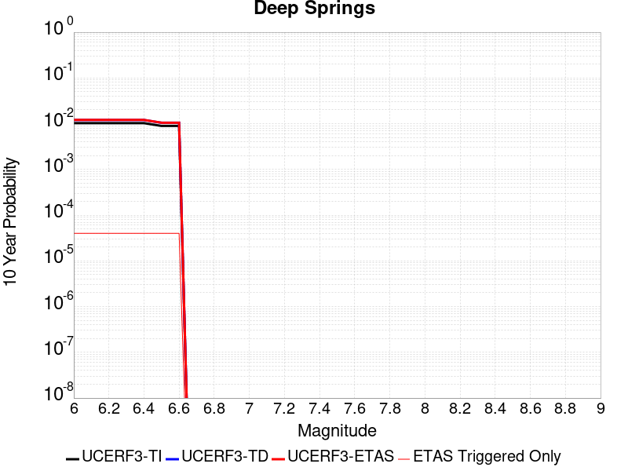 |

| Magnitude | 1 wk TI Prob | 1 wk TD Prob | 1 wk ETAS Prob | 1 wk ETAS/TD Gain | 1 wk ETAS Triggered Only | 1 mo TI Prob | 1 mo TD Prob | 1 mo ETAS Prob | 1 mo ETAS/TD Gain | 1 mo ETAS Triggered Only | 1 yr TI Prob | 1 yr TD Prob | 1 yr ETAS Prob | 1 yr ETAS/TD Gain | 1 yr ETAS Triggered Only | 10 yr TI Prob | 10 yr TD Prob | 10 yr ETAS Prob | 10 yr ETAS/TD Gain | 10 yr ETAS Triggered Only |
|-----|-----|-----|-----|-----|-----|-----|-----|-----|-----|-----|-----|-----|-----|-----|-----|-----|-----|-----|-----|-----|
| 6.0 | 1.9810619E-5 | 2.311303E-5 | 2.311303E-5 | 1.0 | 0.0 | 8.489989E-5 | 9.905495E-5 | 1.19544726E-4 | 1.2068526 | 2.0491803E-5 | 0.001033166 | 0.0012058346 | 0.0012263017 | 1.0169734 | 2.0491803E-5 | 0.010283757 | 0.01204269 | 0.012062935 | 1.0016811 | 2.0491803E-5 |
| 6.1 | 1.9810619E-5 | 2.311303E-5 | 2.311303E-5 | 1.0 | 0.0 | 8.489989E-5 | 9.905495E-5 | 1.19544726E-4 | 1.2068526 | 2.0491803E-5 | 0.001033166 | 0.0012058346 | 0.0012263017 | 1.0169734 | 2.0491803E-5 | 0.010283757 | 0.01204269 | 0.012062935 | 1.0016811 | 2.0491803E-5 |
| 6.2 | 1.9810619E-5 | 2.311303E-5 | 2.311303E-5 | 1.0 | 0.0 | 8.489989E-5 | 9.905495E-5 | 1.19544726E-4 | 1.2068526 | 2.0491803E-5 | 0.001033166 | 0.0012058346 | 0.0012263017 | 1.0169734 | 2.0491803E-5 | 0.010283757 | 0.01204269 | 0.012062935 | 1.0016811 | 2.0491803E-5 |
| 6.3 | 1.9810619E-5 | 2.311303E-5 | 2.311303E-5 | 1.0 | 0.0 | 8.489989E-5 | 9.905495E-5 | 1.19544726E-4 | 1.2068526 | 2.0491803E-5 | 0.001033166 | 0.0012058346 | 0.0012263017 | 1.0169734 | 2.0491803E-5 | 0.010283757 | 0.01204269 | 0.012062935 | 1.0016811 | 2.0491803E-5 |
| 6.4 | 1.9810619E-5 | 2.311303E-5 | 2.311303E-5 | 1.0 | 0.0 | 8.489989E-5 | 9.905495E-5 | 1.19544726E-4 | 1.2068526 | 2.0491803E-5 | 0.001033166 | 0.0012058346 | 0.0012263017 | 1.0169734 | 2.0491803E-5 | 0.010283757 | 0.01204269 | 0.012062935 | 1.0016811 | 2.0491803E-5 |
| 6.5 | 1.7190405E-5 | 2.0050999E-5 | 2.0050999E-5 | 1.0 | 0.0 | 7.367108E-5 | 8.593285E-5 | 1.0642289E-4 | 1.2384425 | 2.0491803E-5 | 8.9657627E-4 | 0.0010462324 | 0.0010667028 | 1.0195658 | 2.0491803E-5 | 0.008929676 | 0.010462287 | 0.010482565 | 1.0019381 | 2.0491803E-5 |
| 6.6 | 1.7190405E-5 | 2.0050999E-5 | 2.0050999E-5 | 1.0 | 0.0 | 7.367108E-5 | 8.593285E-5 | 1.0642289E-4 | 1.2384425 | 2.0491803E-5 | 8.9657627E-4 | 0.0010462324 | 0.0010667028 | 1.0195658 | 2.0491803E-5 | 0.008929676 | 0.010462287 | 0.010482565 | 1.0019381 | 2.0491803E-5 |

## Imperial
*[(top)](#table-of-contents)*

| 1 Week | 1 Month | 1 Year | 10 Year |
|-----|-----|-----|-----|
|  |  |  |  |

| Magnitude | 1 wk TI Prob | 1 wk TD Prob | 1 wk ETAS Prob | 1 wk ETAS/TD Gain | 1 wk ETAS Triggered Only | 1 mo TI Prob | 1 mo TD Prob | 1 mo ETAS Prob | 1 mo ETAS/TD Gain | 1 mo ETAS Triggered Only | 1 yr TI Prob | 1 yr TD Prob | 1 yr ETAS Prob | 1 yr ETAS/TD Gain | 1 yr ETAS Triggered Only | 10 yr TI Prob | 10 yr TD Prob | 10 yr ETAS Prob | 10 yr ETAS/TD Gain | 10 yr ETAS Triggered Only |
|-----|-----|-----|-----|-----|-----|-----|-----|-----|-----|-----|-----|-----|-----|-----|-----|-----|-----|-----|-----|-----|
| 6.0 | 2.7496446E-4 | 5.0565513E-4 | 5.0565513E-4 | 1.0 | 0.0 | 0.0011778869 | 0.002165333 | 0.002165333 | 1.0 | 0.0 | 0.0142467655 | 0.026045265 | 0.026045265 | 1.0 | 0.0 | 0.13367249 | 0.22808637 | 0.22810219 | 1.0000694 | 2.0491803E-5 |
| 6.1 | 2.5356023E-4 | 4.8667885E-4 | 4.8667885E-4 | 1.0 | 0.0 | 0.001086234 | 0.0020841376 | 0.0020841376 | 1.0 | 0.0 | 0.013144928 | 0.02507692 | 0.02507692 | 1.0 | 0.0 | 0.123940155 | 0.21951756 | 0.21953355 | 1.0000728 | 2.0491803E-5 |
| 6.2 | 2.4820742E-4 | 4.7763108E-4 | 4.7763108E-4 | 1.0 | 0.0 | 0.0010633124 | 0.0020454223 | 0.0020454223 | 1.0 | 0.0 | 0.01286919 | 0.024616843 | 0.024616843 | 1.0 | 0.0 | 0.12148927 | 0.2160229 | 0.21603896 | 1.0000744 | 2.0491803E-5 |
| 6.3 | 2.3205351E-4 | 4.590021E-4 | 4.590021E-4 | 1.0 | 0.0 | 9.94136E-4 | 0.0019657058 | 0.0019657058 | 1.0 | 0.0 | 0.012036599 | 0.023666281 | 0.023666281 | 1.0 | 0.0 | 0.11405133 | 0.20796864 | 0.20798486 | 1.0000781 | 2.0491803E-5 |
| 6.4 | 2.0304754E-4 | 3.9885996E-4 | 3.9885996E-4 | 1.0 | 0.0 | 8.6991355E-4 | 0.0017082945 | 0.0017082945 | 1.0 | 0.0 | 0.010539869 | 0.020600514 | 0.020600514 | 1.0 | 0.0 | 0.100537635 | 0.18510117 | 0.18511787 | 1.0000902 | 2.0491803E-5 |
| 6.5 | 1.854992E-4 | 3.6997703E-4 | 3.6997703E-4 | 1.0 | 0.0 | 7.9475436E-4 | 0.0015846646 | 0.0015846646 | 1.0 | 0.0 | 0.009633281 | 0.019123985 | 0.019123985 | 1.0 | 0.0 | 0.0922623 | 0.17333072 | 0.17334765 | 1.0000978 | 2.0491803E-5 |
| 6.6 | 1.6586106E-4 | 3.4043082E-4 | 3.4043082E-4 | 1.0 | 0.0 | 7.106394E-4 | 0.0014581835 | 0.0014581835 | 1.0 | 0.0 | 0.008617763 | 0.017610526 | 0.017610526 | 1.0 | 0.0 | 0.08291132 | 0.16080588 | 0.16082308 | 1.0001069 | 2.0491803E-5 |
| 6.7 | 1.4224656E-4 | 3.077392E-4 | 3.077392E-4 | 1.0 | 0.0 | 6.094856E-4 | 0.0013182238 | 0.0013182238 | 1.0 | 0.0 | 0.0073952693 | 0.015933173 | 0.015933173 | 1.0 | 0.0 | 0.07153955 | 0.1465114 | 0.1465289 | 1.0001193 | 2.0491803E-5 |
| 6.8 | 1.2317259E-4 | 2.779711E-4 | 2.779711E-4 | 1.0 | 0.0 | 5.2777573E-4 | 0.0011907669 | 0.0011907669 | 1.0 | 0.0 | 0.0064067547 | 0.0144026 | 0.0144026 | 1.0 | 0.0 | 0.06225166 | 0.13296051 | 0.13297828 | 1.0001336 | 2.0491803E-5 |
| 6.9 | 9.859898E-5 | 2.5018715E-4 | 2.5018715E-4 | 1.0 | 0.0 | 4.2249862E-4 | 0.0010717943 | 0.0010717943 | 1.0 | 0.0 | 0.0051317946 | 0.012971984 | 0.012971984 | 1.0 | 0.0 | 0.05014893 | 0.11942433 | 0.11944237 | 1.000151 | 2.0491803E-5 |
| 7.0 | 7.3191884E-5 | 2.1270063E-4 | 2.1270063E-4 | 1.0 | 0.0 | 3.136418E-4 | 9.1125886E-4 | 9.1125886E-4 | 1.0 | 0.0 | 0.003811904 | 0.011038825 | 0.011038825 | 1.0 | 0.0 | 0.037471764 | 0.10207849 | 0.102096885 | 1.0001802 | 2.0491803E-5 |
| 7.1 | 7.1760296E-5 | 2.0971385E-4 | 2.0971385E-4 | 1.0 | 0.0 | 3.0750787E-4 | 8.984672E-4 | 8.984672E-4 | 1.0 | 0.0 | 0.003737482 | 0.010884652 | 0.010884652 | 1.0 | 0.0 | 0.03675245 | 0.100714855 | 0.10073328 | 1.000183 | 2.0491803E-5 |
| 7.2 | 6.46614E-5 | 1.9139807E-4 | 1.9139807E-4 | 1.0 | 0.0 | 2.7709085E-4 | 8.2002254E-4 | 8.2002254E-4 | 1.0 | 0.0 | 0.0033683628 | 0.009938694 | 0.009938694 | 1.0 | 0.0 | 0.033177625 | 0.09252202 | 0.092540614 | 1.000201 | 2.0491803E-5 |
| 7.3 | 6.088115E-5 | 1.781138E-4 | 1.781138E-4 | 1.0 | 0.0 | 2.6089314E-4 | 7.631244E-4 | 7.631244E-4 | 1.0 | 0.0 | 0.0031717476 | 0.009252035 | 0.009252035 | 1.0 | 0.0 | 0.031268585 | 0.08657247 | 0.08659119 | 1.0002162 | 2.0491803E-5 |
| 7.4 | 4.199346E-5 | 1.15126604E-4 | 1.15126604E-4 | 1.0 | 0.0 | 1.7995955E-4 | 4.933073E-4 | 4.933073E-4 | 1.0 | 0.0 | 0.0021888057 | 0.005989646 | 0.005989646 | 1.0 | 0.0 | 0.02167372 | 0.057449933 | 0.057469245 | 1.0003362 | 2.0491803E-5 |
| 7.5 | 3.130448E-5 | 8.335176E-5 | 8.335176E-5 | 1.0 | 0.0 | 1.3415517E-4 | 3.5717324E-4 | 3.5717324E-4 | 1.0 | 0.0 | 0.0016321153 | 0.0043399734 | 0.0043399734 | 1.0 | 0.0 | 0.016201803 | 0.042140562 | 0.042140562 | 1.0 | 0.0 |
| 7.6 | 2.3074248E-5 | 6.0860824E-5 | 6.0860824E-5 | 1.0 | 0.0 | 9.888588E-5 | 2.6080615E-4 | 2.6080615E-4 | 1.0 | 0.0 | 0.0012032706 | 0.0031707147 | 0.0031707147 | 1.0 | 0.0 | 0.011967761 | 0.031033779 | 0.031033779 | 1.0 | 0.0 |
| 7.7 | 1.45864815E-5 | 4.0138115E-5 | 4.0138115E-5 | 1.0 | 0.0 | 6.2511994E-5 | 1.7200918E-4 | 1.7200918E-4 | 1.0 | 0.0 | 7.608177E-4 | 0.0020922057 | 0.0020922057 | 1.0 | 0.0 | 0.007582182 | 0.020633917 | 0.020633917 | 1.0 | 0.0 |
| 7.8 | 1.0352979E-5 | 3.097231E-5 | 3.097231E-5 | 1.0 | 0.0 | 4.4369157E-5 | 1.3273173E-4 | 1.3273173E-4 | 1.0 | 0.0 | 5.400606E-4 | 0.0016148133 | 0.0016148133 | 1.0 | 0.0 | 0.0053875 | 0.016022068 | 0.016022068 | 1.0 | 0.0 |
| 7.9 | 8.137906E-6 | 2.2158269E-5 | 2.2158269E-5 | 1.0 | 0.0 | 3.4876273E-5 | 9.496055E-5 | 9.496055E-5 | 1.0 | 0.0 | 4.2453592E-4 | 0.0011555325 | 0.0011555325 | 1.0 | 0.0 | 0.004237258 | 0.011622174 | 0.011622174 | 1.0 | 0.0 |
| 8.0 | 6.93792E-6 | 1.801665E-5 | 1.801665E-5 | 1.0 | 0.0 | 2.9733603E-5 | 7.721193E-5 | 7.721193E-5 | 1.0 | 0.0 | 3.6194647E-4 | 9.396506E-4 | 9.396506E-4 | 1.0 | 0.0 | 0.0036135751 | 0.00950525 | 0.00950525 | 1.0 | 0.0 |
| 8.1 | 3.4286315E-6 | 6.3835337E-6 | 6.3835337E-6 | 1.0 | 0.0 | 1.4694053E-5 | 2.7357715E-5 | 2.7357715E-5 | 1.0 | 0.0 | 1.7888541E-4 | 3.330294E-4 | 3.330294E-4 | 1.0 | 0.0 | 0.0017874148 | 0.0034878491 | 0.0034878491 | 1.0 | 0.0 |
| 8.2 | 1.4906886E-6 | 1.9381007E-6 | 1.9381007E-6 | 1.0 | 0.0 | 6.3886496E-6 | 8.3061195E-6 | 8.3061195E-6 | 1.0 | 0.0 | 7.7779034E-5 | 1.0112235E-4 | 1.0112235E-4 | 1.0 | 0.0 | 7.775182E-4 | 0.0011082698 | 0.0011082698 | 1.0 | 0.0 |
| 8.3 | 2.5758007E-8 | 1.4514695E-8 | 1.4514695E-8 | 1.0 | 0.0 | 1.10391454E-7 | 6.2205835E-8 | 6.2205835E-8 | 1.0 | 0.0 | 1.3440151E-6 | 7.57356E-7 | 7.57356E-7 | 1.0 | 0.0 | 1.344007E-5 | 7.895551E-6 | 7.895551E-6 | 1.0 | 0.0 |

## San Andreas (Creeping Section) 2011 CFM
*[(top)](#table-of-contents)*

| 1 Week | 1 Month | 1 Year | 10 Year |
|-----|-----|-----|-----|
|  | 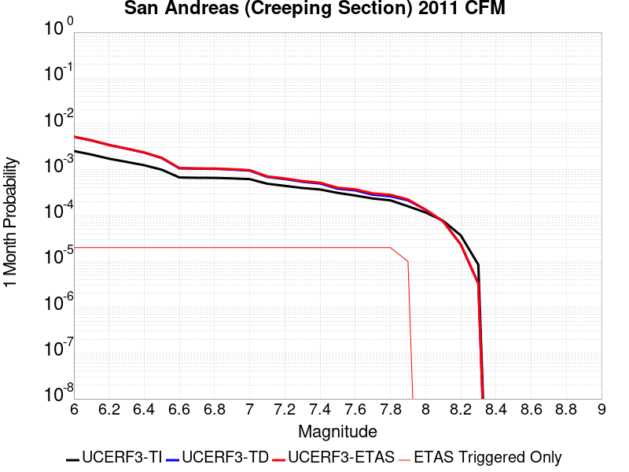 |  | 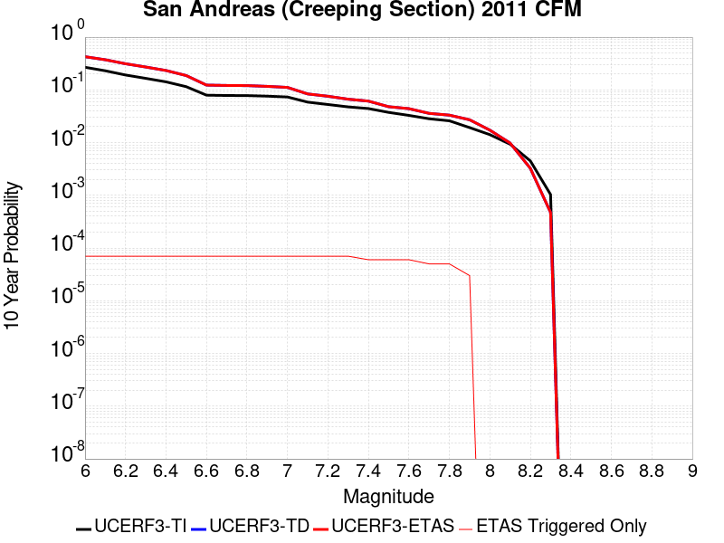 |

| Magnitude | 1 wk TI Prob | 1 wk TD Prob | 1 wk ETAS Prob | 1 wk ETAS/TD Gain | 1 wk ETAS Triggered Only | 1 mo TI Prob | 1 mo TD Prob | 1 mo ETAS Prob | 1 mo ETAS/TD Gain | 1 mo ETAS Triggered Only | 1 yr TI Prob | 1 yr TD Prob | 1 yr ETAS Prob | 1 yr ETAS/TD Gain | 1 yr ETAS Triggered Only | 10 yr TI Prob | 10 yr TD Prob | 10 yr ETAS Prob | 10 yr ETAS/TD Gain | 10 yr ETAS Triggered Only |
|-----|-----|-----|-----|-----|-----|-----|-----|-----|-----|-----|-----|-----|-----|-----|-----|-----|-----|-----|-----|-----|
| 6.0 | 5.986481E-4 | 0.0012278741 | 0.0012278741 | 1.0 | 0.0 | 0.0025631124 | 0.0052457973 | 0.0052457973 | 1.0 | 0.0 | 0.030762846 | 0.061208665 | 0.061208665 | 1.0 | 0.0 | 0.26835477 | 0.4259623 | 0.42597407 | 1.0000277 | 2.0491803E-5 |
| 6.1 | 5.015945E-4 | 0.0010222398 | 0.0010222398 | 1.0 | 0.0 | 0.00214792 | 0.004368119 | 0.004368119 | 1.0 | 0.0 | 0.025839351 | 0.0512512 | 0.0512512 | 1.0 | 0.0 | 0.23032776 | 0.37288252 | 0.37289536 | 1.0000345 | 2.0491803E-5 |
| 6.2 | 4.073338E-4 | 8.109135E-4 | 8.109135E-4 | 1.0 | 0.0 | 0.0017445484 | 0.0034676173 | 0.0034676173 | 1.0 | 0.0 | 0.021034058 | 0.040936444 | 0.040936444 | 1.0 | 0.0 | 0.19150782 | 0.3130621 | 0.31307617 | 1.000045 | 2.0491803E-5 |
| 6.3 | 3.464099E-4 | 6.7394925E-4 | 6.7394925E-4 | 1.0 | 0.0 | 0.0014837692 | 0.00288274 | 0.00288274 | 1.0 | 0.0 | 0.017915873 | 0.034192428 | 0.034192428 | 1.0 | 0.0 | 0.16538359 | 0.27134693 | 0.27136186 | 1.0000551 | 2.0491803E-5 |
| 6.4 | 2.935057E-4 | 5.545115E-4 | 5.545115E-4 | 1.0 | 0.0 | 0.0012572751 | 0.0023718805 | 0.0023718805 | 1.0 | 0.0 | 0.015200248 | 0.028267467 | 0.028267467 | 1.0 | 0.0 | 0.14201577 | 0.2330172 | 0.23303293 | 1.0000675 | 2.0491803E-5 |
| 6.5 | 2.3409708E-4 | 4.2095222E-4 | 4.2095222E-4 | 1.0 | 0.0 | 0.0010028875 | 0.0018015768 | 0.0018015768 | 1.0 | 0.0 | 0.012141965 | 0.021591473 | 0.021591473 | 1.0 | 0.0 | 0.11499573 | 0.18685804 | 0.1868747 | 1.0000892 | 2.0491803E-5 |
| 6.6 | 1.5842178E-4 | 2.5079807E-4 | 2.5079807E-4 | 1.0 | 0.0 | 6.7877385E-4 | 0.0010744074 | 0.0010744074 | 1.0 | 0.0 | 0.0082328 | 0.013001034 | 0.013001034 | 1.0 | 0.0 | 0.07934396 | 0.12318426 | 0.123202235 | 1.0001459 | 2.0491803E-5 |
| 6.7 | 1.5616413E-4 | 2.461632E-4 | 2.461632E-4 | 1.0 | 0.0 | 6.691031E-4 | 0.0010545597 | 0.0010545597 | 1.0 | 0.0 | 0.0081159435 | 0.012762894 | 0.012762894 | 1.0 | 0.0 | 0.0782586 | 0.12121142 | 0.121229425 | 1.0001485 | 2.0491803E-5 |
| 6.8 | 1.5538467E-4 | 2.4440174E-4 | 2.4440174E-4 | 1.0 | 0.0 | 6.6576427E-4 | 0.0010470168 | 0.0010470168 | 1.0 | 0.0 | 0.008075596 | 0.012672268 | 0.012672268 | 1.0 | 0.0 | 0.07788358 | 0.12044227 | 0.120460294 | 1.0001496 | 2.0491803E-5 |
| 6.9 | 1.5153569E-4 | 2.3549511E-4 | 2.3549511E-4 | 1.0 | 0.0 | 6.49277E-4 | 0.0010088764 | 0.0010088764 | 1.0 | 0.0 | 0.007876333 | 0.012214421 | 0.012214421 | 1.0 | 0.0 | 0.07602952 | 0.11651233 | 0.11653043 | 1.0001553 | 2.0491803E-5 |
| 7.0 | 1.4588932E-4 | 2.2406683E-4 | 2.2406683E-4 | 1.0 | 0.0 | 6.250901E-4 | 9.5993496E-4 | 9.5993496E-4 | 1.0 | 0.0 | 0.0075839474 | 0.011625077 | 0.011625077 | 1.0 | 0.0 | 0.073302895 | 0.111358546 | 0.111376755 | 1.0001636 | 2.0491803E-5 |
| 7.1 | 1.1565079E-4 | 1.6290719E-4 | 1.6290719E-4 | 1.0 | 0.0 | 4.955521E-4 | 6.9798774E-4 | 6.9798774E-4 | 1.0 | 0.0 | 0.006016669 | 0.008465091 | 0.008465091 | 1.0 | 0.0 | 0.058563538 | 0.08370675 | 0.08372553 | 1.0002244 | 2.0491803E-5 |
| 7.2 | 1.0393792E-4 | 1.4624344E-4 | 1.4624344E-4 | 1.0 | 0.0 | 4.4537216E-4 | 6.2660786E-4 | 6.2660786E-4 | 1.0 | 0.0 | 0.005408933 | 0.007602434 | 0.007602434 | 1.0 | 0.0 | 0.052791595 | 0.07565546 | 0.0756744 | 1.0002503 | 2.0491803E-5 |
| 7.3 | 9.332884E-5 | 1.2788197E-4 | 1.2788197E-4 | 1.0 | 0.0 | 3.999194E-4 | 5.479511E-4 | 5.479511E-4 | 1.0 | 0.0 | 0.0048581534 | 0.0066510327 | 0.0066510327 | 1.0 | 0.0 | 0.047533102 | 0.06651482 | 0.066533946 | 1.0002875 | 2.0491803E-5 |
| 7.4 | 8.670252E-5 | 1.17095995E-4 | 1.17095995E-4 | 1.0 | 0.0 | 3.715293E-4 | 5.0174404E-4 | 5.0174404E-4 | 1.0 | 0.0 | 0.004513991 | 0.006091744 | 0.006091744 | 1.0 | 0.0 | 0.044233937 | 0.061179653 | 0.061179653 | 1.0 | 0.0 |
| 7.5 | 7.3036405E-5 | 9.011144E-5 | 9.011144E-5 | 1.0 | 0.0 | 3.129756E-4 | 3.861348E-4 | 3.861348E-4 | 1.0 | 0.0 | 0.0038038217 | 0.004691079 | 0.004691079 | 1.0 | 0.0 | 0.03739367 | 0.047901772 | 0.047901772 | 1.0 | 0.0 |
| 7.6 | 6.3935775E-5 | 8.284792E-5 | 8.284792E-5 | 1.0 | 0.0 | 2.7398168E-4 | 3.550143E-4 | 3.550143E-4 | 1.0 | 0.0 | 0.0033306254 | 0.004313751 | 0.004313751 | 1.0 | 0.0 | 0.032811474 | 0.04401211 | 0.04401211 | 1.0 | 0.0 |
| 7.7 | 5.5050095E-5 | 6.6657536E-5 | 6.6657536E-5 | 1.0 | 0.0 | 2.3590765E-4 | 2.8564388E-4 | 2.8564388E-4 | 1.0 | 0.0 | 0.0028683927 | 0.0034721727 | 0.0034721727 | 1.0 | 0.0 | 0.0283165 | 0.035814673 | 0.035814673 | 1.0 | 0.0 |
| 7.8 | 5.027131E-5 | 6.166444E-5 | 6.166444E-5 | 1.0 | 0.0 | 2.1543067E-4 | 2.6424942E-4 | 2.6424942E-4 | 1.0 | 0.0 | 0.0026197135 | 0.0032124936 | 0.0032124936 | 1.0 | 0.0 | 0.025890453 | 0.033143617 | 0.033143617 | 1.0 | 0.0 |
| 7.9 | 3.7271806E-5 | 5.0253755E-5 | 5.0253755E-5 | 1.0 | 0.0 | 1.5972654E-4 | 2.1535547E-4 | 2.1535547E-4 | 1.0 | 0.0 | 0.0019429359 | 0.0026188022 | 0.0026188022 | 1.0 | 0.0 | 0.019260362 | 0.027081102 | 0.027081102 | 1.0 | 0.0 |
| 8.0 | 2.7310243E-5 | 3.144777E-5 | 3.144777E-5 | 1.0 | 0.0 | 1.17038646E-4 | 1.3476919E-4 | 1.3476919E-4 | 1.0 | 0.0 | 0.0014240141 | 0.0016395808 | 0.0016395808 | 1.0 | 0.0 | 0.014149235 | 0.0172237 | 0.0172237 | 1.0 | 0.0 |
| 8.1 | 1.7940547E-5 | 1.7413187E-5 | 1.7413187E-5 | 1.0 | 0.0 | 7.688579E-5 | 7.4625816E-5 | 7.4625816E-5 | 1.0 | 0.0 | 9.3568244E-4 | 9.081911E-4 | 9.081911E-4 | 1.0 | 0.0 | 0.009317525 | 0.009805583 | 0.009805583 | 1.0 | 0.0 |
| 8.2 | 8.643924E-6 | 5.4798497E-6 | 5.4798497E-6 | 1.0 | 0.0 | 3.704486E-5 | 2.348486E-5 | 2.348486E-5 | 1.0 | 0.0 | 4.5092785E-4 | 2.858907E-4 | 2.858907E-4 | 1.0 | 0.0 | 0.0045001395 | 0.0032514327 | 0.0032514327 | 1.0 | 0.0 |
| 8.3 | 1.983087E-6 | 7.668296E-7 | 7.668296E-7 | 1.0 | 0.0 | 8.498917E-6 | 3.2864084E-6 | 3.2864084E-6 | 1.0 | 0.0 | 1.034694E-4 | 4.0011306E-5 | 4.0011306E-5 | 1.0 | 0.0 | 0.0010342124 | 4.724499E-4 | 4.724499E-4 | 1.0 | 0.0 |

## Quien Sabe 2011 CFM
*[(top)](#table-of-contents)*

| 1 Week | 1 Month | 1 Year | 10 Year |
|-----|-----|-----|-----|
| 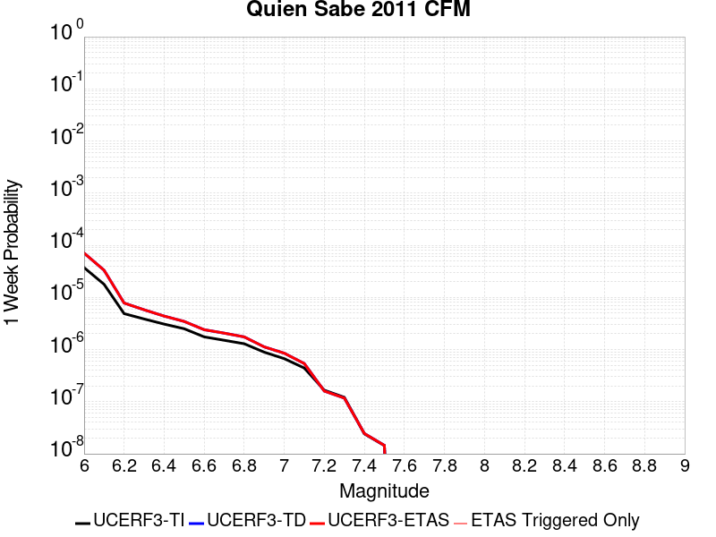 |  |  | 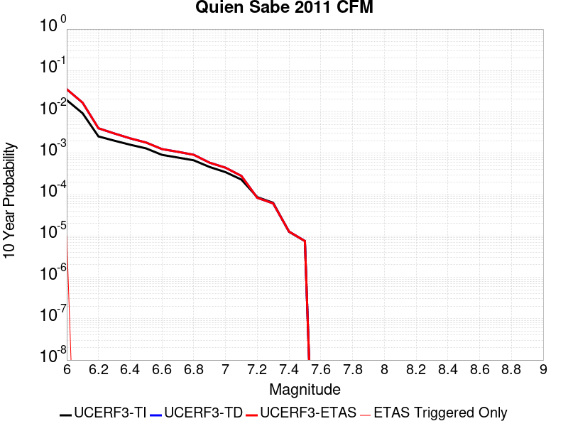 |

| Magnitude | 1 wk TI Prob | 1 wk TD Prob | 1 wk ETAS Prob | 1 wk ETAS/TD Gain | 1 wk ETAS Triggered Only | 1 mo TI Prob | 1 mo TD Prob | 1 mo ETAS Prob | 1 mo ETAS/TD Gain | 1 mo ETAS Triggered Only | 1 yr TI Prob | 1 yr TD Prob | 1 yr ETAS Prob | 1 yr ETAS/TD Gain | 1 yr ETAS Triggered Only | 10 yr TI Prob | 10 yr TD Prob | 10 yr ETAS Prob | 10 yr ETAS/TD Gain | 10 yr ETAS Triggered Only |
|-----|-----|-----|-----|-----|-----|-----|-----|-----|-----|-----|-----|-----|-----|-----|-----|-----|-----|-----|-----|-----|
| 6.0 | 3.729899E-5 | 7.088948E-5 | 7.088948E-5 | 1.0 | 0.0 | 1.5984301E-4 | 3.0378034E-4 | 3.2426591E-4 | 1.0674355 | 2.0491803E-5 | 0.0019443515 | 0.0036853587 | 0.003705775 | 1.0055399 | 2.0491803E-5 | 0.019274272 | 0.0353513 | 0.035371065 | 1.0005592 | 2.0491803E-5 |
| 6.1 | 1.7825725E-5 | 3.315054E-5 | 3.315054E-5 | 1.0 | 0.0 | 7.639373E-5 | 1.4206769E-4 | 1.4206769E-4 | 1.0 | 0.0 | 9.296967E-4 | 0.0017267886 | 0.0017267886 | 1.0 | 0.0 | 0.009258169 | 0.01669935 | 0.01669935 | 1.0 | 0.0 |
| 6.2 | 4.8865336E-6 | 7.805606E-6 | 7.805606E-6 | 1.0 | 0.0 | 2.0942118E-5 | 3.3452223E-5 | 3.3452223E-5 | 1.0 | 0.0 | 2.5494045E-4 | 4.069332E-4 | 4.069332E-4 | 1.0 | 0.0 | 0.0025464818 | 0.004013725 | 0.004013725 | 1.0 | 0.0 |
| 6.3 | 3.858491E-6 | 5.7898515E-6 | 5.7898515E-6 | 1.0 | 0.0 | 1.6536285E-5 | 2.481344E-5 | 2.481344E-5 | 1.0 | 0.0 | 2.0131067E-4 | 3.0206644E-4 | 3.0206644E-4 | 1.0 | 0.0 | 0.002011284 | 0.0030021158 | 0.0030021158 | 1.0 | 0.0 |
| 6.4 | 3.0771805E-6 | 4.3850664E-6 | 4.3850664E-6 | 1.0 | 0.0 | 1.318785E-5 | 1.879302E-5 | 1.879302E-5 | 1.0 | 0.0 | 1.6055023E-4 | 2.2878342E-4 | 2.2878342E-4 | 1.0 | 0.0 | 0.001604343 | 0.002286603 | 0.002286603 | 1.0 | 0.0 |
| 6.5 | 2.5081235E-6 | 3.4637387E-6 | 3.4637387E-6 | 1.0 | 0.0 | 1.0749056E-5 | 1.4844519E-5 | 1.4844519E-5 | 1.0 | 0.0 | 1.308619E-4 | 1.8071849E-4 | 1.8071849E-4 | 1.0 | 0.0 | 0.0013078486 | 0.0018124225 | 0.0018124225 | 1.0 | 0.0 |
| 6.6 | 1.7505364E-6 | 2.4024678E-6 | 2.4024678E-6 | 1.0 | 0.0 | 7.502277E-6 | 1.0296253E-5 | 1.0296253E-5 | 1.0 | 0.0 | 9.13364E-5 | 1.2535039E-4 | 1.2535039E-4 | 1.0 | 0.0 | 9.129886E-4 | 0.001258366 | 0.001258366 | 1.0 | 0.0 |
| 6.7 | 1.505737E-6 | 2.0638643E-6 | 2.0638643E-6 | 1.0 | 0.0 | 6.4531428E-6 | 8.845105E-6 | 8.845105E-6 | 1.0 | 0.0 | 7.8564175E-5 | 1.07684435E-4 | 1.07684435E-4 | 1.0 | 0.0 | 7.853641E-4 | 0.0010818782 | 0.0010818782 | 1.0 | 0.0 |
| 6.8 | 1.2924105E-6 | 1.7485087E-6 | 1.7485087E-6 | 1.0 | 0.0 | 5.5388905E-6 | 7.49359E-6 | 7.49359E-6 | 1.0 | 0.0 | 6.74339E-5 | 9.123119E-5 | 9.123119E-5 | 1.0 | 0.0 | 6.741344E-4 | 9.1614906E-4 | 9.1614906E-4 | 1.0 | 0.0 |
| 6.9 | 8.9075286E-7 | 1.1250673E-6 | 1.1250673E-6 | 1.0 | 0.0 | 3.8175067E-6 | 4.82171E-6 | 4.82171E-6 | 1.0 | 0.0 | 4.6477155E-5 | 5.8702957E-5 | 5.8702957E-5 | 1.0 | 0.0 | 4.6467435E-4 | 5.9043115E-4 | 5.9043115E-4 | 1.0 | 0.0 |
| 7.0 | 6.6891175E-7 | 8.5171826E-7 | 8.5171826E-7 | 1.0 | 0.0 | 2.8667614E-6 | 3.650217E-6 | 3.650217E-6 | 1.0 | 0.0 | 3.4902263E-5 | 4.4440683E-5 | 4.4440683E-5 | 1.0 | 0.0 | 3.4896782E-4 | 4.4681414E-4 | 4.4681414E-4 | 1.0 | 0.0 |
| 7.1 | 4.4205015E-7 | 5.3922207E-7 | 5.3922207E-7 | 1.0 | 0.0 | 1.8944993E-6 | 2.3109505E-6 | 2.3109505E-6 | 1.0 | 0.0 | 2.3065284E-5 | 2.813563E-5 | 2.813563E-5 | 1.0 | 0.0 | 2.3062891E-4 | 2.8270538E-4 | 2.8270538E-4 | 1.0 | 0.0 |
| 7.2 | 1.6620965E-7 | 1.5988428E-7 | 1.5988428E-7 | 1.0 | 0.0 | 7.123269E-7 | 6.8521814E-7 | 6.8521814E-7 | 1.0 | 0.0 | 8.672545E-6 | 8.342503E-6 | 8.342503E-6 | 1.0 | 0.0 | 8.6722066E-5 | 8.357743E-5 | 8.357743E-5 | 1.0 | 0.0 |
| 7.3 | 1.2142488E-7 | 1.17270666E-7 | 1.17270666E-7 | 1.0 | 0.0 | 5.2039223E-7 | 5.025885E-7 | 5.025885E-7 | 1.0 | 0.0 | 6.335757E-6 | 6.1190012E-6 | 6.1190012E-6 | 1.0 | 0.0 | 6.3355765E-5 | 6.1251456E-5 | 6.1251456E-5 | 1.0 | 0.0 |
| 7.4 | 2.4192937E-8 | 2.4544427E-8 | 2.4544427E-8 | 1.0 | 0.0 | 1.0368401E-7 | 1.05190395E-7 | 1.05190395E-7 | 1.0 | 0.0 | 1.2623522E-6 | 1.2806925E-6 | 1.2806925E-6 | 1.0 | 0.0 | 1.2623449E-5 | 1.2813195E-5 | 1.2813195E-5 | 1.0 | 0.0 |
| 7.5 | 1.4432802E-8 | 1.4506849E-8 | 1.4506849E-8 | 1.0 | 0.0 | 6.185486E-8 | 6.217221E-8 | 6.217221E-8 | 1.0 | 0.0 | 7.530827E-7 | 7.5694646E-7 | 7.5694646E-7 | 1.0 | 0.0 | 7.530801E-6 | 7.5737153E-6 | 7.5737153E-6 | 1.0 | 0.0 |

## Elsinore (Coyote Mountains)
*[(top)](#table-of-contents)*

| 1 Week | 1 Month | 1 Year | 10 Year |
|-----|-----|-----|-----|
|  |  |  |  |

| Magnitude | 1 wk TI Prob | 1 wk TD Prob | 1 wk ETAS Prob | 1 wk ETAS/TD Gain | 1 wk ETAS Triggered Only | 1 mo TI Prob | 1 mo TD Prob | 1 mo ETAS Prob | 1 mo ETAS/TD Gain | 1 mo ETAS Triggered Only | 1 yr TI Prob | 1 yr TD Prob | 1 yr ETAS Prob | 1 yr ETAS/TD Gain | 1 yr ETAS Triggered Only | 10 yr TI Prob | 10 yr TD Prob | 10 yr ETAS Prob | 10 yr ETAS/TD Gain | 10 yr ETAS Triggered Only |
|-----|-----|-----|-----|-----|-----|-----|-----|-----|-----|-----|-----|-----|-----|-----|-----|-----|-----|-----|-----|-----|
| 6.0 | 4.20513E-5 | 4.8633563E-5 | 4.8633563E-5 | 1.0 | 0.0 | 1.8020741E-4 | 2.0841615E-4 | 2.0841615E-4 | 1.0 | 0.0 | 0.0021918174 | 0.0025350873 | 0.0025555273 | 1.0080628 | 2.0491803E-5 | 0.021703249 | 0.025112117 | 0.025132094 | 1.0007955 | 2.0491803E-5 |
| 6.1 | 4.20513E-5 | 4.8633563E-5 | 4.8633563E-5 | 1.0 | 0.0 | 1.8020741E-4 | 2.0841615E-4 | 2.0841615E-4 | 1.0 | 0.0 | 0.0021918174 | 0.0025350873 | 0.0025555273 | 1.0080628 | 2.0491803E-5 | 0.021703249 | 0.025112117 | 0.025132094 | 1.0007955 | 2.0491803E-5 |
| 6.2 | 2.3413893E-5 | 2.4696421E-5 | 2.4696421E-5 | 1.0 | 0.0 | 1.0034139E-4 | 1.0583805E-4 | 1.0583805E-4 | 1.0 | 0.0 | 0.0012209718 | 0.0012879103 | 0.0013083756 | 1.0158904 | 2.0491803E-5 | 0.012142851 | 0.012813029 | 0.012833258 | 1.0015788 | 2.0491803E-5 |
| 6.3 | 2.3413893E-5 | 2.4696421E-5 | 2.4696421E-5 | 1.0 | 0.0 | 1.0034139E-4 | 1.0583805E-4 | 1.0583805E-4 | 1.0 | 0.0 | 0.0012209718 | 0.0012879103 | 0.0013083756 | 1.0158904 | 2.0491803E-5 | 0.012142851 | 0.012813029 | 0.012833258 | 1.0015788 | 2.0491803E-5 |
| 6.4 | 1.6894814E-5 | 1.6568854E-5 | 1.6568854E-5 | 1.0 | 0.0 | 7.240433E-5 | 7.100766E-5 | 7.100766E-5 | 1.0 | 0.0 | 8.811662E-4 | 8.6421217E-4 | 8.8468625E-4 | 1.023691 | 2.0491803E-5 | 0.0087768035 | 0.008612194 | 0.00863251 | 1.0023589 | 2.0491803E-5 |
| 6.5 | 1.6894814E-5 | 1.6568854E-5 | 1.6568854E-5 | 1.0 | 0.0 | 7.240433E-5 | 7.100766E-5 | 7.100766E-5 | 1.0 | 0.0 | 8.811662E-4 | 8.6421217E-4 | 8.8468625E-4 | 1.023691 | 2.0491803E-5 | 0.0087768035 | 0.008612194 | 0.00863251 | 1.0023589 | 2.0491803E-5 |
| 6.6 | 1.1910969E-5 | 1.05310955E-5 | 1.05310955E-5 | 1.0 | 0.0 | 5.1046012E-5 | 4.513256E-5 | 4.513256E-5 | 1.0 | 0.0 | 6.21308E-4 | 5.4936187E-4 | 5.4936187E-4 | 1.0 | 0.0 | 0.0061957375 | 0.0054813414 | 0.0054813414 | 1.0 | 0.0 |
| 6.7 | 9.1486E-6 | 7.2030907E-6 | 7.2030907E-6 | 1.0 | 0.0 | 3.9207694E-5 | 3.0870044E-5 | 3.0870044E-5 | 1.0 | 0.0 | 4.7724912E-4 | 3.757818E-4 | 3.757818E-4 | 1.0 | 0.0 | 0.0047622547 | 0.0037518432 | 0.0037518432 | 1.0 | 0.0 |
| 6.8 | 7.90441E-6 | 5.7292227E-6 | 5.7292227E-6 | 1.0 | 0.0 | 3.3875604E-5 | 2.4553588E-5 | 2.4553588E-5 | 1.0 | 0.0 | 4.1235742E-4 | 2.989002E-4 | 2.989002E-4 | 1.0 | 0.0 | 0.0041159308 | 0.0029851105 | 0.0029851105 | 1.0 | 0.0 |
| 6.9 | 7.77015E-6 | 5.5831756E-6 | 5.5831756E-6 | 1.0 | 0.0 | 3.3300217E-5 | 2.3927683E-5 | 2.3927683E-5 | 1.0 | 0.0 | 4.0535472E-4 | 2.9128187E-4 | 2.9128187E-4 | 1.0 | 0.0 | 0.004046161 | 0.0029091279 | 0.0029091279 | 1.0 | 0.0 |
| 7.0 | 7.675798E-6 | 5.480033E-6 | 5.480033E-6 | 1.0 | 0.0 | 3.289586E-5 | 2.348565E-5 | 2.348565E-5 | 1.0 | 0.0 | 4.004335E-4 | 2.8590154E-4 | 2.8590154E-4 | 1.0 | 0.0 | 0.003997127 | 0.0028554637 | 0.0028554637 | 1.0 | 0.0 |
| 7.1 | 7.447814E-6 | 5.2389046E-6 | 5.2389046E-6 | 1.0 | 0.0 | 3.191881E-5 | 2.2452263E-5 | 2.2452263E-5 | 1.0 | 0.0 | 3.8854225E-4 | 2.7332324E-4 | 2.7332324E-4 | 1.0 | 0.0 | 0.003878636 | 0.0027299952 | 0.0027299952 | 1.0 | 0.0 |
| 7.2 | 7.128185E-6 | 4.9055616E-6 | 4.9055616E-6 | 1.0 | 0.0 | 3.0549007E-5 | 2.1023672E-5 | 2.1023672E-5 | 1.0 | 0.0 | 3.7187067E-4 | 2.5593434E-4 | 2.5593434E-4 | 1.0 | 0.0 | 0.00371249 | 0.0025565142 | 0.0025565142 | 1.0 | 0.0 |
| 7.3 | 7.0913875E-6 | 4.8742363E-6 | 4.8742363E-6 | 1.0 | 0.0 | 3.0391306E-5 | 2.0889423E-5 | 2.0889423E-5 | 1.0 | 0.0 | 3.6995133E-4 | 2.5430025E-4 | 2.5430025E-4 | 1.0 | 0.0 | 0.0036933604 | 0.0025402107 | 0.0025402107 | 1.0 | 0.0 |
| 7.4 | 7.051521E-6 | 4.8380875E-6 | 4.8380875E-6 | 1.0 | 0.0 | 3.0220453E-5 | 2.0734502E-5 | 2.0734502E-5 | 1.0 | 0.0 | 3.6787192E-4 | 2.524145E-4 | 2.524145E-4 | 1.0 | 0.0 | 0.0036726352 | 0.0025213964 | 0.0025213964 | 1.0 | 0.0 |
| 7.5 | 6.910666E-6 | 4.7336343E-6 | 4.7336343E-6 | 1.0 | 0.0 | 2.9616802E-5 | 2.0286852E-5 | 2.0286852E-5 | 1.0 | 0.0 | 3.605249E-4 | 2.4696562E-4 | 2.4696562E-4 | 1.0 | 0.0 | 0.0035994058 | 0.0024670297 | 0.0024670297 | 1.0 | 0.0 |
| 7.6 | 6.341753E-6 | 4.3067316E-6 | 4.3067316E-6 | 1.0 | 0.0 | 2.7178658E-5 | 1.8457298E-5 | 1.8457298E-5 | 1.0 | 0.0 | 3.3084993E-4 | 2.246956E-4 | 2.246956E-4 | 1.0 | 0.0 | 0.0033035777 | 0.0022447994 | 0.0022447994 | 1.0 | 0.0 |
| 7.7 | 3.9205916E-6 | 2.2440495E-6 | 2.2440495E-6 | 1.0 | 0.0 | 1.6802427E-5 | 9.6173235E-6 | 9.6173235E-6 | 1.0 | 0.0 | 2.0455034E-4 | 1.1708537E-4 | 1.1708537E-4 | 1.0 | 0.0 | 0.0020436216 | 0.0011703098 | 0.0011703098 | 1.0 | 0.0 |
| 7.8 | 2.0846227E-7 | 8.4868525E-8 | 8.4868525E-8 | 1.0 | 0.0 | 8.9340944E-7 | 3.6372222E-7 | 3.6372222E-7 | 1.0 | 0.0 | 1.0877206E-5 | 4.4283124E-6 | 4.4283124E-6 | 1.0 | 0.0 | 1.0876673E-4 | 4.4282566E-5 | 4.4282566E-5 | 1.0 | 0.0 |
| 7.9 | 4.4969806E-9 | 2.2692683E-9 | 2.2692683E-9 | 1.0 | 0.0 | 1.9272775E-8 | 9.725436E-9 | 9.725436E-9 | 1.0 | 0.0 | 2.3464601E-7 | 1.1840718E-7 | 1.1840718E-7 | 1.0 | 0.0 | 2.3464577E-6 | 1.1840713E-6 | 1.1840713E-6 | 1.0 | 0.0 |

## Rose Canyon
*[(top)](#table-of-contents)*

| 1 Week | 1 Month | 1 Year | 10 Year |
|-----|-----|-----|-----|
|  |  |  |  |

| Magnitude | 1 wk TI Prob | 1 wk TD Prob | 1 wk ETAS Prob | 1 wk ETAS/TD Gain | 1 wk ETAS Triggered Only | 1 mo TI Prob | 1 mo TD Prob | 1 mo ETAS Prob | 1 mo ETAS/TD Gain | 1 mo ETAS Triggered Only | 1 yr TI Prob | 1 yr TD Prob | 1 yr ETAS Prob | 1 yr ETAS/TD Gain | 1 yr ETAS Triggered Only | 10 yr TI Prob | 10 yr TD Prob | 10 yr ETAS Prob | 10 yr ETAS/TD Gain | 10 yr ETAS Triggered Only |
|-----|-----|-----|-----|-----|-----|-----|-----|-----|-----|-----|-----|-----|-----|-----|-----|-----|-----|-----|-----|-----|
| 6.0 | 4.5923203E-5 | 4.9715825E-5 | 4.9715825E-5 | 1.0 | 0.0 | 1.9679888E-4 | 2.1305127E-4 | 2.1305127E-4 | 1.0 | 0.0 | 0.0023933933 | 0.0025910123 | 0.002611451 | 1.0078883 | 2.0491803E-5 | 0.023677798 | 0.025640773 | 0.02566074 | 1.0007787 | 2.0491803E-5 |
| 6.1 | 4.5923203E-5 | 4.9715825E-5 | 4.9715825E-5 | 1.0 | 0.0 | 1.9679888E-4 | 2.1305127E-4 | 2.1305127E-4 | 1.0 | 0.0 | 0.0023933933 | 0.0025910123 | 0.0025910123 | 1.0 | 0.0 | 0.023677798 | 0.025640773 | 0.025640773 | 1.0 | 0.0 |
| 6.2 | 2.8844734E-5 | 2.9669445E-5 | 2.9669445E-5 | 1.0 | 0.0 | 1.2361443E-4 | 1.2714828E-4 | 1.2714828E-4 | 1.0 | 0.0 | 0.0015039665 | 0.0015469306 | 0.0015469306 | 1.0 | 0.0 | 0.0149382865 | 0.01537464 | 0.01537464 | 1.0 | 0.0 |
| 6.3 | 2.3171577E-5 | 2.3161689E-5 | 2.3161689E-5 | 1.0 | 0.0 | 9.9302975E-5 | 9.926068E-5 | 9.926068E-5 | 1.0 | 0.0 | 0.0012083431 | 0.0012078421 | 0.0012078421 | 1.0 | 0.0 | 0.012017938 | 0.0120226685 | 0.0120226685 | 1.0 | 0.0 |
| 6.4 | 2.0066604E-5 | 1.9667403E-5 | 1.9667403E-5 | 1.0 | 0.0 | 8.599689E-5 | 8.42862E-5 | 8.42862E-5 | 1.0 | 0.0 | 0.0010465092 | 0.0010257114 | 0.0010257114 | 1.0 | 0.0 | 0.010415946 | 0.010217753 | 0.010217753 | 1.0 | 0.0 |
| 6.5 | 1.776989E-5 | 1.7114124E-5 | 1.7114124E-5 | 1.0 | 0.0 | 7.615444E-5 | 7.334422E-5 | 7.334422E-5 | 1.0 | 0.0 | 9.267859E-4 | 8.92607E-4 | 8.92607E-4 | 1.0 | 0.0 | 0.009229303 | 0.008896374 | 0.008896374 | 1.0 | 0.0 |
| 6.6 | 1.5227364E-5 | 1.43395055E-5 | 1.43395055E-5 | 1.0 | 0.0 | 6.52585E-5 | 6.1453604E-5 | 6.1453604E-5 | 1.0 | 0.0 | 7.942326E-4 | 7.47946E-4 | 7.47946E-4 | 1.0 | 0.0 | 0.007914 | 0.007458486 | 0.007458486 | 1.0 | 0.0 |
| 6.7 | 1.2703898E-5 | 1.167345E-5 | 1.167345E-5 | 1.0 | 0.0 | 5.4444143E-5 | 5.002814E-5 | 5.002814E-5 | 1.0 | 0.0 | 6.626558E-4 | 6.089266E-4 | 6.089266E-4 | 1.0 | 0.0 | 0.006606833 | 0.006075177 | 0.006075177 | 1.0 | 0.0 |
| 6.8 | 1.1554917E-5 | 1.0609485E-5 | 1.0609485E-5 | 1.0 | 0.0 | 4.9520135E-5 | 4.5468452E-5 | 4.5468452E-5 | 1.0 | 0.0 | 6.0274085E-4 | 5.534419E-4 | 5.534419E-4 | 1.0 | 0.0 | 0.0060110865 | 0.005522644 | 0.005522644 | 1.0 | 0.0 |
| 6.9 | 8.732078E-6 | 7.881448E-6 | 7.881448E-6 | 1.0 | 0.0 | 3.7422655E-5 | 3.3777214E-5 | 3.3777214E-5 | 1.0 | 0.0 | 4.5552556E-4 | 4.111629E-4 | 4.111629E-4 | 1.0 | 0.0 | 0.0045459294 | 0.0041048555 | 0.0041048555 | 1.0 | 0.0 |
| 7.0 | 5.9337494E-6 | 5.107531E-6 | 5.107531E-6 | 1.0 | 0.0 | 2.5430107E-5 | 2.1889235E-5 | 2.1889235E-5 | 1.0 | 0.0 | 3.0956755E-4 | 2.66469E-4 | 2.66469E-4 | 1.0 | 0.0 | 0.0030913667 | 0.0026615104 | 0.0026615104 | 1.0 | 0.0 |
| 7.1 | 5.013409E-6 | 4.177419E-6 | 4.177419E-6 | 1.0 | 0.0 | 2.1485863E-5 | 1.7903103E-5 | 1.7903103E-5 | 1.0 | 0.0 | 2.6155898E-4 | 2.1794859E-4 | 2.1794859E-4 | 1.0 | 0.0 | 0.0026125133 | 0.00217736 | 0.00217736 | 1.0 | 0.0 |
| 7.2 | 4.120763E-6 | 3.2821677E-6 | 3.2821677E-6 | 1.0 | 0.0 | 1.7660293E-5 | 1.4066358E-5 | 1.4066358E-5 | 1.0 | 0.0 | 2.1499286E-4 | 1.7124454E-4 | 1.7124454E-4 | 1.0 | 0.0 | 0.0021478499 | 0.0017111353 | 0.0017111353 | 1.0 | 0.0 |
| 7.3 | 3.2081239E-6 | 2.4405597E-6 | 2.4405597E-6 | 1.0 | 0.0 | 1.374903E-5 | 1.04595E-5 | 1.04595E-5 | 1.0 | 0.0 | 1.6738157E-4 | 1.2733703E-4 | 1.2733703E-4 | 1.0 | 0.0 | 0.0016725556 | 0.0012726476 | 0.0012726476 | 1.0 | 0.0 |
| 7.4 | 2.4194755E-6 | 1.7680803E-6 | 1.7680803E-6 | 1.0 | 0.0 | 1.0369139E-5 | 7.5774656E-6 | 7.5774656E-6 | 1.0 | 0.0 | 1.2623696E-4 | 9.2251794E-5 | 9.2251794E-5 | 1.0 | 0.0 | 0.0012616527 | 9.221403E-4 | 9.221403E-4 | 1.0 | 0.0 |
| 7.5 | 1.3842889E-6 | 9.378737E-7 | 9.378737E-7 | 1.0 | 0.0 | 5.9326535E-6 | 4.0194527E-6 | 4.0194527E-6 | 1.0 | 0.0 | 7.222766E-5 | 4.8935777E-5 | 4.8935777E-5 | 1.0 | 0.0 | 7.220419E-4 | 4.8925355E-4 | 4.8925355E-4 | 1.0 | 0.0 |
| 7.6 | 1.0021575E-6 | 6.411548E-7 | 6.411548E-7 | 1.0 | 0.0 | 4.2949537E-6 | 2.7478038E-6 | 2.7478038E-6 | 1.0 | 0.0 | 5.2289808E-5 | 3.345402E-5 | 3.345402E-5 | 1.0 | 0.0 | 5.2277505E-4 | 3.3449198E-4 | 3.3449198E-4 | 1.0 | 0.0 |
| 7.7 | 8.7620116E-8 | 6.449284E-8 | 6.449284E-8 | 1.0 | 0.0 | 3.7551473E-7 | 2.7639786E-7 | 2.7639786E-7 | 1.0 | 0.0 | 4.5718825E-6 | 3.365139E-6 | 3.365139E-6 | 1.0 | 0.0 | 4.5717883E-5 | 3.365091E-5 | 3.365091E-5 | 1.0 | 0.0 |

## Kern Canyon (South Kern) 2011
*[(top)](#table-of-contents)*

| 1 Week | 1 Month | 1 Year | 10 Year |
|-----|-----|-----|-----|
|  |  | 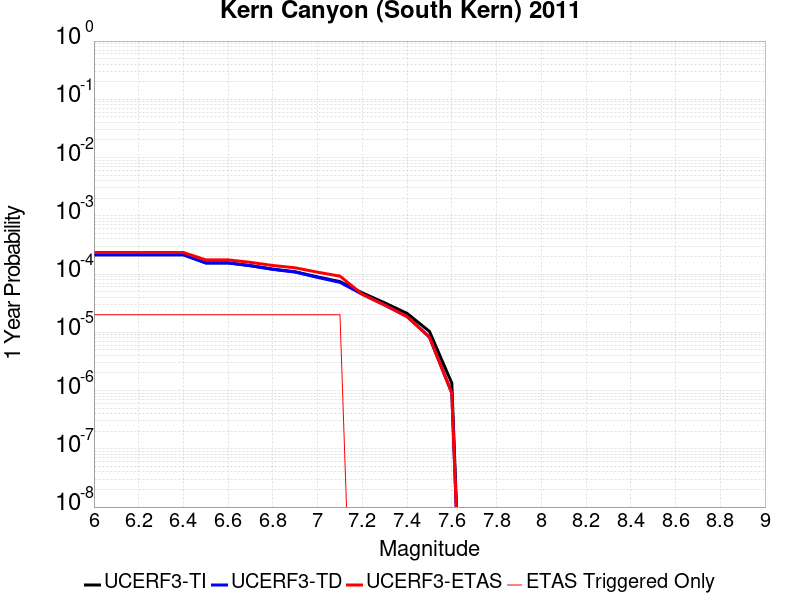 |  |

| Magnitude | 1 wk TI Prob | 1 wk TD Prob | 1 wk ETAS Prob | 1 wk ETAS/TD Gain | 1 wk ETAS Triggered Only | 1 mo TI Prob | 1 mo TD Prob | 1 mo ETAS Prob | 1 mo ETAS/TD Gain | 1 mo ETAS Triggered Only | 1 yr TI Prob | 1 yr TD Prob | 1 yr ETAS Prob | 1 yr ETAS/TD Gain | 1 yr ETAS Triggered Only | 10 yr TI Prob | 10 yr TD Prob | 10 yr ETAS Prob | 10 yr ETAS/TD Gain | 10 yr ETAS Triggered Only |
|-----|-----|-----|-----|-----|-----|-----|-----|-----|-----|-----|-----|-----|-----|-----|-----|-----|-----|-----|-----|-----|
| 6.0 | 4.105075E-6 | 4.113737E-6 | 4.113737E-6 | 1.0 | 0.0 | 1.7593058E-5 | 1.7630186E-5 | 1.7630186E-5 | 1.0 | 0.0 | 2.1417443E-4 | 2.14627E-4 | 2.14627E-4 | 1.0 | 0.0 | 0.0021396813 | 0.002144261 | 0.002164709 | 1.0095361 | 2.0491803E-5 |
| 6.1 | 4.105075E-6 | 4.113737E-6 | 4.113737E-6 | 1.0 | 0.0 | 1.7593058E-5 | 1.7630186E-5 | 1.7630186E-5 | 1.0 | 0.0 | 2.1417443E-4 | 2.14627E-4 | 2.14627E-4 | 1.0 | 0.0 | 0.0021396813 | 0.002144261 | 0.002164709 | 1.0095361 | 2.0491803E-5 |
| 6.2 | 4.105075E-6 | 4.113737E-6 | 4.113737E-6 | 1.0 | 0.0 | 1.7593058E-5 | 1.7630186E-5 | 1.7630186E-5 | 1.0 | 0.0 | 2.1417443E-4 | 2.14627E-4 | 2.14627E-4 | 1.0 | 0.0 | 0.0021396813 | 0.002144261 | 0.002164709 | 1.0095361 | 2.0491803E-5 |
| 6.3 | 4.105075E-6 | 4.113737E-6 | 4.113737E-6 | 1.0 | 0.0 | 1.7593058E-5 | 1.7630186E-5 | 1.7630186E-5 | 1.0 | 0.0 | 2.1417443E-4 | 2.14627E-4 | 2.14627E-4 | 1.0 | 0.0 | 0.0021396813 | 0.002144261 | 0.002164709 | 1.0095361 | 2.0491803E-5 |
| 6.4 | 4.105075E-6 | 4.113737E-6 | 4.113737E-6 | 1.0 | 0.0 | 1.7593058E-5 | 1.7630186E-5 | 1.7630186E-5 | 1.0 | 0.0 | 2.1417443E-4 | 2.14627E-4 | 2.14627E-4 | 1.0 | 0.0 | 0.0021396813 | 0.002144261 | 0.002164709 | 1.0095361 | 2.0491803E-5 |
| 6.5 | 2.9849807E-6 | 2.9731623E-6 | 2.9731623E-6 | 1.0 | 0.0 | 1.2792712E-5 | 1.2742063E-5 | 1.2742063E-5 | 1.0 | 0.0 | 1.5574014E-4 | 1.5512372E-4 | 1.5512372E-4 | 1.0 | 0.0 | 0.0015563103 | 0.0015501695 | 0.0015706295 | 1.0131986 | 2.0491803E-5 |
| 6.6 | 2.9849807E-6 | 2.9731623E-6 | 2.9731623E-6 | 1.0 | 0.0 | 1.2792712E-5 | 1.2742063E-5 | 1.2742063E-5 | 1.0 | 0.0 | 1.5574014E-4 | 1.5512372E-4 | 1.5512372E-4 | 1.0 | 0.0 | 0.0015563103 | 0.0015501695 | 0.0015706295 | 1.0131986 | 2.0491803E-5 |
| 6.7 | 2.6756725E-6 | 2.6582275E-6 | 2.6582275E-6 | 1.0 | 0.0 | 1.1467117E-5 | 1.1392354E-5 | 1.1392354E-5 | 1.0 | 0.0 | 1.396032E-4 | 1.386932E-4 | 1.386932E-4 | 1.0 | 0.0 | 0.0013951553 | 0.0013860773 | 0.0013860773 | 1.0 | 0.0 |
| 6.8 | 2.3283721E-6 | 2.3047846E-6 | 2.3047846E-6 | 1.0 | 0.0 | 9.9787E-6 | 9.877612E-6 | 9.877612E-6 | 1.0 | 0.0 | 1.214839E-4 | 1.2025336E-4 | 1.2025336E-4 | 1.0 | 0.0 | 0.001214175 | 0.0012018904 | 0.0012018904 | 1.0 | 0.0 |
| 6.9 | 2.0972677E-6 | 2.0696464E-6 | 2.0696464E-6 | 1.0 | 0.0 | 8.988259E-6 | 8.8698835E-6 | 8.8698835E-6 | 1.0 | 0.0 | 1.0942656E-4 | 1.0798554E-4 | 1.0798554E-4 | 1.0 | 0.0 | 0.0010937268 | 0.0010793365 | 0.0010793365 | 1.0 | 0.0 |
| 7.0 | 1.7132242E-6 | 1.678708E-6 | 1.678708E-6 | 1.0 | 0.0 | 7.3423685E-6 | 7.1944432E-6 | 7.1944432E-6 | 1.0 | 0.0 | 8.938967E-5 | 8.7588865E-5 | 8.7588865E-5 | 1.0 | 0.0 | 8.935372E-4 | 8.7554724E-4 | 8.7554724E-4 | 1.0 | 0.0 |
| 7.1 | 1.4215541E-6 | 1.381579E-6 | 1.381579E-6 | 1.0 | 0.0 | 6.0923603E-6 | 5.9210392E-6 | 5.9210392E-6 | 1.0 | 0.0 | 7.417196E-5 | 7.2086295E-5 | 7.2086295E-5 | 1.0 | 0.0 | 7.414721E-4 | 7.206318E-4 | 7.206318E-4 | 1.0 | 0.0 |
| 7.2 | 9.097853E-7 | 8.6038E-7 | 8.6038E-7 | 1.0 | 0.0 | 3.899074E-6 | 3.6873375E-6 | 3.6873375E-6 | 1.0 | 0.0 | 4.7470192E-5 | 4.4892422E-5 | 4.4892422E-5 | 1.0 | 0.0 | 4.7460053E-4 | 4.4883462E-4 | 4.4883462E-4 | 1.0 | 0.0 |
| 7.3 | 6.144169E-7 | 5.628223E-7 | 5.628223E-7 | 1.0 | 0.0 | 2.6332125E-6 | 2.4120934E-6 | 2.4120934E-6 | 1.0 | 0.0 | 3.205889E-5 | 2.9366847E-5 | 2.9366847E-5 | 1.0 | 0.0 | 3.2054266E-4 | 2.9363018E-4 | 2.9363018E-4 | 1.0 | 0.0 |
| 7.4 | 4.049844E-7 | 3.5728428E-7 | 3.5728428E-7 | 1.0 | 0.0 | 1.7356463E-6 | 1.5312174E-6 | 1.5312174E-6 | 1.0 | 0.0 | 2.1131287E-5 | 1.8642415E-5 | 1.8642415E-5 | 1.0 | 0.0 | 2.1129279E-4 | 1.8640877E-4 | 1.8640877E-4 | 1.0 | 0.0 |
| 7.5 | 1.9871162E-7 | 1.58305E-7 | 1.58305E-7 | 1.0 | 0.0 | 8.5162094E-7 | 6.7844985E-7 | 6.7844985E-7 | 1.0 | 0.0 | 1.0368436E-5 | 8.260096E-6 | 8.260096E-6 | 1.0 | 0.0 | 1.0367952E-4 | 8.259798E-5 | 8.259798E-5 | 1.0 | 0.0 |
| 7.6 | 2.572245E-8 | 1.7352637E-8 | 1.7352637E-8 | 1.0 | 0.0 | 1.10239064E-7 | 7.4368444E-8 | 7.4368444E-8 | 1.0 | 0.0 | 1.3421597E-6 | 9.0543546E-7 | 9.0543546E-7 | 1.0 | 0.0 | 1.3421517E-5 | 9.0543235E-6 | 9.0543235E-6 | 1.0 | 0.0 |

## Surprise Valley 2011 CFM
*[(top)](#table-of-contents)*

| 1 Week | 1 Month | 1 Year | 10 Year |
|-----|-----|-----|-----|
|  |  | 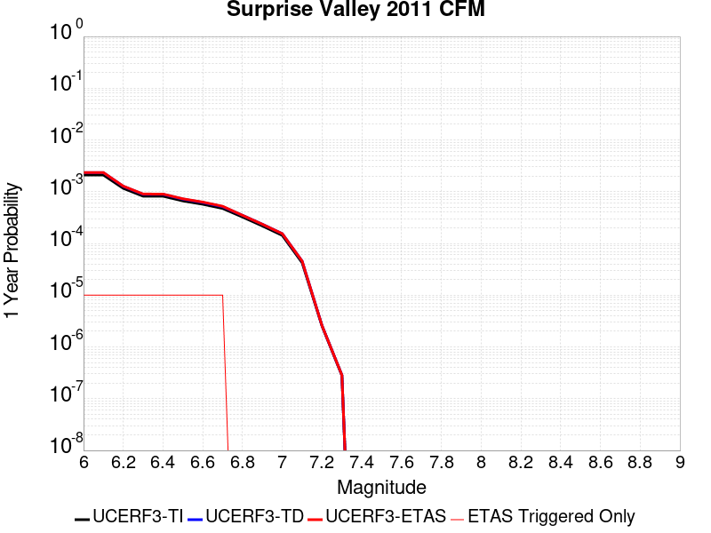 |  |

| Magnitude | 1 wk TI Prob | 1 wk TD Prob | 1 wk ETAS Prob | 1 wk ETAS/TD Gain | 1 wk ETAS Triggered Only | 1 mo TI Prob | 1 mo TD Prob | 1 mo ETAS Prob | 1 mo ETAS/TD Gain | 1 mo ETAS Triggered Only | 1 yr TI Prob | 1 yr TD Prob | 1 yr ETAS Prob | 1 yr ETAS/TD Gain | 1 yr ETAS Triggered Only | 10 yr TI Prob | 10 yr TD Prob | 10 yr ETAS Prob | 10 yr ETAS/TD Gain | 10 yr ETAS Triggered Only |
|-----|-----|-----|-----|-----|-----|-----|-----|-----|-----|-----|-----|-----|-----|-----|-----|-----|-----|-----|-----|-----|
| 6.0 | 4.0396248E-5 | 4.485197E-5 | 4.485197E-5 | 1.0 | 0.0 | 1.7311527E-4 | 1.9220974E-4 | 1.9220974E-4 | 1.0 | 0.0 | 0.002105641 | 0.002337852 | 0.002358296 | 1.0087447 | 2.0491803E-5 | 0.020858008 | 0.023154303 | 0.023174321 | 1.0008645 | 2.0491803E-5 |
| 6.1 | 4.0396248E-5 | 4.485197E-5 | 4.485197E-5 | 1.0 | 0.0 | 1.7311527E-4 | 1.9220974E-4 | 1.9220974E-4 | 1.0 | 0.0 | 0.002105641 | 0.002337852 | 0.002358296 | 1.0087447 | 2.0491803E-5 | 0.020858008 | 0.023154303 | 0.023174321 | 1.0008645 | 2.0491803E-5 |
| 6.2 | 2.2295266E-5 | 2.4401555E-5 | 2.4401555E-5 | 1.0 | 0.0 | 9.554764E-5 | 1.0457408E-4 | 1.0457408E-4 | 1.0 | 0.0 | 0.0011626717 | 0.0012724766 | 0.0012929423 | 1.0160834 | 2.0491803E-5 | 0.011566074 | 0.012655139 | 0.012675372 | 1.0015987 | 2.0491803E-5 |
| 6.3 | 1.572643E-5 | 1.7097005E-5 | 1.7097005E-5 | 1.0 | 0.0 | 6.7397246E-5 | 7.327088E-5 | 7.327088E-5 | 1.0 | 0.0 | 8.202525E-4 | 8.917184E-4 | 9.1219187E-4 | 1.0229596 | 2.0491803E-5 | 0.008172315 | 0.00888251 | 0.008902819 | 1.0022864 | 2.0491803E-5 |
| 6.4 | 1.5714395E-5 | 1.7084827E-5 | 1.7084827E-5 | 1.0 | 0.0 | 6.734567E-5 | 7.321869E-5 | 7.321869E-5 | 1.0 | 0.0 | 8.1962504E-4 | 8.910835E-4 | 9.11557E-4 | 1.022976 | 2.0491803E-5 | 0.008166086 | 0.008876211 | 0.008896521 | 1.0022881 | 2.0491803E-5 |
| 6.5 | 1.2733495E-5 | 1.3801754E-5 | 1.3801754E-5 | 1.0 | 0.0 | 5.457098E-5 | 5.914907E-5 | 5.914907E-5 | 1.0 | 0.0 | 6.641992E-4 | 7.199087E-4 | 7.4038573E-4 | 1.0284439 | 2.0491803E-5 | 0.0066221743 | 0.0071764593 | 0.007196804 | 1.0028349 | 2.0491803E-5 |
| 6.6 | 1.0983784E-5 | 1.1886684E-5 | 1.1886684E-5 | 1.0 | 0.0 | 4.7072506E-5 | 5.0941966E-5 | 5.0941966E-5 | 1.0 | 0.0 | 5.7295704E-4 | 6.2004727E-4 | 6.4052636E-4 | 1.0330282 | 2.0491803E-5 | 0.0057148207 | 0.006183722 | 0.0062040873 | 1.0032934 | 2.0491803E-5 |
| 6.7 | 9.104806E-6 | 9.839597E-6 | 9.839597E-6 | 1.0 | 0.0 | 3.902001E-5 | 4.2169042E-5 | 4.2169042E-5 | 1.0 | 0.0 | 4.7496508E-4 | 5.1329104E-4 | 5.337723E-4 | 1.0399019 | 2.0491803E-5 | 0.004739512 | 0.005121452 | 0.0051418385 | 1.0039806 | 2.0491803E-5 |
| 6.8 | 6.2162403E-6 | 6.7042038E-6 | 6.7042038E-6 | 1.0 | 0.0 | 2.6640759E-5 | 2.8731998E-5 | 2.8731998E-5 | 1.0 | 0.0 | 3.2430296E-4 | 3.4975816E-4 | 3.4975816E-4 | 1.0 | 0.0 | 0.003238301 | 0.0034923002 | 0.0034923002 | 1.0 | 0.0 |
| 6.9 | 4.1792696E-6 | 4.5032766E-6 | 4.5032766E-6 | 1.0 | 0.0 | 1.7911032E-5 | 1.9299621E-5 | 1.9299621E-5 | 1.0 | 0.0 | 2.1804498E-4 | 2.3494911E-4 | 2.3494911E-4 | 1.0 | 0.0 | 0.0021783116 | 0.0023471604 | 0.0023471604 | 1.0 | 0.0 |
| 7.0 | 2.7478413E-6 | 2.9622734E-6 | 2.9622734E-6 | 1.0 | 0.0 | 1.177641E-5 | 1.2695402E-5 | 1.2695402E-5 | 1.0 | 0.0 | 1.4336836E-4 | 1.5455681E-4 | 1.5455681E-4 | 1.0 | 0.0 | 0.001432759 | 0.0015446156 | 0.0015446156 | 1.0 | 0.0 |
| 7.1 | 8.128648E-7 | 8.725007E-7 | 8.725007E-7 | 1.0 | 0.0 | 3.4837017E-6 | 3.739287E-6 | 3.739287E-6 | 1.0 | 0.0 | 4.2413245E-5 | 4.5525467E-5 | 4.5525467E-5 | 1.0 | 0.0 | 4.2405148E-4 | 4.5522023E-4 | 4.5522023E-4 | 1.0 | 0.0 |
| 7.2 | 4.8641045E-8 | 4.9402168E-8 | 4.9402168E-8 | 1.0 | 0.0 | 2.084616E-7 | 2.1172356E-7 | 2.1172356E-7 | 1.0 | 0.0 | 2.538017E-6 | 2.5777315E-6 | 2.5777315E-6 | 1.0 | 0.0 | 2.537988E-5 | 2.5777028E-5 | 2.5777028E-5 | 1.0 | 0.0 |
| 7.3 | 5.3911844E-9 | 5.4758256E-9 | 5.4758256E-9 | 1.0 | 0.0 | 2.3105075E-8 | 2.3467823E-8 | 2.3467823E-8 | 1.0 | 0.0 | 2.8130427E-7 | 2.8572074E-7 | 2.8572074E-7 | 1.0 | 0.0 | 2.8130391E-6 | 2.8572053E-6 | 2.8572053E-6 | 1.0 | 0.0 |

## Hunting Creek - Berryessa 2011 CFM
*[(top)](#table-of-contents)*

| 1 Week | 1 Month | 1 Year | 10 Year |
|-----|-----|-----|-----|
|  |  |  |  |

| Magnitude | 1 wk TI Prob | 1 wk TD Prob | 1 wk ETAS Prob | 1 wk ETAS/TD Gain | 1 wk ETAS Triggered Only | 1 mo TI Prob | 1 mo TD Prob | 1 mo ETAS Prob | 1 mo ETAS/TD Gain | 1 mo ETAS Triggered Only | 1 yr TI Prob | 1 yr TD Prob | 1 yr ETAS Prob | 1 yr ETAS/TD Gain | 1 yr ETAS Triggered Only | 10 yr TI Prob | 10 yr TD Prob | 10 yr ETAS Prob | 10 yr ETAS/TD Gain | 10 yr ETAS Triggered Only |
|-----|-----|-----|-----|-----|-----|-----|-----|-----|-----|-----|-----|-----|-----|-----|-----|-----|-----|-----|-----|-----|
| 6.0 | 1.1270982E-4 | 2.0014354E-4 | 2.0014354E-4 | 1.0 | 0.0 | 4.8295266E-4 | 8.574329E-4 | 8.574329E-4 | 1.0 | 0.0 | 0.0058641075 | 0.010387073 | 0.010407352 | 1.0019523 | 2.0491803E-5 | 0.057117578 | 0.09804065 | 0.09805913 | 1.0001885 | 2.0491803E-5 |
| 6.1 | 1.1239393E-4 | 1.9962489E-4 | 1.9962489E-4 | 1.0 | 0.0 | 4.8159933E-4 | 8.552116E-4 | 8.552116E-4 | 1.0 | 0.0 | 0.0058477195 | 0.010360309 | 0.0103805885 | 1.0019574 | 2.0491803E-5 | 0.056962132 | 0.09779912 | 0.09781761 | 1.0001891 | 2.0491803E-5 |
| 6.2 | 7.596265E-5 | 1.2941175E-4 | 1.2941175E-4 | 1.0 | 0.0 | 3.2551357E-4 | 5.544276E-4 | 5.544276E-4 | 1.0 | 0.0 | 0.0039559277 | 0.0067212153 | 0.0067415694 | 1.0030283 | 2.0491803E-5 | 0.038862433 | 0.0645938 | 0.06461296 | 1.0002967 | 2.0491803E-5 |
| 6.3 | 6.78794E-5 | 1.145196E-4 | 1.145196E-4 | 1.0 | 0.0 | 2.9087928E-4 | 4.9066654E-4 | 4.9066654E-4 | 1.0 | 0.0 | 0.003535705 | 0.0059528556 | 0.0059732255 | 1.0034219 | 2.0491803E-5 | 0.034799766 | 0.05746746 | 0.057486776 | 1.000336 | 2.0491803E-5 |
| 6.4 | 6.2165134E-5 | 1.0437306E-4 | 1.0437306E-4 | 1.0 | 0.0 | 2.6639478E-4 | 4.4723987E-4 | 4.4723987E-4 | 1.0 | 0.0 | 0.0032385332 | 0.005427739 | 0.005427739 | 1.0 | 0.0 | 0.03191742 | 0.052552443 | 0.052552443 | 1.0 | 0.0 |
| 6.5 | 5.4368087E-5 | 9.071981E-5 | 9.071981E-5 | 1.0 | 0.0 | 2.3298527E-4 | 3.887444E-4 | 3.887444E-4 | 1.0 | 0.0 | 0.0028329059 | 0.004720021 | 0.004720021 | 1.0 | 0.0 | 0.027970633 | 0.045881823 | 0.045881823 | 1.0 | 0.0 |
| 6.6 | 4.729947E-5 | 7.848042E-5 | 7.848042E-5 | 1.0 | 0.0 | 2.0269625E-4 | 3.363043E-4 | 3.363043E-4 | 1.0 | 0.0 | 0.002465034 | 0.0040850975 | 0.0040850975 | 1.0 | 0.0 | 0.02437869 | 0.039853033 | 0.039853033 | 1.0 | 0.0 |
| 6.7 | 3.6875328E-5 | 6.0455113E-5 | 6.0455113E-5 | 1.0 | 0.0 | 1.5802756E-4 | 2.5907016E-4 | 2.5907016E-4 | 1.0 | 0.0 | 0.0019222875 | 0.0031483201 | 0.0031483201 | 1.0 | 0.0 | 0.019057442 | 0.030893533 | 0.030893533 | 1.0 | 0.0 |
| 6.8 | 2.0292036E-5 | 2.897696E-5 | 2.897696E-5 | 1.0 | 0.0 | 8.6962966E-5 | 1.241811E-4 | 1.241811E-4 | 1.0 | 0.0 | 0.0010582599 | 0.00151084 | 0.00151084 | 1.0 | 0.0 | 0.010532344 | 0.014978847 | 0.014978847 | 1.0 | 0.0 |
| 6.9 | 1.7871042E-5 | 2.4472789E-5 | 2.4472789E-5 | 1.0 | 0.0 | 7.658793E-5 | 1.048792E-4 | 1.048792E-4 | 1.0 | 0.0 | 9.320591E-4 | 0.0012761577 | 0.0012761577 | 1.0 | 0.0 | 0.009281595 | 0.012680048 | 0.012680048 | 1.0 | 0.0 |
| 7.0 | 1.6415532E-5 | 2.1906764E-5 | 2.1906764E-5 | 1.0 | 0.0 | 7.035038E-5 | 9.388277E-5 | 9.388277E-5 | 1.0 | 0.0 | 8.561793E-4 | 0.0011424269 | 0.0011424269 | 1.0 | 0.0 | 0.008528882 | 0.011364769 | 0.011364769 | 1.0 | 0.0 |
| 7.1 | 1.5409885E-5 | 2.03468E-5 | 2.03468E-5 | 1.0 | 0.0 | 6.6040695E-5 | 8.719768E-5 | 8.719768E-5 | 1.0 | 0.0 | 8.0374884E-4 | 0.0010611176 | 0.0010611176 | 1.0 | 0.0 | 0.00800848 | 0.010560832 | 0.010560832 | 1.0 | 0.0 |
| 7.2 | 1.4497423E-5 | 1.905539E-5 | 1.905539E-5 | 1.0 | 0.0 | 6.213033E-5 | 8.166341E-5 | 8.166341E-5 | 1.0 | 0.0 | 7.5617427E-4 | 9.938016E-4 | 9.938016E-4 | 1.0 | 0.0 | 0.0075360634 | 0.009894148 | 0.009894148 | 1.0 | 0.0 |
| 7.3 | 1.3615175E-5 | 1.7826538E-5 | 1.7826538E-5 | 1.0 | 0.0 | 5.8349444E-5 | 7.639723E-5 | 7.639723E-5 | 1.0 | 0.0 | 7.101729E-4 | 9.2974224E-4 | 9.2974224E-4 | 1.0 | 0.0 | 0.0070790765 | 0.009259034 | 0.009259034 | 1.0 | 0.0 |
| 7.4 | 1.2252825E-5 | 1.6026612E-5 | 1.6026612E-5 | 1.0 | 0.0 | 5.251105E-5 | 6.868369E-5 | 6.868369E-5 | 1.0 | 0.0 | 6.391345E-4 | 8.359059E-4 | 8.359059E-4 | 1.0 | 0.0 | 0.0063729943 | 0.008328059 | 0.008328059 | 1.0 | 0.0 |
| 7.5 | 1.0913301E-5 | 1.4241439E-5 | 1.4241439E-5 | 1.0 | 0.0 | 4.6770452E-5 | 6.103333E-5 | 6.103333E-5 | 1.0 | 0.0 | 5.6928146E-4 | 7.4283016E-4 | 7.4283016E-4 | 1.0 | 0.0 | 0.0056782532 | 0.0074038464 | 0.0074038464 | 1.0 | 0.0 |
| 7.6 | 8.623192E-6 | 1.1234897E-5 | 1.1234897E-5 | 1.0 | 0.0 | 3.6956015E-5 | 4.8148686E-5 | 4.8148686E-5 | 1.0 | 0.0 | 4.4984656E-4 | 5.860551E-4 | 5.860551E-4 | 1.0 | 0.0 | 0.00448937 | 0.0058454107 | 0.0058454107 | 1.0 | 0.0 |
| 7.7 | 2.0993634E-6 | 2.6626365E-6 | 2.6626365E-6 | 1.0 | 0.0 | 8.997241E-6 | 1.141125E-5 | 1.141125E-5 | 1.0 | 0.0 | 1.09535904E-4 | 1.3892318E-4 | 1.3892318E-4 | 1.0 | 0.0 | 0.0010948193 | 0.0013883698 | 0.0013883698 | 1.0 | 0.0 |
| 7.8 | 1.8428308E-7 | 2.167475E-7 | 2.167475E-7 | 1.0 | 0.0 | 7.897844E-7 | 9.2891753E-7 | 9.2891753E-7 | 1.0 | 0.0 | 9.615583E-6 | 1.1309516E-5 | 1.1309516E-5 | 1.0 | 0.0 | 9.615166E-5 | 1.13088005E-4 | 1.13088005E-4 | 1.0 | 0.0 |

## Newport-Inglewood alt 1
*[(top)](#table-of-contents)*

| 1 Week | 1 Month | 1 Year | 10 Year |
|-----|-----|-----|-----|
|  |  |  |  |

| Magnitude | 1 wk TI Prob | 1 wk TD Prob | 1 wk ETAS Prob | 1 wk ETAS/TD Gain | 1 wk ETAS Triggered Only | 1 mo TI Prob | 1 mo TD Prob | 1 mo ETAS Prob | 1 mo ETAS/TD Gain | 1 mo ETAS Triggered Only | 1 yr TI Prob | 1 yr TD Prob | 1 yr ETAS Prob | 1 yr ETAS/TD Gain | 1 yr ETAS Triggered Only | 10 yr TI Prob | 10 yr TD Prob | 10 yr ETAS Prob | 10 yr ETAS/TD Gain | 10 yr ETAS Triggered Only |
|-----|-----|-----|-----|-----|-----|-----|-----|-----|-----|-----|-----|-----|-----|-----|-----|-----|-----|-----|-----|-----|
| 6.0 | 2.9668912E-5 | 3.0405516E-5 | 3.0405516E-5 | 1.0 | 0.0 | 1.2714628E-4 | 1.3030559E-4 | 1.3030559E-4 | 1.0 | 0.0 | 0.0015469068 | 0.0015857986 | 0.0016062579 | 1.0129015 | 2.0491803E-5 | 0.015361829 | 0.015792403 | 0.01581257 | 1.0012771 | 2.0491803E-5 |
| 6.1 | 2.9668912E-5 | 3.0405516E-5 | 3.0405516E-5 | 1.0 | 0.0 | 1.2714628E-4 | 1.3030559E-4 | 1.3030559E-4 | 1.0 | 0.0 | 0.0015469068 | 0.0015857986 | 0.0016062579 | 1.0129015 | 2.0491803E-5 | 0.015361829 | 0.015792403 | 0.01581257 | 1.0012771 | 2.0491803E-5 |
| 6.2 | 2.9668912E-5 | 3.0405516E-5 | 3.0405516E-5 | 1.0 | 0.0 | 1.2714628E-4 | 1.3030559E-4 | 1.3030559E-4 | 1.0 | 0.0 | 0.0015469068 | 0.0015857986 | 0.0016062579 | 1.0129015 | 2.0491803E-5 | 0.015361829 | 0.015792403 | 0.01581257 | 1.0012771 | 2.0491803E-5 |
| 6.3 | 2.9668912E-5 | 3.0405516E-5 | 3.0405516E-5 | 1.0 | 0.0 | 1.2714628E-4 | 1.3030559E-4 | 1.3030559E-4 | 1.0 | 0.0 | 0.0015469068 | 0.0015857986 | 0.0016062579 | 1.0129015 | 2.0491803E-5 | 0.015361829 | 0.015792403 | 0.01581257 | 1.0012771 | 2.0491803E-5 |
| 6.4 | 1.275942E-5 | 1.0272664E-5 | 1.0272664E-5 | 1.0 | 0.0 | 5.4682085E-5 | 4.4024986E-5 | 4.4024986E-5 | 1.0 | 0.0 | 6.65551E-4 | 5.3587655E-4 | 5.3587655E-4 | 1.0 | 0.0 | 0.0066356123 | 0.0053462684 | 0.0053462684 | 1.0 | 0.0 |
| 6.5 | 1.275942E-5 | 1.0272664E-5 | 1.0272664E-5 | 1.0 | 0.0 | 5.4682085E-5 | 4.4024986E-5 | 4.4024986E-5 | 1.0 | 0.0 | 6.65551E-4 | 5.3587655E-4 | 5.3587655E-4 | 1.0 | 0.0 | 0.0066356123 | 0.0053462684 | 0.0053462684 | 1.0 | 0.0 |
| 6.6 | 1.1255358E-5 | 8.662018E-6 | 8.662018E-6 | 1.0 | 0.0 | 4.8236358E-5 | 3.7122416E-5 | 3.7122416E-5 | 1.0 | 0.0 | 5.871194E-4 | 4.5187338E-4 | 4.5187338E-4 | 1.0 | 0.0 | 0.005855706 | 0.004509723 | 0.004509723 | 1.0 | 0.0 |
| 6.7 | 1.0504745E-5 | 7.899919E-6 | 7.899919E-6 | 1.0 | 0.0 | 4.5019555E-5 | 3.3856366E-5 | 3.3856366E-5 | 1.0 | 0.0 | 5.4797524E-4 | 4.1212453E-4 | 4.1212453E-4 | 1.0 | 0.0 | 0.0054662596 | 0.0041137324 | 0.0041137324 | 1.0 | 0.0 |
| 6.8 | 1.0476007E-5 | 7.881301E-6 | 7.881301E-6 | 1.0 | 0.0 | 4.4896402E-5 | 3.377657E-5 | 3.377657E-5 | 1.0 | 0.0 | 5.464766E-4 | 4.1115342E-4 | 4.1115342E-4 | 1.0 | 0.0 | 0.005451347 | 0.0041040573 | 0.0041040573 | 1.0 | 0.0 |
| 6.9 | 9.076797E-6 | 6.489738E-6 | 6.489738E-6 | 1.0 | 0.0 | 3.889998E-5 | 2.7812868E-5 | 2.7812868E-5 | 1.0 | 0.0 | 4.7350433E-4 | 3.385694E-4 | 3.385694E-4 | 1.0 | 0.0 | 0.004724967 | 0.0033805731 | 0.0033805731 | 1.0 | 0.0 |
| 7.0 | 8.73795E-6 | 6.212118E-6 | 6.212118E-6 | 1.0 | 0.0 | 3.7447822E-5 | 2.6623095E-5 | 2.6623095E-5 | 1.0 | 0.0 | 4.5583185E-4 | 3.2408824E-4 | 3.2408824E-4 | 1.0 | 0.0 | 0.0045489795 | 0.0032361876 | 0.0032361876 | 1.0 | 0.0 |
| 7.1 | 8.391299E-6 | 5.955894E-6 | 5.955894E-6 | 1.0 | 0.0 | 3.5962214E-5 | 2.552501E-5 | 2.552501E-5 | 1.0 | 0.0 | 4.37752E-4 | 3.1072294E-4 | 3.1072294E-4 | 1.0 | 0.0 | 0.004368907 | 0.0031029144 | 0.0031029144 | 1.0 | 0.0 |
| 7.2 | 7.796882E-6 | 5.496635E-6 | 5.496635E-6 | 1.0 | 0.0 | 3.341478E-5 | 2.3556795E-5 | 2.3556795E-5 | 1.0 | 0.0 | 4.06749E-4 | 2.8676644E-4 | 2.8676644E-4 | 1.0 | 0.0 | 0.0040600533 | 0.002863988 | 0.002863988 | 1.0 | 0.0 |
| 7.3 | 6.4738833E-6 | 4.647859E-6 | 4.647859E-6 | 1.0 | 0.0 | 2.774492E-5 | 1.9919245E-5 | 1.9919245E-5 | 1.0 | 0.0 | 3.3774204E-4 | 2.4248997E-4 | 2.4248997E-4 | 1.0 | 0.0 | 0.0033722918 | 0.0024222704 | 0.0024222704 | 1.0 | 0.0 |
| 7.4 | 5.382145E-6 | 3.8857956E-6 | 3.8857956E-6 | 1.0 | 0.0 | 2.3066134E-5 | 1.6653305E-5 | 1.6653305E-5 | 1.0 | 0.0 | 2.8079396E-4 | 2.0273525E-4 | 2.0273525E-4 | 1.0 | 0.0 | 0.0028043943 | 0.0020255174 | 0.0020255174 | 1.0 | 0.0 |
| 7.5 | 3.648244E-6 | 2.573805E-6 | 2.573805E-6 | 1.0 | 0.0 | 1.5635238E-5 | 1.1030546E-5 | 1.1030546E-5 | 1.0 | 0.0 | 1.9034238E-4 | 1.3428873E-4 | 1.3428873E-4 | 1.0 | 0.0 | 0.0019017943 | 0.0013420862 | 0.0013420862 | 1.0 | 0.0 |
| 7.6 | 2.2906888E-6 | 1.5479983E-6 | 1.5479983E-6 | 1.0 | 0.0 | 9.817201E-6 | 6.6342623E-6 | 6.6342623E-6 | 1.0 | 0.0 | 1.1951787E-4 | 8.076921E-5 | 8.076921E-5 | 1.0 | 0.0 | 0.0011945361 | 8.0740533E-4 | 8.0740533E-4 | 1.0 | 0.0 |
| 7.7 | 6.0479874E-7 | 3.3975476E-7 | 3.3975476E-7 | 1.0 | 0.0 | 2.5919921E-6 | 1.456091E-6 | 1.456091E-6 | 1.0 | 0.0 | 3.1557047E-5 | 1.7727778E-5 | 1.7727778E-5 | 1.0 | 0.0 | 3.1552566E-4 | 1.7726503E-4 | 1.7726503E-4 | 1.0 | 0.0 |
| 7.8 | 1.16056995E-8 | 9.782392E-9 | 9.782392E-9 | 1.0 | 0.0 | 4.9738713E-8 | 4.1924537E-8 | 4.1924537E-8 | 1.0 | 0.0 | 6.0556863E-7 | 5.104312E-7 | 5.104312E-7 | 1.0 | 0.0 | 6.05567E-6 | 5.104312E-6 | 5.104312E-6 | 1.0 | 0.0 |

## Calaveras (So) 2011 CFM
*[(top)](#table-of-contents)*

| 1 Week | 1 Month | 1 Year | 10 Year |
|-----|-----|-----|-----|
|  |  |  | 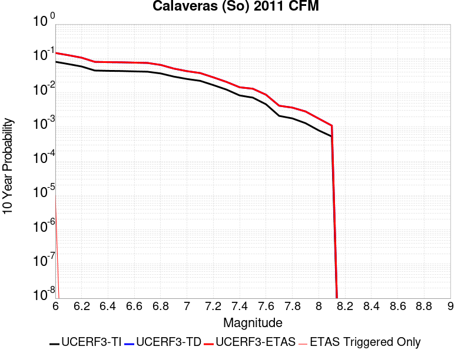 |

| Magnitude | 1 wk TI Prob | 1 wk TD Prob | 1 wk ETAS Prob | 1 wk ETAS/TD Gain | 1 wk ETAS Triggered Only | 1 mo TI Prob | 1 mo TD Prob | 1 mo ETAS Prob | 1 mo ETAS/TD Gain | 1 mo ETAS Triggered Only | 1 yr TI Prob | 1 yr TD Prob | 1 yr ETAS Prob | 1 yr ETAS/TD Gain | 1 yr ETAS Triggered Only | 10 yr TI Prob | 10 yr TD Prob | 10 yr ETAS Prob | 10 yr ETAS/TD Gain | 10 yr ETAS Triggered Only |
|-----|-----|-----|-----|-----|-----|-----|-----|-----|-----|-----|-----|-----|-----|-----|-----|-----|-----|-----|-----|-----|
| 6.0 | 1.5950744E-4 | 3.0719102E-4 | 3.0719102E-4 | 1.0 | 0.0 | 6.834242E-4 | 0.0013158836 | 0.0013363484 | 1.0155522 | 2.0491803E-5 | 0.00828899 | 0.015860915 | 0.015881082 | 1.0012715 | 2.0491803E-5 | 0.079865426 | 0.14441721 | 0.14443475 | 1.0001214 | 2.0491803E-5 |
| 6.1 | 1.3584697E-4 | 2.604323E-4 | 2.604323E-4 | 1.0 | 0.0 | 5.8207137E-4 | 0.0011156795 | 0.0011156795 | 1.0 | 0.0 | 0.007063716 | 0.013463869 | 0.013463869 | 1.0 | 0.0 | 0.06843361 | 0.124044694 | 0.124044694 | 1.0 | 0.0 |
| 6.2 | 1.14676266E-4 | 2.1731424E-4 | 2.1731424E-4 | 1.0 | 0.0 | 4.9137714E-4 | 9.310301E-4 | 9.310301E-4 | 1.0 | 0.0 | 0.0059661185 | 0.01124721 | 0.01124721 | 1.0 | 0.0 | 0.058084648 | 0.10503508 | 0.10503508 | 1.0 | 0.0 |
| 6.3 | 8.691518E-5 | 1.5990793E-4 | 1.5990793E-4 | 1.0 | 0.0 | 3.7244044E-4 | 6.851358E-4 | 6.851358E-4 | 1.0 | 0.0 | 0.004525038 | 0.008302716 | 0.008302716 | 1.0 | 0.0 | 0.044339992 | 0.079350494 | 0.079350494 | 1.0 | 0.0 |
| 6.4 | 8.50982E-5 | 1.5697183E-4 | 1.5697183E-4 | 1.0 | 0.0 | 3.646556E-4 | 6.725591E-4 | 6.725591E-4 | 1.0 | 0.0 | 0.0044306475 | 0.008150746 | 0.008150746 | 1.0 | 0.0 | 0.04343345 | 0.0779566 | 0.0779566 | 1.0 | 0.0 |
| 6.5 | 8.4062965E-5 | 1.5521735E-4 | 1.5521735E-4 | 1.0 | 0.0 | 3.602201E-4 | 6.650437E-4 | 6.650437E-4 | 1.0 | 0.0 | 0.004376863 | 0.008059946 | 0.008059946 | 1.0 | 0.0 | 0.042916555 | 0.07712786 | 0.07712786 | 1.0 | 0.0 |
| 6.6 | 8.194716E-5 | 1.5157646E-4 | 1.5157646E-4 | 1.0 | 0.0 | 3.5115483E-4 | 6.494477E-4 | 6.494477E-4 | 1.0 | 0.0 | 0.0042669317 | 0.007871782 | 0.007871782 | 1.0 | 0.0 | 0.04185927 | 0.075413086 | 0.075413086 | 1.0 | 0.0 |
| 6.7 | 8.012326E-5 | 1.4825336E-4 | 1.4825336E-4 | 1.0 | 0.0 | 3.433402E-4 | 6.3521386E-4 | 6.3521386E-4 | 1.0 | 0.0 | 0.004172157 | 0.0077002714 | 0.0077002714 | 1.0 | 0.0 | 0.040946912 | 0.073855184 | 0.073855184 | 1.0 | 0.0 |
| 6.8 | 7.119773E-5 | 1.2883788E-4 | 1.2883788E-4 | 1.0 | 0.0 | 3.0509746E-4 | 5.5204553E-4 | 5.5204553E-4 | 1.0 | 0.0 | 0.0037082357 | 0.0066975304 | 0.0066975304 | 1.0 | 0.0 | 0.036469642 | 0.064698465 | 0.064698465 | 1.0 | 0.0 |
| 6.9 | 5.7343088E-5 | 9.921204E-5 | 9.921204E-5 | 1.0 | 0.0 | 2.4573295E-4 | 4.2512562E-4 | 4.2512562E-4 | 1.0 | 0.0 | 0.0029876942 | 0.005163703 | 0.005163703 | 1.0 | 0.0 | 0.02947844 | 0.050519872 | 0.050519872 | 1.0 | 0.0 |
| 7.0 | 4.8746577E-5 | 8.286983E-5 | 8.286983E-5 | 1.0 | 0.0 | 2.0889717E-4 | 3.5510844E-4 | 3.5510844E-4 | 1.0 | 0.0 | 0.0025403565 | 0.004314941 | 0.004314941 | 1.0 | 0.0 | 0.025115121 | 0.042495564 | 0.042495564 | 1.0 | 0.0 |
| 7.1 | 4.2998014E-5 | 7.266396E-5 | 7.266396E-5 | 1.0 | 0.0 | 1.8426418E-4 | 3.1138014E-4 | 3.1138014E-4 | 1.0 | 0.0 | 0.002241108 | 0.0037845233 | 0.0037845233 | 1.0 | 0.0 | 0.022186412 | 0.03743038 | 0.03743038 | 1.0 | 0.0 |
| 7.2 | 3.221292E-5 | 5.3919634E-5 | 5.3919634E-5 | 1.0 | 0.0 | 1.3804805E-4 | 2.3106382E-4 | 2.3106382E-4 | 1.0 | 0.0 | 0.0016794393 | 0.002809601 | 0.002809601 | 1.0 | 0.0 | 0.016668037 | 0.0280428 | 0.0280428 | 1.0 | 0.0 |
| 7.3 | 2.3756531E-5 | 3.9484363E-5 | 3.9484363E-5 | 1.0 | 0.0 | 1.0180973E-4 | 1.6920782E-4 | 1.6920782E-4 | 1.0 | 0.0 | 0.0012388286 | 0.0020581756 | 0.0020581756 | 1.0 | 0.0 | 0.012319452 | 0.020649675 | 0.020649675 | 1.0 | 0.0 |
| 7.4 | 1.5997684E-5 | 2.7347376E-5 | 2.7347376E-5 | 1.0 | 0.0 | 6.8559704E-5 | 1.17197786E-4 | 1.17197786E-4 | 1.0 | 0.0 | 8.343947E-4 | 0.0014259516 | 0.0014259516 | 1.0 | 0.0 | 0.008312687 | 0.014379721 | 0.014379721 | 1.0 | 0.0 |
| 7.5 | 1.3814293E-5 | 2.4788933E-5 | 2.4788933E-5 | 1.0 | 0.0 | 5.9202768E-5 | 1.0623397E-4 | 1.0623397E-4 | 1.0 | 0.0 | 7.205553E-4 | 0.0012926336 | 0.0012926336 | 1.0 | 0.0 | 0.007182234 | 0.013058846 | 0.013058846 | 1.0 | 0.0 |
| 7.6 | 8.817309E-6 | 1.643521E-5 | 1.643521E-5 | 1.0 | 0.0 | 3.7787922E-5 | 7.043472E-5 | 7.043472E-5 | 1.0 | 0.0 | 4.5997082E-4 | 8.572067E-4 | 8.572067E-4 | 1.0 | 0.0 | 0.004590199 | 0.008722494 | 0.008722494 | 1.0 | 0.0 |
| 7.7 | 4.0352206E-6 | 7.711002E-6 | 7.711002E-6 | 1.0 | 0.0 | 1.7293689E-5 | 3.304673E-5 | 3.304673E-5 | 1.0 | 0.0 | 2.1053031E-4 | 4.0226974E-4 | 4.0226974E-4 | 1.0 | 0.0 | 0.0021033096 | 0.00416701 | 0.00416701 | 1.0 | 0.0 |
| 7.8 | 3.413169E-6 | 6.7905053E-6 | 6.7905053E-6 | 1.0 | 0.0 | 1.4627784E-5 | 2.910184E-5 | 2.910184E-5 | 1.0 | 0.0 | 1.7807873E-4 | 3.5425735E-4 | 3.5425735E-4 | 1.0 | 0.0 | 0.0017793609 | 0.0036680899 | 0.0036680899 | 1.0 | 0.0 |
| 7.9 | 2.4740732E-6 | 5.2815635E-6 | 5.2815635E-6 | 1.0 | 0.0 | 1.06031275E-5 | 2.2635075E-5 | 2.2635075E-5 | 1.0 | 0.0 | 1.2908543E-4 | 2.7554724E-4 | 2.7554724E-4 | 1.0 | 0.0 | 0.0012901047 | 0.0028359778 | 0.0028359778 | 1.0 | 0.0 |
| 8.0 | 1.5231818E-6 | 3.2903374E-6 | 3.2903374E-6 | 1.0 | 0.0 | 6.527906E-6 | 1.410137E-5 | 1.410137E-5 | 1.0 | 0.0 | 7.9474354E-5 | 1.7167069E-4 | 1.7167069E-4 | 1.0 | 0.0 | 7.944594E-4 | 0.0017571712 | 0.0017571712 | 1.0 | 0.0 |
| 8.1 | 1.0104524E-6 | 2.0467116E-6 | 2.0467116E-6 | 1.0 | 0.0 | 4.330503E-6 | 8.771593E-6 | 8.771593E-6 | 1.0 | 0.0 | 5.2722597E-5 | 1.0678893E-4 | 1.0678893E-4 | 1.0 | 0.0 | 5.271009E-4 | 0.0010934469 | 0.0010934469 | 1.0 | 0.0 |

## Holser alt 1
*[(top)](#table-of-contents)*

| 1 Week | 1 Month | 1 Year | 10 Year |
|-----|-----|-----|-----|
|  |  | 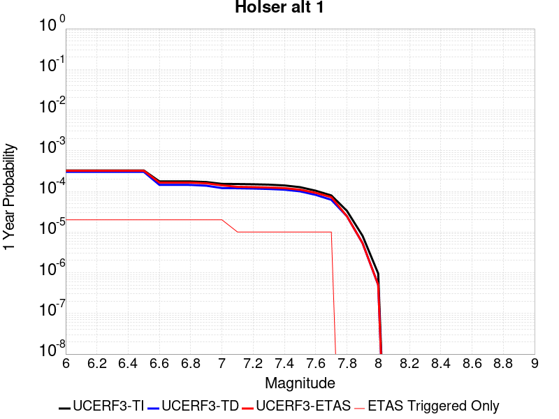 |  |

| Magnitude | 1 wk TI Prob | 1 wk TD Prob | 1 wk ETAS Prob | 1 wk ETAS/TD Gain | 1 wk ETAS Triggered Only | 1 mo TI Prob | 1 mo TD Prob | 1 mo ETAS Prob | 1 mo ETAS/TD Gain | 1 mo ETAS Triggered Only | 1 yr TI Prob | 1 yr TD Prob | 1 yr ETAS Prob | 1 yr ETAS/TD Gain | 1 yr ETAS Triggered Only | 10 yr TI Prob | 10 yr TD Prob | 10 yr ETAS Prob | 10 yr ETAS/TD Gain | 10 yr ETAS Triggered Only |
|-----|-----|-----|-----|-----|-----|-----|-----|-----|-----|-----|-----|-----|-----|-----|-----|-----|-----|-----|-----|-----|
| 6.0 | 6.2746653E-6 | 5.790017E-6 | 2.6281701E-5 | 4.5391407 | 2.0491803E-5 | 2.6891146E-5 | 2.4814188E-5 | 4.530548E-5 | 1.8257895 | 2.0491803E-5 | 3.273505E-4 | 3.020824E-4 | 3.22568E-4 | 1.0678147 | 2.0491803E-5 | 0.0032686873 | 0.0030178505 | 0.0030382804 | 1.0067697 | 2.0491803E-5 |
| 6.1 | 6.2746653E-6 | 5.790017E-6 | 2.6281701E-5 | 4.5391407 | 2.0491803E-5 | 2.6891146E-5 | 2.4814188E-5 | 4.530548E-5 | 1.8257895 | 2.0491803E-5 | 3.273505E-4 | 3.020824E-4 | 3.22568E-4 | 1.0678147 | 2.0491803E-5 | 0.0032686873 | 0.0030178505 | 0.0030382804 | 1.0067697 | 2.0491803E-5 |
| 6.2 | 6.2746653E-6 | 5.790017E-6 | 2.6281701E-5 | 4.5391407 | 2.0491803E-5 | 2.6891146E-5 | 2.4814188E-5 | 4.530548E-5 | 1.8257895 | 2.0491803E-5 | 3.273505E-4 | 3.020824E-4 | 3.22568E-4 | 1.0678147 | 2.0491803E-5 | 0.0032686873 | 0.0030178505 | 0.0030382804 | 1.0067697 | 2.0491803E-5 |
| 6.3 | 6.2746653E-6 | 5.790017E-6 | 2.6281701E-5 | 4.5391407 | 2.0491803E-5 | 2.6891146E-5 | 2.4814188E-5 | 4.530548E-5 | 1.8257895 | 2.0491803E-5 | 3.273505E-4 | 3.020824E-4 | 3.22568E-4 | 1.0678147 | 2.0491803E-5 | 0.0032686873 | 0.0030178505 | 0.0030382804 | 1.0067697 | 2.0491803E-5 |
| 6.4 | 6.2746653E-6 | 5.790017E-6 | 2.6281701E-5 | 4.5391407 | 2.0491803E-5 | 2.6891146E-5 | 2.4814188E-5 | 4.530548E-5 | 1.8257895 | 2.0491803E-5 | 3.273505E-4 | 3.020824E-4 | 3.22568E-4 | 1.0678147 | 2.0491803E-5 | 0.0032686873 | 0.0030178505 | 0.0030382804 | 1.0067697 | 2.0491803E-5 |
| 6.5 | 6.2746653E-6 | 5.790017E-6 | 2.6281701E-5 | 4.5391407 | 2.0491803E-5 | 2.6891146E-5 | 2.4814188E-5 | 4.530548E-5 | 1.8257895 | 2.0491803E-5 | 3.273505E-4 | 3.020824E-4 | 3.22568E-4 | 1.0678147 | 2.0491803E-5 | 0.0032686873 | 0.0030178505 | 0.0030382804 | 1.0067697 | 2.0491803E-5 |
| 6.6 | 3.375825E-6 | 2.7712251E-6 | 2.3262972E-5 | 8.394472 | 2.0491803E-5 | 1.4467741E-5 | 1.1876626E-5 | 3.2368185E-5 | 2.7253687 | 2.0491803E-5 | 1.761305E-4 | 1.4458848E-4 | 1.6507733E-4 | 1.1417046 | 2.0491803E-5 | 0.0017599097 | 0.0014449612 | 0.0014654234 | 1.0141611 | 2.0491803E-5 |
| 6.7 | 3.375825E-6 | 2.7712251E-6 | 2.3262972E-5 | 8.394472 | 2.0491803E-5 | 1.4467741E-5 | 1.1876626E-5 | 3.2368185E-5 | 2.7253687 | 2.0491803E-5 | 1.761305E-4 | 1.4458848E-4 | 1.6507733E-4 | 1.1417046 | 2.0491803E-5 | 0.0017599097 | 0.0014449612 | 0.0014654234 | 1.0141611 | 2.0491803E-5 |
| 6.8 | 3.366533E-6 | 2.7616245E-6 | 2.3253371E-5 | 8.420178 | 2.0491803E-5 | 1.4427919E-5 | 1.1835481E-5 | 3.2327043E-5 | 2.7313669 | 2.0491803E-5 | 1.7564575E-4 | 1.4408762E-4 | 1.6457647E-4 | 1.1421971 | 2.0491803E-5 | 0.0017550698 | 0.0014399589 | 0.0014604212 | 1.0142103 | 2.0491803E-5 |
| 6.9 | 3.253174E-6 | 2.643846E-6 | 2.3135595E-5 | 8.750734 | 2.0491803E-5 | 1.39421E-5 | 1.1330721E-5 | 3.1822292E-5 | 2.8084967 | 2.0491803E-5 | 1.6973184E-4 | 1.3794295E-4 | 1.5843193E-4 | 1.1485323 | 2.0491803E-5 | 0.0016960226 | 0.0013785891 | 0.0013990527 | 1.0148438 | 2.0491803E-5 |
| 7.0 | 2.9336593E-6 | 2.311832E-6 | 2.2803588E-5 | 9.86386 | 2.0491803E-5 | 1.2572766E-5 | 9.907814E-6 | 3.0399415E-5 | 3.068226 | 2.0491803E-5 | 1.5306266E-4 | 1.20620985E-4 | 1.4111031E-4 | 1.1698654 | 2.0491803E-5 | 0.0015295728 | 0.0012055576 | 0.0012260247 | 1.0169773 | 2.0491803E-5 |
| 7.1 | 2.9087812E-6 | 2.287684E-6 | 2.277944E-5 | 9.957424 | 2.0491803E-5 | 1.2466146E-5 | 9.804324E-6 | 3.0295925E-5 | 3.0900578 | 2.0491803E-5 | 1.5176475E-4 | 1.19361124E-4 | 1.3985048E-4 | 1.1716585 | 2.0491803E-5 | 0.0015166114 | 0.0011929726 | 0.00121344 | 1.0171566 | 2.0491803E-5 |
| 7.2 | 2.8674524E-6 | 2.247575E-6 | 2.2739332E-5 | 10.117274 | 2.0491803E-5 | 1.2289024E-5 | 9.632428E-6 | 3.0124034E-5 | 3.127356 | 2.0491803E-5 | 1.4960859E-4 | 1.1726853E-4 | 1.3775793E-4 | 1.1747221 | 2.0491803E-5 | 0.0014950791 | 0.0011720689 | 0.0011925367 | 1.017463 | 2.0491803E-5 |
| 7.3 | 2.8057775E-6 | 2.1954638E-6 | 2.2687222E-5 | 10.33368 | 2.0491803E-5 | 1.2024705E-5 | 9.409097E-6 | 2.9900708E-5 | 3.177851 | 2.0491803E-5 | 1.4639096E-4 | 1.1454976E-4 | 1.3503921E-4 | 1.1788695 | 2.0491803E-5 | 0.0014629456 | 0.0011449094 | 0.0011653777 | 1.0178777 | 2.0491803E-5 |
| 7.4 | 2.683666E-6 | 2.10926E-6 | 2.260102E-5 | 10.715141 | 2.0491803E-5 | 1.1501375E-5 | 9.039655E-6 | 2.9531273E-5 | 3.2668586 | 2.0491803E-5 | 1.4002025E-4 | 1.1005226E-4 | 1.3054181E-4 | 1.1861801 | 2.0491803E-5 | 0.0013993206 | 0.0010999797 | 0.001120449 | 1.0186088 | 2.0491803E-5 |
| 7.5 | 2.434495E-6 | 1.9195622E-6 | 2.2411326E-5 | 11.675227 | 2.0491803E-5 | 1.0433508E-5 | 8.22667E-6 | 2.8718305E-5 | 3.4908786 | 2.0491803E-5 | 1.2702055E-4 | 1.0015511E-4 | 1.20644865E-4 | 1.2045802 | 2.0491803E-5 | 0.0012694797 | 0.0010011018 | 0.0010215731 | 1.0204488 | 2.0491803E-5 |
| 7.6 | 1.9914562E-6 | 1.5731666E-6 | 2.2064938E-5 | 14.02581 | 2.0491803E-5 | 8.534785E-6 | 6.7421256E-6 | 2.7233791E-5 | 4.039348 | 2.0491803E-5 | 1.03906044E-4 | 8.20823E-5 | 1.0257242E-4 | 1.249629 | 2.0491803E-5 | 0.0010385747 | 8.205214E-4 | 8.409964E-4 | 1.0249536 | 2.0491803E-5 |
| 7.7 | 1.5229501E-6 | 1.1896215E-6 | 2.16814E-5 | 18.225462 | 2.0491803E-5 | 6.526913E-6 | 5.0983676E-6 | 2.5590067E-5 | 5.0192666 | 2.0491803E-5 | 7.946226E-5 | 6.207087E-5 | 8.2561404E-5 | 1.3301151 | 2.0491803E-5 | 7.943385E-4 | 6.205366E-4 | 6.410157E-4 | 1.0330023 | 2.0491803E-5 |
| 7.8 | 6.3489426E-7 | 4.6878762E-7 | 4.6878762E-7 | 1.0 | 0.0 | 2.7209726E-6 | 2.0090881E-6 | 2.0090881E-6 | 1.0 | 0.0 | 3.312734E-5 | 2.4460376E-5 | 2.4460376E-5 | 1.0 | 0.0 | 3.31224E-4 | 2.44577E-4 | 2.44577E-4 | 1.0 | 0.0 |
| 7.9 | 1.5459432E-7 | 1.0194E-7 | 1.0194E-7 | 1.0 | 0.0 | 6.6254694E-7 | 4.3688564E-7 | 4.3688564E-7 | 1.0 | 0.0 | 8.066479E-6 | 5.31907E-6 | 5.31907E-6 | 1.0 | 0.0 | 8.066186E-5 | 5.3189444E-5 | 5.3189444E-5 | 1.0 | 0.0 |
| 8.0 | 1.8307812E-8 | 9.69079E-9 | 9.69079E-9 | 1.0 | 0.0 | 7.846205E-8 | 4.1531962E-8 | 4.1531962E-8 | 1.0 | 0.0 | 9.55275E-7 | 5.056515E-7 | 5.056515E-7 | 1.0 | 0.0 | 9.552709E-6 | 5.056504E-6 | 5.056504E-6 | 1.0 | 0.0 |

## Brawley (Seismic Zone) alt 1
*[(top)](#table-of-contents)*

| 1 Week | 1 Month | 1 Year | 10 Year |
|-----|-----|-----|-----|
|  |  |  |  |

| Magnitude | 1 wk TI Prob | 1 wk TD Prob | 1 wk ETAS Prob | 1 wk ETAS/TD Gain | 1 wk ETAS Triggered Only | 1 mo TI Prob | 1 mo TD Prob | 1 mo ETAS Prob | 1 mo ETAS/TD Gain | 1 mo ETAS Triggered Only | 1 yr TI Prob | 1 yr TD Prob | 1 yr ETAS Prob | 1 yr ETAS/TD Gain | 1 yr ETAS Triggered Only | 10 yr TI Prob | 10 yr TD Prob | 10 yr ETAS Prob | 10 yr ETAS/TD Gain | 10 yr ETAS Triggered Only |
|-----|-----|-----|-----|-----|-----|-----|-----|-----|-----|-----|-----|-----|-----|-----|-----|-----|-----|-----|-----|-----|
| 6.0 | 2.2521618E-4 | 4.7641253E-4 | 4.7641253E-4 | 1.0 | 0.0 | 9.6485513E-4 | 0.0020402074 | 0.0020402074 | 1.0 | 0.0 | 0.011683988 | 0.02455069 | 0.02455069 | 1.0 | 0.0 | 0.11088423 | 0.21353015 | 0.21354626 | 1.0000755 | 2.0491803E-5 |
| 6.1 | 2.2521618E-4 | 4.7641253E-4 | 4.7641253E-4 | 1.0 | 0.0 | 9.6485513E-4 | 0.0020402074 | 0.0020402074 | 1.0 | 0.0 | 0.011683988 | 0.02455069 | 0.02455069 | 1.0 | 0.0 | 0.11088423 | 0.21353015 | 0.21354626 | 1.0000755 | 2.0491803E-5 |
| 6.2 | 2.198148E-4 | 4.6725658E-4 | 4.6725658E-4 | 1.0 | 0.0 | 9.417233E-4 | 0.002001028 | 0.002001028 | 1.0 | 0.0 | 0.011405343 | 0.024084855 | 0.024084855 | 1.0 | 0.0 | 0.10837428 | 0.20996629 | 0.20998247 | 1.0000771 | 2.0491803E-5 |
| 6.3 | 2.1704129E-4 | 4.6161312E-4 | 4.6161312E-4 | 1.0 | 0.0 | 9.298453E-4 | 0.0019768786 | 0.0019768786 | 1.0 | 0.0 | 0.011262234 | 0.023797998 | 0.023797998 | 1.0 | 0.0 | 0.107082725 | 0.20785725 | 0.20787348 | 1.0000781 | 2.0491803E-5 |
| 6.4 | 1.876142E-4 | 4.0053183E-4 | 4.0053183E-4 | 1.0 | 0.0 | 8.038131E-4 | 0.0017154501 | 0.0017154501 | 1.0 | 0.0 | 0.00974259 | 0.02068463 | 0.02068463 | 1.0 | 0.0 | 0.093263686 | 0.184608 | 0.18462472 | 1.0000905 | 2.0491803E-5 |
| 6.5 | 1.7390939E-4 | 3.7485067E-4 | 3.7485067E-4 | 1.0 | 0.0 | 7.45113E-4 | 0.0016055258 | 0.0016055258 | 1.0 | 0.0 | 0.009034078 | 0.019372813 | 0.019372813 | 1.0 | 0.0 | 0.086755216 | 0.17442966 | 0.17444658 | 1.000097 | 2.0491803E-5 |
| 6.6 | 1.591791E-4 | 3.489955E-4 | 3.489955E-4 | 1.0 | 0.0 | 6.8201777E-4 | 0.0014948477 | 0.0014948477 | 1.0 | 0.0 | 0.008271996 | 0.018049458 | 0.018049458 | 1.0 | 0.0 | 0.07970774 | 0.16383699 | 0.16385412 | 1.0001045 | 2.0491803E-5 |
| 6.7 | 1.4268003E-4 | 3.206533E-4 | 3.206533E-4 | 1.0 | 0.0 | 6.1134255E-4 | 0.0013735129 | 0.0013735129 | 1.0 | 0.0 | 0.007417723 | 0.016596261 | 0.016596261 | 1.0 | 0.0 | 0.07174956 | 0.15196045 | 0.15197782 | 1.0001143 | 2.0491803E-5 |
| 6.8 | 1.239713E-4 | 2.9059697E-4 | 2.9059697E-4 | 1.0 | 0.0 | 5.3119735E-4 | 0.0012448273 | 0.0012448273 | 1.0 | 0.0 | 0.0064481674 | 0.015051884 | 0.015051884 | 1.0 | 0.0 | 0.06264243 | 0.13840161 | 0.13841926 | 1.0001276 | 2.0491803E-5 |
| 6.9 | 1.0180238E-4 | 2.625907E-4 | 2.625907E-4 | 1.0 | 0.0 | 4.3622297E-4 | 0.0011249076 | 0.0011249076 | 1.0 | 0.0 | 0.005298089 | 0.013610746 | 0.013610746 | 1.0 | 0.0 | 0.05173543 | 0.12498065 | 0.124998584 | 1.0001434 | 2.0491803E-5 |
| 7.0 | 7.6619996E-5 | 2.2402873E-4 | 2.2402873E-4 | 1.0 | 0.0 | 3.283301E-4 | 9.59773E-4 | 9.59773E-4 | 1.0 | 0.0 | 0.0039900932 | 0.011623339 | 0.011623339 | 1.0 | 0.0 | 0.039192066 | 0.10728151 | 0.10729981 | 1.0001705 | 2.0491803E-5 |
| 7.1 | 7.5127435E-5 | 2.208599E-4 | 2.208599E-4 | 1.0 | 0.0 | 3.2193496E-4 | 9.4620226E-4 | 9.4620226E-4 | 1.0 | 0.0 | 0.0039125155 | 0.011459865 | 0.011459865 | 1.0 | 0.0 | 0.038443442 | 0.10584534 | 0.10586366 | 1.0001731 | 2.0491803E-5 |
| 7.2 | 6.788582E-5 | 2.0213598E-4 | 2.0213598E-4 | 1.0 | 0.0 | 2.9090676E-4 | 8.660125E-4 | 8.660125E-4 | 1.0 | 0.0 | 0.0035360386 | 0.010493369 | 0.010493369 | 1.0 | 0.0 | 0.034803 | 0.09751546 | 0.09753395 | 1.0001897 | 2.0491803E-5 |
| 7.3 | 6.399602E-5 | 1.88444E-4 | 1.88444E-4 | 1.0 | 0.0 | 2.7423984E-4 | 8.0737006E-4 | 8.0737006E-4 | 1.0 | 0.0 | 0.0033337586 | 0.009786017 | 0.009786017 | 1.0 | 0.0 | 0.03284188 | 0.091409855 | 0.09142847 | 1.0002037 | 2.0491803E-5 |
| 7.4 | 4.506759E-5 | 1.2531783E-4 | 1.2531783E-4 | 1.0 | 0.0 | 1.9313251E-4 | 5.369668E-4 | 5.369668E-4 | 1.0 | 0.0 | 0.0023488526 | 0.0065181484 | 0.0065181484 | 1.0 | 0.0 | 0.023241805 | 0.062375 | 0.062394217 | 1.000308 | 2.0491803E-5 |
| 7.5 | 3.43289E-5 | 9.337587E-5 | 9.337587E-5 | 1.0 | 0.0 | 1.4711556E-4 | 4.0012124E-4 | 4.0012124E-4 | 1.0 | 0.0 | 0.0017896603 | 0.004860657 | 0.004860657 | 1.0 | 0.0 | 0.01775316 | 0.04706493 | 0.04706493 | 1.0 | 0.0 |
| 7.6 | 2.5980507E-5 | 7.054998E-5 | 7.054998E-5 | 1.0 | 0.0 | 1.1134028E-4 | 3.0232212E-4 | 3.0232212E-4 | 1.0 | 0.0 | 0.001354725 | 0.0036745837 | 0.0036745837 | 1.0 | 0.0 | 0.013464959 | 0.035849415 | 0.035849415 | 1.0 | 0.0 |
| 7.7 | 1.7292105E-5 | 4.9423474E-5 | 4.9423474E-5 | 1.0 | 0.0 | 7.4106916E-5 | 2.1179771E-4 | 2.1179771E-4 | 1.0 | 0.0 | 9.018782E-4 | 0.0025755935 | 0.0025755935 | 1.0 | 0.0 | 0.008982267 | 0.025297757 | 0.025297757 | 1.0 | 0.0 |
| 7.8 | 1.2927471E-5 | 3.970735E-5 | 3.970735E-5 | 1.0 | 0.0 | 5.5402274E-5 | 1.7016326E-4 | 1.7016326E-4 | 1.0 | 0.0 | 6.743139E-4 | 0.0020697718 | 0.0020697718 | 1.0 | 0.0 | 0.0067227143 | 0.02043814 | 0.02043814 | 1.0 | 0.0 |
| 7.9 | 1.0200774E-5 | 2.8757075E-5 | 2.8757075E-5 | 1.0 | 0.0 | 4.371687E-5 | 1.2323879E-4 | 1.2323879E-4 | 1.0 | 0.0 | 5.321229E-4 | 0.0014994006 | 0.0014994006 | 1.0 | 0.0 | 0.005308505 | 0.0149969105 | 0.0149969105 | 1.0 | 0.0 |
| 8.0 | 8.650396E-6 | 2.3287128E-5 | 2.3287128E-5 | 1.0 | 0.0 | 3.70726E-5 | 9.979816E-5 | 9.979816E-5 | 1.0 | 0.0 | 4.5126543E-4 | 0.0012143662 | 0.0012143662 | 1.0 | 0.0 | 0.0045035016 | 0.012215644 | 0.012215644 | 1.0 | 0.0 |
| 8.1 | 3.9368224E-6 | 7.3321658E-6 | 7.3321658E-6 | 1.0 | 0.0 | 1.6871985E-5 | 3.1423187E-5 | 3.1423187E-5 | 1.0 | 0.0 | 2.0539707E-4 | 3.825103E-4 | 3.825103E-4 | 1.0 | 0.0 | 0.0020520731 | 0.00400326 | 0.00400326 | 1.0 | 0.0 |
| 8.2 | 1.7101195E-6 | 2.2195122E-6 | 2.2195122E-6 | 1.0 | 0.0 | 7.329063E-6 | 9.51216E-6 | 9.51216E-6 | 1.0 | 0.0 | 8.922769E-5 | 1.15804425E-4 | 1.15804425E-4 | 1.0 | 0.0 | 8.9191867E-4 | 0.0012675166 | 0.0012675166 | 1.0 | 0.0 |
| 8.3 | 3.0346666E-8 | 1.7233086E-8 | 1.7233086E-8 | 1.0 | 0.0 | 1.3005713E-7 | 7.385608E-8 | 7.385608E-8 | 1.0 | 0.0 | 1.5834444E-6 | 8.991977E-7 | 8.991977E-7 | 1.0 | 0.0 | 1.5834332E-5 | 9.37692E-6 | 9.37692E-6 | 1.0 | 0.0 |

## Hollywood
*[(top)](#table-of-contents)*

| 1 Week | 1 Month | 1 Year | 10 Year |
|-----|-----|-----|-----|
|  |  |  |  |

| Magnitude | 1 wk TI Prob | 1 wk TD Prob | 1 wk ETAS Prob | 1 wk ETAS/TD Gain | 1 wk ETAS Triggered Only | 1 mo TI Prob | 1 mo TD Prob | 1 mo ETAS Prob | 1 mo ETAS/TD Gain | 1 mo ETAS Triggered Only | 1 yr TI Prob | 1 yr TD Prob | 1 yr ETAS Prob | 1 yr ETAS/TD Gain | 1 yr ETAS Triggered Only | 10 yr TI Prob | 10 yr TD Prob | 10 yr ETAS Prob | 10 yr ETAS/TD Gain | 10 yr ETAS Triggered Only |
|-----|-----|-----|-----|-----|-----|-----|-----|-----|-----|-----|-----|-----|-----|-----|-----|-----|-----|-----|-----|-----|
| 6.0 | 1.24487615E-5 | 1.2593381E-5 | 1.2593381E-5 | 1.0 | 0.0 | 5.3350745E-5 | 5.3970543E-5 | 7.446124E-5 | 1.3796644 | 2.0491803E-5 | 6.4935174E-4 | 6.568979E-4 | 6.773763E-4 | 1.0311743 | 2.0491803E-5 | 0.0064745755 | 0.0065500494 | 0.006570407 | 1.003108 | 2.0491803E-5 |
| 6.1 | 1.24487615E-5 | 1.2593381E-5 | 1.2593381E-5 | 1.0 | 0.0 | 5.3350745E-5 | 5.3970543E-5 | 7.446124E-5 | 1.3796644 | 2.0491803E-5 | 6.4935174E-4 | 6.568979E-4 | 6.773763E-4 | 1.0311743 | 2.0491803E-5 | 0.0064745755 | 0.0065500494 | 0.006570407 | 1.003108 | 2.0491803E-5 |
| 6.2 | 1.24487615E-5 | 1.2593381E-5 | 1.2593381E-5 | 1.0 | 0.0 | 5.3350745E-5 | 5.3970543E-5 | 7.446124E-5 | 1.3796644 | 2.0491803E-5 | 6.4935174E-4 | 6.568979E-4 | 6.773763E-4 | 1.0311743 | 2.0491803E-5 | 0.0064745755 | 0.0065500494 | 0.006570407 | 1.003108 | 2.0491803E-5 |
| 6.3 | 1.24487615E-5 | 1.2593381E-5 | 1.2593381E-5 | 1.0 | 0.0 | 5.3350745E-5 | 5.3970543E-5 | 7.446124E-5 | 1.3796644 | 2.0491803E-5 | 6.4935174E-4 | 6.568979E-4 | 6.773763E-4 | 1.0311743 | 2.0491803E-5 | 0.0064745755 | 0.0065500494 | 0.006570407 | 1.003108 | 2.0491803E-5 |
| 6.4 | 1.2431024E-5 | 1.2573994E-5 | 1.2573994E-5 | 1.0 | 0.0 | 5.327473E-5 | 5.3887463E-5 | 7.4378164E-5 | 1.3802499 | 2.0491803E-5 | 6.4842677E-4 | 6.55887E-4 | 6.7636534E-4 | 1.0312223 | 2.0491803E-5 | 0.0064653796 | 0.00654 | 0.0065603578 | 1.0031128 | 2.0491803E-5 |
| 6.5 | 1.1242222E-5 | 1.1317946E-5 | 1.1317946E-5 | 1.0 | 0.0 | 4.8180063E-5 | 4.8504597E-5 | 6.89954E-5 | 1.4224509 | 2.0491803E-5 | 5.864344E-4 | 5.9038616E-4 | 6.108658E-4 | 1.0346887 | 2.0491803E-5 | 0.0058488925 | 0.0058884635 | 0.0059088347 | 1.0034595 | 2.0491803E-5 |
| 6.6 | 1.1234066E-5 | 1.130906E-5 | 1.130906E-5 | 1.0 | 0.0 | 4.8145106E-5 | 4.8466514E-5 | 6.895733E-5 | 1.4227828 | 2.0491803E-5 | 5.86009E-4 | 5.899227E-4 | 6.1040244E-4 | 1.0347159 | 2.0491803E-5 | 0.005844661 | 0.0058838543 | 0.005904225 | 1.0034622 | 2.0491803E-5 |
| 6.7 | 1.12294E-5 | 1.1303803E-5 | 1.1303803E-5 | 1.0 | 0.0 | 4.812511E-5 | 4.8443988E-5 | 6.8934794E-5 | 1.4229795 | 2.0491803E-5 | 5.857657E-4 | 5.896486E-4 | 6.1012834E-4 | 1.0347321 | 2.0491803E-5 | 0.0058422405 | 0.0058811274 | 0.0059014987 | 1.0034639 | 2.0491803E-5 |
| 6.8 | 1.0252819E-5 | 1.0218574E-5 | 1.0218574E-5 | 1.0 | 0.0 | 4.3939912E-5 | 4.3793167E-5 | 6.4284075E-5 | 1.467902 | 2.0491803E-5 | 5.3483713E-4 | 5.330535E-4 | 5.5353437E-4 | 1.0384219 | 2.0491803E-5 | 0.005335517 | 0.005317975 | 0.0053383578 | 1.0038328 | 2.0491803E-5 |
| 6.9 | 9.252289E-6 | 9.110419E-6 | 9.110419E-6 | 1.0 | 0.0 | 3.9652066E-5 | 3.904408E-5 | 5.9535083E-5 | 1.5248171 | 2.0491803E-5 | 4.8265693E-4 | 4.7525964E-4 | 4.957417E-4 | 1.0430965 | 2.0491803E-5 | 0.0048161 | 0.004742606 | 0.0047630006 | 1.0043004 | 2.0491803E-5 |
| 7.0 | 8.474604E-6 | 8.25836E-6 | 8.25836E-6 | 1.0 | 0.0 | 3.6319227E-5 | 3.53925E-5 | 5.5883578E-5 | 1.5789667 | 2.0491803E-5 | 4.4209688E-4 | 4.308199E-4 | 4.5130288E-4 | 1.0475441 | 2.0491803E-5 | 0.004412184 | 0.0042999974 | 0.004320401 | 1.004745 | 2.0491803E-5 |
| 7.1 | 6.643643E-6 | 6.2684458E-6 | 6.2684458E-6 | 1.0 | 0.0 | 2.8472443E-5 | 2.6864493E-5 | 2.6864493E-5 | 1.0 | 0.0 | 3.4659685E-4 | 3.2702653E-4 | 3.2702653E-4 | 1.0 | 0.0 | 0.0034605677 | 0.003265499 | 0.003265499 | 1.0 | 0.0 |
| 7.2 | 5.549002E-6 | 5.108774E-6 | 5.108774E-6 | 1.0 | 0.0 | 2.378122E-5 | 2.1894564E-5 | 2.1894564E-5 | 1.0 | 0.0 | 2.8949787E-4 | 2.6653384E-4 | 2.6653384E-4 | 1.0 | 0.0 | 0.0028912104 | 0.0026621583 | 0.0026621583 | 1.0 | 0.0 |
| 7.3 | 4.3059727E-6 | 3.959942E-6 | 3.959942E-6 | 1.0 | 0.0 | 1.8454039E-5 | 1.6971071E-5 | 1.6971071E-5 | 1.0 | 0.0 | 2.2465475E-4 | 2.0660329E-4 | 2.0660329E-4 | 1.0 | 0.0 | 0.0022442779 | 0.0020641224 | 0.0020641224 | 1.0 | 0.0 |
| 7.4 | 2.8550733E-6 | 2.7013389E-6 | 2.7013389E-6 | 1.0 | 0.0 | 1.2235971E-5 | 1.1577115E-5 | 1.1577115E-5 | 1.0 | 0.0 | 1.4896276E-4 | 1.4094231E-4 | 1.4094231E-4 | 1.0 | 0.0 | 0.0014886294 | 0.0014085344 | 0.0014085344 | 1.0 | 0.0 |
| 7.5 | 1.9927045E-6 | 1.8976702E-6 | 1.8976702E-6 | 1.0 | 0.0 | 8.540134E-6 | 8.132847E-6 | 8.132847E-6 | 1.0 | 0.0 | 1.0397117E-4 | 9.9012956E-5 | 9.9012956E-5 | 1.0 | 0.0 | 0.0010392254 | 9.896919E-4 | 9.896919E-4 | 1.0 | 0.0 |
| 7.6 | 1.345084E-6 | 1.221624E-6 | 1.221624E-6 | 1.0 | 0.0 | 5.764633E-6 | 5.235521E-6 | 5.235521E-6 | 1.0 | 0.0 | 7.018215E-5 | 6.374063E-5 | 6.374063E-5 | 1.0 | 0.0 | 7.0159987E-4 | 6.372254E-4 | 6.372254E-4 | 1.0 | 0.0 |
| 7.7 | 7.6835164E-7 | 6.2778713E-7 | 6.2778713E-7 | 1.0 | 0.0 | 3.2929315E-6 | 2.6905136E-6 | 2.6905136E-6 | 1.0 | 0.0 | 4.00907E-5 | 3.2756525E-5 | 3.2756525E-5 | 1.0 | 0.0 | 4.0083472E-4 | 3.2751844E-4 | 3.2751844E-4 | 1.0 | 0.0 |
| 7.8 | 3.6562128E-7 | 2.453623E-7 | 2.453623E-7 | 1.0 | 0.0 | 1.5669474E-6 | 1.0515523E-6 | 1.0515523E-6 | 1.0 | 0.0 | 1.9077417E-5 | 1.2802578E-5 | 1.2802578E-5 | 1.0 | 0.0 | 1.907578E-4 | 1.2801877E-4 | 1.2801877E-4 | 1.0 | 0.0 |
| 7.9 | 7.5024424E-8 | 5.3819846E-8 | 5.3819846E-8 | 1.0 | 0.0 | 3.215332E-7 | 2.3065647E-7 | 2.3065647E-7 | 1.0 | 0.0 | 3.91466E-6 | 2.8082402E-6 | 2.8082402E-6 | 1.0 | 0.0 | 3.9145907E-5 | 2.8082177E-5 | 2.8082177E-5 | 1.0 | 0.0 |

## Great Valley 03a Dunnigan Hills
*[(top)](#table-of-contents)*

| 1 Week | 1 Month | 1 Year | 10 Year |
|-----|-----|-----|-----|
|  |  |  |  |

| Magnitude | 1 wk TI Prob | 1 wk TD Prob | 1 wk ETAS Prob | 1 wk ETAS/TD Gain | 1 wk ETAS Triggered Only | 1 mo TI Prob | 1 mo TD Prob | 1 mo ETAS Prob | 1 mo ETAS/TD Gain | 1 mo ETAS Triggered Only | 1 yr TI Prob | 1 yr TD Prob | 1 yr ETAS Prob | 1 yr ETAS/TD Gain | 1 yr ETAS Triggered Only | 10 yr TI Prob | 10 yr TD Prob | 10 yr ETAS Prob | 10 yr ETAS/TD Gain | 10 yr ETAS Triggered Only |
|-----|-----|-----|-----|-----|-----|-----|-----|-----|-----|-----|-----|-----|-----|-----|-----|-----|-----|-----|-----|-----|
| 6.0 | 1.6591328E-5 | 1.8108174E-5 | 1.8108174E-5 | 1.0 | 0.0 | 7.110376E-5 | 7.760454E-5 | 7.760454E-5 | 1.0 | 0.0 | 8.6534437E-4 | 9.4449485E-4 | 9.4449485E-4 | 1.0 | 0.0 | 0.008619824 | 0.009411639 | 0.009431938 | 1.0021567 | 2.0491803E-5 |
| 6.1 | 8.041125E-6 | 8.769832E-6 | 8.769832E-6 | 1.0 | 0.0 | 3.4461507E-5 | 3.7584567E-5 | 3.7584567E-5 | 1.0 | 0.0 | 4.194881E-4 | 4.5751635E-4 | 4.5751635E-4 | 1.0 | 0.0 | 0.004186971 | 0.004567742 | 0.004567742 | 1.0 | 0.0 |
| 6.2 | 3.2807004E-6 | 3.579612E-6 | 3.579612E-6 | 1.0 | 0.0 | 1.4060069E-5 | 1.5341127E-5 | 1.5341127E-5 | 1.0 | 0.0 | 1.7116789E-4 | 1.8676638E-4 | 1.8676638E-4 | 1.0 | 0.0 | 0.0017103611 | 0.0018665022 | 0.0018665022 | 1.0 | 0.0 |
| 6.3 | 1.9339366E-6 | 2.1104063E-6 | 2.1104063E-6 | 1.0 | 0.0 | 8.288273E-6 | 9.044583E-6 | 9.044583E-6 | 1.0 | 0.0 | 1.00905054E-4 | 1.10115085E-4 | 1.10115085E-4 | 1.0 | 0.0 | 0.0010085925 | 0.0011008852 | 0.0011008852 | 1.0 | 0.0 |
| 6.4 | 1.3142635E-6 | 1.4340039E-6 | 1.4340039E-6 | 1.0 | 0.0 | 5.6325457E-6 | 6.1457313E-6 | 6.1457313E-6 | 1.0 | 0.0 | 6.857408E-5 | 7.4824275E-5 | 7.4824275E-5 | 1.0 | 0.0 | 6.8552926E-4 | 7.482428E-4 | 7.482428E-4 | 1.0 | 0.0 |

## Simi-Santa Rosa
*[(top)](#table-of-contents)*

| 1 Week | 1 Month | 1 Year | 10 Year |
|-----|-----|-----|-----|
|  |  |  |  |

| Magnitude | 1 wk TI Prob | 1 wk TD Prob | 1 wk ETAS Prob | 1 wk ETAS/TD Gain | 1 wk ETAS Triggered Only | 1 mo TI Prob | 1 mo TD Prob | 1 mo ETAS Prob | 1 mo ETAS/TD Gain | 1 mo ETAS Triggered Only | 1 yr TI Prob | 1 yr TD Prob | 1 yr ETAS Prob | 1 yr ETAS/TD Gain | 1 yr ETAS Triggered Only | 10 yr TI Prob | 10 yr TD Prob | 10 yr ETAS Prob | 10 yr ETAS/TD Gain | 10 yr ETAS Triggered Only |
|-----|-----|-----|-----|-----|-----|-----|-----|-----|-----|-----|-----|-----|-----|-----|-----|-----|-----|-----|-----|-----|
| 6.0 | 2.198912E-5 | 2.2275886E-5 | 2.2275886E-5 | 1.0 | 0.0 | 9.4235686E-5 | 9.5464835E-5 | 9.5464835E-5 | 1.0 | 0.0 | 0.0011467156 | 0.0011617085 | 0.0011821765 | 1.0176189 | 2.0491803E-5 | 0.011408163 | 0.011560804 | 0.011581059 | 1.001752 | 2.0491803E-5 |
| 6.1 | 2.198912E-5 | 2.2275886E-5 | 2.2275886E-5 | 1.0 | 0.0 | 9.4235686E-5 | 9.5464835E-5 | 9.5464835E-5 | 1.0 | 0.0 | 0.0011467156 | 0.0011617085 | 0.0011821765 | 1.0176189 | 2.0491803E-5 | 0.011408163 | 0.011560804 | 0.011581059 | 1.001752 | 2.0491803E-5 |
| 6.2 | 1.69983E-5 | 1.6668911E-5 | 1.6668911E-5 | 1.0 | 0.0 | 7.284782E-5 | 7.14364E-5 | 7.14364E-5 | 1.0 | 0.0 | 8.865613E-4 | 8.694203E-4 | 8.8989426E-4 | 1.023549 | 2.0491803E-5 | 0.008830327 | 0.0086631095 | 0.0086834235 | 1.002345 | 2.0491803E-5 |
| 6.3 | 1.69983E-5 | 1.6668911E-5 | 1.6668911E-5 | 1.0 | 0.0 | 7.284782E-5 | 7.14364E-5 | 7.14364E-5 | 1.0 | 0.0 | 8.865613E-4 | 8.694203E-4 | 8.8989426E-4 | 1.023549 | 2.0491803E-5 | 0.008830327 | 0.0086631095 | 0.0086834235 | 1.002345 | 2.0491803E-5 |
| 6.4 | 1.4666188E-5 | 1.4052852E-5 | 1.4052852E-5 | 1.0 | 0.0 | 6.285358E-5 | 6.022526E-5 | 6.022526E-5 | 1.0 | 0.0 | 7.6497364E-4 | 7.330208E-4 | 7.5349753E-4 | 1.0279348 | 2.0491803E-5 | 0.0076234564 | 0.0073085045 | 0.0073288465 | 1.0027833 | 2.0491803E-5 |
| 6.5 | 1.4666188E-5 | 1.4052852E-5 | 1.4052852E-5 | 1.0 | 0.0 | 6.285358E-5 | 6.022526E-5 | 6.022526E-5 | 1.0 | 0.0 | 7.6497364E-4 | 7.330208E-4 | 7.5349753E-4 | 1.0279348 | 2.0491803E-5 | 0.0076234564 | 0.0073085045 | 0.0073288465 | 1.0027833 | 2.0491803E-5 |
| 6.6 | 1.4377586E-5 | 1.3729887E-5 | 1.3729887E-5 | 1.0 | 0.0 | 6.1616774E-5 | 5.8841186E-5 | 5.8841186E-5 | 1.0 | 0.0 | 7.4992597E-4 | 7.1618083E-4 | 7.3665794E-4 | 1.0285921 | 2.0491803E-5 | 0.007474003 | 0.007141196 | 0.007161542 | 1.002849 | 2.0491803E-5 |
| 6.7 | 1.3881404E-5 | 1.3207847E-5 | 1.3207847E-5 | 1.0 | 0.0 | 5.9490372E-5 | 5.6603967E-5 | 5.6603967E-5 | 1.0 | 0.0 | 7.240546E-4 | 6.889601E-4 | 7.0943777E-4 | 1.0297226 | 2.0491803E-5 | 0.007217 | 0.0068706917 | 0.0068910425 | 1.002962 | 2.0491803E-5 |
| 6.8 | 1.0176516E-5 | 9.154378E-6 | 9.154378E-6 | 1.0 | 0.0 | 4.3612912E-5 | 3.9232553E-5 | 3.9232553E-5 | 1.0 | 0.0 | 5.308578E-4 | 4.7756822E-4 | 4.9805024E-4 | 1.0428882 | 2.0491803E-5 | 0.0052959146 | 0.004767053 | 0.004787447 | 1.0042782 | 2.0491803E-5 |
| 6.9 | 9.699797E-6 | 8.7749395E-6 | 8.7749395E-6 | 1.0 | 0.0 | 4.15699E-5 | 3.7606434E-5 | 3.7606434E-5 | 1.0 | 0.0 | 5.05996E-4 | 4.5777857E-4 | 4.78261E-4 | 1.0447431 | 2.0491803E-5 | 0.005048454 | 0.004569974 | 0.004590372 | 1.0044636 | 2.0491803E-5 |
| 7.0 | 7.4049476E-6 | 6.559509E-6 | 6.559509E-6 | 1.0 | 0.0 | 3.1735104E-5 | 2.811195E-5 | 2.811195E-5 | 1.0 | 0.0 | 3.8630638E-4 | 3.422219E-4 | 3.422219E-4 | 1.0 | 0.0 | 0.0038563553 | 0.0034181913 | 0.0034181913 | 1.0 | 0.0 |
| 7.1 | 3.873439E-6 | 2.759614E-6 | 2.759614E-6 | 1.0 | 0.0 | 1.6600346E-5 | 1.1826865E-5 | 1.1826865E-5 | 1.0 | 0.0 | 2.0209046E-4 | 1.439828E-4 | 1.439828E-4 | 1.0 | 0.0 | 0.0020190678 | 0.0014389188 | 0.0014389188 | 1.0 | 0.0 |
| 7.2 | 3.417706E-6 | 2.3677471E-6 | 2.3677471E-6 | 1.0 | 0.0 | 1.4647229E-5 | 1.014745E-5 | 1.014745E-5 | 1.0 | 0.0 | 1.7831543E-4 | 1.2353843E-4 | 1.2353843E-4 | 1.0 | 0.0 | 0.0017817242 | 0.0012347198 | 0.0012347198 | 1.0 | 0.0 |
| 7.3 | 1.90225E-6 | 1.4074596E-6 | 1.4074596E-6 | 1.0 | 0.0 | 8.152474E-6 | 6.0319558E-6 | 6.0319558E-6 | 1.0 | 0.0 | 9.9251854E-5 | 7.343661E-5 | 7.343661E-5 | 1.0 | 0.0 | 9.920754E-4 | 7.341257E-4 | 7.341257E-4 | 1.0 | 0.0 |
| 7.4 | 1.5170556E-6 | 1.1025584E-6 | 1.1025584E-6 | 1.0 | 0.0 | 6.5016507E-6 | 4.7252415E-6 | 4.7252415E-6 | 1.0 | 0.0 | 7.915472E-5 | 5.752831E-5 | 5.752831E-5 | 1.0 | 0.0 | 7.9126534E-4 | 5.751353E-4 | 5.751353E-4 | 1.0 | 0.0 |
| 7.5 | 1.178732E-6 | 8.5358926E-7 | 8.5358926E-7 | 1.0 | 0.0 | 5.0516987E-6 | 3.6582346E-6 | 3.6582346E-6 | 1.0 | 0.0 | 6.1502695E-5 | 4.4538105E-5 | 4.4538105E-5 | 1.0 | 0.0 | 6.148568E-4 | 4.4529274E-4 | 4.4529274E-4 | 1.0 | 0.0 |
| 7.6 | 6.8722386E-7 | 4.793958E-7 | 4.793958E-7 | 1.0 | 0.0 | 2.9452417E-6 | 2.0545517E-6 | 2.0545517E-6 | 1.0 | 0.0 | 3.5857727E-5 | 2.5013882E-5 | 2.5013882E-5 | 1.0 | 0.0 | 3.5851944E-4 | 2.5011078E-4 | 2.5011078E-4 | 1.0 | 0.0 |
| 7.7 | 5.5126515E-7 | 3.673869E-7 | 3.673869E-7 | 1.0 | 0.0 | 2.3625628E-6 | 1.5745143E-6 | 1.5745143E-6 | 1.0 | 0.0 | 2.8763823E-5 | 1.9169544E-5 | 1.9169544E-5 | 1.0 | 0.0 | 2.87601E-4 | 1.91679E-4 | 1.91679E-4 | 1.0 | 0.0 |
| 7.8 | 3.3860243E-7 | 2.0081488E-7 | 2.0081488E-7 | 1.0 | 0.0 | 1.4511525E-6 | 8.6063494E-7 | 8.6063494E-7 | 1.0 | 0.0 | 1.7667637E-5 | 1.047818E-5 | 1.047818E-5 | 1.0 | 0.0 | 1.7666233E-4 | 1.0477692E-4 | 1.0477692E-4 | 1.0 | 0.0 |
| 7.9 | 2.7955386E-7 | 1.4654502E-7 | 1.4654502E-7 | 1.0 | 0.0 | 1.1980875E-6 | 6.280499E-7 | 6.280499E-7 | 1.0 | 0.0 | 1.4586617E-5 | 7.646482E-6 | 7.646482E-6 | 1.0 | 0.0 | 1.458566E-4 | 7.646223E-5 | 7.646223E-5 | 1.0 | 0.0 |
| 8.0 | 5.6259015E-8 | 3.3357086E-8 | 3.3357086E-8 | 1.0 | 0.0 | 2.4111003E-7 | 1.4295894E-7 | 1.4295894E-7 | 1.0 | 0.0 | 2.9355108E-6 | 1.7405239E-6 | 1.7405239E-6 | 1.0 | 0.0 | 2.935472E-5 | 1.7405117E-5 | 1.7405117E-5 | 1.0 | 0.0 |

## San Jacinto (Superstition Mtn)
*[(top)](#table-of-contents)*

| 1 Week | 1 Month | 1 Year | 10 Year |
|-----|-----|-----|-----|
|  |  |  |  |

| Magnitude | 1 wk TI Prob | 1 wk TD Prob | 1 wk ETAS Prob | 1 wk ETAS/TD Gain | 1 wk ETAS Triggered Only | 1 mo TI Prob | 1 mo TD Prob | 1 mo ETAS Prob | 1 mo ETAS/TD Gain | 1 mo ETAS Triggered Only | 1 yr TI Prob | 1 yr TD Prob | 1 yr ETAS Prob | 1 yr ETAS/TD Gain | 1 yr ETAS Triggered Only | 10 yr TI Prob | 10 yr TD Prob | 10 yr ETAS Prob | 10 yr ETAS/TD Gain | 10 yr ETAS Triggered Only |
|-----|-----|-----|-----|-----|-----|-----|-----|-----|-----|-----|-----|-----|-----|-----|-----|-----|-----|-----|-----|-----|
| 6.0 | 6.4193904E-5 | 9.600102E-5 | 9.600102E-5 | 1.0 | 0.0 | 2.7508775E-4 | 4.1137784E-4 | 4.3186123E-4 | 1.0497922 | 2.0491803E-5 | 0.0033440501 | 0.004998455 | 0.0050188443 | 1.0040791 | 2.0491803E-5 | 0.03294174 | 0.048827495 | 0.048846986 | 1.0003992 | 2.0491803E-5 |
| 6.1 | 6.4193904E-5 | 9.600102E-5 | 9.600102E-5 | 1.0 | 0.0 | 2.7508775E-4 | 4.1137784E-4 | 4.3186123E-4 | 1.0497922 | 2.0491803E-5 | 0.0033440501 | 0.004998455 | 0.0050188443 | 1.0040791 | 2.0491803E-5 | 0.03294174 | 0.048827495 | 0.048846986 | 1.0003992 | 2.0491803E-5 |
| 6.2 | 5.7023593E-5 | 8.3151084E-5 | 8.3151084E-5 | 1.0 | 0.0 | 2.4436394E-4 | 3.5632253E-4 | 3.7680703E-4 | 1.0574887 | 2.0491803E-5 | 0.002971072 | 0.004331238 | 0.004351641 | 1.0047107 | 2.0491803E-5 | 0.029316625 | 0.04250735 | 0.04252697 | 1.0004616 | 2.0491803E-5 |
| 6.3 | 5.6940098E-5 | 8.299644E-5 | 8.299644E-5 | 1.0 | 0.0 | 2.4400617E-4 | 3.5565995E-4 | 3.7614448E-4 | 1.0575957 | 2.0491803E-5 | 0.002966728 | 0.004323203 | 0.0043436065 | 1.0047195 | 2.0491803E-5 | 0.029274331 | 0.0424306 | 0.042450223 | 1.0004624 | 2.0491803E-5 |
| 6.4 | 5.4171585E-5 | 7.7490105E-5 | 7.7490105E-5 | 1.0 | 0.0 | 2.3214328E-4 | 3.320675E-4 | 3.320675E-4 | 1.0 | 0.0 | 0.0028226813 | 0.004037075 | 0.004037075 | 1.0 | 0.0 | 0.02787096 | 0.03971982 | 0.03971982 | 1.0 | 0.0 |
| 6.5 | 4.375144E-5 | 5.6427685E-5 | 5.6427685E-5 | 1.0 | 0.0 | 1.874927E-4 | 2.4181715E-4 | 2.4181715E-4 | 1.0 | 0.0 | 0.0022803338 | 0.0029413246 | 0.0029413246 | 1.0 | 0.0 | 0.022570757 | 0.029240036 | 0.029240036 | 1.0 | 0.0 |
| 6.6 | 2.772192E-5 | 2.5494404E-5 | 2.5494404E-5 | 1.0 | 0.0 | 1.1880282E-4 | 1.0925727E-4 | 1.0925727E-4 | 1.0 | 0.0 | 0.0014454646 | 0.0013294149 | 0.0013294149 | 1.0 | 0.0 | 0.014360986 | 0.013543627 | 0.013543627 | 1.0 | 0.0 |
| 6.7 | 2.7124124E-5 | 2.4705407E-5 | 2.4705407E-5 | 1.0 | 0.0 | 1.1624106E-4 | 1.05876126E-4 | 1.05876126E-4 | 1.0 | 0.0 | 0.0014143161 | 0.0012882988 | 0.0012882988 | 1.0 | 0.0 | 0.014053487 | 0.013137068 | 0.013137068 | 1.0 | 0.0 |
| 6.8 | 2.5475807E-5 | 2.2170334E-5 | 2.2170334E-5 | 1.0 | 0.0 | 1.0917746E-4 | 9.501232E-5 | 9.501232E-5 | 1.0 | 0.0 | 0.001328425 | 0.0011561731 | 0.0011561731 | 1.0 | 0.0 | 0.0132051185 | 0.0118252365 | 0.0118252365 | 1.0 | 0.0 |
| 6.9 | 2.1162023E-5 | 1.7631666E-5 | 1.7631666E-5 | 1.0 | 0.0 | 9.069123E-5 | 7.5562115E-5 | 7.5562115E-5 | 1.0 | 0.0 | 0.0011036064 | 9.195843E-4 | 9.195843E-4 | 1.0 | 0.0 | 0.010981417 | 0.009449712 | 0.009449712 | 1.0 | 0.0 |
| 7.0 | 1.8754288E-5 | 1.6166736E-5 | 1.6166736E-5 | 1.0 | 0.0 | 8.037304E-5 | 6.9284186E-5 | 6.9284186E-5 | 1.0 | 0.0 | 9.781026E-4 | 8.4321096E-4 | 8.4321096E-4 | 1.0 | 0.0 | 0.009738087 | 0.008672746 | 0.008672746 | 1.0 | 0.0 |
| 7.1 | 1.8678527E-5 | 1.6091873E-5 | 1.6091873E-5 | 1.0 | 0.0 | 8.0048376E-5 | 6.896337E-5 | 6.896337E-5 | 1.0 | 0.0 | 9.7415317E-4 | 8.3930796E-4 | 8.3930796E-4 | 1.0 | 0.0 | 0.009698939 | 0.008633699 | 0.008633699 | 1.0 | 0.0 |
| 7.2 | 1.7804578E-5 | 1.5386398E-5 | 1.5386398E-5 | 1.0 | 0.0 | 7.6303106E-5 | 6.5940054E-5 | 6.5940054E-5 | 1.0 | 0.0 | 9.285943E-4 | 8.0252666E-4 | 8.0252666E-4 | 1.0 | 0.0 | 0.009247236 | 0.008264985 | 0.008264985 | 1.0 | 0.0 |
| 7.3 | 1.6583685E-5 | 1.4535444E-5 | 1.4535444E-5 | 1.0 | 0.0 | 7.1070994E-5 | 6.2293286E-5 | 6.2293286E-5 | 1.0 | 0.0 | 8.649459E-4 | 7.5815886E-4 | 7.5815886E-4 | 1.0 | 0.0 | 0.00861587 | 0.007820267 | 0.007820267 | 1.0 | 0.0 |
| 7.4 | 1.6387552E-5 | 1.4400321E-5 | 1.4400321E-5 | 1.0 | 0.0 | 7.023047E-5 | 6.171421E-5 | 6.171421E-5 | 1.0 | 0.0 | 8.5472054E-4 | 7.5111346E-4 | 7.5111346E-4 | 1.0 | 0.0 | 0.008514405 | 0.007749644 | 0.007749644 | 1.0 | 0.0 |
| 7.5 | 1.5790754E-5 | 1.4040957E-5 | 1.4040957E-5 | 1.0 | 0.0 | 6.767291E-5 | 6.017415E-5 | 6.017415E-5 | 1.0 | 0.0 | 8.236062E-4 | 7.32376E-4 | 7.32376E-4 | 1.0 | 0.0 | 0.008205604 | 0.007560181 | 0.007560181 | 1.0 | 0.0 |
| 7.6 | 1.4248672E-5 | 1.30597955E-5 | 1.30597955E-5 | 1.0 | 0.0 | 6.106431E-5 | 5.596936E-5 | 5.596936E-5 | 1.0 | 0.0 | 7.432043E-4 | 6.8121566E-4 | 6.8121566E-4 | 1.0 | 0.0 | 0.007407237 | 0.007042702 | 0.007042702 | 1.0 | 0.0 |
| 7.7 | 1.15449975E-5 | 1.09083485E-5 | 1.09083485E-5 | 1.0 | 0.0 | 4.947762E-5 | 4.6749232E-5 | 4.6749232E-5 | 1.0 | 0.0 | 6.022235E-4 | 5.69024E-4 | 5.69024E-4 | 1.0 | 0.0 | 0.006005941 | 0.005912628 | 0.005912628 | 1.0 | 0.0 |
| 7.8 | 9.1391985E-6 | 9.518787E-6 | 9.518787E-6 | 1.0 | 0.0 | 3.9167408E-5 | 4.0794166E-5 | 4.0794166E-5 | 1.0 | 0.0 | 4.767588E-4 | 4.9655634E-4 | 4.9655634E-4 | 1.0 | 0.0 | 0.0047573727 | 0.0051790397 | 0.0051790397 | 1.0 | 0.0 |
| 7.9 | 6.973017E-6 | 7.3861297E-6 | 7.3861297E-6 | 1.0 | 0.0 | 2.9884017E-5 | 3.165446E-5 | 3.165446E-5 | 1.0 | 0.0 | 3.6377716E-4 | 3.8532543E-4 | 3.8532543E-4 | 1.0 | 0.0 | 0.0036318225 | 0.004053871 | 0.004053871 | 1.0 | 0.0 |
| 8.0 | 5.7638235E-6 | 6.263572E-6 | 6.263572E-6 | 1.0 | 0.0 | 2.4701867E-5 | 2.6843605E-5 | 2.6843605E-5 | 1.0 | 0.0 | 3.0070372E-4 | 3.267724E-4 | 3.267724E-4 | 1.0 | 0.0 | 0.0030029714 | 0.0034553434 | 0.0034553434 | 1.0 | 0.0 |
| 8.1 | 5.1124434E-6 | 5.498948E-6 | 5.498948E-6 | 1.0 | 0.0 | 2.1910288E-5 | 2.3566712E-5 | 2.3566712E-5 | 1.0 | 0.0 | 2.6672508E-4 | 2.8688743E-4 | 2.8688743E-4 | 1.0 | 0.0 | 0.0026640517 | 0.0030420625 | 0.0030420625 | 1.0 | 0.0 |
| 8.2 | 1.1075938E-6 | 5.341373E-7 | 5.341373E-7 | 1.0 | 0.0 | 4.7468216E-6 | 2.289158E-6 | 2.289158E-6 | 1.0 | 0.0 | 5.779102E-5 | 2.7870163E-5 | 2.7870163E-5 | 1.0 | 0.0 | 5.777599E-4 | 3.1373248E-4 | 3.1373248E-4 | 1.0 | 0.0 |
| 8.3 | 1.3584393E-8 | 4.478424E-9 | 4.478424E-9 | 1.0 | 0.0 | 5.8218827E-8 | 1.9193244E-8 | 1.9193244E-8 | 1.0 | 0.0 | 7.0881396E-7 | 2.3367775E-7 | 2.3367775E-7 | 1.0 | 0.0 | 7.0881174E-6 | 2.6188773E-6 | 2.6188773E-6 | 1.0 | 0.0 |

