# Parent Section Magnitude-Probability Distributions

Only fault sections with at least one triggered aftershock are plotted. Sections are sorted by total supraseismogenic trigger rate (decreasing)

## Table Of Contents

* [Garlock (Central)](#garlock-central)
* [Tank Canyon](#tank-canyon)
* [Little Lake](#little-lake)
* [Airport Lake](#airport-lake)
* [Owl Lake](#owl-lake)
* [Panamint Valley](#panamint-valley)
* [Garlock (East)](#garlock-east)
* [Ash Hill](#ash-hill)
* [Hunter Mountain-Saline Valley](#hunter-mountain-saline-valley)
* [Blackwater](#blackwater)
* [Garlock (West)](#garlock-west)
* [McLean Lake](#mclean-lake)
* [Gravel Hills-Harper Lk](#gravel-hills-harper-lk)
* [Goldstone Lake](#goldstone-lake)
* [So Sierra Nevada](#so-sierra-nevada)
* [Coyote Canyon](#coyote-canyon)
* [San Andreas (Mojave S)](#san-andreas-mojave-s)
* [San Andreas (Mojave N)](#san-andreas-mojave-n)
* [Death Valley (So)](#death-valley-so)
* [Nelson Lake](#nelson-lake)
* [Lenwood-Lockhart-Old Woman Springs](#lenwood-lockhart-old-woman-springs)
* [Towne Pass](#towne-pass)
* [Bicycle Lake](#bicycle-lake)
* [San Andreas (San Bernardino N)](#san-andreas-san-bernardino-n)
* [Paradise](#paradise)
* [Garlic Springs](#garlic-springs)
* [Death Valley (Black Mtns Frontal)](#death-valley-black-mtns-frontal)
* [San Andreas (San Bernardino S)](#san-andreas-san-bernardino-s)
* [Helendale-So Lockhart](#helendale-so-lockhart)
* [Coyote Lake](#coyote-lake)
* [San Andreas (Big Bend)](#san-andreas-big-bend)
* [Death Valley (No)](#death-valley-no)
* [San Andreas (Parkfield)](#san-andreas-parkfield)
* [Sierra Nevada  (No Extension)](#sierra-nevada--no-extension)
* [San Andreas (Cholame) rev](#san-andreas-cholame-rev)
* [San Andreas (Carrizo) rev](#san-andreas-carrizo-rev)
* [San Jacinto (San Bernardino)](#san-jacinto-san-bernardino)
* [Cady](#cady)
* [White Wolf (Extension)](#white-wolf-extension)
* [Death Valley (Fish Lake Valley)](#death-valley-fish-lake-valley)
* [Manix-Afton Hills](#manix-afton-hills)
* [Calico-Hidalgo](#calico-hidalgo)
* [San Jacinto (San Jacinto Valley) rev](#san-jacinto-san-jacinto-valley-rev)
* [Scodie Lineament](#scodie-lineament)
* [Ludlow](#ludlow)
* [San Andreas (San Gorgonio Pass-Garnet HIll)](#san-andreas-san-gorgonio-pass-garnet-hill)
* [Elsinore (Glen Ivy) rev](#elsinore-glen-ivy-rev)
* [San Jacinto (Stepovers Combined)](#san-jacinto-stepovers-combined)
* [San Andreas (Coachella) rev](#san-andreas-coachella-rev)
* [Red Pass](#red-pass)
* [Baker](#baker)
* [San Jacinto (Anza) rev](#san-jacinto-anza-rev)
* [Owens Valley](#owens-valley)
* [Pleito](#pleito)
* [Lake Isabella (Seismicity)](#lake-isabella-seismicity)
* [Santa Ynez (West)](#santa-ynez-west)
* [San Andreas (North Branch Mill Creek)](#san-andreas-north-branch-mill-creek)
* [Imperial](#imperial)
* [Kern Canyon (North Kern) 2011](#kern-canyon-north-kern-2011)
* [San Andreas (Creeping Section) 2011 CFM](#san-andreas-creeping-section-2011-cfm)
* [Red Mountain](#red-mountain)
* [San Jacinto (Coyote Creek)](#san-jacinto-coyote-creek)
* [Independence rev 2011](#independence-rev-2011)
* [Brawley (Seismic Zone) alt 1](#brawley-seismic-zone-alt-1)
* [Cleghorn Lake](#cleghorn-lake)
* [Mission Ridge-Arroyo Parida-Santa Ana](#mission-ridge-arroyo-parida-santa-ana)
* [San Diego Trough south](#san-diego-trough-south)
* [San Clemente](#san-clemente)
* [Pinto Mtn](#pinto-mtn)
* [Palos Verdes](#palos-verdes)
* [Santa Cruz Island](#santa-cruz-island)
* [Lost Hills](#lost-hills)
* [White Mountains](#white-mountains)
* [San Diego Trough north alt1](#san-diego-trough-north-alt1)
* [San Jacinto (Lytle Creek connector)](#san-jacinto-lytle-creek-connector)
* [Elysian Park (Upper)](#elysian-park-upper)
* [Tin Mountain](#tin-mountain)
* [Camp Rock 2011](#camp-rock-2011)
* [Kern Canyon (South Kern) 2011](#kern-canyon-south-kern-2011)
* [Pisgah-Bullion Mtn-Mesquite Lk](#pisgah-bullion-mtn-mesquite-lk)
* [Chino alt 1](#chino-alt-1)
* [Santa Ynez (East)](#santa-ynez-east)
* [Dry Mountain](#dry-mountain)
* [Hector Mine](#hector-mine)
* [Sierra Madre](#sierra-madre)
* [Coronado Bank alt1](#coronado-bank-alt1)
* [Blue Cut](#blue-cut)
* [Santa Rosa Island](#santa-rosa-island)
* [Bullion Mountains](#bullion-mountains)
* [Rose Canyon](#rose-canyon)
* [San Juan](#san-juan)
* [Big Pine (East)](#big-pine-east)
* [San Jacinto (Clark) rev](#san-jacinto-clark-rev)
* [Cleghorn Pass](#cleghorn-pass)
* [San Gabriel](#san-gabriel)
* [North Frontal  (East)](#north-frontal--east)
* [Kern Canyon (Lake Isabella) 2011](#kern-canyon-lake-isabella-2011)
* [San Jacinto (Superstition Mtn)](#san-jacinto-superstition-mtn)
* [Cleghorn](#cleghorn)
* [Earthquake Valley (So Extension)](#earthquake-valley-so-extension)
* [Whittier alt 1](#whittier-alt-1)
* [San Jacinto (Borrego)](#san-jacinto-borrego)
* [Round Valley](#round-valley)
* [Oceanic - West Huasna](#oceanic---west-huasna)
* [Great Valley 09 (Laguna Seca)](#great-valley-09-laguna-seca)
* [Deep Springs](#deep-springs)
* [San Gabriel (Extension)](#san-gabriel-extension)
* [Monte Vista - Shannon 2011 CFM](#monte-vista---shannon-2011-cfm)
* [Santa Ynez River](#santa-ynez-river)
* [Ventura-Pitas Point](#ventura-pitas-point)
* [Simi-Santa Rosa](#simi-santa-rosa)
* [Hat Creek-McArthur-Mayfield](#hat-creek-mcarthur-mayfield)
* [San Andreas (Santa Cruz Mts) 2011 CFM](#san-andreas-santa-cruz-mts-2011-cfm)
* [Mono Lake 2011 CFM](#mono-lake-2011-cfm)
* [Cucamonga](#cucamonga)
* [Channel Islands Western Deep Ramp](#channel-islands-western-deep-ramp)
* [Maacama 2011 CFM](#maacama-2011-cfm)
* [Swain Ravine - Spenceville](#swain-ravine---spenceville)
* [Breckenridge 2011](#breckenridge-2011)
* [Sisar](#sisar)
* [White Wolf](#white-wolf)
* [Point Reyes 2011 CFM](#point-reyes-2011-cfm)
* [Quien Sabe 2011 CFM](#quien-sabe-2011-cfm)
* [Hartley Springs 2011 CFM](#hartley-springs-2011-cfm)
* [Santa Susana East (connector)](#santa-susana-east-connector)
* [Peralta Hills](#peralta-hills)
* [Malibu Coast alt 1](#malibu-coast-alt-1)
* [San Pedro Basin](#san-pedro-basin)
* [San Andreas (Peninsula) 2011 CFM](#san-andreas-peninsula-2011-cfm)
* [Pitas Point (Lower)-Montalvo](#pitas-point-lower-montalvo)
* [San Gregorio (South) 2011 CFM](#san-gregorio-south-2011-cfm)
* [Malibu Coast (Extension) alt 1](#malibu-coast-extension-alt-1)
* [Rinconada 2011 CFM](#rinconada-2011-cfm)
* [Newport-Inglewood (Offshore)](#newport-inglewood-offshore)
* [Mission Creek](#mission-creek)
* [Oak Ridge (Onshore)](#oak-ridge-onshore)
* [Anacapa-Dume alt 1](#anacapa-dume-alt-1)
* [Great Valley 05 Pittsburg - Kirby Hills alt1](#great-valley-05-pittsburg---kirby-hills-alt1)
* [Channel Islands Thrust](#channel-islands-thrust)
* [Emerson-Copper Mtn 2011](#emerson-copper-mtn-2011)
* [Calaveras (No) 2011 CFM](#calaveras-no-2011-cfm)
* [Owens Valley Keough Hot Springs](#owens-valley-keough-hot-springs)
* [Calaveras (So) 2011 CFM](#calaveras-so-2011-cfm)
* [Santa Susana alt 1](#santa-susana-alt-1)
* [North Frontal  (West)](#north-frontal--west)
* [Sierra Madre (San Fernando)](#sierra-madre-san-fernando)
* [Elmore Ranch](#elmore-ranch)
* [Almanor 2011 CFM](#almanor-2011-cfm)
* [Pine Mtn](#pine-mtn)
* [Verdugo](#verdugo)
* [Northridge Hills](#northridge-hills)
* [Holser alt 1](#holser-alt-1)
* [Fontana (Seismicity)](#fontana-seismicity)
* [South Klamath Lake East](#south-klamath-lake-east)
* [Hosgri](#hosgri)
* [Pitas Point (Lower West)](#pitas-point-lower-west)
* [Raymond](#raymond)
* [Big Pine (Central)](#big-pine-central)
* [South Klamath Lake West](#south-klamath-lake-west)
* [Earthquake Valley](#earthquake-valley)

## Garlock (Central)
*[(top)](#table-of-contents)*

| 1 Week | 1 Month | 1 Year | 10 Year |
|-----|-----|-----|-----|
|  |  |  |  |

| Magnitude | 1 wk TI Prob | 1 wk TD Prob | 1 wk ETAS Prob | 1 wk ETAS/TD Gain | 1 wk ETAS Triggered Only | 1 mo TI Prob | 1 mo TD Prob | 1 mo ETAS Prob | 1 mo ETAS/TD Gain | 1 mo ETAS Triggered Only | 1 yr TI Prob | 1 yr TD Prob | 1 yr ETAS Prob | 1 yr ETAS/TD Gain | 1 yr ETAS Triggered Only | 10 yr TI Prob | 10 yr TD Prob | 10 yr ETAS Prob | 10 yr ETAS/TD Gain | 10 yr ETAS Triggered Only |
|-----|-----|-----|-----|-----|-----|-----|-----|-----|-----|-----|-----|-----|-----|-----|-----|-----|-----|-----|-----|-----|
| 6.0 | 5.5131142E-5 | 7.030957E-5 | 0.0010502407 | 14.937378 | 9.8E-4 | 2.3625491E-4 | 3.012923E-4 | 0.0041301385 | 13.708077 | 0.00383 | 0.0028726095 | 0.0036621294 | 0.023668595 | 6.4630685 | 0.02008 | 0.028357591 | 0.036111314 | 0.07893689 | 2.1859324 | 0.04443 |
| 6.1 | 5.5131142E-5 | 7.030957E-5 | 0.0010502407 | 14.937378 | 9.8E-4 | 2.3625491E-4 | 3.012923E-4 | 0.0041301385 | 13.708077 | 0.00383 | 0.0028726095 | 0.0036621294 | 0.023668595 | 6.4630685 | 0.02008 | 0.028357591 | 0.036111314 | 0.07893689 | 2.1859324 | 0.04443 |
| 6.2 | 4.216245E-5 | 5.1718438E-5 | 6.716864E-4 | 12.987368 | 6.2E-4 | 1.806837E-4 | 2.216318E-4 | 0.0025811088 | 11.645931 | 0.00236 | 0.0021976046 | 0.0026950599 | 0.014553015 | 5.3998857 | 0.01189 | 0.021759989 | 0.026718695 | 0.053289276 | 1.9944565 | 0.0273 |
| 6.3 | 4.216245E-5 | 5.1718438E-5 | 6.716864E-4 | 12.987368 | 6.2E-4 | 1.806837E-4 | 2.216318E-4 | 0.0025811088 | 11.645931 | 0.00236 | 0.0021976046 | 0.0026950599 | 0.014553015 | 5.3998857 | 0.01189 | 0.021759989 | 0.026718695 | 0.053289276 | 1.9944565 | 0.0273 |
| 6.4 | 3.6858168E-5 | 4.416524E-5 | 5.141445E-4 | 11.641383 | 4.7E-4 | 1.5795401E-4 | 1.8926601E-4 | 0.0019489329 | 10.297321 | 0.00176 | 0.0019213937 | 0.0023019037 | 0.011410887 | 4.9571524 | 0.00913 | 0.019048655 | 0.022876801 | 0.043288905 | 1.8922622 | 0.02089 |
| 6.5 | 3.39199E-5 | 4.00718E-5 | 4.7005457E-4 | 11.730308 | 4.3E-4 | 1.453629E-4 | 1.7172511E-4 | 0.0017514537 | 10.199171 | 0.00158 | 0.0017683565 | 0.0020887703 | 0.010271642 | 4.917555 | 0.0082 | 0.017543508 | 0.02078729 | 0.039186697 | 1.8851278 | 0.01879 |
| 6.6 | 3.3571985E-5 | 3.9525858E-5 | 4.6950887E-4 | 11.878525 | 4.3E-4 | 1.4387199E-4 | 1.6938566E-4 | 0.001749118 | 10.326246 | 0.00158 | 0.0017502342 | 0.0020603414 | 0.010233467 | 4.9668794 | 0.00819 | 0.017365133 | 0.020508545 | 0.038903393 | 1.8969359 | 0.01878 |
| 6.7 | 3.2580007E-5 | 3.8141945E-5 | 4.5812593E-4 | 12.011079 | 4.2E-4 | 1.3962112E-4 | 1.6345536E-4 | 0.001713202 | 10.481161 | 0.00155 | 0.0016985617 | 0.001988274 | 0.009882547 | 4.9704146 | 0.00791 | 0.016856372 | 0.019801024 | 0.037581835 | 1.8979743 | 0.01814 |
| 6.8 | 3.2185937E-5 | 3.756897E-5 | 4.4755358E-4 | 11.912851 | 4.1E-4 | 1.3793244E-4 | 1.6100006E-4 | 0.0016807553 | 10.43947 | 0.00152 | 0.0016780337 | 0.001958435 | 0.009703238 | 4.9545875 | 0.00776 | 0.016654192 | 0.019507734 | 0.036960497 | 1.8946586 | 0.0178 |
| 6.9 | 3.165394E-5 | 3.6773246E-5 | 4.267589E-4 | 11.605145 | 3.9E-4 | 1.3565269E-4 | 1.5759023E-4 | 0.001637357 | 10.389965 | 0.00148 | 0.0016503202 | 0.001916994 | 0.00944254 | 4.925701 | 0.00754 | 0.01638118 | 0.01910022 | 0.036109023 | 1.8905029 | 0.01734 |
| 7.0 | 3.0903822E-5 | 3.5678135E-5 | 3.8566565E-4 | 10.80958 | 3.5E-4 | 1.3243823E-4 | 1.5289745E-4 | 0.0015526834 | 10.155064 | 0.0014 | 0.0016112428 | 0.0018599583 | 0.009126418 | 4.9067864 | 0.00728 | 0.015996104 | 0.018539215 | 0.035027757 | 1.8893872 | 0.0168 |
| 7.1 | 3.0069863E-5 | 3.4444005E-5 | 3.6443264E-4 | 10.580438 | 3.3E-4 | 1.2886449E-4 | 1.4760894E-4 | 0.0014874111 | 10.076701 | 0.00134 | 0.0015677959 | 0.0017956785 | 0.008753163 | 4.8745713 | 0.00697 | 0.01556781 | 0.017906671 | 0.03376748 | 1.8857485 | 0.01615 |
| 7.2 | 2.7957109E-5 | 3.1332263E-5 | 3.3132287E-4 | 10.574494 | 3.0E-4 | 1.1981068E-4 | 1.3427433E-4 | 0.0013441119 | 10.010192 | 0.00121 | 0.0014577188 | 0.0016335837 | 0.0076437495 | 4.6791296 | 0.00602 | 0.014481937 | 0.016309762 | 0.029766645 | 1.8250815 | 0.01368 |
| 7.3 | 2.4519275E-5 | 2.6762631E-5 | 2.1675754E-4 | 8.099261 | 1.9E-4 | 1.0507837E-4 | 1.14692026E-4 | 8.846037E-4 | 7.7128615 | 7.7E-4 | 0.0012785783 | 0.0013954957 | 0.005489774 | 3.9339242 | 0.0041 | 0.012712469 | 0.013952656 | 0.023300385 | 1.6699605 | 0.00948 |
| 7.4 | 2.3225532E-5 | 2.5246292E-5 | 1.95242E-4 | 7.7334924 | 1.7E-4 | 9.95342E-5 | 1.08193984E-4 | 7.4812473E-4 | 6.914661 | 6.4E-4 | 0.0012111551 | 0.0013164802 | 0.0049317144 | 3.7461364 | 0.00362 | 0.012045753 | 0.013169862 | 0.021538183 | 1.6354144 | 0.00848 |
| 7.5 | 2.097765E-5 | 2.2528295E-5 | 1.6252515E-4 | 7.2142677 | 1.4E-4 | 8.9901114E-5 | 9.6546326E-5 | 6.2649517E-4 | 6.489063 | 5.3E-4 | 0.0010939965 | 0.0011748294 | 0.0040015047 | 3.4060302 | 0.00283 | 0.010886264 | 0.011763361 | 0.01839443 | 1.5637052 | 0.00671 |
| 7.6 | 1.511254E-5 | 1.603285E-5 | 7.603189E-5 | 4.7422566 | 6.0E-5 | 6.476642E-5 | 6.8710455E-5 | 3.5869054E-4 | 5.2203197 | 2.9E-4 | 7.882459E-4 | 8.362365E-4 | 0.0023349822 | 2.7922509 | 0.0015 | 0.007854558 | 0.008405034 | 0.011935113 | 1.4199957 | 0.00356 |
| 7.7 | 9.934069E-6 | 1.0717446E-5 | 1.0717446E-5 | 1.0 | 0.0 | 4.2573887E-5 | 4.5931105E-5 | 1.459265E-4 | 3.177074 | 1.0E-4 | 5.182138E-4 | 5.590681E-4 | 0.0010288053 | 1.8402147 | 4.7E-4 | 0.00517007 | 0.005647734 | 0.0067514647 | 1.195429 | 0.00111 |
| 7.8 | 6.7562896E-6 | 8.460225E-6 | 8.460225E-6 | 1.0 | 0.0 | 2.8955206E-5 | 3.6257603E-5 | 1.16254705E-4 | 3.2063537 | 8.0E-5 | 3.5247262E-4 | 4.4134707E-4 | 7.8119704E-4 | 1.7700287 | 3.4E-4 | 0.0035191406 | 0.0044631446 | 0.0052297083 | 1.1717541 | 7.7E-4 |
| 7.9 | 3.975453E-6 | 5.390275E-6 | 5.390275E-6 | 1.0 | 0.0 | 1.7037546E-5 | 2.3100974E-5 | 8.3099585E-5 | 3.597233 | 6.0E-5 | 2.0741238E-4 | 2.8121815E-4 | 4.7116473E-4 | 1.6754421 | 1.9E-4 | 0.002072189 | 0.002843625 | 0.0032524592 | 1.1437721 | 4.1E-4 |
| 8.0 | 1.6729537E-6 | 2.0839254E-6 | 2.0839254E-6 | 1.0 | 0.0 | 7.169782E-6 | 8.931079E-6 | 3.893081E-5 | 4.359027 | 3.0E-5 | 8.7288594E-5 | 1.0873049E-4 | 1.3872724E-4 | 1.2758815 | 3.0E-5 | 8.7254314E-4 | 0.0011002679 | 0.0012201358 | 1.1089443 | 1.2E-4 |
| 8.1 | 3.6733252E-7 | 3.1582263E-7 | 3.1582263E-7 | 1.0 | 0.0 | 1.5742813E-6 | 1.3535249E-6 | 1.3535249E-6 | 1.0 | 0.0 | 1.9166706E-5 | 1.6479058E-5 | 1.6479058E-5 | 1.0 | 0.0 | 1.9165053E-4 | 1.6687137E-4 | 1.768697E-4 | 1.0599164 | 1.0E-5 |

## Tank Canyon
*[(top)](#table-of-contents)*

| 1 Week | 1 Month | 1 Year | 10 Year |
|-----|-----|-----|-----|
|  | 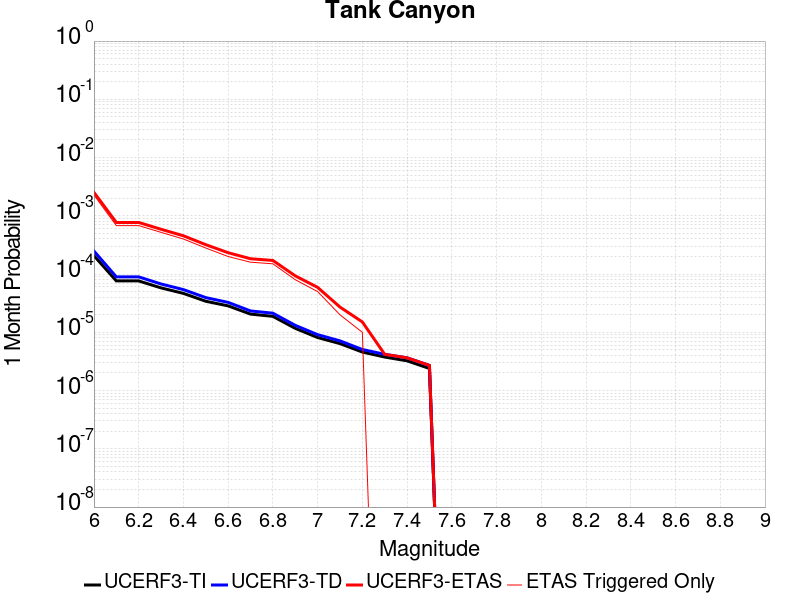 | 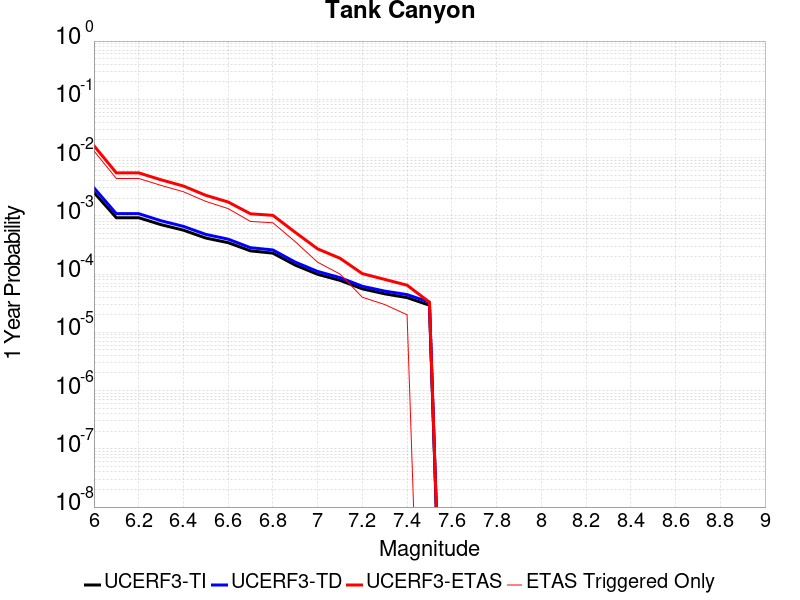 |  |

| Magnitude | 1 wk TI Prob | 1 wk TD Prob | 1 wk ETAS Prob | 1 wk ETAS/TD Gain | 1 wk ETAS Triggered Only | 1 mo TI Prob | 1 mo TD Prob | 1 mo ETAS Prob | 1 mo ETAS/TD Gain | 1 mo ETAS Triggered Only | 1 yr TI Prob | 1 yr TD Prob | 1 yr ETAS Prob | 1 yr ETAS/TD Gain | 1 yr ETAS Triggered Only | 10 yr TI Prob | 10 yr TD Prob | 10 yr ETAS Prob | 10 yr ETAS/TD Gain | 10 yr ETAS Triggered Only |
|-----|-----|-----|-----|-----|-----|-----|-----|-----|-----|-----|-----|-----|-----|-----|-----|-----|-----|-----|-----|-----|
| 6.0 | 4.8284557E-5 | 5.7980193E-5 | 5.479518E-4 | 9.450672 | 4.9E-4 | 2.0691741E-4 | 2.4846673E-4 | 0.0025279003 | 10.173999 | 0.00228 | 0.0025163088 | 0.003021537 | 0.015992226 | 5.2927456 | 0.01301 | 0.02488006 | 0.029871376 | 0.06053714 | 2.0265937 | 0.03161 |
| 6.1 | 1.7796336E-5 | 2.0877918E-5 | 1.9087437E-4 | 9.142405 | 1.7E-4 | 7.626778E-5 | 8.947394E-5 | 7.694131E-4 | 8.599298 | 6.8E-4 | 9.281647E-4 | 0.001088837 | 0.005464068 | 5.0182605 | 0.00438 | 0.009242975 | 0.010839115 | 0.02200674 | 2.030308 | 0.01129 |
| 6.2 | 1.7796336E-5 | 2.0877918E-5 | 1.9087437E-4 | 9.142405 | 1.7E-4 | 7.626778E-5 | 8.947394E-5 | 7.694131E-4 | 8.599298 | 6.8E-4 | 9.281647E-4 | 0.001088837 | 0.005464068 | 5.0182605 | 0.00438 | 0.009242975 | 0.010839115 | 0.02200674 | 2.030308 | 0.01129 |
| 6.3 | 1.3515912E-5 | 1.5762842E-5 | 1.3576094E-4 | 8.6127205 | 1.2E-4 | 5.792405E-5 | 6.7553425E-5 | 5.8751827E-4 | 8.697091 | 5.2E-4 | 7.049971E-4 | 8.221765E-4 | 0.004149439 | 5.046895 | 0.00333 | 0.007027647 | 0.008193959 | 0.016554883 | 2.0203767 | 0.00843 |
| 6.4 | 1.0870146E-5 | 1.2620516E-5 | 1.1261925E-4 | 8.923507 | 1.0E-4 | 4.658551E-5 | 5.4086904E-5 | 4.5406527E-4 | 8.395105 | 4.0E-4 | 5.67031E-4 | 6.58327E-4 | 0.003246622 | 4.931625 | 0.00259 | 0.005655863 | 0.006565783 | 0.012983368 | 1.9774287 | 0.00646 |
| 6.5 | 7.964826E-6 | 9.197785E-6 | 7.919714E-5 | 8.610457 | 7.0E-5 | 3.4134522E-5 | 3.9418548E-5 | 3.194075E-4 | 8.102975 | 2.8E-4 | 4.1550855E-4 | 4.798258E-4 | 0.0022489766 | 4.687069 | 0.00177 | 0.0041473247 | 0.0047891987 | 0.008959132 | 1.8706954 | 0.00419 |
| 6.6 | 6.6317E-6 | 7.6136125E-6 | 4.7613306E-5 | 6.253708 | 4.0E-5 | 2.8421264E-5 | 3.2629414E-5 | 2.3262289E-4 | 7.129239 | 2.0E-4 | 3.4597394E-4 | 3.971998E-4 | 0.0017266716 | 4.3471107 | 0.00133 | 0.0034543579 | 0.00396605 | 0.007063716 | 1.7810454 | 0.00311 |
| 6.7 | 4.793663E-6 | 5.4315906E-6 | 3.543143E-5 | 6.523214 | 3.0E-5 | 2.0544108E-5 | 2.3278062E-5 | 1.8327434E-4 | 7.8732643 | 1.6E-4 | 2.500958E-4 | 2.833779E-4 | 0.0010831512 | 3.8222852 | 8.0E-4 | 0.0024981452 | 0.002830858 | 0.0045858757 | 1.6199596 | 0.00176 |
| 6.8 | 4.382823E-6 | 4.9699643E-6 | 3.4969817E-5 | 7.036231 | 3.0E-5 | 1.8783392E-5 | 2.1299697E-5 | 1.712965E-4 | 8.042204 | 1.5E-4 | 2.286638E-4 | 2.5929723E-4 | 0.0010191002 | 3.9302394 | 7.6E-4 | 0.0022842865 | 0.0025906207 | 0.004226372 | 1.631413 | 0.00164 |
| 6.9 | 2.729601E-6 | 3.0739357E-6 | 1.30739045E-5 | 4.2531486 | 1.0E-5 | 1.1698237E-5 | 1.317395E-5 | 9.3172894E-5 | 7.0725102 | 8.0E-5 | 1.4241673E-4 | 1.6038226E-4 | 5.203245E-4 | 3.2442772 | 3.6E-4 | 0.001423255 | 0.001602831 | 0.0023815806 | 1.4858589 | 7.8E-4 |
| 7.0 | 1.8987357E-6 | 2.1272067E-6 | 2.1272067E-6 | 1.0 | 0.0 | 8.137413E-6 | 9.116572E-6 | 5.9116115E-5 | 6.4844675 | 5.0E-5 | 9.90685E-5 | 1.1098931E-4 | 2.7097156E-4 | 2.4414203 | 1.6E-4 | 9.902435E-4 | 0.0011094075 | 0.0015289416 | 1.3781605 | 4.2E-4 |
| 7.1 | 1.4928986E-6 | 1.664348E-6 | 1.664348E-6 | 1.0 | 0.0 | 6.398121E-6 | 7.1329036E-6 | 2.713276E-5 | 3.8038871 | 2.0E-5 | 7.789434E-5 | 8.6840235E-5 | 1.8683154E-4 | 2.15144 | 1.0E-4 | 7.786704E-4 | 8.681209E-4 | 0.0010879299 | 1.2532009 | 2.2E-4 |
| 7.2 | 1.069082E-6 | 1.1830405E-6 | 1.1830405E-6 | 1.0 | 0.0 | 4.581772E-6 | 5.0701665E-6 | 1.5070116E-5 | 2.9723117 | 1.0E-5 | 5.5781646E-5 | 6.172806E-5 | 1.0172559E-4 | 1.6479635 | 4.0E-5 | 5.576765E-4 | 6.1716145E-4 | 7.170997E-4 | 1.1619321 | 1.0E-4 |
| 7.3 | 8.776551E-7 | 9.77166E-7 | 9.77166E-7 | 1.0 | 0.0 | 3.7613736E-6 | 4.18785E-6 | 4.18785E-6 | 1.0 | 0.0 | 4.579376E-5 | 5.0986404E-5 | 8.098487E-5 | 1.5883621 | 3.0E-5 | 4.5784327E-4 | 5.0979806E-4 | 5.897573E-4 | 1.1568449 | 8.0E-5 |
| 7.4 | 7.55721E-7 | 8.510639E-7 | 8.510639E-7 | 1.0 | 0.0 | 3.2388E-6 | 3.6474144E-6 | 3.6474144E-6 | 1.0 | 0.0 | 3.9431678E-5 | 4.4406883E-5 | 6.4406E-5 | 1.4503607 | 2.0E-5 | 3.942468E-4 | 4.4403094E-4 | 5.139999E-4 | 1.1575767 | 7.0E-5 |
| 7.5 | 5.587665E-7 | 6.305905E-7 | 6.305905E-7 | 1.0 | 0.0 | 2.3947114E-6 | 2.7025305E-6 | 2.7025305E-6 | 1.0 | 0.0 | 2.915522E-5 | 3.290331E-5 | 3.290331E-5 | 1.0 | 0.0 | 2.9151395E-4 | 3.290331E-4 | 3.6901995E-4 | 1.1215283 | 4.0E-5 |

## Little Lake
*[(top)](#table-of-contents)*

| 1 Week | 1 Month | 1 Year | 10 Year |
|-----|-----|-----|-----|
|  |  |  |  |

| Magnitude | 1 wk TI Prob | 1 wk TD Prob | 1 wk ETAS Prob | 1 wk ETAS/TD Gain | 1 wk ETAS Triggered Only | 1 mo TI Prob | 1 mo TD Prob | 1 mo ETAS Prob | 1 mo ETAS/TD Gain | 1 mo ETAS Triggered Only | 1 yr TI Prob | 1 yr TD Prob | 1 yr ETAS Prob | 1 yr ETAS/TD Gain | 1 yr ETAS Triggered Only | 10 yr TI Prob | 10 yr TD Prob | 10 yr ETAS Prob | 10 yr ETAS/TD Gain | 10 yr ETAS Triggered Only |
|-----|-----|-----|-----|-----|-----|-----|-----|-----|-----|-----|-----|-----|-----|-----|-----|-----|-----|-----|-----|-----|
| 6.0 | 2.8424427E-5 | 3.121011E-5 | 4.8119607E-4 | 15.417954 | 4.5E-4 | 1.2181328E-4 | 1.3375151E-4 | 0.0020135 | 15.054035 | 0.00188 | 0.0014820677 | 0.0016273415 | 0.01081237 | 6.644192 | 0.0092 | 0.014722223 | 0.01616766 | 0.036611695 | 2.2645018 | 0.02078 |
| 6.1 | 2.8424427E-5 | 3.121011E-5 | 4.8119607E-4 | 15.417954 | 4.5E-4 | 1.2181328E-4 | 1.3375151E-4 | 0.0020135 | 15.054035 | 0.00188 | 0.0014820677 | 0.0016273415 | 0.01081237 | 6.644192 | 0.0092 | 0.014722223 | 0.01616766 | 0.036611695 | 2.2645018 | 0.02078 |
| 6.2 | 2.8424427E-5 | 3.121011E-5 | 4.8119607E-4 | 15.417954 | 4.5E-4 | 1.2181328E-4 | 1.3375151E-4 | 0.0020135 | 15.054035 | 0.00188 | 0.0014820677 | 0.0016273415 | 0.01081237 | 6.644192 | 0.0092 | 0.014722223 | 0.01616766 | 0.036611695 | 2.2645018 | 0.02078 |
| 6.3 | 1.48860645E-5 | 1.608343E-5 | 3.2607844E-4 | 20.274187 | 3.1E-4 | 6.379586E-5 | 6.892732E-5 | 0.0013088419 | 18.988724 | 0.00124 | 7.7643775E-4 | 8.388952E-4 | 0.0069437698 | 8.277279 | 0.00611 | 0.007737305 | 0.008360104 | 0.021767076 | 2.6036847 | 0.01352 |
| 6.4 | 1.48860645E-5 | 1.608343E-5 | 3.2607844E-4 | 20.274187 | 3.1E-4 | 6.379586E-5 | 6.892732E-5 | 0.0013088419 | 18.988724 | 0.00124 | 7.7643775E-4 | 8.388952E-4 | 0.0069437698 | 8.277279 | 0.00611 | 0.007737305 | 0.008360104 | 0.021767076 | 2.6036847 | 0.01352 |
| 6.5 | 1.2797581E-5 | 1.37672705E-5 | 3.0376329E-4 | 22.064161 | 2.9E-4 | 5.4845623E-5 | 5.9001395E-5 | 0.0011889348 | 20.150959 | 0.00113 | 6.675408E-4 | 7.1813096E-4 | 0.00617421 | 8.59761 | 0.00546 | 0.006655392 | 0.0071606543 | 0.019263366 | 2.6901684 | 0.01219 |
| 6.6 | 9.661896E-6 | 1.0290241E-5 | 2.5028776E-4 | 24.322828 | 2.4E-4 | 4.1407468E-5 | 4.4100383E-5 | 0.0010340568 | 23.447796 | 9.9E-4 | 5.040193E-4 | 5.368061E-4 | 0.00505438 | 9.415652 | 0.00452 | 0.005028777 | 0.0053566997 | 0.015442383 | 2.8828166 | 0.01014 |
| 6.7 | 7.767871E-6 | 8.2006045E-6 | 2.1819888E-4 | 26.607658 | 2.1E-4 | 3.329045E-5 | 3.514505E-5 | 9.151141E-4 | 26.038206 | 8.8E-4 | 4.0523586E-4 | 4.2782072E-4 | 0.0043561393 | 10.18216 | 0.00393 | 0.004044977 | 0.0042713233 | 0.013133309 | 3.0747633 | 0.0089 |
| 6.8 | 6.4235196E-6 | 6.7364886E-6 | 1.6673541E-4 | 24.751085 | 1.6E-4 | 2.752908E-5 | 2.887042E-5 | 7.4884965E-4 | 25.938301 | 7.2E-4 | 3.35115E-4 | 3.514535E-4 | 0.0035003463 | 9.959629 | 0.00315 | 0.003346101 | 0.0035102374 | 0.010635139 | 3.0297494 | 0.00715 |
| 6.9 | 3.1283696E-6 | 3.1124437E-6 | 1.131121E-4 | 36.341896 | 1.1E-4 | 1.3407229E-5 | 1.3338985E-5 | 4.2333352E-4 | 31.73656 | 4.1E-4 | 1.6322079E-4 | 1.6239155E-4 | 0.0020420863 | 12.575077 | 0.00188 | 0.0016310095 | 0.0016228772 | 0.005955834 | 3.6699228 | 0.00434 |
| 7.0 | 2.290603E-6 | 2.228881E-6 | 7.222872E-5 | 32.405827 | 7.0E-5 | 9.816834E-6 | 9.552317E-6 | 2.5954994E-4 | 27.17141 | 2.5E-4 | 1.19513395E-4 | 1.162943E-4 | 0.0012261652 | 10.54364 | 0.00111 | 0.0011944914 | 0.0011624366 | 0.0037194607 | 3.1997106 | 0.00256 |
| 7.1 | 1.293693E-6 | 1.1778063E-6 | 5.1177747E-5 | 43.451748 | 5.0E-5 | 5.5443866E-6 | 5.0477356E-6 | 1.5504698E-4 | 30.716145 | 1.5E-4 | 6.750081E-5 | 6.1455146E-5 | 6.714177E-4 | 10.925328 | 6.1E-4 | 6.7480316E-4 | 6.1445E-4 | 0.0018936635 | 3.0818837 | 0.00128 |
| 7.2 | 4.715842E-7 | 3.0923712E-7 | 3.0923712E-7 | 1.0 | 0.0 | 2.0210737E-6 | 1.3253012E-6 | 1.3253012E-6 | 1.0 | 0.0 | 2.4606294E-5 | 1.613543E-5 | 4.6134945E-5 | 2.8592327 | 3.0E-5 | 2.460357E-4 | 1.6134311E-4 | 2.0133666E-4 | 1.2478789 | 4.0E-5 |
| 7.3 | 3.9430947E-7 | 2.3102866E-7 | 2.3102866E-7 | 1.0 | 0.0 | 1.6898966E-6 | 9.901224E-7 | 9.901224E-7 | 1.0 | 0.0 | 2.0574296E-5 | 1.2054675E-5 | 2.2054553E-5 | 1.8295437 | 1.0E-5 | 2.0572392E-4 | 1.2054028E-4 | 1.4053787E-4 | 1.1658996 | 2.0E-5 |
| 7.4 | 3.547123E-7 | 1.968413E-7 | 1.968413E-7 | 1.0 | 0.0 | 1.5201948E-6 | 8.436053E-7 | 8.436053E-7 | 1.0 | 0.0 | 1.8508214E-5 | 1.0270846E-5 | 2.0270743E-5 | 1.9736196 | 1.0E-5 | 1.8506673E-4 | 1.0270378E-4 | 1.2270172E-4 | 1.1947148 | 2.0E-5 |
| 7.5 | 2.6354266E-7 | 1.4426631E-7 | 1.4426631E-7 | 1.0 | 0.0 | 1.129468E-6 | 6.1828405E-7 | 6.1828405E-7 | 1.0 | 0.0 | 1.3751187E-5 | 7.527583E-6 | 1.7527507E-5 | 2.3284378 | 1.0E-5 | 1.3750336E-4 | 7.527333E-5 | 9.5271826E-5 | 1.2656784 | 2.0E-5 |
| 7.6 | 1.269913E-7 | 7.574039E-8 | 7.574039E-8 | 1.0 | 0.0 | 5.4424834E-7 | 3.2460161E-7 | 3.2460161E-7 | 1.0 | 0.0 | 6.6262032E-6 | 3.952018E-6 | 1.3951979E-5 | 3.5303428 | 1.0E-5 | 6.626006E-5 | 3.9519513E-5 | 5.9518723E-5 | 1.5060592 | 2.0E-5 |

## Airport Lake
*[(top)](#table-of-contents)*

| 1 Week | 1 Month | 1 Year | 10 Year |
|-----|-----|-----|-----|
|  |  |  |  |

| Magnitude | 1 wk TI Prob | 1 wk TD Prob | 1 wk ETAS Prob | 1 wk ETAS/TD Gain | 1 wk ETAS Triggered Only | 1 mo TI Prob | 1 mo TD Prob | 1 mo ETAS Prob | 1 mo ETAS/TD Gain | 1 mo ETAS Triggered Only | 1 yr TI Prob | 1 yr TD Prob | 1 yr ETAS Prob | 1 yr ETAS/TD Gain | 1 yr ETAS Triggered Only | 10 yr TI Prob | 10 yr TD Prob | 10 yr ETAS Prob | 10 yr ETAS/TD Gain | 10 yr ETAS Triggered Only |
|-----|-----|-----|-----|-----|-----|-----|-----|-----|-----|-----|-----|-----|-----|-----|-----|-----|-----|-----|-----|-----|
| 6.0 | 1.2387061E-5 | 1.31041625E-5 | 3.5309972E-4 | 26.945616 | 3.4E-4 | 5.3086325E-5 | 5.6159646E-5 | 0.0015760743 | 28.064178 | 0.00152 | 6.461343E-4 | 6.835576E-4 | 0.0078186765 | 11.438212 | 0.00714 | 0.0064425888 | 0.006817361 | 0.023055896 | 3.3819387 | 0.01635 |
| 6.1 | 1.2387061E-5 | 1.31041625E-5 | 3.5309972E-4 | 26.945616 | 3.4E-4 | 5.3086325E-5 | 5.6159646E-5 | 0.0015760743 | 28.064178 | 0.00152 | 6.461343E-4 | 6.835576E-4 | 0.0078186765 | 11.438212 | 0.00714 | 0.0064425888 | 0.006817361 | 0.023055896 | 3.3819387 | 0.01635 |
| 6.2 | 1.2387061E-5 | 1.31041625E-5 | 3.5309972E-4 | 26.945616 | 3.4E-4 | 5.3086325E-5 | 5.6159646E-5 | 0.0015760743 | 28.064178 | 0.00152 | 6.461343E-4 | 6.835576E-4 | 0.0078186765 | 11.438212 | 0.00714 | 0.0064425888 | 0.006817361 | 0.023055896 | 3.3819387 | 0.01635 |
| 6.3 | 1.2387061E-5 | 1.31041625E-5 | 3.5309972E-4 | 26.945616 | 3.4E-4 | 5.3086325E-5 | 5.6159646E-5 | 0.0015760743 | 28.064178 | 0.00152 | 6.461343E-4 | 6.835576E-4 | 0.0078186765 | 11.438212 | 0.00714 | 0.0064425888 | 0.006817361 | 0.023055896 | 3.3819387 | 0.01635 |
| 6.4 | 1.2387061E-5 | 1.31041625E-5 | 3.5309972E-4 | 26.945616 | 3.4E-4 | 5.3086325E-5 | 5.6159646E-5 | 0.0015760743 | 28.064178 | 0.00152 | 6.461343E-4 | 6.835576E-4 | 0.0078186765 | 11.438212 | 0.00714 | 0.0064425888 | 0.006817361 | 0.023055896 | 3.3819387 | 0.01635 |
| 6.5 | 6.9922594E-6 | 7.3854753E-6 | 2.473837E-4 | 33.495975 | 2.4E-4 | 2.996648E-5 | 3.1651685E-5 | 0.001061619 | 33.540684 | 0.00103 | 3.6478083E-4 | 3.8529653E-4 | 0.005743231 | 14.906003 | 0.00536 | 0.003641826 | 0.0038468228 | 0.016059661 | 4.1747856 | 0.01226 |
| 6.6 | 6.9922594E-6 | 7.3854753E-6 | 2.473837E-4 | 33.495975 | 2.4E-4 | 2.996648E-5 | 3.1651685E-5 | 0.001061619 | 33.540684 | 0.00103 | 3.6478083E-4 | 3.8529653E-4 | 0.005743231 | 14.906003 | 0.00536 | 0.003641826 | 0.0038468228 | 0.016059661 | 4.1747856 | 0.01226 |
| 6.7 | 5.477277E-6 | 5.7865013E-6 | 2.2578523E-4 | 39.0193 | 2.2E-4 | 2.3473833E-5 | 2.4799077E-5 | 9.447763E-4 | 38.097237 | 9.2E-4 | 2.8575645E-4 | 3.0189083E-4 | 0.004880508 | 16.166468 | 0.00458 | 0.0028538927 | 0.003015191 | 0.013483532 | 4.4718666 | 0.0105 |
| 6.8 | 3.9950432E-6 | 4.219401E-6 | 1.8421865E-4 | 43.659904 | 1.8E-4 | 1.7121502E-5 | 1.8083038E-5 | 7.1807037E-4 | 39.70961 | 7.0E-4 | 2.0843433E-4 | 2.2014149E-4 | 0.0037093733 | 16.84995 | 0.00349 | 0.0020823893 | 0.0021995052 | 0.010211843 | 4.6427913 | 0.00803 |
| 6.9 | 2.95695E-6 | 3.1232569E-6 | 1.7312272E-4 | 55.43019 | 1.7E-4 | 1.2672582E-5 | 1.3385331E-5 | 5.333784E-4 | 39.847977 | 5.2E-4 | 1.5427776E-4 | 1.6295648E-4 | 0.002682546 | 16.461731 | 0.00252 | 0.001541707 | 0.0016285924 | 0.007339277 | 4.5065155 | 0.00572 |
| 7.0 | 1.456072E-6 | 1.540931E-6 | 7.1540824E-5 | 46.427013 | 7.0E-5 | 6.2402937E-6 | 6.603979E-6 | 2.3660246E-4 | 35.82726 | 2.3E-4 | 7.597293E-5 | 8.0401485E-5 | 0.0011303171 | 14.058411 | 0.00105 | 7.594696E-4 | 8.038228E-4 | 0.0032418615 | 4.033055 | 0.00244 |
| 7.1 | 6.995192E-7 | 7.4095556E-7 | 5.0740917E-5 | 68.48038 | 5.0E-5 | 2.997936E-6 | 3.175524E-6 | 1.4317509E-4 | 45.087074 | 1.4E-4 | 3.649926E-5 | 3.8662E-5 | 6.0863997E-4 | 15.742587 | 5.7E-4 | 3.6493264E-4 | 3.8662003E-4 | 0.0015961522 | 4.128478 | 0.00121 |

## Owl Lake
*[(top)](#table-of-contents)*

| 1 Week | 1 Month | 1 Year | 10 Year |
|-----|-----|-----|-----|
|  |  |  | 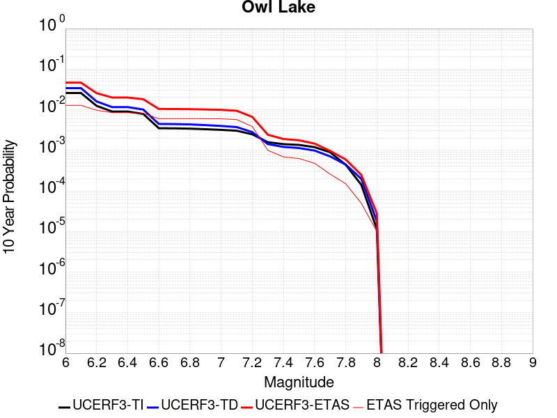 |

| Magnitude | 1 wk TI Prob | 1 wk TD Prob | 1 wk ETAS Prob | 1 wk ETAS/TD Gain | 1 wk ETAS Triggered Only | 1 mo TI Prob | 1 mo TD Prob | 1 mo ETAS Prob | 1 mo ETAS/TD Gain | 1 mo ETAS Triggered Only | 1 yr TI Prob | 1 yr TD Prob | 1 yr ETAS Prob | 1 yr ETAS/TD Gain | 1 yr ETAS Triggered Only | 10 yr TI Prob | 10 yr TD Prob | 10 yr ETAS Prob | 10 yr ETAS/TD Gain | 10 yr ETAS Triggered Only |
|-----|-----|-----|-----|-----|-----|-----|-----|-----|-----|-----|-----|-----|-----|-----|-----|-----|-----|-----|-----|-----|
| 6.0 | 5.0320643E-5 | 6.639169E-5 | 2.4637973E-4 | 3.7110026 | 1.8E-4 | 2.1564208E-4 | 2.8451107E-4 | 0.0012342408 | 4.338112 | 9.5E-4 | 0.0026222812 | 0.0034594585 | 0.008681331 | 2.5094478 | 0.00524 | 0.02591553 | 0.034156606 | 0.04657735 | 1.3636411 | 0.01286 |
| 6.1 | 5.0320643E-5 | 6.639169E-5 | 2.4637973E-4 | 3.7110026 | 1.8E-4 | 2.1564208E-4 | 2.8451107E-4 | 0.0012342408 | 4.338112 | 9.5E-4 | 0.0026222812 | 0.0034594585 | 0.008681331 | 2.5094478 | 0.00524 | 0.02591553 | 0.034156606 | 0.04657735 | 1.3636411 | 0.01286 |
| 6.2 | 2.4125871E-5 | 3.099773E-5 | 2.0099246E-4 | 6.4841022 | 1.7E-4 | 1.0339249E-4 | 1.3284181E-4 | 9.227369E-4 | 6.9461327 | 7.9E-4 | 0.0012580766 | 0.0016162846 | 0.005579868 | 3.4522805 | 0.00397 | 0.012509781 | 0.016078865 | 0.025691774 | 1.59786 | 0.00977 |
| 6.3 | 1.7433485E-5 | 2.2368875E-5 | 1.9236507E-4 | 8.599675 | 1.7E-4 | 7.471279E-5 | 9.586398E-5 | 8.25794E-4 | 8.614226 | 7.3E-4 | 9.0924866E-4 | 0.0011666653 | 0.004722512 | 4.047872 | 0.00356 | 0.009055373 | 0.011635699 | 0.020026913 | 1.721161 | 0.00849 |
| 6.4 | 1.7433485E-5 | 2.2368875E-5 | 1.9236507E-4 | 8.599675 | 1.7E-4 | 7.471279E-5 | 9.586398E-5 | 8.25794E-4 | 8.614226 | 7.3E-4 | 9.0924866E-4 | 0.0011666653 | 0.004722512 | 4.047872 | 0.00356 | 0.009055373 | 0.011635699 | 0.020026913 | 1.721161 | 0.00849 |
| 6.5 | 1.5182742E-5 | 1.9441362E-5 | 1.7943826E-4 | 9.229715 | 1.6E-4 | 6.506727E-5 | 8.331832E-5 | 7.8326E-4 | 9.400814 | 7.0E-4 | 7.919061E-4 | 0.0010140799 | 0.004460581 | 4.3986487 | 0.00345 | 0.0078909 | 0.01012468 | 0.018182265 | 1.7958361 | 0.00814 |
| 6.6 | 6.7271576E-6 | 8.55546E-6 | 1.1855452E-4 | 13.857177 | 1.1E-4 | 2.8830356E-5 | 3.6665773E-5 | 5.6664634E-4 | 15.454368 | 5.3E-4 | 3.5095305E-4 | 4.4632002E-4 | 0.0031051328 | 6.957189 | 0.00266 | 0.0035039932 | 0.0044720164 | 0.01047505 | 2.342355 | 0.00603 |
| 6.7 | 6.682835E-6 | 8.487893E-6 | 1.1848696E-4 | 13.959526 | 1.1E-4 | 2.8640408E-5 | 3.637621E-5 | 5.6635693E-4 | 15.569433 | 5.3E-4 | 3.4864116E-4 | 4.42796E-4 | 0.0031016183 | 7.004621 | 0.00266 | 0.003480947 | 0.0044369358 | 0.010430225 | 2.3507721 | 0.00602 |
| 6.8 | 6.5774975E-6 | 8.334328E-6 | 1.1833341E-4 | 14.198314 | 1.1E-4 | 2.8188972E-5 | 3.5718094E-5 | 5.656992E-4 | 15.837888 | 5.3E-4 | 3.4314668E-4 | 4.3478666E-4 | 0.00309363 | 7.115283 | 0.00266 | 0.0034261728 | 0.0043570627 | 0.010350833 | 2.3756447 | 0.00602 |
| 6.9 | 6.363419E-6 | 8.007404E-6 | 1.1800652E-4 | 14.737175 | 1.1E-4 | 2.727151E-5 | 3.431703E-5 | 5.642988E-4 | 16.443697 | 5.3E-4 | 3.3198006E-4 | 4.177353E-4 | 0.0030666282 | 7.3410797 | 0.00265 | 0.0033148455 | 0.0041870046 | 0.010171841 | 2.4293838 | 0.00601 |
| 7.0 | 6.1342453E-6 | 7.639479E-6 | 1.17638636E-4 | 15.398779 | 1.1E-4 | 2.6289357E-5 | 3.274024E-5 | 5.627229E-4 | 17.1875 | 5.3E-4 | 3.2002592E-4 | 3.9854506E-4 | 0.0030474889 | 7.6465354 | 0.00265 | 0.0031956544 | 0.0039956346 | 0.0099517405 | 2.4906535 | 0.00598 |
| 7.1 | 5.842926E-6 | 7.1498466E-6 | 1.07149135E-4 | 14.986214 | 1.0E-4 | 2.504087E-5 | 3.064187E-5 | 5.3062657E-4 | 17.317041 | 5.0E-4 | 3.0482994E-4 | 3.7300633E-4 | 0.002922055 | 7.833795 | 0.00255 | 0.0030441214 | 0.0037410015 | 0.009449566 | 2.5259454 | 0.00573 |
| 7.2 | 4.77173E-6 | 5.3654235E-6 | 7.5365046E-5 | 14.046431 | 7.0E-5 | 2.045011E-5 | 2.299449E-5 | 4.229853E-4 | 18.395071 | 4.0E-4 | 2.4895166E-4 | 2.7992603E-4 | 0.0021494026 | 7.6784663 | 0.00187 | 0.0024867293 | 0.0028122598 | 0.0066713765 | 2.3722475 | 0.00387 |
| 7.3 | 3.0494948E-6 | 2.7156198E-6 | 2.2715565E-5 | 8.364781 | 2.0E-5 | 1.3069198E-5 | 1.1638319E-5 | 1.1163716E-4 | 9.592206 | 1.0E-4 | 1.5910587E-4 | 1.4168749E-4 | 6.316181E-4 | 4.457825 | 4.9E-4 | 0.0015899199 | 0.0014259319 | 0.002424506 | 1.7002958 | 0.001 |
| 7.4 | 2.7263884E-6 | 2.3105267E-6 | 2.231048E-5 | 9.656015 | 2.0E-5 | 1.1684469E-5 | 9.90222E-6 | 6.9901624E-5 | 7.0591874 | 6.0E-5 | 1.4224913E-4 | 1.2055296E-4 | 4.305156E-4 | 3.571174 | 3.1E-4 | 0.0014215811 | 0.0012137555 | 0.001902918 | 1.5677936 | 6.9E-4 |
| 7.5 | 2.6090431E-6 | 2.1703654E-6 | 2.2170321E-5 | 10.215018 | 2.0E-5 | 1.1181565E-5 | 9.301533E-6 | 5.930107E-5 | 6.3754077 | 5.0E-5 | 1.3612706E-4 | 1.1324038E-4 | 3.9320867E-4 | 3.4723363 | 2.8E-4 | 0.001360437 | 0.0011404612 | 0.0017697427 | 1.5517781 | 6.3E-4 |
| 7.6 | 2.3008756E-6 | 1.8772391E-6 | 1.8772391E-6 | 1.0 | 0.0 | 9.860858E-6 | 8.045286E-6 | 2.8045126E-5 | 3.4859078 | 2.0E-5 | 1.20049335E-4 | 9.794704E-5 | 3.0792647E-4 | 3.1438057 | 2.1E-4 | 0.001199845 | 9.87314E-4 | 0.0014668402 | 1.4856875 | 4.8E-4 |
| 7.7 | 1.7184348E-6 | 1.3460315E-6 | 1.3460315E-6 | 1.0 | 0.0 | 7.3646997E-6 | 5.768694E-6 | 2.5768579E-5 | 4.4669695 | 2.0E-5 | 8.966153E-5 | 7.0231625E-5 | 1.902232E-4 | 2.708512 | 1.2E-4 | 8.962536E-4 | 7.09986E-4 | 9.698014E-4 | 1.3659444 | 2.6E-4 |
| 7.8 | 8.4612907E-7 | 8.43523E-7 | 8.43523E-7 | 1.0 | 0.0 | 3.6262625E-6 | 3.6150936E-6 | 2.361502E-5 | 6.53234 | 2.0E-5 | 4.4148852E-5 | 4.4012897E-5 | 1.2400938E-4 | 2.817569 | 8.0E-5 | 4.414008E-4 | 4.4551937E-4 | 5.9545255E-4 | 1.3365357 | 1.5E-4 |
| 7.9 | 2.716738E-7 | 3.781083E-7 | 3.781083E-7 | 1.0 | 0.0 | 1.1643157E-6 | 1.6204632E-6 | 2.1620432E-5 | 13.34213 | 2.0E-5 | 1.4175452E-5 | 1.9728972E-5 | 5.9728183E-5 | 3.027435 | 4.0E-5 | 1.4174548E-4 | 1.9904342E-4 | 2.4903347E-4 | 1.2511514 | 5.0E-5 |
| 8.0 | 2.1995428E-8 | 3.3962333E-8 | 3.3962333E-8 | 1.0 | 0.0 | 9.426611E-8 | 1.4555286E-7 | 1.0145552E-5 | 69.70355 | 1.0E-5 | 1.1476893E-6 | 1.7721053E-6 | 1.1772087E-5 | 6.6429954 | 1.0E-5 | 1.14768345E-5 | 1.802218E-5 | 2.8022E-5 | 1.5548619 | 1.0E-5 |

## Panamint Valley
*[(top)](#table-of-contents)*

| 1 Week | 1 Month | 1 Year | 10 Year |
|-----|-----|-----|-----|
|  |  | 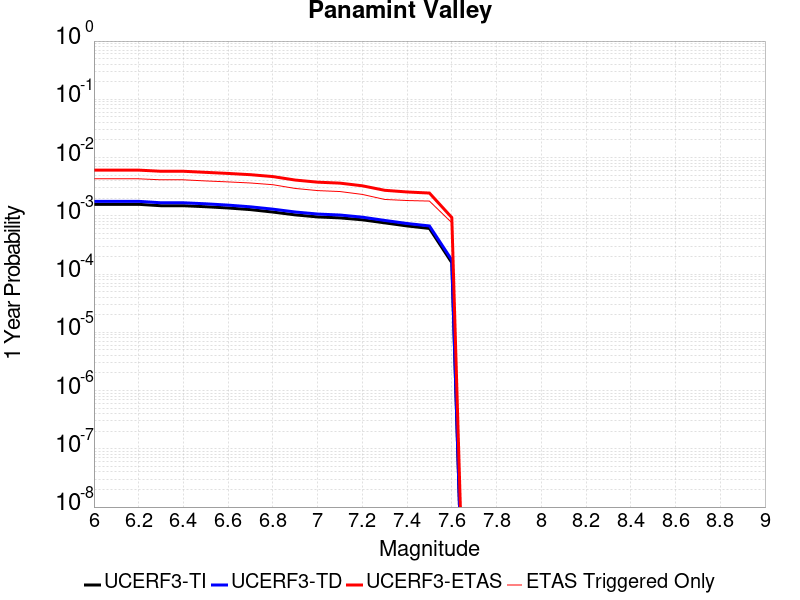 |  |

| Magnitude | 1 wk TI Prob | 1 wk TD Prob | 1 wk ETAS Prob | 1 wk ETAS/TD Gain | 1 wk ETAS Triggered Only | 1 mo TI Prob | 1 mo TD Prob | 1 mo ETAS Prob | 1 mo ETAS/TD Gain | 1 mo ETAS Triggered Only | 1 yr TI Prob | 1 yr TD Prob | 1 yr ETAS Prob | 1 yr ETAS/TD Gain | 1 yr ETAS Triggered Only | 10 yr TI Prob | 10 yr TD Prob | 10 yr ETAS Prob | 10 yr ETAS/TD Gain | 10 yr ETAS Triggered Only |
|-----|-----|-----|-----|-----|-----|-----|-----|-----|-----|-----|-----|-----|-----|-----|-----|-----|-----|-----|-----|-----|
| 6.0 | 3.0211835E-5 | 3.3992885E-5 | 2.4398575E-4 | 7.1775537 | 2.1E-4 | 1.2947287E-4 | 1.4567582E-4 | 8.9556654E-4 | 6.147668 | 7.5E-4 | 0.0015751923 | 0.0017721897 | 0.006084534 | 3.4333422 | 0.00432 | 0.015640736 | 0.017587427 | 0.028040297 | 1.5943376 | 0.01064 |
| 6.1 | 3.0211835E-5 | 3.3992885E-5 | 2.4398575E-4 | 7.1775537 | 2.1E-4 | 1.2947287E-4 | 1.4567582E-4 | 8.9556654E-4 | 6.147668 | 7.5E-4 | 0.0015751923 | 0.0017721897 | 0.006084534 | 3.4333422 | 0.00432 | 0.015640736 | 0.017587427 | 0.028040297 | 1.5943376 | 0.01064 |
| 6.2 | 3.0211835E-5 | 3.3992885E-5 | 2.4398575E-4 | 7.1775537 | 2.1E-4 | 1.2947287E-4 | 1.4567582E-4 | 8.9556654E-4 | 6.147668 | 7.5E-4 | 0.0015751923 | 0.0017721897 | 0.006084534 | 3.4333422 | 0.00432 | 0.015640736 | 0.017587427 | 0.028040297 | 1.5943376 | 0.01064 |
| 6.3 | 2.8573924E-5 | 3.211061E-5 | 2.3210418E-4 | 7.228271 | 2.0E-4 | 1.2245393E-4 | 1.376098E-4 | 8.475121E-4 | 6.1588063 | 7.1E-4 | 0.001489857 | 0.0016741396 | 0.005817192 | 3.4747353 | 0.00415 | 0.01479908 | 0.016621869 | 0.026593324 | 1.5998996 | 0.01014 |
| 6.4 | 2.8573924E-5 | 3.211061E-5 | 2.3210418E-4 | 7.228271 | 2.0E-4 | 1.2245393E-4 | 1.376098E-4 | 8.475121E-4 | 6.1588063 | 7.1E-4 | 0.001489857 | 0.0016741396 | 0.005817192 | 3.4747353 | 0.00415 | 0.01479908 | 0.016621869 | 0.026593324 | 1.5998996 | 0.01014 |
| 6.5 | 2.7468774E-5 | 3.083606E-5 | 2.3082989E-4 | 7.485713 | 2.0E-4 | 1.1771801E-4 | 1.32148E-4 | 8.1205816E-4 | 6.145066 | 6.8E-4 | 0.0014322745 | 0.0016077419 | 0.0055713593 | 3.4653318 | 0.00397 | 0.014230782 | 0.01596759 | 0.02561111 | 1.6039431 | 0.0098 |
| 6.6 | 2.6135967E-5 | 2.9259769E-5 | 2.2925391E-4 | 7.835124 | 2.0E-4 | 1.1200648E-4 | 1.2539313E-4 | 7.753116E-4 | 6.1830473 | 6.5E-4 | 0.0013628257 | 0.0015256187 | 0.005339791 | 3.500082 | 0.00382 | 0.013544982 | 0.015157788 | 0.024494093 | 1.615941 | 0.00948 |
| 6.7 | 2.4498746E-5 | 2.7348378E-5 | 2.2734291E-4 | 8.312848 | 2.0E-4 | 1.04990395E-4 | 1.1720221E-4 | 7.571272E-4 | 6.4600077 | 6.4E-4 | 0.0012775084 | 0.001426028 | 0.005080809 | 3.5629096 | 0.00366 | 0.012701893 | 0.014174897 | 0.023047322 | 1.6259252 | 0.009 |
| 6.8 | 2.2244329E-5 | 2.4942019E-5 | 2.1493727E-4 | 8.617477 | 1.9E-4 | 9.532935E-5 | 1.0689011E-4 | 7.168249E-4 | 6.7061853 | 6.1E-4 | 0.0011600169 | 0.001300632 | 0.004716184 | 3.626071 | 0.00342 | 0.011539802 | 0.012935915 | 0.021168029 | 1.6363766 | 0.00834 |
| 6.9 | 1.9902658E-5 | 2.2296357E-5 | 1.9229257E-4 | 8.624393 | 1.7E-4 | 8.529431E-5 | 9.555242E-5 | 6.255018E-4 | 6.5461636 | 5.3E-4 | 0.0010379635 | 0.0011627484 | 0.0041093184 | 3.5341423 | 0.00295 | 0.010331288 | 0.011571749 | 0.018747738 | 1.6201301 | 0.00726 |
| 7.0 | 1.8353881E-5 | 2.0571932E-5 | 1.7056885E-4 | 8.291338 | 1.5E-4 | 7.865712E-5 | 8.8162546E-5 | 5.7811936E-4 | 6.557426 | 4.9E-4 | 9.5722964E-4 | 0.0010728681 | 0.0037799606 | 3.5232296 | 0.00271 | 0.009531168 | 0.0106818145 | 0.017330034 | 1.6223866 | 0.00672 |
| 7.1 | 1.7667631E-5 | 1.977821E-5 | 1.6977525E-4 | 8.583954 | 1.5E-4 | 7.571623E-5 | 8.47611E-5 | 5.3472293E-4 | 6.308589 | 4.5E-4 | 9.2145515E-4 | 0.0010314954 | 0.0036388033 | 3.5276968 | 0.00261 | 0.009176437 | 0.010271964 | 0.01665571 | 1.6214728 | 0.00645 |
| 7.2 | 1.6381597E-5 | 1.816348E-5 | 1.6816075E-4 | 9.258179 | 1.5E-4 | 7.020495E-5 | 7.7841265E-5 | 4.9780856E-4 | 6.395176 | 4.2E-4 | 8.544101E-4 | 9.4732264E-4 | 0.0032751153 | 3.4572334 | 0.00233 | 0.008511325 | 0.009437496 | 0.015153042 | 1.605621 | 0.00577 |
| 7.3 | 1.4520491E-5 | 1.5970782E-5 | 1.3596886E-4 | 8.513601 | 1.2E-4 | 6.222919E-5 | 6.8444504E-5 | 3.9842192E-4 | 5.8210945 | 3.3E-4 | 7.57377E-4 | 8.330094E-4 | 0.0027414183 | 3.2909813 | 0.00191 | 0.0075480095 | 0.008301981 | 0.012873708 | 1.5506792 | 0.00461 |
| 7.4 | 1.2852287E-5 | 1.4149132E-5 | 1.2414757E-4 | 8.774219 | 1.1E-4 | 5.5080065E-5 | 6.0637816E-5 | 3.6061963E-4 | 5.947108 | 3.0E-4 | 6.7039346E-4 | 7.380312E-4 | 0.0025666805 | 3.47774 | 0.00183 | 0.0066837464 | 0.007358724 | 0.011766051 | 1.5989255 | 0.00444 |
| 7.5 | 1.1637851E-5 | 1.2840317E-5 | 1.228389E-4 | 9.566657 | 1.1E-4 | 4.987555E-5 | 5.5028857E-5 | 3.5501234E-4 | 6.451385 | 3.0E-4 | 6.070656E-4 | 6.6978607E-4 | 0.002458587 | 3.670705 | 0.00179 | 0.006054099 | 0.0066805724 | 0.011011445 | 1.6482787 | 0.00436 |
| 7.6 | 3.0068115E-6 | 3.3344045E-6 | 4.3334272E-5 | 12.996105 | 4.0E-5 | 1.2886271E-5 | 1.4290267E-5 | 1.6428813E-4 | 11.496505 | 1.5E-4 | 1.5687906E-4 | 1.739774E-4 | 9.338452E-4 | 5.3676233 | 7.6E-4 | 0.0015676835 | 0.001739853 | 0.0034768255 | 1.9983445 | 0.00174 |

## Garlock (East)
*[(top)](#table-of-contents)*

| 1 Week | 1 Month | 1 Year | 10 Year |
|-----|-----|-----|-----|
|  |  |  |  |

| Magnitude | 1 wk TI Prob | 1 wk TD Prob | 1 wk ETAS Prob | 1 wk ETAS/TD Gain | 1 wk ETAS Triggered Only | 1 mo TI Prob | 1 mo TD Prob | 1 mo ETAS Prob | 1 mo ETAS/TD Gain | 1 mo ETAS Triggered Only | 1 yr TI Prob | 1 yr TD Prob | 1 yr ETAS Prob | 1 yr ETAS/TD Gain | 1 yr ETAS Triggered Only | 10 yr TI Prob | 10 yr TD Prob | 10 yr ETAS Prob | 10 yr ETAS/TD Gain | 10 yr ETAS Triggered Only |
|-----|-----|-----|-----|-----|-----|-----|-----|-----|-----|-----|-----|-----|-----|-----|-----|-----|-----|-----|-----|-----|
| 6.0 | 4.5092507E-5 | 6.293872E-5 | 2.3292803E-4 | 3.7008698 | 1.7E-4 | 1.9323928E-4 | 2.69712E-4 | 9.2953397E-4 | 3.4463947 | 6.6E-4 | 0.0023501497 | 0.0032792452 | 0.0067877024 | 2.0698977 | 0.00352 | 0.023254504 | 0.032369826 | 0.040788207 | 1.2600688 | 0.0087 |
| 6.1 | 4.5092507E-5 | 6.293872E-5 | 2.3292803E-4 | 3.7008698 | 1.7E-4 | 1.9323928E-4 | 2.69712E-4 | 9.2953397E-4 | 3.4463947 | 6.6E-4 | 0.0023501497 | 0.0032792452 | 0.0067877024 | 2.0698977 | 0.00352 | 0.023254504 | 0.032369826 | 0.040788207 | 1.2600688 | 0.0087 |
| 6.2 | 2.6674514E-5 | 3.453779E-5 | 1.3453433E-4 | 3.8952794 | 1.0E-4 | 1.1431433E-4 | 1.4801089E-4 | 5.979443E-4 | 4.039867 | 4.5E-4 | 0.0013908884 | 0.0018005761 | 0.0043559666 | 2.419207 | 0.00256 | 0.01382215 | 0.017904656 | 0.024013288 | 1.3411757 | 0.00622 |
| 6.3 | 2.6674514E-5 | 3.453779E-5 | 1.3453433E-4 | 3.8952794 | 1.0E-4 | 1.1431433E-4 | 1.4801089E-4 | 5.979443E-4 | 4.039867 | 4.5E-4 | 0.0013908884 | 0.0018005761 | 0.0043559666 | 2.419207 | 0.00256 | 0.01382215 | 0.017904656 | 0.024013288 | 1.3411757 | 0.00622 |
| 6.4 | 2.5312667E-5 | 3.2366417E-5 | 1.223635E-4 | 3.78057 | 9.0E-5 | 1.0847834E-4 | 1.38706E-4 | 5.78645E-4 | 4.171737 | 4.4E-4 | 0.0013199237 | 0.0016874669 | 0.0042032143 | 2.4908426 | 0.00252 | 0.013121112 | 0.016792392 | 0.022780126 | 1.3565742 | 0.00609 |
| 6.5 | 2.5312667E-5 | 3.2366417E-5 | 1.223635E-4 | 3.78057 | 9.0E-5 | 1.0847834E-4 | 1.38706E-4 | 5.78645E-4 | 4.171737 | 4.4E-4 | 0.0013199237 | 0.0016874669 | 0.0042032143 | 2.4908426 | 0.00252 | 0.013121112 | 0.016792392 | 0.022780126 | 1.3565742 | 0.00609 |
| 6.6 | 2.246556E-5 | 2.8160235E-5 | 1.181577E-4 | 4.195906 | 9.0E-5 | 9.627742E-5 | 1.20681274E-4 | 5.606282E-4 | 4.6455274 | 4.4E-4 | 0.0011715472 | 0.0014683278 | 0.0038648038 | 2.6321125 | 0.0024 | 0.011653901 | 0.0146322325 | 0.020317804 | 1.388565 | 0.00577 |
| 6.7 | 2.2241198E-5 | 2.7829901E-5 | 1.17827396E-4 | 4.2338414 | 9.0E-5 | 9.531594E-5 | 1.19265685E-4 | 5.592132E-4 | 4.6888022 | 4.4E-4 | 0.0011598538 | 0.001451116 | 0.0038376478 | 2.644618 | 0.00239 | 0.011538187 | 0.014462388 | 0.02012923 | 1.3918331 | 0.00575 |
| 6.8 | 1.9528685E-5 | 2.3922843E-5 | 1.1392069E-4 | 4.762005 | 9.0E-5 | 8.369167E-5 | 1.0252255E-4 | 5.224795E-4 | 5.0962396 | 4.2E-4 | 0.0010184698 | 0.001247517 | 0.0035146852 | 2.8173444 | 0.00227 | 0.010138147 | 0.012449114 | 0.017722635 | 1.4236062 | 0.00534 |
| 6.9 | 1.3318621E-5 | 1.5220143E-5 | 9.521892E-5 | 6.2561126 | 8.0E-5 | 5.7078556E-5 | 6.5227585E-5 | 4.652015E-4 | 7.1319747 | 4.0E-4 | 6.9470983E-4 | 7.938622E-4 | 0.0029021872 | 3.655782 | 0.00211 | 0.0069254204 | 0.007950885 | 0.012613516 | 1.5864291 | 0.0047 |
| 7.0 | 1.1760853E-5 | 1.3128316E-5 | 9.3127266E-5 | 7.093619 | 8.0E-5 | 5.0402683E-5 | 5.6263023E-5 | 4.462411E-4 | 7.9313383 | 3.9E-4 | 6.134799E-4 | 6.8479206E-4 | 0.002713402 | 3.9623735 | 0.00203 | 0.0061178906 | 0.0068671517 | 0.011375975 | 1.6565783 | 0.00454 |
| 7.1 | 1.0064758E-5 | 1.0922758E-5 | 9.092189E-5 | 8.324078 | 8.0E-5 | 4.3133965E-5 | 4.6810997E-5 | 4.3679273E-4 | 9.330986 | 3.9E-4 | 5.2502943E-4 | 5.697784E-4 | 0.002538656 | 4.455515 | 0.00197 | 0.005237907 | 0.0057232794 | 0.009998669 | 1.7470175 | 0.0043 |
| 7.2 | 9.768808E-6 | 1.0518496E-5 | 9.051766E-5 | 8.60557 | 8.0E-5 | 4.186565E-5 | 4.5078512E-5 | 4.250614E-4 | 9.429358 | 3.8E-4 | 5.095951E-4 | 5.4869615E-4 | 0.0024676428 | 4.4972844 | 0.00192 | 0.0050842804 | 0.005513476 | 0.009710209 | 1.7611773 | 0.00422 |
| 7.3 | 9.344516E-6 | 9.963784E-6 | 5.9963284E-5 | 6.018124 | 5.0E-5 | 4.004731E-5 | 4.270125E-5 | 3.7268715E-4 | 8.727781 | 3.3E-4 | 4.8746695E-4 | 5.1976717E-4 | 0.0022888472 | 4.403601 | 0.00177 | 0.0048639905 | 0.005224966 | 0.009114536 | 1.7444203 | 0.00391 |
| 7.4 | 9.023491E-6 | 9.509588E-6 | 4.9509206E-5 | 5.206241 | 4.0E-5 | 3.867153E-5 | 4.075476E-5 | 3.2074336E-4 | 7.8700833 | 2.8E-4 | 4.7072413E-4 | 4.960796E-4 | 0.0020353156 | 4.1028004 | 0.00154 | 0.004697283 | 0.004988221 | 0.008371261 | 1.6782057 | 0.0034 |
| 7.5 | 7.081253E-6 | 7.104487E-6 | 1.7104416E-5 | 2.4075513 | 1.0E-5 | 3.0347876E-5 | 3.0447449E-5 | 2.1044197E-4 | 6.9116454 | 1.8E-4 | 3.6942272E-4 | 3.706354E-4 | 0.0011603426 | 3.1306849 | 7.9E-4 | 0.003688092 | 0.003733056 | 0.00542671 | 1.453691 | 0.0017 |
| 7.6 | 6.116396E-6 | 5.975227E-6 | 1.5975167E-5 | 2.6735666 | 1.0E-5 | 2.6212863E-5 | 2.5607866E-5 | 1.3560505E-4 | 5.2954454 | 1.1E-4 | 3.1909486E-4 | 3.1173142E-4 | 7.71588E-4 | 2.4751692 | 4.6E-4 | 0.0031863707 | 0.0031440689 | 0.0041807992 | 1.3297416 | 0.00104 |
| 7.7 | 4.797145E-6 | 4.7724034E-6 | 4.7724034E-6 | 1.0 | 0.0 | 2.055903E-5 | 2.0452999E-5 | 1.0045136E-4 | 4.911327 | 8.0E-5 | 2.5027743E-4 | 2.4898694E-4 | 5.489122E-4 | 2.2045825 | 3.0E-4 | 0.0024999576 | 0.0025172185 | 0.0031057333 | 1.2337956 | 5.9E-4 |
| 7.8 | 3.4028885E-6 | 3.9919487E-6 | 3.9919487E-6 | 1.0 | 0.0 | 1.4583726E-5 | 1.710824E-5 | 7.7107215E-5 | 4.507022 | 6.0E-5 | 1.775424E-4 | 2.0827298E-4 | 4.1822923E-4 | 2.0080822 | 2.1E-4 | 0.0017740062 | 0.0021082417 | 0.0024874406 | 1.179865 | 3.8E-4 |
| 7.9 | 2.5928412E-6 | 3.3838483E-6 | 3.3838483E-6 | 1.0 | 0.0 | 1.1112129E-5 | 1.4502127E-5 | 5.4501546E-5 | 3.758176 | 4.0E-5 | 1.3528178E-4 | 1.7654915E-4 | 3.1652444E-4 | 1.7928404 | 1.4E-4 | 0.0013519945 | 0.0017871696 | 0.002046705 | 1.1452215 | 2.6E-4 |
| 8.0 | 1.3743648E-6 | 1.6786424E-6 | 1.6786424E-6 | 1.0 | 0.0 | 5.8901214E-6 | 7.194162E-6 | 2.7194019E-5 | 3.7800117 | 2.0E-5 | 7.1709874E-5 | 8.758544E-5 | 1.07583684E-4 | 1.2283285 | 2.0E-5 | 7.1686733E-4 | 8.8641304E-4 | 9.663421E-4 | 1.0901713 | 8.0E-5 |
| 8.1 | 3.6733252E-7 | 3.1582263E-7 | 3.1582263E-7 | 1.0 | 0.0 | 1.5742813E-6 | 1.3535249E-6 | 1.3535249E-6 | 1.0 | 0.0 | 1.9166706E-5 | 1.6479058E-5 | 1.6479058E-5 | 1.0 | 0.0 | 1.9165053E-4 | 1.6687137E-4 | 1.768697E-4 | 1.0599164 | 1.0E-5 |

## Ash Hill
*[(top)](#table-of-contents)*

| 1 Week | 1 Month | 1 Year | 10 Year |
|-----|-----|-----|-----|
|  | 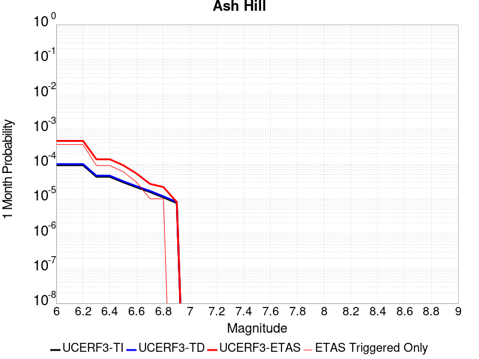 |  | 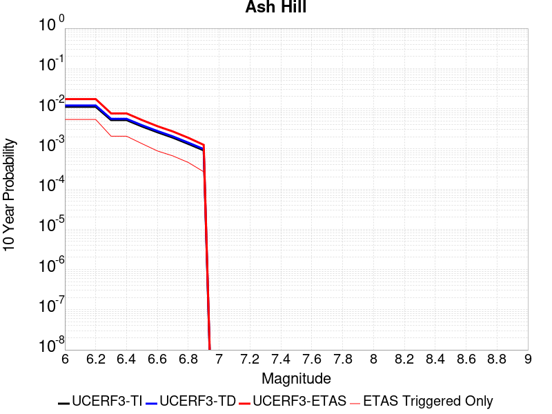 |

| Magnitude | 1 wk TI Prob | 1 wk TD Prob | 1 wk ETAS Prob | 1 wk ETAS/TD Gain | 1 wk ETAS Triggered Only | 1 mo TI Prob | 1 mo TD Prob | 1 mo ETAS Prob | 1 mo ETAS/TD Gain | 1 mo ETAS Triggered Only | 1 yr TI Prob | 1 yr TD Prob | 1 yr ETAS Prob | 1 yr ETAS/TD Gain | 1 yr ETAS Triggered Only | 10 yr TI Prob | 10 yr TD Prob | 10 yr ETAS Prob | 10 yr ETAS/TD Gain | 10 yr ETAS Triggered Only |
|-----|-----|-----|-----|-----|-----|-----|-----|-----|-----|-----|-----|-----|-----|-----|-----|-----|-----|-----|-----|-----|
| 6.0 | 2.1545662E-5 | 2.3196802E-5 | 9.319518E-5 | 4.017587 | 7.0E-5 | 9.2335285E-5 | 9.941153E-5 | 4.5937573E-4 | 4.62095 | 3.6E-4 | 0.0011236023 | 0.0012097433 | 0.0034769971 | 2.874161 | 0.00227 | 0.011179381 | 0.012039565 | 0.01737455 | 1.4431212 | 0.0054 |
| 6.1 | 2.1545662E-5 | 2.3196802E-5 | 9.319518E-5 | 4.017587 | 7.0E-5 | 9.2335285E-5 | 9.941153E-5 | 4.5937573E-4 | 4.62095 | 3.6E-4 | 0.0011236023 | 0.0012097433 | 0.0034769971 | 2.874161 | 0.00227 | 0.011179381 | 0.012039565 | 0.01737455 | 1.4431212 | 0.0054 |
| 6.2 | 2.1545662E-5 | 2.3196802E-5 | 9.319518E-5 | 4.017587 | 7.0E-5 | 9.2335285E-5 | 9.941153E-5 | 4.5937573E-4 | 4.62095 | 3.6E-4 | 0.0011236023 | 0.0012097433 | 0.0034769971 | 2.874161 | 0.00227 | 0.011179381 | 0.012039565 | 0.01737455 | 1.4431212 | 0.0054 |
| 6.3 | 1.0025529E-5 | 1.074796E-5 | 2.0747853E-5 | 1.9303991 | 1.0E-5 | 4.2965847E-5 | 4.606195E-5 | 1.360578E-4 | 2.9538004 | 9.0E-5 | 5.229836E-4 | 5.606731E-4 | 0.0013902078 | 2.4795334 | 8.3E-4 | 0.005217545 | 0.0055938987 | 0.0076523195 | 1.3679761 | 0.00207 |
| 6.4 | 1.0025529E-5 | 1.074796E-5 | 2.0747853E-5 | 1.9303991 | 1.0E-5 | 4.2965847E-5 | 4.606195E-5 | 1.360578E-4 | 2.9538004 | 9.0E-5 | 5.229836E-4 | 5.606731E-4 | 0.0013902078 | 2.4795334 | 8.3E-4 | 0.005217545 | 0.0055938987 | 0.0076523195 | 1.3679761 | 0.00207 |
| 6.5 | 6.9617327E-6 | 7.4573372E-6 | 1.7457263E-5 | 2.3409512 | 1.0E-5 | 2.9835655E-5 | 3.1959673E-5 | 9.195776E-5 | 2.8773057 | 6.0E-5 | 3.6318856E-4 | 3.8904822E-4 | 9.1884204E-4 | 2.361769 | 5.3E-4 | 0.0036259557 | 0.003884526 | 0.0052292817 | 1.3461827 | 0.00135 |
| 6.6 | 4.9919777E-6 | 5.347192E-6 | 1.534714E-5 | 2.8701303 | 1.0E-5 | 2.1394015E-5 | 2.2916374E-5 | 5.2915686E-5 | 2.3090775 | 3.0E-5 | 2.60441E-4 | 2.7897785E-4 | 5.489025E-4 | 1.9675488 | 2.7E-4 | 0.0026013597 | 0.0027869348 | 0.0036744545 | 1.3184572 | 8.9E-4 |
| 6.7 | 3.6630722E-6 | 3.9249953E-6 | 1.3924956E-5 | 3.5477638 | 1.0E-5 | 1.5698786E-5 | 1.6821332E-5 | 2.6821164E-5 | 1.5944732 | 1.0E-5 | 1.9111596E-4 | 2.0478622E-4 | 4.0474525E-4 | 1.9764283 | 2.0E-4 | 0.0019095168 | 0.0020465383 | 0.0027151671 | 1.3267121 | 6.7E-4 |
| 6.8 | 2.5599613E-6 | 2.745188E-6 | 1.274516E-5 | 4.6427274 | 1.0E-5 | 1.0971216E-5 | 1.1765067E-5 | 2.1764949E-5 | 1.8499639 | 1.0E-5 | 1.3356637E-4 | 1.4323521E-4 | 2.9321373E-4 | 2.0470784 | 1.5E-4 | 0.0013348613 | 0.001431914 | 0.0018912554 | 1.3207884 | 4.6E-4 |
| 6.9 | 1.7684905E-6 | 1.8970534E-6 | 1.8970534E-6 | 1.0 | 0.0 | 7.579223E-6 | 8.130229E-6 | 8.130229E-6 | 1.0 | 0.0 | 9.2273134E-5 | 9.898553E-5 | 1.689786E-4 | 1.7071041 | 7.0E-5 | 9.223483E-4 | 9.898554E-4 | 0.001259588 | 1.2724972 | 2.7E-4 |

## Hunter Mountain-Saline Valley
*[(top)](#table-of-contents)*

| 1 Week | 1 Month | 1 Year | 10 Year |
|-----|-----|-----|-----|
|  |  |  |  |

| Magnitude | 1 wk TI Prob | 1 wk TD Prob | 1 wk ETAS Prob | 1 wk ETAS/TD Gain | 1 wk ETAS Triggered Only | 1 mo TI Prob | 1 mo TD Prob | 1 mo ETAS Prob | 1 mo ETAS/TD Gain | 1 mo ETAS Triggered Only | 1 yr TI Prob | 1 yr TD Prob | 1 yr ETAS Prob | 1 yr ETAS/TD Gain | 1 yr ETAS Triggered Only | 10 yr TI Prob | 10 yr TD Prob | 10 yr ETAS Prob | 10 yr ETAS/TD Gain | 10 yr ETAS Triggered Only |
|-----|-----|-----|-----|-----|-----|-----|-----|-----|-----|-----|-----|-----|-----|-----|-----|-----|-----|-----|-----|-----|
| 6.0 | 4.5103672E-5 | 5.4585795E-5 | 1.6457979E-4 | 3.0150664 | 1.1E-4 | 1.9328714E-4 | 2.3391936E-4 | 5.338492E-4 | 2.2821932 | 3.0E-4 | 0.002350731 | 0.0028443995 | 0.0047988244 | 1.6871134 | 0.00196 | 0.023260195 | 0.028100612 | 0.0326491 | 1.1618644 | 0.00468 |
| 6.1 | 4.5103672E-5 | 5.4585795E-5 | 1.6457979E-4 | 3.0150664 | 1.1E-4 | 1.9328714E-4 | 2.3391936E-4 | 5.338492E-4 | 2.2821932 | 3.0E-4 | 0.002350731 | 0.0028443995 | 0.0047988244 | 1.6871134 | 0.00196 | 0.023260195 | 0.028100612 | 0.0326491 | 1.1618644 | 0.00468 |
| 6.2 | 3.9363465E-5 | 4.7075897E-5 | 1.5707072E-4 | 3.3365424 | 1.1E-4 | 1.6868966E-4 | 2.0173912E-4 | 5.016786E-4 | 2.486769 | 3.0E-4 | 0.002051862 | 0.0024535626 | 0.004398778 | 1.7928127 | 0.00195 | 0.020330196 | 0.024280764 | 0.028817859 | 1.1868596 | 0.00465 |
| 6.3 | 3.9363465E-5 | 4.7075897E-5 | 1.5707072E-4 | 3.3365424 | 1.1E-4 | 1.6868966E-4 | 2.0173912E-4 | 5.016786E-4 | 2.486769 | 3.0E-4 | 0.002051862 | 0.0024535626 | 0.004398778 | 1.7928127 | 0.00195 | 0.020330196 | 0.024280764 | 0.028817859 | 1.1868596 | 0.00465 |
| 6.4 | 3.2311684E-5 | 3.796192E-5 | 1.4795775E-4 | 3.8975306 | 1.1E-4 | 1.384713E-4 | 1.6268421E-4 | 4.6263542E-4 | 2.8437634 | 3.0E-4 | 0.0016845843 | 0.0019789536 | 0.0039151143 | 1.978376 | 0.00194 | 0.016718714 | 0.01962205 | 0.024151396 | 1.2308294 | 0.00462 |
| 6.5 | 3.2311684E-5 | 3.796192E-5 | 1.4795775E-4 | 3.8975306 | 1.1E-4 | 1.384713E-4 | 1.6268421E-4 | 4.6263542E-4 | 2.8437634 | 3.0E-4 | 0.0016845843 | 0.0019789536 | 0.0039151143 | 1.978376 | 0.00194 | 0.016718714 | 0.01962205 | 0.024151396 | 1.2308294 | 0.00462 |
| 6.6 | 2.9305844E-5 | 3.4191486E-5 | 1.4418772E-4 | 4.2170653 | 1.1E-4 | 1.2559042E-4 | 1.4652706E-4 | 4.4648309E-4 | 3.0471034 | 3.0E-4 | 0.0015279909 | 0.0017825698 | 0.0037091295 | 2.0807765 | 0.00193 | 0.015175272 | 0.017690638 | 0.022219084 | 1.2559798 | 0.00461 |
| 6.7 | 2.7826512E-5 | 3.2353335E-5 | 1.4234977E-4 | 4.3998485 | 1.1E-4 | 1.19251024E-4 | 1.3865012E-4 | 4.3860852E-4 | 3.1634197 | 3.0E-4 | 0.0014509142 | 0.0016868184 | 0.0036135628 | 2.1422358 | 0.00193 | 0.014414776 | 0.016747838 | 0.021270799 | 1.2700623 | 0.0046 |
| 6.8 | 2.3389874E-5 | 2.6874068E-5 | 1.3687111E-4 | 5.0930552 | 1.1E-4 | 1.0023846E-4 | 1.1516976E-4 | 4.151352E-4 | 3.6045506 | 3.0E-4 | 0.00121972 | 0.0014013371 | 0.0032986747 | 2.3539479 | 0.0019 | 0.01213047 | 0.013931221 | 0.018427694 | 1.3227624 | 0.00456 |
| 6.9 | 2.069209E-5 | 2.3576413E-5 | 1.3357382E-4 | 5.66557 | 1.1E-4 | 8.867737E-5 | 1.01038066E-4 | 4.0100774E-4 | 3.968878 | 3.0E-4 | 0.0010791123 | 0.0012294804 | 0.0031171567 | 2.5353448 | 0.00189 | 0.010738871 | 0.012231816 | 0.01672616 | 1.3674308 | 0.00455 |
| 7.0 | 1.7462342E-5 | 1.9638785E-5 | 1.2963662E-4 | 6.6010513 | 1.1E-4 | 7.483646E-5 | 8.416363E-5 | 3.8413837E-4 | 4.564185 | 3.0E-4 | 9.1075303E-4 | 0.0010242332 | 0.002892318 | 2.8238862 | 0.00187 | 0.009070295 | 0.010198761 | 0.014672662 | 1.4386711 | 0.00452 |
| 7.1 | 1.4807709E-5 | 1.644613E-5 | 1.2644433E-4 | 7.688393 | 1.1E-4 | 6.3460066E-5 | 7.0481605E-5 | 3.7046048E-4 | 5.2561297 | 3.0E-4 | 7.723524E-4 | 8.577922E-4 | 0.002696214 | 3.1432016 | 0.00184 | 0.007696735 | 0.008547801 | 0.012969677 | 1.5173117 | 0.00446 |
| 7.2 | 1.4180048E-5 | 1.5702537E-5 | 1.2570081E-4 | 8.005128 | 1.1E-4 | 6.077022E-5 | 6.729494E-5 | 3.6727474E-4 | 5.4576874 | 3.0E-4 | 7.396263E-4 | 8.1902416E-4 | 0.002657517 | 3.244736 | 0.00184 | 0.0073716943 | 0.008163009 | 0.012586602 | 1.5419072 | 0.00446 |
| 7.3 | 1.3730402E-5 | 1.5176156E-5 | 1.2517448E-4 | 8.248102 | 1.1E-4 | 5.8843252E-5 | 6.503914E-5 | 3.6501963E-4 | 5.6123075 | 3.0E-4 | 7.161811E-4 | 7.915799E-4 | 0.0026301234 | 3.3226254 | 0.00184 | 0.007138774 | 0.007890536 | 0.012295503 | 1.5582594 | 0.00444 |
| 7.4 | 1.2810095E-5 | 1.4112974E-5 | 1.2411142E-4 | 8.794137 | 1.1E-4 | 5.489925E-5 | 6.048286E-5 | 3.604647E-4 | 5.9597826 | 3.0E-4 | 6.681934E-4 | 7.361459E-4 | 0.0025548062 | 3.4705162 | 0.00182 | 0.006661878 | 0.00733997 | 0.011727528 | 1.5977623 | 0.00442 |
| 7.5 | 1.1595659E-5 | 1.2804158E-5 | 1.2280275E-4 | 9.590849 | 1.1E-4 | 4.9694736E-5 | 5.48739E-5 | 3.5485745E-4 | 6.46678 | 3.0E-4 | 6.0486543E-4 | 6.679006E-4 | 0.0024467118 | 3.6632872 | 0.00178 | 0.006032217 | 0.006661806 | 0.010972894 | 1.647135 | 0.00434 |
| 7.6 | 2.997694E-6 | 3.326526E-6 | 4.3326392E-5 | 13.024517 | 4.0E-5 | 1.28471975E-5 | 1.4256503E-5 | 1.6425436E-4 | 11.521364 | 1.5E-4 | 1.564034E-4 | 1.7356638E-4 | 9.3343446E-4 | 5.3779683 | 7.6E-4 | 0.0015629337 | 0.0017357452 | 0.003472725 | 2.0007112 | 0.00174 |

## Blackwater
*[(top)](#table-of-contents)*

| 1 Week | 1 Month | 1 Year | 10 Year |
|-----|-----|-----|-----|
|  |  |  |  |

| Magnitude | 1 wk TI Prob | 1 wk TD Prob | 1 wk ETAS Prob | 1 wk ETAS/TD Gain | 1 wk ETAS Triggered Only | 1 mo TI Prob | 1 mo TD Prob | 1 mo ETAS Prob | 1 mo ETAS/TD Gain | 1 mo ETAS Triggered Only | 1 yr TI Prob | 1 yr TD Prob | 1 yr ETAS Prob | 1 yr ETAS/TD Gain | 1 yr ETAS Triggered Only | 10 yr TI Prob | 10 yr TD Prob | 10 yr ETAS Prob | 10 yr ETAS/TD Gain | 10 yr ETAS Triggered Only |
|-----|-----|-----|-----|-----|-----|-----|-----|-----|-----|-----|-----|-----|-----|-----|-----|-----|-----|-----|-----|-----|
| 6.0 | 3.0708583E-5 | 3.3099266E-5 | 9.309728E-5 | 2.812669 | 6.0E-5 | 1.3160157E-4 | 1.4184705E-4 | 3.81813E-4 | 2.691723 | 2.4E-4 | 0.0016010714 | 0.0017257566 | 0.0032331506 | 1.8734685 | 0.00151 | 0.015895851 | 0.01713739 | 0.021117983 | 1.2322754 | 0.00405 |
| 6.1 | 3.0708583E-5 | 3.3099266E-5 | 9.309728E-5 | 2.812669 | 6.0E-5 | 1.3160157E-4 | 1.4184705E-4 | 3.81813E-4 | 2.691723 | 2.4E-4 | 0.0016010714 | 0.0017257566 | 0.0032331506 | 1.8734685 | 0.00151 | 0.015895851 | 0.01713739 | 0.021117983 | 1.2322754 | 0.00405 |
| 6.2 | 1.1707779E-5 | 1.2546313E-5 | 2.2546188E-5 | 1.7970369 | 1.0E-5 | 5.017523E-5 | 5.3768857E-5 | 1.237651E-4 | 2.3017988 | 7.0E-5 | 6.107122E-4 | 6.544489E-4 | 0.0011441282 | 1.7482316 | 4.9E-4 | 0.006090366 | 0.006526187 | 0.008006463 | 1.226821 | 0.00149 |
| 6.3 | 1.1707779E-5 | 1.2546313E-5 | 2.2546188E-5 | 1.7970369 | 1.0E-5 | 5.017523E-5 | 5.3768857E-5 | 1.237651E-4 | 2.3017988 | 7.0E-5 | 6.107122E-4 | 6.544489E-4 | 0.0011441282 | 1.7482316 | 4.9E-4 | 0.006090366 | 0.006526187 | 0.008006463 | 1.226821 | 0.00149 |
| 6.4 | 7.929244E-6 | 8.48088E-6 | 1.8480794E-5 | 2.179113 | 1.0E-5 | 3.3982033E-5 | 3.6346144E-5 | 1.063436E-4 | 2.9258566 | 7.0E-5 | 4.136527E-4 | 4.4242849E-4 | 7.3230016E-4 | 1.6551832 | 2.9E-4 | 0.0041288356 | 0.0044158823 | 0.005361687 | 1.2141825 | 9.5E-4 |
| 6.5 | 5.8832115E-6 | 6.286562E-6 | 6.286562E-6 | 1.0 | 0.0 | 2.521352E-5 | 2.6942143E-5 | 6.6941066E-5 | 2.484623 | 4.0E-5 | 3.0693135E-4 | 3.2797377E-4 | 5.2790815E-4 | 1.6096048 | 2.0E-4 | 0.0030650778 | 0.0032751507 | 0.0039230217 | 1.1978141 | 6.5E-4 |
| 6.6 | 5.8832115E-6 | 6.286562E-6 | 6.286562E-6 | 1.0 | 0.0 | 2.521352E-5 | 2.6942143E-5 | 6.6941066E-5 | 2.484623 | 4.0E-5 | 3.0693135E-4 | 3.2797377E-4 | 5.2790815E-4 | 1.6096048 | 2.0E-4 | 0.0030650778 | 0.0032751507 | 0.0039230217 | 1.1978141 | 6.5E-4 |
| 6.7 | 3.0715053E-6 | 3.2817636E-6 | 3.2817636E-6 | 1.0 | 0.0 | 1.3163528E-5 | 1.40646325E-5 | 5.406407E-5 | 3.8439732 | 4.0E-5 | 1.6025416E-4 | 1.712246E-4 | 2.8120578E-4 | 1.642321 | 1.1E-4 | 0.0016013865 | 0.0017110414 | 0.002020511 | 1.1808662 | 3.1E-4 |
| 6.8 | 2.2722281E-6 | 2.4289757E-6 | 2.4289757E-6 | 1.0 | 0.0 | 9.738084E-6 | 1.0409859E-5 | 5.0409442E-5 | 4.842471 | 4.0E-5 | 1.1855473E-4 | 1.2673358E-4 | 1.9672471E-4 | 1.5522698 | 7.0E-5 | 0.001184915 | 0.0012667032 | 0.0014864246 | 1.1734592 | 2.2E-4 |
| 6.9 | 9.952399E-7 | 1.0654484E-6 | 1.0654484E-6 | 1.0 | 0.0 | 4.265307E-6 | 4.5662023E-6 | 3.4566066E-5 | 7.569981 | 3.0E-5 | 5.1928873E-5 | 5.5592613E-5 | 1.0558983E-4 | 1.89935 | 5.0E-5 | 5.191674E-4 | 5.558377E-4 | 6.557821E-4 | 1.1798086 | 1.0E-4 |
| 7.0 | 4.7385504E-7 | 5.0760383E-7 | 5.0760383E-7 | 1.0 | 0.0 | 2.0308057E-6 | 2.175445E-6 | 2.2175402E-5 | 10.193501 | 2.0E-5 | 2.4724779E-5 | 2.6486043E-5 | 5.648525E-5 | 2.132642 | 3.0E-5 | 2.4722028E-4 | 2.6486043E-4 | 3.148472E-4 | 1.1887287 | 5.0E-5 |

## Garlock (West)
*[(top)](#table-of-contents)*

| 1 Week | 1 Month | 1 Year | 10 Year |
|-----|-----|-----|-----|
|  |  |  |  |

| Magnitude | 1 wk TI Prob | 1 wk TD Prob | 1 wk ETAS Prob | 1 wk ETAS/TD Gain | 1 wk ETAS Triggered Only | 1 mo TI Prob | 1 mo TD Prob | 1 mo ETAS Prob | 1 mo ETAS/TD Gain | 1 mo ETAS Triggered Only | 1 yr TI Prob | 1 yr TD Prob | 1 yr ETAS Prob | 1 yr ETAS/TD Gain | 1 yr ETAS Triggered Only | 10 yr TI Prob | 10 yr TD Prob | 10 yr ETAS Prob | 10 yr ETAS/TD Gain | 10 yr ETAS Triggered Only |
|-----|-----|-----|-----|-----|-----|-----|-----|-----|-----|-----|-----|-----|-----|-----|-----|-----|-----|-----|-----|-----|
| 6.0 | 2.5181727E-5 | 2.5247427E-5 | 6.5246415E-5 | 2.5842798 | 4.0E-5 | 1.0791722E-4 | 1.08198794E-4 | 3.7816959E-4 | 3.4951367 | 2.7E-4 | 0.0013131002 | 0.0013165277 | 0.002684724 | 2.039246 | 0.00137 | 0.013053683 | 0.013167702 | 0.016256487 | 1.2345729 | 0.00313 |
| 6.1 | 2.5077732E-5 | 2.5148478E-5 | 6.514747E-5 | 2.5905135 | 4.0E-5 | 1.0747157E-4 | 1.0777476E-4 | 3.7774566E-4 | 3.5049548 | 2.7E-4 | 0.001307681 | 0.0013113713 | 0.0026795748 | 2.0433378 | 0.00137 | 0.013000126 | 0.013116748 | 0.016205693 | 1.2354962 | 0.00313 |
| 6.2 | 2.494612E-5 | 2.5030122E-5 | 6.502912E-5 | 2.5980344 | 4.0E-5 | 1.0690756E-4 | 1.07267566E-4 | 3.772386E-4 | 3.5168004 | 2.7E-4 | 0.0013008224 | 0.0013052035 | 0.0026734155 | 2.0482748 | 0.00137 | 0.012932341 | 0.013055797 | 0.016144931 | 1.2366103 | 0.00313 |
| 6.3 | 2.4733758E-5 | 2.4849434E-5 | 6.484844E-5 | 2.6096547 | 4.0E-5 | 1.0599751E-4 | 1.0649325E-4 | 3.764645E-4 | 3.535102 | 2.7E-4 | 0.0012897556 | 0.0012957876 | 0.0026640124 | 2.055902 | 0.00137 | 0.012822957 | 0.012962739 | 0.016052166 | 1.2383313 | 0.00313 |
| 6.4 | 2.3237335E-5 | 2.32284E-5 | 6.322747E-5 | 2.7219899 | 4.0E-5 | 9.958477E-5 | 9.95465E-5 | 3.6951964E-4 | 3.7120304 | 2.7E-4 | 0.0012117702 | 0.0012113076 | 0.002579648 | 2.1296391 | 0.00137 | 0.012051838 | 0.012127431 | 0.015209594 | 1.254148 | 0.00312 |
| 6.5 | 2.2732203E-5 | 2.3042725E-5 | 6.30418E-5 | 2.7358658 | 4.0E-5 | 9.742009E-5 | 9.875081E-5 | 3.6872414E-4 | 3.7338848 | 2.7E-4 | 0.0011854442 | 0.0012016308 | 0.0025699846 | 2.1387472 | 0.00137 | 0.011791403 | 0.012031715 | 0.015114176 | 1.2561946 | 0.00312 |
| 6.6 | 2.1319436E-5 | 2.1822514E-5 | 6.182164E-5 | 2.8329294 | 4.0E-5 | 9.136581E-5 | 9.3521725E-5 | 3.6349648E-4 | 3.8867598 | 2.7E-4 | 0.001111811 | 0.0011380345 | 0.0025064754 | 2.2024598 | 0.00137 | 0.011062649 | 0.0114024235 | 0.014486848 | 1.270506 | 0.00312 |
| 6.7 | 1.970802E-5 | 2.044191E-5 | 6.0441093E-5 | 2.9567244 | 4.0E-5 | 8.446021E-5 | 8.760525E-5 | 3.575816E-4 | 4.081737 | 2.7E-4 | 0.001027818 | 0.0010660738 | 0.0024246238 | 2.2743492 | 0.00136 | 0.010230771 | 0.010689921 | 0.013766675 | 1.2878183 | 0.00311 |
| 6.8 | 1.8744462E-5 | 1.994929E-5 | 5.9948492E-5 | 3.005044 | 4.0E-5 | 8.033094E-5 | 8.549416E-5 | 3.5547107E-4 | 4.1578403 | 2.7E-4 | 9.775903E-4 | 0.001040396 | 0.0023889916 | 2.2962327 | 0.00135 | 0.009733009 | 0.010435575 | 0.013503225 | 1.2939608 | 0.0031 |
| 6.9 | 1.7559682E-5 | 1.9001345E-5 | 5.9000587E-5 | 3.105074 | 4.0E-5 | 7.5253614E-5 | 8.1431805E-5 | 3.514098E-4 | 4.3153877 | 2.7E-4 | 9.158276E-4 | 9.909827E-4 | 0.0023296548 | 2.350853 | 0.00134 | 0.0091206245 | 0.009945906 | 0.013005173 | 1.3075906 | 0.00309 |
| 7.0 | 1.6794445E-5 | 1.826383E-5 | 5.82631E-5 | 3.1900811 | 4.0E-5 | 7.197421E-5 | 7.8271216E-5 | 3.482501E-4 | 4.4492736 | 2.7E-4 | 8.759337E-4 | 9.525369E-4 | 0.0022912605 | 2.4054296 | 0.00134 | 0.008724891 | 0.009564651 | 0.012615192 | 1.3189391 | 0.00308 |
| 7.1 | 1.6337795E-5 | 1.7764389E-5 | 5.776368E-5 | 3.2516558 | 4.0E-5 | 7.0017246E-5 | 7.613088E-5 | 3.4611032E-4 | 4.546254 | 2.7E-4 | 8.521265E-4 | 9.2650065E-4 | 0.0022552684 | 2.434179 | 0.00133 | 0.008488664 | 0.009306384 | 0.012347814 | 1.3268111 | 0.00307 |
| 7.2 | 1.5780008E-5 | 1.721285E-5 | 5.721216E-5 | 3.3238053 | 4.0E-5 | 6.762685E-5 | 7.376728E-5 | 3.4374735E-4 | 4.659889 | 2.7E-4 | 8.2304585E-4 | 8.977479E-4 | 0.0022165629 | 2.469026 | 0.00132 | 0.008200042 | 0.009021141 | 0.012053536 | 1.3361433 | 0.00306 |
| 7.3 | 1.5058865E-5 | 1.6665581E-5 | 5.6664914E-5 | 3.4001164 | 4.0E-5 | 6.45364E-5 | 7.1421964E-5 | 3.414027E-4 | 4.7800794 | 2.7E-4 | 7.854473E-4 | 8.6921675E-4 | 0.0021880693 | 2.5172884 | 0.00132 | 0.00782677 | 0.00873767 | 0.011770933 | 1.3471477 | 0.00306 |
| 7.4 | 1.4887923E-5 | 1.6501404E-5 | 5.6500743E-5 | 3.423996 | 4.0E-5 | 6.380382E-5 | 7.071839E-5 | 3.3070002E-4 | 4.676294 | 2.6E-4 | 7.7653467E-4 | 8.6065754E-4 | 0.0021495472 | 2.4975638 | 0.00129 | 0.0077382675 | 0.008652459 | 0.011606674 | 1.3414308 | 0.00298 |
| 7.5 | 1.4509299E-5 | 1.6093083E-5 | 5.6092438E-5 | 3.4854999 | 4.0E-5 | 6.218123E-5 | 6.896854E-5 | 3.189513E-4 | 4.624591 | 2.5E-4 | 7.567935E-4 | 8.393697E-4 | 0.0020383624 | 2.4284441 | 0.0012 | 0.0075422134 | 0.008440594 | 0.011226876 | 1.330105 | 0.00281 |
| 7.6 | 1.2756717E-5 | 1.4095277E-5 | 3.4094995E-5 | 2.418895 | 2.0E-5 | 5.4670498E-5 | 6.0406936E-5 | 2.0039848E-4 | 3.3174746 | 1.4E-4 | 6.6541E-4 | 7.3520694E-4 | 0.0014846555 | 2.019371 | 7.5E-4 | 0.006634211 | 0.007404631 | 0.009231007 | 1.2466532 | 0.00184 |
| 7.7 | 1.0328985E-5 | 1.15023295E-5 | 1.15023295E-5 | 1.0 | 0.0 | 4.4266326E-5 | 4.929477E-5 | 1.4928984E-4 | 3.0285127 | 1.0E-4 | 5.388092E-4 | 5.99999E-4 | 0.001069717 | 1.7828647 | 4.7E-4 | 0.0053750467 | 0.00606014 | 0.0071634133 | 1.182054 | 0.00111 |
| 7.8 | 7.0306583E-6 | 8.933274E-6 | 8.933274E-6 | 1.0 | 0.0 | 3.0131043E-5 | 3.82849E-5 | 1.1828184E-4 | 3.0895166 | 8.0E-5 | 3.667837E-4 | 4.6601912E-4 | 8.058607E-4 | 1.7292438 | 3.4E-4 | 0.003661789 | 0.004712734 | 0.005479105 | 1.1626171 | 7.7E-4 |
| 7.9 | 4.060633E-6 | 5.485026E-6 | 5.485026E-6 | 1.0 | 0.0 | 1.7402595E-5 | 2.3507044E-5 | 8.3505634E-5 | 3.5523665 | 6.0E-5 | 2.11856E-4 | 2.8616076E-4 | 4.761064E-4 | 1.6637725 | 1.9E-4 | 0.0021165414 | 0.0028944004 | 0.0033032137 | 1.1412429 | 4.1E-4 |
| 8.0 | 1.6729537E-6 | 2.0839254E-6 | 2.0839254E-6 | 1.0 | 0.0 | 7.169782E-6 | 8.931079E-6 | 3.893081E-5 | 4.359027 | 3.0E-5 | 8.7288594E-5 | 1.0873049E-4 | 1.3872724E-4 | 1.2758815 | 3.0E-5 | 8.7254314E-4 | 0.0011002679 | 0.0012201358 | 1.1089443 | 1.2E-4 |
| 8.1 | 3.6733252E-7 | 3.1582263E-7 | 3.1582263E-7 | 1.0 | 0.0 | 1.5742813E-6 | 1.3535249E-6 | 1.3535249E-6 | 1.0 | 0.0 | 1.9166706E-5 | 1.6479058E-5 | 1.6479058E-5 | 1.0 | 0.0 | 1.9165053E-4 | 1.6687137E-4 | 1.768697E-4 | 1.0599164 | 1.0E-5 |

## McLean Lake
*[(top)](#table-of-contents)*

| 1 Week | 1 Month | 1 Year | 10 Year |
|-----|-----|-----|-----|
| 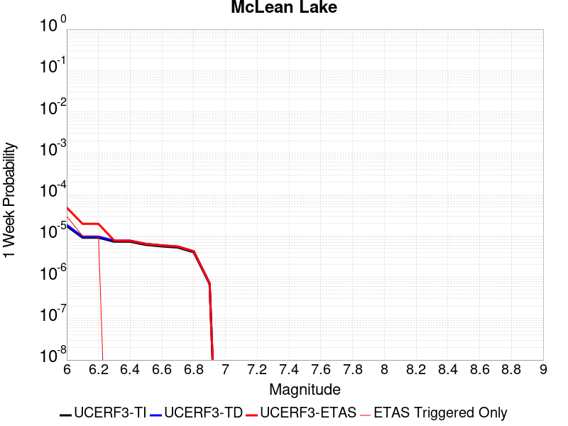 |  |  |  |

| Magnitude | 1 wk TI Prob | 1 wk TD Prob | 1 wk ETAS Prob | 1 wk ETAS/TD Gain | 1 wk ETAS Triggered Only | 1 mo TI Prob | 1 mo TD Prob | 1 mo ETAS Prob | 1 mo ETAS/TD Gain | 1 mo ETAS Triggered Only | 1 yr TI Prob | 1 yr TD Prob | 1 yr ETAS Prob | 1 yr ETAS/TD Gain | 1 yr ETAS Triggered Only | 10 yr TI Prob | 10 yr TD Prob | 10 yr ETAS Prob | 10 yr ETAS/TD Gain | 10 yr ETAS Triggered Only |
|-----|-----|-----|-----|-----|-----|-----|-----|-----|-----|-----|-----|-----|-----|-----|-----|-----|-----|-----|-----|-----|
| 6.0 | 1.7360222E-5 | 1.8503244E-5 | 4.850269E-5 | 2.6213074 | 3.0E-5 | 7.439883E-5 | 7.929748E-5 | 1.7928955E-4 | 2.2609742 | 1.0E-4 | 9.0542925E-4 | 9.650678E-4 | 0.0016344213 | 1.6935817 | 6.7E-4 | 0.009017491 | 0.009613611 | 0.011723134 | 1.2194309 | 0.00213 |
| 6.1 | 9.062689E-6 | 9.592937E-6 | 1.9592842E-5 | 2.0424235 | 1.0E-5 | 3.8839516E-5 | 4.111199E-5 | 7.111076E-5 | 1.7296841 | 3.0E-5 | 4.727685E-4 | 5.0043245E-4 | 8.202723E-4 | 1.639127 | 3.2E-4 | 0.0047176396 | 0.0049939384 | 0.0061182952 | 1.2251444 | 0.00113 |
| 6.2 | 9.062689E-6 | 9.592937E-6 | 1.9592842E-5 | 2.0424235 | 1.0E-5 | 3.8839516E-5 | 4.111199E-5 | 7.111076E-5 | 1.7296841 | 3.0E-5 | 4.727685E-4 | 5.0043245E-4 | 8.202723E-4 | 1.639127 | 3.2E-4 | 0.0047176396 | 0.0049939384 | 0.0061182952 | 1.2251444 | 0.00113 |
| 6.3 | 7.2575485E-6 | 7.6682845E-6 | 7.6682845E-6 | 1.0 | 0.0 | 3.110341E-5 | 3.2863703E-5 | 5.2863044E-5 | 1.6085541 | 2.0E-5 | 3.786182E-4 | 4.0004926E-4 | 6.2995724E-4 | 1.5746992 | 2.3E-4 | 0.0037797375 | 0.003993996 | 0.0047808406 | 1.197007 | 7.9E-4 |
| 6.4 | 7.2575485E-6 | 7.6682845E-6 | 7.6682845E-6 | 1.0 | 0.0 | 3.110341E-5 | 3.2863703E-5 | 5.2863044E-5 | 1.6085541 | 2.0E-5 | 3.786182E-4 | 4.0004926E-4 | 6.2995724E-4 | 1.5746992 | 2.3E-4 | 0.0037797375 | 0.003993996 | 0.0047808406 | 1.197007 | 7.9E-4 |
| 6.5 | 6.06582E-6 | 6.404351E-6 | 6.404351E-6 | 1.0 | 0.0 | 2.5996113E-5 | 2.7446966E-5 | 3.744669E-5 | 1.364329 | 1.0E-5 | 3.164567E-4 | 3.3412204E-4 | 5.240586E-4 | 1.5684645 | 1.9E-4 | 0.0031600643 | 0.0033368357 | 0.0040046 | 1.200119 | 6.7E-4 |
| 6.6 | 5.598744E-6 | 5.9106987E-6 | 5.9106987E-6 | 1.0 | 0.0 | 2.3994397E-5 | 2.5331356E-5 | 3.5331104E-5 | 1.3947576 | 1.0E-5 | 2.9209262E-4 | 3.0837202E-4 | 4.983134E-4 | 1.6159489 | 1.9E-4 | 0.0029170897 | 0.0030800703 | 0.003718099 | 1.2071475 | 6.4E-4 |
| 6.7 | 5.246996E-6 | 5.5395712E-6 | 5.5395712E-6 | 1.0 | 0.0 | 2.2486933E-5 | 2.374084E-5 | 2.374084E-5 | 1.0 | 0.0 | 2.73744E-4 | 2.8901274E-4 | 4.489665E-4 | 1.5534488 | 1.6E-4 | 0.0027340704 | 0.0028869926 | 0.0034852605 | 1.2072287 | 6.0E-4 |
| 6.8 | 4.02324E-6 | 4.247218E-6 | 4.247218E-6 | 1.0 | 0.0 | 1.7242342E-5 | 1.8202269E-5 | 1.8202269E-5 | 1.0 | 0.0 | 2.099053E-4 | 2.2159604E-4 | 3.3157167E-4 | 1.4962888 | 1.1E-4 | 0.0020970714 | 0.0022143351 | 0.0026733167 | 1.2072773 | 4.6E-4 |
| 6.9 | 6.835972E-7 | 7.140349E-7 | 7.140349E-7 | 1.0 | 0.0 | 2.9296991E-6 | 3.060148E-6 | 3.060148E-6 | 1.0 | 0.0 | 3.56685E-5 | 3.725698E-5 | 4.725661E-5 | 1.268396 | 1.0E-5 | 3.5662777E-4 | 3.7253863E-4 | 4.2252E-4 | 1.1341642 | 5.0E-5 |

## Gravel Hills-Harper Lk
*[(top)](#table-of-contents)*

| 1 Week | 1 Month | 1 Year | 10 Year |
|-----|-----|-----|-----|
|  |  |  | 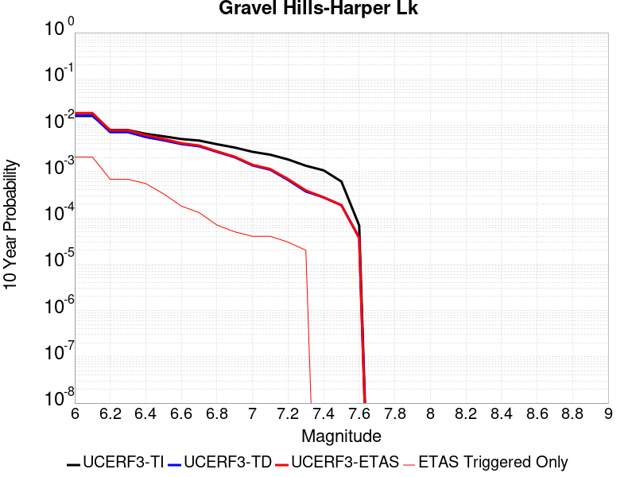 |

| Magnitude | 1 wk TI Prob | 1 wk TD Prob | 1 wk ETAS Prob | 1 wk ETAS/TD Gain | 1 wk ETAS Triggered Only | 1 mo TI Prob | 1 mo TD Prob | 1 mo ETAS Prob | 1 mo ETAS/TD Gain | 1 mo ETAS Triggered Only | 1 yr TI Prob | 1 yr TD Prob | 1 yr ETAS Prob | 1 yr ETAS/TD Gain | 1 yr ETAS Triggered Only | 10 yr TI Prob | 10 yr TD Prob | 10 yr ETAS Prob | 10 yr ETAS/TD Gain | 10 yr ETAS Triggered Only |
|-----|-----|-----|-----|-----|-----|-----|-----|-----|-----|-----|-----|-----|-----|-----|-----|-----|-----|-----|-----|-----|
| 6.0 | 3.0679566E-5 | 3.1470034E-5 | 6.146909E-5 | 1.9532579 | 3.0E-5 | 1.3147724E-4 | 1.3486583E-4 | 1.9485773E-4 | 1.4448266 | 6.0E-5 | 0.0015995599 | 0.0016409707 | 0.0023697729 | 1.4441286 | 7.3E-4 | 0.015880952 | 0.016310113 | 0.018326676 | 1.1236389 | 0.00205 |
| 6.1 | 3.0679566E-5 | 3.1470034E-5 | 6.146909E-5 | 1.9532579 | 3.0E-5 | 1.3147724E-4 | 1.3486583E-4 | 1.9485773E-4 | 1.4448266 | 6.0E-5 | 0.0015995599 | 0.0016409707 | 0.0023697729 | 1.4441286 | 7.3E-4 | 0.015880952 | 0.016310113 | 0.018326676 | 1.1236389 | 0.00205 |
| 6.2 | 1.514536E-5 | 1.3637061E-5 | 2.3636925E-5 | 1.7332858 | 1.0E-5 | 6.490707E-5 | 5.8443307E-5 | 8.844155E-5 | 1.513288 | 3.0E-5 | 7.8995706E-4 | 7.1132684E-4 | 0.0010111134 | 1.421447 | 3.0E-4 | 0.007871548 | 0.0070917015 | 0.007766879 | 1.0952067 | 6.8E-4 |
| 6.3 | 1.514536E-5 | 1.3637061E-5 | 2.3636925E-5 | 1.7332858 | 1.0E-5 | 6.490707E-5 | 5.8443307E-5 | 8.844155E-5 | 1.513288 | 3.0E-5 | 7.8995706E-4 | 7.1132684E-4 | 0.0010111134 | 1.421447 | 3.0E-4 | 0.007871548 | 0.0070917015 | 0.007766879 | 1.0952067 | 6.8E-4 |
| 6.4 | 1.2532521E-5 | 1.0691045E-5 | 2.0690937E-5 | 1.9353523 | 1.0E-5 | 5.37097E-5 | 4.5817993E-5 | 7.581661E-5 | 1.6547346 | 3.0E-5 | 6.537194E-4 | 5.576971E-4 | 8.175521E-4 | 1.4659429 | 2.6E-4 | 0.0065179965 | 0.0055635655 | 0.0061105057 | 1.0983075 | 5.5E-4 |
| 6.5 | 1.1094058E-5 | 9.084768E-6 | 9.084768E-6 | 1.0 | 0.0 | 4.7545094E-5 | 3.8934162E-5 | 3.8934162E-5 | 1.0 | 0.0 | 5.787078E-4 | 4.7392436E-4 | 6.13858E-4 | 1.2952658 | 1.4E-4 | 0.0057720304 | 0.0047295443 | 0.0050579836 | 1.0694442 | 3.3E-4 |
| 6.6 | 9.688328E-6 | 7.5325847E-6 | 7.5325847E-6 | 1.0 | 0.0 | 4.1520743E-5 | 3.228212E-5 | 3.228212E-5 | 1.0 | 0.0 | 5.053978E-4 | 3.929665E-4 | 4.62939E-4 | 1.1780622 | 7.0E-5 | 0.0050424994 | 0.0039229733 | 0.004102267 | 1.0457035 | 1.8E-4 |
| 6.7 | 8.974824E-6 | 6.7502024E-6 | 6.7502024E-6 | 1.0 | 0.0 | 3.8462964E-5 | 2.8929131E-5 | 2.8929131E-5 | 1.0 | 0.0 | 4.6818596E-4 | 3.5215745E-4 | 4.0213985E-4 | 1.1419319 | 5.0E-5 | 0.004672008 | 0.0035162151 | 0.003645758 | 1.0368416 | 1.3E-4 |
| 6.8 | 7.4780046E-6 | 5.116785E-6 | 5.116785E-6 | 1.0 | 0.0 | 3.20482E-5 | 2.1928901E-5 | 2.1928901E-5 | 1.0 | 0.0 | 3.9011694E-4 | 2.6695305E-4 | 3.0694238E-4 | 1.1497991 | 4.0E-5 | 0.0038943281 | 0.0026664622 | 0.0027362755 | 1.026182 | 7.0E-5 |
| 6.9 | 6.3409307E-6 | 3.907958E-6 | 3.907958E-6 | 1.0 | 0.0 | 2.7175134E-5 | 1.674829E-5 | 1.674829E-5 | 1.0 | 0.0 | 3.3080703E-4 | 2.0389234E-4 | 2.3388623E-4 | 1.1471065 | 3.0E-5 | 0.0033031502 | 0.0020371508 | 0.002087049 | 1.024494 | 5.0E-5 |
| 7.0 | 5.1239335E-6 | 2.6061791E-6 | 2.6061791E-6 | 1.0 | 0.0 | 2.195953E-5 | 1.11692925E-5 | 1.11692925E-5 | 1.0 | 0.0 | 2.6732447E-4 | 1.359779E-4 | 1.5597518E-4 | 1.1470628 | 2.0E-5 | 0.0026700313 | 0.0013589723 | 0.0013989179 | 1.029394 | 4.0E-5 |
| 7.1 | 4.438899E-6 | 2.0987422E-6 | 2.0987422E-6 | 1.0 | 0.0 | 1.9023713E-5 | 8.994581E-6 | 8.994581E-6 | 1.0 | 0.0 | 2.315891E-4 | 1.0950373E-4 | 1.2950154E-4 | 1.1826222 | 2.0E-5 | 0.002313479 | 0.0010945196 | 0.0011344758 | 1.0365057 | 4.0E-5 |
| 7.2 | 3.50367E-6 | 1.2617695E-6 | 1.2617695E-6 | 1.0 | 0.0 | 1.5015643E-5 | 5.407573E-6 | 5.407573E-6 | 1.0 | 0.0 | 1.8280011E-4 | 6.5835295E-5 | 8.583398E-5 | 1.3037684 | 2.0E-5 | 0.0018264982 | 6.5816613E-4 | 6.881464E-4 | 1.0455512 | 3.0E-5 |
| 7.3 | 2.561638E-6 | 7.1206705E-7 | 7.1206705E-7 | 1.0 | 0.0 | 1.0978401E-5 | 3.0517124E-6 | 3.0517124E-6 | 1.0 | 0.0 | 1.3365384E-4 | 3.7153986E-5 | 5.7153244E-5 | 1.5382802 | 2.0E-5 | 0.0013357349 | 3.7147972E-4 | 3.914723E-4 | 1.0538187 | 2.0E-5 |
| 7.4 | 2.0368864E-6 | 5.3060455E-7 | 5.3060455E-7 | 1.0 | 0.0 | 8.729483E-6 | 2.2740176E-6 | 2.2740176E-6 | 1.0 | 0.0 | 1.06276275E-4 | 2.7685817E-5 | 2.7685817E-5 | 1.0 | 0.0 | 0.0010622547 | 2.768242E-4 | 2.768242E-4 | 1.0 | 0.0 |
| 7.5 | 1.1681728E-6 | 3.6037605E-7 | 3.6037605E-7 | 1.0 | 0.0 | 5.0064455E-6 | 1.544468E-6 | 1.544468E-6 | 1.0 | 0.0 | 6.0951766E-5 | 1.880374E-5 | 1.880374E-5 | 1.0 | 0.0 | 6.093505E-4 | 1.8802195E-4 | 1.8802195E-4 | 1.0 | 0.0 |
| 7.6 | 1.3154387E-7 | 7.120617E-8 | 7.120617E-8 | 1.0 | 0.0 | 5.6375933E-7 | 3.051693E-7 | 3.051693E-7 | 1.0 | 0.0 | 6.863748E-6 | 3.7154316E-6 | 3.7154316E-6 | 1.0 | 0.0 | 6.863536E-5 | 3.715385E-5 | 3.715385E-5 | 1.0 | 0.0 |

## Goldstone Lake
*[(top)](#table-of-contents)*

| 1 Week | 1 Month | 1 Year | 10 Year |
|-----|-----|-----|-----|
|  |  |  | 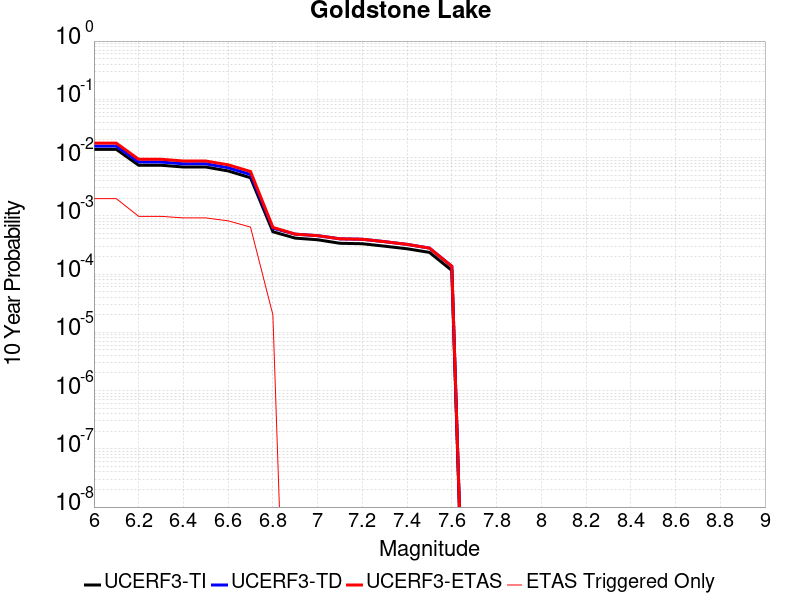 |

| Magnitude | 1 wk TI Prob | 1 wk TD Prob | 1 wk ETAS Prob | 1 wk ETAS/TD Gain | 1 wk ETAS Triggered Only | 1 mo TI Prob | 1 mo TD Prob | 1 mo ETAS Prob | 1 mo ETAS/TD Gain | 1 mo ETAS Triggered Only | 1 yr TI Prob | 1 yr TD Prob | 1 yr ETAS Prob | 1 yr ETAS/TD Gain | 1 yr ETAS Triggered Only | 10 yr TI Prob | 10 yr TD Prob | 10 yr ETAS Prob | 10 yr ETAS/TD Gain | 10 yr ETAS Triggered Only |
|-----|-----|-----|-----|-----|-----|-----|-----|-----|-----|-----|-----|-----|-----|-----|-----|-----|-----|-----|-----|-----|
| 6.0 | 2.671352E-5 | 3.0381472E-5 | 4.038117E-5 | 1.3291379 | 1.0E-5 | 1.1448149E-4 | 1.3020092E-4 | 1.7019571E-4 | 1.3071775 | 4.0E-5 | 0.001392921 | 0.00158424 | 0.0022431943 | 1.4159435 | 6.6E-4 | 0.013842222 | 0.015748968 | 0.017687943 | 1.1231176 | 0.00197 |
| 6.1 | 2.671352E-5 | 3.0381472E-5 | 4.038117E-5 | 1.3291379 | 1.0E-5 | 1.1448149E-4 | 1.3020092E-4 | 1.7019571E-4 | 1.3071775 | 4.0E-5 | 0.001392921 | 0.00158424 | 0.0022431943 | 1.4159435 | 6.6E-4 | 0.013842222 | 0.015748968 | 0.017687943 | 1.1231176 | 0.00197 |
| 6.2 | 1.4197047E-5 | 1.6098957E-5 | 2.6098796E-5 | 1.6211482 | 1.0E-5 | 6.0843064E-5 | 6.899426E-5 | 1.089915E-4 | 1.5797184 | 4.0E-5 | 7.4051257E-4 | 8.397801E-4 | 0.0011894861 | 1.4164258 | 3.5E-4 | 0.007380498 | 0.008375766 | 0.009347558 | 1.1160243 | 9.8E-4 |
| 6.3 | 1.4197047E-5 | 1.6098957E-5 | 2.6098796E-5 | 1.6211482 | 1.0E-5 | 6.0843064E-5 | 6.899426E-5 | 1.089915E-4 | 1.5797184 | 4.0E-5 | 7.4051257E-4 | 8.397801E-4 | 0.0011894861 | 1.4164258 | 3.5E-4 | 0.007380498 | 0.008375766 | 0.009347558 | 1.1160243 | 9.8E-4 |
| 6.4 | 1.3238931E-5 | 1.5010976E-5 | 2.5010826E-5 | 1.6661692 | 1.0E-5 | 5.6737044E-5 | 6.4331725E-5 | 1.0432915E-4 | 1.6217372 | 4.0E-5 | 6.9055456E-4 | 7.830553E-4 | 0.0011227891 | 1.4338566 | 3.4E-4 | 0.006884126 | 0.00781259 | 0.008725403 | 1.1168387 | 9.2E-4 |
| 6.5 | 1.3238931E-5 | 1.5010976E-5 | 2.5010826E-5 | 1.6661692 | 1.0E-5 | 5.6737044E-5 | 6.4331725E-5 | 1.0432915E-4 | 1.6217372 | 4.0E-5 | 6.9055456E-4 | 7.830553E-4 | 0.0011227891 | 1.4338566 | 3.4E-4 | 0.006884126 | 0.00781259 | 0.008725403 | 1.1168387 | 9.2E-4 |
| 6.6 | 1.1328278E-5 | 1.285732E-5 | 2.2857192E-5 | 1.777757 | 1.0E-5 | 4.8548856E-5 | 5.5102173E-5 | 9.509997E-5 | 1.7258842 | 4.0E-5 | 5.90922E-4 | 6.707582E-4 | 9.70557E-4 | 1.4469551 | 3.0E-4 | 0.0058935313 | 0.0066967285 | 0.007511237 | 1.1216278 | 8.2E-4 |
| 6.7 | 8.651175E-6 | 9.826188E-6 | 1.982609E-5 | 2.0176787 | 1.0E-5 | 3.707594E-5 | 4.2112064E-5 | 8.211038E-5 | 1.9498066 | 4.0E-5 | 4.5130608E-4 | 5.1268435E-4 | 7.5256126E-4 | 1.4678843 | 2.4E-4 | 0.0045039062 | 0.0051238975 | 0.005760618 | 1.124265 | 6.4E-4 |
| 6.8 | 1.0215377E-6 | 1.1755602E-6 | 1.1755602E-6 | 1.0 | 0.0 | 4.378012E-6 | 5.038106E-6 | 5.038106E-6 | 1.0 | 0.0 | 5.3300988E-5 | 6.133733E-5 | 7.133672E-5 | 1.1630229 | 1.0E-5 | 5.3288206E-4 | 6.1321526E-4 | 6.33203E-4 | 1.0325949 | 2.0E-5 |
| 6.9 | 7.9360774E-7 | 9.28402E-7 | 9.28402E-7 | 1.0 | 0.0 | 3.4011714E-6 | 3.97886E-6 | 3.97886E-6 | 1.0 | 0.0 | 4.1408475E-5 | 4.8441616E-5 | 4.8441616E-5 | 1.0 | 0.0 | 4.140076E-4 | 4.8431757E-4 | 4.8431757E-4 | 1.0 | 0.0 |
| 7.0 | 7.4382757E-7 | 8.7478975E-7 | 8.7478975E-7 | 1.0 | 0.0 | 3.1878285E-6 | 3.7490938E-6 | 3.7490938E-6 | 1.0 | 0.0 | 3.8811122E-5 | 4.564433E-5 | 4.564433E-5 | 1.0 | 0.0 | 3.8804344E-4 | 4.5635618E-4 | 4.5635618E-4 | 1.0 | 0.0 |
| 7.1 | 6.4709513E-7 | 7.711771E-7 | 7.711771E-7 | 1.0 | 0.0 | 2.773262E-6 | 3.305041E-6 | 3.305041E-6 | 1.0 | 0.0 | 3.376394E-5 | 4.0238192E-5 | 4.0238192E-5 | 1.0 | 0.0 | 3.375881E-4 | 4.0231502E-4 | 4.0231502E-4 | 1.0 | 0.0 |
| 7.2 | 6.356704E-7 | 7.5888187E-7 | 7.5888187E-7 | 1.0 | 0.0 | 2.7242988E-6 | 3.2523471E-6 | 3.2523471E-6 | 1.0 | 0.0 | 3.3167835E-5 | 3.9596667E-5 | 3.9596667E-5 | 1.0 | 0.0 | 3.3162883E-4 | 3.9590205E-4 | 3.9590205E-4 | 1.0 | 0.0 |
| 7.3 | 5.7695723E-7 | 6.896988E-7 | 6.896988E-7 | 1.0 | 0.0 | 2.4726714E-6 | 2.9558491E-6 | 2.9558491E-6 | 1.0 | 0.0 | 3.0104358E-5 | 3.5986926E-5 | 3.5986926E-5 | 1.0 | 0.0 | 3.0100282E-4 | 3.598167E-4 | 3.598167E-4 | 1.0 | 0.0 |
| 7.4 | 5.209647E-7 | 6.1938704E-7 | 6.1938704E-7 | 1.0 | 0.0 | 2.232704E-6 | 2.6545135E-6 | 2.6545135E-6 | 1.0 | 0.0 | 2.718283E-5 | 3.231828E-5 | 3.231828E-5 | 1.0 | 0.0 | 2.7179506E-4 | 3.2314134E-4 | 3.2314134E-4 | 1.0 | 0.0 |
| 7.5 | 4.512955E-7 | 5.3491794E-7 | 5.3491794E-7 | 1.0 | 0.0 | 1.934122E-6 | 2.2925037E-6 | 2.2925037E-6 | 1.0 | 0.0 | 2.3547682E-5 | 2.7910928E-5 | 2.7910928E-5 | 1.0 | 0.0 | 2.3545188E-4 | 2.7907954E-4 | 2.7907954E-4 | 1.0 | 0.0 |
| 7.6 | 2.21172E-7 | 2.60409E-7 | 2.60409E-7 | 1.0 | 0.0 | 9.478797E-7 | 1.1160382E-6 | 1.1160382E-6 | 1.0 | 0.0 | 1.1540374E-5 | 1.358771E-5 | 1.358771E-5 | 1.0 | 0.0 | 1.1539775E-4 | 1.3587161E-4 | 1.3587161E-4 | 1.0 | 0.0 |

## So Sierra Nevada
*[(top)](#table-of-contents)*

| 1 Week | 1 Month | 1 Year | 10 Year |
|-----|-----|-----|-----|
|  | 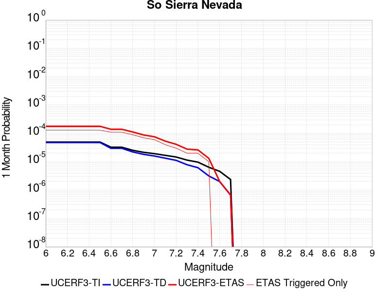 |  | 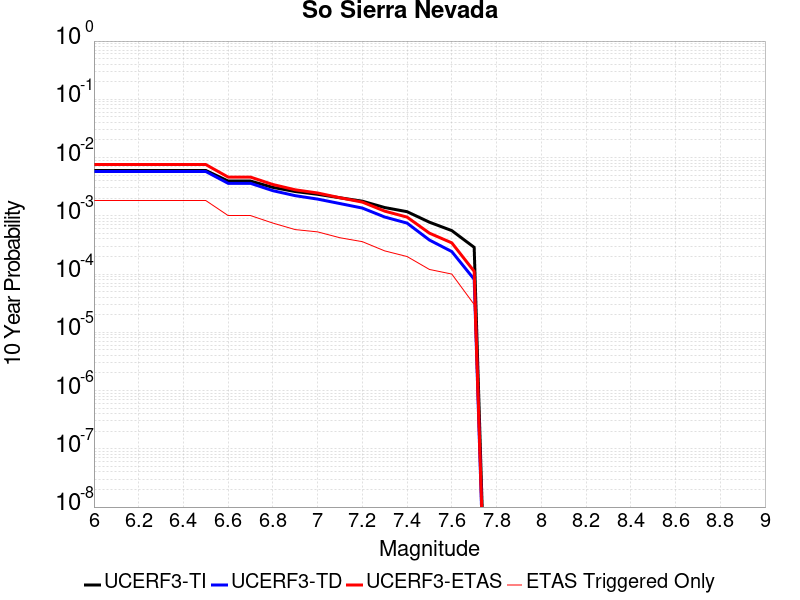 |

| Magnitude | 1 wk TI Prob | 1 wk TD Prob | 1 wk ETAS Prob | 1 wk ETAS/TD Gain | 1 wk ETAS Triggered Only | 1 mo TI Prob | 1 mo TD Prob | 1 mo ETAS Prob | 1 mo ETAS/TD Gain | 1 mo ETAS Triggered Only | 1 yr TI Prob | 1 yr TD Prob | 1 yr ETAS Prob | 1 yr ETAS/TD Gain | 1 yr ETAS Triggered Only | 10 yr TI Prob | 10 yr TD Prob | 10 yr ETAS Prob | 10 yr ETAS/TD Gain | 10 yr ETAS Triggered Only |
|-----|-----|-----|-----|-----|-----|-----|-----|-----|-----|-----|-----|-----|-----|-----|-----|-----|-----|-----|-----|-----|
| 6.0 | 1.15488665E-5 | 1.1080433E-5 | 2.1080323E-5 | 1.9024818 | 1.0E-5 | 4.9494203E-5 | 4.7486777E-5 | 1.774806E-4 | 3.737474 | 1.3E-4 | 6.024253E-4 | 5.780109E-4 | 0.0013475659 | 2.3313847 | 7.7E-4 | 0.006007948 | 0.0057663447 | 0.0075857923 | 1.3155288 | 0.00183 |
| 6.1 | 1.15488665E-5 | 1.1080433E-5 | 2.1080323E-5 | 1.9024818 | 1.0E-5 | 4.9494203E-5 | 4.7486777E-5 | 1.774806E-4 | 3.737474 | 1.3E-4 | 6.024253E-4 | 5.780109E-4 | 0.0013475659 | 2.3313847 | 7.7E-4 | 0.006007948 | 0.0057663447 | 0.0075857923 | 1.3155288 | 0.00183 |
| 6.2 | 1.15488665E-5 | 1.1080433E-5 | 2.1080323E-5 | 1.9024818 | 1.0E-5 | 4.9494203E-5 | 4.7486777E-5 | 1.774806E-4 | 3.737474 | 1.3E-4 | 6.024253E-4 | 5.780109E-4 | 0.0013475659 | 2.3313847 | 7.7E-4 | 0.006007948 | 0.0057663447 | 0.0075857923 | 1.3155288 | 0.00183 |
| 6.3 | 1.15488665E-5 | 1.1080433E-5 | 2.1080323E-5 | 1.9024818 | 1.0E-5 | 4.9494203E-5 | 4.7486777E-5 | 1.774806E-4 | 3.737474 | 1.3E-4 | 6.024253E-4 | 5.780109E-4 | 0.0013475659 | 2.3313847 | 7.7E-4 | 0.006007948 | 0.0057663447 | 0.0075857923 | 1.3155288 | 0.00183 |
| 6.4 | 1.15488665E-5 | 1.1080433E-5 | 2.1080323E-5 | 1.9024818 | 1.0E-5 | 4.9494203E-5 | 4.7486777E-5 | 1.774806E-4 | 3.737474 | 1.3E-4 | 6.024253E-4 | 5.780109E-4 | 0.0013475659 | 2.3313847 | 7.7E-4 | 0.006007948 | 0.0057663447 | 0.0075857923 | 1.3155288 | 0.00183 |
| 6.5 | 1.15488665E-5 | 1.1080433E-5 | 2.1080323E-5 | 1.9024818 | 1.0E-5 | 4.9494203E-5 | 4.7486777E-5 | 1.774806E-4 | 3.737474 | 1.3E-4 | 6.024253E-4 | 5.780109E-4 | 0.0013475659 | 2.3313847 | 7.7E-4 | 0.006007948 | 0.0057663447 | 0.0075857923 | 1.3155288 | 0.00183 |
| 6.6 | 7.587044E-6 | 6.9361727E-6 | 1.6936103E-5 | 2.4417071 | 1.0E-5 | 3.2515498E-5 | 2.9726132E-5 | 1.3972286E-4 | 4.700338 | 1.1E-4 | 3.9580427E-4 | 3.618585E-4 | 8.416848E-4 | 2.3260055 | 4.8E-4 | 0.003951 | 0.0036129844 | 0.0046193353 | 1.2785373 | 0.00101 |
| 6.7 | 7.587044E-6 | 6.9361727E-6 | 1.6936103E-5 | 2.4417071 | 1.0E-5 | 3.2515498E-5 | 2.9726132E-5 | 1.3972286E-4 | 4.700338 | 1.1E-4 | 3.9580427E-4 | 3.618585E-4 | 8.416848E-4 | 2.3260055 | 4.8E-4 | 0.003951 | 0.0036129844 | 0.0046193353 | 1.2785373 | 0.00101 |
| 6.8 | 5.9026956E-6 | 5.1798306E-6 | 1.5179779E-5 | 2.9305549 | 1.0E-5 | 2.5297022E-5 | 2.2199092E-5 | 1.1219709E-4 | 5.0541296 | 9.0E-5 | 3.0794772E-4 | 2.702416E-4 | 6.2014704E-4 | 2.2947874 | 3.5E-4 | 0.0030752132 | 0.002699246 | 0.0034472216 | 1.2771053 | 7.5E-4 |
| 6.9 | 5.0118915E-6 | 4.2528136E-6 | 1.4252771E-5 | 3.3513746 | 1.0E-5 | 2.1479358E-5 | 1.8226221E-5 | 8.8224944E-5 | 4.840551 | 7.0E-5 | 2.614798E-4 | 2.2188236E-4 | 5.1181804E-4 | 2.3067088 | 2.9E-4 | 0.0026117235 | 0.002216681 | 0.0027953952 | 1.2610725 | 5.8E-4 |
| 7.0 | 4.4924795E-6 | 3.714279E-6 | 1.3714242E-5 | 3.6923025 | 1.0E-5 | 1.925334E-5 | 1.5918245E-5 | 7.591729E-5 | 4.7691994 | 6.0E-5 | 2.3438422E-4 | 1.9378804E-4 | 4.5373765E-4 | 2.341412 | 2.6E-4 | 0.0023413717 | 0.0019362535 | 0.0024652272 | 1.2731946 | 5.3E-4 |
| 7.1 | 3.9118436E-6 | 3.1123072E-6 | 1.3112276E-5 | 4.2130404 | 1.0E-5 | 1.6764936E-5 | 1.3338395E-5 | 5.3337862E-5 | 3.9988215 | 4.0E-5 | 2.0409399E-4 | 1.6238343E-4 | 3.723493E-4 | 2.2930255 | 2.1E-4 | 0.0020390663 | 0.0016227039 | 0.0020420223 | 1.2584072 | 4.2E-4 |
| 7.2 | 3.4200818E-6 | 2.6057585E-6 | 1.2605732E-5 | 4.837644 | 1.0E-5 | 1.4657411E-5 | 1.1167492E-5 | 4.1167157E-5 | 3.6863387 | 3.0E-5 | 1.7843937E-4 | 1.3595623E-4 | 3.259304E-4 | 2.3973186 | 1.9E-4 | 0.0017829615 | 0.0013587803 | 0.0017182911 | 1.2645835 | 3.6E-4 |
| 7.3 | 2.6593618E-6 | 1.8286859E-6 | 1.8286859E-6 | 1.0 | 0.0 | 1.13972155E-5 | 7.837203E-6 | 2.7837046E-5 | 3.5519106 | 2.0E-5 | 1.3875226E-4 | 9.541407E-5 | 2.2540166E-4 | 2.3623526 | 1.3E-4 | 0.0013866565 | 9.5375994E-4 | 0.0012035215 | 1.2618705 | 2.5E-4 |
| 7.4 | 2.2577992E-6 | 1.4366802E-6 | 1.4366802E-6 | 1.0 | 0.0 | 9.676246E-6 | 6.157188E-6 | 2.6157066E-5 | 4.248216 | 2.0E-5 | 1.1780193E-4 | 7.496144E-5 | 1.9495244E-4 | 2.600703 | 1.2E-4 | 0.001177395 | 7.493866E-4 | 9.4923674E-4 | 1.2666849 | 2.0E-4 |
| 7.5 | 1.489319E-6 | 7.3558385E-7 | 7.3558385E-7 | 1.0 | 0.0 | 6.3827797E-6 | 3.1524985E-6 | 1.3152467E-5 | 4.172077 | 1.0E-5 | 7.770758E-5 | 3.8380997E-5 | 9.8378696E-5 | 2.5632136 | 6.0E-5 | 7.7680405E-4 | 3.837441E-4 | 5.036981E-4 | 1.3125883 | 1.2E-4 |
| 7.6 | 1.0680322E-6 | 4.6610623E-7 | 4.6610623E-7 | 1.0 | 0.0 | 4.577273E-6 | 1.9975967E-6 | 1.9975967E-6 | 1.0 | 0.0 | 5.5726876E-5 | 2.432047E-5 | 6.4319494E-5 | 2.644665 | 4.0E-5 | 5.5712904E-4 | 2.4317835E-4 | 3.4315404E-4 | 1.4111208 | 1.0E-4 |
| 7.7 | 5.509146E-7 | 1.5587625E-7 | 1.5587625E-7 | 1.0 | 0.0 | 2.3610605E-6 | 6.680409E-7 | 6.680409E-7 | 1.0 | 0.0 | 2.8745531E-5 | 8.133369E-6 | 1.8133287E-5 | 2.229493 | 1.0E-5 | 2.8741814E-4 | 8.133083E-5 | 1.1132839E-4 | 1.3688338 | 3.0E-5 |

## Coyote Canyon
*[(top)](#table-of-contents)*

| 1 Week | 1 Month | 1 Year | 10 Year |
|-----|-----|-----|-----|
|  | 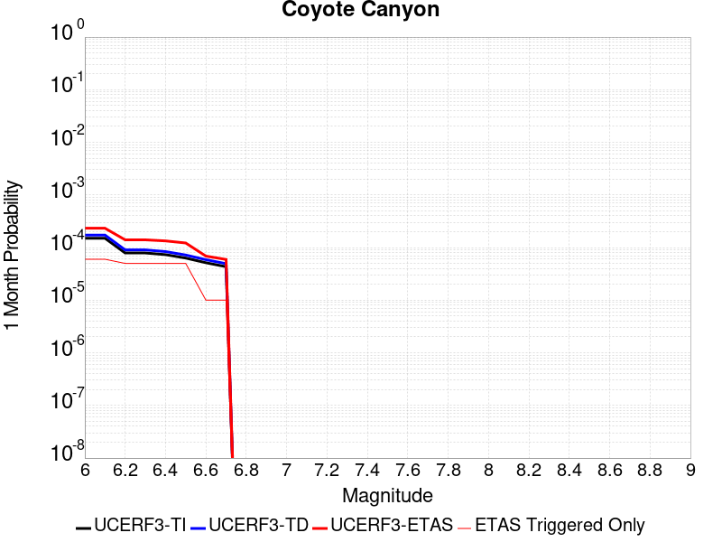 |  |  |

| Magnitude | 1 wk TI Prob | 1 wk TD Prob | 1 wk ETAS Prob | 1 wk ETAS/TD Gain | 1 wk ETAS Triggered Only | 1 mo TI Prob | 1 mo TD Prob | 1 mo ETAS Prob | 1 mo ETAS/TD Gain | 1 mo ETAS Triggered Only | 1 yr TI Prob | 1 yr TD Prob | 1 yr ETAS Prob | 1 yr ETAS/TD Gain | 1 yr ETAS Triggered Only | 10 yr TI Prob | 10 yr TD Prob | 10 yr ETAS Prob | 10 yr ETAS/TD Gain | 10 yr ETAS Triggered Only |
|-----|-----|-----|-----|-----|-----|-----|-----|-----|-----|-----|-----|-----|-----|-----|-----|-----|-----|-----|-----|-----|
| 6.0 | 3.5090034E-5 | 4.0372353E-5 | 7.037114E-5 | 1.7430527 | 3.0E-5 | 1.503772E-4 | 1.7301434E-4 | 2.3300396E-4 | 1.346732 | 6.0E-5 | 0.0018293047 | 0.0021046721 | 0.0025936407 | 1.2323253 | 4.9E-4 | 0.018143194 | 0.020873329 | 0.022283271 | 1.0675476 | 0.00144 |
| 6.1 | 3.5090034E-5 | 4.0372353E-5 | 7.037114E-5 | 1.7430527 | 3.0E-5 | 1.503772E-4 | 1.7301434E-4 | 2.3300396E-4 | 1.346732 | 6.0E-5 | 0.0018293047 | 0.0021046721 | 0.0025936407 | 1.2323253 | 4.9E-4 | 0.018143194 | 0.020873329 | 0.022283271 | 1.0675476 | 0.00144 |
| 6.2 | 1.841879E-5 | 2.10638E-5 | 4.106338E-5 | 1.9494762 | 2.0E-5 | 7.8935285E-5 | 9.027088E-5 | 1.4026636E-4 | 1.5538385 | 5.0E-5 | 9.606133E-4 | 0.0010985958 | 0.0013583102 | 1.2364057 | 2.6E-4 | 0.0095647145 | 0.010941739 | 0.011663752 | 1.065987 | 7.3E-4 |
| 6.3 | 1.841879E-5 | 2.10638E-5 | 4.106338E-5 | 1.9494762 | 2.0E-5 | 7.8935285E-5 | 9.027088E-5 | 1.4026636E-4 | 1.5538385 | 5.0E-5 | 9.606133E-4 | 0.0010985958 | 0.0013583102 | 1.2364057 | 2.6E-4 | 0.0095647145 | 0.010941739 | 0.011663752 | 1.065987 | 7.3E-4 |
| 6.4 | 1.712201E-5 | 1.9568917E-5 | 3.9568524E-5 | 2.022009 | 2.0E-5 | 7.337798E-5 | 8.386466E-5 | 1.3386046E-4 | 1.5961487 | 5.0E-5 | 8.930107E-4 | 0.0010206745 | 0.001280409 | 1.2544736 | 2.6E-4 | 0.008894307 | 0.010169788 | 0.010882466 | 1.0700779 | 7.2E-4 |
| 6.5 | 1.4744935E-5 | 1.6840142E-5 | 3.6839803E-5 | 2.1876185 | 2.0E-5 | 6.3191044E-5 | 7.2170566E-5 | 1.2216695E-4 | 1.6927532 | 5.0E-5 | 7.6907943E-4 | 8.7841594E-4 | 0.0010882315 | 1.2388567 | 2.1E-4 | 0.007664232 | 0.008758638 | 0.0093632955 | 1.0690355 | 6.1E-4 |
| 6.6 | 1.2017839E-5 | 1.3726675E-5 | 2.3726538E-5 | 1.7284986 | 1.0E-5 | 5.150401E-5 | 5.882778E-5 | 6.882719E-5 | 1.1699777 | 1.0E-5 | 6.268809E-4 | 7.160815E-4 | 8.559812E-4 | 1.1953685 | 1.4E-4 | 0.0062511545 | 0.007146437 | 0.0075832927 | 1.0611291 | 4.4E-4 |
| 6.7 | 1.00956095E-5 | 1.1535696E-5 | 2.1535581E-5 | 1.8668644 | 1.0E-5 | 4.326618E-5 | 4.943825E-5 | 5.943776E-5 | 1.2022625 | 1.0E-5 | 5.266384E-4 | 6.0183153E-4 | 7.3175324E-4 | 1.2158773 | 1.3E-4 | 0.005253921 | 0.006010547 | 0.006368383 | 1.0595347 | 3.6E-4 |

## San Andreas (Mojave S)
*[(top)](#table-of-contents)*

| 1 Week | 1 Month | 1 Year | 10 Year |
|-----|-----|-----|-----|
|  |  |  |  |

| Magnitude | 1 wk TI Prob | 1 wk TD Prob | 1 wk ETAS Prob | 1 wk ETAS/TD Gain | 1 wk ETAS Triggered Only | 1 mo TI Prob | 1 mo TD Prob | 1 mo ETAS Prob | 1 mo ETAS/TD Gain | 1 mo ETAS Triggered Only | 1 yr TI Prob | 1 yr TD Prob | 1 yr ETAS Prob | 1 yr ETAS/TD Gain | 1 yr ETAS Triggered Only | 10 yr TI Prob | 10 yr TD Prob | 10 yr ETAS Prob | 10 yr ETAS/TD Gain | 10 yr ETAS Triggered Only |
|-----|-----|-----|-----|-----|-----|-----|-----|-----|-----|-----|-----|-----|-----|-----|-----|-----|-----|-----|-----|-----|
| 6.0 | 3.1064058E-4 | 6.755789E-4 | 6.755789E-4 | 1.0 | 0.0 | 0.0013306376 | 0.0028922537 | 0.0030019355 | 1.0379226 | 1.1E-4 | 0.016080605 | 0.034670897 | 0.03523079 | 1.0161487 | 5.8E-4 | 0.1496549 | 0.28693774 | 0.287879 | 1.0032803 | 0.00132 |
| 6.1 | 3.1064058E-4 | 6.755789E-4 | 6.755789E-4 | 1.0 | 0.0 | 0.0013306376 | 0.0028922537 | 0.0030019355 | 1.0379226 | 1.1E-4 | 0.016080605 | 0.034670897 | 0.03523079 | 1.0161487 | 5.8E-4 | 0.1496549 | 0.28693774 | 0.287879 | 1.0032803 | 0.00132 |
| 6.2 | 3.1064058E-4 | 6.755789E-4 | 6.755789E-4 | 1.0 | 0.0 | 0.0013306376 | 0.0028922537 | 0.0030019355 | 1.0379226 | 1.1E-4 | 0.016080605 | 0.034670897 | 0.03523079 | 1.0161487 | 5.8E-4 | 0.1496549 | 0.28693774 | 0.287879 | 1.0032803 | 0.00132 |
| 6.3 | 3.1064058E-4 | 6.755789E-4 | 6.755789E-4 | 1.0 | 0.0 | 0.0013306376 | 0.0028922537 | 0.0030019355 | 1.0379226 | 1.1E-4 | 0.016080605 | 0.034670897 | 0.03523079 | 1.0161487 | 5.8E-4 | 0.1496549 | 0.28693774 | 0.287879 | 1.0032803 | 0.00132 |
| 6.4 | 1.9872203E-4 | 4.3271694E-4 | 4.3271694E-4 | 1.0 | 0.0 | 8.5138786E-4 | 0.0018532113 | 0.0019630075 | 1.0592464 | 1.1E-4 | 0.010316478 | 0.022335568 | 0.022843953 | 1.0227612 | 5.2E-4 | 0.098504856 | 0.19735251 | 0.19829963 | 1.0047991 | 0.00118 |
| 6.5 | 1.291105E-4 | 2.8840266E-4 | 2.8840266E-4 | 1.0 | 0.0 | 5.5321335E-4 | 0.0012354287 | 0.0013353052 | 1.0808436 | 1.0E-4 | 0.006714592 | 0.014938438 | 0.015391567 | 1.030333 | 4.6E-4 | 0.065152965 | 0.13839725 | 0.13930193 | 1.0065368 | 0.00105 |
| 6.6 | 1.291105E-4 | 2.8840266E-4 | 2.8840266E-4 | 1.0 | 0.0 | 5.5321335E-4 | 0.0012354287 | 0.0013353052 | 1.0808436 | 1.0E-4 | 0.006714592 | 0.014938438 | 0.015391567 | 1.030333 | 4.6E-4 | 0.065152965 | 0.13839725 | 0.13930193 | 1.0065368 | 0.00105 |
| 6.7 | 1.08001186E-4 | 2.4420145E-4 | 2.4420145E-4 | 1.0 | 0.0 | 4.6278012E-4 | 0.0010461585 | 0.0011460539 | 1.0954878 | 1.0E-4 | 0.0056198016 | 0.012662896 | 0.013117071 | 1.0358666 | 4.6E-4 | 0.054797906 | 0.11954315 | 0.12045002 | 1.0075861 | 0.00103 |
| 6.8 | 1.0624356E-4 | 2.3937564E-4 | 2.3937564E-4 | 1.0 | 0.0 | 4.5525006E-4 | 0.0010254928 | 0.0011253903 | 1.0974141 | 1.0E-4 | 0.0055285925 | 0.012414177 | 0.012868466 | 1.0365944 | 4.6E-4 | 0.053930566 | 0.11749219 | 0.11840118 | 1.0077366 | 0.00103 |
| 6.9 | 1.0393785E-4 | 2.330758E-4 | 2.330758E-4 | 1.0 | 0.0 | 4.4537184E-4 | 9.985144E-4 | 0.0010984145 | 1.1000488 | 1.0E-4 | 0.0054089287 | 0.0120894 | 0.012533959 | 1.0367727 | 4.5E-4 | 0.05279156 | 0.114789546 | 0.11569246 | 1.0078658 | 0.00102 |
| 7.0 | 1.0155622E-4 | 2.2676731E-4 | 2.2676731E-4 | 1.0 | 0.0 | 4.3516833E-4 | 9.714983E-4 | 0.0010714012 | 1.1028337 | 1.0E-4 | 0.005285311 | 0.011764073 | 0.012208779 | 1.0378021 | 4.5E-4 | 0.05161361 | 0.11204931 | 0.11295503 | 1.0080831 | 0.00102 |
| 7.1 | 9.885595E-5 | 2.1964697E-4 | 2.1964697E-4 | 1.0 | 0.0 | 4.2359953E-4 | 9.410049E-4 | 0.0010409108 | 1.1061693 | 1.0E-4 | 0.0051451353 | 0.011396753 | 0.011841624 | 1.039035 | 4.5E-4 | 0.05027629 | 0.10893335 | 0.10984224 | 1.0083436 | 0.00102 |
| 7.2 | 9.6411415E-5 | 2.1327272E-4 | 2.1327272E-4 | 1.0 | 0.0 | 4.1312634E-4 | 9.137061E-4 | 0.0010136147 | 1.1093444 | 1.0E-4 | 0.005018219 | 0.011067813 | 0.011512833 | 1.0402085 | 4.5E-4 | 0.049064007 | 0.106122635 | 0.10703439 | 1.0085915 | 0.00102 |
| 7.3 | 9.1180635E-5 | 1.9553355E-4 | 1.9553355E-4 | 1.0 | 0.0 | 3.907156E-4 | 8.377319E-4 | 9.376481E-4 | 1.11927 | 1.0E-4 | 0.004746591 | 0.010151802 | 0.010587335 | 1.0429021 | 4.4E-4 | 0.046464786 | 0.09831004 | 0.09921173 | 1.0091718 | 0.001 |
| 7.4 | 8.887388E-5 | 1.8800999E-4 | 1.8800999E-4 | 1.0 | 0.0 | 3.8083247E-4 | 8.0550835E-4 | 9.054278E-4 | 1.1240453 | 1.0E-4 | 0.0046267817 | 0.009763064 | 0.010198768 | 1.0446278 | 4.4E-4 | 0.045316286 | 0.09494246 | 0.09584752 | 1.0095327 | 0.001 |
| 7.5 | 8.6750515E-5 | 1.8131707E-4 | 1.8131707E-4 | 1.0 | 0.0 | 3.7173493E-4 | 7.768418E-4 | 8.767641E-4 | 1.1286263 | 1.0E-4 | 0.004516484 | 0.009417119 | 0.009852976 | 1.0462834 | 4.4E-4 | 0.04425787 | 0.09190385 | 0.09281194 | 1.0098809 | 0.001 |
| 7.6 | 8.453092E-5 | 1.7518285E-4 | 1.7518285E-4 | 1.0 | 0.0 | 3.6222505E-4 | 7.505677E-4 | 8.504926E-4 | 1.1331325 | 1.0E-4 | 0.0044011753 | 0.009099949 | 0.009535945 | 1.0479119 | 4.4E-4 | 0.04315024 | 0.08905971 | 0.08997065 | 1.0102284 | 0.001 |
| 7.7 | 8.259102E-5 | 1.7039546E-4 | 1.7039546E-4 | 1.0 | 0.0 | 3.539135E-4 | 7.3006196E-4 | 8.29989E-4 | 1.1368747 | 1.0E-4 | 0.004300386 | 0.008852349 | 0.0092884535 | 1.0492643 | 4.4E-4 | 0.042181134 | 0.08680755 | 0.08772074 | 1.0105197 | 0.001 |
| 7.8 | 7.444844E-5 | 1.535487E-4 | 1.535487E-4 | 1.0 | 0.0 | 3.1902574E-4 | 6.5789995E-4 | 7.4784074E-4 | 1.136709 | 9.0E-5 | 0.0038772223 | 0.007980564 | 0.008357531 | 1.0472357 | 3.8E-4 | 0.03810269 | 0.07861057 | 0.07940296 | 1.01008 | 8.6E-4 |
| 7.9 | 5.2586525E-5 | 1.0055216E-4 | 1.0055216E-4 | 1.0 | 0.0 | 2.2535135E-4 | 4.308667E-4 | 5.008365E-4 | 1.1623932 | 7.0E-5 | 0.0027402006 | 0.0052331956 | 0.0054619918 | 1.0437202 | 2.3E-4 | 0.027066574 | 0.052427854 | 0.052863736 | 1.008314 | 4.6E-4 |
| 8.0 | 3.379877E-5 | 5.435691E-5 | 5.435691E-5 | 1.0 | 0.0 | 1.4484383E-4 | 2.329374E-4 | 2.629304E-4 | 1.12876 | 3.0E-5 | 0.0017620471 | 0.0028323263 | 0.0028921566 | 1.021124 | 6.0E-5 | 0.017481409 | 0.02897345 | 0.029119106 | 1.0050272 | 1.5E-4 |
| 8.1 | 1.8668277E-5 | 1.9444557E-5 | 1.9444557E-5 | 1.0 | 0.0 | 8.000444E-5 | 8.333116E-5 | 8.333116E-5 | 1.0 | 0.0 | 9.736188E-4 | 0.0010140853 | 0.0010240752 | 1.0098511 | 1.0E-5 | 0.009693642 | 0.010869623 | 0.010889405 | 1.00182 | 2.0E-5 |
| 8.2 | 8.541571E-6 | 5.512696E-6 | 5.512696E-6 | 1.0 | 0.0 | 3.660622E-5 | 2.3625627E-5 | 2.3625627E-5 | 1.0 | 0.0 | 4.455896E-4 | 2.8760414E-4 | 2.8760414E-4 | 1.0 | 0.0 | 0.0044469717 | 0.0032691804 | 0.0032691804 | 1.0 | 0.0 |
| 8.3 | 1.983087E-6 | 7.7486385E-7 | 7.7486385E-7 | 1.0 | 0.0 | 8.498917E-6 | 3.320841E-6 | 3.320841E-6 | 1.0 | 0.0 | 1.034694E-4 | 4.0430506E-5 | 4.0430506E-5 | 1.0 | 0.0 | 0.0010342124 | 4.7705657E-4 | 4.7705657E-4 | 1.0 | 0.0 |

## San Andreas (Mojave N)
*[(top)](#table-of-contents)*

| 1 Week | 1 Month | 1 Year | 10 Year |
|-----|-----|-----|-----|
|  |  |  |  |

| Magnitude | 1 wk TI Prob | 1 wk TD Prob | 1 wk ETAS Prob | 1 wk ETAS/TD Gain | 1 wk ETAS Triggered Only | 1 mo TI Prob | 1 mo TD Prob | 1 mo ETAS Prob | 1 mo ETAS/TD Gain | 1 mo ETAS Triggered Only | 1 yr TI Prob | 1 yr TD Prob | 1 yr ETAS Prob | 1 yr ETAS/TD Gain | 1 yr ETAS Triggered Only | 10 yr TI Prob | 10 yr TD Prob | 10 yr ETAS Prob | 10 yr ETAS/TD Gain | 10 yr ETAS Triggered Only |
|-----|-----|-----|-----|-----|-----|-----|-----|-----|-----|-----|-----|-----|-----|-----|-----|-----|-----|-----|-----|-----|
| 6.0 | 9.877682E-5 | 1.9487888E-4 | 1.9487888E-4 | 1.0 | 0.0 | 4.2326056E-4 | 8.3492807E-4 | 9.4483624E-4 | 1.1316379 | 1.1E-4 | 0.0051410277 | 0.010117998 | 0.010662434 | 1.0538086 | 5.5E-4 | 0.05023708 | 0.09869637 | 0.09986807 | 1.0118717 | 0.0013 |
| 6.1 | 9.877682E-5 | 1.9487888E-4 | 1.9487888E-4 | 1.0 | 0.0 | 4.2326056E-4 | 8.3492807E-4 | 9.4483624E-4 | 1.1316379 | 1.1E-4 | 0.0051410277 | 0.010117998 | 0.010662434 | 1.0538086 | 5.5E-4 | 0.05023708 | 0.09869637 | 0.09986807 | 1.0118717 | 0.0013 |
| 6.2 | 9.877682E-5 | 1.9487888E-4 | 1.9487888E-4 | 1.0 | 0.0 | 4.2326056E-4 | 8.3492807E-4 | 9.4483624E-4 | 1.1316379 | 1.1E-4 | 0.0051410277 | 0.010117998 | 0.010662434 | 1.0538086 | 5.5E-4 | 0.05023708 | 0.09869637 | 0.09986807 | 1.0118717 | 0.0013 |
| 6.3 | 9.877682E-5 | 1.9487888E-4 | 1.9487888E-4 | 1.0 | 0.0 | 4.2326056E-4 | 8.3492807E-4 | 9.4483624E-4 | 1.1316379 | 1.1E-4 | 0.0051410277 | 0.010117998 | 0.010662434 | 1.0538086 | 5.5E-4 | 0.05023708 | 0.09869637 | 0.09986807 | 1.0118717 | 0.0013 |
| 6.4 | 9.877682E-5 | 1.9487888E-4 | 1.9487888E-4 | 1.0 | 0.0 | 4.2326056E-4 | 8.3492807E-4 | 9.4483624E-4 | 1.1316379 | 1.1E-4 | 0.0051410277 | 0.010117998 | 0.010662434 | 1.0538086 | 5.5E-4 | 0.05023708 | 0.09869637 | 0.09986807 | 1.0118717 | 0.0013 |
| 6.5 | 9.861474E-5 | 1.9461628E-4 | 1.9461628E-4 | 1.0 | 0.0 | 4.2256617E-4 | 8.338034E-4 | 9.4371167E-4 | 1.1318156 | 1.1E-4 | 0.0051326132 | 0.010104432 | 0.010648875 | 1.0538815 | 5.5E-4 | 0.050156746 | 0.09857411 | 0.09974596 | 1.011888 | 0.0013 |
| 6.6 | 9.861474E-5 | 1.9461628E-4 | 1.9461628E-4 | 1.0 | 0.0 | 4.2256617E-4 | 8.338034E-4 | 9.4371167E-4 | 1.1318156 | 1.1E-4 | 0.0051326132 | 0.010104432 | 0.010648875 | 1.0538815 | 5.5E-4 | 0.050156746 | 0.09857411 | 0.09974596 | 1.011888 | 0.0013 |
| 6.7 | 9.8552715E-5 | 1.9451571E-4 | 1.9451571E-4 | 1.0 | 0.0 | 4.223004E-4 | 8.333726E-4 | 9.4328093E-4 | 1.1318837 | 1.1E-4 | 0.0051293927 | 0.010099237 | 0.0106436815 | 1.0539095 | 5.5E-4 | 0.050125998 | 0.09852727 | 0.099699184 | 1.0118943 | 0.0013 |
| 6.8 | 9.8464974E-5 | 1.9436708E-4 | 1.9436708E-4 | 1.0 | 0.0 | 4.219245E-4 | 8.32736E-4 | 9.4264443E-4 | 1.1319847 | 1.1E-4 | 0.0051248376 | 0.010091558 | 0.010636007 | 1.053951 | 5.5E-4 | 0.05008251 | 0.09845722 | 0.09962922 | 1.0119038 | 0.0013 |
| 6.9 | 9.825824E-5 | 1.940467E-4 | 1.940467E-4 | 1.0 | 0.0 | 4.2103877E-4 | 8.313639E-4 | 9.412724E-4 | 1.1322027 | 1.1E-4 | 0.0051141046 | 0.010075007 | 0.010619465 | 1.0540406 | 5.5E-4 | 0.049980022 | 0.098306164 | 0.09947837 | 1.011924 | 0.0013 |
| 7.0 | 9.781462E-5 | 1.9335936E-4 | 1.9335936E-4 | 1.0 | 0.0 | 4.1913814E-4 | 8.2842E-4 | 9.3832886E-4 | 1.1326729 | 1.1E-4 | 0.005091073 | 0.010039495 | 0.0105839735 | 1.0542337 | 5.5E-4 | 0.04976007 | 0.097982235 | 0.09915486 | 1.0119677 | 0.0013 |
| 7.1 | 9.7121134E-5 | 1.9237513E-4 | 1.9237513E-4 | 1.0 | 0.0 | 4.1616702E-4 | 8.242045E-4 | 9.341138E-4 | 1.133352 | 1.1E-4 | 0.005055068 | 0.009988643 | 0.01053315 | 1.0545125 | 5.5E-4 | 0.04941613 | 0.09751831 | 0.09869154 | 1.0120308 | 0.0013 |
| 7.2 | 9.663819E-5 | 1.9168199E-4 | 1.9168199E-4 | 1.0 | 0.0 | 4.1409794E-4 | 8.212358E-4 | 9.311455E-4 | 1.1338345 | 1.1E-4 | 0.0050299936 | 0.009952831 | 0.010497357 | 1.0547106 | 5.5E-4 | 0.049176537 | 0.09719127 | 0.09836492 | 1.0120757 | 0.0013 |
| 7.3 | 9.6277574E-5 | 1.912059E-4 | 1.912059E-4 | 1.0 | 0.0 | 4.125529E-4 | 8.191967E-4 | 9.2910655E-4 | 1.1341679 | 1.1E-4 | 0.0050112694 | 0.009928231 | 0.010472771 | 1.0548476 | 5.5E-4 | 0.04899759 | 0.096964255 | 0.098138206 | 1.012107 | 0.0013 |
| 7.4 | 9.593308E-5 | 1.9060235E-4 | 1.9060235E-4 | 1.0 | 0.0 | 4.1107697E-4 | 8.166117E-4 | 9.265219E-4 | 1.1345929 | 1.1E-4 | 0.0049933824 | 0.009897046 | 0.010441602 | 1.0550221 | 5.5E-4 | 0.04882661 | 0.09668197 | 0.09785628 | 1.0121461 | 0.0013 |
| 7.5 | 9.561707E-5 | 1.9006194E-4 | 1.9006194E-4 | 1.0 | 0.0 | 4.0972308E-4 | 8.1429706E-4 | 9.242075E-4 | 1.1349758 | 1.1E-4 | 0.0049769743 | 0.00986912 | 0.010413692 | 1.0551794 | 5.5E-4 | 0.048669744 | 0.09642772 | 0.09760237 | 1.0121816 | 0.0013 |
| 7.6 | 9.418194E-5 | 1.8657741E-4 | 1.8657741E-4 | 1.0 | 0.0 | 4.0357444E-4 | 7.993726E-4 | 9.092847E-4 | 1.1374979 | 1.1E-4 | 0.004902454 | 0.009689045 | 0.010233716 | 1.0562152 | 5.5E-4 | 0.047957025 | 0.0948077 | 0.09598445 | 1.012412 | 0.0013 |
| 7.7 | 8.202141E-5 | 1.609954E-4 | 1.609954E-4 | 1.0 | 0.0 | 3.51473E-4 | 6.897979E-4 | 7.9972204E-4 | 1.159357 | 1.1E-4 | 0.00427079 | 0.008366007 | 0.008871741 | 1.060451 | 5.1E-4 | 0.04189639 | 0.08258243 | 0.083683334 | 1.0133309 | 0.0012 |
| 7.8 | 7.2859846E-5 | 1.4586812E-4 | 1.4586812E-4 | 1.0 | 0.0 | 3.1221908E-4 | 6.2499935E-4 | 7.149431E-4 | 1.1439102 | 9.0E-5 | 0.003794643 | 0.0075828596 | 0.007959979 | 1.049733 | 3.8E-4 | 0.037304975 | 0.07504203 | 0.0758375 | 1.0106002 | 8.6E-4 |
| 7.9 | 5.3874453E-5 | 1.00950085E-4 | 1.00950085E-4 | 1.0 | 0.0 | 2.3087008E-4 | 4.3257148E-4 | 5.025412E-4 | 1.1617529 | 7.0E-5 | 0.0028072202 | 0.0052538514 | 0.0054826434 | 1.0435474 | 2.3E-4 | 0.02772022 | 0.052655075 | 0.05310033 | 1.008456 | 4.7E-4 |
| 8.0 | 3.468538E-5 | 5.454598E-5 | 5.454598E-5 | 1.0 | 0.0 | 1.4864317E-4 | 2.3374756E-4 | 2.6374054E-4 | 1.1283135 | 3.0E-5 | 0.0018082283 | 0.0028421644 | 0.002901994 | 1.0210507 | 6.0E-5 | 0.017935853 | 0.029087735 | 0.029233372 | 1.0050068 | 1.5E-4 |
| 8.1 | 1.9152367E-5 | 1.9539457E-5 | 1.9539457E-5 | 1.0 | 0.0 | 8.207899E-5 | 8.373785E-5 | 8.373785E-5 | 1.0 | 0.0 | 9.988535E-4 | 0.0010190321 | 0.0010290219 | 1.0098032 | 1.0E-5 | 0.009943757 | 0.010927947 | 0.0109477285 | 1.0018102 | 2.0E-5 |
| 8.2 | 8.643924E-6 | 5.5269165E-6 | 5.5269165E-6 | 1.0 | 0.0 | 3.704486E-5 | 2.368657E-5 | 2.368657E-5 | 1.0 | 0.0 | 4.5092785E-4 | 2.8834594E-4 | 2.8834594E-4 | 1.0 | 0.0 | 0.0045001395 | 0.0032771796 | 0.0032771796 | 1.0 | 0.0 |
| 8.3 | 1.983087E-6 | 7.7486385E-7 | 7.7486385E-7 | 1.0 | 0.0 | 8.498917E-6 | 3.320841E-6 | 3.320841E-6 | 1.0 | 0.0 | 1.034694E-4 | 4.0430506E-5 | 4.0430506E-5 | 1.0 | 0.0 | 0.0010342124 | 4.7705657E-4 | 4.7705657E-4 | 1.0 | 0.0 |

## Death Valley (So)
*[(top)](#table-of-contents)*

| 1 Week | 1 Month | 1 Year | 10 Year |
|-----|-----|-----|-----|
|  |  |  |  |

| Magnitude | 1 wk TI Prob | 1 wk TD Prob | 1 wk ETAS Prob | 1 wk ETAS/TD Gain | 1 wk ETAS Triggered Only | 1 mo TI Prob | 1 mo TD Prob | 1 mo ETAS Prob | 1 mo ETAS/TD Gain | 1 mo ETAS Triggered Only | 1 yr TI Prob | 1 yr TD Prob | 1 yr ETAS Prob | 1 yr ETAS/TD Gain | 1 yr ETAS Triggered Only | 10 yr TI Prob | 10 yr TD Prob | 10 yr ETAS Prob | 10 yr ETAS/TD Gain | 10 yr ETAS Triggered Only |
|-----|-----|-----|-----|-----|-----|-----|-----|-----|-----|-----|-----|-----|-----|-----|-----|-----|-----|-----|-----|-----|
| 6.0 | 2.0684236E-5 | 2.5624238E-5 | 3.562398E-5 | 1.3902456 | 1.0E-5 | 8.864371E-5 | 1.09813634E-4 | 1.6980704E-4 | 1.5463202 | 6.0E-5 | 0.0010787029 | 0.0013361779 | 0.0017556167 | 1.3139094 | 4.2E-4 | 0.010734817 | 0.01328472 | 0.014597051 | 1.098785 | 0.00133 |
| 6.1 | 2.0684236E-5 | 2.5624238E-5 | 3.562398E-5 | 1.3902456 | 1.0E-5 | 8.864371E-5 | 1.09813634E-4 | 1.6980704E-4 | 1.5463202 | 6.0E-5 | 0.0010787029 | 0.0013361779 | 0.0017556167 | 1.3139094 | 4.2E-4 | 0.010734817 | 0.01328472 | 0.014597051 | 1.098785 | 0.00133 |
| 6.2 | 2.0684236E-5 | 2.5624238E-5 | 3.562398E-5 | 1.3902456 | 1.0E-5 | 8.864371E-5 | 1.09813634E-4 | 1.6980704E-4 | 1.5463202 | 6.0E-5 | 0.0010787029 | 0.0013361779 | 0.0017556167 | 1.3139094 | 4.2E-4 | 0.010734817 | 0.01328472 | 0.014597051 | 1.098785 | 0.00133 |
| 6.3 | 2.0240292E-5 | 2.5124238E-5 | 3.5123987E-5 | 1.398012 | 1.0E-5 | 8.6741224E-5 | 1.0767096E-4 | 1.676645E-4 | 1.5571933 | 6.0E-5 | 0.0010555626 | 0.0013101223 | 0.0017095983 | 1.304915 | 4.0E-4 | 0.010505628 | 0.013027237 | 0.014300432 | 1.0977333 | 0.00129 |
| 6.4 | 2.0240292E-5 | 2.5124238E-5 | 3.5123987E-5 | 1.398012 | 1.0E-5 | 8.6741224E-5 | 1.0767096E-4 | 1.676645E-4 | 1.5571933 | 6.0E-5 | 0.0010555626 | 0.0013101223 | 0.0017095983 | 1.304915 | 4.0E-4 | 0.010505628 | 0.013027237 | 0.014300432 | 1.0977333 | 0.00129 |
| 6.5 | 1.9962767E-5 | 2.4813442E-5 | 3.4813194E-5 | 1.4029974 | 1.0E-5 | 8.55519E-5 | 1.0633908E-4 | 1.5633377E-4 | 1.470144 | 5.0E-5 | 0.0010410968 | 0.0012939262 | 0.0016834214 | 1.3010182 | 3.9E-4 | 0.010362327 | 0.012867158 | 0.014120817 | 1.097431 | 0.00127 |
| 6.6 | 1.8937297E-5 | 2.3317003E-5 | 3.331677E-5 | 1.4288616 | 1.0E-5 | 8.115732E-5 | 9.992627E-5 | 1.4992127E-4 | 1.5003189 | 5.0E-5 | 9.876423E-4 | 0.0012159379 | 0.001585488 | 1.3039218 | 3.7E-4 | 0.009832645 | 0.012095899 | 0.01321223 | 1.09229 | 0.00113 |
| 6.7 | 1.8621096E-5 | 2.2917578E-5 | 3.291735E-5 | 1.4363363 | 1.0E-5 | 7.980225E-5 | 9.821458E-5 | 1.4820967E-4 | 1.5090394 | 5.0E-5 | 9.711593E-4 | 0.0011951211 | 0.0015646789 | 1.3092221 | 3.7E-4 | 0.009669261 | 0.011889981 | 0.012976902 | 1.0914148 | 0.0011 |
| 6.8 | 1.7830353E-5 | 2.1811285E-5 | 3.181107E-5 | 1.4584682 | 1.0E-5 | 7.641356E-5 | 9.347367E-5 | 1.4346899E-4 | 1.53486 | 5.0E-5 | 9.29938E-4 | 0.0011374619 | 0.001477075 | 1.2985711 | 3.4E-4 | 0.009260561 | 0.011319241 | 0.012327694 | 1.089092 | 0.00102 |
| 6.9 | 1.3135183E-5 | 1.5307089E-5 | 2.5306936E-5 | 1.653282 | 1.0E-5 | 5.6292425E-5 | 6.5600194E-5 | 9.5598225E-5 | 1.4572858 | 3.0E-5 | 6.8514474E-4 | 7.983962E-4 | 0.0010481966 | 1.3128778 | 2.5E-4 | 0.006830362 | 0.007956286 | 0.008620955 | 1.0835402 | 6.7E-4 |
| 7.0 | 1.1507512E-5 | 1.3156645E-5 | 2.3156514E-5 | 1.7600622 | 1.0E-5 | 4.9316975E-5 | 5.6384437E-5 | 7.638331E-5 | 1.3546878 | 2.0E-5 | 6.002687E-4 | 6.8627007E-4 | 8.461603E-4 | 1.2329844 | 1.6E-4 | 0.0059864987 | 0.0068422095 | 0.0073089935 | 1.0682212 | 4.7E-4 |
| 7.1 | 9.715903E-6 | 1.08670365E-5 | 2.0866928E-5 | 1.9202042 | 1.0E-5 | 4.1638916E-5 | 4.6572204E-5 | 6.657127E-5 | 1.4294207 | 2.0E-5 | 5.068359E-4 | 5.6687335E-4 | 6.568223E-4 | 1.1586757 | 9.0E-5 | 0.0050568148 | 0.005654727 | 0.0058635394 | 1.0369271 | 2.1E-4 |
| 7.2 | 9.233269E-6 | 1.0287937E-5 | 2.0287835E-5 | 1.9720021 | 1.0E-5 | 3.9570554E-5 | 4.4090437E-5 | 6.408955E-5 | 1.4535931 | 2.0E-5 | 4.81665E-4 | 5.3667306E-4 | 6.066355E-4 | 1.1303632 | 7.0E-5 | 0.0048062233 | 0.005354202 | 0.0055133454 | 1.029723 | 1.6E-4 |
| 7.3 | 8.8041315E-6 | 9.809655E-6 | 1.9809557E-5 | 2.019394 | 1.0E-5 | 3.7731446E-5 | 4.2040723E-5 | 6.2039886E-5 | 1.4757092 | 2.0E-5 | 4.592835E-4 | 5.117298E-4 | 5.716991E-4 | 1.1171894 | 6.0E-5 | 0.0045833546 | 0.0051059416 | 0.0052352776 | 1.0253305 | 1.3E-4 |
| 7.4 | 8.708749E-6 | 9.708658E-6 | 1.9708561E-5 | 2.0299985 | 1.0E-5 | 3.7322676E-5 | 4.1607895E-5 | 6.160706E-5 | 1.480658 | 2.0E-5 | 4.5430884E-4 | 5.064626E-4 | 5.664322E-4 | 1.1184088 | 6.0E-5 | 0.004533812 | 0.0050535095 | 0.0051828525 | 1.0255947 | 1.3E-4 |
| 7.5 | 8.612678E-6 | 9.606291E-6 | 1.9606196E-5 | 2.0409744 | 1.0E-5 | 3.6910955E-5 | 4.1169194E-5 | 6.116837E-5 | 1.4857801 | 2.0E-5 | 4.492982E-4 | 5.0112384E-4 | 5.610938E-4 | 1.1196709 | 6.0E-5 | 0.004483909 | 0.005000364 | 0.005129714 | 1.025868 | 1.3E-4 |
| 7.6 | 8.319024E-6 | 9.28535E-6 | 1.9285257E-5 | 2.0769553 | 1.0E-5 | 3.5652476E-5 | 3.9793773E-5 | 5.979298E-5 | 1.5025712 | 2.0E-5 | 4.3398244E-4 | 4.843857E-4 | 5.4435665E-4 | 1.1238083 | 6.0E-5 | 0.0043313587 | 0.004833723 | 0.0049332394 | 1.020588 | 1.0E-4 |
| 7.7 | 7.4718328E-6 | 8.346468E-6 | 1.8346385E-5 | 2.1981015 | 1.0E-5 | 3.2021748E-5 | 3.577011E-5 | 4.5769753E-5 | 1.279553 | 1.0E-5 | 3.8979502E-4 | 4.3541813E-4 | 4.6540506E-4 | 1.0688692 | 3.0E-5 | 0.00389112 | 0.0043460554 | 0.004415751 | 1.0160365 | 7.0E-5 |
| 7.8 | 3.4586725E-7 | 3.648528E-7 | 3.648528E-7 | 1.0 | 0.0 | 1.4822873E-6 | 1.563654E-6 | 1.563654E-6 | 1.0 | 0.0 | 1.80467E-5 | 1.9037325E-5 | 1.9037325E-5 | 1.0 | 0.0 | 1.8045233E-4 | 1.9035739E-4 | 1.9035739E-4 | 1.0 | 0.0 |
| 7.9 | 2.5591178E-9 | 2.6698248E-9 | 2.6698248E-9 | 1.0 | 0.0 | 1.0967647E-8 | 1.1442106E-8 | 1.1442106E-8 | 1.0 | 0.0 | 1.335311E-7 | 1.3930764E-7 | 1.3930764E-7 | 1.0 | 0.0 | 1.3353102E-6 | 1.3930764E-6 | 1.3930764E-6 | 1.0 | 0.0 |

## Nelson Lake
*[(top)](#table-of-contents)*

| 1 Week | 1 Month | 1 Year | 10 Year |
|-----|-----|-----|-----|
|  |  |  |  |

| Magnitude | 1 wk TI Prob | 1 wk TD Prob | 1 wk ETAS Prob | 1 wk ETAS/TD Gain | 1 wk ETAS Triggered Only | 1 mo TI Prob | 1 mo TD Prob | 1 mo ETAS Prob | 1 mo ETAS/TD Gain | 1 mo ETAS Triggered Only | 1 yr TI Prob | 1 yr TD Prob | 1 yr ETAS Prob | 1 yr ETAS/TD Gain | 1 yr ETAS Triggered Only | 10 yr TI Prob | 10 yr TD Prob | 10 yr ETAS Prob | 10 yr ETAS/TD Gain | 10 yr ETAS Triggered Only |
|-----|-----|-----|-----|-----|-----|-----|-----|-----|-----|-----|-----|-----|-----|-----|-----|-----|-----|-----|-----|-----|
| 6.0 | 9.913453E-6 | 1.0192636E-5 | 1.0192636E-5 | 1.0 | 0.0 | 4.2485535E-5 | 4.3682052E-5 | 6.368118E-5 | 1.4578339 | 2.0E-5 | 5.1713863E-4 | 5.317096E-4 | 8.3155005E-4 | 1.5639178 | 3.0E-4 | 0.0051593683 | 0.0053054015 | 0.006310043 | 1.189362 | 0.00101 |
| 6.1 | 9.913453E-6 | 1.0192636E-5 | 1.0192636E-5 | 1.0 | 0.0 | 4.2485535E-5 | 4.3682052E-5 | 6.368118E-5 | 1.4578339 | 2.0E-5 | 5.1713863E-4 | 5.317096E-4 | 8.3155005E-4 | 1.5639178 | 3.0E-4 | 0.0051593683 | 0.0053054015 | 0.006310043 | 1.189362 | 0.00101 |
| 6.2 | 4.5596407E-6 | 4.6965E-6 | 4.6965E-6 | 1.0 | 0.0 | 1.954117E-5 | 2.0127709E-5 | 4.0127306E-5 | 1.993635 | 2.0E-5 | 2.3788778E-4 | 2.4502858E-4 | 4.1498692E-4 | 1.6936266 | 1.7E-4 | 0.0023763329 | 0.0024477101 | 0.0028766578 | 1.1752443 | 4.3E-4 |
| 6.3 | 4.5596407E-6 | 4.6965E-6 | 4.6965E-6 | 1.0 | 0.0 | 1.954117E-5 | 2.0127709E-5 | 4.0127306E-5 | 1.993635 | 2.0E-5 | 2.3788778E-4 | 2.4502858E-4 | 4.1498692E-4 | 1.6936266 | 1.7E-4 | 0.0023763329 | 0.0024477101 | 0.0028766578 | 1.1752443 | 4.3E-4 |
| 6.4 | 3.4025713E-6 | 3.5100445E-6 | 3.5100445E-6 | 1.0 | 0.0 | 1.4582367E-5 | 1.5042965E-5 | 3.5042664E-5 | 2.3295052 | 2.0E-5 | 1.7752586E-4 | 1.8313355E-4 | 3.1310975E-4 | 1.7097344 | 1.3E-4 | 0.001773841 | 0.0018299093 | 0.0021293603 | 1.1636425 | 3.0E-4 |
| 6.5 | 2.8352947E-6 | 2.9279831E-6 | 2.9279831E-6 | 1.0 | 0.0 | 1.2151207E-5 | 1.2548443E-5 | 3.2548192E-5 | 2.5938032 | 2.0E-5 | 1.479309E-4 | 1.5276733E-4 | 2.5275207E-4 | 1.6544902 | 1.0E-4 | 0.0014783246 | 0.0015266971 | 0.0017563459 | 1.150422 | 2.3E-4 |
| 6.6 | 2.251518E-6 | 2.329174E-6 | 2.329174E-6 | 1.0 | 0.0 | 9.649328E-6 | 9.982141E-6 | 1.998204E-5 | 2.001779 | 1.0E-5 | 1.1747423E-4 | 1.2152641E-4 | 1.7152034E-4 | 1.4113832 | 5.0E-5 | 0.0011741214 | 0.0012146613 | 0.0013644791 | 1.1233412 | 1.5E-4 |
| 6.7 | 1.8911853E-6 | 1.9592333E-6 | 1.9592333E-6 | 1.0 | 0.0 | 8.105055E-6 | 8.39669E-6 | 8.39669E-6 | 1.0 | 0.0 | 9.867457E-5 | 1.02225495E-4 | 1.422214E-4 | 1.3912518 | 4.0E-5 | 9.863076E-4 | 0.0010218422 | 0.0011417196 | 1.1173149 | 1.2E-4 |
| 6.8 | 1.4874814E-6 | 1.5439082E-6 | 1.5439082E-6 | 1.0 | 0.0 | 6.374905E-6 | 6.6167354E-6 | 6.6167354E-6 | 1.0 | 0.0 | 7.76117E-5 | 8.0556296E-5 | 1.1055388E-4 | 1.3723804 | 3.0E-5 | 7.75846E-4 | 8.053221E-4 | 9.152335E-4 | 1.1364813 | 1.1E-4 |
| 6.9 | 6.835972E-7 | 7.140349E-7 | 7.140349E-7 | 1.0 | 0.0 | 2.9296991E-6 | 3.060148E-6 | 3.060148E-6 | 1.0 | 0.0 | 3.56685E-5 | 3.725698E-5 | 4.725661E-5 | 1.268396 | 1.0E-5 | 3.5662777E-4 | 3.7253863E-4 | 4.2252E-4 | 1.1341642 | 5.0E-5 |

## Lenwood-Lockhart-Old Woman Springs
*[(top)](#table-of-contents)*

| 1 Week | 1 Month | 1 Year | 10 Year |
|-----|-----|-----|-----|
|  |  |  |  |

| Magnitude | 1 wk TI Prob | 1 wk TD Prob | 1 wk ETAS Prob | 1 wk ETAS/TD Gain | 1 wk ETAS Triggered Only | 1 mo TI Prob | 1 mo TD Prob | 1 mo ETAS Prob | 1 mo ETAS/TD Gain | 1 mo ETAS Triggered Only | 1 yr TI Prob | 1 yr TD Prob | 1 yr ETAS Prob | 1 yr ETAS/TD Gain | 1 yr ETAS Triggered Only | 10 yr TI Prob | 10 yr TD Prob | 10 yr ETAS Prob | 10 yr ETAS/TD Gain | 10 yr ETAS Triggered Only |
|-----|-----|-----|-----|-----|-----|-----|-----|-----|-----|-----|-----|-----|-----|-----|-----|-----|-----|-----|-----|-----|
| 6.0 | 3.744542E-5 | 4.3966986E-5 | 4.3966986E-5 | 1.0 | 0.0 | 1.604705E-4 | 1.884173E-4 | 1.9841542E-4 | 1.0530636 | 1.0E-5 | 0.0019519776 | 0.0022917395 | 0.0026309602 | 1.148019 | 3.4E-4 | 0.019349206 | 0.022699071 | 0.023705691 | 1.0443463 | 0.00103 |
| 6.1 | 3.744542E-5 | 4.3966986E-5 | 4.3966986E-5 | 1.0 | 0.0 | 1.604705E-4 | 1.884173E-4 | 1.9841542E-4 | 1.0530636 | 1.0E-5 | 0.0019519776 | 0.0022917395 | 0.0026309602 | 1.148019 | 3.4E-4 | 0.019349206 | 0.022699071 | 0.023705691 | 1.0443463 | 0.00103 |
| 6.2 | 3.744542E-5 | 4.3966986E-5 | 4.3966986E-5 | 1.0 | 0.0 | 1.604705E-4 | 1.884173E-4 | 1.9841542E-4 | 1.0530636 | 1.0E-5 | 0.0019519776 | 0.0022917395 | 0.0026309602 | 1.148019 | 3.4E-4 | 0.019349206 | 0.022699071 | 0.023705691 | 1.0443463 | 0.00103 |
| 6.3 | 2.1079984E-5 | 2.535506E-5 | 2.535506E-5 | 1.0 | 0.0 | 9.0339665E-5 | 1.0866013E-4 | 1.0866013E-4 | 1.0 | 0.0 | 0.0010993304 | 0.0013221542 | 0.0014120352 | 1.0679808 | 9.0E-5 | 0.010939079 | 0.013145096 | 0.013559574 | 1.0315311 | 4.2E-4 |
| 6.4 | 2.1079984E-5 | 2.535506E-5 | 2.535506E-5 | 1.0 | 0.0 | 9.0339665E-5 | 1.0866013E-4 | 1.0866013E-4 | 1.0 | 0.0 | 0.0010993304 | 0.0013221542 | 0.0014120352 | 1.0679808 | 9.0E-5 | 0.010939079 | 0.013145096 | 0.013559574 | 1.0315311 | 4.2E-4 |
| 6.5 | 1.7397282E-5 | 2.0663669E-5 | 2.0663669E-5 | 1.0 | 0.0 | 7.455765E-5 | 8.855564E-5 | 8.855564E-5 | 1.0 | 0.0 | 9.073613E-4 | 0.0010776434 | 0.0011475679 | 1.0648866 | 7.0E-5 | 0.009036654 | 0.01072547 | 0.01101236 | 1.0267484 | 2.9E-4 |
| 6.6 | 1.52050325E-5 | 1.768075E-5 | 1.768075E-5 | 1.0 | 0.0 | 6.51628E-5 | 7.5772485E-5 | 7.5772485E-5 | 1.0 | 0.0 | 7.9306826E-4 | 9.221474E-4 | 9.820921E-4 | 1.0650055 | 6.0E-5 | 0.007902439 | 0.009184072 | 0.009461501 | 1.0302075 | 2.8E-4 |
| 6.7 | 1.332523E-5 | 1.5264892E-5 | 1.5264892E-5 | 1.0 | 0.0 | 5.7106878E-5 | 6.541936E-5 | 6.541936E-5 | 1.0 | 0.0 | 6.950544E-4 | 7.9619547E-4 | 8.361636E-4 | 1.0501989 | 4.0E-5 | 0.006928845 | 0.007934059 | 0.008162234 | 1.028759 | 2.3E-4 |
| 6.8 | 1.1525329E-5 | 1.3031687E-5 | 1.3031687E-5 | 1.0 | 0.0 | 4.9393333E-5 | 5.5848912E-5 | 5.5848912E-5 | 1.0 | 0.0 | 6.011979E-4 | 6.797526E-4 | 7.0973224E-4 | 1.0441037 | 3.0E-5 | 0.00599574 | 0.0067771855 | 0.006955966 | 1.0263797 | 1.8E-4 |
| 6.9 | 1.0253909E-5 | 1.15150315E-5 | 1.15150315E-5 | 1.0 | 0.0 | 4.3944583E-5 | 4.9349223E-5 | 4.9349223E-5 | 1.0 | 0.0 | 5.3489394E-4 | 6.0066476E-4 | 6.306467E-4 | 1.0499147 | 3.0E-5 | 0.0053360825 | 0.0059907916 | 0.006139893 | 1.0248884 | 1.5E-4 |
| 7.0 | 8.104563E-6 | 8.991697E-6 | 8.991697E-6 | 1.0 | 0.0 | 3.4733377E-5 | 3.8535287E-5 | 3.8535287E-5 | 1.0 | 0.0 | 4.2279682E-4 | 4.6906853E-4 | 4.8905914E-4 | 1.0426177 | 2.0E-5 | 0.0042199334 | 0.0046810326 | 0.0047805645 | 1.0212628 | 1.0E-4 |
| 7.1 | 6.7986157E-6 | 7.516141E-6 | 7.516141E-6 | 1.0 | 0.0 | 2.91366E-5 | 3.2211647E-5 | 3.2211647E-5 | 1.0 | 0.0 | 3.5468035E-4 | 3.9210837E-4 | 3.9210837E-4 | 1.0 | 0.0 | 0.003541148 | 0.003914382 | 0.0039841076 | 1.0178127 | 7.0E-5 |
| 7.2 | 5.6893327E-6 | 6.2802674E-6 | 6.2802674E-6 | 1.0 | 0.0 | 2.4382627E-5 | 2.6915166E-5 | 2.6915166E-5 | 1.0 | 0.0 | 2.9681803E-4 | 3.2764484E-4 | 3.2764484E-4 | 1.0 | 0.0 | 0.002964219 | 0.0032718165 | 0.0033415875 | 1.0213249 | 7.0E-5 |
| 7.3 | 4.253348E-6 | 4.707076E-6 | 4.707076E-6 | 1.0 | 0.0 | 1.8228506E-5 | 2.0173036E-5 | 2.0173036E-5 | 1.0 | 0.0 | 2.2190946E-4 | 2.455809E-4 | 2.455809E-4 | 1.0 | 0.0 | 0.00221688 | 0.002453276 | 0.0025231042 | 1.0284632 | 7.0E-5 |
| 7.4 | 2.5448119E-6 | 2.852129E-6 | 2.852129E-6 | 1.0 | 0.0 | 1.0906291E-5 | 1.2223362E-5 | 1.2223362E-5 | 1.0 | 0.0 | 1.3277601E-4 | 1.4881093E-4 | 1.4881093E-4 | 1.0 | 0.0 | 0.001326967 | 0.0014872749 | 0.0015372005 | 1.0335685 | 5.0E-5 |
| 7.5 | 4.3706837E-8 | 4.5631754E-8 | 4.5631754E-8 | 1.0 | 0.0 | 1.8731501E-7 | 1.9556464E-7 | 1.9556464E-7 | 1.0 | 0.0 | 2.2805577E-6 | 2.3809976E-6 | 2.3809976E-6 | 1.0 | 0.0 | 2.2805343E-5 | 2.3809775E-5 | 3.3809538E-5 | 1.4199855 | 1.0E-5 |

## Towne Pass
*[(top)](#table-of-contents)*

| 1 Week | 1 Month | 1 Year | 10 Year |
|-----|-----|-----|-----|
|  |  | 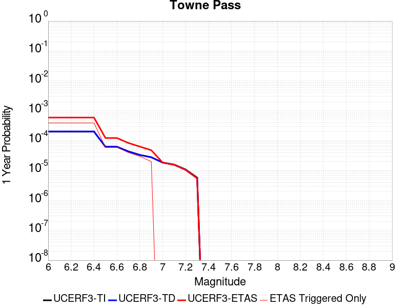 |  |

| Magnitude | 1 wk TI Prob | 1 wk TD Prob | 1 wk ETAS Prob | 1 wk ETAS/TD Gain | 1 wk ETAS Triggered Only | 1 mo TI Prob | 1 mo TD Prob | 1 mo ETAS Prob | 1 mo ETAS/TD Gain | 1 mo ETAS Triggered Only | 1 yr TI Prob | 1 yr TD Prob | 1 yr ETAS Prob | 1 yr ETAS/TD Gain | 1 yr ETAS Triggered Only | 10 yr TI Prob | 10 yr TD Prob | 10 yr ETAS Prob | 10 yr ETAS/TD Gain | 10 yr ETAS Triggered Only |
|-----|-----|-----|-----|-----|-----|-----|-----|-----|-----|-----|-----|-----|-----|-----|-----|-----|-----|-----|-----|-----|
| 6.0 | 3.849728E-6 | 3.8946237E-6 | 1.3894585E-5 | 3.5676322 | 1.0E-5 | 1.649873E-5 | 1.6691163E-5 | 5.6690496E-5 | 3.3964376 | 4.0E-5 | 2.0085352E-4 | 2.0320032E-4 | 5.931211E-4 | 2.9188983 | 3.9E-4 | 0.0020067208 | 0.0020305745 | 0.0030385235 | 1.4963862 | 0.00101 |
| 6.1 | 3.849728E-6 | 3.8946237E-6 | 1.3894585E-5 | 3.5676322 | 1.0E-5 | 1.649873E-5 | 1.6691163E-5 | 5.6690496E-5 | 3.3964376 | 4.0E-5 | 2.0085352E-4 | 2.0320032E-4 | 5.931211E-4 | 2.9188983 | 3.9E-4 | 0.0020067208 | 0.0020305745 | 0.0030385235 | 1.4963862 | 0.00101 |
| 6.2 | 3.849728E-6 | 3.8946237E-6 | 1.3894585E-5 | 3.5676322 | 1.0E-5 | 1.649873E-5 | 1.6691163E-5 | 5.6690496E-5 | 3.3964376 | 4.0E-5 | 2.0085352E-4 | 2.0320032E-4 | 5.931211E-4 | 2.9188983 | 3.9E-4 | 0.0020067208 | 0.0020305745 | 0.0030385235 | 1.4963862 | 0.00101 |
| 6.3 | 3.849728E-6 | 3.8946237E-6 | 1.3894585E-5 | 3.5676322 | 1.0E-5 | 1.649873E-5 | 1.6691163E-5 | 5.6690496E-5 | 3.3964376 | 4.0E-5 | 2.0085352E-4 | 2.0320032E-4 | 5.931211E-4 | 2.9188983 | 3.9E-4 | 0.0020067208 | 0.0020305745 | 0.0030385235 | 1.4963862 | 0.00101 |
| 6.4 | 3.849728E-6 | 3.8946237E-6 | 1.3894585E-5 | 3.5676322 | 1.0E-5 | 1.649873E-5 | 1.6691163E-5 | 5.6690496E-5 | 3.3964376 | 4.0E-5 | 2.0085352E-4 | 2.0320032E-4 | 5.931211E-4 | 2.9188983 | 3.9E-4 | 0.0020067208 | 0.0020305745 | 0.0030385235 | 1.4963862 | 0.00101 |
| 6.5 | 1.1953545E-6 | 1.2030846E-6 | 1.2030846E-6 | 1.0 | 0.0 | 5.1229376E-6 | 5.156067E-6 | 5.156067E-6 | 1.0 | 0.0 | 6.236998E-5 | 6.2773426E-5 | 1.2276966E-4 | 1.9557585 | 6.0E-5 | 6.235248E-4 | 6.275687E-4 | 7.674808E-4 | 1.2229432 | 1.4E-4 |
| 6.6 | 1.1953545E-6 | 1.2030846E-6 | 1.2030846E-6 | 1.0 | 0.0 | 5.1229376E-6 | 5.156067E-6 | 5.156067E-6 | 1.0 | 0.0 | 6.236998E-5 | 6.2773426E-5 | 1.2276966E-4 | 1.9557585 | 6.0E-5 | 6.235248E-4 | 6.275687E-4 | 7.674808E-4 | 1.2229432 | 1.4E-4 |
| 6.7 | 8.375951E-7 | 8.410939E-7 | 8.410939E-7 | 1.0 | 0.0 | 3.5896885E-6 | 3.6046833E-6 | 3.6046833E-6 | 1.0 | 0.0 | 4.370358E-5 | 4.3886193E-5 | 8.388444E-5 | 1.9114083 | 4.0E-5 | 4.3694986E-4 | 4.38781E-4 | 5.287415E-4 | 1.2050238 | 9.0E-5 |
| 6.8 | 6.38041E-7 | 6.3923943E-7 | 6.3923943E-7 | 1.0 | 0.0 | 2.7344586E-6 | 2.7395947E-6 | 2.7395947E-6 | 1.0 | 0.0 | 3.3291526E-5 | 3.3354096E-5 | 6.3353094E-5 | 1.8994098 | 3.0E-5 | 3.3286537E-4 | 3.334947E-4 | 3.7348137E-4 | 1.1199019 | 4.0E-5 |
| 6.9 | 5.3460053E-7 | 5.345554E-7 | 5.345554E-7 | 1.0 | 0.0 | 2.2911431E-6 | 2.2909499E-6 | 2.2909499E-6 | 1.0 | 0.0 | 2.789431E-5 | 2.7891992E-5 | 4.7891433E-5 | 1.7170317 | 2.0E-5 | 2.789081E-4 | 2.7888824E-4 | 2.9888266E-4 | 1.0716933 | 2.0E-5 |
| 7.0 | 3.557783E-7 | 3.5326104E-7 | 3.5326104E-7 | 1.0 | 0.0 | 1.5247632E-6 | 1.513975E-6 | 1.513975E-6 | 1.0 | 0.0 | 1.8563835E-5 | 1.8432498E-5 | 1.8432498E-5 | 1.0 | 0.0 | 1.8562283E-4 | 1.8431054E-4 | 1.8431054E-4 | 1.0 | 0.0 |
| 7.1 | 3.037942E-7 | 3.000393E-7 | 3.000393E-7 | 1.0 | 0.0 | 1.3019744E-6 | 1.285882E-6 | 1.285882E-6 | 1.0 | 0.0 | 1.5851423E-5 | 1.5655509E-5 | 1.5655509E-5 | 1.0 | 0.0 | 1.5850292E-4 | 1.565448E-4 | 1.565448E-4 | 1.0 | 0.0 |
| 7.2 | 2.0808248E-7 | 2.0219096E-7 | 2.0219096E-7 | 1.0 | 0.0 | 8.917818E-7 | 8.665324E-7 | 8.665324E-7 | 1.0 | 0.0 | 1.0857389E-5 | 1.0549986E-5 | 1.0549986E-5 | 1.0 | 0.0 | 1.0856859E-4 | 1.0549531E-4 | 1.0549531E-4 | 1.0 | 0.0 |
| 7.3 | 1.1162073E-7 | 1.0637787E-7 | 1.0637787E-7 | 1.0 | 0.0 | 4.7837443E-7 | 4.5590508E-7 | 4.5590508E-7 | 1.0 | 0.0 | 5.8241935E-6 | 5.550632E-6 | 5.550632E-6 | 1.0 | 0.0 | 5.8240406E-5 | 5.5505137E-5 | 5.5505137E-5 | 1.0 | 0.0 |

## Bicycle Lake
*[(top)](#table-of-contents)*

| 1 Week | 1 Month | 1 Year | 10 Year |
|-----|-----|-----|-----|
|  |  |  |  |

| Magnitude | 1 wk TI Prob | 1 wk TD Prob | 1 wk ETAS Prob | 1 wk ETAS/TD Gain | 1 wk ETAS Triggered Only | 1 mo TI Prob | 1 mo TD Prob | 1 mo ETAS Prob | 1 mo ETAS/TD Gain | 1 mo ETAS Triggered Only | 1 yr TI Prob | 1 yr TD Prob | 1 yr ETAS Prob | 1 yr ETAS/TD Gain | 1 yr ETAS Triggered Only | 10 yr TI Prob | 10 yr TD Prob | 10 yr ETAS Prob | 10 yr ETAS/TD Gain | 10 yr ETAS Triggered Only |
|-----|-----|-----|-----|-----|-----|-----|-----|-----|-----|-----|-----|-----|-----|-----|-----|-----|-----|-----|-----|-----|
| 6.0 | 1.9621975E-5 | 2.2100778E-5 | 2.2100778E-5 | 1.0 | 0.0 | 8.4091465E-5 | 9.471494E-5 | 1.247121E-4 | 1.3167099 | 3.0E-5 | 0.0010233327 | 0.0011526794 | 0.0014323567 | 1.2426323 | 2.8E-4 | 0.01018633 | 0.011480321 | 0.012261252 | 1.0680234 | 7.9E-4 |
| 6.1 | 1.9621975E-5 | 2.2100778E-5 | 2.2100778E-5 | 1.0 | 0.0 | 8.4091465E-5 | 9.471494E-5 | 1.247121E-4 | 1.3167099 | 3.0E-5 | 0.0010233327 | 0.0011526794 | 0.0014323567 | 1.2426323 | 2.8E-4 | 0.01018633 | 0.011480321 | 0.012261252 | 1.0680234 | 7.9E-4 |
| 6.2 | 9.9971285E-6 | 1.1257519E-5 | 1.1257519E-5 | 1.0 | 0.0 | 4.2844134E-5 | 4.8245915E-5 | 6.8244946E-5 | 1.4145229 | 2.0E-5 | 5.2150246E-4 | 5.872877E-4 | 7.272055E-4 | 1.238244 | 1.4E-4 | 0.0052028033 | 0.0058624637 | 0.0063098255 | 1.0763096 | 4.5E-4 |
| 6.3 | 9.589428E-6 | 1.0800152E-5 | 1.0800152E-5 | 1.0 | 0.0 | 4.10969E-5 | 4.6285837E-5 | 6.628491E-5 | 1.4320776 | 2.0E-5 | 5.002399E-4 | 5.6343625E-4 | 7.033574E-4 | 1.2483354 | 1.4E-4 | 0.0049911533 | 0.005625169 | 0.006042806 | 1.0742444 | 4.2E-4 |
| 6.4 | 9.589428E-6 | 1.0800152E-5 | 1.0800152E-5 | 1.0 | 0.0 | 4.10969E-5 | 4.6285837E-5 | 6.628491E-5 | 1.4320776 | 2.0E-5 | 5.002399E-4 | 5.6343625E-4 | 7.033574E-4 | 1.2483354 | 1.4E-4 | 0.0049911533 | 0.005625169 | 0.006042806 | 1.0742444 | 4.2E-4 |
| 6.5 | 5.557707E-6 | 6.2866934E-6 | 6.2866934E-6 | 1.0 | 0.0 | 2.3818526E-5 | 2.6942846E-5 | 2.6942846E-5 | 1.0 | 0.0 | 2.8995197E-4 | 3.2800666E-4 | 3.979837E-4 | 1.2133403 | 7.0E-5 | 0.0028957394 | 0.0032778624 | 0.0035170757 | 1.0729785 | 2.4E-4 |
| 6.6 | 4.8742945E-6 | 5.5142486E-6 | 5.5142486E-6 | 1.0 | 0.0 | 2.0889667E-5 | 2.3632427E-5 | 2.3632427E-5 | 1.0 | 0.0 | 2.54302E-4 | 2.8771302E-4 | 3.4769575E-4 | 1.2084812 | 6.0E-5 | 0.002540112 | 0.002875975 | 0.003045486 | 1.0589404 | 1.7E-4 |
| 6.7 | 3.991108E-6 | 4.516698E-6 | 4.516698E-6 | 1.0 | 0.0 | 1.7104636E-5 | 1.9357278E-5 | 1.9357278E-5 | 1.0 | 0.0 | 2.0822904E-4 | 2.3567484E-4 | 2.8566306E-4 | 1.2121067 | 5.0E-5 | 0.0020803404 | 0.0023567486 | 0.002486442 | 1.0550307 | 1.3E-4 |

## San Andreas (San Bernardino N)
*[(top)](#table-of-contents)*

| 1 Week | 1 Month | 1 Year | 10 Year |
|-----|-----|-----|-----|
|  |  |  |  |

| Magnitude | 1 wk TI Prob | 1 wk TD Prob | 1 wk ETAS Prob | 1 wk ETAS/TD Gain | 1 wk ETAS Triggered Only | 1 mo TI Prob | 1 mo TD Prob | 1 mo ETAS Prob | 1 mo ETAS/TD Gain | 1 mo ETAS Triggered Only | 1 yr TI Prob | 1 yr TD Prob | 1 yr ETAS Prob | 1 yr ETAS/TD Gain | 1 yr ETAS Triggered Only | 10 yr TI Prob | 10 yr TD Prob | 10 yr ETAS Prob | 10 yr ETAS/TD Gain | 10 yr ETAS Triggered Only |
|-----|-----|-----|-----|-----|-----|-----|-----|-----|-----|-----|-----|-----|-----|-----|-----|-----|-----|-----|-----|-----|
| 6.0 | 1.4273766E-4 | 3.168E-4 | 3.168E-4 | 1.0 | 0.0 | 6.115894E-4 | 0.0013570138 | 0.0014169323 | 1.0441548 | 6.0E-5 | 0.0074207084 | 0.016397987 | 0.016683232 | 1.0173951 | 2.9E-4 | 0.07177748 | 0.15056716 | 0.15116176 | 1.003949 | 7.0E-4 |
| 6.1 | 1.4273766E-4 | 3.168E-4 | 3.168E-4 | 1.0 | 0.0 | 6.115894E-4 | 0.0013570138 | 0.0014169323 | 1.0441548 | 6.0E-5 | 0.0074207084 | 0.016397987 | 0.016683232 | 1.0173951 | 2.9E-4 | 0.07177748 | 0.15056716 | 0.15116176 | 1.003949 | 7.0E-4 |
| 6.2 | 1.4273766E-4 | 3.168E-4 | 3.168E-4 | 1.0 | 0.0 | 6.115894E-4 | 0.0013570138 | 0.0014169323 | 1.0441548 | 6.0E-5 | 0.0074207084 | 0.016397987 | 0.016683232 | 1.0173951 | 2.9E-4 | 0.07177748 | 0.15056716 | 0.15116176 | 1.003949 | 7.0E-4 |
| 6.3 | 1.3730655E-4 | 3.058448E-4 | 3.058448E-4 | 1.0 | 0.0 | 5.883239E-4 | 0.0013101106 | 0.001370032 | 1.0457376 | 6.0E-5 | 0.0071393442 | 0.015835345 | 0.016120752 | 1.0180235 | 2.9E-4 | 0.06914291 | 0.14586715 | 0.14644797 | 1.0039818 | 6.8E-4 |
| 6.4 | 1.3730655E-4 | 3.058448E-4 | 3.058448E-4 | 1.0 | 0.0 | 5.883239E-4 | 0.0013101106 | 0.001370032 | 1.0457376 | 6.0E-5 | 0.0071393442 | 0.015835345 | 0.016120752 | 1.0180235 | 2.9E-4 | 0.06914291 | 0.14586715 | 0.14644797 | 1.0039818 | 6.8E-4 |
| 6.5 | 1.2942807E-4 | 2.8998396E-4 | 2.8998396E-4 | 1.0 | 0.0 | 5.545738E-4 | 0.0012422017 | 0.0013021271 | 1.0482414 | 6.0E-5 | 0.0067310524 | 0.01502018 | 0.015305824 | 1.0190173 | 2.9E-4 | 0.06530788 | 0.13901012 | 0.13959558 | 1.0042118 | 6.8E-4 |
| 6.6 | 1.1125901E-4 | 2.5435875E-4 | 2.5435875E-4 | 1.0 | 0.0 | 4.767372E-4 | 0.0010896558 | 0.0011495904 | 1.0550033 | 6.0E-5 | 0.005788839 | 0.013186495 | 0.013462803 | 1.0209539 | 2.8E-4 | 0.056403454 | 0.12329976 | 0.12388715 | 1.004764 | 6.7E-4 |
| 6.7 | 1.02209575E-4 | 2.3570309E-4 | 2.3570309E-4 | 1.0 | 0.0 | 4.3796748E-4 | 0.0010097665 | 0.0010697058 | 1.0593597 | 6.0E-5 | 0.0053192247 | 0.012225031 | 0.01249173 | 1.0218158 | 2.7E-4 | 0.051936906 | 0.115092136 | 0.11565848 | 1.0049207 | 6.4E-4 |
| 6.8 | 9.610582E-5 | 2.2095144E-4 | 2.2095144E-4 | 1.0 | 0.0 | 4.1181705E-4 | 9.465918E-4 | 0.0010065349 | 1.0633253 | 6.0E-5 | 0.0050023515 | 0.011464122 | 0.011731027 | 1.0232817 | 2.7E-4 | 0.048912346 | 0.10849237 | 0.109054014 | 1.0051769 | 6.3E-4 |
| 6.9 | 9.3877505E-5 | 2.1550381E-4 | 2.1550381E-4 | 1.0 | 0.0 | 4.0227012E-4 | 9.232615E-4 | 9.832061E-4 | 1.064927 | 6.0E-5 | 0.0048866454 | 0.011183022 | 0.011440114 | 1.0229895 | 2.6E-4 | 0.04780577 | 0.10608222 | 0.10663645 | 1.0052245 | 6.2E-4 |
| 7.0 | 9.1019785E-5 | 2.087683E-4 | 2.087683E-4 | 1.0 | 0.0 | 3.900265E-4 | 8.944151E-4 | 9.543614E-4 | 1.0670229 | 6.0E-5 | 0.0047382377 | 0.010835359 | 0.011092542 | 1.0237355 | 2.6E-4 | 0.046384744 | 0.10305153 | 0.10360763 | 1.0053964 | 6.2E-4 |
| 7.1 | 8.771155E-5 | 2.0050864E-4 | 2.0050864E-4 | 1.0 | 0.0 | 3.758525E-4 | 8.590403E-4 | 9.189888E-4 | 1.0697854 | 6.0E-5 | 0.0045664064 | 0.010408859 | 0.010666152 | 1.0247188 | 2.6E-4 | 0.044737056 | 0.09936224 | 0.09992064 | 1.0056198 | 6.2E-4 |
| 7.2 | 8.0830236E-5 | 1.8455362E-4 | 1.8455362E-4 | 1.0 | 0.0 | 3.4636928E-4 | 7.907045E-4 | 8.5065706E-4 | 1.0758218 | 6.0E-5 | 0.0042088944 | 0.009584441 | 0.00984195 | 1.0268673 | 2.6E-4 | 0.041300658 | 0.09209058 | 0.09265348 | 1.0061125 | 6.2E-4 |
| 7.3 | 7.7668235E-5 | 1.739772E-4 | 1.739772E-4 | 1.0 | 0.0 | 3.328214E-4 | 7.454036E-4 | 8.0535887E-4 | 1.0804334 | 6.0E-5 | 0.0040445733 | 0.0090376055 | 0.009295255 | 1.0285087 | 2.6E-4 | 0.03971748 | 0.08735465 | 0.087920494 | 1.0064775 | 6.2E-4 |
| 7.4 | 7.520177E-5 | 1.6616903E-4 | 1.6616903E-4 | 1.0 | 0.0 | 3.2225347E-4 | 7.119587E-4 | 7.7191595E-4 | 1.0842146 | 6.0E-5 | 0.0039163795 | 0.008633714 | 0.008891469 | 1.0298545 | 2.6E-4 | 0.038480744 | 0.08380819 | 0.08437623 | 1.0067779 | 6.2E-4 |
| 7.5 | 7.274697E-5 | 1.5903711E-4 | 1.5903711E-4 | 1.0 | 0.0 | 3.1173544E-4 | 6.814096E-4 | 7.4136874E-4 | 1.0879928 | 6.0E-5 | 0.003788775 | 0.008264662 | 0.008522513 | 1.0311992 | 2.6E-4 | 0.03724827 | 0.080522425 | 0.0810925 | 1.0070797 | 6.2E-4 |
| 7.6 | 7.1185845E-5 | 1.547303E-4 | 1.547303E-4 | 1.0 | 0.0 | 3.0504653E-4 | 6.6296133E-4 | 7.2292157E-4 | 1.090443 | 6.0E-5 | 0.0037076178 | 0.008041735 | 0.008299644 | 1.0320714 | 2.6E-4 | 0.036463667 | 0.078510396 | 0.07908172 | 1.007277 | 6.2E-4 |
| 7.7 | 6.709961E-5 | 1.4380377E-4 | 1.4380377E-4 | 1.0 | 0.0 | 2.8753807E-4 | 6.161563E-4 | 6.7611935E-4 | 1.0973179 | 6.0E-5 | 0.003495157 | 0.0074759396 | 0.007733996 | 1.0345182 | 2.6E-4 | 0.034406938 | 0.073334016 | 0.07390855 | 1.0078344 | 6.2E-4 |
| 7.8 | 6.300812E-5 | 1.326129E-4 | 1.326129E-4 | 1.0 | 0.0 | 2.7000686E-4 | 5.682172E-4 | 6.2818313E-4 | 1.1055335 | 6.0E-5 | 0.0032823787 | 0.0068961293 | 0.0071543367 | 1.0374423 | 2.6E-4 | 0.032343175 | 0.06798044 | 0.06853965 | 1.008226 | 6.0E-4 |
| 7.9 | 4.983037E-5 | 9.769929E-5 | 9.769929E-5 | 1.0 | 0.0 | 2.1354125E-4 | 4.1864405E-4 | 4.7861895E-4 | 1.1432599 | 6.0E-5 | 0.0025967648 | 0.0050850897 | 0.005303971 | 1.0430437 | 2.2E-4 | 0.025666296 | 0.05086521 | 0.051292323 | 1.0083969 | 4.5E-4 |
| 8.0 | 3.2211527E-5 | 5.3577114E-5 | 5.3577114E-5 | 1.0 | 0.0 | 1.380421E-4 | 2.2959601E-4 | 2.595891E-4 | 1.1306343 | 3.0E-5 | 0.0016793669 | 0.00279175 | 0.0028515824 | 1.0214319 | 6.0E-5 | 0.016667323 | 0.028494263 | 0.028639989 | 1.0051142 | 1.5E-4 |
| 8.1 | 1.743376E-5 | 1.8952034E-5 | 1.8952034E-5 | 1.0 | 0.0 | 7.471398E-5 | 8.122048E-5 | 8.122048E-5 | 1.0 | 0.0 | 9.0926304E-4 | 9.884114E-4 | 9.984015E-4 | 1.0101073 | 1.0E-5 | 0.009055517 | 0.010550455 | 0.010570244 | 1.0018756 | 2.0E-5 |
| 8.2 | 7.831616E-6 | 5.2024393E-6 | 5.2024393E-6 | 1.0 | 0.0 | 3.3563636E-5 | 2.2295979E-5 | 2.2295979E-5 | 1.0 | 0.0 | 4.0856065E-4 | 2.714198E-4 | 2.714198E-4 | 1.0 | 0.0 | 0.004078103 | 0.0030675507 | 0.0030675507 | 1.0 | 0.0 |
| 8.3 | 1.983087E-6 | 7.7486385E-7 | 7.7486385E-7 | 1.0 | 0.0 | 8.498917E-6 | 3.320841E-6 | 3.320841E-6 | 1.0 | 0.0 | 1.034694E-4 | 4.0430506E-5 | 4.0430506E-5 | 1.0 | 0.0 | 0.0010342124 | 4.7705657E-4 | 4.7705657E-4 | 1.0 | 0.0 |

## Paradise
*[(top)](#table-of-contents)*

| 1 Week | 1 Month | 1 Year | 10 Year |
|-----|-----|-----|-----|
|  |  | 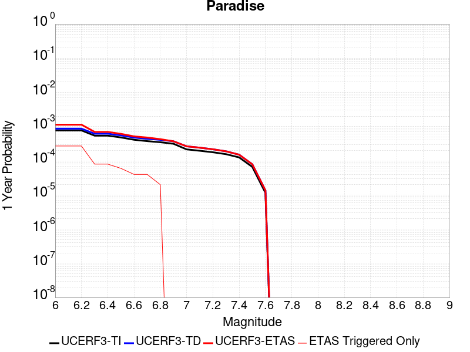 | 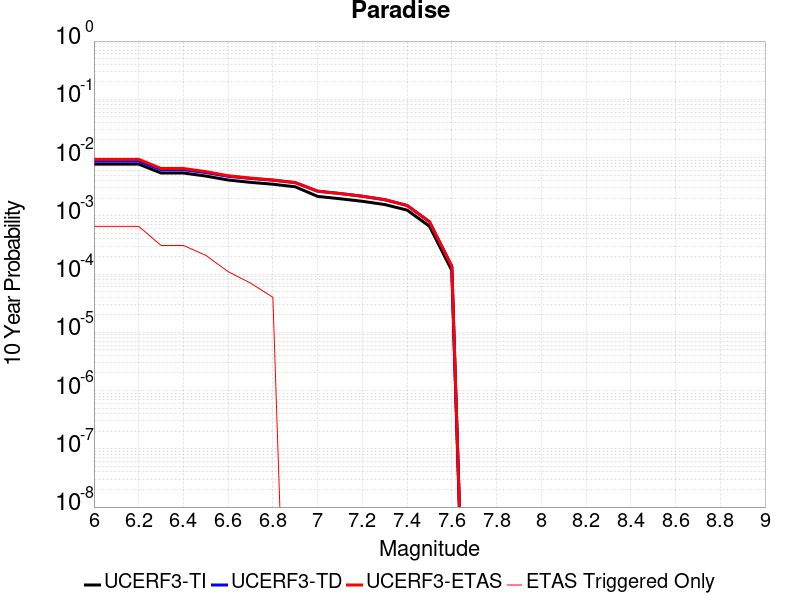 |

| Magnitude | 1 wk TI Prob | 1 wk TD Prob | 1 wk ETAS Prob | 1 wk ETAS/TD Gain | 1 wk ETAS Triggered Only | 1 mo TI Prob | 1 mo TD Prob | 1 mo ETAS Prob | 1 mo ETAS/TD Gain | 1 mo ETAS Triggered Only | 1 yr TI Prob | 1 yr TD Prob | 1 yr ETAS Prob | 1 yr ETAS/TD Gain | 1 yr ETAS Triggered Only | 10 yr TI Prob | 10 yr TD Prob | 10 yr ETAS Prob | 10 yr ETAS/TD Gain | 10 yr ETAS Triggered Only |
|-----|-----|-----|-----|-----|-----|-----|-----|-----|-----|-----|-----|-----|-----|-----|-----|-----|-----|-----|-----|-----|
| 6.0 | 1.4851273E-5 | 1.6696315E-5 | 2.6696149E-5 | 1.5989245 | 1.0E-5 | 6.364676E-5 | 7.1553804E-5 | 8.155309E-5 | 1.139745 | 1.0E-5 | 7.7462377E-4 | 8.70843E-4 | 0.0011406079 | 1.3097744 | 2.7E-4 | 0.0077192914 | 0.008676684 | 0.009330958 | 1.075406 | 6.6E-4 |
| 6.1 | 1.4851273E-5 | 1.6696315E-5 | 2.6696149E-5 | 1.5989245 | 1.0E-5 | 6.364676E-5 | 7.1553804E-5 | 8.155309E-5 | 1.139745 | 1.0E-5 | 7.7462377E-4 | 8.70843E-4 | 0.0011406079 | 1.3097744 | 2.7E-4 | 0.0077192914 | 0.008676684 | 0.009330958 | 1.075406 | 6.6E-4 |
| 6.2 | 1.4851273E-5 | 1.6696315E-5 | 2.6696149E-5 | 1.5989245 | 1.0E-5 | 6.364676E-5 | 7.1553804E-5 | 8.155309E-5 | 1.139745 | 1.0E-5 | 7.7462377E-4 | 8.70843E-4 | 0.0011406079 | 1.3097744 | 2.7E-4 | 0.0077192914 | 0.008676684 | 0.009330958 | 1.075406 | 6.6E-4 |
| 6.3 | 1.0426831E-5 | 1.1889693E-5 | 1.1889693E-5 | 1.0 | 0.0 | 4.4685654E-5 | 5.0954866E-5 | 5.0954866E-5 | 1.0 | 0.0 | 5.43912E-4 | 6.2020484E-4 | 7.001552E-4 | 1.1289096 | 8.0E-5 | 0.0054258266 | 0.006185348 | 0.0064934306 | 1.0498084 | 3.1E-4 |
| 6.4 | 1.0426831E-5 | 1.1889693E-5 | 1.1889693E-5 | 1.0 | 0.0 | 4.4685654E-5 | 5.0954866E-5 | 5.0954866E-5 | 1.0 | 0.0 | 5.43912E-4 | 6.2020484E-4 | 7.001552E-4 | 1.1289096 | 8.0E-5 | 0.0054258266 | 0.006185348 | 0.0064934306 | 1.0498084 | 3.1E-4 |
| 6.5 | 9.25027E-6 | 1.0620901E-5 | 1.0620901E-5 | 1.0 | 0.0 | 3.964341E-5 | 4.551738E-5 | 4.551738E-5 | 1.0 | 0.0 | 4.8255164E-4 | 5.540381E-4 | 6.1400485E-4 | 1.1082358 | 6.0E-5 | 0.0048150513 | 0.005527068 | 0.0057359072 | 1.0377848 | 2.1E-4 |
| 6.6 | 7.904275E-6 | 9.160301E-6 | 9.160301E-6 | 1.0 | 0.0 | 3.3875025E-5 | 3.9257862E-5 | 3.9257862E-5 | 1.0 | 0.0 | 4.1235037E-4 | 4.778636E-4 | 5.1784446E-4 | 1.0836658 | 4.0E-5 | 0.0041158604 | 0.004768757 | 0.0048782327 | 1.0229568 | 1.1E-4 |
| 6.7 | 7.2061953E-6 | 8.407947E-6 | 8.407947E-6 | 1.0 | 0.0 | 3.088333E-5 | 3.603358E-5 | 3.603358E-5 | 1.0 | 0.0 | 3.7593965E-4 | 4.386242E-4 | 4.7860664E-4 | 1.0911542 | 4.0E-5 | 0.003753043 | 0.0043779537 | 0.0044476474 | 1.0159192 | 7.0E-5 |
| 6.8 | 6.6948724E-6 | 7.842809E-6 | 7.842809E-6 | 1.0 | 0.0 | 2.8691995E-5 | 3.3611625E-5 | 3.3611625E-5 | 1.0 | 0.0 | 3.4926904E-4 | 4.0914828E-4 | 4.2914008E-4 | 1.048862 | 2.0E-5 | 0.003487206 | 0.0040843077 | 0.004124144 | 1.0097536 | 4.0E-5 |
| 6.9 | 6.0421025E-6 | 7.131195E-6 | 7.131195E-6 | 1.0 | 0.0 | 2.5894467E-5 | 3.0561925E-5 | 3.0561925E-5 | 1.0 | 0.0 | 3.1521954E-4 | 3.720313E-4 | 3.720313E-4 | 1.0 | 0.0 | 0.0031477278 | 0.0037144232 | 0.0037144232 | 1.0 | 0.0 |
| 7.0 | 4.134091E-6 | 5.080708E-6 | 5.080708E-6 | 1.0 | 0.0 | 1.7717413E-5 | 2.177429E-5 | 2.177429E-5 | 1.0 | 0.0 | 2.1568815E-4 | 2.6507128E-4 | 2.6507128E-4 | 1.0 | 0.0 | 0.0021547892 | 0.0026477042 | 0.0026477042 | 1.0 | 0.0 |
| 7.1 | 3.7674888E-6 | 4.632229E-6 | 4.632229E-6 | 1.0 | 0.0 | 1.6146281E-5 | 1.9852267E-5 | 1.9852267E-5 | 1.0 | 0.0 | 1.9656324E-4 | 2.4167607E-4 | 2.4167607E-4 | 1.0 | 0.0 | 0.0019638946 | 0.002414283 | 0.002414283 | 1.0 | 0.0 |
| 7.2 | 3.4065345E-6 | 4.1570443E-6 | 4.1570443E-6 | 1.0 | 0.0 | 1.4599351E-5 | 1.7815792E-5 | 1.7815792E-5 | 1.0 | 0.0 | 1.777326E-4 | 2.1688716E-4 | 2.1688716E-4 | 1.0 | 0.0 | 0.0017759053 | 0.002166903 | 0.002166903 | 1.0 | 0.0 |
| 7.3 | 2.9934936E-6 | 3.6295821E-6 | 3.6295821E-6 | 1.0 | 0.0 | 1.2829195E-5 | 1.5555268E-5 | 1.5555268E-5 | 1.0 | 0.0 | 1.5618425E-4 | 1.893704E-4 | 1.893704E-4 | 1.0 | 0.0 | 0.0015607453 | 0.0018922357 | 0.0018922357 | 1.0 | 0.0 |
| 7.4 | 2.4049796E-6 | 2.8891789E-6 | 2.8891789E-6 | 1.0 | 0.0 | 1.0307015E-5 | 1.2382145E-5 | 1.2382145E-5 | 1.0 | 0.0 | 1.2548068E-4 | 1.5074362E-4 | 1.5074362E-4 | 1.0 | 0.0 | 0.0012540985 | 0.0015065551 | 0.0015065551 | 1.0 | 0.0 |
| 7.5 | 1.2710091E-6 | 1.5135612E-6 | 1.5135612E-6 | 1.0 | 0.0 | 5.44717E-6 | 6.4866817E-6 | 6.4866817E-6 | 1.0 | 0.0 | 6.631728E-5 | 7.897374E-5 | 7.897374E-5 | 1.0 | 0.0 | 6.6297496E-4 | 7.8957935E-4 | 7.8957935E-4 | 1.0 | 0.0 |
| 7.6 | 2.21172E-7 | 2.60409E-7 | 2.60409E-7 | 1.0 | 0.0 | 9.478797E-7 | 1.1160382E-6 | 1.1160382E-6 | 1.0 | 0.0 | 1.1540374E-5 | 1.358771E-5 | 1.358771E-5 | 1.0 | 0.0 | 1.1539775E-4 | 1.3587161E-4 | 1.3587161E-4 | 1.0 | 0.0 |

## Garlic Springs
*[(top)](#table-of-contents)*

| 1 Week | 1 Month | 1 Year | 10 Year |
|-----|-----|-----|-----|
|  |  |  |  |

| Magnitude | 1 wk TI Prob | 1 wk TD Prob | 1 wk ETAS Prob | 1 wk ETAS/TD Gain | 1 wk ETAS Triggered Only | 1 mo TI Prob | 1 mo TD Prob | 1 mo ETAS Prob | 1 mo ETAS/TD Gain | 1 mo ETAS Triggered Only | 1 yr TI Prob | 1 yr TD Prob | 1 yr ETAS Prob | 1 yr ETAS/TD Gain | 1 yr ETAS Triggered Only | 10 yr TI Prob | 10 yr TD Prob | 10 yr ETAS Prob | 10 yr ETAS/TD Gain | 10 yr ETAS Triggered Only |
|-----|-----|-----|-----|-----|-----|-----|-----|-----|-----|-----|-----|-----|-----|-----|-----|-----|-----|-----|-----|-----|
| 6.0 | 1.6760017E-5 | 1.8779832E-5 | 2.8779645E-5 | 1.5324762 | 1.0E-5 | 7.182667E-5 | 8.048317E-5 | 1.00481564E-4 | 1.2484791 | 2.0E-5 | 8.7413884E-4 | 9.795596E-4 | 0.0011394029 | 1.1631787 | 1.6E-4 | 0.008707083 | 0.009763966 | 0.010328401 | 1.0578079 | 5.7E-4 |
| 6.1 | 9.852767E-6 | 1.0975243E-5 | 1.0975243E-5 | 1.0 | 0.0 | 4.222546E-5 | 4.703631E-5 | 5.703584E-5 | 1.2125918 | 1.0E-5 | 5.139737E-4 | 5.7258754E-4 | 6.62536E-4 | 1.1570911 | 9.0E-5 | 0.005127866 | 0.005718083 | 0.0060263104 | 1.0539039 | 3.1E-4 |
| 6.2 | 9.852767E-6 | 1.0975243E-5 | 1.0975243E-5 | 1.0 | 0.0 | 4.222546E-5 | 4.703631E-5 | 5.703584E-5 | 1.2125918 | 1.0E-5 | 5.139737E-4 | 5.7258754E-4 | 6.62536E-4 | 1.1570911 | 9.0E-5 | 0.005127866 | 0.005718083 | 0.0060263104 | 1.0539039 | 3.1E-4 |
| 6.3 | 4.3167724E-6 | 4.7787057E-6 | 4.7787057E-6 | 1.0 | 0.0 | 1.8500323E-5 | 2.0480136E-5 | 2.0480136E-5 | 1.0 | 0.0 | 2.2521814E-4 | 2.4934017E-4 | 2.9932772E-4 | 1.2004793 | 5.0E-5 | 0.0022499003 | 0.0024928632 | 0.002592614 | 1.0400145 | 1.0E-4 |
| 6.4 | 4.3167724E-6 | 4.7787057E-6 | 4.7787057E-6 | 1.0 | 0.0 | 1.8500323E-5 | 2.0480136E-5 | 2.0480136E-5 | 1.0 | 0.0 | 2.2521814E-4 | 2.4934017E-4 | 2.9932772E-4 | 1.2004793 | 5.0E-5 | 0.0022499003 | 0.0024928632 | 0.002592614 | 1.0400145 | 1.0E-4 |
| 6.5 | 4.3167724E-6 | 4.7787057E-6 | 4.7787057E-6 | 1.0 | 0.0 | 1.8500323E-5 | 2.0480136E-5 | 2.0480136E-5 | 1.0 | 0.0 | 2.2521814E-4 | 2.4934017E-4 | 2.9932772E-4 | 1.2004793 | 5.0E-5 | 0.0022499003 | 0.0024928632 | 0.002592614 | 1.0400145 | 1.0E-4 |
| 6.6 | 4.301311E-6 | 4.7615717E-6 | 4.7615717E-6 | 1.0 | 0.0 | 1.8434059E-5 | 2.0406706E-5 | 2.0406706E-5 | 1.0 | 0.0 | 2.2441156E-4 | 2.4844636E-4 | 2.9843394E-4 | 1.2012007 | 5.0E-5 | 0.0022418506 | 0.0024839449 | 0.0025836965 | 1.0401585 | 1.0E-4 |
| 6.7 | 3.8599724E-6 | 4.2716633E-6 | 4.2716633E-6 | 1.0 | 0.0 | 1.6542634E-5 | 1.8307128E-5 | 1.8307128E-5 | 1.0 | 0.0 | 2.0138794E-4 | 2.2288928E-4 | 2.6288038E-4 | 1.1794213 | 4.0E-5 | 0.0020120554 | 0.0022288929 | 0.0022787813 | 1.0223826 | 5.0E-5 |

## Death Valley (Black Mtns Frontal)
*[(top)](#table-of-contents)*

| 1 Week | 1 Month | 1 Year | 10 Year |
|-----|-----|-----|-----|
|  |  | 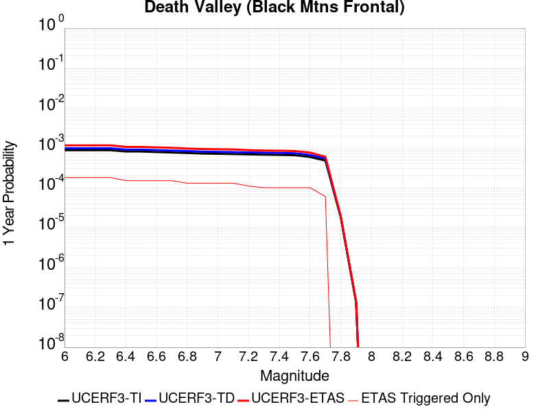 |  |

| Magnitude | 1 wk TI Prob | 1 wk TD Prob | 1 wk ETAS Prob | 1 wk ETAS/TD Gain | 1 wk ETAS Triggered Only | 1 mo TI Prob | 1 mo TD Prob | 1 mo ETAS Prob | 1 mo ETAS/TD Gain | 1 mo ETAS Triggered Only | 1 yr TI Prob | 1 yr TD Prob | 1 yr ETAS Prob | 1 yr ETAS/TD Gain | 1 yr ETAS Triggered Only | 10 yr TI Prob | 10 yr TD Prob | 10 yr ETAS Prob | 10 yr ETAS/TD Gain | 10 yr ETAS Triggered Only |
|-----|-----|-----|-----|-----|-----|-----|-----|-----|-----|-----|-----|-----|-----|-----|-----|-----|-----|-----|-----|-----|
| 6.0 | 1.6707214E-5 | 1.8673187E-5 | 3.8672813E-5 | 2.0710344 | 2.0E-5 | 7.160038E-5 | 8.002553E-5 | 1.1002313E-4 | 1.3748504 | 3.0E-5 | 8.71386E-4 | 9.7388297E-4 | 0.0011537076 | 1.1846471 | 1.8E-4 | 0.00867977 | 0.009697005 | 0.01007332 | 1.0388074 | 3.8E-4 |
| 6.1 | 1.6707214E-5 | 1.8673187E-5 | 3.8672813E-5 | 2.0710344 | 2.0E-5 | 7.160038E-5 | 8.002553E-5 | 1.1002313E-4 | 1.3748504 | 3.0E-5 | 8.71386E-4 | 9.7388297E-4 | 0.0011537076 | 1.1846471 | 1.8E-4 | 0.00867977 | 0.009697005 | 0.01007332 | 1.0388074 | 3.8E-4 |
| 6.2 | 1.6707214E-5 | 1.8673187E-5 | 3.8672813E-5 | 2.0710344 | 2.0E-5 | 7.160038E-5 | 8.002553E-5 | 1.1002313E-4 | 1.3748504 | 3.0E-5 | 8.71386E-4 | 9.7388297E-4 | 0.0011537076 | 1.1846471 | 1.8E-4 | 0.00867977 | 0.009697005 | 0.01007332 | 1.0388074 | 3.8E-4 |
| 6.3 | 1.6707214E-5 | 1.8673187E-5 | 3.8672813E-5 | 2.0710344 | 2.0E-5 | 7.160038E-5 | 8.002553E-5 | 1.1002313E-4 | 1.3748504 | 3.0E-5 | 8.71386E-4 | 9.7388297E-4 | 0.0011537076 | 1.1846471 | 1.8E-4 | 0.00867977 | 0.009697005 | 0.01007332 | 1.0388074 | 3.8E-4 |
| 6.4 | 1.5515609E-5 | 1.7340923E-5 | 3.7340575E-5 | 2.1533213 | 2.0E-5 | 6.649377E-5 | 7.431616E-5 | 1.0431393E-4 | 1.4036508 | 3.0E-5 | 8.0926094E-4 | 9.0442976E-4 | 0.001054294 | 1.1657003 | 1.5E-4 | 0.008063202 | 0.009008174 | 0.009325292 | 1.0352033 | 3.2E-4 |
| 6.5 | 1.5515609E-5 | 1.7340923E-5 | 3.7340575E-5 | 2.1533213 | 2.0E-5 | 6.649377E-5 | 7.431616E-5 | 1.0431393E-4 | 1.4036508 | 3.0E-5 | 8.0926094E-4 | 9.0442976E-4 | 0.001054294 | 1.1657003 | 1.5E-4 | 0.008063202 | 0.009008174 | 0.009325292 | 1.0352033 | 3.2E-4 |
| 6.6 | 1.5041828E-5 | 1.6811773E-5 | 3.6811434E-5 | 2.1896226 | 2.0E-5 | 6.4463384E-5 | 7.20485E-5 | 1.0204633E-4 | 1.4163562 | 3.0E-5 | 7.8455906E-4 | 8.768433E-4 | 0.0010267118 | 1.1709182 | 1.5E-4 | 0.00781795 | 0.008734492 | 0.009031871 | 1.0340465 | 3.0E-4 |
| 6.7 | 1.4634985E-5 | 1.6358576E-5 | 3.6358248E-5 | 2.2225804 | 2.0E-5 | 6.271985E-5 | 7.010633E-5 | 1.00104226E-4 | 1.4278914 | 3.0E-5 | 7.6334673E-4 | 8.532161E-4 | 0.0010030881 | 1.1756554 | 1.5E-4 | 0.007607299 | 0.00850004 | 0.00879749 | 1.034994 | 3.0E-4 |
| 6.8 | 1.4209158E-5 | 1.5884536E-5 | 3.588422E-5 | 2.259066 | 2.0E-5 | 6.089497E-5 | 6.8074834E-5 | 9.807279E-5 | 1.4406614 | 3.0E-5 | 7.4114406E-4 | 8.285016E-4 | 9.583939E-4 | 1.1567798 | 1.3E-4 | 0.007386771 | 0.008254744 | 0.008502681 | 1.0300356 | 2.5E-4 |
| 6.9 | 1.3780098E-5 | 1.540701E-5 | 3.54067E-5 | 2.2980905 | 2.0E-5 | 5.9056227E-5 | 6.60284E-5 | 9.602642E-5 | 1.45432 | 3.0E-5 | 7.1877235E-4 | 8.036048E-4 | 9.335003E-4 | 1.1616411 | 1.3E-4 | 0.0071645193 | 0.008007584 | 0.008255582 | 1.0309705 | 2.5E-4 |
| 7.0 | 1.3585064E-5 | 1.5190541E-5 | 3.5190238E-5 | 2.3165889 | 2.0E-5 | 5.8220405E-5 | 6.510072E-5 | 9.509877E-5 | 1.4607943 | 3.0E-5 | 7.086029E-4 | 7.9231855E-4 | 9.222155E-4 | 1.1639454 | 1.3E-4 | 0.007063476 | 0.007895528 | 0.008133634 | 1.030157 | 2.4E-4 |
| 7.1 | 1.3398601E-5 | 1.4983694E-5 | 3.4983394E-5 | 2.3347642 | 2.0E-5 | 5.742131E-5 | 6.4214284E-5 | 9.421236E-5 | 1.4671558 | 3.0E-5 | 6.9888023E-4 | 7.8153395E-4 | 9.114323E-4 | 1.1662096 | 1.3E-4 | 0.0069668638 | 0.0077884435 | 0.008026575 | 1.0305749 | 2.4E-4 |
| 7.2 | 1.3126312E-5 | 1.4681873E-5 | 3.468158E-5 | 2.362204 | 2.0E-5 | 5.6254412E-5 | 6.292082E-5 | 9.2918934E-5 | 1.4767597 | 3.0E-5 | 6.846822E-4 | 7.657972E-4 | 8.75713E-4 | 1.1435312 | 1.1E-4 | 0.006825765 | 0.0076321675 | 0.0078405645 | 1.0273051 | 2.1E-4 |
| 7.3 | 1.2922429E-5 | 1.4456067E-5 | 3.4455777E-5 | 2.3834822 | 2.0E-5 | 5.5380664E-5 | 6.1953135E-5 | 9.1951275E-5 | 1.484207 | 3.0E-5 | 6.74051E-4 | 7.5402384E-4 | 8.539484E-4 | 1.1325217 | 1.0E-4 | 0.006720101 | 0.0075152353 | 0.0077137323 | 1.0264126 | 2.0E-4 |
| 7.4 | 1.2768878E-5 | 1.4286026E-5 | 3.4285742E-5 | 2.3999493 | 2.0E-5 | 5.4722615E-5 | 6.122442E-5 | 9.122259E-5 | 1.4899706 | 3.0E-5 | 6.660441E-4 | 7.451578E-4 | 8.450833E-4 | 1.1340997 | 1.0E-4 | 0.0066405144 | 0.007427172 | 0.0076256865 | 1.0267282 | 2.0E-4 |
| 7.5 | 1.2521929E-5 | 1.4014234E-5 | 3.4013952E-5 | 2.4271004 | 2.0E-5 | 5.366431E-5 | 6.005965E-5 | 9.0057845E-5 | 1.4994735 | 3.0E-5 | 6.531671E-4 | 7.3098636E-4 | 8.3091325E-4 | 1.1367015 | 1.0E-4 | 0.006512506 | 0.007286395 | 0.007484938 | 1.0272484 | 2.0E-4 |
| 7.6 | 1.1301089E-5 | 1.26501545E-5 | 3.2649903E-5 | 2.5809884 | 2.0E-5 | 4.8432343E-5 | 5.421385E-5 | 8.4212224E-5 | 1.5533341 | 3.0E-5 | 5.895042E-4 | 6.5985904E-4 | 7.597931E-4 | 1.1514475 | 1.0E-4 | 0.0058794282 | 0.00657955 | 0.0067285635 | 1.0226479 | 1.5E-4 |
| 7.7 | 9.189108E-6 | 1.0284987E-5 | 2.0284884E-5 | 1.972281 | 1.0E-5 | 3.93813E-5 | 4.4077802E-5 | 5.407736E-5 | 1.2268616 | 1.0E-5 | 4.7936183E-4 | 5.3652015E-4 | 5.9648795E-4 | 1.1117718 | 6.0E-5 | 0.004783291 | 0.0053527597 | 0.0054522245 | 1.018582 | 1.0E-4 |
| 7.8 | 3.4586725E-7 | 3.648528E-7 | 3.648528E-7 | 1.0 | 0.0 | 1.4822873E-6 | 1.563654E-6 | 1.563654E-6 | 1.0 | 0.0 | 1.80467E-5 | 1.9037325E-5 | 1.9037325E-5 | 1.0 | 0.0 | 1.8045233E-4 | 1.9035739E-4 | 1.9035739E-4 | 1.0 | 0.0 |
| 7.9 | 2.5591178E-9 | 2.6698248E-9 | 2.6698248E-9 | 1.0 | 0.0 | 1.0967647E-8 | 1.1442106E-8 | 1.1442106E-8 | 1.0 | 0.0 | 1.335311E-7 | 1.3930764E-7 | 1.3930764E-7 | 1.0 | 0.0 | 1.3353102E-6 | 1.3930764E-6 | 1.3930764E-6 | 1.0 | 0.0 |

## San Andreas (San Bernardino S)
*[(top)](#table-of-contents)*

| 1 Week | 1 Month | 1 Year | 10 Year |
|-----|-----|-----|-----|
|  |  |  | 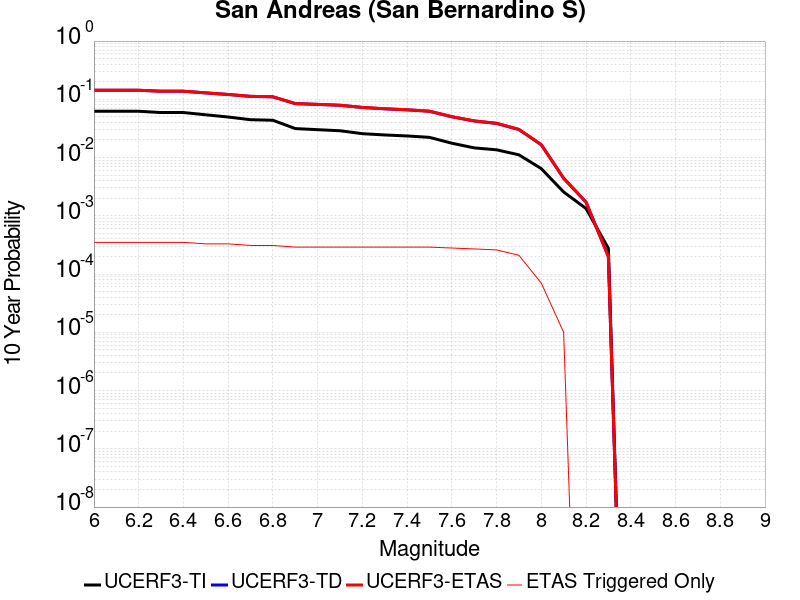 |

| Magnitude | 1 wk TI Prob | 1 wk TD Prob | 1 wk ETAS Prob | 1 wk ETAS/TD Gain | 1 wk ETAS Triggered Only | 1 mo TI Prob | 1 mo TD Prob | 1 mo ETAS Prob | 1 mo ETAS/TD Gain | 1 mo ETAS Triggered Only | 1 yr TI Prob | 1 yr TD Prob | 1 yr ETAS Prob | 1 yr ETAS/TD Gain | 1 yr ETAS Triggered Only | 10 yr TI Prob | 10 yr TD Prob | 10 yr ETAS Prob | 10 yr ETAS/TD Gain | 10 yr ETAS Triggered Only |
|-----|-----|-----|-----|-----|-----|-----|-----|-----|-----|-----|-----|-----|-----|-----|-----|-----|-----|-----|-----|-----|
| 6.0 | 1.2336002E-4 | 3.0052903E-4 | 3.0052903E-4 | 1.0 | 0.0 | 5.2857865E-4 | 0.0012873719 | 0.0013273205 | 1.031031 | 4.0E-5 | 0.006416472 | 0.015566076 | 0.015694052 | 1.0082215 | 1.3E-4 | 0.06234337 | 0.14302991 | 0.14332984 | 1.002097 | 3.5E-4 |
| 6.1 | 1.2336002E-4 | 3.0052903E-4 | 3.0052903E-4 | 1.0 | 0.0 | 5.2857865E-4 | 0.0012873719 | 0.0013273205 | 1.031031 | 4.0E-5 | 0.006416472 | 0.015566076 | 0.015694052 | 1.0082215 | 1.3E-4 | 0.06234337 | 0.14302991 | 0.14332984 | 1.002097 | 3.5E-4 |
| 6.2 | 1.2336002E-4 | 3.0052903E-4 | 3.0052903E-4 | 1.0 | 0.0 | 5.2857865E-4 | 0.0012873719 | 0.0013273205 | 1.031031 | 4.0E-5 | 0.006416472 | 0.015566076 | 0.015694052 | 1.0082215 | 1.3E-4 | 0.06234337 | 0.14302991 | 0.14332984 | 1.002097 | 3.5E-4 |
| 6.3 | 1.1712257E-4 | 2.8840688E-4 | 2.8840688E-4 | 1.0 | 0.0 | 5.018573E-4 | 0.0012354697 | 0.0012754203 | 1.0323364 | 4.0E-5 | 0.006093008 | 0.014942952 | 0.01507101 | 1.0085697 | 1.3E-4 | 0.059286322 | 0.13773783 | 0.13803962 | 1.0021911 | 3.5E-4 |
| 6.4 | 1.1712257E-4 | 2.8840688E-4 | 2.8840688E-4 | 1.0 | 0.0 | 5.018573E-4 | 0.0012354697 | 0.0012754203 | 1.0323364 | 4.0E-5 | 0.006093008 | 0.014942952 | 0.01507101 | 1.0085697 | 1.3E-4 | 0.059286322 | 0.13773783 | 0.13803962 | 1.0021911 | 3.5E-4 |
| 6.5 | 1.0689076E-4 | 2.6852704E-4 | 2.6852704E-4 | 1.0 | 0.0 | 4.5802278E-4 | 0.0011503474 | 0.001180313 | 1.0260491 | 3.0E-5 | 0.0055621783 | 0.013920166 | 0.014038495 | 1.0085006 | 1.2E-4 | 0.05425003 | 0.12898327 | 0.1292707 | 1.0022285 | 3.3E-4 |
| 6.6 | 9.7648895E-5 | 2.5096696E-4 | 2.5096696E-4 | 1.0 | 0.0 | 4.1842813E-4 | 0.0010751529 | 0.0011051206 | 1.027873 | 3.0E-5 | 0.005082469 | 0.013015794 | 0.013134232 | 1.0090996 | 1.2E-4 | 0.049677886 | 0.121141456 | 0.12143148 | 1.0023941 | 3.3E-4 |
| 6.7 | 8.757013E-5 | 2.3166684E-4 | 2.3166684E-4 | 1.0 | 0.0 | 3.7524657E-4 | 9.925024E-4 | 0.0010224726 | 1.0301967 | 3.0E-5 | 0.00455906 | 0.012020858 | 0.012139416 | 1.0098627 | 1.2E-4 | 0.04466656 | 0.11244868 | 0.11272382 | 1.0024468 | 3.1E-4 |
| 6.8 | 8.562978E-5 | 2.2726225E-4 | 2.2726225E-4 | 1.0 | 0.0 | 3.6693315E-4 | 9.736398E-4 | 0.0010036106 | 1.0307822 | 3.0E-5 | 0.004458263 | 0.0117937075 | 0.011912292 | 1.010055 | 1.2E-4 | 0.043698758 | 0.110457905 | 0.110733666 | 1.0024965 | 3.1E-4 |
| 6.9 | 6.124075E-5 | 1.7106693E-4 | 1.7106693E-4 | 1.0 | 0.0 | 2.6243398E-4 | 7.329388E-4 | 7.6291687E-4 | 1.0409011 | 3.0E-5 | 0.0031904527 | 0.008887228 | 0.00899625 | 1.0122674 | 1.1E-4 | 0.031450346 | 0.08435718 | 0.08462271 | 1.0031477 | 2.9E-4 |
| 7.0 | 5.8598747E-5 | 1.653528E-4 | 1.653528E-4 | 1.0 | 0.0 | 2.5111332E-4 | 7.084632E-4 | 7.3844194E-4 | 1.0423151 | 3.0E-5 | 0.0030530186 | 0.008591622 | 0.008700677 | 1.0126932 | 1.1E-4 | 0.03011414 | 0.08167349 | 0.0819398 | 1.0032607 | 2.9E-4 |
| 7.1 | 5.613814E-5 | 1.5953425E-4 | 1.5953425E-4 | 1.0 | 0.0 | 2.4056983E-4 | 6.8353984E-4 | 7.1351934E-4 | 1.0438591 | 3.0E-5 | 0.0029250039 | 0.008290524 | 0.008399612 | 1.0131582 | 1.1E-4 | 0.028868021 | 0.07897128 | 0.079238385 | 1.0033822 | 2.9E-4 |
| 7.2 | 4.991222E-5 | 1.4558934E-4 | 1.4558934E-4 | 1.0 | 0.0 | 2.1389198E-4 | 6.238055E-4 | 6.5378676E-4 | 1.048062 | 3.0E-5 | 0.002601025 | 0.007568488 | 0.007677655 | 1.014424 | 1.1E-4 | 0.025707912 | 0.07242188 | 0.072690874 | 1.0037143 | 2.9E-4 |
| 7.3 | 4.7410045E-5 | 1.375228E-4 | 1.375228E-4 | 1.0 | 0.0 | 2.0317009E-4 | 5.892506E-4 | 6.1923295E-4 | 1.0508821 | 3.0E-5 | 0.0024707897 | 0.0071506137 | 0.007259827 | 1.0152733 | 1.1E-4 | 0.024434982 | 0.06870162 | 0.06897169 | 1.0039312 | 2.9E-4 |
| 7.4 | 4.5556746E-5 | 1.3159527E-4 | 1.3159527E-4 | 1.0 | 0.0 | 1.952286E-4 | 5.6385814E-4 | 5.938412E-4 | 1.0531749 | 3.0E-5 | 0.002374317 | 0.006843443 | 0.0069526904 | 1.0159638 | 1.1E-4 | 0.023491086 | 0.065951794 | 0.06622267 | 1.0041071 | 2.9E-4 |
| 7.5 | 4.3084514E-5 | 1.2394068E-4 | 1.2394068E-4 | 1.0 | 0.0 | 1.8463485E-4 | 5.310665E-4 | 5.610506E-4 | 1.0564601 | 3.0E-5 | 0.0022456115 | 0.006446638 | 0.0065559293 | 1.0169531 | 1.1E-4 | 0.022230545 | 0.062349852 | 0.06262177 | 1.0043612 | 2.9E-4 |
| 7.6 | 3.408608E-5 | 9.8693454E-5 | 9.8693454E-5 | 1.0 | 0.0 | 1.4607502E-4 | 4.2290348E-4 | 4.528908E-4 | 1.0709082 | 3.0E-5 | 0.0017770125 | 0.00513672 | 0.005246155 | 1.0213045 | 1.1E-4 | 0.017628696 | 0.05017014 | 0.05043609 | 1.005301 | 2.8E-4 |
| 7.7 | 2.8315713E-5 | 8.2804654E-5 | 8.2804654E-5 | 1.0 | 0.0 | 1.2134742E-4 | 3.5482887E-4 | 3.848182E-4 | 1.0845178 | 3.0E-5 | 0.0014764034 | 0.004311493 | 0.004421019 | 1.0254033 | 1.1E-4 | 0.01466633 | 0.042413354 | 0.042671904 | 1.0060959 | 2.7E-4 |
| 7.8 | 2.6222975E-5 | 7.492829E-5 | 7.492829E-5 | 1.0 | 0.0 | 1.1237934E-4 | 3.2108175E-4 | 3.5107214E-4 | 1.0934042 | 3.0E-5 | 0.0013673597 | 0.0039021696 | 0.0040117404 | 1.0280794 | 1.1E-4 | 0.013589768 | 0.03857025 | 0.038820222 | 1.0064809 | 2.6E-4 |
| 7.9 | 2.1469694E-5 | 5.812656E-5 | 5.812656E-5 | 1.0 | 0.0 | 9.200973E-5 | 2.4909005E-4 | 2.790826E-4 | 1.1204084 | 3.0E-5 | 0.0011196428 | 0.003028457 | 0.0031281542 | 1.0329201 | 1.0E-4 | 0.011140184 | 0.030264879 | 0.030468524 | 1.0067288 | 2.1E-4 |
| 8.0 | 1.2420249E-5 | 3.1456424E-5 | 3.1456424E-5 | 1.0 | 0.0 | 5.322855E-5 | 1.348063E-4 | 1.548036E-4 | 1.1483411 | 2.0E-5 | 6.478649E-4 | 0.0016400319 | 0.00168995 | 1.0304372 | 5.0E-5 | 0.0064597935 | 0.016586676 | 0.016655516 | 1.0041503 | 7.0E-5 |
| 8.1 | 4.9197724E-6 | 7.872929E-6 | 7.872929E-6 | 1.0 | 0.0 | 2.1084568E-5 | 3.3740685E-5 | 3.3740685E-5 | 1.0 | 0.0 | 2.566744E-4 | 4.1071558E-4 | 4.2071147E-4 | 1.0243378 | 1.0E-5 | 0.002563781 | 0.004409803 | 0.004419759 | 1.0022577 | 1.0E-5 |
| 8.2 | 2.5634774E-6 | 2.930318E-6 | 2.930318E-6 | 1.0 | 0.0 | 1.0986286E-5 | 1.2558446E-5 | 1.2558446E-5 | 1.0 | 0.0 | 1.3374983E-4 | 1.528884E-4 | 1.528884E-4 | 1.0 | 0.0 | 0.0013366934 | 0.0017173742 | 0.0017173742 | 1.0 | 0.0 |
| 8.3 | 5.2850464E-7 | 3.2441278E-7 | 3.2441278E-7 | 1.0 | 0.0 | 2.2650179E-6 | 1.3903399E-6 | 1.3903399E-6 | 1.0 | 0.0 | 2.7576245E-5 | 1.692727E-5 | 1.692727E-5 | 1.0 | 0.0 | 2.7572823E-4 | 2.0069437E-4 | 2.0069437E-4 | 1.0 | 0.0 |

## Helendale-So Lockhart
*[(top)](#table-of-contents)*

| 1 Week | 1 Month | 1 Year | 10 Year |
|-----|-----|-----|-----|
|  |  |  |  |

| Magnitude | 1 wk TI Prob | 1 wk TD Prob | 1 wk ETAS Prob | 1 wk ETAS/TD Gain | 1 wk ETAS Triggered Only | 1 mo TI Prob | 1 mo TD Prob | 1 mo ETAS Prob | 1 mo ETAS/TD Gain | 1 mo ETAS Triggered Only | 1 yr TI Prob | 1 yr TD Prob | 1 yr ETAS Prob | 1 yr ETAS/TD Gain | 1 yr ETAS Triggered Only | 10 yr TI Prob | 10 yr TD Prob | 10 yr ETAS Prob | 10 yr ETAS/TD Gain | 10 yr ETAS Triggered Only |
|-----|-----|-----|-----|-----|-----|-----|-----|-----|-----|-----|-----|-----|-----|-----|-----|-----|-----|-----|-----|-----|
| 6.0 | 1.7296055E-5 | 1.8104853E-5 | 1.8104853E-5 | 1.0 | 0.0 | 7.412385E-5 | 7.759003E-5 | 1.1758693E-4 | 1.51549 | 4.0E-5 | 9.0208417E-4 | 9.4427E-4 | 0.0010741473 | 1.1375425 | 1.3E-4 | 0.008984311 | 0.009404697 | 0.009721688 | 1.0337056 | 3.2E-4 |
| 6.1 | 1.7296055E-5 | 1.8104853E-5 | 1.8104853E-5 | 1.0 | 0.0 | 7.412385E-5 | 7.759003E-5 | 1.1758693E-4 | 1.51549 | 4.0E-5 | 9.0208417E-4 | 9.4427E-4 | 0.0010741473 | 1.1375425 | 1.3E-4 | 0.008984311 | 0.009404697 | 0.009721688 | 1.0337056 | 3.2E-4 |
| 6.2 | 1.7296055E-5 | 1.8104853E-5 | 1.8104853E-5 | 1.0 | 0.0 | 7.412385E-5 | 7.759003E-5 | 1.1758693E-4 | 1.51549 | 4.0E-5 | 9.0208417E-4 | 9.4427E-4 | 0.0010741473 | 1.1375425 | 1.3E-4 | 0.008984311 | 0.009404697 | 0.009721688 | 1.0337056 | 3.2E-4 |
| 6.3 | 1.0669118E-5 | 1.11360705E-5 | 1.11360705E-5 | 1.0 | 0.0 | 4.5723988E-5 | 4.772516E-5 | 5.7724683E-5 | 1.2095231 | 1.0E-5 | 5.5654737E-4 | 5.809017E-4 | 6.308727E-4 | 1.0860231 | 5.0E-5 | 0.0055515557 | 0.005794129 | 0.005973086 | 1.0308859 | 1.8E-4 |
| 6.4 | 1.0669118E-5 | 1.11360705E-5 | 1.11360705E-5 | 1.0 | 0.0 | 4.5723988E-5 | 4.772516E-5 | 5.7724683E-5 | 1.2095231 | 1.0E-5 | 5.5654737E-4 | 5.809017E-4 | 6.308727E-4 | 1.0860231 | 5.0E-5 | 0.0055515557 | 0.005794129 | 0.005973086 | 1.0308859 | 1.8E-4 |
| 6.5 | 8.790038E-6 | 9.170723E-6 | 9.170723E-6 | 1.0 | 0.0 | 3.767105E-5 | 3.930252E-5 | 4.9302125E-5 | 1.2544266 | 1.0E-5 | 4.585485E-4 | 4.7840463E-4 | 5.2838074E-4 | 1.104464 | 5.0E-5 | 0.0045760344 | 0.004773912 | 0.0049132435 | 1.029186 | 1.4E-4 |
| 6.6 | 7.396949E-6 | 7.715978E-6 | 7.715978E-6 | 1.0 | 0.0 | 3.1700827E-5 | 3.3068067E-5 | 4.3067736E-5 | 1.3023965 | 1.0E-5 | 3.858892E-4 | 4.0253034E-4 | 4.4251423E-4 | 1.0993314 | 4.0E-5 | 0.003852198 | 0.004018119 | 0.0041475967 | 1.0322235 | 1.3E-4 |
| 6.7 | 6.4600285E-6 | 6.7384162E-6 | 6.7384162E-6 | 1.0 | 0.0 | 2.7685543E-5 | 2.887861E-5 | 2.887861E-5 | 1.0 | 0.0 | 3.3701936E-4 | 3.5154115E-4 | 3.7153412E-4 | 1.0568724 | 2.0E-5 | 0.0033650869 | 0.0035099322 | 0.0035996162 | 1.0255516 | 9.0E-5 |
| 6.8 | 5.600104E-6 | 5.8363357E-6 | 5.8363357E-6 | 1.0 | 0.0 | 2.4000226E-5 | 2.501263E-5 | 2.501263E-5 | 1.0 | 0.0 | 2.9216358E-4 | 3.0448684E-4 | 3.1448377E-4 | 1.0328321 | 1.0E-5 | 0.0029177975 | 0.003040758 | 0.0030806363 | 1.0131146 | 4.0E-5 |
| 6.9 | 4.839122E-6 | 5.039786E-6 | 5.039786E-6 | 1.0 | 0.0 | 2.0738931E-5 | 2.1598908E-5 | 2.1598908E-5 | 1.0 | 0.0 | 2.5246723E-4 | 2.6293544E-4 | 2.729328E-4 | 1.0380222 | 1.0E-5 | 0.002521806 | 0.002626291 | 0.0026661858 | 1.0151906 | 4.0E-5 |
| 7.0 | 3.6937633E-6 | 3.8454173E-6 | 3.8454173E-6 | 1.0 | 0.0 | 1.5830317E-5 | 1.6480257E-5 | 1.6480257E-5 | 1.0 | 0.0 | 1.9271708E-4 | 2.0062897E-4 | 2.1062697E-4 | 1.0498333 | 1.0E-5 | 0.0019255003 | 0.0020045098 | 0.0020344497 | 1.0149362 | 3.0E-5 |
| 7.1 | 2.7858857E-6 | 2.8980082E-6 | 2.8980082E-6 | 1.0 | 0.0 | 1.1939455E-5 | 1.2419978E-5 | 1.2419978E-5 | 1.0 | 0.0 | 1.4535317E-4 | 1.5120296E-4 | 1.6120145E-4 | 1.0661262 | 1.0E-5 | 0.0014525814 | 0.0015110222 | 0.0015409769 | 1.0198241 | 3.0E-5 |
| 7.2 | 2.1672065E-6 | 2.2541326E-6 | 2.2541326E-6 | 1.0 | 0.0 | 9.2879945E-6 | 9.660534E-6 | 9.660534E-6 | 1.0 | 0.0 | 1.1307546E-4 | 1.1761083E-4 | 1.1761083E-4 | 1.0 | 0.0 | 0.0011301794 | 0.0011755041 | 0.0011954806 | 1.016994 | 2.0E-5 |
| 7.3 | 1.4823496E-6 | 1.5422928E-6 | 1.5422928E-6 | 1.0 | 0.0 | 6.3529114E-6 | 6.6098105E-6 | 6.6098105E-6 | 1.0 | 0.0 | 7.734395E-5 | 8.0471626E-5 | 8.0471626E-5 | 1.0 | 0.0 | 7.731704E-4 | 8.0443994E-4 | 8.2442386E-4 | 1.024842 | 2.0E-5 |
| 7.4 | 4.2321457E-7 | 4.4111235E-7 | 4.4111235E-7 | 1.0 | 0.0 | 1.8137755E-6 | 1.8904805E-6 | 1.8904805E-6 | 1.0 | 0.0 | 2.2082493E-5 | 2.3016402E-5 | 2.3016402E-5 | 1.0 | 0.0 | 2.2080299E-4 | 2.3014471E-4 | 2.4014241E-4 | 1.0434409 | 1.0E-5 |
| 7.5 | 5.6942316E-8 | 5.941907E-8 | 5.941907E-8 | 1.0 | 0.0 | 2.440385E-7 | 2.5465314E-7 | 2.5465314E-7 | 1.0 | 0.0 | 2.9711643E-6 | 3.1003983E-6 | 3.1003983E-6 | 1.0 | 0.0 | 2.9711247E-5 | 3.1003627E-5 | 4.1003317E-5 | 1.3225329 | 1.0E-5 |

## Coyote Lake
*[(top)](#table-of-contents)*

| 1 Week | 1 Month | 1 Year | 10 Year |
|-----|-----|-----|-----|
|  |  |  |  |

| Magnitude | 1 wk TI Prob | 1 wk TD Prob | 1 wk ETAS Prob | 1 wk ETAS/TD Gain | 1 wk ETAS Triggered Only | 1 mo TI Prob | 1 mo TD Prob | 1 mo ETAS Prob | 1 mo ETAS/TD Gain | 1 mo ETAS Triggered Only | 1 yr TI Prob | 1 yr TD Prob | 1 yr ETAS Prob | 1 yr ETAS/TD Gain | 1 yr ETAS Triggered Only | 10 yr TI Prob | 10 yr TD Prob | 10 yr ETAS Prob | 10 yr ETAS/TD Gain | 10 yr ETAS Triggered Only |
|-----|-----|-----|-----|-----|-----|-----|-----|-----|-----|-----|-----|-----|-----|-----|-----|-----|-----|-----|-----|-----|
| 6.0 | 1.980352E-5 | 2.1709513E-5 | 2.1709513E-5 | 1.0 | 0.0 | 8.486947E-5 | 9.303786E-5 | 9.303786E-5 | 1.0 | 0.0 | 0.0010327959 | 0.0011322193 | 0.0012520835 | 1.1058666 | 1.2E-4 | 0.010280091 | 0.011271688 | 0.0115188705 | 1.0219295 | 2.5E-4 |
| 6.1 | 1.980352E-5 | 2.1709513E-5 | 2.1709513E-5 | 1.0 | 0.0 | 8.486947E-5 | 9.303786E-5 | 9.303786E-5 | 1.0 | 0.0 | 0.0010327959 | 0.0011322193 | 0.0012520835 | 1.1058666 | 1.2E-4 | 0.010280091 | 0.011271688 | 0.0115188705 | 1.0219295 | 2.5E-4 |
| 6.2 | 1.980352E-5 | 2.1709513E-5 | 2.1709513E-5 | 1.0 | 0.0 | 8.486947E-5 | 9.303786E-5 | 9.303786E-5 | 1.0 | 0.0 | 0.0010327959 | 0.0011322193 | 0.0012520835 | 1.1058666 | 1.2E-4 | 0.010280091 | 0.011271688 | 0.0115188705 | 1.0219295 | 2.5E-4 |
| 6.3 | 1.5344787E-5 | 1.6822816E-5 | 1.6822816E-5 | 1.0 | 0.0 | 6.576172E-5 | 7.209613E-5 | 7.209613E-5 | 1.0 | 0.0 | 8.003548E-4 | 8.7747816E-4 | 9.57408E-4 | 1.0910903 | 8.0E-5 | 0.007974784 | 0.008746182 | 0.008934519 | 1.0215337 | 1.9E-4 |
| 6.4 | 1.5344787E-5 | 1.6822816E-5 | 1.6822816E-5 | 1.0 | 0.0 | 6.576172E-5 | 7.209613E-5 | 7.209613E-5 | 1.0 | 0.0 | 8.003548E-4 | 8.7747816E-4 | 9.57408E-4 | 1.0910903 | 8.0E-5 | 0.007974784 | 0.008746182 | 0.008934519 | 1.0215337 | 1.9E-4 |
| 6.5 | 1.4189697E-5 | 1.5559977E-5 | 1.5559977E-5 | 1.0 | 0.0 | 6.081157E-5 | 6.668425E-5 | 6.668425E-5 | 1.0 | 0.0 | 7.401293E-4 | 8.1163866E-4 | 8.7159E-4 | 1.0738645 | 6.0E-5 | 0.0073766913 | 0.008092688 | 0.008231555 | 1.0171596 | 1.4E-4 |
| 6.6 | 1.3469301E-5 | 1.4773473E-5 | 1.4773473E-5 | 1.0 | 0.0 | 5.7724297E-5 | 6.331368E-5 | 6.331368E-5 | 1.0 | 0.0 | 7.025667E-4 | 7.706315E-4 | 8.3058525E-4 | 1.0777982 | 6.0E-5 | 0.0070034964 | 0.0076854974 | 0.007824421 | 1.0180762 | 1.4E-4 |
| 6.7 | 1.3027966E-5 | 1.4283569E-5 | 1.4283569E-5 | 1.0 | 0.0 | 5.5832945E-5 | 6.1214196E-5 | 6.1214196E-5 | 1.0 | 0.0 | 6.7955407E-4 | 7.4508775E-4 | 7.9505047E-4 | 1.0670562 | 5.0E-5 | 0.006774798 | 0.007431775 | 0.007521106 | 1.0120201 | 9.0E-5 |
| 6.8 | 5.695434E-6 | 6.2251847E-6 | 6.2251847E-6 | 1.0 | 0.0 | 2.4408775E-5 | 2.667926E-5 | 2.667926E-5 | 1.0 | 0.0 | 2.971363E-4 | 3.2480157E-4 | 3.2480157E-4 | 1.0 | 0.0 | 0.0029673933 | 0.00324621 | 0.003266145 | 1.0061411 | 2.0E-5 |
| 6.9 | 4.385688E-6 | 4.793646E-6 | 4.793646E-6 | 1.0 | 0.0 | 1.879567E-5 | 2.0544197E-5 | 2.0544197E-5 | 1.0 | 0.0 | 2.2881327E-4 | 2.501256E-4 | 2.501256E-4 | 1.0 | 0.0 | 0.002285778 | 0.0025012558 | 0.002511231 | 1.003988 | 1.0E-5 |

## San Andreas (Big Bend)
*[(top)](#table-of-contents)*

| 1 Week | 1 Month | 1 Year | 10 Year |
|-----|-----|-----|-----|
| 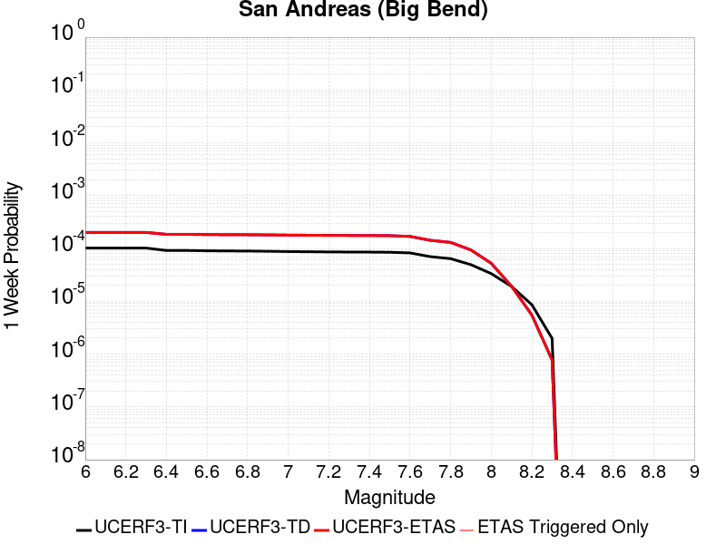 |  |  |  |

| Magnitude | 1 wk TI Prob | 1 wk TD Prob | 1 wk ETAS Prob | 1 wk ETAS/TD Gain | 1 wk ETAS Triggered Only | 1 mo TI Prob | 1 mo TD Prob | 1 mo ETAS Prob | 1 mo ETAS/TD Gain | 1 mo ETAS Triggered Only | 1 yr TI Prob | 1 yr TD Prob | 1 yr ETAS Prob | 1 yr ETAS/TD Gain | 1 yr ETAS Triggered Only | 10 yr TI Prob | 10 yr TD Prob | 10 yr ETAS Prob | 10 yr ETAS/TD Gain | 10 yr ETAS Triggered Only |
|-----|-----|-----|-----|-----|-----|-----|-----|-----|-----|-----|-----|-----|-----|-----|-----|-----|-----|-----|-----|-----|
| 6.0 | 1.0179969E-4 | 2.0157539E-4 | 2.0157539E-4 | 1.0 | 0.0 | 4.362114E-4 | 8.6360954E-4 | 8.736009E-4 | 1.0115693 | 1.0E-5 | 0.0052979486 | 0.0104640415 | 0.0105629945 | 1.0094565 | 1.0E-4 | 0.051734097 | 0.101820305 | 0.102008924 | 1.0018525 | 2.1E-4 |
| 6.1 | 1.0179969E-4 | 2.0157539E-4 | 2.0157539E-4 | 1.0 | 0.0 | 4.362114E-4 | 8.6360954E-4 | 8.736009E-4 | 1.0115693 | 1.0E-5 | 0.0052979486 | 0.0104640415 | 0.0105629945 | 1.0094565 | 1.0E-4 | 0.051734097 | 0.101820305 | 0.102008924 | 1.0018525 | 2.1E-4 |
| 6.2 | 1.0179969E-4 | 2.0157539E-4 | 2.0157539E-4 | 1.0 | 0.0 | 4.362114E-4 | 8.6360954E-4 | 8.736009E-4 | 1.0115693 | 1.0E-5 | 0.0052979486 | 0.0104640415 | 0.0105629945 | 1.0094565 | 1.0E-4 | 0.051734097 | 0.101820305 | 0.102008924 | 1.0018525 | 2.1E-4 |
| 6.3 | 1.0179969E-4 | 2.0157539E-4 | 2.0157539E-4 | 1.0 | 0.0 | 4.362114E-4 | 8.6360954E-4 | 8.736009E-4 | 1.0115693 | 1.0E-5 | 0.0052979486 | 0.0104640415 | 0.0105629945 | 1.0094565 | 1.0E-4 | 0.051734097 | 0.101820305 | 0.102008924 | 1.0018525 | 2.1E-4 |
| 6.4 | 9.1639464E-5 | 1.8513134E-4 | 1.8513134E-4 | 1.0 | 0.0 | 3.9268145E-4 | 7.93179E-4 | 8.031711E-4 | 1.0125974 | 1.0E-5 | 0.0047704205 | 0.009614314 | 0.009673737 | 1.0061806 | 6.0E-5 | 0.046693064 | 0.09414245 | 0.09428739 | 1.0015396 | 1.6E-4 |
| 6.5 | 9.1639464E-5 | 1.8513134E-4 | 1.8513134E-4 | 1.0 | 0.0 | 3.9268145E-4 | 7.93179E-4 | 8.031711E-4 | 1.0125974 | 1.0E-5 | 0.0047704205 | 0.009614314 | 0.009673737 | 1.0061806 | 6.0E-5 | 0.046693064 | 0.09414245 | 0.09428739 | 1.0015396 | 1.6E-4 |
| 6.6 | 9.042622E-5 | 1.8319985E-4 | 1.8319985E-4 | 1.0 | 0.0 | 3.8748336E-4 | 7.8490615E-4 | 7.948983E-4 | 1.0127304 | 1.0E-5 | 0.0047074095 | 0.009514474 | 0.009573903 | 1.0062462 | 6.0E-5 | 0.046089325 | 0.09323598 | 0.093381055 | 1.001556 | 1.6E-4 |
| 6.7 | 8.9836685E-5 | 1.823425E-4 | 1.823425E-4 | 1.0 | 0.0 | 3.8495753E-4 | 7.81234E-4 | 7.912262E-4 | 1.0127902 | 1.0E-5 | 0.00467679 | 0.0094701545 | 0.009529587 | 1.0062757 | 6.0E-5 | 0.045795817 | 0.09283008 | 0.09297522 | 1.0015635 | 1.6E-4 |
| 6.8 | 8.9471854E-5 | 1.8180953E-4 | 1.8180953E-4 | 1.0 | 0.0 | 3.8339442E-4 | 7.789512E-4 | 7.8894343E-4 | 1.0128278 | 1.0E-5 | 0.004657841 | 0.009442603 | 0.0095020365 | 1.0062941 | 6.0E-5 | 0.04561414 | 0.09257703 | 0.092722215 | 1.0015683 | 1.6E-4 |
| 6.9 | 8.858234E-5 | 1.806279E-4 | 1.806279E-4 | 1.0 | 0.0 | 3.7958333E-4 | 7.738901E-4 | 7.838824E-4 | 1.0129117 | 1.0E-5 | 0.004611638 | 0.009381516 | 0.009440953 | 1.0063355 | 6.0E-5 | 0.04517103 | 0.09201675 | 0.09216203 | 1.0015788 | 1.6E-4 |
| 7.0 | 8.7433385E-5 | 1.790138E-4 | 1.790138E-4 | 1.0 | 0.0 | 3.746607E-4 | 7.669766E-4 | 7.7696895E-4 | 1.0130283 | 1.0E-5 | 0.004551957 | 0.009298065 | 0.009357507 | 1.006393 | 6.0E-5 | 0.044598386 | 0.091250524 | 0.09139592 | 1.0015935 | 1.6E-4 |
| 7.1 | 8.684964E-5 | 1.7813202E-4 | 1.7813202E-4 | 1.0 | 0.0 | 3.7215967E-4 | 7.631998E-4 | 7.7319215E-4 | 1.0130928 | 1.0E-5 | 0.0045216335 | 0.009252474 | 0.009311918 | 1.0064248 | 6.0E-5 | 0.04430731 | 0.09083163 | 0.090977095 | 1.0016015 | 1.6E-4 |
| 7.2 | 8.606521E-5 | 1.7703685E-4 | 1.7703685E-4 | 1.0 | 0.0 | 3.6879873E-4 | 7.585089E-4 | 7.6850137E-4 | 1.0131738 | 1.0E-5 | 0.0044808835 | 0.0091958465 | 0.009255295 | 1.0064647 | 6.0E-5 | 0.043916024 | 0.09031174 | 0.0904573 | 1.0016116 | 1.6E-4 |
| 7.3 | 8.568266E-5 | 1.7645536E-4 | 1.7645536E-4 | 1.0 | 0.0 | 3.6715972E-4 | 7.560183E-4 | 7.660107E-4 | 1.0132172 | 1.0E-5 | 0.0044610105 | 0.009165778 | 0.009225228 | 1.006486 | 6.0E-5 | 0.043725148 | 0.09003232 | 0.09017791 | 1.0016172 | 1.6E-4 |
| 7.4 | 8.5432206E-5 | 1.7608024E-4 | 1.7608024E-4 | 1.0 | 0.0 | 3.6608664E-4 | 7.544115E-4 | 7.6440396E-4 | 1.0132453 | 1.0E-5 | 0.004447999 | 0.00914638 | 0.009205831 | 1.0065 | 6.0E-5 | 0.043600157 | 0.08985212 | 0.08999774 | 1.0016207 | 1.6E-4 |
| 7.5 | 8.4791965E-5 | 1.747701E-4 | 1.747701E-4 | 1.0 | 0.0 | 3.633435E-4 | 7.487999E-4 | 7.587924E-4 | 1.0133446 | 1.0E-5 | 0.0044147377 | 0.00907863 | 0.009138085 | 1.0065489 | 6.0E-5 | 0.043280575 | 0.08922856 | 0.08937428 | 1.0016332 | 1.6E-4 |
| 7.6 | 8.241105E-5 | 1.6921063E-4 | 1.6921063E-4 | 1.0 | 0.0 | 3.531424E-4 | 7.24987E-4 | 7.3497975E-4 | 1.0137833 | 1.0E-5 | 0.0042910352 | 0.0087910835 | 0.008850556 | 1.0067651 | 6.0E-5 | 0.042091176 | 0.08660081 | 0.08674695 | 1.0016875 | 1.6E-4 |
| 7.7 | 7.00432E-5 | 1.4277258E-4 | 1.4277258E-4 | 1.0 | 0.0 | 3.001506E-4 | 6.1173906E-4 | 6.217329E-4 | 1.0163368 | 1.0E-5 | 0.0036482112 | 0.0074225287 | 0.0074721575 | 1.0066862 | 5.0E-5 | 0.035888977 | 0.07384562 | 0.0739475 | 1.0013796 | 1.1E-4 |
| 7.8 | 6.415362E-5 | 1.3034545E-4 | 1.3034545E-4 | 1.0 | 0.0 | 2.749151E-4 | 5.585038E-4 | 5.684982E-4 | 1.017895 | 1.0E-5 | 0.0033419547 | 0.0067786137 | 0.0068282746 | 1.0073261 | 5.0E-5 | 0.03292141 | 0.0675504 | 0.06764364 | 1.0013803 | 1.0E-4 |
| 7.9 | 4.939911E-5 | 9.388254E-5 | 9.388254E-5 | 1.0 | 0.0 | 2.116933E-4 | 4.022917E-4 | 4.1228769E-4 | 1.0248476 | 1.0E-5 | 0.0025743195 | 0.0048869113 | 0.004926716 | 1.0081451 | 4.0E-5 | 0.025447013 | 0.049135223 | 0.049192272 | 1.0011611 | 6.0E-5 |
| 8.0 | 3.344983E-5 | 5.2508483E-5 | 5.2508483E-5 | 1.0 | 0.0 | 1.4334853E-4 | 2.2501696E-4 | 2.2501696E-4 | 1.0 | 0.0 | 0.0017438711 | 0.0027361414 | 0.0027660595 | 1.0109344 | 3.0E-5 | 0.017302496 | 0.028060736 | 0.028089896 | 1.0010391 | 3.0E-5 |
| 8.1 | 1.9104898E-5 | 1.931098E-5 | 1.931098E-5 | 1.0 | 0.0 | 8.1875565E-5 | 8.275873E-5 | 8.275873E-5 | 1.0 | 0.0 | 9.963791E-4 | 0.0010071225 | 0.0010171123 | 1.0099193 | 1.0E-5 | 0.009919235 | 0.010822252 | 0.010832144 | 1.000914 | 1.0E-5 |
| 8.2 | 8.643924E-6 | 5.5269165E-6 | 5.5269165E-6 | 1.0 | 0.0 | 3.704486E-5 | 2.368657E-5 | 2.368657E-5 | 1.0 | 0.0 | 4.5092785E-4 | 2.8834594E-4 | 2.8834594E-4 | 1.0 | 0.0 | 0.0045001395 | 0.0032771796 | 0.0032771796 | 1.0 | 0.0 |
| 8.3 | 1.983087E-6 | 7.7486385E-7 | 7.7486385E-7 | 1.0 | 0.0 | 8.498917E-6 | 3.320841E-6 | 3.320841E-6 | 1.0 | 0.0 | 1.034694E-4 | 4.0430506E-5 | 4.0430506E-5 | 1.0 | 0.0 | 0.0010342124 | 4.7705657E-4 | 4.7705657E-4 | 1.0 | 0.0 |

## Death Valley (No)
*[(top)](#table-of-contents)*

| 1 Week | 1 Month | 1 Year | 10 Year |
|-----|-----|-----|-----|
|  |  |  | 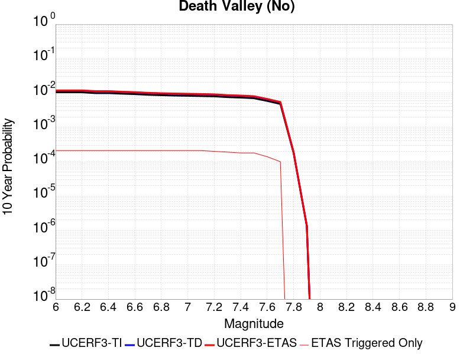 |

| Magnitude | 1 wk TI Prob | 1 wk TD Prob | 1 wk ETAS Prob | 1 wk ETAS/TD Gain | 1 wk ETAS Triggered Only | 1 mo TI Prob | 1 mo TD Prob | 1 mo ETAS Prob | 1 mo ETAS/TD Gain | 1 mo ETAS Triggered Only | 1 yr TI Prob | 1 yr TD Prob | 1 yr ETAS Prob | 1 yr ETAS/TD Gain | 1 yr ETAS Triggered Only | 10 yr TI Prob | 10 yr TD Prob | 10 yr ETAS Prob | 10 yr ETAS/TD Gain | 10 yr ETAS Triggered Only |
|-----|-----|-----|-----|-----|-----|-----|-----|-----|-----|-----|-----|-----|-----|-----|-----|-----|-----|-----|-----|-----|
| 6.0 | 2.0074807E-5 | 2.2503706E-5 | 4.2503256E-5 | 1.8887225 | 2.0E-5 | 8.603206E-5 | 9.6440934E-5 | 1.3643707E-4 | 1.4147216 | 4.0E-5 | 0.001046937 | 0.0011735433 | 0.0012934024 | 1.1021345 | 1.2E-4 | 0.010420183 | 0.011674375 | 0.011881923 | 1.0177782 | 2.1E-4 |
| 6.1 | 2.0074807E-5 | 2.2503706E-5 | 4.2503256E-5 | 1.8887225 | 2.0E-5 | 8.603206E-5 | 9.6440934E-5 | 1.3643707E-4 | 1.4147216 | 4.0E-5 | 0.001046937 | 0.0011735433 | 0.0012934024 | 1.1021345 | 1.2E-4 | 0.010420183 | 0.011674375 | 0.011881923 | 1.0177782 | 2.1E-4 |
| 6.2 | 2.0074807E-5 | 2.2503706E-5 | 4.2503256E-5 | 1.8887225 | 2.0E-5 | 8.603206E-5 | 9.6440934E-5 | 1.3643707E-4 | 1.4147216 | 4.0E-5 | 0.001046937 | 0.0011735433 | 0.0012934024 | 1.1021345 | 1.2E-4 | 0.010420183 | 0.011674375 | 0.011881923 | 1.0177782 | 2.1E-4 |
| 6.3 | 1.9050609E-5 | 2.134036E-5 | 4.1339932E-5 | 1.9371713 | 2.0E-5 | 8.164292E-5 | 9.145552E-5 | 1.3145186E-4 | 1.4373311 | 4.0E-5 | 9.935491E-4 | 0.0011129089 | 0.0012327754 | 1.1077055 | 1.2E-4 | 0.009891188 | 0.011074181 | 0.0112818545 | 1.018753 | 2.1E-4 |
| 6.4 | 1.9050609E-5 | 2.134036E-5 | 4.1339932E-5 | 1.9371713 | 2.0E-5 | 8.164292E-5 | 9.145552E-5 | 1.3145186E-4 | 1.4373311 | 4.0E-5 | 9.935491E-4 | 0.0011129089 | 0.0012327754 | 1.1077055 | 1.2E-4 | 0.009891188 | 0.011074181 | 0.0112818545 | 1.018753 | 2.1E-4 |
| 6.5 | 1.8367004E-5 | 2.0564283E-5 | 4.056387E-5 | 1.97254 | 2.0E-5 | 7.8713354E-5 | 8.81297E-5 | 1.2812618E-4 | 1.4538366 | 4.0E-5 | 9.5791375E-4 | 0.0010724575 | 0.0011923288 | 1.1117725 | 1.2E-4 | 0.009537951 | 0.010673606 | 0.010881364 | 1.0194647 | 2.1E-4 |
| 6.6 | 1.779439E-5 | 1.9914085E-5 | 3.9913688E-5 | 2.0042942 | 2.0E-5 | 7.625944E-5 | 8.534332E-5 | 1.2533991E-4 | 1.4686551 | 4.0E-5 | 9.280632E-4 | 0.0010385661 | 0.0011584414 | 1.1154239 | 1.2E-4 | 0.009241969 | 0.010337884 | 0.010545713 | 1.0201037 | 2.1E-4 |
| 6.7 | 1.7025437E-5 | 1.9046434E-5 | 3.9046055E-5 | 2.0500453 | 2.0E-5 | 7.296412E-5 | 8.162506E-5 | 1.2162179E-4 | 1.4900056 | 4.0E-5 | 8.87976E-4 | 9.933382E-4 | 0.001113219 | 1.1206847 | 1.2E-4 | 0.008844362 | 0.0098897 | 0.010097624 | 1.0210242 | 2.1E-4 |
| 6.8 | 1.6545107E-5 | 1.8515479E-5 | 3.851511E-5 | 2.0801573 | 2.0E-5 | 7.090568E-5 | 7.934967E-5 | 1.193465E-4 | 1.5040579 | 4.0E-5 | 8.629347E-4 | 9.656602E-4 | 0.0010855444 | 1.1241473 | 1.2E-4 | 0.008595915 | 0.009615345 | 0.009823326 | 1.02163 | 2.1E-4 |
| 6.9 | 1.615478E-5 | 1.8090475E-5 | 3.8090115E-5 | 2.105534 | 2.0E-5 | 6.9232934E-5 | 7.752834E-5 | 1.1752524E-4 | 1.5159004 | 4.0E-5 | 8.4258494E-4 | 9.435049E-4 | 0.0010633917 | 1.1270653 | 1.2E-4 | 0.008393973 | 0.009395686 | 0.009603713 | 1.0221407 | 2.1E-4 |
| 7.0 | 1.5894311E-5 | 1.7808401E-5 | 3.7808044E-5 | 2.1230454 | 2.0E-5 | 6.81167E-5 | 7.631952E-5 | 1.1631646E-4 | 1.5240723 | 4.0E-5 | 8.2900526E-4 | 9.288001E-4 | 0.0010486887 | 1.129079 | 1.2E-4 | 0.008259195 | 0.009249872 | 0.009457929 | 1.022493 | 2.1E-4 |
| 7.1 | 1.5602263E-5 | 1.7486309E-5 | 3.748596E-5 | 2.1437318 | 2.0E-5 | 6.6865134E-5 | 7.4939206E-5 | 1.1493621E-4 | 1.533726 | 4.0E-5 | 8.137789E-4 | 9.12009E-4 | 0.0010318996 | 1.1314577 | 1.2E-4 | 0.008108052 | 0.009083345 | 0.009291437 | 1.0229093 | 2.1E-4 |
| 7.2 | 1.5323829E-5 | 1.7173385E-5 | 3.7173042E-5 | 2.1645727 | 2.0E-5 | 6.56719E-5 | 7.3598174E-5 | 1.1359523E-4 | 1.5434518 | 4.0E-5 | 7.99262E-4 | 8.9569547E-4 | 0.001005597 | 1.1226996 | 1.1E-4 | 0.007963934 | 0.008921531 | 0.009119747 | 1.0222176 | 2.0E-4 |
| 7.3 | 1.4556212E-5 | 1.6305059E-5 | 3.6304733E-5 | 2.2265933 | 2.0E-5 | 6.238227E-5 | 6.987698E-5 | 9.987489E-5 | 1.4292959 | 3.0E-5 | 7.592395E-4 | 8.5042603E-4 | 9.50341E-4 | 1.1174881 | 1.0E-4 | 0.0075665074 | 0.008472362 | 0.008660751 | 1.0222359 | 1.9E-4 |
| 7.4 | 1.411725E-5 | 1.581048E-5 | 3.5810164E-5 | 2.2649639 | 2.0E-5 | 6.0501097E-5 | 6.775747E-5 | 9.775544E-5 | 1.4427257 | 3.0E-5 | 7.363519E-4 | 8.246408E-4 | 9.1456657E-4 | 1.1090484 | 9.0E-5 | 0.0073391674 | 0.008216443 | 0.008394963 | 1.0217273 | 1.8E-4 |
| 7.5 | 1.3503312E-5 | 1.5128708E-5 | 3.5128407E-5 | 2.32197 | 2.0E-5 | 5.7870053E-5 | 6.483574E-5 | 9.48338E-5 | 1.4626777 | 3.0E-5 | 7.043401E-4 | 7.8909507E-4 | 8.7902404E-4 | 1.1139647 | 9.0E-5 | 0.007021119 | 0.007863557 | 0.008042141 | 1.0227104 | 1.8E-4 |
| 7.6 | 1.1279839E-5 | 1.2628332E-5 | 3.262808E-5 | 2.5837204 | 2.0E-5 | 4.834127E-5 | 5.412033E-5 | 8.411871E-5 | 1.5542903 | 3.0E-5 | 5.88396E-4 | 6.5872114E-4 | 7.486618E-4 | 1.1365384 | 9.0E-5 | 0.005868405 | 0.006568238 | 0.0067073186 | 1.0211747 | 1.4E-4 |
| 7.7 | 9.189108E-6 | 1.0284987E-5 | 2.0284884E-5 | 1.972281 | 1.0E-5 | 3.93813E-5 | 4.4077802E-5 | 5.407736E-5 | 1.2268616 | 1.0E-5 | 4.7936183E-4 | 5.3652015E-4 | 5.9648795E-4 | 1.1117718 | 6.0E-5 | 0.004783291 | 0.0053527597 | 0.0054522245 | 1.018582 | 1.0E-4 |
| 7.8 | 3.4586725E-7 | 3.648528E-7 | 3.648528E-7 | 1.0 | 0.0 | 1.4822873E-6 | 1.563654E-6 | 1.563654E-6 | 1.0 | 0.0 | 1.80467E-5 | 1.9037325E-5 | 1.9037325E-5 | 1.0 | 0.0 | 1.8045233E-4 | 1.9035739E-4 | 1.9035739E-4 | 1.0 | 0.0 |
| 7.9 | 2.5591178E-9 | 2.6698248E-9 | 2.6698248E-9 | 1.0 | 0.0 | 1.0967647E-8 | 1.1442106E-8 | 1.1442106E-8 | 1.0 | 0.0 | 1.335311E-7 | 1.3930764E-7 | 1.3930764E-7 | 1.0 | 0.0 | 1.3353102E-6 | 1.3930764E-6 | 1.3930764E-6 | 1.0 | 0.0 |

## San Andreas (Parkfield)
*[(top)](#table-of-contents)*

| 1 Week | 1 Month | 1 Year | 10 Year |
|-----|-----|-----|-----|
|  |  |  |  |

| Magnitude | 1 wk TI Prob | 1 wk TD Prob | 1 wk ETAS Prob | 1 wk ETAS/TD Gain | 1 wk ETAS Triggered Only | 1 mo TI Prob | 1 mo TD Prob | 1 mo ETAS Prob | 1 mo ETAS/TD Gain | 1 mo ETAS Triggered Only | 1 yr TI Prob | 1 yr TD Prob | 1 yr ETAS Prob | 1 yr ETAS/TD Gain | 1 yr ETAS Triggered Only | 10 yr TI Prob | 10 yr TD Prob | 10 yr ETAS Prob | 10 yr ETAS/TD Gain | 10 yr ETAS Triggered Only |
|-----|-----|-----|-----|-----|-----|-----|-----|-----|-----|-----|-----|-----|-----|-----|-----|-----|-----|-----|-----|-----|
| 6.0 | 5.556969E-4 | 7.8797597E-4 | 7.8797597E-4 | 1.0 | 0.0 | 0.0023793848 | 0.003373235 | 0.0033832013 | 1.0029545 | 1.0E-5 | 0.028586963 | 0.04067351 | 0.04073107 | 1.0014151 | 6.0E-5 | 0.25176284 | 0.33868203 | 0.33880767 | 1.000371 | 1.9E-4 |
| 6.1 | 1.925858E-4 | 3.056036E-4 | 3.056036E-4 | 1.0 | 0.0 | 8.2510663E-4 | 0.0013091693 | 0.0013191563 | 1.0076284 | 1.0E-5 | 0.0099994885 | 0.015918575 | 0.015967779 | 1.003091 | 5.0E-5 | 0.095613256 | 0.15041287 | 0.15053181 | 1.0007907 | 1.4E-4 |
| 6.2 | 9.4306815E-5 | 1.831944E-4 | 1.831944E-4 | 1.0 | 0.0 | 4.0410945E-4 | 7.8488386E-4 | 7.94876E-4 | 1.0127307 | 1.0E-5 | 0.0049089384 | 0.0095143 | 0.009563824 | 1.0052053 | 5.0E-5 | 0.048019063 | 0.092186436 | 0.09229537 | 1.0011817 | 1.2E-4 |
| 6.3 | 9.283051E-5 | 1.8015703E-4 | 1.8015703E-4 | 1.0 | 0.0 | 3.9778434E-4 | 7.718743E-4 | 7.818666E-4 | 1.0129455 | 1.0E-5 | 0.0048322747 | 0.00935728 | 0.0094068125 | 1.0052935 | 5.0E-5 | 0.047285385 | 0.09083898 | 0.09094808 | 1.001201 | 1.2E-4 |
| 6.4 | 9.138826E-5 | 1.7777387E-4 | 1.7777387E-4 | 1.0 | 0.0 | 3.916052E-4 | 7.6166674E-4 | 7.7165914E-4 | 1.0131191 | 1.0E-5 | 0.0047573745 | 0.009234063 | 0.009283602 | 1.0053648 | 5.0E-5 | 0.046568092 | 0.08973953 | 0.089848764 | 1.0012172 | 1.2E-4 |
| 6.5 | 9.000255E-5 | 1.7534966E-4 | 1.7534966E-4 | 1.0 | 0.0 | 3.8566816E-4 | 7.512833E-4 | 7.612758E-4 | 1.0133005 | 1.0E-5 | 0.0046854047 | 0.00910872 | 0.009158265 | 1.0054393 | 5.0E-5 | 0.045878403 | 0.08862388 | 0.08873325 | 1.001234 | 1.2E-4 |
| 6.6 | 8.8109264E-5 | 1.7215131E-4 | 1.7215131E-4 | 1.0 | 0.0 | 3.7755648E-4 | 7.3758385E-4 | 7.475765E-4 | 1.0135478 | 1.0E-5 | 0.0045870654 | 0.008943325 | 0.008992878 | 1.0055407 | 5.0E-5 | 0.04493529 | 0.08715216 | 0.0872617 | 1.001257 | 1.2E-4 |
| 6.7 | 8.738073E-5 | 1.7081993E-4 | 1.7081993E-4 | 1.0 | 0.0 | 3.7443507E-4 | 7.318812E-4 | 7.418738E-4 | 1.0136534 | 1.0E-5 | 0.0045492216 | 0.008874504 | 0.0089240605 | 1.0055841 | 5.0E-5 | 0.04457213 | 0.086551875 | 0.08666149 | 1.0012665 | 1.2E-4 |
| 6.8 | 8.710195E-5 | 1.7027321E-4 | 1.7027321E-4 | 1.0 | 0.0 | 3.7324068E-4 | 7.2953943E-4 | 7.395321E-4 | 1.0136973 | 1.0E-5 | 0.0045347405 | 0.008846234 | 0.008895791 | 1.0056021 | 5.0E-5 | 0.04443313 | 0.08629888 | 0.086408526 | 1.0012705 | 1.2E-4 |
| 6.9 | 8.6801556E-5 | 1.696812E-4 | 1.696812E-4 | 1.0 | 0.0 | 3.7195362E-4 | 7.270036E-4 | 7.3699636E-4 | 1.0137451 | 1.0E-5 | 0.0045191357 | 0.00881561 | 0.008865169 | 1.0056218 | 5.0E-5 | 0.044283327 | 0.08602441 | 0.08613409 | 1.001275 | 1.2E-4 |
| 7.0 | 8.5571606E-5 | 1.6720325E-4 | 1.6720325E-4 | 1.0 | 0.0 | 3.6668387E-4 | 7.1638974E-4 | 7.2638254E-4 | 1.0139489 | 1.0E-5 | 0.004455241 | 0.008687424 | 0.0087369885 | 1.0057055 | 5.0E-5 | 0.043669727 | 0.08487067 | 0.084980495 | 1.0012939 | 1.2E-4 |
| 7.1 | 7.82589E-5 | 1.519865E-4 | 1.519865E-4 | 1.0 | 0.0 | 3.3535215E-4 | 6.5120886E-4 | 6.6120236E-4 | 1.015346 | 1.0E-5 | 0.0040752706 | 0.007899817 | 0.007949422 | 1.0062792 | 5.0E-5 | 0.040013418 | 0.077774286 | 0.07788496 | 1.0014229 | 1.2E-4 |
| 7.2 | 7.690929E-5 | 1.4935475E-4 | 1.4935475E-4 | 1.0 | 0.0 | 3.2956956E-4 | 6.3993543E-4 | 6.4992905E-4 | 1.0156165 | 1.0E-5 | 0.004005129 | 0.007763549 | 0.007813161 | 1.0063903 | 5.0E-5 | 0.0393371 | 0.07654616 | 0.076656975 | 1.0014477 | 1.2E-4 |
| 7.3 | 7.5543794E-5 | 1.4631219E-4 | 1.4631219E-4 | 1.0 | 0.0 | 3.2371894E-4 | 6.269022E-4 | 6.3689594E-4 | 1.0159415 | 1.0E-5 | 0.003934157 | 0.0076059876 | 0.0076556075 | 1.0065237 | 5.0E-5 | 0.038652334 | 0.07510628 | 0.07521727 | 1.0014777 | 1.2E-4 |
| 7.4 | 7.4214564E-5 | 1.4331246E-4 | 1.4331246E-4 | 1.0 | 0.0 | 3.1802364E-4 | 6.140524E-4 | 6.2404625E-4 | 1.0162753 | 1.0E-5 | 0.003865065 | 0.007450621 | 0.0075002485 | 1.0066608 | 5.0E-5 | 0.03798529 | 0.07367671 | 0.07378787 | 1.0015087 | 1.2E-4 |
| 7.5 | 6.149578E-5 | 1.124955E-4 | 1.124955E-4 | 1.0 | 0.0 | 2.6352672E-4 | 4.820346E-4 | 4.9202977E-4 | 1.0207354 | 1.0E-5 | 0.0032037178 | 0.0058530113 | 0.0059027183 | 1.0084926 | 5.0E-5 | 0.03157923 | 0.058828387 | 0.058931917 | 1.0017599 | 1.1E-4 |
| 7.6 | 6.0643448E-5 | 1.1077644E-4 | 1.1077644E-4 | 1.0 | 0.0 | 2.598746E-4 | 4.7466988E-4 | 4.8466513E-4 | 1.0210572 | 1.0E-5 | 0.0031593828 | 0.0057638236 | 0.0058135353 | 1.0086248 | 5.0E-5 | 0.031148417 | 0.057987217 | 0.058090836 | 1.001787 | 1.1E-4 |
| 7.7 | 5.1652263E-5 | 9.226993E-5 | 9.226993E-5 | 1.0 | 0.0 | 2.2134806E-4 | 3.9538264E-4 | 4.053787E-4 | 1.0252819 | 1.0E-5 | 0.002691582 | 0.004803169 | 0.0048429766 | 1.0082878 | 4.0E-5 | 0.026592141 | 0.048781026 | 0.048857123 | 1.00156 | 8.0E-5 |
| 7.8 | 4.8090482E-5 | 8.607785E-5 | 8.607785E-5 | 1.0 | 0.0 | 2.060858E-4 | 3.6885295E-4 | 3.7884928E-4 | 1.027101 | 1.0E-5 | 0.0025062072 | 0.0044815456 | 0.0045213667 | 1.0088855 | 4.0E-5 | 0.024781305 | 0.04552861 | 0.04560497 | 1.0016772 | 8.0E-5 |
| 7.9 | 3.970278E-5 | 6.787929E-5 | 6.787929E-5 | 1.0 | 0.0 | 1.7014367E-4 | 2.9087884E-4 | 3.0087592E-4 | 1.0343686 | 1.0E-5 | 0.002069531 | 0.0035357028 | 0.0035755613 | 1.0112731 | 4.0E-5 | 0.020503636 | 0.036061067 | 0.036118906 | 1.0016038 | 6.0E-5 |
| 8.0 | 2.8982335E-5 | 4.093677E-5 | 4.093677E-5 | 1.0 | 0.0 | 1.2420409E-4 | 1.754315E-4 | 1.754315E-4 | 1.0 | 0.0 | 0.0015111357 | 0.0021337876 | 0.0021637236 | 1.0140295 | 3.0E-5 | 0.015009012 | 0.022130102 | 0.022159437 | 1.0013256 | 3.0E-5 |
| 8.1 | 1.8836186E-5 | 1.8816902E-5 | 1.8816902E-5 | 1.0 | 0.0 | 8.0724014E-5 | 8.0641374E-5 | 8.0641374E-5 | 1.0 | 0.0 | 9.823717E-4 | 9.813671E-4 | 9.913573E-4 | 1.0101799 | 1.0E-5 | 0.009780403 | 0.010559504 | 0.010569398 | 1.000937 | 1.0E-5 |
| 8.2 | 8.643924E-6 | 5.5269165E-6 | 5.5269165E-6 | 1.0 | 0.0 | 3.704486E-5 | 2.368657E-5 | 2.368657E-5 | 1.0 | 0.0 | 4.5092785E-4 | 2.8834594E-4 | 2.8834594E-4 | 1.0 | 0.0 | 0.0045001395 | 0.0032771796 | 0.0032771796 | 1.0 | 0.0 |
| 8.3 | 1.983087E-6 | 7.7486385E-7 | 7.7486385E-7 | 1.0 | 0.0 | 8.498917E-6 | 3.320841E-6 | 3.320841E-6 | 1.0 | 0.0 | 1.034694E-4 | 4.0430506E-5 | 4.0430506E-5 | 1.0 | 0.0 | 0.0010342124 | 4.7705657E-4 | 4.7705657E-4 | 1.0 | 0.0 |

## Sierra Nevada  (No Extension)
*[(top)](#table-of-contents)*

| 1 Week | 1 Month | 1 Year | 10 Year |
|-----|-----|-----|-----|
|  |  |  | 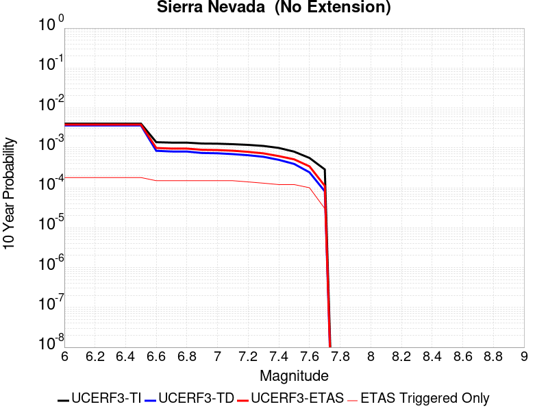 |

| Magnitude | 1 wk TI Prob | 1 wk TD Prob | 1 wk ETAS Prob | 1 wk ETAS/TD Gain | 1 wk ETAS Triggered Only | 1 mo TI Prob | 1 mo TD Prob | 1 mo ETAS Prob | 1 mo ETAS/TD Gain | 1 mo ETAS Triggered Only | 1 yr TI Prob | 1 yr TD Prob | 1 yr ETAS Prob | 1 yr ETAS/TD Gain | 1 yr ETAS Triggered Only | 10 yr TI Prob | 10 yr TD Prob | 10 yr ETAS Prob | 10 yr ETAS/TD Gain | 10 yr ETAS Triggered Only |
|-----|-----|-----|-----|-----|-----|-----|-----|-----|-----|-----|-----|-----|-----|-----|-----|-----|-----|-----|-----|-----|
| 6.0 | 7.7690465E-6 | 6.9769367E-6 | 6.9769367E-6 | 1.0 | 0.0 | 3.329549E-5 | 2.9901017E-5 | 3.990072E-5 | 1.3344268 | 1.0E-5 | 4.0529718E-4 | 3.640199E-4 | 4.639835E-4 | 1.2746103 | 1.0E-4 | 0.004045588 | 0.003637753 | 0.003817098 | 1.0493011 | 1.8E-4 |
| 6.1 | 7.7690465E-6 | 6.9769367E-6 | 6.9769367E-6 | 1.0 | 0.0 | 3.329549E-5 | 2.9901017E-5 | 3.990072E-5 | 1.3344268 | 1.0E-5 | 4.0529718E-4 | 3.640199E-4 | 4.639835E-4 | 1.2746103 | 1.0E-4 | 0.004045588 | 0.003637753 | 0.003817098 | 1.0493011 | 1.8E-4 |
| 6.2 | 7.7690465E-6 | 6.9769367E-6 | 6.9769367E-6 | 1.0 | 0.0 | 3.329549E-5 | 2.9901017E-5 | 3.990072E-5 | 1.3344268 | 1.0E-5 | 4.0529718E-4 | 3.640199E-4 | 4.639835E-4 | 1.2746103 | 1.0E-4 | 0.004045588 | 0.003637753 | 0.003817098 | 1.0493011 | 1.8E-4 |
| 6.3 | 7.7690465E-6 | 6.9769367E-6 | 6.9769367E-6 | 1.0 | 0.0 | 3.329549E-5 | 2.9901017E-5 | 3.990072E-5 | 1.3344268 | 1.0E-5 | 4.0529718E-4 | 3.640199E-4 | 4.639835E-4 | 1.2746103 | 1.0E-4 | 0.004045588 | 0.003637753 | 0.003817098 | 1.0493011 | 1.8E-4 |
| 6.4 | 7.7690465E-6 | 6.9769367E-6 | 6.9769367E-6 | 1.0 | 0.0 | 3.329549E-5 | 2.9901017E-5 | 3.990072E-5 | 1.3344268 | 1.0E-5 | 4.0529718E-4 | 3.640199E-4 | 4.639835E-4 | 1.2746103 | 1.0E-4 | 0.004045588 | 0.003637753 | 0.003817098 | 1.0493011 | 1.8E-4 |
| 6.5 | 7.7690465E-6 | 6.9769367E-6 | 6.9769367E-6 | 1.0 | 0.0 | 3.329549E-5 | 2.9901017E-5 | 3.990072E-5 | 1.3344268 | 1.0E-5 | 4.0529718E-4 | 3.640199E-4 | 4.639835E-4 | 1.2746103 | 1.0E-4 | 0.004045588 | 0.003637753 | 0.003817098 | 1.0493011 | 1.8E-4 |
| 6.6 | 2.653E-6 | 1.6151278E-6 | 1.6151278E-6 | 1.0 | 0.0 | 1.136995E-5 | 6.9219577E-6 | 1.692189E-5 | 2.444668 | 1.0E-5 | 1.3842035E-4 | 8.427161E-5 | 1.5426571E-4 | 1.8305775 | 7.0E-5 | 0.0013833415 | 8.424E-4 | 9.922737E-4 | 1.1779127 | 1.5E-4 |
| 6.7 | 2.5902466E-6 | 1.5504587E-6 | 1.5504587E-6 | 1.0 | 0.0 | 1.11010095E-5 | 6.644806E-6 | 1.6644739E-5 | 2.5049248 | 1.0E-5 | 1.351464E-4 | 8.089754E-5 | 1.5089188E-4 | 1.8652221 | 7.0E-5 | 0.0013506424 | 8.086839E-4 | 9.585626E-4 | 1.1853366 | 1.5E-4 |
| 6.8 | 2.5853892E-6 | 1.5472576E-6 | 1.5472576E-6 | 1.0 | 0.0 | 1.1080193E-5 | 6.6310877E-6 | 1.6631022E-5 | 2.5080383 | 1.0E-5 | 1.34893E-4 | 8.0730526E-5 | 1.5072488E-4 | 1.8670121 | 7.0E-5 | 0.0013481114 | 8.07015E-4 | 9.5689396E-4 | 1.1857202 | 1.5E-4 |
| 6.9 | 2.458257E-6 | 1.4223259E-6 | 1.4223259E-6 | 1.0 | 0.0 | 1.0535345E-5 | 6.095668E-6 | 1.6095608E-5 | 2.6404994 | 1.0E-5 | 1.2826028E-4 | 7.421225E-5 | 1.4420705E-4 | 1.9431705 | 7.0E-5 | 0.0012818627 | 7.4187666E-4 | 8.9176535E-4 | 1.20204 | 1.5E-4 |
| 7.0 | 2.4341468E-6 | 1.3992884E-6 | 1.3992884E-6 | 1.0 | 0.0 | 1.0432016E-5 | 5.9969366E-6 | 1.5996877E-5 | 2.6675081 | 1.0E-5 | 1.270024E-4 | 7.301028E-5 | 1.4300516E-4 | 1.9586991 | 7.0E-5 | 0.0012692984 | 7.298648E-4 | 8.7975536E-4 | 1.2053676 | 1.5E-4 |
| 7.1 | 2.3652476E-6 | 1.3342343E-6 | 1.3342343E-6 | 1.0 | 0.0 | 1.0136736E-5 | 5.7181346E-6 | 1.5718077E-5 | 2.748812 | 1.0E-5 | 1.2340778E-4 | 6.961608E-5 | 1.396112E-4 | 2.0054448 | 7.0E-5 | 0.0012333926 | 6.959444E-4 | 8.4584E-4 | 1.2153845 | 1.5E-4 |
| 7.2 | 2.272158E-6 | 1.2505349E-6 | 1.2505349E-6 | 1.0 | 0.0 | 9.737784E-6 | 5.3594244E-6 | 1.535937E-5 | 2.8658621 | 1.0E-5 | 1.1855107E-4 | 6.5249056E-5 | 1.3524448E-4 | 2.0727425 | 7.0E-5 | 0.0011848784 | 6.523005E-4 | 7.922091E-4 | 1.214485 | 1.4E-4 |
| 7.3 | 2.1382127E-6 | 1.1422151E-6 | 1.1422151E-6 | 1.0 | 0.0 | 9.163737E-6 | 4.8951983E-6 | 1.4895149E-5 | 3.042808 | 1.0E-5 | 1.1156279E-4 | 5.9597423E-5 | 1.19593846E-4 | 2.006695 | 6.0E-5 | 0.001115068 | 5.958156E-4 | 7.257381E-4 | 1.2180583 | 1.3E-4 |
| 7.4 | 1.9048055E-6 | 9.57756E-7 | 9.57756E-7 | 1.0 | 0.0 | 8.163426E-6 | 4.1046624E-6 | 1.4104621E-5 | 3.436244 | 1.0E-5 | 9.9385186E-5 | 4.9973125E-5 | 1.09970126E-4 | 2.2005854 | 6.0E-5 | 9.934074E-4 | 4.996196E-4 | 6.195596E-4 | 1.2400627 | 1.2E-4 |
| 7.5 | 1.5373403E-6 | 7.5620164E-7 | 7.5620164E-7 | 1.0 | 0.0 | 6.5885843E-6 | 3.2408602E-6 | 1.3240828E-5 | 4.0855904 | 1.0E-5 | 8.021306E-5 | 3.9456765E-5 | 9.9454395E-5 | 2.5205917 | 6.0E-5 | 8.0184115E-4 | 3.9449806E-4 | 5.144507E-4 | 1.304064 | 1.2E-4 |
| 7.6 | 1.0680322E-6 | 4.6610623E-7 | 4.6610623E-7 | 1.0 | 0.0 | 4.577273E-6 | 1.9975967E-6 | 1.9975967E-6 | 1.0 | 0.0 | 5.5726876E-5 | 2.432047E-5 | 6.4319494E-5 | 2.644665 | 4.0E-5 | 5.5712904E-4 | 2.4317835E-4 | 3.4315404E-4 | 1.4111208 | 1.0E-4 |
| 7.7 | 5.509146E-7 | 1.5587625E-7 | 1.5587625E-7 | 1.0 | 0.0 | 2.3610605E-6 | 6.680409E-7 | 6.680409E-7 | 1.0 | 0.0 | 2.8745531E-5 | 8.133369E-6 | 1.8133287E-5 | 2.229493 | 1.0E-5 | 2.8741814E-4 | 8.133083E-5 | 1.1132839E-4 | 1.3688338 | 3.0E-5 |

## San Andreas (Cholame) rev
*[(top)](#table-of-contents)*

| 1 Week | 1 Month | 1 Year | 10 Year |
|-----|-----|-----|-----|
|  |  |  |  |

| Magnitude | 1 wk TI Prob | 1 wk TD Prob | 1 wk ETAS Prob | 1 wk ETAS/TD Gain | 1 wk ETAS Triggered Only | 1 mo TI Prob | 1 mo TD Prob | 1 mo ETAS Prob | 1 mo ETAS/TD Gain | 1 mo ETAS Triggered Only | 1 yr TI Prob | 1 yr TD Prob | 1 yr ETAS Prob | 1 yr ETAS/TD Gain | 1 yr ETAS Triggered Only | 10 yr TI Prob | 10 yr TD Prob | 10 yr ETAS Prob | 10 yr ETAS/TD Gain | 10 yr ETAS Triggered Only |
|-----|-----|-----|-----|-----|-----|-----|-----|-----|-----|-----|-----|-----|-----|-----|-----|-----|-----|-----|-----|-----|
| 6.0 | 1.2302514E-4 | 2.5301226E-4 | 2.5301226E-4 | 1.0 | 0.0 | 5.27144E-4 | 0.0010838893 | 0.0010938785 | 1.0092161 | 1.0E-5 | 0.0063991086 | 0.013117016 | 0.01317623 | 1.0045142 | 6.0E-5 | 0.06217949 | 0.12479458 | 0.124952115 | 1.0012624 | 1.8E-4 |
| 6.1 | 1.2302514E-4 | 2.5301226E-4 | 2.5301226E-4 | 1.0 | 0.0 | 5.27144E-4 | 0.0010838893 | 0.0010938785 | 1.0092161 | 1.0E-5 | 0.0063991086 | 0.013117016 | 0.01317623 | 1.0045142 | 6.0E-5 | 0.06217949 | 0.12479458 | 0.124952115 | 1.0012624 | 1.8E-4 |
| 6.2 | 1.2203569E-4 | 2.5117898E-4 | 2.5117898E-4 | 1.0 | 0.0 | 5.2290526E-4 | 0.0010760389 | 0.0010860282 | 1.0092833 | 1.0E-5 | 0.006347804 | 0.013022584 | 0.013081803 | 1.0045474 | 6.0E-5 | 0.061695136 | 0.12398066 | 0.12413835 | 1.0012718 | 1.8E-4 |
| 6.3 | 1.2142645E-4 | 2.5003796E-4 | 2.5003796E-4 | 1.0 | 0.0 | 5.202953E-4 | 0.0010711529 | 0.0010811421 | 1.0093257 | 1.0E-5 | 0.006316212 | 0.012963806 | 0.013023028 | 1.0045682 | 6.0E-5 | 0.06139677 | 0.12347472 | 0.1236325 | 1.0012778 | 1.8E-4 |
| 6.4 | 1.1865206E-4 | 2.4508737E-4 | 2.4508737E-4 | 1.0 | 0.0 | 5.0840975E-4 | 0.0010499532 | 0.0010599426 | 1.0095142 | 1.0E-5 | 0.006172335 | 0.012708736 | 0.012767973 | 1.0046612 | 6.0E-5 | 0.060036868 | 0.121266164 | 0.12141555 | 1.0012319 | 1.7E-4 |
| 6.5 | 1.17443946E-4 | 2.4301645E-4 | 2.4301645E-4 | 1.0 | 0.0 | 5.032341E-4 | 0.0010410849 | 0.0010510745 | 1.0095954 | 1.0E-5 | 0.006109677 | 0.012602015 | 0.01266126 | 1.0047011 | 6.0E-5 | 0.059444077 | 0.12033925 | 0.1204888 | 1.0012426 | 1.7E-4 |
| 6.6 | 1.13579066E-4 | 2.3609491E-4 | 2.3609491E-4 | 1.0 | 0.0 | 4.866766E-4 | 0.0010114445 | 0.0010214344 | 1.0098768 | 1.0E-5 | 0.0059092017 | 0.012245254 | 0.012304518 | 1.0048399 | 6.0E-5 | 0.057545185 | 0.117250346 | 0.11740041 | 1.0012798 | 1.7E-4 |
| 6.7 | 1.1271412E-4 | 2.3453572E-4 | 2.3453572E-4 | 1.0 | 0.0 | 4.829711E-4 | 0.0010047674 | 0.0010147573 | 1.0099425 | 1.0E-5 | 0.005864331 | 0.01216487 | 0.012224141 | 1.0048722 | 6.0E-5 | 0.057119697 | 0.11655333 | 0.11670352 | 1.0012885 | 1.7E-4 |
| 6.8 | 1.1217975E-4 | 2.3341762E-4 | 2.3341762E-4 | 1.0 | 0.0 | 4.8068175E-4 | 9.999792E-4 | 0.0010099693 | 1.0099902 | 1.0E-5 | 0.005836608 | 0.012107224 | 0.012166497 | 1.0048957 | 6.0E-5 | 0.056856725 | 0.116050914 | 0.116201185 | 1.0012949 | 1.7E-4 |
| 6.9 | 1.1146753E-4 | 2.3190254E-4 | 2.3190254E-4 | 1.0 | 0.0 | 4.7763053E-4 | 9.93491E-4 | 0.0010034811 | 1.0100555 | 1.0E-5 | 0.0057996577 | 0.012029105 | 0.012088383 | 1.0049279 | 6.0E-5 | 0.056506127 | 0.115370646 | 0.115512185 | 1.0012268 | 1.6E-4 |
| 7.0 | 1.0965793E-4 | 2.2812837E-4 | 2.2812837E-4 | 1.0 | 0.0 | 4.698779E-4 | 9.773282E-4 | 9.873183E-4 | 1.010222 | 1.0E-5 | 0.005705768 | 0.011834476 | 0.011893766 | 1.0050099 | 6.0E-5 | 0.055614736 | 0.113670014 | 0.11381183 | 1.0012475 | 1.6E-4 |
| 7.1 | 9.927982E-5 | 2.0628411E-4 | 2.0628411E-4 | 1.0 | 0.0 | 4.2541555E-4 | 8.837762E-4 | 8.937674E-4 | 1.0113051 | 1.0E-5 | 0.0051671406 | 0.010707187 | 0.010766543 | 1.0055437 | 6.0E-5 | 0.05048634 | 0.10375505 | 0.10389845 | 1.0013821 | 1.6E-4 |
| 7.2 | 9.696786E-5 | 2.0132023E-4 | 2.0132023E-4 | 1.0 | 0.0 | 4.1551032E-4 | 8.6251675E-4 | 8.725081E-4 | 1.0115839 | 1.0E-5 | 0.00504711 | 0.010450863 | 0.010510236 | 1.0056812 | 6.0E-5 | 0.04934009 | 0.10149143 | 0.10163519 | 1.0014164 | 1.6E-4 |
| 7.3 | 9.4727984E-5 | 1.9559902E-4 | 1.9559902E-4 | 1.0 | 0.0 | 4.0591392E-4 | 8.380132E-4 | 8.4800477E-4 | 1.011923 | 1.0E-5 | 0.0049308087 | 0.010155352 | 0.010214742 | 1.0058482 | 6.0E-5 | 0.048228268 | 0.09885787 | 0.099002056 | 1.0014585 | 1.6E-4 |
| 7.4 | 9.220358E-5 | 1.8928824E-4 | 1.8928824E-4 | 1.0 | 0.0 | 3.9509835E-4 | 8.1098406E-4 | 8.20976E-4 | 1.0123208 | 1.0E-5 | 0.004799717 | 0.00982928 | 0.00988869 | 1.0060443 | 6.0E-5 | 0.046973653 | 0.0959303 | 0.09607495 | 1.0015079 | 1.6E-4 |
| 7.5 | 7.71631E-5 | 1.5252932E-4 | 1.5252932E-4 | 1.0 | 0.0 | 3.306571E-4 | 6.535335E-4 | 6.63527E-4 | 1.0152915 | 1.0E-5 | 0.0040183207 | 0.0079278145 | 0.007987339 | 1.0075083 | 6.0E-5 | 0.03946433 | 0.07862106 | 0.07875927 | 1.0017579 | 1.5E-4 |
| 7.6 | 7.5634416E-5 | 1.4911414E-4 | 1.4911414E-4 | 1.0 | 0.0 | 3.241072E-4 | 6.389043E-4 | 6.488979E-4 | 1.0156418 | 1.0E-5 | 0.0039388672 | 0.0077509843 | 0.007810519 | 1.0076809 | 6.0E-5 | 0.038697794 | 0.076980904 | 0.07711935 | 1.0017985 | 1.5E-4 |
| 7.7 | 6.3783E-5 | 1.2425019E-4 | 1.2425019E-4 | 1.0 | 0.0 | 2.7332708E-4 | 5.323922E-4 | 5.4238684E-4 | 1.0187732 | 1.0E-5 | 0.0033226798 | 0.006462638 | 0.0065123145 | 1.0076867 | 5.0E-5 | 0.032734364 | 0.0648433 | 0.06493682 | 1.0014422 | 1.0E-4 |
| 7.8 | 5.863422E-5 | 1.1476381E-4 | 1.1476381E-4 | 1.0 | 0.0 | 2.512653E-4 | 4.9175223E-4 | 5.017473E-4 | 1.0203254 | 1.0E-5 | 0.003054864 | 0.005970669 | 0.0060203704 | 1.0083243 | 5.0E-5 | 0.030132094 | 0.059935976 | 0.06002998 | 1.0015684 | 1.0E-4 |
| 7.9 | 4.595283E-5 | 8.470392E-5 | 8.470392E-5 | 1.0 | 0.0 | 1.9692584E-4 | 3.629663E-4 | 3.7296268E-4 | 1.0275408 | 1.0E-5 | 0.0023949358 | 0.004410167 | 0.0044499906 | 1.00903 | 4.0E-5 | 0.023692891 | 0.04457013 | 0.044627454 | 1.0012861 | 6.0E-5 |
| 8.0 | 3.2950178E-5 | 5.104955E-5 | 5.104955E-5 | 1.0 | 0.0 | 1.412074E-4 | 2.1876545E-4 | 2.1876545E-4 | 1.0 | 0.0 | 0.0017178444 | 0.0026602177 | 0.002690138 | 1.0112473 | 3.0E-5 | 0.017046256 | 0.027316514 | 0.027345695 | 1.0010682 | 3.0E-5 |
| 8.1 | 1.9177472E-5 | 1.9323319E-5 | 1.9323319E-5 | 1.0 | 0.0 | 8.218658E-5 | 8.2811595E-5 | 8.2811595E-5 | 1.0 | 0.0 | 0.0010001622 | 0.0010077655 | 0.0010177554 | 1.009913 | 1.0E-5 | 0.009956728 | 0.010830752 | 0.010840643 | 1.0009133 | 1.0E-5 |
| 8.2 | 8.643924E-6 | 5.5269165E-6 | 5.5269165E-6 | 1.0 | 0.0 | 3.704486E-5 | 2.368657E-5 | 2.368657E-5 | 1.0 | 0.0 | 4.5092785E-4 | 2.8834594E-4 | 2.8834594E-4 | 1.0 | 0.0 | 0.0045001395 | 0.0032771796 | 0.0032771796 | 1.0 | 0.0 |
| 8.3 | 1.983087E-6 | 7.7486385E-7 | 7.7486385E-7 | 1.0 | 0.0 | 8.498917E-6 | 3.320841E-6 | 3.320841E-6 | 1.0 | 0.0 | 1.034694E-4 | 4.0430506E-5 | 4.0430506E-5 | 1.0 | 0.0 | 0.0010342124 | 4.7705657E-4 | 4.7705657E-4 | 1.0 | 0.0 |

## San Andreas (Carrizo) rev
*[(top)](#table-of-contents)*

| 1 Week | 1 Month | 1 Year | 10 Year |
|-----|-----|-----|-----|
|  |  | 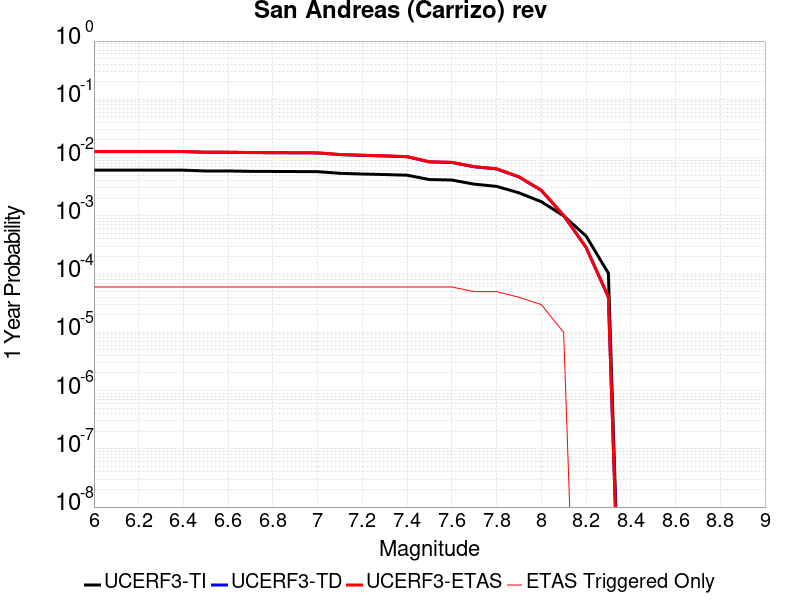 |  |

| Magnitude | 1 wk TI Prob | 1 wk TD Prob | 1 wk ETAS Prob | 1 wk ETAS/TD Gain | 1 wk ETAS Triggered Only | 1 mo TI Prob | 1 mo TD Prob | 1 mo ETAS Prob | 1 mo ETAS/TD Gain | 1 mo ETAS Triggered Only | 1 yr TI Prob | 1 yr TD Prob | 1 yr ETAS Prob | 1 yr ETAS/TD Gain | 1 yr ETAS Triggered Only | 10 yr TI Prob | 10 yr TD Prob | 10 yr ETAS Prob | 10 yr ETAS/TD Gain | 10 yr ETAS Triggered Only |
|-----|-----|-----|-----|-----|-----|-----|-----|-----|-----|-----|-----|-----|-----|-----|-----|-----|-----|-----|-----|-----|
| 6.0 | 1.1674632E-4 | 2.4418926E-4 | 2.4418926E-4 | 1.0 | 0.0 | 5.002454E-4 | 0.0010461073 | 0.0010560967 | 1.0095493 | 1.0E-5 | 0.006073493 | 0.012662465 | 0.012721705 | 1.0046784 | 6.0E-5 | 0.0591016 | 0.12101763 | 0.12117584 | 1.0013074 | 1.8E-4 |
| 6.1 | 1.1674632E-4 | 2.4418926E-4 | 2.4418926E-4 | 1.0 | 0.0 | 5.002454E-4 | 0.0010461073 | 0.0010560967 | 1.0095493 | 1.0E-5 | 0.006073493 | 0.012662465 | 0.012721705 | 1.0046784 | 6.0E-5 | 0.0591016 | 0.12101763 | 0.12117584 | 1.0013074 | 1.8E-4 |
| 6.2 | 1.1674632E-4 | 2.4418926E-4 | 2.4418926E-4 | 1.0 | 0.0 | 5.002454E-4 | 0.0010461073 | 0.0010560967 | 1.0095493 | 1.0E-5 | 0.006073493 | 0.012662465 | 0.012721705 | 1.0046784 | 6.0E-5 | 0.0591016 | 0.12101763 | 0.12117584 | 1.0013074 | 1.8E-4 |
| 6.3 | 1.1674632E-4 | 2.4418926E-4 | 2.4418926E-4 | 1.0 | 0.0 | 5.002454E-4 | 0.0010461073 | 0.0010560967 | 1.0095493 | 1.0E-5 | 0.006073493 | 0.012662465 | 0.012721705 | 1.0046784 | 6.0E-5 | 0.0591016 | 0.12101763 | 0.12117584 | 1.0013074 | 1.8E-4 |
| 6.4 | 1.1674632E-4 | 2.4418926E-4 | 2.4418926E-4 | 1.0 | 0.0 | 5.002454E-4 | 0.0010461073 | 0.0010560967 | 1.0095493 | 1.0E-5 | 0.006073493 | 0.012662465 | 0.012721705 | 1.0046784 | 6.0E-5 | 0.0591016 | 0.12101763 | 0.12117584 | 1.0013074 | 1.8E-4 |
| 6.5 | 1.13136164E-4 | 2.3738507E-4 | 2.3738507E-4 | 1.0 | 0.0 | 4.847792E-4 | 0.0010169694 | 0.0010269593 | 1.0098231 | 1.0E-5 | 0.0058862255 | 0.012311762 | 0.012371024 | 1.0048134 | 6.0E-5 | 0.057327334 | 0.11798858 | 0.11814734 | 1.0013455 | 1.8E-4 |
| 6.6 | 1.13136164E-4 | 2.3738507E-4 | 2.3738507E-4 | 1.0 | 0.0 | 4.847792E-4 | 0.0010169694 | 0.0010269593 | 1.0098231 | 1.0E-5 | 0.0058862255 | 0.012311762 | 0.012371024 | 1.0048134 | 6.0E-5 | 0.057327334 | 0.11798858 | 0.11814734 | 1.0013455 | 1.8E-4 |
| 6.7 | 1.1149675E-4 | 2.3429535E-4 | 2.3429535E-4 | 1.0 | 0.0 | 4.777557E-4 | 0.001003738 | 0.001013728 | 1.0099528 | 1.0E-5 | 0.0058011734 | 0.012152475 | 0.012211747 | 1.0048772 | 6.0E-5 | 0.05652051 | 0.11660991 | 0.11676892 | 1.0013636 | 1.8E-4 |
| 6.8 | 1.1103589E-4 | 2.3331578E-4 | 2.3331578E-4 | 1.0 | 0.0 | 4.7578133E-4 | 9.995431E-4 | 0.0010095331 | 1.0099946 | 1.0E-5 | 0.005777263 | 0.012101971 | 0.012161245 | 1.0048978 | 6.0E-5 | 0.056293584 | 0.11616996 | 0.11632905 | 1.0013695 | 1.8E-4 |
| 6.9 | 1.1053259E-4 | 2.3223832E-4 | 2.3223832E-4 | 1.0 | 0.0 | 4.7362508E-4 | 9.94929E-4 | 0.0010049191 | 1.010041 | 1.0E-5 | 0.0057511497 | 0.012046416 | 0.012105693 | 1.0049207 | 6.0E-5 | 0.05604569 | 0.11568588 | 0.11583621 | 1.0012995 | 1.7E-4 |
| 7.0 | 1.1005377E-4 | 2.3124556E-4 | 2.3124556E-4 | 1.0 | 0.0 | 4.7157376E-4 | 9.906775E-4 | 0.0010006676 | 1.0100842 | 1.0E-5 | 0.0057263062 | 0.011995226 | 0.012054506 | 1.0049419 | 6.0E-5 | 0.055809796 | 0.115237914 | 0.11538833 | 1.0013052 | 1.7E-4 |
| 7.1 | 1.0308142E-4 | 2.1632477E-4 | 2.1632477E-4 | 1.0 | 0.0 | 4.417027E-4 | 9.267778E-4 | 9.3676854E-4 | 1.0107801 | 1.0E-5 | 0.0053644776 | 0.01122546 | 0.011284787 | 1.005285 | 6.0E-5 | 0.052368138 | 0.108490154 | 0.108641714 | 1.001397 | 1.7E-4 |
| 7.2 | 1.0027479E-4 | 2.1039638E-4 | 2.1039638E-4 | 1.0 | 0.0 | 4.296783E-4 | 9.013882E-4 | 9.113791E-4 | 1.011084 | 1.0E-5 | 0.0052187922 | 0.01091948 | 0.010978824 | 1.0054348 | 6.0E-5 | 0.050979212 | 0.105792396 | 0.10594441 | 1.001437 | 1.7E-4 |
| 7.3 | 9.816942E-5 | 2.0513569E-4 | 2.0513569E-4 | 1.0 | 0.0 | 4.2065824E-4 | 8.7885774E-4 | 8.888489E-4 | 1.0113684 | 1.0E-5 | 0.005109493 | 0.010647885 | 0.010707246 | 1.005575 | 6.0E-5 | 0.049935985 | 0.10337204 | 0.10352447 | 1.0014745 | 1.7E-4 |
| 7.4 | 9.5634205E-5 | 1.9881417E-4 | 1.9881417E-4 | 1.0 | 0.0 | 4.0979648E-4 | 8.5178344E-4 | 8.6177496E-4 | 1.0117301 | 1.0E-5 | 0.0049778637 | 0.010321417 | 0.010380798 | 1.0057532 | 6.0E-5 | 0.048678253 | 0.100452885 | 0.10060581 | 1.0015223 | 1.7E-4 |
| 7.5 | 8.052417E-5 | 1.6191212E-4 | 1.6191212E-4 | 1.0 | 0.0 | 3.4505792E-4 | 6.9372467E-4 | 7.0371776E-4 | 1.0144049 | 1.0E-5 | 0.0041929903 | 0.008413471 | 0.008472967 | 1.0070714 | 6.0E-5 | 0.04114753 | 0.083160356 | 0.08330705 | 1.0017639 | 1.6E-4 |
| 7.6 | 7.897024E-5 | 1.5843454E-4 | 1.5843454E-4 | 1.0 | 0.0 | 3.384E-4 | 6.788286E-4 | 6.8882183E-4 | 1.0147213 | 1.0E-5 | 0.0041122385 | 0.008233497 | 0.008293003 | 1.0072273 | 6.0E-5 | 0.040369697 | 0.08149801 | 0.081644975 | 1.0018033 | 1.6E-4 |
| 7.7 | 6.707427E-5 | 1.3346E-4 | 1.3346E-4 | 1.0 | 0.0 | 2.8742946E-4 | 5.718461E-4 | 5.8184034E-4 | 1.0174773 | 1.0E-5 | 0.003493839 | 0.0069400338 | 0.0069896867 | 1.0071546 | 5.0E-5 | 0.034394164 | 0.06936544 | 0.06946781 | 1.0014758 | 1.1E-4 |
| 7.8 | 6.147705E-5 | 1.226075E-4 | 1.226075E-4 | 1.0 | 0.0 | 2.6344648E-4 | 5.253549E-4 | 5.3534965E-4 | 1.0190247 | 1.0E-5 | 0.0032027436 | 0.0063774628 | 0.006427144 | 1.0077901 | 5.0E-5 | 0.031569764 | 0.063803546 | 0.06389716 | 1.0014673 | 1.0E-4 |
| 7.9 | 4.7636717E-5 | 8.925424E-5 | 8.925424E-5 | 1.0 | 0.0 | 2.0414138E-4 | 3.8246208E-4 | 3.9245826E-4 | 1.0261364 | 1.0E-5 | 0.0024825884 | 0.004646542 | 0.004686356 | 1.0085685 | 4.0E-5 | 0.024550365 | 0.046842933 | 0.046900123 | 1.0012208 | 6.0E-5 |
| 8.0 | 3.3554235E-5 | 5.2418785E-5 | 5.2418785E-5 | 1.0 | 0.0 | 1.4379594E-4 | 2.246326E-4 | 2.246326E-4 | 1.0 | 0.0 | 0.0017493097 | 0.0027314737 | 0.0027613917 | 1.0109531 | 3.0E-5 | 0.017356034 | 0.028019711 | 0.028048871 | 1.0010407 | 3.0E-5 |
| 8.1 | 1.9175432E-5 | 1.9323146E-5 | 1.9323146E-5 | 1.0 | 0.0 | 8.217783E-5 | 8.281086E-5 | 8.281086E-5 | 1.0 | 0.0 | 0.0010000558 | 0.0010077565 | 0.0010177464 | 1.0099131 | 1.0E-5 | 0.009955673 | 0.010830634 | 0.010840526 | 1.0009133 | 1.0E-5 |
| 8.2 | 8.643924E-6 | 5.5269165E-6 | 5.5269165E-6 | 1.0 | 0.0 | 3.704486E-5 | 2.368657E-5 | 2.368657E-5 | 1.0 | 0.0 | 4.5092785E-4 | 2.8834594E-4 | 2.8834594E-4 | 1.0 | 0.0 | 0.0045001395 | 0.0032771796 | 0.0032771796 | 1.0 | 0.0 |
| 8.3 | 1.983087E-6 | 7.7486385E-7 | 7.7486385E-7 | 1.0 | 0.0 | 8.498917E-6 | 3.320841E-6 | 3.320841E-6 | 1.0 | 0.0 | 1.034694E-4 | 4.0430506E-5 | 4.0430506E-5 | 1.0 | 0.0 | 0.0010342124 | 4.7705657E-4 | 4.7705657E-4 | 1.0 | 0.0 |

## San Jacinto (San Bernardino)
*[(top)](#table-of-contents)*

| 1 Week | 1 Month | 1 Year | 10 Year |
|-----|-----|-----|-----|
|  |  | 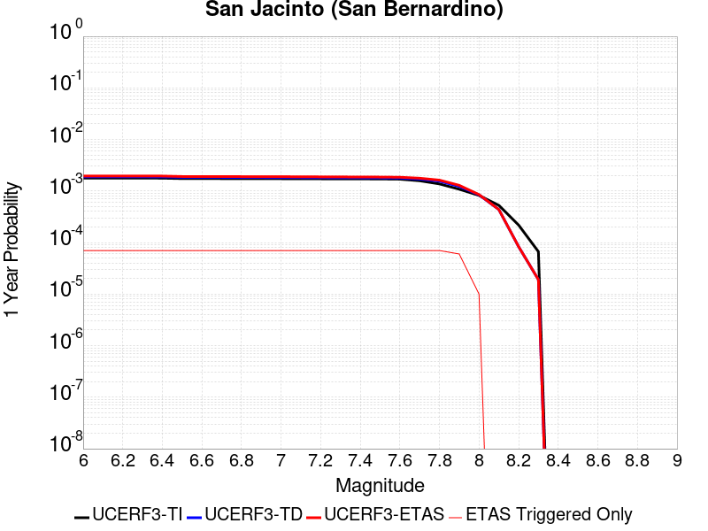 | 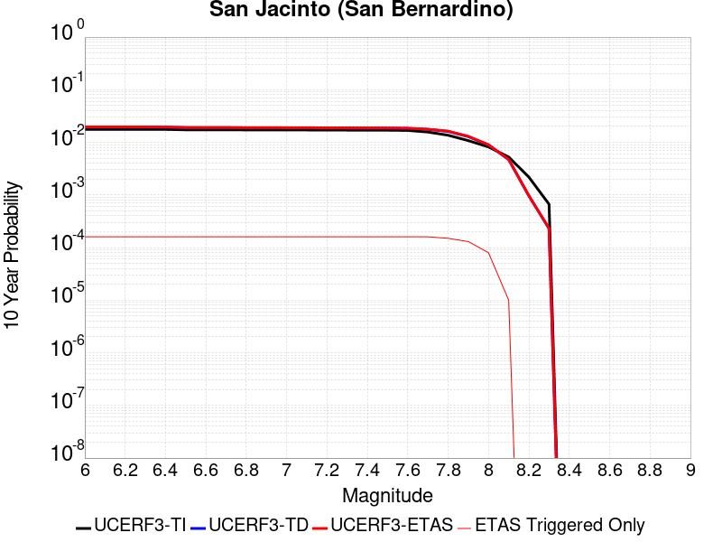 |

| Magnitude | 1 wk TI Prob | 1 wk TD Prob | 1 wk ETAS Prob | 1 wk ETAS/TD Gain | 1 wk ETAS Triggered Only | 1 mo TI Prob | 1 mo TD Prob | 1 mo ETAS Prob | 1 mo ETAS/TD Gain | 1 mo ETAS Triggered Only | 1 yr TI Prob | 1 yr TD Prob | 1 yr ETAS Prob | 1 yr ETAS/TD Gain | 1 yr ETAS Triggered Only | 10 yr TI Prob | 10 yr TD Prob | 10 yr ETAS Prob | 10 yr ETAS/TD Gain | 10 yr ETAS Triggered Only |
|-----|-----|-----|-----|-----|-----|-----|-----|-----|-----|-----|-----|-----|-----|-----|-----|-----|-----|-----|-----|-----|
| 6.0 | 3.409352E-5 | 3.614597E-5 | 3.614597E-5 | 1.0 | 0.0 | 1.461069E-4 | 1.5490211E-4 | 1.7489902E-4 | 1.1290938 | 2.0E-5 | 0.0017774 | 0.0018843036 | 0.0019541718 | 1.037079 | 7.0E-5 | 0.01763251 | 0.01943142 | 0.01958831 | 1.008074 | 1.6E-4 |
| 6.1 | 3.409352E-5 | 3.614597E-5 | 3.614597E-5 | 1.0 | 0.0 | 1.461069E-4 | 1.5490211E-4 | 1.7489902E-4 | 1.1290938 | 2.0E-5 | 0.0017774 | 0.0018843036 | 0.0019541718 | 1.037079 | 7.0E-5 | 0.01763251 | 0.01943142 | 0.01958831 | 1.008074 | 1.6E-4 |
| 6.2 | 3.409352E-5 | 3.614597E-5 | 3.614597E-5 | 1.0 | 0.0 | 1.461069E-4 | 1.5490211E-4 | 1.7489902E-4 | 1.1290938 | 2.0E-5 | 0.0017774 | 0.0018843036 | 0.0019541718 | 1.037079 | 7.0E-5 | 0.01763251 | 0.01943142 | 0.01958831 | 1.008074 | 1.6E-4 |
| 6.3 | 3.409352E-5 | 3.614597E-5 | 3.614597E-5 | 1.0 | 0.0 | 1.461069E-4 | 1.5490211E-4 | 1.7489902E-4 | 1.1290938 | 2.0E-5 | 0.0017774 | 0.0018843036 | 0.0019541718 | 1.037079 | 7.0E-5 | 0.01763251 | 0.01943142 | 0.01958831 | 1.008074 | 1.6E-4 |
| 6.4 | 3.400795E-5 | 3.6038597E-5 | 3.6038597E-5 | 1.0 | 0.0 | 1.4574021E-4 | 1.54442E-4 | 1.7443892E-4 | 1.1294785 | 2.0E-5 | 0.0017729428 | 0.0018787116 | 0.00194858 | 1.0371896 | 7.0E-5 | 0.017588645 | 0.019376488 | 0.019533388 | 1.0080974 | 1.6E-4 |
| 6.5 | 3.341482E-5 | 3.5298992E-5 | 3.5298992E-5 | 1.0 | 0.0 | 1.4319851E-4 | 1.5127263E-4 | 1.7126961E-4 | 1.1321917 | 2.0E-5 | 0.0017420477 | 0.0018401899 | 0.0019100611 | 1.0379696 | 7.0E-5 | 0.017284546 | 0.01899794 | 0.019154899 | 1.0082619 | 1.6E-4 |
| 6.6 | 3.3364955E-5 | 3.523619E-5 | 3.523619E-5 | 1.0 | 0.0 | 1.4298483E-4 | 1.510035E-4 | 1.7100049E-4 | 1.1324272 | 2.0E-5 | 0.0017394501 | 0.0018369189 | 0.0019067903 | 1.0380373 | 7.0E-5 | 0.017258976 | 0.018965796 | 0.01912276 | 1.0082762 | 1.6E-4 |
| 6.7 | 3.335922E-5 | 3.5225963E-5 | 3.5225963E-5 | 1.0 | 0.0 | 1.4296026E-4 | 1.5095968E-4 | 1.7095666E-4 | 1.1324657 | 2.0E-5 | 0.0017391514 | 0.001836386 | 0.0019062576 | 1.0380484 | 7.0E-5 | 0.017256035 | 0.018960586 | 0.019117553 | 1.0082786 | 1.6E-4 |
| 6.8 | 3.327683E-5 | 3.511999E-5 | 3.511999E-5 | 1.0 | 0.0 | 1.4260718E-4 | 1.5050556E-4 | 1.7050255E-4 | 1.1328654 | 2.0E-5 | 0.0017348597 | 0.0018308666 | 0.0019007383 | 1.0381633 | 7.0E-5 | 0.017213784 | 0.018906342 | 0.019063318 | 1.0083028 | 1.6E-4 |
| 6.9 | 3.3235785E-5 | 3.506092E-5 | 3.506092E-5 | 1.0 | 0.0 | 1.4243131E-4 | 1.5025244E-4 | 1.7024943E-4 | 1.1330893 | 2.0E-5 | 0.0017327217 | 0.0018277899 | 0.001897662 | 1.0382277 | 7.0E-5 | 0.017192734 | 0.018876202 | 0.01903318 | 1.0083163 | 1.6E-4 |
| 7.0 | 3.3197095E-5 | 3.500082E-5 | 3.500082E-5 | 1.0 | 0.0 | 1.422655E-4 | 1.499949E-4 | 1.6999191E-4 | 1.1333178 | 2.0E-5 | 0.0017307063 | 0.0018246598 | 0.001894532 | 1.0382934 | 7.0E-5 | 0.017172894 | 0.018845567 | 0.019002553 | 1.0083301 | 1.6E-4 |
| 7.1 | 3.3129716E-5 | 3.488097E-5 | 3.488097E-5 | 1.0 | 0.0 | 1.4197677E-4 | 1.494813E-4 | 1.6947833E-4 | 1.133776 | 2.0E-5 | 0.0017271966 | 0.0018184172 | 0.0018882899 | 1.038425 | 7.0E-5 | 0.017138338 | 0.018784622 | 0.018941615 | 1.0083576 | 1.6E-4 |
| 7.2 | 3.3034008E-5 | 3.4748366E-5 | 3.4748366E-5 | 1.0 | 0.0 | 1.4156665E-4 | 1.4891308E-4 | 1.689101E-4 | 1.1342865 | 2.0E-5 | 0.0017222111 | 0.0018115105 | 0.0018813837 | 1.0385718 | 7.0E-5 | 0.017089253 | 0.018716995 | 0.018874 | 1.0083884 | 1.6E-4 |
| 7.3 | 3.2956614E-5 | 3.461603E-5 | 3.461603E-5 | 1.0 | 0.0 | 1.4123498E-4 | 1.48346E-4 | 1.6834303E-4 | 1.1348 | 2.0E-5 | 0.0017181796 | 0.0018046177 | 0.0018744913 | 1.0387194 | 7.0E-5 | 0.017049557 | 0.018649703 | 0.018806718 | 1.0084193 | 1.6E-4 |
| 7.4 | 3.2915937E-5 | 3.4537654E-5 | 3.4537654E-5 | 1.0 | 0.0 | 1.4106068E-4 | 1.4801013E-4 | 1.6800717E-4 | 1.1351058 | 2.0E-5 | 0.0017160608 | 0.0018005354 | 0.0018704092 | 1.0388073 | 7.0E-5 | 0.017028693 | 0.018609937 | 0.018766958 | 1.0084375 | 1.6E-4 |
| 7.5 | 3.281791E-5 | 3.4402456E-5 | 3.4402456E-5 | 1.0 | 0.0 | 1.406406E-4 | 1.4743076E-4 | 1.6742782E-4 | 1.1356369 | 2.0E-5 | 0.0017109542 | 0.0017934933 | 0.0018633677 | 1.03896 | 7.0E-5 | 0.016978411 | 0.018540774 | 0.018697808 | 1.0084696 | 1.6E-4 |
| 7.6 | 3.2521442E-5 | 3.41271E-5 | 3.41271E-5 | 1.0 | 0.0 | 1.3937015E-4 | 1.4625082E-4 | 1.6624789E-4 | 1.1367314 | 2.0E-5 | 0.0016955109 | 0.0017791509 | 0.0018490264 | 1.0392746 | 7.0E-5 | 0.016826328 | 0.018398259 | 0.018555315 | 1.0085365 | 1.6E-4 |
| 7.7 | 3.0287873E-5 | 3.26093E-5 | 3.26093E-5 | 1.0 | 0.0 | 1.297987E-4 | 1.3974665E-4 | 1.5974387E-4 | 1.1430961 | 2.0E-5 | 0.0015791537 | 0.0017000888 | 0.0017699699 | 1.0411043 | 7.0E-5 | 0.01567979 | 0.017608235 | 0.017765418 | 1.0089266 | 1.6E-4 |
| 7.8 | 2.6316151E-5 | 2.9814415E-5 | 2.9814415E-5 | 1.0 | 0.0 | 1.1277862E-4 | 1.2776982E-4 | 1.4776726E-4 | 1.1565115 | 2.0E-5 | 0.0013722149 | 0.0015544884 | 0.0016243797 | 1.0449609 | 7.0E-5 | 0.013637724 | 0.016146967 | 0.016294545 | 1.0091397 | 1.5E-4 |
| 7.9 | 2.0761147E-5 | 2.3549805E-5 | 2.3549805E-5 | 1.0 | 0.0 | 8.897331E-5 | 1.0092383E-4 | 1.2092181E-4 | 1.1981492 | 2.0E-5 | 0.0010827117 | 0.0012280559 | 0.0012879822 | 1.0487977 | 6.0E-5 | 0.010774517 | 0.01286122 | 0.012989548 | 1.0099779 | 1.3E-4 |
| 8.0 | 1.5738568E-5 | 1.6132728E-5 | 1.6132728E-5 | 1.0 | 0.0 | 6.744926E-5 | 6.9138434E-5 | 7.913774E-5 | 1.1446273 | 1.0E-5 | 8.2088535E-4 | 8.4143603E-4 | 8.514276E-4 | 1.0118744 | 1.0E-5 | 0.008178596 | 0.008918099 | 0.008997385 | 1.0088905 | 8.0E-5 |
| 8.1 | 1.0105832E-5 | 8.388601E-6 | 8.388601E-6 | 1.0 | 0.0 | 4.3309992E-5 | 3.5950656E-5 | 3.5950656E-5 | 1.0 | 0.0 | 5.2717153E-4 | 4.3761183E-4 | 4.3761183E-4 | 1.0 | 0.0 | 0.005259227 | 0.004708467 | 0.00471842 | 1.0021138 | 1.0E-5 |
| 8.2 | 4.189207E-6 | 1.5951842E-6 | 1.5951842E-6 | 1.0 | 0.0 | 1.7953622E-5 | 6.836486E-6 | 6.836486E-6 | 1.0 | 0.0 | 2.1856341E-4 | 8.323107E-5 | 8.323107E-5 | 1.0 | 0.0 | 0.0021834858 | 9.661565E-4 | 9.661565E-4 | 1.0 | 0.0 |
| 8.3 | 1.2758221E-6 | 3.6600784E-7 | 3.6600784E-7 | 1.0 | 0.0 | 5.4677976E-6 | 1.5686041E-6 | 1.5686041E-6 | 1.0 | 0.0 | 6.65684E-5 | 1.9097592E-5 | 1.9097592E-5 | 1.0 | 0.0 | 6.6548464E-4 | 2.301609E-4 | 2.301609E-4 | 1.0 | 0.0 |

## Cady
*[(top)](#table-of-contents)*

| 1 Week | 1 Month | 1 Year | 10 Year |
|-----|-----|-----|-----|
|  |  |  |  |

| Magnitude | 1 wk TI Prob | 1 wk TD Prob | 1 wk ETAS Prob | 1 wk ETAS/TD Gain | 1 wk ETAS Triggered Only | 1 mo TI Prob | 1 mo TD Prob | 1 mo ETAS Prob | 1 mo ETAS/TD Gain | 1 mo ETAS Triggered Only | 1 yr TI Prob | 1 yr TD Prob | 1 yr ETAS Prob | 1 yr ETAS/TD Gain | 1 yr ETAS Triggered Only | 10 yr TI Prob | 10 yr TD Prob | 10 yr ETAS Prob | 10 yr ETAS/TD Gain | 10 yr ETAS Triggered Only |
|-----|-----|-----|-----|-----|-----|-----|-----|-----|-----|-----|-----|-----|-----|-----|-----|-----|-----|-----|-----|-----|
| 6.0 | 1.9892565E-5 | 2.1861597E-5 | 2.1861597E-5 | 1.0 | 0.0 | 8.525106E-5 | 9.3689705E-5 | 9.3689705E-5 | 1.0 | 0.0 | 0.0010374374 | 0.0011401662 | 0.0011801206 | 1.0350426 | 4.0E-5 | 0.010326075 | 0.011352182 | 0.01150048 | 1.0130633 | 1.5E-4 |
| 6.1 | 1.9892565E-5 | 2.1861597E-5 | 2.1861597E-5 | 1.0 | 0.0 | 8.525106E-5 | 9.3689705E-5 | 9.3689705E-5 | 1.0 | 0.0 | 0.0010374374 | 0.0011401662 | 0.0011801206 | 1.0350426 | 4.0E-5 | 0.010326075 | 0.011352182 | 0.01150048 | 1.0130633 | 1.5E-4 |
| 6.2 | 1.9892565E-5 | 2.1861597E-5 | 2.1861597E-5 | 1.0 | 0.0 | 8.525106E-5 | 9.3689705E-5 | 9.3689705E-5 | 1.0 | 0.0 | 0.0010374374 | 0.0011401662 | 0.0011801206 | 1.0350426 | 4.0E-5 | 0.010326075 | 0.011352182 | 0.01150048 | 1.0130633 | 1.5E-4 |
| 6.3 | 1.1117327E-5 | 1.2178123E-5 | 1.2178123E-5 | 1.0 | 0.0 | 4.764482E-5 | 5.219109E-5 | 5.219109E-5 | 1.0 | 0.0 | 5.7992124E-4 | 6.3527277E-4 | 6.652537E-4 | 1.0471938 | 3.0E-5 | 0.0057841022 | 0.006337675 | 0.006417168 | 1.012543 | 8.0E-5 |
| 6.4 | 1.1117327E-5 | 1.2178123E-5 | 1.2178123E-5 | 1.0 | 0.0 | 4.764482E-5 | 5.219109E-5 | 5.219109E-5 | 1.0 | 0.0 | 5.7992124E-4 | 6.3527277E-4 | 6.652537E-4 | 1.0471938 | 3.0E-5 | 0.0057841022 | 0.006337675 | 0.006417168 | 1.012543 | 8.0E-5 |
| 6.5 | 6.103093E-6 | 6.672846E-6 | 6.672846E-6 | 1.0 | 0.0 | 2.615585E-5 | 2.859767E-5 | 2.859767E-5 | 1.0 | 0.0 | 3.1840094E-4 | 3.4813356E-4 | 3.7812314E-4 | 1.0861439 | 3.0E-5 | 0.0031794512 | 0.0034771163 | 0.0035369077 | 1.0171957 | 6.0E-5 |
| 6.6 | 5.817237E-6 | 6.366455E-6 | 6.366455E-6 | 1.0 | 0.0 | 2.4930776E-5 | 2.7284592E-5 | 2.7284592E-5 | 1.0 | 0.0 | 3.034899E-4 | 3.321517E-4 | 3.6214176E-4 | 1.0902902 | 3.0E-5 | 0.0030307577 | 0.0033177752 | 0.0033775761 | 1.0180244 | 6.0E-5 |
| 6.7 | 4.8846314E-6 | 5.34123E-6 | 5.34123E-6 | 1.0 | 0.0 | 2.0933967E-5 | 2.289085E-5 | 2.289085E-5 | 1.0 | 0.0 | 2.5484123E-4 | 2.7867223E-4 | 2.9866668E-4 | 1.0717489 | 2.0E-5 | 0.0025454918 | 0.0027843837 | 0.0028342446 | 1.0179073 | 5.0E-5 |
| 6.8 | 1.7788773E-6 | 1.9401411E-6 | 1.9401411E-6 | 1.0 | 0.0 | 7.6237375E-6 | 8.3148725E-6 | 8.3148725E-6 | 1.0 | 0.0 | 9.281505E-5 | 1.0123045E-4 | 1.11229434E-4 | 1.0987746 | 1.0E-5 | 9.2776294E-4 | 0.001011998 | 0.0010419677 | 1.0296143 | 3.0E-5 |
| 6.9 | 7.5455404E-7 | 8.298188E-7 | 8.298188E-7 | 1.0 | 0.0 | 3.233799E-6 | 3.5563635E-6 | 3.5563635E-6 | 1.0 | 0.0 | 3.937079E-5 | 4.32982E-5 | 5.329777E-5 | 1.2309464 | 1.0E-5 | 3.9363815E-4 | 4.329306E-4 | 4.4292628E-4 | 1.0230883 | 1.0E-5 |
| 7.0 | 6.8578805E-7 | 7.5428136E-7 | 7.5428136E-7 | 1.0 | 0.0 | 2.9390883E-6 | 3.2326323E-6 | 3.2326323E-6 | 1.0 | 0.0 | 3.578281E-5 | 3.935692E-5 | 4.9356524E-5 | 1.2540749 | 1.0E-5 | 3.577705E-4 | 3.9353195E-4 | 4.0352804E-4 | 1.0254009 | 1.0E-5 |

## White Wolf (Extension)
*[(top)](#table-of-contents)*

| 1 Week | 1 Month | 1 Year | 10 Year |
|-----|-----|-----|-----|
|  |  |  |  |

| Magnitude | 1 wk TI Prob | 1 wk TD Prob | 1 wk ETAS Prob | 1 wk ETAS/TD Gain | 1 wk ETAS Triggered Only | 1 mo TI Prob | 1 mo TD Prob | 1 mo ETAS Prob | 1 mo ETAS/TD Gain | 1 mo ETAS Triggered Only | 1 yr TI Prob | 1 yr TD Prob | 1 yr ETAS Prob | 1 yr ETAS/TD Gain | 1 yr ETAS Triggered Only | 10 yr TI Prob | 10 yr TD Prob | 10 yr ETAS Prob | 10 yr ETAS/TD Gain | 10 yr ETAS Triggered Only |
|-----|-----|-----|-----|-----|-----|-----|-----|-----|-----|-----|-----|-----|-----|-----|-----|-----|-----|-----|-----|-----|
| 6.0 | 8.222555E-6 | 6.0670677E-6 | 6.0670677E-6 | 1.0 | 0.0 | 3.5239045E-5 | 2.6001497E-5 | 2.6001497E-5 | 1.0 | 0.0 | 4.289509E-4 | 3.1652887E-4 | 3.6651304E-4 | 1.1579134 | 5.0E-5 | 0.0042812387 | 0.0031614322 | 0.003310958 | 1.0472969 | 1.5E-4 |
| 6.1 | 8.222555E-6 | 6.0670677E-6 | 6.0670677E-6 | 1.0 | 0.0 | 3.5239045E-5 | 2.6001497E-5 | 2.6001497E-5 | 1.0 | 0.0 | 4.289509E-4 | 3.1652887E-4 | 3.6651304E-4 | 1.1579134 | 5.0E-5 | 0.0042812387 | 0.0031614322 | 0.003310958 | 1.0472969 | 1.5E-4 |
| 6.2 | 8.222555E-6 | 6.0670677E-6 | 6.0670677E-6 | 1.0 | 0.0 | 3.5239045E-5 | 2.6001497E-5 | 2.6001497E-5 | 1.0 | 0.0 | 4.289509E-4 | 3.1652887E-4 | 3.6651304E-4 | 1.1579134 | 5.0E-5 | 0.0042812387 | 0.0031614322 | 0.003310958 | 1.0472969 | 1.5E-4 |
| 6.3 | 8.222555E-6 | 6.0670677E-6 | 6.0670677E-6 | 1.0 | 0.0 | 3.5239045E-5 | 2.6001497E-5 | 2.6001497E-5 | 1.0 | 0.0 | 4.289509E-4 | 3.1652887E-4 | 3.6651304E-4 | 1.1579134 | 5.0E-5 | 0.0042812387 | 0.0031614322 | 0.003310958 | 1.0472969 | 1.5E-4 |
| 6.4 | 5.821773E-6 | 3.5574278E-6 | 3.5574278E-6 | 1.0 | 0.0 | 2.4950215E-5 | 1.5246036E-5 | 1.5246036E-5 | 1.0 | 0.0 | 3.0372653E-4 | 1.8560578E-4 | 2.156002E-4 | 1.1616029 | 3.0E-5 | 0.0030331176 | 0.001854616 | 0.0019244861 | 1.0376737 | 7.0E-5 |
| 6.5 | 5.766023E-6 | 3.4993586E-6 | 3.4993586E-6 | 1.0 | 0.0 | 2.4711293E-5 | 1.4997171E-5 | 1.4997171E-5 | 1.0 | 0.0 | 3.0081844E-4 | 1.8257636E-4 | 2.1257089E-4 | 1.1642848 | 3.0E-5 | 0.0030041158 | 0.0018243717 | 0.0018942441 | 1.0382993 | 7.0E-5 |
| 6.6 | 4.643576E-6 | 2.3328114E-6 | 2.3328114E-6 | 1.0 | 0.0 | 1.9900888E-5 | 9.997727E-6 | 9.997727E-6 | 1.0 | 0.0 | 2.4226638E-4 | 1.2171596E-4 | 1.2171596E-4 | 1.0 | 0.0 | 0.0024200242 | 0.0012165353 | 0.001236511 | 1.0164201 | 2.0E-5 |
| 6.7 | 3.9529173E-6 | 1.6484983E-6 | 1.6484983E-6 | 1.0 | 0.0 | 1.6940963E-5 | 7.0649744E-6 | 7.0649744E-6 | 1.0 | 0.0 | 2.0623671E-4 | 8.601286E-5 | 8.601286E-5 | 1.0 | 0.0 | 0.002060454 | 8.598142E-4 | 8.698056E-4 | 1.0116204 | 1.0E-5 |
| 6.8 | 3.4377522E-6 | 1.2246483E-6 | 1.2246483E-6 | 1.0 | 0.0 | 1.473314E-5 | 5.2484825E-6 | 5.2484825E-6 | 1.0 | 0.0 | 1.7936122E-4 | 6.389849E-5 | 6.389849E-5 | 1.0 | 0.0 | 0.0017921652 | 6.3881034E-4 | 6.4880395E-4 | 1.0156441 | 1.0E-5 |
| 6.9 | 3.1367306E-6 | 1.0034878E-6 | 1.0034878E-6 | 1.0 | 0.0 | 1.3443062E-5 | 4.3006553E-6 | 4.3006553E-6 | 1.0 | 0.0 | 1.63657E-4 | 5.23593E-5 | 5.23593E-5 | 1.0 | 0.0 | 0.0016353652 | 5.2347727E-4 | 5.3347205E-4 | 1.019093 | 1.0E-5 |
| 7.0 | 2.8298145E-6 | 7.4296156E-7 | 7.4296156E-7 | 1.0 | 0.0 | 1.2127721E-5 | 3.1841173E-6 | 3.1841173E-6 | 1.0 | 0.0 | 1.47645E-4 | 3.876599E-5 | 3.876599E-5 | 1.0 | 0.0 | 0.0014754693 | 3.8759728E-4 | 3.975934E-4 | 1.02579 | 1.0E-5 |
| 7.1 | 2.4091064E-6 | 5.423516E-7 | 5.423516E-7 | 1.0 | 0.0 | 1.03247E-5 | 2.3243622E-6 | 2.3243622E-6 | 1.0 | 0.0 | 1.2569598E-4 | 2.8298784E-5 | 2.8298784E-5 | 1.0 | 0.0 | 0.001256249 | 2.8295585E-4 | 2.9295302E-4 | 1.0353312 | 1.0E-5 |
| 7.2 | 1.3875518E-6 | 1.07468146E-7 | 1.07468146E-7 | 1.0 | 0.0 | 5.9466374E-6 | 4.6057767E-7 | 4.6057767E-7 | 1.0 | 0.0 | 7.23979E-5 | 5.60752E-6 | 5.60752E-6 | 1.0 | 0.0 | 7.2374323E-4 | 5.60739E-5 | 6.6073335E-5 | 1.1783261 | 1.0E-5 |
| 7.3 | 7.056077E-7 | 5.0041887E-8 | 5.0041887E-8 | 1.0 | 0.0 | 3.0240296E-6 | 2.1446522E-7 | 2.1446522E-7 | 1.0 | 0.0 | 3.681694E-5 | 2.6111113E-6 | 2.6111113E-6 | 1.0 | 0.0 | 3.681084E-4 | 2.6110854E-5 | 3.6110592E-5 | 1.3829725 | 1.0E-5 |
| 7.4 | 5.9334678E-8 | 4.8704454E-9 | 4.8704454E-9 | 1.0 | 0.0 | 2.5429145E-7 | 2.0873339E-8 | 2.0873339E-8 | 1.0 | 0.0 | 3.095994E-6 | 2.5413289E-7 | 2.5413289E-7 | 1.0 | 0.0 | 3.095951E-5 | 2.541327E-6 | 2.541327E-6 | 1.0 | 0.0 |

## Death Valley (Fish Lake Valley)
*[(top)](#table-of-contents)*

| 1 Week | 1 Month | 1 Year | 10 Year |
|-----|-----|-----|-----|
|  |  |  | 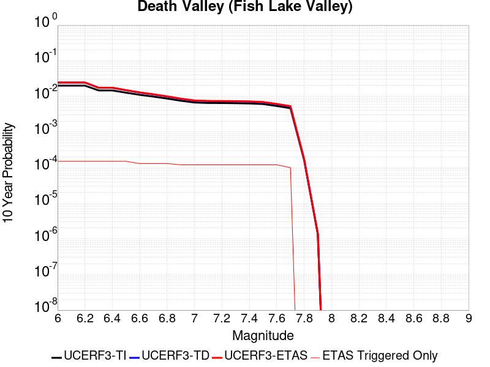 |

| Magnitude | 1 wk TI Prob | 1 wk TD Prob | 1 wk ETAS Prob | 1 wk ETAS/TD Gain | 1 wk ETAS Triggered Only | 1 mo TI Prob | 1 mo TD Prob | 1 mo ETAS Prob | 1 mo ETAS/TD Gain | 1 mo ETAS Triggered Only | 1 yr TI Prob | 1 yr TD Prob | 1 yr ETAS Prob | 1 yr ETAS/TD Gain | 1 yr ETAS Triggered Only | 10 yr TI Prob | 10 yr TD Prob | 10 yr ETAS Prob | 10 yr ETAS/TD Gain | 10 yr ETAS Triggered Only |
|-----|-----|-----|-----|-----|-----|-----|-----|-----|-----|-----|-----|-----|-----|-----|-----|-----|-----|-----|-----|-----|
| 6.0 | 3.872328E-5 | 4.7281694E-5 | 6.7280744E-5 | 1.4229767 | 2.0E-5 | 1.6594635E-4 | 2.0262178E-4 | 2.2261773E-4 | 1.0986861 | 2.0E-5 | 0.0020185246 | 0.002464232 | 0.002544035 | 1.0323845 | 8.0E-5 | 0.02000288 | 0.024395194 | 0.024541534 | 1.0059987 | 1.5E-4 |
| 6.1 | 3.872328E-5 | 4.7281694E-5 | 6.7280744E-5 | 1.4229767 | 2.0E-5 | 1.6594635E-4 | 2.0262178E-4 | 2.2261773E-4 | 1.0986861 | 2.0E-5 | 0.0020185246 | 0.002464232 | 0.002544035 | 1.0323845 | 8.0E-5 | 0.02000288 | 0.024395194 | 0.024541534 | 1.0059987 | 1.5E-4 |
| 6.2 | 3.872328E-5 | 4.7281694E-5 | 6.7280744E-5 | 1.4229767 | 2.0E-5 | 1.6594635E-4 | 2.0262178E-4 | 2.2261773E-4 | 1.0986861 | 2.0E-5 | 0.0020185246 | 0.002464232 | 0.002544035 | 1.0323845 | 8.0E-5 | 0.02000288 | 0.024395194 | 0.024541534 | 1.0059987 | 1.5E-4 |
| 6.3 | 2.8356371E-5 | 3.361828E-5 | 5.3617605E-5 | 1.5948944 | 2.0E-5 | 1.2152165E-4 | 1.4407083E-4 | 1.6406794E-4 | 1.1388006 | 2.0E-5 | 0.0014785219 | 0.0017527296 | 0.0018325894 | 1.0455631 | 8.0E-5 | 0.014687235 | 0.017396059 | 0.01754345 | 1.0084727 | 1.5E-4 |
| 6.4 | 2.8356371E-5 | 3.361828E-5 | 5.3617605E-5 | 1.5948944 | 2.0E-5 | 1.2152165E-4 | 1.4407083E-4 | 1.6406794E-4 | 1.1388006 | 2.0E-5 | 0.0014785219 | 0.0017527296 | 0.0018325894 | 1.0455631 | 8.0E-5 | 0.014687235 | 0.017396059 | 0.01754345 | 1.0084727 | 1.5E-4 |
| 6.5 | 2.4448687E-5 | 2.8614111E-5 | 4.861354E-5 | 1.6989359 | 2.0E-5 | 1.0477588E-4 | 1.2262643E-4 | 1.4262398E-4 | 1.163077 | 2.0E-5 | 0.0012748998 | 0.0014920048 | 0.0015718855 | 1.0535392 | 8.0E-5 | 0.012676105 | 0.014824731 | 0.014972507 | 1.0099683 | 1.5E-4 |
| 6.6 | 2.1298161E-5 | 2.4665313E-5 | 4.466482E-5 | 1.8108354 | 2.0E-5 | 9.127464E-5 | 1.0570439E-4 | 1.2570228E-4 | 1.1891869 | 2.0E-5 | 0.0011107022 | 0.001286225 | 0.001356135 | 1.0543529 | 7.0E-5 | 0.011051672 | 0.012791215 | 0.012919552 | 1.0100332 | 1.3E-4 |
| 6.7 | 1.8959729E-5 | 2.1785369E-5 | 4.1784933E-5 | 1.9180273 | 2.0E-5 | 8.125345E-5 | 9.336267E-5 | 1.133608E-4 | 1.2141984 | 2.0E-5 | 9.888117E-4 | 0.0011361233 | 0.0012060439 | 1.061543 | 7.0E-5 | 0.009844234 | 0.011305812 | 0.011434343 | 1.0113685 | 1.3E-4 |
| 6.8 | 1.6691629E-5 | 1.9021896E-5 | 3.9021514E-5 | 2.0514 | 2.0E-5 | 7.153359E-5 | 8.151996E-5 | 1.0151833E-4 | 1.2453187 | 2.0E-5 | 8.7057345E-4 | 9.920704E-4 | 0.001062001 | 1.0704895 | 7.0E-5 | 0.008671708 | 0.009878175 | 0.010006891 | 1.0130303 | 1.3E-4 |
| 6.9 | 1.450505E-5 | 1.6392378E-5 | 3.639205E-5 | 2.2200592 | 2.0E-5 | 6.216302E-5 | 7.0251204E-5 | 9.02498E-5 | 1.2846726 | 2.0E-5 | 7.5657194E-4 | 8.549816E-4 | 9.2492177E-4 | 1.0818031 | 7.0E-5 | 0.007540013 | 0.008517854 | 0.008636832 | 1.0139681 | 1.2E-4 |
| 7.0 | 1.2940855E-5 | 1.4540358E-5 | 3.4540066E-5 | 2.3754618 | 2.0E-5 | 5.545963E-5 | 6.2314364E-5 | 8.231312E-5 | 1.3209332 | 2.0E-5 | 6.750118E-4 | 7.584191E-4 | 8.28366E-4 | 1.0922272 | 7.0E-5 | 0.006729651 | 0.007558926 | 0.007678019 | 1.0157553 | 1.2E-4 |
| 7.1 | 1.2544658E-5 | 1.4080496E-5 | 3.4080214E-5 | 2.4203844 | 2.0E-5 | 5.3761712E-5 | 6.034362E-5 | 8.034241E-5 | 1.3314152 | 2.0E-5 | 6.5435225E-4 | 7.344415E-4 | 8.043901E-4 | 1.0952405 | 7.0E-5 | 0.006524288 | 0.0073207365 | 0.0074398583 | 1.0162718 | 1.2E-4 |
| 7.2 | 1.2489416E-5 | 1.4017952E-5 | 3.401767E-5 | 2.426722 | 2.0E-5 | 5.3524967E-5 | 6.0075585E-5 | 8.007438E-5 | 1.332894 | 2.0E-5 | 6.514716E-4 | 7.311804E-4 | 8.011292E-4 | 1.0956656 | 7.0E-5 | 0.006495651 | 0.0072883395 | 0.007407465 | 1.0163447 | 1.2E-4 |
| 7.3 | 1.2368307E-5 | 1.3882068E-5 | 3.388179E-5 | 2.4406874 | 2.0E-5 | 5.3005948E-5 | 5.9493254E-5 | 7.949206E-5 | 1.3361526 | 2.0E-5 | 6.451563E-4 | 7.240952E-4 | 7.940445E-4 | 1.0966023 | 7.0E-5 | 0.0064328653 | 0.0072179507 | 0.0073370845 | 1.0165052 | 1.2E-4 |
| 7.4 | 1.2161707E-5 | 1.3650086E-5 | 3.3649812E-5 | 2.4651723 | 2.0E-5 | 5.212056E-5 | 5.8499085E-5 | 7.849791E-5 | 1.3418657 | 2.0E-5 | 6.3438306E-4 | 7.119992E-4 | 7.819494E-4 | 1.0982447 | 7.0E-5 | 0.006325751 | 0.0070977695 | 0.007216918 | 1.0167867 | 1.2E-4 |
| 7.5 | 1.1707948E-5 | 1.314766E-5 | 3.3147397E-5 | 2.5211632 | 2.0E-5 | 5.0175953E-5 | 5.634593E-5 | 7.6344804E-5 | 1.3549302 | 2.0E-5 | 6.10721E-4 | 6.858013E-4 | 7.5575337E-4 | 1.1020004 | 7.0E-5 | 0.0060904534 | 0.006837433 | 0.0069566127 | 1.0174304 | 1.2E-4 |
| 7.6 | 1.0319538E-5 | 1.15815E-5 | 3.158127E-5 | 2.726872 | 2.0E-5 | 4.4225842E-5 | 4.9634087E-5 | 6.96331E-5 | 1.4029288 | 2.0E-5 | 5.383166E-4 | 6.0413266E-4 | 6.7409035E-4 | 1.1157986 | 7.0E-5 | 0.0053701443 | 0.0060254345 | 0.0061447117 | 1.0197955 | 1.2E-4 |
| 7.7 | 8.937764E-6 | 1.0024395E-5 | 2.0024296E-5 | 1.9975563 | 1.0E-5 | 3.830414E-5 | 4.2961015E-5 | 5.2960586E-5 | 1.2327591 | 1.0E-5 | 4.6625308E-4 | 5.229299E-4 | 5.828985E-4 | 1.1146781 | 6.0E-5 | 0.0046527605 | 0.0052175033 | 0.0053169816 | 1.0190662 | 1.0E-4 |
| 7.8 | 3.108007E-7 | 3.2849027E-7 | 3.2849027E-7 | 1.0 | 0.0 | 1.3320023E-6 | 1.4078147E-6 | 1.4078147E-6 | 1.0 | 0.0 | 1.6217007E-5 | 1.7140013E-5 | 1.7140013E-5 | 1.0 | 0.0 | 1.6215823E-4 | 1.7138729E-4 | 1.7138729E-4 | 1.0 | 0.0 |
| 7.9 | 2.5591178E-9 | 2.6698248E-9 | 2.6698248E-9 | 1.0 | 0.0 | 1.0967647E-8 | 1.1442106E-8 | 1.1442106E-8 | 1.0 | 0.0 | 1.335311E-7 | 1.3930764E-7 | 1.3930764E-7 | 1.0 | 0.0 | 1.3353102E-6 | 1.3930764E-6 | 1.3930764E-6 | 1.0 | 0.0 |

## Manix-Afton Hills
*[(top)](#table-of-contents)*

| 1 Week | 1 Month | 1 Year | 10 Year |
|-----|-----|-----|-----|
|  |  |  |  |

| Magnitude | 1 wk TI Prob | 1 wk TD Prob | 1 wk ETAS Prob | 1 wk ETAS/TD Gain | 1 wk ETAS Triggered Only | 1 mo TI Prob | 1 mo TD Prob | 1 mo ETAS Prob | 1 mo ETAS/TD Gain | 1 mo ETAS Triggered Only | 1 yr TI Prob | 1 yr TD Prob | 1 yr ETAS Prob | 1 yr ETAS/TD Gain | 1 yr ETAS Triggered Only | 10 yr TI Prob | 10 yr TD Prob | 10 yr ETAS Prob | 10 yr ETAS/TD Gain | 10 yr ETAS Triggered Only |
|-----|-----|-----|-----|-----|-----|-----|-----|-----|-----|-----|-----|-----|-----|-----|-----|-----|-----|-----|-----|-----|
| 6.0 | 1.3783202E-5 | 1.4712406E-5 | 1.4712406E-5 | 1.0 | 0.0 | 5.906953E-5 | 6.3051746E-5 | 6.3051746E-5 | 1.0 | 0.0 | 7.189342E-4 | 7.6740206E-4 | 7.873867E-4 | 1.026042 | 2.0E-5 | 0.0071661277 | 0.007649278 | 0.007778283 | 1.016865 | 1.3E-4 |
| 6.1 | 1.3783202E-5 | 1.4712406E-5 | 1.4712406E-5 | 1.0 | 0.0 | 5.906953E-5 | 6.3051746E-5 | 6.3051746E-5 | 1.0 | 0.0 | 7.189342E-4 | 7.6740206E-4 | 7.873867E-4 | 1.026042 | 2.0E-5 | 0.0071661277 | 0.007649278 | 0.007778283 | 1.016865 | 1.3E-4 |
| 6.2 | 1.3783202E-5 | 1.4712406E-5 | 1.4712406E-5 | 1.0 | 0.0 | 5.906953E-5 | 6.3051746E-5 | 6.3051746E-5 | 1.0 | 0.0 | 7.189342E-4 | 7.6740206E-4 | 7.873867E-4 | 1.026042 | 2.0E-5 | 0.0071661277 | 0.007649278 | 0.007778283 | 1.016865 | 1.3E-4 |
| 6.3 | 1.10494875E-5 | 1.1794191E-5 | 1.1794191E-5 | 1.0 | 0.0 | 4.7354086E-5 | 5.0545612E-5 | 5.0545612E-5 | 1.0 | 0.0 | 5.763835E-4 | 6.152294E-4 | 6.2522327E-4 | 1.016244 | 1.0E-5 | 0.005748908 | 0.006136303 | 0.0062356894 | 1.0161965 | 1.0E-4 |
| 6.4 | 1.10494875E-5 | 1.1794191E-5 | 1.1794191E-5 | 1.0 | 0.0 | 4.7354086E-5 | 5.0545612E-5 | 5.0545612E-5 | 1.0 | 0.0 | 5.763835E-4 | 6.152294E-4 | 6.2522327E-4 | 1.016244 | 1.0E-5 | 0.005748908 | 0.006136303 | 0.0062356894 | 1.0161965 | 1.0E-4 |
| 6.5 | 9.788949E-6 | 1.0455265E-5 | 1.0455265E-5 | 1.0 | 0.0 | 4.1951964E-5 | 4.480756E-5 | 4.480756E-5 | 1.0 | 0.0 | 5.1064545E-4 | 5.454048E-4 | 5.5539934E-4 | 1.018325 | 1.0E-5 | 0.0050947363 | 0.0054415893 | 0.0055410448 | 1.0182769 | 1.0E-4 |
| 6.6 | 8.810006E-6 | 9.414486E-6 | 9.414486E-6 | 1.0 | 0.0 | 3.775662E-5 | 4.0347222E-5 | 4.0347222E-5 | 1.0 | 0.0 | 4.5958988E-4 | 4.911256E-4 | 5.011207E-4 | 1.0203514 | 1.0E-5 | 0.0045864056 | 0.004901285 | 0.0049808924 | 1.0162423 | 8.0E-5 |
| 6.7 | 8.80128E-6 | 9.404965E-6 | 9.404965E-6 | 1.0 | 0.0 | 3.7719226E-5 | 4.030642E-5 | 4.030642E-5 | 1.0 | 0.0 | 4.591348E-4 | 4.9062906E-4 | 5.006241E-4 | 1.020372 | 1.0E-5 | 0.004581874 | 0.004896341 | 0.004975949 | 1.0162587 | 8.0E-5 |
| 6.8 | 6.8994877E-6 | 7.3807596E-6 | 7.3807596E-6 | 1.0 | 0.0 | 2.9568899E-5 | 3.163149E-5 | 3.163149E-5 | 1.0 | 0.0 | 3.5994186E-4 | 3.8505348E-4 | 3.9504966E-4 | 1.0259604 | 1.0E-5 | 0.003593594 | 0.0038446684 | 0.0039044376 | 1.0155461 | 6.0E-5 |
| 6.9 | 4.9328037E-6 | 5.271442E-6 | 5.271442E-6 | 1.0 | 0.0 | 2.1140417E-5 | 2.2591734E-5 | 2.2591734E-5 | 1.0 | 0.0 | 2.5735417E-4 | 2.750258E-4 | 2.8502304E-4 | 1.0363503 | 1.0E-5 | 0.0025705635 | 0.0027474596 | 0.0027873497 | 1.0145189 | 4.0E-5 |
| 7.0 | 3.347973E-6 | 3.5903752E-6 | 3.5903752E-6 | 1.0 | 0.0 | 1.4348378E-5 | 1.5387255E-5 | 1.5387255E-5 | 1.0 | 0.0 | 1.746775E-4 | 1.8732782E-4 | 1.9732595E-4 | 1.0533724 | 1.0E-5 | 0.0017454025 | 0.0018721019 | 0.001912027 | 1.0213263 | 4.0E-5 |
| 7.1 | 1.2073567E-6 | 1.2936044E-6 | 1.2936044E-6 | 1.0 | 0.0 | 5.1743755E-6 | 5.5440164E-6 | 5.5440164E-6 | 1.0 | 0.0 | 6.29962E-5 | 6.7497946E-5 | 6.7497946E-5 | 1.0 | 0.0 | 6.297835E-4 | 6.749346E-4 | 6.949211E-4 | 1.0296125 | 2.0E-5 |

## Calico-Hidalgo
*[(top)](#table-of-contents)*

| 1 Week | 1 Month | 1 Year | 10 Year |
|-----|-----|-----|-----|
|  | 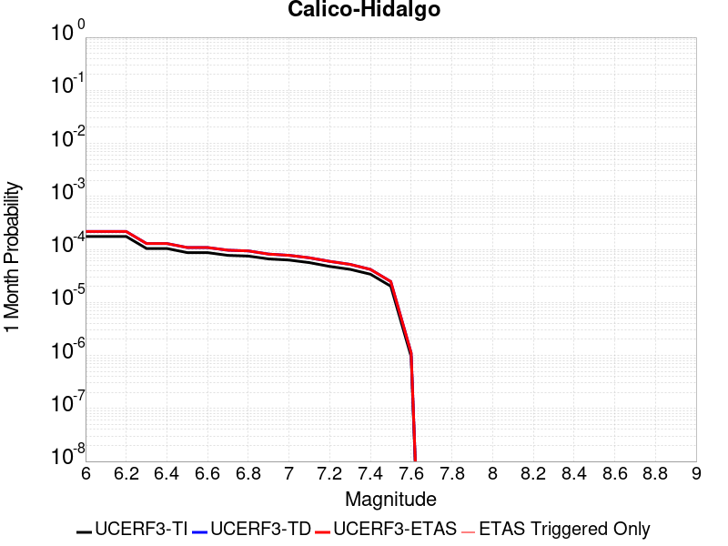 |  | 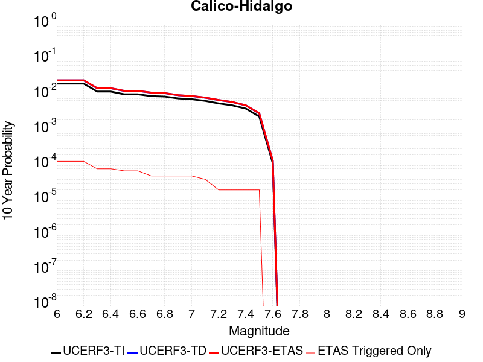 |

| Magnitude | 1 wk TI Prob | 1 wk TD Prob | 1 wk ETAS Prob | 1 wk ETAS/TD Gain | 1 wk ETAS Triggered Only | 1 mo TI Prob | 1 mo TD Prob | 1 mo ETAS Prob | 1 mo ETAS/TD Gain | 1 mo ETAS Triggered Only | 1 yr TI Prob | 1 yr TD Prob | 1 yr ETAS Prob | 1 yr ETAS/TD Gain | 1 yr ETAS Triggered Only | 10 yr TI Prob | 10 yr TD Prob | 10 yr ETAS Prob | 10 yr ETAS/TD Gain | 10 yr ETAS Triggered Only |
|-----|-----|-----|-----|-----|-----|-----|-----|-----|-----|-----|-----|-----|-----|-----|-----|-----|-----|-----|-----|-----|
| 6.0 | 4.0906612E-5 | 5.0713337E-5 | 5.0713337E-5 | 1.0 | 0.0 | 1.7530227E-4 | 2.1732705E-4 | 2.1732705E-4 | 1.0 | 0.0 | 0.0021322158 | 0.0026431496 | 0.002683044 | 1.0150934 | 4.0E-5 | 0.02111873 | 0.026157506 | 0.026284104 | 1.0048399 | 1.3E-4 |
| 6.1 | 4.0906612E-5 | 5.0713337E-5 | 5.0713337E-5 | 1.0 | 0.0 | 1.7530227E-4 | 2.1732705E-4 | 2.1732705E-4 | 1.0 | 0.0 | 0.0021322158 | 0.0026431496 | 0.002683044 | 1.0150934 | 4.0E-5 | 0.02111873 | 0.026157506 | 0.026284104 | 1.0048399 | 1.3E-4 |
| 6.2 | 4.0906612E-5 | 5.0713337E-5 | 5.0713337E-5 | 1.0 | 0.0 | 1.7530227E-4 | 2.1732705E-4 | 2.1732705E-4 | 1.0 | 0.0 | 0.0021322158 | 0.0026431496 | 0.002683044 | 1.0150934 | 4.0E-5 | 0.02111873 | 0.026157506 | 0.026284104 | 1.0048399 | 1.3E-4 |
| 6.3 | 2.4242801E-5 | 3.0094301E-5 | 3.0094301E-5 | 1.0 | 0.0 | 1.0389358E-4 | 1.2896939E-4 | 1.2896939E-4 | 1.0 | 0.0 | 0.0012641704 | 0.0015691036 | 0.0015890723 | 1.0127262 | 2.0E-5 | 0.01257003 | 0.015583925 | 0.015662678 | 1.0050535 | 8.0E-5 |
| 6.4 | 2.4242801E-5 | 3.0094301E-5 | 3.0094301E-5 | 1.0 | 0.0 | 1.0389358E-4 | 1.2896939E-4 | 1.2896939E-4 | 1.0 | 0.0 | 0.0012641704 | 0.0015691036 | 0.0015890723 | 1.0127262 | 2.0E-5 | 0.01257003 | 0.015583925 | 0.015662678 | 1.0050535 | 8.0E-5 |
| 6.5 | 2.0286952E-5 | 2.531821E-5 | 2.531821E-5 | 1.0 | 0.0 | 8.694118E-5 | 1.085022E-4 | 1.085022E-4 | 1.0 | 0.0 | 0.0010579949 | 0.0013202309 | 0.0013402045 | 1.0151289 | 2.0E-5 | 0.010529719 | 0.013125811 | 0.013194893 | 1.005263 | 7.0E-5 |
| 6.6 | 2.0269223E-5 | 2.5299158E-5 | 2.5299158E-5 | 1.0 | 0.0 | 8.6865206E-5 | 1.0842055E-4 | 1.0842055E-4 | 1.0 | 0.0 | 0.0010570707 | 0.0013192381 | 0.0013392117 | 1.0151403 | 2.0E-5 | 0.010520565 | 0.013116 | 0.013185082 | 1.005267 | 7.0E-5 |
| 6.7 | 1.799852E-5 | 2.2542603E-5 | 2.2542603E-5 | 1.0 | 0.0 | 7.713423E-5 | 9.6607655E-5 | 9.6607655E-5 | 1.0 | 0.0 | 9.3870464E-4 | 0.0011755781 | 0.0011955546 | 1.0169929 | 2.0E-5 | 0.009347493 | 0.011695206 | 0.011744621 | 1.0042253 | 5.0E-5 |
| 6.8 | 1.7458793E-5 | 2.1844051E-5 | 2.1844051E-5 | 1.0 | 0.0 | 7.4821255E-5 | 9.361408E-5 | 9.361408E-5 | 1.0 | 0.0 | 9.10568E-4 | 0.00113917 | 0.0011591472 | 1.0175366 | 2.0E-5 | 0.009068459 | 0.01133489 | 0.011384322 | 1.0043612 | 5.0E-5 |
| 6.9 | 1.542884E-5 | 1.9027526E-5 | 1.9027526E-5 | 1.0 | 0.0 | 6.612192E-5 | 8.1544065E-5 | 8.1544065E-5 | 1.0 | 0.0 | 8.04737E-4 | 9.9236E-4 | 0.0010123401 | 1.020134 | 2.0E-5 | 0.008018291 | 0.009880684 | 0.00993019 | 1.0050104 | 5.0E-5 |
| 7.0 | 1.468253E-5 | 1.8032079E-5 | 1.8032079E-5 | 1.0 | 0.0 | 6.292361E-5 | 7.727812E-5 | 7.727812E-5 | 1.0 | 0.0 | 7.658257E-4 | 9.4046805E-4 | 9.604492E-4 | 1.021246 | 2.0E-5 | 0.0076319184 | 0.009366247 | 0.009415778 | 1.0052884 | 5.0E-5 |
| 7.1 | 1.3139281E-5 | 1.6202212E-5 | 1.6202212E-5 | 1.0 | 0.0 | 5.6309986E-5 | 6.943627E-5 | 6.943627E-5 | 1.0 | 0.0 | 6.853584E-4 | 8.450713E-4 | 8.5506286E-4 | 1.0118233 | 1.0E-5 | 0.0068324856 | 0.008419875 | 0.008459538 | 1.0047107 | 4.0E-5 |
| 7.2 | 1.1127404E-5 | 1.3867652E-5 | 1.3867652E-5 | 1.0 | 0.0 | 4.7688E-5 | 5.9431502E-5 | 5.9431502E-5 | 1.0 | 0.0 | 5.8044674E-4 | 7.233492E-4 | 7.3334196E-4 | 1.0138146 | 1.0E-5 | 0.0057893298 | 0.007211055 | 0.007230911 | 1.0027535 | 2.0E-5 |
| 7.3 | 9.808154E-6 | 1.2177076E-5 | 1.2177076E-5 | 1.0 | 0.0 | 4.2034266E-5 | 5.2186486E-5 | 5.2186486E-5 | 1.0 | 0.0 | 5.11647E-4 | 6.35196E-4 | 6.451896E-4 | 1.0157331 | 1.0E-5 | 0.0051047057 | 0.00633488 | 0.006354753 | 1.0031371 | 2.0E-5 |
| 7.4 | 7.942452E-6 | 9.792786E-6 | 9.792786E-6 | 1.0 | 0.0 | 3.4038632E-5 | 4.1968462E-5 | 4.1968462E-5 | 1.0 | 0.0 | 4.1434157E-4 | 5.108557E-4 | 5.208506E-4 | 1.019565 | 1.0E-5 | 0.0041356985 | 0.0050977548 | 0.005117653 | 1.0039033 | 2.0E-5 |
| 7.5 | 4.7121216E-6 | 5.773185E-6 | 5.773185E-6 | 1.0 | 0.0 | 2.019465E-5 | 2.4742028E-5 | 2.4742028E-5 | 1.0 | 0.0 | 2.4584212E-4 | 3.0120023E-4 | 3.1119722E-4 | 1.0331905 | 1.0E-5 | 0.0024557032 | 0.0030086725 | 0.0030286124 | 1.0066274 | 2.0E-5 |
| 7.6 | 2.21172E-7 | 2.60409E-7 | 2.60409E-7 | 1.0 | 0.0 | 9.478797E-7 | 1.1160382E-6 | 1.1160382E-6 | 1.0 | 0.0 | 1.1540374E-5 | 1.358771E-5 | 1.358771E-5 | 1.0 | 0.0 | 1.1539775E-4 | 1.3587161E-4 | 1.3587161E-4 | 1.0 | 0.0 |

## San Jacinto (San Jacinto Valley) rev
*[(top)](#table-of-contents)*

| 1 Week | 1 Month | 1 Year | 10 Year |
|-----|-----|-----|-----|
|  | 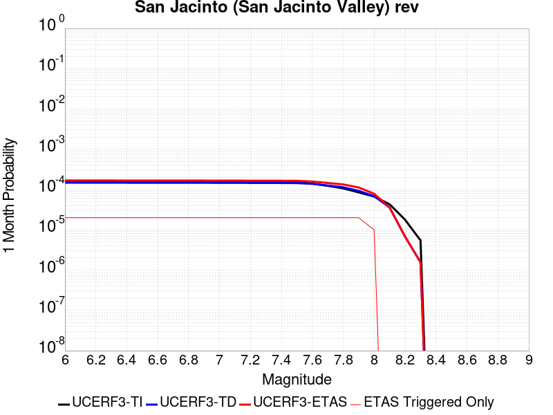 |  |  |

| Magnitude | 1 wk TI Prob | 1 wk TD Prob | 1 wk ETAS Prob | 1 wk ETAS/TD Gain | 1 wk ETAS Triggered Only | 1 mo TI Prob | 1 mo TD Prob | 1 mo ETAS Prob | 1 mo ETAS/TD Gain | 1 mo ETAS Triggered Only | 1 yr TI Prob | 1 yr TD Prob | 1 yr ETAS Prob | 1 yr ETAS/TD Gain | 1 yr ETAS Triggered Only | 10 yr TI Prob | 10 yr TD Prob | 10 yr ETAS Prob | 10 yr ETAS/TD Gain | 10 yr ETAS Triggered Only |
|-----|-----|-----|-----|-----|-----|-----|-----|-----|-----|-----|-----|-----|-----|-----|-----|-----|-----|-----|-----|-----|
| 6.0 | 3.652694E-5 | 3.455631E-5 | 3.455631E-5 | 1.0 | 0.0 | 1.5653463E-4 | 1.4809008E-4 | 1.6808712E-4 | 1.1350329 | 2.0E-5 | 0.0019041431 | 0.0018015072 | 0.0018514171 | 1.0277046 | 5.0E-5 | 0.018879099 | 0.018606104 | 0.018733686 | 1.0068569 | 1.3E-4 |
| 6.1 | 3.652694E-5 | 3.455631E-5 | 3.455631E-5 | 1.0 | 0.0 | 1.5653463E-4 | 1.4809008E-4 | 1.6808712E-4 | 1.1350329 | 2.0E-5 | 0.0019041431 | 0.0018015072 | 0.0018514171 | 1.0277046 | 5.0E-5 | 0.018879099 | 0.018606104 | 0.018733686 | 1.0068569 | 1.3E-4 |
| 6.2 | 3.652694E-5 | 3.455631E-5 | 3.455631E-5 | 1.0 | 0.0 | 1.5653463E-4 | 1.4809008E-4 | 1.6808712E-4 | 1.1350329 | 2.0E-5 | 0.0019041431 | 0.0018015072 | 0.0018514171 | 1.0277046 | 5.0E-5 | 0.018879099 | 0.018606104 | 0.018733686 | 1.0068569 | 1.3E-4 |
| 6.3 | 3.652694E-5 | 3.455631E-5 | 3.455631E-5 | 1.0 | 0.0 | 1.5653463E-4 | 1.4809008E-4 | 1.6808712E-4 | 1.1350329 | 2.0E-5 | 0.0019041431 | 0.0018015072 | 0.0018514171 | 1.0277046 | 5.0E-5 | 0.018879099 | 0.018606104 | 0.018733686 | 1.0068569 | 1.3E-4 |
| 6.4 | 3.646941E-5 | 3.447785E-5 | 3.447785E-5 | 1.0 | 0.0 | 1.5628811E-4 | 1.4775386E-4 | 1.677509E-4 | 1.1353402 | 2.0E-5 | 0.0019011468 | 0.001797421 | 0.0018473312 | 1.0277677 | 5.0E-5 | 0.018849645 | 0.018565971 | 0.018693557 | 1.006872 | 1.3E-4 |
| 6.5 | 3.646941E-5 | 3.447785E-5 | 3.447785E-5 | 1.0 | 0.0 | 1.5628811E-4 | 1.4775386E-4 | 1.677509E-4 | 1.1353402 | 2.0E-5 | 0.0019011468 | 0.001797421 | 0.0018473312 | 1.0277677 | 5.0E-5 | 0.018849645 | 0.018565971 | 0.018693557 | 1.006872 | 1.3E-4 |
| 6.6 | 3.6442503E-5 | 3.444122E-5 | 3.444122E-5 | 1.0 | 0.0 | 1.561728E-4 | 1.4759687E-4 | 1.6759393E-4 | 1.1354842 | 2.0E-5 | 0.0018997455 | 0.0017955131 | 0.0018454234 | 1.0277972 | 5.0E-5 | 0.018835869 | 0.018547233 | 0.018674823 | 1.0068791 | 1.3E-4 |
| 6.7 | 3.6432113E-5 | 3.4426783E-5 | 3.4426783E-5 | 1.0 | 0.0 | 1.5612828E-4 | 1.4753501E-4 | 1.6753207E-4 | 1.1355411 | 2.0E-5 | 0.0018992044 | 0.0017947616 | 0.0018446719 | 1.0278089 | 5.0E-5 | 0.018830549 | 0.018539855 | 0.018667445 | 1.006882 | 1.3E-4 |
| 6.8 | 3.6409598E-5 | 3.4395824E-5 | 3.4395824E-5 | 1.0 | 0.0 | 1.560318E-4 | 1.4740234E-4 | 1.673994E-4 | 1.135663 | 2.0E-5 | 0.0018980318 | 0.001793149 | 0.0018430593 | 1.0278339 | 5.0E-5 | 0.018819023 | 0.018524002 | 0.018651595 | 1.0068879 | 1.3E-4 |
| 6.9 | 3.638078E-5 | 3.4356228E-5 | 3.4356228E-5 | 1.0 | 0.0 | 1.5590832E-4 | 1.4723267E-4 | 1.6722974E-4 | 1.1358194 | 2.0E-5 | 0.0018965311 | 0.0017910866 | 0.0018409971 | 1.027866 | 5.0E-5 | 0.018804269 | 0.01850373 | 0.018631322 | 1.0068957 | 1.3E-4 |
| 7.0 | 3.6294874E-5 | 3.4238194E-5 | 3.4238194E-5 | 1.0 | 0.0 | 1.5554018E-4 | 1.4672687E-4 | 1.6672394E-4 | 1.1362877 | 2.0E-5 | 0.0018920569 | 0.0017849386 | 0.0018348494 | 1.0279622 | 5.0E-5 | 0.018760284 | 0.018443286 | 0.018570889 | 1.0069187 | 1.3E-4 |
| 7.1 | 3.6260717E-5 | 3.4194458E-5 | 3.4194458E-5 | 1.0 | 0.0 | 1.5539382E-4 | 1.4653946E-4 | 1.6653653E-4 | 1.136462 | 2.0E-5 | 0.001890278 | 0.0017826606 | 0.0018325716 | 1.027998 | 5.0E-5 | 0.018742796 | 0.01842088 | 0.018548485 | 1.0069273 | 1.3E-4 |
| 7.2 | 3.6210204E-5 | 3.412857E-5 | 3.412857E-5 | 1.0 | 0.0 | 1.5517735E-4 | 1.4625712E-4 | 1.6625419E-4 | 1.1367254 | 2.0E-5 | 0.001887647 | 0.0017792287 | 0.0018291398 | 1.0280521 | 5.0E-5 | 0.01871693 | 0.018387107 | 0.018514717 | 1.0069401 | 1.3E-4 |
| 7.3 | 3.6119454E-5 | 3.4016623E-5 | 3.4016623E-5 | 1.0 | 0.0 | 1.5478847E-4 | 1.4577739E-4 | 1.6577447E-4 | 1.1371754 | 2.0E-5 | 0.0018829206 | 0.0017733976 | 0.0018233089 | 1.0281445 | 5.0E-5 | 0.018670462 | 0.018329544 | 0.018457161 | 1.0069624 | 1.3E-4 |
| 7.4 | 3.607848E-5 | 3.3964046E-5 | 3.3964046E-5 | 1.0 | 0.0 | 1.5461289E-4 | 1.455521E-4 | 1.655492E-4 | 1.1373879 | 2.0E-5 | 0.0018807866 | 0.0017706591 | 0.0018205706 | 1.0281881 | 5.0E-5 | 0.018649481 | 0.018302504 | 0.018430125 | 1.0069729 | 1.3E-4 |
| 7.5 | 3.5856774E-5 | 3.3772754E-5 | 3.3772754E-5 | 1.0 | 0.0 | 1.5366284E-4 | 1.4473236E-4 | 1.6472947E-4 | 1.1381661 | 2.0E-5 | 0.0018692396 | 0.0017606949 | 0.0018106069 | 1.0283478 | 5.0E-5 | 0.018535944 | 0.018203052 | 0.018330686 | 1.0070117 | 1.3E-4 |
| 7.6 | 3.286655E-5 | 3.228726E-5 | 3.228726E-5 | 1.0 | 0.0 | 1.4084904E-4 | 1.3836664E-4 | 1.5836388E-4 | 1.1445235 | 2.0E-5 | 0.001713488 | 0.0016833142 | 0.0017232469 | 1.0237226 | 4.0E-5 | 0.017003361 | 0.017418329 | 0.017536238 | 1.0067693 | 1.2E-4 |
| 7.7 | 2.8882527E-5 | 2.9376873E-5 | 2.9376873E-5 | 1.0 | 0.0 | 1.237764E-4 | 1.2589482E-4 | 1.4589229E-4 | 1.1588428 | 2.0E-5 | 0.0015059357 | 0.0015316928 | 0.0015716315 | 1.0260749 | 4.0E-5 | 0.014957713 | 0.015903201 | 0.016021293 | 1.0074257 | 1.2E-4 |
| 7.8 | 2.4950225E-5 | 2.6662403E-5 | 2.6662403E-5 | 1.0 | 0.0 | 1.0692515E-4 | 1.14262446E-4 | 1.3426016E-4 | 1.1750157 | 2.0E-5 | 0.0013010362 | 0.0013902583 | 0.0014302027 | 1.0287316 | 4.0E-5 | 0.012934455 | 0.014481823 | 0.01459023 | 1.0074857 | 1.1E-4 |
| 7.9 | 1.9881603E-5 | 2.1629137E-5 | 2.1629137E-5 | 1.0 | 0.0 | 8.520408E-5 | 9.2693015E-5 | 1.1269116E-4 | 1.2157459 | 2.0E-5 | 0.001036866 | 0.001127954 | 0.0011679089 | 1.0354224 | 4.0E-5 | 0.010320415 | 0.011840356 | 0.011949053 | 1.0091803 | 1.1E-4 |
| 8.0 | 1.563292E-5 | 1.603562E-5 | 1.603562E-5 | 1.0 | 0.0 | 6.6996516E-5 | 6.872228E-5 | 7.872159E-5 | 1.1455032 | 1.0E-5 | 8.153773E-4 | 8.3637325E-4 | 8.463649E-4 | 1.0119464 | 1.0E-5 | 0.00812392 | 0.00886222 | 0.008941511 | 1.0089471 | 8.0E-5 |
| 8.1 | 1.0045313E-5 | 8.359553E-6 | 8.359553E-6 | 1.0 | 0.0 | 4.305063E-5 | 3.5826168E-5 | 3.5826168E-5 | 1.0 | 0.0 | 5.2401534E-4 | 4.3609683E-4 | 4.3609683E-4 | 1.0 | 0.0 | 0.0052278144 | 0.0046901475 | 0.004700101 | 1.0021222 | 1.0E-5 |
| 8.2 | 4.1554413E-6 | 1.5821415E-6 | 1.5821415E-6 | 1.0 | 0.0 | 1.7808914E-5 | 6.780589E-6 | 6.780589E-6 | 1.0 | 0.0 | 2.1680194E-4 | 8.255057E-5 | 8.255057E-5 | 1.0 | 0.0 | 0.0021659054 | 9.57762E-4 | 9.57762E-4 | 1.0 | 0.0 |
| 8.3 | 1.2758221E-6 | 3.6600784E-7 | 3.6600784E-7 | 1.0 | 0.0 | 5.4677976E-6 | 1.5686041E-6 | 1.5686041E-6 | 1.0 | 0.0 | 6.65684E-5 | 1.9097592E-5 | 1.9097592E-5 | 1.0 | 0.0 | 6.6548464E-4 | 2.301609E-4 | 2.301609E-4 | 1.0 | 0.0 |

## Scodie Lineament
*[(top)](#table-of-contents)*

| 1 Week | 1 Month | 1 Year | 10 Year |
|-----|-----|-----|-----|
|  |  | 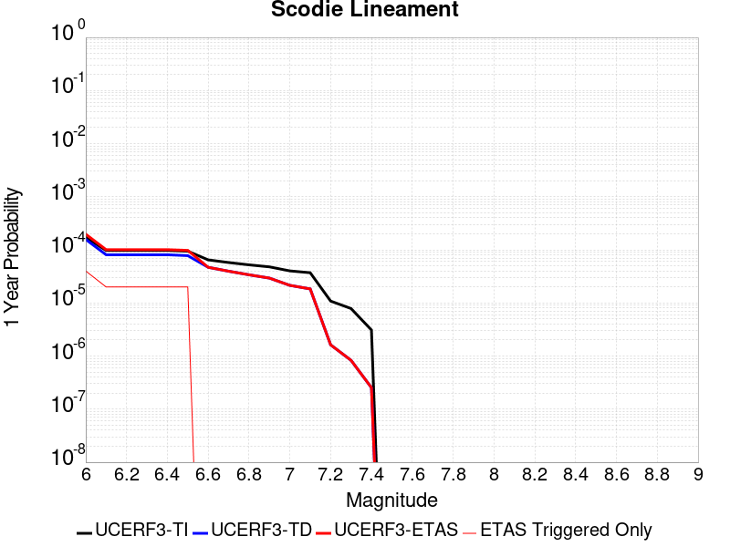 |  |

| Magnitude | 1 wk TI Prob | 1 wk TD Prob | 1 wk ETAS Prob | 1 wk ETAS/TD Gain | 1 wk ETAS Triggered Only | 1 mo TI Prob | 1 mo TD Prob | 1 mo ETAS Prob | 1 mo ETAS/TD Gain | 1 mo ETAS Triggered Only | 1 yr TI Prob | 1 yr TD Prob | 1 yr ETAS Prob | 1 yr ETAS/TD Gain | 1 yr ETAS Triggered Only | 10 yr TI Prob | 10 yr TD Prob | 10 yr ETAS Prob | 10 yr ETAS/TD Gain | 10 yr ETAS Triggered Only |
|-----|-----|-----|-----|-----|-----|-----|-----|-----|-----|-----|-----|-----|-----|-----|-----|-----|-----|-----|-----|-----|
| 6.0 | 3.2919327E-6 | 3.0134847E-6 | 3.0134847E-6 | 1.0 | 0.0 | 1.4108206E-5 | 1.2914888E-5 | 1.2914888E-5 | 1.0 | 0.0 | 1.7175387E-4 | 1.5723059E-4 | 1.972243E-4 | 1.2543634 | 4.0E-5 | 0.0017162118 | 0.0015715051 | 0.0016913166 | 1.07624 | 1.2E-4 |
| 6.1 | 1.8663811E-6 | 1.5491396E-6 | 1.5491396E-6 | 1.0 | 0.0 | 7.998751E-6 | 6.639156E-6 | 6.639156E-6 | 1.0 | 0.0 | 9.738045E-5 | 8.082922E-5 | 1.008276E-4 | 1.2474153 | 2.0E-5 | 9.7337784E-4 | 8.08047E-4 | 8.679985E-4 | 1.0741931 | 6.0E-5 |
| 6.2 | 1.8663811E-6 | 1.5491396E-6 | 1.5491396E-6 | 1.0 | 0.0 | 7.998751E-6 | 6.639156E-6 | 6.639156E-6 | 1.0 | 0.0 | 9.738045E-5 | 8.082922E-5 | 1.008276E-4 | 1.2474153 | 2.0E-5 | 9.7337784E-4 | 8.08047E-4 | 8.679985E-4 | 1.0741931 | 6.0E-5 |
| 6.3 | 1.8663811E-6 | 1.5491396E-6 | 1.5491396E-6 | 1.0 | 0.0 | 7.998751E-6 | 6.639156E-6 | 6.639156E-6 | 1.0 | 0.0 | 9.738045E-5 | 8.082922E-5 | 1.008276E-4 | 1.2474153 | 2.0E-5 | 9.7337784E-4 | 8.08047E-4 | 8.679985E-4 | 1.0741931 | 6.0E-5 |
| 6.4 | 1.8663811E-6 | 1.5491396E-6 | 1.5491396E-6 | 1.0 | 0.0 | 7.998751E-6 | 6.639156E-6 | 6.639156E-6 | 1.0 | 0.0 | 9.738045E-5 | 8.082922E-5 | 1.008276E-4 | 1.2474153 | 2.0E-5 | 9.7337784E-4 | 8.08047E-4 | 8.679985E-4 | 1.0741931 | 6.0E-5 |
| 6.5 | 1.8106311E-6 | 1.4910704E-6 | 1.4910704E-6 | 1.0 | 0.0 | 7.759824E-6 | 6.390289E-6 | 6.390289E-6 | 1.0 | 0.0 | 9.447177E-5 | 7.779949E-5 | 9.779793E-5 | 1.2570511 | 2.0E-5 | 9.4431615E-4 | 7.777712E-4 | 8.377245E-4 | 1.0770835 | 6.0E-5 |
| 6.6 | 1.2414679E-6 | 8.998118E-7 | 8.998118E-7 | 1.0 | 0.0 | 5.320566E-6 | 3.856331E-6 | 3.856331E-6 | 1.0 | 0.0 | 6.477596E-5 | 4.694991E-5 | 4.694991E-5 | 1.0 | 0.0 | 6.475708E-4 | 4.6940855E-4 | 4.893992E-4 | 1.0425868 | 2.0E-5 |
| 6.7 | 1.1062215E-6 | 7.594802E-7 | 7.594802E-7 | 1.0 | 0.0 | 4.7409408E-6 | 3.2549115E-6 | 3.2549115E-6 | 1.0 | 0.0 | 5.7719422E-5 | 3.9627896E-5 | 3.9627896E-5 | 1.0 | 0.0 | 5.770443E-4 | 3.962153E-4 | 4.0621133E-4 | 1.0252289 | 1.0E-5 |
| 6.8 | 1.0006736E-6 | 6.5008345E-7 | 6.5008345E-7 | 1.0 | 0.0 | 4.288594E-6 | 2.7860694E-6 | 2.7860694E-6 | 1.0 | 0.0 | 5.221238E-5 | 3.391993E-5 | 3.391993E-5 | 1.0 | 0.0 | 5.220012E-4 | 3.391536E-4 | 3.491502E-4 | 1.0294752 | 1.0E-5 |
| 6.9 | 9.167364E-7 | 5.6320226E-7 | 5.6320226E-7 | 1.0 | 0.0 | 3.9288643E-6 | 2.4137219E-6 | 2.4137219E-6 | 1.0 | 0.0 | 4.7832873E-5 | 2.9386727E-5 | 2.9386727E-5 | 1.0 | 0.0 | 4.782258E-4 | 2.9383408E-4 | 3.0383116E-4 | 1.0340228 | 1.0E-5 |
| 7.0 | 7.6987664E-7 | 4.1137125E-7 | 4.1137125E-7 | 1.0 | 0.0 | 3.2994672E-6 | 1.7630188E-6 | 1.7630188E-6 | 1.0 | 0.0 | 4.0170275E-5 | 2.146458E-5 | 2.146458E-5 | 1.0 | 0.0 | 4.0163012E-4 | 2.1462893E-4 | 2.2462678E-4 | 1.046582 | 1.0E-5 |
| 7.1 | 7.1038727E-7 | 3.5214526E-7 | 3.5214526E-7 | 1.0 | 0.0 | 3.0445133E-6 | 1.5091933E-6 | 1.5091933E-6 | 1.0 | 0.0 | 3.706632E-5 | 1.8374309E-5 | 1.8374309E-5 | 1.0 | 0.0 | 3.7060137E-4 | 1.8373139E-4 | 1.9372956E-4 | 1.0544173 | 1.0E-5 |
| 7.2 | 2.0799602E-7 | 3.119519E-8 | 3.119519E-8 | 1.0 | 0.0 | 8.914113E-7 | 1.3369366E-7 | 1.3369366E-7 | 1.0 | 0.0 | 1.0852878E-5 | 1.6277191E-6 | 1.6277191E-6 | 1.0 | 0.0 | 1.08523476E-4 | 1.627708E-5 | 2.6276917E-5 | 1.6143508 | 1.0E-5 |
| 7.3 | 1.5048182E-7 | 1.595136E-8 | 1.595136E-8 | 1.0 | 0.0 | 6.449219E-7 | 6.8362965E-8 | 6.8362965E-8 | 1.0 | 0.0 | 7.851896E-6 | 8.323188E-7 | 8.323188E-7 | 1.0 | 0.0 | 7.851618E-5 | 8.32316E-6 | 1.8323077E-5 | 2.2014568 | 1.0E-5 |
| 7.4 | 5.9334678E-8 | 4.8704454E-9 | 4.8704454E-9 | 1.0 | 0.0 | 2.5429145E-7 | 2.0873339E-8 | 2.0873339E-8 | 1.0 | 0.0 | 3.095994E-6 | 2.5413289E-7 | 2.5413289E-7 | 1.0 | 0.0 | 3.095951E-5 | 2.541327E-6 | 2.541327E-6 | 1.0 | 0.0 |

## Ludlow
*[(top)](#table-of-contents)*

| 1 Week | 1 Month | 1 Year | 10 Year |
|-----|-----|-----|-----|
| 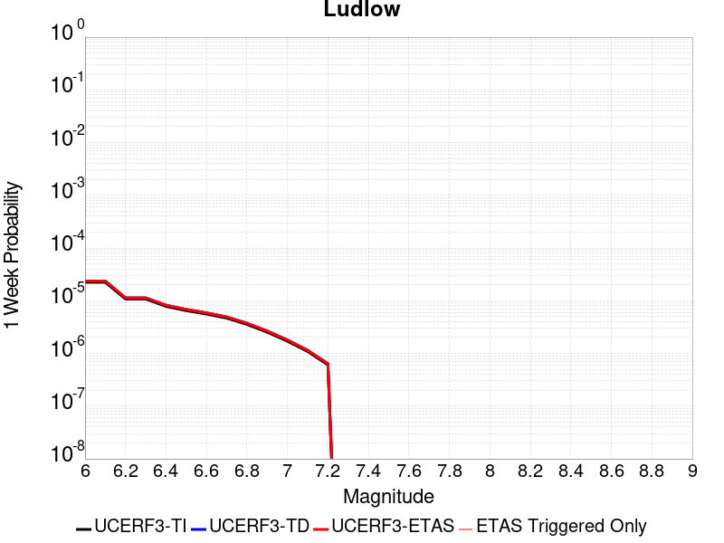 |  |  |  |

| Magnitude | 1 wk TI Prob | 1 wk TD Prob | 1 wk ETAS Prob | 1 wk ETAS/TD Gain | 1 wk ETAS Triggered Only | 1 mo TI Prob | 1 mo TD Prob | 1 mo ETAS Prob | 1 mo ETAS/TD Gain | 1 mo ETAS Triggered Only | 1 yr TI Prob | 1 yr TD Prob | 1 yr ETAS Prob | 1 yr ETAS/TD Gain | 1 yr ETAS Triggered Only | 10 yr TI Prob | 10 yr TD Prob | 10 yr ETAS Prob | 10 yr ETAS/TD Gain | 10 yr ETAS Triggered Only |
|-----|-----|-----|-----|-----|-----|-----|-----|-----|-----|-----|-----|-----|-----|-----|-----|-----|-----|-----|-----|-----|
| 6.0 | 2.2407607E-5 | 2.3659004E-5 | 2.3659004E-5 | 1.0 | 0.0 | 9.602906E-5 | 1.0139204E-4 | 1.2139001E-4 | 1.1972342 | 2.0E-5 | 0.0011685267 | 0.0012337932 | 0.0012937192 | 1.0485705 | 6.0E-5 | 0.011624013 | 0.012273945 | 0.0123924725 | 1.0096568 | 1.2E-4 |
| 6.1 | 2.2407607E-5 | 2.3659004E-5 | 2.3659004E-5 | 1.0 | 0.0 | 9.602906E-5 | 1.0139204E-4 | 1.2139001E-4 | 1.1972342 | 2.0E-5 | 0.0011685267 | 0.0012337932 | 0.0012937192 | 1.0485705 | 6.0E-5 | 0.011624013 | 0.012273945 | 0.0123924725 | 1.0096568 | 1.2E-4 |
| 6.2 | 1.0781252E-5 | 1.1366481E-5 | 1.1366481E-5 | 1.0 | 0.0 | 4.620455E-5 | 4.8712605E-5 | 5.8712118E-5 | 1.2052757 | 1.0E-5 | 5.623952E-4 | 5.929186E-4 | 6.229008E-4 | 1.0505672 | 3.0E-5 | 0.00560974 | 0.005913785 | 0.005953549 | 1.0067239 | 4.0E-5 |
| 6.3 | 1.0781252E-5 | 1.1366481E-5 | 1.1366481E-5 | 1.0 | 0.0 | 4.620455E-5 | 4.8712605E-5 | 5.8712118E-5 | 1.2052757 | 1.0E-5 | 5.623952E-4 | 5.929186E-4 | 6.229008E-4 | 1.0505672 | 3.0E-5 | 0.00560974 | 0.005913785 | 0.005953549 | 1.0067239 | 4.0E-5 |
| 6.4 | 7.814439E-6 | 8.238321E-6 | 8.238321E-6 | 1.0 | 0.0 | 3.3490025E-5 | 3.530662E-5 | 4.5306268E-5 | 1.283223 | 1.0E-5 | 4.0766477E-4 | 4.2977472E-4 | 4.497661E-4 | 1.0465161 | 2.0E-5 | 0.0040691774 | 0.0042895824 | 0.0043194536 | 1.0069637 | 3.0E-5 |
| 6.5 | 6.4986366E-6 | 6.8514128E-6 | 6.8514128E-6 | 1.0 | 0.0 | 2.7851002E-5 | 2.9362871E-5 | 2.9362871E-5 | 1.0 | 0.0 | 3.390332E-4 | 3.5743523E-4 | 3.5743523E-4 | 1.0 | 0.0 | 0.003385164 | 0.0035686996 | 0.0035786638 | 1.0027921 | 1.0E-5 |
| 6.6 | 5.582177E-6 | 5.8864307E-6 | 5.8864307E-6 | 1.0 | 0.0 | 2.3923398E-5 | 2.522732E-5 | 2.522732E-5 | 1.0 | 0.0 | 2.9122844E-4 | 3.0710007E-4 | 3.0710007E-4 | 1.0 | 0.0 | 0.0029084706 | 0.00306683 | 0.0030767994 | 1.0032507 | 1.0E-5 |
| 6.7 | 4.6858763E-6 | 4.9407836E-6 | 4.9407836E-6 | 1.0 | 0.0 | 2.0082172E-5 | 2.1174617E-5 | 2.1174617E-5 | 1.0 | 0.0 | 2.4447302E-4 | 2.5777103E-4 | 2.5777103E-4 | 1.0 | 0.0 | 0.0024420423 | 0.0025747768 | 0.002584751 | 1.0038738 | 1.0E-5 |
| 6.8 | 3.5584908E-6 | 3.752289E-6 | 3.752289E-6 | 1.0 | 0.0 | 1.5250586E-5 | 1.6081141E-5 | 1.6081141E-5 | 1.0 | 0.0 | 1.8566006E-4 | 1.9577073E-4 | 1.9577073E-4 | 1.0 | 0.0 | 0.0018550502 | 0.0019560237 | 0.0019560237 | 1.0 | 0.0 |
| 6.9 | 2.532834E-6 | 2.6711969E-6 | 2.6711969E-6 | 1.0 | 0.0 | 1.0854958E-5 | 1.1447937E-5 | 1.1447937E-5 | 1.0 | 0.0 | 1.3215111E-4 | 1.3937001E-4 | 1.3937001E-4 | 1.0 | 0.0 | 0.0013207254 | 0.0013928536 | 0.0013928536 | 1.0 | 0.0 |
| 7.0 | 1.7083285E-6 | 1.8020748E-6 | 1.8020748E-6 | 1.0 | 0.0 | 7.3213873E-6 | 7.723156E-6 | 7.723156E-6 | 1.0 | 0.0 | 8.913424E-5 | 9.4025534E-5 | 9.4025534E-5 | 1.0 | 0.0 | 8.9098496E-4 | 9.3987404E-4 | 9.3987404E-4 | 1.0 | 0.0 |
| 7.1 | 1.0905424E-6 | 1.1498448E-6 | 1.1498448E-6 | 1.0 | 0.0 | 4.6737446E-6 | 4.9278974E-6 | 4.9278974E-6 | 1.0 | 0.0 | 5.6901354E-5 | 5.99956E-5 | 5.99956E-5 | 1.0 | 0.0 | 5.6886784E-4 | 5.998038E-4 | 5.998038E-4 | 1.0 | 0.0 |
| 7.2 | 6.06668E-7 | 6.387725E-7 | 6.387725E-7 | 1.0 | 0.0 | 2.600003E-6 | 2.737594E-6 | 2.737594E-6 | 1.0 | 0.0 | 3.1654577E-5 | 3.332977E-5 | 3.332977E-5 | 1.0 | 0.0 | 3.1650066E-4 | 3.3325455E-4 | 3.3325455E-4 | 1.0 | 0.0 |

## San Andreas (San Gorgonio Pass-Garnet HIll)
*[(top)](#table-of-contents)*

| 1 Week | 1 Month | 1 Year | 10 Year |
|-----|-----|-----|-----|
|  |  |  |  |

| Magnitude | 1 wk TI Prob | 1 wk TD Prob | 1 wk ETAS Prob | 1 wk ETAS/TD Gain | 1 wk ETAS Triggered Only | 1 mo TI Prob | 1 mo TD Prob | 1 mo ETAS Prob | 1 mo ETAS/TD Gain | 1 mo ETAS Triggered Only | 1 yr TI Prob | 1 yr TD Prob | 1 yr ETAS Prob | 1 yr ETAS/TD Gain | 1 yr ETAS Triggered Only | 10 yr TI Prob | 10 yr TD Prob | 10 yr ETAS Prob | 10 yr ETAS/TD Gain | 10 yr ETAS Triggered Only |
|-----|-----|-----|-----|-----|-----|-----|-----|-----|-----|-----|-----|-----|-----|-----|-----|-----|-----|-----|-----|-----|
| 6.0 | 8.31567E-5 | 2.3422479E-4 | 2.3422479E-4 | 1.0 | 0.0 | 3.5633717E-4 | 0.001003437 | 0.0010234169 | 1.0199115 | 2.0E-5 | 0.004329778 | 0.012148325 | 0.012197718 | 1.0040658 | 5.0E-5 | 0.042463828 | 0.11274116 | 0.112847626 | 1.0009444 | 1.2E-4 |
| 6.1 | 8.31567E-5 | 2.3422479E-4 | 2.3422479E-4 | 1.0 | 0.0 | 3.5633717E-4 | 0.001003437 | 0.0010234169 | 1.0199115 | 2.0E-5 | 0.004329778 | 0.012148325 | 0.012197718 | 1.0040658 | 5.0E-5 | 0.042463828 | 0.11274116 | 0.112847626 | 1.0009444 | 1.2E-4 |
| 6.2 | 8.31567E-5 | 2.3422479E-4 | 2.3422479E-4 | 1.0 | 0.0 | 3.5633717E-4 | 0.001003437 | 0.0010234169 | 1.0199115 | 2.0E-5 | 0.004329778 | 0.012148325 | 0.012197718 | 1.0040658 | 5.0E-5 | 0.042463828 | 0.11274116 | 0.112847626 | 1.0009444 | 1.2E-4 |
| 6.3 | 8.31567E-5 | 2.3422479E-4 | 2.3422479E-4 | 1.0 | 0.0 | 3.5633717E-4 | 0.001003437 | 0.0010234169 | 1.0199115 | 2.0E-5 | 0.004329778 | 0.012148325 | 0.012197718 | 1.0040658 | 5.0E-5 | 0.042463828 | 0.11274116 | 0.112847626 | 1.0009444 | 1.2E-4 |
| 6.4 | 8.059055E-5 | 2.2980345E-4 | 2.2980345E-4 | 1.0 | 0.0 | 3.4534236E-4 | 9.845027E-4 | 0.001004483 | 1.0202948 | 2.0E-5 | 0.0041964394 | 0.011920336 | 0.01196974 | 1.0041445 | 5.0E-5 | 0.041180745 | 0.1107217 | 0.110828415 | 1.0009638 | 1.2E-4 |
| 6.5 | 8.059055E-5 | 2.2980345E-4 | 2.2980345E-4 | 1.0 | 0.0 | 3.4534236E-4 | 9.845027E-4 | 0.001004483 | 1.0202948 | 2.0E-5 | 0.0041964394 | 0.011920336 | 0.01196974 | 1.0041445 | 5.0E-5 | 0.041180745 | 0.1107217 | 0.110828415 | 1.0009638 | 1.2E-4 |
| 6.6 | 7.619237E-5 | 2.2224057E-4 | 2.2224057E-4 | 1.0 | 0.0 | 3.2649786E-4 | 9.521143E-4 | 9.7209524E-4 | 1.0209858 | 2.0E-5 | 0.0039678677 | 0.011530932 | 0.011580355 | 1.0042862 | 5.0E-5 | 0.03897764 | 0.10725754 | 0.10736467 | 1.0009989 | 1.2E-4 |
| 6.7 | 7.440636E-5 | 2.1899794E-4 | 2.1899794E-4 | 1.0 | 0.0 | 3.188454E-4 | 9.382273E-4 | 9.582085E-4 | 1.0212967 | 2.0E-5 | 0.0038750346 | 0.011363627 | 0.011413059 | 1.00435 | 5.0E-5 | 0.038081564 | 0.10576587 | 0.10587318 | 1.0010146 | 1.2E-4 |
| 6.8 | 7.3735864E-5 | 2.1746915E-4 | 2.1746915E-4 | 1.0 | 0.0 | 3.1597257E-4 | 9.3167997E-4 | 9.516614E-4 | 1.0214466 | 2.0E-5 | 0.0038401815 | 0.0112847425 | 0.011334179 | 1.0043807 | 5.0E-5 | 0.03774495 | 0.10506733 | 0.10517472 | 1.0010221 | 1.2E-4 |
| 6.9 | 7.27575E-5 | 2.1515826E-4 | 2.1515826E-4 | 1.0 | 0.0 | 3.117806E-4 | 9.217832E-4 | 9.4176474E-4 | 1.021677 | 2.0E-5 | 0.003789323 | 0.01116549 | 0.011214932 | 1.004428 | 5.0E-5 | 0.037253562 | 0.104015164 | 0.10412268 | 1.0010337 | 1.2E-4 |
| 7.0 | 7.102591E-5 | 2.10997E-4 | 2.10997E-4 | 1.0 | 0.0 | 3.0436125E-4 | 9.0396166E-4 | 9.239436E-4 | 1.0221049 | 2.0E-5 | 0.003699303 | 0.0109507125 | 0.011000165 | 1.0045159 | 5.0E-5 | 0.03638325 | 0.10211699 | 0.10222473 | 1.0010551 | 1.2E-4 |
| 7.1 | 7.028513E-5 | 2.0935269E-4 | 2.0935269E-4 | 1.0 | 0.0 | 3.0118722E-4 | 8.969195E-4 | 9.1690157E-4 | 1.0222785 | 2.0E-5 | 0.0036607897 | 0.010865833 | 0.01091529 | 1.0045515 | 5.0E-5 | 0.036010686 | 0.10135982 | 0.10146766 | 1.001064 | 1.2E-4 |
| 7.2 | 6.8498244E-5 | 2.0542955E-4 | 2.0542955E-4 | 1.0 | 0.0 | 2.9353087E-4 | 8.8011747E-4 | 9.0009987E-4 | 1.0227042 | 2.0E-5 | 0.003567883 | 0.010663286 | 0.010712752 | 1.004639 | 5.0E-5 | 0.035111405 | 0.099551365 | 0.09965942 | 1.0010854 | 1.2E-4 |
| 7.3 | 6.622592E-5 | 1.9769753E-4 | 1.9769753E-4 | 1.0 | 0.0 | 2.8379448E-4 | 8.4700214E-4 | 8.6698524E-4 | 1.0235927 | 2.0E-5 | 0.0034497243 | 0.010263974 | 0.010313461 | 1.0048214 | 5.0E-5 | 0.033966612 | 0.09604639 | 0.09615487 | 1.0011294 | 1.2E-4 |
| 7.4 | 5.1050705E-5 | 1.472159E-4 | 1.472159E-4 | 1.0 | 0.0 | 2.1877038E-4 | 6.307736E-4 | 6.50761E-4 | 1.0316871 | 2.0E-5 | 0.002660276 | 0.0076528206 | 0.0077024377 | 1.0064836 | 5.0E-5 | 0.02628654 | 0.073003724 | 0.07311497 | 1.0015237 | 1.2E-4 |
| 7.5 | 3.9302922E-5 | 1.1158177E-4 | 1.1158177E-4 | 1.0 | 0.0 | 1.6843023E-4 | 4.781203E-4 | 4.981107E-4 | 1.0418105 | 2.0E-5 | 0.0020487092 | 0.0058056475 | 0.0058553573 | 1.0085623 | 5.0E-5 | 0.020299247 | 0.056134652 | 0.056247916 | 1.0020177 | 1.2E-4 |
| 7.6 | 2.9851626E-5 | 8.520211E-5 | 8.520211E-5 | 1.0 | 0.0 | 1.2792926E-4 | 3.6510095E-4 | 3.8509362E-4 | 1.0547594 | 2.0E-5 | 0.0015564259 | 0.0044360696 | 0.004485848 | 1.0112213 | 5.0E-5 | 0.0154556995 | 0.043306693 | 0.04341193 | 1.0024301 | 1.1E-4 |
| 7.7 | 2.1135214E-5 | 6.375337E-5 | 6.375337E-5 | 1.0 | 0.0 | 9.0576345E-5 | 2.7320013E-4 | 2.9319467E-4 | 1.0731864 | 2.0E-5 | 0.0011022091 | 0.0033211438 | 0.0033709777 | 1.0150051 | 5.0E-5 | 0.010967582 | 0.032683704 | 0.032780435 | 1.0029596 | 1.0E-4 |
| 7.8 | 1.883379E-5 | 5.584623E-5 | 5.584623E-5 | 1.0 | 0.0 | 8.0713755E-5 | 2.3931904E-4 | 2.5931426E-4 | 1.0835505 | 2.0E-5 | 9.822468E-4 | 0.0029098194 | 0.002959674 | 1.0171332 | 5.0E-5 | 0.0097791655 | 0.028788505 | 0.028885625 | 1.0033736 | 1.0E-4 |
| 7.9 | 1.5156185E-5 | 4.1827483E-5 | 4.1827483E-5 | 1.0 | 0.0 | 6.495346E-5 | 1.7924832E-4 | 1.9924474E-4 | 1.111557 | 2.0E-5 | 7.9052144E-4 | 0.0021801654 | 0.0022300566 | 1.022884 | 5.0E-5 | 0.007877152 | 0.021837084 | 0.021925118 | 1.0040314 | 9.0E-5 |
| 8.0 | 1.1405907E-5 | 3.01013E-5 | 3.01013E-5 | 1.0 | 0.0 | 4.8881542E-5 | 1.289992E-4 | 1.4899662E-4 | 1.1550198 | 2.0E-5 | 5.9497025E-4 | 0.0015694348 | 0.0016193563 | 1.0318086 | 5.0E-5 | 0.005933798 | 0.015831854 | 0.015900746 | 1.0043515 | 7.0E-5 |
| 8.1 | 4.3511436E-6 | 7.415145E-6 | 7.415145E-6 | 1.0 | 0.0 | 1.8647626E-5 | 3.1778807E-5 | 3.1778807E-5 | 1.0 | 0.0 | 2.2701119E-4 | 3.868384E-4 | 3.9683454E-4 | 1.0258406 | 1.0E-5 | 0.0022677942 | 0.004139254 | 0.0041492125 | 1.0024059 | 1.0E-5 |
| 8.2 | 2.3042528E-6 | 2.7545068E-6 | 2.7545068E-6 | 1.0 | 0.0 | 9.875332E-6 | 1.1804976E-5 | 1.1804976E-5 | 1.0 | 0.0 | 1.2022553E-4 | 1.4371614E-4 | 1.4371614E-4 | 1.0 | 0.0 | 0.0012016051 | 0.001609254 | 0.001609254 | 1.0 | 0.0 |
| 8.3 | 5.202968E-7 | 3.194589E-7 | 3.194589E-7 | 1.0 | 0.0 | 2.2298414E-6 | 1.3691089E-6 | 1.3691089E-6 | 1.0 | 0.0 | 2.714798E-5 | 1.6668786E-5 | 1.6668786E-5 | 1.0 | 0.0 | 2.7144665E-4 | 1.975942E-4 | 1.975942E-4 | 1.0 | 0.0 |

## Elsinore (Glen Ivy) rev
*[(top)](#table-of-contents)*

| 1 Week | 1 Month | 1 Year | 10 Year |
|-----|-----|-----|-----|
| 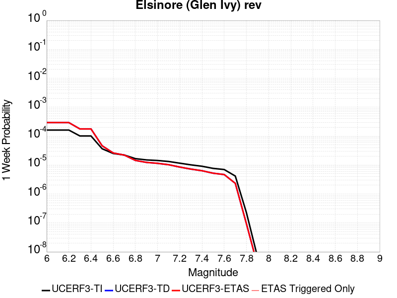 | 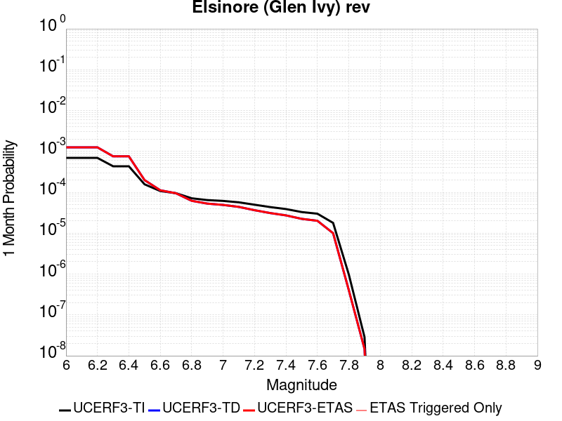 |  |  |

| Magnitude | 1 wk TI Prob | 1 wk TD Prob | 1 wk ETAS Prob | 1 wk ETAS/TD Gain | 1 wk ETAS Triggered Only | 1 mo TI Prob | 1 mo TD Prob | 1 mo ETAS Prob | 1 mo ETAS/TD Gain | 1 mo ETAS Triggered Only | 1 yr TI Prob | 1 yr TD Prob | 1 yr ETAS Prob | 1 yr ETAS/TD Gain | 1 yr ETAS Triggered Only | 10 yr TI Prob | 10 yr TD Prob | 10 yr ETAS Prob | 10 yr ETAS/TD Gain | 10 yr ETAS Triggered Only |
|-----|-----|-----|-----|-----|-----|-----|-----|-----|-----|-----|-----|-----|-----|-----|-----|-----|-----|-----|-----|-----|
| 6.0 | 1.6204086E-4 | 2.9373835E-4 | 2.9373835E-4 | 1.0 | 0.0 | 6.94276E-4 | 0.0012584261 | 0.0012584261 | 1.0 | 0.0 | 0.008420097 | 0.015239672 | 0.01528891 | 1.0032309 | 5.0E-5 | 0.081081145 | 0.13972586 | 0.13982049 | 1.0006772 | 1.1E-4 |
| 6.1 | 1.6204086E-4 | 2.9373835E-4 | 2.9373835E-4 | 1.0 | 0.0 | 6.94276E-4 | 0.0012584261 | 0.0012584261 | 1.0 | 0.0 | 0.008420097 | 0.015239672 | 0.01528891 | 1.0032309 | 5.0E-5 | 0.081081145 | 0.13972586 | 0.13982049 | 1.0006772 | 1.1E-4 |
| 6.2 | 1.6204086E-4 | 2.9373835E-4 | 2.9373835E-4 | 1.0 | 0.0 | 6.94276E-4 | 0.0012584261 | 0.0012584261 | 1.0 | 0.0 | 0.008420097 | 0.015239672 | 0.01528891 | 1.0032309 | 5.0E-5 | 0.081081145 | 0.13972586 | 0.13982049 | 1.0006772 | 1.1E-4 |
| 6.3 | 1.0111737E-4 | 1.7707222E-4 | 1.7707222E-4 | 1.0 | 0.0 | 4.332882E-4 | 7.5877697E-4 | 7.5877697E-4 | 1.0 | 0.0 | 0.005262531 | 0.009219674 | 0.009229582 | 1.0010747 | 1.0E-5 | 0.0513964 | 0.087036215 | 0.08707274 | 1.0004196 | 4.0E-5 |
| 6.4 | 1.0111737E-4 | 1.7707222E-4 | 1.7707222E-4 | 1.0 | 0.0 | 4.332882E-4 | 7.5877697E-4 | 7.5877697E-4 | 1.0 | 0.0 | 0.005262531 | 0.009219674 | 0.009229582 | 1.0010747 | 1.0E-5 | 0.0513964 | 0.087036215 | 0.08707274 | 1.0004196 | 4.0E-5 |
| 6.5 | 3.6624708E-5 | 4.6410038E-5 | 4.6410038E-5 | 1.0 | 0.0 | 1.569536E-4 | 1.9888705E-4 | 1.9888705E-4 | 1.0 | 0.0 | 0.001909235 | 0.002419124 | 0.002419124 | 1.0 | 0.0 | 0.01892915 | 0.02374938 | 0.023759142 | 1.000411 | 1.0E-5 |
| 6.6 | 2.5051324E-5 | 2.6161024E-5 | 2.6161024E-5 | 1.0 | 0.0 | 1.073584E-4 | 1.121141E-4 | 1.121141E-4 | 1.0 | 0.0 | 0.0013063047 | 0.0013641791 | 0.0013641791 | 1.0 | 0.0 | 0.012986525 | 0.0135714235 | 0.013581287 | 1.0007268 | 1.0E-5 |
| 6.7 | 2.2189772E-5 | 2.208435E-5 | 2.208435E-5 | 1.0 | 0.0 | 9.509556E-5 | 9.464399E-5 | 9.464399E-5 | 1.0 | 0.0 | 0.0011571734 | 0.0011517179 | 0.0011517179 | 1.0 | 0.0 | 0.011511663 | 0.011471325 | 0.011481211 | 1.0008618 | 1.0E-5 |
| 6.8 | 1.6654378E-5 | 1.4444795E-5 | 1.4444795E-5 | 1.0 | 0.0 | 7.137396E-5 | 6.190482E-5 | 6.190482E-5 | 1.0 | 0.0 | 8.686314E-4 | 7.534358E-4 | 7.534358E-4 | 1.0 | 0.0 | 0.008652439 | 0.007514148 | 0.007514148 | 1.0 | 0.0 |
| 6.9 | 1.5042909E-5 | 1.233821E-5 | 1.233821E-5 | 1.0 | 0.0 | 6.446802E-5 | 5.2876985E-5 | 5.2876985E-5 | 1.0 | 0.0 | 7.8461546E-4 | 6.435903E-4 | 6.435903E-4 | 1.0 | 0.0 | 0.007818509 | 0.0064214864 | 0.0064214864 | 1.0 | 0.0 |
| 7.0 | 1.4361385E-5 | 1.145718E-5 | 1.145718E-5 | 1.0 | 0.0 | 6.154734E-5 | 4.9101294E-5 | 4.9101294E-5 | 1.0 | 0.0 | 7.490812E-4 | 5.976472E-4 | 5.976472E-4 | 1.0 | 0.0 | 0.007465612 | 0.0059643895 | 0.0059643895 | 1.0 | 0.0 |
| 7.1 | 1.3265571E-5 | 1.02501535E-5 | 1.02501535E-5 | 1.0 | 0.0 | 5.6851208E-5 | 4.3928503E-5 | 4.3928503E-5 | 1.0 | 0.0 | 6.919436E-4 | 5.347008E-4 | 5.347008E-4 | 1.0 | 0.0 | 0.006897931 | 0.0053374986 | 0.0053374986 | 1.0 | 0.0 |
| 7.2 | 1.1596403E-5 | 8.509482E-6 | 8.509482E-6 | 1.0 | 0.0 | 4.9697923E-5 | 3.6468704E-5 | 3.6468704E-5 | 1.0 | 0.0 | 6.049042E-4 | 4.4391773E-4 | 4.4391773E-4 | 1.0 | 0.0 | 0.006032603 | 0.004431725 | 0.004431725 | 1.0 | 0.0 |
| 7.3 | 1.0150827E-5 | 7.2425387E-6 | 7.2425387E-6 | 1.0 | 0.0 | 4.3502816E-5 | 3.103909E-5 | 3.103909E-5 | 1.0 | 0.0 | 5.2951806E-4 | 3.7783684E-4 | 3.7783684E-4 | 1.0 | 0.0 | 0.005282581 | 0.0037723312 | 0.0037723312 | 1.0 | 0.0 |
| 7.4 | 9.080705E-6 | 6.355858E-6 | 6.355858E-6 | 1.0 | 0.0 | 3.8916725E-5 | 2.7239115E-5 | 2.7239115E-5 | 1.0 | 0.0 | 4.7370812E-4 | 3.3158713E-4 | 3.3158713E-4 | 1.0 | 0.0 | 0.004726996 | 0.0033110748 | 0.0033110748 | 1.0 | 0.0 |
| 7.5 | 7.671649E-6 | 5.228478E-6 | 5.228478E-6 | 1.0 | 0.0 | 3.287808E-5 | 2.240758E-5 | 2.240758E-5 | 1.0 | 0.0 | 4.0021708E-4 | 2.7277938E-4 | 2.7277938E-4 | 1.0 | 0.0 | 0.0039949706 | 0.0027245705 | 0.0027245705 | 1.0 | 0.0 |
| 7.6 | 6.990086E-6 | 4.690167E-6 | 4.690167E-6 | 1.0 | 0.0 | 2.9957167E-5 | 2.0100566E-5 | 2.0100566E-5 | 1.0 | 0.0 | 3.6466747E-4 | 2.4469808E-4 | 2.4469808E-4 | 1.0 | 0.0 | 0.0036406964 | 0.0024444028 | 0.0024444028 | 1.0 | 0.0 |
| 7.7 | 4.163505E-6 | 2.33086E-6 | 2.33086E-6 | 1.0 | 0.0 | 1.7843471E-5 | 9.989366E-6 | 9.989366E-6 | 1.0 | 0.0 | 2.172226E-4 | 1.21614496E-4 | 1.21614496E-4 | 1.0 | 0.0 | 0.0021701038 | 0.0012155526 | 0.0012155526 | 1.0 | 0.0 |
| 7.8 | 2.2692414E-7 | 9.390229E-8 | 9.390229E-8 | 1.0 | 0.0 | 9.725317E-7 | 4.0243833E-7 | 4.0243833E-7 | 1.0 | 0.0 | 1.1840509E-5 | 4.899679E-6 | 4.899679E-6 | 1.0 | 0.0 | 1.1839878E-4 | 4.8996037E-5 | 4.8996037E-5 | 1.0 | 0.0 |
| 7.9 | 6.676829E-9 | 3.4410954E-9 | 3.4410954E-9 | 1.0 | 0.0 | 2.861498E-8 | 1.4747552E-8 | 1.4747552E-8 | 1.0 | 0.0 | 3.4838732E-7 | 1.7955142E-7 | 1.7955142E-7 | 1.0 | 0.0 | 3.4838679E-6 | 1.795513E-6 | 1.795513E-6 | 1.0 | 0.0 |

## San Jacinto (Stepovers Combined)
*[(top)](#table-of-contents)*

| 1 Week | 1 Month | 1 Year | 10 Year |
|-----|-----|-----|-----|
|  |  |  |  |

| Magnitude | 1 wk TI Prob | 1 wk TD Prob | 1 wk ETAS Prob | 1 wk ETAS/TD Gain | 1 wk ETAS Triggered Only | 1 mo TI Prob | 1 mo TD Prob | 1 mo ETAS Prob | 1 mo ETAS/TD Gain | 1 mo ETAS Triggered Only | 1 yr TI Prob | 1 yr TD Prob | 1 yr ETAS Prob | 1 yr ETAS/TD Gain | 1 yr ETAS Triggered Only | 10 yr TI Prob | 10 yr TD Prob | 10 yr ETAS Prob | 10 yr ETAS/TD Gain | 10 yr ETAS Triggered Only |
|-----|-----|-----|-----|-----|-----|-----|-----|-----|-----|-----|-----|-----|-----|-----|-----|-----|-----|-----|-----|-----|
| 6.0 | 4.0667746E-5 | 3.5424455E-5 | 3.5424455E-5 | 1.0 | 0.0 | 1.742787E-4 | 1.5181027E-4 | 1.6180876E-4 | 1.0658617 | 1.0E-5 | 0.0021197782 | 0.0018467255 | 0.00187667 | 1.016215 | 3.0E-5 | 0.020996714 | 0.019065471 | 0.019173374 | 1.0056596 | 1.1E-4 |
| 6.1 | 4.0667746E-5 | 3.5424455E-5 | 3.5424455E-5 | 1.0 | 0.0 | 1.742787E-4 | 1.5181027E-4 | 1.6180876E-4 | 1.0658617 | 1.0E-5 | 0.0021197782 | 0.0018467255 | 0.00187667 | 1.016215 | 3.0E-5 | 0.020996714 | 0.019065471 | 0.019173374 | 1.0056596 | 1.1E-4 |
| 6.2 | 4.0667746E-5 | 3.5424455E-5 | 3.5424455E-5 | 1.0 | 0.0 | 1.742787E-4 | 1.5181027E-4 | 1.6180876E-4 | 1.0658617 | 1.0E-5 | 0.0021197782 | 0.0018467255 | 0.00187667 | 1.016215 | 3.0E-5 | 0.020996714 | 0.019065471 | 0.019173374 | 1.0056596 | 1.1E-4 |
| 6.3 | 4.0667746E-5 | 3.5424455E-5 | 3.5424455E-5 | 1.0 | 0.0 | 1.742787E-4 | 1.5181027E-4 | 1.6180876E-4 | 1.0658617 | 1.0E-5 | 0.0021197782 | 0.0018467255 | 0.00187667 | 1.016215 | 3.0E-5 | 0.020996714 | 0.019065471 | 0.019173374 | 1.0056596 | 1.1E-4 |
| 6.4 | 4.0577226E-5 | 3.529632E-5 | 3.529632E-5 | 1.0 | 0.0 | 1.738908E-4 | 1.5126119E-4 | 1.6125968E-4 | 1.0661008 | 1.0E-5 | 0.0021150648 | 0.0018400518 | 0.0018699967 | 1.0162739 | 3.0E-5 | 0.020950472 | 0.019000014 | 0.019107925 | 1.0056795 | 1.1E-4 |
| 6.5 | 4.0577226E-5 | 3.529632E-5 | 3.529632E-5 | 1.0 | 0.0 | 1.738908E-4 | 1.5126119E-4 | 1.6125968E-4 | 1.0661008 | 1.0E-5 | 0.0021150648 | 0.0018400518 | 0.0018699967 | 1.0162739 | 3.0E-5 | 0.020950472 | 0.019000014 | 0.019107925 | 1.0056795 | 1.1E-4 |
| 6.6 | 4.053861E-5 | 3.5241635E-5 | 3.5241635E-5 | 1.0 | 0.0 | 1.7372532E-4 | 1.5102686E-4 | 1.6102535E-4 | 1.0662034 | 1.0E-5 | 0.0021130538 | 0.0018372037 | 0.0018671487 | 1.0162991 | 3.0E-5 | 0.020930743 | 0.018972082 | 0.019079994 | 1.005688 | 1.1E-4 |
| 6.7 | 4.0516545E-5 | 3.5210687E-5 | 3.5210687E-5 | 1.0 | 0.0 | 1.7363077E-4 | 1.5089424E-4 | 1.6089273E-4 | 1.0662615 | 1.0E-5 | 0.002111905 | 0.0018355926 | 0.0018655375 | 1.0163136 | 3.0E-5 | 0.020919468 | 0.018956272 | 0.019064186 | 1.0056928 | 1.1E-4 |
| 6.8 | 4.049434E-5 | 3.5182235E-5 | 3.5182235E-5 | 1.0 | 0.0 | 1.7353562E-4 | 1.507723E-4 | 1.6077081E-4 | 1.0663152 | 1.0E-5 | 0.0021107488 | 0.0018341107 | 0.0018640556 | 1.0163267 | 3.0E-5 | 0.020908125 | 0.018941678 | 0.019049596 | 1.0056973 | 1.1E-4 |
| 6.9 | 4.046386E-5 | 3.5144778E-5 | 3.5144778E-5 | 1.0 | 0.0 | 1.73405E-4 | 1.506118E-4 | 1.6061029E-4 | 1.0663859 | 1.0E-5 | 0.0021091616 | 0.0018321596 | 0.0018621046 | 1.0163441 | 3.0E-5 | 0.020892553 | 0.018922443 | 0.019030362 | 1.0057032 | 1.1E-4 |
| 7.0 | 4.036382E-5 | 3.5025278E-5 | 3.5025278E-5 | 1.0 | 0.0 | 1.7297632E-4 | 1.5009972E-4 | 1.6009822E-4 | 1.0666124 | 1.0E-5 | 0.0021039525 | 0.0018259356 | 0.0018558807 | 1.0164 | 3.0E-5 | 0.02084144 | 0.018861026 | 0.01896895 | 1.0057222 | 1.1E-4 |
| 7.1 | 4.0343282E-5 | 3.5003726E-5 | 3.5003726E-5 | 1.0 | 0.0 | 1.7288832E-4 | 1.5000737E-4 | 1.6000586E-4 | 1.0666534 | 1.0E-5 | 0.002102883 | 0.0018248131 | 0.0018547584 | 1.01641 | 3.0E-5 | 0.020830948 | 0.018849896 | 0.018957822 | 1.0057256 | 1.1E-4 |
| 7.2 | 4.0257353E-5 | 3.4908084E-5 | 3.4908084E-5 | 1.0 | 0.0 | 1.725201E-4 | 1.4959752E-4 | 1.5959602E-4 | 1.066836 | 1.0E-5 | 0.0020984085 | 0.0018198314 | 0.0018497768 | 1.016455 | 3.0E-5 | 0.020787042 | 0.018800564 | 0.018908497 | 1.0057409 | 1.1E-4 |
| 7.3 | 3.9940667E-5 | 3.4735232E-5 | 3.4735232E-5 | 1.0 | 0.0 | 1.7116306E-4 | 1.4885681E-4 | 1.5885531E-4 | 1.0671687 | 1.0E-5 | 0.0020819185 | 0.0018108283 | 0.001840774 | 1.016537 | 3.0E-5 | 0.020625217 | 0.018708937 | 0.018816879 | 1.0057695 | 1.1E-4 |
| 7.4 | 3.9721202E-5 | 3.4620345E-5 | 3.4620345E-5 | 1.0 | 0.0 | 1.7022261E-4 | 1.4836449E-4 | 1.5836301E-4 | 1.0673915 | 1.0E-5 | 0.0020704903 | 0.0018048445 | 0.0018347903 | 1.0165919 | 3.0E-5 | 0.020513052 | 0.01864792 | 0.01875587 | 1.0057888 | 1.1E-4 |
| 7.5 | 3.7036873E-5 | 3.368442E-5 | 3.368442E-5 | 1.0 | 0.0 | 1.5871979E-4 | 1.4435383E-4 | 1.543524E-4 | 1.0692642 | 1.0E-5 | 0.0019307006 | 0.0017560942 | 0.0017860415 | 1.0170534 | 3.0E-5 | 0.019140124 | 0.018147755 | 0.018255759 | 1.0059514 | 1.1E-4 |
| 7.6 | 3.2940967E-5 | 3.1455937E-5 | 3.1455937E-5 | 1.0 | 0.0 | 1.4116794E-4 | 1.348042E-4 | 1.4480285E-4 | 1.0741717 | 1.0E-5 | 0.0017173645 | 0.0016400078 | 0.001659975 | 1.0121751 | 2.0E-5 | 0.01704153 | 0.016975854 | 0.017074157 | 1.0057907 | 1.0E-4 |
| 7.7 | 2.8236149E-5 | 2.8018048E-5 | 2.8018048E-5 | 1.0 | 0.0 | 1.2100645E-4 | 1.2007183E-4 | 1.3007064E-4 | 1.0832735 | 1.0E-5 | 0.0014722579 | 0.0014608953 | 0.0014808661 | 1.0136702 | 2.0E-5 | 0.014625421 | 0.015184763 | 0.015283244 | 1.0064856 | 1.0E-4 |
| 7.8 | 2.4329287E-5 | 2.5336392E-5 | 2.5336392E-5 | 1.0 | 0.0 | 1.042642E-4 | 1.08580025E-4 | 1.1857894E-4 | 1.092088 | 1.0E-5 | 0.0012686774 | 0.0013211609 | 0.0013411345 | 1.0151182 | 2.0E-5 | 0.012614589 | 0.01377942 | 0.01386818 | 1.0064415 | 9.0E-5 |
| 7.9 | 1.9370926E-5 | 2.053781E-5 | 2.053781E-5 | 1.0 | 0.0 | 8.301561E-5 | 8.801621E-5 | 9.8015335E-5 | 1.1136054 | 1.0E-5 | 0.0010102465 | 0.0010710714 | 0.00109105 | 1.0186529 | 2.0E-5 | 0.0100566605 | 0.011260242 | 0.011349229 | 1.0079027 | 9.0E-5 |
| 8.0 | 1.5583017E-5 | 1.5984346E-5 | 1.5984346E-5 | 1.0 | 0.0 | 6.6782646E-5 | 6.8502544E-5 | 7.8501864E-5 | 1.14597 | 1.0E-5 | 8.127754E-4 | 8.3370006E-4 | 8.436917E-4 | 1.0119847 | 1.0E-5 | 0.008098091 | 0.008833316 | 0.008912609 | 1.0089766 | 8.0E-5 |
| 8.1 | 1.0024873E-5 | 8.350047E-6 | 8.350047E-6 | 1.0 | 0.0 | 4.2963035E-5 | 3.578543E-5 | 3.578543E-5 | 1.0 | 0.0 | 5.229494E-4 | 4.3560102E-4 | 4.3560102E-4 | 1.0 | 0.0 | 0.0052172043 | 0.004684384 | 0.004694337 | 1.0021248 | 1.0E-5 |
| 8.2 | 4.142796E-6 | 1.5775288E-6 | 1.5775288E-6 | 1.0 | 0.0 | 1.775472E-5 | 6.7608203E-6 | 6.7608203E-6 | 1.0 | 0.0 | 2.1614227E-4 | 8.230991E-5 | 8.230991E-5 | 1.0 | 0.0 | 0.0021593217 | 9.5490384E-4 | 9.5490384E-4 | 1.0 | 0.0 |
| 8.3 | 1.2750878E-6 | 3.657188E-7 | 3.657188E-7 | 1.0 | 0.0 | 5.4646503E-6 | 1.5673653E-6 | 1.5673653E-6 | 1.0 | 0.0 | 6.653009E-5 | 1.908251E-5 | 1.908251E-5 | 1.0 | 0.0 | 6.6510175E-4 | 2.2998886E-4 | 2.2998886E-4 | 1.0 | 0.0 |

## San Andreas (Coachella) rev
*[(top)](#table-of-contents)*

| 1 Week | 1 Month | 1 Year | 10 Year |
|-----|-----|-----|-----|
| 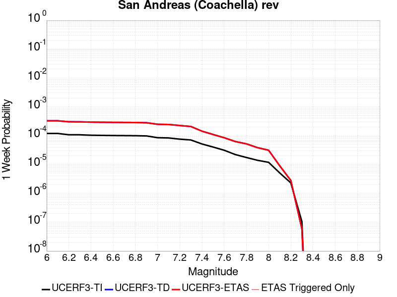 |  |  |  |

| Magnitude | 1 wk TI Prob | 1 wk TD Prob | 1 wk ETAS Prob | 1 wk ETAS/TD Gain | 1 wk ETAS Triggered Only | 1 mo TI Prob | 1 mo TD Prob | 1 mo ETAS Prob | 1 mo ETAS/TD Gain | 1 mo ETAS Triggered Only | 1 yr TI Prob | 1 yr TD Prob | 1 yr ETAS Prob | 1 yr ETAS/TD Gain | 1 yr ETAS Triggered Only | 10 yr TI Prob | 10 yr TD Prob | 10 yr ETAS Prob | 10 yr ETAS/TD Gain | 10 yr ETAS Triggered Only |
|-----|-----|-----|-----|-----|-----|-----|-----|-----|-----|-----|-----|-----|-----|-----|-----|-----|-----|-----|-----|-----|
| 6.0 | 1.1925945E-4 | 3.2773515E-4 | 3.2773515E-4 | 1.0 | 0.0 | 5.110118E-4 | 0.0014038279 | 0.0014138139 | 1.0071133 | 1.0E-5 | 0.0062038354 | 0.016959002 | 0.017008154 | 1.0028983 | 5.0E-5 | 0.060334753 | 0.15282515 | 0.15291832 | 1.0006098 | 1.1E-4 |
| 6.1 | 1.1925945E-4 | 3.2773515E-4 | 3.2773515E-4 | 1.0 | 0.0 | 5.110118E-4 | 0.0014038279 | 0.0014138139 | 1.0071133 | 1.0E-5 | 0.0062038354 | 0.016959002 | 0.017008154 | 1.0028983 | 5.0E-5 | 0.060334753 | 0.15282515 | 0.15291832 | 1.0006098 | 1.1E-4 |
| 6.2 | 1.07432395E-4 | 3.0273956E-4 | 3.0273956E-4 | 1.0 | 0.0 | 4.603433E-4 | 0.0012968141 | 0.0013068011 | 1.0077012 | 1.0E-5 | 0.005590286 | 0.015675513 | 0.015724728 | 1.0031397 | 5.0E-5 | 0.05451731 | 0.14199676 | 0.14209114 | 1.0006647 | 1.1E-4 |
| 6.3 | 1.0718766E-4 | 3.0219258E-4 | 3.0219258E-4 | 1.0 | 0.0 | 4.592948E-4 | 0.0012944723 | 0.0013044593 | 1.0077151 | 1.0E-5 | 0.005577586 | 0.015647411 | 0.015696628 | 1.0031455 | 5.0E-5 | 0.054396555 | 0.14176506 | 0.14185947 | 1.0006659 | 1.1E-4 |
| 6.4 | 1.0355944E-4 | 2.9427282E-4 | 2.9427282E-4 | 1.0 | 0.0 | 4.4375064E-4 | 0.0012605636 | 0.001270551 | 1.007923 | 1.0E-5 | 0.0053892885 | 0.01524042 | 0.015289658 | 1.0032307 | 5.0E-5 | 0.052604496 | 0.13832551 | 0.13842028 | 1.0006852 | 1.1E-4 |
| 6.5 | 1.0227914E-4 | 2.9146695E-4 | 2.9146695E-4 | 1.0 | 0.0 | 4.382655E-4 | 0.0012485499 | 0.0012585375 | 1.0079993 | 1.0E-5 | 0.0053228354 | 0.015096189 | 0.015145435 | 1.003262 | 5.0E-5 | 0.051971316 | 0.13710485 | 0.13719977 | 1.0006922 | 1.1E-4 |
| 6.6 | 1.0116757E-4 | 2.8912423E-4 | 2.8912423E-4 | 1.0 | 0.0 | 4.3350324E-4 | 0.0012385194 | 0.0012485071 | 1.0080642 | 1.0E-5 | 0.0052651367 | 0.014975752 | 0.015025004 | 1.0032887 | 5.0E-5 | 0.051421247 | 0.13608314 | 0.13617818 | 1.0006983 | 1.1E-4 |
| 6.7 | 1.0050676E-4 | 2.8770973E-4 | 2.8770973E-4 | 1.0 | 0.0 | 4.3067214E-4 | 0.001232463 | 0.0012424507 | 1.0081038 | 1.0E-5 | 0.005230834 | 0.014903027 | 0.0149522815 | 1.0033051 | 5.0E-5 | 0.051094085 | 0.13546793 | 0.13556303 | 1.000702 | 1.1E-4 |
| 6.8 | 9.976819E-5 | 2.8574577E-4 | 2.8574577E-4 | 1.0 | 0.0 | 4.2750788E-4 | 0.0012240539 | 0.0012340416 | 1.0081595 | 1.0E-5 | 0.0051924936 | 0.014802042 | 0.014851302 | 1.003328 | 5.0E-5 | 0.050728295 | 0.1346196 | 0.13471478 | 1.0007071 | 1.1E-4 |
| 6.9 | 9.77719E-5 | 2.8071183E-4 | 2.8071183E-4 | 1.0 | 0.0 | 4.1895514E-4 | 0.0012025 | 0.0012124879 | 1.008306 | 1.0E-5 | 0.0050888555 | 0.014543155 | 0.014592429 | 1.003388 | 5.0E-5 | 0.049738888 | 0.1324474 | 0.13254283 | 1.0007205 | 1.1E-4 |
| 7.0 | 8.500761E-5 | 2.480338E-4 | 2.480338E-4 | 1.0 | 0.0 | 3.6426744E-4 | 0.0010625721 | 0.0010725616 | 1.0094011 | 1.0E-5 | 0.0044259406 | 0.012860856 | 0.012900341 | 1.0030702 | 4.0E-5 | 0.04338823 | 0.11829921 | 0.11838738 | 1.0007453 | 1.0E-4 |
| 7.1 | 8.319876E-5 | 2.4405654E-4 | 2.4405654E-4 | 1.0 | 0.0 | 3.5651738E-4 | 0.0010455406 | 0.00105553 | 1.0095544 | 1.0E-5 | 0.004331963 | 0.012655924 | 0.012695418 | 1.0031205 | 4.0E-5 | 0.042484846 | 0.11651793 | 0.11660628 | 1.0007583 | 1.0E-4 |
| 7.2 | 7.563917E-5 | 2.2452862E-4 | 2.2452862E-4 | 1.0 | 0.0 | 3.2412758E-4 | 9.6191367E-4 | 9.719041E-4 | 1.010386 | 1.0E-5 | 0.0039391145 | 0.011649104 | 0.011688638 | 1.0033938 | 4.0E-5 | 0.03870018 | 0.10792095 | 0.10801016 | 1.0008266 | 1.0E-4 |
| 7.3 | 7.082985E-5 | 2.0767492E-4 | 2.0767492E-4 | 1.0 | 0.0 | 3.0352117E-4 | 8.897347E-4 | 8.997258E-4 | 1.0112293 | 1.0E-5 | 0.0036891096 | 0.010779344 | 0.010818913 | 1.0036708 | 4.0E-5 | 0.03628465 | 0.10043901 | 0.10052897 | 1.0008956 | 1.0E-4 |
| 7.4 | 5.146215E-5 | 1.4304483E-4 | 1.4304483E-4 | 1.0 | 0.0 | 2.2053342E-4 | 6.129062E-4 | 6.229E-4 | 1.0163057 | 1.0E-5 | 0.0026816884 | 0.0074367905 | 0.007476493 | 1.0053387 | 4.0E-5 | 0.02649557 | 0.07098342 | 0.07106703 | 1.0011779 | 9.0E-5 |
| 7.5 | 4.0285166E-5 | 1.09682325E-4 | 1.09682325E-4 | 1.0 | 0.0 | 1.7263928E-4 | 4.6998274E-4 | 4.7997804E-4 | 1.0212674 | 1.0E-5 | 0.002099857 | 0.0057070972 | 0.005746869 | 1.0069689 | 4.0E-5 | 0.020801254 | 0.055129685 | 0.05521472 | 1.0015426 | 9.0E-5 |
| 7.6 | 3.1168736E-5 | 8.46259E-5 | 8.46259E-5 | 1.0 | 0.0 | 1.3357346E-4 | 3.6263216E-4 | 3.726285E-4 | 1.0275662 | 1.0E-5 | 0.0016250437 | 0.004406135 | 0.004445959 | 1.0090382 | 4.0E-5 | 0.016132116 | 0.04291678 | 0.042993344 | 1.0017841 | 8.0E-5 |
| 7.7 | 2.2100989E-5 | 6.259584E-5 | 6.259584E-5 | 1.0 | 0.0 | 9.4715084E-5 | 2.6824034E-4 | 2.7823765E-4 | 1.03727 | 1.0E-5 | 0.001152546 | 0.003260942 | 0.0033008114 | 1.0122263 | 4.0E-5 | 0.011465867 | 0.031994775 | 0.032062534 | 1.0021179 | 7.0E-5 |
| 7.8 | 1.7484861E-5 | 5.1981464E-5 | 5.1981464E-5 | 1.0 | 0.0 | 7.493296E-5 | 2.227587E-4 | 2.3275647E-4 | 1.0448816 | 1.0E-5 | 9.1192697E-4 | 0.002708717 | 0.0027486086 | 1.0147271 | 4.0E-5 | 0.009081938 | 0.026724702 | 0.026792832 | 1.0025493 | 7.0E-5 |
| 7.9 | 1.3967285E-5 | 3.8374823E-5 | 3.8374823E-5 | 1.0 | 0.0 | 5.985842E-5 | 1.6445316E-4 | 1.7445152E-4 | 1.0607976 | 1.0E-5 | 7.2853256E-4 | 0.0020003798 | 0.0020402998 | 1.0199562 | 4.0E-5 | 0.0072614877 | 0.019979829 | 0.02003863 | 1.002943 | 6.0E-5 |
| 8.0 | 1.1887396E-5 | 3.119606E-5 | 3.119606E-5 | 1.0 | 0.0 | 5.094499E-5 | 1.3369056E-4 | 1.4368922E-4 | 1.0747896 | 1.0E-5 | 6.200787E-4 | 0.0016264683 | 0.0016664033 | 1.0245532 | 4.0E-5 | 0.006183513 | 0.016340243 | 0.016399262 | 1.0036119 | 6.0E-5 |
| 8.1 | 5.100864E-6 | 9.026575E-6 | 9.026575E-6 | 1.0 | 0.0 | 2.1860664E-5 | 3.8684746E-5 | 3.8684746E-5 | 1.0 | 0.0 | 2.6612106E-4 | 4.7088516E-4 | 4.8088044E-4 | 1.0212266 | 1.0E-5 | 0.002658026 | 0.0049442193 | 0.00495417 | 1.0020126 | 1.0E-5 |
| 8.2 | 2.3004484E-6 | 2.807767E-6 | 2.807767E-6 | 1.0 | 0.0 | 9.859027E-6 | 1.20332315E-5 | 1.20332315E-5 | 1.0 | 0.0 | 1.2002704E-4 | 1.4649479E-4 | 1.4649479E-4 | 1.0 | 0.0 | 0.0011996223 | 0.0016083963 | 0.0016083963 | 1.0 | 0.0 |
| 8.3 | 1.0424446E-7 | 5.8743755E-8 | 5.8743755E-8 | 1.0 | 0.0 | 4.4676187E-7 | 2.5175893E-7 | 2.5175893E-7 | 1.0 | 0.0 | 5.439312E-6 | 3.0651609E-6 | 3.0651609E-6 | 1.0 | 0.0 | 5.4391792E-5 | 3.2218184E-5 | 3.2218184E-5 | 1.0 | 0.0 |

## Red Pass
*[(top)](#table-of-contents)*

| 1 Week | 1 Month | 1 Year | 10 Year |
|-----|-----|-----|-----|
| 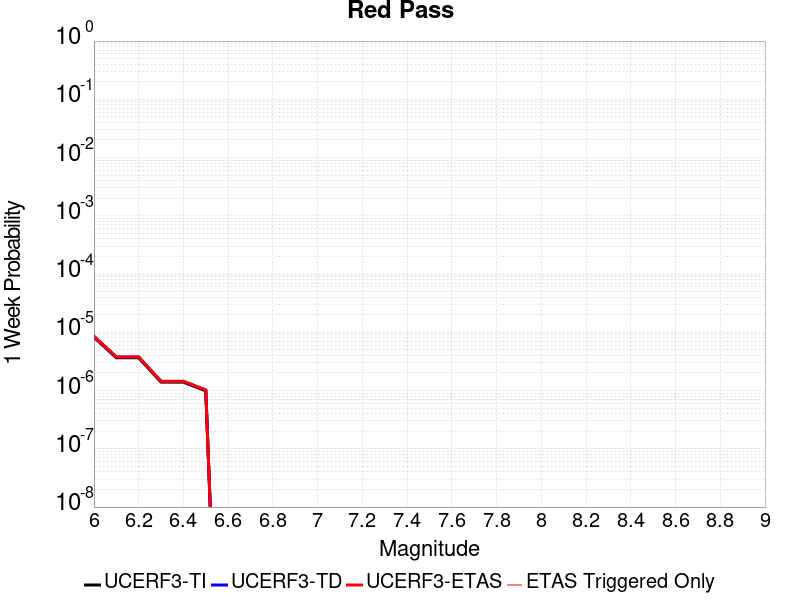 |  |  |  |

| Magnitude | 1 wk TI Prob | 1 wk TD Prob | 1 wk ETAS Prob | 1 wk ETAS/TD Gain | 1 wk ETAS Triggered Only | 1 mo TI Prob | 1 mo TD Prob | 1 mo ETAS Prob | 1 mo ETAS/TD Gain | 1 mo ETAS Triggered Only | 1 yr TI Prob | 1 yr TD Prob | 1 yr ETAS Prob | 1 yr ETAS/TD Gain | 1 yr ETAS Triggered Only | 10 yr TI Prob | 10 yr TD Prob | 10 yr ETAS Prob | 10 yr ETAS/TD Gain | 10 yr ETAS Triggered Only |
|-----|-----|-----|-----|-----|-----|-----|-----|-----|-----|-----|-----|-----|-----|-----|-----|-----|-----|-----|-----|-----|
| 6.0 | 8.258278E-6 | 8.551668E-6 | 8.551668E-6 | 1.0 | 0.0 | 3.539214E-5 | 3.6649588E-5 | 3.6649588E-5 | 1.0 | 0.0 | 4.308141E-4 | 4.4613527E-4 | 4.7612187E-4 | 1.0672141 | 3.0E-5 | 0.0042997985 | 0.004454154 | 0.0045537087 | 1.0223509 | 1.0E-4 |
| 6.1 | 3.649988E-6 | 3.775488E-6 | 3.775488E-6 | 1.0 | 0.0 | 1.5642712E-5 | 1.618059E-5 | 1.618059E-5 | 1.0 | 0.0 | 1.9043336E-4 | 1.9698562E-4 | 1.9698562E-4 | 1.0 | 0.0 | 0.0019027026 | 0.0019685775 | 0.0019985186 | 1.0152094 | 3.0E-5 |
| 6.2 | 3.649988E-6 | 3.775488E-6 | 3.775488E-6 | 1.0 | 0.0 | 1.5642712E-5 | 1.618059E-5 | 1.618059E-5 | 1.0 | 0.0 | 1.9043336E-4 | 1.9698562E-4 | 1.9698562E-4 | 1.0 | 0.0 | 0.0019027026 | 0.0019685775 | 0.0019985186 | 1.0152094 | 3.0E-5 |
| 6.3 | 1.3924937E-6 | 1.4411834E-6 | 1.4411834E-6 | 1.0 | 0.0 | 5.9678164E-6 | 6.1764936E-6 | 6.1764936E-6 | 1.0 | 0.0 | 7.265574E-5 | 7.5197626E-5 | 7.5197626E-5 | 1.0 | 0.0 | 7.263199E-4 | 7.518606E-4 | 7.718456E-4 | 1.0265807 | 2.0E-5 |
| 6.4 | 1.3924937E-6 | 1.4411834E-6 | 1.4411834E-6 | 1.0 | 0.0 | 5.9678164E-6 | 6.1764936E-6 | 6.1764936E-6 | 1.0 | 0.0 | 7.265574E-5 | 7.5197626E-5 | 7.5197626E-5 | 1.0 | 0.0 | 7.263199E-4 | 7.518606E-4 | 7.718456E-4 | 1.0265807 | 2.0E-5 |
| 6.5 | 9.876812E-7 | 1.0222386E-6 | 1.0222386E-6 | 1.0 | 0.0 | 4.2329125E-6 | 4.3810223E-6 | 4.3810223E-6 | 1.0 | 0.0 | 5.153449E-5 | 5.333895E-5 | 5.333895E-5 | 1.0 | 0.0 | 5.1522546E-4 | 5.333895E-4 | 5.5337884E-4 | 1.0374761 | 2.0E-5 |

## Baker
*[(top)](#table-of-contents)*

| 1 Week | 1 Month | 1 Year | 10 Year |
|-----|-----|-----|-----|
|  |  |  |  |

| Magnitude | 1 wk TI Prob | 1 wk TD Prob | 1 wk ETAS Prob | 1 wk ETAS/TD Gain | 1 wk ETAS Triggered Only | 1 mo TI Prob | 1 mo TD Prob | 1 mo ETAS Prob | 1 mo ETAS/TD Gain | 1 mo ETAS Triggered Only | 1 yr TI Prob | 1 yr TD Prob | 1 yr ETAS Prob | 1 yr ETAS/TD Gain | 1 yr ETAS Triggered Only | 10 yr TI Prob | 10 yr TD Prob | 10 yr ETAS Prob | 10 yr ETAS/TD Gain | 10 yr ETAS Triggered Only |
|-----|-----|-----|-----|-----|-----|-----|-----|-----|-----|-----|-----|-----|-----|-----|-----|-----|-----|-----|-----|-----|
| 6.0 | 5.695525E-6 | 5.8350274E-6 | 5.8350274E-6 | 1.0 | 0.0 | 2.4409164E-5 | 2.5007044E-5 | 2.5007044E-5 | 1.0 | 0.0 | 2.9714106E-4 | 3.0442222E-4 | 3.2441615E-4 | 1.0656782 | 2.0E-5 | 0.0029674405 | 0.0030404478 | 0.0031401438 | 1.03279 | 1.0E-4 |
| 6.1 | 5.695525E-6 | 5.8350274E-6 | 5.8350274E-6 | 1.0 | 0.0 | 2.4409164E-5 | 2.5007044E-5 | 2.5007044E-5 | 1.0 | 0.0 | 2.9714106E-4 | 3.0442222E-4 | 3.2441615E-4 | 1.0656782 | 2.0E-5 | 0.0029674405 | 0.0030404478 | 0.0031401438 | 1.03279 | 1.0E-4 |
| 6.2 | 5.695525E-6 | 5.8350274E-6 | 5.8350274E-6 | 1.0 | 0.0 | 2.4409164E-5 | 2.5007044E-5 | 2.5007044E-5 | 1.0 | 0.0 | 2.9714106E-4 | 3.0442222E-4 | 3.2441615E-4 | 1.0656782 | 2.0E-5 | 0.0029674405 | 0.0030404478 | 0.0031401438 | 1.03279 | 1.0E-4 |
| 6.3 | 3.2995713E-6 | 3.3837825E-6 | 3.3837825E-6 | 1.0 | 0.0 | 1.4140943E-5 | 1.4501847E-5 | 1.4501847E-5 | 1.0 | 0.0 | 1.7215237E-4 | 1.7654616E-4 | 1.9654262E-4 | 1.1132648 | 2.0E-5 | 0.0017201907 | 0.0017641061 | 0.0018140179 | 1.028293 | 5.0E-5 |
| 6.4 | 3.2995713E-6 | 3.3837825E-6 | 3.3837825E-6 | 1.0 | 0.0 | 1.4140943E-5 | 1.4501847E-5 | 1.4501847E-5 | 1.0 | 0.0 | 1.7215237E-4 | 1.7654616E-4 | 1.9654262E-4 | 1.1132648 | 2.0E-5 | 0.0017201907 | 0.0017641061 | 0.0018140179 | 1.028293 | 5.0E-5 |
| 6.5 | 2.782202E-6 | 2.8559416E-6 | 2.8559416E-6 | 1.0 | 0.0 | 1.1923668E-5 | 1.2239694E-5 | 1.2239694E-5 | 1.0 | 0.0 | 1.4516099E-4 | 1.4900843E-4 | 1.6900543E-4 | 1.1342006 | 2.0E-5 | 0.001450662 | 0.0014891179 | 0.0015390434 | 1.0335269 | 5.0E-5 |
| 6.6 | 2.3163404E-6 | 2.381009E-6 | 2.381009E-6 | 1.0 | 0.0 | 9.927136E-6 | 1.0204285E-5 | 1.0204285E-5 | 1.0 | 0.0 | 1.20856166E-4 | 1.242303E-4 | 1.4422782E-4 | 1.1609713 | 2.0E-5 | 0.0012079047 | 0.0012416287 | 0.001281579 | 1.0321758 | 4.0E-5 |
| 6.7 | 2.037056E-6 | 2.0965824E-6 | 2.0965824E-6 | 1.0 | 0.0 | 8.7302105E-6 | 8.985324E-6 | 8.985324E-6 | 1.0 | 0.0 | 1.0628513E-4 | 1.0939099E-4 | 1.2938879E-4 | 1.1828104 | 2.0E-5 | 0.0010623431 | 0.0010933875 | 0.0011333438 | 1.0365436 | 4.0E-5 |
| 6.8 | 1.8356744E-6 | 1.8916058E-6 | 1.8916058E-6 | 1.0 | 0.0 | 7.867153E-6 | 8.106858E-6 | 8.106858E-6 | 1.0 | 0.0 | 9.577837E-5 | 9.869666E-5 | 1.1869469E-4 | 1.2026211 | 2.0E-5 | 9.57371E-4 | 9.865423E-4 | 0.0010265028 | 1.0405056 | 4.0E-5 |
| 6.9 | 1.6310546E-6 | 1.6832794E-6 | 1.6832794E-6 | 1.0 | 0.0 | 6.9902153E-6 | 7.214035E-6 | 7.214035E-6 | 1.0 | 0.0 | 8.510255E-5 | 8.782745E-5 | 1.078257E-4 | 1.2276993 | 2.0E-5 | 8.5069967E-4 | 8.779387E-4 | 9.1790356E-4 | 1.0455213 | 4.0E-5 |
| 7.0 | 1.2058036E-6 | 1.2509291E-6 | 1.2509291E-6 | 1.0 | 0.0 | 5.1677193E-6 | 5.3611143E-6 | 5.3611143E-6 | 1.0 | 0.0 | 6.291517E-5 | 6.526963E-5 | 8.526833E-5 | 1.3064013 | 2.0E-5 | 6.289736E-4 | 6.5250695E-4 | 6.824874E-4 | 1.0459465 | 3.0E-5 |
| 7.1 | 1.052382E-6 | 1.0952205E-6 | 1.0952205E-6 | 1.0 | 0.0 | 4.5102006E-6 | 4.6937935E-6 | 4.6937935E-6 | 1.0 | 0.0 | 5.491031E-5 | 5.7145444E-5 | 7.71443E-5 | 1.3499641 | 2.0E-5 | 5.4896745E-4 | 5.7130837E-4 | 6.0129125E-4 | 1.052481 | 3.0E-5 |
| 7.2 | 1.0067454E-6 | 1.0488296E-6 | 1.0488296E-6 | 1.0 | 0.0 | 4.3146156E-6 | 4.494976E-6 | 4.494976E-6 | 1.0 | 0.0 | 5.252918E-5 | 5.472497E-5 | 7.4723874E-5 | 1.3654438 | 2.0E-5 | 5.251676E-4 | 5.471158E-4 | 5.770994E-4 | 1.054803 | 3.0E-5 |
| 7.3 | 9.3596316E-7 | 9.768293E-7 | 9.768293E-7 | 1.0 | 0.0 | 4.0112645E-6 | 4.186404E-6 | 4.186404E-6 | 1.0 | 0.0 | 4.8836053E-5 | 5.0968287E-5 | 7.096727E-5 | 1.3923808 | 2.0E-5 | 4.8825322E-4 | 5.0956674E-4 | 5.395515E-4 | 1.0588435 | 3.0E-5 |
| 7.4 | 8.8117395E-7 | 9.2082155E-7 | 9.2082155E-7 | 1.0 | 0.0 | 3.7764542E-6 | 3.946372E-6 | 3.946372E-6 | 1.0 | 0.0 | 4.5977362E-5 | 4.804603E-5 | 6.804507E-5 | 1.4162475 | 2.0E-5 | 4.596785E-4 | 4.8035718E-4 | 5.1034277E-4 | 1.0624235 | 3.0E-5 |
| 7.5 | 8.292386E-7 | 8.6751294E-7 | 8.6751294E-7 | 1.0 | 0.0 | 3.5538749E-6 | 3.7179072E-6 | 3.7179072E-6 | 1.0 | 0.0 | 4.326757E-5 | 4.5264587E-5 | 6.526368E-5 | 1.4418265 | 2.0E-5 | 4.3259145E-4 | 4.5255444E-4 | 4.8254084E-4 | 1.0662603 | 3.0E-5 |
| 7.6 | 7.553842E-7 | 7.914975E-7 | 7.914975E-7 | 1.0 | 0.0 | 3.2373566E-6 | 3.3921276E-6 | 3.3921276E-6 | 1.0 | 0.0 | 3.9414106E-5 | 4.129838E-5 | 6.129755E-5 | 1.4842606 | 2.0E-5 | 3.9407116E-4 | 4.1290774E-4 | 4.3289948E-4 | 1.048417 | 2.0E-5 |
| 7.7 | 6.5285366E-7 | 6.8532506E-7 | 6.8532506E-7 | 1.0 | 0.0 | 2.797941E-6 | 2.9371042E-6 | 2.9371042E-6 | 1.0 | 0.0 | 3.40644E-5 | 3.575866E-5 | 3.575866E-5 | 1.0 | 0.0 | 3.405918E-4 | 3.5752976E-4 | 3.5752976E-4 | 1.0 | 0.0 |
| 7.8 | 3.4586725E-7 | 3.648528E-7 | 3.648528E-7 | 1.0 | 0.0 | 1.4822873E-6 | 1.563654E-6 | 1.563654E-6 | 1.0 | 0.0 | 1.80467E-5 | 1.9037325E-5 | 1.9037325E-5 | 1.0 | 0.0 | 1.8045233E-4 | 1.9035739E-4 | 1.9035739E-4 | 1.0 | 0.0 |
| 7.9 | 2.5591178E-9 | 2.6698248E-9 | 2.6698248E-9 | 1.0 | 0.0 | 1.0967647E-8 | 1.1442106E-8 | 1.1442106E-8 | 1.0 | 0.0 | 1.335311E-7 | 1.3930764E-7 | 1.3930764E-7 | 1.0 | 0.0 | 1.3353102E-6 | 1.3930764E-6 | 1.3930764E-6 | 1.0 | 0.0 |

## San Jacinto (Anza) rev
*[(top)](#table-of-contents)*

| 1 Week | 1 Month | 1 Year | 10 Year |
|-----|-----|-----|-----|
| 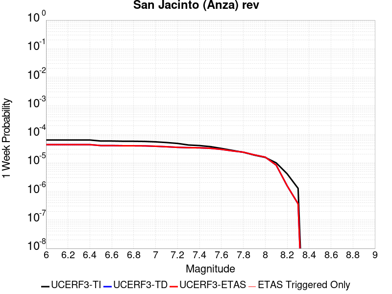 |  |  |  |

| Magnitude | 1 wk TI Prob | 1 wk TD Prob | 1 wk ETAS Prob | 1 wk ETAS/TD Gain | 1 wk ETAS Triggered Only | 1 mo TI Prob | 1 mo TD Prob | 1 mo ETAS Prob | 1 mo ETAS/TD Gain | 1 mo ETAS Triggered Only | 1 yr TI Prob | 1 yr TD Prob | 1 yr ETAS Prob | 1 yr ETAS/TD Gain | 1 yr ETAS Triggered Only | 10 yr TI Prob | 10 yr TD Prob | 10 yr ETAS Prob | 10 yr ETAS/TD Gain | 10 yr ETAS Triggered Only |
|-----|-----|-----|-----|-----|-----|-----|-----|-----|-----|-----|-----|-----|-----|-----|-----|-----|-----|-----|-----|-----|
| 6.0 | 6.3015636E-5 | 4.347976E-5 | 4.347976E-5 | 1.0 | 0.0 | 2.7003905E-4 | 1.8632859E-4 | 1.9632671E-4 | 1.0536586 | 1.0E-5 | 0.0032827691 | 0.0022662021 | 0.0022961341 | 1.013208 | 3.0E-5 | 0.032346968 | 0.02338772 | 0.023485383 | 1.0041758 | 1.0E-4 |
| 6.1 | 6.3015636E-5 | 4.347976E-5 | 4.347976E-5 | 1.0 | 0.0 | 2.7003905E-4 | 1.8632859E-4 | 1.9632671E-4 | 1.0536586 | 1.0E-5 | 0.0032827691 | 0.0022662021 | 0.0022961341 | 1.013208 | 3.0E-5 | 0.032346968 | 0.02338772 | 0.023485383 | 1.0041758 | 1.0E-4 |
| 6.2 | 6.3015636E-5 | 4.347976E-5 | 4.347976E-5 | 1.0 | 0.0 | 2.7003905E-4 | 1.8632859E-4 | 1.9632671E-4 | 1.0536586 | 1.0E-5 | 0.0032827691 | 0.0022662021 | 0.0022961341 | 1.013208 | 3.0E-5 | 0.032346968 | 0.02338772 | 0.023485383 | 1.0041758 | 1.0E-4 |
| 6.3 | 6.3015636E-5 | 4.347976E-5 | 4.347976E-5 | 1.0 | 0.0 | 2.7003905E-4 | 1.8632859E-4 | 1.9632671E-4 | 1.0536586 | 1.0E-5 | 0.0032827691 | 0.0022662021 | 0.0022961341 | 1.013208 | 3.0E-5 | 0.032346968 | 0.02338772 | 0.023485383 | 1.0041758 | 1.0E-4 |
| 6.4 | 6.3015636E-5 | 4.347976E-5 | 4.347976E-5 | 1.0 | 0.0 | 2.7003905E-4 | 1.8632859E-4 | 1.9632671E-4 | 1.0536586 | 1.0E-5 | 0.0032827691 | 0.0022662021 | 0.0022961341 | 1.013208 | 3.0E-5 | 0.032346968 | 0.02338772 | 0.023485383 | 1.0041758 | 1.0E-4 |
| 6.5 | 5.811017E-5 | 4.0251027E-5 | 4.0251027E-5 | 1.0 | 0.0 | 2.4901982E-4 | 1.7249303E-4 | 1.824913E-4 | 1.0579634 | 1.0E-5 | 0.0030276014 | 0.0020980856 | 0.0021280227 | 1.0142688 | 3.0E-5 | 0.02986684 | 0.021681083 | 0.021778915 | 1.0045123 | 1.0E-4 |
| 6.6 | 5.811017E-5 | 4.0251027E-5 | 4.0251027E-5 | 1.0 | 0.0 | 2.4901982E-4 | 1.7249303E-4 | 1.824913E-4 | 1.0579634 | 1.0E-5 | 0.0030276014 | 0.0020980856 | 0.0021280227 | 1.0142688 | 3.0E-5 | 0.02986684 | 0.021681083 | 0.021778915 | 1.0045123 | 1.0E-4 |
| 6.7 | 5.712442E-5 | 3.9671915E-5 | 3.9671915E-5 | 1.0 | 0.0 | 2.4479596E-4 | 1.7001144E-4 | 1.8000974E-4 | 1.0588095 | 1.0E-5 | 0.0029763177 | 0.0020679298 | 0.002097868 | 1.0144773 | 3.0E-5 | 0.029367693 | 0.021372018 | 0.021469882 | 1.0045791 | 1.0E-4 |
| 6.8 | 5.6967532E-5 | 3.9528015E-5 | 3.9528015E-5 | 1.0 | 0.0 | 2.4412372E-4 | 1.6939481E-4 | 1.7939312E-4 | 1.0590237 | 1.0E-5 | 0.0029681553 | 0.0020604366 | 0.0020903747 | 1.0145301 | 3.0E-5 | 0.029288229 | 0.0212966 | 0.02139447 | 1.0045956 | 1.0E-4 |
| 6.9 | 5.6211324E-5 | 3.9231676E-5 | 3.9231676E-5 | 1.0 | 0.0 | 2.4088343E-4 | 1.6812496E-4 | 1.7812327E-4 | 1.0594696 | 1.0E-5 | 0.0029288116 | 0.002045005 | 0.0020749439 | 1.0146399 | 3.0E-5 | 0.028905109 | 0.02113546 | 0.021233348 | 1.0046314 | 1.0E-4 |
| 7.0 | 5.4383527E-5 | 3.8088456E-5 | 3.8088456E-5 | 1.0 | 0.0 | 2.3305144E-4 | 1.6322605E-4 | 1.7322443E-4 | 1.0612547 | 1.0E-5 | 0.0028337094 | 0.0019854708 | 0.0020154112 | 1.0150797 | 3.0E-5 | 0.027978465 | 0.020524545 | 0.020622492 | 1.0047722 | 1.0E-4 |
| 7.1 | 5.1393665E-5 | 3.654557E-5 | 3.654557E-5 | 1.0 | 0.0 | 2.2023996E-4 | 1.566145E-4 | 1.6661292E-4 | 1.0638411 | 1.0E-5 | 0.0026781242 | 0.001905118 | 0.001935061 | 1.015717 | 3.0E-5 | 0.026460782 | 0.01969536 | 0.01979339 | 1.0049773 | 1.0E-4 |
| 7.2 | 4.785222E-5 | 3.4891167E-5 | 3.4891167E-5 | 1.0 | 0.0 | 2.0506482E-4 | 1.4952502E-4 | 1.5952352E-4 | 1.0668684 | 1.0E-5 | 0.0024938055 | 0.0018189505 | 0.001848896 | 1.016463 | 3.0E-5 | 0.024660049 | 0.018806804 | 0.018904923 | 1.0052172 | 1.0E-4 |
| 7.3 | 4.2143256E-5 | 3.3981407E-5 | 3.3981407E-5 | 1.0 | 0.0 | 1.8060145E-4 | 1.456265E-4 | 1.5562504E-4 | 1.0686588 | 1.0E-5 | 0.002196605 | 0.0017715642 | 0.001801511 | 1.0169042 | 3.0E-5 | 0.02175019 | 0.01831272 | 0.01841089 | 1.0053607 | 1.0E-4 |
| 7.4 | 4.0264713E-5 | 3.3618224E-5 | 3.3618224E-5 | 1.0 | 0.0 | 1.7255165E-4 | 1.4407016E-4 | 1.5406872E-4 | 1.0694007 | 1.0E-5 | 0.002098792 | 0.0017526465 | 0.0017825939 | 1.017087 | 3.0E-5 | 0.020790804 | 0.01811656 | 0.01821475 | 1.0054199 | 1.0E-4 |
| 7.5 | 3.694492E-5 | 3.2328353E-5 | 3.2328353E-5 | 1.0 | 0.0 | 1.5832575E-4 | 1.3854275E-4 | 1.4854135E-4 | 1.0721699 | 1.0E-5 | 0.0019259118 | 0.0016854559 | 0.0017154054 | 1.0177693 | 3.0E-5 | 0.01909306 | 0.017431023 | 0.017529279 | 1.0056369 | 1.0E-4 |
| 7.6 | 3.200565E-5 | 2.9633984E-5 | 2.9633984E-5 | 1.0 | 0.0 | 1.3715986E-4 | 1.2699662E-4 | 1.3699535E-4 | 1.0787323 | 1.0E-5 | 0.001668642 | 0.0015450894 | 0.0015650586 | 1.0129242 | 2.0E-5 | 0.01656168 | 0.016013896 | 0.016102454 | 1.0055301 | 9.0E-5 |
| 7.7 | 2.731642E-5 | 2.6218895E-5 | 2.6218895E-5 | 1.0 | 0.0 | 1.1706512E-4 | 1.1236186E-4 | 1.2236074E-4 | 1.0889882 | 1.0E-5 | 0.001424336 | 0.0013671481 | 0.0013871208 | 1.014609 | 2.0E-5 | 0.014152412 | 0.014232767 | 0.014321486 | 1.0062335 | 9.0E-5 |
| 7.8 | 2.3466424E-5 | 2.362585E-5 | 2.362585E-5 | 1.0 | 0.0 | 1.0056651E-4 | 1.01249716E-4 | 1.1124871E-4 | 1.0987557 | 1.0E-5 | 0.0012237094 | 0.001232019 | 0.0012519944 | 1.0162135 | 2.0E-5 | 0.012169928 | 0.012872118 | 0.012951088 | 1.006135 | 8.0E-5 |
| 7.9 | 1.8611925E-5 | 1.9017392E-5 | 1.9017392E-5 | 1.0 | 0.0 | 7.9762955E-5 | 8.150057E-5 | 9.149975E-5 | 1.1226885 | 1.0E-5 | 9.7068126E-4 | 9.918185E-4 | 0.0010117986 | 1.0201449 | 2.0E-5 | 0.0096645225 | 0.010451134 | 0.010530299 | 1.0075747 | 8.0E-5 |
| 8.0 | 1.5460775E-5 | 1.583804E-5 | 1.583804E-5 | 1.0 | 0.0 | 6.6258784E-5 | 6.787555E-5 | 7.787488E-5 | 1.1473185 | 1.0E-5 | 8.0640207E-4 | 8.2607224E-4 | 8.36064E-4 | 1.0120955 | 1.0E-5 | 0.008034821 | 0.008753977 | 0.008823364 | 1.0079263 | 7.0E-5 |
| 8.1 | 9.983884E-6 | 8.3273635E-6 | 8.3273635E-6 | 1.0 | 0.0 | 4.2787375E-5 | 3.5688212E-5 | 3.5688212E-5 | 1.0 | 0.0 | 5.2081177E-4 | 4.344179E-4 | 4.344179E-4 | 1.0 | 0.0 | 0.0051959283 | 0.0046708663 | 0.00468082 | 1.002131 | 1.0E-5 |
| 8.2 | 4.1226E-6 | 1.569408E-6 | 1.569408E-6 | 1.0 | 0.0 | 1.7668166E-5 | 6.726017E-6 | 6.726017E-6 | 1.0 | 0.0 | 2.1508869E-4 | 8.188621E-5 | 8.188621E-5 | 1.0 | 0.0 | 0.0021488064 | 9.4988575E-4 | 9.4988575E-4 | 1.0 | 0.0 |
| 8.3 | 1.2750878E-6 | 3.657188E-7 | 3.657188E-7 | 1.0 | 0.0 | 5.4646503E-6 | 1.5673653E-6 | 1.5673653E-6 | 1.0 | 0.0 | 6.653009E-5 | 1.908251E-5 | 1.908251E-5 | 1.0 | 0.0 | 6.6510175E-4 | 2.2998886E-4 | 2.2998886E-4 | 1.0 | 0.0 |

## Owens Valley
*[(top)](#table-of-contents)*

| 1 Week | 1 Month | 1 Year | 10 Year |
|-----|-----|-----|-----|
|  |  |  |  |

| Magnitude | 1 wk TI Prob | 1 wk TD Prob | 1 wk ETAS Prob | 1 wk ETAS/TD Gain | 1 wk ETAS Triggered Only | 1 mo TI Prob | 1 mo TD Prob | 1 mo ETAS Prob | 1 mo ETAS/TD Gain | 1 mo ETAS Triggered Only | 1 yr TI Prob | 1 yr TD Prob | 1 yr ETAS Prob | 1 yr ETAS/TD Gain | 1 yr ETAS Triggered Only | 10 yr TI Prob | 10 yr TD Prob | 10 yr ETAS Prob | 10 yr ETAS/TD Gain | 10 yr ETAS Triggered Only |
|-----|-----|-----|-----|-----|-----|-----|-----|-----|-----|-----|-----|-----|-----|-----|-----|-----|-----|-----|-----|-----|
| 6.0 | 4.83821E-5 | 3.6348592E-6 | 3.6348592E-6 | 1.0 | 0.0 | 2.0733538E-4 | 1.557788E-5 | 2.5577725E-5 | 1.6419258 | 1.0E-5 | 0.002521386 | 1.8964519E-4 | 2.396357E-4 | 1.2636002 | 5.0E-5 | 0.024929691 | 0.0019293036 | 0.00201913 | 1.046559 | 9.0E-5 |
| 6.1 | 4.83821E-5 | 3.6348592E-6 | 3.6348592E-6 | 1.0 | 0.0 | 2.0733538E-4 | 1.557788E-5 | 2.5577725E-5 | 1.6419258 | 1.0E-5 | 0.002521386 | 1.8964519E-4 | 2.396357E-4 | 1.2636002 | 5.0E-5 | 0.024929691 | 0.0019293036 | 0.00201913 | 1.046559 | 9.0E-5 |
| 6.2 | 4.83821E-5 | 3.6348592E-6 | 3.6348592E-6 | 1.0 | 0.0 | 2.0733538E-4 | 1.557788E-5 | 2.5577725E-5 | 1.6419258 | 1.0E-5 | 0.002521386 | 1.8964519E-4 | 2.396357E-4 | 1.2636002 | 5.0E-5 | 0.024929691 | 0.0019293036 | 0.00201913 | 1.046559 | 9.0E-5 |
| 6.3 | 3.953008E-5 | 3.1598945E-6 | 3.1598945E-6 | 1.0 | 0.0 | 1.6940363E-4 | 1.3542339E-5 | 2.3542203E-5 | 1.7384149 | 1.0E-5 | 0.002060538 | 1.6486623E-4 | 2.14858E-4 | 1.3032261 | 5.0E-5 | 0.020415364 | 0.001661594 | 0.0017514445 | 1.0540749 | 9.0E-5 |
| 6.4 | 3.953008E-5 | 3.1598945E-6 | 3.1598945E-6 | 1.0 | 0.0 | 1.6940363E-4 | 1.3542339E-5 | 2.3542203E-5 | 1.7384149 | 1.0E-5 | 0.002060538 | 1.6486623E-4 | 2.14858E-4 | 1.3032261 | 5.0E-5 | 0.020415364 | 0.001661594 | 0.0017514445 | 1.0540749 | 9.0E-5 |
| 6.5 | 3.457342E-5 | 2.9745124E-6 | 2.9745124E-6 | 1.0 | 0.0 | 1.4816338E-4 | 1.27478515E-5 | 2.2747725E-5 | 1.7844359 | 1.0E-5 | 0.0018023965 | 1.5519475E-4 | 2.0518698E-4 | 1.3221259 | 5.0E-5 | 0.017878477 | 0.0015572966 | 0.0016471564 | 1.0577024 | 9.0E-5 |
| 6.6 | 3.1127765E-5 | 2.8765398E-6 | 2.8765398E-6 | 1.0 | 0.0 | 1.3339789E-4 | 1.2327973E-5 | 2.2327851E-5 | 1.8111533 | 1.0E-5 | 0.0016229092 | 1.5008343E-4 | 2.0007593E-4 | 1.333098 | 5.0E-5 | 0.016111081 | 0.0015023465 | 0.0015922113 | 1.0598162 | 9.0E-5 |
| 6.7 | 2.806885E-5 | 2.811941E-6 | 2.811941E-6 | 1.0 | 0.0 | 1.2028952E-4 | 1.2051123E-5 | 2.2051003E-5 | 1.8297882 | 1.0E-5 | 0.001463541 | 1.4671324E-4 | 1.9670589E-4 | 1.3407509 | 5.0E-5 | 0.014539397 | 0.0014665497 | 0.0015564177 | 1.0612786 | 9.0E-5 |
| 6.8 | 2.524524E-5 | 2.2366908E-6 | 2.2366908E-6 | 1.0 | 0.0 | 1.0818939E-4 | 9.585784E-6 | 1.9585688E-5 | 2.0432014 | 1.0E-5 | 0.0013164099 | 1.16700976E-4 | 1.566963E-4 | 1.3427163 | 4.0E-5 | 0.01308639 | 0.0011666705 | 0.0012465771 | 1.0684912 | 8.0E-5 |
| 6.9 | 2.2704568E-5 | 1.6091428E-6 | 1.6091428E-6 | 1.0 | 0.0 | 9.730166E-5 | 6.896308E-6 | 1.689624E-5 | 2.4500413 | 1.0E-5 | 0.0011840039 | 8.3959334E-5 | 1.2395598E-4 | 1.4763811 | 4.0E-5 | 0.011777153 | 8.394893E-4 | 9.194221E-4 | 1.095216 | 8.0E-5 |
| 7.0 | 2.0871712E-5 | 1.5404663E-6 | 1.5404663E-6 | 1.0 | 0.0 | 8.944713E-5 | 6.601982E-6 | 1.6601916E-5 | 2.5146866 | 1.0E-5 | 0.0010884746 | 8.037618E-5 | 1.2037297E-4 | 1.4976199 | 4.0E-5 | 0.010831586 | 8.0364547E-4 | 8.835812E-4 | 1.0994663 | 8.0E-5 |
| 7.1 | 1.944928E-5 | 1.3872052E-6 | 1.3872052E-6 | 1.0 | 0.0 | 8.335139E-5 | 5.9451518E-6 | 1.5945092E-5 | 2.6820328 | 1.0E-5 | 0.0010143308 | 7.237983E-5 | 1.1237693E-4 | 1.5526001 | 4.0E-5 | 0.010097133 | 7.2372245E-4 | 8.0366456E-4 | 1.1104596 | 8.0E-5 |
| 7.2 | 1.7876306E-5 | 1.249607E-6 | 1.249607E-6 | 1.0 | 0.0 | 7.6610486E-5 | 5.3554472E-6 | 1.5355394E-5 | 2.8672476 | 1.0E-5 | 9.3233347E-4 | 6.520063E-5 | 1.0519802E-4 | 1.613451 | 4.0E-5 | 0.009284316 | 6.5195386E-4 | 7.2190823E-4 | 1.1072996 | 7.0E-5 |
| 7.3 | 1.2618672E-5 | 1.1121642E-6 | 1.1121642E-6 | 1.0 | 0.0 | 5.40789E-5 | 4.7664093E-6 | 1.4766361E-5 | 3.0980053 | 1.0E-5 | 6.582117E-4 | 5.8029495E-5 | 9.802717E-5 | 1.6892647 | 4.0E-5 | 0.0065626553 | 5.8027735E-4 | 6.5023673E-4 | 1.120562 | 7.0E-5 |
| 7.4 | 7.4874442E-6 | 8.5540546E-7 | 8.5540546E-7 | 1.0 | 0.0 | 3.208865E-5 | 3.6660183E-6 | 1.3665982E-5 | 3.727745 | 1.0E-5 | 3.906093E-4 | 4.4632863E-5 | 8.463108E-5 | 1.8961606 | 4.0E-5 | 0.003899234 | 4.463324E-4 | 5.1630114E-4 | 1.1567638 | 7.0E-5 |
| 7.5 | 2.4734156E-6 | 6.072214E-7 | 6.072214E-7 | 1.0 | 0.0 | 1.060031E-5 | 2.6023747E-6 | 1.2602349E-5 | 4.842634 | 1.0E-5 | 1.2905113E-4 | 3.1683456E-5 | 7.168219E-5 | 2.2624485 | 4.0E-5 | 0.0012897621 | 3.1678972E-4 | 3.8676753E-4 | 1.2208967 | 7.0E-5 |
| 7.6 | 1.1328841E-6 | 3.198316E-7 | 3.198316E-7 | 1.0 | 0.0 | 4.8552088E-6 | 1.3707061E-6 | 1.3707061E-6 | 1.0 | 0.0 | 5.9110564E-5 | 1.668822E-5 | 4.668772E-5 | 2.797645 | 3.0E-5 | 5.9094845E-4 | 1.6686987E-4 | 2.2685985E-4 | 1.3595016 | 6.0E-5 |
| 7.7 | 4.8613185E-7 | 8.9716416E-8 | 8.9716416E-8 | 1.0 | 0.0 | 2.0834207E-6 | 3.8449886E-7 | 3.8449886E-7 | 1.0 | 0.0 | 2.536535E-5 | 4.6812643E-6 | 1.4681217E-5 | 3.136165 | 1.0E-5 | 2.5362454E-4 | 4.6811725E-5 | 6.681079E-5 | 1.4272233 | 2.0E-5 |

## Pleito
*[(top)](#table-of-contents)*

| 1 Week | 1 Month | 1 Year | 10 Year |
|-----|-----|-----|-----|
|  |  | 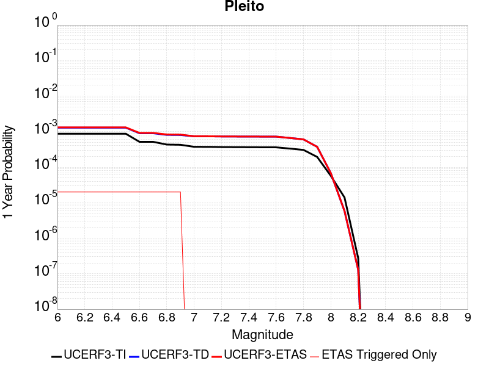 |  |

| Magnitude | 1 wk TI Prob | 1 wk TD Prob | 1 wk ETAS Prob | 1 wk ETAS/TD Gain | 1 wk ETAS Triggered Only | 1 mo TI Prob | 1 mo TD Prob | 1 mo ETAS Prob | 1 mo ETAS/TD Gain | 1 mo ETAS Triggered Only | 1 yr TI Prob | 1 yr TD Prob | 1 yr ETAS Prob | 1 yr ETAS/TD Gain | 1 yr ETAS Triggered Only | 10 yr TI Prob | 10 yr TD Prob | 10 yr ETAS Prob | 10 yr ETAS/TD Gain | 10 yr ETAS Triggered Only |
|-----|-----|-----|-----|-----|-----|-----|-----|-----|-----|-----|-----|-----|-----|-----|-----|-----|-----|-----|-----|-----|
| 6.0 | 1.6763008E-5 | 2.4830579E-5 | 2.4830579E-5 | 1.0 | 0.0 | 7.183948E-5 | 1.0641284E-4 | 1.0641284E-4 | 1.0 | 0.0 | 8.742947E-4 | 0.0012948783 | 0.0013148524 | 1.0154254 | 2.0E-5 | 0.00870863 | 0.012987581 | 0.0130764125 | 1.0068398 | 9.0E-5 |
| 6.1 | 1.6763008E-5 | 2.4830579E-5 | 2.4830579E-5 | 1.0 | 0.0 | 7.183948E-5 | 1.0641284E-4 | 1.0641284E-4 | 1.0 | 0.0 | 8.742947E-4 | 0.0012948783 | 0.0013148524 | 1.0154254 | 2.0E-5 | 0.00870863 | 0.012987581 | 0.0130764125 | 1.0068398 | 9.0E-5 |
| 6.2 | 1.6763008E-5 | 2.4830579E-5 | 2.4830579E-5 | 1.0 | 0.0 | 7.183948E-5 | 1.0641284E-4 | 1.0641284E-4 | 1.0 | 0.0 | 8.742947E-4 | 0.0012948783 | 0.0013148524 | 1.0154254 | 2.0E-5 | 0.00870863 | 0.012987581 | 0.0130764125 | 1.0068398 | 9.0E-5 |
| 6.3 | 1.6763008E-5 | 2.4830579E-5 | 2.4830579E-5 | 1.0 | 0.0 | 7.183948E-5 | 1.0641284E-4 | 1.0641284E-4 | 1.0 | 0.0 | 8.742947E-4 | 0.0012948783 | 0.0013148524 | 1.0154254 | 2.0E-5 | 0.00870863 | 0.012987581 | 0.0130764125 | 1.0068398 | 9.0E-5 |
| 6.4 | 1.6763008E-5 | 2.4830579E-5 | 2.4830579E-5 | 1.0 | 0.0 | 7.183948E-5 | 1.0641284E-4 | 1.0641284E-4 | 1.0 | 0.0 | 8.742947E-4 | 0.0012948783 | 0.0013148524 | 1.0154254 | 2.0E-5 | 0.00870863 | 0.012987581 | 0.0130764125 | 1.0068398 | 9.0E-5 |
| 6.5 | 1.6763008E-5 | 2.4830579E-5 | 2.4830579E-5 | 1.0 | 0.0 | 7.183948E-5 | 1.0641284E-4 | 1.0641284E-4 | 1.0 | 0.0 | 8.742947E-4 | 0.0012948783 | 0.0013148524 | 1.0154254 | 2.0E-5 | 0.00870863 | 0.012987581 | 0.0130764125 | 1.0068398 | 9.0E-5 |
| 6.6 | 9.910213E-6 | 1.7280347E-5 | 1.7280347E-5 | 1.0 | 0.0 | 4.247165E-5 | 7.4056545E-5 | 7.4056545E-5 | 1.0 | 0.0 | 5.169696E-4 | 9.012692E-4 | 9.212512E-4 | 1.0221709 | 2.0E-5 | 0.0051576863 | 0.009083998 | 0.009123635 | 1.0043633 | 4.0E-5 |
| 6.7 | 9.910213E-6 | 1.7280347E-5 | 1.7280347E-5 | 1.0 | 0.0 | 4.247165E-5 | 7.4056545E-5 | 7.4056545E-5 | 1.0 | 0.0 | 5.169696E-4 | 9.012692E-4 | 9.212512E-4 | 1.0221709 | 2.0E-5 | 0.0051576863 | 0.009083998 | 0.009123635 | 1.0043633 | 4.0E-5 |
| 6.8 | 8.300162E-6 | 1.5539768E-5 | 1.5539768E-5 | 1.0 | 0.0 | 3.557164E-5 | 6.659731E-5 | 6.659731E-5 | 1.0 | 0.0 | 4.3299864E-4 | 8.105221E-4 | 8.305059E-4 | 1.0246555 | 2.0E-5 | 0.004321559 | 0.0081833685 | 0.008223041 | 1.004848 | 4.0E-5 |
| 6.9 | 8.183114E-6 | 1.5410953E-5 | 1.5410953E-5 | 1.0 | 0.0 | 3.5070017E-5 | 6.604528E-5 | 6.604528E-5 | 1.0 | 0.0 | 4.2689382E-4 | 8.0380606E-4 | 8.2379E-4 | 1.0248616 | 2.0E-5 | 0.0042607468 | 0.0081167 | 0.008156375 | 1.004888 | 4.0E-5 |
| 7.0 | 7.1748823E-6 | 1.4197121E-5 | 1.4197121E-5 | 1.0 | 0.0 | 3.0749135E-5 | 6.084339E-5 | 6.084339E-5 | 1.0 | 0.0 | 3.743064E-4 | 7.4051705E-4 | 7.4051705E-4 | 1.0 | 0.0 | 0.0037367654 | 0.00748775 | 0.007507601 | 1.002651 | 2.0E-5 |
| 7.1 | 7.1671807E-6 | 1.4187483E-5 | 1.4187483E-5 | 1.0 | 0.0 | 3.0716128E-5 | 6.0802085E-5 | 6.0802085E-5 | 1.0 | 0.0 | 3.7390468E-4 | 7.4001454E-4 | 7.4001454E-4 | 1.0 | 0.0 | 0.0037327618 | 0.0074827587 | 0.0075026094 | 1.0026528 | 2.0E-5 |
| 7.2 | 7.0649667E-6 | 1.403456E-5 | 1.403456E-5 | 1.0 | 0.0 | 3.0278077E-5 | 6.0146733E-5 | 6.0146733E-5 | 1.0 | 0.0 | 3.6857324E-4 | 7.320409E-4 | 7.320409E-4 | 1.0 | 0.0 | 0.0036796255 | 0.007403409 | 0.0074232607 | 1.0026815 | 2.0E-5 |
| 7.3 | 7.02082E-6 | 1.397789E-5 | 1.397789E-5 | 1.0 | 0.0 | 3.008888E-5 | 5.9903872E-5 | 5.9903872E-5 | 1.0 | 0.0 | 3.6627054E-4 | 7.290861E-4 | 7.290861E-4 | 1.0 | 0.0 | 0.0036566744 | 0.007373845 | 0.0073936977 | 1.0026923 | 2.0E-5 |
| 7.4 | 6.987146E-6 | 1.39373815E-5 | 1.39373815E-5 | 1.0 | 0.0 | 2.9944567E-5 | 5.9730268E-5 | 5.9730268E-5 | 1.0 | 0.0 | 3.6451413E-4 | 7.2697387E-4 | 7.2697387E-4 | 1.0 | 0.0 | 0.0036391679 | 0.007352745 | 0.0073626717 | 1.00135 | 1.0E-5 |
| 7.5 | 6.9494554E-6 | 1.3894233E-5 | 1.3894233E-5 | 1.0 | 0.0 | 2.9783041E-5 | 5.9545357E-5 | 5.9545357E-5 | 1.0 | 0.0 | 3.625482E-4 | 7.247241E-4 | 7.247241E-4 | 1.0 | 0.0 | 0.0036195726 | 0.0073303464 | 0.0073402734 | 1.0013542 | 1.0E-5 |
| 7.6 | 6.92694E-6 | 1.3853247E-5 | 1.3853247E-5 | 1.0 | 0.0 | 2.9686547E-5 | 5.936971E-5 | 5.936971E-5 | 1.0 | 0.0 | 3.6137376E-4 | 7.2258705E-4 | 7.2258705E-4 | 1.0 | 0.0 | 0.0036078666 | 0.0073090494 | 0.0073189763 | 1.0013582 | 1.0E-5 |
| 7.7 | 6.395867E-6 | 1.27296025E-5 | 1.27296025E-5 | 1.0 | 0.0 | 2.741057E-5 | 5.45543E-5 | 5.45543E-5 | 1.0 | 0.0 | 3.336726E-4 | 6.6399656E-4 | 6.6399656E-4 | 1.0 | 0.0 | 0.0033317201 | 0.0067263553 | 0.006736288 | 1.0014766 | 1.0E-5 |
| 7.8 | 5.8664327E-6 | 1.1591917E-5 | 1.1591917E-5 | 1.0 | 0.0 | 2.5141611E-5 | 4.9678703E-5 | 4.9678703E-5 | 1.0 | 0.0 | 3.060561E-4 | 6.0467055E-4 | 6.0467055E-4 | 1.0 | 0.0 | 0.0030563495 | 0.006129156 | 0.0061390945 | 1.0016216 | 1.0E-5 |
| 7.9 | 3.7167474E-6 | 7.147996E-6 | 7.147996E-6 | 1.0 | 0.0 | 1.592882E-5 | 3.063391E-5 | 3.063391E-5 | 1.0 | 0.0 | 1.9391612E-4 | 3.7290415E-4 | 3.7290415E-4 | 1.0 | 0.0 | 0.0019374699 | 0.003784743 | 0.003784743 | 1.0 | 0.0 |
| 8.0 | 1.0903841E-6 | 1.2953954E-6 | 1.2953954E-6 | 1.0 | 0.0 | 4.6730665E-6 | 5.5516825E-6 | 5.5516825E-6 | 1.0 | 0.0 | 5.68931E-5 | 6.758965E-5 | 6.758965E-5 | 1.0 | 0.0 | 5.6878536E-4 | 6.9811166E-4 | 6.9811166E-4 | 1.0 | 0.0 |
| 8.1 | 2.6894583E-7 | 1.11864324E-7 | 1.11864324E-7 | 1.0 | 0.0 | 1.1526245E-6 | 4.794184E-7 | 4.794184E-7 | 1.0 | 0.0 | 1.4033113E-5 | 5.836904E-6 | 5.836904E-6 | 1.0 | 0.0 | 1.4032227E-4 | 6.5273154E-5 | 6.5273154E-5 | 1.0 | 0.0 |
| 8.2 | 5.2967013E-9 | 2.4879863E-9 | 2.4879863E-9 | 1.0 | 0.0 | 2.2700148E-8 | 1.0662798E-8 | 1.0662798E-8 | 1.0 | 0.0 | 2.7637427E-7 | 1.2981955E-7 | 1.2981955E-7 | 1.0 | 0.0 | 2.7637393E-6 | 1.476136E-6 | 1.476136E-6 | 1.0 | 0.0 |

## Lake Isabella (Seismicity)
*[(top)](#table-of-contents)*

| 1 Week | 1 Month | 1 Year | 10 Year |
|-----|-----|-----|-----|
|  |  |  |  |

| Magnitude | 1 wk TI Prob | 1 wk TD Prob | 1 wk ETAS Prob | 1 wk ETAS/TD Gain | 1 wk ETAS Triggered Only | 1 mo TI Prob | 1 mo TD Prob | 1 mo ETAS Prob | 1 mo ETAS/TD Gain | 1 mo ETAS Triggered Only | 1 yr TI Prob | 1 yr TD Prob | 1 yr ETAS Prob | 1 yr ETAS/TD Gain | 1 yr ETAS Triggered Only | 10 yr TI Prob | 10 yr TD Prob | 10 yr ETAS Prob | 10 yr ETAS/TD Gain | 10 yr ETAS Triggered Only |
|-----|-----|-----|-----|-----|-----|-----|-----|-----|-----|-----|-----|-----|-----|-----|-----|-----|-----|-----|-----|-----|
| 6.0 | 9.431637E-6 | 9.742077E-6 | 9.742077E-6 | 1.0 | 0.0 | 4.0420677E-5 | 4.1751162E-5 | 5.1750743E-5 | 1.2395043 | 1.0E-5 | 4.920106E-4 | 5.0821493E-4 | 5.581895E-4 | 1.0983336 | 5.0E-5 | 0.004909227 | 0.0050718198 | 0.005151414 | 1.0156934 | 8.0E-5 |
| 6.1 | 9.431637E-6 | 9.742077E-6 | 9.742077E-6 | 1.0 | 0.0 | 4.0420677E-5 | 4.1751162E-5 | 5.1750743E-5 | 1.2395043 | 1.0E-5 | 4.920106E-4 | 5.0821493E-4 | 5.581895E-4 | 1.0983336 | 5.0E-5 | 0.004909227 | 0.0050718198 | 0.005151414 | 1.0156934 | 8.0E-5 |
| 6.2 | 9.431637E-6 | 9.742077E-6 | 9.742077E-6 | 1.0 | 0.0 | 4.0420677E-5 | 4.1751162E-5 | 5.1750743E-5 | 1.2395043 | 1.0E-5 | 4.920106E-4 | 5.0821493E-4 | 5.581895E-4 | 1.0983336 | 5.0E-5 | 0.004909227 | 0.0050718198 | 0.005151414 | 1.0156934 | 8.0E-5 |
| 6.3 | 9.431637E-6 | 9.742077E-6 | 9.742077E-6 | 1.0 | 0.0 | 4.0420677E-5 | 4.1751162E-5 | 5.1750743E-5 | 1.2395043 | 1.0E-5 | 4.920106E-4 | 5.0821493E-4 | 5.581895E-4 | 1.0983336 | 5.0E-5 | 0.004909227 | 0.0050718198 | 0.005151414 | 1.0156934 | 8.0E-5 |
| 6.4 | 5.144063E-6 | 5.3002896E-6 | 5.3002896E-6 | 1.0 | 0.0 | 2.2045799E-5 | 2.2715349E-5 | 2.2715349E-5 | 1.0 | 0.0 | 2.6837454E-4 | 2.7652772E-4 | 2.965222E-4 | 1.0723054 | 2.0E-5 | 0.0026805066 | 0.0027621768 | 0.0028120386 | 1.0180516 | 5.0E-5 |
| 6.5 | 5.144063E-6 | 5.3002896E-6 | 5.3002896E-6 | 1.0 | 0.0 | 2.2045799E-5 | 2.2715349E-5 | 2.2715349E-5 | 1.0 | 0.0 | 2.6837454E-4 | 2.7652772E-4 | 2.965222E-4 | 1.0723054 | 2.0E-5 | 0.0026805066 | 0.0027621768 | 0.0028120386 | 1.0180516 | 5.0E-5 |
| 6.6 | 3.4009804E-6 | 3.4989196E-6 | 3.4989196E-6 | 1.0 | 0.0 | 1.4575549E-5 | 1.4995293E-5 | 1.4995293E-5 | 1.0 | 0.0 | 1.7744285E-4 | 1.82554E-4 | 1.9255218E-4 | 1.0547683 | 1.0E-5 | 0.0017730123 | 0.0018241982 | 0.0018441617 | 1.0109438 | 2.0E-5 |
| 6.7 | 3.3880428E-6 | 3.485786E-6 | 3.485786E-6 | 1.0 | 0.0 | 1.4520103E-5 | 1.4939006E-5 | 1.4939006E-5 | 1.0 | 0.0 | 1.767679E-4 | 1.8186883E-4 | 1.91867E-4 | 1.0549747 | 1.0E-5 | 0.0017662736 | 0.0018173576 | 0.0018373213 | 1.010985 | 2.0E-5 |
| 6.8 | 2.6582E-6 | 2.7338033E-6 | 2.7338033E-6 | 1.0 | 0.0 | 1.1392236E-5 | 1.1716254E-5 | 1.1716254E-5 | 1.0 | 0.0 | 1.3869164E-4 | 1.4263741E-4 | 1.5263598E-4 | 1.0700978 | 1.0E-5 | 0.0013860512 | 0.0014255906 | 0.0014455621 | 1.0140092 | 2.0E-5 |
| 6.9 | 2.406011E-6 | 2.474422E-6 | 2.474422E-6 | 1.0 | 0.0 | 1.0311434E-5 | 1.060463E-5 | 1.060463E-5 | 1.0 | 0.0 | 1.2553448E-4 | 1.2910504E-4 | 1.2910504E-4 | 1.0 | 0.0 | 0.0012546359 | 0.00129043 | 0.0013004171 | 1.0077393 | 1.0E-5 |
| 7.0 | 1.6953097E-6 | 1.7430021E-6 | 1.7430021E-6 | 1.0 | 0.0 | 7.265593E-6 | 7.4699938E-6 | 7.4699938E-6 | 1.0 | 0.0 | 8.8455E-5 | 9.094443E-5 | 9.094443E-5 | 1.0 | 0.0 | 8.84198E-4 | 9.0917485E-4 | 9.0917485E-4 | 1.0 | 0.0 |
| 7.1 | 3.5013824E-7 | 3.5715772E-7 | 3.5715772E-7 | 1.0 | 0.0 | 1.5005916E-6 | 1.530675E-6 | 1.530675E-6 | 1.0 | 0.0 | 1.826955E-5 | 1.8635812E-5 | 1.8635812E-5 | 1.0 | 0.0 | 1.8268047E-4 | 1.8634275E-4 | 1.8634275E-4 | 1.0 | 0.0 |
| 7.2 | 2.2321095E-7 | 2.2751153E-7 | 2.2751153E-7 | 1.0 | 0.0 | 9.56618E-7 | 9.750491E-7 | 9.750491E-7 | 1.0 | 0.0 | 1.1646762E-5 | 1.187116E-5 | 1.187116E-5 | 1.0 | 0.0 | 1.1646151E-4 | 1.1870535E-4 | 1.1870535E-4 | 1.0 | 0.0 |
| 7.3 | 1.5760406E-7 | 1.6061328E-7 | 1.6061328E-7 | 1.0 | 0.0 | 6.7544585E-7 | 6.883425E-7 | 6.883425E-7 | 1.0 | 0.0 | 8.223522E-6 | 8.380538E-6 | 8.380538E-6 | 1.0 | 0.0 | 8.2232174E-5 | 8.380228E-5 | 8.380228E-5 | 1.0 | 0.0 |
| 7.4 | 1.1216497E-7 | 1.14319974E-7 | 1.14319974E-7 | 1.0 | 0.0 | 4.8070694E-7 | 4.8994264E-7 | 4.8994264E-7 | 1.0 | 0.0 | 5.852591E-6 | 5.9650356E-6 | 5.9650356E-6 | 1.0 | 0.0 | 5.8524372E-5 | 5.96488E-5 | 5.96488E-5 | 1.0 | 0.0 |
| 7.5 | 4.885185E-8 | 4.9789E-8 | 4.9789E-8 | 1.0 | 0.0 | 2.0936506E-7 | 2.1338143E-7 | 2.1338143E-7 | 1.0 | 0.0 | 2.5490165E-6 | 2.597916E-6 | 2.597916E-6 | 1.0 | 0.0 | 2.5489873E-5 | 2.5978874E-5 | 2.5978874E-5 | 1.0 | 0.0 |
| 7.6 | 1.504641E-9 | 1.5318269E-9 | 1.5318269E-9 | 1.0 | 0.0 | 6.4484613E-9 | 6.5649726E-9 | 6.5649726E-9 | 1.0 | 0.0 | 7.851001E-8 | 7.992854E-8 | 7.992854E-8 | 1.0 | 0.0 | 7.8509987E-7 | 7.9928543E-7 | 7.9928543E-7 | 1.0 | 0.0 |

## Santa Ynez (West)
*[(top)](#table-of-contents)*

| 1 Week | 1 Month | 1 Year | 10 Year |
|-----|-----|-----|-----|
|  |  | 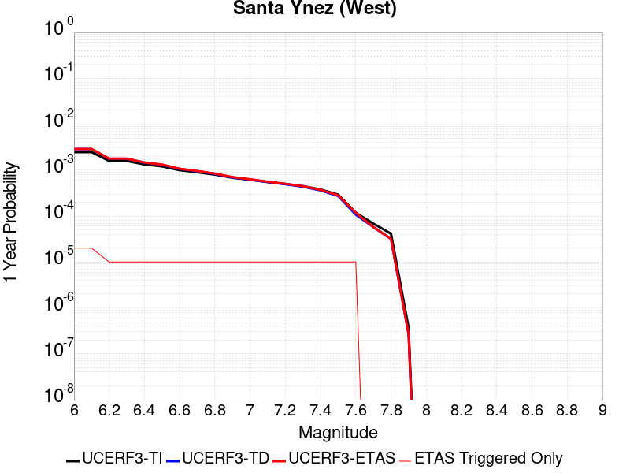 | 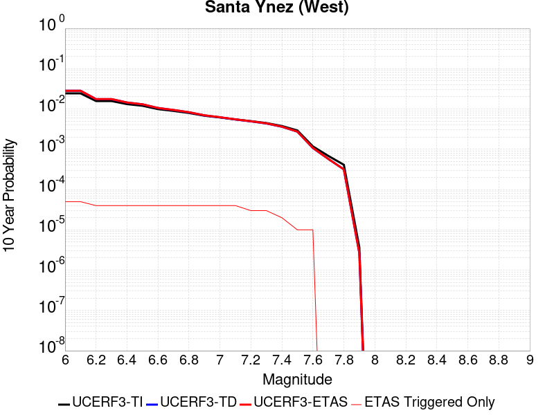 |

| Magnitude | 1 wk TI Prob | 1 wk TD Prob | 1 wk ETAS Prob | 1 wk ETAS/TD Gain | 1 wk ETAS Triggered Only | 1 mo TI Prob | 1 mo TD Prob | 1 mo ETAS Prob | 1 mo ETAS/TD Gain | 1 mo ETAS Triggered Only | 1 yr TI Prob | 1 yr TD Prob | 1 yr ETAS Prob | 1 yr ETAS/TD Gain | 1 yr ETAS Triggered Only | 10 yr TI Prob | 10 yr TD Prob | 10 yr ETAS Prob | 10 yr ETAS/TD Gain | 10 yr ETAS Triggered Only |
|-----|-----|-----|-----|-----|-----|-----|-----|-----|-----|-----|-----|-----|-----|-----|-----|-----|-----|-----|-----|-----|
| 6.0 | 4.7352758E-5 | 5.498621E-5 | 5.498621E-5 | 1.0 | 0.0 | 2.0292461E-4 | 2.356277E-4 | 2.356277E-4 | 1.0 | 0.0 | 0.0024678076 | 0.0028652318 | 0.0028851745 | 1.0069603 | 2.0E-5 | 0.024405818 | 0.028311422 | 0.028360005 | 1.001716 | 5.0E-5 |
| 6.1 | 4.7352758E-5 | 5.498621E-5 | 5.498621E-5 | 1.0 | 0.0 | 2.0292461E-4 | 2.356277E-4 | 2.356277E-4 | 1.0 | 0.0 | 0.0024678076 | 0.0028652318 | 0.0028851745 | 1.0069603 | 2.0E-5 | 0.024405818 | 0.028311422 | 0.028360005 | 1.001716 | 5.0E-5 |
| 6.2 | 3.0415853E-5 | 3.3932272E-5 | 3.3932272E-5 | 1.0 | 0.0 | 1.3034715E-4 | 1.4541604E-4 | 1.4541604E-4 | 1.0 | 0.0 | 0.0015858212 | 0.0017690392 | 0.0017790215 | 1.0056428 | 1.0E-5 | 0.015745522 | 0.017553467 | 0.017592765 | 1.0022388 | 4.0E-5 |
| 6.3 | 3.0415853E-5 | 3.3932272E-5 | 3.3932272E-5 | 1.0 | 0.0 | 1.3034715E-4 | 1.4541604E-4 | 1.4541604E-4 | 1.0 | 0.0 | 0.0015858212 | 0.0017690392 | 0.0017790215 | 1.0056428 | 1.0E-5 | 0.015745522 | 0.017553467 | 0.017592765 | 1.0022388 | 4.0E-5 |
| 6.4 | 2.5452082E-5 | 2.791787E-5 | 2.791787E-5 | 1.0 | 0.0 | 1.09075794E-4 | 1.1964254E-4 | 1.1964254E-4 | 1.0 | 0.0 | 0.0013271887 | 0.0014556927 | 0.0014656781 | 1.0068595 | 1.0E-5 | 0.013192902 | 0.014463755 | 0.014503176 | 1.0027255 | 4.0E-5 |
| 6.5 | 2.3143784E-5 | 2.5132935E-5 | 2.5132935E-5 | 1.0 | 0.0 | 9.9183875E-5 | 1.0770812E-4 | 1.0770812E-4 | 1.0 | 0.0 | 0.0012068948 | 0.0013105706 | 0.0013205576 | 1.0076202 | 1.0E-5 | 0.012003611 | 0.013030095 | 0.013069574 | 1.0030298 | 4.0E-5 |
| 6.6 | 1.9118515E-5 | 2.0357847E-5 | 2.0357847E-5 | 1.0 | 0.0 | 8.193392E-5 | 8.724504E-5 | 8.724504E-5 | 1.0 | 0.0 | 9.97089E-4 | 0.0010616988 | 0.0010716881 | 1.0094088 | 1.0E-5 | 0.00992627 | 0.010567175 | 0.010606753 | 1.0037453 | 4.0E-5 |
| 6.7 | 1.722807E-5 | 1.8149358E-5 | 1.8149358E-5 | 1.0 | 0.0 | 7.3832496E-5 | 7.778068E-5 | 7.778068E-5 | 1.0 | 0.0 | 8.985399E-4 | 9.465739E-4 | 9.5656444E-4 | 1.0105544 | 1.0E-5 | 0.008949154 | 0.009426067 | 0.00946569 | 1.0042036 | 4.0E-5 |
| 6.8 | 1.5317364E-5 | 1.5929016E-5 | 1.5929016E-5 | 1.0 | 0.0 | 6.56442E-5 | 6.826545E-5 | 6.826545E-5 | 1.0 | 0.0 | 7.98925E-4 | 8.308192E-4 | 8.408109E-4 | 1.0120263 | 1.0E-5 | 0.007960589 | 0.008277619 | 0.008317288 | 1.0047923 | 4.0E-5 |
| 6.9 | 1.3071226E-5 | 1.3331613E-5 | 1.3331613E-5 | 1.0 | 0.0 | 5.6018336E-5 | 5.7134246E-5 | 5.7134246E-5 | 1.0 | 0.0 | 6.8180985E-4 | 6.953897E-4 | 7.053827E-4 | 1.0143704 | 1.0E-5 | 0.0067972173 | 0.006932398 | 0.0069721206 | 1.00573 | 4.0E-5 |
| 7.0 | 1.1836986E-5 | 1.1934524E-5 | 1.1934524E-5 | 1.0 | 0.0 | 5.0728955E-5 | 5.114697E-5 | 5.114697E-5 | 1.0 | 0.0 | 6.1745E-4 | 6.225381E-4 | 6.325319E-4 | 1.0160533 | 1.0E-5 | 0.006157372 | 0.006208135 | 0.0062478865 | 1.0064032 | 4.0E-5 |
| 7.1 | 1.0597169E-5 | 1.05437175E-5 | 1.05437175E-5 | 1.0 | 0.0 | 4.541565E-5 | 4.518658E-5 | 4.518658E-5 | 1.0 | 0.0 | 5.5279525E-4 | 5.500089E-4 | 5.600034E-4 | 1.0181715 | 1.0E-5 | 0.0055142213 | 0.0054866076 | 0.005526388 | 1.0072504 | 4.0E-5 |
| 7.2 | 9.59113E-6 | 9.460548E-6 | 9.460548E-6 | 1.0 | 0.0 | 4.11042E-5 | 4.0544586E-5 | 4.0544586E-5 | 1.0 | 0.0 | 5.0032866E-4 | 4.935196E-4 | 5.0351466E-4 | 1.0202526 | 1.0E-5 | 0.004992037 | 0.0049243546 | 0.004954207 | 1.0060622 | 3.0E-5 |
| 7.3 | 8.586084E-6 | 8.380881E-6 | 8.380881E-6 | 1.0 | 0.0 | 3.679698E-5 | 3.5917572E-5 | 3.5917572E-5 | 1.0 | 0.0 | 4.4791115E-4 | 4.3720973E-4 | 4.4720538E-4 | 1.0228623 | 1.0E-5 | 0.004470094 | 0.004363607 | 0.0043934765 | 1.006845 | 3.0E-5 |
| 7.4 | 7.2622997E-6 | 6.952687E-6 | 6.952687E-6 | 1.0 | 0.0 | 3.112377E-5 | 2.9796895E-5 | 2.9796895E-5 | 1.0 | 0.0 | 3.78866E-4 | 3.6271778E-4 | 3.7271413E-4 | 1.0275596 | 1.0E-5 | 0.0037822074 | 0.0036213577 | 0.0036412855 | 1.0055028 | 2.0E-5 |
| 7.5 | 5.627296E-6 | 5.252259E-6 | 5.252259E-6 | 1.0 | 0.0 | 2.411676E-5 | 2.2509492E-5 | 2.2509492E-5 | 1.0 | 0.0 | 2.9358198E-4 | 2.7401932E-4 | 2.8401657E-4 | 1.0364838 | 1.0E-5 | 0.0029319443 | 0.0027368865 | 0.002746859 | 1.0036438 | 1.0E-5 |
| 7.6 | 2.265244E-6 | 2.0610528E-6 | 2.0610528E-6 | 1.0 | 0.0 | 9.708152E-6 | 8.833054E-6 | 8.833054E-6 | 1.0 | 0.0 | 1.18190335E-4 | 1.0753721E-4 | 1.1753614E-4 | 1.0929811 | 1.0E-5 | 0.001181275 | 0.0010748605 | 0.0010848497 | 1.0092936 | 1.0E-5 |
| 7.7 | 1.3099874E-6 | 1.1017219E-6 | 1.1017219E-6 | 1.0 | 0.0 | 5.61422E-6 | 4.7216568E-6 | 4.7216568E-6 | 1.0 | 0.0 | 6.8350986E-5 | 5.7484678E-5 | 5.7484678E-5 | 1.0 | 0.0 | 6.832996E-4 | 5.747005E-4 | 5.747005E-4 | 1.0 | 0.0 |
| 7.8 | 7.903951E-7 | 6.0716326E-7 | 6.0716326E-7 | 1.0 | 0.0 | 3.3874032E-6 | 2.6021257E-6 | 2.6021257E-6 | 1.0 | 0.0 | 4.1240855E-5 | 3.1680436E-5 | 3.1680436E-5 | 1.0 | 0.0 | 4.12332E-4 | 3.167605E-4 | 3.167605E-4 | 1.0 | 0.0 |
| 7.9 | 7.0753297E-9 | 5.090257E-9 | 5.090257E-9 | 1.0 | 0.0 | 3.032284E-8 | 2.1815387E-8 | 2.1815387E-8 | 1.0 | 0.0 | 3.6918053E-7 | 2.6560232E-7 | 2.6560232E-7 | 1.0 | 0.0 | 3.691799E-6 | 2.656021E-6 | 2.656021E-6 | 1.0 | 0.0 |

## San Andreas (North Branch Mill Creek)
*[(top)](#table-of-contents)*

| 1 Week | 1 Month | 1 Year | 10 Year |
|-----|-----|-----|-----|
|  |  |  |  |

| Magnitude | 1 wk TI Prob | 1 wk TD Prob | 1 wk ETAS Prob | 1 wk ETAS/TD Gain | 1 wk ETAS Triggered Only | 1 mo TI Prob | 1 mo TD Prob | 1 mo ETAS Prob | 1 mo ETAS/TD Gain | 1 mo ETAS Triggered Only | 1 yr TI Prob | 1 yr TD Prob | 1 yr ETAS Prob | 1 yr ETAS/TD Gain | 1 yr ETAS Triggered Only | 10 yr TI Prob | 10 yr TD Prob | 10 yr ETAS Prob | 10 yr ETAS/TD Gain | 10 yr ETAS Triggered Only |
|-----|-----|-----|-----|-----|-----|-----|-----|-----|-----|-----|-----|-----|-----|-----|-----|-----|-----|-----|-----|-----|
| 6.0 | 1.3461156E-5 | 2.3568791E-5 | 2.3568791E-5 | 1.0 | 0.0 | 5.7689394E-5 | 1.01005215E-4 | 1.1100421E-4 | 1.0989947 | 1.0E-5 | 7.02142E-4 | 0.0012290481 | 0.001268999 | 1.0325055 | 4.0E-5 | 0.0069992766 | 0.012264845 | 0.012343864 | 1.0064427 | 8.0E-5 |
| 6.1 | 1.3461156E-5 | 2.3568791E-5 | 2.3568791E-5 | 1.0 | 0.0 | 5.7689394E-5 | 1.01005215E-4 | 1.1100421E-4 | 1.0989947 | 1.0E-5 | 7.02142E-4 | 0.0012290481 | 0.001268999 | 1.0325055 | 4.0E-5 | 0.0069992766 | 0.012264845 | 0.012343864 | 1.0064427 | 8.0E-5 |
| 6.2 | 1.3461156E-5 | 2.3568791E-5 | 2.3568791E-5 | 1.0 | 0.0 | 5.7689394E-5 | 1.01005215E-4 | 1.1100421E-4 | 1.0989947 | 1.0E-5 | 7.02142E-4 | 0.0012290481 | 0.001268999 | 1.0325055 | 4.0E-5 | 0.0069992766 | 0.012264845 | 0.012343864 | 1.0064427 | 8.0E-5 |
| 6.3 | 1.3461156E-5 | 2.3568791E-5 | 2.3568791E-5 | 1.0 | 0.0 | 5.7689394E-5 | 1.01005215E-4 | 1.1100421E-4 | 1.0989947 | 1.0E-5 | 7.02142E-4 | 0.0012290481 | 0.001268999 | 1.0325055 | 4.0E-5 | 0.0069992766 | 0.012264845 | 0.012343864 | 1.0064427 | 8.0E-5 |
| 6.4 | 1.3461156E-5 | 2.3568791E-5 | 2.3568791E-5 | 1.0 | 0.0 | 5.7689394E-5 | 1.01005215E-4 | 1.1100421E-4 | 1.0989947 | 1.0E-5 | 7.02142E-4 | 0.0012290481 | 0.001268999 | 1.0325055 | 4.0E-5 | 0.0069992766 | 0.012264845 | 0.012343864 | 1.0064427 | 8.0E-5 |
| 6.5 | 1.3450706E-5 | 2.3557752E-5 | 2.3557752E-5 | 1.0 | 0.0 | 5.764461E-5 | 1.009579E-4 | 1.1095689E-4 | 1.0990412 | 1.0E-5 | 7.0159714E-4 | 0.0012284727 | 0.0012684235 | 1.0325208 | 4.0E-5 | 0.006993862 | 0.012259155 | 0.012338174 | 1.0064458 | 8.0E-5 |
| 6.6 | 1.3074523E-5 | 2.317201E-5 | 2.317201E-5 | 1.0 | 0.0 | 5.6032466E-5 | 9.9304845E-5 | 1.0930385E-4 | 1.10069 | 1.0E-5 | 6.8198174E-4 | 0.0012083692 | 0.0012483208 | 1.0330625 | 4.0E-5 | 0.006798926 | 0.0120603135 | 0.012139348 | 1.0065533 | 8.0E-5 |
| 6.7 | 1.3050216E-5 | 2.31473E-5 | 2.31473E-5 | 1.0 | 0.0 | 5.59283E-5 | 9.9198965E-5 | 1.0919797E-4 | 1.1007975 | 1.0E-5 | 6.8071426E-4 | 0.0012070815 | 0.0012470331 | 1.0330977 | 4.0E-5 | 0.0067863287 | 0.012047576 | 0.0121266125 | 1.0065603 | 8.0E-5 |
| 6.8 | 1.29049395E-5 | 2.2995695E-5 | 2.2995695E-5 | 1.0 | 0.0 | 5.530571E-5 | 9.854927E-5 | 1.0854829E-4 | 1.1014621 | 1.0E-5 | 6.73139E-4 | 0.0011991803 | 0.0012391323 | 1.0333161 | 4.0E-5 | 0.0067110364 | 0.011969416 | 0.01204846 | 1.0066037 | 8.0E-5 |
| 6.9 | 1.2867369E-5 | 2.2955088E-5 | 2.2955088E-5 | 1.0 | 0.0 | 5.51447E-5 | 9.837526E-5 | 1.08374275E-4 | 1.1016415 | 1.0E-5 | 6.711799E-4 | 0.001197064 | 0.001237016 | 1.0333751 | 4.0E-5 | 0.006691564 | 0.011948481 | 0.012027525 | 1.0066154 | 8.0E-5 |
| 7.0 | 1.2495996E-5 | 2.2354692E-5 | 2.2354692E-5 | 1.0 | 0.0 | 5.3553173E-5 | 9.580232E-5 | 1.05801366E-4 | 1.1043715 | 1.0E-5 | 6.518148E-4 | 0.001165772 | 0.0012057254 | 1.0342721 | 4.0E-5 | 0.0064990623 | 0.011638851 | 0.01171792 | 1.0067935 | 8.0E-5 |
| 7.1 | 1.2452067E-5 | 2.2299744E-5 | 2.2299744E-5 | 1.0 | 0.0 | 5.3364907E-5 | 9.5566844E-5 | 1.0556589E-4 | 1.1046288 | 1.0E-5 | 6.4952404E-4 | 0.0011629082 | 0.0012028617 | 1.0343565 | 4.0E-5 | 0.0064762887 | 0.011610513 | 0.011689584 | 1.0068103 | 8.0E-5 |
| 7.2 | 1.2002777E-5 | 2.167794E-5 | 2.167794E-5 | 1.0 | 0.0 | 5.143946E-5 | 9.290217E-5 | 1.0290124E-4 | 1.1076301 | 1.0E-5 | 6.2609545E-4 | 0.0011304996 | 0.0011704544 | 1.0353426 | 4.0E-5 | 0.006243344 | 0.011289758 | 0.011368854 | 1.007006 | 8.0E-5 |
| 7.3 | 1.1923425E-5 | 2.1547696E-5 | 2.1547696E-5 | 1.0 | 0.0 | 5.109939E-5 | 9.234402E-5 | 1.02343096E-4 | 1.1082808 | 1.0E-5 | 6.219575E-4 | 0.0011237112 | 0.0011636663 | 1.0355563 | 4.0E-5 | 0.0062021962 | 0.011222587 | 0.01130169 | 1.0070485 | 8.0E-5 |
| 7.4 | 1.16105175E-5 | 2.0921012E-5 | 2.0921012E-5 | 1.0 | 0.0 | 4.975841E-5 | 8.965841E-5 | 9.965752E-5 | 1.1115245 | 1.0E-5 | 6.0564023E-4 | 0.0010910471 | 0.0011310035 | 1.036622 | 4.0E-5 | 0.006039923 | 0.01089987 | 0.010978998 | 1.0072595 | 8.0E-5 |
| 7.5 | 1.1037265E-5 | 1.9618798E-5 | 1.9618798E-5 | 1.0 | 0.0 | 4.7301706E-5 | 8.407787E-5 | 9.4077026E-5 | 1.1189274 | 1.0E-5 | 5.757461E-4 | 0.0010231695 | 0.0010631286 | 1.0390542 | 4.0E-5 | 0.005742567 | 0.010228194 | 0.010307376 | 1.0077416 | 8.0E-5 |
| 7.6 | 1.0720915E-5 | 1.9059898E-5 | 1.9059898E-5 | 1.0 | 0.0 | 4.5945973E-5 | 8.168274E-5 | 9.168192E-5 | 1.122415 | 1.0E-5 | 5.592486E-4 | 9.940357E-4 | 0.001033996 | 1.0402 | 4.0E-5 | 0.005578433 | 0.00993951 | 0.010018715 | 1.0079687 | 8.0E-5 |
| 7.7 | 9.276279E-6 | 1.6502676E-5 | 1.6502676E-5 | 1.0 | 0.0 | 3.9754876E-5 | 7.072384E-5 | 8.072314E-5 | 1.1413851 | 1.0E-5 | 4.839081E-4 | 8.607243E-4 | 9.006899E-4 | 1.0464325 | 4.0E-5 | 0.0048285574 | 0.008617393 | 0.008696703 | 1.0092036 | 8.0E-5 |
| 7.8 | 5.8346777E-6 | 1.1204534E-5 | 1.1204534E-5 | 1.0 | 0.0 | 2.5005522E-5 | 4.8018544E-5 | 5.8018064E-5 | 1.2082429 | 1.0E-5 | 3.043997E-4 | 5.8446906E-4 | 6.244457E-4 | 1.0683982 | 4.0E-5 | 0.0030398308 | 0.0058723968 | 0.005951927 | 1.013543 | 8.0E-5 |
| 7.9 | 4.690204E-6 | 8.550357E-6 | 8.550357E-6 | 1.0 | 0.0 | 2.0100719E-5 | 3.6643873E-5 | 4.6643505E-5 | 1.2728869 | 1.0E-5 | 2.4469878E-4 | 4.460479E-4 | 4.8603007E-4 | 1.0896364 | 4.0E-5 | 0.002444295 | 0.0044919904 | 0.004561676 | 1.0155133 | 7.0E-5 |
| 8.0 | 2.9570454E-6 | 4.8721763E-6 | 4.8721763E-6 | 1.0 | 0.0 | 1.267299E-5 | 2.0880589E-5 | 2.0880589E-5 | 1.0 | 0.0 | 1.5428272E-4 | 2.5419152E-4 | 2.5419152E-4 | 1.0 | 0.0 | 0.0015417566 | 0.002562766 | 0.002562766 | 1.0 | 0.0 |
| 8.1 | 1.6376824E-6 | 2.2101194E-6 | 2.2101194E-6 | 1.0 | 0.0 | 7.01862E-6 | 9.471906E-6 | 9.471906E-6 | 1.0 | 0.0 | 8.544835E-5 | 1.15314375E-4 | 1.15314375E-4 | 1.0 | 0.0 | 8.54155E-4 | 0.0011675779 | 0.0011675779 | 1.0 | 0.0 |
| 8.2 | 6.9631557E-7 | 4.5774055E-7 | 4.5774055E-7 | 1.0 | 0.0 | 2.984206E-6 | 1.9617437E-6 | 1.9617437E-6 | 1.0 | 0.0 | 3.63321E-5 | 2.388397E-5 | 2.388397E-5 | 1.0 | 0.0 | 3.6326164E-4 | 2.4735386E-4 | 2.4735386E-4 | 1.0 | 0.0 |
| 8.3 | 1.7876137E-7 | 8.444342E-8 | 8.444342E-8 | 1.0 | 0.0 | 7.661199E-7 | 3.6190033E-7 | 3.6190033E-7 | 1.0 | 0.0 | 9.32747E-6 | 4.406128E-6 | 4.406128E-6 | 1.0 | 0.0 | 9.3270784E-5 | 4.626742E-5 | 4.626742E-5 | 1.0 | 0.0 |

## Imperial
*[(top)](#table-of-contents)*

| 1 Week | 1 Month | 1 Year | 10 Year |
|-----|-----|-----|-----|
|  |  |  |  |

| Magnitude | 1 wk TI Prob | 1 wk TD Prob | 1 wk ETAS Prob | 1 wk ETAS/TD Gain | 1 wk ETAS Triggered Only | 1 mo TI Prob | 1 mo TD Prob | 1 mo ETAS Prob | 1 mo ETAS/TD Gain | 1 mo ETAS Triggered Only | 1 yr TI Prob | 1 yr TD Prob | 1 yr ETAS Prob | 1 yr ETAS/TD Gain | 1 yr ETAS Triggered Only | 10 yr TI Prob | 10 yr TD Prob | 10 yr ETAS Prob | 10 yr ETAS/TD Gain | 10 yr ETAS Triggered Only |
|-----|-----|-----|-----|-----|-----|-----|-----|-----|-----|-----|-----|-----|-----|-----|-----|-----|-----|-----|-----|-----|
| 6.0 | 2.7496446E-4 | 5.0681044E-4 | 5.0681044E-4 | 1.0 | 0.0 | 0.0011778869 | 0.0021702761 | 0.0021802543 | 1.0045977 | 1.0E-5 | 0.0142467655 | 0.026103565 | 0.026132783 | 1.0011193 | 3.0E-5 | 0.13367249 | 0.22847165 | 0.22852565 | 1.0002364 | 7.0E-5 |
| 6.1 | 2.5356023E-4 | 4.876858E-4 | 4.876858E-4 | 1.0 | 0.0 | 0.001086234 | 0.0020884462 | 0.0020984253 | 1.0047783 | 1.0E-5 | 0.013144928 | 0.025128005 | 0.025157252 | 1.0011638 | 3.0E-5 | 0.123940155 | 0.21985963 | 0.21991424 | 1.0002484 | 7.0E-5 |
| 6.2 | 2.4820742E-4 | 4.7861782E-4 | 4.7861782E-4 | 1.0 | 0.0 | 0.0010633124 | 0.0020496447 | 0.0020596243 | 1.0048689 | 1.0E-5 | 0.01286919 | 0.024666933 | 0.024696194 | 1.0011863 | 3.0E-5 | 0.12148927 | 0.21636096 | 0.21641581 | 1.0002536 | 7.0E-5 |
| 6.3 | 2.3205351E-4 | 4.5988287E-4 | 4.5988287E-4 | 1.0 | 0.0 | 9.94136E-4 | 0.0019694748 | 0.0019794551 | 1.0050675 | 1.0E-5 | 0.012036599 | 0.023710756 | 0.023740044 | 1.0012352 | 3.0E-5 | 0.11405133 | 0.20827678 | 0.2083322 | 1.0002661 | 7.0E-5 |
| 6.4 | 2.0304754E-4 | 3.9971748E-4 | 3.9971748E-4 | 1.0 | 0.0 | 8.6991355E-4 | 0.0017119648 | 0.0017219478 | 1.0058312 | 1.0E-5 | 0.010539869 | 0.020643953 | 0.020673335 | 1.0014232 | 3.0E-5 | 0.100537635 | 0.1854115 | 0.18546851 | 1.0003076 | 7.0E-5 |
| 6.5 | 1.854992E-4 | 3.7077596E-4 | 3.7077596E-4 | 1.0 | 0.0 | 7.9475436E-4 | 0.0015880845 | 0.0015980686 | 1.0062869 | 1.0E-5 | 0.009633281 | 0.019164657 | 0.019194083 | 1.0015354 | 3.0E-5 | 0.0922623 | 0.1736267 | 0.17368455 | 1.0003332 | 7.0E-5 |
| 6.6 | 1.6586106E-4 | 3.4115417E-4 | 3.4115417E-4 | 1.0 | 0.0 | 7.106394E-4 | 0.0014612802 | 0.0014712656 | 1.0068333 | 1.0E-5 | 0.008617763 | 0.017647566 | 0.017677037 | 1.00167 | 3.0E-5 | 0.08291132 | 0.1610807 | 0.16113943 | 1.0003645 | 7.0E-5 |
| 6.7 | 1.4224656E-4 | 3.0837086E-4 | 3.0837086E-4 | 1.0 | 0.0 | 6.094856E-4 | 0.0013209282 | 0.001330915 | 1.0075605 | 1.0E-5 | 0.0073952693 | 0.01596562 | 0.015995141 | 1.001849 | 3.0E-5 | 0.07153955 | 0.14675768 | 0.1468174 | 1.000407 | 7.0E-5 |
| 6.8 | 1.2317259E-4 | 2.7850247E-4 | 2.7850247E-4 | 1.0 | 0.0 | 5.2777573E-4 | 0.0011930423 | 0.0012030303 | 1.008372 | 1.0E-5 | 0.0064067547 | 0.014429941 | 0.014459508 | 1.002049 | 3.0E-5 | 0.06225166 | 0.13317463 | 0.1332353 | 1.0004556 | 7.0E-5 |
| 6.9 | 9.859898E-5 | 2.5058497E-4 | 2.5058497E-4 | 1.0 | 0.0 | 4.2249862E-4 | 0.0010734978 | 0.0010734978 | 1.0 | 0.0 | 0.0051317946 | 0.012992479 | 0.013012219 | 1.0015193 | 2.0E-5 | 0.05014893 | 0.119586915 | 0.11963974 | 1.0004417 | 6.0E-5 |
| 7.0 | 7.3191884E-5 | 2.1299644E-4 | 2.1299644E-4 | 1.0 | 0.0 | 3.136418E-4 | 9.1252575E-4 | 9.1252575E-4 | 1.0 | 0.0 | 0.003811904 | 0.011054094 | 0.011073872 | 1.0017893 | 2.0E-5 | 0.037471764 | 0.102200456 | 0.10225432 | 1.000527 | 6.0E-5 |
| 7.1 | 7.1760296E-5 | 2.1000559E-4 | 2.1000559E-4 | 1.0 | 0.0 | 3.0750787E-4 | 8.997167E-4 | 8.997167E-4 | 1.0 | 0.0 | 0.003737482 | 0.010899713 | 0.0109194955 | 1.001815 | 2.0E-5 | 0.03675245 | 0.10083536 | 0.10088931 | 1.000535 | 6.0E-5 |
| 7.2 | 6.46614E-5 | 1.9167885E-4 | 1.9167885E-4 | 1.0 | 0.0 | 2.7709085E-4 | 8.2122517E-4 | 8.2122517E-4 | 1.0 | 0.0 | 0.0033683628 | 0.009953204 | 0.009973004 | 1.0019894 | 2.0E-5 | 0.033177625 | 0.092639305 | 0.092693746 | 1.0005877 | 6.0E-5 |
| 7.3 | 6.088115E-5 | 1.7838202E-4 | 1.7838202E-4 | 1.0 | 0.0 | 2.6089314E-4 | 7.642732E-4 | 7.642732E-4 | 1.0 | 0.0 | 0.0031717476 | 0.009265904 | 0.009285719 | 1.0021385 | 2.0E-5 | 0.031268585 | 0.08668562 | 0.08674042 | 1.0006322 | 6.0E-5 |
| 7.4 | 4.199346E-5 | 1.1533306E-4 | 1.1533306E-4 | 1.0 | 0.0 | 1.7995955E-4 | 4.941918E-4 | 4.941918E-4 | 1.0 | 0.0 | 0.0021888057 | 0.006000356 | 0.006020236 | 1.0033132 | 2.0E-5 | 0.02167372 | 0.05754115 | 0.05758827 | 1.000819 | 5.0E-5 |
| 7.5 | 3.130448E-5 | 8.3522464E-5 | 8.3522464E-5 | 1.0 | 0.0 | 1.3415517E-4 | 3.5790465E-4 | 3.5790465E-4 | 1.0 | 0.0 | 0.0016321153 | 0.0043488424 | 0.0043687555 | 1.004579 | 2.0E-5 | 0.016201803 | 0.04221757 | 0.042265464 | 1.0011344 | 5.0E-5 |
| 7.6 | 2.3074248E-5 | 6.100647E-5 | 6.100647E-5 | 1.0 | 0.0 | 9.888588E-5 | 2.6143022E-4 | 2.6143022E-4 | 1.0 | 0.0 | 0.0012032706 | 0.0031782908 | 0.0031982274 | 1.0062727 | 2.0E-5 | 0.011967761 | 0.031100241 | 0.031138998 | 1.0012462 | 4.0E-5 |
| 7.7 | 1.45864815E-5 | 4.0258925E-5 | 4.0258925E-5 | 1.0 | 0.0 | 6.2511994E-5 | 1.7252687E-4 | 1.7252687E-4 | 1.0 | 0.0 | 7.608177E-4 | 0.0020984965 | 0.0021184545 | 1.0095106 | 2.0E-5 | 0.007582182 | 0.020689316 | 0.020718696 | 1.00142 | 3.0E-5 |
| 7.8 | 1.0352979E-5 | 3.1075066E-5 | 3.1075066E-5 | 1.0 | 0.0 | 4.4369157E-5 | 1.3317207E-4 | 1.3317207E-4 | 1.0 | 0.0 | 5.400606E-4 | 0.0016201665 | 0.0016401341 | 1.0123245 | 2.0E-5 | 0.0053875 | 0.016069198 | 0.016098717 | 1.0018369 | 3.0E-5 |
| 7.9 | 8.137906E-6 | 2.2240849E-5 | 2.2240849E-5 | 1.0 | 0.0 | 3.4876273E-5 | 9.531444E-5 | 9.531444E-5 | 1.0 | 0.0 | 4.2453592E-4 | 0.0011598365 | 0.0011798134 | 1.0172238 | 2.0E-5 | 0.004237258 | 0.011660647 | 0.011680413 | 1.0016952 | 2.0E-5 |
| 8.0 | 6.93792E-6 | 1.808769E-5 | 1.808769E-5 | 1.0 | 0.0 | 2.9733603E-5 | 7.751637E-5 | 7.751637E-5 | 1.0 | 0.0 | 3.6194647E-4 | 9.43354E-4 | 9.633351E-4 | 1.021181 | 2.0E-5 | 0.0036135751 | 0.009538571 | 0.009558381 | 1.0020767 | 2.0E-5 |
| 8.1 | 3.4286315E-6 | 6.416584E-6 | 6.416584E-6 | 1.0 | 0.0 | 1.4694053E-5 | 2.7499356E-5 | 2.7499356E-5 | 1.0 | 0.0 | 1.7888541E-4 | 3.3475333E-4 | 3.3475333E-4 | 1.0 | 0.0 | 0.0017874148 | 0.0035042574 | 0.0035042574 | 1.0 | 0.0 |
| 8.2 | 1.4906886E-6 | 1.9510446E-6 | 1.9510446E-6 | 1.0 | 0.0 | 6.3886496E-6 | 8.361593E-6 | 8.361593E-6 | 1.0 | 0.0 | 7.7779034E-5 | 1.01797676E-4 | 1.01797676E-4 | 1.0 | 0.0 | 7.775182E-4 | 0.001114906 | 0.001114906 | 1.0 | 0.0 |
| 8.3 | 2.5758007E-8 | 1.4646456E-8 | 1.4646456E-8 | 1.0 | 0.0 | 1.10391454E-7 | 6.2770525E-8 | 6.2770525E-8 | 1.0 | 0.0 | 1.3440151E-6 | 7.642311E-7 | 7.642311E-7 | 1.0 | 0.0 | 1.344007E-5 | 7.965785E-6 | 7.965785E-6 | 1.0 | 0.0 |

## Kern Canyon (North Kern) 2011
*[(top)](#table-of-contents)*

| 1 Week | 1 Month | 1 Year | 10 Year |
|-----|-----|-----|-----|
|  | 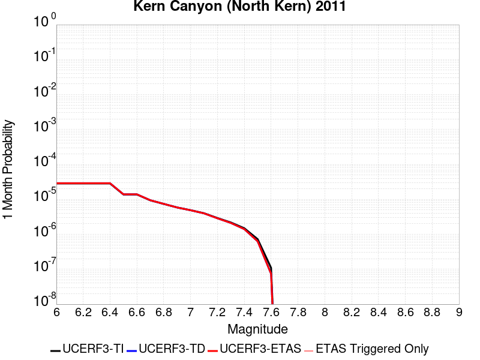 | 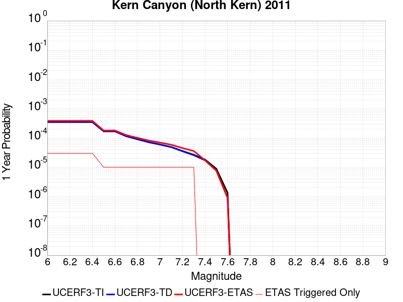 |  |

| Magnitude | 1 wk TI Prob | 1 wk TD Prob | 1 wk ETAS Prob | 1 wk ETAS/TD Gain | 1 wk ETAS Triggered Only | 1 mo TI Prob | 1 mo TD Prob | 1 mo ETAS Prob | 1 mo ETAS/TD Gain | 1 mo ETAS Triggered Only | 1 yr TI Prob | 1 yr TD Prob | 1 yr ETAS Prob | 1 yr ETAS/TD Gain | 1 yr ETAS Triggered Only | 10 yr TI Prob | 10 yr TD Prob | 10 yr ETAS Prob | 10 yr ETAS/TD Gain | 10 yr ETAS Triggered Only |
|-----|-----|-----|-----|-----|-----|-----|-----|-----|-----|-----|-----|-----|-----|-----|-----|-----|-----|-----|-----|-----|
| 6.0 | 6.6264497E-6 | 6.7575443E-6 | 6.7575443E-6 | 1.0 | 0.0 | 2.8398761E-5 | 2.8960629E-5 | 2.8960629E-5 | 1.0 | 0.0 | 3.4570007E-4 | 3.525466E-4 | 3.8253603E-4 | 1.0850651 | 3.0E-5 | 0.0034516277 | 0.0035206617 | 0.0035904152 | 1.0198126 | 7.0E-5 |
| 6.1 | 6.6264497E-6 | 6.7575443E-6 | 6.7575443E-6 | 1.0 | 0.0 | 2.8398761E-5 | 2.8960629E-5 | 2.8960629E-5 | 1.0 | 0.0 | 3.4570007E-4 | 3.525466E-4 | 3.8253603E-4 | 1.0850651 | 3.0E-5 | 0.0034516277 | 0.0035206617 | 0.0035904152 | 1.0198126 | 7.0E-5 |
| 6.2 | 6.6264497E-6 | 6.7575443E-6 | 6.7575443E-6 | 1.0 | 0.0 | 2.8398761E-5 | 2.8960629E-5 | 2.8960629E-5 | 1.0 | 0.0 | 3.4570007E-4 | 3.525466E-4 | 3.8253603E-4 | 1.0850651 | 3.0E-5 | 0.0034516277 | 0.0035206617 | 0.0035904152 | 1.0198126 | 7.0E-5 |
| 6.3 | 6.6264497E-6 | 6.7575443E-6 | 6.7575443E-6 | 1.0 | 0.0 | 2.8398761E-5 | 2.8960629E-5 | 2.8960629E-5 | 1.0 | 0.0 | 3.4570007E-4 | 3.525466E-4 | 3.8253603E-4 | 1.0850651 | 3.0E-5 | 0.0034516277 | 0.0035206617 | 0.0035904152 | 1.0198126 | 7.0E-5 |
| 6.4 | 6.6264497E-6 | 6.7575443E-6 | 6.7575443E-6 | 1.0 | 0.0 | 2.8398761E-5 | 2.8960629E-5 | 2.8960629E-5 | 1.0 | 0.0 | 3.4570007E-4 | 3.525466E-4 | 3.8253603E-4 | 1.0850651 | 3.0E-5 | 0.0034516277 | 0.0035206617 | 0.0035904152 | 1.0198126 | 7.0E-5 |
| 6.5 | 3.2162225E-6 | 3.2571832E-6 | 3.2571832E-6 | 1.0 | 0.0 | 1.3783738E-5 | 1.3959286E-5 | 1.3959286E-5 | 1.0 | 0.0 | 1.6780409E-4 | 1.6994186E-4 | 1.7994017E-4 | 1.0588336 | 1.0E-5 | 0.0016767744 | 0.0016981987 | 0.0017181648 | 1.0117571 | 2.0E-5 |
| 6.6 | 3.2162225E-6 | 3.2571832E-6 | 3.2571832E-6 | 1.0 | 0.0 | 1.3783738E-5 | 1.3959286E-5 | 1.3959286E-5 | 1.0 | 0.0 | 1.6780409E-4 | 1.6994186E-4 | 1.7994017E-4 | 1.0588336 | 1.0E-5 | 0.0016767744 | 0.0016981987 | 0.0017181648 | 1.0117571 | 2.0E-5 |
| 6.7 | 2.1908265E-6 | 2.2071804E-6 | 2.2071804E-6 | 1.0 | 0.0 | 9.389223E-6 | 9.4593115E-6 | 9.4593115E-6 | 1.0 | 0.0 | 1.1430779E-4 | 1.1516123E-4 | 1.2516008E-4 | 1.0868248 | 1.0E-5 | 0.0011424901 | 0.001151035 | 0.0011710118 | 1.0173557 | 2.0E-5 |
| 6.8 | 1.7303895E-6 | 1.7365974E-6 | 1.7365974E-6 | 1.0 | 0.0 | 7.415934E-6 | 7.4425398E-6 | 7.4425398E-6 | 1.0 | 0.0 | 9.028525E-5 | 9.0609254E-5 | 1.0060835E-4 | 1.1103541 | 1.0E-5 | 9.024858E-4 | 9.057328E-4 | 9.257147E-4 | 1.0220616 | 2.0E-5 |
| 6.9 | 1.3700314E-6 | 1.3688968E-6 | 1.3688968E-6 | 1.0 | 0.0 | 5.87155E-6 | 5.866688E-6 | 5.866688E-6 | 1.0 | 0.0 | 7.148377E-5 | 7.142463E-5 | 8.142392E-5 | 1.1399977 | 1.0E-5 | 7.146078E-4 | 7.1402127E-4 | 7.3400704E-4 | 1.0279903 | 2.0E-5 |
| 7.0 | 1.1467797E-6 | 1.1414094E-6 | 1.1414094E-6 | 1.0 | 0.0 | 4.9147607E-6 | 4.8917454E-6 | 4.8917454E-6 | 1.0 | 0.0 | 5.983557E-5 | 5.95554E-5 | 6.955481E-5 | 1.1679009 | 1.0E-5 | 5.981946E-4 | 5.9539755E-4 | 6.1538565E-4 | 1.033571 | 2.0E-5 |
| 7.1 | 9.3952065E-7 | 9.3029274E-7 | 9.3029274E-7 | 1.0 | 0.0 | 4.026511E-6 | 3.986963E-6 | 3.986963E-6 | 1.0 | 0.0 | 4.9021666E-5 | 4.854021E-5 | 5.8539725E-5 | 1.2060047 | 1.0E-5 | 4.901085E-4 | 4.8529785E-4 | 5.0528813E-4 | 1.0411918 | 2.0E-5 |
| 7.2 | 6.858055E-7 | 6.719475E-7 | 6.719475E-7 | 1.0 | 0.0 | 2.939163E-6 | 2.8797717E-6 | 2.8797717E-6 | 1.0 | 0.0 | 3.5783723E-5 | 3.5060668E-5 | 4.5060315E-5 | 1.2852099 | 1.0E-5 | 3.5777962E-4 | 3.5055223E-4 | 3.7054523E-4 | 1.0570328 | 2.0E-5 |
| 7.3 | 5.1101983E-7 | 4.9394305E-7 | 4.9394305E-7 | 1.0 | 0.0 | 2.1900833E-6 | 2.1168971E-6 | 2.1168971E-6 | 1.0 | 0.0 | 2.6663936E-5 | 2.5772923E-5 | 3.5772664E-5 | 1.387994 | 1.0E-5 | 2.6660739E-4 | 2.576998E-4 | 2.7769466E-4 | 1.0775896 | 2.0E-5 |
| 7.4 | 3.4999414E-7 | 3.2996817E-7 | 3.2996817E-7 | 1.0 | 0.0 | 1.499974E-6 | 1.4141485E-6 | 1.4141485E-6 | 1.0 | 0.0 | 1.8262032E-5 | 1.7217126E-5 | 1.7217126E-5 | 1.0 | 0.0 | 1.826053E-4 | 1.7215815E-4 | 1.8215644E-4 | 1.0580761 | 1.0E-5 |
| 7.5 | 1.7021522E-7 | 1.4750509E-7 | 1.4750509E-7 | 1.0 | 0.0 | 7.2949354E-7 | 6.3216453E-7 | 6.3216453E-7 | 1.0 | 0.0 | 8.881548E-6 | 7.696577E-6 | 7.696577E-6 | 1.0 | 0.0 | 8.8811925E-5 | 7.696318E-5 | 8.696241E-5 | 1.1299223 | 1.0E-5 |
| 7.6 | 2.572245E-8 | 1.7353377E-8 | 1.7353377E-8 | 1.0 | 0.0 | 1.10239064E-7 | 7.437161E-8 | 7.437161E-8 | 1.0 | 0.0 | 1.3421597E-6 | 9.0547405E-7 | 9.0547405E-7 | 1.0 | 0.0 | 1.3421517E-5 | 9.054709E-6 | 9.054709E-6 | 1.0 | 0.0 |

## San Andreas (Creeping Section) 2011 CFM
*[(top)](#table-of-contents)*

| 1 Week | 1 Month | 1 Year | 10 Year |
|-----|-----|-----|-----|
|  | 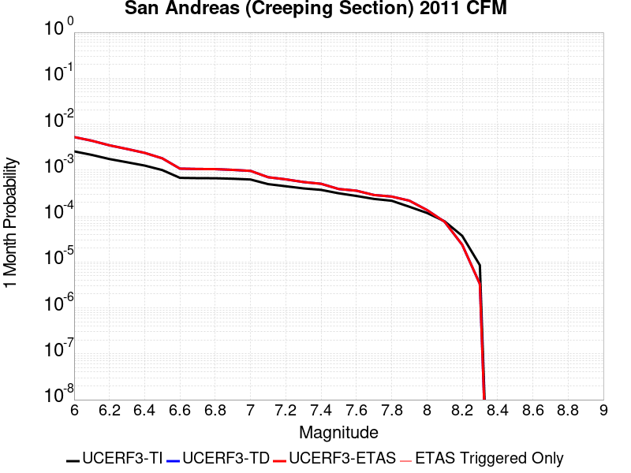 |  |  |

| Magnitude | 1 wk TI Prob | 1 wk TD Prob | 1 wk ETAS Prob | 1 wk ETAS/TD Gain | 1 wk ETAS Triggered Only | 1 mo TI Prob | 1 mo TD Prob | 1 mo ETAS Prob | 1 mo ETAS/TD Gain | 1 mo ETAS Triggered Only | 1 yr TI Prob | 1 yr TD Prob | 1 yr ETAS Prob | 1 yr ETAS/TD Gain | 1 yr ETAS Triggered Only | 10 yr TI Prob | 10 yr TD Prob | 10 yr ETAS Prob | 10 yr ETAS/TD Gain | 10 yr ETAS Triggered Only |
|-----|-----|-----|-----|-----|-----|-----|-----|-----|-----|-----|-----|-----|-----|-----|-----|-----|-----|-----|-----|-----|
| 6.0 | 5.986481E-4 | 0.001228818 | 0.001228818 | 1.0 | 0.0 | 0.0025631124 | 0.005251403 | 0.005251403 | 1.0 | 0.0 | 0.030762846 | 0.061267417 | 0.06129558 | 1.0004597 | 3.0E-5 | 0.26835477 | 0.42623988 | 0.42628002 | 1.0000942 | 7.0E-5 |
| 6.1 | 5.015945E-4 | 0.0010226909 | 0.0010226909 | 1.0 | 0.0 | 0.00214792 | 0.0043728617 | 0.0043728617 | 1.0 | 0.0 | 0.025839351 | 0.051300284 | 0.051319256 | 1.0003699 | 2.0E-5 | 0.23032776 | 0.3731487 | 0.37318632 | 1.0001009 | 6.0E-5 |
| 6.2 | 4.073338E-4 | 8.1182894E-4 | 8.1182894E-4 | 1.0 | 0.0 | 0.0017445484 | 0.003471832 | 0.003471832 | 1.0 | 0.0 | 0.021034058 | 0.04098442 | 0.0410036 | 1.000468 | 2.0E-5 | 0.19150782 | 0.3133488 | 0.31339 | 1.0001315 | 6.0E-5 |
| 6.3 | 3.464099E-4 | 6.7496847E-4 | 6.7496847E-4 | 1.0 | 0.0 | 0.0014837692 | 0.0028874867 | 0.0028874867 | 1.0 | 0.0 | 0.017915873 | 0.034241114 | 0.03426043 | 1.0005641 | 2.0E-5 | 0.16538359 | 0.27165115 | 0.27169484 | 1.0001608 | 6.0E-5 |
| 6.4 | 2.935057E-4 | 5.5568025E-4 | 5.5568025E-4 | 1.0 | 0.0 | 0.0012572751 | 0.0023777 | 0.0023777 | 1.0 | 0.0 | 0.015200248 | 0.028316312 | 0.028335745 | 1.0006863 | 2.0E-5 | 0.14201577 | 0.23333858 | 0.23337692 | 1.0001643 | 5.0E-5 |
| 6.5 | 2.3409708E-4 | 4.2212562E-4 | 4.2212562E-4 | 1.0 | 0.0 | 0.0010028875 | 0.0018066199 | 0.0018066199 | 1.0 | 0.0 | 0.012141965 | 0.02163862 | 0.02165819 | 1.0009043 | 2.0E-5 | 0.11499573 | 0.18719828 | 0.18723893 | 1.0002171 | 5.0E-5 |
| 6.6 | 1.5842178E-4 | 2.5166248E-4 | 2.5166248E-4 | 1.0 | 0.0 | 6.7877385E-4 | 0.0010780916 | 0.0010780916 | 1.0 | 0.0 | 0.0082328 | 0.013045433 | 0.013065171 | 1.0015131 | 2.0E-5 | 0.07934396 | 0.12354783 | 0.123591654 | 1.0003546 | 5.0E-5 |
| 6.7 | 1.5616413E-4 | 2.4702126E-4 | 2.4702126E-4 | 1.0 | 0.0 | 6.691031E-4 | 0.0010582256 | 0.0010582256 | 1.0 | 0.0 | 0.0081159435 | 0.012807187 | 0.01282693 | 1.0015416 | 2.0E-5 | 0.0782586 | 0.12157497 | 0.12161889 | 1.0003613 | 5.0E-5 |
| 6.8 | 1.5538467E-4 | 2.4525842E-4 | 2.4525842E-4 | 1.0 | 0.0 | 6.6576427E-4 | 0.0010506767 | 0.0010506767 | 1.0 | 0.0 | 0.008075596 | 0.012716471 | 0.012736216 | 1.0015528 | 2.0E-5 | 0.07788358 | 0.12080543 | 0.120849386 | 1.000364 | 5.0E-5 |
| 6.9 | 1.5153569E-4 | 2.363453E-4 | 2.363453E-4 | 1.0 | 0.0 | 6.49277E-4 | 0.0010125173 | 0.0010125173 | 1.0 | 0.0 | 0.007876333 | 0.012258248 | 0.012278004 | 1.0016116 | 2.0E-5 | 0.07602952 | 0.11687415 | 0.11691831 | 1.0003778 | 5.0E-5 |
| 7.0 | 1.4588932E-4 | 2.2490788E-4 | 2.2490788E-4 | 1.0 | 0.0 | 6.250901E-4 | 9.6353685E-4 | 9.6353685E-4 | 1.0 | 0.0 | 0.0075839474 | 0.011668463 | 0.01168823 | 1.001694 | 2.0E-5 | 0.073302895 | 0.111718945 | 0.11176336 | 1.0003976 | 5.0E-5 |
| 7.1 | 1.1565079E-4 | 1.6362451E-4 | 1.6362451E-4 | 1.0 | 0.0 | 4.955521E-4 | 7.0106034E-4 | 7.0106034E-4 | 1.0 | 0.0 | 0.006016669 | 0.00850221 | 0.008522039 | 1.0023323 | 2.0E-5 | 0.058563538 | 0.084029324 | 0.084075116 | 1.000545 | 5.0E-5 |
| 7.2 | 1.0393792E-4 | 1.4692238E-4 | 1.4692238E-4 | 1.0 | 0.0 | 4.4537216E-4 | 6.295162E-4 | 6.295162E-4 | 1.0 | 0.0 | 0.005408933 | 0.0076375967 | 0.007657444 | 1.0025986 | 2.0E-5 | 0.052791595 | 0.07596378 | 0.07600998 | 1.0006082 | 5.0E-5 |
| 7.3 | 9.332884E-5 | 1.2847784E-4 | 1.2847784E-4 | 1.0 | 0.0 | 3.999194E-4 | 5.505037E-4 | 5.505037E-4 | 1.0 | 0.0 | 0.0048581534 | 0.0066819214 | 0.006701788 | 1.0029732 | 2.0E-5 | 0.047533102 | 0.0667903 | 0.06683696 | 1.0006986 | 5.0E-5 |
| 7.4 | 8.670252E-5 | 1.1764739E-4 | 1.1764739E-4 | 1.0 | 0.0 | 3.715293E-4 | 5.041063E-4 | 5.041063E-4 | 1.0 | 0.0 | 0.004513991 | 0.0061203437 | 0.0061402214 | 1.0032477 | 2.0E-5 | 0.044233937 | 0.061436135 | 0.061483063 | 1.0007639 | 5.0E-5 |
| 7.5 | 7.3036405E-5 | 9.0574984E-5 | 9.0574984E-5 | 1.0 | 0.0 | 3.129756E-4 | 3.8812085E-4 | 3.8812085E-4 | 1.0 | 0.0 | 0.0038038217 | 0.0047151544 | 0.00473506 | 1.0042217 | 2.0E-5 | 0.03739367 | 0.048123557 | 0.04817115 | 1.000989 | 5.0E-5 |
| 7.6 | 6.3935775E-5 | 8.3263905E-5 | 8.3263905E-5 | 1.0 | 0.0 | 2.7398168E-4 | 3.567966E-4 | 3.567966E-4 | 1.0 | 0.0 | 0.0033306254 | 0.004335365 | 0.0043552783 | 1.0045933 | 2.0E-5 | 0.032811474 | 0.04421104 | 0.04425883 | 1.001081 | 5.0E-5 |
| 7.7 | 5.5050095E-5 | 6.702637E-5 | 6.702637E-5 | 1.0 | 0.0 | 2.3590765E-4 | 2.8722425E-4 | 2.8722425E-4 | 1.0 | 0.0 | 0.0028683927 | 0.003491352 | 0.0035112824 | 1.0057085 | 2.0E-5 | 0.0283165 | 0.03599376 | 0.03603232 | 1.0010713 | 4.0E-5 |
| 7.8 | 5.027131E-5 | 6.200182E-5 | 6.200182E-5 | 1.0 | 0.0 | 2.1543067E-4 | 2.65695E-4 | 2.65695E-4 | 1.0 | 0.0 | 0.0026197135 | 0.0032300418 | 0.0032499772 | 1.0061718 | 2.0E-5 | 0.025890453 | 0.033307906 | 0.033346575 | 1.0011609 | 4.0E-5 |
| 7.9 | 3.7271806E-5 | 5.0525578E-5 | 5.0525578E-5 | 1.0 | 0.0 | 1.5972654E-4 | 2.1652023E-4 | 2.1652023E-4 | 1.0 | 0.0 | 0.0019429359 | 0.002632949 | 0.0026528963 | 1.007576 | 2.0E-5 | 0.019260362 | 0.027214935 | 0.027253846 | 1.0014298 | 4.0E-5 |
| 8.0 | 2.7310243E-5 | 3.1628108E-5 | 3.1628108E-5 | 1.0 | 0.0 | 1.17038646E-4 | 1.35542E-4 | 1.35542E-4 | 1.0 | 0.0 | 0.0014240141 | 0.0016489754 | 0.0016689425 | 1.0121088 | 2.0E-5 | 0.014149235 | 0.017315505 | 0.017335158 | 1.001135 | 2.0E-5 |
| 8.1 | 1.7940547E-5 | 1.7529763E-5 | 1.7529763E-5 | 1.0 | 0.0 | 7.688579E-5 | 7.51254E-5 | 7.51254E-5 | 1.0 | 0.0 | 9.3568244E-4 | 9.142684E-4 | 9.242593E-4 | 1.0109277 | 1.0E-5 | 0.009317525 | 0.009867 | 0.009876901 | 1.0010035 | 1.0E-5 |
| 8.2 | 8.643924E-6 | 5.5269165E-6 | 5.5269165E-6 | 1.0 | 0.0 | 3.704486E-5 | 2.368657E-5 | 2.368657E-5 | 1.0 | 0.0 | 4.5092785E-4 | 2.8834594E-4 | 2.8834594E-4 | 1.0 | 0.0 | 0.0045001395 | 0.0032771796 | 0.0032771796 | 1.0 | 0.0 |
| 8.3 | 1.983087E-6 | 7.7486385E-7 | 7.7486385E-7 | 1.0 | 0.0 | 8.498917E-6 | 3.320841E-6 | 3.320841E-6 | 1.0 | 0.0 | 1.034694E-4 | 4.0430506E-5 | 4.0430506E-5 | 1.0 | 0.0 | 0.0010342124 | 4.7705657E-4 | 4.7705657E-4 | 1.0 | 0.0 |

## Red Mountain
*[(top)](#table-of-contents)*

| 1 Week | 1 Month | 1 Year | 10 Year |
|-----|-----|-----|-----|
|  | 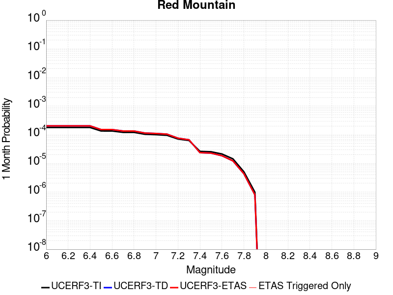 |  |  |

| Magnitude | 1 wk TI Prob | 1 wk TD Prob | 1 wk ETAS Prob | 1 wk ETAS/TD Gain | 1 wk ETAS Triggered Only | 1 mo TI Prob | 1 mo TD Prob | 1 mo ETAS Prob | 1 mo ETAS/TD Gain | 1 mo ETAS Triggered Only | 1 yr TI Prob | 1 yr TD Prob | 1 yr ETAS Prob | 1 yr ETAS/TD Gain | 1 yr ETAS Triggered Only | 10 yr TI Prob | 10 yr TD Prob | 10 yr ETAS Prob | 10 yr ETAS/TD Gain | 10 yr ETAS Triggered Only |
|-----|-----|-----|-----|-----|-----|-----|-----|-----|-----|-----|-----|-----|-----|-----|-----|-----|-----|-----|-----|-----|
| 6.0 | 4.1810763E-5 | 4.7600555E-5 | 4.7600555E-5 | 1.0 | 0.0 | 1.7917668E-4 | 2.0398737E-4 | 2.0398737E-4 | 1.0 | 0.0 | 0.0021792934 | 0.0024808832 | 0.0024908583 | 1.0040208 | 1.0E-5 | 0.021580452 | 0.024549497 | 0.02459827 | 1.0019867 | 5.0E-5 |
| 6.1 | 4.1810763E-5 | 4.7600555E-5 | 4.7600555E-5 | 1.0 | 0.0 | 1.7917668E-4 | 2.0398737E-4 | 2.0398737E-4 | 1.0 | 0.0 | 0.0021792934 | 0.0024808832 | 0.0024908583 | 1.0040208 | 1.0E-5 | 0.021580452 | 0.024549497 | 0.02459827 | 1.0019867 | 5.0E-5 |
| 6.2 | 4.1810763E-5 | 4.7600555E-5 | 4.7600555E-5 | 1.0 | 0.0 | 1.7917668E-4 | 2.0398737E-4 | 2.0398737E-4 | 1.0 | 0.0 | 0.0021792934 | 0.0024808832 | 0.0024908583 | 1.0040208 | 1.0E-5 | 0.021580452 | 0.024549497 | 0.02459827 | 1.0019867 | 5.0E-5 |
| 6.3 | 4.1810763E-5 | 4.7600555E-5 | 4.7600555E-5 | 1.0 | 0.0 | 1.7917668E-4 | 2.0398737E-4 | 2.0398737E-4 | 1.0 | 0.0 | 0.0021792934 | 0.0024808832 | 0.0024908583 | 1.0040208 | 1.0E-5 | 0.021580452 | 0.024549497 | 0.02459827 | 1.0019867 | 5.0E-5 |
| 6.4 | 4.1810763E-5 | 4.7600555E-5 | 4.7600555E-5 | 1.0 | 0.0 | 1.7917668E-4 | 2.0398737E-4 | 2.0398737E-4 | 1.0 | 0.0 | 0.0021792934 | 0.0024808832 | 0.0024908583 | 1.0040208 | 1.0E-5 | 0.021580452 | 0.024549497 | 0.02459827 | 1.0019867 | 5.0E-5 |
| 6.5 | 3.154503E-5 | 3.536723E-5 | 3.536723E-5 | 1.0 | 0.0 | 1.3518598E-4 | 1.5156555E-4 | 1.5156555E-4 | 1.0 | 0.0 | 0.0016446467 | 0.001843841 | 0.0018538226 | 1.0054134 | 1.0E-5 | 0.01632528 | 0.018295081 | 0.018324533 | 1.0016098 | 3.0E-5 |
| 6.6 | 3.1535834E-5 | 3.5356607E-5 | 3.5356607E-5 | 1.0 | 0.0 | 1.3514658E-4 | 1.5152004E-4 | 1.5152004E-4 | 1.0 | 0.0 | 0.0016441676 | 0.001843288 | 0.0018532695 | 1.0054151 | 1.0E-5 | 0.01632056 | 0.018289642 | 0.018319093 | 1.0016103 | 3.0E-5 |
| 6.7 | 2.8267326E-5 | 3.147588E-5 | 3.147588E-5 | 1.0 | 0.0 | 1.2114006E-4 | 1.3489013E-4 | 1.3489013E-4 | 1.0 | 0.0 | 0.0014738824 | 0.0016411353 | 0.0016511189 | 1.0060834 | 1.0E-5 | 0.014641452 | 0.016298926 | 0.016328435 | 1.0018107 | 3.0E-5 |
| 6.8 | 2.8212884E-5 | 3.1413754E-5 | 3.1413754E-5 | 1.0 | 0.0 | 1.20906756E-4 | 1.346239E-4 | 1.346239E-4 | 1.0 | 0.0 | 0.0014710457 | 0.0016378989 | 0.0016478825 | 1.0060954 | 1.0E-5 | 0.014613459 | 0.016267035 | 0.016296547 | 1.0018142 | 3.0E-5 |
| 6.9 | 2.4227871E-5 | 2.6712387E-5 | 2.6712387E-5 | 1.0 | 0.0 | 1.03829596E-4 | 1.14477065E-4 | 1.14477065E-4 | 1.0 | 0.0 | 0.0012633923 | 0.0013929431 | 0.0014029291 | 1.007169 | 1.0E-5 | 0.012562336 | 0.013849813 | 0.013879397 | 1.0021361 | 3.0E-5 |
| 7.0 | 2.348524E-5 | 2.5840971E-5 | 2.5840971E-5 | 1.0 | 0.0 | 1.0064714E-4 | 1.10742745E-4 | 1.10742745E-4 | 1.0 | 0.0 | 0.0012246901 | 0.0013475346 | 0.0013575212 | 1.007411 | 1.0E-5 | 0.012179627 | 0.013401275 | 0.013430873 | 1.0022086 | 3.0E-5 |
| 7.1 | 2.2311642E-5 | 2.4467727E-5 | 2.4467727E-5 | 1.0 | 0.0 | 9.561782E-5 | 1.0485789E-4 | 1.0485789E-4 | 1.0 | 0.0 | 0.0011635252 | 0.001275972 | 0.0012859593 | 1.0078272 | 1.0E-5 | 0.01157452 | 0.012693978 | 0.012723598 | 1.0023333 | 3.0E-5 |
| 7.2 | 1.6533986E-5 | 1.767366E-5 | 1.767366E-5 | 1.0 | 0.0 | 7.085802E-5 | 7.574241E-5 | 7.574241E-5 | 1.0 | 0.0 | 8.623549E-4 | 9.218372E-4 | 9.3182805E-4 | 1.0108379 | 1.0E-5 | 0.008590161 | 0.009186415 | 0.009216139 | 1.0032357 | 3.0E-5 |
| 7.3 | 1.4703092E-5 | 1.5562402E-5 | 1.5562402E-5 | 1.0 | 0.0 | 6.301173E-5 | 6.669465E-5 | 6.669465E-5 | 1.0 | 0.0 | 7.668978E-4 | 8.117665E-4 | 8.217584E-4 | 1.0123088 | 1.0E-5 | 0.0076425658 | 0.00809409 | 0.008113928 | 1.002451 | 2.0E-5 |
| 7.4 | 6.1331984E-6 | 5.5294786E-6 | 5.5294786E-6 | 1.0 | 0.0 | 2.6284872E-5 | 2.3697552E-5 | 2.3697552E-5 | 1.0 | 0.0 | 3.199713E-4 | 2.8848005E-4 | 2.9847716E-4 | 1.0346545 | 1.0E-5 | 0.0031951098 | 0.00288111 | 0.0029010524 | 1.0069218 | 2.0E-5 |
| 7.5 | 5.954766E-6 | 5.339087E-6 | 5.339087E-6 | 1.0 | 0.0 | 2.5520176E-5 | 2.2881602E-5 | 2.2881602E-5 | 1.0 | 0.0 | 3.1066386E-4 | 2.7854842E-4 | 2.8854565E-4 | 1.0358905 | 1.0E-5 | 0.003102299 | 0.0027820468 | 0.002801991 | 1.007169 | 2.0E-5 |
| 7.6 | 4.9726646E-6 | 4.3157743E-6 | 4.3157743E-6 | 1.0 | 0.0 | 2.1311245E-5 | 1.8496046E-5 | 1.8496046E-5 | 1.0 | 0.0 | 2.5943352E-4 | 2.2516643E-4 | 2.3516417E-4 | 1.0444016 | 1.0E-5 | 0.0025913084 | 0.0022494176 | 0.0022693726 | 1.0088712 | 2.0E-5 |
| 7.7 | 3.3613894E-6 | 2.852986E-6 | 2.852986E-6 | 1.0 | 0.0 | 1.4405875E-5 | 1.2227028E-5 | 1.2227028E-5 | 1.0 | 0.0 | 1.7537741E-4 | 1.4885415E-4 | 1.4885415E-4 | 1.0 | 0.0 | 0.0017523908 | 0.0014875707 | 0.0014975559 | 1.0067123 | 1.0E-5 |
| 7.8 | 1.1828961E-6 | 1.0123645E-6 | 1.0123645E-6 | 1.0 | 0.0 | 5.069545E-6 | 4.3386976E-6 | 4.3386976E-6 | 1.0 | 0.0 | 6.171996E-5 | 5.2822394E-5 | 5.2822394E-5 | 1.0 | 0.0 | 6.170282E-4 | 5.281013E-4 | 5.281013E-4 | 1.0 | 0.0 |
| 7.9 | 2.2967266E-7 | 1.862061E-7 | 1.862061E-7 | 1.0 | 0.0 | 9.843111E-7 | 7.980259E-7 | 7.980259E-7 | 1.0 | 0.0 | 1.19839215E-5 | 9.715925E-6 | 9.715925E-6 | 1.0 | 0.0 | 1.1983275E-4 | 9.7155294E-5 | 9.7155294E-5 | 1.0 | 0.0 |

## San Jacinto (Coyote Creek)
*[(top)](#table-of-contents)*

| 1 Week | 1 Month | 1 Year | 10 Year |
|-----|-----|-----|-----|
|  |  |  |  |

| Magnitude | 1 wk TI Prob | 1 wk TD Prob | 1 wk ETAS Prob | 1 wk ETAS/TD Gain | 1 wk ETAS Triggered Only | 1 mo TI Prob | 1 mo TD Prob | 1 mo ETAS Prob | 1 mo ETAS/TD Gain | 1 mo ETAS Triggered Only | 1 yr TI Prob | 1 yr TD Prob | 1 yr ETAS Prob | 1 yr ETAS/TD Gain | 1 yr ETAS Triggered Only | 10 yr TI Prob | 10 yr TD Prob | 10 yr ETAS Prob | 10 yr ETAS/TD Gain | 10 yr ETAS Triggered Only |
|-----|-----|-----|-----|-----|-----|-----|-----|-----|-----|-----|-----|-----|-----|-----|-----|-----|-----|-----|-----|-----|
| 6.0 | 2.7374346E-5 | 2.4226492E-5 | 2.4226492E-5 | 1.0 | 0.0 | 1.1731335E-4 | 1.0382371E-4 | 1.0382371E-4 | 1.0 | 0.0 | 0.0014273542 | 0.0012633232 | 0.0012733106 | 1.0079056 | 1.0E-5 | 0.01418221 | 0.012970629 | 0.013039721 | 1.0053269 | 7.0E-5 |
| 6.1 | 2.7374346E-5 | 2.4226492E-5 | 2.4226492E-5 | 1.0 | 0.0 | 1.1731335E-4 | 1.0382371E-4 | 1.0382371E-4 | 1.0 | 0.0 | 0.0014273542 | 0.0012633232 | 0.0012733106 | 1.0079056 | 1.0E-5 | 0.01418221 | 0.012970629 | 0.013039721 | 1.0053269 | 7.0E-5 |
| 6.2 | 2.7374346E-5 | 2.4226492E-5 | 2.4226492E-5 | 1.0 | 0.0 | 1.1731335E-4 | 1.0382371E-4 | 1.0382371E-4 | 1.0 | 0.0 | 0.0014273542 | 0.0012633232 | 0.0012733106 | 1.0079056 | 1.0E-5 | 0.01418221 | 0.012970629 | 0.013039721 | 1.0053269 | 7.0E-5 |
| 6.3 | 2.7374346E-5 | 2.4226492E-5 | 2.4226492E-5 | 1.0 | 0.0 | 1.1731335E-4 | 1.0382371E-4 | 1.0382371E-4 | 1.0 | 0.0 | 0.0014273542 | 0.0012633232 | 0.0012733106 | 1.0079056 | 1.0E-5 | 0.01418221 | 0.012970629 | 0.013039721 | 1.0053269 | 7.0E-5 |
| 6.4 | 2.7374346E-5 | 2.4226492E-5 | 2.4226492E-5 | 1.0 | 0.0 | 1.1731335E-4 | 1.0382371E-4 | 1.0382371E-4 | 1.0 | 0.0 | 0.0014273542 | 0.0012633232 | 0.0012733106 | 1.0079056 | 1.0E-5 | 0.01418221 | 0.012970629 | 0.013039721 | 1.0053269 | 7.0E-5 |
| 6.5 | 2.7282445E-5 | 2.4112534E-5 | 2.4112534E-5 | 1.0 | 0.0 | 1.16919524E-4 | 1.03335355E-4 | 1.03335355E-4 | 1.0 | 0.0 | 0.0014225657 | 0.0012573845 | 0.0012673719 | 1.007943 | 1.0E-5 | 0.014134934 | 0.012911941 | 0.012981037 | 1.0053513 | 7.0E-5 |
| 6.6 | 2.7282445E-5 | 2.4112534E-5 | 2.4112534E-5 | 1.0 | 0.0 | 1.16919524E-4 | 1.03335355E-4 | 1.03335355E-4 | 1.0 | 0.0 | 0.0014225657 | 0.0012573845 | 0.0012673719 | 1.007943 | 1.0E-5 | 0.014134934 | 0.012911941 | 0.012981037 | 1.0053513 | 7.0E-5 |
| 6.7 | 2.7216198E-5 | 2.4037632E-5 | 2.4037632E-5 | 1.0 | 0.0 | 1.1663563E-4 | 1.0301437E-4 | 1.0301437E-4 | 1.0 | 0.0 | 0.0014191137 | 0.001253481 | 0.0012634685 | 1.0079678 | 1.0E-5 | 0.014100855 | 0.012873341 | 0.01294244 | 1.0053676 | 7.0E-5 |
| 6.8 | 2.7078617E-5 | 2.39548E-5 | 2.39548E-5 | 1.0 | 0.0 | 1.1604605E-4 | 1.0265941E-4 | 1.0265941E-4 | 1.0 | 0.0 | 0.001411945 | 0.0012491643 | 0.0012591518 | 1.0079954 | 1.0E-5 | 0.014030075 | 0.01283046 | 0.012899563 | 1.0053858 | 7.0E-5 |
| 6.9 | 2.6982952E-5 | 2.3874261E-5 | 2.3874261E-5 | 1.0 | 0.0 | 1.15636096E-4 | 1.0231427E-4 | 1.0231427E-4 | 1.0 | 0.0 | 0.0014069602 | 0.0012449671 | 0.0012549546 | 1.0080223 | 1.0E-5 | 0.013980856 | 0.012788752 | 0.012857857 | 1.0054035 | 7.0E-5 |
| 7.0 | 2.6449972E-5 | 2.3451106E-5 | 2.3451106E-5 | 1.0 | 0.0 | 1.1335209E-4 | 1.0050089E-4 | 1.0050089E-4 | 1.0 | 0.0 | 0.001379188 | 0.0012229141 | 0.0012329018 | 1.0081671 | 1.0E-5 | 0.0137065975 | 0.012570031 | 0.012639151 | 1.0054988 | 7.0E-5 |
| 7.1 | 2.6257849E-5 | 2.327706E-5 | 2.327706E-5 | 1.0 | 0.0 | 1.1252879E-4 | 9.975503E-5 | 9.975503E-5 | 1.0 | 0.0 | 0.0013691769 | 0.0012138435 | 0.0012238313 | 1.0082283 | 1.0E-5 | 0.013607717 | 0.0124798585 | 0.012548985 | 1.0055391 | 7.0E-5 |
| 7.2 | 2.5270041E-5 | 2.2471224E-5 | 2.2471224E-5 | 1.0 | 0.0 | 1.0829568E-4 | 9.630171E-5 | 9.630171E-5 | 1.0 | 0.0 | 0.0013177024 | 0.001171845 | 0.0011818333 | 1.0085236 | 1.0E-5 | 0.013099162 | 0.012060602 | 0.012129758 | 1.005734 | 7.0E-5 |
| 7.3 | 2.339701E-5 | 2.120195E-5 | 2.120195E-5 | 1.0 | 0.0 | 1.0026905E-4 | 9.086234E-5 | 9.086234E-5 | 1.0 | 0.0 | 0.001220092 | 0.0011056897 | 0.0011156787 | 1.0090342 | 1.0E-5 | 0.012134149 | 0.0113989655 | 0.011468168 | 1.0060709 | 7.0E-5 |
| 7.4 | 2.296333E-5 | 2.0932019E-5 | 2.0932019E-5 | 1.0 | 0.0 | 9.841056E-5 | 8.970558E-5 | 8.970558E-5 | 1.0 | 0.0 | 0.0011974899 | 0.0010916203 | 0.0011016093 | 1.0091507 | 1.0E-5 | 0.011910575 | 0.011257936 | 0.011327148 | 1.0061479 | 7.0E-5 |
| 7.5 | 2.2188895E-5 | 2.0454296E-5 | 2.0454296E-5 | 1.0 | 0.0 | 9.50918E-5 | 8.7658336E-5 | 8.7658336E-5 | 1.0 | 0.0 | 0.0011571277 | 0.0010667198 | 0.001076709 | 1.0093645 | 1.0E-5 | 0.011511209 | 0.011007229 | 0.011076458 | 1.0062895 | 7.0E-5 |
| 7.6 | 2.0013189E-5 | 1.9038842E-5 | 1.9038842E-5 | 1.0 | 0.0 | 8.5767984E-5 | 8.1592494E-5 | 8.1592494E-5 | 1.0 | 0.0 | 0.001043725 | 9.929377E-4 | 0.0010029278 | 1.0100611 | 1.0E-5 | 0.010388365 | 0.010264366 | 0.010333648 | 1.0067497 | 7.0E-5 |
| 7.7 | 1.7230794E-5 | 1.681798E-5 | 1.681798E-5 | 1.0 | 0.0 | 7.384417E-5 | 7.207506E-5 | 7.207506E-5 | 1.0 | 0.0 | 8.986819E-4 | 8.7716145E-4 | 8.871527E-4 | 1.0113904 | 1.0E-5 | 0.008950562 | 0.009101786 | 0.009171149 | 1.0076208 | 7.0E-5 |
| 7.8 | 1.4478809E-5 | 1.5062672E-5 | 1.5062672E-5 | 1.0 | 0.0 | 6.205057E-5 | 6.455272E-5 | 6.455272E-5 | 1.0 | 0.0 | 7.552038E-4 | 7.8564655E-4 | 7.956387E-4 | 1.0127183 | 1.0E-5 | 0.0075264242 | 0.008178915 | 0.008238425 | 1.0072759 | 6.0E-5 |
| 7.9 | 1.1114467E-5 | 1.1708948E-5 | 1.1708948E-5 | 1.0 | 0.0 | 4.7632562E-5 | 5.0180242E-5 | 5.0180242E-5 | 1.0 | 0.0 | 5.797721E-4 | 6.107738E-4 | 6.2076765E-4 | 1.0163627 | 1.0E-5 | 0.0057826187 | 0.006413855 | 0.00647347 | 1.0092947 | 6.0E-5 |
| 8.0 | 9.327402E-6 | 9.957178E-6 | 9.957178E-6 | 1.0 | 0.0 | 3.9973966E-5 | 4.2672924E-5 | 4.2672924E-5 | 1.0 | 0.0 | 4.8657437E-4 | 5.1941955E-4 | 5.1941955E-4 | 1.0 | 0.0 | 0.0048551033 | 0.00548048 | 0.005530206 | 1.0090733 | 5.0E-5 |
| 8.1 | 7.0235833E-6 | 6.87082E-6 | 6.87082E-6 | 1.0 | 0.0 | 3.0100724E-5 | 2.944604E-5 | 2.944604E-5 | 1.0 | 0.0 | 3.664147E-4 | 3.5844708E-4 | 3.5844708E-4 | 1.0 | 0.0 | 0.003658111 | 0.0038105806 | 0.0038205425 | 1.0026143 | 1.0E-5 |
| 8.2 | 2.0358202E-6 | 9.0797465E-7 | 9.0797465E-7 | 1.0 | 0.0 | 8.724915E-6 | 3.891314E-6 | 3.891314E-6 | 1.0 | 0.0 | 1.06220665E-4 | 4.7375743E-5 | 4.7375743E-5 | 1.0 | 0.0 | 0.001061699 | 5.3732167E-4 | 5.3732167E-4 | 1.0 | 0.0 |
| 8.3 | 2.0051264E-7 | 6.6896234E-8 | 6.6896234E-8 | 1.0 | 0.0 | 8.5933965E-7 | 2.866981E-7 | 2.866981E-7 | 1.0 | 0.0 | 1.046241E-5 | 3.4905445E-6 | 3.4905445E-6 | 1.0 | 0.0 | 1.0461917E-4 | 4.0553456E-5 | 4.0553456E-5 | 1.0 | 0.0 |

## Independence rev 2011
*[(top)](#table-of-contents)*

| 1 Week | 1 Month | 1 Year | 10 Year |
|-----|-----|-----|-----|
|  |  |  |  |

| Magnitude | 1 wk TI Prob | 1 wk TD Prob | 1 wk ETAS Prob | 1 wk ETAS/TD Gain | 1 wk ETAS Triggered Only | 1 mo TI Prob | 1 mo TD Prob | 1 mo ETAS Prob | 1 mo ETAS/TD Gain | 1 mo ETAS Triggered Only | 1 yr TI Prob | 1 yr TD Prob | 1 yr ETAS Prob | 1 yr ETAS/TD Gain | 1 yr ETAS Triggered Only | 10 yr TI Prob | 10 yr TD Prob | 10 yr ETAS Prob | 10 yr ETAS/TD Gain | 10 yr ETAS Triggered Only |
|-----|-----|-----|-----|-----|-----|-----|-----|-----|-----|-----|-----|-----|-----|-----|-----|-----|-----|-----|-----|-----|
| 6.0 | 4.422171E-6 | 4.32641E-6 | 4.32641E-6 | 1.0 | 0.0 | 1.8952025E-5 | 1.8541641E-5 | 1.8541641E-5 | 1.0 | 0.0 | 2.3071647E-4 | 2.2572408E-4 | 2.4571957E-4 | 1.0885837 | 2.0E-5 | 0.0023047708 | 0.0022552419 | 0.0023250838 | 1.0309688 | 7.0E-5 |
| 6.1 | 4.422171E-6 | 4.32641E-6 | 4.32641E-6 | 1.0 | 0.0 | 1.8952025E-5 | 1.8541641E-5 | 1.8541641E-5 | 1.0 | 0.0 | 2.3071647E-4 | 2.2572408E-4 | 2.4571957E-4 | 1.0885837 | 2.0E-5 | 0.0023047708 | 0.0022552419 | 0.0023250838 | 1.0309688 | 7.0E-5 |
| 6.2 | 4.422171E-6 | 4.32641E-6 | 4.32641E-6 | 1.0 | 0.0 | 1.8952025E-5 | 1.8541641E-5 | 1.8541641E-5 | 1.0 | 0.0 | 2.3071647E-4 | 2.2572408E-4 | 2.4571957E-4 | 1.0885837 | 2.0E-5 | 0.0023047708 | 0.0022552419 | 0.0023250838 | 1.0309688 | 7.0E-5 |
| 6.3 | 4.422171E-6 | 4.32641E-6 | 4.32641E-6 | 1.0 | 0.0 | 1.8952025E-5 | 1.8541641E-5 | 1.8541641E-5 | 1.0 | 0.0 | 2.3071647E-4 | 2.2572408E-4 | 2.4571957E-4 | 1.0885837 | 2.0E-5 | 0.0023047708 | 0.0022552419 | 0.0023250838 | 1.0309688 | 7.0E-5 |
| 6.4 | 4.422171E-6 | 4.32641E-6 | 4.32641E-6 | 1.0 | 0.0 | 1.8952025E-5 | 1.8541641E-5 | 1.8541641E-5 | 1.0 | 0.0 | 2.3071647E-4 | 2.2572408E-4 | 2.4571957E-4 | 1.0885837 | 2.0E-5 | 0.0023047708 | 0.0022552419 | 0.0023250838 | 1.0309688 | 7.0E-5 |
| 6.5 | 4.422171E-6 | 4.32641E-6 | 4.32641E-6 | 1.0 | 0.0 | 1.8952025E-5 | 1.8541641E-5 | 1.8541641E-5 | 1.0 | 0.0 | 2.3071647E-4 | 2.2572408E-4 | 2.4571957E-4 | 1.0885837 | 2.0E-5 | 0.0023047708 | 0.0022552419 | 0.0023250838 | 1.0309688 | 7.0E-5 |
| 6.6 | 2.663744E-6 | 2.5321206E-6 | 2.5321206E-6 | 1.0 | 0.0 | 1.1415996E-5 | 1.0851903E-5 | 1.0851903E-5 | 1.0 | 0.0 | 1.3898089E-4 | 1.321144E-4 | 1.5211175E-4 | 1.151364 | 2.0E-5 | 0.0013889399 | 0.0013204068 | 0.0013903144 | 1.052944 | 7.0E-5 |
| 6.7 | 2.663744E-6 | 2.5321206E-6 | 2.5321206E-6 | 1.0 | 0.0 | 1.1415996E-5 | 1.0851903E-5 | 1.0851903E-5 | 1.0 | 0.0 | 1.3898089E-4 | 1.321144E-4 | 1.5211175E-4 | 1.151364 | 2.0E-5 | 0.0013889399 | 0.0013204068 | 0.0013903144 | 1.052944 | 7.0E-5 |
| 6.8 | 1.9716529E-6 | 1.8323735E-6 | 1.8323735E-6 | 1.0 | 0.0 | 8.449913E-6 | 7.8530065E-6 | 7.8530065E-6 | 1.0 | 0.0 | 1.0287284E-4 | 9.560629E-5 | 1.1560437E-4 | 1.2091713 | 2.0E-5 | 0.0010282523 | 9.556645E-4 | 0.0010255976 | 1.0731775 | 7.0E-5 |
| 6.9 | 1.8788617E-6 | 1.7431099E-6 | 1.7431099E-6 | 1.0 | 0.0 | 8.0522395E-6 | 7.4704503E-6 | 7.4704503E-6 | 1.0 | 0.0 | 9.80316E-5 | 9.0949055E-5 | 1.10947236E-4 | 1.2198833 | 2.0E-5 | 9.798837E-4 | 9.091304E-4 | 9.790667E-4 | 1.0769267 | 7.0E-5 |
| 7.0 | 1.5045488E-6 | 1.3850419E-6 | 1.3850419E-6 | 1.0 | 0.0 | 6.44805E-6 | 5.9358804E-6 | 5.9358804E-6 | 1.0 | 0.0 | 7.8502184E-5 | 7.2267E-5 | 9.226555E-5 | 1.2767315 | 2.0E-5 | 7.8474457E-4 | 7.2244013E-4 | 7.9238956E-4 | 1.0968238 | 7.0E-5 |
| 7.1 | 1.272341E-6 | 1.1625895E-6 | 1.1625895E-6 | 1.0 | 0.0 | 5.4528787E-6 | 4.9825167E-6 | 4.9825167E-6 | 1.0 | 0.0 | 6.6386776E-5 | 6.0660488E-5 | 8.065927E-5 | 1.3296839 | 2.0E-5 | 6.636695E-4 | 6.064425E-4 | 6.764E-4 | 1.1153573 | 7.0E-5 |
| 7.2 | 1.0416892E-6 | 9.410568E-7 | 9.410568E-7 | 1.0 | 0.0 | 4.464375E-6 | 4.0330942E-6 | 4.0330942E-6 | 1.0 | 0.0 | 5.4352407E-5 | 4.9101836E-5 | 6.910085E-5 | 1.4072968 | 2.0E-5 | 5.4339116E-4 | 4.909117E-4 | 5.608774E-4 | 1.1425219 | 7.0E-5 |
| 7.3 | 7.9450155E-7 | 7.2355164E-7 | 7.2355164E-7 | 1.0 | 0.0 | 3.4050022E-6 | 3.100932E-6 | 3.100932E-6 | 1.0 | 0.0 | 4.1455114E-5 | 3.7753205E-5 | 5.7752448E-5 | 1.5297364 | 2.0E-5 | 4.144738E-4 | 3.7746903E-4 | 4.474426E-4 | 1.1853757 | 7.0E-5 |
| 7.4 | 5.3893444E-7 | 5.019832E-7 | 5.019832E-7 | 1.0 | 0.0 | 2.309717E-6 | 2.151355E-6 | 2.151355E-6 | 1.0 | 0.0 | 2.8120441E-5 | 2.6192436E-5 | 4.619191E-5 | 1.7635592 | 2.0E-5 | 2.8116882E-4 | 2.6189393E-4 | 3.2187824E-4 | 1.2290404 | 6.0E-5 |
| 7.5 | 3.8852085E-7 | 3.6827632E-7 | 3.6827632E-7 | 1.0 | 0.0 | 1.6650882E-6 | 1.5783261E-6 | 1.5783261E-6 | 1.0 | 0.0 | 2.027226E-5 | 1.9215953E-5 | 3.9215567E-5 | 2.040782 | 2.0E-5 | 2.0270412E-4 | 1.9214312E-4 | 2.521316E-4 | 1.3122072 | 6.0E-5 |
| 7.6 | 2.414929E-7 | 2.3458642E-7 | 2.3458642E-7 | 1.0 | 0.0 | 1.0349692E-6 | 1.00537E-6 | 1.00537E-6 | 1.0 | 0.0 | 1.2600677E-5 | 1.2240313E-5 | 3.2240067E-5 | 2.6339252 | 2.0E-5 | 1.2599962E-4 | 1.2239651E-4 | 1.8238917E-4 | 1.4901501 | 6.0E-5 |
| 7.7 | 6.8298014E-8 | 6.8591994E-8 | 6.8591994E-8 | 1.0 | 0.0 | 2.9270575E-7 | 2.9396566E-7 | 2.9396566E-7 | 1.0 | 0.0 | 3.5636867E-6 | 3.5790265E-6 | 3.5790265E-6 | 1.0 | 0.0 | 3.5636294E-5 | 3.5789737E-5 | 4.578938E-5 | 1.2793998 | 1.0E-5 |

## Brawley (Seismic Zone) alt 1
*[(top)](#table-of-contents)*

| 1 Week | 1 Month | 1 Year | 10 Year |
|-----|-----|-----|-----|
|  |  |  |  |

| Magnitude | 1 wk TI Prob | 1 wk TD Prob | 1 wk ETAS Prob | 1 wk ETAS/TD Gain | 1 wk ETAS Triggered Only | 1 mo TI Prob | 1 mo TD Prob | 1 mo ETAS Prob | 1 mo ETAS/TD Gain | 1 mo ETAS Triggered Only | 1 yr TI Prob | 1 yr TD Prob | 1 yr ETAS Prob | 1 yr ETAS/TD Gain | 1 yr ETAS Triggered Only | 10 yr TI Prob | 10 yr TD Prob | 10 yr ETAS Prob | 10 yr ETAS/TD Gain | 10 yr ETAS Triggered Only |
|-----|-----|-----|-----|-----|-----|-----|-----|-----|-----|-----|-----|-----|-----|-----|-----|-----|-----|-----|-----|-----|
| 6.0 | 2.2521618E-4 | 4.772101E-4 | 4.772101E-4 | 1.0 | 0.0 | 9.6485513E-4 | 0.0020436202 | 0.0020535998 | 1.0048833 | 1.0E-5 | 0.011683988 | 0.024591245 | 0.024620507 | 1.00119 | 3.0E-5 | 0.11088423 | 0.21380395 | 0.21385898 | 1.0002574 | 7.0E-5 |
| 6.1 | 2.2521618E-4 | 4.772101E-4 | 4.772101E-4 | 1.0 | 0.0 | 9.6485513E-4 | 0.0020436202 | 0.0020535998 | 1.0048833 | 1.0E-5 | 0.011683988 | 0.024591245 | 0.024620507 | 1.00119 | 3.0E-5 | 0.11088423 | 0.21380395 | 0.21385898 | 1.0002574 | 7.0E-5 |
| 6.2 | 2.198148E-4 | 4.6803395E-4 | 4.6803395E-4 | 1.0 | 0.0 | 9.417233E-4 | 0.0020043545 | 0.0020143345 | 1.0049791 | 1.0E-5 | 0.011405343 | 0.024124414 | 0.024153689 | 1.0012136 | 3.0E-5 | 0.10837428 | 0.21023573 | 0.21029101 | 1.000263 | 7.0E-5 |
| 6.3 | 2.1704129E-4 | 4.6238757E-4 | 4.6238757E-4 | 1.0 | 0.0 | 9.298453E-4 | 0.0019801927 | 0.001990173 | 1.00504 | 1.0E-5 | 0.011262234 | 0.023837421 | 0.023866706 | 1.0012286 | 3.0E-5 | 0.107082725 | 0.20812663 | 0.20818207 | 1.0002663 | 7.0E-5 |
| 6.4 | 1.876142E-4 | 4.01283E-4 | 4.01283E-4 | 1.0 | 0.0 | 8.038131E-4 | 0.0017186651 | 0.001728648 | 1.0058085 | 1.0E-5 | 0.00974259 | 0.020723002 | 0.020752382 | 1.0014176 | 3.0E-5 | 0.093263686 | 0.18487856 | 0.18493561 | 1.0003086 | 7.0E-5 |
| 6.5 | 1.7390939E-4 | 3.7557358E-4 | 3.7557358E-4 | 1.0 | 0.0 | 7.45113E-4 | 0.0016086204 | 0.0016186043 | 1.0062065 | 1.0E-5 | 0.009034078 | 0.019409802 | 0.019439219 | 1.0015156 | 3.0E-5 | 0.086755216 | 0.17469509 | 0.17475286 | 1.0003307 | 7.0E-5 |
| 6.6 | 1.591791E-4 | 3.4968083E-4 | 3.4968083E-4 | 1.0 | 0.0 | 6.8201777E-4 | 0.0014977815 | 0.0015077665 | 1.0066665 | 1.0E-5 | 0.008271996 | 0.01808458 | 0.018114038 | 1.0016289 | 3.0E-5 | 0.07970774 | 0.16409402 | 0.16415253 | 1.0003566 | 7.0E-5 |
| 6.7 | 1.4268003E-4 | 3.212972E-4 | 3.212972E-4 | 1.0 | 0.0 | 6.1134255E-4 | 0.0013762696 | 0.0013862558 | 1.007256 | 1.0E-5 | 0.007417723 | 0.016629316 | 0.016658818 | 1.0017741 | 3.0E-5 | 0.07174956 | 0.15220782 | 0.15226716 | 1.0003899 | 7.0E-5 |
| 6.8 | 1.239713E-4 | 2.911428E-4 | 2.911428E-4 | 1.0 | 0.0 | 5.3119735E-4 | 0.0012471643 | 0.0012571518 | 1.0080082 | 1.0E-5 | 0.0064481674 | 0.015079947 | 0.015109494 | 1.0019594 | 3.0E-5 | 0.06264243 | 0.13861826 | 0.13867857 | 1.000435 | 7.0E-5 |
| 6.9 | 1.0180238E-4 | 2.630136E-4 | 2.630136E-4 | 1.0 | 0.0 | 4.3622297E-4 | 0.0011267184 | 0.0011267184 | 1.0 | 0.0 | 0.005298089 | 0.013632518 | 0.0136522455 | 1.0014471 | 2.0E-5 | 0.05173543 | 0.12515211 | 0.1252046 | 1.0004194 | 6.0E-5 |
| 7.0 | 7.6619996E-5 | 2.2435088E-4 | 2.2435088E-4 | 1.0 | 0.0 | 3.283301E-4 | 9.6115266E-4 | 9.6115266E-4 | 1.0 | 0.0 | 0.0039900932 | 0.011639957 | 0.011659725 | 1.0016983 | 2.0E-5 | 0.039192066 | 0.10741362 | 0.107467175 | 1.0004985 | 6.0E-5 |
| 7.1 | 7.5127435E-5 | 2.2117796E-4 | 2.2117796E-4 | 1.0 | 0.0 | 3.2193496E-4 | 9.475644E-4 | 9.475644E-4 | 1.0 | 0.0 | 0.0039125155 | 0.011476275 | 0.011496045 | 1.0017227 | 2.0E-5 | 0.038443442 | 0.105976 | 0.10602964 | 1.0005062 | 6.0E-5 |
| 7.2 | 6.788582E-5 | 2.0244301E-4 | 2.0244301E-4 | 1.0 | 0.0 | 2.9090676E-4 | 8.6732744E-4 | 8.6732744E-4 | 1.0 | 0.0 | 0.0035360386 | 0.010509226 | 0.010529015 | 1.0018831 | 2.0E-5 | 0.034803 | 0.09764301 | 0.09769715 | 1.0005544 | 6.0E-5 |
| 7.3 | 6.399602E-5 | 1.8873831E-4 | 1.8873831E-4 | 1.0 | 0.0 | 2.7423984E-4 | 8.086306E-4 | 8.086306E-4 | 1.0 | 0.0 | 0.0033337586 | 0.009801228 | 0.009821031 | 1.0020206 | 2.0E-5 | 0.03284188 | 0.091533326 | 0.091587834 | 1.0005955 | 6.0E-5 |
| 7.4 | 4.506759E-5 | 1.2555033E-4 | 1.2555033E-4 | 1.0 | 0.0 | 1.9313251E-4 | 5.3796277E-4 | 5.3796277E-4 | 1.0 | 0.0 | 0.0023488526 | 0.0065302025 | 0.0065500718 | 1.0030427 | 2.0E-5 | 0.023241805 | 0.06247698 | 0.06252386 | 1.0007503 | 5.0E-5 |
| 7.5 | 3.43289E-5 | 9.357253E-5 | 9.357253E-5 | 1.0 | 0.0 | 1.4711556E-4 | 4.0096382E-4 | 4.0096382E-4 | 1.0 | 0.0 | 0.0017896603 | 0.0048708697 | 0.0048907725 | 1.004086 | 2.0E-5 | 0.01775316 | 0.047152933 | 0.04720057 | 1.0010104 | 5.0E-5 |
| 7.6 | 2.5980507E-5 | 7.0721406E-5 | 7.0721406E-5 | 1.0 | 0.0 | 1.1134028E-4 | 3.0305664E-4 | 3.0305664E-4 | 1.0 | 0.0 | 0.001354725 | 0.0036834965 | 0.0037034228 | 1.0054096 | 2.0E-5 | 0.013464959 | 0.035926983 | 0.035965547 | 1.0010734 | 4.0E-5 |
| 7.7 | 1.7292105E-5 | 4.956983E-5 | 4.956983E-5 | 1.0 | 0.0 | 7.4106916E-5 | 2.1242486E-4 | 2.1242486E-4 | 1.0 | 0.0 | 9.018782E-4 | 0.002583211 | 0.0026031593 | 1.0077223 | 2.0E-5 | 0.008982267 | 0.02536434 | 0.025393577 | 1.0011528 | 3.0E-5 |
| 7.8 | 1.2927471E-5 | 3.983483E-5 | 3.983483E-5 | 1.0 | 0.0 | 5.5402274E-5 | 1.7070955E-4 | 1.7070955E-4 | 1.0 | 0.0 | 6.743139E-4 | 0.0020764102 | 0.0020963687 | 1.009612 | 2.0E-5 | 0.0067227143 | 0.0204962 | 0.020525586 | 1.0014337 | 3.0E-5 |
| 7.9 | 1.0200774E-5 | 2.886029E-5 | 2.886029E-5 | 1.0 | 0.0 | 4.371687E-5 | 1.236811E-4 | 1.236811E-4 | 1.0 | 0.0 | 5.321229E-4 | 0.0015047783 | 0.0015247483 | 1.013271 | 2.0E-5 | 0.005308505 | 0.01504465 | 0.0150643485 | 1.0013094 | 2.0E-5 |
| 8.0 | 8.650396E-6 | 2.337573E-5 | 2.337573E-5 | 1.0 | 0.0 | 3.70726E-5 | 1.0017785E-4 | 1.0017785E-4 | 1.0 | 0.0 | 4.5126543E-4 | 0.0012189838 | 0.0012389594 | 1.0163871 | 2.0E-5 | 0.0045035016 | 0.01225692 | 0.012276676 | 1.0016117 | 2.0E-5 |
| 8.1 | 3.9368224E-6 | 7.370358E-6 | 7.370358E-6 | 1.0 | 0.0 | 1.6871985E-5 | 3.1586867E-5 | 3.1586867E-5 | 1.0 | 0.0 | 2.0539707E-4 | 3.8450237E-4 | 3.8450237E-4 | 1.0 | 0.0 | 0.0020520731 | 0.0040221987 | 0.0040221987 | 1.0 | 0.0 |
| 8.2 | 1.7101195E-6 | 2.234449E-6 | 2.234449E-6 | 1.0 | 0.0 | 7.329063E-6 | 9.576175E-6 | 9.576175E-6 | 1.0 | 0.0 | 8.922769E-5 | 1.1658373E-4 | 1.1658373E-4 | 1.0 | 0.0 | 8.9191867E-4 | 0.0012751748 | 0.0012751748 | 1.0 | 0.0 |
| 8.3 | 3.0346666E-8 | 1.7388597E-8 | 1.7388597E-8 | 1.0 | 0.0 | 1.3005713E-7 | 7.452256E-8 | 7.452256E-8 | 1.0 | 0.0 | 1.5834444E-6 | 9.073121E-7 | 9.073121E-7 | 1.0 | 0.0 | 1.5834332E-5 | 9.4598245E-6 | 9.4598245E-6 | 1.0 | 0.0 |

## Cleghorn Lake
*[(top)](#table-of-contents)*

| 1 Week | 1 Month | 1 Year | 10 Year |
|-----|-----|-----|-----|
|  |  | 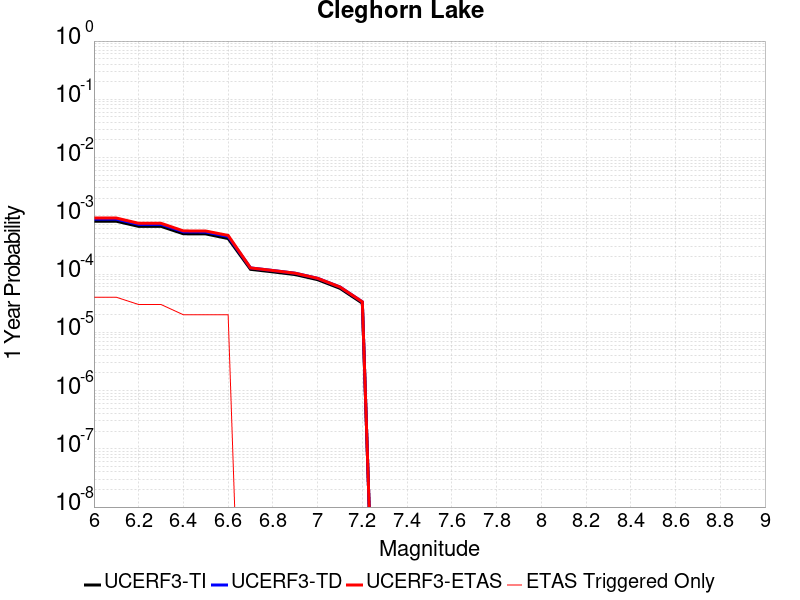 |  |

| Magnitude | 1 wk TI Prob | 1 wk TD Prob | 1 wk ETAS Prob | 1 wk ETAS/TD Gain | 1 wk ETAS Triggered Only | 1 mo TI Prob | 1 mo TD Prob | 1 mo ETAS Prob | 1 mo ETAS/TD Gain | 1 mo ETAS Triggered Only | 1 yr TI Prob | 1 yr TD Prob | 1 yr ETAS Prob | 1 yr ETAS/TD Gain | 1 yr ETAS Triggered Only | 10 yr TI Prob | 10 yr TD Prob | 10 yr ETAS Prob | 10 yr ETAS/TD Gain | 10 yr ETAS Triggered Only |
|-----|-----|-----|-----|-----|-----|-----|-----|-----|-----|-----|-----|-----|-----|-----|-----|-----|-----|-----|-----|-----|
| 6.0 | 1.5467183E-5 | 1.679612E-5 | 1.679612E-5 | 1.0 | 0.0 | 6.6286244E-5 | 7.19817E-5 | 7.19817E-5 | 1.0 | 0.0 | 8.067362E-4 | 8.760797E-4 | 9.160447E-4 | 1.0456179 | 4.0E-5 | 0.008038137 | 0.008731688 | 0.0088010775 | 1.0079467 | 7.0E-5 |
| 6.1 | 1.5467183E-5 | 1.679612E-5 | 1.679612E-5 | 1.0 | 0.0 | 6.6286244E-5 | 7.19817E-5 | 7.19817E-5 | 1.0 | 0.0 | 8.067362E-4 | 8.760797E-4 | 9.160447E-4 | 1.0456179 | 4.0E-5 | 0.008038137 | 0.008731688 | 0.0088010775 | 1.0079467 | 7.0E-5 |
| 6.2 | 1.2624631E-5 | 1.36830695E-5 | 1.36830695E-5 | 1.0 | 0.0 | 5.410444E-5 | 5.8640682E-5 | 5.8640682E-5 | 1.0 | 0.0 | 6.585225E-4 | 7.1376516E-4 | 7.4374373E-4 | 1.0420007 | 3.0E-5 | 0.0065657445 | 0.0071195234 | 0.007169167 | 1.0069729 | 5.0E-5 |
| 6.3 | 1.2624631E-5 | 1.36830695E-5 | 1.36830695E-5 | 1.0 | 0.0 | 5.410444E-5 | 5.8640682E-5 | 5.8640682E-5 | 1.0 | 0.0 | 6.585225E-4 | 7.1376516E-4 | 7.4374373E-4 | 1.0420007 | 3.0E-5 | 0.0065657445 | 0.0071195234 | 0.007169167 | 1.0069729 | 5.0E-5 |
| 6.4 | 9.417684E-6 | 1.01712E-5 | 1.01712E-5 | 1.0 | 0.0 | 4.036088E-5 | 4.3590364E-5 | 4.3590364E-5 | 1.0 | 0.0 | 4.912829E-4 | 5.3062453E-4 | 5.506139E-4 | 1.0376714 | 2.0E-5 | 0.004901982 | 0.0052976124 | 0.0053374004 | 1.0075105 | 4.0E-5 |
| 6.5 | 9.368219E-6 | 1.0118622E-5 | 1.0118622E-5 | 1.0 | 0.0 | 4.014889E-5 | 4.336504E-5 | 4.336504E-5 | 1.0 | 0.0 | 4.8870314E-4 | 5.2788254E-4 | 5.47872E-4 | 1.0378672 | 2.0E-5 | 0.004876298 | 0.0052703223 | 0.0053101117 | 1.0075496 | 4.0E-5 |
| 6.6 | 7.803798E-6 | 8.44275E-6 | 8.44275E-6 | 1.0 | 0.0 | 3.3444423E-5 | 3.6182937E-5 | 3.6182937E-5 | 1.0 | 0.0 | 4.0710976E-4 | 4.4047815E-4 | 4.6046934E-4 | 1.0453852 | 2.0E-5 | 0.0040636472 | 0.004399969 | 0.0044397926 | 1.009051 | 4.0E-5 |
| 6.7 | 2.3108669E-6 | 2.4440203E-6 | 2.4440203E-6 | 1.0 | 0.0 | 9.903678E-6 | 1.0474332E-5 | 1.0474332E-5 | 1.0 | 0.0 | 1.205706E-4 | 1.2751772E-4 | 1.2751772E-4 | 1.0 | 0.0 | 0.001205052 | 0.0012744641 | 0.0012744641 | 1.0 | 0.0 |
| 6.8 | 2.0882828E-6 | 2.2064476E-6 | 2.2064476E-6 | 1.0 | 0.0 | 8.949753E-6 | 9.456171E-6 | 9.456171E-6 | 1.0 | 0.0 | 1.08957785E-4 | 1.15122966E-4 | 1.15122966E-4 | 1.0 | 0.0 | 0.0010890438 | 0.0011506502 | 0.0011506502 | 1.0 | 0.0 |
| 6.9 | 1.876935E-6 | 1.9811969E-6 | 1.9811969E-6 | 1.0 | 0.0 | 8.043982E-6 | 8.490817E-6 | 8.490817E-6 | 1.0 | 0.0 | 9.7931086E-5 | 1.0337095E-4 | 1.0337095E-4 | 1.0 | 0.0 | 9.788794E-4 | 0.0010332447 | 0.0010332447 | 1.0 | 0.0 |
| 7.0 | 1.5357559E-6 | 1.6203991E-6 | 1.6203991E-6 | 1.0 | 0.0 | 6.5817944E-6 | 6.9445496E-6 | 6.9445496E-6 | 1.0 | 0.0 | 8.01304E-5 | 8.454674E-5 | 8.454674E-5 | 1.0 | 0.0 | 8.010151E-4 | 8.451582E-4 | 8.451582E-4 | 1.0 | 0.0 |
| 7.1 | 1.0905424E-6 | 1.1498448E-6 | 1.1498448E-6 | 1.0 | 0.0 | 4.6737446E-6 | 4.9278974E-6 | 4.9278974E-6 | 1.0 | 0.0 | 5.6901354E-5 | 5.99956E-5 | 5.99956E-5 | 1.0 | 0.0 | 5.6886784E-4 | 5.998038E-4 | 5.998038E-4 | 1.0 | 0.0 |
| 7.2 | 6.06668E-7 | 6.387725E-7 | 6.387725E-7 | 1.0 | 0.0 | 2.600003E-6 | 2.737594E-6 | 2.737594E-6 | 1.0 | 0.0 | 3.1654577E-5 | 3.332977E-5 | 3.332977E-5 | 1.0 | 0.0 | 3.1650066E-4 | 3.3325455E-4 | 3.3325455E-4 | 1.0 | 0.0 |

## Mission Ridge-Arroyo Parida-Santa Ana
*[(top)](#table-of-contents)*

| 1 Week | 1 Month | 1 Year | 10 Year |
|-----|-----|-----|-----|
|  |  |  | 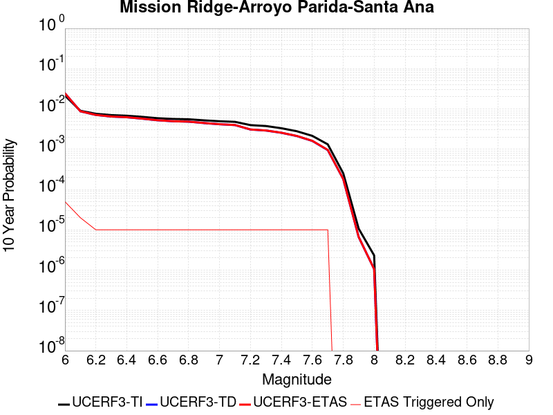 |

| Magnitude | 1 wk TI Prob | 1 wk TD Prob | 1 wk ETAS Prob | 1 wk ETAS/TD Gain | 1 wk ETAS Triggered Only | 1 mo TI Prob | 1 mo TD Prob | 1 mo ETAS Prob | 1 mo ETAS/TD Gain | 1 mo ETAS Triggered Only | 1 yr TI Prob | 1 yr TD Prob | 1 yr ETAS Prob | 1 yr ETAS/TD Gain | 1 yr ETAS Triggered Only | 10 yr TI Prob | 10 yr TD Prob | 10 yr ETAS Prob | 10 yr ETAS/TD Gain | 10 yr ETAS Triggered Only |
|-----|-----|-----|-----|-----|-----|-----|-----|-----|-----|-----|-----|-----|-----|-----|-----|-----|-----|-----|-----|-----|
| 6.0 | 4.169034E-5 | 4.7151516E-5 | 4.7151516E-5 | 1.0 | 0.0 | 1.7866064E-4 | 2.0206712E-4 | 2.0206712E-4 | 1.0 | 0.0 | 0.0021730233 | 0.0024581002 | 0.0024680756 | 1.0040582 | 1.0E-5 | 0.021518968 | 0.024391286 | 0.024440067 | 1.0019999 | 5.0E-5 |
| 6.1 | 1.73813E-5 | 1.6857384E-5 | 1.6857384E-5 | 1.0 | 0.0 | 7.4489166E-5 | 7.224399E-5 | 7.224399E-5 | 1.0 | 0.0 | 9.065282E-4 | 8.792264E-4 | 8.8921766E-4 | 1.0113636 | 1.0E-5 | 0.009028391 | 0.008758621 | 0.008778446 | 1.0022634 | 2.0E-5 |
| 6.2 | 1.4622182E-5 | 1.3675793E-5 | 1.3675793E-5 | 1.0 | 0.0 | 6.2664985E-5 | 5.8609243E-5 | 5.8609243E-5 | 1.0 | 0.0 | 7.6267915E-4 | 7.133378E-4 | 7.133378E-4 | 1.0 | 0.0 | 0.007600669 | 0.007110924 | 0.007120853 | 1.0013963 | 1.0E-5 |
| 6.3 | 1.3552434E-5 | 1.2484522E-5 | 1.2484522E-5 | 1.0 | 0.0 | 5.8080568E-5 | 5.3504016E-5 | 5.3504016E-5 | 1.0 | 0.0 | 7.069015E-4 | 6.5121986E-4 | 6.5121986E-4 | 1.0 | 0.0 | 0.00704657 | 0.0064934785 | 0.0065034134 | 1.00153 | 1.0E-5 |
| 6.4 | 1.30977305E-5 | 1.1981406E-5 | 1.1981406E-5 | 1.0 | 0.0 | 5.613192E-5 | 5.1347888E-5 | 5.1347888E-5 | 1.0 | 0.0 | 6.831918E-4 | 6.249842E-4 | 6.249842E-4 | 1.0 | 0.0 | 0.006810953 | 0.006232611 | 0.0062425486 | 1.0015944 | 1.0E-5 |
| 6.5 | 1.225205E-5 | 1.1050929E-5 | 1.1050929E-5 | 1.0 | 0.0 | 5.2507727E-5 | 4.7360278E-5 | 4.7360278E-5 | 1.0 | 0.0 | 6.3909404E-4 | 5.7646155E-4 | 5.7646155E-4 | 1.0 | 0.0 | 0.006372592 | 0.005749972 | 0.0057599144 | 1.0017291 | 1.0E-5 |
| 6.6 | 1.1352241E-5 | 1.0065536E-5 | 1.0065536E-5 | 1.0 | 0.0 | 4.8651553E-5 | 4.3137312E-5 | 4.3137312E-5 | 1.0 | 0.0 | 5.921717E-4 | 5.2507233E-4 | 5.2507233E-4 | 1.0 | 0.0 | 0.0059059616 | 0.0052385633 | 0.0052485107 | 1.0018989 | 1.0E-5 |
| 6.7 | 1.0864116E-5 | 9.518941E-6 | 9.518941E-6 | 1.0 | 0.0 | 4.6559664E-5 | 4.0794832E-5 | 4.0794832E-5 | 1.0 | 0.0 | 5.667165E-4 | 4.965659E-4 | 4.965659E-4 | 1.0 | 0.0 | 0.005652734 | 0.004954797 | 0.004964748 | 1.0020082 | 1.0E-5 |
| 6.8 | 1.0666365E-5 | 9.301663E-6 | 9.301663E-6 | 1.0 | 0.0 | 4.571219E-5 | 3.9863673E-5 | 3.9863673E-5 | 1.0 | 0.0 | 5.564038E-4 | 4.8523414E-4 | 4.8523414E-4 | 1.0 | 0.0 | 0.005550127 | 0.0048419787 | 0.0048519303 | 1.0020553 | 1.0E-5 |
| 6.9 | 1.0038665E-5 | 8.59381E-6 | 8.59381E-6 | 1.0 | 0.0 | 4.302214E-5 | 3.6830104E-5 | 3.6830104E-5 | 1.0 | 0.0 | 5.236687E-4 | 4.4831607E-4 | 4.4831607E-4 | 1.0 | 0.0 | 0.005224364 | 0.0044743274 | 0.004484283 | 1.0022249 | 1.0E-5 |
| 7.0 | 9.5379955E-6 | 8.026733E-6 | 8.026733E-6 | 1.0 | 0.0 | 4.0876483E-5 | 3.439984E-5 | 3.439984E-5 | 1.0 | 0.0 | 4.975576E-4 | 4.1873928E-4 | 4.1873928E-4 | 1.0 | 0.0 | 0.00496445 | 0.004179702 | 0.0041896603 | 1.0023825 | 1.0E-5 |
| 7.1 | 9.207389E-6 | 7.653964E-6 | 7.653964E-6 | 1.0 | 0.0 | 3.945964E-5 | 3.2802298E-5 | 3.2802298E-5 | 1.0 | 0.0 | 4.803152E-4 | 3.992965E-4 | 3.992965E-4 | 1.0 | 0.0 | 0.004792784 | 0.0039859866 | 0.003995947 | 1.0024987 | 1.0E-5 |
| 7.2 | 7.638091E-6 | 5.932339E-6 | 5.932339E-6 | 1.0 | 0.0 | 3.2734264E-5 | 2.5424062E-5 | 2.5424062E-5 | 1.0 | 0.0 | 3.984668E-4 | 3.094943E-4 | 3.094943E-4 | 1.0 | 0.0 | 0.0039775306 | 0.0030906897 | 0.0031006588 | 1.0032256 | 1.0E-5 |
| 7.3 | 7.2500147E-6 | 5.5973046E-6 | 5.5973046E-6 | 1.0 | 0.0 | 3.1071122E-5 | 2.3988228E-5 | 2.3988228E-5 | 1.0 | 0.0 | 3.7822526E-4 | 2.9201785E-4 | 2.9201785E-4 | 1.0 | 0.0 | 0.0037758215 | 0.0029163968 | 0.0029263676 | 1.0034189 | 1.0E-5 |
| 7.4 | 6.3899715E-6 | 4.919501E-6 | 4.919501E-6 | 1.0 | 0.0 | 2.7385306E-5 | 2.1083406E-5 | 2.1083406E-5 | 1.0 | 0.0 | 3.3336508E-4 | 2.5666042E-4 | 2.5666042E-4 | 1.0 | 0.0 | 0.0033286542 | 0.0025636845 | 0.002573659 | 1.0038906 | 1.0E-5 |
| 7.5 | 5.379025E-6 | 4.0846667E-6 | 4.0846667E-6 | 1.0 | 0.0 | 2.305276E-5 | 1.7505596E-5 | 1.7505596E-5 | 1.0 | 0.0 | 2.806312E-4 | 2.131099E-4 | 2.131099E-4 | 1.0 | 0.0 | 0.0028027708 | 0.0021290667 | 0.0021390454 | 1.004687 | 1.0E-5 |
| 7.6 | 4.1270696E-6 | 3.088875E-6 | 3.088875E-6 | 1.0 | 0.0 | 1.768732E-5 | 1.3237969E-5 | 1.3237969E-5 | 1.0 | 0.0 | 2.1532185E-4 | 1.6116044E-4 | 1.6116044E-4 | 1.0 | 0.0 | 0.0021511333 | 0.0016104437 | 0.0016204276 | 1.0061995 | 1.0E-5 |
| 7.7 | 2.5406805E-6 | 1.8285147E-6 | 1.8285147E-6 | 1.0 | 0.0 | 1.0888585E-5 | 7.836468E-6 | 7.836468E-6 | 1.0 | 0.0 | 1.3256045E-4 | 9.540488E-5 | 9.540488E-5 | 1.0 | 0.0 | 0.0013248142 | 9.5364545E-4 | 9.636359E-4 | 1.0104761 | 1.0E-5 |
| 7.8 | 4.8608285E-7 | 3.510324E-7 | 3.510324E-7 | 1.0 | 0.0 | 2.0832106E-6 | 1.5044238E-6 | 1.5044238E-6 | 1.0 | 0.0 | 2.5362791E-5 | 1.8316206E-5 | 1.8316206E-5 | 1.0 | 0.0 | 2.5359896E-4 | 1.831471E-4 | 1.831471E-4 | 1.0 | 0.0 |
| 7.9 | 2.0472514E-8 | 1.2691886E-8 | 1.2691886E-8 | 1.0 | 0.0 | 8.7739345E-8 | 5.4393798E-8 | 5.4393798E-8 | 1.0 | 0.0 | 1.068226E-6 | 6.622443E-7 | 6.622443E-7 | 1.0 | 0.0 | 1.0682209E-5 | 6.6224243E-6 | 6.6224243E-6 | 1.0 | 0.0 |
| 8.0 | 4.443582E-9 | 2.0335202E-9 | 2.0335202E-9 | 1.0 | 0.0 | 1.9043922E-8 | 8.715086E-9 | 8.715086E-9 | 1.0 | 0.0 | 2.3185973E-7 | 1.0610617E-7 | 1.0610617E-7 | 1.0 | 0.0 | 2.3185949E-6 | 1.0610613E-6 | 1.0610613E-6 | 1.0 | 0.0 |

## San Diego Trough south
*[(top)](#table-of-contents)*

| 1 Week | 1 Month | 1 Year | 10 Year |
|-----|-----|-----|-----|
|  |  |  |  |

| Magnitude | 1 wk TI Prob | 1 wk TD Prob | 1 wk ETAS Prob | 1 wk ETAS/TD Gain | 1 wk ETAS Triggered Only | 1 mo TI Prob | 1 mo TD Prob | 1 mo ETAS Prob | 1 mo ETAS/TD Gain | 1 mo ETAS Triggered Only | 1 yr TI Prob | 1 yr TD Prob | 1 yr ETAS Prob | 1 yr ETAS/TD Gain | 1 yr ETAS Triggered Only | 10 yr TI Prob | 10 yr TD Prob | 10 yr ETAS Prob | 10 yr ETAS/TD Gain | 10 yr ETAS Triggered Only |
|-----|-----|-----|-----|-----|-----|-----|-----|-----|-----|-----|-----|-----|-----|-----|-----|-----|-----|-----|-----|-----|
| 6.0 | 8.279495E-5 | 1.04279236E-4 | 1.04279236E-4 | 1.0 | 0.0 | 3.5478722E-4 | 4.4683943E-4 | 4.5683497E-4 | 1.0223694 | 1.0E-5 | 0.004310982 | 0.0054275123 | 0.0054474035 | 1.003665 | 2.0E-5 | 0.042283054 | 0.053009294 | 0.053056646 | 1.0008932 | 5.0E-5 |
| 6.1 | 4.6961468E-5 | 5.7747715E-5 | 5.7747715E-5 | 1.0 | 0.0 | 2.0124791E-4 | 2.4746772E-4 | 2.4746772E-4 | 1.0 | 0.0 | 0.00244744 | 0.003008853 | 0.003018823 | 1.0033135 | 1.0E-5 | 0.024206603 | 0.029688226 | 0.029707631 | 1.0006536 | 2.0E-5 |
| 6.2 | 3.5079658E-5 | 4.215307E-5 | 4.215307E-5 | 1.0 | 0.0 | 1.5033272E-4 | 1.8064378E-4 | 1.8064378E-4 | 1.0 | 0.0 | 0.0018287642 | 0.0021971618 | 0.0022071397 | 1.0045413 | 1.0E-5 | 0.018137876 | 0.021756878 | 0.02176666 | 1.0004497 | 1.0E-5 |
| 6.3 | 3.5079658E-5 | 4.215307E-5 | 4.215307E-5 | 1.0 | 0.0 | 1.5033272E-4 | 1.8064378E-4 | 1.8064378E-4 | 1.0 | 0.0 | 0.0018287642 | 0.0021971618 | 0.0022071397 | 1.0045413 | 1.0E-5 | 0.018137876 | 0.021756878 | 0.02176666 | 1.0004497 | 1.0E-5 |
| 6.4 | 2.7196904E-5 | 3.2094915E-5 | 3.2094915E-5 | 1.0 | 0.0 | 1.16552954E-4 | 1.3754248E-4 | 1.3754248E-4 | 1.0 | 0.0 | 0.0014181085 | 0.001673306 | 0.0016832892 | 1.0059662 | 1.0E-5 | 0.014090929 | 0.016608594 | 0.016618427 | 1.0005921 | 1.0E-5 |
| 6.5 | 2.5584688E-5 | 3.0108771E-5 | 3.0108771E-5 | 1.0 | 0.0 | 1.0964406E-4 | 1.290313E-4 | 1.290313E-4 | 1.0 | 0.0 | 0.0013340989 | 0.001569835 | 0.0015798194 | 1.00636 | 1.0E-5 | 0.013261181 | 0.015588958 | 0.015598802 | 1.0006315 | 1.0E-5 |
| 6.6 | 2.2034688E-5 | 2.5748534E-5 | 2.5748534E-5 | 1.0 | 0.0 | 9.443096E-5 | 1.1034624E-4 | 1.1034624E-4 | 1.0 | 0.0 | 0.0011490905 | 0.0013426427 | 0.0013526293 | 1.007438 | 1.0E-5 | 0.011431668 | 0.013346296 | 0.013356162 | 1.0007392 | 1.0E-5 |
| 6.7 | 1.9394853E-5 | 2.2546645E-5 | 2.2546645E-5 | 1.0 | 0.0 | 8.311815E-5 | 9.662493E-5 | 9.662493E-5 | 1.0 | 0.0 | 0.0010114936 | 0.0011757788 | 0.0011757788 | 1.0 | 0.0 | 0.01006902 | 0.011696285 | 0.011696285 | 1.0 | 0.0 |
| 6.8 | 1.7615313E-5 | 2.040749E-5 | 2.040749E-5 | 1.0 | 0.0 | 7.549201E-5 | 8.745776E-5 | 8.745776E-5 | 1.0 | 0.0 | 9.1872766E-4 | 0.0010642825 | 0.0010642825 | 1.0 | 0.0 | 0.009149387 | 0.0105924215 | 0.0105924215 | 1.0 | 0.0 |
| 6.9 | 1.5621423E-5 | 1.8029812E-5 | 1.8029812E-5 | 1.0 | 0.0 | 6.6947236E-5 | 7.7268356E-5 | 7.7268356E-5 | 1.0 | 0.0 | 8.147778E-4 | 9.4033976E-4 | 9.4033976E-4 | 1.0 | 0.0 | 0.008117969 | 0.009364054 | 0.009364054 | 1.0 | 0.0 |
| 7.0 | 1.3444376E-5 | 1.5451154E-5 | 1.5451154E-5 | 1.0 | 0.0 | 5.7617483E-5 | 6.6217566E-5 | 6.6217566E-5 | 1.0 | 0.0 | 7.0126704E-4 | 8.0590346E-4 | 8.0590346E-4 | 1.0 | 0.0 | 0.006990582 | 0.008030142 | 0.008030142 | 1.0 | 0.0 |
| 7.1 | 1.2268361E-5 | 1.4075787E-5 | 1.4075787E-5 | 1.0 | 0.0 | 5.2577634E-5 | 6.032342E-5 | 6.032342E-5 | 1.0 | 0.0 | 6.399447E-4 | 7.341928E-4 | 7.341928E-4 | 1.0 | 0.0 | 0.0063810493 | 0.007317977 | 0.007317977 | 1.0 | 0.0 |
| 7.2 | 1.0922655E-5 | 1.251599E-5 | 1.251599E-5 | 1.0 | 0.0 | 4.681054E-5 | 5.3638872E-5 | 5.3638872E-5 | 1.0 | 0.0 | 5.697693E-4 | 6.528601E-4 | 6.528601E-4 | 1.0 | 0.0 | 0.0056831064 | 0.006509702 | 0.006509702 | 1.0 | 0.0 |
| 7.3 | 6.1106753E-6 | 6.930162E-6 | 6.930162E-6 | 1.0 | 0.0 | 2.6188345E-5 | 2.9700357E-5 | 2.9700357E-5 | 1.0 | 0.0 | 3.1879646E-4 | 3.6154225E-4 | 3.6154225E-4 | 1.0 | 0.0 | 0.0031833951 | 0.003609586 | 0.003609586 | 1.0 | 0.0 |
| 7.4 | 4.933187E-6 | 5.590545E-6 | 5.590545E-6 | 1.0 | 0.0 | 2.114206E-5 | 2.395926E-5 | 2.395926E-5 | 1.0 | 0.0 | 2.5737417E-4 | 2.9166535E-4 | 2.9166535E-4 | 1.0 | 0.0 | 0.002570763 | 0.0029128667 | 0.0029128667 | 1.0 | 0.0 |
| 7.5 | 1.7489613E-6 | 1.970012E-6 | 1.970012E-6 | 1.0 | 0.0 | 7.495527E-6 | 8.442882E-6 | 8.442882E-6 | 1.0 | 0.0 | 9.125422E-5 | 1.0278747E-4 | 1.0278747E-4 | 1.0 | 0.0 | 9.1216754E-4 | 0.0010274213 | 0.0010274213 | 1.0 | 0.0 |
| 7.6 | 1.6988751E-7 | 1.7534569E-7 | 1.7534569E-7 | 1.0 | 0.0 | 7.2808916E-7 | 7.5148137E-7 | 7.5148137E-7 | 1.0 | 0.0 | 8.864449E-6 | 9.149249E-6 | 9.149249E-6 | 1.0 | 0.0 | 8.8640954E-5 | 9.1488924E-5 | 9.1488924E-5 | 1.0 | 0.0 |

## San Clemente
*[(top)](#table-of-contents)*

| 1 Week | 1 Month | 1 Year | 10 Year |
|-----|-----|-----|-----|
|  | 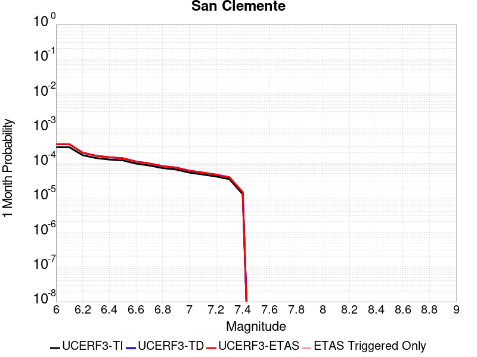 |  |  |

| Magnitude | 1 wk TI Prob | 1 wk TD Prob | 1 wk ETAS Prob | 1 wk ETAS/TD Gain | 1 wk ETAS Triggered Only | 1 mo TI Prob | 1 mo TD Prob | 1 mo ETAS Prob | 1 mo ETAS/TD Gain | 1 mo ETAS Triggered Only | 1 yr TI Prob | 1 yr TD Prob | 1 yr ETAS Prob | 1 yr ETAS/TD Gain | 1 yr ETAS Triggered Only | 10 yr TI Prob | 10 yr TD Prob | 10 yr ETAS Prob | 10 yr ETAS/TD Gain | 10 yr ETAS Triggered Only |
|-----|-----|-----|-----|-----|-----|-----|-----|-----|-----|-----|-----|-----|-----|-----|-----|-----|-----|-----|-----|-----|
| 6.0 | 6.681379E-5 | 8.165889E-5 | 8.165889E-5 | 1.0 | 0.0 | 2.8631336E-4 | 3.4992295E-4 | 3.4992295E-4 | 1.0 | 0.0 | 0.003480294 | 0.004252569 | 0.0042625265 | 1.0023415 | 1.0E-5 | 0.03426291 | 0.04176773 | 0.041815642 | 1.0011472 | 5.0E-5 |
| 6.1 | 6.681379E-5 | 8.165889E-5 | 8.165889E-5 | 1.0 | 0.0 | 2.8631336E-4 | 3.4992295E-4 | 3.4992295E-4 | 1.0 | 0.0 | 0.003480294 | 0.004252569 | 0.0042625265 | 1.0023415 | 1.0E-5 | 0.03426291 | 0.04176773 | 0.041796476 | 1.0006883 | 3.0E-5 |
| 6.2 | 3.9400576E-5 | 4.646316E-5 | 4.646316E-5 | 1.0 | 0.0 | 1.6884868E-4 | 1.9911298E-4 | 1.9911298E-4 | 1.0 | 0.0 | 0.0020537945 | 0.0024215663 | 0.0024215663 | 1.0 | 0.0 | 0.020349167 | 0.02395851 | 0.02395851 | 1.0 | 0.0 |
| 6.3 | 3.2590255E-5 | 3.793738E-5 | 3.793738E-5 | 1.0 | 0.0 | 1.3966505E-4 | 1.6257883E-4 | 1.6257883E-4 | 1.0 | 0.0 | 0.0016990956 | 0.0019776302 | 0.0019776302 | 1.0 | 0.0 | 0.01686163 | 0.019604106 | 0.019604106 | 1.0 | 0.0 |
| 6.4 | 2.9454652E-5 | 3.410493E-5 | 3.410493E-5 | 1.0 | 0.0 | 1.2622811E-4 | 1.4615596E-4 | 1.4615596E-4 | 1.0 | 0.0 | 0.0015357438 | 0.0017780208 | 0.0017780208 | 1.0 | 0.0 | 0.015251739 | 0.01764113 | 0.01764113 | 1.0 | 0.0 |
| 6.5 | 2.790836E-5 | 3.225413E-5 | 3.225413E-5 | 1.0 | 0.0 | 1.1960178E-4 | 1.382248E-4 | 1.382248E-4 | 1.0 | 0.0 | 0.001455179 | 0.0016816128 | 0.0016816128 | 1.0 | 0.0 | 0.014456868 | 0.016691903 | 0.016691903 | 1.0 | 0.0 |
| 6.6 | 2.2492153E-5 | 2.576768E-5 | 2.576768E-5 | 1.0 | 0.0 | 9.639138E-5 | 1.1042832E-4 | 1.1042832E-4 | 1.0 | 0.0 | 0.0011729331 | 0.0013436505 | 0.0013436505 | 1.0 | 0.0 | 0.011667615 | 0.013356981 | 0.013356981 | 1.0 | 0.0 |
| 6.7 | 1.9862755E-5 | 2.2670674E-5 | 2.2670674E-5 | 1.0 | 0.0 | 8.512331E-5 | 9.715648E-5 | 9.715648E-5 | 1.0 | 0.0 | 0.0010358836 | 0.0011822495 | 0.0011822495 | 1.0 | 0.0 | 0.010310682 | 0.011760893 | 0.011760893 | 1.0 | 0.0 |
| 6.8 | 1.6697575E-5 | 1.8981149E-5 | 1.8981149E-5 | 1.0 | 0.0 | 7.155907E-5 | 8.13453E-5 | 8.13453E-5 | 1.0 | 0.0 | 8.7088346E-4 | 9.899384E-4 | 9.899384E-4 | 1.0 | 0.0 | 0.008674784 | 0.009856314 | 0.009856314 | 1.0 | 0.0 |
| 6.9 | 1.5218415E-5 | 1.7272489E-5 | 1.7272489E-5 | 1.0 | 0.0 | 6.522015E-5 | 7.40229E-5 | 7.40229E-5 | 1.0 | 0.0 | 7.93766E-4 | 9.00865E-4 | 9.00865E-4 | 1.0 | 0.0 | 0.007909367 | 0.008973078 | 0.008973078 | 1.0 | 0.0 |
| 7.0 | 1.2392958E-5 | 1.403548E-5 | 1.403548E-5 | 1.0 | 0.0 | 5.3111595E-5 | 6.015071E-5 | 6.015071E-5 | 1.0 | 0.0 | 6.4644177E-4 | 7.3209644E-4 | 7.3209644E-4 | 1.0 | 0.0 | 0.0064456454 | 0.007297633 | 0.007297633 | 1.0 | 0.0 |
| 7.1 | 1.0934128E-5 | 1.2377302E-5 | 1.2377302E-5 | 1.0 | 0.0 | 4.6859706E-5 | 5.304454E-5 | 5.304454E-5 | 1.0 | 0.0 | 5.7036756E-4 | 6.4563326E-4 | 6.4563326E-4 | 1.0 | 0.0 | 0.0056890585 | 0.006438322 | 0.006438322 | 1.0 | 0.0 |
| 7.2 | 9.5798805E-6 | 1.0846835E-5 | 1.0846835E-5 | 1.0 | 0.0 | 4.1055984E-5 | 4.648565E-5 | 4.648565E-5 | 1.0 | 0.0 | 4.9974193E-4 | 5.65823E-4 | 5.65823E-4 | 1.0 | 0.0 | 0.0049861963 | 0.0056445473 | 0.0056445473 | 1.0 | 0.0 |
| 7.3 | 8.0167365E-6 | 9.085522E-6 | 9.085522E-6 | 1.0 | 0.0 | 3.4356988E-5 | 3.8937407E-5 | 3.8937407E-5 | 1.0 | 0.0 | 4.1821605E-4 | 4.7396688E-4 | 4.7396688E-4 | 1.0 | 0.0 | 0.0041742986 | 0.0047302633 | 0.0047302633 | 1.0 | 0.0 |
| 7.4 | 2.9581017E-6 | 3.3629888E-6 | 3.3629888E-6 | 1.0 | 0.0 | 1.2677518E-5 | 1.4412758E-5 | 1.4412758E-5 | 1.0 | 0.0 | 1.5433785E-4 | 1.7546625E-4 | 1.7546625E-4 | 1.0 | 0.0 | 0.001542307 | 0.0017537723 | 0.0017537723 | 1.0 | 0.0 |

## Pinto Mtn
*[(top)](#table-of-contents)*

| 1 Week | 1 Month | 1 Year | 10 Year |
|-----|-----|-----|-----|
|  |  |  |  |

| Magnitude | 1 wk TI Prob | 1 wk TD Prob | 1 wk ETAS Prob | 1 wk ETAS/TD Gain | 1 wk ETAS Triggered Only | 1 mo TI Prob | 1 mo TD Prob | 1 mo ETAS Prob | 1 mo ETAS/TD Gain | 1 mo ETAS Triggered Only | 1 yr TI Prob | 1 yr TD Prob | 1 yr ETAS Prob | 1 yr ETAS/TD Gain | 1 yr ETAS Triggered Only | 10 yr TI Prob | 10 yr TD Prob | 10 yr ETAS Prob | 10 yr ETAS/TD Gain | 10 yr ETAS Triggered Only |
|-----|-----|-----|-----|-----|-----|-----|-----|-----|-----|-----|-----|-----|-----|-----|-----|-----|-----|-----|-----|-----|
| 6.0 | 4.4194956E-5 | 4.7869722E-5 | 4.7869722E-5 | 1.0 | 0.0 | 1.893932E-4 | 2.0514075E-4 | 2.0514075E-4 | 1.0 | 0.0 | 0.0023034236 | 0.0024948926 | 0.0025148427 | 1.0079963 | 2.0E-5 | 0.022796938 | 0.024686344 | 0.02473511 | 1.0019754 | 5.0E-5 |
| 6.1 | 4.4194956E-5 | 4.7869722E-5 | 4.7869722E-5 | 1.0 | 0.0 | 1.893932E-4 | 2.0514075E-4 | 2.0514075E-4 | 1.0 | 0.0 | 0.0023034236 | 0.0024948926 | 0.0025148427 | 1.0079963 | 2.0E-5 | 0.022796938 | 0.024686344 | 0.02473511 | 1.0019754 | 5.0E-5 |
| 6.2 | 4.4194956E-5 | 4.7869722E-5 | 4.7869722E-5 | 1.0 | 0.0 | 1.893932E-4 | 2.0514075E-4 | 2.0514075E-4 | 1.0 | 0.0 | 0.0023034236 | 0.0024948926 | 0.0025148427 | 1.0079963 | 2.0E-5 | 0.022796938 | 0.024686344 | 0.02473511 | 1.0019754 | 5.0E-5 |
| 6.3 | 4.4194956E-5 | 4.7869722E-5 | 4.7869722E-5 | 1.0 | 0.0 | 1.893932E-4 | 2.0514075E-4 | 2.0514075E-4 | 1.0 | 0.0 | 0.0023034236 | 0.0024948926 | 0.0025148427 | 1.0079963 | 2.0E-5 | 0.022796938 | 0.024686344 | 0.02473511 | 1.0019754 | 5.0E-5 |
| 6.4 | 3.729929E-5 | 3.9617134E-5 | 3.9617134E-5 | 1.0 | 0.0 | 1.5984432E-4 | 1.697772E-4 | 1.697772E-4 | 1.0 | 0.0 | 0.0019443673 | 0.0020651715 | 0.0020851302 | 1.0096644 | 2.0E-5 | 0.019274427 | 0.020469824 | 0.0205188 | 1.0023926 | 5.0E-5 |
| 6.5 | 3.729929E-5 | 3.9617134E-5 | 3.9617134E-5 | 1.0 | 0.0 | 1.5984432E-4 | 1.697772E-4 | 1.697772E-4 | 1.0 | 0.0 | 0.0019443673 | 0.0020651715 | 0.0020851302 | 1.0096644 | 2.0E-5 | 0.019274427 | 0.020469824 | 0.0205188 | 1.0023926 | 5.0E-5 |
| 6.6 | 3.0204548E-5 | 3.1217198E-5 | 3.1217198E-5 | 1.0 | 0.0 | 1.2944164E-4 | 1.3378132E-4 | 1.3378132E-4 | 1.0 | 0.0 | 0.0015748127 | 0.0016276054 | 0.0016475728 | 1.012268 | 2.0E-5 | 0.015636992 | 0.01616072 | 0.016200073 | 1.0024351 | 4.0E-5 |
| 6.7 | 2.9857754E-5 | 3.0826515E-5 | 3.0826515E-5 | 1.0 | 0.0 | 1.2795553E-4 | 1.3210715E-4 | 1.3210715E-4 | 1.0 | 0.0 | 0.0015567453 | 0.0016072524 | 0.0016272203 | 1.0124236 | 2.0E-5 | 0.015458848 | 0.015960127 | 0.015999489 | 1.0024662 | 4.0E-5 |
| 6.8 | 2.4819734E-5 | 2.5020017E-5 | 2.5020017E-5 | 1.0 | 0.0 | 1.0636595E-4 | 1.0722436E-4 | 1.0722436E-4 | 1.0 | 0.0 | 0.0012942362 | 0.0013046965 | 0.0013246704 | 1.0153092 | 2.0E-5 | 0.012867244 | 0.012972736 | 0.013002347 | 1.0022825 | 3.0E-5 |
| 6.9 | 2.331124E-5 | 2.3348057E-5 | 2.3348057E-5 | 1.0 | 0.0 | 9.990149E-5 | 1.0005938E-4 | 1.0005938E-4 | 1.0 | 0.0 | 0.001215622 | 0.0012175625 | 0.0012375381 | 1.0164063 | 2.0E-5 | 0.012089936 | 0.012111111 | 0.012140747 | 1.002447 | 3.0E-5 |
| 7.0 | 2.1818534E-5 | 2.1770986E-5 | 2.1770986E-5 | 1.0 | 0.0 | 9.3504656E-5 | 9.3301E-5 | 9.3301E-5 | 1.0 | 0.0 | 0.0011378246 | 0.0011353676 | 0.0011553449 | 1.0175954 | 2.0E-5 | 0.011320163 | 0.011297774 | 0.011327435 | 1.0026253 | 3.0E-5 |
| 7.1 | 2.066081E-5 | 2.0550438E-5 | 2.0550438E-5 | 1.0 | 0.0 | 8.854332E-5 | 8.807045E-5 | 8.807045E-5 | 1.0 | 0.0 | 0.0010774818 | 0.0010717498 | 0.0010917283 | 1.0186411 | 2.0E-5 | 0.010722724 | 0.010667863 | 0.010697543 | 1.0027822 | 3.0E-5 |
| 7.2 | 1.8990233E-5 | 1.906353E-5 | 1.906353E-5 | 1.0 | 0.0 | 8.138417E-5 | 8.1698396E-5 | 8.1698396E-5 | 1.0 | 0.0 | 9.904018E-4 | 9.942434E-4 | 0.0010142236 | 1.0200958 | 2.0E-5 | 0.009859995 | 0.009899952 | 0.009929655 | 1.0030003 | 3.0E-5 |
| 7.3 | 1.3335872E-5 | 1.49154175E-5 | 1.49154175E-5 | 1.0 | 0.0 | 5.7152483E-5 | 6.3921725E-5 | 6.3921725E-5 | 1.0 | 0.0 | 6.956093E-4 | 7.779819E-4 | 7.879741E-4 | 1.0128437 | 1.0E-5 | 0.006934359 | 0.0077538835 | 0.0077737286 | 1.0025593 | 2.0E-5 |
| 7.4 | 9.414066E-6 | 1.18692105E-5 | 1.18692105E-5 | 1.0 | 0.0 | 4.0345374E-5 | 5.0867107E-5 | 5.0867107E-5 | 1.0 | 0.0 | 4.910942E-4 | 6.191405E-4 | 6.291343E-4 | 1.0161414 | 1.0E-5 | 0.0049001034 | 0.006175105 | 0.0061949813 | 1.0032188 | 2.0E-5 |
| 7.5 | 7.2101157E-6 | 9.166289E-6 | 9.166289E-6 | 1.0 | 0.0 | 3.090013E-5 | 3.9283546E-5 | 3.9283546E-5 | 1.0 | 0.0 | 3.7614413E-4 | 4.7818E-4 | 4.8817522E-4 | 1.0209026 | 1.0E-5 | 0.0037550807 | 0.004772287 | 0.0047921916 | 1.0041709 | 2.0E-5 |
| 7.6 | 3.296375E-6 | 4.5533634E-6 | 4.5533634E-6 | 1.0 | 0.0 | 1.4127245E-5 | 1.9514277E-5 | 1.9514277E-5 | 1.0 | 0.0 | 1.7198564E-4 | 2.3756182E-4 | 2.3756182E-4 | 1.0 | 0.0 | 0.0017185259 | 0.0023732164 | 0.0023732164 | 1.0 | 0.0 |
| 7.7 | 2.5741092E-6 | 3.5918313E-6 | 3.5918313E-6 | 1.0 | 0.0 | 1.103185E-5 | 1.539348E-5 | 1.539348E-5 | 1.0 | 0.0 | 1.3430449E-4 | 1.8740082E-4 | 1.8740082E-4 | 1.0 | 0.0 | 0.0013422335 | 0.0018725583 | 0.0018725583 | 1.0 | 0.0 |

## Palos Verdes
*[(top)](#table-of-contents)*

| 1 Week | 1 Month | 1 Year | 10 Year |
|-----|-----|-----|-----|
|  |  |  |  |

| Magnitude | 1 wk TI Prob | 1 wk TD Prob | 1 wk ETAS Prob | 1 wk ETAS/TD Gain | 1 wk ETAS Triggered Only | 1 mo TI Prob | 1 mo TD Prob | 1 mo ETAS Prob | 1 mo ETAS/TD Gain | 1 mo ETAS Triggered Only | 1 yr TI Prob | 1 yr TD Prob | 1 yr ETAS Prob | 1 yr ETAS/TD Gain | 1 yr ETAS Triggered Only | 10 yr TI Prob | 10 yr TD Prob | 10 yr ETAS Prob | 10 yr ETAS/TD Gain | 10 yr ETAS Triggered Only |
|-----|-----|-----|-----|-----|-----|-----|-----|-----|-----|-----|-----|-----|-----|-----|-----|-----|-----|-----|-----|-----|
| 6.0 | 6.126063E-5 | 7.625118E-5 | 7.625118E-5 | 1.0 | 0.0 | 2.6251914E-4 | 3.267532E-4 | 3.267532E-4 | 1.0 | 0.0 | 0.0031914865 | 0.003971426 | 0.003991347 | 1.005016 | 2.0E-5 | 0.031460393 | 0.039061166 | 0.039118823 | 1.001476 | 6.0E-5 |
| 6.1 | 6.126063E-5 | 7.625118E-5 | 7.625118E-5 | 1.0 | 0.0 | 2.6251914E-4 | 3.267532E-4 | 3.267532E-4 | 1.0 | 0.0 | 0.0031914865 | 0.003971426 | 0.003991347 | 1.005016 | 2.0E-5 | 0.031460393 | 0.039061166 | 0.039118823 | 1.001476 | 6.0E-5 |
| 6.2 | 6.126063E-5 | 7.625118E-5 | 7.625118E-5 | 1.0 | 0.0 | 2.6251914E-4 | 3.267532E-4 | 3.267532E-4 | 1.0 | 0.0 | 0.0031914865 | 0.003971426 | 0.003991347 | 1.005016 | 2.0E-5 | 0.031460393 | 0.039061166 | 0.039118823 | 1.001476 | 6.0E-5 |
| 6.3 | 4.0838047E-5 | 4.9764007E-5 | 4.9764007E-5 | 1.0 | 0.0 | 1.7500846E-4 | 2.1325816E-4 | 2.1325816E-4 | 1.0 | 0.0 | 0.0021286458 | 0.0025935178 | 0.002613466 | 1.0076915 | 2.0E-5 | 0.021083709 | 0.025654016 | 0.025712475 | 1.0022788 | 6.0E-5 |
| 6.4 | 4.0838047E-5 | 4.9764007E-5 | 4.9764007E-5 | 1.0 | 0.0 | 1.7500846E-4 | 2.1325816E-4 | 2.1325816E-4 | 1.0 | 0.0 | 0.0021286458 | 0.0025935178 | 0.002613466 | 1.0076915 | 2.0E-5 | 0.021083709 | 0.025654016 | 0.025712475 | 1.0022788 | 6.0E-5 |
| 6.5 | 3.0512005E-5 | 3.657133E-5 | 3.657133E-5 | 1.0 | 0.0 | 1.3075917E-4 | 1.5672554E-4 | 1.5672554E-4 | 1.0 | 0.0 | 0.0015908304 | 0.0019065797 | 0.0019165606 | 1.005235 | 1.0E-5 | 0.015794903 | 0.018914111 | 0.018963166 | 1.0025935 | 5.0E-5 |
| 6.6 | 2.9255087E-5 | 3.5163906E-5 | 3.5163906E-5 | 1.0 | 0.0 | 1.2537291E-4 | 1.5069441E-4 | 1.5069441E-4 | 1.0 | 0.0 | 0.0015253464 | 0.0018332743 | 0.001843256 | 1.0054448 | 1.0E-5 | 0.015149189 | 0.018193072 | 0.018242162 | 1.0026983 | 5.0E-5 |
| 6.7 | 2.287198E-5 | 2.7255252E-5 | 2.7255252E-5 | 1.0 | 0.0 | 9.801909E-5 | 1.1680351E-4 | 1.1680351E-4 | 1.0 | 0.0 | 0.001192729 | 0.0014212468 | 0.0014312326 | 1.0070261 | 1.0E-5 | 0.011863477 | 0.01413081 | 0.014160386 | 1.0020931 | 3.0E-5 |
| 6.8 | 2.1325764E-5 | 2.5438425E-5 | 2.5438425E-5 | 1.0 | 0.0 | 9.139293E-5 | 1.09017776E-4 | 1.09017776E-4 | 1.0 | 0.0 | 0.001112141 | 0.0013265735 | 0.0013365602 | 1.0075282 | 1.0E-5 | 0.011065915 | 0.013195587 | 0.013225192 | 1.0022435 | 3.0E-5 |
| 6.9 | 1.9009392E-5 | 2.2619284E-5 | 2.2619284E-5 | 1.0 | 0.0 | 8.1466285E-5 | 9.693668E-5 | 9.693668E-5 | 1.0 | 0.0 | 9.914007E-4 | 0.0011796525 | 0.0011896407 | 1.0084671 | 1.0E-5 | 0.009869894 | 0.011742596 | 0.011772243 | 1.0025249 | 3.0E-5 |
| 7.0 | 1.7098473E-5 | 2.0324482E-5 | 2.0324482E-5 | 1.0 | 0.0 | 7.3277115E-5 | 8.710249E-5 | 8.710249E-5 | 1.0 | 0.0 | 8.917837E-4 | 0.0010600422 | 0.0010700317 | 1.0094236 | 1.0E-5 | 0.008882134 | 0.010558298 | 0.010587981 | 1.0028113 | 3.0E-5 |
| 7.1 | 1.5982785E-5 | 1.8999555E-5 | 1.8999555E-5 | 1.0 | 0.0 | 6.849585E-5 | 8.14246E-5 | 8.14246E-5 | 1.0 | 0.0 | 8.336179E-4 | 9.909783E-4 | 0.0010009685 | 1.010081 | 1.0E-5 | 0.008304977 | 0.009873961 | 0.009903666 | 1.0030082 | 3.0E-5 |
| 7.2 | 1.4468002E-5 | 1.7201583E-5 | 1.7201583E-5 | 1.0 | 0.0 | 6.200425E-5 | 7.3719464E-5 | 7.3719464E-5 | 1.0 | 0.0 | 7.546402E-4 | 8.972489E-4 | 9.072399E-4 | 1.0111352 | 1.0E-5 | 0.007520827 | 0.008944537 | 0.008974268 | 1.003324 | 3.0E-5 |
| 7.3 | 5.288233E-6 | 6.205136E-6 | 6.205136E-6 | 1.0 | 0.0 | 2.2663658E-5 | 2.6593365E-5 | 2.6593365E-5 | 1.0 | 0.0 | 2.7589512E-4 | 3.2376102E-4 | 3.3375778E-4 | 1.030877 | 1.0E-5 | 0.0027555283 | 0.003236318 | 0.0032462857 | 1.0030799 | 1.0E-5 |
| 7.4 | 8.279556E-7 | 8.40852E-7 | 8.40852E-7 | 1.0 | 0.0 | 3.5483763E-6 | 3.603647E-6 | 3.603647E-6 | 1.0 | 0.0 | 4.3200624E-5 | 4.387359E-5 | 4.387359E-5 | 1.0 | 0.0 | 4.3192226E-4 | 4.386565E-4 | 4.386565E-4 | 1.0 | 0.0 |
| 7.5 | 6.559831E-7 | 6.667374E-7 | 6.667374E-7 | 1.0 | 0.0 | 2.8113532E-6 | 2.8574432E-6 | 2.8574432E-6 | 1.0 | 0.0 | 3.4227687E-5 | 3.478888E-5 | 3.478888E-5 | 1.0 | 0.0 | 3.4222414E-4 | 3.4784098E-4 | 3.4784098E-4 | 1.0 | 0.0 |
| 7.6 | 3.5018968E-7 | 3.562084E-7 | 3.562084E-7 | 1.0 | 0.0 | 1.500812E-6 | 1.5266068E-6 | 1.5266068E-6 | 1.0 | 0.0 | 1.8272232E-5 | 1.8586326E-5 | 1.8586326E-5 | 1.0 | 0.0 | 1.8270731E-4 | 1.8585232E-4 | 1.8585232E-4 | 1.0 | 0.0 |
| 7.7 | 1.1986104E-7 | 1.2198663E-7 | 1.2198663E-7 | 1.0 | 0.0 | 5.1369005E-7 | 5.227997E-7 | 5.227997E-7 | 1.0 | 0.0 | 6.2541585E-6 | 6.3650687E-6 | 6.3650687E-6 | 1.0 | 0.0 | 6.2539824E-5 | 6.3648906E-5 | 6.3648906E-5 | 1.0 | 0.0 |
| 7.8 | 3.0445005E-8 | 3.102837E-8 | 3.102837E-8 | 1.0 | 0.0 | 1.3047858E-7 | 1.3297873E-7 | 1.3297873E-7 | 1.0 | 0.0 | 1.5885756E-6 | 1.619015E-6 | 1.619015E-6 | 1.0 | 0.0 | 1.5885644E-5 | 1.6190053E-5 | 1.6190053E-5 | 1.0 | 0.0 |

## Santa Cruz Island
*[(top)](#table-of-contents)*

| 1 Week | 1 Month | 1 Year | 10 Year |
|-----|-----|-----|-----|
|  |  |  | 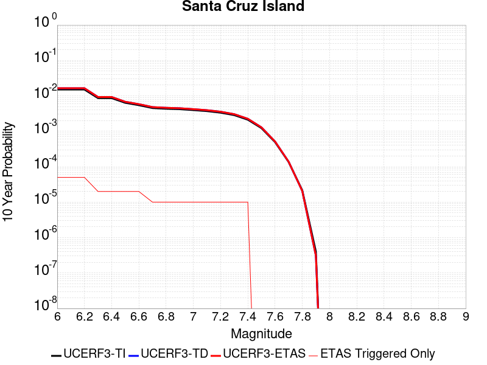 |

| Magnitude | 1 wk TI Prob | 1 wk TD Prob | 1 wk ETAS Prob | 1 wk ETAS/TD Gain | 1 wk ETAS Triggered Only | 1 mo TI Prob | 1 mo TD Prob | 1 mo ETAS Prob | 1 mo ETAS/TD Gain | 1 mo ETAS Triggered Only | 1 yr TI Prob | 1 yr TD Prob | 1 yr ETAS Prob | 1 yr ETAS/TD Gain | 1 yr ETAS Triggered Only | 10 yr TI Prob | 10 yr TD Prob | 10 yr ETAS Prob | 10 yr ETAS/TD Gain | 10 yr ETAS Triggered Only |
|-----|-----|-----|-----|-----|-----|-----|-----|-----|-----|-----|-----|-----|-----|-----|-----|-----|-----|-----|-----|-----|
| 6.0 | 2.9164563E-5 | 3.160327E-5 | 3.160327E-5 | 1.0 | 0.0 | 1.2498499E-4 | 1.3543632E-4 | 1.4543497E-4 | 1.0738255 | 1.0E-5 | 0.0015206301 | 0.0016478263 | 0.0016777769 | 1.0181758 | 3.0E-5 | 0.015102667 | 0.016369814 | 0.016418995 | 1.0030044 | 5.0E-5 |
| 6.1 | 2.9164563E-5 | 3.160327E-5 | 3.160327E-5 | 1.0 | 0.0 | 1.2498499E-4 | 1.3543632E-4 | 1.4543497E-4 | 1.0738255 | 1.0E-5 | 0.0015206301 | 0.0016478263 | 0.0016777769 | 1.0181758 | 3.0E-5 | 0.015102667 | 0.016369814 | 0.016418995 | 1.0030044 | 5.0E-5 |
| 6.2 | 2.9164563E-5 | 3.160327E-5 | 3.160327E-5 | 1.0 | 0.0 | 1.2498499E-4 | 1.3543632E-4 | 1.4543497E-4 | 1.0738255 | 1.0E-5 | 0.0015206301 | 0.0016478263 | 0.0016777769 | 1.0181758 | 3.0E-5 | 0.015102667 | 0.016369814 | 0.016418995 | 1.0030044 | 5.0E-5 |
| 6.3 | 1.6635553E-5 | 1.7806033E-5 | 1.7806033E-5 | 1.0 | 0.0 | 7.1293274E-5 | 7.6309436E-5 | 8.6308675E-5 | 1.1310354 | 1.0E-5 | 8.6765E-4 | 9.2868967E-4 | 9.386804E-4 | 1.0107578 | 1.0E-5 | 0.008642701 | 0.009249959 | 0.009269774 | 1.0021422 | 2.0E-5 |
| 6.4 | 1.6635553E-5 | 1.7806033E-5 | 1.7806033E-5 | 1.0 | 0.0 | 7.1293274E-5 | 7.6309436E-5 | 8.6308675E-5 | 1.1310354 | 1.0E-5 | 8.6765E-4 | 9.2868967E-4 | 9.386804E-4 | 1.0107578 | 1.0E-5 | 0.008642701 | 0.009249959 | 0.009269774 | 1.0021422 | 2.0E-5 |
| 6.5 | 1.2238748E-5 | 1.3044146E-5 | 1.3044146E-5 | 1.0 | 0.0 | 5.2450723E-5 | 5.5902303E-5 | 6.5901746E-5 | 1.1788735 | 1.0E-5 | 6.3840044E-4 | 6.804017E-4 | 6.903949E-4 | 1.0146872 | 1.0E-5 | 0.0063656955 | 0.0067835837 | 0.0068034483 | 1.0029283 | 2.0E-5 |
| 6.6 | 1.0489767E-5 | 1.1157589E-5 | 1.1157589E-5 | 1.0 | 0.0 | 4.495537E-5 | 4.7817375E-5 | 5.78169E-5 | 1.209119 | 1.0E-5 | 5.4719415E-4 | 5.8202323E-4 | 5.9201743E-4 | 1.0171715 | 1.0E-5 | 0.005458487 | 0.0058052302 | 0.0058251144 | 1.0034251 | 2.0E-5 |
| 6.7 | 8.699222E-6 | 9.237551E-6 | 9.237551E-6 | 1.0 | 0.0 | 3.7281847E-5 | 3.9588907E-5 | 3.9588907E-5 | 1.0 | 0.0 | 4.5381195E-4 | 4.818889E-4 | 4.818889E-4 | 1.0 | 0.0 | 0.0045288634 | 0.0048085074 | 0.0048184595 | 1.0020696 | 1.0E-5 |
| 6.8 | 8.307732E-6 | 8.817633E-6 | 8.817633E-6 | 1.0 | 0.0 | 3.560408E-5 | 3.7789312E-5 | 3.7789312E-5 | 1.0 | 0.0 | 4.3339343E-4 | 4.5998816E-4 | 4.5998816E-4 | 1.0 | 0.0 | 0.004325492 | 0.004590414 | 0.004600368 | 1.0021684 | 1.0E-5 |
| 6.9 | 8.073121E-6 | 8.565643E-6 | 8.565643E-6 | 1.0 | 0.0 | 3.459863E-5 | 3.6709385E-5 | 3.6709385E-5 | 1.0 | 0.0 | 4.2115687E-4 | 4.4684552E-4 | 4.4684552E-4 | 1.0 | 0.0 | 0.004203596 | 0.0044595217 | 0.004469477 | 1.0022324 | 1.0E-5 |
| 7.0 | 7.617019E-6 | 8.075319E-6 | 8.075319E-6 | 1.0 | 0.0 | 3.264396E-5 | 3.4608052E-5 | 3.4608052E-5 | 1.0 | 0.0 | 3.9736772E-4 | 4.2127198E-4 | 4.2127198E-4 | 1.0 | 0.0 | 0.003966579 | 0.0042047813 | 0.0042147394 | 1.0023682 | 1.0E-5 |
| 7.1 | 7.1224836E-6 | 7.5463936E-6 | 7.5463936E-6 | 1.0 | 0.0 | 3.052457E-5 | 3.234129E-5 | 3.234129E-5 | 1.0 | 0.0 | 3.715733E-4 | 3.936844E-4 | 3.936844E-4 | 1.0 | 0.0 | 0.003709526 | 0.0039299126 | 0.0039398735 | 1.0025346 | 1.0E-5 |
| 7.2 | 6.441115E-6 | 6.827937E-6 | 6.827937E-6 | 1.0 | 0.0 | 2.7604487E-5 | 2.926226E-5 | 2.926226E-5 | 1.0 | 0.0 | 3.360328E-4 | 3.5621002E-4 | 3.5621002E-4 | 1.0 | 0.0 | 0.0033552512 | 0.003556419 | 0.0035663834 | 1.0028018 | 1.0E-5 |
| 7.3 | 5.494274E-6 | 5.8204623E-6 | 5.8204623E-6 | 1.0 | 0.0 | 2.3546674E-5 | 2.49446E-5 | 2.49446E-5 | 1.0 | 0.0 | 2.8664304E-4 | 3.036584E-4 | 3.036584E-4 | 1.0 | 0.0 | 0.002862736 | 0.0030324578 | 0.0030424276 | 1.0032877 | 1.0E-5 |
| 7.4 | 4.0802624E-6 | 4.3125915E-6 | 4.3125915E-6 | 1.0 | 0.0 | 1.7486722E-5 | 1.8482404E-5 | 1.8482404E-5 | 1.0 | 0.0 | 2.1288003E-4 | 2.2500011E-4 | 2.2500011E-4 | 1.0 | 0.0 | 0.0021267622 | 0.002247732 | 0.0022577096 | 1.0044389 | 1.0E-5 |
| 7.5 | 2.3584746E-6 | 2.4754813E-6 | 2.4754813E-6 | 1.0 | 0.0 | 1.0107709E-5 | 1.0609163E-5 | 1.0609163E-5 | 1.0 | 0.0 | 1.2305441E-4 | 1.2915896E-4 | 1.2915896E-4 | 1.0 | 0.0 | 0.0012298629 | 0.0012908439 | 0.0012908439 | 1.0 | 0.0 |
| 7.6 | 9.4981914E-7 | 9.861508E-7 | 9.861508E-7 | 1.0 | 0.0 | 4.0706473E-6 | 4.2263537E-6 | 4.2263537E-6 | 1.0 | 0.0 | 4.9559E-5 | 5.1454655E-5 | 5.1454655E-5 | 1.0 | 0.0 | 4.954795E-4 | 5.144287E-4 | 5.144287E-4 | 1.0 | 0.0 |
| 7.7 | 2.6013532E-7 | 2.641776E-7 | 2.641776E-7 | 1.0 | 0.0 | 1.1148652E-6 | 1.1321893E-6 | 1.1321893E-6 | 1.0 | 0.0 | 1.3573399E-5 | 1.3784318E-5 | 1.3784318E-5 | 1.0 | 0.0 | 1.357257E-4 | 1.378347E-4 | 1.378347E-4 | 1.0 | 0.0 |
| 7.8 | 4.1522263E-8 | 3.965808E-8 | 3.965808E-8 | 1.0 | 0.0 | 1.7795254E-7 | 1.6996319E-7 | 1.6996319E-7 | 1.0 | 0.0 | 2.16657E-6 | 2.0693E-6 | 2.0693E-6 | 1.0 | 0.0 | 2.1665488E-5 | 2.0692829E-5 | 2.0692829E-5 | 1.0 | 0.0 |
| 7.9 | 7.7242046E-10 | 5.947136E-10 | 5.947136E-10 | 1.0 | 0.0 | 3.3103735E-9 | 2.5487725E-9 | 2.5487725E-9 | 1.0 | 0.0 | 4.0303796E-8 | 3.1031306E-8 | 3.1031306E-8 | 1.0 | 0.0 | 4.030379E-7 | 3.1031303E-7 | 3.1031303E-7 | 1.0 | 0.0 |

## Lost Hills
*[(top)](#table-of-contents)*

| 1 Week | 1 Month | 1 Year | 10 Year |
|-----|-----|-----|-----|
|  |  |  | 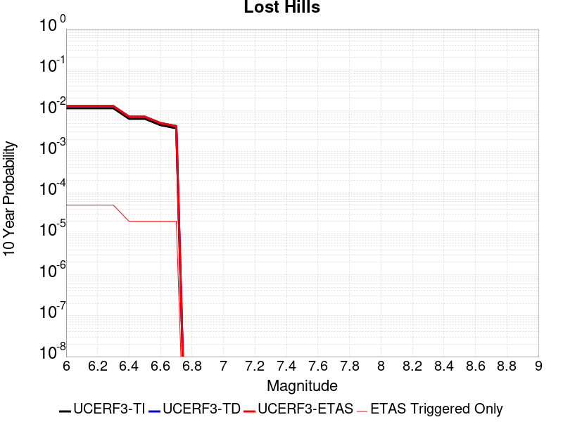 |

| Magnitude | 1 wk TI Prob | 1 wk TD Prob | 1 wk ETAS Prob | 1 wk ETAS/TD Gain | 1 wk ETAS Triggered Only | 1 mo TI Prob | 1 mo TD Prob | 1 mo ETAS Prob | 1 mo ETAS/TD Gain | 1 mo ETAS Triggered Only | 1 yr TI Prob | 1 yr TD Prob | 1 yr ETAS Prob | 1 yr ETAS/TD Gain | 1 yr ETAS Triggered Only | 10 yr TI Prob | 10 yr TD Prob | 10 yr ETAS Prob | 10 yr ETAS/TD Gain | 10 yr ETAS Triggered Only |
|-----|-----|-----|-----|-----|-----|-----|-----|-----|-----|-----|-----|-----|-----|-----|-----|-----|-----|-----|-----|-----|
| 6.0 | 2.233523E-5 | 2.5110714E-5 | 2.5110714E-5 | 1.0 | 0.0 | 9.571891E-5 | 1.0761386E-4 | 1.0761386E-4 | 1.0 | 0.0 | 0.0011647546 | 0.0013095795 | 0.0013195663 | 1.007626 | 1.0E-5 | 0.011586686 | 0.013035225 | 0.013084573 | 1.0037857 | 5.0E-5 |
| 6.1 | 2.233523E-5 | 2.5110714E-5 | 2.5110714E-5 | 1.0 | 0.0 | 9.571891E-5 | 1.0761386E-4 | 1.0761386E-4 | 1.0 | 0.0 | 0.0011647546 | 0.0013095795 | 0.0013195663 | 1.007626 | 1.0E-5 | 0.011586686 | 0.013035225 | 0.013084573 | 1.0037857 | 5.0E-5 |
| 6.2 | 2.233523E-5 | 2.5110714E-5 | 2.5110714E-5 | 1.0 | 0.0 | 9.571891E-5 | 1.0761386E-4 | 1.0761386E-4 | 1.0 | 0.0 | 0.0011647546 | 0.0013095795 | 0.0013195663 | 1.007626 | 1.0E-5 | 0.011586686 | 0.013035225 | 0.013084573 | 1.0037857 | 5.0E-5 |
| 6.3 | 2.233523E-5 | 2.5110714E-5 | 2.5110714E-5 | 1.0 | 0.0 | 9.571891E-5 | 1.0761386E-4 | 1.0761386E-4 | 1.0 | 0.0 | 0.0011647546 | 0.0013095795 | 0.0013195663 | 1.007626 | 1.0E-5 | 0.011586686 | 0.013035225 | 0.013084573 | 1.0037857 | 5.0E-5 |
| 6.4 | 1.2288092E-5 | 1.37833285E-5 | 1.37833285E-5 | 1.0 | 0.0 | 5.2662188E-5 | 5.90706E-5 | 5.90706E-5 | 1.0 | 0.0 | 6.409735E-4 | 7.1904104E-4 | 7.290339E-4 | 1.0138974 | 1.0E-5 | 0.006391279 | 0.0071763545 | 0.0071962113 | 1.002767 | 2.0E-5 |
| 6.5 | 1.2288092E-5 | 1.37833285E-5 | 1.37833285E-5 | 1.0 | 0.0 | 5.2662188E-5 | 5.90706E-5 | 5.90706E-5 | 1.0 | 0.0 | 6.409735E-4 | 7.1904104E-4 | 7.290339E-4 | 1.0138974 | 1.0E-5 | 0.006391279 | 0.0071763545 | 0.0071962113 | 1.002767 | 2.0E-5 |
| 6.6 | 8.58281E-6 | 9.635334E-6 | 9.635334E-6 | 1.0 | 0.0 | 3.6782953E-5 | 4.1294108E-5 | 4.1294108E-5 | 1.0 | 0.0 | 4.4774043E-4 | 5.0272304E-4 | 5.12718E-4 | 1.0198817 | 1.0E-5 | 0.0044683935 | 0.0050240206 | 0.00504392 | 1.0039608 | 2.0E-5 |
| 6.7 | 7.205685E-6 | 8.089616E-6 | 8.089616E-6 | 1.0 | 0.0 | 3.088114E-5 | 3.466978E-5 | 3.466978E-5 | 1.0 | 0.0 | 3.7591302E-4 | 4.2210458E-4 | 4.3210038E-4 | 1.0236808 | 1.0E-5 | 0.0037527776 | 0.004221046 | 0.0042409617 | 1.0047182 | 2.0E-5 |

## White Mountains
*[(top)](#table-of-contents)*

| 1 Week | 1 Month | 1 Year | 10 Year |
|-----|-----|-----|-----|
| 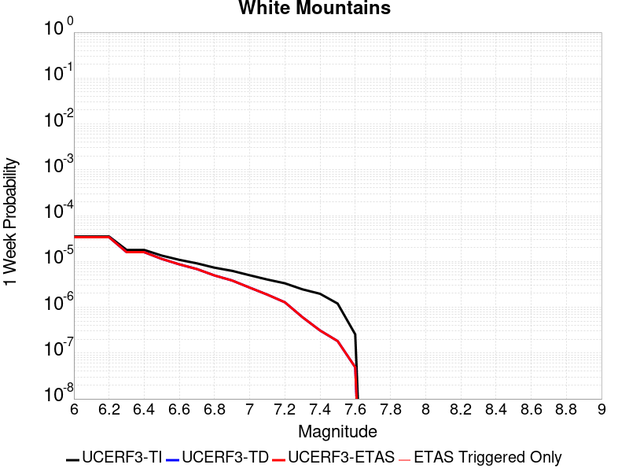 | 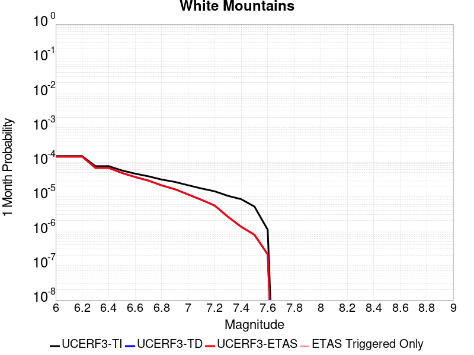 | 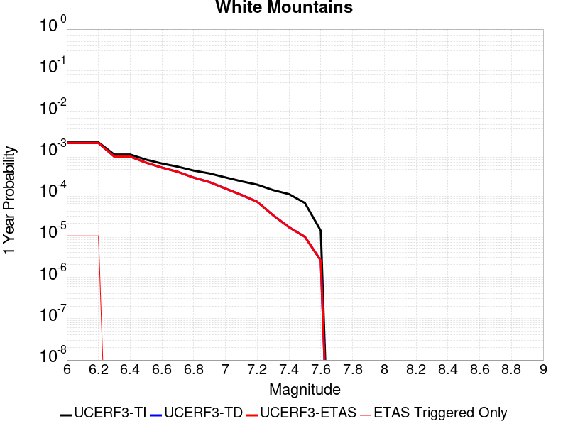 |  |

| Magnitude | 1 wk TI Prob | 1 wk TD Prob | 1 wk ETAS Prob | 1 wk ETAS/TD Gain | 1 wk ETAS Triggered Only | 1 mo TI Prob | 1 mo TD Prob | 1 mo ETAS Prob | 1 mo ETAS/TD Gain | 1 mo ETAS Triggered Only | 1 yr TI Prob | 1 yr TD Prob | 1 yr ETAS Prob | 1 yr ETAS/TD Gain | 1 yr ETAS Triggered Only | 10 yr TI Prob | 10 yr TD Prob | 10 yr ETAS Prob | 10 yr ETAS/TD Gain | 10 yr ETAS Triggered Only |
|-----|-----|-----|-----|-----|-----|-----|-----|-----|-----|-----|-----|-----|-----|-----|-----|-----|-----|-----|-----|-----|
| 6.0 | 3.503579E-5 | 3.3787943E-5 | 3.3787943E-5 | 1.0 | 0.0 | 1.5014476E-4 | 1.4479812E-4 | 1.4479812E-4 | 1.0 | 0.0 | 0.0018264796 | 0.0017616124 | 0.0017715947 | 1.0056666 | 1.0E-5 | 0.018115403 | 0.017488817 | 0.017537942 | 1.0028089 | 5.0E-5 |
| 6.1 | 3.503579E-5 | 3.3787943E-5 | 3.3787943E-5 | 1.0 | 0.0 | 1.5014476E-4 | 1.4479812E-4 | 1.4479812E-4 | 1.0 | 0.0 | 0.0018264796 | 0.0017616124 | 0.0017715947 | 1.0056666 | 1.0E-5 | 0.018115403 | 0.017488817 | 0.017537942 | 1.0028089 | 5.0E-5 |
| 6.2 | 3.503579E-5 | 3.3787943E-5 | 3.3787943E-5 | 1.0 | 0.0 | 1.5014476E-4 | 1.4479812E-4 | 1.4479812E-4 | 1.0 | 0.0 | 0.0018264796 | 0.0017616124 | 0.0017715947 | 1.0056666 | 1.0E-5 | 0.018115403 | 0.017488817 | 0.017537942 | 1.0028089 | 5.0E-5 |
| 6.3 | 1.7818425E-5 | 1.5917845E-5 | 1.5917845E-5 | 1.0 | 0.0 | 7.636245E-5 | 6.821763E-5 | 6.821763E-5 | 1.0 | 0.0 | 9.293162E-4 | 8.302475E-4 | 8.302475E-4 | 1.0 | 0.0 | 0.009254395 | 0.008272915 | 0.008302667 | 1.0035963 | 3.0E-5 |
| 6.4 | 1.7818425E-5 | 1.5917845E-5 | 1.5917845E-5 | 1.0 | 0.0 | 7.636245E-5 | 6.821763E-5 | 6.821763E-5 | 1.0 | 0.0 | 9.293162E-4 | 8.302475E-4 | 8.302475E-4 | 1.0 | 0.0 | 0.009254395 | 0.008272915 | 0.008302667 | 1.0035963 | 3.0E-5 |
| 6.5 | 1.3397557E-5 | 1.1337543E-5 | 1.1337543E-5 | 1.0 | 0.0 | 5.741684E-5 | 4.8588605E-5 | 4.8588605E-5 | 1.0 | 0.0 | 6.988258E-4 | 5.9141265E-4 | 5.9141265E-4 | 1.0 | 0.0 | 0.006966323 | 0.005899093 | 0.005899093 | 1.0 | 0.0 |
| 6.6 | 1.0818695E-5 | 8.626291E-6 | 8.626291E-6 | 1.0 | 0.0 | 4.6365014E-5 | 3.696932E-5 | 3.696932E-5 | 1.0 | 0.0 | 5.6434784E-4 | 4.5001286E-4 | 4.5001286E-4 | 1.0 | 0.0 | 0.005629168 | 0.0044914526 | 0.0044914526 | 1.0 | 0.0 |
| 6.7 | 9.067908E-6 | 6.80315E-6 | 6.80315E-6 | 1.0 | 0.0 | 3.8861883E-5 | 2.915605E-5 | 2.915605E-5 | 1.0 | 0.0 | 4.7304068E-4 | 3.5492028E-4 | 3.5492028E-4 | 1.0 | 0.0 | 0.00472035 | 0.0035438517 | 0.0035438517 | 1.0 | 0.0 |
| 6.8 | 7.295947E-6 | 4.9368996E-6 | 4.9368996E-6 | 1.0 | 0.0 | 3.126797E-5 | 2.1157975E-5 | 2.1157975E-5 | 1.0 | 0.0 | 3.8062103E-4 | 2.5756905E-4 | 2.5756905E-4 | 1.0 | 0.0 | 0.0037996976 | 0.002572818 | 0.002572818 | 1.0 | 0.0 |
| 6.9 | 6.2243444E-6 | 3.8326302E-6 | 3.8326302E-6 | 1.0 | 0.0 | 2.6675489E-5 | 1.6425458E-5 | 1.6425458E-5 | 1.0 | 0.0 | 3.2472567E-4 | 1.9996212E-4 | 1.9996212E-4 | 1.0 | 0.0 | 0.0032425157 | 0.0019978746 | 0.0019978746 | 1.0 | 0.0 |
| 7.0 | 4.9878413E-6 | 2.6798898E-6 | 2.6798898E-6 | 1.0 | 0.0 | 2.1376287E-5 | 1.1485194E-5 | 1.1485194E-5 | 1.0 | 0.0 | 2.602252E-4 | 1.3982352E-4 | 1.3982352E-4 | 1.0 | 0.0 | 0.002599207 | 0.0013973817 | 0.0013973817 | 1.0 | 0.0 |
| 7.1 | 4.0252844E-6 | 1.8860834E-6 | 1.8860834E-6 | 1.0 | 0.0 | 1.7251105E-5 | 8.083191E-6 | 8.083191E-6 | 1.0 | 0.0 | 2.1001195E-4 | 9.840853E-5 | 9.840853E-5 | 1.0 | 0.0 | 0.0020981359 | 9.836623E-4 | 9.836623E-4 | 1.0 | 0.0 |
| 7.2 | 3.3284066E-6 | 1.2822668E-6 | 1.2822668E-6 | 1.0 | 0.0 | 1.4264522E-5 | 5.4954185E-6 | 5.4954185E-6 | 1.0 | 0.0 | 1.736567E-4 | 6.6904766E-5 | 6.6904766E-5 | 1.0 | 0.0 | 0.0017352107 | 6.688563E-4 | 6.688563E-4 | 1.0 | 0.0 |
| 7.3 | 2.458226E-6 | 6.059948E-7 | 6.059948E-7 | 1.0 | 0.0 | 1.0535211E-5 | 2.5971183E-6 | 2.5971183E-6 | 1.0 | 0.0 | 1.2825865E-4 | 3.1619493E-5 | 3.1619493E-5 | 1.0 | 0.0 | 0.0012818464 | 3.161537E-4 | 3.161537E-4 | 1.0 | 0.0 |
| 7.4 | 1.965953E-6 | 3.1112958E-7 | 3.1112958E-7 | 1.0 | 0.0 | 8.425486E-6 | 1.3334119E-6 | 1.3334119E-6 | 1.0 | 0.0 | 1.0257547E-4 | 1.623417E-5 | 1.623417E-5 | 1.0 | 0.0 | 0.0010252813 | 1.6232998E-4 | 1.6232998E-4 | 1.0 | 0.0 |
| 7.5 | 1.2014192E-6 | 1.8260626E-7 | 1.8260626E-7 | 1.0 | 0.0 | 5.148929E-6 | 7.82598E-7 | 7.82598E-7 | 1.0 | 0.0 | 6.2686406E-5 | 9.52809E-6 | 9.52809E-6 | 1.0 | 0.0 | 6.266873E-4 | 9.52769E-5 | 9.52769E-5 | 1.0 | 0.0 |
| 7.6 | 2.5612175E-7 | 4.8989676E-8 | 4.8989676E-8 | 1.0 | 0.0 | 1.0976642E-6 | 2.0995574E-7 | 2.0995574E-7 | 1.0 | 0.0 | 1.3363979E-5 | 2.5562085E-6 | 2.5562085E-6 | 1.0 | 0.0 | 1.3363175E-4 | 2.5561827E-5 | 2.5561827E-5 | 1.0 | 0.0 |

## San Diego Trough north alt1
*[(top)](#table-of-contents)*

| 1 Week | 1 Month | 1 Year | 10 Year |
|-----|-----|-----|-----|
|  |  |  |  |

| Magnitude | 1 wk TI Prob | 1 wk TD Prob | 1 wk ETAS Prob | 1 wk ETAS/TD Gain | 1 wk ETAS Triggered Only | 1 mo TI Prob | 1 mo TD Prob | 1 mo ETAS Prob | 1 mo ETAS/TD Gain | 1 mo ETAS Triggered Only | 1 yr TI Prob | 1 yr TD Prob | 1 yr ETAS Prob | 1 yr ETAS/TD Gain | 1 yr ETAS Triggered Only | 10 yr TI Prob | 10 yr TD Prob | 10 yr ETAS Prob | 10 yr ETAS/TD Gain | 10 yr ETAS Triggered Only |
|-----|-----|-----|-----|-----|-----|-----|-----|-----|-----|-----|-----|-----|-----|-----|-----|-----|-----|-----|-----|-----|
| 6.0 | 7.329252E-5 | 8.823553E-5 | 8.823553E-5 | 1.0 | 0.0 | 3.14073E-4 | 3.7810113E-4 | 3.7810113E-4 | 1.0 | 0.0 | 0.0038171355 | 0.0045943 | 0.0046241623 | 1.0064999 | 3.0E-5 | 0.03752231 | 0.04505696 | 0.04510471 | 1.0010597 | 5.0E-5 |
| 6.1 | 3.7940346E-5 | 4.48962E-5 | 4.48962E-5 | 1.0 | 0.0 | 1.6259136E-4 | 1.9239864E-4 | 1.9239864E-4 | 1.0 | 0.0 | 0.0019777524 | 0.0023400213 | 0.0023499979 | 1.0042635 | 1.0E-5 | 0.019602431 | 0.023162305 | 0.023172075 | 1.0004218 | 1.0E-5 |
| 6.2 | 2.8645263E-5 | 3.330409E-5 | 3.330409E-5 | 1.0 | 0.0 | 1.2275964E-4 | 1.4272417E-4 | 1.4272417E-4 | 1.0 | 0.0 | 0.0014935739 | 0.0017362948 | 0.0017462774 | 1.0057493 | 1.0E-5 | 0.0148357535 | 0.017229972 | 0.0172398 | 1.0005704 | 1.0E-5 |
| 6.3 | 2.8645263E-5 | 3.330409E-5 | 3.330409E-5 | 1.0 | 0.0 | 1.2275964E-4 | 1.4272417E-4 | 1.4272417E-4 | 1.0 | 0.0 | 0.0014935739 | 0.0017362948 | 0.0017462774 | 1.0057493 | 1.0E-5 | 0.0148357535 | 0.017229972 | 0.0172398 | 1.0005704 | 1.0E-5 |
| 6.4 | 2.2204576E-5 | 2.545331E-5 | 2.545331E-5 | 1.0 | 0.0 | 9.5159E-5 | 1.09081106E-4 | 1.09081106E-4 | 1.0 | 0.0 | 0.001157945 | 0.0013272633 | 0.0013372501 | 1.0075243 | 1.0E-5 | 0.011519298 | 0.01319452 | 0.013204388 | 1.0007479 | 1.0E-5 |
| 6.5 | 2.1004838E-5 | 2.4029328E-5 | 2.4029328E-5 | 1.0 | 0.0 | 9.0017624E-5 | 1.02978825E-4 | 1.02978825E-4 | 1.0 | 0.0 | 0.0010954136 | 0.0012530553 | 0.0012630427 | 1.0079705 | 1.0E-5 | 0.010900296 | 0.012460973 | 0.012470849 | 1.0007925 | 1.0E-5 |
| 6.6 | 1.820557E-5 | 2.0708592E-5 | 2.0708592E-5 | 1.0 | 0.0 | 7.802154E-5 | 8.874812E-5 | 8.874812E-5 | 1.0 | 0.0 | 9.4949827E-4 | 0.0010799783 | 0.0010799783 | 1.0 | 0.0 | 0.009454516 | 0.010747968 | 0.010747968 | 1.0 | 0.0 |
| 6.7 | 1.5884485E-5 | 1.7986826E-5 | 1.7986826E-5 | 1.0 | 0.0 | 6.807459E-5 | 7.7084136E-5 | 7.7084136E-5 | 1.0 | 0.0 | 8.284929E-4 | 9.38098E-4 | 9.38098E-4 | 1.0 | 0.0 | 0.008254109 | 0.0093417475 | 0.0093417475 | 1.0 | 0.0 |
| 6.8 | 1.4331171E-5 | 1.620389E-5 | 1.620389E-5 | 1.0 | 0.0 | 6.141786E-5 | 6.9443406E-5 | 6.9443406E-5 | 1.0 | 0.0 | 7.4750587E-4 | 8.4514753E-4 | 8.4514753E-4 | 1.0 | 0.0 | 0.0074499645 | 0.008419601 | 0.008419601 | 1.0 | 0.0 |
| 6.9 | 1.2574203E-5 | 1.4208297E-5 | 1.4208297E-5 | 1.0 | 0.0 | 5.3888325E-5 | 6.089129E-5 | 6.089129E-5 | 1.0 | 0.0 | 6.558929E-4 | 7.411007E-4 | 7.411007E-4 | 1.0 | 0.0 | 0.0065396037 | 0.0073864786 | 0.0073864786 | 1.0 | 0.0 |
| 7.0 | 1.0883844E-5 | 1.2291381E-5 | 1.2291381E-5 | 1.0 | 0.0 | 4.664421E-5 | 5.267629E-5 | 5.267629E-5 | 1.0 | 0.0 | 5.677453E-4 | 6.411461E-4 | 6.411461E-4 | 1.0 | 0.0 | 0.00566297 | 0.0063930918 | 0.0063930918 | 1.0 | 0.0 |
| 7.1 | 9.393088E-6 | 1.0608852E-5 | 1.0608852E-5 | 1.0 | 0.0 | 4.025547E-5 | 4.546572E-5 | 4.546572E-5 | 1.0 | 0.0 | 4.900001E-4 | 5.534053E-4 | 5.534053E-4 | 1.0 | 0.0 | 0.0048892107 | 0.0055203685 | 0.0055203685 | 1.0 | 0.0 |
| 7.2 | 8.190791E-6 | 9.2602395E-6 | 9.2602395E-6 | 1.0 | 0.0 | 3.510292E-5 | 3.968614E-5 | 3.968614E-5 | 1.0 | 0.0 | 4.2729423E-4 | 4.830723E-4 | 4.830723E-4 | 1.0 | 0.0 | 0.0042647356 | 0.0048203026 | 0.0048203026 | 1.0 | 0.0 |
| 7.3 | 6.268162E-6 | 7.090957E-6 | 7.090957E-6 | 1.0 | 0.0 | 2.6863276E-5 | 3.0389465E-5 | 3.0389465E-5 | 1.0 | 0.0 | 3.2701128E-4 | 3.6992933E-4 | 3.6992933E-4 | 1.0 | 0.0 | 0.003265305 | 0.0036931813 | 0.0036931813 | 1.0 | 0.0 |
| 7.4 | 4.985186E-6 | 5.643675E-6 | 5.643675E-6 | 1.0 | 0.0 | 2.1364907E-5 | 2.4186958E-5 | 2.4186958E-5 | 1.0 | 0.0 | 2.600867E-4 | 2.9443682E-4 | 2.9443682E-4 | 1.0 | 0.0 | 0.002597825 | 0.0029405085 | 0.0029405085 | 1.0 | 0.0 |
| 7.5 | 1.7489613E-6 | 1.970012E-6 | 1.970012E-6 | 1.0 | 0.0 | 7.495527E-6 | 8.442882E-6 | 8.442882E-6 | 1.0 | 0.0 | 9.125422E-5 | 1.0278747E-4 | 1.0278747E-4 | 1.0 | 0.0 | 9.1216754E-4 | 0.0010274213 | 0.0010274213 | 1.0 | 0.0 |
| 7.6 | 1.6988751E-7 | 1.7534569E-7 | 1.7534569E-7 | 1.0 | 0.0 | 7.2808916E-7 | 7.5148137E-7 | 7.5148137E-7 | 1.0 | 0.0 | 8.864449E-6 | 9.149249E-6 | 9.149249E-6 | 1.0 | 0.0 | 8.8640954E-5 | 9.1488924E-5 | 9.1488924E-5 | 1.0 | 0.0 |

## San Jacinto (Lytle Creek connector)
*[(top)](#table-of-contents)*

| 1 Week | 1 Month | 1 Year | 10 Year |
|-----|-----|-----|-----|
|  | 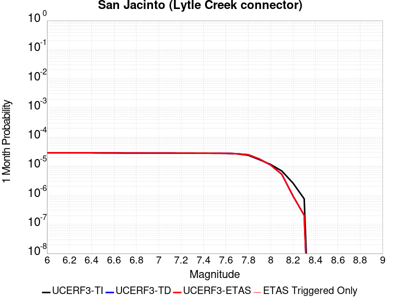 |  | 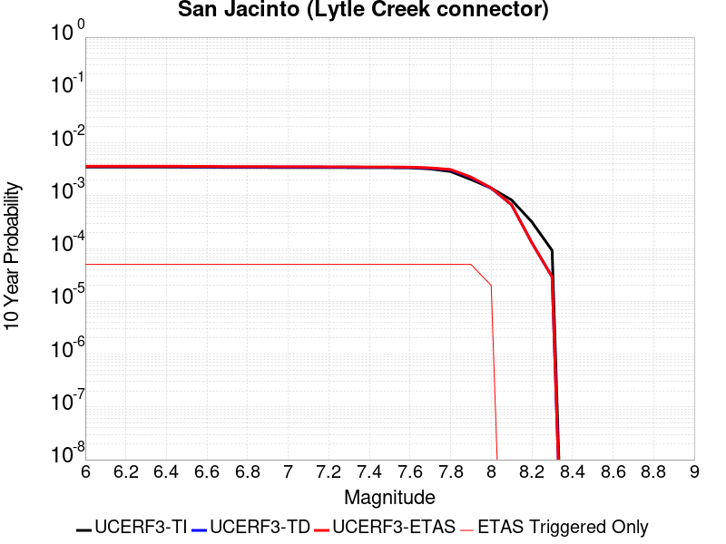 |

| Magnitude | 1 wk TI Prob | 1 wk TD Prob | 1 wk ETAS Prob | 1 wk ETAS/TD Gain | 1 wk ETAS Triggered Only | 1 mo TI Prob | 1 mo TD Prob | 1 mo ETAS Prob | 1 mo ETAS/TD Gain | 1 mo ETAS Triggered Only | 1 yr TI Prob | 1 yr TD Prob | 1 yr ETAS Prob | 1 yr ETAS/TD Gain | 1 yr ETAS Triggered Only | 10 yr TI Prob | 10 yr TD Prob | 10 yr ETAS Prob | 10 yr ETAS/TD Gain | 10 yr ETAS Triggered Only |
|-----|-----|-----|-----|-----|-----|-----|-----|-----|-----|-----|-----|-----|-----|-----|-----|-----|-----|-----|-----|-----|
| 6.0 | 6.693995E-6 | 6.68718E-6 | 6.68718E-6 | 1.0 | 0.0 | 2.8688235E-5 | 2.8659028E-5 | 2.8659028E-5 | 1.0 | 0.0 | 3.492233E-4 | 3.4886788E-4 | 3.7885742E-4 | 1.0859624 | 3.0E-5 | 0.00348675 | 0.003563386 | 0.0036132077 | 1.0139816 | 5.0E-5 |
| 6.1 | 6.693995E-6 | 6.68718E-6 | 6.68718E-6 | 1.0 | 0.0 | 2.8688235E-5 | 2.8659028E-5 | 2.8659028E-5 | 1.0 | 0.0 | 3.492233E-4 | 3.4886788E-4 | 3.7885742E-4 | 1.0859624 | 3.0E-5 | 0.00348675 | 0.003563386 | 0.0036132077 | 1.0139816 | 5.0E-5 |
| 6.2 | 6.693995E-6 | 6.68718E-6 | 6.68718E-6 | 1.0 | 0.0 | 2.8688235E-5 | 2.8659028E-5 | 2.8659028E-5 | 1.0 | 0.0 | 3.492233E-4 | 3.4886788E-4 | 3.7885742E-4 | 1.0859624 | 3.0E-5 | 0.00348675 | 0.003563386 | 0.0036132077 | 1.0139816 | 5.0E-5 |
| 6.3 | 6.693995E-6 | 6.68718E-6 | 6.68718E-6 | 1.0 | 0.0 | 2.8688235E-5 | 2.8659028E-5 | 2.8659028E-5 | 1.0 | 0.0 | 3.492233E-4 | 3.4886788E-4 | 3.7885742E-4 | 1.0859624 | 3.0E-5 | 0.00348675 | 0.003563386 | 0.0036132077 | 1.0139816 | 5.0E-5 |
| 6.4 | 6.693995E-6 | 6.68718E-6 | 6.68718E-6 | 1.0 | 0.0 | 2.8688235E-5 | 2.8659028E-5 | 2.8659028E-5 | 1.0 | 0.0 | 3.492233E-4 | 3.4886788E-4 | 3.7885742E-4 | 1.0859624 | 3.0E-5 | 0.00348675 | 0.003563386 | 0.0036132077 | 1.0139816 | 5.0E-5 |
| 6.5 | 6.6561875E-6 | 6.6473954E-6 | 6.6473954E-6 | 1.0 | 0.0 | 2.8526205E-5 | 2.8488526E-5 | 2.8488526E-5 | 1.0 | 0.0 | 3.472512E-4 | 3.467927E-4 | 3.767823E-4 | 1.086477 | 3.0E-5 | 0.0034670907 | 0.0035427003 | 0.0035925233 | 1.0140635 | 5.0E-5 |
| 6.6 | 6.6561875E-6 | 6.6473954E-6 | 6.6473954E-6 | 1.0 | 0.0 | 2.8526205E-5 | 2.8488526E-5 | 2.8488526E-5 | 1.0 | 0.0 | 3.472512E-4 | 3.467927E-4 | 3.767823E-4 | 1.086477 | 3.0E-5 | 0.0034670907 | 0.0035427003 | 0.0035925233 | 1.0140635 | 5.0E-5 |
| 6.7 | 6.5802237E-6 | 6.566566E-6 | 6.566566E-6 | 1.0 | 0.0 | 2.8200653E-5 | 2.8142122E-5 | 2.8142122E-5 | 1.0 | 0.0 | 3.4328885E-4 | 3.4257653E-4 | 3.7256625E-4 | 1.0875417 | 3.0E-5 | 0.0034275902 | 0.003500672 | 0.003550497 | 1.014233 | 5.0E-5 |
| 6.8 | 6.575632E-6 | 6.561054E-6 | 6.561054E-6 | 1.0 | 0.0 | 2.8180975E-5 | 2.8118498E-5 | 2.8118498E-5 | 1.0 | 0.0 | 3.4304935E-4 | 3.4228901E-4 | 3.7227877E-4 | 1.0876153 | 3.0E-5 | 0.0034252026 | 0.0034978061 | 0.0035476312 | 1.0142447 | 5.0E-5 |
| 6.9 | 6.570433E-6 | 6.552444E-6 | 6.552444E-6 | 1.0 | 0.0 | 2.8158694E-5 | 2.80816E-5 | 2.80816E-5 | 1.0 | 0.0 | 3.4277816E-4 | 3.418399E-4 | 3.7182966E-4 | 1.0877304 | 3.0E-5 | 0.0034224992 | 0.0034933293 | 0.0035431546 | 1.014263 | 5.0E-5 |
| 7.0 | 6.5643826E-6 | 6.5425606E-6 | 6.5425606E-6 | 1.0 | 0.0 | 2.8132765E-5 | 2.8039243E-5 | 2.8039243E-5 | 1.0 | 0.0 | 3.424626E-4 | 3.413244E-4 | 3.7131415E-4 | 1.087863 | 3.0E-5 | 0.0034193532 | 0.0034881902 | 0.0035380158 | 1.0142841 | 5.0E-5 |
| 7.1 | 6.557402E-6 | 6.531268E-6 | 6.531268E-6 | 1.0 | 0.0 | 2.8102848E-5 | 2.7990847E-5 | 2.7990847E-5 | 1.0 | 0.0 | 3.4209844E-4 | 3.4073534E-4 | 3.7072512E-4 | 1.0880148 | 3.0E-5 | 0.0034157229 | 0.0034823192 | 0.0035321452 | 1.0143082 | 5.0E-5 |
| 7.2 | 6.546394E-6 | 6.5132253E-6 | 6.5132253E-6 | 1.0 | 0.0 | 2.8055672E-5 | 2.7913524E-5 | 2.7913524E-5 | 1.0 | 0.0 | 3.4152428E-4 | 3.3979423E-4 | 3.6978404E-4 | 1.0882587 | 3.0E-5 | 0.0034099987 | 0.003472942 | 0.0035227684 | 1.014347 | 5.0E-5 |
| 7.3 | 6.5364216E-6 | 6.493994E-6 | 6.493994E-6 | 1.0 | 0.0 | 2.8012933E-5 | 2.7831105E-5 | 2.7831105E-5 | 1.0 | 0.0 | 3.4100408E-4 | 3.387911E-4 | 3.6878095E-4 | 1.0885202 | 3.0E-5 | 0.003404813 | 0.003462955 | 0.0035127816 | 1.0143886 | 5.0E-5 |
| 7.4 | 6.5269523E-6 | 6.475061E-6 | 6.475061E-6 | 1.0 | 0.0 | 2.7972354E-5 | 2.7749968E-5 | 2.7749968E-5 | 1.0 | 0.0 | 3.4051016E-4 | 3.3780356E-4 | 3.6779343E-4 | 1.088779 | 3.0E-5 | 0.0033998888 | 0.003453127 | 0.0035029543 | 1.0144297 | 5.0E-5 |
| 7.5 | 6.5111835E-6 | 6.4513147E-6 | 6.4513147E-6 | 1.0 | 0.0 | 2.7904773E-5 | 2.7648199E-5 | 2.7648199E-5 | 1.0 | 0.0 | 3.3968766E-4 | 3.365649E-4 | 3.665548E-4 | 1.0891058 | 3.0E-5 | 0.0033916887 | 0.0034407894 | 0.0034906175 | 1.0144815 | 5.0E-5 |
| 7.6 | 6.4768806E-6 | 6.4103915E-6 | 6.4103915E-6 | 1.0 | 0.0 | 2.7757764E-5 | 2.7472817E-5 | 2.7472817E-5 | 1.0 | 0.0 | 3.3789838E-4 | 3.3443028E-4 | 3.6442024E-4 | 1.0896748 | 3.0E-5 | 0.0033738504 | 0.0034195052 | 0.0034693342 | 1.014572 | 5.0E-5 |
| 7.7 | 6.1655364E-6 | 6.2026584E-6 | 6.2026584E-6 | 1.0 | 0.0 | 2.642346E-5 | 2.6582551E-5 | 2.6582551E-5 | 1.0 | 0.0 | 3.2165812E-4 | 3.2359455E-4 | 3.5358485E-4 | 1.0926787 | 3.0E-5 | 0.0032119295 | 0.003311007 | 0.0033608414 | 1.0150511 | 5.0E-5 |
| 7.8 | 5.5043524E-6 | 5.7629622E-6 | 5.7629622E-6 | 1.0 | 0.0 | 2.3589868E-5 | 2.4698176E-5 | 2.4698176E-5 | 1.0 | 0.0 | 2.871688E-4 | 3.0065887E-4 | 3.3064984E-4 | 1.0997509 | 3.0E-5 | 0.0028679797 | 0.0030807185 | 0.0031305642 | 1.01618 | 5.0E-5 |
| 7.9 | 3.889249E-6 | 4.0978284E-6 | 4.0978284E-6 | 1.0 | 0.0 | 1.6668104E-5 | 1.7562003E-5 | 1.7562003E-5 | 1.0 | 0.0 | 2.0291525E-4 | 2.1379645E-4 | 2.4379003E-4 | 1.1402904 | 3.0E-5 | 0.0020273007 | 0.0022053365 | 0.0022552263 | 1.0226222 | 5.0E-5 |
| 8.0 | 2.668535E-6 | 2.5461316E-6 | 2.5461316E-6 | 1.0 | 0.0 | 1.1436528E-5 | 1.0911946E-5 | 1.0911946E-5 | 1.0 | 0.0 | 1.3923083E-4 | 1.3284489E-4 | 1.3284489E-4 | 1.0 | 0.0 | 0.0013914363 | 0.0013835314 | 0.0014035037 | 1.0144358 | 2.0E-5 |
| 8.1 | 1.5911459E-6 | 1.2265176E-6 | 1.2265176E-6 | 1.0 | 0.0 | 6.8191785E-6 | 5.2564933E-6 | 5.2564933E-6 | 1.0 | 0.0 | 8.3020335E-5 | 6.399595E-5 | 6.399595E-5 | 1.0 | 0.0 | 8.298933E-4 | 6.735424E-4 | 6.735424E-4 | 1.0 | 0.0 |
| 8.2 | 6.1294963E-7 | 2.2044327E-7 | 2.2044327E-7 | 1.0 | 0.0 | 2.6269242E-6 | 9.4475655E-7 | 9.4475655E-7 | 1.0 | 0.0 | 3.1982334E-5 | 1.150235E-5 | 1.150235E-5 | 1.0 | 0.0 | 3.1977732E-4 | 1.2914916E-4 | 1.2914916E-4 | 1.0 | 0.0 |
| 8.3 | 1.762871E-7 | 4.8134357E-8 | 4.8134357E-8 | 1.0 | 0.0 | 7.5551594E-7 | 2.0629008E-7 | 2.0629008E-7 | 1.0 | 0.0 | 9.1983675E-6 | 2.511579E-6 | 2.511579E-6 | 1.0 | 0.0 | 9.197987E-5 | 2.9024819E-5 | 2.9024819E-5 | 1.0 | 0.0 |

## Elysian Park (Upper)
*[(top)](#table-of-contents)*

| 1 Week | 1 Month | 1 Year | 10 Year |
|-----|-----|-----|-----|
| 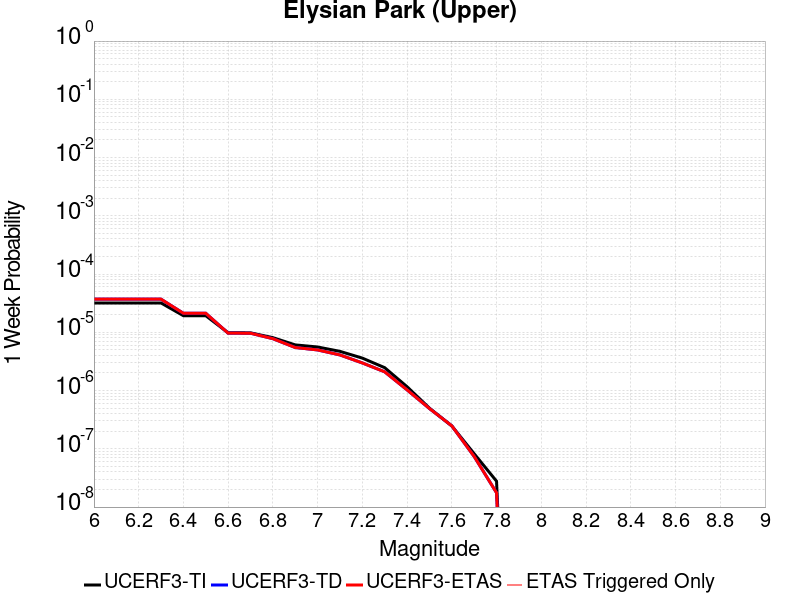 |  |  |  |

| Magnitude | 1 wk TI Prob | 1 wk TD Prob | 1 wk ETAS Prob | 1 wk ETAS/TD Gain | 1 wk ETAS Triggered Only | 1 mo TI Prob | 1 mo TD Prob | 1 mo ETAS Prob | 1 mo ETAS/TD Gain | 1 mo ETAS Triggered Only | 1 yr TI Prob | 1 yr TD Prob | 1 yr ETAS Prob | 1 yr ETAS/TD Gain | 1 yr ETAS Triggered Only | 10 yr TI Prob | 10 yr TD Prob | 10 yr ETAS Prob | 10 yr ETAS/TD Gain | 10 yr ETAS Triggered Only |
|-----|-----|-----|-----|-----|-----|-----|-----|-----|-----|-----|-----|-----|-----|-----|-----|-----|-----|-----|-----|-----|
| 6.0 | 3.1876025E-5 | 3.704556E-5 | 3.704556E-5 | 1.0 | 0.0 | 1.3660437E-4 | 1.5875977E-4 | 1.5875977E-4 | 1.0 | 0.0 | 0.0016618895 | 0.0019316166 | 0.0019316166 | 1.0 | 0.0 | 0.016495159 | 0.019194895 | 0.019234128 | 1.0020438 | 4.0E-5 |
| 6.1 | 3.1876025E-5 | 3.704556E-5 | 3.704556E-5 | 1.0 | 0.0 | 1.3660437E-4 | 1.5875977E-4 | 1.5875977E-4 | 1.0 | 0.0 | 0.0016618895 | 0.0019316166 | 0.0019316166 | 1.0 | 0.0 | 0.016495159 | 0.019194895 | 0.019234128 | 1.0020438 | 4.0E-5 |
| 6.2 | 3.1876025E-5 | 3.704556E-5 | 3.704556E-5 | 1.0 | 0.0 | 1.3660437E-4 | 1.5875977E-4 | 1.5875977E-4 | 1.0 | 0.0 | 0.0016618895 | 0.0019316166 | 0.0019316166 | 1.0 | 0.0 | 0.016495159 | 0.019194895 | 0.019234128 | 1.0020438 | 4.0E-5 |
| 6.3 | 3.1876025E-5 | 3.704556E-5 | 3.704556E-5 | 1.0 | 0.0 | 1.3660437E-4 | 1.5875977E-4 | 1.5875977E-4 | 1.0 | 0.0 | 0.0016618895 | 0.0019316166 | 0.0019316166 | 1.0 | 0.0 | 0.016495159 | 0.019194895 | 0.019234128 | 1.0020438 | 4.0E-5 |
| 6.4 | 1.9273462E-5 | 2.1206919E-5 | 2.1206919E-5 | 1.0 | 0.0 | 8.259794E-5 | 9.088461E-5 | 9.088461E-5 | 1.0 | 0.0 | 0.001005166 | 0.0011061319 | 0.0011061319 | 1.0 | 0.0 | 0.010006315 | 0.011023126 | 0.011042906 | 1.0017943 | 2.0E-5 |
| 6.5 | 1.9273462E-5 | 2.1206919E-5 | 2.1206919E-5 | 1.0 | 0.0 | 8.259794E-5 | 9.088461E-5 | 9.088461E-5 | 1.0 | 0.0 | 0.001005166 | 0.0011061319 | 0.0011061319 | 1.0 | 0.0 | 0.010006315 | 0.011023126 | 0.011042906 | 1.0017943 | 2.0E-5 |
| 6.6 | 9.813258E-6 | 9.666892E-6 | 9.666892E-6 | 1.0 | 0.0 | 4.205614E-5 | 4.1428917E-5 | 4.1428917E-5 | 1.0 | 0.0 | 5.119132E-4 | 5.042876E-4 | 5.042876E-4 | 1.0 | 0.0 | 0.005107356 | 0.0050321566 | 0.0050321566 | 1.0 | 0.0 |
| 6.7 | 9.801478E-6 | 9.65446E-6 | 9.65446E-6 | 1.0 | 0.0 | 4.2005657E-5 | 4.1375642E-5 | 4.1375642E-5 | 1.0 | 0.0 | 5.112989E-4 | 5.036392E-4 | 5.036392E-4 | 1.0 | 0.0 | 0.0051012407 | 0.0050257025 | 0.0050257025 | 1.0 | 0.0 |
| 6.8 | 8.102489E-6 | 7.774029E-6 | 7.774029E-6 | 1.0 | 0.0 | 3.4724493E-5 | 3.331687E-5 | 3.331687E-5 | 1.0 | 0.0 | 4.2268867E-4 | 4.0556237E-4 | 4.0556237E-4 | 1.0 | 0.0 | 0.004218856 | 0.0040487163 | 0.0040487163 | 1.0 | 0.0 |
| 6.9 | 6.08275E-6 | 5.482067E-6 | 5.482067E-6 | 1.0 | 0.0 | 2.6068668E-5 | 2.3494365E-5 | 2.3494365E-5 | 1.0 | 0.0 | 3.173398E-4 | 2.8600713E-4 | 2.8600713E-4 | 1.0 | 0.0 | 0.0031688702 | 0.002856468 | 0.002856468 | 1.0 | 0.0 |
| 7.0 | 5.5995934E-6 | 4.9833366E-6 | 4.9833366E-6 | 1.0 | 0.0 | 2.3998036E-5 | 2.1356986E-5 | 2.1356986E-5 | 1.0 | 0.0 | 2.9213692E-4 | 2.5999092E-4 | 2.5999092E-4 | 1.0 | 0.0 | 0.0029175316 | 0.002596935 | 0.002596935 | 1.0 | 0.0 |
| 7.1 | 4.709881E-6 | 4.087854E-6 | 4.087854E-6 | 1.0 | 0.0 | 2.0185047E-5 | 1.751926E-5 | 1.751926E-5 | 1.0 | 0.0 | 2.4572524E-4 | 2.1327652E-4 | 2.1327652E-4 | 1.0 | 0.0 | 0.002454537 | 0.0021307599 | 0.0021307599 | 1.0 | 0.0 |
| 7.2 | 3.6063436E-6 | 2.9782757E-6 | 2.9782757E-6 | 1.0 | 0.0 | 1.5455667E-5 | 1.2763977E-5 | 1.2763977E-5 | 1.0 | 0.0 | 1.881565E-4 | 1.5539044E-4 | 1.5539044E-4 | 1.0 | 0.0 | 0.0018799726 | 0.0015528292 | 0.0015528292 | 1.0 | 0.0 |
| 7.3 | 2.471135E-6 | 2.0956875E-6 | 2.0956875E-6 | 1.0 | 0.0 | 1.0590536E-5 | 8.981488E-6 | 8.981488E-6 | 1.0 | 0.0 | 1.2893214E-4 | 1.093442E-4 | 1.093442E-4 | 1.0 | 0.0 | 0.0012885736 | 0.0010929112 | 0.0010929112 | 1.0 | 0.0 |
| 7.4 | 1.163943E-6 | 1.0276299E-6 | 1.0276299E-6 | 1.0 | 0.0 | 4.988318E-6 | 4.404121E-6 | 4.404121E-6 | 1.0 | 0.0 | 6.0731076E-5 | 5.3618878E-5 | 5.3618878E-5 | 1.0 | 0.0 | 6.071448E-4 | 5.360624E-4 | 5.360624E-4 | 1.0 | 0.0 |
| 7.5 | 4.99459E-7 | 4.918171E-7 | 4.918171E-7 | 1.0 | 0.0 | 2.140537E-6 | 2.107786E-6 | 2.107786E-6 | 1.0 | 0.0 | 2.6060725E-5 | 2.5662008E-5 | 2.5662008E-5 | 1.0 | 0.0 | 2.605767E-4 | 2.56592E-4 | 2.56592E-4 | 1.0 | 0.0 |
| 7.6 | 2.4667852E-7 | 2.4781724E-7 | 2.4781724E-7 | 1.0 | 0.0 | 1.0571932E-6 | 1.0620735E-6 | 1.0620735E-6 | 1.0 | 0.0 | 1.2871251E-5 | 1.2930672E-5 | 1.2930672E-5 | 1.0 | 0.0 | 1.2870505E-4 | 1.2929956E-4 | 1.2929956E-4 | 1.0 | 0.0 |
| 7.7 | 8.2312795E-8 | 7.388283E-8 | 7.388283E-8 | 1.0 | 0.0 | 3.527691E-7 | 3.166407E-7 | 3.166407E-7 | 1.0 | 0.0 | 4.294955E-6 | 3.8550947E-6 | 3.8550947E-6 | 1.0 | 0.0 | 4.2948723E-5 | 3.855039E-5 | 3.855039E-5 | 1.0 | 0.0 |
| 7.8 | 2.7819295E-8 | 1.7579014E-8 | 1.7579014E-8 | 1.0 | 0.0 | 1.1922555E-7 | 7.5338626E-8 | 7.5338626E-8 | 1.0 | 0.0 | 1.45157E-6 | 9.172476E-7 | 9.172476E-7 | 1.0 | 0.0 | 1.45156055E-5 | 9.172452E-6 | 9.172452E-6 | 1.0 | 0.0 |

## Tin Mountain
*[(top)](#table-of-contents)*

| 1 Week | 1 Month | 1 Year | 10 Year |
|-----|-----|-----|-----|
|  |  |  |  |

| Magnitude | 1 wk TI Prob | 1 wk TD Prob | 1 wk ETAS Prob | 1 wk ETAS/TD Gain | 1 wk ETAS Triggered Only | 1 mo TI Prob | 1 mo TD Prob | 1 mo ETAS Prob | 1 mo ETAS/TD Gain | 1 mo ETAS Triggered Only | 1 yr TI Prob | 1 yr TD Prob | 1 yr ETAS Prob | 1 yr ETAS/TD Gain | 1 yr ETAS Triggered Only | 10 yr TI Prob | 10 yr TD Prob | 10 yr ETAS Prob | 10 yr ETAS/TD Gain | 10 yr ETAS Triggered Only |
|-----|-----|-----|-----|-----|-----|-----|-----|-----|-----|-----|-----|-----|-----|-----|-----|-----|-----|-----|-----|-----|
| 6.0 | 4.083776E-6 | 4.1816697E-6 | 4.1816697E-6 | 1.0 | 0.0 | 1.750178E-5 | 1.792134E-5 | 1.792134E-5 | 1.0 | 0.0 | 2.1306332E-4 | 2.1817419E-4 | 2.1817419E-4 | 1.0 | 0.0 | 0.0021285915 | 0.0021799656 | 0.0022198786 | 1.0183089 | 4.0E-5 |
| 6.1 | 4.083776E-6 | 4.1816697E-6 | 4.1816697E-6 | 1.0 | 0.0 | 1.750178E-5 | 1.792134E-5 | 1.792134E-5 | 1.0 | 0.0 | 2.1306332E-4 | 2.1817419E-4 | 2.1817419E-4 | 1.0 | 0.0 | 0.0021285915 | 0.0021799656 | 0.0022198786 | 1.0183089 | 4.0E-5 |
| 6.2 | 4.083776E-6 | 4.1816697E-6 | 4.1816697E-6 | 1.0 | 0.0 | 1.750178E-5 | 1.792134E-5 | 1.792134E-5 | 1.0 | 0.0 | 2.1306332E-4 | 2.1817419E-4 | 2.1817419E-4 | 1.0 | 0.0 | 0.0021285915 | 0.0021799656 | 0.0022198786 | 1.0183089 | 4.0E-5 |
| 6.3 | 4.083776E-6 | 4.1816697E-6 | 4.1816697E-6 | 1.0 | 0.0 | 1.750178E-5 | 1.792134E-5 | 1.792134E-5 | 1.0 | 0.0 | 2.1306332E-4 | 2.1817419E-4 | 2.1817419E-4 | 1.0 | 0.0 | 0.0021285915 | 0.0021799656 | 0.0022198786 | 1.0183089 | 4.0E-5 |
| 6.4 | 4.083776E-6 | 4.1816697E-6 | 4.1816697E-6 | 1.0 | 0.0 | 1.750178E-5 | 1.792134E-5 | 1.792134E-5 | 1.0 | 0.0 | 2.1306332E-4 | 2.1817419E-4 | 2.1817419E-4 | 1.0 | 0.0 | 0.0021285915 | 0.0021799656 | 0.0022198786 | 1.0183089 | 4.0E-5 |
| 6.5 | 2.3143427E-6 | 2.3732375E-6 | 2.3732375E-6 | 1.0 | 0.0 | 9.9185745E-6 | 1.0170983E-5 | 1.0170983E-5 | 1.0 | 0.0 | 1.2075195E-4 | 1.2382545E-4 | 1.2382545E-4 | 1.0 | 0.0 | 0.0012068636 | 0.0012376405 | 0.001277591 | 1.0322796 | 4.0E-5 |
| 6.6 | 2.3143427E-6 | 2.3732375E-6 | 2.3732375E-6 | 1.0 | 0.0 | 9.9185745E-6 | 1.0170983E-5 | 1.0170983E-5 | 1.0 | 0.0 | 1.2075195E-4 | 1.2382545E-4 | 1.2382545E-4 | 1.0 | 0.0 | 0.0012068636 | 0.0012376405 | 0.001277591 | 1.0322796 | 4.0E-5 |
| 6.7 | 1.7029532E-6 | 1.7498556E-6 | 1.7498556E-6 | 1.0 | 0.0 | 7.2983503E-6 | 7.4993627E-6 | 7.4993627E-6 | 1.0 | 0.0 | 8.885379E-5 | 9.130145E-5 | 9.130145E-5 | 1.0 | 0.0 | 8.881827E-4 | 9.1269205E-4 | 9.426647E-4 | 1.0328398 | 3.0E-5 |
| 6.8 | 1.2914646E-6 | 1.3299907E-6 | 1.3299907E-6 | 1.0 | 0.0 | 5.534837E-6 | 5.69995E-6 | 5.69995E-6 | 1.0 | 0.0 | 6.738455E-5 | 6.939512E-5 | 6.939512E-5 | 1.0 | 0.0 | 6.736412E-4 | 6.937779E-4 | 7.237571E-4 | 1.0432115 | 3.0E-5 |
| 6.9 | 5.8708974E-7 | 6.1173347E-7 | 6.1173347E-7 | 1.0 | 0.0 | 2.5160964E-6 | 2.6217124E-6 | 2.6217124E-6 | 1.0 | 0.0 | 3.0633044E-5 | 3.1918924E-5 | 3.1918924E-5 | 1.0 | 0.0 | 3.0628822E-4 | 3.1914748E-4 | 3.1914748E-4 | 1.0 | 0.0 |
| 7.0 | 4.6248786E-7 | 4.832303E-7 | 4.832303E-7 | 1.0 | 0.0 | 1.9820893E-6 | 2.0709856E-6 | 2.0709856E-6 | 1.0 | 0.0 | 2.413167E-5 | 2.5213994E-5 | 2.5213994E-5 | 1.0 | 0.0 | 2.412905E-4 | 2.5211502E-4 | 2.5211502E-4 | 1.0 | 0.0 |
| 7.1 | 3.804606E-7 | 3.987401E-7 | 3.987401E-7 | 1.0 | 0.0 | 1.6305444E-6 | 1.7088852E-6 | 1.7088852E-6 | 1.0 | 0.0 | 1.9851697E-5 | 2.0805513E-5 | 2.0805513E-5 | 1.0 | 0.0 | 1.9849923E-4 | 2.0803901E-4 | 2.0803901E-4 | 1.0 | 0.0 |
| 7.2 | 3.5864858E-7 | 3.7619301E-7 | 3.7619301E-7 | 1.0 | 0.0 | 1.5370645E-6 | 1.612255E-6 | 1.612255E-6 | 1.0 | 0.0 | 1.87136E-5 | 1.9629062E-5 | 1.9629062E-5 | 1.0 | 0.0 | 1.8712023E-4 | 1.9627658E-4 | 1.9627658E-4 | 1.0 | 0.0 |
| 7.3 | 3.342063E-7 | 3.506576E-7 | 3.506576E-7 | 1.0 | 0.0 | 1.4323119E-6 | 1.5028176E-6 | 1.5028176E-6 | 1.0 | 0.0 | 1.7438259E-5 | 1.8296683E-5 | 1.8296683E-5 | 1.0 | 0.0 | 1.743689E-4 | 1.8295507E-4 | 1.8295507E-4 | 1.0 | 0.0 |
| 7.4 | 2.971242E-7 | 3.116784E-7 | 3.116784E-7 | 1.0 | 0.0 | 1.2733886E-6 | 1.3357641E-6 | 1.3357641E-6 | 1.0 | 0.0 | 1.5503398E-5 | 1.626284E-5 | 1.626284E-5 | 1.0 | 0.0 | 1.5502315E-4 | 1.6261978E-4 | 1.6261978E-4 | 1.0 | 0.0 |
| 7.5 | 1.4326713E-7 | 1.5013477E-7 | 1.5013477E-7 | 1.0 | 0.0 | 6.140018E-7 | 6.4343476E-7 | 6.4343476E-7 | 1.0 | 0.0 | 7.4754466E-6 | 7.833818E-6 | 7.833818E-6 | 1.0 | 0.0 | 7.475195E-5 | 7.833818E-5 | 7.833818E-5 | 1.0 | 0.0 |

## Camp Rock 2011
*[(top)](#table-of-contents)*

| 1 Week | 1 Month | 1 Year | 10 Year |
|-----|-----|-----|-----|
|  | 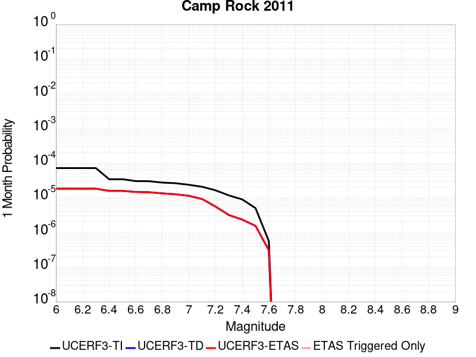 | 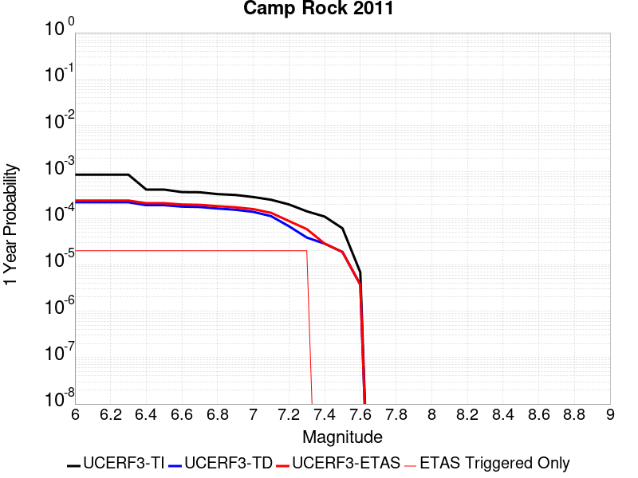 | 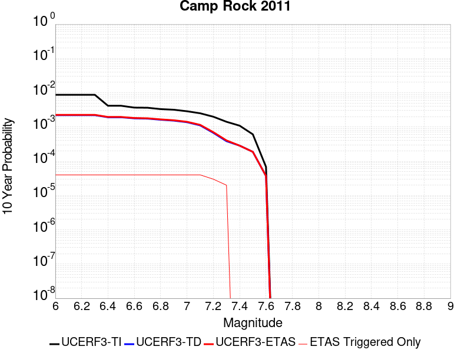 |

| Magnitude | 1 wk TI Prob | 1 wk TD Prob | 1 wk ETAS Prob | 1 wk ETAS/TD Gain | 1 wk ETAS Triggered Only | 1 mo TI Prob | 1 mo TD Prob | 1 mo ETAS Prob | 1 mo ETAS/TD Gain | 1 mo ETAS Triggered Only | 1 yr TI Prob | 1 yr TD Prob | 1 yr ETAS Prob | 1 yr ETAS/TD Gain | 1 yr ETAS Triggered Only | 10 yr TI Prob | 10 yr TD Prob | 10 yr ETAS Prob | 10 yr ETAS/TD Gain | 10 yr ETAS Triggered Only |
|-----|-----|-----|-----|-----|-----|-----|-----|-----|-----|-----|-----|-----|-----|-----|-----|-----|-----|-----|-----|-----|
| 6.0 | 1.6710783E-5 | 4.250767E-6 | 4.250767E-6 | 1.0 | 0.0 | 7.161568E-5 | 1.8217446E-5 | 1.8217446E-5 | 1.0 | 0.0 | 8.7157206E-4 | 2.2177536E-4 | 2.4177093E-4 | 1.0901613 | 2.0E-5 | 0.008681616 | 0.0022155934 | 0.0022555047 | 1.0180138 | 4.0E-5 |
| 6.1 | 1.6710783E-5 | 4.250767E-6 | 4.250767E-6 | 1.0 | 0.0 | 7.161568E-5 | 1.8217446E-5 | 1.8217446E-5 | 1.0 | 0.0 | 8.7157206E-4 | 2.2177536E-4 | 2.4177093E-4 | 1.0901613 | 2.0E-5 | 0.008681616 | 0.0022155934 | 0.0022555047 | 1.0180138 | 4.0E-5 |
| 6.2 | 1.6710783E-5 | 4.250767E-6 | 4.250767E-6 | 1.0 | 0.0 | 7.161568E-5 | 1.8217446E-5 | 1.8217446E-5 | 1.0 | 0.0 | 8.7157206E-4 | 2.2177536E-4 | 2.4177093E-4 | 1.0901613 | 2.0E-5 | 0.008681616 | 0.0022155934 | 0.0022555047 | 1.0180138 | 4.0E-5 |
| 6.3 | 1.6710783E-5 | 4.250767E-6 | 4.250767E-6 | 1.0 | 0.0 | 7.161568E-5 | 1.8217446E-5 | 1.8217446E-5 | 1.0 | 0.0 | 8.7157206E-4 | 2.2177536E-4 | 2.4177093E-4 | 1.0901613 | 2.0E-5 | 0.008681616 | 0.0022155934 | 0.0022555047 | 1.0180138 | 4.0E-5 |
| 6.4 | 7.982846E-6 | 3.6825343E-6 | 3.6825343E-6 | 1.0 | 0.0 | 3.421175E-5 | 1.5782196E-5 | 1.5782196E-5 | 1.0 | 0.0 | 4.1644843E-4 | 1.9213164E-4 | 2.1212781E-4 | 1.1040753 | 2.0E-5 | 0.0041566887 | 0.0019196902 | 0.0019596135 | 1.0207967 | 4.0E-5 |
| 6.5 | 7.982846E-6 | 3.6825343E-6 | 3.6825343E-6 | 1.0 | 0.0 | 3.421175E-5 | 1.5782196E-5 | 1.5782196E-5 | 1.0 | 0.0 | 4.1644843E-4 | 1.9213164E-4 | 2.1212781E-4 | 1.1040753 | 2.0E-5 | 0.0041566887 | 0.0019196902 | 0.0019596135 | 1.0207967 | 4.0E-5 |
| 6.6 | 7.048869E-6 | 3.424784E-6 | 3.424784E-6 | 1.0 | 0.0 | 3.0209088E-5 | 1.4677564E-5 | 1.4677564E-5 | 1.0 | 0.0 | 3.677336E-4 | 1.78685E-4 | 1.9868143E-4 | 1.1119088 | 2.0E-5 | 0.0036712566 | 0.001785445 | 0.0018253736 | 1.0223634 | 4.0E-5 |
| 6.7 | 6.987307E-6 | 3.3627566E-6 | 3.3627566E-6 | 1.0 | 0.0 | 2.9945259E-5 | 1.4411736E-5 | 1.4411736E-5 | 1.0 | 0.0 | 3.6452254E-4 | 1.7544907E-4 | 1.9544557E-4 | 1.1139731 | 2.0E-5 | 0.0036392517 | 0.0017531366 | 0.0017930665 | 1.0227762 | 4.0E-5 |
| 6.8 | 6.3737602E-6 | 3.1183051E-6 | 3.1183051E-6 | 1.0 | 0.0 | 2.731583E-5 | 1.3364098E-5 | 1.3364098E-5 | 1.0 | 0.0 | 3.3251947E-4 | 1.6269603E-4 | 1.8269278E-4 | 1.1229086 | 2.0E-5 | 0.0033202237 | 0.0016257978 | 0.0016657328 | 1.0245633 | 4.0E-5 |
| 6.9 | 6.112211E-6 | 2.9334967E-6 | 2.9334967E-6 | 1.0 | 0.0 | 2.6194928E-5 | 1.257207E-5 | 1.257207E-5 | 1.0 | 0.0 | 3.1887658E-4 | 1.5305448E-4 | 1.7305142E-4 | 1.1306524 | 2.0E-5 | 0.003184194 | 0.0015295185 | 0.0015694572 | 1.0261121 | 4.0E-5 |
| 7.0 | 5.5140117E-6 | 2.6422588E-6 | 2.6422588E-6 | 1.0 | 0.0 | 2.3631264E-5 | 1.1323918E-5 | 1.1323918E-5 | 1.0 | 0.0 | 2.8767265E-4 | 1.3786025E-4 | 1.5785749E-4 | 1.1450545 | 2.0E-5 | 0.0028730053 | 0.0013777724 | 0.0014177173 | 1.0289924 | 4.0E-5 |
| 7.1 | 4.8151105E-6 | 2.134553E-6 | 2.134553E-6 | 1.0 | 0.0 | 2.0636026E-5 | 9.148053E-6 | 9.148053E-6 | 1.0 | 0.0 | 2.5121463E-4 | 1.1137208E-4 | 1.3136984E-4 | 1.1795583 | 2.0E-5 | 0.0025093083 | 0.0011131845 | 0.00115314 | 1.035893 | 4.0E-5 |
| 7.2 | 3.818335E-6 | 1.2939513E-6 | 1.2939513E-6 | 1.0 | 0.0 | 1.6364189E-5 | 5.5454943E-6 | 5.5454943E-6 | 1.0 | 0.0 | 1.9921579E-4 | 6.751438E-5 | 8.7513035E-5 | 1.2962132 | 2.0E-5 | 0.0019903728 | 6.7494693E-4 | 7.0492673E-4 | 1.044418 | 3.0E-5 |
| 7.3 | 2.7166698E-6 | 7.3851675E-7 | 7.3851675E-7 | 1.0 | 0.0 | 1.1642818E-5 | 3.1650682E-6 | 3.1650682E-6 | 1.0 | 0.0 | 1.4174209E-4 | 3.8534043E-5 | 5.853327E-5 | 1.5190016 | 2.0E-5 | 0.0014165172 | 3.852756E-4 | 4.052679E-4 | 1.0518909 | 2.0E-5 |
| 7.4 | 2.0893426E-6 | 5.463086E-7 | 5.463086E-7 | 1.0 | 0.0 | 8.954295E-6 | 2.3413206E-6 | 2.3413206E-6 | 1.0 | 0.0 | 1.0901308E-4 | 2.850521E-5 | 2.850521E-5 | 1.0 | 0.0 | 0.0010895962 | 2.8501608E-4 | 2.8501608E-4 | 1.0 | 0.0 |
| 7.5 | 1.1681728E-6 | 3.6037605E-7 | 3.6037605E-7 | 1.0 | 0.0 | 5.0064455E-6 | 1.544468E-6 | 1.544468E-6 | 1.0 | 0.0 | 6.0951766E-5 | 1.880374E-5 | 1.880374E-5 | 1.0 | 0.0 | 6.093505E-4 | 1.8802195E-4 | 1.8802195E-4 | 1.0 | 0.0 |
| 7.6 | 1.3154387E-7 | 7.120617E-8 | 7.120617E-8 | 1.0 | 0.0 | 5.6375933E-7 | 3.051693E-7 | 3.051693E-7 | 1.0 | 0.0 | 6.863748E-6 | 3.7154316E-6 | 3.7154316E-6 | 1.0 | 0.0 | 6.863536E-5 | 3.715385E-5 | 3.715385E-5 | 1.0 | 0.0 |

## Kern Canyon (South Kern) 2011
*[(top)](#table-of-contents)*

| 1 Week | 1 Month | 1 Year | 10 Year |
|-----|-----|-----|-----|
|  | 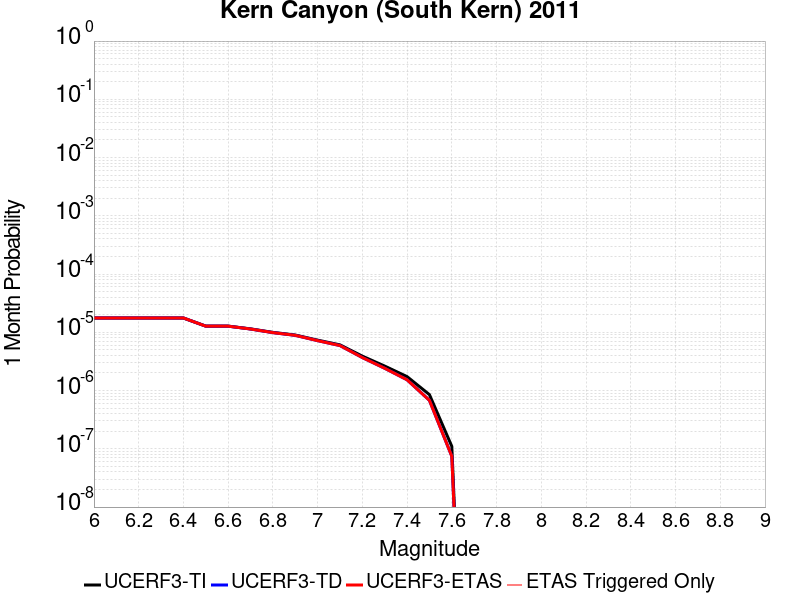 |  |  |

| Magnitude | 1 wk TI Prob | 1 wk TD Prob | 1 wk ETAS Prob | 1 wk ETAS/TD Gain | 1 wk ETAS Triggered Only | 1 mo TI Prob | 1 mo TD Prob | 1 mo ETAS Prob | 1 mo ETAS/TD Gain | 1 mo ETAS Triggered Only | 1 yr TI Prob | 1 yr TD Prob | 1 yr ETAS Prob | 1 yr ETAS/TD Gain | 1 yr ETAS Triggered Only | 10 yr TI Prob | 10 yr TD Prob | 10 yr ETAS Prob | 10 yr ETAS/TD Gain | 10 yr ETAS Triggered Only |
|-----|-----|-----|-----|-----|-----|-----|-----|-----|-----|-----|-----|-----|-----|-----|-----|-----|-----|-----|-----|-----|
| 6.0 | 4.105075E-6 | 4.113829E-6 | 4.113829E-6 | 1.0 | 0.0 | 1.7593058E-5 | 1.763058E-5 | 1.763058E-5 | 1.0 | 0.0 | 2.1417443E-4 | 2.1463181E-4 | 2.3462753E-4 | 1.0931628 | 2.0E-5 | 0.0021396813 | 0.0021443092 | 0.0021842234 | 1.018614 | 4.0E-5 |
| 6.1 | 4.105075E-6 | 4.113829E-6 | 4.113829E-6 | 1.0 | 0.0 | 1.7593058E-5 | 1.763058E-5 | 1.763058E-5 | 1.0 | 0.0 | 2.1417443E-4 | 2.1463181E-4 | 2.3462753E-4 | 1.0931628 | 2.0E-5 | 0.0021396813 | 0.0021443092 | 0.0021842234 | 1.018614 | 4.0E-5 |
| 6.2 | 4.105075E-6 | 4.113829E-6 | 4.113829E-6 | 1.0 | 0.0 | 1.7593058E-5 | 1.763058E-5 | 1.763058E-5 | 1.0 | 0.0 | 2.1417443E-4 | 2.1463181E-4 | 2.3462753E-4 | 1.0931628 | 2.0E-5 | 0.0021396813 | 0.0021443092 | 0.0021842234 | 1.018614 | 4.0E-5 |
| 6.3 | 4.105075E-6 | 4.113829E-6 | 4.113829E-6 | 1.0 | 0.0 | 1.7593058E-5 | 1.763058E-5 | 1.763058E-5 | 1.0 | 0.0 | 2.1417443E-4 | 2.1463181E-4 | 2.3462753E-4 | 1.0931628 | 2.0E-5 | 0.0021396813 | 0.0021443092 | 0.0021842234 | 1.018614 | 4.0E-5 |
| 6.4 | 4.105075E-6 | 4.113829E-6 | 4.113829E-6 | 1.0 | 0.0 | 1.7593058E-5 | 1.763058E-5 | 1.763058E-5 | 1.0 | 0.0 | 2.1417443E-4 | 2.1463181E-4 | 2.3462753E-4 | 1.0931628 | 2.0E-5 | 0.0021396813 | 0.0021443092 | 0.0021842234 | 1.018614 | 4.0E-5 |
| 6.5 | 2.9849807E-6 | 2.9732298E-6 | 2.9732298E-6 | 1.0 | 0.0 | 1.2792712E-5 | 1.2742352E-5 | 1.2742352E-5 | 1.0 | 0.0 | 1.5574014E-4 | 1.5512724E-4 | 1.7512414E-4 | 1.1289064 | 2.0E-5 | 0.0015563103 | 0.0015502047 | 0.0015901427 | 1.025763 | 4.0E-5 |
| 6.6 | 2.9849807E-6 | 2.9732298E-6 | 2.9732298E-6 | 1.0 | 0.0 | 1.2792712E-5 | 1.2742352E-5 | 1.2742352E-5 | 1.0 | 0.0 | 1.5574014E-4 | 1.5512724E-4 | 1.7512414E-4 | 1.1289064 | 2.0E-5 | 0.0015563103 | 0.0015502047 | 0.0015901427 | 1.025763 | 4.0E-5 |
| 6.7 | 2.6756725E-6 | 2.6582882E-6 | 2.6582882E-6 | 1.0 | 0.0 | 1.1467117E-5 | 1.1392614E-5 | 1.1392614E-5 | 1.0 | 0.0 | 1.396032E-4 | 1.3869636E-4 | 1.5869358E-4 | 1.1441799 | 2.0E-5 | 0.0013951553 | 0.0013861089 | 0.0014260535 | 1.0288178 | 4.0E-5 |
| 6.8 | 2.3283721E-6 | 2.3048378E-6 | 2.3048378E-6 | 1.0 | 0.0 | 9.9787E-6 | 9.87784E-6 | 9.87784E-6 | 1.0 | 0.0 | 1.214839E-4 | 1.2025614E-4 | 1.4025373E-4 | 1.1662917 | 2.0E-5 | 0.001214175 | 0.0012019181 | 0.001231882 | 1.0249301 | 3.0E-5 |
| 6.9 | 2.0972677E-6 | 2.0696948E-6 | 2.0696948E-6 | 1.0 | 0.0 | 8.988259E-6 | 8.870091E-6 | 8.870091E-6 | 1.0 | 0.0 | 1.0942656E-4 | 1.0798806E-4 | 1.279859E-4 | 1.1851857 | 2.0E-5 | 0.0010937268 | 0.0010793617 | 0.0011093293 | 1.0277642 | 3.0E-5 |
| 7.0 | 1.7132242E-6 | 1.6787479E-6 | 1.6787479E-6 | 1.0 | 0.0 | 7.3423685E-6 | 7.194614E-6 | 7.194614E-6 | 1.0 | 0.0 | 8.938967E-5 | 8.7590946E-5 | 9.759007E-5 | 1.1141571 | 1.0E-5 | 8.935372E-4 | 8.755681E-4 | 8.955506E-4 | 1.0228223 | 2.0E-5 |
| 7.1 | 1.4215541E-6 | 1.3816122E-6 | 1.3816122E-6 | 1.0 | 0.0 | 6.0923603E-6 | 5.921182E-6 | 5.921182E-6 | 1.0 | 0.0 | 7.417196E-5 | 7.2088034E-5 | 8.208731E-5 | 1.1387093 | 1.0E-5 | 7.414721E-4 | 7.2064914E-4 | 7.4063474E-4 | 1.0277327 | 2.0E-5 |
| 7.2 | 9.097853E-7 | 8.604018E-7 | 8.604018E-7 | 1.0 | 0.0 | 3.899074E-6 | 3.6874312E-6 | 3.6874312E-6 | 1.0 | 0.0 | 4.7470192E-5 | 4.489356E-5 | 5.4893113E-5 | 1.2227391 | 1.0E-5 | 4.7460053E-4 | 4.48846E-4 | 4.68837E-4 | 1.0445387 | 2.0E-5 |
| 7.3 | 6.144169E-7 | 5.628374E-7 | 5.628374E-7 | 1.0 | 0.0 | 2.6332125E-6 | 2.412158E-6 | 2.412158E-6 | 1.0 | 0.0 | 3.205889E-5 | 2.9367633E-5 | 3.936734E-5 | 1.340501 | 1.0E-5 | 3.2054266E-4 | 2.9363803E-4 | 3.1363216E-4 | 1.068091 | 2.0E-5 |
| 7.4 | 4.049844E-7 | 3.5729457E-7 | 3.5729457E-7 | 1.0 | 0.0 | 1.7356463E-6 | 1.5312617E-6 | 1.5312617E-6 | 1.0 | 0.0 | 2.1131287E-5 | 1.8642953E-5 | 1.8642953E-5 | 1.0 | 0.0 | 2.1129279E-4 | 1.8641414E-4 | 1.9641228E-4 | 1.053634 | 1.0E-5 |
| 7.5 | 1.9871162E-7 | 1.5831044E-7 | 1.5831044E-7 | 1.0 | 0.0 | 8.5162094E-7 | 6.7847316E-7 | 6.7847316E-7 | 1.0 | 0.0 | 1.0368436E-5 | 8.26038E-6 | 8.26038E-6 | 1.0 | 0.0 | 1.0367952E-4 | 8.260082E-5 | 9.259999E-5 | 1.1210542 | 1.0E-5 |
| 7.6 | 2.572245E-8 | 1.7353377E-8 | 1.7353377E-8 | 1.0 | 0.0 | 1.10239064E-7 | 7.437161E-8 | 7.437161E-8 | 1.0 | 0.0 | 1.3421597E-6 | 9.0547405E-7 | 9.0547405E-7 | 1.0 | 0.0 | 1.3421517E-5 | 9.054709E-6 | 9.054709E-6 | 1.0 | 0.0 |

## Pisgah-Bullion Mtn-Mesquite Lk
*[(top)](#table-of-contents)*

| 1 Week | 1 Month | 1 Year | 10 Year |
|-----|-----|-----|-----|
|  |  | 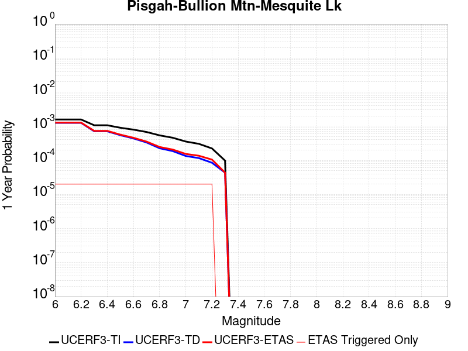 |  |

| Magnitude | 1 wk TI Prob | 1 wk TD Prob | 1 wk ETAS Prob | 1 wk ETAS/TD Gain | 1 wk ETAS Triggered Only | 1 mo TI Prob | 1 mo TD Prob | 1 mo ETAS Prob | 1 mo ETAS/TD Gain | 1 mo ETAS Triggered Only | 1 yr TI Prob | 1 yr TD Prob | 1 yr ETAS Prob | 1 yr ETAS/TD Gain | 1 yr ETAS Triggered Only | 10 yr TI Prob | 10 yr TD Prob | 10 yr ETAS Prob | 10 yr ETAS/TD Gain | 10 yr ETAS Triggered Only |
|-----|-----|-----|-----|-----|-----|-----|-----|-----|-----|-----|-----|-----|-----|-----|-----|-----|-----|-----|-----|-----|
| 6.0 | 3.0240792E-5 | 2.4094932E-5 | 2.4094932E-5 | 1.0 | 0.0 | 1.2959696E-4 | 1.0326047E-4 | 1.0326047E-4 | 1.0 | 0.0 | 0.0015767008 | 0.0012565716 | 0.0012765465 | 1.0158963 | 2.0E-5 | 0.015655609 | 0.012504691 | 0.012544191 | 1.0031588 | 4.0E-5 |
| 6.1 | 3.0240792E-5 | 2.4094932E-5 | 2.4094932E-5 | 1.0 | 0.0 | 1.2959696E-4 | 1.0326047E-4 | 1.0326047E-4 | 1.0 | 0.0 | 0.0015767008 | 0.0012565716 | 0.0012765465 | 1.0158963 | 2.0E-5 | 0.015655609 | 0.012504691 | 0.012544191 | 1.0031588 | 4.0E-5 |
| 6.2 | 3.0240792E-5 | 2.4094932E-5 | 2.4094932E-5 | 1.0 | 0.0 | 1.2959696E-4 | 1.0326047E-4 | 1.0326047E-4 | 1.0 | 0.0 | 0.0015767008 | 0.0012565716 | 0.0012765465 | 1.0158963 | 2.0E-5 | 0.015655609 | 0.012504691 | 0.012544191 | 1.0031588 | 4.0E-5 |
| 6.3 | 2.0498217E-5 | 1.3639918E-5 | 1.3639918E-5 | 1.0 | 0.0 | 8.784654E-5 | 5.845557E-5 | 5.845557E-5 | 1.0 | 0.0 | 0.0010690069 | 7.114804E-4 | 7.3146616E-4 | 1.0280904 | 2.0E-5 | 0.01063879 | 0.0070936526 | 0.0071234396 | 1.0041991 | 3.0E-5 |
| 6.4 | 2.0498217E-5 | 1.3639918E-5 | 1.3639918E-5 | 1.0 | 0.0 | 8.784654E-5 | 5.845557E-5 | 5.845557E-5 | 1.0 | 0.0 | 0.0010690069 | 7.114804E-4 | 7.3146616E-4 | 1.0280904 | 2.0E-5 | 0.01063879 | 0.0070936526 | 0.0071234396 | 1.0041991 | 3.0E-5 |
| 6.5 | 1.7316182E-5 | 1.0478391E-5 | 1.0478391E-5 | 1.0 | 0.0 | 7.42101E-5 | 4.4906676E-5 | 4.4906676E-5 | 1.0 | 0.0 | 9.0313336E-4 | 5.466116E-4 | 5.6660065E-4 | 1.036569 | 2.0E-5 | 0.008994718 | 0.005453667 | 0.005473558 | 1.0036472 | 2.0E-5 |
| 6.6 | 1.5251077E-5 | 8.415321E-6 | 8.415321E-6 | 1.0 | 0.0 | 6.536012E-5 | 3.60652E-5 | 3.60652E-5 | 1.0 | 0.0 | 7.9546886E-4 | 4.390126E-4 | 4.5900382E-4 | 1.0455368 | 2.0E-5 | 0.007926274 | 0.0043821707 | 0.004402083 | 1.0045439 | 2.0E-5 |
| 6.7 | 1.2997425E-5 | 6.4122637E-6 | 6.4122637E-6 | 1.0 | 0.0 | 5.570206E-5 | 2.7480868E-5 | 2.7480868E-5 | 1.0 | 0.0 | 6.7796157E-4 | 3.3453284E-4 | 3.5452616E-4 | 1.0597649 | 2.0E-5 | 0.0067589693 | 0.0033407528 | 0.0033606861 | 1.0059667 | 2.0E-5 |
| 6.8 | 1.035386E-5 | 4.3338546E-6 | 4.3338546E-6 | 1.0 | 0.0 | 4.437293E-5 | 1.8573535E-5 | 1.8573535E-5 | 1.0 | 0.0 | 5.401065E-4 | 2.2611019E-4 | 2.461057E-4 | 1.0884324 | 2.0E-5 | 0.0053879567 | 0.0022588882 | 0.002278843 | 1.0088339 | 2.0E-5 |
| 6.9 | 8.816252E-6 | 3.5811806E-6 | 3.5811806E-6 | 1.0 | 0.0 | 3.778339E-5 | 1.534783E-5 | 1.534783E-5 | 1.0 | 0.0 | 4.5991567E-4 | 1.868444E-4 | 2.0684066E-4 | 1.107021 | 2.0E-5 | 0.00458965 | 0.0018669316 | 0.0018868942 | 1.0106927 | 2.0E-5 |
| 7.0 | 6.8232207E-6 | 2.5679979E-6 | 2.5679979E-6 | 1.0 | 0.0 | 2.9242048E-5 | 1.1005661E-5 | 1.1005661E-5 | 1.0 | 0.0 | 3.5596377E-4 | 1.3398599E-4 | 1.5398332E-4 | 1.1492493 | 2.0E-5 | 0.0035539411 | 0.0013390832 | 0.0013590564 | 1.0149156 | 2.0E-5 |
| 7.1 | 5.837013E-6 | 2.227736E-6 | 2.227736E-6 | 1.0 | 0.0 | 2.501553E-5 | 9.547407E-6 | 9.547407E-6 | 1.0 | 0.0 | 3.045215E-4 | 1.1623378E-4 | 1.3623145E-4 | 1.172047 | 2.0E-5 | 0.0030410455 | 0.0011617589 | 0.0011817357 | 1.0171952 | 2.0E-5 |
| 7.2 | 4.278052E-6 | 1.6278252E-6 | 1.6278252E-6 | 1.0 | 0.0 | 1.833438E-5 | 6.9763764E-6 | 6.9763764E-6 | 1.0 | 0.0 | 2.231982E-4 | 8.493431E-5 | 1.0493261E-4 | 1.2354561 | 2.0E-5 | 0.0022297418 | 8.490417E-4 | 8.690247E-4 | 1.023536 | 2.0E-5 |
| 7.3 | 1.8803692E-6 | 8.346053E-7 | 8.346053E-7 | 1.0 | 0.0 | 8.0587E-6 | 3.576876E-6 | 3.576876E-6 | 1.0 | 0.0 | 9.811026E-5 | 4.354774E-5 | 4.354774E-5 | 1.0 | 0.0 | 9.806695E-4 | 4.3540655E-4 | 4.3540655E-4 | 1.0 | 0.0 |

## Chino alt 1
*[(top)](#table-of-contents)*

| 1 Week | 1 Month | 1 Year | 10 Year |
|-----|-----|-----|-----|
|  |  |  |  |

| Magnitude | 1 wk TI Prob | 1 wk TD Prob | 1 wk ETAS Prob | 1 wk ETAS/TD Gain | 1 wk ETAS Triggered Only | 1 mo TI Prob | 1 mo TD Prob | 1 mo ETAS Prob | 1 mo ETAS/TD Gain | 1 mo ETAS Triggered Only | 1 yr TI Prob | 1 yr TD Prob | 1 yr ETAS Prob | 1 yr ETAS/TD Gain | 1 yr ETAS Triggered Only | 10 yr TI Prob | 10 yr TD Prob | 10 yr ETAS Prob | 10 yr ETAS/TD Gain | 10 yr ETAS Triggered Only |
|-----|-----|-----|-----|-----|-----|-----|-----|-----|-----|-----|-----|-----|-----|-----|-----|-----|-----|-----|-----|-----|
| 6.0 | 3.939946E-5 | 4.8967257E-5 | 4.8967257E-5 | 1.0 | 0.0 | 1.6884391E-4 | 2.0984573E-4 | 2.0984573E-4 | 1.0 | 0.0 | 0.0020537362 | 0.002552355 | 0.0025623294 | 1.0039079 | 1.0E-5 | 0.020348595 | 0.025287293 | 0.02532628 | 1.0015419 | 4.0E-5 |
| 6.1 | 2.1505624E-5 | 2.6890864E-5 | 2.6890864E-5 | 1.0 | 0.0 | 9.2163704E-5 | 1.15242095E-4 | 1.15242095E-4 | 1.0 | 0.0 | 0.0011215154 | 0.0014022809 | 0.0014122669 | 1.0071212 | 1.0E-5 | 0.011158722 | 0.013951185 | 0.013970907 | 1.0014136 | 2.0E-5 |
| 6.2 | 2.1505624E-5 | 2.6890864E-5 | 2.6890864E-5 | 1.0 | 0.0 | 9.2163704E-5 | 1.15242095E-4 | 1.15242095E-4 | 1.0 | 0.0 | 0.0011215154 | 0.0014022809 | 0.0014122669 | 1.0071212 | 1.0E-5 | 0.011158722 | 0.013951185 | 0.013970907 | 1.0014136 | 2.0E-5 |
| 6.3 | 1.4290785E-5 | 1.8174556E-5 | 1.8174556E-5 | 1.0 | 0.0 | 6.1244784E-5 | 7.7888886E-5 | 7.7888886E-5 | 1.0 | 0.0 | 7.454001E-4 | 9.4793004E-4 | 9.4793004E-4 | 1.0 | 0.0 | 0.007429048 | 0.009449286 | 0.009459192 | 1.0010483 | 1.0E-5 |
| 6.4 | 1.4290785E-5 | 1.8174556E-5 | 1.8174556E-5 | 1.0 | 0.0 | 6.1244784E-5 | 7.7888886E-5 | 7.7888886E-5 | 1.0 | 0.0 | 7.454001E-4 | 9.4793004E-4 | 9.4793004E-4 | 1.0 | 0.0 | 0.007429048 | 0.009449286 | 0.009459192 | 1.0010483 | 1.0E-5 |
| 6.5 | 1.3017944E-5 | 1.6661137E-5 | 1.6661137E-5 | 1.0 | 0.0 | 5.5789995E-5 | 7.140317E-5 | 7.140317E-5 | 1.0 | 0.0 | 6.790315E-4 | 8.690306E-4 | 8.690306E-4 | 1.0 | 0.0 | 0.0067696036 | 0.008666586 | 0.008676499 | 1.0011438 | 1.0E-5 |
| 6.6 | 9.470016E-6 | 1.2046306E-5 | 1.2046306E-5 | 1.0 | 0.0 | 4.058515E-5 | 5.1626197E-5 | 5.1626197E-5 | 1.0 | 0.0 | 4.940122E-4 | 6.2840164E-4 | 6.2840164E-4 | 1.0 | 0.0 | 0.004929154 | 0.006275441 | 0.0062853782 | 1.0015835 | 1.0E-5 |
| 6.7 | 8.314155E-6 | 1.0413858E-5 | 1.0413858E-5 | 1.0 | 0.0 | 3.5631605E-5 | 4.4630237E-5 | 4.4630237E-5 | 1.0 | 0.0 | 4.3372845E-4 | 5.432699E-4 | 5.432699E-4 | 1.0 | 0.0 | 0.004328829 | 0.005428933 | 0.0054388787 | 1.001832 | 1.0E-5 |
| 6.8 | 3.4856364E-6 | 3.8155918E-6 | 3.8155918E-6 | 1.0 | 0.0 | 1.4938357E-5 | 1.6352446E-5 | 1.6352446E-5 | 1.0 | 0.0 | 1.8185932E-4 | 1.990749E-4 | 1.990749E-4 | 1.0 | 0.0 | 0.0018171056 | 0.001990641 | 0.001990641 | 1.0 | 0.0 |
| 6.9 | 2.2645952E-6 | 2.154401E-6 | 2.154401E-6 | 1.0 | 0.0 | 9.705372E-6 | 9.233116E-6 | 9.233116E-6 | 1.0 | 0.0 | 1.18156495E-4 | 1.124076E-4 | 1.124076E-4 | 1.0 | 0.0 | 0.0011809369 | 0.0011241237 | 0.0011241237 | 1.0 | 0.0 |
| 7.0 | 1.7864003E-6 | 1.5443994E-6 | 1.5443994E-6 | 1.0 | 0.0 | 7.655979E-6 | 6.618838E-6 | 6.618838E-6 | 1.0 | 0.0 | 9.3207556E-5 | 8.0581434E-5 | 8.0581434E-5 | 1.0 | 0.0 | 9.316847E-4 | 8.059694E-4 | 8.059694E-4 | 1.0 | 0.0 |
| 7.1 | 1.7315456E-6 | 1.4746504E-6 | 1.4746504E-6 | 1.0 | 0.0 | 7.420889E-6 | 6.319915E-6 | 6.319915E-6 | 1.0 | 0.0 | 9.034557E-5 | 7.6942306E-5 | 7.6942306E-5 | 1.0 | 0.0 | 9.0308854E-4 | 7.695947E-4 | 7.695947E-4 | 1.0 | 0.0 |
| 7.2 | 1.6008337E-6 | 1.3586603E-6 | 1.3586603E-6 | 1.0 | 0.0 | 6.860698E-6 | 5.822817E-6 | 5.822817E-6 | 1.0 | 0.0 | 8.352579E-5 | 7.089055E-5 | 7.089055E-5 | 1.0 | 0.0 | 8.34944E-4 | 7.0910365E-4 | 7.0910365E-4 | 1.0 | 0.0 |
| 7.3 | 1.3320939E-6 | 1.1229135E-6 | 1.1229135E-6 | 1.0 | 0.0 | 5.7089615E-6 | 4.8124784E-6 | 4.8124784E-6 | 1.0 | 0.0 | 6.9504385E-5 | 5.8590394E-5 | 5.8590394E-5 | 1.0 | 0.0 | 6.9482654E-4 | 5.858941E-4 | 5.858941E-4 | 1.0 | 0.0 |
| 7.4 | 1.114294E-6 | 9.2475307E-7 | 9.2475307E-7 | 1.0 | 0.0 | 4.775537E-6 | 3.963222E-6 | 3.963222E-6 | 1.0 | 0.0 | 5.8140613E-5 | 4.8251193E-5 | 4.8251193E-5 | 1.0 | 0.0 | 5.81254E-4 | 4.82424E-4 | 4.82424E-4 | 1.0 | 0.0 |
| 7.5 | 9.354081E-7 | 7.6331327E-7 | 7.6331327E-7 | 1.0 | 0.0 | 4.0088858E-6 | 3.2713388E-6 | 3.2713388E-6 | 1.0 | 0.0 | 4.8807087E-5 | 3.9827857E-5 | 3.9827857E-5 | 1.0 | 0.0 | 4.879637E-4 | 3.982106E-4 | 3.982106E-4 | 1.0 | 0.0 |
| 7.6 | 8.521771E-7 | 6.8901085E-7 | 6.8901085E-7 | 1.0 | 0.0 | 3.6521824E-6 | 2.9529006E-6 | 2.9529006E-6 | 1.0 | 0.0 | 4.4464414E-5 | 3.5951E-5 | 3.5951E-5 | 1.0 | 0.0 | 4.4455516E-4 | 3.5945504E-4 | 3.5945504E-4 | 1.0 | 0.0 |
| 7.7 | 2.1803626E-7 | 1.4212328E-7 | 1.4212328E-7 | 1.0 | 0.0 | 9.344408E-7 | 6.090997E-7 | 6.090997E-7 | 1.0 | 0.0 | 1.1376757E-5 | 7.4157733E-6 | 7.4157733E-6 | 1.0 | 0.0 | 1.13761744E-4 | 7.415622E-5 | 7.415622E-5 | 1.0 | 0.0 |

## Santa Ynez (East)
*[(top)](#table-of-contents)*

| 1 Week | 1 Month | 1 Year | 10 Year |
|-----|-----|-----|-----|
|  | 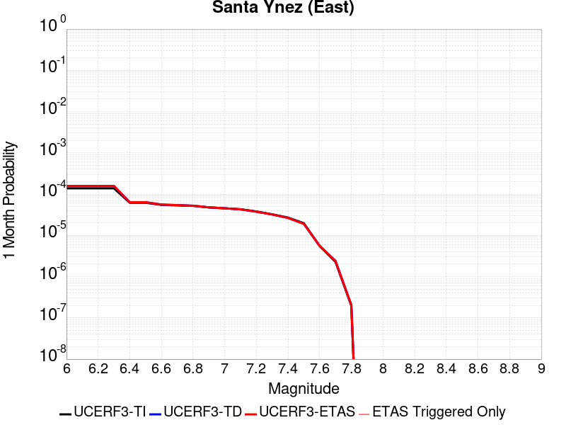 |  | 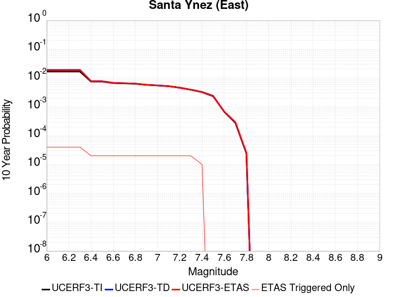 |

| Magnitude | 1 wk TI Prob | 1 wk TD Prob | 1 wk ETAS Prob | 1 wk ETAS/TD Gain | 1 wk ETAS Triggered Only | 1 mo TI Prob | 1 mo TD Prob | 1 mo ETAS Prob | 1 mo ETAS/TD Gain | 1 mo ETAS Triggered Only | 1 yr TI Prob | 1 yr TD Prob | 1 yr ETAS Prob | 1 yr ETAS/TD Gain | 1 yr ETAS Triggered Only | 10 yr TI Prob | 10 yr TD Prob | 10 yr ETAS Prob | 10 yr ETAS/TD Gain | 10 yr ETAS Triggered Only |
|-----|-----|-----|-----|-----|-----|-----|-----|-----|-----|-----|-----|-----|-----|-----|-----|-----|-----|-----|-----|-----|
| 6.0 | 3.2269712E-5 | 3.6759357E-5 | 3.6759357E-5 | 1.0 | 0.0 | 1.3829143E-4 | 1.5753391E-4 | 1.5753391E-4 | 1.0 | 0.0 | 0.0016823979 | 0.001916878 | 0.0019268589 | 1.0052068 | 1.0E-5 | 0.016697178 | 0.019060988 | 0.019100225 | 1.0020585 | 4.0E-5 |
| 6.1 | 3.2269712E-5 | 3.6759357E-5 | 3.6759357E-5 | 1.0 | 0.0 | 1.3829143E-4 | 1.5753391E-4 | 1.5753391E-4 | 1.0 | 0.0 | 0.0016823979 | 0.001916878 | 0.0019268589 | 1.0052068 | 1.0E-5 | 0.016697178 | 0.019060988 | 0.019100225 | 1.0020585 | 4.0E-5 |
| 6.2 | 3.2269712E-5 | 3.6759357E-5 | 3.6759357E-5 | 1.0 | 0.0 | 1.3829143E-4 | 1.5753391E-4 | 1.5753391E-4 | 1.0 | 0.0 | 0.0016823979 | 0.001916878 | 0.0019268589 | 1.0052068 | 1.0E-5 | 0.016697178 | 0.019060988 | 0.019100225 | 1.0020585 | 4.0E-5 |
| 6.3 | 3.2269712E-5 | 3.6759357E-5 | 3.6759357E-5 | 1.0 | 0.0 | 1.3829143E-4 | 1.5753391E-4 | 1.5753391E-4 | 1.0 | 0.0 | 0.0016823979 | 0.001916878 | 0.0019268589 | 1.0052068 | 1.0E-5 | 0.016697178 | 0.019060988 | 0.019100225 | 1.0020585 | 4.0E-5 |
| 6.4 | 1.4404779E-5 | 1.485166E-5 | 1.485166E-5 | 1.0 | 0.0 | 6.1733306E-5 | 6.364845E-5 | 6.364845E-5 | 1.0 | 0.0 | 7.513438E-4 | 7.746494E-4 | 7.746494E-4 | 1.0 | 0.0 | 0.0074880854 | 0.0077200416 | 0.007739887 | 1.0025706 | 2.0E-5 |
| 6.5 | 1.4404779E-5 | 1.485166E-5 | 1.485166E-5 | 1.0 | 0.0 | 6.1733306E-5 | 6.364845E-5 | 6.364845E-5 | 1.0 | 0.0 | 7.513438E-4 | 7.746494E-4 | 7.746494E-4 | 1.0 | 0.0 | 0.0074880854 | 0.0077200416 | 0.007739887 | 1.0025706 | 2.0E-5 |
| 6.6 | 1.280208E-5 | 1.3013867E-5 | 1.3013867E-5 | 1.0 | 0.0 | 5.4864904E-5 | 5.5772533E-5 | 5.5772533E-5 | 1.0 | 0.0 | 6.6777546E-4 | 6.788208E-4 | 6.788208E-4 | 1.0 | 0.0 | 0.006657724 | 0.0067676837 | 0.0067875483 | 1.0029352 | 2.0E-5 |
| 6.7 | 1.2457027E-5 | 1.2630331E-5 | 1.2630331E-5 | 1.0 | 0.0 | 5.3386164E-5 | 5.4128875E-5 | 5.4128875E-5 | 1.0 | 0.0 | 6.497827E-4 | 6.5882143E-4 | 6.5882143E-4 | 1.0 | 0.0 | 0.00647886 | 0.0065688808 | 0.0065887496 | 1.0030247 | 2.0E-5 |
| 6.8 | 1.2095134E-5 | 1.2232726E-5 | 1.2232726E-5 | 1.0 | 0.0 | 5.1835254E-5 | 5.2424923E-5 | 5.2424923E-5 | 1.0 | 0.0 | 6.309115E-4 | 6.380881E-4 | 6.380881E-4 | 1.0 | 0.0 | 0.0062912325 | 0.006362748 | 0.006382621 | 1.0031233 | 2.0E-5 |
| 6.9 | 1.1104036E-5 | 1.1159038E-5 | 1.1159038E-5 | 1.0 | 0.0 | 4.758786E-5 | 4.7823578E-5 | 4.7823578E-5 | 1.0 | 0.0 | 5.7922816E-4 | 5.820978E-4 | 5.820978E-4 | 1.0 | 0.0 | 0.005777207 | 0.005805876 | 0.0058257603 | 1.0034248 | 2.0E-5 |
| 7.0 | 1.0577444E-5 | 1.05833E-5 | 1.05833E-5 | 1.0 | 0.0 | 4.5331115E-5 | 4.5356217E-5 | 4.5356217E-5 | 1.0 | 0.0 | 5.5176654E-4 | 5.5207324E-4 | 5.5207324E-4 | 1.0 | 0.0 | 0.0055039856 | 0.005507156 | 0.0055270456 | 1.0036117 | 2.0E-5 |
| 7.1 | 1.0021775E-5 | 9.982541E-6 | 9.982541E-6 | 1.0 | 0.0 | 4.294976E-5 | 4.2781627E-5 | 4.2781627E-5 | 1.0 | 0.0 | 5.2278786E-4 | 5.2074296E-4 | 5.2074296E-4 | 1.0 | 0.0 | 0.0052155964 | 0.00519536 | 0.0052152565 | 1.0038296 | 2.0E-5 |
| 7.2 | 8.874109E-6 | 8.75021E-6 | 8.75021E-6 | 1.0 | 0.0 | 3.8031343E-5 | 3.750037E-5 | 3.750037E-5 | 1.0 | 0.0 | 4.629332E-4 | 4.5647242E-4 | 4.5647242E-4 | 1.0 | 0.0 | 0.0046197 | 0.004555466 | 0.004575375 | 1.0043703 | 2.0E-5 |
| 7.3 | 7.5504267E-6 | 7.506339E-6 | 7.506339E-6 | 1.0 | 0.0 | 3.235857E-5 | 3.2169635E-5 | 3.2169635E-5 | 1.0 | 0.0 | 3.9389438E-4 | 3.915959E-4 | 3.915959E-4 | 1.0 | 0.0 | 0.0039319694 | 0.003909166 | 0.0039290874 | 1.0050962 | 2.0E-5 |
| 7.4 | 6.309394E-6 | 6.1842215E-6 | 6.1842215E-6 | 1.0 | 0.0 | 2.703998E-5 | 2.6503543E-5 | 2.6503543E-5 | 1.0 | 0.0 | 3.2916202E-4 | 3.226338E-4 | 3.226338E-4 | 1.0 | 0.0 | 0.003286749 | 0.0032217514 | 0.0032317191 | 1.003094 | 1.0E-5 |
| 7.5 | 4.6103073E-6 | 4.441466E-6 | 4.441466E-6 | 1.0 | 0.0 | 1.975831E-5 | 1.903472E-5 | 1.903472E-5 | 1.0 | 0.0 | 2.4053088E-4 | 2.3172377E-4 | 2.3172377E-4 | 1.0 | 0.0 | 0.002402707 | 0.002314891 | 0.002314891 | 1.0 | 0.0 |
| 7.6 | 1.2858658E-6 | 1.3009125E-6 | 1.3009125E-6 | 1.0 | 0.0 | 5.5108417E-6 | 5.5753276E-6 | 5.5753276E-6 | 1.0 | 0.0 | 6.7092435E-5 | 6.787757E-5 | 6.787757E-5 | 1.0 | 0.0 | 6.707218E-4 | 6.7857525E-4 | 6.7857525E-4 | 1.0 | 0.0 |
| 7.7 | 5.3302307E-7 | 5.6125344E-7 | 5.6125344E-7 | 1.0 | 0.0 | 2.2843826E-6 | 2.4053697E-6 | 2.4053697E-6 | 1.0 | 0.0 | 2.7812002E-5 | 2.928502E-5 | 2.928502E-5 | 1.0 | 0.0 | 2.7808524E-4 | 2.9281518E-4 | 2.9281518E-4 | 1.0 | 0.0 |
| 7.8 | 4.613933E-8 | 4.803271E-8 | 4.803271E-8 | 1.0 | 0.0 | 1.9773998E-7 | 2.0585445E-7 | 2.0585445E-7 | 1.0 | 0.0 | 2.4074816E-6 | 2.5062752E-6 | 2.5062752E-6 | 1.0 | 0.0 | 2.4074554E-5 | 2.506248E-5 | 2.506248E-5 | 1.0 | 0.0 |

## Dry Mountain
*[(top)](#table-of-contents)*

| 1 Week | 1 Month | 1 Year | 10 Year |
|-----|-----|-----|-----|
| 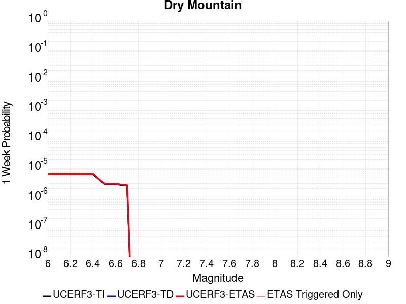 |  |  | 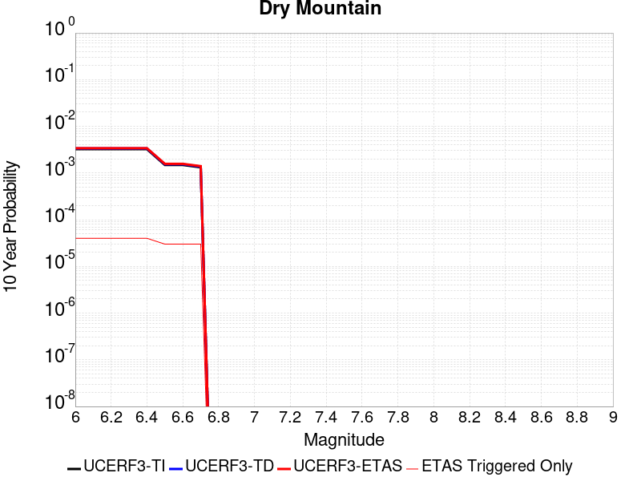 |

| Magnitude | 1 wk TI Prob | 1 wk TD Prob | 1 wk ETAS Prob | 1 wk ETAS/TD Gain | 1 wk ETAS Triggered Only | 1 mo TI Prob | 1 mo TD Prob | 1 mo ETAS Prob | 1 mo ETAS/TD Gain | 1 mo ETAS Triggered Only | 1 yr TI Prob | 1 yr TD Prob | 1 yr ETAS Prob | 1 yr ETAS/TD Gain | 1 yr ETAS Triggered Only | 10 yr TI Prob | 10 yr TD Prob | 10 yr ETAS Prob | 10 yr ETAS/TD Gain | 10 yr ETAS Triggered Only |
|-----|-----|-----|-----|-----|-----|-----|-----|-----|-----|-----|-----|-----|-----|-----|-----|-----|-----|-----|-----|-----|
| 6.0 | 6.222801E-6 | 6.4396786E-6 | 6.4396786E-6 | 1.0 | 0.0 | 2.6668875E-5 | 2.759842E-5 | 2.759842E-5 | 1.0 | 0.0 | 3.2464517E-4 | 3.3597488E-4 | 3.659648E-4 | 1.0892624 | 3.0E-5 | 0.0032417132 | 0.0033562316 | 0.0033960973 | 1.0118781 | 4.0E-5 |
| 6.1 | 6.222801E-6 | 6.4396786E-6 | 6.4396786E-6 | 1.0 | 0.0 | 2.6668875E-5 | 2.759842E-5 | 2.759842E-5 | 1.0 | 0.0 | 3.2464517E-4 | 3.3597488E-4 | 3.659648E-4 | 1.0892624 | 3.0E-5 | 0.0032417132 | 0.0033562316 | 0.0033960973 | 1.0118781 | 4.0E-5 |
| 6.2 | 6.222801E-6 | 6.4396786E-6 | 6.4396786E-6 | 1.0 | 0.0 | 2.6668875E-5 | 2.759842E-5 | 2.759842E-5 | 1.0 | 0.0 | 3.2464517E-4 | 3.3597488E-4 | 3.659648E-4 | 1.0892624 | 3.0E-5 | 0.0032417132 | 0.0033562316 | 0.0033960973 | 1.0118781 | 4.0E-5 |
| 6.3 | 6.222801E-6 | 6.4396786E-6 | 6.4396786E-6 | 1.0 | 0.0 | 2.6668875E-5 | 2.759842E-5 | 2.759842E-5 | 1.0 | 0.0 | 3.2464517E-4 | 3.3597488E-4 | 3.659648E-4 | 1.0892624 | 3.0E-5 | 0.0032417132 | 0.0033562316 | 0.0033960973 | 1.0118781 | 4.0E-5 |
| 6.4 | 6.222801E-6 | 6.4396786E-6 | 6.4396786E-6 | 1.0 | 0.0 | 2.6668875E-5 | 2.759842E-5 | 2.759842E-5 | 1.0 | 0.0 | 3.2464517E-4 | 3.3597488E-4 | 3.659648E-4 | 1.0892624 | 3.0E-5 | 0.0032417132 | 0.0033562316 | 0.0033960973 | 1.0118781 | 4.0E-5 |
| 6.5 | 2.8528623E-6 | 2.9523046E-6 | 2.9523046E-6 | 1.0 | 0.0 | 1.22264955E-5 | 1.2652722E-5 | 1.2652722E-5 | 1.0 | 0.0 | 1.4884741E-4 | 1.540447E-4 | 1.7404162E-4 | 1.1298125 | 2.0E-5 | 0.0014874774 | 0.0015402327 | 0.0015701865 | 1.0194476 | 3.0E-5 |
| 6.6 | 2.8528623E-6 | 2.9523046E-6 | 2.9523046E-6 | 1.0 | 0.0 | 1.22264955E-5 | 1.2652722E-5 | 1.2652722E-5 | 1.0 | 0.0 | 1.4884741E-4 | 1.540447E-4 | 1.7404162E-4 | 1.1298125 | 2.0E-5 | 0.0014874774 | 0.0015402327 | 0.0015701865 | 1.0194476 | 3.0E-5 |
| 6.7 | 2.541E-6 | 2.6294792E-6 | 2.6294792E-6 | 1.0 | 0.0 | 1.0889954E-5 | 1.1269196E-5 | 1.1269196E-5 | 1.0 | 0.0 | 1.3257713E-4 | 1.3720247E-4 | 1.5719973E-4 | 1.1457499 | 2.0E-5 | 0.0013249806 | 0.0013720246 | 0.0014019834 | 1.0218354 | 3.0E-5 |

## Hector Mine
*[(top)](#table-of-contents)*

| 1 Week | 1 Month | 1 Year | 10 Year |
|-----|-----|-----|-----|
| 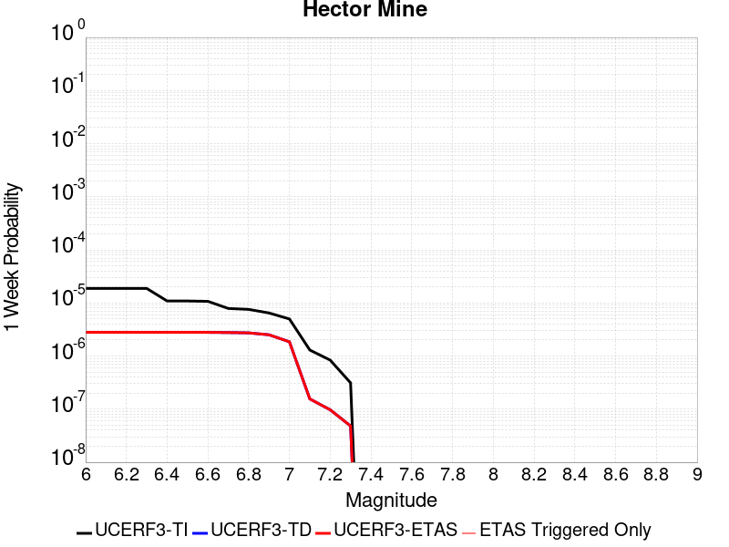 |  | 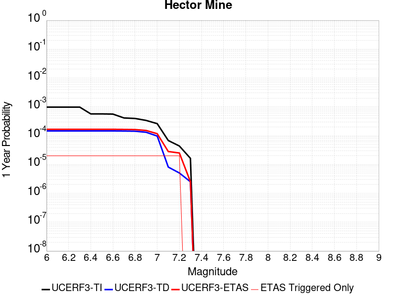 |  |

| Magnitude | 1 wk TI Prob | 1 wk TD Prob | 1 wk ETAS Prob | 1 wk ETAS/TD Gain | 1 wk ETAS Triggered Only | 1 mo TI Prob | 1 mo TD Prob | 1 mo ETAS Prob | 1 mo ETAS/TD Gain | 1 mo ETAS Triggered Only | 1 yr TI Prob | 1 yr TD Prob | 1 yr ETAS Prob | 1 yr ETAS/TD Gain | 1 yr ETAS Triggered Only | 10 yr TI Prob | 10 yr TD Prob | 10 yr ETAS Prob | 10 yr ETAS/TD Gain | 10 yr ETAS Triggered Only |
|-----|-----|-----|-----|-----|-----|-----|-----|-----|-----|-----|-----|-----|-----|-----|-----|-----|-----|-----|-----|-----|
| 6.0 | 1.8760093E-5 | 2.7970136E-6 | 2.7970136E-6 | 1.0 | 0.0 | 8.039792E-5 | 1.1987169E-5 | 1.1987169E-5 | 1.0 | 0.0 | 9.78405E-4 | 1.4593801E-4 | 1.659351E-4 | 1.1370245 | 2.0E-5 | 0.009741086 | 0.001458814 | 0.0014887704 | 1.0205346 | 3.0E-5 |
| 6.1 | 1.8760093E-5 | 2.7970136E-6 | 2.7970136E-6 | 1.0 | 0.0 | 8.039792E-5 | 1.1987169E-5 | 1.1987169E-5 | 1.0 | 0.0 | 9.78405E-4 | 1.4593801E-4 | 1.659351E-4 | 1.1370245 | 2.0E-5 | 0.009741086 | 0.001458814 | 0.0014887704 | 1.0205346 | 3.0E-5 |
| 6.2 | 1.8760093E-5 | 2.7970136E-6 | 2.7970136E-6 | 1.0 | 0.0 | 8.039792E-5 | 1.1987169E-5 | 1.1987169E-5 | 1.0 | 0.0 | 9.78405E-4 | 1.4593801E-4 | 1.659351E-4 | 1.1370245 | 2.0E-5 | 0.009741086 | 0.001458814 | 0.0014887704 | 1.0205346 | 3.0E-5 |
| 6.3 | 1.8760093E-5 | 2.7970136E-6 | 2.7970136E-6 | 1.0 | 0.0 | 8.039792E-5 | 1.1987169E-5 | 1.1987169E-5 | 1.0 | 0.0 | 9.78405E-4 | 1.4593801E-4 | 1.659351E-4 | 1.1370245 | 2.0E-5 | 0.009741086 | 0.001458814 | 0.0014887704 | 1.0205346 | 3.0E-5 |
| 6.4 | 1.0888055E-5 | 2.7970136E-6 | 2.7970136E-6 | 1.0 | 0.0 | 4.666226E-5 | 1.1987169E-5 | 1.1987169E-5 | 1.0 | 0.0 | 5.679649E-4 | 1.4593801E-4 | 1.659351E-4 | 1.1370245 | 2.0E-5 | 0.0056651547 | 0.001458814 | 0.0014887704 | 1.0205346 | 3.0E-5 |
| 6.5 | 1.0888055E-5 | 2.7970136E-6 | 2.7970136E-6 | 1.0 | 0.0 | 4.666226E-5 | 1.1987169E-5 | 1.1987169E-5 | 1.0 | 0.0 | 5.679649E-4 | 1.4593801E-4 | 1.659351E-4 | 1.1370245 | 2.0E-5 | 0.0056651547 | 0.001458814 | 0.0014887704 | 1.0205346 | 3.0E-5 |
| 6.6 | 1.0730738E-5 | 2.7970136E-6 | 2.7970136E-6 | 1.0 | 0.0 | 4.5988065E-5 | 1.1987169E-5 | 1.1987169E-5 | 1.0 | 0.0 | 5.5976084E-4 | 1.4593801E-4 | 1.659351E-4 | 1.1370245 | 2.0E-5 | 0.0055835294 | 0.001458814 | 0.0014887704 | 1.0205346 | 3.0E-5 |
| 6.7 | 7.881326E-6 | 2.7716853E-6 | 2.7716853E-6 | 1.0 | 0.0 | 3.3776672E-5 | 1.1878619E-5 | 1.1878619E-5 | 1.0 | 0.0 | 4.111534E-4 | 1.446166E-4 | 1.646137E-4 | 1.1382767 | 2.0E-5 | 0.0041039353 | 0.0014456171 | 0.0014755738 | 1.0207224 | 3.0E-5 |
| 6.8 | 7.5683483E-6 | 2.7334183E-6 | 2.7334183E-6 | 1.0 | 0.0 | 3.2435375E-5 | 1.171462E-5 | 1.171462E-5 | 1.0 | 0.0 | 3.9482914E-4 | 1.4262016E-4 | 1.6261732E-4 | 1.1402127 | 2.0E-5 | 0.0039412836 | 0.0014256785 | 0.0014556358 | 1.0210127 | 3.0E-5 |
| 6.9 | 6.473048E-6 | 2.5144282E-6 | 2.5144282E-6 | 1.0 | 0.0 | 2.7741338E-5 | 1.0776099E-5 | 1.0776099E-5 | 1.0 | 0.0 | 3.3769844E-4 | 1.3119508E-4 | 1.5119245E-4 | 1.1524247 | 2.0E-5 | 0.0033718573 | 0.0013115659 | 0.0013315397 | 1.015229 | 2.0E-5 |
| 7.0 | 4.9959954E-6 | 1.8569425E-6 | 1.8569425E-6 | 1.0 | 0.0 | 2.1411232E-5 | 7.958321E-6 | 7.958321E-6 | 1.0 | 0.0 | 2.6065056E-4 | 9.689181E-5 | 1.16889874E-4 | 1.2063957 | 2.0E-5 | 0.0026034506 | 9.688454E-4 | 9.88826E-4 | 1.0206231 | 2.0E-5 |
| 7.1 | 1.2997541E-6 | 1.5609024E-7 | 1.5609024E-7 | 1.0 | 0.0 | 5.5703626E-6 | 6.68958E-7 | 6.68958E-7 | 1.0 | 0.0 | 6.7817055E-5 | 8.144538E-6 | 2.8144375E-5 | 3.4556136 | 2.0E-5 | 6.779636E-4 | 8.144279E-5 | 1.0144116E-4 | 1.2455511 | 2.0E-5 |
| 7.2 | 8.392699E-7 | 9.731948E-8 | 9.731948E-8 | 1.0 | 0.0 | 3.596866E-6 | 4.170834E-7 | 4.170834E-7 | 1.0 | 0.0 | 4.3790962E-5 | 5.077981E-6 | 2.507788E-5 | 4.9385533 | 2.0E-5 | 4.3782333E-4 | 5.077884E-5 | 7.077782E-5 | 1.3938448 | 2.0E-5 |
| 7.3 | 3.13015E-7 | 4.831144E-8 | 4.831144E-8 | 1.0 | 0.0 | 1.3414921E-6 | 2.0704901E-7 | 2.0704901E-7 | 1.0 | 0.0 | 1.6332544E-5 | 2.5208196E-6 | 2.5208196E-6 | 1.0 | 0.0 | 1.6331344E-4 | 2.5207995E-5 | 2.5207995E-5 | 1.0 | 0.0 |

## Sierra Madre
*[(top)](#table-of-contents)*

| 1 Week | 1 Month | 1 Year | 10 Year |
|-----|-----|-----|-----|
|  |  |  |  |

| Magnitude | 1 wk TI Prob | 1 wk TD Prob | 1 wk ETAS Prob | 1 wk ETAS/TD Gain | 1 wk ETAS Triggered Only | 1 mo TI Prob | 1 mo TD Prob | 1 mo ETAS Prob | 1 mo ETAS/TD Gain | 1 mo ETAS Triggered Only | 1 yr TI Prob | 1 yr TD Prob | 1 yr ETAS Prob | 1 yr ETAS/TD Gain | 1 yr ETAS Triggered Only | 10 yr TI Prob | 10 yr TD Prob | 10 yr ETAS Prob | 10 yr ETAS/TD Gain | 10 yr ETAS Triggered Only |
|-----|-----|-----|-----|-----|-----|-----|-----|-----|-----|-----|-----|-----|-----|-----|-----|-----|-----|-----|-----|-----|
| 6.0 | 1.3379373E-5 | 1.1004191E-5 | 1.1004191E-5 | 1.0 | 0.0 | 5.7338908E-5 | 4.7159974E-5 | 5.71595E-5 | 1.2120342 | 1.0E-5 | 6.978776E-4 | 5.740229E-4 | 5.940114E-4 | 1.0348219 | 2.0E-5 | 0.0069569005 | 0.005725766 | 0.005755594 | 1.0052094 | 3.0E-5 |
| 6.1 | 1.3379373E-5 | 1.1004191E-5 | 1.1004191E-5 | 1.0 | 0.0 | 5.7338908E-5 | 4.7159974E-5 | 5.71595E-5 | 1.2120342 | 1.0E-5 | 6.978776E-4 | 5.740229E-4 | 5.940114E-4 | 1.0348219 | 2.0E-5 | 0.0069569005 | 0.005725766 | 0.005755594 | 1.0052094 | 3.0E-5 |
| 6.2 | 1.3379373E-5 | 1.1004191E-5 | 1.1004191E-5 | 1.0 | 0.0 | 5.7338908E-5 | 4.7159974E-5 | 5.71595E-5 | 1.2120342 | 1.0E-5 | 6.978776E-4 | 5.740229E-4 | 5.940114E-4 | 1.0348219 | 2.0E-5 | 0.0069569005 | 0.005725766 | 0.005755594 | 1.0052094 | 3.0E-5 |
| 6.3 | 1.3379373E-5 | 1.1004191E-5 | 1.1004191E-5 | 1.0 | 0.0 | 5.7338908E-5 | 4.7159974E-5 | 5.71595E-5 | 1.2120342 | 1.0E-5 | 6.978776E-4 | 5.740229E-4 | 5.940114E-4 | 1.0348219 | 2.0E-5 | 0.0069569005 | 0.005725766 | 0.005755594 | 1.0052094 | 3.0E-5 |
| 6.4 | 1.3379373E-5 | 1.1004191E-5 | 1.1004191E-5 | 1.0 | 0.0 | 5.7338908E-5 | 4.7159974E-5 | 5.71595E-5 | 1.2120342 | 1.0E-5 | 6.978776E-4 | 5.740229E-4 | 5.940114E-4 | 1.0348219 | 2.0E-5 | 0.0069569005 | 0.005725766 | 0.005755594 | 1.0052094 | 3.0E-5 |
| 6.5 | 1.26563245E-5 | 1.023358E-5 | 1.023358E-5 | 1.0 | 0.0 | 5.4240263E-5 | 4.3857468E-5 | 5.3857028E-5 | 1.2280014 | 1.0E-5 | 6.601751E-4 | 5.338349E-4 | 5.5382424E-4 | 1.0374447 | 2.0E-5 | 0.006582173 | 0.0053258473 | 0.005345741 | 1.0037353 | 2.0E-5 |
| 6.6 | 1.26563245E-5 | 1.023358E-5 | 1.023358E-5 | 1.0 | 0.0 | 5.4240263E-5 | 4.3857468E-5 | 5.3857028E-5 | 1.2280014 | 1.0E-5 | 6.601751E-4 | 5.338349E-4 | 5.5382424E-4 | 1.0374447 | 2.0E-5 | 0.006582173 | 0.0053258473 | 0.005345741 | 1.0037353 | 2.0E-5 |
| 6.7 | 1.2502474E-5 | 1.006971E-5 | 1.006971E-5 | 1.0 | 0.0 | 5.3580934E-5 | 4.315519E-5 | 5.315476E-5 | 1.2317119 | 1.0E-5 | 6.521526E-4 | 5.252888E-4 | 5.452783E-4 | 1.0380543 | 2.0E-5 | 0.0065024206 | 0.005240791 | 0.0052606864 | 1.0037962 | 2.0E-5 |
| 6.8 | 1.2454966E-5 | 1.002199E-5 | 1.002199E-5 | 1.0 | 0.0 | 5.3377335E-5 | 4.2950687E-5 | 5.2950258E-5 | 1.2328151 | 1.0E-5 | 6.4967526E-4 | 5.228002E-4 | 5.4278976E-4 | 1.0382355 | 2.0E-5 | 0.006477792 | 0.0052160216 | 0.0052359174 | 1.0038143 | 2.0E-5 |
| 6.9 | 1.2225574E-5 | 9.795794E-6 | 9.795794E-6 | 1.0 | 0.0 | 5.2394265E-5 | 4.1981304E-5 | 5.1980885E-5 | 1.2381912 | 1.0E-5 | 6.3771347E-4 | 5.1100354E-4 | 5.3099333E-4 | 1.0391186 | 2.0E-5 | 0.006358865 | 0.0050986013 | 0.0051184995 | 1.0039027 | 2.0E-5 |
| 7.0 | 1.182946E-5 | 9.402269E-6 | 9.402269E-6 | 1.0 | 0.0 | 5.06967E-5 | 4.029482E-5 | 5.029442E-5 | 1.2481608 | 1.0E-5 | 6.1705755E-4 | 4.9048004E-4 | 5.1047024E-4 | 1.0407563 | 2.0E-5 | 0.006153469 | 0.004894287 | 0.0049141888 | 1.0040663 | 2.0E-5 |
| 7.1 | 1.14369095E-5 | 8.989202E-6 | 8.989202E-6 | 1.0 | 0.0 | 4.9014405E-5 | 3.8524588E-5 | 3.8524588E-5 | 1.0 | 0.0 | 5.9658696E-4 | 4.6893687E-4 | 4.789322E-4 | 1.0213149 | 1.0E-5 | 0.005949879 | 0.004679779 | 0.0046897326 | 1.0021268 | 1.0E-5 |
| 7.2 | 1.0836419E-5 | 8.402509E-6 | 8.402509E-6 | 1.0 | 0.0 | 4.644097E-5 | 3.601026E-5 | 3.601026E-5 | 1.0 | 0.0 | 5.652721E-4 | 4.3833765E-4 | 4.4833325E-4 | 1.0228034 | 1.0E-5 | 0.0056383642 | 0.0043750275 | 0.004384984 | 1.0022757 | 1.0E-5 |
| 7.3 | 1.0403439E-5 | 8.02372E-6 | 8.02372E-6 | 1.0 | 0.0 | 4.4585406E-5 | 3.438692E-5 | 3.438692E-5 | 1.0 | 0.0 | 5.426921E-4 | 4.1858124E-4 | 4.2857707E-4 | 1.0238802 | 1.0E-5 | 0.005413687 | 0.0041782237 | 0.004188182 | 1.0023834 | 1.0E-5 |
| 7.4 | 9.768864E-6 | 7.4172585E-6 | 7.4172585E-6 | 1.0 | 0.0 | 4.186589E-5 | 3.178787E-5 | 3.178787E-5 | 1.0 | 0.0 | 5.09598E-4 | 3.8694945E-4 | 3.9694557E-4 | 1.0258331 | 1.0E-5 | 0.0050843097 | 0.0038630487 | 0.00387301 | 1.0025786 | 1.0E-5 |
| 7.5 | 8.687089E-6 | 6.4527394E-6 | 6.4527394E-6 | 1.0 | 0.0 | 3.722985E-5 | 2.765431E-5 | 2.765431E-5 | 1.0 | 0.0 | 4.5317915E-4 | 3.3664008E-4 | 3.466367E-4 | 1.0296953 | 1.0E-5 | 0.004522561 | 0.0033615883 | 0.0033715547 | 1.0029647 | 1.0E-5 |
| 7.6 | 6.3506063E-6 | 4.4326393E-6 | 4.4326393E-6 | 1.0 | 0.0 | 2.72166E-5 | 1.8996889E-5 | 1.8996889E-5 | 1.0 | 0.0 | 3.3131172E-4 | 2.3126282E-4 | 2.4126051E-4 | 1.0432309 | 1.0E-5 | 0.003308182 | 0.0023104465 | 0.0023204233 | 1.0043181 | 1.0E-5 |
| 7.7 | 4.62223E-6 | 2.935122E-6 | 2.935122E-6 | 1.0 | 0.0 | 1.9809406E-5 | 1.2579034E-5 | 1.2579034E-5 | 1.0 | 0.0 | 2.4115283E-4 | 1.5313899E-4 | 1.6313746E-4 | 1.0652902 | 1.0E-5 | 0.0024089129 | 0.0015305356 | 0.0015405203 | 1.0065236 | 1.0E-5 |
| 7.8 | 3.2145008E-6 | 1.9510014E-6 | 1.9510014E-6 | 1.0 | 0.0 | 1.3776359E-5 | 8.361408E-6 | 8.361408E-6 | 1.0 | 0.0 | 1.6771426E-4 | 1.01795405E-4 | 1.1179438E-4 | 1.0982263 | 1.0E-5 | 0.0016758774 | 0.0010176324 | 0.0010276221 | 1.0098168 | 1.0E-5 |
| 7.9 | 1.0391769E-6 | 5.6080785E-7 | 5.6080785E-7 | 1.0 | 0.0 | 4.4536077E-6 | 2.40346E-6 | 2.40346E-6 | 1.0 | 0.0 | 5.4221324E-5 | 2.9261737E-5 | 3.9261446E-5 | 1.3417332 | 1.0E-5 | 5.4208096E-4 | 2.9257927E-4 | 3.0257634E-4 | 1.0341687 | 1.0E-5 |
| 8.0 | 1.210983E-7 | 6.617328E-8 | 6.617328E-8 | 1.0 | 0.0 | 5.1899264E-7 | 2.8359972E-7 | 2.8359972E-7 | 1.0 | 0.0 | 6.3187167E-6 | 3.4528214E-6 | 3.4528214E-6 | 1.0 | 0.0 | 6.318537E-5 | 3.4527697E-5 | 3.4527697E-5 | 1.0 | 0.0 |

## Coronado Bank alt1
*[(top)](#table-of-contents)*

| 1 Week | 1 Month | 1 Year | 10 Year |
|-----|-----|-----|-----|
|  |  |  |  |

| Magnitude | 1 wk TI Prob | 1 wk TD Prob | 1 wk ETAS Prob | 1 wk ETAS/TD Gain | 1 wk ETAS Triggered Only | 1 mo TI Prob | 1 mo TD Prob | 1 mo ETAS Prob | 1 mo ETAS/TD Gain | 1 mo ETAS Triggered Only | 1 yr TI Prob | 1 yr TD Prob | 1 yr ETAS Prob | 1 yr ETAS/TD Gain | 1 yr ETAS Triggered Only | 10 yr TI Prob | 10 yr TD Prob | 10 yr ETAS Prob | 10 yr ETAS/TD Gain | 10 yr ETAS Triggered Only |
|-----|-----|-----|-----|-----|-----|-----|-----|-----|-----|-----|-----|-----|-----|-----|-----|-----|-----|-----|-----|-----|
| 6.0 | 7.533492E-5 | 9.398079E-5 | 9.398079E-5 | 1.0 | 0.0 | 3.22824E-4 | 4.027169E-4 | 4.1271286E-4 | 1.0248213 | 1.0E-5 | 0.0039233007 | 0.0048925513 | 0.0049124537 | 1.0040679 | 2.0E-5 | 0.03854755 | 0.04791869 | 0.047947254 | 1.000596 | 3.0E-5 |
| 6.1 | 4.1807285E-5 | 5.050703E-5 | 5.050703E-5 | 1.0 | 0.0 | 1.7916178E-4 | 2.1644133E-4 | 2.2643917E-4 | 1.0461919 | 1.0E-5 | 0.0021791123 | 0.0026320831 | 0.0026420567 | 1.0037893 | 1.0E-5 | 0.021578677 | 0.02601815 | 0.02602789 | 1.0003743 | 1.0E-5 |
| 6.2 | 4.1807285E-5 | 5.050703E-5 | 5.050703E-5 | 1.0 | 0.0 | 1.7916178E-4 | 2.1644133E-4 | 2.2643917E-4 | 1.0461919 | 1.0E-5 | 0.0021791123 | 0.0026320831 | 0.0026420567 | 1.0037893 | 1.0E-5 | 0.021578677 | 0.02601815 | 0.02602789 | 1.0003743 | 1.0E-5 |
| 6.3 | 3.1793104E-5 | 3.7720565E-5 | 3.7720565E-5 | 1.0 | 0.0 | 1.3624904E-4 | 1.6164976E-4 | 1.7164813E-4 | 1.0618521 | 1.0E-5 | 0.0016575698 | 0.0019663367 | 0.001976317 | 1.0050756 | 1.0E-5 | 0.016452603 | 0.019493273 | 0.019503077 | 1.000503 | 1.0E-5 |
| 6.4 | 2.9878007E-5 | 3.5344478E-5 | 3.5344478E-5 | 1.0 | 0.0 | 1.2804232E-4 | 1.5146774E-4 | 1.5146774E-4 | 1.0 | 0.0 | 0.0015578003 | 0.0018425882 | 0.0018425882 | 1.0 | 0.0 | 0.015469253 | 0.01827687 | 0.01827687 | 1.0 | 0.0 |
| 6.5 | 2.4512565E-5 | 2.877075E-5 | 2.877075E-5 | 1.0 | 0.0 | 1.0504962E-4 | 1.2329755E-4 | 1.2329755E-4 | 1.0 | 0.0 | 0.0012782287 | 0.0015001415 | 0.0015001415 | 1.0 | 0.0 | 0.012709012 | 0.014903126 | 0.014903126 | 1.0 | 0.0 |
| 6.6 | 2.1317413E-5 | 2.491231E-5 | 2.491231E-5 | 1.0 | 0.0 | 9.135714E-5 | 1.06762796E-4 | 1.06762796E-4 | 1.0 | 0.0 | 0.0011117056 | 0.0012990843 | 0.0012990843 | 1.0 | 0.0 | 0.011061605 | 0.012917308 | 0.012917308 | 1.0 | 0.0 |
| 6.7 | 1.8585655E-5 | 2.1639657E-5 | 2.1639657E-5 | 1.0 | 0.0 | 7.9650374E-5 | 9.2738206E-5 | 9.2738206E-5 | 1.0 | 0.0 | 9.6931186E-4 | 0.0011285233 | 0.0011285233 | 1.0 | 0.0 | 0.0096509475 | 0.011230088 | 0.011230088 | 1.0 | 0.0 |
| 6.8 | 1.5862879E-5 | 1.8423476E-5 | 1.8423476E-5 | 1.0 | 0.0 | 6.798199E-5 | 7.895547E-5 | 7.895547E-5 | 1.0 | 0.0 | 8.273665E-4 | 9.608782E-4 | 9.608782E-4 | 1.0 | 0.0 | 0.008242928 | 0.009569218 | 0.009569218 | 1.0 | 0.0 |
| 6.9 | 1.3021509E-5 | 1.5098512E-5 | 1.5098512E-5 | 1.0 | 0.0 | 5.5805274E-5 | 6.470641E-5 | 6.470641E-5 | 1.0 | 0.0 | 6.792174E-4 | 7.875339E-4 | 7.875339E-4 | 1.0 | 0.0 | 0.006771452 | 0.007849255 | 0.007849255 | 1.0 | 0.0 |
| 7.0 | 1.0974371E-5 | 1.2722845E-5 | 1.2722845E-5 | 1.0 | 0.0 | 4.7032172E-5 | 5.4525437E-5 | 5.4525437E-5 | 1.0 | 0.0 | 5.7246623E-4 | 6.6366256E-4 | 6.6366256E-4 | 1.0 | 0.0 | 0.0057099373 | 0.006618556 | 0.006618556 | 1.0 | 0.0 |
| 7.1 | 8.766221E-6 | 1.0166036E-5 | 1.0166036E-5 | 1.0 | 0.0 | 3.7568978E-5 | 4.3568096E-5 | 4.3568096E-5 | 1.0 | 0.0 | 4.573063E-4 | 5.3032965E-4 | 5.3032965E-4 | 1.0 | 0.0 | 0.0045636636 | 0.005292341 | 0.005292341 | 1.0 | 0.0 |
| 7.2 | 8.026024E-7 | 8.332506E-7 | 8.332506E-7 | 1.0 | 0.0 | 3.43972E-6 | 3.5710693E-6 | 3.5710693E-6 | 1.0 | 0.0 | 4.1877785E-5 | 4.3476914E-5 | 4.3476914E-5 | 1.0 | 0.0 | 4.1869894E-4 | 4.3468518E-4 | 4.3468518E-4 | 1.0 | 0.0 |
| 7.3 | 3.7293114E-7 | 3.70035E-7 | 3.70035E-7 | 1.0 | 0.0 | 1.5982754E-6 | 1.5858633E-6 | 1.5858633E-6 | 1.0 | 0.0 | 1.9458828E-5 | 1.9307714E-5 | 1.9307714E-5 | 1.0 | 0.0 | 1.9457124E-4 | 1.9306043E-4 | 1.9306043E-4 | 1.0 | 0.0 |
| 7.4 | 2.0557036E-7 | 1.9675562E-7 | 1.9675562E-7 | 1.0 | 0.0 | 8.810155E-7 | 8.432381E-7 | 8.432381E-7 | 1.0 | 0.0 | 1.0726311E-5 | 1.0266376E-5 | 1.0266376E-5 | 1.0 | 0.0 | 1.0725793E-4 | 1.0265905E-4 | 1.0265905E-4 | 1.0 | 0.0 |
| 7.5 | 6.845446E-8 | 6.279751E-8 | 6.279751E-8 | 1.0 | 0.0 | 2.9337625E-7 | 2.6913216E-7 | 2.6913216E-7 | 1.0 | 0.0 | 3.5718497E-6 | 3.2766793E-6 | 3.2766793E-6 | 1.0 | 0.0 | 3.5717923E-5 | 3.276632E-5 | 3.276632E-5 | 1.0 | 0.0 |
| 7.6 | 6.0975145E-9 | 5.531959E-9 | 5.531959E-9 | 1.0 | 0.0 | 2.6132206E-8 | 2.3708395E-8 | 2.3708395E-8 | 1.0 | 0.0 | 3.1815955E-7 | 2.886497E-7 | 2.886497E-7 | 1.0 | 0.0 | 3.181591E-6 | 2.886494E-6 | 2.886494E-6 | 1.0 | 0.0 |

## Blue Cut
*[(top)](#table-of-contents)*

| 1 Week | 1 Month | 1 Year | 10 Year |
|-----|-----|-----|-----|
|  |  |  |  |

| Magnitude | 1 wk TI Prob | 1 wk TD Prob | 1 wk ETAS Prob | 1 wk ETAS/TD Gain | 1 wk ETAS Triggered Only | 1 mo TI Prob | 1 mo TD Prob | 1 mo ETAS Prob | 1 mo ETAS/TD Gain | 1 mo ETAS Triggered Only | 1 yr TI Prob | 1 yr TD Prob | 1 yr ETAS Prob | 1 yr ETAS/TD Gain | 1 yr ETAS Triggered Only | 10 yr TI Prob | 10 yr TD Prob | 10 yr ETAS Prob | 10 yr ETAS/TD Gain | 10 yr ETAS Triggered Only |
|-----|-----|-----|-----|-----|-----|-----|-----|-----|-----|-----|-----|-----|-----|-----|-----|-----|-----|-----|-----|-----|
| 6.0 | 2.1227985E-5 | 2.2721695E-5 | 2.2721695E-5 | 1.0 | 0.0 | 9.097391E-5 | 9.7375385E-5 | 9.7375385E-5 | 1.0 | 0.0 | 0.0011070445 | 0.0011849586 | 0.0011949468 | 1.0084292 | 1.0E-5 | 0.011015458 | 0.011792246 | 0.011821893 | 1.002514 | 3.0E-5 |
| 6.1 | 2.1227985E-5 | 2.2721695E-5 | 2.2721695E-5 | 1.0 | 0.0 | 9.097391E-5 | 9.7375385E-5 | 9.7375385E-5 | 1.0 | 0.0 | 0.0011070445 | 0.0011849586 | 0.0011949468 | 1.0084292 | 1.0E-5 | 0.011015458 | 0.011792246 | 0.011821893 | 1.002514 | 3.0E-5 |
| 6.2 | 2.1227985E-5 | 2.2721695E-5 | 2.2721695E-5 | 1.0 | 0.0 | 9.097391E-5 | 9.7375385E-5 | 9.7375385E-5 | 1.0 | 0.0 | 0.0011070445 | 0.0011849586 | 0.0011949468 | 1.0084292 | 1.0E-5 | 0.011015458 | 0.011792246 | 0.011821893 | 1.002514 | 3.0E-5 |
| 6.3 | 1.1613981E-5 | 1.2354586E-5 | 1.2354586E-5 | 1.0 | 0.0 | 4.9773254E-5 | 5.294722E-5 | 5.294722E-5 | 1.0 | 0.0 | 6.0582085E-4 | 6.444542E-4 | 6.444542E-4 | 1.0 | 0.0 | 0.0060417196 | 0.006427101 | 0.0064370367 | 1.0015459 | 1.0E-5 |
| 6.4 | 1.1613981E-5 | 1.2354586E-5 | 1.2354586E-5 | 1.0 | 0.0 | 4.9773254E-5 | 5.294722E-5 | 5.294722E-5 | 1.0 | 0.0 | 6.0582085E-4 | 6.444542E-4 | 6.444542E-4 | 1.0 | 0.0 | 0.0060417196 | 0.006427101 | 0.0064370367 | 1.0015459 | 1.0E-5 |
| 6.5 | 8.931326E-6 | 9.4823745E-6 | 9.4823745E-6 | 1.0 | 0.0 | 3.8276554E-5 | 4.0638166E-5 | 4.0638166E-5 | 1.0 | 0.0 | 4.6591737E-4 | 4.946665E-4 | 4.946665E-4 | 1.0 | 0.0 | 0.0046494175 | 0.004936564 | 0.0049465145 | 1.0020157 | 1.0E-5 |
| 6.6 | 7.345353E-6 | 7.790905E-6 | 7.790905E-6 | 1.0 | 0.0 | 3.1479703E-5 | 3.338921E-5 | 3.338921E-5 | 1.0 | 0.0 | 3.83198E-4 | 4.0644582E-4 | 4.0644582E-4 | 1.0 | 0.0 | 0.0038253788 | 0.004057816 | 0.004057816 | 1.0 | 0.0 |
| 6.7 | 6.2775666E-6 | 6.65568E-6 | 6.65568E-6 | 1.0 | 0.0 | 2.690358E-5 | 2.8524073E-5 | 2.8524073E-5 | 1.0 | 0.0 | 3.2750185E-4 | 3.4723277E-4 | 3.4723277E-4 | 1.0 | 0.0 | 0.0032701963 | 0.0034676434 | 0.0034676434 | 1.0 | 0.0 |
| 6.8 | 5.5234095E-6 | 5.8555775E-6 | 5.8555775E-6 | 1.0 | 0.0 | 2.367154E-5 | 2.5095133E-5 | 2.5095133E-5 | 1.0 | 0.0 | 2.8816288E-4 | 3.0549767E-4 | 3.0549767E-4 | 1.0 | 0.0 | 0.002877895 | 0.0030514933 | 0.0030514933 | 1.0 | 0.0 |
| 6.9 | 4.7780054E-6 | 5.0658246E-6 | 5.0658246E-6 | 1.0 | 0.0 | 2.0477004E-5 | 2.1710535E-5 | 2.1710535E-5 | 1.0 | 0.0 | 2.4927902E-4 | 2.6430076E-4 | 2.6430076E-4 | 1.0 | 0.0 | 0.0024899957 | 0.0026405565 | 0.0026405565 | 1.0 | 0.0 |
| 7.0 | 3.883171E-6 | 4.118818E-6 | 4.118818E-6 | 1.0 | 0.0 | 1.6642054E-5 | 1.7651997E-5 | 1.7651997E-5 | 1.0 | 0.0 | 2.0259817E-4 | 2.1489876E-4 | 2.1489876E-4 | 1.0 | 0.0 | 0.0020241356 | 0.0021475854 | 0.0021475854 | 1.0 | 0.0 |
| 7.1 | 2.8358215E-6 | 3.0099607E-6 | 3.0099607E-6 | 1.0 | 0.0 | 1.2153464E-5 | 1.28998045E-5 | 1.28998045E-5 | 1.0 | 0.0 | 1.4795837E-4 | 1.5705038E-4 | 1.5705038E-4 | 1.0 | 0.0 | 0.001478599 | 0.0015700393 | 0.0015700393 | 1.0 | 0.0 |

## Santa Rosa Island
*[(top)](#table-of-contents)*

| 1 Week | 1 Month | 1 Year | 10 Year |
|-----|-----|-----|-----|
|  |  |  | 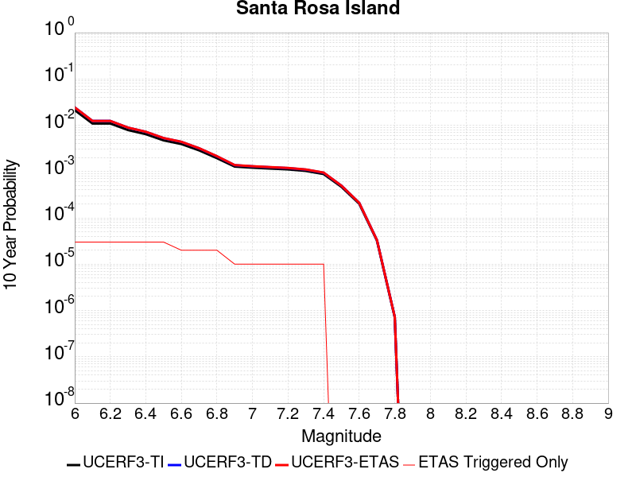 |

| Magnitude | 1 wk TI Prob | 1 wk TD Prob | 1 wk ETAS Prob | 1 wk ETAS/TD Gain | 1 wk ETAS Triggered Only | 1 mo TI Prob | 1 mo TD Prob | 1 mo ETAS Prob | 1 mo ETAS/TD Gain | 1 mo ETAS Triggered Only | 1 yr TI Prob | 1 yr TD Prob | 1 yr ETAS Prob | 1 yr ETAS/TD Gain | 1 yr ETAS Triggered Only | 10 yr TI Prob | 10 yr TD Prob | 10 yr ETAS Prob | 10 yr ETAS/TD Gain | 10 yr ETAS Triggered Only |
|-----|-----|-----|-----|-----|-----|-----|-----|-----|-----|-----|-----|-----|-----|-----|-----|-----|-----|-----|-----|-----|
| 6.0 | 4.1143165E-5 | 4.7100217E-5 | 4.7100217E-5 | 1.0 | 0.0 | 1.7631594E-4 | 2.0184356E-4 | 2.0184356E-4 | 1.0 | 0.0 | 0.002144533 | 0.002454873 | 0.002454873 | 1.0 | 0.0 | 0.021239553 | 0.024298182 | 0.024327453 | 1.0012046 | 3.0E-5 |
| 6.1 | 2.1061249E-5 | 2.3869197E-5 | 2.3869197E-5 | 1.0 | 0.0 | 9.0259375E-5 | 1.0229272E-4 | 1.0229272E-4 | 1.0 | 0.0 | 0.0010983539 | 0.0012447312 | 0.0012447312 | 1.0 | 0.0 | 0.01092941 | 0.0123806335 | 0.012410262 | 1.0023931 | 3.0E-5 |
| 6.2 | 2.1061249E-5 | 2.3869197E-5 | 2.3869197E-5 | 1.0 | 0.0 | 9.0259375E-5 | 1.0229272E-4 | 1.0229272E-4 | 1.0 | 0.0 | 0.0010983539 | 0.0012447312 | 0.0012447312 | 1.0 | 0.0 | 0.01092941 | 0.0123806335 | 0.012410262 | 1.0023931 | 3.0E-5 |
| 6.3 | 1.5158236E-5 | 1.70773E-5 | 1.70773E-5 | 1.0 | 0.0 | 6.496225E-5 | 7.318644E-5 | 7.318644E-5 | 1.0 | 0.0 | 7.906284E-4 | 8.906926E-4 | 8.906926E-4 | 1.0 | 0.0 | 0.007878214 | 0.008872479 | 0.008902214 | 1.0033512 | 3.0E-5 |
| 6.4 | 1.2341918E-5 | 1.3855181E-5 | 1.3855181E-5 | 1.0 | 0.0 | 5.2892858E-5 | 5.9378042E-5 | 5.9378042E-5 | 1.0 | 0.0 | 6.437803E-4 | 7.22696E-4 | 7.22696E-4 | 1.0 | 0.0 | 0.006419184 | 0.0072042947 | 0.0072340784 | 1.0041342 | 3.0E-5 |
| 6.5 | 9.061158E-6 | 1.0118608E-5 | 1.0118608E-5 | 1.0 | 0.0 | 3.883296E-5 | 4.336477E-5 | 4.336477E-5 | 1.0 | 0.0 | 4.726887E-4 | 5.278435E-4 | 5.278435E-4 | 1.0 | 0.0 | 0.004716845 | 0.005266436 | 0.005296278 | 1.0056665 | 3.0E-5 |
| 6.6 | 7.5461685E-6 | 8.402008E-6 | 8.402008E-6 | 1.0 | 0.0 | 3.2340322E-5 | 3.6008132E-5 | 3.6008132E-5 | 1.0 | 0.0 | 3.936723E-4 | 4.383151E-4 | 4.383151E-4 | 1.0 | 0.0 | 0.003929756 | 0.0043749358 | 0.004394848 | 1.0045515 | 2.0E-5 |
| 6.7 | 5.5023775E-6 | 6.08825E-6 | 6.08825E-6 | 1.0 | 0.0 | 2.3581404E-5 | 2.6092257E-5 | 2.6092257E-5 | 1.0 | 0.0 | 2.8706578E-4 | 3.1763015E-4 | 3.1763015E-4 | 1.0 | 0.0 | 0.0028669522 | 0.0031720835 | 0.00319202 | 1.006285 | 2.0E-5 |
| 6.8 | 3.7351679E-6 | 4.0836526E-6 | 4.0836526E-6 | 1.0 | 0.0 | 1.6007763E-5 | 1.7501266E-5 | 1.7501266E-5 | 1.0 | 0.0 | 1.948771E-4 | 2.1305957E-4 | 2.1305957E-4 | 1.0 | 0.0 | 0.0019470629 | 0.0021287983 | 0.0021487558 | 1.009375 | 2.0E-5 |
| 6.9 | 2.456366E-6 | 2.6295188E-6 | 2.6295188E-6 | 1.0 | 0.0 | 1.0527241E-5 | 1.1269318E-5 | 1.1269318E-5 | 1.0 | 0.0 | 1.2816161E-4 | 1.3719534E-4 | 1.3719534E-4 | 1.0 | 0.0 | 0.0012808773 | 0.0013711093 | 0.0013810956 | 1.0072833 | 1.0E-5 |
| 7.0 | 2.3245157E-6 | 2.4830051E-6 | 2.4830051E-6 | 1.0 | 0.0 | 9.962172E-6 | 1.0641406E-5 | 1.0641406E-5 | 1.0 | 0.0 | 1.2128269E-4 | 1.2955145E-4 | 1.2955145E-4 | 1.0 | 0.0 | 0.0012121652 | 0.0012947614 | 0.0013047486 | 1.0077134 | 1.0E-5 |
| 7.1 | 2.2248344E-6 | 2.3734624E-6 | 2.3734624E-6 | 1.0 | 0.0 | 9.53497E-6 | 1.01719415E-5 | 1.01719415E-5 | 1.0 | 0.0 | 1.1608207E-4 | 1.2383638E-4 | 1.2383638E-4 | 1.0 | 0.0 | 0.0011602144 | 0.0012376757 | 0.0012476633 | 1.0080696 | 1.0E-5 |
| 7.2 | 2.1350402E-6 | 2.2763559E-6 | 2.2763559E-6 | 1.0 | 0.0 | 9.150141E-6 | 9.755774E-6 | 9.755774E-6 | 1.0 | 0.0 | 1.1139726E-4 | 1.1877009E-4 | 1.1877009E-4 | 1.0 | 0.0 | 0.0011134144 | 0.0011870681 | 0.0011970563 | 1.0084141 | 1.0E-5 |
| 7.3 | 1.9793572E-6 | 2.108904E-6 | 2.108904E-6 | 1.0 | 0.0 | 8.482932E-6 | 9.038129E-6 | 9.038129E-6 | 1.0 | 0.0 | 1.032748E-4 | 1.1003368E-4 | 1.1003368E-4 | 1.0 | 0.0 | 0.0010322682 | 0.0010997938 | 0.0011097828 | 1.0090826 | 1.0E-5 |
| 7.4 | 1.6951194E-6 | 1.8047301E-6 | 1.8047301E-6 | 1.0 | 0.0 | 7.264777E-6 | 7.734535E-6 | 7.734535E-6 | 1.0 | 0.0 | 8.844508E-5 | 9.416391E-5 | 9.416391E-5 | 1.0 | 0.0 | 8.840988E-4 | 9.4124174E-4 | 9.5123233E-4 | 1.0106143 | 1.0E-5 |
| 7.5 | 8.987207E-7 | 9.5129707E-7 | 9.5129707E-7 | 1.0 | 0.0 | 3.8516546E-6 | 4.076981E-6 | 4.076981E-6 | 1.0 | 0.0 | 4.6892885E-5 | 4.9636128E-5 | 4.9636128E-5 | 1.0 | 0.0 | 4.688299E-4 | 4.9625157E-4 | 4.9625157E-4 | 1.0 | 0.0 |
| 7.6 | 3.8783037E-7 | 4.05319E-7 | 4.05319E-7 | 1.0 | 0.0 | 1.6621291E-6 | 1.7370804E-6 | 1.7370804E-6 | 1.0 | 0.0 | 2.0236233E-5 | 2.1148755E-5 | 2.1148755E-5 | 1.0 | 0.0 | 2.023439E-4 | 2.1146808E-4 | 2.1146808E-4 | 1.0 | 0.0 |
| 7.7 | 6.181804E-8 | 6.339348E-8 | 6.339348E-8 | 1.0 | 0.0 | 2.6493444E-7 | 2.716863E-7 | 2.716863E-7 | 1.0 | 0.0 | 3.225572E-6 | 3.3077758E-6 | 3.3077758E-6 | 1.0 | 0.0 | 3.225525E-5 | 3.307727E-5 | 3.307727E-5 | 1.0 | 0.0 |
| 7.8 | 1.3704449E-9 | 1.3964505E-9 | 1.3964505E-9 | 1.0 | 0.0 | 5.873335E-9 | 5.9847878E-9 | 5.9847878E-9 | 1.0 | 0.0 | 7.1507856E-8 | 7.2864786E-8 | 7.2864786E-8 | 1.0 | 0.0 | 7.1507833E-7 | 7.286477E-7 | 7.286477E-7 | 1.0 | 0.0 |

## Bullion Mountains
*[(top)](#table-of-contents)*

| 1 Week | 1 Month | 1 Year | 10 Year |
|-----|-----|-----|-----|
|  |  | 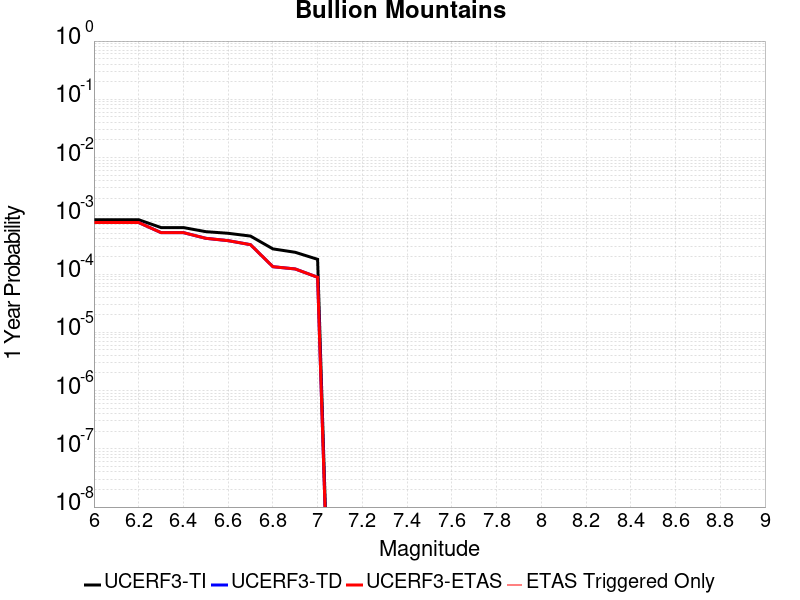 |  |

| Magnitude | 1 wk TI Prob | 1 wk TD Prob | 1 wk ETAS Prob | 1 wk ETAS/TD Gain | 1 wk ETAS Triggered Only | 1 mo TI Prob | 1 mo TD Prob | 1 mo ETAS Prob | 1 mo ETAS/TD Gain | 1 mo ETAS Triggered Only | 1 yr TI Prob | 1 yr TD Prob | 1 yr ETAS Prob | 1 yr ETAS/TD Gain | 1 yr ETAS Triggered Only | 10 yr TI Prob | 10 yr TD Prob | 10 yr ETAS Prob | 10 yr ETAS/TD Gain | 10 yr ETAS Triggered Only |
|-----|-----|-----|-----|-----|-----|-----|-----|-----|-----|-----|-----|-----|-----|-----|-----|-----|-----|-----|-----|-----|
| 6.0 | 1.6420427E-5 | 1.4694254E-5 | 1.4694254E-5 | 1.0 | 0.0 | 7.037136E-5 | 6.297407E-5 | 6.297407E-5 | 1.0 | 0.0 | 8.5643446E-4 | 7.6647796E-4 | 7.6647796E-4 | 1.0 | 0.0 | 0.008531413 | 0.0076421383 | 0.007671909 | 1.0038956 | 3.0E-5 |
| 6.1 | 1.6420427E-5 | 1.4694254E-5 | 1.4694254E-5 | 1.0 | 0.0 | 7.037136E-5 | 6.297407E-5 | 6.297407E-5 | 1.0 | 0.0 | 8.5643446E-4 | 7.6647796E-4 | 7.6647796E-4 | 1.0 | 0.0 | 0.008531413 | 0.0076421383 | 0.007671909 | 1.0038956 | 3.0E-5 |
| 6.2 | 1.6420427E-5 | 1.4694254E-5 | 1.4694254E-5 | 1.0 | 0.0 | 7.037136E-5 | 6.297407E-5 | 6.297407E-5 | 1.0 | 0.0 | 8.5643446E-4 | 7.6647796E-4 | 7.6647796E-4 | 1.0 | 0.0 | 0.008531413 | 0.0076421383 | 0.007671909 | 1.0038956 | 3.0E-5 |
| 6.3 | 1.2046778E-5 | 9.863831E-6 | 9.863831E-6 | 1.0 | 0.0 | 5.1628023E-5 | 4.2273008E-5 | 4.2273008E-5 | 1.0 | 0.0 | 6.283899E-4 | 5.145755E-4 | 5.145755E-4 | 1.0 | 0.0 | 0.0062661595 | 0.0051361225 | 0.0051560197 | 1.003874 | 2.0E-5 |
| 6.4 | 1.2046778E-5 | 9.863831E-6 | 9.863831E-6 | 1.0 | 0.0 | 5.1628023E-5 | 4.2273008E-5 | 4.2273008E-5 | 1.0 | 0.0 | 6.283899E-4 | 5.145755E-4 | 5.145755E-4 | 1.0 | 0.0 | 0.0062661595 | 0.0051361225 | 0.0051560197 | 1.003874 | 2.0E-5 |
| 6.5 | 1.0244343E-5 | 7.880692E-6 | 7.880692E-6 | 1.0 | 0.0 | 4.390359E-5 | 3.377407E-5 | 3.377407E-5 | 1.0 | 0.0 | 5.343951E-4 | 4.1114242E-4 | 4.1114242E-4 | 1.0 | 0.0 | 0.005331118 | 0.004105849 | 0.0041257674 | 1.0048511 | 2.0E-5 |
| 6.6 | 9.605408E-6 | 7.1786376E-6 | 7.1786376E-6 | 1.0 | 0.0 | 4.1165385E-5 | 3.0765343E-5 | 3.0765343E-5 | 1.0 | 0.0 | 5.010733E-4 | 3.74524E-4 | 3.74524E-4 | 1.0 | 0.0 | 0.00499945 | 0.0037409258 | 0.003760851 | 1.0053263 | 2.0E-5 |
| 6.7 | 8.60418E-6 | 6.125002E-6 | 6.125002E-6 | 1.0 | 0.0 | 3.687454E-5 | 2.6249854E-5 | 2.6249854E-5 | 1.0 | 0.0 | 4.48855E-4 | 3.195646E-4 | 3.195646E-4 | 1.0 | 0.0 | 0.004479495 | 0.0031929633 | 0.0032128994 | 1.0062438 | 2.0E-5 |
| 6.8 | 5.187994E-6 | 2.5636944E-6 | 2.5636944E-6 | 1.0 | 0.0 | 2.223407E-5 | 1.0987237E-5 | 1.0987237E-5 | 1.0 | 0.0 | 2.7066618E-4 | 1.337654E-4 | 1.337654E-4 | 1.0 | 0.0 | 0.0027033675 | 0.0013372406 | 0.0013472273 | 1.0074681 | 1.0E-5 |
| 6.9 | 4.5302368E-6 | 2.3447733E-6 | 2.3447733E-6 | 1.0 | 0.0 | 1.9415156E-5 | 1.00490115E-5 | 1.00490115E-5 | 1.0 | 0.0 | 2.3635388E-4 | 1.2234382E-4 | 1.2234382E-4 | 1.0 | 0.0 | 0.0023610266 | 0.0012231539 | 0.0012231539 | 1.0 | 0.0 |
| 7.0 | 3.431668E-6 | 1.6885947E-6 | 1.6885947E-6 | 1.0 | 0.0 | 1.4707065E-5 | 7.2368343E-6 | 7.2368343E-6 | 1.0 | 0.0 | 1.7904381E-4 | 8.8108456E-5 | 8.8108456E-5 | 1.0 | 0.0 | 0.0017889962 | 8.810846E-4 | 8.810846E-4 | 1.0 | 0.0 |

## Rose Canyon
*[(top)](#table-of-contents)*

| 1 Week | 1 Month | 1 Year | 10 Year |
|-----|-----|-----|-----|
|  |  |  |  |

| Magnitude | 1 wk TI Prob | 1 wk TD Prob | 1 wk ETAS Prob | 1 wk ETAS/TD Gain | 1 wk ETAS Triggered Only | 1 mo TI Prob | 1 mo TD Prob | 1 mo ETAS Prob | 1 mo ETAS/TD Gain | 1 mo ETAS Triggered Only | 1 yr TI Prob | 1 yr TD Prob | 1 yr ETAS Prob | 1 yr ETAS/TD Gain | 1 yr ETAS Triggered Only | 10 yr TI Prob | 10 yr TD Prob | 10 yr ETAS Prob | 10 yr ETAS/TD Gain | 10 yr ETAS Triggered Only |
|-----|-----|-----|-----|-----|-----|-----|-----|-----|-----|-----|-----|-----|-----|-----|-----|-----|-----|-----|-----|-----|
| 6.0 | 4.5923203E-5 | 4.9793205E-5 | 5.9792706E-5 | 1.2008206 | 1.0E-5 | 1.9679888E-4 | 2.1338335E-4 | 2.2338121E-4 | 1.046854 | 1.0E-5 | 0.0023933933 | 0.0025950412 | 0.0026050154 | 1.0038435 | 1.0E-5 | 0.023677798 | 0.025680156 | 0.025709387 | 1.0011382 | 3.0E-5 |
| 6.1 | 4.5923203E-5 | 4.9793205E-5 | 5.9792706E-5 | 1.2008206 | 1.0E-5 | 1.9679888E-4 | 2.1338335E-4 | 2.2338121E-4 | 1.046854 | 1.0E-5 | 0.0023933933 | 0.0025950412 | 0.0026050154 | 1.0038435 | 1.0E-5 | 0.023677798 | 0.025680156 | 0.025709387 | 1.0011382 | 3.0E-5 |
| 6.2 | 2.8844734E-5 | 2.9738942E-5 | 2.9738942E-5 | 1.0 | 0.0 | 1.2361443E-4 | 1.2744658E-4 | 1.2744658E-4 | 1.0 | 0.0 | 0.0015039665 | 0.0015505927 | 0.0015505927 | 1.0 | 0.0 | 0.0149382865 | 0.015410602 | 0.015420448 | 1.000639 | 1.0E-5 |
| 6.3 | 2.3171577E-5 | 2.3229592E-5 | 2.3229592E-5 | 1.0 | 0.0 | 9.9302975E-5 | 9.9551675E-5 | 9.9551675E-5 | 1.0 | 0.0 | 0.0012083431 | 0.0012113812 | 0.0012113812 | 1.0 | 0.0 | 0.012017938 | 0.012057545 | 0.012067424 | 1.0008193 | 1.0E-5 |
| 6.4 | 2.0066604E-5 | 1.9708776E-5 | 1.9708776E-5 | 1.0 | 0.0 | 8.599689E-5 | 8.446351E-5 | 8.446351E-5 | 1.0 | 0.0 | 0.0010465092 | 0.0010278681 | 0.0010278681 | 1.0 | 0.0 | 0.010415946 | 0.0102390535 | 0.0102390535 | 1.0 | 0.0 |
| 6.5 | 1.776989E-5 | 1.7138804E-5 | 1.7138804E-5 | 1.0 | 0.0 | 7.615444E-5 | 7.344999E-5 | 7.344999E-5 | 1.0 | 0.0 | 9.267859E-4 | 8.9389377E-4 | 8.9389377E-4 | 1.0 | 0.0 | 0.009229303 | 0.008909108 | 0.008909108 | 1.0 | 0.0 |
| 6.6 | 1.5227364E-5 | 1.4347781E-5 | 1.4347781E-5 | 1.0 | 0.0 | 6.52585E-5 | 6.148907E-5 | 6.148907E-5 | 1.0 | 0.0 | 7.942326E-4 | 7.4837747E-4 | 7.4837747E-4 | 1.0 | 0.0 | 0.007914 | 0.007462769 | 0.007462769 | 1.0 | 0.0 |
| 6.7 | 1.2703898E-5 | 1.1675434E-5 | 1.1675434E-5 | 1.0 | 0.0 | 5.4444143E-5 | 5.0036637E-5 | 5.0036637E-5 | 1.0 | 0.0 | 6.626558E-4 | 6.0903E-4 | 6.0903E-4 | 1.0 | 0.0 | 0.006606833 | 0.0060762027 | 0.0060762027 | 1.0 | 0.0 |
| 6.8 | 1.1554917E-5 | 1.0611212E-5 | 1.0611212E-5 | 1.0 | 0.0 | 4.9520135E-5 | 4.5475852E-5 | 4.5475852E-5 | 1.0 | 0.0 | 6.0274085E-4 | 5.535319E-4 | 5.535319E-4 | 1.0 | 0.0 | 0.0060110865 | 0.005523539 | 0.005523539 | 1.0 | 0.0 |
| 6.9 | 8.732078E-6 | 7.882266E-6 | 7.882266E-6 | 1.0 | 0.0 | 3.7422655E-5 | 3.378072E-5 | 3.378072E-5 | 1.0 | 0.0 | 4.5552556E-4 | 4.1120558E-4 | 4.1120558E-4 | 1.0 | 0.0 | 0.0045459294 | 0.004105279 | 0.004105279 | 1.0 | 0.0 |
| 7.0 | 5.9337494E-6 | 5.107943E-6 | 5.107943E-6 | 1.0 | 0.0 | 2.5430107E-5 | 2.1891E-5 | 2.1891E-5 | 1.0 | 0.0 | 3.0956755E-4 | 2.6649048E-4 | 2.6649048E-4 | 1.0 | 0.0 | 0.0030913667 | 0.0026617248 | 0.0026617248 | 1.0 | 0.0 |
| 7.1 | 5.013409E-6 | 4.177747E-6 | 4.177747E-6 | 1.0 | 0.0 | 2.1485863E-5 | 1.7904507E-5 | 1.7904507E-5 | 1.0 | 0.0 | 2.6155898E-4 | 2.1796567E-4 | 2.1796567E-4 | 1.0 | 0.0 | 0.0026125133 | 0.0021775307 | 0.0021775307 | 1.0 | 0.0 |
| 7.2 | 4.120763E-6 | 3.2824337E-6 | 3.2824337E-6 | 1.0 | 0.0 | 1.7660293E-5 | 1.4067497E-5 | 1.4067497E-5 | 1.0 | 0.0 | 2.1499286E-4 | 1.712584E-4 | 1.712584E-4 | 1.0 | 0.0 | 0.0021478499 | 0.0017112739 | 0.0017112739 | 1.0 | 0.0 |
| 7.3 | 3.2081239E-6 | 2.4407627E-6 | 2.4407627E-6 | 1.0 | 0.0 | 1.374903E-5 | 1.046037E-5 | 1.046037E-5 | 1.0 | 0.0 | 1.6738157E-4 | 1.2734762E-4 | 1.2734762E-4 | 1.0 | 0.0 | 0.0016725556 | 0.0012727535 | 0.0012727535 | 1.0 | 0.0 |
| 7.4 | 2.4194755E-6 | 1.7682352E-6 | 1.7682352E-6 | 1.0 | 0.0 | 1.0369139E-5 | 7.578129E-6 | 7.578129E-6 | 1.0 | 0.0 | 1.2623696E-4 | 9.225987E-5 | 9.225987E-5 | 1.0 | 0.0 | 0.0012616527 | 9.22221E-4 | 9.22221E-4 | 1.0 | 0.0 |
| 7.5 | 1.3842889E-6 | 9.379746E-7 | 9.379746E-7 | 1.0 | 0.0 | 5.9326535E-6 | 4.019885E-6 | 4.019885E-6 | 1.0 | 0.0 | 7.222766E-5 | 4.894104E-5 | 4.894104E-5 | 1.0 | 0.0 | 7.220419E-4 | 4.8930617E-4 | 4.8930617E-4 | 1.0 | 0.0 |
| 7.6 | 1.0021575E-6 | 6.4123174E-7 | 6.4123174E-7 | 1.0 | 0.0 | 4.2949537E-6 | 2.7481333E-6 | 2.7481333E-6 | 1.0 | 0.0 | 5.2289808E-5 | 3.345803E-5 | 3.345803E-5 | 1.0 | 0.0 | 5.2277505E-4 | 3.345321E-4 | 3.345321E-4 | 1.0 | 0.0 |
| 7.7 | 8.7620116E-8 | 6.4496746E-8 | 6.4496746E-8 | 1.0 | 0.0 | 3.7551473E-7 | 2.764146E-7 | 2.764146E-7 | 1.0 | 0.0 | 4.5718825E-6 | 3.365343E-6 | 3.365343E-6 | 1.0 | 0.0 | 4.5717883E-5 | 3.365295E-5 | 3.365295E-5 | 1.0 | 0.0 |

## San Juan
*[(top)](#table-of-contents)*

| 1 Week | 1 Month | 1 Year | 10 Year |
|-----|-----|-----|-----|
|  |  |  |  |

| Magnitude | 1 wk TI Prob | 1 wk TD Prob | 1 wk ETAS Prob | 1 wk ETAS/TD Gain | 1 wk ETAS Triggered Only | 1 mo TI Prob | 1 mo TD Prob | 1 mo ETAS Prob | 1 mo ETAS/TD Gain | 1 mo ETAS Triggered Only | 1 yr TI Prob | 1 yr TD Prob | 1 yr ETAS Prob | 1 yr ETAS/TD Gain | 1 yr ETAS Triggered Only | 10 yr TI Prob | 10 yr TD Prob | 10 yr ETAS Prob | 10 yr ETAS/TD Gain | 10 yr ETAS Triggered Only |
|-----|-----|-----|-----|-----|-----|-----|-----|-----|-----|-----|-----|-----|-----|-----|-----|-----|-----|-----|-----|-----|
| 6.0 | 8.682808E-6 | 8.7531325E-6 | 8.7531325E-6 | 1.0 | 0.0 | 3.72115E-5 | 3.7512913E-5 | 3.7512913E-5 | 1.0 | 0.0 | 4.5295584E-4 | 4.5662883E-4 | 4.6662425E-4 | 1.0218896 | 1.0E-5 | 0.004520337 | 0.0045574466 | 0.00458731 | 1.0065526 | 3.0E-5 |
| 6.1 | 8.682808E-6 | 8.7531325E-6 | 8.7531325E-6 | 1.0 | 0.0 | 3.72115E-5 | 3.7512913E-5 | 3.7512913E-5 | 1.0 | 0.0 | 4.5295584E-4 | 4.5662883E-4 | 4.6662425E-4 | 1.0218896 | 1.0E-5 | 0.004520337 | 0.0045574466 | 0.00458731 | 1.0065526 | 3.0E-5 |
| 6.2 | 8.682808E-6 | 8.7531325E-6 | 8.7531325E-6 | 1.0 | 0.0 | 3.72115E-5 | 3.7512913E-5 | 3.7512913E-5 | 1.0 | 0.0 | 4.5295584E-4 | 4.5662883E-4 | 4.6662425E-4 | 1.0218896 | 1.0E-5 | 0.004520337 | 0.0045574466 | 0.00458731 | 1.0065526 | 3.0E-5 |
| 6.3 | 6.3054235E-6 | 6.286431E-6 | 6.286431E-6 | 1.0 | 0.0 | 2.7022963E-5 | 2.6941576E-5 | 2.6941576E-5 | 1.0 | 0.0 | 3.2895492E-4 | 3.2796574E-4 | 3.2796574E-4 | 1.0 | 0.0 | 0.003284684 | 0.0032750175 | 0.0032849847 | 1.0030434 | 1.0E-5 |
| 6.4 | 6.1490473E-6 | 6.1177834E-6 | 6.1177834E-6 | 1.0 | 0.0 | 2.6352795E-5 | 2.6218817E-5 | 2.6218817E-5 | 1.0 | 0.0 | 3.2079802E-4 | 3.191687E-4 | 3.191687E-4 | 1.0 | 0.0 | 0.0032033534 | 0.0031872997 | 0.0031972677 | 1.0031275 | 1.0E-5 |
| 6.5 | 5.204848E-6 | 5.1404445E-6 | 5.1404445E-6 | 1.0 | 0.0 | 2.23063E-5 | 2.2030295E-5 | 2.2030295E-5 | 1.0 | 0.0 | 2.7154534E-4 | 2.681868E-4 | 2.681868E-4 | 1.0 | 0.0 | 0.0027121378 | 0.0026787857 | 0.0026787857 | 1.0 | 0.0 |
| 6.6 | 4.5179986E-6 | 4.417436E-6 | 4.417436E-6 | 1.0 | 0.0 | 1.9362706E-5 | 1.8931734E-5 | 1.8931734E-5 | 1.0 | 0.0 | 2.3571544E-4 | 2.3047028E-4 | 2.3047028E-4 | 1.0 | 0.0 | 0.0023546559 | 0.00230245 | 0.00230245 | 1.0 | 0.0 |
| 6.7 | 3.9442616E-6 | 3.821978E-6 | 3.821978E-6 | 1.0 | 0.0 | 1.6903869E-5 | 1.6379807E-5 | 1.6379807E-5 | 1.0 | 0.0 | 2.0578515E-4 | 1.9940657E-4 | 1.9940657E-4 | 1.0 | 0.0 | 0.002055947 | 0.0019924014 | 0.0019924014 | 1.0 | 0.0 |
| 6.8 | 3.4536245E-6 | 3.3183958E-6 | 3.3183958E-6 | 1.0 | 0.0 | 1.4801163E-5 | 1.4221622E-5 | 1.4221622E-5 | 1.0 | 0.0 | 1.8018926E-4 | 1.7313511E-4 | 1.7313511E-4 | 1.0 | 0.0 | 0.0018004322 | 0.0017301212 | 0.0017301212 | 1.0 | 0.0 |
| 6.9 | 3.059865E-6 | 2.9139994E-6 | 2.9139994E-6 | 1.0 | 0.0 | 1.3113641E-5 | 1.2488513E-5 | 1.2488513E-5 | 1.0 | 0.0 | 1.596469E-4 | 1.5203761E-4 | 1.5203761E-4 | 1.0 | 0.0 | 0.0015953224 | 0.0015194507 | 0.0015194507 | 1.0 | 0.0 |
| 7.0 | 2.6504351E-6 | 2.4938588E-6 | 2.4938588E-6 | 1.0 | 0.0 | 1.1358958E-5 | 1.0687926E-5 | 1.0687926E-5 | 1.0 | 0.0 | 1.3828653E-4 | 1.3011826E-4 | 1.3011826E-4 | 1.0 | 0.0 | 0.0013820052 | 0.001300533 | 0.001300533 | 1.0 | 0.0 |
| 7.1 | 2.2039317E-6 | 2.0353525E-6 | 2.0353525E-6 | 1.0 | 0.0 | 9.445387E-6 | 8.722913E-6 | 8.722913E-6 | 1.0 | 0.0 | 1.1499152E-4 | 1.06196814E-4 | 1.06196814E-4 | 1.0 | 0.0 | 0.0011493203 | 0.001061571 | 0.001061571 | 1.0 | 0.0 |
| 7.2 | 1.0786707E-6 | 8.783211E-7 | 8.783211E-7 | 1.0 | 0.0 | 4.622866E-6 | 3.7642276E-6 | 3.7642276E-6 | 1.0 | 0.0 | 5.628194E-5 | 4.582852E-5 | 4.582852E-5 | 1.0 | 0.0 | 5.6267687E-4 | 4.5824994E-4 | 4.5824994E-4 | 1.0 | 0.0 |
| 7.3 | 6.846433E-7 | 4.877057E-7 | 4.877057E-7 | 1.0 | 0.0 | 2.9341822E-6 | 2.0901655E-6 | 2.0901655E-6 | 1.0 | 0.0 | 3.5723086E-5 | 2.5447467E-5 | 2.5447467E-5 | 1.0 | 0.0 | 3.571734E-4 | 2.5447918E-4 | 2.5447918E-4 | 1.0 | 0.0 |
| 7.4 | 5.23043E-7 | 3.2689408E-7 | 3.2689408E-7 | 1.0 | 0.0 | 2.2416111E-6 | 1.4009738E-6 | 1.4009738E-6 | 1.0 | 0.0 | 2.7291273E-5 | 1.7056724E-5 | 1.7056724E-5 | 1.0 | 0.0 | 2.7287923E-4 | 1.705862E-4 | 1.705862E-4 | 1.0 | 0.0 |
| 7.5 | 4.648444E-7 | 2.728768E-7 | 2.728768E-7 | 1.0 | 0.0 | 1.9921886E-6 | 1.1694715E-6 | 1.1694715E-6 | 1.0 | 0.0 | 2.4254627E-5 | 1.4238223E-5 | 1.4238223E-5 | 1.0 | 0.0 | 2.425198E-4 | 1.4240283E-4 | 1.4240283E-4 | 1.0 | 0.0 |
| 7.6 | 3.9906567E-7 | 2.2125086E-7 | 2.2125086E-7 | 1.0 | 0.0 | 1.7102802E-6 | 9.482176E-7 | 9.482176E-7 | 1.0 | 0.0 | 2.0822463E-5 | 1.1544488E-5 | 1.1544488E-5 | 1.0 | 0.0 | 2.0820512E-4 | 1.1546359E-4 | 1.1546359E-4 | 1.0 | 0.0 |
| 7.7 | 1.8784601E-7 | 5.3822912E-8 | 5.3822912E-8 | 1.0 | 0.0 | 8.0505407E-7 | 2.306696E-7 | 2.306696E-7 | 1.0 | 0.0 | 9.80149E-6 | 2.8083987E-6 | 2.8083987E-6 | 1.0 | 0.0 | 9.801057E-5 | 2.809278E-5 | 2.809278E-5 | 1.0 | 0.0 |
| 7.8 | 1.00154914E-7 | 1.2465811E-8 | 1.2465811E-8 | 1.0 | 0.0 | 4.2923529E-7 | 5.3424902E-8 | 5.3424902E-8 | 1.0 | 0.0 | 5.225927E-6 | 6.50448E-7 | 6.50448E-7 | 1.0 | 0.0 | 5.225804E-5 | 6.510448E-6 | 6.510448E-6 | 1.0 | 0.0 |
| 7.9 | 6.171429E-8 | 4.3225903E-9 | 4.3225903E-9 | 1.0 | 0.0 | 2.6448978E-7 | 1.8525386E-8 | 1.8525386E-8 | 1.0 | 0.0 | 3.2201583E-6 | 2.2554653E-7 | 2.2554653E-7 | 1.0 | 0.0 | 3.2201115E-5 | 2.2608372E-6 | 2.2608372E-6 | 1.0 | 0.0 |
| 8.0 | 1.3974572E-8 | 3.4266734E-10 | 3.4266734E-10 | 1.0 | 0.0 | 5.989102E-8 | 1.4685742E-9 | 1.4685742E-9 | 1.0 | 0.0 | 7.2917294E-7 | 1.7879877E-8 | 1.7879877E-8 | 1.0 | 0.0 | 7.2917055E-6 | 1.831609E-7 | 1.831609E-7 | 1.0 | 0.0 |
| 8.1 | 1.8403477E-9 | 1.1421608E-10 | 1.1421608E-10 | 1.0 | 0.0 | 7.887204E-9 | 4.894991E-10 | 4.894991E-10 | 1.0 | 0.0 | 9.602671E-8 | 5.959654E-9 | 5.959654E-9 | 1.0 | 0.0 | 9.602667E-7 | 6.085037E-8 | 6.085037E-8 | 1.0 | 0.0 |

## Big Pine (East)
*[(top)](#table-of-contents)*

| 1 Week | 1 Month | 1 Year | 10 Year |
|-----|-----|-----|-----|
| 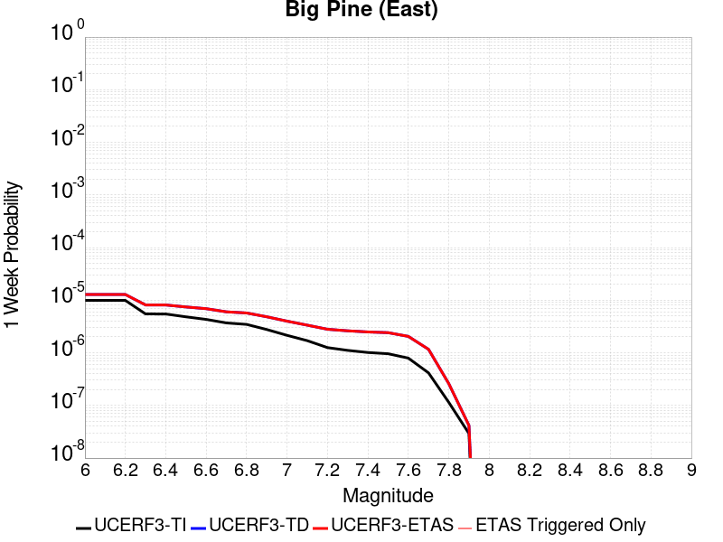 |  |  |  |

| Magnitude | 1 wk TI Prob | 1 wk TD Prob | 1 wk ETAS Prob | 1 wk ETAS/TD Gain | 1 wk ETAS Triggered Only | 1 mo TI Prob | 1 mo TD Prob | 1 mo ETAS Prob | 1 mo ETAS/TD Gain | 1 mo ETAS Triggered Only | 1 yr TI Prob | 1 yr TD Prob | 1 yr ETAS Prob | 1 yr ETAS/TD Gain | 1 yr ETAS Triggered Only | 10 yr TI Prob | 10 yr TD Prob | 10 yr ETAS Prob | 10 yr ETAS/TD Gain | 10 yr ETAS Triggered Only |
|-----|-----|-----|-----|-----|-----|-----|-----|-----|-----|-----|-----|-----|-----|-----|-----|-----|-----|-----|-----|-----|
| 6.0 | 9.916913E-6 | 1.2829457E-5 | 1.2829457E-5 | 1.0 | 0.0 | 4.250036E-5 | 5.4982353E-5 | 5.4982353E-5 | 1.0 | 0.0 | 5.173191E-4 | 6.692267E-4 | 6.7921996E-4 | 1.0149326 | 1.0E-5 | 0.0051611643 | 0.006676799 | 0.0067065987 | 1.0044632 | 3.0E-5 |
| 6.1 | 9.916913E-6 | 1.2829457E-5 | 1.2829457E-5 | 1.0 | 0.0 | 4.250036E-5 | 5.4982353E-5 | 5.4982353E-5 | 1.0 | 0.0 | 5.173191E-4 | 6.692267E-4 | 6.7921996E-4 | 1.0149326 | 1.0E-5 | 0.0051611643 | 0.006676799 | 0.0067065987 | 1.0044632 | 3.0E-5 |
| 6.2 | 9.916913E-6 | 1.2829457E-5 | 1.2829457E-5 | 1.0 | 0.0 | 4.250036E-5 | 5.4982353E-5 | 5.4982353E-5 | 1.0 | 0.0 | 5.173191E-4 | 6.692267E-4 | 6.7921996E-4 | 1.0149326 | 1.0E-5 | 0.0051611643 | 0.006676799 | 0.0067065987 | 1.0044632 | 3.0E-5 |
| 6.3 | 5.479711E-6 | 8.125049E-6 | 8.125049E-6 | 1.0 | 0.0 | 2.3484265E-5 | 3.482119E-5 | 3.482119E-5 | 1.0 | 0.0 | 2.858834E-4 | 4.238687E-4 | 4.3386448E-4 | 1.0235822 | 1.0E-5 | 0.0028551589 | 0.0042334218 | 0.004253337 | 1.0047044 | 2.0E-5 |
| 6.4 | 5.465009E-6 | 8.10934E-6 | 8.10934E-6 | 1.0 | 0.0 | 2.3421257E-5 | 3.4753873E-5 | 3.4753873E-5 | 1.0 | 0.0 | 2.851165E-4 | 4.2304944E-4 | 4.330452E-4 | 1.0236279 | 1.0E-5 | 0.0028475097 | 0.00422526 | 0.0042451755 | 1.0047134 | 2.0E-5 |
| 6.5 | 4.826767E-6 | 7.4343457E-6 | 7.4343457E-6 | 1.0 | 0.0 | 2.068598E-5 | 3.186111E-5 | 3.186111E-5 | 1.0 | 0.0 | 2.518227E-4 | 3.878427E-4 | 3.878427E-4 | 1.0 | 0.0 | 0.0025153751 | 0.0038744358 | 0.003884397 | 1.002571 | 1.0E-5 |
| 6.6 | 4.3146847E-6 | 6.8942422E-6 | 6.8942422E-6 | 1.0 | 0.0 | 1.8491375E-5 | 2.9546432E-5 | 2.9546432E-5 | 1.0 | 0.0 | 2.2510924E-4 | 3.596709E-4 | 3.596709E-4 | 1.0 | 0.0 | 0.0022488134 | 0.0035936327 | 0.0036035967 | 1.0027727 | 1.0E-5 |
| 6.7 | 3.6968106E-6 | 6.0067705E-6 | 6.0067705E-6 | 1.0 | 0.0 | 1.5843378E-5 | 2.5743057E-5 | 2.5743057E-5 | 1.0 | 0.0 | 1.9287605E-4 | 3.1337817E-4 | 3.1337817E-4 | 1.0 | 0.0 | 0.0019270873 | 0.003132017 | 0.0031419857 | 1.0031829 | 1.0E-5 |
| 6.8 | 3.4671132E-6 | 5.713169E-6 | 5.713169E-6 | 1.0 | 0.0 | 1.4858972E-5 | 2.4484787E-5 | 2.4484787E-5 | 1.0 | 0.0 | 1.8089297E-4 | 2.9806295E-4 | 2.9806295E-4 | 1.0 | 0.0 | 0.0018074579 | 0.0029792776 | 0.002989248 | 1.0033466 | 1.0E-5 |
| 6.9 | 2.7686972E-6 | 4.8353722E-6 | 4.8353722E-6 | 1.0 | 0.0 | 1.1865792E-5 | 2.0722862E-5 | 2.0722862E-5 | 1.0 | 0.0 | 1.4445644E-4 | 2.522724E-4 | 2.522724E-4 | 1.0 | 0.0 | 0.0014436257 | 0.002522438 | 0.0025324128 | 1.0039544 | 1.0E-5 |
| 7.0 | 2.1472624E-6 | 3.994261E-6 | 3.994261E-6 | 1.0 | 0.0 | 9.20252E-6 | 1.7118153E-5 | 1.7118153E-5 | 1.0 | 0.0 | 1.12034926E-4 | 2.0839412E-4 | 2.0839412E-4 | 1.0 | 0.0 | 0.0011197845 | 0.0020845328 | 0.0020845328 | 1.0 | 0.0 |
| 7.1 | 1.7018335E-6 | 3.353268E-6 | 3.353268E-6 | 1.0 | 0.0 | 7.293552E-6 | 1.4371072E-5 | 1.4371072E-5 | 1.0 | 0.0 | 8.879537E-5 | 1.7495411E-4 | 1.7495411E-4 | 1.0 | 0.0 | 8.87599E-4 | 0.0017506779 | 0.0017506779 | 1.0 | 0.0 |
| 7.2 | 1.25603E-6 | 2.8024124E-6 | 2.8024124E-6 | 1.0 | 0.0 | 5.3829745E-6 | 1.2010285E-5 | 1.2010285E-5 | 1.0 | 0.0 | 6.553574E-5 | 1.4621564E-4 | 1.4621564E-4 | 1.0 | 0.0 | 6.551642E-4 | 0.0014636841 | 0.0014636841 | 1.0 | 0.0 |
| 7.3 | 1.112297E-6 | 2.617819E-6 | 2.617819E-6 | 1.0 | 0.0 | 4.7669787E-6 | 1.1219177E-5 | 1.1219177E-5 | 1.0 | 0.0 | 5.803642E-5 | 1.3658513E-4 | 1.3658513E-4 | 1.0 | 0.0 | 5.802127E-4 | 0.0013673331 | 0.0013673331 | 1.0 | 0.0 |
| 7.4 | 1.0137181E-6 | 2.4906578E-6 | 2.4906578E-6 | 1.0 | 0.0 | 4.3444993E-6 | 1.0674205E-5 | 1.0674205E-5 | 1.0 | 0.0 | 5.2892992E-5 | 1.2995092E-4 | 1.2995092E-4 | 1.0 | 0.0 | 5.288041E-4 | 0.001300855 | 0.001300855 | 1.0 | 0.0 |
| 7.5 | 9.598608E-7 | 2.4141013E-6 | 2.4141013E-6 | 1.0 | 0.0 | 4.1136827E-6 | 1.0346109E-5 | 1.0346109E-5 | 1.0 | 0.0 | 5.0082934E-5 | 1.2595681E-4 | 1.2595681E-4 | 1.0 | 0.0 | 5.007165E-4 | 0.0012607687 | 0.0012607687 | 1.0 | 0.0 |
| 7.6 | 7.929459E-7 | 2.0510013E-6 | 2.0510013E-6 | 1.0 | 0.0 | 3.3983351E-6 | 8.789977E-6 | 8.789977E-6 | 1.0 | 0.0 | 4.1373947E-5 | 1.07012886E-4 | 1.07012886E-4 | 1.0 | 0.0 | 4.1366243E-4 | 0.0010716276 | 0.0010716276 | 1.0 | 0.0 |
| 7.7 | 4.155788E-7 | 1.164917E-6 | 1.164917E-6 | 1.0 | 0.0 | 1.7810507E-6 | 4.992492E-6 | 4.992492E-6 | 1.0 | 0.0 | 2.1684076E-5 | 6.0781935E-5 | 6.0781935E-5 | 1.0 | 0.0 | 2.1681961E-4 | 6.10773E-4 | 6.10773E-4 | 1.0 | 0.0 |
| 7.8 | 1.14666925E-7 | 2.6017955E-7 | 2.6017955E-7 | 1.0 | 0.0 | 4.914296E-7 | 1.1150547E-6 | 1.1150547E-6 | 1.0 | 0.0 | 5.9831386E-6 | 1.3575711E-5 | 1.3575711E-5 | 1.0 | 0.0 | 5.9829777E-5 | 1.3684241E-4 | 1.3684241E-4 | 1.0 | 0.0 |
| 7.9 | 2.9231824E-8 | 4.1628194E-8 | 4.1628194E-8 | 1.0 | 0.0 | 1.2527924E-7 | 1.7840654E-7 | 1.7840654E-7 | 1.0 | 0.0 | 1.5252737E-6 | 2.1720975E-6 | 2.1720975E-6 | 1.0 | 0.0 | 1.5252632E-5 | 2.205369E-5 | 2.205369E-5 | 1.0 | 0.0 |

## San Jacinto (Clark) rev
*[(top)](#table-of-contents)*

| 1 Week | 1 Month | 1 Year | 10 Year |
|-----|-----|-----|-----|
|  |  |  | 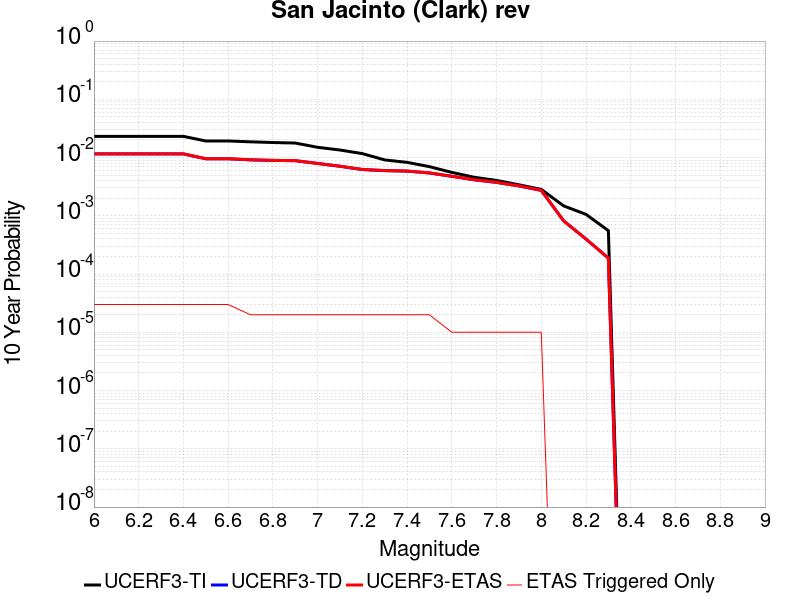 |

| Magnitude | 1 wk TI Prob | 1 wk TD Prob | 1 wk ETAS Prob | 1 wk ETAS/TD Gain | 1 wk ETAS Triggered Only | 1 mo TI Prob | 1 mo TD Prob | 1 mo ETAS Prob | 1 mo ETAS/TD Gain | 1 mo ETAS Triggered Only | 1 yr TI Prob | 1 yr TD Prob | 1 yr ETAS Prob | 1 yr ETAS/TD Gain | 1 yr ETAS Triggered Only | 10 yr TI Prob | 10 yr TD Prob | 10 yr ETAS Prob | 10 yr ETAS/TD Gain | 10 yr ETAS Triggered Only |
|-----|-----|-----|-----|-----|-----|-----|-----|-----|-----|-----|-----|-----|-----|-----|-----|-----|-----|-----|-----|-----|
| 6.0 | 4.482615E-5 | 2.1246653E-5 | 2.1246653E-5 | 1.0 | 0.0 | 1.9209793E-4 | 9.105396E-5 | 9.105396E-5 | 1.0 | 0.0 | 0.0023362834 | 0.0011080275 | 0.0011180164 | 1.0090151 | 1.0E-5 | 0.02311874 | 0.011552496 | 0.011582149 | 1.0025668 | 3.0E-5 |
| 6.1 | 4.482615E-5 | 2.1246653E-5 | 2.1246653E-5 | 1.0 | 0.0 | 1.9209793E-4 | 9.105396E-5 | 9.105396E-5 | 1.0 | 0.0 | 0.0023362834 | 0.0011080275 | 0.0011180164 | 1.0090151 | 1.0E-5 | 0.02311874 | 0.011552496 | 0.011582149 | 1.0025668 | 3.0E-5 |
| 6.2 | 4.482615E-5 | 2.1246653E-5 | 2.1246653E-5 | 1.0 | 0.0 | 1.9209793E-4 | 9.105396E-5 | 9.105396E-5 | 1.0 | 0.0 | 0.0023362834 | 0.0011080275 | 0.0011180164 | 1.0090151 | 1.0E-5 | 0.02311874 | 0.011552496 | 0.011582149 | 1.0025668 | 3.0E-5 |
| 6.3 | 4.482615E-5 | 2.1246653E-5 | 2.1246653E-5 | 1.0 | 0.0 | 1.9209793E-4 | 9.105396E-5 | 9.105396E-5 | 1.0 | 0.0 | 0.0023362834 | 0.0011080275 | 0.0011180164 | 1.0090151 | 1.0E-5 | 0.02311874 | 0.011552496 | 0.011582149 | 1.0025668 | 3.0E-5 |
| 6.4 | 4.482615E-5 | 2.1246653E-5 | 2.1246653E-5 | 1.0 | 0.0 | 1.9209793E-4 | 9.105396E-5 | 9.105396E-5 | 1.0 | 0.0 | 0.0023362834 | 0.0011080275 | 0.0011180164 | 1.0090151 | 1.0E-5 | 0.02311874 | 0.011552496 | 0.011582149 | 1.0025668 | 3.0E-5 |
| 6.5 | 3.7294863E-5 | 1.7439266E-5 | 1.7439266E-5 | 1.0 | 0.0 | 1.5982533E-4 | 7.4737596E-5 | 7.4737596E-5 | 1.0 | 0.0 | 0.0019441366 | 9.095549E-4 | 9.195458E-4 | 1.0109844 | 1.0E-5 | 0.01927216 | 0.009538002 | 0.009567716 | 1.0031153 | 3.0E-5 |
| 6.6 | 3.7294863E-5 | 1.7439266E-5 | 1.7439266E-5 | 1.0 | 0.0 | 1.5982533E-4 | 7.4737596E-5 | 7.4737596E-5 | 1.0 | 0.0 | 0.0019441366 | 9.095549E-4 | 9.195458E-4 | 1.0109844 | 1.0E-5 | 0.01927216 | 0.009538002 | 0.009567716 | 1.0031153 | 3.0E-5 |
| 6.7 | 3.6039248E-5 | 1.6685774E-5 | 1.6685774E-5 | 1.0 | 0.0 | 1.5444479E-4 | 7.150852E-5 | 7.150852E-5 | 1.0 | 0.0 | 0.0018787434 | 8.702727E-4 | 8.80264E-4 | 1.0114807 | 1.0E-5 | 0.01862939 | 0.009139063 | 0.0091588795 | 1.0021684 | 2.0E-5 |
| 6.8 | 3.5031844E-5 | 1.631307E-5 | 1.631307E-5 | 1.0 | 0.0 | 1.5012783E-4 | 6.991131E-5 | 6.991131E-5 | 1.0 | 0.0 | 0.0018262739 | 8.508419E-4 | 8.608334E-4 | 1.0117431 | 1.0E-5 | 0.01811338 | 0.008938338 | 0.008958159 | 1.0022175 | 2.0E-5 |
| 6.9 | 3.435112E-5 | 1.6142621E-5 | 1.6142621E-5 | 1.0 | 0.0 | 1.4721078E-4 | 6.918085E-5 | 6.918085E-5 | 1.0 | 0.0 | 0.0017908178 | 8.4195554E-4 | 8.519471E-4 | 1.0118672 | 1.0E-5 | 0.017764548 | 0.008846124 | 0.008865947 | 1.0022409 | 2.0E-5 |
| 7.0 | 2.8959772E-5 | 1.4409266E-5 | 1.4409266E-5 | 1.0 | 0.0 | 1.241074E-4 | 6.175255E-5 | 6.175255E-5 | 1.0 | 0.0 | 0.0015099603 | 7.515808E-4 | 7.615733E-4 | 1.0132953 | 1.0E-5 | 0.014997416 | 0.007906552 | 0.007926394 | 1.0025096 | 2.0E-5 |
| 7.1 | 2.6002877E-5 | 1.2895728E-5 | 1.2895728E-5 | 1.0 | 0.0 | 1.11436144E-4 | 5.5266246E-5 | 5.5266246E-5 | 1.0 | 0.0 | 0.0013558907 | 6.72661E-4 | 6.8265427E-4 | 1.0148563 | 1.0E-5 | 0.013476475 | 0.007082177 | 0.0071020355 | 1.002804 | 2.0E-5 |
| 7.2 | 2.2544838E-5 | 1.1323137E-5 | 1.1323137E-5 | 1.0 | 0.0 | 9.661716E-5 | 4.8526836E-5 | 4.8526836E-5 | 1.0 | 0.0 | 0.001175679 | 5.906555E-4 | 6.006496E-4 | 1.0169203 | 1.0E-5 | 0.011694785 | 0.006225147 | 0.006245022 | 1.0031928 | 2.0E-5 |
| 7.3 | 1.75334E-5 | 1.0868777E-5 | 1.0868777E-5 | 1.0 | 0.0 | 7.514098E-5 | 4.657965E-5 | 4.657965E-5 | 1.0 | 0.0 | 9.144575E-4 | 5.6696107E-4 | 5.769554E-4 | 1.017628 | 1.0E-5 | 0.009107036 | 0.0059641483 | 0.0059840293 | 1.0033333 | 2.0E-5 |
| 7.4 | 1.5924552E-5 | 1.0667449E-5 | 1.0667449E-5 | 1.0 | 0.0 | 6.82463E-5 | 4.5716843E-5 | 4.5716843E-5 | 1.0 | 0.0 | 8.305819E-4 | 5.564618E-4 | 5.6645623E-4 | 1.0179607 | 1.0E-5 | 0.008274844 | 0.005850773 | 0.005870656 | 1.0033983 | 2.0E-5 |
| 7.5 | 1.3428931E-5 | 9.904629E-6 | 9.904629E-6 | 1.0 | 0.0 | 5.7551293E-5 | 4.2447726E-5 | 4.2447726E-5 | 1.0 | 0.0 | 7.004617E-4 | 5.166796E-4 | 5.2667444E-4 | 1.0193443 | 1.0E-5 | 0.006982579 | 0.005434641 | 0.005454533 | 1.0036601 | 2.0E-5 |
| 7.6 | 1.0688787E-5 | 8.659321E-6 | 8.659321E-6 | 1.0 | 0.0 | 4.5808283E-5 | 3.711085E-5 | 3.711085E-5 | 1.0 | 0.0 | 5.5757316E-4 | 4.5173138E-4 | 4.5173138E-4 | 1.0 | 0.0 | 0.005561762 | 0.0047653103 | 0.004775263 | 1.0020885 | 1.0E-5 |
| 7.7 | 8.81236E-6 | 7.511008E-6 | 7.511008E-6 | 1.0 | 0.0 | 3.776671E-5 | 3.2189637E-5 | 3.2189637E-5 | 1.0 | 0.0 | 4.597127E-4 | 3.9183858E-4 | 3.9183858E-4 | 1.0 | 0.0 | 0.0045876284 | 0.004157538 | 0.0041674967 | 1.0023953 | 1.0E-5 |
| 7.8 | 7.780431E-6 | 6.737165E-6 | 6.737165E-6 | 1.0 | 0.0 | 3.3344273E-5 | 2.8873246E-5 | 2.8873246E-5 | 1.0 | 0.0 | 4.0589093E-4 | 3.5147526E-4 | 3.5147526E-4 | 1.0 | 0.0 | 0.0040515037 | 0.0037444304 | 0.003754393 | 1.0026606 | 1.0E-5 |
| 7.9 | 6.5437994E-6 | 5.8182573E-6 | 5.8182573E-6 | 1.0 | 0.0 | 2.8044553E-5 | 2.493515E-5 | 2.493515E-5 | 1.0 | 0.0 | 3.4138895E-4 | 3.0354335E-4 | 3.0354335E-4 | 1.0 | 0.0 | 0.0034086495 | 0.0032547154 | 0.0032646828 | 1.0030625 | 1.0E-5 |
| 8.0 | 5.4488164E-6 | 4.846891E-6 | 4.846891E-6 | 1.0 | 0.0 | 2.3351862E-5 | 2.0772224E-5 | 2.0772224E-5 | 1.0 | 0.0 | 2.8427184E-4 | 2.5287265E-4 | 2.5287265E-4 | 1.0 | 0.0 | 0.0028390845 | 0.002728809 | 0.0027387817 | 1.0036546 | 1.0E-5 |
| 8.1 | 2.8397242E-6 | 1.3804471E-6 | 1.3804471E-6 | 1.0 | 0.0 | 1.217019E-5 | 5.9161885E-6 | 5.9161885E-6 | 1.0 | 0.0 | 1.4816198E-4 | 7.202722E-5 | 7.202722E-5 | 1.0 | 0.0 | 0.0014806325 | 8.1907987E-4 | 8.1907987E-4 | 1.0 | 0.0 |
| 8.2 | 2.030244E-6 | 6.3955446E-7 | 6.3955446E-7 | 1.0 | 0.0 | 8.701017E-6 | 2.7409446E-6 | 2.7409446E-6 | 1.0 | 0.0 | 1.05929736E-4 | 3.3370496E-5 | 3.3370496E-5 | 1.0 | 0.0 | 0.0010587925 | 3.9933104E-4 | 3.9933104E-4 | 1.0 | 0.0 |
| 8.3 | 1.0659804E-6 | 2.9625085E-7 | 2.9625085E-7 | 1.0 | 0.0 | 4.568479E-6 | 1.2696458E-6 | 1.2696458E-6 | 1.0 | 0.0 | 5.5619817E-5 | 1.5457832E-5 | 1.5457832E-5 | 1.0 | 0.0 | 5.5605895E-4 | 1.8787566E-4 | 1.8787566E-4 | 1.0 | 0.0 |

## Cleghorn Pass
*[(top)](#table-of-contents)*

| 1 Week | 1 Month | 1 Year | 10 Year |
|-----|-----|-----|-----|
|  |  |  | 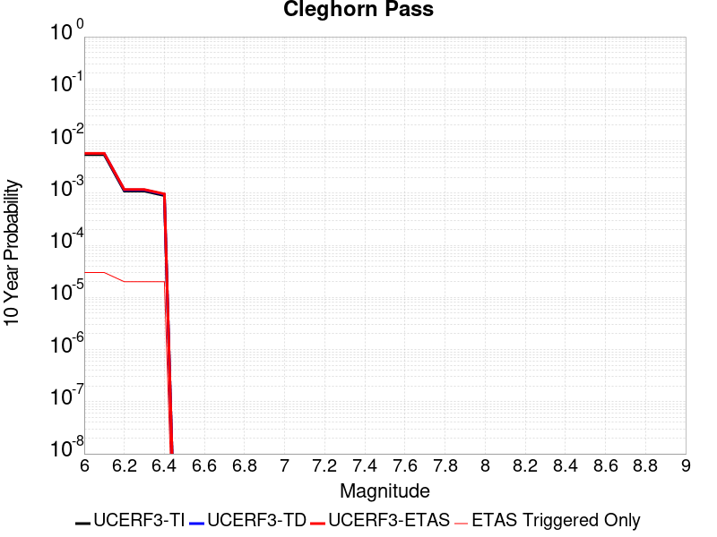 |

| Magnitude | 1 wk TI Prob | 1 wk TD Prob | 1 wk ETAS Prob | 1 wk ETAS/TD Gain | 1 wk ETAS Triggered Only | 1 mo TI Prob | 1 mo TD Prob | 1 mo ETAS Prob | 1 mo ETAS/TD Gain | 1 mo ETAS Triggered Only | 1 yr TI Prob | 1 yr TD Prob | 1 yr ETAS Prob | 1 yr ETAS/TD Gain | 1 yr ETAS Triggered Only | 10 yr TI Prob | 10 yr TD Prob | 10 yr ETAS Prob | 10 yr ETAS/TD Gain | 10 yr ETAS Triggered Only |
|-----|-----|-----|-----|-----|-----|-----|-----|-----|-----|-----|-----|-----|-----|-----|-----|-----|-----|-----|-----|-----|
| 6.0 | 1.0522846E-5 | 1.1041362E-5 | 1.1041362E-5 | 1.0 | 0.0 | 4.509713E-5 | 4.731956E-5 | 4.731956E-5 | 1.0 | 0.0 | 5.4891926E-4 | 5.76016E-4 | 5.960045E-4 | 1.0347012 | 2.0E-5 | 0.0054756533 | 0.0057503963 | 0.0057802238 | 1.005187 | 3.0E-5 |
| 6.1 | 1.0522846E-5 | 1.1041362E-5 | 1.1041362E-5 | 1.0 | 0.0 | 4.509713E-5 | 4.731956E-5 | 4.731956E-5 | 1.0 | 0.0 | 5.4891926E-4 | 5.76016E-4 | 5.960045E-4 | 1.0347012 | 2.0E-5 | 0.0054756533 | 0.0057503963 | 0.0057802238 | 1.005187 | 3.0E-5 |
| 6.2 | 2.1045846E-6 | 2.2083466E-6 | 2.2083466E-6 | 1.0 | 0.0 | 9.019617E-6 | 9.464332E-6 | 9.464332E-6 | 1.0 | 0.0 | 1.098083E-4 | 1.1522634E-4 | 1.252252E-4 | 1.0867757 | 1.0E-5 | 0.0010975406 | 0.0011520775 | 0.0011720544 | 1.01734 | 2.0E-5 |
| 6.3 | 2.1045846E-6 | 2.2083466E-6 | 2.2083466E-6 | 1.0 | 0.0 | 9.019617E-6 | 9.464332E-6 | 9.464332E-6 | 1.0 | 0.0 | 1.098083E-4 | 1.1522634E-4 | 1.252252E-4 | 1.0867757 | 1.0E-5 | 0.0010975406 | 0.0011520775 | 0.0011720544 | 1.01734 | 2.0E-5 |
| 6.4 | 1.7259927E-6 | 1.8109952E-6 | 1.8109952E-6 | 1.0 | 0.0 | 7.3970905E-6 | 7.761408E-6 | 7.761408E-6 | 1.0 | 0.0 | 9.005586E-5 | 9.4495146E-5 | 1.044942E-4 | 1.1058155 | 1.0E-5 | 9.001937E-4 | 9.4495143E-4 | 9.6493255E-4 | 1.0211451 | 2.0E-5 |

## San Gabriel
*[(top)](#table-of-contents)*

| 1 Week | 1 Month | 1 Year | 10 Year |
|-----|-----|-----|-----|
|  | 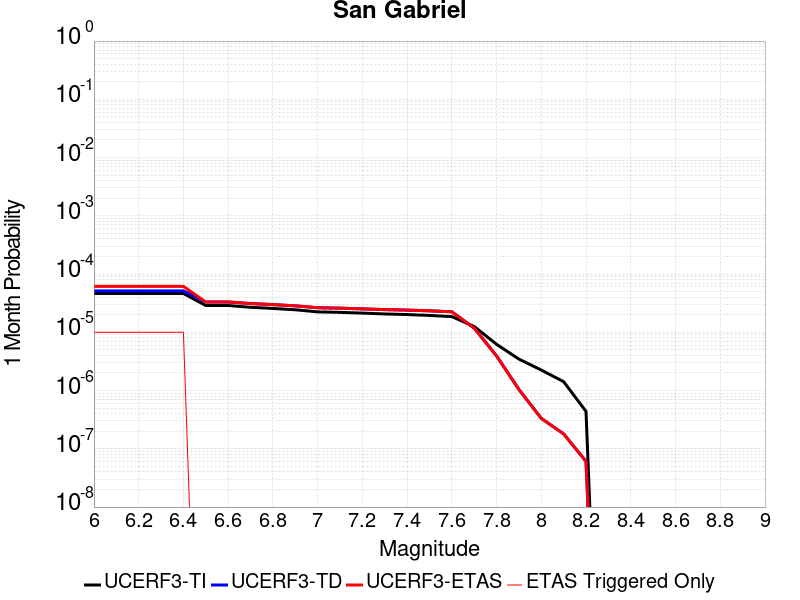 | 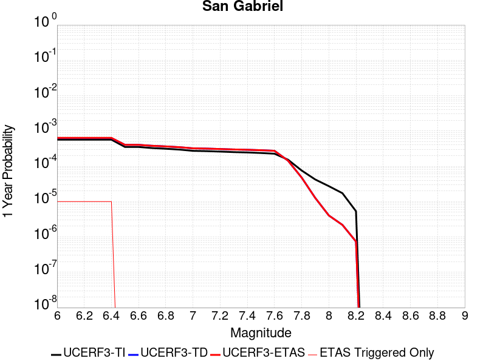 | 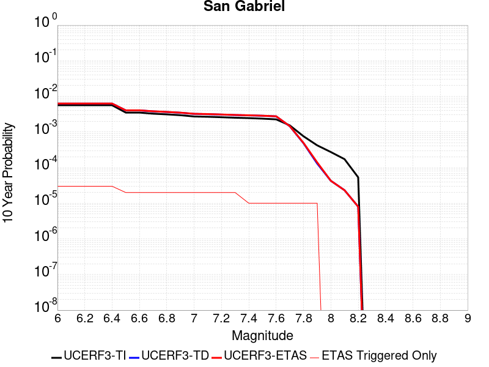 |

| Magnitude | 1 wk TI Prob | 1 wk TD Prob | 1 wk ETAS Prob | 1 wk ETAS/TD Gain | 1 wk ETAS Triggered Only | 1 mo TI Prob | 1 mo TD Prob | 1 mo ETAS Prob | 1 mo ETAS/TD Gain | 1 mo ETAS Triggered Only | 1 yr TI Prob | 1 yr TD Prob | 1 yr ETAS Prob | 1 yr ETAS/TD Gain | 1 yr ETAS Triggered Only | 10 yr TI Prob | 10 yr TD Prob | 10 yr ETAS Prob | 10 yr ETAS/TD Gain | 10 yr ETAS Triggered Only |
|-----|-----|-----|-----|-----|-----|-----|-----|-----|-----|-----|-----|-----|-----|-----|-----|-----|-----|-----|-----|-----|
| 6.0 | 1.083775E-5 | 1.2006629E-5 | 2.2006509E-5 | 1.8328632 | 1.0E-5 | 4.6446676E-5 | 5.145603E-5 | 6.145552E-5 | 1.1943307 | 1.0E-5 | 5.653415E-4 | 6.2630844E-4 | 6.3630217E-4 | 1.0159565 | 1.0E-5 | 0.0056390543 | 0.006257505 | 0.0062873177 | 1.0047642 | 3.0E-5 |
| 6.1 | 1.083775E-5 | 1.2006629E-5 | 2.2006509E-5 | 1.8328632 | 1.0E-5 | 4.6446676E-5 | 5.145603E-5 | 6.145552E-5 | 1.1943307 | 1.0E-5 | 5.653415E-4 | 6.2630844E-4 | 6.3630217E-4 | 1.0159565 | 1.0E-5 | 0.0056390543 | 0.006257505 | 0.0062873177 | 1.0047642 | 3.0E-5 |
| 6.2 | 1.083775E-5 | 1.2006629E-5 | 2.2006509E-5 | 1.8328632 | 1.0E-5 | 4.6446676E-5 | 5.145603E-5 | 6.145552E-5 | 1.1943307 | 1.0E-5 | 5.653415E-4 | 6.2630844E-4 | 6.3630217E-4 | 1.0159565 | 1.0E-5 | 0.0056390543 | 0.006257505 | 0.0062873177 | 1.0047642 | 3.0E-5 |
| 6.3 | 1.083775E-5 | 1.2006629E-5 | 2.2006509E-5 | 1.8328632 | 1.0E-5 | 4.6446676E-5 | 5.145603E-5 | 6.145552E-5 | 1.1943307 | 1.0E-5 | 5.653415E-4 | 6.2630844E-4 | 6.3630217E-4 | 1.0159565 | 1.0E-5 | 0.0056390543 | 0.006257505 | 0.0062873177 | 1.0047642 | 3.0E-5 |
| 6.4 | 1.083775E-5 | 1.2006629E-5 | 2.2006509E-5 | 1.8328632 | 1.0E-5 | 4.6446676E-5 | 5.145603E-5 | 6.145552E-5 | 1.1943307 | 1.0E-5 | 5.653415E-4 | 6.2630844E-4 | 6.3630217E-4 | 1.0159565 | 1.0E-5 | 0.0056390543 | 0.006257505 | 0.0062873177 | 1.0047642 | 3.0E-5 |
| 6.5 | 6.7317824E-6 | 7.738163E-6 | 7.738163E-6 | 1.0 | 0.0 | 2.8850178E-5 | 3.3163138E-5 | 3.3163138E-5 | 1.0 | 0.0 | 3.511943E-4 | 4.0368745E-4 | 4.0368745E-4 | 1.0 | 0.0 | 0.003506398 | 0.0040406142 | 0.0040605334 | 1.0049298 | 2.0E-5 |
| 6.6 | 6.7317824E-6 | 7.738163E-6 | 7.738163E-6 | 1.0 | 0.0 | 2.8850178E-5 | 3.3163138E-5 | 3.3163138E-5 | 1.0 | 0.0 | 3.511943E-4 | 4.0368745E-4 | 4.0368745E-4 | 1.0 | 0.0 | 0.003506398 | 0.0040406142 | 0.0040605334 | 1.0049298 | 2.0E-5 |
| 6.7 | 6.274881E-6 | 7.267063E-6 | 7.267063E-6 | 1.0 | 0.0 | 2.6892068E-5 | 3.114419E-5 | 3.114419E-5 | 1.0 | 0.0 | 3.2736175E-4 | 3.7911552E-4 | 3.7911552E-4 | 1.0 | 0.0 | 0.0032687993 | 0.0037957535 | 0.0038156775 | 1.005249 | 2.0E-5 |
| 6.8 | 5.996209E-6 | 6.9797716E-6 | 6.9797716E-6 | 1.0 | 0.0 | 2.5697784E-5 | 2.991297E-5 | 2.991297E-5 | 1.0 | 0.0 | 3.128256E-4 | 3.6413048E-4 | 3.6413048E-4 | 1.0 | 0.0 | 0.003123856 | 0.003646402 | 0.003666329 | 1.0054649 | 2.0E-5 |
| 6.9 | 5.686331E-6 | 6.644734E-6 | 6.644734E-6 | 1.0 | 0.0 | 2.4369761E-5 | 2.8477127E-5 | 2.8477127E-5 | 1.0 | 0.0 | 2.9666146E-4 | 3.4665476E-4 | 3.4665476E-4 | 1.0 | 0.0 | 0.0029626573 | 0.0034722022 | 0.0034921328 | 1.00574 | 2.0E-5 |
| 7.0 | 5.2329838E-6 | 6.1685632E-6 | 6.1685632E-6 | 1.0 | 0.0 | 2.242688E-5 | 2.6436435E-5 | 2.6436435E-5 | 1.0 | 0.0 | 2.7301308E-4 | 3.2181683E-4 | 3.2181683E-4 | 1.0 | 0.0 | 0.002726779 | 0.003224558 | 0.0032444934 | 1.0061824 | 2.0E-5 |
| 7.1 | 5.135671E-6 | 6.058634E-6 | 6.058634E-6 | 1.0 | 0.0 | 2.2009834E-5 | 2.596532E-5 | 2.596532E-5 | 1.0 | 0.0 | 2.6793676E-4 | 3.1608267E-4 | 3.1608267E-4 | 1.0 | 0.0 | 0.0026761394 | 0.003167381 | 0.0031873176 | 1.0062944 | 2.0E-5 |
| 7.2 | 4.989062E-6 | 5.8919195E-6 | 5.8919195E-6 | 1.0 | 0.0 | 2.1381518E-5 | 2.5250843E-5 | 2.5250843E-5 | 1.0 | 0.0 | 2.6028889E-4 | 3.073864E-4 | 3.073864E-4 | 1.0 | 0.0 | 0.0025998424 | 0.003080662 | 0.0031006006 | 1.0064721 | 2.0E-5 |
| 7.3 | 4.8219395E-6 | 5.723389E-6 | 5.723389E-6 | 1.0 | 0.0 | 2.0665291E-5 | 2.4528585E-5 | 2.4528585E-5 | 1.0 | 0.0 | 2.5157086E-4 | 2.9859535E-4 | 2.9859535E-4 | 1.0 | 0.0 | 0.0025128627 | 0.0029929918 | 0.003012932 | 1.0066622 | 2.0E-5 |
| 7.4 | 4.7118383E-6 | 5.6118715E-6 | 5.6118715E-6 | 1.0 | 0.0 | 2.0193436E-5 | 2.405066E-5 | 2.405066E-5 | 1.0 | 0.0 | 2.4582737E-4 | 2.927782E-4 | 2.927782E-4 | 1.0 | 0.0 | 0.002455556 | 0.0029349742 | 0.0029449447 | 1.0033972 | 1.0E-5 |
| 7.5 | 4.5506545E-6 | 5.4571346E-6 | 5.4571346E-6 | 1.0 | 0.0 | 1.9502659E-5 | 2.3387514E-5 | 2.3387514E-5 | 1.0 | 0.0 | 2.37419E-4 | 2.8470653E-4 | 2.8470653E-4 | 1.0 | 0.0 | 0.002371655 | 0.0028544664 | 0.0028644379 | 1.0034933 | 1.0E-5 |
| 7.6 | 4.343636E-6 | 5.2498417E-6 | 5.2498417E-6 | 1.0 | 0.0 | 1.861545E-5 | 2.249913E-5 | 2.249913E-5 | 1.0 | 0.0 | 2.2661954E-4 | 2.7389324E-4 | 2.7389324E-4 | 1.0 | 0.0 | 0.0022638857 | 0.0027465967 | 0.0027565693 | 1.0036309 | 1.0E-5 |
| 7.7 | 2.936235E-6 | 2.7578424E-6 | 2.7578424E-6 | 1.0 | 0.0 | 1.2583803E-5 | 1.1819271E-5 | 1.1819271E-5 | 1.0 | 0.0 | 1.5319703E-4 | 1.4389015E-4 | 1.4389015E-4 | 1.0 | 0.0 | 0.0015309147 | 0.0014453045 | 0.00145529 | 1.006909 | 1.0E-5 |
| 7.8 | 1.4541639E-6 | 9.1795744E-7 | 9.1795744E-7 | 1.0 | 0.0 | 6.232116E-6 | 3.934097E-6 | 3.934097E-6 | 1.0 | 0.0 | 7.587337E-5 | 4.7896585E-5 | 4.7896585E-5 | 1.0 | 0.0 | 7.584747E-4 | 4.838081E-4 | 4.9380324E-4 | 1.0206593 | 1.0E-5 |
| 7.9 | 8.098958E-7 | 2.4392182E-7 | 2.4392182E-7 | 1.0 | 0.0 | 3.4709774E-6 | 1.0453787E-6 | 1.0453787E-6 | 1.0 | 0.0 | 4.225833E-5 | 1.2727412E-5 | 1.2727412E-5 | 1.0 | 0.0 | 4.2250296E-4 | 1.3038587E-4 | 1.4038457E-4 | 1.0766854 | 1.0E-5 |
| 8.0 | 5.2473234E-7 | 7.779902E-8 | 7.779902E-8 | 1.0 | 0.0 | 2.248851E-6 | 3.3342434E-7 | 3.3342434E-7 | 1.0 | 0.0 | 2.7379416E-5 | 4.0594336E-6 | 4.0594336E-6 | 1.0 | 0.0 | 2.7376044E-4 | 4.2743086E-5 | 4.2743086E-5 | 1.0 | 0.0 |
| 8.1 | 3.3162388E-7 | 4.2056502E-8 | 4.2056502E-8 | 1.0 | 0.0 | 1.4212444E-6 | 1.8024215E-7 | 1.8024215E-7 | 1.0 | 0.0 | 1.7303513E-5 | 2.1944459E-6 | 2.1944459E-6 | 1.0 | 0.0 | 1.7302166E-4 | 2.3273165E-5 | 2.3273165E-5 | 1.0 | 0.0 |
| 8.2 | 1.0235345E-7 | 1.4220497E-8 | 1.4220497E-8 | 1.0 | 0.0 | 4.3865757E-7 | 6.0944984E-8 | 6.0944984E-8 | 1.0 | 0.0 | 5.340643E-6 | 7.4200494E-7 | 7.4200494E-7 | 1.0 | 0.0 | 5.3405143E-5 | 8.025459E-6 | 8.025459E-6 | 1.0 | 0.0 |

## North Frontal  (East)
*[(top)](#table-of-contents)*

| 1 Week | 1 Month | 1 Year | 10 Year |
|-----|-----|-----|-----|
|  |  |  | 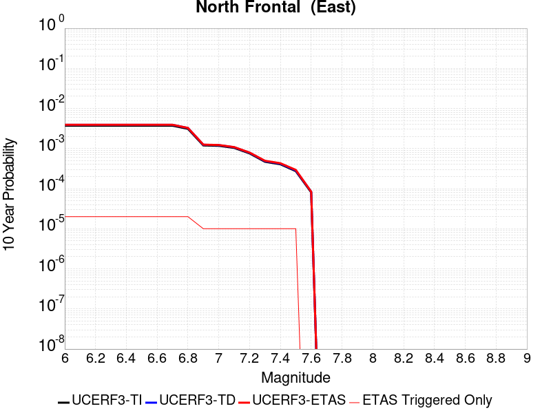 |

| Magnitude | 1 wk TI Prob | 1 wk TD Prob | 1 wk ETAS Prob | 1 wk ETAS/TD Gain | 1 wk ETAS Triggered Only | 1 mo TI Prob | 1 mo TD Prob | 1 mo ETAS Prob | 1 mo ETAS/TD Gain | 1 mo ETAS Triggered Only | 1 yr TI Prob | 1 yr TD Prob | 1 yr ETAS Prob | 1 yr ETAS/TD Gain | 1 yr ETAS Triggered Only | 10 yr TI Prob | 10 yr TD Prob | 10 yr ETAS Prob | 10 yr ETAS/TD Gain | 10 yr ETAS Triggered Only |
|-----|-----|-----|-----|-----|-----|-----|-----|-----|-----|-----|-----|-----|-----|-----|-----|-----|-----|-----|-----|-----|
| 6.0 | 7.135738E-6 | 7.4776517E-6 | 7.4776517E-6 | 1.0 | 0.0 | 3.0581377E-5 | 3.20468E-5 | 3.20468E-5 | 1.0 | 0.0 | 3.7226462E-4 | 3.9011985E-4 | 3.9011985E-4 | 1.0 | 0.0 | 0.0037164164 | 0.003896308 | 0.00391623 | 1.005113 | 2.0E-5 |
| 6.1 | 7.135738E-6 | 7.4776517E-6 | 7.4776517E-6 | 1.0 | 0.0 | 3.0581377E-5 | 3.20468E-5 | 3.20468E-5 | 1.0 | 0.0 | 3.7226462E-4 | 3.9011985E-4 | 3.9011985E-4 | 1.0 | 0.0 | 0.0037164164 | 0.003896308 | 0.00391623 | 1.005113 | 2.0E-5 |
| 6.2 | 7.135738E-6 | 7.4776517E-6 | 7.4776517E-6 | 1.0 | 0.0 | 3.0581377E-5 | 3.20468E-5 | 3.20468E-5 | 1.0 | 0.0 | 3.7226462E-4 | 3.9011985E-4 | 3.9011985E-4 | 1.0 | 0.0 | 0.0037164164 | 0.003896308 | 0.00391623 | 1.005113 | 2.0E-5 |
| 6.3 | 7.135738E-6 | 7.4776517E-6 | 7.4776517E-6 | 1.0 | 0.0 | 3.0581377E-5 | 3.20468E-5 | 3.20468E-5 | 1.0 | 0.0 | 3.7226462E-4 | 3.9011985E-4 | 3.9011985E-4 | 1.0 | 0.0 | 0.0037164164 | 0.003896308 | 0.00391623 | 1.005113 | 2.0E-5 |
| 6.4 | 7.135738E-6 | 7.4776517E-6 | 7.4776517E-6 | 1.0 | 0.0 | 3.0581377E-5 | 3.20468E-5 | 3.20468E-5 | 1.0 | 0.0 | 3.7226462E-4 | 3.9011985E-4 | 3.9011985E-4 | 1.0 | 0.0 | 0.0037164164 | 0.003896308 | 0.00391623 | 1.005113 | 2.0E-5 |
| 6.5 | 7.135738E-6 | 7.4776517E-6 | 7.4776517E-6 | 1.0 | 0.0 | 3.0581377E-5 | 3.20468E-5 | 3.20468E-5 | 1.0 | 0.0 | 3.7226462E-4 | 3.9011985E-4 | 3.9011985E-4 | 1.0 | 0.0 | 0.0037164164 | 0.003896308 | 0.00391623 | 1.005113 | 2.0E-5 |
| 6.6 | 7.135738E-6 | 7.4776517E-6 | 7.4776517E-6 | 1.0 | 0.0 | 3.0581377E-5 | 3.20468E-5 | 3.20468E-5 | 1.0 | 0.0 | 3.7226462E-4 | 3.9011985E-4 | 3.9011985E-4 | 1.0 | 0.0 | 0.0037164164 | 0.003896308 | 0.00391623 | 1.005113 | 2.0E-5 |
| 6.7 | 7.135738E-6 | 7.4776517E-6 | 7.4776517E-6 | 1.0 | 0.0 | 3.0581377E-5 | 3.20468E-5 | 3.20468E-5 | 1.0 | 0.0 | 3.7226462E-4 | 3.9011985E-4 | 3.9011985E-4 | 1.0 | 0.0 | 0.0037164164 | 0.003896308 | 0.00391623 | 1.005113 | 2.0E-5 |
| 6.8 | 5.959142E-6 | 6.2370686E-6 | 6.2370686E-6 | 1.0 | 0.0 | 2.553893E-5 | 2.6730122E-5 | 2.6730122E-5 | 1.0 | 0.0 | 3.108921E-4 | 3.254087E-4 | 3.254087E-4 | 1.0 | 0.0 | 0.0031045752 | 0.0032510955 | 0.0032710305 | 1.0061318 | 2.0E-5 |
| 6.9 | 2.2946929E-6 | 2.3825814E-6 | 2.3825814E-6 | 1.0 | 0.0 | 9.834361E-6 | 1.0211026E-5 | 1.0211026E-5 | 1.0 | 0.0 | 1.1972676E-4 | 1.2431263E-4 | 1.2431263E-4 | 1.0 | 0.0 | 0.0011966228 | 0.0012424773 | 0.001252465 | 1.0080384 | 1.0E-5 |
| 7.0 | 2.2468673E-6 | 2.3322714E-6 | 2.3322714E-6 | 1.0 | 0.0 | 9.629396E-6 | 9.995413E-6 | 9.995413E-6 | 1.0 | 0.0 | 1.1723159E-4 | 1.2168782E-4 | 1.2168782E-4 | 1.0 | 0.0 | 0.0011716976 | 0.0012162583 | 0.0012262461 | 1.008212 | 1.0E-5 |
| 7.1 | 1.9921076E-6 | 2.064703E-6 | 2.064703E-6 | 1.0 | 0.0 | 8.537577E-6 | 8.8486995E-6 | 8.8486995E-6 | 1.0 | 0.0 | 1.0394004E-4 | 1.07728025E-4 | 1.07728025E-4 | 1.0 | 0.0 | 0.0010389143 | 0.0010768007 | 0.00108679 | 1.0092767 | 1.0E-5 |
| 7.2 | 1.4524545E-6 | 1.5045864E-6 | 1.5045864E-6 | 1.0 | 0.0 | 6.2247905E-6 | 6.448213E-6 | 6.448213E-6 | 1.0 | 0.0 | 7.5784184E-5 | 7.850441E-5 | 7.850441E-5 | 1.0 | 0.0 | 7.575835E-4 | 7.8479125E-4 | 7.947834E-4 | 1.0127323 | 1.0E-5 |
| 7.3 | 8.9802575E-7 | 9.3091796E-7 | 9.3091796E-7 | 1.0 | 0.0 | 3.848676E-6 | 3.989643E-6 | 3.989643E-6 | 1.0 | 0.0 | 4.685662E-5 | 4.8572936E-5 | 4.8572936E-5 | 1.0 | 0.0 | 4.6846745E-4 | 4.856345E-4 | 4.956296E-4 | 1.0205816 | 1.0E-5 |
| 7.4 | 7.776139E-7 | 8.060866E-7 | 8.060866E-7 | 1.0 | 0.0 | 3.3326266E-6 | 3.4546529E-6 | 3.4546529E-6 | 1.0 | 0.0 | 4.0573974E-5 | 4.2059695E-5 | 4.2059695E-5 | 1.0 | 0.0 | 4.0566566E-4 | 4.2052811E-4 | 4.305239E-4 | 1.0237696 | 1.0E-5 |
| 7.5 | 5.244417E-7 | 5.4414903E-7 | 5.4414903E-7 | 1.0 | 0.0 | 2.2476054E-6 | 2.3320654E-6 | 2.3320654E-6 | 1.0 | 0.0 | 2.7364253E-5 | 2.8392593E-5 | 2.8392593E-5 | 1.0 | 0.0 | 2.7360884E-4 | 2.8389617E-4 | 2.9389333E-4 | 1.0352142 | 1.0E-5 |
| 7.6 | 1.5489647E-7 | 1.6090331E-7 | 1.6090331E-7 | 1.0 | 0.0 | 6.6384183E-7 | 6.8958553E-7 | 6.8958553E-7 | 1.0 | 0.0 | 8.082245E-6 | 8.395692E-6 | 8.395692E-6 | 1.0 | 0.0 | 8.08195E-5 | 8.395574E-5 | 8.395574E-5 | 1.0 | 0.0 |

## Kern Canyon (Lake Isabella) 2011
*[(top)](#table-of-contents)*

| 1 Week | 1 Month | 1 Year | 10 Year |
|-----|-----|-----|-----|
|  |  |  |  |

| Magnitude | 1 wk TI Prob | 1 wk TD Prob | 1 wk ETAS Prob | 1 wk ETAS/TD Gain | 1 wk ETAS Triggered Only | 1 mo TI Prob | 1 mo TD Prob | 1 mo ETAS Prob | 1 mo ETAS/TD Gain | 1 mo ETAS Triggered Only | 1 yr TI Prob | 1 yr TD Prob | 1 yr ETAS Prob | 1 yr ETAS/TD Gain | 1 yr ETAS Triggered Only | 10 yr TI Prob | 10 yr TD Prob | 10 yr ETAS Prob | 10 yr ETAS/TD Gain | 10 yr ETAS Triggered Only |
|-----|-----|-----|-----|-----|-----|-----|-----|-----|-----|-----|-----|-----|-----|-----|-----|-----|-----|-----|-----|-----|
| 6.0 | 4.2387383E-6 | 4.001759E-6 | 4.001759E-6 | 1.0 | 0.0 | 1.8165894E-5 | 1.7150292E-5 | 1.7150292E-5 | 1.0 | 0.0 | 2.2114732E-4 | 2.0878667E-4 | 2.1878458E-4 | 1.0478858 | 1.0E-5 | 0.0022092736 | 0.002086089 | 0.0021060475 | 1.0095673 | 2.0E-5 |
| 6.1 | 4.2387383E-6 | 4.001759E-6 | 4.001759E-6 | 1.0 | 0.0 | 1.8165894E-5 | 1.7150292E-5 | 1.7150292E-5 | 1.0 | 0.0 | 2.2114732E-4 | 2.0878667E-4 | 2.1878458E-4 | 1.0478858 | 1.0E-5 | 0.0022092736 | 0.002086089 | 0.0021060475 | 1.0095673 | 2.0E-5 |
| 6.2 | 4.2387383E-6 | 4.001759E-6 | 4.001759E-6 | 1.0 | 0.0 | 1.8165894E-5 | 1.7150292E-5 | 1.7150292E-5 | 1.0 | 0.0 | 2.2114732E-4 | 2.0878667E-4 | 2.1878458E-4 | 1.0478858 | 1.0E-5 | 0.0022092736 | 0.002086089 | 0.0021060475 | 1.0095673 | 2.0E-5 |
| 6.3 | 4.2387383E-6 | 4.001759E-6 | 4.001759E-6 | 1.0 | 0.0 | 1.8165894E-5 | 1.7150292E-5 | 1.7150292E-5 | 1.0 | 0.0 | 2.2114732E-4 | 2.0878667E-4 | 2.1878458E-4 | 1.0478858 | 1.0E-5 | 0.0022092736 | 0.002086089 | 0.0021060475 | 1.0095673 | 2.0E-5 |
| 6.4 | 4.2387383E-6 | 4.001759E-6 | 4.001759E-6 | 1.0 | 0.0 | 1.8165894E-5 | 1.7150292E-5 | 1.7150292E-5 | 1.0 | 0.0 | 2.2114732E-4 | 2.0878667E-4 | 2.1878458E-4 | 1.0478858 | 1.0E-5 | 0.0022092736 | 0.002086089 | 0.0021060475 | 1.0095673 | 2.0E-5 |
| 6.5 | 2.7857532E-6 | 2.5179454E-6 | 2.5179454E-6 | 1.0 | 0.0 | 1.1938888E-5 | 1.0791152E-5 | 1.0791152E-5 | 1.0 | 0.0 | 1.4534626E-4 | 1.3137468E-4 | 1.3137468E-4 | 1.0 | 0.0 | 0.0014525123 | 0.0013130029 | 0.0013229898 | 1.0076061 | 1.0E-5 |
| 6.6 | 2.2233348E-6 | 1.9441868E-6 | 1.9441868E-6 | 1.0 | 0.0 | 9.528543E-6 | 8.332203E-6 | 8.332203E-6 | 1.0 | 0.0 | 1.1600384E-4 | 1.0143993E-4 | 1.0143993E-4 | 1.0 | 0.0 | 0.001159433 | 0.0010139449 | 0.0010239348 | 1.0098524 | 1.0E-5 |
| 6.7 | 2.1635126E-6 | 1.8835657E-6 | 1.8835657E-6 | 1.0 | 0.0 | 9.272164E-6 | 8.072399E-6 | 8.072399E-6 | 1.0 | 0.0 | 1.1288274E-4 | 9.8277116E-5 | 9.8277116E-5 | 1.0 | 0.0 | 0.0011282542 | 9.823447E-4 | 9.923349E-4 | 1.0101697 | 1.0E-5 |
| 6.8 | 1.8685711E-6 | 1.5831973E-6 | 1.5831973E-6 | 1.0 | 0.0 | 8.008137E-6 | 6.785114E-6 | 6.785114E-6 | 1.0 | 0.0 | 9.74947E-5 | 8.260568E-5 | 8.260568E-5 | 1.0 | 0.0 | 9.745194E-4 | 8.2575466E-4 | 8.357464E-4 | 1.0121001 | 1.0E-5 |
| 6.9 | 1.5815071E-6 | 1.3065396E-6 | 1.3065396E-6 | 1.0 | 0.0 | 6.77787E-6 | 5.5994437E-6 | 5.5994437E-6 | 1.0 | 0.0 | 8.251744E-5 | 6.8171124E-5 | 6.8171124E-5 | 1.0 | 0.0 | 8.248681E-4 | 6.815048E-4 | 6.9149793E-4 | 1.0146635 | 1.0E-5 |
| 7.0 | 1.3772564E-6 | 1.1211124E-6 | 1.1211124E-6 | 1.0 | 0.0 | 5.9025137E-6 | 4.8047586E-6 | 4.8047586E-6 | 1.0 | 0.0 | 7.186073E-5 | 5.849639E-5 | 5.849639E-5 | 1.0 | 0.0 | 7.18375E-4 | 5.8481196E-4 | 5.948061E-4 | 1.0170895 | 1.0E-5 |
| 7.1 | 1.0916998E-6 | 8.764087E-7 | 8.764087E-7 | 1.0 | 0.0 | 4.678705E-6 | 3.756032E-6 | 3.756032E-6 | 1.0 | 0.0 | 5.6961744E-5 | 4.5728742E-5 | 4.5728742E-5 | 1.0 | 0.0 | 5.6947145E-4 | 4.5719466E-4 | 4.671901E-4 | 1.0218625 | 1.0E-5 |
| 7.2 | 7.6277024E-7 | 5.9016634E-7 | 5.9016634E-7 | 1.0 | 0.0 | 3.2690114E-6 | 2.529282E-6 | 2.529282E-6 | 1.0 | 0.0 | 3.9799485E-5 | 3.0793577E-5 | 3.0793577E-5 | 1.0 | 0.0 | 3.9792358E-4 | 3.0789373E-4 | 3.1789063E-4 | 1.0324688 | 1.0E-5 |
| 7.3 | 5.3265916E-7 | 4.3825895E-7 | 4.3825895E-7 | 1.0 | 0.0 | 2.282823E-6 | 1.8782513E-6 | 1.8782513E-6 | 1.0 | 0.0 | 2.7793016E-5 | 2.2867473E-5 | 2.2867473E-5 | 1.0 | 0.0 | 2.778954E-4 | 2.2865158E-4 | 2.386493E-4 | 1.0437247 | 1.0E-5 |
| 7.4 | 3.4946007E-7 | 3.0066704E-7 | 3.0066704E-7 | 1.0 | 0.0 | 1.497685E-6 | 1.2885724E-6 | 1.2885724E-6 | 1.0 | 0.0 | 1.8234163E-5 | 1.5688258E-5 | 1.5688258E-5 | 1.0 | 0.0 | 1.8232666E-4 | 1.5687173E-4 | 1.6687016E-4 | 1.0637363 | 1.0E-5 |
| 7.5 | 1.8317026E-7 | 1.4245374E-7 | 1.4245374E-7 | 1.0 | 0.0 | 7.850152E-7 | 6.105159E-7 | 6.105159E-7 | 1.0 | 0.0 | 9.557518E-6 | 7.4330064E-6 | 7.4330064E-6 | 1.0 | 0.0 | 9.5571064E-5 | 7.4327654E-5 | 8.432691E-5 | 1.1345295 | 1.0E-5 |
| 7.6 | 2.572245E-8 | 1.7353377E-8 | 1.7353377E-8 | 1.0 | 0.0 | 1.10239064E-7 | 7.437161E-8 | 7.437161E-8 | 1.0 | 0.0 | 1.3421597E-6 | 9.0547405E-7 | 9.0547405E-7 | 1.0 | 0.0 | 1.3421517E-5 | 9.054709E-6 | 9.054709E-6 | 1.0 | 0.0 |

## San Jacinto (Superstition Mtn)
*[(top)](#table-of-contents)*

| 1 Week | 1 Month | 1 Year | 10 Year |
|-----|-----|-----|-----|
|  | 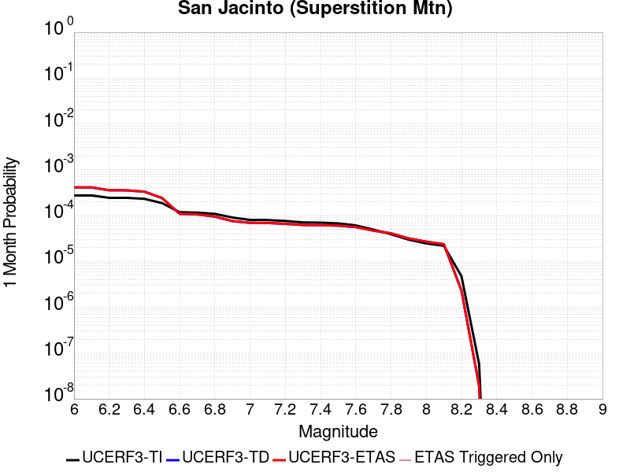 |  |  |

| Magnitude | 1 wk TI Prob | 1 wk TD Prob | 1 wk ETAS Prob | 1 wk ETAS/TD Gain | 1 wk ETAS Triggered Only | 1 mo TI Prob | 1 mo TD Prob | 1 mo ETAS Prob | 1 mo ETAS/TD Gain | 1 mo ETAS Triggered Only | 1 yr TI Prob | 1 yr TD Prob | 1 yr ETAS Prob | 1 yr ETAS/TD Gain | 1 yr ETAS Triggered Only | 10 yr TI Prob | 10 yr TD Prob | 10 yr ETAS Prob | 10 yr ETAS/TD Gain | 10 yr ETAS Triggered Only |
|-----|-----|-----|-----|-----|-----|-----|-----|-----|-----|-----|-----|-----|-----|-----|-----|-----|-----|-----|-----|-----|
| 6.0 | 6.4193904E-5 | 9.606838E-5 | 9.606838E-5 | 1.0 | 0.0 | 2.7508775E-4 | 4.1166646E-4 | 4.1166646E-4 | 1.0 | 0.0 | 0.0033440501 | 0.0050018053 | 0.0050117555 | 1.0019892 | 1.0E-5 | 0.03294174 | 0.04885974 | 0.048878767 | 1.0003893 | 2.0E-5 |
| 6.1 | 6.4193904E-5 | 9.606838E-5 | 9.606838E-5 | 1.0 | 0.0 | 2.7508775E-4 | 4.1166646E-4 | 4.1166646E-4 | 1.0 | 0.0 | 0.0033440501 | 0.0050018053 | 0.0050117555 | 1.0019892 | 1.0E-5 | 0.03294174 | 0.04885974 | 0.048878767 | 1.0003893 | 2.0E-5 |
| 6.2 | 5.7023593E-5 | 8.321217E-5 | 8.321217E-5 | 1.0 | 0.0 | 2.4436394E-4 | 3.565843E-4 | 3.565843E-4 | 1.0 | 0.0 | 0.002971072 | 0.004334395 | 0.004334395 | 1.0 | 0.0 | 0.029316625 | 0.042537875 | 0.04254745 | 1.0002251 | 1.0E-5 |
| 6.3 | 5.6940098E-5 | 8.305749E-5 | 8.305749E-5 | 1.0 | 0.0 | 2.4400617E-4 | 3.5592154E-4 | 3.5592154E-4 | 1.0 | 0.0 | 0.002966728 | 0.004326358 | 0.004326358 | 1.0 | 0.0 | 0.029274331 | 0.04246111 | 0.042470682 | 1.0002255 | 1.0E-5 |
| 6.4 | 5.4171585E-5 | 7.755024E-5 | 7.755024E-5 | 1.0 | 0.0 | 2.3214328E-4 | 3.3232514E-4 | 3.3232514E-4 | 1.0 | 0.0 | 0.0028226813 | 0.004040201 | 0.004040201 | 1.0 | 0.0 | 0.02787096 | 0.03975008 | 0.039759684 | 1.0002415 | 1.0E-5 |
| 6.5 | 4.375144E-5 | 5.6486107E-5 | 5.6486107E-5 | 1.0 | 0.0 | 1.874927E-4 | 2.4206749E-4 | 2.4206749E-4 | 1.0 | 0.0 | 0.0022803338 | 0.0029443644 | 0.0029443644 | 1.0 | 0.0 | 0.022570757 | 0.02926981 | 0.02926981 | 1.0 | 0.0 |
| 6.6 | 2.772192E-5 | 2.5550056E-5 | 2.5550056E-5 | 1.0 | 0.0 | 1.1880282E-4 | 1.09495755E-4 | 1.09495755E-4 | 1.0 | 0.0 | 0.0014454646 | 0.0013323149 | 0.0013323149 | 1.0 | 0.0 | 0.014360986 | 0.013572521 | 0.013572521 | 1.0 | 0.0 |
| 6.7 | 2.7124124E-5 | 2.4760804E-5 | 2.4760804E-5 | 1.0 | 0.0 | 1.1624106E-4 | 1.0611352E-4 | 1.0611352E-4 | 1.0 | 0.0 | 0.0014143161 | 0.0012911857 | 0.0012911857 | 1.0 | 0.0 | 0.014053487 | 0.013165847 | 0.013165847 | 1.0 | 0.0 |
| 6.8 | 2.5475807E-5 | 2.2224416E-5 | 2.2224416E-5 | 1.0 | 0.0 | 1.0917746E-4 | 9.524408E-5 | 9.524408E-5 | 1.0 | 0.0 | 0.001328425 | 0.0011589918 | 0.0011589918 | 1.0 | 0.0 | 0.0132051185 | 0.011853393 | 0.011853393 | 1.0 | 0.0 |
| 6.9 | 2.1162023E-5 | 1.7681692E-5 | 1.7681692E-5 | 1.0 | 0.0 | 9.069123E-5 | 7.57765E-5 | 7.57765E-5 | 1.0 | 0.0 | 0.0011036064 | 9.2219224E-4 | 9.2219224E-4 | 1.0 | 0.0 | 0.010981417 | 0.00947586 | 0.00947586 | 1.0 | 0.0 |
| 7.0 | 1.8754288E-5 | 1.6214553E-5 | 1.6214553E-5 | 1.0 | 0.0 | 8.037304E-5 | 6.9489106E-5 | 6.9489106E-5 | 1.0 | 0.0 | 9.781026E-4 | 8.4570394E-4 | 8.4570394E-4 | 1.0 | 0.0 | 0.009738087 | 0.008697749 | 0.008697749 | 1.0 | 0.0 |
| 7.1 | 1.8678527E-5 | 1.6139646E-5 | 1.6139646E-5 | 1.0 | 0.0 | 8.0048376E-5 | 6.916808E-5 | 6.916808E-5 | 1.0 | 0.0 | 9.7415317E-4 | 8.4179855E-4 | 8.4179855E-4 | 1.0 | 0.0 | 0.009698939 | 0.008658681 | 0.008658681 | 1.0 | 0.0 |
| 7.2 | 1.7804578E-5 | 1.543367E-5 | 1.543367E-5 | 1.0 | 0.0 | 7.6303106E-5 | 6.614264E-5 | 6.614264E-5 | 1.0 | 0.0 | 9.285943E-4 | 8.049914E-4 | 8.049914E-4 | 1.0 | 0.0 | 0.009247236 | 0.008289718 | 0.008289718 | 1.0 | 0.0 |
| 7.3 | 1.6583685E-5 | 1.4582174E-5 | 1.4582174E-5 | 1.0 | 0.0 | 7.1070994E-5 | 6.249354E-5 | 6.249354E-5 | 1.0 | 0.0 | 8.649459E-4 | 7.605953E-4 | 7.605953E-4 | 1.0 | 0.0 | 0.00861587 | 0.007844728 | 0.007844728 | 1.0 | 0.0 |
| 7.4 | 1.6387552E-5 | 1.444696E-5 | 1.444696E-5 | 1.0 | 0.0 | 7.023047E-5 | 6.1914085E-5 | 6.1914085E-5 | 1.0 | 0.0 | 8.5472054E-4 | 7.535453E-4 | 7.535453E-4 | 1.0 | 0.0 | 0.008514405 | 0.0077740606 | 0.0077740606 | 1.0 | 0.0 |
| 7.5 | 1.5790754E-5 | 1.4087126E-5 | 1.4087126E-5 | 1.0 | 0.0 | 6.767291E-5 | 6.037201E-5 | 6.037201E-5 | 1.0 | 0.0 | 8.236062E-4 | 7.3478336E-4 | 7.3478336E-4 | 1.0 | 0.0 | 0.008205604 | 0.0075843562 | 0.0075843562 | 1.0 | 0.0 |
| 7.6 | 1.4248672E-5 | 1.31047855E-5 | 1.31047855E-5 | 1.0 | 0.0 | 6.106431E-5 | 5.6162164E-5 | 5.6162164E-5 | 1.0 | 0.0 | 7.432043E-4 | 6.835616E-4 | 6.835616E-4 | 1.0 | 0.0 | 0.007407237 | 0.007066272 | 0.007066272 | 1.0 | 0.0 |
| 7.7 | 1.15449975E-5 | 1.0951373E-5 | 1.0951373E-5 | 1.0 | 0.0 | 4.947762E-5 | 4.6933616E-5 | 4.6933616E-5 | 1.0 | 0.0 | 6.022235E-4 | 5.7126774E-4 | 5.7126774E-4 | 1.0 | 0.0 | 0.006005941 | 0.005935198 | 0.005935198 | 1.0 | 0.0 |
| 7.8 | 9.1391985E-6 | 9.5601845E-6 | 9.5601845E-6 | 1.0 | 0.0 | 3.9167408E-5 | 4.097158E-5 | 4.097158E-5 | 1.0 | 0.0 | 4.767588E-4 | 4.987154E-4 | 4.987154E-4 | 1.0 | 0.0 | 0.0047573727 | 0.0052007753 | 0.0052007753 | 1.0 | 0.0 |
| 7.9 | 6.973017E-6 | 7.423164E-6 | 7.423164E-6 | 1.0 | 0.0 | 2.9884017E-5 | 3.1813175E-5 | 3.1813175E-5 | 1.0 | 0.0 | 3.6377716E-4 | 3.872571E-4 | 3.872571E-4 | 1.0 | 0.0 | 0.0036318225 | 0.004073359 | 0.004073359 | 1.0 | 0.0 |
| 8.0 | 5.7638235E-6 | 6.2974086E-6 | 6.2974086E-6 | 1.0 | 0.0 | 2.4701867E-5 | 2.6988619E-5 | 2.6988619E-5 | 1.0 | 0.0 | 3.0070372E-4 | 3.285374E-4 | 3.285374E-4 | 1.0 | 0.0 | 0.0030029714 | 0.0034731713 | 0.0034731713 | 1.0 | 0.0 |
| 8.1 | 5.1124434E-6 | 5.5298738E-6 | 5.5298738E-6 | 1.0 | 0.0 | 2.1910288E-5 | 2.3699247E-5 | 2.3699247E-5 | 1.0 | 0.0 | 2.6672508E-4 | 2.8850063E-4 | 2.8850063E-4 | 1.0 | 0.0 | 0.0026640517 | 0.0030583788 | 0.0030583788 | 1.0 | 0.0 |
| 8.2 | 1.1075938E-6 | 5.384721E-7 | 5.384721E-7 | 1.0 | 0.0 | 4.7468216E-6 | 2.3077355E-6 | 2.3077355E-6 | 1.0 | 0.0 | 5.779102E-5 | 2.809634E-5 | 2.809634E-5 | 1.0 | 0.0 | 5.777599E-4 | 3.1614656E-4 | 3.1614656E-4 | 1.0 | 0.0 |
| 8.3 | 1.3584393E-8 | 4.5198636E-9 | 4.5198636E-9 | 1.0 | 0.0 | 5.8218827E-8 | 1.9370844E-8 | 1.9370844E-8 | 1.0 | 0.0 | 7.0881396E-7 | 2.3584003E-7 | 2.3584003E-7 | 1.0 | 0.0 | 7.0881174E-6 | 2.6421167E-6 | 2.6421167E-6 | 1.0 | 0.0 |

## Cleghorn
*[(top)](#table-of-contents)*

| 1 Week | 1 Month | 1 Year | 10 Year |
|-----|-----|-----|-----|
|  |  |  | 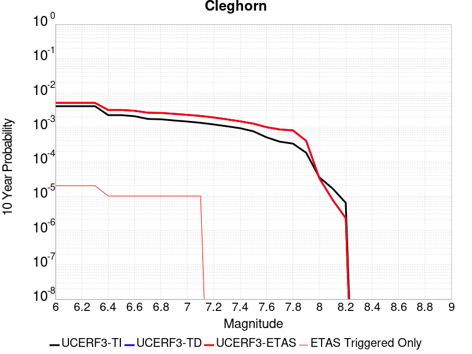 |

| Magnitude | 1 wk TI Prob | 1 wk TD Prob | 1 wk ETAS Prob | 1 wk ETAS/TD Gain | 1 wk ETAS Triggered Only | 1 mo TI Prob | 1 mo TD Prob | 1 mo ETAS Prob | 1 mo ETAS/TD Gain | 1 mo ETAS Triggered Only | 1 yr TI Prob | 1 yr TD Prob | 1 yr ETAS Prob | 1 yr ETAS/TD Gain | 1 yr ETAS Triggered Only | 10 yr TI Prob | 10 yr TD Prob | 10 yr ETAS Prob | 10 yr ETAS/TD Gain | 10 yr ETAS Triggered Only |
|-----|-----|-----|-----|-----|-----|-----|-----|-----|-----|-----|-----|-----|-----|-----|-----|-----|-----|-----|-----|-----|
| 6.0 | 7.9267165E-6 | 9.844329E-6 | 9.844329E-6 | 1.0 | 0.0 | 3.39712E-5 | 4.2189356E-5 | 4.2189356E-5 | 1.0 | 0.0 | 4.1352084E-4 | 5.13545E-4 | 5.13545E-4 | 1.0 | 0.0 | 0.004127522 | 0.005138525 | 0.005158422 | 1.0038722 | 2.0E-5 |
| 6.1 | 7.9267165E-6 | 9.844329E-6 | 9.844329E-6 | 1.0 | 0.0 | 3.39712E-5 | 4.2189356E-5 | 4.2189356E-5 | 1.0 | 0.0 | 4.1352084E-4 | 5.13545E-4 | 5.13545E-4 | 1.0 | 0.0 | 0.004127522 | 0.005138525 | 0.005158422 | 1.0038722 | 2.0E-5 |
| 6.2 | 7.9267165E-6 | 9.844329E-6 | 9.844329E-6 | 1.0 | 0.0 | 3.39712E-5 | 4.2189356E-5 | 4.2189356E-5 | 1.0 | 0.0 | 4.1352084E-4 | 5.13545E-4 | 5.13545E-4 | 1.0 | 0.0 | 0.004127522 | 0.005138525 | 0.005158422 | 1.0038722 | 2.0E-5 |
| 6.3 | 7.9267165E-6 | 9.844329E-6 | 9.844329E-6 | 1.0 | 0.0 | 3.39712E-5 | 4.2189356E-5 | 4.2189356E-5 | 1.0 | 0.0 | 4.1352084E-4 | 5.13545E-4 | 5.13545E-4 | 1.0 | 0.0 | 0.004127522 | 0.005138525 | 0.005158422 | 1.0038722 | 2.0E-5 |
| 6.4 | 4.3445207E-6 | 6.1039705E-6 | 6.1039705E-6 | 1.0 | 0.0 | 1.8619241E-5 | 2.6159618E-5 | 2.6159618E-5 | 1.0 | 0.0 | 2.2666567E-4 | 3.184478E-4 | 3.184478E-4 | 1.0 | 0.0 | 0.0022643462 | 0.0031939335 | 0.0032039015 | 1.0031209 | 1.0E-5 |
| 6.5 | 4.3445207E-6 | 6.1039705E-6 | 6.1039705E-6 | 1.0 | 0.0 | 1.8619241E-5 | 2.6159618E-5 | 2.6159618E-5 | 1.0 | 0.0 | 2.2666567E-4 | 3.184478E-4 | 3.184478E-4 | 1.0 | 0.0 | 0.0022643462 | 0.0031939335 | 0.0032039015 | 1.0031209 | 1.0E-5 |
| 6.6 | 4.040109E-6 | 5.78636E-6 | 5.78636E-6 | 1.0 | 0.0 | 1.7314638E-5 | 2.4798455E-5 | 2.4798455E-5 | 1.0 | 0.0 | 2.1078532E-4 | 3.018803E-4 | 3.018803E-4 | 1.0 | 0.0 | 0.002105855 | 0.0030287148 | 0.0030386846 | 1.0032917 | 1.0E-5 |
| 6.7 | 3.3632055E-6 | 5.0798167E-6 | 5.0798167E-6 | 1.0 | 0.0 | 1.4413658E-5 | 2.1770462E-5 | 2.1770462E-5 | 1.0 | 0.0 | 1.7547216E-4 | 2.6502347E-4 | 2.6502347E-4 | 1.0 | 0.0 | 0.0017533366 | 0.0026610303 | 0.0026710038 | 1.0037479 | 1.0E-5 |
| 6.8 | 3.2902772E-6 | 5.0017165E-6 | 5.0017165E-6 | 1.0 | 0.0 | 1.4101111E-5 | 2.1435753E-5 | 2.1435753E-5 | 1.0 | 0.0 | 1.716675E-4 | 2.6094937E-4 | 2.6094937E-4 | 1.0 | 0.0 | 0.0017153495 | 0.0026203855 | 0.0026303593 | 1.0038062 | 1.0E-5 |
| 6.9 | 3.031547E-6 | 4.7032236E-6 | 4.7032236E-6 | 1.0 | 0.0 | 1.299228E-5 | 2.0156518E-5 | 2.0156518E-5 | 1.0 | 0.0 | 1.5816953E-4 | 2.4537824E-4 | 2.4537824E-4 | 1.0 | 0.0 | 0.00158057 | 0.002465027 | 0.0024750023 | 1.0040468 | 1.0E-5 |
| 7.0 | 2.8259715E-6 | 4.3821365E-6 | 4.3821365E-6 | 1.0 | 0.0 | 1.211125E-5 | 1.8780453E-5 | 1.8780453E-5 | 1.0 | 0.0 | 1.4744449E-4 | 2.2862825E-4 | 2.2862825E-4 | 1.0 | 0.0 | 0.001473467 | 0.002297883 | 0.00230786 | 1.0043418 | 1.0E-5 |
| 7.1 | 2.5962665E-6 | 4.0770733E-6 | 4.0770733E-6 | 1.0 | 0.0 | 1.1126809E-5 | 1.7473056E-5 | 1.7473056E-5 | 1.0 | 0.0 | 1.3546048E-4 | 2.127139E-4 | 2.127139E-4 | 1.0 | 0.0 | 0.0013537793 | 0.0021390605 | 0.0021490392 | 1.0046649 | 1.0E-5 |
| 7.2 | 2.3247253E-6 | 3.687283E-6 | 3.687283E-6 | 1.0 | 0.0 | 9.96307E-6 | 1.5802547E-5 | 1.5802547E-5 | 1.0 | 0.0 | 1.21293626E-4 | 1.923792E-4 | 1.923792E-4 | 1.0 | 0.0 | 0.0012122744 | 0.0019361057 | 0.0019361057 | 1.0 | 0.0 |
| 7.3 | 2.056928E-6 | 3.2453E-6 | 3.2453E-6 | 1.0 | 0.0 | 8.815376E-6 | 1.3908355E-5 | 1.3908355E-5 | 1.0 | 0.0 | 1.0732192E-4 | 1.6932123E-4 | 1.6932123E-4 | 1.0 | 0.0 | 0.001072701 | 0.0017059678 | 0.0017059678 | 1.0 | 0.0 |
| 7.4 | 1.8055999E-6 | 2.835059E-6 | 2.835059E-6 | 1.0 | 0.0 | 7.738263E-6 | 1.2150197E-5 | 1.2150197E-5 | 1.0 | 0.0 | 9.4209274E-5 | 1.4791875E-4 | 1.4791875E-4 | 1.0 | 0.0 | 9.4169343E-4 | 0.0014923868 | 0.0014923868 | 1.0 | 0.0 |
| 7.5 | 1.4683443E-6 | 2.4340136E-6 | 2.4340136E-6 | 1.0 | 0.0 | 6.292889E-6 | 1.0431445E-5 | 1.0431445E-5 | 1.0 | 0.0 | 7.661323E-5 | 1.2699554E-4 | 1.2699554E-4 | 1.0 | 0.0 | 7.658682E-4 | 0.0012834566 | 0.0012834566 | 1.0 | 0.0 |
| 7.6 | 9.804088E-7 | 1.9093818E-6 | 1.9093818E-6 | 1.0 | 0.0 | 4.201745E-6 | 8.183039E-6 | 8.183039E-6 | 1.0 | 0.0 | 5.1155046E-5 | 9.962399E-5 | 9.962399E-5 | 1.0 | 0.0 | 5.114327E-4 | 0.0010100557 | 0.0010100557 | 1.0 | 0.0 |
| 7.7 | 7.3434086E-7 | 1.6373907E-6 | 1.6373907E-6 | 1.0 | 0.0 | 3.1471714E-6 | 7.01737E-6 | 7.01737E-6 | 1.0 | 0.0 | 3.831614E-5 | 8.543315E-5 | 8.543315E-5 | 1.0 | 0.0 | 3.8309532E-4 | 8.683008E-4 | 8.683008E-4 | 1.0 | 0.0 |
| 7.8 | 6.434184E-7 | 1.5305798E-6 | 1.5305798E-6 | 1.0 | 0.0 | 2.7575045E-6 | 6.5596114E-6 | 6.5596114E-6 | 1.0 | 0.0 | 3.35721E-5 | 7.9860365E-5 | 7.9860365E-5 | 1.0 | 0.0 | 3.3567028E-4 | 8.122777E-4 | 8.122777E-4 | 1.0 | 0.0 |
| 7.9 | 3.4943926E-7 | 7.620481E-7 | 7.620481E-7 | 1.0 | 0.0 | 1.497596E-6 | 3.2659163E-6 | 3.2659163E-6 | 1.0 | 0.0 | 1.8233079E-5 | 3.9761813E-5 | 3.9761813E-5 | 1.0 | 0.0 | 1.8231584E-4 | 4.0634157E-4 | 4.0634157E-4 | 1.0 | 0.0 |
| 8.0 | 6.717524E-8 | 5.8917895E-8 | 5.8917895E-8 | 1.0 | 0.0 | 2.8789387E-7 | 2.5250523E-7 | 2.5250523E-7 | 1.0 | 0.0 | 3.505102E-6 | 3.074247E-6 | 3.074247E-6 | 1.0 | 0.0 | 3.5050467E-5 | 3.301935E-5 | 3.301935E-5 | 1.0 | 0.0 |
| 8.1 | 3.1984914E-8 | 1.31279485E-8 | 1.31279485E-8 | 1.0 | 0.0 | 1.370782E-7 | 5.6262632E-8 | 5.6262632E-8 | 1.0 | 0.0 | 1.6689258E-6 | 6.849973E-7 | 6.849973E-7 | 1.0 | 0.0 | 1.6689133E-5 | 7.841479E-6 | 7.841479E-6 | 1.0 | 0.0 |
| 8.2 | 1.21887656E-8 | 3.7025414E-9 | 3.7025414E-9 | 1.0 | 0.0 | 5.2237567E-8 | 1.5868034E-8 | 1.5868034E-8 | 1.0 | 0.0 | 6.359922E-7 | 1.9319329E-7 | 1.9319329E-7 | 1.0 | 0.0 | 6.3599036E-6 | 2.2777037E-6 | 2.2777037E-6 | 1.0 | 0.0 |

## Earthquake Valley (So Extension)
*[(top)](#table-of-contents)*

| 1 Week | 1 Month | 1 Year | 10 Year |
|-----|-----|-----|-----|
|  |  |  |  |

| Magnitude | 1 wk TI Prob | 1 wk TD Prob | 1 wk ETAS Prob | 1 wk ETAS/TD Gain | 1 wk ETAS Triggered Only | 1 mo TI Prob | 1 mo TD Prob | 1 mo ETAS Prob | 1 mo ETAS/TD Gain | 1 mo ETAS Triggered Only | 1 yr TI Prob | 1 yr TD Prob | 1 yr ETAS Prob | 1 yr ETAS/TD Gain | 1 yr ETAS Triggered Only | 10 yr TI Prob | 10 yr TD Prob | 10 yr ETAS Prob | 10 yr ETAS/TD Gain | 10 yr ETAS Triggered Only |
|-----|-----|-----|-----|-----|-----|-----|-----|-----|-----|-----|-----|-----|-----|-----|-----|-----|-----|-----|-----|-----|
| 6.0 | 3.0194888E-5 | 3.7083595E-5 | 3.7083595E-5 | 1.0 | 0.0 | 1.2940024E-4 | 1.5892308E-4 | 1.689215E-4 | 1.0629135 | 1.0E-5 | 0.0015743093 | 0.0019337159 | 0.0019536773 | 1.0103228 | 2.0E-5 | 0.01563203 | 0.019218799 | 0.019238414 | 1.0010207 | 2.0E-5 |
| 6.1 | 3.0194888E-5 | 3.7083595E-5 | 3.7083595E-5 | 1.0 | 0.0 | 1.2940024E-4 | 1.5892308E-4 | 1.689215E-4 | 1.0629135 | 1.0E-5 | 0.0015743093 | 0.0019337159 | 0.0019536773 | 1.0103228 | 2.0E-5 | 0.01563203 | 0.019218799 | 0.019238414 | 1.0010207 | 2.0E-5 |
| 6.2 | 3.0194888E-5 | 3.7083595E-5 | 3.7083595E-5 | 1.0 | 0.0 | 1.2940024E-4 | 1.5892308E-4 | 1.689215E-4 | 1.0629135 | 1.0E-5 | 0.0015743093 | 0.0019337159 | 0.0019536773 | 1.0103228 | 2.0E-5 | 0.01563203 | 0.019218799 | 0.019238414 | 1.0010207 | 2.0E-5 |
| 6.3 | 1.5795305E-5 | 1.8450788E-5 | 1.8450788E-5 | 1.0 | 0.0 | 6.769241E-5 | 7.9073034E-5 | 7.9073034E-5 | 1.0 | 0.0 | 8.238434E-4 | 9.624003E-4 | 9.723907E-4 | 1.0103807 | 1.0E-5 | 0.008207959 | 0.009593238 | 0.009603142 | 1.0010324 | 1.0E-5 |
| 6.4 | 1.5795305E-5 | 1.8450788E-5 | 1.8450788E-5 | 1.0 | 0.0 | 6.769241E-5 | 7.9073034E-5 | 7.9073034E-5 | 1.0 | 0.0 | 8.238434E-4 | 9.624003E-4 | 9.723907E-4 | 1.0103807 | 1.0E-5 | 0.008207959 | 0.009593238 | 0.009603142 | 1.0010324 | 1.0E-5 |
| 6.5 | 1.5795305E-5 | 1.8450788E-5 | 1.8450788E-5 | 1.0 | 0.0 | 6.769241E-5 | 7.9073034E-5 | 7.9073034E-5 | 1.0 | 0.0 | 8.238434E-4 | 9.624003E-4 | 9.723907E-4 | 1.0103807 | 1.0E-5 | 0.008207959 | 0.009593238 | 0.009603142 | 1.0010324 | 1.0E-5 |
| 6.6 | 1.5795305E-5 | 1.8450788E-5 | 1.8450788E-5 | 1.0 | 0.0 | 6.769241E-5 | 7.9073034E-5 | 7.9073034E-5 | 1.0 | 0.0 | 8.238434E-4 | 9.624003E-4 | 9.723907E-4 | 1.0103807 | 1.0E-5 | 0.008207959 | 0.009593238 | 0.009603142 | 1.0010324 | 1.0E-5 |
| 6.7 | 1.1363076E-5 | 1.3141109E-5 | 1.3141109E-5 | 1.0 | 0.0 | 4.8697988E-5 | 5.631825E-5 | 5.631825E-5 | 1.0 | 0.0 | 5.927367E-4 | 6.8553514E-4 | 6.955283E-4 | 1.0145772 | 1.0E-5 | 0.0059115817 | 0.00684168 | 0.0068516117 | 1.0014516 | 1.0E-5 |
| 6.8 | 1.0049611E-5 | 1.1596789E-5 | 1.1596789E-5 | 1.0 | 0.0 | 4.306905E-5 | 4.969999E-5 | 4.969999E-5 | 1.0 | 0.0 | 5.242395E-4 | 6.0500257E-4 | 6.0500257E-4 | 1.0 | 0.0 | 0.0052300454 | 0.0060407347 | 0.0060407347 | 1.0 | 0.0 |
| 6.9 | 1.0049611E-5 | 1.1596789E-5 | 1.1596789E-5 | 1.0 | 0.0 | 4.306905E-5 | 4.969999E-5 | 4.969999E-5 | 1.0 | 0.0 | 5.242395E-4 | 6.0500257E-4 | 6.0500257E-4 | 1.0 | 0.0 | 0.0052300454 | 0.0060407347 | 0.0060407347 | 1.0 | 0.0 |
| 7.0 | 1.0049611E-5 | 1.1596789E-5 | 1.1596789E-5 | 1.0 | 0.0 | 4.306905E-5 | 4.969999E-5 | 4.969999E-5 | 1.0 | 0.0 | 5.242395E-4 | 6.0500257E-4 | 6.0500257E-4 | 1.0 | 0.0 | 0.0052300454 | 0.0060407347 | 0.0060407347 | 1.0 | 0.0 |
| 7.1 | 8.140254E-6 | 9.38545E-6 | 9.38545E-6 | 1.0 | 0.0 | 3.4886336E-5 | 4.0223113E-5 | 4.0223113E-5 | 1.0 | 0.0 | 4.2465836E-4 | 4.8967346E-4 | 4.8967346E-4 | 1.0 | 0.0 | 0.0042384774 | 0.004892524 | 0.004892524 | 1.0 | 0.0 |
| 7.2 | 1.673835E-7 | 1.41582E-7 | 1.41582E-7 | 1.0 | 0.0 | 7.173577E-7 | 6.067799E-7 | 6.067799E-7 | 1.0 | 0.0 | 8.733795E-6 | 7.387524E-6 | 7.387524E-6 | 1.0 | 0.0 | 8.733451E-5 | 7.387314E-5 | 7.387314E-5 | 1.0 | 0.0 |
| 7.3 | 1.6632116E-7 | 1.4056415E-7 | 1.4056415E-7 | 1.0 | 0.0 | 7.1280476E-7 | 6.024177E-7 | 6.024177E-7 | 1.0 | 0.0 | 8.678364E-6 | 7.334414E-6 | 7.334414E-6 | 1.0 | 0.0 | 8.6780245E-5 | 7.3342075E-5 | 7.3342075E-5 | 1.0 | 0.0 |
| 7.4 | 1.6569169E-7 | 1.4001033E-7 | 1.4001033E-7 | 1.0 | 0.0 | 7.1010703E-7 | 6.000442E-7 | 6.000442E-7 | 1.0 | 0.0 | 8.645519E-6 | 7.3055166E-6 | 7.3055166E-6 | 1.0 | 0.0 | 8.645182E-5 | 7.3053125E-5 | 7.3053125E-5 | 1.0 | 0.0 |
| 7.5 | 1.1764555E-7 | 1.0099064E-7 | 1.0099064E-7 | 1.0 | 0.0 | 5.041951E-7 | 4.3281696E-7 | 4.3281696E-7 | 1.0 | 0.0 | 6.138558E-6 | 5.269536E-6 | 5.269536E-6 | 1.0 | 0.0 | 6.1383886E-5 | 5.2694326E-5 | 5.2694326E-5 | 1.0 | 0.0 |
| 7.6 | 1.07927605E-7 | 9.263696E-8 | 9.263696E-8 | 1.0 | 0.0 | 4.6254678E-7 | 3.9701547E-7 | 3.9701547E-7 | 1.0 | 0.0 | 5.6314925E-6 | 4.833655E-6 | 4.833655E-6 | 1.0 | 0.0 | 5.63135E-5 | 4.8335707E-5 | 4.8335707E-5 | 1.0 | 0.0 |
| 7.7 | 2.1826905E-8 | 1.1186112E-8 | 1.1186112E-8 | 1.0 | 0.0 | 9.3543875E-8 | 4.794048E-8 | 4.794048E-8 | 1.0 | 0.0 | 1.1388961E-6 | 5.836752E-7 | 5.836752E-7 | 1.0 | 0.0 | 1.1388902E-5 | 5.836742E-6 | 5.836742E-6 | 1.0 | 0.0 |
| 7.8 | 2.6169649E-9 | 1.1975333E-9 | 1.1975333E-9 | 1.0 | 0.0 | 1.1215564E-8 | 5.1322857E-9 | 5.1322857E-9 | 1.0 | 0.0 | 1.3654947E-7 | 6.2485576E-8 | 6.2485576E-8 | 1.0 | 0.0 | 1.365494E-6 | 6.248557E-7 | 6.248557E-7 | 1.0 | 0.0 |

## Whittier alt 1
*[(top)](#table-of-contents)*

| 1 Week | 1 Month | 1 Year | 10 Year |
|-----|-----|-----|-----|
|  |  | 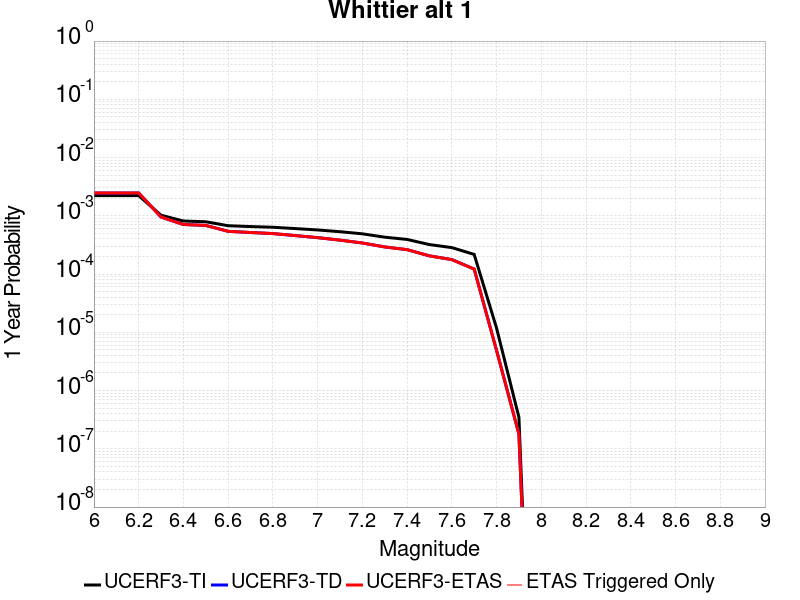 | 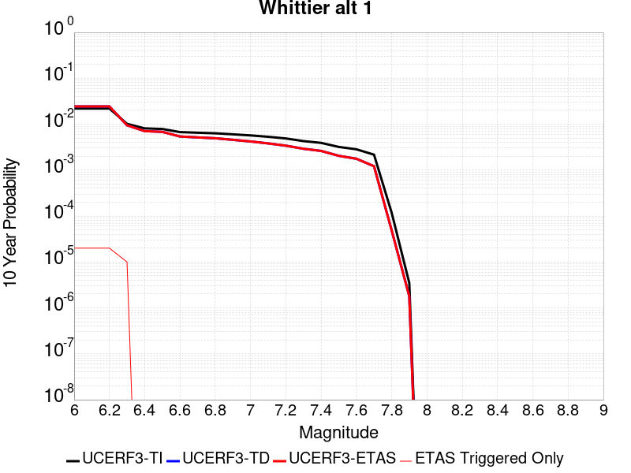 |

| Magnitude | 1 wk TI Prob | 1 wk TD Prob | 1 wk ETAS Prob | 1 wk ETAS/TD Gain | 1 wk ETAS Triggered Only | 1 mo TI Prob | 1 mo TD Prob | 1 mo ETAS Prob | 1 mo ETAS/TD Gain | 1 mo ETAS Triggered Only | 1 yr TI Prob | 1 yr TD Prob | 1 yr ETAS Prob | 1 yr ETAS/TD Gain | 1 yr ETAS Triggered Only | 10 yr TI Prob | 10 yr TD Prob | 10 yr ETAS Prob | 10 yr ETAS/TD Gain | 10 yr ETAS Triggered Only |
|-----|-----|-----|-----|-----|-----|-----|-----|-----|-----|-----|-----|-----|-----|-----|-----|-----|-----|-----|-----|-----|
| 6.0 | 4.2554693E-5 | 4.7264235E-5 | 4.7264235E-5 | 1.0 | 0.0 | 1.8236451E-4 | 2.0254709E-4 | 2.0254709E-4 | 1.0 | 0.0 | 0.002218027 | 0.0024635424 | 0.0024635424 | 1.0 | 0.0 | 0.02196019 | 0.024396377 | 0.024415888 | 1.0007998 | 2.0E-5 |
| 6.1 | 4.2554693E-5 | 4.7264235E-5 | 4.7264235E-5 | 1.0 | 0.0 | 1.8236451E-4 | 2.0254709E-4 | 2.0254709E-4 | 1.0 | 0.0 | 0.002218027 | 0.0024635424 | 0.0024635424 | 1.0 | 0.0 | 0.02196019 | 0.024396377 | 0.024415888 | 1.0007998 | 2.0E-5 |
| 6.2 | 4.2554693E-5 | 4.7264235E-5 | 4.7264235E-5 | 1.0 | 0.0 | 1.8236451E-4 | 2.0254709E-4 | 2.0254709E-4 | 1.0 | 0.0 | 0.002218027 | 0.0024635424 | 0.0024635424 | 1.0 | 0.0 | 0.02196019 | 0.024396377 | 0.024415888 | 1.0007998 | 2.0E-5 |
| 6.3 | 1.9617712E-5 | 1.8275026E-5 | 1.8275026E-5 | 1.0 | 0.0 | 8.40732E-5 | 7.83193E-5 | 7.83193E-5 | 1.0 | 0.0 | 0.0010231105 | 9.5313933E-4 | 9.5313933E-4 | 1.0 | 0.0 | 0.01018413 | 0.009493795 | 0.0095037 | 1.0010433 | 1.0E-5 |
| 6.4 | 1.5611336E-5 | 1.3609712E-5 | 1.3609712E-5 | 1.0 | 0.0 | 6.690401E-5 | 5.8326066E-5 | 5.8326066E-5 | 1.0 | 0.0 | 8.142519E-4 | 7.098945E-4 | 7.098945E-4 | 1.0 | 0.0 | 0.008112748 | 0.007078228 | 0.007078228 | 1.0 | 0.0 |
| 6.5 | 1.5150166E-5 | 1.3106303E-5 | 1.3106303E-5 | 1.0 | 0.0 | 6.492767E-5 | 5.6168694E-5 | 5.6168694E-5 | 1.0 | 0.0 | 7.9020765E-4 | 6.836452E-4 | 6.836452E-4 | 1.0 | 0.0 | 0.007874036 | 0.006817366 | 0.006817366 | 1.0 | 0.0 |
| 6.6 | 1.295588E-5 | 1.038518E-5 | 1.038518E-5 | 1.0 | 0.0 | 5.552402E-5 | 4.4507167E-5 | 4.4507167E-5 | 1.0 | 0.0 | 6.7579525E-4 | 5.4174196E-4 | 5.4174196E-4 | 1.0 | 0.0 | 0.006737438 | 0.0054056463 | 0.0054056463 | 1.0 | 0.0 |
| 6.7 | 1.2542085E-5 | 9.903713E-6 | 9.903713E-6 | 1.0 | 0.0 | 5.3750682E-5 | 4.2443804E-5 | 4.2443804E-5 | 1.0 | 0.0 | 6.542181E-4 | 5.166327E-4 | 5.166327E-4 | 1.0 | 0.0 | 0.006522954 | 0.005155734 | 0.005155734 | 1.0 | 0.0 |
| 6.8 | 1.2195878E-5 | 9.499611E-6 | 9.499611E-6 | 1.0 | 0.0 | 5.2267E-5 | 4.0711995E-5 | 4.0711995E-5 | 1.0 | 0.0 | 6.36165E-4 | 4.955577E-4 | 4.955577E-4 | 1.0 | 0.0 | 0.0063434686 | 0.0049458668 | 0.0049458668 | 1.0 | 0.0 |
| 6.9 | 1.1580298E-5 | 8.776835E-6 | 8.776835E-6 | 1.0 | 0.0 | 4.9628903E-5 | 3.7614474E-5 | 3.7614474E-5 | 1.0 | 0.0 | 6.040644E-4 | 4.5786164E-4 | 4.5786164E-4 | 1.0 | 0.0 | 0.00602425 | 0.0045704423 | 0.0045704423 | 1.0 | 0.0 |
| 7.0 | 1.0964795E-5 | 8.087695E-6 | 8.087695E-6 | 1.0 | 0.0 | 4.6991136E-5 | 3.4661098E-5 | 3.4661098E-5 | 1.0 | 0.0 | 5.7196687E-4 | 4.219187E-4 | 4.219187E-4 | 1.0 | 0.0 | 0.0057049696 | 0.004212385 | 0.004212385 | 1.0 | 0.0 |
| 7.1 | 1.0230601E-5 | 7.329962E-6 | 7.329962E-6 | 1.0 | 0.0 | 4.3844695E-5 | 3.1413754E-5 | 3.1413754E-5 | 1.0 | 0.0 | 5.336784E-4 | 3.8239663E-4 | 3.8239663E-4 | 1.0 | 0.0 | 0.005323986 | 0.0038185497 | 0.0038185497 | 1.0 | 0.0 |
| 7.2 | 9.40865E-6 | 6.546295E-6 | 6.546295E-6 | 1.0 | 0.0 | 4.032216E-5 | 2.8055256E-5 | 2.8055256E-5 | 1.0 | 0.0 | 4.908117E-4 | 3.415204E-4 | 3.415204E-4 | 1.0 | 0.0 | 0.0048972913 | 0.0034110483 | 0.0034110483 | 1.0 | 0.0 |
| 7.3 | 8.237384E-6 | 5.6003446E-6 | 5.6003446E-6 | 1.0 | 0.0 | 3.5302593E-5 | 2.4001263E-5 | 2.4001263E-5 | 1.0 | 0.0 | 4.2972428E-4 | 2.9217722E-4 | 2.9217722E-4 | 1.0 | 0.0 | 0.0042889426 | 0.002918252 | 0.002918252 | 1.0 | 0.0 |
| 7.4 | 7.5316966E-6 | 5.030179E-6 | 5.030179E-6 | 1.0 | 0.0 | 3.2278298E-5 | 2.1557738E-5 | 2.1557738E-5 | 1.0 | 0.0 | 3.9291743E-4 | 2.6243486E-4 | 2.6243486E-4 | 1.0 | 0.0 | 0.0039222343 | 0.0026213615 | 0.0026213615 | 1.0 | 0.0 |
| 7.5 | 6.149649E-6 | 3.9357315E-6 | 3.9357315E-6 | 1.0 | 0.0 | 2.6355372E-5 | 1.6867318E-5 | 1.6867318E-5 | 1.0 | 0.0 | 3.208294E-4 | 2.0534113E-4 | 2.0534113E-4 | 1.0 | 0.0 | 0.003203666 | 0.0020516033 | 0.0020516033 | 1.0 | 0.0 |
| 7.6 | 5.457711E-6 | 3.3970512E-6 | 3.3970512E-6 | 1.0 | 0.0 | 2.338998E-5 | 1.4558714E-5 | 1.4558714E-5 | 1.0 | 0.0 | 2.8473578E-4 | 1.7723875E-4 | 1.7723875E-4 | 1.0 | 0.0 | 0.0028437122 | 0.0017710547 | 0.0017710547 | 1.0 | 0.0 |
| 7.7 | 4.1676276E-6 | 2.3345212E-6 | 2.3345212E-6 | 1.0 | 0.0 | 1.7861139E-5 | 1.00050565E-5 | 1.00050565E-5 | 1.0 | 0.0 | 2.1743766E-4 | 1.21805504E-4 | 1.21805504E-4 | 1.0 | 0.0 | 0.0021722503 | 0.0012174605 | 0.0012174605 | 1.0 | 0.0 |
| 7.8 | 2.2692414E-7 | 9.390229E-8 | 9.390229E-8 | 1.0 | 0.0 | 9.725317E-7 | 4.0243833E-7 | 4.0243833E-7 | 1.0 | 0.0 | 1.1840509E-5 | 4.899679E-6 | 4.899679E-6 | 1.0 | 0.0 | 1.1839878E-4 | 4.8996037E-5 | 4.8996037E-5 | 1.0 | 0.0 |
| 7.9 | 6.676829E-9 | 3.4410954E-9 | 3.4410954E-9 | 1.0 | 0.0 | 2.861498E-8 | 1.4747552E-8 | 1.4747552E-8 | 1.0 | 0.0 | 3.4838732E-7 | 1.7955142E-7 | 1.7955142E-7 | 1.0 | 0.0 | 3.4838679E-6 | 1.795513E-6 | 1.795513E-6 | 1.0 | 0.0 |

## San Jacinto (Borrego)
*[(top)](#table-of-contents)*

| 1 Week | 1 Month | 1 Year | 10 Year |
|-----|-----|-----|-----|
| 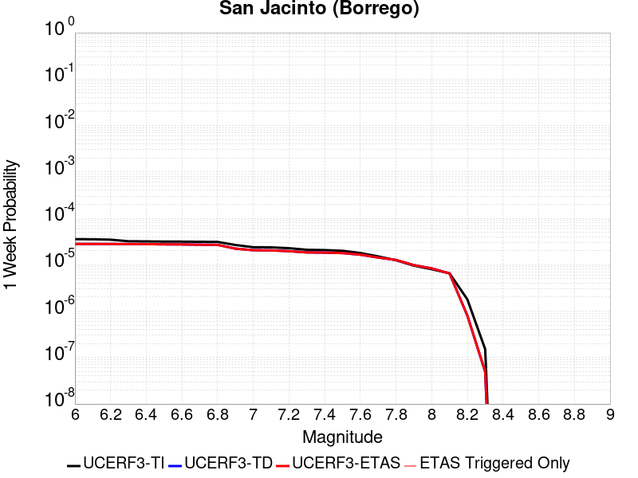 |  | 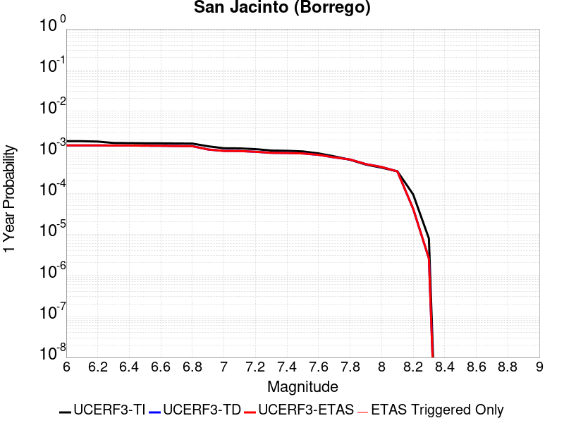 |  |

| Magnitude | 1 wk TI Prob | 1 wk TD Prob | 1 wk ETAS Prob | 1 wk ETAS/TD Gain | 1 wk ETAS Triggered Only | 1 mo TI Prob | 1 mo TD Prob | 1 mo ETAS Prob | 1 mo ETAS/TD Gain | 1 mo ETAS Triggered Only | 1 yr TI Prob | 1 yr TD Prob | 1 yr ETAS Prob | 1 yr ETAS/TD Gain | 1 yr ETAS Triggered Only | 10 yr TI Prob | 10 yr TD Prob | 10 yr ETAS Prob | 10 yr ETAS/TD Gain | 10 yr ETAS Triggered Only |
|-----|-----|-----|-----|-----|-----|-----|-----|-----|-----|-----|-----|-----|-----|-----|-----|-----|-----|-----|-----|-----|
| 6.0 | 3.543992E-5 | 2.8003382E-5 | 2.8003382E-5 | 1.0 | 0.0 | 1.5187653E-4 | 1.2000904E-4 | 1.2000904E-4 | 1.0 | 0.0 | 0.0018475284 | 0.0014601431 | 0.0014601431 | 1.0 | 0.0 | 0.018322436 | 0.014909599 | 0.014929301 | 1.0013214 | 2.0E-5 |
| 6.1 | 3.542281E-5 | 2.8003382E-5 | 2.8003382E-5 | 1.0 | 0.0 | 1.5180321E-4 | 1.2000904E-4 | 1.2000904E-4 | 1.0 | 0.0 | 0.0018466372 | 0.0014601431 | 0.0014601431 | 1.0 | 0.0 | 0.018313672 | 0.014909599 | 0.014929301 | 1.0013214 | 2.0E-5 |
| 6.2 | 3.4688688E-5 | 2.8003382E-5 | 2.8003382E-5 | 1.0 | 0.0 | 1.4865733E-4 | 1.2000904E-4 | 1.2000904E-4 | 1.0 | 0.0 | 0.0018084005 | 0.001460143 | 0.001460143 | 1.0 | 0.0 | 0.017937548 | 0.014909599 | 0.014929301 | 1.0013214 | 2.0E-5 |
| 6.3 | 3.2087122E-5 | 2.7848688E-5 | 2.7848688E-5 | 1.0 | 0.0 | 1.3750899E-4 | 1.1934613E-4 | 1.1934613E-4 | 1.0 | 0.0 | 0.0016728862 | 0.0014520829 | 0.0014520829 | 1.0 | 0.0 | 0.016603488 | 0.0148306135 | 0.014850317 | 1.0013286 | 2.0E-5 |
| 6.4 | 3.1828724E-5 | 2.781566E-5 | 2.781566E-5 | 1.0 | 0.0 | 1.364017E-4 | 1.1920459E-4 | 1.1920459E-4 | 1.0 | 0.0 | 0.0016594254 | 0.0014503619 | 0.0014503619 | 1.0 | 0.0 | 0.016470885 | 0.014813685 | 0.014833389 | 1.0013301 | 2.0E-5 |
| 6.5 | 3.1563577E-5 | 2.7555256E-5 | 2.7555256E-5 | 1.0 | 0.0 | 1.3526545E-4 | 1.18088676E-4 | 1.18088676E-4 | 1.0 | 0.0 | 0.0016456128 | 0.0014367937 | 0.0014367937 | 1.0 | 0.0 | 0.0163348 | 0.014680215 | 0.014699921 | 1.0013424 | 2.0E-5 |
| 6.6 | 3.1467625E-5 | 2.7399425E-5 | 2.7399425E-5 | 1.0 | 0.0 | 1.3485427E-4 | 1.1742089E-4 | 1.1742089E-4 | 1.0 | 0.0 | 0.0016406142 | 0.001428674 | 0.001428674 | 1.0 | 0.0 | 0.016285548 | 0.014600436 | 0.014620145 | 1.0013498 | 2.0E-5 |
| 6.7 | 3.1223695E-5 | 2.701733E-5 | 2.701733E-5 | 1.0 | 0.0 | 1.3380898E-4 | 1.15783485E-4 | 1.15783485E-4 | 1.0 | 0.0 | 0.0016279068 | 0.0014087645 | 0.0014087645 | 1.0 | 0.0 | 0.01616033 | 0.01440476 | 0.014424472 | 1.0013684 | 2.0E-5 |
| 6.8 | 3.1015585E-5 | 2.6838206E-5 | 2.6838206E-5 | 1.0 | 0.0 | 1.3291716E-4 | 1.1501588E-4 | 1.1501588E-4 | 1.0 | 0.0 | 0.001617065 | 0.0013994309 | 0.0013994309 | 1.0 | 0.0 | 0.016053487 | 0.014311978 | 0.014331691 | 1.0013775 | 2.0E-5 |
| 6.9 | 2.6641965E-5 | 2.2256108E-5 | 2.2256108E-5 | 1.0 | 0.0 | 1.1417485E-4 | 9.537986E-5 | 9.537986E-5 | 1.0 | 0.0 | 0.0013891924 | 0.001160635 | 0.001160635 | 1.0 | 0.0 | 0.0138054015 | 0.011919958 | 0.011939719 | 1.0016578 | 2.0E-5 |
| 7.0 | 2.3854353E-5 | 2.054833E-5 | 2.054833E-5 | 1.0 | 0.0 | 1.02228936E-4 | 8.8061315E-5 | 8.8061315E-5 | 1.0 | 0.0 | 0.0012439266 | 0.0010716218 | 0.0010716218 | 1.0 | 0.0 | 0.012369866 | 0.011019007 | 0.011038787 | 1.001795 | 2.0E-5 |
| 7.1 | 2.3672901E-5 | 2.0384747E-5 | 2.0384747E-5 | 1.0 | 0.0 | 1.0145135E-4 | 8.736029E-5 | 8.736029E-5 | 1.0 | 0.0 | 0.0012344702 | 0.001063095 | 0.001063095 | 1.0 | 0.0 | 0.0122763505 | 0.010934151 | 0.010953932 | 1.0018091 | 2.0E-5 |
| 7.2 | 2.2717244E-5 | 1.9611558E-5 | 1.9611558E-5 | 1.0 | 0.0 | 9.735599E-5 | 8.4046835E-5 | 8.4046835E-5 | 1.0 | 0.0 | 0.0011846646 | 0.0010227922 | 0.0010227922 | 1.0 | 0.0 | 0.01178369 | 0.0105312355 | 0.010551025 | 1.0018791 | 2.0E-5 |
| 7.3 | 2.1016205E-5 | 1.8452236E-5 | 1.8452236E-5 | 1.0 | 0.0 | 9.006634E-5 | 7.907863E-5 | 7.907863E-5 | 1.0 | 0.0 | 0.001096006 | 9.6235913E-4 | 9.6235913E-4 | 1.0 | 0.0 | 0.010906163 | 0.009926388 | 0.00994619 | 1.0019948 | 2.0E-5 |
| 7.4 | 2.0683625E-5 | 1.825456E-5 | 1.825456E-5 | 1.0 | 0.0 | 8.86411E-5 | 7.823149E-5 | 7.823149E-5 | 1.0 | 0.0 | 0.001078671 | 9.520543E-4 | 9.520543E-4 | 1.0 | 0.0 | 0.010734501 | 0.009823013 | 0.009842817 | 1.0020161 | 2.0E-5 |
| 7.5 | 1.9993966E-5 | 1.7848999E-5 | 1.7848999E-5 | 1.0 | 0.0 | 8.568561E-5 | 7.649348E-5 | 7.649348E-5 | 1.0 | 0.0 | 0.001042723 | 9.3091227E-4 | 9.3091227E-4 | 1.0 | 0.0 | 0.010378438 | 0.009609638 | 0.009629445 | 1.0020612 | 2.0E-5 |
| 7.6 | 1.788966E-5 | 1.6500542E-5 | 1.6500542E-5 | 1.0 | 0.0 | 7.666772E-5 | 7.07147E-5 | 7.07147E-5 | 1.0 | 0.0 | 9.3302975E-4 | 8.606132E-4 | 8.606132E-4 | 1.0 | 0.0 | 0.00929122 | 0.008900661 | 0.008920483 | 1.0022271 | 2.0E-5 |
| 7.7 | 1.5125781E-5 | 1.4300437E-5 | 1.4300437E-5 | 1.0 | 0.0 | 6.4823165E-5 | 6.1286155E-5 | 6.1286155E-5 | 1.0 | 0.0 | 7.889362E-4 | 7.459043E-4 | 7.459043E-4 | 1.0 | 0.0 | 0.007861412 | 0.0077472753 | 0.0077671204 | 1.0025616 | 2.0E-5 |
| 7.8 | 1.250089E-5 | 1.26912855E-5 | 1.26912855E-5 | 1.0 | 0.0 | 5.3574146E-5 | 5.4390093E-5 | 5.4390093E-5 | 1.0 | 0.0 | 6.5207E-4 | 6.619988E-4 | 6.619988E-4 | 1.0 | 0.0 | 0.006501599 | 0.0068996777 | 0.0069195395 | 1.0028787 | 2.0E-5 |
| 7.9 | 9.561E-6 | 9.808689E-6 | 9.808689E-6 | 1.0 | 0.0 | 4.0975072E-5 | 4.2036565E-5 | 4.2036565E-5 | 1.0 | 0.0 | 4.987573E-4 | 5.1167555E-4 | 5.1167555E-4 | 1.0 | 0.0 | 0.0049763937 | 0.0053808247 | 0.005400717 | 1.0036969 | 2.0E-5 |
| 8.0 | 8.01699E-6 | 8.342766E-6 | 8.342766E-6 | 1.0 | 0.0 | 3.4358076E-5 | 3.5754223E-5 | 3.5754223E-5 | 1.0 | 0.0 | 4.1822926E-4 | 4.3522127E-4 | 4.3522127E-4 | 1.0 | 0.0 | 0.0041744304 | 0.004599371 | 0.004619279 | 1.0043284 | 2.0E-5 |
| 8.1 | 6.541947E-6 | 6.502812E-6 | 6.502812E-6 | 1.0 | 0.0 | 2.8036617E-5 | 2.7868899E-5 | 2.7868899E-5 | 1.0 | 0.0 | 3.4129233E-4 | 3.3925154E-4 | 3.3925154E-4 | 1.0 | 0.0 | 0.0034076865 | 0.0036021962 | 0.0036021962 | 1.0 | 0.0 |
| 8.2 | 1.7968189E-6 | 8.0462127E-7 | 8.0462127E-7 | 1.0 | 0.0 | 7.70063E-6 | 3.4483724E-6 | 3.4483724E-6 | 1.0 | 0.0 | 9.3751136E-5 | 4.198315E-5 | 4.198315E-5 | 1.0 | 0.0 | 9.371159E-4 | 4.7540086E-4 | 4.7540086E-4 | 1.0 | 0.0 |
| 8.3 | 1.5167889E-7 | 4.9512888E-8 | 4.9512888E-8 | 1.0 | 0.0 | 6.500522E-7 | 2.1219807E-7 | 2.1219807E-7 | 1.0 | 0.0 | 7.9143565E-6 | 2.583509E-6 | 2.583509E-6 | 1.0 | 0.0 | 7.914075E-5 | 3.0002166E-5 | 3.0002166E-5 | 1.0 | 0.0 |

## Round Valley
*[(top)](#table-of-contents)*

| 1 Week | 1 Month | 1 Year | 10 Year |
|-----|-----|-----|-----|
|  |  |  |  |

| Magnitude | 1 wk TI Prob | 1 wk TD Prob | 1 wk ETAS Prob | 1 wk ETAS/TD Gain | 1 wk ETAS Triggered Only | 1 mo TI Prob | 1 mo TD Prob | 1 mo ETAS Prob | 1 mo ETAS/TD Gain | 1 mo ETAS Triggered Only | 1 yr TI Prob | 1 yr TD Prob | 1 yr ETAS Prob | 1 yr ETAS/TD Gain | 1 yr ETAS Triggered Only | 10 yr TI Prob | 10 yr TD Prob | 10 yr ETAS Prob | 10 yr ETAS/TD Gain | 10 yr ETAS Triggered Only |
|-----|-----|-----|-----|-----|-----|-----|-----|-----|-----|-----|-----|-----|-----|-----|-----|-----|-----|-----|-----|-----|
| 6.0 | 1.588152E-5 | 1.36734325E-5 | 1.36734325E-5 | 1.0 | 0.0 | 6.806188E-5 | 5.859933E-5 | 5.859933E-5 | 1.0 | 0.0 | 8.283384E-4 | 7.132527E-4 | 7.132527E-4 | 1.0 | 0.0 | 0.008252576 | 0.007113524 | 0.0071333814 | 1.0027915 | 2.0E-5 |
| 6.1 | 1.588152E-5 | 1.36734325E-5 | 1.36734325E-5 | 1.0 | 0.0 | 6.806188E-5 | 5.859933E-5 | 5.859933E-5 | 1.0 | 0.0 | 8.283384E-4 | 7.132527E-4 | 7.132527E-4 | 1.0 | 0.0 | 0.008252576 | 0.007113524 | 0.0071333814 | 1.0027915 | 2.0E-5 |
| 6.2 | 1.588152E-5 | 1.36734325E-5 | 1.36734325E-5 | 1.0 | 0.0 | 6.806188E-5 | 5.859933E-5 | 5.859933E-5 | 1.0 | 0.0 | 8.283384E-4 | 7.132527E-4 | 7.132527E-4 | 1.0 | 0.0 | 0.008252576 | 0.007113524 | 0.0071333814 | 1.0027915 | 2.0E-5 |
| 6.3 | 1.588152E-5 | 1.36734325E-5 | 1.36734325E-5 | 1.0 | 0.0 | 6.806188E-5 | 5.859933E-5 | 5.859933E-5 | 1.0 | 0.0 | 8.283384E-4 | 7.132527E-4 | 7.132527E-4 | 1.0 | 0.0 | 0.008252576 | 0.007113524 | 0.0071333814 | 1.0027915 | 2.0E-5 |
| 6.4 | 1.588152E-5 | 1.36734325E-5 | 1.36734325E-5 | 1.0 | 0.0 | 6.806188E-5 | 5.859933E-5 | 5.859933E-5 | 1.0 | 0.0 | 8.283384E-4 | 7.132527E-4 | 7.132527E-4 | 1.0 | 0.0 | 0.008252576 | 0.007113524 | 0.0071333814 | 1.0027915 | 2.0E-5 |
| 6.5 | 1.0646776E-5 | 7.955055E-6 | 7.955055E-6 | 1.0 | 0.0 | 4.5628243E-5 | 3.4092693E-5 | 3.4092693E-5 | 1.0 | 0.0 | 5.553823E-4 | 4.1500785E-4 | 4.1500785E-4 | 1.0 | 0.0 | 0.005539963 | 0.0041431575 | 0.0041531157 | 1.0024036 | 1.0E-5 |
| 6.6 | 8.632956E-6 | 5.7705133E-6 | 5.7705133E-6 | 1.0 | 0.0 | 3.6997862E-5 | 2.473056E-5 | 2.473056E-5 | 1.0 | 0.0 | 4.5035584E-4 | 3.0105677E-4 | 3.0105677E-4 | 1.0 | 0.0 | 0.0044944426 | 0.0030068676 | 0.0030068676 | 1.0 | 0.0 |
| 6.7 | 8.632956E-6 | 5.7705133E-6 | 5.7705133E-6 | 1.0 | 0.0 | 3.6997862E-5 | 2.473056E-5 | 2.473056E-5 | 1.0 | 0.0 | 4.5035584E-4 | 3.0105677E-4 | 3.0105677E-4 | 1.0 | 0.0 | 0.0044944426 | 0.0030068676 | 0.0030068676 | 1.0 | 0.0 |
| 6.8 | 7.143895E-6 | 4.203435E-6 | 4.203435E-6 | 1.0 | 0.0 | 3.0616335E-5 | 1.8014607E-5 | 1.8014607E-5 | 1.0 | 0.0 | 3.726901E-4 | 2.1930743E-4 | 2.1930743E-4 | 1.0 | 0.0 | 0.0037206567 | 0.002191075 | 0.002191075 | 1.0 | 0.0 |
| 6.9 | 6.5120694E-6 | 3.6659874E-6 | 3.6659874E-6 | 1.0 | 0.0 | 2.790857E-5 | 1.5711288E-5 | 1.5711288E-5 | 1.0 | 0.0 | 3.3973387E-4 | 1.9126966E-4 | 1.9126966E-4 | 1.0 | 0.0 | 0.0033921495 | 0.0019111994 | 0.0019111994 | 1.0 | 0.0 |
| 7.0 | 5.0614435E-6 | 2.684983E-6 | 2.684983E-6 | 1.0 | 0.0 | 2.169172E-5 | 1.1507024E-5 | 1.1507024E-5 | 1.0 | 0.0 | 2.6406467E-4 | 1.4009005E-4 | 1.4009005E-4 | 1.0 | 0.0 | 0.0026375111 | 0.0014001188 | 0.0014001188 | 1.0 | 0.0 |
| 7.1 | 4.41728E-6 | 2.3587174E-6 | 2.3587174E-6 | 1.0 | 0.0 | 1.8931061E-5 | 1.0108755E-5 | 1.0108755E-5 | 1.0 | 0.0 | 2.304613E-4 | 1.2306812E-4 | 1.2306812E-4 | 1.0 | 0.0 | 0.0023022245 | 0.0012300963 | 0.0012300963 | 1.0 | 0.0 |
| 7.2 | 2.535495E-6 | 1.1217944E-6 | 1.1217944E-6 | 1.0 | 0.0 | 1.0866362E-5 | 4.807684E-6 | 4.807684E-6 | 1.0 | 0.0 | 1.3228992E-4 | 5.8532507E-5 | 5.8532507E-5 | 1.0 | 0.0 | 0.0013221119 | 5.8522215E-4 | 5.8522215E-4 | 1.0 | 0.0 |
| 7.3 | 7.900015E-7 | 4.0900827E-7 | 4.0900827E-7 | 1.0 | 0.0 | 3.3857161E-6 | 1.7528926E-6 | 1.7528926E-6 | 1.0 | 0.0 | 4.1220315E-5 | 2.1341466E-5 | 2.1341466E-5 | 1.0 | 0.0 | 4.121267E-4 | 2.1341466E-4 | 2.1341466E-4 | 1.0 | 0.0 |

## Oceanic - West Huasna
*[(top)](#table-of-contents)*

| 1 Week | 1 Month | 1 Year | 10 Year |
|-----|-----|-----|-----|
| 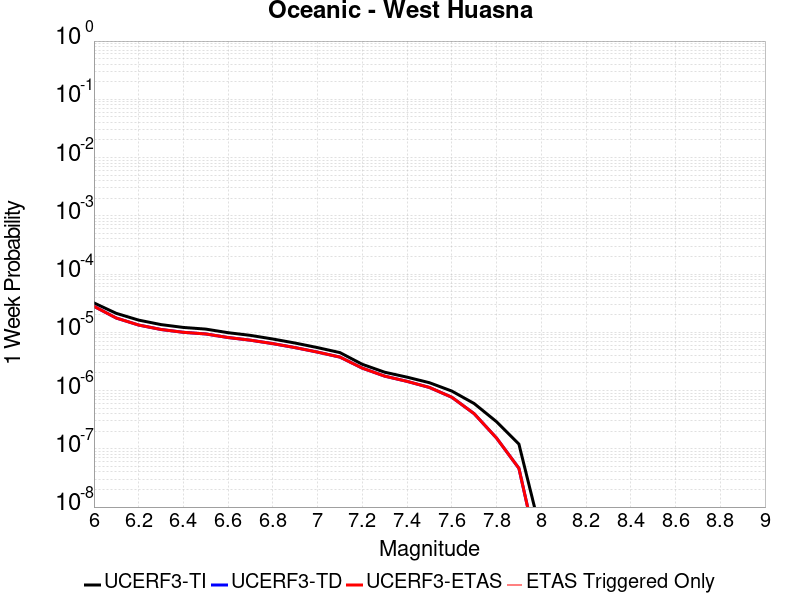 |  |  |  |

| Magnitude | 1 wk TI Prob | 1 wk TD Prob | 1 wk ETAS Prob | 1 wk ETAS/TD Gain | 1 wk ETAS Triggered Only | 1 mo TI Prob | 1 mo TD Prob | 1 mo ETAS Prob | 1 mo ETAS/TD Gain | 1 mo ETAS Triggered Only | 1 yr TI Prob | 1 yr TD Prob | 1 yr ETAS Prob | 1 yr ETAS/TD Gain | 1 yr ETAS Triggered Only | 10 yr TI Prob | 10 yr TD Prob | 10 yr ETAS Prob | 10 yr ETAS/TD Gain | 10 yr ETAS Triggered Only |
|-----|-----|-----|-----|-----|-----|-----|-----|-----|-----|-----|-----|-----|-----|-----|-----|-----|-----|-----|-----|-----|
| 6.0 | 3.195567E-5 | 2.7929798E-5 | 2.7929798E-5 | 1.0 | 0.0 | 1.3694567E-4 | 1.1969389E-4 | 1.296927E-4 | 1.0835365 | 1.0E-5 | 0.0016660384 | 0.001456342 | 0.001476313 | 1.013713 | 2.0E-5 | 0.016536033 | 0.014472536 | 0.014492246 | 1.001362 | 2.0E-5 |
| 6.1 | 2.1156782E-5 | 1.757524E-5 | 1.757524E-5 | 1.0 | 0.0 | 9.066878E-5 | 7.5320335E-5 | 8.531958E-5 | 1.1327562 | 1.0E-5 | 0.0011033333 | 9.1664866E-4 | 9.3663036E-4 | 1.0217986 | 2.0E-5 | 0.010978713 | 0.009129685 | 0.009149502 | 1.0021707 | 2.0E-5 |
| 6.2 | 1.6195117E-5 | 1.3328395E-5 | 1.3328395E-5 | 1.0 | 0.0 | 6.9405796E-5 | 5.7120455E-5 | 5.7120455E-5 | 1.0 | 0.0 | 8.44688E-4 | 6.9522223E-4 | 7.0521527E-4 | 1.0143739 | 1.0E-5 | 0.008414844 | 0.0069307666 | 0.0069406973 | 1.0014329 | 1.0E-5 |
| 6.3 | 1.3559345E-5 | 1.1180132E-5 | 1.1180132E-5 | 1.0 | 0.0 | 5.811018E-5 | 4.7913978E-5 | 4.7913978E-5 | 1.0 | 0.0 | 7.072618E-4 | 5.831975E-4 | 5.831975E-4 | 1.0 | 0.0 | 0.0070501505 | 0.0058167884 | 0.0058167884 | 1.0 | 0.0 |
| 6.4 | 1.2120619E-5 | 1.0001839E-5 | 1.0001839E-5 | 1.0 | 0.0 | 5.1944477E-5 | 4.286432E-5 | 4.286432E-5 | 1.0 | 0.0 | 6.322405E-4 | 5.217486E-4 | 5.217486E-4 | 1.0 | 0.0 | 0.006304447 | 0.0052053044 | 0.0052053044 | 1.0 | 0.0 |
| 6.5 | 1.13511915E-5 | 9.368276E-6 | 9.368276E-6 | 1.0 | 0.0 | 4.8647056E-5 | 4.0149138E-5 | 4.0149138E-5 | 1.0 | 0.0 | 5.9211696E-4 | 4.887066E-4 | 4.887066E-4 | 1.0 | 0.0 | 0.0059054173 | 0.0048763775 | 0.0048763775 | 1.0 | 0.0 |
| 6.6 | 9.850605E-6 | 8.13611E-6 | 8.13611E-6 | 1.0 | 0.0 | 4.2216197E-5 | 3.486858E-5 | 3.486858E-5 | 1.0 | 0.0 | 5.1386096E-4 | 4.244425E-4 | 4.244425E-4 | 1.0 | 0.0 | 0.0051267436 | 0.004236351 | 0.004236351 | 1.0 | 0.0 |
| 6.7 | 8.8558645E-6 | 7.3190586E-6 | 7.3190586E-6 | 1.0 | 0.0 | 3.7953152E-5 | 3.1367017E-5 | 3.1367017E-5 | 1.0 | 0.0 | 4.6198163E-4 | 3.818267E-4 | 3.818267E-4 | 1.0 | 0.0 | 0.004610224 | 0.0038117322 | 0.0038117322 | 1.0 | 0.0 |
| 6.8 | 7.67136E-6 | 6.392311E-6 | 6.392311E-6 | 1.0 | 0.0 | 3.2876844E-5 | 2.7395332E-5 | 2.7395332E-5 | 1.0 | 0.0 | 4.0020206E-4 | 3.334873E-4 | 3.334873E-4 | 1.0 | 0.0 | 0.003994821 | 0.0033298894 | 0.0033298894 | 1.0 | 0.0 |
| 6.9 | 6.534529E-6 | 5.458818E-6 | 5.458818E-6 | 1.0 | 0.0 | 2.8004823E-5 | 2.3394725E-5 | 2.3394725E-5 | 1.0 | 0.0 | 3.4090536E-4 | 2.8479367E-4 | 2.8479367E-4 | 1.0 | 0.0 | 0.0034038287 | 0.0028443038 | 0.0028443038 | 1.0 | 0.0 |
| 7.0 | 5.460525E-6 | 4.570384E-6 | 4.570384E-6 | 1.0 | 0.0 | 2.3402039E-5 | 1.9587214E-5 | 1.9587214E-5 | 1.0 | 0.0 | 2.8488258E-4 | 2.3844835E-4 | 2.3844835E-4 | 1.0 | 0.0 | 0.0028451765 | 0.002381939 | 0.002381939 | 1.0 | 0.0 |
| 7.1 | 4.4825083E-6 | 3.7528387E-6 | 3.7528387E-6 | 1.0 | 0.0 | 1.9210609E-5 | 1.6083495E-5 | 1.6083495E-5 | 1.0 | 0.0 | 2.3386406E-4 | 1.9579906E-4 | 1.9579906E-4 | 1.0 | 0.0 | 0.002336181 | 0.0019562775 | 0.0019562775 | 1.0 | 0.0 |
| 7.2 | 2.821708E-6 | 2.425265E-6 | 2.425265E-6 | 1.0 | 0.0 | 1.2092979E-5 | 1.0393951E-5 | 1.0393951E-5 | 1.0 | 0.0 | 1.4722206E-4 | 1.2653902E-4 | 1.2653902E-4 | 1.0 | 0.0 | 0.0014712457 | 0.0012646721 | 0.0012646721 | 1.0 | 0.0 |
| 7.3 | 2.0644757E-6 | 1.769044E-6 | 1.769044E-6 | 1.0 | 0.0 | 8.847723E-6 | 7.581595E-6 | 7.581595E-6 | 1.0 | 0.0 | 1.0771569E-4 | 9.230201E-5 | 9.230201E-5 | 1.0 | 0.0 | 0.001076635 | 9.226385E-4 | 9.226385E-4 | 1.0 | 0.0 |
| 7.4 | 1.6980367E-6 | 1.4382434E-6 | 1.4382434E-6 | 1.0 | 0.0 | 7.27728E-6 | 6.163886E-6 | 6.163886E-6 | 1.0 | 0.0 | 8.8597284E-5 | 7.504273E-5 | 7.504273E-5 | 1.0 | 0.0 | 8.8561967E-4 | 7.501755E-4 | 7.501755E-4 | 1.0 | 0.0 |
| 7.5 | 1.3637683E-6 | 1.1305065E-6 | 1.1305065E-6 | 1.0 | 0.0 | 5.844708E-6 | 4.8450183E-6 | 4.8450183E-6 | 1.0 | 0.0 | 7.1156996E-5 | 5.8986505E-5 | 5.8986505E-5 | 1.0 | 0.0 | 7.1134215E-4 | 5.8971E-4 | 5.8971E-4 | 1.0 | 0.0 |
| 7.6 | 9.802994E-7 | 7.6795476E-7 | 7.6795476E-7 | 1.0 | 0.0 | 4.2012766E-6 | 3.2912303E-6 | 3.2912303E-6 | 1.0 | 0.0 | 5.1149345E-5 | 4.0069994E-5 | 4.0069994E-5 | 1.0 | 0.0 | 5.113757E-4 | 4.0062913E-4 | 4.0062913E-4 | 1.0 | 0.0 |
| 7.7 | 5.986191E-7 | 4.006907E-7 | 4.006907E-7 | 1.0 | 0.0 | 2.5655079E-6 | 1.7172447E-6 | 1.7172447E-6 | 1.0 | 0.0 | 3.1234613E-5 | 2.0907253E-5 | 2.0907253E-5 | 1.0 | 0.0 | 3.123022E-4 | 2.0905423E-4 | 2.0905423E-4 | 1.0 | 0.0 |
| 7.8 | 2.9189815E-7 | 1.5301444E-7 | 1.5301444E-7 | 1.0 | 0.0 | 1.2509914E-6 | 6.55776E-7 | 6.55776E-7 | 1.0 | 0.0 | 1.5230714E-5 | 7.984043E-6 | 7.984043E-6 | 1.0 | 0.0 | 1.522967E-4 | 7.983888E-5 | 7.983888E-5 | 1.0 | 0.0 |
| 7.9 | 1.2057845E-7 | 4.6299377E-8 | 4.6299377E-8 | 1.0 | 0.0 | 5.1676466E-7 | 1.984259E-7 | 1.984259E-7 | 1.0 | 0.0 | 6.2915915E-6 | 2.4158326E-6 | 2.4158326E-6 | 1.0 | 0.0 | 6.2914136E-5 | 2.4159368E-5 | 2.4159368E-5 | 1.0 | 0.0 |
| 8.0 | 3.3806387E-9 | 9.044985E-10 | 9.044985E-10 | 1.0 | 0.0 | 1.4488451E-8 | 3.876421E-9 | 3.876421E-9 | 1.0 | 0.0 | 1.7639688E-7 | 4.719542E-8 | 4.719542E-8 | 1.0 | 0.0 | 1.7639674E-6 | 4.7304755E-7 | 4.7304755E-7 | 1.0 | 0.0 |

## Great Valley 09 (Laguna Seca)
*[(top)](#table-of-contents)*

| 1 Week | 1 Month | 1 Year | 10 Year |
|-----|-----|-----|-----|
|  | 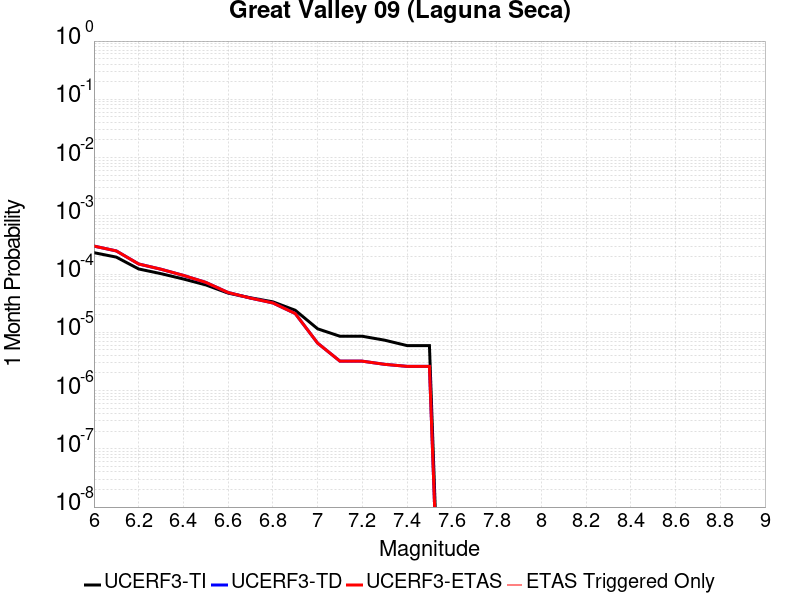 |  | 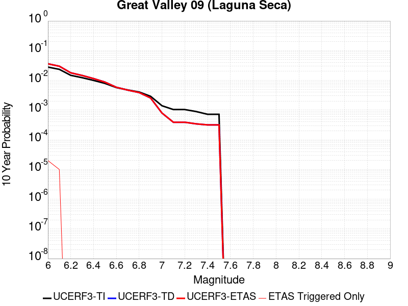 |

| Magnitude | 1 wk TI Prob | 1 wk TD Prob | 1 wk ETAS Prob | 1 wk ETAS/TD Gain | 1 wk ETAS Triggered Only | 1 mo TI Prob | 1 mo TD Prob | 1 mo ETAS Prob | 1 mo ETAS/TD Gain | 1 mo ETAS Triggered Only | 1 yr TI Prob | 1 yr TD Prob | 1 yr ETAS Prob | 1 yr ETAS/TD Gain | 1 yr ETAS Triggered Only | 10 yr TI Prob | 10 yr TD Prob | 10 yr ETAS Prob | 10 yr ETAS/TD Gain | 10 yr ETAS Triggered Only |
|-----|-----|-----|-----|-----|-----|-----|-----|-----|-----|-----|-----|-----|-----|-----|-----|-----|-----|-----|-----|-----|
| 6.0 | 5.4353277E-5 | 7.053205E-5 | 7.053205E-5 | 1.0 | 0.0 | 2.3292181E-4 | 3.022473E-4 | 3.022473E-4 | 1.0 | 0.0 | 0.0028321352 | 0.0036736233 | 0.0036835866 | 1.0027121 | 1.0E-5 | 0.02796312 | 0.03612989 | 0.036149163 | 1.0005336 | 2.0E-5 |
| 6.1 | 4.5578287E-5 | 5.824436E-5 | 5.824436E-5 | 1.0 | 0.0 | 1.953209E-4 | 2.4959637E-4 | 2.4959637E-4 | 1.0 | 0.0 | 0.0023754383 | 0.003034622 | 0.003034622 | 1.0 | 0.0 | 0.023502063 | 0.029931137 | 0.029940838 | 1.0003241 | 1.0E-5 |
| 6.2 | 2.8536782E-5 | 3.474839E-5 | 3.474839E-5 | 1.0 | 0.0 | 1.2229476E-4 | 1.4891365E-4 | 1.4891365E-4 | 1.0 | 0.0 | 0.0014879217 | 0.0018114655 | 0.0018114655 | 1.0 | 0.0 | 0.014779986 | 0.017964423 | 0.017964423 | 1.0 | 0.0 |
| 6.3 | 2.3698774E-5 | 2.8221324E-5 | 2.8221324E-5 | 1.0 | 0.0 | 1.01562226E-4 | 1.2094326E-4 | 1.2094326E-4 | 1.0 | 0.0 | 0.0012358186 | 0.0014715452 | 0.0014715452 | 1.0 | 0.0 | 0.012289686 | 0.014616243 | 0.014616243 | 1.0 | 0.0 |
| 6.4 | 1.9191197E-5 | 2.2128315E-5 | 2.2128315E-5 | 1.0 | 0.0 | 8.2245395E-5 | 9.483244E-5 | 9.483244E-5 | 1.0 | 0.0 | 0.0010008777 | 0.0011540164 | 0.0011540164 | 1.0 | 0.0 | 0.009963818 | 0.011480526 | 0.011480526 | 1.0 | 0.0 |
| 6.5 | 1.5203241E-5 | 1.680493E-5 | 1.680493E-5 | 1.0 | 0.0 | 6.5155116E-5 | 7.201932E-5 | 7.201932E-5 | 1.0 | 0.0 | 7.9297484E-4 | 8.7651453E-4 | 8.7651453E-4 | 1.0 | 0.0 | 0.007901512 | 0.008731957 | 0.008731957 | 1.0 | 0.0 |
| 6.6 | 1.0984925E-5 | 1.1245048E-5 | 1.1245048E-5 | 1.0 | 0.0 | 4.70774E-5 | 4.8192196E-5 | 4.8192196E-5 | 1.0 | 0.0 | 5.730166E-4 | 5.865862E-4 | 5.865862E-4 | 1.0 | 0.0 | 0.005715413 | 0.005850775 | 0.005850775 | 1.0 | 0.0 |
| 6.7 | 9.134616E-6 | 9.021788E-6 | 9.021788E-6 | 1.0 | 0.0 | 3.9147766E-5 | 3.8664246E-5 | 3.8664246E-5 | 1.0 | 0.0 | 4.7651984E-4 | 4.706379E-4 | 4.706379E-4 | 1.0 | 0.0 | 0.004754993 | 0.004696657 | 0.004696657 | 1.0 | 0.0 |
| 6.8 | 7.785589E-6 | 7.4535E-6 | 7.4535E-6 | 1.0 | 0.0 | 3.3366385E-5 | 3.1943193E-5 | 3.1943193E-5 | 1.0 | 0.0 | 4.0616E-4 | 3.8884097E-4 | 3.8884097E-4 | 1.0 | 0.0 | 0.0040541845 | 0.0038818102 | 0.0038818102 | 1.0 | 0.0 |
| 6.9 | 5.579095E-6 | 4.8995153E-6 | 4.8995153E-6 | 1.0 | 0.0 | 2.3910188E-5 | 2.099776E-5 | 2.099776E-5 | 1.0 | 0.0 | 2.9106764E-4 | 2.5561915E-4 | 2.5561915E-4 | 1.0 | 0.0 | 0.002906867 | 0.0025533885 | 0.0025533885 | 1.0 | 0.0 |
| 7.0 | 2.6816688E-6 | 1.5218932E-6 | 1.5218932E-6 | 1.0 | 0.0 | 1.1492816E-5 | 6.5223835E-6 | 6.5223835E-6 | 1.0 | 0.0 | 1.3991605E-4 | 7.940721E-5 | 7.940721E-5 | 1.0 | 0.0 | 0.0013982799 | 7.9379714E-4 | 7.9379714E-4 | 1.0 | 0.0 |
| 7.1 | 1.9951021E-6 | 7.455286E-7 | 7.455286E-7 | 1.0 | 0.0 | 8.55041E-6 | 3.195119E-6 | 3.195119E-6 | 1.0 | 0.0 | 1.0409627E-4 | 3.889992E-5 | 3.889992E-5 | 1.0 | 0.0 | 0.0010404752 | 3.8893527E-4 | 3.8893527E-4 | 1.0 | 0.0 |
| 7.2 | 1.9951021E-6 | 7.455286E-7 | 7.455286E-7 | 1.0 | 0.0 | 8.55041E-6 | 3.195119E-6 | 3.195119E-6 | 1.0 | 0.0 | 1.0409627E-4 | 3.889992E-5 | 3.889992E-5 | 1.0 | 0.0 | 0.0010404752 | 3.8893527E-4 | 3.8893527E-4 | 1.0 | 0.0 |
| 7.3 | 1.7087556E-6 | 6.5801004E-7 | 6.5801004E-7 | 1.0 | 0.0 | 7.3232177E-6 | 2.8200402E-6 | 2.8200402E-6 | 1.0 | 0.0 | 8.915652E-5 | 3.433349E-5 | 3.433349E-5 | 1.0 | 0.0 | 8.9120766E-4 | 3.432859E-4 | 3.432859E-4 | 1.0 | 0.0 |
| 7.4 | 1.3804846E-6 | 6.074859E-7 | 6.074859E-7 | 1.0 | 0.0 | 5.916349E-6 | 2.6035086E-6 | 2.6035086E-6 | 1.0 | 0.0 | 7.2029165E-5 | 3.16973E-5 | 3.16973E-5 | 1.0 | 0.0 | 7.200583E-4 | 3.1693178E-4 | 3.1693178E-4 | 1.0 | 0.0 |
| 7.5 | 1.3804846E-6 | 6.074859E-7 | 6.074859E-7 | 1.0 | 0.0 | 5.916349E-6 | 2.6035086E-6 | 2.6035086E-6 | 1.0 | 0.0 | 7.2029165E-5 | 3.16973E-5 | 3.16973E-5 | 1.0 | 0.0 | 7.200583E-4 | 3.1693178E-4 | 3.1693178E-4 | 1.0 | 0.0 |

## Deep Springs
*[(top)](#table-of-contents)*

| 1 Week | 1 Month | 1 Year | 10 Year |
|-----|-----|-----|-----|
|  |  |  |  |

| Magnitude | 1 wk TI Prob | 1 wk TD Prob | 1 wk ETAS Prob | 1 wk ETAS/TD Gain | 1 wk ETAS Triggered Only | 1 mo TI Prob | 1 mo TD Prob | 1 mo ETAS Prob | 1 mo ETAS/TD Gain | 1 mo ETAS Triggered Only | 1 yr TI Prob | 1 yr TD Prob | 1 yr ETAS Prob | 1 yr ETAS/TD Gain | 1 yr ETAS Triggered Only | 10 yr TI Prob | 10 yr TD Prob | 10 yr ETAS Prob | 10 yr ETAS/TD Gain | 10 yr ETAS Triggered Only |
|-----|-----|-----|-----|-----|-----|-----|-----|-----|-----|-----|-----|-----|-----|-----|-----|-----|-----|-----|-----|-----|
| 6.0 | 1.9810619E-5 | 2.311763E-5 | 2.311763E-5 | 1.0 | 0.0 | 8.489989E-5 | 9.9074656E-5 | 9.9074656E-5 | 1.0 | 0.0 | 0.001033166 | 0.0012060744 | 0.0012160623 | 1.0082814 | 1.0E-5 | 0.010283757 | 0.012045082 | 0.012064841 | 1.0016404 | 2.0E-5 |
| 6.1 | 1.9810619E-5 | 2.311763E-5 | 2.311763E-5 | 1.0 | 0.0 | 8.489989E-5 | 9.9074656E-5 | 9.9074656E-5 | 1.0 | 0.0 | 0.001033166 | 0.0012060744 | 0.0012160623 | 1.0082814 | 1.0E-5 | 0.010283757 | 0.012045082 | 0.012064841 | 1.0016404 | 2.0E-5 |
| 6.2 | 1.9810619E-5 | 2.311763E-5 | 2.311763E-5 | 1.0 | 0.0 | 8.489989E-5 | 9.9074656E-5 | 9.9074656E-5 | 1.0 | 0.0 | 0.001033166 | 0.0012060744 | 0.0012160623 | 1.0082814 | 1.0E-5 | 0.010283757 | 0.012045082 | 0.012064841 | 1.0016404 | 2.0E-5 |
| 6.3 | 1.9810619E-5 | 2.311763E-5 | 2.311763E-5 | 1.0 | 0.0 | 8.489989E-5 | 9.9074656E-5 | 9.9074656E-5 | 1.0 | 0.0 | 0.001033166 | 0.0012060744 | 0.0012160623 | 1.0082814 | 1.0E-5 | 0.010283757 | 0.012045082 | 0.012064841 | 1.0016404 | 2.0E-5 |
| 6.4 | 1.9810619E-5 | 2.311763E-5 | 2.311763E-5 | 1.0 | 0.0 | 8.489989E-5 | 9.9074656E-5 | 9.9074656E-5 | 1.0 | 0.0 | 0.001033166 | 0.0012060744 | 0.0012160623 | 1.0082814 | 1.0E-5 | 0.010283757 | 0.012045082 | 0.012064841 | 1.0016404 | 2.0E-5 |
| 6.5 | 1.7190405E-5 | 2.005498E-5 | 2.005498E-5 | 1.0 | 0.0 | 7.367108E-5 | 8.594992E-5 | 8.594992E-5 | 1.0 | 0.0 | 8.9657627E-4 | 0.0010464402 | 0.0010464402 | 1.0 | 0.0 | 0.008929676 | 0.010464364 | 0.010474259 | 1.0009456 | 1.0E-5 |
| 6.6 | 1.7190405E-5 | 2.005498E-5 | 2.005498E-5 | 1.0 | 0.0 | 7.367108E-5 | 8.594992E-5 | 8.594992E-5 | 1.0 | 0.0 | 8.9657627E-4 | 0.0010464402 | 0.0010464402 | 1.0 | 0.0 | 0.008929676 | 0.010464364 | 0.010474259 | 1.0009456 | 1.0E-5 |

## San Gabriel (Extension)
*[(top)](#table-of-contents)*

| 1 Week | 1 Month | 1 Year | 10 Year |
|-----|-----|-----|-----|
|  | 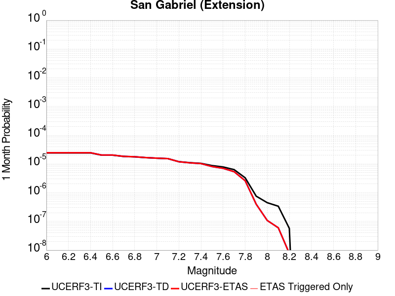 | 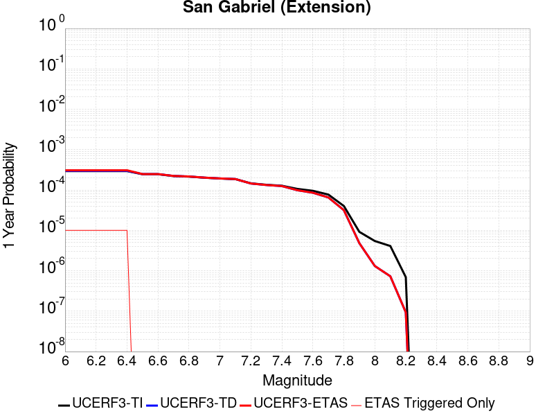 | 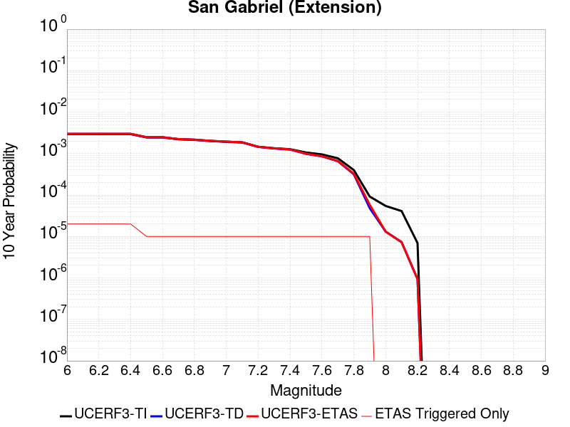 |

| Magnitude | 1 wk TI Prob | 1 wk TD Prob | 1 wk ETAS Prob | 1 wk ETAS/TD Gain | 1 wk ETAS Triggered Only | 1 mo TI Prob | 1 mo TD Prob | 1 mo ETAS Prob | 1 mo ETAS/TD Gain | 1 mo ETAS Triggered Only | 1 yr TI Prob | 1 yr TD Prob | 1 yr ETAS Prob | 1 yr ETAS/TD Gain | 1 yr ETAS Triggered Only | 10 yr TI Prob | 10 yr TD Prob | 10 yr ETAS Prob | 10 yr ETAS/TD Gain | 10 yr ETAS Triggered Only |
|-----|-----|-----|-----|-----|-----|-----|-----|-----|-----|-----|-----|-----|-----|-----|-----|-----|-----|-----|-----|-----|
| 6.0 | 5.6486106E-6 | 5.720015E-6 | 5.720015E-6 | 1.0 | 0.0 | 2.4208108E-5 | 2.4514127E-5 | 2.4514127E-5 | 1.0 | 0.0 | 2.9469383E-4 | 2.9841988E-4 | 3.084169E-4 | 1.0334998 | 1.0E-5 | 0.0029430336 | 0.002980322 | 0.0030002624 | 1.0066907 | 2.0E-5 |
| 6.1 | 5.6486106E-6 | 5.720015E-6 | 5.720015E-6 | 1.0 | 0.0 | 2.4208108E-5 | 2.4514127E-5 | 2.4514127E-5 | 1.0 | 0.0 | 2.9469383E-4 | 2.9841988E-4 | 3.084169E-4 | 1.0334998 | 1.0E-5 | 0.0029430336 | 0.002980322 | 0.0030002624 | 1.0066907 | 2.0E-5 |
| 6.2 | 5.6486106E-6 | 5.720015E-6 | 5.720015E-6 | 1.0 | 0.0 | 2.4208108E-5 | 2.4514127E-5 | 2.4514127E-5 | 1.0 | 0.0 | 2.9469383E-4 | 2.9841988E-4 | 3.084169E-4 | 1.0334998 | 1.0E-5 | 0.0029430336 | 0.002980322 | 0.0030002624 | 1.0066907 | 2.0E-5 |
| 6.3 | 5.6486106E-6 | 5.720015E-6 | 5.720015E-6 | 1.0 | 0.0 | 2.4208108E-5 | 2.4514127E-5 | 2.4514127E-5 | 1.0 | 0.0 | 2.9469383E-4 | 2.9841988E-4 | 3.084169E-4 | 1.0334998 | 1.0E-5 | 0.0029430336 | 0.002980322 | 0.0030002624 | 1.0066907 | 2.0E-5 |
| 6.4 | 5.6486106E-6 | 5.720015E-6 | 5.720015E-6 | 1.0 | 0.0 | 2.4208108E-5 | 2.4514127E-5 | 2.4514127E-5 | 1.0 | 0.0 | 2.9469383E-4 | 2.9841988E-4 | 3.084169E-4 | 1.0334998 | 1.0E-5 | 0.0029430336 | 0.002980322 | 0.0030002624 | 1.0066907 | 2.0E-5 |
| 6.5 | 4.7134554E-6 | 4.7574017E-6 | 4.7574017E-6 | 1.0 | 0.0 | 2.0200367E-5 | 2.038871E-5 | 2.038871E-5 | 1.0 | 0.0 | 2.459117E-4 | 2.4820512E-4 | 2.4820512E-4 | 1.0 | 0.0 | 0.0024563975 | 0.0024793672 | 0.0024893426 | 1.0040233 | 1.0E-5 |
| 6.6 | 4.7134554E-6 | 4.7574017E-6 | 4.7574017E-6 | 1.0 | 0.0 | 2.0200367E-5 | 2.038871E-5 | 2.038871E-5 | 1.0 | 0.0 | 2.459117E-4 | 2.4820512E-4 | 2.4820512E-4 | 1.0 | 0.0 | 0.0024563975 | 0.0024793672 | 0.0024893426 | 1.0040233 | 1.0E-5 |
| 6.7 | 4.2468837E-6 | 4.2772003E-6 | 4.2772003E-6 | 1.0 | 0.0 | 1.8200803E-5 | 1.8330735E-5 | 1.8330735E-5 | 1.0 | 0.0 | 2.2157225E-4 | 2.2315457E-4 | 2.2315457E-4 | 1.0 | 0.0 | 0.0022135144 | 0.0022293807 | 0.0022393584 | 1.0044756 | 1.0E-5 |
| 6.8 | 4.1180615E-6 | 4.144585E-6 | 4.144585E-6 | 1.0 | 0.0 | 1.7648716E-5 | 1.776239E-5 | 1.776239E-5 | 1.0 | 0.0 | 2.1485193E-4 | 2.1623635E-4 | 2.1623635E-4 | 1.0 | 0.0 | 0.0021464431 | 0.0021603347 | 0.0021703131 | 1.0046189 | 1.0E-5 |
| 6.9 | 3.863861E-6 | 3.88289E-6 | 3.88289E-6 | 1.0 | 0.0 | 1.65593E-5 | 1.6640855E-5 | 1.6640855E-5 | 1.0 | 0.0 | 2.0159081E-4 | 2.0258426E-4 | 2.0258426E-4 | 1.0 | 0.0 | 0.0020140803 | 0.0020240673 | 0.0020340472 | 1.0049305 | 1.0E-5 |
| 7.0 | 3.6947372E-6 | 3.7087825E-6 | 3.7087825E-6 | 1.0 | 0.0 | 1.5834492E-5 | 1.589469E-5 | 1.589469E-5 | 1.0 | 0.0 | 1.9276788E-4 | 1.9350133E-4 | 1.9350133E-4 | 1.0 | 0.0 | 0.0019260074 | 0.0019333987 | 0.0019433793 | 1.0051622 | 1.0E-5 |
| 7.1 | 3.5686835E-6 | 3.5759924E-6 | 3.5759924E-6 | 1.0 | 0.0 | 1.5294268E-5 | 1.5325595E-5 | 1.5325595E-5 | 1.0 | 0.0 | 1.861918E-4 | 1.8657382E-4 | 1.8657382E-4 | 1.0 | 0.0 | 0.0018603588 | 0.0018642414 | 0.0018742228 | 1.0053542 | 1.0E-5 |
| 7.2 | 2.8023446E-6 | 2.7798394E-6 | 2.7798394E-6 | 1.0 | 0.0 | 1.2009994E-5 | 1.1913544E-5 | 1.1913544E-5 | 1.0 | 0.0 | 1.4621185E-4 | 1.4503785E-4 | 1.4503785E-4 | 1.0 | 0.0 | 0.001461157 | 0.0014494465 | 0.0014594321 | 1.0068892 | 1.0E-5 |
| 7.3 | 2.5843012E-6 | 2.548985E-6 | 2.548985E-6 | 1.0 | 0.0 | 1.1075529E-5 | 1.0924176E-5 | 1.0924176E-5 | 1.0 | 0.0 | 1.3483623E-4 | 1.3299382E-4 | 1.3299382E-4 | 1.0 | 0.0 | 0.0013475444 | 0.001329156 | 0.0013391427 | 1.0075135 | 1.0E-5 |
| 7.4 | 2.4464468E-6 | 2.3996429E-6 | 2.3996429E-6 | 1.0 | 0.0 | 1.04847295E-5 | 1.0284144E-5 | 1.0284144E-5 | 1.0 | 0.0 | 1.276441E-4 | 1.2520235E-4 | 1.2520235E-4 | 1.0 | 0.0 | 0.0012757082 | 0.0012513316 | 0.001261319 | 1.0079815 | 1.0E-5 |
| 7.5 | 2.0420266E-6 | 1.8936761E-6 | 1.8936761E-6 | 1.0 | 0.0 | 8.751514E-6 | 8.1157295E-6 | 8.1157295E-6 | 1.0 | 0.0 | 1.0654447E-4 | 9.8804565E-5 | 9.8804565E-5 | 1.0 | 0.0 | 0.001064934 | 9.876136E-4 | 9.976036E-4 | 1.0101154 | 1.0E-5 |
| 7.6 | 1.8326596E-6 | 1.6422962E-6 | 1.6422962E-6 | 1.0 | 0.0 | 7.854232E-6 | 7.0383935E-6 | 7.0383935E-6 | 1.0 | 0.0 | 9.562107E-5 | 8.568909E-5 | 8.568909E-5 | 1.0 | 0.0 | 9.5579936E-4 | 8.565665E-4 | 8.665579E-4 | 1.0116645 | 1.0E-5 |
| 7.7 | 1.4786998E-6 | 1.254643E-6 | 1.254643E-6 | 1.0 | 0.0 | 6.3372695E-6 | 5.377031E-6 | 5.377031E-6 | 1.0 | 0.0 | 7.715353E-5 | 6.54634E-5 | 6.54634E-5 | 1.0 | 0.0 | 7.7126746E-4 | 6.544489E-4 | 6.644423E-4 | 1.01527 | 1.0E-5 |
| 7.8 | 7.6975533E-7 | 6.0883167E-7 | 6.0883167E-7 | 1.0 | 0.0 | 3.2989474E-6 | 2.609276E-6 | 2.609276E-6 | 1.0 | 0.0 | 4.0163945E-5 | 3.1767475E-5 | 3.1767475E-5 | 1.0 | 0.0 | 4.0156685E-4 | 3.1763545E-4 | 3.2763227E-4 | 1.0314727 | 1.0E-5 |
| 7.9 | 1.7645915E-7 | 9.26634E-8 | 9.26634E-8 | 1.0 | 0.0 | 7.562533E-7 | 3.971288E-7 | 3.971288E-7 | 1.0 | 0.0 | 9.207345E-6 | 4.835032E-6 | 4.835032E-6 | 1.0 | 0.0 | 9.206964E-5 | 4.835401E-5 | 5.8353526E-5 | 1.2067981 | 1.0E-5 |
| 8.0 | 1.0463461E-7 | 2.5175083E-8 | 2.5175083E-8 | 1.0 | 0.0 | 4.4843398E-7 | 1.0789321E-7 | 1.0789321E-7 | 1.0 | 0.0 | 5.45967E-6 | 1.313599E-6 | 1.313599E-6 | 1.0 | 0.0 | 5.459536E-5 | 1.3140646E-5 | 1.3140646E-5 | 1.0 | 0.0 |
| 8.1 | 7.875717E-8 | 1.401466E-8 | 1.401466E-8 | 1.0 | 0.0 | 3.3753068E-7 | 6.0062824E-8 | 6.0062824E-8 | 1.0 | 0.0 | 4.109428E-6 | 7.3126466E-7 | 7.3126466E-7 | 1.0 | 0.0 | 4.109352E-5 | 7.317355E-6 | 7.317355E-6 | 1.0 | 0.0 |
| 8.2 | 1.33163E-8 | 1.7949596E-9 | 1.7949596E-9 | 1.0 | 0.0 | 5.7069855E-8 | 7.692684E-9 | 7.692684E-9 | 1.0 | 0.0 | 6.9482525E-7 | 9.365842E-8 | 9.365842E-8 | 1.0 | 0.0 | 6.9482307E-6 | 9.385704E-7 | 9.385704E-7 | 1.0 | 0.0 |

## Monte Vista - Shannon 2011 CFM
*[(top)](#table-of-contents)*

| 1 Week | 1 Month | 1 Year | 10 Year |
|-----|-----|-----|-----|
| 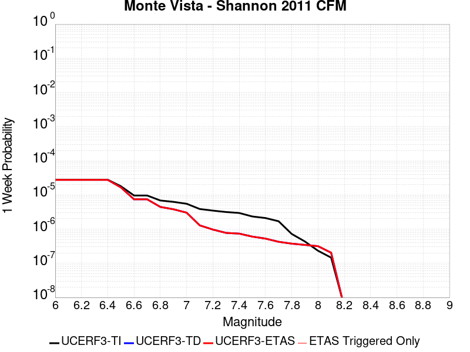 |  | 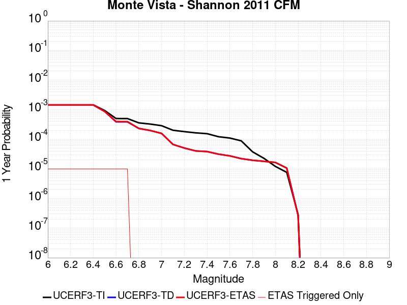 |  |

| Magnitude | 1 wk TI Prob | 1 wk TD Prob | 1 wk ETAS Prob | 1 wk ETAS/TD Gain | 1 wk ETAS Triggered Only | 1 mo TI Prob | 1 mo TD Prob | 1 mo ETAS Prob | 1 mo ETAS/TD Gain | 1 mo ETAS Triggered Only | 1 yr TI Prob | 1 yr TD Prob | 1 yr ETAS Prob | 1 yr ETAS/TD Gain | 1 yr ETAS Triggered Only | 10 yr TI Prob | 10 yr TD Prob | 10 yr ETAS Prob | 10 yr ETAS/TD Gain | 10 yr ETAS Triggered Only |
|-----|-----|-----|-----|-----|-----|-----|-----|-----|-----|-----|-----|-----|-----|-----|-----|-----|-----|-----|-----|-----|
| 6.0 | 2.7907707E-5 | 2.759293E-5 | 2.759293E-5 | 1.0 | 0.0 | 1.19598975E-4 | 1.18250755E-4 | 1.18250755E-4 | 1.0 | 0.0 | 0.0014551448 | 0.0014388759 | 0.0014488614 | 1.0069399 | 1.0E-5 | 0.014456532 | 0.014324725 | 0.014334582 | 1.0006881 | 1.0E-5 |
| 6.1 | 2.7907707E-5 | 2.759293E-5 | 2.759293E-5 | 1.0 | 0.0 | 1.19598975E-4 | 1.18250755E-4 | 1.18250755E-4 | 1.0 | 0.0 | 0.0014551448 | 0.0014388759 | 0.0014488614 | 1.0069399 | 1.0E-5 | 0.014456532 | 0.014324725 | 0.014334582 | 1.0006881 | 1.0E-5 |
| 6.2 | 2.7907707E-5 | 2.759293E-5 | 2.759293E-5 | 1.0 | 0.0 | 1.19598975E-4 | 1.18250755E-4 | 1.18250755E-4 | 1.0 | 0.0 | 0.0014551448 | 0.0014388759 | 0.0014488614 | 1.0069399 | 1.0E-5 | 0.014456532 | 0.014324725 | 0.014334582 | 1.0006881 | 1.0E-5 |
| 6.3 | 2.7907707E-5 | 2.759293E-5 | 2.759293E-5 | 1.0 | 0.0 | 1.19598975E-4 | 1.18250755E-4 | 1.18250755E-4 | 1.0 | 0.0 | 0.0014551448 | 0.0014388759 | 0.0014488614 | 1.0069399 | 1.0E-5 | 0.014456532 | 0.014324725 | 0.014334582 | 1.0006881 | 1.0E-5 |
| 6.4 | 2.7907707E-5 | 2.759293E-5 | 2.759293E-5 | 1.0 | 0.0 | 1.19598975E-4 | 1.18250755E-4 | 1.18250755E-4 | 1.0 | 0.0 | 0.0014551448 | 0.0014388759 | 0.0014488614 | 1.0069399 | 1.0E-5 | 0.014456532 | 0.014324725 | 0.014334582 | 1.0006881 | 1.0E-5 |
| 6.5 | 1.7990213E-5 | 1.6647102E-5 | 1.6647102E-5 | 1.0 | 0.0 | 7.709863E-5 | 7.1343144E-5 | 7.1343144E-5 | 1.0 | 0.0 | 9.382716E-4 | 8.6832297E-4 | 8.783143E-4 | 1.0115064 | 1.0E-5 | 0.0093431985 | 0.008672717 | 0.00868263 | 1.0011431 | 1.0E-5 |
| 6.6 | 9.650407E-6 | 7.4631294E-6 | 7.4631294E-6 | 1.0 | 0.0 | 4.135823E-5 | 3.198449E-5 | 3.198449E-5 | 1.0 | 0.0 | 5.0342013E-4 | 3.8934944E-4 | 3.9934553E-4 | 1.0256739 | 1.0E-5 | 0.005022812 | 0.0039043939 | 0.003914355 | 1.0025512 | 1.0E-5 |
| 6.7 | 9.62828E-6 | 7.441037E-6 | 7.441037E-6 | 1.0 | 0.0 | 4.1263404E-5 | 3.1889813E-5 | 3.1889813E-5 | 1.0 | 0.0 | 5.022661E-4 | 3.8819714E-4 | 3.9819325E-4 | 1.0257502 | 1.0E-5 | 0.0050113243 | 0.0038929111 | 0.0039028723 | 1.0025588 | 1.0E-5 |
| 6.8 | 6.887523E-6 | 4.467198E-6 | 4.467198E-6 | 1.0 | 0.0 | 2.9517621E-5 | 1.9145007E-5 | 1.9145007E-5 | 1.0 | 0.0 | 3.5931775E-4 | 2.3306775E-4 | 2.3306775E-4 | 1.0 | 0.0 | 0.0035873733 | 0.002345427 | 0.002345427 | 1.0 | 0.0 |
| 6.9 | 6.2722347E-6 | 3.8089884E-6 | 3.8089884E-6 | 1.0 | 0.0 | 2.6880729E-5 | 1.6324144E-5 | 1.6324144E-5 | 1.0 | 0.0 | 3.2722374E-4 | 1.9873037E-4 | 1.9873037E-4 | 1.0 | 0.0 | 0.003267423 | 0.0020027065 | 0.0020027065 | 1.0 | 0.0 |
| 7.0 | 5.5320347E-6 | 3.0360163E-6 | 3.0360163E-6 | 1.0 | 0.0 | 2.3708504E-5 | 1.3011444E-5 | 1.3011444E-5 | 1.0 | 0.0 | 2.8861282E-4 | 1.5840465E-4 | 1.5840465E-4 | 1.0 | 0.0 | 0.0028823826 | 0.0016000834 | 0.0016000834 | 1.0 | 0.0 |
| 7.1 | 3.8794055E-6 | 1.288948E-6 | 1.288948E-6 | 1.0 | 0.0 | 1.6625918E-5 | 5.524051E-6 | 5.524051E-6 | 1.0 | 0.0 | 2.0240174E-4 | 6.725326E-5 | 6.725326E-5 | 1.0 | 0.0 | 0.002022175 | 6.893205E-4 | 6.893205E-4 | 1.0 | 0.0 |
| 7.2 | 3.4813652E-6 | 9.720248E-7 | 9.720248E-7 | 1.0 | 0.0 | 1.49200505E-5 | 4.1658145E-6 | 4.1658145E-6 | 1.0 | 0.0 | 1.8163648E-4 | 5.071762E-5 | 5.071762E-5 | 1.0 | 0.0 | 0.0018148809 | 5.2403955E-4 | 5.2403955E-4 | 1.0 | 0.0 |
| 7.3 | 3.1682148E-6 | 7.7667505E-7 | 7.7667505E-7 | 1.0 | 0.0 | 1.3577992E-5 | 3.328603E-6 | 3.328603E-6 | 1.0 | 0.0 | 1.6529951E-4 | 4.0524992E-5 | 4.0524992E-5 | 1.0 | 0.0 | 0.0016517661 | 4.2213005E-4 | 4.2213005E-4 | 1.0 | 0.0 |
| 7.4 | 2.9707667E-6 | 7.391882E-7 | 7.391882E-7 | 1.0 | 0.0 | 1.2731795E-5 | 3.1679454E-6 | 3.1679454E-6 | 1.0 | 0.0 | 1.5499859E-4 | 3.8569055E-5 | 3.8569055E-5 | 1.0 | 0.0 | 0.0015489052 | 4.0236814E-4 | 4.0236814E-4 | 1.0 | 0.0 |
| 7.5 | 2.3462758E-6 | 6.0472195E-7 | 6.0472195E-7 | 1.0 | 0.0 | 1.0055429E-5 | 2.591663E-6 | 2.591663E-6 | 1.0 | 0.0 | 1.2241797E-4 | 3.155304E-5 | 3.155304E-5 | 1.0 | 0.0 | 0.0012235056 | 3.304775E-4 | 3.304775E-4 | 1.0 | 0.0 |
| 7.6 | 2.112783E-6 | 5.2885053E-7 | 5.2885053E-7 | 1.0 | 0.0 | 9.054753E-6 | 2.2665001E-6 | 2.2665001E-6 | 1.0 | 0.0 | 1.1023604E-4 | 2.7594293E-5 | 2.7594293E-5 | 1.0 | 0.0 | 0.0011018137 | 2.9046804E-4 | 2.9046804E-4 | 1.0 | 0.0 |
| 7.7 | 1.7022471E-6 | 4.2636927E-7 | 4.2636927E-7 | 1.0 | 0.0 | 7.2953244E-6 | 1.8272956E-6 | 1.8272956E-6 | 1.0 | 0.0 | 8.881695E-5 | 2.2247099E-5 | 2.2247099E-5 | 1.0 | 0.0 | 8.878146E-4 | 2.356814E-4 | 2.356814E-4 | 1.0 | 0.0 |
| 7.8 | 7.230914E-7 | 3.757565E-7 | 3.757565E-7 | 1.0 | 0.0 | 3.0989595E-6 | 1.6103841E-6 | 1.6103841E-6 | 1.0 | 0.0 | 3.772918E-5 | 1.960625E-5 | 1.960625E-5 | 1.0 | 0.0 | 3.7722773E-4 | 2.0879459E-4 | 2.0879459E-4 | 1.0 | 0.0 |
| 7.9 | 4.3588446E-7 | 3.4557618E-7 | 3.4557618E-7 | 1.0 | 0.0 | 1.868075E-6 | 1.4810399E-6 | 1.4810399E-6 | 1.0 | 0.0 | 2.2743576E-5 | 1.8031513E-5 | 1.8031513E-5 | 1.0 | 0.0 | 2.2741247E-4 | 1.9126604E-4 | 1.9126604E-4 | 1.0 | 0.0 |
| 8.0 | 2.3317523E-7 | 3.1733921E-7 | 3.1733921E-7 | 1.0 | 0.0 | 9.99322E-7 | 1.3600245E-6 | 1.3600245E-6 | 1.0 | 0.0 | 1.2166677E-5 | 1.6558173E-5 | 1.6558173E-5 | 1.0 | 0.0 | 1.21660116E-4 | 1.7513306E-4 | 1.7513306E-4 | 1.0 | 0.0 |
| 8.1 | 1.4662456E-7 | 2.0438137E-7 | 2.0438137E-7 | 1.0 | 0.0 | 6.283908E-7 | 8.7591985E-7 | 8.7591985E-7 | 1.0 | 0.0 | 7.650631E-6 | 1.0664273E-5 | 1.0664273E-5 | 1.0 | 0.0 | 7.650368E-5 | 1.1199476E-4 | 1.1199476E-4 | 1.0 | 0.0 |
| 8.2 | 5.4931775E-9 | 5.1103903E-9 | 5.1103903E-9 | 1.0 | 0.0 | 2.3542189E-8 | 2.1901673E-8 | 2.1901673E-8 | 1.0 | 0.0 | 2.8662612E-7 | 2.6665285E-7 | 2.6665285E-7 | 1.0 | 0.0 | 2.8662573E-6 | 2.772274E-6 | 2.772274E-6 | 1.0 | 0.0 |

## Santa Ynez River
*[(top)](#table-of-contents)*

| 1 Week | 1 Month | 1 Year | 10 Year |
|-----|-----|-----|-----|
| 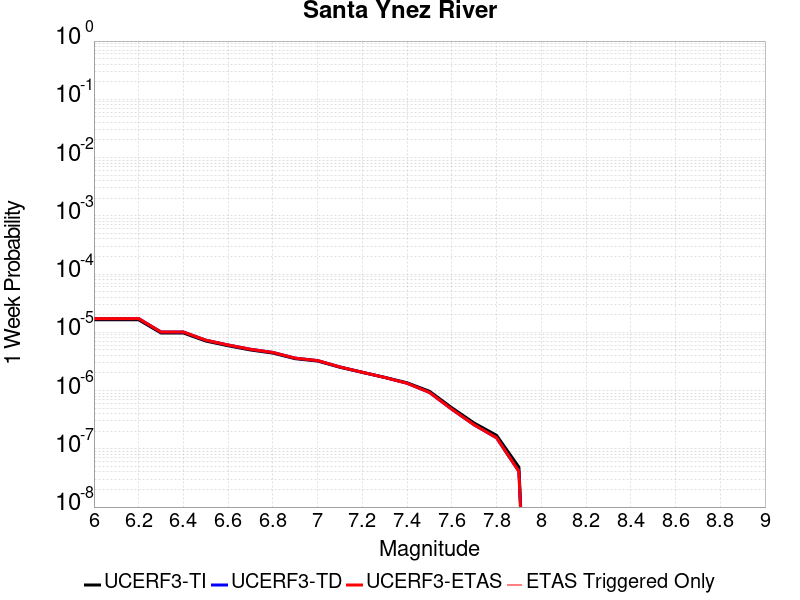 | 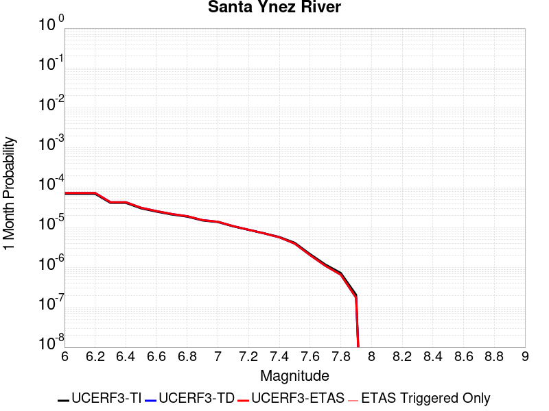 | 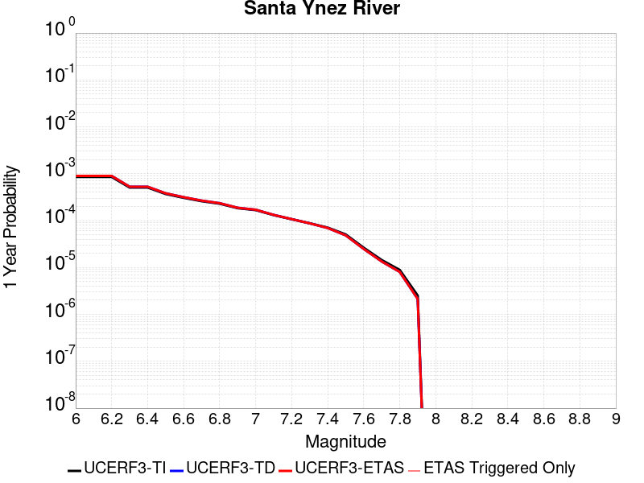 |  |

| Magnitude | 1 wk TI Prob | 1 wk TD Prob | 1 wk ETAS Prob | 1 wk ETAS/TD Gain | 1 wk ETAS Triggered Only | 1 mo TI Prob | 1 mo TD Prob | 1 mo ETAS Prob | 1 mo ETAS/TD Gain | 1 mo ETAS Triggered Only | 1 yr TI Prob | 1 yr TD Prob | 1 yr ETAS Prob | 1 yr ETAS/TD Gain | 1 yr ETAS Triggered Only | 10 yr TI Prob | 10 yr TD Prob | 10 yr ETAS Prob | 10 yr ETAS/TD Gain | 10 yr ETAS Triggered Only |
|-----|-----|-----|-----|-----|-----|-----|-----|-----|-----|-----|-----|-----|-----|-----|-----|-----|-----|-----|-----|-----|
| 6.0 | 1.6396456E-5 | 1.7210763E-5 | 1.7210763E-5 | 1.0 | 0.0 | 7.026863E-5 | 7.375853E-5 | 7.375853E-5 | 1.0 | 0.0 | 8.551848E-4 | 8.976757E-4 | 8.976757E-4 | 1.0 | 0.0 | 0.0085190125 | 0.008944046 | 0.008963867 | 1.0022161 | 2.0E-5 |
| 6.1 | 1.6396456E-5 | 1.7210763E-5 | 1.7210763E-5 | 1.0 | 0.0 | 7.026863E-5 | 7.375853E-5 | 7.375853E-5 | 1.0 | 0.0 | 8.551848E-4 | 8.976757E-4 | 8.976757E-4 | 1.0 | 0.0 | 0.0085190125 | 0.008944046 | 0.008963867 | 1.0022161 | 2.0E-5 |
| 6.2 | 1.6396456E-5 | 1.7210763E-5 | 1.7210763E-5 | 1.0 | 0.0 | 7.026863E-5 | 7.375853E-5 | 7.375853E-5 | 1.0 | 0.0 | 8.551848E-4 | 8.976757E-4 | 8.976757E-4 | 1.0 | 0.0 | 0.0085190125 | 0.008944046 | 0.008963867 | 1.0022161 | 2.0E-5 |
| 6.3 | 9.736976E-6 | 1.0123053E-5 | 1.0123053E-5 | 1.0 | 0.0 | 4.172923E-5 | 4.3383818E-5 | 4.3383818E-5 | 1.0 | 0.0 | 5.0793495E-4 | 5.28075E-4 | 5.28075E-4 | 1.0 | 0.0 | 0.005067755 | 0.005268707 | 0.0052886014 | 1.003776 | 2.0E-5 |
| 6.4 | 9.736976E-6 | 1.0123053E-5 | 1.0123053E-5 | 1.0 | 0.0 | 4.172923E-5 | 4.3383818E-5 | 4.3383818E-5 | 1.0 | 0.0 | 5.0793495E-4 | 5.28075E-4 | 5.28075E-4 | 1.0 | 0.0 | 0.005067755 | 0.005268707 | 0.0052886014 | 1.003776 | 2.0E-5 |
| 6.5 | 7.081964E-6 | 7.3304263E-6 | 7.3304263E-6 | 1.0 | 0.0 | 3.035092E-5 | 3.1415744E-5 | 3.1415744E-5 | 1.0 | 0.0 | 3.694598E-4 | 3.8242113E-4 | 3.8242113E-4 | 1.0 | 0.0 | 0.0036884616 | 0.0038177923 | 0.0038377158 | 1.0052186 | 2.0E-5 |
| 6.6 | 5.873247E-6 | 6.060187E-6 | 6.060187E-6 | 1.0 | 0.0 | 2.5170815E-5 | 2.5971976E-5 | 2.5971976E-5 | 1.0 | 0.0 | 3.064116E-4 | 3.161638E-4 | 3.161638E-4 | 1.0 | 0.0 | 0.0030598943 | 0.0031572273 | 0.0031771641 | 1.0063146 | 2.0E-5 |
| 6.7 | 4.973277E-6 | 5.1162842E-6 | 5.1162842E-6 | 1.0 | 0.0 | 2.1313872E-5 | 2.192675E-5 | 2.192675E-5 | 1.0 | 0.0 | 2.5946548E-4 | 2.6692596E-4 | 2.6692596E-4 | 1.0 | 0.0 | 0.0025916274 | 0.0026661025 | 0.002686049 | 1.0074816 | 2.0E-5 |
| 6.8 | 4.396492E-6 | 4.5113215E-6 | 4.5113215E-6 | 1.0 | 0.0 | 1.884197E-5 | 1.9334095E-5 | 1.9334095E-5 | 1.0 | 0.0 | 2.2937685E-4 | 2.3536751E-4 | 2.3536751E-4 | 1.0 | 0.0 | 0.0022914023 | 0.0023512177 | 0.0023711708 | 1.0084863 | 2.0E-5 |
| 6.9 | 3.5255632E-6 | 3.6016236E-6 | 3.6016236E-6 | 1.0 | 0.0 | 1.5109469E-5 | 1.5435438E-5 | 1.5435438E-5 | 1.0 | 0.0 | 1.8394225E-4 | 1.8791042E-4 | 1.8791042E-4 | 1.0 | 0.0 | 0.0018379007 | 0.0018775314 | 0.0018974938 | 1.0106323 | 2.0E-5 |
| 7.0 | 3.211603E-6 | 3.2739251E-6 | 3.2739251E-6 | 1.0 | 0.0 | 1.376394E-5 | 1.4031033E-5 | 1.4031033E-5 | 1.0 | 0.0 | 1.6756308E-4 | 1.7081459E-4 | 1.7081459E-4 | 1.0 | 0.0 | 0.0016743679 | 0.001706847 | 0.0017268129 | 1.0116975 | 2.0E-5 |
| 7.1 | 2.5094619E-6 | 2.5411491E-6 | 2.5411491E-6 | 1.0 | 0.0 | 1.0754793E-5 | 1.0890594E-5 | 1.0890594E-5 | 1.0 | 0.0 | 1.3093173E-4 | 1.3258497E-4 | 1.3258497E-4 | 1.0 | 0.0 | 0.0013085462 | 0.0013250648 | 0.0013450383 | 1.0150737 | 2.0E-5 |
| 7.2 | 2.0515774E-6 | 2.062137E-6 | 2.062137E-6 | 1.0 | 0.0 | 8.792445E-6 | 8.8377E-6 | 8.8377E-6 | 1.0 | 0.0 | 1.0704277E-4 | 1.0759373E-4 | 1.0759373E-4 | 1.0 | 0.0 | 0.0010699122 | 0.0010754206 | 0.0010854099 | 1.0092887 | 1.0E-5 |
| 7.3 | 1.6845745E-6 | 1.6775657E-6 | 1.6775657E-6 | 1.0 | 0.0 | 7.219585E-6 | 7.1895474E-6 | 7.1895474E-6 | 1.0 | 0.0 | 8.78949E-5 | 8.752925E-5 | 8.752925E-5 | 1.0 | 0.0 | 8.7860145E-4 | 8.7495067E-4 | 8.849419E-4 | 1.0114192 | 1.0E-5 |
| 7.4 | 1.3600285E-6 | 1.3334833E-6 | 1.3334833E-6 | 1.0 | 0.0 | 5.82868E-6 | 5.714916E-6 | 5.714916E-6 | 1.0 | 0.0 | 7.096187E-5 | 6.95769E-5 | 6.95769E-5 | 1.0 | 0.0 | 7.0939213E-4 | 6.955534E-4 | 7.0554647E-4 | 1.014367 | 1.0E-5 |
| 7.5 | 9.735342E-7 | 9.2912717E-7 | 9.2912717E-7 | 1.0 | 0.0 | 4.172283E-6 | 3.9819674E-6 | 3.9819674E-6 | 1.0 | 0.0 | 5.079636E-5 | 4.8479393E-5 | 4.8479393E-5 | 1.0 | 0.0 | 5.0784746E-4 | 4.846899E-4 | 4.846899E-4 | 1.0 | 0.0 |
| 7.6 | 5.067187E-7 | 4.7789376E-7 | 4.7789376E-7 | 1.0 | 0.0 | 2.1716498E-6 | 2.0481145E-6 | 2.0481145E-6 | 1.0 | 0.0 | 2.6439517E-5 | 2.4935518E-5 | 2.4935518E-5 | 1.0 | 0.0 | 2.643637E-4 | 2.4932795E-4 | 2.4932795E-4 | 1.0 | 0.0 |
| 7.7 | 2.769089E-7 | 2.5760974E-7 | 2.5760974E-7 | 1.0 | 0.0 | 1.1867519E-6 | 1.1040413E-6 | 1.1040413E-6 | 1.0 | 0.0 | 1.4448608E-5 | 1.34416205E-5 | 1.34416205E-5 | 1.0 | 0.0 | 1.444767E-4 | 1.3440811E-4 | 1.3440811E-4 | 1.0 | 0.0 |
| 7.8 | 1.7044663E-7 | 1.545013E-7 | 1.545013E-7 | 1.0 | 0.0 | 7.3048534E-7 | 6.6214824E-7 | 6.6214824E-7 | 1.0 | 0.0 | 8.893623E-6 | 8.061625E-6 | 8.061625E-6 | 1.0 | 0.0 | 8.893267E-5 | 8.061335E-5 | 8.061335E-5 | 1.0 | 0.0 |
| 7.9 | 4.8344287E-8 | 4.091406E-8 | 4.091406E-8 | 1.0 | 0.0 | 2.0718979E-7 | 1.7534596E-7 | 1.7534596E-7 | 1.0 | 0.0 | 2.5225327E-6 | 2.134835E-6 | 2.134835E-6 | 1.0 | 0.0 | 2.5225041E-5 | 2.1348149E-5 | 2.1348149E-5 | 1.0 | 0.0 |

## Ventura-Pitas Point
*[(top)](#table-of-contents)*

| 1 Week | 1 Month | 1 Year | 10 Year |
|-----|-----|-----|-----|
|  |  |  | 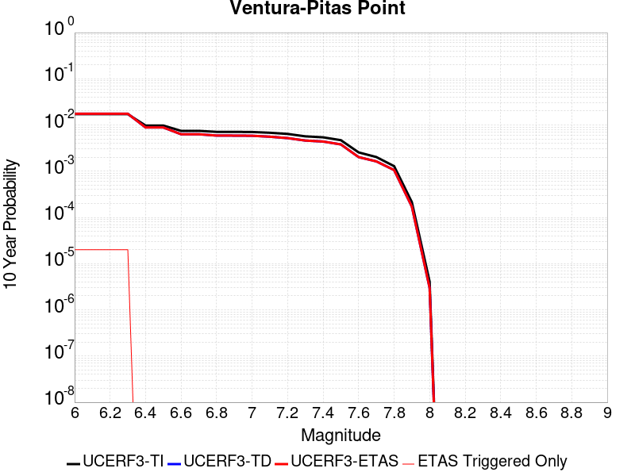 |

| Magnitude | 1 wk TI Prob | 1 wk TD Prob | 1 wk ETAS Prob | 1 wk ETAS/TD Gain | 1 wk ETAS Triggered Only | 1 mo TI Prob | 1 mo TD Prob | 1 mo ETAS Prob | 1 mo ETAS/TD Gain | 1 mo ETAS Triggered Only | 1 yr TI Prob | 1 yr TD Prob | 1 yr ETAS Prob | 1 yr ETAS/TD Gain | 1 yr ETAS Triggered Only | 10 yr TI Prob | 10 yr TD Prob | 10 yr ETAS Prob | 10 yr ETAS/TD Gain | 10 yr ETAS Triggered Only |
|-----|-----|-----|-----|-----|-----|-----|-----|-----|-----|-----|-----|-----|-----|-----|-----|-----|-----|-----|-----|-----|
| 6.0 | 3.3179622E-5 | 3.3742806E-5 | 3.3742806E-5 | 1.0 | 0.0 | 1.4219063E-4 | 1.4460545E-4 | 1.4460545E-4 | 1.0 | 0.0 | 0.0017297962 | 0.0017594066 | 0.0017793715 | 1.0113474 | 2.0E-5 | 0.017163932 | 0.01748032 | 0.017499968 | 1.0011241 | 2.0E-5 |
| 6.1 | 3.3179622E-5 | 3.3742806E-5 | 3.3742806E-5 | 1.0 | 0.0 | 1.4219063E-4 | 1.4460545E-4 | 1.4460545E-4 | 1.0 | 0.0 | 0.0017297962 | 0.0017594066 | 0.0017793715 | 1.0113474 | 2.0E-5 | 0.017163932 | 0.01748032 | 0.017499968 | 1.0011241 | 2.0E-5 |
| 6.2 | 3.3179622E-5 | 3.3742806E-5 | 3.3742806E-5 | 1.0 | 0.0 | 1.4219063E-4 | 1.4460545E-4 | 1.4460545E-4 | 1.0 | 0.0 | 0.0017297962 | 0.0017594066 | 0.0017793715 | 1.0113474 | 2.0E-5 | 0.017163932 | 0.01748032 | 0.017499968 | 1.0011241 | 2.0E-5 |
| 6.3 | 3.3179622E-5 | 3.3742806E-5 | 3.3742806E-5 | 1.0 | 0.0 | 1.4219063E-4 | 1.4460545E-4 | 1.4460545E-4 | 1.0 | 0.0 | 0.0017297962 | 0.0017594066 | 0.0017793715 | 1.0113474 | 2.0E-5 | 0.017163932 | 0.01748032 | 0.017499968 | 1.0011241 | 2.0E-5 |
| 6.4 | 1.8754668E-5 | 1.70237E-5 | 1.70237E-5 | 1.0 | 0.0 | 8.037467E-5 | 7.2956806E-5 | 7.2956806E-5 | 1.0 | 0.0 | 9.781223E-4 | 8.8791025E-4 | 8.8791025E-4 | 1.0 | 0.0 | 0.009738282 | 0.0088459635 | 0.0088459635 | 1.0 | 0.0 |
| 6.5 | 1.8754668E-5 | 1.70237E-5 | 1.70237E-5 | 1.0 | 0.0 | 8.037467E-5 | 7.2956806E-5 | 7.2956806E-5 | 1.0 | 0.0 | 9.781223E-4 | 8.8791025E-4 | 8.8791025E-4 | 1.0 | 0.0 | 0.009738282 | 0.0088459635 | 0.0088459635 | 1.0 | 0.0 |
| 6.6 | 1.4361558E-5 | 1.2125619E-5 | 1.2125619E-5 | 1.0 | 0.0 | 6.154808E-5 | 5.1965915E-5 | 5.1965915E-5 | 1.0 | 0.0 | 7.490902E-4 | 6.3250365E-4 | 6.3250365E-4 | 1.0 | 0.0 | 0.0074657016 | 0.0063072913 | 0.0063072913 | 1.0 | 0.0 |
| 6.7 | 1.4361558E-5 | 1.2125619E-5 | 1.2125619E-5 | 1.0 | 0.0 | 6.154808E-5 | 5.1965915E-5 | 5.1965915E-5 | 1.0 | 0.0 | 7.490902E-4 | 6.3250365E-4 | 6.3250365E-4 | 1.0 | 0.0 | 0.0074657016 | 0.0063072913 | 0.0063072913 | 1.0 | 0.0 |
| 6.8 | 1.3663846E-5 | 1.13476435E-5 | 1.13476435E-5 | 1.0 | 0.0 | 5.8558027E-5 | 4.863186E-5 | 4.863186E-5 | 1.0 | 0.0 | 7.127108E-4 | 5.91934E-4 | 5.91934E-4 | 1.0 | 0.0 | 0.007104293 | 0.0059037893 | 0.0059037893 | 1.0 | 0.0 |
| 6.9 | 1.3644157E-5 | 1.1325741E-5 | 1.1325741E-5 | 1.0 | 0.0 | 5.8473648E-5 | 4.8537997E-5 | 4.8537997E-5 | 1.0 | 0.0 | 7.116841E-4 | 5.907918E-4 | 5.907918E-4 | 1.0 | 0.0 | 0.007094092 | 0.005892428 | 0.005892428 | 1.0 | 0.0 |
| 7.0 | 1.3568845E-5 | 1.1245293E-5 | 1.1245293E-5 | 1.0 | 0.0 | 5.8150898E-5 | 4.8193233E-5 | 4.8193233E-5 | 1.0 | 0.0 | 7.077572E-4 | 5.865966E-4 | 5.865966E-4 | 1.0 | 0.0 | 0.007055073 | 0.0058506974 | 0.0058506974 | 1.0 | 0.0 |
| 7.1 | 1.306572E-5 | 1.0723656E-5 | 1.0723656E-5 | 1.0 | 0.0 | 5.599474E-5 | 4.5957724E-5 | 4.5957724E-5 | 1.0 | 0.0 | 6.815227E-4 | 5.593935E-4 | 5.593935E-4 | 1.0 | 0.0 | 0.0067943637 | 0.0055800593 | 0.0055800593 | 1.0 | 0.0 |
| 7.2 | 1.232604E-5 | 9.9980925E-6 | 9.9980925E-6 | 1.0 | 0.0 | 5.2824813E-5 | 4.2848274E-5 | 4.2848274E-5 | 1.0 | 0.0 | 6.429523E-4 | 5.2155467E-4 | 5.2155467E-4 | 1.0 | 0.0 | 0.0064109527 | 0.005203498 | 0.005203498 | 1.0 | 0.0 |
| 7.3 | 1.0917261E-5 | 8.845197E-6 | 8.845197E-6 | 1.0 | 0.0 | 4.678742E-5 | 3.7907444E-5 | 3.7907444E-5 | 1.0 | 0.0 | 5.69488E-4 | 4.6142694E-4 | 4.6142694E-4 | 1.0 | 0.0 | 0.0056803077 | 0.0046048546 | 0.0046048546 | 1.0 | 0.0 |
| 7.4 | 1.039959E-5 | 8.424825E-6 | 8.424825E-6 | 1.0 | 0.0 | 4.456891E-5 | 3.61059E-5 | 3.61059E-5 | 1.0 | 0.0 | 5.424914E-4 | 4.395022E-4 | 4.395022E-4 | 1.0 | 0.0 | 0.0054116896 | 0.004386492 | 0.004386492 | 1.0 | 0.0 |
| 7.5 | 9.015877E-6 | 7.2985176E-6 | 7.2985176E-6 | 1.0 | 0.0 | 3.86389E-5 | 3.1278993E-5 | 3.1278993E-5 | 1.0 | 0.0 | 4.7032707E-4 | 3.8075662E-4 | 3.8075662E-4 | 1.0 | 0.0 | 0.004693329 | 0.0038011875 | 0.0038011875 | 1.0 | 0.0 |
| 7.6 | 4.900162E-6 | 3.8745034E-6 | 3.8745034E-6 | 1.0 | 0.0 | 2.1000526E-5 | 1.660491E-5 | 1.660491E-5 | 1.0 | 0.0 | 2.556514E-4 | 2.0214616E-4 | 2.0214616E-4 | 1.0 | 0.0 | 0.0025535747 | 0.0020196363 | 0.0020196363 | 1.0 | 0.0 |
| 7.7 | 3.8850626E-6 | 3.1270158E-6 | 3.1270158E-6 | 1.0 | 0.0 | 1.6650163E-5 | 1.3401428E-5 | 1.3401428E-5 | 1.0 | 0.0 | 2.0269687E-4 | 1.6315027E-4 | 1.6315027E-4 | 1.0 | 0.0 | 0.002025121 | 0.0016303142 | 0.0016303142 | 1.0 | 0.0 |
| 7.8 | 2.4654719E-6 | 2.0300472E-6 | 2.0300472E-6 | 1.0 | 0.0 | 1.0566265E-5 | 8.700174E-6 | 8.700174E-6 | 1.0 | 0.0 | 1.2863669E-4 | 1.05919506E-4 | 1.05919506E-4 | 1.0 | 0.0 | 0.0012856225 | 0.0010586949 | 0.0010586949 | 1.0 | 0.0 |
| 7.9 | 4.095894E-7 | 3.2767971E-7 | 3.2767971E-7 | 1.0 | 0.0 | 1.7553821E-6 | 1.4043409E-6 | 1.4043409E-6 | 1.0 | 0.0 | 2.1371567E-5 | 1.709772E-5 | 1.709772E-5 | 1.0 | 0.0 | 2.1369511E-4 | 1.7096435E-4 | 1.7096435E-4 | 1.0 | 0.0 |
| 8.0 | 7.791402E-9 | 5.6840586E-9 | 5.6840586E-9 | 1.0 | 0.0 | 3.3391725E-8 | 2.436025E-8 | 2.436025E-8 | 1.0 | 0.0 | 4.0654416E-7 | 2.9658602E-7 | 2.9658602E-7 | 1.0 | 0.0 | 4.065434E-6 | 2.9658584E-6 | 2.9658584E-6 | 1.0 | 0.0 |

## Simi-Santa Rosa
*[(top)](#table-of-contents)*

| 1 Week | 1 Month | 1 Year | 10 Year |
|-----|-----|-----|-----|
|  |  | 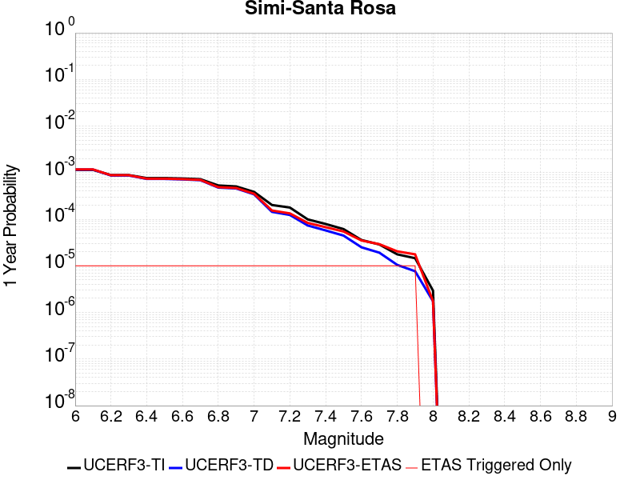 |  |

| Magnitude | 1 wk TI Prob | 1 wk TD Prob | 1 wk ETAS Prob | 1 wk ETAS/TD Gain | 1 wk ETAS Triggered Only | 1 mo TI Prob | 1 mo TD Prob | 1 mo ETAS Prob | 1 mo ETAS/TD Gain | 1 mo ETAS Triggered Only | 1 yr TI Prob | 1 yr TD Prob | 1 yr ETAS Prob | 1 yr ETAS/TD Gain | 1 yr ETAS Triggered Only | 10 yr TI Prob | 10 yr TD Prob | 10 yr ETAS Prob | 10 yr ETAS/TD Gain | 10 yr ETAS Triggered Only |
|-----|-----|-----|-----|-----|-----|-----|-----|-----|-----|-----|-----|-----|-----|-----|-----|-----|-----|-----|-----|-----|
| 6.0 | 2.198912E-5 | 2.2279473E-5 | 2.2279473E-5 | 1.0 | 0.0 | 9.4235686E-5 | 9.548021E-5 | 9.548021E-5 | 1.0 | 0.0 | 0.0011467156 | 0.0011618955 | 0.0011718839 | 1.0085967 | 1.0E-5 | 0.011408163 | 0.011562656 | 0.011582425 | 1.0017097 | 2.0E-5 |
| 6.1 | 2.198912E-5 | 2.2279473E-5 | 2.2279473E-5 | 1.0 | 0.0 | 9.4235686E-5 | 9.548021E-5 | 9.548021E-5 | 1.0 | 0.0 | 0.0011467156 | 0.0011618955 | 0.0011718839 | 1.0085967 | 1.0E-5 | 0.011408163 | 0.011562656 | 0.011582425 | 1.0017097 | 2.0E-5 |
| 6.2 | 1.69983E-5 | 1.6671673E-5 | 1.6671673E-5 | 1.0 | 0.0 | 7.284782E-5 | 7.144823E-5 | 7.144823E-5 | 1.0 | 0.0 | 8.865613E-4 | 8.6956425E-4 | 8.7955553E-4 | 1.01149 | 1.0E-5 | 0.008830327 | 0.008664539 | 0.008674452 | 1.0011442 | 1.0E-5 |
| 6.3 | 1.69983E-5 | 1.6671673E-5 | 1.6671673E-5 | 1.0 | 0.0 | 7.284782E-5 | 7.144823E-5 | 7.144823E-5 | 1.0 | 0.0 | 8.865613E-4 | 8.6956425E-4 | 8.7955553E-4 | 1.01149 | 1.0E-5 | 0.008830327 | 0.008664539 | 0.008674452 | 1.0011442 | 1.0E-5 |
| 6.4 | 1.4666188E-5 | 1.4055234E-5 | 1.4055234E-5 | 1.0 | 0.0 | 6.285358E-5 | 6.0235463E-5 | 6.0235463E-5 | 1.0 | 0.0 | 7.6497364E-4 | 7.3314493E-4 | 7.431376E-4 | 1.0136299 | 1.0E-5 | 0.0076234564 | 0.0073097385 | 0.0073196655 | 1.001358 | 1.0E-5 |
| 6.5 | 1.4666188E-5 | 1.4055234E-5 | 1.4055234E-5 | 1.0 | 0.0 | 6.285358E-5 | 6.0235463E-5 | 6.0235463E-5 | 1.0 | 0.0 | 7.6497364E-4 | 7.3314493E-4 | 7.431376E-4 | 1.0136299 | 1.0E-5 | 0.0076234564 | 0.0073097385 | 0.0073196655 | 1.001358 | 1.0E-5 |
| 6.6 | 1.4377586E-5 | 1.3732222E-5 | 1.3732222E-5 | 1.0 | 0.0 | 6.1616774E-5 | 5.8851194E-5 | 5.8851194E-5 | 1.0 | 0.0 | 7.4992597E-4 | 7.163026E-4 | 7.262954E-4 | 1.0139506 | 1.0E-5 | 0.007474003 | 0.007142407 | 0.0071523353 | 1.0013901 | 1.0E-5 |
| 6.7 | 1.3881404E-5 | 1.3210106E-5 | 1.3210106E-5 | 1.0 | 0.0 | 5.9490372E-5 | 5.661365E-5 | 5.661365E-5 | 1.0 | 0.0 | 7.240546E-4 | 6.8907795E-4 | 6.9907104E-4 | 1.0145022 | 1.0E-5 | 0.007217 | 0.0068718633 | 0.0068817944 | 1.0014452 | 1.0E-5 |
| 6.8 | 1.0176516E-5 | 9.156025E-6 | 9.156025E-6 | 1.0 | 0.0 | 4.3612912E-5 | 3.923961E-5 | 3.923961E-5 | 1.0 | 0.0 | 5.308578E-4 | 4.7765413E-4 | 4.8764935E-4 | 1.0209256 | 1.0E-5 | 0.0052959146 | 0.0047679087 | 0.004777861 | 1.0020874 | 1.0E-5 |
| 6.9 | 9.699797E-6 | 8.776513E-6 | 8.776513E-6 | 1.0 | 0.0 | 4.15699E-5 | 3.7613176E-5 | 3.7613176E-5 | 1.0 | 0.0 | 5.05996E-4 | 4.5786062E-4 | 4.6785604E-4 | 1.0218307 | 1.0E-5 | 0.005048454 | 0.0045707915 | 0.004580746 | 1.0021778 | 1.0E-5 |
| 7.0 | 7.4049476E-6 | 6.560691E-6 | 6.560691E-6 | 1.0 | 0.0 | 3.1735104E-5 | 2.8117014E-5 | 2.8117014E-5 | 1.0 | 0.0 | 3.8630638E-4 | 3.4228354E-4 | 3.522801E-4 | 1.0292056 | 1.0E-5 | 0.0038563553 | 0.0034188062 | 0.003428772 | 1.002915 | 1.0E-5 |
| 7.1 | 3.873439E-6 | 2.7601516E-6 | 2.7601516E-6 | 1.0 | 0.0 | 1.6600346E-5 | 1.1829168E-5 | 1.1829168E-5 | 1.0 | 0.0 | 2.0209046E-4 | 1.4401085E-4 | 1.5400941E-4 | 1.0694292 | 1.0E-5 | 0.0020190678 | 0.0014391989 | 0.0014491844 | 1.0069383 | 1.0E-5 |
| 7.2 | 3.417706E-6 | 2.3682323E-6 | 2.3682323E-6 | 1.0 | 0.0 | 1.4647229E-5 | 1.0149529E-5 | 1.0149529E-5 | 1.0 | 0.0 | 1.7831543E-4 | 1.2356373E-4 | 1.335625E-4 | 1.0809199 | 1.0E-5 | 0.0017817242 | 0.0012349725 | 0.0012449602 | 1.0080874 | 1.0E-5 |
| 7.3 | 1.90225E-6 | 1.4078149E-6 | 1.4078149E-6 | 1.0 | 0.0 | 8.152474E-6 | 6.0334787E-6 | 6.0334787E-6 | 1.0 | 0.0 | 9.9251854E-5 | 7.345515E-5 | 8.345442E-5 | 1.1361275 | 1.0E-5 | 9.920754E-4 | 7.3431095E-4 | 7.4430363E-4 | 1.0136082 | 1.0E-5 |
| 7.4 | 1.5170556E-6 | 1.1028849E-6 | 1.1028849E-6 | 1.0 | 0.0 | 6.5016507E-6 | 4.726641E-6 | 4.726641E-6 | 1.0 | 0.0 | 7.915472E-5 | 5.7545345E-5 | 6.7544766E-5 | 1.173766 | 1.0E-5 | 7.9126534E-4 | 5.7530554E-4 | 5.852998E-4 | 1.017372 | 1.0E-5 |
| 7.5 | 1.178732E-6 | 8.538974E-7 | 8.538974E-7 | 1.0 | 0.0 | 5.0516987E-6 | 3.6595552E-6 | 3.6595552E-6 | 1.0 | 0.0 | 6.1502695E-5 | 4.455418E-5 | 5.4553737E-5 | 1.2244358 | 1.0E-5 | 6.148568E-4 | 4.4545345E-4 | 4.55449E-4 | 1.022439 | 1.0E-5 |
| 7.6 | 6.8722386E-7 | 4.7967643E-7 | 4.7967643E-7 | 1.0 | 0.0 | 2.9452417E-6 | 2.0557545E-6 | 2.0557545E-6 | 1.0 | 0.0 | 3.5857727E-5 | 2.5028525E-5 | 3.5028275E-5 | 1.3995341 | 1.0E-5 | 3.5851944E-4 | 2.502572E-4 | 2.602547E-4 | 1.0399489 | 1.0E-5 |
| 7.7 | 5.5126515E-7 | 3.6765428E-7 | 3.6765428E-7 | 1.0 | 0.0 | 2.3625628E-6 | 1.5756602E-6 | 1.5756602E-6 | 1.0 | 0.0 | 2.8763823E-5 | 1.9183495E-5 | 2.9183304E-5 | 1.5212715 | 1.0E-5 | 2.87601E-4 | 1.9181852E-4 | 2.018166E-4 | 1.0521226 | 1.0E-5 |
| 7.8 | 3.3860243E-7 | 2.0099912E-7 | 2.0099912E-7 | 1.0 | 0.0 | 1.4511525E-6 | 8.614245E-7 | 8.614245E-7 | 1.0 | 0.0 | 1.7667637E-5 | 1.0487794E-5 | 2.0487689E-5 | 1.9534794 | 1.0E-5 | 1.7666233E-4 | 1.0487304E-4 | 1.1487199E-4 | 1.0953434 | 1.0E-5 |
| 7.9 | 2.7955386E-7 | 1.4671551E-7 | 1.4671551E-7 | 1.0 | 0.0 | 1.1980875E-6 | 6.287806E-7 | 6.287806E-7 | 1.0 | 0.0 | 1.4586617E-5 | 7.655377E-6 | 1.76553E-5 | 2.3062613 | 1.0E-5 | 1.458566E-4 | 7.655118E-5 | 8.655041E-5 | 1.1306216 | 1.0E-5 |
| 8.0 | 5.6259015E-8 | 3.3372977E-8 | 3.3372977E-8 | 1.0 | 0.0 | 2.4111003E-7 | 1.4302704E-7 | 1.4302704E-7 | 1.0 | 0.0 | 2.9355108E-6 | 1.741353E-6 | 1.741353E-6 | 1.0 | 0.0 | 2.935472E-5 | 1.7413407E-5 | 1.7413407E-5 | 1.0 | 0.0 |

## Hat Creek-McArthur-Mayfield
*[(top)](#table-of-contents)*

| 1 Week | 1 Month | 1 Year | 10 Year |
|-----|-----|-----|-----|
| 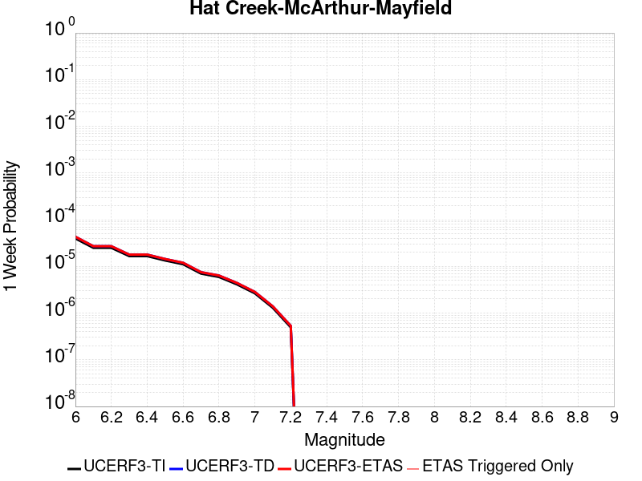 |  |  |  |

| Magnitude | 1 wk TI Prob | 1 wk TD Prob | 1 wk ETAS Prob | 1 wk ETAS/TD Gain | 1 wk ETAS Triggered Only | 1 mo TI Prob | 1 mo TD Prob | 1 mo ETAS Prob | 1 mo ETAS/TD Gain | 1 mo ETAS Triggered Only | 1 yr TI Prob | 1 yr TD Prob | 1 yr ETAS Prob | 1 yr ETAS/TD Gain | 1 yr ETAS Triggered Only | 10 yr TI Prob | 10 yr TD Prob | 10 yr ETAS Prob | 10 yr ETAS/TD Gain | 10 yr ETAS Triggered Only |
|-----|-----|-----|-----|-----|-----|-----|-----|-----|-----|-----|-----|-----|-----|-----|-----|-----|-----|-----|-----|-----|
| 6.0 | 3.967457E-5 | 4.316336E-5 | 4.316336E-5 | 1.0 | 0.0 | 1.7002279E-4 | 1.8497335E-4 | 1.8497335E-4 | 1.0 | 0.0 | 0.002068062 | 0.0022498388 | 0.0022697938 | 1.0088695 | 2.0E-5 | 0.02048922 | 0.022282979 | 0.022302533 | 1.0008775 | 2.0E-5 |
| 6.1 | 2.5044013E-5 | 2.707408E-5 | 2.707408E-5 | 1.0 | 0.0 | 1.0732707E-4 | 1.16026786E-4 | 1.16026786E-4 | 1.0 | 0.0 | 0.0013059238 | 0.0014117425 | 0.0014217284 | 1.0070734 | 1.0E-5 | 0.01298276 | 0.014031162 | 0.0140410215 | 1.0007027 | 1.0E-5 |
| 6.2 | 2.5044013E-5 | 2.707408E-5 | 2.707408E-5 | 1.0 | 0.0 | 1.0732707E-4 | 1.16026786E-4 | 1.16026786E-4 | 1.0 | 0.0 | 0.0013059238 | 0.0014117425 | 0.0014217284 | 1.0070734 | 1.0E-5 | 0.01298276 | 0.014031162 | 0.0140410215 | 1.0007027 | 1.0E-5 |
| 6.3 | 1.6624012E-5 | 1.7892884E-5 | 1.7892884E-5 | 1.0 | 0.0 | 7.124382E-5 | 7.668158E-5 | 7.668158E-5 | 1.0 | 0.0 | 8.670483E-4 | 9.33207E-4 | 9.33207E-4 | 1.0 | 0.0 | 0.008636732 | 0.009293816 | 0.009293816 | 1.0 | 0.0 |
| 6.4 | 1.6624012E-5 | 1.7892884E-5 | 1.7892884E-5 | 1.0 | 0.0 | 7.124382E-5 | 7.668158E-5 | 7.668158E-5 | 1.0 | 0.0 | 8.670483E-4 | 9.33207E-4 | 9.33207E-4 | 1.0 | 0.0 | 0.008636732 | 0.009293816 | 0.009293816 | 1.0 | 0.0 |
| 6.5 | 1.3394842E-5 | 1.439356E-5 | 1.439356E-5 | 1.0 | 0.0 | 5.7405203E-5 | 6.1685256E-5 | 6.1685256E-5 | 1.0 | 0.0 | 6.986842E-4 | 7.507648E-4 | 7.507648E-4 | 1.0 | 0.0 | 0.006964916 | 0.0074828775 | 0.0074828775 | 1.0 | 0.0 |
| 6.6 | 1.1137514E-5 | 1.195571E-5 | 1.195571E-5 | 1.0 | 0.0 | 4.7731326E-5 | 5.1237774E-5 | 5.1237774E-5 | 1.0 | 0.0 | 5.809739E-4 | 6.236454E-4 | 6.236454E-4 | 1.0 | 0.0 | 0.005794574 | 0.006219374 | 0.006219374 | 1.0 | 0.0 |
| 6.7 | 7.0200663E-6 | 7.525007E-6 | 7.525007E-6 | 1.0 | 0.0 | 3.008565E-5 | 3.224964E-5 | 3.224964E-5 | 1.0 | 0.0 | 3.6623122E-4 | 3.9257022E-4 | 3.9257022E-4 | 1.0 | 0.0 | 0.0036562826 | 0.00391893 | 0.00391893 | 1.0 | 0.0 |
| 6.8 | 5.940172E-6 | 6.3660814E-6 | 6.3660814E-6 | 1.0 | 0.0 | 2.545763E-5 | 2.7282927E-5 | 2.7282927E-5 | 1.0 | 0.0 | 3.0990256E-4 | 3.3212028E-4 | 3.3212028E-4 | 1.0 | 0.0 | 0.0030947074 | 0.003316368 | 0.003316368 | 1.0 | 0.0 |
| 6.9 | 4.129831E-6 | 4.4239646E-6 | 4.4239646E-6 | 1.0 | 0.0 | 1.7699154E-5 | 1.8959714E-5 | 1.8959714E-5 | 1.0 | 0.0 | 2.154659E-4 | 2.3081087E-4 | 2.3081087E-4 | 1.0 | 0.0 | 0.002152571 | 0.0023057899 | 0.0023057899 | 1.0 | 0.0 |
| 7.0 | 2.6512955E-6 | 2.8376644E-6 | 2.8376644E-6 | 1.0 | 0.0 | 1.1362646E-5 | 1.2161364E-5 | 1.2161364E-5 | 1.0 | 0.0 | 1.3833142E-4 | 1.4805498E-4 | 1.4805498E-4 | 1.0 | 0.0 | 0.0013824535 | 0.001479606 | 0.001479606 | 1.0 | 0.0 |
| 7.1 | 1.2992575E-6 | 1.3910619E-6 | 1.3910619E-6 | 1.0 | 0.0 | 5.568235E-6 | 5.961682E-6 | 5.961682E-6 | 1.0 | 0.0 | 6.779115E-5 | 7.258128E-5 | 7.258128E-5 | 1.0 | 0.0 | 6.7770475E-4 | 7.255973E-4 | 7.255973E-4 | 1.0 | 0.0 |
| 7.2 | 4.968191E-7 | 5.3276585E-7 | 5.3276585E-7 | 1.0 | 0.0 | 2.1292228E-6 | 2.2832808E-6 | 2.2832808E-6 | 1.0 | 0.0 | 2.592298E-5 | 2.7798715E-5 | 2.7798715E-5 | 1.0 | 0.0 | 2.5919956E-4 | 2.7796475E-4 | 2.7796475E-4 | 1.0 | 0.0 |

## San Andreas (Santa Cruz Mts) 2011 CFM
*[(top)](#table-of-contents)*

| 1 Week | 1 Month | 1 Year | 10 Year |
|-----|-----|-----|-----|
| 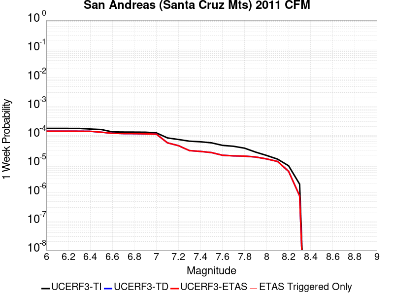 |  |  |  |

| Magnitude | 1 wk TI Prob | 1 wk TD Prob | 1 wk ETAS Prob | 1 wk ETAS/TD Gain | 1 wk ETAS Triggered Only | 1 mo TI Prob | 1 mo TD Prob | 1 mo ETAS Prob | 1 mo ETAS/TD Gain | 1 mo ETAS Triggered Only | 1 yr TI Prob | 1 yr TD Prob | 1 yr ETAS Prob | 1 yr ETAS/TD Gain | 1 yr ETAS Triggered Only | 10 yr TI Prob | 10 yr TD Prob | 10 yr ETAS Prob | 10 yr ETAS/TD Gain | 10 yr ETAS Triggered Only |
|-----|-----|-----|-----|-----|-----|-----|-----|-----|-----|-----|-----|-----|-----|-----|-----|-----|-----|-----|-----|-----|
| 6.0 | 1.7221631E-4 | 1.385506E-4 | 1.385506E-4 | 1.0 | 0.0 | 7.378611E-4 | 5.936552E-4 | 5.936552E-4 | 1.0 | 0.0 | 0.008946515 | 0.0072041913 | 0.007214119 | 1.001378 | 1.0E-5 | 0.08594794 | 0.070849694 | 0.070868276 | 1.0002623 | 2.0E-5 |
| 6.1 | 1.7221631E-4 | 1.385506E-4 | 1.385506E-4 | 1.0 | 0.0 | 7.378611E-4 | 5.936552E-4 | 5.936552E-4 | 1.0 | 0.0 | 0.008946515 | 0.0072041913 | 0.007214119 | 1.001378 | 1.0E-5 | 0.08594794 | 0.070849694 | 0.070868276 | 1.0002623 | 2.0E-5 |
| 6.2 | 1.7221631E-4 | 1.385506E-4 | 1.385506E-4 | 1.0 | 0.0 | 7.378611E-4 | 5.936552E-4 | 5.936552E-4 | 1.0 | 0.0 | 0.008946515 | 0.0072041913 | 0.007214119 | 1.001378 | 1.0E-5 | 0.08594794 | 0.070849694 | 0.070868276 | 1.0002623 | 2.0E-5 |
| 6.3 | 1.716926E-4 | 1.3774366E-4 | 1.3774366E-4 | 1.0 | 0.0 | 7.3561794E-4 | 5.9019844E-4 | 5.9019844E-4 | 1.0 | 0.0 | 0.008919428 | 0.0071623814 | 0.00717231 | 1.0013862 | 1.0E-5 | 0.08569809 | 0.07046144 | 0.07048003 | 1.0002638 | 2.0E-5 |
| 6.4 | 1.6392978E-4 | 1.3648922E-4 | 1.3648922E-4 | 1.0 | 0.0 | 7.02367E-4 | 5.8482477E-4 | 5.8482477E-4 | 1.0 | 0.0 | 0.008517839 | 0.0070973835 | 0.007107313 | 1.0013989 | 1.0E-5 | 0.08198654 | 0.06968729 | 0.069705896 | 1.000267 | 2.0E-5 |
| 6.5 | 1.5742714E-4 | 1.2707022E-4 | 1.2707022E-4 | 1.0 | 0.0 | 6.745133E-4 | 5.444747E-4 | 5.444747E-4 | 1.0 | 0.0 | 0.00818132 | 0.0066091577 | 0.0066190916 | 1.0015031 | 1.0E-5 | 0.078865945 | 0.065142736 | 0.06516143 | 1.000287 | 2.0E-5 |
| 6.6 | 1.3038084E-4 | 1.1642041E-4 | 1.1642041E-4 | 1.0 | 0.0 | 5.5865536E-4 | 4.988505E-4 | 4.988505E-4 | 1.0 | 0.0 | 0.006780438 | 0.0060568345 | 0.006066774 | 1.001641 | 1.0E-5 | 0.0657725 | 0.059579443 | 0.059598252 | 1.0003157 | 2.0E-5 |
| 6.7 | 1.2867592E-4 | 1.13681774E-4 | 1.13681774E-4 | 1.0 | 0.0 | 5.5135164E-4 | 4.871179E-4 | 4.871179E-4 | 1.0 | 0.0 | 0.0066920654 | 0.0059147733 | 0.0059247143 | 1.0016807 | 1.0E-5 | 0.06494093 | 0.05828927 | 0.058308102 | 1.000323 | 2.0E-5 |
| 6.8 | 1.2801298E-4 | 1.1305662E-4 | 1.1305662E-4 | 1.0 | 0.0 | 5.485117E-4 | 4.844397E-4 | 4.844397E-4 | 1.0 | 0.0 | 0.0066577005 | 0.005882343 | 0.005892284 | 1.00169 | 1.0E-5 | 0.06461738 | 0.05800286 | 0.0580217 | 1.0003248 | 2.0E-5 |
| 6.9 | 1.269149E-4 | 1.1147626E-4 | 1.1147626E-4 | 1.0 | 0.0 | 5.4380763E-4 | 4.7766924E-4 | 4.7766924E-4 | 1.0 | 0.0 | 0.006600777 | 0.0058003543 | 0.0058102966 | 1.001714 | 1.0E-5 | 0.06408122 | 0.057273902 | 0.057292756 | 1.0003293 | 2.0E-5 |
| 7.0 | 1.2030331E-4 | 1.0876939E-4 | 1.0876939E-4 | 1.0 | 0.0 | 5.154837E-4 | 4.6607252E-4 | 4.6607252E-4 | 1.0 | 0.0 | 0.006257969 | 0.005659906 | 0.00566985 | 1.0017568 | 1.0E-5 | 0.06084648 | 0.05594235 | 0.05596123 | 1.0003375 | 2.0E-5 |
| 7.1 | 8.049617E-5 | 5.4314238E-5 | 5.4314238E-5 | 1.0 | 0.0 | 3.4493793E-4 | 2.3275473E-4 | 2.3275473E-4 | 1.0 | 0.0 | 0.0041915346 | 0.0028301417 | 0.0028401134 | 1.0035233 | 1.0E-5 | 0.041133516 | 0.029811494 | 0.0298309 | 1.0006509 | 2.0E-5 |
| 7.2 | 7.093979E-5 | 4.3284384E-5 | 4.3284384E-5 | 1.0 | 0.0 | 3.0399222E-4 | 1.8549144E-4 | 1.8549144E-4 | 1.0 | 0.0 | 0.0036948253 | 0.0022560423 | 0.0022660198 | 1.0044225 | 1.0E-5 | 0.03633994 | 0.02411592 | 0.024135437 | 1.0008093 | 2.0E-5 |
| 7.3 | 6.193693E-5 | 2.9151392E-5 | 2.9151392E-5 | 1.0 | 0.0 | 2.6541698E-4 | 1.2492857E-4 | 1.2492857E-4 | 1.0 | 0.0 | 0.0032266637 | 0.0015199458 | 0.0015299306 | 1.0065691 | 1.0E-5 | 0.031802133 | 0.016634531 | 0.016654199 | 1.0011823 | 2.0E-5 |
| 7.4 | 5.906492E-5 | 2.7264157E-5 | 2.7264157E-5 | 1.0 | 0.0 | 2.5311083E-4 | 1.1684116E-4 | 1.1684116E-4 | 1.0 | 0.0 | 0.0030772698 | 0.0014216143 | 0.0014316001 | 1.0070243 | 1.0E-5 | 0.030350044 | 0.015598554 | 0.015618242 | 1.0012622 | 2.0E-5 |
| 7.5 | 5.424296E-5 | 2.4896208E-5 | 2.4896208E-5 | 1.0 | 0.0 | 2.324491E-4 | 1.06693675E-4 | 1.06693675E-4 | 1.0 | 0.0 | 0.002826395 | 0.0012982227 | 0.0013082097 | 1.0076928 | 1.0E-5 | 0.027907165 | 0.014279381 | 0.014299096 | 1.0013806 | 2.0E-5 |
| 7.6 | 4.43084E-5 | 2.0070995E-5 | 2.0070995E-5 | 1.0 | 0.0 | 1.8987931E-4 | 8.601571E-5 | 8.601571E-5 | 1.0 | 0.0 | 0.0023093296 | 0.0010467384 | 0.001056728 | 1.0095435 | 1.0E-5 | 0.022854783 | 0.011502311 | 0.011522081 | 1.0017188 | 2.0E-5 |
| 7.7 | 4.118098E-5 | 1.909546E-5 | 1.909546E-5 | 1.0 | 0.0 | 1.7647797E-4 | 8.183512E-5 | 8.183512E-5 | 1.0 | 0.0 | 0.002146502 | 9.958874E-4 | 0.0010058775 | 1.0100313 | 1.0E-5 | 0.021258866 | 0.010956018 | 0.0109757995 | 1.0018054 | 2.0E-5 |
| 7.8 | 3.5408906E-5 | 1.8719422E-5 | 1.8719422E-5 | 1.0 | 0.0 | 1.5174363E-4 | 8.0223625E-5 | 8.0223625E-5 | 1.0 | 0.0 | 0.0018459131 | 9.7628526E-4 | 9.862755E-4 | 1.0102329 | 1.0E-5 | 0.018306552 | 0.010735144 | 0.010754929 | 1.0018431 | 2.0E-5 |
| 7.9 | 2.5860836E-5 | 1.7457416E-5 | 1.7457416E-5 | 1.0 | 0.0 | 1.10827445E-4 | 7.4815354E-5 | 7.4815354E-5 | 1.0 | 0.0 | 0.001348489 | 9.104966E-4 | 9.2048745E-4 | 1.010973 | 1.0E-5 | 0.013403354 | 0.009982819 | 0.01000262 | 1.0019834 | 2.0E-5 |
| 8.0 | 1.9777332E-5 | 1.4960866E-5 | 1.4960866E-5 | 1.0 | 0.0 | 8.4757245E-5 | 6.411642E-5 | 6.411642E-5 | 1.0 | 0.0 | 0.0010314309 | 7.803381E-4 | 7.9033023E-4 | 1.012805 | 1.0E-5 | 0.010266567 | 0.00857341 | 0.008583325 | 1.0011564 | 1.0E-5 |
| 8.1 | 1.468494E-5 | 1.22075735E-5 | 1.22075735E-5 | 1.0 | 0.0 | 6.293394E-5 | 5.2317126E-5 | 5.2317126E-5 | 1.0 | 0.0 | 7.6595135E-4 | 6.3677505E-4 | 6.4676866E-4 | 1.0156941 | 1.0E-5 | 0.0076331664 | 0.007022635 | 0.007032565 | 1.001414 | 1.0E-5 |
| 8.2 | 8.63836E-6 | 5.5210867E-6 | 5.5210867E-6 | 1.0 | 0.0 | 3.7021015E-5 | 2.3661585E-5 | 2.3661585E-5 | 1.0 | 0.0 | 4.5063766E-4 | 2.880418E-4 | 2.880418E-4 | 1.0 | 0.0 | 0.004497249 | 0.0032741476 | 0.0032741476 | 1.0 | 0.0 |
| 8.3 | 1.983087E-6 | 7.7486385E-7 | 7.7486385E-7 | 1.0 | 0.0 | 8.498917E-6 | 3.320841E-6 | 3.320841E-6 | 1.0 | 0.0 | 1.034694E-4 | 4.0430506E-5 | 4.0430506E-5 | 1.0 | 0.0 | 0.0010342124 | 4.7705657E-4 | 4.7705657E-4 | 1.0 | 0.0 |

## Mono Lake 2011 CFM
*[(top)](#table-of-contents)*

| 1 Week | 1 Month | 1 Year | 10 Year |
|-----|-----|-----|-----|
| 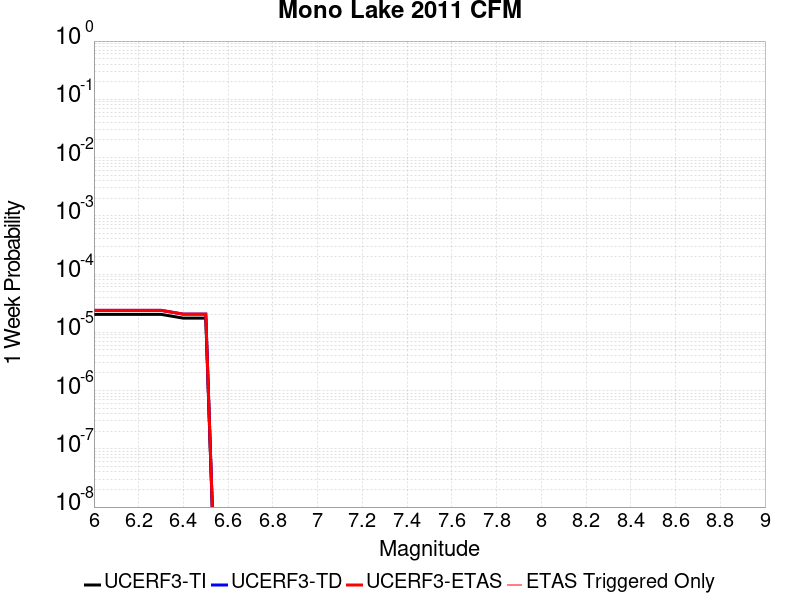 |  |  |  |

| Magnitude | 1 wk TI Prob | 1 wk TD Prob | 1 wk ETAS Prob | 1 wk ETAS/TD Gain | 1 wk ETAS Triggered Only | 1 mo TI Prob | 1 mo TD Prob | 1 mo ETAS Prob | 1 mo ETAS/TD Gain | 1 mo ETAS Triggered Only | 1 yr TI Prob | 1 yr TD Prob | 1 yr ETAS Prob | 1 yr ETAS/TD Gain | 1 yr ETAS Triggered Only | 10 yr TI Prob | 10 yr TD Prob | 10 yr ETAS Prob | 10 yr ETAS/TD Gain | 10 yr ETAS Triggered Only |
|-----|-----|-----|-----|-----|-----|-----|-----|-----|-----|-----|-----|-----|-----|-----|-----|-----|-----|-----|-----|-----|
| 6.0 | 2.0341662E-5 | 2.3833583E-5 | 2.3833583E-5 | 1.0 | 0.0 | 8.717564E-5 | 1.0214293E-4 | 1.0214293E-4 | 1.0 | 0.0 | 0.0010608466 | 0.0012434124 | 0.0012434124 | 1.0 | 0.0 | 0.010557966 | 0.012416651 | 0.012436402 | 1.0015907 | 2.0E-5 |
| 6.1 | 2.0341662E-5 | 2.3833583E-5 | 2.3833583E-5 | 1.0 | 0.0 | 8.717564E-5 | 1.0214293E-4 | 1.0214293E-4 | 1.0 | 0.0 | 0.0010608466 | 0.0012434124 | 0.0012434124 | 1.0 | 0.0 | 0.010557966 | 0.012416651 | 0.012436402 | 1.0015907 | 2.0E-5 |
| 6.2 | 2.0341662E-5 | 2.3833583E-5 | 2.3833583E-5 | 1.0 | 0.0 | 8.717564E-5 | 1.0214293E-4 | 1.0214293E-4 | 1.0 | 0.0 | 0.0010608466 | 0.0012434124 | 0.0012434124 | 1.0 | 0.0 | 0.010557966 | 0.012416651 | 0.012436402 | 1.0015907 | 2.0E-5 |
| 6.3 | 2.0341662E-5 | 2.3833583E-5 | 2.3833583E-5 | 1.0 | 0.0 | 8.717564E-5 | 1.0214293E-4 | 1.0214293E-4 | 1.0 | 0.0 | 0.0010608466 | 0.0012434124 | 0.0012434124 | 1.0 | 0.0 | 0.010557966 | 0.012416651 | 0.012436402 | 1.0015907 | 2.0E-5 |
| 6.4 | 1.749821E-5 | 2.0495634E-5 | 2.0495634E-5 | 1.0 | 0.0 | 7.499018E-5 | 8.783843E-5 | 8.783843E-5 | 1.0 | 0.0 | 9.1262296E-4 | 0.0010694329 | 0.0010694329 | 1.0 | 0.0 | 0.009088841 | 0.010694289 | 0.010704181 | 1.0009251 | 1.0E-5 |
| 6.5 | 1.749821E-5 | 2.0495634E-5 | 2.0495634E-5 | 1.0 | 0.0 | 7.499018E-5 | 8.783843E-5 | 8.783843E-5 | 1.0 | 0.0 | 9.1262296E-4 | 0.0010694329 | 0.0010694329 | 1.0 | 0.0 | 0.009088841 | 0.010694289 | 0.010704181 | 1.0009251 | 1.0E-5 |

## Cucamonga
*[(top)](#table-of-contents)*

| 1 Week | 1 Month | 1 Year | 10 Year |
|-----|-----|-----|-----|
|  |  |  | 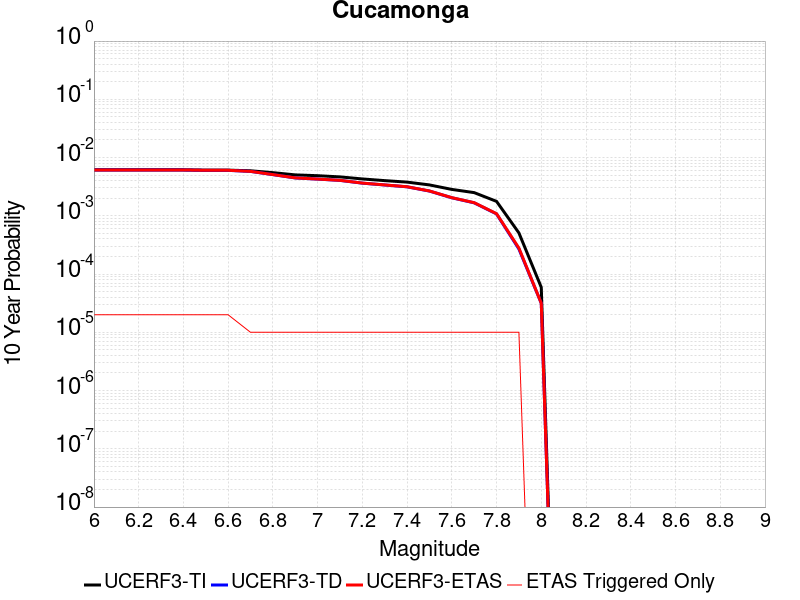 |

| Magnitude | 1 wk TI Prob | 1 wk TD Prob | 1 wk ETAS Prob | 1 wk ETAS/TD Gain | 1 wk ETAS Triggered Only | 1 mo TI Prob | 1 mo TD Prob | 1 mo ETAS Prob | 1 mo ETAS/TD Gain | 1 mo ETAS Triggered Only | 1 yr TI Prob | 1 yr TD Prob | 1 yr ETAS Prob | 1 yr ETAS/TD Gain | 1 yr ETAS Triggered Only | 10 yr TI Prob | 10 yr TD Prob | 10 yr ETAS Prob | 10 yr ETAS/TD Gain | 10 yr ETAS Triggered Only |
|-----|-----|-----|-----|-----|-----|-----|-----|-----|-----|-----|-----|-----|-----|-----|-----|-----|-----|-----|-----|-----|
| 6.0 | 1.1848348E-5 | 1.174373E-5 | 1.174373E-5 | 1.0 | 0.0 | 5.0777642E-5 | 5.0329316E-5 | 5.0329316E-5 | 1.0 | 0.0 | 6.180424E-4 | 6.125899E-4 | 6.225837E-4 | 1.0163141 | 1.0E-5 | 0.0061632637 | 0.006110176 | 0.006130054 | 1.0032532 | 2.0E-5 |
| 6.1 | 1.1848348E-5 | 1.174373E-5 | 1.174373E-5 | 1.0 | 0.0 | 5.0777642E-5 | 5.0329316E-5 | 5.0329316E-5 | 1.0 | 0.0 | 6.180424E-4 | 6.125899E-4 | 6.225837E-4 | 1.0163141 | 1.0E-5 | 0.0061632637 | 0.006110176 | 0.006130054 | 1.0032532 | 2.0E-5 |
| 6.2 | 1.1848348E-5 | 1.174373E-5 | 1.174373E-5 | 1.0 | 0.0 | 5.0777642E-5 | 5.0329316E-5 | 5.0329316E-5 | 1.0 | 0.0 | 6.180424E-4 | 6.125899E-4 | 6.225837E-4 | 1.0163141 | 1.0E-5 | 0.0061632637 | 0.006110176 | 0.006130054 | 1.0032532 | 2.0E-5 |
| 6.3 | 1.1848348E-5 | 1.174373E-5 | 1.174373E-5 | 1.0 | 0.0 | 5.0777642E-5 | 5.0329316E-5 | 5.0329316E-5 | 1.0 | 0.0 | 6.180424E-4 | 6.125899E-4 | 6.225837E-4 | 1.0163141 | 1.0E-5 | 0.0061632637 | 0.006110176 | 0.006130054 | 1.0032532 | 2.0E-5 |
| 6.4 | 1.1848348E-5 | 1.174373E-5 | 1.174373E-5 | 1.0 | 0.0 | 5.0777642E-5 | 5.0329316E-5 | 5.0329316E-5 | 1.0 | 0.0 | 6.180424E-4 | 6.125899E-4 | 6.225837E-4 | 1.0163141 | 1.0E-5 | 0.0061632637 | 0.006110176 | 0.006130054 | 1.0032532 | 2.0E-5 |
| 6.5 | 1.16988695E-5 | 1.1582744E-5 | 1.1582744E-5 | 1.0 | 0.0 | 5.013705E-5 | 4.9639406E-5 | 4.9639406E-5 | 1.0 | 0.0 | 6.102476E-4 | 6.041948E-4 | 6.141888E-4 | 1.016541 | 1.0E-5 | 0.006085745 | 0.0060266824 | 0.0060465615 | 1.0032985 | 2.0E-5 |
| 6.6 | 1.16988695E-5 | 1.1582744E-5 | 1.1582744E-5 | 1.0 | 0.0 | 5.013705E-5 | 4.9639406E-5 | 4.9639406E-5 | 1.0 | 0.0 | 6.102476E-4 | 6.041948E-4 | 6.141888E-4 | 1.016541 | 1.0E-5 | 0.006085745 | 0.0060266824 | 0.0060465615 | 1.0032985 | 2.0E-5 |
| 6.7 | 1.1397107E-5 | 1.1121481E-5 | 1.1121481E-5 | 1.0 | 0.0 | 4.884383E-5 | 4.7662634E-5 | 4.7662634E-5 | 1.0 | 0.0 | 5.9451134E-4 | 5.8014056E-4 | 5.9013476E-4 | 1.0172272 | 1.0E-5 | 0.005929234 | 0.0057874005 | 0.0057973424 | 1.0017179 | 1.0E-5 |
| 6.8 | 1.058387E-5 | 9.790732E-6 | 9.790732E-6 | 1.0 | 0.0 | 4.5358654E-5 | 4.1959614E-5 | 4.1959614E-5 | 1.0 | 0.0 | 5.521017E-4 | 5.107397E-4 | 5.207346E-4 | 1.0195694 | 1.0E-5 | 0.00550732 | 0.0050966563 | 0.005106605 | 1.001952 | 1.0E-5 |
| 6.9 | 9.690046E-6 | 8.584701E-6 | 8.584701E-6 | 1.0 | 0.0 | 4.1528107E-5 | 3.679106E-5 | 3.679106E-5 | 1.0 | 0.0 | 5.054874E-4 | 4.4783953E-4 | 4.5783503E-4 | 1.0223194 | 1.0E-5 | 0.005043391 | 0.0044702943 | 0.0044802497 | 1.002227 | 1.0E-5 |
| 7.0 | 9.381461E-6 | 8.1921835E-6 | 8.1921835E-6 | 1.0 | 0.0 | 4.020564E-5 | 3.510889E-5 | 3.510889E-5 | 1.0 | 0.0 | 4.893937E-4 | 4.2736722E-4 | 4.3736296E-4 | 1.0233891 | 1.0E-5 | 0.0048831734 | 0.004266376 | 0.0042763334 | 1.0023339 | 1.0E-5 |
| 7.1 | 8.946492E-6 | 7.786866E-6 | 7.786866E-6 | 1.0 | 0.0 | 3.8341543E-5 | 3.337186E-5 | 3.337186E-5 | 1.0 | 0.0 | 4.667083E-4 | 4.0622696E-4 | 4.162229E-4 | 1.0246068 | 1.0E-5 | 0.0046572937 | 0.0040557687 | 0.0040657283 | 1.0024556 | 1.0E-5 |
| 7.2 | 8.251016E-6 | 6.9799216E-6 | 6.9799216E-6 | 1.0 | 0.0 | 3.5361016E-5 | 2.9913608E-5 | 2.9913608E-5 | 1.0 | 0.0 | 4.3043532E-4 | 3.6413755E-4 | 3.741339E-4 | 1.0274521 | 1.0E-5 | 0.0042960253 | 0.0036363304 | 0.0036462941 | 1.00274 | 1.0E-5 |
| 7.3 | 7.717881E-6 | 6.4908418E-6 | 6.4908418E-6 | 1.0 | 0.0 | 3.3076216E-5 | 2.7817598E-5 | 2.7817598E-5 | 1.0 | 0.0 | 4.026285E-4 | 3.3862685E-4 | 3.4862346E-4 | 1.029521 | 1.0E-5 | 0.004018998 | 0.003382034 | 0.003392 | 1.0029469 | 1.0E-5 |
| 7.4 | 7.275623E-6 | 6.0363072E-6 | 6.0363072E-6 | 1.0 | 0.0 | 3.118087E-5 | 2.5869635E-5 | 2.5869635E-5 | 1.0 | 0.0 | 3.7956095E-4 | 3.1491747E-4 | 3.2491435E-4 | 1.0317444 | 1.0E-5 | 0.0037891332 | 0.0031456365 | 0.0031556052 | 1.0031691 | 1.0E-5 |
| 7.5 | 6.5109502E-6 | 5.104422E-6 | 5.104422E-6 | 1.0 | 0.0 | 2.7903774E-5 | 2.1875912E-5 | 2.1875912E-5 | 1.0 | 0.0 | 3.3967546E-4 | 2.6630683E-4 | 2.7630414E-4 | 1.0375407 | 1.0E-5 | 0.0033915674 | 0.0026607898 | 0.002670763 | 1.0037483 | 1.0E-5 |
| 7.6 | 5.4495326E-6 | 3.911958E-6 | 3.911958E-6 | 1.0 | 0.0 | 2.335493E-5 | 1.6765429E-5 | 1.6765429E-5 | 1.0 | 0.0 | 2.8430918E-4 | 2.0410004E-4 | 2.1409799E-4 | 1.0489856 | 1.0E-5 | 0.0028394572 | 0.002040035 | 0.0020500147 | 1.0048919 | 1.0E-5 |
| 7.7 | 4.7997164E-6 | 3.2033015E-6 | 3.2033015E-6 | 1.0 | 0.0 | 2.057005E-5 | 1.3728363E-5 | 1.3728363E-5 | 1.0 | 0.0 | 2.504116E-4 | 1.6713004E-4 | 1.7712837E-4 | 1.0598236 | 1.0E-5 | 0.002501296 | 0.0016709642 | 0.0016809475 | 1.0059745 | 1.0E-5 |
| 7.8 | 3.3941733E-6 | 2.0659497E-6 | 2.0659497E-6 | 1.0 | 0.0 | 1.4546376E-5 | 8.85404E-6 | 8.85404E-6 | 1.0 | 0.0 | 1.7708774E-4 | 1.0779262E-4 | 1.1779154E-4 | 1.0927607 | 1.0E-5 | 0.0017694668 | 0.0010776407 | 0.0010876299 | 1.0092695 | 1.0E-5 |
| 7.9 | 9.750552E-7 | 5.161305E-7 | 5.161305E-7 | 1.0 | 0.0 | 4.178801E-6 | 2.2119862E-6 | 2.2119862E-6 | 1.0 | 0.0 | 5.0875715E-5 | 2.6930602E-5 | 3.6930334E-5 | 1.3713148 | 1.0E-5 | 5.086407E-4 | 2.692738E-4 | 2.792711E-4 | 1.0371269 | 1.0E-5 |
| 8.0 | 1.133857E-7 | 6.057157E-8 | 6.057157E-8 | 1.0 | 0.0 | 4.8593864E-7 | 2.5959244E-7 | 2.5959244E-7 | 1.0 | 0.0 | 5.9162867E-6 | 3.1605334E-6 | 3.1605334E-6 | 1.0 | 0.0 | 5.916129E-5 | 3.16049E-5 | 3.16049E-5 | 1.0 | 0.0 |

## Channel Islands Western Deep Ramp
*[(top)](#table-of-contents)*

| 1 Week | 1 Month | 1 Year | 10 Year |
|-----|-----|-----|-----|
|  |  | 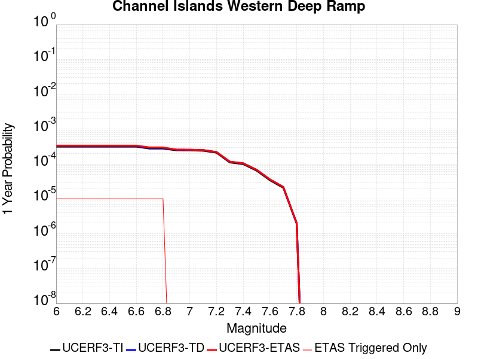 | 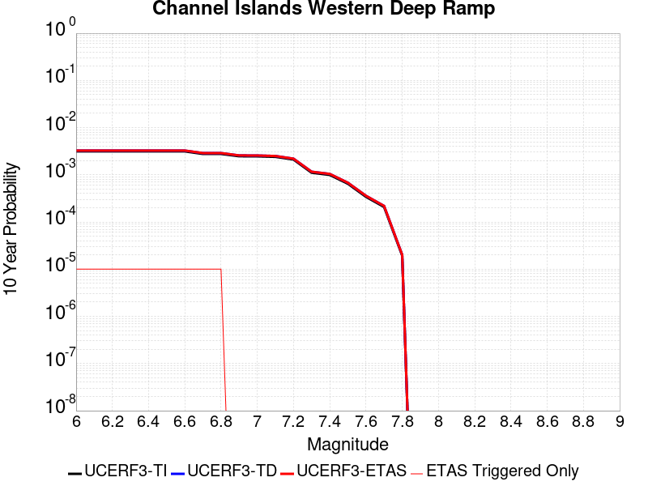 |

| Magnitude | 1 wk TI Prob | 1 wk TD Prob | 1 wk ETAS Prob | 1 wk ETAS/TD Gain | 1 wk ETAS Triggered Only | 1 mo TI Prob | 1 mo TD Prob | 1 mo ETAS Prob | 1 mo ETAS/TD Gain | 1 mo ETAS Triggered Only | 1 yr TI Prob | 1 yr TD Prob | 1 yr ETAS Prob | 1 yr ETAS/TD Gain | 1 yr ETAS Triggered Only | 10 yr TI Prob | 10 yr TD Prob | 10 yr ETAS Prob | 10 yr ETAS/TD Gain | 10 yr ETAS Triggered Only |
|-----|-----|-----|-----|-----|-----|-----|-----|-----|-----|-----|-----|-----|-----|-----|-----|-----|-----|-----|-----|-----|
| 6.0 | 6.0213506E-6 | 6.255191E-6 | 6.255191E-6 | 1.0 | 0.0 | 2.5805533E-5 | 2.6807711E-5 | 3.6807443E-5 | 1.373017 | 1.0E-5 | 3.1413708E-4 | 3.2633948E-4 | 3.363362E-4 | 1.030633 | 1.0E-5 | 0.0031369338 | 0.0032590441 | 0.0032690114 | 1.0030584 | 1.0E-5 |
| 6.1 | 6.0213506E-6 | 6.255191E-6 | 6.255191E-6 | 1.0 | 0.0 | 2.5805533E-5 | 2.6807711E-5 | 3.6807443E-5 | 1.373017 | 1.0E-5 | 3.1413708E-4 | 3.2633948E-4 | 3.363362E-4 | 1.030633 | 1.0E-5 | 0.0031369338 | 0.0032590441 | 0.0032690114 | 1.0030584 | 1.0E-5 |
| 6.2 | 6.0213506E-6 | 6.255191E-6 | 6.255191E-6 | 1.0 | 0.0 | 2.5805533E-5 | 2.6807711E-5 | 3.6807443E-5 | 1.373017 | 1.0E-5 | 3.1413708E-4 | 3.2633948E-4 | 3.363362E-4 | 1.030633 | 1.0E-5 | 0.0031369338 | 0.0032590441 | 0.0032690114 | 1.0030584 | 1.0E-5 |
| 6.3 | 6.0213506E-6 | 6.255191E-6 | 6.255191E-6 | 1.0 | 0.0 | 2.5805533E-5 | 2.6807711E-5 | 3.6807443E-5 | 1.373017 | 1.0E-5 | 3.1413708E-4 | 3.2633948E-4 | 3.363362E-4 | 1.030633 | 1.0E-5 | 0.0031369338 | 0.0032590441 | 0.0032690114 | 1.0030584 | 1.0E-5 |
| 6.4 | 6.0213506E-6 | 6.255191E-6 | 6.255191E-6 | 1.0 | 0.0 | 2.5805533E-5 | 2.6807711E-5 | 3.6807443E-5 | 1.373017 | 1.0E-5 | 3.1413708E-4 | 3.2633948E-4 | 3.363362E-4 | 1.030633 | 1.0E-5 | 0.0031369338 | 0.0032590441 | 0.0032690114 | 1.0030584 | 1.0E-5 |
| 6.5 | 6.0213506E-6 | 6.255191E-6 | 6.255191E-6 | 1.0 | 0.0 | 2.5805533E-5 | 2.6807711E-5 | 3.6807443E-5 | 1.373017 | 1.0E-5 | 3.1413708E-4 | 3.2633948E-4 | 3.363362E-4 | 1.030633 | 1.0E-5 | 0.0031369338 | 0.0032590441 | 0.0032690114 | 1.0030584 | 1.0E-5 |
| 6.6 | 6.0213506E-6 | 6.255191E-6 | 6.255191E-6 | 1.0 | 0.0 | 2.5805533E-5 | 2.6807711E-5 | 3.6807443E-5 | 1.373017 | 1.0E-5 | 3.1413708E-4 | 3.2633948E-4 | 3.363362E-4 | 1.030633 | 1.0E-5 | 0.0031369338 | 0.0032590441 | 0.0032690114 | 1.0030584 | 1.0E-5 |
| 6.7 | 5.313309E-6 | 5.5255337E-6 | 5.5255337E-6 | 1.0 | 0.0 | 2.2771126E-5 | 2.3680666E-5 | 3.368043E-5 | 1.4222754 | 1.0E-5 | 2.772032E-4 | 2.8827807E-4 | 2.9827518E-4 | 1.0346787 | 1.0E-5 | 0.0027685766 | 0.0028794443 | 0.0028894155 | 1.0034629 | 1.0E-5 |
| 6.8 | 5.313309E-6 | 5.5255337E-6 | 5.5255337E-6 | 1.0 | 0.0 | 2.2771126E-5 | 2.3680666E-5 | 3.368043E-5 | 1.4222754 | 1.0E-5 | 2.772032E-4 | 2.8827807E-4 | 2.9827518E-4 | 1.0346787 | 1.0E-5 | 0.0027685766 | 0.0028794443 | 0.0028894155 | 1.0034629 | 1.0E-5 |
| 6.9 | 4.744377E-6 | 4.9397004E-6 | 4.9397004E-6 | 1.0 | 0.0 | 2.0332885E-5 | 2.1169993E-5 | 2.1169993E-5 | 1.0 | 0.0 | 2.4752476E-4 | 2.5771794E-4 | 2.5771794E-4 | 1.0 | 0.0 | 0.0024724922 | 0.002574558 | 0.002574558 | 1.0 | 0.0 |
| 7.0 | 4.722209E-6 | 4.916742E-6 | 4.916742E-6 | 1.0 | 0.0 | 2.0237881E-5 | 2.1071603E-5 | 2.1071603E-5 | 1.0 | 0.0 | 2.4636835E-4 | 2.565203E-4 | 2.565203E-4 | 1.0 | 0.0 | 0.002460954 | 0.0025626093 | 0.0025626093 | 1.0 | 0.0 |
| 7.1 | 4.611174E-6 | 4.8016723E-6 | 4.8016723E-6 | 1.0 | 0.0 | 1.9762025E-5 | 2.0578454E-5 | 2.0578454E-5 | 1.0 | 0.0 | 2.4057609E-4 | 2.505176E-4 | 2.505176E-4 | 1.0 | 0.0 | 0.002403158 | 0.002502719 | 0.002502719 | 1.0 | 0.0 |
| 7.2 | 4.043994E-6 | 4.2122592E-6 | 4.2122592E-6 | 1.0 | 0.0 | 1.7331287E-5 | 1.8052435E-5 | 1.8052435E-5 | 1.0 | 0.0 | 2.10988E-4 | 2.197698E-4 | 2.197698E-4 | 1.0 | 0.0 | 0.002107878 | 0.0021958754 | 0.0021958754 | 1.0 | 0.0 |
| 7.3 | 2.1233036E-6 | 2.229936E-6 | 2.229936E-6 | 1.0 | 0.0 | 9.099841E-6 | 9.556834E-6 | 9.556834E-6 | 1.0 | 0.0 | 1.1078493E-4 | 1.1634829E-4 | 1.1634829E-4 | 1.0 | 0.0 | 0.0011072971 | 0.0011628793 | 0.0011628793 | 1.0 | 0.0 |
| 7.4 | 1.9051884E-6 | 2.0016316E-6 | 2.0016316E-6 | 1.0 | 0.0 | 8.165067E-6 | 8.578393E-6 | 8.578393E-6 | 1.0 | 0.0 | 9.940516E-5 | 1.04436986E-4 | 1.04436986E-4 | 1.0 | 0.0 | 9.93607E-4 | 0.0010438843 | 0.0010438843 | 1.0 | 0.0 |
| 7.5 | 1.2408497E-6 | 1.3039719E-6 | 1.3039719E-6 | 1.0 | 0.0 | 5.317916E-6 | 5.588439E-6 | 5.588439E-6 | 1.0 | 0.0 | 6.4743705E-5 | 6.8037145E-5 | 6.8037145E-5 | 1.0 | 0.0 | 6.4724847E-4 | 6.801653E-4 | 6.801653E-4 | 1.0 | 0.0 |
| 7.6 | 6.5440025E-7 | 6.887197E-7 | 6.887197E-7 | 1.0 | 0.0 | 2.8045695E-6 | 2.9516527E-6 | 2.9516527E-6 | 1.0 | 0.0 | 3.4145098E-5 | 3.593579E-5 | 3.593579E-5 | 1.0 | 0.0 | 3.4139853E-4 | 3.5930122E-4 | 3.5930122E-4 | 1.0 | 0.0 |
| 7.7 | 3.985963E-7 | 4.193368E-7 | 4.193368E-7 | 1.0 | 0.0 | 1.7082689E-6 | 1.7971566E-6 | 1.7971566E-6 | 1.0 | 0.0 | 2.0797976E-5 | 2.1880174E-5 | 2.1880174E-5 | 1.0 | 0.0 | 2.0796029E-4 | 2.1878137E-4 | 2.1878137E-4 | 1.0 | 0.0 |
| 7.8 | 3.706329E-8 | 3.8593907E-8 | 3.8593907E-8 | 1.0 | 0.0 | 1.5884267E-7 | 1.6540244E-7 | 1.6540244E-7 | 1.0 | 0.0 | 1.9339077E-6 | 2.013773E-6 | 2.013773E-6 | 1.0 | 0.0 | 1.933891E-5 | 2.013756E-5 | 2.013756E-5 | 1.0 | 0.0 |

## Maacama 2011 CFM
*[(top)](#table-of-contents)*

| 1 Week | 1 Month | 1 Year | 10 Year |
|-----|-----|-----|-----|
|  |  | 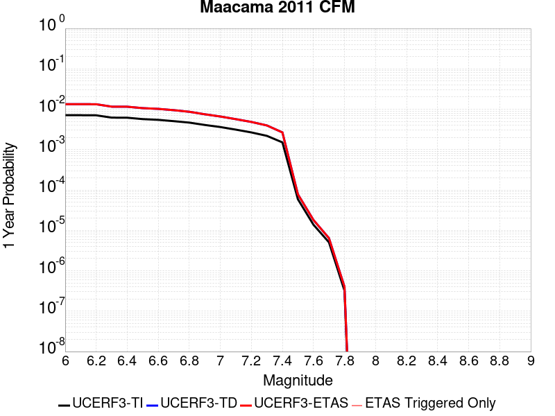 |  |

| Magnitude | 1 wk TI Prob | 1 wk TD Prob | 1 wk ETAS Prob | 1 wk ETAS/TD Gain | 1 wk ETAS Triggered Only | 1 mo TI Prob | 1 mo TD Prob | 1 mo ETAS Prob | 1 mo ETAS/TD Gain | 1 mo ETAS Triggered Only | 1 yr TI Prob | 1 yr TD Prob | 1 yr ETAS Prob | 1 yr ETAS/TD Gain | 1 yr ETAS Triggered Only | 10 yr TI Prob | 10 yr TD Prob | 10 yr ETAS Prob | 10 yr ETAS/TD Gain | 10 yr ETAS Triggered Only |
|-----|-----|-----|-----|-----|-----|-----|-----|-----|-----|-----|-----|-----|-----|-----|-----|-----|-----|-----|-----|-----|
| 6.0 | 1.368203E-4 | 2.5821978E-4 | 2.5821978E-4 | 1.0 | 0.0 | 5.862409E-4 | 0.0011061751 | 0.0011061751 | 1.0 | 0.0 | 0.0071141496 | 0.013360178 | 0.013360178 | 1.0 | 0.0 | 0.06890667 | 0.124274775 | 0.12428353 | 1.0000705 | 1.0E-5 |
| 6.1 | 1.368203E-4 | 2.5821978E-4 | 2.5821978E-4 | 1.0 | 0.0 | 5.862409E-4 | 0.0011061751 | 0.0011061751 | 1.0 | 0.0 | 0.0071141496 | 0.013360178 | 0.013360178 | 1.0 | 0.0 | 0.06890667 | 0.124274775 | 0.12428353 | 1.0000705 | 1.0E-5 |
| 6.2 | 1.360743E-4 | 2.569653E-4 | 2.569653E-4 | 1.0 | 0.0 | 5.8304524E-4 | 0.001100804 | 0.001100804 | 1.0 | 0.0 | 0.007075496 | 0.013295712 | 0.013295712 | 1.0 | 0.0 | 0.06854413 | 0.12370895 | 0.12371771 | 1.0000708 | 1.0E-5 |
| 6.3 | 1.1917239E-4 | 2.2381521E-4 | 2.2381521E-4 | 1.0 | 0.0 | 5.1063887E-4 | 9.5883745E-4 | 9.5883745E-4 | 1.0 | 0.0 | 0.0061993203 | 0.011596504 | 0.011596504 | 1.0 | 0.0 | 0.060292065 | 0.10892511 | 0.10893402 | 1.0000818 | 1.0E-5 |
| 6.4 | 1.1859289E-4 | 2.2285058E-4 | 2.2285058E-4 | 1.0 | 0.0 | 5.0815626E-4 | 9.547067E-4 | 9.547067E-4 | 1.0 | 0.0 | 0.006169266 | 0.011546799 | 0.011546799 | 1.0 | 0.0 | 0.06000784 | 0.108481795 | 0.108490705 | 1.0000821 | 1.0E-5 |
| 6.5 | 1.09512424E-4 | 2.0540757E-4 | 2.0540757E-4 | 1.0 | 0.0 | 4.6925453E-4 | 8.800018E-4 | 8.800018E-4 | 1.0 | 0.0 | 0.005698218 | 0.010647914 | 0.010647914 | 1.0 | 0.0 | 0.055543028 | 0.10057131 | 0.100580305 | 1.0000894 | 1.0E-5 |
| 6.6 | 1.0502928E-4 | 1.9697966E-4 | 1.9697966E-4 | 1.0 | 0.0 | 4.500478E-4 | 8.439078E-4 | 8.439078E-4 | 1.0 | 0.0 | 0.0054655746 | 0.010213858 | 0.010213858 | 1.0 | 0.0 | 0.053330887 | 0.09672256 | 0.09673159 | 1.0000933 | 1.0E-5 |
| 6.7 | 9.739358E-5 | 1.8277904E-4 | 1.8277904E-4 | 1.0 | 0.0 | 4.173343E-4 | 7.830906E-4 | 7.830906E-4 | 1.0 | 0.0 | 0.0050692135 | 0.009483728 | 0.009483728 | 1.0 | 0.0 | 0.049551267 | 0.090193085 | 0.090193085 | 1.0 | 0.0 |
| 6.8 | 8.969524E-5 | 1.6676696E-4 | 1.6676696E-4 | 1.0 | 0.0 | 3.8435153E-4 | 7.145057E-4 | 7.145057E-4 | 1.0 | 0.0 | 0.0046694432 | 0.008656753 | 0.008656753 | 1.0 | 0.0 | 0.045725387 | 0.08272071 | 0.08272071 | 1.0 | 0.0 |
| 6.9 | 7.838291E-5 | 1.4433586E-4 | 1.4433586E-4 | 1.0 | 0.0 | 3.358835E-4 | 6.1842095E-4 | 6.1842095E-4 | 1.0 | 0.0 | 0.0040817154 | 0.0074986615 | 0.0074986615 | 1.0 | 0.0 | 0.04007554 | 0.0721146 | 0.0721146 | 1.0 | 0.0 |
| 7.0 | 6.961957E-5 | 1.2720449E-4 | 1.2720449E-4 | 1.0 | 0.0 | 2.9833548E-4 | 5.45033E-4 | 5.45033E-4 | 1.0 | 0.0 | 0.0036261857 | 0.00661301 | 0.00661301 | 1.0 | 0.0 | 0.035675827 | 0.06392813 | 0.06392813 | 1.0 | 0.0 |
| 7.1 | 5.999398E-5 | 1.0915919E-4 | 1.0915919E-4 | 1.0 | 0.0 | 2.570917E-4 | 4.6772574E-4 | 4.6772574E-4 | 1.0 | 0.0 | 0.0031255994 | 0.0056784255 | 0.0056784255 | 1.0 | 0.0 | 0.030820016 | 0.055189762 | 0.055189762 | 1.0 | 0.0 |
| 7.2 | 5.116532E-5 | 9.314969E-5 | 9.314969E-5 | 1.0 | 0.0 | 2.1926152E-4 | 3.9913683E-4 | 3.9913683E-4 | 1.0 | 0.0 | 0.002666241 | 0.0048479997 | 0.0048479997 | 1.0 | 0.0 | 0.026344774 | 0.04734885 | 0.04734885 | 1.0 | 0.0 |
| 7.3 | 4.2087835E-5 | 7.62479E-5 | 7.62479E-5 | 1.0 | 0.0 | 1.8036396E-4 | 3.267206E-4 | 3.267206E-4 | 1.0 | 0.0 | 0.0021937196 | 0.0039701494 | 0.0039701494 | 1.0 | 0.0 | 0.0217219 | 0.03894215 | 0.03894215 | 1.0 | 0.0 |
| 7.4 | 2.8991652E-5 | 5.121617E-5 | 5.121617E-5 | 1.0 | 0.0 | 1.2424402E-4 | 2.194667E-4 | 2.194667E-4 | 1.0 | 0.0 | 0.0015116213 | 0.0026686103 | 0.0026686103 | 1.0 | 0.0 | 0.015013801 | 0.026356548 | 0.026356548 | 1.0 | 0.0 |
| 7.5 | 1.1292299E-6 | 1.4957741E-6 | 1.4957741E-6 | 1.0 | 0.0 | 4.8395473E-6 | 6.4104515E-6 | 6.4104515E-6 | 1.0 | 0.0 | 5.8919897E-5 | 7.804569E-5 | 7.804569E-5 | 1.0 | 0.0 | 5.890428E-4 | 7.808754E-4 | 7.808754E-4 | 1.0 | 0.0 |
| 7.6 | 2.6535366E-7 | 3.4745202E-7 | 3.4745202E-7 | 1.0 | 0.0 | 1.1372296E-6 | 1.4890793E-6 | 1.4890793E-6 | 1.0 | 0.0 | 1.3845682E-5 | 1.812939E-5 | 1.812939E-5 | 1.0 | 0.0 | 1.3844819E-4 | 1.8180255E-4 | 1.8180255E-4 | 1.0 | 0.0 |
| 7.7 | 9.727789E-8 | 1.231708E-7 | 1.231708E-7 | 1.0 | 0.0 | 4.1690518E-7 | 5.2787476E-7 | 5.2787476E-7 | 1.0 | 0.0 | 5.0758085E-6 | 6.4268565E-6 | 6.4268565E-6 | 1.0 | 0.0 | 5.0756928E-5 | 6.464869E-5 | 6.464869E-5 | 1.0 | 0.0 |
| 7.8 | 6.1939325E-9 | 7.723534E-9 | 7.723534E-9 | 1.0 | 0.0 | 2.6545425E-8 | 3.3100857E-8 | 3.3100857E-8 | 1.0 | 0.0 | 3.231905E-7 | 4.0300287E-7 | 4.0300287E-7 | 1.0 | 0.0 | 3.2319003E-6 | 4.066108E-6 | 4.066108E-6 | 1.0 | 0.0 |

## Swain Ravine - Spenceville
*[(top)](#table-of-contents)*

| 1 Week | 1 Month | 1 Year | 10 Year |
|-----|-----|-----|-----|
| 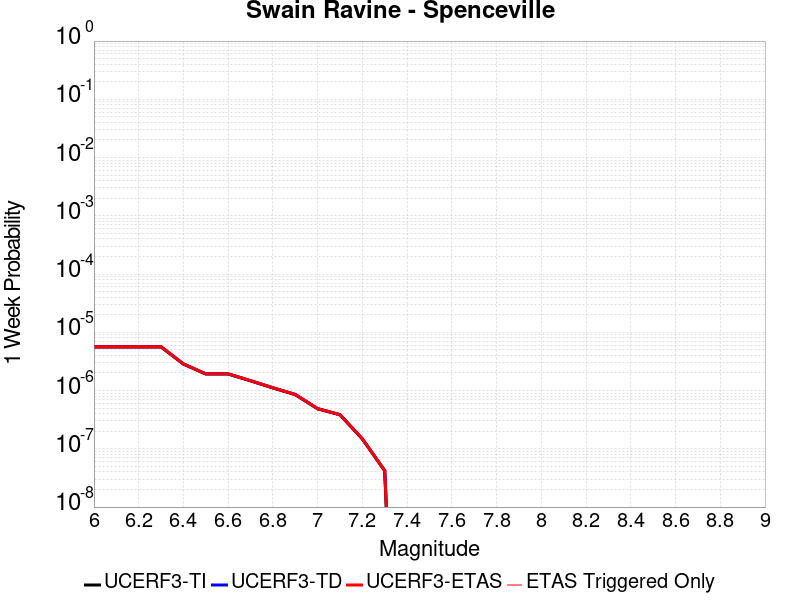 |  |  |  |

| Magnitude | 1 wk TI Prob | 1 wk TD Prob | 1 wk ETAS Prob | 1 wk ETAS/TD Gain | 1 wk ETAS Triggered Only | 1 mo TI Prob | 1 mo TD Prob | 1 mo ETAS Prob | 1 mo ETAS/TD Gain | 1 mo ETAS Triggered Only | 1 yr TI Prob | 1 yr TD Prob | 1 yr ETAS Prob | 1 yr ETAS/TD Gain | 1 yr ETAS Triggered Only | 10 yr TI Prob | 10 yr TD Prob | 10 yr ETAS Prob | 10 yr ETAS/TD Gain | 10 yr ETAS Triggered Only |
|-----|-----|-----|-----|-----|-----|-----|-----|-----|-----|-----|-----|-----|-----|-----|-----|-----|-----|-----|-----|-----|
| 6.0 | 5.596169E-6 | 5.663885E-6 | 5.663885E-6 | 1.0 | 0.0 | 2.398336E-5 | 2.4273582E-5 | 2.4273582E-5 | 1.0 | 0.0 | 2.9195828E-4 | 2.9549352E-4 | 2.9549352E-4 | 1.0 | 0.0 | 0.00291575 | 0.0029512753 | 0.0029612458 | 1.0033784 | 1.0E-5 |
| 6.1 | 5.596169E-6 | 5.663885E-6 | 5.663885E-6 | 1.0 | 0.0 | 2.398336E-5 | 2.4273582E-5 | 2.4273582E-5 | 1.0 | 0.0 | 2.9195828E-4 | 2.9549352E-4 | 2.9549352E-4 | 1.0 | 0.0 | 0.00291575 | 0.0029512753 | 0.0029612458 | 1.0033784 | 1.0E-5 |
| 6.2 | 5.596169E-6 | 5.663885E-6 | 5.663885E-6 | 1.0 | 0.0 | 2.398336E-5 | 2.4273582E-5 | 2.4273582E-5 | 1.0 | 0.0 | 2.9195828E-4 | 2.9549352E-4 | 2.9549352E-4 | 1.0 | 0.0 | 0.00291575 | 0.0029512753 | 0.0029612458 | 1.0033784 | 1.0E-5 |
| 6.3 | 5.596169E-6 | 5.663885E-6 | 5.663885E-6 | 1.0 | 0.0 | 2.398336E-5 | 2.4273582E-5 | 2.4273582E-5 | 1.0 | 0.0 | 2.9195828E-4 | 2.9549352E-4 | 2.9549352E-4 | 1.0 | 0.0 | 0.00291575 | 0.0029512753 | 0.0029612458 | 1.0033784 | 1.0E-5 |
| 6.4 | 2.8426775E-6 | 2.874186E-6 | 2.874186E-6 | 1.0 | 0.0 | 1.2182847E-5 | 1.2317884E-5 | 1.2317884E-5 | 1.0 | 0.0 | 1.4831607E-4 | 1.4996031E-4 | 1.4996031E-4 | 1.0 | 0.0 | 0.0014821711 | 0.0014986297 | 0.0015086146 | 1.0066627 | 1.0E-5 |
| 6.5 | 1.9210793E-6 | 1.941442E-6 | 1.941442E-6 | 1.0 | 0.0 | 8.233172E-6 | 8.3204395E-6 | 8.3204395E-6 | 1.0 | 0.0 | 1.0023425E-4 | 1.01296784E-4 | 1.01296784E-4 | 1.0 | 0.0 | 0.0010018905 | 0.0010125195 | 0.0010225094 | 1.0098664 | 1.0E-5 |
| 6.6 | 1.9210793E-6 | 1.941442E-6 | 1.941442E-6 | 1.0 | 0.0 | 8.233172E-6 | 8.3204395E-6 | 8.3204395E-6 | 1.0 | 0.0 | 1.0023425E-4 | 1.01296784E-4 | 1.01296784E-4 | 1.0 | 0.0 | 0.0010018905 | 0.0010125195 | 0.0010225094 | 1.0098664 | 1.0E-5 |
| 6.7 | 1.4667394E-6 | 1.4819136E-6 | 1.4819136E-6 | 1.0 | 0.0 | 6.286011E-6 | 6.3510433E-6 | 6.3510433E-6 | 1.0 | 0.0 | 7.65295E-5 | 7.732129E-5 | 7.732129E-5 | 1.0 | 0.0 | 7.6503144E-4 | 7.729516E-4 | 7.8294385E-4 | 1.0129274 | 1.0E-5 |
| 6.8 | 1.1076943E-6 | 1.1189685E-6 | 1.1189685E-6 | 1.0 | 0.0 | 4.747252E-6 | 4.795571E-6 | 4.795571E-6 | 1.0 | 0.0 | 5.7796264E-5 | 5.8384558E-5 | 5.8384558E-5 | 1.0 | 0.0 | 5.778124E-4 | 5.836966E-4 | 5.936908E-4 | 1.0171221 | 1.0E-5 |
| 6.9 | 8.514296E-7 | 8.60021E-7 | 8.60021E-7 | 1.0 | 0.0 | 3.648979E-6 | 3.6857991E-6 | 3.6857991E-6 | 1.0 | 0.0 | 4.442541E-5 | 4.487371E-5 | 4.487371E-5 | 1.0 | 0.0 | 4.441653E-4 | 4.4864934E-4 | 4.5864485E-4 | 1.0222791 | 1.0E-5 |
| 7.0 | 4.8544706E-7 | 4.9033656E-7 | 4.9033656E-7 | 1.0 | 0.0 | 2.0804857E-6 | 2.1014407E-6 | 2.1014407E-6 | 1.0 | 0.0 | 2.532962E-5 | 2.5584755E-5 | 2.5584755E-5 | 1.0 | 0.0 | 2.5326732E-4 | 2.5581938E-4 | 2.6581684E-4 | 1.03908 | 1.0E-5 |
| 7.1 | 3.829186E-7 | 3.86793E-7 | 3.86793E-7 | 1.0 | 0.0 | 1.6410787E-6 | 1.6576834E-6 | 1.6576834E-6 | 1.0 | 0.0 | 1.997995E-5 | 2.0182119E-5 | 2.0182119E-5 | 1.0 | 0.0 | 1.9978154E-4 | 2.0180392E-4 | 2.0180392E-4 | 1.0 | 0.0 |
| 7.2 | 1.4726595E-7 | 1.4879642E-7 | 1.4879642E-7 | 1.0 | 0.0 | 6.3113964E-7 | 6.3769886E-7 | 6.3769886E-7 | 1.0 | 0.0 | 7.684098E-6 | 7.763961E-6 | 7.763961E-6 | 1.0 | 0.0 | 7.6838325E-5 | 7.763743E-5 | 7.763743E-5 | 1.0 | 0.0 |
| 7.3 | 4.1880604E-8 | 4.23249E-8 | 4.23249E-8 | 1.0 | 0.0 | 1.7948828E-7 | 1.8139244E-7 | 1.8139244E-7 | 1.0 | 0.0 | 2.1852677E-6 | 2.2084528E-6 | 2.2084528E-6 | 1.0 | 0.0 | 2.1852462E-5 | 2.2084529E-5 | 2.2084529E-5 | 1.0 | 0.0 |

## Breckenridge 2011
*[(top)](#table-of-contents)*

| 1 Week | 1 Month | 1 Year | 10 Year |
|-----|-----|-----|-----|
| 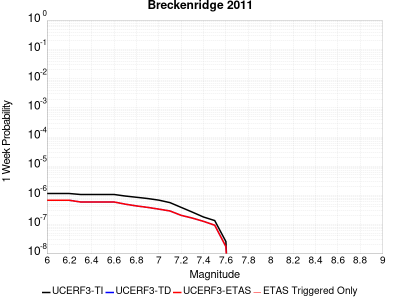 |  |  | 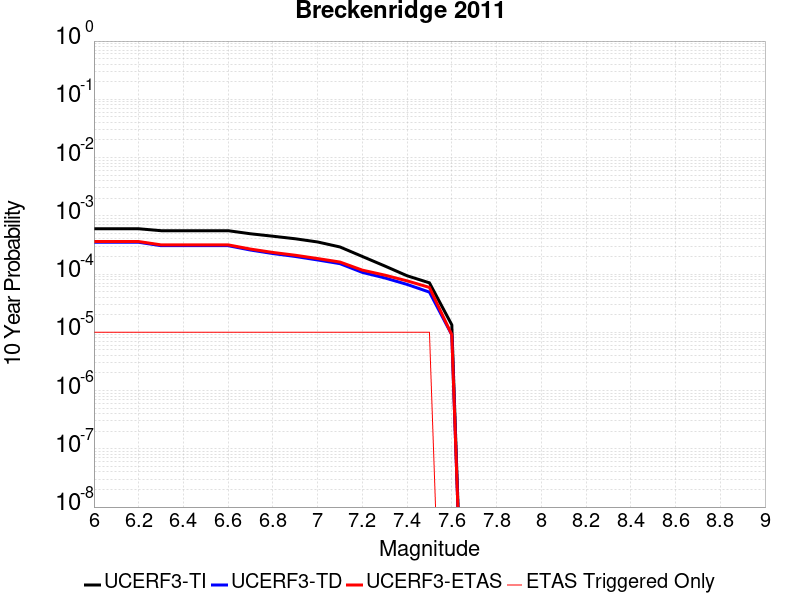 |

| Magnitude | 1 wk TI Prob | 1 wk TD Prob | 1 wk ETAS Prob | 1 wk ETAS/TD Gain | 1 wk ETAS Triggered Only | 1 mo TI Prob | 1 mo TD Prob | 1 mo ETAS Prob | 1 mo ETAS/TD Gain | 1 mo ETAS Triggered Only | 1 yr TI Prob | 1 yr TD Prob | 1 yr ETAS Prob | 1 yr ETAS/TD Gain | 1 yr ETAS Triggered Only | 10 yr TI Prob | 10 yr TD Prob | 10 yr ETAS Prob | 10 yr ETAS/TD Gain | 10 yr ETAS Triggered Only |
|-----|-----|-----|-----|-----|-----|-----|-----|-----|-----|-----|-----|-----|-----|-----|-----|-----|-----|-----|-----|-----|
| 6.0 | 1.1490393E-6 | 6.7384394E-7 | 6.7384394E-7 | 1.0 | 0.0 | 4.924445E-6 | 2.8878994E-6 | 2.8878994E-6 | 1.0 | 0.0 | 5.995347E-5 | 3.5159628E-5 | 3.5159628E-5 | 1.0 | 0.0 | 5.9937296E-4 | 3.5154272E-4 | 3.6153922E-4 | 1.0284361 | 1.0E-5 |
| 6.1 | 1.1490393E-6 | 6.7384394E-7 | 6.7384394E-7 | 1.0 | 0.0 | 4.924445E-6 | 2.8878994E-6 | 2.8878994E-6 | 1.0 | 0.0 | 5.995347E-5 | 3.5159628E-5 | 3.5159628E-5 | 1.0 | 0.0 | 5.9937296E-4 | 3.5154272E-4 | 3.6153922E-4 | 1.0284361 | 1.0E-5 |
| 6.2 | 1.1490393E-6 | 6.7384394E-7 | 6.7384394E-7 | 1.0 | 0.0 | 4.924445E-6 | 2.8878994E-6 | 2.8878994E-6 | 1.0 | 0.0 | 5.995347E-5 | 3.5159628E-5 | 3.5159628E-5 | 1.0 | 0.0 | 5.9937296E-4 | 3.5154272E-4 | 3.6153922E-4 | 1.0284361 | 1.0E-5 |
| 6.3 | 1.064617E-6 | 5.886827E-7 | 5.886827E-7 | 1.0 | 0.0 | 4.5626366E-6 | 2.5229235E-6 | 2.5229235E-6 | 1.0 | 0.0 | 5.5548684E-5 | 3.071617E-5 | 3.071617E-5 | 1.0 | 0.0 | 5.55348E-4 | 3.0712044E-4 | 3.1711737E-4 | 1.0325506 | 1.0E-5 |
| 6.4 | 1.064617E-6 | 5.886827E-7 | 5.886827E-7 | 1.0 | 0.0 | 4.5626366E-6 | 2.5229235E-6 | 2.5229235E-6 | 1.0 | 0.0 | 5.5548684E-5 | 3.071617E-5 | 3.071617E-5 | 1.0 | 0.0 | 5.55348E-4 | 3.0712044E-4 | 3.1711737E-4 | 1.0325506 | 1.0E-5 |
| 6.5 | 1.064617E-6 | 5.886827E-7 | 5.886827E-7 | 1.0 | 0.0 | 4.5626366E-6 | 2.5229235E-6 | 2.5229235E-6 | 1.0 | 0.0 | 5.5548684E-5 | 3.071617E-5 | 3.071617E-5 | 1.0 | 0.0 | 5.55348E-4 | 3.0712044E-4 | 3.1711737E-4 | 1.0325506 | 1.0E-5 |
| 6.6 | 1.064617E-6 | 5.886827E-7 | 5.886827E-7 | 1.0 | 0.0 | 4.5626366E-6 | 2.5229235E-6 | 2.5229235E-6 | 1.0 | 0.0 | 5.5548684E-5 | 3.071617E-5 | 3.071617E-5 | 1.0 | 0.0 | 5.55348E-4 | 3.0712044E-4 | 3.1711737E-4 | 1.0325506 | 1.0E-5 |
| 6.7 | 9.4219524E-7 | 4.954381E-7 | 4.954381E-7 | 1.0 | 0.0 | 4.037973E-6 | 2.1233043E-6 | 2.1233043E-6 | 1.0 | 0.0 | 4.916122E-5 | 2.585093E-5 | 2.585093E-5 | 1.0 | 0.0 | 4.9150345E-4 | 2.5847988E-4 | 2.6847728E-4 | 1.0386777 | 1.0E-5 |
| 6.8 | 8.556422E-7 | 4.3122535E-7 | 4.3122535E-7 | 1.0 | 0.0 | 3.667033E-6 | 1.8481073E-6 | 1.8481073E-6 | 1.0 | 0.0 | 4.464521E-5 | 2.2500479E-5 | 2.2500479E-5 | 1.0 | 0.0 | 4.4636242E-4 | 2.249824E-4 | 2.3498015E-4 | 1.0444379 | 1.0E-5 |
| 6.9 | 7.7357794E-7 | 3.8422834E-7 | 3.8422834E-7 | 1.0 | 0.0 | 3.3153299E-6 | 1.6466919E-6 | 1.6466919E-6 | 1.0 | 0.0 | 4.0363393E-5 | 2.0048292E-5 | 2.0048292E-5 | 1.0 | 0.0 | 4.035606E-4 | 2.0046515E-4 | 2.1046314E-4 | 1.049874 | 1.0E-5 |
| 7.0 | 6.8172454E-7 | 3.347358E-7 | 3.347358E-7 | 1.0 | 0.0 | 2.9216735E-6 | 1.4345812E-6 | 1.4345812E-6 | 1.0 | 0.0 | 3.5570793E-5 | 1.7465889E-5 | 1.7465889E-5 | 1.0 | 0.0 | 3.55651E-4 | 1.7464538E-4 | 1.8464364E-4 | 1.0572488 | 1.0E-5 |
| 7.1 | 5.5936397E-7 | 2.891135E-7 | 2.891135E-7 | 1.0 | 0.0 | 2.397272E-6 | 1.2390573E-6 | 1.2390573E-6 | 1.0 | 0.0 | 2.9186394E-5 | 1.5085419E-5 | 1.5085419E-5 | 1.0 | 0.0 | 2.9182562E-4 | 1.5084413E-4 | 1.6084262E-4 | 1.0662836 | 1.0E-5 |
| 7.2 | 3.8420822E-7 | 2.0469498E-7 | 2.0469498E-7 | 1.0 | 0.0 | 1.6466057E-6 | 8.772639E-7 | 8.772639E-7 | 1.0 | 0.0 | 2.004724E-5 | 1.06806365E-5 | 1.06806365E-5 | 1.0 | 0.0 | 2.004543E-4 | 1.0680132E-4 | 1.1680025E-4 | 1.0936219 | 1.0E-5 |
| 7.3 | 2.6405158E-7 | 1.6474046E-7 | 1.6474046E-7 | 1.0 | 0.0 | 1.1316491E-6 | 7.0603033E-7 | 7.0603033E-7 | 1.0 | 0.0 | 1.37777415E-5 | 8.595886E-6 | 8.595886E-6 | 1.0 | 0.0 | 1.3776887E-4 | 8.59556E-5 | 9.595475E-5 | 1.1163291 | 1.0E-5 |
| 7.4 | 1.792114E-7 | 1.2725884E-7 | 1.2725884E-7 | 1.0 | 0.0 | 7.6804866E-7 | 5.453949E-7 | 5.453949E-7 | 1.0 | 0.0 | 9.3509525E-6 | 6.6401635E-6 | 6.6401635E-6 | 1.0 | 0.0 | 9.350559E-5 | 6.63997E-5 | 7.639903E-5 | 1.150593 | 1.0E-5 |
| 7.5 | 1.3548703E-7 | 9.385842E-8 | 9.385842E-8 | 1.0 | 0.0 | 5.8065854E-7 | 4.022503E-7 | 4.022503E-7 | 1.0 | 0.0 | 7.0694946E-6 | 4.8973866E-6 | 4.8973866E-6 | 1.0 | 0.0 | 7.0692695E-5 | 4.8972823E-5 | 5.897233E-5 | 1.2041849 | 1.0E-5 |
| 7.6 | 2.572245E-8 | 1.7353377E-8 | 1.7353377E-8 | 1.0 | 0.0 | 1.10239064E-7 | 7.437161E-8 | 7.437161E-8 | 1.0 | 0.0 | 1.3421597E-6 | 9.0547405E-7 | 9.0547405E-7 | 1.0 | 0.0 | 1.3421517E-5 | 9.054709E-6 | 9.054709E-6 | 1.0 | 0.0 |

## Sisar
*[(top)](#table-of-contents)*

| 1 Week | 1 Month | 1 Year | 10 Year |
|-----|-----|-----|-----|
|  | 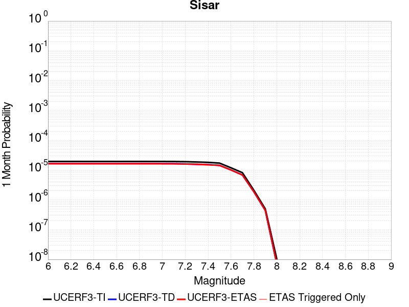 | 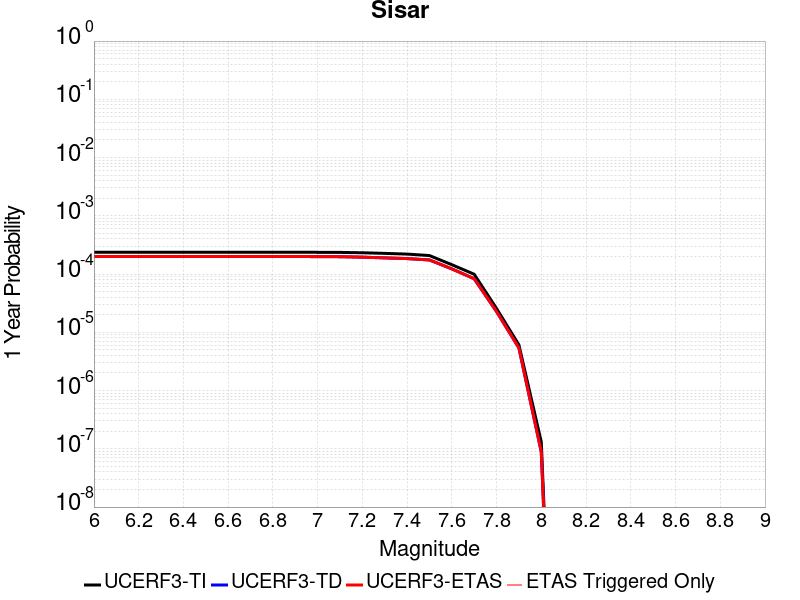 |  |

| Magnitude | 1 wk TI Prob | 1 wk TD Prob | 1 wk ETAS Prob | 1 wk ETAS/TD Gain | 1 wk ETAS Triggered Only | 1 mo TI Prob | 1 mo TD Prob | 1 mo ETAS Prob | 1 mo ETAS/TD Gain | 1 mo ETAS Triggered Only | 1 yr TI Prob | 1 yr TD Prob | 1 yr ETAS Prob | 1 yr ETAS/TD Gain | 1 yr ETAS Triggered Only | 10 yr TI Prob | 10 yr TD Prob | 10 yr ETAS Prob | 10 yr ETAS/TD Gain | 10 yr ETAS Triggered Only |
|-----|-----|-----|-----|-----|-----|-----|-----|-----|-----|-----|-----|-----|-----|-----|-----|-----|-----|-----|-----|-----|
| 6.0 | 4.544193E-6 | 3.840039E-6 | 3.840039E-6 | 1.0 | 0.0 | 1.9474966E-5 | 1.6457208E-5 | 1.6457208E-5 | 1.0 | 0.0 | 2.3708193E-4 | 2.0034841E-4 | 2.0034841E-4 | 1.0 | 0.0 | 0.0023682916 | 0.0020017116 | 0.0020116917 | 1.0049857 | 1.0E-5 |
| 6.1 | 4.544193E-6 | 3.840039E-6 | 3.840039E-6 | 1.0 | 0.0 | 1.9474966E-5 | 1.6457208E-5 | 1.6457208E-5 | 1.0 | 0.0 | 2.3708193E-4 | 2.0034841E-4 | 2.0034841E-4 | 1.0 | 0.0 | 0.0023682916 | 0.0020017116 | 0.0020116917 | 1.0049857 | 1.0E-5 |
| 6.2 | 4.544193E-6 | 3.840039E-6 | 3.840039E-6 | 1.0 | 0.0 | 1.9474966E-5 | 1.6457208E-5 | 1.6457208E-5 | 1.0 | 0.0 | 2.3708193E-4 | 2.0034841E-4 | 2.0034841E-4 | 1.0 | 0.0 | 0.0023682916 | 0.0020017116 | 0.0020116917 | 1.0049857 | 1.0E-5 |
| 6.3 | 4.544193E-6 | 3.840039E-6 | 3.840039E-6 | 1.0 | 0.0 | 1.9474966E-5 | 1.6457208E-5 | 1.6457208E-5 | 1.0 | 0.0 | 2.3708193E-4 | 2.0034841E-4 | 2.0034841E-4 | 1.0 | 0.0 | 0.0023682916 | 0.0020017116 | 0.0020116917 | 1.0049857 | 1.0E-5 |
| 6.4 | 4.544193E-6 | 3.840039E-6 | 3.840039E-6 | 1.0 | 0.0 | 1.9474966E-5 | 1.6457208E-5 | 1.6457208E-5 | 1.0 | 0.0 | 2.3708193E-4 | 2.0034841E-4 | 2.0034841E-4 | 1.0 | 0.0 | 0.0023682916 | 0.0020017116 | 0.0020116917 | 1.0049857 | 1.0E-5 |
| 6.5 | 4.544193E-6 | 3.840039E-6 | 3.840039E-6 | 1.0 | 0.0 | 1.9474966E-5 | 1.6457208E-5 | 1.6457208E-5 | 1.0 | 0.0 | 2.3708193E-4 | 2.0034841E-4 | 2.0034841E-4 | 1.0 | 0.0 | 0.0023682916 | 0.0020017116 | 0.0020116917 | 1.0049857 | 1.0E-5 |
| 6.6 | 4.544193E-6 | 3.840039E-6 | 3.840039E-6 | 1.0 | 0.0 | 1.9474966E-5 | 1.6457208E-5 | 1.6457208E-5 | 1.0 | 0.0 | 2.3708193E-4 | 2.0034841E-4 | 2.0034841E-4 | 1.0 | 0.0 | 0.0023682916 | 0.0020017116 | 0.0020116917 | 1.0049857 | 1.0E-5 |
| 6.7 | 4.544193E-6 | 3.840039E-6 | 3.840039E-6 | 1.0 | 0.0 | 1.9474966E-5 | 1.6457208E-5 | 1.6457208E-5 | 1.0 | 0.0 | 2.3708193E-4 | 2.0034841E-4 | 2.0034841E-4 | 1.0 | 0.0 | 0.0023682916 | 0.0020017116 | 0.0020116917 | 1.0049857 | 1.0E-5 |
| 6.8 | 4.544193E-6 | 3.840039E-6 | 3.840039E-6 | 1.0 | 0.0 | 1.9474966E-5 | 1.6457208E-5 | 1.6457208E-5 | 1.0 | 0.0 | 2.3708193E-4 | 2.0034841E-4 | 2.0034841E-4 | 1.0 | 0.0 | 0.0023682916 | 0.0020017116 | 0.0020116917 | 1.0049857 | 1.0E-5 |
| 6.9 | 4.542225E-6 | 3.838001E-6 | 3.838001E-6 | 1.0 | 0.0 | 1.9466532E-5 | 1.6448472E-5 | 1.6448472E-5 | 1.0 | 0.0 | 2.3697925E-4 | 2.0024208E-4 | 2.0024208E-4 | 1.0 | 0.0 | 0.002367267 | 0.0020006504 | 0.0020106302 | 1.0049884 | 1.0E-5 |
| 7.0 | 4.5278484E-6 | 3.823064E-6 | 3.823064E-6 | 1.0 | 0.0 | 1.940492E-5 | 1.638446E-5 | 1.638446E-5 | 1.0 | 0.0 | 2.3622929E-4 | 1.9946287E-4 | 1.9946287E-4 | 1.0 | 0.0 | 0.0023597833 | 0.0019928722 | 0.0020028523 | 1.0050079 | 1.0E-5 |
| 7.1 | 4.5132488E-6 | 3.8078506E-6 | 3.8078506E-6 | 1.0 | 0.0 | 1.9342351E-5 | 1.631926E-5 | 1.631926E-5 | 1.0 | 0.0 | 2.3546767E-4 | 1.9866921E-4 | 1.9866921E-4 | 1.0 | 0.0 | 0.0023521832 | 0.0019849497 | 0.00199493 | 1.0050279 | 1.0E-5 |
| 7.2 | 4.448859E-6 | 3.7403067E-6 | 3.7403067E-6 | 1.0 | 0.0 | 1.9066398E-5 | 1.602979E-5 | 1.602979E-5 | 1.0 | 0.0 | 2.3210866E-4 | 1.9514553E-4 | 1.9514553E-4 | 1.0 | 0.0 | 0.0023186638 | 0.0019497754 | 0.0019597558 | 1.0051188 | 1.0E-5 |
| 7.3 | 4.3424366E-6 | 3.6341328E-6 | 3.6341328E-6 | 1.0 | 0.0 | 1.861031E-5 | 1.5574764E-5 | 1.5574764E-5 | 1.0 | 0.0 | 2.2655698E-4 | 1.8960658E-4 | 1.8960658E-4 | 1.0 | 0.0 | 0.0022632615 | 0.0018944816 | 0.0019044626 | 1.0052685 | 1.0E-5 |
| 7.4 | 4.218641E-6 | 3.5334717E-6 | 3.5334717E-6 | 1.0 | 0.0 | 1.8079765E-5 | 1.5143364E-5 | 1.5143364E-5 | 1.0 | 0.0 | 2.2009891E-4 | 1.843552E-4 | 1.843552E-4 | 1.0 | 0.0 | 0.0021988105 | 0.0018420559 | 0.0018520375 | 1.0054187 | 1.0E-5 |
| 7.5 | 3.983779E-6 | 3.348217E-6 | 3.348217E-6 | 1.0 | 0.0 | 1.7073227E-5 | 1.43494235E-5 | 1.43494235E-5 | 1.0 | 0.0 | 2.0784672E-4 | 1.7469056E-4 | 1.7469056E-4 | 1.0 | 0.0 | 0.0020765243 | 0.0017455654 | 0.001755548 | 1.0057188 | 1.0E-5 |
| 7.6 | 2.777393E-6 | 2.352505E-6 | 2.352505E-6 | 1.0 | 0.0 | 1.1903058E-5 | 1.0082125E-5 | 1.0082125E-5 | 1.0 | 0.0 | 1.449101E-4 | 1.2274303E-4 | 1.2274303E-4 | 1.0 | 0.0 | 0.0014481564 | 0.0012267602 | 0.001236748 | 1.0081415 | 1.0E-5 |
| 7.7 | 1.9028433E-6 | 1.5940292E-6 | 1.5940292E-6 | 1.0 | 0.0 | 8.155017E-6 | 6.831536E-6 | 6.831536E-6 | 1.0 | 0.0 | 9.928281E-5 | 8.3170824E-5 | 8.3170824E-5 | 1.0 | 0.0 | 9.923846E-4 | 8.3140173E-4 | 8.413934E-4 | 1.0120178 | 1.0E-5 |
| 7.8 | 4.9095956E-7 | 4.3586894E-7 | 4.3586894E-7 | 1.0 | 0.0 | 2.1041105E-6 | 1.8680084E-6 | 1.8680084E-6 | 1.0 | 0.0 | 2.5617246E-5 | 2.2742768E-5 | 2.2742768E-5 | 1.0 | 0.0 | 2.5614293E-4 | 2.2740457E-4 | 2.2740457E-4 | 1.0 | 0.0 |
| 7.9 | 1.16657894E-7 | 1.0336593E-7 | 1.0336593E-7 | 1.0 | 0.0 | 4.999623E-7 | 4.4299676E-7 | 4.4299676E-7 | 1.0 | 0.0 | 6.087024E-6 | 5.3934727E-6 | 5.3934727E-6 | 1.0 | 0.0 | 6.0868573E-5 | 5.3933447E-5 | 5.3933447E-5 | 1.0 | 0.0 |
| 8.0 | 2.5100346E-9 | 1.7072703E-9 | 1.7072703E-9 | 1.0 | 0.0 | 1.0757291E-8 | 7.3168733E-9 | 7.3168733E-9 | 1.0 | 0.0 | 1.3097001E-7 | 8.9082924E-8 | 8.9082924E-8 | 1.0 | 0.0 | 1.3096993E-6 | 8.9082897E-7 | 8.9082897E-7 | 1.0 | 0.0 |

## White Wolf
*[(top)](#table-of-contents)*

| 1 Week | 1 Month | 1 Year | 10 Year |
|-----|-----|-----|-----|
|  |  |  |  |

| Magnitude | 1 wk TI Prob | 1 wk TD Prob | 1 wk ETAS Prob | 1 wk ETAS/TD Gain | 1 wk ETAS Triggered Only | 1 mo TI Prob | 1 mo TD Prob | 1 mo ETAS Prob | 1 mo ETAS/TD Gain | 1 mo ETAS Triggered Only | 1 yr TI Prob | 1 yr TD Prob | 1 yr ETAS Prob | 1 yr ETAS/TD Gain | 1 yr ETAS Triggered Only | 10 yr TI Prob | 10 yr TD Prob | 10 yr ETAS Prob | 10 yr ETAS/TD Gain | 10 yr ETAS Triggered Only |
|-----|-----|-----|-----|-----|-----|-----|-----|-----|-----|-----|-----|-----|-----|-----|-----|-----|-----|-----|-----|-----|
| 6.0 | 2.0037822E-5 | 1.047058E-6 | 1.047058E-6 | 1.0 | 0.0 | 8.587355E-5 | 4.487384E-6 | 4.487384E-6 | 1.0 | 0.0 | 0.001045009 | 5.4632583E-5 | 5.4632583E-5 | 1.0 | 0.0 | 0.010401085 | 5.461966E-4 | 5.5619114E-4 | 1.0182984 | 1.0E-5 |
| 6.1 | 2.0037822E-5 | 1.047058E-6 | 1.047058E-6 | 1.0 | 0.0 | 8.587355E-5 | 4.487384E-6 | 4.487384E-6 | 1.0 | 0.0 | 0.001045009 | 5.4632583E-5 | 5.4632583E-5 | 1.0 | 0.0 | 0.010401085 | 5.461966E-4 | 5.5619114E-4 | 1.0182984 | 1.0E-5 |
| 6.2 | 2.0037822E-5 | 1.047058E-6 | 1.047058E-6 | 1.0 | 0.0 | 8.587355E-5 | 4.487384E-6 | 4.487384E-6 | 1.0 | 0.0 | 0.001045009 | 5.4632583E-5 | 5.4632583E-5 | 1.0 | 0.0 | 0.010401085 | 5.461966E-4 | 5.5619114E-4 | 1.0182984 | 1.0E-5 |
| 6.3 | 2.0037822E-5 | 1.047058E-6 | 1.047058E-6 | 1.0 | 0.0 | 8.587355E-5 | 4.487384E-6 | 4.487384E-6 | 1.0 | 0.0 | 0.001045009 | 5.4632583E-5 | 5.4632583E-5 | 1.0 | 0.0 | 0.010401085 | 5.461966E-4 | 5.5619114E-4 | 1.0182984 | 1.0E-5 |
| 6.4 | 1.132487E-5 | 1.047058E-6 | 1.047058E-6 | 1.0 | 0.0 | 4.8534253E-5 | 4.487384E-6 | 4.487384E-6 | 1.0 | 0.0 | 5.907443E-4 | 5.4632583E-5 | 5.4632583E-5 | 1.0 | 0.0 | 0.005891764 | 5.461966E-4 | 5.5619114E-4 | 1.0182984 | 1.0E-5 |
| 6.5 | 1.132487E-5 | 1.047058E-6 | 1.047058E-6 | 1.0 | 0.0 | 4.8534253E-5 | 4.487384E-6 | 4.487384E-6 | 1.0 | 0.0 | 5.907443E-4 | 5.4632583E-5 | 5.4632583E-5 | 1.0 | 0.0 | 0.005891764 | 5.461966E-4 | 5.5619114E-4 | 1.0182984 | 1.0E-5 |
| 6.6 | 9.347473E-6 | 1.047058E-6 | 1.047058E-6 | 1.0 | 0.0 | 4.0059982E-5 | 4.487384E-6 | 4.487384E-6 | 1.0 | 0.0 | 4.8762115E-4 | 5.4632583E-5 | 5.4632583E-5 | 1.0 | 0.0 | 0.0048655253 | 5.461966E-4 | 5.5619114E-4 | 1.0182984 | 1.0E-5 |
| 6.7 | 7.842647E-6 | 1.0049686E-6 | 1.0049686E-6 | 1.0 | 0.0 | 3.361091E-5 | 4.3070013E-6 | 4.3070013E-6 | 1.0 | 0.0 | 4.0913603E-4 | 5.2436528E-5 | 5.2436528E-5 | 1.0 | 0.0 | 0.004083836 | 5.2424654E-4 | 5.3424126E-4 | 1.019065 | 1.0E-5 |
| 6.8 | 6.26597E-6 | 9.736085E-7 | 9.736085E-7 | 1.0 | 0.0 | 2.685388E-5 | 4.172601E-6 | 4.172601E-6 | 1.0 | 0.0 | 3.2689696E-4 | 5.080029E-5 | 5.080029E-5 | 1.0 | 0.0 | 0.003264165 | 5.0789164E-4 | 5.178866E-4 | 1.0196792 | 1.0E-5 |
| 6.9 | 5.258436E-6 | 9.1844277E-7 | 9.1844277E-7 | 1.0 | 0.0 | 2.2535958E-5 | 3.9361776E-6 | 3.9361776E-6 | 1.0 | 0.0 | 2.7434074E-4 | 4.7921956E-5 | 4.7921956E-5 | 1.0 | 0.0 | 0.0027400232 | 4.7912102E-4 | 4.8911624E-4 | 1.0208615 | 1.0E-5 |
| 7.0 | 4.675028E-6 | 8.6622856E-7 | 8.6622856E-7 | 1.0 | 0.0 | 2.003568E-5 | 3.7124032E-6 | 3.7124032E-6 | 1.0 | 0.0 | 2.4390711E-4 | 4.519762E-5 | 4.519762E-5 | 1.0 | 0.0 | 0.0024363957 | 4.5188898E-4 | 4.6188445E-4 | 1.0221193 | 1.0E-5 |
| 7.1 | 2.8270078E-6 | 6.875069E-7 | 6.875069E-7 | 1.0 | 0.0 | 1.2115692E-5 | 2.946455E-6 | 2.946455E-6 | 1.0 | 0.0 | 1.4749856E-4 | 3.587254E-5 | 3.587254E-5 | 1.0 | 0.0 | 0.001474007 | 3.586716E-4 | 3.68668E-4 | 1.0278707 | 1.0E-5 |
| 7.2 | 1.6881406E-6 | 2.27111E-7 | 2.27111E-7 | 1.0 | 0.0 | 7.2348685E-6 | 9.733325E-7 | 9.733325E-7 | 1.0 | 0.0 | 8.808096E-5 | 1.185026E-5 | 1.185026E-5 | 1.0 | 0.0 | 8.8046055E-4 | 1.1849644E-4 | 1.2849526E-4 | 1.0843807 | 1.0E-5 |
| 7.3 | 9.086107E-7 | 1.5269218E-7 | 1.5269218E-7 | 1.0 | 0.0 | 3.8940398E-6 | 6.5439485E-7 | 6.5439485E-7 | 1.0 | 0.0 | 4.7408903E-5 | 7.967229E-6 | 7.967229E-6 | 1.0 | 0.0 | 4.739879E-4 | 7.966952E-5 | 8.966872E-5 | 1.1255085 | 1.0E-5 |
| 7.4 | 1.9717383E-7 | 9.004596E-8 | 9.004596E-8 | 1.0 | 0.0 | 8.450304E-7 | 3.859112E-7 | 3.859112E-7 | 1.0 | 0.0 | 1.0288197E-5 | 4.6984587E-6 | 4.6984587E-6 | 1.0 | 0.0 | 1.028772E-4 | 4.6983627E-5 | 4.6983627E-5 | 1.0 | 0.0 |
| 7.5 | 1.086975E-7 | 6.6600954E-8 | 6.6600954E-8 | 1.0 | 0.0 | 4.6584634E-7 | 2.854326E-7 | 2.854326E-7 | 1.0 | 0.0 | 5.6716644E-6 | 3.4751367E-6 | 3.4751367E-6 | 1.0 | 0.0 | 5.6715195E-5 | 3.4750847E-5 | 3.4750847E-5 | 1.0 | 0.0 |
| 7.6 | 2.4217808E-8 | 1.582155E-8 | 1.582155E-8 | 1.0 | 0.0 | 1.03790605E-7 | 6.780664E-8 | 6.780664E-8 | 1.0 | 0.0 | 1.2636499E-6 | 8.255456E-7 | 8.255456E-7 | 1.0 | 0.0 | 1.2636427E-5 | 8.255431E-6 | 8.255431E-6 | 1.0 | 0.0 |

## Point Reyes 2011 CFM
*[(top)](#table-of-contents)*

| 1 Week | 1 Month | 1 Year | 10 Year |
|-----|-----|-----|-----|
|  |  |  |  |

| Magnitude | 1 wk TI Prob | 1 wk TD Prob | 1 wk ETAS Prob | 1 wk ETAS/TD Gain | 1 wk ETAS Triggered Only | 1 mo TI Prob | 1 mo TD Prob | 1 mo ETAS Prob | 1 mo ETAS/TD Gain | 1 mo ETAS Triggered Only | 1 yr TI Prob | 1 yr TD Prob | 1 yr ETAS Prob | 1 yr ETAS/TD Gain | 1 yr ETAS Triggered Only | 10 yr TI Prob | 10 yr TD Prob | 10 yr ETAS Prob | 10 yr ETAS/TD Gain | 10 yr ETAS Triggered Only |
|-----|-----|-----|-----|-----|-----|-----|-----|-----|-----|-----|-----|-----|-----|-----|-----|-----|-----|-----|-----|-----|
| 6.0 | 8.8644965E-6 | 8.967546E-6 | 8.967546E-6 | 1.0 | 0.0 | 3.7990147E-5 | 3.843181E-5 | 4.8431426E-5 | 1.2601911 | 1.0E-5 | 4.624319E-4 | 4.678131E-4 | 4.778084E-4 | 1.021366 | 1.0E-5 | 0.0046147075 | 0.0046689115 | 0.004678865 | 1.0021318 | 1.0E-5 |
| 6.1 | 4.526405E-6 | 4.5394795E-6 | 4.5394795E-6 | 1.0 | 0.0 | 1.9398734E-5 | 1.9454772E-5 | 1.9454772E-5 | 1.0 | 0.0 | 2.36154E-4 | 2.3683715E-4 | 2.3683715E-4 | 1.0 | 0.0 | 0.002359032 | 0.0023659538 | 0.0023659538 | 1.0 | 0.0 |
| 6.2 | 4.526405E-6 | 4.5394795E-6 | 4.5394795E-6 | 1.0 | 0.0 | 1.9398734E-5 | 1.9454772E-5 | 1.9454772E-5 | 1.0 | 0.0 | 2.36154E-4 | 2.3683715E-4 | 2.3683715E-4 | 1.0 | 0.0 | 0.002359032 | 0.0023659538 | 0.0023659538 | 1.0 | 0.0 |
| 6.3 | 2.6842322E-6 | 2.6608877E-6 | 2.6608877E-6 | 1.0 | 0.0 | 1.1503801E-5 | 1.1403756E-5 | 1.1403756E-5 | 1.0 | 0.0 | 1.4004979E-4 | 1.3883208E-4 | 1.3883208E-4 | 1.0 | 0.0 | 0.0013996155 | 0.0013874753 | 0.0013874753 | 1.0 | 0.0 |
| 6.4 | 2.6842322E-6 | 2.6608877E-6 | 2.6608877E-6 | 1.0 | 0.0 | 1.1503801E-5 | 1.1403756E-5 | 1.1403756E-5 | 1.0 | 0.0 | 1.4004979E-4 | 1.3883208E-4 | 1.3883208E-4 | 1.0 | 0.0 | 0.0013996155 | 0.0013874753 | 0.0013874753 | 1.0 | 0.0 |
| 6.5 | 1.9281833E-6 | 1.8908191E-6 | 1.8908191E-6 | 1.0 | 0.0 | 8.263617E-6 | 8.103486E-6 | 8.103486E-6 | 1.0 | 0.0 | 1.0060489E-4 | 9.865555E-5 | 9.865555E-5 | 1.0 | 0.0 | 0.0010055936 | 9.861285E-4 | 9.861285E-4 | 1.0 | 0.0 |
| 6.6 | 1.4726726E-6 | 1.4271395E-6 | 1.4271395E-6 | 1.0 | 0.0 | 6.3114385E-6 | 6.116298E-6 | 6.116298E-6 | 1.0 | 0.0 | 7.683905E-5 | 7.446343E-5 | 7.446343E-5 | 1.0 | 0.0 | 7.6812494E-4 | 7.44392E-4 | 7.44392E-4 | 1.0 | 0.0 |
| 6.7 | 8.572307E-7 | 8.008884E-7 | 8.008884E-7 | 1.0 | 0.0 | 3.6738406E-6 | 3.4323746E-6 | 3.4323746E-6 | 1.0 | 0.0 | 4.472809E-5 | 4.1788375E-5 | 4.1788375E-5 | 1.0 | 0.0 | 4.471909E-4 | 4.178091E-4 | 4.178091E-4 | 1.0 | 0.0 |
| 6.8 | 6.6745434E-7 | 6.0789284E-7 | 6.0789284E-7 | 1.0 | 0.0 | 2.8605155E-6 | 2.6052526E-6 | 2.6052526E-6 | 1.0 | 0.0 | 3.482622E-5 | 3.17185E-5 | 3.17185E-5 | 1.0 | 0.0 | 3.4820763E-4 | 3.17143E-4 | 3.17143E-4 | 1.0 | 0.0 |
| 6.9 | 4.291521E-7 | 3.6551677E-7 | 3.6551677E-7 | 1.0 | 0.0 | 1.839222E-6 | 1.5664996E-6 | 1.5664996E-6 | 1.0 | 0.0 | 2.2392298E-5 | 1.907197E-5 | 1.907197E-5 | 1.0 | 0.0 | 2.2390042E-4 | 1.9070598E-4 | 1.9070598E-4 | 1.0 | 0.0 |
| 7.0 | 2.6812808E-7 | 2.0202775E-7 | 2.0202775E-7 | 1.0 | 0.0 | 1.1491198E-6 | 8.6583293E-7 | 8.6583293E-7 | 1.0 | 0.0 | 1.3990444E-5 | 1.0541466E-5 | 1.0541466E-5 | 1.0 | 0.0 | 1.3989564E-4 | 1.0541201E-4 | 1.0541201E-4 | 1.0 | 0.0 |
| 7.1 | 1.9451231E-7 | 1.2740678E-7 | 1.2740678E-7 | 1.0 | 0.0 | 8.336239E-7 | 5.4602896E-7 | 5.4602896E-7 | 1.0 | 0.0 | 1.0149324E-5 | 6.647882E-6 | 6.647882E-6 | 1.0 | 0.0 | 1.014886E-4 | 6.6479115E-5 | 6.6479115E-5 | 1.0 | 0.0 |
| 7.2 | 1.6715143E-7 | 1.0057795E-7 | 1.0057795E-7 | 1.0 | 0.0 | 7.1636305E-7 | 4.310483E-7 | 4.310483E-7 | 1.0 | 0.0 | 8.721685E-6 | 5.248E-6 | 5.248E-6 | 1.0 | 0.0 | 8.721343E-5 | 5.2481042E-5 | 5.2481042E-5 | 1.0 | 0.0 |
| 7.3 | 1.5503173E-7 | 9.0278355E-8 | 9.0278355E-8 | 1.0 | 0.0 | 6.644215E-7 | 3.869072E-7 | 3.869072E-7 | 1.0 | 0.0 | 8.089301E-6 | 4.7105846E-6 | 4.7105846E-6 | 1.0 | 0.0 | 8.089007E-5 | 4.710713E-5 | 4.710713E-5 | 1.0 | 0.0 |
| 7.4 | 1.4251614E-7 | 8.111958E-8 | 8.111958E-8 | 1.0 | 0.0 | 6.1078333E-7 | 3.4765532E-7 | 3.4765532E-7 | 1.0 | 0.0 | 7.4362615E-6 | 4.232695E-6 | 4.232695E-6 | 1.0 | 0.0 | 7.436013E-5 | 4.2328422E-5 | 4.2328422E-5 | 1.0 | 0.0 |
| 7.5 | 1.2710186E-7 | 7.0434105E-8 | 7.0434105E-8 | 1.0 | 0.0 | 5.447221E-7 | 3.0186044E-7 | 3.0186044E-7 | 1.0 | 0.0 | 6.6319717E-6 | 3.6751444E-6 | 3.6751444E-6 | 1.0 | 0.0 | 6.6317734E-5 | 3.6753114E-5 | 3.6753114E-5 | 1.0 | 0.0 |
| 7.6 | 1.0144708E-7 | 5.5078203E-8 | 5.5078203E-8 | 1.0 | 0.0 | 4.347731E-7 | 2.3604943E-7 | 2.3604943E-7 | 1.0 | 0.0 | 5.2933497E-6 | 2.873898E-6 | 2.873898E-6 | 1.0 | 0.0 | 5.293224E-5 | 2.8740886E-5 | 2.8740886E-5 | 1.0 | 0.0 |
| 7.7 | 7.090527E-8 | 3.9928437E-8 | 3.9928437E-8 | 1.0 | 0.0 | 3.038797E-7 | 1.7112185E-7 | 1.7112185E-7 | 1.0 | 0.0 | 3.699729E-6 | 2.0834066E-6 | 2.0834066E-6 | 1.0 | 0.0 | 3.6996673E-5 | 2.0836149E-5 | 2.0836149E-5 | 1.0 | 0.0 |
| 7.8 | 3.8712045E-8 | 2.7529941E-8 | 2.7529941E-8 | 1.0 | 0.0 | 1.6590876E-7 | 1.17985465E-7 | 1.17985465E-7 | 1.0 | 0.0 | 2.0199373E-6 | 1.4364721E-6 | 1.4364721E-6 | 1.0 | 0.0 | 2.0199188E-5 | 1.4366906E-5 | 1.4366906E-5 | 1.0 | 0.0 |
| 7.9 | 1.7068782E-8 | 1.1907058E-8 | 1.1907058E-8 | 1.0 | 0.0 | 7.315192E-8 | 5.1030252E-8 | 5.1030252E-8 | 1.0 | 0.0 | 8.906242E-7 | 6.2129317E-7 | 6.2129317E-7 | 1.0 | 0.0 | 8.906207E-6 | 6.215192E-6 | 6.215192E-6 | 1.0 | 0.0 |
| 8.0 | 1.0172592E-8 | 7.090016E-9 | 7.090016E-9 | 1.0 | 0.0 | 4.359682E-8 | 3.038579E-8 | 3.038579E-8 | 1.0 | 0.0 | 5.3079117E-7 | 3.6994695E-7 | 3.6994695E-7 | 1.0 | 0.0 | 5.307899E-6 | 3.7017412E-6 | 3.7017412E-6 | 1.0 | 0.0 |
| 8.1 | 3.7861243E-9 | 3.5751233E-9 | 3.5751233E-9 | 1.0 | 0.0 | 1.6226247E-8 | 1.532196E-8 | 1.532196E-8 | 1.0 | 0.0 | 1.9755454E-7 | 1.8654485E-7 | 1.8654485E-7 | 1.0 | 0.0 | 1.9755437E-6 | 1.8674533E-6 | 1.8674533E-6 | 1.0 | 0.0 |

## Quien Sabe 2011 CFM
*[(top)](#table-of-contents)*

| 1 Week | 1 Month | 1 Year | 10 Year |
|-----|-----|-----|-----|
|  |  |  |  |

| Magnitude | 1 wk TI Prob | 1 wk TD Prob | 1 wk ETAS Prob | 1 wk ETAS/TD Gain | 1 wk ETAS Triggered Only | 1 mo TI Prob | 1 mo TD Prob | 1 mo ETAS Prob | 1 mo ETAS/TD Gain | 1 mo ETAS Triggered Only | 1 yr TI Prob | 1 yr TD Prob | 1 yr ETAS Prob | 1 yr ETAS/TD Gain | 1 yr ETAS Triggered Only | 10 yr TI Prob | 10 yr TD Prob | 10 yr ETAS Prob | 10 yr ETAS/TD Gain | 10 yr ETAS Triggered Only |
|-----|-----|-----|-----|-----|-----|-----|-----|-----|-----|-----|-----|-----|-----|-----|-----|-----|-----|-----|-----|-----|
| 6.0 | 3.729899E-5 | 7.0994334E-5 | 7.0994334E-5 | 1.0 | 0.0 | 1.5984301E-4 | 3.0423512E-4 | 3.0423512E-4 | 1.0 | 0.0 | 0.0019443515 | 0.0036865699 | 0.0036865699 | 1.0 | 0.0 | 0.019274272 | 0.0353649 | 0.035374545 | 1.0002728 | 1.0E-5 |
| 6.1 | 1.7825725E-5 | 3.319839E-5 | 3.319839E-5 | 1.0 | 0.0 | 7.639373E-5 | 1.4227358E-4 | 1.4227358E-4 | 1.0 | 0.0 | 9.296967E-4 | 0.0017274261 | 0.0017274261 | 1.0 | 0.0 | 0.009258169 | 0.01670641 | 0.016716244 | 1.0005885 | 1.0E-5 |
| 6.2 | 4.8865336E-6 | 7.812467E-6 | 7.812467E-6 | 1.0 | 0.0 | 2.0942118E-5 | 3.348162E-5 | 3.348162E-5 | 1.0 | 0.0 | 2.5494045E-4 | 4.0715327E-4 | 4.0715327E-4 | 1.0 | 0.0 | 0.0025464818 | 0.0040157936 | 0.0040157936 | 1.0 | 0.0 |
| 6.3 | 3.858491E-6 | 5.79343E-6 | 5.79343E-6 | 1.0 | 0.0 | 1.6536285E-5 | 2.4828774E-5 | 2.4828774E-5 | 1.0 | 0.0 | 2.0131067E-4 | 3.022531E-4 | 3.022531E-4 | 1.0 | 0.0 | 0.002011284 | 0.0030038692 | 0.0030038692 | 1.0 | 0.0 |
| 6.4 | 3.0771805E-6 | 4.388484E-6 | 4.388484E-6 | 1.0 | 0.0 | 1.318785E-5 | 1.8807666E-5 | 1.8807666E-5 | 1.0 | 0.0 | 1.6055023E-4 | 2.289617E-4 | 2.289617E-4 | 1.0 | 0.0 | 0.001604343 | 0.0022882835 | 0.0022882835 | 1.0 | 0.0 |
| 6.5 | 2.5081235E-6 | 3.4668653E-6 | 3.4668653E-6 | 1.0 | 0.0 | 1.0749056E-5 | 1.4857917E-5 | 1.4857917E-5 | 1.0 | 0.0 | 1.308619E-4 | 1.808816E-4 | 1.808816E-4 | 1.0 | 0.0 | 0.0013078486 | 0.0018139676 | 0.0018139676 | 1.0 | 0.0 |
| 6.6 | 1.7505364E-6 | 2.4048998E-6 | 2.4048998E-6 | 1.0 | 0.0 | 7.502277E-6 | 1.0306677E-5 | 1.0306677E-5 | 1.0 | 0.0 | 9.13364E-5 | 1.2547728E-4 | 1.2547728E-4 | 1.0 | 0.0 | 9.129886E-4 | 0.0012595841 | 0.0012595841 | 1.0 | 0.0 |
| 6.7 | 1.505737E-6 | 2.0661041E-6 | 2.0661041E-6 | 1.0 | 0.0 | 6.4531428E-6 | 8.854705E-6 | 8.854705E-6 | 1.0 | 0.0 | 7.8564175E-5 | 1.07801294E-4 | 1.07801294E-4 | 1.0 | 0.0 | 7.853641E-4 | 0.0010830046 | 0.0010830046 | 1.0 | 0.0 |
| 6.8 | 1.2924105E-6 | 1.750539E-6 | 1.750539E-6 | 1.0 | 0.0 | 5.5388905E-6 | 7.5022917E-6 | 7.5022917E-6 | 1.0 | 0.0 | 6.74339E-5 | 9.133712E-5 | 9.133712E-5 | 1.0 | 0.0 | 6.741344E-4 | 9.171743E-4 | 9.171743E-4 | 1.0 | 0.0 |
| 6.9 | 8.9075286E-7 | 1.1264539E-6 | 1.1264539E-6 | 1.0 | 0.0 | 3.8175067E-6 | 4.827652E-6 | 4.827652E-6 | 1.0 | 0.0 | 4.6477155E-5 | 5.87753E-5 | 5.87753E-5 | 1.0 | 0.0 | 4.6467435E-4 | 5.9113425E-4 | 5.9113425E-4 | 1.0 | 0.0 |
| 7.0 | 6.6891175E-7 | 8.529351E-7 | 8.529351E-7 | 1.0 | 0.0 | 2.8667614E-6 | 3.6554322E-6 | 3.6554322E-6 | 1.0 | 0.0 | 3.4902263E-5 | 4.4504177E-5 | 4.4504177E-5 | 1.0 | 0.0 | 3.4896782E-4 | 4.4743155E-4 | 4.4743155E-4 | 1.0 | 0.0 |
| 7.1 | 4.4205015E-7 | 5.3951663E-7 | 5.3951663E-7 | 1.0 | 0.0 | 1.8944993E-6 | 2.312213E-6 | 2.312213E-6 | 1.0 | 0.0 | 2.3065284E-5 | 2.8150998E-5 | 2.8150998E-5 | 1.0 | 0.0 | 2.3062891E-4 | 2.8285658E-4 | 2.8285658E-4 | 1.0 | 0.0 |
| 7.2 | 1.6620965E-7 | 1.6002667E-7 | 1.6002667E-7 | 1.0 | 0.0 | 7.123269E-7 | 6.858284E-7 | 6.858284E-7 | 1.0 | 0.0 | 8.672545E-6 | 8.3499335E-6 | 8.3499335E-6 | 1.0 | 0.0 | 8.6722066E-5 | 8.365197E-5 | 8.365197E-5 | 1.0 | 0.0 |
| 7.3 | 1.2142488E-7 | 1.17323225E-7 | 1.17323225E-7 | 1.0 | 0.0 | 5.2039223E-7 | 5.0281375E-7 | 5.0281375E-7 | 1.0 | 0.0 | 6.335757E-6 | 6.121744E-6 | 6.121744E-6 | 1.0 | 0.0 | 6.3355765E-5 | 6.1278944E-5 | 6.1278944E-5 | 1.0 | 0.0 |
| 7.4 | 2.4192937E-8 | 2.4553245E-8 | 2.4553245E-8 | 1.0 | 0.0 | 1.0368401E-7 | 1.0522819E-7 | 1.0522819E-7 | 1.0 | 0.0 | 1.2623522E-6 | 1.2811525E-6 | 1.2811525E-6 | 1.0 | 0.0 | 1.2623449E-5 | 1.2817795E-5 | 1.2817795E-5 | 1.0 | 0.0 |
| 7.5 | 1.4432802E-8 | 1.4510259E-8 | 1.4510259E-8 | 1.0 | 0.0 | 6.185486E-8 | 6.218682E-8 | 6.218682E-8 | 1.0 | 0.0 | 7.530827E-7 | 7.571244E-7 | 7.571244E-7 | 1.0 | 0.0 | 7.530801E-6 | 7.575493E-6 | 7.575493E-6 | 1.0 | 0.0 |

## Hartley Springs 2011 CFM
*[(top)](#table-of-contents)*

| 1 Week | 1 Month | 1 Year | 10 Year |
|-----|-----|-----|-----|
| 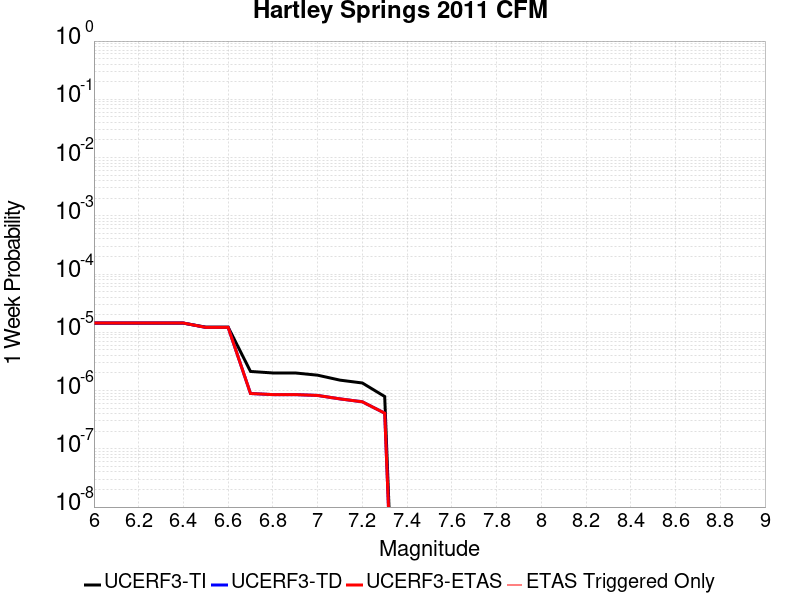 | 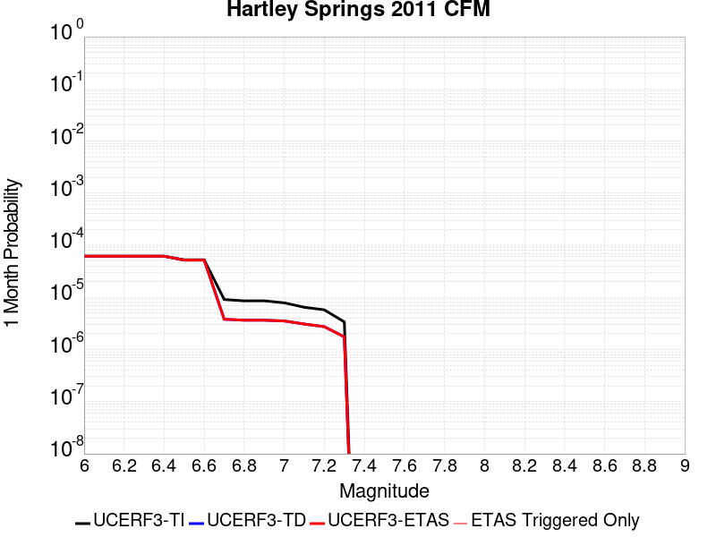 | 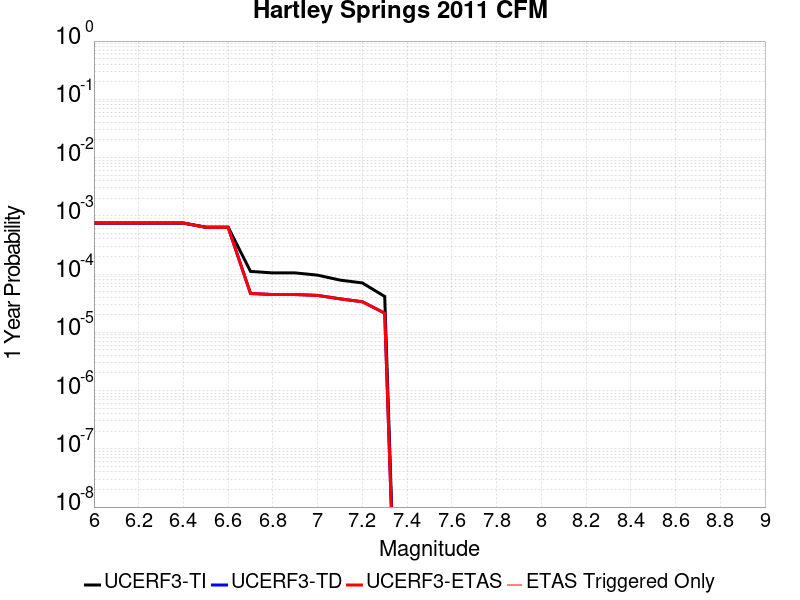 |  |

| Magnitude | 1 wk TI Prob | 1 wk TD Prob | 1 wk ETAS Prob | 1 wk ETAS/TD Gain | 1 wk ETAS Triggered Only | 1 mo TI Prob | 1 mo TD Prob | 1 mo ETAS Prob | 1 mo ETAS/TD Gain | 1 mo ETAS Triggered Only | 1 yr TI Prob | 1 yr TD Prob | 1 yr ETAS Prob | 1 yr ETAS/TD Gain | 1 yr ETAS Triggered Only | 10 yr TI Prob | 10 yr TD Prob | 10 yr ETAS Prob | 10 yr ETAS/TD Gain | 10 yr ETAS Triggered Only |
|-----|-----|-----|-----|-----|-----|-----|-----|-----|-----|-----|-----|-----|-----|-----|-----|-----|-----|-----|-----|-----|
| 6.0 | 1.4352418E-5 | 1.443704E-5 | 1.443704E-5 | 1.0 | 0.0 | 6.1508916E-5 | 6.187249E-5 | 6.187249E-5 | 1.0 | 0.0 | 7.486137E-4 | 7.532016E-4 | 7.532016E-4 | 1.0 | 0.0 | 0.007460968 | 0.0075226137 | 0.0075325384 | 1.0013193 | 1.0E-5 |
| 6.1 | 1.4352418E-5 | 1.443704E-5 | 1.443704E-5 | 1.0 | 0.0 | 6.1508916E-5 | 6.187249E-5 | 6.187249E-5 | 1.0 | 0.0 | 7.486137E-4 | 7.532016E-4 | 7.532016E-4 | 1.0 | 0.0 | 0.007460968 | 0.0075226137 | 0.0075325384 | 1.0013193 | 1.0E-5 |
| 6.2 | 1.4352418E-5 | 1.443704E-5 | 1.443704E-5 | 1.0 | 0.0 | 6.1508916E-5 | 6.187249E-5 | 6.187249E-5 | 1.0 | 0.0 | 7.486137E-4 | 7.532016E-4 | 7.532016E-4 | 1.0 | 0.0 | 0.007460968 | 0.0075226137 | 0.0075325384 | 1.0013193 | 1.0E-5 |
| 6.3 | 1.4352418E-5 | 1.443704E-5 | 1.443704E-5 | 1.0 | 0.0 | 6.1508916E-5 | 6.187249E-5 | 6.187249E-5 | 1.0 | 0.0 | 7.486137E-4 | 7.532016E-4 | 7.532016E-4 | 1.0 | 0.0 | 0.007460968 | 0.0075226137 | 0.0075325384 | 1.0013193 | 1.0E-5 |
| 6.4 | 1.4352418E-5 | 1.443704E-5 | 1.443704E-5 | 1.0 | 0.0 | 6.1508916E-5 | 6.187249E-5 | 6.187249E-5 | 1.0 | 0.0 | 7.486137E-4 | 7.532016E-4 | 7.532016E-4 | 1.0 | 0.0 | 0.007460968 | 0.0075226137 | 0.0075325384 | 1.0013193 | 1.0E-5 |
| 6.5 | 1.2279858E-5 | 1.2135628E-5 | 1.2135628E-5 | 1.0 | 0.0 | 5.26269E-5 | 5.2009687E-5 | 5.2009687E-5 | 1.0 | 0.0 | 6.4054417E-4 | 6.331922E-4 | 6.331922E-4 | 1.0 | 0.0 | 0.0063870098 | 0.006329397 | 0.006339334 | 1.00157 | 1.0E-5 |
| 6.6 | 1.2279858E-5 | 1.2135628E-5 | 1.2135628E-5 | 1.0 | 0.0 | 5.26269E-5 | 5.2009687E-5 | 5.2009687E-5 | 1.0 | 0.0 | 6.4054417E-4 | 6.331922E-4 | 6.331922E-4 | 1.0 | 0.0 | 0.0063870098 | 0.006329397 | 0.006339334 | 1.00157 | 1.0E-5 |
| 6.7 | 2.1282601E-6 | 8.9040077E-7 | 8.9040077E-7 | 1.0 | 0.0 | 9.121083E-6 | 3.815999E-6 | 3.815999E-6 | 1.0 | 0.0 | 1.11043526E-4 | 4.645906E-5 | 4.645906E-5 | 1.0 | 0.0 | 0.0011098806 | 4.6451882E-4 | 4.6451882E-4 | 1.0 | 0.0 |
| 6.8 | 2.00516E-6 | 8.5265367E-7 | 8.5265367E-7 | 1.0 | 0.0 | 8.593515E-6 | 3.6542262E-6 | 3.6542262E-6 | 1.0 | 0.0 | 1.04621024E-4 | 4.4489552E-5 | 4.4489552E-5 | 1.0 | 0.0 | 0.0010457177 | 4.4483165E-4 | 4.4483165E-4 | 1.0 | 0.0 |
| 6.9 | 2.00516E-6 | 8.5265367E-7 | 8.5265367E-7 | 1.0 | 0.0 | 8.593515E-6 | 3.6542262E-6 | 3.6542262E-6 | 1.0 | 0.0 | 1.04621024E-4 | 4.4489552E-5 | 4.4489552E-5 | 1.0 | 0.0 | 0.0010457177 | 4.4483165E-4 | 4.4483165E-4 | 1.0 | 0.0 |
| 7.0 | 1.8366732E-6 | 8.245967E-7 | 8.245967E-7 | 1.0 | 0.0 | 7.871433E-6 | 3.5339826E-6 | 3.5339826E-6 | 1.0 | 0.0 | 9.583048E-5 | 4.3025644E-5 | 4.3025644E-5 | 1.0 | 0.0 | 9.5789164E-4 | 4.301982E-4 | 4.301982E-4 | 1.0 | 0.0 |
| 7.1 | 1.5097997E-6 | 7.1982817E-7 | 7.1982817E-7 | 1.0 | 0.0 | 6.470554E-6 | 3.0849756E-6 | 3.0849756E-6 | 1.0 | 0.0 | 7.877615E-5 | 3.755917E-5 | 3.755917E-5 | 1.0 | 0.0 | 7.874823E-4 | 3.7555196E-4 | 3.7555196E-4 | 1.0 | 0.0 |
| 7.2 | 1.3490993E-6 | 6.4129887E-7 | 6.4129887E-7 | 1.0 | 0.0 | 5.7818415E-6 | 2.748422E-6 | 2.748422E-6 | 1.0 | 0.0 | 7.0391645E-5 | 3.3461758E-5 | 3.3461758E-5 | 1.0 | 0.0 | 7.0369354E-4 | 3.3459018E-4 | 3.3459018E-4 | 1.0 | 0.0 |
| 7.3 | 7.900015E-7 | 4.0900827E-7 | 4.0900827E-7 | 1.0 | 0.0 | 3.3857161E-6 | 1.7528926E-6 | 1.7528926E-6 | 1.0 | 0.0 | 4.1220315E-5 | 2.1341466E-5 | 2.1341466E-5 | 1.0 | 0.0 | 4.121267E-4 | 2.1341466E-4 | 2.1341466E-4 | 1.0 | 0.0 |

## Santa Susana East (connector)
*[(top)](#table-of-contents)*

| 1 Week | 1 Month | 1 Year | 10 Year |
|-----|-----|-----|-----|
| 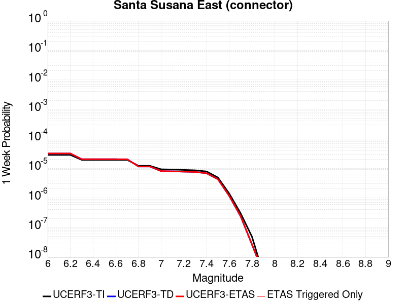 |  | 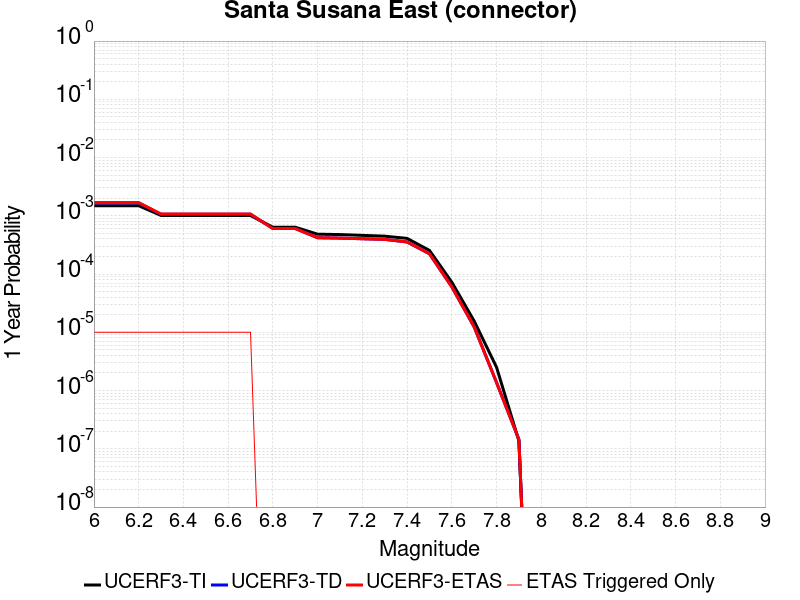 |  |

| Magnitude | 1 wk TI Prob | 1 wk TD Prob | 1 wk ETAS Prob | 1 wk ETAS/TD Gain | 1 wk ETAS Triggered Only | 1 mo TI Prob | 1 mo TD Prob | 1 mo ETAS Prob | 1 mo ETAS/TD Gain | 1 mo ETAS Triggered Only | 1 yr TI Prob | 1 yr TD Prob | 1 yr ETAS Prob | 1 yr ETAS/TD Gain | 1 yr ETAS Triggered Only | 10 yr TI Prob | 10 yr TD Prob | 10 yr ETAS Prob | 10 yr ETAS/TD Gain | 10 yr ETAS Triggered Only |
|-----|-----|-----|-----|-----|-----|-----|-----|-----|-----|-----|-----|-----|-----|-----|-----|-----|-----|-----|-----|-----|
| 6.0 | 2.858397E-5 | 3.20301E-5 | 3.20301E-5 | 1.0 | 0.0 | 1.2249697E-4 | 1.3726624E-4 | 1.3726624E-4 | 1.0 | 0.0 | 0.0014903803 | 0.0016702171 | 0.0016802003 | 1.0059773 | 1.0E-5 | 0.014804244 | 0.016603725 | 0.01661356 | 1.0005922 | 1.0E-5 |
| 6.1 | 2.858397E-5 | 3.20301E-5 | 3.20301E-5 | 1.0 | 0.0 | 1.2249697E-4 | 1.3726624E-4 | 1.3726624E-4 | 1.0 | 0.0 | 0.0014903803 | 0.0016702171 | 0.0016802003 | 1.0059773 | 1.0E-5 | 0.014804244 | 0.016603725 | 0.01661356 | 1.0005922 | 1.0E-5 |
| 6.2 | 2.858397E-5 | 3.20301E-5 | 3.20301E-5 | 1.0 | 0.0 | 1.2249697E-4 | 1.3726624E-4 | 1.3726624E-4 | 1.0 | 0.0 | 0.0014903803 | 0.0016702171 | 0.0016802003 | 1.0059773 | 1.0E-5 | 0.014804244 | 0.016603725 | 0.01661356 | 1.0005922 | 1.0E-5 |
| 6.3 | 1.943582E-5 | 2.0372127E-5 | 2.0372127E-5 | 1.0 | 0.0 | 8.329371E-5 | 8.730682E-5 | 8.730682E-5 | 1.0 | 0.0 | 0.001013629 | 0.0010625545 | 0.0010725439 | 1.0094013 | 1.0E-5 | 0.010090181 | 0.010586179 | 0.010596073 | 1.0009346 | 1.0E-5 |
| 6.4 | 1.943582E-5 | 2.0372127E-5 | 2.0372127E-5 | 1.0 | 0.0 | 8.329371E-5 | 8.730682E-5 | 8.730682E-5 | 1.0 | 0.0 | 0.001013629 | 0.0010625545 | 0.0010725439 | 1.0094013 | 1.0E-5 | 0.010090181 | 0.010586179 | 0.010596073 | 1.0009346 | 1.0E-5 |
| 6.5 | 1.943582E-5 | 2.0372127E-5 | 2.0372127E-5 | 1.0 | 0.0 | 8.329371E-5 | 8.730682E-5 | 8.730682E-5 | 1.0 | 0.0 | 0.001013629 | 0.0010625545 | 0.0010725439 | 1.0094013 | 1.0E-5 | 0.010090181 | 0.010586179 | 0.010596073 | 1.0009346 | 1.0E-5 |
| 6.6 | 1.943582E-5 | 2.0372127E-5 | 2.0372127E-5 | 1.0 | 0.0 | 8.329371E-5 | 8.730682E-5 | 8.730682E-5 | 1.0 | 0.0 | 0.001013629 | 0.0010625545 | 0.0010725439 | 1.0094013 | 1.0E-5 | 0.010090181 | 0.010586179 | 0.010596073 | 1.0009346 | 1.0E-5 |
| 6.7 | 1.9404439E-5 | 2.0359543E-5 | 2.0359543E-5 | 1.0 | 0.0 | 8.3159226E-5 | 8.72529E-5 | 8.72529E-5 | 1.0 | 0.0 | 0.0010119933 | 0.0010618987 | 0.001071888 | 1.009407 | 1.0E-5 | 0.010073971 | 0.010579683 | 0.010589577 | 1.0009352 | 1.0E-5 |
| 6.8 | 1.2217526E-5 | 1.1595014E-5 | 1.1595014E-5 | 1.0 | 0.0 | 5.2359774E-5 | 4.969207E-5 | 4.969207E-5 | 1.0 | 0.0 | 6.372938E-4 | 6.0484983E-4 | 6.0484983E-4 | 1.0 | 0.0 | 0.0063546924 | 0.0060340837 | 0.0060340837 | 1.0 | 0.0 |
| 6.9 | 1.2217526E-5 | 1.1595014E-5 | 1.1595014E-5 | 1.0 | 0.0 | 5.2359774E-5 | 4.969207E-5 | 4.969207E-5 | 1.0 | 0.0 | 6.372938E-4 | 6.0484983E-4 | 6.0484983E-4 | 1.0 | 0.0 | 0.0063546924 | 0.0060340837 | 0.0060340837 | 1.0 | 0.0 |
| 7.0 | 9.276017E-6 | 8.060138E-6 | 8.060138E-6 | 1.0 | 0.0 | 3.9753755E-5 | 3.454301E-5 | 3.454301E-5 | 1.0 | 0.0 | 4.8389446E-4 | 4.204834E-4 | 4.204834E-4 | 1.0 | 0.0 | 0.0048284214 | 0.004197605 | 0.004197605 | 1.0 | 0.0 |
| 7.1 | 9.130355E-6 | 7.943293E-6 | 7.943293E-6 | 1.0 | 0.0 | 3.9129503E-5 | 3.404226E-5 | 3.404226E-5 | 1.0 | 0.0 | 4.7629757E-4 | 4.143891E-4 | 4.143891E-4 | 1.0 | 0.0 | 0.00475278 | 0.0041368897 | 0.0041368897 | 1.0 | 0.0 |
| 7.2 | 8.851015E-6 | 7.742429E-6 | 7.742429E-6 | 1.0 | 0.0 | 3.7932372E-5 | 3.3181437E-5 | 3.3181437E-5 | 1.0 | 0.0 | 4.6172875E-4 | 4.0391253E-4 | 4.0391253E-4 | 1.0 | 0.0 | 0.0046077054 | 0.004032507 | 0.004032507 | 1.0 | 0.0 |
| 7.3 | 8.573006E-6 | 7.5511243E-6 | 7.5511243E-6 | 1.0 | 0.0 | 3.6740938E-5 | 3.236158E-5 | 3.236158E-5 | 1.0 | 0.0 | 4.472291E-4 | 3.939344E-4 | 3.939344E-4 | 1.0 | 0.0 | 0.004463301 | 0.0039330786 | 0.0039330786 | 1.0 | 0.0 |
| 7.4 | 7.852282E-6 | 6.818487E-6 | 6.818487E-6 | 1.0 | 0.0 | 3.36522E-5 | 2.9221776E-5 | 2.9221776E-5 | 1.0 | 0.0 | 4.096385E-4 | 3.5572005E-4 | 3.5572005E-4 | 1.0 | 0.0 | 0.0040888423 | 0.0035521714 | 0.0035521714 | 1.0 | 0.0 |
| 7.5 | 4.8869324E-6 | 4.279498E-6 | 4.279498E-6 | 1.0 | 0.0 | 2.0943828E-5 | 1.8340586E-5 | 1.8340586E-5 | 1.0 | 0.0 | 2.5496128E-4 | 2.2327542E-4 | 2.2327542E-4 | 1.0 | 0.0 | 0.0025466895 | 0.0022306752 | 0.0022306752 | 1.0 | 0.0 |
| 7.6 | 1.3894544E-6 | 1.1568945E-6 | 1.1568945E-6 | 1.0 | 0.0 | 5.954791E-6 | 4.9581113E-6 | 4.9581113E-6 | 1.0 | 0.0 | 7.249717E-5 | 6.0363556E-5 | 6.0363556E-5 | 1.0 | 0.0 | 7.247352E-4 | 6.034934E-4 | 6.034934E-4 | 1.0 | 0.0 |
| 7.7 | 2.9924632E-7 | 2.3722765E-7 | 2.3722765E-7 | 1.0 | 0.0 | 1.2824837E-6 | 1.0166896E-6 | 1.0166896E-6 | 1.0 | 0.0 | 1.5614127E-5 | 1.2378133E-5 | 1.2378133E-5 | 1.0 | 0.0 | 1.5613029E-4 | 1.2377516E-4 | 1.2377516E-4 | 1.0 | 0.0 |
| 7.8 | 4.8188564E-8 | 2.633745E-8 | 2.633745E-8 | 1.0 | 0.0 | 2.065224E-7 | 1.1287478E-7 | 1.1287478E-7 | 1.0 | 0.0 | 2.5144072E-6 | 1.3742497E-6 | 1.3742497E-6 | 1.0 | 0.0 | 2.5143789E-5 | 1.37424195E-5 | 1.37424195E-5 | 1.0 | 0.0 |
| 7.9 | 2.6127251E-9 | 2.7683287E-9 | 2.7683287E-9 | 1.0 | 0.0 | 1.1197393E-8 | 1.1864265E-8 | 1.1864265E-8 | 1.0 | 0.0 | 1.3632825E-7 | 1.4444743E-7 | 1.4444743E-7 | 1.0 | 0.0 | 1.3632817E-6 | 1.4444743E-6 | 1.4444743E-6 | 1.0 | 0.0 |

## Peralta Hills
*[(top)](#table-of-contents)*

| 1 Week | 1 Month | 1 Year | 10 Year |
|-----|-----|-----|-----|
|  |  | 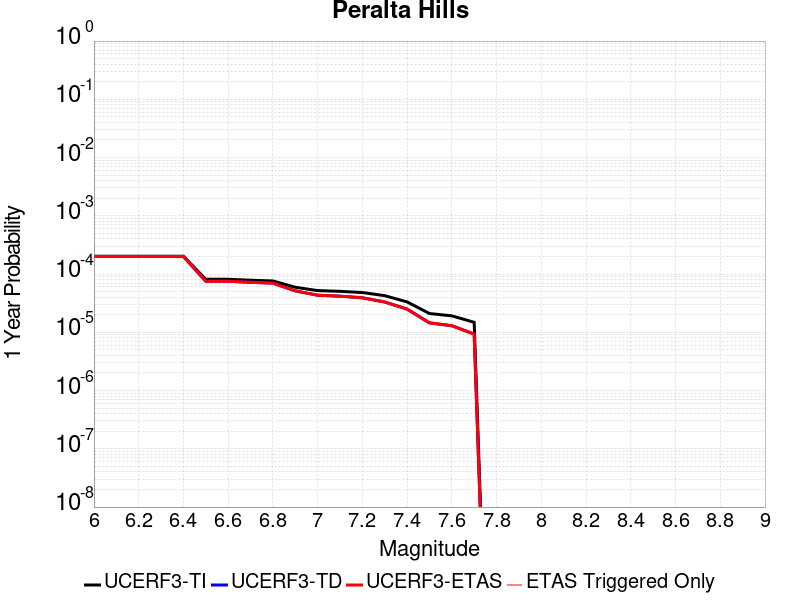 |  |

| Magnitude | 1 wk TI Prob | 1 wk TD Prob | 1 wk ETAS Prob | 1 wk ETAS/TD Gain | 1 wk ETAS Triggered Only | 1 mo TI Prob | 1 mo TD Prob | 1 mo ETAS Prob | 1 mo ETAS/TD Gain | 1 mo ETAS Triggered Only | 1 yr TI Prob | 1 yr TD Prob | 1 yr ETAS Prob | 1 yr ETAS/TD Gain | 1 yr ETAS Triggered Only | 10 yr TI Prob | 10 yr TD Prob | 10 yr ETAS Prob | 10 yr ETAS/TD Gain | 10 yr ETAS Triggered Only |
|-----|-----|-----|-----|-----|-----|-----|-----|-----|-----|-----|-----|-----|-----|-----|-----|-----|-----|-----|-----|-----|
| 6.0 | 3.8850067E-6 | 3.840121E-6 | 3.840121E-6 | 1.0 | 0.0 | 1.6649923E-5 | 1.6457598E-5 | 1.6457598E-5 | 1.0 | 0.0 | 2.0269395E-4 | 2.0036024E-4 | 2.0036024E-4 | 1.0 | 0.0 | 0.0020250916 | 0.0020025237 | 0.0020125038 | 1.0049837 | 1.0E-5 |
| 6.1 | 3.8850067E-6 | 3.840121E-6 | 3.840121E-6 | 1.0 | 0.0 | 1.6649923E-5 | 1.6457598E-5 | 1.6457598E-5 | 1.0 | 0.0 | 2.0269395E-4 | 2.0036024E-4 | 2.0036024E-4 | 1.0 | 0.0 | 0.0020250916 | 0.0020025237 | 0.0020125038 | 1.0049837 | 1.0E-5 |
| 6.2 | 3.8850067E-6 | 3.840121E-6 | 3.840121E-6 | 1.0 | 0.0 | 1.6649923E-5 | 1.6457598E-5 | 1.6457598E-5 | 1.0 | 0.0 | 2.0269395E-4 | 2.0036024E-4 | 2.0036024E-4 | 1.0 | 0.0 | 0.0020250916 | 0.0020025237 | 0.0020125038 | 1.0049837 | 1.0E-5 |
| 6.3 | 3.8850067E-6 | 3.840121E-6 | 3.840121E-6 | 1.0 | 0.0 | 1.6649923E-5 | 1.6457598E-5 | 1.6457598E-5 | 1.0 | 0.0 | 2.0269395E-4 | 2.0036024E-4 | 2.0036024E-4 | 1.0 | 0.0 | 0.0020250916 | 0.0020025237 | 0.0020125038 | 1.0049837 | 1.0E-5 |
| 6.4 | 3.8850067E-6 | 3.840121E-6 | 3.840121E-6 | 1.0 | 0.0 | 1.6649923E-5 | 1.6457598E-5 | 1.6457598E-5 | 1.0 | 0.0 | 2.0269395E-4 | 2.0036024E-4 | 2.0036024E-4 | 1.0 | 0.0 | 0.0020250916 | 0.0020025237 | 0.0020125038 | 1.0049837 | 1.0E-5 |
| 6.5 | 1.5587785E-6 | 1.4435924E-6 | 1.4435924E-6 | 1.0 | 0.0 | 6.6804623E-6 | 6.1868113E-6 | 6.1868113E-6 | 1.0 | 0.0 | 8.133159E-5 | 7.532207E-5 | 7.532207E-5 | 1.0 | 0.0 | 8.1301836E-4 | 7.529894E-4 | 7.529894E-4 | 1.0 | 0.0 |
| 6.6 | 1.5587785E-6 | 1.4435924E-6 | 1.4435924E-6 | 1.0 | 0.0 | 6.6804623E-6 | 6.1868113E-6 | 6.1868113E-6 | 1.0 | 0.0 | 8.133159E-5 | 7.532207E-5 | 7.532207E-5 | 1.0 | 0.0 | 8.1301836E-4 | 7.529894E-4 | 7.529894E-4 | 1.0 | 0.0 |
| 6.7 | 1.5018579E-6 | 1.3842116E-6 | 1.3842116E-6 | 1.0 | 0.0 | 6.436518E-6 | 5.9323233E-6 | 5.9323233E-6 | 1.0 | 0.0 | 7.836179E-5 | 7.2223884E-5 | 7.2223884E-5 | 1.0 | 0.0 | 7.833416E-4 | 7.220277E-4 | 7.220277E-4 | 1.0 | 0.0 |
| 6.8 | 1.4584314E-6 | 1.3386408E-6 | 1.3386408E-6 | 1.0 | 0.0 | 6.250405E-6 | 5.7370207E-6 | 5.7370207E-6 | 1.0 | 0.0 | 7.6096025E-5 | 6.9846225E-5 | 6.9846225E-5 | 1.0 | 0.0 | 7.6069974E-4 | 6.9826614E-4 | 6.9826614E-4 | 1.0 | 0.0 |
| 6.9 | 1.1382393E-6 | 9.865954E-7 | 9.865954E-7 | 1.0 | 0.0 | 4.8781594E-6 | 4.2282595E-6 | 4.2282595E-6 | 1.0 | 0.0 | 5.9389975E-5 | 5.1477928E-5 | 5.1477928E-5 | 1.0 | 0.0 | 5.93741E-4 | 5.1466824E-4 | 5.1466824E-4 | 1.0 | 0.0 |
| 7.0 | 9.970413E-7 | 8.3127503E-7 | 8.3127503E-7 | 1.0 | 0.0 | 4.273027E-6 | 3.5626028E-6 | 3.5626028E-6 | 1.0 | 0.0 | 5.2022864E-5 | 4.3373897E-5 | 4.3373897E-5 | 1.0 | 0.0 | 5.2010687E-4 | 4.336611E-4 | 4.336611E-4 | 1.0 | 0.0 |
| 7.1 | 9.684443E-7 | 7.997092E-7 | 7.997092E-7 | 1.0 | 0.0 | 4.150469E-6 | 3.427321E-6 | 3.427321E-6 | 1.0 | 0.0 | 5.053079E-5 | 4.1726904E-5 | 4.1726904E-5 | 1.0 | 0.0 | 5.05193E-4 | 4.171974E-4 | 4.171974E-4 | 1.0 | 0.0 |
| 7.2 | 9.240811E-7 | 7.506032E-7 | 7.506032E-7 | 1.0 | 0.0 | 3.960342E-6 | 3.216867E-6 | 3.216867E-6 | 1.0 | 0.0 | 4.8216094E-5 | 3.916472E-5 | 3.916472E-5 | 1.0 | 0.0 | 4.8205635E-4 | 3.9158473E-4 | 3.9158473E-4 | 1.0 | 0.0 |
| 7.3 | 8.158643E-7 | 6.352583E-7 | 6.352583E-7 | 1.0 | 0.0 | 3.4965567E-6 | 2.722533E-6 | 2.722533E-6 | 1.0 | 0.0 | 4.2569747E-5 | 3.3146396E-5 | 3.3146396E-5 | 1.0 | 0.0 | 4.2561593E-4 | 3.3142068E-4 | 3.3142068E-4 | 1.0 | 0.0 |
| 7.4 | 6.3822824E-7 | 4.797679E-7 | 4.797679E-7 | 1.0 | 0.0 | 2.7352612E-6 | 2.0561467E-6 | 2.0561467E-6 | 1.0 | 0.0 | 3.3301294E-5 | 2.503335E-5 | 2.503335E-5 | 1.0 | 0.0 | 3.3296304E-4 | 2.5031046E-4 | 2.5031046E-4 | 1.0 | 0.0 |
| 7.5 | 4.0292628E-7 | 2.7857408E-7 | 2.7857408E-7 | 1.0 | 0.0 | 1.7268258E-6 | 1.1938885E-6 | 1.1938885E-6 | 1.0 | 0.0 | 2.1023901E-5 | 1.4535524E-5 | 1.4535524E-5 | 1.0 | 0.0 | 2.1021912E-4 | 1.4534853E-4 | 1.4534853E-4 | 1.0 | 0.0 |
| 7.6 | 3.672993E-7 | 2.4865074E-7 | 2.4865074E-7 | 1.0 | 0.0 | 1.5741389E-6 | 1.0656457E-6 | 1.0656457E-6 | 1.0 | 0.0 | 1.9164972E-5 | 1.29741875E-5 | 1.29741875E-5 | 1.0 | 0.0 | 1.916332E-4 | 1.2973702E-4 | 1.2973702E-4 | 1.0 | 0.0 |
| 7.7 | 2.8466823E-7 | 1.7867862E-7 | 1.7867862E-7 | 1.0 | 0.0 | 1.2200061E-6 | 7.6576544E-7 | 7.6576544E-7 | 1.0 | 0.0 | 1.4853474E-5 | 9.323181E-6 | 9.323181E-6 | 1.0 | 0.0 | 1.485248E-4 | 9.32305E-5 | 9.32305E-5 | 1.0 | 0.0 |

## Malibu Coast alt 1
*[(top)](#table-of-contents)*

| 1 Week | 1 Month | 1 Year | 10 Year |
|-----|-----|-----|-----|
|  |  |  |  |

| Magnitude | 1 wk TI Prob | 1 wk TD Prob | 1 wk ETAS Prob | 1 wk ETAS/TD Gain | 1 wk ETAS Triggered Only | 1 mo TI Prob | 1 mo TD Prob | 1 mo ETAS Prob | 1 mo ETAS/TD Gain | 1 mo ETAS Triggered Only | 1 yr TI Prob | 1 yr TD Prob | 1 yr ETAS Prob | 1 yr ETAS/TD Gain | 1 yr ETAS Triggered Only | 10 yr TI Prob | 10 yr TD Prob | 10 yr ETAS Prob | 10 yr ETAS/TD Gain | 10 yr ETAS Triggered Only |
|-----|-----|-----|-----|-----|-----|-----|-----|-----|-----|-----|-----|-----|-----|-----|-----|-----|-----|-----|-----|-----|
| 6.0 | 1.6572556E-5 | 1.760009E-5 | 1.760009E-5 | 1.0 | 0.0 | 7.102331E-5 | 7.5426884E-5 | 7.5426884E-5 | 1.0 | 0.0 | 8.6436566E-4 | 9.179543E-4 | 9.179543E-4 | 1.0 | 0.0 | 0.0086101135 | 0.009143559 | 0.009153468 | 1.0010836 | 1.0E-5 |
| 6.1 | 1.6572556E-5 | 1.760009E-5 | 1.760009E-5 | 1.0 | 0.0 | 7.102331E-5 | 7.5426884E-5 | 7.5426884E-5 | 1.0 | 0.0 | 8.6436566E-4 | 9.179543E-4 | 9.179543E-4 | 1.0 | 0.0 | 0.0086101135 | 0.009143559 | 0.009153468 | 1.0010836 | 1.0E-5 |
| 6.2 | 1.1085717E-5 | 1.1558359E-5 | 1.1558359E-5 | 1.0 | 0.0 | 4.750935E-5 | 4.9534905E-5 | 4.9534905E-5 | 1.0 | 0.0 | 5.782728E-4 | 6.029241E-4 | 6.029241E-4 | 1.0 | 0.0 | 0.0057677035 | 0.0060132546 | 0.006023194 | 1.001653 | 1.0E-5 |
| 6.3 | 1.0208568E-5 | 1.059332E-5 | 1.059332E-5 | 1.0 | 0.0 | 4.375027E-5 | 4.5399174E-5 | 4.5399174E-5 | 1.0 | 0.0 | 5.325294E-4 | 5.525977E-4 | 5.525977E-4 | 1.0 | 0.0 | 0.0053125503 | 0.005512544 | 0.0055224886 | 1.001804 | 1.0E-5 |
| 6.4 | 9.0682315E-6 | 9.343562E-6 | 9.343562E-6 | 1.0 | 0.0 | 3.8863272E-5 | 4.0043233E-5 | 4.0043233E-5 | 1.0 | 0.0 | 4.730576E-4 | 4.8741934E-4 | 4.8741934E-4 | 1.0 | 0.0 | 0.0047205184 | 0.004863716 | 0.004873668 | 1.002046 | 1.0E-5 |
| 6.5 | 7.605796E-6 | 7.7493205E-6 | 7.7493205E-6 | 1.0 | 0.0 | 3.259586E-5 | 3.321096E-5 | 3.321096E-5 | 1.0 | 0.0 | 3.9678233E-4 | 4.0426973E-4 | 4.0426973E-4 | 1.0 | 0.0 | 0.0039607463 | 0.004035481 | 0.004045441 | 1.002468 | 1.0E-5 |
| 6.6 | 5.889873E-6 | 5.88005E-6 | 5.88005E-6 | 1.0 | 0.0 | 2.5242069E-5 | 2.5199974E-5 | 2.5199974E-5 | 1.0 | 0.0 | 3.0727885E-4 | 3.0676657E-4 | 3.0676657E-4 | 1.0 | 0.0 | 0.003068543 | 0.003063444 | 0.0030734134 | 1.0032543 | 1.0E-5 |
| 6.7 | 5.66586E-6 | 5.6421336E-6 | 5.6421336E-6 | 1.0 | 0.0 | 2.428203E-5 | 2.4180348E-5 | 2.4180348E-5 | 1.0 | 0.0 | 2.955936E-4 | 2.9435605E-4 | 2.9435605E-4 | 1.0 | 0.0 | 0.0029520073 | 0.0029396736 | 0.0029496443 | 1.0033917 | 1.0E-5 |
| 6.8 | 5.521556E-6 | 5.489908E-6 | 5.489908E-6 | 1.0 | 0.0 | 2.3663597E-5 | 2.3527966E-5 | 2.3527966E-5 | 1.0 | 0.0 | 2.880662E-4 | 2.8641542E-4 | 2.8641542E-4 | 1.0 | 0.0 | 0.0028769306 | 0.0028604744 | 0.0028704458 | 1.0034859 | 1.0E-5 |
| 6.9 | 5.29752E-6 | 5.2503906E-6 | 5.2503906E-6 | 1.0 | 0.0 | 2.270346E-5 | 2.250148E-5 | 2.250148E-5 | 1.0 | 0.0 | 2.7637955E-4 | 2.7392115E-4 | 2.7392115E-4 | 1.0 | 0.0 | 0.0027603607 | 0.0027358455 | 0.002745818 | 1.0036452 | 1.0E-5 |
| 7.0 | 5.106743E-6 | 5.0481212E-6 | 5.0481212E-6 | 1.0 | 0.0 | 2.1885859E-5 | 2.1634627E-5 | 2.1634627E-5 | 1.0 | 0.0 | 2.6642776E-4 | 2.6336982E-4 | 2.6336982E-4 | 1.0 | 0.0 | 0.0026610855 | 0.0026305865 | 0.0026405603 | 1.0037915 | 1.0E-5 |
| 7.1 | 4.8469647E-6 | 4.770791E-6 | 4.770791E-6 | 1.0 | 0.0 | 2.0772539E-5 | 2.0446085E-5 | 2.0446085E-5 | 1.0 | 0.0 | 2.528763E-4 | 2.489027E-4 | 2.489027E-4 | 1.0 | 0.0 | 0.0025258875 | 0.0024862476 | 0.0024962227 | 1.0040121 | 1.0E-5 |
| 7.2 | 4.545514E-6 | 4.4485814E-6 | 4.4485814E-6 | 1.0 | 0.0 | 1.9480629E-5 | 1.906521E-5 | 1.906521E-5 | 1.0 | 0.0 | 2.3715083E-4 | 2.3209427E-4 | 2.3209427E-4 | 1.0 | 0.0 | 0.0023689792 | 0.0023185262 | 0.002328503 | 1.0043031 | 1.0E-5 |
| 7.3 | 3.794097E-6 | 3.6522415E-6 | 3.6522415E-6 | 1.0 | 0.0 | 1.6260314E-5 | 1.565237E-5 | 1.565237E-5 | 1.0 | 0.0 | 1.9795135E-4 | 1.9055097E-4 | 1.9055097E-4 | 1.0 | 0.0 | 0.001977751 | 0.0019038806 | 0.0019138615 | 1.0052425 | 1.0E-5 |
| 7.4 | 2.808217E-6 | 2.7193082E-6 | 2.7193082E-6 | 1.0 | 0.0 | 1.203516E-5 | 1.1654126E-5 | 1.1654126E-5 | 1.0 | 0.0 | 1.4651821E-4 | 1.4187976E-4 | 1.4187976E-4 | 1.0 | 0.0 | 0.0014642165 | 0.0014178946 | 0.0014278804 | 1.0070428 | 1.0E-5 |
| 7.5 | 1.83809E-6 | 1.81923E-6 | 1.81923E-6 | 1.0 | 0.0 | 7.877505E-6 | 7.796677E-6 | 7.796677E-6 | 1.0 | 0.0 | 9.59044E-5 | 9.4920426E-5 | 9.4920426E-5 | 1.0 | 0.0 | 9.5863023E-4 | 9.488008E-4 | 9.488008E-4 | 1.0 | 0.0 |
| 7.6 | 1.1292672E-6 | 1.1002485E-6 | 1.1002485E-6 | 1.0 | 0.0 | 4.839708E-6 | 4.715342E-6 | 4.715342E-6 | 1.0 | 0.0 | 5.8921847E-5 | 5.7407793E-5 | 5.7407793E-5 | 1.0 | 0.0 | 5.890623E-4 | 5.7393126E-4 | 5.7393126E-4 | 1.0 | 0.0 |
| 7.7 | 5.065272E-7 | 4.6096739E-7 | 4.6096739E-7 | 1.0 | 0.0 | 2.170829E-6 | 1.975573E-6 | 1.975573E-6 | 1.0 | 0.0 | 2.6429525E-5 | 2.4052348E-5 | 2.4052348E-5 | 1.0 | 0.0 | 2.642638E-4 | 2.4049857E-4 | 2.4049857E-4 | 1.0 | 0.0 |
| 7.8 | 8.952991E-8 | 6.709905E-8 | 6.709905E-8 | 1.0 | 0.0 | 3.8369956E-7 | 2.8756733E-7 | 2.8756733E-7 | 1.0 | 0.0 | 4.671532E-6 | 3.5011267E-6 | 3.5011267E-6 | 1.0 | 0.0 | 4.671434E-5 | 3.5010737E-5 | 3.5010737E-5 | 1.0 | 0.0 |
| 7.9 | 8.007447E-10 | 6.1612504E-10 | 6.1612504E-10 | 1.0 | 0.0 | 3.4317629E-9 | 2.6405358E-9 | 2.6405358E-9 | 1.0 | 0.0 | 4.1781714E-8 | 3.2148524E-8 | 3.2148524E-8 | 1.0 | 0.0 | 4.1781706E-7 | 3.214852E-7 | 3.214852E-7 | 1.0 | 0.0 |

## San Pedro Basin
*[(top)](#table-of-contents)*

| 1 Week | 1 Month | 1 Year | 10 Year |
|-----|-----|-----|-----|
|  |  | 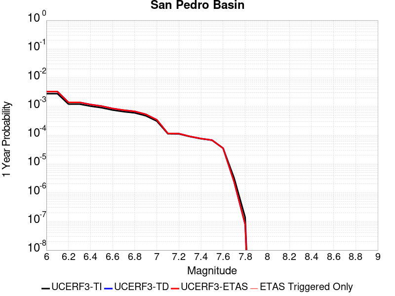 | 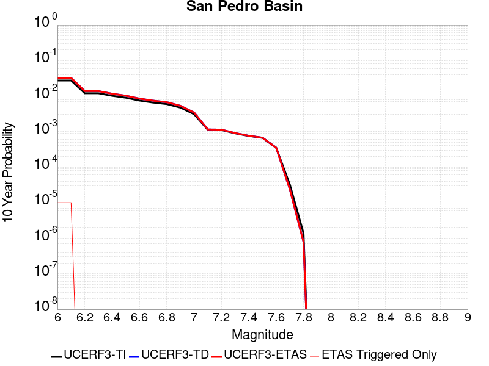 |

| Magnitude | 1 wk TI Prob | 1 wk TD Prob | 1 wk ETAS Prob | 1 wk ETAS/TD Gain | 1 wk ETAS Triggered Only | 1 mo TI Prob | 1 mo TD Prob | 1 mo ETAS Prob | 1 mo ETAS/TD Gain | 1 mo ETAS Triggered Only | 1 yr TI Prob | 1 yr TD Prob | 1 yr ETAS Prob | 1 yr ETAS/TD Gain | 1 yr ETAS Triggered Only | 10 yr TI Prob | 10 yr TD Prob | 10 yr ETAS Prob | 10 yr ETAS/TD Gain | 10 yr ETAS Triggered Only |
|-----|-----|-----|-----|-----|-----|-----|-----|-----|-----|-----|-----|-----|-----|-----|-----|-----|-----|-----|-----|-----|
| 6.0 | 5.3449043E-5 | 6.3385276E-5 | 6.3385276E-5 | 1.0 | 0.0 | 2.2904722E-4 | 2.7162637E-4 | 2.7162637E-4 | 1.0 | 0.0 | 0.0027850836 | 0.0033026508 | 0.0033026508 | 1.0 | 0.0 | 0.027504366 | 0.032597434 | 0.03260711 | 1.0002968 | 1.0E-5 |
| 6.1 | 5.3449043E-5 | 6.3385276E-5 | 6.3385276E-5 | 1.0 | 0.0 | 2.2904722E-4 | 2.7162637E-4 | 2.7162637E-4 | 1.0 | 0.0 | 0.0027850836 | 0.0033026508 | 0.0033026508 | 1.0 | 0.0 | 0.027504366 | 0.032597434 | 0.03260711 | 1.0002968 | 1.0E-5 |
| 6.2 | 2.3189454E-5 | 2.6648175E-5 | 2.6648175E-5 | 1.0 | 0.0 | 9.9379584E-5 | 1.14201735E-4 | 1.14201735E-4 | 1.0 | 0.0 | 0.0012092749 | 0.0013895667 | 0.0013895667 | 1.0 | 0.0 | 0.012027155 | 0.013813651 | 0.013813651 | 1.0 | 0.0 |
| 6.3 | 2.3189454E-5 | 2.6648175E-5 | 2.6648175E-5 | 1.0 | 0.0 | 9.9379584E-5 | 1.14201735E-4 | 1.14201735E-4 | 1.0 | 0.0 | 0.0012092749 | 0.0013895667 | 0.0013895667 | 1.0 | 0.0 | 0.012027155 | 0.013813651 | 0.013813651 | 1.0 | 0.0 |
| 6.4 | 1.966056E-5 | 2.2467766E-5 | 2.2467766E-5 | 1.0 | 0.0 | 8.425682E-5 | 9.62871E-5 | 9.62871E-5 | 1.0 | 0.0 | 0.001025344 | 0.0011717052 | 0.0011717052 | 1.0 | 0.0 | 0.010206259 | 0.011659362 | 0.011659362 | 1.0 | 0.0 |
| 6.5 | 1.7342953E-5 | 1.9748875E-5 | 1.9748875E-5 | 1.0 | 0.0 | 7.4324824E-5 | 8.46355E-5 | 8.46355E-5 | 1.0 | 0.0 | 9.04529E-4 | 0.0010299871 | 0.0010299871 | 1.0 | 0.0 | 0.009008561 | 0.010255857 | 0.010255857 | 1.0 | 0.0 |
| 6.6 | 1.439804E-5 | 1.6325706E-5 | 1.6325706E-5 | 1.0 | 0.0 | 6.170443E-5 | 6.9965616E-5 | 6.9965616E-5 | 1.0 | 0.0 | 7.509924E-4 | 8.5153064E-4 | 8.5153064E-4 | 1.0 | 0.0 | 0.0074845953 | 0.008485881 | 0.008485881 | 1.0 | 0.0 |
| 6.7 | 1.2634884E-5 | 1.4287867E-5 | 1.4287867E-5 | 1.0 | 0.0 | 5.414838E-5 | 6.123245E-5 | 6.123245E-5 | 1.0 | 0.0 | 6.590571E-4 | 7.4528053E-4 | 7.4528053E-4 | 1.0 | 0.0 | 0.006571059 | 0.0074308338 | 0.0074308338 | 1.0 | 0.0 |
| 6.8 | 1.146091E-5 | 1.2935489E-5 | 1.2935489E-5 | 1.0 | 0.0 | 4.911726E-5 | 5.54368E-5 | 5.54368E-5 | 1.0 | 0.0 | 5.9783855E-4 | 6.747638E-4 | 6.747638E-4 | 1.0 | 0.0 | 0.0059623276 | 0.0067300913 | 0.0067300913 | 1.0 | 0.0 |
| 6.9 | 9.109035E-6 | 1.0236781E-5 | 1.0236781E-5 | 1.0 | 0.0 | 3.9038136E-5 | 4.387134E-5 | 4.387134E-5 | 1.0 | 0.0 | 4.7518566E-4 | 5.3403067E-4 | 5.3403067E-4 | 1.0 | 0.0 | 0.0047417083 | 0.0053302287 | 0.0053302287 | 1.0 | 0.0 |
| 7.0 | 5.9351028E-6 | 6.585005E-6 | 6.585005E-6 | 1.0 | 0.0 | 2.5435906E-5 | 2.8221279E-5 | 2.8221279E-5 | 1.0 | 0.0 | 3.0963816E-4 | 3.435635E-4 | 3.435635E-4 | 1.0 | 0.0 | 0.0030920706 | 0.0034326415 | 0.0034326415 | 1.0 | 0.0 |
| 7.1 | 2.1557585E-6 | 2.209775E-6 | 2.209775E-6 | 1.0 | 0.0 | 9.238933E-6 | 9.470431E-6 | 9.470431E-6 | 1.0 | 0.0 | 1.1247819E-4 | 1.1529655E-4 | 1.1529655E-4 | 1.0 | 0.0 | 0.0011242128 | 0.0011523827 | 0.0011523827 | 1.0 | 0.0 |
| 7.2 | 2.1251979E-6 | 2.1781198E-6 | 2.1781198E-6 | 1.0 | 0.0 | 9.107958E-6 | 9.334766E-6 | 9.334766E-6 | 1.0 | 0.0 | 1.1088375E-4 | 1.1364501E-4 | 1.1364501E-4 | 1.0 | 0.0 | 0.0011082845 | 0.0011358842 | 0.0011358842 | 1.0 | 0.0 |
| 7.3 | 1.7145798E-6 | 1.7443804E-6 | 1.7443804E-6 | 1.0 | 0.0 | 7.3481783E-6 | 7.4758946E-6 | 7.4758946E-6 | 1.0 | 0.0 | 8.94604E-5 | 9.101531E-5 | 9.101531E-5 | 1.0 | 0.0 | 8.9424395E-4 | 9.0978947E-4 | 9.0978947E-4 | 1.0 | 0.0 |
| 7.4 | 1.4467993E-6 | 1.4642625E-6 | 1.4642625E-6 | 1.0 | 0.0 | 6.200554E-6 | 6.275396E-6 | 6.275396E-6 | 1.0 | 0.0 | 7.548913E-5 | 7.640034E-5 | 7.640034E-5 | 1.0 | 0.0 | 7.546349E-4 | 7.63748E-4 | 7.63748E-4 | 1.0 | 0.0 |
| 7.5 | 1.2803735E-6 | 1.2932165E-6 | 1.2932165E-6 | 1.0 | 0.0 | 5.487303E-6 | 5.542345E-6 | 5.542345E-6 | 1.0 | 0.0 | 6.680587E-5 | 6.747604E-5 | 6.747604E-5 | 1.0 | 0.0 | 6.678579E-4 | 6.745625E-4 | 6.745625E-4 | 1.0 | 0.0 |
| 7.6 | 6.755009E-7 | 6.7698187E-7 | 6.7698187E-7 | 1.0 | 0.0 | 2.8950008E-6 | 2.9013481E-6 | 2.9013481E-6 | 1.0 | 0.0 | 3.5246063E-5 | 3.53234E-5 | 3.53234E-5 | 1.0 | 0.0 | 3.5240475E-4 | 3.5318357E-4 | 3.5318357E-4 | 1.0 | 0.0 |
| 7.7 | 6.211885E-8 | 4.5702848E-8 | 4.5702848E-8 | 1.0 | 0.0 | 2.6622362E-7 | 1.9586933E-7 | 1.9586933E-7 | 1.0 | 0.0 | 3.2412677E-6 | 2.3847067E-6 | 2.3847067E-6 | 1.0 | 0.0 | 3.2412205E-5 | 2.3846831E-5 | 2.3846831E-5 | 1.0 | 0.0 |
| 7.8 | 2.6580573E-9 | 1.5143348E-9 | 1.5143348E-9 | 1.0 | 0.0 | 1.1391674E-8 | 6.490006E-9 | 6.490006E-9 | 1.0 | 0.0 | 1.3869362E-7 | 7.901583E-8 | 7.901583E-8 | 1.0 | 0.0 | 1.3869354E-6 | 7.9015825E-7 | 7.9015825E-7 | 1.0 | 0.0 |

## San Andreas (Peninsula) 2011 CFM
*[(top)](#table-of-contents)*

| 1 Week | 1 Month | 1 Year | 10 Year |
|-----|-----|-----|-----|
|  |  | 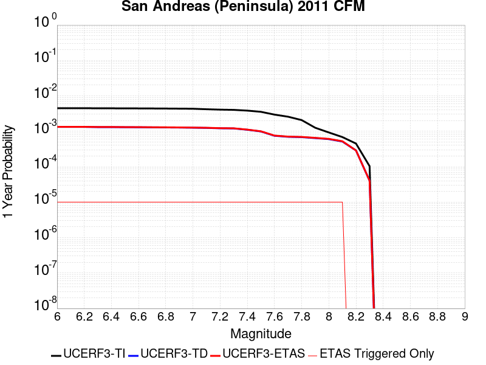 | 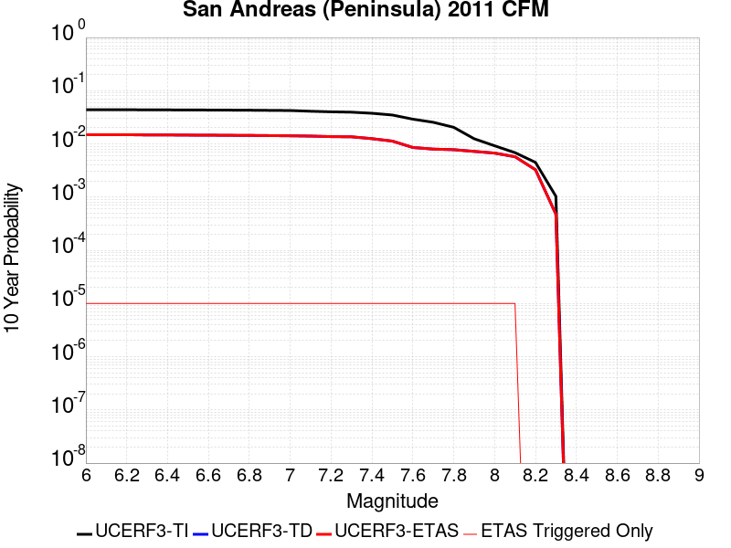 |

| Magnitude | 1 wk TI Prob | 1 wk TD Prob | 1 wk ETAS Prob | 1 wk ETAS/TD Gain | 1 wk ETAS Triggered Only | 1 mo TI Prob | 1 mo TD Prob | 1 mo ETAS Prob | 1 mo ETAS/TD Gain | 1 mo ETAS Triggered Only | 1 yr TI Prob | 1 yr TD Prob | 1 yr ETAS Prob | 1 yr ETAS/TD Gain | 1 yr ETAS Triggered Only | 10 yr TI Prob | 10 yr TD Prob | 10 yr ETAS Prob | 10 yr ETAS/TD Gain | 10 yr ETAS Triggered Only |
|-----|-----|-----|-----|-----|-----|-----|-----|-----|-----|-----|-----|-----|-----|-----|-----|-----|-----|-----|-----|-----|
| 6.0 | 8.6200685E-5 | 2.54608E-5 | 2.54608E-5 | 1.0 | 0.0 | 3.6937918E-4 | 1.0911316E-4 | 1.0911316E-4 | 1.0 | 0.0 | 0.0044879215 | 0.0013276448 | 0.0013376316 | 1.0075221 | 1.0E-5 | 0.043983612 | 0.014908976 | 0.014918827 | 1.0006608 | 1.0E-5 |
| 6.1 | 8.6200685E-5 | 2.54608E-5 | 2.54608E-5 | 1.0 | 0.0 | 3.6937918E-4 | 1.0911316E-4 | 1.0911316E-4 | 1.0 | 0.0 | 0.0044879215 | 0.0013276448 | 0.0013376316 | 1.0075221 | 1.0E-5 | 0.043983612 | 0.014908976 | 0.014918827 | 1.0006608 | 1.0E-5 |
| 6.2 | 8.6200685E-5 | 2.54608E-5 | 2.54608E-5 | 1.0 | 0.0 | 3.6937918E-4 | 1.0911316E-4 | 1.0911316E-4 | 1.0 | 0.0 | 0.0044879215 | 0.0013276448 | 0.0013376316 | 1.0075221 | 1.0E-5 | 0.043983612 | 0.014908976 | 0.014918827 | 1.0006608 | 1.0E-5 |
| 6.3 | 8.551163E-5 | 2.515106E-5 | 2.515106E-5 | 1.0 | 0.0 | 3.6642692E-4 | 1.0778581E-4 | 1.0778581E-4 | 1.0 | 0.0 | 0.004452125 | 0.0013115039 | 0.0013214909 | 1.0076149 | 1.0E-5 | 0.043639794 | 0.014735139 | 0.014744992 | 1.0006686 | 1.0E-5 |
| 6.4 | 8.551163E-5 | 2.515106E-5 | 2.515106E-5 | 1.0 | 0.0 | 3.6642692E-4 | 1.0778581E-4 | 1.0778581E-4 | 1.0 | 0.0 | 0.004452125 | 0.0013115039 | 0.0013214909 | 1.0076149 | 1.0E-5 | 0.043639794 | 0.014735139 | 0.014744992 | 1.0006686 | 1.0E-5 |
| 6.5 | 8.511146E-5 | 2.4971556E-5 | 2.4971556E-5 | 1.0 | 0.0 | 3.647124E-4 | 1.0701657E-4 | 1.0701657E-4 | 1.0 | 0.0 | 0.004431336 | 0.0013021496 | 0.0013121367 | 1.0076696 | 1.0E-5 | 0.04344007 | 0.014634435 | 0.014644288 | 1.0006733 | 1.0E-5 |
| 6.6 | 8.4985084E-5 | 2.4901901E-5 | 2.4901901E-5 | 1.0 | 0.0 | 3.6417096E-4 | 1.0671808E-4 | 1.0671808E-4 | 1.0 | 0.0 | 0.0044247704 | 0.0012985199 | 0.0013085068 | 1.007691 | 1.0E-5 | 0.043376986 | 0.014596355 | 0.014606209 | 1.0006751 | 1.0E-5 |
| 6.7 | 8.462618E-5 | 2.4729583E-5 | 2.4729583E-5 | 1.0 | 0.0 | 3.6263323E-4 | 1.0597963E-4 | 1.0597963E-4 | 1.0 | 0.0 | 0.004406125 | 0.0012895399 | 0.001299527 | 1.0077447 | 1.0E-5 | 0.043197807 | 0.014500748 | 0.014510603 | 1.0006796 | 1.0E-5 |
| 6.8 | 8.42337E-5 | 2.4624735E-5 | 2.4624735E-5 | 1.0 | 0.0 | 3.6095164E-4 | 1.05530315E-4 | 1.05530315E-4 | 1.0 | 0.0 | 0.004385734 | 0.001284076 | 0.0012940632 | 1.0077777 | 1.0E-5 | 0.043001823 | 0.014441083 | 0.014450939 | 1.0006825 | 1.0E-5 |
| 6.9 | 8.365989E-5 | 2.4428473E-5 | 2.4428473E-5 | 1.0 | 0.0 | 3.5849313E-4 | 1.04689265E-4 | 1.04689265E-4 | 1.0 | 0.0 | 0.004355922 | 0.0012738481 | 0.0012838354 | 1.0078403 | 1.0E-5 | 0.04271523 | 0.014333107 | 0.014342964 | 1.0006877 | 1.0E-5 |
| 7.0 | 8.30936E-5 | 2.4189154E-5 | 2.4189154E-5 | 1.0 | 0.0 | 3.560668E-4 | 1.0366369E-4 | 1.0366369E-4 | 1.0 | 0.0 | 0.004326499 | 0.0012613763 | 0.0012713637 | 1.0079179 | 1.0E-5 | 0.042432297 | 0.0142036695 | 0.014213528 | 1.000694 | 1.0E-5 |
| 7.1 | 8.041264E-5 | 2.3873708E-5 | 2.3873708E-5 | 1.0 | 0.0 | 3.4458007E-4 | 1.0231189E-4 | 1.0231189E-4 | 1.0 | 0.0 | 0.0041871946 | 0.0012449371 | 0.0012549247 | 1.0080225 | 1.0E-5 | 0.041091725 | 0.014025394 | 0.014035254 | 1.000703 | 1.0E-5 |
| 7.2 | 7.8427016E-5 | 2.3294977E-5 | 2.3294977E-5 | 1.0 | 0.0 | 3.3607247E-4 | 9.983181E-5 | 9.983181E-5 | 1.0 | 0.0 | 0.004084008 | 0.0012147761 | 0.0012247639 | 1.008222 | 1.0E-5 | 0.040097635 | 0.013708154 | 0.013718016 | 1.0007195 | 1.0E-5 |
| 7.3 | 7.721087E-5 | 2.3078977E-5 | 2.3078977E-5 | 1.0 | 0.0 | 3.3086175E-4 | 9.890616E-5 | 9.890616E-5 | 1.0 | 0.0 | 0.004020803 | 0.001203519 | 0.0012135069 | 1.008299 | 1.0E-5 | 0.03948827 | 0.013591408 | 0.013601271 | 1.0007257 | 1.0E-5 |
| 7.4 | 7.3536525E-5 | 2.1179641E-5 | 2.1179641E-5 | 1.0 | 0.0 | 3.1511846E-4 | 9.076674E-5 | 9.076674E-5 | 1.0 | 0.0 | 0.0038298194 | 0.0011045262 | 0.0011145151 | 1.0090437 | 1.0E-5 | 0.037644852 | 0.01254003 | 0.012549904 | 1.0007875 | 1.0E-5 |
| 7.5 | 6.806207E-5 | 1.8962826E-5 | 1.8962826E-5 | 1.0 | 0.0 | 2.9166197E-4 | 8.1266735E-5 | 8.1266735E-5 | 1.0 | 0.0 | 0.0035452035 | 9.889745E-4 | 9.989645E-4 | 1.0101014 | 1.0E-5 | 0.034891766 | 0.011281309 | 0.011291196 | 1.0008764 | 1.0E-5 |
| 7.6 | 5.6731416E-5 | 1.4321477E-5 | 1.4321477E-5 | 1.0 | 0.0 | 2.43112E-4 | 6.137631E-5 | 6.137631E-5 | 1.0 | 0.0 | 0.0029558712 | 7.4700057E-4 | 7.569931E-4 | 1.0133768 | 1.0E-5 | 0.02916862 | 0.008566817 | 0.008576732 | 1.0011573 | 1.0E-5 |
| 7.7 | 4.946994E-5 | 1.3378449E-5 | 1.3378449E-5 | 1.0 | 0.0 | 2.1199681E-4 | 5.733495E-5 | 5.733495E-5 | 1.0 | 0.0 | 0.002578006 | 6.978296E-4 | 7.078226E-4 | 1.0143201 | 1.0E-5 | 0.02548303 | 0.00798254 | 0.00799246 | 1.0012428 | 1.0E-5 |
| 7.8 | 3.9718198E-5 | 1.3109796E-5 | 1.3109796E-5 | 1.0 | 0.0 | 1.7020974E-4 | 5.6183628E-5 | 5.6183628E-5 | 1.0 | 0.0 | 0.0020703338 | 6.8382116E-4 | 6.938143E-4 | 1.0146137 | 1.0E-5 | 0.020511515 | 0.0077897147 | 0.007799637 | 1.0012738 | 1.0E-5 |
| 7.9 | 2.4115114E-5 | 1.2299104E-5 | 1.2299104E-5 | 1.0 | 0.0 | 1.0334639E-4 | 5.2709383E-5 | 5.2709383E-5 | 1.0 | 0.0 | 0.001257516 | 6.415479E-4 | 6.515415E-4 | 1.0155773 | 1.0E-5 | 0.012504238 | 0.0072210995 | 0.007231027 | 1.0013748 | 1.0E-5 |
| 8.0 | 1.7756569E-5 | 1.1512187E-5 | 1.1512187E-5 | 1.0 | 0.0 | 7.6097356E-5 | 4.933701E-5 | 4.933701E-5 | 1.0 | 0.0 | 9.260915E-4 | 6.0051266E-4 | 6.105067E-4 | 1.0166425 | 1.0E-5 | 0.009222416 | 0.0067146323 | 0.0067245653 | 1.0014793 | 1.0E-5 |
| 8.1 | 1.3159258E-5 | 9.833192E-6 | 9.833192E-6 | 1.0 | 0.0 | 5.6395602E-5 | 4.214157E-5 | 4.214157E-5 | 1.0 | 0.0 | 6.864001E-4 | 5.12953E-4 | 5.2294787E-4 | 1.019485 | 1.0E-5 | 0.0068428386 | 0.005736499 | 0.0057464414 | 1.0017332 | 1.0E-5 |
| 8.2 | 8.635426E-6 | 5.5189175E-6 | 5.5189175E-6 | 1.0 | 0.0 | 3.700844E-5 | 2.365229E-5 | 2.365229E-5 | 1.0 | 0.0 | 4.5048463E-4 | 2.8792868E-4 | 2.8792868E-4 | 1.0 | 0.0 | 0.004495725 | 0.0032729488 | 0.0032729488 | 1.0 | 0.0 |
| 8.3 | 1.983087E-6 | 7.7486385E-7 | 7.7486385E-7 | 1.0 | 0.0 | 8.498917E-6 | 3.320841E-6 | 3.320841E-6 | 1.0 | 0.0 | 1.034694E-4 | 4.0430506E-5 | 4.0430506E-5 | 1.0 | 0.0 | 0.0010342124 | 4.7705657E-4 | 4.7705657E-4 | 1.0 | 0.0 |

## Pitas Point (Lower)-Montalvo
*[(top)](#table-of-contents)*

| 1 Week | 1 Month | 1 Year | 10 Year |
|-----|-----|-----|-----|
|  |  |  |  |

| Magnitude | 1 wk TI Prob | 1 wk TD Prob | 1 wk ETAS Prob | 1 wk ETAS/TD Gain | 1 wk ETAS Triggered Only | 1 mo TI Prob | 1 mo TD Prob | 1 mo ETAS Prob | 1 mo ETAS/TD Gain | 1 mo ETAS Triggered Only | 1 yr TI Prob | 1 yr TD Prob | 1 yr ETAS Prob | 1 yr ETAS/TD Gain | 1 yr ETAS Triggered Only | 10 yr TI Prob | 10 yr TD Prob | 10 yr ETAS Prob | 10 yr ETAS/TD Gain | 10 yr ETAS Triggered Only |
|-----|-----|-----|-----|-----|-----|-----|-----|-----|-----|-----|-----|-----|-----|-----|-----|-----|-----|-----|-----|-----|
| 6.0 | 5.2543637E-6 | 4.838267E-6 | 4.838267E-6 | 1.0 | 0.0 | 2.2518509E-5 | 2.0735268E-5 | 2.0735268E-5 | 1.0 | 0.0 | 2.7412834E-4 | 2.5242296E-4 | 2.6242042E-4 | 1.0396061 | 1.0E-5 | 0.0027379042 | 0.0025213948 | 0.0025313697 | 1.0039561 | 1.0E-5 |
| 6.1 | 5.2543637E-6 | 4.838267E-6 | 4.838267E-6 | 1.0 | 0.0 | 2.2518509E-5 | 2.0735268E-5 | 2.0735268E-5 | 1.0 | 0.0 | 2.7412834E-4 | 2.5242296E-4 | 2.6242042E-4 | 1.0396061 | 1.0E-5 | 0.0027379042 | 0.0025213948 | 0.0025313697 | 1.0039561 | 1.0E-5 |
| 6.2 | 5.2543637E-6 | 4.838267E-6 | 4.838267E-6 | 1.0 | 0.0 | 2.2518509E-5 | 2.0735268E-5 | 2.0735268E-5 | 1.0 | 0.0 | 2.7412834E-4 | 2.5242296E-4 | 2.6242042E-4 | 1.0396061 | 1.0E-5 | 0.0027379042 | 0.0025213948 | 0.0025313697 | 1.0039561 | 1.0E-5 |
| 6.3 | 5.2543637E-6 | 4.838267E-6 | 4.838267E-6 | 1.0 | 0.0 | 2.2518509E-5 | 2.0735268E-5 | 2.0735268E-5 | 1.0 | 0.0 | 2.7412834E-4 | 2.5242296E-4 | 2.6242042E-4 | 1.0396061 | 1.0E-5 | 0.0027379042 | 0.0025213948 | 0.0025313697 | 1.0039561 | 1.0E-5 |
| 6.4 | 5.2543637E-6 | 4.838267E-6 | 4.838267E-6 | 1.0 | 0.0 | 2.2518509E-5 | 2.0735268E-5 | 2.0735268E-5 | 1.0 | 0.0 | 2.7412834E-4 | 2.5242296E-4 | 2.6242042E-4 | 1.0396061 | 1.0E-5 | 0.0027379042 | 0.0025213948 | 0.0025313697 | 1.0039561 | 1.0E-5 |
| 6.5 | 5.2543637E-6 | 4.838267E-6 | 4.838267E-6 | 1.0 | 0.0 | 2.2518509E-5 | 2.0735268E-5 | 2.0735268E-5 | 1.0 | 0.0 | 2.7412834E-4 | 2.5242296E-4 | 2.6242042E-4 | 1.0396061 | 1.0E-5 | 0.0027379042 | 0.0025213948 | 0.0025313697 | 1.0039561 | 1.0E-5 |
| 6.6 | 5.2543637E-6 | 4.838267E-6 | 4.838267E-6 | 1.0 | 0.0 | 2.2518509E-5 | 2.0735268E-5 | 2.0735268E-5 | 1.0 | 0.0 | 2.7412834E-4 | 2.5242296E-4 | 2.6242042E-4 | 1.0396061 | 1.0E-5 | 0.0027379042 | 0.0025213948 | 0.0025313697 | 1.0039561 | 1.0E-5 |
| 6.7 | 5.2543637E-6 | 4.838267E-6 | 4.838267E-6 | 1.0 | 0.0 | 2.2518509E-5 | 2.0735268E-5 | 2.0735268E-5 | 1.0 | 0.0 | 2.7412834E-4 | 2.5242296E-4 | 2.6242042E-4 | 1.0396061 | 1.0E-5 | 0.0027379042 | 0.0025213948 | 0.0025313697 | 1.0039561 | 1.0E-5 |
| 6.8 | 5.2543637E-6 | 4.838267E-6 | 4.838267E-6 | 1.0 | 0.0 | 2.2518509E-5 | 2.0735268E-5 | 2.0735268E-5 | 1.0 | 0.0 | 2.7412834E-4 | 2.5242296E-4 | 2.6242042E-4 | 1.0396061 | 1.0E-5 | 0.0027379042 | 0.0025213948 | 0.0025313697 | 1.0039561 | 1.0E-5 |
| 6.9 | 5.2543637E-6 | 4.838267E-6 | 4.838267E-6 | 1.0 | 0.0 | 2.2518509E-5 | 2.0735268E-5 | 2.0735268E-5 | 1.0 | 0.0 | 2.7412834E-4 | 2.5242296E-4 | 2.6242042E-4 | 1.0396061 | 1.0E-5 | 0.0027379042 | 0.0025213948 | 0.0025313697 | 1.0039561 | 1.0E-5 |
| 7.0 | 5.2543637E-6 | 4.838267E-6 | 4.838267E-6 | 1.0 | 0.0 | 2.2518509E-5 | 2.0735268E-5 | 2.0735268E-5 | 1.0 | 0.0 | 2.7412834E-4 | 2.5242296E-4 | 2.6242042E-4 | 1.0396061 | 1.0E-5 | 0.0027379042 | 0.0025213948 | 0.0025313697 | 1.0039561 | 1.0E-5 |
| 7.1 | 5.2543637E-6 | 4.838267E-6 | 4.838267E-6 | 1.0 | 0.0 | 2.2518509E-5 | 2.0735268E-5 | 2.0735268E-5 | 1.0 | 0.0 | 2.7412834E-4 | 2.5242296E-4 | 2.6242042E-4 | 1.0396061 | 1.0E-5 | 0.0027379042 | 0.0025213948 | 0.0025313697 | 1.0039561 | 1.0E-5 |
| 7.2 | 5.2458695E-6 | 4.8294205E-6 | 4.8294205E-6 | 1.0 | 0.0 | 2.2482105E-5 | 2.0697353E-5 | 2.0697353E-5 | 1.0 | 0.0 | 2.7368523E-4 | 2.5196146E-4 | 2.6195892E-4 | 1.0396786 | 1.0E-5 | 0.0027334841 | 0.0025167903 | 0.0025267652 | 1.0039634 | 1.0E-5 |
| 7.3 | 5.22665E-6 | 4.8093366E-6 | 4.8093366E-6 | 1.0 | 0.0 | 2.2399736E-5 | 2.0611282E-5 | 2.0611282E-5 | 1.0 | 0.0 | 2.7268266E-4 | 2.5091376E-4 | 2.6091124E-4 | 1.0398443 | 1.0E-5 | 0.002723483 | 0.0025063371 | 0.002516312 | 1.0039799 | 1.0E-5 |
| 7.4 | 5.210642E-6 | 4.7925478E-6 | 4.7925478E-6 | 1.0 | 0.0 | 2.233113E-5 | 2.053933E-5 | 2.053933E-5 | 1.0 | 0.0 | 2.718476E-4 | 2.5003796E-4 | 2.6003548E-4 | 1.0399839 | 1.0E-5 | 0.002715153 | 0.0024975988 | 0.002507574 | 1.0039939 | 1.0E-5 |
| 7.5 | 5.1226016E-6 | 4.7004287E-6 | 4.7004287E-6 | 1.0 | 0.0 | 2.1953823E-5 | 2.0144542E-5 | 2.0144542E-5 | 1.0 | 0.0 | 2.67255E-4 | 2.4523248E-4 | 2.5523003E-4 | 1.0407677 | 1.0E-5 | 0.0026693381 | 0.0024496503 | 0.002459626 | 1.0040722 | 1.0E-5 |
| 7.6 | 4.8796987E-6 | 4.4453113E-6 | 4.4453113E-6 | 1.0 | 0.0 | 2.0912828E-5 | 1.9051196E-5 | 1.9051196E-5 | 1.0 | 0.0 | 2.5458392E-4 | 2.3192393E-4 | 2.419216E-4 | 1.0431076 | 1.0E-5 | 0.0025429246 | 0.0023168495 | 0.0023268263 | 1.0043062 | 1.0E-5 |
| 7.7 | 4.0834398E-6 | 3.6094207E-6 | 3.6094207E-6 | 1.0 | 0.0 | 1.7500339E-5 | 1.5468855E-5 | 1.5468855E-5 | 1.0 | 0.0 | 2.1304579E-4 | 1.8831727E-4 | 1.8831727E-4 | 1.0 | 0.0 | 0.0021284167 | 0.0018816007 | 0.0018816007 | 1.0 | 0.0 |
| 7.8 | 2.5445438E-6 | 2.121405E-6 | 2.121405E-6 | 1.0 | 0.0 | 1.0905142E-5 | 9.091705E-6 | 9.091705E-6 | 1.0 | 0.0 | 1.3276201E-4 | 1.1068593E-4 | 1.1068593E-4 | 1.0 | 0.0 | 0.0013268272 | 0.0011063127 | 0.0011063127 | 1.0 | 0.0 |
| 7.9 | 4.1677114E-7 | 3.3296945E-7 | 3.3296945E-7 | 1.0 | 0.0 | 1.7861609E-6 | 1.4270112E-6 | 1.4270112E-6 | 1.0 | 0.0 | 2.1746291E-5 | 1.7373726E-5 | 1.7373726E-5 | 1.0 | 0.0 | 2.1744163E-4 | 1.73724E-4 | 1.73724E-4 | 1.0 | 0.0 |
| 8.0 | 7.791402E-9 | 5.6840586E-9 | 5.6840586E-9 | 1.0 | 0.0 | 3.3391725E-8 | 2.436025E-8 | 2.436025E-8 | 1.0 | 0.0 | 4.0654416E-7 | 2.9658602E-7 | 2.9658602E-7 | 1.0 | 0.0 | 4.065434E-6 | 2.9658584E-6 | 2.9658584E-6 | 1.0 | 0.0 |

## San Gregorio (South) 2011 CFM
*[(top)](#table-of-contents)*

| 1 Week | 1 Month | 1 Year | 10 Year |
|-----|-----|-----|-----|
| 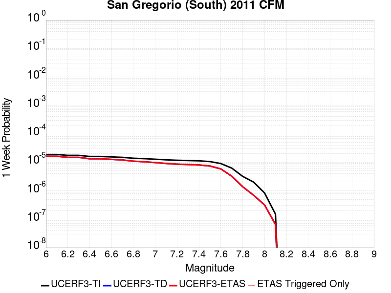 | 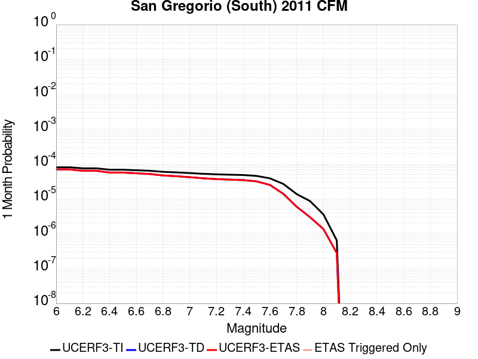 | 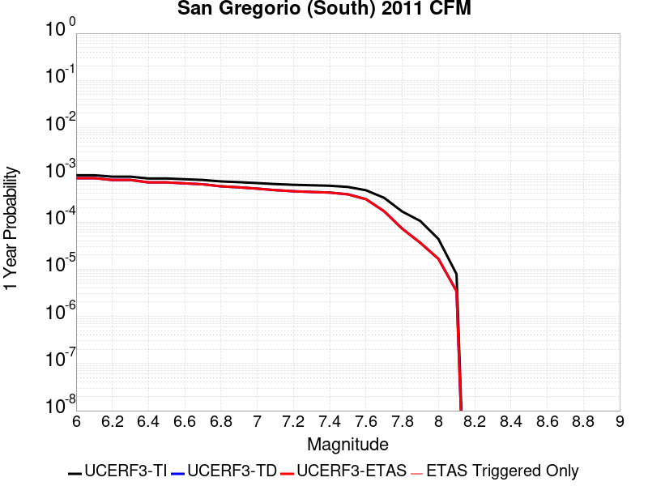 | 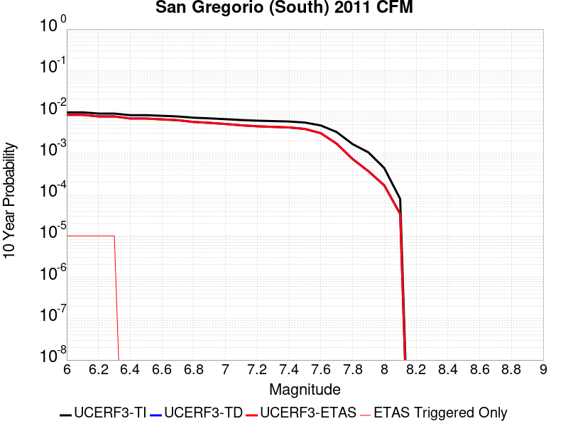 |

| Magnitude | 1 wk TI Prob | 1 wk TD Prob | 1 wk ETAS Prob | 1 wk ETAS/TD Gain | 1 wk ETAS Triggered Only | 1 mo TI Prob | 1 mo TD Prob | 1 mo ETAS Prob | 1 mo ETAS/TD Gain | 1 mo ETAS Triggered Only | 1 yr TI Prob | 1 yr TD Prob | 1 yr ETAS Prob | 1 yr ETAS/TD Gain | 1 yr ETAS Triggered Only | 10 yr TI Prob | 10 yr TD Prob | 10 yr ETAS Prob | 10 yr ETAS/TD Gain | 10 yr ETAS Triggered Only |
|-----|-----|-----|-----|-----|-----|-----|-----|-----|-----|-----|-----|-----|-----|-----|-----|-----|-----|-----|-----|-----|
| 6.0 | 1.8770423E-5 | 1.628639E-5 | 1.628639E-5 | 1.0 | 0.0 | 8.044219E-5 | 6.979697E-5 | 6.979697E-5 | 1.0 | 0.0 | 9.789435E-4 | 8.4945065E-4 | 8.4945065E-4 | 1.0 | 0.0 | 0.009746423 | 0.008474782 | 0.008484698 | 1.0011699 | 1.0E-5 |
| 6.1 | 1.8770423E-5 | 1.628639E-5 | 1.628639E-5 | 1.0 | 0.0 | 8.044219E-5 | 6.979697E-5 | 6.979697E-5 | 1.0 | 0.0 | 9.789435E-4 | 8.4945065E-4 | 8.4945065E-4 | 1.0 | 0.0 | 0.009746423 | 0.008474782 | 0.008484698 | 1.0011699 | 1.0E-5 |
| 6.2 | 1.7508692E-5 | 1.4905724E-5 | 1.4905724E-5 | 1.0 | 0.0 | 7.5035096E-5 | 6.388013E-5 | 6.388013E-5 | 1.0 | 0.0 | 9.1316935E-4 | 7.7746605E-4 | 7.7746605E-4 | 1.0 | 0.0 | 0.00909426 | 0.0077601233 | 0.007770046 | 1.0012786 | 1.0E-5 |
| 6.3 | 1.7508692E-5 | 1.4905724E-5 | 1.4905724E-5 | 1.0 | 0.0 | 7.5035096E-5 | 6.388013E-5 | 6.388013E-5 | 1.0 | 0.0 | 9.1316935E-4 | 7.7746605E-4 | 7.7746605E-4 | 1.0 | 0.0 | 0.00909426 | 0.0077601233 | 0.007770046 | 1.0012786 | 1.0E-5 |
| 6.4 | 1.6004591E-5 | 1.3255349E-5 | 1.3255349E-5 | 1.0 | 0.0 | 6.85893E-5 | 5.6807407E-5 | 5.6807407E-5 | 1.0 | 0.0 | 8.347548E-4 | 6.914117E-4 | 6.914117E-4 | 1.0 | 0.0 | 0.008316261 | 0.0069050672 | 0.0069050672 | 1.0 | 0.0 |
| 6.5 | 1.6004591E-5 | 1.3255349E-5 | 1.3255349E-5 | 1.0 | 0.0 | 6.85893E-5 | 5.6807407E-5 | 5.6807407E-5 | 1.0 | 0.0 | 8.347548E-4 | 6.914117E-4 | 6.914117E-4 | 1.0 | 0.0 | 0.008316261 | 0.0069050672 | 0.0069050672 | 1.0 | 0.0 |
| 6.6 | 1.5442201E-5 | 1.2639903E-5 | 1.2639903E-5 | 1.0 | 0.0 | 6.617918E-5 | 5.4169894E-5 | 5.4169894E-5 | 1.0 | 0.0 | 8.0543366E-4 | 6.5931975E-4 | 6.5931975E-4 | 1.0 | 0.0 | 0.008025207 | 0.00658608 | 0.00658608 | 1.0 | 0.0 |
| 6.7 | 1.489921E-5 | 1.2048342E-5 | 1.2048342E-5 | 1.0 | 0.0 | 6.3852196E-5 | 5.163473E-5 | 5.163473E-5 | 1.0 | 0.0 | 7.7712315E-4 | 6.2847225E-4 | 6.2847225E-4 | 1.0 | 0.0 | 0.0077441116 | 0.0062793777 | 0.0062793777 | 1.0 | 0.0 |
| 6.8 | 1.3876024E-5 | 1.092715E-5 | 1.092715E-5 | 1.0 | 0.0 | 5.9467322E-5 | 4.6829802E-5 | 4.6829802E-5 | 1.0 | 0.0 | 7.237741E-4 | 5.7000405E-4 | 5.7000405E-4 | 1.0 | 0.0 | 0.0072142133 | 0.0056978147 | 0.0056978147 | 1.0 | 0.0 |
| 6.9 | 1.33922495E-5 | 1.0398586E-5 | 1.0398586E-5 | 1.0 | 0.0 | 5.7394092E-5 | 4.456461E-5 | 4.456461E-5 | 1.0 | 0.0 | 6.9854903E-4 | 5.424393E-4 | 5.424393E-4 | 1.0 | 0.0 | 0.0069635725 | 0.005423539 | 0.005423539 | 1.0 | 0.0 |
| 7.0 | 1.2807324E-5 | 9.758467E-6 | 9.758467E-6 | 1.0 | 0.0 | 5.4887376E-5 | 4.182133E-5 | 4.182133E-5 | 1.0 | 0.0 | 6.680489E-4 | 5.090559E-4 | 5.090559E-4 | 1.0 | 0.0 | 0.006660442 | 0.0050912765 | 0.0050912765 | 1.0 | 0.0 |
| 7.1 | 1.2191438E-5 | 9.06724E-6 | 9.06724E-6 | 1.0 | 0.0 | 5.224797E-5 | 3.8859023E-5 | 3.8859023E-5 | 1.0 | 0.0 | 6.3593336E-4 | 4.73006E-4 | 4.73006E-4 | 1.0 | 0.0 | 0.0063411663 | 0.004732362 | 0.004732362 | 1.0 | 0.0 |
| 7.2 | 1.1769438E-5 | 8.587346E-6 | 8.587346E-6 | 1.0 | 0.0 | 5.0439474E-5 | 3.680239E-5 | 3.680239E-5 | 1.0 | 0.0 | 6.1392755E-4 | 4.4797707E-4 | 4.4797707E-4 | 1.0 | 0.0 | 0.0061223423 | 0.004483109 | 0.004483109 | 1.0 | 0.0 |
| 7.3 | 1.150374E-5 | 8.302744E-6 | 8.302744E-6 | 1.0 | 0.0 | 4.9300812E-5 | 3.5582703E-5 | 3.5582703E-5 | 1.0 | 0.0 | 6.0007203E-4 | 4.3313336E-4 | 4.3313336E-4 | 1.0 | 0.0 | 0.0059845424 | 0.004335243 | 0.004335243 | 1.0 | 0.0 |
| 7.4 | 1.12514E-5 | 8.048439E-6 | 8.048439E-6 | 1.0 | 0.0 | 4.8219394E-5 | 3.4492852E-5 | 3.4492852E-5 | 1.0 | 0.0 | 5.8691297E-4 | 4.198696E-4 | 4.198696E-4 | 1.0 | 0.0 | 0.005853653 | 0.0042031007 | 0.0042031007 | 1.0 | 0.0 |
| 7.5 | 1.059696E-5 | 7.3986594E-6 | 7.3986594E-6 | 1.0 | 0.0 | 4.5414752E-5 | 3.1708154E-5 | 3.1708154E-5 | 1.0 | 0.0 | 5.5278436E-4 | 3.8597846E-4 | 3.8597846E-4 | 1.0 | 0.0 | 0.0055141128 | 0.0038653538 | 0.0038653538 | 1.0 | 0.0 |
| 7.6 | 9.018592E-6 | 5.8421692E-6 | 5.8421692E-6 | 1.0 | 0.0 | 3.8650534E-5 | 2.5037627E-5 | 2.5037627E-5 | 1.0 | 0.0 | 4.7046866E-4 | 3.047905E-4 | 3.047905E-4 | 1.0 | 0.0 | 0.004694739 | 0.0030556195 | 0.0030556195 | 1.0 | 0.0 |
| 7.7 | 6.243489E-6 | 3.243797E-6 | 3.243797E-6 | 1.0 | 0.0 | 2.6757538E-5 | 1.3901913E-5 | 1.3901913E-5 | 1.0 | 0.0 | 3.257243E-4 | 1.6924264E-4 | 1.6924264E-4 | 1.0 | 0.0 | 0.003252473 | 0.0017013577 | 0.0017013577 | 1.0 | 0.0 |
| 7.8 | 3.1941963E-6 | 1.3836399E-6 | 1.3836399E-6 | 1.0 | 0.0 | 1.368934E-5 | 5.9298713E-6 | 5.9298713E-6 | 1.0 | 0.0 | 1.6665498E-4 | 7.21938E-5 | 7.21938E-5 | 1.0 | 0.0 | 0.0016653005 | 7.2771957E-4 | 7.2771957E-4 | 1.0 | 0.0 |
| 7.9 | 2.0098398E-6 | 6.936035E-7 | 6.936035E-7 | 1.0 | 0.0 | 8.6135715E-6 | 2.972583E-6 | 2.972583E-6 | 1.0 | 0.0 | 1.0486518E-4 | 3.61906E-5 | 3.61906E-5 | 1.0 | 0.0 | 0.0010481571 | 3.667823E-4 | 3.667823E-4 | 1.0 | 0.0 |
| 8.0 | 8.353119E-7 | 3.1717252E-7 | 3.1717252E-7 | 1.0 | 0.0 | 3.579903E-6 | 1.3593101E-6 | 1.3593101E-6 | 1.0 | 0.0 | 4.358445E-5 | 1.6549475E-5 | 1.6549475E-5 | 1.0 | 0.0 | 4.3575902E-4 | 1.6668532E-4 | 1.6668532E-4 | 1.0 | 0.0 |
| 8.1 | 1.5033264E-7 | 6.5432786E-8 | 6.5432786E-8 | 1.0 | 0.0 | 6.442826E-7 | 2.8042618E-7 | 2.8042618E-7 | 1.0 | 0.0 | 7.844113E-6 | 3.4141835E-6 | 3.4141835E-6 | 1.0 | 0.0 | 7.843835E-5 | 3.4158627E-5 | 3.4158627E-5 | 1.0 | 0.0 |

## Malibu Coast (Extension) alt 1
*[(top)](#table-of-contents)*

| 1 Week | 1 Month | 1 Year | 10 Year |
|-----|-----|-----|-----|
|  |  |  |  |

| Magnitude | 1 wk TI Prob | 1 wk TD Prob | 1 wk ETAS Prob | 1 wk ETAS/TD Gain | 1 wk ETAS Triggered Only | 1 mo TI Prob | 1 mo TD Prob | 1 mo ETAS Prob | 1 mo ETAS/TD Gain | 1 mo ETAS Triggered Only | 1 yr TI Prob | 1 yr TD Prob | 1 yr ETAS Prob | 1 yr ETAS/TD Gain | 1 yr ETAS Triggered Only | 10 yr TI Prob | 10 yr TD Prob | 10 yr ETAS Prob | 10 yr ETAS/TD Gain | 10 yr ETAS Triggered Only |
|-----|-----|-----|-----|-----|-----|-----|-----|-----|-----|-----|-----|-----|-----|-----|-----|-----|-----|-----|-----|-----|
| 6.0 | 8.930738E-6 | 9.329973E-6 | 9.329973E-6 | 1.0 | 0.0 | 3.827403E-5 | 3.9984996E-5 | 3.9984996E-5 | 1.0 | 0.0 | 4.6588664E-4 | 4.8671028E-4 | 4.8671028E-4 | 1.0 | 0.0 | 0.0046491115 | 0.004856626 | 0.004866577 | 1.0020491 | 1.0E-5 |
| 6.1 | 7.199952E-6 | 7.5308994E-6 | 7.5308994E-6 | 1.0 | 0.0 | 3.0856572E-5 | 3.227489E-5 | 3.227489E-5 | 1.0 | 0.0 | 3.75614E-4 | 3.928765E-4 | 3.928765E-4 | 1.0 | 0.0 | 0.0037497976 | 0.0039218855 | 0.0039318465 | 1.0025398 | 1.0E-5 |
| 6.2 | 6.3721413E-6 | 6.667345E-6 | 6.667345E-6 | 1.0 | 0.0 | 2.7308892E-5 | 2.8574026E-5 | 2.8574026E-5 | 1.0 | 0.0 | 3.3243504E-4 | 3.478336E-4 | 3.478336E-4 | 1.0 | 0.0 | 0.0033193815 | 0.0034729317 | 0.0034828968 | 1.0028694 | 1.0E-5 |
| 6.3 | 6.016345E-6 | 6.2956897E-6 | 6.2956897E-6 | 1.0 | 0.0 | 2.578408E-5 | 2.698125E-5 | 2.698125E-5 | 1.0 | 0.0 | 3.1387596E-4 | 3.2844752E-4 | 3.2844752E-4 | 1.0 | 0.0 | 0.00313433 | 0.003279657 | 0.0032896244 | 1.0030391 | 1.0E-5 |
| 6.4 | 5.8104883E-6 | 6.0800626E-6 | 6.0800626E-6 | 1.0 | 0.0 | 2.4901856E-5 | 2.6057152E-5 | 2.6057152E-5 | 1.0 | 0.0 | 3.031379E-4 | 3.1719997E-4 | 3.1719997E-4 | 1.0 | 0.0 | 0.0030272473 | 0.0031675068 | 0.0031774752 | 1.003147 | 1.0E-5 |
| 6.5 | 5.476925E-6 | 5.7280054E-6 | 5.7280054E-6 | 1.0 | 0.0 | 2.3472323E-5 | 2.4548364E-5 | 2.4548364E-5 | 1.0 | 0.0 | 2.8573806E-4 | 2.9883566E-4 | 2.9883566E-4 | 1.0 | 0.0 | 0.0028537093 | 0.0029843699 | 0.0029943401 | 1.0033408 | 1.0E-5 |
| 6.6 | 5.222387E-6 | 5.459052E-6 | 5.459052E-6 | 1.0 | 0.0 | 2.2381464E-5 | 2.3395727E-5 | 2.3395727E-5 | 1.0 | 0.0 | 2.7246025E-4 | 2.8480604E-4 | 2.8480604E-4 | 1.0 | 0.0 | 0.0027212645 | 0.002844441 | 0.0028544127 | 1.0035056 | 1.0E-5 |
| 6.7 | 5.0337076E-6 | 5.25956E-6 | 5.25956E-6 | 1.0 | 0.0 | 2.1572854E-5 | 2.2540778E-5 | 2.2540778E-5 | 1.0 | 0.0 | 2.6261783E-4 | 2.743997E-4 | 2.743997E-4 | 1.0 | 0.0 | 0.002623077 | 0.0027406388 | 0.0027506114 | 1.0036387 | 1.0E-5 |
| 6.8 | 4.5675624E-6 | 4.7591243E-6 | 4.7591243E-6 | 1.0 | 0.0 | 1.9575122E-5 | 2.0396088E-5 | 2.0396088E-5 | 1.0 | 0.0 | 2.3830103E-4 | 2.4829427E-4 | 2.4829427E-4 | 1.0 | 0.0 | 0.0023804565 | 0.0024801884 | 0.0024901635 | 1.004022 | 1.0E-5 |
| 6.9 | 4.2802412E-6 | 4.452401E-6 | 4.452401E-6 | 1.0 | 0.0 | 1.8343762E-5 | 1.908158E-5 | 1.908158E-5 | 1.0 | 0.0 | 2.2331243E-4 | 2.3229362E-4 | 2.3229362E-4 | 1.0 | 0.0 | 0.0022308815 | 0.0023205248 | 0.0023305016 | 1.0042994 | 1.0E-5 |
| 7.0 | 3.9794063E-6 | 4.1304497E-6 | 4.1304497E-6 | 1.0 | 0.0 | 1.7054486E-5 | 1.7701808E-5 | 1.7701808E-5 | 1.0 | 0.0 | 2.0761859E-4 | 2.1549831E-4 | 2.1549831E-4 | 1.0 | 0.0 | 0.0020742472 | 0.002152907 | 0.0021628854 | 1.0046349 | 1.0E-5 |
| 7.1 | 3.7730424E-6 | 3.91155E-6 | 3.91155E-6 | 1.0 | 0.0 | 1.6170083E-5 | 1.6763677E-5 | 1.6763677E-5 | 1.0 | 0.0 | 1.9685295E-4 | 2.0407878E-4 | 2.0407878E-4 | 1.0 | 0.0 | 0.0019667868 | 0.0020389266 | 0.0020489062 | 1.0048945 | 1.0E-5 |
| 7.2 | 3.424985E-6 | 3.541639E-6 | 3.541639E-6 | 1.0 | 0.0 | 1.4678424E-5 | 1.5178365E-5 | 1.5178365E-5 | 1.0 | 0.0 | 1.7869516E-4 | 1.8478103E-4 | 1.8478103E-4 | 1.0 | 0.0 | 0.0017855153 | 0.001846286 | 0.0018562676 | 1.0054063 | 1.0E-5 |
| 7.3 | 2.6966375E-6 | 2.7598792E-6 | 2.7598792E-6 | 1.0 | 0.0 | 1.15569665E-5 | 1.1828E-5 | 1.1828E-5 | 1.0 | 0.0 | 1.4069698E-4 | 1.4399643E-4 | 1.4399643E-4 | 1.0 | 0.0 | 0.0014060794 | 0.0014390353 | 0.0014490209 | 1.006939 | 1.0E-5 |
| 7.4 | 2.215957E-6 | 2.2495597E-6 | 2.2495597E-6 | 1.0 | 0.0 | 9.496924E-6 | 9.640935E-6 | 9.640935E-6 | 1.0 | 0.0 | 1.1561892E-4 | 1.17372096E-4 | 1.17372096E-4 | 1.0 | 0.0 | 0.0011555878 | 0.0011731047 | 0.0011830931 | 1.0085144 | 1.0E-5 |
| 7.5 | 1.2040218E-6 | 1.22201E-6 | 1.22201E-6 | 1.0 | 0.0 | 5.160083E-6 | 5.237175E-6 | 5.237175E-6 | 1.0 | 0.0 | 6.2822204E-5 | 6.376076E-5 | 6.376076E-5 | 1.0 | 0.0 | 6.280445E-4 | 6.3742656E-4 | 6.3742656E-4 | 1.0 | 0.0 |
| 7.6 | 6.6157446E-7 | 6.67956E-7 | 6.67956E-7 | 1.0 | 0.0 | 2.835316E-6 | 2.8626655E-6 | 2.8626655E-6 | 1.0 | 0.0 | 3.4519428E-5 | 3.485241E-5 | 3.485241E-5 | 1.0 | 0.0 | 3.4514067E-4 | 3.4847096E-4 | 3.4847096E-4 | 1.0 | 0.0 |
| 7.7 | 2.6012302E-7 | 2.4359613E-7 | 2.4359613E-7 | 1.0 | 0.0 | 1.1148124E-6 | 1.043983E-6 | 1.043983E-6 | 1.0 | 0.0 | 1.3572758E-5 | 1.2710431E-5 | 1.2710431E-5 | 1.0 | 0.0 | 1.3571928E-4 | 1.270981E-4 | 1.270981E-4 | 1.0 | 0.0 |
| 7.8 | 2.8323132E-8 | 2.0268452E-8 | 2.0268452E-8 | 1.0 | 0.0 | 1.2138484E-7 | 8.6864794E-8 | 8.6864794E-8 | 1.0 | 0.0 | 1.4778595E-6 | 1.0575784E-6 | 1.0575784E-6 | 1.0 | 0.0 | 1.4778497E-5 | 1.0575742E-5 | 1.0575742E-5 | 1.0 | 0.0 |

## Rinconada 2011 CFM
*[(top)](#table-of-contents)*

| 1 Week | 1 Month | 1 Year | 10 Year |
|-----|-----|-----|-----|
|  | 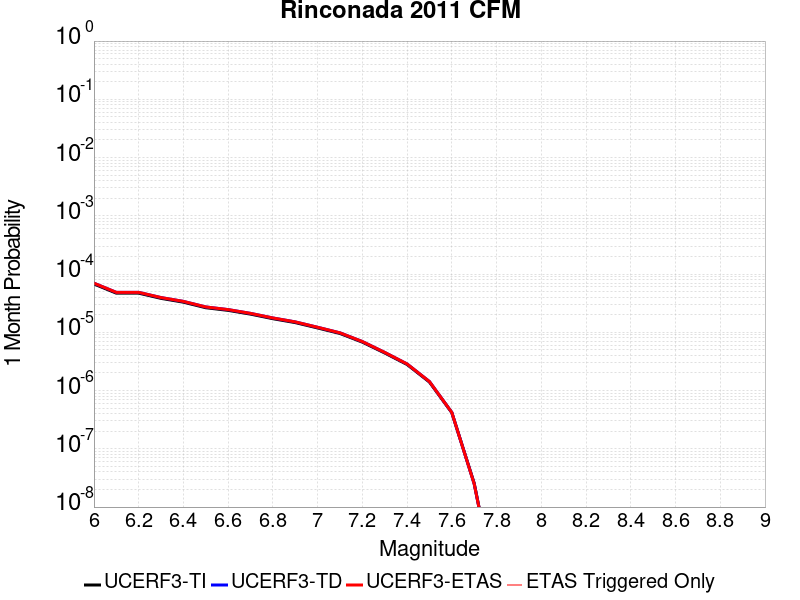 |  |  |

| Magnitude | 1 wk TI Prob | 1 wk TD Prob | 1 wk ETAS Prob | 1 wk ETAS/TD Gain | 1 wk ETAS Triggered Only | 1 mo TI Prob | 1 mo TD Prob | 1 mo ETAS Prob | 1 mo ETAS/TD Gain | 1 mo ETAS Triggered Only | 1 yr TI Prob | 1 yr TD Prob | 1 yr ETAS Prob | 1 yr ETAS/TD Gain | 1 yr ETAS Triggered Only | 10 yr TI Prob | 10 yr TD Prob | 10 yr ETAS Prob | 10 yr ETAS/TD Gain | 10 yr ETAS Triggered Only |
|-----|-----|-----|-----|-----|-----|-----|-----|-----|-----|-----|-----|-----|-----|-----|-----|-----|-----|-----|-----|-----|
| 6.0 | 1.5752368E-5 | 1.6275435E-5 | 1.6275435E-5 | 1.0 | 0.0 | 6.75084E-5 | 6.9750015E-5 | 6.9750015E-5 | 1.0 | 0.0 | 8.2160486E-4 | 8.488787E-4 | 8.588702E-4 | 1.0117702 | 1.0E-5 | 0.008185739 | 0.008456742 | 0.008466657 | 1.0011725 | 1.0E-5 |
| 6.1 | 1.0966133E-5 | 1.1323521E-5 | 1.1323521E-5 | 1.0 | 0.0 | 4.6996865E-5 | 4.8528476E-5 | 4.8528476E-5 | 1.0 | 0.0 | 5.720366E-4 | 5.9067475E-4 | 6.0066883E-4 | 1.0169197 | 1.0E-5 | 0.0057056635 | 0.005891144 | 0.005901085 | 1.0016874 | 1.0E-5 |
| 6.2 | 1.0966133E-5 | 1.1323521E-5 | 1.1323521E-5 | 1.0 | 0.0 | 4.6996865E-5 | 4.8528476E-5 | 4.8528476E-5 | 1.0 | 0.0 | 5.720366E-4 | 5.9067475E-4 | 6.0066883E-4 | 1.0169197 | 1.0E-5 | 0.0057056635 | 0.005891144 | 0.005901085 | 1.0016874 | 1.0E-5 |
| 6.3 | 8.926149E-6 | 9.213167E-6 | 9.213167E-6 | 1.0 | 0.0 | 3.8254362E-5 | 3.9484406E-5 | 3.9484406E-5 | 1.0 | 0.0 | 4.6564735E-4 | 4.8061693E-4 | 4.8061693E-4 | 1.0 | 0.0 | 0.0046467283 | 0.00479582 | 0.00479582 | 1.0 | 0.0 |
| 6.4 | 7.676955E-6 | 7.9205265E-6 | 7.9205265E-6 | 1.0 | 0.0 | 3.290082E-5 | 3.3944674E-5 | 3.3944674E-5 | 1.0 | 0.0 | 4.0049385E-4 | 4.1319823E-4 | 4.1319823E-4 | 1.0 | 0.0 | 0.0039977287 | 0.0041243257 | 0.0041243257 | 1.0 | 0.0 |
| 6.5 | 6.1671026E-6 | 6.35922E-6 | 6.35922E-6 | 1.0 | 0.0 | 2.6430173E-5 | 2.7253516E-5 | 2.7253516E-5 | 1.0 | 0.0 | 3.2173982E-4 | 3.3176114E-4 | 3.3176114E-4 | 1.0 | 0.0 | 0.003212744 | 0.0033126706 | 0.0033126706 | 1.0 | 0.0 |
| 6.6 | 5.553456E-6 | 5.72505E-6 | 5.72505E-6 | 1.0 | 0.0 | 2.3800309E-5 | 2.4535697E-5 | 2.4535697E-5 | 1.0 | 0.0 | 2.897302E-4 | 2.9868123E-4 | 2.9868123E-4 | 1.0 | 0.0 | 0.0028935277 | 0.0029828066 | 0.0029828066 | 1.0 | 0.0 |
| 6.7 | 4.787857E-6 | 4.9335113E-6 | 4.9335113E-6 | 1.0 | 0.0 | 2.0519226E-5 | 2.1143449E-5 | 2.1143449E-5 | 1.0 | 0.0 | 2.4979294E-4 | 2.573911E-4 | 2.573911E-4 | 1.0 | 0.0 | 0.0024951235 | 0.0025709358 | 0.0025709358 | 1.0 | 0.0 |
| 6.8 | 3.9955166E-6 | 4.11364E-6 | 4.11364E-6 | 1.0 | 0.0 | 1.7123532E-5 | 1.7629767E-5 | 1.7629767E-5 | 1.0 | 0.0 | 2.0845905E-4 | 2.146213E-4 | 2.146213E-4 | 1.0 | 0.0 | 0.002082636 | 0.002144144 | 0.002144144 | 1.0 | 0.0 |
| 6.9 | 3.4250072E-6 | 3.5225821E-6 | 3.5225821E-6 | 1.0 | 0.0 | 1.46785205E-5 | 1.5096693E-5 | 1.5096693E-5 | 1.0 | 0.0 | 1.7869633E-4 | 1.8378675E-4 | 1.8378675E-4 | 1.0 | 0.0 | 0.001785527 | 0.0018363501 | 0.0018363501 | 1.0 | 0.0 |
| 7.0 | 2.7712713E-6 | 2.8468053E-6 | 2.8468053E-6 | 1.0 | 0.0 | 1.1876823E-5 | 1.2200538E-5 | 1.2200538E-5 | 1.0 | 0.0 | 1.4459073E-4 | 1.4853143E-4 | 1.4853143E-4 | 1.0 | 0.0 | 0.0014449668 | 0.0014843232 | 0.0014843232 | 1.0 | 0.0 |
| 7.1 | 2.227358E-6 | 2.2857805E-6 | 2.2857805E-6 | 1.0 | 0.0 | 9.545785E-6 | 9.796166E-6 | 9.796166E-6 | 1.0 | 0.0 | 1.16213734E-4 | 1.1926179E-4 | 1.1926179E-4 | 1.0 | 0.0 | 0.0011615298 | 0.0011919789 | 0.0011919789 | 1.0 | 0.0 |
| 7.2 | 1.581796E-6 | 1.6209568E-6 | 1.6209568E-6 | 1.0 | 0.0 | 6.779108E-6 | 6.9469393E-6 | 6.9469393E-6 | 1.0 | 0.0 | 8.253252E-5 | 8.457571E-5 | 8.457571E-5 | 1.0 | 0.0 | 8.250187E-4 | 8.454357E-4 | 8.454357E-4 | 1.0 | 0.0 |
| 7.3 | 1.0306567E-6 | 1.0546827E-6 | 1.0546827E-6 | 1.0 | 0.0 | 4.4170924E-6 | 4.520061E-6 | 4.520061E-6 | 1.0 | 0.0 | 5.3776774E-5 | 5.5030352E-5 | 5.5030352E-5 | 1.0 | 0.0 | 5.376376E-4 | 5.501675E-4 | 5.501675E-4 | 1.0 | 0.0 |
| 7.4 | 6.535541E-7 | 6.6829654E-7 | 6.6829654E-7 | 1.0 | 0.0 | 2.800943E-6 | 2.8641248E-6 | 2.8641248E-6 | 1.0 | 0.0 | 3.4100947E-5 | 3.4870165E-5 | 3.4870165E-5 | 1.0 | 0.0 | 3.4095717E-4 | 3.4864704E-4 | 3.4864704E-4 | 1.0 | 0.0 |
| 7.5 | 3.2656962E-7 | 3.3317815E-7 | 3.3317815E-7 | 1.0 | 0.0 | 1.3995833E-6 | 1.4279057E-6 | 1.4279057E-6 | 1.0 | 0.0 | 1.7039794E-5 | 1.7384613E-5 | 1.7384613E-5 | 1.0 | 0.0 | 1.7038487E-4 | 1.7383257E-4 | 1.7383257E-4 | 1.0 | 0.0 |
| 7.6 | 9.754343E-8 | 9.8213114E-8 | 9.8213114E-8 | 1.0 | 0.0 | 4.180432E-7 | 4.2091327E-7 | 4.2091327E-7 | 1.0 | 0.0 | 5.089664E-6 | 5.124607E-6 | 5.124607E-6 | 1.0 | 0.0 | 5.0895473E-5 | 5.12449E-5 | 5.12449E-5 | 1.0 | 0.0 |
| 7.7 | 6.0001453E-9 | 5.8493015E-9 | 5.8493015E-9 | 1.0 | 0.0 | 2.5714908E-8 | 2.5068434E-8 | 2.5068434E-8 | 1.0 | 0.0 | 3.1307894E-7 | 3.0520815E-7 | 3.0520815E-7 | 1.0 | 0.0 | 3.1307852E-6 | 3.0520773E-6 | 3.0520773E-6 | 1.0 | 0.0 |
| 7.8 | 7.400003E-11 | 7.465528E-11 | 7.465528E-11 | 1.0 | 0.0 | 3.171432E-10 | 3.199514E-10 | 3.199514E-10 | 1.0 | 0.0 | 3.861218E-9 | 3.895409E-9 | 3.895409E-9 | 1.0 | 0.0 | 3.861218E-8 | 3.8954088E-8 | 3.8954088E-8 | 1.0 | 0.0 |

## Newport-Inglewood (Offshore)
*[(top)](#table-of-contents)*

| 1 Week | 1 Month | 1 Year | 10 Year |
|-----|-----|-----|-----|
|  |  |  |  |

| Magnitude | 1 wk TI Prob | 1 wk TD Prob | 1 wk ETAS Prob | 1 wk ETAS/TD Gain | 1 wk ETAS Triggered Only | 1 mo TI Prob | 1 mo TD Prob | 1 mo ETAS Prob | 1 mo ETAS/TD Gain | 1 mo ETAS Triggered Only | 1 yr TI Prob | 1 yr TD Prob | 1 yr ETAS Prob | 1 yr ETAS/TD Gain | 1 yr ETAS Triggered Only | 10 yr TI Prob | 10 yr TD Prob | 10 yr ETAS Prob | 10 yr ETAS/TD Gain | 10 yr ETAS Triggered Only |
|-----|-----|-----|-----|-----|-----|-----|-----|-----|-----|-----|-----|-----|-----|-----|-----|-----|-----|-----|-----|-----|
| 6.0 | 1.9626508E-5 | 1.896721E-5 | 1.896721E-5 | 1.0 | 0.0 | 8.411089E-5 | 8.128558E-5 | 8.128558E-5 | 1.0 | 0.0 | 0.001023569 | 9.892152E-4 | 9.992053E-4 | 1.010099 | 1.0E-5 | 0.010188672 | 0.009849462 | 0.009859364 | 1.0010053 | 1.0E-5 |
| 6.1 | 1.331886E-5 | 1.2219322E-5 | 1.2219322E-5 | 1.0 | 0.0 | 5.707958E-5 | 5.236748E-5 | 5.236748E-5 | 1.0 | 0.0 | 6.947222E-4 | 6.373891E-4 | 6.473827E-4 | 1.015679 | 1.0E-5 | 0.006925544 | 0.0063557867 | 0.006365723 | 1.0015633 | 1.0E-5 |
| 6.2 | 1.2250852E-5 | 1.1077154E-5 | 1.1077154E-5 | 1.0 | 0.0 | 5.2502597E-5 | 4.747266E-5 | 4.747266E-5 | 1.0 | 0.0 | 6.3903164E-4 | 5.7782733E-4 | 5.878216E-4 | 1.0172962 | 1.0E-5 | 0.006371971 | 0.00576337 | 0.0057733124 | 1.0017251 | 1.0E-5 |
| 6.3 | 1.2106258E-5 | 1.0919997E-5 | 1.0919997E-5 | 1.0 | 0.0 | 5.1882926E-5 | 4.6799156E-5 | 4.6799156E-5 | 1.0 | 0.0 | 6.3149154E-4 | 5.6963175E-4 | 5.7962607E-4 | 1.0175452 | 1.0E-5 | 0.0062970007 | 0.0056818333 | 0.0056917765 | 1.00175 | 1.0E-5 |
| 6.4 | 1.1348758E-5 | 1.0110395E-5 | 1.0110395E-5 | 1.0 | 0.0 | 4.8636626E-5 | 4.332955E-5 | 4.332955E-5 | 1.0 | 0.0 | 5.919901E-4 | 5.2741036E-4 | 5.2741036E-4 | 1.0 | 0.0 | 0.005904155 | 0.0052616824 | 0.0052616824 | 1.0 | 0.0 |
| 6.5 | 1.100837E-5 | 9.744385E-6 | 9.744385E-6 | 1.0 | 0.0 | 4.7177873E-5 | 4.1760988E-5 | 4.1760988E-5 | 1.0 | 0.0 | 5.7423924E-4 | 5.083222E-4 | 5.083222E-4 | 1.0 | 0.0 | 0.005727576 | 0.005071686 | 0.005071686 | 1.0 | 0.0 |
| 6.6 | 1.0634696E-5 | 9.3465E-6 | 9.3465E-6 | 1.0 | 0.0 | 4.557647E-5 | 4.0055813E-5 | 4.0055813E-5 | 1.0 | 0.0 | 5.5475225E-4 | 4.8757115E-4 | 4.8757115E-4 | 1.0 | 0.0 | 0.0055336943 | 0.004865101 | 0.004865101 | 1.0 | 0.0 |
| 6.7 | 9.9780855E-6 | 8.668802E-6 | 8.668802E-6 | 1.0 | 0.0 | 4.276252E-5 | 3.7151487E-5 | 3.7151487E-5 | 1.0 | 0.0 | 5.205093E-4 | 4.5222617E-4 | 4.5222617E-4 | 1.0 | 0.0 | 0.0051929182 | 0.004513138 | 0.004513138 | 1.0 | 0.0 |
| 6.8 | 9.59546E-6 | 8.273809E-6 | 8.273809E-6 | 1.0 | 0.0 | 4.1122752E-5 | 3.5458703E-5 | 3.5458703E-5 | 1.0 | 0.0 | 5.0055445E-4 | 4.3162485E-4 | 4.3162485E-4 | 1.0 | 0.0 | 0.004994285 | 0.004307941 | 0.004307941 | 1.0 | 0.0 |
| 6.9 | 9.000614E-6 | 7.707632E-6 | 7.707632E-6 | 1.0 | 0.0 | 3.857349E-5 | 3.3032295E-5 | 3.3032295E-5 | 1.0 | 0.0 | 4.6953102E-4 | 4.0209465E-4 | 4.0209465E-4 | 1.0 | 0.0 | 0.004685402 | 0.004013743 | 0.004013743 | 1.0 | 0.0 |
| 7.0 | 7.4070194E-6 | 6.1494907E-6 | 6.1494907E-6 | 1.0 | 0.0 | 3.1743984E-5 | 2.6354695E-5 | 2.6354695E-5 | 1.0 | 0.0 | 3.8641447E-4 | 3.2082133E-4 | 3.2082133E-4 | 1.0 | 0.0 | 0.0038574322 | 0.0032036016 | 0.0032036016 | 1.0 | 0.0 |
| 7.1 | 6.299615E-6 | 5.057077E-6 | 5.057077E-6 | 1.0 | 0.0 | 2.699807E-5 | 2.1673008E-5 | 2.1673008E-5 | 1.0 | 0.0 | 3.2865192E-4 | 2.6383705E-4 | 2.6383705E-4 | 1.0 | 0.0 | 0.003281663 | 0.002635253 | 0.002635253 | 1.0 | 0.0 |
| 7.2 | 5.096653E-6 | 3.8931703E-6 | 3.8931703E-6 | 1.0 | 0.0 | 2.1842614E-5 | 1.668491E-5 | 1.668491E-5 | 1.0 | 0.0 | 2.6590136E-4 | 2.0311994E-4 | 2.0311994E-4 | 1.0 | 0.0 | 0.0026558342 | 0.002029354 | 0.002029354 | 1.0 | 0.0 |
| 7.3 | 3.9753018E-6 | 2.9101893E-6 | 2.9101893E-6 | 1.0 | 0.0 | 1.7036897E-5 | 1.2472181E-5 | 1.2472181E-5 | 1.0 | 0.0 | 2.0740448E-4 | 1.5183829E-4 | 1.5183829E-4 | 1.0 | 0.0 | 0.00207211 | 0.0015173536 | 0.0015173536 | 1.0 | 0.0 |
| 7.4 | 3.0568392E-6 | 2.145217E-6 | 2.145217E-6 | 1.0 | 0.0 | 1.3100675E-5 | 9.1937545E-6 | 9.1937545E-6 | 1.0 | 0.0 | 1.5948903E-4 | 1.11928275E-4 | 1.11928275E-4 | 1.0 | 0.0 | 0.0015937461 | 0.0011187253 | 0.0011187253 | 1.0 | 0.0 |
| 7.5 | 1.7279019E-6 | 1.147124E-6 | 1.147124E-6 | 1.0 | 0.0 | 7.405273E-6 | 4.9162363E-6 | 4.9162363E-6 | 1.0 | 0.0 | 9.015547E-5 | 5.9853573E-5 | 5.9853573E-5 | 1.0 | 0.0 | 9.01189E-4 | 5.983784E-4 | 5.983784E-4 | 1.0 | 0.0 |
| 7.6 | 1.1156416E-6 | 7.223928E-7 | 7.223928E-7 | 1.0 | 0.0 | 4.7813123E-6 | 3.0959657E-6 | 3.0959657E-6 | 1.0 | 0.0 | 5.821092E-5 | 3.7692753E-5 | 3.7692753E-5 | 1.0 | 0.0 | 5.8195676E-4 | 3.7686594E-4 | 3.7686594E-4 | 1.0 | 0.0 |
| 7.7 | 9.117973E-8 | 6.7345866E-8 | 6.7345866E-8 | 1.0 | 0.0 | 3.907702E-7 | 2.886251E-7 | 2.886251E-7 | 1.0 | 0.0 | 4.757617E-6 | 3.5140051E-6 | 3.5140051E-6 | 1.0 | 0.0 | 4.7575148E-5 | 3.5139525E-5 | 3.5139525E-5 | 1.0 | 0.0 |

## Mission Creek
*[(top)](#table-of-contents)*

| 1 Week | 1 Month | 1 Year | 10 Year |
|-----|-----|-----|-----|
|  |  | 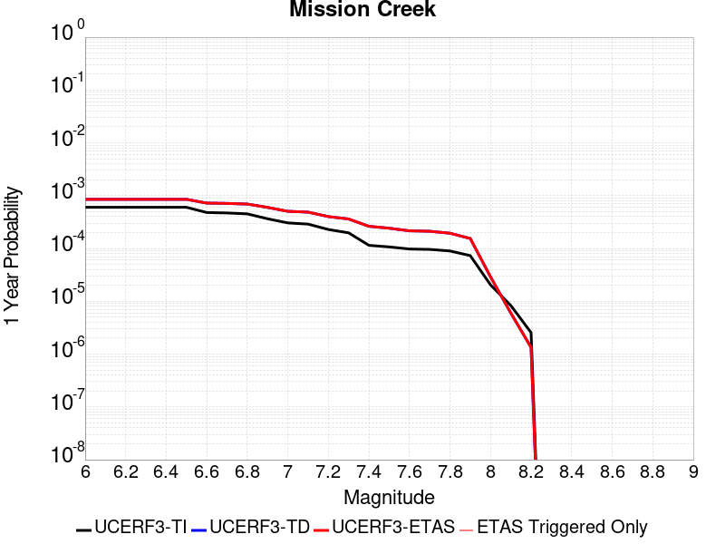 |  |

| Magnitude | 1 wk TI Prob | 1 wk TD Prob | 1 wk ETAS Prob | 1 wk ETAS/TD Gain | 1 wk ETAS Triggered Only | 1 mo TI Prob | 1 mo TD Prob | 1 mo ETAS Prob | 1 mo ETAS/TD Gain | 1 mo ETAS Triggered Only | 1 yr TI Prob | 1 yr TD Prob | 1 yr ETAS Prob | 1 yr ETAS/TD Gain | 1 yr ETAS Triggered Only | 10 yr TI Prob | 10 yr TD Prob | 10 yr ETAS Prob | 10 yr ETAS/TD Gain | 10 yr ETAS Triggered Only |
|-----|-----|-----|-----|-----|-----|-----|-----|-----|-----|-----|-----|-----|-----|-----|-----|-----|-----|-----|-----|-----|
| 6.0 | 1.1549387E-5 | 1.6345795E-5 | 1.6345795E-5 | 1.0 | 0.0 | 4.9496433E-5 | 7.005161E-5 | 7.005161E-5 | 1.0 | 0.0 | 6.0245243E-4 | 8.525597E-4 | 8.525597E-4 | 1.0 | 0.0 | 0.006008218 | 0.008521856 | 0.008531771 | 1.0011635 | 1.0E-5 |
| 6.1 | 1.1549387E-5 | 1.6345795E-5 | 1.6345795E-5 | 1.0 | 0.0 | 4.9496433E-5 | 7.005161E-5 | 7.005161E-5 | 1.0 | 0.0 | 6.0245243E-4 | 8.525597E-4 | 8.525597E-4 | 1.0 | 0.0 | 0.006008218 | 0.008521856 | 0.008531771 | 1.0011635 | 1.0E-5 |
| 6.2 | 1.1549387E-5 | 1.6345795E-5 | 1.6345795E-5 | 1.0 | 0.0 | 4.9496433E-5 | 7.005161E-5 | 7.005161E-5 | 1.0 | 0.0 | 6.0245243E-4 | 8.525597E-4 | 8.525597E-4 | 1.0 | 0.0 | 0.006008218 | 0.008521856 | 0.008531771 | 1.0011635 | 1.0E-5 |
| 6.3 | 1.1549387E-5 | 1.6345795E-5 | 1.6345795E-5 | 1.0 | 0.0 | 4.9496433E-5 | 7.005161E-5 | 7.005161E-5 | 1.0 | 0.0 | 6.0245243E-4 | 8.525597E-4 | 8.525597E-4 | 1.0 | 0.0 | 0.006008218 | 0.008521856 | 0.008531771 | 1.0011635 | 1.0E-5 |
| 6.4 | 1.1549387E-5 | 1.6345795E-5 | 1.6345795E-5 | 1.0 | 0.0 | 4.9496433E-5 | 7.005161E-5 | 7.005161E-5 | 1.0 | 0.0 | 6.0245243E-4 | 8.525597E-4 | 8.525597E-4 | 1.0 | 0.0 | 0.006008218 | 0.008521856 | 0.008531771 | 1.0011635 | 1.0E-5 |
| 6.5 | 1.1549387E-5 | 1.6345795E-5 | 1.6345795E-5 | 1.0 | 0.0 | 4.9496433E-5 | 7.005161E-5 | 7.005161E-5 | 1.0 | 0.0 | 6.0245243E-4 | 8.525597E-4 | 8.525597E-4 | 1.0 | 0.0 | 0.006008218 | 0.008521856 | 0.008531771 | 1.0011635 | 1.0E-5 |
| 6.6 | 9.202681E-6 | 1.386889E-5 | 1.386889E-5 | 1.0 | 0.0 | 3.9439463E-5 | 5.9436796E-5 | 5.9436796E-5 | 1.0 | 0.0 | 4.800697E-4 | 7.234118E-4 | 7.234118E-4 | 1.0 | 0.0 | 0.004790339 | 0.007238961 | 0.0072488883 | 1.0013714 | 1.0E-5 |
| 6.7 | 9.019164E-6 | 1.3674544E-5 | 1.3674544E-5 | 1.0 | 0.0 | 3.8652986E-5 | 5.8603924E-5 | 5.8603924E-5 | 1.0 | 0.0 | 4.7049852E-4 | 7.132782E-4 | 7.132782E-4 | 1.0 | 0.0 | 0.004695036 | 0.0071382783 | 0.007148207 | 1.0013909 | 1.0E-5 |
| 6.8 | 8.673558E-6 | 1.3296605E-5 | 1.3296605E-5 | 1.0 | 0.0 | 3.717186E-5 | 5.698426E-5 | 5.698426E-5 | 1.0 | 0.0 | 4.524734E-4 | 6.9357135E-4 | 6.9357135E-4 | 1.0 | 0.0 | 0.0045155324 | 0.006942443 | 0.006952374 | 1.0014304 | 1.0E-5 |
| 6.9 | 7.002255E-6 | 1.1500656E-5 | 1.1500656E-5 | 1.0 | 0.0 | 3.000932E-5 | 4.928763E-5 | 4.928763E-5 | 1.0 | 0.0 | 3.653022E-4 | 5.9991854E-4 | 5.9991854E-4 | 1.0 | 0.0 | 0.0036470229 | 0.0060111843 | 0.0060211243 | 1.0016536 | 1.0E-5 |
| 7.0 | 5.84644E-6 | 9.696806E-6 | 9.696806E-6 | 1.0 | 0.0 | 2.5055931E-5 | 4.1557105E-5 | 4.1557105E-5 | 1.0 | 0.0 | 3.0501327E-4 | 5.058449E-4 | 5.058449E-4 | 1.0 | 0.0 | 0.0030459496 | 0.005074921 | 0.0050848704 | 1.0019605 | 1.0E-5 |
| 7.1 | 5.54703E-6 | 9.3512035E-6 | 9.3512035E-6 | 1.0 | 0.0 | 2.377277E-5 | 4.0075996E-5 | 4.0075996E-5 | 1.0 | 0.0 | 2.8939504E-4 | 4.8782045E-4 | 4.8782045E-4 | 1.0 | 0.0 | 0.0028901845 | 0.0048954757 | 0.004905427 | 1.0020328 | 1.0E-5 |
| 7.2 | 4.384709E-6 | 7.702349E-6 | 7.702349E-6 | 1.0 | 0.0 | 1.8791474E-5 | 3.300967E-5 | 3.300967E-5 | 1.0 | 0.0 | 2.2876218E-4 | 4.0182227E-4 | 4.0182227E-4 | 1.0 | 0.0 | 0.0022852682 | 0.0040389015 | 0.004048861 | 1.002466 | 1.0E-5 |
| 7.3 | 3.7888456E-6 | 6.9358207E-6 | 6.9358207E-6 | 1.0 | 0.0 | 1.623781E-5 | 2.9724626E-5 | 2.9724626E-5 | 1.0 | 0.0 | 1.9767738E-4 | 3.618406E-4 | 3.618406E-4 | 1.0 | 0.0 | 0.0019750162 | 0.0036404422 | 0.0036504057 | 1.0027369 | 1.0E-5 |
| 7.4 | 2.1982462E-6 | 5.043541E-6 | 5.043541E-6 | 1.0 | 0.0 | 9.421021E-6 | 2.1614998E-5 | 2.1614998E-5 | 1.0 | 0.0 | 1.1469489E-4 | 2.6313102E-4 | 2.6313102E-4 | 1.0 | 0.0 | 0.0011463572 | 0.0026559075 | 0.002665881 | 1.0037552 | 1.0E-5 |
| 7.5 | 2.051923E-6 | 4.6342434E-6 | 4.6342434E-6 | 1.0 | 0.0 | 8.793926E-6 | 1.9860892E-5 | 1.9860892E-5 | 1.0 | 0.0 | 1.0706078E-4 | 2.4177968E-4 | 2.4177968E-4 | 1.0 | 0.0 | 0.0010700922 | 0.0024432896 | 0.0024532652 | 1.0040828 | 1.0E-5 |
| 7.6 | 1.8733427E-6 | 4.1419444E-6 | 4.1419444E-6 | 1.0 | 0.0 | 8.028587E-6 | 1.775107E-5 | 1.775107E-5 | 1.0 | 0.0 | 9.774366E-5 | 2.1609793E-4 | 2.1609793E-4 | 1.0 | 0.0 | 9.770069E-4 | 0.0021874912 | 0.0021974694 | 1.0045614 | 1.0E-5 |
| 7.7 | 1.8411953E-6 | 4.0614955E-6 | 4.0614955E-6 | 1.0 | 0.0 | 7.890813E-6 | 1.7406293E-5 | 1.7406293E-5 | 1.0 | 0.0 | 9.606641E-5 | 2.1190109E-4 | 2.1190109E-4 | 1.0 | 0.0 | 9.6024893E-4 | 0.0021457132 | 0.0021556919 | 1.0046505 | 1.0E-5 |
| 7.8 | 1.7194251E-6 | 3.7276084E-6 | 3.7276084E-6 | 1.0 | 0.0 | 7.368944E-6 | 1.5975367E-5 | 1.5975367E-5 | 1.0 | 0.0 | 8.97132E-5 | 1.9448281E-4 | 1.9448281E-4 | 1.0 | 0.0 | 8.967699E-4 | 0.001971057 | 0.0019810372 | 1.0050634 | 1.0E-5 |
| 7.9 | 1.4035052E-6 | 2.9641483E-6 | 2.9641483E-6 | 1.0 | 0.0 | 6.0150082E-6 | 1.2703431E-5 | 1.2703431E-5 | 1.0 | 0.0 | 7.3230265E-5 | 1.5465336E-4 | 1.5465336E-4 | 1.0 | 0.0 | 7.3206134E-4 | 0.0015702422 | 0.0015802266 | 1.0063584 | 1.0E-5 |
| 8.0 | 3.9318823E-7 | 5.562867E-7 | 5.562867E-7 | 1.0 | 0.0 | 1.6850913E-6 | 2.3840837E-6 | 2.3840837E-6 | 1.0 | 0.0 | 2.0515794E-5 | 2.9025838E-5 | 2.9025838E-5 | 1.0 | 0.0 | 2.0513899E-4 | 3.0078672E-4 | 3.0078672E-4 | 1.0 | 0.0 |
| 8.1 | 1.596793E-7 | 1.14993E-7 | 1.14993E-7 | 1.0 | 0.0 | 6.8433974E-7 | 4.9282704E-7 | 4.9282704E-7 | 1.0 | 0.0 | 8.331805E-6 | 6.000153E-6 | 6.000153E-6 | 1.0 | 0.0 | 8.331492E-5 | 6.6147746E-5 | 6.6147746E-5 | 1.0 | 0.0 |
| 8.2 | 4.9003038E-8 | 2.5747717E-8 | 2.5747717E-8 | 1.0 | 0.0 | 2.10013E-7 | 1.1034735E-7 | 1.1034735E-7 | 1.0 | 0.0 | 2.5569052E-6 | 1.3434782E-6 | 1.3434782E-6 | 1.0 | 0.0 | 2.556876E-5 | 1.512413E-5 | 1.512413E-5 | 1.0 | 0.0 |

## Oak Ridge (Onshore)
*[(top)](#table-of-contents)*

| 1 Week | 1 Month | 1 Year | 10 Year |
|-----|-----|-----|-----|
| 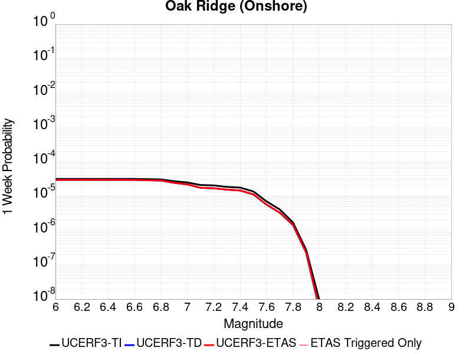 |  |  | 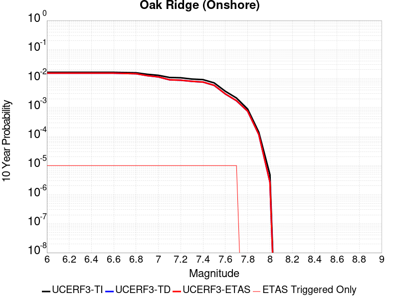 |

| Magnitude | 1 wk TI Prob | 1 wk TD Prob | 1 wk ETAS Prob | 1 wk ETAS/TD Gain | 1 wk ETAS Triggered Only | 1 mo TI Prob | 1 mo TD Prob | 1 mo ETAS Prob | 1 mo ETAS/TD Gain | 1 mo ETAS Triggered Only | 1 yr TI Prob | 1 yr TD Prob | 1 yr ETAS Prob | 1 yr ETAS/TD Gain | 1 yr ETAS Triggered Only | 10 yr TI Prob | 10 yr TD Prob | 10 yr ETAS Prob | 10 yr ETAS/TD Gain | 10 yr ETAS Triggered Only |
|-----|-----|-----|-----|-----|-----|-----|-----|-----|-----|-----|-----|-----|-----|-----|-----|-----|-----|-----|-----|-----|
| 6.0 | 3.155064E-5 | 2.9532512E-5 | 2.9532512E-5 | 1.0 | 0.0 | 1.3521002E-4 | 1.2656198E-4 | 1.2656198E-4 | 1.0 | 0.0 | 0.001644939 | 0.0015398411 | 0.0015398411 | 1.0 | 0.0 | 0.01632816 | 0.01529622 | 0.015306067 | 1.0006437 | 1.0E-5 |
| 6.1 | 3.155064E-5 | 2.9532512E-5 | 2.9532512E-5 | 1.0 | 0.0 | 1.3521002E-4 | 1.2656198E-4 | 1.2656198E-4 | 1.0 | 0.0 | 0.001644939 | 0.0015398411 | 0.0015398411 | 1.0 | 0.0 | 0.01632816 | 0.01529622 | 0.015306067 | 1.0006437 | 1.0E-5 |
| 6.2 | 3.155064E-5 | 2.9532512E-5 | 2.9532512E-5 | 1.0 | 0.0 | 1.3521002E-4 | 1.2656198E-4 | 1.2656198E-4 | 1.0 | 0.0 | 0.001644939 | 0.0015398411 | 0.0015398411 | 1.0 | 0.0 | 0.01632816 | 0.01529622 | 0.015306067 | 1.0006437 | 1.0E-5 |
| 6.3 | 3.155064E-5 | 2.9532512E-5 | 2.9532512E-5 | 1.0 | 0.0 | 1.3521002E-4 | 1.2656198E-4 | 1.2656198E-4 | 1.0 | 0.0 | 0.001644939 | 0.0015398411 | 0.0015398411 | 1.0 | 0.0 | 0.01632816 | 0.01529622 | 0.015306067 | 1.0006437 | 1.0E-5 |
| 6.4 | 3.155064E-5 | 2.9532512E-5 | 2.9532512E-5 | 1.0 | 0.0 | 1.3521002E-4 | 1.2656198E-4 | 1.2656198E-4 | 1.0 | 0.0 | 0.001644939 | 0.0015398411 | 0.0015398411 | 1.0 | 0.0 | 0.01632816 | 0.01529622 | 0.015306067 | 1.0006437 | 1.0E-5 |
| 6.5 | 3.155064E-5 | 2.9532512E-5 | 2.9532512E-5 | 1.0 | 0.0 | 1.3521002E-4 | 1.2656198E-4 | 1.2656198E-4 | 1.0 | 0.0 | 0.001644939 | 0.0015398411 | 0.0015398411 | 1.0 | 0.0 | 0.01632816 | 0.01529622 | 0.015306067 | 1.0006437 | 1.0E-5 |
| 6.6 | 3.155064E-5 | 2.9532512E-5 | 2.9532512E-5 | 1.0 | 0.0 | 1.3521002E-4 | 1.2656198E-4 | 1.2656198E-4 | 1.0 | 0.0 | 0.001644939 | 0.0015398411 | 0.0015398411 | 1.0 | 0.0 | 0.01632816 | 0.01529622 | 0.015306067 | 1.0006437 | 1.0E-5 |
| 6.7 | 3.098897E-5 | 2.8870556E-5 | 2.8870556E-5 | 1.0 | 0.0 | 1.328031E-4 | 1.237253E-4 | 1.237253E-4 | 1.0 | 0.0 | 0.0016156785 | 0.0015053523 | 0.0015053523 | 1.0 | 0.0 | 0.016039822 | 0.014955996 | 0.014965846 | 1.0006586 | 1.0E-5 |
| 6.8 | 3.0449872E-5 | 2.8245622E-5 | 2.8245622E-5 | 1.0 | 0.0 | 1.3049292E-4 | 1.21047255E-4 | 1.21047255E-4 | 1.0 | 0.0 | 0.0015875935 | 0.0014727913 | 0.0014727913 | 1.0 | 0.0 | 0.015762992 | 0.014634676 | 0.014644531 | 1.0006733 | 1.0E-5 |
| 6.9 | 2.697928E-5 | 2.4225177E-5 | 2.4225177E-5 | 1.0 | 0.0 | 1.15620365E-4 | 1.0381817E-4 | 1.0381817E-4 | 1.0 | 0.0 | 0.0014067689 | 0.0012632749 | 0.0012632749 | 1.0 | 0.0 | 0.0139789665 | 0.012563655 | 0.012573529 | 1.000786 | 1.0E-5 |
| 7.0 | 2.4893961E-5 | 2.1866983E-5 | 2.1866983E-5 | 1.0 | 0.0 | 1.0668404E-4 | 9.371237E-5 | 9.371237E-5 | 1.0 | 0.0 | 0.0012981043 | 0.0011403686 | 0.0011403686 | 1.0 | 0.0 | 0.012905477 | 0.011347455 | 0.011357341 | 1.0008713 | 1.0E-5 |
| 7.1 | 2.0945363E-5 | 1.7358561E-5 | 1.7358561E-5 | 1.0 | 0.0 | 8.976275E-5 | 7.439174E-5 | 7.439174E-5 | 1.0 | 0.0 | 0.0010923136 | 9.053479E-4 | 9.053479E-4 | 1.0 | 0.0 | 0.0108696 | 0.00901753 | 0.00902744 | 1.001099 | 1.0E-5 |
| 7.2 | 2.0439404E-5 | 1.6813401E-5 | 1.6813401E-5 | 1.0 | 0.0 | 8.7594504E-5 | 7.205547E-5 | 7.205547E-5 | 1.0 | 0.0 | 0.0010659413 | 8.7692693E-4 | 8.7692693E-4 | 1.0 | 0.0 | 0.010608427 | 0.008735584 | 0.008745496 | 1.0011348 | 1.0E-5 |
| 7.3 | 1.8463334E-5 | 1.538414E-5 | 1.538414E-5 | 1.0 | 0.0 | 7.912617E-5 | 6.5930384E-5 | 6.5930384E-5 | 1.0 | 0.0 | 9.6293533E-4 | 8.024112E-4 | 8.024112E-4 | 1.0 | 0.0 | 0.009587734 | 0.007996003 | 0.008005923 | 1.0012406 | 1.0E-5 |
| 7.4 | 1.763139E-5 | 1.4518894E-5 | 1.4518894E-5 | 1.0 | 0.0 | 7.556091E-5 | 6.2222374E-5 | 6.2222374E-5 | 1.0 | 0.0 | 9.1956573E-4 | 7.57298E-4 | 7.57298E-4 | 1.0 | 0.0 | 0.009157699 | 0.007547978 | 0.0075579025 | 1.0013149 | 1.0E-5 |
| 7.5 | 1.3594944E-5 | 1.1164755E-5 | 1.1164755E-5 | 1.0 | 0.0 | 5.8262744E-5 | 4.7848087E-5 | 4.7848087E-5 | 1.0 | 0.0 | 7.0911803E-4 | 5.823973E-4 | 5.823973E-4 | 1.0 | 0.0 | 0.007068595 | 0.005808981 | 0.005818923 | 1.0017115 | 1.0E-5 |
| 7.6 | 6.9889534E-6 | 5.6372537E-6 | 5.6372537E-6 | 1.0 | 0.0 | 2.9952313E-5 | 2.4159437E-5 | 2.4159437E-5 | 1.0 | 0.0 | 3.646084E-4 | 2.9410186E-4 | 2.9410186E-4 | 1.0 | 0.0 | 0.0036401073 | 0.0029371704 | 0.0029471412 | 1.0033946 | 1.0E-5 |
| 7.7 | 4.0824193E-6 | 3.2835633E-6 | 3.2835633E-6 | 1.0 | 0.0 | 1.7495966E-5 | 1.4072339E-5 | 1.4072339E-5 | 1.0 | 0.0 | 2.1299256E-4 | 1.7131738E-4 | 1.7131738E-4 | 1.0 | 0.0 | 0.0021278851 | 0.0017118666 | 0.0017218495 | 1.0058316 | 1.0E-5 |
| 7.8 | 1.7023609E-6 | 1.4371604E-6 | 1.4371604E-6 | 1.0 | 0.0 | 7.295812E-6 | 6.1592445E-6 | 6.1592445E-6 | 1.0 | 0.0 | 8.882289E-5 | 7.498625E-5 | 7.498625E-5 | 1.0 | 0.0 | 8.8787393E-4 | 7.496123E-4 | 7.496123E-4 | 1.0 | 0.0 |
| 7.9 | 2.721225E-7 | 2.2619045E-7 | 2.2619045E-7 | 1.0 | 0.0 | 1.1662388E-6 | 9.693873E-7 | 9.693873E-7 | 1.0 | 0.0 | 1.4198865E-5 | 1.180223E-5 | 1.180223E-5 | 1.0 | 0.0 | 1.4197957E-4 | 1.1801631E-4 | 1.1801631E-4 | 1.0 | 0.0 |
| 8.0 | 9.364255E-9 | 5.123234E-9 | 5.123234E-9 | 1.0 | 0.0 | 4.0132523E-8 | 2.1956716E-8 | 2.1956716E-8 | 1.0 | 0.0 | 4.8861335E-7 | 2.6732297E-7 | 2.6732297E-7 | 1.0 | 0.0 | 4.8861225E-6 | 2.673227E-6 | 2.673227E-6 | 1.0 | 0.0 |

## Anacapa-Dume alt 1
*[(top)](#table-of-contents)*

| 1 Week | 1 Month | 1 Year | 10 Year |
|-----|-----|-----|-----|
|  | 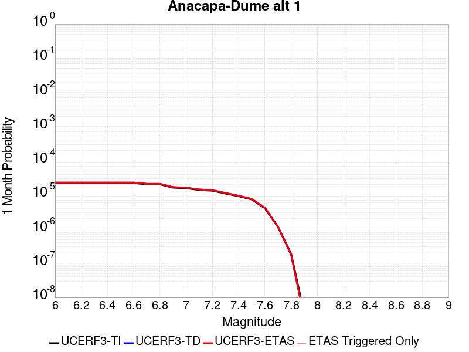 | 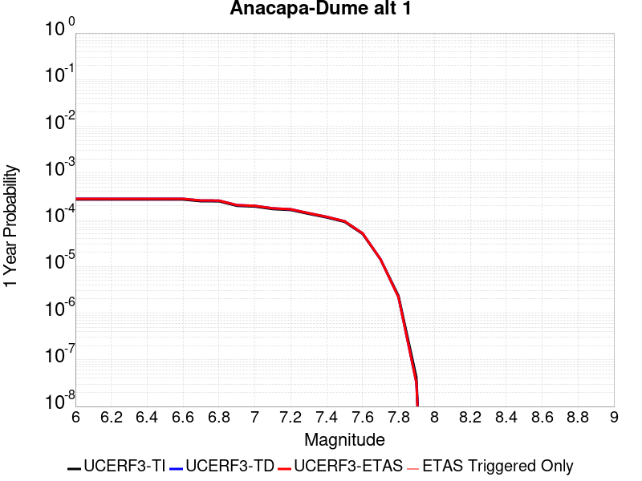 |  |

| Magnitude | 1 wk TI Prob | 1 wk TD Prob | 1 wk ETAS Prob | 1 wk ETAS/TD Gain | 1 wk ETAS Triggered Only | 1 mo TI Prob | 1 mo TD Prob | 1 mo ETAS Prob | 1 mo ETAS/TD Gain | 1 mo ETAS Triggered Only | 1 yr TI Prob | 1 yr TD Prob | 1 yr ETAS Prob | 1 yr ETAS/TD Gain | 1 yr ETAS Triggered Only | 10 yr TI Prob | 10 yr TD Prob | 10 yr ETAS Prob | 10 yr ETAS/TD Gain | 10 yr ETAS Triggered Only |
|-----|-----|-----|-----|-----|-----|-----|-----|-----|-----|-----|-----|-----|-----|-----|-----|-----|-----|-----|-----|-----|
| 6.0 | 5.1871802E-6 | 5.3676713E-6 | 5.3676713E-6 | 1.0 | 0.0 | 2.2230583E-5 | 2.3004108E-5 | 2.3004108E-5 | 1.0 | 0.0 | 2.7062374E-4 | 2.8003985E-4 | 2.8003985E-4 | 1.0 | 0.0 | 0.002702944 | 0.0027969552 | 0.002806927 | 1.0035653 | 1.0E-5 |
| 6.1 | 5.1871802E-6 | 5.3676713E-6 | 5.3676713E-6 | 1.0 | 0.0 | 2.2230583E-5 | 2.3004108E-5 | 2.3004108E-5 | 1.0 | 0.0 | 2.7062374E-4 | 2.8003985E-4 | 2.8003985E-4 | 1.0 | 0.0 | 0.002702944 | 0.0027969552 | 0.002806927 | 1.0035653 | 1.0E-5 |
| 6.2 | 5.1871802E-6 | 5.3676713E-6 | 5.3676713E-6 | 1.0 | 0.0 | 2.2230583E-5 | 2.3004108E-5 | 2.3004108E-5 | 1.0 | 0.0 | 2.7062374E-4 | 2.8003985E-4 | 2.8003985E-4 | 1.0 | 0.0 | 0.002702944 | 0.0027969552 | 0.002806927 | 1.0035653 | 1.0E-5 |
| 6.3 | 5.1871802E-6 | 5.3676713E-6 | 5.3676713E-6 | 1.0 | 0.0 | 2.2230583E-5 | 2.3004108E-5 | 2.3004108E-5 | 1.0 | 0.0 | 2.7062374E-4 | 2.8003985E-4 | 2.8003985E-4 | 1.0 | 0.0 | 0.002702944 | 0.0027969552 | 0.002806927 | 1.0035653 | 1.0E-5 |
| 6.4 | 5.1871802E-6 | 5.3676713E-6 | 5.3676713E-6 | 1.0 | 0.0 | 2.2230583E-5 | 2.3004108E-5 | 2.3004108E-5 | 1.0 | 0.0 | 2.7062374E-4 | 2.8003985E-4 | 2.8003985E-4 | 1.0 | 0.0 | 0.002702944 | 0.0027969552 | 0.002806927 | 1.0035653 | 1.0E-5 |
| 6.5 | 5.1871802E-6 | 5.3676713E-6 | 5.3676713E-6 | 1.0 | 0.0 | 2.2230583E-5 | 2.3004108E-5 | 2.3004108E-5 | 1.0 | 0.0 | 2.7062374E-4 | 2.8003985E-4 | 2.8003985E-4 | 1.0 | 0.0 | 0.002702944 | 0.0027969552 | 0.002806927 | 1.0035653 | 1.0E-5 |
| 6.6 | 5.1871802E-6 | 5.3676713E-6 | 5.3676713E-6 | 1.0 | 0.0 | 2.2230583E-5 | 2.3004108E-5 | 2.3004108E-5 | 1.0 | 0.0 | 2.7062374E-4 | 2.8003985E-4 | 2.8003985E-4 | 1.0 | 0.0 | 0.002702944 | 0.0027969552 | 0.002806927 | 1.0035653 | 1.0E-5 |
| 6.7 | 4.7693475E-6 | 4.9369546E-6 | 4.9369546E-6 | 1.0 | 0.0 | 2.04399E-5 | 2.115821E-5 | 2.115821E-5 | 1.0 | 0.0 | 2.4882736E-4 | 2.5757152E-4 | 2.5757152E-4 | 1.0 | 0.0 | 0.0024854892 | 0.0025728059 | 0.00258278 | 1.0038768 | 1.0E-5 |
| 6.8 | 4.753408E-6 | 4.9205023E-6 | 4.9205023E-6 | 1.0 | 0.0 | 2.037159E-5 | 2.10877E-5 | 2.10877E-5 | 1.0 | 0.0 | 2.4799586E-4 | 2.5671325E-4 | 2.5671325E-4 | 1.0 | 0.0 | 0.002477193 | 0.002564243 | 0.0025742175 | 1.0038898 | 1.0E-5 |
| 6.9 | 3.800069E-6 | 3.9373476E-6 | 3.9373476E-6 | 1.0 | 0.0 | 1.6285909E-5 | 1.6874239E-5 | 1.6874239E-5 | 1.0 | 0.0 | 1.9826289E-4 | 2.0542473E-4 | 2.0542473E-4 | 1.0 | 0.0 | 0.001980861 | 0.002052372 | 0.0020623517 | 1.0048624 | 1.0E-5 |
| 7.0 | 3.6671938E-6 | 3.800134E-6 | 3.800134E-6 | 1.0 | 0.0 | 1.571645E-5 | 1.6286187E-5 | 1.6286187E-5 | 1.0 | 0.0 | 1.9133097E-4 | 1.9826653E-4 | 1.9826653E-4 | 1.0 | 0.0 | 0.0019116632 | 0.0019809196 | 0.0019909 | 1.0050381 | 1.0E-5 |
| 7.1 | 3.2394885E-6 | 3.3589904E-6 | 3.3589904E-6 | 1.0 | 0.0 | 1.3883448E-5 | 1.4395595E-5 | 1.4395595E-5 | 1.0 | 0.0 | 1.6901788E-4 | 1.7525238E-4 | 1.7525238E-4 | 1.0 | 0.0 | 0.0016888938 | 0.0017511529 | 0.0017611354 | 1.0057005 | 1.0E-5 |
| 7.2 | 3.0935948E-6 | 3.2081164E-6 | 3.2081164E-6 | 1.0 | 0.0 | 1.3258196E-5 | 1.3748998E-5 | 1.3748998E-5 | 1.0 | 0.0 | 1.6140658E-4 | 1.673813E-4 | 1.673813E-4 | 1.0 | 0.0 | 0.001612894 | 0.0016725634 | 0.0016825466 | 1.0059688 | 1.0E-5 |
| 7.3 | 2.5604163E-6 | 2.6472246E-6 | 2.6472246E-6 | 1.0 | 0.0 | 1.0973167E-5 | 1.13452E-5 | 1.13452E-5 | 1.0 | 0.0 | 1.3359012E-4 | 1.381191E-4 | 1.381191E-4 | 1.0 | 0.0 | 0.0013350984 | 0.0013803372 | 0.0013903233 | 1.0072346 | 1.0E-5 |
| 7.4 | 2.1429005E-6 | 2.210728E-6 | 2.210728E-6 | 1.0 | 0.0 | 9.1838265E-6 | 9.474515E-6 | 9.474515E-6 | 1.0 | 0.0 | 1.11807356E-4 | 1.15346134E-4 | 1.15346134E-4 | 1.0 | 0.0 | 0.0011175112 | 0.0011528654 | 0.0011628538 | 1.008664 | 1.0E-5 |
| 7.5 | 1.7237151E-6 | 1.7762461E-6 | 1.7762461E-6 | 1.0 | 0.0 | 7.3873293E-6 | 7.612461E-6 | 7.612461E-6 | 1.0 | 0.0 | 8.993702E-5 | 9.2677794E-5 | 9.2677794E-5 | 1.0 | 0.0 | 8.990063E-4 | 9.263938E-4 | 9.263938E-4 | 1.0 | 0.0 |
| 7.6 | 9.541696E-7 | 9.823765E-7 | 9.823765E-7 | 1.0 | 0.0 | 4.089292E-6 | 4.2101783E-6 | 4.2101783E-6 | 1.0 | 0.0 | 4.9785995E-5 | 5.1257724E-5 | 5.1257724E-5 | 1.0 | 0.0 | 4.9774844E-4 | 5.124603E-4 | 5.124603E-4 | 1.0 | 0.0 |
| 7.7 | 2.7226676E-7 | 2.7173658E-7 | 2.7173658E-7 | 1.0 | 0.0 | 1.166857E-6 | 1.1645848E-6 | 1.1645848E-6 | 1.0 | 0.0 | 1.4206392E-5 | 1.4178729E-5 | 1.4178729E-5 | 1.0 | 0.0 | 1.4205484E-4 | 1.417783E-4 | 1.417783E-4 | 1.0 | 0.0 |
| 7.8 | 4.5017995E-8 | 4.2159332E-8 | 4.2159332E-8 | 1.0 | 0.0 | 1.9293425E-7 | 1.8068283E-7 | 1.8068283E-7 | 1.0 | 0.0 | 2.348972E-6 | 2.1998117E-6 | 2.1998117E-6 | 1.0 | 0.0 | 2.348947E-5 | 2.199792E-5 | 2.199792E-5 | 1.0 | 0.0 |
| 7.9 | 8.007447E-10 | 6.1612504E-10 | 6.1612504E-10 | 1.0 | 0.0 | 3.4317629E-9 | 2.6405358E-9 | 2.6405358E-9 | 1.0 | 0.0 | 4.1781714E-8 | 3.2148524E-8 | 3.2148524E-8 | 1.0 | 0.0 | 4.1781706E-7 | 3.214852E-7 | 3.214852E-7 | 1.0 | 0.0 |

## Great Valley 05 Pittsburg - Kirby Hills alt1
*[(top)](#table-of-contents)*

| 1 Week | 1 Month | 1 Year | 10 Year |
|-----|-----|-----|-----|
|  | 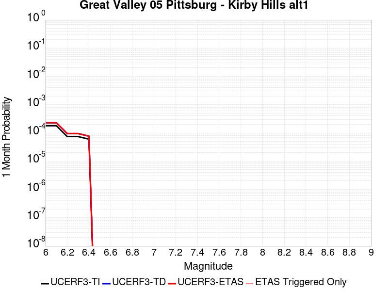 | 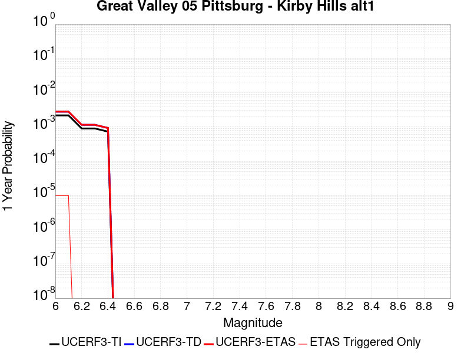 |  |

| Magnitude | 1 wk TI Prob | 1 wk TD Prob | 1 wk ETAS Prob | 1 wk ETAS/TD Gain | 1 wk ETAS Triggered Only | 1 mo TI Prob | 1 mo TD Prob | 1 mo ETAS Prob | 1 mo ETAS/TD Gain | 1 mo ETAS Triggered Only | 1 yr TI Prob | 1 yr TD Prob | 1 yr ETAS Prob | 1 yr ETAS/TD Gain | 1 yr ETAS Triggered Only | 10 yr TI Prob | 10 yr TD Prob | 10 yr ETAS Prob | 10 yr ETAS/TD Gain | 10 yr ETAS Triggered Only |
|-----|-----|-----|-----|-----|-----|-----|-----|-----|-----|-----|-----|-----|-----|-----|-----|-----|-----|-----|-----|-----|
| 6.0 | 4.187212E-5 | 5.346171E-5 | 5.346171E-5 | 1.0 | 0.0 | 1.794396E-4 | 2.2910618E-4 | 2.2910618E-4 | 1.0 | 0.0 | 0.002182488 | 0.002786782 | 0.0027967542 | 1.0035784 | 1.0E-5 | 0.021611776 | 0.027612798 | 0.02762252 | 1.0003521 | 1.0E-5 |
| 6.1 | 4.187212E-5 | 5.346171E-5 | 5.346171E-5 | 1.0 | 0.0 | 1.794396E-4 | 2.2910618E-4 | 2.2910618E-4 | 1.0 | 0.0 | 0.002182488 | 0.002786782 | 0.0027967542 | 1.0035784 | 1.0E-5 | 0.021611776 | 0.027612798 | 0.02762252 | 1.0003521 | 1.0E-5 |
| 6.2 | 1.7353306E-5 | 2.2162525E-5 | 2.2162525E-5 | 1.0 | 0.0 | 7.436919E-5 | 9.498003E-5 | 9.498003E-5 | 1.0 | 0.0 | 9.050688E-4 | 0.0011561753 | 0.0011561753 | 1.0 | 0.0 | 0.009013915 | 0.011539226 | 0.011539226 | 1.0 | 0.0 |
| 6.3 | 1.7353306E-5 | 2.2162525E-5 | 2.2162525E-5 | 1.0 | 0.0 | 7.436919E-5 | 9.498003E-5 | 9.498003E-5 | 1.0 | 0.0 | 9.050688E-4 | 0.0011561753 | 0.0011561753 | 1.0 | 0.0 | 0.009013915 | 0.011539226 | 0.011539226 | 1.0 | 0.0 |
| 6.4 | 1.4028824E-5 | 1.7907167E-5 | 1.7907167E-5 | 1.0 | 0.0 | 6.0122147E-5 | 7.6745E-5 | 7.6745E-5 | 1.0 | 0.0 | 7.3174125E-4 | 9.343703E-4 | 9.343703E-4 | 1.0 | 0.0 | 0.0072933645 | 0.009341467 | 0.009341467 | 1.0 | 0.0 |

## Channel Islands Thrust
*[(top)](#table-of-contents)*

| 1 Week | 1 Month | 1 Year | 10 Year |
|-----|-----|-----|-----|
|  |  |  |  |

| Magnitude | 1 wk TI Prob | 1 wk TD Prob | 1 wk ETAS Prob | 1 wk ETAS/TD Gain | 1 wk ETAS Triggered Only | 1 mo TI Prob | 1 mo TD Prob | 1 mo ETAS Prob | 1 mo ETAS/TD Gain | 1 mo ETAS Triggered Only | 1 yr TI Prob | 1 yr TD Prob | 1 yr ETAS Prob | 1 yr ETAS/TD Gain | 1 yr ETAS Triggered Only | 10 yr TI Prob | 10 yr TD Prob | 10 yr ETAS Prob | 10 yr ETAS/TD Gain | 10 yr ETAS Triggered Only |
|-----|-----|-----|-----|-----|-----|-----|-----|-----|-----|-----|-----|-----|-----|-----|-----|-----|-----|-----|-----|-----|
| 6.0 | 2.2156251E-5 | 2.4094834E-5 | 2.4094834E-5 | 1.0 | 0.0 | 9.495191E-5 | 1.0326009E-4 | 1.0326009E-4 | 1.0 | 0.0 | 0.0011554264 | 0.0012565731 | 0.0012665605 | 1.0079482 | 1.0E-5 | 0.011494373 | 0.012505272 | 0.012515148 | 1.0007896 | 1.0E-5 |
| 6.1 | 2.2156251E-5 | 2.4094834E-5 | 2.4094834E-5 | 1.0 | 0.0 | 9.495191E-5 | 1.0326009E-4 | 1.0326009E-4 | 1.0 | 0.0 | 0.0011554264 | 0.0012565731 | 0.0012665605 | 1.0079482 | 1.0E-5 | 0.011494373 | 0.012505272 | 0.012515148 | 1.0007896 | 1.0E-5 |
| 6.2 | 2.2156251E-5 | 2.4094834E-5 | 2.4094834E-5 | 1.0 | 0.0 | 9.495191E-5 | 1.0326009E-4 | 1.0326009E-4 | 1.0 | 0.0 | 0.0011554264 | 0.0012565731 | 0.0012665605 | 1.0079482 | 1.0E-5 | 0.011494373 | 0.012505272 | 0.012515148 | 1.0007896 | 1.0E-5 |
| 6.3 | 2.2156251E-5 | 2.4094834E-5 | 2.4094834E-5 | 1.0 | 0.0 | 9.495191E-5 | 1.0326009E-4 | 1.0326009E-4 | 1.0 | 0.0 | 0.0011554264 | 0.0012565731 | 0.0012665605 | 1.0079482 | 1.0E-5 | 0.011494373 | 0.012505272 | 0.012515148 | 1.0007896 | 1.0E-5 |
| 6.4 | 2.2156251E-5 | 2.4094834E-5 | 2.4094834E-5 | 1.0 | 0.0 | 9.495191E-5 | 1.0326009E-4 | 1.0326009E-4 | 1.0 | 0.0 | 0.0011554264 | 0.0012565731 | 0.0012665605 | 1.0079482 | 1.0E-5 | 0.011494373 | 0.012505272 | 0.012515148 | 1.0007896 | 1.0E-5 |
| 6.5 | 2.2156251E-5 | 2.4094834E-5 | 2.4094834E-5 | 1.0 | 0.0 | 9.495191E-5 | 1.0326009E-4 | 1.0326009E-4 | 1.0 | 0.0 | 0.0011554264 | 0.0012565731 | 0.0012665605 | 1.0079482 | 1.0E-5 | 0.011494373 | 0.012505272 | 0.012515148 | 1.0007896 | 1.0E-5 |
| 6.6 | 2.2156251E-5 | 2.4094834E-5 | 2.4094834E-5 | 1.0 | 0.0 | 9.495191E-5 | 1.0326009E-4 | 1.0326009E-4 | 1.0 | 0.0 | 0.0011554264 | 0.0012565731 | 0.0012665605 | 1.0079482 | 1.0E-5 | 0.011494373 | 0.012505272 | 0.012515148 | 1.0007896 | 1.0E-5 |
| 6.7 | 1.0601296E-5 | 1.1380667E-5 | 1.1380667E-5 | 1.0 | 0.0 | 4.5433335E-5 | 4.8773403E-5 | 4.8773403E-5 | 1.0 | 0.0 | 5.5301044E-4 | 5.936593E-4 | 6.036533E-4 | 1.0168347 | 1.0E-5 | 0.005516363 | 0.0059212362 | 0.0059311767 | 1.0016788 | 1.0E-5 |
| 6.8 | 1.0246747E-5 | 1.0997752E-5 | 1.0997752E-5 | 1.0 | 0.0 | 4.391389E-5 | 4.7132395E-5 | 4.7132395E-5 | 1.0 | 0.0 | 5.345204E-4 | 5.7369063E-4 | 5.836849E-4 | 1.017421 | 1.0E-5 | 0.0053323656 | 0.0057225865 | 0.0057325293 | 1.0017375 | 1.0E-5 |
| 6.9 | 9.049551E-6 | 9.700583E-6 | 9.700583E-6 | 1.0 | 0.0 | 3.878322E-5 | 4.157329E-5 | 4.157329E-5 | 1.0 | 0.0 | 4.7208337E-4 | 5.0604134E-4 | 5.0604134E-4 | 1.0 | 0.0 | 0.0047108172 | 0.005049308 | 0.005049308 | 1.0 | 0.0 |
| 7.0 | 8.6542195E-6 | 9.2755E-6 | 9.2755E-6 | 1.0 | 0.0 | 3.7088983E-5 | 3.9751558E-5 | 3.9751558E-5 | 1.0 | 0.0 | 4.5146482E-4 | 4.8387185E-4 | 4.8387185E-4 | 1.0 | 0.0 | 0.004505487 | 0.004828595 | 0.004828595 | 1.0 | 0.0 |
| 7.1 | 8.391028E-6 | 8.993796E-6 | 8.993796E-6 | 1.0 | 0.0 | 3.5961057E-5 | 3.854429E-5 | 3.854429E-5 | 1.0 | 0.0 | 4.3773788E-4 | 4.6917977E-4 | 4.6917977E-4 | 1.0 | 0.0 | 0.004368766 | 0.0046823025 | 0.0046823025 | 1.0 | 0.0 |
| 7.2 | 5.965188E-6 | 6.372285E-6 | 6.372285E-6 | 1.0 | 0.0 | 2.556484E-5 | 2.730951E-5 | 2.730951E-5 | 1.0 | 0.0 | 3.1120746E-4 | 3.3244313E-4 | 3.3244313E-4 | 1.0 | 0.0 | 0.00310772 | 0.003319516 | 0.003319516 | 1.0 | 0.0 |
| 7.3 | 4.877518E-6 | 5.206485E-6 | 5.206485E-6 | 1.0 | 0.0 | 2.0903482E-5 | 2.2313321E-5 | 2.2313321E-5 | 1.0 | 0.0 | 2.5447016E-4 | 2.7163126E-4 | 2.7163126E-4 | 1.0 | 0.0 | 0.0025417898 | 0.0027130388 | 0.0027130388 | 1.0 | 0.0 |
| 7.4 | 3.8829853E-6 | 4.1422427E-6 | 4.1422427E-6 | 1.0 | 0.0 | 1.664126E-5 | 1.775235E-5 | 1.775235E-5 | 1.0 | 0.0 | 2.0258849E-4 | 2.1611385E-4 | 2.1611385E-4 | 1.0 | 0.0 | 0.002024039 | 0.0021590786 | 0.0021590786 | 1.0 | 0.0 |
| 7.5 | 1.3489616E-6 | 1.4279142E-6 | 1.4279142E-6 | 1.0 | 0.0 | 5.7812517E-6 | 6.1196183E-6 | 6.1196183E-6 | 1.0 | 0.0 | 7.038446E-5 | 7.450384E-5 | 7.450384E-5 | 1.0 | 0.0 | 7.036218E-4 | 7.4479263E-4 | 7.4479263E-4 | 1.0 | 0.0 |
| 7.6 | 6.058192E-7 | 6.354317E-7 | 6.354317E-7 | 1.0 | 0.0 | 2.5963652E-6 | 2.7232759E-6 | 2.7232759E-6 | 1.0 | 0.0 | 3.161029E-5 | 3.3155397E-5 | 3.3155397E-5 | 1.0 | 0.0 | 3.1605794E-4 | 3.3150613E-4 | 3.3150613E-4 | 1.0 | 0.0 |
| 7.7 | 2.2170494E-7 | 2.2609672E-7 | 2.2609672E-7 | 1.0 | 0.0 | 9.5016367E-7 | 9.689857E-7 | 9.689857E-7 | 1.0 | 0.0 | 1.1568181E-5 | 1.1797348E-5 | 1.1797348E-5 | 1.0 | 0.0 | 1.1567579E-4 | 1.17968324E-4 | 1.17968324E-4 | 1.0 | 0.0 |
| 7.8 | 2.1613102E-8 | 1.5467746E-8 | 1.5467746E-8 | 1.0 | 0.0 | 9.262757E-8 | 6.629034E-8 | 6.629034E-8 | 1.0 | 0.0 | 1.1277401E-6 | 8.070847E-7 | 8.070847E-7 | 1.0 | 0.0 | 1.1277344E-5 | 8.070825E-6 | 8.070825E-6 | 1.0 | 0.0 |

## Emerson-Copper Mtn 2011
*[(top)](#table-of-contents)*

| 1 Week | 1 Month | 1 Year | 10 Year |
|-----|-----|-----|-----|
|  |  |  |  |

| Magnitude | 1 wk TI Prob | 1 wk TD Prob | 1 wk ETAS Prob | 1 wk ETAS/TD Gain | 1 wk ETAS Triggered Only | 1 mo TI Prob | 1 mo TD Prob | 1 mo ETAS Prob | 1 mo ETAS/TD Gain | 1 mo ETAS Triggered Only | 1 yr TI Prob | 1 yr TD Prob | 1 yr ETAS Prob | 1 yr ETAS/TD Gain | 1 yr ETAS Triggered Only | 10 yr TI Prob | 10 yr TD Prob | 10 yr ETAS Prob | 10 yr ETAS/TD Gain | 10 yr ETAS Triggered Only |
|-----|-----|-----|-----|-----|-----|-----|-----|-----|-----|-----|-----|-----|-----|-----|-----|-----|-----|-----|-----|-----|
| 6.0 | 2.1364202E-5 | 9.969751E-6 | 9.969751E-6 | 1.0 | 0.0 | 9.1557646E-5 | 4.2726853E-5 | 4.2726853E-5 | 1.0 | 0.0 | 0.0011141442 | 5.20084E-4 | 5.3007883E-4 | 1.0192176 | 1.0E-5 | 0.011085749 | 0.0051895385 | 0.005199487 | 1.001917 | 1.0E-5 |
| 6.1 | 2.1364202E-5 | 9.969751E-6 | 9.969751E-6 | 1.0 | 0.0 | 9.1557646E-5 | 4.2726853E-5 | 4.2726853E-5 | 1.0 | 0.0 | 0.0011141442 | 5.20084E-4 | 5.3007883E-4 | 1.0192176 | 1.0E-5 | 0.011085749 | 0.0051895385 | 0.005199487 | 1.001917 | 1.0E-5 |
| 6.2 | 2.1364202E-5 | 9.969751E-6 | 9.969751E-6 | 1.0 | 0.0 | 9.1557646E-5 | 4.2726853E-5 | 4.2726853E-5 | 1.0 | 0.0 | 0.0011141442 | 5.20084E-4 | 5.3007883E-4 | 1.0192176 | 1.0E-5 | 0.011085749 | 0.0051895385 | 0.005199487 | 1.001917 | 1.0E-5 |
| 6.3 | 1.7751237E-5 | 8.090614E-6 | 8.090614E-6 | 1.0 | 0.0 | 7.607452E-5 | 3.4673634E-5 | 3.4673634E-5 | 1.0 | 0.0 | 9.258136E-4 | 4.2207597E-4 | 4.3207177E-4 | 1.0236825 | 1.0E-5 | 0.00921966 | 0.004213366 | 0.004223324 | 1.0023634 | 1.0E-5 |
| 6.4 | 1.7751237E-5 | 8.090614E-6 | 8.090614E-6 | 1.0 | 0.0 | 7.607452E-5 | 3.4673634E-5 | 3.4673634E-5 | 1.0 | 0.0 | 9.258136E-4 | 4.2207597E-4 | 4.3207177E-4 | 1.0236825 | 1.0E-5 | 0.00921966 | 0.004213366 | 0.004223324 | 1.0023634 | 1.0E-5 |
| 6.5 | 1.5886664E-5 | 6.604985E-6 | 6.604985E-6 | 1.0 | 0.0 | 6.808392E-5 | 2.83068E-5 | 2.83068E-5 | 1.0 | 0.0 | 8.286065E-4 | 3.4458548E-4 | 3.5458204E-4 | 1.0290104 | 1.0E-5 | 0.008255237 | 0.0034409761 | 0.0034509418 | 1.0028962 | 1.0E-5 |
| 6.6 | 1.5886664E-5 | 6.604985E-6 | 6.604985E-6 | 1.0 | 0.0 | 6.808392E-5 | 2.83068E-5 | 2.83068E-5 | 1.0 | 0.0 | 8.286065E-4 | 3.4458548E-4 | 3.5458204E-4 | 1.0290104 | 1.0E-5 | 0.008255237 | 0.0034409761 | 0.0034509418 | 1.0028962 | 1.0E-5 |
| 6.7 | 1.428471E-5 | 5.4714073E-6 | 5.4714073E-6 | 1.0 | 0.0 | 6.121875E-5 | 2.34487E-5 | 2.34487E-5 | 1.0 | 0.0 | 7.450834E-4 | 2.8545447E-4 | 2.954516E-4 | 1.0350219 | 1.0E-5 | 0.007425902 | 0.0028512662 | 0.0028612376 | 1.0034972 | 1.0E-5 |
| 6.8 | 1.3490684E-5 | 5.074642E-6 | 5.074642E-6 | 1.0 | 0.0 | 5.7815934E-5 | 2.1748307E-5 | 2.1748307E-5 | 1.0 | 0.0 | 7.0368167E-4 | 2.6475734E-4 | 2.7475468E-4 | 1.0377605 | 1.0E-5 | 0.007014576 | 0.0026448 | 0.0026547736 | 1.003771 | 1.0E-5 |
| 6.9 | 1.2235421E-5 | 4.2905367E-6 | 4.2905367E-6 | 1.0 | 0.0 | 5.2436466E-5 | 1.8387906E-5 | 1.8387906E-5 | 1.0 | 0.0 | 6.38227E-4 | 2.2385335E-4 | 2.3385111E-4 | 1.0446621 | 1.0E-5 | 0.0063639707 | 0.002236633 | 0.0022466108 | 1.004461 | 1.0E-5 |
| 7.0 | 1.1009851E-5 | 3.7197753E-6 | 3.7197753E-6 | 1.0 | 0.0 | 4.7184225E-5 | 1.5941816E-5 | 1.5941816E-5 | 1.0 | 0.0 | 5.743165E-4 | 1.9407776E-4 | 2.0407583E-4 | 1.0515157 | 1.0E-5 | 0.005728345 | 0.0019394207 | 0.0019494013 | 1.0051461 | 1.0E-5 |
| 7.1 | 9.726373E-6 | 3.2124865E-6 | 3.2124865E-6 | 1.0 | 0.0 | 4.168379E-5 | 1.3767745E-5 | 1.3767745E-5 | 1.0 | 0.0 | 5.07382E-4 | 1.6761279E-4 | 1.7761112E-4 | 1.0596514 | 1.0E-5 | 0.0050622504 | 0.0016751951 | 0.0016851784 | 1.0059595 | 1.0E-5 |
| 7.2 | 3.9335127E-6 | 1.1527233E-6 | 1.1527233E-6 | 1.0 | 0.0 | 1.6857803E-5 | 4.940234E-6 | 4.940234E-6 | 1.0 | 0.0 | 2.0522442E-4 | 6.0145747E-5 | 7.014514E-5 | 1.1662529 | 1.0E-5 | 0.00205035 | 6.013006E-4 | 6.1129464E-4 | 1.0166206 | 1.0E-5 |
| 7.3 | 2.661632E-6 | 6.91309E-7 | 6.91309E-7 | 1.0 | 0.0 | 1.14069435E-5 | 2.9627495E-6 | 2.9627495E-6 | 1.0 | 0.0 | 1.3887069E-4 | 3.607089E-5 | 4.6070527E-5 | 1.2772219 | 1.0E-5 | 0.0013878393 | 3.6065138E-4 | 3.706478E-4 | 1.0277176 | 1.0E-5 |
| 7.4 | 2.0893426E-6 | 5.463086E-7 | 5.463086E-7 | 1.0 | 0.0 | 8.954295E-6 | 2.3413206E-6 | 2.3413206E-6 | 1.0 | 0.0 | 1.0901308E-4 | 2.850521E-5 | 2.850521E-5 | 1.0 | 0.0 | 0.0010895962 | 2.8501608E-4 | 2.8501608E-4 | 1.0 | 0.0 |
| 7.5 | 1.1681728E-6 | 3.6037605E-7 | 3.6037605E-7 | 1.0 | 0.0 | 5.0064455E-6 | 1.544468E-6 | 1.544468E-6 | 1.0 | 0.0 | 6.0951766E-5 | 1.880374E-5 | 1.880374E-5 | 1.0 | 0.0 | 6.093505E-4 | 1.8802195E-4 | 1.8802195E-4 | 1.0 | 0.0 |
| 7.6 | 1.3154387E-7 | 7.120617E-8 | 7.120617E-8 | 1.0 | 0.0 | 5.6375933E-7 | 3.051693E-7 | 3.051693E-7 | 1.0 | 0.0 | 6.863748E-6 | 3.7154316E-6 | 3.7154316E-6 | 1.0 | 0.0 | 6.863536E-5 | 3.715385E-5 | 3.715385E-5 | 1.0 | 0.0 |

## Calaveras (No) 2011 CFM
*[(top)](#table-of-contents)*

| 1 Week | 1 Month | 1 Year | 10 Year |
|-----|-----|-----|-----|
|  |  |  | 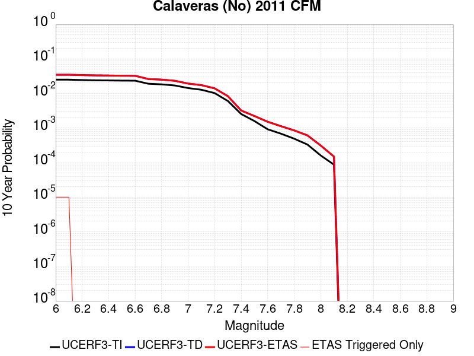 |

| Magnitude | 1 wk TI Prob | 1 wk TD Prob | 1 wk ETAS Prob | 1 wk ETAS/TD Gain | 1 wk ETAS Triggered Only | 1 mo TI Prob | 1 mo TD Prob | 1 mo ETAS Prob | 1 mo ETAS/TD Gain | 1 mo ETAS Triggered Only | 1 yr TI Prob | 1 yr TD Prob | 1 yr ETAS Prob | 1 yr ETAS/TD Gain | 1 yr ETAS Triggered Only | 10 yr TI Prob | 10 yr TD Prob | 10 yr ETAS Prob | 10 yr ETAS/TD Gain | 10 yr ETAS Triggered Only |
|-----|-----|-----|-----|-----|-----|-----|-----|-----|-----|-----|-----|-----|-----|-----|-----|-----|-----|-----|-----|-----|
| 6.0 | 4.8694856E-5 | 6.7582296E-5 | 6.7582296E-5 | 1.0 | 0.0 | 2.0867554E-4 | 2.8960724E-4 | 2.8960724E-4 | 1.0 | 0.0 | 0.0025376645 | 0.0035203705 | 0.0035203705 | 1.0 | 0.0 | 0.02508881 | 0.034825463 | 0.03483511 | 1.0002772 | 1.0E-5 |
| 6.1 | 4.8694856E-5 | 6.7582296E-5 | 6.7582296E-5 | 1.0 | 0.0 | 2.0867554E-4 | 2.8960724E-4 | 2.8960724E-4 | 1.0 | 0.0 | 0.0025376645 | 0.0035203705 | 0.0035203705 | 1.0 | 0.0 | 0.02508881 | 0.034825463 | 0.03483511 | 1.0002772 | 1.0E-5 |
| 6.2 | 4.7541962E-5 | 6.591226E-5 | 6.591226E-5 | 1.0 | 0.0 | 2.0373536E-4 | 2.8245148E-4 | 2.8245148E-4 | 1.0 | 0.0 | 0.0024776561 | 0.0034335684 | 0.0034335684 | 1.0 | 0.0 | 0.024502134 | 0.03398653 | 0.03398653 | 1.0 | 0.0 |
| 6.3 | 4.6717287E-5 | 6.474506E-5 | 6.474506E-5 | 1.0 | 0.0 | 2.0020158E-4 | 2.7745037E-4 | 2.7745037E-4 | 1.0 | 0.0 | 0.0024347296 | 0.0033728976 | 0.0033728976 | 1.0 | 0.0 | 0.024082264 | 0.033398826 | 0.033398826 | 1.0 | 0.0 |
| 6.4 | 4.6276386E-5 | 6.4106534E-5 | 6.4106534E-5 | 1.0 | 0.0 | 1.983123E-4 | 2.747144E-4 | 2.747144E-4 | 1.0 | 0.0 | 0.0024117786 | 0.0033396897 | 0.0033396897 | 1.0 | 0.0 | 0.02385771 | 0.033077564 | 0.033077564 | 1.0 | 0.0 |
| 6.5 | 4.5720994E-5 | 6.3307474E-5 | 6.3307474E-5 | 1.0 | 0.0 | 1.9593239E-4 | 2.712906E-4 | 2.712906E-4 | 1.0 | 0.0 | 0.002382867 | 0.0032981485 | 0.0032981485 | 1.0 | 0.0 | 0.023574775 | 0.032675367 | 0.032675367 | 1.0 | 0.0 |
| 6.6 | 4.549134E-5 | 6.296043E-5 | 6.296043E-5 | 1.0 | 0.0 | 1.949483E-4 | 2.698036E-4 | 2.698036E-4 | 1.0 | 0.0 | 0.0023709119 | 0.003280099 | 0.003280099 | 1.0 | 0.0 | 0.023457756 | 0.032500673 | 0.032500673 | 1.0 | 0.0 |
| 6.7 | 3.701047E-5 | 5.0460818E-5 | 5.0460818E-5 | 1.0 | 0.0 | 1.5860666E-4 | 2.1624297E-4 | 2.1624297E-4 | 1.0 | 0.0 | 0.0019293258 | 0.002629623 | 0.002629623 | 1.0 | 0.0 | 0.019126613 | 0.026175935 | 0.026175935 | 1.0 | 0.0 |
| 6.8 | 3.5523568E-5 | 4.8441812E-5 | 4.8441812E-5 | 1.0 | 0.0 | 1.5223498E-4 | 2.075915E-4 | 2.075915E-4 | 1.0 | 0.0 | 0.0018518851 | 0.0025245403 | 0.0025245403 | 1.0 | 0.0 | 0.018365284 | 0.025147919 | 0.025147919 | 1.0 | 0.0 |
| 6.9 | 3.2946147E-5 | 4.4761175E-5 | 4.4761175E-5 | 1.0 | 0.0 | 1.4119013E-4 | 1.9181974E-4 | 1.9181974E-4 | 1.0 | 0.0 | 0.0017176344 | 0.0023329463 | 0.0023329463 | 1.0 | 0.0 | 0.017044188 | 0.023268914 | 0.023268914 | 1.0 | 0.0 |
| 7.0 | 2.7682381E-5 | 3.711871E-5 | 3.711871E-5 | 1.0 | 0.0 | 1.1863338E-4 | 1.5907064E-4 | 1.5907064E-4 | 1.0 | 0.0 | 0.0014434044 | 0.0019349952 | 0.0019349952 | 1.0 | 0.0 | 0.01434065 | 0.019359428 | 0.019359428 | 1.0 | 0.0 |
| 7.1 | 2.471967E-5 | 3.3380533E-5 | 3.3380533E-5 | 1.0 | 0.0 | 1.05937135E-4 | 1.4305176E-4 | 1.4305176E-4 | 1.0 | 0.0 | 0.0012890215 | 0.0017402929 | 0.0017402929 | 1.0 | 0.0 | 0.0128157 | 0.01743324 | 0.01743324 | 1.0 | 0.0 |
| 7.2 | 1.9748062E-5 | 2.6866277E-5 | 2.6866277E-5 | 1.0 | 0.0 | 8.463181E-5 | 1.1513624E-4 | 1.1513624E-4 | 1.0 | 0.0 | 0.0010299052 | 0.001400906 | 0.001400906 | 1.0 | 0.0 | 0.01025145 | 0.014077062 | 0.014077062 | 1.0 | 0.0 |
| 7.3 | 1.1603734E-5 | 1.5864864E-5 | 1.5864864E-5 | 1.0 | 0.0 | 4.9729337E-5 | 6.7990586E-5 | 6.7990586E-5 | 1.0 | 0.0 | 6.052865E-4 | 8.274854E-4 | 8.274854E-4 | 1.0 | 0.0 | 0.0060364045 | 0.008349908 | 0.008349908 | 1.0 | 0.0 |
| 7.4 | 4.885381E-6 | 6.0510074E-6 | 6.0510074E-6 | 1.0 | 0.0 | 2.0937177E-5 | 2.5932632E-5 | 2.5932632E-5 | 1.0 | 0.0 | 2.5488032E-4 | 3.1568424E-4 | 3.1568424E-4 | 1.0 | 0.0 | 0.0025458818 | 0.0032091301 | 0.0032091301 | 1.0 | 0.0 |
| 7.5 | 3.0571264E-6 | 4.169799E-6 | 4.169799E-6 | 1.0 | 0.0 | 1.3101904E-5 | 1.7870445E-5 | 1.7870445E-5 | 1.0 | 0.0 | 1.5950401E-4 | 2.1755105E-4 | 2.1755105E-4 | 1.0 | 0.0 | 0.0015938957 | 0.0022284081 | 0.0022284081 | 1.0 | 0.0 |
| 7.6 | 1.764948E-6 | 2.809427E-6 | 2.809427E-6 | 1.0 | 0.0 | 7.564041E-6 | 1.20403465E-5 | 1.20403465E-5 | 1.0 | 0.0 | 9.208831E-5 | 1.4658143E-4 | 1.4658143E-4 | 1.0 | 0.0 | 9.205016E-4 | 0.001519321 | 0.001519321 | 1.0 | 0.0 |
| 7.7 | 1.3173734E-6 | 2.0706761E-6 | 2.0706761E-6 | 1.0 | 0.0 | 5.645874E-6 | 8.874296E-6 | 8.874296E-6 | 1.0 | 0.0 | 6.873634E-5 | 1.08039225E-4 | 1.08039225E-4 | 1.0 | 0.0 | 6.8715087E-4 | 0.0011323071 | 0.0011323071 | 1.0 | 0.0 |
| 7.8 | 9.4429885E-7 | 1.5584735E-6 | 1.5584735E-6 | 1.0 | 0.0 | 4.0469886E-6 | 6.679155E-6 | 6.679155E-6 | 1.0 | 0.0 | 4.9270973E-5 | 8.1315695E-5 | 8.1315695E-5 | 1.0 | 0.0 | 4.926005E-4 | 8.5493235E-4 | 8.5493235E-4 | 1.0 | 0.0 |
| 7.9 | 6.388233E-7 | 1.1215942E-6 | 1.1215942E-6 | 1.0 | 0.0 | 2.7378112E-6 | 4.806823E-6 | 4.806823E-6 | 1.0 | 0.0 | 3.3332344E-5 | 5.8521513E-5 | 5.8521513E-5 | 1.0 | 0.0 | 3.3327343E-4 | 6.1299704E-4 | 6.1299704E-4 | 1.0 | 0.0 |
| 8.0 | 3.087986E-7 | 5.789548E-7 | 5.789548E-7 | 1.0 | 0.0 | 1.323422E-6 | 2.4812325E-6 | 2.4812325E-6 | 1.0 | 0.0 | 1.6112543E-5 | 3.0208592E-5 | 3.0208592E-5 | 1.0 | 0.0 | 1.6111376E-4 | 3.1279656E-4 | 3.1279656E-4 | 1.0 | 0.0 |
| 8.1 | 1.6725647E-7 | 2.7599813E-7 | 2.7599813E-7 | 1.0 | 0.0 | 7.168133E-7 | 1.1828486E-6 | 1.1828486E-6 | 1.0 | 0.0 | 8.7271665E-6 | 1.4401088E-5 | 1.4401088E-5 | 1.0 | 0.0 | 8.726824E-5 | 1.494572E-4 | 1.494572E-4 | 1.0 | 0.0 |

## Owens Valley Keough Hot Springs
*[(top)](#table-of-contents)*

| 1 Week | 1 Month | 1 Year | 10 Year |
|-----|-----|-----|-----|
|  | 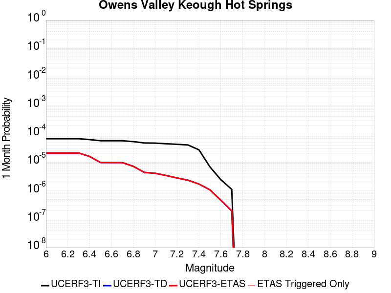 | 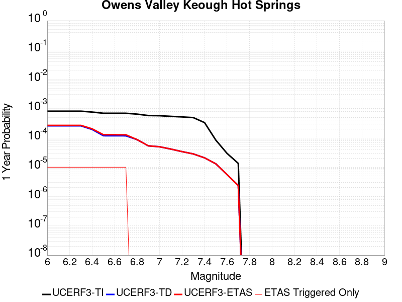 |  |

| Magnitude | 1 wk TI Prob | 1 wk TD Prob | 1 wk ETAS Prob | 1 wk ETAS/TD Gain | 1 wk ETAS Triggered Only | 1 mo TI Prob | 1 mo TD Prob | 1 mo ETAS Prob | 1 mo ETAS/TD Gain | 1 mo ETAS Triggered Only | 1 yr TI Prob | 1 yr TD Prob | 1 yr ETAS Prob | 1 yr ETAS/TD Gain | 1 yr ETAS Triggered Only | 10 yr TI Prob | 10 yr TD Prob | 10 yr ETAS Prob | 10 yr ETAS/TD Gain | 10 yr ETAS Triggered Only |
|-----|-----|-----|-----|-----|-----|-----|-----|-----|-----|-----|-----|-----|-----|-----|-----|-----|-----|-----|-----|-----|
| 6.0 | 1.5708529E-5 | 4.952342E-6 | 4.952342E-6 | 1.0 | 0.0 | 6.7320536E-5 | 2.122418E-5 | 2.122418E-5 | 1.0 | 0.0 | 8.193192E-4 | 2.5837886E-4 | 2.683763E-4 | 1.0386928 | 1.0E-5 | 0.008163051 | 0.0025814443 | 0.0025914186 | 1.0038638 | 1.0E-5 |
| 6.1 | 1.5708529E-5 | 4.952342E-6 | 4.952342E-6 | 1.0 | 0.0 | 6.7320536E-5 | 2.122418E-5 | 2.122418E-5 | 1.0 | 0.0 | 8.193192E-4 | 2.5837886E-4 | 2.683763E-4 | 1.0386928 | 1.0E-5 | 0.008163051 | 0.0025814443 | 0.0025914186 | 1.0038638 | 1.0E-5 |
| 6.2 | 1.5708529E-5 | 4.952342E-6 | 4.952342E-6 | 1.0 | 0.0 | 6.7320536E-5 | 2.122418E-5 | 2.122418E-5 | 1.0 | 0.0 | 8.193192E-4 | 2.5837886E-4 | 2.683763E-4 | 1.0386928 | 1.0E-5 | 0.008163051 | 0.0025814443 | 0.0025914186 | 1.0038638 | 1.0E-5 |
| 6.3 | 1.5708529E-5 | 4.952342E-6 | 4.952342E-6 | 1.0 | 0.0 | 6.7320536E-5 | 2.122418E-5 | 2.122418E-5 | 1.0 | 0.0 | 8.193192E-4 | 2.5837886E-4 | 2.683763E-4 | 1.0386928 | 1.0E-5 | 0.008163051 | 0.0025814443 | 0.0025914186 | 1.0038638 | 1.0E-5 |
| 6.4 | 1.4622509E-5 | 3.7280001E-6 | 3.7280001E-6 | 1.0 | 0.0 | 6.266639E-5 | 1.5977064E-5 | 1.5977064E-5 | 1.0 | 0.0 | 7.626962E-4 | 1.945067E-4 | 2.0450476E-4 | 1.0514021 | 1.0E-5 | 0.007600839 | 0.0019438454 | 0.001953826 | 1.0051345 | 1.0E-5 |
| 6.5 | 1.3335527E-5 | 2.2789552E-6 | 2.2789552E-6 | 1.0 | 0.0 | 5.7151006E-5 | 9.766918E-6 | 9.766918E-6 | 1.0 | 0.0 | 6.955913E-4 | 1.1890642E-4 | 1.2890523E-4 | 1.0840898 | 1.0E-5 | 0.0069341804 | 0.0011886515 | 0.0011986396 | 1.008403 | 1.0E-5 |
| 6.6 | 1.3332855E-5 | 2.2761042E-6 | 2.2761042E-6 | 1.0 | 0.0 | 5.7139558E-5 | 9.754699E-6 | 9.754699E-6 | 1.0 | 0.0 | 6.9545204E-4 | 1.1875768E-4 | 1.2875648E-4 | 1.0841951 | 1.0E-5 | 0.0069327964 | 0.0011871656 | 0.0011971537 | 1.0084134 | 1.0E-5 |
| 6.7 | 1.3318214E-5 | 2.265331E-6 | 2.265331E-6 | 1.0 | 0.0 | 5.707681E-5 | 9.708529E-6 | 9.708529E-6 | 1.0 | 0.0 | 6.946886E-4 | 1.1819562E-4 | 1.2819443E-4 | 1.0845956 | 1.0E-5 | 0.0069252094 | 0.001181551 | 0.0011915392 | 1.0084535 | 1.0E-5 |
| 6.8 | 1.2441338E-5 | 1.6788383E-6 | 1.6788383E-6 | 1.0 | 0.0 | 5.331893E-5 | 7.195003E-6 | 7.195003E-6 | 1.0 | 0.0 | 6.489646E-4 | 8.759594E-5 | 8.759594E-5 | 1.0 | 0.0 | 0.0064707273 | 8.758E-4 | 8.758E-4 | 1.0 | 0.0 |
| 6.9 | 1.1130476E-5 | 1.0311045E-6 | 1.0311045E-6 | 1.0 | 0.0 | 4.7701167E-5 | 4.419012E-6 | 4.419012E-6 | 1.0 | 0.0 | 5.806069E-4 | 5.3800155E-5 | 5.3800155E-5 | 1.0 | 0.0 | 0.0057909233 | 5.3802686E-4 | 5.3802686E-4 | 1.0 | 0.0 |
| 7.0 | 1.0986073E-5 | 9.586296E-7 | 9.586296E-7 | 1.0 | 0.0 | 4.7082318E-5 | 4.1084063E-6 | 4.1084063E-6 | 1.0 | 0.0 | 5.730765E-4 | 5.001871E-5 | 5.001871E-5 | 1.0 | 0.0 | 0.0057160086 | 5.0022907E-4 | 5.0022907E-4 | 1.0 | 0.0 |
| 7.1 | 1.0451338E-5 | 8.005928E-7 | 8.005928E-7 | 1.0 | 0.0 | 4.4790682E-5 | 3.4311074E-6 | 3.4311074E-6 | 1.0 | 0.0 | 5.451901E-4 | 4.177294E-5 | 4.177294E-5 | 1.0 | 0.0 | 0.005438545 | 4.178015E-4 | 4.178015E-4 | 1.0 | 0.0 |
| 7.2 | 9.989061E-6 | 6.549792E-7 | 6.549792E-7 | 1.0 | 0.0 | 4.280956E-5 | 2.8070506E-6 | 2.8070506E-6 | 1.0 | 0.0 | 5.2108173E-4 | 3.4175308E-5 | 3.4175308E-5 | 1.0 | 0.0 | 0.0051986156 | 3.418389E-4 | 3.418389E-4 | 1.0 | 0.0 |
| 7.3 | 9.465365E-6 | 5.464554E-7 | 5.464554E-7 | 1.0 | 0.0 | 4.056522E-5 | 2.3419495E-6 | 2.3419495E-6 | 1.0 | 0.0 | 4.937696E-4 | 2.8512866E-5 | 2.8512866E-5 | 1.0 | 0.0 | 0.0049267393 | 2.8522557E-4 | 2.8522557E-4 | 1.0 | 0.0 |
| 7.4 | 6.3824805E-6 | 4.0200598E-7 | 4.0200598E-7 | 1.0 | 0.0 | 2.73532E-5 | 1.7228816E-6 | 1.7228816E-6 | 1.0 | 0.0 | 3.3297433E-4 | 2.0975884E-5 | 2.0975884E-5 | 1.0 | 0.0 | 0.0033247585 | 2.098322E-4 | 2.098322E-4 | 1.0 | 0.0 |
| 7.5 | 1.6192645E-6 | 2.5183783E-7 | 2.5183783E-7 | 1.0 | 0.0 | 6.9396865E-6 | 1.0793045E-6 | 1.0793045E-6 | 1.0 | 0.0 | 8.448741E-5 | 1.3140454E-5 | 1.3140454E-5 | 1.0 | 0.0 | 8.4455294E-4 | 1.313969E-4 | 1.313969E-4 | 1.0 | 0.0 |
| 7.6 | 5.7062545E-7 | 1.08014596E-7 | 1.08014596E-7 | 1.0 | 0.0 | 2.4455355E-6 | 4.6291962E-7 | 4.6291962E-7 | 1.0 | 0.0 | 2.9773988E-5 | 5.6360327E-6 | 5.6360327E-6 | 1.0 | 0.0 | 2.977E-4 | 5.635898E-5 | 5.635898E-5 | 1.0 | 0.0 |
| 7.7 | 2.5988817E-7 | 4.549489E-8 | 4.549489E-8 | 1.0 | 0.0 | 1.113806E-6 | 1.9497809E-7 | 1.9497809E-7 | 1.0 | 0.0 | 1.3560503E-5 | 2.373856E-6 | 2.373856E-6 | 1.0 | 0.0 | 1.3559677E-4 | 2.373835E-5 | 2.373835E-5 | 1.0 | 0.0 |

## Calaveras (So) 2011 CFM
*[(top)](#table-of-contents)*

| 1 Week | 1 Month | 1 Year | 10 Year |
|-----|-----|-----|-----|
| 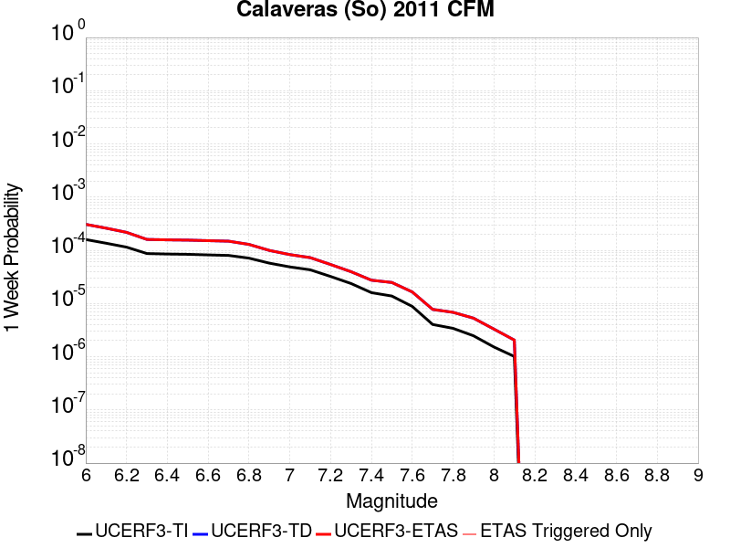 |  |  |  |

| Magnitude | 1 wk TI Prob | 1 wk TD Prob | 1 wk ETAS Prob | 1 wk ETAS/TD Gain | 1 wk ETAS Triggered Only | 1 mo TI Prob | 1 mo TD Prob | 1 mo ETAS Prob | 1 mo ETAS/TD Gain | 1 mo ETAS Triggered Only | 1 yr TI Prob | 1 yr TD Prob | 1 yr ETAS Prob | 1 yr ETAS/TD Gain | 1 yr ETAS Triggered Only | 10 yr TI Prob | 10 yr TD Prob | 10 yr ETAS Prob | 10 yr ETAS/TD Gain | 10 yr ETAS Triggered Only |
|-----|-----|-----|-----|-----|-----|-----|-----|-----|-----|-----|-----|-----|-----|-----|-----|-----|-----|-----|-----|-----|
| 6.0 | 1.5950744E-4 | 3.0764073E-4 | 3.0764073E-4 | 1.0 | 0.0 | 6.834242E-4 | 0.0013163671 | 0.0013163671 | 1.0 | 0.0 | 0.00828899 | 0.01587209 | 0.01587209 | 1.0 | 0.0 | 0.079865426 | 0.14452533 | 0.14453389 | 1.0000592 | 1.0E-5 |
| 6.1 | 1.3584697E-4 | 2.6080143E-4 | 2.6080143E-4 | 1.0 | 0.0 | 5.8207137E-4 | 0.0011158073 | 0.0011158073 | 1.0 | 0.0 | 0.007063716 | 0.013474081 | 0.013474081 | 1.0 | 0.0 | 0.06843361 | 0.12414853 | 0.124157295 | 1.0000706 | 1.0E-5 |
| 6.2 | 1.14676266E-4 | 2.1759344E-4 | 2.1759344E-4 | 1.0 | 0.0 | 4.9137714E-4 | 9.307718E-4 | 9.307718E-4 | 1.0 | 0.0 | 0.0059661185 | 0.011256671 | 0.011256671 | 1.0 | 0.0 | 0.058084648 | 0.10513544 | 0.10513544 | 1.0 | 0.0 |
| 6.3 | 8.691518E-5 | 1.6015633E-4 | 1.6015633E-4 | 1.0 | 0.0 | 3.7244044E-4 | 6.860808E-4 | 6.860808E-4 | 1.0 | 0.0 | 0.004525038 | 0.008314001 | 0.008314001 | 1.0 | 0.0 | 0.044339992 | 0.07944975 | 0.07944975 | 1.0 | 0.0 |
| 6.4 | 8.50982E-5 | 1.5721902E-4 | 1.5721902E-4 | 1.0 | 0.0 | 3.646556E-4 | 6.7349884E-4 | 6.7349884E-4 | 1.0 | 0.0 | 0.0044306475 | 0.00816197 | 0.00816197 | 1.0 | 0.0 | 0.04343345 | 0.078055486 | 0.078055486 | 1.0 | 0.0 |
| 6.5 | 8.4062965E-5 | 1.5546323E-4 | 1.5546323E-4 | 1.0 | 0.0 | 3.602201E-4 | 6.6597783E-4 | 6.6597783E-4 | 1.0 | 0.0 | 0.004376863 | 0.008071141 | 0.008071141 | 1.0 | 0.0 | 0.042916555 | 0.07722655 | 0.07722655 | 1.0 | 0.0 |
| 6.6 | 8.194716E-5 | 1.5181798E-4 | 1.5181798E-4 | 1.0 | 0.0 | 3.5115483E-4 | 6.503632E-4 | 6.503632E-4 | 1.0 | 0.0 | 0.0042669317 | 0.007882898 | 0.007882898 | 1.0 | 0.0 | 0.04185927 | 0.07551128 | 0.07551128 | 1.0 | 0.0 |
| 6.7 | 8.012326E-5 | 1.4849303E-4 | 1.4849303E-4 | 1.0 | 0.0 | 3.433402E-4 | 6.36127E-4 | 6.36127E-4 | 1.0 | 0.0 | 0.004172157 | 0.0077113253 | 0.0077113253 | 1.0 | 0.0 | 0.040946912 | 0.07395302 | 0.07395302 | 1.0 | 0.0 |
| 6.8 | 7.119773E-5 | 1.2905148E-4 | 1.2905148E-4 | 1.0 | 0.0 | 3.0509746E-4 | 5.528928E-4 | 5.528928E-4 | 1.0 | 0.0 | 0.0037082357 | 0.006707953 | 0.006707953 | 1.0 | 0.0 | 0.036469642 | 0.06479163 | 0.06479163 | 1.0 | 0.0 |
| 6.9 | 5.7343088E-5 | 9.939656E-5 | 9.939656E-5 | 1.0 | 0.0 | 2.4573295E-4 | 4.2591617E-4 | 4.2591617E-4 | 1.0 | 0.0 | 0.0029876942 | 0.005173279 | 0.005173279 | 1.0 | 0.0 | 0.02947844 | 0.05060683 | 0.05060683 | 1.0 | 0.0 |
| 7.0 | 4.8746577E-5 | 8.304976E-5 | 8.304976E-5 | 1.0 | 0.0 | 2.0889717E-4 | 3.5587934E-4 | 3.5587934E-4 | 1.0 | 0.0 | 0.0025403565 | 0.0043242895 | 0.0043242895 | 1.0 | 0.0 | 0.025115121 | 0.042581204 | 0.042581204 | 1.0 | 0.0 |
| 7.1 | 4.2998014E-5 | 7.282232E-5 | 7.282232E-5 | 1.0 | 0.0 | 1.8426418E-4 | 3.1205863E-4 | 3.1205863E-4 | 1.0 | 0.0 | 0.002241108 | 0.0037927555 | 0.0037927555 | 1.0 | 0.0 | 0.022186412 | 0.037506565 | 0.037506565 | 1.0 | 0.0 |
| 7.2 | 3.221292E-5 | 5.4070573E-5 | 5.4070573E-5 | 1.0 | 0.0 | 1.3804805E-4 | 2.3171061E-4 | 2.3171061E-4 | 1.0 | 0.0 | 0.0016794393 | 0.0028174552 | 0.0028174552 | 1.0 | 0.0 | 0.016668037 | 0.0281162 | 0.0281162 | 1.0 | 0.0 |
| 7.3 | 2.3756531E-5 | 3.9616672E-5 | 3.9616672E-5 | 1.0 | 0.0 | 1.0180973E-4 | 1.697748E-4 | 1.697748E-4 | 1.0 | 0.0 | 0.0012388286 | 0.0020650658 | 0.0020650658 | 1.0 | 0.0 | 0.012319452 | 0.02071471 | 0.02071471 | 1.0 | 0.0 |
| 7.4 | 1.5997684E-5 | 2.741595E-5 | 2.741595E-5 | 1.0 | 0.0 | 6.8559704E-5 | 1.1749165E-4 | 1.1749165E-4 | 1.0 | 0.0 | 8.343947E-4 | 0.0014295246 | 0.0014295246 | 1.0 | 0.0 | 0.008312687 | 0.014412995 | 0.014412995 | 1.0 | 0.0 |
| 7.5 | 1.3814293E-5 | 2.4854633E-5 | 2.4854633E-5 | 1.0 | 0.0 | 5.9202768E-5 | 1.06515516E-4 | 1.06515516E-4 | 1.0 | 0.0 | 7.205553E-4 | 0.0012960574 | 0.0012960574 | 1.0 | 0.0 | 0.007182234 | 0.013090733 | 0.013090733 | 1.0 | 0.0 |
| 7.6 | 8.817309E-6 | 1.6489466E-5 | 1.6489466E-5 | 1.0 | 0.0 | 3.7787922E-5 | 7.0667236E-5 | 7.0667236E-5 | 1.0 | 0.0 | 4.5997082E-4 | 8.6003536E-4 | 8.6003536E-4 | 1.0 | 0.0 | 0.004590199 | 0.008748965 | 0.008748965 | 1.0 | 0.0 |
| 7.7 | 4.0352206E-6 | 7.74847E-6 | 7.74847E-6 | 1.0 | 0.0 | 1.7293689E-5 | 3.3207307E-5 | 3.3207307E-5 | 1.0 | 0.0 | 2.1053031E-4 | 4.0422403E-4 | 4.0422403E-4 | 1.0 | 0.0 | 0.0021033096 | 0.004185346 | 0.004185346 | 1.0 | 0.0 |
| 7.8 | 3.413169E-6 | 6.8233107E-6 | 6.8233107E-6 | 1.0 | 0.0 | 1.4627784E-5 | 2.9242432E-5 | 2.9242432E-5 | 1.0 | 0.0 | 1.7807873E-4 | 3.559685E-4 | 3.559685E-4 | 1.0 | 0.0 | 0.0017793609 | 0.003684084 | 0.003684084 | 1.0 | 0.0 |
| 7.9 | 2.4740732E-6 | 5.3056738E-6 | 5.3056738E-6 | 1.0 | 0.0 | 1.06031275E-5 | 2.2738403E-5 | 2.2738403E-5 | 1.0 | 0.0 | 1.2908543E-4 | 2.7680496E-4 | 2.7680496E-4 | 1.0 | 0.0 | 0.0012901047 | 0.0028476554 | 0.0028476554 | 1.0 | 0.0 |
| 8.0 | 1.5231818E-6 | 3.3045035E-6 | 3.3045035E-6 | 1.0 | 0.0 | 6.527906E-6 | 1.4162081E-5 | 1.4162081E-5 | 1.0 | 0.0 | 7.9474354E-5 | 1.7240974E-4 | 1.7240974E-4 | 1.0 | 0.0 | 7.944594E-4 | 0.0017640805 | 0.0017640805 | 1.0 | 0.0 |
| 8.1 | 1.0104524E-6 | 2.0554423E-6 | 2.0554423E-6 | 1.0 | 0.0 | 4.330503E-6 | 8.809009E-6 | 8.809009E-6 | 1.0 | 0.0 | 5.2722597E-5 | 1.07244436E-4 | 1.07244436E-4 | 1.0 | 0.0 | 5.271009E-4 | 0.0010977517 | 0.0010977517 | 1.0 | 0.0 |

## Santa Susana alt 1
*[(top)](#table-of-contents)*

| 1 Week | 1 Month | 1 Year | 10 Year |
|-----|-----|-----|-----|
| 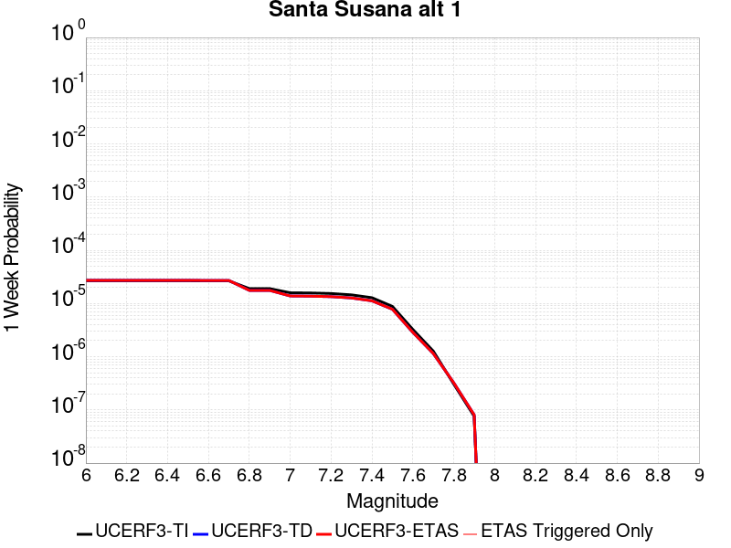 | 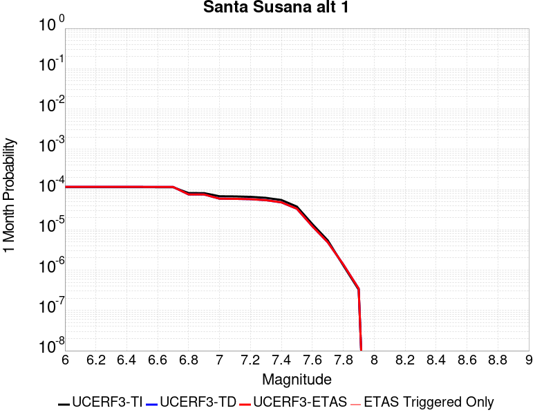 |  | 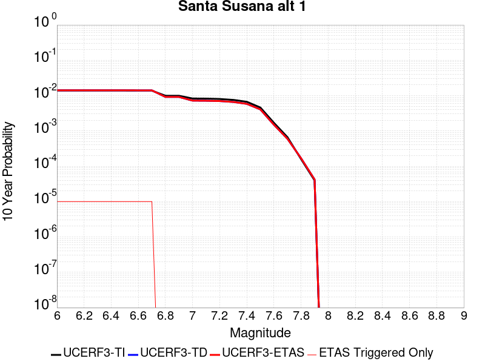 |

| Magnitude | 1 wk TI Prob | 1 wk TD Prob | 1 wk ETAS Prob | 1 wk ETAS/TD Gain | 1 wk ETAS Triggered Only | 1 mo TI Prob | 1 mo TD Prob | 1 mo ETAS Prob | 1 mo ETAS/TD Gain | 1 mo ETAS Triggered Only | 1 yr TI Prob | 1 yr TD Prob | 1 yr ETAS Prob | 1 yr ETAS/TD Gain | 1 yr ETAS Triggered Only | 10 yr TI Prob | 10 yr TD Prob | 10 yr ETAS Prob | 10 yr ETAS/TD Gain | 10 yr ETAS Triggered Only |
|-----|-----|-----|-----|-----|-----|-----|-----|-----|-----|-----|-----|-----|-----|-----|-----|-----|-----|-----|-----|-----|
| 6.0 | 2.674877E-5 | 2.720443E-5 | 2.720443E-5 | 1.0 | 0.0 | 1.1463255E-4 | 1.1658585E-4 | 1.1658585E-4 | 1.0 | 0.0 | 0.0013947578 | 0.0014186222 | 0.001428608 | 1.0070391 | 1.0E-5 | 0.013860362 | 0.014107432 | 0.01411729 | 1.0006988 | 1.0E-5 |
| 6.1 | 2.674877E-5 | 2.720443E-5 | 2.720443E-5 | 1.0 | 0.0 | 1.1463255E-4 | 1.1658585E-4 | 1.1658585E-4 | 1.0 | 0.0 | 0.0013947578 | 0.0014186222 | 0.001428608 | 1.0070391 | 1.0E-5 | 0.013860362 | 0.014107432 | 0.01411729 | 1.0006988 | 1.0E-5 |
| 6.2 | 2.674877E-5 | 2.720443E-5 | 2.720443E-5 | 1.0 | 0.0 | 1.1463255E-4 | 1.1658585E-4 | 1.1658585E-4 | 1.0 | 0.0 | 0.0013947578 | 0.0014186222 | 0.001428608 | 1.0070391 | 1.0E-5 | 0.013860362 | 0.014107432 | 0.01411729 | 1.0006988 | 1.0E-5 |
| 6.3 | 2.674877E-5 | 2.720443E-5 | 2.720443E-5 | 1.0 | 0.0 | 1.1463255E-4 | 1.1658585E-4 | 1.1658585E-4 | 1.0 | 0.0 | 0.0013947578 | 0.0014186222 | 0.001428608 | 1.0070391 | 1.0E-5 | 0.013860362 | 0.014107432 | 0.01411729 | 1.0006988 | 1.0E-5 |
| 6.4 | 2.674877E-5 | 2.720443E-5 | 2.720443E-5 | 1.0 | 0.0 | 1.1463255E-4 | 1.1658585E-4 | 1.1658585E-4 | 1.0 | 0.0 | 0.0013947578 | 0.0014186222 | 0.001428608 | 1.0070391 | 1.0E-5 | 0.013860362 | 0.014107432 | 0.01411729 | 1.0006988 | 1.0E-5 |
| 6.5 | 2.674877E-5 | 2.720443E-5 | 2.720443E-5 | 1.0 | 0.0 | 1.1463255E-4 | 1.1658585E-4 | 1.1658585E-4 | 1.0 | 0.0 | 0.0013947578 | 0.0014186222 | 0.001428608 | 1.0070391 | 1.0E-5 | 0.013860362 | 0.014107432 | 0.01411729 | 1.0006988 | 1.0E-5 |
| 6.6 | 2.6647976E-5 | 2.7080732E-5 | 2.7080732E-5 | 1.0 | 0.0 | 1.14200615E-4 | 1.1605576E-4 | 1.1605576E-4 | 1.0 | 0.0 | 0.0013895056 | 0.0014121769 | 0.0014221627 | 1.0070713 | 1.0E-5 | 0.013808494 | 0.014043799 | 0.014053658 | 1.000702 | 1.0E-5 |
| 6.7 | 2.6647976E-5 | 2.7080732E-5 | 2.7080732E-5 | 1.0 | 0.0 | 1.14200615E-4 | 1.1605576E-4 | 1.1605576E-4 | 1.0 | 0.0 | 0.0013895056 | 0.0014121769 | 0.0014221627 | 1.0070713 | 1.0E-5 | 0.013808494 | 0.014043799 | 0.014053658 | 1.000702 | 1.0E-5 |
| 6.8 | 1.9073179E-5 | 1.7640574E-5 | 1.7640574E-5 | 1.0 | 0.0 | 8.1739636E-5 | 7.560037E-5 | 7.560037E-5 | 1.0 | 0.0 | 9.947256E-4 | 9.20064E-4 | 9.20064E-4 | 1.0 | 0.0 | 0.009902848 | 0.009164803 | 0.009164803 | 1.0 | 0.0 |
| 6.9 | 1.9041876E-5 | 1.7622702E-5 | 1.7622702E-5 | 1.0 | 0.0 | 8.160549E-5 | 7.552378E-5 | 7.552378E-5 | 1.0 | 0.0 | 9.930939E-4 | 9.1913226E-4 | 9.1913226E-4 | 1.0 | 0.0 | 0.0098866755 | 0.009155563 | 0.009155563 | 1.0 | 0.0 |
| 7.0 | 1.5917482E-5 | 1.386608E-5 | 1.386608E-5 | 1.0 | 0.0 | 6.8215995E-5 | 5.942473E-5 | 5.942473E-5 | 1.0 | 0.0 | 8.302132E-4 | 7.232606E-4 | 7.232606E-4 | 1.0 | 0.0 | 0.008271185 | 0.0072099622 | 0.0072099622 | 1.0 | 0.0 |
| 7.1 | 1.577788E-5 | 1.37460665E-5 | 1.37460665E-5 | 1.0 | 0.0 | 6.761774E-5 | 5.891041E-5 | 5.891041E-5 | 1.0 | 0.0 | 8.2293496E-4 | 7.170029E-4 | 7.170029E-4 | 1.0 | 0.0 | 0.008198941 | 0.007147789 | 0.007147789 | 1.0 | 0.0 |
| 7.2 | 1.5416446E-5 | 1.3472089E-5 | 1.3472089E-5 | 1.0 | 0.0 | 6.606882E-5 | 5.7736273E-5 | 5.7736273E-5 | 1.0 | 0.0 | 8.0409093E-4 | 7.0271705E-4 | 7.0271705E-4 | 1.0 | 0.0 | 0.008011877 | 0.007005835 | 0.007005835 | 1.0 | 0.0 |
| 7.3 | 1.4534083E-5 | 1.2719843E-5 | 1.2719843E-5 | 1.0 | 0.0 | 6.228744E-5 | 5.45125E-5 | 5.45125E-5 | 1.0 | 0.0 | 7.580857E-4 | 6.63492E-4 | 6.63492E-4 | 1.0 | 0.0 | 0.007555048 | 0.006615963 | 0.006615963 | 1.0 | 0.0 |
| 7.4 | 1.2858995E-5 | 1.1231274E-5 | 1.1231274E-5 | 1.0 | 0.0 | 5.5108816E-5 | 4.8133166E-5 | 4.8133166E-5 | 1.0 | 0.0 | 6.7074323E-4 | 5.858677E-4 | 5.858677E-4 | 1.0 | 0.0 | 0.0066872234 | 0.0058440063 | 0.0058440063 | 1.0 | 0.0 |
| 7.5 | 8.827668E-6 | 7.806406E-6 | 7.806406E-6 | 1.0 | 0.0 | 3.7832317E-5 | 3.345561E-5 | 3.345561E-5 | 1.0 | 0.0 | 4.605111E-4 | 4.072484E-4 | 4.072484E-4 | 1.0 | 0.0 | 0.0045955796 | 0.0040652696 | 0.0040652696 | 1.0 | 0.0 |
| 7.6 | 3.2533426E-6 | 2.8722075E-6 | 2.8722075E-6 | 1.0 | 0.0 | 1.3942822E-5 | 1.2309405E-5 | 1.2309405E-5 | 1.0 | 0.0 | 1.6974064E-4 | 1.4985708E-4 | 1.4985708E-4 | 1.0 | 0.0 | 0.0016961104 | 0.001497597 | 0.001497597 | 1.0 | 0.0 |
| 7.7 | 1.2751709E-6 | 1.1492177E-6 | 1.1492177E-6 | 1.0 | 0.0 | 5.4650063E-6 | 4.92521E-6 | 4.92521E-6 | 1.0 | 0.0 | 6.653442E-5 | 5.9962873E-5 | 5.9962873E-5 | 1.0 | 0.0 | 6.6514505E-4 | 5.9947587E-4 | 5.9947587E-4 | 1.0 | 0.0 |
| 7.8 | 3.067544E-7 | 3.2403264E-7 | 3.2403264E-7 | 1.0 | 0.0 | 1.3146611E-6 | 1.3887106E-6 | 1.3887106E-6 | 1.0 | 0.0 | 1.600588E-5 | 1.6907432E-5 | 1.6907432E-5 | 1.0 | 0.0 | 1.6004729E-4 | 1.6906248E-4 | 1.6906248E-4 | 1.0 | 0.0 |
| 7.9 | 7.622999E-8 | 8.088648E-8 | 8.088648E-8 | 1.0 | 0.0 | 3.2669993E-7 | 3.466563E-7 | 3.466563E-7 | 1.0 | 0.0 | 3.977564E-6 | 4.2205343E-6 | 4.2205343E-6 | 1.0 | 0.0 | 3.977493E-5 | 4.2204752E-5 | 4.2204752E-5 | 1.0 | 0.0 |

## North Frontal  (West)
*[(top)](#table-of-contents)*

| 1 Week | 1 Month | 1 Year | 10 Year |
|-----|-----|-----|-----|
|  | 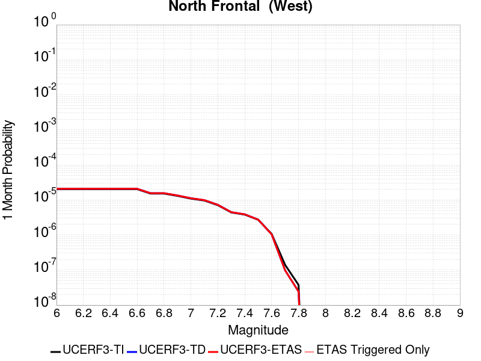 | 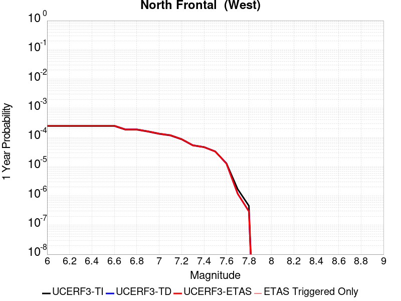 |  |

| Magnitude | 1 wk TI Prob | 1 wk TD Prob | 1 wk ETAS Prob | 1 wk ETAS/TD Gain | 1 wk ETAS Triggered Only | 1 mo TI Prob | 1 mo TD Prob | 1 mo ETAS Prob | 1 mo ETAS/TD Gain | 1 mo ETAS Triggered Only | 1 yr TI Prob | 1 yr TD Prob | 1 yr ETAS Prob | 1 yr ETAS/TD Gain | 1 yr ETAS Triggered Only | 10 yr TI Prob | 10 yr TD Prob | 10 yr ETAS Prob | 10 yr ETAS/TD Gain | 10 yr ETAS Triggered Only |
|-----|-----|-----|-----|-----|-----|-----|-----|-----|-----|-----|-----|-----|-----|-----|-----|-----|-----|-----|-----|-----|
| 6.0 | 4.7316266E-6 | 4.85286E-6 | 4.85286E-6 | 1.0 | 0.0 | 2.0278241E-5 | 2.0797816E-5 | 2.0797816E-5 | 1.0 | 0.0 | 2.4685962E-4 | 2.5318546E-4 | 2.5318546E-4 | 1.0 | 0.0 | 0.0024658558 | 0.002529116 | 0.0025390908 | 1.0039439 | 1.0E-5 |
| 6.1 | 4.7316266E-6 | 4.85286E-6 | 4.85286E-6 | 1.0 | 0.0 | 2.0278241E-5 | 2.0797816E-5 | 2.0797816E-5 | 1.0 | 0.0 | 2.4685962E-4 | 2.5318546E-4 | 2.5318546E-4 | 1.0 | 0.0 | 0.0024658558 | 0.002529116 | 0.0025390908 | 1.0039439 | 1.0E-5 |
| 6.2 | 4.7316266E-6 | 4.85286E-6 | 4.85286E-6 | 1.0 | 0.0 | 2.0278241E-5 | 2.0797816E-5 | 2.0797816E-5 | 1.0 | 0.0 | 2.4685962E-4 | 2.5318546E-4 | 2.5318546E-4 | 1.0 | 0.0 | 0.0024658558 | 0.002529116 | 0.0025390908 | 1.0039439 | 1.0E-5 |
| 6.3 | 4.7316266E-6 | 4.85286E-6 | 4.85286E-6 | 1.0 | 0.0 | 2.0278241E-5 | 2.0797816E-5 | 2.0797816E-5 | 1.0 | 0.0 | 2.4685962E-4 | 2.5318546E-4 | 2.5318546E-4 | 1.0 | 0.0 | 0.0024658558 | 0.002529116 | 0.0025390908 | 1.0039439 | 1.0E-5 |
| 6.4 | 4.7316266E-6 | 4.85286E-6 | 4.85286E-6 | 1.0 | 0.0 | 2.0278241E-5 | 2.0797816E-5 | 2.0797816E-5 | 1.0 | 0.0 | 2.4685962E-4 | 2.5318546E-4 | 2.5318546E-4 | 1.0 | 0.0 | 0.0024658558 | 0.002529116 | 0.0025390908 | 1.0039439 | 1.0E-5 |
| 6.5 | 4.7316266E-6 | 4.85286E-6 | 4.85286E-6 | 1.0 | 0.0 | 2.0278241E-5 | 2.0797816E-5 | 2.0797816E-5 | 1.0 | 0.0 | 2.4685962E-4 | 2.5318546E-4 | 2.5318546E-4 | 1.0 | 0.0 | 0.0024658558 | 0.002529116 | 0.0025390908 | 1.0039439 | 1.0E-5 |
| 6.6 | 4.7316266E-6 | 4.85286E-6 | 4.85286E-6 | 1.0 | 0.0 | 2.0278241E-5 | 2.0797816E-5 | 2.0797816E-5 | 1.0 | 0.0 | 2.4685962E-4 | 2.5318546E-4 | 2.5318546E-4 | 1.0 | 0.0 | 0.0024658558 | 0.002529116 | 0.0025390908 | 1.0039439 | 1.0E-5 |
| 6.7 | 3.5382777E-6 | 3.6310348E-6 | 3.6310348E-6 | 1.0 | 0.0 | 1.516396E-5 | 1.5561489E-5 | 1.5561489E-5 | 1.0 | 0.0 | 1.8460557E-4 | 1.8944545E-4 | 1.8944545E-4 | 1.0 | 0.0 | 0.0018445229 | 0.0018929164 | 0.0019028975 | 1.0052729 | 1.0E-5 |
| 6.8 | 3.5382777E-6 | 3.6310348E-6 | 3.6310348E-6 | 1.0 | 0.0 | 1.516396E-5 | 1.5561489E-5 | 1.5561489E-5 | 1.0 | 0.0 | 1.8460557E-4 | 1.8944545E-4 | 1.8944545E-4 | 1.0 | 0.0 | 0.0018445229 | 0.0018929164 | 0.0019028975 | 1.0052729 | 1.0E-5 |
| 6.9 | 3.0428037E-6 | 3.1228922E-6 | 3.1228922E-6 | 1.0 | 0.0 | 1.30405215E-5 | 1.3383759E-5 | 1.3383759E-5 | 1.0 | 0.0 | 1.5875678E-4 | 1.6293576E-4 | 1.6293576E-4 | 1.0 | 0.0 | 0.0015864341 | 0.0016282302 | 0.0016382139 | 1.0061316 | 1.0E-5 |
| 7.0 | 2.538778E-6 | 2.6062048E-6 | 2.6062048E-6 | 1.0 | 0.0 | 1.0880432E-5 | 1.1169404E-5 | 1.1169404E-5 | 1.0 | 0.0 | 1.324612E-4 | 1.3597948E-4 | 1.3597948E-4 | 1.0 | 0.0 | 0.0013238228 | 0.0013590095 | 0.001368996 | 1.0073483 | 1.0E-5 |
| 7.1 | 2.2418935E-6 | 2.3013108E-6 | 2.3013108E-6 | 1.0 | 0.0 | 9.60808E-6 | 9.862726E-6 | 9.862726E-6 | 1.0 | 0.0 | 1.1697209E-4 | 1.20072524E-4 | 1.20072524E-4 | 1.0 | 0.0 | 0.0011691054 | 0.0012001204 | 0.0012101084 | 1.0083225 | 1.0E-5 |
| 7.2 | 1.6526745E-6 | 1.692562E-6 | 1.692562E-6 | 1.0 | 0.0 | 7.082872E-6 | 7.2538182E-6 | 7.2538182E-6 | 1.0 | 0.0 | 8.623055E-5 | 8.8311914E-5 | 8.8311914E-5 | 1.0 | 0.0 | 8.61971E-4 | 8.827933E-4 | 8.827933E-4 | 1.0 | 0.0 |
| 7.3 | 1.0246019E-6 | 1.0442753E-6 | 1.0442753E-6 | 1.0 | 0.0 | 4.391144E-6 | 4.4754584E-6 | 4.4754584E-6 | 1.0 | 0.0 | 5.3460866E-5 | 5.448746E-5 | 5.448746E-5 | 1.0 | 0.0 | 5.344801E-4 | 5.447525E-4 | 5.447525E-4 | 1.0 | 0.0 |
| 7.4 | 8.9045164E-7 | 9.0569904E-7 | 9.0569904E-7 | 1.0 | 0.0 | 3.8162157E-6 | 3.881562E-6 | 3.881562E-6 | 1.0 | 0.0 | 4.646144E-5 | 4.7257105E-5 | 4.7257105E-5 | 1.0 | 0.0 | 4.6451724E-4 | 4.7248145E-4 | 4.7248145E-4 | 1.0 | 0.0 |
| 7.5 | 6.3357E-7 | 6.4030155E-7 | 6.4030155E-7 | 1.0 | 0.0 | 2.7152971E-6 | 2.744147E-6 | 2.744147E-6 | 1.0 | 0.0 | 3.305824E-5 | 3.3409546E-5 | 3.3409546E-5 | 1.0 | 0.0 | 3.3053322E-4 | 3.340518E-4 | 3.340518E-4 | 1.0 | 0.0 |
| 7.6 | 2.5087024E-7 | 2.436233E-7 | 2.436233E-7 | 1.0 | 0.0 | 1.0751578E-6 | 1.0440996E-6 | 1.0440996E-6 | 1.0 | 0.0 | 1.3089967E-5 | 1.2711859E-5 | 1.2711859E-5 | 1.0 | 0.0 | 1.3089196E-4 | 1.2711338E-4 | 1.2711338E-4 | 1.0 | 0.0 |
| 7.7 | 3.282987E-8 | 2.2875662E-8 | 2.2875662E-8 | 1.0 | 0.0 | 1.4069944E-7 | 9.803855E-8 | 9.803855E-8 | 1.0 | 0.0 | 1.7130144E-6 | 1.1936187E-6 | 1.1936187E-6 | 1.0 | 0.0 | 1.7130013E-5 | 1.1936132E-5 | 1.1936132E-5 | 1.0 | 0.0 |
| 7.8 | 8.77499E-9 | 5.682229E-9 | 5.682229E-9 | 1.0 | 0.0 | 3.7607098E-8 | 2.4352408E-8 | 2.4352408E-8 | 1.0 | 0.0 | 4.578663E-7 | 2.9649055E-7 | 2.9649055E-7 | 1.0 | 0.0 | 4.5786537E-6 | 2.964903E-6 | 2.964903E-6 | 1.0 | 0.0 |

## Sierra Madre (San Fernando)
*[(top)](#table-of-contents)*

| 1 Week | 1 Month | 1 Year | 10 Year |
|-----|-----|-----|-----|
|  |  |  |  |

| Magnitude | 1 wk TI Prob | 1 wk TD Prob | 1 wk ETAS Prob | 1 wk ETAS/TD Gain | 1 wk ETAS Triggered Only | 1 mo TI Prob | 1 mo TD Prob | 1 mo ETAS Prob | 1 mo ETAS/TD Gain | 1 mo ETAS Triggered Only | 1 yr TI Prob | 1 yr TD Prob | 1 yr ETAS Prob | 1 yr ETAS/TD Gain | 1 yr ETAS Triggered Only | 10 yr TI Prob | 10 yr TD Prob | 10 yr ETAS Prob | 10 yr ETAS/TD Gain | 10 yr ETAS Triggered Only |
|-----|-----|-----|-----|-----|-----|-----|-----|-----|-----|-----|-----|-----|-----|-----|-----|-----|-----|-----|-----|-----|
| 6.0 | 1.0346413E-5 | 6.2889067E-6 | 6.2889067E-6 | 1.0 | 0.0 | 4.4341014E-5 | 2.6952186E-5 | 2.6952186E-5 | 1.0 | 0.0 | 5.3971814E-4 | 3.2809455E-4 | 3.3809128E-4 | 1.0304691 | 1.0E-5 | 0.0053840918 | 0.0032762142 | 0.0032861815 | 1.0030423 | 1.0E-5 |
| 6.1 | 1.0346413E-5 | 6.2889067E-6 | 6.2889067E-6 | 1.0 | 0.0 | 4.4341014E-5 | 2.6952186E-5 | 2.6952186E-5 | 1.0 | 0.0 | 5.3971814E-4 | 3.2809455E-4 | 3.3809128E-4 | 1.0304691 | 1.0E-5 | 0.0053840918 | 0.0032762142 | 0.0032861815 | 1.0030423 | 1.0E-5 |
| 6.2 | 1.0346413E-5 | 6.2889067E-6 | 6.2889067E-6 | 1.0 | 0.0 | 4.4341014E-5 | 2.6952186E-5 | 2.6952186E-5 | 1.0 | 0.0 | 5.3971814E-4 | 3.2809455E-4 | 3.3809128E-4 | 1.0304691 | 1.0E-5 | 0.0053840918 | 0.0032762142 | 0.0032861815 | 1.0030423 | 1.0E-5 |
| 6.3 | 1.0346413E-5 | 6.2889067E-6 | 6.2889067E-6 | 1.0 | 0.0 | 4.4341014E-5 | 2.6952186E-5 | 2.6952186E-5 | 1.0 | 0.0 | 5.3971814E-4 | 3.2809455E-4 | 3.3809128E-4 | 1.0304691 | 1.0E-5 | 0.0053840918 | 0.0032762142 | 0.0032861815 | 1.0030423 | 1.0E-5 |
| 6.4 | 1.0249558E-5 | 6.2889067E-6 | 6.2889067E-6 | 1.0 | 0.0 | 4.392594E-5 | 2.6952186E-5 | 2.6952186E-5 | 1.0 | 0.0 | 5.3466705E-4 | 3.2809455E-4 | 3.3809128E-4 | 1.0304691 | 1.0E-5 | 0.0053338245 | 0.0032762142 | 0.0032861815 | 1.0030423 | 1.0E-5 |
| 6.5 | 1.0249558E-5 | 6.2889067E-6 | 6.2889067E-6 | 1.0 | 0.0 | 4.392594E-5 | 2.6952186E-5 | 2.6952186E-5 | 1.0 | 0.0 | 5.3466705E-4 | 3.2809455E-4 | 3.3809128E-4 | 1.0304691 | 1.0E-5 | 0.0053338245 | 0.0032762142 | 0.0032861815 | 1.0030423 | 1.0E-5 |
| 6.6 | 9.9035515E-6 | 6.2889067E-6 | 6.2889067E-6 | 1.0 | 0.0 | 4.2443102E-5 | 2.6952186E-5 | 2.6952186E-5 | 1.0 | 0.0 | 5.166222E-4 | 3.2809455E-4 | 3.3809128E-4 | 1.0304691 | 1.0E-5 | 0.0051542283 | 0.0032762142 | 0.0032861815 | 1.0030423 | 1.0E-5 |
| 6.7 | 9.87217E-6 | 6.276324E-6 | 6.276324E-6 | 1.0 | 0.0 | 4.2308613E-5 | 2.689826E-5 | 2.689826E-5 | 1.0 | 0.0 | 5.149856E-4 | 3.274382E-4 | 3.3743493E-4 | 1.0305301 | 1.0E-5 | 0.005137938 | 0.00326967 | 0.0032796375 | 1.0030484 | 1.0E-5 |
| 6.8 | 9.4359175E-6 | 6.180269E-6 | 6.180269E-6 | 1.0 | 0.0 | 4.043902E-5 | 2.6486605E-5 | 2.6486605E-5 | 1.0 | 0.0 | 4.9223384E-4 | 3.224278E-4 | 3.3242456E-4 | 1.0310047 | 1.0E-5 | 0.0049114493 | 0.0032197116 | 0.0032296793 | 1.0030959 | 1.0E-5 |
| 6.9 | 8.700447E-6 | 6.0413245E-6 | 6.0413245E-6 | 1.0 | 0.0 | 3.72871E-5 | 2.589114E-5 | 2.589114E-5 | 1.0 | 0.0 | 4.5387587E-4 | 3.151801E-4 | 3.2517695E-4 | 1.0317179 | 1.0E-5 | 0.0045295 | 0.0031474405 | 0.0031574091 | 1.0031672 | 1.0E-5 |
| 7.0 | 8.648878E-6 | 6.0162038E-6 | 6.0162038E-6 | 1.0 | 0.0 | 3.7066096E-5 | 2.5783482E-5 | 2.5783482E-5 | 1.0 | 0.0 | 4.5118626E-4 | 3.1386976E-4 | 3.238666E-4 | 1.0318503 | 1.0E-5 | 0.004502713 | 0.003134374 | 0.0031443427 | 1.0031804 | 1.0E-5 |
| 7.1 | 8.505786E-6 | 5.9258246E-6 | 5.9258246E-6 | 1.0 | 0.0 | 3.645286E-5 | 2.539615E-5 | 2.539615E-5 | 1.0 | 0.0 | 4.437232E-4 | 3.0915532E-4 | 3.1915223E-4 | 1.0323362 | 1.0E-5 | 0.0044283825 | 0.0030873613 | 0.0030973307 | 1.003229 | 1.0E-5 |
| 7.2 | 8.139752E-6 | 5.700093E-6 | 5.700093E-6 | 1.0 | 0.0 | 3.4884186E-5 | 2.4428748E-5 | 2.4428748E-5 | 1.0 | 0.0 | 4.246322E-4 | 2.9738047E-4 | 3.073775E-4 | 1.0336169 | 1.0E-5 | 0.004238217 | 0.002969931 | 0.0029799014 | 1.003357 | 1.0E-5 |
| 7.3 | 7.8816E-6 | 5.5533924E-6 | 5.5533924E-6 | 1.0 | 0.0 | 3.3777847E-5 | 2.3800041E-5 | 2.3800041E-5 | 1.0 | 0.0 | 4.111677E-4 | 2.8972802E-4 | 2.9972513E-4 | 1.0345051 | 1.0E-5 | 0.004104078 | 0.0028936085 | 0.0029035797 | 1.0034459 | 1.0E-5 |
| 7.4 | 7.5810603E-6 | 5.3576127E-6 | 5.3576127E-6 | 1.0 | 0.0 | 3.2489854E-5 | 2.2961001E-5 | 2.2961001E-5 | 1.0 | 0.0 | 3.9549218E-4 | 2.7951537E-4 | 2.8951257E-4 | 1.0357662 | 1.0E-5 | 0.0039478904 | 0.002791743 | 0.0028017152 | 1.003572 | 1.0E-5 |
| 7.5 | 6.349153E-6 | 4.4088174E-6 | 4.4088174E-6 | 1.0 | 0.0 | 2.7210372E-5 | 1.88948E-5 | 1.88948E-5 | 1.0 | 0.0 | 3.312359E-4 | 2.3002073E-4 | 2.4001842E-4 | 1.0434643 | 1.0E-5 | 0.0033074263 | 0.0022979085 | 0.0023078856 | 1.0043418 | 1.0E-5 |
| 7.6 | 4.430576E-6 | 2.8917416E-6 | 2.8917416E-6 | 1.0 | 0.0 | 1.8988047E-5 | 1.239312E-5 | 1.239312E-5 | 1.0 | 0.0 | 2.3115493E-4 | 1.5087602E-4 | 1.6087451E-4 | 1.0662696 | 1.0E-5 | 0.0023091463 | 0.0015077584 | 0.0015177433 | 1.0066223 | 1.0E-5 |
| 7.7 | 3.005066E-6 | 1.7520682E-6 | 1.7520682E-6 | 1.0 | 0.0 | 1.2878791E-5 | 7.5088424E-6 | 7.5088424E-6 | 1.0 | 0.0 | 1.56788E-4 | 9.141633E-5 | 1.0141542E-4 | 1.1093796 | 1.0E-5 | 0.0015667742 | 9.1378845E-4 | 9.2377927E-4 | 1.0109334 | 1.0E-5 |
| 7.8 | 1.8459098E-6 | 1.0589997E-6 | 1.0589997E-6 | 1.0 | 0.0 | 7.911018E-6 | 4.5385623E-6 | 4.5385623E-6 | 1.0 | 0.0 | 9.631238E-5 | 5.52556E-5 | 6.5255044E-5 | 1.1809671 | 1.0E-5 | 9.627065E-4 | 5.5241905E-4 | 5.6241354E-4 | 1.0180922 | 1.0E-5 |
| 7.9 | 9.839262E-7 | 5.239273E-7 | 5.239273E-7 | 1.0 | 0.0 | 4.2168194E-6 | 2.245401E-6 | 2.245401E-6 | 1.0 | 0.0 | 5.1338568E-5 | 2.7337415E-5 | 3.7337144E-5 | 1.365789 | 1.0E-5 | 5.132671E-4 | 2.7334082E-4 | 2.8333807E-4 | 1.0365744 | 1.0E-5 |
| 8.0 | 1.210983E-7 | 6.617328E-8 | 6.617328E-8 | 1.0 | 0.0 | 5.1899264E-7 | 2.8359972E-7 | 2.8359972E-7 | 1.0 | 0.0 | 6.3187167E-6 | 3.4528214E-6 | 3.4528214E-6 | 1.0 | 0.0 | 6.318537E-5 | 3.4527697E-5 | 3.4527697E-5 | 1.0 | 0.0 |

## Elmore Ranch
*[(top)](#table-of-contents)*

| 1 Week | 1 Month | 1 Year | 10 Year |
|-----|-----|-----|-----|
|  |  |  |  |

| Magnitude | 1 wk TI Prob | 1 wk TD Prob | 1 wk ETAS Prob | 1 wk ETAS/TD Gain | 1 wk ETAS Triggered Only | 1 mo TI Prob | 1 mo TD Prob | 1 mo ETAS Prob | 1 mo ETAS/TD Gain | 1 mo ETAS Triggered Only | 1 yr TI Prob | 1 yr TD Prob | 1 yr ETAS Prob | 1 yr ETAS/TD Gain | 1 yr ETAS Triggered Only | 10 yr TI Prob | 10 yr TD Prob | 10 yr ETAS Prob | 10 yr ETAS/TD Gain | 10 yr ETAS Triggered Only |
|-----|-----|-----|-----|-----|-----|-----|-----|-----|-----|-----|-----|-----|-----|-----|-----|-----|-----|-----|-----|-----|
| 6.0 | 9.102099E-5 | 8.9578614E-5 | 8.9578614E-5 | 1.0 | 0.0 | 3.9003167E-4 | 3.8386503E-4 | 3.8386503E-4 | 1.0 | 0.0 | 0.0047383 | 0.0046650036 | 0.0046650036 | 1.0 | 0.0 | 0.046385348 | 0.045895047 | 0.045904588 | 1.0002079 | 1.0E-5 |
| 6.1 | 3.8306698E-5 | 4.1522737E-5 | 4.1522737E-5 | 1.0 | 0.0 | 1.6416123E-4 | 1.7794652E-4 | 1.7794652E-4 | 1.0 | 0.0 | 0.0019968306 | 0.0021641937 | 0.0021641937 | 1.0 | 0.0 | 0.019789828 | 0.021639477 | 0.021649262 | 1.0004522 | 1.0E-5 |
| 6.2 | 3.8306698E-5 | 4.1522737E-5 | 4.1522737E-5 | 1.0 | 0.0 | 1.6416123E-4 | 1.7794652E-4 | 1.7794652E-4 | 1.0 | 0.0 | 0.0019968306 | 0.0021641937 | 0.0021641937 | 1.0 | 0.0 | 0.019789828 | 0.021639477 | 0.021649262 | 1.0004522 | 1.0E-5 |
| 6.3 | 3.3197924E-5 | 3.65734E-5 | 3.65734E-5 | 1.0 | 0.0 | 1.4226905E-4 | 1.5673772E-4 | 1.5673772E-4 | 1.0 | 0.0 | 0.0017307495 | 0.0019067894 | 0.0019067894 | 1.0 | 0.0 | 0.017173318 | 0.019099101 | 0.01910891 | 1.0005136 | 1.0E-5 |
| 6.4 | 2.5148964E-5 | 2.743219E-5 | 2.743219E-5 | 1.0 | 0.0 | 1.0777682E-4 | 1.1756489E-4 | 1.1756489E-4 | 1.0 | 0.0 | 0.0013113929 | 0.0014310612 | 0.0014310612 | 1.0 | 0.0 | 0.01303681 | 0.014393246 | 0.014403101 | 1.0006847 | 1.0E-5 |
| 6.5 | 2.5148964E-5 | 2.743219E-5 | 2.743219E-5 | 1.0 | 0.0 | 1.0777682E-4 | 1.1756489E-4 | 1.1756489E-4 | 1.0 | 0.0 | 0.0013113929 | 0.0014310612 | 0.0014310612 | 1.0 | 0.0 | 0.01303681 | 0.014393246 | 0.014403101 | 1.0006847 | 1.0E-5 |

## Almanor 2011 CFM
*[(top)](#table-of-contents)*

| 1 Week | 1 Month | 1 Year | 10 Year |
|-----|-----|-----|-----|
| 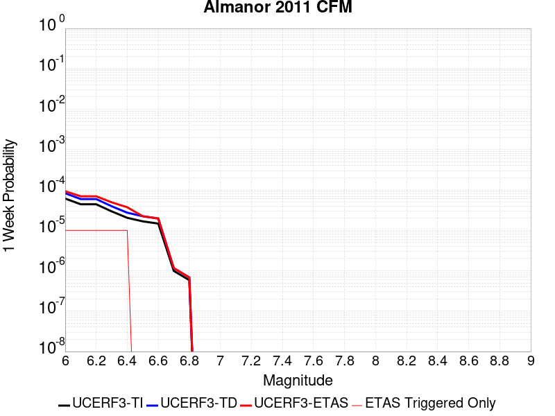 | 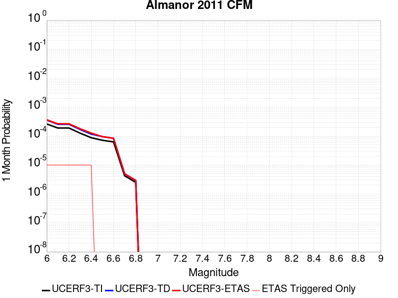 |  | 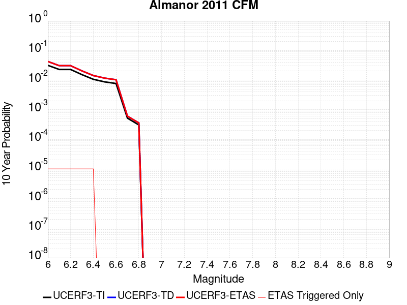 |

| Magnitude | 1 wk TI Prob | 1 wk TD Prob | 1 wk ETAS Prob | 1 wk ETAS/TD Gain | 1 wk ETAS Triggered Only | 1 mo TI Prob | 1 mo TD Prob | 1 mo ETAS Prob | 1 mo ETAS/TD Gain | 1 mo ETAS Triggered Only | 1 yr TI Prob | 1 yr TD Prob | 1 yr ETAS Prob | 1 yr ETAS/TD Gain | 1 yr ETAS Triggered Only | 10 yr TI Prob | 10 yr TD Prob | 10 yr ETAS Prob | 10 yr ETAS/TD Gain | 10 yr ETAS Triggered Only |
|-----|-----|-----|-----|-----|-----|-----|-----|-----|-----|-----|-----|-----|-----|-----|-----|-----|-----|-----|-----|-----|
| 6.0 | 6.1479834E-5 | 8.3312785E-5 | 9.331195E-5 | 1.1200196 | 1.0E-5 | 2.6345838E-4 | 3.570119E-4 | 3.670083E-4 | 1.0280002 | 1.0E-5 | 0.0032028882 | 0.004338327 | 0.004348283 | 1.002295 | 1.0E-5 | 0.031571172 | 0.042603754 | 0.042613328 | 1.0002247 | 1.0E-5 |
| 6.1 | 4.4387216E-5 | 5.9792666E-5 | 6.979207E-5 | 1.1672345 | 1.0E-5 | 1.9021705E-4 | 2.5623335E-4 | 2.6623078E-4 | 1.039017 | 1.0E-5 | 0.0023134327 | 0.003115673 | 0.0031256417 | 1.0031996 | 1.0E-5 | 0.022894967 | 0.03076789 | 0.030777583 | 1.0003151 | 1.0E-5 |
| 6.2 | 4.4387216E-5 | 5.9792666E-5 | 6.979207E-5 | 1.1672345 | 1.0E-5 | 1.9021705E-4 | 2.5623335E-4 | 2.6623078E-4 | 1.039017 | 1.0E-5 | 0.0023134327 | 0.003115673 | 0.0031256417 | 1.0031996 | 1.0E-5 | 0.022894967 | 0.03076789 | 0.030777583 | 1.0003151 | 1.0E-5 |
| 6.3 | 2.9523822E-5 | 3.9565213E-5 | 4.9564816E-5 | 1.2527373 | 1.0E-5 | 1.2652454E-4 | 1.695571E-4 | 1.7955541E-4 | 1.0589672 | 1.0E-5 | 0.0015393476 | 0.002062696 | 0.0020726754 | 1.004838 | 1.0E-5 | 0.015287281 | 0.020469263 | 0.020479059 | 1.0004785 | 1.0E-5 |
| 6.4 | 2.0512744E-5 | 2.7444068E-5 | 3.744379E-5 | 1.3643675 | 1.0E-5 | 8.79088E-5 | 1.1761455E-4 | 1.2761338E-4 | 1.0850135 | 1.0E-5 | 0.001069764 | 0.0014312996 | 0.0014412854 | 1.0069766 | 1.0E-5 | 0.010646289 | 0.014250277 | 0.014260134 | 1.0006918 | 1.0E-5 |
| 6.5 | 1.6750226E-5 | 2.2401457E-5 | 2.2401457E-5 | 1.0 | 0.0 | 7.178471E-5 | 9.6005046E-5 | 9.6005046E-5 | 1.0 | 0.0 | 8.7362836E-4 | 0.0011685027 | 0.0011685027 | 1.0 | 0.0 | 0.008702018 | 0.011653836 | 0.011653836 | 1.0 | 0.0 |
| 6.6 | 1.4745303E-5 | 1.9716887E-5 | 1.9716887E-5 | 1.0 | 0.0 | 6.319262E-5 | 8.450052E-5 | 8.450052E-5 | 1.0 | 0.0 | 7.690986E-4 | 0.0010285722 | 0.0010285722 | 1.0 | 0.0 | 0.0076644225 | 0.010269201 | 0.010269201 | 1.0 | 0.0 |
| 6.7 | 9.951145E-7 | 1.1618928E-6 | 1.1618928E-6 | 1.0 | 0.0 | 4.26477E-6 | 4.979532E-6 | 4.979532E-6 | 1.0 | 0.0 | 5.1922336E-5 | 6.0624294E-5 | 6.0624294E-5 | 1.0 | 0.0 | 5.1910203E-4 | 6.060948E-4 | 6.060948E-4 | 1.0 | 0.0 |
| 6.8 | 5.866312E-7 | 6.8509075E-7 | 6.8509075E-7 | 1.0 | 0.0 | 2.5141312E-6 | 2.9361006E-6 | 2.9361006E-6 | 1.0 | 0.0 | 3.0609117E-5 | 3.574657E-5 | 3.574657E-5 | 1.0 | 0.0 | 3.06049E-4 | 3.5742103E-4 | 3.5742103E-4 | 1.0 | 0.0 |

## Pine Mtn
*[(top)](#table-of-contents)*

| 1 Week | 1 Month | 1 Year | 10 Year |
|-----|-----|-----|-----|
|  |  | 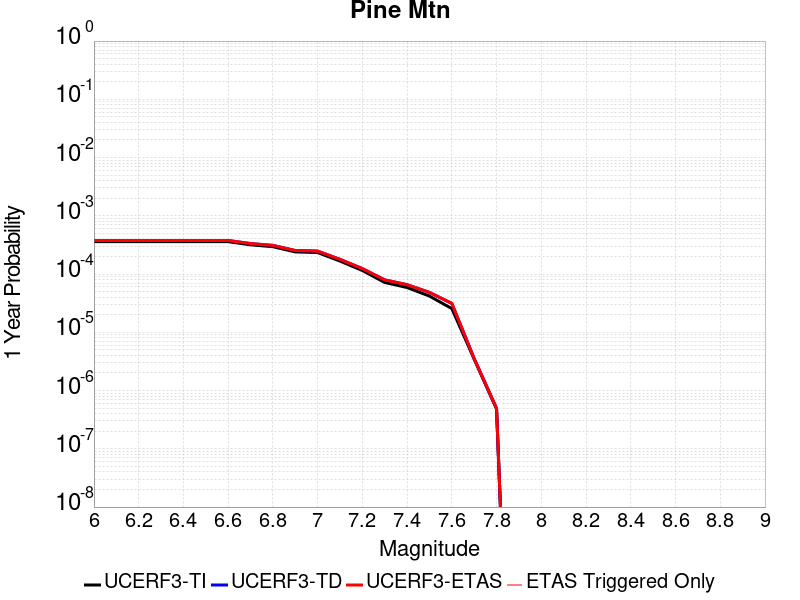 |  |

| Magnitude | 1 wk TI Prob | 1 wk TD Prob | 1 wk ETAS Prob | 1 wk ETAS/TD Gain | 1 wk ETAS Triggered Only | 1 mo TI Prob | 1 mo TD Prob | 1 mo ETAS Prob | 1 mo ETAS/TD Gain | 1 mo ETAS Triggered Only | 1 yr TI Prob | 1 yr TD Prob | 1 yr ETAS Prob | 1 yr ETAS/TD Gain | 1 yr ETAS Triggered Only | 10 yr TI Prob | 10 yr TD Prob | 10 yr ETAS Prob | 10 yr ETAS/TD Gain | 10 yr ETAS Triggered Only |
|-----|-----|-----|-----|-----|-----|-----|-----|-----|-----|-----|-----|-----|-----|-----|-----|-----|-----|-----|-----|-----|
| 6.0 | 6.894797E-6 | 7.226484E-6 | 7.226484E-6 | 1.0 | 0.0 | 2.9548795E-5 | 3.0970295E-5 | 3.0970295E-5 | 1.0 | 0.0 | 3.596972E-4 | 3.7700107E-4 | 3.7700107E-4 | 1.0 | 0.0 | 0.0035911554 | 0.0037639125 | 0.0037738748 | 1.0026468 | 1.0E-5 |
| 6.1 | 6.894797E-6 | 7.226484E-6 | 7.226484E-6 | 1.0 | 0.0 | 2.9548795E-5 | 3.0970295E-5 | 3.0970295E-5 | 1.0 | 0.0 | 3.596972E-4 | 3.7700107E-4 | 3.7700107E-4 | 1.0 | 0.0 | 0.0035911554 | 0.0037639125 | 0.0037738748 | 1.0026468 | 1.0E-5 |
| 6.2 | 6.894797E-6 | 7.226484E-6 | 7.226484E-6 | 1.0 | 0.0 | 2.9548795E-5 | 3.0970295E-5 | 3.0970295E-5 | 1.0 | 0.0 | 3.596972E-4 | 3.7700107E-4 | 3.7700107E-4 | 1.0 | 0.0 | 0.0035911554 | 0.0037639125 | 0.0037738748 | 1.0026468 | 1.0E-5 |
| 6.3 | 6.894797E-6 | 7.226484E-6 | 7.226484E-6 | 1.0 | 0.0 | 2.9548795E-5 | 3.0970295E-5 | 3.0970295E-5 | 1.0 | 0.0 | 3.596972E-4 | 3.7700107E-4 | 3.7700107E-4 | 1.0 | 0.0 | 0.0035911554 | 0.0037639125 | 0.0037738748 | 1.0026468 | 1.0E-5 |
| 6.4 | 6.894797E-6 | 7.226484E-6 | 7.226484E-6 | 1.0 | 0.0 | 2.9548795E-5 | 3.0970295E-5 | 3.0970295E-5 | 1.0 | 0.0 | 3.596972E-4 | 3.7700107E-4 | 3.7700107E-4 | 1.0 | 0.0 | 0.0035911554 | 0.0037639125 | 0.0037738748 | 1.0026468 | 1.0E-5 |
| 6.5 | 6.894797E-6 | 7.226484E-6 | 7.226484E-6 | 1.0 | 0.0 | 2.9548795E-5 | 3.0970295E-5 | 3.0970295E-5 | 1.0 | 0.0 | 3.596972E-4 | 3.7700107E-4 | 3.7700107E-4 | 1.0 | 0.0 | 0.0035911554 | 0.0037639125 | 0.0037738748 | 1.0026468 | 1.0E-5 |
| 6.6 | 6.894797E-6 | 7.226484E-6 | 7.226484E-6 | 1.0 | 0.0 | 2.9548795E-5 | 3.0970295E-5 | 3.0970295E-5 | 1.0 | 0.0 | 3.596972E-4 | 3.7700107E-4 | 3.7700107E-4 | 1.0 | 0.0 | 0.0035911554 | 0.0037639125 | 0.0037738748 | 1.0026468 | 1.0E-5 |
| 6.7 | 6.0867933E-6 | 6.398108E-6 | 6.398108E-6 | 1.0 | 0.0 | 2.6085996E-5 | 2.7420187E-5 | 2.7420187E-5 | 1.0 | 0.0 | 3.1755073E-4 | 3.3379183E-4 | 3.3379183E-4 | 1.0 | 0.0 | 0.0031709734 | 0.0033331239 | 0.0033430904 | 1.0029902 | 1.0E-5 |
| 6.8 | 5.6530425E-6 | 5.951573E-6 | 5.951573E-6 | 1.0 | 0.0 | 2.42271E-5 | 2.5506504E-5 | 2.5506504E-5 | 1.0 | 0.0 | 2.94925E-4 | 3.1049948E-4 | 3.1049948E-4 | 1.0 | 0.0 | 0.002945339 | 0.0031008613 | 0.0031108302 | 1.003215 | 1.0E-5 |
| 6.9 | 4.6015225E-6 | 4.864763E-6 | 4.864763E-6 | 1.0 | 0.0 | 1.9720663E-5 | 2.0848825E-5 | 2.0848825E-5 | 1.0 | 0.0 | 2.4007261E-4 | 2.5380636E-4 | 2.5380636E-4 | 1.0 | 0.0 | 0.0023981342 | 0.002535309 | 0.0025452836 | 1.0039343 | 1.0E-5 |
| 7.0 | 4.4875965E-6 | 4.7483986E-6 | 4.7483986E-6 | 1.0 | 0.0 | 1.9232413E-5 | 2.035013E-5 | 2.035013E-5 | 1.0 | 0.0 | 2.3412947E-4 | 2.477361E-4 | 2.477361E-4 | 1.0 | 0.0 | 0.0023388295 | 0.0024747434 | 0.0024847186 | 1.0040308 | 1.0E-5 |
| 7.1 | 3.203907E-6 | 3.4302884E-6 | 3.4302884E-6 | 1.0 | 0.0 | 1.3730958E-5 | 1.4701157E-5 | 1.4701157E-5 | 1.0 | 0.0 | 1.6716159E-4 | 1.7897255E-4 | 1.7897255E-4 | 1.0 | 0.0 | 0.0016703589 | 0.0017883503 | 0.0017983324 | 1.0055817 | 1.0E-5 |
| 7.2 | 2.2060601E-6 | 2.3792004E-6 | 2.3792004E-6 | 1.0 | 0.0 | 9.4545085E-6 | 1.0196535E-5 | 1.0196535E-5 | 1.0 | 0.0 | 1.15102564E-4 | 1.241362E-4 | 1.241362E-4 | 1.0 | 0.0 | 0.0011504296 | 0.0012407134 | 0.001250701 | 1.0080498 | 1.0E-5 |
| 7.3 | 1.3765207E-6 | 1.5222945E-6 | 1.5222945E-6 | 1.0 | 0.0 | 5.899361E-6 | 6.524104E-6 | 6.524104E-6 | 1.0 | 0.0 | 7.182235E-5 | 7.942816E-5 | 7.942816E-5 | 1.0 | 0.0 | 7.1799144E-4 | 7.940068E-4 | 8.0399885E-4 | 1.0125843 | 1.0E-5 |
| 7.4 | 1.1245983E-6 | 1.2592895E-6 | 1.2592895E-6 | 1.0 | 0.0 | 4.819698E-6 | 5.3969443E-6 | 5.3969443E-6 | 1.0 | 0.0 | 5.8678244E-5 | 6.57059E-5 | 6.57059E-5 | 1.0 | 0.0 | 5.866275E-4 | 6.5687305E-4 | 6.668665E-4 | 1.0152136 | 1.0E-5 |
| 7.5 | 8.031682E-7 | 9.2823865E-7 | 9.2823865E-7 | 1.0 | 0.0 | 3.4421448E-6 | 3.97816E-6 | 3.97816E-6 | 1.0 | 0.0 | 4.1907308E-5 | 4.843309E-5 | 4.843309E-5 | 1.0 | 0.0 | 4.1899405E-4 | 4.842321E-4 | 4.842321E-4 | 1.0 | 0.0 |
| 7.6 | 4.8953444E-7 | 6.0078315E-7 | 6.0078315E-7 | 1.0 | 0.0 | 2.098003E-6 | 2.5747827E-6 | 2.5747827E-6 | 1.0 | 0.0 | 2.5542888E-5 | 3.1347576E-5 | 3.1347576E-5 | 1.0 | 0.0 | 2.5539953E-4 | 3.1343644E-4 | 3.1343644E-4 | 1.0 | 0.0 |
| 7.7 | 6.634529E-8 | 6.7890376E-8 | 6.7890376E-8 | 1.0 | 0.0 | 2.843369E-7 | 2.9095872E-7 | 2.9095872E-7 | 1.0 | 0.0 | 3.4617963E-6 | 3.542417E-6 | 3.542417E-6 | 1.0 | 0.0 | 3.4617424E-5 | 3.5423654E-5 | 3.5423654E-5 | 1.0 | 0.0 |
| 7.8 | 9.235578E-9 | 9.488916E-9 | 9.488916E-9 | 1.0 | 0.0 | 3.9581046E-8 | 4.0666784E-8 | 4.0666784E-8 | 1.0 | 0.0 | 4.818991E-7 | 4.95118E-7 | 4.95118E-7 | 1.0 | 0.0 | 4.8189804E-6 | 4.951171E-6 | 4.951171E-6 | 1.0 | 0.0 |

## Verdugo
*[(top)](#table-of-contents)*

| 1 Week | 1 Month | 1 Year | 10 Year |
|-----|-----|-----|-----|
| 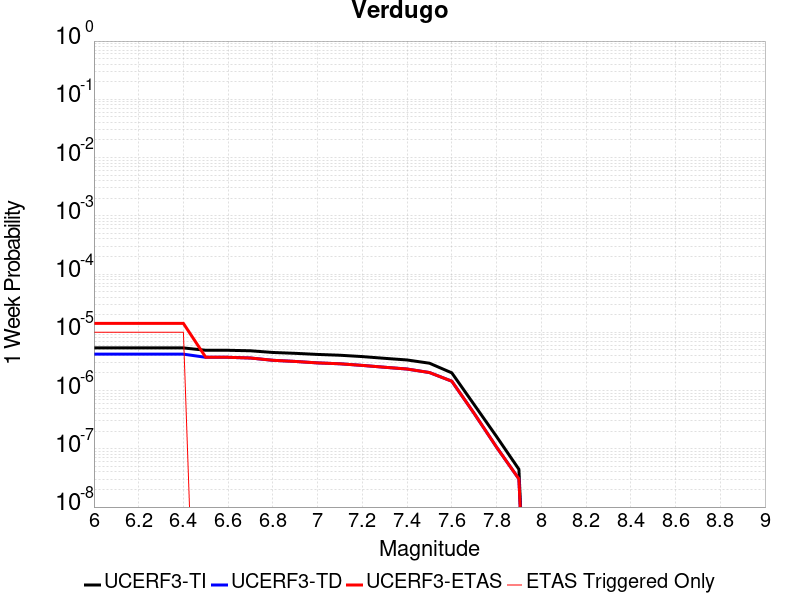 |  |  |  |

| Magnitude | 1 wk TI Prob | 1 wk TD Prob | 1 wk ETAS Prob | 1 wk ETAS/TD Gain | 1 wk ETAS Triggered Only | 1 mo TI Prob | 1 mo TD Prob | 1 mo ETAS Prob | 1 mo ETAS/TD Gain | 1 mo ETAS Triggered Only | 1 yr TI Prob | 1 yr TD Prob | 1 yr ETAS Prob | 1 yr ETAS/TD Gain | 1 yr ETAS Triggered Only | 10 yr TI Prob | 10 yr TD Prob | 10 yr ETAS Prob | 10 yr ETAS/TD Gain | 10 yr ETAS Triggered Only |
|-----|-----|-----|-----|-----|-----|-----|-----|-----|-----|-----|-----|-----|-----|-----|-----|-----|-----|-----|-----|-----|
| 6.0 | 5.392987E-6 | 4.2171464E-6 | 1.4217104E-5 | 3.3712618 | 1.0E-5 | 2.3112598E-5 | 1.807336E-5 | 2.807318E-5 | 1.5532905 | 1.0E-5 | 2.8135953E-4 | 2.2002142E-4 | 2.3001923E-4 | 1.0454401 | 1.0E-5 | 0.0028100356 | 0.0021980838 | 0.0022080617 | 1.0045394 | 1.0E-5 |
| 6.1 | 5.392987E-6 | 4.2171464E-6 | 1.4217104E-5 | 3.3712618 | 1.0E-5 | 2.3112598E-5 | 1.807336E-5 | 2.807318E-5 | 1.5532905 | 1.0E-5 | 2.8135953E-4 | 2.2002142E-4 | 2.3001923E-4 | 1.0454401 | 1.0E-5 | 0.0028100356 | 0.0021980838 | 0.0022080617 | 1.0045394 | 1.0E-5 |
| 6.2 | 5.392987E-6 | 4.2171464E-6 | 1.4217104E-5 | 3.3712618 | 1.0E-5 | 2.3112598E-5 | 1.807336E-5 | 2.807318E-5 | 1.5532905 | 1.0E-5 | 2.8135953E-4 | 2.2002142E-4 | 2.3001923E-4 | 1.0454401 | 1.0E-5 | 0.0028100356 | 0.0021980838 | 0.0022080617 | 1.0045394 | 1.0E-5 |
| 6.3 | 5.392987E-6 | 4.2171464E-6 | 1.4217104E-5 | 3.3712618 | 1.0E-5 | 2.3112598E-5 | 1.807336E-5 | 2.807318E-5 | 1.5532905 | 1.0E-5 | 2.8135953E-4 | 2.2002142E-4 | 2.3001923E-4 | 1.0454401 | 1.0E-5 | 0.0028100356 | 0.0021980838 | 0.0022080617 | 1.0045394 | 1.0E-5 |
| 6.4 | 5.392987E-6 | 4.2171464E-6 | 1.4217104E-5 | 3.3712618 | 1.0E-5 | 2.3112598E-5 | 1.807336E-5 | 2.807318E-5 | 1.5532905 | 1.0E-5 | 2.8135953E-4 | 2.2002142E-4 | 2.3001923E-4 | 1.0454401 | 1.0E-5 | 0.0028100356 | 0.0021980838 | 0.0022080617 | 1.0045394 | 1.0E-5 |
| 6.5 | 4.9154837E-6 | 3.7230714E-6 | 3.7230714E-6 | 1.0 | 0.0 | 2.1066187E-5 | 1.5955924E-5 | 1.5955924E-5 | 1.0 | 0.0 | 2.5645064E-4 | 1.9424625E-4 | 1.9424625E-4 | 1.0 | 0.0 | 0.002561549 | 0.0019407856 | 0.0019407856 | 1.0 | 0.0 |
| 6.6 | 4.9154837E-6 | 3.7230714E-6 | 3.7230714E-6 | 1.0 | 0.0 | 2.1066187E-5 | 1.5955924E-5 | 1.5955924E-5 | 1.0 | 0.0 | 2.5645064E-4 | 1.9424625E-4 | 1.9424625E-4 | 1.0 | 0.0 | 0.002561549 | 0.0019407856 | 0.0019407856 | 1.0 | 0.0 |
| 6.7 | 4.817006E-6 | 3.6212534E-6 | 3.6212534E-6 | 1.0 | 0.0 | 2.0644147E-5 | 1.5519567E-5 | 1.5519567E-5 | 1.0 | 0.0 | 2.513135E-4 | 1.8893453E-4 | 1.8893453E-4 | 1.0 | 0.0 | 0.0025102948 | 0.0018877587 | 0.0018877587 | 1.0 | 0.0 |
| 6.8 | 4.507407E-6 | 3.307684E-6 | 3.307684E-6 | 1.0 | 0.0 | 1.9317316E-5 | 1.4175713E-5 | 1.4175713E-5 | 1.0 | 0.0 | 2.3516294E-4 | 1.7257578E-4 | 1.7257578E-4 | 1.0 | 0.0 | 0.0023491425 | 0.0017244319 | 0.0017244319 | 1.0 | 0.0 |
| 6.9 | 4.3573054E-6 | 3.1615807E-6 | 3.1615807E-6 | 1.0 | 0.0 | 1.8674033E-5 | 1.3549562E-5 | 1.3549562E-5 | 1.0 | 0.0 | 2.2733262E-4 | 1.6495356E-4 | 1.6495356E-4 | 1.0 | 0.0 | 0.0022710022 | 0.0016483235 | 0.0016483235 | 1.0 | 0.0 |
| 7.0 | 4.171527E-6 | 2.9842283E-6 | 2.9842283E-6 | 1.0 | 0.0 | 1.787785E-5 | 1.2789487E-5 | 1.2789487E-5 | 1.0 | 0.0 | 2.1764109E-4 | 1.55701E-4 | 1.55701E-4 | 1.0 | 0.0 | 0.0021742806 | 0.0015559304 | 0.0015559304 | 1.0 | 0.0 |
| 7.1 | 4.0405484E-6 | 2.8828094E-6 | 2.8828094E-6 | 1.0 | 0.0 | 1.731652E-5 | 1.235484E-5 | 1.235484E-5 | 1.0 | 0.0 | 2.1080824E-4 | 1.504099E-4 | 1.504099E-4 | 1.0 | 0.0 | 0.0021060838 | 0.0015030921 | 0.0015030921 | 1.0 | 0.0 |
| 7.2 | 3.8306007E-6 | 2.7023784E-6 | 2.7023784E-6 | 1.0 | 0.0 | 1.6416758E-5 | 1.1581571E-5 | 1.1581571E-5 | 1.0 | 0.0 | 1.9985568E-4 | 1.4099662E-4 | 1.4099662E-4 | 1.0 | 0.0 | 0.0019967605 | 0.0014090823 | 0.0014090823 | 1.0 | 0.0 |
| 7.3 | 3.5750938E-6 | 2.512691E-6 | 2.512691E-6 | 1.0 | 0.0 | 1.532174E-5 | 1.0768632E-5 | 1.0768632E-5 | 1.0 | 0.0 | 1.8652623E-4 | 1.3110031E-4 | 1.3110031E-4 | 1.0 | 0.0 | 0.0018636974 | 0.0013102402 | 0.0013102402 | 1.0 | 0.0 |
| 7.4 | 3.3510041E-6 | 2.3413577E-6 | 2.3413577E-6 | 1.0 | 0.0 | 1.4361368E-5 | 1.0034352E-5 | 1.0034352E-5 | 1.0 | 0.0 | 1.7483562E-4 | 1.221615E-4 | 1.221615E-4 | 1.0 | 0.0 | 0.0017469813 | 0.0012209538 | 0.0012209538 | 1.0 | 0.0 |
| 7.5 | 2.948287E-6 | 2.0394546E-6 | 2.0394546E-6 | 1.0 | 0.0 | 1.2635454E-5 | 8.740491E-6 | 8.740491E-6 | 1.0 | 0.0 | 1.538258E-4 | 1.0641038E-4 | 1.0641038E-4 | 1.0 | 0.0 | 0.0015371935 | 0.0010636045 | 0.0010636045 | 1.0 | 0.0 |
| 7.6 | 2.0134323E-6 | 1.4473346E-6 | 1.4473346E-6 | 1.0 | 0.0 | 8.628967E-6 | 6.2028485E-6 | 6.2028485E-6 | 1.0 | 0.0 | 1.05052604E-4 | 7.551716E-5 | 7.551716E-5 | 1.0 | 0.0 | 0.0010500296 | 7.5492373E-4 | 7.5492373E-4 | 1.0 | 0.0 |
| 7.7 | 5.726436E-7 | 4.0458625E-7 | 4.0458625E-7 | 1.0 | 0.0 | 2.4541846E-6 | 1.73394E-6 | 1.73394E-6 | 1.0 | 0.0 | 2.9879287E-5 | 2.1110542E-5 | 2.1110542E-5 | 1.0 | 0.0 | 2.987527E-4 | 2.110879E-4 | 2.110879E-4 | 1.0 | 0.0 |
| 7.8 | 1.6248204E-7 | 1.06916374E-7 | 1.06916374E-7 | 1.0 | 0.0 | 6.963514E-7 | 4.5821295E-7 | 4.5821295E-7 | 1.0 | 0.0 | 8.478045E-6 | 5.5787286E-6 | 5.5787286E-6 | 1.0 | 0.0 | 8.477722E-5 | 5.578592E-5 | 5.578592E-5 | 1.0 | 0.0 |
| 7.9 | 4.4475744E-8 | 3.037779E-8 | 3.037779E-8 | 1.0 | 0.0 | 1.9061031E-7 | 1.3019053E-7 | 1.3019053E-7 | 1.0 | 0.0 | 2.320678E-6 | 1.5850687E-6 | 1.5850687E-6 | 1.0 | 0.0 | 2.3206538E-5 | 1.5850586E-5 | 1.5850586E-5 | 1.0 | 0.0 |

## Northridge Hills
*[(top)](#table-of-contents)*

| 1 Week | 1 Month | 1 Year | 10 Year |
|-----|-----|-----|-----|
|  |  |  |  |

| Magnitude | 1 wk TI Prob | 1 wk TD Prob | 1 wk ETAS Prob | 1 wk ETAS/TD Gain | 1 wk ETAS Triggered Only | 1 mo TI Prob | 1 mo TD Prob | 1 mo ETAS Prob | 1 mo ETAS/TD Gain | 1 mo ETAS Triggered Only | 1 yr TI Prob | 1 yr TD Prob | 1 yr ETAS Prob | 1 yr ETAS/TD Gain | 1 yr ETAS Triggered Only | 10 yr TI Prob | 10 yr TD Prob | 10 yr ETAS Prob | 10 yr ETAS/TD Gain | 10 yr ETAS Triggered Only |
|-----|-----|-----|-----|-----|-----|-----|-----|-----|-----|-----|-----|-----|-----|-----|-----|-----|-----|-----|-----|-----|
| 6.0 | 5.095982E-6 | 3.6161975E-6 | 3.6161975E-6 | 1.0 | 0.0 | 2.183974E-5 | 1.5497897E-5 | 1.5497897E-5 | 1.0 | 0.0 | 2.658664E-4 | 1.8867069E-4 | 1.986688E-4 | 1.0529925 | 1.0E-5 | 0.0026554854 | 0.0018851175 | 0.0018950986 | 1.0052947 | 1.0E-5 |
| 6.1 | 5.095982E-6 | 3.6161975E-6 | 3.6161975E-6 | 1.0 | 0.0 | 2.183974E-5 | 1.5497897E-5 | 1.5497897E-5 | 1.0 | 0.0 | 2.658664E-4 | 1.8867069E-4 | 1.986688E-4 | 1.0529925 | 1.0E-5 | 0.0026554854 | 0.0018851175 | 0.0018950986 | 1.0052947 | 1.0E-5 |
| 6.2 | 5.095982E-6 | 3.6161975E-6 | 3.6161975E-6 | 1.0 | 0.0 | 2.183974E-5 | 1.5497897E-5 | 1.5497897E-5 | 1.0 | 0.0 | 2.658664E-4 | 1.8867069E-4 | 1.986688E-4 | 1.0529925 | 1.0E-5 | 0.0026554854 | 0.0018851175 | 0.0018950986 | 1.0052947 | 1.0E-5 |
| 6.3 | 5.095982E-6 | 3.6161975E-6 | 3.6161975E-6 | 1.0 | 0.0 | 2.183974E-5 | 1.5497897E-5 | 1.5497897E-5 | 1.0 | 0.0 | 2.658664E-4 | 1.8867069E-4 | 1.986688E-4 | 1.0529925 | 1.0E-5 | 0.0026554854 | 0.0018851175 | 0.0018950986 | 1.0052947 | 1.0E-5 |
| 6.4 | 5.095982E-6 | 3.6161975E-6 | 3.6161975E-6 | 1.0 | 0.0 | 2.183974E-5 | 1.5497897E-5 | 1.5497897E-5 | 1.0 | 0.0 | 2.658664E-4 | 1.8867069E-4 | 1.986688E-4 | 1.0529925 | 1.0E-5 | 0.0026554854 | 0.0018851175 | 0.0018950986 | 1.0052947 | 1.0E-5 |
| 6.5 | 5.095982E-6 | 3.6161975E-6 | 3.6161975E-6 | 1.0 | 0.0 | 2.183974E-5 | 1.5497897E-5 | 1.5497897E-5 | 1.0 | 0.0 | 2.658664E-4 | 1.8867069E-4 | 1.986688E-4 | 1.0529925 | 1.0E-5 | 0.0026554854 | 0.0018851175 | 0.0018950986 | 1.0052947 | 1.0E-5 |
| 6.6 | 5.095982E-6 | 3.6161975E-6 | 3.6161975E-6 | 1.0 | 0.0 | 2.183974E-5 | 1.5497897E-5 | 1.5497897E-5 | 1.0 | 0.0 | 2.658664E-4 | 1.8867069E-4 | 1.986688E-4 | 1.0529925 | 1.0E-5 | 0.0026554854 | 0.0018851175 | 0.0018950986 | 1.0052947 | 1.0E-5 |
| 6.7 | 5.095982E-6 | 3.6161975E-6 | 3.6161975E-6 | 1.0 | 0.0 | 2.183974E-5 | 1.5497897E-5 | 1.5497897E-5 | 1.0 | 0.0 | 2.658664E-4 | 1.8867069E-4 | 1.986688E-4 | 1.0529925 | 1.0E-5 | 0.0026554854 | 0.0018851175 | 0.0018950986 | 1.0052947 | 1.0E-5 |
| 6.8 | 5.095982E-6 | 3.6161975E-6 | 3.6161975E-6 | 1.0 | 0.0 | 2.183974E-5 | 1.5497897E-5 | 1.5497897E-5 | 1.0 | 0.0 | 2.658664E-4 | 1.8867069E-4 | 1.986688E-4 | 1.0529925 | 1.0E-5 | 0.0026554854 | 0.0018851175 | 0.0018950986 | 1.0052947 | 1.0E-5 |
| 6.9 | 5.0942654E-6 | 3.6144124E-6 | 3.6144124E-6 | 1.0 | 0.0 | 2.1832384E-5 | 1.5490248E-5 | 1.5490248E-5 | 1.0 | 0.0 | 2.6577685E-4 | 1.8857756E-4 | 1.9857567E-4 | 1.0530186 | 1.0E-5 | 0.002654592 | 0.0018841878 | 0.0018941689 | 1.0052973 | 1.0E-5 |
| 7.0 | 4.851143E-6 | 3.3597112E-6 | 3.3597112E-6 | 1.0 | 0.0 | 2.0790447E-5 | 1.4398684E-5 | 1.4398684E-5 | 1.0 | 0.0 | 2.5309427E-4 | 1.752899E-4 | 1.8528815E-4 | 1.0570383 | 1.0E-5 | 0.0025280623 | 0.0017515208 | 0.0017615033 | 1.0056993 | 1.0E-5 |
| 7.1 | 4.7910607E-6 | 3.2979885E-6 | 3.2979885E-6 | 1.0 | 0.0 | 2.0532956E-5 | 1.413416E-5 | 1.413416E-5 | 1.0 | 0.0 | 2.4996005E-4 | 1.7206983E-4 | 1.8206812E-4 | 1.058106 | 1.0E-5 | 0.0024967908 | 0.0017193703 | 0.001729353 | 1.0058061 | 1.0E-5 |
| 7.2 | 4.580079E-6 | 3.1077534E-6 | 3.1077534E-6 | 1.0 | 0.0 | 1.9628762E-5 | 1.3318875E-5 | 1.3318875E-5 | 1.0 | 0.0 | 2.3895396E-4 | 1.6214527E-4 | 1.7214366E-4 | 1.061663 | 1.0E-5 | 0.0023869718 | 0.0016202732 | 0.001630257 | 1.0061618 | 1.0E-5 |
| 7.3 | 4.290062E-6 | 2.8691643E-6 | 2.8691643E-6 | 1.0 | 0.0 | 1.838585E-5 | 1.2296361E-5 | 1.2296361E-5 | 1.0 | 0.0 | 2.2382473E-4 | 1.4969794E-4 | 1.5969644E-4 | 1.0667912 | 1.0E-5 | 0.0022359942 | 0.001495974 | 0.0015059591 | 1.0066746 | 1.0E-5 |
| 7.4 | 4.0259683E-6 | 2.6748269E-6 | 2.6748269E-6 | 1.0 | 0.0 | 1.7254037E-5 | 1.1463493E-5 | 1.1463493E-5 | 1.0 | 0.0 | 2.1004764E-4 | 1.3955911E-4 | 1.4955772E-4 | 1.0716442 | 1.0E-5 | 0.002098492 | 0.0013947175 | 0.0014047036 | 1.00716 | 1.0E-5 |
| 7.5 | 3.5477108E-6 | 2.2861095E-6 | 2.2861095E-6 | 1.0 | 0.0 | 1.5204386E-5 | 9.797575E-6 | 9.797575E-6 | 1.0 | 0.0 | 1.8509767E-4 | 1.19278964E-4 | 1.2927777E-4 | 1.0838271 | 1.0E-5 | 0.0018494357 | 0.001192151 | 0.0012021391 | 1.0083781 | 1.0E-5 |
| 7.6 | 2.9990608E-6 | 1.8536809E-6 | 1.8536809E-6 | 1.0 | 0.0 | 1.2853055E-5 | 7.9443225E-6 | 7.9443225E-6 | 1.0 | 0.0 | 1.564747E-4 | 9.671784E-5 | 1.0671688E-4 | 1.1033835 | 1.0E-5 | 0.0015636457 | 9.6675835E-4 | 9.767486E-4 | 1.0103339 | 1.0E-5 |
| 7.7 | 2.4542855E-6 | 1.4469122E-6 | 1.4469122E-6 | 1.0 | 0.0 | 1.05183235E-5 | 6.201037E-6 | 6.201037E-6 | 1.0 | 0.0 | 1.2805307E-4 | 7.5495016E-5 | 8.549426E-5 | 1.132449 | 1.0E-5 | 0.001279793 | 7.546943E-4 | 7.6468673E-4 | 1.0132405 | 1.0E-5 |
| 7.8 | 1.3623128E-6 | 8.021476E-7 | 8.021476E-7 | 1.0 | 0.0 | 5.8384703E-6 | 3.4377708E-6 | 3.4377708E-6 | 1.0 | 0.0 | 7.108106E-5 | 4.185406E-5 | 5.185364E-5 | 1.2389154 | 1.0E-5 | 7.1058323E-4 | 4.1846198E-4 | 4.284578E-4 | 1.023887 | 1.0E-5 |
| 7.9 | 7.716622E-7 | 4.2230084E-7 | 4.2230084E-7 | 1.0 | 0.0 | 3.3071194E-6 | 1.8098594E-6 | 1.8098594E-6 | 1.0 | 0.0 | 4.0263436E-5 | 2.2034817E-5 | 3.2034597E-5 | 1.4538172 | 1.0E-5 | 4.0256142E-4 | 2.2032644E-4 | 2.3032424E-4 | 1.0453773 | 1.0E-5 |
| 8.0 | 1.2117711E-7 | 6.625563E-8 | 6.625563E-8 | 1.0 | 0.0 | 5.1933034E-7 | 2.839527E-7 | 2.839527E-7 | 1.0 | 0.0 | 6.3228285E-6 | 3.4571185E-6 | 3.4571185E-6 | 1.0 | 0.0 | 6.3226486E-5 | 3.457067E-5 | 3.457067E-5 | 1.0 | 0.0 |

## Holser alt 1
*[(top)](#table-of-contents)*

| 1 Week | 1 Month | 1 Year | 10 Year |
|-----|-----|-----|-----|
|  |  |  |  |

| Magnitude | 1 wk TI Prob | 1 wk TD Prob | 1 wk ETAS Prob | 1 wk ETAS/TD Gain | 1 wk ETAS Triggered Only | 1 mo TI Prob | 1 mo TD Prob | 1 mo ETAS Prob | 1 mo ETAS/TD Gain | 1 mo ETAS Triggered Only | 1 yr TI Prob | 1 yr TD Prob | 1 yr ETAS Prob | 1 yr ETAS/TD Gain | 1 yr ETAS Triggered Only | 10 yr TI Prob | 10 yr TD Prob | 10 yr ETAS Prob | 10 yr ETAS/TD Gain | 10 yr ETAS Triggered Only |
|-----|-----|-----|-----|-----|-----|-----|-----|-----|-----|-----|-----|-----|-----|-----|-----|-----|-----|-----|-----|-----|
| 6.0 | 6.2746653E-6 | 5.7905963E-6 | 5.7905963E-6 | 1.0 | 0.0 | 2.6891146E-5 | 2.481667E-5 | 2.481667E-5 | 1.0 | 0.0 | 3.273505E-4 | 3.0211263E-4 | 3.0211263E-4 | 1.0 | 0.0 | 0.0032686873 | 0.0030181522 | 0.003028122 | 1.0033033 | 1.0E-5 |
| 6.1 | 6.2746653E-6 | 5.7905963E-6 | 5.7905963E-6 | 1.0 | 0.0 | 2.6891146E-5 | 2.481667E-5 | 2.481667E-5 | 1.0 | 0.0 | 3.273505E-4 | 3.0211263E-4 | 3.0211263E-4 | 1.0 | 0.0 | 0.0032686873 | 0.0030181522 | 0.003028122 | 1.0033033 | 1.0E-5 |
| 6.2 | 6.2746653E-6 | 5.7905963E-6 | 5.7905963E-6 | 1.0 | 0.0 | 2.6891146E-5 | 2.481667E-5 | 2.481667E-5 | 1.0 | 0.0 | 3.273505E-4 | 3.0211263E-4 | 3.0211263E-4 | 1.0 | 0.0 | 0.0032686873 | 0.0030181522 | 0.003028122 | 1.0033033 | 1.0E-5 |
| 6.3 | 6.2746653E-6 | 5.7905963E-6 | 5.7905963E-6 | 1.0 | 0.0 | 2.6891146E-5 | 2.481667E-5 | 2.481667E-5 | 1.0 | 0.0 | 3.273505E-4 | 3.0211263E-4 | 3.0211263E-4 | 1.0 | 0.0 | 0.0032686873 | 0.0030181522 | 0.003028122 | 1.0033033 | 1.0E-5 |
| 6.4 | 6.2746653E-6 | 5.7905963E-6 | 5.7905963E-6 | 1.0 | 0.0 | 2.6891146E-5 | 2.481667E-5 | 2.481667E-5 | 1.0 | 0.0 | 3.273505E-4 | 3.0211263E-4 | 3.0211263E-4 | 1.0 | 0.0 | 0.0032686873 | 0.0030181522 | 0.003028122 | 1.0033033 | 1.0E-5 |
| 6.5 | 6.2746653E-6 | 5.7905963E-6 | 5.7905963E-6 | 1.0 | 0.0 | 2.6891146E-5 | 2.481667E-5 | 2.481667E-5 | 1.0 | 0.0 | 3.273505E-4 | 3.0211263E-4 | 3.0211263E-4 | 1.0 | 0.0 | 0.0032686873 | 0.0030181522 | 0.003028122 | 1.0033033 | 1.0E-5 |
| 6.6 | 3.375825E-6 | 2.7716555E-6 | 2.7716555E-6 | 1.0 | 0.0 | 1.4467741E-5 | 1.1878471E-5 | 1.1878471E-5 | 1.0 | 0.0 | 1.761305E-4 | 1.4461095E-4 | 1.4461095E-4 | 1.0 | 0.0 | 0.0017599097 | 0.0014451855 | 0.001455171 | 1.0069095 | 1.0E-5 |
| 6.7 | 3.375825E-6 | 2.7716555E-6 | 2.7716555E-6 | 1.0 | 0.0 | 1.4467741E-5 | 1.1878471E-5 | 1.1878471E-5 | 1.0 | 0.0 | 1.761305E-4 | 1.4461095E-4 | 1.4461095E-4 | 1.0 | 0.0 | 0.0017599097 | 0.0014451855 | 0.001455171 | 1.0069095 | 1.0E-5 |
| 6.8 | 3.366533E-6 | 2.7620547E-6 | 2.7620547E-6 | 1.0 | 0.0 | 1.4427919E-5 | 1.1837325E-5 | 1.1837325E-5 | 1.0 | 0.0 | 1.7564575E-4 | 1.4411006E-4 | 1.4411006E-4 | 1.0 | 0.0 | 0.0017550698 | 0.001440183 | 0.0014501687 | 1.0069336 | 1.0E-5 |
| 6.9 | 3.253174E-6 | 2.6442708E-6 | 2.6442708E-6 | 1.0 | 0.0 | 1.39421E-5 | 1.133254E-5 | 1.133254E-5 | 1.0 | 0.0 | 1.6973184E-4 | 1.3796511E-4 | 1.3796511E-4 | 1.0 | 0.0 | 0.0016960226 | 0.0013788104 | 0.0013887966 | 1.0072427 | 1.0E-5 |
| 7.0 | 2.9336593E-6 | 2.312241E-6 | 2.312241E-6 | 1.0 | 0.0 | 1.2572766E-5 | 9.909567E-6 | 9.909567E-6 | 1.0 | 0.0 | 1.5306266E-4 | 1.2064232E-4 | 1.2064232E-4 | 1.0 | 0.0 | 0.0015295728 | 0.0012057708 | 0.0012157586 | 1.0082835 | 1.0E-5 |
| 7.1 | 2.9087812E-6 | 2.2880909E-6 | 2.2880909E-6 | 1.0 | 0.0 | 1.2466146E-5 | 9.806067E-6 | 9.806067E-6 | 1.0 | 0.0 | 1.5176475E-4 | 1.1938235E-4 | 1.1938235E-4 | 1.0 | 0.0 | 0.0015166114 | 0.0011931846 | 0.0012031727 | 1.0083709 | 1.0E-5 |
| 7.2 | 2.8674524E-6 | 2.2479778E-6 | 2.2479778E-6 | 1.0 | 0.0 | 1.2289024E-5 | 9.6341555E-6 | 9.6341555E-6 | 1.0 | 0.0 | 1.4960859E-4 | 1.1728955E-4 | 1.1728955E-4 | 1.0 | 0.0 | 0.0014950791 | 0.0011722788 | 0.0011822671 | 1.0085204 | 1.0E-5 |
| 7.3 | 2.8057775E-6 | 2.1958595E-6 | 2.1958595E-6 | 1.0 | 0.0 | 1.2024705E-5 | 9.410793E-6 | 9.410793E-6 | 1.0 | 0.0 | 1.4639096E-4 | 1.1457039E-4 | 1.1457039E-4 | 1.0 | 0.0 | 0.0014629456 | 0.0011451156 | 0.0011551041 | 1.0087228 | 1.0E-5 |
| 7.4 | 2.683666E-6 | 2.109638E-6 | 2.109638E-6 | 1.0 | 0.0 | 1.1501375E-5 | 9.041274E-6 | 9.041274E-6 | 1.0 | 0.0 | 1.4002025E-4 | 1.10071975E-4 | 1.10071975E-4 | 1.0 | 0.0 | 0.0013993206 | 0.0011001767 | 0.0011101657 | 1.0090795 | 1.0E-5 |
| 7.5 | 2.434495E-6 | 1.919909E-6 | 1.919909E-6 | 1.0 | 0.0 | 1.0433508E-5 | 8.228155E-6 | 8.228155E-6 | 1.0 | 0.0 | 1.2702055E-4 | 1.001732E-4 | 1.001732E-4 | 1.0 | 0.0 | 0.0012694797 | 0.0010012825 | 0.0010112724 | 1.0099772 | 1.0E-5 |
| 7.6 | 1.9914562E-6 | 1.5733684E-6 | 1.5733684E-6 | 1.0 | 0.0 | 8.534785E-6 | 6.74299E-6 | 6.74299E-6 | 1.0 | 0.0 | 1.03906044E-4 | 8.2092825E-5 | 8.2092825E-5 | 1.0 | 0.0 | 0.0010385747 | 8.2062656E-4 | 8.306183E-4 | 1.0121758 | 1.0E-5 |
| 7.7 | 1.5229501E-6 | 1.1897748E-6 | 1.1897748E-6 | 1.0 | 0.0 | 6.526913E-6 | 5.099025E-6 | 5.099025E-6 | 1.0 | 0.0 | 7.946226E-5 | 6.207888E-5 | 6.207888E-5 | 1.0 | 0.0 | 7.943385E-4 | 6.206166E-4 | 6.306104E-4 | 1.016103 | 1.0E-5 |
| 7.8 | 6.3489426E-7 | 4.6885154E-7 | 4.6885154E-7 | 1.0 | 0.0 | 2.7209726E-6 | 2.009362E-6 | 2.009362E-6 | 1.0 | 0.0 | 3.312734E-5 | 2.4463712E-5 | 2.4463712E-5 | 1.0 | 0.0 | 3.31224E-4 | 2.4461036E-4 | 2.4461036E-4 | 1.0 | 0.0 |
| 7.9 | 1.5459432E-7 | 1.0196183E-7 | 1.0196183E-7 | 1.0 | 0.0 | 6.6254694E-7 | 4.369792E-7 | 4.369792E-7 | 1.0 | 0.0 | 8.066479E-6 | 5.320209E-6 | 5.320209E-6 | 1.0 | 0.0 | 8.066186E-5 | 5.3200834E-5 | 5.3200834E-5 | 1.0 | 0.0 |
| 8.0 | 1.8307812E-8 | 9.695265E-9 | 9.695265E-9 | 1.0 | 0.0 | 7.846205E-8 | 4.1551136E-8 | 4.1551136E-8 | 1.0 | 0.0 | 9.55275E-7 | 5.0588494E-7 | 5.0588494E-7 | 1.0 | 0.0 | 9.552709E-6 | 5.0588383E-6 | 5.0588383E-6 | 1.0 | 0.0 |

## Fontana (Seismicity)
*[(top)](#table-of-contents)*

| 1 Week | 1 Month | 1 Year | 10 Year |
|-----|-----|-----|-----|
|  |  | 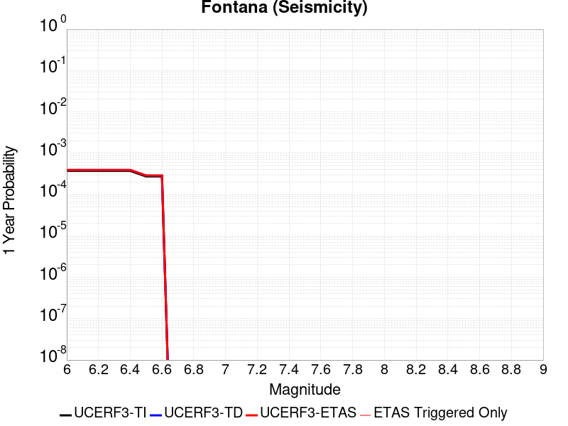 |  |

| Magnitude | 1 wk TI Prob | 1 wk TD Prob | 1 wk ETAS Prob | 1 wk ETAS/TD Gain | 1 wk ETAS Triggered Only | 1 mo TI Prob | 1 mo TD Prob | 1 mo ETAS Prob | 1 mo ETAS/TD Gain | 1 mo ETAS Triggered Only | 1 yr TI Prob | 1 yr TD Prob | 1 yr ETAS Prob | 1 yr ETAS/TD Gain | 1 yr ETAS Triggered Only | 10 yr TI Prob | 10 yr TD Prob | 10 yr ETAS Prob | 10 yr ETAS/TD Gain | 10 yr ETAS Triggered Only |
|-----|-----|-----|-----|-----|-----|-----|-----|-----|-----|-----|-----|-----|-----|-----|-----|-----|-----|-----|-----|-----|
| 6.0 | 7.1789214E-6 | 7.5525213E-6 | 7.5525213E-6 | 1.0 | 0.0 | 3.076644E-5 | 3.2367778E-5 | 3.2367778E-5 | 1.0 | 0.0 | 3.7451705E-4 | 3.940472E-4 | 3.940472E-4 | 1.0 | 0.0 | 0.003738865 | 0.003937485 | 0.0039474457 | 1.0025297 | 1.0E-5 |
| 6.1 | 7.1789214E-6 | 7.5525213E-6 | 7.5525213E-6 | 1.0 | 0.0 | 3.076644E-5 | 3.2367778E-5 | 3.2367778E-5 | 1.0 | 0.0 | 3.7451705E-4 | 3.940472E-4 | 3.940472E-4 | 1.0 | 0.0 | 0.003738865 | 0.003937485 | 0.0039474457 | 1.0025297 | 1.0E-5 |
| 6.2 | 7.1789214E-6 | 7.5525213E-6 | 7.5525213E-6 | 1.0 | 0.0 | 3.076644E-5 | 3.2367778E-5 | 3.2367778E-5 | 1.0 | 0.0 | 3.7451705E-4 | 3.940472E-4 | 3.940472E-4 | 1.0 | 0.0 | 0.003738865 | 0.003937485 | 0.0039474457 | 1.0025297 | 1.0E-5 |
| 6.3 | 7.1789214E-6 | 7.5525213E-6 | 7.5525213E-6 | 1.0 | 0.0 | 3.076644E-5 | 3.2367778E-5 | 3.2367778E-5 | 1.0 | 0.0 | 3.7451705E-4 | 3.940472E-4 | 3.940472E-4 | 1.0 | 0.0 | 0.003738865 | 0.003937485 | 0.0039474457 | 1.0025297 | 1.0E-5 |
| 6.4 | 7.1789214E-6 | 7.5525213E-6 | 7.5525213E-6 | 1.0 | 0.0 | 3.076644E-5 | 3.2367778E-5 | 3.2367778E-5 | 1.0 | 0.0 | 3.7451705E-4 | 3.940472E-4 | 3.940472E-4 | 1.0 | 0.0 | 0.003738865 | 0.003937485 | 0.0039474457 | 1.0025297 | 1.0E-5 |
| 6.5 | 5.2611317E-6 | 5.5331047E-6 | 5.5331047E-6 | 1.0 | 0.0 | 2.2547512E-5 | 2.3713304E-5 | 2.3713304E-5 | 1.0 | 0.0 | 2.744814E-4 | 2.887095E-4 | 2.887095E-4 | 1.0 | 0.0 | 0.002741426 | 0.0028870949 | 0.0028870949 | 1.0 | 0.0 |
| 6.6 | 5.2611317E-6 | 5.5331047E-6 | 5.5331047E-6 | 1.0 | 0.0 | 2.2547512E-5 | 2.3713304E-5 | 2.3713304E-5 | 1.0 | 0.0 | 2.744814E-4 | 2.887095E-4 | 2.887095E-4 | 1.0 | 0.0 | 0.002741426 | 0.0028870949 | 0.0028870949 | 1.0 | 0.0 |

## South Klamath Lake East
*[(top)](#table-of-contents)*

| 1 Week | 1 Month | 1 Year | 10 Year |
|-----|-----|-----|-----|
|  | 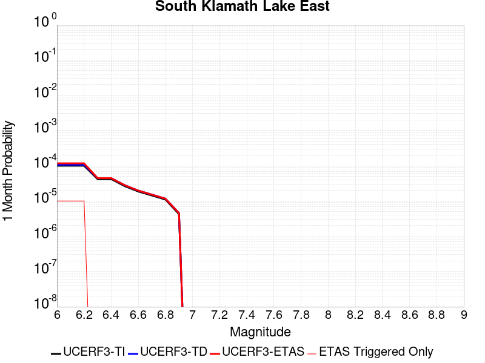 | 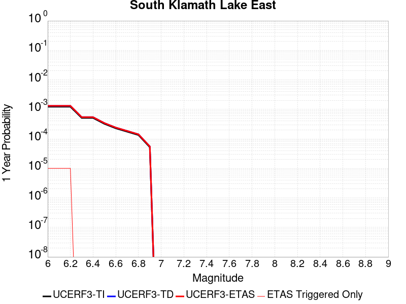 |  |

| Magnitude | 1 wk TI Prob | 1 wk TD Prob | 1 wk ETAS Prob | 1 wk ETAS/TD Gain | 1 wk ETAS Triggered Only | 1 mo TI Prob | 1 mo TD Prob | 1 mo ETAS Prob | 1 mo ETAS/TD Gain | 1 mo ETAS Triggered Only | 1 yr TI Prob | 1 yr TD Prob | 1 yr ETAS Prob | 1 yr ETAS/TD Gain | 1 yr ETAS Triggered Only | 10 yr TI Prob | 10 yr TD Prob | 10 yr ETAS Prob | 10 yr ETAS/TD Gain | 10 yr ETAS Triggered Only |
|-----|-----|-----|-----|-----|-----|-----|-----|-----|-----|-----|-----|-----|-----|-----|-----|-----|-----|-----|-----|-----|
| 6.0 | 2.3539369E-5 | 2.5049438E-5 | 2.5049438E-5 | 1.0 | 0.0 | 1.0087911E-4 | 1.0735078E-4 | 1.1734971E-4 | 1.0931425 | 1.0E-5 | 0.0012275111 | 0.0013062954 | 0.0013162823 | 1.0076452 | 1.0E-5 | 0.012207527 | 0.012994516 | 0.013004386 | 1.0007596 | 1.0E-5 |
| 6.1 | 2.3539369E-5 | 2.5049438E-5 | 2.5049438E-5 | 1.0 | 0.0 | 1.0087911E-4 | 1.0735078E-4 | 1.1734971E-4 | 1.0931425 | 1.0E-5 | 0.0012275111 | 0.0013062954 | 0.0013162823 | 1.0076452 | 1.0E-5 | 0.012207527 | 0.012994516 | 0.013004386 | 1.0007596 | 1.0E-5 |
| 6.2 | 2.3539369E-5 | 2.5049438E-5 | 2.5049438E-5 | 1.0 | 0.0 | 1.0087911E-4 | 1.0735078E-4 | 1.1734971E-4 | 1.0931425 | 1.0E-5 | 0.0012275111 | 0.0013062954 | 0.0013162823 | 1.0076452 | 1.0E-5 | 0.012207527 | 0.012994516 | 0.013004386 | 1.0007596 | 1.0E-5 |
| 6.3 | 9.807823E-6 | 1.03968705E-5 | 1.03968705E-5 | 1.0 | 0.0 | 4.2032847E-5 | 4.4557302E-5 | 4.4557302E-5 | 1.0 | 0.0 | 5.1162974E-4 | 5.423585E-4 | 5.423585E-4 | 1.0 | 0.0 | 0.005104534 | 0.005411186 | 0.005411186 | 1.0 | 0.0 |
| 6.4 | 9.807823E-6 | 1.03968705E-5 | 1.03968705E-5 | 1.0 | 0.0 | 4.2032847E-5 | 4.4557302E-5 | 4.4557302E-5 | 1.0 | 0.0 | 5.1162974E-4 | 5.423585E-4 | 5.423585E-4 | 1.0 | 0.0 | 0.005104534 | 0.005411186 | 0.005411186 | 1.0 | 0.0 |
| 6.5 | 6.191981E-6 | 6.5513436E-6 | 6.5513436E-6 | 1.0 | 0.0 | 2.653679E-5 | 2.80769E-5 | 2.80769E-5 | 1.0 | 0.0 | 3.2303753E-4 | 3.4178543E-4 | 3.4178543E-4 | 1.0 | 0.0 | 0.0032256835 | 0.003412876 | 0.003412876 | 1.0 | 0.0 |
| 6.6 | 4.3693776E-6 | 4.616904E-6 | 4.616904E-6 | 1.0 | 0.0 | 1.8725768E-5 | 1.9786587E-5 | 1.9786587E-5 | 1.0 | 0.0 | 2.2796239E-4 | 2.4087621E-4 | 2.4087621E-4 | 1.0 | 0.0 | 0.0022772867 | 0.0024062637 | 0.0024062637 | 1.0 | 0.0 |
| 6.7 | 3.360834E-6 | 3.551507E-6 | 3.551507E-6 | 1.0 | 0.0 | 1.4403494E-5 | 1.522066E-5 | 1.522066E-5 | 1.0 | 0.0 | 1.7534842E-4 | 1.852966E-4 | 1.852966E-4 | 1.0 | 0.0 | 0.0017521014 | 0.0018515008 | 0.0018515008 | 1.0 | 0.0 |
| 6.8 | 2.57873E-6 | 2.7253761E-6 | 2.7253761E-6 | 1.0 | 0.0 | 1.1051653E-5 | 1.1680135E-5 | 1.1680135E-5 | 1.0 | 0.0 | 1.3454557E-4 | 1.4219698E-4 | 1.4219698E-4 | 1.0 | 0.0 | 0.0013446413 | 0.0014211206 | 0.0014211206 | 1.0 | 0.0 |
| 6.9 | 9.987825E-7 | 1.0567024E-6 | 1.0567024E-6 | 1.0 | 0.0 | 4.2804895E-6 | 4.528719E-6 | 4.528719E-6 | 1.0 | 0.0 | 5.211371E-5 | 5.5136083E-5 | 5.5136083E-5 | 1.0 | 0.0 | 5.210149E-4 | 5.5125623E-4 | 5.5125623E-4 | 1.0 | 0.0 |

## Hosgri
*[(top)](#table-of-contents)*

| 1 Week | 1 Month | 1 Year | 10 Year |
|-----|-----|-----|-----|
| 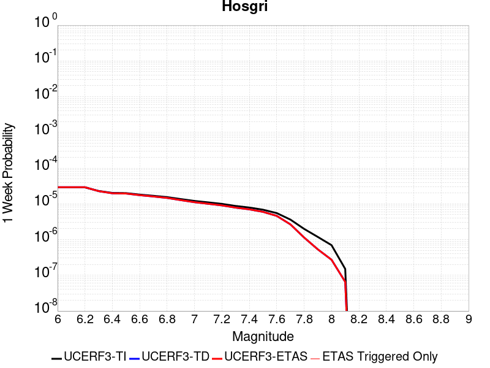 | 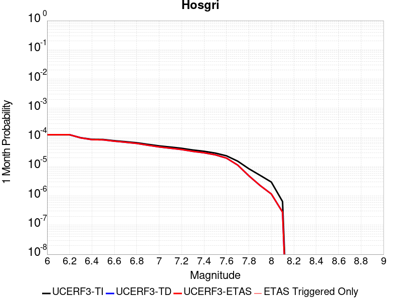 | 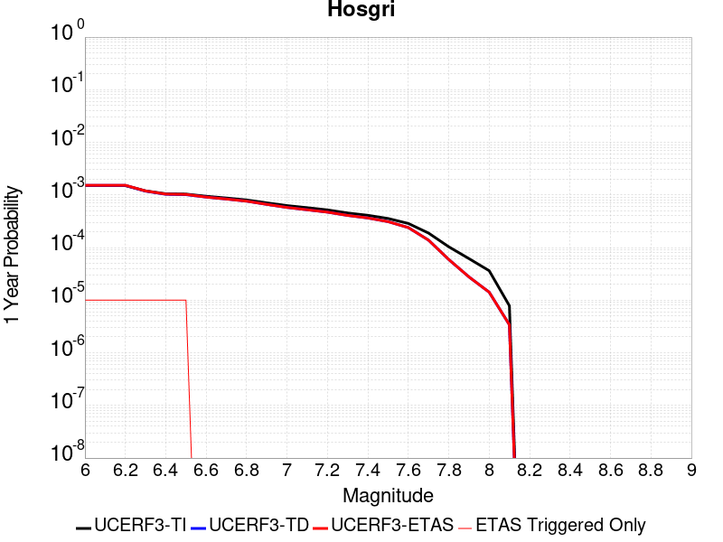 | 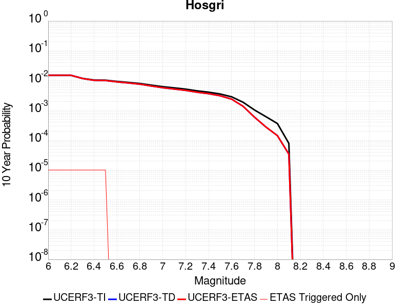 |

| Magnitude | 1 wk TI Prob | 1 wk TD Prob | 1 wk ETAS Prob | 1 wk ETAS/TD Gain | 1 wk ETAS Triggered Only | 1 mo TI Prob | 1 mo TD Prob | 1 mo ETAS Prob | 1 mo ETAS/TD Gain | 1 mo ETAS Triggered Only | 1 yr TI Prob | 1 yr TD Prob | 1 yr ETAS Prob | 1 yr ETAS/TD Gain | 1 yr ETAS Triggered Only | 10 yr TI Prob | 10 yr TD Prob | 10 yr ETAS Prob | 10 yr ETAS/TD Gain | 10 yr ETAS Triggered Only |
|-----|-----|-----|-----|-----|-----|-----|-----|-----|-----|-----|-----|-----|-----|-----|-----|-----|-----|-----|-----|-----|
| 6.0 | 2.883978E-5 | 2.9132612E-5 | 2.9132612E-5 | 1.0 | 0.0 | 1.235932E-4 | 1.2484823E-4 | 1.2484823E-4 | 1.0 | 0.0 | 0.0015037085 | 0.0015189946 | 0.0015289794 | 1.0065733 | 1.0E-5 | 0.01493574 | 0.015089898 | 0.015099748 | 1.0006527 | 1.0E-5 |
| 6.1 | 2.883978E-5 | 2.9132612E-5 | 2.9132612E-5 | 1.0 | 0.0 | 1.235932E-4 | 1.2484823E-4 | 1.2484823E-4 | 1.0 | 0.0 | 0.0015037085 | 0.0015189946 | 0.0015289794 | 1.0065733 | 1.0E-5 | 0.01493574 | 0.015089898 | 0.015099748 | 1.0006527 | 1.0E-5 |
| 6.2 | 2.883978E-5 | 2.9132612E-5 | 2.9132612E-5 | 1.0 | 0.0 | 1.235932E-4 | 1.2484823E-4 | 1.2484823E-4 | 1.0 | 0.0 | 0.0015037085 | 0.0015189946 | 0.0015289794 | 1.0065733 | 1.0E-5 | 0.01493574 | 0.015089898 | 0.015099748 | 1.0006527 | 1.0E-5 |
| 6.3 | 2.2914428E-5 | 2.2645349E-5 | 2.2645349E-5 | 1.0 | 0.0 | 9.8200995E-5 | 9.704791E-5 | 9.704791E-5 | 1.0 | 0.0 | 0.0011949413 | 0.0011809227 | 0.0011909109 | 1.0084579 | 1.0E-5 | 0.011885363 | 0.011747877 | 0.011757759 | 1.0008413 | 1.0E-5 |
| 6.4 | 2.0195741E-5 | 1.9699612E-5 | 1.9699612E-5 | 1.0 | 0.0 | 8.65503E-5 | 8.442419E-5 | 8.442419E-5 | 1.0 | 0.0 | 0.0010532405 | 0.0010273817 | 0.0010373715 | 1.0097234 | 1.0E-5 | 0.010482626 | 0.010227371 | 0.010237268 | 1.0009677 | 1.0E-5 |
| 6.5 | 1.9924333E-5 | 1.941201E-5 | 1.941201E-5 | 1.0 | 0.0 | 8.53872E-5 | 8.319168E-5 | 8.319168E-5 | 1.0 | 0.0 | 0.0010390934 | 0.00101239 | 0.0010223798 | 1.0098677 | 1.0E-5 | 0.010342481 | 0.010078819 | 0.010088718 | 1.0009822 | 1.0E-5 |
| 6.6 | 1.809694E-5 | 1.7461141E-5 | 1.7461141E-5 | 1.0 | 0.0 | 7.7556004E-5 | 7.4831325E-5 | 7.4831325E-5 | 1.0 | 0.0 | 9.438353E-4 | 9.1069186E-4 | 9.1069186E-4 | 1.0 | 0.0 | 0.009398366 | 0.0090705445 | 0.0090705445 | 1.0 | 0.0 |
| 6.7 | 1.675989E-5 | 1.604548E-5 | 1.604548E-5 | 1.0 | 0.0 | 7.182612E-5 | 6.876454E-5 | 6.876454E-5 | 1.0 | 0.0 | 8.7413215E-4 | 8.3688775E-4 | 8.3688775E-4 | 1.0 | 0.0 | 0.008707017 | 0.00833827 | 0.00833827 | 1.0 | 0.0 |
| 6.8 | 1.5401129E-5 | 1.4616672E-5 | 1.4616672E-5 | 1.0 | 0.0 | 6.6003166E-5 | 6.264138E-5 | 6.264138E-5 | 1.0 | 0.0 | 8.032922E-4 | 7.623928E-4 | 7.623928E-4 | 1.0 | 0.0 | 0.008003947 | 0.007598639 | 0.007598639 | 1.0 | 0.0 |
| 6.9 | 1.356559E-5 | 1.2692389E-5 | 1.2692389E-5 | 1.0 | 0.0 | 5.8136946E-5 | 5.439482E-5 | 5.439482E-5 | 1.0 | 0.0 | 7.0758746E-4 | 6.6205615E-4 | 6.6205615E-4 | 1.0 | 0.0 | 0.007053386 | 0.0066016447 | 0.0066016447 | 1.0 | 0.0 |
| 7.0 | 1.2030819E-5 | 1.1098249E-5 | 1.1098249E-5 | 1.0 | 0.0 | 5.155963E-5 | 4.756306E-5 | 4.756306E-5 | 1.0 | 0.0 | 6.275577E-4 | 5.7892647E-4 | 5.7892647E-4 | 1.0 | 0.0 | 0.006257884 | 0.005774946 | 0.005774946 | 1.0 | 0.0 |
| 7.1 | 1.0972698E-5 | 1.0024387E-5 | 1.0024387E-5 | 1.0 | 0.0 | 4.7025E-5 | 4.2960954E-5 | 4.2960954E-5 | 1.0 | 0.0 | 5.72379E-4 | 5.229241E-4 | 5.229241E-4 | 1.0 | 0.0 | 0.0057090693 | 0.00521769 | 0.00521769 | 1.0 | 0.0 |
| 7.2 | 9.961926E-6 | 9.036887E-6 | 9.036887E-6 | 1.0 | 0.0 | 4.2693267E-5 | 3.872894E-5 | 3.872894E-5 | 1.0 | 0.0 | 5.1966653E-4 | 4.7142286E-4 | 4.7142286E-4 | 1.0 | 0.0 | 0.00518453 | 0.004704976 | 0.004704976 | 1.0 | 0.0 |
| 7.3 | 8.700929E-6 | 7.830162E-6 | 7.830162E-6 | 1.0 | 0.0 | 3.7289166E-5 | 3.3557404E-5 | 3.3557404E-5 | 1.0 | 0.0 | 4.53901E-4 | 4.0848483E-4 | 4.0848483E-4 | 1.0 | 0.0 | 0.00452975 | 0.0040780813 | 0.0040780813 | 1.0 | 0.0 |
| 7.4 | 7.866285E-6 | 7.0007163E-6 | 7.0007163E-6 | 1.0 | 0.0 | 3.3712215E-5 | 3.0002724E-5 | 3.0002724E-5 | 1.0 | 0.0 | 4.103689E-4 | 3.6522196E-4 | 3.6522196E-4 | 1.0 | 0.0 | 0.004096119 | 0.0036469563 | 0.0036469563 | 1.0 | 0.0 |
| 7.5 | 6.8381305E-6 | 5.9616086E-6 | 5.9616086E-6 | 1.0 | 0.0 | 2.9305946E-5 | 2.55495E-5 | 2.55495E-5 | 1.0 | 0.0 | 3.5674145E-4 | 3.110208E-4 | 3.110208E-4 | 1.0 | 0.0 | 0.0035616932 | 0.0031065915 | 0.0031065915 | 1.0 | 0.0 |
| 7.6 | 5.503376E-6 | 4.597072E-6 | 4.597072E-6 | 1.0 | 0.0 | 2.3585684E-5 | 1.9701589E-5 | 1.9701589E-5 | 1.0 | 0.0 | 2.8711787E-4 | 2.3984045E-4 | 2.3984045E-4 | 1.0 | 0.0 | 0.002867472 | 0.0023965507 | 0.0023965507 | 1.0 | 0.0 |
| 7.7 | 3.6144982E-6 | 2.6538753E-6 | 2.6538753E-6 | 1.0 | 0.0 | 1.5490614E-5 | 1.1373702E-5 | 1.1373702E-5 | 1.0 | 0.0 | 1.8858191E-4 | 1.3846603E-4 | 1.3846603E-4 | 1.0 | 0.0 | 0.0018842196 | 0.0013845303 | 0.0013845303 | 1.0 | 0.0 |
| 7.8 | 1.9853494E-6 | 1.1375024E-6 | 1.1375024E-6 | 1.0 | 0.0 | 8.508612E-6 | 4.875001E-6 | 4.875001E-6 | 1.0 | 0.0 | 1.0358743E-4 | 5.935152E-5 | 5.935152E-5 | 1.0 | 0.0 | 0.0010353916 | 5.940882E-4 | 5.940882E-4 | 1.0 | 0.0 |
| 7.9 | 1.1818757E-6 | 5.3061154E-7 | 5.3061154E-7 | 1.0 | 0.0 | 5.0651715E-6 | 2.2740473E-6 | 2.2740473E-6 | 1.0 | 0.0 | 6.1666724E-5 | 2.7686174E-5 | 2.7686174E-5 | 1.0 | 0.0 | 6.1649614E-4 | 2.7751704E-4 | 2.7751704E-4 | 1.0 | 0.0 |
| 8.0 | 6.962958E-7 | 2.7215475E-7 | 2.7215475E-7 | 1.0 | 0.0 | 2.9841215E-6 | 1.1663769E-6 | 1.1663769E-6 | 1.0 | 0.0 | 3.6331072E-5 | 1.42005465E-5 | 1.42005465E-5 | 1.0 | 0.0 | 3.6325134E-4 | 1.4256805E-4 | 1.4256805E-4 | 1.0 | 0.0 |
| 8.1 | 1.5033264E-7 | 6.5432786E-8 | 6.5432786E-8 | 1.0 | 0.0 | 6.442826E-7 | 2.8042618E-7 | 2.8042618E-7 | 1.0 | 0.0 | 7.844113E-6 | 3.4141835E-6 | 3.4141835E-6 | 1.0 | 0.0 | 7.843835E-5 | 3.4158627E-5 | 3.4158627E-5 | 1.0 | 0.0 |

## Pitas Point (Lower West)
*[(top)](#table-of-contents)*

| 1 Week | 1 Month | 1 Year | 10 Year |
|-----|-----|-----|-----|
| 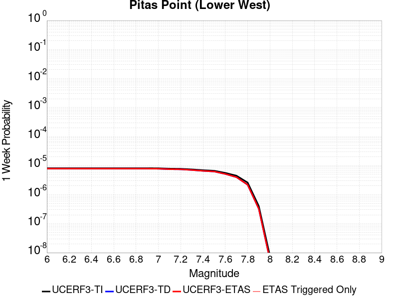 |  |  |  |

| Magnitude | 1 wk TI Prob | 1 wk TD Prob | 1 wk ETAS Prob | 1 wk ETAS/TD Gain | 1 wk ETAS Triggered Only | 1 mo TI Prob | 1 mo TD Prob | 1 mo ETAS Prob | 1 mo ETAS/TD Gain | 1 mo ETAS Triggered Only | 1 yr TI Prob | 1 yr TD Prob | 1 yr ETAS Prob | 1 yr ETAS/TD Gain | 1 yr ETAS Triggered Only | 10 yr TI Prob | 10 yr TD Prob | 10 yr ETAS Prob | 10 yr ETAS/TD Gain | 10 yr ETAS Triggered Only |
|-----|-----|-----|-----|-----|-----|-----|-----|-----|-----|-----|-----|-----|-----|-----|-----|-----|-----|-----|-----|-----|
| 6.0 | 8.151497E-6 | 7.856467E-6 | 7.856467E-6 | 1.0 | 0.0 | 3.493452E-5 | 3.367014E-5 | 3.367014E-5 | 1.0 | 0.0 | 4.252448E-4 | 4.098576E-4 | 4.1985352E-4 | 1.0243887 | 1.0E-5 | 0.0042443196 | 0.004091098 | 0.004101057 | 1.0024344 | 1.0E-5 |
| 6.1 | 8.151497E-6 | 7.856467E-6 | 7.856467E-6 | 1.0 | 0.0 | 3.493452E-5 | 3.367014E-5 | 3.367014E-5 | 1.0 | 0.0 | 4.252448E-4 | 4.098576E-4 | 4.1985352E-4 | 1.0243887 | 1.0E-5 | 0.0042443196 | 0.004091098 | 0.004101057 | 1.0024344 | 1.0E-5 |
| 6.2 | 8.151497E-6 | 7.856467E-6 | 7.856467E-6 | 1.0 | 0.0 | 3.493452E-5 | 3.367014E-5 | 3.367014E-5 | 1.0 | 0.0 | 4.252448E-4 | 4.098576E-4 | 4.1985352E-4 | 1.0243887 | 1.0E-5 | 0.0042443196 | 0.004091098 | 0.004101057 | 1.0024344 | 1.0E-5 |
| 6.3 | 8.151497E-6 | 7.856467E-6 | 7.856467E-6 | 1.0 | 0.0 | 3.493452E-5 | 3.367014E-5 | 3.367014E-5 | 1.0 | 0.0 | 4.252448E-4 | 4.098576E-4 | 4.1985352E-4 | 1.0243887 | 1.0E-5 | 0.0042443196 | 0.004091098 | 0.004101057 | 1.0024344 | 1.0E-5 |
| 6.4 | 8.151497E-6 | 7.856467E-6 | 7.856467E-6 | 1.0 | 0.0 | 3.493452E-5 | 3.367014E-5 | 3.367014E-5 | 1.0 | 0.0 | 4.252448E-4 | 4.098576E-4 | 4.1985352E-4 | 1.0243887 | 1.0E-5 | 0.0042443196 | 0.004091098 | 0.004101057 | 1.0024344 | 1.0E-5 |
| 6.5 | 8.151497E-6 | 7.856467E-6 | 7.856467E-6 | 1.0 | 0.0 | 3.493452E-5 | 3.367014E-5 | 3.367014E-5 | 1.0 | 0.0 | 4.252448E-4 | 4.098576E-4 | 4.1985352E-4 | 1.0243887 | 1.0E-5 | 0.0042443196 | 0.004091098 | 0.004101057 | 1.0024344 | 1.0E-5 |
| 6.6 | 8.151497E-6 | 7.856467E-6 | 7.856467E-6 | 1.0 | 0.0 | 3.493452E-5 | 3.367014E-5 | 3.367014E-5 | 1.0 | 0.0 | 4.252448E-4 | 4.098576E-4 | 4.1985352E-4 | 1.0243887 | 1.0E-5 | 0.0042443196 | 0.004091098 | 0.004101057 | 1.0024344 | 1.0E-5 |
| 6.7 | 8.151497E-6 | 7.856467E-6 | 7.856467E-6 | 1.0 | 0.0 | 3.493452E-5 | 3.367014E-5 | 3.367014E-5 | 1.0 | 0.0 | 4.252448E-4 | 4.098576E-4 | 4.1985352E-4 | 1.0243887 | 1.0E-5 | 0.0042443196 | 0.004091098 | 0.004101057 | 1.0024344 | 1.0E-5 |
| 6.8 | 8.151497E-6 | 7.856467E-6 | 7.856467E-6 | 1.0 | 0.0 | 3.493452E-5 | 3.367014E-5 | 3.367014E-5 | 1.0 | 0.0 | 4.252448E-4 | 4.098576E-4 | 4.1985352E-4 | 1.0243887 | 1.0E-5 | 0.0042443196 | 0.004091098 | 0.004101057 | 1.0024344 | 1.0E-5 |
| 6.9 | 8.151497E-6 | 7.856467E-6 | 7.856467E-6 | 1.0 | 0.0 | 3.493452E-5 | 3.367014E-5 | 3.367014E-5 | 1.0 | 0.0 | 4.252448E-4 | 4.098576E-4 | 4.1985352E-4 | 1.0243887 | 1.0E-5 | 0.0042443196 | 0.004091098 | 0.004101057 | 1.0024344 | 1.0E-5 |
| 7.0 | 8.103535E-6 | 7.805893E-6 | 7.805893E-6 | 1.0 | 0.0 | 3.4728975E-5 | 3.34534E-5 | 3.34534E-5 | 1.0 | 0.0 | 4.2274324E-4 | 4.072198E-4 | 4.1721572E-4 | 1.0245467 | 1.0E-5 | 0.0042193993 | 0.004064816 | 0.0040747756 | 1.0024501 | 1.0E-5 |
| 7.1 | 7.853298E-6 | 7.541564E-6 | 7.541564E-6 | 1.0 | 0.0 | 3.3656554E-5 | 3.2320593E-5 | 3.2320593E-5 | 1.0 | 0.0 | 4.096915E-4 | 3.9343289E-4 | 4.0342894E-4 | 1.0254073 | 1.0E-5 | 0.00408937 | 0.0039274395 | 0.0039374004 | 1.0025362 | 1.0E-5 |
| 7.2 | 7.771102E-6 | 7.4538384E-6 | 7.4538384E-6 | 1.0 | 0.0 | 3.33043E-5 | 3.1944634E-5 | 3.1944634E-5 | 1.0 | 0.0 | 4.0540437E-4 | 3.888572E-4 | 3.9885333E-4 | 1.0257064 | 1.0E-5 | 0.0040466557 | 0.0038818435 | 0.0038918047 | 1.0025661 | 1.0E-5 |
| 7.3 | 7.3945344E-6 | 7.049904E-6 | 7.049904E-6 | 1.0 | 0.0 | 3.1690477E-5 | 3.0213529E-5 | 3.0213529E-5 | 1.0 | 0.0 | 3.8576324E-4 | 3.6778825E-4 | 3.7778457E-4 | 1.0271796 | 1.0E-5 | 0.0038509427 | 0.0036718633 | 0.0036818266 | 1.0027134 | 1.0E-5 |
| 7.4 | 6.964645E-6 | 6.5907116E-6 | 6.5907116E-6 | 1.0 | 0.0 | 2.9848137E-5 | 2.8245604E-5 | 2.8245604E-5 | 1.0 | 0.0 | 3.6334046E-4 | 3.4383647E-4 | 3.5383302E-4 | 1.0290736 | 1.0E-5 | 0.0036274698 | 0.003433098 | 0.0034430637 | 1.0029029 | 1.0E-5 |
| 7.5 | 6.6525035E-6 | 6.2597182E-6 | 6.2597182E-6 | 1.0 | 0.0 | 2.851042E-5 | 2.682709E-5 | 2.682709E-5 | 1.0 | 0.0 | 3.4705905E-4 | 3.2657135E-4 | 3.365681E-4 | 1.0306112 | 1.0E-5 | 0.0034651754 | 0.0032609662 | 0.0032709334 | 1.0030565 | 1.0E-5 |
| 7.6 | 5.613338E-6 | 5.151837E-6 | 5.151837E-6 | 1.0 | 0.0 | 2.405694E-5 | 2.2079117E-5 | 2.2079117E-5 | 1.0 | 0.0 | 2.928539E-4 | 2.687804E-4 | 2.787777E-4 | 1.0371951 | 1.0E-5 | 0.0029246826 | 0.0026845846 | 0.002694558 | 1.0037149 | 1.0E-5 |
| 7.7 | 4.494704E-6 | 3.9972506E-6 | 3.9972506E-6 | 1.0 | 0.0 | 1.9262876E-5 | 1.7130964E-5 | 1.7130964E-5 | 1.0 | 0.0 | 2.3450027E-4 | 2.0854975E-4 | 2.0854975E-4 | 1.0 | 0.0 | 0.0023425296 | 0.0020835644 | 0.0020835644 | 1.0 | 0.0 |
| 7.8 | 2.6075882E-6 | 2.183817E-6 | 2.183817E-6 | 1.0 | 0.0 | 1.117533E-5 | 9.359183E-6 | 9.359183E-6 | 1.0 | 0.0 | 1.3605114E-4 | 1.13942144E-4 | 1.13942144E-4 | 1.0 | 0.0 | 0.0013596788 | 0.001138842 | 0.001138842 | 1.0 | 0.0 |
| 7.9 | 4.045984E-7 | 3.2426544E-7 | 3.2426544E-7 | 1.0 | 0.0 | 1.733992E-6 | 1.3897082E-6 | 1.3897082E-6 | 1.0 | 0.0 | 2.1111147E-5 | 1.691957E-5 | 1.691957E-5 | 1.0 | 0.0 | 2.1109142E-4 | 1.6918313E-4 | 1.6918313E-4 | 1.0 | 0.0 |
| 8.0 | 7.791402E-9 | 5.6840586E-9 | 5.6840586E-9 | 1.0 | 0.0 | 3.3391725E-8 | 2.436025E-8 | 2.436025E-8 | 1.0 | 0.0 | 4.0654416E-7 | 2.9658602E-7 | 2.9658602E-7 | 1.0 | 0.0 | 4.065434E-6 | 2.9658584E-6 | 2.9658584E-6 | 1.0 | 0.0 |

## Raymond
*[(top)](#table-of-contents)*

| 1 Week | 1 Month | 1 Year | 10 Year |
|-----|-----|-----|-----|
| 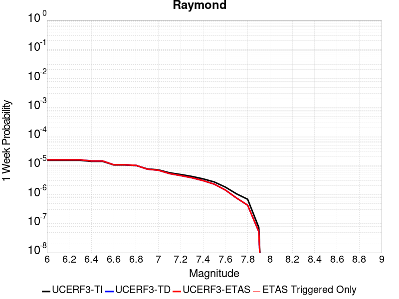 | 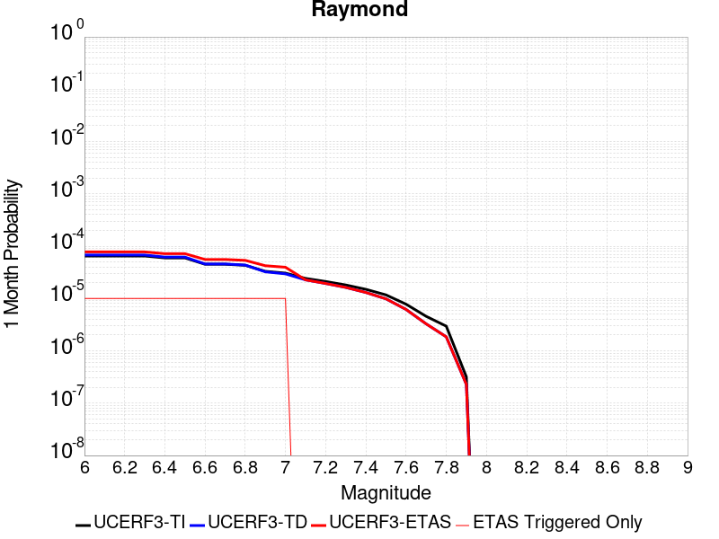 | 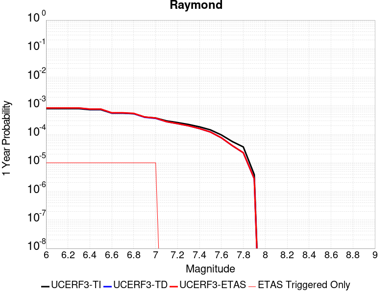 |  |

| Magnitude | 1 wk TI Prob | 1 wk TD Prob | 1 wk ETAS Prob | 1 wk ETAS/TD Gain | 1 wk ETAS Triggered Only | 1 mo TI Prob | 1 mo TD Prob | 1 mo ETAS Prob | 1 mo ETAS/TD Gain | 1 mo ETAS Triggered Only | 1 yr TI Prob | 1 yr TD Prob | 1 yr ETAS Prob | 1 yr ETAS/TD Gain | 1 yr ETAS Triggered Only | 10 yr TI Prob | 10 yr TD Prob | 10 yr ETAS Prob | 10 yr ETAS/TD Gain | 10 yr ETAS Triggered Only |
|-----|-----|-----|-----|-----|-----|-----|-----|-----|-----|-----|-----|-----|-----|-----|-----|-----|-----|-----|-----|-----|
| 6.0 | 1.5157413E-5 | 1.581271E-5 | 1.581271E-5 | 1.0 | 0.0 | 6.4958724E-5 | 6.7767134E-5 | 7.776645E-5 | 1.1475542 | 1.0E-5 | 7.905855E-4 | 8.247776E-4 | 8.3476934E-4 | 1.0121145 | 1.0E-5 | 0.007877788 | 0.0082196845 | 0.008229602 | 1.0012066 | 1.0E-5 |
| 6.1 | 1.5157413E-5 | 1.581271E-5 | 1.581271E-5 | 1.0 | 0.0 | 6.4958724E-5 | 6.7767134E-5 | 7.776645E-5 | 1.1475542 | 1.0E-5 | 7.905855E-4 | 8.247776E-4 | 8.3476934E-4 | 1.0121145 | 1.0E-5 | 0.007877788 | 0.0082196845 | 0.008229602 | 1.0012066 | 1.0E-5 |
| 6.2 | 1.5157413E-5 | 1.581271E-5 | 1.581271E-5 | 1.0 | 0.0 | 6.4958724E-5 | 6.7767134E-5 | 7.776645E-5 | 1.1475542 | 1.0E-5 | 7.905855E-4 | 8.247776E-4 | 8.3476934E-4 | 1.0121145 | 1.0E-5 | 0.007877788 | 0.0082196845 | 0.008229602 | 1.0012066 | 1.0E-5 |
| 6.3 | 1.5157413E-5 | 1.581271E-5 | 1.581271E-5 | 1.0 | 0.0 | 6.4958724E-5 | 6.7767134E-5 | 7.776645E-5 | 1.1475542 | 1.0E-5 | 7.905855E-4 | 8.247776E-4 | 8.3476934E-4 | 1.0121145 | 1.0E-5 | 0.007877788 | 0.0082196845 | 0.008229602 | 1.0012066 | 1.0E-5 |
| 6.4 | 1.3941944E-5 | 1.4457064E-5 | 1.4457064E-5 | 1.0 | 0.0 | 5.9749822E-5 | 6.195751E-5 | 7.1956885E-5 | 1.1613909 | 1.0E-5 | 7.2721124E-4 | 7.540949E-4 | 7.6408737E-4 | 1.013251 | 1.0E-5 | 0.007248361 | 0.007517695 | 0.0075276196 | 1.0013202 | 1.0E-5 |
| 6.5 | 1.3941944E-5 | 1.4457064E-5 | 1.4457064E-5 | 1.0 | 0.0 | 5.9749822E-5 | 6.195751E-5 | 7.1956885E-5 | 1.1613909 | 1.0E-5 | 7.2721124E-4 | 7.540949E-4 | 7.6408737E-4 | 1.013251 | 1.0E-5 | 0.007248361 | 0.007517695 | 0.0075276196 | 1.0013202 | 1.0E-5 |
| 6.6 | 1.0542609E-5 | 1.0672919E-5 | 1.0672919E-5 | 1.0 | 0.0 | 4.5181827E-5 | 4.574031E-5 | 5.5739853E-5 | 1.2186155 | 1.0E-5 | 5.499499E-4 | 5.5675145E-4 | 5.667459E-4 | 1.0179514 | 1.0E-5 | 0.005485909 | 0.0055541275 | 0.005564072 | 1.0017904 | 1.0E-5 |
| 6.7 | 1.0542609E-5 | 1.0672919E-5 | 1.0672919E-5 | 1.0 | 0.0 | 4.5181827E-5 | 4.574031E-5 | 5.5739853E-5 | 1.2186155 | 1.0E-5 | 5.499499E-4 | 5.5675145E-4 | 5.667459E-4 | 1.0179514 | 1.0E-5 | 0.005485909 | 0.0055541275 | 0.005564072 | 1.0017904 | 1.0E-5 |
| 6.8 | 1.0079132E-5 | 1.0178407E-5 | 1.0178407E-5 | 1.0 | 0.0 | 4.3195567E-5 | 4.3621047E-5 | 5.362061E-5 | 1.2292371 | 1.0E-5 | 5.257791E-4 | 5.309622E-4 | 5.409569E-4 | 1.0188237 | 1.0E-5 | 0.0052453685 | 0.0052974857 | 0.0053074327 | 1.0018777 | 1.0E-5 |
| 6.9 | 7.721598E-6 | 7.5502626E-6 | 7.5502626E-6 | 1.0 | 0.0 | 3.3092143E-5 | 3.235787E-5 | 4.235755E-5 | 1.3090338 | 1.0E-5 | 4.0282236E-4 | 3.938871E-4 | 4.0388317E-4 | 1.025378 | 1.0E-5 | 0.0040209293 | 0.0039320234 | 0.003941984 | 1.0025332 | 1.0E-5 |
| 7.0 | 7.137566E-6 | 6.9125854E-6 | 6.9125854E-6 | 1.0 | 0.0 | 3.058921E-5 | 2.9625035E-5 | 3.9624738E-5 | 1.3375423 | 1.0E-5 | 3.7236E-4 | 3.6062617E-4 | 3.7062258E-4 | 1.0277195 | 1.0E-5 | 0.0037173668 | 0.003600528 | 0.003610492 | 1.0027673 | 1.0E-5 |
| 7.1 | 5.654976E-6 | 5.300633E-6 | 5.300633E-6 | 1.0 | 0.0 | 2.4235387E-5 | 2.2716802E-5 | 2.2716802E-5 | 1.0 | 0.0 | 2.9502588E-4 | 2.7654218E-4 | 2.7654218E-4 | 1.0 | 0.0 | 0.0029463451 | 0.0027620115 | 0.0027620115 | 1.0 | 0.0 |
| 7.2 | 4.9358455E-6 | 4.5276643E-6 | 4.5276643E-6 | 1.0 | 0.0 | 2.1153453E-5 | 1.9404133E-5 | 1.9404133E-5 | 1.0 | 0.0 | 2.5751285E-4 | 2.3621984E-4 | 2.3621984E-4 | 1.0 | 0.0 | 0.0025721465 | 0.0023597097 | 0.0023597097 | 1.0 | 0.0 |
| 7.3 | 4.2368597E-6 | 3.8065502E-6 | 3.8065502E-6 | 1.0 | 0.0 | 1.8157843E-5 | 1.6313685E-5 | 1.6313685E-5 | 1.0 | 0.0 | 2.2104931E-4 | 1.9860112E-4 | 1.9860112E-4 | 1.0 | 0.0 | 0.0022082955 | 0.0019842552 | 0.0019842552 | 1.0 | 0.0 |
| 7.4 | 3.4999923E-6 | 3.0445872E-6 | 3.0445872E-6 | 1.0 | 0.0 | 1.49998805E-5 | 1.3048166E-5 | 1.3048166E-5 | 1.0 | 0.0 | 1.8260824E-4 | 1.5884991E-4 | 1.5884991E-4 | 1.0 | 0.0 | 0.0018245826 | 0.0015873795 | 0.0015873795 | 1.0 | 0.0 |
| 7.5 | 2.738017E-6 | 2.3026882E-6 | 2.3026882E-6 | 1.0 | 0.0 | 1.1734306E-5 | 9.868627E-6 | 9.868627E-6 | 1.0 | 0.0 | 1.428558E-4 | 1.2014397E-4 | 1.2014397E-4 | 1.0 | 0.0 | 0.0014276401 | 0.0012008046 | 0.0012008046 | 1.0 | 0.0 |
| 7.6 | 1.8186392E-6 | 1.442763E-6 | 1.442763E-6 | 1.0 | 0.0 | 7.794145E-6 | 6.1832557E-6 | 6.1832557E-6 | 1.0 | 0.0 | 9.488958E-5 | 7.527858E-5 | 7.527858E-5 | 1.0 | 0.0 | 9.4849075E-4 | 7.525423E-4 | 7.525423E-4 | 1.0 | 0.0 |
| 7.7 | 1.0660348E-6 | 7.647404E-7 | 7.647404E-7 | 1.0 | 0.0 | 4.5687125E-6 | 3.2774549E-6 | 3.2774549E-6 | 1.0 | 0.0 | 5.5622655E-5 | 3.9902297E-5 | 3.9902297E-5 | 1.0 | 0.0 | 5.5608735E-4 | 3.9896046E-4 | 3.9896046E-4 | 1.0 | 0.0 |
| 7.8 | 6.913602E-7 | 4.3234218E-7 | 4.3234218E-7 | 1.0 | 0.0 | 2.962969E-6 | 1.8528938E-6 | 1.8528938E-6 | 1.0 | 0.0 | 3.607355E-5 | 2.2558754E-5 | 2.2558754E-5 | 1.0 | 0.0 | 3.6067693E-4 | 2.255725E-4 | 2.255725E-4 | 1.0 | 0.0 |
| 7.9 | 7.425201E-8 | 5.32526E-8 | 5.32526E-8 | 1.0 | 0.0 | 3.1822285E-7 | 2.282254E-7 | 2.282254E-7 | 1.0 | 0.0 | 3.874356E-6 | 2.778642E-6 | 2.778642E-6 | 1.0 | 0.0 | 3.8742884E-5 | 2.7786204E-5 | 2.7786204E-5 | 1.0 | 0.0 |

## Big Pine (Central)
*[(top)](#table-of-contents)*

| 1 Week | 1 Month | 1 Year | 10 Year |
|-----|-----|-----|-----|
|  |  |  |  |

| Magnitude | 1 wk TI Prob | 1 wk TD Prob | 1 wk ETAS Prob | 1 wk ETAS/TD Gain | 1 wk ETAS Triggered Only | 1 mo TI Prob | 1 mo TD Prob | 1 mo ETAS Prob | 1 mo ETAS/TD Gain | 1 mo ETAS Triggered Only | 1 yr TI Prob | 1 yr TD Prob | 1 yr ETAS Prob | 1 yr ETAS/TD Gain | 1 yr ETAS Triggered Only | 10 yr TI Prob | 10 yr TD Prob | 10 yr ETAS Prob | 10 yr ETAS/TD Gain | 10 yr ETAS Triggered Only |
|-----|-----|-----|-----|-----|-----|-----|-----|-----|-----|-----|-----|-----|-----|-----|-----|-----|-----|-----|-----|-----|
| 6.0 | 1.2706755E-5 | 1.4255367E-5 | 1.4255367E-5 | 1.0 | 0.0 | 5.4456385E-5 | 6.109321E-5 | 6.109321E-5 | 1.0 | 0.0 | 6.628048E-4 | 7.4359257E-4 | 7.4359257E-4 | 1.0 | 0.0 | 0.006608314 | 0.0074160434 | 0.007425969 | 1.0013385 | 1.0E-5 |
| 6.1 | 8.342579E-6 | 9.51506E-6 | 9.51506E-6 | 1.0 | 0.0 | 3.5753423E-5 | 4.077831E-5 | 4.077831E-5 | 1.0 | 0.0 | 4.3521097E-4 | 4.963846E-4 | 4.963846E-4 | 1.0 | 0.0 | 0.0043435963 | 0.0049562836 | 0.004966234 | 1.0020076 | 1.0E-5 |
| 6.2 | 6.923899E-6 | 7.971265E-6 | 7.971265E-6 | 1.0 | 0.0 | 2.9673516E-5 | 3.4162225E-5 | 3.4162225E-5 | 1.0 | 0.0 | 3.6121515E-4 | 4.1586495E-4 | 4.1586495E-4 | 1.0 | 0.0 | 0.003606286 | 0.0041541457 | 0.0041641043 | 1.0023972 | 1.0E-5 |
| 6.3 | 2.728396E-6 | 3.4279099E-6 | 3.4279099E-6 | 1.0 | 0.0 | 1.1693074E-5 | 1.4690964E-5 | 1.4690964E-5 | 1.0 | 0.0 | 1.4235388E-4 | 1.7884867E-4 | 1.7884867E-4 | 1.0 | 0.0 | 0.0014226272 | 0.0017885243 | 0.0017985065 | 1.0055813 | 1.0E-5 |
| 6.4 | 2.7136944E-6 | 3.4122017E-6 | 3.4122017E-6 | 1.0 | 0.0 | 1.1630066E-5 | 1.4623644E-5 | 1.4623644E-5 | 1.0 | 0.0 | 1.4158686E-4 | 1.780292E-4 | 1.780292E-4 | 1.0 | 0.0 | 0.0014149669 | 0.0017803427 | 0.0017903249 | 1.0056069 | 1.0E-5 |
| 6.5 | 2.6971882E-6 | 3.3945453E-6 | 3.3945453E-6 | 1.0 | 0.0 | 1.1559327E-5 | 1.4547974E-5 | 1.4547974E-5 | 1.0 | 0.0 | 1.4072572E-4 | 1.7710806E-4 | 1.7710806E-4 | 1.0 | 0.0 | 0.0014063664 | 0.0017711461 | 0.0017811283 | 1.0056361 | 1.0E-5 |
| 6.6 | 2.669092E-6 | 3.3645629E-6 | 3.3645629E-6 | 1.0 | 0.0 | 1.1438916E-5 | 1.4419481E-5 | 1.4419481E-5 | 1.0 | 0.0 | 1.3925991E-4 | 1.755439E-4 | 1.755439E-4 | 1.0 | 0.0 | 0.0013917267 | 0.0017555293 | 0.0017655117 | 1.0056863 | 1.0E-5 |
| 6.7 | 2.6408059E-6 | 3.3345862E-6 | 3.3345862E-6 | 1.0 | 0.0 | 1.1317691E-5 | 1.429101E-5 | 1.429101E-5 | 1.0 | 0.0 | 1.3778417E-4 | 1.7398004E-4 | 1.7398004E-4 | 1.0 | 0.0 | 0.0013769877 | 0.0017399151 | 0.0017498977 | 1.0057374 | 1.0E-5 |
| 6.8 | 2.1786943E-6 | 2.8580237E-6 | 2.8580237E-6 | 1.0 | 0.0 | 9.337228E-6 | 1.224862E-5 | 1.224862E-5 | 1.0 | 0.0 | 1.1367482E-4 | 1.4911748E-4 | 1.4911748E-4 | 1.0 | 0.0 | 0.0011361669 | 0.0014916376 | 0.0015016226 | 1.0066941 | 1.0E-5 |
| 6.9 | 1.4411696E-6 | 2.071931E-6 | 2.071931E-6 | 1.0 | 0.0 | 6.1764263E-6 | 8.879676E-6 | 8.879676E-6 | 1.0 | 0.0 | 7.51954E-5 | 1.08104956E-4 | 1.08104956E-4 | 1.0 | 0.0 | 7.5169955E-4 | 0.0010819425 | 0.0010919316 | 1.0092326 | 1.0E-5 |
| 7.0 | 1.0073411E-6 | 1.5573258E-6 | 1.5573258E-6 | 1.0 | 0.0 | 4.317169E-6 | 6.6742373E-6 | 6.6742373E-6 | 1.0 | 0.0 | 5.2560266E-5 | 8.125596E-5 | 8.125596E-5 | 1.0 | 0.0 | 5.2547833E-4 | 8.1366993E-4 | 8.1366993E-4 | 1.0 | 0.0 |
| 7.1 | 8.947104E-7 | 1.4332707E-6 | 1.4332707E-6 | 1.0 | 0.0 | 3.834468E-6 | 6.142575E-6 | 6.142575E-6 | 1.0 | 0.0 | 4.6683643E-5 | 7.4783435E-5 | 7.4783435E-5 | 1.0 | 0.0 | 4.6673836E-4 | 7.489899E-4 | 7.489899E-4 | 1.0 | 0.0 |
| 7.2 | 5.215166E-7 | 1.0139875E-6 | 1.0139875E-6 | 1.0 | 0.0 | 2.2350691E-6 | 4.3456535E-6 | 4.3456535E-6 | 1.0 | 0.0 | 2.7211627E-5 | 5.2907093E-5 | 5.2907093E-5 | 1.0 | 0.0 | 2.7208295E-4 | 5.3034205E-4 | 5.3034205E-4 | 1.0 | 0.0 |
| 7.3 | 4.4024807E-7 | 9.246948E-7 | 9.246948E-7 | 1.0 | 0.0 | 1.8867761E-6 | 3.9629717E-6 | 3.9629717E-6 | 1.0 | 0.0 | 2.2971257E-5 | 4.8248156E-5 | 4.8248156E-5 | 1.0 | 0.0 | 2.2968883E-4 | 4.837737E-4 | 4.837737E-4 | 1.0 | 0.0 |
| 7.4 | 3.6130905E-7 | 8.385033E-7 | 8.385033E-7 | 1.0 | 0.0 | 1.5484665E-6 | 3.593581E-6 | 3.593581E-6 | 1.0 | 0.0 | 1.8852415E-5 | 4.3751006E-5 | 4.3751006E-5 | 1.0 | 0.0 | 1.8850817E-4 | 4.388113E-4 | 4.388113E-4 | 1.0 | 0.0 |
| 7.5 | 3.408184E-7 | 8.134078E-7 | 8.134078E-7 | 1.0 | 0.0 | 1.4606494E-6 | 3.4860288E-6 | 3.4860288E-6 | 1.0 | 0.0 | 1.7783263E-5 | 4.2441614E-5 | 4.2441614E-5 | 1.0 | 0.0 | 1.778184E-4 | 4.25701E-4 | 4.25701E-4 | 1.0 | 0.0 |
| 7.6 | 3.1428627E-7 | 7.7566114E-7 | 7.7566114E-7 | 1.0 | 0.0 | 1.3469405E-6 | 3.324258E-6 | 3.324258E-6 | 1.0 | 0.0 | 1.6398877E-5 | 4.047213E-5 | 4.047213E-5 | 1.0 | 0.0 | 1.6397667E-4 | 4.0598479E-4 | 4.0598479E-4 | 1.0 | 0.0 |
| 7.7 | 1.7972785E-7 | 5.0968714E-7 | 5.0968714E-7 | 1.0 | 0.0 | 7.70262E-7 | 2.1843716E-6 | 2.1843716E-6 | 1.0 | 0.0 | 9.377899E-6 | 2.659441E-5 | 2.659441E-5 | 1.0 | 0.0 | 9.377503E-5 | 2.6725783E-4 | 2.6725783E-4 | 1.0 | 0.0 |
| 7.8 | 4.9230927E-8 | 1.2026005E-7 | 1.2026005E-7 | 1.0 | 0.0 | 2.1098968E-7 | 5.154002E-7 | 5.154002E-7 | 1.0 | 0.0 | 2.5687964E-6 | 6.2749805E-6 | 6.2749805E-6 | 1.0 | 0.0 | 2.5687666E-5 | 6.318551E-5 | 6.318551E-5 | 1.0 | 0.0 |
| 7.9 | 3.6805972E-9 | 4.1243506E-9 | 4.1243506E-9 | 1.0 | 0.0 | 1.5773987E-8 | 1.7675788E-8 | 1.7675788E-8 | 1.0 | 0.0 | 1.9204828E-7 | 2.152027E-7 | 2.152027E-7 | 1.0 | 0.0 | 1.920481E-6 | 2.2000518E-6 | 2.2000518E-6 | 1.0 | 0.0 |

## South Klamath Lake West
*[(top)](#table-of-contents)*

| 1 Week | 1 Month | 1 Year | 10 Year |
|-----|-----|-----|-----|
|  |  |  |  |

| Magnitude | 1 wk TI Prob | 1 wk TD Prob | 1 wk ETAS Prob | 1 wk ETAS/TD Gain | 1 wk ETAS Triggered Only | 1 mo TI Prob | 1 mo TD Prob | 1 mo ETAS Prob | 1 mo ETAS/TD Gain | 1 mo ETAS Triggered Only | 1 yr TI Prob | 1 yr TD Prob | 1 yr ETAS Prob | 1 yr ETAS/TD Gain | 1 yr ETAS Triggered Only | 10 yr TI Prob | 10 yr TD Prob | 10 yr ETAS Prob | 10 yr ETAS/TD Gain | 10 yr ETAS Triggered Only |
|-----|-----|-----|-----|-----|-----|-----|-----|-----|-----|-----|-----|-----|-----|-----|-----|-----|-----|-----|-----|-----|
| 6.0 | 2.174025E-5 | 2.3043856E-5 | 2.3043856E-5 | 1.0 | 0.0 | 9.3169176E-5 | 9.875602E-5 | 1.0875503E-4 | 1.1012497 | 1.0E-5 | 0.0011337444 | 0.0012017571 | 0.0012117451 | 1.0083112 | 1.0E-5 | 0.011279777 | 0.011959186 | 0.011969066 | 1.0008261 | 1.0E-5 |
| 6.1 | 2.174025E-5 | 2.3043856E-5 | 2.3043856E-5 | 1.0 | 0.0 | 9.3169176E-5 | 9.875602E-5 | 1.0875503E-4 | 1.1012497 | 1.0E-5 | 0.0011337444 | 0.0012017571 | 0.0012117451 | 1.0083112 | 1.0E-5 | 0.011279777 | 0.011959186 | 0.011969066 | 1.0008261 | 1.0E-5 |
| 6.2 | 9.834929E-6 | 1.0394625E-5 | 1.0394625E-5 | 1.0 | 0.0 | 4.2149015E-5 | 4.4547684E-5 | 4.4547684E-5 | 1.0 | 0.0 | 5.1304343E-4 | 5.4224214E-4 | 5.4224214E-4 | 1.0 | 0.0 | 0.0051186057 | 0.0054100924 | 0.0054100924 | 1.0 | 0.0 |
| 6.3 | 9.834929E-6 | 1.0394625E-5 | 1.0394625E-5 | 1.0 | 0.0 | 4.2149015E-5 | 4.4547684E-5 | 4.4547684E-5 | 1.0 | 0.0 | 5.1304343E-4 | 5.4224214E-4 | 5.4224214E-4 | 1.0 | 0.0 | 0.0051186057 | 0.0054100924 | 0.0054100924 | 1.0 | 0.0 |
| 6.4 | 6.066321E-6 | 6.4008973E-6 | 6.4008973E-6 | 1.0 | 0.0 | 2.5998259E-5 | 2.7432145E-5 | 2.7432145E-5 | 1.0 | 0.0 | 3.1648282E-4 | 3.339379E-4 | 3.339379E-4 | 1.0 | 0.0 | 0.0031603249 | 0.0033346312 | 0.0033346312 | 1.0 | 0.0 |
| 6.5 | 6.066321E-6 | 6.4008973E-6 | 6.4008973E-6 | 1.0 | 0.0 | 2.5998259E-5 | 2.7432145E-5 | 2.7432145E-5 | 1.0 | 0.0 | 3.1648282E-4 | 3.339379E-4 | 3.339379E-4 | 1.0 | 0.0 | 0.0031603249 | 0.0033346312 | 0.0033346312 | 1.0 | 0.0 |
| 6.6 | 4.2321803E-6 | 4.4616118E-6 | 4.4616118E-6 | 1.0 | 0.0 | 1.8137789E-5 | 1.9121058E-5 | 1.9121058E-5 | 1.0 | 0.0 | 2.208052E-4 | 2.3277504E-4 | 2.3277504E-4 | 1.0 | 0.0 | 0.0022058594 | 0.0023254142 | 0.0023254142 | 1.0 | 0.0 |
| 6.7 | 3.186646E-6 | 3.3605481E-6 | 3.3605481E-6 | 1.0 | 0.0 | 1.3656982E-5 | 1.4402273E-5 | 1.4402273E-5 | 1.0 | 0.0 | 1.6626107E-4 | 1.7533425E-4 | 1.7533425E-4 | 1.0 | 0.0 | 0.0016613674 | 0.0017520263 | 0.0017520263 | 1.0 | 0.0 |
| 6.8 | 2.380121E-6 | 2.51109E-6 | 2.51109E-6 | 1.0 | 0.0 | 1.0200479E-5 | 1.07617725E-5 | 1.07617725E-5 | 1.0 | 0.0 | 1.2418375E-4 | 1.3101716E-4 | 1.3101716E-4 | 1.0 | 0.0 | 0.0012411437 | 0.0013094451 | 0.0013094451 | 1.0 | 0.0 |
| 6.9 | 8.928287E-7 | 9.4309536E-7 | 9.4309536E-7 | 1.0 | 0.0 | 3.826403E-6 | 4.041832E-6 | 4.041832E-6 | 1.0 | 0.0 | 4.658546E-5 | 4.9208415E-5 | 4.9208415E-5 | 1.0 | 0.0 | 4.6575698E-4 | 4.919968E-4 | 4.919968E-4 | 1.0 | 0.0 |

## Earthquake Valley
*[(top)](#table-of-contents)*

| 1 Week | 1 Month | 1 Year | 10 Year |
|-----|-----|-----|-----|
|  | 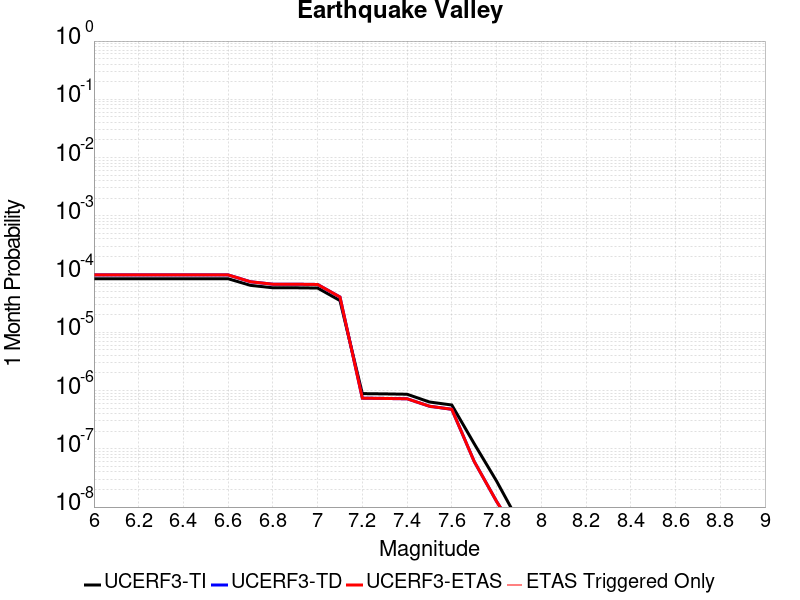 |  | 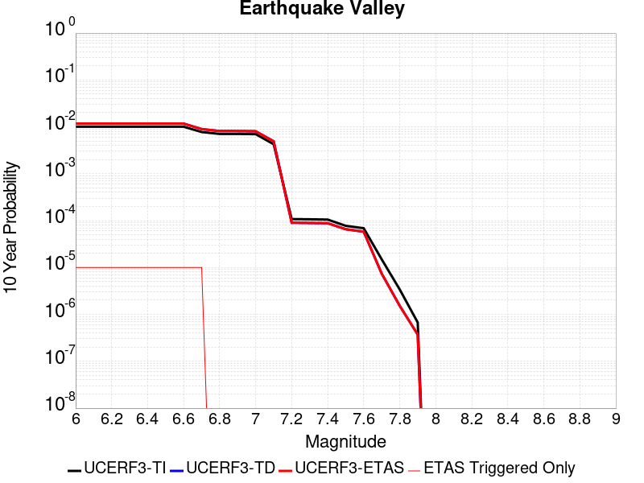 |

| Magnitude | 1 wk TI Prob | 1 wk TD Prob | 1 wk ETAS Prob | 1 wk ETAS/TD Gain | 1 wk ETAS Triggered Only | 1 mo TI Prob | 1 mo TD Prob | 1 mo ETAS Prob | 1 mo ETAS/TD Gain | 1 mo ETAS Triggered Only | 1 yr TI Prob | 1 yr TD Prob | 1 yr ETAS Prob | 1 yr ETAS/TD Gain | 1 yr ETAS Triggered Only | 10 yr TI Prob | 10 yr TD Prob | 10 yr ETAS Prob | 10 yr ETAS/TD Gain | 10 yr ETAS Triggered Only |
|-----|-----|-----|-----|-----|-----|-----|-----|-----|-----|-----|-----|-----|-----|-----|-----|-----|-----|-----|-----|-----|
| 6.0 | 1.9416384E-5 | 2.2589096E-5 | 2.2589096E-5 | 1.0 | 0.0 | 8.321042E-5 | 9.68075E-5 | 9.68075E-5 | 1.0 | 0.0 | 0.001012616 | 0.0011781142 | 0.0011881024 | 1.0084782 | 1.0E-5 | 0.010080142 | 0.011730534 | 0.011740416 | 1.0008425 | 1.0E-5 |
| 6.1 | 1.9416384E-5 | 2.2589096E-5 | 2.2589096E-5 | 1.0 | 0.0 | 8.321042E-5 | 9.68075E-5 | 9.68075E-5 | 1.0 | 0.0 | 0.001012616 | 0.0011781142 | 0.0011881024 | 1.0084782 | 1.0E-5 | 0.010080142 | 0.011730534 | 0.011740416 | 1.0008425 | 1.0E-5 |
| 6.2 | 1.9416384E-5 | 2.2589096E-5 | 2.2589096E-5 | 1.0 | 0.0 | 8.321042E-5 | 9.68075E-5 | 9.68075E-5 | 1.0 | 0.0 | 0.001012616 | 0.0011781142 | 0.0011881024 | 1.0084782 | 1.0E-5 | 0.010080142 | 0.011730534 | 0.011740416 | 1.0008425 | 1.0E-5 |
| 6.3 | 1.9416384E-5 | 2.2589096E-5 | 2.2589096E-5 | 1.0 | 0.0 | 8.321042E-5 | 9.68075E-5 | 9.68075E-5 | 1.0 | 0.0 | 0.001012616 | 0.0011781142 | 0.0011881024 | 1.0084782 | 1.0E-5 | 0.010080142 | 0.011730534 | 0.011740416 | 1.0008425 | 1.0E-5 |
| 6.4 | 1.9416384E-5 | 2.2589096E-5 | 2.2589096E-5 | 1.0 | 0.0 | 8.321042E-5 | 9.68075E-5 | 9.68075E-5 | 1.0 | 0.0 | 0.001012616 | 0.0011781142 | 0.0011881024 | 1.0084782 | 1.0E-5 | 0.010080142 | 0.011730534 | 0.011740416 | 1.0008425 | 1.0E-5 |
| 6.5 | 1.9389157E-5 | 2.2557679E-5 | 2.2557679E-5 | 1.0 | 0.0 | 8.309374E-5 | 9.667286E-5 | 9.667286E-5 | 1.0 | 0.0 | 0.0010111968 | 0.0011764768 | 0.001186465 | 1.00849 | 1.0E-5 | 0.010066078 | 0.011714333 | 0.011724215 | 1.0008436 | 1.0E-5 |
| 6.6 | 1.9389157E-5 | 2.2557679E-5 | 2.2557679E-5 | 1.0 | 0.0 | 8.309374E-5 | 9.667286E-5 | 9.667286E-5 | 1.0 | 0.0 | 0.0010111968 | 0.0011764768 | 0.001186465 | 1.00849 | 1.0E-5 | 0.010066078 | 0.011714333 | 0.011724215 | 1.0008436 | 1.0E-5 |
| 6.7 | 1.4925434E-5 | 1.7211838E-5 | 1.7211838E-5 | 1.0 | 0.0 | 6.396457E-5 | 7.376342E-5 | 7.376342E-5 | 1.0 | 0.0 | 7.7849044E-4 | 8.9778466E-4 | 9.077757E-4 | 1.0111285 | 1.0E-5 | 0.007757689 | 0.008949956 | 0.008959867 | 1.0011073 | 1.0E-5 |
| 6.8 | 1.3570335E-5 | 1.5620086E-5 | 1.5620086E-5 | 1.0 | 0.0 | 5.8157282E-5 | 6.6941975E-5 | 6.6941975E-5 | 1.0 | 0.0 | 7.0783484E-4 | 8.147959E-4 | 8.147959E-4 | 1.0 | 0.0 | 0.0070558446 | 0.008126159 | 0.008126159 | 1.0 | 0.0 |
| 6.9 | 1.3570335E-5 | 1.5620086E-5 | 1.5620086E-5 | 1.0 | 0.0 | 5.8157282E-5 | 6.6941975E-5 | 6.6941975E-5 | 1.0 | 0.0 | 7.0783484E-4 | 8.147959E-4 | 8.147959E-4 | 1.0 | 0.0 | 0.0070558446 | 0.008126159 | 0.008126159 | 1.0 | 0.0 |
| 7.0 | 1.3433392E-5 | 1.54636E-5 | 1.54636E-5 | 1.0 | 0.0 | 5.757041E-5 | 6.627135E-5 | 6.627135E-5 | 1.0 | 0.0 | 7.0069433E-4 | 8.0663717E-4 | 8.0663717E-4 | 1.0 | 0.0 | 0.006984891 | 0.008045164 | 0.008045164 | 1.0 | 0.0 |
| 7.1 | 8.181609E-6 | 9.418855E-6 | 9.418855E-6 | 1.0 | 0.0 | 3.5063567E-5 | 4.0366278E-5 | 4.0366278E-5 | 1.0 | 0.0 | 4.268153E-4 | 4.9141573E-4 | 4.9141573E-4 | 1.0 | 0.0 | 0.0042599645 | 0.0049098693 | 0.0049098693 | 1.0 | 0.0 |
| 7.2 | 2.0663983E-7 | 1.7268306E-7 | 1.7268306E-7 | 1.0 | 0.0 | 8.855989E-7 | 7.4007005E-7 | 7.4007005E-7 | 1.0 | 0.0 | 1.0782113E-5 | 9.010319E-6 | 9.010319E-6 | 1.0 | 0.0 | 1.07815904E-4 | 9.00999E-5 | 9.00999E-5 | 1.0 | 0.0 |
| 7.3 | 2.0462376E-7 | 1.7083768E-7 | 1.7083768E-7 | 1.0 | 0.0 | 8.7695867E-7 | 7.321613E-7 | 7.321613E-7 | 1.0 | 0.0 | 1.0676919E-5 | 8.914031E-6 | 8.914031E-6 | 1.0 | 0.0 | 1.0676406E-4 | 8.9137095E-5 | 8.9137095E-5 | 1.0 | 0.0 |
| 7.4 | 2.0171088E-7 | 1.6866183E-7 | 1.6866183E-7 | 1.0 | 0.0 | 8.644749E-7 | 7.2283626E-7 | 7.2283626E-7 | 1.0 | 0.0 | 1.0524931E-5 | 8.800499E-6 | 8.800499E-6 | 1.0 | 0.0 | 1.05244326E-4 | 8.800187E-5 | 8.800187E-5 | 1.0 | 0.0 |
| 7.5 | 1.4847944E-7 | 1.2563532E-7 | 1.2563532E-7 | 1.0 | 0.0 | 6.363403E-7 | 5.38437E-7 | 5.38437E-7 | 1.0 | 0.0 | 7.747416E-6 | 6.555453E-6 | 6.555453E-6 | 1.0 | 0.0 | 7.747146E-5 | 6.555282E-5 | 6.555282E-5 | 1.0 | 0.0 |
| 7.6 | 1.3185847E-7 | 1.1127066E-7 | 1.1127066E-7 | 1.0 | 0.0 | 5.6510765E-7 | 4.7687416E-7 | 4.7687416E-7 | 1.0 | 0.0 | 6.8801637E-6 | 5.80593E-6 | 5.80593E-6 | 1.0 | 0.0 | 6.8799505E-5 | 5.8057994E-5 | 5.8057994E-5 | 1.0 | 0.0 |
| 7.7 | 2.8609954E-8 | 1.4178042E-8 | 1.4178042E-8 | 1.0 | 0.0 | 1.2261408E-7 | 6.0763035E-8 | 6.0763035E-8 | 1.0 | 0.0 | 1.4928254E-6 | 7.3978975E-7 | 7.3978975E-7 | 1.0 | 0.0 | 1.4928154E-5 | 7.3978786E-6 | 7.3978786E-6 | 1.0 | 0.0 |
| 7.8 | 6.527266E-9 | 2.924799E-9 | 2.924799E-9 | 1.0 | 0.0 | 2.7973995E-8 | 1.2534852E-8 | 1.2534852E-8 | 1.0 | 0.0 | 3.4058334E-7 | 1.5261182E-7 | 1.5261182E-7 | 1.0 | 0.0 | 3.4058282E-6 | 1.5261173E-6 | 1.5261173E-6 | 1.0 | 0.0 |
| 7.9 | 1.2898267E-9 | 7.1300965E-10 | 7.1300965E-10 | 1.0 | 0.0 | 5.527829E-9 | 3.0557554E-9 | 3.0557554E-9 | 1.0 | 0.0 | 6.7301315E-8 | 3.7203822E-8 | 3.7203822E-8 | 1.0 | 0.0 | 6.7301295E-7 | 3.7203822E-7 | 3.7203822E-7 | 1.0 | 0.0 |

