# Parent Section Magnitude-Probability Distributions

Only fault sections with at least one triggered aftershock are plotted. Sections are sorted by total supraseismogenic trigger rate (decreasing)

## Table Of Contents

* [Garlock (Central)](#garlock-central)
* [Tank Canyon](#tank-canyon)
* [Little Lake](#little-lake)
* [Airport Lake](#airport-lake)
* [Owl Lake](#owl-lake)
* [Panamint Valley](#panamint-valley)
* [Garlock (East)](#garlock-east)
* [Ash Hill](#ash-hill)
* [Hunter Mountain-Saline Valley](#hunter-mountain-saline-valley)
* [Blackwater](#blackwater)
* [Garlock (West)](#garlock-west)
* [McLean Lake](#mclean-lake)
* [So Sierra Nevada](#so-sierra-nevada)
* [Goldstone Lake](#goldstone-lake)
* [Gravel Hills-Harper Lk](#gravel-hills-harper-lk)
* [Coyote Canyon](#coyote-canyon)
* [San Andreas (Mojave N)](#san-andreas-mojave-n)
* [San Andreas (Mojave S)](#san-andreas-mojave-s)
* [Death Valley (So)](#death-valley-so)
* [Lenwood-Lockhart-Old Woman Springs](#lenwood-lockhart-old-woman-springs)
* [Nelson Lake](#nelson-lake)
* [San Andreas (San Bernardino N)](#san-andreas-san-bernardino-n)
* [Bicycle Lake](#bicycle-lake)
* [Towne Pass](#towne-pass)
* [Paradise](#paradise)
* [Garlic Springs](#garlic-springs)
* [Death Valley (Black Mtns Frontal)](#death-valley-black-mtns-frontal)
* [Helendale-So Lockhart](#helendale-so-lockhart)
* [Coyote Lake](#coyote-lake)
* [San Andreas (San Bernardino S)](#san-andreas-san-bernardino-s)
* [Sierra Nevada  (No Extension)](#sierra-nevada--no-extension)
* [Death Valley (No)](#death-valley-no)
* [San Andreas (Big Bend)](#san-andreas-big-bend)
* [San Jacinto (San Bernardino)](#san-jacinto-san-bernardino)
* [San Andreas (Cholame) rev](#san-andreas-cholame-rev)
* [Death Valley (Fish Lake Valley)](#death-valley-fish-lake-valley)
* [San Andreas (Parkfield)](#san-andreas-parkfield)
* [San Andreas (Carrizo) rev](#san-andreas-carrizo-rev)
* [White Wolf (Extension)](#white-wolf-extension)
* [Manix-Afton Hills](#manix-afton-hills)
* [Ludlow](#ludlow)
* [San Andreas (San Gorgonio Pass-Garnet HIll)](#san-andreas-san-gorgonio-pass-garnet-hill)
* [San Jacinto (San Jacinto Valley) rev](#san-jacinto-san-jacinto-valley-rev)
* [Cady](#cady)
* [Red Pass](#red-pass)
* [Independence rev 2011](#independence-rev-2011)
* [Calico-Hidalgo](#calico-hidalgo)
* [San Andreas (Coachella) rev](#san-andreas-coachella-rev)
* [Santa Cruz Island](#santa-cruz-island)
* [Scodie Lineament](#scodie-lineament)
* [San Jacinto (Stepovers Combined)](#san-jacinto-stepovers-combined)
* [Lake Isabella (Seismicity)](#lake-isabella-seismicity)
* [Cleghorn Lake](#cleghorn-lake)
* [Pleito](#pleito)
* [San Jacinto (Lytle Creek connector)](#san-jacinto-lytle-creek-connector)
* [Owens Valley](#owens-valley)
* [Imperial](#imperial)
* [Baker](#baker)
* [Lost Hills](#lost-hills)
* [Coronado Bank alt1](#coronado-bank-alt1)
* [San Diego Trough south](#san-diego-trough-south)
* [Red Mountain](#red-mountain)
* [San Jacinto (Anza) rev](#san-jacinto-anza-rev)
* [San Diego Trough north alt1](#san-diego-trough-north-alt1)
* [San Clemente](#san-clemente)
* [Pinto Mtn](#pinto-mtn)
* [Brawley (Seismic Zone) alt 1](#brawley-seismic-zone-alt-1)
* [Palos Verdes](#palos-verdes)
* [San Andreas (North Branch Mill Creek)](#san-andreas-north-branch-mill-creek)
* [Elsinore (Glen Ivy) rev](#elsinore-glen-ivy-rev)
* [Mission Ridge-Arroyo Parida-Santa Ana](#mission-ridge-arroyo-parida-santa-ana)
* [Tin Mountain](#tin-mountain)
* [Blue Cut](#blue-cut)
* [Kern Canyon (South Kern) 2011](#kern-canyon-south-kern-2011)
* [Kern Canyon (North Kern) 2011](#kern-canyon-north-kern-2011)
* [San Andreas (Creeping Section) 2011 CFM](#san-andreas-creeping-section-2011-cfm)
* [Santa Rosa Island](#santa-rosa-island)
* [San Jacinto (Coyote Creek)](#san-jacinto-coyote-creek)
* [Ventura-Pitas Point](#ventura-pitas-point)
* [Rose Canyon](#rose-canyon)
* [Santa Ynez (West)](#santa-ynez-west)
* [Cleghorn Pass](#cleghorn-pass)
* [Channel Islands Western Deep Ramp](#channel-islands-western-deep-ramp)
* [Kern Canyon (Lake Isabella) 2011](#kern-canyon-lake-isabella-2011)
* [San Jacinto (Superstition Mtn)](#san-jacinto-superstition-mtn)
* [Maacama 2011 CFM](#maacama-2011-cfm)
* [White Wolf](#white-wolf)
* [Point Reyes 2011 CFM](#point-reyes-2011-cfm)
* [Quien Sabe 2011 CFM](#quien-sabe-2011-cfm)
* [Cleghorn](#cleghorn)
* [Earthquake Valley (So Extension)](#earthquake-valley-so-extension)
* [Malibu Coast alt 1](#malibu-coast-alt-1)
* [San Pedro Basin](#san-pedro-basin)
* [Whittier alt 1](#whittier-alt-1)
* [Elysian Park (Upper)](#elysian-park-upper)
* [Sierra Madre](#sierra-madre)
* [Pitas Point (Lower)-Montalvo](#pitas-point-lower-montalvo)
* [Camp Rock 2011](#camp-rock-2011)
* [Malibu Coast (Extension) alt 1](#malibu-coast-extension-alt-1)
* [Rinconada 2011 CFM](#rinconada-2011-cfm)
* [San Jacinto (Borrego)](#san-jacinto-borrego)
* [Chino alt 1](#chino-alt-1)
* [Round Valley](#round-valley)
* [Newport-Inglewood (Offshore)](#newport-inglewood-offshore)
* [Mission Creek](#mission-creek)
* [Anacapa-Dume alt 1](#anacapa-dume-alt-1)
* [Great Valley 05 Pittsburg - Kirby Hills alt1](#great-valley-05-pittsburg---kirby-hills-alt1)
* [Santa Ynez (East)](#santa-ynez-east)
* [Channel Islands Thrust](#channel-islands-thrust)
* [Deep Springs](#deep-springs)
* [Emerson-Copper Mtn 2011](#emerson-copper-mtn-2011)
* [Calaveras (So) 2011 CFM](#calaveras-so-2011-cfm)
* [Elmore Ranch](#elmore-ranch)
* [Simi-Santa Rosa](#simi-santa-rosa)
* [Hat Creek-McArthur-Mayfield](#hat-creek-mcarthur-mayfield)
* [Mono Lake 2011 CFM](#mono-lake-2011-cfm)
* [San Juan](#san-juan)
* [South Klamath Lake East](#south-klamath-lake-east)
* [Pitas Point (Lower West)](#pitas-point-lower-west)
* [South Klamath Lake West](#south-klamath-lake-west)
* [Cucamonga](#cucamonga)
* [San Jacinto (Clark) rev](#san-jacinto-clark-rev)

## Garlock (Central)
*[(top)](#table-of-contents)*

| 1 Week | 1 Month | 1 Year | 10 Year |
|-----|-----|-----|-----|
|  |  |  |  |

| Magnitude | 1 wk TI Prob | 1 wk TD Prob | 1 wk ETAS Prob | 1 wk ETAS/TD Gain | 1 wk ETAS Triggered Only | 1 mo TI Prob | 1 mo TD Prob | 1 mo ETAS Prob | 1 mo ETAS/TD Gain | 1 mo ETAS Triggered Only | 1 yr TI Prob | 1 yr TD Prob | 1 yr ETAS Prob | 1 yr ETAS/TD Gain | 1 yr ETAS Triggered Only | 10 yr TI Prob | 10 yr TD Prob | 10 yr ETAS Prob | 10 yr ETAS/TD Gain | 10 yr ETAS Triggered Only |
|-----|-----|-----|-----|-----|-----|-----|-----|-----|-----|-----|-----|-----|-----|-----|-----|-----|-----|-----|-----|-----|
| 6.0 | 5.5131142E-5 | 7.030957E-5 | 0.0011468327 | 16.31119 | 0.0010765989 | 2.3625491E-4 | 3.012923E-4 | 0.0042399988 | 14.072709 | 0.0039398936 | 0.0028726095 | 0.0036621294 | 0.024088243 | 6.57766 | 0.02050119 | 0.028357591 | 0.036111314 | 0.07929819 | 2.1959376 | 0.044804838 |
| 6.1 | 5.5131142E-5 | 7.030957E-5 | 0.0011468327 | 16.31119 | 0.0010765989 | 2.3625491E-4 | 3.012923E-4 | 0.0042399988 | 14.072709 | 0.0039398936 | 0.0028726095 | 0.0036621294 | 0.024088243 | 6.57766 | 0.02050119 | 0.028357591 | 0.036111314 | 0.07929819 | 2.1959376 | 0.044804838 |
| 6.2 | 4.216245E-5 | 5.1718438E-5 | 7.159685E-4 | 13.843583 | 6.642844E-4 | 1.806837E-4 | 2.216318E-4 | 0.002740773 | 12.366334 | 0.0025196995 | 0.0021976046 | 0.0026950599 | 0.014779867 | 5.484059 | 0.012117464 | 0.021759989 | 0.026718695 | 0.053137477 | 1.9887751 | 0.027144035 |
| 6.3 | 4.216245E-5 | 5.1718438E-5 | 7.159685E-4 | 13.843583 | 6.642844E-4 | 1.806837E-4 | 2.216318E-4 | 0.002740773 | 12.366334 | 0.0025196995 | 0.0021976046 | 0.0026950599 | 0.014779867 | 5.484059 | 0.012117464 | 0.021759989 | 0.026718695 | 0.053137477 | 1.9887751 | 0.027144035 |
| 6.4 | 3.6858168E-5 | 4.416524E-5 | 6.1679893E-4 | 13.96571 | 5.7265896E-4 | 1.5795401E-4 | 1.8926601E-4 | 0.002204644 | 11.648389 | 0.0020157595 | 0.0019213937 | 0.0023019037 | 0.0114890635 | 4.9911137 | 0.009208356 | 0.019048655 | 0.022876801 | 0.04317758 | 1.8873959 | 0.020776067 |
| 6.5 | 3.39199E-5 | 4.00718E-5 | 5.668969E-4 | 14.147029 | 5.2684627E-4 | 1.453629E-4 | 1.7172511E-4 | 0.0019810167 | 11.535975 | 0.0018096024 | 0.0017683565 | 0.0020887703 | 0.010294977 | 4.928726 | 0.008223383 | 0.017543508 | 0.02078729 | 0.03897818 | 1.8750968 | 0.018577058 |
| 6.6 | 3.3571985E-5 | 3.9525858E-5 | 5.663513E-4 | 14.328628 | 5.2684627E-4 | 1.4387199E-4 | 1.6938566E-4 | 0.0019786814 | 11.681518 | 0.0018096024 | 0.0017502342 | 0.0020603414 | 0.0102439225 | 4.9719534 | 0.008200477 | 0.017365133 | 0.020508545 | 0.038682178 | 1.8861493 | 0.018554151 |
| 6.7 | 3.2580007E-5 | 3.8141945E-5 | 5.420626E-4 | 14.211719 | 5.0393987E-4 | 1.3962112E-4 | 1.6345536E-4 | 0.0019269567 | 11.788886 | 0.0017637897 | 0.0016985617 | 0.001988274 | 0.009852394 | 4.95525 | 0.007879787 | 0.016856372 | 0.019801024 | 0.0373142 | 1.8844581 | 0.01786696 |
| 6.8 | 3.2185937E-5 | 3.756897E-5 | 5.414899E-4 | 14.413222 | 5.0393987E-4 | 1.3793244E-4 | 1.6100006E-4 | 0.0018787003 | 11.6689415 | 0.0017179769 | 0.0016780337 | 0.001958435 | 0.009639898 | 4.922246 | 0.0076965364 | 0.016654192 | 0.019507734 | 0.03664434 | 1.8784518 | 0.017477551 |
| 6.9 | 3.165394E-5 | 3.6773246E-5 | 5.177891E-4 | 14.080592 | 4.8103352E-4 | 1.3565269E-4 | 1.5759023E-4 | 0.0018523936 | 11.754496 | 0.0016950705 | 0.0016503202 | 0.001916994 | 0.009553052 | 4.98335 | 0.0076507237 | 0.01638118 | 0.01910022 | 0.035929386 | 1.8810978 | 0.017156864 |
| 7.0 | 3.0903822E-5 | 3.5678135E-5 | 4.7088342E-4 | 13.198095 | 4.352208E-4 | 1.3243823E-4 | 1.5289745E-4 | 0.0017560974 | 11.485459 | 0.0016034452 | 0.0016112428 | 0.0018599583 | 0.009222087 | 4.9582224 | 0.0073758475 | 0.015996104 | 0.018539215 | 0.034793478 | 1.8767505 | 0.016561298 |
| 7.1 | 3.0069863E-5 | 3.4444005E-5 | 4.4674426E-4 | 12.97016 | 4.1231446E-4 | 1.2886449E-4 | 1.4760894E-4 | 0.0017050115 | 11.550869 | 0.0015576323 | 0.0015677959 | 0.0017956785 | 0.008929629 | 4.972844 | 0.007146784 | 0.01556781 | 0.017906671 | 0.033609007 | 1.8768985 | 0.015988639 |
| 7.2 | 2.7957109E-5 | 3.1332263E-5 | 4.436338E-4 | 14.159009 | 4.1231446E-4 | 1.1981068E-4 | 1.3427433E-4 | 0.0016000845 | 11.9165325 | 0.001466007 | 0.0014577188 | 0.0016335837 | 0.0079682795 | 4.8777914 | 0.0063450616 | 0.014481937 | 0.016309762 | 0.029897017 | 1.8330749 | 0.0138125345 |
| 7.3 | 2.4519275E-5 | 2.6762631E-5 | 3.2453734E-4 | 12.126511 | 2.9778265E-4 | 1.0507837E-4 | 1.14692026E-4 | 0.001053745 | 9.187605 | 9.391607E-4 | 0.0012785783 | 0.0013954957 | 0.005718756 | 4.0980105 | 0.004329302 | 0.012712469 | 0.013952656 | 0.023439093 | 1.6799018 | 0.009620671 |
| 7.4 | 2.3225532E-5 | 2.5246292E-5 | 3.0011564E-4 | 11.887514 | 2.748763E-4 | 9.95342E-5 | 1.08193984E-4 | 9.098298E-4 | 8.4092455 | 8.017226E-4 | 0.0012111551 | 0.0013164802 | 0.0050453013 | 3.832417 | 0.0037337365 | 0.012045753 | 0.013169862 | 0.021691829 | 1.6470809 | 0.008635697 |
| 7.5 | 2.097765E-5 | 2.2528295E-5 | 2.2868087E-4 | 10.15083 | 2.0615723E-4 | 8.9901114E-5 | 9.6546326E-5 | 7.149583E-4 | 7.4053392 | 6.184717E-4 | 0.0010939965 | 0.0011748294 | 0.0040576397 | 3.453812 | 0.0028862013 | 0.010886264 | 0.011763361 | 0.018418612 | 1.5657609 | 0.0067344694 |
| 7.6 | 1.511254E-5 | 1.603285E-5 | 6.184483E-5 | 3.8573823 | 4.5812718E-5 | 6.476642E-5 | 6.8710455E-5 | 3.206631E-4 | 4.666875 | 2.5196993E-4 | 7.882459E-4 | 8.362365E-4 | 0.0022781303 | 2.7242656 | 0.0014431006 | 0.007854558 | 0.008405034 | 0.0118348235 | 1.4080635 | 0.00345886 |
| 7.7 | 9.934069E-6 | 1.0717446E-5 | 1.0717446E-5 | 1.0 | 0.0 | 4.2573887E-5 | 4.5931105E-5 | 1.3755233E-4 | 2.9947534 | 9.1625436E-5 | 5.182138E-4 | 5.590681E-4 | 9.482585E-4 | 1.6961414 | 3.894081E-4 | 0.00517007 | 0.005647734 | 0.0066271443 | 1.1734166 | 9.849734E-4 |
| 7.8 | 6.7562896E-6 | 8.460225E-6 | 8.460225E-6 | 1.0 | 0.0 | 2.8955206E-5 | 3.6257603E-5 | 1.2787971E-4 | 3.5269763 | 9.1625436E-5 | 3.5247262E-4 | 4.4134707E-4 | 7.389983E-4 | 1.6744153 | 2.9778265E-4 | 0.0035191406 | 0.0044631446 | 0.0051700724 | 1.1583923 | 7.1009714E-4 |
| 7.9 | 3.975453E-6 | 5.390275E-6 | 5.390275E-6 | 1.0 | 0.0 | 1.7037546E-5 | 2.3100974E-5 | 6.891263E-5 | 2.9831052 | 4.5812718E-5 | 2.0741238E-4 | 2.8121815E-4 | 4.644175E-4 | 1.6514492 | 1.8325087E-4 | 0.002072189 | 0.002843625 | 0.0033461319 | 1.1767135 | 5.0393987E-4 |
| 8.0 | 1.6729537E-6 | 2.0839254E-6 | 2.0839254E-6 | 1.0 | 0.0 | 7.169782E-6 | 8.931079E-6 | 3.1837233E-5 | 3.564769 | 2.2906359E-5 | 8.7288594E-5 | 1.0873049E-4 | 1.3163436E-4 | 1.2106481 | 2.2906359E-5 | 8.7254314E-4 | 0.0011002679 | 0.0012375548 | 1.1247759 | 1.3743815E-4 |
| 8.1 | 3.6733252E-7 | 3.1582263E-7 | 3.1582263E-7 | 1.0 | 0.0 | 1.5742813E-6 | 1.3535249E-6 | 1.3535249E-6 | 1.0 | 0.0 | 1.9166706E-5 | 1.6479058E-5 | 1.6479058E-5 | 1.0 | 0.0 | 1.9165053E-4 | 1.6687137E-4 | 1.6687137E-4 | 1.0 | 0.0 |

## Tank Canyon
*[(top)](#table-of-contents)*

| 1 Week | 1 Month | 1 Year | 10 Year |
|-----|-----|-----|-----|
| 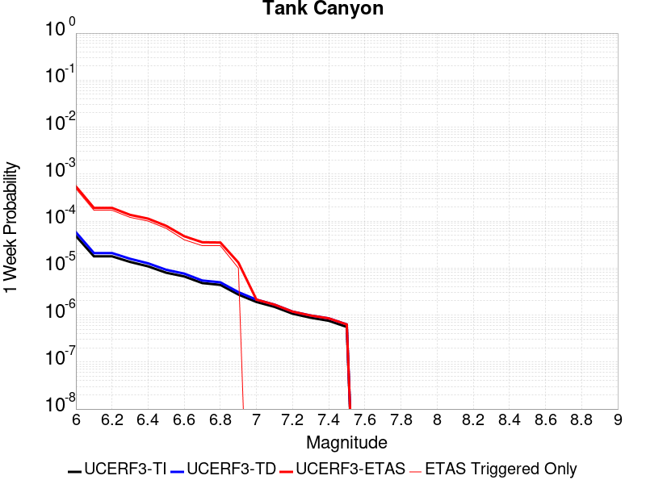 |  |  |  |

| Magnitude | 1 wk TI Prob | 1 wk TD Prob | 1 wk ETAS Prob | 1 wk ETAS/TD Gain | 1 wk ETAS Triggered Only | 1 mo TI Prob | 1 mo TD Prob | 1 mo ETAS Prob | 1 mo ETAS/TD Gain | 1 mo ETAS Triggered Only | 1 yr TI Prob | 1 yr TD Prob | 1 yr ETAS Prob | 1 yr ETAS/TD Gain | 1 yr ETAS Triggered Only | 10 yr TI Prob | 10 yr TD Prob | 10 yr ETAS Prob | 10 yr ETAS/TD Gain | 10 yr ETAS Triggered Only |
|-----|-----|-----|-----|-----|-----|-----|-----|-----|-----|-----|-----|-----|-----|-----|-----|-----|-----|-----|-----|-----|
| 6.0 | 4.8284557E-5 | 5.7980193E-5 | 6.53511E-4 | 11.27128 | 5.955653E-4 | 2.0691741E-4 | 2.4846673E-4 | 0.0027217388 | 10.954138 | 0.0024738868 | 0.0025163088 | 0.003021537 | 0.016335594 | 5.4063854 | 0.013354408 | 0.02488006 | 0.029871376 | 0.061626777 | 2.0630713 | 0.032733187 |
| 6.1 | 1.7796336E-5 | 2.0877918E-5 | 2.499367E-4 | 11.971343 | 2.2906359E-4 | 7.626778E-5 | 8.947394E-5 | 6.84986E-4 | 7.6557035 | 5.955653E-4 | 9.281647E-4 | 0.001088837 | 0.005619358 | 5.16088 | 0.004535459 | 0.009242975 | 0.010839115 | 0.022462707 | 2.0723746 | 0.011750962 |
| 6.2 | 1.7796336E-5 | 2.0877918E-5 | 2.499367E-4 | 11.971343 | 2.2906359E-4 | 7.626778E-5 | 8.947394E-5 | 6.84986E-4 | 7.6557035 | 5.955653E-4 | 9.281647E-4 | 0.001088837 | 0.005619358 | 5.16088 | 0.004535459 | 0.009242975 | 0.010839115 | 0.022462707 | 2.0723746 | 0.011750962 |
| 6.3 | 1.3515912E-5 | 1.5762842E-5 | 1.9901083E-4 | 12.625314 | 1.8325087E-4 | 5.792405E-5 | 6.7553425E-5 | 5.4855447E-4 | 8.120306 | 4.8103352E-4 | 7.049971E-4 | 8.221765E-4 | 0.0044384054 | 5.398361 | 0.0036192047 | 0.007027647 | 0.008193959 | 0.017099675 | 2.0868638 | 0.008979293 |
| 6.4 | 1.0870146E-5 | 1.2620516E-5 | 1.5005693E-4 | 11.889921 | 1.3743815E-4 | 4.658551E-5 | 5.4086904E-5 | 4.6637908E-4 | 8.622772 | 4.1231446E-4 | 5.67031E-4 | 6.58327E-4 | 0.0035655193 | 5.416031 | 0.0029091076 | 0.005655863 | 0.006565783 | 0.013551863 | 2.0640132 | 0.0070322524 |
| 6.5 | 7.964826E-6 | 9.197785E-6 | 1.0082238E-4 | 10.961593 | 9.1625436E-5 | 3.4134522E-5 | 3.9418548E-5 | 3.1428403E-4 | 7.9729986 | 2.748763E-4 | 4.1550855E-4 | 4.798258E-4 | 0.0024030367 | 5.008144 | 0.0019241341 | 0.0041473247 | 0.0047891987 | 0.0093029365 | 1.9424828 | 0.004535459 |
| 6.6 | 6.6317E-6 | 7.6136125E-6 | 7.6332166E-5 | 10.025748 | 6.871908E-5 | 2.8421264E-5 | 3.2629414E-5 | 2.3877992E-4 | 7.317935 | 2.0615723E-4 | 3.4597394E-4 | 3.971998E-4 | 0.001725241 | 4.3435087 | 0.0013285688 | 0.0034543579 | 0.00396605 | 0.0073199305 | 1.8456473 | 0.0033672347 |
| 6.7 | 4.793663E-6 | 5.4315906E-6 | 7.4150295E-5 | 13.651672 | 6.871908E-5 | 2.0544108E-5 | 2.3278062E-5 | 1.8361885E-4 | 7.888064 | 1.6034451E-4 | 2.500958E-4 | 2.833779E-4 | 0.0011764728 | 4.151603 | 8.93348E-4 | 0.0024981452 | 0.002830858 | 0.0049779606 | 1.7584634 | 0.0021531978 |
| 6.8 | 4.382823E-6 | 4.9699643E-6 | 7.36887E-5 | 14.826807 | 6.871908E-5 | 1.8783392E-5 | 2.1299697E-5 | 1.8164079E-4 | 8.527859 | 1.6034451E-4 | 2.286638E-4 | 2.5929723E-4 | 0.0011295131 | 4.3560557 | 8.704416E-4 | 0.0022842865 | 0.0025906207 | 0.004601158 | 1.7760834 | 0.0020157595 |
| 6.9 | 2.729601E-6 | 3.0739357E-6 | 2.5980224E-5 | 8.451778 | 2.2906359E-5 | 1.1698237E-5 | 1.317395E-5 | 8.189212E-5 | 6.216216 | 6.871908E-5 | 1.4241673E-4 | 1.6038226E-4 | 5.726306E-4 | 3.570411 | 4.1231446E-4 | 0.001423255 | 0.001602831 | 0.0025862255 | 1.6135361 | 9.849734E-4 |
| 7.0 | 1.8987357E-6 | 2.1272067E-6 | 2.1272067E-6 | 1.0 | 0.0 | 8.137413E-6 | 9.116572E-6 | 3.2022723E-5 | 3.5125837 | 2.2906359E-5 | 9.90685E-5 | 1.1098931E-4 | 2.7131604E-4 | 2.4445238 | 1.6034451E-4 | 9.902435E-4 | 0.0011094075 | 0.0016127883 | 1.4537385 | 5.0393987E-4 |
| 7.1 | 1.4928986E-6 | 1.664348E-6 | 1.664348E-6 | 1.0 | 0.0 | 6.398121E-6 | 7.1329036E-6 | 3.0039098E-5 | 4.2113423 | 2.2906359E-5 | 7.789434E-5 | 8.6840235E-5 | 2.2426645E-4 | 2.5825179 | 1.3743815E-4 | 7.786704E-4 | 8.681209E-4 | 0.0011427585 | 1.3163588 | 2.748763E-4 |
| 7.2 | 1.069082E-6 | 1.1830405E-6 | 1.1830405E-6 | 1.0 | 0.0 | 4.581772E-6 | 5.0701665E-6 | 5.0701665E-6 | 1.0 | 0.0 | 5.5781646E-5 | 6.172806E-5 | 8.463301E-5 | 1.3710622 | 2.2906359E-5 | 5.576765E-4 | 6.1716145E-4 | 6.858381E-4 | 1.1112783 | 6.871908E-5 |
| 7.3 | 8.776551E-7 | 9.77166E-7 | 9.77166E-7 | 1.0 | 0.0 | 3.7613736E-6 | 4.18785E-6 | 4.18785E-6 | 1.0 | 0.0 | 4.579376E-5 | 5.0986404E-5 | 7.389159E-5 | 1.4492412 | 2.2906359E-5 | 4.5784327E-4 | 5.0979806E-4 | 5.5558747E-4 | 1.0898186 | 4.5812718E-5 |
| 7.4 | 7.55721E-7 | 8.510639E-7 | 8.510639E-7 | 1.0 | 0.0 | 3.2388E-6 | 3.6474144E-6 | 3.6474144E-6 | 1.0 | 0.0 | 3.9431678E-5 | 4.4406883E-5 | 4.4406883E-5 | 1.0 | 0.0 | 3.942468E-4 | 4.4403094E-4 | 4.6692713E-4 | 1.0515645 | 2.2906359E-5 |
| 7.5 | 5.587665E-7 | 6.305905E-7 | 6.305905E-7 | 1.0 | 0.0 | 2.3947114E-6 | 2.7025305E-6 | 2.7025305E-6 | 1.0 | 0.0 | 2.915522E-5 | 3.290331E-5 | 3.290331E-5 | 1.0 | 0.0 | 2.9151395E-4 | 3.290331E-4 | 3.5193193E-4 | 1.0695943 | 2.2906359E-5 |

## Little Lake
*[(top)](#table-of-contents)*

| 1 Week | 1 Month | 1 Year | 10 Year |
|-----|-----|-----|-----|
|  |  |  |  |

| Magnitude | 1 wk TI Prob | 1 wk TD Prob | 1 wk ETAS Prob | 1 wk ETAS/TD Gain | 1 wk ETAS Triggered Only | 1 mo TI Prob | 1 mo TD Prob | 1 mo ETAS Prob | 1 mo ETAS/TD Gain | 1 mo ETAS Triggered Only | 1 yr TI Prob | 1 yr TD Prob | 1 yr ETAS Prob | 1 yr ETAS/TD Gain | 1 yr ETAS Triggered Only | 10 yr TI Prob | 10 yr TD Prob | 10 yr ETAS Prob | 10 yr ETAS/TD Gain | 10 yr ETAS Triggered Only |
|-----|-----|-----|-----|-----|-----|-----|-----|-----|-----|-----|-----|-----|-----|-----|-----|-----|-----|-----|-----|-----|
| 6.0 | 2.8424427E-5 | 3.121011E-5 | 5.351343E-4 | 17.146183 | 5.0393987E-4 | 1.2181328E-4 | 1.3375151E-4 | 0.0021950481 | 16.411388 | 0.0020615724 | 0.0014820677 | 0.0016273415 | 0.011598261 | 7.127122 | 0.009987173 | 0.014722223 | 0.01616766 | 0.03674304 | 2.272626 | 0.020913506 |
| 6.1 | 2.8424427E-5 | 3.121011E-5 | 5.351343E-4 | 17.146183 | 5.0393987E-4 | 1.2181328E-4 | 1.3375151E-4 | 0.0021950481 | 16.411388 | 0.0020615724 | 0.0014820677 | 0.0016273415 | 0.011598261 | 7.127122 | 0.009987173 | 0.014722223 | 0.01616766 | 0.03674304 | 2.272626 | 0.020913506 |
| 6.2 | 2.8424427E-5 | 3.121011E-5 | 5.351343E-4 | 17.146183 | 5.0393987E-4 | 1.2181328E-4 | 1.3375151E-4 | 0.0021950481 | 16.411388 | 0.0020615724 | 0.0014820677 | 0.0016273415 | 0.011598261 | 7.127122 | 0.009987173 | 0.014722223 | 0.01616766 | 0.03674304 | 2.272626 | 0.020913506 |
| 6.3 | 1.48860645E-5 | 1.608343E-5 | 3.596733E-4 | 22.362972 | 3.4359537E-4 | 6.379586E-5 | 6.892732E-5 | 0.0014203093 | 20.605898 | 0.0013514751 | 7.7643775E-4 | 8.388952E-4 | 0.0072015207 | 8.58453 | 0.006367968 | 0.007737305 | 0.008360104 | 0.021875445 | 2.6166475 | 0.013629284 |
| 6.4 | 1.48860645E-5 | 1.608343E-5 | 3.596733E-4 | 22.362972 | 3.4359537E-4 | 6.379586E-5 | 6.892732E-5 | 0.0014203093 | 20.605898 | 0.0013514751 | 7.7643775E-4 | 8.388952E-4 | 0.0072015207 | 8.58453 | 0.006367968 | 0.007737305 | 0.008360104 | 0.021875445 | 2.6166475 | 0.013629284 |
| 6.5 | 1.2797581E-5 | 1.37672705E-5 | 3.5735793E-4 | 25.957066 | 3.4359537E-4 | 5.4845623E-5 | 5.9001395E-5 | 0.0013645868 | 23.128042 | 0.0013056624 | 6.675408E-4 | 7.1813096E-4 | 0.0064406083 | 8.968571 | 0.00572659 | 0.006655392 | 0.0071606543 | 0.019350545 | 2.7023432 | 0.012277808 |
| 6.6 | 9.661896E-6 | 1.0290241E-5 | 2.3935147E-4 | 23.260044 | 2.2906359E-4 | 4.1407468E-5 | 4.4100383E-5 | 0.0010977464 | 24.891994 | 0.0010536925 | 5.040193E-4 | 5.368061E-4 | 0.005207195 | 9.700327 | 0.004672897 | 0.005028777 | 0.0053566997 | 0.015495427 | 2.892719 | 0.010193329 |
| 6.7 | 7.767871E-6 | 8.2006045E-6 | 2.1435614E-4 | 26.139067 | 2.0615723E-4 | 3.329045E-5 | 3.514505E-5 | 9.742727E-4 | 27.721478 | 9.391607E-4 | 4.0523586E-4 | 4.2782072E-4 | 0.0044576153 | 10.419353 | 0.004031519 | 0.004044977 | 0.0042713233 | 0.013098219 | 3.0665486 | 0.00886476 |
| 6.8 | 6.4235196E-6 | 6.7364886E-6 | 1.6707992E-4 | 24.802227 | 1.6034451E-4 | 2.752908E-5 | 2.887042E-5 | 8.305698E-4 | 28.768887 | 8.017226E-4 | 3.35115E-4 | 3.514535E-4 | 0.0037633015 | 10.707822 | 0.0034130474 | 0.003346101 | 0.0035102374 | 0.010609108 | 3.0223336 | 0.0071238778 |
| 6.9 | 3.1283696E-6 | 3.1124437E-6 | 9.4737596E-5 | 30.438332 | 9.1625436E-5 | 1.3407229E-5 | 1.3338985E-5 | 4.48554E-4 | 33.627296 | 4.352208E-4 | 1.6322079E-4 | 1.6239155E-4 | 0.0021778238 | 13.410943 | 0.0020157595 | 0.0016310095 | 0.0016228772 | 0.005922284 | 3.6492496 | 0.0043063955 |
| 7.0 | 2.290603E-6 | 2.228881E-6 | 7.0947804E-5 | 31.831133 | 6.871908E-5 | 9.816834E-6 | 9.552317E-6 | 2.84426E-4 | 29.775602 | 2.748763E-4 | 1.19513395E-4 | 1.162943E-4 | 0.0014218049 | 12.225921 | 0.0013056624 | 0.0011944914 | 0.0011624366 | 0.0038164854 | 3.2831774 | 0.0026571376 |
| 7.1 | 1.293693E-6 | 1.1778063E-6 | 4.699047E-5 | 39.8966 | 4.5812718E-5 | 5.5443866E-6 | 5.0477356E-6 | 1.1957895E-4 | 23.689621 | 1.14531795E-4 | 6.750081E-5 | 6.1455146E-5 | 7.0279377E-4 | 11.435882 | 6.4137805E-4 | 6.7480316E-4 | 6.1445E-4 | 0.0019422024 | 3.1608796 | 0.0013285688 |
| 7.2 | 4.715842E-7 | 3.0923712E-7 | 3.0923712E-7 | 1.0 | 0.0 | 2.0210737E-6 | 1.3253012E-6 | 1.3253012E-6 | 1.0 | 0.0 | 2.4606294E-5 | 1.613543E-5 | 6.194741E-5 | 3.8392167 | 4.5812718E-5 | 2.460357E-4 | 1.6134311E-4 | 2.300511E-4 | 1.4258502 | 6.871908E-5 |
| 7.3 | 3.9430947E-7 | 2.3102866E-7 | 2.3102866E-7 | 1.0 | 0.0 | 1.6898966E-6 | 9.901224E-7 | 9.901224E-7 | 1.0 | 0.0 | 2.0574296E-5 | 1.2054675E-5 | 1.2054675E-5 | 1.0 | 0.0 | 2.0572392E-4 | 1.2054028E-4 | 1.4344387E-4 | 1.1900078 | 2.2906359E-5 |
| 7.4 | 3.547123E-7 | 1.968413E-7 | 1.968413E-7 | 1.0 | 0.0 | 1.5201948E-6 | 8.436053E-7 | 8.436053E-7 | 1.0 | 0.0 | 1.8508214E-5 | 1.0270846E-5 | 1.0270846E-5 | 1.0 | 0.0 | 1.8506673E-4 | 1.0270378E-4 | 1.2560778E-4 | 1.2230103 | 2.2906359E-5 |
| 7.5 | 2.6354266E-7 | 1.4426631E-7 | 1.4426631E-7 | 1.0 | 0.0 | 1.129468E-6 | 6.1828405E-7 | 6.1828405E-7 | 1.0 | 0.0 | 1.3751187E-5 | 7.527583E-6 | 7.527583E-6 | 1.0 | 0.0 | 1.3750336E-4 | 7.527333E-5 | 9.817797E-5 | 1.3042862 | 2.2906359E-5 |
| 7.6 | 1.269913E-7 | 7.574039E-8 | 7.574039E-8 | 1.0 | 0.0 | 5.4424834E-7 | 3.2460161E-7 | 3.2460161E-7 | 1.0 | 0.0 | 6.6262032E-6 | 3.952018E-6 | 3.952018E-6 | 1.0 | 0.0 | 6.626006E-5 | 3.9519513E-5 | 6.2424966E-5 | 1.5795985 | 2.2906359E-5 |

## Airport Lake
*[(top)](#table-of-contents)*

| 1 Week | 1 Month | 1 Year | 10 Year |
|-----|-----|-----|-----|
|  |  |  | 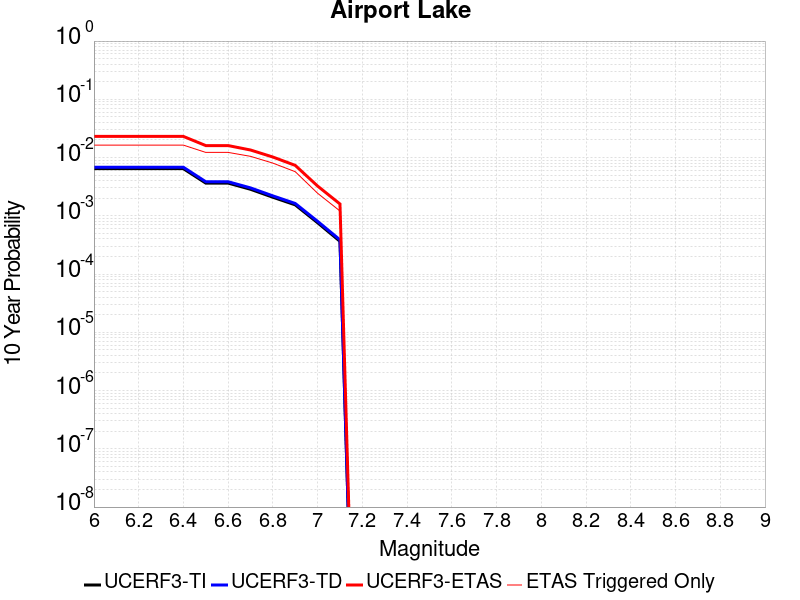 |

| Magnitude | 1 wk TI Prob | 1 wk TD Prob | 1 wk ETAS Prob | 1 wk ETAS/TD Gain | 1 wk ETAS Triggered Only | 1 mo TI Prob | 1 mo TD Prob | 1 mo ETAS Prob | 1 mo ETAS/TD Gain | 1 mo ETAS Triggered Only | 1 yr TI Prob | 1 yr TD Prob | 1 yr ETAS Prob | 1 yr ETAS/TD Gain | 1 yr ETAS Triggered Only | 10 yr TI Prob | 10 yr TD Prob | 10 yr ETAS Prob | 10 yr ETAS/TD Gain | 10 yr ETAS Triggered Only |
|-----|-----|-----|-----|-----|-----|-----|-----|-----|-----|-----|-----|-----|-----|-----|-----|-----|-----|-----|-----|-----|
| 6.0 | 1.2387061E-5 | 1.31041625E-5 | 4.0250717E-4 | 30.715979 | 3.894081E-4 | 5.3086325E-5 | 5.6159646E-5 | 0.001453369 | 25.879242 | 0.0013972879 | 6.461343E-4 | 6.835576E-4 | 0.007550768 | 11.046279 | 0.0068719075 | 0.0064425888 | 0.006817361 | 0.022492247 | 3.2992601 | 0.015782481 |
| 6.1 | 1.2387061E-5 | 1.31041625E-5 | 4.0250717E-4 | 30.715979 | 3.894081E-4 | 5.3086325E-5 | 5.6159646E-5 | 0.001453369 | 25.879242 | 0.0013972879 | 6.461343E-4 | 6.835576E-4 | 0.007550768 | 11.046279 | 0.0068719075 | 0.0064425888 | 0.006817361 | 0.022492247 | 3.2992601 | 0.015782481 |
| 6.2 | 1.2387061E-5 | 1.31041625E-5 | 4.0250717E-4 | 30.715979 | 3.894081E-4 | 5.3086325E-5 | 5.6159646E-5 | 0.001453369 | 25.879242 | 0.0013972879 | 6.461343E-4 | 6.835576E-4 | 0.007550768 | 11.046279 | 0.0068719075 | 0.0064425888 | 0.006817361 | 0.022492247 | 3.2992601 | 0.015782481 |
| 6.3 | 1.2387061E-5 | 1.31041625E-5 | 4.0250717E-4 | 30.715979 | 3.894081E-4 | 5.3086325E-5 | 5.6159646E-5 | 0.001453369 | 25.879242 | 0.0013972879 | 6.461343E-4 | 6.835576E-4 | 0.007550768 | 11.046279 | 0.0068719075 | 0.0064425888 | 0.006817361 | 0.022492247 | 3.2992601 | 0.015782481 |
| 6.4 | 1.2387061E-5 | 1.31041625E-5 | 4.0250717E-4 | 30.715979 | 3.894081E-4 | 5.3086325E-5 | 5.6159646E-5 | 0.001453369 | 25.879242 | 0.0013972879 | 6.461343E-4 | 6.835576E-4 | 0.007550768 | 11.046279 | 0.0068719075 | 0.0064425888 | 0.006817361 | 0.022492247 | 3.2992601 | 0.015782481 |
| 6.5 | 6.9922594E-6 | 7.3854753E-6 | 2.8225975E-4 | 38.218224 | 2.748763E-4 | 2.996648E-5 | 3.1651685E-5 | 0.0010624052 | 33.565517 | 0.0010307862 | 3.6478083E-4 | 3.8529653E-4 | 0.005605934 | 14.549662 | 0.00522265 | 0.003641826 | 0.0038468228 | 0.015666673 | 4.0726266 | 0.011865494 |
| 6.6 | 6.9922594E-6 | 7.3854753E-6 | 2.8225975E-4 | 38.218224 | 2.748763E-4 | 2.996648E-5 | 3.1651685E-5 | 0.0010624052 | 33.565517 | 0.0010307862 | 3.6478083E-4 | 3.8529653E-4 | 0.005605934 | 14.549662 | 0.00522265 | 0.003641826 | 0.0038468228 | 0.015666673 | 4.0726266 | 0.011865494 |
| 6.7 | 5.477277E-6 | 5.7865013E-6 | 2.57755E-4 | 44.544186 | 2.5196993E-4 | 2.3473833E-5 | 2.4799077E-5 | 9.639365E-4 | 38.869854 | 9.391607E-4 | 2.8575645E-4 | 3.0189083E-4 | 0.0048817797 | 16.17068 | 0.0045812717 | 0.0028538927 | 0.003015191 | 0.013086436 | 4.3401685 | 0.010101704 |
| 6.8 | 3.9950432E-6 | 4.219401E-6 | 1.874695E-4 | 44.43036 | 1.8325087E-4 | 1.7121502E-5 | 1.8083038E-5 | 7.7397923E-4 | 42.801395 | 7.5590983E-4 | 2.0843433E-4 | 2.2014149E-4 | 0.0038385494 | 17.436737 | 0.0036192047 | 0.0020823893 | 0.0021995052 | 0.009947681 | 4.5226903 | 0.0077652554 |
| 6.9 | 2.95695E-6 | 3.1232569E-6 | 1.6346727E-4 | 52.33872 | 1.6034451E-4 | 1.2672582E-5 | 1.3385331E-5 | 5.4022454E-4 | 40.359444 | 5.2684627E-4 | 1.5427776E-4 | 1.6295648E-4 | 0.0026822453 | 16.459887 | 0.0025196995 | 0.001541707 | 0.0016285924 | 0.0071629034 | 4.398217 | 0.0055433386 |
| 7.0 | 1.456072E-6 | 1.540931E-6 | 7.02599E-5 | 45.59575 | 6.871908E-5 | 6.2402937E-6 | 6.603979E-6 | 2.3566606E-4 | 35.685467 | 2.2906359E-4 | 7.597293E-5 | 8.0401485E-5 | 0.0012943409 | 16.09847 | 0.0012140371 | 7.594696E-4 | 8.038228E-4 | 0.003298609 | 4.1036515 | 0.0024967932 |
| 7.1 | 6.995192E-7 | 7.4095556E-7 | 4.655364E-5 | 62.829193 | 4.5812718E-5 | 2.997936E-6 | 3.175524E-6 | 9.480067E-5 | 29.853552 | 9.1625436E-5 | 3.649926E-5 | 3.8662E-5 | 6.1129883E-4 | 15.811359 | 5.7265896E-4 | 3.6493264E-4 | 3.8662003E-4 | 0.0016001876 | 4.1389155 | 0.0012140371 |

## Owl Lake
*[(top)](#table-of-contents)*

| 1 Week | 1 Month | 1 Year | 10 Year |
|-----|-----|-----|-----|
|  | 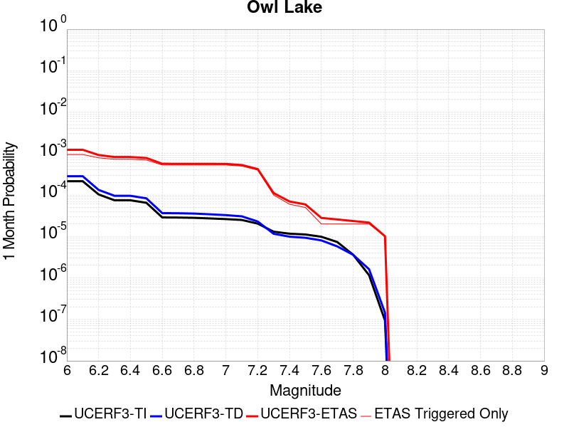 |  |  |

| Magnitude | 1 wk TI Prob | 1 wk TD Prob | 1 wk ETAS Prob | 1 wk ETAS/TD Gain | 1 wk ETAS Triggered Only | 1 mo TI Prob | 1 mo TD Prob | 1 mo ETAS Prob | 1 mo ETAS/TD Gain | 1 mo ETAS Triggered Only | 1 yr TI Prob | 1 yr TD Prob | 1 yr ETAS Prob | 1 yr ETAS/TD Gain | 1 yr ETAS Triggered Only | 10 yr TI Prob | 10 yr TD Prob | 10 yr ETAS Prob | 10 yr ETAS/TD Gain | 10 yr ETAS Triggered Only |
|-----|-----|-----|-----|-----|-----|-----|-----|-----|-----|-----|-----|-----|-----|-----|-----|-----|-----|-----|-----|-----|
| 6.0 | 5.0320643E-5 | 6.639169E-5 | 2.496304E-4 | 3.7599645 | 1.8325087E-4 | 2.1564208E-4 | 2.8451107E-4 | 0.0013608036 | 4.782955 | 0.0010765989 | 0.0026222812 | 0.0034594585 | 0.008846657 | 2.5572376 | 0.0054059005 | 0.02591553 | 0.034156606 | 0.04665664 | 1.3659625 | 0.0129420925 |
| 6.1 | 5.0320643E-5 | 6.639169E-5 | 2.496304E-4 | 3.7599645 | 1.8325087E-4 | 2.1564208E-4 | 2.8451107E-4 | 0.0013608036 | 4.782955 | 0.0010765989 | 0.0026222812 | 0.0034594585 | 0.008846657 | 2.5572376 | 0.0054059005 | 0.02591553 | 0.034156606 | 0.04665664 | 1.3659625 | 0.0129420925 |
| 6.2 | 2.4125871E-5 | 3.099773E-5 | 1.9133727E-4 | 6.1726217 | 1.6034451E-4 | 1.0339249E-4 | 1.3284181E-4 | 9.802645E-4 | 7.379186 | 8.4753527E-4 | 0.0012580766 | 0.0016162846 | 0.005709896 | 3.5327291 | 0.0041002384 | 0.012509781 | 0.016078865 | 0.025680074 | 1.5971323 | 0.009758109 |
| 6.3 | 1.7433485E-5 | 2.2368875E-5 | 1.827098E-4 | 8.168036 | 1.6034451E-4 | 7.471279E-5 | 9.586398E-5 | 8.746055E-4 | 9.123401 | 7.788162E-4 | 9.0924866E-4 | 0.0011666653 | 0.0048502865 | 4.1573935 | 0.0036879238 | 0.009055373 | 0.011635699 | 0.020080356 | 1.725754 | 0.008544072 |
| 6.4 | 1.7433485E-5 | 2.2368875E-5 | 1.827098E-4 | 8.168036 | 1.6034451E-4 | 7.471279E-5 | 9.586398E-5 | 8.746055E-4 | 9.123401 | 7.788162E-4 | 9.0924866E-4 | 0.0011666653 | 0.0048502865 | 4.1573935 | 0.0036879238 | 0.009055373 | 0.011635699 | 0.020080356 | 1.725754 | 0.008544072 |
| 6.5 | 1.5182742E-5 | 1.9441362E-5 | 1.7978276E-4 | 9.247436 | 1.6034451E-4 | 6.506727E-5 | 8.331832E-5 | 8.620696E-4 | 10.3467 | 7.788162E-4 | 7.919061E-4 | 0.0010140799 | 0.0046524974 | 4.5879 | 0.003642111 | 0.0078909 | 0.01012468 | 0.018264804 | 1.8039883 | 0.008223383 |
| 6.6 | 6.7271576E-6 | 8.55546E-6 | 1.2308627E-4 | 14.3868685 | 1.14531795E-4 | 2.8830356E-5 | 3.6665773E-5 | 6.0930377E-4 | 16.61778 | 5.7265896E-4 | 3.5095305E-4 | 4.4632002E-4 | 0.0030793755 | 6.899479 | 0.0026342312 | 0.0035039932 | 0.0044720164 | 0.010446643 | 2.336003 | 0.006001466 |
| 6.7 | 6.682835E-6 | 8.487893E-6 | 1.2301872E-4 | 14.493434 | 1.14531795E-4 | 2.8640408E-5 | 3.637621E-5 | 6.0901436E-4 | 16.742105 | 5.7265896E-4 | 3.4864116E-4 | 4.42796E-4 | 0.003075861 | 6.946451 | 0.0026342312 | 0.003480947 | 0.0044369358 | 0.010388969 | 2.3414738 | 0.0059785596 |
| 6.8 | 6.5774975E-6 | 8.334328E-6 | 1.2286517E-4 | 14.74206 | 1.14531795E-4 | 2.8188972E-5 | 3.5718094E-5 | 6.083566E-4 | 17.03217 | 5.7265896E-4 | 3.4314668E-4 | 4.3478666E-4 | 0.0030678725 | 7.0560412 | 0.0026342312 | 0.0034261728 | 0.0043570627 | 0.010309573 | 2.3661752 | 0.0059785596 |
| 6.9 | 6.363419E-6 | 8.007404E-6 | 1.2253829E-4 | 15.303122 | 1.14531795E-4 | 2.727151E-5 | 3.431703E-5 | 6.0695637E-4 | 17.686739 | 5.7265896E-4 | 3.3198006E-4 | 4.177353E-4 | 0.003050866 | 7.3033476 | 0.0026342312 | 0.0033148455 | 0.0041870046 | 0.010140532 | 2.421906 | 0.0059785596 |
| 7.0 | 6.1342453E-6 | 7.639479E-6 | 1.221704E-4 | 15.9919815 | 1.14531795E-4 | 2.6289357E-5 | 3.274024E-5 | 6.0538045E-4 | 18.490408 | 5.7265896E-4 | 3.2002592E-4 | 3.9854506E-4 | 0.0030317265 | 7.6069856 | 0.0026342312 | 0.0031956544 | 0.0039956346 | 0.009950306 | 2.4902945 | 0.0059785596 |
| 7.1 | 5.842926E-6 | 7.1498466E-6 | 9.8774624E-5 | 13.814929 | 9.1625436E-5 | 2.504087E-5 | 3.064187E-5 | 5.8037764E-4 | 18.940672 | 5.497526E-4 | 3.0482994E-4 | 3.7300633E-4 | 0.0029146639 | 7.813979 | 0.0025426059 | 0.0030441214 | 0.0037410015 | 0.009423347 | 2.518937 | 0.0057036835 |
| 7.2 | 4.77173E-6 | 5.3654235E-6 | 9.699037E-5 | 18.076927 | 9.1625436E-5 | 2.045011E-5 | 2.299449E-5 | 4.8111114E-4 | 20.922886 | 4.5812718E-4 | 2.4895166E-4 | 2.7992603E-4 | 0.0022035216 | 7.8717995 | 0.0019241341 | 0.0024867293 | 0.0028122598 | 0.006900967 | 2.4538867 | 0.0041002384 |
| 7.3 | 3.0494948E-6 | 2.7156198E-6 | 4.8528214E-5 | 17.870033 | 4.5812718E-5 | 1.3069198E-5 | 1.1638319E-5 | 1.4907487E-4 | 12.8089695 | 1.3743815E-4 | 1.5910587E-4 | 1.4168749E-4 | 6.684591E-4 | 4.7178416 | 5.2684627E-4 | 0.0015899199 | 0.0014259319 | 0.0025696168 | 1.8020613 | 0.0011453179 |
| 7.4 | 2.7263884E-6 | 2.3105267E-6 | 4.812314E-5 | 20.82778 | 4.5812718E-5 | 1.1684469E-5 | 9.90222E-6 | 1.0152675E-4 | 10.252928 | 9.1625436E-5 | 1.4224913E-4 | 1.2055296E-4 | 4.1829972E-4 | 3.469842 | 2.9778265E-4 | 0.0014215811 | 0.0012137555 | 0.002014505 | 1.6597289 | 8.017226E-4 |
| 7.5 | 2.6090431E-6 | 2.1703654E-6 | 4.7982983E-5 | 22.108252 | 4.5812718E-5 | 1.1181565E-5 | 9.301533E-6 | 7.801997E-5 | 8.387861 | 6.871908E-5 | 1.3612706E-4 | 1.1324038E-4 | 3.8808555E-4 | 3.4270952 | 2.748763E-4 | 0.001360437 | 0.0011404612 | 0.0018955088 | 1.6620548 | 7.5590983E-4 |
| 7.6 | 2.3008756E-6 | 1.8772391E-6 | 1.8772391E-6 | 1.0 | 0.0 | 9.860858E-6 | 8.045286E-6 | 8.045286E-6 | 1.0 | 0.0 | 1.20049335E-4 | 9.794704E-5 | 2.3537173E-4 | 2.403051 | 1.3743815E-4 | 0.001199845 | 9.87314E-4 | 0.0014678726 | 1.4867333 | 4.8103352E-4 |
| 7.7 | 1.7184348E-6 | 1.3460315E-6 | 1.3460315E-6 | 1.0 | 0.0 | 7.3646997E-6 | 5.768694E-6 | 5.768694E-6 | 1.0 | 0.0 | 8.966153E-5 | 7.0231625E-5 | 1.3894588E-4 | 1.9783947 | 6.871908E-5 | 8.962536E-4 | 7.09986E-4 | 9.1599685E-4 | 1.2901618 | 2.0615723E-4 |
| 7.8 | 8.4612907E-7 | 8.43523E-7 | 8.43523E-7 | 1.0 | 0.0 | 3.6262625E-6 | 3.6150936E-6 | 3.6150936E-6 | 1.0 | 0.0 | 4.4148852E-5 | 4.4012897E-5 | 6.691825E-5 | 1.5204237 | 2.2906359E-5 | 4.414008E-4 | 4.4551937E-4 | 5.37104E-4 | 1.2055682 | 9.1625436E-5 |
| 7.9 | 2.716738E-7 | 3.781083E-7 | 3.781083E-7 | 1.0 | 0.0 | 1.1643157E-6 | 1.6204632E-6 | 1.6204632E-6 | 1.0 | 0.0 | 1.4175452E-5 | 1.9728972E-5 | 4.2634878E-5 | 2.1610289 | 2.2906359E-5 | 1.4174548E-4 | 1.9904342E-4 | 2.4484703E-4 | 1.2301186 | 4.5812718E-5 |
| 8.0 | 2.1995428E-8 | 3.3962333E-8 | 3.3962333E-8 | 1.0 | 0.0 | 9.426611E-8 | 1.4555286E-7 | 1.4555286E-7 | 1.0 | 0.0 | 1.1476893E-6 | 1.7721053E-6 | 1.7721053E-6 | 1.0 | 0.0 | 1.14768345E-5 | 1.802218E-5 | 1.802218E-5 | 1.0 | 0.0 |

## Panamint Valley
*[(top)](#table-of-contents)*

| 1 Week | 1 Month | 1 Year | 10 Year |
|-----|-----|-----|-----|
|  |  |  |  |

| Magnitude | 1 wk TI Prob | 1 wk TD Prob | 1 wk ETAS Prob | 1 wk ETAS/TD Gain | 1 wk ETAS Triggered Only | 1 mo TI Prob | 1 mo TD Prob | 1 mo ETAS Prob | 1 mo ETAS/TD Gain | 1 mo ETAS Triggered Only | 1 yr TI Prob | 1 yr TD Prob | 1 yr ETAS Prob | 1 yr ETAS/TD Gain | 1 yr ETAS Triggered Only | 10 yr TI Prob | 10 yr TD Prob | 10 yr ETAS Prob | 10 yr ETAS/TD Gain | 10 yr ETAS Triggered Only |
|-----|-----|-----|-----|-----|-----|-----|-----|-----|-----|-----|-----|-----|-----|-----|-----|-----|-----|-----|-----|-----|
| 6.0 | 3.0211835E-5 | 3.3992885E-5 | 3.3176542E-4 | 9.75985 | 2.9778265E-4 | 1.2947287E-4 | 1.4567582E-4 | 9.0147555E-4 | 6.1882305 | 7.5590983E-4 | 0.0015751923 | 0.0017721897 | 0.0060480875 | 3.4127767 | 0.004283489 | 0.015640736 | 0.017587427 | 0.028119063 | 1.5988162 | 0.010720176 |
| 6.1 | 3.0211835E-5 | 3.3992885E-5 | 3.3176542E-4 | 9.75985 | 2.9778265E-4 | 1.2947287E-4 | 1.4567582E-4 | 9.0147555E-4 | 6.1882305 | 7.5590983E-4 | 0.0015751923 | 0.0017721897 | 0.0060480875 | 3.4127767 | 0.004283489 | 0.015640736 | 0.017587427 | 0.028119063 | 1.5988162 | 0.010720176 |
| 6.2 | 3.0211835E-5 | 3.3992885E-5 | 3.3176542E-4 | 9.75985 | 2.9778265E-4 | 1.2947287E-4 | 1.4567582E-4 | 9.0147555E-4 | 6.1882305 | 7.5590983E-4 | 0.0015751923 | 0.0017721897 | 0.0060480875 | 3.4127767 | 0.004283489 | 0.015640736 | 0.017587427 | 0.028119063 | 1.5988162 | 0.010720176 |
| 6.3 | 2.8573924E-5 | 3.211061E-5 | 3.069781E-4 | 9.56002 | 2.748763E-4 | 1.2245393E-4 | 1.376098E-4 | 8.705124E-4 | 6.3259478 | 7.330035E-4 | 0.001489857 | 0.0016741396 | 0.0058132494 | 3.4723804 | 0.004146051 | 0.01479908 | 0.016621869 | 0.026713343 | 1.6071203 | 0.010262049 |
| 6.4 | 2.8573924E-5 | 3.211061E-5 | 3.069781E-4 | 9.56002 | 2.748763E-4 | 1.2245393E-4 | 1.376098E-4 | 8.705124E-4 | 6.3259478 | 7.330035E-4 | 0.001489857 | 0.0016741396 | 0.0058132494 | 3.4723804 | 0.004146051 | 0.01479908 | 0.016621869 | 0.026713343 | 1.6071203 | 0.010262049 |
| 6.5 | 2.7468774E-5 | 3.083606E-5 | 3.057039E-4 | 9.913844 | 2.748763E-4 | 1.1771801E-4 | 1.32148E-4 | 8.650546E-4 | 6.5461044 | 7.330035E-4 | 0.0014322745 | 0.0016077419 | 0.0056327796 | 3.5035346 | 0.004031519 | 0.014230782 | 0.01596759 | 0.025817834 | 1.6168896 | 0.010010079 |
| 6.6 | 2.6135967E-5 | 2.9259769E-5 | 3.0412804E-4 | 10.394069 | 2.748763E-4 | 1.1200648E-4 | 1.2539313E-4 | 8.3540124E-4 | 6.6622567 | 7.1009714E-4 | 0.0013628257 | 0.0015256187 | 0.0054823733 | 3.5935407 | 0.0039628 | 0.013544982 | 0.015157788 | 0.024790544 | 1.6354989 | 0.009781015 |
| 6.7 | 2.4498746E-5 | 2.7348378E-5 | 3.0221717E-4 | 11.050643 | 2.748763E-4 | 1.04990395E-4 | 1.1720221E-4 | 8.2721614E-4 | 7.058025 | 7.1009714E-4 | 0.0012775084 | 0.001426028 | 0.005223061 | 3.662664 | 0.0038024555 | 0.012701893 | 0.014174897 | 0.02329789 | 1.643602 | 0.009254169 |
| 6.8 | 2.2244329E-5 | 2.4942019E-5 | 2.9981148E-4 | 12.020337 | 2.748763E-4 | 9.532935E-5 | 1.0689011E-4 | 7.9400744E-4 | 7.428259 | 6.8719074E-4 | 0.0011600169 | 0.001300632 | 0.004823623 | 3.7086763 | 0.0035275794 | 0.011539802 | 0.012935915 | 0.021324242 | 1.6484525 | 0.008498259 |
| 6.9 | 1.9902658E-5 | 2.2296357E-5 | 2.5135482E-4 | 11.273358 | 2.2906359E-4 | 8.529431E-5 | 9.555242E-5 | 6.6815666E-4 | 6.9925666 | 5.7265896E-4 | 0.0010379635 | 0.0011627484 | 0.004159992 | 3.5777235 | 0.003000733 | 0.010331288 | 0.011571749 | 0.018749038 | 1.6202425 | 0.007261316 |
| 7.0 | 1.8353881E-5 | 2.0571932E-5 | 2.0381903E-4 | 9.907627 | 1.8325087E-4 | 7.865712E-5 | 8.8162546E-5 | 5.92058E-4 | 6.715528 | 5.0393987E-4 | 9.5722964E-4 | 0.0010728681 | 0.0037958003 | 3.5379934 | 0.0027258566 | 0.009531168 | 0.0106818145 | 0.017208379 | 1.6109976 | 0.0065970314 |
| 7.1 | 1.7667631E-5 | 1.977821E-5 | 2.0302545E-4 | 10.265108 | 1.8325087E-4 | 7.571623E-5 | 8.47611E-5 | 5.6575384E-4 | 6.6746874 | 4.8103352E-4 | 9.2145515E-4 | 0.0010314954 | 0.0036858923 | 3.573348 | 0.0026571376 | 0.009176437 | 0.010271964 | 0.016506506 | 1.6069475 | 0.006299249 |
| 7.2 | 1.6381597E-5 | 1.816348E-5 | 2.0141102E-4 | 11.08879 | 1.8325087E-4 | 7.020495E-5 | 7.7841265E-5 | 5.359328E-4 | 6.8849444 | 4.5812718E-4 | 8.544101E-4 | 9.4732264E-4 | 0.0033044426 | 3.4881914 | 0.0023593549 | 0.008511325 | 0.009437496 | 0.01495121 | 1.5842348 | 0.0055662454 |
| 7.3 | 1.4520491E-5 | 1.5970782E-5 | 1.5340674E-4 | 9.605462 | 1.3743815E-4 | 6.222919E-5 | 6.8444504E-5 | 3.8911158E-4 | 5.685067 | 3.2068903E-4 | 7.57377E-4 | 8.330094E-4 | 0.0028242026 | 3.3903608 | 0.0019928531 | 0.0075480095 | 0.008301981 | 0.012754354 | 1.5363026 | 0.0044896463 |
| 7.4 | 1.2852287E-5 | 1.4149132E-5 | 1.5158534E-4 | 10.713402 | 1.3743815E-4 | 5.5080065E-5 | 6.0637816E-5 | 3.3549746E-4 | 5.532809 | 2.748763E-4 | 6.7039346E-4 | 7.380312E-4 | 0.0025920768 | 3.512151 | 0.0018554151 | 0.0066837464 | 0.007358724 | 0.011610691 | 1.5778133 | 0.004283489 |
| 7.5 | 1.1637851E-5 | 1.2840317E-5 | 1.5027671E-4 | 11.703505 | 1.3743815E-4 | 4.987555E-5 | 5.5028857E-5 | 3.2989003E-4 | 5.9948554 | 2.748763E-4 | 6.070656E-4 | 6.6978607E-4 | 0.0024781763 | 3.6999521 | 0.0018096024 | 0.006054099 | 0.0066805724 | 0.010867185 | 1.6266848 | 0.00421477 |
| 7.6 | 3.0068115E-6 | 3.3344045E-6 | 2.6240687E-5 | 7.869677 | 2.2906359E-5 | 1.2886271E-5 | 1.4290267E-5 | 1.2882042E-4 | 9.014557 | 1.14531795E-4 | 1.5687906E-4 | 1.739774E-4 | 9.526581E-4 | 5.4757576 | 7.788162E-4 | 0.0015676835 | 0.001739853 | 0.0033633749 | 1.9331374 | 0.0016263515 |

## Garlock (East)
*[(top)](#table-of-contents)*

| 1 Week | 1 Month | 1 Year | 10 Year |
|-----|-----|-----|-----|
| 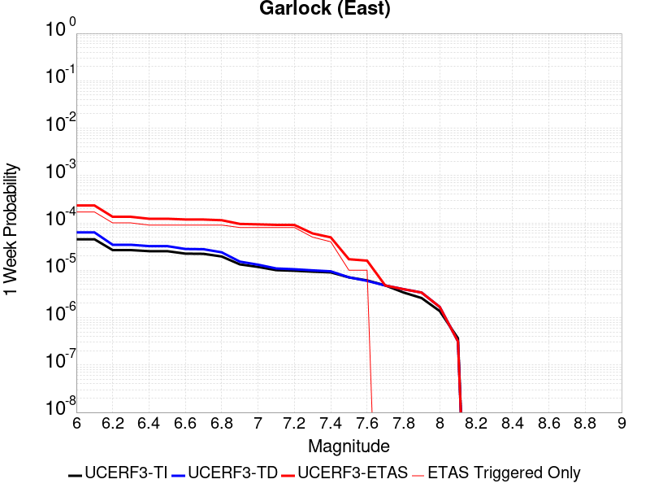 |  | 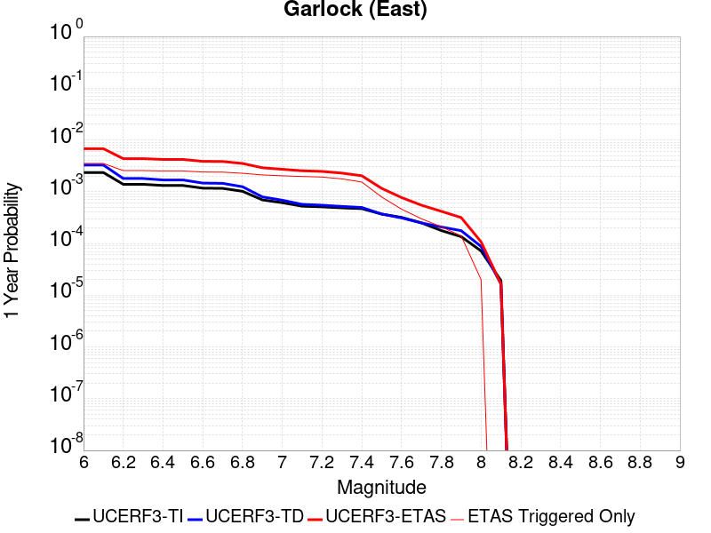 |  |

| Magnitude | 1 wk TI Prob | 1 wk TD Prob | 1 wk ETAS Prob | 1 wk ETAS/TD Gain | 1 wk ETAS Triggered Only | 1 mo TI Prob | 1 mo TD Prob | 1 mo ETAS Prob | 1 mo ETAS/TD Gain | 1 mo ETAS Triggered Only | 1 yr TI Prob | 1 yr TD Prob | 1 yr ETAS Prob | 1 yr ETAS/TD Gain | 1 yr ETAS Triggered Only | 10 yr TI Prob | 10 yr TD Prob | 10 yr ETAS Prob | 10 yr ETAS/TD Gain | 10 yr ETAS Triggered Only |
|-----|-----|-----|-----|-----|-----|-----|-----|-----|-----|-----|-----|-----|-----|-----|-----|-----|-----|-----|-----|-----|
| 6.0 | 4.5092507E-5 | 6.293872E-5 | 2.69083E-4 | 4.2753167 | 2.0615723E-4 | 1.9323928E-4 | 2.69712E-4 | 0.0010483181 | 3.8868058 | 7.788162E-4 | 0.0023501497 | 0.0032792452 | 0.0069550755 | 2.1209378 | 0.0036879238 | 0.023254504 | 0.032369826 | 0.04101413 | 1.2670482 | 0.00893348 |
| 6.1 | 4.5092507E-5 | 6.293872E-5 | 2.69083E-4 | 4.2753167 | 2.0615723E-4 | 1.9323928E-4 | 2.69712E-4 | 0.0010483181 | 3.8868058 | 7.788162E-4 | 0.0023501497 | 0.0032792452 | 0.0069550755 | 2.1209378 | 0.0036879238 | 0.023254504 | 0.032369826 | 0.04101413 | 1.2670482 | 0.00893348 |
| 6.2 | 2.6674514E-5 | 3.453779E-5 | 1.4906563E-4 | 4.3160152 | 1.14531795E-4 | 1.1431433E-4 | 1.4801089E-4 | 6.9768215E-4 | 4.7137218 | 5.497526E-4 | 0.0013908884 | 0.0018005761 | 0.00459012 | 2.5492508 | 0.0027945759 | 0.01382215 | 0.017904656 | 0.023911148 | 1.335471 | 0.0061159977 |
| 6.3 | 2.6674514E-5 | 3.453779E-5 | 1.4906563E-4 | 4.3160152 | 1.14531795E-4 | 1.1431433E-4 | 1.4801089E-4 | 6.9768215E-4 | 4.7137218 | 5.497526E-4 | 0.0013908884 | 0.0018005761 | 0.00459012 | 2.5492508 | 0.0027945759 | 0.01382215 | 0.017904656 | 0.023911148 | 1.335471 | 0.0061159977 |
| 6.4 | 2.5312667E-5 | 3.2366417E-5 | 1.468945E-4 | 4.5384855 | 1.14531795E-4 | 1.0847834E-4 | 1.38706E-4 | 6.8838237E-4 | 4.9628882 | 5.497526E-4 | 0.0013199237 | 0.0016874669 | 0.0044315914 | 2.62618 | 0.002748763 | 0.013121112 | 0.016792392 | 0.022738123 | 1.3540728 | 0.0060472786 |
| 6.5 | 2.5312667E-5 | 3.2366417E-5 | 1.468945E-4 | 4.5384855 | 1.14531795E-4 | 1.0847834E-4 | 1.38706E-4 | 6.8838237E-4 | 4.9628882 | 5.497526E-4 | 0.0013199237 | 0.0016874669 | 0.0044315914 | 2.62618 | 0.002748763 | 0.013121112 | 0.016792392 | 0.022738123 | 1.3540728 | 0.0060472786 |
| 6.6 | 2.246556E-5 | 2.8160235E-5 | 1.426888E-4 | 5.0670314 | 1.14531795E-4 | 9.627742E-5 | 1.20681274E-4 | 6.7036756E-4 | 5.5548596 | 5.497526E-4 | 0.0011715472 | 0.0014683278 | 0.004075818 | 2.7758234 | 0.002611325 | 0.011653901 | 0.0146322325 | 0.020275028 | 1.3856416 | 0.00572659 |
| 6.7 | 2.2241198E-5 | 2.7829901E-5 | 1.423585E-4 | 5.115308 | 1.14531795E-4 | 9.531594E-5 | 1.19265685E-4 | 6.689527E-4 | 5.6089287 | 5.497526E-4 | 0.0011598538 | 0.001451116 | 0.0040357783 | 2.7811549 | 0.0025884185 | 0.011538187 | 0.014462388 | 0.020061007 | 1.3871158 | 0.005680777 |
| 6.8 | 1.9528685E-5 | 2.3922843E-5 | 1.384519E-4 | 5.787435 | 1.14531795E-4 | 8.369167E-5 | 1.0252255E-4 | 6.522188E-4 | 6.3617105 | 5.497526E-4 | 0.0010184698 | 0.001247517 | 0.0037183175 | 2.9805746 | 0.0024738868 | 0.010138147 | 0.012449114 | 0.017787715 | 1.428834 | 0.0054059005 |
| 6.9 | 1.3318621E-5 | 1.5220143E-5 | 1.2975019E-4 | 8.5249 | 1.14531795E-4 | 5.7078556E-5 | 6.5227585E-5 | 5.920395E-4 | 9.07652 | 5.2684627E-4 | 6.9470983E-4 | 7.938622E-4 | 0.0030597914 | 3.8543105 | 0.0022677295 | 0.0069254204 | 0.007950885 | 0.012632078 | 1.5887636 | 0.0047187097 |
| 7.0 | 1.1760853E-5 | 1.3128316E-5 | 1.2765861E-4 | 9.723913 | 1.14531795E-4 | 5.0402683E-5 | 5.6263023E-5 | 5.601746E-4 | 9.956353 | 5.0393987E-4 | 6.134799E-4 | 6.8479206E-4 | 0.0028822967 | 4.20901 | 0.0021990105 | 0.0061178906 | 0.0068671517 | 0.011394214 | 1.6592344 | 0.0045583653 |
| 7.1 | 1.0064758E-5 | 1.0922758E-5 | 1.254533E-4 | 11.485497 | 1.14531795E-4 | 4.3133965E-5 | 4.6810997E-5 | 5.507273E-4 | 11.764913 | 5.0393987E-4 | 5.2502943E-4 | 5.697784E-4 | 0.0027217492 | 4.776856 | 0.0021531978 | 0.005237907 | 0.0057232794 | 0.0101189045 | 1.7680256 | 0.0044209273 |
| 7.2 | 9.768808E-6 | 1.0518496E-5 | 1.2504909E-4 | 11.8884945 | 1.14531795E-4 | 4.186565E-5 | 4.5078512E-5 | 5.489957E-4 | 12.178657 | 5.0393987E-4 | 5.095951E-4 | 5.4869615E-4 | 0.0027007125 | 4.922055 | 0.0021531978 | 0.0050842804 | 0.005513476 | 0.009887248 | 1.7932876 | 0.004398021 |
| 7.3 | 9.344516E-6 | 9.963784E-6 | 1.015883E-4 | 10.195756 | 9.1625436E-5 | 4.004731E-5 | 4.270125E-5 | 5.008089E-4 | 11.728202 | 4.5812718E-4 | 4.8746695E-4 | 5.1976717E-4 | 0.0024429013 | 4.699991 | 0.0019241341 | 0.0048639905 | 0.005224966 | 0.009258207 | 1.7719172 | 0.0040544253 |
| 7.4 | 9.023491E-6 | 9.509588E-6 | 7.822801E-5 | 8.226225 | 6.871908E-5 | 3.867153E-5 | 4.075476E-5 | 4.530524E-4 | 11.116552 | 4.1231446E-4 | 4.7072413E-4 | 4.960796E-4 | 0.0021445192 | 4.3229337 | 0.0016492578 | 0.004697283 | 0.004988221 | 0.008612164 | 1.7265002 | 0.003642111 |
| 7.5 | 7.081253E-6 | 7.104487E-6 | 7.104487E-6 | 1.0 | 0.0 | 3.0347876E-5 | 3.0447449E-5 | 2.8240972E-4 | 9.275316 | 2.5196993E-4 | 3.6942272E-4 | 3.706354E-4 | 0.0011949587 | 3.2240815 | 8.246289E-4 | 0.003688092 | 0.003733056 | 0.0055130823 | 1.4768281 | 0.001786696 |
| 7.6 | 6.116396E-6 | 5.975227E-6 | 5.975227E-6 | 1.0 | 0.0 | 2.6212863E-5 | 2.5607866E-5 | 1.4013672E-4 | 5.4724097 | 1.14531795E-4 | 3.1909486E-4 | 3.1173142E-4 | 7.6971576E-4 | 2.4691634 | 4.5812718E-4 | 0.0031863707 | 0.0031440689 | 0.004217283 | 1.3413455 | 0.0010765989 |
| 7.7 | 4.797145E-6 | 4.7724034E-6 | 4.7724034E-6 | 1.0 | 0.0 | 2.055903E-5 | 2.0452999E-5 | 1.1207656E-4 | 5.479713 | 9.1625436E-5 | 2.5027743E-4 | 2.4898694E-4 | 5.4669543E-4 | 2.1956792 | 2.9778265E-4 | 0.0024999576 | 0.0025172185 | 0.003088436 | 1.2269241 | 5.7265896E-4 |
| 7.8 | 3.4028885E-6 | 3.9919487E-6 | 3.9919487E-6 | 1.0 | 0.0 | 1.4583726E-5 | 1.710824E-5 | 1.0873211E-4 | 6.3555403 | 9.1625436E-5 | 1.775424E-4 | 2.0827298E-4 | 4.6019044E-4 | 2.2095542 | 2.5196993E-4 | 0.0017740062 | 0.0021082417 | 0.0025425449 | 1.2060026 | 4.352208E-4 |
| 7.9 | 2.5928412E-6 | 3.3838483E-6 | 3.3838483E-6 | 1.0 | 0.0 | 1.1112129E-5 | 1.4502127E-5 | 6.0314178E-5 | 4.1589885 | 4.5812718E-5 | 1.3528178E-4 | 1.7654915E-4 | 3.3686534E-4 | 1.9080542 | 1.6034451E-4 | 0.0013519945 | 0.0017871696 | 0.0021072854 | 1.1791189 | 3.2068903E-4 |
| 8.0 | 1.3743648E-6 | 1.6786424E-6 | 1.6786424E-6 | 1.0 | 0.0 | 5.8901214E-6 | 7.194162E-6 | 3.0100357E-5 | 4.183997 | 2.2906359E-5 | 7.1709874E-5 | 8.758544E-5 | 1.1048979E-4 | 1.2615087 | 2.2906359E-5 | 7.1686733E-4 | 8.8641304E-4 | 9.779573E-4 | 1.103275 | 9.1625436E-5 |
| 8.1 | 3.6733252E-7 | 3.1582263E-7 | 3.1582263E-7 | 1.0 | 0.0 | 1.5742813E-6 | 1.3535249E-6 | 1.3535249E-6 | 1.0 | 0.0 | 1.9166706E-5 | 1.6479058E-5 | 1.6479058E-5 | 1.0 | 0.0 | 1.9165053E-4 | 1.6687137E-4 | 1.6687137E-4 | 1.0 | 0.0 |

## Ash Hill
*[(top)](#table-of-contents)*

| 1 Week | 1 Month | 1 Year | 10 Year |
|-----|-----|-----|-----|
|  |  |  |  |

| Magnitude | 1 wk TI Prob | 1 wk TD Prob | 1 wk ETAS Prob | 1 wk ETAS/TD Gain | 1 wk ETAS Triggered Only | 1 mo TI Prob | 1 mo TD Prob | 1 mo ETAS Prob | 1 mo ETAS/TD Gain | 1 mo ETAS Triggered Only | 1 yr TI Prob | 1 yr TD Prob | 1 yr ETAS Prob | 1 yr ETAS/TD Gain | 1 yr ETAS Triggered Only | 10 yr TI Prob | 10 yr TD Prob | 10 yr ETAS Prob | 10 yr ETAS/TD Gain | 10 yr ETAS Triggered Only |
|-----|-----|-----|-----|-----|-----|-----|-----|-----|-----|-----|-----|-----|-----|-----|-----|-----|-----|-----|-----|-----|
| 6.0 | 2.1545662E-5 | 2.3196802E-5 | 1.3772595E-4 | 5.937281 | 1.14531795E-4 | 9.2335285E-5 | 9.941153E-5 | 4.887809E-4 | 4.916743 | 3.894081E-4 | 0.0011236023 | 0.0012097433 | 0.0035891228 | 2.9668465 | 0.0023822612 | 0.011179381 | 0.012039565 | 0.01733512 | 1.439846 | 0.005360088 |
| 6.1 | 2.1545662E-5 | 2.3196802E-5 | 1.3772595E-4 | 5.937281 | 1.14531795E-4 | 9.2335285E-5 | 9.941153E-5 | 4.887809E-4 | 4.916743 | 3.894081E-4 | 0.0011236023 | 0.0012097433 | 0.0035891228 | 2.9668465 | 0.0023822612 | 0.011179381 | 0.012039565 | 0.01733512 | 1.439846 | 0.005360088 |
| 6.2 | 2.1545662E-5 | 2.3196802E-5 | 1.3772595E-4 | 5.937281 | 1.14531795E-4 | 9.2335285E-5 | 9.941153E-5 | 4.887809E-4 | 4.916743 | 3.894081E-4 | 0.0011236023 | 0.0012097433 | 0.0035891228 | 2.9668465 | 0.0023822612 | 0.011179381 | 0.012039565 | 0.01733512 | 1.439846 | 0.005360088 |
| 6.3 | 1.0025529E-5 | 1.074796E-5 | 1.074796E-5 | 1.0 | 0.0 | 4.2965847E-5 | 4.606195E-5 | 1.1477786E-4 | 2.491815 | 6.871908E-5 | 5.229836E-4 | 5.606731E-4 | 0.0013848398 | 2.469959 | 8.246289E-4 | 0.005217545 | 0.0055938987 | 0.007530048 | 1.346118 | 0.0019470406 |
| 6.4 | 1.0025529E-5 | 1.074796E-5 | 1.074796E-5 | 1.0 | 0.0 | 4.2965847E-5 | 4.606195E-5 | 1.1477786E-4 | 2.491815 | 6.871908E-5 | 5.229836E-4 | 5.606731E-4 | 0.0013848398 | 2.469959 | 8.246289E-4 | 0.005217545 | 0.0055938987 | 0.007530048 | 1.346118 | 0.0019470406 |
| 6.5 | 6.9617327E-6 | 7.4573372E-6 | 7.4573372E-6 | 1.0 | 0.0 | 2.9835655E-5 | 3.1959673E-5 | 1.0067655E-4 | 3.1501122 | 6.871908E-5 | 3.6318856E-4 | 3.8904822E-4 | 9.3858695E-4 | 2.412521 | 5.497526E-4 | 0.0036259557 | 0.003884526 | 0.0052307514 | 1.3465611 | 0.0013514751 |
| 6.6 | 4.9919777E-6 | 5.347192E-6 | 5.347192E-6 | 1.0 | 0.0 | 2.1394015E-5 | 2.2916374E-5 | 4.582221E-5 | 1.9995401 | 2.2906359E-5 | 2.60441E-4 | 2.7897785E-4 | 5.5377744E-4 | 1.9850231 | 2.748763E-4 | 0.0026013597 | 0.0027869348 | 0.0036321082 | 1.3032626 | 8.4753527E-4 |
| 6.7 | 3.6630722E-6 | 3.9249953E-6 | 3.9249953E-6 | 1.0 | 0.0 | 1.5698786E-5 | 1.6821332E-5 | 1.6821332E-5 | 1.0 | 0.0 | 1.9111596E-4 | 2.0478622E-4 | 4.1090124E-4 | 2.0064888 | 2.0615723E-4 | 0.0019095168 | 0.0020465383 | 0.0026866037 | 1.3127552 | 6.4137805E-4 |
| 6.8 | 2.5599613E-6 | 2.745188E-6 | 2.745188E-6 | 1.0 | 0.0 | 1.0971216E-5 | 1.1765067E-5 | 1.1765067E-5 | 1.0 | 0.0 | 1.3356637E-4 | 1.4323521E-4 | 3.0355676E-4 | 2.1192887 | 1.6034451E-4 | 0.0013348613 | 0.001431914 | 0.0018207646 | 1.27156 | 3.894081E-4 |
| 6.9 | 1.7684905E-6 | 1.8970534E-6 | 1.8970534E-6 | 1.0 | 0.0 | 7.579223E-6 | 8.130229E-6 | 8.130229E-6 | 1.0 | 0.0 | 9.2273134E-5 | 9.898553E-5 | 1.906019E-4 | 1.9255531 | 9.1625436E-5 | 9.223483E-4 | 9.898554E-4 | 0.0011958085 | 1.208064 | 2.0615723E-4 |

## Hunter Mountain-Saline Valley
*[(top)](#table-of-contents)*

| 1 Week | 1 Month | 1 Year | 10 Year |
|-----|-----|-----|-----|
|  | 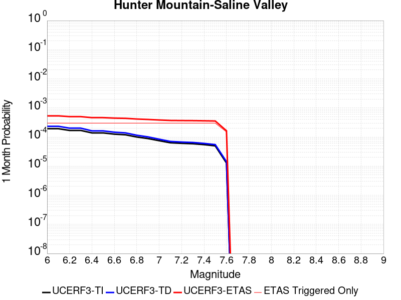 |  |  |

| Magnitude | 1 wk TI Prob | 1 wk TD Prob | 1 wk ETAS Prob | 1 wk ETAS/TD Gain | 1 wk ETAS Triggered Only | 1 mo TI Prob | 1 mo TD Prob | 1 mo ETAS Prob | 1 mo ETAS/TD Gain | 1 mo ETAS Triggered Only | 1 yr TI Prob | 1 yr TD Prob | 1 yr ETAS Prob | 1 yr ETAS/TD Gain | 1 yr ETAS Triggered Only | 10 yr TI Prob | 10 yr TD Prob | 10 yr ETAS Prob | 10 yr ETAS/TD Gain | 10 yr ETAS Triggered Only |
|-----|-----|-----|-----|-----|-----|-----|-----|-----|-----|-----|-----|-----|-----|-----|-----|-----|-----|-----|-----|-----|
| 6.0 | 4.5103672E-5 | 5.4585795E-5 | 1.9201645E-4 | 3.5177 | 1.3743815E-4 | 1.9328714E-4 | 2.3391936E-4 | 5.0873135E-4 | 2.1748152 | 2.748763E-4 | 0.002350731 | 0.0028443995 | 0.0048544253 | 1.7066609 | 0.0020157595 | 0.023260195 | 0.028100612 | 0.032553148 | 1.1584498 | 0.0045812717 |
| 6.1 | 4.5103672E-5 | 5.4585795E-5 | 1.9201645E-4 | 3.5177 | 1.3743815E-4 | 1.9328714E-4 | 2.3391936E-4 | 5.0873135E-4 | 2.1748152 | 2.748763E-4 | 0.002350731 | 0.0028443995 | 0.0048544253 | 1.7066609 | 0.0020157595 | 0.023260195 | 0.028100612 | 0.032553148 | 1.1584498 | 0.0045812717 |
| 6.2 | 3.9363465E-5 | 4.7075897E-5 | 1.8450757E-4 | 3.9193642 | 1.3743815E-4 | 1.6868966E-4 | 2.0173912E-4 | 4.7655997E-4 | 2.3622587 | 2.748763E-4 | 0.002051862 | 0.0024535626 | 0.0044643763 | 1.8195486 | 0.0020157595 | 0.020330196 | 0.024280764 | 0.02872845 | 1.1831774 | 0.0045583653 |
| 6.3 | 3.9363465E-5 | 4.7075897E-5 | 1.8450757E-4 | 3.9193642 | 1.3743815E-4 | 1.6868966E-4 | 2.0173912E-4 | 4.7655997E-4 | 2.3622587 | 2.748763E-4 | 0.002051862 | 0.0024535626 | 0.0044643763 | 1.8195486 | 0.0020157595 | 0.020330196 | 0.024280764 | 0.02872845 | 1.1831774 | 0.0045583653 |
| 6.4 | 3.2311684E-5 | 3.796192E-5 | 1.7539486E-4 | 4.620284 | 1.3743815E-4 | 1.384713E-4 | 1.6268421E-4 | 4.375158E-4 | 2.6893563 | 2.748763E-4 | 0.0016845843 | 0.0019789536 | 0.003967863 | 2.0050309 | 0.0019928531 | 0.016718714 | 0.01962205 | 0.024046058 | 1.225461 | 0.0045125526 |
| 6.5 | 3.2311684E-5 | 3.796192E-5 | 1.7539486E-4 | 4.620284 | 1.3743815E-4 | 1.384713E-4 | 1.6268421E-4 | 4.375158E-4 | 2.6893563 | 2.748763E-4 | 0.0016845843 | 0.0019789536 | 0.003967863 | 2.0050309 | 0.0019928531 | 0.016718714 | 0.01962205 | 0.024046058 | 1.225461 | 0.0045125526 |
| 6.6 | 2.9305844E-5 | 3.4191486E-5 | 1.7162494E-4 | 5.0195227 | 1.3743815E-4 | 1.2559042E-4 | 1.4652706E-4 | 4.2136307E-4 | 2.8756673 | 2.748763E-4 | 0.0015279909 | 0.0017825698 | 0.003749005 | 2.1031463 | 0.0019699468 | 0.015175272 | 0.017690638 | 0.02210086 | 1.2492969 | 0.0044896463 |
| 6.7 | 2.7826512E-5 | 3.2353335E-5 | 1.6978705E-4 | 5.247899 | 1.3743815E-4 | 1.19251024E-4 | 1.3865012E-4 | 4.134883E-4 | 2.9822428 | 2.748763E-4 | 0.0014509142 | 0.0016868184 | 0.0036534423 | 2.1658776 | 0.0019699468 | 0.014414776 | 0.016747838 | 0.021162294 | 1.2635835 | 0.0044896463 |
| 6.8 | 2.3389874E-5 | 2.6874068E-5 | 1.6430853E-4 | 6.114018 | 1.3743815E-4 | 1.0023846E-4 | 1.1516976E-4 | 3.900144E-4 | 3.3864307 | 2.748763E-4 | 0.00121972 | 0.0014013371 | 0.0033456492 | 2.387469 | 0.0019470406 | 0.01213047 | 0.013931221 | 0.018335734 | 1.3161613 | 0.00446674 |
| 6.9 | 2.069209E-5 | 2.3576413E-5 | 1.6101132E-4 | 6.8293395 | 1.3743815E-4 | 8.867737E-5 | 1.01038066E-4 | 3.758866E-4 | 3.7202475 | 2.748763E-4 | 0.0010791123 | 0.0012294804 | 0.003174127 | 2.5816817 | 0.0019470406 | 0.010738871 | 0.012231816 | 0.016643919 | 1.3607072 | 0.00446674 |
| 7.0 | 1.7462342E-5 | 1.9638785E-5 | 1.5707423E-4 | 7.998165 | 1.3743815E-4 | 7.483646E-5 | 8.416363E-5 | 3.590168E-4 | 4.2657 | 2.748763E-4 | 9.1075303E-4 | 0.0010242332 | 0.0029692794 | 2.8990269 | 0.0019470406 | 0.009070295 | 0.010198761 | 0.0145972725 | 1.4312791 | 0.0044438336 |
| 7.1 | 1.4807709E-5 | 1.644613E-5 | 1.5388202E-4 | 9.356731 | 1.3743815E-4 | 6.3460066E-5 | 7.0481605E-5 | 3.4533854E-4 | 4.8996973 | 2.748763E-4 | 7.723524E-4 | 8.577922E-4 | 0.002757389 | 3.2145185 | 0.0019012277 | 0.007696735 | 0.008547801 | 0.012862807 | 1.504809 | 0.004352208 |
| 7.2 | 1.4180048E-5 | 1.5702537E-5 | 1.5313854E-4 | 9.752471 | 1.3743815E-4 | 6.077022E-5 | 6.729494E-5 | 3.4215275E-4 | 5.0843754 | 2.748763E-4 | 7.396263E-4 | 8.1902416E-4 | 0.0027186947 | 3.3194318 | 0.0019012277 | 0.0073716943 | 0.008163009 | 0.01247969 | 1.52881 | 0.004352208 |
| 7.3 | 1.3730402E-5 | 1.5176156E-5 | 1.5261222E-4 | 10.056053 | 1.3743815E-4 | 5.8843252E-5 | 6.503914E-5 | 3.3989755E-4 | 5.2260466 | 2.748763E-4 | 7.161811E-4 | 7.915799E-4 | 0.0026913027 | 3.3999128 | 0.0019012277 | 0.007138774 | 0.007890536 | 0.012185678 | 1.5443408 | 0.004329302 |
| 7.4 | 1.2810095E-5 | 1.4112974E-5 | 1.5154919E-4 | 10.738289 | 1.3743815E-4 | 5.489925E-5 | 6.048286E-5 | 3.3534254E-4 | 5.5444226 | 2.748763E-4 | 6.681934E-4 | 7.361459E-4 | 0.002590195 | 3.5185895 | 0.0018554151 | 0.006661878 | 0.00733997 | 0.011592018 | 1.5793005 | 0.004283489 |
| 7.5 | 1.1595659E-5 | 1.2804158E-5 | 1.5024055E-4 | 11.733731 | 1.3743815E-4 | 4.9694736E-5 | 5.48739E-5 | 3.2973514E-4 | 6.0089607 | 2.748763E-4 | 6.0486543E-4 | 6.679006E-4 | 0.0024762943 | 3.707579 | 0.0018096024 | 0.006032217 | 0.006661806 | 0.010848498 | 1.6284621 | 0.00421477 |
| 7.6 | 2.997694E-6 | 3.326526E-6 | 2.6232809E-5 | 7.885947 | 2.2906359E-5 | 1.28471975E-5 | 1.4256503E-5 | 1.2878666E-4 | 9.033538 | 1.14531795E-4 | 1.564034E-4 | 1.7356638E-4 | 9.522474E-4 | 5.4863586 | 7.788162E-4 | 0.0015629337 | 0.0017357452 | 0.0033592738 | 1.9353496 | 0.0016263515 |

## Blackwater
*[(top)](#table-of-contents)*

| 1 Week | 1 Month | 1 Year | 10 Year |
|-----|-----|-----|-----|
| 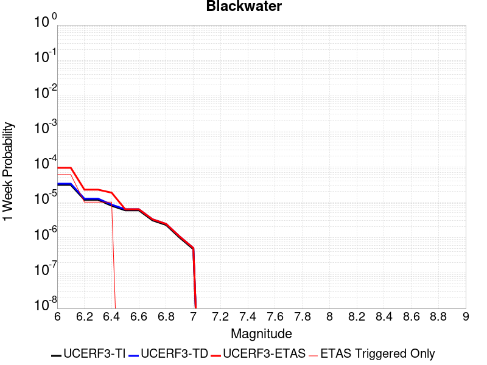 |  | 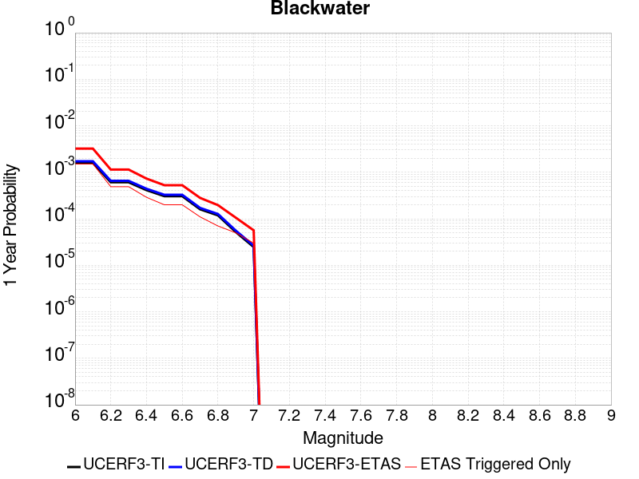 |  |

| Magnitude | 1 wk TI Prob | 1 wk TD Prob | 1 wk ETAS Prob | 1 wk ETAS/TD Gain | 1 wk ETAS Triggered Only | 1 mo TI Prob | 1 mo TD Prob | 1 mo ETAS Prob | 1 mo ETAS/TD Gain | 1 mo ETAS Triggered Only | 1 yr TI Prob | 1 yr TD Prob | 1 yr ETAS Prob | 1 yr ETAS/TD Gain | 1 yr ETAS Triggered Only | 10 yr TI Prob | 10 yr TD Prob | 10 yr ETAS Prob | 10 yr ETAS/TD Gain | 10 yr ETAS Triggered Only |
|-----|-----|-----|-----|-----|-----|-----|-----|-----|-----|-----|-----|-----|-----|-----|-----|-----|-----|-----|-----|-----|
| 6.0 | 3.0708583E-5 | 3.3099266E-5 | 1.0181607E-4 | 3.0760822 | 6.871908E-5 | 1.3160157E-4 | 1.4184705E-4 | 3.9378126E-4 | 2.7760975 | 2.5196993E-4 | 0.0016010714 | 0.0017257566 | 0.0032578341 | 1.8877715 | 0.001534726 | 0.015895851 | 0.01713739 | 0.020964736 | 1.2233331 | 0.003894081 |
| 6.1 | 3.0708583E-5 | 3.3099266E-5 | 1.0181607E-4 | 3.0760822 | 6.871908E-5 | 1.3160157E-4 | 1.4184705E-4 | 3.9378126E-4 | 2.7760975 | 2.5196993E-4 | 0.0016010714 | 0.0017257566 | 0.0032578341 | 1.8877715 | 0.001534726 | 0.015895851 | 0.01713739 | 0.020964736 | 1.2233331 | 0.003894081 |
| 6.2 | 1.1707779E-5 | 1.2546313E-5 | 1.2546313E-5 | 1.0 | 0.0 | 5.017523E-5 | 5.3768857E-5 | 7.667398E-5 | 1.4259925 | 2.2906359E-5 | 6.107122E-4 | 6.544489E-4 | 0.0010207107 | 1.5596493 | 3.6650174E-4 | 0.006090366 | 0.006526187 | 0.0078005716 | 1.1952724 | 0.0012827561 |
| 6.3 | 1.1707779E-5 | 1.2546313E-5 | 1.2546313E-5 | 1.0 | 0.0 | 5.017523E-5 | 5.3768857E-5 | 7.667398E-5 | 1.4259925 | 2.2906359E-5 | 6.107122E-4 | 6.544489E-4 | 0.0010207107 | 1.5596493 | 3.6650174E-4 | 0.006090366 | 0.006526187 | 0.0078005716 | 1.1952724 | 0.0012827561 |
| 6.4 | 7.929244E-6 | 8.48088E-6 | 8.48088E-6 | 1.0 | 0.0 | 3.3982033E-5 | 3.6346144E-5 | 5.925167E-5 | 1.6302052 | 2.2906359E-5 | 4.136527E-4 | 4.4242849E-4 | 6.484945E-4 | 1.4657612 | 2.0615723E-4 | 0.0041288356 | 0.0044158823 | 0.0052368697 | 1.185917 | 8.246289E-4 |
| 6.5 | 5.8832115E-6 | 6.286562E-6 | 6.286562E-6 | 1.0 | 0.0 | 2.521352E-5 | 2.6942143E-5 | 4.9847884E-5 | 1.8501827 | 2.2906359E-5 | 3.0693135E-4 | 3.2797377E-4 | 4.882657E-4 | 1.488734 | 1.6034451E-4 | 0.0030650778 | 0.0032751507 | 0.0038915968 | 1.1882192 | 6.184717E-4 |
| 6.6 | 5.8832115E-6 | 6.286562E-6 | 6.286562E-6 | 1.0 | 0.0 | 2.521352E-5 | 2.6942143E-5 | 4.9847884E-5 | 1.8501827 | 2.2906359E-5 | 3.0693135E-4 | 3.2797377E-4 | 4.882657E-4 | 1.488734 | 1.6034451E-4 | 0.0030650778 | 0.0032751507 | 0.0038915968 | 1.1882192 | 6.184717E-4 |
| 6.7 | 3.0715053E-6 | 3.2817636E-6 | 3.2817636E-6 | 1.0 | 0.0 | 1.3163528E-5 | 1.40646325E-5 | 3.697067E-5 | 2.6286268 | 2.2906359E-5 | 1.6025416E-4 | 1.712246E-4 | 2.3993192E-4 | 1.40127 | 6.871908E-5 | 0.0016013865 | 0.0017110414 | 0.0020083145 | 1.1737381 | 2.9778265E-4 |
| 6.8 | 2.2722281E-6 | 2.4289757E-6 | 2.4289757E-6 | 1.0 | 0.0 | 9.738084E-6 | 1.0409859E-5 | 3.331598E-5 | 3.2004256 | 2.2906359E-5 | 1.1855473E-4 | 1.2673358E-4 | 1.4963704E-4 | 1.1807213 | 2.2906359E-5 | 0.001184915 | 0.0012667032 | 0.0014725993 | 1.1625448 | 2.0615723E-4 |
| 6.9 | 9.952399E-7 | 1.0654484E-6 | 1.0654484E-6 | 1.0 | 0.0 | 4.265307E-6 | 4.5662023E-6 | 4.5662023E-6 | 1.0 | 0.0 | 5.1928873E-5 | 5.5592613E-5 | 5.5592613E-5 | 1.0 | 0.0 | 5.191674E-4 | 5.558377E-4 | 6.474122E-4 | 1.1647505 | 9.1625436E-5 |
| 7.0 | 4.7385504E-7 | 5.0760383E-7 | 5.0760383E-7 | 1.0 | 0.0 | 2.0308057E-6 | 2.175445E-6 | 2.175445E-6 | 1.0 | 0.0 | 2.4724779E-5 | 2.6486043E-5 | 2.6486043E-5 | 1.0 | 0.0 | 2.4722028E-4 | 2.6486043E-4 | 3.10661E-4 | 1.1729234 | 4.5812718E-5 |

## Garlock (West)
*[(top)](#table-of-contents)*

| 1 Week | 1 Month | 1 Year | 10 Year |
|-----|-----|-----|-----|
|  |  | 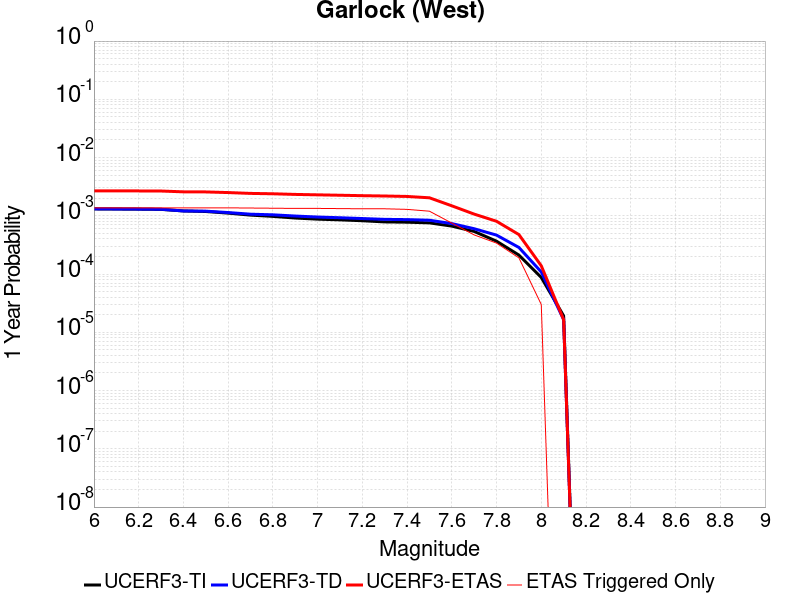 |  |

| Magnitude | 1 wk TI Prob | 1 wk TD Prob | 1 wk ETAS Prob | 1 wk ETAS/TD Gain | 1 wk ETAS Triggered Only | 1 mo TI Prob | 1 mo TD Prob | 1 mo ETAS Prob | 1 mo ETAS/TD Gain | 1 mo ETAS Triggered Only | 1 yr TI Prob | 1 yr TD Prob | 1 yr ETAS Prob | 1 yr ETAS/TD Gain | 1 yr ETAS Triggered Only | 10 yr TI Prob | 10 yr TD Prob | 10 yr ETAS Prob | 10 yr ETAS/TD Gain | 10 yr ETAS Triggered Only |
|-----|-----|-----|-----|-----|-----|-----|-----|-----|-----|-----|-----|-----|-----|-----|-----|-----|-----|-----|-----|-----|
| 6.0 | 2.5181727E-5 | 2.5247427E-5 | 9.396477E-5 | 3.7217562 | 6.871908E-5 | 1.0791722E-4 | 1.08198794E-4 | 4.746609E-4 | 4.3869333 | 3.6650174E-4 | 0.0013131002 | 0.0013165277 | 0.0026433475 | 2.0078175 | 0.0013285688 | 0.013053683 | 0.013167702 | 0.016332364 | 1.2403352 | 0.0032068903 |
| 6.1 | 2.5077732E-5 | 2.5148478E-5 | 9.386583E-5 | 3.7324655 | 6.871908E-5 | 1.0747157E-4 | 1.0777476E-4 | 4.74237E-4 | 4.4002604 | 3.6650174E-4 | 0.001307681 | 0.0013113713 | 0.002638198 | 2.0117855 | 0.0013285688 | 0.013000126 | 0.013116748 | 0.016281575 | 1.2412813 | 0.0032068903 |
| 6.2 | 2.494612E-5 | 2.5030122E-5 | 9.3747476E-5 | 3.7453864 | 6.871908E-5 | 1.0690756E-4 | 1.07267566E-4 | 4.7373E-4 | 4.41634 | 3.6650174E-4 | 0.0013008224 | 0.0013052035 | 0.0026320384 | 2.016573 | 0.0013285688 | 0.012932341 | 0.013055797 | 0.016220817 | 1.2424227 | 0.0032068903 |
| 6.3 | 2.4733758E-5 | 2.4849434E-5 | 9.356681E-5 | 3.7653494 | 6.871908E-5 | 1.0599751E-4 | 1.0649325E-4 | 4.7295596E-4 | 4.4411826 | 3.6650174E-4 | 0.0012897556 | 0.0012957876 | 0.0026226349 | 2.0239697 | 0.0013285688 | 0.012822957 | 0.012962739 | 0.01612806 | 1.244186 | 0.0032068903 |
| 6.4 | 2.3237335E-5 | 2.32284E-5 | 9.1945876E-5 | 3.958339 | 6.871908E-5 | 9.958477E-5 | 9.95465E-5 | 4.6601176E-4 | 4.6813474 | 3.6650174E-4 | 0.0012117702 | 0.0012113076 | 0.002538267 | 2.0954769 | 0.0013285688 | 0.012051838 | 0.012127431 | 0.01529543 | 1.2612258 | 0.0032068903 |
| 6.5 | 2.2732203E-5 | 2.3042725E-5 | 9.1760216E-5 | 3.9821775 | 6.871908E-5 | 9.742009E-5 | 9.875081E-5 | 4.6521635E-4 | 4.7110133 | 3.6650174E-4 | 0.0011854442 | 0.0012016308 | 0.0025286032 | 2.1043096 | 0.0013285688 | 0.011791403 | 0.012031715 | 0.015200021 | 1.2633295 | 0.0032068903 |
| 6.6 | 2.1319436E-5 | 2.1822514E-5 | 9.054009E-5 | 4.14893 | 6.871908E-5 | 9.136581E-5 | 9.3521725E-5 | 4.5998918E-4 | 4.9185276 | 3.6650174E-4 | 0.001111811 | 0.0011380345 | 0.0024650914 | 2.1660955 | 0.0013285688 | 0.011062649 | 0.0114024235 | 0.014572747 | 1.2780395 | 0.0032068903 |
| 6.7 | 1.970802E-5 | 2.044191E-5 | 8.9159585E-5 | 4.361607 | 6.871908E-5 | 8.446021E-5 | 8.760525E-5 | 4.5407488E-4 | 5.1831927 | 3.6650174E-4 | 0.001027818 | 0.0010660738 | 0.0023703442 | 2.2234337 | 0.0013056624 | 0.010230771 | 0.010689921 | 0.013839868 | 1.2946652 | 0.003183984 |
| 6.8 | 1.8744462E-5 | 1.994929E-5 | 8.8666995E-5 | 4.444619 | 6.871908E-5 | 8.033094E-5 | 8.549416E-5 | 4.5196456E-4 | 5.286496 | 3.6650174E-4 | 9.775903E-4 | 0.001040396 | 0.0023447 | 2.2536612 | 0.0013056624 | 0.009733009 | 0.010435575 | 0.013586332 | 1.3019246 | 0.003183984 |
| 6.9 | 1.7559682E-5 | 1.9001345E-5 | 8.771912E-5 | 4.6164684 | 6.871908E-5 | 7.5253614E-5 | 8.1431805E-5 | 4.479037E-4 | 5.5003533 | 3.6650174E-4 | 9.158276E-4 | 9.909827E-4 | 0.0022724676 | 2.2931454 | 0.0012827561 | 0.0091206245 | 0.009945906 | 0.013075544 | 1.3146659 | 0.0031610776 |
| 7.0 | 1.6794445E-5 | 1.826383E-5 | 8.698165E-5 | 4.762509 | 6.871908E-5 | 7.197421E-5 | 7.8271216E-5 | 4.4474428E-4 | 5.682092 | 3.6650174E-4 | 8.759337E-4 | 9.525369E-4 | 0.002234071 | 2.3453908 | 0.0012827561 | 0.008724891 | 0.009564651 | 0.012695494 | 1.3273348 | 0.0031610776 |
| 7.1 | 1.6337795E-5 | 1.7764389E-5 | 8.648224E-5 | 4.868293 | 6.871908E-5 | 7.0017246E-5 | 7.613088E-5 | 4.426047E-4 | 5.8137345 | 3.6650174E-4 | 8.521265E-4 | 9.2650065E-4 | 0.0022080683 | 2.3832345 | 0.0012827561 | 0.008488664 | 0.009306384 | 0.012438044 | 1.3365066 | 0.0031610776 |
| 7.2 | 1.5780008E-5 | 1.721285E-5 | 8.593074E-5 | 4.992244 | 6.871908E-5 | 6.762685E-5 | 7.376728E-5 | 4.4024197E-4 | 5.9679847 | 3.6650174E-4 | 8.2304585E-4 | 8.977479E-4 | 0.0021793523 | 2.4275773 | 0.0012827561 | 0.008200042 | 0.009021141 | 0.012153702 | 1.3472466 | 0.0031610776 |
| 7.3 | 1.5058865E-5 | 1.6665581E-5 | 8.538351E-5 | 5.1233444 | 6.871908E-5 | 6.45364E-5 | 7.1421964E-5 | 4.3789754E-4 | 6.131132 | 3.6650174E-4 | 7.854473E-4 | 8.6921675E-4 | 0.0021508578 | 2.4744782 | 0.0012827561 | 0.00782677 | 0.00873767 | 0.011871127 | 1.3586147 | 0.0031610776 |
| 7.4 | 1.4887923E-5 | 1.6501404E-5 | 8.521935E-5 | 5.164369 | 6.871908E-5 | 6.380382E-5 | 7.071839E-5 | 4.3719422E-4 | 6.182185 | 3.6650174E-4 | 7.7653467E-4 | 8.6065754E-4 | 0.002119423 | 2.4625623 | 0.0012598498 | 0.0077382675 | 0.008652459 | 0.011695352 | 1.3516797 | 0.003069452 |
| 7.5 | 1.4509299E-5 | 1.6093083E-5 | 8.481106E-5 | 5.2700315 | 6.871908E-5 | 6.218123E-5 | 6.896854E-5 | 4.1254022E-4 | 5.9815707 | 3.4359537E-4 | 7.567935E-4 | 8.393697E-4 | 0.0020523877 | 2.4451535 | 0.0012140371 | 0.0075422134 | 0.008440594 | 0.01134786 | 1.3444386 | 0.002932014 |
| 7.6 | 1.2756717E-5 | 1.4095277E-5 | 3.7001315E-5 | 2.6250858 | 2.2906359E-5 | 5.4670498E-5 | 6.0406936E-5 | 1.978368E-4 | 3.2750673 | 1.3743815E-4 | 6.6541E-4 | 7.3520694E-4 | 0.001399003 | 1.9028696 | 6.642844E-4 | 0.006634211 | 0.007404631 | 0.009223571 | 1.245649 | 0.0018325087 |
| 7.7 | 1.0328985E-5 | 1.15023295E-5 | 1.15023295E-5 | 1.0 | 0.0 | 4.4266326E-5 | 4.929477E-5 | 1.4091568E-4 | 2.8586338 | 9.1625436E-5 | 5.388092E-4 | 5.99999E-4 | 9.891734E-4 | 1.6486253 | 3.894081E-4 | 0.0053750467 | 0.00606014 | 0.007039144 | 1.1615481 | 9.849734E-4 |
| 7.8 | 7.0306583E-6 | 8.933274E-6 | 8.933274E-6 | 1.0 | 0.0 | 3.0131043E-5 | 3.82849E-5 | 1.2990682E-4 | 3.393161 | 9.1625436E-5 | 3.667837E-4 | 4.6601912E-4 | 7.6366303E-4 | 1.6386946 | 2.9778265E-4 | 0.003661789 | 0.004712734 | 0.0054194843 | 1.1499661 | 7.1009714E-4 |
| 7.9 | 4.060633E-6 | 5.485026E-6 | 5.485026E-6 | 1.0 | 0.0 | 1.7402595E-5 | 2.3507044E-5 | 6.931868E-5 | 2.9488473 | 4.5812718E-5 | 2.11856E-4 | 2.8616076E-4 | 4.693592E-4 | 1.640194 | 1.8325087E-4 | 0.0021165414 | 0.0028944004 | 0.0033968817 | 1.1736046 | 5.0393987E-4 |
| 8.0 | 1.6729537E-6 | 2.0839254E-6 | 2.0839254E-6 | 1.0 | 0.0 | 7.169782E-6 | 8.931079E-6 | 3.1837233E-5 | 3.564769 | 2.2906359E-5 | 8.7288594E-5 | 1.0873049E-4 | 1.3163436E-4 | 1.2106481 | 2.2906359E-5 | 8.7254314E-4 | 0.0011002679 | 0.0012375548 | 1.1247759 | 1.3743815E-4 |
| 8.1 | 3.6733252E-7 | 3.1582263E-7 | 3.1582263E-7 | 1.0 | 0.0 | 1.5742813E-6 | 1.3535249E-6 | 1.3535249E-6 | 1.0 | 0.0 | 1.9166706E-5 | 1.6479058E-5 | 1.6479058E-5 | 1.0 | 0.0 | 1.9165053E-4 | 1.6687137E-4 | 1.6687137E-4 | 1.0 | 0.0 |

## McLean Lake
*[(top)](#table-of-contents)*

| 1 Week | 1 Month | 1 Year | 10 Year |
|-----|-----|-----|-----|
|  |  | 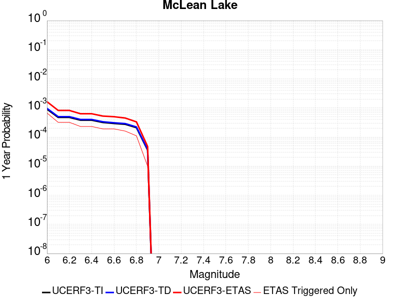 |  |

| Magnitude | 1 wk TI Prob | 1 wk TD Prob | 1 wk ETAS Prob | 1 wk ETAS/TD Gain | 1 wk ETAS Triggered Only | 1 mo TI Prob | 1 mo TD Prob | 1 mo ETAS Prob | 1 mo ETAS/TD Gain | 1 mo ETAS Triggered Only | 1 yr TI Prob | 1 yr TD Prob | 1 yr ETAS Prob | 1 yr ETAS/TD Gain | 1 yr ETAS Triggered Only | 10 yr TI Prob | 10 yr TD Prob | 10 yr ETAS Prob | 10 yr ETAS/TD Gain | 10 yr ETAS Triggered Only |
|-----|-----|-----|-----|-----|-----|-----|-----|-----|-----|-----|-----|-----|-----|-----|-----|-----|-----|-----|-----|-----|
| 6.0 | 1.7360222E-5 | 1.8503244E-5 | 6.4315114E-5 | 3.4758832 | 4.5812718E-5 | 7.439883E-5 | 7.929748E-5 | 1.9382019E-4 | 2.4442163 | 1.14531795E-4 | 9.0542925E-4 | 9.650678E-4 | 0.0016287111 | 1.687665 | 6.642844E-4 | 0.009017491 | 0.009613611 | 0.011904911 | 1.2383392 | 0.0023135422 |
| 6.1 | 9.062689E-6 | 9.592937E-6 | 9.592937E-6 | 1.0 | 0.0 | 3.8839516E-5 | 4.111199E-5 | 8.6922824E-5 | 2.1142938 | 4.5812718E-5 | 4.727685E-4 | 5.0043245E-4 | 7.522763E-4 | 1.5032525 | 2.5196993E-4 | 0.0047176396 | 0.0049939384 | 0.0060879528 | 1.2190684 | 0.0010995052 |
| 6.2 | 9.062689E-6 | 9.592937E-6 | 9.592937E-6 | 1.0 | 0.0 | 3.8839516E-5 | 4.111199E-5 | 8.6922824E-5 | 2.1142938 | 4.5812718E-5 | 4.727685E-4 | 5.0043245E-4 | 7.522763E-4 | 1.5032525 | 2.5196993E-4 | 0.0047176396 | 0.0049939384 | 0.0060879528 | 1.2190684 | 0.0010995052 |
| 6.3 | 7.2575485E-6 | 7.6682845E-6 | 7.6682845E-6 | 1.0 | 0.0 | 3.110341E-5 | 3.2863703E-5 | 7.8674915E-5 | 2.393976 | 4.5812718E-5 | 3.786182E-4 | 4.0004926E-4 | 6.06124E-4 | 1.5151235 | 2.0615723E-4 | 0.0037797375 | 0.003993996 | 0.004792516 | 1.1999302 | 8.017226E-4 |
| 6.4 | 7.2575485E-6 | 7.6682845E-6 | 7.6682845E-6 | 1.0 | 0.0 | 3.110341E-5 | 3.2863703E-5 | 7.8674915E-5 | 2.393976 | 4.5812718E-5 | 3.786182E-4 | 4.0004926E-4 | 6.06124E-4 | 1.5151235 | 2.0615723E-4 | 0.0037797375 | 0.003993996 | 0.004792516 | 1.1999302 | 8.017226E-4 |
| 6.5 | 6.06582E-6 | 6.404351E-6 | 6.404351E-6 | 1.0 | 0.0 | 2.5996113E-5 | 2.7446966E-5 | 5.0352697E-5 | 1.834545 | 2.2906359E-5 | 3.164567E-4 | 3.3412204E-4 | 4.7151427E-4 | 1.4112037 | 1.3743815E-4 | 0.0031600643 | 0.0033368357 | 0.0039989036 | 1.1984118 | 6.642844E-4 |
| 6.6 | 5.598744E-6 | 5.9106987E-6 | 5.9106987E-6 | 1.0 | 0.0 | 2.3994397E-5 | 2.5331356E-5 | 4.8237136E-5 | 1.9042461 | 2.2906359E-5 | 2.9209262E-4 | 3.0837202E-4 | 4.4576777E-4 | 1.445552 | 1.3743815E-4 | 0.0029170897 | 0.0030800703 | 0.0037423086 | 1.2150075 | 6.642844E-4 |
| 6.7 | 5.246996E-6 | 5.5395712E-6 | 5.5395712E-6 | 1.0 | 0.0 | 2.2486933E-5 | 2.374084E-5 | 2.374084E-5 | 1.0 | 0.0 | 2.73744E-4 | 2.8901274E-4 | 4.0351143E-4 | 1.3961718 | 1.14531795E-4 | 0.0027340704 | 0.0028869926 | 0.0035036788 | 1.2136085 | 6.184717E-4 |
| 6.8 | 4.02324E-6 | 4.247218E-6 | 4.247218E-6 | 1.0 | 0.0 | 1.7242342E-5 | 1.8202269E-5 | 1.8202269E-5 | 1.0 | 0.0 | 2.099053E-4 | 2.2159604E-4 | 2.9029988E-4 | 1.310041 | 6.871908E-5 | 0.0020970714 | 0.0022143351 | 0.0026485922 | 1.1961117 | 4.352208E-4 |
| 6.9 | 6.835972E-7 | 7.140349E-7 | 7.140349E-7 | 1.0 | 0.0 | 2.9296991E-6 | 3.060148E-6 | 3.060148E-6 | 1.0 | 0.0 | 3.56685E-5 | 3.725698E-5 | 6.016249E-5 | 1.6147976 | 2.2906359E-5 | 3.5662777E-4 | 3.7253863E-4 | 4.1833427E-4 | 1.1229286 | 4.5812718E-5 |

## So Sierra Nevada
*[(top)](#table-of-contents)*

| 1 Week | 1 Month | 1 Year | 10 Year |
|-----|-----|-----|-----|
| 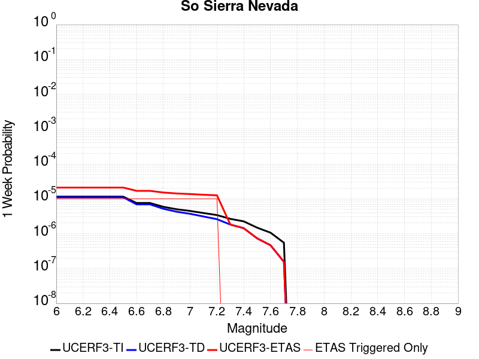 |  | 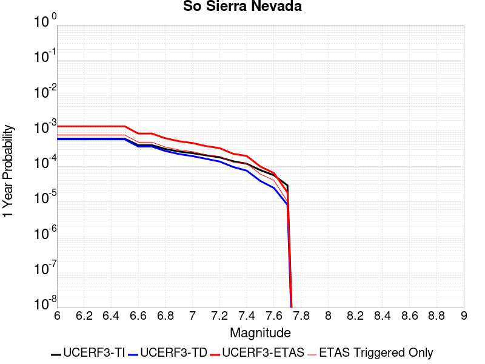 |  |

| Magnitude | 1 wk TI Prob | 1 wk TD Prob | 1 wk ETAS Prob | 1 wk ETAS/TD Gain | 1 wk ETAS Triggered Only | 1 mo TI Prob | 1 mo TD Prob | 1 mo ETAS Prob | 1 mo ETAS/TD Gain | 1 mo ETAS Triggered Only | 1 yr TI Prob | 1 yr TD Prob | 1 yr ETAS Prob | 1 yr ETAS/TD Gain | 1 yr ETAS Triggered Only | 10 yr TI Prob | 10 yr TD Prob | 10 yr ETAS Prob | 10 yr ETAS/TD Gain | 10 yr ETAS Triggered Only |
|-----|-----|-----|-----|-----|-----|-----|-----|-----|-----|-----|-----|-----|-----|-----|-----|-----|-----|-----|-----|-----|
| 6.0 | 1.15488665E-5 | 1.1080433E-5 | 3.398654E-5 | 3.0672572 | 2.2906359E-5 | 4.9494203E-5 | 4.7486777E-5 | 1.849184E-4 | 3.8941028 | 1.3743815E-4 | 6.024253E-4 | 5.780109E-4 | 0.0014250564 | 2.4654489 | 8.4753527E-4 | 0.006007948 | 0.0057663447 | 0.007838803 | 1.359406 | 0.0020844787 |
| 6.1 | 1.15488665E-5 | 1.1080433E-5 | 3.398654E-5 | 3.0672572 | 2.2906359E-5 | 4.9494203E-5 | 4.7486777E-5 | 1.849184E-4 | 3.8941028 | 1.3743815E-4 | 6.024253E-4 | 5.780109E-4 | 0.0014250564 | 2.4654489 | 8.4753527E-4 | 0.006007948 | 0.0057663447 | 0.007838803 | 1.359406 | 0.0020844787 |
| 6.2 | 1.15488665E-5 | 1.1080433E-5 | 3.398654E-5 | 3.0672572 | 2.2906359E-5 | 4.9494203E-5 | 4.7486777E-5 | 1.849184E-4 | 3.8941028 | 1.3743815E-4 | 6.024253E-4 | 5.780109E-4 | 0.0014250564 | 2.4654489 | 8.4753527E-4 | 0.006007948 | 0.0057663447 | 0.007838803 | 1.359406 | 0.0020844787 |
| 6.3 | 1.15488665E-5 | 1.1080433E-5 | 3.398654E-5 | 3.0672572 | 2.2906359E-5 | 4.9494203E-5 | 4.7486777E-5 | 1.849184E-4 | 3.8941028 | 1.3743815E-4 | 6.024253E-4 | 5.780109E-4 | 0.0014250564 | 2.4654489 | 8.4753527E-4 | 0.006007948 | 0.0057663447 | 0.007838803 | 1.359406 | 0.0020844787 |
| 6.4 | 1.15488665E-5 | 1.1080433E-5 | 3.398654E-5 | 3.0672572 | 2.2906359E-5 | 4.9494203E-5 | 4.7486777E-5 | 1.849184E-4 | 3.8941028 | 1.3743815E-4 | 6.024253E-4 | 5.780109E-4 | 0.0014250564 | 2.4654489 | 8.4753527E-4 | 0.006007948 | 0.0057663447 | 0.007838803 | 1.359406 | 0.0020844787 |
| 6.5 | 1.15488665E-5 | 1.1080433E-5 | 3.398654E-5 | 3.0672572 | 2.2906359E-5 | 4.9494203E-5 | 4.7486777E-5 | 1.849184E-4 | 3.8941028 | 1.3743815E-4 | 6.024253E-4 | 5.780109E-4 | 0.0014250564 | 2.4654489 | 8.4753527E-4 | 0.006007948 | 0.0057663447 | 0.007838803 | 1.359406 | 0.0020844787 |
| 6.6 | 7.587044E-6 | 6.9361727E-6 | 2.9842373E-5 | 4.3024263 | 2.2906359E-5 | 3.2515498E-5 | 2.9726132E-5 | 1.4425452E-4 | 4.8527846 | 1.14531795E-4 | 3.9580427E-4 | 3.618585E-4 | 9.572083E-4 | 2.6452558 | 5.955653E-4 | 0.003951 | 0.0036129844 | 0.0047998116 | 1.3284894 | 0.0011911306 |
| 6.7 | 7.587044E-6 | 6.9361727E-6 | 2.9842373E-5 | 4.3024263 | 2.2906359E-5 | 3.2515498E-5 | 2.9726132E-5 | 1.4425452E-4 | 4.8527846 | 1.14531795E-4 | 3.9580427E-4 | 3.618585E-4 | 9.572083E-4 | 2.6452558 | 5.955653E-4 | 0.003951 | 0.0036129844 | 0.0047998116 | 1.3284894 | 0.0011911306 |
| 6.8 | 5.9026956E-6 | 5.1798306E-6 | 2.8086071E-5 | 5.4221983 | 2.2906359E-5 | 2.5297022E-5 | 2.2199092E-5 | 1.3672834E-4 | 6.1591864 | 1.14531795E-4 | 3.0794772E-4 | 2.702416E-4 | 7.2824495E-4 | 2.6947923 | 4.5812718E-4 | 0.0030752132 | 0.002699246 | 0.0035901826 | 1.3300687 | 8.93348E-4 |
| 6.9 | 5.0118915E-6 | 4.2528136E-6 | 2.7159074E-5 | 6.3861427 | 2.2906359E-5 | 2.1479358E-5 | 1.8226221E-5 | 1.09849985E-4 | 6.0270305 | 9.1625436E-5 | 2.614798E-4 | 2.2188236E-4 | 5.883028E-4 | 2.6514175 | 3.6650174E-4 | 0.0026117235 | 0.002216681 | 0.0028566371 | 1.2887002 | 6.4137805E-4 |
| 7.0 | 4.4924795E-6 | 3.714279E-6 | 2.6620553E-5 | 7.1670847 | 2.2906359E-5 | 1.925334E-5 | 1.5918245E-5 | 1.0754222E-4 | 6.7559094 | 9.1625436E-5 | 2.3438422E-4 | 1.9378804E-4 | 5.144149E-4 | 2.6545236 | 3.2068903E-4 | 0.0023413717 | 0.0019362535 | 0.0025306656 | 1.3069909 | 5.955653E-4 |
| 7.1 | 3.9118436E-6 | 3.1123072E-6 | 2.6018595E-5 | 8.359905 | 2.2906359E-5 | 1.6764936E-5 | 1.3338395E-5 | 8.2056555E-5 | 6.151906 | 6.871908E-5 | 2.0409399E-4 | 1.6238343E-4 | 4.1431247E-4 | 2.5514455 | 2.5196993E-4 | 0.0020390663 | 0.0016227039 | 0.0021029569 | 1.2959585 | 4.8103352E-4 |
| 7.2 | 3.4200818E-6 | 2.6057585E-6 | 2.5512058E-5 | 9.790646 | 2.2906359E-5 | 1.4657411E-5 | 1.1167492E-5 | 5.6979698E-5 | 5.1022825 | 4.5812718E-5 | 1.7843937E-4 | 1.3595623E-4 | 3.4208543E-4 | 2.5161438 | 2.0615723E-4 | 0.0017829615 | 0.0013587803 | 0.0017705346 | 1.3030323 | 4.1231446E-4 |
| 7.3 | 2.6593618E-6 | 1.8286859E-6 | 1.8286859E-6 | 1.0 | 0.0 | 1.13972155E-5 | 7.837203E-6 | 3.0743384E-5 | 3.922749 | 2.2906359E-5 | 1.3875226E-4 | 9.541407E-5 | 1.8703076E-4 | 1.9602011 | 9.1625436E-5 | 0.0013866565 | 9.5375994E-4 | 0.0012054896 | 1.2639339 | 2.5196993E-4 |
| 7.4 | 2.2577992E-6 | 1.4366802E-6 | 1.4366802E-6 | 1.0 | 0.0 | 9.676246E-6 | 6.157188E-6 | 2.9063405E-5 | 4.72024 | 2.2906359E-5 | 1.1780193E-4 | 7.496144E-5 | 1.6658001E-4 | 2.2222092 | 9.1625436E-5 | 0.001177395 | 7.493866E-4 | 9.782786E-4 | 1.305439 | 2.2906359E-4 |
| 7.5 | 1.489319E-6 | 7.3558385E-7 | 7.3558385E-7 | 1.0 | 0.0 | 6.3827797E-6 | 3.1524985E-6 | 3.1524985E-6 | 1.0 | 0.0 | 7.770758E-5 | 3.8380997E-5 | 8.4191954E-5 | 2.1935844 | 4.5812718E-5 | 7.7680405E-4 | 3.837441E-4 | 5.440271E-4 | 1.4176819 | 1.6034451E-4 |
| 7.6 | 1.0680322E-6 | 4.6610623E-7 | 4.6610623E-7 | 1.0 | 0.0 | 4.577273E-6 | 1.9975967E-6 | 1.9975967E-6 | 1.0 | 0.0 | 5.5726876E-5 | 2.432047E-5 | 4.7226273E-5 | 1.9418322 | 2.2906359E-5 | 5.5712904E-4 | 2.4317835E-4 | 3.8058308E-4 | 1.5650369 | 1.3743815E-4 |
| 7.7 | 5.509146E-7 | 1.5587625E-7 | 1.5587625E-7 | 1.0 | 0.0 | 2.3610605E-6 | 6.680409E-7 | 6.680409E-7 | 1.0 | 0.0 | 2.8745531E-5 | 8.133369E-6 | 8.133369E-6 | 1.0 | 0.0 | 2.8741814E-4 | 8.133083E-5 | 1.04235325E-4 | 1.2816213 | 2.2906359E-5 |

## Goldstone Lake
*[(top)](#table-of-contents)*

| 1 Week | 1 Month | 1 Year | 10 Year |
|-----|-----|-----|-----|
|  |  | 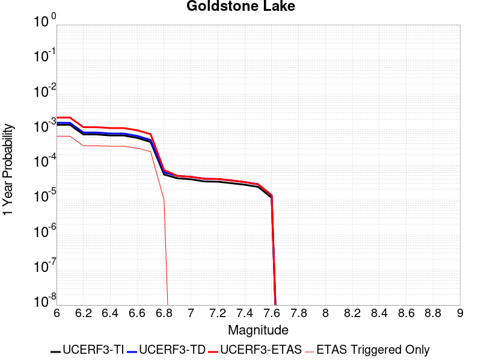 |  |

| Magnitude | 1 wk TI Prob | 1 wk TD Prob | 1 wk ETAS Prob | 1 wk ETAS/TD Gain | 1 wk ETAS Triggered Only | 1 mo TI Prob | 1 mo TD Prob | 1 mo ETAS Prob | 1 mo ETAS/TD Gain | 1 mo ETAS Triggered Only | 1 yr TI Prob | 1 yr TD Prob | 1 yr ETAS Prob | 1 yr ETAS/TD Gain | 1 yr ETAS Triggered Only | 10 yr TI Prob | 10 yr TD Prob | 10 yr ETAS Prob | 10 yr ETAS/TD Gain | 10 yr ETAS Triggered Only |
|-----|-----|-----|-----|-----|-----|-----|-----|-----|-----|-----|-----|-----|-----|-----|-----|-----|-----|-----|-----|-----|
| 6.0 | 2.671352E-5 | 3.0381472E-5 | 3.0381472E-5 | 1.0 | 0.0 | 1.1448149E-4 | 1.3020092E-4 | 1.531043E-4 | 1.175908 | 2.2906359E-5 | 0.001392921 | 0.00158424 | 0.0021331217 | 1.3464637 | 5.497526E-4 | 0.013842222 | 0.015748968 | 0.0176428 | 1.120251 | 0.0019241341 |
| 6.1 | 2.671352E-5 | 3.0381472E-5 | 3.0381472E-5 | 1.0 | 0.0 | 1.1448149E-4 | 1.3020092E-4 | 1.531043E-4 | 1.175908 | 2.2906359E-5 | 0.001392921 | 0.00158424 | 0.0021331217 | 1.3464637 | 5.497526E-4 | 0.013842222 | 0.015748968 | 0.0176428 | 1.120251 | 0.0019241341 |
| 6.2 | 1.4197047E-5 | 1.6098957E-5 | 1.6098957E-5 | 1.0 | 0.0 | 6.0843064E-5 | 6.899426E-5 | 9.189904E-5 | 1.331981 | 2.2906359E-5 | 7.4051257E-4 | 8.397801E-4 | 0.0011144255 | 1.3270445 | 2.748763E-4 | 0.007380498 | 0.008375766 | 0.009443347 | 1.1274607 | 0.0010765989 |
| 6.3 | 1.4197047E-5 | 1.6098957E-5 | 1.6098957E-5 | 1.0 | 0.0 | 6.0843064E-5 | 6.899426E-5 | 9.189904E-5 | 1.331981 | 2.2906359E-5 | 7.4051257E-4 | 8.397801E-4 | 0.0011144255 | 1.3270445 | 2.748763E-4 | 0.007380498 | 0.008375766 | 0.009443347 | 1.1274607 | 0.0010765989 |
| 6.4 | 1.3238931E-5 | 1.5010976E-5 | 1.5010976E-5 | 1.0 | 0.0 | 5.6737044E-5 | 6.4331725E-5 | 8.723661E-5 | 1.3560433 | 2.2906359E-5 | 6.9055456E-4 | 7.830553E-4 | 0.0010577163 | 1.3507557 | 2.748763E-4 | 0.006884126 | 0.00781259 | 0.008812596 | 1.1279992 | 0.0010078797 |
| 6.5 | 1.3238931E-5 | 1.5010976E-5 | 1.5010976E-5 | 1.0 | 0.0 | 5.6737044E-5 | 6.4331725E-5 | 8.723661E-5 | 1.3560433 | 2.2906359E-5 | 6.9055456E-4 | 7.830553E-4 | 0.0010577163 | 1.3507557 | 2.748763E-4 | 0.006884126 | 0.00781259 | 0.008812596 | 1.1279992 | 0.0010078797 |
| 6.6 | 1.1328278E-5 | 1.285732E-5 | 1.285732E-5 | 1.0 | 0.0 | 4.8548856E-5 | 5.5102173E-5 | 7.800727E-5 | 1.4156841 | 2.2906359E-5 | 5.90922E-4 | 6.707582E-4 | 9.225591E-4 | 1.3753974 | 2.5196993E-4 | 0.0058935313 | 0.0066967285 | 0.0076296 | 1.1393026 | 9.391607E-4 |
| 6.7 | 8.651175E-6 | 9.826188E-6 | 9.826188E-6 | 1.0 | 0.0 | 3.707594E-5 | 4.2112064E-5 | 6.5017455E-5 | 1.5439153 | 2.2906359E-5 | 4.5130608E-4 | 5.1268435E-4 | 7.4163044E-4 | 1.4465636 | 2.2906359E-4 | 0.0045039062 | 0.0051238975 | 0.005875934 | 1.1467705 | 7.5590983E-4 |
| 6.8 | 1.0215377E-6 | 1.1755602E-6 | 1.1755602E-6 | 1.0 | 0.0 | 4.378012E-6 | 5.038106E-6 | 5.038106E-6 | 1.0 | 0.0 | 5.3300988E-5 | 6.133733E-5 | 8.424228E-5 | 1.373426 | 2.2906359E-5 | 5.3288206E-4 | 6.1321526E-4 | 6.589999E-4 | 1.0746632 | 4.5812718E-5 |
| 6.9 | 7.9360774E-7 | 9.28402E-7 | 9.28402E-7 | 1.0 | 0.0 | 3.4011714E-6 | 3.97886E-6 | 3.97886E-6 | 1.0 | 0.0 | 4.1408475E-5 | 4.8441616E-5 | 4.8441616E-5 | 1.0 | 0.0 | 4.140076E-4 | 4.8431757E-4 | 4.8431757E-4 | 1.0 | 0.0 |
| 7.0 | 7.4382757E-7 | 8.7478975E-7 | 8.7478975E-7 | 1.0 | 0.0 | 3.1878285E-6 | 3.7490938E-6 | 3.7490938E-6 | 1.0 | 0.0 | 3.8811122E-5 | 4.564433E-5 | 4.564433E-5 | 1.0 | 0.0 | 3.8804344E-4 | 4.5635618E-4 | 4.5635618E-4 | 1.0 | 0.0 |
| 7.1 | 6.4709513E-7 | 7.711771E-7 | 7.711771E-7 | 1.0 | 0.0 | 2.773262E-6 | 3.305041E-6 | 3.305041E-6 | 1.0 | 0.0 | 3.376394E-5 | 4.0238192E-5 | 4.0238192E-5 | 1.0 | 0.0 | 3.375881E-4 | 4.0231502E-4 | 4.0231502E-4 | 1.0 | 0.0 |
| 7.2 | 6.356704E-7 | 7.5888187E-7 | 7.5888187E-7 | 1.0 | 0.0 | 2.7242988E-6 | 3.2523471E-6 | 3.2523471E-6 | 1.0 | 0.0 | 3.3167835E-5 | 3.9596667E-5 | 3.9596667E-5 | 1.0 | 0.0 | 3.3162883E-4 | 3.9590205E-4 | 3.9590205E-4 | 1.0 | 0.0 |
| 7.3 | 5.7695723E-7 | 6.896988E-7 | 6.896988E-7 | 1.0 | 0.0 | 2.4726714E-6 | 2.9558491E-6 | 2.9558491E-6 | 1.0 | 0.0 | 3.0104358E-5 | 3.5986926E-5 | 3.5986926E-5 | 1.0 | 0.0 | 3.0100282E-4 | 3.598167E-4 | 3.598167E-4 | 1.0 | 0.0 |
| 7.4 | 5.209647E-7 | 6.1938704E-7 | 6.1938704E-7 | 1.0 | 0.0 | 2.232704E-6 | 2.6545135E-6 | 2.6545135E-6 | 1.0 | 0.0 | 2.718283E-5 | 3.231828E-5 | 3.231828E-5 | 1.0 | 0.0 | 2.7179506E-4 | 3.2314134E-4 | 3.2314134E-4 | 1.0 | 0.0 |
| 7.5 | 4.512955E-7 | 5.3491794E-7 | 5.3491794E-7 | 1.0 | 0.0 | 1.934122E-6 | 2.2925037E-6 | 2.2925037E-6 | 1.0 | 0.0 | 2.3547682E-5 | 2.7910928E-5 | 2.7910928E-5 | 1.0 | 0.0 | 2.3545188E-4 | 2.7907954E-4 | 2.7907954E-4 | 1.0 | 0.0 |
| 7.6 | 2.21172E-7 | 2.60409E-7 | 2.60409E-7 | 1.0 | 0.0 | 9.478797E-7 | 1.1160382E-6 | 1.1160382E-6 | 1.0 | 0.0 | 1.1540374E-5 | 1.358771E-5 | 1.358771E-5 | 1.0 | 0.0 | 1.1539775E-4 | 1.3587161E-4 | 1.3587161E-4 | 1.0 | 0.0 |

## Gravel Hills-Harper Lk
*[(top)](#table-of-contents)*

| 1 Week | 1 Month | 1 Year | 10 Year |
|-----|-----|-----|-----|
| 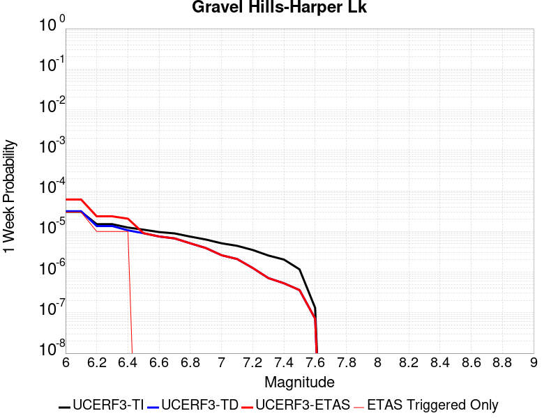 |  |  |  |

| Magnitude | 1 wk TI Prob | 1 wk TD Prob | 1 wk ETAS Prob | 1 wk ETAS/TD Gain | 1 wk ETAS Triggered Only | 1 mo TI Prob | 1 mo TD Prob | 1 mo ETAS Prob | 1 mo ETAS/TD Gain | 1 mo ETAS Triggered Only | 1 yr TI Prob | 1 yr TD Prob | 1 yr ETAS Prob | 1 yr ETAS/TD Gain | 1 yr ETAS Triggered Only | 10 yr TI Prob | 10 yr TD Prob | 10 yr ETAS Prob | 10 yr ETAS/TD Gain | 10 yr ETAS Triggered Only |
|-----|-----|-----|-----|-----|-----|-----|-----|-----|-----|-----|-----|-----|-----|-----|-----|-----|-----|-----|-----|-----|
| 6.0 | 3.0679566E-5 | 3.1470034E-5 | 7.728131E-5 | 2.4557111 | 4.5812718E-5 | 1.3147724E-4 | 1.3486583E-4 | 2.264789E-4 | 1.6792905 | 9.1625436E-5 | 0.0015995599 | 0.0016409707 | 0.0023041652 | 1.4041476 | 6.642844E-4 | 0.015880952 | 0.016310113 | 0.018202864 | 1.1160477 | 0.0019241341 |
| 6.1 | 3.0679566E-5 | 3.1470034E-5 | 7.728131E-5 | 2.4557111 | 4.5812718E-5 | 1.3147724E-4 | 1.3486583E-4 | 2.264789E-4 | 1.6792905 | 9.1625436E-5 | 0.0015995599 | 0.0016409707 | 0.0023041652 | 1.4041476 | 6.642844E-4 | 0.015880952 | 0.016310113 | 0.018202864 | 1.1160477 | 0.0019241341 |
| 6.2 | 1.514536E-5 | 1.3637061E-5 | 1.3637061E-5 | 1.0 | 0.0 | 6.490707E-5 | 5.8443307E-5 | 8.134833E-5 | 1.3919187 | 2.2906359E-5 | 7.8995706E-4 | 7.1132684E-4 | 9.860076E-4 | 1.3861527 | 2.748763E-4 | 0.007871548 | 0.0070917015 | 0.0076375557 | 1.0769708 | 5.497526E-4 |
| 6.3 | 1.514536E-5 | 1.3637061E-5 | 1.3637061E-5 | 1.0 | 0.0 | 6.490707E-5 | 5.8443307E-5 | 8.134833E-5 | 1.3919187 | 2.2906359E-5 | 7.8995706E-4 | 7.1132684E-4 | 9.860076E-4 | 1.3861527 | 2.748763E-4 | 0.007871548 | 0.0070917015 | 0.0076375557 | 1.0769708 | 5.497526E-4 |
| 6.4 | 1.2532521E-5 | 1.0691045E-5 | 1.0691045E-5 | 1.0 | 0.0 | 5.37097E-5 | 4.5817993E-5 | 6.8723304E-5 | 1.4999195 | 2.2906359E-5 | 6.537194E-4 | 5.576971E-4 | 8.0952654E-4 | 1.4515523 | 2.5196993E-4 | 0.0065179965 | 0.0055635655 | 0.006019144 | 1.081886 | 4.5812718E-4 |
| 6.5 | 1.1094058E-5 | 9.084768E-6 | 9.084768E-6 | 1.0 | 0.0 | 4.7545094E-5 | 3.8934162E-5 | 3.8934162E-5 | 1.0 | 0.0 | 5.787078E-4 | 4.7392436E-4 | 6.112974E-4 | 1.2898628 | 1.3743815E-4 | 0.0057720304 | 0.0047295443 | 0.0050031208 | 1.0578442 | 2.748763E-4 |
| 6.6 | 9.688328E-6 | 7.5325847E-6 | 7.5325847E-6 | 1.0 | 0.0 | 4.1520743E-5 | 3.228212E-5 | 3.228212E-5 | 1.0 | 0.0 | 5.053978E-4 | 3.929665E-4 | 4.6165858E-4 | 1.1748039 | 6.871908E-5 | 0.0050424994 | 0.0039229733 | 0.0040826886 | 1.0407128 | 1.6034451E-4 |
| 6.7 | 8.974824E-6 | 6.7502024E-6 | 6.7502024E-6 | 1.0 | 0.0 | 3.8462964E-5 | 2.8929131E-5 | 2.8929131E-5 | 1.0 | 0.0 | 4.6818596E-4 | 3.5215745E-4 | 4.2085233E-4 | 1.1950686 | 6.871908E-5 | 0.004672008 | 0.0035162151 | 0.0036759959 | 1.0454412 | 1.6034451E-4 |
| 6.8 | 7.4780046E-6 | 5.116785E-6 | 5.116785E-6 | 1.0 | 0.0 | 3.20482E-5 | 2.1928901E-5 | 2.1928901E-5 | 1.0 | 0.0 | 3.9011694E-4 | 2.6695305E-4 | 3.1275355E-4 | 1.1715676 | 4.5812718E-5 | 0.0038943281 | 0.0026664622 | 0.0027121527 | 1.0171353 | 4.5812718E-5 |
| 6.9 | 6.3409307E-6 | 3.907958E-6 | 3.907958E-6 | 1.0 | 0.0 | 2.7175134E-5 | 1.674829E-5 | 1.674829E-5 | 1.0 | 0.0 | 3.3080703E-4 | 2.0389234E-4 | 2.496957E-4 | 1.2246449 | 4.5812718E-5 | 0.0033031502 | 0.0020371508 | 0.0020828703 | 1.0224428 | 4.5812718E-5 |
| 7.0 | 5.1239335E-6 | 2.6061791E-6 | 2.6061791E-6 | 1.0 | 0.0 | 2.195953E-5 | 1.11692925E-5 | 1.11692925E-5 | 1.0 | 0.0 | 2.6732447E-4 | 1.359779E-4 | 1.5888114E-4 | 1.1684335 | 2.2906359E-5 | 0.0026700313 | 0.0013589723 | 0.0013818475 | 1.0168327 | 2.2906359E-5 |
| 7.1 | 4.438899E-6 | 2.0987422E-6 | 2.0987422E-6 | 1.0 | 0.0 | 1.9023713E-5 | 8.994581E-6 | 8.994581E-6 | 1.0 | 0.0 | 2.315891E-4 | 1.0950373E-4 | 1.3240759E-4 | 1.2091604 | 2.2906359E-5 | 0.002313479 | 0.0010945196 | 0.0011174009 | 1.0209054 | 2.2906359E-5 |
| 7.2 | 3.50367E-6 | 1.2617695E-6 | 1.2617695E-6 | 1.0 | 0.0 | 1.5015643E-5 | 5.407573E-6 | 5.407573E-6 | 1.0 | 0.0 | 1.8280011E-4 | 6.5835295E-5 | 8.874015E-5 | 1.3479114 | 2.2906359E-5 | 0.0018264982 | 6.5816613E-4 | 6.8105746E-4 | 1.0347804 | 2.2906359E-5 |
| 7.3 | 2.561638E-6 | 7.1206705E-7 | 7.1206705E-7 | 1.0 | 0.0 | 1.0978401E-5 | 3.0517124E-6 | 3.0517124E-6 | 1.0 | 0.0 | 1.3365384E-4 | 3.7153986E-5 | 6.0059494E-5 | 1.616502 | 2.2906359E-5 | 0.0013357349 | 3.7147972E-4 | 3.9437757E-4 | 1.0616395 | 2.2906359E-5 |
| 7.4 | 2.0368864E-6 | 5.3060455E-7 | 5.3060455E-7 | 1.0 | 0.0 | 8.729483E-6 | 2.2740176E-6 | 2.2740176E-6 | 1.0 | 0.0 | 1.06276275E-4 | 2.7685817E-5 | 2.7685817E-5 | 1.0 | 0.0 | 0.0010622547 | 2.768242E-4 | 2.768242E-4 | 1.0 | 0.0 |
| 7.5 | 1.1681728E-6 | 3.6037605E-7 | 3.6037605E-7 | 1.0 | 0.0 | 5.0064455E-6 | 1.544468E-6 | 1.544468E-6 | 1.0 | 0.0 | 6.0951766E-5 | 1.880374E-5 | 1.880374E-5 | 1.0 | 0.0 | 6.093505E-4 | 1.8802195E-4 | 1.8802195E-4 | 1.0 | 0.0 |
| 7.6 | 1.3154387E-7 | 7.120617E-8 | 7.120617E-8 | 1.0 | 0.0 | 5.6375933E-7 | 3.051693E-7 | 3.051693E-7 | 1.0 | 0.0 | 6.863748E-6 | 3.7154316E-6 | 3.7154316E-6 | 1.0 | 0.0 | 6.863536E-5 | 3.715385E-5 | 3.715385E-5 | 1.0 | 0.0 |

## Coyote Canyon
*[(top)](#table-of-contents)*

| 1 Week | 1 Month | 1 Year | 10 Year |
|-----|-----|-----|-----|
|  |  |  |  |

| Magnitude | 1 wk TI Prob | 1 wk TD Prob | 1 wk ETAS Prob | 1 wk ETAS/TD Gain | 1 wk ETAS Triggered Only | 1 mo TI Prob | 1 mo TD Prob | 1 mo ETAS Prob | 1 mo ETAS/TD Gain | 1 mo ETAS Triggered Only | 1 yr TI Prob | 1 yr TD Prob | 1 yr ETAS Prob | 1 yr ETAS/TD Gain | 1 yr ETAS Triggered Only | 10 yr TI Prob | 10 yr TD Prob | 10 yr ETAS Prob | 10 yr ETAS/TD Gain | 10 yr ETAS Triggered Only |
|-----|-----|-----|-----|-----|-----|-----|-----|-----|-----|-----|-----|-----|-----|-----|-----|-----|-----|-----|-----|-----|
| 6.0 | 3.5090034E-5 | 4.0372353E-5 | 8.618322E-5 | 2.134709 | 4.5812718E-5 | 1.503772E-4 | 1.7301434E-4 | 2.6462393E-4 | 1.5294913 | 9.1625436E-5 | 0.0018293047 | 0.0021046721 | 0.002561835 | 1.2172134 | 4.5812718E-4 | 0.018143194 | 0.020873329 | 0.022151737 | 1.061246 | 0.0013056624 |
| 6.1 | 3.5090034E-5 | 4.0372353E-5 | 8.618322E-5 | 2.134709 | 4.5812718E-5 | 1.503772E-4 | 1.7301434E-4 | 2.6462393E-4 | 1.5294913 | 9.1625436E-5 | 0.0018293047 | 0.0021046721 | 0.002561835 | 1.2172134 | 4.5812718E-4 | 0.018143194 | 0.020873329 | 0.022151737 | 1.061246 | 0.0013056624 |
| 6.2 | 1.841879E-5 | 2.10638E-5 | 4.3969678E-5 | 2.0874522 | 2.2906359E-5 | 7.8935285E-5 | 9.027088E-5 | 1.5898375E-4 | 1.7611854 | 6.871908E-5 | 9.606133E-4 | 0.0010985958 | 0.0013274078 | 1.2082767 | 2.2906359E-4 | 0.0095647145 | 0.010941739 | 0.011508132 | 1.0517645 | 5.7265896E-4 |
| 6.3 | 1.841879E-5 | 2.10638E-5 | 4.3969678E-5 | 2.0874522 | 2.2906359E-5 | 7.8935285E-5 | 9.027088E-5 | 1.5898375E-4 | 1.7611854 | 6.871908E-5 | 9.606133E-4 | 0.0010985958 | 0.0013274078 | 1.2082767 | 2.2906359E-4 | 0.0095647145 | 0.010941739 | 0.011508132 | 1.0517645 | 5.7265896E-4 |
| 6.4 | 1.712201E-5 | 1.9568917E-5 | 4.247483E-5 | 2.1705253 | 2.2906359E-5 | 7.337798E-5 | 8.386466E-5 | 1.5257797E-4 | 1.8193358 | 6.871908E-5 | 8.930107E-4 | 0.0010206745 | 0.0012495043 | 1.2241946 | 2.2906359E-4 | 0.008894307 | 0.010169788 | 0.01071395 | 1.0535077 | 5.497526E-4 |
| 6.5 | 1.4744935E-5 | 1.6840142E-5 | 3.9746115E-5 | 2.3602006 | 2.2906359E-5 | 6.3191044E-5 | 7.2170566E-5 | 1.4088469E-4 | 1.9521072 | 6.871908E-5 | 7.6907943E-4 | 8.7841594E-4 | 0.0010615059 | 1.2084318 | 1.8325087E-4 | 0.007664232 | 0.008758638 | 0.009258164 | 1.0570323 | 5.0393987E-4 |
| 6.6 | 1.2017839E-5 | 1.3726675E-5 | 3.663272E-5 | 2.6687248 | 2.2906359E-5 | 5.150401E-5 | 5.882778E-5 | 8.173279E-5 | 1.3893571 | 2.2906359E-5 | 6.268809E-4 | 7.160815E-4 | 8.076413E-4 | 1.1278623 | 9.1625436E-5 | 0.0062511545 | 0.007146437 | 0.007487577 | 1.0477357 | 3.4359537E-4 |
| 6.7 | 1.00956095E-5 | 1.1535696E-5 | 3.444179E-5 | 2.9856708 | 2.2906359E-5 | 4.326618E-5 | 4.943825E-5 | 7.234348E-5 | 1.4633098 | 2.2906359E-5 | 5.266384E-4 | 6.0183153E-4 | 6.934018E-4 | 1.1521527 | 9.1625436E-5 | 0.005253921 | 0.006010547 | 0.006283771 | 1.0454575 | 2.748763E-4 |

## San Andreas (Mojave N)
*[(top)](#table-of-contents)*

| 1 Week | 1 Month | 1 Year | 10 Year |
|-----|-----|-----|-----|
|  |  | 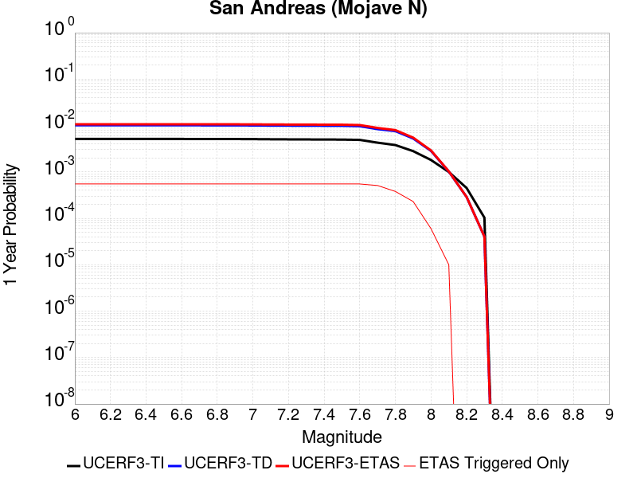 |  |

| Magnitude | 1 wk TI Prob | 1 wk TD Prob | 1 wk ETAS Prob | 1 wk ETAS/TD Gain | 1 wk ETAS Triggered Only | 1 mo TI Prob | 1 mo TD Prob | 1 mo ETAS Prob | 1 mo ETAS/TD Gain | 1 mo ETAS Triggered Only | 1 yr TI Prob | 1 yr TD Prob | 1 yr ETAS Prob | 1 yr ETAS/TD Gain | 1 yr ETAS Triggered Only | 10 yr TI Prob | 10 yr TD Prob | 10 yr ETAS Prob | 10 yr ETAS/TD Gain | 10 yr ETAS Triggered Only |
|-----|-----|-----|-----|-----|-----|-----|-----|-----|-----|-----|-----|-----|-----|-----|-----|-----|-----|-----|-----|-----|
| 6.0 | 9.877682E-5 | 1.9487888E-4 | 1.9487888E-4 | 1.0 | 0.0 | 4.2326056E-4 | 8.3492807E-4 | 9.493643E-4 | 1.1370611 | 1.14531795E-4 | 0.0051410277 | 0.010117998 | 0.010594165 | 1.0470613 | 4.8103352E-4 | 0.05023708 | 0.09869637 | 0.09976994 | 1.0108775 | 0.0011911306 |
| 6.1 | 9.877682E-5 | 1.9487888E-4 | 1.9487888E-4 | 1.0 | 0.0 | 4.2326056E-4 | 8.3492807E-4 | 9.493643E-4 | 1.1370611 | 1.14531795E-4 | 0.0051410277 | 0.010117998 | 0.010594165 | 1.0470613 | 4.8103352E-4 | 0.05023708 | 0.09869637 | 0.09976994 | 1.0108775 | 0.0011911306 |
| 6.2 | 9.877682E-5 | 1.9487888E-4 | 1.9487888E-4 | 1.0 | 0.0 | 4.2326056E-4 | 8.3492807E-4 | 9.493643E-4 | 1.1370611 | 1.14531795E-4 | 0.0051410277 | 0.010117998 | 0.010594165 | 1.0470613 | 4.8103352E-4 | 0.05023708 | 0.09869637 | 0.09976994 | 1.0108775 | 0.0011911306 |
| 6.3 | 9.877682E-5 | 1.9487888E-4 | 1.9487888E-4 | 1.0 | 0.0 | 4.2326056E-4 | 8.3492807E-4 | 9.493643E-4 | 1.1370611 | 1.14531795E-4 | 0.0051410277 | 0.010117998 | 0.010594165 | 1.0470613 | 4.8103352E-4 | 0.05023708 | 0.09869637 | 0.09976994 | 1.0108775 | 0.0011911306 |
| 6.4 | 9.877682E-5 | 1.9487888E-4 | 1.9487888E-4 | 1.0 | 0.0 | 4.2326056E-4 | 8.3492807E-4 | 9.493643E-4 | 1.1370611 | 1.14531795E-4 | 0.0051410277 | 0.010117998 | 0.010594165 | 1.0470613 | 4.8103352E-4 | 0.05023708 | 0.09869637 | 0.09976994 | 1.0108775 | 0.0011911306 |
| 6.5 | 9.861474E-5 | 1.9461628E-4 | 1.9461628E-4 | 1.0 | 0.0 | 4.2256617E-4 | 8.338034E-4 | 9.4823964E-4 | 1.1372461 | 1.14531795E-4 | 0.0051326132 | 0.010104432 | 0.010580605 | 1.0471251 | 4.8103352E-4 | 0.050156746 | 0.09857411 | 0.09964782 | 1.0108925 | 0.0011911306 |
| 6.6 | 9.861474E-5 | 1.9461628E-4 | 1.9461628E-4 | 1.0 | 0.0 | 4.2256617E-4 | 8.338034E-4 | 9.4823964E-4 | 1.1372461 | 1.14531795E-4 | 0.0051326132 | 0.010104432 | 0.010580605 | 1.0471251 | 4.8103352E-4 | 0.050156746 | 0.09857411 | 0.09964782 | 1.0108925 | 0.0011911306 |
| 6.7 | 9.8552715E-5 | 1.9451571E-4 | 1.9451571E-4 | 1.0 | 0.0 | 4.223004E-4 | 8.333726E-4 | 9.4780896E-4 | 1.1373172 | 1.14531795E-4 | 0.0051293927 | 0.010099237 | 0.010575412 | 1.0471497 | 4.8103352E-4 | 0.050125998 | 0.09852727 | 0.099601045 | 1.0108982 | 0.0011911306 |
| 6.8 | 9.8464974E-5 | 1.9436708E-4 | 1.9436708E-4 | 1.0 | 0.0 | 4.219245E-4 | 8.32736E-4 | 9.4717246E-4 | 1.1374222 | 1.14531795E-4 | 0.0051248376 | 0.010091558 | 0.010567737 | 1.0471859 | 4.8103352E-4 | 0.05008251 | 0.09845722 | 0.09953107 | 1.0109068 | 0.0011911306 |
| 6.9 | 9.825824E-5 | 1.940467E-4 | 1.940467E-4 | 1.0 | 0.0 | 4.2103877E-4 | 8.313639E-4 | 9.4580045E-4 | 1.1376492 | 1.14531795E-4 | 0.0051141046 | 0.010075007 | 0.010551194 | 1.0472642 | 4.8103352E-4 | 0.049980022 | 0.098306164 | 0.0993802 | 1.0109254 | 0.0011911306 |
| 7.0 | 9.781462E-5 | 1.9335936E-4 | 1.9335936E-4 | 1.0 | 0.0 | 4.1913814E-4 | 8.2842E-4 | 9.428569E-4 | 1.1381388 | 1.14531795E-4 | 0.005091073 | 0.010039495 | 0.0105157 | 1.0474331 | 4.8103352E-4 | 0.04976007 | 0.097982235 | 0.09905665 | 1.0109655 | 0.0011911306 |
| 7.1 | 9.7121134E-5 | 1.9237513E-4 | 1.9237513E-4 | 1.0 | 0.0 | 4.1616702E-4 | 8.242045E-4 | 9.386419E-4 | 1.1388459 | 1.14531795E-4 | 0.005055068 | 0.009988643 | 0.010464872 | 1.047677 | 4.8103352E-4 | 0.04941613 | 0.09751831 | 0.09859329 | 1.0110233 | 0.0011911306 |
| 7.2 | 9.663819E-5 | 1.9168199E-4 | 1.9168199E-4 | 1.0 | 0.0 | 4.1409794E-4 | 8.212358E-4 | 9.3567354E-4 | 1.1393481 | 1.14531795E-4 | 0.0050299936 | 0.009952831 | 0.010429077 | 1.0478503 | 4.8103352E-4 | 0.049176537 | 0.09719127 | 0.09826663 | 1.0110644 | 0.0011911306 |
| 7.3 | 9.6277574E-5 | 1.912059E-4 | 1.912059E-4 | 1.0 | 0.0 | 4.125529E-4 | 8.191967E-4 | 9.3363464E-4 | 1.1396954 | 1.14531795E-4 | 0.0050112694 | 0.009928231 | 0.010404489 | 1.04797 | 4.8103352E-4 | 0.04899759 | 0.096964255 | 0.09803989 | 1.0110931 | 0.0011911306 |
| 7.4 | 9.593308E-5 | 1.9060235E-4 | 1.9060235E-4 | 1.0 | 0.0 | 4.1107697E-4 | 8.166117E-4 | 9.3105E-4 | 1.1401379 | 1.14531795E-4 | 0.0049933824 | 0.009897046 | 0.010373318 | 1.0481228 | 4.8103352E-4 | 0.04882661 | 0.09668197 | 0.09775794 | 1.0111289 | 0.0011911306 |
| 7.5 | 9.561707E-5 | 1.9006194E-4 | 1.9006194E-4 | 1.0 | 0.0 | 4.0972308E-4 | 8.1429706E-4 | 9.287356E-4 | 1.1405365 | 1.14531795E-4 | 0.0049769743 | 0.00986912 | 0.010345407 | 1.0482602 | 4.8103352E-4 | 0.048669744 | 0.09642772 | 0.09750399 | 1.0111614 | 0.0011911306 |
| 7.6 | 9.418194E-5 | 1.8657741E-4 | 1.8657741E-4 | 1.0 | 0.0 | 4.0357444E-4 | 7.993726E-4 | 9.1381284E-4 | 1.1431626 | 1.14531795E-4 | 0.004902454 | 0.009689045 | 0.010165418 | 1.0491661 | 4.8103352E-4 | 0.047957025 | 0.0948077 | 0.0958859 | 1.0113726 | 0.0011911306 |
| 7.7 | 8.202141E-5 | 1.609954E-4 | 1.609954E-4 | 1.0 | 0.0 | 3.51473E-4 | 6.897979E-4 | 8.042507E-4 | 1.1659222 | 1.14531795E-4 | 0.00427079 | 0.008366007 | 0.008797588 | 1.0515873 | 4.352208E-4 | 0.04189639 | 0.08258243 | 0.083528094 | 1.0114511 | 0.0010307862 |
| 7.8 | 7.2859846E-5 | 1.4586812E-4 | 1.4586812E-4 | 1.0 | 0.0 | 3.1221908E-4 | 6.2499935E-4 | 7.3945953E-4 | 1.1831366 | 1.14531795E-4 | 0.003794643 | 0.0075828596 | 0.00792385 | 1.0449685 | 3.4359537E-4 | 0.037304975 | 0.07504203 | 0.07574122 | 1.0093173 | 7.5590983E-4 |
| 7.9 | 5.3874453E-5 | 1.00950085E-4 | 1.00950085E-4 | 1.0 | 0.0 | 2.3087008E-4 | 4.3257148E-4 | 5.0126086E-4 | 1.1587931 | 6.871908E-5 | 0.0028072202 | 0.0052538514 | 0.005458926 | 1.039033 | 2.0615723E-4 | 0.02772022 | 0.052655075 | 0.05315418 | 1.0094788 | 5.2684627E-4 |
| 8.0 | 3.468538E-5 | 5.454598E-5 | 5.454598E-5 | 1.0 | 0.0 | 1.4864317E-4 | 2.3374756E-4 | 2.5664855E-4 | 1.0979732 | 2.2906359E-5 | 0.0018082283 | 0.0028421644 | 0.0028650058 | 1.0080366 | 2.2906359E-5 | 0.017935853 | 0.029087735 | 0.029221175 | 1.0045875 | 1.3743815E-4 |
| 8.1 | 1.9152367E-5 | 1.9539457E-5 | 1.9539457E-5 | 1.0 | 0.0 | 8.207899E-5 | 8.373785E-5 | 8.373785E-5 | 1.0 | 0.0 | 9.988535E-4 | 0.0010190321 | 0.0010190321 | 1.0 | 0.0 | 0.009943757 | 0.010927947 | 0.010927947 | 1.0 | 0.0 |
| 8.2 | 8.643924E-6 | 5.5269165E-6 | 5.5269165E-6 | 1.0 | 0.0 | 3.704486E-5 | 2.368657E-5 | 2.368657E-5 | 1.0 | 0.0 | 4.5092785E-4 | 2.8834594E-4 | 2.8834594E-4 | 1.0 | 0.0 | 0.0045001395 | 0.0032771796 | 0.0032771796 | 1.0 | 0.0 |
| 8.3 | 1.983087E-6 | 7.7486385E-7 | 7.7486385E-7 | 1.0 | 0.0 | 8.498917E-6 | 3.320841E-6 | 3.320841E-6 | 1.0 | 0.0 | 1.034694E-4 | 4.0430506E-5 | 4.0430506E-5 | 1.0 | 0.0 | 0.0010342124 | 4.7705657E-4 | 4.7705657E-4 | 1.0 | 0.0 |

## San Andreas (Mojave S)
*[(top)](#table-of-contents)*

| 1 Week | 1 Month | 1 Year | 10 Year |
|-----|-----|-----|-----|
|  |  | 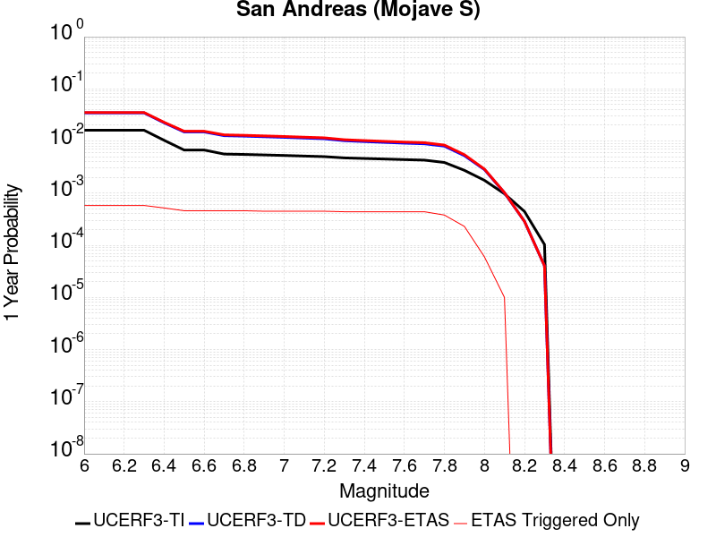 |  |

| Magnitude | 1 wk TI Prob | 1 wk TD Prob | 1 wk ETAS Prob | 1 wk ETAS/TD Gain | 1 wk ETAS Triggered Only | 1 mo TI Prob | 1 mo TD Prob | 1 mo ETAS Prob | 1 mo ETAS/TD Gain | 1 mo ETAS Triggered Only | 1 yr TI Prob | 1 yr TD Prob | 1 yr ETAS Prob | 1 yr ETAS/TD Gain | 1 yr ETAS Triggered Only | 10 yr TI Prob | 10 yr TD Prob | 10 yr ETAS Prob | 10 yr ETAS/TD Gain | 10 yr ETAS Triggered Only |
|-----|-----|-----|-----|-----|-----|-----|-----|-----|-----|-----|-----|-----|-----|-----|-----|-----|-----|-----|-----|-----|
| 6.0 | 3.1064058E-4 | 6.755789E-4 | 6.755789E-4 | 1.0 | 0.0 | 0.0013306376 | 0.0028922537 | 0.0030064543 | 1.039485 | 1.14531795E-4 | 0.016080605 | 0.034670897 | 0.03520159 | 1.0153066 | 5.497526E-4 | 0.1496549 | 0.28693774 | 0.2877871 | 1.0029601 | 0.0011911306 |
| 6.1 | 3.1064058E-4 | 6.755789E-4 | 6.755789E-4 | 1.0 | 0.0 | 0.0013306376 | 0.0028922537 | 0.0030064543 | 1.039485 | 1.14531795E-4 | 0.016080605 | 0.034670897 | 0.03520159 | 1.0153066 | 5.497526E-4 | 0.1496549 | 0.28693774 | 0.2877871 | 1.0029601 | 0.0011911306 |
| 6.2 | 3.1064058E-4 | 6.755789E-4 | 6.755789E-4 | 1.0 | 0.0 | 0.0013306376 | 0.0028922537 | 0.0030064543 | 1.039485 | 1.14531795E-4 | 0.016080605 | 0.034670897 | 0.03520159 | 1.0153066 | 5.497526E-4 | 0.1496549 | 0.28693774 | 0.2877871 | 1.0029601 | 0.0011911306 |
| 6.3 | 3.1064058E-4 | 6.755789E-4 | 6.755789E-4 | 1.0 | 0.0 | 0.0013306376 | 0.0028922537 | 0.0030064543 | 1.039485 | 1.14531795E-4 | 0.016080605 | 0.034670897 | 0.03520159 | 1.0153066 | 5.497526E-4 | 0.1496549 | 0.28693774 | 0.2877871 | 1.0029601 | 0.0011911306 |
| 6.4 | 1.9872203E-4 | 4.3271694E-4 | 4.3271694E-4 | 1.0 | 0.0 | 8.5138786E-4 | 0.0018532113 | 0.001967531 | 1.0616872 | 1.14531795E-4 | 0.010316478 | 0.022335568 | 0.022828253 | 1.0220582 | 5.0393987E-4 | 0.098504856 | 0.19735251 | 0.19823502 | 1.0044718 | 0.0010995052 |
| 6.5 | 1.291105E-4 | 2.8840266E-4 | 2.8840266E-4 | 1.0 | 0.0 | 5.5321335E-4 | 0.0012354287 | 0.001349819 | 1.0925915 | 1.14531795E-4 | 0.006714592 | 0.014938438 | 0.015344594 | 1.0271885 | 4.1231446E-4 | 0.065152965 | 0.13839725 | 0.13920642 | 1.0058469 | 9.391607E-4 |
| 6.6 | 1.291105E-4 | 2.8840266E-4 | 2.8840266E-4 | 1.0 | 0.0 | 5.5321335E-4 | 0.0012354287 | 0.001349819 | 1.0925915 | 1.14531795E-4 | 0.006714592 | 0.014938438 | 0.015344594 | 1.0271885 | 4.1231446E-4 | 0.065152965 | 0.13839725 | 0.13920642 | 1.0058469 | 9.391607E-4 |
| 6.7 | 1.08001186E-4 | 2.4420145E-4 | 2.4420145E-4 | 1.0 | 0.0 | 4.6278012E-4 | 0.0010461585 | 0.0011605704 | 1.1093639 | 1.14531795E-4 | 0.0056198016 | 0.012662896 | 0.013069989 | 1.0321485 | 4.1231446E-4 | 0.054797906 | 0.11954315 | 0.12034988 | 1.0067484 | 9.1625436E-4 |
| 6.8 | 1.0624356E-4 | 2.3937564E-4 | 2.3937564E-4 | 1.0 | 0.0 | 4.5525006E-4 | 0.0010254928 | 0.0011399072 | 1.1115701 | 1.14531795E-4 | 0.0055285925 | 0.012414177 | 0.012821373 | 1.0328009 | 4.1231446E-4 | 0.053930566 | 0.11749219 | 0.118300796 | 1.0068822 | 9.1625436E-4 |
| 6.9 | 1.0393785E-4 | 2.330758E-4 | 2.330758E-4 | 1.0 | 0.0 | 4.4537184E-4 | 9.985144E-4 | 0.0011129318 | 1.1145877 | 1.14531795E-4 | 0.0054089287 | 0.0120894 | 0.0124741 | 1.0318213 | 3.894081E-4 | 0.05279156 | 0.114789546 | 0.11558035 | 1.0068891 | 8.93348E-4 |
| 7.0 | 1.0155622E-4 | 2.2676731E-4 | 2.2676731E-4 | 1.0 | 0.0 | 4.3516833E-4 | 9.714983E-4 | 0.0010859189 | 1.1177773 | 1.14531795E-4 | 0.005285311 | 0.011764073 | 0.0121489 | 1.0327121 | 3.894081E-4 | 0.05161361 | 0.11204931 | 0.11284256 | 1.0070795 | 8.93348E-4 |
| 7.1 | 9.885595E-5 | 2.1964697E-4 | 2.1964697E-4 | 1.0 | 0.0 | 4.2359953E-4 | 9.410049E-4 | 0.0010554289 | 1.1215976 | 1.14531795E-4 | 0.0051451353 | 0.011396753 | 0.011781723 | 1.0337789 | 3.894081E-4 | 0.05027629 | 0.10893335 | 0.10972939 | 1.0073075 | 8.93348E-4 |
| 7.2 | 9.6411415E-5 | 2.1327272E-4 | 2.1327272E-4 | 1.0 | 0.0 | 4.1312634E-4 | 9.137061E-4 | 0.0010281332 | 1.1252341 | 1.14531795E-4 | 0.005018219 | 0.011067813 | 0.011452911 | 1.0347944 | 3.894081E-4 | 0.049064007 | 0.106122635 | 0.10692118 | 1.0075247 | 8.93348E-4 |
| 7.3 | 9.1180635E-5 | 1.9553355E-4 | 1.9553355E-4 | 1.0 | 0.0 | 3.907156E-4 | 8.377319E-4 | 9.521677E-4 | 1.136602 | 1.14531795E-4 | 0.004746591 | 0.010151802 | 0.0105372565 | 1.0379691 | 3.894081E-4 | 0.046464786 | 0.09831004 | 0.09911556 | 1.0081937 | 8.93348E-4 |
| 7.4 | 8.887388E-5 | 1.8800999E-4 | 1.8800999E-4 | 1.0 | 0.0 | 3.8083247E-4 | 8.0550835E-4 | 9.199479E-4 | 1.1420712 | 1.14531795E-4 | 0.0046267817 | 0.009763064 | 0.01014867 | 1.0394964 | 3.894081E-4 | 0.045316286 | 0.09494246 | 0.09575099 | 1.0085161 | 8.93348E-4 |
| 7.5 | 8.6750515E-5 | 1.8131707E-4 | 1.8131707E-4 | 1.0 | 0.0 | 3.7173493E-4 | 7.768418E-4 | 8.912846E-4 | 1.147318 | 1.14531795E-4 | 0.004516484 | 0.009417119 | 0.00980286 | 1.0409616 | 3.894081E-4 | 0.04425787 | 0.09190385 | 0.09271509 | 1.0088271 | 8.93348E-4 |
| 7.6 | 8.453092E-5 | 1.7518285E-4 | 1.7518285E-4 | 1.0 | 0.0 | 3.6222505E-4 | 7.505677E-4 | 8.650135E-4 | 1.152479 | 1.14531795E-4 | 0.0044011753 | 0.009099949 | 0.009485814 | 1.042403 | 3.894081E-4 | 0.04315024 | 0.08905971 | 0.0898735 | 1.0091375 | 8.93348E-4 |
| 7.7 | 8.259102E-5 | 1.7039546E-4 | 1.7039546E-4 | 1.0 | 0.0 | 3.539135E-4 | 7.3006196E-4 | 8.4451016E-4 | 1.156765 | 1.14531795E-4 | 0.004300386 | 0.008852349 | 0.009238309 | 1.0435998 | 3.894081E-4 | 0.042181134 | 0.08680755 | 0.08762335 | 1.0093977 | 8.93348E-4 |
| 7.8 | 7.444844E-5 | 1.535487E-4 | 1.535487E-4 | 1.0 | 0.0 | 3.1902574E-4 | 6.5789995E-4 | 7.7235635E-4 | 1.1739724 | 1.14531795E-4 | 0.0038772223 | 0.007980564 | 0.0083214175 | 1.0427104 | 3.4359537E-4 | 0.03810269 | 0.07861057 | 0.07930706 | 1.00886 | 7.5590983E-4 |
| 7.9 | 5.2586525E-5 | 1.0055216E-4 | 1.0055216E-4 | 1.0 | 0.0 | 2.2535135E-4 | 4.308667E-4 | 4.9955613E-4 | 1.1594217 | 6.871908E-5 | 0.0027402006 | 0.0052331956 | 0.005438274 | 1.039188 | 2.0615723E-4 | 0.027066574 | 0.052427854 | 0.052927077 | 1.0095221 | 5.2684627E-4 |
| 8.0 | 3.379877E-5 | 5.435691E-5 | 5.435691E-5 | 1.0 | 0.0 | 1.4484383E-4 | 2.329374E-4 | 2.5583841E-4 | 1.098314 | 2.2906359E-5 | 0.0017620471 | 0.0028323263 | 0.002855168 | 1.0080645 | 2.2906359E-5 | 0.017481409 | 0.02897345 | 0.029106908 | 1.0046061 | 1.3743815E-4 |
| 8.1 | 1.8668277E-5 | 1.9444557E-5 | 1.9444557E-5 | 1.0 | 0.0 | 8.000444E-5 | 8.333116E-5 | 8.333116E-5 | 1.0 | 0.0 | 9.736188E-4 | 0.0010140853 | 0.0010140853 | 1.0 | 0.0 | 0.009693642 | 0.010869623 | 0.010869623 | 1.0 | 0.0 |
| 8.2 | 8.541571E-6 | 5.512696E-6 | 5.512696E-6 | 1.0 | 0.0 | 3.660622E-5 | 2.3625627E-5 | 2.3625627E-5 | 1.0 | 0.0 | 4.455896E-4 | 2.8760414E-4 | 2.8760414E-4 | 1.0 | 0.0 | 0.0044469717 | 0.0032691804 | 0.0032691804 | 1.0 | 0.0 |
| 8.3 | 1.983087E-6 | 7.7486385E-7 | 7.7486385E-7 | 1.0 | 0.0 | 8.498917E-6 | 3.320841E-6 | 3.320841E-6 | 1.0 | 0.0 | 1.034694E-4 | 4.0430506E-5 | 4.0430506E-5 | 1.0 | 0.0 | 0.0010342124 | 4.7705657E-4 | 4.7705657E-4 | 1.0 | 0.0 |

## Death Valley (So)
*[(top)](#table-of-contents)*

| 1 Week | 1 Month | 1 Year | 10 Year |
|-----|-----|-----|-----|
|  |  | 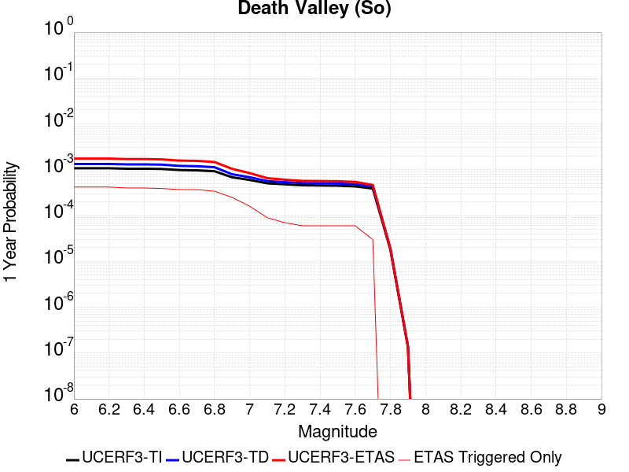 | 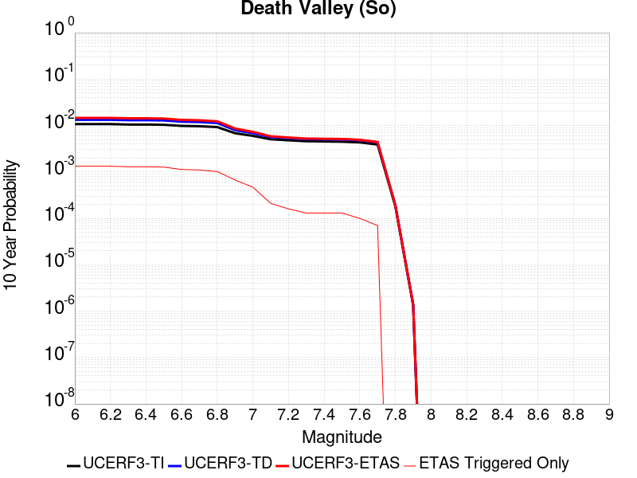 |

| Magnitude | 1 wk TI Prob | 1 wk TD Prob | 1 wk ETAS Prob | 1 wk ETAS/TD Gain | 1 wk ETAS Triggered Only | 1 mo TI Prob | 1 mo TD Prob | 1 mo ETAS Prob | 1 mo ETAS/TD Gain | 1 mo ETAS Triggered Only | 1 yr TI Prob | 1 yr TD Prob | 1 yr ETAS Prob | 1 yr ETAS/TD Gain | 1 yr ETAS Triggered Only | 10 yr TI Prob | 10 yr TD Prob | 10 yr ETAS Prob | 10 yr ETAS/TD Gain | 10 yr ETAS Triggered Only |
|-----|-----|-----|-----|-----|-----|-----|-----|-----|-----|-----|-----|-----|-----|-----|-----|-----|-----|-----|-----|-----|
| 6.0 | 2.0684236E-5 | 2.5624238E-5 | 2.5624238E-5 | 1.0 | 0.0 | 8.864371E-5 | 1.09813634E-4 | 1.7852517E-4 | 1.6257104 | 6.871908E-5 | 0.0010787029 | 0.0013361779 | 0.0016793142 | 1.2568043 | 3.4359537E-4 | 0.010734817 | 0.01328472 | 0.014460026 | 1.0884706 | 0.0011911306 |
| 6.1 | 2.0684236E-5 | 2.5624238E-5 | 2.5624238E-5 | 1.0 | 0.0 | 8.864371E-5 | 1.09813634E-4 | 1.7852517E-4 | 1.6257104 | 6.871908E-5 | 0.0010787029 | 0.0013361779 | 0.0016793142 | 1.2568043 | 3.4359537E-4 | 0.010734817 | 0.01328472 | 0.014460026 | 1.0884706 | 0.0011911306 |
| 6.2 | 2.0684236E-5 | 2.5624238E-5 | 2.5624238E-5 | 1.0 | 0.0 | 8.864371E-5 | 1.09813634E-4 | 1.7852517E-4 | 1.6257104 | 6.871908E-5 | 0.0010787029 | 0.0013361779 | 0.0016793142 | 1.2568043 | 3.4359537E-4 | 0.010734817 | 0.01328472 | 0.014460026 | 1.0884706 | 0.0011911306 |
| 6.3 | 2.0240292E-5 | 2.5124238E-5 | 2.5124238E-5 | 1.0 | 0.0 | 8.6741224E-5 | 1.0767096E-4 | 1.7638263E-4 | 1.6381636 | 6.871908E-5 | 0.0010555626 | 0.0013101223 | 0.0016303912 | 1.2444572 | 3.2068903E-4 | 0.010505628 | 0.013027237 | 0.014135026 | 1.0850364 | 0.0011224116 |
| 6.4 | 2.0240292E-5 | 2.5124238E-5 | 2.5124238E-5 | 1.0 | 0.0 | 8.6741224E-5 | 1.0767096E-4 | 1.7638263E-4 | 1.6381636 | 6.871908E-5 | 0.0010555626 | 0.0013101223 | 0.0016303912 | 1.2444572 | 3.2068903E-4 | 0.010505628 | 0.013027237 | 0.014135026 | 1.0850364 | 0.0011224116 |
| 6.5 | 1.9962767E-5 | 2.4813442E-5 | 2.4813442E-5 | 1.0 | 0.0 | 8.55519E-5 | 1.0633908E-4 | 1.7505085E-4 | 1.6461573 | 6.871908E-5 | 0.0010410968 | 0.0012939262 | 0.0016142002 | 1.2475212 | 3.2068903E-4 | 0.010362327 | 0.012867158 | 0.013975128 | 1.0861083 | 0.0011224116 |
| 6.6 | 1.8937297E-5 | 2.3317003E-5 | 2.3317003E-5 | 1.0 | 0.0 | 8.115732E-5 | 9.992627E-5 | 1.6863848E-4 | 1.6876291 | 6.871908E-5 | 9.876423E-4 | 0.0012159379 | 0.001536237 | 1.2634174 | 3.2068903E-4 | 0.009832645 | 0.012095899 | 0.013114217 | 1.084187 | 0.0010307862 |
| 6.7 | 1.8621096E-5 | 2.2917578E-5 | 2.2917578E-5 | 1.0 | 0.0 | 7.980225E-5 | 9.821458E-5 | 1.6692691E-4 | 1.6996143 | 6.871908E-5 | 9.711593E-4 | 0.0011951211 | 0.0015154268 | 1.2680111 | 3.2068903E-4 | 0.009669261 | 0.011889981 | 0.012863243 | 1.0818557 | 9.849734E-4 |
| 6.8 | 1.7830353E-5 | 2.1811285E-5 | 2.1811285E-5 | 1.0 | 0.0 | 7.641356E-5 | 9.347367E-5 | 1.6218632E-4 | 1.7351017 | 6.871908E-5 | 9.29938E-4 | 0.0011374619 | 0.0014349058 | 1.261498 | 2.9778265E-4 | 0.009260561 | 0.011319241 | 0.01224777 | 1.0820311 | 9.391607E-4 |
| 6.9 | 1.3135183E-5 | 1.5307089E-5 | 1.5307089E-5 | 1.0 | 0.0 | 5.6292425E-5 | 6.5600194E-5 | 1.1140991E-4 | 1.6983167 | 4.5812718E-5 | 6.8514474E-4 | 7.983962E-4 | 0.0010501649 | 1.3153431 | 2.5196993E-4 | 0.006830362 | 0.007956286 | 0.008501665 | 1.0685469 | 5.497526E-4 |
| 7.0 | 1.1507512E-5 | 1.3156645E-5 | 1.3156645E-5 | 1.0 | 0.0 | 4.9316975E-5 | 5.6384437E-5 | 7.92895E-5 | 1.4062303 | 2.2906359E-5 | 6.002687E-4 | 6.8627007E-4 | 8.236139E-4 | 1.2001309 | 1.3743815E-4 | 0.0059864987 | 0.0068422095 | 0.007183454 | 1.0498735 | 3.4359537E-4 |
| 7.1 | 9.715903E-6 | 1.08670365E-5 | 1.08670365E-5 | 1.0 | 0.0 | 4.1638916E-5 | 4.6572204E-5 | 6.947749E-5 | 1.4918232 | 2.2906359E-5 | 5.068359E-4 | 5.6687335E-4 | 6.584468E-4 | 1.1615413 | 9.1625436E-5 | 0.0050568148 | 0.005654727 | 0.005859718 | 1.0362513 | 2.0615723E-4 |
| 7.2 | 9.233269E-6 | 1.0287937E-5 | 1.0287937E-5 | 1.0 | 0.0 | 3.9570554E-5 | 4.4090437E-5 | 6.699579E-5 | 1.5195084 | 2.2906359E-5 | 4.81665E-4 | 5.3667306E-4 | 6.2824937E-4 | 1.170637 | 9.1625436E-5 | 0.0048062233 | 0.005354202 | 0.005536472 | 1.0340424 | 1.8325087E-4 |
| 7.3 | 8.8041315E-6 | 9.809655E-6 | 9.809655E-6 | 1.0 | 0.0 | 3.7731446E-5 | 4.2040723E-5 | 6.494612E-5 | 1.5448383 | 2.2906359E-5 | 4.592835E-4 | 5.117298E-4 | 5.8041373E-4 | 1.134219 | 6.871908E-5 | 0.0045833546 | 0.0051059416 | 0.005242678 | 1.0267799 | 1.3743815E-4 |
| 7.4 | 8.708749E-6 | 9.708658E-6 | 9.708658E-6 | 1.0 | 0.0 | 3.7322676E-5 | 4.1607895E-5 | 6.45133E-5 | 1.5505062 | 2.2906359E-5 | 4.5430884E-4 | 5.064626E-4 | 5.751468E-4 | 1.1356157 | 6.871908E-5 | 0.004533812 | 0.0050535095 | 0.0051902533 | 1.0270591 | 1.3743815E-4 |
| 7.5 | 8.612678E-6 | 9.606291E-6 | 9.606291E-6 | 1.0 | 0.0 | 3.6910955E-5 | 4.1169194E-5 | 6.407461E-5 | 1.5563728 | 2.2906359E-5 | 4.492982E-4 | 5.0112384E-4 | 5.698085E-4 | 1.1370612 | 6.871908E-5 | 0.004483909 | 0.005000364 | 0.005137115 | 1.0273482 | 1.3743815E-4 |
| 7.6 | 8.319024E-6 | 9.28535E-6 | 9.28535E-6 | 1.0 | 0.0 | 3.5652476E-5 | 3.9793773E-5 | 6.269922E-5 | 1.5756038 | 2.2906359E-5 | 4.3398244E-4 | 4.843857E-4 | 5.530715E-4 | 1.1417998 | 6.871908E-5 | 0.0043313587 | 0.004833723 | 0.004947701 | 1.0235798 | 1.14531795E-4 |
| 7.7 | 7.4718328E-6 | 8.346468E-6 | 8.346468E-6 | 1.0 | 0.0 | 3.2021748E-5 | 3.577011E-5 | 3.577011E-5 | 1.0 | 0.0 | 3.8979502E-4 | 4.3541813E-4 | 4.583145E-4 | 1.0525848 | 2.2906359E-5 | 0.00389112 | 0.0043460554 | 0.0044144755 | 1.0157431 | 6.871908E-5 |
| 7.8 | 3.4586725E-7 | 3.648528E-7 | 3.648528E-7 | 1.0 | 0.0 | 1.4822873E-6 | 1.563654E-6 | 1.563654E-6 | 1.0 | 0.0 | 1.80467E-5 | 1.9037325E-5 | 1.9037325E-5 | 1.0 | 0.0 | 1.8045233E-4 | 1.9035739E-4 | 1.9035739E-4 | 1.0 | 0.0 |
| 7.9 | 2.5591178E-9 | 2.6698248E-9 | 2.6698248E-9 | 1.0 | 0.0 | 1.0967647E-8 | 1.1442106E-8 | 1.1442106E-8 | 1.0 | 0.0 | 1.335311E-7 | 1.3930764E-7 | 1.3930764E-7 | 1.0 | 0.0 | 1.3353102E-6 | 1.3930764E-6 | 1.3930764E-6 | 1.0 | 0.0 |

## Lenwood-Lockhart-Old Woman Springs
*[(top)](#table-of-contents)*

| 1 Week | 1 Month | 1 Year | 10 Year |
|-----|-----|-----|-----|
|  |  |  |  |

| Magnitude | 1 wk TI Prob | 1 wk TD Prob | 1 wk ETAS Prob | 1 wk ETAS/TD Gain | 1 wk ETAS Triggered Only | 1 mo TI Prob | 1 mo TD Prob | 1 mo ETAS Prob | 1 mo ETAS/TD Gain | 1 mo ETAS Triggered Only | 1 yr TI Prob | 1 yr TD Prob | 1 yr ETAS Prob | 1 yr ETAS/TD Gain | 1 yr ETAS Triggered Only | 10 yr TI Prob | 10 yr TD Prob | 10 yr ETAS Prob | 10 yr ETAS/TD Gain | 10 yr ETAS Triggered Only |
|-----|-----|-----|-----|-----|-----|-----|-----|-----|-----|-----|-----|-----|-----|-----|-----|-----|-----|-----|-----|-----|
| 6.0 | 3.744542E-5 | 4.3966986E-5 | 4.3966986E-5 | 1.0 | 0.0 | 1.604705E-4 | 1.884173E-4 | 1.884173E-4 | 1.0 | 0.0 | 0.0019519776 | 0.0022917395 | 0.0026345474 | 1.1495842 | 3.4359537E-4 | 0.019349206 | 0.022699071 | 0.023706459 | 1.0443802 | 0.0010307862 |
| 6.1 | 3.744542E-5 | 4.3966986E-5 | 4.3966986E-5 | 1.0 | 0.0 | 1.604705E-4 | 1.884173E-4 | 1.884173E-4 | 1.0 | 0.0 | 0.0019519776 | 0.0022917395 | 0.0026345474 | 1.1495842 | 3.4359537E-4 | 0.019349206 | 0.022699071 | 0.023706459 | 1.0443802 | 0.0010307862 |
| 6.2 | 3.744542E-5 | 4.3966986E-5 | 4.3966986E-5 | 1.0 | 0.0 | 1.604705E-4 | 1.884173E-4 | 1.884173E-4 | 1.0 | 0.0 | 0.0019519776 | 0.0022917395 | 0.0026345474 | 1.1495842 | 3.4359537E-4 | 0.019349206 | 0.022699071 | 0.023706459 | 1.0443802 | 0.0010307862 |
| 6.3 | 2.1079984E-5 | 2.535506E-5 | 2.535506E-5 | 1.0 | 0.0 | 9.0339665E-5 | 1.0866013E-4 | 1.0866013E-4 | 1.0 | 0.0 | 0.0010993304 | 0.0013221542 | 0.0014822867 | 1.1211149 | 1.6034451E-4 | 0.010939079 | 0.013145096 | 0.013574596 | 1.0326737 | 4.352208E-4 |
| 6.4 | 2.1079984E-5 | 2.535506E-5 | 2.535506E-5 | 1.0 | 0.0 | 9.0339665E-5 | 1.0866013E-4 | 1.0866013E-4 | 1.0 | 0.0 | 0.0010993304 | 0.0013221542 | 0.0014822867 | 1.1211149 | 1.6034451E-4 | 0.010939079 | 0.013145096 | 0.013574596 | 1.0326737 | 4.352208E-4 |
| 6.5 | 1.7397282E-5 | 2.0663669E-5 | 2.0663669E-5 | 1.0 | 0.0 | 7.455765E-5 | 8.855564E-5 | 8.855564E-5 | 1.0 | 0.0 | 9.073613E-4 | 0.0010776434 | 0.0012149335 | 1.1273984 | 1.3743815E-4 | 0.009036654 | 0.01072547 | 0.01104272 | 1.029579 | 3.2068903E-4 |
| 6.6 | 1.52050325E-5 | 1.768075E-5 | 1.768075E-5 | 1.0 | 0.0 | 6.51628E-5 | 7.5772485E-5 | 7.5772485E-5 | 1.0 | 0.0 | 7.9306826E-4 | 9.221474E-4 | 0.0010594588 | 1.148904 | 1.3743815E-4 | 0.007902439 | 0.009184072 | 0.009501816 | 1.0345973 | 3.2068903E-4 |
| 6.7 | 1.332523E-5 | 1.5264892E-5 | 1.5264892E-5 | 1.0 | 0.0 | 5.7106878E-5 | 6.541936E-5 | 6.541936E-5 | 1.0 | 0.0 | 6.950544E-4 | 7.9619547E-4 | 8.877479E-4 | 1.1149875 | 9.1625436E-5 | 0.006928845 | 0.007934059 | 0.00818403 | 1.0315061 | 2.5196993E-4 |
| 6.8 | 1.1525329E-5 | 1.3031687E-5 | 1.3031687E-5 | 1.0 | 0.0 | 4.9393333E-5 | 5.5848912E-5 | 5.5848912E-5 | 1.0 | 0.0 | 6.011979E-4 | 6.797526E-4 | 7.4842497E-4 | 1.1010256 | 6.871908E-5 | 0.00599574 | 0.0067771855 | 0.0069364435 | 1.0234991 | 1.6034451E-4 |
| 6.9 | 1.0253909E-5 | 1.15150315E-5 | 1.15150315E-5 | 1.0 | 0.0 | 4.3944583E-5 | 4.9349223E-5 | 4.9349223E-5 | 1.0 | 0.0 | 5.3489394E-4 | 6.0066476E-4 | 6.693426E-4 | 1.1143364 | 6.871908E-5 | 0.0053360825 | 0.0059907916 | 0.0061274064 | 1.0228041 | 1.3743815E-4 |
| 7.0 | 8.104563E-6 | 8.991697E-6 | 8.991697E-6 | 1.0 | 0.0 | 3.4733377E-5 | 3.8535287E-5 | 3.8535287E-5 | 1.0 | 0.0 | 4.2279682E-4 | 4.6906853E-4 | 5.1485974E-4 | 1.0976216 | 4.5812718E-5 | 0.0042199334 | 0.0046810326 | 0.004772229 | 1.0194821 | 9.1625436E-5 |
| 7.1 | 6.7986157E-6 | 7.516141E-6 | 7.516141E-6 | 1.0 | 0.0 | 2.91366E-5 | 3.2211647E-5 | 3.2211647E-5 | 1.0 | 0.0 | 3.5468035E-4 | 3.9210837E-4 | 3.9210837E-4 | 1.0 | 0.0 | 0.003541148 | 0.003914382 | 0.0039600153 | 1.0116578 | 4.5812718E-5 |
| 7.2 | 5.6893327E-6 | 6.2802674E-6 | 6.2802674E-6 | 1.0 | 0.0 | 2.4382627E-5 | 2.6915166E-5 | 2.6915166E-5 | 1.0 | 0.0 | 2.9681803E-4 | 3.2764484E-4 | 3.2764484E-4 | 1.0 | 0.0 | 0.002964219 | 0.0032718165 | 0.0033174793 | 1.0139564 | 4.5812718E-5 |
| 7.3 | 4.253348E-6 | 4.707076E-6 | 4.707076E-6 | 1.0 | 0.0 | 1.8228506E-5 | 2.0173036E-5 | 2.0173036E-5 | 1.0 | 0.0 | 2.2190946E-4 | 2.455809E-4 | 2.455809E-4 | 1.0 | 0.0 | 0.00221688 | 0.002453276 | 0.0024989762 | 1.0186282 | 4.5812718E-5 |
| 7.4 | 2.5448119E-6 | 2.852129E-6 | 2.852129E-6 | 1.0 | 0.0 | 1.0906291E-5 | 1.2223362E-5 | 1.2223362E-5 | 1.0 | 0.0 | 1.3277601E-4 | 1.4881093E-4 | 1.4881093E-4 | 1.0 | 0.0 | 0.001326967 | 0.0014872749 | 0.0015330195 | 1.0307573 | 4.5812718E-5 |
| 7.5 | 4.3706837E-8 | 4.5631754E-8 | 4.5631754E-8 | 1.0 | 0.0 | 1.8731501E-7 | 1.9556464E-7 | 1.9556464E-7 | 1.0 | 0.0 | 2.2805577E-6 | 2.3809976E-6 | 2.3809976E-6 | 1.0 | 0.0 | 2.2805343E-5 | 2.3809775E-5 | 2.3809775E-5 | 1.0 | 0.0 |

## Nelson Lake
*[(top)](#table-of-contents)*

| 1 Week | 1 Month | 1 Year | 10 Year |
|-----|-----|-----|-----|
|  |  |  |  |

| Magnitude | 1 wk TI Prob | 1 wk TD Prob | 1 wk ETAS Prob | 1 wk ETAS/TD Gain | 1 wk ETAS Triggered Only | 1 mo TI Prob | 1 mo TD Prob | 1 mo ETAS Prob | 1 mo ETAS/TD Gain | 1 mo ETAS Triggered Only | 1 yr TI Prob | 1 yr TD Prob | 1 yr ETAS Prob | 1 yr ETAS/TD Gain | 1 yr ETAS Triggered Only | 10 yr TI Prob | 10 yr TD Prob | 10 yr ETAS Prob | 10 yr ETAS/TD Gain | 10 yr ETAS Triggered Only |
|-----|-----|-----|-----|-----|-----|-----|-----|-----|-----|-----|-----|-----|-----|-----|-----|-----|-----|-----|-----|-----|
| 6.0 | 9.913453E-6 | 1.0192636E-5 | 1.0192636E-5 | 1.0 | 0.0 | 4.2485535E-5 | 4.3682052E-5 | 6.658741E-5 | 1.5243654 | 2.2906359E-5 | 5.1713863E-4 | 5.317096E-4 | 8.064397E-4 | 1.5166922 | 2.748763E-4 | 0.0051593683 | 0.0053054015 | 0.006285149 | 1.1846699 | 9.849734E-4 |
| 6.1 | 9.913453E-6 | 1.0192636E-5 | 1.0192636E-5 | 1.0 | 0.0 | 4.2485535E-5 | 4.3682052E-5 | 6.658741E-5 | 1.5243654 | 2.2906359E-5 | 5.1713863E-4 | 5.317096E-4 | 8.064397E-4 | 1.5166922 | 2.748763E-4 | 0.0051593683 | 0.0053054015 | 0.006285149 | 1.1846699 | 9.849734E-4 |
| 6.2 | 4.5596407E-6 | 4.6965E-6 | 4.6965E-6 | 1.0 | 0.0 | 1.954117E-5 | 2.0127709E-5 | 4.3033608E-5 | 2.1380281 | 2.2906359E-5 | 2.3788778E-4 | 2.4502858E-4 | 4.2823455E-4 | 1.7476922 | 1.8325087E-4 | 0.0023763329 | 0.0024477101 | 0.0028133148 | 1.149366 | 3.6650174E-4 |
| 6.3 | 4.5596407E-6 | 4.6965E-6 | 4.6965E-6 | 1.0 | 0.0 | 1.954117E-5 | 2.0127709E-5 | 4.3033608E-5 | 2.1380281 | 2.2906359E-5 | 2.3788778E-4 | 2.4502858E-4 | 4.2823455E-4 | 1.7476922 | 1.8325087E-4 | 0.0023763329 | 0.0024477101 | 0.0028133148 | 1.149366 | 3.6650174E-4 |
| 6.4 | 3.4025713E-6 | 3.5100445E-6 | 3.5100445E-6 | 1.0 | 0.0 | 1.4582367E-5 | 1.5042965E-5 | 3.794898E-5 | 2.522706 | 2.2906359E-5 | 1.7752586E-4 | 1.8313355E-4 | 3.2054653E-4 | 1.7503431 | 1.3743815E-4 | 0.001773841 | 0.0018299093 | 0.0020814182 | 1.1374433 | 2.5196993E-4 |
| 6.5 | 2.8352947E-6 | 2.9279831E-6 | 2.9279831E-6 | 1.0 | 0.0 | 1.2151207E-5 | 1.2548443E-5 | 3.5454515E-5 | 2.8254113 | 2.2906359E-5 | 1.479309E-4 | 1.5276733E-4 | 2.6728163E-4 | 1.7495993 | 1.14531795E-4 | 0.0014783246 | 0.0015266971 | 0.0017325395 | 1.1348287 | 2.0615723E-4 |
| 6.6 | 2.251518E-6 | 2.329174E-6 | 2.329174E-6 | 1.0 | 0.0 | 9.649328E-6 | 9.982141E-6 | 3.288827E-5 | 3.2947114 | 2.2906359E-5 | 1.1747423E-4 | 1.2152641E-4 | 2.1314071E-4 | 1.7538633 | 9.1625436E-5 | 0.0011741214 | 0.0012146613 | 0.001374811 | 1.1318473 | 1.6034451E-4 |
| 6.7 | 1.8911853E-6 | 1.9592333E-6 | 1.9592333E-6 | 1.0 | 0.0 | 8.105055E-6 | 8.39669E-6 | 8.39669E-6 | 1.0 | 0.0 | 9.867457E-5 | 1.02225495E-4 | 1.7093755E-4 | 1.6721616 | 6.871908E-5 | 9.863076E-4 | 0.0010218422 | 0.001136257 | 1.1119691 | 1.14531795E-4 |
| 6.8 | 1.4874814E-6 | 1.5439082E-6 | 1.5439082E-6 | 1.0 | 0.0 | 6.374905E-6 | 6.6167354E-6 | 6.6167354E-6 | 1.0 | 0.0 | 7.76117E-5 | 8.0556296E-5 | 1.2636532E-4 | 1.5686586 | 4.5812718E-5 | 7.75846E-4 | 8.053221E-4 | 8.968737E-4 | 1.1136832 | 9.1625436E-5 |
| 6.9 | 6.835972E-7 | 7.140349E-7 | 7.140349E-7 | 1.0 | 0.0 | 2.9296991E-6 | 3.060148E-6 | 3.060148E-6 | 1.0 | 0.0 | 3.56685E-5 | 3.725698E-5 | 6.016249E-5 | 1.6147976 | 2.2906359E-5 | 3.5662777E-4 | 3.7253863E-4 | 4.1833427E-4 | 1.1229286 | 4.5812718E-5 |

## San Andreas (San Bernardino N)
*[(top)](#table-of-contents)*

| 1 Week | 1 Month | 1 Year | 10 Year |
|-----|-----|-----|-----|
|  |  |  | 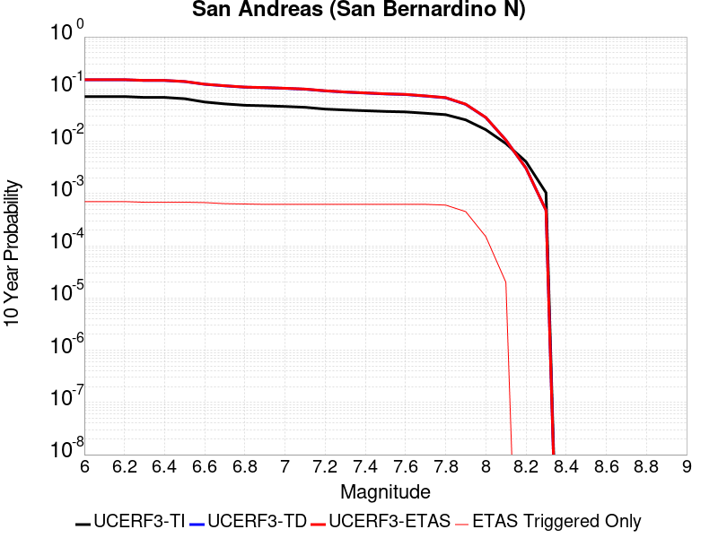 |

| Magnitude | 1 wk TI Prob | 1 wk TD Prob | 1 wk ETAS Prob | 1 wk ETAS/TD Gain | 1 wk ETAS Triggered Only | 1 mo TI Prob | 1 mo TD Prob | 1 mo ETAS Prob | 1 mo ETAS/TD Gain | 1 mo ETAS Triggered Only | 1 yr TI Prob | 1 yr TD Prob | 1 yr ETAS Prob | 1 yr ETAS/TD Gain | 1 yr ETAS Triggered Only | 10 yr TI Prob | 10 yr TD Prob | 10 yr ETAS Prob | 10 yr ETAS/TD Gain | 10 yr ETAS Triggered Only |
|-----|-----|-----|-----|-----|-----|-----|-----|-----|-----|-----|-----|-----|-----|-----|-----|-----|-----|-----|-----|-----|
| 6.0 | 1.4273766E-4 | 3.168E-4 | 3.168E-4 | 1.0 | 0.0 | 6.115894E-4 | 0.0013570138 | 0.0014027643 | 1.0337142 | 4.5812718E-5 | 0.0074207084 | 0.016397987 | 0.016690888 | 1.017862 | 2.9778265E-4 | 0.07177748 | 0.15056716 | 0.15115088 | 1.0038768 | 6.8719074E-4 |
| 6.1 | 1.4273766E-4 | 3.168E-4 | 3.168E-4 | 1.0 | 0.0 | 6.115894E-4 | 0.0013570138 | 0.0014027643 | 1.0337142 | 4.5812718E-5 | 0.0074207084 | 0.016397987 | 0.016690888 | 1.017862 | 2.9778265E-4 | 0.07177748 | 0.15056716 | 0.15115088 | 1.0038768 | 6.8719074E-4 |
| 6.2 | 1.4273766E-4 | 3.168E-4 | 3.168E-4 | 1.0 | 0.0 | 6.115894E-4 | 0.0013570138 | 0.0014027643 | 1.0337142 | 4.5812718E-5 | 0.0074207084 | 0.016397987 | 0.016690888 | 1.017862 | 2.9778265E-4 | 0.07177748 | 0.15056716 | 0.15115088 | 1.0038768 | 6.8719074E-4 |
| 6.3 | 1.3730655E-4 | 3.058448E-4 | 3.058448E-4 | 1.0 | 0.0 | 5.883239E-4 | 0.0013101106 | 0.0013558633 | 1.0349227 | 4.5812718E-5 | 0.0071393442 | 0.015835345 | 0.016128412 | 1.0185071 | 2.9778265E-4 | 0.06914291 | 0.14586715 | 0.14643455 | 1.0038898 | 6.642844E-4 |
| 6.4 | 1.3730655E-4 | 3.058448E-4 | 3.058448E-4 | 1.0 | 0.0 | 5.883239E-4 | 0.0013101106 | 0.0013558633 | 1.0349227 | 4.5812718E-5 | 0.0071393442 | 0.015835345 | 0.016128412 | 1.0185071 | 2.9778265E-4 | 0.06914291 | 0.14586715 | 0.14643455 | 1.0038898 | 6.642844E-4 |
| 6.5 | 1.2942807E-4 | 2.8998396E-4 | 2.8998396E-4 | 1.0 | 0.0 | 5.545738E-4 | 0.0012422017 | 0.0012879574 | 1.0368345 | 4.5812718E-5 | 0.0067310524 | 0.01502018 | 0.015313489 | 1.0195277 | 2.9778265E-4 | 0.06530788 | 0.13901012 | 0.13958205 | 1.0041144 | 6.642844E-4 |
| 6.6 | 1.1125901E-4 | 2.5435875E-4 | 2.5435875E-4 | 1.0 | 0.0 | 4.767372E-4 | 0.0010896558 | 0.0011354185 | 1.0419974 | 4.5812718E-5 | 0.005788839 | 0.013186495 | 0.013457747 | 1.0205704 | 2.748763E-4 | 0.056403454 | 0.12329976 | 0.123862065 | 1.0045604 | 6.4137805E-4 |
| 6.7 | 1.02209575E-4 | 2.3570309E-4 | 2.3570309E-4 | 1.0 | 0.0 | 4.3796748E-4 | 0.0010097665 | 0.0010555328 | 1.0453238 | 4.5812718E-5 | 0.0053192247 | 0.012225031 | 0.01247392 | 1.020359 | 2.5196993E-4 | 0.051936906 | 0.115092136 | 0.11561915 | 1.0045791 | 5.955653E-4 |
| 6.8 | 9.610582E-5 | 2.2095144E-4 | 2.2095144E-4 | 1.0 | 0.0 | 4.1181705E-4 | 9.465918E-4 | 9.923611E-4 | 1.0483518 | 4.5812718E-5 | 0.0050023515 | 0.011464122 | 0.011713203 | 1.0217271 | 2.5196993E-4 | 0.048912346 | 0.10849237 | 0.10902332 | 1.0048939 | 5.955653E-4 |
| 6.9 | 9.3877505E-5 | 2.1550381E-4 | 2.1550381E-4 | 1.0 | 0.0 | 4.0227012E-4 | 9.232615E-4 | 9.6903194E-4 | 1.0495747 | 4.5812718E-5 | 0.0048866454 | 0.011183022 | 0.011409523 | 1.0202541 | 2.2906359E-4 | 0.04780577 | 0.10608222 | 0.10659413 | 1.0048256 | 5.7265896E-4 |
| 7.0 | 9.1019785E-5 | 2.087683E-4 | 2.087683E-4 | 1.0 | 0.0 | 3.900265E-4 | 8.944151E-4 | 9.4018684E-4 | 1.051175 | 4.5812718E-5 | 0.0047382377 | 0.010835359 | 0.01106194 | 1.0209113 | 2.2906359E-4 | 0.046384744 | 0.10305153 | 0.10356517 | 1.0049844 | 5.7265896E-4 |
| 7.1 | 8.771155E-5 | 2.0050864E-4 | 2.0050864E-4 | 1.0 | 0.0 | 3.758525E-4 | 8.590403E-4 | 9.0481364E-4 | 1.0532843 | 4.5812718E-5 | 0.0045664064 | 0.010408859 | 0.010635538 | 1.0217775 | 2.2906359E-4 | 0.044737056 | 0.09936224 | 0.099878 | 1.0051907 | 5.7265896E-4 |
| 7.2 | 8.0830236E-5 | 1.8455362E-4 | 1.8455362E-4 | 1.0 | 0.0 | 3.4636928E-4 | 7.907045E-4 | 8.36481E-4 | 1.0578933 | 4.5812718E-5 | 0.0042088944 | 0.009584441 | 0.009811309 | 1.0236704 | 2.2906359E-4 | 0.041300658 | 0.09209058 | 0.0926105 | 1.0056458 | 5.7265896E-4 |
| 7.3 | 7.7668235E-5 | 1.739772E-4 | 1.739772E-4 | 1.0 | 0.0 | 3.328214E-4 | 7.454036E-4 | 7.9118216E-4 | 1.0614145 | 4.5812718E-5 | 0.0040445733 | 0.0090376055 | 0.009264599 | 1.0251166 | 2.2906359E-4 | 0.03971748 | 0.08735465 | 0.08787729 | 1.0059829 | 5.7265896E-4 |
| 7.4 | 7.520177E-5 | 1.6616903E-4 | 1.6616903E-4 | 1.0 | 0.0 | 3.2225347E-4 | 7.119587E-4 | 7.577388E-4 | 1.0643016 | 4.5812718E-5 | 0.0039163795 | 0.008633714 | 0.0088607995 | 1.0263022 | 2.2906359E-4 | 0.038480744 | 0.08380819 | 0.08433286 | 1.0062603 | 5.7265896E-4 |
| 7.5 | 7.274697E-5 | 1.5903711E-4 | 1.5903711E-4 | 1.0 | 0.0 | 3.1173544E-4 | 6.814096E-4 | 7.271911E-4 | 1.0671865 | 4.5812718E-5 | 0.003788775 | 0.008264662 | 0.008491833 | 1.0274869 | 2.2906359E-4 | 0.03724827 | 0.080522425 | 0.081048965 | 1.0065391 | 5.7265896E-4 |
| 7.6 | 7.1185845E-5 | 1.547303E-4 | 1.547303E-4 | 1.0 | 0.0 | 3.0504653E-4 | 6.6296133E-4 | 7.087437E-4 | 1.0690573 | 4.5812718E-5 | 0.0037076178 | 0.008041735 | 0.008268956 | 1.0282553 | 2.2906359E-4 | 0.036463667 | 0.078510396 | 0.0790381 | 1.0067214 | 5.7265896E-4 |
| 7.7 | 6.709961E-5 | 1.4380377E-4 | 1.4380377E-4 | 1.0 | 0.0 | 2.8753807E-4 | 6.161563E-4 | 6.6194084E-4 | 1.0743066 | 4.5812718E-5 | 0.003495157 | 0.0074759396 | 0.007703291 | 1.030411 | 2.2906359E-4 | 0.034406938 | 0.073334016 | 0.07386468 | 1.0072362 | 5.7265896E-4 |
| 7.8 | 6.300812E-5 | 1.326129E-4 | 1.326129E-4 | 1.0 | 0.0 | 2.7000686E-4 | 5.682172E-4 | 6.140039E-4 | 1.0805795 | 4.5812718E-5 | 0.0032823787 | 0.0068961293 | 0.0071236133 | 1.0329872 | 2.2906359E-4 | 0.032343175 | 0.06798044 | 0.06851417 | 1.0078512 | 5.7265896E-4 |
| 7.9 | 4.983037E-5 | 9.769929E-5 | 9.769929E-5 | 1.0 | 0.0 | 2.1354125E-4 | 4.1864405E-4 | 4.644376E-4 | 1.1093854 | 4.5812718E-5 | 0.0025967648 | 0.0050850897 | 0.0052674087 | 1.0358536 | 1.8325087E-4 | 0.025666296 | 0.05086521 | 0.05134352 | 1.0094035 | 5.0393987E-4 |
| 8.0 | 3.2211527E-5 | 5.3577114E-5 | 5.3577114E-5 | 1.0 | 0.0 | 1.380421E-4 | 2.2959601E-4 | 2.5249712E-4 | 1.0997452 | 2.2906359E-5 | 0.0016793669 | 0.00279175 | 0.0028145923 | 1.0081822 | 2.2906359E-5 | 0.016667323 | 0.028494263 | 0.028627785 | 1.0046859 | 1.3743815E-4 |
| 8.1 | 1.743376E-5 | 1.8952034E-5 | 1.8952034E-5 | 1.0 | 0.0 | 7.471398E-5 | 8.122048E-5 | 8.122048E-5 | 1.0 | 0.0 | 9.0926304E-4 | 9.884114E-4 | 9.884114E-4 | 1.0 | 0.0 | 0.009055517 | 0.010550455 | 0.010550455 | 1.0 | 0.0 |
| 8.2 | 7.831616E-6 | 5.2024393E-6 | 5.2024393E-6 | 1.0 | 0.0 | 3.3563636E-5 | 2.2295979E-5 | 2.2295979E-5 | 1.0 | 0.0 | 4.0856065E-4 | 2.714198E-4 | 2.714198E-4 | 1.0 | 0.0 | 0.004078103 | 0.0030675507 | 0.0030675507 | 1.0 | 0.0 |
| 8.3 | 1.983087E-6 | 7.7486385E-7 | 7.7486385E-7 | 1.0 | 0.0 | 8.498917E-6 | 3.320841E-6 | 3.320841E-6 | 1.0 | 0.0 | 1.034694E-4 | 4.0430506E-5 | 4.0430506E-5 | 1.0 | 0.0 | 0.0010342124 | 4.7705657E-4 | 4.7705657E-4 | 1.0 | 0.0 |

## Bicycle Lake
*[(top)](#table-of-contents)*

| 1 Week | 1 Month | 1 Year | 10 Year |
|-----|-----|-----|-----|
|  |  |  | 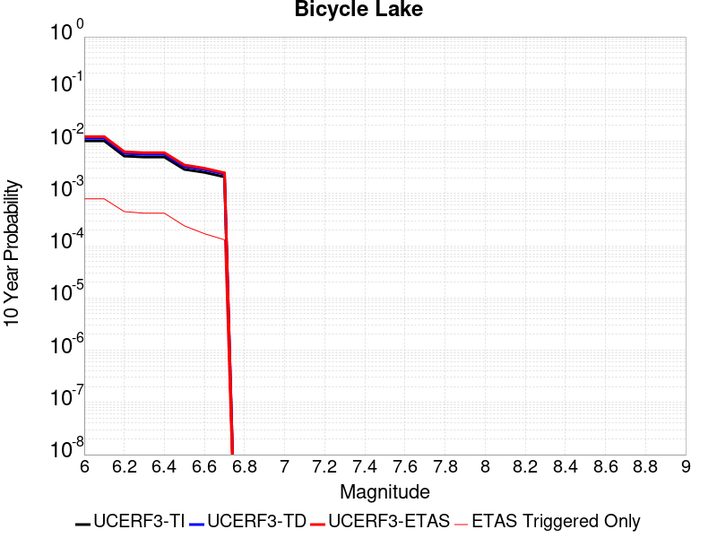 |

| Magnitude | 1 wk TI Prob | 1 wk TD Prob | 1 wk ETAS Prob | 1 wk ETAS/TD Gain | 1 wk ETAS Triggered Only | 1 mo TI Prob | 1 mo TD Prob | 1 mo ETAS Prob | 1 mo ETAS/TD Gain | 1 mo ETAS Triggered Only | 1 yr TI Prob | 1 yr TD Prob | 1 yr ETAS Prob | 1 yr ETAS/TD Gain | 1 yr ETAS Triggered Only | 10 yr TI Prob | 10 yr TD Prob | 10 yr ETAS Prob | 10 yr ETAS/TD Gain | 10 yr ETAS Triggered Only |
|-----|-----|-----|-----|-----|-----|-----|-----|-----|-----|-----|-----|-----|-----|-----|-----|-----|-----|-----|-----|-----|
| 6.0 | 1.9621975E-5 | 2.2100778E-5 | 2.2100778E-5 | 1.0 | 0.0 | 8.4091465E-5 | 9.471494E-5 | 1.4052332E-4 | 1.4836447 | 4.5812718E-5 | 0.0010233327 | 0.0011526794 | 0.0014729988 | 1.2778912 | 3.2068903E-4 | 0.01018633 | 0.011480321 | 0.012182266 | 1.0611433 | 7.1009714E-4 |
| 6.1 | 1.9621975E-5 | 2.2100778E-5 | 2.2100778E-5 | 1.0 | 0.0 | 8.4091465E-5 | 9.471494E-5 | 1.4052332E-4 | 1.4836447 | 4.5812718E-5 | 0.0010233327 | 0.0011526794 | 0.0014729988 | 1.2778912 | 3.2068903E-4 | 0.01018633 | 0.011480321 | 0.012182266 | 1.0611433 | 7.1009714E-4 |
| 6.2 | 9.9971285E-6 | 1.1257519E-5 | 1.1257519E-5 | 1.0 | 0.0 | 4.2844134E-5 | 4.8245915E-5 | 7.115117E-5 | 1.4747605 | 2.2906359E-5 | 5.2150246E-4 | 5.872877E-4 | 7.2464516E-4 | 1.2338845 | 1.3743815E-4 | 0.0052028033 | 0.0058624637 | 0.0062723607 | 1.069919 | 4.1231446E-4 |
| 6.3 | 9.589428E-6 | 1.0800152E-5 | 1.0800152E-5 | 1.0 | 0.0 | 4.10969E-5 | 4.6285837E-5 | 6.9191134E-5 | 1.4948663 | 2.2906359E-5 | 5.002399E-4 | 5.6343625E-4 | 7.0079695E-4 | 1.2437911 | 1.3743815E-4 | 0.0049911533 | 0.005625169 | 0.005989609 | 1.0647874 | 3.6650174E-4 |
| 6.4 | 9.589428E-6 | 1.0800152E-5 | 1.0800152E-5 | 1.0 | 0.0 | 4.10969E-5 | 4.6285837E-5 | 6.9191134E-5 | 1.4948663 | 2.2906359E-5 | 5.002399E-4 | 5.6343625E-4 | 7.0079695E-4 | 1.2437911 | 1.3743815E-4 | 0.0049911533 | 0.005625169 | 0.005989609 | 1.0647874 | 3.6650174E-4 |
| 6.5 | 5.557707E-6 | 6.2866934E-6 | 6.2866934E-6 | 1.0 | 0.0 | 2.3818526E-5 | 2.6942846E-5 | 2.6942846E-5 | 1.0 | 0.0 | 2.8995197E-4 | 3.2800666E-4 | 4.1960203E-4 | 1.2792486 | 9.1625436E-5 | 0.0028957394 | 0.0032778624 | 0.0035290064 | 1.0766182 | 2.5196993E-4 |
| 6.6 | 4.8742945E-6 | 5.5142486E-6 | 5.5142486E-6 | 1.0 | 0.0 | 2.0889667E-5 | 2.3632427E-5 | 2.3632427E-5 | 1.0 | 0.0 | 2.54302E-4 | 2.8771302E-4 | 3.5641232E-4 | 1.2387772 | 6.871908E-5 | 0.002540112 | 0.002875975 | 0.0030586987 | 1.0635346 | 1.8325087E-4 |
| 6.7 | 3.991108E-6 | 4.516698E-6 | 4.516698E-6 | 1.0 | 0.0 | 1.7104636E-5 | 1.9357278E-5 | 1.9357278E-5 | 1.0 | 0.0 | 2.0822904E-4 | 2.3567484E-4 | 3.0437773E-4 | 1.2915156 | 6.871908E-5 | 0.0020803404 | 0.0023567486 | 0.002516715 | 1.067876 | 1.6034451E-4 |

## Towne Pass
*[(top)](#table-of-contents)*

| 1 Week | 1 Month | 1 Year | 10 Year |
|-----|-----|-----|-----|
|  | 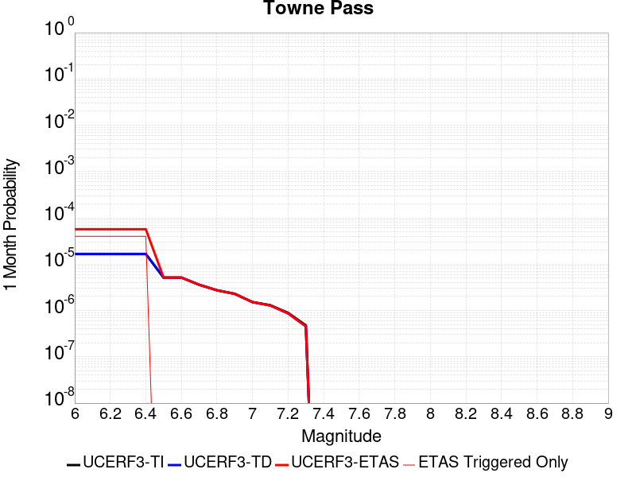 |  |  |

| Magnitude | 1 wk TI Prob | 1 wk TD Prob | 1 wk ETAS Prob | 1 wk ETAS/TD Gain | 1 wk ETAS Triggered Only | 1 mo TI Prob | 1 mo TD Prob | 1 mo ETAS Prob | 1 mo ETAS/TD Gain | 1 mo ETAS Triggered Only | 1 yr TI Prob | 1 yr TD Prob | 1 yr ETAS Prob | 1 yr ETAS/TD Gain | 1 yr ETAS Triggered Only | 10 yr TI Prob | 10 yr TD Prob | 10 yr ETAS Prob | 10 yr ETAS/TD Gain | 10 yr ETAS Triggered Only |
|-----|-----|-----|-----|-----|-----|-----|-----|-----|-----|-----|-----|-----|-----|-----|-----|-----|-----|-----|-----|-----|
| 6.0 | 3.849728E-6 | 3.8946237E-6 | 3.8946237E-6 | 1.0 | 0.0 | 1.649873E-5 | 1.6691163E-5 | 3.959714E-5 | 2.3723416 | 2.2906359E-5 | 2.0085352E-4 | 2.0320032E-4 | 5.009225E-4 | 2.4651656 | 2.9778265E-4 | 0.0020067208 | 0.0020305745 | 0.0027392297 | 1.3489925 | 7.1009714E-4 |
| 6.1 | 3.849728E-6 | 3.8946237E-6 | 3.8946237E-6 | 1.0 | 0.0 | 1.649873E-5 | 1.6691163E-5 | 3.959714E-5 | 2.3723416 | 2.2906359E-5 | 2.0085352E-4 | 2.0320032E-4 | 5.009225E-4 | 2.4651656 | 2.9778265E-4 | 0.0020067208 | 0.0020305745 | 0.0027392297 | 1.3489925 | 7.1009714E-4 |
| 6.2 | 3.849728E-6 | 3.8946237E-6 | 3.8946237E-6 | 1.0 | 0.0 | 1.649873E-5 | 1.6691163E-5 | 3.959714E-5 | 2.3723416 | 2.2906359E-5 | 2.0085352E-4 | 2.0320032E-4 | 5.009225E-4 | 2.4651656 | 2.9778265E-4 | 0.0020067208 | 0.0020305745 | 0.0027392297 | 1.3489925 | 7.1009714E-4 |
| 6.3 | 3.849728E-6 | 3.8946237E-6 | 3.8946237E-6 | 1.0 | 0.0 | 1.649873E-5 | 1.6691163E-5 | 3.959714E-5 | 2.3723416 | 2.2906359E-5 | 2.0085352E-4 | 2.0320032E-4 | 5.009225E-4 | 2.4651656 | 2.9778265E-4 | 0.0020067208 | 0.0020305745 | 0.0027392297 | 1.3489925 | 7.1009714E-4 |
| 6.4 | 3.849728E-6 | 3.8946237E-6 | 3.8946237E-6 | 1.0 | 0.0 | 1.649873E-5 | 1.6691163E-5 | 3.959714E-5 | 2.3723416 | 2.2906359E-5 | 2.0085352E-4 | 2.0320032E-4 | 5.009225E-4 | 2.4651656 | 2.9778265E-4 | 0.0020067208 | 0.0020305745 | 0.0027392297 | 1.3489925 | 7.1009714E-4 |
| 6.5 | 1.1953545E-6 | 1.2030846E-6 | 1.2030846E-6 | 1.0 | 0.0 | 5.1229376E-6 | 5.156067E-6 | 5.156067E-6 | 1.0 | 0.0 | 6.236998E-5 | 6.2773426E-5 | 1.314882E-4 | 2.0946474 | 6.871908E-5 | 6.235248E-4 | 6.275687E-4 | 7.878126E-4 | 1.2553408 | 1.6034451E-4 |
| 6.6 | 1.1953545E-6 | 1.2030846E-6 | 1.2030846E-6 | 1.0 | 0.0 | 5.1229376E-6 | 5.156067E-6 | 5.156067E-6 | 1.0 | 0.0 | 6.236998E-5 | 6.2773426E-5 | 1.314882E-4 | 2.0946474 | 6.871908E-5 | 6.235248E-4 | 6.275687E-4 | 7.878126E-4 | 1.2553408 | 1.6034451E-4 |
| 6.7 | 8.375951E-7 | 8.410939E-7 | 8.410939E-7 | 1.0 | 0.0 | 3.5896885E-6 | 3.6046833E-6 | 3.6046833E-6 | 1.0 | 0.0 | 4.370358E-5 | 4.3886193E-5 | 8.96969E-5 | 2.0438523 | 4.5812718E-5 | 4.3694986E-4 | 4.38781E-4 | 5.5326254E-4 | 1.2609081 | 1.14531795E-4 |
| 6.8 | 6.38041E-7 | 6.3923943E-7 | 6.3923943E-7 | 1.0 | 0.0 | 2.7344586E-6 | 2.7395947E-6 | 2.7395947E-6 | 1.0 | 0.0 | 3.3291526E-5 | 3.3354096E-5 | 5.625969E-5 | 1.6867402 | 2.2906359E-5 | 3.3286537E-4 | 3.334947E-4 | 3.7929215E-4 | 1.1373259 | 4.5812718E-5 |
| 6.9 | 5.3460053E-7 | 5.345554E-7 | 5.345554E-7 | 1.0 | 0.0 | 2.2911431E-6 | 2.2909499E-6 | 2.2909499E-6 | 1.0 | 0.0 | 2.789431E-5 | 2.7891992E-5 | 5.0797713E-5 | 1.8212292 | 2.2906359E-5 | 2.789081E-4 | 2.7888824E-4 | 3.017882E-4 | 1.0821116 | 2.2906359E-5 |
| 7.0 | 3.557783E-7 | 3.5326104E-7 | 3.5326104E-7 | 1.0 | 0.0 | 1.5247632E-6 | 1.513975E-6 | 1.513975E-6 | 1.0 | 0.0 | 1.8563835E-5 | 1.8432498E-5 | 1.8432498E-5 | 1.0 | 0.0 | 1.8562283E-4 | 1.8431054E-4 | 1.8431054E-4 | 1.0 | 0.0 |
| 7.1 | 3.037942E-7 | 3.000393E-7 | 3.000393E-7 | 1.0 | 0.0 | 1.3019744E-6 | 1.285882E-6 | 1.285882E-6 | 1.0 | 0.0 | 1.5851423E-5 | 1.5655509E-5 | 1.5655509E-5 | 1.0 | 0.0 | 1.5850292E-4 | 1.565448E-4 | 1.565448E-4 | 1.0 | 0.0 |
| 7.2 | 2.0808248E-7 | 2.0219096E-7 | 2.0219096E-7 | 1.0 | 0.0 | 8.917818E-7 | 8.665324E-7 | 8.665324E-7 | 1.0 | 0.0 | 1.0857389E-5 | 1.0549986E-5 | 1.0549986E-5 | 1.0 | 0.0 | 1.0856859E-4 | 1.0549531E-4 | 1.0549531E-4 | 1.0 | 0.0 |
| 7.3 | 1.1162073E-7 | 1.0637787E-7 | 1.0637787E-7 | 1.0 | 0.0 | 4.7837443E-7 | 4.5590508E-7 | 4.5590508E-7 | 1.0 | 0.0 | 5.8241935E-6 | 5.550632E-6 | 5.550632E-6 | 1.0 | 0.0 | 5.8240406E-5 | 5.5505137E-5 | 5.5505137E-5 | 1.0 | 0.0 |

## Paradise
*[(top)](#table-of-contents)*

| 1 Week | 1 Month | 1 Year | 10 Year |
|-----|-----|-----|-----|
|  |  |  |  |

| Magnitude | 1 wk TI Prob | 1 wk TD Prob | 1 wk ETAS Prob | 1 wk ETAS/TD Gain | 1 wk ETAS Triggered Only | 1 mo TI Prob | 1 mo TD Prob | 1 mo ETAS Prob | 1 mo ETAS/TD Gain | 1 mo ETAS Triggered Only | 1 yr TI Prob | 1 yr TD Prob | 1 yr ETAS Prob | 1 yr ETAS/TD Gain | 1 yr ETAS Triggered Only | 10 yr TI Prob | 10 yr TD Prob | 10 yr ETAS Prob | 10 yr ETAS/TD Gain | 10 yr ETAS Triggered Only |
|-----|-----|-----|-----|-----|-----|-----|-----|-----|-----|-----|-----|-----|-----|-----|-----|-----|-----|-----|-----|-----|
| 6.0 | 1.4851273E-5 | 1.6696315E-5 | 3.960229E-5 | 2.371918 | 2.2906359E-5 | 6.364676E-5 | 7.1553804E-5 | 9.4458526E-5 | 1.3201048 | 2.2906359E-5 | 7.7462377E-4 | 8.70843E-4 | 0.0011683664 | 1.3416498 | 2.9778265E-4 | 0.0077192914 | 0.008676684 | 0.009380621 | 1.0811296 | 7.1009714E-4 |
| 6.1 | 1.4851273E-5 | 1.6696315E-5 | 3.960229E-5 | 2.371918 | 2.2906359E-5 | 6.364676E-5 | 7.1553804E-5 | 9.4458526E-5 | 1.3201048 | 2.2906359E-5 | 7.7462377E-4 | 8.70843E-4 | 0.0011683664 | 1.3416498 | 2.9778265E-4 | 0.0077192914 | 0.008676684 | 0.009380621 | 1.0811296 | 7.1009714E-4 |
| 6.2 | 1.4851273E-5 | 1.6696315E-5 | 3.960229E-5 | 2.371918 | 2.2906359E-5 | 6.364676E-5 | 7.1553804E-5 | 9.4458526E-5 | 1.3201048 | 2.2906359E-5 | 7.7462377E-4 | 8.70843E-4 | 0.0011683664 | 1.3416498 | 2.9778265E-4 | 0.0077192914 | 0.008676684 | 0.009380621 | 1.0811296 | 7.1009714E-4 |
| 6.3 | 1.0426831E-5 | 1.1889693E-5 | 1.1889693E-5 | 1.0 | 0.0 | 4.4685654E-5 | 5.0954866E-5 | 5.0954866E-5 | 1.0 | 0.0 | 5.43912E-4 | 6.2020484E-4 | 7.5755775E-4 | 1.2214638 | 1.3743815E-4 | 0.0054258266 | 0.006185348 | 0.0066406415 | 1.0736084 | 4.5812718E-4 |
| 6.4 | 1.0426831E-5 | 1.1889693E-5 | 1.1889693E-5 | 1.0 | 0.0 | 4.4685654E-5 | 5.0954866E-5 | 5.0954866E-5 | 1.0 | 0.0 | 5.43912E-4 | 6.2020484E-4 | 7.5755775E-4 | 1.2214638 | 1.3743815E-4 | 0.0054258266 | 0.006185348 | 0.0066406415 | 1.0736084 | 4.5812718E-4 |
| 6.5 | 9.25027E-6 | 1.0620901E-5 | 1.0620901E-5 | 1.0 | 0.0 | 3.964341E-5 | 4.551738E-5 | 4.551738E-5 | 1.0 | 0.0 | 4.8255164E-4 | 5.540381E-4 | 6.456128E-4 | 1.1652858 | 9.1625436E-5 | 0.0048150513 | 0.005527068 | 0.005868764 | 1.0618223 | 3.4359537E-4 |
| 6.6 | 7.904275E-6 | 9.160301E-6 | 9.160301E-6 | 1.0 | 0.0 | 3.3875025E-5 | 3.9257862E-5 | 3.9257862E-5 | 1.0 | 0.0 | 4.1235037E-4 | 4.778636E-4 | 5.6944526E-4 | 1.1916481 | 9.1625436E-5 | 0.0041158604 | 0.004768757 | 0.0049739317 | 1.0430247 | 2.0615723E-4 |
| 6.7 | 7.2061953E-6 | 8.407947E-6 | 8.407947E-6 | 1.0 | 0.0 | 3.088333E-5 | 3.603358E-5 | 3.603358E-5 | 1.0 | 0.0 | 3.7593965E-4 | 4.386242E-4 | 5.3020945E-4 | 1.2088012 | 9.1625436E-5 | 0.003753043 | 0.0043779537 | 0.00451479 | 1.0312558 | 1.3743815E-4 |
| 6.8 | 6.6948724E-6 | 7.842809E-6 | 7.842809E-6 | 1.0 | 0.0 | 2.8691995E-5 | 3.3611625E-5 | 3.3611625E-5 | 1.0 | 0.0 | 3.4926904E-4 | 4.0914828E-4 | 4.5494226E-4 | 1.1119251 | 4.5812718E-5 | 0.003487206 | 0.0040843077 | 0.0041755587 | 1.0223418 | 9.1625436E-5 |
| 6.9 | 6.0421025E-6 | 7.131195E-6 | 7.131195E-6 | 1.0 | 0.0 | 2.5894467E-5 | 3.0561925E-5 | 3.0561925E-5 | 1.0 | 0.0 | 3.1521954E-4 | 3.720313E-4 | 3.720313E-4 | 1.0 | 0.0 | 0.0031477278 | 0.0037144232 | 0.0037144232 | 1.0 | 0.0 |
| 7.0 | 4.134091E-6 | 5.080708E-6 | 5.080708E-6 | 1.0 | 0.0 | 1.7717413E-5 | 2.177429E-5 | 2.177429E-5 | 1.0 | 0.0 | 2.1568815E-4 | 2.6507128E-4 | 2.6507128E-4 | 1.0 | 0.0 | 0.0021547892 | 0.0026477042 | 0.0026477042 | 1.0 | 0.0 |
| 7.1 | 3.7674888E-6 | 4.632229E-6 | 4.632229E-6 | 1.0 | 0.0 | 1.6146281E-5 | 1.9852267E-5 | 1.9852267E-5 | 1.0 | 0.0 | 1.9656324E-4 | 2.4167607E-4 | 2.4167607E-4 | 1.0 | 0.0 | 0.0019638946 | 0.002414283 | 0.002414283 | 1.0 | 0.0 |
| 7.2 | 3.4065345E-6 | 4.1570443E-6 | 4.1570443E-6 | 1.0 | 0.0 | 1.4599351E-5 | 1.7815792E-5 | 1.7815792E-5 | 1.0 | 0.0 | 1.777326E-4 | 2.1688716E-4 | 2.1688716E-4 | 1.0 | 0.0 | 0.0017759053 | 0.002166903 | 0.002166903 | 1.0 | 0.0 |
| 7.3 | 2.9934936E-6 | 3.6295821E-6 | 3.6295821E-6 | 1.0 | 0.0 | 1.2829195E-5 | 1.5555268E-5 | 1.5555268E-5 | 1.0 | 0.0 | 1.5618425E-4 | 1.893704E-4 | 1.893704E-4 | 1.0 | 0.0 | 0.0015607453 | 0.0018922357 | 0.0018922357 | 1.0 | 0.0 |
| 7.4 | 2.4049796E-6 | 2.8891789E-6 | 2.8891789E-6 | 1.0 | 0.0 | 1.0307015E-5 | 1.2382145E-5 | 1.2382145E-5 | 1.0 | 0.0 | 1.2548068E-4 | 1.5074362E-4 | 1.5074362E-4 | 1.0 | 0.0 | 0.0012540985 | 0.0015065551 | 0.0015065551 | 1.0 | 0.0 |
| 7.5 | 1.2710091E-6 | 1.5135612E-6 | 1.5135612E-6 | 1.0 | 0.0 | 5.44717E-6 | 6.4866817E-6 | 6.4866817E-6 | 1.0 | 0.0 | 6.631728E-5 | 7.897374E-5 | 7.897374E-5 | 1.0 | 0.0 | 6.6297496E-4 | 7.8957935E-4 | 7.8957935E-4 | 1.0 | 0.0 |
| 7.6 | 2.21172E-7 | 2.60409E-7 | 2.60409E-7 | 1.0 | 0.0 | 9.478797E-7 | 1.1160382E-6 | 1.1160382E-6 | 1.0 | 0.0 | 1.1540374E-5 | 1.358771E-5 | 1.358771E-5 | 1.0 | 0.0 | 1.1539775E-4 | 1.3587161E-4 | 1.3587161E-4 | 1.0 | 0.0 |

## Garlic Springs
*[(top)](#table-of-contents)*

| 1 Week | 1 Month | 1 Year | 10 Year |
|-----|-----|-----|-----|
|  | 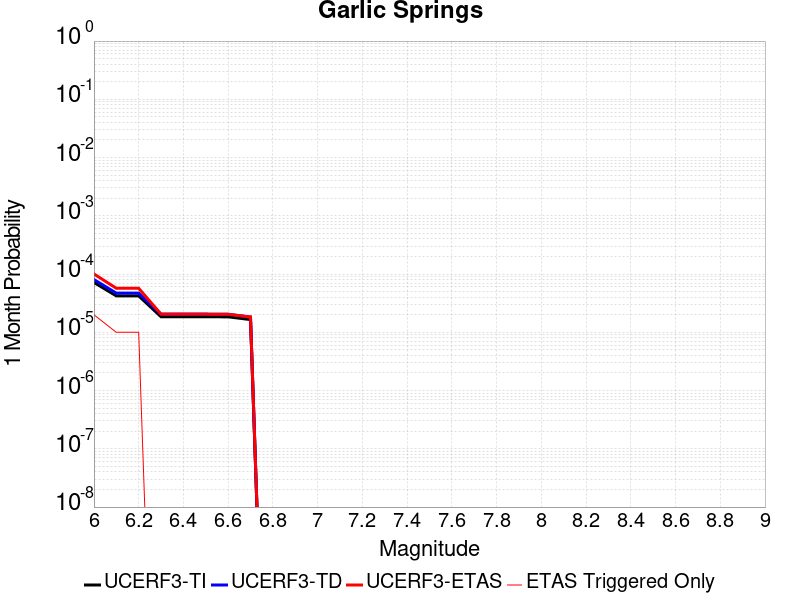 |  |  |

| Magnitude | 1 wk TI Prob | 1 wk TD Prob | 1 wk ETAS Prob | 1 wk ETAS/TD Gain | 1 wk ETAS Triggered Only | 1 mo TI Prob | 1 mo TD Prob | 1 mo ETAS Prob | 1 mo ETAS/TD Gain | 1 mo ETAS Triggered Only | 1 yr TI Prob | 1 yr TD Prob | 1 yr ETAS Prob | 1 yr ETAS/TD Gain | 1 yr ETAS Triggered Only | 10 yr TI Prob | 10 yr TD Prob | 10 yr ETAS Prob | 10 yr ETAS/TD Gain | 10 yr ETAS Triggered Only |
|-----|-----|-----|-----|-----|-----|-----|-----|-----|-----|-----|-----|-----|-----|-----|-----|-----|-----|-----|-----|-----|
| 6.0 | 1.6760017E-5 | 1.8779832E-5 | 1.8779832E-5 | 1.0 | 0.0 | 7.182667E-5 | 8.048317E-5 | 1.0338769E-4 | 1.2845876 | 2.2906359E-5 | 8.7413884E-4 | 9.795596E-4 | 0.001162631 | 1.1868916 | 1.8325087E-4 | 0.008707083 | 0.009763966 | 0.010285669 | 1.0534314 | 5.2684627E-4 |
| 6.1 | 9.852767E-6 | 1.0975243E-5 | 1.0975243E-5 | 1.0 | 0.0 | 4.222546E-5 | 4.703631E-5 | 6.994159E-5 | 1.4869702 | 2.2906359E-5 | 5.139737E-4 | 5.7258754E-4 | 6.870538E-4 | 1.1999104 | 1.14531795E-4 | 0.005127866 | 0.005718083 | 0.006014163 | 1.0517796 | 2.9778265E-4 |
| 6.2 | 9.852767E-6 | 1.0975243E-5 | 1.0975243E-5 | 1.0 | 0.0 | 4.222546E-5 | 4.703631E-5 | 6.994159E-5 | 1.4869702 | 2.2906359E-5 | 5.139737E-4 | 5.7258754E-4 | 6.870538E-4 | 1.1999104 | 1.14531795E-4 | 0.005127866 | 0.005718083 | 0.006014163 | 1.0517796 | 2.9778265E-4 |
| 6.3 | 4.3167724E-6 | 4.7787057E-6 | 4.7787057E-6 | 1.0 | 0.0 | 1.8500323E-5 | 2.0480136E-5 | 2.0480136E-5 | 1.0 | 0.0 | 2.2521814E-4 | 2.4934017E-4 | 3.1804212E-4 | 1.275535 | 6.871908E-5 | 0.0022499003 | 0.0024928632 | 0.0026071095 | 1.0458293 | 1.14531795E-4 |
| 6.4 | 4.3167724E-6 | 4.7787057E-6 | 4.7787057E-6 | 1.0 | 0.0 | 1.8500323E-5 | 2.0480136E-5 | 2.0480136E-5 | 1.0 | 0.0 | 2.2521814E-4 | 2.4934017E-4 | 3.1804212E-4 | 1.275535 | 6.871908E-5 | 0.0022499003 | 0.0024928632 | 0.0026071095 | 1.0458293 | 1.14531795E-4 |
| 6.5 | 4.3167724E-6 | 4.7787057E-6 | 4.7787057E-6 | 1.0 | 0.0 | 1.8500323E-5 | 2.0480136E-5 | 2.0480136E-5 | 1.0 | 0.0 | 2.2521814E-4 | 2.4934017E-4 | 3.1804212E-4 | 1.275535 | 6.871908E-5 | 0.0022499003 | 0.0024928632 | 0.0026071095 | 1.0458293 | 1.14531795E-4 |
| 6.6 | 4.301311E-6 | 4.7615717E-6 | 4.7615717E-6 | 1.0 | 0.0 | 1.8434059E-5 | 2.0406706E-5 | 2.0406706E-5 | 1.0 | 0.0 | 2.2441156E-4 | 2.4844636E-4 | 3.1714837E-4 | 1.2765265 | 6.871908E-5 | 0.0022418506 | 0.0024839449 | 0.0025981923 | 1.0459943 | 1.14531795E-4 |
| 6.7 | 3.8599724E-6 | 4.2716633E-6 | 4.2716633E-6 | 1.0 | 0.0 | 1.6542634E-5 | 1.8307128E-5 | 1.8307128E-5 | 1.0 | 0.0 | 2.0138794E-4 | 2.2288928E-4 | 2.9159305E-4 | 1.3082416 | 6.871908E-5 | 0.0020120554 | 0.0022288929 | 0.002320314 | 1.0410165 | 9.1625436E-5 |

## Death Valley (Black Mtns Frontal)
*[(top)](#table-of-contents)*

| 1 Week | 1 Month | 1 Year | 10 Year |
|-----|-----|-----|-----|
|  |  |  |  |

| Magnitude | 1 wk TI Prob | 1 wk TD Prob | 1 wk ETAS Prob | 1 wk ETAS/TD Gain | 1 wk ETAS Triggered Only | 1 mo TI Prob | 1 mo TD Prob | 1 mo ETAS Prob | 1 mo ETAS/TD Gain | 1 mo ETAS Triggered Only | 1 yr TI Prob | 1 yr TD Prob | 1 yr ETAS Prob | 1 yr ETAS/TD Gain | 1 yr ETAS Triggered Only | 10 yr TI Prob | 10 yr TD Prob | 10 yr ETAS Prob | 10 yr ETAS/TD Gain | 10 yr ETAS Triggered Only |
|-----|-----|-----|-----|-----|-----|-----|-----|-----|-----|-----|-----|-----|-----|-----|-----|-----|-----|-----|-----|-----|
| 6.0 | 1.6707214E-5 | 1.8673187E-5 | 4.157912E-5 | 2.226675 | 2.2906359E-5 | 7.160038E-5 | 8.002553E-5 | 1.2583459E-4 | 1.5724305 | 4.5812718E-5 | 8.71386E-4 | 9.7388297E-4 | 0.0011798394 | 1.2114797 | 2.0615723E-4 | 0.00867977 | 0.009697005 | 0.010105321 | 1.0421075 | 4.1231446E-4 |
| 6.1 | 1.6707214E-5 | 1.8673187E-5 | 4.157912E-5 | 2.226675 | 2.2906359E-5 | 7.160038E-5 | 8.002553E-5 | 1.2583459E-4 | 1.5724305 | 4.5812718E-5 | 8.71386E-4 | 9.7388297E-4 | 0.0011798394 | 1.2114797 | 2.0615723E-4 | 0.00867977 | 0.009697005 | 0.010105321 | 1.0421075 | 4.1231446E-4 |
| 6.2 | 1.6707214E-5 | 1.8673187E-5 | 4.157912E-5 | 2.226675 | 2.2906359E-5 | 7.160038E-5 | 8.002553E-5 | 1.2583459E-4 | 1.5724305 | 4.5812718E-5 | 8.71386E-4 | 9.7388297E-4 | 0.0011798394 | 1.2114797 | 2.0615723E-4 | 0.00867977 | 0.009697005 | 0.010105321 | 1.0421075 | 4.1231446E-4 |
| 6.3 | 1.6707214E-5 | 1.8673187E-5 | 4.157912E-5 | 2.226675 | 2.2906359E-5 | 7.160038E-5 | 8.002553E-5 | 1.2583459E-4 | 1.5724305 | 4.5812718E-5 | 8.71386E-4 | 9.7388297E-4 | 0.0011798394 | 1.2114797 | 2.0615723E-4 | 0.00867977 | 0.009697005 | 0.010105321 | 1.0421075 | 4.1231446E-4 |
| 6.4 | 1.5515609E-5 | 1.7340923E-5 | 4.0246883E-5 | 2.3209195 | 2.2906359E-5 | 6.649377E-5 | 7.431616E-5 | 1.2012547E-4 | 1.6164112 | 4.5812718E-5 | 8.0926094E-4 | 9.0442976E-4 | 0.0010875149 | 1.2024316 | 1.8325087E-4 | 0.008063202 | 0.009008174 | 0.009325975 | 1.035279 | 3.2068903E-4 |
| 6.5 | 1.5515609E-5 | 1.7340923E-5 | 4.0246883E-5 | 2.3209195 | 2.2906359E-5 | 6.649377E-5 | 7.431616E-5 | 1.2012547E-4 | 1.6164112 | 4.5812718E-5 | 8.0926094E-4 | 9.0442976E-4 | 0.0010875149 | 1.2024316 | 1.8325087E-4 | 0.008063202 | 0.009008174 | 0.009325975 | 1.035279 | 3.2068903E-4 |
| 6.6 | 1.5041828E-5 | 1.6811773E-5 | 3.9717746E-5 | 2.3624961 | 2.2906359E-5 | 6.4463384E-5 | 7.20485E-5 | 1.1785791E-4 | 1.6358136 | 4.5812718E-5 | 7.8455906E-4 | 8.768433E-4 | 0.0010599334 | 1.208806 | 1.8325087E-4 | 0.00781795 | 0.008734492 | 0.00905238 | 1.0363946 | 3.2068903E-4 |
| 6.7 | 1.4634985E-5 | 1.6358576E-5 | 3.926456E-5 | 2.4002433 | 2.2906359E-5 | 6.271985E-5 | 7.010633E-5 | 1.15915835E-4 | 1.6534289 | 4.5812718E-5 | 7.6334673E-4 | 8.532161E-4 | 0.0010363106 | 1.2145934 | 1.8325087E-4 | 0.007607299 | 0.00850004 | 0.008818003 | 1.0374073 | 3.2068903E-4 |
| 6.8 | 1.4209158E-5 | 1.5884536E-5 | 3.879053E-5 | 2.4420311 | 2.2906359E-5 | 6.089497E-5 | 6.8074834E-5 | 1.1388444E-4 | 1.67293 | 4.5812718E-5 | 7.4114406E-4 | 8.285016E-4 | 0.0010116006 | 1.2210002 | 1.8325087E-4 | 0.007386771 | 0.008254744 | 0.008527352 | 1.0330243 | 2.748763E-4 |
| 6.9 | 1.3780098E-5 | 1.540701E-5 | 3.8313017E-5 | 2.4867263 | 2.2906359E-5 | 5.9056227E-5 | 6.60284E-5 | 1.118381E-4 | 1.6937877 | 4.5812718E-5 | 7.1877235E-4 | 8.036048E-4 | 9.867083E-4 | 1.2278528 | 1.8325087E-4 | 0.0071645193 | 0.008007584 | 0.008280259 | 1.0340521 | 2.748763E-4 |
| 7.0 | 1.3585064E-5 | 1.5190541E-5 | 3.809655E-5 | 2.5079129 | 2.2906359E-5 | 5.8220405E-5 | 6.510072E-5 | 1.10910456E-4 | 1.7036748 | 4.5812718E-5 | 7.086029E-4 | 7.9231855E-4 | 9.754242E-4 | 1.231101 | 1.8325087E-4 | 0.007063476 | 0.007895528 | 0.0081682345 | 1.0345393 | 2.748763E-4 |
| 7.1 | 1.3398601E-5 | 1.4983694E-5 | 3.788971E-5 | 2.5287294 | 2.2906359E-5 | 5.742131E-5 | 6.4214284E-5 | 1.1002406E-4 | 1.7133892 | 4.5812718E-5 | 6.9888023E-4 | 7.8153395E-4 | 9.646416E-4 | 1.2342926 | 1.8325087E-4 | 0.0069668638 | 0.0077884435 | 0.008061179 | 1.035018 | 2.748763E-4 |
| 7.2 | 1.3126312E-5 | 1.4681873E-5 | 3.7587895E-5 | 2.5601568 | 2.2906359E-5 | 5.6254412E-5 | 6.292082E-5 | 1.0873066E-4 | 1.7280552 | 4.5812718E-5 | 6.846822E-4 | 7.657972E-4 | 9.260189E-4 | 1.2092221 | 1.6034451E-4 | 0.006825765 | 0.0076321675 | 0.007882214 | 1.0327623 | 2.5196993E-4 |
| 7.3 | 1.2922429E-5 | 1.4456067E-5 | 3.7362097E-5 | 2.5845268 | 2.2906359E-5 | 5.5380664E-5 | 6.1953135E-5 | 1.07763015E-4 | 1.7394279 | 4.5812718E-5 | 6.74051E-4 | 7.5402384E-4 | 8.9135836E-4 | 1.1821355 | 1.3743815E-4 | 0.006720101 | 0.0075152353 | 0.0077425777 | 1.0302508 | 2.2906359E-4 |
| 7.4 | 1.2768878E-5 | 1.4286026E-5 | 3.7192058E-5 | 2.603387 | 2.2906359E-5 | 5.4722615E-5 | 6.122442E-5 | 1.07034335E-4 | 1.7482294 | 4.5812718E-5 | 6.660441E-4 | 7.451578E-4 | 8.8249356E-4 | 1.1843042 | 1.3743815E-4 | 0.0066405144 | 0.007427172 | 0.007654534 | 1.0306122 | 2.2906359E-4 |
| 7.5 | 1.2521929E-5 | 1.4014234E-5 | 3.692027E-5 | 2.6344838 | 2.2906359E-5 | 5.366431E-5 | 6.005965E-5 | 1.05869614E-4 | 1.7627412 | 4.5812718E-5 | 6.531671E-4 | 7.3098636E-4 | 8.68324E-4 | 1.1878799 | 1.3743815E-4 | 0.006512506 | 0.007286395 | 0.0075137895 | 1.0312082 | 2.2906359E-4 |
| 7.6 | 1.1301089E-5 | 1.26501545E-5 | 3.5556222E-5 | 2.8107343 | 2.2906359E-5 | 4.8432343E-5 | 5.421385E-5 | 1.0002409E-4 | 1.8449913 | 4.5812718E-5 | 5.895042E-4 | 6.5985904E-4 | 7.9720654E-4 | 1.2081467 | 1.3743815E-4 | 0.0058794282 | 0.00657955 | 0.006761595 | 1.0276684 | 1.8325087E-4 |
| 7.7 | 9.189108E-6 | 1.0284987E-5 | 1.0284987E-5 | 1.0 | 0.0 | 3.93813E-5 | 4.4077802E-5 | 4.4077802E-5 | 1.0 | 0.0 | 4.7936183E-4 | 5.3652015E-4 | 6.0520234E-4 | 1.1280142 | 6.871908E-5 | 0.004783291 | 0.0053527597 | 0.005466678 | 1.0212822 | 1.14531795E-4 |
| 7.8 | 3.4586725E-7 | 3.648528E-7 | 3.648528E-7 | 1.0 | 0.0 | 1.4822873E-6 | 1.563654E-6 | 1.563654E-6 | 1.0 | 0.0 | 1.80467E-5 | 1.9037325E-5 | 1.9037325E-5 | 1.0 | 0.0 | 1.8045233E-4 | 1.9035739E-4 | 1.9035739E-4 | 1.0 | 0.0 |
| 7.9 | 2.5591178E-9 | 2.6698248E-9 | 2.6698248E-9 | 1.0 | 0.0 | 1.0967647E-8 | 1.1442106E-8 | 1.1442106E-8 | 1.0 | 0.0 | 1.335311E-7 | 1.3930764E-7 | 1.3930764E-7 | 1.0 | 0.0 | 1.3353102E-6 | 1.3930764E-6 | 1.3930764E-6 | 1.0 | 0.0 |

## Helendale-So Lockhart
*[(top)](#table-of-contents)*

| 1 Week | 1 Month | 1 Year | 10 Year |
|-----|-----|-----|-----|
|  |  |  | 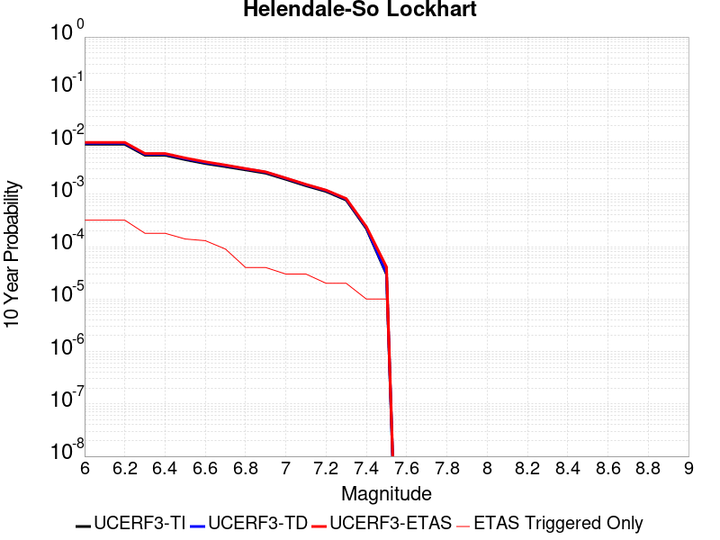 |

| Magnitude | 1 wk TI Prob | 1 wk TD Prob | 1 wk ETAS Prob | 1 wk ETAS/TD Gain | 1 wk ETAS Triggered Only | 1 mo TI Prob | 1 mo TD Prob | 1 mo ETAS Prob | 1 mo ETAS/TD Gain | 1 mo ETAS Triggered Only | 1 yr TI Prob | 1 yr TD Prob | 1 yr ETAS Prob | 1 yr ETAS/TD Gain | 1 yr ETAS Triggered Only | 10 yr TI Prob | 10 yr TD Prob | 10 yr ETAS Prob | 10 yr ETAS/TD Gain | 10 yr ETAS Triggered Only |
|-----|-----|-----|-----|-----|-----|-----|-----|-----|-----|-----|-----|-----|-----|-----|-----|-----|-----|-----|-----|-----|
| 6.0 | 1.7296055E-5 | 1.8104853E-5 | 1.8104853E-5 | 1.0 | 0.0 | 7.412385E-5 | 7.759003E-5 | 7.759003E-5 | 1.0 | 0.0 | 9.0208417E-4 | 9.4427E-4 | 0.0010815784 | 1.1454122 | 1.3743815E-4 | 0.008984311 | 0.009404697 | 0.009745061 | 1.0361909 | 3.4359537E-4 |
| 6.1 | 1.7296055E-5 | 1.8104853E-5 | 1.8104853E-5 | 1.0 | 0.0 | 7.412385E-5 | 7.759003E-5 | 7.759003E-5 | 1.0 | 0.0 | 9.0208417E-4 | 9.4427E-4 | 0.0010815784 | 1.1454122 | 1.3743815E-4 | 0.008984311 | 0.009404697 | 0.009745061 | 1.0361909 | 3.4359537E-4 |
| 6.2 | 1.7296055E-5 | 1.8104853E-5 | 1.8104853E-5 | 1.0 | 0.0 | 7.412385E-5 | 7.759003E-5 | 7.759003E-5 | 1.0 | 0.0 | 9.0208417E-4 | 9.4427E-4 | 0.0010815784 | 1.1454122 | 1.3743815E-4 | 0.008984311 | 0.009404697 | 0.009745061 | 1.0361909 | 3.4359537E-4 |
| 6.3 | 1.0669118E-5 | 1.11360705E-5 | 1.11360705E-5 | 1.0 | 0.0 | 4.5723988E-5 | 4.772516E-5 | 4.772516E-5 | 1.0 | 0.0 | 5.5654737E-4 | 5.809017E-4 | 6.4958085E-4 | 1.1182286 | 6.871908E-5 | 0.0055515557 | 0.005794129 | 0.0059990915 | 1.0353742 | 2.0615723E-4 |
| 6.4 | 1.0669118E-5 | 1.11360705E-5 | 1.11360705E-5 | 1.0 | 0.0 | 4.5723988E-5 | 4.772516E-5 | 4.772516E-5 | 1.0 | 0.0 | 5.5654737E-4 | 5.809017E-4 | 6.4958085E-4 | 1.1182286 | 6.871908E-5 | 0.0055515557 | 0.005794129 | 0.0059990915 | 1.0353742 | 2.0615723E-4 |
| 6.5 | 8.790038E-6 | 9.170723E-6 | 9.170723E-6 | 1.0 | 0.0 | 3.767105E-5 | 3.930252E-5 | 3.930252E-5 | 1.0 | 0.0 | 4.585485E-4 | 4.7840463E-4 | 5.4709084E-4 | 1.1435734 | 6.871908E-5 | 0.0045760344 | 0.004773912 | 0.004910694 | 1.028652 | 1.3743815E-4 |
| 6.6 | 7.396949E-6 | 7.715978E-6 | 7.715978E-6 | 1.0 | 0.0 | 3.1700827E-5 | 3.3068067E-5 | 3.3068067E-5 | 1.0 | 0.0 | 3.858892E-4 | 4.0253034E-4 | 4.483246E-4 | 1.1137661 | 4.5812718E-5 | 0.003852198 | 0.004018119 | 0.0041321907 | 1.0283893 | 1.14531795E-4 |
| 6.7 | 6.4600285E-6 | 6.7384162E-6 | 6.7384162E-6 | 1.0 | 0.0 | 2.7685543E-5 | 2.887861E-5 | 2.887861E-5 | 1.0 | 0.0 | 3.3701936E-4 | 3.5154115E-4 | 3.7443946E-4 | 1.0651369 | 2.2906359E-5 | 0.0033650869 | 0.0035099322 | 0.003601236 | 1.026013 | 9.1625436E-5 |
| 6.8 | 5.600104E-6 | 5.8363357E-6 | 5.8363357E-6 | 1.0 | 0.0 | 2.4000226E-5 | 2.501263E-5 | 2.501263E-5 | 1.0 | 0.0 | 2.9216358E-4 | 3.0448684E-4 | 3.0448684E-4 | 1.0 | 0.0 | 0.0029177975 | 0.003040758 | 0.003040758 | 1.0 | 0.0 |
| 6.9 | 4.839122E-6 | 5.039786E-6 | 5.039786E-6 | 1.0 | 0.0 | 2.0738931E-5 | 2.1598908E-5 | 2.1598908E-5 | 1.0 | 0.0 | 2.5246723E-4 | 2.6293544E-4 | 2.6293544E-4 | 1.0 | 0.0 | 0.002521806 | 0.002626291 | 0.002626291 | 1.0 | 0.0 |
| 7.0 | 3.6937633E-6 | 3.8454173E-6 | 3.8454173E-6 | 1.0 | 0.0 | 1.5830317E-5 | 1.6480257E-5 | 1.6480257E-5 | 1.0 | 0.0 | 1.9271708E-4 | 2.0062897E-4 | 2.0062897E-4 | 1.0 | 0.0 | 0.0019255003 | 0.0020045098 | 0.0020045098 | 1.0 | 0.0 |
| 7.1 | 2.7858857E-6 | 2.8980082E-6 | 2.8980082E-6 | 1.0 | 0.0 | 1.1939455E-5 | 1.2419978E-5 | 1.2419978E-5 | 1.0 | 0.0 | 1.4535317E-4 | 1.5120296E-4 | 1.5120296E-4 | 1.0 | 0.0 | 0.0014525814 | 0.0015110222 | 0.0015110222 | 1.0 | 0.0 |
| 7.2 | 2.1672065E-6 | 2.2541326E-6 | 2.2541326E-6 | 1.0 | 0.0 | 9.2879945E-6 | 9.660534E-6 | 9.660534E-6 | 1.0 | 0.0 | 1.1307546E-4 | 1.1761083E-4 | 1.1761083E-4 | 1.0 | 0.0 | 0.0011301794 | 0.0011755041 | 0.0011755041 | 1.0 | 0.0 |
| 7.3 | 1.4823496E-6 | 1.5422928E-6 | 1.5422928E-6 | 1.0 | 0.0 | 6.3529114E-6 | 6.6098105E-6 | 6.6098105E-6 | 1.0 | 0.0 | 7.734395E-5 | 8.0471626E-5 | 8.0471626E-5 | 1.0 | 0.0 | 7.731704E-4 | 8.0443994E-4 | 8.0443994E-4 | 1.0 | 0.0 |
| 7.4 | 4.2321457E-7 | 4.4111235E-7 | 4.4111235E-7 | 1.0 | 0.0 | 1.8137755E-6 | 1.8904805E-6 | 1.8904805E-6 | 1.0 | 0.0 | 2.2082493E-5 | 2.3016402E-5 | 2.3016402E-5 | 1.0 | 0.0 | 2.2080299E-4 | 2.3014471E-4 | 2.3014471E-4 | 1.0 | 0.0 |
| 7.5 | 5.6942316E-8 | 5.941907E-8 | 5.941907E-8 | 1.0 | 0.0 | 2.440385E-7 | 2.5465314E-7 | 2.5465314E-7 | 1.0 | 0.0 | 2.9711643E-6 | 3.1003983E-6 | 3.1003983E-6 | 1.0 | 0.0 | 2.9711247E-5 | 3.1003627E-5 | 3.1003627E-5 | 1.0 | 0.0 |

## Coyote Lake
*[(top)](#table-of-contents)*

| 1 Week | 1 Month | 1 Year | 10 Year |
|-----|-----|-----|-----|
|  |  |  |  |

| Magnitude | 1 wk TI Prob | 1 wk TD Prob | 1 wk ETAS Prob | 1 wk ETAS/TD Gain | 1 wk ETAS Triggered Only | 1 mo TI Prob | 1 mo TD Prob | 1 mo ETAS Prob | 1 mo ETAS/TD Gain | 1 mo ETAS Triggered Only | 1 yr TI Prob | 1 yr TD Prob | 1 yr ETAS Prob | 1 yr ETAS/TD Gain | 1 yr ETAS Triggered Only | 10 yr TI Prob | 10 yr TD Prob | 10 yr ETAS Prob | 10 yr ETAS/TD Gain | 10 yr ETAS Triggered Only |
|-----|-----|-----|-----|-----|-----|-----|-----|-----|-----|-----|-----|-----|-----|-----|-----|-----|-----|-----|-----|-----|
| 6.0 | 1.980352E-5 | 2.1709513E-5 | 2.1709513E-5 | 1.0 | 0.0 | 8.486947E-5 | 9.303786E-5 | 9.303786E-5 | 1.0 | 0.0 | 0.0010327959 | 0.0011322193 | 0.0012923824 | 1.1414593 | 1.6034451E-4 | 0.010280091 | 0.011271688 | 0.01161141 | 1.0301394 | 3.4359537E-4 |
| 6.1 | 1.980352E-5 | 2.1709513E-5 | 2.1709513E-5 | 1.0 | 0.0 | 8.486947E-5 | 9.303786E-5 | 9.303786E-5 | 1.0 | 0.0 | 0.0010327959 | 0.0011322193 | 0.0012923824 | 1.1414593 | 1.6034451E-4 | 0.010280091 | 0.011271688 | 0.01161141 | 1.0301394 | 3.4359537E-4 |
| 6.2 | 1.980352E-5 | 2.1709513E-5 | 2.1709513E-5 | 1.0 | 0.0 | 8.486947E-5 | 9.303786E-5 | 9.303786E-5 | 1.0 | 0.0 | 0.0010327959 | 0.0011322193 | 0.0012923824 | 1.1414593 | 1.6034451E-4 | 0.010280091 | 0.011271688 | 0.01161141 | 1.0301394 | 3.4359537E-4 |
| 6.3 | 1.5344787E-5 | 1.6822816E-5 | 1.6822816E-5 | 1.0 | 0.0 | 6.576172E-5 | 7.209613E-5 | 7.209613E-5 | 1.0 | 0.0 | 8.003548E-4 | 8.7747816E-4 | 9.690232E-4 | 1.1043274 | 9.1625436E-5 | 0.007974784 | 0.008746182 | 0.008995947 | 1.0285572 | 2.5196993E-4 |
| 6.4 | 1.5344787E-5 | 1.6822816E-5 | 1.6822816E-5 | 1.0 | 0.0 | 6.576172E-5 | 7.209613E-5 | 7.209613E-5 | 1.0 | 0.0 | 8.003548E-4 | 8.7747816E-4 | 9.690232E-4 | 1.1043274 | 9.1625436E-5 | 0.007974784 | 0.008746182 | 0.008995947 | 1.0285572 | 2.5196993E-4 |
| 6.5 | 1.4189697E-5 | 1.5559977E-5 | 1.5559977E-5 | 1.0 | 0.0 | 6.081157E-5 | 6.668425E-5 | 6.668425E-5 | 1.0 | 0.0 | 7.401293E-4 | 8.1163866E-4 | 8.80302E-4 | 1.0845983 | 6.871908E-5 | 0.0073766913 | 0.008092688 | 0.008274456 | 1.0224607 | 1.8325087E-4 |
| 6.6 | 1.3469301E-5 | 1.4773473E-5 | 1.4773473E-5 | 1.0 | 0.0 | 5.7724297E-5 | 6.331368E-5 | 6.331368E-5 | 1.0 | 0.0 | 7.025667E-4 | 7.706315E-4 | 8.392976E-4 | 1.0891037 | 6.871908E-5 | 0.0070034964 | 0.0076854974 | 0.00786734 | 1.0236604 | 1.8325087E-4 |
| 6.7 | 1.3027966E-5 | 1.4283569E-5 | 1.4283569E-5 | 1.0 | 0.0 | 5.5832945E-5 | 6.1214196E-5 | 6.1214196E-5 | 1.0 | 0.0 | 6.7955407E-4 | 7.4508775E-4 | 8.137556E-4 | 1.0921608 | 6.871908E-5 | 0.006774798 | 0.007431775 | 0.0075909276 | 1.0214152 | 1.6034451E-4 |
| 6.8 | 5.695434E-6 | 6.2251847E-6 | 6.2251847E-6 | 1.0 | 0.0 | 2.4408775E-5 | 2.667926E-5 | 2.667926E-5 | 1.0 | 0.0 | 2.971363E-4 | 3.2480157E-4 | 3.2480157E-4 | 1.0 | 0.0 | 0.0029673933 | 0.00324621 | 0.003291874 | 1.0140668 | 4.5812718E-5 |
| 6.9 | 4.385688E-6 | 4.793646E-6 | 4.793646E-6 | 1.0 | 0.0 | 1.879567E-5 | 2.0544197E-5 | 2.0544197E-5 | 1.0 | 0.0 | 2.2881327E-4 | 2.501256E-4 | 2.501256E-4 | 1.0 | 0.0 | 0.002285778 | 0.0025012558 | 0.002524105 | 1.009135 | 2.2906359E-5 |

## San Andreas (San Bernardino S)
*[(top)](#table-of-contents)*

| 1 Week | 1 Month | 1 Year | 10 Year |
|-----|-----|-----|-----|
|  |  |  |  |

| Magnitude | 1 wk TI Prob | 1 wk TD Prob | 1 wk ETAS Prob | 1 wk ETAS/TD Gain | 1 wk ETAS Triggered Only | 1 mo TI Prob | 1 mo TD Prob | 1 mo ETAS Prob | 1 mo ETAS/TD Gain | 1 mo ETAS Triggered Only | 1 yr TI Prob | 1 yr TD Prob | 1 yr ETAS Prob | 1 yr ETAS/TD Gain | 1 yr ETAS Triggered Only | 10 yr TI Prob | 10 yr TD Prob | 10 yr ETAS Prob | 10 yr ETAS/TD Gain | 10 yr ETAS Triggered Only |
|-----|-----|-----|-----|-----|-----|-----|-----|-----|-----|-----|-----|-----|-----|-----|-----|-----|-----|-----|-----|-----|
| 6.0 | 1.2336002E-4 | 3.0052903E-4 | 3.0052903E-4 | 1.0 | 0.0 | 5.2857865E-4 | 0.0012873719 | 0.0013102487 | 1.0177702 | 2.2906359E-5 | 0.006416472 | 0.015566076 | 0.015611176 | 1.0028973 | 4.5812718E-5 | 0.06234337 | 0.14302991 | 0.14330474 | 1.0019214 | 3.2068903E-4 |
| 6.1 | 1.2336002E-4 | 3.0052903E-4 | 3.0052903E-4 | 1.0 | 0.0 | 5.2857865E-4 | 0.0012873719 | 0.0013102487 | 1.0177702 | 2.2906359E-5 | 0.006416472 | 0.015566076 | 0.015611176 | 1.0028973 | 4.5812718E-5 | 0.06234337 | 0.14302991 | 0.14330474 | 1.0019214 | 3.2068903E-4 |
| 6.2 | 1.2336002E-4 | 3.0052903E-4 | 3.0052903E-4 | 1.0 | 0.0 | 5.2857865E-4 | 0.0012873719 | 0.0013102487 | 1.0177702 | 2.2906359E-5 | 0.006416472 | 0.015566076 | 0.015611176 | 1.0028973 | 4.5812718E-5 | 0.06234337 | 0.14302991 | 0.14330474 | 1.0019214 | 3.2068903E-4 |
| 6.3 | 1.1712257E-4 | 2.8840688E-4 | 2.8840688E-4 | 1.0 | 0.0 | 5.018573E-4 | 0.0012354697 | 0.0012583478 | 1.0185177 | 2.2906359E-5 | 0.006093008 | 0.014942952 | 0.014988081 | 1.00302 | 4.5812718E-5 | 0.059286322 | 0.13773783 | 0.13801435 | 1.0020076 | 3.2068903E-4 |
| 6.4 | 1.1712257E-4 | 2.8840688E-4 | 2.8840688E-4 | 1.0 | 0.0 | 5.018573E-4 | 0.0012354697 | 0.0012583478 | 1.0185177 | 2.2906359E-5 | 0.006093008 | 0.014942952 | 0.014988081 | 1.00302 | 4.5812718E-5 | 0.059286322 | 0.13773783 | 0.13801435 | 1.0020076 | 3.2068903E-4 |
| 6.5 | 1.0689076E-4 | 2.6852704E-4 | 2.6852704E-4 | 1.0 | 0.0 | 4.5802278E-4 | 0.0011503474 | 0.0011732274 | 1.0198896 | 2.2906359E-5 | 0.0055621783 | 0.013920166 | 0.01396534 | 1.0032452 | 4.5812718E-5 | 0.05425003 | 0.12898327 | 0.12924264 | 1.002011 | 2.9778265E-4 |
| 6.6 | 9.7648895E-5 | 2.5096696E-4 | 2.5096696E-4 | 1.0 | 0.0 | 4.1842813E-4 | 0.0010751529 | 0.0010980347 | 1.0212823 | 2.2906359E-5 | 0.005082469 | 0.013015794 | 0.01306101 | 1.003474 | 4.5812718E-5 | 0.049677886 | 0.121141456 | 0.121403165 | 1.0021603 | 2.9778265E-4 |
| 6.7 | 8.757013E-5 | 2.3166684E-4 | 2.3166684E-4 | 1.0 | 0.0 | 3.7524657E-4 | 9.925024E-4 | 0.001015386 | 1.0230565 | 2.2906359E-5 | 0.00455906 | 0.012020858 | 0.01206612 | 1.0037653 | 4.5812718E-5 | 0.04466656 | 0.11244868 | 0.11271297 | 1.0023503 | 2.9778265E-4 |
| 6.8 | 8.562978E-5 | 2.2726225E-4 | 2.2726225E-4 | 1.0 | 0.0 | 3.6693315E-4 | 9.736398E-4 | 9.965238E-4 | 1.0235037 | 2.2906359E-5 | 0.004458263 | 0.0117937075 | 0.01183898 | 1.0038387 | 4.5812718E-5 | 0.043698758 | 0.110457905 | 0.110722795 | 1.0023981 | 2.9778265E-4 |
| 6.9 | 6.124075E-5 | 1.7106693E-4 | 1.7106693E-4 | 1.0 | 0.0 | 2.6243398E-4 | 7.329388E-4 | 7.558284E-4 | 1.0312299 | 2.2906359E-5 | 0.0031904527 | 0.008887228 | 0.008932632 | 1.0051091 | 4.5812718E-5 | 0.031450346 | 0.08435718 | 0.08460887 | 1.0029836 | 2.748763E-4 |
| 7.0 | 5.8598747E-5 | 1.653528E-4 | 1.653528E-4 | 1.0 | 0.0 | 2.5111332E-4 | 7.084632E-4 | 7.313533E-4 | 1.0323095 | 2.2906359E-5 | 0.0030530186 | 0.008591622 | 0.008637041 | 1.0052865 | 4.5812718E-5 | 0.03011414 | 0.08167349 | 0.08192591 | 1.0030906 | 2.748763E-4 |
| 7.1 | 5.613814E-5 | 1.5953425E-4 | 1.5953425E-4 | 1.0 | 0.0 | 2.4056983E-4 | 6.8353984E-4 | 7.064305E-4 | 1.0334885 | 2.2906359E-5 | 0.0029250039 | 0.008290524 | 0.008335957 | 1.00548 | 4.5812718E-5 | 0.028868021 | 0.07897128 | 0.07922445 | 1.0032058 | 2.748763E-4 |
| 7.2 | 4.991222E-5 | 1.4558934E-4 | 1.4558934E-4 | 1.0 | 0.0 | 2.1389198E-4 | 6.238055E-4 | 6.466976E-4 | 1.0366975 | 2.2906359E-5 | 0.002601025 | 0.007568488 | 0.0076139537 | 1.0060073 | 4.5812718E-5 | 0.025707912 | 0.07242188 | 0.072676845 | 1.0035206 | 2.748763E-4 |
| 7.3 | 4.7410045E-5 | 1.375228E-4 | 1.375228E-4 | 1.0 | 0.0 | 2.0317009E-4 | 5.892506E-4 | 6.121435E-4 | 1.0388508 | 2.2906359E-5 | 0.0024707897 | 0.0071506137 | 0.0071960986 | 1.006361 | 4.5812718E-5 | 0.024434982 | 0.06870162 | 0.06895761 | 1.0037261 | 2.748763E-4 |
| 7.4 | 4.5556746E-5 | 1.3159527E-4 | 1.3159527E-4 | 1.0 | 0.0 | 1.952286E-4 | 5.6385814E-4 | 5.8675156E-4 | 1.0406014 | 2.2906359E-5 | 0.002374317 | 0.006843443 | 0.0068889423 | 1.0066485 | 4.5812718E-5 | 0.023491086 | 0.065951794 | 0.06620854 | 1.003893 | 2.748763E-4 |
| 7.5 | 4.3084514E-5 | 1.2394068E-4 | 1.2394068E-4 | 1.0 | 0.0 | 1.8463485E-4 | 5.310665E-4 | 5.539607E-4 | 1.0431099 | 2.2906359E-5 | 0.0022456115 | 0.006446638 | 0.0064921556 | 1.0070606 | 4.5812718E-5 | 0.022230545 | 0.062349852 | 0.06260759 | 1.0041337 | 2.748763E-4 |
| 7.6 | 3.408608E-5 | 9.8693454E-5 | 9.8693454E-5 | 1.0 | 0.0 | 1.4607502E-4 | 4.2290348E-4 | 4.4580013E-4 | 1.0541416 | 2.2906359E-5 | 0.0017770125 | 0.00513672 | 0.0051822974 | 1.0088729 | 4.5812718E-5 | 0.017628696 | 0.05017014 | 0.050409466 | 1.0047704 | 2.5196993E-4 |
| 7.7 | 2.8315713E-5 | 8.2804654E-5 | 8.2804654E-5 | 1.0 | 0.0 | 1.2134742E-4 | 3.5482887E-4 | 3.777271E-4 | 1.0645331 | 2.2906359E-5 | 0.0014764034 | 0.004311493 | 0.0043571084 | 1.01058 | 4.5812718E-5 | 0.01466633 | 0.042413354 | 0.042632703 | 1.0051717 | 2.2906359E-4 |
| 7.8 | 2.6222975E-5 | 7.492829E-5 | 7.492829E-5 | 1.0 | 0.0 | 1.1237934E-4 | 3.2108175E-4 | 3.4398076E-4 | 1.0713183 | 2.2906359E-5 | 0.0013673597 | 0.0039021696 | 0.0039478038 | 1.0116946 | 4.5812718E-5 | 0.013589768 | 0.03857025 | 0.03879048 | 1.0057098 | 2.2906359E-4 |
| 7.9 | 2.1469694E-5 | 5.812656E-5 | 5.812656E-5 | 1.0 | 0.0 | 9.200973E-5 | 2.4909005E-4 | 2.7199072E-4 | 1.0919372 | 2.2906359E-5 | 0.0011196428 | 0.003028457 | 0.0030741312 | 1.0150816 | 4.5812718E-5 | 0.011140184 | 0.030264879 | 0.03048701 | 1.0073396 | 2.2906359E-4 |
| 8.0 | 1.2420249E-5 | 3.1456424E-5 | 3.1456424E-5 | 1.0 | 0.0 | 5.322855E-5 | 1.348063E-4 | 1.5770957E-4 | 1.1698977 | 2.2906359E-5 | 6.478649E-4 | 0.0016400319 | 0.0016629008 | 1.0139441 | 2.2906359E-5 | 0.0064597935 | 0.016586676 | 0.016654255 | 1.0040743 | 6.871908E-5 |
| 8.1 | 4.9197724E-6 | 7.872929E-6 | 7.872929E-6 | 1.0 | 0.0 | 2.1084568E-5 | 3.3740685E-5 | 3.3740685E-5 | 1.0 | 0.0 | 2.566744E-4 | 4.1071558E-4 | 4.1071558E-4 | 1.0 | 0.0 | 0.002563781 | 0.004409803 | 0.004409803 | 1.0 | 0.0 |
| 8.2 | 2.5634774E-6 | 2.930318E-6 | 2.930318E-6 | 1.0 | 0.0 | 1.0986286E-5 | 1.2558446E-5 | 1.2558446E-5 | 1.0 | 0.0 | 1.3374983E-4 | 1.528884E-4 | 1.528884E-4 | 1.0 | 0.0 | 0.0013366934 | 0.0017173742 | 0.0017173742 | 1.0 | 0.0 |
| 8.3 | 5.2850464E-7 | 3.2441278E-7 | 3.2441278E-7 | 1.0 | 0.0 | 2.2650179E-6 | 1.3903399E-6 | 1.3903399E-6 | 1.0 | 0.0 | 2.7576245E-5 | 1.692727E-5 | 1.692727E-5 | 1.0 | 0.0 | 2.7572823E-4 | 2.0069437E-4 | 2.0069437E-4 | 1.0 | 0.0 |

## Sierra Nevada  (No Extension)
*[(top)](#table-of-contents)*

| 1 Week | 1 Month | 1 Year | 10 Year |
|-----|-----|-----|-----|
|  |  |  |  |

| Magnitude | 1 wk TI Prob | 1 wk TD Prob | 1 wk ETAS Prob | 1 wk ETAS/TD Gain | 1 wk ETAS Triggered Only | 1 mo TI Prob | 1 mo TD Prob | 1 mo ETAS Prob | 1 mo ETAS/TD Gain | 1 mo ETAS Triggered Only | 1 yr TI Prob | 1 yr TD Prob | 1 yr ETAS Prob | 1 yr ETAS/TD Gain | 1 yr ETAS Triggered Only | 10 yr TI Prob | 10 yr TD Prob | 10 yr ETAS Prob | 10 yr ETAS/TD Gain | 10 yr ETAS Triggered Only |
|-----|-----|-----|-----|-----|-----|-----|-----|-----|-----|-----|-----|-----|-----|-----|-----|-----|-----|-----|-----|-----|
| 6.0 | 7.7690465E-6 | 6.9769367E-6 | 6.9769367E-6 | 1.0 | 0.0 | 3.329549E-5 | 2.9901017E-5 | 2.9901017E-5 | 1.0 | 0.0 | 4.0529718E-4 | 3.640199E-4 | 5.01408E-4 | 1.3774192 | 1.3743815E-4 | 0.004045588 | 0.003637753 | 0.0039116293 | 1.0752872 | 2.748763E-4 |
| 6.1 | 7.7690465E-6 | 6.9769367E-6 | 6.9769367E-6 | 1.0 | 0.0 | 3.329549E-5 | 2.9901017E-5 | 2.9901017E-5 | 1.0 | 0.0 | 4.0529718E-4 | 3.640199E-4 | 5.01408E-4 | 1.3774192 | 1.3743815E-4 | 0.004045588 | 0.003637753 | 0.0039116293 | 1.0752872 | 2.748763E-4 |
| 6.2 | 7.7690465E-6 | 6.9769367E-6 | 6.9769367E-6 | 1.0 | 0.0 | 3.329549E-5 | 2.9901017E-5 | 2.9901017E-5 | 1.0 | 0.0 | 4.0529718E-4 | 3.640199E-4 | 5.01408E-4 | 1.3774192 | 1.3743815E-4 | 0.004045588 | 0.003637753 | 0.0039116293 | 1.0752872 | 2.748763E-4 |
| 6.3 | 7.7690465E-6 | 6.9769367E-6 | 6.9769367E-6 | 1.0 | 0.0 | 3.329549E-5 | 2.9901017E-5 | 2.9901017E-5 | 1.0 | 0.0 | 4.0529718E-4 | 3.640199E-4 | 5.01408E-4 | 1.3774192 | 1.3743815E-4 | 0.004045588 | 0.003637753 | 0.0039116293 | 1.0752872 | 2.748763E-4 |
| 6.4 | 7.7690465E-6 | 6.9769367E-6 | 6.9769367E-6 | 1.0 | 0.0 | 3.329549E-5 | 2.9901017E-5 | 2.9901017E-5 | 1.0 | 0.0 | 4.0529718E-4 | 3.640199E-4 | 5.01408E-4 | 1.3774192 | 1.3743815E-4 | 0.004045588 | 0.003637753 | 0.0039116293 | 1.0752872 | 2.748763E-4 |
| 6.5 | 7.7690465E-6 | 6.9769367E-6 | 6.9769367E-6 | 1.0 | 0.0 | 3.329549E-5 | 2.9901017E-5 | 2.9901017E-5 | 1.0 | 0.0 | 4.0529718E-4 | 3.640199E-4 | 5.01408E-4 | 1.3774192 | 1.3743815E-4 | 0.004045588 | 0.003637753 | 0.0039116293 | 1.0752872 | 2.748763E-4 |
| 6.6 | 2.653E-6 | 1.6151278E-6 | 1.6151278E-6 | 1.0 | 0.0 | 1.136995E-5 | 6.9219577E-6 | 6.9219577E-6 | 1.0 | 0.0 | 1.3842035E-4 | 8.427161E-5 | 1.529849E-4 | 1.8153788 | 6.871908E-5 | 0.0013833415 | 8.424E-4 | 0.0010483835 | 1.24452 | 2.0615723E-4 |
| 6.7 | 2.5902466E-6 | 1.5504587E-6 | 1.5504587E-6 | 1.0 | 0.0 | 1.11010095E-5 | 6.644806E-6 | 6.644806E-6 | 1.0 | 0.0 | 1.351464E-4 | 8.089754E-5 | 1.4961106E-4 | 1.8493894 | 6.871908E-5 | 0.0013506424 | 8.086839E-4 | 0.0010146744 | 1.2547232 | 2.0615723E-4 |
| 6.8 | 2.5853892E-6 | 1.5472576E-6 | 1.5472576E-6 | 1.0 | 0.0 | 1.1080193E-5 | 6.6310877E-6 | 6.6310877E-6 | 1.0 | 0.0 | 1.34893E-4 | 8.0730526E-5 | 1.4944405E-4 | 1.8511468 | 6.871908E-5 | 0.0013481114 | 8.07015E-4 | 0.0010130059 | 1.2552503 | 2.0615723E-4 |
| 6.9 | 2.458257E-6 | 1.4223259E-6 | 1.4223259E-6 | 1.0 | 0.0 | 1.0535345E-5 | 6.095668E-6 | 6.095668E-6 | 1.0 | 0.0 | 1.2826028E-4 | 7.421225E-5 | 1.4292623E-4 | 1.9259115 | 6.871908E-5 | 0.0012818627 | 7.4187666E-4 | 9.478809E-4 | 1.2776799 | 2.0615723E-4 |
| 7.0 | 2.4341468E-6 | 1.3992884E-6 | 1.3992884E-6 | 1.0 | 0.0 | 1.0432016E-5 | 5.9969366E-6 | 5.9969366E-6 | 1.0 | 0.0 | 1.270024E-4 | 7.301028E-5 | 1.4172433E-4 | 1.941156 | 6.871908E-5 | 0.0012692984 | 7.298648E-4 | 9.3587156E-4 | 1.2822533 | 2.0615723E-4 |
| 7.1 | 2.3652476E-6 | 1.3342343E-6 | 1.3342343E-6 | 1.0 | 0.0 | 1.0136736E-5 | 5.7181346E-6 | 5.7181346E-6 | 1.0 | 0.0 | 1.2340778E-4 | 6.961608E-5 | 1.3833038E-4 | 1.9870462 | 6.871908E-5 | 0.0012333926 | 6.959444E-4 | 9.019582E-4 | 1.2960204 | 2.0615723E-4 |
| 7.2 | 2.272158E-6 | 1.2505349E-6 | 1.2505349E-6 | 1.0 | 0.0 | 9.737784E-6 | 5.3594244E-6 | 5.3594244E-6 | 1.0 | 0.0 | 1.1855107E-4 | 6.5249056E-5 | 1.3396365E-4 | 2.0531125 | 6.871908E-5 | 0.0011848784 | 6.523005E-4 | 8.5832324E-4 | 1.3158402 | 2.0615723E-4 |
| 7.3 | 2.1382127E-6 | 1.1422151E-6 | 1.1422151E-6 | 1.0 | 0.0 | 9.163737E-6 | 4.8951983E-6 | 4.8951983E-6 | 1.0 | 0.0 | 1.1156279E-4 | 5.9597423E-5 | 1.0540741E-4 | 1.7686572 | 4.5812718E-5 | 0.001115068 | 5.958156E-4 | 7.7895727E-4 | 1.3073798 | 1.8325087E-4 |
| 7.4 | 1.9048055E-6 | 9.57756E-7 | 9.57756E-7 | 1.0 | 0.0 | 8.163426E-6 | 4.1046624E-6 | 4.1046624E-6 | 1.0 | 0.0 | 9.9385186E-5 | 4.9973125E-5 | 9.578355E-5 | 1.9167013 | 4.5812718E-5 | 9.934074E-4 | 4.996196E-4 | 6.5988395E-4 | 1.3207729 | 1.6034451E-4 |
| 7.5 | 1.5373403E-6 | 7.5620164E-7 | 7.5620164E-7 | 1.0 | 0.0 | 6.5885843E-6 | 3.2408602E-6 | 3.2408602E-6 | 1.0 | 0.0 | 8.021306E-5 | 3.9456765E-5 | 8.5267675E-5 | 2.1610408 | 4.5812718E-5 | 8.0184115E-4 | 3.9449806E-4 | 5.547793E-4 | 1.4062916 | 1.6034451E-4 |
| 7.6 | 1.0680322E-6 | 4.6610623E-7 | 4.6610623E-7 | 1.0 | 0.0 | 4.577273E-6 | 1.9975967E-6 | 1.9975967E-6 | 1.0 | 0.0 | 5.5726876E-5 | 2.432047E-5 | 4.7226273E-5 | 1.9418322 | 2.2906359E-5 | 5.5712904E-4 | 2.4317835E-4 | 3.8058308E-4 | 1.5650369 | 1.3743815E-4 |
| 7.7 | 5.509146E-7 | 1.5587625E-7 | 1.5587625E-7 | 1.0 | 0.0 | 2.3610605E-6 | 6.680409E-7 | 6.680409E-7 | 1.0 | 0.0 | 2.8745531E-5 | 8.133369E-6 | 8.133369E-6 | 1.0 | 0.0 | 2.8741814E-4 | 8.133083E-5 | 1.04235325E-4 | 1.2816213 | 2.2906359E-5 |

## Death Valley (No)
*[(top)](#table-of-contents)*

| 1 Week | 1 Month | 1 Year | 10 Year |
|-----|-----|-----|-----|
| 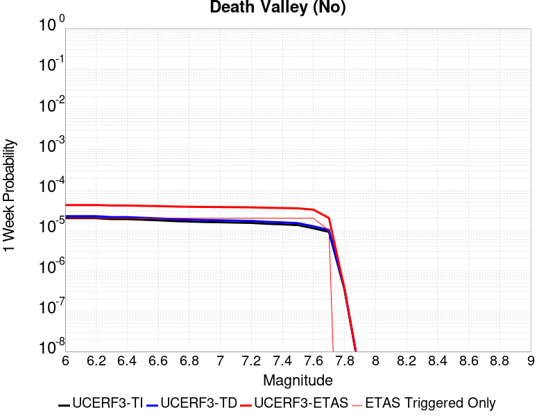 | 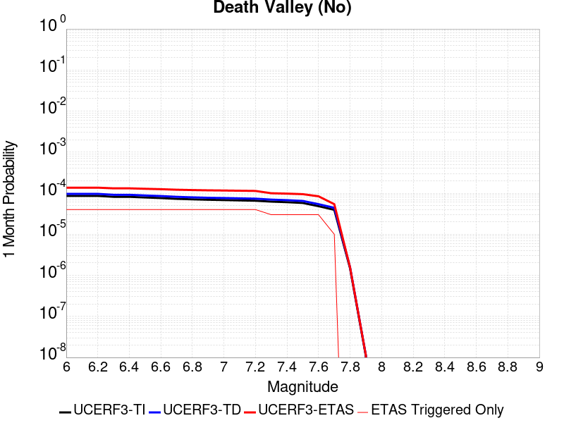 |  |  |

| Magnitude | 1 wk TI Prob | 1 wk TD Prob | 1 wk ETAS Prob | 1 wk ETAS/TD Gain | 1 wk ETAS Triggered Only | 1 mo TI Prob | 1 mo TD Prob | 1 mo ETAS Prob | 1 mo ETAS/TD Gain | 1 mo ETAS Triggered Only | 1 yr TI Prob | 1 yr TD Prob | 1 yr ETAS Prob | 1 yr ETAS/TD Gain | 1 yr ETAS Triggered Only | 10 yr TI Prob | 10 yr TD Prob | 10 yr ETAS Prob | 10 yr ETAS/TD Gain | 10 yr ETAS Triggered Only |
|-----|-----|-----|-----|-----|-----|-----|-----|-----|-----|-----|-----|-----|-----|-----|-----|-----|-----|-----|-----|-----|
| 6.0 | 2.0074807E-5 | 2.2503706E-5 | 4.540955E-5 | 2.0178697 | 2.2906359E-5 | 8.603206E-5 | 9.6440934E-5 | 1.6515338E-4 | 1.7124822 | 6.871908E-5 | 0.001046937 | 0.0011735433 | 0.0013336997 | 1.1364725 | 1.6034451E-4 | 0.010420183 | 0.011674375 | 0.0119234035 | 1.0213312 | 2.5196993E-4 |
| 6.1 | 2.0074807E-5 | 2.2503706E-5 | 4.540955E-5 | 2.0178697 | 2.2906359E-5 | 8.603206E-5 | 9.6440934E-5 | 1.6515338E-4 | 1.7124822 | 6.871908E-5 | 0.001046937 | 0.0011735433 | 0.0013336997 | 1.1364725 | 1.6034451E-4 | 0.010420183 | 0.011674375 | 0.0119234035 | 1.0213312 | 2.5196993E-4 |
| 6.2 | 2.0074807E-5 | 2.2503706E-5 | 4.540955E-5 | 2.0178697 | 2.2906359E-5 | 8.603206E-5 | 9.6440934E-5 | 1.6515338E-4 | 1.7124822 | 6.871908E-5 | 0.001046937 | 0.0011735433 | 0.0013336997 | 1.1364725 | 1.6034451E-4 | 0.010420183 | 0.011674375 | 0.0119234035 | 1.0213312 | 2.5196993E-4 |
| 6.3 | 1.9050609E-5 | 2.134036E-5 | 4.424623E-5 | 2.073359 | 2.2906359E-5 | 8.164292E-5 | 9.145552E-5 | 1.6016832E-4 | 1.7513247 | 6.871908E-5 | 9.935491E-4 | 0.0011129089 | 0.001273075 | 1.1439166 | 1.6034451E-4 | 0.009891188 | 0.011074181 | 0.01132336 | 1.022501 | 2.5196993E-4 |
| 6.4 | 1.9050609E-5 | 2.134036E-5 | 4.424623E-5 | 2.073359 | 2.2906359E-5 | 8.164292E-5 | 9.145552E-5 | 1.6016832E-4 | 1.7513247 | 6.871908E-5 | 9.935491E-4 | 0.0011129089 | 0.001273075 | 1.1439166 | 1.6034451E-4 | 0.009891188 | 0.011074181 | 0.01132336 | 1.022501 | 2.5196993E-4 |
| 6.5 | 1.8367004E-5 | 2.0564283E-5 | 4.347017E-5 | 2.1138675 | 2.2906359E-5 | 7.8713354E-5 | 8.81297E-5 | 1.5684273E-4 | 1.7796806 | 6.871908E-5 | 9.5791375E-4 | 0.0010724575 | 0.00123263 | 1.149351 | 1.6034451E-4 | 0.009537951 | 0.010673606 | 0.010922886 | 1.0233549 | 2.5196993E-4 |
| 6.6 | 1.779439E-5 | 1.9914085E-5 | 4.281999E-5 | 2.1502361 | 2.2906359E-5 | 7.625944E-5 | 8.534332E-5 | 1.5405654E-4 | 1.8051387 | 6.871908E-5 | 9.280632E-4 | 0.0010385661 | 0.001198744 | 1.1542299 | 1.6034451E-4 | 0.009241969 | 0.010337884 | 0.010587249 | 1.0241215 | 2.5196993E-4 |
| 6.7 | 1.7025437E-5 | 1.9046434E-5 | 4.1952357E-5 | 2.2026358 | 2.2906359E-5 | 7.296412E-5 | 8.162506E-5 | 1.5033853E-4 | 1.8418183 | 6.871908E-5 | 8.87976E-4 | 9.933382E-4 | 0.0011535235 | 1.1612595 | 1.6034451E-4 | 0.008844362 | 0.0098897 | 0.0101391785 | 1.025226 | 2.5196993E-4 |
| 6.8 | 1.6545107E-5 | 1.8515479E-5 | 4.1421416E-5 | 2.2371235 | 2.2906359E-5 | 7.090568E-5 | 7.934967E-5 | 1.480633E-4 | 1.8659598 | 6.871908E-5 | 8.629347E-4 | 9.656602E-4 | 0.0011258499 | 1.1658862 | 1.6034451E-4 | 0.008595915 | 0.009615345 | 0.009864892 | 1.025953 | 2.5196993E-4 |
| 6.9 | 1.615478E-5 | 1.8090475E-5 | 4.099642E-5 | 2.2661881 | 2.2906359E-5 | 6.9232934E-5 | 7.752834E-5 | 1.4624209E-4 | 1.8863049 | 6.871908E-5 | 8.4258494E-4 | 9.435049E-4 | 0.0011036982 | 1.1697853 | 1.6034451E-4 | 0.008393973 | 0.009395686 | 0.009645288 | 1.0265657 | 2.5196993E-4 |
| 7.0 | 1.5894311E-5 | 1.7808401E-5 | 4.0714353E-5 | 2.2862442 | 2.2906359E-5 | 6.81167E-5 | 7.631952E-5 | 1.4503335E-4 | 1.9003441 | 6.871908E-5 | 8.2900526E-4 | 9.288001E-4 | 0.0010889957 | 1.1724758 | 1.6034451E-4 | 0.008259195 | 0.009249872 | 0.009499511 | 1.0269884 | 2.5196993E-4 |
| 7.1 | 1.5602263E-5 | 1.7486309E-5 | 4.0392268E-5 | 2.3099368 | 2.2906359E-5 | 6.6865134E-5 | 7.4939206E-5 | 1.4365313E-4 | 1.9169289 | 6.871908E-5 | 8.137789E-4 | 9.12009E-4 | 0.0010722072 | 1.1756543 | 1.6034451E-4 | 0.008108052 | 0.009083345 | 0.009333026 | 1.0274878 | 2.5196993E-4 |
| 7.2 | 1.5323829E-5 | 1.7173385E-5 | 4.007935E-5 | 2.333806 | 2.2906359E-5 | 6.56719E-5 | 7.3598174E-5 | 1.423122E-4 | 1.9336375 | 6.871908E-5 | 7.99262E-4 | 8.9569547E-4 | 0.0010330105 | 1.1533055 | 1.3743815E-4 | 0.007963934 | 0.008921531 | 0.009148551 | 1.0254463 | 2.2906359E-4 |
| 7.3 | 1.4556212E-5 | 1.6305059E-5 | 3.9211045E-5 | 2.4048393 | 2.2906359E-5 | 6.238227E-5 | 6.987698E-5 | 1.156865E-4 | 1.6555737 | 4.5812718E-5 | 7.592395E-4 | 8.5042603E-4 | 9.6486043E-4 | 1.1345613 | 1.14531795E-4 | 0.0075665074 | 0.008472362 | 0.008676772 | 1.0241268 | 2.0615723E-4 |
| 7.4 | 1.411725E-5 | 1.581048E-5 | 3.8716476E-5 | 2.4487858 | 2.2906359E-5 | 6.0501097E-5 | 6.775747E-5 | 1.1356708E-4 | 1.6760821 | 4.5812718E-5 | 7.363519E-4 | 8.246408E-4 | 9.3907816E-4 | 1.1387724 | 1.14531795E-4 | 0.0073391674 | 0.008216443 | 0.008420906 | 1.0248847 | 2.0615723E-4 |
| 7.5 | 1.3503312E-5 | 1.5128708E-5 | 3.803472E-5 | 2.514076 | 2.2906359E-5 | 5.7870053E-5 | 6.483574E-5 | 1.1064549E-4 | 1.7065508 | 4.5812718E-5 | 7.043401E-4 | 7.8909507E-4 | 9.035365E-4 | 1.1450287 | 1.14531795E-4 | 0.007021119 | 0.007863557 | 0.008068093 | 1.0260106 | 2.0615723E-4 |
| 7.6 | 1.1279839E-5 | 1.2628332E-5 | 3.5534402E-5 | 2.8138635 | 2.2906359E-5 | 4.834127E-5 | 5.412033E-5 | 9.993057E-5 | 1.8464516 | 4.5812718E-5 | 5.88396E-4 | 6.5872114E-4 | 7.731775E-4 | 1.1737554 | 1.14531795E-4 | 0.005868405 | 0.006568238 | 0.006727529 | 1.0242518 | 1.6034451E-4 |
| 7.7 | 9.189108E-6 | 1.0284987E-5 | 1.0284987E-5 | 1.0 | 0.0 | 3.93813E-5 | 4.4077802E-5 | 4.4077802E-5 | 1.0 | 0.0 | 4.7936183E-4 | 5.3652015E-4 | 6.0520234E-4 | 1.1280142 | 6.871908E-5 | 0.004783291 | 0.0053527597 | 0.005466678 | 1.0212822 | 1.14531795E-4 |
| 7.8 | 3.4586725E-7 | 3.648528E-7 | 3.648528E-7 | 1.0 | 0.0 | 1.4822873E-6 | 1.563654E-6 | 1.563654E-6 | 1.0 | 0.0 | 1.80467E-5 | 1.9037325E-5 | 1.9037325E-5 | 1.0 | 0.0 | 1.8045233E-4 | 1.9035739E-4 | 1.9035739E-4 | 1.0 | 0.0 |
| 7.9 | 2.5591178E-9 | 2.6698248E-9 | 2.6698248E-9 | 1.0 | 0.0 | 1.0967647E-8 | 1.1442106E-8 | 1.1442106E-8 | 1.0 | 0.0 | 1.335311E-7 | 1.3930764E-7 | 1.3930764E-7 | 1.0 | 0.0 | 1.3353102E-6 | 1.3930764E-6 | 1.3930764E-6 | 1.0 | 0.0 |

## San Andreas (Big Bend)
*[(top)](#table-of-contents)*

| 1 Week | 1 Month | 1 Year | 10 Year |
|-----|-----|-----|-----|
|  |  |  | 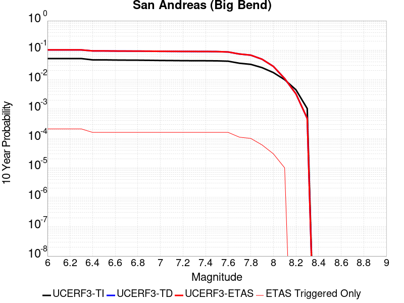 |

| Magnitude | 1 wk TI Prob | 1 wk TD Prob | 1 wk ETAS Prob | 1 wk ETAS/TD Gain | 1 wk ETAS Triggered Only | 1 mo TI Prob | 1 mo TD Prob | 1 mo ETAS Prob | 1 mo ETAS/TD Gain | 1 mo ETAS Triggered Only | 1 yr TI Prob | 1 yr TD Prob | 1 yr ETAS Prob | 1 yr ETAS/TD Gain | 1 yr ETAS Triggered Only | 10 yr TI Prob | 10 yr TD Prob | 10 yr ETAS Prob | 10 yr ETAS/TD Gain | 10 yr ETAS Triggered Only |
|-----|-----|-----|-----|-----|-----|-----|-----|-----|-----|-----|-----|-----|-----|-----|-----|-----|-----|-----|-----|-----|
| 6.0 | 1.0179969E-4 | 2.0157539E-4 | 2.0157539E-4 | 1.0 | 0.0 | 4.362114E-4 | 8.6360954E-4 | 8.864961E-4 | 1.026501 | 2.2906359E-5 | 0.0052979486 | 0.0104640415 | 0.010577375 | 1.0108308 | 1.14531795E-4 | 0.051734097 | 0.101820305 | 0.102005474 | 1.0018185 | 2.0615723E-4 |
| 6.1 | 1.0179969E-4 | 2.0157539E-4 | 2.0157539E-4 | 1.0 | 0.0 | 4.362114E-4 | 8.6360954E-4 | 8.864961E-4 | 1.026501 | 2.2906359E-5 | 0.0052979486 | 0.0104640415 | 0.010577375 | 1.0108308 | 1.14531795E-4 | 0.051734097 | 0.101820305 | 0.102005474 | 1.0018185 | 2.0615723E-4 |
| 6.2 | 1.0179969E-4 | 2.0157539E-4 | 2.0157539E-4 | 1.0 | 0.0 | 4.362114E-4 | 8.6360954E-4 | 8.864961E-4 | 1.026501 | 2.2906359E-5 | 0.0052979486 | 0.0104640415 | 0.010577375 | 1.0108308 | 1.14531795E-4 | 0.051734097 | 0.101820305 | 0.102005474 | 1.0018185 | 2.0615723E-4 |
| 6.3 | 1.0179969E-4 | 2.0157539E-4 | 2.0157539E-4 | 1.0 | 0.0 | 4.362114E-4 | 8.6360954E-4 | 8.864961E-4 | 1.026501 | 2.2906359E-5 | 0.0052979486 | 0.0104640415 | 0.010577375 | 1.0108308 | 1.14531795E-4 | 0.051734097 | 0.101820305 | 0.102005474 | 1.0018185 | 2.0615723E-4 |
| 6.4 | 9.1639464E-5 | 1.8513134E-4 | 1.8513134E-4 | 1.0 | 0.0 | 3.9268145E-4 | 7.93179E-4 | 8.1606716E-4 | 1.0288563 | 2.2906359E-5 | 0.0047704205 | 0.009614314 | 0.009682372 | 1.0070789 | 6.871908E-5 | 0.046693064 | 0.09414245 | 0.09426695 | 1.0013225 | 1.3743815E-4 |
| 6.5 | 9.1639464E-5 | 1.8513134E-4 | 1.8513134E-4 | 1.0 | 0.0 | 3.9268145E-4 | 7.93179E-4 | 8.1606716E-4 | 1.0288563 | 2.2906359E-5 | 0.0047704205 | 0.009614314 | 0.009682372 | 1.0070789 | 6.871908E-5 | 0.046693064 | 0.09414245 | 0.09426695 | 1.0013225 | 1.3743815E-4 |
| 6.6 | 9.042622E-5 | 1.8319985E-4 | 1.8319985E-4 | 1.0 | 0.0 | 3.8748336E-4 | 7.8490615E-4 | 8.077945E-4 | 1.0291606 | 2.2906359E-5 | 0.0047074095 | 0.009514474 | 0.009582539 | 1.0071539 | 6.871908E-5 | 0.046089325 | 0.09323598 | 0.093360595 | 1.0013367 | 1.3743815E-4 |
| 6.7 | 8.9836685E-5 | 1.823425E-4 | 1.823425E-4 | 1.0 | 0.0 | 3.8495753E-4 | 7.81234E-4 | 8.041225E-4 | 1.0292978 | 2.2906359E-5 | 0.00467679 | 0.0094701545 | 0.009538223 | 1.0071877 | 6.871908E-5 | 0.045795817 | 0.09283008 | 0.092954755 | 1.0013431 | 1.3743815E-4 |
| 6.8 | 8.9471854E-5 | 1.8180953E-4 | 1.8180953E-4 | 1.0 | 0.0 | 3.8339442E-4 | 7.789512E-4 | 8.0183975E-4 | 1.0293838 | 2.2906359E-5 | 0.004657841 | 0.009442603 | 0.009510673 | 1.0072088 | 6.871908E-5 | 0.04561414 | 0.09257703 | 0.09270174 | 1.0013472 | 1.3743815E-4 |
| 6.9 | 8.858234E-5 | 1.806279E-4 | 1.806279E-4 | 1.0 | 0.0 | 3.7958333E-4 | 7.738901E-4 | 7.9677877E-4 | 1.0295761 | 2.2906359E-5 | 0.004611638 | 0.009381516 | 0.00944959 | 1.0072563 | 6.871908E-5 | 0.04517103 | 0.09201675 | 0.09214154 | 1.0013561 | 1.3743815E-4 |
| 7.0 | 8.7433385E-5 | 1.790138E-4 | 1.790138E-4 | 1.0 | 0.0 | 3.746607E-4 | 7.669766E-4 | 7.898654E-4 | 1.0298429 | 2.2906359E-5 | 0.004551957 | 0.009298065 | 0.009366145 | 1.007322 | 6.871908E-5 | 0.044598386 | 0.091250524 | 0.09137542 | 1.0013688 | 1.3743815E-4 |
| 7.1 | 8.684964E-5 | 1.7813202E-4 | 1.7813202E-4 | 1.0 | 0.0 | 3.7215967E-4 | 7.631998E-4 | 7.8608864E-4 | 1.0299907 | 2.2906359E-5 | 0.0045216335 | 0.009252474 | 0.009320557 | 1.0073584 | 6.871908E-5 | 0.04430731 | 0.09083163 | 0.09095658 | 1.0013757 | 1.3743815E-4 |
| 7.2 | 8.606521E-5 | 1.7703685E-4 | 1.7703685E-4 | 1.0 | 0.0 | 3.6879873E-4 | 7.585089E-4 | 7.813979E-4 | 1.0301763 | 2.2906359E-5 | 0.0044808835 | 0.0091958465 | 0.009263934 | 1.0074041 | 6.871908E-5 | 0.043916024 | 0.09031174 | 0.09043677 | 1.0013844 | 1.3743815E-4 |
| 7.3 | 8.568266E-5 | 1.7645536E-4 | 1.7645536E-4 | 1.0 | 0.0 | 3.6715972E-4 | 7.560183E-4 | 7.789073E-4 | 1.0302758 | 2.2906359E-5 | 0.0044610105 | 0.009165778 | 0.009233867 | 1.0074286 | 6.871908E-5 | 0.043725148 | 0.09003232 | 0.090157375 | 1.0013891 | 1.3743815E-4 |
| 7.4 | 8.5432206E-5 | 1.7608024E-4 | 1.7608024E-4 | 1.0 | 0.0 | 3.6608664E-4 | 7.544115E-4 | 7.773006E-4 | 1.0303403 | 2.2906359E-5 | 0.004447999 | 0.00914638 | 0.009214471 | 1.0074445 | 6.871908E-5 | 0.043600157 | 0.08985212 | 0.089977205 | 1.0013921 | 1.3743815E-4 |
| 7.5 | 8.4791965E-5 | 1.747701E-4 | 1.747701E-4 | 1.0 | 0.0 | 3.633435E-4 | 7.487999E-4 | 7.716891E-4 | 1.0305679 | 2.2906359E-5 | 0.0044147377 | 0.00907863 | 0.009146725 | 1.0075006 | 6.871908E-5 | 0.043280575 | 0.08922856 | 0.08935373 | 1.0014029 | 1.3743815E-4 |
| 7.6 | 8.241105E-5 | 1.6921063E-4 | 1.6921063E-4 | 1.0 | 0.0 | 3.531424E-4 | 7.24987E-4 | 7.4787677E-4 | 1.0315726 | 2.2906359E-5 | 0.0042910352 | 0.0087910835 | 0.008859199 | 1.0077482 | 6.871908E-5 | 0.042091176 | 0.08660081 | 0.08672635 | 1.0014496 | 1.3743815E-4 |
| 7.7 | 7.00432E-5 | 1.4277258E-4 | 1.4277258E-4 | 1.0 | 0.0 | 3.001506E-4 | 6.1173906E-4 | 6.346314E-4 | 1.0374217 | 2.2906359E-5 | 0.0036482112 | 0.0074225287 | 0.0074680015 | 1.0061263 | 4.5812718E-5 | 0.035888977 | 0.07384562 | 0.07388805 | 1.0005746 | 4.5812718E-5 |
| 7.8 | 6.415362E-5 | 1.3034545E-4 | 1.3034545E-4 | 1.0 | 0.0 | 2.749151E-4 | 5.585038E-4 | 5.813974E-4 | 1.0409908 | 2.2906359E-5 | 0.0033419547 | 0.0067786137 | 0.0068241158 | 1.0067126 | 4.5812718E-5 | 0.03292141 | 0.0675504 | 0.06759311 | 1.0006324 | 4.5812718E-5 |
| 7.9 | 4.939911E-5 | 9.388254E-5 | 9.388254E-5 | 1.0 | 0.0 | 2.116933E-4 | 4.022917E-4 | 4.2518886E-4 | 1.0569167 | 2.2906359E-5 | 0.0025743195 | 0.0048869113 | 0.004909706 | 1.0046644 | 2.2906359E-5 | 0.025447013 | 0.049135223 | 0.049157 | 1.0004433 | 2.2906359E-5 |
| 8.0 | 3.344983E-5 | 5.2508483E-5 | 5.2508483E-5 | 1.0 | 0.0 | 1.4334853E-4 | 2.2501696E-4 | 2.2501696E-4 | 1.0 | 0.0 | 0.0017438711 | 0.0027361414 | 0.0027361414 | 1.0 | 0.0 | 0.017302496 | 0.028060736 | 0.028060736 | 1.0 | 0.0 |
| 8.1 | 1.9104898E-5 | 1.931098E-5 | 1.931098E-5 | 1.0 | 0.0 | 8.1875565E-5 | 8.275873E-5 | 8.275873E-5 | 1.0 | 0.0 | 9.963791E-4 | 0.0010071225 | 0.0010071225 | 1.0 | 0.0 | 0.009919235 | 0.010822252 | 0.010822252 | 1.0 | 0.0 |
| 8.2 | 8.643924E-6 | 5.5269165E-6 | 5.5269165E-6 | 1.0 | 0.0 | 3.704486E-5 | 2.368657E-5 | 2.368657E-5 | 1.0 | 0.0 | 4.5092785E-4 | 2.8834594E-4 | 2.8834594E-4 | 1.0 | 0.0 | 0.0045001395 | 0.0032771796 | 0.0032771796 | 1.0 | 0.0 |
| 8.3 | 1.983087E-6 | 7.7486385E-7 | 7.7486385E-7 | 1.0 | 0.0 | 8.498917E-6 | 3.320841E-6 | 3.320841E-6 | 1.0 | 0.0 | 1.034694E-4 | 4.0430506E-5 | 4.0430506E-5 | 1.0 | 0.0 | 0.0010342124 | 4.7705657E-4 | 4.7705657E-4 | 1.0 | 0.0 |

## San Jacinto (San Bernardino)
*[(top)](#table-of-contents)*

| 1 Week | 1 Month | 1 Year | 10 Year |
|-----|-----|-----|-----|
|  |  |  |  |

| Magnitude | 1 wk TI Prob | 1 wk TD Prob | 1 wk ETAS Prob | 1 wk ETAS/TD Gain | 1 wk ETAS Triggered Only | 1 mo TI Prob | 1 mo TD Prob | 1 mo ETAS Prob | 1 mo ETAS/TD Gain | 1 mo ETAS Triggered Only | 1 yr TI Prob | 1 yr TD Prob | 1 yr ETAS Prob | 1 yr ETAS/TD Gain | 1 yr ETAS Triggered Only | 10 yr TI Prob | 10 yr TD Prob | 10 yr ETAS Prob | 10 yr ETAS/TD Gain | 10 yr ETAS Triggered Only |
|-----|-----|-----|-----|-----|-----|-----|-----|-----|-----|-----|-----|-----|-----|-----|-----|-----|-----|-----|-----|-----|
| 6.0 | 3.409352E-5 | 3.614597E-5 | 3.614597E-5 | 1.0 | 0.0 | 1.461069E-4 | 1.5490211E-4 | 1.7780493E-4 | 1.1478535 | 2.2906359E-5 | 0.0017774 | 0.0018843036 | 0.0019986196 | 1.0606675 | 1.14531795E-4 | 0.01763251 | 0.01943142 | 0.01963357 | 1.0104033 | 2.0615723E-4 |
| 6.1 | 3.409352E-5 | 3.614597E-5 | 3.614597E-5 | 1.0 | 0.0 | 1.461069E-4 | 1.5490211E-4 | 1.7780493E-4 | 1.1478535 | 2.2906359E-5 | 0.0017774 | 0.0018843036 | 0.0019986196 | 1.0606675 | 1.14531795E-4 | 0.01763251 | 0.01943142 | 0.01963357 | 1.0104033 | 2.0615723E-4 |
| 6.2 | 3.409352E-5 | 3.614597E-5 | 3.614597E-5 | 1.0 | 0.0 | 1.461069E-4 | 1.5490211E-4 | 1.7780493E-4 | 1.1478535 | 2.2906359E-5 | 0.0017774 | 0.0018843036 | 0.0019986196 | 1.0606675 | 1.14531795E-4 | 0.01763251 | 0.01943142 | 0.01963357 | 1.0104033 | 2.0615723E-4 |
| 6.3 | 3.409352E-5 | 3.614597E-5 | 3.614597E-5 | 1.0 | 0.0 | 1.461069E-4 | 1.5490211E-4 | 1.7780493E-4 | 1.1478535 | 2.2906359E-5 | 0.0017774 | 0.0018843036 | 0.0019986196 | 1.0606675 | 1.14531795E-4 | 0.01763251 | 0.01943142 | 0.01963357 | 1.0104033 | 2.0615723E-4 |
| 6.4 | 3.400795E-5 | 3.6038597E-5 | 3.6038597E-5 | 1.0 | 0.0 | 1.4574021E-4 | 1.54442E-4 | 1.7734482E-4 | 1.148294 | 2.2906359E-5 | 0.0017729428 | 0.0018787116 | 0.0019930282 | 1.0608484 | 1.14531795E-4 | 0.017588645 | 0.019376488 | 0.01957865 | 1.0104334 | 2.0615723E-4 |
| 6.5 | 3.341482E-5 | 3.5298992E-5 | 3.5298992E-5 | 1.0 | 0.0 | 1.4319851E-4 | 1.5127263E-4 | 1.7417553E-4 | 1.1514014 | 2.2906359E-5 | 0.0017420477 | 0.0018401899 | 0.001954511 | 1.0621246 | 1.14531795E-4 | 0.017284546 | 0.01899794 | 0.01920018 | 1.0106454 | 2.0615723E-4 |
| 6.6 | 3.3364955E-5 | 3.523619E-5 | 3.523619E-5 | 1.0 | 0.0 | 1.4298483E-4 | 1.510035E-4 | 1.7390642E-4 | 1.1516713 | 2.2906359E-5 | 0.0017394501 | 0.0018369189 | 0.0019512404 | 1.0622354 | 1.14531795E-4 | 0.017258976 | 0.018965796 | 0.019168044 | 1.0106637 | 2.0615723E-4 |
| 6.7 | 3.335922E-5 | 3.5225963E-5 | 3.5225963E-5 | 1.0 | 0.0 | 1.4296026E-4 | 1.5095968E-4 | 1.7386257E-4 | 1.1517154 | 2.2906359E-5 | 0.0017391514 | 0.001836386 | 0.0019507075 | 1.0622535 | 1.14531795E-4 | 0.017256035 | 0.018960586 | 0.019162834 | 1.0106667 | 2.0615723E-4 |
| 6.8 | 3.327683E-5 | 3.511999E-5 | 3.511999E-5 | 1.0 | 0.0 | 1.4260718E-4 | 1.5050556E-4 | 1.7340848E-4 | 1.1521732 | 2.2906359E-5 | 0.0017348597 | 0.0018308666 | 0.0019451886 | 1.0624415 | 1.14531795E-4 | 0.017213784 | 0.018906342 | 0.019108603 | 1.010698 | 2.0615723E-4 |
| 6.9 | 3.3235785E-5 | 3.506092E-5 | 3.506092E-5 | 1.0 | 0.0 | 1.4243131E-4 | 1.5025244E-4 | 1.7315535E-4 | 1.1524296 | 2.2906359E-5 | 0.0017327217 | 0.0018277899 | 0.0019421123 | 1.0625468 | 1.14531795E-4 | 0.017192734 | 0.018876202 | 0.019078467 | 1.0107154 | 2.0615723E-4 |
| 7.0 | 3.3197095E-5 | 3.500082E-5 | 3.500082E-5 | 1.0 | 0.0 | 1.422655E-4 | 1.499949E-4 | 1.7289782E-4 | 1.1526914 | 2.2906359E-5 | 0.0017307063 | 0.0018246598 | 0.0019389825 | 1.0626544 | 1.14531795E-4 | 0.017172894 | 0.018845567 | 0.01904784 | 1.0107331 | 2.0615723E-4 |
| 7.1 | 3.3129716E-5 | 3.488097E-5 | 3.488097E-5 | 1.0 | 0.0 | 1.4197677E-4 | 1.494813E-4 | 1.7238424E-4 | 1.153216 | 2.2906359E-5 | 0.0017271966 | 0.0018184172 | 0.0019327407 | 1.0628698 | 1.14531795E-4 | 0.017138338 | 0.018784622 | 0.018986905 | 1.0107687 | 2.0615723E-4 |
| 7.2 | 3.3034008E-5 | 3.4748366E-5 | 3.4748366E-5 | 1.0 | 0.0 | 1.4156665E-4 | 1.4891308E-4 | 1.7181603E-4 | 1.1538007 | 2.2906359E-5 | 0.0017222111 | 0.0018115105 | 0.0019258348 | 1.06311 | 1.14531795E-4 | 0.017089253 | 0.018716995 | 0.018919293 | 1.0108082 | 2.0615723E-4 |
| 7.3 | 3.2956614E-5 | 3.461603E-5 | 3.461603E-5 | 1.0 | 0.0 | 1.4123498E-4 | 1.48346E-4 | 1.7124895E-4 | 1.1543888 | 2.2906359E-5 | 0.0017181796 | 0.0018046177 | 0.0019189428 | 1.0633514 | 1.14531795E-4 | 0.017049557 | 0.018649703 | 0.018852016 | 1.010848 | 2.0615723E-4 |
| 7.4 | 3.2915937E-5 | 3.4537654E-5 | 3.4537654E-5 | 1.0 | 0.0 | 1.4106068E-4 | 1.4801013E-4 | 1.709131E-4 | 1.1547391 | 2.2906359E-5 | 0.0017160608 | 0.0018005354 | 0.0019148609 | 1.0634953 | 1.14531795E-4 | 0.017028693 | 0.018609937 | 0.018812258 | 1.0108716 | 2.0615723E-4 |
| 7.5 | 3.281791E-5 | 3.4402456E-5 | 3.4402456E-5 | 1.0 | 0.0 | 1.406406E-4 | 1.4743076E-4 | 1.7033375E-4 | 1.1553473 | 2.2906359E-5 | 0.0017109542 | 0.0017934933 | 0.0019078196 | 1.0637451 | 1.14531795E-4 | 0.016978411 | 0.018540774 | 0.018743109 | 1.010913 | 2.0615723E-4 |
| 7.6 | 3.2521442E-5 | 3.41271E-5 | 3.41271E-5 | 1.0 | 0.0 | 1.3937015E-4 | 1.4625082E-4 | 1.6915383E-4 | 1.1566008 | 2.2906359E-5 | 0.0016955109 | 0.0017791509 | 0.0018934789 | 1.0642599 | 1.14531795E-4 | 0.016826328 | 0.018398259 | 0.018600622 | 1.0109991 | 2.0615723E-4 |
| 7.7 | 3.0287873E-5 | 3.26093E-5 | 3.26093E-5 | 1.0 | 0.0 | 1.297987E-4 | 1.3974665E-4 | 1.6264981E-4 | 1.1638906 | 2.2906359E-5 | 0.0015791537 | 0.0017000888 | 0.0018144259 | 1.0672536 | 1.14531795E-4 | 0.01567979 | 0.017608235 | 0.017810762 | 1.0115018 | 2.0615723E-4 |
| 7.8 | 2.6316151E-5 | 2.9814415E-5 | 2.9814415E-5 | 1.0 | 0.0 | 1.1277862E-4 | 1.2776982E-4 | 1.5067325E-4 | 1.1792554 | 2.2906359E-5 | 0.0013722149 | 0.0015544884 | 0.0016688422 | 1.0735636 | 1.14531795E-4 | 0.013637724 | 0.016146967 | 0.016349794 | 1.0125614 | 2.0615723E-4 |
| 7.9 | 2.0761147E-5 | 2.3549805E-5 | 2.3549805E-5 | 1.0 | 0.0 | 8.897331E-5 | 1.0092383E-4 | 1.2382788E-4 | 1.2269439 | 2.2906359E-5 | 0.0010827117 | 0.0012280559 | 0.0013195688 | 1.0745186 | 9.1625436E-5 | 0.010774517 | 0.01286122 | 0.013019503 | 1.0123069 | 1.6034451E-4 |
| 8.0 | 1.5738568E-5 | 1.6132728E-5 | 1.6132728E-5 | 1.0 | 0.0 | 6.744926E-5 | 6.9138434E-5 | 6.9138434E-5 | 1.0 | 0.0 | 8.2088535E-4 | 8.4143603E-4 | 8.4143603E-4 | 1.0 | 0.0 | 0.008178596 | 0.008918099 | 0.008986206 | 1.0076369 | 6.871908E-5 |
| 8.1 | 1.0105832E-5 | 8.388601E-6 | 8.388601E-6 | 1.0 | 0.0 | 4.3309992E-5 | 3.5950656E-5 | 3.5950656E-5 | 1.0 | 0.0 | 5.2717153E-4 | 4.3761183E-4 | 4.3761183E-4 | 1.0 | 0.0 | 0.005259227 | 0.004708467 | 0.004708467 | 1.0 | 0.0 |
| 8.2 | 4.189207E-6 | 1.5951842E-6 | 1.5951842E-6 | 1.0 | 0.0 | 1.7953622E-5 | 6.836486E-6 | 6.836486E-6 | 1.0 | 0.0 | 2.1856341E-4 | 8.323107E-5 | 8.323107E-5 | 1.0 | 0.0 | 0.0021834858 | 9.661565E-4 | 9.661565E-4 | 1.0 | 0.0 |
| 8.3 | 1.2758221E-6 | 3.6600784E-7 | 3.6600784E-7 | 1.0 | 0.0 | 5.4677976E-6 | 1.5686041E-6 | 1.5686041E-6 | 1.0 | 0.0 | 6.65684E-5 | 1.9097592E-5 | 1.9097592E-5 | 1.0 | 0.0 | 6.6548464E-4 | 2.301609E-4 | 2.301609E-4 | 1.0 | 0.0 |

## San Andreas (Cholame) rev
*[(top)](#table-of-contents)*

| 1 Week | 1 Month | 1 Year | 10 Year |
|-----|-----|-----|-----|
|  |  | 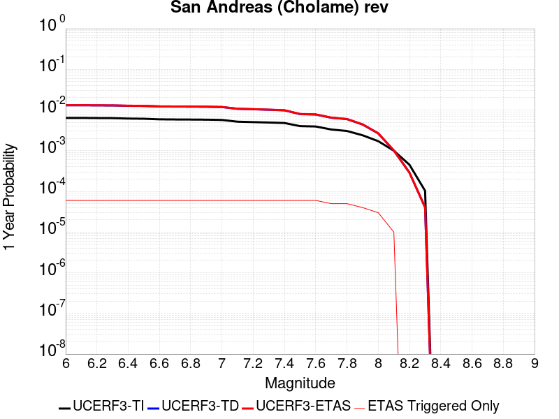 |  |

| Magnitude | 1 wk TI Prob | 1 wk TD Prob | 1 wk ETAS Prob | 1 wk ETAS/TD Gain | 1 wk ETAS Triggered Only | 1 mo TI Prob | 1 mo TD Prob | 1 mo ETAS Prob | 1 mo ETAS/TD Gain | 1 mo ETAS Triggered Only | 1 yr TI Prob | 1 yr TD Prob | 1 yr ETAS Prob | 1 yr ETAS/TD Gain | 1 yr ETAS Triggered Only | 10 yr TI Prob | 10 yr TD Prob | 10 yr ETAS Prob | 10 yr ETAS/TD Gain | 10 yr ETAS Triggered Only |
|-----|-----|-----|-----|-----|-----|-----|-----|-----|-----|-----|-----|-----|-----|-----|-----|-----|-----|-----|-----|-----|
| 6.0 | 1.2302514E-4 | 2.5301226E-4 | 2.5301226E-4 | 1.0 | 0.0 | 5.27144E-4 | 0.0010838893 | 0.0011067708 | 1.0211105 | 2.2906359E-5 | 0.0063991086 | 0.013117016 | 0.013184834 | 1.0051702 | 6.871908E-5 | 0.06217949 | 0.12479458 | 0.12495496 | 1.0012852 | 1.8325087E-4 |
| 6.1 | 1.2302514E-4 | 2.5301226E-4 | 2.5301226E-4 | 1.0 | 0.0 | 5.27144E-4 | 0.0010838893 | 0.0011067708 | 1.0211105 | 2.2906359E-5 | 0.0063991086 | 0.013117016 | 0.013184834 | 1.0051702 | 6.871908E-5 | 0.06217949 | 0.12479458 | 0.12495496 | 1.0012852 | 1.8325087E-4 |
| 6.2 | 1.2203569E-4 | 2.5117898E-4 | 2.5117898E-4 | 1.0 | 0.0 | 5.2290526E-4 | 0.0010760389 | 0.0010989206 | 1.0212648 | 2.2906359E-5 | 0.006347804 | 0.013022584 | 0.013090408 | 1.0052083 | 6.871908E-5 | 0.061695136 | 0.12398066 | 0.124141194 | 1.0012949 | 1.8325087E-4 |
| 6.3 | 1.2142645E-4 | 2.5003796E-4 | 2.5003796E-4 | 1.0 | 0.0 | 5.202953E-4 | 0.0010711529 | 0.0010940346 | 1.0213618 | 2.2906359E-5 | 0.006316212 | 0.012963806 | 0.0130316345 | 1.0052321 | 6.871908E-5 | 0.06139677 | 0.12347472 | 0.123635344 | 1.0013008 | 1.8325087E-4 |
| 6.4 | 1.1865206E-4 | 2.4508737E-4 | 2.4508737E-4 | 1.0 | 0.0 | 5.0840975E-4 | 0.0010499532 | 0.0010728355 | 1.0217936 | 2.2906359E-5 | 0.006172335 | 0.012708736 | 0.012776582 | 1.0053385 | 6.871908E-5 | 0.060036868 | 0.121266164 | 0.12140706 | 1.0011619 | 1.6034451E-4 |
| 6.5 | 1.17443946E-4 | 2.4301645E-4 | 2.4301645E-4 | 1.0 | 0.0 | 5.032341E-4 | 0.0010410849 | 0.0010639675 | 1.0219795 | 2.2906359E-5 | 0.006109677 | 0.012602015 | 0.012669869 | 1.0053843 | 6.871908E-5 | 0.059444077 | 0.12033925 | 0.12048031 | 1.0011721 | 1.6034451E-4 |
| 6.6 | 1.13579066E-4 | 2.3609491E-4 | 2.3609491E-4 | 1.0 | 0.0 | 4.866766E-4 | 0.0010114445 | 0.0010343277 | 1.0226243 | 2.2906359E-5 | 0.0059092017 | 0.012245254 | 0.012313131 | 1.0055432 | 6.871908E-5 | 0.057545185 | 0.117250346 | 0.117391884 | 1.0012072 | 1.6034451E-4 |
| 6.7 | 1.1271412E-4 | 2.3453572E-4 | 2.3453572E-4 | 1.0 | 0.0 | 4.829711E-4 | 0.0010047674 | 0.0010276508 | 1.0227748 | 2.2906359E-5 | 0.005864331 | 0.01216487 | 0.012232753 | 1.0055803 | 6.871908E-5 | 0.057119697 | 0.11655333 | 0.11669499 | 1.0012153 | 1.6034451E-4 |
| 6.8 | 1.1217975E-4 | 2.3341762E-4 | 2.3341762E-4 | 1.0 | 0.0 | 4.8068175E-4 | 9.999792E-4 | 0.0010228627 | 1.0228839 | 2.2906359E-5 | 0.005836608 | 0.012107224 | 0.012175111 | 1.0056071 | 6.871908E-5 | 0.056856725 | 0.116050914 | 0.116192654 | 1.0012213 | 1.6034451E-4 |
| 6.9 | 1.1146753E-4 | 2.3190254E-4 | 2.3190254E-4 | 1.0 | 0.0 | 4.7763053E-4 | 9.93491E-4 | 0.0010163746 | 1.0230335 | 2.2906359E-5 | 0.0057996577 | 0.012029105 | 0.012096997 | 1.005644 | 6.871908E-5 | 0.056506127 | 0.115370646 | 0.11551249 | 1.0012295 | 1.6034451E-4 |
| 7.0 | 1.0965793E-4 | 2.2812837E-4 | 2.2812837E-4 | 1.0 | 0.0 | 4.698779E-4 | 9.773282E-4 | 0.0010002122 | 1.0234149 | 2.2906359E-5 | 0.005705768 | 0.011834476 | 0.011902383 | 1.005738 | 6.871908E-5 | 0.055614736 | 0.113670014 | 0.11381213 | 1.0012503 | 1.6034451E-4 |
| 7.1 | 9.927982E-5 | 2.0628411E-4 | 2.0628411E-4 | 1.0 | 0.0 | 4.2541555E-4 | 8.837762E-4 | 9.066624E-4 | 1.0258958 | 2.2906359E-5 | 0.0051671406 | 0.010707187 | 0.010775169 | 1.0063493 | 6.871908E-5 | 0.05048634 | 0.10375505 | 0.103898756 | 1.0013851 | 1.6034451E-4 |
| 7.2 | 9.696786E-5 | 2.0132023E-4 | 2.0132023E-4 | 1.0 | 0.0 | 4.1551032E-4 | 8.6251675E-4 | 8.8540337E-4 | 1.0265347 | 2.2906359E-5 | 0.00504711 | 0.010450863 | 0.010518864 | 1.0065067 | 6.871908E-5 | 0.04934009 | 0.10149143 | 0.10163549 | 1.0014195 | 1.6034451E-4 |
| 7.3 | 9.4727984E-5 | 1.9559902E-4 | 1.9559902E-4 | 1.0 | 0.0 | 4.0591392E-4 | 8.380132E-4 | 8.609003E-4 | 1.0273112 | 2.2906359E-5 | 0.0049308087 | 0.010155352 | 0.010223373 | 1.006698 | 6.871908E-5 | 0.048228268 | 0.09885787 | 0.09900237 | 1.0014616 | 1.6034451E-4 |
| 7.4 | 9.220358E-5 | 1.8928824E-4 | 1.8928824E-4 | 1.0 | 0.0 | 3.9509835E-4 | 8.1098406E-4 | 8.3387183E-4 | 1.0282222 | 2.2906359E-5 | 0.004799717 | 0.00982928 | 0.009897323 | 1.0069226 | 6.871908E-5 | 0.046973653 | 0.0959303 | 0.09607527 | 1.0015111 | 1.6034451E-4 |
| 7.5 | 7.71631E-5 | 1.5252932E-4 | 1.5252932E-4 | 1.0 | 0.0 | 3.306571E-4 | 6.535335E-4 | 6.764249E-4 | 1.0350271 | 2.2906359E-5 | 0.0040183207 | 0.0079278145 | 0.007995988 | 1.0085994 | 6.871908E-5 | 0.03946433 | 0.07862106 | 0.07874769 | 1.0016106 | 1.3743815E-4 |
| 7.6 | 7.5634416E-5 | 1.4911414E-4 | 1.4911414E-4 | 1.0 | 0.0 | 3.241072E-4 | 6.389043E-4 | 6.61796E-4 | 1.0358297 | 2.2906359E-5 | 0.0039388672 | 0.0077509843 | 0.00781917 | 1.0087972 | 6.871908E-5 | 0.038697794 | 0.076980904 | 0.07710776 | 1.001648 | 1.3743815E-4 |
| 7.7 | 6.3783E-5 | 1.2425019E-4 | 1.2425019E-4 | 1.0 | 0.0 | 2.7332708E-4 | 5.323922E-4 | 5.5528636E-4 | 1.0430025 | 2.2906359E-5 | 0.0033226798 | 0.006462638 | 0.0065081543 | 1.007043 | 4.5812718E-5 | 0.032734364 | 0.0648433 | 0.06488614 | 1.0006607 | 4.5812718E-5 |
| 7.8 | 5.863422E-5 | 1.1476381E-4 | 1.1476381E-4 | 1.0 | 0.0 | 2.512653E-4 | 4.9175223E-4 | 5.1464734E-4 | 1.0465581 | 2.2906359E-5 | 0.003054864 | 0.005970669 | 0.0060162083 | 1.0076271 | 4.5812718E-5 | 0.030132094 | 0.059935976 | 0.05997904 | 1.0007186 | 4.5812718E-5 |
| 7.9 | 4.595283E-5 | 8.470392E-5 | 8.470392E-5 | 1.0 | 0.0 | 1.9692584E-4 | 3.629663E-4 | 3.8586435E-4 | 1.0630859 | 2.2906359E-5 | 0.0023949358 | 0.004410167 | 0.0044329725 | 1.0051711 | 2.2906359E-5 | 0.023692891 | 0.04457013 | 0.044592015 | 1.000491 | 2.2906359E-5 |
| 8.0 | 3.2950178E-5 | 5.104955E-5 | 5.104955E-5 | 1.0 | 0.0 | 1.412074E-4 | 2.1876545E-4 | 2.1876545E-4 | 1.0 | 0.0 | 0.0017178444 | 0.0026602177 | 0.0026602177 | 1.0 | 0.0 | 0.017046256 | 0.027316514 | 0.027316514 | 1.0 | 0.0 |
| 8.1 | 1.9177472E-5 | 1.9323319E-5 | 1.9323319E-5 | 1.0 | 0.0 | 8.218658E-5 | 8.2811595E-5 | 8.2811595E-5 | 1.0 | 0.0 | 0.0010001622 | 0.0010077655 | 0.0010077655 | 1.0 | 0.0 | 0.009956728 | 0.010830752 | 0.010830752 | 1.0 | 0.0 |
| 8.2 | 8.643924E-6 | 5.5269165E-6 | 5.5269165E-6 | 1.0 | 0.0 | 3.704486E-5 | 2.368657E-5 | 2.368657E-5 | 1.0 | 0.0 | 4.5092785E-4 | 2.8834594E-4 | 2.8834594E-4 | 1.0 | 0.0 | 0.0045001395 | 0.0032771796 | 0.0032771796 | 1.0 | 0.0 |
| 8.3 | 1.983087E-6 | 7.7486385E-7 | 7.7486385E-7 | 1.0 | 0.0 | 8.498917E-6 | 3.320841E-6 | 3.320841E-6 | 1.0 | 0.0 | 1.034694E-4 | 4.0430506E-5 | 4.0430506E-5 | 1.0 | 0.0 | 0.0010342124 | 4.7705657E-4 | 4.7705657E-4 | 1.0 | 0.0 |

## Death Valley (Fish Lake Valley)
*[(top)](#table-of-contents)*

| 1 Week | 1 Month | 1 Year | 10 Year |
|-----|-----|-----|-----|
|  |  | 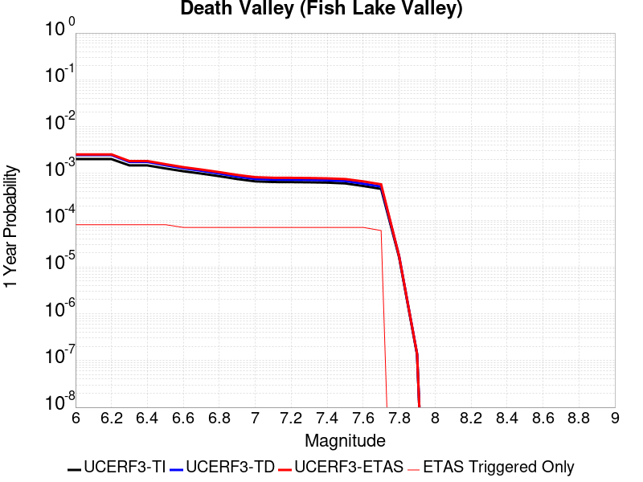 |  |

| Magnitude | 1 wk TI Prob | 1 wk TD Prob | 1 wk ETAS Prob | 1 wk ETAS/TD Gain | 1 wk ETAS Triggered Only | 1 mo TI Prob | 1 mo TD Prob | 1 mo ETAS Prob | 1 mo ETAS/TD Gain | 1 mo ETAS Triggered Only | 1 yr TI Prob | 1 yr TD Prob | 1 yr ETAS Prob | 1 yr ETAS/TD Gain | 1 yr ETAS Triggered Only | 10 yr TI Prob | 10 yr TD Prob | 10 yr ETAS Prob | 10 yr ETAS/TD Gain | 10 yr ETAS Triggered Only |
|-----|-----|-----|-----|-----|-----|-----|-----|-----|-----|-----|-----|-----|-----|-----|-----|-----|-----|-----|-----|-----|
| 6.0 | 3.872328E-5 | 4.7281694E-5 | 7.0186965E-5 | 1.4844428 | 2.2906359E-5 | 1.6594635E-4 | 2.0262178E-4 | 2.255235E-4 | 1.113027 | 2.2906359E-5 | 0.0020185246 | 0.002464232 | 0.0025784816 | 1.0463631 | 1.14531795E-4 | 0.02000288 | 0.024395194 | 0.024573974 | 1.0073285 | 1.8325087E-4 |
| 6.1 | 3.872328E-5 | 4.7281694E-5 | 7.0186965E-5 | 1.4844428 | 2.2906359E-5 | 1.6594635E-4 | 2.0262178E-4 | 2.255235E-4 | 1.113027 | 2.2906359E-5 | 0.0020185246 | 0.002464232 | 0.0025784816 | 1.0463631 | 1.14531795E-4 | 0.02000288 | 0.024395194 | 0.024573974 | 1.0073285 | 1.8325087E-4 |
| 6.2 | 3.872328E-5 | 4.7281694E-5 | 7.0186965E-5 | 1.4844428 | 2.2906359E-5 | 1.6594635E-4 | 2.0262178E-4 | 2.255235E-4 | 1.113027 | 2.2906359E-5 | 0.0020185246 | 0.002464232 | 0.0025784816 | 1.0463631 | 1.14531795E-4 | 0.02000288 | 0.024395194 | 0.024573974 | 1.0073285 | 1.8325087E-4 |
| 6.3 | 2.8356371E-5 | 3.361828E-5 | 5.6523866E-5 | 1.6813433 | 2.2906359E-5 | 1.2152165E-4 | 1.4407083E-4 | 1.6697388E-4 | 1.1589708 | 2.2906359E-5 | 0.0014785219 | 0.0017527296 | 0.0018670607 | 1.0652303 | 1.14531795E-4 | 0.014687235 | 0.017396059 | 0.01757612 | 1.0103508 | 1.8325087E-4 |
| 6.4 | 2.8356371E-5 | 3.361828E-5 | 5.6523866E-5 | 1.6813433 | 2.2906359E-5 | 1.2152165E-4 | 1.4407083E-4 | 1.6697388E-4 | 1.1589708 | 2.2906359E-5 | 0.0014785219 | 0.0017527296 | 0.0018670607 | 1.0652303 | 1.14531795E-4 | 0.014687235 | 0.017396059 | 0.01757612 | 1.0103508 | 1.8325087E-4 |
| 6.5 | 2.4448687E-5 | 2.8614111E-5 | 5.1519815E-5 | 1.8005037 | 2.2906359E-5 | 1.0477588E-4 | 1.2262643E-4 | 1.4552998E-4 | 1.186775 | 2.2906359E-5 | 0.0012748998 | 0.0014920048 | 0.0016063658 | 1.0766492 | 1.14531795E-4 | 0.012676105 | 0.014824731 | 0.015005265 | 1.012178 | 1.8325087E-4 |
| 6.6 | 2.1298161E-5 | 2.4665313E-5 | 4.7571106E-5 | 1.9286642 | 2.2906359E-5 | 9.127464E-5 | 1.0570439E-4 | 1.2860833E-4 | 1.2166791 | 2.2906359E-5 | 0.0011107022 | 0.001286225 | 0.0013777326 | 1.0711443 | 9.1625436E-5 | 0.011051672 | 0.012791215 | 0.012926895 | 1.0106072 | 1.3743815E-4 |
| 6.7 | 1.8959729E-5 | 2.1785369E-5 | 4.4691227E-5 | 2.051433 | 2.2906359E-5 | 8.125345E-5 | 9.336267E-5 | 1.1626689E-4 | 1.2453252 | 2.2906359E-5 | 9.888117E-4 | 0.0011361233 | 0.0012276447 | 1.0805558 | 9.1625436E-5 | 0.009844234 | 0.011305812 | 0.011441696 | 1.0120189 | 1.3743815E-4 |
| 6.8 | 1.6691629E-5 | 1.9021896E-5 | 4.192782E-5 | 2.2041872 | 2.2906359E-5 | 7.153359E-5 | 8.151996E-5 | 1.0442445E-4 | 1.280968 | 2.2906359E-5 | 8.7057345E-4 | 9.920704E-4 | 0.001083605 | 1.0922662 | 9.1625436E-5 | 0.008671708 | 0.009878175 | 0.0100142555 | 1.0137758 | 1.3743815E-4 |
| 6.9 | 1.450505E-5 | 1.6392378E-5 | 3.929836E-5 | 2.3973558 | 2.2906359E-5 | 6.216302E-5 | 7.0251204E-5 | 9.3155955E-5 | 1.3260406 | 2.2906359E-5 | 7.5657194E-4 | 8.549816E-4 | 9.465287E-4 | 1.107075 | 9.1625436E-5 | 0.007540013 | 0.008517854 | 0.008654122 | 1.0159979 | 1.3743815E-4 |
| 7.0 | 1.2940855E-5 | 1.4540358E-5 | 3.7446385E-5 | 2.5753412 | 2.2906359E-5 | 5.545963E-5 | 6.2314364E-5 | 8.52193E-5 | 1.3675706 | 2.2906359E-5 | 6.750118E-4 | 7.584191E-4 | 8.4997504E-4 | 1.1207194 | 9.1625436E-5 | 0.006729651 | 0.007558926 | 0.007695325 | 1.0180448 | 1.3743815E-4 |
| 7.1 | 1.2544658E-5 | 1.4080496E-5 | 3.6986534E-5 | 2.6267917 | 2.2906359E-5 | 5.3761712E-5 | 6.034362E-5 | 8.32486E-5 | 1.3795757 | 2.2906359E-5 | 6.5435225E-4 | 7.344415E-4 | 8.2599965E-4 | 1.1246636 | 9.1625436E-5 | 0.006524288 | 0.0073207365 | 0.007457169 | 1.0186363 | 1.3743815E-4 |
| 7.2 | 1.2489416E-5 | 1.4017952E-5 | 3.692399E-5 | 2.6340501 | 2.2906359E-5 | 5.3524967E-5 | 6.0075585E-5 | 8.2980565E-5 | 1.3812695 | 2.2906359E-5 | 6.514716E-4 | 7.311804E-4 | 8.2273886E-4 | 1.1252201 | 9.1625436E-5 | 0.006495651 | 0.0072883395 | 0.007424776 | 1.0187198 | 1.3743815E-4 |
| 7.3 | 1.2368307E-5 | 1.3882068E-5 | 3.6788108E-5 | 2.6500454 | 2.2906359E-5 | 5.3005948E-5 | 5.9493254E-5 | 8.239825E-5 | 1.3850015 | 2.2906359E-5 | 6.451563E-4 | 7.240952E-4 | 8.156543E-4 | 1.1264462 | 9.1625436E-5 | 0.0064328653 | 0.0072179507 | 0.0073543964 | 1.0189037 | 1.3743815E-4 |
| 7.4 | 1.2161707E-5 | 1.3650086E-5 | 3.655613E-5 | 2.6780882 | 2.2906359E-5 | 5.212056E-5 | 5.8499085E-5 | 8.1404105E-5 | 1.3915449 | 2.2906359E-5 | 6.3438306E-4 | 7.119992E-4 | 8.0355944E-4 | 1.128596 | 9.1625436E-5 | 0.006325751 | 0.0070977695 | 0.007234232 | 1.0192261 | 1.3743815E-4 |
| 7.5 | 1.1707948E-5 | 1.314766E-5 | 3.6053716E-5 | 2.7422156 | 2.2906359E-5 | 5.0175953E-5 | 5.634593E-5 | 7.9250996E-5 | 1.406508 | 2.2906359E-5 | 6.10721E-4 | 6.858013E-4 | 7.7736395E-4 | 1.1335118 | 9.1625436E-5 | 0.0060904534 | 0.006837433 | 0.0069739316 | 1.0199634 | 1.3743815E-4 |
| 7.6 | 1.0319538E-5 | 1.15815E-5 | 3.4487595E-5 | 2.9778175 | 2.2906359E-5 | 4.4225842E-5 | 4.9634087E-5 | 7.253931E-5 | 1.4614817 | 2.2906359E-5 | 5.383166E-4 | 6.0413266E-4 | 6.9570274E-4 | 1.1515728 | 9.1625436E-5 | 0.0053701443 | 0.0060254345 | 0.0061620446 | 1.0226722 | 1.3743815E-4 |
| 7.7 | 8.937764E-6 | 1.0024395E-5 | 1.0024395E-5 | 1.0 | 0.0 | 3.830414E-5 | 4.2961015E-5 | 4.2961015E-5 | 1.0 | 0.0 | 4.6625308E-4 | 5.229299E-4 | 5.91613E-4 | 1.1313429 | 6.871908E-5 | 0.0046527605 | 0.0052175033 | 0.0053314376 | 1.0218369 | 1.14531795E-4 |
| 7.8 | 3.108007E-7 | 3.2849027E-7 | 3.2849027E-7 | 1.0 | 0.0 | 1.3320023E-6 | 1.4078147E-6 | 1.4078147E-6 | 1.0 | 0.0 | 1.6217007E-5 | 1.7140013E-5 | 1.7140013E-5 | 1.0 | 0.0 | 1.6215823E-4 | 1.7138729E-4 | 1.7138729E-4 | 1.0 | 0.0 |
| 7.9 | 2.5591178E-9 | 2.6698248E-9 | 2.6698248E-9 | 1.0 | 0.0 | 1.0967647E-8 | 1.1442106E-8 | 1.1442106E-8 | 1.0 | 0.0 | 1.335311E-7 | 1.3930764E-7 | 1.3930764E-7 | 1.0 | 0.0 | 1.3353102E-6 | 1.3930764E-6 | 1.3930764E-6 | 1.0 | 0.0 |

## San Andreas (Parkfield)
*[(top)](#table-of-contents)*

| 1 Week | 1 Month | 1 Year | 10 Year |
|-----|-----|-----|-----|
|  | 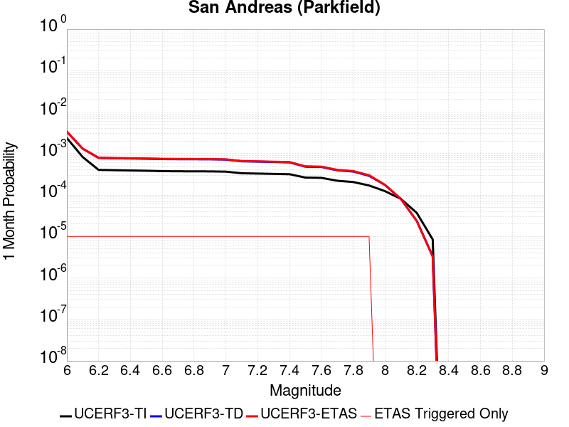 |  |  |

| Magnitude | 1 wk TI Prob | 1 wk TD Prob | 1 wk ETAS Prob | 1 wk ETAS/TD Gain | 1 wk ETAS Triggered Only | 1 mo TI Prob | 1 mo TD Prob | 1 mo ETAS Prob | 1 mo ETAS/TD Gain | 1 mo ETAS Triggered Only | 1 yr TI Prob | 1 yr TD Prob | 1 yr ETAS Prob | 1 yr ETAS/TD Gain | 1 yr ETAS Triggered Only | 10 yr TI Prob | 10 yr TD Prob | 10 yr ETAS Prob | 10 yr ETAS/TD Gain | 10 yr ETAS Triggered Only |
|-----|-----|-----|-----|-----|-----|-----|-----|-----|-----|-----|-----|-----|-----|-----|-----|-----|-----|-----|-----|-----|
| 6.0 | 5.556969E-4 | 7.8797597E-4 | 7.8797597E-4 | 1.0 | 0.0 | 0.0023793848 | 0.003373235 | 0.003396064 | 1.0067677 | 2.2906359E-5 | 0.028586963 | 0.04067351 | 0.040739432 | 1.0016208 | 6.871908E-5 | 0.25176284 | 0.33868203 | 0.33878806 | 1.000313 | 1.6034451E-4 |
| 6.1 | 1.925858E-4 | 3.056036E-4 | 3.056036E-4 | 1.0 | 0.0 | 8.2510663E-4 | 0.0013091693 | 0.0013320458 | 1.0174739 | 2.2906359E-5 | 0.0099994885 | 0.015918575 | 0.015963659 | 1.0028322 | 4.5812718E-5 | 0.095613256 | 0.15041287 | 0.15051018 | 1.000647 | 1.14531795E-4 |
| 6.2 | 9.4306815E-5 | 1.831944E-4 | 1.831944E-4 | 1.0 | 0.0 | 4.0410945E-4 | 7.8488386E-4 | 8.077722E-4 | 1.0291615 | 2.2906359E-5 | 0.0049089384 | 0.0095143 | 0.009559677 | 1.0047693 | 4.5812718E-5 | 0.048019063 | 0.092186436 | 0.092269614 | 1.0009023 | 9.1625436E-5 |
| 6.3 | 9.283051E-5 | 1.8015703E-4 | 1.8015703E-4 | 1.0 | 0.0 | 3.9778434E-4 | 7.718743E-4 | 7.94763E-4 | 1.0296534 | 2.2906359E-5 | 0.0048322747 | 0.00935728 | 0.009402664 | 1.0048501 | 4.5812718E-5 | 0.047285385 | 0.09083898 | 0.09092229 | 1.0009171 | 9.1625436E-5 |
| 6.4 | 9.138826E-5 | 1.7777387E-4 | 1.7777387E-4 | 1.0 | 0.0 | 3.916052E-4 | 7.6166674E-4 | 7.845556E-4 | 1.0300511 | 2.2906359E-5 | 0.0047573745 | 0.009234063 | 0.009279453 | 1.0049155 | 4.5812718E-5 | 0.046568092 | 0.08973953 | 0.08982293 | 1.0009294 | 9.1625436E-5 |
| 6.5 | 9.000255E-5 | 1.7534966E-4 | 1.7534966E-4 | 1.0 | 0.0 | 3.8566816E-4 | 7.512833E-4 | 7.741725E-4 | 1.0304667 | 2.2906359E-5 | 0.0046854047 | 0.00910872 | 0.009154116 | 1.0049838 | 4.5812718E-5 | 0.045878403 | 0.08862388 | 0.08870739 | 1.0009422 | 9.1625436E-5 |
| 6.6 | 8.8109264E-5 | 1.7215131E-4 | 1.7215131E-4 | 1.0 | 0.0 | 3.7755648E-4 | 7.3758385E-4 | 7.604733E-4 | 1.031033 | 2.2906359E-5 | 0.0045870654 | 0.008943325 | 0.008988728 | 1.0050768 | 4.5812718E-5 | 0.04493529 | 0.08715216 | 0.0872358 | 1.0009598 | 9.1625436E-5 |
| 6.7 | 8.738073E-5 | 1.7081993E-4 | 1.7081993E-4 | 1.0 | 0.0 | 3.7443507E-4 | 7.318812E-4 | 7.5477076E-4 | 1.031275 | 2.2906359E-5 | 0.0045492216 | 0.008874504 | 0.0089199105 | 1.0051165 | 4.5812718E-5 | 0.04457213 | 0.086551875 | 0.086635575 | 1.000967 | 9.1625436E-5 |
| 6.8 | 8.710195E-5 | 1.7027321E-4 | 1.7027321E-4 | 1.0 | 0.0 | 3.7324068E-4 | 7.2953943E-4 | 7.5242907E-4 | 1.0313755 | 2.2906359E-5 | 0.0045347405 | 0.008846234 | 0.008891641 | 1.0051329 | 4.5812718E-5 | 0.04443313 | 0.08629888 | 0.086382605 | 1.0009701 | 9.1625436E-5 |
| 6.9 | 8.6801556E-5 | 1.696812E-4 | 1.696812E-4 | 1.0 | 0.0 | 3.7195362E-4 | 7.270036E-4 | 7.498933E-4 | 1.031485 | 2.2906359E-5 | 0.0045191357 | 0.00881561 | 0.008861019 | 1.0051509 | 4.5812718E-5 | 0.044283327 | 0.08602441 | 0.086108156 | 1.0009735 | 9.1625436E-5 |
| 7.0 | 8.5571606E-5 | 1.6720325E-4 | 1.6720325E-4 | 1.0 | 0.0 | 3.6668387E-4 | 7.1638974E-4 | 7.3927967E-4 | 1.0319518 | 2.2906359E-5 | 0.004455241 | 0.008687424 | 0.008732838 | 1.0052277 | 4.5812718E-5 | 0.043669727 | 0.08487067 | 0.08495453 | 1.000988 | 9.1625436E-5 |
| 7.1 | 7.82589E-5 | 1.519865E-4 | 1.519865E-4 | 1.0 | 0.0 | 3.3535215E-4 | 6.5120886E-4 | 6.741003E-4 | 1.0351522 | 2.2906359E-5 | 0.0040752706 | 0.007899817 | 0.0079452675 | 1.0057534 | 4.5812718E-5 | 0.040013418 | 0.077774286 | 0.07785879 | 1.0010865 | 9.1625436E-5 |
| 7.2 | 7.690929E-5 | 1.4935475E-4 | 1.4935475E-4 | 1.0 | 0.0 | 3.2956956E-4 | 6.3993543E-4 | 6.6282717E-4 | 1.0357718 | 2.2906359E-5 | 0.004005129 | 0.007763549 | 0.007809006 | 1.0058552 | 4.5812718E-5 | 0.0393371 | 0.07654616 | 0.07663077 | 1.0011054 | 9.1625436E-5 |
| 7.3 | 7.5543794E-5 | 1.4631219E-4 | 1.4631219E-4 | 1.0 | 0.0 | 3.2371894E-4 | 6.269022E-4 | 6.4979424E-4 | 1.0365161 | 2.2906359E-5 | 0.003934157 | 0.0076059876 | 0.007651452 | 1.0059774 | 4.5812718E-5 | 0.038652334 | 0.07510628 | 0.07519102 | 1.0011283 | 9.1625436E-5 |
| 7.4 | 7.4214564E-5 | 1.4331246E-4 | 1.4331246E-4 | 1.0 | 0.0 | 3.1802364E-4 | 6.140524E-4 | 6.369447E-4 | 1.0372807 | 2.2906359E-5 | 0.003865065 | 0.007450621 | 0.0074960925 | 1.006103 | 4.5812718E-5 | 0.03798529 | 0.07367671 | 0.07376158 | 1.001152 | 9.1625436E-5 |
| 7.5 | 6.149578E-5 | 1.124955E-4 | 1.124955E-4 | 1.0 | 0.0 | 2.6352672E-4 | 4.820346E-4 | 5.049299E-4 | 1.0474973 | 2.2906359E-5 | 0.0032037178 | 0.0058530113 | 0.0058985557 | 1.0077814 | 4.5812718E-5 | 0.03157923 | 0.058828387 | 0.058893062 | 1.0010995 | 6.871908E-5 |
| 7.6 | 6.0643448E-5 | 1.1077644E-4 | 1.1077644E-4 | 1.0 | 0.0 | 2.598746E-4 | 4.7466988E-4 | 4.975654E-4 | 1.0482346 | 2.2906359E-5 | 0.0031593828 | 0.0057638236 | 0.0058093723 | 1.0079025 | 4.5812718E-5 | 0.031148417 | 0.057987217 | 0.05805195 | 1.0011164 | 6.871908E-5 |
| 7.7 | 5.1652263E-5 | 9.226993E-5 | 9.226993E-5 | 1.0 | 0.0 | 2.2134806E-4 | 3.9538264E-4 | 4.1827996E-4 | 1.0579118 | 2.2906359E-5 | 0.002691582 | 0.004803169 | 0.004825965 | 1.0047461 | 2.2906359E-5 | 0.026592141 | 0.048781026 | 0.048802815 | 1.0004467 | 2.2906359E-5 |
| 7.8 | 4.8090482E-5 | 8.607785E-5 | 8.607785E-5 | 1.0 | 0.0 | 2.060858E-4 | 3.6885295E-4 | 3.9175086E-4 | 1.0620787 | 2.2906359E-5 | 0.0025062072 | 0.0044815456 | 0.0045043495 | 1.0050883 | 2.2906359E-5 | 0.024781305 | 0.04552861 | 0.045550473 | 1.0004802 | 2.2906359E-5 |
| 7.9 | 3.970278E-5 | 6.787929E-5 | 6.787929E-5 | 1.0 | 0.0 | 1.7014367E-4 | 2.9087884E-4 | 3.1377852E-4 | 1.0787259 | 2.2906359E-5 | 0.002069531 | 0.0035357028 | 0.0035585281 | 1.0064557 | 2.2906359E-5 | 0.020503636 | 0.036061067 | 0.03608315 | 1.0006123 | 2.2906359E-5 |
| 8.0 | 2.8982335E-5 | 4.093677E-5 | 4.093677E-5 | 1.0 | 0.0 | 1.2420409E-4 | 1.754315E-4 | 1.754315E-4 | 1.0 | 0.0 | 0.0015111357 | 0.0021337876 | 0.0021337876 | 1.0 | 0.0 | 0.015009012 | 0.022130102 | 0.022130102 | 1.0 | 0.0 |
| 8.1 | 1.8836186E-5 | 1.8816902E-5 | 1.8816902E-5 | 1.0 | 0.0 | 8.0724014E-5 | 8.0641374E-5 | 8.0641374E-5 | 1.0 | 0.0 | 9.823717E-4 | 9.813671E-4 | 9.813671E-4 | 1.0 | 0.0 | 0.009780403 | 0.010559504 | 0.010559504 | 1.0 | 0.0 |
| 8.2 | 8.643924E-6 | 5.5269165E-6 | 5.5269165E-6 | 1.0 | 0.0 | 3.704486E-5 | 2.368657E-5 | 2.368657E-5 | 1.0 | 0.0 | 4.5092785E-4 | 2.8834594E-4 | 2.8834594E-4 | 1.0 | 0.0 | 0.0045001395 | 0.0032771796 | 0.0032771796 | 1.0 | 0.0 |
| 8.3 | 1.983087E-6 | 7.7486385E-7 | 7.7486385E-7 | 1.0 | 0.0 | 8.498917E-6 | 3.320841E-6 | 3.320841E-6 | 1.0 | 0.0 | 1.034694E-4 | 4.0430506E-5 | 4.0430506E-5 | 1.0 | 0.0 | 0.0010342124 | 4.7705657E-4 | 4.7705657E-4 | 1.0 | 0.0 |

## San Andreas (Carrizo) rev
*[(top)](#table-of-contents)*

| 1 Week | 1 Month | 1 Year | 10 Year |
|-----|-----|-----|-----|
|  |  |  |  |

| Magnitude | 1 wk TI Prob | 1 wk TD Prob | 1 wk ETAS Prob | 1 wk ETAS/TD Gain | 1 wk ETAS Triggered Only | 1 mo TI Prob | 1 mo TD Prob | 1 mo ETAS Prob | 1 mo ETAS/TD Gain | 1 mo ETAS Triggered Only | 1 yr TI Prob | 1 yr TD Prob | 1 yr ETAS Prob | 1 yr ETAS/TD Gain | 1 yr ETAS Triggered Only | 10 yr TI Prob | 10 yr TD Prob | 10 yr ETAS Prob | 10 yr ETAS/TD Gain | 10 yr ETAS Triggered Only |
|-----|-----|-----|-----|-----|-----|-----|-----|-----|-----|-----|-----|-----|-----|-----|-----|-----|-----|-----|-----|-----|
| 6.0 | 1.1674632E-4 | 2.4418926E-4 | 2.4418926E-4 | 1.0 | 0.0 | 5.002454E-4 | 0.0010461073 | 0.0010689896 | 1.0218738 | 2.2906359E-5 | 0.006073493 | 0.012662465 | 0.012730313 | 1.0053582 | 6.871908E-5 | 0.0591016 | 0.12101763 | 0.12115856 | 1.0011647 | 1.6034451E-4 |
| 6.1 | 1.1674632E-4 | 2.4418926E-4 | 2.4418926E-4 | 1.0 | 0.0 | 5.002454E-4 | 0.0010461073 | 0.0010689896 | 1.0218738 | 2.2906359E-5 | 0.006073493 | 0.012662465 | 0.012730313 | 1.0053582 | 6.871908E-5 | 0.0591016 | 0.12101763 | 0.12115856 | 1.0011647 | 1.6034451E-4 |
| 6.2 | 1.1674632E-4 | 2.4418926E-4 | 2.4418926E-4 | 1.0 | 0.0 | 5.002454E-4 | 0.0010461073 | 0.0010689896 | 1.0218738 | 2.2906359E-5 | 0.006073493 | 0.012662465 | 0.012730313 | 1.0053582 | 6.871908E-5 | 0.0591016 | 0.12101763 | 0.12115856 | 1.0011647 | 1.6034451E-4 |
| 6.3 | 1.1674632E-4 | 2.4418926E-4 | 2.4418926E-4 | 1.0 | 0.0 | 5.002454E-4 | 0.0010461073 | 0.0010689896 | 1.0218738 | 2.2906359E-5 | 0.006073493 | 0.012662465 | 0.012730313 | 1.0053582 | 6.871908E-5 | 0.0591016 | 0.12101763 | 0.12115856 | 1.0011647 | 1.6034451E-4 |
| 6.4 | 1.1674632E-4 | 2.4418926E-4 | 2.4418926E-4 | 1.0 | 0.0 | 5.002454E-4 | 0.0010461073 | 0.0010689896 | 1.0218738 | 2.2906359E-5 | 0.006073493 | 0.012662465 | 0.012730313 | 1.0053582 | 6.871908E-5 | 0.0591016 | 0.12101763 | 0.12115856 | 1.0011647 | 1.6034451E-4 |
| 6.5 | 1.13136164E-4 | 2.3738507E-4 | 2.3738507E-4 | 1.0 | 0.0 | 4.847792E-4 | 0.0010169694 | 0.0010398525 | 1.0225012 | 2.2906359E-5 | 0.0058862255 | 0.012311762 | 0.012379635 | 1.0055128 | 6.871908E-5 | 0.057327334 | 0.11798858 | 0.118130006 | 1.0011986 | 1.6034451E-4 |
| 6.6 | 1.13136164E-4 | 2.3738507E-4 | 2.3738507E-4 | 1.0 | 0.0 | 4.847792E-4 | 0.0010169694 | 0.0010398525 | 1.0225012 | 2.2906359E-5 | 0.0058862255 | 0.012311762 | 0.012379635 | 1.0055128 | 6.871908E-5 | 0.057327334 | 0.11798858 | 0.118130006 | 1.0011986 | 1.6034451E-4 |
| 6.7 | 1.1149675E-4 | 2.3429535E-4 | 2.3429535E-4 | 1.0 | 0.0 | 4.777557E-4 | 0.001003738 | 0.0010266214 | 1.0227982 | 2.2906359E-5 | 0.0058011734 | 0.012152475 | 0.012220359 | 1.005586 | 6.871908E-5 | 0.05652051 | 0.11660991 | 0.11675156 | 1.0012147 | 1.6034451E-4 |
| 6.8 | 1.1103589E-4 | 2.3331578E-4 | 2.3331578E-4 | 1.0 | 0.0 | 4.7578133E-4 | 9.995431E-4 | 0.0010224265 | 1.0228939 | 2.2906359E-5 | 0.005777263 | 0.012101971 | 0.0121698575 | 1.0056096 | 6.871908E-5 | 0.056293584 | 0.11616996 | 0.11631168 | 1.0012199 | 1.6034451E-4 |
| 6.9 | 1.1053259E-4 | 2.3223832E-4 | 2.3223832E-4 | 1.0 | 0.0 | 4.7362508E-4 | 9.94929E-4 | 0.0010178125 | 1.0230002 | 2.2906359E-5 | 0.0057511497 | 0.012046416 | 0.012114308 | 1.0056359 | 6.871908E-5 | 0.05604569 | 0.11568588 | 0.11582767 | 1.0012257 | 1.6034451E-4 |
| 7.0 | 1.1005377E-4 | 2.3124556E-4 | 2.3124556E-4 | 1.0 | 0.0 | 4.7157376E-4 | 9.906775E-4 | 0.0010135612 | 1.0230991 | 2.2906359E-5 | 0.0057263062 | 0.011995226 | 0.0120631205 | 1.0056602 | 6.871908E-5 | 0.055809796 | 0.115237914 | 0.11537978 | 1.0012311 | 1.6034451E-4 |
| 7.1 | 1.0308142E-4 | 2.1632477E-4 | 2.1632477E-4 | 1.0 | 0.0 | 4.417027E-4 | 9.267778E-4 | 9.4966294E-4 | 1.0246933 | 2.2906359E-5 | 0.0053644776 | 0.01122546 | 0.011293408 | 1.006053 | 6.871908E-5 | 0.052368138 | 0.108490154 | 0.1086331 | 1.0013176 | 1.6034451E-4 |
| 7.2 | 1.0027479E-4 | 2.1039638E-4 | 2.1039638E-4 | 1.0 | 0.0 | 4.296783E-4 | 9.013882E-4 | 9.2427386E-4 | 1.0253894 | 2.2906359E-5 | 0.0052187922 | 0.01091948 | 0.010987448 | 1.0062245 | 6.871908E-5 | 0.050979212 | 0.105792396 | 0.105935775 | 1.0013553 | 1.6034451E-4 |
| 7.3 | 9.816942E-5 | 2.0513569E-4 | 2.0513569E-4 | 1.0 | 0.0 | 4.2065824E-4 | 8.7885774E-4 | 9.0174394E-4 | 1.0260409 | 2.2906359E-5 | 0.005109493 | 0.010647885 | 0.010715872 | 1.0063851 | 6.871908E-5 | 0.049935985 | 0.10337204 | 0.10351581 | 1.0013908 | 1.6034451E-4 |
| 7.4 | 9.5634205E-5 | 1.9881417E-4 | 1.9881417E-4 | 1.0 | 0.0 | 4.0979648E-4 | 8.5178344E-4 | 8.746703E-4 | 1.0268693 | 2.2906359E-5 | 0.0049778637 | 0.010321417 | 0.010389427 | 1.0065892 | 6.871908E-5 | 0.048678253 | 0.100452885 | 0.10059712 | 1.0014359 | 1.6034451E-4 |
| 7.5 | 8.052417E-5 | 1.6191212E-4 | 1.6191212E-4 | 1.0 | 0.0 | 3.4505792E-4 | 6.9372467E-4 | 7.166152E-4 | 1.0329964 | 2.2906359E-5 | 0.0041929903 | 0.008413471 | 0.008481612 | 1.0080991 | 6.871908E-5 | 0.04114753 | 0.083160356 | 0.08328637 | 1.0015153 | 1.3743815E-4 |
| 7.6 | 7.897024E-5 | 1.5843454E-4 | 1.5843454E-4 | 1.0 | 0.0 | 3.384E-4 | 6.788286E-4 | 7.0171943E-4 | 1.0337211 | 2.2906359E-5 | 0.0041122385 | 0.008233497 | 0.00830165 | 1.0082775 | 6.871908E-5 | 0.040369697 | 0.08149801 | 0.081624255 | 1.001549 | 1.3743815E-4 |
| 7.7 | 6.707427E-5 | 1.3346E-4 | 1.3346E-4 | 1.0 | 0.0 | 2.8742946E-4 | 5.718461E-4 | 5.9473934E-4 | 1.0400339 | 2.2906359E-5 | 0.003493839 | 0.0069400338 | 0.0069855284 | 1.0065554 | 4.5812718E-5 | 0.034394164 | 0.06936544 | 0.069408074 | 1.0006146 | 4.5812718E-5 |
| 7.8 | 6.147705E-5 | 1.226075E-4 | 1.226075E-4 | 1.0 | 0.0 | 2.6344648E-4 | 5.253549E-4 | 5.482492E-4 | 1.0435787 | 2.2906359E-5 | 0.0032027436 | 0.0063774628 | 0.0064229835 | 1.0071378 | 4.5812718E-5 | 0.031569764 | 0.063803546 | 0.06384643 | 1.0006722 | 4.5812718E-5 |
| 7.9 | 4.7636717E-5 | 8.925424E-5 | 8.925424E-5 | 1.0 | 0.0 | 2.0414138E-4 | 3.8246208E-4 | 4.053597E-4 | 1.0598689 | 2.2906359E-5 | 0.0024825884 | 0.004646542 | 0.0046693417 | 1.0049069 | 2.2906359E-5 | 0.024550365 | 0.046842933 | 0.046864767 | 1.0004661 | 2.2906359E-5 |
| 8.0 | 3.3554235E-5 | 5.2418785E-5 | 5.2418785E-5 | 1.0 | 0.0 | 1.4379594E-4 | 2.246326E-4 | 2.246326E-4 | 1.0 | 0.0 | 0.0017493097 | 0.0027314737 | 0.0027314737 | 1.0 | 0.0 | 0.017356034 | 0.028019711 | 0.028019711 | 1.0 | 0.0 |
| 8.1 | 1.9175432E-5 | 1.9323146E-5 | 1.9323146E-5 | 1.0 | 0.0 | 8.217783E-5 | 8.281086E-5 | 8.281086E-5 | 1.0 | 0.0 | 0.0010000558 | 0.0010077565 | 0.0010077565 | 1.0 | 0.0 | 0.009955673 | 0.010830634 | 0.010830634 | 1.0 | 0.0 |
| 8.2 | 8.643924E-6 | 5.5269165E-6 | 5.5269165E-6 | 1.0 | 0.0 | 3.704486E-5 | 2.368657E-5 | 2.368657E-5 | 1.0 | 0.0 | 4.5092785E-4 | 2.8834594E-4 | 2.8834594E-4 | 1.0 | 0.0 | 0.0045001395 | 0.0032771796 | 0.0032771796 | 1.0 | 0.0 |
| 8.3 | 1.983087E-6 | 7.7486385E-7 | 7.7486385E-7 | 1.0 | 0.0 | 8.498917E-6 | 3.320841E-6 | 3.320841E-6 | 1.0 | 0.0 | 1.034694E-4 | 4.0430506E-5 | 4.0430506E-5 | 1.0 | 0.0 | 0.0010342124 | 4.7705657E-4 | 4.7705657E-4 | 1.0 | 0.0 |

## White Wolf (Extension)
*[(top)](#table-of-contents)*

| 1 Week | 1 Month | 1 Year | 10 Year |
|-----|-----|-----|-----|
|  |  | 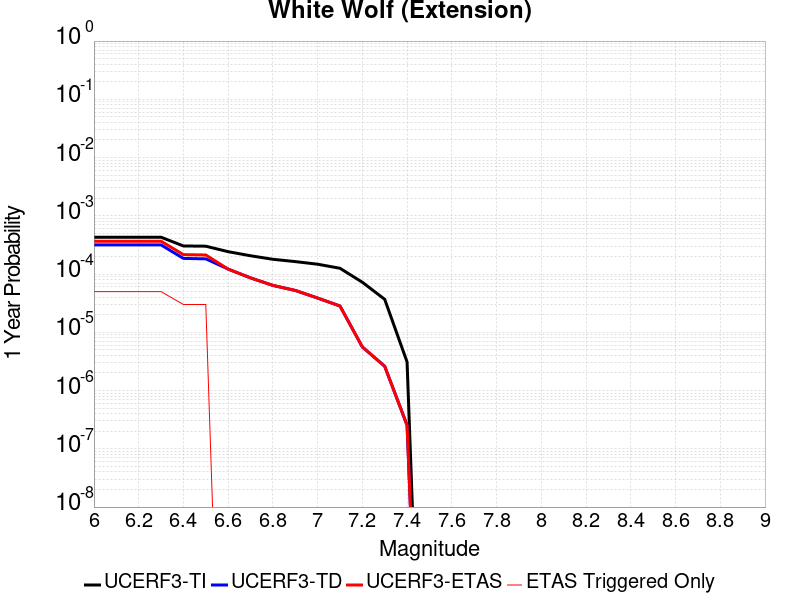 |  |

| Magnitude | 1 wk TI Prob | 1 wk TD Prob | 1 wk ETAS Prob | 1 wk ETAS/TD Gain | 1 wk ETAS Triggered Only | 1 mo TI Prob | 1 mo TD Prob | 1 mo ETAS Prob | 1 mo ETAS/TD Gain | 1 mo ETAS Triggered Only | 1 yr TI Prob | 1 yr TD Prob | 1 yr ETAS Prob | 1 yr ETAS/TD Gain | 1 yr ETAS Triggered Only | 10 yr TI Prob | 10 yr TD Prob | 10 yr ETAS Prob | 10 yr ETAS/TD Gain | 10 yr ETAS Triggered Only |
|-----|-----|-----|-----|-----|-----|-----|-----|-----|-----|-----|-----|-----|-----|-----|-----|-----|-----|-----|-----|-----|
| 6.0 | 8.222555E-6 | 6.0670677E-6 | 6.0670677E-6 | 1.0 | 0.0 | 3.5239045E-5 | 2.6001497E-5 | 2.6001497E-5 | 1.0 | 0.0 | 4.289509E-4 | 3.1652887E-4 | 3.623271E-4 | 1.144689 | 4.5812718E-5 | 0.0042812387 | 0.0031614322 | 0.0033212698 | 1.0505586 | 1.6034451E-4 |
| 6.1 | 8.222555E-6 | 6.0670677E-6 | 6.0670677E-6 | 1.0 | 0.0 | 3.5239045E-5 | 2.6001497E-5 | 2.6001497E-5 | 1.0 | 0.0 | 4.289509E-4 | 3.1652887E-4 | 3.623271E-4 | 1.144689 | 4.5812718E-5 | 0.0042812387 | 0.0031614322 | 0.0033212698 | 1.0505586 | 1.6034451E-4 |
| 6.2 | 8.222555E-6 | 6.0670677E-6 | 6.0670677E-6 | 1.0 | 0.0 | 3.5239045E-5 | 2.6001497E-5 | 2.6001497E-5 | 1.0 | 0.0 | 4.289509E-4 | 3.1652887E-4 | 3.623271E-4 | 1.144689 | 4.5812718E-5 | 0.0042812387 | 0.0031614322 | 0.0033212698 | 1.0505586 | 1.6034451E-4 |
| 6.3 | 8.222555E-6 | 6.0670677E-6 | 6.0670677E-6 | 1.0 | 0.0 | 3.5239045E-5 | 2.6001497E-5 | 2.6001497E-5 | 1.0 | 0.0 | 4.289509E-4 | 3.1652887E-4 | 3.623271E-4 | 1.144689 | 4.5812718E-5 | 0.0042812387 | 0.0031614322 | 0.0033212698 | 1.0505586 | 1.6034451E-4 |
| 6.4 | 5.821773E-6 | 3.5574278E-6 | 3.5574278E-6 | 1.0 | 0.0 | 2.4950215E-5 | 1.5246036E-5 | 1.5246036E-5 | 1.0 | 0.0 | 3.0372653E-4 | 1.8560578E-4 | 2.3140998E-4 | 1.2467823 | 4.5812718E-5 | 0.0030331176 | 0.001854616 | 0.0019460714 | 1.0493124 | 9.1625436E-5 |
| 6.5 | 5.766023E-6 | 3.4993586E-6 | 3.4993586E-6 | 1.0 | 0.0 | 2.4711293E-5 | 1.4997171E-5 | 1.4997171E-5 | 1.0 | 0.0 | 3.0081844E-4 | 1.8257636E-4 | 2.2838071E-4 | 1.2508777 | 4.5812718E-5 | 0.0030041158 | 0.0018243717 | 0.0019158301 | 1.0501313 | 9.1625436E-5 |
| 6.6 | 4.643576E-6 | 2.3328114E-6 | 2.3328114E-6 | 1.0 | 0.0 | 1.9900888E-5 | 9.997727E-6 | 9.997727E-6 | 1.0 | 0.0 | 2.4226638E-4 | 1.2171596E-4 | 1.2171596E-4 | 1.0 | 0.0 | 0.0024200242 | 0.0012165353 | 0.0012622924 | 1.0376126 | 4.5812718E-5 |
| 6.7 | 3.9529173E-6 | 1.6484983E-6 | 1.6484983E-6 | 1.0 | 0.0 | 1.6940963E-5 | 7.0649744E-6 | 7.0649744E-6 | 1.0 | 0.0 | 2.0623671E-4 | 8.601286E-5 | 8.601286E-5 | 1.0 | 0.0 | 0.002060454 | 8.598142E-4 | 8.8270084E-4 | 1.0266181 | 2.2906359E-5 |
| 6.8 | 3.4377522E-6 | 1.2246483E-6 | 1.2246483E-6 | 1.0 | 0.0 | 1.473314E-5 | 5.2484825E-6 | 5.2484825E-6 | 1.0 | 0.0 | 1.7936122E-4 | 6.389849E-5 | 6.389849E-5 | 1.0 | 0.0 | 0.0017921652 | 6.3881034E-4 | 6.6170207E-4 | 1.0358349 | 2.2906359E-5 |
| 6.9 | 3.1367306E-6 | 1.0034878E-6 | 1.0034878E-6 | 1.0 | 0.0 | 1.3443062E-5 | 4.3006553E-6 | 4.3006553E-6 | 1.0 | 0.0 | 1.63657E-4 | 5.23593E-5 | 5.23593E-5 | 1.0 | 0.0 | 0.0016353652 | 5.2347727E-4 | 5.463716E-4 | 1.0437351 | 2.2906359E-5 |
| 7.0 | 2.8298145E-6 | 7.4296156E-7 | 7.4296156E-7 | 1.0 | 0.0 | 1.2127721E-5 | 3.1841173E-6 | 3.1841173E-6 | 1.0 | 0.0 | 1.47645E-4 | 3.876599E-5 | 3.876599E-5 | 1.0 | 0.0 | 0.0014754693 | 3.8759728E-4 | 4.1049474E-4 | 1.0590755 | 2.2906359E-5 |
| 7.1 | 2.4091064E-6 | 5.423516E-7 | 5.423516E-7 | 1.0 | 0.0 | 1.03247E-5 | 2.3243622E-6 | 2.3243622E-6 | 1.0 | 0.0 | 1.2569598E-4 | 2.8298784E-5 | 2.8298784E-5 | 1.0 | 0.0 | 0.001256249 | 2.8295585E-4 | 3.058557E-4 | 1.080931 | 2.2906359E-5 |
| 7.2 | 1.3875518E-6 | 1.07468146E-7 | 1.07468146E-7 | 1.0 | 0.0 | 5.9466374E-6 | 4.6057767E-7 | 4.6057767E-7 | 1.0 | 0.0 | 7.23979E-5 | 5.60752E-6 | 5.60752E-6 | 1.0 | 0.0 | 7.2374323E-4 | 5.60739E-5 | 7.897897E-5 | 1.4084802 | 2.2906359E-5 |
| 7.3 | 7.056077E-7 | 5.0041887E-8 | 5.0041887E-8 | 1.0 | 0.0 | 3.0240296E-6 | 2.1446522E-7 | 2.1446522E-7 | 1.0 | 0.0 | 3.681694E-5 | 2.6111113E-6 | 2.6111113E-6 | 1.0 | 0.0 | 3.681084E-4 | 2.6110854E-5 | 4.9016613E-5 | 1.8772506 | 2.2906359E-5 |
| 7.4 | 5.9334678E-8 | 4.8704454E-9 | 4.8704454E-9 | 1.0 | 0.0 | 2.5429145E-7 | 2.0873339E-8 | 2.0873339E-8 | 1.0 | 0.0 | 3.095994E-6 | 2.5413289E-7 | 2.5413289E-7 | 1.0 | 0.0 | 3.095951E-5 | 2.541327E-6 | 2.541327E-6 | 1.0 | 0.0 |

## Manix-Afton Hills
*[(top)](#table-of-contents)*

| 1 Week | 1 Month | 1 Year | 10 Year |
|-----|-----|-----|-----|
| 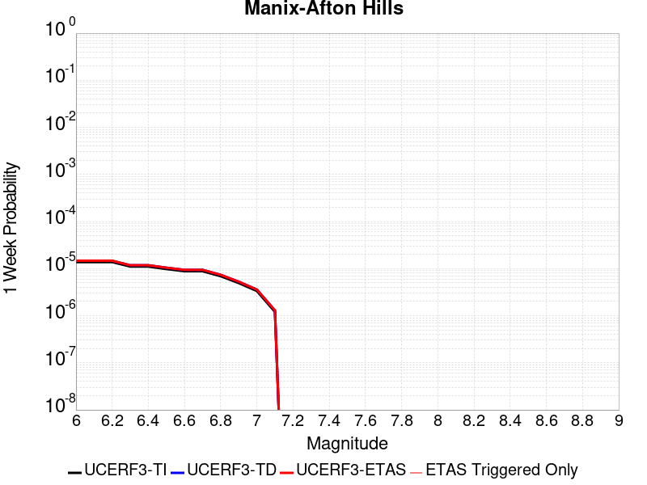 |  |  |  |

| Magnitude | 1 wk TI Prob | 1 wk TD Prob | 1 wk ETAS Prob | 1 wk ETAS/TD Gain | 1 wk ETAS Triggered Only | 1 mo TI Prob | 1 mo TD Prob | 1 mo ETAS Prob | 1 mo ETAS/TD Gain | 1 mo ETAS Triggered Only | 1 yr TI Prob | 1 yr TD Prob | 1 yr ETAS Prob | 1 yr ETAS/TD Gain | 1 yr ETAS Triggered Only | 10 yr TI Prob | 10 yr TD Prob | 10 yr ETAS Prob | 10 yr ETAS/TD Gain | 10 yr ETAS Triggered Only |
|-----|-----|-----|-----|-----|-----|-----|-----|-----|-----|-----|-----|-----|-----|-----|-----|-----|-----|-----|-----|-----|
| 6.0 | 1.3783202E-5 | 1.4712406E-5 | 1.4712406E-5 | 1.0 | 0.0 | 5.906953E-5 | 6.3051746E-5 | 6.3051746E-5 | 1.0 | 0.0 | 7.189342E-4 | 7.6740206E-4 | 7.6740206E-4 | 1.0 | 0.0 | 0.0071661277 | 0.007649278 | 0.0077856644 | 1.01783 | 1.3743815E-4 |
| 6.1 | 1.3783202E-5 | 1.4712406E-5 | 1.4712406E-5 | 1.0 | 0.0 | 5.906953E-5 | 6.3051746E-5 | 6.3051746E-5 | 1.0 | 0.0 | 7.189342E-4 | 7.6740206E-4 | 7.6740206E-4 | 1.0 | 0.0 | 0.0071661277 | 0.007649278 | 0.0077856644 | 1.01783 | 1.3743815E-4 |
| 6.2 | 1.3783202E-5 | 1.4712406E-5 | 1.4712406E-5 | 1.0 | 0.0 | 5.906953E-5 | 6.3051746E-5 | 6.3051746E-5 | 1.0 | 0.0 | 7.189342E-4 | 7.6740206E-4 | 7.6740206E-4 | 1.0 | 0.0 | 0.0071661277 | 0.007649278 | 0.0077856644 | 1.01783 | 1.3743815E-4 |
| 6.3 | 1.10494875E-5 | 1.1794191E-5 | 1.1794191E-5 | 1.0 | 0.0 | 4.7354086E-5 | 5.0545612E-5 | 5.0545612E-5 | 1.0 | 0.0 | 5.763835E-4 | 6.152294E-4 | 6.152294E-4 | 1.0 | 0.0 | 0.005748908 | 0.006136303 | 0.0062728976 | 1.0222601 | 1.3743815E-4 |
| 6.4 | 1.10494875E-5 | 1.1794191E-5 | 1.1794191E-5 | 1.0 | 0.0 | 4.7354086E-5 | 5.0545612E-5 | 5.0545612E-5 | 1.0 | 0.0 | 5.763835E-4 | 6.152294E-4 | 6.152294E-4 | 1.0 | 0.0 | 0.005748908 | 0.006136303 | 0.0062728976 | 1.0222601 | 1.3743815E-4 |
| 6.5 | 9.788949E-6 | 1.0455265E-5 | 1.0455265E-5 | 1.0 | 0.0 | 4.1951964E-5 | 4.480756E-5 | 4.480756E-5 | 1.0 | 0.0 | 5.1064545E-4 | 5.454048E-4 | 5.454048E-4 | 1.0 | 0.0 | 0.0050947363 | 0.0054415893 | 0.0055782795 | 1.0251195 | 1.3743815E-4 |
| 6.6 | 8.810006E-6 | 9.414486E-6 | 9.414486E-6 | 1.0 | 0.0 | 3.775662E-5 | 4.0347222E-5 | 4.0347222E-5 | 1.0 | 0.0 | 4.5958988E-4 | 4.911256E-4 | 4.911256E-4 | 1.0 | 0.0 | 0.0045864056 | 0.004901285 | 0.005015255 | 1.0232532 | 1.14531795E-4 |
| 6.7 | 8.80128E-6 | 9.404965E-6 | 9.404965E-6 | 1.0 | 0.0 | 3.7719226E-5 | 4.030642E-5 | 4.030642E-5 | 1.0 | 0.0 | 4.591348E-4 | 4.9062906E-4 | 4.9062906E-4 | 1.0 | 0.0 | 0.004581874 | 0.004896341 | 0.005010312 | 1.0232768 | 1.14531795E-4 |
| 6.8 | 6.8994877E-6 | 7.3807596E-6 | 7.3807596E-6 | 1.0 | 0.0 | 2.9568899E-5 | 3.163149E-5 | 3.163149E-5 | 1.0 | 0.0 | 3.5994186E-4 | 3.8505348E-4 | 3.8505348E-4 | 1.0 | 0.0 | 0.003593594 | 0.0038446684 | 0.003913123 | 1.0178051 | 6.871908E-5 |
| 6.9 | 4.9328037E-6 | 5.271442E-6 | 5.271442E-6 | 1.0 | 0.0 | 2.1140417E-5 | 2.2591734E-5 | 2.2591734E-5 | 1.0 | 0.0 | 2.5735417E-4 | 2.750258E-4 | 2.750258E-4 | 1.0 | 0.0 | 0.0025705635 | 0.0027474596 | 0.002770303 | 1.0083144 | 2.2906359E-5 |
| 7.0 | 3.347973E-6 | 3.5903752E-6 | 3.5903752E-6 | 1.0 | 0.0 | 1.4348378E-5 | 1.5387255E-5 | 1.5387255E-5 | 1.0 | 0.0 | 1.746775E-4 | 1.8732782E-4 | 1.8732782E-4 | 1.0 | 0.0 | 0.0017454025 | 0.0018721019 | 0.0018949653 | 1.0122128 | 2.2906359E-5 |
| 7.1 | 1.2073567E-6 | 1.2936044E-6 | 1.2936044E-6 | 1.0 | 0.0 | 5.1743755E-6 | 5.5440164E-6 | 5.5440164E-6 | 1.0 | 0.0 | 6.29962E-5 | 6.7497946E-5 | 6.7497946E-5 | 1.0 | 0.0 | 6.297835E-4 | 6.749346E-4 | 6.978255E-4 | 1.0339158 | 2.2906359E-5 |

## Ludlow
*[(top)](#table-of-contents)*

| 1 Week | 1 Month | 1 Year | 10 Year |
|-----|-----|-----|-----|
|  |  |  |  |

| Magnitude | 1 wk TI Prob | 1 wk TD Prob | 1 wk ETAS Prob | 1 wk ETAS/TD Gain | 1 wk ETAS Triggered Only | 1 mo TI Prob | 1 mo TD Prob | 1 mo ETAS Prob | 1 mo ETAS/TD Gain | 1 mo ETAS Triggered Only | 1 yr TI Prob | 1 yr TD Prob | 1 yr ETAS Prob | 1 yr ETAS/TD Gain | 1 yr ETAS Triggered Only | 10 yr TI Prob | 10 yr TD Prob | 10 yr ETAS Prob | 10 yr ETAS/TD Gain | 10 yr ETAS Triggered Only |
|-----|-----|-----|-----|-----|-----|-----|-----|-----|-----|-----|-----|-----|-----|-----|-----|-----|-----|-----|-----|-----|
| 6.0 | 2.2407607E-5 | 2.3659004E-5 | 2.3659004E-5 | 1.0 | 0.0 | 9.602906E-5 | 1.0139204E-4 | 1.0139204E-4 | 1.0 | 0.0 | 0.0011685267 | 0.0012337932 | 0.0012795493 | 1.0370858 | 4.5812718E-5 | 0.011624013 | 0.012273945 | 0.012409696 | 1.0110601 | 1.3743815E-4 |
| 6.1 | 2.2407607E-5 | 2.3659004E-5 | 2.3659004E-5 | 1.0 | 0.0 | 9.602906E-5 | 1.0139204E-4 | 1.0139204E-4 | 1.0 | 0.0 | 0.0011685267 | 0.0012337932 | 0.0012795493 | 1.0370858 | 4.5812718E-5 | 0.011624013 | 0.012273945 | 0.012409696 | 1.0110601 | 1.3743815E-4 |
| 6.2 | 1.0781252E-5 | 1.1366481E-5 | 1.1366481E-5 | 1.0 | 0.0 | 4.620455E-5 | 4.8712605E-5 | 4.8712605E-5 | 1.0 | 0.0 | 5.623952E-4 | 5.929186E-4 | 6.158114E-4 | 1.0386103 | 2.2906359E-5 | 0.00560974 | 0.005913785 | 0.0059365565 | 1.0038505 | 2.2906359E-5 |
| 6.3 | 1.0781252E-5 | 1.1366481E-5 | 1.1366481E-5 | 1.0 | 0.0 | 4.620455E-5 | 4.8712605E-5 | 4.8712605E-5 | 1.0 | 0.0 | 5.623952E-4 | 5.929186E-4 | 6.158114E-4 | 1.0386103 | 2.2906359E-5 | 0.00560974 | 0.005913785 | 0.0059365565 | 1.0038505 | 2.2906359E-5 |
| 6.4 | 7.814439E-6 | 8.238321E-6 | 8.238321E-6 | 1.0 | 0.0 | 3.3490025E-5 | 3.530662E-5 | 3.530662E-5 | 1.0 | 0.0 | 4.0766477E-4 | 4.2977472E-4 | 4.5267123E-4 | 1.0532756 | 2.2906359E-5 | 0.0040691774 | 0.0042895824 | 0.0043123905 | 1.0053171 | 2.2906359E-5 |
| 6.5 | 6.4986366E-6 | 6.8514128E-6 | 6.8514128E-6 | 1.0 | 0.0 | 2.7851002E-5 | 2.9362871E-5 | 2.9362871E-5 | 1.0 | 0.0 | 3.390332E-4 | 3.5743523E-4 | 3.5743523E-4 | 1.0 | 0.0 | 0.003385164 | 0.0035686996 | 0.0035686996 | 1.0 | 0.0 |
| 6.6 | 5.582177E-6 | 5.8864307E-6 | 5.8864307E-6 | 1.0 | 0.0 | 2.3923398E-5 | 2.522732E-5 | 2.522732E-5 | 1.0 | 0.0 | 2.9122844E-4 | 3.0710007E-4 | 3.0710007E-4 | 1.0 | 0.0 | 0.0029084706 | 0.00306683 | 0.00306683 | 1.0 | 0.0 |
| 6.7 | 4.6858763E-6 | 4.9407836E-6 | 4.9407836E-6 | 1.0 | 0.0 | 2.0082172E-5 | 2.1174617E-5 | 2.1174617E-5 | 1.0 | 0.0 | 2.4447302E-4 | 2.5777103E-4 | 2.5777103E-4 | 1.0 | 0.0 | 0.0024420423 | 0.0025747768 | 0.0025747768 | 1.0 | 0.0 |
| 6.8 | 3.5584908E-6 | 3.752289E-6 | 3.752289E-6 | 1.0 | 0.0 | 1.5250586E-5 | 1.6081141E-5 | 1.6081141E-5 | 1.0 | 0.0 | 1.8566006E-4 | 1.9577073E-4 | 1.9577073E-4 | 1.0 | 0.0 | 0.0018550502 | 0.0019560237 | 0.0019560237 | 1.0 | 0.0 |
| 6.9 | 2.532834E-6 | 2.6711969E-6 | 2.6711969E-6 | 1.0 | 0.0 | 1.0854958E-5 | 1.1447937E-5 | 1.1447937E-5 | 1.0 | 0.0 | 1.3215111E-4 | 1.3937001E-4 | 1.3937001E-4 | 1.0 | 0.0 | 0.0013207254 | 0.0013928536 | 0.0013928536 | 1.0 | 0.0 |
| 7.0 | 1.7083285E-6 | 1.8020748E-6 | 1.8020748E-6 | 1.0 | 0.0 | 7.3213873E-6 | 7.723156E-6 | 7.723156E-6 | 1.0 | 0.0 | 8.913424E-5 | 9.4025534E-5 | 9.4025534E-5 | 1.0 | 0.0 | 8.9098496E-4 | 9.3987404E-4 | 9.3987404E-4 | 1.0 | 0.0 |
| 7.1 | 1.0905424E-6 | 1.1498448E-6 | 1.1498448E-6 | 1.0 | 0.0 | 4.6737446E-6 | 4.9278974E-6 | 4.9278974E-6 | 1.0 | 0.0 | 5.6901354E-5 | 5.99956E-5 | 5.99956E-5 | 1.0 | 0.0 | 5.6886784E-4 | 5.998038E-4 | 5.998038E-4 | 1.0 | 0.0 |
| 7.2 | 6.06668E-7 | 6.387725E-7 | 6.387725E-7 | 1.0 | 0.0 | 2.600003E-6 | 2.737594E-6 | 2.737594E-6 | 1.0 | 0.0 | 3.1654577E-5 | 3.332977E-5 | 3.332977E-5 | 1.0 | 0.0 | 3.1650066E-4 | 3.3325455E-4 | 3.3325455E-4 | 1.0 | 0.0 |

## San Andreas (San Gorgonio Pass-Garnet HIll)
*[(top)](#table-of-contents)*

| 1 Week | 1 Month | 1 Year | 10 Year |
|-----|-----|-----|-----|
|  | 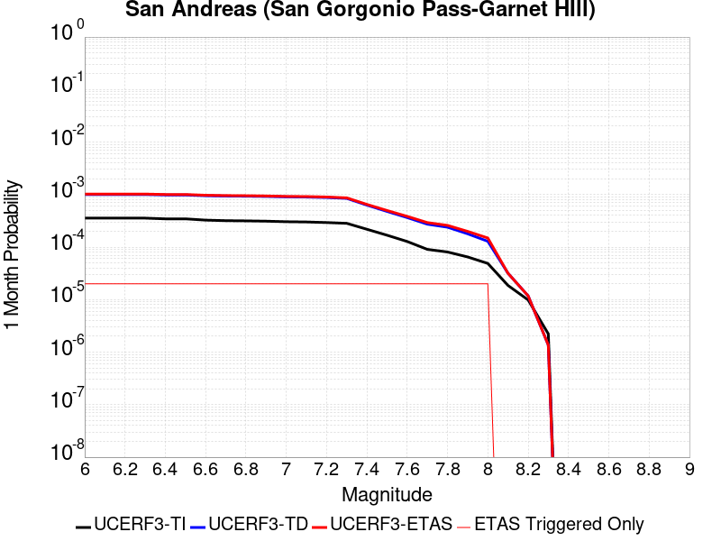 |  |  |

| Magnitude | 1 wk TI Prob | 1 wk TD Prob | 1 wk ETAS Prob | 1 wk ETAS/TD Gain | 1 wk ETAS Triggered Only | 1 mo TI Prob | 1 mo TD Prob | 1 mo ETAS Prob | 1 mo ETAS/TD Gain | 1 mo ETAS Triggered Only | 1 yr TI Prob | 1 yr TD Prob | 1 yr ETAS Prob | 1 yr ETAS/TD Gain | 1 yr ETAS Triggered Only | 10 yr TI Prob | 10 yr TD Prob | 10 yr ETAS Prob | 10 yr ETAS/TD Gain | 10 yr ETAS Triggered Only |
|-----|-----|-----|-----|-----|-----|-----|-----|-----|-----|-----|-----|-----|-----|-----|-----|-----|-----|-----|-----|-----|
| 6.0 | 8.31567E-5 | 2.3422479E-4 | 2.3422479E-4 | 1.0 | 0.0 | 3.5633717E-4 | 0.001003437 | 0.0010263203 | 1.022805 | 2.2906359E-5 | 0.004329778 | 0.012148325 | 0.012170953 | 1.0018626 | 2.2906359E-5 | 0.042463828 | 0.11274116 | 0.11286309 | 1.0010816 | 1.3743815E-4 |
| 6.1 | 8.31567E-5 | 2.3422479E-4 | 2.3422479E-4 | 1.0 | 0.0 | 3.5633717E-4 | 0.001003437 | 0.0010263203 | 1.022805 | 2.2906359E-5 | 0.004329778 | 0.012148325 | 0.012170953 | 1.0018626 | 2.2906359E-5 | 0.042463828 | 0.11274116 | 0.11286309 | 1.0010816 | 1.3743815E-4 |
| 6.2 | 8.31567E-5 | 2.3422479E-4 | 2.3422479E-4 | 1.0 | 0.0 | 3.5633717E-4 | 0.001003437 | 0.0010263203 | 1.022805 | 2.2906359E-5 | 0.004329778 | 0.012148325 | 0.012170953 | 1.0018626 | 2.2906359E-5 | 0.042463828 | 0.11274116 | 0.11286309 | 1.0010816 | 1.3743815E-4 |
| 6.3 | 8.31567E-5 | 2.3422479E-4 | 2.3422479E-4 | 1.0 | 0.0 | 3.5633717E-4 | 0.001003437 | 0.0010263203 | 1.022805 | 2.2906359E-5 | 0.004329778 | 0.012148325 | 0.012170953 | 1.0018626 | 2.2906359E-5 | 0.042463828 | 0.11274116 | 0.11286309 | 1.0010816 | 1.3743815E-4 |
| 6.4 | 8.059055E-5 | 2.2980345E-4 | 2.2980345E-4 | 1.0 | 0.0 | 3.4534236E-4 | 9.845027E-4 | 0.0010073865 | 1.023244 | 2.2906359E-5 | 0.0041964394 | 0.011920336 | 0.01194297 | 1.0018988 | 2.2906359E-5 | 0.041180745 | 0.1107217 | 0.11084392 | 1.0011039 | 1.3743815E-4 |
| 6.5 | 8.059055E-5 | 2.2980345E-4 | 2.2980345E-4 | 1.0 | 0.0 | 3.4534236E-4 | 9.845027E-4 | 0.0010073865 | 1.023244 | 2.2906359E-5 | 0.0041964394 | 0.011920336 | 0.01194297 | 1.0018988 | 2.2906359E-5 | 0.041180745 | 0.1107217 | 0.11084392 | 1.0011039 | 1.3743815E-4 |
| 6.6 | 7.619237E-5 | 2.2224057E-4 | 2.2224057E-4 | 1.0 | 0.0 | 3.2649786E-4 | 9.521143E-4 | 9.749988E-4 | 1.0240355 | 2.2906359E-5 | 0.0039678677 | 0.011530932 | 0.011553574 | 1.0019636 | 2.2906359E-5 | 0.03897764 | 0.10725754 | 0.10738023 | 1.0011439 | 1.3743815E-4 |
| 6.7 | 7.440636E-5 | 2.1899794E-4 | 2.1899794E-4 | 1.0 | 0.0 | 3.188454E-4 | 9.382273E-4 | 9.6111215E-4 | 1.0243917 | 2.2906359E-5 | 0.0038750346 | 0.011363627 | 0.011386273 | 1.0019928 | 2.2906359E-5 | 0.038081564 | 0.10576587 | 0.10588878 | 1.001162 | 1.3743815E-4 |
| 6.8 | 7.3735864E-5 | 2.1746915E-4 | 2.1746915E-4 | 1.0 | 0.0 | 3.1597257E-4 | 9.3167997E-4 | 9.54565E-4 | 1.0245632 | 2.2906359E-5 | 0.0038401815 | 0.0112847425 | 0.01130739 | 1.0020069 | 2.2906359E-5 | 0.03774495 | 0.10506733 | 0.10519033 | 1.0011706 | 1.3743815E-4 |
| 6.9 | 7.27575E-5 | 2.1515826E-4 | 2.1515826E-4 | 1.0 | 0.0 | 3.117806E-4 | 9.217832E-4 | 9.446684E-4 | 1.0248271 | 2.2906359E-5 | 0.003789323 | 0.01116549 | 0.011188141 | 1.0020286 | 2.2906359E-5 | 0.037253562 | 0.104015164 | 0.10413831 | 1.0011839 | 1.3743815E-4 |
| 7.0 | 7.102591E-5 | 2.10997E-4 | 2.10997E-4 | 1.0 | 0.0 | 3.0436125E-4 | 9.0396166E-4 | 9.2684734E-4 | 1.0253171 | 2.2906359E-5 | 0.003699303 | 0.0109507125 | 0.010973368 | 1.0020689 | 2.2906359E-5 | 0.03638325 | 0.10211699 | 0.10224039 | 1.0012084 | 1.3743815E-4 |
| 7.1 | 7.028513E-5 | 2.0935269E-4 | 2.0935269E-4 | 1.0 | 0.0 | 3.0118722E-4 | 8.969195E-4 | 9.198053E-4 | 1.025516 | 2.2906359E-5 | 0.0036607897 | 0.010865833 | 0.01088849 | 1.0020852 | 2.2906359E-5 | 0.036010686 | 0.10135982 | 0.10148333 | 1.0012186 | 1.3743815E-4 |
| 7.2 | 6.8498244E-5 | 2.0542955E-4 | 2.0542955E-4 | 1.0 | 0.0 | 2.9353087E-4 | 8.8011747E-4 | 9.030037E-4 | 1.0260036 | 2.2906359E-5 | 0.003567883 | 0.010663286 | 0.010685948 | 1.0021253 | 2.2906359E-5 | 0.035111405 | 0.099551365 | 0.09967512 | 1.0012431 | 1.3743815E-4 |
| 7.3 | 6.622592E-5 | 1.9769753E-4 | 1.9769753E-4 | 1.0 | 0.0 | 2.8379448E-4 | 8.4700214E-4 | 8.698891E-4 | 1.0270212 | 2.2906359E-5 | 0.0034497243 | 0.010263974 | 0.010286645 | 1.0022088 | 2.2906359E-5 | 0.033966612 | 0.09604639 | 0.09617063 | 1.0012935 | 1.3743815E-4 |
| 7.4 | 5.1050705E-5 | 1.472159E-4 | 1.472159E-4 | 1.0 | 0.0 | 2.1877038E-4 | 6.307736E-4 | 6.536655E-4 | 1.0362918 | 2.2906359E-5 | 0.002660276 | 0.0076528206 | 0.0076755513 | 1.0029703 | 2.2906359E-5 | 0.02628654 | 0.073003724 | 0.07313113 | 1.0017452 | 1.3743815E-4 |
| 7.5 | 3.9302922E-5 | 1.1158177E-4 | 1.1158177E-4 | 1.0 | 0.0 | 1.6843023E-4 | 4.781203E-4 | 5.010157E-4 | 1.0478863 | 2.2906359E-5 | 0.0020487092 | 0.0058056475 | 0.0058284206 | 1.0039226 | 2.2906359E-5 | 0.020299247 | 0.056134652 | 0.056264378 | 1.0023109 | 1.3743815E-4 |
| 7.6 | 2.9851626E-5 | 8.520211E-5 | 8.520211E-5 | 1.0 | 0.0 | 1.2792926E-4 | 3.6510095E-4 | 3.8799894E-4 | 1.0627168 | 2.2906359E-5 | 0.0015564259 | 0.0044360696 | 0.0044588745 | 1.0051408 | 2.2906359E-5 | 0.0154556995 | 0.043306693 | 0.043416265 | 1.0025301 | 1.14531795E-4 |
| 7.7 | 2.1135214E-5 | 6.375337E-5 | 6.375337E-5 | 1.0 | 0.0 | 9.0576345E-5 | 2.7320013E-4 | 2.9610022E-4 | 1.0838217 | 2.2906359E-5 | 0.0011022091 | 0.0033211438 | 0.003343974 | 1.0068742 | 2.2906359E-5 | 0.010967582 | 0.032683704 | 0.032772336 | 1.0027118 | 9.1625436E-5 |
| 7.8 | 1.883379E-5 | 5.584623E-5 | 5.584623E-5 | 1.0 | 0.0 | 8.0713755E-5 | 2.3931904E-4 | 2.6221992E-4 | 1.0956918 | 2.2906359E-5 | 9.822468E-4 | 0.0029098194 | 0.0029326591 | 1.0078492 | 2.2906359E-5 | 0.0097791655 | 0.028788505 | 0.028877491 | 1.0030911 | 9.1625436E-5 |
| 7.9 | 1.5156185E-5 | 4.1827483E-5 | 4.1827483E-5 | 1.0 | 0.0 | 6.495346E-5 | 1.7924832E-4 | 2.0215058E-4 | 1.1277683 | 2.2906359E-5 | 7.9052144E-4 | 0.0021801654 | 0.002203022 | 1.0104837 | 2.2906359E-5 | 0.007877152 | 0.021837084 | 0.021926707 | 1.0041043 | 9.1625436E-5 |
| 8.0 | 1.1405907E-5 | 3.01013E-5 | 3.01013E-5 | 1.0 | 0.0 | 4.8881542E-5 | 1.289992E-4 | 1.519026E-4 | 1.1775469 | 2.2906359E-5 | 5.9497025E-4 | 0.0015694348 | 0.0015923051 | 1.0145724 | 2.2906359E-5 | 0.005933798 | 0.015831854 | 0.015899485 | 1.0042719 | 6.871908E-5 |
| 8.1 | 4.3511436E-6 | 7.415145E-6 | 7.415145E-6 | 1.0 | 0.0 | 1.8647626E-5 | 3.1778807E-5 | 3.1778807E-5 | 1.0 | 0.0 | 2.2701119E-4 | 3.868384E-4 | 3.868384E-4 | 1.0 | 0.0 | 0.0022677942 | 0.004139254 | 0.004139254 | 1.0 | 0.0 |
| 8.2 | 2.3042528E-6 | 2.7545068E-6 | 2.7545068E-6 | 1.0 | 0.0 | 9.875332E-6 | 1.1804976E-5 | 1.1804976E-5 | 1.0 | 0.0 | 1.2022553E-4 | 1.4371614E-4 | 1.4371614E-4 | 1.0 | 0.0 | 0.0012016051 | 0.001609254 | 0.001609254 | 1.0 | 0.0 |
| 8.3 | 5.202968E-7 | 3.194589E-7 | 3.194589E-7 | 1.0 | 0.0 | 2.2298414E-6 | 1.3691089E-6 | 1.3691089E-6 | 1.0 | 0.0 | 2.714798E-5 | 1.6668786E-5 | 1.6668786E-5 | 1.0 | 0.0 | 2.7144665E-4 | 1.975942E-4 | 1.975942E-4 | 1.0 | 0.0 |

## San Jacinto (San Jacinto Valley) rev
*[(top)](#table-of-contents)*

| 1 Week | 1 Month | 1 Year | 10 Year |
|-----|-----|-----|-----|
|  |  |  |  |

| Magnitude | 1 wk TI Prob | 1 wk TD Prob | 1 wk ETAS Prob | 1 wk ETAS/TD Gain | 1 wk ETAS Triggered Only | 1 mo TI Prob | 1 mo TD Prob | 1 mo ETAS Prob | 1 mo ETAS/TD Gain | 1 mo ETAS Triggered Only | 1 yr TI Prob | 1 yr TD Prob | 1 yr ETAS Prob | 1 yr ETAS/TD Gain | 1 yr ETAS Triggered Only | 10 yr TI Prob | 10 yr TD Prob | 10 yr ETAS Prob | 10 yr ETAS/TD Gain | 10 yr ETAS Triggered Only |
|-----|-----|-----|-----|-----|-----|-----|-----|-----|-----|-----|-----|-----|-----|-----|-----|-----|-----|-----|-----|-----|
| 6.0 | 3.652694E-5 | 3.455631E-5 | 3.455631E-5 | 1.0 | 0.0 | 1.5653463E-4 | 1.4809008E-4 | 1.7099305E-4 | 1.1546557 | 2.2906359E-5 | 0.0019041431 | 0.0018015072 | 0.0018701025 | 1.0380766 | 6.871908E-5 | 0.018879099 | 0.018606104 | 0.018740986 | 1.0072492 | 1.3743815E-4 |
| 6.1 | 3.652694E-5 | 3.455631E-5 | 3.455631E-5 | 1.0 | 0.0 | 1.5653463E-4 | 1.4809008E-4 | 1.7099305E-4 | 1.1546557 | 2.2906359E-5 | 0.0019041431 | 0.0018015072 | 0.0018701025 | 1.0380766 | 6.871908E-5 | 0.018879099 | 0.018606104 | 0.018740986 | 1.0072492 | 1.3743815E-4 |
| 6.2 | 3.652694E-5 | 3.455631E-5 | 3.455631E-5 | 1.0 | 0.0 | 1.5653463E-4 | 1.4809008E-4 | 1.7099305E-4 | 1.1546557 | 2.2906359E-5 | 0.0019041431 | 0.0018015072 | 0.0018701025 | 1.0380766 | 6.871908E-5 | 0.018879099 | 0.018606104 | 0.018740986 | 1.0072492 | 1.3743815E-4 |
| 6.3 | 3.652694E-5 | 3.455631E-5 | 3.455631E-5 | 1.0 | 0.0 | 1.5653463E-4 | 1.4809008E-4 | 1.7099305E-4 | 1.1546557 | 2.2906359E-5 | 0.0019041431 | 0.0018015072 | 0.0018701025 | 1.0380766 | 6.871908E-5 | 0.018879099 | 0.018606104 | 0.018740986 | 1.0072492 | 1.3743815E-4 |
| 6.4 | 3.646941E-5 | 3.447785E-5 | 3.447785E-5 | 1.0 | 0.0 | 1.5628811E-4 | 1.4775386E-4 | 1.7065683E-4 | 1.1550076 | 2.2906359E-5 | 0.0019011468 | 0.001797421 | 0.0018660167 | 1.0381633 | 6.871908E-5 | 0.018849645 | 0.018565971 | 0.018700859 | 1.0072652 | 1.3743815E-4 |
| 6.5 | 3.646941E-5 | 3.447785E-5 | 3.447785E-5 | 1.0 | 0.0 | 1.5628811E-4 | 1.4775386E-4 | 1.7065683E-4 | 1.1550076 | 2.2906359E-5 | 0.0019011468 | 0.001797421 | 0.0018660167 | 1.0381633 | 6.871908E-5 | 0.018849645 | 0.018565971 | 0.018700859 | 1.0072652 | 1.3743815E-4 |
| 6.6 | 3.6442503E-5 | 3.444122E-5 | 3.444122E-5 | 1.0 | 0.0 | 1.561728E-4 | 1.4759687E-4 | 1.7049986E-4 | 1.1551725 | 2.2906359E-5 | 0.0018997455 | 0.0017955131 | 0.0018641088 | 1.038204 | 6.871908E-5 | 0.018835869 | 0.018547233 | 0.018682122 | 1.0072727 | 1.3743815E-4 |
| 6.7 | 3.6432113E-5 | 3.4426783E-5 | 3.4426783E-5 | 1.0 | 0.0 | 1.5612828E-4 | 1.4753501E-4 | 1.70438E-4 | 1.1552376 | 2.2906359E-5 | 0.0018992044 | 0.0017947616 | 0.0018633574 | 1.0382199 | 6.871908E-5 | 0.018830549 | 0.018539855 | 0.018674744 | 1.0072757 | 1.3743815E-4 |
| 6.8 | 3.6409598E-5 | 3.4395824E-5 | 3.4395824E-5 | 1.0 | 0.0 | 1.560318E-4 | 1.4740234E-4 | 1.7030533E-4 | 1.1553773 | 2.2906359E-5 | 0.0018980318 | 0.001793149 | 0.0018617449 | 1.0382544 | 6.871908E-5 | 0.018819023 | 0.018524002 | 0.018658895 | 1.007282 | 1.3743815E-4 |
| 6.9 | 3.638078E-5 | 3.4356228E-5 | 3.4356228E-5 | 1.0 | 0.0 | 1.5590832E-4 | 1.4723267E-4 | 1.7013567E-4 | 1.1555564 | 2.2906359E-5 | 0.0018965311 | 0.0017910866 | 0.0018596826 | 1.0382985 | 6.871908E-5 | 0.018804269 | 0.01850373 | 0.018638624 | 1.0072901 | 1.3743815E-4 |
| 7.0 | 3.6294874E-5 | 3.4238194E-5 | 3.4238194E-5 | 1.0 | 0.0 | 1.5554018E-4 | 1.4672687E-4 | 1.6962987E-4 | 1.1560928 | 2.2906359E-5 | 0.0018920569 | 0.0017849386 | 0.001853535 | 1.0384307 | 6.871908E-5 | 0.018760284 | 0.018443286 | 0.018578188 | 1.0073144 | 1.3743815E-4 |
| 7.1 | 3.6260717E-5 | 3.4194458E-5 | 3.4194458E-5 | 1.0 | 0.0 | 1.5539382E-4 | 1.4653946E-4 | 1.6944247E-4 | 1.1562924 | 2.2906359E-5 | 0.001890278 | 0.0017826606 | 0.0018512573 | 1.0384799 | 6.871908E-5 | 0.018742796 | 0.01842088 | 0.018555786 | 1.0073235 | 1.3743815E-4 |
| 7.2 | 3.6210204E-5 | 3.412857E-5 | 3.412857E-5 | 1.0 | 0.0 | 1.5517735E-4 | 1.4625712E-4 | 1.6916014E-4 | 1.1565942 | 2.2906359E-5 | 0.001887647 | 0.0017792287 | 0.0018478256 | 1.0385542 | 6.871908E-5 | 0.01871693 | 0.018387107 | 0.018522019 | 1.0073372 | 1.3743815E-4 |
| 7.3 | 3.6119454E-5 | 3.4016623E-5 | 3.4016623E-5 | 1.0 | 0.0 | 1.5478847E-4 | 1.4577739E-4 | 1.686804E-4 | 1.1571095 | 2.2906359E-5 | 0.0018829206 | 0.0017733976 | 0.0018419947 | 1.0386813 | 6.871908E-5 | 0.018670462 | 0.018329544 | 0.018464463 | 1.0073607 | 1.3743815E-4 |
| 7.4 | 3.607848E-5 | 3.3964046E-5 | 3.3964046E-5 | 1.0 | 0.0 | 1.5461289E-4 | 1.455521E-4 | 1.6845512E-4 | 1.1573528 | 2.2906359E-5 | 0.0018807866 | 0.0017706591 | 0.0018392565 | 1.0387411 | 6.871908E-5 | 0.018649481 | 0.018302504 | 0.018437427 | 1.0073718 | 1.3743815E-4 |
| 7.5 | 3.5856774E-5 | 3.3772754E-5 | 3.3772754E-5 | 1.0 | 0.0 | 1.5366284E-4 | 1.4473236E-4 | 1.676354E-4 | 1.1582441 | 2.2906359E-5 | 0.0018692396 | 0.0017606949 | 0.001829293 | 1.0389608 | 6.871908E-5 | 0.018535944 | 0.018203052 | 0.01833799 | 1.0074128 | 1.3743815E-4 |
| 7.6 | 3.286655E-5 | 3.228726E-5 | 3.228726E-5 | 1.0 | 0.0 | 1.4084904E-4 | 1.3836664E-4 | 1.6126984E-4 | 1.1655253 | 2.2906359E-5 | 0.001713488 | 0.0016833142 | 0.0017290498 | 1.02717 | 4.5812718E-5 | 0.017003361 | 0.017418329 | 0.017530866 | 1.0064608 | 1.14531795E-4 |
| 7.7 | 2.8882527E-5 | 2.9376873E-5 | 2.9376873E-5 | 1.0 | 0.0 | 1.237764E-4 | 1.2589482E-4 | 1.487983E-4 | 1.1819255 | 2.2906359E-5 | 0.0015059357 | 0.0015316928 | 0.0015774353 | 1.0298641 | 4.5812718E-5 | 0.014957713 | 0.015903201 | 0.016015911 | 1.0070872 | 1.14531795E-4 |
| 7.8 | 2.4950225E-5 | 2.6662403E-5 | 2.6662403E-5 | 1.0 | 0.0 | 1.0692515E-4 | 1.14262446E-4 | 1.3716618E-4 | 1.2004485 | 2.2906359E-5 | 0.0013010362 | 0.0013902583 | 0.0014360074 | 1.0329069 | 4.5812718E-5 | 0.012934455 | 0.014481823 | 0.0145946955 | 1.0077941 | 1.14531795E-4 |
| 7.9 | 1.9881603E-5 | 2.1629137E-5 | 2.1629137E-5 | 1.0 | 0.0 | 8.520408E-5 | 9.2693015E-5 | 1.1559725E-4 | 1.2470977 | 2.2906359E-5 | 0.001036866 | 0.001127954 | 0.0011737151 | 1.0405699 | 4.5812718E-5 | 0.010320415 | 0.011840356 | 0.011953531 | 1.0095584 | 1.14531795E-4 |
| 8.0 | 1.563292E-5 | 1.603562E-5 | 1.603562E-5 | 1.0 | 0.0 | 6.6996516E-5 | 6.872228E-5 | 6.872228E-5 | 1.0 | 0.0 | 8.153773E-4 | 8.3637325E-4 | 8.3637325E-4 | 1.0 | 0.0 | 0.00812392 | 0.00886222 | 0.00893033 | 1.0076854 | 6.871908E-5 |
| 8.1 | 1.0045313E-5 | 8.359553E-6 | 8.359553E-6 | 1.0 | 0.0 | 4.305063E-5 | 3.5826168E-5 | 3.5826168E-5 | 1.0 | 0.0 | 5.2401534E-4 | 4.3609683E-4 | 4.3609683E-4 | 1.0 | 0.0 | 0.0052278144 | 0.0046901475 | 0.0046901475 | 1.0 | 0.0 |
| 8.2 | 4.1554413E-6 | 1.5821415E-6 | 1.5821415E-6 | 1.0 | 0.0 | 1.7808914E-5 | 6.780589E-6 | 6.780589E-6 | 1.0 | 0.0 | 2.1680194E-4 | 8.255057E-5 | 8.255057E-5 | 1.0 | 0.0 | 0.0021659054 | 9.57762E-4 | 9.57762E-4 | 1.0 | 0.0 |
| 8.3 | 1.2758221E-6 | 3.6600784E-7 | 3.6600784E-7 | 1.0 | 0.0 | 5.4677976E-6 | 1.5686041E-6 | 1.5686041E-6 | 1.0 | 0.0 | 6.65684E-5 | 1.9097592E-5 | 1.9097592E-5 | 1.0 | 0.0 | 6.6548464E-4 | 2.301609E-4 | 2.301609E-4 | 1.0 | 0.0 |

## Cady
*[(top)](#table-of-contents)*

| 1 Week | 1 Month | 1 Year | 10 Year |
|-----|-----|-----|-----|
|  |  |  | 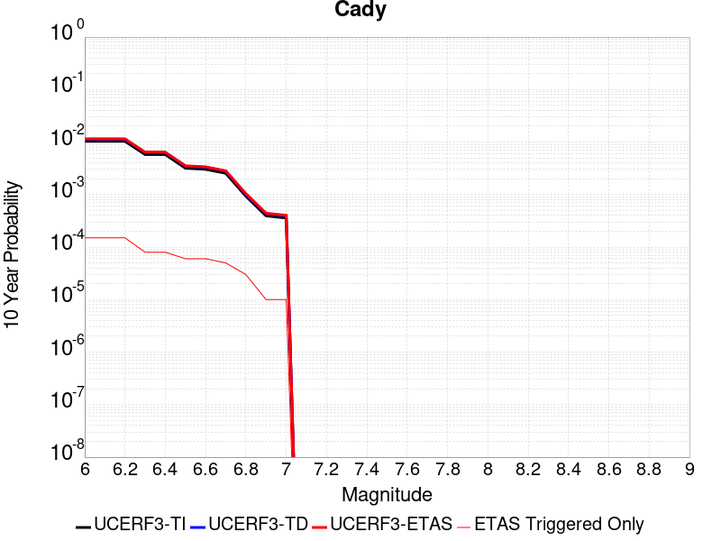 |

| Magnitude | 1 wk TI Prob | 1 wk TD Prob | 1 wk ETAS Prob | 1 wk ETAS/TD Gain | 1 wk ETAS Triggered Only | 1 mo TI Prob | 1 mo TD Prob | 1 mo ETAS Prob | 1 mo ETAS/TD Gain | 1 mo ETAS Triggered Only | 1 yr TI Prob | 1 yr TD Prob | 1 yr ETAS Prob | 1 yr ETAS/TD Gain | 1 yr ETAS Triggered Only | 10 yr TI Prob | 10 yr TD Prob | 10 yr ETAS Prob | 10 yr ETAS/TD Gain | 10 yr ETAS Triggered Only |
|-----|-----|-----|-----|-----|-----|-----|-----|-----|-----|-----|-----|-----|-----|-----|-----|-----|-----|-----|-----|-----|
| 6.0 | 1.9892565E-5 | 2.1861597E-5 | 2.1861597E-5 | 1.0 | 0.0 | 8.525106E-5 | 9.3689705E-5 | 9.3689705E-5 | 1.0 | 0.0 | 0.0010374374 | 0.0011401662 | 0.0011401662 | 1.0 | 0.0 | 0.010326075 | 0.011352182 | 0.011465414 | 1.0099745 | 1.14531795E-4 |
| 6.1 | 1.9892565E-5 | 2.1861597E-5 | 2.1861597E-5 | 1.0 | 0.0 | 8.525106E-5 | 9.3689705E-5 | 9.3689705E-5 | 1.0 | 0.0 | 0.0010374374 | 0.0011401662 | 0.0011401662 | 1.0 | 0.0 | 0.010326075 | 0.011352182 | 0.011465414 | 1.0099745 | 1.14531795E-4 |
| 6.2 | 1.9892565E-5 | 2.1861597E-5 | 2.1861597E-5 | 1.0 | 0.0 | 8.525106E-5 | 9.3689705E-5 | 9.3689705E-5 | 1.0 | 0.0 | 0.0010374374 | 0.0011401662 | 0.0011401662 | 1.0 | 0.0 | 0.010326075 | 0.011352182 | 0.011465414 | 1.0099745 | 1.14531795E-4 |
| 6.3 | 1.1117327E-5 | 1.2178123E-5 | 1.2178123E-5 | 1.0 | 0.0 | 4.764482E-5 | 5.219109E-5 | 5.219109E-5 | 1.0 | 0.0 | 5.7992124E-4 | 6.3527277E-4 | 6.3527277E-4 | 1.0 | 0.0 | 0.0057841022 | 0.006337675 | 0.0064287195 | 1.0143657 | 9.1625436E-5 |
| 6.4 | 1.1117327E-5 | 1.2178123E-5 | 1.2178123E-5 | 1.0 | 0.0 | 4.764482E-5 | 5.219109E-5 | 5.219109E-5 | 1.0 | 0.0 | 5.7992124E-4 | 6.3527277E-4 | 6.3527277E-4 | 1.0 | 0.0 | 0.0057841022 | 0.006337675 | 0.0064287195 | 1.0143657 | 9.1625436E-5 |
| 6.5 | 6.103093E-6 | 6.672846E-6 | 6.672846E-6 | 1.0 | 0.0 | 2.615585E-5 | 2.859767E-5 | 2.859767E-5 | 1.0 | 0.0 | 3.1840094E-4 | 3.4813356E-4 | 3.4813356E-4 | 1.0 | 0.0 | 0.0031794512 | 0.0034771163 | 0.0035455965 | 1.0196946 | 6.871908E-5 |
| 6.6 | 5.817237E-6 | 6.366455E-6 | 6.366455E-6 | 1.0 | 0.0 | 2.4930776E-5 | 2.7284592E-5 | 2.7284592E-5 | 1.0 | 0.0 | 3.034899E-4 | 3.321517E-4 | 3.321517E-4 | 1.0 | 0.0 | 0.0030307577 | 0.0033177752 | 0.0033862663 | 1.0206437 | 6.871908E-5 |
| 6.7 | 4.8846314E-6 | 5.34123E-6 | 5.34123E-6 | 1.0 | 0.0 | 2.0933967E-5 | 2.289085E-5 | 2.289085E-5 | 1.0 | 0.0 | 2.5484123E-4 | 2.7867223E-4 | 2.7867223E-4 | 1.0 | 0.0 | 0.0025454918 | 0.0027843837 | 0.0028529116 | 1.0246115 | 6.871908E-5 |
| 6.8 | 1.7788773E-6 | 1.9401411E-6 | 1.9401411E-6 | 1.0 | 0.0 | 7.6237375E-6 | 8.3148725E-6 | 8.3148725E-6 | 1.0 | 0.0 | 9.281505E-5 | 1.0123045E-4 | 1.0123045E-4 | 1.0 | 0.0 | 9.2776294E-4 | 0.001011998 | 0.0010577644 | 1.0452237 | 4.5812718E-5 |
| 6.9 | 7.5455404E-7 | 8.298188E-7 | 8.298188E-7 | 1.0 | 0.0 | 3.233799E-6 | 3.5563635E-6 | 3.5563635E-6 | 1.0 | 0.0 | 3.937079E-5 | 4.32982E-5 | 4.32982E-5 | 1.0 | 0.0 | 3.9363815E-4 | 4.329306E-4 | 4.329306E-4 | 1.0 | 0.0 |
| 7.0 | 6.8578805E-7 | 7.5428136E-7 | 7.5428136E-7 | 1.0 | 0.0 | 2.9390883E-6 | 3.2326323E-6 | 3.2326323E-6 | 1.0 | 0.0 | 3.578281E-5 | 3.935692E-5 | 3.935692E-5 | 1.0 | 0.0 | 3.577705E-4 | 3.9353195E-4 | 3.9353195E-4 | 1.0 | 0.0 |

## Red Pass
*[(top)](#table-of-contents)*

| 1 Week | 1 Month | 1 Year | 10 Year |
|-----|-----|-----|-----|
|  |  |  |  |

| Magnitude | 1 wk TI Prob | 1 wk TD Prob | 1 wk ETAS Prob | 1 wk ETAS/TD Gain | 1 wk ETAS Triggered Only | 1 mo TI Prob | 1 mo TD Prob | 1 mo ETAS Prob | 1 mo ETAS/TD Gain | 1 mo ETAS Triggered Only | 1 yr TI Prob | 1 yr TD Prob | 1 yr ETAS Prob | 1 yr ETAS/TD Gain | 1 yr ETAS Triggered Only | 10 yr TI Prob | 10 yr TD Prob | 10 yr ETAS Prob | 10 yr ETAS/TD Gain | 10 yr ETAS Triggered Only |
|-----|-----|-----|-----|-----|-----|-----|-----|-----|-----|-----|-----|-----|-----|-----|-----|-----|-----|-----|-----|-----|
| 6.0 | 8.258278E-6 | 8.551668E-6 | 8.551668E-6 | 1.0 | 0.0 | 3.539214E-5 | 3.6649588E-5 | 3.6649588E-5 | 1.0 | 0.0 | 4.308141E-4 | 4.4613527E-4 | 4.690314E-4 | 1.051321 | 2.2906359E-5 | 0.0042997985 | 0.004454154 | 0.004568176 | 1.025599 | 1.14531795E-4 |
| 6.1 | 3.649988E-6 | 3.775488E-6 | 3.775488E-6 | 1.0 | 0.0 | 1.5642712E-5 | 1.618059E-5 | 1.618059E-5 | 1.0 | 0.0 | 1.9043336E-4 | 1.9698562E-4 | 1.9698562E-4 | 1.0 | 0.0 | 0.0019027026 | 0.0019685775 | 0.0020143 | 1.0232261 | 4.5812718E-5 |
| 6.2 | 3.649988E-6 | 3.775488E-6 | 3.775488E-6 | 1.0 | 0.0 | 1.5642712E-5 | 1.618059E-5 | 1.618059E-5 | 1.0 | 0.0 | 1.9043336E-4 | 1.9698562E-4 | 1.9698562E-4 | 1.0 | 0.0 | 0.0019027026 | 0.0019685775 | 0.0020143 | 1.0232261 | 4.5812718E-5 |
| 6.3 | 1.3924937E-6 | 1.4411834E-6 | 1.4411834E-6 | 1.0 | 0.0 | 5.9678164E-6 | 6.1764936E-6 | 6.1764936E-6 | 1.0 | 0.0 | 7.265574E-5 | 7.5197626E-5 | 7.5197626E-5 | 1.0 | 0.0 | 7.263199E-4 | 7.518606E-4 | 7.976389E-4 | 1.0608866 | 4.5812718E-5 |
| 6.4 | 1.3924937E-6 | 1.4411834E-6 | 1.4411834E-6 | 1.0 | 0.0 | 5.9678164E-6 | 6.1764936E-6 | 6.1764936E-6 | 1.0 | 0.0 | 7.265574E-5 | 7.5197626E-5 | 7.5197626E-5 | 1.0 | 0.0 | 7.263199E-4 | 7.518606E-4 | 7.976389E-4 | 1.0608866 | 4.5812718E-5 |
| 6.5 | 9.876812E-7 | 1.0222386E-6 | 1.0222386E-6 | 1.0 | 0.0 | 4.2329125E-6 | 4.3810223E-6 | 4.3810223E-6 | 1.0 | 0.0 | 5.153449E-5 | 5.333895E-5 | 5.333895E-5 | 1.0 | 0.0 | 5.1522546E-4 | 5.333895E-4 | 5.7917775E-4 | 1.085844 | 4.5812718E-5 |

## Independence rev 2011
*[(top)](#table-of-contents)*

| 1 Week | 1 Month | 1 Year | 10 Year |
|-----|-----|-----|-----|
|  | 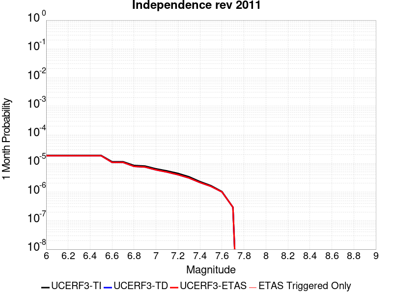 |  |  |

| Magnitude | 1 wk TI Prob | 1 wk TD Prob | 1 wk ETAS Prob | 1 wk ETAS/TD Gain | 1 wk ETAS Triggered Only | 1 mo TI Prob | 1 mo TD Prob | 1 mo ETAS Prob | 1 mo ETAS/TD Gain | 1 mo ETAS Triggered Only | 1 yr TI Prob | 1 yr TD Prob | 1 yr ETAS Prob | 1 yr ETAS/TD Gain | 1 yr ETAS Triggered Only | 10 yr TI Prob | 10 yr TD Prob | 10 yr ETAS Prob | 10 yr ETAS/TD Gain | 10 yr ETAS Triggered Only |
|-----|-----|-----|-----|-----|-----|-----|-----|-----|-----|-----|-----|-----|-----|-----|-----|-----|-----|-----|-----|-----|
| 6.0 | 4.422171E-6 | 4.32641E-6 | 4.32641E-6 | 1.0 | 0.0 | 1.8952025E-5 | 1.8541641E-5 | 1.8541641E-5 | 1.0 | 0.0 | 2.3071647E-4 | 2.2572408E-4 | 2.2572408E-4 | 1.0 | 0.0 | 0.0023047708 | 0.0022552419 | 0.0023695154 | 1.0506701 | 1.14531795E-4 |
| 6.1 | 4.422171E-6 | 4.32641E-6 | 4.32641E-6 | 1.0 | 0.0 | 1.8952025E-5 | 1.8541641E-5 | 1.8541641E-5 | 1.0 | 0.0 | 2.3071647E-4 | 2.2572408E-4 | 2.2572408E-4 | 1.0 | 0.0 | 0.0023047708 | 0.0022552419 | 0.0023695154 | 1.0506701 | 1.14531795E-4 |
| 6.2 | 4.422171E-6 | 4.32641E-6 | 4.32641E-6 | 1.0 | 0.0 | 1.8952025E-5 | 1.8541641E-5 | 1.8541641E-5 | 1.0 | 0.0 | 2.3071647E-4 | 2.2572408E-4 | 2.2572408E-4 | 1.0 | 0.0 | 0.0023047708 | 0.0022552419 | 0.0023695154 | 1.0506701 | 1.14531795E-4 |
| 6.3 | 4.422171E-6 | 4.32641E-6 | 4.32641E-6 | 1.0 | 0.0 | 1.8952025E-5 | 1.8541641E-5 | 1.8541641E-5 | 1.0 | 0.0 | 2.3071647E-4 | 2.2572408E-4 | 2.2572408E-4 | 1.0 | 0.0 | 0.0023047708 | 0.0022552419 | 0.0023695154 | 1.0506701 | 1.14531795E-4 |
| 6.4 | 4.422171E-6 | 4.32641E-6 | 4.32641E-6 | 1.0 | 0.0 | 1.8952025E-5 | 1.8541641E-5 | 1.8541641E-5 | 1.0 | 0.0 | 2.3071647E-4 | 2.2572408E-4 | 2.2572408E-4 | 1.0 | 0.0 | 0.0023047708 | 0.0022552419 | 0.0023695154 | 1.0506701 | 1.14531795E-4 |
| 6.5 | 4.422171E-6 | 4.32641E-6 | 4.32641E-6 | 1.0 | 0.0 | 1.8952025E-5 | 1.8541641E-5 | 1.8541641E-5 | 1.0 | 0.0 | 2.3071647E-4 | 2.2572408E-4 | 2.2572408E-4 | 1.0 | 0.0 | 0.0023047708 | 0.0022552419 | 0.0023695154 | 1.0506701 | 1.14531795E-4 |
| 6.6 | 2.663744E-6 | 2.5321206E-6 | 2.5321206E-6 | 1.0 | 0.0 | 1.1415996E-5 | 1.0851903E-5 | 1.0851903E-5 | 1.0 | 0.0 | 1.3898089E-4 | 1.321144E-4 | 1.321144E-4 | 1.0 | 0.0 | 0.0013889399 | 0.0013204068 | 0.0014347874 | 1.0866252 | 1.14531795E-4 |
| 6.7 | 2.663744E-6 | 2.5321206E-6 | 2.5321206E-6 | 1.0 | 0.0 | 1.1415996E-5 | 1.0851903E-5 | 1.0851903E-5 | 1.0 | 0.0 | 1.3898089E-4 | 1.321144E-4 | 1.321144E-4 | 1.0 | 0.0 | 0.0013889399 | 0.0013204068 | 0.0014347874 | 1.0866252 | 1.14531795E-4 |
| 6.8 | 1.9716529E-6 | 1.8323735E-6 | 1.8323735E-6 | 1.0 | 0.0 | 8.449913E-6 | 7.8530065E-6 | 7.8530065E-6 | 1.0 | 0.0 | 1.0287284E-4 | 9.560629E-5 | 9.560629E-5 | 1.0 | 0.0 | 0.0010282523 | 9.556645E-4 | 0.0010700868 | 1.1197307 | 1.14531795E-4 |
| 6.9 | 1.8788617E-6 | 1.7431099E-6 | 1.7431099E-6 | 1.0 | 0.0 | 8.0522395E-6 | 7.4704503E-6 | 7.4704503E-6 | 1.0 | 0.0 | 9.80316E-5 | 9.0949055E-5 | 9.0949055E-5 | 1.0 | 0.0 | 9.798837E-4 | 9.091304E-4 | 0.0010235581 | 1.125865 | 1.14531795E-4 |
| 7.0 | 1.5045488E-6 | 1.3850419E-6 | 1.3850419E-6 | 1.0 | 0.0 | 6.44805E-6 | 5.9358804E-6 | 5.9358804E-6 | 1.0 | 0.0 | 7.8502184E-5 | 7.2267E-5 | 7.2267E-5 | 1.0 | 0.0 | 7.8474457E-4 | 7.2244013E-4 | 8.368892E-4 | 1.1584201 | 1.14531795E-4 |
| 7.1 | 1.272341E-6 | 1.1625895E-6 | 1.1625895E-6 | 1.0 | 0.0 | 5.4528787E-6 | 4.9825167E-6 | 4.9825167E-6 | 1.0 | 0.0 | 6.6386776E-5 | 6.0660488E-5 | 6.0660488E-5 | 1.0 | 0.0 | 6.636695E-4 | 6.064425E-4 | 7.2090485E-4 | 1.188744 | 1.14531795E-4 |
| 7.2 | 1.0416892E-6 | 9.410568E-7 | 9.410568E-7 | 1.0 | 0.0 | 4.464375E-6 | 4.0330942E-6 | 4.0330942E-6 | 1.0 | 0.0 | 5.4352407E-5 | 4.9101836E-5 | 4.9101836E-5 | 1.0 | 0.0 | 5.4339116E-4 | 4.909117E-4 | 6.053873E-4 | 1.2331897 | 1.14531795E-4 |
| 7.3 | 7.9450155E-7 | 7.2355164E-7 | 7.2355164E-7 | 1.0 | 0.0 | 3.4050022E-6 | 3.100932E-6 | 3.100932E-6 | 1.0 | 0.0 | 4.1455114E-5 | 3.7753205E-5 | 3.7753205E-5 | 1.0 | 0.0 | 4.144738E-4 | 3.7746903E-4 | 4.919576E-4 | 1.3033059 | 1.14531795E-4 |
| 7.4 | 5.3893444E-7 | 5.019832E-7 | 5.019832E-7 | 1.0 | 0.0 | 2.309717E-6 | 2.151355E-6 | 2.151355E-6 | 1.0 | 0.0 | 2.8120441E-5 | 2.6192436E-5 | 2.6192436E-5 | 1.0 | 0.0 | 2.8116882E-4 | 2.6189393E-4 | 3.534954E-4 | 1.3497654 | 9.1625436E-5 |
| 7.5 | 3.8852085E-7 | 3.6827632E-7 | 3.6827632E-7 | 1.0 | 0.0 | 1.6650882E-6 | 1.5783261E-6 | 1.5783261E-6 | 1.0 | 0.0 | 2.027226E-5 | 1.9215953E-5 | 1.9215953E-5 | 1.0 | 0.0 | 2.0270412E-4 | 1.9214312E-4 | 2.8375097E-4 | 1.4767687 | 9.1625436E-5 |
| 7.6 | 2.414929E-7 | 2.3458642E-7 | 2.3458642E-7 | 1.0 | 0.0 | 1.0349692E-6 | 1.00537E-6 | 1.00537E-6 | 1.0 | 0.0 | 1.2600677E-5 | 1.2240313E-5 | 1.2240313E-5 | 1.0 | 0.0 | 1.2599962E-4 | 1.2239651E-4 | 2.1401072E-4 | 1.7485036 | 9.1625436E-5 |
| 7.7 | 6.8298014E-8 | 6.8591994E-8 | 6.8591994E-8 | 1.0 | 0.0 | 2.9270575E-7 | 2.9396566E-7 | 2.9396566E-7 | 1.0 | 0.0 | 3.5636867E-6 | 3.5790265E-6 | 3.5790265E-6 | 1.0 | 0.0 | 3.5636294E-5 | 3.5789737E-5 | 5.8695277E-5 | 1.640003 | 2.2906359E-5 |

## Calico-Hidalgo
*[(top)](#table-of-contents)*

| 1 Week | 1 Month | 1 Year | 10 Year |
|-----|-----|-----|-----|
|  |  |  |  |

| Magnitude | 1 wk TI Prob | 1 wk TD Prob | 1 wk ETAS Prob | 1 wk ETAS/TD Gain | 1 wk ETAS Triggered Only | 1 mo TI Prob | 1 mo TD Prob | 1 mo ETAS Prob | 1 mo ETAS/TD Gain | 1 mo ETAS Triggered Only | 1 yr TI Prob | 1 yr TD Prob | 1 yr ETAS Prob | 1 yr ETAS/TD Gain | 1 yr ETAS Triggered Only | 10 yr TI Prob | 10 yr TD Prob | 10 yr ETAS Prob | 10 yr ETAS/TD Gain | 10 yr ETAS Triggered Only |
|-----|-----|-----|-----|-----|-----|-----|-----|-----|-----|-----|-----|-----|-----|-----|-----|-----|-----|-----|-----|-----|
| 6.0 | 4.0906612E-5 | 5.0713337E-5 | 5.0713337E-5 | 1.0 | 0.0 | 1.7530227E-4 | 2.1732705E-4 | 2.1732705E-4 | 1.0 | 0.0 | 0.0021322158 | 0.0026431496 | 0.0026659954 | 1.0086434 | 2.2906359E-5 | 0.02111873 | 0.026157506 | 0.026269041 | 1.004264 | 1.14531795E-4 |
| 6.1 | 4.0906612E-5 | 5.0713337E-5 | 5.0713337E-5 | 1.0 | 0.0 | 1.7530227E-4 | 2.1732705E-4 | 2.1732705E-4 | 1.0 | 0.0 | 0.0021322158 | 0.0026431496 | 0.0026659954 | 1.0086434 | 2.2906359E-5 | 0.02111873 | 0.026157506 | 0.026269041 | 1.004264 | 1.14531795E-4 |
| 6.2 | 4.0906612E-5 | 5.0713337E-5 | 5.0713337E-5 | 1.0 | 0.0 | 1.7530227E-4 | 2.1732705E-4 | 2.1732705E-4 | 1.0 | 0.0 | 0.0021322158 | 0.0026431496 | 0.0026659954 | 1.0086434 | 2.2906359E-5 | 0.02111873 | 0.026157506 | 0.026269041 | 1.004264 | 1.14531795E-4 |
| 6.3 | 2.4242801E-5 | 3.0094301E-5 | 3.0094301E-5 | 1.0 | 0.0 | 1.0389358E-4 | 1.2896939E-4 | 1.2896939E-4 | 1.0 | 0.0 | 0.0012641704 | 0.0015691036 | 0.0015691036 | 1.0 | 0.0 | 0.01257003 | 0.015583925 | 0.015629023 | 1.0028939 | 4.5812718E-5 |
| 6.4 | 2.4242801E-5 | 3.0094301E-5 | 3.0094301E-5 | 1.0 | 0.0 | 1.0389358E-4 | 1.2896939E-4 | 1.2896939E-4 | 1.0 | 0.0 | 0.0012641704 | 0.0015691036 | 0.0015691036 | 1.0 | 0.0 | 0.01257003 | 0.015583925 | 0.015629023 | 1.0028939 | 4.5812718E-5 |
| 6.5 | 2.0286952E-5 | 2.531821E-5 | 2.531821E-5 | 1.0 | 0.0 | 8.694118E-5 | 1.085022E-4 | 1.085022E-4 | 1.0 | 0.0 | 0.0010579949 | 0.0013202309 | 0.0013202309 | 1.0 | 0.0 | 0.010529719 | 0.013125811 | 0.013171023 | 1.0034444 | 4.5812718E-5 |
| 6.6 | 2.0269223E-5 | 2.5299158E-5 | 2.5299158E-5 | 1.0 | 0.0 | 8.6865206E-5 | 1.0842055E-4 | 1.0842055E-4 | 1.0 | 0.0 | 0.0010570707 | 0.0013192381 | 0.0013192381 | 1.0 | 0.0 | 0.010520565 | 0.013116 | 0.013161212 | 1.003447 | 4.5812718E-5 |
| 6.7 | 1.799852E-5 | 2.2542603E-5 | 2.2542603E-5 | 1.0 | 0.0 | 7.713423E-5 | 9.6607655E-5 | 9.6607655E-5 | 1.0 | 0.0 | 9.3870464E-4 | 0.0011755781 | 0.0011755781 | 1.0 | 0.0 | 0.009347493 | 0.011695206 | 0.011740483 | 1.0038714 | 4.5812718E-5 |
| 6.8 | 1.7458793E-5 | 2.1844051E-5 | 2.1844051E-5 | 1.0 | 0.0 | 7.4821255E-5 | 9.361408E-5 | 9.361408E-5 | 1.0 | 0.0 | 9.10568E-4 | 0.00113917 | 0.00113917 | 1.0 | 0.0 | 0.009068459 | 0.01133489 | 0.011380183 | 1.0039959 | 4.5812718E-5 |
| 6.9 | 1.542884E-5 | 1.9027526E-5 | 1.9027526E-5 | 1.0 | 0.0 | 6.612192E-5 | 8.1544065E-5 | 8.1544065E-5 | 1.0 | 0.0 | 8.04737E-4 | 9.9236E-4 | 9.9236E-4 | 1.0 | 0.0 | 0.008018291 | 0.009880684 | 0.009926044 | 1.0045907 | 4.5812718E-5 |
| 7.0 | 1.468253E-5 | 1.8032079E-5 | 1.8032079E-5 | 1.0 | 0.0 | 6.292361E-5 | 7.727812E-5 | 7.727812E-5 | 1.0 | 0.0 | 7.658257E-4 | 9.4046805E-4 | 9.4046805E-4 | 1.0 | 0.0 | 0.0076319184 | 0.009366247 | 0.00941163 | 1.0048455 | 4.5812718E-5 |
| 7.1 | 1.3139281E-5 | 1.6202212E-5 | 1.6202212E-5 | 1.0 | 0.0 | 5.6309986E-5 | 6.943627E-5 | 6.943627E-5 | 1.0 | 0.0 | 6.853584E-4 | 8.450713E-4 | 8.450713E-4 | 1.0 | 0.0 | 0.0068324856 | 0.008419875 | 0.008465302 | 1.0053952 | 4.5812718E-5 |
| 7.2 | 1.1127404E-5 | 1.3867652E-5 | 1.3867652E-5 | 1.0 | 0.0 | 4.7688E-5 | 5.9431502E-5 | 5.9431502E-5 | 1.0 | 0.0 | 5.8044674E-4 | 7.233492E-4 | 7.233492E-4 | 1.0 | 0.0 | 0.0057893298 | 0.007211055 | 0.007233796 | 1.0031537 | 2.2906359E-5 |
| 7.3 | 9.808154E-6 | 1.2177076E-5 | 1.2177076E-5 | 1.0 | 0.0 | 4.2034266E-5 | 5.2186486E-5 | 5.2186486E-5 | 1.0 | 0.0 | 5.11647E-4 | 6.35196E-4 | 6.35196E-4 | 1.0 | 0.0 | 0.0051047057 | 0.00633488 | 0.006357641 | 1.003593 | 2.2906359E-5 |
| 7.4 | 7.942452E-6 | 9.792786E-6 | 9.792786E-6 | 1.0 | 0.0 | 3.4038632E-5 | 4.1968462E-5 | 4.1968462E-5 | 1.0 | 0.0 | 4.1434157E-4 | 5.108557E-4 | 5.108557E-4 | 1.0 | 0.0 | 0.0041356985 | 0.0050977548 | 0.0051205447 | 1.0044705 | 2.2906359E-5 |
| 7.5 | 4.7121216E-6 | 5.773185E-6 | 5.773185E-6 | 1.0 | 0.0 | 2.019465E-5 | 2.4742028E-5 | 2.4742028E-5 | 1.0 | 0.0 | 2.4584212E-4 | 3.0120023E-4 | 3.0120023E-4 | 1.0 | 0.0 | 0.0024557032 | 0.0030086725 | 0.00303151 | 1.0075905 | 2.2906359E-5 |
| 7.6 | 2.21172E-7 | 2.60409E-7 | 2.60409E-7 | 1.0 | 0.0 | 9.478797E-7 | 1.1160382E-6 | 1.1160382E-6 | 1.0 | 0.0 | 1.1540374E-5 | 1.358771E-5 | 1.358771E-5 | 1.0 | 0.0 | 1.1539775E-4 | 1.3587161E-4 | 1.3587161E-4 | 1.0 | 0.0 |

## San Andreas (Coachella) rev
*[(top)](#table-of-contents)*

| 1 Week | 1 Month | 1 Year | 10 Year |
|-----|-----|-----|-----|
|  |  |  |  |

| Magnitude | 1 wk TI Prob | 1 wk TD Prob | 1 wk ETAS Prob | 1 wk ETAS/TD Gain | 1 wk ETAS Triggered Only | 1 mo TI Prob | 1 mo TD Prob | 1 mo ETAS Prob | 1 mo ETAS/TD Gain | 1 mo ETAS Triggered Only | 1 yr TI Prob | 1 yr TD Prob | 1 yr ETAS Prob | 1 yr ETAS/TD Gain | 1 yr ETAS Triggered Only | 10 yr TI Prob | 10 yr TD Prob | 10 yr ETAS Prob | 10 yr ETAS/TD Gain | 10 yr ETAS Triggered Only |
|-----|-----|-----|-----|-----|-----|-----|-----|-----|-----|-----|-----|-----|-----|-----|-----|-----|-----|-----|-----|-----|
| 6.0 | 1.1925945E-4 | 3.2773515E-4 | 3.2773515E-4 | 1.0 | 0.0 | 5.110118E-4 | 0.0014038279 | 0.0014267021 | 1.0162941 | 2.2906359E-5 | 0.0062038354 | 0.016959002 | 0.01698152 | 1.0013278 | 2.2906359E-5 | 0.060334753 | 0.15282515 | 0.15292217 | 1.0006349 | 1.14531795E-4 |
| 6.1 | 1.1925945E-4 | 3.2773515E-4 | 3.2773515E-4 | 1.0 | 0.0 | 5.110118E-4 | 0.0014038279 | 0.0014267021 | 1.0162941 | 2.2906359E-5 | 0.0062038354 | 0.016959002 | 0.01698152 | 1.0013278 | 2.2906359E-5 | 0.060334753 | 0.15282515 | 0.15292217 | 1.0006349 | 1.14531795E-4 |
| 6.2 | 1.07432395E-4 | 3.0273956E-4 | 3.0273956E-4 | 1.0 | 0.0 | 4.603433E-4 | 0.0012968141 | 0.0013196907 | 1.0176407 | 2.2906359E-5 | 0.005590286 | 0.015675513 | 0.01569806 | 1.0014384 | 2.2906359E-5 | 0.05451731 | 0.14199676 | 0.14209503 | 1.000692 | 1.14531795E-4 |
| 6.3 | 1.0718766E-4 | 3.0219258E-4 | 3.0219258E-4 | 1.0 | 0.0 | 4.592948E-4 | 0.0012944723 | 0.0013173489 | 1.0176727 | 2.2906359E-5 | 0.005577586 | 0.015647411 | 0.015669959 | 1.001441 | 2.2906359E-5 | 0.054396555 | 0.14176506 | 0.14186336 | 1.0006933 | 1.14531795E-4 |
| 6.4 | 1.0355944E-4 | 2.9427282E-4 | 2.9427282E-4 | 1.0 | 0.0 | 4.4375064E-4 | 0.0012605636 | 0.0012834411 | 1.0181487 | 2.2906359E-5 | 0.0053892885 | 0.01524042 | 0.015262976 | 1.0014801 | 2.2906359E-5 | 0.052604496 | 0.13832551 | 0.1384242 | 1.0007135 | 1.14531795E-4 |
| 6.5 | 1.0227914E-4 | 2.9146695E-4 | 2.9146695E-4 | 1.0 | 0.0 | 4.382655E-4 | 0.0012485499 | 0.0012714277 | 1.0183234 | 2.2906359E-5 | 0.0053228354 | 0.015096189 | 0.015118751 | 1.0014944 | 2.2906359E-5 | 0.051971316 | 0.13710485 | 0.13720368 | 1.0007209 | 1.14531795E-4 |
| 6.6 | 1.0116757E-4 | 2.8912423E-4 | 2.8912423E-4 | 1.0 | 0.0 | 4.3350324E-4 | 0.0012385194 | 0.0012613974 | 1.0184721 | 2.2906359E-5 | 0.0052651367 | 0.014975752 | 0.014998316 | 1.0015067 | 2.2906359E-5 | 0.051421247 | 0.13608314 | 0.13618208 | 1.000727 | 1.14531795E-4 |
| 6.7 | 1.0050676E-4 | 2.8770973E-4 | 2.8770973E-4 | 1.0 | 0.0 | 4.3067214E-4 | 0.001232463 | 0.0012553411 | 1.0185629 | 2.2906359E-5 | 0.005230834 | 0.014903027 | 0.014925592 | 1.0015141 | 2.2906359E-5 | 0.051094085 | 0.13546793 | 0.13556695 | 1.0007309 | 1.14531795E-4 |
| 6.8 | 9.976819E-5 | 2.8574577E-4 | 2.8574577E-4 | 1.0 | 0.0 | 4.2750788E-4 | 0.0012240539 | 0.0012469322 | 1.0186906 | 2.2906359E-5 | 0.0051924936 | 0.014802042 | 0.014824609 | 1.0015246 | 2.2906359E-5 | 0.050728295 | 0.1346196 | 0.1347187 | 1.0007362 | 1.14531795E-4 |
| 6.9 | 9.77719E-5 | 2.8071183E-4 | 2.8071183E-4 | 1.0 | 0.0 | 4.1895514E-4 | 0.0012025 | 0.0012253787 | 1.019026 | 2.2906359E-5 | 0.0050888555 | 0.014543155 | 0.014565729 | 1.0015521 | 2.2906359E-5 | 0.049738888 | 0.1324474 | 0.13254677 | 1.0007502 | 1.14531795E-4 |
| 7.0 | 8.500761E-5 | 2.480338E-4 | 2.480338E-4 | 1.0 | 0.0 | 3.6426744E-4 | 0.0010625721 | 0.0010854541 | 1.0215346 | 2.2906359E-5 | 0.0044259406 | 0.012860856 | 0.012883468 | 1.0017582 | 2.2906359E-5 | 0.04338823 | 0.11829921 | 0.11840019 | 1.0008537 | 1.14531795E-4 |
| 7.1 | 8.319876E-5 | 2.4405654E-4 | 2.4405654E-4 | 1.0 | 0.0 | 3.5651738E-4 | 0.0010455406 | 0.0010684229 | 1.0218858 | 2.2906359E-5 | 0.004331963 | 0.012655924 | 0.01267854 | 1.0017871 | 2.2906359E-5 | 0.042484846 | 0.11651793 | 0.11661912 | 1.0008684 | 1.14531795E-4 |
| 7.2 | 7.563917E-5 | 2.2452862E-4 | 2.2452862E-4 | 1.0 | 0.0 | 3.2412758E-4 | 9.6191367E-4 | 9.847981E-4 | 1.0237904 | 2.2906359E-5 | 0.0039391145 | 0.011649104 | 0.011671743 | 1.0019435 | 2.2906359E-5 | 0.03870018 | 0.10792095 | 0.10802312 | 1.0009468 | 1.14531795E-4 |
| 7.3 | 7.082985E-5 | 2.0767492E-4 | 2.0767492E-4 | 1.0 | 0.0 | 3.0352117E-4 | 8.897347E-4 | 9.126207E-4 | 1.0257223 | 2.2906359E-5 | 0.0036891096 | 0.010779344 | 0.010802004 | 1.0021021 | 2.2906359E-5 | 0.03628465 | 0.10043901 | 0.10054204 | 1.0010258 | 1.14531795E-4 |
| 7.4 | 5.146215E-5 | 1.4304483E-4 | 1.4304483E-4 | 1.0 | 0.0 | 2.2053342E-4 | 6.129062E-4 | 6.357985E-4 | 1.0373504 | 2.2906359E-5 | 0.0026816884 | 0.0074367905 | 0.0074595264 | 1.0030572 | 2.2906359E-5 | 0.02649557 | 0.07098342 | 0.07108982 | 1.0014989 | 1.14531795E-4 |
| 7.5 | 4.0285166E-5 | 1.09682325E-4 | 1.09682325E-4 | 1.0 | 0.0 | 1.7263928E-4 | 4.6998274E-4 | 4.928783E-4 | 1.0487158 | 2.2906359E-5 | 0.002099857 | 0.0057070972 | 0.0057298727 | 1.0039908 | 2.2906359E-5 | 0.020801254 | 0.055129685 | 0.0552379 | 1.001963 | 1.14531795E-4 |
| 7.6 | 3.1168736E-5 | 8.46259E-5 | 8.46259E-5 | 1.0 | 0.0 | 1.3357346E-4 | 3.6263216E-4 | 3.855302E-4 | 1.063144 | 2.2906359E-5 | 0.0016250437 | 0.004406135 | 0.004428941 | 1.0051758 | 2.2906359E-5 | 0.016132116 | 0.04291678 | 0.04300447 | 1.0020434 | 9.1625436E-5 |
| 7.7 | 2.2100989E-5 | 6.259584E-5 | 6.259584E-5 | 1.0 | 0.0 | 9.4715084E-5 | 2.6824034E-4 | 2.9114055E-4 | 1.085372 | 2.2906359E-5 | 0.001152546 | 0.003260942 | 0.0032837735 | 1.0070015 | 2.2906359E-5 | 0.011465867 | 0.031994775 | 0.032061294 | 1.0020791 | 6.871908E-5 |
| 7.8 | 1.7484861E-5 | 5.1981464E-5 | 5.1981464E-5 | 1.0 | 0.0 | 7.493296E-5 | 2.227587E-4 | 2.4565996E-4 | 1.1028074 | 2.2906359E-5 | 9.1192697E-4 | 0.002708717 | 0.0027315614 | 1.0084336 | 2.2906359E-5 | 0.009081938 | 0.026724702 | 0.026791584 | 1.0025027 | 6.871908E-5 |
| 7.9 | 1.3967285E-5 | 3.8374823E-5 | 3.8374823E-5 | 1.0 | 0.0 | 5.985842E-5 | 1.6445316E-4 | 1.8735575E-4 | 1.1392652 | 2.2906359E-5 | 7.2853256E-4 | 0.0020003798 | 0.0020232403 | 1.0114281 | 2.2906359E-5 | 0.0072614877 | 0.019979829 | 0.020047175 | 1.0033708 | 6.871908E-5 |
| 8.0 | 1.1887396E-5 | 3.119606E-5 | 3.119606E-5 | 1.0 | 0.0 | 5.094499E-5 | 1.3369056E-4 | 1.5659386E-4 | 1.1713158 | 2.2906359E-5 | 6.200787E-4 | 0.0016264683 | 0.0016493375 | 1.0140606 | 2.2906359E-5 | 0.006183513 | 0.016340243 | 0.016407838 | 1.0041368 | 6.871908E-5 |
| 8.1 | 5.100864E-6 | 9.026575E-6 | 9.026575E-6 | 1.0 | 0.0 | 2.1860664E-5 | 3.8684746E-5 | 3.8684746E-5 | 1.0 | 0.0 | 2.6612106E-4 | 4.7088516E-4 | 4.7088516E-4 | 1.0 | 0.0 | 0.002658026 | 0.0049442193 | 0.0049442193 | 1.0 | 0.0 |
| 8.2 | 2.3004484E-6 | 2.807767E-6 | 2.807767E-6 | 1.0 | 0.0 | 9.859027E-6 | 1.20332315E-5 | 1.20332315E-5 | 1.0 | 0.0 | 1.2002704E-4 | 1.4649479E-4 | 1.4649479E-4 | 1.0 | 0.0 | 0.0011996223 | 0.0016083963 | 0.0016083963 | 1.0 | 0.0 |
| 8.3 | 1.0424446E-7 | 5.8743755E-8 | 5.8743755E-8 | 1.0 | 0.0 | 4.4676187E-7 | 2.5175893E-7 | 2.5175893E-7 | 1.0 | 0.0 | 5.439312E-6 | 3.0651609E-6 | 3.0651609E-6 | 1.0 | 0.0 | 5.4391792E-5 | 3.2218184E-5 | 3.2218184E-5 | 1.0 | 0.0 |

## Santa Cruz Island
*[(top)](#table-of-contents)*

| 1 Week | 1 Month | 1 Year | 10 Year |
|-----|-----|-----|-----|
|  |  |  |  |

| Magnitude | 1 wk TI Prob | 1 wk TD Prob | 1 wk ETAS Prob | 1 wk ETAS/TD Gain | 1 wk ETAS Triggered Only | 1 mo TI Prob | 1 mo TD Prob | 1 mo ETAS Prob | 1 mo ETAS/TD Gain | 1 mo ETAS Triggered Only | 1 yr TI Prob | 1 yr TD Prob | 1 yr ETAS Prob | 1 yr ETAS/TD Gain | 1 yr ETAS Triggered Only | 10 yr TI Prob | 10 yr TD Prob | 10 yr ETAS Prob | 10 yr ETAS/TD Gain | 10 yr ETAS Triggered Only |
|-----|-----|-----|-----|-----|-----|-----|-----|-----|-----|-----|-----|-----|-----|-----|-----|-----|-----|-----|-----|-----|
| 6.0 | 2.9164563E-5 | 3.160327E-5 | 3.160327E-5 | 1.0 | 0.0 | 1.2498499E-4 | 1.3543632E-4 | 1.5833958E-4 | 1.1691072 | 2.2906359E-5 | 0.0015206301 | 0.0016478263 | 0.0017164322 | 1.0416342 | 6.871908E-5 | 0.015102667 | 0.016369814 | 0.016459938 | 1.0055056 | 9.1625436E-5 |
| 6.1 | 2.9164563E-5 | 3.160327E-5 | 3.160327E-5 | 1.0 | 0.0 | 1.2498499E-4 | 1.3543632E-4 | 1.5833958E-4 | 1.1691072 | 2.2906359E-5 | 0.0015206301 | 0.0016478263 | 0.0017164322 | 1.0416342 | 6.871908E-5 | 0.015102667 | 0.016369814 | 0.016459938 | 1.0055056 | 9.1625436E-5 |
| 6.2 | 2.9164563E-5 | 3.160327E-5 | 3.160327E-5 | 1.0 | 0.0 | 1.2498499E-4 | 1.3543632E-4 | 1.5833958E-4 | 1.1691072 | 2.2906359E-5 | 0.0015206301 | 0.0016478263 | 0.0017164322 | 1.0416342 | 6.871908E-5 | 0.015102667 | 0.016369814 | 0.016459938 | 1.0055056 | 9.1625436E-5 |
| 6.3 | 1.6635553E-5 | 1.7806033E-5 | 1.7806033E-5 | 1.0 | 0.0 | 7.1293274E-5 | 7.6309436E-5 | 9.921405E-5 | 1.3001543 | 2.2906359E-5 | 8.6765E-4 | 9.2868967E-4 | 9.5157477E-4 | 1.0246423 | 2.2906359E-5 | 0.008642701 | 0.009249959 | 0.009295348 | 1.0049069 | 4.5812718E-5 |
| 6.4 | 1.6635553E-5 | 1.7806033E-5 | 1.7806033E-5 | 1.0 | 0.0 | 7.1293274E-5 | 7.6309436E-5 | 9.921405E-5 | 1.3001543 | 2.2906359E-5 | 8.6765E-4 | 9.2868967E-4 | 9.5157477E-4 | 1.0246423 | 2.2906359E-5 | 0.008642701 | 0.009249959 | 0.009295348 | 1.0049069 | 4.5812718E-5 |
| 6.5 | 1.2238748E-5 | 1.3044146E-5 | 1.3044146E-5 | 1.0 | 0.0 | 5.2450723E-5 | 5.5902303E-5 | 7.880738E-5 | 1.409734 | 2.2906359E-5 | 6.3840044E-4 | 6.804017E-4 | 7.032925E-4 | 1.033643 | 2.2906359E-5 | 0.0063656955 | 0.0067835837 | 0.0068290858 | 1.0067077 | 4.5812718E-5 |
| 6.6 | 1.0489767E-5 | 1.1157589E-5 | 1.1157589E-5 | 1.0 | 0.0 | 4.495537E-5 | 4.7817375E-5 | 7.0722635E-5 | 1.4790155 | 2.2906359E-5 | 5.4719415E-4 | 5.8202323E-4 | 6.049163E-4 | 1.0393336 | 2.2906359E-5 | 0.005458487 | 0.0058052302 | 0.005850777 | 1.0078458 | 4.5812718E-5 |
| 6.7 | 8.699222E-6 | 9.237551E-6 | 9.237551E-6 | 1.0 | 0.0 | 3.7281847E-5 | 3.9588907E-5 | 3.9588907E-5 | 1.0 | 0.0 | 4.5381195E-4 | 4.818889E-4 | 4.818889E-4 | 1.0 | 0.0 | 0.0045288634 | 0.0048085074 | 0.004831304 | 1.0047408 | 2.2906359E-5 |
| 6.8 | 8.307732E-6 | 8.817633E-6 | 8.817633E-6 | 1.0 | 0.0 | 3.560408E-5 | 3.7789312E-5 | 3.7789312E-5 | 1.0 | 0.0 | 4.3339343E-4 | 4.5998816E-4 | 4.5998816E-4 | 1.0 | 0.0 | 0.004325492 | 0.004590414 | 0.004613215 | 1.0049671 | 2.2906359E-5 |
| 6.9 | 8.073121E-6 | 8.565643E-6 | 8.565643E-6 | 1.0 | 0.0 | 3.459863E-5 | 3.6709385E-5 | 3.6709385E-5 | 1.0 | 0.0 | 4.2115687E-4 | 4.4684552E-4 | 4.4684552E-4 | 1.0 | 0.0 | 0.004203596 | 0.0044595217 | 0.004482326 | 1.0051136 | 2.2906359E-5 |
| 7.0 | 7.617019E-6 | 8.075319E-6 | 8.075319E-6 | 1.0 | 0.0 | 3.264396E-5 | 3.4608052E-5 | 3.4608052E-5 | 1.0 | 0.0 | 3.9736772E-4 | 4.2127198E-4 | 4.2127198E-4 | 1.0 | 0.0 | 0.003966579 | 0.0042047813 | 0.0042275917 | 1.0054247 | 2.2906359E-5 |
| 7.1 | 7.1224836E-6 | 7.5463936E-6 | 7.5463936E-6 | 1.0 | 0.0 | 3.052457E-5 | 3.234129E-5 | 3.234129E-5 | 1.0 | 0.0 | 3.715733E-4 | 3.936844E-4 | 3.936844E-4 | 1.0 | 0.0 | 0.003709526 | 0.0039299126 | 0.003952729 | 1.0058059 | 2.2906359E-5 |
| 7.2 | 6.441115E-6 | 6.827937E-6 | 6.827937E-6 | 1.0 | 0.0 | 2.7604487E-5 | 2.926226E-5 | 2.926226E-5 | 1.0 | 0.0 | 3.360328E-4 | 3.5621002E-4 | 3.5621002E-4 | 1.0 | 0.0 | 0.0033552512 | 0.003556419 | 0.0035792438 | 1.006418 | 2.2906359E-5 |
| 7.3 | 5.494274E-6 | 5.8204623E-6 | 5.8204623E-6 | 1.0 | 0.0 | 2.3546674E-5 | 2.49446E-5 | 2.49446E-5 | 1.0 | 0.0 | 2.8664304E-4 | 3.036584E-4 | 3.036584E-4 | 1.0 | 0.0 | 0.002862736 | 0.0030324578 | 0.0030552947 | 1.0075308 | 2.2906359E-5 |
| 7.4 | 4.0802624E-6 | 4.3125915E-6 | 4.3125915E-6 | 1.0 | 0.0 | 1.7486722E-5 | 1.8482404E-5 | 1.8482404E-5 | 1.0 | 0.0 | 2.1288003E-4 | 2.2500011E-4 | 2.2500011E-4 | 1.0 | 0.0 | 0.0021267622 | 0.002247732 | 0.0022705868 | 1.010168 | 2.2906359E-5 |
| 7.5 | 2.3584746E-6 | 2.4754813E-6 | 2.4754813E-6 | 1.0 | 0.0 | 1.0107709E-5 | 1.0609163E-5 | 1.0609163E-5 | 1.0 | 0.0 | 1.2305441E-4 | 1.2915896E-4 | 1.2915896E-4 | 1.0 | 0.0 | 0.0012298629 | 0.0012908439 | 0.0012908439 | 1.0 | 0.0 |
| 7.6 | 9.4981914E-7 | 9.861508E-7 | 9.861508E-7 | 1.0 | 0.0 | 4.0706473E-6 | 4.2263537E-6 | 4.2263537E-6 | 1.0 | 0.0 | 4.9559E-5 | 5.1454655E-5 | 5.1454655E-5 | 1.0 | 0.0 | 4.954795E-4 | 5.144287E-4 | 5.144287E-4 | 1.0 | 0.0 |
| 7.7 | 2.6013532E-7 | 2.641776E-7 | 2.641776E-7 | 1.0 | 0.0 | 1.1148652E-6 | 1.1321893E-6 | 1.1321893E-6 | 1.0 | 0.0 | 1.3573399E-5 | 1.3784318E-5 | 1.3784318E-5 | 1.0 | 0.0 | 1.357257E-4 | 1.378347E-4 | 1.378347E-4 | 1.0 | 0.0 |
| 7.8 | 4.1522263E-8 | 3.965808E-8 | 3.965808E-8 | 1.0 | 0.0 | 1.7795254E-7 | 1.6996319E-7 | 1.6996319E-7 | 1.0 | 0.0 | 2.16657E-6 | 2.0693E-6 | 2.0693E-6 | 1.0 | 0.0 | 2.1665488E-5 | 2.0692829E-5 | 2.0692829E-5 | 1.0 | 0.0 |
| 7.9 | 7.7242046E-10 | 5.947136E-10 | 5.947136E-10 | 1.0 | 0.0 | 3.3103735E-9 | 2.5487725E-9 | 2.5487725E-9 | 1.0 | 0.0 | 4.0303796E-8 | 3.1031306E-8 | 3.1031306E-8 | 1.0 | 0.0 | 4.030379E-7 | 3.1031303E-7 | 3.1031303E-7 | 1.0 | 0.0 |

## Scodie Lineament
*[(top)](#table-of-contents)*

| 1 Week | 1 Month | 1 Year | 10 Year |
|-----|-----|-----|-----|
| 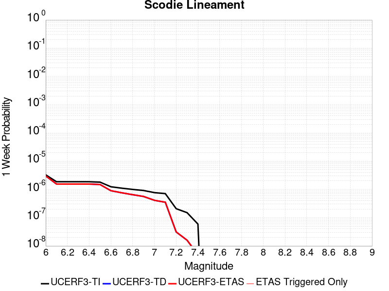 | 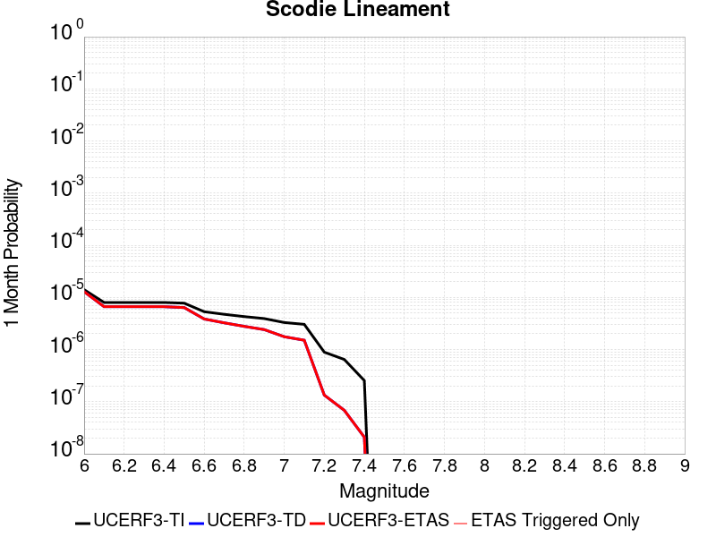 |  | 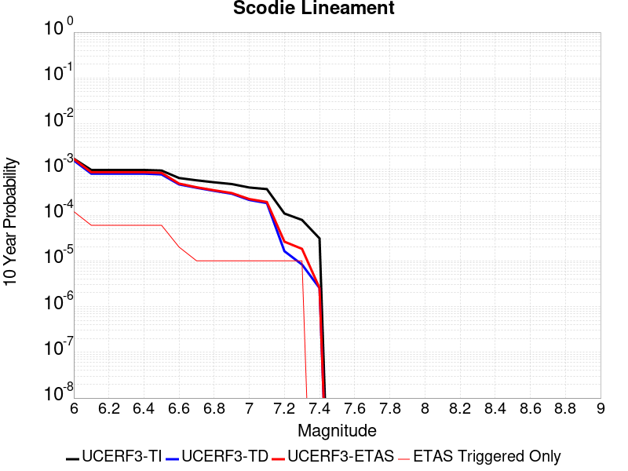 |

| Magnitude | 1 wk TI Prob | 1 wk TD Prob | 1 wk ETAS Prob | 1 wk ETAS/TD Gain | 1 wk ETAS Triggered Only | 1 mo TI Prob | 1 mo TD Prob | 1 mo ETAS Prob | 1 mo ETAS/TD Gain | 1 mo ETAS Triggered Only | 1 yr TI Prob | 1 yr TD Prob | 1 yr ETAS Prob | 1 yr ETAS/TD Gain | 1 yr ETAS Triggered Only | 10 yr TI Prob | 10 yr TD Prob | 10 yr ETAS Prob | 10 yr ETAS/TD Gain | 10 yr ETAS Triggered Only |
|-----|-----|-----|-----|-----|-----|-----|-----|-----|-----|-----|-----|-----|-----|-----|-----|-----|-----|-----|-----|-----|
| 6.0 | 3.2919327E-6 | 3.0134847E-6 | 3.0134847E-6 | 1.0 | 0.0 | 1.4108206E-5 | 1.2914888E-5 | 1.2914888E-5 | 1.0 | 0.0 | 1.7175387E-4 | 1.5723059E-4 | 1.8013336E-4 | 1.1456635 | 2.2906359E-5 | 0.0017162118 | 0.0015715051 | 0.0016629866 | 1.0582126 | 9.1625436E-5 |
| 6.1 | 1.8663811E-6 | 1.5491396E-6 | 1.5491396E-6 | 1.0 | 0.0 | 7.998751E-6 | 6.639156E-6 | 6.639156E-6 | 1.0 | 0.0 | 9.738045E-5 | 8.082922E-5 | 1.0373373E-4 | 1.2833692 | 2.2906359E-5 | 9.7337784E-4 | 8.08047E-4 | 8.767106E-4 | 1.0849746 | 6.871908E-5 |
| 6.2 | 1.8663811E-6 | 1.5491396E-6 | 1.5491396E-6 | 1.0 | 0.0 | 7.998751E-6 | 6.639156E-6 | 6.639156E-6 | 1.0 | 0.0 | 9.738045E-5 | 8.082922E-5 | 1.0373373E-4 | 1.2833692 | 2.2906359E-5 | 9.7337784E-4 | 8.08047E-4 | 8.767106E-4 | 1.0849746 | 6.871908E-5 |
| 6.3 | 1.8663811E-6 | 1.5491396E-6 | 1.5491396E-6 | 1.0 | 0.0 | 7.998751E-6 | 6.639156E-6 | 6.639156E-6 | 1.0 | 0.0 | 9.738045E-5 | 8.082922E-5 | 1.0373373E-4 | 1.2833692 | 2.2906359E-5 | 9.7337784E-4 | 8.08047E-4 | 8.767106E-4 | 1.0849746 | 6.871908E-5 |
| 6.4 | 1.8663811E-6 | 1.5491396E-6 | 1.5491396E-6 | 1.0 | 0.0 | 7.998751E-6 | 6.639156E-6 | 6.639156E-6 | 1.0 | 0.0 | 9.738045E-5 | 8.082922E-5 | 1.0373373E-4 | 1.2833692 | 2.2906359E-5 | 9.7337784E-4 | 8.08047E-4 | 8.767106E-4 | 1.0849746 | 6.871908E-5 |
| 6.5 | 1.8106311E-6 | 1.4910704E-6 | 1.4910704E-6 | 1.0 | 0.0 | 7.759824E-6 | 6.390289E-6 | 6.390289E-6 | 1.0 | 0.0 | 9.447177E-5 | 7.779949E-5 | 1.0070406E-4 | 1.2944052 | 2.2906359E-5 | 9.4431615E-4 | 7.777712E-4 | 8.464368E-4 | 1.0882851 | 6.871908E-5 |
| 6.6 | 1.2414679E-6 | 8.998118E-7 | 8.998118E-7 | 1.0 | 0.0 | 5.320566E-6 | 3.856331E-6 | 3.856331E-6 | 1.0 | 0.0 | 6.477596E-5 | 4.694991E-5 | 4.694991E-5 | 1.0 | 0.0 | 6.475708E-4 | 4.6940855E-4 | 5.151998E-4 | 1.0975509 | 4.5812718E-5 |
| 6.7 | 1.1062215E-6 | 7.594802E-7 | 7.594802E-7 | 1.0 | 0.0 | 4.7409408E-6 | 3.2549115E-6 | 3.2549115E-6 | 1.0 | 0.0 | 5.7719422E-5 | 3.9627896E-5 | 3.9627896E-5 | 1.0 | 0.0 | 5.770443E-4 | 3.962153E-4 | 4.191126E-4 | 1.05779 | 2.2906359E-5 |
| 6.8 | 1.0006736E-6 | 6.5008345E-7 | 6.5008345E-7 | 1.0 | 0.0 | 4.288594E-6 | 2.7860694E-6 | 2.7860694E-6 | 1.0 | 0.0 | 5.221238E-5 | 3.391993E-5 | 3.391993E-5 | 1.0 | 0.0 | 5.220012E-4 | 3.391536E-4 | 3.6205217E-4 | 1.0675169 | 2.2906359E-5 |
| 6.9 | 9.167364E-7 | 5.6320226E-7 | 5.6320226E-7 | 1.0 | 0.0 | 3.9288643E-6 | 2.4137219E-6 | 2.4137219E-6 | 1.0 | 0.0 | 4.7832873E-5 | 2.9386727E-5 | 2.9386727E-5 | 1.0 | 0.0 | 4.782258E-4 | 2.9383408E-4 | 3.167337E-4 | 1.0779339 | 2.2906359E-5 |
| 7.0 | 7.6987664E-7 | 4.1137125E-7 | 4.1137125E-7 | 1.0 | 0.0 | 3.2994672E-6 | 1.7630188E-6 | 1.7630188E-6 | 1.0 | 0.0 | 4.0170275E-5 | 2.146458E-5 | 2.146458E-5 | 1.0 | 0.0 | 4.0163012E-4 | 2.1462893E-4 | 2.3753037E-4 | 1.1067024 | 2.2906359E-5 |
| 7.1 | 7.1038727E-7 | 3.5214526E-7 | 3.5214526E-7 | 1.0 | 0.0 | 3.0445133E-6 | 1.5091933E-6 | 1.5091933E-6 | 1.0 | 0.0 | 3.706632E-5 | 1.8374309E-5 | 1.8374309E-5 | 1.0 | 0.0 | 3.7060137E-4 | 1.8373139E-4 | 2.0663354E-4 | 1.1246501 | 2.2906359E-5 |
| 7.2 | 2.0799602E-7 | 3.119519E-8 | 3.119519E-8 | 1.0 | 0.0 | 8.914113E-7 | 1.3369366E-7 | 1.3369366E-7 | 1.0 | 0.0 | 1.0852878E-5 | 1.6277191E-6 | 1.6277191E-6 | 1.0 | 0.0 | 1.08523476E-4 | 1.627708E-5 | 3.9183065E-5 | 2.407254 | 2.2906359E-5 |
| 7.3 | 1.5048182E-7 | 1.595136E-8 | 1.595136E-8 | 1.0 | 0.0 | 6.449219E-7 | 6.8362965E-8 | 6.8362965E-8 | 1.0 | 0.0 | 7.851896E-6 | 8.323188E-7 | 8.323188E-7 | 1.0 | 0.0 | 7.851618E-5 | 8.32316E-6 | 3.1229327E-5 | 3.7521 | 2.2906359E-5 |
| 7.4 | 5.9334678E-8 | 4.8704454E-9 | 4.8704454E-9 | 1.0 | 0.0 | 2.5429145E-7 | 2.0873339E-8 | 2.0873339E-8 | 1.0 | 0.0 | 3.095994E-6 | 2.5413289E-7 | 2.5413289E-7 | 1.0 | 0.0 | 3.095951E-5 | 2.541327E-6 | 2.541327E-6 | 1.0 | 0.0 |

## San Jacinto (Stepovers Combined)
*[(top)](#table-of-contents)*

| 1 Week | 1 Month | 1 Year | 10 Year |
|-----|-----|-----|-----|
|  |  |  |  |

| Magnitude | 1 wk TI Prob | 1 wk TD Prob | 1 wk ETAS Prob | 1 wk ETAS/TD Gain | 1 wk ETAS Triggered Only | 1 mo TI Prob | 1 mo TD Prob | 1 mo ETAS Prob | 1 mo ETAS/TD Gain | 1 mo ETAS Triggered Only | 1 yr TI Prob | 1 yr TD Prob | 1 yr ETAS Prob | 1 yr ETAS/TD Gain | 1 yr ETAS Triggered Only | 10 yr TI Prob | 10 yr TD Prob | 10 yr ETAS Prob | 10 yr ETAS/TD Gain | 10 yr ETAS Triggered Only |
|-----|-----|-----|-----|-----|-----|-----|-----|-----|-----|-----|-----|-----|-----|-----|-----|-----|-----|-----|-----|-----|
| 6.0 | 4.0667746E-5 | 3.5424455E-5 | 3.5424455E-5 | 1.0 | 0.0 | 1.742787E-4 | 1.5181027E-4 | 1.5181027E-4 | 1.0 | 0.0 | 0.0021197782 | 0.0018467255 | 0.0018695896 | 1.0123808 | 2.2906359E-5 | 0.020996714 | 0.019065471 | 0.01915535 | 1.0047143 | 9.1625436E-5 |
| 6.1 | 4.0667746E-5 | 3.5424455E-5 | 3.5424455E-5 | 1.0 | 0.0 | 1.742787E-4 | 1.5181027E-4 | 1.5181027E-4 | 1.0 | 0.0 | 0.0021197782 | 0.0018467255 | 0.0018695896 | 1.0123808 | 2.2906359E-5 | 0.020996714 | 0.019065471 | 0.01915535 | 1.0047143 | 9.1625436E-5 |
| 6.2 | 4.0667746E-5 | 3.5424455E-5 | 3.5424455E-5 | 1.0 | 0.0 | 1.742787E-4 | 1.5181027E-4 | 1.5181027E-4 | 1.0 | 0.0 | 0.0021197782 | 0.0018467255 | 0.0018695896 | 1.0123808 | 2.2906359E-5 | 0.020996714 | 0.019065471 | 0.01915535 | 1.0047143 | 9.1625436E-5 |
| 6.3 | 4.0667746E-5 | 3.5424455E-5 | 3.5424455E-5 | 1.0 | 0.0 | 1.742787E-4 | 1.5181027E-4 | 1.5181027E-4 | 1.0 | 0.0 | 0.0021197782 | 0.0018467255 | 0.0018695896 | 1.0123808 | 2.2906359E-5 | 0.020996714 | 0.019065471 | 0.01915535 | 1.0047143 | 9.1625436E-5 |
| 6.4 | 4.0577226E-5 | 3.529632E-5 | 3.529632E-5 | 1.0 | 0.0 | 1.738908E-4 | 1.5126119E-4 | 1.5126119E-4 | 1.0 | 0.0 | 0.0021150648 | 0.0018400518 | 0.001862916 | 1.0124259 | 2.2906359E-5 | 0.020950472 | 0.019000014 | 0.019089898 | 1.0047308 | 9.1625436E-5 |
| 6.5 | 4.0577226E-5 | 3.529632E-5 | 3.529632E-5 | 1.0 | 0.0 | 1.738908E-4 | 1.5126119E-4 | 1.5126119E-4 | 1.0 | 0.0 | 0.0021150648 | 0.0018400518 | 0.001862916 | 1.0124259 | 2.2906359E-5 | 0.020950472 | 0.019000014 | 0.019089898 | 1.0047308 | 9.1625436E-5 |
| 6.6 | 4.053861E-5 | 3.5241635E-5 | 3.5241635E-5 | 1.0 | 0.0 | 1.7372532E-4 | 1.5102686E-4 | 1.5102686E-4 | 1.0 | 0.0 | 0.0021130538 | 0.0018372037 | 0.0018600681 | 1.0124451 | 2.2906359E-5 | 0.020930743 | 0.018972082 | 0.019061968 | 1.0047379 | 9.1625436E-5 |
| 6.7 | 4.0516545E-5 | 3.5210687E-5 | 3.5210687E-5 | 1.0 | 0.0 | 1.7363077E-4 | 1.5089424E-4 | 1.5089424E-4 | 1.0 | 0.0 | 0.002111905 | 0.0018355926 | 0.0018584569 | 1.012456 | 2.2906359E-5 | 0.020919468 | 0.018956272 | 0.01904616 | 1.0047419 | 9.1625436E-5 |
| 6.8 | 4.049434E-5 | 3.5182235E-5 | 3.5182235E-5 | 1.0 | 0.0 | 1.7353562E-4 | 1.507723E-4 | 1.507723E-4 | 1.0 | 0.0 | 0.0021107488 | 0.0018341107 | 0.001856975 | 1.0124662 | 2.2906359E-5 | 0.020908125 | 0.018941678 | 0.01903157 | 1.0047456 | 9.1625436E-5 |
| 6.9 | 4.046386E-5 | 3.5144778E-5 | 3.5144778E-5 | 1.0 | 0.0 | 1.73405E-4 | 1.506118E-4 | 1.506118E-4 | 1.0 | 0.0 | 0.0021091616 | 0.0018321596 | 0.001855024 | 1.0124794 | 2.2906359E-5 | 0.020892553 | 0.018922443 | 0.019012334 | 1.0047505 | 9.1625436E-5 |
| 7.0 | 4.036382E-5 | 3.5025278E-5 | 3.5025278E-5 | 1.0 | 0.0 | 1.7297632E-4 | 1.5009972E-4 | 1.5009972E-4 | 1.0 | 0.0 | 0.0021039525 | 0.0018259356 | 0.0018488001 | 1.0125221 | 2.2906359E-5 | 0.02084144 | 0.018861026 | 0.018950922 | 1.0047663 | 9.1625436E-5 |
| 7.1 | 4.0343282E-5 | 3.5003726E-5 | 3.5003726E-5 | 1.0 | 0.0 | 1.7288832E-4 | 1.5000737E-4 | 1.5000737E-4 | 1.0 | 0.0 | 0.002102883 | 0.0018248131 | 0.0018476776 | 1.0125299 | 2.2906359E-5 | 0.020830948 | 0.018849896 | 0.018939793 | 1.0047692 | 9.1625436E-5 |
| 7.2 | 4.0257353E-5 | 3.4908084E-5 | 3.4908084E-5 | 1.0 | 0.0 | 1.725201E-4 | 1.4959752E-4 | 1.4959752E-4 | 1.0 | 0.0 | 0.0020984085 | 0.0018198314 | 0.0018426961 | 1.0125642 | 2.2906359E-5 | 0.020787042 | 0.018800564 | 0.018890468 | 1.004782 | 9.1625436E-5 |
| 7.3 | 3.9940667E-5 | 3.4735232E-5 | 3.4735232E-5 | 1.0 | 0.0 | 1.7116306E-4 | 1.4885681E-4 | 1.4885681E-4 | 1.0 | 0.0 | 0.0020819185 | 0.0018108283 | 0.0018336932 | 1.0126268 | 2.2906359E-5 | 0.020625217 | 0.018708937 | 0.018798849 | 1.0048058 | 9.1625436E-5 |
| 7.4 | 3.9721202E-5 | 3.4620345E-5 | 3.4620345E-5 | 1.0 | 0.0 | 1.7022261E-4 | 1.4836449E-4 | 1.4836449E-4 | 1.0 | 0.0 | 0.0020704903 | 0.0018048445 | 0.0018277095 | 1.0126687 | 2.2906359E-5 | 0.020513052 | 0.01864792 | 0.018737838 | 1.0048218 | 9.1625436E-5 |
| 7.5 | 3.7036873E-5 | 3.368442E-5 | 3.368442E-5 | 1.0 | 0.0 | 1.5871979E-4 | 1.4435383E-4 | 1.4435383E-4 | 1.0 | 0.0 | 0.0019307006 | 0.0017560942 | 0.0017789603 | 1.013021 | 2.2906359E-5 | 0.019140124 | 0.018147755 | 0.018237717 | 1.0049572 | 9.1625436E-5 |
| 7.6 | 3.2940967E-5 | 3.1455937E-5 | 3.1455937E-5 | 1.0 | 0.0 | 1.4116794E-4 | 1.348042E-4 | 1.348042E-4 | 1.0 | 0.0 | 0.0017173645 | 0.0016400078 | 0.0016400078 | 1.0 | 0.0 | 0.01704153 | 0.016975854 | 0.017043406 | 1.0039793 | 6.871908E-5 |
| 7.7 | 2.8236149E-5 | 2.8018048E-5 | 2.8018048E-5 | 1.0 | 0.0 | 1.2100645E-4 | 1.2007183E-4 | 1.2007183E-4 | 1.0 | 0.0 | 0.0014722579 | 0.0014608953 | 0.0014608953 | 1.0 | 0.0 | 0.014625421 | 0.015184763 | 0.015252438 | 1.0044568 | 6.871908E-5 |
| 7.8 | 2.4329287E-5 | 2.5336392E-5 | 2.5336392E-5 | 1.0 | 0.0 | 1.042642E-4 | 1.08580025E-4 | 1.08580025E-4 | 1.0 | 0.0 | 0.0012686774 | 0.0013211609 | 0.0013211609 | 1.0 | 0.0 | 0.012614589 | 0.01377942 | 0.013847193 | 1.0049183 | 6.871908E-5 |
| 7.9 | 1.9370926E-5 | 2.053781E-5 | 2.053781E-5 | 1.0 | 0.0 | 8.301561E-5 | 8.801621E-5 | 8.801621E-5 | 1.0 | 0.0 | 0.0010102465 | 0.0010710714 | 0.0010710714 | 1.0 | 0.0 | 0.0100566605 | 0.011260242 | 0.011328188 | 1.0060341 | 6.871908E-5 |
| 8.0 | 1.5583017E-5 | 1.5984346E-5 | 1.5984346E-5 | 1.0 | 0.0 | 6.6782646E-5 | 6.8502544E-5 | 6.8502544E-5 | 1.0 | 0.0 | 8.127754E-4 | 8.3370006E-4 | 8.3370006E-4 | 1.0 | 0.0 | 0.008098091 | 0.008833316 | 0.0089014275 | 1.0077108 | 6.871908E-5 |
| 8.1 | 1.0024873E-5 | 8.350047E-6 | 8.350047E-6 | 1.0 | 0.0 | 4.2963035E-5 | 3.578543E-5 | 3.578543E-5 | 1.0 | 0.0 | 5.229494E-4 | 4.3560102E-4 | 4.3560102E-4 | 1.0 | 0.0 | 0.0052172043 | 0.004684384 | 0.004684384 | 1.0 | 0.0 |
| 8.2 | 4.142796E-6 | 1.5775288E-6 | 1.5775288E-6 | 1.0 | 0.0 | 1.775472E-5 | 6.7608203E-6 | 6.7608203E-6 | 1.0 | 0.0 | 2.1614227E-4 | 8.230991E-5 | 8.230991E-5 | 1.0 | 0.0 | 0.0021593217 | 9.5490384E-4 | 9.5490384E-4 | 1.0 | 0.0 |
| 8.3 | 1.2750878E-6 | 3.657188E-7 | 3.657188E-7 | 1.0 | 0.0 | 5.4646503E-6 | 1.5673653E-6 | 1.5673653E-6 | 1.0 | 0.0 | 6.653009E-5 | 1.908251E-5 | 1.908251E-5 | 1.0 | 0.0 | 6.6510175E-4 | 2.2998886E-4 | 2.2998886E-4 | 1.0 | 0.0 |

## Lake Isabella (Seismicity)
*[(top)](#table-of-contents)*

| 1 Week | 1 Month | 1 Year | 10 Year |
|-----|-----|-----|-----|
|  |  |  |  |

| Magnitude | 1 wk TI Prob | 1 wk TD Prob | 1 wk ETAS Prob | 1 wk ETAS/TD Gain | 1 wk ETAS Triggered Only | 1 mo TI Prob | 1 mo TD Prob | 1 mo ETAS Prob | 1 mo ETAS/TD Gain | 1 mo ETAS Triggered Only | 1 yr TI Prob | 1 yr TD Prob | 1 yr ETAS Prob | 1 yr ETAS/TD Gain | 1 yr ETAS Triggered Only | 10 yr TI Prob | 10 yr TD Prob | 10 yr ETAS Prob | 10 yr ETAS/TD Gain | 10 yr ETAS Triggered Only |
|-----|-----|-----|-----|-----|-----|-----|-----|-----|-----|-----|-----|-----|-----|-----|-----|-----|-----|-----|-----|-----|
| 6.0 | 9.431637E-6 | 9.742077E-6 | 9.742077E-6 | 1.0 | 0.0 | 4.0420677E-5 | 4.1751162E-5 | 4.1751162E-5 | 1.0 | 0.0 | 4.920106E-4 | 5.0821493E-4 | 5.768991E-4 | 1.1351478 | 6.871908E-5 | 0.004909227 | 0.0050718198 | 0.0051629804 | 1.017974 | 9.1625436E-5 |
| 6.1 | 9.431637E-6 | 9.742077E-6 | 9.742077E-6 | 1.0 | 0.0 | 4.0420677E-5 | 4.1751162E-5 | 4.1751162E-5 | 1.0 | 0.0 | 4.920106E-4 | 5.0821493E-4 | 5.768991E-4 | 1.1351478 | 6.871908E-5 | 0.004909227 | 0.0050718198 | 0.0051629804 | 1.017974 | 9.1625436E-5 |
| 6.2 | 9.431637E-6 | 9.742077E-6 | 9.742077E-6 | 1.0 | 0.0 | 4.0420677E-5 | 4.1751162E-5 | 4.1751162E-5 | 1.0 | 0.0 | 4.920106E-4 | 5.0821493E-4 | 5.768991E-4 | 1.1351478 | 6.871908E-5 | 0.004909227 | 0.0050718198 | 0.0051629804 | 1.017974 | 9.1625436E-5 |
| 6.3 | 9.431637E-6 | 9.742077E-6 | 9.742077E-6 | 1.0 | 0.0 | 4.0420677E-5 | 4.1751162E-5 | 4.1751162E-5 | 1.0 | 0.0 | 4.920106E-4 | 5.0821493E-4 | 5.768991E-4 | 1.1351478 | 6.871908E-5 | 0.004909227 | 0.0050718198 | 0.0051629804 | 1.017974 | 9.1625436E-5 |
| 6.4 | 5.144063E-6 | 5.3002896E-6 | 5.3002896E-6 | 1.0 | 0.0 | 2.2045799E-5 | 2.2715349E-5 | 2.2715349E-5 | 1.0 | 0.0 | 2.6837454E-4 | 2.7652772E-4 | 2.9942775E-4 | 1.0828128 | 2.2906359E-5 | 0.0026805066 | 0.0027621768 | 0.0028078628 | 1.0165399 | 4.5812718E-5 |
| 6.5 | 5.144063E-6 | 5.3002896E-6 | 5.3002896E-6 | 1.0 | 0.0 | 2.2045799E-5 | 2.2715349E-5 | 2.2715349E-5 | 1.0 | 0.0 | 2.6837454E-4 | 2.7652772E-4 | 2.9942775E-4 | 1.0828128 | 2.2906359E-5 | 0.0026805066 | 0.0027621768 | 0.0028078628 | 1.0165399 | 4.5812718E-5 |
| 6.6 | 3.4009804E-6 | 3.4989196E-6 | 3.4989196E-6 | 1.0 | 0.0 | 1.4575549E-5 | 1.4995293E-5 | 1.4995293E-5 | 1.0 | 0.0 | 1.7744285E-4 | 1.82554E-4 | 2.0545618E-4 | 1.1254543 | 2.2906359E-5 | 0.0017730123 | 0.0018241982 | 0.0018470627 | 1.012534 | 2.2906359E-5 |
| 6.7 | 3.3880428E-6 | 3.485786E-6 | 3.485786E-6 | 1.0 | 0.0 | 1.4520103E-5 | 1.4939006E-5 | 1.4939006E-5 | 1.0 | 0.0 | 1.767679E-4 | 1.8186883E-4 | 2.0477101E-4 | 1.125927 | 2.2906359E-5 | 0.0017662736 | 0.0018173576 | 0.0018402224 | 1.0125813 | 2.2906359E-5 |
| 6.8 | 2.6582E-6 | 2.7338033E-6 | 2.7338033E-6 | 1.0 | 0.0 | 1.1392236E-5 | 1.1716254E-5 | 1.1716254E-5 | 1.0 | 0.0 | 1.3869164E-4 | 1.4263741E-4 | 1.6554049E-4 | 1.1605686 | 2.2906359E-5 | 0.0013860512 | 0.0014255906 | 0.0014484643 | 1.0160451 | 2.2906359E-5 |
| 6.9 | 2.406011E-6 | 2.474422E-6 | 2.474422E-6 | 1.0 | 0.0 | 1.0311434E-5 | 1.060463E-5 | 1.060463E-5 | 1.0 | 0.0 | 1.2553448E-4 | 1.2910504E-4 | 1.2910504E-4 | 1.0 | 0.0 | 0.0012546359 | 0.00129043 | 0.00129043 | 1.0 | 0.0 |
| 7.0 | 1.6953097E-6 | 1.7430021E-6 | 1.7430021E-6 | 1.0 | 0.0 | 7.265593E-6 | 7.4699938E-6 | 7.4699938E-6 | 1.0 | 0.0 | 8.8455E-5 | 9.094443E-5 | 9.094443E-5 | 1.0 | 0.0 | 8.84198E-4 | 9.0917485E-4 | 9.0917485E-4 | 1.0 | 0.0 |
| 7.1 | 3.5013824E-7 | 3.5715772E-7 | 3.5715772E-7 | 1.0 | 0.0 | 1.5005916E-6 | 1.530675E-6 | 1.530675E-6 | 1.0 | 0.0 | 1.826955E-5 | 1.8635812E-5 | 1.8635812E-5 | 1.0 | 0.0 | 1.8268047E-4 | 1.8634275E-4 | 1.8634275E-4 | 1.0 | 0.0 |
| 7.2 | 2.2321095E-7 | 2.2751153E-7 | 2.2751153E-7 | 1.0 | 0.0 | 9.56618E-7 | 9.750491E-7 | 9.750491E-7 | 1.0 | 0.0 | 1.1646762E-5 | 1.187116E-5 | 1.187116E-5 | 1.0 | 0.0 | 1.1646151E-4 | 1.1870535E-4 | 1.1870535E-4 | 1.0 | 0.0 |
| 7.3 | 1.5760406E-7 | 1.6061328E-7 | 1.6061328E-7 | 1.0 | 0.0 | 6.7544585E-7 | 6.883425E-7 | 6.883425E-7 | 1.0 | 0.0 | 8.223522E-6 | 8.380538E-6 | 8.380538E-6 | 1.0 | 0.0 | 8.2232174E-5 | 8.380228E-5 | 8.380228E-5 | 1.0 | 0.0 |
| 7.4 | 1.1216497E-7 | 1.14319974E-7 | 1.14319974E-7 | 1.0 | 0.0 | 4.8070694E-7 | 4.8994264E-7 | 4.8994264E-7 | 1.0 | 0.0 | 5.852591E-6 | 5.9650356E-6 | 5.9650356E-6 | 1.0 | 0.0 | 5.8524372E-5 | 5.96488E-5 | 5.96488E-5 | 1.0 | 0.0 |
| 7.5 | 4.885185E-8 | 4.9789E-8 | 4.9789E-8 | 1.0 | 0.0 | 2.0936506E-7 | 2.1338143E-7 | 2.1338143E-7 | 1.0 | 0.0 | 2.5490165E-6 | 2.597916E-6 | 2.597916E-6 | 1.0 | 0.0 | 2.5489873E-5 | 2.5978874E-5 | 2.5978874E-5 | 1.0 | 0.0 |
| 7.6 | 1.504641E-9 | 1.5318269E-9 | 1.5318269E-9 | 1.0 | 0.0 | 6.4484613E-9 | 6.5649726E-9 | 6.5649726E-9 | 1.0 | 0.0 | 7.851001E-8 | 7.992854E-8 | 7.992854E-8 | 1.0 | 0.0 | 7.8509987E-7 | 7.9928543E-7 | 7.9928543E-7 | 1.0 | 0.0 |

## Cleghorn Lake
*[(top)](#table-of-contents)*

| 1 Week | 1 Month | 1 Year | 10 Year |
|-----|-----|-----|-----|
|  |  |  |  |

| Magnitude | 1 wk TI Prob | 1 wk TD Prob | 1 wk ETAS Prob | 1 wk ETAS/TD Gain | 1 wk ETAS Triggered Only | 1 mo TI Prob | 1 mo TD Prob | 1 mo ETAS Prob | 1 mo ETAS/TD Gain | 1 mo ETAS Triggered Only | 1 yr TI Prob | 1 yr TD Prob | 1 yr ETAS Prob | 1 yr ETAS/TD Gain | 1 yr ETAS Triggered Only | 10 yr TI Prob | 10 yr TD Prob | 10 yr ETAS Prob | 10 yr ETAS/TD Gain | 10 yr ETAS Triggered Only |
|-----|-----|-----|-----|-----|-----|-----|-----|-----|-----|-----|-----|-----|-----|-----|-----|-----|-----|-----|-----|-----|
| 6.0 | 1.5467183E-5 | 1.679612E-5 | 1.679612E-5 | 1.0 | 0.0 | 6.6286244E-5 | 7.19817E-5 | 7.19817E-5 | 1.0 | 0.0 | 8.067362E-4 | 8.760797E-4 | 9.218523E-4 | 1.052247 | 4.5812718E-5 | 0.008038137 | 0.008731688 | 0.008822514 | 1.0104018 | 9.1625436E-5 |
| 6.1 | 1.5467183E-5 | 1.679612E-5 | 1.679612E-5 | 1.0 | 0.0 | 6.6286244E-5 | 7.19817E-5 | 7.19817E-5 | 1.0 | 0.0 | 8.067362E-4 | 8.760797E-4 | 9.218523E-4 | 1.052247 | 4.5812718E-5 | 0.008038137 | 0.008731688 | 0.008822514 | 1.0104018 | 9.1625436E-5 |
| 6.2 | 1.2624631E-5 | 1.36830695E-5 | 1.36830695E-5 | 1.0 | 0.0 | 5.410444E-5 | 5.8640682E-5 | 5.8640682E-5 | 1.0 | 0.0 | 6.585225E-4 | 7.1376516E-4 | 7.595452E-4 | 1.0641388 | 4.5812718E-5 | 0.0065657445 | 0.0071195234 | 0.0072104963 | 1.0127779 | 9.1625436E-5 |
| 6.3 | 1.2624631E-5 | 1.36830695E-5 | 1.36830695E-5 | 1.0 | 0.0 | 5.410444E-5 | 5.8640682E-5 | 5.8640682E-5 | 1.0 | 0.0 | 6.585225E-4 | 7.1376516E-4 | 7.595452E-4 | 1.0641388 | 4.5812718E-5 | 0.0065657445 | 0.0071195234 | 0.0072104963 | 1.0127779 | 9.1625436E-5 |
| 6.4 | 9.417684E-6 | 1.01712E-5 | 1.01712E-5 | 1.0 | 0.0 | 4.036088E-5 | 4.3590364E-5 | 4.3590364E-5 | 1.0 | 0.0 | 4.912829E-4 | 5.3062453E-4 | 5.535187E-4 | 1.0431458 | 2.2906359E-5 | 0.004901982 | 0.0052976124 | 0.0053659673 | 1.012903 | 6.871908E-5 |
| 6.5 | 9.368219E-6 | 1.0118622E-5 | 1.0118622E-5 | 1.0 | 0.0 | 4.014889E-5 | 4.336504E-5 | 4.336504E-5 | 1.0 | 0.0 | 4.8870314E-4 | 5.2788254E-4 | 5.507768E-4 | 1.04337 | 2.2906359E-5 | 0.004876298 | 0.0052703223 | 0.005338679 | 1.0129702 | 6.871908E-5 |
| 6.6 | 7.803798E-6 | 8.44275E-6 | 8.44275E-6 | 1.0 | 0.0 | 3.3444423E-5 | 3.6182937E-5 | 3.6182937E-5 | 1.0 | 0.0 | 4.0710976E-4 | 4.4047815E-4 | 4.6337442E-4 | 1.0519805 | 2.2906359E-5 | 0.0040636472 | 0.004399969 | 0.0044683856 | 1.0155494 | 6.871908E-5 |
| 6.7 | 2.3108669E-6 | 2.4440203E-6 | 2.4440203E-6 | 1.0 | 0.0 | 9.903678E-6 | 1.0474332E-5 | 1.0474332E-5 | 1.0 | 0.0 | 1.205706E-4 | 1.2751772E-4 | 1.2751772E-4 | 1.0 | 0.0 | 0.001205052 | 0.0012744641 | 0.0012744641 | 1.0 | 0.0 |
| 6.8 | 2.0882828E-6 | 2.2064476E-6 | 2.2064476E-6 | 1.0 | 0.0 | 8.949753E-6 | 9.456171E-6 | 9.456171E-6 | 1.0 | 0.0 | 1.08957785E-4 | 1.15122966E-4 | 1.15122966E-4 | 1.0 | 0.0 | 0.0010890438 | 0.0011506502 | 0.0011506502 | 1.0 | 0.0 |
| 6.9 | 1.876935E-6 | 1.9811969E-6 | 1.9811969E-6 | 1.0 | 0.0 | 8.043982E-6 | 8.490817E-6 | 8.490817E-6 | 1.0 | 0.0 | 9.7931086E-5 | 1.0337095E-4 | 1.0337095E-4 | 1.0 | 0.0 | 9.788794E-4 | 0.0010332447 | 0.0010332447 | 1.0 | 0.0 |
| 7.0 | 1.5357559E-6 | 1.6203991E-6 | 1.6203991E-6 | 1.0 | 0.0 | 6.5817944E-6 | 6.9445496E-6 | 6.9445496E-6 | 1.0 | 0.0 | 8.01304E-5 | 8.454674E-5 | 8.454674E-5 | 1.0 | 0.0 | 8.010151E-4 | 8.451582E-4 | 8.451582E-4 | 1.0 | 0.0 |
| 7.1 | 1.0905424E-6 | 1.1498448E-6 | 1.1498448E-6 | 1.0 | 0.0 | 4.6737446E-6 | 4.9278974E-6 | 4.9278974E-6 | 1.0 | 0.0 | 5.6901354E-5 | 5.99956E-5 | 5.99956E-5 | 1.0 | 0.0 | 5.6886784E-4 | 5.998038E-4 | 5.998038E-4 | 1.0 | 0.0 |
| 7.2 | 6.06668E-7 | 6.387725E-7 | 6.387725E-7 | 1.0 | 0.0 | 2.600003E-6 | 2.737594E-6 | 2.737594E-6 | 1.0 | 0.0 | 3.1654577E-5 | 3.332977E-5 | 3.332977E-5 | 1.0 | 0.0 | 3.1650066E-4 | 3.3325455E-4 | 3.3325455E-4 | 1.0 | 0.0 |

## Pleito
*[(top)](#table-of-contents)*

| 1 Week | 1 Month | 1 Year | 10 Year |
|-----|-----|-----|-----|
|  |  |  |  |

| Magnitude | 1 wk TI Prob | 1 wk TD Prob | 1 wk ETAS Prob | 1 wk ETAS/TD Gain | 1 wk ETAS Triggered Only | 1 mo TI Prob | 1 mo TD Prob | 1 mo ETAS Prob | 1 mo ETAS/TD Gain | 1 mo ETAS Triggered Only | 1 yr TI Prob | 1 yr TD Prob | 1 yr ETAS Prob | 1 yr ETAS/TD Gain | 1 yr ETAS Triggered Only | 10 yr TI Prob | 10 yr TD Prob | 10 yr ETAS Prob | 10 yr ETAS/TD Gain | 10 yr ETAS Triggered Only |
|-----|-----|-----|-----|-----|-----|-----|-----|-----|-----|-----|-----|-----|-----|-----|-----|-----|-----|-----|-----|-----|
| 6.0 | 1.6763008E-5 | 2.4830579E-5 | 2.4830579E-5 | 1.0 | 0.0 | 7.183948E-5 | 1.0641284E-4 | 1.0641284E-4 | 1.0 | 0.0 | 8.742947E-4 | 0.0012948783 | 0.0013177551 | 1.017667 | 2.2906359E-5 | 0.00870863 | 0.012987581 | 0.013078017 | 1.0069633 | 9.1625436E-5 |
| 6.1 | 1.6763008E-5 | 2.4830579E-5 | 2.4830579E-5 | 1.0 | 0.0 | 7.183948E-5 | 1.0641284E-4 | 1.0641284E-4 | 1.0 | 0.0 | 8.742947E-4 | 0.0012948783 | 0.0013177551 | 1.017667 | 2.2906359E-5 | 0.00870863 | 0.012987581 | 0.013078017 | 1.0069633 | 9.1625436E-5 |
| 6.2 | 1.6763008E-5 | 2.4830579E-5 | 2.4830579E-5 | 1.0 | 0.0 | 7.183948E-5 | 1.0641284E-4 | 1.0641284E-4 | 1.0 | 0.0 | 8.742947E-4 | 0.0012948783 | 0.0013177551 | 1.017667 | 2.2906359E-5 | 0.00870863 | 0.012987581 | 0.013078017 | 1.0069633 | 9.1625436E-5 |
| 6.3 | 1.6763008E-5 | 2.4830579E-5 | 2.4830579E-5 | 1.0 | 0.0 | 7.183948E-5 | 1.0641284E-4 | 1.0641284E-4 | 1.0 | 0.0 | 8.742947E-4 | 0.0012948783 | 0.0013177551 | 1.017667 | 2.2906359E-5 | 0.00870863 | 0.012987581 | 0.013078017 | 1.0069633 | 9.1625436E-5 |
| 6.4 | 1.6763008E-5 | 2.4830579E-5 | 2.4830579E-5 | 1.0 | 0.0 | 7.183948E-5 | 1.0641284E-4 | 1.0641284E-4 | 1.0 | 0.0 | 8.742947E-4 | 0.0012948783 | 0.0013177551 | 1.017667 | 2.2906359E-5 | 0.00870863 | 0.012987581 | 0.013078017 | 1.0069633 | 9.1625436E-5 |
| 6.5 | 1.6763008E-5 | 2.4830579E-5 | 2.4830579E-5 | 1.0 | 0.0 | 7.183948E-5 | 1.0641284E-4 | 1.0641284E-4 | 1.0 | 0.0 | 8.742947E-4 | 0.0012948783 | 0.0013177551 | 1.017667 | 2.2906359E-5 | 0.00870863 | 0.012987581 | 0.013078017 | 1.0069633 | 9.1625436E-5 |
| 6.6 | 9.910213E-6 | 1.7280347E-5 | 1.7280347E-5 | 1.0 | 0.0 | 4.247165E-5 | 7.4056545E-5 | 7.4056545E-5 | 1.0 | 0.0 | 5.169696E-4 | 9.012692E-4 | 9.2415494E-4 | 1.0253928 | 2.2906359E-5 | 0.0051576863 | 0.009083998 | 0.009106697 | 1.0024987 | 2.2906359E-5 |
| 6.7 | 9.910213E-6 | 1.7280347E-5 | 1.7280347E-5 | 1.0 | 0.0 | 4.247165E-5 | 7.4056545E-5 | 7.4056545E-5 | 1.0 | 0.0 | 5.169696E-4 | 9.012692E-4 | 9.2415494E-4 | 1.0253928 | 2.2906359E-5 | 0.0051576863 | 0.009083998 | 0.009106697 | 1.0024987 | 2.2906359E-5 |
| 6.8 | 8.300162E-6 | 1.5539768E-5 | 1.5539768E-5 | 1.0 | 0.0 | 3.557164E-5 | 6.659731E-5 | 6.659731E-5 | 1.0 | 0.0 | 4.3299864E-4 | 8.105221E-4 | 8.334099E-4 | 1.0282383 | 2.2906359E-5 | 0.004321559 | 0.0081833685 | 0.008206087 | 1.0027763 | 2.2906359E-5 |
| 6.9 | 8.183114E-6 | 1.5410953E-5 | 1.5410953E-5 | 1.0 | 0.0 | 3.5070017E-5 | 6.604528E-5 | 6.604528E-5 | 1.0 | 0.0 | 4.2689382E-4 | 8.0380606E-4 | 8.26694E-4 | 1.0284745 | 2.2906359E-5 | 0.0042607468 | 0.0081167 | 0.00813942 | 1.0027993 | 2.2906359E-5 |
| 7.0 | 7.1748823E-6 | 1.4197121E-5 | 1.4197121E-5 | 1.0 | 0.0 | 3.0749135E-5 | 6.084339E-5 | 6.084339E-5 | 1.0 | 0.0 | 3.743064E-4 | 7.4051705E-4 | 7.4051705E-4 | 1.0 | 0.0 | 0.0037367654 | 0.00748775 | 0.00748775 | 1.0 | 0.0 |
| 7.1 | 7.1671807E-6 | 1.4187483E-5 | 1.4187483E-5 | 1.0 | 0.0 | 3.0716128E-5 | 6.0802085E-5 | 6.0802085E-5 | 1.0 | 0.0 | 3.7390468E-4 | 7.4001454E-4 | 7.4001454E-4 | 1.0 | 0.0 | 0.0037327618 | 0.0074827587 | 0.0074827587 | 1.0 | 0.0 |
| 7.2 | 7.0649667E-6 | 1.403456E-5 | 1.403456E-5 | 1.0 | 0.0 | 3.0278077E-5 | 6.0146733E-5 | 6.0146733E-5 | 1.0 | 0.0 | 3.6857324E-4 | 7.320409E-4 | 7.320409E-4 | 1.0 | 0.0 | 0.0036796255 | 0.007403409 | 0.007403409 | 1.0 | 0.0 |
| 7.3 | 7.02082E-6 | 1.397789E-5 | 1.397789E-5 | 1.0 | 0.0 | 3.008888E-5 | 5.9903872E-5 | 5.9903872E-5 | 1.0 | 0.0 | 3.6627054E-4 | 7.290861E-4 | 7.290861E-4 | 1.0 | 0.0 | 0.0036566744 | 0.007373845 | 0.007373845 | 1.0 | 0.0 |
| 7.4 | 6.987146E-6 | 1.39373815E-5 | 1.39373815E-5 | 1.0 | 0.0 | 2.9944567E-5 | 5.9730268E-5 | 5.9730268E-5 | 1.0 | 0.0 | 3.6451413E-4 | 7.2697387E-4 | 7.2697387E-4 | 1.0 | 0.0 | 0.0036391679 | 0.007352745 | 0.007352745 | 1.0 | 0.0 |
| 7.5 | 6.9494554E-6 | 1.3894233E-5 | 1.3894233E-5 | 1.0 | 0.0 | 2.9783041E-5 | 5.9545357E-5 | 5.9545357E-5 | 1.0 | 0.0 | 3.625482E-4 | 7.247241E-4 | 7.247241E-4 | 1.0 | 0.0 | 0.0036195726 | 0.0073303464 | 0.0073303464 | 1.0 | 0.0 |
| 7.6 | 6.92694E-6 | 1.3853247E-5 | 1.3853247E-5 | 1.0 | 0.0 | 2.9686547E-5 | 5.936971E-5 | 5.936971E-5 | 1.0 | 0.0 | 3.6137376E-4 | 7.2258705E-4 | 7.2258705E-4 | 1.0 | 0.0 | 0.0036078666 | 0.0073090494 | 0.0073090494 | 1.0 | 0.0 |
| 7.7 | 6.395867E-6 | 1.27296025E-5 | 1.27296025E-5 | 1.0 | 0.0 | 2.741057E-5 | 5.45543E-5 | 5.45543E-5 | 1.0 | 0.0 | 3.336726E-4 | 6.6399656E-4 | 6.6399656E-4 | 1.0 | 0.0 | 0.0033317201 | 0.0067263553 | 0.0067263553 | 1.0 | 0.0 |
| 7.8 | 5.8664327E-6 | 1.1591917E-5 | 1.1591917E-5 | 1.0 | 0.0 | 2.5141611E-5 | 4.9678703E-5 | 4.9678703E-5 | 1.0 | 0.0 | 3.060561E-4 | 6.0467055E-4 | 6.0467055E-4 | 1.0 | 0.0 | 0.0030563495 | 0.006129156 | 0.006129156 | 1.0 | 0.0 |
| 7.9 | 3.7167474E-6 | 7.147996E-6 | 7.147996E-6 | 1.0 | 0.0 | 1.592882E-5 | 3.063391E-5 | 3.063391E-5 | 1.0 | 0.0 | 1.9391612E-4 | 3.7290415E-4 | 3.7290415E-4 | 1.0 | 0.0 | 0.0019374699 | 0.003784743 | 0.003784743 | 1.0 | 0.0 |
| 8.0 | 1.0903841E-6 | 1.2953954E-6 | 1.2953954E-6 | 1.0 | 0.0 | 4.6730665E-6 | 5.5516825E-6 | 5.5516825E-6 | 1.0 | 0.0 | 5.68931E-5 | 6.758965E-5 | 6.758965E-5 | 1.0 | 0.0 | 5.6878536E-4 | 6.9811166E-4 | 6.9811166E-4 | 1.0 | 0.0 |
| 8.1 | 2.6894583E-7 | 1.11864324E-7 | 1.11864324E-7 | 1.0 | 0.0 | 1.1526245E-6 | 4.794184E-7 | 4.794184E-7 | 1.0 | 0.0 | 1.4033113E-5 | 5.836904E-6 | 5.836904E-6 | 1.0 | 0.0 | 1.4032227E-4 | 6.5273154E-5 | 6.5273154E-5 | 1.0 | 0.0 |
| 8.2 | 5.2967013E-9 | 2.4879863E-9 | 2.4879863E-9 | 1.0 | 0.0 | 2.2700148E-8 | 1.0662798E-8 | 1.0662798E-8 | 1.0 | 0.0 | 2.7637427E-7 | 1.2981955E-7 | 1.2981955E-7 | 1.0 | 0.0 | 2.7637393E-6 | 1.476136E-6 | 1.476136E-6 | 1.0 | 0.0 |

## San Jacinto (Lytle Creek connector)
*[(top)](#table-of-contents)*

| 1 Week | 1 Month | 1 Year | 10 Year |
|-----|-----|-----|-----|
|  |  |  |  |

| Magnitude | 1 wk TI Prob | 1 wk TD Prob | 1 wk ETAS Prob | 1 wk ETAS/TD Gain | 1 wk ETAS Triggered Only | 1 mo TI Prob | 1 mo TD Prob | 1 mo ETAS Prob | 1 mo ETAS/TD Gain | 1 mo ETAS Triggered Only | 1 yr TI Prob | 1 yr TD Prob | 1 yr ETAS Prob | 1 yr ETAS/TD Gain | 1 yr ETAS Triggered Only | 10 yr TI Prob | 10 yr TD Prob | 10 yr ETAS Prob | 10 yr ETAS/TD Gain | 10 yr ETAS Triggered Only |
|-----|-----|-----|-----|-----|-----|-----|-----|-----|-----|-----|-----|-----|-----|-----|-----|-----|-----|-----|-----|-----|
| 6.0 | 6.693995E-6 | 6.68718E-6 | 6.68718E-6 | 1.0 | 0.0 | 2.8688235E-5 | 2.8659028E-5 | 2.8659028E-5 | 1.0 | 0.0 | 3.492233E-4 | 3.4886788E-4 | 3.9466462E-4 | 1.1312724 | 4.5812718E-5 | 0.00348675 | 0.003563386 | 0.0036546849 | 1.0256214 | 9.1625436E-5 |
| 6.1 | 6.693995E-6 | 6.68718E-6 | 6.68718E-6 | 1.0 | 0.0 | 2.8688235E-5 | 2.8659028E-5 | 2.8659028E-5 | 1.0 | 0.0 | 3.492233E-4 | 3.4886788E-4 | 3.9466462E-4 | 1.1312724 | 4.5812718E-5 | 0.00348675 | 0.003563386 | 0.0036546849 | 1.0256214 | 9.1625436E-5 |
| 6.2 | 6.693995E-6 | 6.68718E-6 | 6.68718E-6 | 1.0 | 0.0 | 2.8688235E-5 | 2.8659028E-5 | 2.8659028E-5 | 1.0 | 0.0 | 3.492233E-4 | 3.4886788E-4 | 3.9466462E-4 | 1.1312724 | 4.5812718E-5 | 0.00348675 | 0.003563386 | 0.0036546849 | 1.0256214 | 9.1625436E-5 |
| 6.3 | 6.693995E-6 | 6.68718E-6 | 6.68718E-6 | 1.0 | 0.0 | 2.8688235E-5 | 2.8659028E-5 | 2.8659028E-5 | 1.0 | 0.0 | 3.492233E-4 | 3.4886788E-4 | 3.9466462E-4 | 1.1312724 | 4.5812718E-5 | 0.00348675 | 0.003563386 | 0.0036546849 | 1.0256214 | 9.1625436E-5 |
| 6.4 | 6.693995E-6 | 6.68718E-6 | 6.68718E-6 | 1.0 | 0.0 | 2.8688235E-5 | 2.8659028E-5 | 2.8659028E-5 | 1.0 | 0.0 | 3.492233E-4 | 3.4886788E-4 | 3.9466462E-4 | 1.1312724 | 4.5812718E-5 | 0.00348675 | 0.003563386 | 0.0036546849 | 1.0256214 | 9.1625436E-5 |
| 6.5 | 6.6561875E-6 | 6.6473954E-6 | 6.6473954E-6 | 1.0 | 0.0 | 2.8526205E-5 | 2.8488526E-5 | 2.8488526E-5 | 1.0 | 0.0 | 3.472512E-4 | 3.467927E-4 | 3.925895E-4 | 1.1320583 | 4.5812718E-5 | 0.0034670907 | 0.0035427003 | 0.0036340011 | 1.0257715 | 9.1625436E-5 |
| 6.6 | 6.6561875E-6 | 6.6473954E-6 | 6.6473954E-6 | 1.0 | 0.0 | 2.8526205E-5 | 2.8488526E-5 | 2.8488526E-5 | 1.0 | 0.0 | 3.472512E-4 | 3.467927E-4 | 3.925895E-4 | 1.1320583 | 4.5812718E-5 | 0.0034670907 | 0.0035427003 | 0.0036340011 | 1.0257715 | 9.1625436E-5 |
| 6.7 | 6.5802237E-6 | 6.566566E-6 | 6.566566E-6 | 1.0 | 0.0 | 2.8200653E-5 | 2.8142122E-5 | 2.8142122E-5 | 1.0 | 0.0 | 3.4328885E-4 | 3.4257653E-4 | 3.8837356E-4 | 1.133684 | 4.5812718E-5 | 0.0034275902 | 0.003500672 | 0.0035919768 | 1.026082 | 9.1625436E-5 |
| 6.8 | 6.575632E-6 | 6.561054E-6 | 6.561054E-6 | 1.0 | 0.0 | 2.8180975E-5 | 2.8118498E-5 | 2.8118498E-5 | 1.0 | 0.0 | 3.4304935E-4 | 3.4228901E-4 | 3.8808605E-4 | 1.1337963 | 4.5812718E-5 | 0.0034252026 | 0.0034978061 | 0.003589111 | 1.0261035 | 9.1625436E-5 |
| 6.9 | 6.570433E-6 | 6.552444E-6 | 6.552444E-6 | 1.0 | 0.0 | 2.8158694E-5 | 2.80816E-5 | 2.80816E-5 | 1.0 | 0.0 | 3.4277816E-4 | 3.418399E-4 | 3.8763697E-4 | 1.1339723 | 4.5812718E-5 | 0.0034224992 | 0.0034933293 | 0.0035846345 | 1.0261371 | 9.1625436E-5 |
| 7.0 | 6.5643826E-6 | 6.5425606E-6 | 6.5425606E-6 | 1.0 | 0.0 | 2.8132765E-5 | 2.8039243E-5 | 2.8039243E-5 | 1.0 | 0.0 | 3.424626E-4 | 3.413244E-4 | 3.871215E-4 | 1.1341747 | 4.5812718E-5 | 0.0034193532 | 0.0034881902 | 0.003579496 | 1.0261757 | 9.1625436E-5 |
| 7.1 | 6.557402E-6 | 6.531268E-6 | 6.531268E-6 | 1.0 | 0.0 | 2.8102848E-5 | 2.7990847E-5 | 2.7990847E-5 | 1.0 | 0.0 | 3.4209844E-4 | 3.4073534E-4 | 3.8653245E-4 | 1.1344067 | 4.5812718E-5 | 0.0034157229 | 0.0034823192 | 0.0035736256 | 1.02622 | 9.1625436E-5 |
| 7.2 | 6.546394E-6 | 6.5132253E-6 | 6.5132253E-6 | 1.0 | 0.0 | 2.8055672E-5 | 2.7913524E-5 | 2.7913524E-5 | 1.0 | 0.0 | 3.4152428E-4 | 3.3979423E-4 | 3.8559138E-4 | 1.1347791 | 4.5812718E-5 | 0.0034099987 | 0.003472942 | 0.0035642493 | 1.026291 | 9.1625436E-5 |
| 7.3 | 6.5364216E-6 | 6.493994E-6 | 6.493994E-6 | 1.0 | 0.0 | 2.8012933E-5 | 2.7831105E-5 | 2.7831105E-5 | 1.0 | 0.0 | 3.4100408E-4 | 3.387911E-4 | 3.845883E-4 | 1.1351783 | 4.5812718E-5 | 0.003404813 | 0.003462955 | 0.003554263 | 1.0263671 | 9.1625436E-5 |
| 7.4 | 6.5269523E-6 | 6.475061E-6 | 6.475061E-6 | 1.0 | 0.0 | 2.7972354E-5 | 2.7749968E-5 | 2.7749968E-5 | 1.0 | 0.0 | 3.4051016E-4 | 3.3780356E-4 | 3.836008E-4 | 1.1355736 | 4.5812718E-5 | 0.0033998888 | 0.003453127 | 0.003544436 | 1.0264424 | 9.1625436E-5 |
| 7.5 | 6.5111835E-6 | 6.4513147E-6 | 6.4513147E-6 | 1.0 | 0.0 | 2.7904773E-5 | 2.7648199E-5 | 2.7648199E-5 | 1.0 | 0.0 | 3.3968766E-4 | 3.365649E-4 | 3.823622E-4 | 1.1360728 | 4.5812718E-5 | 0.0033916887 | 0.0034407894 | 0.0035320995 | 1.0265375 | 9.1625436E-5 |
| 7.6 | 6.4768806E-6 | 6.4103915E-6 | 6.4103915E-6 | 1.0 | 0.0 | 2.7757764E-5 | 2.7472817E-5 | 2.7472817E-5 | 1.0 | 0.0 | 3.3789838E-4 | 3.3443028E-4 | 3.8022766E-4 | 1.1369416 | 4.5812718E-5 | 0.0033738504 | 0.0034195052 | 0.0035108174 | 1.0267034 | 9.1625436E-5 |
| 7.7 | 6.1655364E-6 | 6.2026584E-6 | 6.2026584E-6 | 1.0 | 0.0 | 2.642346E-5 | 2.6582551E-5 | 2.6582551E-5 | 1.0 | 0.0 | 3.2165812E-4 | 3.2359455E-4 | 3.6939245E-4 | 1.1415286 | 4.5812718E-5 | 0.0032119295 | 0.003311007 | 0.003402329 | 1.0275813 | 9.1625436E-5 |
| 7.8 | 5.5043524E-6 | 5.7629622E-6 | 5.7629622E-6 | 1.0 | 0.0 | 2.3589868E-5 | 2.4698176E-5 | 2.4698176E-5 | 1.0 | 0.0 | 2.871688E-4 | 3.0065887E-4 | 3.4645782E-4 | 1.1523286 | 4.5812718E-5 | 0.0028679797 | 0.0030807185 | 0.0031720616 | 1.02965 | 9.1625436E-5 |
| 7.9 | 3.889249E-6 | 4.0978284E-6 | 4.0978284E-6 | 1.0 | 0.0 | 1.6668104E-5 | 1.7562003E-5 | 1.7562003E-5 | 1.0 | 0.0 | 2.0291525E-4 | 2.1379645E-4 | 2.5959936E-4 | 1.2142361 | 4.5812718E-5 | 0.0020273007 | 0.0022053365 | 0.0022967597 | 1.0414555 | 9.1625436E-5 |
| 8.0 | 2.668535E-6 | 2.5461316E-6 | 2.5461316E-6 | 1.0 | 0.0 | 1.1436528E-5 | 1.0911946E-5 | 1.0911946E-5 | 1.0 | 0.0 | 1.3923083E-4 | 1.3284489E-4 | 1.3284489E-4 | 1.0 | 0.0 | 0.0013914363 | 0.0013835314 | 0.0014292806 | 1.0330671 | 4.5812718E-5 |
| 8.1 | 1.5911459E-6 | 1.2265176E-6 | 1.2265176E-6 | 1.0 | 0.0 | 6.8191785E-6 | 5.2564933E-6 | 5.2564933E-6 | 1.0 | 0.0 | 8.3020335E-5 | 6.399595E-5 | 6.399595E-5 | 1.0 | 0.0 | 8.298933E-4 | 6.735424E-4 | 6.735424E-4 | 1.0 | 0.0 |
| 8.2 | 6.1294963E-7 | 2.2044327E-7 | 2.2044327E-7 | 1.0 | 0.0 | 2.6269242E-6 | 9.4475655E-7 | 9.4475655E-7 | 1.0 | 0.0 | 3.1982334E-5 | 1.150235E-5 | 1.150235E-5 | 1.0 | 0.0 | 3.1977732E-4 | 1.2914916E-4 | 1.2914916E-4 | 1.0 | 0.0 |
| 8.3 | 1.762871E-7 | 4.8134357E-8 | 4.8134357E-8 | 1.0 | 0.0 | 7.5551594E-7 | 2.0629008E-7 | 2.0629008E-7 | 1.0 | 0.0 | 9.1983675E-6 | 2.511579E-6 | 2.511579E-6 | 1.0 | 0.0 | 9.197987E-5 | 2.9024819E-5 | 2.9024819E-5 | 1.0 | 0.0 |

## Owens Valley
*[(top)](#table-of-contents)*

| 1 Week | 1 Month | 1 Year | 10 Year |
|-----|-----|-----|-----|
| 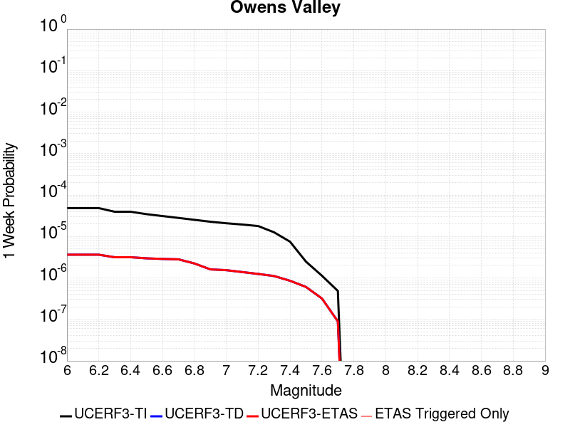 |  |  |  |

| Magnitude | 1 wk TI Prob | 1 wk TD Prob | 1 wk ETAS Prob | 1 wk ETAS/TD Gain | 1 wk ETAS Triggered Only | 1 mo TI Prob | 1 mo TD Prob | 1 mo ETAS Prob | 1 mo ETAS/TD Gain | 1 mo ETAS Triggered Only | 1 yr TI Prob | 1 yr TD Prob | 1 yr ETAS Prob | 1 yr ETAS/TD Gain | 1 yr ETAS Triggered Only | 10 yr TI Prob | 10 yr TD Prob | 10 yr ETAS Prob | 10 yr ETAS/TD Gain | 10 yr ETAS Triggered Only |
|-----|-----|-----|-----|-----|-----|-----|-----|-----|-----|-----|-----|-----|-----|-----|-----|-----|-----|-----|-----|-----|
| 6.0 | 4.83821E-5 | 3.6348592E-6 | 3.6348592E-6 | 1.0 | 0.0 | 2.0733538E-4 | 1.557788E-5 | 1.557788E-5 | 1.0 | 0.0 | 0.002521386 | 1.8964519E-4 | 2.1254721E-4 | 1.1207625 | 2.2906359E-5 | 0.024929691 | 0.0019293036 | 0.0019978902 | 1.0355499 | 6.871908E-5 |
| 6.1 | 4.83821E-5 | 3.6348592E-6 | 3.6348592E-6 | 1.0 | 0.0 | 2.0733538E-4 | 1.557788E-5 | 1.557788E-5 | 1.0 | 0.0 | 0.002521386 | 1.8964519E-4 | 2.1254721E-4 | 1.1207625 | 2.2906359E-5 | 0.024929691 | 0.0019293036 | 0.0019978902 | 1.0355499 | 6.871908E-5 |
| 6.2 | 4.83821E-5 | 3.6348592E-6 | 3.6348592E-6 | 1.0 | 0.0 | 2.0733538E-4 | 1.557788E-5 | 1.557788E-5 | 1.0 | 0.0 | 0.002521386 | 1.8964519E-4 | 2.1254721E-4 | 1.1207625 | 2.2906359E-5 | 0.024929691 | 0.0019293036 | 0.0019978902 | 1.0355499 | 6.871908E-5 |
| 6.3 | 3.953008E-5 | 3.1598945E-6 | 3.1598945E-6 | 1.0 | 0.0 | 1.6940363E-4 | 1.3542339E-5 | 1.3542339E-5 | 1.0 | 0.0 | 0.002060538 | 1.6486623E-4 | 1.8776882E-4 | 1.1389161 | 2.2906359E-5 | 0.020415364 | 0.001661594 | 0.001730199 | 1.0412886 | 6.871908E-5 |
| 6.4 | 3.953008E-5 | 3.1598945E-6 | 3.1598945E-6 | 1.0 | 0.0 | 1.6940363E-4 | 1.3542339E-5 | 1.3542339E-5 | 1.0 | 0.0 | 0.002060538 | 1.6486623E-4 | 1.8776882E-4 | 1.1389161 | 2.2906359E-5 | 0.020415364 | 0.001661594 | 0.001730199 | 1.0412886 | 6.871908E-5 |
| 6.5 | 3.457342E-5 | 2.9745124E-6 | 2.9745124E-6 | 1.0 | 0.0 | 1.4816338E-4 | 1.27478515E-5 | 1.27478515E-5 | 1.0 | 0.0 | 0.0018023965 | 1.5519475E-4 | 1.7809754E-4 | 1.1475747 | 2.2906359E-5 | 0.017878477 | 0.0015572966 | 0.0016259087 | 1.0440584 | 6.871908E-5 |
| 6.6 | 3.1127765E-5 | 2.8765398E-6 | 2.8765398E-6 | 1.0 | 0.0 | 1.3339789E-4 | 1.2327973E-5 | 1.2327973E-5 | 1.0 | 0.0 | 0.0016229092 | 1.5008343E-4 | 1.7298636E-4 | 1.1526012 | 2.2906359E-5 | 0.016111081 | 0.0015023465 | 0.0015709623 | 1.0456724 | 6.871908E-5 |
| 6.7 | 2.806885E-5 | 2.811941E-6 | 2.811941E-6 | 1.0 | 0.0 | 1.2028952E-4 | 1.2051123E-5 | 1.2051123E-5 | 1.0 | 0.0 | 0.001463541 | 1.4671324E-4 | 1.6961624E-4 | 1.1561072 | 2.2906359E-5 | 0.014539397 | 0.0014665497 | 0.001535168 | 1.0467889 | 6.871908E-5 |
| 6.8 | 2.524524E-5 | 2.2366908E-6 | 2.2366908E-6 | 1.0 | 0.0 | 1.0818939E-4 | 9.585784E-6 | 9.585784E-6 | 1.0 | 0.0 | 0.0013164099 | 1.16700976E-4 | 1.3960466E-4 | 1.1962596 | 2.2906359E-5 | 0.01308639 | 0.0011666705 | 0.0012353093 | 1.0588331 | 6.871908E-5 |
| 6.9 | 2.2704568E-5 | 1.6091428E-6 | 1.6091428E-6 | 1.0 | 0.0 | 9.730166E-5 | 6.896308E-6 | 6.896308E-6 | 1.0 | 0.0 | 0.0011840039 | 8.3959334E-5 | 1.0686377E-4 | 1.2728039 | 2.2906359E-5 | 0.011777153 | 8.394893E-4 | 9.081506E-4 | 1.0817895 | 6.871908E-5 |
| 7.0 | 2.0871712E-5 | 1.5404663E-6 | 1.5404663E-6 | 1.0 | 0.0 | 8.944713E-5 | 6.601982E-6 | 6.601982E-6 | 1.0 | 0.0 | 0.0010884746 | 8.037618E-5 | 1.032807E-4 | 1.2849665 | 2.2906359E-5 | 0.010831586 | 8.0364547E-4 | 8.723093E-4 | 1.0854405 | 6.871908E-5 |
| 7.1 | 1.944928E-5 | 1.3872052E-6 | 1.3872052E-6 | 1.0 | 0.0 | 8.335139E-5 | 5.9451518E-6 | 5.9451518E-6 | 1.0 | 0.0 | 0.0010143308 | 7.237983E-5 | 9.528453E-5 | 1.3164514 | 2.2906359E-5 | 0.010097133 | 7.2372245E-4 | 7.923918E-4 | 1.0948836 | 6.871908E-5 |
| 7.2 | 1.7876306E-5 | 1.249607E-6 | 1.249607E-6 | 1.0 | 0.0 | 7.6610486E-5 | 5.3554472E-6 | 5.3554472E-6 | 1.0 | 0.0 | 9.3233347E-4 | 6.520063E-5 | 8.8105495E-5 | 1.3512982 | 2.2906359E-5 | 0.009284316 | 6.5195386E-4 | 7.2062813E-4 | 1.1053361 | 6.871908E-5 |
| 7.3 | 1.2618672E-5 | 1.1121642E-6 | 1.1121642E-6 | 1.0 | 0.0 | 5.40789E-5 | 4.7664093E-6 | 4.7664093E-6 | 1.0 | 0.0 | 6.582117E-4 | 5.8029495E-5 | 8.093452E-5 | 1.3947135 | 2.2906359E-5 | 0.0065626553 | 5.8027735E-4 | 6.489566E-4 | 1.1183559 | 6.871908E-5 |
| 7.4 | 7.4874442E-6 | 8.5540546E-7 | 8.5540546E-7 | 1.0 | 0.0 | 3.208865E-5 | 3.6660183E-6 | 3.6660183E-6 | 1.0 | 0.0 | 3.906093E-4 | 4.4632863E-5 | 6.7538196E-5 | 1.5131944 | 2.2906359E-5 | 0.003899234 | 4.463324E-4 | 5.150208E-4 | 1.1538951 | 6.871908E-5 |
| 7.5 | 2.4734156E-6 | 6.072214E-7 | 6.072214E-7 | 1.0 | 0.0 | 1.060031E-5 | 2.6023747E-6 | 2.6023747E-6 | 1.0 | 0.0 | 1.2905113E-4 | 3.1683456E-5 | 5.4589087E-5 | 1.7229525 | 2.2906359E-5 | 0.0012897621 | 3.1678972E-4 | 3.8548702E-4 | 1.2168546 | 6.871908E-5 |
| 7.6 | 1.1328841E-6 | 3.198316E-7 | 3.198316E-7 | 1.0 | 0.0 | 4.8552088E-6 | 1.3707061E-6 | 1.3707061E-6 | 1.0 | 0.0 | 5.9110564E-5 | 1.668822E-5 | 3.9594197E-5 | 2.3725834 | 2.2906359E-5 | 5.9094845E-4 | 1.6686987E-4 | 2.3557748E-4 | 1.4117436 | 6.871908E-5 |
| 7.7 | 4.8613185E-7 | 8.9716416E-8 | 8.9716416E-8 | 1.0 | 0.0 | 2.0834207E-6 | 3.8449886E-7 | 3.8449886E-7 | 1.0 | 0.0 | 2.536535E-5 | 4.6812643E-6 | 4.6812643E-6 | 1.0 | 0.0 | 2.5362454E-4 | 4.6811725E-5 | 4.6811725E-5 | 1.0 | 0.0 |

## Imperial
*[(top)](#table-of-contents)*

| 1 Week | 1 Month | 1 Year | 10 Year |
|-----|-----|-----|-----|
| 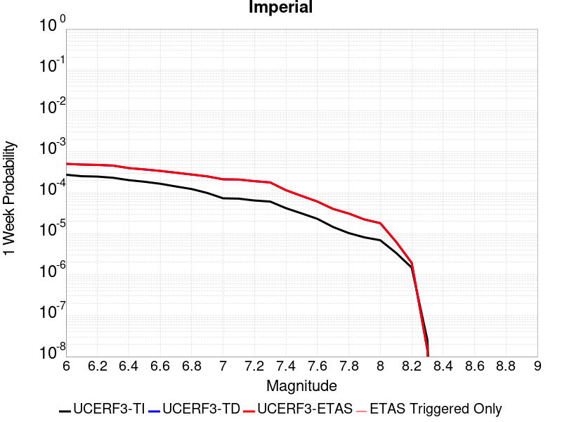 | 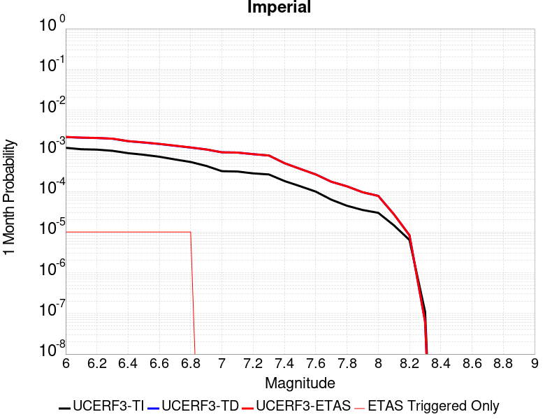 | 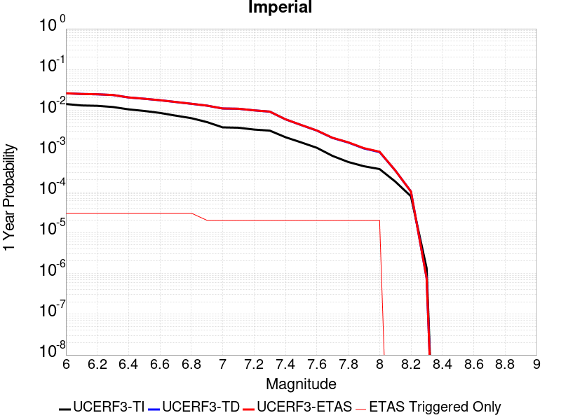 |  |

| Magnitude | 1 wk TI Prob | 1 wk TD Prob | 1 wk ETAS Prob | 1 wk ETAS/TD Gain | 1 wk ETAS Triggered Only | 1 mo TI Prob | 1 mo TD Prob | 1 mo ETAS Prob | 1 mo ETAS/TD Gain | 1 mo ETAS Triggered Only | 1 yr TI Prob | 1 yr TD Prob | 1 yr ETAS Prob | 1 yr ETAS/TD Gain | 1 yr ETAS Triggered Only | 10 yr TI Prob | 10 yr TD Prob | 10 yr ETAS Prob | 10 yr ETAS/TD Gain | 10 yr ETAS Triggered Only |
|-----|-----|-----|-----|-----|-----|-----|-----|-----|-----|-----|-----|-----|-----|-----|-----|-----|-----|-----|-----|-----|
| 6.0 | 2.7496446E-4 | 5.0681044E-4 | 5.0681044E-4 | 1.0 | 0.0 | 0.0011778869 | 0.0021702761 | 0.0021931326 | 1.0105317 | 2.2906359E-5 | 0.0142467655 | 0.026103565 | 0.026125874 | 1.0008546 | 2.2906359E-5 | 0.13367249 | 0.22847165 | 0.22852467 | 1.0002321 | 6.871908E-5 |
| 6.1 | 2.5356023E-4 | 4.876858E-4 | 4.876858E-4 | 1.0 | 0.0 | 0.001086234 | 0.0020884462 | 0.0021113046 | 1.0109452 | 2.2906359E-5 | 0.013144928 | 0.025128005 | 0.025150336 | 1.0008887 | 2.2906359E-5 | 0.123940155 | 0.21985963 | 0.21991324 | 1.0002438 | 6.871908E-5 |
| 6.2 | 2.4820742E-4 | 4.7861782E-4 | 4.7861782E-4 | 1.0 | 0.0 | 0.0010633124 | 0.0020496447 | 0.002072504 | 1.0111529 | 2.2906359E-5 | 0.01286919 | 0.024666933 | 0.024689276 | 1.0009058 | 2.2906359E-5 | 0.12148927 | 0.21636096 | 0.21641481 | 1.0002489 | 6.871908E-5 |
| 6.3 | 2.3205351E-4 | 4.5988287E-4 | 4.5988287E-4 | 1.0 | 0.0 | 9.94136E-4 | 0.0019694748 | 0.001992336 | 1.0116078 | 2.2906359E-5 | 0.012036599 | 0.023710756 | 0.023733119 | 1.0009432 | 2.2906359E-5 | 0.11405133 | 0.20827678 | 0.20833118 | 1.0002612 | 6.871908E-5 |
| 6.4 | 2.0304754E-4 | 3.9971748E-4 | 3.9971748E-4 | 1.0 | 0.0 | 8.6991355E-4 | 0.0017119648 | 0.0017348321 | 1.0133573 | 2.2906359E-5 | 0.010539869 | 0.020643953 | 0.020666387 | 1.0010867 | 2.2906359E-5 | 0.100537635 | 0.1854115 | 0.18546747 | 1.000302 | 6.871908E-5 |
| 6.5 | 1.854992E-4 | 3.7077596E-4 | 3.7077596E-4 | 1.0 | 0.0 | 7.9475436E-4 | 0.0015880845 | 0.0016109545 | 1.014401 | 2.2906359E-5 | 0.009633281 | 0.019164657 | 0.019187124 | 1.0011723 | 2.2906359E-5 | 0.0922623 | 0.1736267 | 0.1736835 | 1.0003271 | 6.871908E-5 |
| 6.6 | 1.6586106E-4 | 3.4115417E-4 | 3.4115417E-4 | 1.0 | 0.0 | 7.106394E-4 | 0.0014612802 | 0.0014841531 | 1.0156527 | 2.2906359E-5 | 0.008617763 | 0.017647566 | 0.017670067 | 1.0012751 | 2.2906359E-5 | 0.08291132 | 0.1610807 | 0.16113836 | 1.0003579 | 6.871908E-5 |
| 6.7 | 1.4224656E-4 | 3.0837086E-4 | 3.0837086E-4 | 1.0 | 0.0 | 6.094856E-4 | 0.0013209282 | 0.0013438043 | 1.0173182 | 2.2906359E-5 | 0.0073952693 | 0.01596562 | 0.015988162 | 1.0014118 | 2.2906359E-5 | 0.07153955 | 0.14675768 | 0.14681631 | 1.0003995 | 6.871908E-5 |
| 6.8 | 1.2317259E-4 | 2.7850247E-4 | 2.7850247E-4 | 1.0 | 0.0 | 5.2777573E-4 | 0.0011930423 | 0.0012159212 | 1.0191771 | 2.2906359E-5 | 0.0064067547 | 0.014429941 | 0.014452517 | 1.0015645 | 2.2906359E-5 | 0.06225166 | 0.13317463 | 0.1332342 | 1.0004473 | 6.871908E-5 |
| 6.9 | 9.859898E-5 | 2.5058497E-4 | 2.5058497E-4 | 1.0 | 0.0 | 4.2249862E-4 | 0.0010734978 | 0.0010734978 | 1.0 | 0.0 | 0.0051317946 | 0.012992479 | 0.012992479 | 1.0 | 0.0 | 0.05014893 | 0.119586915 | 0.11962725 | 1.0003372 | 4.5812718E-5 |
| 7.0 | 7.3191884E-5 | 2.1299644E-4 | 2.1299644E-4 | 1.0 | 0.0 | 3.136418E-4 | 9.1252575E-4 | 9.1252575E-4 | 1.0 | 0.0 | 0.003811904 | 0.011054094 | 0.011054094 | 1.0 | 0.0 | 0.037471764 | 0.102200456 | 0.10224159 | 1.0004025 | 4.5812718E-5 |
| 7.1 | 7.1760296E-5 | 2.1000559E-4 | 2.1000559E-4 | 1.0 | 0.0 | 3.0750787E-4 | 8.997167E-4 | 8.997167E-4 | 1.0 | 0.0 | 0.003737482 | 0.010899713 | 0.010899713 | 1.0 | 0.0 | 0.03675245 | 0.10083536 | 0.100876555 | 1.0004085 | 4.5812718E-5 |
| 7.2 | 6.46614E-5 | 1.9167885E-4 | 1.9167885E-4 | 1.0 | 0.0 | 2.7709085E-4 | 8.2122517E-4 | 8.2122517E-4 | 1.0 | 0.0 | 0.0033683628 | 0.009953204 | 0.009953204 | 1.0 | 0.0 | 0.033177625 | 0.092639305 | 0.09268087 | 1.0004487 | 4.5812718E-5 |
| 7.3 | 6.088115E-5 | 1.7838202E-4 | 1.7838202E-4 | 1.0 | 0.0 | 2.6089314E-4 | 7.642732E-4 | 7.642732E-4 | 1.0 | 0.0 | 0.0031717476 | 0.009265904 | 0.009265904 | 1.0 | 0.0 | 0.031268585 | 0.08668562 | 0.08672746 | 1.0004827 | 4.5812718E-5 |
| 7.4 | 4.199346E-5 | 1.1533306E-4 | 1.1533306E-4 | 1.0 | 0.0 | 1.7995955E-4 | 4.941918E-4 | 4.941918E-4 | 1.0 | 0.0 | 0.0021888057 | 0.006000356 | 0.006000356 | 1.0 | 0.0 | 0.02167372 | 0.05754115 | 0.057584327 | 1.0007503 | 4.5812718E-5 |
| 7.5 | 3.130448E-5 | 8.3522464E-5 | 8.3522464E-5 | 1.0 | 0.0 | 1.3415517E-4 | 3.5790465E-4 | 3.5790465E-4 | 1.0 | 0.0 | 0.0016321153 | 0.0043488424 | 0.0043488424 | 1.0 | 0.0 | 0.016201803 | 0.04221757 | 0.04226145 | 1.0010394 | 4.5812718E-5 |
| 7.6 | 2.3074248E-5 | 6.100647E-5 | 6.100647E-5 | 1.0 | 0.0 | 9.888588E-5 | 2.6143022E-4 | 2.6143022E-4 | 1.0 | 0.0 | 0.0012032706 | 0.0031782908 | 0.0031782908 | 1.0 | 0.0 | 0.011967761 | 0.031100241 | 0.031122435 | 1.0007136 | 2.2906359E-5 |
| 7.7 | 1.45864815E-5 | 4.0258925E-5 | 4.0258925E-5 | 1.0 | 0.0 | 6.2511994E-5 | 1.7252687E-4 | 1.7252687E-4 | 1.0 | 0.0 | 7.608177E-4 | 0.0020984965 | 0.0020984965 | 1.0 | 0.0 | 0.007582182 | 0.020689316 | 0.020689316 | 1.0 | 0.0 |
| 7.8 | 1.0352979E-5 | 3.1075066E-5 | 3.1075066E-5 | 1.0 | 0.0 | 4.4369157E-5 | 1.3317207E-4 | 1.3317207E-4 | 1.0 | 0.0 | 5.400606E-4 | 0.0016201665 | 0.0016201665 | 1.0 | 0.0 | 0.0053875 | 0.016069198 | 0.016069198 | 1.0 | 0.0 |
| 7.9 | 8.137906E-6 | 2.2240849E-5 | 2.2240849E-5 | 1.0 | 0.0 | 3.4876273E-5 | 9.531444E-5 | 9.531444E-5 | 1.0 | 0.0 | 4.2453592E-4 | 0.0011598365 | 0.0011598365 | 1.0 | 0.0 | 0.004237258 | 0.011660647 | 0.011660647 | 1.0 | 0.0 |
| 8.0 | 6.93792E-6 | 1.808769E-5 | 1.808769E-5 | 1.0 | 0.0 | 2.9733603E-5 | 7.751637E-5 | 7.751637E-5 | 1.0 | 0.0 | 3.6194647E-4 | 9.43354E-4 | 9.43354E-4 | 1.0 | 0.0 | 0.0036135751 | 0.009538571 | 0.009538571 | 1.0 | 0.0 |
| 8.1 | 3.4286315E-6 | 6.416584E-6 | 6.416584E-6 | 1.0 | 0.0 | 1.4694053E-5 | 2.7499356E-5 | 2.7499356E-5 | 1.0 | 0.0 | 1.7888541E-4 | 3.3475333E-4 | 3.3475333E-4 | 1.0 | 0.0 | 0.0017874148 | 0.0035042574 | 0.0035042574 | 1.0 | 0.0 |
| 8.2 | 1.4906886E-6 | 1.9510446E-6 | 1.9510446E-6 | 1.0 | 0.0 | 6.3886496E-6 | 8.361593E-6 | 8.361593E-6 | 1.0 | 0.0 | 7.7779034E-5 | 1.01797676E-4 | 1.01797676E-4 | 1.0 | 0.0 | 7.775182E-4 | 0.001114906 | 0.001114906 | 1.0 | 0.0 |
| 8.3 | 2.5758007E-8 | 1.4646456E-8 | 1.4646456E-8 | 1.0 | 0.0 | 1.10391454E-7 | 6.2770525E-8 | 6.2770525E-8 | 1.0 | 0.0 | 1.3440151E-6 | 7.642311E-7 | 7.642311E-7 | 1.0 | 0.0 | 1.344007E-5 | 7.965785E-6 | 7.965785E-6 | 1.0 | 0.0 |

## Baker
*[(top)](#table-of-contents)*

| 1 Week | 1 Month | 1 Year | 10 Year |
|-----|-----|-----|-----|
| 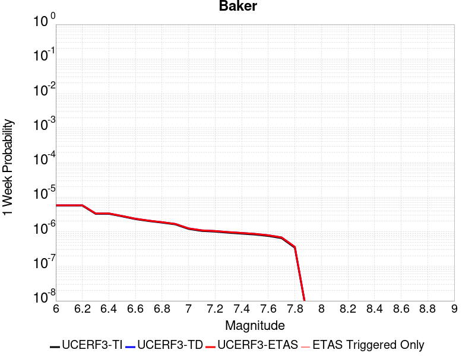 |  | 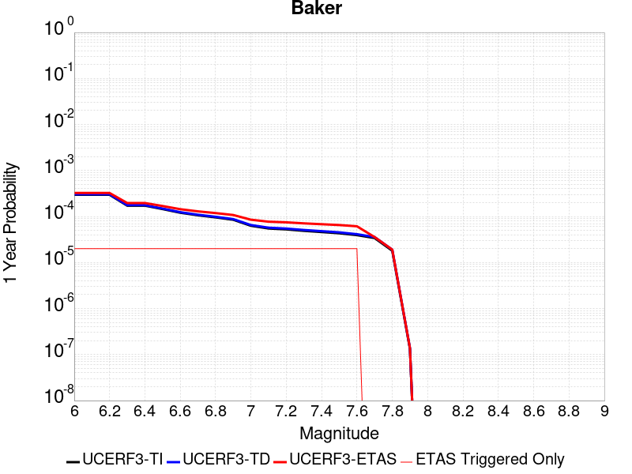 | 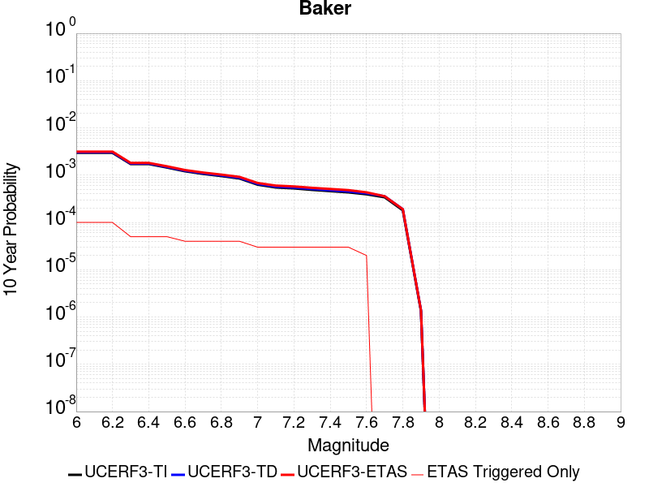 |

| Magnitude | 1 wk TI Prob | 1 wk TD Prob | 1 wk ETAS Prob | 1 wk ETAS/TD Gain | 1 wk ETAS Triggered Only | 1 mo TI Prob | 1 mo TD Prob | 1 mo ETAS Prob | 1 mo ETAS/TD Gain | 1 mo ETAS Triggered Only | 1 yr TI Prob | 1 yr TD Prob | 1 yr ETAS Prob | 1 yr ETAS/TD Gain | 1 yr ETAS Triggered Only | 10 yr TI Prob | 10 yr TD Prob | 10 yr ETAS Prob | 10 yr ETAS/TD Gain | 10 yr ETAS Triggered Only |
|-----|-----|-----|-----|-----|-----|-----|-----|-----|-----|-----|-----|-----|-----|-----|-----|-----|-----|-----|-----|-----|
| 6.0 | 5.695525E-6 | 5.8350274E-6 | 5.8350274E-6 | 1.0 | 0.0 | 2.4409164E-5 | 2.5007044E-5 | 2.5007044E-5 | 1.0 | 0.0 | 2.9714106E-4 | 3.0442222E-4 | 3.273216E-4 | 1.0752225 | 2.2906359E-5 | 0.0029674405 | 0.0030404478 | 0.003108958 | 1.0225329 | 6.871908E-5 |
| 6.1 | 5.695525E-6 | 5.8350274E-6 | 5.8350274E-6 | 1.0 | 0.0 | 2.4409164E-5 | 2.5007044E-5 | 2.5007044E-5 | 1.0 | 0.0 | 2.9714106E-4 | 3.0442222E-4 | 3.273216E-4 | 1.0752225 | 2.2906359E-5 | 0.0029674405 | 0.0030404478 | 0.003108958 | 1.0225329 | 6.871908E-5 |
| 6.2 | 5.695525E-6 | 5.8350274E-6 | 5.8350274E-6 | 1.0 | 0.0 | 2.4409164E-5 | 2.5007044E-5 | 2.5007044E-5 | 1.0 | 0.0 | 2.9714106E-4 | 3.0442222E-4 | 3.273216E-4 | 1.0752225 | 2.2906359E-5 | 0.0029674405 | 0.0030404478 | 0.003108958 | 1.0225329 | 6.871908E-5 |
| 6.3 | 3.2995713E-6 | 3.3837825E-6 | 3.3837825E-6 | 1.0 | 0.0 | 1.4140943E-5 | 1.4501847E-5 | 1.4501847E-5 | 1.0 | 0.0 | 1.7215237E-4 | 1.7654616E-4 | 1.9944848E-4 | 1.1297243 | 2.2906359E-5 | 0.0017201907 | 0.0017641061 | 0.001786972 | 1.0129617 | 2.2906359E-5 |
| 6.4 | 3.2995713E-6 | 3.3837825E-6 | 3.3837825E-6 | 1.0 | 0.0 | 1.4140943E-5 | 1.4501847E-5 | 1.4501847E-5 | 1.0 | 0.0 | 1.7215237E-4 | 1.7654616E-4 | 1.9944848E-4 | 1.1297243 | 2.2906359E-5 | 0.0017201907 | 0.0017641061 | 0.001786972 | 1.0129617 | 2.2906359E-5 |
| 6.5 | 2.782202E-6 | 2.8559416E-6 | 2.8559416E-6 | 1.0 | 0.0 | 1.1923668E-5 | 1.2239694E-5 | 1.2239694E-5 | 1.0 | 0.0 | 1.4516099E-4 | 1.4900843E-4 | 1.7191136E-4 | 1.1537024 | 2.2906359E-5 | 0.001450662 | 0.0014891179 | 0.0015119901 | 1.0153596 | 2.2906359E-5 |
| 6.6 | 2.3163404E-6 | 2.381009E-6 | 2.381009E-6 | 1.0 | 0.0 | 9.927136E-6 | 1.0204285E-5 | 1.0204285E-5 | 1.0 | 0.0 | 1.20856166E-4 | 1.242303E-4 | 1.471338E-4 | 1.1843634 | 2.2906359E-5 | 0.0012079047 | 0.0012416287 | 0.0012645066 | 1.0184257 | 2.2906359E-5 |
| 6.7 | 2.037056E-6 | 2.0965824E-6 | 2.0965824E-6 | 1.0 | 0.0 | 8.7302105E-6 | 8.985324E-6 | 8.985324E-6 | 1.0 | 0.0 | 1.0628513E-4 | 1.0939099E-4 | 1.3229484E-4 | 1.2093761 | 2.2906359E-5 | 0.0010623431 | 0.0010933875 | 0.0011162688 | 1.020927 | 2.2906359E-5 |
| 6.8 | 1.8356744E-6 | 1.8916058E-6 | 1.8916058E-6 | 1.0 | 0.0 | 7.867153E-6 | 8.106858E-6 | 8.106858E-6 | 1.0 | 0.0 | 9.577837E-5 | 9.869666E-5 | 1.21600766E-4 | 1.2320656 | 2.2906359E-5 | 9.57371E-4 | 9.865423E-4 | 0.0010094261 | 1.023196 | 2.2906359E-5 |
| 6.9 | 1.6310546E-6 | 1.6832794E-6 | 1.6832794E-6 | 1.0 | 0.0 | 6.9902153E-6 | 7.214035E-6 | 7.214035E-6 | 1.0 | 0.0 | 8.510255E-5 | 8.782745E-5 | 1.107318E-4 | 1.260788 | 2.2906359E-5 | 8.5069967E-4 | 8.779387E-4 | 9.0082496E-4 | 1.0260682 | 2.2906359E-5 |
| 7.0 | 1.2058036E-6 | 1.2509291E-6 | 1.2509291E-6 | 1.0 | 0.0 | 5.1677193E-6 | 5.3611143E-6 | 5.3611143E-6 | 1.0 | 0.0 | 6.291517E-5 | 6.526963E-5 | 8.81745E-5 | 1.3509268 | 2.2906359E-5 | 6.289736E-4 | 6.5250695E-4 | 6.753984E-4 | 1.0350822 | 2.2906359E-5 |
| 7.1 | 1.052382E-6 | 1.0952205E-6 | 1.0952205E-6 | 1.0 | 0.0 | 4.5102006E-6 | 4.6937935E-6 | 4.6937935E-6 | 1.0 | 0.0 | 5.491031E-5 | 5.7145444E-5 | 8.005049E-5 | 1.4008203 | 2.2906359E-5 | 5.4896745E-4 | 5.7130837E-4 | 5.942017E-4 | 1.0400716 | 2.2906359E-5 |
| 7.2 | 1.0067454E-6 | 1.0488296E-6 | 1.0488296E-6 | 1.0 | 0.0 | 4.3146156E-6 | 4.494976E-6 | 4.494976E-6 | 1.0 | 0.0 | 5.252918E-5 | 5.472497E-5 | 7.763007E-5 | 1.4185494 | 2.2906359E-5 | 5.251676E-4 | 5.471158E-4 | 5.7000964E-4 | 1.0418446 | 2.2906359E-5 |
| 7.3 | 9.3596316E-7 | 9.768293E-7 | 9.768293E-7 | 1.0 | 0.0 | 4.0112645E-6 | 4.186404E-6 | 4.186404E-6 | 1.0 | 0.0 | 4.8836053E-5 | 5.0968287E-5 | 7.387348E-5 | 1.4494008 | 2.2906359E-5 | 4.8825322E-4 | 5.0956674E-4 | 5.3246145E-4 | 1.0449297 | 2.2906359E-5 |
| 7.4 | 8.8117395E-7 | 9.2082155E-7 | 9.2082155E-7 | 1.0 | 0.0 | 3.7764542E-6 | 3.946372E-6 | 3.946372E-6 | 1.0 | 0.0 | 4.5977362E-5 | 4.804603E-5 | 7.095129E-5 | 1.4767357 | 2.2906359E-5 | 4.596785E-4 | 4.8035718E-4 | 5.0325255E-4 | 1.0476632 | 2.2906359E-5 |
| 7.5 | 8.292386E-7 | 8.6751294E-7 | 8.6751294E-7 | 1.0 | 0.0 | 3.5538749E-6 | 3.7179072E-6 | 3.7179072E-6 | 1.0 | 0.0 | 4.326757E-5 | 4.5264587E-5 | 6.816991E-5 | 1.5060319 | 2.2906359E-5 | 4.3259145E-4 | 4.5255444E-4 | 4.7545042E-4 | 1.0505928 | 2.2906359E-5 |
| 7.6 | 7.553842E-7 | 7.914975E-7 | 7.914975E-7 | 1.0 | 0.0 | 3.2373566E-6 | 3.3921276E-6 | 3.3921276E-6 | 1.0 | 0.0 | 3.9414106E-5 | 4.129838E-5 | 6.420379E-5 | 1.5546323 | 2.2906359E-5 | 3.9407116E-4 | 4.1290774E-4 | 4.3580463E-4 | 1.0554528 | 2.2906359E-5 |
| 7.7 | 6.5285366E-7 | 6.8532506E-7 | 6.8532506E-7 | 1.0 | 0.0 | 2.797941E-6 | 2.9371042E-6 | 2.9371042E-6 | 1.0 | 0.0 | 3.40644E-5 | 3.575866E-5 | 3.575866E-5 | 1.0 | 0.0 | 3.405918E-4 | 3.5752976E-4 | 3.5752976E-4 | 1.0 | 0.0 |
| 7.8 | 3.4586725E-7 | 3.648528E-7 | 3.648528E-7 | 1.0 | 0.0 | 1.4822873E-6 | 1.563654E-6 | 1.563654E-6 | 1.0 | 0.0 | 1.80467E-5 | 1.9037325E-5 | 1.9037325E-5 | 1.0 | 0.0 | 1.8045233E-4 | 1.9035739E-4 | 1.9035739E-4 | 1.0 | 0.0 |
| 7.9 | 2.5591178E-9 | 2.6698248E-9 | 2.6698248E-9 | 1.0 | 0.0 | 1.0967647E-8 | 1.1442106E-8 | 1.1442106E-8 | 1.0 | 0.0 | 1.335311E-7 | 1.3930764E-7 | 1.3930764E-7 | 1.0 | 0.0 | 1.3353102E-6 | 1.3930764E-6 | 1.3930764E-6 | 1.0 | 0.0 |

## Lost Hills
*[(top)](#table-of-contents)*

| 1 Week | 1 Month | 1 Year | 10 Year |
|-----|-----|-----|-----|
|  | 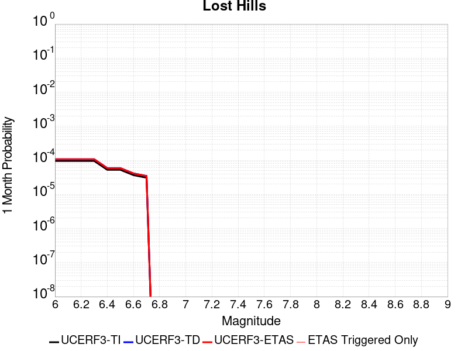 |  |  |

| Magnitude | 1 wk TI Prob | 1 wk TD Prob | 1 wk ETAS Prob | 1 wk ETAS/TD Gain | 1 wk ETAS Triggered Only | 1 mo TI Prob | 1 mo TD Prob | 1 mo ETAS Prob | 1 mo ETAS/TD Gain | 1 mo ETAS Triggered Only | 1 yr TI Prob | 1 yr TD Prob | 1 yr ETAS Prob | 1 yr ETAS/TD Gain | 1 yr ETAS Triggered Only | 10 yr TI Prob | 10 yr TD Prob | 10 yr ETAS Prob | 10 yr ETAS/TD Gain | 10 yr ETAS Triggered Only |
|-----|-----|-----|-----|-----|-----|-----|-----|-----|-----|-----|-----|-----|-----|-----|-----|-----|-----|-----|-----|-----|
| 6.0 | 2.233523E-5 | 2.5110714E-5 | 2.5110714E-5 | 1.0 | 0.0 | 9.571891E-5 | 1.0761386E-4 | 1.0761386E-4 | 1.0 | 0.0 | 0.0011647546 | 0.0013095795 | 0.0013324558 | 1.0174685 | 2.2906359E-5 | 0.011586686 | 0.013035225 | 0.013103048 | 1.0052031 | 6.871908E-5 |
| 6.1 | 2.233523E-5 | 2.5110714E-5 | 2.5110714E-5 | 1.0 | 0.0 | 9.571891E-5 | 1.0761386E-4 | 1.0761386E-4 | 1.0 | 0.0 | 0.0011647546 | 0.0013095795 | 0.0013324558 | 1.0174685 | 2.2906359E-5 | 0.011586686 | 0.013035225 | 0.013103048 | 1.0052031 | 6.871908E-5 |
| 6.2 | 2.233523E-5 | 2.5110714E-5 | 2.5110714E-5 | 1.0 | 0.0 | 9.571891E-5 | 1.0761386E-4 | 1.0761386E-4 | 1.0 | 0.0 | 0.0011647546 | 0.0013095795 | 0.0013324558 | 1.0174685 | 2.2906359E-5 | 0.011586686 | 0.013035225 | 0.013103048 | 1.0052031 | 6.871908E-5 |
| 6.3 | 2.233523E-5 | 2.5110714E-5 | 2.5110714E-5 | 1.0 | 0.0 | 9.571891E-5 | 1.0761386E-4 | 1.0761386E-4 | 1.0 | 0.0 | 0.0011647546 | 0.0013095795 | 0.0013324558 | 1.0174685 | 2.2906359E-5 | 0.011586686 | 0.013035225 | 0.013103048 | 1.0052031 | 6.871908E-5 |
| 6.4 | 1.2288092E-5 | 1.37833285E-5 | 1.37833285E-5 | 1.0 | 0.0 | 5.2662188E-5 | 5.90706E-5 | 5.90706E-5 | 1.0 | 0.0 | 6.409735E-4 | 7.1904104E-4 | 7.4193097E-4 | 1.0318339 | 2.2906359E-5 | 0.006391279 | 0.0071763545 | 0.0071990965 | 1.0031691 | 2.2906359E-5 |
| 6.5 | 1.2288092E-5 | 1.37833285E-5 | 1.37833285E-5 | 1.0 | 0.0 | 5.2662188E-5 | 5.90706E-5 | 5.90706E-5 | 1.0 | 0.0 | 6.409735E-4 | 7.1904104E-4 | 7.4193097E-4 | 1.0318339 | 2.2906359E-5 | 0.006391279 | 0.0071763545 | 0.0071990965 | 1.0031691 | 2.2906359E-5 |
| 6.6 | 8.58281E-6 | 9.635334E-6 | 9.635334E-6 | 1.0 | 0.0 | 3.6782953E-5 | 4.1294108E-5 | 4.1294108E-5 | 1.0 | 0.0 | 4.4774043E-4 | 5.0272304E-4 | 5.2561786E-4 | 1.0455416 | 2.2906359E-5 | 0.0044683935 | 0.0050240206 | 0.005046812 | 1.0045365 | 2.2906359E-5 |
| 6.7 | 7.205685E-6 | 8.089616E-6 | 8.089616E-6 | 1.0 | 0.0 | 3.088114E-5 | 3.466978E-5 | 3.466978E-5 | 1.0 | 0.0 | 3.7591302E-4 | 4.2210458E-4 | 4.450013E-4 | 1.0542442 | 2.2906359E-5 | 0.0037527776 | 0.004221046 | 0.004243856 | 1.0054038 | 2.2906359E-5 |

## Coronado Bank alt1
*[(top)](#table-of-contents)*

| 1 Week | 1 Month | 1 Year | 10 Year |
|-----|-----|-----|-----|
|  |  | 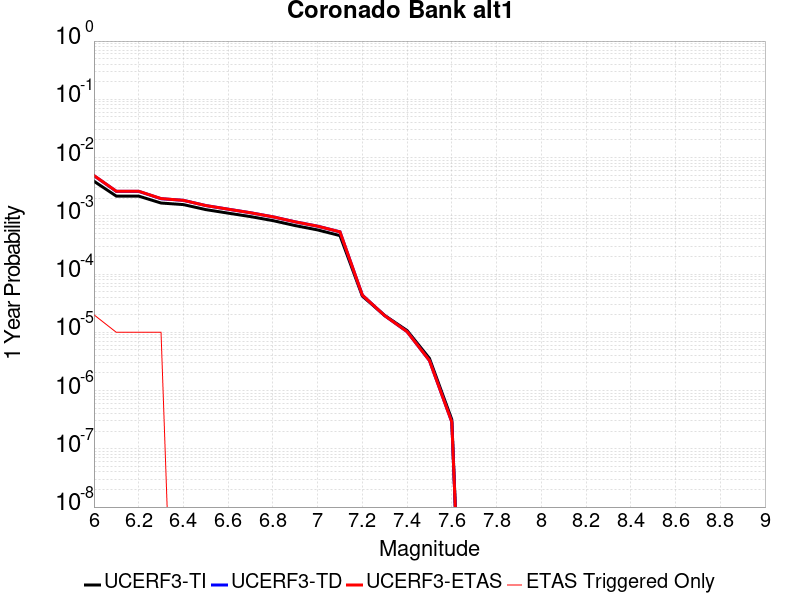 |  |

| Magnitude | 1 wk TI Prob | 1 wk TD Prob | 1 wk ETAS Prob | 1 wk ETAS/TD Gain | 1 wk ETAS Triggered Only | 1 mo TI Prob | 1 mo TD Prob | 1 mo ETAS Prob | 1 mo ETAS/TD Gain | 1 mo ETAS Triggered Only | 1 yr TI Prob | 1 yr TD Prob | 1 yr ETAS Prob | 1 yr ETAS/TD Gain | 1 yr ETAS Triggered Only | 10 yr TI Prob | 10 yr TD Prob | 10 yr ETAS Prob | 10 yr ETAS/TD Gain | 10 yr ETAS Triggered Only |
|-----|-----|-----|-----|-----|-----|-----|-----|-----|-----|-----|-----|-----|-----|-----|-----|-----|-----|-----|-----|-----|
| 6.0 | 7.533492E-5 | 9.398079E-5 | 9.398079E-5 | 1.0 | 0.0 | 3.22824E-4 | 4.027169E-4 | 4.2561404E-4 | 1.0568566 | 2.2906359E-5 | 0.0039233007 | 0.0048925513 | 0.00493814 | 1.009318 | 4.5812718E-5 | 0.03854755 | 0.04791869 | 0.047984116 | 1.0013653 | 6.871908E-5 |
| 6.1 | 4.1807285E-5 | 5.050703E-5 | 5.050703E-5 | 1.0 | 0.0 | 1.7916178E-4 | 2.1644133E-4 | 2.3934274E-4 | 1.1058089 | 2.2906359E-5 | 0.0021791123 | 0.0026320831 | 0.0026549292 | 1.0086799 | 2.2906359E-5 | 0.021578677 | 0.02601815 | 0.02604046 | 1.0008575 | 2.2906359E-5 |
| 6.2 | 4.1807285E-5 | 5.050703E-5 | 5.050703E-5 | 1.0 | 0.0 | 1.7916178E-4 | 2.1644133E-4 | 2.3934274E-4 | 1.1058089 | 2.2906359E-5 | 0.0021791123 | 0.0026320831 | 0.0026549292 | 1.0086799 | 2.2906359E-5 | 0.021578677 | 0.02601815 | 0.02604046 | 1.0008575 | 2.2906359E-5 |
| 6.3 | 3.1793104E-5 | 3.7720565E-5 | 3.7720565E-5 | 1.0 | 0.0 | 1.3624904E-4 | 1.6164976E-4 | 1.8455241E-4 | 1.1416807 | 2.2906359E-5 | 0.0016575698 | 0.0019663367 | 0.001989198 | 1.0116264 | 2.2906359E-5 | 0.016452603 | 0.019493273 | 0.019515732 | 1.0011522 | 2.2906359E-5 |
| 6.4 | 2.9878007E-5 | 3.5344478E-5 | 3.5344478E-5 | 1.0 | 0.0 | 1.2804232E-4 | 1.5146774E-4 | 1.5146774E-4 | 1.0 | 0.0 | 0.0015578003 | 0.0018425882 | 0.0018425882 | 1.0 | 0.0 | 0.015469253 | 0.01827687 | 0.01827687 | 1.0 | 0.0 |
| 6.5 | 2.4512565E-5 | 2.877075E-5 | 2.877075E-5 | 1.0 | 0.0 | 1.0504962E-4 | 1.2329755E-4 | 1.2329755E-4 | 1.0 | 0.0 | 0.0012782287 | 0.0015001415 | 0.0015001415 | 1.0 | 0.0 | 0.012709012 | 0.014903126 | 0.014903126 | 1.0 | 0.0 |
| 6.6 | 2.1317413E-5 | 2.491231E-5 | 2.491231E-5 | 1.0 | 0.0 | 9.135714E-5 | 1.06762796E-4 | 1.06762796E-4 | 1.0 | 0.0 | 0.0011117056 | 0.0012990843 | 0.0012990843 | 1.0 | 0.0 | 0.011061605 | 0.012917308 | 0.012917308 | 1.0 | 0.0 |
| 6.7 | 1.8585655E-5 | 2.1639657E-5 | 2.1639657E-5 | 1.0 | 0.0 | 7.9650374E-5 | 9.2738206E-5 | 9.2738206E-5 | 1.0 | 0.0 | 9.6931186E-4 | 0.0011285233 | 0.0011285233 | 1.0 | 0.0 | 0.0096509475 | 0.011230088 | 0.011230088 | 1.0 | 0.0 |
| 6.8 | 1.5862879E-5 | 1.8423476E-5 | 1.8423476E-5 | 1.0 | 0.0 | 6.798199E-5 | 7.895547E-5 | 7.895547E-5 | 1.0 | 0.0 | 8.273665E-4 | 9.608782E-4 | 9.608782E-4 | 1.0 | 0.0 | 0.008242928 | 0.009569218 | 0.009569218 | 1.0 | 0.0 |
| 6.9 | 1.3021509E-5 | 1.5098512E-5 | 1.5098512E-5 | 1.0 | 0.0 | 5.5805274E-5 | 6.470641E-5 | 6.470641E-5 | 1.0 | 0.0 | 6.792174E-4 | 7.875339E-4 | 7.875339E-4 | 1.0 | 0.0 | 0.006771452 | 0.007849255 | 0.007849255 | 1.0 | 0.0 |
| 7.0 | 1.0974371E-5 | 1.2722845E-5 | 1.2722845E-5 | 1.0 | 0.0 | 4.7032172E-5 | 5.4525437E-5 | 5.4525437E-5 | 1.0 | 0.0 | 5.7246623E-4 | 6.6366256E-4 | 6.6366256E-4 | 1.0 | 0.0 | 0.0057099373 | 0.006618556 | 0.006618556 | 1.0 | 0.0 |
| 7.1 | 8.766221E-6 | 1.0166036E-5 | 1.0166036E-5 | 1.0 | 0.0 | 3.7568978E-5 | 4.3568096E-5 | 4.3568096E-5 | 1.0 | 0.0 | 4.573063E-4 | 5.3032965E-4 | 5.3032965E-4 | 1.0 | 0.0 | 0.0045636636 | 0.005292341 | 0.005292341 | 1.0 | 0.0 |
| 7.2 | 8.026024E-7 | 8.332506E-7 | 8.332506E-7 | 1.0 | 0.0 | 3.43972E-6 | 3.5710693E-6 | 3.5710693E-6 | 1.0 | 0.0 | 4.1877785E-5 | 4.3476914E-5 | 4.3476914E-5 | 1.0 | 0.0 | 4.1869894E-4 | 4.3468518E-4 | 4.3468518E-4 | 1.0 | 0.0 |
| 7.3 | 3.7293114E-7 | 3.70035E-7 | 3.70035E-7 | 1.0 | 0.0 | 1.5982754E-6 | 1.5858633E-6 | 1.5858633E-6 | 1.0 | 0.0 | 1.9458828E-5 | 1.9307714E-5 | 1.9307714E-5 | 1.0 | 0.0 | 1.9457124E-4 | 1.9306043E-4 | 1.9306043E-4 | 1.0 | 0.0 |
| 7.4 | 2.0557036E-7 | 1.9675562E-7 | 1.9675562E-7 | 1.0 | 0.0 | 8.810155E-7 | 8.432381E-7 | 8.432381E-7 | 1.0 | 0.0 | 1.0726311E-5 | 1.0266376E-5 | 1.0266376E-5 | 1.0 | 0.0 | 1.0725793E-4 | 1.0265905E-4 | 1.0265905E-4 | 1.0 | 0.0 |
| 7.5 | 6.845446E-8 | 6.279751E-8 | 6.279751E-8 | 1.0 | 0.0 | 2.9337625E-7 | 2.6913216E-7 | 2.6913216E-7 | 1.0 | 0.0 | 3.5718497E-6 | 3.2766793E-6 | 3.2766793E-6 | 1.0 | 0.0 | 3.5717923E-5 | 3.276632E-5 | 3.276632E-5 | 1.0 | 0.0 |
| 7.6 | 6.0975145E-9 | 5.531959E-9 | 5.531959E-9 | 1.0 | 0.0 | 2.6132206E-8 | 2.3708395E-8 | 2.3708395E-8 | 1.0 | 0.0 | 3.1815955E-7 | 2.886497E-7 | 2.886497E-7 | 1.0 | 0.0 | 3.181591E-6 | 2.886494E-6 | 2.886494E-6 | 1.0 | 0.0 |

## San Diego Trough south
*[(top)](#table-of-contents)*

| 1 Week | 1 Month | 1 Year | 10 Year |
|-----|-----|-----|-----|
|  |  |  |  |

| Magnitude | 1 wk TI Prob | 1 wk TD Prob | 1 wk ETAS Prob | 1 wk ETAS/TD Gain | 1 wk ETAS Triggered Only | 1 mo TI Prob | 1 mo TD Prob | 1 mo ETAS Prob | 1 mo ETAS/TD Gain | 1 mo ETAS Triggered Only | 1 yr TI Prob | 1 yr TD Prob | 1 yr ETAS Prob | 1 yr ETAS/TD Gain | 1 yr ETAS Triggered Only | 10 yr TI Prob | 10 yr TD Prob | 10 yr ETAS Prob | 10 yr ETAS/TD Gain | 10 yr ETAS Triggered Only |
|-----|-----|-----|-----|-----|-----|-----|-----|-----|-----|-----|-----|-----|-----|-----|-----|-----|-----|-----|-----|-----|
| 6.0 | 8.279495E-5 | 1.04279236E-4 | 1.04279236E-4 | 1.0 | 0.0 | 3.5478722E-4 | 4.4683943E-4 | 4.4683943E-4 | 1.0 | 0.0 | 0.004310982 | 0.0054275123 | 0.0054502944 | 1.0041975 | 2.2906359E-5 | 0.042283054 | 0.053009294 | 0.05305268 | 1.0008184 | 4.5812718E-5 |
| 6.1 | 4.6961468E-5 | 5.7747715E-5 | 5.7747715E-5 | 1.0 | 0.0 | 2.0124791E-4 | 2.4746772E-4 | 2.4746772E-4 | 1.0 | 0.0 | 0.00244744 | 0.003008853 | 0.0030316904 | 1.00759 | 2.2906359E-5 | 0.024206603 | 0.029688226 | 0.029710451 | 1.0007486 | 2.2906359E-5 |
| 6.2 | 3.5079658E-5 | 4.215307E-5 | 4.215307E-5 | 1.0 | 0.0 | 1.5033272E-4 | 1.8064378E-4 | 1.8064378E-4 | 1.0 | 0.0 | 0.0018287642 | 0.0021971618 | 0.0022200178 | 1.0104026 | 2.2906359E-5 | 0.018137876 | 0.021756878 | 0.021779286 | 1.00103 | 2.2906359E-5 |
| 6.3 | 3.5079658E-5 | 4.215307E-5 | 4.215307E-5 | 1.0 | 0.0 | 1.5033272E-4 | 1.8064378E-4 | 1.8064378E-4 | 1.0 | 0.0 | 0.0018287642 | 0.0021971618 | 0.0022200178 | 1.0104026 | 2.2906359E-5 | 0.018137876 | 0.021756878 | 0.021779286 | 1.00103 | 2.2906359E-5 |
| 6.4 | 2.7196904E-5 | 3.2094915E-5 | 3.2094915E-5 | 1.0 | 0.0 | 1.16552954E-4 | 1.3754248E-4 | 1.3754248E-4 | 1.0 | 0.0 | 0.0014181085 | 0.001673306 | 0.0016961739 | 1.0136664 | 2.2906359E-5 | 0.014090929 | 0.016608594 | 0.016631119 | 1.0013562 | 2.2906359E-5 |
| 6.5 | 2.5584688E-5 | 3.0108771E-5 | 3.0108771E-5 | 1.0 | 0.0 | 1.0964406E-4 | 1.290313E-4 | 1.290313E-4 | 1.0 | 0.0 | 0.0013340989 | 0.001569835 | 0.0015927055 | 1.0145687 | 2.2906359E-5 | 0.013261181 | 0.015588958 | 0.015611507 | 1.0014465 | 2.2906359E-5 |
| 6.6 | 2.2034688E-5 | 2.5748534E-5 | 2.5748534E-5 | 1.0 | 0.0 | 9.443096E-5 | 1.1034624E-4 | 1.1034624E-4 | 1.0 | 0.0 | 0.0011490905 | 0.0013426427 | 0.0013655183 | 1.0170377 | 2.2906359E-5 | 0.011431668 | 0.013346296 | 0.013368896 | 1.0016934 | 2.2906359E-5 |
| 6.7 | 1.9394853E-5 | 2.2546645E-5 | 2.2546645E-5 | 1.0 | 0.0 | 8.311815E-5 | 9.662493E-5 | 9.662493E-5 | 1.0 | 0.0 | 0.0010114936 | 0.0011757788 | 0.0011757788 | 1.0 | 0.0 | 0.01006902 | 0.011696285 | 0.011696285 | 1.0 | 0.0 |
| 6.8 | 1.7615313E-5 | 2.040749E-5 | 2.040749E-5 | 1.0 | 0.0 | 7.549201E-5 | 8.745776E-5 | 8.745776E-5 | 1.0 | 0.0 | 9.1872766E-4 | 0.0010642825 | 0.0010642825 | 1.0 | 0.0 | 0.009149387 | 0.0105924215 | 0.0105924215 | 1.0 | 0.0 |
| 6.9 | 1.5621423E-5 | 1.8029812E-5 | 1.8029812E-5 | 1.0 | 0.0 | 6.6947236E-5 | 7.7268356E-5 | 7.7268356E-5 | 1.0 | 0.0 | 8.147778E-4 | 9.4033976E-4 | 9.4033976E-4 | 1.0 | 0.0 | 0.008117969 | 0.009364054 | 0.009364054 | 1.0 | 0.0 |
| 7.0 | 1.3444376E-5 | 1.5451154E-5 | 1.5451154E-5 | 1.0 | 0.0 | 5.7617483E-5 | 6.6217566E-5 | 6.6217566E-5 | 1.0 | 0.0 | 7.0126704E-4 | 8.0590346E-4 | 8.0590346E-4 | 1.0 | 0.0 | 0.006990582 | 0.008030142 | 0.008030142 | 1.0 | 0.0 |
| 7.1 | 1.2268361E-5 | 1.4075787E-5 | 1.4075787E-5 | 1.0 | 0.0 | 5.2577634E-5 | 6.032342E-5 | 6.032342E-5 | 1.0 | 0.0 | 6.399447E-4 | 7.341928E-4 | 7.341928E-4 | 1.0 | 0.0 | 0.0063810493 | 0.007317977 | 0.007317977 | 1.0 | 0.0 |
| 7.2 | 1.0922655E-5 | 1.251599E-5 | 1.251599E-5 | 1.0 | 0.0 | 4.681054E-5 | 5.3638872E-5 | 5.3638872E-5 | 1.0 | 0.0 | 5.697693E-4 | 6.528601E-4 | 6.528601E-4 | 1.0 | 0.0 | 0.0056831064 | 0.006509702 | 0.006509702 | 1.0 | 0.0 |
| 7.3 | 6.1106753E-6 | 6.930162E-6 | 6.930162E-6 | 1.0 | 0.0 | 2.6188345E-5 | 2.9700357E-5 | 2.9700357E-5 | 1.0 | 0.0 | 3.1879646E-4 | 3.6154225E-4 | 3.6154225E-4 | 1.0 | 0.0 | 0.0031833951 | 0.003609586 | 0.003609586 | 1.0 | 0.0 |
| 7.4 | 4.933187E-6 | 5.590545E-6 | 5.590545E-6 | 1.0 | 0.0 | 2.114206E-5 | 2.395926E-5 | 2.395926E-5 | 1.0 | 0.0 | 2.5737417E-4 | 2.9166535E-4 | 2.9166535E-4 | 1.0 | 0.0 | 0.002570763 | 0.0029128667 | 0.0029128667 | 1.0 | 0.0 |
| 7.5 | 1.7489613E-6 | 1.970012E-6 | 1.970012E-6 | 1.0 | 0.0 | 7.495527E-6 | 8.442882E-6 | 8.442882E-6 | 1.0 | 0.0 | 9.125422E-5 | 1.0278747E-4 | 1.0278747E-4 | 1.0 | 0.0 | 9.1216754E-4 | 0.0010274213 | 0.0010274213 | 1.0 | 0.0 |
| 7.6 | 1.6988751E-7 | 1.7534569E-7 | 1.7534569E-7 | 1.0 | 0.0 | 7.2808916E-7 | 7.5148137E-7 | 7.5148137E-7 | 1.0 | 0.0 | 8.864449E-6 | 9.149249E-6 | 9.149249E-6 | 1.0 | 0.0 | 8.8640954E-5 | 9.1488924E-5 | 9.1488924E-5 | 1.0 | 0.0 |

## Red Mountain
*[(top)](#table-of-contents)*

| 1 Week | 1 Month | 1 Year | 10 Year |
|-----|-----|-----|-----|
|  |  | 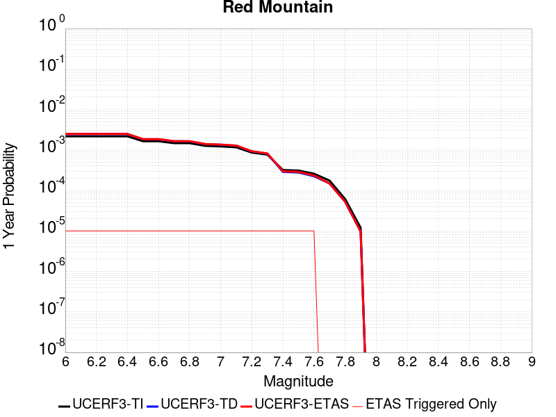 |  |

| Magnitude | 1 wk TI Prob | 1 wk TD Prob | 1 wk ETAS Prob | 1 wk ETAS/TD Gain | 1 wk ETAS Triggered Only | 1 mo TI Prob | 1 mo TD Prob | 1 mo ETAS Prob | 1 mo ETAS/TD Gain | 1 mo ETAS Triggered Only | 1 yr TI Prob | 1 yr TD Prob | 1 yr ETAS Prob | 1 yr ETAS/TD Gain | 1 yr ETAS Triggered Only | 10 yr TI Prob | 10 yr TD Prob | 10 yr ETAS Prob | 10 yr ETAS/TD Gain | 10 yr ETAS Triggered Only |
|-----|-----|-----|-----|-----|-----|-----|-----|-----|-----|-----|-----|-----|-----|-----|-----|-----|-----|-----|-----|-----|
| 6.0 | 4.1810763E-5 | 4.7600555E-5 | 4.7600555E-5 | 1.0 | 0.0 | 1.7917668E-4 | 2.0398737E-4 | 2.0398737E-4 | 1.0 | 0.0 | 0.0021792934 | 0.0024808832 | 0.0025037327 | 1.0092102 | 2.2906359E-5 | 0.021580452 | 0.024549497 | 0.024594186 | 1.0018203 | 4.5812718E-5 |
| 6.1 | 4.1810763E-5 | 4.7600555E-5 | 4.7600555E-5 | 1.0 | 0.0 | 1.7917668E-4 | 2.0398737E-4 | 2.0398737E-4 | 1.0 | 0.0 | 0.0021792934 | 0.0024808832 | 0.0025037327 | 1.0092102 | 2.2906359E-5 | 0.021580452 | 0.024549497 | 0.024594186 | 1.0018203 | 4.5812718E-5 |
| 6.2 | 4.1810763E-5 | 4.7600555E-5 | 4.7600555E-5 | 1.0 | 0.0 | 1.7917668E-4 | 2.0398737E-4 | 2.0398737E-4 | 1.0 | 0.0 | 0.0021792934 | 0.0024808832 | 0.0025037327 | 1.0092102 | 2.2906359E-5 | 0.021580452 | 0.024549497 | 0.024594186 | 1.0018203 | 4.5812718E-5 |
| 6.3 | 4.1810763E-5 | 4.7600555E-5 | 4.7600555E-5 | 1.0 | 0.0 | 1.7917668E-4 | 2.0398737E-4 | 2.0398737E-4 | 1.0 | 0.0 | 0.0021792934 | 0.0024808832 | 0.0025037327 | 1.0092102 | 2.2906359E-5 | 0.021580452 | 0.024549497 | 0.024594186 | 1.0018203 | 4.5812718E-5 |
| 6.4 | 4.1810763E-5 | 4.7600555E-5 | 4.7600555E-5 | 1.0 | 0.0 | 1.7917668E-4 | 2.0398737E-4 | 2.0398737E-4 | 1.0 | 0.0 | 0.0021792934 | 0.0024808832 | 0.0025037327 | 1.0092102 | 2.2906359E-5 | 0.021580452 | 0.024549497 | 0.024594186 | 1.0018203 | 4.5812718E-5 |
| 6.5 | 3.154503E-5 | 3.536723E-5 | 3.536723E-5 | 1.0 | 0.0 | 1.3518598E-4 | 1.5156555E-4 | 1.5156555E-4 | 1.0 | 0.0 | 0.0016446467 | 0.001843841 | 0.0018667051 | 1.0124003 | 2.2906359E-5 | 0.01632528 | 0.018295081 | 0.018317569 | 1.0012292 | 2.2906359E-5 |
| 6.6 | 3.1535834E-5 | 3.5356607E-5 | 3.5356607E-5 | 1.0 | 0.0 | 1.3514658E-4 | 1.5152004E-4 | 1.5152004E-4 | 1.0 | 0.0 | 0.0016441676 | 0.001843288 | 0.001866152 | 1.012404 | 2.2906359E-5 | 0.01632056 | 0.018289642 | 0.01831213 | 1.0012295 | 2.2906359E-5 |
| 6.7 | 2.8267326E-5 | 3.147588E-5 | 3.147588E-5 | 1.0 | 0.0 | 1.2114006E-4 | 1.3489013E-4 | 1.3489013E-4 | 1.0 | 0.0 | 0.0014738824 | 0.0016411353 | 0.001664004 | 1.0139347 | 2.2906359E-5 | 0.014641452 | 0.016298926 | 0.016321458 | 1.0013825 | 2.2906359E-5 |
| 6.8 | 2.8212884E-5 | 3.1413754E-5 | 3.1413754E-5 | 1.0 | 0.0 | 1.20906756E-4 | 1.346239E-4 | 1.346239E-4 | 1.0 | 0.0 | 0.0014710457 | 0.0016378989 | 0.0016607677 | 1.0139623 | 2.2906359E-5 | 0.014613459 | 0.016267035 | 0.01628957 | 1.0013852 | 2.2906359E-5 |
| 6.9 | 2.4227871E-5 | 2.6712387E-5 | 2.6712387E-5 | 1.0 | 0.0 | 1.03829596E-4 | 1.14477065E-4 | 1.14477065E-4 | 1.0 | 0.0 | 0.0012633923 | 0.0013929431 | 0.0014158175 | 1.0164217 | 2.2906359E-5 | 0.012562336 | 0.013849813 | 0.013872402 | 1.001631 | 2.2906359E-5 |
| 7.0 | 2.348524E-5 | 2.5840971E-5 | 2.5840971E-5 | 1.0 | 0.0 | 1.0064714E-4 | 1.10742745E-4 | 1.10742745E-4 | 1.0 | 0.0 | 0.0012246901 | 0.0013475346 | 0.0013704101 | 1.0169758 | 2.2906359E-5 | 0.012179627 | 0.013401275 | 0.013423874 | 1.0016863 | 2.2906359E-5 |
| 7.1 | 2.2311642E-5 | 2.4467727E-5 | 2.4467727E-5 | 1.0 | 0.0 | 9.561782E-5 | 1.0485789E-4 | 1.0485789E-4 | 1.0 | 0.0 | 0.0011635252 | 0.001275972 | 0.0012988491 | 1.0179292 | 2.2906359E-5 | 0.01157452 | 0.012693978 | 0.012716593 | 1.0017816 | 2.2906359E-5 |
| 7.2 | 1.6533986E-5 | 1.767366E-5 | 1.767366E-5 | 1.0 | 0.0 | 7.085802E-5 | 7.574241E-5 | 7.574241E-5 | 1.0 | 0.0 | 8.623549E-4 | 9.218372E-4 | 9.447225E-4 | 1.0248257 | 2.2906359E-5 | 0.008590161 | 0.009186415 | 0.00920911 | 1.0024706 | 2.2906359E-5 |
| 7.3 | 1.4703092E-5 | 1.5562402E-5 | 1.5562402E-5 | 1.0 | 0.0 | 6.301173E-5 | 6.669465E-5 | 6.669465E-5 | 1.0 | 0.0 | 7.668978E-4 | 8.117665E-4 | 8.3465426E-4 | 1.028195 | 2.2906359E-5 | 0.0076425658 | 0.00809409 | 0.0081168115 | 1.0028071 | 2.2906359E-5 |
| 7.4 | 6.1331984E-6 | 5.5294786E-6 | 5.5294786E-6 | 1.0 | 0.0 | 2.6284872E-5 | 2.3697552E-5 | 2.3697552E-5 | 1.0 | 0.0 | 3.199713E-4 | 2.8848005E-4 | 3.113798E-4 | 1.0793808 | 2.2906359E-5 | 0.0031951098 | 0.00288111 | 0.0029039504 | 1.0079277 | 2.2906359E-5 |
| 7.5 | 5.954766E-6 | 5.339087E-6 | 5.339087E-6 | 1.0 | 0.0 | 2.5520176E-5 | 2.2881602E-5 | 2.2881602E-5 | 1.0 | 0.0 | 3.1066386E-4 | 2.7854842E-4 | 3.014484E-4 | 1.0822119 | 2.2906359E-5 | 0.003102299 | 0.0027820468 | 0.0028048893 | 1.0082108 | 2.2906359E-5 |
| 7.6 | 4.9726646E-6 | 4.3157743E-6 | 4.3157743E-6 | 1.0 | 0.0 | 2.1311245E-5 | 1.8496046E-5 | 1.8496046E-5 | 1.0 | 0.0 | 2.5943352E-4 | 2.2516643E-4 | 2.4806763E-4 | 1.1017079 | 2.2906359E-5 | 0.0025913084 | 0.0022494176 | 0.0022722722 | 1.0101603 | 2.2906359E-5 |
| 7.7 | 3.3613894E-6 | 2.852986E-6 | 2.852986E-6 | 1.0 | 0.0 | 1.4405875E-5 | 1.2227028E-5 | 1.2227028E-5 | 1.0 | 0.0 | 1.7537741E-4 | 1.4885415E-4 | 1.4885415E-4 | 1.0 | 0.0 | 0.0017523908 | 0.0014875707 | 0.0014875707 | 1.0 | 0.0 |
| 7.8 | 1.1828961E-6 | 1.0123645E-6 | 1.0123645E-6 | 1.0 | 0.0 | 5.069545E-6 | 4.3386976E-6 | 4.3386976E-6 | 1.0 | 0.0 | 6.171996E-5 | 5.2822394E-5 | 5.2822394E-5 | 1.0 | 0.0 | 6.170282E-4 | 5.281013E-4 | 5.281013E-4 | 1.0 | 0.0 |
| 7.9 | 2.2967266E-7 | 1.862061E-7 | 1.862061E-7 | 1.0 | 0.0 | 9.843111E-7 | 7.980259E-7 | 7.980259E-7 | 1.0 | 0.0 | 1.19839215E-5 | 9.715925E-6 | 9.715925E-6 | 1.0 | 0.0 | 1.1983275E-4 | 9.7155294E-5 | 9.7155294E-5 | 1.0 | 0.0 |

## San Jacinto (Anza) rev
*[(top)](#table-of-contents)*

| 1 Week | 1 Month | 1 Year | 10 Year |
|-----|-----|-----|-----|
|  |  | 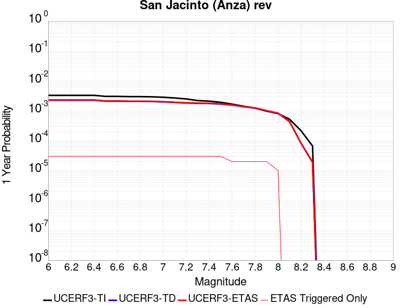 |  |

| Magnitude | 1 wk TI Prob | 1 wk TD Prob | 1 wk ETAS Prob | 1 wk ETAS/TD Gain | 1 wk ETAS Triggered Only | 1 mo TI Prob | 1 mo TD Prob | 1 mo ETAS Prob | 1 mo ETAS/TD Gain | 1 mo ETAS Triggered Only | 1 yr TI Prob | 1 yr TD Prob | 1 yr ETAS Prob | 1 yr ETAS/TD Gain | 1 yr ETAS Triggered Only | 10 yr TI Prob | 10 yr TD Prob | 10 yr ETAS Prob | 10 yr ETAS/TD Gain | 10 yr ETAS Triggered Only |
|-----|-----|-----|-----|-----|-----|-----|-----|-----|-----|-----|-----|-----|-----|-----|-----|-----|-----|-----|-----|-----|
| 6.0 | 6.3015636E-5 | 4.347976E-5 | 4.347976E-5 | 1.0 | 0.0 | 2.7003905E-4 | 1.8632859E-4 | 1.8632859E-4 | 1.0 | 0.0 | 0.0032827691 | 0.0022662021 | 0.0022890568 | 1.0100849 | 2.2906359E-5 | 0.032346968 | 0.02338772 | 0.023454834 | 1.0028695 | 6.871908E-5 |
| 6.1 | 6.3015636E-5 | 4.347976E-5 | 4.347976E-5 | 1.0 | 0.0 | 2.7003905E-4 | 1.8632859E-4 | 1.8632859E-4 | 1.0 | 0.0 | 0.0032827691 | 0.0022662021 | 0.0022890568 | 1.0100849 | 2.2906359E-5 | 0.032346968 | 0.02338772 | 0.023454834 | 1.0028695 | 6.871908E-5 |
| 6.2 | 6.3015636E-5 | 4.347976E-5 | 4.347976E-5 | 1.0 | 0.0 | 2.7003905E-4 | 1.8632859E-4 | 1.8632859E-4 | 1.0 | 0.0 | 0.0032827691 | 0.0022662021 | 0.0022890568 | 1.0100849 | 2.2906359E-5 | 0.032346968 | 0.02338772 | 0.023454834 | 1.0028695 | 6.871908E-5 |
| 6.3 | 6.3015636E-5 | 4.347976E-5 | 4.347976E-5 | 1.0 | 0.0 | 2.7003905E-4 | 1.8632859E-4 | 1.8632859E-4 | 1.0 | 0.0 | 0.0032827691 | 0.0022662021 | 0.0022890568 | 1.0100849 | 2.2906359E-5 | 0.032346968 | 0.02338772 | 0.023454834 | 1.0028695 | 6.871908E-5 |
| 6.4 | 6.3015636E-5 | 4.347976E-5 | 4.347976E-5 | 1.0 | 0.0 | 2.7003905E-4 | 1.8632859E-4 | 1.8632859E-4 | 1.0 | 0.0 | 0.0032827691 | 0.0022662021 | 0.0022890568 | 1.0100849 | 2.2906359E-5 | 0.032346968 | 0.02338772 | 0.023454834 | 1.0028695 | 6.871908E-5 |
| 6.5 | 5.811017E-5 | 4.0251027E-5 | 4.0251027E-5 | 1.0 | 0.0 | 2.4901982E-4 | 1.7249303E-4 | 1.7249303E-4 | 1.0 | 0.0 | 0.0030276014 | 0.0020980856 | 0.002120944 | 1.0108949 | 2.2906359E-5 | 0.02986684 | 0.021681083 | 0.021748314 | 1.0031009 | 6.871908E-5 |
| 6.6 | 5.811017E-5 | 4.0251027E-5 | 4.0251027E-5 | 1.0 | 0.0 | 2.4901982E-4 | 1.7249303E-4 | 1.7249303E-4 | 1.0 | 0.0 | 0.0030276014 | 0.0020980856 | 0.002120944 | 1.0108949 | 2.2906359E-5 | 0.02986684 | 0.021681083 | 0.021748314 | 1.0031009 | 6.871908E-5 |
| 6.7 | 5.712442E-5 | 3.9671915E-5 | 3.9671915E-5 | 1.0 | 0.0 | 2.4479596E-4 | 1.7001144E-4 | 1.7001144E-4 | 1.0 | 0.0 | 0.0029763177 | 0.0020679298 | 0.002090789 | 1.011054 | 2.2906359E-5 | 0.029367693 | 0.021372018 | 0.02143927 | 1.0031466 | 6.871908E-5 |
| 6.8 | 5.6967532E-5 | 3.9528015E-5 | 3.9528015E-5 | 1.0 | 0.0 | 2.4412372E-4 | 1.6939481E-4 | 1.6939481E-4 | 1.0 | 0.0 | 0.0029681553 | 0.0020604366 | 0.0020832957 | 1.0110943 | 2.2906359E-5 | 0.029288229 | 0.0212966 | 0.021363856 | 1.0031581 | 6.871908E-5 |
| 6.9 | 5.6211324E-5 | 3.9231676E-5 | 3.9231676E-5 | 1.0 | 0.0 | 2.4088343E-4 | 1.6812496E-4 | 1.6812496E-4 | 1.0 | 0.0 | 0.0029288116 | 0.002045005 | 0.0020678646 | 1.0111783 | 2.2906359E-5 | 0.028905109 | 0.02113546 | 0.021202728 | 1.0031826 | 6.871908E-5 |
| 7.0 | 5.4383527E-5 | 3.8088456E-5 | 3.8088456E-5 | 1.0 | 0.0 | 2.3305144E-4 | 1.6322605E-4 | 1.6322605E-4 | 1.0 | 0.0 | 0.0028337094 | 0.0019854708 | 0.0020083317 | 1.0115141 | 2.2906359E-5 | 0.027978465 | 0.020524545 | 0.020591853 | 1.0032794 | 6.871908E-5 |
| 7.1 | 5.1393665E-5 | 3.654557E-5 | 3.654557E-5 | 1.0 | 0.0 | 2.2023996E-4 | 1.566145E-4 | 1.566145E-4 | 1.0 | 0.0 | 0.0026781242 | 0.001905118 | 0.0019279808 | 1.0120007 | 2.2906359E-5 | 0.026460782 | 0.01969536 | 0.019762725 | 1.0034204 | 6.871908E-5 |
| 7.2 | 4.785222E-5 | 3.4891167E-5 | 3.4891167E-5 | 1.0 | 0.0 | 2.0506482E-4 | 1.4952502E-4 | 1.4952502E-4 | 1.0 | 0.0 | 0.0024938055 | 0.0018189505 | 0.0018418153 | 1.0125703 | 2.2906359E-5 | 0.024660049 | 0.018806804 | 0.01887423 | 1.0035852 | 6.871908E-5 |
| 7.3 | 4.2143256E-5 | 3.3981407E-5 | 3.3981407E-5 | 1.0 | 0.0 | 1.8060145E-4 | 1.456265E-4 | 1.456265E-4 | 1.0 | 0.0 | 0.002196605 | 0.0017715642 | 0.00179443 | 1.0129071 | 2.2906359E-5 | 0.02175019 | 0.01831272 | 0.018380182 | 1.0036838 | 6.871908E-5 |
| 7.4 | 4.0264713E-5 | 3.3618224E-5 | 3.3618224E-5 | 1.0 | 0.0 | 1.7255165E-4 | 1.4407016E-4 | 1.4407016E-4 | 1.0 | 0.0 | 0.002098792 | 0.0017526465 | 0.0017755127 | 1.0130466 | 2.2906359E-5 | 0.020790804 | 0.01811656 | 0.018184034 | 1.0037245 | 6.871908E-5 |
| 7.5 | 3.694492E-5 | 3.2328353E-5 | 3.2328353E-5 | 1.0 | 0.0 | 1.5832575E-4 | 1.3854275E-4 | 1.3854275E-4 | 1.0 | 0.0 | 0.0019259118 | 0.0016854559 | 0.0017083237 | 1.0135677 | 2.2906359E-5 | 0.01909306 | 0.017431023 | 0.017498543 | 1.0038736 | 6.871908E-5 |
| 7.6 | 3.200565E-5 | 2.9633984E-5 | 2.9633984E-5 | 1.0 | 0.0 | 1.3715986E-4 | 1.2699662E-4 | 1.2699662E-4 | 1.0 | 0.0 | 0.001668642 | 0.0015450894 | 0.0015450894 | 1.0 | 0.0 | 0.01656168 | 0.016013896 | 0.016058974 | 1.002815 | 4.5812718E-5 |
| 7.7 | 2.731642E-5 | 2.6218895E-5 | 2.6218895E-5 | 1.0 | 0.0 | 1.1706512E-4 | 1.1236186E-4 | 1.1236186E-4 | 1.0 | 0.0 | 0.001424336 | 0.0013671481 | 0.0013671481 | 1.0 | 0.0 | 0.014152412 | 0.014232767 | 0.014277928 | 1.003173 | 4.5812718E-5 |
| 7.8 | 2.3466424E-5 | 2.362585E-5 | 2.362585E-5 | 1.0 | 0.0 | 1.0056651E-4 | 1.01249716E-4 | 1.01249716E-4 | 1.0 | 0.0 | 0.0012237094 | 0.001232019 | 0.001232019 | 1.0 | 0.0 | 0.012169928 | 0.012872118 | 0.012917341 | 1.0035132 | 4.5812718E-5 |
| 7.9 | 1.8611925E-5 | 1.9017392E-5 | 1.9017392E-5 | 1.0 | 0.0 | 7.9762955E-5 | 8.150057E-5 | 8.150057E-5 | 1.0 | 0.0 | 9.7068126E-4 | 9.918185E-4 | 9.918185E-4 | 1.0 | 0.0 | 0.0096645225 | 0.010451134 | 0.010496468 | 1.0043377 | 4.5812718E-5 |
| 8.0 | 1.5460775E-5 | 1.583804E-5 | 1.583804E-5 | 1.0 | 0.0 | 6.6258784E-5 | 6.787555E-5 | 6.787555E-5 | 1.0 | 0.0 | 8.0640207E-4 | 8.2607224E-4 | 8.2607224E-4 | 1.0 | 0.0 | 0.008034821 | 0.008753977 | 0.008799388 | 1.0051875 | 4.5812718E-5 |
| 8.1 | 9.983884E-6 | 8.3273635E-6 | 8.3273635E-6 | 1.0 | 0.0 | 4.2787375E-5 | 3.5688212E-5 | 3.5688212E-5 | 1.0 | 0.0 | 5.2081177E-4 | 4.344179E-4 | 4.344179E-4 | 1.0 | 0.0 | 0.0051959283 | 0.0046708663 | 0.0046708663 | 1.0 | 0.0 |
| 8.2 | 4.1226E-6 | 1.569408E-6 | 1.569408E-6 | 1.0 | 0.0 | 1.7668166E-5 | 6.726017E-6 | 6.726017E-6 | 1.0 | 0.0 | 2.1508869E-4 | 8.188621E-5 | 8.188621E-5 | 1.0 | 0.0 | 0.0021488064 | 9.4988575E-4 | 9.4988575E-4 | 1.0 | 0.0 |
| 8.3 | 1.2750878E-6 | 3.657188E-7 | 3.657188E-7 | 1.0 | 0.0 | 5.4646503E-6 | 1.5673653E-6 | 1.5673653E-6 | 1.0 | 0.0 | 6.653009E-5 | 1.908251E-5 | 1.908251E-5 | 1.0 | 0.0 | 6.6510175E-4 | 2.2998886E-4 | 2.2998886E-4 | 1.0 | 0.0 |

## San Diego Trough north alt1
*[(top)](#table-of-contents)*

| 1 Week | 1 Month | 1 Year | 10 Year |
|-----|-----|-----|-----|
|  |  |  | 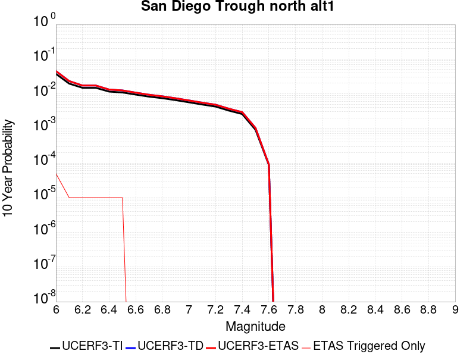 |

| Magnitude | 1 wk TI Prob | 1 wk TD Prob | 1 wk ETAS Prob | 1 wk ETAS/TD Gain | 1 wk ETAS Triggered Only | 1 mo TI Prob | 1 mo TD Prob | 1 mo ETAS Prob | 1 mo ETAS/TD Gain | 1 mo ETAS Triggered Only | 1 yr TI Prob | 1 yr TD Prob | 1 yr ETAS Prob | 1 yr ETAS/TD Gain | 1 yr ETAS Triggered Only | 10 yr TI Prob | 10 yr TD Prob | 10 yr ETAS Prob | 10 yr ETAS/TD Gain | 10 yr ETAS Triggered Only |
|-----|-----|-----|-----|-----|-----|-----|-----|-----|-----|-----|-----|-----|-----|-----|-----|-----|-----|-----|-----|-----|
| 6.0 | 7.329252E-5 | 8.823553E-5 | 8.823553E-5 | 1.0 | 0.0 | 3.14073E-4 | 3.7810113E-4 | 3.7810113E-4 | 1.0 | 0.0 | 0.0038171355 | 0.0045943 | 0.0046399026 | 1.0099258 | 4.5812718E-5 | 0.03752231 | 0.04505696 | 0.045122586 | 1.0014565 | 6.871908E-5 |
| 6.1 | 3.7940346E-5 | 4.48962E-5 | 4.48962E-5 | 1.0 | 0.0 | 1.6259136E-4 | 1.9239864E-4 | 1.9239864E-4 | 1.0 | 0.0 | 0.0019777524 | 0.0023400213 | 0.0023628739 | 1.0097661 | 2.2906359E-5 | 0.019602431 | 0.023162305 | 0.023184681 | 1.0009661 | 2.2906359E-5 |
| 6.2 | 2.8645263E-5 | 3.330409E-5 | 3.330409E-5 | 1.0 | 0.0 | 1.2275964E-4 | 1.4272417E-4 | 1.4272417E-4 | 1.0 | 0.0 | 0.0014935739 | 0.0017362948 | 0.0017591614 | 1.0131698 | 2.2906359E-5 | 0.0148357535 | 0.017229972 | 0.017252484 | 1.0013065 | 2.2906359E-5 |
| 6.3 | 2.8645263E-5 | 3.330409E-5 | 3.330409E-5 | 1.0 | 0.0 | 1.2275964E-4 | 1.4272417E-4 | 1.4272417E-4 | 1.0 | 0.0 | 0.0014935739 | 0.0017362948 | 0.0017591614 | 1.0131698 | 2.2906359E-5 | 0.0148357535 | 0.017229972 | 0.017252484 | 1.0013065 | 2.2906359E-5 |
| 6.4 | 2.2204576E-5 | 2.545331E-5 | 2.545331E-5 | 1.0 | 0.0 | 9.5159E-5 | 1.09081106E-4 | 1.09081106E-4 | 1.0 | 0.0 | 0.001157945 | 0.0013272633 | 0.0013501393 | 1.0172354 | 2.2906359E-5 | 0.011519298 | 0.01319452 | 0.013217124 | 1.0017132 | 2.2906359E-5 |
| 6.5 | 2.1004838E-5 | 2.4029328E-5 | 2.4029328E-5 | 1.0 | 0.0 | 9.0017624E-5 | 1.02978825E-4 | 1.02978825E-4 | 1.0 | 0.0 | 0.0010954136 | 0.0012530553 | 0.0012759329 | 1.0182575 | 2.2906359E-5 | 0.010900296 | 0.012460973 | 0.012483594 | 1.0018153 | 2.2906359E-5 |
| 6.6 | 1.820557E-5 | 2.0708592E-5 | 2.0708592E-5 | 1.0 | 0.0 | 7.802154E-5 | 8.874812E-5 | 8.874812E-5 | 1.0 | 0.0 | 9.4949827E-4 | 0.0010799783 | 0.0010799783 | 1.0 | 0.0 | 0.009454516 | 0.010747968 | 0.010747968 | 1.0 | 0.0 |
| 6.7 | 1.5884485E-5 | 1.7986826E-5 | 1.7986826E-5 | 1.0 | 0.0 | 6.807459E-5 | 7.7084136E-5 | 7.7084136E-5 | 1.0 | 0.0 | 8.284929E-4 | 9.38098E-4 | 9.38098E-4 | 1.0 | 0.0 | 0.008254109 | 0.0093417475 | 0.0093417475 | 1.0 | 0.0 |
| 6.8 | 1.4331171E-5 | 1.620389E-5 | 1.620389E-5 | 1.0 | 0.0 | 6.141786E-5 | 6.9443406E-5 | 6.9443406E-5 | 1.0 | 0.0 | 7.4750587E-4 | 8.4514753E-4 | 8.4514753E-4 | 1.0 | 0.0 | 0.0074499645 | 0.008419601 | 0.008419601 | 1.0 | 0.0 |
| 6.9 | 1.2574203E-5 | 1.4208297E-5 | 1.4208297E-5 | 1.0 | 0.0 | 5.3888325E-5 | 6.089129E-5 | 6.089129E-5 | 1.0 | 0.0 | 6.558929E-4 | 7.411007E-4 | 7.411007E-4 | 1.0 | 0.0 | 0.0065396037 | 0.0073864786 | 0.0073864786 | 1.0 | 0.0 |
| 7.0 | 1.0883844E-5 | 1.2291381E-5 | 1.2291381E-5 | 1.0 | 0.0 | 4.664421E-5 | 5.267629E-5 | 5.267629E-5 | 1.0 | 0.0 | 5.677453E-4 | 6.411461E-4 | 6.411461E-4 | 1.0 | 0.0 | 0.00566297 | 0.0063930918 | 0.0063930918 | 1.0 | 0.0 |
| 7.1 | 9.393088E-6 | 1.0608852E-5 | 1.0608852E-5 | 1.0 | 0.0 | 4.025547E-5 | 4.546572E-5 | 4.546572E-5 | 1.0 | 0.0 | 4.900001E-4 | 5.534053E-4 | 5.534053E-4 | 1.0 | 0.0 | 0.0048892107 | 0.0055203685 | 0.0055203685 | 1.0 | 0.0 |
| 7.2 | 8.190791E-6 | 9.2602395E-6 | 9.2602395E-6 | 1.0 | 0.0 | 3.510292E-5 | 3.968614E-5 | 3.968614E-5 | 1.0 | 0.0 | 4.2729423E-4 | 4.830723E-4 | 4.830723E-4 | 1.0 | 0.0 | 0.0042647356 | 0.0048203026 | 0.0048203026 | 1.0 | 0.0 |
| 7.3 | 6.268162E-6 | 7.090957E-6 | 7.090957E-6 | 1.0 | 0.0 | 2.6863276E-5 | 3.0389465E-5 | 3.0389465E-5 | 1.0 | 0.0 | 3.2701128E-4 | 3.6992933E-4 | 3.6992933E-4 | 1.0 | 0.0 | 0.003265305 | 0.0036931813 | 0.0036931813 | 1.0 | 0.0 |
| 7.4 | 4.985186E-6 | 5.643675E-6 | 5.643675E-6 | 1.0 | 0.0 | 2.1364907E-5 | 2.4186958E-5 | 2.4186958E-5 | 1.0 | 0.0 | 2.600867E-4 | 2.9443682E-4 | 2.9443682E-4 | 1.0 | 0.0 | 0.002597825 | 0.0029405085 | 0.0029405085 | 1.0 | 0.0 |
| 7.5 | 1.7489613E-6 | 1.970012E-6 | 1.970012E-6 | 1.0 | 0.0 | 7.495527E-6 | 8.442882E-6 | 8.442882E-6 | 1.0 | 0.0 | 9.125422E-5 | 1.0278747E-4 | 1.0278747E-4 | 1.0 | 0.0 | 9.1216754E-4 | 0.0010274213 | 0.0010274213 | 1.0 | 0.0 |
| 7.6 | 1.6988751E-7 | 1.7534569E-7 | 1.7534569E-7 | 1.0 | 0.0 | 7.2808916E-7 | 7.5148137E-7 | 7.5148137E-7 | 1.0 | 0.0 | 8.864449E-6 | 9.149249E-6 | 9.149249E-6 | 1.0 | 0.0 | 8.8640954E-5 | 9.1488924E-5 | 9.1488924E-5 | 1.0 | 0.0 |

## San Clemente
*[(top)](#table-of-contents)*

| 1 Week | 1 Month | 1 Year | 10 Year |
|-----|-----|-----|-----|
|  |  |  |  |

| Magnitude | 1 wk TI Prob | 1 wk TD Prob | 1 wk ETAS Prob | 1 wk ETAS/TD Gain | 1 wk ETAS Triggered Only | 1 mo TI Prob | 1 mo TD Prob | 1 mo ETAS Prob | 1 mo ETAS/TD Gain | 1 mo ETAS Triggered Only | 1 yr TI Prob | 1 yr TD Prob | 1 yr ETAS Prob | 1 yr ETAS/TD Gain | 1 yr ETAS Triggered Only | 10 yr TI Prob | 10 yr TD Prob | 10 yr ETAS Prob | 10 yr ETAS/TD Gain | 10 yr ETAS Triggered Only |
|-----|-----|-----|-----|-----|-----|-----|-----|-----|-----|-----|-----|-----|-----|-----|-----|-----|-----|-----|-----|-----|
| 6.0 | 6.681379E-5 | 8.165889E-5 | 8.165889E-5 | 1.0 | 0.0 | 2.8631336E-4 | 3.4992295E-4 | 3.4992295E-4 | 1.0 | 0.0 | 0.003480294 | 0.004252569 | 0.004275378 | 1.0053636 | 2.2906359E-5 | 0.03426291 | 0.04176773 | 0.04181163 | 1.0010511 | 4.5812718E-5 |
| 6.1 | 6.681379E-5 | 8.165889E-5 | 8.165889E-5 | 1.0 | 0.0 | 2.8631336E-4 | 3.4992295E-4 | 3.4992295E-4 | 1.0 | 0.0 | 0.003480294 | 0.004252569 | 0.004275378 | 1.0053636 | 2.2906359E-5 | 0.03426291 | 0.04176773 | 0.04181163 | 1.0010511 | 4.5812718E-5 |
| 6.2 | 3.9400576E-5 | 4.646316E-5 | 4.646316E-5 | 1.0 | 0.0 | 1.6884868E-4 | 1.9911298E-4 | 1.9911298E-4 | 1.0 | 0.0 | 0.0020537945 | 0.0024215663 | 0.0024215663 | 1.0 | 0.0 | 0.020349167 | 0.02395851 | 0.02395851 | 1.0 | 0.0 |
| 6.3 | 3.2590255E-5 | 3.793738E-5 | 3.793738E-5 | 1.0 | 0.0 | 1.3966505E-4 | 1.6257883E-4 | 1.6257883E-4 | 1.0 | 0.0 | 0.0016990956 | 0.0019776302 | 0.0019776302 | 1.0 | 0.0 | 0.01686163 | 0.019604106 | 0.019604106 | 1.0 | 0.0 |
| 6.4 | 2.9454652E-5 | 3.410493E-5 | 3.410493E-5 | 1.0 | 0.0 | 1.2622811E-4 | 1.4615596E-4 | 1.4615596E-4 | 1.0 | 0.0 | 0.0015357438 | 0.0017780208 | 0.0017780208 | 1.0 | 0.0 | 0.015251739 | 0.01764113 | 0.01764113 | 1.0 | 0.0 |
| 6.5 | 2.790836E-5 | 3.225413E-5 | 3.225413E-5 | 1.0 | 0.0 | 1.1960178E-4 | 1.382248E-4 | 1.382248E-4 | 1.0 | 0.0 | 0.001455179 | 0.0016816128 | 0.0016816128 | 1.0 | 0.0 | 0.014456868 | 0.016691903 | 0.016691903 | 1.0 | 0.0 |
| 6.6 | 2.2492153E-5 | 2.576768E-5 | 2.576768E-5 | 1.0 | 0.0 | 9.639138E-5 | 1.1042832E-4 | 1.1042832E-4 | 1.0 | 0.0 | 0.0011729331 | 0.0013436505 | 0.0013436505 | 1.0 | 0.0 | 0.011667615 | 0.013356981 | 0.013356981 | 1.0 | 0.0 |
| 6.7 | 1.9862755E-5 | 2.2670674E-5 | 2.2670674E-5 | 1.0 | 0.0 | 8.512331E-5 | 9.715648E-5 | 9.715648E-5 | 1.0 | 0.0 | 0.0010358836 | 0.0011822495 | 0.0011822495 | 1.0 | 0.0 | 0.010310682 | 0.011760893 | 0.011760893 | 1.0 | 0.0 |
| 6.8 | 1.6697575E-5 | 1.8981149E-5 | 1.8981149E-5 | 1.0 | 0.0 | 7.155907E-5 | 8.13453E-5 | 8.13453E-5 | 1.0 | 0.0 | 8.7088346E-4 | 9.899384E-4 | 9.899384E-4 | 1.0 | 0.0 | 0.008674784 | 0.009856314 | 0.009856314 | 1.0 | 0.0 |
| 6.9 | 1.5218415E-5 | 1.7272489E-5 | 1.7272489E-5 | 1.0 | 0.0 | 6.522015E-5 | 7.40229E-5 | 7.40229E-5 | 1.0 | 0.0 | 7.93766E-4 | 9.00865E-4 | 9.00865E-4 | 1.0 | 0.0 | 0.007909367 | 0.008973078 | 0.008973078 | 1.0 | 0.0 |
| 7.0 | 1.2392958E-5 | 1.403548E-5 | 1.403548E-5 | 1.0 | 0.0 | 5.3111595E-5 | 6.015071E-5 | 6.015071E-5 | 1.0 | 0.0 | 6.4644177E-4 | 7.3209644E-4 | 7.3209644E-4 | 1.0 | 0.0 | 0.0064456454 | 0.007297633 | 0.007297633 | 1.0 | 0.0 |
| 7.1 | 1.0934128E-5 | 1.2377302E-5 | 1.2377302E-5 | 1.0 | 0.0 | 4.6859706E-5 | 5.304454E-5 | 5.304454E-5 | 1.0 | 0.0 | 5.7036756E-4 | 6.4563326E-4 | 6.4563326E-4 | 1.0 | 0.0 | 0.0056890585 | 0.006438322 | 0.006438322 | 1.0 | 0.0 |
| 7.2 | 9.5798805E-6 | 1.0846835E-5 | 1.0846835E-5 | 1.0 | 0.0 | 4.1055984E-5 | 4.648565E-5 | 4.648565E-5 | 1.0 | 0.0 | 4.9974193E-4 | 5.65823E-4 | 5.65823E-4 | 1.0 | 0.0 | 0.0049861963 | 0.0056445473 | 0.0056445473 | 1.0 | 0.0 |
| 7.3 | 8.0167365E-6 | 9.085522E-6 | 9.085522E-6 | 1.0 | 0.0 | 3.4356988E-5 | 3.8937407E-5 | 3.8937407E-5 | 1.0 | 0.0 | 4.1821605E-4 | 4.7396688E-4 | 4.7396688E-4 | 1.0 | 0.0 | 0.0041742986 | 0.0047302633 | 0.0047302633 | 1.0 | 0.0 |
| 7.4 | 2.9581017E-6 | 3.3629888E-6 | 3.3629888E-6 | 1.0 | 0.0 | 1.2677518E-5 | 1.4412758E-5 | 1.4412758E-5 | 1.0 | 0.0 | 1.5433785E-4 | 1.7546625E-4 | 1.7546625E-4 | 1.0 | 0.0 | 0.001542307 | 0.0017537723 | 0.0017537723 | 1.0 | 0.0 |

## Pinto Mtn
*[(top)](#table-of-contents)*

| 1 Week | 1 Month | 1 Year | 10 Year |
|-----|-----|-----|-----|
|  |  |  |  |

| Magnitude | 1 wk TI Prob | 1 wk TD Prob | 1 wk ETAS Prob | 1 wk ETAS/TD Gain | 1 wk ETAS Triggered Only | 1 mo TI Prob | 1 mo TD Prob | 1 mo ETAS Prob | 1 mo ETAS/TD Gain | 1 mo ETAS Triggered Only | 1 yr TI Prob | 1 yr TD Prob | 1 yr ETAS Prob | 1 yr ETAS/TD Gain | 1 yr ETAS Triggered Only | 10 yr TI Prob | 10 yr TD Prob | 10 yr ETAS Prob | 10 yr ETAS/TD Gain | 10 yr ETAS Triggered Only |
|-----|-----|-----|-----|-----|-----|-----|-----|-----|-----|-----|-----|-----|-----|-----|-----|-----|-----|-----|-----|-----|
| 6.0 | 4.4194956E-5 | 4.7869722E-5 | 4.7869722E-5 | 1.0 | 0.0 | 1.893932E-4 | 2.0514075E-4 | 2.0514075E-4 | 1.0 | 0.0 | 0.0023034236 | 0.0024948926 | 0.0024948926 | 1.0 | 0.0 | 0.022796938 | 0.024686344 | 0.024753368 | 1.002715 | 6.871908E-5 |
| 6.1 | 4.4194956E-5 | 4.7869722E-5 | 4.7869722E-5 | 1.0 | 0.0 | 1.893932E-4 | 2.0514075E-4 | 2.0514075E-4 | 1.0 | 0.0 | 0.0023034236 | 0.0024948926 | 0.0024948926 | 1.0 | 0.0 | 0.022796938 | 0.024686344 | 0.024753368 | 1.002715 | 6.871908E-5 |
| 6.2 | 4.4194956E-5 | 4.7869722E-5 | 4.7869722E-5 | 1.0 | 0.0 | 1.893932E-4 | 2.0514075E-4 | 2.0514075E-4 | 1.0 | 0.0 | 0.0023034236 | 0.0024948926 | 0.0024948926 | 1.0 | 0.0 | 0.022796938 | 0.024686344 | 0.024753368 | 1.002715 | 6.871908E-5 |
| 6.3 | 4.4194956E-5 | 4.7869722E-5 | 4.7869722E-5 | 1.0 | 0.0 | 1.893932E-4 | 2.0514075E-4 | 2.0514075E-4 | 1.0 | 0.0 | 0.0023034236 | 0.0024948926 | 0.0024948926 | 1.0 | 0.0 | 0.022796938 | 0.024686344 | 0.024753368 | 1.002715 | 6.871908E-5 |
| 6.4 | 3.729929E-5 | 3.9617134E-5 | 3.9617134E-5 | 1.0 | 0.0 | 1.5984432E-4 | 1.697772E-4 | 1.697772E-4 | 1.0 | 0.0 | 0.0019443673 | 0.0020651715 | 0.0020651715 | 1.0 | 0.0 | 0.019274427 | 0.020469824 | 0.020537136 | 1.0032884 | 6.871908E-5 |
| 6.5 | 3.729929E-5 | 3.9617134E-5 | 3.9617134E-5 | 1.0 | 0.0 | 1.5984432E-4 | 1.697772E-4 | 1.697772E-4 | 1.0 | 0.0 | 0.0019443673 | 0.0020651715 | 0.0020651715 | 1.0 | 0.0 | 0.019274427 | 0.020469824 | 0.020537136 | 1.0032884 | 6.871908E-5 |
| 6.6 | 3.0204548E-5 | 3.1217198E-5 | 3.1217198E-5 | 1.0 | 0.0 | 1.2944164E-4 | 1.3378132E-4 | 1.3378132E-4 | 1.0 | 0.0 | 0.0015748127 | 0.0016276054 | 0.0016276054 | 1.0 | 0.0 | 0.015636992 | 0.01616072 | 0.016205791 | 1.002789 | 4.5812718E-5 |
| 6.7 | 2.9857754E-5 | 3.0826515E-5 | 3.0826515E-5 | 1.0 | 0.0 | 1.2795553E-4 | 1.3210715E-4 | 1.3210715E-4 | 1.0 | 0.0 | 0.0015567453 | 0.0016072524 | 0.0016072524 | 1.0 | 0.0 | 0.015458848 | 0.015960127 | 0.016005209 | 1.0028247 | 4.5812718E-5 |
| 6.8 | 2.4819734E-5 | 2.5020017E-5 | 2.5020017E-5 | 1.0 | 0.0 | 1.0636595E-4 | 1.0722436E-4 | 1.0722436E-4 | 1.0 | 0.0 | 0.0012942362 | 0.0013046965 | 0.0013046965 | 1.0 | 0.0 | 0.012867244 | 0.012972736 | 0.0129953455 | 1.0017428 | 2.2906359E-5 |
| 6.9 | 2.331124E-5 | 2.3348057E-5 | 2.3348057E-5 | 1.0 | 0.0 | 9.990149E-5 | 1.0005938E-4 | 1.0005938E-4 | 1.0 | 0.0 | 0.001215622 | 0.0012175625 | 0.0012175625 | 1.0 | 0.0 | 0.012089936 | 0.012111111 | 0.01213374 | 1.0018685 | 2.2906359E-5 |
| 7.0 | 2.1818534E-5 | 2.1770986E-5 | 2.1770986E-5 | 1.0 | 0.0 | 9.3504656E-5 | 9.3301E-5 | 9.3301E-5 | 1.0 | 0.0 | 0.0011378246 | 0.0011353676 | 0.0011353676 | 1.0 | 0.0 | 0.011320163 | 0.011297774 | 0.0113204215 | 1.0020046 | 2.2906359E-5 |
| 7.1 | 2.066081E-5 | 2.0550438E-5 | 2.0550438E-5 | 1.0 | 0.0 | 8.854332E-5 | 8.807045E-5 | 8.807045E-5 | 1.0 | 0.0 | 0.0010774818 | 0.0010717498 | 0.0010717498 | 1.0 | 0.0 | 0.010722724 | 0.010667863 | 0.010690525 | 1.0021243 | 2.2906359E-5 |
| 7.2 | 1.8990233E-5 | 1.906353E-5 | 1.906353E-5 | 1.0 | 0.0 | 8.138417E-5 | 8.1698396E-5 | 8.1698396E-5 | 1.0 | 0.0 | 9.904018E-4 | 9.942434E-4 | 9.942434E-4 | 1.0 | 0.0 | 0.009859995 | 0.009899952 | 0.009922632 | 1.0022908 | 2.2906359E-5 |
| 7.3 | 1.3335872E-5 | 1.49154175E-5 | 1.49154175E-5 | 1.0 | 0.0 | 5.7152483E-5 | 6.3921725E-5 | 6.3921725E-5 | 1.0 | 0.0 | 6.956093E-4 | 7.779819E-4 | 7.779819E-4 | 1.0 | 0.0 | 0.006934359 | 0.0077538835 | 0.0077766124 | 1.0029312 | 2.2906359E-5 |
| 7.4 | 9.414066E-6 | 1.18692105E-5 | 1.18692105E-5 | 1.0 | 0.0 | 4.0345374E-5 | 5.0867107E-5 | 5.0867107E-5 | 1.0 | 0.0 | 4.910942E-4 | 6.191405E-4 | 6.191405E-4 | 1.0 | 0.0 | 0.0049001034 | 0.006175105 | 0.00619787 | 1.0036865 | 2.2906359E-5 |
| 7.5 | 7.2101157E-6 | 9.166289E-6 | 9.166289E-6 | 1.0 | 0.0 | 3.090013E-5 | 3.9283546E-5 | 3.9283546E-5 | 1.0 | 0.0 | 3.7614413E-4 | 4.7818E-4 | 4.7818E-4 | 1.0 | 0.0 | 0.0037550807 | 0.004772287 | 0.0047950842 | 1.004777 | 2.2906359E-5 |
| 7.6 | 3.296375E-6 | 4.5533634E-6 | 4.5533634E-6 | 1.0 | 0.0 | 1.4127245E-5 | 1.9514277E-5 | 1.9514277E-5 | 1.0 | 0.0 | 1.7198564E-4 | 2.3756182E-4 | 2.3756182E-4 | 1.0 | 0.0 | 0.0017185259 | 0.0023732164 | 0.0023732164 | 1.0 | 0.0 |
| 7.7 | 2.5741092E-6 | 3.5918313E-6 | 3.5918313E-6 | 1.0 | 0.0 | 1.103185E-5 | 1.539348E-5 | 1.539348E-5 | 1.0 | 0.0 | 1.3430449E-4 | 1.8740082E-4 | 1.8740082E-4 | 1.0 | 0.0 | 0.0013422335 | 0.0018725583 | 0.0018725583 | 1.0 | 0.0 |

## Brawley (Seismic Zone) alt 1
*[(top)](#table-of-contents)*

| 1 Week | 1 Month | 1 Year | 10 Year |
|-----|-----|-----|-----|
| 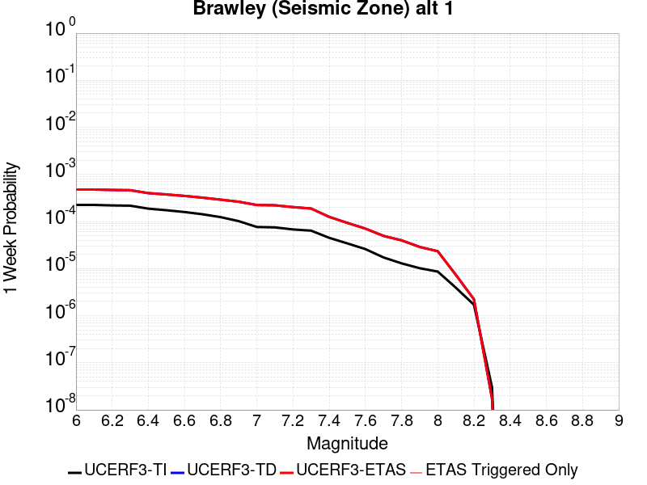 | 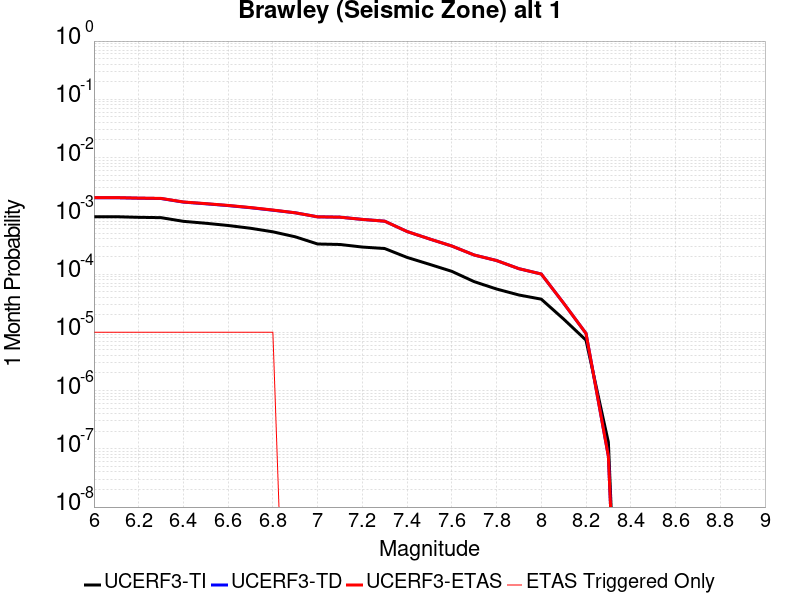 | 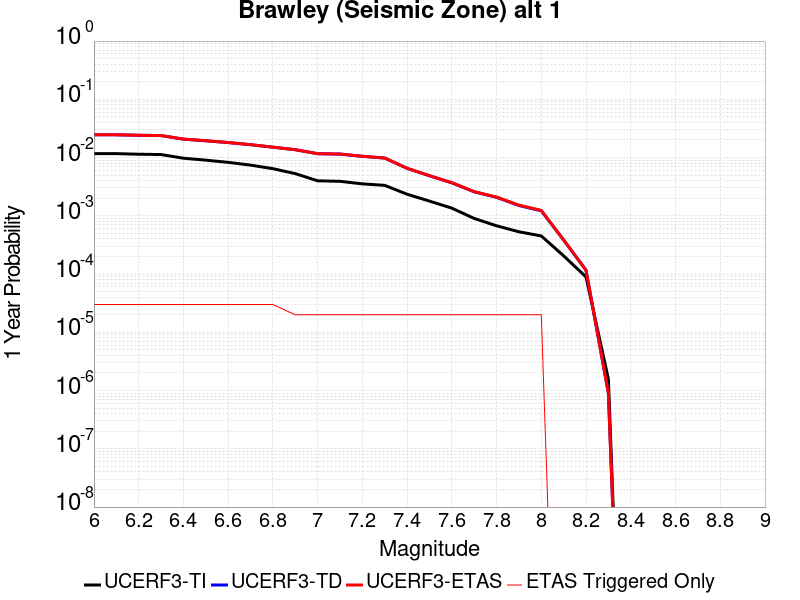 | 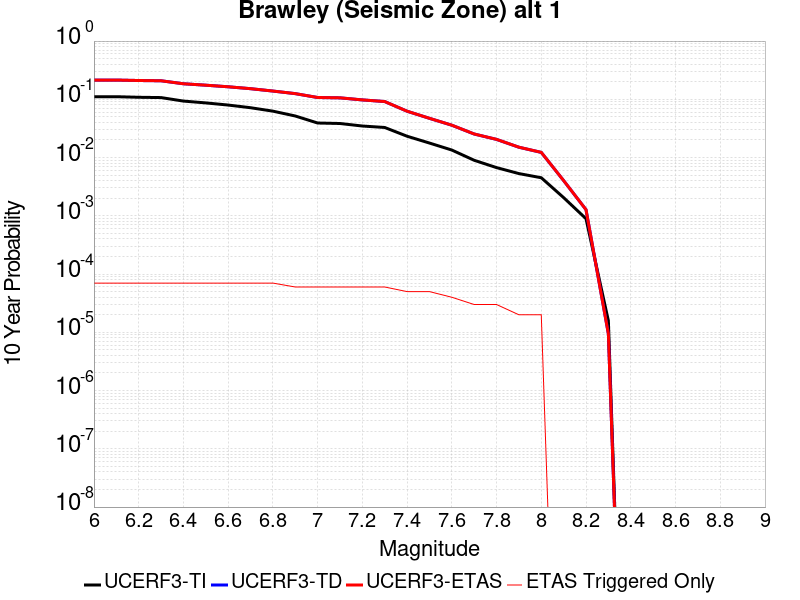 |

| Magnitude | 1 wk TI Prob | 1 wk TD Prob | 1 wk ETAS Prob | 1 wk ETAS/TD Gain | 1 wk ETAS Triggered Only | 1 mo TI Prob | 1 mo TD Prob | 1 mo ETAS Prob | 1 mo ETAS/TD Gain | 1 mo ETAS Triggered Only | 1 yr TI Prob | 1 yr TD Prob | 1 yr ETAS Prob | 1 yr ETAS/TD Gain | 1 yr ETAS Triggered Only | 10 yr TI Prob | 10 yr TD Prob | 10 yr ETAS Prob | 10 yr ETAS/TD Gain | 10 yr ETAS Triggered Only |
|-----|-----|-----|-----|-----|-----|-----|-----|-----|-----|-----|-----|-----|-----|-----|-----|-----|-----|-----|-----|-----|
| 6.0 | 2.2521618E-4 | 4.772101E-4 | 4.772101E-4 | 1.0 | 0.0 | 9.6485513E-4 | 0.0020436202 | 0.0020664798 | 1.0111858 | 2.2906359E-5 | 0.011683988 | 0.024591245 | 0.024613587 | 1.0009086 | 2.2906359E-5 | 0.11088423 | 0.21380395 | 0.21385798 | 1.0002527 | 6.871908E-5 |
| 6.1 | 2.2521618E-4 | 4.772101E-4 | 4.772101E-4 | 1.0 | 0.0 | 9.6485513E-4 | 0.0020436202 | 0.0020664798 | 1.0111858 | 2.2906359E-5 | 0.011683988 | 0.024591245 | 0.024613587 | 1.0009086 | 2.2906359E-5 | 0.11088423 | 0.21380395 | 0.21385798 | 1.0002527 | 6.871908E-5 |
| 6.2 | 2.198148E-4 | 4.6803395E-4 | 4.6803395E-4 | 1.0 | 0.0 | 9.417233E-4 | 0.0020043545 | 0.002027215 | 1.0114053 | 2.2906359E-5 | 0.011405343 | 0.024124414 | 0.024146767 | 1.0009266 | 2.2906359E-5 | 0.10837428 | 0.21023573 | 0.21029 | 1.0002581 | 6.871908E-5 |
| 6.3 | 2.1704129E-4 | 4.6238757E-4 | 4.6238757E-4 | 1.0 | 0.0 | 9.298453E-4 | 0.0019801927 | 0.0020030537 | 1.0115448 | 2.2906359E-5 | 0.011262234 | 0.023837421 | 0.02385978 | 1.000938 | 2.2906359E-5 | 0.107082725 | 0.20812663 | 0.20818105 | 1.0002614 | 6.871908E-5 |
| 6.4 | 1.876142E-4 | 4.01283E-4 | 4.01283E-4 | 1.0 | 0.0 | 8.038131E-4 | 0.0017186651 | 0.0017415321 | 1.0133051 | 2.2906359E-5 | 0.00974259 | 0.020723002 | 0.020745434 | 1.0010824 | 2.2906359E-5 | 0.093263686 | 0.18487856 | 0.18493457 | 1.000303 | 6.871908E-5 |
| 6.5 | 1.7390939E-4 | 3.7557358E-4 | 3.7557358E-4 | 1.0 | 0.0 | 7.45113E-4 | 0.0016086204 | 0.00163149 | 1.0142169 | 2.2906359E-5 | 0.009034078 | 0.019409802 | 0.019432263 | 1.0011573 | 2.2906359E-5 | 0.086755216 | 0.17469509 | 0.1747518 | 1.0003246 | 6.871908E-5 |
| 6.6 | 1.591791E-4 | 3.4968083E-4 | 3.4968083E-4 | 1.0 | 0.0 | 6.8201777E-4 | 0.0014977815 | 0.0015206535 | 1.0152706 | 2.2906359E-5 | 0.008271996 | 0.01808458 | 0.018107072 | 1.0012437 | 2.2906359E-5 | 0.07970774 | 0.16409402 | 0.16415146 | 1.0003501 | 6.871908E-5 |
| 6.7 | 1.4268003E-4 | 3.212972E-4 | 3.212972E-4 | 1.0 | 0.0 | 6.1134255E-4 | 0.0013762696 | 0.0013991444 | 1.0166209 | 2.2906359E-5 | 0.007417723 | 0.016629316 | 0.016651843 | 1.0013546 | 2.2906359E-5 | 0.07174956 | 0.15220782 | 0.15226607 | 1.0003828 | 6.871908E-5 |
| 6.8 | 1.239713E-4 | 2.911428E-4 | 2.911428E-4 | 1.0 | 0.0 | 5.3119735E-4 | 0.0012471643 | 0.001270042 | 1.0183438 | 2.2906359E-5 | 0.0064481674 | 0.015079947 | 0.0151025085 | 1.0014961 | 2.2906359E-5 | 0.06264243 | 0.13861826 | 0.13867746 | 1.000427 | 6.871908E-5 |
| 6.9 | 1.0180238E-4 | 2.630136E-4 | 2.630136E-4 | 1.0 | 0.0 | 4.3622297E-4 | 0.0011267184 | 0.0011267184 | 1.0 | 0.0 | 0.005298089 | 0.013632518 | 0.013632518 | 1.0 | 0.0 | 0.05173543 | 0.12515211 | 0.12519218 | 1.0003202 | 4.5812718E-5 |
| 7.0 | 7.6619996E-5 | 2.2435088E-4 | 2.2435088E-4 | 1.0 | 0.0 | 3.283301E-4 | 9.6115266E-4 | 9.6115266E-4 | 1.0 | 0.0 | 0.0039900932 | 0.011639957 | 0.011639957 | 1.0 | 0.0 | 0.039192066 | 0.10741362 | 0.10745451 | 1.0003806 | 4.5812718E-5 |
| 7.1 | 7.5127435E-5 | 2.2117796E-4 | 2.2117796E-4 | 1.0 | 0.0 | 3.2193496E-4 | 9.475644E-4 | 9.475644E-4 | 1.0 | 0.0 | 0.0039125155 | 0.011476275 | 0.011476275 | 1.0 | 0.0 | 0.038443442 | 0.105976 | 0.106016956 | 1.0003865 | 4.5812718E-5 |
| 7.2 | 6.788582E-5 | 2.0244301E-4 | 2.0244301E-4 | 1.0 | 0.0 | 2.9090676E-4 | 8.6732744E-4 | 8.6732744E-4 | 1.0 | 0.0 | 0.0035360386 | 0.010509226 | 0.010509226 | 1.0 | 0.0 | 0.034803 | 0.09764301 | 0.09768435 | 1.0004234 | 4.5812718E-5 |
| 7.3 | 6.399602E-5 | 1.8873831E-4 | 1.8873831E-4 | 1.0 | 0.0 | 2.7423984E-4 | 8.086306E-4 | 8.086306E-4 | 1.0 | 0.0 | 0.0033337586 | 0.009801228 | 0.009801228 | 1.0 | 0.0 | 0.03284188 | 0.091533326 | 0.091574945 | 1.0004547 | 4.5812718E-5 |
| 7.4 | 4.506759E-5 | 1.2555033E-4 | 1.2555033E-4 | 1.0 | 0.0 | 1.9313251E-4 | 5.3796277E-4 | 5.3796277E-4 | 1.0 | 0.0 | 0.0023488526 | 0.0065302025 | 0.0065302025 | 1.0 | 0.0 | 0.023241805 | 0.06247698 | 0.06251993 | 1.0006875 | 4.5812718E-5 |
| 7.5 | 3.43289E-5 | 9.357253E-5 | 9.357253E-5 | 1.0 | 0.0 | 1.4711556E-4 | 4.0096382E-4 | 4.0096382E-4 | 1.0 | 0.0 | 0.0017896603 | 0.0048708697 | 0.0048708697 | 1.0 | 0.0 | 0.01775316 | 0.047152933 | 0.047196582 | 1.0009258 | 4.5812718E-5 |
| 7.6 | 2.5980507E-5 | 7.0721406E-5 | 7.0721406E-5 | 1.0 | 0.0 | 1.1134028E-4 | 3.0305664E-4 | 3.0305664E-4 | 1.0 | 0.0 | 0.001354725 | 0.0036834965 | 0.0036834965 | 1.0 | 0.0 | 0.013464959 | 0.035926983 | 0.035949066 | 1.0006146 | 2.2906359E-5 |
| 7.7 | 1.7292105E-5 | 4.956983E-5 | 4.956983E-5 | 1.0 | 0.0 | 7.4106916E-5 | 2.1242486E-4 | 2.1242486E-4 | 1.0 | 0.0 | 9.018782E-4 | 0.002583211 | 0.002583211 | 1.0 | 0.0 | 0.008982267 | 0.02536434 | 0.02536434 | 1.0 | 0.0 |
| 7.8 | 1.2927471E-5 | 3.983483E-5 | 3.983483E-5 | 1.0 | 0.0 | 5.5402274E-5 | 1.7070955E-4 | 1.7070955E-4 | 1.0 | 0.0 | 6.743139E-4 | 0.0020764102 | 0.0020764102 | 1.0 | 0.0 | 0.0067227143 | 0.0204962 | 0.0204962 | 1.0 | 0.0 |
| 7.9 | 1.0200774E-5 | 2.886029E-5 | 2.886029E-5 | 1.0 | 0.0 | 4.371687E-5 | 1.236811E-4 | 1.236811E-4 | 1.0 | 0.0 | 5.321229E-4 | 0.0015047783 | 0.0015047783 | 1.0 | 0.0 | 0.005308505 | 0.01504465 | 0.01504465 | 1.0 | 0.0 |
| 8.0 | 8.650396E-6 | 2.337573E-5 | 2.337573E-5 | 1.0 | 0.0 | 3.70726E-5 | 1.0017785E-4 | 1.0017785E-4 | 1.0 | 0.0 | 4.5126543E-4 | 0.0012189838 | 0.0012189838 | 1.0 | 0.0 | 0.0045035016 | 0.01225692 | 0.01225692 | 1.0 | 0.0 |
| 8.1 | 3.9368224E-6 | 7.370358E-6 | 7.370358E-6 | 1.0 | 0.0 | 1.6871985E-5 | 3.1586867E-5 | 3.1586867E-5 | 1.0 | 0.0 | 2.0539707E-4 | 3.8450237E-4 | 3.8450237E-4 | 1.0 | 0.0 | 0.0020520731 | 0.0040221987 | 0.0040221987 | 1.0 | 0.0 |
| 8.2 | 1.7101195E-6 | 2.234449E-6 | 2.234449E-6 | 1.0 | 0.0 | 7.329063E-6 | 9.576175E-6 | 9.576175E-6 | 1.0 | 0.0 | 8.922769E-5 | 1.1658373E-4 | 1.1658373E-4 | 1.0 | 0.0 | 8.9191867E-4 | 0.0012751748 | 0.0012751748 | 1.0 | 0.0 |
| 8.3 | 3.0346666E-8 | 1.7388597E-8 | 1.7388597E-8 | 1.0 | 0.0 | 1.3005713E-7 | 7.452256E-8 | 7.452256E-8 | 1.0 | 0.0 | 1.5834444E-6 | 9.073121E-7 | 9.073121E-7 | 1.0 | 0.0 | 1.5834332E-5 | 9.4598245E-6 | 9.4598245E-6 | 1.0 | 0.0 |

## Palos Verdes
*[(top)](#table-of-contents)*

| 1 Week | 1 Month | 1 Year | 10 Year |
|-----|-----|-----|-----|
|  |  |  | 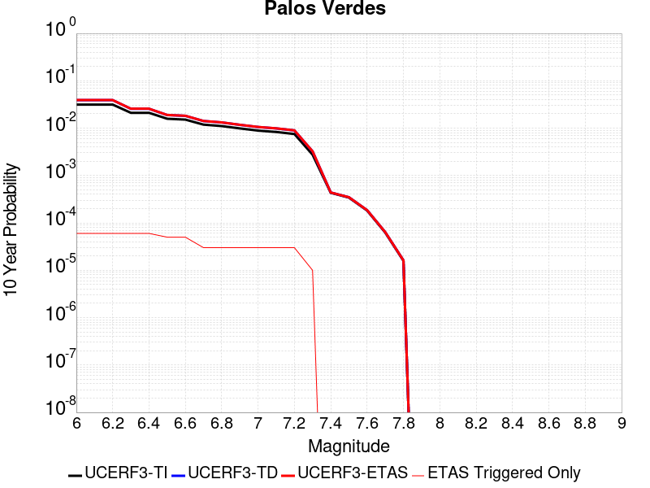 |

| Magnitude | 1 wk TI Prob | 1 wk TD Prob | 1 wk ETAS Prob | 1 wk ETAS/TD Gain | 1 wk ETAS Triggered Only | 1 mo TI Prob | 1 mo TD Prob | 1 mo ETAS Prob | 1 mo ETAS/TD Gain | 1 mo ETAS Triggered Only | 1 yr TI Prob | 1 yr TD Prob | 1 yr ETAS Prob | 1 yr ETAS/TD Gain | 1 yr ETAS Triggered Only | 10 yr TI Prob | 10 yr TD Prob | 10 yr ETAS Prob | 10 yr ETAS/TD Gain | 10 yr ETAS Triggered Only |
|-----|-----|-----|-----|-----|-----|-----|-----|-----|-----|-----|-----|-----|-----|-----|-----|-----|-----|-----|-----|-----|
| 6.0 | 6.126063E-5 | 7.625118E-5 | 7.625118E-5 | 1.0 | 0.0 | 2.6251914E-4 | 3.267532E-4 | 3.267532E-4 | 1.0 | 0.0 | 0.0031914865 | 0.003971426 | 0.004017057 | 1.0114897 | 4.5812718E-5 | 0.031460393 | 0.039061166 | 0.0391272 | 1.0016905 | 6.871908E-5 |
| 6.1 | 6.126063E-5 | 7.625118E-5 | 7.625118E-5 | 1.0 | 0.0 | 2.6251914E-4 | 3.267532E-4 | 3.267532E-4 | 1.0 | 0.0 | 0.0031914865 | 0.003971426 | 0.004017057 | 1.0114897 | 4.5812718E-5 | 0.031460393 | 0.039061166 | 0.0391272 | 1.0016905 | 6.871908E-5 |
| 6.2 | 6.126063E-5 | 7.625118E-5 | 7.625118E-5 | 1.0 | 0.0 | 2.6251914E-4 | 3.267532E-4 | 3.267532E-4 | 1.0 | 0.0 | 0.0031914865 | 0.003971426 | 0.004017057 | 1.0114897 | 4.5812718E-5 | 0.031460393 | 0.039061166 | 0.0391272 | 1.0016905 | 6.871908E-5 |
| 6.3 | 4.0838047E-5 | 4.9764007E-5 | 4.9764007E-5 | 1.0 | 0.0 | 1.7500846E-4 | 2.1325816E-4 | 2.1325816E-4 | 1.0 | 0.0 | 0.0021286458 | 0.0025935178 | 0.0026392117 | 1.0176185 | 4.5812718E-5 | 0.021083709 | 0.025654016 | 0.02572097 | 1.00261 | 6.871908E-5 |
| 6.4 | 4.0838047E-5 | 4.9764007E-5 | 4.9764007E-5 | 1.0 | 0.0 | 1.7500846E-4 | 2.1325816E-4 | 2.1325816E-4 | 1.0 | 0.0 | 0.0021286458 | 0.0025935178 | 0.0026392117 | 1.0176185 | 4.5812718E-5 | 0.021083709 | 0.025654016 | 0.02572097 | 1.00261 | 6.871908E-5 |
| 6.5 | 3.0512005E-5 | 3.657133E-5 | 3.657133E-5 | 1.0 | 0.0 | 1.3075917E-4 | 1.5672554E-4 | 1.5672554E-4 | 1.0 | 0.0 | 0.0015908304 | 0.0019065797 | 0.0019294424 | 1.0119915 | 2.2906359E-5 | 0.015794903 | 0.018914111 | 0.018959057 | 1.0023763 | 4.5812718E-5 |
| 6.6 | 2.9255087E-5 | 3.5163906E-5 | 3.5163906E-5 | 1.0 | 0.0 | 1.2537291E-4 | 1.5069441E-4 | 1.5069441E-4 | 1.0 | 0.0 | 0.0015253464 | 0.0018332743 | 0.0018561386 | 1.0124719 | 2.2906359E-5 | 0.015149189 | 0.018193072 | 0.01823805 | 1.0024723 | 4.5812718E-5 |
| 6.7 | 2.287198E-5 | 2.7255252E-5 | 2.7255252E-5 | 1.0 | 0.0 | 9.801909E-5 | 1.1680351E-4 | 1.1680351E-4 | 1.0 | 0.0 | 0.001192729 | 0.0014212468 | 0.0014441205 | 1.0160942 | 2.2906359E-5 | 0.011863477 | 0.01413081 | 0.014153393 | 1.0015981 | 2.2906359E-5 |
| 6.8 | 2.1325764E-5 | 2.5438425E-5 | 2.5438425E-5 | 1.0 | 0.0 | 9.139293E-5 | 1.09017776E-4 | 1.09017776E-4 | 1.0 | 0.0 | 0.001112141 | 0.0013265735 | 0.0013494495 | 1.0172445 | 2.2906359E-5 | 0.011065915 | 0.013195587 | 0.013218191 | 1.001713 | 2.2906359E-5 |
| 6.9 | 1.9009392E-5 | 2.2619284E-5 | 2.2619284E-5 | 1.0 | 0.0 | 8.1466285E-5 | 9.693668E-5 | 9.693668E-5 | 1.0 | 0.0 | 9.914007E-4 | 0.0011796525 | 0.0012025319 | 1.019395 | 2.2906359E-5 | 0.009869894 | 0.011742596 | 0.011765233 | 1.0019279 | 2.2906359E-5 |
| 7.0 | 1.7098473E-5 | 2.0324482E-5 | 2.0324482E-5 | 1.0 | 0.0 | 7.3277115E-5 | 8.710249E-5 | 8.710249E-5 | 1.0 | 0.0 | 8.917837E-4 | 0.0010600422 | 0.0010829243 | 1.0215861 | 2.2906359E-5 | 0.008882134 | 0.010558298 | 0.0105809625 | 1.0021466 | 2.2906359E-5 |
| 7.1 | 1.5982785E-5 | 1.8999555E-5 | 1.8999555E-5 | 1.0 | 0.0 | 6.849585E-5 | 8.14246E-5 | 8.14246E-5 | 1.0 | 0.0 | 8.336179E-4 | 9.909783E-4 | 0.0010138621 | 1.023092 | 2.2906359E-5 | 0.008304977 | 0.009873961 | 0.009896642 | 1.0022969 | 2.2906359E-5 |
| 7.2 | 1.4468002E-5 | 1.7201583E-5 | 1.7201583E-5 | 1.0 | 0.0 | 6.200425E-5 | 7.3719464E-5 | 7.3719464E-5 | 1.0 | 0.0 | 7.546402E-4 | 8.972489E-4 | 9.201347E-4 | 1.0255066 | 2.2906359E-5 | 0.007520827 | 0.008944537 | 0.0089672385 | 1.0025381 | 2.2906359E-5 |
| 7.3 | 5.288233E-6 | 6.205136E-6 | 6.205136E-6 | 1.0 | 0.0 | 2.2663658E-5 | 2.6593365E-5 | 2.6593365E-5 | 1.0 | 0.0 | 2.7589512E-4 | 3.2376102E-4 | 3.4665997E-4 | 1.070728 | 2.2906359E-5 | 0.0027555283 | 0.003236318 | 0.0032591503 | 1.007055 | 2.2906359E-5 |
| 7.4 | 8.279556E-7 | 8.40852E-7 | 8.40852E-7 | 1.0 | 0.0 | 3.5483763E-6 | 3.603647E-6 | 3.603647E-6 | 1.0 | 0.0 | 4.3200624E-5 | 4.387359E-5 | 4.387359E-5 | 1.0 | 0.0 | 4.3192226E-4 | 4.386565E-4 | 4.386565E-4 | 1.0 | 0.0 |
| 7.5 | 6.559831E-7 | 6.667374E-7 | 6.667374E-7 | 1.0 | 0.0 | 2.8113532E-6 | 2.8574432E-6 | 2.8574432E-6 | 1.0 | 0.0 | 3.4227687E-5 | 3.478888E-5 | 3.478888E-5 | 1.0 | 0.0 | 3.4222414E-4 | 3.4784098E-4 | 3.4784098E-4 | 1.0 | 0.0 |
| 7.6 | 3.5018968E-7 | 3.562084E-7 | 3.562084E-7 | 1.0 | 0.0 | 1.500812E-6 | 1.5266068E-6 | 1.5266068E-6 | 1.0 | 0.0 | 1.8272232E-5 | 1.8586326E-5 | 1.8586326E-5 | 1.0 | 0.0 | 1.8270731E-4 | 1.8585232E-4 | 1.8585232E-4 | 1.0 | 0.0 |
| 7.7 | 1.1986104E-7 | 1.2198663E-7 | 1.2198663E-7 | 1.0 | 0.0 | 5.1369005E-7 | 5.227997E-7 | 5.227997E-7 | 1.0 | 0.0 | 6.2541585E-6 | 6.3650687E-6 | 6.3650687E-6 | 1.0 | 0.0 | 6.2539824E-5 | 6.3648906E-5 | 6.3648906E-5 | 1.0 | 0.0 |
| 7.8 | 3.0445005E-8 | 3.102837E-8 | 3.102837E-8 | 1.0 | 0.0 | 1.3047858E-7 | 1.3297873E-7 | 1.3297873E-7 | 1.0 | 0.0 | 1.5885756E-6 | 1.619015E-6 | 1.619015E-6 | 1.0 | 0.0 | 1.5885644E-5 | 1.6190053E-5 | 1.6190053E-5 | 1.0 | 0.0 |

## San Andreas (North Branch Mill Creek)
*[(top)](#table-of-contents)*

| 1 Week | 1 Month | 1 Year | 10 Year |
|-----|-----|-----|-----|
| 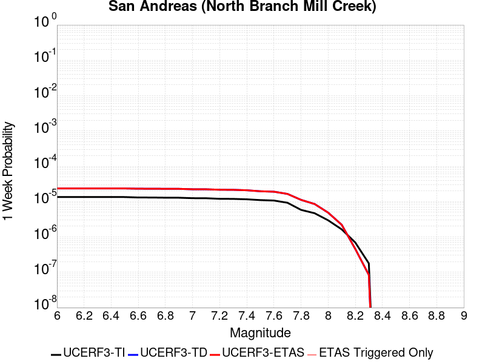 |  |  |  |

| Magnitude | 1 wk TI Prob | 1 wk TD Prob | 1 wk ETAS Prob | 1 wk ETAS/TD Gain | 1 wk ETAS Triggered Only | 1 mo TI Prob | 1 mo TD Prob | 1 mo ETAS Prob | 1 mo ETAS/TD Gain | 1 mo ETAS Triggered Only | 1 yr TI Prob | 1 yr TD Prob | 1 yr ETAS Prob | 1 yr ETAS/TD Gain | 1 yr ETAS Triggered Only | 10 yr TI Prob | 10 yr TD Prob | 10 yr ETAS Prob | 10 yr ETAS/TD Gain | 10 yr ETAS Triggered Only |
|-----|-----|-----|-----|-----|-----|-----|-----|-----|-----|-----|-----|-----|-----|-----|-----|-----|-----|-----|-----|-----|
| 6.0 | 1.3461156E-5 | 2.3568791E-5 | 2.3568791E-5 | 1.0 | 0.0 | 5.7689394E-5 | 1.01005215E-4 | 1.01005215E-4 | 1.0 | 0.0 | 7.02142E-4 | 0.0012290481 | 0.0012519263 | 1.0186145 | 2.2906359E-5 | 0.0069992766 | 0.012264845 | 0.012332721 | 1.0055342 | 6.871908E-5 |
| 6.1 | 1.3461156E-5 | 2.3568791E-5 | 2.3568791E-5 | 1.0 | 0.0 | 5.7689394E-5 | 1.01005215E-4 | 1.01005215E-4 | 1.0 | 0.0 | 7.02142E-4 | 0.0012290481 | 0.0012519263 | 1.0186145 | 2.2906359E-5 | 0.0069992766 | 0.012264845 | 0.012332721 | 1.0055342 | 6.871908E-5 |
| 6.2 | 1.3461156E-5 | 2.3568791E-5 | 2.3568791E-5 | 1.0 | 0.0 | 5.7689394E-5 | 1.01005215E-4 | 1.01005215E-4 | 1.0 | 0.0 | 7.02142E-4 | 0.0012290481 | 0.0012519263 | 1.0186145 | 2.2906359E-5 | 0.0069992766 | 0.012264845 | 0.012332721 | 1.0055342 | 6.871908E-5 |
| 6.3 | 1.3461156E-5 | 2.3568791E-5 | 2.3568791E-5 | 1.0 | 0.0 | 5.7689394E-5 | 1.01005215E-4 | 1.01005215E-4 | 1.0 | 0.0 | 7.02142E-4 | 0.0012290481 | 0.0012519263 | 1.0186145 | 2.2906359E-5 | 0.0069992766 | 0.012264845 | 0.012332721 | 1.0055342 | 6.871908E-5 |
| 6.4 | 1.3461156E-5 | 2.3568791E-5 | 2.3568791E-5 | 1.0 | 0.0 | 5.7689394E-5 | 1.01005215E-4 | 1.01005215E-4 | 1.0 | 0.0 | 7.02142E-4 | 0.0012290481 | 0.0012519263 | 1.0186145 | 2.2906359E-5 | 0.0069992766 | 0.012264845 | 0.012332721 | 1.0055342 | 6.871908E-5 |
| 6.5 | 1.3450706E-5 | 2.3557752E-5 | 2.3557752E-5 | 1.0 | 0.0 | 5.764461E-5 | 1.009579E-4 | 1.009579E-4 | 1.0 | 0.0 | 7.0159714E-4 | 0.0012284727 | 0.0012513509 | 1.0186234 | 2.2906359E-5 | 0.006993862 | 0.012259155 | 0.012327031 | 1.0055368 | 6.871908E-5 |
| 6.6 | 1.3074523E-5 | 2.317201E-5 | 2.317201E-5 | 1.0 | 0.0 | 5.6032466E-5 | 9.9304845E-5 | 9.9304845E-5 | 1.0 | 0.0 | 6.8198174E-4 | 0.0012083692 | 0.0012312479 | 1.0189335 | 2.2906359E-5 | 0.006798926 | 0.0120603135 | 0.012128204 | 1.0056292 | 6.871908E-5 |
| 6.7 | 1.3050216E-5 | 2.31473E-5 | 2.31473E-5 | 1.0 | 0.0 | 5.59283E-5 | 9.9198965E-5 | 9.9198965E-5 | 1.0 | 0.0 | 6.8071426E-4 | 0.0012070815 | 0.0012299601 | 1.0189537 | 2.2906359E-5 | 0.0067863287 | 0.012047576 | 0.012115467 | 1.0056353 | 6.871908E-5 |
| 6.8 | 1.29049395E-5 | 2.2995695E-5 | 2.2995695E-5 | 1.0 | 0.0 | 5.530571E-5 | 9.854927E-5 | 9.854927E-5 | 1.0 | 0.0 | 6.73139E-4 | 0.0011991803 | 0.0012220591 | 1.0190787 | 2.2906359E-5 | 0.0067110364 | 0.011969416 | 0.012037314 | 1.0056725 | 6.871908E-5 |
| 6.9 | 1.2867369E-5 | 2.2955088E-5 | 2.2955088E-5 | 1.0 | 0.0 | 5.51447E-5 | 9.837526E-5 | 9.837526E-5 | 1.0 | 0.0 | 6.711799E-4 | 0.001197064 | 0.0012199428 | 1.0191126 | 2.2906359E-5 | 0.006691564 | 0.011948481 | 0.012016379 | 1.0056826 | 6.871908E-5 |
| 7.0 | 1.2495996E-5 | 2.2354692E-5 | 2.2354692E-5 | 1.0 | 0.0 | 5.3553173E-5 | 9.580232E-5 | 9.580232E-5 | 1.0 | 0.0 | 6.518148E-4 | 0.001165772 | 0.0011886517 | 1.0196261 | 2.2906359E-5 | 0.0064990623 | 0.011638851 | 0.01170677 | 1.0058355 | 6.871908E-5 |
| 7.1 | 1.2452067E-5 | 2.2299744E-5 | 2.2299744E-5 | 1.0 | 0.0 | 5.3364907E-5 | 9.5566844E-5 | 9.5566844E-5 | 1.0 | 0.0 | 6.4952404E-4 | 0.0011629082 | 0.0011857878 | 1.0196745 | 2.2906359E-5 | 0.0064762887 | 0.011610513 | 0.011678434 | 1.00585 | 6.871908E-5 |
| 7.2 | 1.2002777E-5 | 2.167794E-5 | 2.167794E-5 | 1.0 | 0.0 | 5.143946E-5 | 9.290217E-5 | 9.290217E-5 | 1.0 | 0.0 | 6.2609545E-4 | 0.0011304996 | 0.0011533801 | 1.0202392 | 2.2906359E-5 | 0.006243344 | 0.011289758 | 0.0113577 | 1.0060182 | 6.871908E-5 |
| 7.3 | 1.1923425E-5 | 2.1547696E-5 | 2.1547696E-5 | 1.0 | 0.0 | 5.109939E-5 | 9.234402E-5 | 9.234402E-5 | 1.0 | 0.0 | 6.219575E-4 | 0.0011237112 | 0.0011465919 | 1.0203617 | 2.2906359E-5 | 0.0062021962 | 0.011222587 | 0.011290535 | 1.0060545 | 6.871908E-5 |
| 7.4 | 1.16105175E-5 | 2.0921012E-5 | 2.0921012E-5 | 1.0 | 0.0 | 4.975841E-5 | 8.965841E-5 | 8.965841E-5 | 1.0 | 0.0 | 6.0564023E-4 | 0.0010910471 | 0.0011139285 | 1.0209719 | 2.2906359E-5 | 0.006039923 | 0.01089987 | 0.0109678395 | 1.0062358 | 6.871908E-5 |
| 7.5 | 1.1037265E-5 | 1.9618798E-5 | 1.9618798E-5 | 1.0 | 0.0 | 4.7301706E-5 | 8.407787E-5 | 8.407787E-5 | 1.0 | 0.0 | 5.757461E-4 | 0.0010231695 | 0.0010460524 | 1.0223647 | 2.2906359E-5 | 0.005742567 | 0.010228194 | 0.010296211 | 1.0066499 | 6.871908E-5 |
| 7.6 | 1.0720915E-5 | 1.9059898E-5 | 1.9059898E-5 | 1.0 | 0.0 | 4.5945973E-5 | 8.168274E-5 | 8.168274E-5 | 1.0 | 0.0 | 5.592486E-4 | 9.940357E-4 | 0.0010169194 | 1.0230209 | 2.2906359E-5 | 0.005578433 | 0.00993951 | 0.010007546 | 1.006845 | 6.871908E-5 |
| 7.7 | 9.276279E-6 | 1.6502676E-5 | 1.6502676E-5 | 1.0 | 0.0 | 3.9754876E-5 | 7.072384E-5 | 7.072384E-5 | 1.0 | 0.0 | 4.839081E-4 | 8.607243E-4 | 8.83611E-4 | 1.02659 | 2.2906359E-5 | 0.0048285574 | 0.008617393 | 0.00868552 | 1.0079057 | 6.871908E-5 |
| 7.8 | 5.8346777E-6 | 1.1204534E-5 | 1.1204534E-5 | 1.0 | 0.0 | 2.5005522E-5 | 4.8018544E-5 | 4.8018544E-5 | 1.0 | 0.0 | 3.043997E-4 | 5.8446906E-4 | 6.073621E-4 | 1.0391688 | 2.2906359E-5 | 0.0030398308 | 0.0058723968 | 0.005940712 | 1.0116333 | 6.871908E-5 |
| 7.9 | 4.690204E-6 | 8.550357E-6 | 8.550357E-6 | 1.0 | 0.0 | 2.0100719E-5 | 3.6643873E-5 | 3.6643873E-5 | 1.0 | 0.0 | 2.4469878E-4 | 4.460479E-4 | 4.6894402E-4 | 1.0513312 | 2.2906359E-5 | 0.002444295 | 0.0044919904 | 0.0045604007 | 1.0152295 | 6.871908E-5 |
| 8.0 | 2.9570454E-6 | 4.8721763E-6 | 4.8721763E-6 | 1.0 | 0.0 | 1.267299E-5 | 2.0880589E-5 | 2.0880589E-5 | 1.0 | 0.0 | 1.5428272E-4 | 2.5419152E-4 | 2.5419152E-4 | 1.0 | 0.0 | 0.0015417566 | 0.002562766 | 0.002562766 | 1.0 | 0.0 |
| 8.1 | 1.6376824E-6 | 2.2101194E-6 | 2.2101194E-6 | 1.0 | 0.0 | 7.01862E-6 | 9.471906E-6 | 9.471906E-6 | 1.0 | 0.0 | 8.544835E-5 | 1.15314375E-4 | 1.15314375E-4 | 1.0 | 0.0 | 8.54155E-4 | 0.0011675779 | 0.0011675779 | 1.0 | 0.0 |
| 8.2 | 6.9631557E-7 | 4.5774055E-7 | 4.5774055E-7 | 1.0 | 0.0 | 2.984206E-6 | 1.9617437E-6 | 1.9617437E-6 | 1.0 | 0.0 | 3.63321E-5 | 2.388397E-5 | 2.388397E-5 | 1.0 | 0.0 | 3.6326164E-4 | 2.4735386E-4 | 2.4735386E-4 | 1.0 | 0.0 |
| 8.3 | 1.7876137E-7 | 8.444342E-8 | 8.444342E-8 | 1.0 | 0.0 | 7.661199E-7 | 3.6190033E-7 | 3.6190033E-7 | 1.0 | 0.0 | 9.32747E-6 | 4.406128E-6 | 4.406128E-6 | 1.0 | 0.0 | 9.3270784E-5 | 4.626742E-5 | 4.626742E-5 | 1.0 | 0.0 |

## Elsinore (Glen Ivy) rev
*[(top)](#table-of-contents)*

| 1 Week | 1 Month | 1 Year | 10 Year |
|-----|-----|-----|-----|
|  |  |  |  |

| Magnitude | 1 wk TI Prob | 1 wk TD Prob | 1 wk ETAS Prob | 1 wk ETAS/TD Gain | 1 wk ETAS Triggered Only | 1 mo TI Prob | 1 mo TD Prob | 1 mo ETAS Prob | 1 mo ETAS/TD Gain | 1 mo ETAS Triggered Only | 1 yr TI Prob | 1 yr TD Prob | 1 yr ETAS Prob | 1 yr ETAS/TD Gain | 1 yr ETAS Triggered Only | 10 yr TI Prob | 10 yr TD Prob | 10 yr ETAS Prob | 10 yr ETAS/TD Gain | 10 yr ETAS Triggered Only |
|-----|-----|-----|-----|-----|-----|-----|-----|-----|-----|-----|-----|-----|-----|-----|-----|-----|-----|-----|-----|-----|
| 6.0 | 1.6204086E-4 | 2.9373835E-4 | 2.9373835E-4 | 1.0 | 0.0 | 6.94276E-4 | 0.0012584261 | 0.0012584261 | 1.0 | 0.0 | 0.008420097 | 0.015239672 | 0.015284787 | 1.0029603 | 4.5812718E-5 | 0.081081145 | 0.13972586 | 0.13976528 | 1.000282 | 4.5812718E-5 |
| 6.1 | 1.6204086E-4 | 2.9373835E-4 | 2.9373835E-4 | 1.0 | 0.0 | 6.94276E-4 | 0.0012584261 | 0.0012584261 | 1.0 | 0.0 | 0.008420097 | 0.015239672 | 0.015284787 | 1.0029603 | 4.5812718E-5 | 0.081081145 | 0.13972586 | 0.13976528 | 1.000282 | 4.5812718E-5 |
| 6.2 | 1.6204086E-4 | 2.9373835E-4 | 2.9373835E-4 | 1.0 | 0.0 | 6.94276E-4 | 0.0012584261 | 0.0012584261 | 1.0 | 0.0 | 0.008420097 | 0.015239672 | 0.015284787 | 1.0029603 | 4.5812718E-5 | 0.081081145 | 0.13972586 | 0.13976528 | 1.000282 | 4.5812718E-5 |
| 6.3 | 1.0111737E-4 | 1.7707222E-4 | 1.7707222E-4 | 1.0 | 0.0 | 4.332882E-4 | 7.5877697E-4 | 7.5877697E-4 | 1.0 | 0.0 | 0.005262531 | 0.009219674 | 0.009219674 | 1.0 | 0.0 | 0.0513964 | 0.087036215 | 0.087036215 | 1.0 | 0.0 |
| 6.4 | 1.0111737E-4 | 1.7707222E-4 | 1.7707222E-4 | 1.0 | 0.0 | 4.332882E-4 | 7.5877697E-4 | 7.5877697E-4 | 1.0 | 0.0 | 0.005262531 | 0.009219674 | 0.009219674 | 1.0 | 0.0 | 0.0513964 | 0.087036215 | 0.087036215 | 1.0 | 0.0 |
| 6.5 | 3.6624708E-5 | 4.6410038E-5 | 4.6410038E-5 | 1.0 | 0.0 | 1.569536E-4 | 1.9888705E-4 | 1.9888705E-4 | 1.0 | 0.0 | 0.001909235 | 0.002419124 | 0.002419124 | 1.0 | 0.0 | 0.01892915 | 0.02374938 | 0.02374938 | 1.0 | 0.0 |
| 6.6 | 2.5051324E-5 | 2.6161024E-5 | 2.6161024E-5 | 1.0 | 0.0 | 1.073584E-4 | 1.121141E-4 | 1.121141E-4 | 1.0 | 0.0 | 0.0013063047 | 0.0013641791 | 0.0013641791 | 1.0 | 0.0 | 0.012986525 | 0.0135714235 | 0.0135714235 | 1.0 | 0.0 |
| 6.7 | 2.2189772E-5 | 2.208435E-5 | 2.208435E-5 | 1.0 | 0.0 | 9.509556E-5 | 9.464399E-5 | 9.464399E-5 | 1.0 | 0.0 | 0.0011571734 | 0.0011517179 | 0.0011517179 | 1.0 | 0.0 | 0.011511663 | 0.011471325 | 0.011471325 | 1.0 | 0.0 |
| 6.8 | 1.6654378E-5 | 1.4444795E-5 | 1.4444795E-5 | 1.0 | 0.0 | 7.137396E-5 | 6.190482E-5 | 6.190482E-5 | 1.0 | 0.0 | 8.686314E-4 | 7.534358E-4 | 7.534358E-4 | 1.0 | 0.0 | 0.008652439 | 0.007514148 | 0.007514148 | 1.0 | 0.0 |
| 6.9 | 1.5042909E-5 | 1.233821E-5 | 1.233821E-5 | 1.0 | 0.0 | 6.446802E-5 | 5.2876985E-5 | 5.2876985E-5 | 1.0 | 0.0 | 7.8461546E-4 | 6.435903E-4 | 6.435903E-4 | 1.0 | 0.0 | 0.007818509 | 0.0064214864 | 0.0064214864 | 1.0 | 0.0 |
| 7.0 | 1.4361385E-5 | 1.145718E-5 | 1.145718E-5 | 1.0 | 0.0 | 6.154734E-5 | 4.9101294E-5 | 4.9101294E-5 | 1.0 | 0.0 | 7.490812E-4 | 5.976472E-4 | 5.976472E-4 | 1.0 | 0.0 | 0.007465612 | 0.0059643895 | 0.0059643895 | 1.0 | 0.0 |
| 7.1 | 1.3265571E-5 | 1.02501535E-5 | 1.02501535E-5 | 1.0 | 0.0 | 5.6851208E-5 | 4.3928503E-5 | 4.3928503E-5 | 1.0 | 0.0 | 6.919436E-4 | 5.347008E-4 | 5.347008E-4 | 1.0 | 0.0 | 0.006897931 | 0.0053374986 | 0.0053374986 | 1.0 | 0.0 |
| 7.2 | 1.1596403E-5 | 8.509482E-6 | 8.509482E-6 | 1.0 | 0.0 | 4.9697923E-5 | 3.6468704E-5 | 3.6468704E-5 | 1.0 | 0.0 | 6.049042E-4 | 4.4391773E-4 | 4.4391773E-4 | 1.0 | 0.0 | 0.006032603 | 0.004431725 | 0.004431725 | 1.0 | 0.0 |
| 7.3 | 1.0150827E-5 | 7.2425387E-6 | 7.2425387E-6 | 1.0 | 0.0 | 4.3502816E-5 | 3.103909E-5 | 3.103909E-5 | 1.0 | 0.0 | 5.2951806E-4 | 3.7783684E-4 | 3.7783684E-4 | 1.0 | 0.0 | 0.005282581 | 0.0037723312 | 0.0037723312 | 1.0 | 0.0 |
| 7.4 | 9.080705E-6 | 6.355858E-6 | 6.355858E-6 | 1.0 | 0.0 | 3.8916725E-5 | 2.7239115E-5 | 2.7239115E-5 | 1.0 | 0.0 | 4.7370812E-4 | 3.3158713E-4 | 3.3158713E-4 | 1.0 | 0.0 | 0.004726996 | 0.0033110748 | 0.0033110748 | 1.0 | 0.0 |
| 7.5 | 7.671649E-6 | 5.228478E-6 | 5.228478E-6 | 1.0 | 0.0 | 3.287808E-5 | 2.240758E-5 | 2.240758E-5 | 1.0 | 0.0 | 4.0021708E-4 | 2.7277938E-4 | 2.7277938E-4 | 1.0 | 0.0 | 0.0039949706 | 0.0027245705 | 0.0027245705 | 1.0 | 0.0 |
| 7.6 | 6.990086E-6 | 4.690167E-6 | 4.690167E-6 | 1.0 | 0.0 | 2.9957167E-5 | 2.0100566E-5 | 2.0100566E-5 | 1.0 | 0.0 | 3.6466747E-4 | 2.4469808E-4 | 2.4469808E-4 | 1.0 | 0.0 | 0.0036406964 | 0.0024444028 | 0.0024444028 | 1.0 | 0.0 |
| 7.7 | 4.163505E-6 | 2.33086E-6 | 2.33086E-6 | 1.0 | 0.0 | 1.7843471E-5 | 9.989366E-6 | 9.989366E-6 | 1.0 | 0.0 | 2.172226E-4 | 1.21614496E-4 | 1.21614496E-4 | 1.0 | 0.0 | 0.0021701038 | 0.0012155526 | 0.0012155526 | 1.0 | 0.0 |
| 7.8 | 2.2692414E-7 | 9.390229E-8 | 9.390229E-8 | 1.0 | 0.0 | 9.725317E-7 | 4.0243833E-7 | 4.0243833E-7 | 1.0 | 0.0 | 1.1840509E-5 | 4.899679E-6 | 4.899679E-6 | 1.0 | 0.0 | 1.1839878E-4 | 4.8996037E-5 | 4.8996037E-5 | 1.0 | 0.0 |
| 7.9 | 6.676829E-9 | 3.4410954E-9 | 3.4410954E-9 | 1.0 | 0.0 | 2.861498E-8 | 1.4747552E-8 | 1.4747552E-8 | 1.0 | 0.0 | 3.4838732E-7 | 1.7955142E-7 | 1.7955142E-7 | 1.0 | 0.0 | 3.4838679E-6 | 1.795513E-6 | 1.795513E-6 | 1.0 | 0.0 |

## Mission Ridge-Arroyo Parida-Santa Ana
*[(top)](#table-of-contents)*

| 1 Week | 1 Month | 1 Year | 10 Year |
|-----|-----|-----|-----|
| 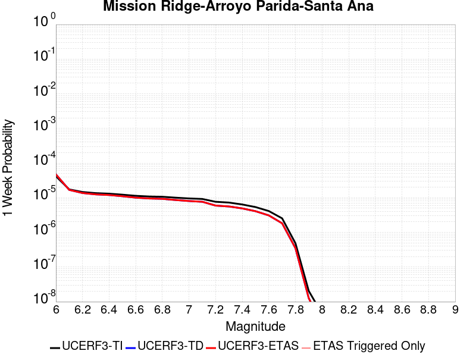 |  |  |  |

| Magnitude | 1 wk TI Prob | 1 wk TD Prob | 1 wk ETAS Prob | 1 wk ETAS/TD Gain | 1 wk ETAS Triggered Only | 1 mo TI Prob | 1 mo TD Prob | 1 mo ETAS Prob | 1 mo ETAS/TD Gain | 1 mo ETAS Triggered Only | 1 yr TI Prob | 1 yr TD Prob | 1 yr ETAS Prob | 1 yr ETAS/TD Gain | 1 yr ETAS Triggered Only | 10 yr TI Prob | 10 yr TD Prob | 10 yr ETAS Prob | 10 yr ETAS/TD Gain | 10 yr ETAS Triggered Only |
|-----|-----|-----|-----|-----|-----|-----|-----|-----|-----|-----|-----|-----|-----|-----|-----|-----|-----|-----|-----|-----|
| 6.0 | 4.169034E-5 | 4.7151516E-5 | 4.7151516E-5 | 1.0 | 0.0 | 1.7866064E-4 | 2.0206712E-4 | 2.0206712E-4 | 1.0 | 0.0 | 0.0021730233 | 0.0024581002 | 0.0024809504 | 1.0092958 | 2.2906359E-5 | 0.021518968 | 0.024391286 | 0.024435982 | 1.0018325 | 4.5812718E-5 |
| 6.1 | 1.73813E-5 | 1.6857384E-5 | 1.6857384E-5 | 1.0 | 0.0 | 7.4489166E-5 | 7.224399E-5 | 7.224399E-5 | 1.0 | 0.0 | 9.065282E-4 | 8.792264E-4 | 9.0211263E-4 | 1.02603 | 2.2906359E-5 | 0.009028391 | 0.008758621 | 0.008781327 | 1.0025924 | 2.2906359E-5 |
| 6.2 | 1.4622182E-5 | 1.3675793E-5 | 1.3675793E-5 | 1.0 | 0.0 | 6.2664985E-5 | 5.8609243E-5 | 5.8609243E-5 | 1.0 | 0.0 | 7.6267915E-4 | 7.133378E-4 | 7.133378E-4 | 1.0 | 0.0 | 0.007600669 | 0.007110924 | 0.007110924 | 1.0 | 0.0 |
| 6.3 | 1.3552434E-5 | 1.2484522E-5 | 1.2484522E-5 | 1.0 | 0.0 | 5.8080568E-5 | 5.3504016E-5 | 5.3504016E-5 | 1.0 | 0.0 | 7.069015E-4 | 6.5121986E-4 | 6.5121986E-4 | 1.0 | 0.0 | 0.00704657 | 0.0064934785 | 0.0064934785 | 1.0 | 0.0 |
| 6.4 | 1.30977305E-5 | 1.1981406E-5 | 1.1981406E-5 | 1.0 | 0.0 | 5.613192E-5 | 5.1347888E-5 | 5.1347888E-5 | 1.0 | 0.0 | 6.831918E-4 | 6.249842E-4 | 6.249842E-4 | 1.0 | 0.0 | 0.006810953 | 0.006232611 | 0.006232611 | 1.0 | 0.0 |
| 6.5 | 1.225205E-5 | 1.1050929E-5 | 1.1050929E-5 | 1.0 | 0.0 | 5.2507727E-5 | 4.7360278E-5 | 4.7360278E-5 | 1.0 | 0.0 | 6.3909404E-4 | 5.7646155E-4 | 5.7646155E-4 | 1.0 | 0.0 | 0.006372592 | 0.005749972 | 0.005749972 | 1.0 | 0.0 |
| 6.6 | 1.1352241E-5 | 1.0065536E-5 | 1.0065536E-5 | 1.0 | 0.0 | 4.8651553E-5 | 4.3137312E-5 | 4.3137312E-5 | 1.0 | 0.0 | 5.921717E-4 | 5.2507233E-4 | 5.2507233E-4 | 1.0 | 0.0 | 0.0059059616 | 0.0052385633 | 0.0052385633 | 1.0 | 0.0 |
| 6.7 | 1.0864116E-5 | 9.518941E-6 | 9.518941E-6 | 1.0 | 0.0 | 4.6559664E-5 | 4.0794832E-5 | 4.0794832E-5 | 1.0 | 0.0 | 5.667165E-4 | 4.965659E-4 | 4.965659E-4 | 1.0 | 0.0 | 0.005652734 | 0.004954797 | 0.004954797 | 1.0 | 0.0 |
| 6.8 | 1.0666365E-5 | 9.301663E-6 | 9.301663E-6 | 1.0 | 0.0 | 4.571219E-5 | 3.9863673E-5 | 3.9863673E-5 | 1.0 | 0.0 | 5.564038E-4 | 4.8523414E-4 | 4.8523414E-4 | 1.0 | 0.0 | 0.005550127 | 0.0048419787 | 0.0048419787 | 1.0 | 0.0 |
| 6.9 | 1.0038665E-5 | 8.59381E-6 | 8.59381E-6 | 1.0 | 0.0 | 4.302214E-5 | 3.6830104E-5 | 3.6830104E-5 | 1.0 | 0.0 | 5.236687E-4 | 4.4831607E-4 | 4.4831607E-4 | 1.0 | 0.0 | 0.005224364 | 0.0044743274 | 0.0044743274 | 1.0 | 0.0 |
| 7.0 | 9.5379955E-6 | 8.026733E-6 | 8.026733E-6 | 1.0 | 0.0 | 4.0876483E-5 | 3.439984E-5 | 3.439984E-5 | 1.0 | 0.0 | 4.975576E-4 | 4.1873928E-4 | 4.1873928E-4 | 1.0 | 0.0 | 0.00496445 | 0.004179702 | 0.004179702 | 1.0 | 0.0 |
| 7.1 | 9.207389E-6 | 7.653964E-6 | 7.653964E-6 | 1.0 | 0.0 | 3.945964E-5 | 3.2802298E-5 | 3.2802298E-5 | 1.0 | 0.0 | 4.803152E-4 | 3.992965E-4 | 3.992965E-4 | 1.0 | 0.0 | 0.004792784 | 0.0039859866 | 0.0039859866 | 1.0 | 0.0 |
| 7.2 | 7.638091E-6 | 5.932339E-6 | 5.932339E-6 | 1.0 | 0.0 | 3.2734264E-5 | 2.5424062E-5 | 2.5424062E-5 | 1.0 | 0.0 | 3.984668E-4 | 3.094943E-4 | 3.094943E-4 | 1.0 | 0.0 | 0.0039775306 | 0.0030906897 | 0.0030906897 | 1.0 | 0.0 |
| 7.3 | 7.2500147E-6 | 5.5973046E-6 | 5.5973046E-6 | 1.0 | 0.0 | 3.1071122E-5 | 2.3988228E-5 | 2.3988228E-5 | 1.0 | 0.0 | 3.7822526E-4 | 2.9201785E-4 | 2.9201785E-4 | 1.0 | 0.0 | 0.0037758215 | 0.0029163968 | 0.0029163968 | 1.0 | 0.0 |
| 7.4 | 6.3899715E-6 | 4.919501E-6 | 4.919501E-6 | 1.0 | 0.0 | 2.7385306E-5 | 2.1083406E-5 | 2.1083406E-5 | 1.0 | 0.0 | 3.3336508E-4 | 2.5666042E-4 | 2.5666042E-4 | 1.0 | 0.0 | 0.0033286542 | 0.0025636845 | 0.0025636845 | 1.0 | 0.0 |
| 7.5 | 5.379025E-6 | 4.0846667E-6 | 4.0846667E-6 | 1.0 | 0.0 | 2.305276E-5 | 1.7505596E-5 | 1.7505596E-5 | 1.0 | 0.0 | 2.806312E-4 | 2.131099E-4 | 2.131099E-4 | 1.0 | 0.0 | 0.0028027708 | 0.0021290667 | 0.0021290667 | 1.0 | 0.0 |
| 7.6 | 4.1270696E-6 | 3.088875E-6 | 3.088875E-6 | 1.0 | 0.0 | 1.768732E-5 | 1.3237969E-5 | 1.3237969E-5 | 1.0 | 0.0 | 2.1532185E-4 | 1.6116044E-4 | 1.6116044E-4 | 1.0 | 0.0 | 0.0021511333 | 0.0016104437 | 0.0016104437 | 1.0 | 0.0 |
| 7.7 | 2.5406805E-6 | 1.8285147E-6 | 1.8285147E-6 | 1.0 | 0.0 | 1.0888585E-5 | 7.836468E-6 | 7.836468E-6 | 1.0 | 0.0 | 1.3256045E-4 | 9.540488E-5 | 9.540488E-5 | 1.0 | 0.0 | 0.0013248142 | 9.5364545E-4 | 9.5364545E-4 | 1.0 | 0.0 |
| 7.8 | 4.8608285E-7 | 3.510324E-7 | 3.510324E-7 | 1.0 | 0.0 | 2.0832106E-6 | 1.5044238E-6 | 1.5044238E-6 | 1.0 | 0.0 | 2.5362791E-5 | 1.8316206E-5 | 1.8316206E-5 | 1.0 | 0.0 | 2.5359896E-4 | 1.831471E-4 | 1.831471E-4 | 1.0 | 0.0 |
| 7.9 | 2.0472514E-8 | 1.2691886E-8 | 1.2691886E-8 | 1.0 | 0.0 | 8.7739345E-8 | 5.4393798E-8 | 5.4393798E-8 | 1.0 | 0.0 | 1.068226E-6 | 6.622443E-7 | 6.622443E-7 | 1.0 | 0.0 | 1.0682209E-5 | 6.6224243E-6 | 6.6224243E-6 | 1.0 | 0.0 |
| 8.0 | 4.443582E-9 | 2.0335202E-9 | 2.0335202E-9 | 1.0 | 0.0 | 1.9043922E-8 | 8.715086E-9 | 8.715086E-9 | 1.0 | 0.0 | 2.3185973E-7 | 1.0610617E-7 | 1.0610617E-7 | 1.0 | 0.0 | 2.3185949E-6 | 1.0610613E-6 | 1.0610613E-6 | 1.0 | 0.0 |

## Tin Mountain
*[(top)](#table-of-contents)*

| 1 Week | 1 Month | 1 Year | 10 Year |
|-----|-----|-----|-----|
| 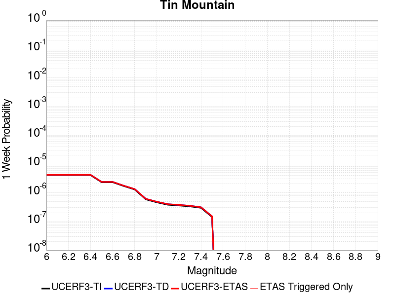 |  |  |  |

| Magnitude | 1 wk TI Prob | 1 wk TD Prob | 1 wk ETAS Prob | 1 wk ETAS/TD Gain | 1 wk ETAS Triggered Only | 1 mo TI Prob | 1 mo TD Prob | 1 mo ETAS Prob | 1 mo ETAS/TD Gain | 1 mo ETAS Triggered Only | 1 yr TI Prob | 1 yr TD Prob | 1 yr ETAS Prob | 1 yr ETAS/TD Gain | 1 yr ETAS Triggered Only | 10 yr TI Prob | 10 yr TD Prob | 10 yr ETAS Prob | 10 yr ETAS/TD Gain | 10 yr ETAS Triggered Only |
|-----|-----|-----|-----|-----|-----|-----|-----|-----|-----|-----|-----|-----|-----|-----|-----|-----|-----|-----|-----|-----|
| 6.0 | 4.083776E-6 | 4.1816697E-6 | 4.1816697E-6 | 1.0 | 0.0 | 1.750178E-5 | 1.792134E-5 | 1.792134E-5 | 1.0 | 0.0 | 2.1306332E-4 | 2.1817419E-4 | 2.1817419E-4 | 1.0 | 0.0 | 0.0021285915 | 0.0021799656 | 0.0022256786 | 1.0209695 | 4.5812718E-5 |
| 6.1 | 4.083776E-6 | 4.1816697E-6 | 4.1816697E-6 | 1.0 | 0.0 | 1.750178E-5 | 1.792134E-5 | 1.792134E-5 | 1.0 | 0.0 | 2.1306332E-4 | 2.1817419E-4 | 2.1817419E-4 | 1.0 | 0.0 | 0.0021285915 | 0.0021799656 | 0.0022256786 | 1.0209695 | 4.5812718E-5 |
| 6.2 | 4.083776E-6 | 4.1816697E-6 | 4.1816697E-6 | 1.0 | 0.0 | 1.750178E-5 | 1.792134E-5 | 1.792134E-5 | 1.0 | 0.0 | 2.1306332E-4 | 2.1817419E-4 | 2.1817419E-4 | 1.0 | 0.0 | 0.0021285915 | 0.0021799656 | 0.0022256786 | 1.0209695 | 4.5812718E-5 |
| 6.3 | 4.083776E-6 | 4.1816697E-6 | 4.1816697E-6 | 1.0 | 0.0 | 1.750178E-5 | 1.792134E-5 | 1.792134E-5 | 1.0 | 0.0 | 2.1306332E-4 | 2.1817419E-4 | 2.1817419E-4 | 1.0 | 0.0 | 0.0021285915 | 0.0021799656 | 0.0022256786 | 1.0209695 | 4.5812718E-5 |
| 6.4 | 4.083776E-6 | 4.1816697E-6 | 4.1816697E-6 | 1.0 | 0.0 | 1.750178E-5 | 1.792134E-5 | 1.792134E-5 | 1.0 | 0.0 | 2.1306332E-4 | 2.1817419E-4 | 2.1817419E-4 | 1.0 | 0.0 | 0.0021285915 | 0.0021799656 | 0.0022256786 | 1.0209695 | 4.5812718E-5 |
| 6.5 | 2.3143427E-6 | 2.3732375E-6 | 2.3732375E-6 | 1.0 | 0.0 | 9.9185745E-6 | 1.0170983E-5 | 1.0170983E-5 | 1.0 | 0.0 | 1.2075195E-4 | 1.2382545E-4 | 1.2382545E-4 | 1.0 | 0.0 | 0.0012068636 | 0.0012376405 | 0.0012833965 | 1.0369704 | 4.5812718E-5 |
| 6.6 | 2.3143427E-6 | 2.3732375E-6 | 2.3732375E-6 | 1.0 | 0.0 | 9.9185745E-6 | 1.0170983E-5 | 1.0170983E-5 | 1.0 | 0.0 | 1.2075195E-4 | 1.2382545E-4 | 1.2382545E-4 | 1.0 | 0.0 | 0.0012068636 | 0.0012376405 | 0.0012833965 | 1.0369704 | 4.5812718E-5 |
| 6.7 | 1.7029532E-6 | 1.7498556E-6 | 1.7498556E-6 | 1.0 | 0.0 | 7.2983503E-6 | 7.4993627E-6 | 7.4993627E-6 | 1.0 | 0.0 | 8.885379E-5 | 9.130145E-5 | 9.130145E-5 | 1.0 | 0.0 | 8.881827E-4 | 9.1269205E-4 | 9.355775E-4 | 1.0250747 | 2.2906359E-5 |
| 6.8 | 1.2914646E-6 | 1.3299907E-6 | 1.3299907E-6 | 1.0 | 0.0 | 5.534837E-6 | 5.69995E-6 | 5.69995E-6 | 1.0 | 0.0 | 6.738455E-5 | 6.939512E-5 | 6.939512E-5 | 1.0 | 0.0 | 6.736412E-4 | 6.937779E-4 | 7.166684E-4 | 1.0329939 | 2.2906359E-5 |
| 6.9 | 5.8708974E-7 | 6.1173347E-7 | 6.1173347E-7 | 1.0 | 0.0 | 2.5160964E-6 | 2.6217124E-6 | 2.6217124E-6 | 1.0 | 0.0 | 3.0633044E-5 | 3.1918924E-5 | 3.1918924E-5 | 1.0 | 0.0 | 3.0628822E-4 | 3.1914748E-4 | 3.1914748E-4 | 1.0 | 0.0 |
| 7.0 | 4.6248786E-7 | 4.832303E-7 | 4.832303E-7 | 1.0 | 0.0 | 1.9820893E-6 | 2.0709856E-6 | 2.0709856E-6 | 1.0 | 0.0 | 2.413167E-5 | 2.5213994E-5 | 2.5213994E-5 | 1.0 | 0.0 | 2.412905E-4 | 2.5211502E-4 | 2.5211502E-4 | 1.0 | 0.0 |
| 7.1 | 3.804606E-7 | 3.987401E-7 | 3.987401E-7 | 1.0 | 0.0 | 1.6305444E-6 | 1.7088852E-6 | 1.7088852E-6 | 1.0 | 0.0 | 1.9851697E-5 | 2.0805513E-5 | 2.0805513E-5 | 1.0 | 0.0 | 1.9849923E-4 | 2.0803901E-4 | 2.0803901E-4 | 1.0 | 0.0 |
| 7.2 | 3.5864858E-7 | 3.7619301E-7 | 3.7619301E-7 | 1.0 | 0.0 | 1.5370645E-6 | 1.612255E-6 | 1.612255E-6 | 1.0 | 0.0 | 1.87136E-5 | 1.9629062E-5 | 1.9629062E-5 | 1.0 | 0.0 | 1.8712023E-4 | 1.9627658E-4 | 1.9627658E-4 | 1.0 | 0.0 |
| 7.3 | 3.342063E-7 | 3.506576E-7 | 3.506576E-7 | 1.0 | 0.0 | 1.4323119E-6 | 1.5028176E-6 | 1.5028176E-6 | 1.0 | 0.0 | 1.7438259E-5 | 1.8296683E-5 | 1.8296683E-5 | 1.0 | 0.0 | 1.743689E-4 | 1.8295507E-4 | 1.8295507E-4 | 1.0 | 0.0 |
| 7.4 | 2.971242E-7 | 3.116784E-7 | 3.116784E-7 | 1.0 | 0.0 | 1.2733886E-6 | 1.3357641E-6 | 1.3357641E-6 | 1.0 | 0.0 | 1.5503398E-5 | 1.626284E-5 | 1.626284E-5 | 1.0 | 0.0 | 1.5502315E-4 | 1.6261978E-4 | 1.6261978E-4 | 1.0 | 0.0 |
| 7.5 | 1.4326713E-7 | 1.5013477E-7 | 1.5013477E-7 | 1.0 | 0.0 | 6.140018E-7 | 6.4343476E-7 | 6.4343476E-7 | 1.0 | 0.0 | 7.4754466E-6 | 7.833818E-6 | 7.833818E-6 | 1.0 | 0.0 | 7.475195E-5 | 7.833818E-5 | 7.833818E-5 | 1.0 | 0.0 |

## Blue Cut
*[(top)](#table-of-contents)*

| 1 Week | 1 Month | 1 Year | 10 Year |
|-----|-----|-----|-----|
|  |  |  | 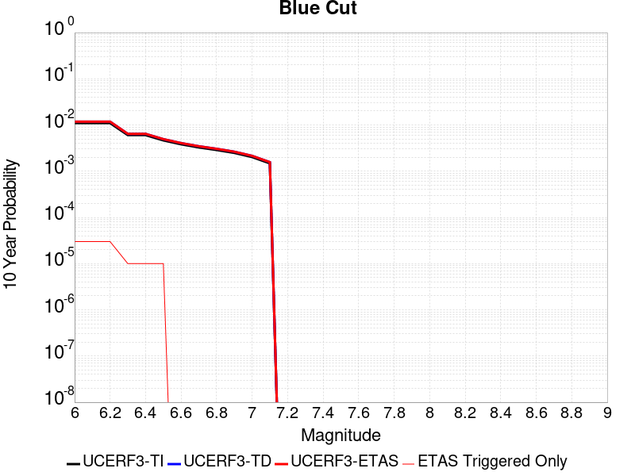 |

| Magnitude | 1 wk TI Prob | 1 wk TD Prob | 1 wk ETAS Prob | 1 wk ETAS/TD Gain | 1 wk ETAS Triggered Only | 1 mo TI Prob | 1 mo TD Prob | 1 mo ETAS Prob | 1 mo ETAS/TD Gain | 1 mo ETAS Triggered Only | 1 yr TI Prob | 1 yr TD Prob | 1 yr ETAS Prob | 1 yr ETAS/TD Gain | 1 yr ETAS Triggered Only | 10 yr TI Prob | 10 yr TD Prob | 10 yr ETAS Prob | 10 yr ETAS/TD Gain | 10 yr ETAS Triggered Only |
|-----|-----|-----|-----|-----|-----|-----|-----|-----|-----|-----|-----|-----|-----|-----|-----|-----|-----|-----|-----|-----|
| 6.0 | 2.1227985E-5 | 2.2721695E-5 | 2.2721695E-5 | 1.0 | 0.0 | 9.097391E-5 | 9.7375385E-5 | 9.7375385E-5 | 1.0 | 0.0 | 0.0011070445 | 0.0011849586 | 0.0012078378 | 1.019308 | 2.2906359E-5 | 0.011015458 | 0.011792246 | 0.011837519 | 1.0038391 | 4.5812718E-5 |
| 6.1 | 2.1227985E-5 | 2.2721695E-5 | 2.2721695E-5 | 1.0 | 0.0 | 9.097391E-5 | 9.7375385E-5 | 9.7375385E-5 | 1.0 | 0.0 | 0.0011070445 | 0.0011849586 | 0.0012078378 | 1.019308 | 2.2906359E-5 | 0.011015458 | 0.011792246 | 0.011837519 | 1.0038391 | 4.5812718E-5 |
| 6.2 | 2.1227985E-5 | 2.2721695E-5 | 2.2721695E-5 | 1.0 | 0.0 | 9.097391E-5 | 9.7375385E-5 | 9.7375385E-5 | 1.0 | 0.0 | 0.0011070445 | 0.0011849586 | 0.0012078378 | 1.019308 | 2.2906359E-5 | 0.011015458 | 0.011792246 | 0.011837519 | 1.0038391 | 4.5812718E-5 |
| 6.3 | 1.1613981E-5 | 1.2354586E-5 | 1.2354586E-5 | 1.0 | 0.0 | 4.9773254E-5 | 5.294722E-5 | 5.294722E-5 | 1.0 | 0.0 | 6.0582085E-4 | 6.444542E-4 | 6.444542E-4 | 1.0 | 0.0 | 0.0060417196 | 0.006427101 | 0.006427101 | 1.0 | 0.0 |
| 6.4 | 1.1613981E-5 | 1.2354586E-5 | 1.2354586E-5 | 1.0 | 0.0 | 4.9773254E-5 | 5.294722E-5 | 5.294722E-5 | 1.0 | 0.0 | 6.0582085E-4 | 6.444542E-4 | 6.444542E-4 | 1.0 | 0.0 | 0.0060417196 | 0.006427101 | 0.006427101 | 1.0 | 0.0 |
| 6.5 | 8.931326E-6 | 9.4823745E-6 | 9.4823745E-6 | 1.0 | 0.0 | 3.8276554E-5 | 4.0638166E-5 | 4.0638166E-5 | 1.0 | 0.0 | 4.6591737E-4 | 4.946665E-4 | 4.946665E-4 | 1.0 | 0.0 | 0.0046494175 | 0.004936564 | 0.004936564 | 1.0 | 0.0 |
| 6.6 | 7.345353E-6 | 7.790905E-6 | 7.790905E-6 | 1.0 | 0.0 | 3.1479703E-5 | 3.338921E-5 | 3.338921E-5 | 1.0 | 0.0 | 3.83198E-4 | 4.0644582E-4 | 4.0644582E-4 | 1.0 | 0.0 | 0.0038253788 | 0.004057816 | 0.004057816 | 1.0 | 0.0 |
| 6.7 | 6.2775666E-6 | 6.65568E-6 | 6.65568E-6 | 1.0 | 0.0 | 2.690358E-5 | 2.8524073E-5 | 2.8524073E-5 | 1.0 | 0.0 | 3.2750185E-4 | 3.4723277E-4 | 3.4723277E-4 | 1.0 | 0.0 | 0.0032701963 | 0.0034676434 | 0.0034676434 | 1.0 | 0.0 |
| 6.8 | 5.5234095E-6 | 5.8555775E-6 | 5.8555775E-6 | 1.0 | 0.0 | 2.367154E-5 | 2.5095133E-5 | 2.5095133E-5 | 1.0 | 0.0 | 2.8816288E-4 | 3.0549767E-4 | 3.0549767E-4 | 1.0 | 0.0 | 0.002877895 | 0.0030514933 | 0.0030514933 | 1.0 | 0.0 |
| 6.9 | 4.7780054E-6 | 5.0658246E-6 | 5.0658246E-6 | 1.0 | 0.0 | 2.0477004E-5 | 2.1710535E-5 | 2.1710535E-5 | 1.0 | 0.0 | 2.4927902E-4 | 2.6430076E-4 | 2.6430076E-4 | 1.0 | 0.0 | 0.0024899957 | 0.0026405565 | 0.0026405565 | 1.0 | 0.0 |
| 7.0 | 3.883171E-6 | 4.118818E-6 | 4.118818E-6 | 1.0 | 0.0 | 1.6642054E-5 | 1.7651997E-5 | 1.7651997E-5 | 1.0 | 0.0 | 2.0259817E-4 | 2.1489876E-4 | 2.1489876E-4 | 1.0 | 0.0 | 0.0020241356 | 0.0021475854 | 0.0021475854 | 1.0 | 0.0 |
| 7.1 | 2.8358215E-6 | 3.0099607E-6 | 3.0099607E-6 | 1.0 | 0.0 | 1.2153464E-5 | 1.28998045E-5 | 1.28998045E-5 | 1.0 | 0.0 | 1.4795837E-4 | 1.5705038E-4 | 1.5705038E-4 | 1.0 | 0.0 | 0.001478599 | 0.0015700393 | 0.0015700393 | 1.0 | 0.0 |

## Kern Canyon (South Kern) 2011
*[(top)](#table-of-contents)*

| 1 Week | 1 Month | 1 Year | 10 Year |
|-----|-----|-----|-----|
|  |  | 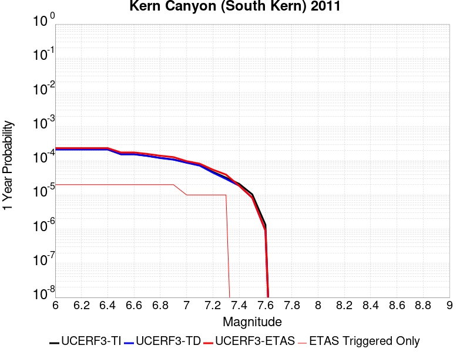 | 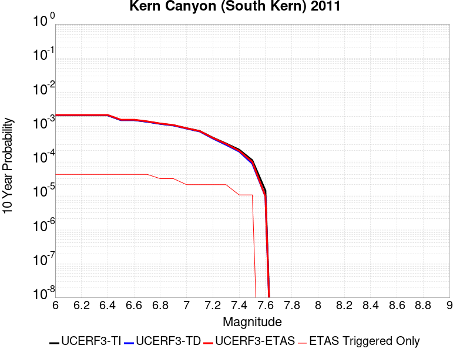 |

| Magnitude | 1 wk TI Prob | 1 wk TD Prob | 1 wk ETAS Prob | 1 wk ETAS/TD Gain | 1 wk ETAS Triggered Only | 1 mo TI Prob | 1 mo TD Prob | 1 mo ETAS Prob | 1 mo ETAS/TD Gain | 1 mo ETAS Triggered Only | 1 yr TI Prob | 1 yr TD Prob | 1 yr ETAS Prob | 1 yr ETAS/TD Gain | 1 yr ETAS Triggered Only | 10 yr TI Prob | 10 yr TD Prob | 10 yr ETAS Prob | 10 yr ETAS/TD Gain | 10 yr ETAS Triggered Only |
|-----|-----|-----|-----|-----|-----|-----|-----|-----|-----|-----|-----|-----|-----|-----|-----|-----|-----|-----|-----|-----|
| 6.0 | 4.105075E-6 | 4.113829E-6 | 4.113829E-6 | 1.0 | 0.0 | 1.7593058E-5 | 1.763058E-5 | 1.763058E-5 | 1.0 | 0.0 | 2.1417443E-4 | 2.1463181E-4 | 2.3753326E-4 | 1.106701 | 2.2906359E-5 | 0.0021396813 | 0.0021443092 | 0.0021900237 | 1.021319 | 4.5812718E-5 |
| 6.1 | 4.105075E-6 | 4.113829E-6 | 4.113829E-6 | 1.0 | 0.0 | 1.7593058E-5 | 1.763058E-5 | 1.763058E-5 | 1.0 | 0.0 | 2.1417443E-4 | 2.1463181E-4 | 2.3753326E-4 | 1.106701 | 2.2906359E-5 | 0.0021396813 | 0.0021443092 | 0.0021900237 | 1.021319 | 4.5812718E-5 |
| 6.2 | 4.105075E-6 | 4.113829E-6 | 4.113829E-6 | 1.0 | 0.0 | 1.7593058E-5 | 1.763058E-5 | 1.763058E-5 | 1.0 | 0.0 | 2.1417443E-4 | 2.1463181E-4 | 2.3753326E-4 | 1.106701 | 2.2906359E-5 | 0.0021396813 | 0.0021443092 | 0.0021900237 | 1.021319 | 4.5812718E-5 |
| 6.3 | 4.105075E-6 | 4.113829E-6 | 4.113829E-6 | 1.0 | 0.0 | 1.7593058E-5 | 1.763058E-5 | 1.763058E-5 | 1.0 | 0.0 | 2.1417443E-4 | 2.1463181E-4 | 2.3753326E-4 | 1.106701 | 2.2906359E-5 | 0.0021396813 | 0.0021443092 | 0.0021900237 | 1.021319 | 4.5812718E-5 |
| 6.4 | 4.105075E-6 | 4.113829E-6 | 4.113829E-6 | 1.0 | 0.0 | 1.7593058E-5 | 1.763058E-5 | 1.763058E-5 | 1.0 | 0.0 | 2.1417443E-4 | 2.1463181E-4 | 2.3753326E-4 | 1.106701 | 2.2906359E-5 | 0.0021396813 | 0.0021443092 | 0.0021900237 | 1.021319 | 4.5812718E-5 |
| 6.5 | 2.9849807E-6 | 2.9732298E-6 | 2.9732298E-6 | 1.0 | 0.0 | 1.2792712E-5 | 1.2742352E-5 | 1.2742352E-5 | 1.0 | 0.0 | 1.5574014E-4 | 1.5512724E-4 | 1.7803004E-4 | 1.1476388 | 2.2906359E-5 | 0.0015563103 | 0.0015502047 | 0.0015959464 | 1.0295069 | 4.5812718E-5 |
| 6.6 | 2.9849807E-6 | 2.9732298E-6 | 2.9732298E-6 | 1.0 | 0.0 | 1.2792712E-5 | 1.2742352E-5 | 1.2742352E-5 | 1.0 | 0.0 | 1.5574014E-4 | 1.5512724E-4 | 1.7803004E-4 | 1.1476388 | 2.2906359E-5 | 0.0015563103 | 0.0015502047 | 0.0015959464 | 1.0295069 | 4.5812718E-5 |
| 6.7 | 2.6756725E-6 | 2.6582882E-6 | 2.6582882E-6 | 1.0 | 0.0 | 1.1467117E-5 | 1.1392614E-5 | 1.1392614E-5 | 1.0 | 0.0 | 1.396032E-4 | 1.3869636E-4 | 1.6159954E-4 | 1.1651318 | 2.2906359E-5 | 0.0013951553 | 0.0013861089 | 0.0014318582 | 1.0330055 | 4.5812718E-5 |
| 6.8 | 2.3283721E-6 | 2.3048378E-6 | 2.3048378E-6 | 1.0 | 0.0 | 9.9787E-6 | 9.87784E-6 | 9.87784E-6 | 1.0 | 0.0 | 1.214839E-4 | 1.2025614E-4 | 1.4315975E-4 | 1.1904569 | 2.2906359E-5 | 0.001214175 | 0.0012019181 | 0.001224797 | 1.0190352 | 2.2906359E-5 |
| 6.9 | 2.0972677E-6 | 2.0696948E-6 | 2.0696948E-6 | 1.0 | 0.0 | 8.988259E-6 | 8.870091E-6 | 8.870091E-6 | 1.0 | 0.0 | 1.0942656E-4 | 1.0798806E-4 | 1.3089195E-4 | 1.2120965 | 2.2906359E-5 | 0.0010937268 | 0.0010793617 | 0.0011022433 | 1.0211992 | 2.2906359E-5 |
| 7.0 | 1.7132242E-6 | 1.6787479E-6 | 1.6787479E-6 | 1.0 | 0.0 | 7.3423685E-6 | 7.194614E-6 | 7.194614E-6 | 1.0 | 0.0 | 8.938967E-5 | 8.7590946E-5 | 8.7590946E-5 | 1.0 | 0.0 | 8.935372E-4 | 8.755681E-4 | 8.755681E-4 | 1.0 | 0.0 |
| 7.1 | 1.4215541E-6 | 1.3816122E-6 | 1.3816122E-6 | 1.0 | 0.0 | 6.0923603E-6 | 5.921182E-6 | 5.921182E-6 | 1.0 | 0.0 | 7.417196E-5 | 7.2088034E-5 | 7.2088034E-5 | 1.0 | 0.0 | 7.414721E-4 | 7.2064914E-4 | 7.2064914E-4 | 1.0 | 0.0 |
| 7.2 | 9.097853E-7 | 8.604018E-7 | 8.604018E-7 | 1.0 | 0.0 | 3.899074E-6 | 3.6874312E-6 | 3.6874312E-6 | 1.0 | 0.0 | 4.7470192E-5 | 4.489356E-5 | 4.489356E-5 | 1.0 | 0.0 | 4.7460053E-4 | 4.48846E-4 | 4.48846E-4 | 1.0 | 0.0 |
| 7.3 | 6.144169E-7 | 5.628374E-7 | 5.628374E-7 | 1.0 | 0.0 | 2.6332125E-6 | 2.412158E-6 | 2.412158E-6 | 1.0 | 0.0 | 3.205889E-5 | 2.9367633E-5 | 2.9367633E-5 | 1.0 | 0.0 | 3.2054266E-4 | 2.9363803E-4 | 2.9363803E-4 | 1.0 | 0.0 |
| 7.4 | 4.049844E-7 | 3.5729457E-7 | 3.5729457E-7 | 1.0 | 0.0 | 1.7356463E-6 | 1.5312617E-6 | 1.5312617E-6 | 1.0 | 0.0 | 2.1131287E-5 | 1.8642953E-5 | 1.8642953E-5 | 1.0 | 0.0 | 2.1129279E-4 | 1.8641414E-4 | 1.8641414E-4 | 1.0 | 0.0 |
| 7.5 | 1.9871162E-7 | 1.5831044E-7 | 1.5831044E-7 | 1.0 | 0.0 | 8.5162094E-7 | 6.7847316E-7 | 6.7847316E-7 | 1.0 | 0.0 | 1.0368436E-5 | 8.26038E-6 | 8.26038E-6 | 1.0 | 0.0 | 1.0367952E-4 | 8.260082E-5 | 8.260082E-5 | 1.0 | 0.0 |
| 7.6 | 2.572245E-8 | 1.7353377E-8 | 1.7353377E-8 | 1.0 | 0.0 | 1.10239064E-7 | 7.437161E-8 | 7.437161E-8 | 1.0 | 0.0 | 1.3421597E-6 | 9.0547405E-7 | 9.0547405E-7 | 1.0 | 0.0 | 1.3421517E-5 | 9.054709E-6 | 9.054709E-6 | 1.0 | 0.0 |

## Kern Canyon (North Kern) 2011
*[(top)](#table-of-contents)*

| 1 Week | 1 Month | 1 Year | 10 Year |
|-----|-----|-----|-----|
|  |  |  |  |

| Magnitude | 1 wk TI Prob | 1 wk TD Prob | 1 wk ETAS Prob | 1 wk ETAS/TD Gain | 1 wk ETAS Triggered Only | 1 mo TI Prob | 1 mo TD Prob | 1 mo ETAS Prob | 1 mo ETAS/TD Gain | 1 mo ETAS Triggered Only | 1 yr TI Prob | 1 yr TD Prob | 1 yr ETAS Prob | 1 yr ETAS/TD Gain | 1 yr ETAS Triggered Only | 10 yr TI Prob | 10 yr TD Prob | 10 yr ETAS Prob | 10 yr ETAS/TD Gain | 10 yr ETAS Triggered Only |
|-----|-----|-----|-----|-----|-----|-----|-----|-----|-----|-----|-----|-----|-----|-----|-----|-----|-----|-----|-----|-----|
| 6.0 | 6.6264497E-6 | 6.7575443E-6 | 6.7575443E-6 | 1.0 | 0.0 | 2.8398761E-5 | 2.8960629E-5 | 2.8960629E-5 | 1.0 | 0.0 | 3.4570007E-4 | 3.525466E-4 | 3.7544488E-4 | 1.0649511 | 2.2906359E-5 | 0.0034516277 | 0.0035206617 | 0.003566313 | 1.0129668 | 4.5812718E-5 |
| 6.1 | 6.6264497E-6 | 6.7575443E-6 | 6.7575443E-6 | 1.0 | 0.0 | 2.8398761E-5 | 2.8960629E-5 | 2.8960629E-5 | 1.0 | 0.0 | 3.4570007E-4 | 3.525466E-4 | 3.7544488E-4 | 1.0649511 | 2.2906359E-5 | 0.0034516277 | 0.0035206617 | 0.003566313 | 1.0129668 | 4.5812718E-5 |
| 6.2 | 6.6264497E-6 | 6.7575443E-6 | 6.7575443E-6 | 1.0 | 0.0 | 2.8398761E-5 | 2.8960629E-5 | 2.8960629E-5 | 1.0 | 0.0 | 3.4570007E-4 | 3.525466E-4 | 3.7544488E-4 | 1.0649511 | 2.2906359E-5 | 0.0034516277 | 0.0035206617 | 0.003566313 | 1.0129668 | 4.5812718E-5 |
| 6.3 | 6.6264497E-6 | 6.7575443E-6 | 6.7575443E-6 | 1.0 | 0.0 | 2.8398761E-5 | 2.8960629E-5 | 2.8960629E-5 | 1.0 | 0.0 | 3.4570007E-4 | 3.525466E-4 | 3.7544488E-4 | 1.0649511 | 2.2906359E-5 | 0.0034516277 | 0.0035206617 | 0.003566313 | 1.0129668 | 4.5812718E-5 |
| 6.4 | 6.6264497E-6 | 6.7575443E-6 | 6.7575443E-6 | 1.0 | 0.0 | 2.8398761E-5 | 2.8960629E-5 | 2.8960629E-5 | 1.0 | 0.0 | 3.4570007E-4 | 3.525466E-4 | 3.7544488E-4 | 1.0649511 | 2.2906359E-5 | 0.0034516277 | 0.0035206617 | 0.003566313 | 1.0129668 | 4.5812718E-5 |
| 6.5 | 3.2162225E-6 | 3.2571832E-6 | 3.2571832E-6 | 1.0 | 0.0 | 1.3783738E-5 | 1.3959286E-5 | 1.3959286E-5 | 1.0 | 0.0 | 1.6780409E-4 | 1.6994186E-4 | 1.6994186E-4 | 1.0 | 0.0 | 0.0016767744 | 0.0016981987 | 0.0016981987 | 1.0 | 0.0 |
| 6.6 | 3.2162225E-6 | 3.2571832E-6 | 3.2571832E-6 | 1.0 | 0.0 | 1.3783738E-5 | 1.3959286E-5 | 1.3959286E-5 | 1.0 | 0.0 | 1.6780409E-4 | 1.6994186E-4 | 1.6994186E-4 | 1.0 | 0.0 | 0.0016767744 | 0.0016981987 | 0.0016981987 | 1.0 | 0.0 |
| 6.7 | 2.1908265E-6 | 2.2071804E-6 | 2.2071804E-6 | 1.0 | 0.0 | 9.389223E-6 | 9.4593115E-6 | 9.4593115E-6 | 1.0 | 0.0 | 1.1430779E-4 | 1.1516123E-4 | 1.1516123E-4 | 1.0 | 0.0 | 0.0011424901 | 0.001151035 | 0.001151035 | 1.0 | 0.0 |
| 6.8 | 1.7303895E-6 | 1.7365974E-6 | 1.7365974E-6 | 1.0 | 0.0 | 7.415934E-6 | 7.4425398E-6 | 7.4425398E-6 | 1.0 | 0.0 | 9.028525E-5 | 9.0609254E-5 | 9.0609254E-5 | 1.0 | 0.0 | 9.024858E-4 | 9.057328E-4 | 9.057328E-4 | 1.0 | 0.0 |
| 6.9 | 1.3700314E-6 | 1.3688968E-6 | 1.3688968E-6 | 1.0 | 0.0 | 5.87155E-6 | 5.866688E-6 | 5.866688E-6 | 1.0 | 0.0 | 7.148377E-5 | 7.142463E-5 | 7.142463E-5 | 1.0 | 0.0 | 7.146078E-4 | 7.1402127E-4 | 7.1402127E-4 | 1.0 | 0.0 |
| 7.0 | 1.1467797E-6 | 1.1414094E-6 | 1.1414094E-6 | 1.0 | 0.0 | 4.9147607E-6 | 4.8917454E-6 | 4.8917454E-6 | 1.0 | 0.0 | 5.983557E-5 | 5.95554E-5 | 5.95554E-5 | 1.0 | 0.0 | 5.981946E-4 | 5.9539755E-4 | 5.9539755E-4 | 1.0 | 0.0 |
| 7.1 | 9.3952065E-7 | 9.3029274E-7 | 9.3029274E-7 | 1.0 | 0.0 | 4.026511E-6 | 3.986963E-6 | 3.986963E-6 | 1.0 | 0.0 | 4.9021666E-5 | 4.854021E-5 | 4.854021E-5 | 1.0 | 0.0 | 4.901085E-4 | 4.8529785E-4 | 4.8529785E-4 | 1.0 | 0.0 |
| 7.2 | 6.858055E-7 | 6.719475E-7 | 6.719475E-7 | 1.0 | 0.0 | 2.939163E-6 | 2.8797717E-6 | 2.8797717E-6 | 1.0 | 0.0 | 3.5783723E-5 | 3.5060668E-5 | 3.5060668E-5 | 1.0 | 0.0 | 3.5777962E-4 | 3.5055223E-4 | 3.5055223E-4 | 1.0 | 0.0 |
| 7.3 | 5.1101983E-7 | 4.9394305E-7 | 4.9394305E-7 | 1.0 | 0.0 | 2.1900833E-6 | 2.1168971E-6 | 2.1168971E-6 | 1.0 | 0.0 | 2.6663936E-5 | 2.5772923E-5 | 2.5772923E-5 | 1.0 | 0.0 | 2.6660739E-4 | 2.576998E-4 | 2.576998E-4 | 1.0 | 0.0 |
| 7.4 | 3.4999414E-7 | 3.2996817E-7 | 3.2996817E-7 | 1.0 | 0.0 | 1.499974E-6 | 1.4141485E-6 | 1.4141485E-6 | 1.0 | 0.0 | 1.8262032E-5 | 1.7217126E-5 | 1.7217126E-5 | 1.0 | 0.0 | 1.826053E-4 | 1.7215815E-4 | 1.7215815E-4 | 1.0 | 0.0 |
| 7.5 | 1.7021522E-7 | 1.4750509E-7 | 1.4750509E-7 | 1.0 | 0.0 | 7.2949354E-7 | 6.3216453E-7 | 6.3216453E-7 | 1.0 | 0.0 | 8.881548E-6 | 7.696577E-6 | 7.696577E-6 | 1.0 | 0.0 | 8.8811925E-5 | 7.696318E-5 | 7.696318E-5 | 1.0 | 0.0 |
| 7.6 | 2.572245E-8 | 1.7353377E-8 | 1.7353377E-8 | 1.0 | 0.0 | 1.10239064E-7 | 7.437161E-8 | 7.437161E-8 | 1.0 | 0.0 | 1.3421597E-6 | 9.0547405E-7 | 9.0547405E-7 | 1.0 | 0.0 | 1.3421517E-5 | 9.054709E-6 | 9.054709E-6 | 1.0 | 0.0 |

## San Andreas (Creeping Section) 2011 CFM
*[(top)](#table-of-contents)*

| 1 Week | 1 Month | 1 Year | 10 Year |
|-----|-----|-----|-----|
|  |  |  | 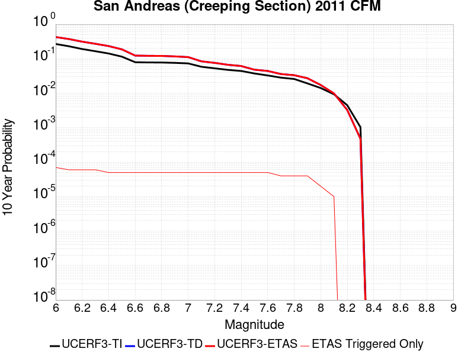 |

| Magnitude | 1 wk TI Prob | 1 wk TD Prob | 1 wk ETAS Prob | 1 wk ETAS/TD Gain | 1 wk ETAS Triggered Only | 1 mo TI Prob | 1 mo TD Prob | 1 mo ETAS Prob | 1 mo ETAS/TD Gain | 1 mo ETAS Triggered Only | 1 yr TI Prob | 1 yr TD Prob | 1 yr ETAS Prob | 1 yr ETAS/TD Gain | 1 yr ETAS Triggered Only | 10 yr TI Prob | 10 yr TD Prob | 10 yr ETAS Prob | 10 yr ETAS/TD Gain | 10 yr ETAS Triggered Only |
|-----|-----|-----|-----|-----|-----|-----|-----|-----|-----|-----|-----|-----|-----|-----|-----|-----|-----|-----|-----|-----|
| 6.0 | 5.986481E-4 | 0.001228818 | 0.001228818 | 1.0 | 0.0 | 0.0025631124 | 0.005251403 | 0.005251403 | 1.0 | 0.0 | 0.030762846 | 0.061267417 | 0.061267417 | 1.0 | 0.0 | 0.26835477 | 0.42623988 | 0.42626616 | 1.0000616 | 4.5812718E-5 |
| 6.1 | 5.015945E-4 | 0.0010226909 | 0.0010226909 | 1.0 | 0.0 | 0.00214792 | 0.0043728617 | 0.0043728617 | 1.0 | 0.0 | 0.025839351 | 0.051300284 | 0.051300284 | 1.0 | 0.0 | 0.23032776 | 0.3731487 | 0.37317744 | 1.000077 | 4.5812718E-5 |
| 6.2 | 4.073338E-4 | 8.1182894E-4 | 8.1182894E-4 | 1.0 | 0.0 | 0.0017445484 | 0.003471832 | 0.003471832 | 1.0 | 0.0 | 0.021034058 | 0.04098442 | 0.04098442 | 1.0 | 0.0 | 0.19150782 | 0.3133488 | 0.31338024 | 1.0001004 | 4.5812718E-5 |
| 6.3 | 3.464099E-4 | 6.7496847E-4 | 6.7496847E-4 | 1.0 | 0.0 | 0.0014837692 | 0.0028874867 | 0.0028874867 | 1.0 | 0.0 | 0.017915873 | 0.034241114 | 0.034241114 | 1.0 | 0.0 | 0.16538359 | 0.27165115 | 0.2716845 | 1.0001228 | 4.5812718E-5 |
| 6.4 | 2.935057E-4 | 5.5568025E-4 | 5.5568025E-4 | 1.0 | 0.0 | 0.0012572751 | 0.0023777 | 0.0023777 | 1.0 | 0.0 | 0.015200248 | 0.028316312 | 0.028316312 | 1.0 | 0.0 | 0.14201577 | 0.23333858 | 0.23335615 | 1.0000752 | 2.2906359E-5 |
| 6.5 | 2.3409708E-4 | 4.2212562E-4 | 4.2212562E-4 | 1.0 | 0.0 | 0.0010028875 | 0.0018066199 | 0.0018066199 | 1.0 | 0.0 | 0.012141965 | 0.02163862 | 0.02163862 | 1.0 | 0.0 | 0.11499573 | 0.18719828 | 0.18721691 | 1.0000994 | 2.2906359E-5 |
| 6.6 | 1.5842178E-4 | 2.5166248E-4 | 2.5166248E-4 | 1.0 | 0.0 | 6.7877385E-4 | 0.0010780916 | 0.0010780916 | 1.0 | 0.0 | 0.0082328 | 0.013045433 | 0.013045433 | 1.0 | 0.0 | 0.07934396 | 0.12354783 | 0.12356791 | 1.0001625 | 2.2906359E-5 |
| 6.7 | 1.5616413E-4 | 2.4702126E-4 | 2.4702126E-4 | 1.0 | 0.0 | 6.691031E-4 | 0.0010582256 | 0.0010582256 | 1.0 | 0.0 | 0.0081159435 | 0.012807187 | 0.012807187 | 1.0 | 0.0 | 0.0782586 | 0.12157497 | 0.121595085 | 1.0001655 | 2.2906359E-5 |
| 6.8 | 1.5538467E-4 | 2.4525842E-4 | 2.4525842E-4 | 1.0 | 0.0 | 6.6576427E-4 | 0.0010506767 | 0.0010506767 | 1.0 | 0.0 | 0.008075596 | 0.012716471 | 0.012716471 | 1.0 | 0.0 | 0.07788358 | 0.12080543 | 0.12082557 | 1.0001667 | 2.2906359E-5 |
| 6.9 | 1.5153569E-4 | 2.363453E-4 | 2.363453E-4 | 1.0 | 0.0 | 6.49277E-4 | 0.0010125173 | 0.0010125173 | 1.0 | 0.0 | 0.007876333 | 0.012258248 | 0.012258248 | 1.0 | 0.0 | 0.07602952 | 0.11687415 | 0.11689438 | 1.0001731 | 2.2906359E-5 |
| 7.0 | 1.4588932E-4 | 2.2490788E-4 | 2.2490788E-4 | 1.0 | 0.0 | 6.250901E-4 | 9.6353685E-4 | 9.6353685E-4 | 1.0 | 0.0 | 0.0075839474 | 0.011668463 | 0.011668463 | 1.0 | 0.0 | 0.073302895 | 0.111718945 | 0.111739285 | 1.0001822 | 2.2906359E-5 |
| 7.1 | 1.1565079E-4 | 1.6362451E-4 | 1.6362451E-4 | 1.0 | 0.0 | 4.955521E-4 | 7.0106034E-4 | 7.0106034E-4 | 1.0 | 0.0 | 0.006016669 | 0.00850221 | 0.00850221 | 1.0 | 0.0 | 0.058563538 | 0.084029324 | 0.084050305 | 1.0002497 | 2.2906359E-5 |
| 7.2 | 1.0393792E-4 | 1.4692238E-4 | 1.4692238E-4 | 1.0 | 0.0 | 4.4537216E-4 | 6.295162E-4 | 6.295162E-4 | 1.0 | 0.0 | 0.005408933 | 0.0076375967 | 0.0076375967 | 1.0 | 0.0 | 0.052791595 | 0.07596378 | 0.07598495 | 1.0002786 | 2.2906359E-5 |
| 7.3 | 9.332884E-5 | 1.2847784E-4 | 1.2847784E-4 | 1.0 | 0.0 | 3.999194E-4 | 5.505037E-4 | 5.505037E-4 | 1.0 | 0.0 | 0.0048581534 | 0.0066819214 | 0.0066819214 | 1.0 | 0.0 | 0.047533102 | 0.0667903 | 0.06681167 | 1.0003201 | 2.2906359E-5 |
| 7.4 | 8.670252E-5 | 1.1764739E-4 | 1.1764739E-4 | 1.0 | 0.0 | 3.715293E-4 | 5.041063E-4 | 5.041063E-4 | 1.0 | 0.0 | 0.004513991 | 0.0061203437 | 0.0061203437 | 1.0 | 0.0 | 0.044233937 | 0.061436135 | 0.061457634 | 1.00035 | 2.2906359E-5 |
| 7.5 | 7.3036405E-5 | 9.0574984E-5 | 9.0574984E-5 | 1.0 | 0.0 | 3.129756E-4 | 3.8812085E-4 | 3.8812085E-4 | 1.0 | 0.0 | 0.0038038217 | 0.0047151544 | 0.0047151544 | 1.0 | 0.0 | 0.03739367 | 0.048123557 | 0.04814536 | 1.0004531 | 2.2906359E-5 |
| 7.6 | 6.3935775E-5 | 8.3263905E-5 | 8.3263905E-5 | 1.0 | 0.0 | 2.7398168E-4 | 3.567966E-4 | 3.567966E-4 | 1.0 | 0.0 | 0.0033306254 | 0.004335365 | 0.004335365 | 1.0 | 0.0 | 0.032811474 | 0.04421104 | 0.044232935 | 1.0004952 | 2.2906359E-5 |
| 7.7 | 5.5050095E-5 | 6.702637E-5 | 6.702637E-5 | 1.0 | 0.0 | 2.3590765E-4 | 2.8722425E-4 | 2.8722425E-4 | 1.0 | 0.0 | 0.0028683927 | 0.003491352 | 0.003491352 | 1.0 | 0.0 | 0.0283165 | 0.03599376 | 0.03599376 | 1.0 | 0.0 |
| 7.8 | 5.027131E-5 | 6.200182E-5 | 6.200182E-5 | 1.0 | 0.0 | 2.1543067E-4 | 2.65695E-4 | 2.65695E-4 | 1.0 | 0.0 | 0.0026197135 | 0.0032300418 | 0.0032300418 | 1.0 | 0.0 | 0.025890453 | 0.033307906 | 0.033307906 | 1.0 | 0.0 |
| 7.9 | 3.7271806E-5 | 5.0525578E-5 | 5.0525578E-5 | 1.0 | 0.0 | 1.5972654E-4 | 2.1652023E-4 | 2.1652023E-4 | 1.0 | 0.0 | 0.0019429359 | 0.002632949 | 0.002632949 | 1.0 | 0.0 | 0.019260362 | 0.027214935 | 0.027214935 | 1.0 | 0.0 |
| 8.0 | 2.7310243E-5 | 3.1628108E-5 | 3.1628108E-5 | 1.0 | 0.0 | 1.17038646E-4 | 1.35542E-4 | 1.35542E-4 | 1.0 | 0.0 | 0.0014240141 | 0.0016489754 | 0.0016489754 | 1.0 | 0.0 | 0.014149235 | 0.017315505 | 0.017315505 | 1.0 | 0.0 |
| 8.1 | 1.7940547E-5 | 1.7529763E-5 | 1.7529763E-5 | 1.0 | 0.0 | 7.688579E-5 | 7.51254E-5 | 7.51254E-5 | 1.0 | 0.0 | 9.3568244E-4 | 9.142684E-4 | 9.142684E-4 | 1.0 | 0.0 | 0.009317525 | 0.009867 | 0.009867 | 1.0 | 0.0 |
| 8.2 | 8.643924E-6 | 5.5269165E-6 | 5.5269165E-6 | 1.0 | 0.0 | 3.704486E-5 | 2.368657E-5 | 2.368657E-5 | 1.0 | 0.0 | 4.5092785E-4 | 2.8834594E-4 | 2.8834594E-4 | 1.0 | 0.0 | 0.0045001395 | 0.0032771796 | 0.0032771796 | 1.0 | 0.0 |
| 8.3 | 1.983087E-6 | 7.7486385E-7 | 7.7486385E-7 | 1.0 | 0.0 | 8.498917E-6 | 3.320841E-6 | 3.320841E-6 | 1.0 | 0.0 | 1.034694E-4 | 4.0430506E-5 | 4.0430506E-5 | 1.0 | 0.0 | 0.0010342124 | 4.7705657E-4 | 4.7705657E-4 | 1.0 | 0.0 |

## Santa Rosa Island
*[(top)](#table-of-contents)*

| 1 Week | 1 Month | 1 Year | 10 Year |
|-----|-----|-----|-----|
|  |  |  |  |

| Magnitude | 1 wk TI Prob | 1 wk TD Prob | 1 wk ETAS Prob | 1 wk ETAS/TD Gain | 1 wk ETAS Triggered Only | 1 mo TI Prob | 1 mo TD Prob | 1 mo ETAS Prob | 1 mo ETAS/TD Gain | 1 mo ETAS Triggered Only | 1 yr TI Prob | 1 yr TD Prob | 1 yr ETAS Prob | 1 yr ETAS/TD Gain | 1 yr ETAS Triggered Only | 10 yr TI Prob | 10 yr TD Prob | 10 yr ETAS Prob | 10 yr ETAS/TD Gain | 10 yr ETAS Triggered Only |
|-----|-----|-----|-----|-----|-----|-----|-----|-----|-----|-----|-----|-----|-----|-----|-----|-----|-----|-----|-----|-----|
| 6.0 | 4.1143165E-5 | 4.7100217E-5 | 4.7100217E-5 | 1.0 | 0.0 | 1.7631594E-4 | 2.0184356E-4 | 2.0184356E-4 | 1.0 | 0.0 | 0.002144533 | 0.002454873 | 0.002454873 | 1.0 | 0.0 | 0.021239553 | 0.024298182 | 0.024342882 | 1.0018396 | 4.5812718E-5 |
| 6.1 | 2.1061249E-5 | 2.3869197E-5 | 2.3869197E-5 | 1.0 | 0.0 | 9.0259375E-5 | 1.0229272E-4 | 1.0229272E-4 | 1.0 | 0.0 | 0.0010983539 | 0.0012447312 | 0.0012447312 | 1.0 | 0.0 | 0.01092941 | 0.0123806335 | 0.012425879 | 1.0036546 | 4.5812718E-5 |
| 6.2 | 2.1061249E-5 | 2.3869197E-5 | 2.3869197E-5 | 1.0 | 0.0 | 9.0259375E-5 | 1.0229272E-4 | 1.0229272E-4 | 1.0 | 0.0 | 0.0010983539 | 0.0012447312 | 0.0012447312 | 1.0 | 0.0 | 0.01092941 | 0.0123806335 | 0.012425879 | 1.0036546 | 4.5812718E-5 |
| 6.3 | 1.5158236E-5 | 1.70773E-5 | 1.70773E-5 | 1.0 | 0.0 | 6.496225E-5 | 7.318644E-5 | 7.318644E-5 | 1.0 | 0.0 | 7.906284E-4 | 8.906926E-4 | 8.906926E-4 | 1.0 | 0.0 | 0.007878214 | 0.008872479 | 0.008917886 | 1.0051177 | 4.5812718E-5 |
| 6.4 | 1.2341918E-5 | 1.3855181E-5 | 1.3855181E-5 | 1.0 | 0.0 | 5.2892858E-5 | 5.9378042E-5 | 5.9378042E-5 | 1.0 | 0.0 | 6.437803E-4 | 7.22696E-4 | 7.22696E-4 | 1.0 | 0.0 | 0.006419184 | 0.0072042947 | 0.007249777 | 1.0063133 | 4.5812718E-5 |
| 6.5 | 9.061158E-6 | 1.0118608E-5 | 1.0118608E-5 | 1.0 | 0.0 | 3.883296E-5 | 4.336477E-5 | 4.336477E-5 | 1.0 | 0.0 | 4.726887E-4 | 5.278435E-4 | 5.278435E-4 | 1.0 | 0.0 | 0.004716845 | 0.005266436 | 0.0053120074 | 1.0086532 | 4.5812718E-5 |
| 6.6 | 7.5461685E-6 | 8.402008E-6 | 8.402008E-6 | 1.0 | 0.0 | 3.2340322E-5 | 3.6008132E-5 | 3.6008132E-5 | 1.0 | 0.0 | 3.936723E-4 | 4.383151E-4 | 4.383151E-4 | 1.0 | 0.0 | 0.003929756 | 0.0043749358 | 0.0044205477 | 1.0104258 | 4.5812718E-5 |
| 6.7 | 5.5023775E-6 | 6.08825E-6 | 6.08825E-6 | 1.0 | 0.0 | 2.3581404E-5 | 2.6092257E-5 | 2.6092257E-5 | 1.0 | 0.0 | 2.8706578E-4 | 3.1763015E-4 | 3.1763015E-4 | 1.0 | 0.0 | 0.0028669522 | 0.0031720835 | 0.003217751 | 1.0143967 | 4.5812718E-5 |
| 6.8 | 3.7351679E-6 | 4.0836526E-6 | 4.0836526E-6 | 1.0 | 0.0 | 1.6007763E-5 | 1.7501266E-5 | 1.7501266E-5 | 1.0 | 0.0 | 1.948771E-4 | 2.1305957E-4 | 2.1305957E-4 | 1.0 | 0.0 | 0.0019470629 | 0.0021287983 | 0.0021745134 | 1.0214746 | 4.5812718E-5 |
| 6.9 | 2.456366E-6 | 2.6295188E-6 | 2.6295188E-6 | 1.0 | 0.0 | 1.0527241E-5 | 1.1269318E-5 | 1.1269318E-5 | 1.0 | 0.0 | 1.2816161E-4 | 1.3719534E-4 | 1.3719534E-4 | 1.0 | 0.0 | 0.0012808773 | 0.0013711093 | 0.0013939843 | 1.0166836 | 2.2906359E-5 |
| 7.0 | 2.3245157E-6 | 2.4830051E-6 | 2.4830051E-6 | 1.0 | 0.0 | 9.962172E-6 | 1.0641406E-5 | 1.0641406E-5 | 1.0 | 0.0 | 1.2128269E-4 | 1.2955145E-4 | 1.2955145E-4 | 1.0 | 0.0 | 0.0012121652 | 0.0012947614 | 0.0013176382 | 1.0176686 | 2.2906359E-5 |
| 7.1 | 2.2248344E-6 | 2.3734624E-6 | 2.3734624E-6 | 1.0 | 0.0 | 9.53497E-6 | 1.01719415E-5 | 1.01719415E-5 | 1.0 | 0.0 | 1.1608207E-4 | 1.2383638E-4 | 1.2383638E-4 | 1.0 | 0.0 | 0.0011602144 | 0.0012376757 | 0.0012605536 | 1.0184847 | 2.2906359E-5 |
| 7.2 | 2.1350402E-6 | 2.2763559E-6 | 2.2763559E-6 | 1.0 | 0.0 | 9.150141E-6 | 9.755774E-6 | 9.755774E-6 | 1.0 | 0.0 | 1.1139726E-4 | 1.1877009E-4 | 1.1877009E-4 | 1.0 | 0.0 | 0.0011134144 | 0.0011870681 | 0.0012099473 | 1.0192736 | 2.2906359E-5 |
| 7.3 | 1.9793572E-6 | 2.108904E-6 | 2.108904E-6 | 1.0 | 0.0 | 8.482932E-6 | 9.038129E-6 | 9.038129E-6 | 1.0 | 0.0 | 1.032748E-4 | 1.1003368E-4 | 1.1003368E-4 | 1.0 | 0.0 | 0.0010322682 | 0.0010997938 | 0.001122675 | 1.020805 | 2.2906359E-5 |
| 7.4 | 1.6951194E-6 | 1.8047301E-6 | 1.8047301E-6 | 1.0 | 0.0 | 7.264777E-6 | 7.734535E-6 | 7.734535E-6 | 1.0 | 0.0 | 8.844508E-5 | 9.416391E-5 | 9.416391E-5 | 1.0 | 0.0 | 8.840988E-4 | 9.4124174E-4 | 9.641265E-4 | 1.0243134 | 2.2906359E-5 |
| 7.5 | 8.987207E-7 | 9.5129707E-7 | 9.5129707E-7 | 1.0 | 0.0 | 3.8516546E-6 | 4.076981E-6 | 4.076981E-6 | 1.0 | 0.0 | 4.6892885E-5 | 4.9636128E-5 | 4.9636128E-5 | 1.0 | 0.0 | 4.688299E-4 | 4.9625157E-4 | 4.9625157E-4 | 1.0 | 0.0 |
| 7.6 | 3.8783037E-7 | 4.05319E-7 | 4.05319E-7 | 1.0 | 0.0 | 1.6621291E-6 | 1.7370804E-6 | 1.7370804E-6 | 1.0 | 0.0 | 2.0236233E-5 | 2.1148755E-5 | 2.1148755E-5 | 1.0 | 0.0 | 2.023439E-4 | 2.1146808E-4 | 2.1146808E-4 | 1.0 | 0.0 |
| 7.7 | 6.181804E-8 | 6.339348E-8 | 6.339348E-8 | 1.0 | 0.0 | 2.6493444E-7 | 2.716863E-7 | 2.716863E-7 | 1.0 | 0.0 | 3.225572E-6 | 3.3077758E-6 | 3.3077758E-6 | 1.0 | 0.0 | 3.225525E-5 | 3.307727E-5 | 3.307727E-5 | 1.0 | 0.0 |
| 7.8 | 1.3704449E-9 | 1.3964505E-9 | 1.3964505E-9 | 1.0 | 0.0 | 5.873335E-9 | 5.9847878E-9 | 5.9847878E-9 | 1.0 | 0.0 | 7.1507856E-8 | 7.2864786E-8 | 7.2864786E-8 | 1.0 | 0.0 | 7.1507833E-7 | 7.286477E-7 | 7.286477E-7 | 1.0 | 0.0 |

## San Jacinto (Coyote Creek)
*[(top)](#table-of-contents)*

| 1 Week | 1 Month | 1 Year | 10 Year |
|-----|-----|-----|-----|
|  |  |  |  |

| Magnitude | 1 wk TI Prob | 1 wk TD Prob | 1 wk ETAS Prob | 1 wk ETAS/TD Gain | 1 wk ETAS Triggered Only | 1 mo TI Prob | 1 mo TD Prob | 1 mo ETAS Prob | 1 mo ETAS/TD Gain | 1 mo ETAS Triggered Only | 1 yr TI Prob | 1 yr TD Prob | 1 yr ETAS Prob | 1 yr ETAS/TD Gain | 1 yr ETAS Triggered Only | 10 yr TI Prob | 10 yr TD Prob | 10 yr ETAS Prob | 10 yr ETAS/TD Gain | 10 yr ETAS Triggered Only |
|-----|-----|-----|-----|-----|-----|-----|-----|-----|-----|-----|-----|-----|-----|-----|-----|-----|-----|-----|-----|-----|
| 6.0 | 2.7374346E-5 | 2.4226492E-5 | 2.4226492E-5 | 1.0 | 0.0 | 1.1731335E-4 | 1.0382371E-4 | 1.0382371E-4 | 1.0 | 0.0 | 0.0014273542 | 0.0012633232 | 0.0012633232 | 1.0 | 0.0 | 0.01418221 | 0.012970629 | 0.013015848 | 1.0034863 | 4.5812718E-5 |
| 6.1 | 2.7374346E-5 | 2.4226492E-5 | 2.4226492E-5 | 1.0 | 0.0 | 1.1731335E-4 | 1.0382371E-4 | 1.0382371E-4 | 1.0 | 0.0 | 0.0014273542 | 0.0012633232 | 0.0012633232 | 1.0 | 0.0 | 0.01418221 | 0.012970629 | 0.013015848 | 1.0034863 | 4.5812718E-5 |
| 6.2 | 2.7374346E-5 | 2.4226492E-5 | 2.4226492E-5 | 1.0 | 0.0 | 1.1731335E-4 | 1.0382371E-4 | 1.0382371E-4 | 1.0 | 0.0 | 0.0014273542 | 0.0012633232 | 0.0012633232 | 1.0 | 0.0 | 0.01418221 | 0.012970629 | 0.013015848 | 1.0034863 | 4.5812718E-5 |
| 6.3 | 2.7374346E-5 | 2.4226492E-5 | 2.4226492E-5 | 1.0 | 0.0 | 1.1731335E-4 | 1.0382371E-4 | 1.0382371E-4 | 1.0 | 0.0 | 0.0014273542 | 0.0012633232 | 0.0012633232 | 1.0 | 0.0 | 0.01418221 | 0.012970629 | 0.013015848 | 1.0034863 | 4.5812718E-5 |
| 6.4 | 2.7374346E-5 | 2.4226492E-5 | 2.4226492E-5 | 1.0 | 0.0 | 1.1731335E-4 | 1.0382371E-4 | 1.0382371E-4 | 1.0 | 0.0 | 0.0014273542 | 0.0012633232 | 0.0012633232 | 1.0 | 0.0 | 0.01418221 | 0.012970629 | 0.013015848 | 1.0034863 | 4.5812718E-5 |
| 6.5 | 2.7282445E-5 | 2.4112534E-5 | 2.4112534E-5 | 1.0 | 0.0 | 1.16919524E-4 | 1.03335355E-4 | 1.03335355E-4 | 1.0 | 0.0 | 0.0014225657 | 0.0012573845 | 0.0012573845 | 1.0 | 0.0 | 0.014134934 | 0.012911941 | 0.012957162 | 1.0035022 | 4.5812718E-5 |
| 6.6 | 2.7282445E-5 | 2.4112534E-5 | 2.4112534E-5 | 1.0 | 0.0 | 1.16919524E-4 | 1.03335355E-4 | 1.03335355E-4 | 1.0 | 0.0 | 0.0014225657 | 0.0012573845 | 0.0012573845 | 1.0 | 0.0 | 0.014134934 | 0.012911941 | 0.012957162 | 1.0035022 | 4.5812718E-5 |
| 6.7 | 2.7216198E-5 | 2.4037632E-5 | 2.4037632E-5 | 1.0 | 0.0 | 1.1663563E-4 | 1.0301437E-4 | 1.0301437E-4 | 1.0 | 0.0 | 0.0014191137 | 0.001253481 | 0.001253481 | 1.0 | 0.0 | 0.014100855 | 0.012873341 | 0.0129185645 | 1.0035129 | 4.5812718E-5 |
| 6.8 | 2.7078617E-5 | 2.39548E-5 | 2.39548E-5 | 1.0 | 0.0 | 1.1604605E-4 | 1.0265941E-4 | 1.0265941E-4 | 1.0 | 0.0 | 0.001411945 | 0.0012491643 | 0.0012491643 | 1.0 | 0.0 | 0.014030075 | 0.01283046 | 0.0128756855 | 1.0035248 | 4.5812718E-5 |
| 6.9 | 2.6982952E-5 | 2.3874261E-5 | 2.3874261E-5 | 1.0 | 0.0 | 1.15636096E-4 | 1.0231427E-4 | 1.0231427E-4 | 1.0 | 0.0 | 0.0014069602 | 0.0012449671 | 0.0012449671 | 1.0 | 0.0 | 0.013980856 | 0.012788752 | 0.012833979 | 1.0035365 | 4.5812718E-5 |
| 7.0 | 2.6449972E-5 | 2.3451106E-5 | 2.3451106E-5 | 1.0 | 0.0 | 1.1335209E-4 | 1.0050089E-4 | 1.0050089E-4 | 1.0 | 0.0 | 0.001379188 | 0.0012229141 | 0.0012229141 | 1.0 | 0.0 | 0.0137065975 | 0.012570031 | 0.012615268 | 1.0035988 | 4.5812718E-5 |
| 7.1 | 2.6257849E-5 | 2.327706E-5 | 2.327706E-5 | 1.0 | 0.0 | 1.1252879E-4 | 9.975503E-5 | 9.975503E-5 | 1.0 | 0.0 | 0.0013691769 | 0.0012138435 | 0.0012138435 | 1.0 | 0.0 | 0.013607717 | 0.0124798585 | 0.012525099 | 1.0036252 | 4.5812718E-5 |
| 7.2 | 2.5270041E-5 | 2.2471224E-5 | 2.2471224E-5 | 1.0 | 0.0 | 1.0829568E-4 | 9.630171E-5 | 9.630171E-5 | 1.0 | 0.0 | 0.0013177024 | 0.001171845 | 0.001171845 | 1.0 | 0.0 | 0.013099162 | 0.012060602 | 0.012105863 | 1.0037527 | 4.5812718E-5 |
| 7.3 | 2.339701E-5 | 2.120195E-5 | 2.120195E-5 | 1.0 | 0.0 | 1.0026905E-4 | 9.086234E-5 | 9.086234E-5 | 1.0 | 0.0 | 0.001220092 | 0.0011056897 | 0.0011056897 | 1.0 | 0.0 | 0.012134149 | 0.0113989655 | 0.011444257 | 1.0039732 | 4.5812718E-5 |
| 7.4 | 2.296333E-5 | 2.0932019E-5 | 2.0932019E-5 | 1.0 | 0.0 | 9.841056E-5 | 8.970558E-5 | 8.970558E-5 | 1.0 | 0.0 | 0.0011974899 | 0.0010916203 | 0.0010916203 | 1.0 | 0.0 | 0.011910575 | 0.011257936 | 0.011303233 | 1.0040236 | 4.5812718E-5 |
| 7.5 | 2.2188895E-5 | 2.0454296E-5 | 2.0454296E-5 | 1.0 | 0.0 | 9.50918E-5 | 8.7658336E-5 | 8.7658336E-5 | 1.0 | 0.0 | 0.0011571277 | 0.0010667198 | 0.0010667198 | 1.0 | 0.0 | 0.011511209 | 0.011007229 | 0.011052537 | 1.0041163 | 4.5812718E-5 |
| 7.6 | 2.0013189E-5 | 1.9038842E-5 | 1.9038842E-5 | 1.0 | 0.0 | 8.5767984E-5 | 8.1592494E-5 | 8.1592494E-5 | 1.0 | 0.0 | 0.001043725 | 9.929377E-4 | 9.929377E-4 | 1.0 | 0.0 | 0.010388365 | 0.010264366 | 0.010309709 | 1.0044174 | 4.5812718E-5 |
| 7.7 | 1.7230794E-5 | 1.681798E-5 | 1.681798E-5 | 1.0 | 0.0 | 7.384417E-5 | 7.207506E-5 | 7.207506E-5 | 1.0 | 0.0 | 8.986819E-4 | 8.7716145E-4 | 8.7716145E-4 | 1.0 | 0.0 | 0.008950562 | 0.009101786 | 0.009147181 | 1.0049876 | 4.5812718E-5 |
| 7.8 | 1.4478809E-5 | 1.5062672E-5 | 1.5062672E-5 | 1.0 | 0.0 | 6.205057E-5 | 6.455272E-5 | 6.455272E-5 | 1.0 | 0.0 | 7.552038E-4 | 7.8564655E-4 | 7.8564655E-4 | 1.0 | 0.0 | 0.0075264242 | 0.008178915 | 0.008224353 | 1.0055555 | 4.5812718E-5 |
| 7.9 | 1.1114467E-5 | 1.1708948E-5 | 1.1708948E-5 | 1.0 | 0.0 | 4.7632562E-5 | 5.0180242E-5 | 5.0180242E-5 | 1.0 | 0.0 | 5.797721E-4 | 6.107738E-4 | 6.107738E-4 | 1.0 | 0.0 | 0.0057826187 | 0.006413855 | 0.006459374 | 1.007097 | 4.5812718E-5 |
| 8.0 | 9.327402E-6 | 9.957178E-6 | 9.957178E-6 | 1.0 | 0.0 | 3.9973966E-5 | 4.2672924E-5 | 4.2672924E-5 | 1.0 | 0.0 | 4.8657437E-4 | 5.1941955E-4 | 5.1941955E-4 | 1.0 | 0.0 | 0.0048551033 | 0.00548048 | 0.0055260416 | 1.0083134 | 4.5812718E-5 |
| 8.1 | 7.0235833E-6 | 6.87082E-6 | 6.87082E-6 | 1.0 | 0.0 | 3.0100724E-5 | 2.944604E-5 | 2.944604E-5 | 1.0 | 0.0 | 3.664147E-4 | 3.5844708E-4 | 3.5844708E-4 | 1.0 | 0.0 | 0.003658111 | 0.0038105806 | 0.0038105806 | 1.0 | 0.0 |
| 8.2 | 2.0358202E-6 | 9.0797465E-7 | 9.0797465E-7 | 1.0 | 0.0 | 8.724915E-6 | 3.891314E-6 | 3.891314E-6 | 1.0 | 0.0 | 1.06220665E-4 | 4.7375743E-5 | 4.7375743E-5 | 1.0 | 0.0 | 0.001061699 | 5.3732167E-4 | 5.3732167E-4 | 1.0 | 0.0 |
| 8.3 | 2.0051264E-7 | 6.6896234E-8 | 6.6896234E-8 | 1.0 | 0.0 | 8.5933965E-7 | 2.866981E-7 | 2.866981E-7 | 1.0 | 0.0 | 1.046241E-5 | 3.4905445E-6 | 3.4905445E-6 | 1.0 | 0.0 | 1.0461917E-4 | 4.0553456E-5 | 4.0553456E-5 | 1.0 | 0.0 |

## Ventura-Pitas Point
*[(top)](#table-of-contents)*

| 1 Week | 1 Month | 1 Year | 10 Year |
|-----|-----|-----|-----|
|  | 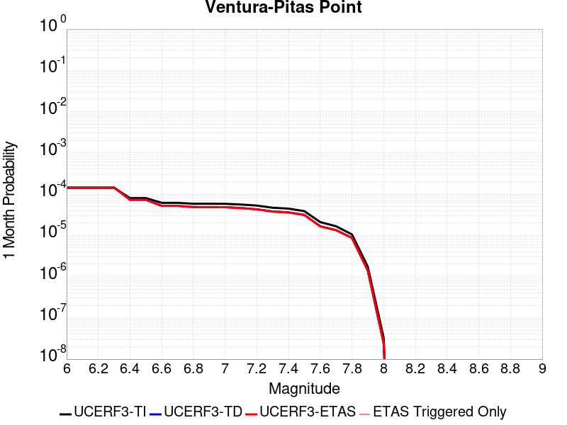 |  |  |

| Magnitude | 1 wk TI Prob | 1 wk TD Prob | 1 wk ETAS Prob | 1 wk ETAS/TD Gain | 1 wk ETAS Triggered Only | 1 mo TI Prob | 1 mo TD Prob | 1 mo ETAS Prob | 1 mo ETAS/TD Gain | 1 mo ETAS Triggered Only | 1 yr TI Prob | 1 yr TD Prob | 1 yr ETAS Prob | 1 yr ETAS/TD Gain | 1 yr ETAS Triggered Only | 10 yr TI Prob | 10 yr TD Prob | 10 yr ETAS Prob | 10 yr ETAS/TD Gain | 10 yr ETAS Triggered Only |
|-----|-----|-----|-----|-----|-----|-----|-----|-----|-----|-----|-----|-----|-----|-----|-----|-----|-----|-----|-----|-----|
| 6.0 | 3.3179622E-5 | 3.3742806E-5 | 3.3742806E-5 | 1.0 | 0.0 | 1.4219063E-4 | 1.4460545E-4 | 1.4460545E-4 | 1.0 | 0.0 | 0.0017297962 | 0.0017594066 | 0.0018051388 | 1.0259929 | 4.5812718E-5 | 0.017163932 | 0.01748032 | 0.01752533 | 1.002575 | 4.5812718E-5 |
| 6.1 | 3.3179622E-5 | 3.3742806E-5 | 3.3742806E-5 | 1.0 | 0.0 | 1.4219063E-4 | 1.4460545E-4 | 1.4460545E-4 | 1.0 | 0.0 | 0.0017297962 | 0.0017594066 | 0.0018051388 | 1.0259929 | 4.5812718E-5 | 0.017163932 | 0.01748032 | 0.01752533 | 1.002575 | 4.5812718E-5 |
| 6.2 | 3.3179622E-5 | 3.3742806E-5 | 3.3742806E-5 | 1.0 | 0.0 | 1.4219063E-4 | 1.4460545E-4 | 1.4460545E-4 | 1.0 | 0.0 | 0.0017297962 | 0.0017594066 | 0.0018051388 | 1.0259929 | 4.5812718E-5 | 0.017163932 | 0.01748032 | 0.01752533 | 1.002575 | 4.5812718E-5 |
| 6.3 | 3.3179622E-5 | 3.3742806E-5 | 3.3742806E-5 | 1.0 | 0.0 | 1.4219063E-4 | 1.4460545E-4 | 1.4460545E-4 | 1.0 | 0.0 | 0.0017297962 | 0.0017594066 | 0.0018051388 | 1.0259929 | 4.5812718E-5 | 0.017163932 | 0.01748032 | 0.01752533 | 1.002575 | 4.5812718E-5 |
| 6.4 | 1.8754668E-5 | 1.70237E-5 | 1.70237E-5 | 1.0 | 0.0 | 8.037467E-5 | 7.2956806E-5 | 7.2956806E-5 | 1.0 | 0.0 | 9.781223E-4 | 8.8791025E-4 | 8.8791025E-4 | 1.0 | 0.0 | 0.009738282 | 0.0088459635 | 0.0088459635 | 1.0 | 0.0 |
| 6.5 | 1.8754668E-5 | 1.70237E-5 | 1.70237E-5 | 1.0 | 0.0 | 8.037467E-5 | 7.2956806E-5 | 7.2956806E-5 | 1.0 | 0.0 | 9.781223E-4 | 8.8791025E-4 | 8.8791025E-4 | 1.0 | 0.0 | 0.009738282 | 0.0088459635 | 0.0088459635 | 1.0 | 0.0 |
| 6.6 | 1.4361558E-5 | 1.2125619E-5 | 1.2125619E-5 | 1.0 | 0.0 | 6.154808E-5 | 5.1965915E-5 | 5.1965915E-5 | 1.0 | 0.0 | 7.490902E-4 | 6.3250365E-4 | 6.3250365E-4 | 1.0 | 0.0 | 0.0074657016 | 0.0063072913 | 0.0063072913 | 1.0 | 0.0 |
| 6.7 | 1.4361558E-5 | 1.2125619E-5 | 1.2125619E-5 | 1.0 | 0.0 | 6.154808E-5 | 5.1965915E-5 | 5.1965915E-5 | 1.0 | 0.0 | 7.490902E-4 | 6.3250365E-4 | 6.3250365E-4 | 1.0 | 0.0 | 0.0074657016 | 0.0063072913 | 0.0063072913 | 1.0 | 0.0 |
| 6.8 | 1.3663846E-5 | 1.13476435E-5 | 1.13476435E-5 | 1.0 | 0.0 | 5.8558027E-5 | 4.863186E-5 | 4.863186E-5 | 1.0 | 0.0 | 7.127108E-4 | 5.91934E-4 | 5.91934E-4 | 1.0 | 0.0 | 0.007104293 | 0.0059037893 | 0.0059037893 | 1.0 | 0.0 |
| 6.9 | 1.3644157E-5 | 1.1325741E-5 | 1.1325741E-5 | 1.0 | 0.0 | 5.8473648E-5 | 4.8537997E-5 | 4.8537997E-5 | 1.0 | 0.0 | 7.116841E-4 | 5.907918E-4 | 5.907918E-4 | 1.0 | 0.0 | 0.007094092 | 0.005892428 | 0.005892428 | 1.0 | 0.0 |
| 7.0 | 1.3568845E-5 | 1.1245293E-5 | 1.1245293E-5 | 1.0 | 0.0 | 5.8150898E-5 | 4.8193233E-5 | 4.8193233E-5 | 1.0 | 0.0 | 7.077572E-4 | 5.865966E-4 | 5.865966E-4 | 1.0 | 0.0 | 0.007055073 | 0.0058506974 | 0.0058506974 | 1.0 | 0.0 |
| 7.1 | 1.306572E-5 | 1.0723656E-5 | 1.0723656E-5 | 1.0 | 0.0 | 5.599474E-5 | 4.5957724E-5 | 4.5957724E-5 | 1.0 | 0.0 | 6.815227E-4 | 5.593935E-4 | 5.593935E-4 | 1.0 | 0.0 | 0.0067943637 | 0.0055800593 | 0.0055800593 | 1.0 | 0.0 |
| 7.2 | 1.232604E-5 | 9.9980925E-6 | 9.9980925E-6 | 1.0 | 0.0 | 5.2824813E-5 | 4.2848274E-5 | 4.2848274E-5 | 1.0 | 0.0 | 6.429523E-4 | 5.2155467E-4 | 5.2155467E-4 | 1.0 | 0.0 | 0.0064109527 | 0.005203498 | 0.005203498 | 1.0 | 0.0 |
| 7.3 | 1.0917261E-5 | 8.845197E-6 | 8.845197E-6 | 1.0 | 0.0 | 4.678742E-5 | 3.7907444E-5 | 3.7907444E-5 | 1.0 | 0.0 | 5.69488E-4 | 4.6142694E-4 | 4.6142694E-4 | 1.0 | 0.0 | 0.0056803077 | 0.0046048546 | 0.0046048546 | 1.0 | 0.0 |
| 7.4 | 1.039959E-5 | 8.424825E-6 | 8.424825E-6 | 1.0 | 0.0 | 4.456891E-5 | 3.61059E-5 | 3.61059E-5 | 1.0 | 0.0 | 5.424914E-4 | 4.395022E-4 | 4.395022E-4 | 1.0 | 0.0 | 0.0054116896 | 0.004386492 | 0.004386492 | 1.0 | 0.0 |
| 7.5 | 9.015877E-6 | 7.2985176E-6 | 7.2985176E-6 | 1.0 | 0.0 | 3.86389E-5 | 3.1278993E-5 | 3.1278993E-5 | 1.0 | 0.0 | 4.7032707E-4 | 3.8075662E-4 | 3.8075662E-4 | 1.0 | 0.0 | 0.004693329 | 0.0038011875 | 0.0038011875 | 1.0 | 0.0 |
| 7.6 | 4.900162E-6 | 3.8745034E-6 | 3.8745034E-6 | 1.0 | 0.0 | 2.1000526E-5 | 1.660491E-5 | 1.660491E-5 | 1.0 | 0.0 | 2.556514E-4 | 2.0214616E-4 | 2.0214616E-4 | 1.0 | 0.0 | 0.0025535747 | 0.0020196363 | 0.0020196363 | 1.0 | 0.0 |
| 7.7 | 3.8850626E-6 | 3.1270158E-6 | 3.1270158E-6 | 1.0 | 0.0 | 1.6650163E-5 | 1.3401428E-5 | 1.3401428E-5 | 1.0 | 0.0 | 2.0269687E-4 | 1.6315027E-4 | 1.6315027E-4 | 1.0 | 0.0 | 0.002025121 | 0.0016303142 | 0.0016303142 | 1.0 | 0.0 |
| 7.8 | 2.4654719E-6 | 2.0300472E-6 | 2.0300472E-6 | 1.0 | 0.0 | 1.0566265E-5 | 8.700174E-6 | 8.700174E-6 | 1.0 | 0.0 | 1.2863669E-4 | 1.05919506E-4 | 1.05919506E-4 | 1.0 | 0.0 | 0.0012856225 | 0.0010586949 | 0.0010586949 | 1.0 | 0.0 |
| 7.9 | 4.095894E-7 | 3.2767971E-7 | 3.2767971E-7 | 1.0 | 0.0 | 1.7553821E-6 | 1.4043409E-6 | 1.4043409E-6 | 1.0 | 0.0 | 2.1371567E-5 | 1.709772E-5 | 1.709772E-5 | 1.0 | 0.0 | 2.1369511E-4 | 1.7096435E-4 | 1.7096435E-4 | 1.0 | 0.0 |
| 8.0 | 7.791402E-9 | 5.6840586E-9 | 5.6840586E-9 | 1.0 | 0.0 | 3.3391725E-8 | 2.436025E-8 | 2.436025E-8 | 1.0 | 0.0 | 4.0654416E-7 | 2.9658602E-7 | 2.9658602E-7 | 1.0 | 0.0 | 4.065434E-6 | 2.9658584E-6 | 2.9658584E-6 | 1.0 | 0.0 |

## Rose Canyon
*[(top)](#table-of-contents)*

| 1 Week | 1 Month | 1 Year | 10 Year |
|-----|-----|-----|-----|
|  |  |  |  |

| Magnitude | 1 wk TI Prob | 1 wk TD Prob | 1 wk ETAS Prob | 1 wk ETAS/TD Gain | 1 wk ETAS Triggered Only | 1 mo TI Prob | 1 mo TD Prob | 1 mo ETAS Prob | 1 mo ETAS/TD Gain | 1 mo ETAS Triggered Only | 1 yr TI Prob | 1 yr TD Prob | 1 yr ETAS Prob | 1 yr ETAS/TD Gain | 1 yr ETAS Triggered Only | 10 yr TI Prob | 10 yr TD Prob | 10 yr ETAS Prob | 10 yr ETAS/TD Gain | 10 yr ETAS Triggered Only |
|-----|-----|-----|-----|-----|-----|-----|-----|-----|-----|-----|-----|-----|-----|-----|-----|-----|-----|-----|-----|-----|
| 6.0 | 4.5923203E-5 | 4.9793205E-5 | 4.9793205E-5 | 1.0 | 0.0 | 1.9679888E-4 | 2.1338335E-4 | 2.1338335E-4 | 1.0 | 0.0 | 0.0023933933 | 0.0025950412 | 0.0025950412 | 1.0 | 0.0 | 0.023677798 | 0.025680156 | 0.025724793 | 1.0017382 | 4.5812718E-5 |
| 6.1 | 4.5923203E-5 | 4.9793205E-5 | 4.9793205E-5 | 1.0 | 0.0 | 1.9679888E-4 | 2.1338335E-4 | 2.1338335E-4 | 1.0 | 0.0 | 0.0023933933 | 0.0025950412 | 0.0025950412 | 1.0 | 0.0 | 0.023677798 | 0.025680156 | 0.025724793 | 1.0017382 | 4.5812718E-5 |
| 6.2 | 2.8844734E-5 | 2.9738942E-5 | 2.9738942E-5 | 1.0 | 0.0 | 1.2361443E-4 | 1.2744658E-4 | 1.2744658E-4 | 1.0 | 0.0 | 0.0015039665 | 0.0015505927 | 0.0015505927 | 1.0 | 0.0 | 0.0149382865 | 0.015410602 | 0.015433155 | 1.0014635 | 2.2906359E-5 |
| 6.3 | 2.3171577E-5 | 2.3229592E-5 | 2.3229592E-5 | 1.0 | 0.0 | 9.9302975E-5 | 9.9551675E-5 | 9.9551675E-5 | 1.0 | 0.0 | 0.0012083431 | 0.0012113812 | 0.0012113812 | 1.0 | 0.0 | 0.012017938 | 0.012057545 | 0.012080175 | 1.0018768 | 2.2906359E-5 |
| 6.4 | 2.0066604E-5 | 1.9708776E-5 | 1.9708776E-5 | 1.0 | 0.0 | 8.599689E-5 | 8.446351E-5 | 8.446351E-5 | 1.0 | 0.0 | 0.0010465092 | 0.0010278681 | 0.0010278681 | 1.0 | 0.0 | 0.010415946 | 0.0102390535 | 0.0102390535 | 1.0 | 0.0 |
| 6.5 | 1.776989E-5 | 1.7138804E-5 | 1.7138804E-5 | 1.0 | 0.0 | 7.615444E-5 | 7.344999E-5 | 7.344999E-5 | 1.0 | 0.0 | 9.267859E-4 | 8.9389377E-4 | 8.9389377E-4 | 1.0 | 0.0 | 0.009229303 | 0.008909108 | 0.008909108 | 1.0 | 0.0 |
| 6.6 | 1.5227364E-5 | 1.4347781E-5 | 1.4347781E-5 | 1.0 | 0.0 | 6.52585E-5 | 6.148907E-5 | 6.148907E-5 | 1.0 | 0.0 | 7.942326E-4 | 7.4837747E-4 | 7.4837747E-4 | 1.0 | 0.0 | 0.007914 | 0.007462769 | 0.007462769 | 1.0 | 0.0 |
| 6.7 | 1.2703898E-5 | 1.1675434E-5 | 1.1675434E-5 | 1.0 | 0.0 | 5.4444143E-5 | 5.0036637E-5 | 5.0036637E-5 | 1.0 | 0.0 | 6.626558E-4 | 6.0903E-4 | 6.0903E-4 | 1.0 | 0.0 | 0.006606833 | 0.0060762027 | 0.0060762027 | 1.0 | 0.0 |
| 6.8 | 1.1554917E-5 | 1.0611212E-5 | 1.0611212E-5 | 1.0 | 0.0 | 4.9520135E-5 | 4.5475852E-5 | 4.5475852E-5 | 1.0 | 0.0 | 6.0274085E-4 | 5.535319E-4 | 5.535319E-4 | 1.0 | 0.0 | 0.0060110865 | 0.005523539 | 0.005523539 | 1.0 | 0.0 |
| 6.9 | 8.732078E-6 | 7.882266E-6 | 7.882266E-6 | 1.0 | 0.0 | 3.7422655E-5 | 3.378072E-5 | 3.378072E-5 | 1.0 | 0.0 | 4.5552556E-4 | 4.1120558E-4 | 4.1120558E-4 | 1.0 | 0.0 | 0.0045459294 | 0.004105279 | 0.004105279 | 1.0 | 0.0 |
| 7.0 | 5.9337494E-6 | 5.107943E-6 | 5.107943E-6 | 1.0 | 0.0 | 2.5430107E-5 | 2.1891E-5 | 2.1891E-5 | 1.0 | 0.0 | 3.0956755E-4 | 2.6649048E-4 | 2.6649048E-4 | 1.0 | 0.0 | 0.0030913667 | 0.0026617248 | 0.0026617248 | 1.0 | 0.0 |
| 7.1 | 5.013409E-6 | 4.177747E-6 | 4.177747E-6 | 1.0 | 0.0 | 2.1485863E-5 | 1.7904507E-5 | 1.7904507E-5 | 1.0 | 0.0 | 2.6155898E-4 | 2.1796567E-4 | 2.1796567E-4 | 1.0 | 0.0 | 0.0026125133 | 0.0021775307 | 0.0021775307 | 1.0 | 0.0 |
| 7.2 | 4.120763E-6 | 3.2824337E-6 | 3.2824337E-6 | 1.0 | 0.0 | 1.7660293E-5 | 1.4067497E-5 | 1.4067497E-5 | 1.0 | 0.0 | 2.1499286E-4 | 1.712584E-4 | 1.712584E-4 | 1.0 | 0.0 | 0.0021478499 | 0.0017112739 | 0.0017112739 | 1.0 | 0.0 |
| 7.3 | 3.2081239E-6 | 2.4407627E-6 | 2.4407627E-6 | 1.0 | 0.0 | 1.374903E-5 | 1.046037E-5 | 1.046037E-5 | 1.0 | 0.0 | 1.6738157E-4 | 1.2734762E-4 | 1.2734762E-4 | 1.0 | 0.0 | 0.0016725556 | 0.0012727535 | 0.0012727535 | 1.0 | 0.0 |
| 7.4 | 2.4194755E-6 | 1.7682352E-6 | 1.7682352E-6 | 1.0 | 0.0 | 1.0369139E-5 | 7.578129E-6 | 7.578129E-6 | 1.0 | 0.0 | 1.2623696E-4 | 9.225987E-5 | 9.225987E-5 | 1.0 | 0.0 | 0.0012616527 | 9.22221E-4 | 9.22221E-4 | 1.0 | 0.0 |
| 7.5 | 1.3842889E-6 | 9.379746E-7 | 9.379746E-7 | 1.0 | 0.0 | 5.9326535E-6 | 4.019885E-6 | 4.019885E-6 | 1.0 | 0.0 | 7.222766E-5 | 4.894104E-5 | 4.894104E-5 | 1.0 | 0.0 | 7.220419E-4 | 4.8930617E-4 | 4.8930617E-4 | 1.0 | 0.0 |
| 7.6 | 1.0021575E-6 | 6.4123174E-7 | 6.4123174E-7 | 1.0 | 0.0 | 4.2949537E-6 | 2.7481333E-6 | 2.7481333E-6 | 1.0 | 0.0 | 5.2289808E-5 | 3.345803E-5 | 3.345803E-5 | 1.0 | 0.0 | 5.2277505E-4 | 3.345321E-4 | 3.345321E-4 | 1.0 | 0.0 |
| 7.7 | 8.7620116E-8 | 6.4496746E-8 | 6.4496746E-8 | 1.0 | 0.0 | 3.7551473E-7 | 2.764146E-7 | 2.764146E-7 | 1.0 | 0.0 | 4.5718825E-6 | 3.365343E-6 | 3.365343E-6 | 1.0 | 0.0 | 4.5717883E-5 | 3.365295E-5 | 3.365295E-5 | 1.0 | 0.0 |

## Santa Ynez (West)
*[(top)](#table-of-contents)*

| 1 Week | 1 Month | 1 Year | 10 Year |
|-----|-----|-----|-----|
|  |  |  |  |

| Magnitude | 1 wk TI Prob | 1 wk TD Prob | 1 wk ETAS Prob | 1 wk ETAS/TD Gain | 1 wk ETAS Triggered Only | 1 mo TI Prob | 1 mo TD Prob | 1 mo ETAS Prob | 1 mo ETAS/TD Gain | 1 mo ETAS Triggered Only | 1 yr TI Prob | 1 yr TD Prob | 1 yr ETAS Prob | 1 yr ETAS/TD Gain | 1 yr ETAS Triggered Only | 10 yr TI Prob | 10 yr TD Prob | 10 yr ETAS Prob | 10 yr ETAS/TD Gain | 10 yr ETAS Triggered Only |
|-----|-----|-----|-----|-----|-----|-----|-----|-----|-----|-----|-----|-----|-----|-----|-----|-----|-----|-----|-----|-----|
| 6.0 | 4.7352758E-5 | 5.498621E-5 | 5.498621E-5 | 1.0 | 0.0 | 2.0292461E-4 | 2.356277E-4 | 2.356277E-4 | 1.0 | 0.0 | 0.0024678076 | 0.0028652318 | 0.0028880725 | 1.0079716 | 2.2906359E-5 | 0.024405818 | 0.028311422 | 0.028355937 | 1.0015724 | 4.5812718E-5 |
| 6.1 | 4.7352758E-5 | 5.498621E-5 | 5.498621E-5 | 1.0 | 0.0 | 2.0292461E-4 | 2.356277E-4 | 2.356277E-4 | 1.0 | 0.0 | 0.0024678076 | 0.0028652318 | 0.0028880725 | 1.0079716 | 2.2906359E-5 | 0.024405818 | 0.028311422 | 0.028355937 | 1.0015724 | 4.5812718E-5 |
| 6.2 | 3.0415853E-5 | 3.3932272E-5 | 3.3932272E-5 | 1.0 | 0.0 | 1.3034715E-4 | 1.4541604E-4 | 1.4541604E-4 | 1.0 | 0.0 | 0.0015858212 | 0.0017690392 | 0.001791905 | 1.0129256 | 2.2906359E-5 | 0.015745522 | 0.017553467 | 0.017598476 | 1.0025641 | 4.5812718E-5 |
| 6.3 | 3.0415853E-5 | 3.3932272E-5 | 3.3932272E-5 | 1.0 | 0.0 | 1.3034715E-4 | 1.4541604E-4 | 1.4541604E-4 | 1.0 | 0.0 | 0.0015858212 | 0.0017690392 | 0.001791905 | 1.0129256 | 2.2906359E-5 | 0.015745522 | 0.017553467 | 0.017598476 | 1.0025641 | 4.5812718E-5 |
| 6.4 | 2.5452082E-5 | 2.791787E-5 | 2.791787E-5 | 1.0 | 0.0 | 1.09075794E-4 | 1.1964254E-4 | 1.1964254E-4 | 1.0 | 0.0 | 0.0013271887 | 0.0014556927 | 0.0014785657 | 1.0157129 | 2.2906359E-5 | 0.013192902 | 0.014463755 | 0.014508905 | 1.0031216 | 4.5812718E-5 |
| 6.5 | 2.3143784E-5 | 2.5132935E-5 | 2.5132935E-5 | 1.0 | 0.0 | 9.9183875E-5 | 1.0770812E-4 | 1.0770812E-4 | 1.0 | 0.0 | 0.0012068948 | 0.0013105706 | 0.0013334469 | 1.0174552 | 2.2906359E-5 | 0.012003611 | 0.013030095 | 0.013075311 | 1.0034701 | 4.5812718E-5 |
| 6.6 | 1.9118515E-5 | 2.0357847E-5 | 2.0357847E-5 | 1.0 | 0.0 | 8.193392E-5 | 8.724504E-5 | 8.724504E-5 | 1.0 | 0.0 | 9.97089E-4 | 0.0010616988 | 0.0010845808 | 1.0215523 | 2.2906359E-5 | 0.00992627 | 0.010567175 | 0.010612504 | 1.0042895 | 4.5812718E-5 |
| 6.7 | 1.722807E-5 | 1.8149358E-5 | 1.8149358E-5 | 1.0 | 0.0 | 7.3832496E-5 | 7.778068E-5 | 7.778068E-5 | 1.0 | 0.0 | 8.985399E-4 | 9.465739E-4 | 9.6945855E-4 | 1.0241764 | 2.2906359E-5 | 0.008949154 | 0.009426067 | 0.009471447 | 1.0048144 | 4.5812718E-5 |
| 6.8 | 1.5317364E-5 | 1.5929016E-5 | 1.5929016E-5 | 1.0 | 0.0 | 6.56442E-5 | 6.826545E-5 | 6.826545E-5 | 1.0 | 0.0 | 7.98925E-4 | 8.308192E-4 | 8.537065E-4 | 1.027548 | 2.2906359E-5 | 0.007960589 | 0.008277619 | 0.008323053 | 1.0054888 | 4.5812718E-5 |
| 6.9 | 1.3071226E-5 | 1.3331613E-5 | 1.3331613E-5 | 1.0 | 0.0 | 5.6018336E-5 | 5.7134246E-5 | 5.7134246E-5 | 1.0 | 0.0 | 6.8180985E-4 | 6.953897E-4 | 7.1828015E-4 | 1.0329174 | 2.2906359E-5 | 0.0067972173 | 0.006932398 | 0.006977893 | 1.0065627 | 4.5812718E-5 |
| 7.0 | 1.1836986E-5 | 1.1934524E-5 | 1.1934524E-5 | 1.0 | 0.0 | 5.0728955E-5 | 5.114697E-5 | 5.114697E-5 | 1.0 | 0.0 | 6.1745E-4 | 6.225381E-4 | 6.454302E-4 | 1.0367723 | 2.2906359E-5 | 0.006157372 | 0.006208135 | 0.006253663 | 1.0073336 | 4.5812718E-5 |
| 7.1 | 1.0597169E-5 | 1.05437175E-5 | 1.05437175E-5 | 1.0 | 0.0 | 4.541565E-5 | 4.518658E-5 | 4.518658E-5 | 1.0 | 0.0 | 5.5279525E-4 | 5.500089E-4 | 5.729027E-4 | 1.0416243 | 2.2906359E-5 | 0.0055142213 | 0.0054866076 | 0.0055321692 | 1.0083041 | 4.5812718E-5 |
| 7.2 | 9.59113E-6 | 9.460548E-6 | 9.460548E-6 | 1.0 | 0.0 | 4.11042E-5 | 4.0544586E-5 | 4.0544586E-5 | 1.0 | 0.0 | 5.0032866E-4 | 4.935196E-4 | 5.1641464E-4 | 1.0463914 | 2.2906359E-5 | 0.004992037 | 0.0049243546 | 0.004969942 | 1.0092574 | 4.5812718E-5 |
| 7.3 | 8.586084E-6 | 8.380881E-6 | 8.380881E-6 | 1.0 | 0.0 | 3.679698E-5 | 3.5917572E-5 | 3.5917572E-5 | 1.0 | 0.0 | 4.4791115E-4 | 4.3720973E-4 | 4.601061E-4 | 1.0523692 | 2.2906359E-5 | 0.004470094 | 0.004363607 | 0.00440922 | 1.010453 | 4.5812718E-5 |
| 7.4 | 7.2622997E-6 | 6.952687E-6 | 6.952687E-6 | 1.0 | 0.0 | 3.112377E-5 | 2.9796895E-5 | 2.9796895E-5 | 1.0 | 0.0 | 3.78866E-4 | 3.6271778E-4 | 3.8561583E-4 | 1.0631291 | 2.2906359E-5 | 0.0037822074 | 0.0036213577 | 0.0036441812 | 1.0063025 | 2.2906359E-5 |
| 7.5 | 5.627296E-6 | 5.252259E-6 | 5.252259E-6 | 1.0 | 0.0 | 2.411676E-5 | 2.2509492E-5 | 2.2509492E-5 | 1.0 | 0.0 | 2.9358198E-4 | 2.7401932E-4 | 2.969194E-4 | 1.0835711 | 2.2906359E-5 | 0.0029319443 | 0.0027368865 | 0.00275973 | 1.0083466 | 2.2906359E-5 |
| 7.6 | 2.265244E-6 | 2.0610528E-6 | 2.0610528E-6 | 1.0 | 0.0 | 9.708152E-6 | 8.833054E-6 | 8.833054E-6 | 1.0 | 0.0 | 1.18190335E-4 | 1.0753721E-4 | 1.3044111E-4 | 1.2129858 | 2.2906359E-5 | 0.001181275 | 0.0010748605 | 0.0010977421 | 1.0212882 | 2.2906359E-5 |
| 7.7 | 1.3099874E-6 | 1.1017219E-6 | 1.1017219E-6 | 1.0 | 0.0 | 5.61422E-6 | 4.7216568E-6 | 4.7216568E-6 | 1.0 | 0.0 | 6.8350986E-5 | 5.7484678E-5 | 5.7484678E-5 | 1.0 | 0.0 | 6.832996E-4 | 5.747005E-4 | 5.747005E-4 | 1.0 | 0.0 |
| 7.8 | 7.903951E-7 | 6.0716326E-7 | 6.0716326E-7 | 1.0 | 0.0 | 3.3874032E-6 | 2.6021257E-6 | 2.6021257E-6 | 1.0 | 0.0 | 4.1240855E-5 | 3.1680436E-5 | 3.1680436E-5 | 1.0 | 0.0 | 4.12332E-4 | 3.167605E-4 | 3.167605E-4 | 1.0 | 0.0 |
| 7.9 | 7.0753297E-9 | 5.090257E-9 | 5.090257E-9 | 1.0 | 0.0 | 3.032284E-8 | 2.1815387E-8 | 2.1815387E-8 | 1.0 | 0.0 | 3.6918053E-7 | 2.6560232E-7 | 2.6560232E-7 | 1.0 | 0.0 | 3.691799E-6 | 2.656021E-6 | 2.656021E-6 | 1.0 | 0.0 |

## Cleghorn Pass
*[(top)](#table-of-contents)*

| 1 Week | 1 Month | 1 Year | 10 Year |
|-----|-----|-----|-----|
|  |  |  |  |

| Magnitude | 1 wk TI Prob | 1 wk TD Prob | 1 wk ETAS Prob | 1 wk ETAS/TD Gain | 1 wk ETAS Triggered Only | 1 mo TI Prob | 1 mo TD Prob | 1 mo ETAS Prob | 1 mo ETAS/TD Gain | 1 mo ETAS Triggered Only | 1 yr TI Prob | 1 yr TD Prob | 1 yr ETAS Prob | 1 yr ETAS/TD Gain | 1 yr ETAS Triggered Only | 10 yr TI Prob | 10 yr TD Prob | 10 yr ETAS Prob | 10 yr ETAS/TD Gain | 10 yr ETAS Triggered Only |
|-----|-----|-----|-----|-----|-----|-----|-----|-----|-----|-----|-----|-----|-----|-----|-----|-----|-----|-----|-----|-----|
| 6.0 | 1.0522846E-5 | 1.1041362E-5 | 1.1041362E-5 | 1.0 | 0.0 | 4.509713E-5 | 4.731956E-5 | 4.731956E-5 | 1.0 | 0.0 | 5.4891926E-4 | 5.76016E-4 | 5.989092E-4 | 1.039744 | 2.2906359E-5 | 0.0054756533 | 0.0057503963 | 0.0057959454 | 1.0079211 | 4.5812718E-5 |
| 6.1 | 1.0522846E-5 | 1.1041362E-5 | 1.1041362E-5 | 1.0 | 0.0 | 4.509713E-5 | 4.731956E-5 | 4.731956E-5 | 1.0 | 0.0 | 5.4891926E-4 | 5.76016E-4 | 5.989092E-4 | 1.039744 | 2.2906359E-5 | 0.0054756533 | 0.0057503963 | 0.0057959454 | 1.0079211 | 4.5812718E-5 |
| 6.2 | 2.1045846E-6 | 2.2083466E-6 | 2.2083466E-6 | 1.0 | 0.0 | 9.019617E-6 | 9.464332E-6 | 9.464332E-6 | 1.0 | 0.0 | 1.098083E-4 | 1.1522634E-4 | 1.3813007E-4 | 1.1987716 | 2.2906359E-5 | 0.0010975406 | 0.0011520775 | 0.0011978374 | 1.0397195 | 4.5812718E-5 |
| 6.3 | 2.1045846E-6 | 2.2083466E-6 | 2.2083466E-6 | 1.0 | 0.0 | 9.019617E-6 | 9.464332E-6 | 9.464332E-6 | 1.0 | 0.0 | 1.098083E-4 | 1.1522634E-4 | 1.3813007E-4 | 1.1987716 | 2.2906359E-5 | 0.0010975406 | 0.0011520775 | 0.0011978374 | 1.0397195 | 4.5812718E-5 |
| 6.4 | 1.7259927E-6 | 1.8109952E-6 | 1.8109952E-6 | 1.0 | 0.0 | 7.3970905E-6 | 7.761408E-6 | 7.761408E-6 | 1.0 | 0.0 | 9.005586E-5 | 9.4495146E-5 | 1.1739934E-4 | 1.2423849 | 2.2906359E-5 | 9.001937E-4 | 9.4495143E-4 | 9.907208E-4 | 1.0484357 | 4.5812718E-5 |

## Channel Islands Western Deep Ramp
*[(top)](#table-of-contents)*

| 1 Week | 1 Month | 1 Year | 10 Year |
|-----|-----|-----|-----|
|  |  |  |  |

| Magnitude | 1 wk TI Prob | 1 wk TD Prob | 1 wk ETAS Prob | 1 wk ETAS/TD Gain | 1 wk ETAS Triggered Only | 1 mo TI Prob | 1 mo TD Prob | 1 mo ETAS Prob | 1 mo ETAS/TD Gain | 1 mo ETAS Triggered Only | 1 yr TI Prob | 1 yr TD Prob | 1 yr ETAS Prob | 1 yr ETAS/TD Gain | 1 yr ETAS Triggered Only | 10 yr TI Prob | 10 yr TD Prob | 10 yr ETAS Prob | 10 yr ETAS/TD Gain | 10 yr ETAS Triggered Only |
|-----|-----|-----|-----|-----|-----|-----|-----|-----|-----|-----|-----|-----|-----|-----|-----|-----|-----|-----|-----|-----|
| 6.0 | 6.0213506E-6 | 6.255191E-6 | 6.255191E-6 | 1.0 | 0.0 | 2.5805533E-5 | 2.6807711E-5 | 4.9713457E-5 | 1.8544462 | 2.2906359E-5 | 3.1413708E-4 | 3.2633948E-4 | 3.4923834E-4 | 1.0701689 | 2.2906359E-5 | 0.0031369338 | 0.0032590441 | 0.0032818757 | 1.0070057 | 2.2906359E-5 |
| 6.1 | 6.0213506E-6 | 6.255191E-6 | 6.255191E-6 | 1.0 | 0.0 | 2.5805533E-5 | 2.6807711E-5 | 4.9713457E-5 | 1.8544462 | 2.2906359E-5 | 3.1413708E-4 | 3.2633948E-4 | 3.4923834E-4 | 1.0701689 | 2.2906359E-5 | 0.0031369338 | 0.0032590441 | 0.0032818757 | 1.0070057 | 2.2906359E-5 |
| 6.2 | 6.0213506E-6 | 6.255191E-6 | 6.255191E-6 | 1.0 | 0.0 | 2.5805533E-5 | 2.6807711E-5 | 4.9713457E-5 | 1.8544462 | 2.2906359E-5 | 3.1413708E-4 | 3.2633948E-4 | 3.4923834E-4 | 1.0701689 | 2.2906359E-5 | 0.0031369338 | 0.0032590441 | 0.0032818757 | 1.0070057 | 2.2906359E-5 |
| 6.3 | 6.0213506E-6 | 6.255191E-6 | 6.255191E-6 | 1.0 | 0.0 | 2.5805533E-5 | 2.6807711E-5 | 4.9713457E-5 | 1.8544462 | 2.2906359E-5 | 3.1413708E-4 | 3.2633948E-4 | 3.4923834E-4 | 1.0701689 | 2.2906359E-5 | 0.0031369338 | 0.0032590441 | 0.0032818757 | 1.0070057 | 2.2906359E-5 |
| 6.4 | 6.0213506E-6 | 6.255191E-6 | 6.255191E-6 | 1.0 | 0.0 | 2.5805533E-5 | 2.6807711E-5 | 4.9713457E-5 | 1.8544462 | 2.2906359E-5 | 3.1413708E-4 | 3.2633948E-4 | 3.4923834E-4 | 1.0701689 | 2.2906359E-5 | 0.0031369338 | 0.0032590441 | 0.0032818757 | 1.0070057 | 2.2906359E-5 |
| 6.5 | 6.0213506E-6 | 6.255191E-6 | 6.255191E-6 | 1.0 | 0.0 | 2.5805533E-5 | 2.6807711E-5 | 4.9713457E-5 | 1.8544462 | 2.2906359E-5 | 3.1413708E-4 | 3.2633948E-4 | 3.4923834E-4 | 1.0701689 | 2.2906359E-5 | 0.0031369338 | 0.0032590441 | 0.0032818757 | 1.0070057 | 2.2906359E-5 |
| 6.6 | 6.0213506E-6 | 6.255191E-6 | 6.255191E-6 | 1.0 | 0.0 | 2.5805533E-5 | 2.6807711E-5 | 4.9713457E-5 | 1.8544462 | 2.2906359E-5 | 3.1413708E-4 | 3.2633948E-4 | 3.4923834E-4 | 1.0701689 | 2.2906359E-5 | 0.0031369338 | 0.0032590441 | 0.0032818757 | 1.0070057 | 2.2906359E-5 |
| 6.7 | 5.313309E-6 | 5.5255337E-6 | 5.5255337E-6 | 1.0 | 0.0 | 2.2771126E-5 | 2.3680666E-5 | 4.6586483E-5 | 1.9672792 | 2.2906359E-5 | 2.772032E-4 | 2.8827807E-4 | 3.111778E-4 | 1.0794363 | 2.2906359E-5 | 0.0027685766 | 0.0028794443 | 0.0029022845 | 1.0079322 | 2.2906359E-5 |
| 6.8 | 5.313309E-6 | 5.5255337E-6 | 5.5255337E-6 | 1.0 | 0.0 | 2.2771126E-5 | 2.3680666E-5 | 4.6586483E-5 | 1.9672792 | 2.2906359E-5 | 2.772032E-4 | 2.8827807E-4 | 3.111778E-4 | 1.0794363 | 2.2906359E-5 | 0.0027685766 | 0.0028794443 | 0.0029022845 | 1.0079322 | 2.2906359E-5 |
| 6.9 | 4.744377E-6 | 4.9397004E-6 | 4.9397004E-6 | 1.0 | 0.0 | 2.0332885E-5 | 2.1169993E-5 | 2.1169993E-5 | 1.0 | 0.0 | 2.4752476E-4 | 2.5771794E-4 | 2.5771794E-4 | 1.0 | 0.0 | 0.0024724922 | 0.002574558 | 0.002574558 | 1.0 | 0.0 |
| 7.0 | 4.722209E-6 | 4.916742E-6 | 4.916742E-6 | 1.0 | 0.0 | 2.0237881E-5 | 2.1071603E-5 | 2.1071603E-5 | 1.0 | 0.0 | 2.4636835E-4 | 2.565203E-4 | 2.565203E-4 | 1.0 | 0.0 | 0.002460954 | 0.0025626093 | 0.0025626093 | 1.0 | 0.0 |
| 7.1 | 4.611174E-6 | 4.8016723E-6 | 4.8016723E-6 | 1.0 | 0.0 | 1.9762025E-5 | 2.0578454E-5 | 2.0578454E-5 | 1.0 | 0.0 | 2.4057609E-4 | 2.505176E-4 | 2.505176E-4 | 1.0 | 0.0 | 0.002403158 | 0.002502719 | 0.002502719 | 1.0 | 0.0 |
| 7.2 | 4.043994E-6 | 4.2122592E-6 | 4.2122592E-6 | 1.0 | 0.0 | 1.7331287E-5 | 1.8052435E-5 | 1.8052435E-5 | 1.0 | 0.0 | 2.10988E-4 | 2.197698E-4 | 2.197698E-4 | 1.0 | 0.0 | 0.002107878 | 0.0021958754 | 0.0021958754 | 1.0 | 0.0 |
| 7.3 | 2.1233036E-6 | 2.229936E-6 | 2.229936E-6 | 1.0 | 0.0 | 9.099841E-6 | 9.556834E-6 | 9.556834E-6 | 1.0 | 0.0 | 1.1078493E-4 | 1.1634829E-4 | 1.1634829E-4 | 1.0 | 0.0 | 0.0011072971 | 0.0011628793 | 0.0011628793 | 1.0 | 0.0 |
| 7.4 | 1.9051884E-6 | 2.0016316E-6 | 2.0016316E-6 | 1.0 | 0.0 | 8.165067E-6 | 8.578393E-6 | 8.578393E-6 | 1.0 | 0.0 | 9.940516E-5 | 1.04436986E-4 | 1.04436986E-4 | 1.0 | 0.0 | 9.93607E-4 | 0.0010438843 | 0.0010438843 | 1.0 | 0.0 |
| 7.5 | 1.2408497E-6 | 1.3039719E-6 | 1.3039719E-6 | 1.0 | 0.0 | 5.317916E-6 | 5.588439E-6 | 5.588439E-6 | 1.0 | 0.0 | 6.4743705E-5 | 6.8037145E-5 | 6.8037145E-5 | 1.0 | 0.0 | 6.4724847E-4 | 6.801653E-4 | 6.801653E-4 | 1.0 | 0.0 |
| 7.6 | 6.5440025E-7 | 6.887197E-7 | 6.887197E-7 | 1.0 | 0.0 | 2.8045695E-6 | 2.9516527E-6 | 2.9516527E-6 | 1.0 | 0.0 | 3.4145098E-5 | 3.593579E-5 | 3.593579E-5 | 1.0 | 0.0 | 3.4139853E-4 | 3.5930122E-4 | 3.5930122E-4 | 1.0 | 0.0 |
| 7.7 | 3.985963E-7 | 4.193368E-7 | 4.193368E-7 | 1.0 | 0.0 | 1.7082689E-6 | 1.7971566E-6 | 1.7971566E-6 | 1.0 | 0.0 | 2.0797976E-5 | 2.1880174E-5 | 2.1880174E-5 | 1.0 | 0.0 | 2.0796029E-4 | 2.1878137E-4 | 2.1878137E-4 | 1.0 | 0.0 |
| 7.8 | 3.706329E-8 | 3.8593907E-8 | 3.8593907E-8 | 1.0 | 0.0 | 1.5884267E-7 | 1.6540244E-7 | 1.6540244E-7 | 1.0 | 0.0 | 1.9339077E-6 | 2.013773E-6 | 2.013773E-6 | 1.0 | 0.0 | 1.933891E-5 | 2.013756E-5 | 2.013756E-5 | 1.0 | 0.0 |

## Kern Canyon (Lake Isabella) 2011
*[(top)](#table-of-contents)*

| 1 Week | 1 Month | 1 Year | 10 Year |
|-----|-----|-----|-----|
|  |  |  |  |

| Magnitude | 1 wk TI Prob | 1 wk TD Prob | 1 wk ETAS Prob | 1 wk ETAS/TD Gain | 1 wk ETAS Triggered Only | 1 mo TI Prob | 1 mo TD Prob | 1 mo ETAS Prob | 1 mo ETAS/TD Gain | 1 mo ETAS Triggered Only | 1 yr TI Prob | 1 yr TD Prob | 1 yr ETAS Prob | 1 yr ETAS/TD Gain | 1 yr ETAS Triggered Only | 10 yr TI Prob | 10 yr TD Prob | 10 yr ETAS Prob | 10 yr ETAS/TD Gain | 10 yr ETAS Triggered Only |
|-----|-----|-----|-----|-----|-----|-----|-----|-----|-----|-----|-----|-----|-----|-----|-----|-----|-----|-----|-----|-----|
| 6.0 | 4.2387383E-6 | 4.001759E-6 | 4.001759E-6 | 1.0 | 0.0 | 1.8165894E-5 | 1.7150292E-5 | 1.7150292E-5 | 1.0 | 0.0 | 2.2114732E-4 | 2.0878667E-4 | 2.3168825E-4 | 1.1096889 | 2.2906359E-5 | 0.0022092736 | 0.002086089 | 0.0021089476 | 1.0109576 | 2.2906359E-5 |
| 6.1 | 4.2387383E-6 | 4.001759E-6 | 4.001759E-6 | 1.0 | 0.0 | 1.8165894E-5 | 1.7150292E-5 | 1.7150292E-5 | 1.0 | 0.0 | 2.2114732E-4 | 2.0878667E-4 | 2.3168825E-4 | 1.1096889 | 2.2906359E-5 | 0.0022092736 | 0.002086089 | 0.0021089476 | 1.0109576 | 2.2906359E-5 |
| 6.2 | 4.2387383E-6 | 4.001759E-6 | 4.001759E-6 | 1.0 | 0.0 | 1.8165894E-5 | 1.7150292E-5 | 1.7150292E-5 | 1.0 | 0.0 | 2.2114732E-4 | 2.0878667E-4 | 2.3168825E-4 | 1.1096889 | 2.2906359E-5 | 0.0022092736 | 0.002086089 | 0.0021089476 | 1.0109576 | 2.2906359E-5 |
| 6.3 | 4.2387383E-6 | 4.001759E-6 | 4.001759E-6 | 1.0 | 0.0 | 1.8165894E-5 | 1.7150292E-5 | 1.7150292E-5 | 1.0 | 0.0 | 2.2114732E-4 | 2.0878667E-4 | 2.3168825E-4 | 1.1096889 | 2.2906359E-5 | 0.0022092736 | 0.002086089 | 0.0021089476 | 1.0109576 | 2.2906359E-5 |
| 6.4 | 4.2387383E-6 | 4.001759E-6 | 4.001759E-6 | 1.0 | 0.0 | 1.8165894E-5 | 1.7150292E-5 | 1.7150292E-5 | 1.0 | 0.0 | 2.2114732E-4 | 2.0878667E-4 | 2.3168825E-4 | 1.1096889 | 2.2906359E-5 | 0.0022092736 | 0.002086089 | 0.0021089476 | 1.0109576 | 2.2906359E-5 |
| 6.5 | 2.7857532E-6 | 2.5179454E-6 | 2.5179454E-6 | 1.0 | 0.0 | 1.1938888E-5 | 1.0791152E-5 | 1.0791152E-5 | 1.0 | 0.0 | 1.4534626E-4 | 1.3137468E-4 | 1.3137468E-4 | 1.0 | 0.0 | 0.0014525123 | 0.0013130029 | 0.0013130029 | 1.0 | 0.0 |
| 6.6 | 2.2233348E-6 | 1.9441868E-6 | 1.9441868E-6 | 1.0 | 0.0 | 9.528543E-6 | 8.332203E-6 | 8.332203E-6 | 1.0 | 0.0 | 1.1600384E-4 | 1.0143993E-4 | 1.0143993E-4 | 1.0 | 0.0 | 0.001159433 | 0.0010139449 | 0.0010139449 | 1.0 | 0.0 |
| 6.7 | 2.1635126E-6 | 1.8835657E-6 | 1.8835657E-6 | 1.0 | 0.0 | 9.272164E-6 | 8.072399E-6 | 8.072399E-6 | 1.0 | 0.0 | 1.1288274E-4 | 9.8277116E-5 | 9.8277116E-5 | 1.0 | 0.0 | 0.0011282542 | 9.823447E-4 | 9.823447E-4 | 1.0 | 0.0 |
| 6.8 | 1.8685711E-6 | 1.5831973E-6 | 1.5831973E-6 | 1.0 | 0.0 | 8.008137E-6 | 6.785114E-6 | 6.785114E-6 | 1.0 | 0.0 | 9.74947E-5 | 8.260568E-5 | 8.260568E-5 | 1.0 | 0.0 | 9.745194E-4 | 8.2575466E-4 | 8.2575466E-4 | 1.0 | 0.0 |
| 6.9 | 1.5815071E-6 | 1.3065396E-6 | 1.3065396E-6 | 1.0 | 0.0 | 6.77787E-6 | 5.5994437E-6 | 5.5994437E-6 | 1.0 | 0.0 | 8.251744E-5 | 6.8171124E-5 | 6.8171124E-5 | 1.0 | 0.0 | 8.248681E-4 | 6.815048E-4 | 6.815048E-4 | 1.0 | 0.0 |
| 7.0 | 1.3772564E-6 | 1.1211124E-6 | 1.1211124E-6 | 1.0 | 0.0 | 5.9025137E-6 | 4.8047586E-6 | 4.8047586E-6 | 1.0 | 0.0 | 7.186073E-5 | 5.849639E-5 | 5.849639E-5 | 1.0 | 0.0 | 7.18375E-4 | 5.8481196E-4 | 5.8481196E-4 | 1.0 | 0.0 |
| 7.1 | 1.0916998E-6 | 8.764087E-7 | 8.764087E-7 | 1.0 | 0.0 | 4.678705E-6 | 3.756032E-6 | 3.756032E-6 | 1.0 | 0.0 | 5.6961744E-5 | 4.5728742E-5 | 4.5728742E-5 | 1.0 | 0.0 | 5.6947145E-4 | 4.5719466E-4 | 4.5719466E-4 | 1.0 | 0.0 |
| 7.2 | 7.6277024E-7 | 5.9016634E-7 | 5.9016634E-7 | 1.0 | 0.0 | 3.2690114E-6 | 2.529282E-6 | 2.529282E-6 | 1.0 | 0.0 | 3.9799485E-5 | 3.0793577E-5 | 3.0793577E-5 | 1.0 | 0.0 | 3.9792358E-4 | 3.0789373E-4 | 3.0789373E-4 | 1.0 | 0.0 |
| 7.3 | 5.3265916E-7 | 4.3825895E-7 | 4.3825895E-7 | 1.0 | 0.0 | 2.282823E-6 | 1.8782513E-6 | 1.8782513E-6 | 1.0 | 0.0 | 2.7793016E-5 | 2.2867473E-5 | 2.2867473E-5 | 1.0 | 0.0 | 2.778954E-4 | 2.2865158E-4 | 2.2865158E-4 | 1.0 | 0.0 |
| 7.4 | 3.4946007E-7 | 3.0066704E-7 | 3.0066704E-7 | 1.0 | 0.0 | 1.497685E-6 | 1.2885724E-6 | 1.2885724E-6 | 1.0 | 0.0 | 1.8234163E-5 | 1.5688258E-5 | 1.5688258E-5 | 1.0 | 0.0 | 1.8232666E-4 | 1.5687173E-4 | 1.5687173E-4 | 1.0 | 0.0 |
| 7.5 | 1.8317026E-7 | 1.4245374E-7 | 1.4245374E-7 | 1.0 | 0.0 | 7.850152E-7 | 6.105159E-7 | 6.105159E-7 | 1.0 | 0.0 | 9.557518E-6 | 7.4330064E-6 | 7.4330064E-6 | 1.0 | 0.0 | 9.5571064E-5 | 7.4327654E-5 | 7.4327654E-5 | 1.0 | 0.0 |
| 7.6 | 2.572245E-8 | 1.7353377E-8 | 1.7353377E-8 | 1.0 | 0.0 | 1.10239064E-7 | 7.437161E-8 | 7.437161E-8 | 1.0 | 0.0 | 1.3421597E-6 | 9.0547405E-7 | 9.0547405E-7 | 1.0 | 0.0 | 1.3421517E-5 | 9.054709E-6 | 9.054709E-6 | 1.0 | 0.0 |

## San Jacinto (Superstition Mtn)
*[(top)](#table-of-contents)*

| 1 Week | 1 Month | 1 Year | 10 Year |
|-----|-----|-----|-----|
|  |  |  |  |

| Magnitude | 1 wk TI Prob | 1 wk TD Prob | 1 wk ETAS Prob | 1 wk ETAS/TD Gain | 1 wk ETAS Triggered Only | 1 mo TI Prob | 1 mo TD Prob | 1 mo ETAS Prob | 1 mo ETAS/TD Gain | 1 mo ETAS Triggered Only | 1 yr TI Prob | 1 yr TD Prob | 1 yr ETAS Prob | 1 yr ETAS/TD Gain | 1 yr ETAS Triggered Only | 10 yr TI Prob | 10 yr TD Prob | 10 yr ETAS Prob | 10 yr ETAS/TD Gain | 10 yr ETAS Triggered Only |
|-----|-----|-----|-----|-----|-----|-----|-----|-----|-----|-----|-----|-----|-----|-----|-----|-----|-----|-----|-----|-----|
| 6.0 | 6.4193904E-5 | 9.606838E-5 | 9.606838E-5 | 1.0 | 0.0 | 2.7508775E-4 | 4.1166646E-4 | 4.1166646E-4 | 1.0 | 0.0 | 0.0033440501 | 0.0050018053 | 0.0050018053 | 1.0 | 0.0 | 0.03294174 | 0.04885974 | 0.04888153 | 1.000446 | 2.2906359E-5 |
| 6.1 | 6.4193904E-5 | 9.606838E-5 | 9.606838E-5 | 1.0 | 0.0 | 2.7508775E-4 | 4.1166646E-4 | 4.1166646E-4 | 1.0 | 0.0 | 0.0033440501 | 0.0050018053 | 0.0050018053 | 1.0 | 0.0 | 0.03294174 | 0.04885974 | 0.04888153 | 1.000446 | 2.2906359E-5 |
| 6.2 | 5.7023593E-5 | 8.321217E-5 | 8.321217E-5 | 1.0 | 0.0 | 2.4436394E-4 | 3.565843E-4 | 3.565843E-4 | 1.0 | 0.0 | 0.002971072 | 0.004334395 | 0.004334395 | 1.0 | 0.0 | 0.029316625 | 0.042537875 | 0.042559806 | 1.0005156 | 2.2906359E-5 |
| 6.3 | 5.6940098E-5 | 8.305749E-5 | 8.305749E-5 | 1.0 | 0.0 | 2.4400617E-4 | 3.5592154E-4 | 3.5592154E-4 | 1.0 | 0.0 | 0.002966728 | 0.004326358 | 0.004326358 | 1.0 | 0.0 | 0.029274331 | 0.04246111 | 0.04248304 | 1.0005165 | 2.2906359E-5 |
| 6.4 | 5.4171585E-5 | 7.755024E-5 | 7.755024E-5 | 1.0 | 0.0 | 2.3214328E-4 | 3.3232514E-4 | 3.3232514E-4 | 1.0 | 0.0 | 0.0028226813 | 0.004040201 | 0.004040201 | 1.0 | 0.0 | 0.02787096 | 0.03975008 | 0.039772075 | 1.0005534 | 2.2906359E-5 |
| 6.5 | 4.375144E-5 | 5.6486107E-5 | 5.6486107E-5 | 1.0 | 0.0 | 1.874927E-4 | 2.4206749E-4 | 2.4206749E-4 | 1.0 | 0.0 | 0.0022803338 | 0.0029443644 | 0.0029443644 | 1.0 | 0.0 | 0.022570757 | 0.02926981 | 0.02926981 | 1.0 | 0.0 |
| 6.6 | 2.772192E-5 | 2.5550056E-5 | 2.5550056E-5 | 1.0 | 0.0 | 1.1880282E-4 | 1.09495755E-4 | 1.09495755E-4 | 1.0 | 0.0 | 0.0014454646 | 0.0013323149 | 0.0013323149 | 1.0 | 0.0 | 0.014360986 | 0.013572521 | 0.013572521 | 1.0 | 0.0 |
| 6.7 | 2.7124124E-5 | 2.4760804E-5 | 2.4760804E-5 | 1.0 | 0.0 | 1.1624106E-4 | 1.0611352E-4 | 1.0611352E-4 | 1.0 | 0.0 | 0.0014143161 | 0.0012911857 | 0.0012911857 | 1.0 | 0.0 | 0.014053487 | 0.013165847 | 0.013165847 | 1.0 | 0.0 |
| 6.8 | 2.5475807E-5 | 2.2224416E-5 | 2.2224416E-5 | 1.0 | 0.0 | 1.0917746E-4 | 9.524408E-5 | 9.524408E-5 | 1.0 | 0.0 | 0.001328425 | 0.0011589918 | 0.0011589918 | 1.0 | 0.0 | 0.0132051185 | 0.011853393 | 0.011853393 | 1.0 | 0.0 |
| 6.9 | 2.1162023E-5 | 1.7681692E-5 | 1.7681692E-5 | 1.0 | 0.0 | 9.069123E-5 | 7.57765E-5 | 7.57765E-5 | 1.0 | 0.0 | 0.0011036064 | 9.2219224E-4 | 9.2219224E-4 | 1.0 | 0.0 | 0.010981417 | 0.00947586 | 0.00947586 | 1.0 | 0.0 |
| 7.0 | 1.8754288E-5 | 1.6214553E-5 | 1.6214553E-5 | 1.0 | 0.0 | 8.037304E-5 | 6.9489106E-5 | 6.9489106E-5 | 1.0 | 0.0 | 9.781026E-4 | 8.4570394E-4 | 8.4570394E-4 | 1.0 | 0.0 | 0.009738087 | 0.008697749 | 0.008697749 | 1.0 | 0.0 |
| 7.1 | 1.8678527E-5 | 1.6139646E-5 | 1.6139646E-5 | 1.0 | 0.0 | 8.0048376E-5 | 6.916808E-5 | 6.916808E-5 | 1.0 | 0.0 | 9.7415317E-4 | 8.4179855E-4 | 8.4179855E-4 | 1.0 | 0.0 | 0.009698939 | 0.008658681 | 0.008658681 | 1.0 | 0.0 |
| 7.2 | 1.7804578E-5 | 1.543367E-5 | 1.543367E-5 | 1.0 | 0.0 | 7.6303106E-5 | 6.614264E-5 | 6.614264E-5 | 1.0 | 0.0 | 9.285943E-4 | 8.049914E-4 | 8.049914E-4 | 1.0 | 0.0 | 0.009247236 | 0.008289718 | 0.008289718 | 1.0 | 0.0 |
| 7.3 | 1.6583685E-5 | 1.4582174E-5 | 1.4582174E-5 | 1.0 | 0.0 | 7.1070994E-5 | 6.249354E-5 | 6.249354E-5 | 1.0 | 0.0 | 8.649459E-4 | 7.605953E-4 | 7.605953E-4 | 1.0 | 0.0 | 0.00861587 | 0.007844728 | 0.007844728 | 1.0 | 0.0 |
| 7.4 | 1.6387552E-5 | 1.444696E-5 | 1.444696E-5 | 1.0 | 0.0 | 7.023047E-5 | 6.1914085E-5 | 6.1914085E-5 | 1.0 | 0.0 | 8.5472054E-4 | 7.535453E-4 | 7.535453E-4 | 1.0 | 0.0 | 0.008514405 | 0.0077740606 | 0.0077740606 | 1.0 | 0.0 |
| 7.5 | 1.5790754E-5 | 1.4087126E-5 | 1.4087126E-5 | 1.0 | 0.0 | 6.767291E-5 | 6.037201E-5 | 6.037201E-5 | 1.0 | 0.0 | 8.236062E-4 | 7.3478336E-4 | 7.3478336E-4 | 1.0 | 0.0 | 0.008205604 | 0.0075843562 | 0.0075843562 | 1.0 | 0.0 |
| 7.6 | 1.4248672E-5 | 1.31047855E-5 | 1.31047855E-5 | 1.0 | 0.0 | 6.106431E-5 | 5.6162164E-5 | 5.6162164E-5 | 1.0 | 0.0 | 7.432043E-4 | 6.835616E-4 | 6.835616E-4 | 1.0 | 0.0 | 0.007407237 | 0.007066272 | 0.007066272 | 1.0 | 0.0 |
| 7.7 | 1.15449975E-5 | 1.0951373E-5 | 1.0951373E-5 | 1.0 | 0.0 | 4.947762E-5 | 4.6933616E-5 | 4.6933616E-5 | 1.0 | 0.0 | 6.022235E-4 | 5.7126774E-4 | 5.7126774E-4 | 1.0 | 0.0 | 0.006005941 | 0.005935198 | 0.005935198 | 1.0 | 0.0 |
| 7.8 | 9.1391985E-6 | 9.5601845E-6 | 9.5601845E-6 | 1.0 | 0.0 | 3.9167408E-5 | 4.097158E-5 | 4.097158E-5 | 1.0 | 0.0 | 4.767588E-4 | 4.987154E-4 | 4.987154E-4 | 1.0 | 0.0 | 0.0047573727 | 0.0052007753 | 0.0052007753 | 1.0 | 0.0 |
| 7.9 | 6.973017E-6 | 7.423164E-6 | 7.423164E-6 | 1.0 | 0.0 | 2.9884017E-5 | 3.1813175E-5 | 3.1813175E-5 | 1.0 | 0.0 | 3.6377716E-4 | 3.872571E-4 | 3.872571E-4 | 1.0 | 0.0 | 0.0036318225 | 0.004073359 | 0.004073359 | 1.0 | 0.0 |
| 8.0 | 5.7638235E-6 | 6.2974086E-6 | 6.2974086E-6 | 1.0 | 0.0 | 2.4701867E-5 | 2.6988619E-5 | 2.6988619E-5 | 1.0 | 0.0 | 3.0070372E-4 | 3.285374E-4 | 3.285374E-4 | 1.0 | 0.0 | 0.0030029714 | 0.0034731713 | 0.0034731713 | 1.0 | 0.0 |
| 8.1 | 5.1124434E-6 | 5.5298738E-6 | 5.5298738E-6 | 1.0 | 0.0 | 2.1910288E-5 | 2.3699247E-5 | 2.3699247E-5 | 1.0 | 0.0 | 2.6672508E-4 | 2.8850063E-4 | 2.8850063E-4 | 1.0 | 0.0 | 0.0026640517 | 0.0030583788 | 0.0030583788 | 1.0 | 0.0 |
| 8.2 | 1.1075938E-6 | 5.384721E-7 | 5.384721E-7 | 1.0 | 0.0 | 4.7468216E-6 | 2.3077355E-6 | 2.3077355E-6 | 1.0 | 0.0 | 5.779102E-5 | 2.809634E-5 | 2.809634E-5 | 1.0 | 0.0 | 5.777599E-4 | 3.1614656E-4 | 3.1614656E-4 | 1.0 | 0.0 |
| 8.3 | 1.3584393E-8 | 4.5198636E-9 | 4.5198636E-9 | 1.0 | 0.0 | 5.8218827E-8 | 1.9370844E-8 | 1.9370844E-8 | 1.0 | 0.0 | 7.0881396E-7 | 2.3584003E-7 | 2.3584003E-7 | 1.0 | 0.0 | 7.0881174E-6 | 2.6421167E-6 | 2.6421167E-6 | 1.0 | 0.0 |

## Maacama 2011 CFM
*[(top)](#table-of-contents)*

| 1 Week | 1 Month | 1 Year | 10 Year |
|-----|-----|-----|-----|
|  |  |  | 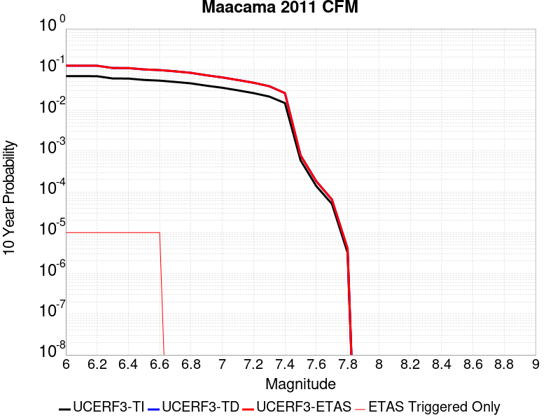 |

| Magnitude | 1 wk TI Prob | 1 wk TD Prob | 1 wk ETAS Prob | 1 wk ETAS/TD Gain | 1 wk ETAS Triggered Only | 1 mo TI Prob | 1 mo TD Prob | 1 mo ETAS Prob | 1 mo ETAS/TD Gain | 1 mo ETAS Triggered Only | 1 yr TI Prob | 1 yr TD Prob | 1 yr ETAS Prob | 1 yr ETAS/TD Gain | 1 yr ETAS Triggered Only | 10 yr TI Prob | 10 yr TD Prob | 10 yr ETAS Prob | 10 yr ETAS/TD Gain | 10 yr ETAS Triggered Only |
|-----|-----|-----|-----|-----|-----|-----|-----|-----|-----|-----|-----|-----|-----|-----|-----|-----|-----|-----|-----|-----|
| 6.0 | 1.368203E-4 | 2.5821978E-4 | 2.5821978E-4 | 1.0 | 0.0 | 5.862409E-4 | 0.0011061751 | 0.0011061751 | 1.0 | 0.0 | 0.0071141496 | 0.013360178 | 0.013360178 | 1.0 | 0.0 | 0.06890667 | 0.124274775 | 0.12429483 | 1.0001614 | 2.2906359E-5 |
| 6.1 | 1.368203E-4 | 2.5821978E-4 | 2.5821978E-4 | 1.0 | 0.0 | 5.862409E-4 | 0.0011061751 | 0.0011061751 | 1.0 | 0.0 | 0.0071141496 | 0.013360178 | 0.013360178 | 1.0 | 0.0 | 0.06890667 | 0.124274775 | 0.12429483 | 1.0001614 | 2.2906359E-5 |
| 6.2 | 1.360743E-4 | 2.569653E-4 | 2.569653E-4 | 1.0 | 0.0 | 5.8304524E-4 | 0.001100804 | 0.001100804 | 1.0 | 0.0 | 0.007075496 | 0.013295712 | 0.013295712 | 1.0 | 0.0 | 0.06854413 | 0.12370895 | 0.12372902 | 1.0001622 | 2.2906359E-5 |
| 6.3 | 1.1917239E-4 | 2.2381521E-4 | 2.2381521E-4 | 1.0 | 0.0 | 5.1063887E-4 | 9.5883745E-4 | 9.5883745E-4 | 1.0 | 0.0 | 0.0061993203 | 0.011596504 | 0.011596504 | 1.0 | 0.0 | 0.060292065 | 0.10892511 | 0.108945526 | 1.0001874 | 2.2906359E-5 |
| 6.4 | 1.1859289E-4 | 2.2285058E-4 | 2.2285058E-4 | 1.0 | 0.0 | 5.0815626E-4 | 9.547067E-4 | 9.547067E-4 | 1.0 | 0.0 | 0.006169266 | 0.011546799 | 0.011546799 | 1.0 | 0.0 | 0.06000784 | 0.108481795 | 0.10850221 | 1.0001882 | 2.2906359E-5 |
| 6.5 | 1.09512424E-4 | 2.0540757E-4 | 2.0540757E-4 | 1.0 | 0.0 | 4.6925453E-4 | 8.800018E-4 | 8.800018E-4 | 1.0 | 0.0 | 0.005698218 | 0.010647914 | 0.010647914 | 1.0 | 0.0 | 0.055543028 | 0.10057131 | 0.10059191 | 1.0002048 | 2.2906359E-5 |
| 6.6 | 1.0502928E-4 | 1.9697966E-4 | 1.9697966E-4 | 1.0 | 0.0 | 4.500478E-4 | 8.439078E-4 | 8.439078E-4 | 1.0 | 0.0 | 0.0054655746 | 0.010213858 | 0.010213858 | 1.0 | 0.0 | 0.053330887 | 0.09672256 | 0.09674325 | 1.0002139 | 2.2906359E-5 |
| 6.7 | 9.739358E-5 | 1.8277904E-4 | 1.8277904E-4 | 1.0 | 0.0 | 4.173343E-4 | 7.830906E-4 | 7.830906E-4 | 1.0 | 0.0 | 0.0050692135 | 0.009483728 | 0.009483728 | 1.0 | 0.0 | 0.049551267 | 0.090193085 | 0.090193085 | 1.0 | 0.0 |
| 6.8 | 8.969524E-5 | 1.6676696E-4 | 1.6676696E-4 | 1.0 | 0.0 | 3.8435153E-4 | 7.145057E-4 | 7.145057E-4 | 1.0 | 0.0 | 0.0046694432 | 0.008656753 | 0.008656753 | 1.0 | 0.0 | 0.045725387 | 0.08272071 | 0.08272071 | 1.0 | 0.0 |
| 6.9 | 7.838291E-5 | 1.4433586E-4 | 1.4433586E-4 | 1.0 | 0.0 | 3.358835E-4 | 6.1842095E-4 | 6.1842095E-4 | 1.0 | 0.0 | 0.0040817154 | 0.0074986615 | 0.0074986615 | 1.0 | 0.0 | 0.04007554 | 0.0721146 | 0.0721146 | 1.0 | 0.0 |
| 7.0 | 6.961957E-5 | 1.2720449E-4 | 1.2720449E-4 | 1.0 | 0.0 | 2.9833548E-4 | 5.45033E-4 | 5.45033E-4 | 1.0 | 0.0 | 0.0036261857 | 0.00661301 | 0.00661301 | 1.0 | 0.0 | 0.035675827 | 0.06392813 | 0.06392813 | 1.0 | 0.0 |
| 7.1 | 5.999398E-5 | 1.0915919E-4 | 1.0915919E-4 | 1.0 | 0.0 | 2.570917E-4 | 4.6772574E-4 | 4.6772574E-4 | 1.0 | 0.0 | 0.0031255994 | 0.0056784255 | 0.0056784255 | 1.0 | 0.0 | 0.030820016 | 0.055189762 | 0.055189762 | 1.0 | 0.0 |
| 7.2 | 5.116532E-5 | 9.314969E-5 | 9.314969E-5 | 1.0 | 0.0 | 2.1926152E-4 | 3.9913683E-4 | 3.9913683E-4 | 1.0 | 0.0 | 0.002666241 | 0.0048479997 | 0.0048479997 | 1.0 | 0.0 | 0.026344774 | 0.04734885 | 0.04734885 | 1.0 | 0.0 |
| 7.3 | 4.2087835E-5 | 7.62479E-5 | 7.62479E-5 | 1.0 | 0.0 | 1.8036396E-4 | 3.267206E-4 | 3.267206E-4 | 1.0 | 0.0 | 0.0021937196 | 0.0039701494 | 0.0039701494 | 1.0 | 0.0 | 0.0217219 | 0.03894215 | 0.03894215 | 1.0 | 0.0 |
| 7.4 | 2.8991652E-5 | 5.121617E-5 | 5.121617E-5 | 1.0 | 0.0 | 1.2424402E-4 | 2.194667E-4 | 2.194667E-4 | 1.0 | 0.0 | 0.0015116213 | 0.0026686103 | 0.0026686103 | 1.0 | 0.0 | 0.015013801 | 0.026356548 | 0.026356548 | 1.0 | 0.0 |
| 7.5 | 1.1292299E-6 | 1.4957741E-6 | 1.4957741E-6 | 1.0 | 0.0 | 4.8395473E-6 | 6.4104515E-6 | 6.4104515E-6 | 1.0 | 0.0 | 5.8919897E-5 | 7.804569E-5 | 7.804569E-5 | 1.0 | 0.0 | 5.890428E-4 | 7.808754E-4 | 7.808754E-4 | 1.0 | 0.0 |
| 7.6 | 2.6535366E-7 | 3.4745202E-7 | 3.4745202E-7 | 1.0 | 0.0 | 1.1372296E-6 | 1.4890793E-6 | 1.4890793E-6 | 1.0 | 0.0 | 1.3845682E-5 | 1.812939E-5 | 1.812939E-5 | 1.0 | 0.0 | 1.3844819E-4 | 1.8180255E-4 | 1.8180255E-4 | 1.0 | 0.0 |
| 7.7 | 9.727789E-8 | 1.231708E-7 | 1.231708E-7 | 1.0 | 0.0 | 4.1690518E-7 | 5.2787476E-7 | 5.2787476E-7 | 1.0 | 0.0 | 5.0758085E-6 | 6.4268565E-6 | 6.4268565E-6 | 1.0 | 0.0 | 5.0756928E-5 | 6.464869E-5 | 6.464869E-5 | 1.0 | 0.0 |
| 7.8 | 6.1939325E-9 | 7.723534E-9 | 7.723534E-9 | 1.0 | 0.0 | 2.6545425E-8 | 3.3100857E-8 | 3.3100857E-8 | 1.0 | 0.0 | 3.231905E-7 | 4.0300287E-7 | 4.0300287E-7 | 1.0 | 0.0 | 3.2319003E-6 | 4.066108E-6 | 4.066108E-6 | 1.0 | 0.0 |

## White Wolf
*[(top)](#table-of-contents)*

| 1 Week | 1 Month | 1 Year | 10 Year |
|-----|-----|-----|-----|
|  | 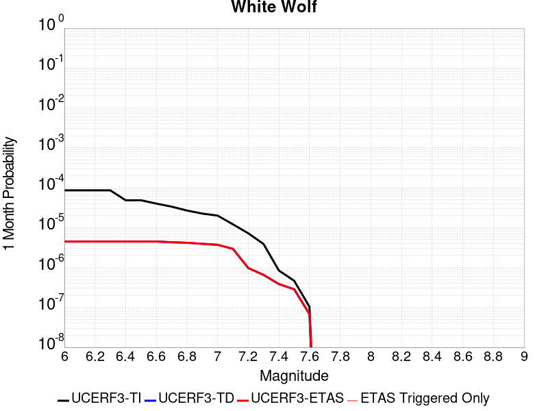 |  | 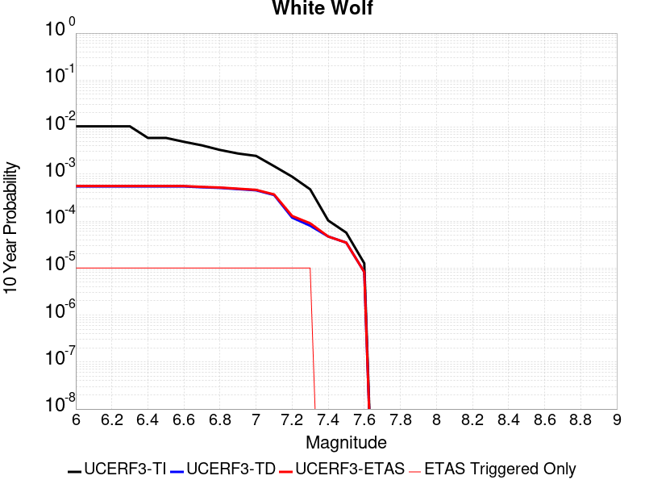 |

| Magnitude | 1 wk TI Prob | 1 wk TD Prob | 1 wk ETAS Prob | 1 wk ETAS/TD Gain | 1 wk ETAS Triggered Only | 1 mo TI Prob | 1 mo TD Prob | 1 mo ETAS Prob | 1 mo ETAS/TD Gain | 1 mo ETAS Triggered Only | 1 yr TI Prob | 1 yr TD Prob | 1 yr ETAS Prob | 1 yr ETAS/TD Gain | 1 yr ETAS Triggered Only | 10 yr TI Prob | 10 yr TD Prob | 10 yr ETAS Prob | 10 yr ETAS/TD Gain | 10 yr ETAS Triggered Only |
|-----|-----|-----|-----|-----|-----|-----|-----|-----|-----|-----|-----|-----|-----|-----|-----|-----|-----|-----|-----|-----|
| 6.0 | 2.0037822E-5 | 1.047058E-6 | 1.047058E-6 | 1.0 | 0.0 | 8.587355E-5 | 4.487384E-6 | 4.487384E-6 | 1.0 | 0.0 | 0.001045009 | 5.4632583E-5 | 5.4632583E-5 | 1.0 | 0.0 | 0.010401085 | 5.461966E-4 | 5.690904E-4 | 1.041915 | 2.2906359E-5 |
| 6.1 | 2.0037822E-5 | 1.047058E-6 | 1.047058E-6 | 1.0 | 0.0 | 8.587355E-5 | 4.487384E-6 | 4.487384E-6 | 1.0 | 0.0 | 0.001045009 | 5.4632583E-5 | 5.4632583E-5 | 1.0 | 0.0 | 0.010401085 | 5.461966E-4 | 5.690904E-4 | 1.041915 | 2.2906359E-5 |
| 6.2 | 2.0037822E-5 | 1.047058E-6 | 1.047058E-6 | 1.0 | 0.0 | 8.587355E-5 | 4.487384E-6 | 4.487384E-6 | 1.0 | 0.0 | 0.001045009 | 5.4632583E-5 | 5.4632583E-5 | 1.0 | 0.0 | 0.010401085 | 5.461966E-4 | 5.690904E-4 | 1.041915 | 2.2906359E-5 |
| 6.3 | 2.0037822E-5 | 1.047058E-6 | 1.047058E-6 | 1.0 | 0.0 | 8.587355E-5 | 4.487384E-6 | 4.487384E-6 | 1.0 | 0.0 | 0.001045009 | 5.4632583E-5 | 5.4632583E-5 | 1.0 | 0.0 | 0.010401085 | 5.461966E-4 | 5.690904E-4 | 1.041915 | 2.2906359E-5 |
| 6.4 | 1.132487E-5 | 1.047058E-6 | 1.047058E-6 | 1.0 | 0.0 | 4.8534253E-5 | 4.487384E-6 | 4.487384E-6 | 1.0 | 0.0 | 5.907443E-4 | 5.4632583E-5 | 5.4632583E-5 | 1.0 | 0.0 | 0.005891764 | 5.461966E-4 | 5.690904E-4 | 1.041915 | 2.2906359E-5 |
| 6.5 | 1.132487E-5 | 1.047058E-6 | 1.047058E-6 | 1.0 | 0.0 | 4.8534253E-5 | 4.487384E-6 | 4.487384E-6 | 1.0 | 0.0 | 5.907443E-4 | 5.4632583E-5 | 5.4632583E-5 | 1.0 | 0.0 | 0.005891764 | 5.461966E-4 | 5.690904E-4 | 1.041915 | 2.2906359E-5 |
| 6.6 | 9.347473E-6 | 1.047058E-6 | 1.047058E-6 | 1.0 | 0.0 | 4.0059982E-5 | 4.487384E-6 | 4.487384E-6 | 1.0 | 0.0 | 4.8762115E-4 | 5.4632583E-5 | 5.4632583E-5 | 1.0 | 0.0 | 0.0048655253 | 5.461966E-4 | 5.690904E-4 | 1.041915 | 2.2906359E-5 |
| 6.7 | 7.842647E-6 | 1.0049686E-6 | 1.0049686E-6 | 1.0 | 0.0 | 3.361091E-5 | 4.3070013E-6 | 4.3070013E-6 | 1.0 | 0.0 | 4.0913603E-4 | 5.2436528E-5 | 5.2436528E-5 | 1.0 | 0.0 | 0.004083836 | 5.2424654E-4 | 5.471409E-4 | 1.043671 | 2.2906359E-5 |
| 6.8 | 6.26597E-6 | 9.736085E-7 | 9.736085E-7 | 1.0 | 0.0 | 2.685388E-5 | 4.172601E-6 | 4.172601E-6 | 1.0 | 0.0 | 3.2689696E-4 | 5.080029E-5 | 5.080029E-5 | 1.0 | 0.0 | 0.003264165 | 5.0789164E-4 | 5.307864E-4 | 1.0450779 | 2.2906359E-5 |
| 6.9 | 5.258436E-6 | 9.1844277E-7 | 9.1844277E-7 | 1.0 | 0.0 | 2.2535958E-5 | 3.9361776E-6 | 3.9361776E-6 | 1.0 | 0.0 | 2.7434074E-4 | 4.7921956E-5 | 4.7921956E-5 | 1.0 | 0.0 | 0.0027400232 | 4.7912102E-4 | 5.020164E-4 | 1.0477862 | 2.2906359E-5 |
| 7.0 | 4.675028E-6 | 8.6622856E-7 | 8.6622856E-7 | 1.0 | 0.0 | 2.003568E-5 | 3.7124032E-6 | 3.7124032E-6 | 1.0 | 0.0 | 2.4390711E-4 | 4.519762E-5 | 4.519762E-5 | 1.0 | 0.0 | 0.0024363957 | 4.5188898E-4 | 4.74785E-4 | 1.0506673 | 2.2906359E-5 |
| 7.1 | 2.8270078E-6 | 6.875069E-7 | 6.875069E-7 | 1.0 | 0.0 | 1.2115692E-5 | 2.946455E-6 | 2.946455E-6 | 1.0 | 0.0 | 1.4749856E-4 | 3.587254E-5 | 3.587254E-5 | 1.0 | 0.0 | 0.001474007 | 3.586716E-4 | 3.8156973E-4 | 1.0638416 | 2.2906359E-5 |
| 7.2 | 1.6881406E-6 | 2.27111E-7 | 2.27111E-7 | 1.0 | 0.0 | 7.2348685E-6 | 9.733325E-7 | 9.733325E-7 | 1.0 | 0.0 | 8.808096E-5 | 1.185026E-5 | 1.185026E-5 | 1.0 | 0.0 | 8.8046055E-4 | 1.1849644E-4 | 1.4140009E-4 | 1.1932855 | 2.2906359E-5 |
| 7.3 | 9.086107E-7 | 1.5269218E-7 | 1.5269218E-7 | 1.0 | 0.0 | 3.8940398E-6 | 6.5439485E-7 | 6.5439485E-7 | 1.0 | 0.0 | 4.7408903E-5 | 7.967229E-6 | 7.967229E-6 | 1.0 | 0.0 | 4.739879E-4 | 7.966952E-5 | 1.0257405E-4 | 1.2874943 | 2.2906359E-5 |
| 7.4 | 1.9717383E-7 | 9.004596E-8 | 9.004596E-8 | 1.0 | 0.0 | 8.450304E-7 | 3.859112E-7 | 3.859112E-7 | 1.0 | 0.0 | 1.0288197E-5 | 4.6984587E-6 | 4.6984587E-6 | 1.0 | 0.0 | 1.028772E-4 | 4.6983627E-5 | 4.6983627E-5 | 1.0 | 0.0 |
| 7.5 | 1.086975E-7 | 6.6600954E-8 | 6.6600954E-8 | 1.0 | 0.0 | 4.6584634E-7 | 2.854326E-7 | 2.854326E-7 | 1.0 | 0.0 | 5.6716644E-6 | 3.4751367E-6 | 3.4751367E-6 | 1.0 | 0.0 | 5.6715195E-5 | 3.4750847E-5 | 3.4750847E-5 | 1.0 | 0.0 |
| 7.6 | 2.4217808E-8 | 1.582155E-8 | 1.582155E-8 | 1.0 | 0.0 | 1.03790605E-7 | 6.780664E-8 | 6.780664E-8 | 1.0 | 0.0 | 1.2636499E-6 | 8.255456E-7 | 8.255456E-7 | 1.0 | 0.0 | 1.2636427E-5 | 8.255431E-6 | 8.255431E-6 | 1.0 | 0.0 |

## Point Reyes 2011 CFM
*[(top)](#table-of-contents)*

| 1 Week | 1 Month | 1 Year | 10 Year |
|-----|-----|-----|-----|
|  | 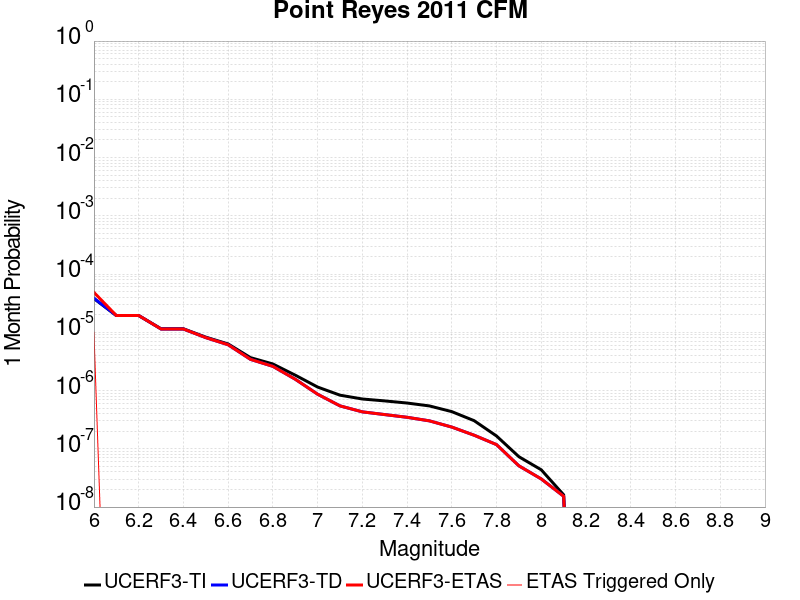 |  |  |

| Magnitude | 1 wk TI Prob | 1 wk TD Prob | 1 wk ETAS Prob | 1 wk ETAS/TD Gain | 1 wk ETAS Triggered Only | 1 mo TI Prob | 1 mo TD Prob | 1 mo ETAS Prob | 1 mo ETAS/TD Gain | 1 mo ETAS Triggered Only | 1 yr TI Prob | 1 yr TD Prob | 1 yr ETAS Prob | 1 yr ETAS/TD Gain | 1 yr ETAS Triggered Only | 10 yr TI Prob | 10 yr TD Prob | 10 yr ETAS Prob | 10 yr ETAS/TD Gain | 10 yr ETAS Triggered Only |
|-----|-----|-----|-----|-----|-----|-----|-----|-----|-----|-----|-----|-----|-----|-----|-----|-----|-----|-----|-----|-----|
| 6.0 | 8.8644965E-6 | 8.967546E-6 | 8.967546E-6 | 1.0 | 0.0 | 3.7990147E-5 | 3.843181E-5 | 6.133729E-5 | 1.5960032 | 2.2906359E-5 | 4.624319E-4 | 4.678131E-4 | 4.9070874E-4 | 1.0489419 | 2.2906359E-5 | 0.0046147075 | 0.0046689115 | 0.004691711 | 1.0048833 | 2.2906359E-5 |
| 6.1 | 4.526405E-6 | 4.5394795E-6 | 4.5394795E-6 | 1.0 | 0.0 | 1.9398734E-5 | 1.9454772E-5 | 1.9454772E-5 | 1.0 | 0.0 | 2.36154E-4 | 2.3683715E-4 | 2.3683715E-4 | 1.0 | 0.0 | 0.002359032 | 0.0023659538 | 0.0023659538 | 1.0 | 0.0 |
| 6.2 | 4.526405E-6 | 4.5394795E-6 | 4.5394795E-6 | 1.0 | 0.0 | 1.9398734E-5 | 1.9454772E-5 | 1.9454772E-5 | 1.0 | 0.0 | 2.36154E-4 | 2.3683715E-4 | 2.3683715E-4 | 1.0 | 0.0 | 0.002359032 | 0.0023659538 | 0.0023659538 | 1.0 | 0.0 |
| 6.3 | 2.6842322E-6 | 2.6608877E-6 | 2.6608877E-6 | 1.0 | 0.0 | 1.1503801E-5 | 1.1403756E-5 | 1.1403756E-5 | 1.0 | 0.0 | 1.4004979E-4 | 1.3883208E-4 | 1.3883208E-4 | 1.0 | 0.0 | 0.0013996155 | 0.0013874753 | 0.0013874753 | 1.0 | 0.0 |
| 6.4 | 2.6842322E-6 | 2.6608877E-6 | 2.6608877E-6 | 1.0 | 0.0 | 1.1503801E-5 | 1.1403756E-5 | 1.1403756E-5 | 1.0 | 0.0 | 1.4004979E-4 | 1.3883208E-4 | 1.3883208E-4 | 1.0 | 0.0 | 0.0013996155 | 0.0013874753 | 0.0013874753 | 1.0 | 0.0 |
| 6.5 | 1.9281833E-6 | 1.8908191E-6 | 1.8908191E-6 | 1.0 | 0.0 | 8.263617E-6 | 8.103486E-6 | 8.103486E-6 | 1.0 | 0.0 | 1.0060489E-4 | 9.865555E-5 | 9.865555E-5 | 1.0 | 0.0 | 0.0010055936 | 9.861285E-4 | 9.861285E-4 | 1.0 | 0.0 |
| 6.6 | 1.4726726E-6 | 1.4271395E-6 | 1.4271395E-6 | 1.0 | 0.0 | 6.3114385E-6 | 6.116298E-6 | 6.116298E-6 | 1.0 | 0.0 | 7.683905E-5 | 7.446343E-5 | 7.446343E-5 | 1.0 | 0.0 | 7.6812494E-4 | 7.44392E-4 | 7.44392E-4 | 1.0 | 0.0 |
| 6.7 | 8.572307E-7 | 8.008884E-7 | 8.008884E-7 | 1.0 | 0.0 | 3.6738406E-6 | 3.4323746E-6 | 3.4323746E-6 | 1.0 | 0.0 | 4.472809E-5 | 4.1788375E-5 | 4.1788375E-5 | 1.0 | 0.0 | 4.471909E-4 | 4.178091E-4 | 4.178091E-4 | 1.0 | 0.0 |
| 6.8 | 6.6745434E-7 | 6.0789284E-7 | 6.0789284E-7 | 1.0 | 0.0 | 2.8605155E-6 | 2.6052526E-6 | 2.6052526E-6 | 1.0 | 0.0 | 3.482622E-5 | 3.17185E-5 | 3.17185E-5 | 1.0 | 0.0 | 3.4820763E-4 | 3.17143E-4 | 3.17143E-4 | 1.0 | 0.0 |
| 6.9 | 4.291521E-7 | 3.6551677E-7 | 3.6551677E-7 | 1.0 | 0.0 | 1.839222E-6 | 1.5664996E-6 | 1.5664996E-6 | 1.0 | 0.0 | 2.2392298E-5 | 1.907197E-5 | 1.907197E-5 | 1.0 | 0.0 | 2.2390042E-4 | 1.9070598E-4 | 1.9070598E-4 | 1.0 | 0.0 |
| 7.0 | 2.6812808E-7 | 2.0202775E-7 | 2.0202775E-7 | 1.0 | 0.0 | 1.1491198E-6 | 8.6583293E-7 | 8.6583293E-7 | 1.0 | 0.0 | 1.3990444E-5 | 1.0541466E-5 | 1.0541466E-5 | 1.0 | 0.0 | 1.3989564E-4 | 1.0541201E-4 | 1.0541201E-4 | 1.0 | 0.0 |
| 7.1 | 1.9451231E-7 | 1.2740678E-7 | 1.2740678E-7 | 1.0 | 0.0 | 8.336239E-7 | 5.4602896E-7 | 5.4602896E-7 | 1.0 | 0.0 | 1.0149324E-5 | 6.647882E-6 | 6.647882E-6 | 1.0 | 0.0 | 1.014886E-4 | 6.6479115E-5 | 6.6479115E-5 | 1.0 | 0.0 |
| 7.2 | 1.6715143E-7 | 1.0057795E-7 | 1.0057795E-7 | 1.0 | 0.0 | 7.1636305E-7 | 4.310483E-7 | 4.310483E-7 | 1.0 | 0.0 | 8.721685E-6 | 5.248E-6 | 5.248E-6 | 1.0 | 0.0 | 8.721343E-5 | 5.2481042E-5 | 5.2481042E-5 | 1.0 | 0.0 |
| 7.3 | 1.5503173E-7 | 9.0278355E-8 | 9.0278355E-8 | 1.0 | 0.0 | 6.644215E-7 | 3.869072E-7 | 3.869072E-7 | 1.0 | 0.0 | 8.089301E-6 | 4.7105846E-6 | 4.7105846E-6 | 1.0 | 0.0 | 8.089007E-5 | 4.710713E-5 | 4.710713E-5 | 1.0 | 0.0 |
| 7.4 | 1.4251614E-7 | 8.111958E-8 | 8.111958E-8 | 1.0 | 0.0 | 6.1078333E-7 | 3.4765532E-7 | 3.4765532E-7 | 1.0 | 0.0 | 7.4362615E-6 | 4.232695E-6 | 4.232695E-6 | 1.0 | 0.0 | 7.436013E-5 | 4.2328422E-5 | 4.2328422E-5 | 1.0 | 0.0 |
| 7.5 | 1.2710186E-7 | 7.0434105E-8 | 7.0434105E-8 | 1.0 | 0.0 | 5.447221E-7 | 3.0186044E-7 | 3.0186044E-7 | 1.0 | 0.0 | 6.6319717E-6 | 3.6751444E-6 | 3.6751444E-6 | 1.0 | 0.0 | 6.6317734E-5 | 3.6753114E-5 | 3.6753114E-5 | 1.0 | 0.0 |
| 7.6 | 1.0144708E-7 | 5.5078203E-8 | 5.5078203E-8 | 1.0 | 0.0 | 4.347731E-7 | 2.3604943E-7 | 2.3604943E-7 | 1.0 | 0.0 | 5.2933497E-6 | 2.873898E-6 | 2.873898E-6 | 1.0 | 0.0 | 5.293224E-5 | 2.8740886E-5 | 2.8740886E-5 | 1.0 | 0.0 |
| 7.7 | 7.090527E-8 | 3.9928437E-8 | 3.9928437E-8 | 1.0 | 0.0 | 3.038797E-7 | 1.7112185E-7 | 1.7112185E-7 | 1.0 | 0.0 | 3.699729E-6 | 2.0834066E-6 | 2.0834066E-6 | 1.0 | 0.0 | 3.6996673E-5 | 2.0836149E-5 | 2.0836149E-5 | 1.0 | 0.0 |
| 7.8 | 3.8712045E-8 | 2.7529941E-8 | 2.7529941E-8 | 1.0 | 0.0 | 1.6590876E-7 | 1.17985465E-7 | 1.17985465E-7 | 1.0 | 0.0 | 2.0199373E-6 | 1.4364721E-6 | 1.4364721E-6 | 1.0 | 0.0 | 2.0199188E-5 | 1.4366906E-5 | 1.4366906E-5 | 1.0 | 0.0 |
| 7.9 | 1.7068782E-8 | 1.1907058E-8 | 1.1907058E-8 | 1.0 | 0.0 | 7.315192E-8 | 5.1030252E-8 | 5.1030252E-8 | 1.0 | 0.0 | 8.906242E-7 | 6.2129317E-7 | 6.2129317E-7 | 1.0 | 0.0 | 8.906207E-6 | 6.215192E-6 | 6.215192E-6 | 1.0 | 0.0 |
| 8.0 | 1.0172592E-8 | 7.090016E-9 | 7.090016E-9 | 1.0 | 0.0 | 4.359682E-8 | 3.038579E-8 | 3.038579E-8 | 1.0 | 0.0 | 5.3079117E-7 | 3.6994695E-7 | 3.6994695E-7 | 1.0 | 0.0 | 5.307899E-6 | 3.7017412E-6 | 3.7017412E-6 | 1.0 | 0.0 |
| 8.1 | 3.7861243E-9 | 3.5751233E-9 | 3.5751233E-9 | 1.0 | 0.0 | 1.6226247E-8 | 1.532196E-8 | 1.532196E-8 | 1.0 | 0.0 | 1.9755454E-7 | 1.8654485E-7 | 1.8654485E-7 | 1.0 | 0.0 | 1.9755437E-6 | 1.8674533E-6 | 1.8674533E-6 | 1.0 | 0.0 |

## Quien Sabe 2011 CFM
*[(top)](#table-of-contents)*

| 1 Week | 1 Month | 1 Year | 10 Year |
|-----|-----|-----|-----|
|  |  |  |  |

| Magnitude | 1 wk TI Prob | 1 wk TD Prob | 1 wk ETAS Prob | 1 wk ETAS/TD Gain | 1 wk ETAS Triggered Only | 1 mo TI Prob | 1 mo TD Prob | 1 mo ETAS Prob | 1 mo ETAS/TD Gain | 1 mo ETAS Triggered Only | 1 yr TI Prob | 1 yr TD Prob | 1 yr ETAS Prob | 1 yr ETAS/TD Gain | 1 yr ETAS Triggered Only | 10 yr TI Prob | 10 yr TD Prob | 10 yr ETAS Prob | 10 yr ETAS/TD Gain | 10 yr ETAS Triggered Only |
|-----|-----|-----|-----|-----|-----|-----|-----|-----|-----|-----|-----|-----|-----|-----|-----|-----|-----|-----|-----|-----|
| 6.0 | 3.729899E-5 | 7.0994334E-5 | 7.0994334E-5 | 1.0 | 0.0 | 1.5984301E-4 | 3.0423512E-4 | 3.0423512E-4 | 1.0 | 0.0 | 0.0019443515 | 0.0036865699 | 0.0036865699 | 1.0 | 0.0 | 0.019274272 | 0.0353649 | 0.035386994 | 1.0006248 | 2.2906359E-5 |
| 6.1 | 1.7825725E-5 | 3.319839E-5 | 3.319839E-5 | 1.0 | 0.0 | 7.639373E-5 | 1.4227358E-4 | 1.4227358E-4 | 1.0 | 0.0 | 9.296967E-4 | 0.0017274261 | 0.0017274261 | 1.0 | 0.0 | 0.009258169 | 0.01670641 | 0.016728934 | 1.0013483 | 2.2906359E-5 |
| 6.2 | 4.8865336E-6 | 7.812467E-6 | 7.812467E-6 | 1.0 | 0.0 | 2.0942118E-5 | 3.348162E-5 | 3.348162E-5 | 1.0 | 0.0 | 2.5494045E-4 | 4.0715327E-4 | 4.0715327E-4 | 1.0 | 0.0 | 0.0025464818 | 0.0040157936 | 0.0040157936 | 1.0 | 0.0 |
| 6.3 | 3.858491E-6 | 5.79343E-6 | 5.79343E-6 | 1.0 | 0.0 | 1.6536285E-5 | 2.4828774E-5 | 2.4828774E-5 | 1.0 | 0.0 | 2.0131067E-4 | 3.022531E-4 | 3.022531E-4 | 1.0 | 0.0 | 0.002011284 | 0.0030038692 | 0.0030038692 | 1.0 | 0.0 |
| 6.4 | 3.0771805E-6 | 4.388484E-6 | 4.388484E-6 | 1.0 | 0.0 | 1.318785E-5 | 1.8807666E-5 | 1.8807666E-5 | 1.0 | 0.0 | 1.6055023E-4 | 2.289617E-4 | 2.289617E-4 | 1.0 | 0.0 | 0.001604343 | 0.0022882835 | 0.0022882835 | 1.0 | 0.0 |
| 6.5 | 2.5081235E-6 | 3.4668653E-6 | 3.4668653E-6 | 1.0 | 0.0 | 1.0749056E-5 | 1.4857917E-5 | 1.4857917E-5 | 1.0 | 0.0 | 1.308619E-4 | 1.808816E-4 | 1.808816E-4 | 1.0 | 0.0 | 0.0013078486 | 0.0018139676 | 0.0018139676 | 1.0 | 0.0 |
| 6.6 | 1.7505364E-6 | 2.4048998E-6 | 2.4048998E-6 | 1.0 | 0.0 | 7.502277E-6 | 1.0306677E-5 | 1.0306677E-5 | 1.0 | 0.0 | 9.13364E-5 | 1.2547728E-4 | 1.2547728E-4 | 1.0 | 0.0 | 9.129886E-4 | 0.0012595841 | 0.0012595841 | 1.0 | 0.0 |
| 6.7 | 1.505737E-6 | 2.0661041E-6 | 2.0661041E-6 | 1.0 | 0.0 | 6.4531428E-6 | 8.854705E-6 | 8.854705E-6 | 1.0 | 0.0 | 7.8564175E-5 | 1.07801294E-4 | 1.07801294E-4 | 1.0 | 0.0 | 7.853641E-4 | 0.0010830046 | 0.0010830046 | 1.0 | 0.0 |
| 6.8 | 1.2924105E-6 | 1.750539E-6 | 1.750539E-6 | 1.0 | 0.0 | 5.5388905E-6 | 7.5022917E-6 | 7.5022917E-6 | 1.0 | 0.0 | 6.74339E-5 | 9.133712E-5 | 9.133712E-5 | 1.0 | 0.0 | 6.741344E-4 | 9.171743E-4 | 9.171743E-4 | 1.0 | 0.0 |
| 6.9 | 8.9075286E-7 | 1.1264539E-6 | 1.1264539E-6 | 1.0 | 0.0 | 3.8175067E-6 | 4.827652E-6 | 4.827652E-6 | 1.0 | 0.0 | 4.6477155E-5 | 5.87753E-5 | 5.87753E-5 | 1.0 | 0.0 | 4.6467435E-4 | 5.9113425E-4 | 5.9113425E-4 | 1.0 | 0.0 |
| 7.0 | 6.6891175E-7 | 8.529351E-7 | 8.529351E-7 | 1.0 | 0.0 | 2.8667614E-6 | 3.6554322E-6 | 3.6554322E-6 | 1.0 | 0.0 | 3.4902263E-5 | 4.4504177E-5 | 4.4504177E-5 | 1.0 | 0.0 | 3.4896782E-4 | 4.4743155E-4 | 4.4743155E-4 | 1.0 | 0.0 |
| 7.1 | 4.4205015E-7 | 5.3951663E-7 | 5.3951663E-7 | 1.0 | 0.0 | 1.8944993E-6 | 2.312213E-6 | 2.312213E-6 | 1.0 | 0.0 | 2.3065284E-5 | 2.8150998E-5 | 2.8150998E-5 | 1.0 | 0.0 | 2.3062891E-4 | 2.8285658E-4 | 2.8285658E-4 | 1.0 | 0.0 |
| 7.2 | 1.6620965E-7 | 1.6002667E-7 | 1.6002667E-7 | 1.0 | 0.0 | 7.123269E-7 | 6.858284E-7 | 6.858284E-7 | 1.0 | 0.0 | 8.672545E-6 | 8.3499335E-6 | 8.3499335E-6 | 1.0 | 0.0 | 8.6722066E-5 | 8.365197E-5 | 8.365197E-5 | 1.0 | 0.0 |
| 7.3 | 1.2142488E-7 | 1.17323225E-7 | 1.17323225E-7 | 1.0 | 0.0 | 5.2039223E-7 | 5.0281375E-7 | 5.0281375E-7 | 1.0 | 0.0 | 6.335757E-6 | 6.121744E-6 | 6.121744E-6 | 1.0 | 0.0 | 6.3355765E-5 | 6.1278944E-5 | 6.1278944E-5 | 1.0 | 0.0 |
| 7.4 | 2.4192937E-8 | 2.4553245E-8 | 2.4553245E-8 | 1.0 | 0.0 | 1.0368401E-7 | 1.0522819E-7 | 1.0522819E-7 | 1.0 | 0.0 | 1.2623522E-6 | 1.2811525E-6 | 1.2811525E-6 | 1.0 | 0.0 | 1.2623449E-5 | 1.2817795E-5 | 1.2817795E-5 | 1.0 | 0.0 |
| 7.5 | 1.4432802E-8 | 1.4510259E-8 | 1.4510259E-8 | 1.0 | 0.0 | 6.185486E-8 | 6.218682E-8 | 6.218682E-8 | 1.0 | 0.0 | 7.530827E-7 | 7.571244E-7 | 7.571244E-7 | 1.0 | 0.0 | 7.530801E-6 | 7.575493E-6 | 7.575493E-6 | 1.0 | 0.0 |

## Cleghorn
*[(top)](#table-of-contents)*

| 1 Week | 1 Month | 1 Year | 10 Year |
|-----|-----|-----|-----|
|  |  |  |  |

| Magnitude | 1 wk TI Prob | 1 wk TD Prob | 1 wk ETAS Prob | 1 wk ETAS/TD Gain | 1 wk ETAS Triggered Only | 1 mo TI Prob | 1 mo TD Prob | 1 mo ETAS Prob | 1 mo ETAS/TD Gain | 1 mo ETAS Triggered Only | 1 yr TI Prob | 1 yr TD Prob | 1 yr ETAS Prob | 1 yr ETAS/TD Gain | 1 yr ETAS Triggered Only | 10 yr TI Prob | 10 yr TD Prob | 10 yr ETAS Prob | 10 yr ETAS/TD Gain | 10 yr ETAS Triggered Only |
|-----|-----|-----|-----|-----|-----|-----|-----|-----|-----|-----|-----|-----|-----|-----|-----|-----|-----|-----|-----|-----|
| 6.0 | 7.9267165E-6 | 9.844329E-6 | 9.844329E-6 | 1.0 | 0.0 | 3.39712E-5 | 4.2189356E-5 | 4.2189356E-5 | 1.0 | 0.0 | 4.1352084E-4 | 5.13545E-4 | 5.13545E-4 | 1.0 | 0.0 | 0.004127522 | 0.005138525 | 0.0051613133 | 1.0044348 | 2.2906359E-5 |
| 6.1 | 7.9267165E-6 | 9.844329E-6 | 9.844329E-6 | 1.0 | 0.0 | 3.39712E-5 | 4.2189356E-5 | 4.2189356E-5 | 1.0 | 0.0 | 4.1352084E-4 | 5.13545E-4 | 5.13545E-4 | 1.0 | 0.0 | 0.004127522 | 0.005138525 | 0.0051613133 | 1.0044348 | 2.2906359E-5 |
| 6.2 | 7.9267165E-6 | 9.844329E-6 | 9.844329E-6 | 1.0 | 0.0 | 3.39712E-5 | 4.2189356E-5 | 4.2189356E-5 | 1.0 | 0.0 | 4.1352084E-4 | 5.13545E-4 | 5.13545E-4 | 1.0 | 0.0 | 0.004127522 | 0.005138525 | 0.0051613133 | 1.0044348 | 2.2906359E-5 |
| 6.3 | 7.9267165E-6 | 9.844329E-6 | 9.844329E-6 | 1.0 | 0.0 | 3.39712E-5 | 4.2189356E-5 | 4.2189356E-5 | 1.0 | 0.0 | 4.1352084E-4 | 5.13545E-4 | 5.13545E-4 | 1.0 | 0.0 | 0.004127522 | 0.005138525 | 0.0051613133 | 1.0044348 | 2.2906359E-5 |
| 6.4 | 4.3445207E-6 | 6.1039705E-6 | 6.1039705E-6 | 1.0 | 0.0 | 1.8619241E-5 | 2.6159618E-5 | 2.6159618E-5 | 1.0 | 0.0 | 2.2666567E-4 | 3.184478E-4 | 3.184478E-4 | 1.0 | 0.0 | 0.0022643462 | 0.0031939335 | 0.0031939335 | 1.0 | 0.0 |
| 6.5 | 4.3445207E-6 | 6.1039705E-6 | 6.1039705E-6 | 1.0 | 0.0 | 1.8619241E-5 | 2.6159618E-5 | 2.6159618E-5 | 1.0 | 0.0 | 2.2666567E-4 | 3.184478E-4 | 3.184478E-4 | 1.0 | 0.0 | 0.0022643462 | 0.0031939335 | 0.0031939335 | 1.0 | 0.0 |
| 6.6 | 4.040109E-6 | 5.78636E-6 | 5.78636E-6 | 1.0 | 0.0 | 1.7314638E-5 | 2.4798455E-5 | 2.4798455E-5 | 1.0 | 0.0 | 2.1078532E-4 | 3.018803E-4 | 3.018803E-4 | 1.0 | 0.0 | 0.002105855 | 0.0030287148 | 0.0030287148 | 1.0 | 0.0 |
| 6.7 | 3.3632055E-6 | 5.0798167E-6 | 5.0798167E-6 | 1.0 | 0.0 | 1.4413658E-5 | 2.1770462E-5 | 2.1770462E-5 | 1.0 | 0.0 | 1.7547216E-4 | 2.6502347E-4 | 2.6502347E-4 | 1.0 | 0.0 | 0.0017533366 | 0.0026610303 | 0.0026610303 | 1.0 | 0.0 |
| 6.8 | 3.2902772E-6 | 5.0017165E-6 | 5.0017165E-6 | 1.0 | 0.0 | 1.4101111E-5 | 2.1435753E-5 | 2.1435753E-5 | 1.0 | 0.0 | 1.716675E-4 | 2.6094937E-4 | 2.6094937E-4 | 1.0 | 0.0 | 0.0017153495 | 0.0026203855 | 0.0026203855 | 1.0 | 0.0 |
| 6.9 | 3.031547E-6 | 4.7032236E-6 | 4.7032236E-6 | 1.0 | 0.0 | 1.299228E-5 | 2.0156518E-5 | 2.0156518E-5 | 1.0 | 0.0 | 1.5816953E-4 | 2.4537824E-4 | 2.4537824E-4 | 1.0 | 0.0 | 0.00158057 | 0.002465027 | 0.002465027 | 1.0 | 0.0 |
| 7.0 | 2.8259715E-6 | 4.3821365E-6 | 4.3821365E-6 | 1.0 | 0.0 | 1.211125E-5 | 1.8780453E-5 | 1.8780453E-5 | 1.0 | 0.0 | 1.4744449E-4 | 2.2862825E-4 | 2.2862825E-4 | 1.0 | 0.0 | 0.001473467 | 0.002297883 | 0.002297883 | 1.0 | 0.0 |
| 7.1 | 2.5962665E-6 | 4.0770733E-6 | 4.0770733E-6 | 1.0 | 0.0 | 1.1126809E-5 | 1.7473056E-5 | 1.7473056E-5 | 1.0 | 0.0 | 1.3546048E-4 | 2.127139E-4 | 2.127139E-4 | 1.0 | 0.0 | 0.0013537793 | 0.0021390605 | 0.0021390605 | 1.0 | 0.0 |
| 7.2 | 2.3247253E-6 | 3.687283E-6 | 3.687283E-6 | 1.0 | 0.0 | 9.96307E-6 | 1.5802547E-5 | 1.5802547E-5 | 1.0 | 0.0 | 1.21293626E-4 | 1.923792E-4 | 1.923792E-4 | 1.0 | 0.0 | 0.0012122744 | 0.0019361057 | 0.0019361057 | 1.0 | 0.0 |
| 7.3 | 2.056928E-6 | 3.2453E-6 | 3.2453E-6 | 1.0 | 0.0 | 8.815376E-6 | 1.3908355E-5 | 1.3908355E-5 | 1.0 | 0.0 | 1.0732192E-4 | 1.6932123E-4 | 1.6932123E-4 | 1.0 | 0.0 | 0.001072701 | 0.0017059678 | 0.0017059678 | 1.0 | 0.0 |
| 7.4 | 1.8055999E-6 | 2.835059E-6 | 2.835059E-6 | 1.0 | 0.0 | 7.738263E-6 | 1.2150197E-5 | 1.2150197E-5 | 1.0 | 0.0 | 9.4209274E-5 | 1.4791875E-4 | 1.4791875E-4 | 1.0 | 0.0 | 9.4169343E-4 | 0.0014923868 | 0.0014923868 | 1.0 | 0.0 |
| 7.5 | 1.4683443E-6 | 2.4340136E-6 | 2.4340136E-6 | 1.0 | 0.0 | 6.292889E-6 | 1.0431445E-5 | 1.0431445E-5 | 1.0 | 0.0 | 7.661323E-5 | 1.2699554E-4 | 1.2699554E-4 | 1.0 | 0.0 | 7.658682E-4 | 0.0012834566 | 0.0012834566 | 1.0 | 0.0 |
| 7.6 | 9.804088E-7 | 1.9093818E-6 | 1.9093818E-6 | 1.0 | 0.0 | 4.201745E-6 | 8.183039E-6 | 8.183039E-6 | 1.0 | 0.0 | 5.1155046E-5 | 9.962399E-5 | 9.962399E-5 | 1.0 | 0.0 | 5.114327E-4 | 0.0010100557 | 0.0010100557 | 1.0 | 0.0 |
| 7.7 | 7.3434086E-7 | 1.6373907E-6 | 1.6373907E-6 | 1.0 | 0.0 | 3.1471714E-6 | 7.01737E-6 | 7.01737E-6 | 1.0 | 0.0 | 3.831614E-5 | 8.543315E-5 | 8.543315E-5 | 1.0 | 0.0 | 3.8309532E-4 | 8.683008E-4 | 8.683008E-4 | 1.0 | 0.0 |
| 7.8 | 6.434184E-7 | 1.5305798E-6 | 1.5305798E-6 | 1.0 | 0.0 | 2.7575045E-6 | 6.5596114E-6 | 6.5596114E-6 | 1.0 | 0.0 | 3.35721E-5 | 7.9860365E-5 | 7.9860365E-5 | 1.0 | 0.0 | 3.3567028E-4 | 8.122777E-4 | 8.122777E-4 | 1.0 | 0.0 |
| 7.9 | 3.4943926E-7 | 7.620481E-7 | 7.620481E-7 | 1.0 | 0.0 | 1.497596E-6 | 3.2659163E-6 | 3.2659163E-6 | 1.0 | 0.0 | 1.8233079E-5 | 3.9761813E-5 | 3.9761813E-5 | 1.0 | 0.0 | 1.8231584E-4 | 4.0634157E-4 | 4.0634157E-4 | 1.0 | 0.0 |
| 8.0 | 6.717524E-8 | 5.8917895E-8 | 5.8917895E-8 | 1.0 | 0.0 | 2.8789387E-7 | 2.5250523E-7 | 2.5250523E-7 | 1.0 | 0.0 | 3.505102E-6 | 3.074247E-6 | 3.074247E-6 | 1.0 | 0.0 | 3.5050467E-5 | 3.301935E-5 | 3.301935E-5 | 1.0 | 0.0 |
| 8.1 | 3.1984914E-8 | 1.31279485E-8 | 1.31279485E-8 | 1.0 | 0.0 | 1.370782E-7 | 5.6262632E-8 | 5.6262632E-8 | 1.0 | 0.0 | 1.6689258E-6 | 6.849973E-7 | 6.849973E-7 | 1.0 | 0.0 | 1.6689133E-5 | 7.841479E-6 | 7.841479E-6 | 1.0 | 0.0 |
| 8.2 | 1.21887656E-8 | 3.7025414E-9 | 3.7025414E-9 | 1.0 | 0.0 | 5.2237567E-8 | 1.5868034E-8 | 1.5868034E-8 | 1.0 | 0.0 | 6.359922E-7 | 1.9319329E-7 | 1.9319329E-7 | 1.0 | 0.0 | 6.3599036E-6 | 2.2777037E-6 | 2.2777037E-6 | 1.0 | 0.0 |

## Earthquake Valley (So Extension)
*[(top)](#table-of-contents)*

| 1 Week | 1 Month | 1 Year | 10 Year |
|-----|-----|-----|-----|
|  |  | 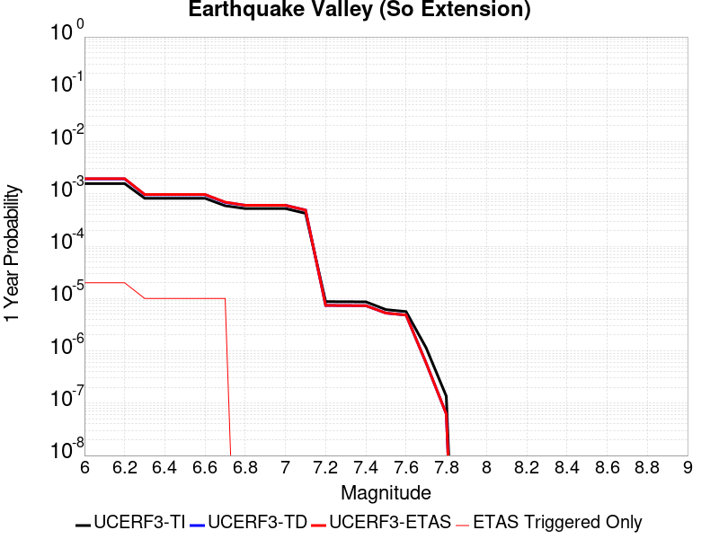 |  |

| Magnitude | 1 wk TI Prob | 1 wk TD Prob | 1 wk ETAS Prob | 1 wk ETAS/TD Gain | 1 wk ETAS Triggered Only | 1 mo TI Prob | 1 mo TD Prob | 1 mo ETAS Prob | 1 mo ETAS/TD Gain | 1 mo ETAS Triggered Only | 1 yr TI Prob | 1 yr TD Prob | 1 yr ETAS Prob | 1 yr ETAS/TD Gain | 1 yr ETAS Triggered Only | 10 yr TI Prob | 10 yr TD Prob | 10 yr ETAS Prob | 10 yr ETAS/TD Gain | 10 yr ETAS Triggered Only |
|-----|-----|-----|-----|-----|-----|-----|-----|-----|-----|-----|-----|-----|-----|-----|-----|-----|-----|-----|-----|-----|
| 6.0 | 3.0194888E-5 | 3.7083595E-5 | 3.7083595E-5 | 1.0 | 0.0 | 1.2940024E-4 | 1.5892308E-4 | 1.818258E-4 | 1.144112 | 2.2906359E-5 | 0.0015743093 | 0.0019337159 | 0.0019565779 | 1.0118228 | 2.2906359E-5 | 0.01563203 | 0.019218799 | 0.019241266 | 1.001169 | 2.2906359E-5 |
| 6.1 | 3.0194888E-5 | 3.7083595E-5 | 3.7083595E-5 | 1.0 | 0.0 | 1.2940024E-4 | 1.5892308E-4 | 1.818258E-4 | 1.144112 | 2.2906359E-5 | 0.0015743093 | 0.0019337159 | 0.0019565779 | 1.0118228 | 2.2906359E-5 | 0.01563203 | 0.019218799 | 0.019241266 | 1.001169 | 2.2906359E-5 |
| 6.2 | 3.0194888E-5 | 3.7083595E-5 | 3.7083595E-5 | 1.0 | 0.0 | 1.2940024E-4 | 1.5892308E-4 | 1.818258E-4 | 1.144112 | 2.2906359E-5 | 0.0015743093 | 0.0019337159 | 0.0019565779 | 1.0118228 | 2.2906359E-5 | 0.01563203 | 0.019218799 | 0.019241266 | 1.001169 | 2.2906359E-5 |
| 6.3 | 1.5795305E-5 | 1.8450788E-5 | 1.8450788E-5 | 1.0 | 0.0 | 6.769241E-5 | 7.9073034E-5 | 7.9073034E-5 | 1.0 | 0.0 | 8.238434E-4 | 9.624003E-4 | 9.624003E-4 | 1.0 | 0.0 | 0.008207959 | 0.009593238 | 0.009593238 | 1.0 | 0.0 |
| 6.4 | 1.5795305E-5 | 1.8450788E-5 | 1.8450788E-5 | 1.0 | 0.0 | 6.769241E-5 | 7.9073034E-5 | 7.9073034E-5 | 1.0 | 0.0 | 8.238434E-4 | 9.624003E-4 | 9.624003E-4 | 1.0 | 0.0 | 0.008207959 | 0.009593238 | 0.009593238 | 1.0 | 0.0 |
| 6.5 | 1.5795305E-5 | 1.8450788E-5 | 1.8450788E-5 | 1.0 | 0.0 | 6.769241E-5 | 7.9073034E-5 | 7.9073034E-5 | 1.0 | 0.0 | 8.238434E-4 | 9.624003E-4 | 9.624003E-4 | 1.0 | 0.0 | 0.008207959 | 0.009593238 | 0.009593238 | 1.0 | 0.0 |
| 6.6 | 1.5795305E-5 | 1.8450788E-5 | 1.8450788E-5 | 1.0 | 0.0 | 6.769241E-5 | 7.9073034E-5 | 7.9073034E-5 | 1.0 | 0.0 | 8.238434E-4 | 9.624003E-4 | 9.624003E-4 | 1.0 | 0.0 | 0.008207959 | 0.009593238 | 0.009593238 | 1.0 | 0.0 |
| 6.7 | 1.1363076E-5 | 1.3141109E-5 | 1.3141109E-5 | 1.0 | 0.0 | 4.8697988E-5 | 5.631825E-5 | 5.631825E-5 | 1.0 | 0.0 | 5.927367E-4 | 6.8553514E-4 | 6.8553514E-4 | 1.0 | 0.0 | 0.0059115817 | 0.00684168 | 0.00684168 | 1.0 | 0.0 |
| 6.8 | 1.0049611E-5 | 1.1596789E-5 | 1.1596789E-5 | 1.0 | 0.0 | 4.306905E-5 | 4.969999E-5 | 4.969999E-5 | 1.0 | 0.0 | 5.242395E-4 | 6.0500257E-4 | 6.0500257E-4 | 1.0 | 0.0 | 0.0052300454 | 0.0060407347 | 0.0060407347 | 1.0 | 0.0 |
| 6.9 | 1.0049611E-5 | 1.1596789E-5 | 1.1596789E-5 | 1.0 | 0.0 | 4.306905E-5 | 4.969999E-5 | 4.969999E-5 | 1.0 | 0.0 | 5.242395E-4 | 6.0500257E-4 | 6.0500257E-4 | 1.0 | 0.0 | 0.0052300454 | 0.0060407347 | 0.0060407347 | 1.0 | 0.0 |
| 7.0 | 1.0049611E-5 | 1.1596789E-5 | 1.1596789E-5 | 1.0 | 0.0 | 4.306905E-5 | 4.969999E-5 | 4.969999E-5 | 1.0 | 0.0 | 5.242395E-4 | 6.0500257E-4 | 6.0500257E-4 | 1.0 | 0.0 | 0.0052300454 | 0.0060407347 | 0.0060407347 | 1.0 | 0.0 |
| 7.1 | 8.140254E-6 | 9.38545E-6 | 9.38545E-6 | 1.0 | 0.0 | 3.4886336E-5 | 4.0223113E-5 | 4.0223113E-5 | 1.0 | 0.0 | 4.2465836E-4 | 4.8967346E-4 | 4.8967346E-4 | 1.0 | 0.0 | 0.0042384774 | 0.004892524 | 0.004892524 | 1.0 | 0.0 |
| 7.2 | 1.673835E-7 | 1.41582E-7 | 1.41582E-7 | 1.0 | 0.0 | 7.173577E-7 | 6.067799E-7 | 6.067799E-7 | 1.0 | 0.0 | 8.733795E-6 | 7.387524E-6 | 7.387524E-6 | 1.0 | 0.0 | 8.733451E-5 | 7.387314E-5 | 7.387314E-5 | 1.0 | 0.0 |
| 7.3 | 1.6632116E-7 | 1.4056415E-7 | 1.4056415E-7 | 1.0 | 0.0 | 7.1280476E-7 | 6.024177E-7 | 6.024177E-7 | 1.0 | 0.0 | 8.678364E-6 | 7.334414E-6 | 7.334414E-6 | 1.0 | 0.0 | 8.6780245E-5 | 7.3342075E-5 | 7.3342075E-5 | 1.0 | 0.0 |
| 7.4 | 1.6569169E-7 | 1.4001033E-7 | 1.4001033E-7 | 1.0 | 0.0 | 7.1010703E-7 | 6.000442E-7 | 6.000442E-7 | 1.0 | 0.0 | 8.645519E-6 | 7.3055166E-6 | 7.3055166E-6 | 1.0 | 0.0 | 8.645182E-5 | 7.3053125E-5 | 7.3053125E-5 | 1.0 | 0.0 |
| 7.5 | 1.1764555E-7 | 1.0099064E-7 | 1.0099064E-7 | 1.0 | 0.0 | 5.041951E-7 | 4.3281696E-7 | 4.3281696E-7 | 1.0 | 0.0 | 6.138558E-6 | 5.269536E-6 | 5.269536E-6 | 1.0 | 0.0 | 6.1383886E-5 | 5.2694326E-5 | 5.2694326E-5 | 1.0 | 0.0 |
| 7.6 | 1.07927605E-7 | 9.263696E-8 | 9.263696E-8 | 1.0 | 0.0 | 4.6254678E-7 | 3.9701547E-7 | 3.9701547E-7 | 1.0 | 0.0 | 5.6314925E-6 | 4.833655E-6 | 4.833655E-6 | 1.0 | 0.0 | 5.63135E-5 | 4.8335707E-5 | 4.8335707E-5 | 1.0 | 0.0 |
| 7.7 | 2.1826905E-8 | 1.1186112E-8 | 1.1186112E-8 | 1.0 | 0.0 | 9.3543875E-8 | 4.794048E-8 | 4.794048E-8 | 1.0 | 0.0 | 1.1388961E-6 | 5.836752E-7 | 5.836752E-7 | 1.0 | 0.0 | 1.1388902E-5 | 5.836742E-6 | 5.836742E-6 | 1.0 | 0.0 |
| 7.8 | 2.6169649E-9 | 1.1975333E-9 | 1.1975333E-9 | 1.0 | 0.0 | 1.1215564E-8 | 5.1322857E-9 | 5.1322857E-9 | 1.0 | 0.0 | 1.3654947E-7 | 6.2485576E-8 | 6.2485576E-8 | 1.0 | 0.0 | 1.365494E-6 | 6.248557E-7 | 6.248557E-7 | 1.0 | 0.0 |

## Malibu Coast alt 1
*[(top)](#table-of-contents)*

| 1 Week | 1 Month | 1 Year | 10 Year |
|-----|-----|-----|-----|
|  | 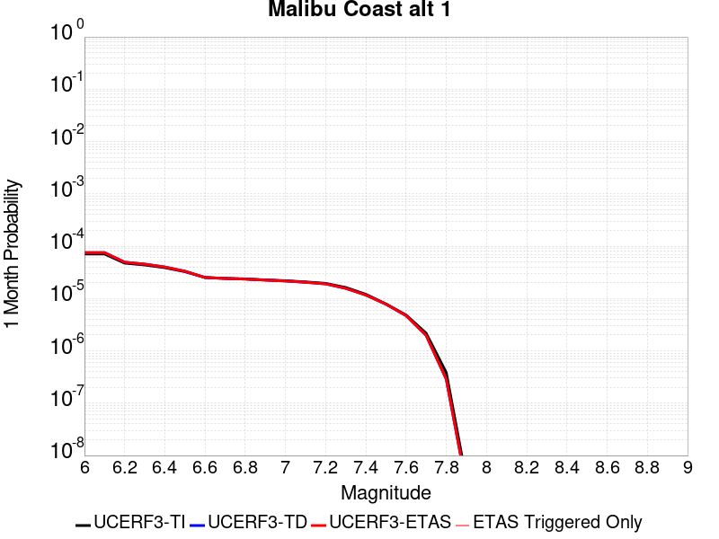 |  |  |

| Magnitude | 1 wk TI Prob | 1 wk TD Prob | 1 wk ETAS Prob | 1 wk ETAS/TD Gain | 1 wk ETAS Triggered Only | 1 mo TI Prob | 1 mo TD Prob | 1 mo ETAS Prob | 1 mo ETAS/TD Gain | 1 mo ETAS Triggered Only | 1 yr TI Prob | 1 yr TD Prob | 1 yr ETAS Prob | 1 yr ETAS/TD Gain | 1 yr ETAS Triggered Only | 10 yr TI Prob | 10 yr TD Prob | 10 yr ETAS Prob | 10 yr ETAS/TD Gain | 10 yr ETAS Triggered Only |
|-----|-----|-----|-----|-----|-----|-----|-----|-----|-----|-----|-----|-----|-----|-----|-----|-----|-----|-----|-----|-----|
| 6.0 | 1.6572556E-5 | 1.760009E-5 | 1.760009E-5 | 1.0 | 0.0 | 7.102331E-5 | 7.5426884E-5 | 7.5426884E-5 | 1.0 | 0.0 | 8.6436566E-4 | 9.179543E-4 | 9.179543E-4 | 1.0 | 0.0 | 0.0086101135 | 0.009143559 | 0.0091662565 | 1.0024823 | 2.2906359E-5 |
| 6.1 | 1.6572556E-5 | 1.760009E-5 | 1.760009E-5 | 1.0 | 0.0 | 7.102331E-5 | 7.5426884E-5 | 7.5426884E-5 | 1.0 | 0.0 | 8.6436566E-4 | 9.179543E-4 | 9.179543E-4 | 1.0 | 0.0 | 0.0086101135 | 0.009143559 | 0.0091662565 | 1.0024823 | 2.2906359E-5 |
| 6.2 | 1.1085717E-5 | 1.1558359E-5 | 1.1558359E-5 | 1.0 | 0.0 | 4.750935E-5 | 4.9534905E-5 | 4.9534905E-5 | 1.0 | 0.0 | 5.782728E-4 | 6.029241E-4 | 6.029241E-4 | 1.0 | 0.0 | 0.0057677035 | 0.0060132546 | 0.006036023 | 1.0037864 | 2.2906359E-5 |
| 6.3 | 1.0208568E-5 | 1.059332E-5 | 1.059332E-5 | 1.0 | 0.0 | 4.375027E-5 | 4.5399174E-5 | 4.5399174E-5 | 1.0 | 0.0 | 5.325294E-4 | 5.525977E-4 | 5.525977E-4 | 1.0 | 0.0 | 0.0053125503 | 0.005512544 | 0.005535324 | 1.0041324 | 2.2906359E-5 |
| 6.4 | 9.0682315E-6 | 9.343562E-6 | 9.343562E-6 | 1.0 | 0.0 | 3.8863272E-5 | 4.0043233E-5 | 4.0043233E-5 | 1.0 | 0.0 | 4.730576E-4 | 4.8741934E-4 | 4.8741934E-4 | 1.0 | 0.0 | 0.0047205184 | 0.004863716 | 0.0048865112 | 1.0046867 | 2.2906359E-5 |
| 6.5 | 7.605796E-6 | 7.7493205E-6 | 7.7493205E-6 | 1.0 | 0.0 | 3.259586E-5 | 3.321096E-5 | 3.321096E-5 | 1.0 | 0.0 | 3.9678233E-4 | 4.0426973E-4 | 4.0426973E-4 | 1.0 | 0.0 | 0.0039607463 | 0.004035481 | 0.004058295 | 1.0056534 | 2.2906359E-5 |
| 6.6 | 5.889873E-6 | 5.88005E-6 | 5.88005E-6 | 1.0 | 0.0 | 2.5242069E-5 | 2.5199974E-5 | 2.5199974E-5 | 1.0 | 0.0 | 3.0727885E-4 | 3.0676657E-4 | 3.0676657E-4 | 1.0 | 0.0 | 0.003068543 | 0.003063444 | 0.00308628 | 1.0074544 | 2.2906359E-5 |
| 6.7 | 5.66586E-6 | 5.6421336E-6 | 5.6421336E-6 | 1.0 | 0.0 | 2.428203E-5 | 2.4180348E-5 | 2.4180348E-5 | 1.0 | 0.0 | 2.955936E-4 | 2.9435605E-4 | 2.9435605E-4 | 1.0 | 0.0 | 0.0029520073 | 0.0029396736 | 0.0029625127 | 1.0077692 | 2.2906359E-5 |
| 6.8 | 5.521556E-6 | 5.489908E-6 | 5.489908E-6 | 1.0 | 0.0 | 2.3663597E-5 | 2.3527966E-5 | 2.3527966E-5 | 1.0 | 0.0 | 2.880662E-4 | 2.8641542E-4 | 2.8641542E-4 | 1.0 | 0.0 | 0.0028769306 | 0.0028604744 | 0.0028833153 | 1.007985 | 2.2906359E-5 |
| 6.9 | 5.29752E-6 | 5.2503906E-6 | 5.2503906E-6 | 1.0 | 0.0 | 2.270346E-5 | 2.250148E-5 | 2.250148E-5 | 1.0 | 0.0 | 2.7637955E-4 | 2.7392115E-4 | 2.7392115E-4 | 1.0 | 0.0 | 0.0027603607 | 0.0027358455 | 0.0027586892 | 1.0083498 | 2.2906359E-5 |
| 7.0 | 5.106743E-6 | 5.0481212E-6 | 5.0481212E-6 | 1.0 | 0.0 | 2.1885859E-5 | 2.1634627E-5 | 2.1634627E-5 | 1.0 | 0.0 | 2.6642776E-4 | 2.6336982E-4 | 2.6336982E-4 | 1.0 | 0.0 | 0.0026610855 | 0.0026305865 | 0.0026534325 | 1.0086848 | 2.2906359E-5 |
| 7.1 | 4.8469647E-6 | 4.770791E-6 | 4.770791E-6 | 1.0 | 0.0 | 2.0772539E-5 | 2.0446085E-5 | 2.0446085E-5 | 1.0 | 0.0 | 2.528763E-4 | 2.489027E-4 | 2.489027E-4 | 1.0 | 0.0 | 0.0025258875 | 0.0024862476 | 0.0025090969 | 1.0091903 | 2.2906359E-5 |
| 7.2 | 4.545514E-6 | 4.4485814E-6 | 4.4485814E-6 | 1.0 | 0.0 | 1.9480629E-5 | 1.906521E-5 | 1.906521E-5 | 1.0 | 0.0 | 2.3715083E-4 | 2.3209427E-4 | 2.3209427E-4 | 1.0 | 0.0 | 0.0023689792 | 0.0023185262 | 0.0023413794 | 1.0098568 | 2.2906359E-5 |
| 7.3 | 3.794097E-6 | 3.6522415E-6 | 3.6522415E-6 | 1.0 | 0.0 | 1.6260314E-5 | 1.565237E-5 | 1.565237E-5 | 1.0 | 0.0 | 1.9795135E-4 | 1.9055097E-4 | 1.9055097E-4 | 1.0 | 0.0 | 0.001977751 | 0.0019038806 | 0.0019267433 | 1.0120085 | 2.2906359E-5 |
| 7.4 | 2.808217E-6 | 2.7193082E-6 | 2.7193082E-6 | 1.0 | 0.0 | 1.203516E-5 | 1.1654126E-5 | 1.1654126E-5 | 1.0 | 0.0 | 1.4651821E-4 | 1.4187976E-4 | 1.4187976E-4 | 1.0 | 0.0 | 0.0014642165 | 0.0014178946 | 0.0014407685 | 1.0161322 | 2.2906359E-5 |
| 7.5 | 1.83809E-6 | 1.81923E-6 | 1.81923E-6 | 1.0 | 0.0 | 7.877505E-6 | 7.796677E-6 | 7.796677E-6 | 1.0 | 0.0 | 9.59044E-5 | 9.4920426E-5 | 9.4920426E-5 | 1.0 | 0.0 | 9.5863023E-4 | 9.488008E-4 | 9.488008E-4 | 1.0 | 0.0 |
| 7.6 | 1.1292672E-6 | 1.1002485E-6 | 1.1002485E-6 | 1.0 | 0.0 | 4.839708E-6 | 4.715342E-6 | 4.715342E-6 | 1.0 | 0.0 | 5.8921847E-5 | 5.7407793E-5 | 5.7407793E-5 | 1.0 | 0.0 | 5.890623E-4 | 5.7393126E-4 | 5.7393126E-4 | 1.0 | 0.0 |
| 7.7 | 5.065272E-7 | 4.6096739E-7 | 4.6096739E-7 | 1.0 | 0.0 | 2.170829E-6 | 1.975573E-6 | 1.975573E-6 | 1.0 | 0.0 | 2.6429525E-5 | 2.4052348E-5 | 2.4052348E-5 | 1.0 | 0.0 | 2.642638E-4 | 2.4049857E-4 | 2.4049857E-4 | 1.0 | 0.0 |
| 7.8 | 8.952991E-8 | 6.709905E-8 | 6.709905E-8 | 1.0 | 0.0 | 3.8369956E-7 | 2.8756733E-7 | 2.8756733E-7 | 1.0 | 0.0 | 4.671532E-6 | 3.5011267E-6 | 3.5011267E-6 | 1.0 | 0.0 | 4.671434E-5 | 3.5010737E-5 | 3.5010737E-5 | 1.0 | 0.0 |
| 7.9 | 8.007447E-10 | 6.1612504E-10 | 6.1612504E-10 | 1.0 | 0.0 | 3.4317629E-9 | 2.6405358E-9 | 2.6405358E-9 | 1.0 | 0.0 | 4.1781714E-8 | 3.2148524E-8 | 3.2148524E-8 | 1.0 | 0.0 | 4.1781706E-7 | 3.214852E-7 | 3.214852E-7 | 1.0 | 0.0 |

## San Pedro Basin
*[(top)](#table-of-contents)*

| 1 Week | 1 Month | 1 Year | 10 Year |
|-----|-----|-----|-----|
| 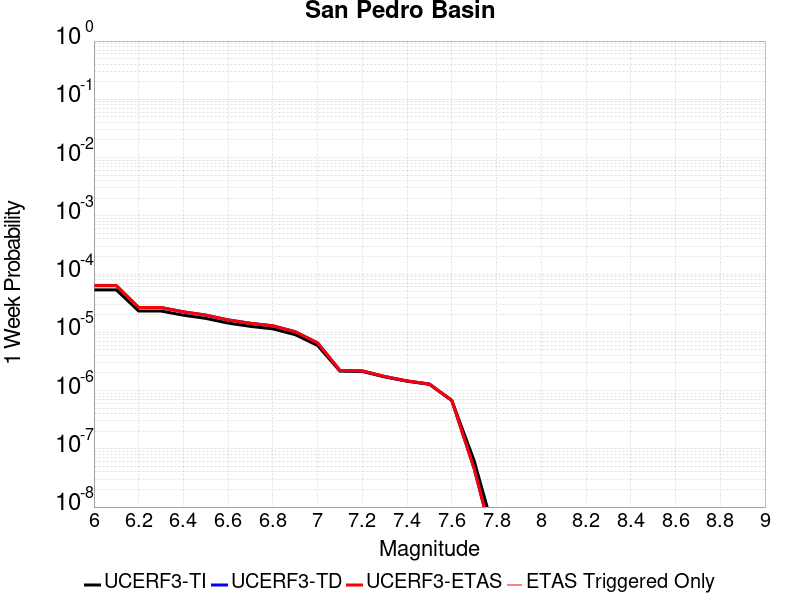 |  |  |  |

| Magnitude | 1 wk TI Prob | 1 wk TD Prob | 1 wk ETAS Prob | 1 wk ETAS/TD Gain | 1 wk ETAS Triggered Only | 1 mo TI Prob | 1 mo TD Prob | 1 mo ETAS Prob | 1 mo ETAS/TD Gain | 1 mo ETAS Triggered Only | 1 yr TI Prob | 1 yr TD Prob | 1 yr ETAS Prob | 1 yr ETAS/TD Gain | 1 yr ETAS Triggered Only | 10 yr TI Prob | 10 yr TD Prob | 10 yr ETAS Prob | 10 yr ETAS/TD Gain | 10 yr ETAS Triggered Only |
|-----|-----|-----|-----|-----|-----|-----|-----|-----|-----|-----|-----|-----|-----|-----|-----|-----|-----|-----|-----|-----|
| 6.0 | 5.3449043E-5 | 6.3385276E-5 | 6.3385276E-5 | 1.0 | 0.0 | 2.2904722E-4 | 2.7162637E-4 | 2.7162637E-4 | 1.0 | 0.0 | 0.0027850836 | 0.0033026508 | 0.0033026508 | 1.0 | 0.0 | 0.027504366 | 0.032597434 | 0.032619596 | 1.0006799 | 2.2906359E-5 |
| 6.1 | 5.3449043E-5 | 6.3385276E-5 | 6.3385276E-5 | 1.0 | 0.0 | 2.2904722E-4 | 2.7162637E-4 | 2.7162637E-4 | 1.0 | 0.0 | 0.0027850836 | 0.0033026508 | 0.0033026508 | 1.0 | 0.0 | 0.027504366 | 0.032597434 | 0.032619596 | 1.0006799 | 2.2906359E-5 |
| 6.2 | 2.3189454E-5 | 2.6648175E-5 | 2.6648175E-5 | 1.0 | 0.0 | 9.9379584E-5 | 1.14201735E-4 | 1.14201735E-4 | 1.0 | 0.0 | 0.0012092749 | 0.0013895667 | 0.0013895667 | 1.0 | 0.0 | 0.012027155 | 0.013813651 | 0.013813651 | 1.0 | 0.0 |
| 6.3 | 2.3189454E-5 | 2.6648175E-5 | 2.6648175E-5 | 1.0 | 0.0 | 9.9379584E-5 | 1.14201735E-4 | 1.14201735E-4 | 1.0 | 0.0 | 0.0012092749 | 0.0013895667 | 0.0013895667 | 1.0 | 0.0 | 0.012027155 | 0.013813651 | 0.013813651 | 1.0 | 0.0 |
| 6.4 | 1.966056E-5 | 2.2467766E-5 | 2.2467766E-5 | 1.0 | 0.0 | 8.425682E-5 | 9.62871E-5 | 9.62871E-5 | 1.0 | 0.0 | 0.001025344 | 0.0011717052 | 0.0011717052 | 1.0 | 0.0 | 0.010206259 | 0.011659362 | 0.011659362 | 1.0 | 0.0 |
| 6.5 | 1.7342953E-5 | 1.9748875E-5 | 1.9748875E-5 | 1.0 | 0.0 | 7.4324824E-5 | 8.46355E-5 | 8.46355E-5 | 1.0 | 0.0 | 9.04529E-4 | 0.0010299871 | 0.0010299871 | 1.0 | 0.0 | 0.009008561 | 0.010255857 | 0.010255857 | 1.0 | 0.0 |
| 6.6 | 1.439804E-5 | 1.6325706E-5 | 1.6325706E-5 | 1.0 | 0.0 | 6.170443E-5 | 6.9965616E-5 | 6.9965616E-5 | 1.0 | 0.0 | 7.509924E-4 | 8.5153064E-4 | 8.5153064E-4 | 1.0 | 0.0 | 0.0074845953 | 0.008485881 | 0.008485881 | 1.0 | 0.0 |
| 6.7 | 1.2634884E-5 | 1.4287867E-5 | 1.4287867E-5 | 1.0 | 0.0 | 5.414838E-5 | 6.123245E-5 | 6.123245E-5 | 1.0 | 0.0 | 6.590571E-4 | 7.4528053E-4 | 7.4528053E-4 | 1.0 | 0.0 | 0.006571059 | 0.0074308338 | 0.0074308338 | 1.0 | 0.0 |
| 6.8 | 1.146091E-5 | 1.2935489E-5 | 1.2935489E-5 | 1.0 | 0.0 | 4.911726E-5 | 5.54368E-5 | 5.54368E-5 | 1.0 | 0.0 | 5.9783855E-4 | 6.747638E-4 | 6.747638E-4 | 1.0 | 0.0 | 0.0059623276 | 0.0067300913 | 0.0067300913 | 1.0 | 0.0 |
| 6.9 | 9.109035E-6 | 1.0236781E-5 | 1.0236781E-5 | 1.0 | 0.0 | 3.9038136E-5 | 4.387134E-5 | 4.387134E-5 | 1.0 | 0.0 | 4.7518566E-4 | 5.3403067E-4 | 5.3403067E-4 | 1.0 | 0.0 | 0.0047417083 | 0.0053302287 | 0.0053302287 | 1.0 | 0.0 |
| 7.0 | 5.9351028E-6 | 6.585005E-6 | 6.585005E-6 | 1.0 | 0.0 | 2.5435906E-5 | 2.8221279E-5 | 2.8221279E-5 | 1.0 | 0.0 | 3.0963816E-4 | 3.435635E-4 | 3.435635E-4 | 1.0 | 0.0 | 0.0030920706 | 0.0034326415 | 0.0034326415 | 1.0 | 0.0 |
| 7.1 | 2.1557585E-6 | 2.209775E-6 | 2.209775E-6 | 1.0 | 0.0 | 9.238933E-6 | 9.470431E-6 | 9.470431E-6 | 1.0 | 0.0 | 1.1247819E-4 | 1.1529655E-4 | 1.1529655E-4 | 1.0 | 0.0 | 0.0011242128 | 0.0011523827 | 0.0011523827 | 1.0 | 0.0 |
| 7.2 | 2.1251979E-6 | 2.1781198E-6 | 2.1781198E-6 | 1.0 | 0.0 | 9.107958E-6 | 9.334766E-6 | 9.334766E-6 | 1.0 | 0.0 | 1.1088375E-4 | 1.1364501E-4 | 1.1364501E-4 | 1.0 | 0.0 | 0.0011082845 | 0.0011358842 | 0.0011358842 | 1.0 | 0.0 |
| 7.3 | 1.7145798E-6 | 1.7443804E-6 | 1.7443804E-6 | 1.0 | 0.0 | 7.3481783E-6 | 7.4758946E-6 | 7.4758946E-6 | 1.0 | 0.0 | 8.94604E-5 | 9.101531E-5 | 9.101531E-5 | 1.0 | 0.0 | 8.9424395E-4 | 9.0978947E-4 | 9.0978947E-4 | 1.0 | 0.0 |
| 7.4 | 1.4467993E-6 | 1.4642625E-6 | 1.4642625E-6 | 1.0 | 0.0 | 6.200554E-6 | 6.275396E-6 | 6.275396E-6 | 1.0 | 0.0 | 7.548913E-5 | 7.640034E-5 | 7.640034E-5 | 1.0 | 0.0 | 7.546349E-4 | 7.63748E-4 | 7.63748E-4 | 1.0 | 0.0 |
| 7.5 | 1.2803735E-6 | 1.2932165E-6 | 1.2932165E-6 | 1.0 | 0.0 | 5.487303E-6 | 5.542345E-6 | 5.542345E-6 | 1.0 | 0.0 | 6.680587E-5 | 6.747604E-5 | 6.747604E-5 | 1.0 | 0.0 | 6.678579E-4 | 6.745625E-4 | 6.745625E-4 | 1.0 | 0.0 |
| 7.6 | 6.755009E-7 | 6.7698187E-7 | 6.7698187E-7 | 1.0 | 0.0 | 2.8950008E-6 | 2.9013481E-6 | 2.9013481E-6 | 1.0 | 0.0 | 3.5246063E-5 | 3.53234E-5 | 3.53234E-5 | 1.0 | 0.0 | 3.5240475E-4 | 3.5318357E-4 | 3.5318357E-4 | 1.0 | 0.0 |
| 7.7 | 6.211885E-8 | 4.5702848E-8 | 4.5702848E-8 | 1.0 | 0.0 | 2.6622362E-7 | 1.9586933E-7 | 1.9586933E-7 | 1.0 | 0.0 | 3.2412677E-6 | 2.3847067E-6 | 2.3847067E-6 | 1.0 | 0.0 | 3.2412205E-5 | 2.3846831E-5 | 2.3846831E-5 | 1.0 | 0.0 |
| 7.8 | 2.6580573E-9 | 1.5143348E-9 | 1.5143348E-9 | 1.0 | 0.0 | 1.1391674E-8 | 6.490006E-9 | 6.490006E-9 | 1.0 | 0.0 | 1.3869362E-7 | 7.901583E-8 | 7.901583E-8 | 1.0 | 0.0 | 1.3869354E-6 | 7.9015825E-7 | 7.9015825E-7 | 1.0 | 0.0 |

## Whittier alt 1
*[(top)](#table-of-contents)*

| 1 Week | 1 Month | 1 Year | 10 Year |
|-----|-----|-----|-----|
|  |  |  |  |

| Magnitude | 1 wk TI Prob | 1 wk TD Prob | 1 wk ETAS Prob | 1 wk ETAS/TD Gain | 1 wk ETAS Triggered Only | 1 mo TI Prob | 1 mo TD Prob | 1 mo ETAS Prob | 1 mo ETAS/TD Gain | 1 mo ETAS Triggered Only | 1 yr TI Prob | 1 yr TD Prob | 1 yr ETAS Prob | 1 yr ETAS/TD Gain | 1 yr ETAS Triggered Only | 10 yr TI Prob | 10 yr TD Prob | 10 yr ETAS Prob | 10 yr ETAS/TD Gain | 10 yr ETAS Triggered Only |
|-----|-----|-----|-----|-----|-----|-----|-----|-----|-----|-----|-----|-----|-----|-----|-----|-----|-----|-----|-----|-----|
| 6.0 | 4.2554693E-5 | 4.7264235E-5 | 4.7264235E-5 | 1.0 | 0.0 | 1.8236451E-4 | 2.0254709E-4 | 2.0254709E-4 | 1.0 | 0.0 | 0.002218027 | 0.0024635424 | 0.0024635424 | 1.0 | 0.0 | 0.02196019 | 0.024396377 | 0.024418725 | 1.000916 | 2.2906359E-5 |
| 6.1 | 4.2554693E-5 | 4.7264235E-5 | 4.7264235E-5 | 1.0 | 0.0 | 1.8236451E-4 | 2.0254709E-4 | 2.0254709E-4 | 1.0 | 0.0 | 0.002218027 | 0.0024635424 | 0.0024635424 | 1.0 | 0.0 | 0.02196019 | 0.024396377 | 0.024418725 | 1.000916 | 2.2906359E-5 |
| 6.2 | 4.2554693E-5 | 4.7264235E-5 | 4.7264235E-5 | 1.0 | 0.0 | 1.8236451E-4 | 2.0254709E-4 | 2.0254709E-4 | 1.0 | 0.0 | 0.002218027 | 0.0024635424 | 0.0024635424 | 1.0 | 0.0 | 0.02196019 | 0.024396377 | 0.024418725 | 1.000916 | 2.2906359E-5 |
| 6.3 | 1.9617712E-5 | 1.8275026E-5 | 1.8275026E-5 | 1.0 | 0.0 | 8.40732E-5 | 7.83193E-5 | 7.83193E-5 | 1.0 | 0.0 | 0.0010231105 | 9.5313933E-4 | 9.5313933E-4 | 1.0 | 0.0 | 0.01018413 | 0.009493795 | 0.009516484 | 1.0023899 | 2.2906359E-5 |
| 6.4 | 1.5611336E-5 | 1.3609712E-5 | 1.3609712E-5 | 1.0 | 0.0 | 6.690401E-5 | 5.8326066E-5 | 5.8326066E-5 | 1.0 | 0.0 | 8.142519E-4 | 7.098945E-4 | 7.098945E-4 | 1.0 | 0.0 | 0.008112748 | 0.007078228 | 0.007078228 | 1.0 | 0.0 |
| 6.5 | 1.5150166E-5 | 1.3106303E-5 | 1.3106303E-5 | 1.0 | 0.0 | 6.492767E-5 | 5.6168694E-5 | 5.6168694E-5 | 1.0 | 0.0 | 7.9020765E-4 | 6.836452E-4 | 6.836452E-4 | 1.0 | 0.0 | 0.007874036 | 0.006817366 | 0.006817366 | 1.0 | 0.0 |
| 6.6 | 1.295588E-5 | 1.038518E-5 | 1.038518E-5 | 1.0 | 0.0 | 5.552402E-5 | 4.4507167E-5 | 4.4507167E-5 | 1.0 | 0.0 | 6.7579525E-4 | 5.4174196E-4 | 5.4174196E-4 | 1.0 | 0.0 | 0.006737438 | 0.0054056463 | 0.0054056463 | 1.0 | 0.0 |
| 6.7 | 1.2542085E-5 | 9.903713E-6 | 9.903713E-6 | 1.0 | 0.0 | 5.3750682E-5 | 4.2443804E-5 | 4.2443804E-5 | 1.0 | 0.0 | 6.542181E-4 | 5.166327E-4 | 5.166327E-4 | 1.0 | 0.0 | 0.006522954 | 0.005155734 | 0.005155734 | 1.0 | 0.0 |
| 6.8 | 1.2195878E-5 | 9.499611E-6 | 9.499611E-6 | 1.0 | 0.0 | 5.2267E-5 | 4.0711995E-5 | 4.0711995E-5 | 1.0 | 0.0 | 6.36165E-4 | 4.955577E-4 | 4.955577E-4 | 1.0 | 0.0 | 0.0063434686 | 0.0049458668 | 0.0049458668 | 1.0 | 0.0 |
| 6.9 | 1.1580298E-5 | 8.776835E-6 | 8.776835E-6 | 1.0 | 0.0 | 4.9628903E-5 | 3.7614474E-5 | 3.7614474E-5 | 1.0 | 0.0 | 6.040644E-4 | 4.5786164E-4 | 4.5786164E-4 | 1.0 | 0.0 | 0.00602425 | 0.0045704423 | 0.0045704423 | 1.0 | 0.0 |
| 7.0 | 1.0964795E-5 | 8.087695E-6 | 8.087695E-6 | 1.0 | 0.0 | 4.6991136E-5 | 3.4661098E-5 | 3.4661098E-5 | 1.0 | 0.0 | 5.7196687E-4 | 4.219187E-4 | 4.219187E-4 | 1.0 | 0.0 | 0.0057049696 | 0.004212385 | 0.004212385 | 1.0 | 0.0 |
| 7.1 | 1.0230601E-5 | 7.329962E-6 | 7.329962E-6 | 1.0 | 0.0 | 4.3844695E-5 | 3.1413754E-5 | 3.1413754E-5 | 1.0 | 0.0 | 5.336784E-4 | 3.8239663E-4 | 3.8239663E-4 | 1.0 | 0.0 | 0.005323986 | 0.0038185497 | 0.0038185497 | 1.0 | 0.0 |
| 7.2 | 9.40865E-6 | 6.546295E-6 | 6.546295E-6 | 1.0 | 0.0 | 4.032216E-5 | 2.8055256E-5 | 2.8055256E-5 | 1.0 | 0.0 | 4.908117E-4 | 3.415204E-4 | 3.415204E-4 | 1.0 | 0.0 | 0.0048972913 | 0.0034110483 | 0.0034110483 | 1.0 | 0.0 |
| 7.3 | 8.237384E-6 | 5.6003446E-6 | 5.6003446E-6 | 1.0 | 0.0 | 3.5302593E-5 | 2.4001263E-5 | 2.4001263E-5 | 1.0 | 0.0 | 4.2972428E-4 | 2.9217722E-4 | 2.9217722E-4 | 1.0 | 0.0 | 0.0042889426 | 0.002918252 | 0.002918252 | 1.0 | 0.0 |
| 7.4 | 7.5316966E-6 | 5.030179E-6 | 5.030179E-6 | 1.0 | 0.0 | 3.2278298E-5 | 2.1557738E-5 | 2.1557738E-5 | 1.0 | 0.0 | 3.9291743E-4 | 2.6243486E-4 | 2.6243486E-4 | 1.0 | 0.0 | 0.0039222343 | 0.0026213615 | 0.0026213615 | 1.0 | 0.0 |
| 7.5 | 6.149649E-6 | 3.9357315E-6 | 3.9357315E-6 | 1.0 | 0.0 | 2.6355372E-5 | 1.6867318E-5 | 1.6867318E-5 | 1.0 | 0.0 | 3.208294E-4 | 2.0534113E-4 | 2.0534113E-4 | 1.0 | 0.0 | 0.003203666 | 0.0020516033 | 0.0020516033 | 1.0 | 0.0 |
| 7.6 | 5.457711E-6 | 3.3970512E-6 | 3.3970512E-6 | 1.0 | 0.0 | 2.338998E-5 | 1.4558714E-5 | 1.4558714E-5 | 1.0 | 0.0 | 2.8473578E-4 | 1.7723875E-4 | 1.7723875E-4 | 1.0 | 0.0 | 0.0028437122 | 0.0017710547 | 0.0017710547 | 1.0 | 0.0 |
| 7.7 | 4.1676276E-6 | 2.3345212E-6 | 2.3345212E-6 | 1.0 | 0.0 | 1.7861139E-5 | 1.00050565E-5 | 1.00050565E-5 | 1.0 | 0.0 | 2.1743766E-4 | 1.21805504E-4 | 1.21805504E-4 | 1.0 | 0.0 | 0.0021722503 | 0.0012174605 | 0.0012174605 | 1.0 | 0.0 |
| 7.8 | 2.2692414E-7 | 9.390229E-8 | 9.390229E-8 | 1.0 | 0.0 | 9.725317E-7 | 4.0243833E-7 | 4.0243833E-7 | 1.0 | 0.0 | 1.1840509E-5 | 4.899679E-6 | 4.899679E-6 | 1.0 | 0.0 | 1.1839878E-4 | 4.8996037E-5 | 4.8996037E-5 | 1.0 | 0.0 |
| 7.9 | 6.676829E-9 | 3.4410954E-9 | 3.4410954E-9 | 1.0 | 0.0 | 2.861498E-8 | 1.4747552E-8 | 1.4747552E-8 | 1.0 | 0.0 | 3.4838732E-7 | 1.7955142E-7 | 1.7955142E-7 | 1.0 | 0.0 | 3.4838679E-6 | 1.795513E-6 | 1.795513E-6 | 1.0 | 0.0 |

## Elysian Park (Upper)
*[(top)](#table-of-contents)*

| 1 Week | 1 Month | 1 Year | 10 Year |
|-----|-----|-----|-----|
|  | 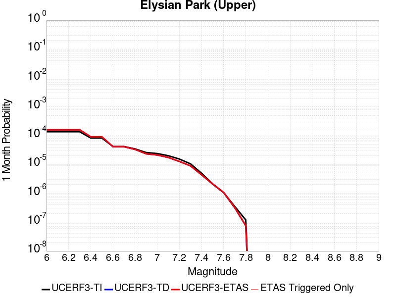 |  |  |

| Magnitude | 1 wk TI Prob | 1 wk TD Prob | 1 wk ETAS Prob | 1 wk ETAS/TD Gain | 1 wk ETAS Triggered Only | 1 mo TI Prob | 1 mo TD Prob | 1 mo ETAS Prob | 1 mo ETAS/TD Gain | 1 mo ETAS Triggered Only | 1 yr TI Prob | 1 yr TD Prob | 1 yr ETAS Prob | 1 yr ETAS/TD Gain | 1 yr ETAS Triggered Only | 10 yr TI Prob | 10 yr TD Prob | 10 yr ETAS Prob | 10 yr ETAS/TD Gain | 10 yr ETAS Triggered Only |
|-----|-----|-----|-----|-----|-----|-----|-----|-----|-----|-----|-----|-----|-----|-----|-----|-----|-----|-----|-----|-----|
| 6.0 | 3.1876025E-5 | 3.704556E-5 | 3.704556E-5 | 1.0 | 0.0 | 1.3660437E-4 | 1.5875977E-4 | 1.5875977E-4 | 1.0 | 0.0 | 0.0016618895 | 0.0019316166 | 0.0019316166 | 1.0 | 0.0 | 0.016495159 | 0.019194895 | 0.019217363 | 1.0011704 | 2.2906359E-5 |
| 6.1 | 3.1876025E-5 | 3.704556E-5 | 3.704556E-5 | 1.0 | 0.0 | 1.3660437E-4 | 1.5875977E-4 | 1.5875977E-4 | 1.0 | 0.0 | 0.0016618895 | 0.0019316166 | 0.0019316166 | 1.0 | 0.0 | 0.016495159 | 0.019194895 | 0.019217363 | 1.0011704 | 2.2906359E-5 |
| 6.2 | 3.1876025E-5 | 3.704556E-5 | 3.704556E-5 | 1.0 | 0.0 | 1.3660437E-4 | 1.5875977E-4 | 1.5875977E-4 | 1.0 | 0.0 | 0.0016618895 | 0.0019316166 | 0.0019316166 | 1.0 | 0.0 | 0.016495159 | 0.019194895 | 0.019217363 | 1.0011704 | 2.2906359E-5 |
| 6.3 | 3.1876025E-5 | 3.704556E-5 | 3.704556E-5 | 1.0 | 0.0 | 1.3660437E-4 | 1.5875977E-4 | 1.5875977E-4 | 1.0 | 0.0 | 0.0016618895 | 0.0019316166 | 0.0019316166 | 1.0 | 0.0 | 0.016495159 | 0.019194895 | 0.019217363 | 1.0011704 | 2.2906359E-5 |
| 6.4 | 1.9273462E-5 | 2.1206919E-5 | 2.1206919E-5 | 1.0 | 0.0 | 8.259794E-5 | 9.088461E-5 | 9.088461E-5 | 1.0 | 0.0 | 0.001005166 | 0.0011061319 | 0.0011061319 | 1.0 | 0.0 | 0.010006315 | 0.011023126 | 0.01104578 | 1.0020552 | 2.2906359E-5 |
| 6.5 | 1.9273462E-5 | 2.1206919E-5 | 2.1206919E-5 | 1.0 | 0.0 | 8.259794E-5 | 9.088461E-5 | 9.088461E-5 | 1.0 | 0.0 | 0.001005166 | 0.0011061319 | 0.0011061319 | 1.0 | 0.0 | 0.010006315 | 0.011023126 | 0.01104578 | 1.0020552 | 2.2906359E-5 |
| 6.6 | 9.813258E-6 | 9.666892E-6 | 9.666892E-6 | 1.0 | 0.0 | 4.205614E-5 | 4.1428917E-5 | 4.1428917E-5 | 1.0 | 0.0 | 5.119132E-4 | 5.042876E-4 | 5.042876E-4 | 1.0 | 0.0 | 0.005107356 | 0.0050321566 | 0.0050321566 | 1.0 | 0.0 |
| 6.7 | 9.801478E-6 | 9.65446E-6 | 9.65446E-6 | 1.0 | 0.0 | 4.2005657E-5 | 4.1375642E-5 | 4.1375642E-5 | 1.0 | 0.0 | 5.112989E-4 | 5.036392E-4 | 5.036392E-4 | 1.0 | 0.0 | 0.0051012407 | 0.0050257025 | 0.0050257025 | 1.0 | 0.0 |
| 6.8 | 8.102489E-6 | 7.774029E-6 | 7.774029E-6 | 1.0 | 0.0 | 3.4724493E-5 | 3.331687E-5 | 3.331687E-5 | 1.0 | 0.0 | 4.2268867E-4 | 4.0556237E-4 | 4.0556237E-4 | 1.0 | 0.0 | 0.004218856 | 0.0040487163 | 0.0040487163 | 1.0 | 0.0 |
| 6.9 | 6.08275E-6 | 5.482067E-6 | 5.482067E-6 | 1.0 | 0.0 | 2.6068668E-5 | 2.3494365E-5 | 2.3494365E-5 | 1.0 | 0.0 | 3.173398E-4 | 2.8600713E-4 | 2.8600713E-4 | 1.0 | 0.0 | 0.0031688702 | 0.002856468 | 0.002856468 | 1.0 | 0.0 |
| 7.0 | 5.5995934E-6 | 4.9833366E-6 | 4.9833366E-6 | 1.0 | 0.0 | 2.3998036E-5 | 2.1356986E-5 | 2.1356986E-5 | 1.0 | 0.0 | 2.9213692E-4 | 2.5999092E-4 | 2.5999092E-4 | 1.0 | 0.0 | 0.0029175316 | 0.002596935 | 0.002596935 | 1.0 | 0.0 |
| 7.1 | 4.709881E-6 | 4.087854E-6 | 4.087854E-6 | 1.0 | 0.0 | 2.0185047E-5 | 1.751926E-5 | 1.751926E-5 | 1.0 | 0.0 | 2.4572524E-4 | 2.1327652E-4 | 2.1327652E-4 | 1.0 | 0.0 | 0.002454537 | 0.0021307599 | 0.0021307599 | 1.0 | 0.0 |
| 7.2 | 3.6063436E-6 | 2.9782757E-6 | 2.9782757E-6 | 1.0 | 0.0 | 1.5455667E-5 | 1.2763977E-5 | 1.2763977E-5 | 1.0 | 0.0 | 1.881565E-4 | 1.5539044E-4 | 1.5539044E-4 | 1.0 | 0.0 | 0.0018799726 | 0.0015528292 | 0.0015528292 | 1.0 | 0.0 |
| 7.3 | 2.471135E-6 | 2.0956875E-6 | 2.0956875E-6 | 1.0 | 0.0 | 1.0590536E-5 | 8.981488E-6 | 8.981488E-6 | 1.0 | 0.0 | 1.2893214E-4 | 1.093442E-4 | 1.093442E-4 | 1.0 | 0.0 | 0.0012885736 | 0.0010929112 | 0.0010929112 | 1.0 | 0.0 |
| 7.4 | 1.163943E-6 | 1.0276299E-6 | 1.0276299E-6 | 1.0 | 0.0 | 4.988318E-6 | 4.404121E-6 | 4.404121E-6 | 1.0 | 0.0 | 6.0731076E-5 | 5.3618878E-5 | 5.3618878E-5 | 1.0 | 0.0 | 6.071448E-4 | 5.360624E-4 | 5.360624E-4 | 1.0 | 0.0 |
| 7.5 | 4.99459E-7 | 4.918171E-7 | 4.918171E-7 | 1.0 | 0.0 | 2.140537E-6 | 2.107786E-6 | 2.107786E-6 | 1.0 | 0.0 | 2.6060725E-5 | 2.5662008E-5 | 2.5662008E-5 | 1.0 | 0.0 | 2.605767E-4 | 2.56592E-4 | 2.56592E-4 | 1.0 | 0.0 |
| 7.6 | 2.4667852E-7 | 2.4781724E-7 | 2.4781724E-7 | 1.0 | 0.0 | 1.0571932E-6 | 1.0620735E-6 | 1.0620735E-6 | 1.0 | 0.0 | 1.2871251E-5 | 1.2930672E-5 | 1.2930672E-5 | 1.0 | 0.0 | 1.2870505E-4 | 1.2929956E-4 | 1.2929956E-4 | 1.0 | 0.0 |
| 7.7 | 8.2312795E-8 | 7.388283E-8 | 7.388283E-8 | 1.0 | 0.0 | 3.527691E-7 | 3.166407E-7 | 3.166407E-7 | 1.0 | 0.0 | 4.294955E-6 | 3.8550947E-6 | 3.8550947E-6 | 1.0 | 0.0 | 4.2948723E-5 | 3.855039E-5 | 3.855039E-5 | 1.0 | 0.0 |
| 7.8 | 2.7819295E-8 | 1.7579014E-8 | 1.7579014E-8 | 1.0 | 0.0 | 1.1922555E-7 | 7.5338626E-8 | 7.5338626E-8 | 1.0 | 0.0 | 1.45157E-6 | 9.172476E-7 | 9.172476E-7 | 1.0 | 0.0 | 1.45156055E-5 | 9.172452E-6 | 9.172452E-6 | 1.0 | 0.0 |

## Sierra Madre
*[(top)](#table-of-contents)*

| 1 Week | 1 Month | 1 Year | 10 Year |
|-----|-----|-----|-----|
| 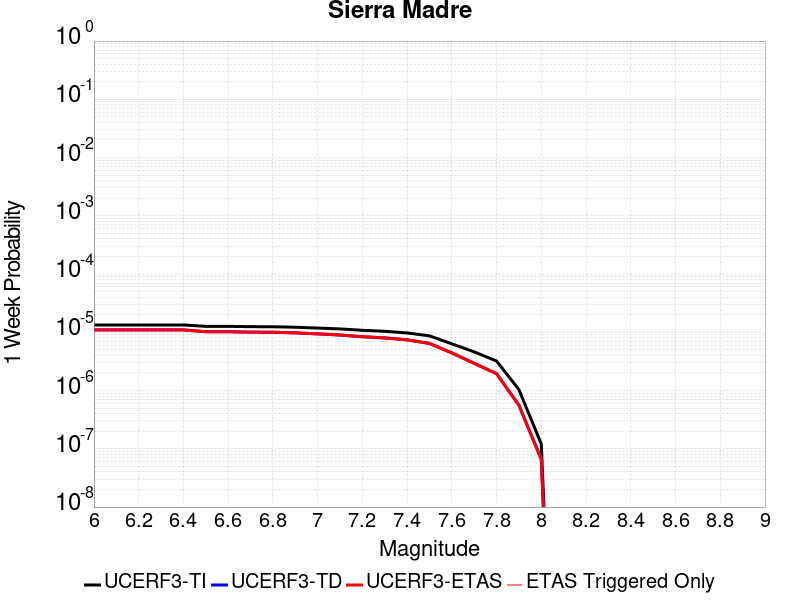 | 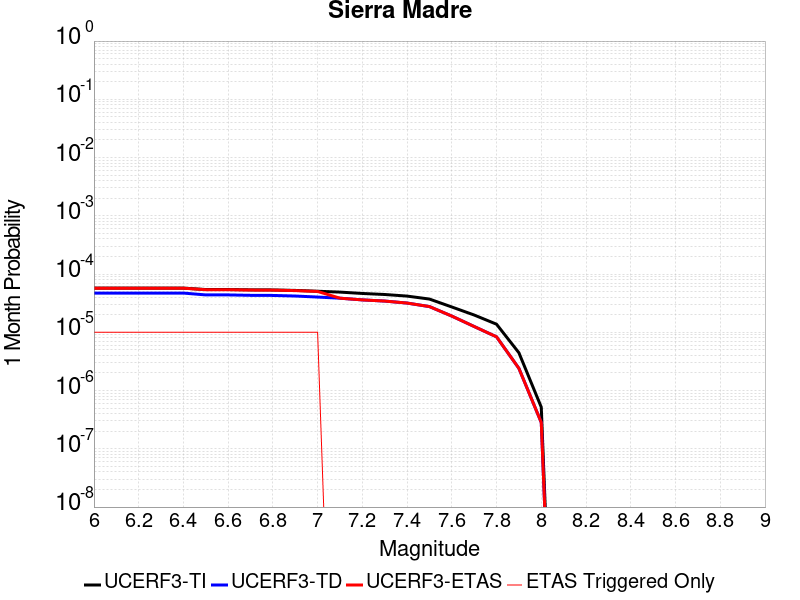 | 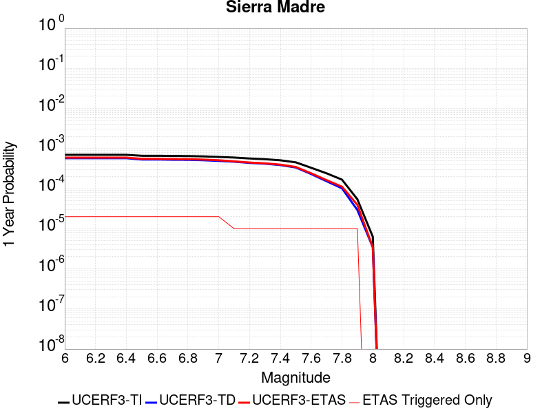 |  |

| Magnitude | 1 wk TI Prob | 1 wk TD Prob | 1 wk ETAS Prob | 1 wk ETAS/TD Gain | 1 wk ETAS Triggered Only | 1 mo TI Prob | 1 mo TD Prob | 1 mo ETAS Prob | 1 mo ETAS/TD Gain | 1 mo ETAS Triggered Only | 1 yr TI Prob | 1 yr TD Prob | 1 yr ETAS Prob | 1 yr ETAS/TD Gain | 1 yr ETAS Triggered Only | 10 yr TI Prob | 10 yr TD Prob | 10 yr ETAS Prob | 10 yr ETAS/TD Gain | 10 yr ETAS Triggered Only |
|-----|-----|-----|-----|-----|-----|-----|-----|-----|-----|-----|-----|-----|-----|-----|-----|-----|-----|-----|-----|-----|
| 6.0 | 1.3379373E-5 | 1.1004191E-5 | 1.1004191E-5 | 1.0 | 0.0 | 5.7338908E-5 | 4.7159974E-5 | 4.7159974E-5 | 1.0 | 0.0 | 6.978776E-4 | 5.740229E-4 | 5.740229E-4 | 1.0 | 0.0 | 0.0069569005 | 0.005725766 | 0.005748541 | 1.0039777 | 2.2906359E-5 |
| 6.1 | 1.3379373E-5 | 1.1004191E-5 | 1.1004191E-5 | 1.0 | 0.0 | 5.7338908E-5 | 4.7159974E-5 | 4.7159974E-5 | 1.0 | 0.0 | 6.978776E-4 | 5.740229E-4 | 5.740229E-4 | 1.0 | 0.0 | 0.0069569005 | 0.005725766 | 0.005748541 | 1.0039777 | 2.2906359E-5 |
| 6.2 | 1.3379373E-5 | 1.1004191E-5 | 1.1004191E-5 | 1.0 | 0.0 | 5.7338908E-5 | 4.7159974E-5 | 4.7159974E-5 | 1.0 | 0.0 | 6.978776E-4 | 5.740229E-4 | 5.740229E-4 | 1.0 | 0.0 | 0.0069569005 | 0.005725766 | 0.005748541 | 1.0039777 | 2.2906359E-5 |
| 6.3 | 1.3379373E-5 | 1.1004191E-5 | 1.1004191E-5 | 1.0 | 0.0 | 5.7338908E-5 | 4.7159974E-5 | 4.7159974E-5 | 1.0 | 0.0 | 6.978776E-4 | 5.740229E-4 | 5.740229E-4 | 1.0 | 0.0 | 0.0069569005 | 0.005725766 | 0.005748541 | 1.0039777 | 2.2906359E-5 |
| 6.4 | 1.3379373E-5 | 1.1004191E-5 | 1.1004191E-5 | 1.0 | 0.0 | 5.7338908E-5 | 4.7159974E-5 | 4.7159974E-5 | 1.0 | 0.0 | 6.978776E-4 | 5.740229E-4 | 5.740229E-4 | 1.0 | 0.0 | 0.0069569005 | 0.005725766 | 0.005748541 | 1.0039777 | 2.2906359E-5 |
| 6.5 | 1.26563245E-5 | 1.023358E-5 | 1.023358E-5 | 1.0 | 0.0 | 5.4240263E-5 | 4.3857468E-5 | 4.3857468E-5 | 1.0 | 0.0 | 6.601751E-4 | 5.338349E-4 | 5.338349E-4 | 1.0 | 0.0 | 0.006582173 | 0.0053258473 | 0.0053258473 | 1.0 | 0.0 |
| 6.6 | 1.26563245E-5 | 1.023358E-5 | 1.023358E-5 | 1.0 | 0.0 | 5.4240263E-5 | 4.3857468E-5 | 4.3857468E-5 | 1.0 | 0.0 | 6.601751E-4 | 5.338349E-4 | 5.338349E-4 | 1.0 | 0.0 | 0.006582173 | 0.0053258473 | 0.0053258473 | 1.0 | 0.0 |
| 6.7 | 1.2502474E-5 | 1.006971E-5 | 1.006971E-5 | 1.0 | 0.0 | 5.3580934E-5 | 4.315519E-5 | 4.315519E-5 | 1.0 | 0.0 | 6.521526E-4 | 5.252888E-4 | 5.252888E-4 | 1.0 | 0.0 | 0.0065024206 | 0.005240791 | 0.005240791 | 1.0 | 0.0 |
| 6.8 | 1.2454966E-5 | 1.002199E-5 | 1.002199E-5 | 1.0 | 0.0 | 5.3377335E-5 | 4.2950687E-5 | 4.2950687E-5 | 1.0 | 0.0 | 6.4967526E-4 | 5.228002E-4 | 5.228002E-4 | 1.0 | 0.0 | 0.006477792 | 0.0052160216 | 0.0052160216 | 1.0 | 0.0 |
| 6.9 | 1.2225574E-5 | 9.795794E-6 | 9.795794E-6 | 1.0 | 0.0 | 5.2394265E-5 | 4.1981304E-5 | 4.1981304E-5 | 1.0 | 0.0 | 6.3771347E-4 | 5.1100354E-4 | 5.1100354E-4 | 1.0 | 0.0 | 0.006358865 | 0.0050986013 | 0.0050986013 | 1.0 | 0.0 |
| 7.0 | 1.182946E-5 | 9.402269E-6 | 9.402269E-6 | 1.0 | 0.0 | 5.06967E-5 | 4.029482E-5 | 4.029482E-5 | 1.0 | 0.0 | 6.1705755E-4 | 4.9048004E-4 | 4.9048004E-4 | 1.0 | 0.0 | 0.006153469 | 0.004894287 | 0.004894287 | 1.0 | 0.0 |
| 7.1 | 1.14369095E-5 | 8.989202E-6 | 8.989202E-6 | 1.0 | 0.0 | 4.9014405E-5 | 3.8524588E-5 | 3.8524588E-5 | 1.0 | 0.0 | 5.9658696E-4 | 4.6893687E-4 | 4.6893687E-4 | 1.0 | 0.0 | 0.005949879 | 0.004679779 | 0.004679779 | 1.0 | 0.0 |
| 7.2 | 1.0836419E-5 | 8.402509E-6 | 8.402509E-6 | 1.0 | 0.0 | 4.644097E-5 | 3.601026E-5 | 3.601026E-5 | 1.0 | 0.0 | 5.652721E-4 | 4.3833765E-4 | 4.3833765E-4 | 1.0 | 0.0 | 0.0056383642 | 0.0043750275 | 0.0043750275 | 1.0 | 0.0 |
| 7.3 | 1.0403439E-5 | 8.02372E-6 | 8.02372E-6 | 1.0 | 0.0 | 4.4585406E-5 | 3.438692E-5 | 3.438692E-5 | 1.0 | 0.0 | 5.426921E-4 | 4.1858124E-4 | 4.1858124E-4 | 1.0 | 0.0 | 0.005413687 | 0.0041782237 | 0.0041782237 | 1.0 | 0.0 |
| 7.4 | 9.768864E-6 | 7.4172585E-6 | 7.4172585E-6 | 1.0 | 0.0 | 4.186589E-5 | 3.178787E-5 | 3.178787E-5 | 1.0 | 0.0 | 5.09598E-4 | 3.8694945E-4 | 3.8694945E-4 | 1.0 | 0.0 | 0.0050843097 | 0.0038630487 | 0.0038630487 | 1.0 | 0.0 |
| 7.5 | 8.687089E-6 | 6.4527394E-6 | 6.4527394E-6 | 1.0 | 0.0 | 3.722985E-5 | 2.765431E-5 | 2.765431E-5 | 1.0 | 0.0 | 4.5317915E-4 | 3.3664008E-4 | 3.3664008E-4 | 1.0 | 0.0 | 0.004522561 | 0.0033615883 | 0.0033615883 | 1.0 | 0.0 |
| 7.6 | 6.3506063E-6 | 4.4326393E-6 | 4.4326393E-6 | 1.0 | 0.0 | 2.72166E-5 | 1.8996889E-5 | 1.8996889E-5 | 1.0 | 0.0 | 3.3131172E-4 | 2.3126282E-4 | 2.3126282E-4 | 1.0 | 0.0 | 0.003308182 | 0.0023104465 | 0.0023104465 | 1.0 | 0.0 |
| 7.7 | 4.62223E-6 | 2.935122E-6 | 2.935122E-6 | 1.0 | 0.0 | 1.9809406E-5 | 1.2579034E-5 | 1.2579034E-5 | 1.0 | 0.0 | 2.4115283E-4 | 1.5313899E-4 | 1.5313899E-4 | 1.0 | 0.0 | 0.0024089129 | 0.0015305356 | 0.0015305356 | 1.0 | 0.0 |
| 7.8 | 3.2145008E-6 | 1.9510014E-6 | 1.9510014E-6 | 1.0 | 0.0 | 1.3776359E-5 | 8.361408E-6 | 8.361408E-6 | 1.0 | 0.0 | 1.6771426E-4 | 1.01795405E-4 | 1.01795405E-4 | 1.0 | 0.0 | 0.0016758774 | 0.0010176324 | 0.0010176324 | 1.0 | 0.0 |
| 7.9 | 1.0391769E-6 | 5.6080785E-7 | 5.6080785E-7 | 1.0 | 0.0 | 4.4536077E-6 | 2.40346E-6 | 2.40346E-6 | 1.0 | 0.0 | 5.4221324E-5 | 2.9261737E-5 | 2.9261737E-5 | 1.0 | 0.0 | 5.4208096E-4 | 2.9257927E-4 | 2.9257927E-4 | 1.0 | 0.0 |
| 8.0 | 1.210983E-7 | 6.617328E-8 | 6.617328E-8 | 1.0 | 0.0 | 5.1899264E-7 | 2.8359972E-7 | 2.8359972E-7 | 1.0 | 0.0 | 6.3187167E-6 | 3.4528214E-6 | 3.4528214E-6 | 1.0 | 0.0 | 6.318537E-5 | 3.4527697E-5 | 3.4527697E-5 | 1.0 | 0.0 |

## Pitas Point (Lower)-Montalvo
*[(top)](#table-of-contents)*

| 1 Week | 1 Month | 1 Year | 10 Year |
|-----|-----|-----|-----|
| 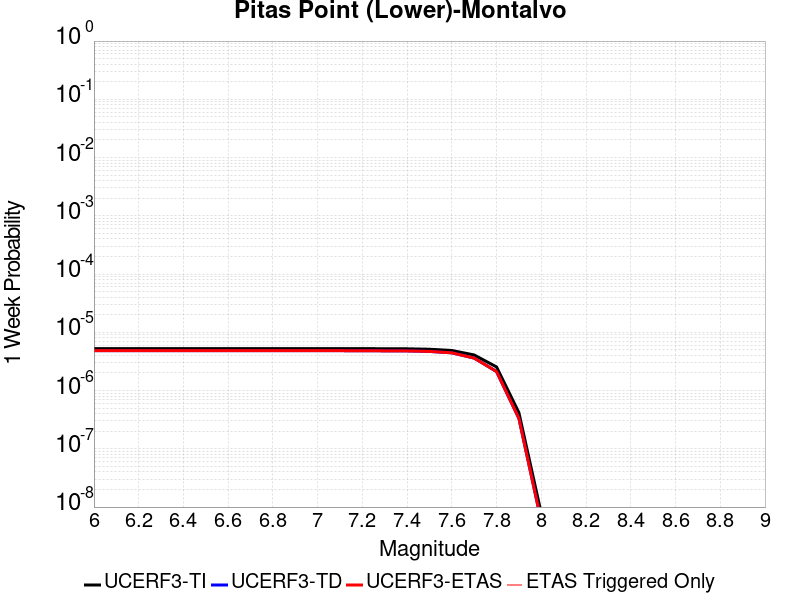 | 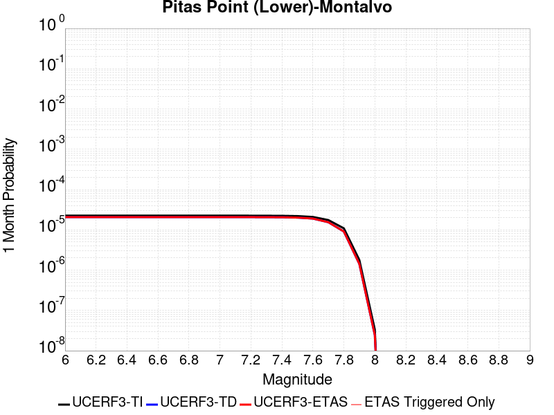 |  |  |

| Magnitude | 1 wk TI Prob | 1 wk TD Prob | 1 wk ETAS Prob | 1 wk ETAS/TD Gain | 1 wk ETAS Triggered Only | 1 mo TI Prob | 1 mo TD Prob | 1 mo ETAS Prob | 1 mo ETAS/TD Gain | 1 mo ETAS Triggered Only | 1 yr TI Prob | 1 yr TD Prob | 1 yr ETAS Prob | 1 yr ETAS/TD Gain | 1 yr ETAS Triggered Only | 10 yr TI Prob | 10 yr TD Prob | 10 yr ETAS Prob | 10 yr ETAS/TD Gain | 10 yr ETAS Triggered Only |
|-----|-----|-----|-----|-----|-----|-----|-----|-----|-----|-----|-----|-----|-----|-----|-----|-----|-----|-----|-----|-----|
| 6.0 | 5.2543637E-6 | 4.838267E-6 | 4.838267E-6 | 1.0 | 0.0 | 2.2518509E-5 | 2.0735268E-5 | 2.0735268E-5 | 1.0 | 0.0 | 2.7412834E-4 | 2.5242296E-4 | 2.7532352E-4 | 1.090723 | 2.2906359E-5 | 0.0027379042 | 0.0025213948 | 0.0025442434 | 1.0090619 | 2.2906359E-5 |
| 6.1 | 5.2543637E-6 | 4.838267E-6 | 4.838267E-6 | 1.0 | 0.0 | 2.2518509E-5 | 2.0735268E-5 | 2.0735268E-5 | 1.0 | 0.0 | 2.7412834E-4 | 2.5242296E-4 | 2.7532352E-4 | 1.090723 | 2.2906359E-5 | 0.0027379042 | 0.0025213948 | 0.0025442434 | 1.0090619 | 2.2906359E-5 |
| 6.2 | 5.2543637E-6 | 4.838267E-6 | 4.838267E-6 | 1.0 | 0.0 | 2.2518509E-5 | 2.0735268E-5 | 2.0735268E-5 | 1.0 | 0.0 | 2.7412834E-4 | 2.5242296E-4 | 2.7532352E-4 | 1.090723 | 2.2906359E-5 | 0.0027379042 | 0.0025213948 | 0.0025442434 | 1.0090619 | 2.2906359E-5 |
| 6.3 | 5.2543637E-6 | 4.838267E-6 | 4.838267E-6 | 1.0 | 0.0 | 2.2518509E-5 | 2.0735268E-5 | 2.0735268E-5 | 1.0 | 0.0 | 2.7412834E-4 | 2.5242296E-4 | 2.7532352E-4 | 1.090723 | 2.2906359E-5 | 0.0027379042 | 0.0025213948 | 0.0025442434 | 1.0090619 | 2.2906359E-5 |
| 6.4 | 5.2543637E-6 | 4.838267E-6 | 4.838267E-6 | 1.0 | 0.0 | 2.2518509E-5 | 2.0735268E-5 | 2.0735268E-5 | 1.0 | 0.0 | 2.7412834E-4 | 2.5242296E-4 | 2.7532352E-4 | 1.090723 | 2.2906359E-5 | 0.0027379042 | 0.0025213948 | 0.0025442434 | 1.0090619 | 2.2906359E-5 |
| 6.5 | 5.2543637E-6 | 4.838267E-6 | 4.838267E-6 | 1.0 | 0.0 | 2.2518509E-5 | 2.0735268E-5 | 2.0735268E-5 | 1.0 | 0.0 | 2.7412834E-4 | 2.5242296E-4 | 2.7532352E-4 | 1.090723 | 2.2906359E-5 | 0.0027379042 | 0.0025213948 | 0.0025442434 | 1.0090619 | 2.2906359E-5 |
| 6.6 | 5.2543637E-6 | 4.838267E-6 | 4.838267E-6 | 1.0 | 0.0 | 2.2518509E-5 | 2.0735268E-5 | 2.0735268E-5 | 1.0 | 0.0 | 2.7412834E-4 | 2.5242296E-4 | 2.7532352E-4 | 1.090723 | 2.2906359E-5 | 0.0027379042 | 0.0025213948 | 0.0025442434 | 1.0090619 | 2.2906359E-5 |
| 6.7 | 5.2543637E-6 | 4.838267E-6 | 4.838267E-6 | 1.0 | 0.0 | 2.2518509E-5 | 2.0735268E-5 | 2.0735268E-5 | 1.0 | 0.0 | 2.7412834E-4 | 2.5242296E-4 | 2.7532352E-4 | 1.090723 | 2.2906359E-5 | 0.0027379042 | 0.0025213948 | 0.0025442434 | 1.0090619 | 2.2906359E-5 |
| 6.8 | 5.2543637E-6 | 4.838267E-6 | 4.838267E-6 | 1.0 | 0.0 | 2.2518509E-5 | 2.0735268E-5 | 2.0735268E-5 | 1.0 | 0.0 | 2.7412834E-4 | 2.5242296E-4 | 2.7532352E-4 | 1.090723 | 2.2906359E-5 | 0.0027379042 | 0.0025213948 | 0.0025442434 | 1.0090619 | 2.2906359E-5 |
| 6.9 | 5.2543637E-6 | 4.838267E-6 | 4.838267E-6 | 1.0 | 0.0 | 2.2518509E-5 | 2.0735268E-5 | 2.0735268E-5 | 1.0 | 0.0 | 2.7412834E-4 | 2.5242296E-4 | 2.7532352E-4 | 1.090723 | 2.2906359E-5 | 0.0027379042 | 0.0025213948 | 0.0025442434 | 1.0090619 | 2.2906359E-5 |
| 7.0 | 5.2543637E-6 | 4.838267E-6 | 4.838267E-6 | 1.0 | 0.0 | 2.2518509E-5 | 2.0735268E-5 | 2.0735268E-5 | 1.0 | 0.0 | 2.7412834E-4 | 2.5242296E-4 | 2.7532352E-4 | 1.090723 | 2.2906359E-5 | 0.0027379042 | 0.0025213948 | 0.0025442434 | 1.0090619 | 2.2906359E-5 |
| 7.1 | 5.2543637E-6 | 4.838267E-6 | 4.838267E-6 | 1.0 | 0.0 | 2.2518509E-5 | 2.0735268E-5 | 2.0735268E-5 | 1.0 | 0.0 | 2.7412834E-4 | 2.5242296E-4 | 2.7532352E-4 | 1.090723 | 2.2906359E-5 | 0.0027379042 | 0.0025213948 | 0.0025442434 | 1.0090619 | 2.2906359E-5 |
| 7.2 | 5.2458695E-6 | 4.8294205E-6 | 4.8294205E-6 | 1.0 | 0.0 | 2.2482105E-5 | 2.0697353E-5 | 2.0697353E-5 | 1.0 | 0.0 | 2.7368523E-4 | 2.5196146E-4 | 2.7486205E-4 | 1.0908892 | 2.2906359E-5 | 0.0027334841 | 0.0025167903 | 0.0025396391 | 1.0090785 | 2.2906359E-5 |
| 7.3 | 5.22665E-6 | 4.8093366E-6 | 4.8093366E-6 | 1.0 | 0.0 | 2.2399736E-5 | 2.0611282E-5 | 2.0611282E-5 | 1.0 | 0.0 | 2.7268266E-4 | 2.5091376E-4 | 2.7381437E-4 | 1.0912689 | 2.2906359E-5 | 0.002723483 | 0.0025063371 | 0.0025291862 | 1.0091164 | 2.2906359E-5 |
| 7.4 | 5.210642E-6 | 4.7925478E-6 | 4.7925478E-6 | 1.0 | 0.0 | 2.233113E-5 | 2.053933E-5 | 2.053933E-5 | 1.0 | 0.0 | 2.718476E-4 | 2.5003796E-4 | 2.729386E-4 | 1.0915886 | 2.2906359E-5 | 0.002715153 | 0.0024975988 | 0.002520448 | 1.0091485 | 2.2906359E-5 |
| 7.5 | 5.1226016E-6 | 4.7004287E-6 | 4.7004287E-6 | 1.0 | 0.0 | 2.1953823E-5 | 2.0144542E-5 | 2.0144542E-5 | 1.0 | 0.0 | 2.67255E-4 | 2.4523248E-4 | 2.6813324E-4 | 1.0933838 | 2.2906359E-5 | 0.0026693381 | 0.0024496503 | 0.0024725008 | 1.009328 | 2.2906359E-5 |
| 7.6 | 4.8796987E-6 | 4.4453113E-6 | 4.4453113E-6 | 1.0 | 0.0 | 2.0912828E-5 | 1.9051196E-5 | 1.9051196E-5 | 1.0 | 0.0 | 2.5458392E-4 | 2.3192393E-4 | 2.5482496E-4 | 1.0987438 | 2.2906359E-5 | 0.0025429246 | 0.0023168495 | 0.0023397028 | 1.009864 | 2.2906359E-5 |
| 7.7 | 4.0834398E-6 | 3.6094207E-6 | 3.6094207E-6 | 1.0 | 0.0 | 1.7500339E-5 | 1.5468855E-5 | 1.5468855E-5 | 1.0 | 0.0 | 2.1304579E-4 | 1.8831727E-4 | 1.8831727E-4 | 1.0 | 0.0 | 0.0021284167 | 0.0018816007 | 0.0018816007 | 1.0 | 0.0 |
| 7.8 | 2.5445438E-6 | 2.121405E-6 | 2.121405E-6 | 1.0 | 0.0 | 1.0905142E-5 | 9.091705E-6 | 9.091705E-6 | 1.0 | 0.0 | 1.3276201E-4 | 1.1068593E-4 | 1.1068593E-4 | 1.0 | 0.0 | 0.0013268272 | 0.0011063127 | 0.0011063127 | 1.0 | 0.0 |
| 7.9 | 4.1677114E-7 | 3.3296945E-7 | 3.3296945E-7 | 1.0 | 0.0 | 1.7861609E-6 | 1.4270112E-6 | 1.4270112E-6 | 1.0 | 0.0 | 2.1746291E-5 | 1.7373726E-5 | 1.7373726E-5 | 1.0 | 0.0 | 2.1744163E-4 | 1.73724E-4 | 1.73724E-4 | 1.0 | 0.0 |
| 8.0 | 7.791402E-9 | 5.6840586E-9 | 5.6840586E-9 | 1.0 | 0.0 | 3.3391725E-8 | 2.436025E-8 | 2.436025E-8 | 1.0 | 0.0 | 4.0654416E-7 | 2.9658602E-7 | 2.9658602E-7 | 1.0 | 0.0 | 4.065434E-6 | 2.9658584E-6 | 2.9658584E-6 | 1.0 | 0.0 |

## Camp Rock 2011
*[(top)](#table-of-contents)*

| 1 Week | 1 Month | 1 Year | 10 Year |
|-----|-----|-----|-----|
|  |  |  |  |

| Magnitude | 1 wk TI Prob | 1 wk TD Prob | 1 wk ETAS Prob | 1 wk ETAS/TD Gain | 1 wk ETAS Triggered Only | 1 mo TI Prob | 1 mo TD Prob | 1 mo ETAS Prob | 1 mo ETAS/TD Gain | 1 mo ETAS Triggered Only | 1 yr TI Prob | 1 yr TD Prob | 1 yr ETAS Prob | 1 yr ETAS/TD Gain | 1 yr ETAS Triggered Only | 10 yr TI Prob | 10 yr TD Prob | 10 yr ETAS Prob | 10 yr ETAS/TD Gain | 10 yr ETAS Triggered Only |
|-----|-----|-----|-----|-----|-----|-----|-----|-----|-----|-----|-----|-----|-----|-----|-----|-----|-----|-----|-----|-----|
| 6.0 | 1.6710783E-5 | 4.250767E-6 | 4.250767E-6 | 1.0 | 0.0 | 7.161568E-5 | 1.8217446E-5 | 1.8217446E-5 | 1.0 | 0.0 | 8.7157206E-4 | 2.2177536E-4 | 2.4467666E-4 | 1.1032634 | 2.2906359E-5 | 0.008681616 | 0.0022155934 | 0.002238449 | 1.0103158 | 2.2906359E-5 |
| 6.1 | 1.6710783E-5 | 4.250767E-6 | 4.250767E-6 | 1.0 | 0.0 | 7.161568E-5 | 1.8217446E-5 | 1.8217446E-5 | 1.0 | 0.0 | 8.7157206E-4 | 2.2177536E-4 | 2.4467666E-4 | 1.1032634 | 2.2906359E-5 | 0.008681616 | 0.0022155934 | 0.002238449 | 1.0103158 | 2.2906359E-5 |
| 6.2 | 1.6710783E-5 | 4.250767E-6 | 4.250767E-6 | 1.0 | 0.0 | 7.161568E-5 | 1.8217446E-5 | 1.8217446E-5 | 1.0 | 0.0 | 8.7157206E-4 | 2.2177536E-4 | 2.4467666E-4 | 1.1032634 | 2.2906359E-5 | 0.008681616 | 0.0022155934 | 0.002238449 | 1.0103158 | 2.2906359E-5 |
| 6.3 | 1.6710783E-5 | 4.250767E-6 | 4.250767E-6 | 1.0 | 0.0 | 7.161568E-5 | 1.8217446E-5 | 1.8217446E-5 | 1.0 | 0.0 | 8.7157206E-4 | 2.2177536E-4 | 2.4467666E-4 | 1.1032634 | 2.2906359E-5 | 0.008681616 | 0.0022155934 | 0.002238449 | 1.0103158 | 2.2906359E-5 |
| 6.4 | 7.982846E-6 | 3.6825343E-6 | 3.6825343E-6 | 1.0 | 0.0 | 3.421175E-5 | 1.5782196E-5 | 1.5782196E-5 | 1.0 | 0.0 | 4.1644843E-4 | 1.9213164E-4 | 2.1503361E-4 | 1.1191993 | 2.2906359E-5 | 0.0041566887 | 0.0019196902 | 0.0019425526 | 1.0119094 | 2.2906359E-5 |
| 6.5 | 7.982846E-6 | 3.6825343E-6 | 3.6825343E-6 | 1.0 | 0.0 | 3.421175E-5 | 1.5782196E-5 | 1.5782196E-5 | 1.0 | 0.0 | 4.1644843E-4 | 1.9213164E-4 | 2.1503361E-4 | 1.1191993 | 2.2906359E-5 | 0.0041566887 | 0.0019196902 | 0.0019425526 | 1.0119094 | 2.2906359E-5 |
| 6.6 | 7.048869E-6 | 3.424784E-6 | 3.424784E-6 | 1.0 | 0.0 | 3.0209088E-5 | 1.4677564E-5 | 1.4677564E-5 | 1.0 | 0.0 | 3.677336E-4 | 1.78685E-4 | 2.0158727E-4 | 1.1281712 | 2.2906359E-5 | 0.0036712566 | 0.001785445 | 0.0018083105 | 1.0128065 | 2.2906359E-5 |
| 6.7 | 6.987307E-6 | 3.3627566E-6 | 3.3627566E-6 | 1.0 | 0.0 | 2.9945259E-5 | 1.4411736E-5 | 1.4411736E-5 | 1.0 | 0.0 | 3.6452254E-4 | 1.7544907E-4 | 1.9835141E-4 | 1.1305356 | 2.2906359E-5 | 0.0036392517 | 0.0017531366 | 0.0017760029 | 1.013043 | 2.2906359E-5 |
| 6.8 | 6.3737602E-6 | 3.1183051E-6 | 3.1183051E-6 | 1.0 | 0.0 | 2.731583E-5 | 1.3364098E-5 | 1.3364098E-5 | 1.0 | 0.0 | 3.3251947E-4 | 1.6269603E-4 | 1.8559866E-4 | 1.1407695 | 2.2906359E-5 | 0.0033202237 | 0.0016257978 | 0.0016486669 | 1.0140663 | 2.2906359E-5 |
| 6.9 | 6.112211E-6 | 2.9334967E-6 | 2.9334967E-6 | 1.0 | 0.0 | 2.6194928E-5 | 1.257207E-5 | 1.257207E-5 | 1.0 | 0.0 | 3.1887658E-4 | 1.5305448E-4 | 1.7595734E-4 | 1.1496385 | 2.2906359E-5 | 0.003184194 | 0.0015295185 | 0.0015523898 | 1.0149533 | 2.2906359E-5 |
| 7.0 | 5.5140117E-6 | 2.6422588E-6 | 2.6422588E-6 | 1.0 | 0.0 | 2.3631264E-5 | 1.1323918E-5 | 1.1323918E-5 | 1.0 | 0.0 | 2.8767265E-4 | 1.3786025E-4 | 1.6076345E-4 | 1.1661335 | 2.2906359E-5 | 0.0028730053 | 0.0013777724 | 0.0014006472 | 1.0166028 | 2.2906359E-5 |
| 7.1 | 4.8151105E-6 | 2.134553E-6 | 2.134553E-6 | 1.0 | 0.0 | 2.0636026E-5 | 9.148053E-6 | 9.148053E-6 | 1.0 | 0.0 | 2.5121463E-4 | 1.1137208E-4 | 1.3427589E-4 | 1.2056513 | 2.2906359E-5 | 0.0025093083 | 0.0011131845 | 0.0011360655 | 1.0205544 | 2.2906359E-5 |
| 7.2 | 3.818335E-6 | 1.2939513E-6 | 1.2939513E-6 | 1.0 | 0.0 | 1.6364189E-5 | 5.5454943E-6 | 5.5454943E-6 | 1.0 | 0.0 | 1.9921579E-4 | 6.751438E-5 | 9.04192E-5 | 1.3392583 | 2.2906359E-5 | 0.0019903728 | 6.7494693E-4 | 6.9783785E-4 | 1.0339152 | 2.2906359E-5 |
| 7.3 | 2.7166698E-6 | 7.3851675E-7 | 7.3851675E-7 | 1.0 | 0.0 | 1.1642818E-5 | 3.1650682E-6 | 3.1650682E-6 | 1.0 | 0.0 | 1.4174209E-4 | 3.8534043E-5 | 6.143952E-5 | 1.5944219 | 2.2906359E-5 | 0.0014165172 | 3.852756E-4 | 4.0817316E-4 | 1.0594316 | 2.2906359E-5 |
| 7.4 | 2.0893426E-6 | 5.463086E-7 | 5.463086E-7 | 1.0 | 0.0 | 8.954295E-6 | 2.3413206E-6 | 2.3413206E-6 | 1.0 | 0.0 | 1.0901308E-4 | 2.850521E-5 | 2.850521E-5 | 1.0 | 0.0 | 0.0010895962 | 2.8501608E-4 | 2.8501608E-4 | 1.0 | 0.0 |
| 7.5 | 1.1681728E-6 | 3.6037605E-7 | 3.6037605E-7 | 1.0 | 0.0 | 5.0064455E-6 | 1.544468E-6 | 1.544468E-6 | 1.0 | 0.0 | 6.0951766E-5 | 1.880374E-5 | 1.880374E-5 | 1.0 | 0.0 | 6.093505E-4 | 1.8802195E-4 | 1.8802195E-4 | 1.0 | 0.0 |
| 7.6 | 1.3154387E-7 | 7.120617E-8 | 7.120617E-8 | 1.0 | 0.0 | 5.6375933E-7 | 3.051693E-7 | 3.051693E-7 | 1.0 | 0.0 | 6.863748E-6 | 3.7154316E-6 | 3.7154316E-6 | 1.0 | 0.0 | 6.863536E-5 | 3.715385E-5 | 3.715385E-5 | 1.0 | 0.0 |

## Malibu Coast (Extension) alt 1
*[(top)](#table-of-contents)*

| 1 Week | 1 Month | 1 Year | 10 Year |
|-----|-----|-----|-----|
|  |  | 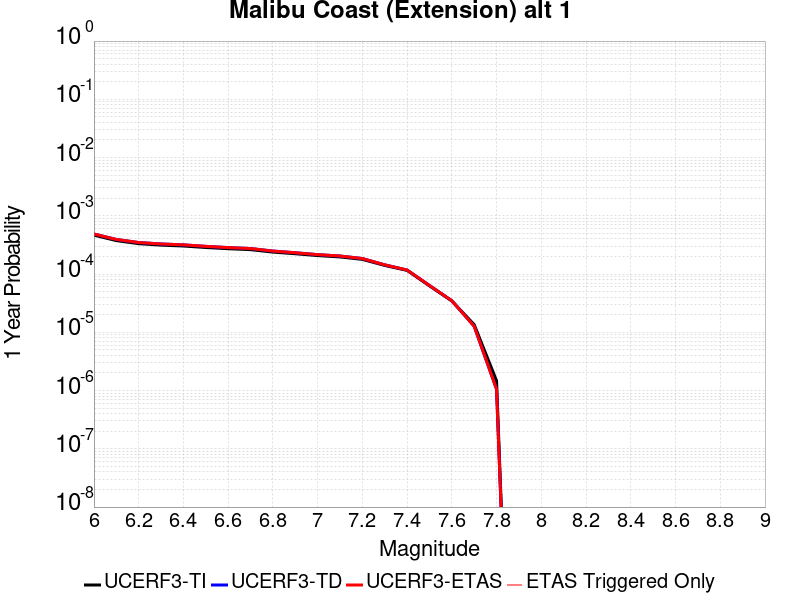 |  |

| Magnitude | 1 wk TI Prob | 1 wk TD Prob | 1 wk ETAS Prob | 1 wk ETAS/TD Gain | 1 wk ETAS Triggered Only | 1 mo TI Prob | 1 mo TD Prob | 1 mo ETAS Prob | 1 mo ETAS/TD Gain | 1 mo ETAS Triggered Only | 1 yr TI Prob | 1 yr TD Prob | 1 yr ETAS Prob | 1 yr ETAS/TD Gain | 1 yr ETAS Triggered Only | 10 yr TI Prob | 10 yr TD Prob | 10 yr ETAS Prob | 10 yr ETAS/TD Gain | 10 yr ETAS Triggered Only |
|-----|-----|-----|-----|-----|-----|-----|-----|-----|-----|-----|-----|-----|-----|-----|-----|-----|-----|-----|-----|-----|
| 6.0 | 8.930738E-6 | 9.329973E-6 | 9.329973E-6 | 1.0 | 0.0 | 3.827403E-5 | 3.9984996E-5 | 3.9984996E-5 | 1.0 | 0.0 | 4.6588664E-4 | 4.8671028E-4 | 4.8671028E-4 | 1.0 | 0.0 | 0.0046491115 | 0.004856626 | 0.004879421 | 1.0046936 | 2.2906359E-5 |
| 6.1 | 7.199952E-6 | 7.5308994E-6 | 7.5308994E-6 | 1.0 | 0.0 | 3.0856572E-5 | 3.227489E-5 | 3.227489E-5 | 1.0 | 0.0 | 3.75614E-4 | 3.928765E-4 | 3.928765E-4 | 1.0 | 0.0 | 0.0037497976 | 0.0039218855 | 0.0039447024 | 1.0058178 | 2.2906359E-5 |
| 6.2 | 6.3721413E-6 | 6.667345E-6 | 6.667345E-6 | 1.0 | 0.0 | 2.7308892E-5 | 2.8574026E-5 | 2.8574026E-5 | 1.0 | 0.0 | 3.3243504E-4 | 3.478336E-4 | 3.478336E-4 | 1.0 | 0.0 | 0.0033193815 | 0.0034729317 | 0.0034957584 | 1.0065727 | 2.2906359E-5 |
| 6.3 | 6.016345E-6 | 6.2956897E-6 | 6.2956897E-6 | 1.0 | 0.0 | 2.578408E-5 | 2.698125E-5 | 2.698125E-5 | 1.0 | 0.0 | 3.1387596E-4 | 3.2844752E-4 | 3.2844752E-4 | 1.0 | 0.0 | 0.00313433 | 0.003279657 | 0.0033024885 | 1.0069615 | 2.2906359E-5 |
| 6.4 | 5.8104883E-6 | 6.0800626E-6 | 6.0800626E-6 | 1.0 | 0.0 | 2.4901856E-5 | 2.6057152E-5 | 2.6057152E-5 | 1.0 | 0.0 | 3.031379E-4 | 3.1719997E-4 | 3.1719997E-4 | 1.0 | 0.0 | 0.0030272473 | 0.0031675068 | 0.0031903407 | 1.0072087 | 2.2906359E-5 |
| 6.5 | 5.476925E-6 | 5.7280054E-6 | 5.7280054E-6 | 1.0 | 0.0 | 2.3472323E-5 | 2.4548364E-5 | 2.4548364E-5 | 1.0 | 0.0 | 2.8573806E-4 | 2.9883566E-4 | 2.9883566E-4 | 1.0 | 0.0 | 0.0028537093 | 0.0029843699 | 0.003007208 | 1.0076525 | 2.2906359E-5 |
| 6.6 | 5.222387E-6 | 5.459052E-6 | 5.459052E-6 | 1.0 | 0.0 | 2.2381464E-5 | 2.3395727E-5 | 2.3395727E-5 | 1.0 | 0.0 | 2.7246025E-4 | 2.8480604E-4 | 2.8480604E-4 | 1.0 | 0.0 | 0.0027212645 | 0.002844441 | 0.0028672824 | 1.0080302 | 2.2906359E-5 |
| 6.7 | 5.0337076E-6 | 5.25956E-6 | 5.25956E-6 | 1.0 | 0.0 | 2.1572854E-5 | 2.2540778E-5 | 2.2540778E-5 | 1.0 | 0.0 | 2.6261783E-4 | 2.743997E-4 | 2.743997E-4 | 1.0 | 0.0 | 0.002623077 | 0.0027406388 | 0.0027634825 | 1.0083351 | 2.2906359E-5 |
| 6.8 | 4.5675624E-6 | 4.7591243E-6 | 4.7591243E-6 | 1.0 | 0.0 | 1.9575122E-5 | 2.0396088E-5 | 2.0396088E-5 | 1.0 | 0.0 | 2.3830103E-4 | 2.4829427E-4 | 2.4829427E-4 | 1.0 | 0.0 | 0.0023804565 | 0.0024801884 | 0.002503038 | 1.0092129 | 2.2906359E-5 |
| 6.9 | 4.2802412E-6 | 4.452401E-6 | 4.452401E-6 | 1.0 | 0.0 | 1.8343762E-5 | 1.908158E-5 | 1.908158E-5 | 1.0 | 0.0 | 2.2331243E-4 | 2.3229362E-4 | 2.3229362E-4 | 1.0 | 0.0 | 0.0022308815 | 0.0023205248 | 0.002343378 | 1.0098482 | 2.2906359E-5 |
| 7.0 | 3.9794063E-6 | 4.1304497E-6 | 4.1304497E-6 | 1.0 | 0.0 | 1.7054486E-5 | 1.7701808E-5 | 1.7701808E-5 | 1.0 | 0.0 | 2.0761859E-4 | 2.1549831E-4 | 2.1549831E-4 | 1.0 | 0.0 | 0.0020742472 | 0.002152907 | 0.002175764 | 1.0106168 | 2.2906359E-5 |
| 7.1 | 3.7730424E-6 | 3.91155E-6 | 3.91155E-6 | 1.0 | 0.0 | 1.6170083E-5 | 1.6763677E-5 | 1.6763677E-5 | 1.0 | 0.0 | 1.9685295E-4 | 2.0407878E-4 | 2.0407878E-4 | 1.0 | 0.0 | 0.0019667868 | 0.0020389266 | 0.0020617864 | 1.0112116 | 2.2906359E-5 |
| 7.2 | 3.424985E-6 | 3.541639E-6 | 3.541639E-6 | 1.0 | 0.0 | 1.4678424E-5 | 1.5178365E-5 | 1.5178365E-5 | 1.0 | 0.0 | 1.7869516E-4 | 1.8478103E-4 | 1.8478103E-4 | 1.0 | 0.0 | 0.0017855153 | 0.001846286 | 0.0018691501 | 1.0123838 | 2.2906359E-5 |
| 7.3 | 2.6966375E-6 | 2.7598792E-6 | 2.7598792E-6 | 1.0 | 0.0 | 1.15569665E-5 | 1.1828E-5 | 1.1828E-5 | 1.0 | 0.0 | 1.4069698E-4 | 1.4399643E-4 | 1.4399643E-4 | 1.0 | 0.0 | 0.0014060794 | 0.0014390353 | 0.0014619087 | 1.015895 | 2.2906359E-5 |
| 7.4 | 2.215957E-6 | 2.2495597E-6 | 2.2495597E-6 | 1.0 | 0.0 | 9.496924E-6 | 9.640935E-6 | 9.640935E-6 | 1.0 | 0.0 | 1.1561892E-4 | 1.17372096E-4 | 1.17372096E-4 | 1.0 | 0.0 | 0.0011555878 | 0.0011731047 | 0.0011959842 | 1.0195034 | 2.2906359E-5 |
| 7.5 | 1.2040218E-6 | 1.22201E-6 | 1.22201E-6 | 1.0 | 0.0 | 5.160083E-6 | 5.237175E-6 | 5.237175E-6 | 1.0 | 0.0 | 6.2822204E-5 | 6.376076E-5 | 6.376076E-5 | 1.0 | 0.0 | 6.280445E-4 | 6.3742656E-4 | 6.3742656E-4 | 1.0 | 0.0 |
| 7.6 | 6.6157446E-7 | 6.67956E-7 | 6.67956E-7 | 1.0 | 0.0 | 2.835316E-6 | 2.8626655E-6 | 2.8626655E-6 | 1.0 | 0.0 | 3.4519428E-5 | 3.485241E-5 | 3.485241E-5 | 1.0 | 0.0 | 3.4514067E-4 | 3.4847096E-4 | 3.4847096E-4 | 1.0 | 0.0 |
| 7.7 | 2.6012302E-7 | 2.4359613E-7 | 2.4359613E-7 | 1.0 | 0.0 | 1.1148124E-6 | 1.043983E-6 | 1.043983E-6 | 1.0 | 0.0 | 1.3572758E-5 | 1.2710431E-5 | 1.2710431E-5 | 1.0 | 0.0 | 1.3571928E-4 | 1.270981E-4 | 1.270981E-4 | 1.0 | 0.0 |
| 7.8 | 2.8323132E-8 | 2.0268452E-8 | 2.0268452E-8 | 1.0 | 0.0 | 1.2138484E-7 | 8.6864794E-8 | 8.6864794E-8 | 1.0 | 0.0 | 1.4778595E-6 | 1.0575784E-6 | 1.0575784E-6 | 1.0 | 0.0 | 1.4778497E-5 | 1.0575742E-5 | 1.0575742E-5 | 1.0 | 0.0 |

## Rinconada 2011 CFM
*[(top)](#table-of-contents)*

| 1 Week | 1 Month | 1 Year | 10 Year |
|-----|-----|-----|-----|
| 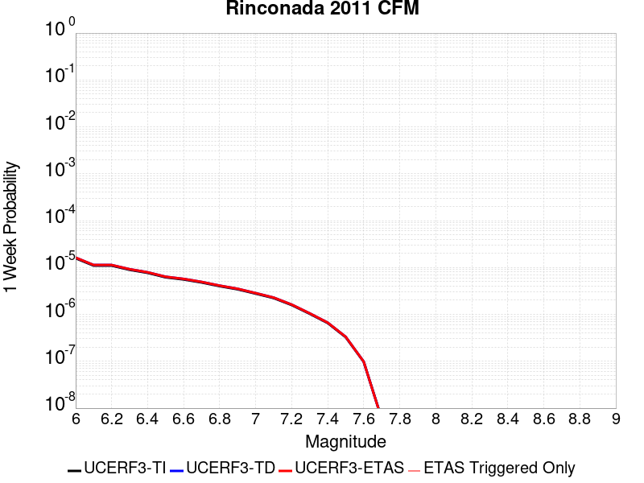 |  |  |  |

| Magnitude | 1 wk TI Prob | 1 wk TD Prob | 1 wk ETAS Prob | 1 wk ETAS/TD Gain | 1 wk ETAS Triggered Only | 1 mo TI Prob | 1 mo TD Prob | 1 mo ETAS Prob | 1 mo ETAS/TD Gain | 1 mo ETAS Triggered Only | 1 yr TI Prob | 1 yr TD Prob | 1 yr ETAS Prob | 1 yr ETAS/TD Gain | 1 yr ETAS Triggered Only | 10 yr TI Prob | 10 yr TD Prob | 10 yr ETAS Prob | 10 yr ETAS/TD Gain | 10 yr ETAS Triggered Only |
|-----|-----|-----|-----|-----|-----|-----|-----|-----|-----|-----|-----|-----|-----|-----|-----|-----|-----|-----|-----|-----|
| 6.0 | 1.5752368E-5 | 1.6275435E-5 | 1.6275435E-5 | 1.0 | 0.0 | 6.75084E-5 | 6.9750015E-5 | 6.9750015E-5 | 1.0 | 0.0 | 8.2160486E-4 | 8.488787E-4 | 8.7176566E-4 | 1.0269613 | 2.2906359E-5 | 0.008185739 | 0.008456742 | 0.008479455 | 1.0026858 | 2.2906359E-5 |
| 6.1 | 1.0966133E-5 | 1.1323521E-5 | 1.1323521E-5 | 1.0 | 0.0 | 4.6996865E-5 | 4.8528476E-5 | 4.8528476E-5 | 1.0 | 0.0 | 5.720366E-4 | 5.9067475E-4 | 6.135676E-4 | 1.0387571 | 2.2906359E-5 | 0.0057056635 | 0.005891144 | 0.0059139156 | 1.0038654 | 2.2906359E-5 |
| 6.2 | 1.0966133E-5 | 1.1323521E-5 | 1.1323521E-5 | 1.0 | 0.0 | 4.6996865E-5 | 4.8528476E-5 | 4.8528476E-5 | 1.0 | 0.0 | 5.720366E-4 | 5.9067475E-4 | 6.135676E-4 | 1.0387571 | 2.2906359E-5 | 0.0057056635 | 0.005891144 | 0.0059139156 | 1.0038654 | 2.2906359E-5 |
| 6.3 | 8.926149E-6 | 9.213167E-6 | 9.213167E-6 | 1.0 | 0.0 | 3.8254362E-5 | 3.9484406E-5 | 3.9484406E-5 | 1.0 | 0.0 | 4.6564735E-4 | 4.8061693E-4 | 4.8061693E-4 | 1.0 | 0.0 | 0.0046467283 | 0.00479582 | 0.00479582 | 1.0 | 0.0 |
| 6.4 | 7.676955E-6 | 7.9205265E-6 | 7.9205265E-6 | 1.0 | 0.0 | 3.290082E-5 | 3.3944674E-5 | 3.3944674E-5 | 1.0 | 0.0 | 4.0049385E-4 | 4.1319823E-4 | 4.1319823E-4 | 1.0 | 0.0 | 0.0039977287 | 0.0041243257 | 0.0041243257 | 1.0 | 0.0 |
| 6.5 | 6.1671026E-6 | 6.35922E-6 | 6.35922E-6 | 1.0 | 0.0 | 2.6430173E-5 | 2.7253516E-5 | 2.7253516E-5 | 1.0 | 0.0 | 3.2173982E-4 | 3.3176114E-4 | 3.3176114E-4 | 1.0 | 0.0 | 0.003212744 | 0.0033126706 | 0.0033126706 | 1.0 | 0.0 |
| 6.6 | 5.553456E-6 | 5.72505E-6 | 5.72505E-6 | 1.0 | 0.0 | 2.3800309E-5 | 2.4535697E-5 | 2.4535697E-5 | 1.0 | 0.0 | 2.897302E-4 | 2.9868123E-4 | 2.9868123E-4 | 1.0 | 0.0 | 0.0028935277 | 0.0029828066 | 0.0029828066 | 1.0 | 0.0 |
| 6.7 | 4.787857E-6 | 4.9335113E-6 | 4.9335113E-6 | 1.0 | 0.0 | 2.0519226E-5 | 2.1143449E-5 | 2.1143449E-5 | 1.0 | 0.0 | 2.4979294E-4 | 2.573911E-4 | 2.573911E-4 | 1.0 | 0.0 | 0.0024951235 | 0.0025709358 | 0.0025709358 | 1.0 | 0.0 |
| 6.8 | 3.9955166E-6 | 4.11364E-6 | 4.11364E-6 | 1.0 | 0.0 | 1.7123532E-5 | 1.7629767E-5 | 1.7629767E-5 | 1.0 | 0.0 | 2.0845905E-4 | 2.146213E-4 | 2.146213E-4 | 1.0 | 0.0 | 0.002082636 | 0.002144144 | 0.002144144 | 1.0 | 0.0 |
| 6.9 | 3.4250072E-6 | 3.5225821E-6 | 3.5225821E-6 | 1.0 | 0.0 | 1.46785205E-5 | 1.5096693E-5 | 1.5096693E-5 | 1.0 | 0.0 | 1.7869633E-4 | 1.8378675E-4 | 1.8378675E-4 | 1.0 | 0.0 | 0.001785527 | 0.0018363501 | 0.0018363501 | 1.0 | 0.0 |
| 7.0 | 2.7712713E-6 | 2.8468053E-6 | 2.8468053E-6 | 1.0 | 0.0 | 1.1876823E-5 | 1.2200538E-5 | 1.2200538E-5 | 1.0 | 0.0 | 1.4459073E-4 | 1.4853143E-4 | 1.4853143E-4 | 1.0 | 0.0 | 0.0014449668 | 0.0014843232 | 0.0014843232 | 1.0 | 0.0 |
| 7.1 | 2.227358E-6 | 2.2857805E-6 | 2.2857805E-6 | 1.0 | 0.0 | 9.545785E-6 | 9.796166E-6 | 9.796166E-6 | 1.0 | 0.0 | 1.16213734E-4 | 1.1926179E-4 | 1.1926179E-4 | 1.0 | 0.0 | 0.0011615298 | 0.0011919789 | 0.0011919789 | 1.0 | 0.0 |
| 7.2 | 1.581796E-6 | 1.6209568E-6 | 1.6209568E-6 | 1.0 | 0.0 | 6.779108E-6 | 6.9469393E-6 | 6.9469393E-6 | 1.0 | 0.0 | 8.253252E-5 | 8.457571E-5 | 8.457571E-5 | 1.0 | 0.0 | 8.250187E-4 | 8.454357E-4 | 8.454357E-4 | 1.0 | 0.0 |
| 7.3 | 1.0306567E-6 | 1.0546827E-6 | 1.0546827E-6 | 1.0 | 0.0 | 4.4170924E-6 | 4.520061E-6 | 4.520061E-6 | 1.0 | 0.0 | 5.3776774E-5 | 5.5030352E-5 | 5.5030352E-5 | 1.0 | 0.0 | 5.376376E-4 | 5.501675E-4 | 5.501675E-4 | 1.0 | 0.0 |
| 7.4 | 6.535541E-7 | 6.6829654E-7 | 6.6829654E-7 | 1.0 | 0.0 | 2.800943E-6 | 2.8641248E-6 | 2.8641248E-6 | 1.0 | 0.0 | 3.4100947E-5 | 3.4870165E-5 | 3.4870165E-5 | 1.0 | 0.0 | 3.4095717E-4 | 3.4864704E-4 | 3.4864704E-4 | 1.0 | 0.0 |
| 7.5 | 3.2656962E-7 | 3.3317815E-7 | 3.3317815E-7 | 1.0 | 0.0 | 1.3995833E-6 | 1.4279057E-6 | 1.4279057E-6 | 1.0 | 0.0 | 1.7039794E-5 | 1.7384613E-5 | 1.7384613E-5 | 1.0 | 0.0 | 1.7038487E-4 | 1.7383257E-4 | 1.7383257E-4 | 1.0 | 0.0 |
| 7.6 | 9.754343E-8 | 9.8213114E-8 | 9.8213114E-8 | 1.0 | 0.0 | 4.180432E-7 | 4.2091327E-7 | 4.2091327E-7 | 1.0 | 0.0 | 5.089664E-6 | 5.124607E-6 | 5.124607E-6 | 1.0 | 0.0 | 5.0895473E-5 | 5.12449E-5 | 5.12449E-5 | 1.0 | 0.0 |
| 7.7 | 6.0001453E-9 | 5.8493015E-9 | 5.8493015E-9 | 1.0 | 0.0 | 2.5714908E-8 | 2.5068434E-8 | 2.5068434E-8 | 1.0 | 0.0 | 3.1307894E-7 | 3.0520815E-7 | 3.0520815E-7 | 1.0 | 0.0 | 3.1307852E-6 | 3.0520773E-6 | 3.0520773E-6 | 1.0 | 0.0 |
| 7.8 | 7.400003E-11 | 7.465528E-11 | 7.465528E-11 | 1.0 | 0.0 | 3.171432E-10 | 3.199514E-10 | 3.199514E-10 | 1.0 | 0.0 | 3.861218E-9 | 3.895409E-9 | 3.895409E-9 | 1.0 | 0.0 | 3.861218E-8 | 3.8954088E-8 | 3.8954088E-8 | 1.0 | 0.0 |

## San Jacinto (Borrego)
*[(top)](#table-of-contents)*

| 1 Week | 1 Month | 1 Year | 10 Year |
|-----|-----|-----|-----|
|  |  |  |  |

| Magnitude | 1 wk TI Prob | 1 wk TD Prob | 1 wk ETAS Prob | 1 wk ETAS/TD Gain | 1 wk ETAS Triggered Only | 1 mo TI Prob | 1 mo TD Prob | 1 mo ETAS Prob | 1 mo ETAS/TD Gain | 1 mo ETAS Triggered Only | 1 yr TI Prob | 1 yr TD Prob | 1 yr ETAS Prob | 1 yr ETAS/TD Gain | 1 yr ETAS Triggered Only | 10 yr TI Prob | 10 yr TD Prob | 10 yr ETAS Prob | 10 yr ETAS/TD Gain | 10 yr ETAS Triggered Only |
|-----|-----|-----|-----|-----|-----|-----|-----|-----|-----|-----|-----|-----|-----|-----|-----|-----|-----|-----|-----|-----|
| 6.0 | 3.543992E-5 | 2.8003382E-5 | 2.8003382E-5 | 1.0 | 0.0 | 1.5187653E-4 | 1.2000904E-4 | 1.2000904E-4 | 1.0 | 0.0 | 0.0018475284 | 0.0014601431 | 0.0014601431 | 1.0 | 0.0 | 0.018322436 | 0.014909599 | 0.014932164 | 1.0015135 | 2.2906359E-5 |
| 6.1 | 3.542281E-5 | 2.8003382E-5 | 2.8003382E-5 | 1.0 | 0.0 | 1.5180321E-4 | 1.2000904E-4 | 1.2000904E-4 | 1.0 | 0.0 | 0.0018466372 | 0.0014601431 | 0.0014601431 | 1.0 | 0.0 | 0.018313672 | 0.014909599 | 0.014932164 | 1.0015135 | 2.2906359E-5 |
| 6.2 | 3.4688688E-5 | 2.8003382E-5 | 2.8003382E-5 | 1.0 | 0.0 | 1.4865733E-4 | 1.2000904E-4 | 1.2000904E-4 | 1.0 | 0.0 | 0.0018084005 | 0.001460143 | 0.001460143 | 1.0 | 0.0 | 0.017937548 | 0.014909599 | 0.014932164 | 1.0015135 | 2.2906359E-5 |
| 6.3 | 3.2087122E-5 | 2.7848688E-5 | 2.7848688E-5 | 1.0 | 0.0 | 1.3750899E-4 | 1.1934613E-4 | 1.1934613E-4 | 1.0 | 0.0 | 0.0016728862 | 0.0014520829 | 0.0014520829 | 1.0 | 0.0 | 0.016603488 | 0.0148306135 | 0.01485318 | 1.0015216 | 2.2906359E-5 |
| 6.4 | 3.1828724E-5 | 2.781566E-5 | 2.781566E-5 | 1.0 | 0.0 | 1.364017E-4 | 1.1920459E-4 | 1.1920459E-4 | 1.0 | 0.0 | 0.0016594254 | 0.0014503619 | 0.0014503619 | 1.0 | 0.0 | 0.016470885 | 0.014813685 | 0.014836252 | 1.0015234 | 2.2906359E-5 |
| 6.5 | 3.1563577E-5 | 2.7555256E-5 | 2.7555256E-5 | 1.0 | 0.0 | 1.3526545E-4 | 1.18088676E-4 | 1.18088676E-4 | 1.0 | 0.0 | 0.0016456128 | 0.0014367937 | 0.0014367937 | 1.0 | 0.0 | 0.0163348 | 0.014680215 | 0.014702785 | 1.0015374 | 2.2906359E-5 |
| 6.6 | 3.1467625E-5 | 2.7399425E-5 | 2.7399425E-5 | 1.0 | 0.0 | 1.3485427E-4 | 1.1742089E-4 | 1.1742089E-4 | 1.0 | 0.0 | 0.0016406142 | 0.001428674 | 0.001428674 | 1.0 | 0.0 | 0.016285548 | 0.014600436 | 0.014623009 | 1.001546 | 2.2906359E-5 |
| 6.7 | 3.1223695E-5 | 2.701733E-5 | 2.701733E-5 | 1.0 | 0.0 | 1.3380898E-4 | 1.15783485E-4 | 1.15783485E-4 | 1.0 | 0.0 | 0.0016279068 | 0.0014087645 | 0.0014087645 | 1.0 | 0.0 | 0.01616033 | 0.01440476 | 0.014427337 | 1.0015672 | 2.2906359E-5 |
| 6.8 | 3.1015585E-5 | 2.6838206E-5 | 2.6838206E-5 | 1.0 | 0.0 | 1.3291716E-4 | 1.1501588E-4 | 1.1501588E-4 | 1.0 | 0.0 | 0.001617065 | 0.0013994309 | 0.0013994309 | 1.0 | 0.0 | 0.016053487 | 0.014311978 | 0.014334556 | 1.0015776 | 2.2906359E-5 |
| 6.9 | 2.6641965E-5 | 2.2256108E-5 | 2.2256108E-5 | 1.0 | 0.0 | 1.1417485E-4 | 9.537986E-5 | 9.537986E-5 | 1.0 | 0.0 | 0.0013891924 | 0.001160635 | 0.001160635 | 1.0 | 0.0 | 0.0138054015 | 0.011919958 | 0.011942591 | 1.0018988 | 2.2906359E-5 |
| 7.0 | 2.3854353E-5 | 2.054833E-5 | 2.054833E-5 | 1.0 | 0.0 | 1.02228936E-4 | 8.8061315E-5 | 8.8061315E-5 | 1.0 | 0.0 | 0.0012439266 | 0.0010716218 | 0.0010716218 | 1.0 | 0.0 | 0.012369866 | 0.011019007 | 0.011041662 | 1.0020559 | 2.2906359E-5 |
| 7.1 | 2.3672901E-5 | 2.0384747E-5 | 2.0384747E-5 | 1.0 | 0.0 | 1.0145135E-4 | 8.736029E-5 | 8.736029E-5 | 1.0 | 0.0 | 0.0012344702 | 0.001063095 | 0.001063095 | 1.0 | 0.0 | 0.0122763505 | 0.010934151 | 0.010956807 | 1.002072 | 2.2906359E-5 |
| 7.2 | 2.2717244E-5 | 1.9611558E-5 | 1.9611558E-5 | 1.0 | 0.0 | 9.735599E-5 | 8.4046835E-5 | 8.4046835E-5 | 1.0 | 0.0 | 0.0011846646 | 0.0010227922 | 0.0010227922 | 1.0 | 0.0 | 0.01178369 | 0.0105312355 | 0.010553901 | 1.0021522 | 2.2906359E-5 |
| 7.3 | 2.1016205E-5 | 1.8452236E-5 | 1.8452236E-5 | 1.0 | 0.0 | 9.006634E-5 | 7.907863E-5 | 7.907863E-5 | 1.0 | 0.0 | 0.001096006 | 9.6235913E-4 | 9.6235913E-4 | 1.0 | 0.0 | 0.010906163 | 0.009926388 | 0.009949067 | 1.0022848 | 2.2906359E-5 |
| 7.4 | 2.0683625E-5 | 1.825456E-5 | 1.825456E-5 | 1.0 | 0.0 | 8.86411E-5 | 7.823149E-5 | 7.823149E-5 | 1.0 | 0.0 | 0.001078671 | 9.520543E-4 | 9.520543E-4 | 1.0 | 0.0 | 0.010734501 | 0.009823013 | 0.0098456945 | 1.002309 | 2.2906359E-5 |
| 7.5 | 1.9993966E-5 | 1.7848999E-5 | 1.7848999E-5 | 1.0 | 0.0 | 8.568561E-5 | 7.649348E-5 | 7.649348E-5 | 1.0 | 0.0 | 0.001042723 | 9.3091227E-4 | 9.3091227E-4 | 1.0 | 0.0 | 0.010378438 | 0.009609638 | 0.009632324 | 1.0023608 | 2.2906359E-5 |
| 7.6 | 1.788966E-5 | 1.6500542E-5 | 1.6500542E-5 | 1.0 | 0.0 | 7.666772E-5 | 7.07147E-5 | 7.07147E-5 | 1.0 | 0.0 | 9.3302975E-4 | 8.606132E-4 | 8.606132E-4 | 1.0 | 0.0 | 0.00929122 | 0.008900661 | 0.008923364 | 1.0025506 | 2.2906359E-5 |
| 7.7 | 1.5125781E-5 | 1.4300437E-5 | 1.4300437E-5 | 1.0 | 0.0 | 6.4823165E-5 | 6.1286155E-5 | 6.1286155E-5 | 1.0 | 0.0 | 7.889362E-4 | 7.459043E-4 | 7.459043E-4 | 1.0 | 0.0 | 0.007861412 | 0.0077472753 | 0.007770004 | 1.0029337 | 2.2906359E-5 |
| 7.8 | 1.250089E-5 | 1.26912855E-5 | 1.26912855E-5 | 1.0 | 0.0 | 5.3574146E-5 | 5.4390093E-5 | 5.4390093E-5 | 1.0 | 0.0 | 6.5207E-4 | 6.619988E-4 | 6.619988E-4 | 1.0 | 0.0 | 0.006501599 | 0.0068996777 | 0.006922426 | 1.003297 | 2.2906359E-5 |
| 7.9 | 9.561E-6 | 9.808689E-6 | 9.808689E-6 | 1.0 | 0.0 | 4.0975072E-5 | 4.2036565E-5 | 4.2036565E-5 | 1.0 | 0.0 | 4.987573E-4 | 5.1167555E-4 | 5.1167555E-4 | 1.0 | 0.0 | 0.0049763937 | 0.0053808247 | 0.0054036076 | 1.0042341 | 2.2906359E-5 |
| 8.0 | 8.01699E-6 | 8.342766E-6 | 8.342766E-6 | 1.0 | 0.0 | 3.4358076E-5 | 3.5754223E-5 | 3.5754223E-5 | 1.0 | 0.0 | 4.1822926E-4 | 4.3522127E-4 | 4.3522127E-4 | 1.0 | 0.0 | 0.0041744304 | 0.004599371 | 0.004622172 | 1.0049574 | 2.2906359E-5 |
| 8.1 | 6.541947E-6 | 6.502812E-6 | 6.502812E-6 | 1.0 | 0.0 | 2.8036617E-5 | 2.7868899E-5 | 2.7868899E-5 | 1.0 | 0.0 | 3.4129233E-4 | 3.3925154E-4 | 3.3925154E-4 | 1.0 | 0.0 | 0.0034076865 | 0.0036021962 | 0.0036021962 | 1.0 | 0.0 |
| 8.2 | 1.7968189E-6 | 8.0462127E-7 | 8.0462127E-7 | 1.0 | 0.0 | 7.70063E-6 | 3.4483724E-6 | 3.4483724E-6 | 1.0 | 0.0 | 9.3751136E-5 | 4.198315E-5 | 4.198315E-5 | 1.0 | 0.0 | 9.371159E-4 | 4.7540086E-4 | 4.7540086E-4 | 1.0 | 0.0 |
| 8.3 | 1.5167889E-7 | 4.9512888E-8 | 4.9512888E-8 | 1.0 | 0.0 | 6.500522E-7 | 2.1219807E-7 | 2.1219807E-7 | 1.0 | 0.0 | 7.9143565E-6 | 2.583509E-6 | 2.583509E-6 | 1.0 | 0.0 | 7.914075E-5 | 3.0002166E-5 | 3.0002166E-5 | 1.0 | 0.0 |

## Chino alt 1
*[(top)](#table-of-contents)*

| 1 Week | 1 Month | 1 Year | 10 Year |
|-----|-----|-----|-----|
|  |  |  |  |

| Magnitude | 1 wk TI Prob | 1 wk TD Prob | 1 wk ETAS Prob | 1 wk ETAS/TD Gain | 1 wk ETAS Triggered Only | 1 mo TI Prob | 1 mo TD Prob | 1 mo ETAS Prob | 1 mo ETAS/TD Gain | 1 mo ETAS Triggered Only | 1 yr TI Prob | 1 yr TD Prob | 1 yr ETAS Prob | 1 yr ETAS/TD Gain | 1 yr ETAS Triggered Only | 10 yr TI Prob | 10 yr TD Prob | 10 yr ETAS Prob | 10 yr ETAS/TD Gain | 10 yr ETAS Triggered Only |
|-----|-----|-----|-----|-----|-----|-----|-----|-----|-----|-----|-----|-----|-----|-----|-----|-----|-----|-----|-----|-----|
| 6.0 | 3.939946E-5 | 4.8967257E-5 | 4.8967257E-5 | 1.0 | 0.0 | 1.6884391E-4 | 2.0984573E-4 | 2.0984573E-4 | 1.0 | 0.0 | 0.0020537362 | 0.002552355 | 0.0025752028 | 1.0089517 | 2.2906359E-5 | 0.020348595 | 0.025287293 | 0.025309619 | 1.000883 | 2.2906359E-5 |
| 6.1 | 2.1505624E-5 | 2.6890864E-5 | 2.6890864E-5 | 1.0 | 0.0 | 9.2163704E-5 | 1.15242095E-4 | 1.15242095E-4 | 1.0 | 0.0 | 0.0011215154 | 0.0014022809 | 0.0014251551 | 1.0163121 | 2.2906359E-5 | 0.011158722 | 0.013951185 | 0.0139737725 | 1.001619 | 2.2906359E-5 |
| 6.2 | 2.1505624E-5 | 2.6890864E-5 | 2.6890864E-5 | 1.0 | 0.0 | 9.2163704E-5 | 1.15242095E-4 | 1.15242095E-4 | 1.0 | 0.0 | 0.0011215154 | 0.0014022809 | 0.0014251551 | 1.0163121 | 2.2906359E-5 | 0.011158722 | 0.013951185 | 0.0139737725 | 1.001619 | 2.2906359E-5 |
| 6.3 | 1.4290785E-5 | 1.8174556E-5 | 1.8174556E-5 | 1.0 | 0.0 | 6.1244784E-5 | 7.7888886E-5 | 7.7888886E-5 | 1.0 | 0.0 | 7.454001E-4 | 9.4793004E-4 | 9.4793004E-4 | 1.0 | 0.0 | 0.007429048 | 0.009449286 | 0.009449286 | 1.0 | 0.0 |
| 6.4 | 1.4290785E-5 | 1.8174556E-5 | 1.8174556E-5 | 1.0 | 0.0 | 6.1244784E-5 | 7.7888886E-5 | 7.7888886E-5 | 1.0 | 0.0 | 7.454001E-4 | 9.4793004E-4 | 9.4793004E-4 | 1.0 | 0.0 | 0.007429048 | 0.009449286 | 0.009449286 | 1.0 | 0.0 |
| 6.5 | 1.3017944E-5 | 1.6661137E-5 | 1.6661137E-5 | 1.0 | 0.0 | 5.5789995E-5 | 7.140317E-5 | 7.140317E-5 | 1.0 | 0.0 | 6.790315E-4 | 8.690306E-4 | 8.690306E-4 | 1.0 | 0.0 | 0.0067696036 | 0.008666586 | 0.008666586 | 1.0 | 0.0 |
| 6.6 | 9.470016E-6 | 1.2046306E-5 | 1.2046306E-5 | 1.0 | 0.0 | 4.058515E-5 | 5.1626197E-5 | 5.1626197E-5 | 1.0 | 0.0 | 4.940122E-4 | 6.2840164E-4 | 6.2840164E-4 | 1.0 | 0.0 | 0.004929154 | 0.006275441 | 0.006275441 | 1.0 | 0.0 |
| 6.7 | 8.314155E-6 | 1.0413858E-5 | 1.0413858E-5 | 1.0 | 0.0 | 3.5631605E-5 | 4.4630237E-5 | 4.4630237E-5 | 1.0 | 0.0 | 4.3372845E-4 | 5.432699E-4 | 5.432699E-4 | 1.0 | 0.0 | 0.004328829 | 0.005428933 | 0.005428933 | 1.0 | 0.0 |
| 6.8 | 3.4856364E-6 | 3.8155918E-6 | 3.8155918E-6 | 1.0 | 0.0 | 1.4938357E-5 | 1.6352446E-5 | 1.6352446E-5 | 1.0 | 0.0 | 1.8185932E-4 | 1.990749E-4 | 1.990749E-4 | 1.0 | 0.0 | 0.0018171056 | 0.001990641 | 0.001990641 | 1.0 | 0.0 |
| 6.9 | 2.2645952E-6 | 2.154401E-6 | 2.154401E-6 | 1.0 | 0.0 | 9.705372E-6 | 9.233116E-6 | 9.233116E-6 | 1.0 | 0.0 | 1.18156495E-4 | 1.124076E-4 | 1.124076E-4 | 1.0 | 0.0 | 0.0011809369 | 0.0011241237 | 0.0011241237 | 1.0 | 0.0 |
| 7.0 | 1.7864003E-6 | 1.5443994E-6 | 1.5443994E-6 | 1.0 | 0.0 | 7.655979E-6 | 6.618838E-6 | 6.618838E-6 | 1.0 | 0.0 | 9.3207556E-5 | 8.0581434E-5 | 8.0581434E-5 | 1.0 | 0.0 | 9.316847E-4 | 8.059694E-4 | 8.059694E-4 | 1.0 | 0.0 |
| 7.1 | 1.7315456E-6 | 1.4746504E-6 | 1.4746504E-6 | 1.0 | 0.0 | 7.420889E-6 | 6.319915E-6 | 6.319915E-6 | 1.0 | 0.0 | 9.034557E-5 | 7.6942306E-5 | 7.6942306E-5 | 1.0 | 0.0 | 9.0308854E-4 | 7.695947E-4 | 7.695947E-4 | 1.0 | 0.0 |
| 7.2 | 1.6008337E-6 | 1.3586603E-6 | 1.3586603E-6 | 1.0 | 0.0 | 6.860698E-6 | 5.822817E-6 | 5.822817E-6 | 1.0 | 0.0 | 8.352579E-5 | 7.089055E-5 | 7.089055E-5 | 1.0 | 0.0 | 8.34944E-4 | 7.0910365E-4 | 7.0910365E-4 | 1.0 | 0.0 |
| 7.3 | 1.3320939E-6 | 1.1229135E-6 | 1.1229135E-6 | 1.0 | 0.0 | 5.7089615E-6 | 4.8124784E-6 | 4.8124784E-6 | 1.0 | 0.0 | 6.9504385E-5 | 5.8590394E-5 | 5.8590394E-5 | 1.0 | 0.0 | 6.9482654E-4 | 5.858941E-4 | 5.858941E-4 | 1.0 | 0.0 |
| 7.4 | 1.114294E-6 | 9.2475307E-7 | 9.2475307E-7 | 1.0 | 0.0 | 4.775537E-6 | 3.963222E-6 | 3.963222E-6 | 1.0 | 0.0 | 5.8140613E-5 | 4.8251193E-5 | 4.8251193E-5 | 1.0 | 0.0 | 5.81254E-4 | 4.82424E-4 | 4.82424E-4 | 1.0 | 0.0 |
| 7.5 | 9.354081E-7 | 7.6331327E-7 | 7.6331327E-7 | 1.0 | 0.0 | 4.0088858E-6 | 3.2713388E-6 | 3.2713388E-6 | 1.0 | 0.0 | 4.8807087E-5 | 3.9827857E-5 | 3.9827857E-5 | 1.0 | 0.0 | 4.879637E-4 | 3.982106E-4 | 3.982106E-4 | 1.0 | 0.0 |
| 7.6 | 8.521771E-7 | 6.8901085E-7 | 6.8901085E-7 | 1.0 | 0.0 | 3.6521824E-6 | 2.9529006E-6 | 2.9529006E-6 | 1.0 | 0.0 | 4.4464414E-5 | 3.5951E-5 | 3.5951E-5 | 1.0 | 0.0 | 4.4455516E-4 | 3.5945504E-4 | 3.5945504E-4 | 1.0 | 0.0 |
| 7.7 | 2.1803626E-7 | 1.4212328E-7 | 1.4212328E-7 | 1.0 | 0.0 | 9.344408E-7 | 6.090997E-7 | 6.090997E-7 | 1.0 | 0.0 | 1.1376757E-5 | 7.4157733E-6 | 7.4157733E-6 | 1.0 | 0.0 | 1.13761744E-4 | 7.415622E-5 | 7.415622E-5 | 1.0 | 0.0 |

## Round Valley
*[(top)](#table-of-contents)*

| 1 Week | 1 Month | 1 Year | 10 Year |
|-----|-----|-----|-----|
|  |  |  | 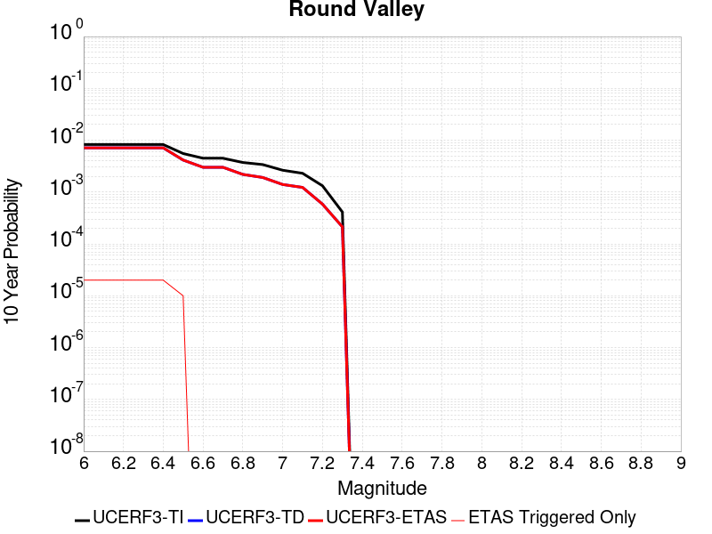 |

| Magnitude | 1 wk TI Prob | 1 wk TD Prob | 1 wk ETAS Prob | 1 wk ETAS/TD Gain | 1 wk ETAS Triggered Only | 1 mo TI Prob | 1 mo TD Prob | 1 mo ETAS Prob | 1 mo ETAS/TD Gain | 1 mo ETAS Triggered Only | 1 yr TI Prob | 1 yr TD Prob | 1 yr ETAS Prob | 1 yr ETAS/TD Gain | 1 yr ETAS Triggered Only | 10 yr TI Prob | 10 yr TD Prob | 10 yr ETAS Prob | 10 yr ETAS/TD Gain | 10 yr ETAS Triggered Only |
|-----|-----|-----|-----|-----|-----|-----|-----|-----|-----|-----|-----|-----|-----|-----|-----|-----|-----|-----|-----|-----|
| 6.0 | 1.588152E-5 | 1.36734325E-5 | 1.36734325E-5 | 1.0 | 0.0 | 6.806188E-5 | 5.859933E-5 | 5.859933E-5 | 1.0 | 0.0 | 8.283384E-4 | 7.132527E-4 | 7.132527E-4 | 1.0 | 0.0 | 0.008252576 | 0.007113524 | 0.007136267 | 1.0031972 | 2.2906359E-5 |
| 6.1 | 1.588152E-5 | 1.36734325E-5 | 1.36734325E-5 | 1.0 | 0.0 | 6.806188E-5 | 5.859933E-5 | 5.859933E-5 | 1.0 | 0.0 | 8.283384E-4 | 7.132527E-4 | 7.132527E-4 | 1.0 | 0.0 | 0.008252576 | 0.007113524 | 0.007136267 | 1.0031972 | 2.2906359E-5 |
| 6.2 | 1.588152E-5 | 1.36734325E-5 | 1.36734325E-5 | 1.0 | 0.0 | 6.806188E-5 | 5.859933E-5 | 5.859933E-5 | 1.0 | 0.0 | 8.283384E-4 | 7.132527E-4 | 7.132527E-4 | 1.0 | 0.0 | 0.008252576 | 0.007113524 | 0.007136267 | 1.0031972 | 2.2906359E-5 |
| 6.3 | 1.588152E-5 | 1.36734325E-5 | 1.36734325E-5 | 1.0 | 0.0 | 6.806188E-5 | 5.859933E-5 | 5.859933E-5 | 1.0 | 0.0 | 8.283384E-4 | 7.132527E-4 | 7.132527E-4 | 1.0 | 0.0 | 0.008252576 | 0.007113524 | 0.007136267 | 1.0031972 | 2.2906359E-5 |
| 6.4 | 1.588152E-5 | 1.36734325E-5 | 1.36734325E-5 | 1.0 | 0.0 | 6.806188E-5 | 5.859933E-5 | 5.859933E-5 | 1.0 | 0.0 | 8.283384E-4 | 7.132527E-4 | 7.132527E-4 | 1.0 | 0.0 | 0.008252576 | 0.007113524 | 0.007136267 | 1.0031972 | 2.2906359E-5 |
| 6.5 | 1.0646776E-5 | 7.955055E-6 | 7.955055E-6 | 1.0 | 0.0 | 4.5628243E-5 | 3.4092693E-5 | 3.4092693E-5 | 1.0 | 0.0 | 5.553823E-4 | 4.1500785E-4 | 4.1500785E-4 | 1.0 | 0.0 | 0.005539963 | 0.0041431575 | 0.004165969 | 1.0055058 | 2.2906359E-5 |
| 6.6 | 8.632956E-6 | 5.7705133E-6 | 5.7705133E-6 | 1.0 | 0.0 | 3.6997862E-5 | 2.473056E-5 | 2.473056E-5 | 1.0 | 0.0 | 4.5035584E-4 | 3.0105677E-4 | 3.0105677E-4 | 1.0 | 0.0 | 0.0044944426 | 0.0030068676 | 0.0030068676 | 1.0 | 0.0 |
| 6.7 | 8.632956E-6 | 5.7705133E-6 | 5.7705133E-6 | 1.0 | 0.0 | 3.6997862E-5 | 2.473056E-5 | 2.473056E-5 | 1.0 | 0.0 | 4.5035584E-4 | 3.0105677E-4 | 3.0105677E-4 | 1.0 | 0.0 | 0.0044944426 | 0.0030068676 | 0.0030068676 | 1.0 | 0.0 |
| 6.8 | 7.143895E-6 | 4.203435E-6 | 4.203435E-6 | 1.0 | 0.0 | 3.0616335E-5 | 1.8014607E-5 | 1.8014607E-5 | 1.0 | 0.0 | 3.726901E-4 | 2.1930743E-4 | 2.1930743E-4 | 1.0 | 0.0 | 0.0037206567 | 0.002191075 | 0.002191075 | 1.0 | 0.0 |
| 6.9 | 6.5120694E-6 | 3.6659874E-6 | 3.6659874E-6 | 1.0 | 0.0 | 2.790857E-5 | 1.5711288E-5 | 1.5711288E-5 | 1.0 | 0.0 | 3.3973387E-4 | 1.9126966E-4 | 1.9126966E-4 | 1.0 | 0.0 | 0.0033921495 | 0.0019111994 | 0.0019111994 | 1.0 | 0.0 |
| 7.0 | 5.0614435E-6 | 2.684983E-6 | 2.684983E-6 | 1.0 | 0.0 | 2.169172E-5 | 1.1507024E-5 | 1.1507024E-5 | 1.0 | 0.0 | 2.6406467E-4 | 1.4009005E-4 | 1.4009005E-4 | 1.0 | 0.0 | 0.0026375111 | 0.0014001188 | 0.0014001188 | 1.0 | 0.0 |
| 7.1 | 4.41728E-6 | 2.3587174E-6 | 2.3587174E-6 | 1.0 | 0.0 | 1.8931061E-5 | 1.0108755E-5 | 1.0108755E-5 | 1.0 | 0.0 | 2.304613E-4 | 1.2306812E-4 | 1.2306812E-4 | 1.0 | 0.0 | 0.0023022245 | 0.0012300963 | 0.0012300963 | 1.0 | 0.0 |
| 7.2 | 2.535495E-6 | 1.1217944E-6 | 1.1217944E-6 | 1.0 | 0.0 | 1.0866362E-5 | 4.807684E-6 | 4.807684E-6 | 1.0 | 0.0 | 1.3228992E-4 | 5.8532507E-5 | 5.8532507E-5 | 1.0 | 0.0 | 0.0013221119 | 5.8522215E-4 | 5.8522215E-4 | 1.0 | 0.0 |
| 7.3 | 7.900015E-7 | 4.0900827E-7 | 4.0900827E-7 | 1.0 | 0.0 | 3.3857161E-6 | 1.7528926E-6 | 1.7528926E-6 | 1.0 | 0.0 | 4.1220315E-5 | 2.1341466E-5 | 2.1341466E-5 | 1.0 | 0.0 | 4.121267E-4 | 2.1341466E-4 | 2.1341466E-4 | 1.0 | 0.0 |

## Newport-Inglewood (Offshore)
*[(top)](#table-of-contents)*

| 1 Week | 1 Month | 1 Year | 10 Year |
|-----|-----|-----|-----|
|  |  |  |  |

| Magnitude | 1 wk TI Prob | 1 wk TD Prob | 1 wk ETAS Prob | 1 wk ETAS/TD Gain | 1 wk ETAS Triggered Only | 1 mo TI Prob | 1 mo TD Prob | 1 mo ETAS Prob | 1 mo ETAS/TD Gain | 1 mo ETAS Triggered Only | 1 yr TI Prob | 1 yr TD Prob | 1 yr ETAS Prob | 1 yr ETAS/TD Gain | 1 yr ETAS Triggered Only | 10 yr TI Prob | 10 yr TD Prob | 10 yr ETAS Prob | 10 yr ETAS/TD Gain | 10 yr ETAS Triggered Only |
|-----|-----|-----|-----|-----|-----|-----|-----|-----|-----|-----|-----|-----|-----|-----|-----|-----|-----|-----|-----|-----|
| 6.0 | 1.9626508E-5 | 1.896721E-5 | 1.896721E-5 | 1.0 | 0.0 | 8.411089E-5 | 8.128558E-5 | 8.128558E-5 | 1.0 | 0.0 | 0.001023569 | 9.892152E-4 | 0.0010120989 | 1.0231332 | 2.2906359E-5 | 0.010188672 | 0.009849462 | 0.009872142 | 1.0023028 | 2.2906359E-5 |
| 6.1 | 1.331886E-5 | 1.2219322E-5 | 1.2219322E-5 | 1.0 | 0.0 | 5.707958E-5 | 5.236748E-5 | 5.236748E-5 | 1.0 | 0.0 | 6.947222E-4 | 6.373891E-4 | 6.602808E-4 | 1.0359149 | 2.2906359E-5 | 0.006925544 | 0.0063557867 | 0.0063785473 | 1.0035812 | 2.2906359E-5 |
| 6.2 | 1.2250852E-5 | 1.1077154E-5 | 1.1077154E-5 | 1.0 | 0.0 | 5.2502597E-5 | 4.747266E-5 | 4.747266E-5 | 1.0 | 0.0 | 6.3903164E-4 | 5.7782733E-4 | 6.0072046E-4 | 1.0396193 | 2.2906359E-5 | 0.006371971 | 0.00576337 | 0.0057861446 | 1.0039515 | 2.2906359E-5 |
| 6.3 | 1.2106258E-5 | 1.0919997E-5 | 1.0919997E-5 | 1.0 | 0.0 | 5.1882926E-5 | 4.6799156E-5 | 4.6799156E-5 | 1.0 | 0.0 | 6.3149154E-4 | 5.6963175E-4 | 5.9252506E-4 | 1.0401896 | 2.2906359E-5 | 0.0062970007 | 0.0056818333 | 0.0057046097 | 1.0040087 | 2.2906359E-5 |
| 6.4 | 1.1348758E-5 | 1.0110395E-5 | 1.0110395E-5 | 1.0 | 0.0 | 4.8636626E-5 | 4.332955E-5 | 4.332955E-5 | 1.0 | 0.0 | 5.919901E-4 | 5.2741036E-4 | 5.2741036E-4 | 1.0 | 0.0 | 0.005904155 | 0.0052616824 | 0.0052616824 | 1.0 | 0.0 |
| 6.5 | 1.100837E-5 | 9.744385E-6 | 9.744385E-6 | 1.0 | 0.0 | 4.7177873E-5 | 4.1760988E-5 | 4.1760988E-5 | 1.0 | 0.0 | 5.7423924E-4 | 5.083222E-4 | 5.083222E-4 | 1.0 | 0.0 | 0.005727576 | 0.005071686 | 0.005071686 | 1.0 | 0.0 |
| 6.6 | 1.0634696E-5 | 9.3465E-6 | 9.3465E-6 | 1.0 | 0.0 | 4.557647E-5 | 4.0055813E-5 | 4.0055813E-5 | 1.0 | 0.0 | 5.5475225E-4 | 4.8757115E-4 | 4.8757115E-4 | 1.0 | 0.0 | 0.0055336943 | 0.004865101 | 0.004865101 | 1.0 | 0.0 |
| 6.7 | 9.9780855E-6 | 8.668802E-6 | 8.668802E-6 | 1.0 | 0.0 | 4.276252E-5 | 3.7151487E-5 | 3.7151487E-5 | 1.0 | 0.0 | 5.205093E-4 | 4.5222617E-4 | 4.5222617E-4 | 1.0 | 0.0 | 0.0051929182 | 0.004513138 | 0.004513138 | 1.0 | 0.0 |
| 6.8 | 9.59546E-6 | 8.273809E-6 | 8.273809E-6 | 1.0 | 0.0 | 4.1122752E-5 | 3.5458703E-5 | 3.5458703E-5 | 1.0 | 0.0 | 5.0055445E-4 | 4.3162485E-4 | 4.3162485E-4 | 1.0 | 0.0 | 0.004994285 | 0.004307941 | 0.004307941 | 1.0 | 0.0 |
| 6.9 | 9.000614E-6 | 7.707632E-6 | 7.707632E-6 | 1.0 | 0.0 | 3.857349E-5 | 3.3032295E-5 | 3.3032295E-5 | 1.0 | 0.0 | 4.6953102E-4 | 4.0209465E-4 | 4.0209465E-4 | 1.0 | 0.0 | 0.004685402 | 0.004013743 | 0.004013743 | 1.0 | 0.0 |
| 7.0 | 7.4070194E-6 | 6.1494907E-6 | 6.1494907E-6 | 1.0 | 0.0 | 3.1743984E-5 | 2.6354695E-5 | 2.6354695E-5 | 1.0 | 0.0 | 3.8641447E-4 | 3.2082133E-4 | 3.2082133E-4 | 1.0 | 0.0 | 0.0038574322 | 0.0032036016 | 0.0032036016 | 1.0 | 0.0 |
| 7.1 | 6.299615E-6 | 5.057077E-6 | 5.057077E-6 | 1.0 | 0.0 | 2.699807E-5 | 2.1673008E-5 | 2.1673008E-5 | 1.0 | 0.0 | 3.2865192E-4 | 2.6383705E-4 | 2.6383705E-4 | 1.0 | 0.0 | 0.003281663 | 0.002635253 | 0.002635253 | 1.0 | 0.0 |
| 7.2 | 5.096653E-6 | 3.8931703E-6 | 3.8931703E-6 | 1.0 | 0.0 | 2.1842614E-5 | 1.668491E-5 | 1.668491E-5 | 1.0 | 0.0 | 2.6590136E-4 | 2.0311994E-4 | 2.0311994E-4 | 1.0 | 0.0 | 0.0026558342 | 0.002029354 | 0.002029354 | 1.0 | 0.0 |
| 7.3 | 3.9753018E-6 | 2.9101893E-6 | 2.9101893E-6 | 1.0 | 0.0 | 1.7036897E-5 | 1.2472181E-5 | 1.2472181E-5 | 1.0 | 0.0 | 2.0740448E-4 | 1.5183829E-4 | 1.5183829E-4 | 1.0 | 0.0 | 0.00207211 | 0.0015173536 | 0.0015173536 | 1.0 | 0.0 |
| 7.4 | 3.0568392E-6 | 2.145217E-6 | 2.145217E-6 | 1.0 | 0.0 | 1.3100675E-5 | 9.1937545E-6 | 9.1937545E-6 | 1.0 | 0.0 | 1.5948903E-4 | 1.11928275E-4 | 1.11928275E-4 | 1.0 | 0.0 | 0.0015937461 | 0.0011187253 | 0.0011187253 | 1.0 | 0.0 |
| 7.5 | 1.7279019E-6 | 1.147124E-6 | 1.147124E-6 | 1.0 | 0.0 | 7.405273E-6 | 4.9162363E-6 | 4.9162363E-6 | 1.0 | 0.0 | 9.015547E-5 | 5.9853573E-5 | 5.9853573E-5 | 1.0 | 0.0 | 9.01189E-4 | 5.983784E-4 | 5.983784E-4 | 1.0 | 0.0 |
| 7.6 | 1.1156416E-6 | 7.223928E-7 | 7.223928E-7 | 1.0 | 0.0 | 4.7813123E-6 | 3.0959657E-6 | 3.0959657E-6 | 1.0 | 0.0 | 5.821092E-5 | 3.7692753E-5 | 3.7692753E-5 | 1.0 | 0.0 | 5.8195676E-4 | 3.7686594E-4 | 3.7686594E-4 | 1.0 | 0.0 |
| 7.7 | 9.117973E-8 | 6.7345866E-8 | 6.7345866E-8 | 1.0 | 0.0 | 3.907702E-7 | 2.886251E-7 | 2.886251E-7 | 1.0 | 0.0 | 4.757617E-6 | 3.5140051E-6 | 3.5140051E-6 | 1.0 | 0.0 | 4.7575148E-5 | 3.5139525E-5 | 3.5139525E-5 | 1.0 | 0.0 |

## Mission Creek
*[(top)](#table-of-contents)*

| 1 Week | 1 Month | 1 Year | 10 Year |
|-----|-----|-----|-----|
| 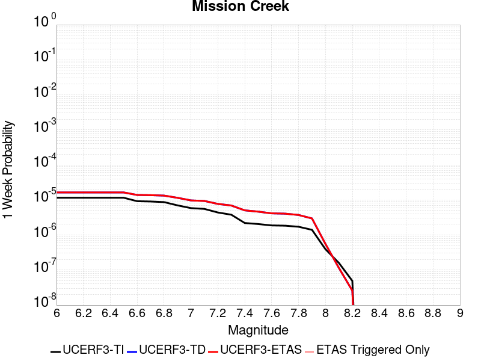 | 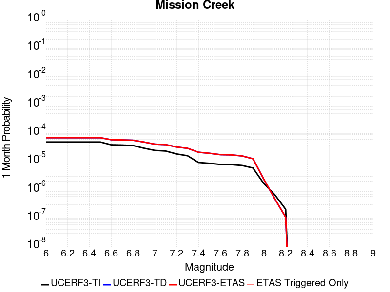 |  |  |

| Magnitude | 1 wk TI Prob | 1 wk TD Prob | 1 wk ETAS Prob | 1 wk ETAS/TD Gain | 1 wk ETAS Triggered Only | 1 mo TI Prob | 1 mo TD Prob | 1 mo ETAS Prob | 1 mo ETAS/TD Gain | 1 mo ETAS Triggered Only | 1 yr TI Prob | 1 yr TD Prob | 1 yr ETAS Prob | 1 yr ETAS/TD Gain | 1 yr ETAS Triggered Only | 10 yr TI Prob | 10 yr TD Prob | 10 yr ETAS Prob | 10 yr ETAS/TD Gain | 10 yr ETAS Triggered Only |
|-----|-----|-----|-----|-----|-----|-----|-----|-----|-----|-----|-----|-----|-----|-----|-----|-----|-----|-----|-----|-----|
| 6.0 | 1.1549387E-5 | 1.6345795E-5 | 1.6345795E-5 | 1.0 | 0.0 | 4.9496433E-5 | 7.005161E-5 | 7.005161E-5 | 1.0 | 0.0 | 6.0245243E-4 | 8.525597E-4 | 8.525597E-4 | 1.0 | 0.0 | 0.006008218 | 0.008521856 | 0.008544567 | 1.002665 | 2.2906359E-5 |
| 6.1 | 1.1549387E-5 | 1.6345795E-5 | 1.6345795E-5 | 1.0 | 0.0 | 4.9496433E-5 | 7.005161E-5 | 7.005161E-5 | 1.0 | 0.0 | 6.0245243E-4 | 8.525597E-4 | 8.525597E-4 | 1.0 | 0.0 | 0.006008218 | 0.008521856 | 0.008544567 | 1.002665 | 2.2906359E-5 |
| 6.2 | 1.1549387E-5 | 1.6345795E-5 | 1.6345795E-5 | 1.0 | 0.0 | 4.9496433E-5 | 7.005161E-5 | 7.005161E-5 | 1.0 | 0.0 | 6.0245243E-4 | 8.525597E-4 | 8.525597E-4 | 1.0 | 0.0 | 0.006008218 | 0.008521856 | 0.008544567 | 1.002665 | 2.2906359E-5 |
| 6.3 | 1.1549387E-5 | 1.6345795E-5 | 1.6345795E-5 | 1.0 | 0.0 | 4.9496433E-5 | 7.005161E-5 | 7.005161E-5 | 1.0 | 0.0 | 6.0245243E-4 | 8.525597E-4 | 8.525597E-4 | 1.0 | 0.0 | 0.006008218 | 0.008521856 | 0.008544567 | 1.002665 | 2.2906359E-5 |
| 6.4 | 1.1549387E-5 | 1.6345795E-5 | 1.6345795E-5 | 1.0 | 0.0 | 4.9496433E-5 | 7.005161E-5 | 7.005161E-5 | 1.0 | 0.0 | 6.0245243E-4 | 8.525597E-4 | 8.525597E-4 | 1.0 | 0.0 | 0.006008218 | 0.008521856 | 0.008544567 | 1.002665 | 2.2906359E-5 |
| 6.5 | 1.1549387E-5 | 1.6345795E-5 | 1.6345795E-5 | 1.0 | 0.0 | 4.9496433E-5 | 7.005161E-5 | 7.005161E-5 | 1.0 | 0.0 | 6.0245243E-4 | 8.525597E-4 | 8.525597E-4 | 1.0 | 0.0 | 0.006008218 | 0.008521856 | 0.008544567 | 1.002665 | 2.2906359E-5 |
| 6.6 | 9.202681E-6 | 1.386889E-5 | 1.386889E-5 | 1.0 | 0.0 | 3.9439463E-5 | 5.9436796E-5 | 5.9436796E-5 | 1.0 | 0.0 | 4.800697E-4 | 7.234118E-4 | 7.234118E-4 | 1.0 | 0.0 | 0.004790339 | 0.007238961 | 0.0072617014 | 1.0031414 | 2.2906359E-5 |
| 6.7 | 9.019164E-6 | 1.3674544E-5 | 1.3674544E-5 | 1.0 | 0.0 | 3.8652986E-5 | 5.8603924E-5 | 5.8603924E-5 | 1.0 | 0.0 | 4.7049852E-4 | 7.132782E-4 | 7.132782E-4 | 1.0 | 0.0 | 0.004695036 | 0.0071382783 | 0.007161021 | 1.003186 | 2.2906359E-5 |
| 6.8 | 8.673558E-6 | 1.3296605E-5 | 1.3296605E-5 | 1.0 | 0.0 | 3.717186E-5 | 5.698426E-5 | 5.698426E-5 | 1.0 | 0.0 | 4.524734E-4 | 6.9357135E-4 | 6.9357135E-4 | 1.0 | 0.0 | 0.0045155324 | 0.006942443 | 0.0069651906 | 1.0032766 | 2.2906359E-5 |
| 6.9 | 7.002255E-6 | 1.1500656E-5 | 1.1500656E-5 | 1.0 | 0.0 | 3.000932E-5 | 4.928763E-5 | 4.928763E-5 | 1.0 | 0.0 | 3.653022E-4 | 5.9991854E-4 | 5.9991854E-4 | 1.0 | 0.0 | 0.0036470229 | 0.0060111843 | 0.006033953 | 1.0037878 | 2.2906359E-5 |
| 7.0 | 5.84644E-6 | 9.696806E-6 | 9.696806E-6 | 1.0 | 0.0 | 2.5055931E-5 | 4.1557105E-5 | 4.1557105E-5 | 1.0 | 0.0 | 3.0501327E-4 | 5.058449E-4 | 5.058449E-4 | 1.0 | 0.0 | 0.0030459496 | 0.005074921 | 0.005097711 | 1.0044907 | 2.2906359E-5 |
| 7.1 | 5.54703E-6 | 9.3512035E-6 | 9.3512035E-6 | 1.0 | 0.0 | 2.377277E-5 | 4.0075996E-5 | 4.0075996E-5 | 1.0 | 0.0 | 2.8939504E-4 | 4.8782045E-4 | 4.8782045E-4 | 1.0 | 0.0 | 0.0028901845 | 0.0048954757 | 0.0049182703 | 1.0046562 | 2.2906359E-5 |
| 7.2 | 4.384709E-6 | 7.702349E-6 | 7.702349E-6 | 1.0 | 0.0 | 1.8791474E-5 | 3.300967E-5 | 3.300967E-5 | 1.0 | 0.0 | 2.2876218E-4 | 4.0182227E-4 | 4.0182227E-4 | 1.0 | 0.0 | 0.0022852682 | 0.0040389015 | 0.004061715 | 1.0056485 | 2.2906359E-5 |
| 7.3 | 3.7888456E-6 | 6.9358207E-6 | 6.9358207E-6 | 1.0 | 0.0 | 1.623781E-5 | 2.9724626E-5 | 2.9724626E-5 | 1.0 | 0.0 | 1.9767738E-4 | 3.618406E-4 | 3.618406E-4 | 1.0 | 0.0 | 0.0019750162 | 0.0036404422 | 0.0036632651 | 1.0062693 | 2.2906359E-5 |
| 7.4 | 2.1982462E-6 | 5.043541E-6 | 5.043541E-6 | 1.0 | 0.0 | 9.421021E-6 | 2.1614998E-5 | 2.1614998E-5 | 1.0 | 0.0 | 1.1469489E-4 | 2.6313102E-4 | 2.6313102E-4 | 1.0 | 0.0 | 0.0011463572 | 0.0026559075 | 0.002678753 | 1.0086018 | 2.2906359E-5 |
| 7.5 | 2.051923E-6 | 4.6342434E-6 | 4.6342434E-6 | 1.0 | 0.0 | 8.793926E-6 | 1.9860892E-5 | 1.9860892E-5 | 1.0 | 0.0 | 1.0706078E-4 | 2.4177968E-4 | 2.4177968E-4 | 1.0 | 0.0 | 0.0010700922 | 0.0024432896 | 0.00246614 | 1.0093523 | 2.2906359E-5 |
| 7.6 | 1.8733427E-6 | 4.1419444E-6 | 4.1419444E-6 | 1.0 | 0.0 | 8.028587E-6 | 1.775107E-5 | 1.775107E-5 | 1.0 | 0.0 | 9.774366E-5 | 2.1609793E-4 | 2.1609793E-4 | 1.0 | 0.0 | 9.770069E-4 | 0.0021874912 | 0.0022103474 | 1.0104486 | 2.2906359E-5 |
| 7.7 | 1.8411953E-6 | 4.0614955E-6 | 4.0614955E-6 | 1.0 | 0.0 | 7.890813E-6 | 1.7406293E-5 | 1.7406293E-5 | 1.0 | 0.0 | 9.606641E-5 | 2.1190109E-4 | 2.1190109E-4 | 1.0 | 0.0 | 9.6024893E-4 | 0.0021457132 | 0.0021685704 | 1.0106525 | 2.2906359E-5 |
| 7.8 | 1.7194251E-6 | 3.7276084E-6 | 3.7276084E-6 | 1.0 | 0.0 | 7.368944E-6 | 1.5975367E-5 | 1.5975367E-5 | 1.0 | 0.0 | 8.97132E-5 | 1.9448281E-4 | 1.9448281E-4 | 1.0 | 0.0 | 8.967699E-4 | 0.001971057 | 0.001993918 | 1.0115985 | 2.2906359E-5 |
| 7.9 | 1.4035052E-6 | 2.9641483E-6 | 2.9641483E-6 | 1.0 | 0.0 | 6.0150082E-6 | 1.2703431E-5 | 1.2703431E-5 | 1.0 | 0.0 | 7.3230265E-5 | 1.5465336E-4 | 1.5465336E-4 | 1.0 | 0.0 | 7.3206134E-4 | 0.0015702422 | 0.0015931127 | 1.0145649 | 2.2906359E-5 |
| 8.0 | 3.9318823E-7 | 5.562867E-7 | 5.562867E-7 | 1.0 | 0.0 | 1.6850913E-6 | 2.3840837E-6 | 2.3840837E-6 | 1.0 | 0.0 | 2.0515794E-5 | 2.9025838E-5 | 2.9025838E-5 | 1.0 | 0.0 | 2.0513899E-4 | 3.0078672E-4 | 3.0078672E-4 | 1.0 | 0.0 |
| 8.1 | 1.596793E-7 | 1.14993E-7 | 1.14993E-7 | 1.0 | 0.0 | 6.8433974E-7 | 4.9282704E-7 | 4.9282704E-7 | 1.0 | 0.0 | 8.331805E-6 | 6.000153E-6 | 6.000153E-6 | 1.0 | 0.0 | 8.331492E-5 | 6.6147746E-5 | 6.6147746E-5 | 1.0 | 0.0 |
| 8.2 | 4.9003038E-8 | 2.5747717E-8 | 2.5747717E-8 | 1.0 | 0.0 | 2.10013E-7 | 1.1034735E-7 | 1.1034735E-7 | 1.0 | 0.0 | 2.5569052E-6 | 1.3434782E-6 | 1.3434782E-6 | 1.0 | 0.0 | 2.556876E-5 | 1.512413E-5 | 1.512413E-5 | 1.0 | 0.0 |

## Anacapa-Dume alt 1
*[(top)](#table-of-contents)*

| 1 Week | 1 Month | 1 Year | 10 Year |
|-----|-----|-----|-----|
|  |  |  | 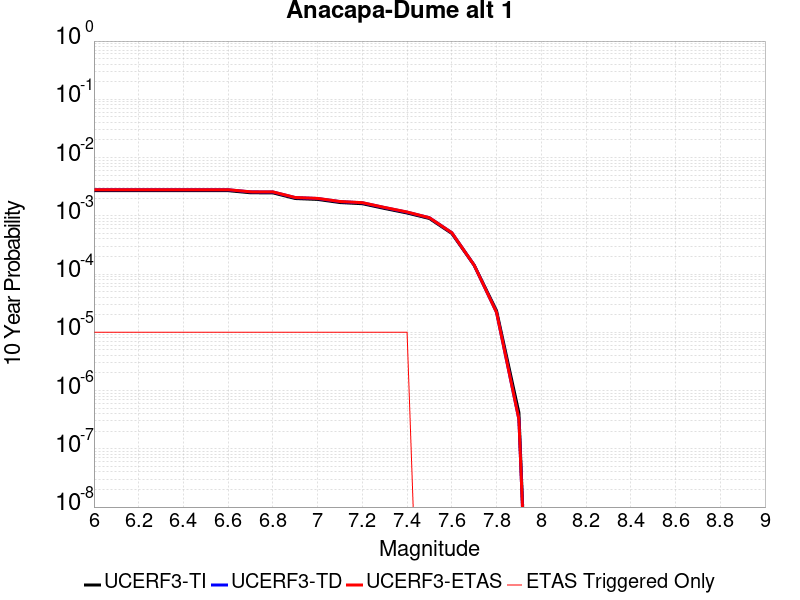 |

| Magnitude | 1 wk TI Prob | 1 wk TD Prob | 1 wk ETAS Prob | 1 wk ETAS/TD Gain | 1 wk ETAS Triggered Only | 1 mo TI Prob | 1 mo TD Prob | 1 mo ETAS Prob | 1 mo ETAS/TD Gain | 1 mo ETAS Triggered Only | 1 yr TI Prob | 1 yr TD Prob | 1 yr ETAS Prob | 1 yr ETAS/TD Gain | 1 yr ETAS Triggered Only | 10 yr TI Prob | 10 yr TD Prob | 10 yr ETAS Prob | 10 yr ETAS/TD Gain | 10 yr ETAS Triggered Only |
|-----|-----|-----|-----|-----|-----|-----|-----|-----|-----|-----|-----|-----|-----|-----|-----|-----|-----|-----|-----|-----|
| 6.0 | 5.1871802E-6 | 5.3676713E-6 | 5.3676713E-6 | 1.0 | 0.0 | 2.2230583E-5 | 2.3004108E-5 | 2.3004108E-5 | 1.0 | 0.0 | 2.7062374E-4 | 2.8003985E-4 | 2.8003985E-4 | 1.0 | 0.0 | 0.002702944 | 0.0027969552 | 0.0028197975 | 1.0081668 | 2.2906359E-5 |
| 6.1 | 5.1871802E-6 | 5.3676713E-6 | 5.3676713E-6 | 1.0 | 0.0 | 2.2230583E-5 | 2.3004108E-5 | 2.3004108E-5 | 1.0 | 0.0 | 2.7062374E-4 | 2.8003985E-4 | 2.8003985E-4 | 1.0 | 0.0 | 0.002702944 | 0.0027969552 | 0.0028197975 | 1.0081668 | 2.2906359E-5 |
| 6.2 | 5.1871802E-6 | 5.3676713E-6 | 5.3676713E-6 | 1.0 | 0.0 | 2.2230583E-5 | 2.3004108E-5 | 2.3004108E-5 | 1.0 | 0.0 | 2.7062374E-4 | 2.8003985E-4 | 2.8003985E-4 | 1.0 | 0.0 | 0.002702944 | 0.0027969552 | 0.0028197975 | 1.0081668 | 2.2906359E-5 |
| 6.3 | 5.1871802E-6 | 5.3676713E-6 | 5.3676713E-6 | 1.0 | 0.0 | 2.2230583E-5 | 2.3004108E-5 | 2.3004108E-5 | 1.0 | 0.0 | 2.7062374E-4 | 2.8003985E-4 | 2.8003985E-4 | 1.0 | 0.0 | 0.002702944 | 0.0027969552 | 0.0028197975 | 1.0081668 | 2.2906359E-5 |
| 6.4 | 5.1871802E-6 | 5.3676713E-6 | 5.3676713E-6 | 1.0 | 0.0 | 2.2230583E-5 | 2.3004108E-5 | 2.3004108E-5 | 1.0 | 0.0 | 2.7062374E-4 | 2.8003985E-4 | 2.8003985E-4 | 1.0 | 0.0 | 0.002702944 | 0.0027969552 | 0.0028197975 | 1.0081668 | 2.2906359E-5 |
| 6.5 | 5.1871802E-6 | 5.3676713E-6 | 5.3676713E-6 | 1.0 | 0.0 | 2.2230583E-5 | 2.3004108E-5 | 2.3004108E-5 | 1.0 | 0.0 | 2.7062374E-4 | 2.8003985E-4 | 2.8003985E-4 | 1.0 | 0.0 | 0.002702944 | 0.0027969552 | 0.0028197975 | 1.0081668 | 2.2906359E-5 |
| 6.6 | 5.1871802E-6 | 5.3676713E-6 | 5.3676713E-6 | 1.0 | 0.0 | 2.2230583E-5 | 2.3004108E-5 | 2.3004108E-5 | 1.0 | 0.0 | 2.7062374E-4 | 2.8003985E-4 | 2.8003985E-4 | 1.0 | 0.0 | 0.002702944 | 0.0027969552 | 0.0028197975 | 1.0081668 | 2.2906359E-5 |
| 6.7 | 4.7693475E-6 | 4.9369546E-6 | 4.9369546E-6 | 1.0 | 0.0 | 2.04399E-5 | 2.115821E-5 | 2.115821E-5 | 1.0 | 0.0 | 2.4882736E-4 | 2.5757152E-4 | 2.5757152E-4 | 1.0 | 0.0 | 0.0024854892 | 0.0025728059 | 0.0025956533 | 1.0088804 | 2.2906359E-5 |
| 6.8 | 4.753408E-6 | 4.9205023E-6 | 4.9205023E-6 | 1.0 | 0.0 | 2.037159E-5 | 2.10877E-5 | 2.10877E-5 | 1.0 | 0.0 | 2.4799586E-4 | 2.5671325E-4 | 2.5671325E-4 | 1.0 | 0.0 | 0.002477193 | 0.002564243 | 0.0025870907 | 1.0089101 | 2.2906359E-5 |
| 6.9 | 3.800069E-6 | 3.9373476E-6 | 3.9373476E-6 | 1.0 | 0.0 | 1.6285909E-5 | 1.6874239E-5 | 1.6874239E-5 | 1.0 | 0.0 | 1.9826289E-4 | 2.0542473E-4 | 2.0542473E-4 | 1.0 | 0.0 | 0.001980861 | 0.002052372 | 0.0020752314 | 1.011138 | 2.2906359E-5 |
| 7.0 | 3.6671938E-6 | 3.800134E-6 | 3.800134E-6 | 1.0 | 0.0 | 1.571645E-5 | 1.6286187E-5 | 1.6286187E-5 | 1.0 | 0.0 | 1.9133097E-4 | 1.9826653E-4 | 1.9826653E-4 | 1.0 | 0.0 | 0.0019116632 | 0.0019809196 | 0.0020037806 | 1.0115405 | 2.2906359E-5 |
| 7.1 | 3.2394885E-6 | 3.3589904E-6 | 3.3589904E-6 | 1.0 | 0.0 | 1.3883448E-5 | 1.4395595E-5 | 1.4395595E-5 | 1.0 | 0.0 | 1.6901788E-4 | 1.7525238E-4 | 1.7525238E-4 | 1.0 | 0.0 | 0.0016888938 | 0.0017511529 | 0.0017740191 | 1.0130578 | 2.2906359E-5 |
| 7.2 | 3.0935948E-6 | 3.2081164E-6 | 3.2081164E-6 | 1.0 | 0.0 | 1.3258196E-5 | 1.3748998E-5 | 1.3748998E-5 | 1.0 | 0.0 | 1.6140658E-4 | 1.673813E-4 | 1.673813E-4 | 1.0 | 0.0 | 0.001612894 | 0.0016725634 | 0.0016954314 | 1.0136725 | 2.2906359E-5 |
| 7.3 | 2.5604163E-6 | 2.6472246E-6 | 2.6472246E-6 | 1.0 | 0.0 | 1.0973167E-5 | 1.13452E-5 | 1.13452E-5 | 1.0 | 0.0 | 1.3359012E-4 | 1.381191E-4 | 1.381191E-4 | 1.0 | 0.0 | 0.0013350984 | 0.0013803372 | 0.0014032118 | 1.0165719 | 2.2906359E-5 |
| 7.4 | 2.1429005E-6 | 2.210728E-6 | 2.210728E-6 | 1.0 | 0.0 | 9.1838265E-6 | 9.474515E-6 | 9.474515E-6 | 1.0 | 0.0 | 1.11807356E-4 | 1.15346134E-4 | 1.15346134E-4 | 1.0 | 0.0 | 0.0011175112 | 0.0011528654 | 0.0011757453 | 1.0198462 | 2.2906359E-5 |
| 7.5 | 1.7237151E-6 | 1.7762461E-6 | 1.7762461E-6 | 1.0 | 0.0 | 7.3873293E-6 | 7.612461E-6 | 7.612461E-6 | 1.0 | 0.0 | 8.993702E-5 | 9.2677794E-5 | 9.2677794E-5 | 1.0 | 0.0 | 8.990063E-4 | 9.263938E-4 | 9.263938E-4 | 1.0 | 0.0 |
| 7.6 | 9.541696E-7 | 9.823765E-7 | 9.823765E-7 | 1.0 | 0.0 | 4.089292E-6 | 4.2101783E-6 | 4.2101783E-6 | 1.0 | 0.0 | 4.9785995E-5 | 5.1257724E-5 | 5.1257724E-5 | 1.0 | 0.0 | 4.9774844E-4 | 5.124603E-4 | 5.124603E-4 | 1.0 | 0.0 |
| 7.7 | 2.7226676E-7 | 2.7173658E-7 | 2.7173658E-7 | 1.0 | 0.0 | 1.166857E-6 | 1.1645848E-6 | 1.1645848E-6 | 1.0 | 0.0 | 1.4206392E-5 | 1.4178729E-5 | 1.4178729E-5 | 1.0 | 0.0 | 1.4205484E-4 | 1.417783E-4 | 1.417783E-4 | 1.0 | 0.0 |
| 7.8 | 4.5017995E-8 | 4.2159332E-8 | 4.2159332E-8 | 1.0 | 0.0 | 1.9293425E-7 | 1.8068283E-7 | 1.8068283E-7 | 1.0 | 0.0 | 2.348972E-6 | 2.1998117E-6 | 2.1998117E-6 | 1.0 | 0.0 | 2.348947E-5 | 2.199792E-5 | 2.199792E-5 | 1.0 | 0.0 |
| 7.9 | 8.007447E-10 | 6.1612504E-10 | 6.1612504E-10 | 1.0 | 0.0 | 3.4317629E-9 | 2.6405358E-9 | 2.6405358E-9 | 1.0 | 0.0 | 4.1781714E-8 | 3.2148524E-8 | 3.2148524E-8 | 1.0 | 0.0 | 4.1781706E-7 | 3.214852E-7 | 3.214852E-7 | 1.0 | 0.0 |

## Great Valley 05 Pittsburg - Kirby Hills alt1
*[(top)](#table-of-contents)*

| 1 Week | 1 Month | 1 Year | 10 Year |
|-----|-----|-----|-----|
|  |  |  |  |

| Magnitude | 1 wk TI Prob | 1 wk TD Prob | 1 wk ETAS Prob | 1 wk ETAS/TD Gain | 1 wk ETAS Triggered Only | 1 mo TI Prob | 1 mo TD Prob | 1 mo ETAS Prob | 1 mo ETAS/TD Gain | 1 mo ETAS Triggered Only | 1 yr TI Prob | 1 yr TD Prob | 1 yr ETAS Prob | 1 yr ETAS/TD Gain | 1 yr ETAS Triggered Only | 10 yr TI Prob | 10 yr TD Prob | 10 yr ETAS Prob | 10 yr ETAS/TD Gain | 10 yr ETAS Triggered Only |
|-----|-----|-----|-----|-----|-----|-----|-----|-----|-----|-----|-----|-----|-----|-----|-----|-----|-----|-----|-----|-----|
| 6.0 | 4.187212E-5 | 5.346171E-5 | 5.346171E-5 | 1.0 | 0.0 | 1.794396E-4 | 2.2910618E-4 | 2.2910618E-4 | 1.0 | 0.0 | 0.002182488 | 0.002786782 | 0.0028096247 | 1.0081967 | 2.2906359E-5 | 0.021611776 | 0.027612798 | 0.027635071 | 1.0008067 | 2.2906359E-5 |
| 6.1 | 4.187212E-5 | 5.346171E-5 | 5.346171E-5 | 1.0 | 0.0 | 1.794396E-4 | 2.2910618E-4 | 2.2910618E-4 | 1.0 | 0.0 | 0.002182488 | 0.002786782 | 0.0028096247 | 1.0081967 | 2.2906359E-5 | 0.021611776 | 0.027612798 | 0.027635071 | 1.0008067 | 2.2906359E-5 |
| 6.2 | 1.7353306E-5 | 2.2162525E-5 | 2.2162525E-5 | 1.0 | 0.0 | 7.436919E-5 | 9.498003E-5 | 9.498003E-5 | 1.0 | 0.0 | 9.050688E-4 | 0.0011561753 | 0.0011561753 | 1.0 | 0.0 | 0.009013915 | 0.011539226 | 0.011539226 | 1.0 | 0.0 |
| 6.3 | 1.7353306E-5 | 2.2162525E-5 | 2.2162525E-5 | 1.0 | 0.0 | 7.436919E-5 | 9.498003E-5 | 9.498003E-5 | 1.0 | 0.0 | 9.050688E-4 | 0.0011561753 | 0.0011561753 | 1.0 | 0.0 | 0.009013915 | 0.011539226 | 0.011539226 | 1.0 | 0.0 |
| 6.4 | 1.4028824E-5 | 1.7907167E-5 | 1.7907167E-5 | 1.0 | 0.0 | 6.0122147E-5 | 7.6745E-5 | 7.6745E-5 | 1.0 | 0.0 | 7.3174125E-4 | 9.343703E-4 | 9.343703E-4 | 1.0 | 0.0 | 0.0072933645 | 0.009341467 | 0.009341467 | 1.0 | 0.0 |

## Santa Ynez (East)
*[(top)](#table-of-contents)*

| 1 Week | 1 Month | 1 Year | 10 Year |
|-----|-----|-----|-----|
| 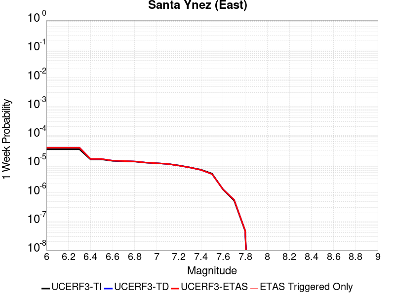 |  | 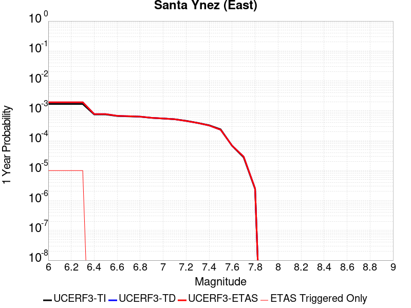 |  |

| Magnitude | 1 wk TI Prob | 1 wk TD Prob | 1 wk ETAS Prob | 1 wk ETAS/TD Gain | 1 wk ETAS Triggered Only | 1 mo TI Prob | 1 mo TD Prob | 1 mo ETAS Prob | 1 mo ETAS/TD Gain | 1 mo ETAS Triggered Only | 1 yr TI Prob | 1 yr TD Prob | 1 yr ETAS Prob | 1 yr ETAS/TD Gain | 1 yr ETAS Triggered Only | 10 yr TI Prob | 10 yr TD Prob | 10 yr ETAS Prob | 10 yr ETAS/TD Gain | 10 yr ETAS Triggered Only |
|-----|-----|-----|-----|-----|-----|-----|-----|-----|-----|-----|-----|-----|-----|-----|-----|-----|-----|-----|-----|-----|
| 6.0 | 3.2269712E-5 | 3.6759357E-5 | 3.6759357E-5 | 1.0 | 0.0 | 1.3829143E-4 | 1.5753391E-4 | 1.5753391E-4 | 1.0 | 0.0 | 0.0016823979 | 0.001916878 | 0.001916878 | 1.0 | 0.0 | 0.016697178 | 0.019060988 | 0.019083457 | 1.0011789 | 2.2906359E-5 |
| 6.1 | 3.2269712E-5 | 3.6759357E-5 | 3.6759357E-5 | 1.0 | 0.0 | 1.3829143E-4 | 1.5753391E-4 | 1.5753391E-4 | 1.0 | 0.0 | 0.0016823979 | 0.001916878 | 0.001916878 | 1.0 | 0.0 | 0.016697178 | 0.019060988 | 0.019083457 | 1.0011789 | 2.2906359E-5 |
| 6.2 | 3.2269712E-5 | 3.6759357E-5 | 3.6759357E-5 | 1.0 | 0.0 | 1.3829143E-4 | 1.5753391E-4 | 1.5753391E-4 | 1.0 | 0.0 | 0.0016823979 | 0.001916878 | 0.001916878 | 1.0 | 0.0 | 0.016697178 | 0.019060988 | 0.019083457 | 1.0011789 | 2.2906359E-5 |
| 6.3 | 3.2269712E-5 | 3.6759357E-5 | 3.6759357E-5 | 1.0 | 0.0 | 1.3829143E-4 | 1.5753391E-4 | 1.5753391E-4 | 1.0 | 0.0 | 0.0016823979 | 0.001916878 | 0.001916878 | 1.0 | 0.0 | 0.016697178 | 0.019060988 | 0.019083457 | 1.0011789 | 2.2906359E-5 |
| 6.4 | 1.4404779E-5 | 1.485166E-5 | 1.485166E-5 | 1.0 | 0.0 | 6.1733306E-5 | 6.364845E-5 | 6.364845E-5 | 1.0 | 0.0 | 7.513438E-4 | 7.746494E-4 | 7.746494E-4 | 1.0 | 0.0 | 0.0074880854 | 0.0077200416 | 0.007742771 | 1.0029442 | 2.2906359E-5 |
| 6.5 | 1.4404779E-5 | 1.485166E-5 | 1.485166E-5 | 1.0 | 0.0 | 6.1733306E-5 | 6.364845E-5 | 6.364845E-5 | 1.0 | 0.0 | 7.513438E-4 | 7.746494E-4 | 7.746494E-4 | 1.0 | 0.0 | 0.0074880854 | 0.0077200416 | 0.007742771 | 1.0029442 | 2.2906359E-5 |
| 6.6 | 1.280208E-5 | 1.3013867E-5 | 1.3013867E-5 | 1.0 | 0.0 | 5.4864904E-5 | 5.5772533E-5 | 5.5772533E-5 | 1.0 | 0.0 | 6.6777546E-4 | 6.788208E-4 | 6.788208E-4 | 1.0 | 0.0 | 0.006657724 | 0.0067676837 | 0.006790435 | 1.0033617 | 2.2906359E-5 |
| 6.7 | 1.2457027E-5 | 1.2630331E-5 | 1.2630331E-5 | 1.0 | 0.0 | 5.3386164E-5 | 5.4128875E-5 | 5.4128875E-5 | 1.0 | 0.0 | 6.497827E-4 | 6.5882143E-4 | 6.5882143E-4 | 1.0 | 0.0 | 0.00647886 | 0.0065688808 | 0.0065916367 | 1.0034642 | 2.2906359E-5 |
| 6.8 | 1.2095134E-5 | 1.2232726E-5 | 1.2232726E-5 | 1.0 | 0.0 | 5.1835254E-5 | 5.2424923E-5 | 5.2424923E-5 | 1.0 | 0.0 | 6.309115E-4 | 6.380881E-4 | 6.380881E-4 | 1.0 | 0.0 | 0.0062912325 | 0.006362748 | 0.006385509 | 1.0035771 | 2.2906359E-5 |
| 6.9 | 1.1104036E-5 | 1.1159038E-5 | 1.1159038E-5 | 1.0 | 0.0 | 4.758786E-5 | 4.7823578E-5 | 4.7823578E-5 | 1.0 | 0.0 | 5.7922816E-4 | 5.820978E-4 | 5.820978E-4 | 1.0 | 0.0 | 0.005777207 | 0.005805876 | 0.0058286497 | 1.0039225 | 2.2906359E-5 |
| 7.0 | 1.0577444E-5 | 1.05833E-5 | 1.05833E-5 | 1.0 | 0.0 | 4.5331115E-5 | 4.5356217E-5 | 4.5356217E-5 | 1.0 | 0.0 | 5.5176654E-4 | 5.5207324E-4 | 5.5207324E-4 | 1.0 | 0.0 | 0.0055039856 | 0.005507156 | 0.005529936 | 1.0041364 | 2.2906359E-5 |
| 7.1 | 1.0021775E-5 | 9.982541E-6 | 9.982541E-6 | 1.0 | 0.0 | 4.294976E-5 | 4.2781627E-5 | 4.2781627E-5 | 1.0 | 0.0 | 5.2278786E-4 | 5.2074296E-4 | 5.2074296E-4 | 1.0 | 0.0 | 0.0052155964 | 0.00519536 | 0.0052181478 | 1.0043861 | 2.2906359E-5 |
| 7.2 | 8.874109E-6 | 8.75021E-6 | 8.75021E-6 | 1.0 | 0.0 | 3.8031343E-5 | 3.750037E-5 | 3.750037E-5 | 1.0 | 0.0 | 4.629332E-4 | 4.5647242E-4 | 4.5647242E-4 | 1.0 | 0.0 | 0.0046197 | 0.004555466 | 0.004578268 | 1.0050054 | 2.2906359E-5 |
| 7.3 | 7.5504267E-6 | 7.506339E-6 | 7.506339E-6 | 1.0 | 0.0 | 3.235857E-5 | 3.2169635E-5 | 3.2169635E-5 | 1.0 | 0.0 | 3.9389438E-4 | 3.915959E-4 | 3.915959E-4 | 1.0 | 0.0 | 0.0039319694 | 0.003909166 | 0.0039319824 | 1.0058367 | 2.2906359E-5 |
| 7.4 | 6.309394E-6 | 6.1842215E-6 | 6.1842215E-6 | 1.0 | 0.0 | 2.703998E-5 | 2.6503543E-5 | 2.6503543E-5 | 1.0 | 0.0 | 3.2916202E-4 | 3.226338E-4 | 3.226338E-4 | 1.0 | 0.0 | 0.003286749 | 0.0032217514 | 0.0032217514 | 1.0 | 0.0 |
| 7.5 | 4.6103073E-6 | 4.441466E-6 | 4.441466E-6 | 1.0 | 0.0 | 1.975831E-5 | 1.903472E-5 | 1.903472E-5 | 1.0 | 0.0 | 2.4053088E-4 | 2.3172377E-4 | 2.3172377E-4 | 1.0 | 0.0 | 0.002402707 | 0.002314891 | 0.002314891 | 1.0 | 0.0 |
| 7.6 | 1.2858658E-6 | 1.3009125E-6 | 1.3009125E-6 | 1.0 | 0.0 | 5.5108417E-6 | 5.5753276E-6 | 5.5753276E-6 | 1.0 | 0.0 | 6.7092435E-5 | 6.787757E-5 | 6.787757E-5 | 1.0 | 0.0 | 6.707218E-4 | 6.7857525E-4 | 6.7857525E-4 | 1.0 | 0.0 |
| 7.7 | 5.3302307E-7 | 5.6125344E-7 | 5.6125344E-7 | 1.0 | 0.0 | 2.2843826E-6 | 2.4053697E-6 | 2.4053697E-6 | 1.0 | 0.0 | 2.7812002E-5 | 2.928502E-5 | 2.928502E-5 | 1.0 | 0.0 | 2.7808524E-4 | 2.9281518E-4 | 2.9281518E-4 | 1.0 | 0.0 |
| 7.8 | 4.613933E-8 | 4.803271E-8 | 4.803271E-8 | 1.0 | 0.0 | 1.9773998E-7 | 2.0585445E-7 | 2.0585445E-7 | 1.0 | 0.0 | 2.4074816E-6 | 2.5062752E-6 | 2.5062752E-6 | 1.0 | 0.0 | 2.4074554E-5 | 2.506248E-5 | 2.506248E-5 | 1.0 | 0.0 |

## Channel Islands Thrust
*[(top)](#table-of-contents)*

| 1 Week | 1 Month | 1 Year | 10 Year |
|-----|-----|-----|-----|
| 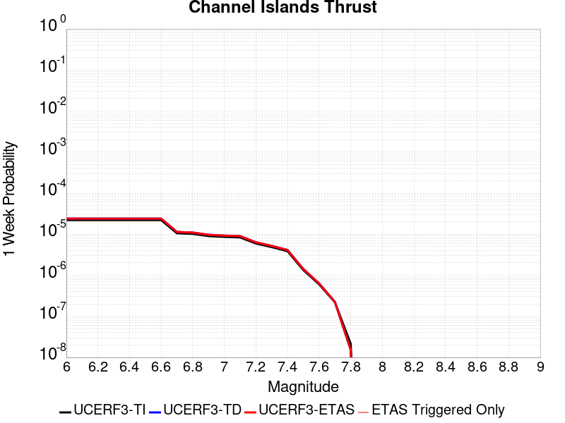 | 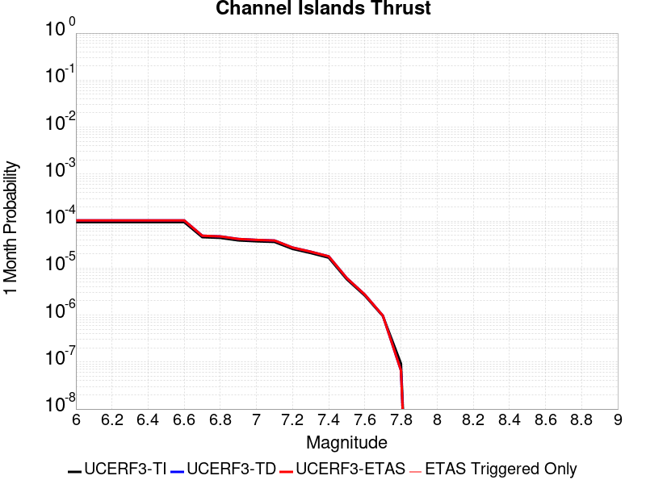 | 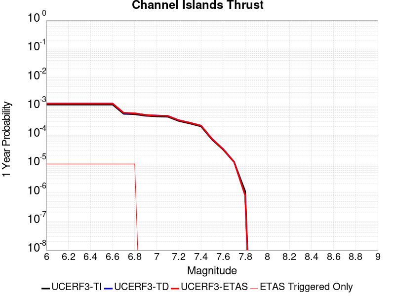 |  |

| Magnitude | 1 wk TI Prob | 1 wk TD Prob | 1 wk ETAS Prob | 1 wk ETAS/TD Gain | 1 wk ETAS Triggered Only | 1 mo TI Prob | 1 mo TD Prob | 1 mo ETAS Prob | 1 mo ETAS/TD Gain | 1 mo ETAS Triggered Only | 1 yr TI Prob | 1 yr TD Prob | 1 yr ETAS Prob | 1 yr ETAS/TD Gain | 1 yr ETAS Triggered Only | 10 yr TI Prob | 10 yr TD Prob | 10 yr ETAS Prob | 10 yr ETAS/TD Gain | 10 yr ETAS Triggered Only |
|-----|-----|-----|-----|-----|-----|-----|-----|-----|-----|-----|-----|-----|-----|-----|-----|-----|-----|-----|-----|-----|
| 6.0 | 2.2156251E-5 | 2.4094834E-5 | 2.4094834E-5 | 1.0 | 0.0 | 9.495191E-5 | 1.0326009E-4 | 1.0326009E-4 | 1.0 | 0.0 | 0.0011554264 | 0.0012565731 | 0.0012794507 | 1.0182064 | 2.2906359E-5 | 0.011494373 | 0.012505272 | 0.012527892 | 1.0018089 | 2.2906359E-5 |
| 6.1 | 2.2156251E-5 | 2.4094834E-5 | 2.4094834E-5 | 1.0 | 0.0 | 9.495191E-5 | 1.0326009E-4 | 1.0326009E-4 | 1.0 | 0.0 | 0.0011554264 | 0.0012565731 | 0.0012794507 | 1.0182064 | 2.2906359E-5 | 0.011494373 | 0.012505272 | 0.012527892 | 1.0018089 | 2.2906359E-5 |
| 6.2 | 2.2156251E-5 | 2.4094834E-5 | 2.4094834E-5 | 1.0 | 0.0 | 9.495191E-5 | 1.0326009E-4 | 1.0326009E-4 | 1.0 | 0.0 | 0.0011554264 | 0.0012565731 | 0.0012794507 | 1.0182064 | 2.2906359E-5 | 0.011494373 | 0.012505272 | 0.012527892 | 1.0018089 | 2.2906359E-5 |
| 6.3 | 2.2156251E-5 | 2.4094834E-5 | 2.4094834E-5 | 1.0 | 0.0 | 9.495191E-5 | 1.0326009E-4 | 1.0326009E-4 | 1.0 | 0.0 | 0.0011554264 | 0.0012565731 | 0.0012794507 | 1.0182064 | 2.2906359E-5 | 0.011494373 | 0.012505272 | 0.012527892 | 1.0018089 | 2.2906359E-5 |
| 6.4 | 2.2156251E-5 | 2.4094834E-5 | 2.4094834E-5 | 1.0 | 0.0 | 9.495191E-5 | 1.0326009E-4 | 1.0326009E-4 | 1.0 | 0.0 | 0.0011554264 | 0.0012565731 | 0.0012794507 | 1.0182064 | 2.2906359E-5 | 0.011494373 | 0.012505272 | 0.012527892 | 1.0018089 | 2.2906359E-5 |
| 6.5 | 2.2156251E-5 | 2.4094834E-5 | 2.4094834E-5 | 1.0 | 0.0 | 9.495191E-5 | 1.0326009E-4 | 1.0326009E-4 | 1.0 | 0.0 | 0.0011554264 | 0.0012565731 | 0.0012794507 | 1.0182064 | 2.2906359E-5 | 0.011494373 | 0.012505272 | 0.012527892 | 1.0018089 | 2.2906359E-5 |
| 6.6 | 2.2156251E-5 | 2.4094834E-5 | 2.4094834E-5 | 1.0 | 0.0 | 9.495191E-5 | 1.0326009E-4 | 1.0326009E-4 | 1.0 | 0.0 | 0.0011554264 | 0.0012565731 | 0.0012794507 | 1.0182064 | 2.2906359E-5 | 0.011494373 | 0.012505272 | 0.012527892 | 1.0018089 | 2.2906359E-5 |
| 6.7 | 1.0601296E-5 | 1.1380667E-5 | 1.1380667E-5 | 1.0 | 0.0 | 4.5433335E-5 | 4.8773403E-5 | 4.8773403E-5 | 1.0 | 0.0 | 5.5301044E-4 | 5.936593E-4 | 6.16552E-4 | 1.0385622 | 2.2906359E-5 | 0.005516363 | 0.0059212362 | 0.0059440066 | 1.0038456 | 2.2906359E-5 |
| 6.8 | 1.0246747E-5 | 1.0997752E-5 | 1.0997752E-5 | 1.0 | 0.0 | 4.391389E-5 | 4.7132395E-5 | 4.7132395E-5 | 1.0 | 0.0 | 5.345204E-4 | 5.7369063E-4 | 5.965838E-4 | 1.0399052 | 2.2906359E-5 | 0.0053323656 | 0.0057225865 | 0.005745362 | 1.0039799 | 2.2906359E-5 |
| 6.9 | 9.049551E-6 | 9.700583E-6 | 9.700583E-6 | 1.0 | 0.0 | 3.878322E-5 | 4.157329E-5 | 4.157329E-5 | 1.0 | 0.0 | 4.7208337E-4 | 5.0604134E-4 | 5.0604134E-4 | 1.0 | 0.0 | 0.0047108172 | 0.005049308 | 0.005049308 | 1.0 | 0.0 |
| 7.0 | 8.6542195E-6 | 9.2755E-6 | 9.2755E-6 | 1.0 | 0.0 | 3.7088983E-5 | 3.9751558E-5 | 3.9751558E-5 | 1.0 | 0.0 | 4.5146482E-4 | 4.8387185E-4 | 4.8387185E-4 | 1.0 | 0.0 | 0.004505487 | 0.004828595 | 0.004828595 | 1.0 | 0.0 |
| 7.1 | 8.391028E-6 | 8.993796E-6 | 8.993796E-6 | 1.0 | 0.0 | 3.5961057E-5 | 3.854429E-5 | 3.854429E-5 | 1.0 | 0.0 | 4.3773788E-4 | 4.6917977E-4 | 4.6917977E-4 | 1.0 | 0.0 | 0.004368766 | 0.0046823025 | 0.0046823025 | 1.0 | 0.0 |
| 7.2 | 5.965188E-6 | 6.372285E-6 | 6.372285E-6 | 1.0 | 0.0 | 2.556484E-5 | 2.730951E-5 | 2.730951E-5 | 1.0 | 0.0 | 3.1120746E-4 | 3.3244313E-4 | 3.3244313E-4 | 1.0 | 0.0 | 0.00310772 | 0.003319516 | 0.003319516 | 1.0 | 0.0 |
| 7.3 | 4.877518E-6 | 5.206485E-6 | 5.206485E-6 | 1.0 | 0.0 | 2.0903482E-5 | 2.2313321E-5 | 2.2313321E-5 | 1.0 | 0.0 | 2.5447016E-4 | 2.7163126E-4 | 2.7163126E-4 | 1.0 | 0.0 | 0.0025417898 | 0.0027130388 | 0.0027130388 | 1.0 | 0.0 |
| 7.4 | 3.8829853E-6 | 4.1422427E-6 | 4.1422427E-6 | 1.0 | 0.0 | 1.664126E-5 | 1.775235E-5 | 1.775235E-5 | 1.0 | 0.0 | 2.0258849E-4 | 2.1611385E-4 | 2.1611385E-4 | 1.0 | 0.0 | 0.002024039 | 0.0021590786 | 0.0021590786 | 1.0 | 0.0 |
| 7.5 | 1.3489616E-6 | 1.4279142E-6 | 1.4279142E-6 | 1.0 | 0.0 | 5.7812517E-6 | 6.1196183E-6 | 6.1196183E-6 | 1.0 | 0.0 | 7.038446E-5 | 7.450384E-5 | 7.450384E-5 | 1.0 | 0.0 | 7.036218E-4 | 7.4479263E-4 | 7.4479263E-4 | 1.0 | 0.0 |
| 7.6 | 6.058192E-7 | 6.354317E-7 | 6.354317E-7 | 1.0 | 0.0 | 2.5963652E-6 | 2.7232759E-6 | 2.7232759E-6 | 1.0 | 0.0 | 3.161029E-5 | 3.3155397E-5 | 3.3155397E-5 | 1.0 | 0.0 | 3.1605794E-4 | 3.3150613E-4 | 3.3150613E-4 | 1.0 | 0.0 |
| 7.7 | 2.2170494E-7 | 2.2609672E-7 | 2.2609672E-7 | 1.0 | 0.0 | 9.5016367E-7 | 9.689857E-7 | 9.689857E-7 | 1.0 | 0.0 | 1.1568181E-5 | 1.1797348E-5 | 1.1797348E-5 | 1.0 | 0.0 | 1.1567579E-4 | 1.17968324E-4 | 1.17968324E-4 | 1.0 | 0.0 |
| 7.8 | 2.1613102E-8 | 1.5467746E-8 | 1.5467746E-8 | 1.0 | 0.0 | 9.262757E-8 | 6.629034E-8 | 6.629034E-8 | 1.0 | 0.0 | 1.1277401E-6 | 8.070847E-7 | 8.070847E-7 | 1.0 | 0.0 | 1.1277344E-5 | 8.070825E-6 | 8.070825E-6 | 1.0 | 0.0 |

## Deep Springs
*[(top)](#table-of-contents)*

| 1 Week | 1 Month | 1 Year | 10 Year |
|-----|-----|-----|-----|
|  | 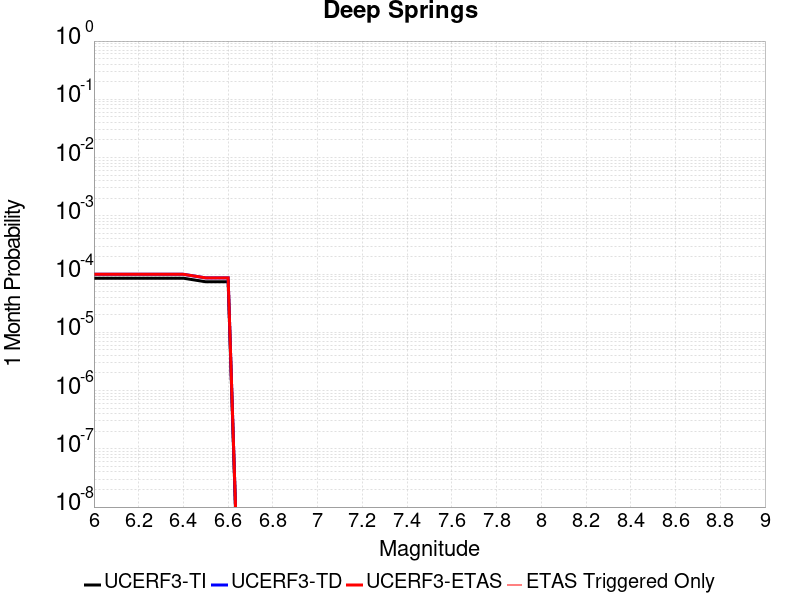 |  |  |

| Magnitude | 1 wk TI Prob | 1 wk TD Prob | 1 wk ETAS Prob | 1 wk ETAS/TD Gain | 1 wk ETAS Triggered Only | 1 mo TI Prob | 1 mo TD Prob | 1 mo ETAS Prob | 1 mo ETAS/TD Gain | 1 mo ETAS Triggered Only | 1 yr TI Prob | 1 yr TD Prob | 1 yr ETAS Prob | 1 yr ETAS/TD Gain | 1 yr ETAS Triggered Only | 10 yr TI Prob | 10 yr TD Prob | 10 yr ETAS Prob | 10 yr ETAS/TD Gain | 10 yr ETAS Triggered Only |
|-----|-----|-----|-----|-----|-----|-----|-----|-----|-----|-----|-----|-----|-----|-----|-----|-----|-----|-----|-----|-----|
| 6.0 | 1.9810619E-5 | 2.311763E-5 | 2.311763E-5 | 1.0 | 0.0 | 8.489989E-5 | 9.9074656E-5 | 9.9074656E-5 | 1.0 | 0.0 | 0.001033166 | 0.0012060744 | 0.0012060744 | 1.0 | 0.0 | 0.010283757 | 0.012045082 | 0.012067712 | 1.0018789 | 2.2906359E-5 |
| 6.1 | 1.9810619E-5 | 2.311763E-5 | 2.311763E-5 | 1.0 | 0.0 | 8.489989E-5 | 9.9074656E-5 | 9.9074656E-5 | 1.0 | 0.0 | 0.001033166 | 0.0012060744 | 0.0012060744 | 1.0 | 0.0 | 0.010283757 | 0.012045082 | 0.012067712 | 1.0018789 | 2.2906359E-5 |
| 6.2 | 1.9810619E-5 | 2.311763E-5 | 2.311763E-5 | 1.0 | 0.0 | 8.489989E-5 | 9.9074656E-5 | 9.9074656E-5 | 1.0 | 0.0 | 0.001033166 | 0.0012060744 | 0.0012060744 | 1.0 | 0.0 | 0.010283757 | 0.012045082 | 0.012067712 | 1.0018789 | 2.2906359E-5 |
| 6.3 | 1.9810619E-5 | 2.311763E-5 | 2.311763E-5 | 1.0 | 0.0 | 8.489989E-5 | 9.9074656E-5 | 9.9074656E-5 | 1.0 | 0.0 | 0.001033166 | 0.0012060744 | 0.0012060744 | 1.0 | 0.0 | 0.010283757 | 0.012045082 | 0.012067712 | 1.0018789 | 2.2906359E-5 |
| 6.4 | 1.9810619E-5 | 2.311763E-5 | 2.311763E-5 | 1.0 | 0.0 | 8.489989E-5 | 9.9074656E-5 | 9.9074656E-5 | 1.0 | 0.0 | 0.001033166 | 0.0012060744 | 0.0012060744 | 1.0 | 0.0 | 0.010283757 | 0.012045082 | 0.012067712 | 1.0018789 | 2.2906359E-5 |
| 6.5 | 1.7190405E-5 | 2.005498E-5 | 2.005498E-5 | 1.0 | 0.0 | 7.367108E-5 | 8.594992E-5 | 8.594992E-5 | 1.0 | 0.0 | 8.9657627E-4 | 0.0010464402 | 0.0010464402 | 1.0 | 0.0 | 0.008929676 | 0.010464364 | 0.01048703 | 1.002166 | 2.2906359E-5 |
| 6.6 | 1.7190405E-5 | 2.005498E-5 | 2.005498E-5 | 1.0 | 0.0 | 7.367108E-5 | 8.594992E-5 | 8.594992E-5 | 1.0 | 0.0 | 8.9657627E-4 | 0.0010464402 | 0.0010464402 | 1.0 | 0.0 | 0.008929676 | 0.010464364 | 0.01048703 | 1.002166 | 2.2906359E-5 |

## Emerson-Copper Mtn 2011
*[(top)](#table-of-contents)*

| 1 Week | 1 Month | 1 Year | 10 Year |
|-----|-----|-----|-----|
|  |  |  | 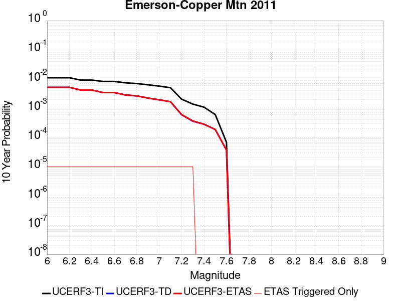 |

| Magnitude | 1 wk TI Prob | 1 wk TD Prob | 1 wk ETAS Prob | 1 wk ETAS/TD Gain | 1 wk ETAS Triggered Only | 1 mo TI Prob | 1 mo TD Prob | 1 mo ETAS Prob | 1 mo ETAS/TD Gain | 1 mo ETAS Triggered Only | 1 yr TI Prob | 1 yr TD Prob | 1 yr ETAS Prob | 1 yr ETAS/TD Gain | 1 yr ETAS Triggered Only | 10 yr TI Prob | 10 yr TD Prob | 10 yr ETAS Prob | 10 yr ETAS/TD Gain | 10 yr ETAS Triggered Only |
|-----|-----|-----|-----|-----|-----|-----|-----|-----|-----|-----|-----|-----|-----|-----|-----|-----|-----|-----|-----|-----|
| 6.0 | 2.1364202E-5 | 9.969751E-6 | 9.969751E-6 | 1.0 | 0.0 | 9.1557646E-5 | 4.2726853E-5 | 4.2726853E-5 | 1.0 | 0.0 | 0.0011141442 | 5.20084E-4 | 5.4297847E-4 | 1.0440207 | 2.2906359E-5 | 0.011085749 | 0.0051895385 | 0.005212326 | 1.0043911 | 2.2906359E-5 |
| 6.1 | 2.1364202E-5 | 9.969751E-6 | 9.969751E-6 | 1.0 | 0.0 | 9.1557646E-5 | 4.2726853E-5 | 4.2726853E-5 | 1.0 | 0.0 | 0.0011141442 | 5.20084E-4 | 5.4297847E-4 | 1.0440207 | 2.2906359E-5 | 0.011085749 | 0.0051895385 | 0.005212326 | 1.0043911 | 2.2906359E-5 |
| 6.2 | 2.1364202E-5 | 9.969751E-6 | 9.969751E-6 | 1.0 | 0.0 | 9.1557646E-5 | 4.2726853E-5 | 4.2726853E-5 | 1.0 | 0.0 | 0.0011141442 | 5.20084E-4 | 5.4297847E-4 | 1.0440207 | 2.2906359E-5 | 0.011085749 | 0.0051895385 | 0.005212326 | 1.0043911 | 2.2906359E-5 |
| 6.3 | 1.7751237E-5 | 8.090614E-6 | 8.090614E-6 | 1.0 | 0.0 | 7.607452E-5 | 3.4673634E-5 | 3.4673634E-5 | 1.0 | 0.0 | 9.258136E-4 | 4.2207597E-4 | 4.4497268E-4 | 1.0542477 | 2.2906359E-5 | 0.00921966 | 0.004213366 | 0.004236176 | 1.0054137 | 2.2906359E-5 |
| 6.4 | 1.7751237E-5 | 8.090614E-6 | 8.090614E-6 | 1.0 | 0.0 | 7.607452E-5 | 3.4673634E-5 | 3.4673634E-5 | 1.0 | 0.0 | 9.258136E-4 | 4.2207597E-4 | 4.4497268E-4 | 1.0542477 | 2.2906359E-5 | 0.00921966 | 0.004213366 | 0.004236176 | 1.0054137 | 2.2906359E-5 |
| 6.5 | 1.5886664E-5 | 6.604985E-6 | 6.604985E-6 | 1.0 | 0.0 | 6.808392E-5 | 2.83068E-5 | 2.83068E-5 | 1.0 | 0.0 | 8.286065E-4 | 3.4458548E-4 | 3.6748394E-4 | 1.0664523 | 2.2906359E-5 | 0.008255237 | 0.0034409761 | 0.0034638038 | 1.006634 | 2.2906359E-5 |
| 6.6 | 1.5886664E-5 | 6.604985E-6 | 6.604985E-6 | 1.0 | 0.0 | 6.808392E-5 | 2.83068E-5 | 2.83068E-5 | 1.0 | 0.0 | 8.286065E-4 | 3.4458548E-4 | 3.6748394E-4 | 1.0664523 | 2.2906359E-5 | 0.008255237 | 0.0034409761 | 0.0034638038 | 1.006634 | 2.2906359E-5 |
| 6.7 | 1.428471E-5 | 5.4714073E-6 | 5.4714073E-6 | 1.0 | 0.0 | 6.121875E-5 | 2.34487E-5 | 2.34487E-5 | 1.0 | 0.0 | 7.450834E-4 | 2.8545447E-4 | 3.0835427E-4 | 1.0802224 | 2.2906359E-5 | 0.007425902 | 0.0028512662 | 0.002874107 | 1.0080109 | 2.2906359E-5 |
| 6.8 | 1.3490684E-5 | 5.074642E-6 | 5.074642E-6 | 1.0 | 0.0 | 5.7815934E-5 | 2.1748307E-5 | 2.1748307E-5 | 1.0 | 0.0 | 7.0368167E-4 | 2.6475734E-4 | 2.8765763E-4 | 1.0864954 | 2.2906359E-5 | 0.007014576 | 0.0026448 | 0.002667646 | 1.008638 | 2.2906359E-5 |
| 6.9 | 1.2235421E-5 | 4.2905367E-6 | 4.2905367E-6 | 1.0 | 0.0 | 5.2436466E-5 | 1.8387906E-5 | 1.8387906E-5 | 1.0 | 0.0 | 6.38227E-4 | 2.2385335E-4 | 2.467546E-4 | 1.1023046 | 2.2906359E-5 | 0.0063639707 | 0.002236633 | 0.0022594882 | 1.0102185 | 2.2906359E-5 |
| 7.0 | 1.1009851E-5 | 3.7197753E-6 | 3.7197753E-6 | 1.0 | 0.0 | 4.7184225E-5 | 1.5941816E-5 | 1.5941816E-5 | 1.0 | 0.0 | 5.743165E-4 | 1.9407776E-4 | 2.1697968E-4 | 1.1180038 | 2.2906359E-5 | 0.005728345 | 0.0019394207 | 0.0019622827 | 1.011788 | 2.2906359E-5 |
| 7.1 | 9.726373E-6 | 3.2124865E-6 | 3.2124865E-6 | 1.0 | 0.0 | 4.168379E-5 | 1.3767745E-5 | 1.3767745E-5 | 1.0 | 0.0 | 5.07382E-4 | 1.6761279E-4 | 1.905153E-4 | 1.1366395 | 2.2906359E-5 | 0.0050622504 | 0.0016751951 | 0.0016980631 | 1.0136509 | 2.2906359E-5 |
| 7.2 | 3.9335127E-6 | 1.1527233E-6 | 1.1527233E-6 | 1.0 | 0.0 | 1.6857803E-5 | 4.940234E-6 | 4.940234E-6 | 1.0 | 0.0 | 2.0522442E-4 | 6.0145747E-5 | 8.305073E-5 | 1.3808246 | 2.2906359E-5 | 0.00205035 | 6.013006E-4 | 6.241932E-4 | 1.0380718 | 2.2906359E-5 |
| 7.3 | 2.661632E-6 | 6.91309E-7 | 6.91309E-7 | 1.0 | 0.0 | 1.14069435E-5 | 2.9627495E-6 | 2.9627495E-6 | 1.0 | 0.0 | 1.3887069E-4 | 3.607089E-5 | 5.897642E-5 | 1.6350144 | 2.2906359E-5 | 0.0013878393 | 3.6065138E-4 | 3.835495E-4 | 1.063491 | 2.2906359E-5 |
| 7.4 | 2.0893426E-6 | 5.463086E-7 | 5.463086E-7 | 1.0 | 0.0 | 8.954295E-6 | 2.3413206E-6 | 2.3413206E-6 | 1.0 | 0.0 | 1.0901308E-4 | 2.850521E-5 | 2.850521E-5 | 1.0 | 0.0 | 0.0010895962 | 2.8501608E-4 | 2.8501608E-4 | 1.0 | 0.0 |
| 7.5 | 1.1681728E-6 | 3.6037605E-7 | 3.6037605E-7 | 1.0 | 0.0 | 5.0064455E-6 | 1.544468E-6 | 1.544468E-6 | 1.0 | 0.0 | 6.0951766E-5 | 1.880374E-5 | 1.880374E-5 | 1.0 | 0.0 | 6.093505E-4 | 1.8802195E-4 | 1.8802195E-4 | 1.0 | 0.0 |
| 7.6 | 1.3154387E-7 | 7.120617E-8 | 7.120617E-8 | 1.0 | 0.0 | 5.6375933E-7 | 3.051693E-7 | 3.051693E-7 | 1.0 | 0.0 | 6.863748E-6 | 3.7154316E-6 | 3.7154316E-6 | 1.0 | 0.0 | 6.863536E-5 | 3.715385E-5 | 3.715385E-5 | 1.0 | 0.0 |

## Calaveras (So) 2011 CFM
*[(top)](#table-of-contents)*

| 1 Week | 1 Month | 1 Year | 10 Year |
|-----|-----|-----|-----|
|  |  | 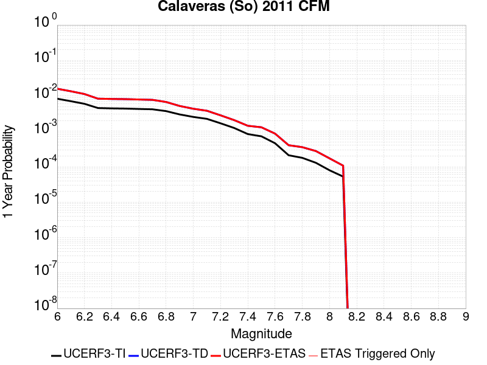 |  |

| Magnitude | 1 wk TI Prob | 1 wk TD Prob | 1 wk ETAS Prob | 1 wk ETAS/TD Gain | 1 wk ETAS Triggered Only | 1 mo TI Prob | 1 mo TD Prob | 1 mo ETAS Prob | 1 mo ETAS/TD Gain | 1 mo ETAS Triggered Only | 1 yr TI Prob | 1 yr TD Prob | 1 yr ETAS Prob | 1 yr ETAS/TD Gain | 1 yr ETAS Triggered Only | 10 yr TI Prob | 10 yr TD Prob | 10 yr ETAS Prob | 10 yr ETAS/TD Gain | 10 yr ETAS Triggered Only |
|-----|-----|-----|-----|-----|-----|-----|-----|-----|-----|-----|-----|-----|-----|-----|-----|-----|-----|-----|-----|-----|
| 6.0 | 1.5950744E-4 | 3.0764073E-4 | 3.0764073E-4 | 1.0 | 0.0 | 6.834242E-4 | 0.0013163671 | 0.0013163671 | 1.0 | 0.0 | 0.00828899 | 0.01587209 | 0.01587209 | 1.0 | 0.0 | 0.079865426 | 0.14452533 | 0.14454493 | 1.0001355 | 2.2906359E-5 |
| 6.1 | 1.3584697E-4 | 2.6080143E-4 | 2.6080143E-4 | 1.0 | 0.0 | 5.8207137E-4 | 0.0011158073 | 0.0011158073 | 1.0 | 0.0 | 0.007063716 | 0.013474081 | 0.013474081 | 1.0 | 0.0 | 0.06843361 | 0.12414853 | 0.1241686 | 1.0001616 | 2.2906359E-5 |
| 6.2 | 1.14676266E-4 | 2.1759344E-4 | 2.1759344E-4 | 1.0 | 0.0 | 4.9137714E-4 | 9.307718E-4 | 9.307718E-4 | 1.0 | 0.0 | 0.0059661185 | 0.011256671 | 0.011256671 | 1.0 | 0.0 | 0.058084648 | 0.10513544 | 0.10513544 | 1.0 | 0.0 |
| 6.3 | 8.691518E-5 | 1.6015633E-4 | 1.6015633E-4 | 1.0 | 0.0 | 3.7244044E-4 | 6.860808E-4 | 6.860808E-4 | 1.0 | 0.0 | 0.004525038 | 0.008314001 | 0.008314001 | 1.0 | 0.0 | 0.044339992 | 0.07944975 | 0.07944975 | 1.0 | 0.0 |
| 6.4 | 8.50982E-5 | 1.5721902E-4 | 1.5721902E-4 | 1.0 | 0.0 | 3.646556E-4 | 6.7349884E-4 | 6.7349884E-4 | 1.0 | 0.0 | 0.0044306475 | 0.00816197 | 0.00816197 | 1.0 | 0.0 | 0.04343345 | 0.078055486 | 0.078055486 | 1.0 | 0.0 |
| 6.5 | 8.4062965E-5 | 1.5546323E-4 | 1.5546323E-4 | 1.0 | 0.0 | 3.602201E-4 | 6.6597783E-4 | 6.6597783E-4 | 1.0 | 0.0 | 0.004376863 | 0.008071141 | 0.008071141 | 1.0 | 0.0 | 0.042916555 | 0.07722655 | 0.07722655 | 1.0 | 0.0 |
| 6.6 | 8.194716E-5 | 1.5181798E-4 | 1.5181798E-4 | 1.0 | 0.0 | 3.5115483E-4 | 6.503632E-4 | 6.503632E-4 | 1.0 | 0.0 | 0.0042669317 | 0.007882898 | 0.007882898 | 1.0 | 0.0 | 0.04185927 | 0.07551128 | 0.07551128 | 1.0 | 0.0 |
| 6.7 | 8.012326E-5 | 1.4849303E-4 | 1.4849303E-4 | 1.0 | 0.0 | 3.433402E-4 | 6.36127E-4 | 6.36127E-4 | 1.0 | 0.0 | 0.004172157 | 0.0077113253 | 0.0077113253 | 1.0 | 0.0 | 0.040946912 | 0.07395302 | 0.07395302 | 1.0 | 0.0 |
| 6.8 | 7.119773E-5 | 1.2905148E-4 | 1.2905148E-4 | 1.0 | 0.0 | 3.0509746E-4 | 5.528928E-4 | 5.528928E-4 | 1.0 | 0.0 | 0.0037082357 | 0.006707953 | 0.006707953 | 1.0 | 0.0 | 0.036469642 | 0.06479163 | 0.06479163 | 1.0 | 0.0 |
| 6.9 | 5.7343088E-5 | 9.939656E-5 | 9.939656E-5 | 1.0 | 0.0 | 2.4573295E-4 | 4.2591617E-4 | 4.2591617E-4 | 1.0 | 0.0 | 0.0029876942 | 0.005173279 | 0.005173279 | 1.0 | 0.0 | 0.02947844 | 0.05060683 | 0.05060683 | 1.0 | 0.0 |
| 7.0 | 4.8746577E-5 | 8.304976E-5 | 8.304976E-5 | 1.0 | 0.0 | 2.0889717E-4 | 3.5587934E-4 | 3.5587934E-4 | 1.0 | 0.0 | 0.0025403565 | 0.0043242895 | 0.0043242895 | 1.0 | 0.0 | 0.025115121 | 0.042581204 | 0.042581204 | 1.0 | 0.0 |
| 7.1 | 4.2998014E-5 | 7.282232E-5 | 7.282232E-5 | 1.0 | 0.0 | 1.8426418E-4 | 3.1205863E-4 | 3.1205863E-4 | 1.0 | 0.0 | 0.002241108 | 0.0037927555 | 0.0037927555 | 1.0 | 0.0 | 0.022186412 | 0.037506565 | 0.037506565 | 1.0 | 0.0 |
| 7.2 | 3.221292E-5 | 5.4070573E-5 | 5.4070573E-5 | 1.0 | 0.0 | 1.3804805E-4 | 2.3171061E-4 | 2.3171061E-4 | 1.0 | 0.0 | 0.0016794393 | 0.0028174552 | 0.0028174552 | 1.0 | 0.0 | 0.016668037 | 0.0281162 | 0.0281162 | 1.0 | 0.0 |
| 7.3 | 2.3756531E-5 | 3.9616672E-5 | 3.9616672E-5 | 1.0 | 0.0 | 1.0180973E-4 | 1.697748E-4 | 1.697748E-4 | 1.0 | 0.0 | 0.0012388286 | 0.0020650658 | 0.0020650658 | 1.0 | 0.0 | 0.012319452 | 0.02071471 | 0.02071471 | 1.0 | 0.0 |
| 7.4 | 1.5997684E-5 | 2.741595E-5 | 2.741595E-5 | 1.0 | 0.0 | 6.8559704E-5 | 1.1749165E-4 | 1.1749165E-4 | 1.0 | 0.0 | 8.343947E-4 | 0.0014295246 | 0.0014295246 | 1.0 | 0.0 | 0.008312687 | 0.014412995 | 0.014412995 | 1.0 | 0.0 |
| 7.5 | 1.3814293E-5 | 2.4854633E-5 | 2.4854633E-5 | 1.0 | 0.0 | 5.9202768E-5 | 1.06515516E-4 | 1.06515516E-4 | 1.0 | 0.0 | 7.205553E-4 | 0.0012960574 | 0.0012960574 | 1.0 | 0.0 | 0.007182234 | 0.013090733 | 0.013090733 | 1.0 | 0.0 |
| 7.6 | 8.817309E-6 | 1.6489466E-5 | 1.6489466E-5 | 1.0 | 0.0 | 3.7787922E-5 | 7.0667236E-5 | 7.0667236E-5 | 1.0 | 0.0 | 4.5997082E-4 | 8.6003536E-4 | 8.6003536E-4 | 1.0 | 0.0 | 0.004590199 | 0.008748965 | 0.008748965 | 1.0 | 0.0 |
| 7.7 | 4.0352206E-6 | 7.74847E-6 | 7.74847E-6 | 1.0 | 0.0 | 1.7293689E-5 | 3.3207307E-5 | 3.3207307E-5 | 1.0 | 0.0 | 2.1053031E-4 | 4.0422403E-4 | 4.0422403E-4 | 1.0 | 0.0 | 0.0021033096 | 0.004185346 | 0.004185346 | 1.0 | 0.0 |
| 7.8 | 3.413169E-6 | 6.8233107E-6 | 6.8233107E-6 | 1.0 | 0.0 | 1.4627784E-5 | 2.9242432E-5 | 2.9242432E-5 | 1.0 | 0.0 | 1.7807873E-4 | 3.559685E-4 | 3.559685E-4 | 1.0 | 0.0 | 0.0017793609 | 0.003684084 | 0.003684084 | 1.0 | 0.0 |
| 7.9 | 2.4740732E-6 | 5.3056738E-6 | 5.3056738E-6 | 1.0 | 0.0 | 1.06031275E-5 | 2.2738403E-5 | 2.2738403E-5 | 1.0 | 0.0 | 1.2908543E-4 | 2.7680496E-4 | 2.7680496E-4 | 1.0 | 0.0 | 0.0012901047 | 0.0028476554 | 0.0028476554 | 1.0 | 0.0 |
| 8.0 | 1.5231818E-6 | 3.3045035E-6 | 3.3045035E-6 | 1.0 | 0.0 | 6.527906E-6 | 1.4162081E-5 | 1.4162081E-5 | 1.0 | 0.0 | 7.9474354E-5 | 1.7240974E-4 | 1.7240974E-4 | 1.0 | 0.0 | 7.944594E-4 | 0.0017640805 | 0.0017640805 | 1.0 | 0.0 |
| 8.1 | 1.0104524E-6 | 2.0554423E-6 | 2.0554423E-6 | 1.0 | 0.0 | 4.330503E-6 | 8.809009E-6 | 8.809009E-6 | 1.0 | 0.0 | 5.2722597E-5 | 1.07244436E-4 | 1.07244436E-4 | 1.0 | 0.0 | 5.271009E-4 | 0.0010977517 | 0.0010977517 | 1.0 | 0.0 |

## Elmore Ranch
*[(top)](#table-of-contents)*

| 1 Week | 1 Month | 1 Year | 10 Year |
|-----|-----|-----|-----|
|  | 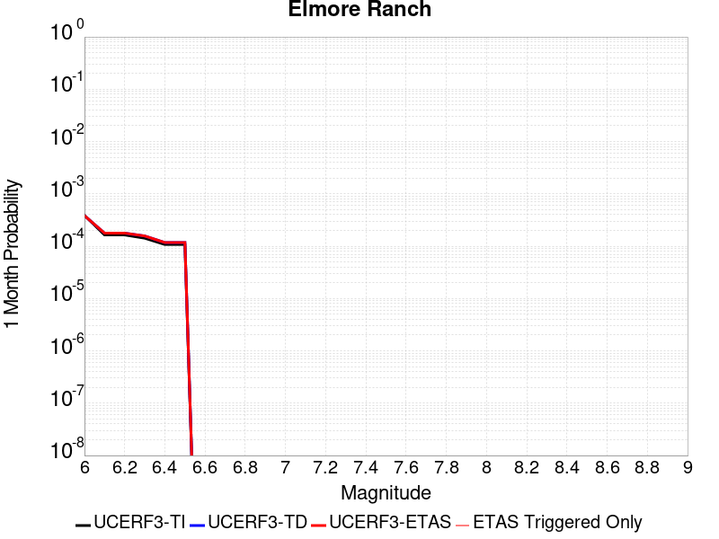 |  | 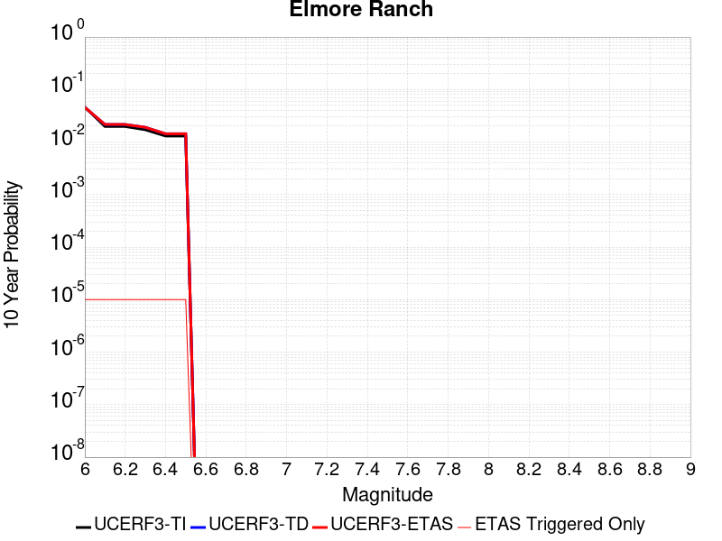 |

| Magnitude | 1 wk TI Prob | 1 wk TD Prob | 1 wk ETAS Prob | 1 wk ETAS/TD Gain | 1 wk ETAS Triggered Only | 1 mo TI Prob | 1 mo TD Prob | 1 mo ETAS Prob | 1 mo ETAS/TD Gain | 1 mo ETAS Triggered Only | 1 yr TI Prob | 1 yr TD Prob | 1 yr ETAS Prob | 1 yr ETAS/TD Gain | 1 yr ETAS Triggered Only | 10 yr TI Prob | 10 yr TD Prob | 10 yr ETAS Prob | 10 yr ETAS/TD Gain | 10 yr ETAS Triggered Only |
|-----|-----|-----|-----|-----|-----|-----|-----|-----|-----|-----|-----|-----|-----|-----|-----|-----|-----|-----|-----|-----|
| 6.0 | 9.102099E-5 | 8.9578614E-5 | 8.9578614E-5 | 1.0 | 0.0 | 3.9003167E-4 | 3.8386503E-4 | 3.8386503E-4 | 1.0 | 0.0 | 0.0047383 | 0.0046650036 | 0.0046650036 | 1.0 | 0.0 | 0.046385348 | 0.045895047 | 0.0459169 | 1.0004762 | 2.2906359E-5 |
| 6.1 | 3.8306698E-5 | 4.1522737E-5 | 4.1522737E-5 | 1.0 | 0.0 | 1.6416123E-4 | 1.7794652E-4 | 1.7794652E-4 | 1.0 | 0.0 | 0.0019968306 | 0.0021641937 | 0.0021641937 | 1.0 | 0.0 | 0.019789828 | 0.021639477 | 0.021661889 | 1.0010357 | 2.2906359E-5 |
| 6.2 | 3.8306698E-5 | 4.1522737E-5 | 4.1522737E-5 | 1.0 | 0.0 | 1.6416123E-4 | 1.7794652E-4 | 1.7794652E-4 | 1.0 | 0.0 | 0.0019968306 | 0.0021641937 | 0.0021641937 | 1.0 | 0.0 | 0.019789828 | 0.021639477 | 0.021661889 | 1.0010357 | 2.2906359E-5 |
| 6.3 | 3.3197924E-5 | 3.65734E-5 | 3.65734E-5 | 1.0 | 0.0 | 1.4226905E-4 | 1.5673772E-4 | 1.5673772E-4 | 1.0 | 0.0 | 0.0017307495 | 0.0019067894 | 0.0019067894 | 1.0 | 0.0 | 0.017173318 | 0.019099101 | 0.01912157 | 1.0011765 | 2.2906359E-5 |
| 6.4 | 2.5148964E-5 | 2.743219E-5 | 2.743219E-5 | 1.0 | 0.0 | 1.0777682E-4 | 1.1756489E-4 | 1.1756489E-4 | 1.0 | 0.0 | 0.0013113929 | 0.0014310612 | 0.0014310612 | 1.0 | 0.0 | 0.01303681 | 0.014393246 | 0.014415822 | 1.0015686 | 2.2906359E-5 |
| 6.5 | 2.5148964E-5 | 2.743219E-5 | 2.743219E-5 | 1.0 | 0.0 | 1.0777682E-4 | 1.1756489E-4 | 1.1756489E-4 | 1.0 | 0.0 | 0.0013113929 | 0.0014310612 | 0.0014310612 | 1.0 | 0.0 | 0.01303681 | 0.014393246 | 0.014415822 | 1.0015686 | 2.2906359E-5 |

## Simi-Santa Rosa
*[(top)](#table-of-contents)*

| 1 Week | 1 Month | 1 Year | 10 Year |
|-----|-----|-----|-----|
| 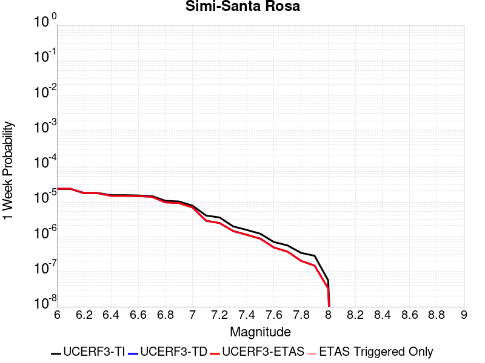 |  |  |  |

| Magnitude | 1 wk TI Prob | 1 wk TD Prob | 1 wk ETAS Prob | 1 wk ETAS/TD Gain | 1 wk ETAS Triggered Only | 1 mo TI Prob | 1 mo TD Prob | 1 mo ETAS Prob | 1 mo ETAS/TD Gain | 1 mo ETAS Triggered Only | 1 yr TI Prob | 1 yr TD Prob | 1 yr ETAS Prob | 1 yr ETAS/TD Gain | 1 yr ETAS Triggered Only | 10 yr TI Prob | 10 yr TD Prob | 10 yr ETAS Prob | 10 yr ETAS/TD Gain | 10 yr ETAS Triggered Only |
|-----|-----|-----|-----|-----|-----|-----|-----|-----|-----|-----|-----|-----|-----|-----|-----|-----|-----|-----|-----|-----|
| 6.0 | 2.198912E-5 | 2.2279473E-5 | 2.2279473E-5 | 1.0 | 0.0 | 9.4235686E-5 | 9.548021E-5 | 9.548021E-5 | 1.0 | 0.0 | 0.0011467156 | 0.0011618955 | 0.0011618955 | 1.0 | 0.0 | 0.011408163 | 0.011562656 | 0.011585297 | 1.0019581 | 2.2906359E-5 |
| 6.1 | 2.198912E-5 | 2.2279473E-5 | 2.2279473E-5 | 1.0 | 0.0 | 9.4235686E-5 | 9.548021E-5 | 9.548021E-5 | 1.0 | 0.0 | 0.0011467156 | 0.0011618955 | 0.0011618955 | 1.0 | 0.0 | 0.011408163 | 0.011562656 | 0.011585297 | 1.0019581 | 2.2906359E-5 |
| 6.2 | 1.69983E-5 | 1.6671673E-5 | 1.6671673E-5 | 1.0 | 0.0 | 7.284782E-5 | 7.144823E-5 | 7.144823E-5 | 1.0 | 0.0 | 8.865613E-4 | 8.6956425E-4 | 8.6956425E-4 | 1.0 | 0.0 | 0.008830327 | 0.008664539 | 0.008664539 | 1.0 | 0.0 |
| 6.3 | 1.69983E-5 | 1.6671673E-5 | 1.6671673E-5 | 1.0 | 0.0 | 7.284782E-5 | 7.144823E-5 | 7.144823E-5 | 1.0 | 0.0 | 8.865613E-4 | 8.6956425E-4 | 8.6956425E-4 | 1.0 | 0.0 | 0.008830327 | 0.008664539 | 0.008664539 | 1.0 | 0.0 |
| 6.4 | 1.4666188E-5 | 1.4055234E-5 | 1.4055234E-5 | 1.0 | 0.0 | 6.285358E-5 | 6.0235463E-5 | 6.0235463E-5 | 1.0 | 0.0 | 7.6497364E-4 | 7.3314493E-4 | 7.3314493E-4 | 1.0 | 0.0 | 0.0076234564 | 0.0073097385 | 0.0073097385 | 1.0 | 0.0 |
| 6.5 | 1.4666188E-5 | 1.4055234E-5 | 1.4055234E-5 | 1.0 | 0.0 | 6.285358E-5 | 6.0235463E-5 | 6.0235463E-5 | 1.0 | 0.0 | 7.6497364E-4 | 7.3314493E-4 | 7.3314493E-4 | 1.0 | 0.0 | 0.0076234564 | 0.0073097385 | 0.0073097385 | 1.0 | 0.0 |
| 6.6 | 1.4377586E-5 | 1.3732222E-5 | 1.3732222E-5 | 1.0 | 0.0 | 6.1616774E-5 | 5.8851194E-5 | 5.8851194E-5 | 1.0 | 0.0 | 7.4992597E-4 | 7.163026E-4 | 7.163026E-4 | 1.0 | 0.0 | 0.007474003 | 0.007142407 | 0.007142407 | 1.0 | 0.0 |
| 6.7 | 1.3881404E-5 | 1.3210106E-5 | 1.3210106E-5 | 1.0 | 0.0 | 5.9490372E-5 | 5.661365E-5 | 5.661365E-5 | 1.0 | 0.0 | 7.240546E-4 | 6.8907795E-4 | 6.8907795E-4 | 1.0 | 0.0 | 0.007217 | 0.0068718633 | 0.0068718633 | 1.0 | 0.0 |
| 6.8 | 1.0176516E-5 | 9.156025E-6 | 9.156025E-6 | 1.0 | 0.0 | 4.3612912E-5 | 3.923961E-5 | 3.923961E-5 | 1.0 | 0.0 | 5.308578E-4 | 4.7765413E-4 | 4.7765413E-4 | 1.0 | 0.0 | 0.0052959146 | 0.0047679087 | 0.0047679087 | 1.0 | 0.0 |
| 6.9 | 9.699797E-6 | 8.776513E-6 | 8.776513E-6 | 1.0 | 0.0 | 4.15699E-5 | 3.7613176E-5 | 3.7613176E-5 | 1.0 | 0.0 | 5.05996E-4 | 4.5786062E-4 | 4.5786062E-4 | 1.0 | 0.0 | 0.005048454 | 0.0045707915 | 0.0045707915 | 1.0 | 0.0 |
| 7.0 | 7.4049476E-6 | 6.560691E-6 | 6.560691E-6 | 1.0 | 0.0 | 3.1735104E-5 | 2.8117014E-5 | 2.8117014E-5 | 1.0 | 0.0 | 3.8630638E-4 | 3.4228354E-4 | 3.4228354E-4 | 1.0 | 0.0 | 0.0038563553 | 0.0034188062 | 0.0034188062 | 1.0 | 0.0 |
| 7.1 | 3.873439E-6 | 2.7601516E-6 | 2.7601516E-6 | 1.0 | 0.0 | 1.6600346E-5 | 1.1829168E-5 | 1.1829168E-5 | 1.0 | 0.0 | 2.0209046E-4 | 1.4401085E-4 | 1.4401085E-4 | 1.0 | 0.0 | 0.0020190678 | 0.0014391989 | 0.0014391989 | 1.0 | 0.0 |
| 7.2 | 3.417706E-6 | 2.3682323E-6 | 2.3682323E-6 | 1.0 | 0.0 | 1.4647229E-5 | 1.0149529E-5 | 1.0149529E-5 | 1.0 | 0.0 | 1.7831543E-4 | 1.2356373E-4 | 1.2356373E-4 | 1.0 | 0.0 | 0.0017817242 | 0.0012349725 | 0.0012349725 | 1.0 | 0.0 |
| 7.3 | 1.90225E-6 | 1.4078149E-6 | 1.4078149E-6 | 1.0 | 0.0 | 8.152474E-6 | 6.0334787E-6 | 6.0334787E-6 | 1.0 | 0.0 | 9.9251854E-5 | 7.345515E-5 | 7.345515E-5 | 1.0 | 0.0 | 9.920754E-4 | 7.3431095E-4 | 7.3431095E-4 | 1.0 | 0.0 |
| 7.4 | 1.5170556E-6 | 1.1028849E-6 | 1.1028849E-6 | 1.0 | 0.0 | 6.5016507E-6 | 4.726641E-6 | 4.726641E-6 | 1.0 | 0.0 | 7.915472E-5 | 5.7545345E-5 | 5.7545345E-5 | 1.0 | 0.0 | 7.9126534E-4 | 5.7530554E-4 | 5.7530554E-4 | 1.0 | 0.0 |
| 7.5 | 1.178732E-6 | 8.538974E-7 | 8.538974E-7 | 1.0 | 0.0 | 5.0516987E-6 | 3.6595552E-6 | 3.6595552E-6 | 1.0 | 0.0 | 6.1502695E-5 | 4.455418E-5 | 4.455418E-5 | 1.0 | 0.0 | 6.148568E-4 | 4.4545345E-4 | 4.4545345E-4 | 1.0 | 0.0 |
| 7.6 | 6.8722386E-7 | 4.7967643E-7 | 4.7967643E-7 | 1.0 | 0.0 | 2.9452417E-6 | 2.0557545E-6 | 2.0557545E-6 | 1.0 | 0.0 | 3.5857727E-5 | 2.5028525E-5 | 2.5028525E-5 | 1.0 | 0.0 | 3.5851944E-4 | 2.502572E-4 | 2.502572E-4 | 1.0 | 0.0 |
| 7.7 | 5.5126515E-7 | 3.6765428E-7 | 3.6765428E-7 | 1.0 | 0.0 | 2.3625628E-6 | 1.5756602E-6 | 1.5756602E-6 | 1.0 | 0.0 | 2.8763823E-5 | 1.9183495E-5 | 1.9183495E-5 | 1.0 | 0.0 | 2.87601E-4 | 1.9181852E-4 | 1.9181852E-4 | 1.0 | 0.0 |
| 7.8 | 3.3860243E-7 | 2.0099912E-7 | 2.0099912E-7 | 1.0 | 0.0 | 1.4511525E-6 | 8.614245E-7 | 8.614245E-7 | 1.0 | 0.0 | 1.7667637E-5 | 1.0487794E-5 | 1.0487794E-5 | 1.0 | 0.0 | 1.7666233E-4 | 1.0487304E-4 | 1.0487304E-4 | 1.0 | 0.0 |
| 7.9 | 2.7955386E-7 | 1.4671551E-7 | 1.4671551E-7 | 1.0 | 0.0 | 1.1980875E-6 | 6.287806E-7 | 6.287806E-7 | 1.0 | 0.0 | 1.4586617E-5 | 7.655377E-6 | 7.655377E-6 | 1.0 | 0.0 | 1.458566E-4 | 7.655118E-5 | 7.655118E-5 | 1.0 | 0.0 |
| 8.0 | 5.6259015E-8 | 3.3372977E-8 | 3.3372977E-8 | 1.0 | 0.0 | 2.4111003E-7 | 1.4302704E-7 | 1.4302704E-7 | 1.0 | 0.0 | 2.9355108E-6 | 1.741353E-6 | 1.741353E-6 | 1.0 | 0.0 | 2.935472E-5 | 1.7413407E-5 | 1.7413407E-5 | 1.0 | 0.0 |

## Hat Creek-McArthur-Mayfield
*[(top)](#table-of-contents)*

| 1 Week | 1 Month | 1 Year | 10 Year |
|-----|-----|-----|-----|
|  | 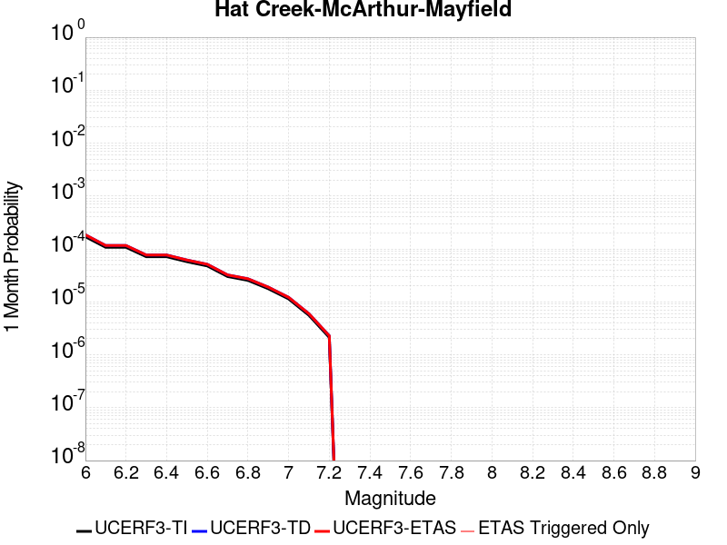 |  |  |

| Magnitude | 1 wk TI Prob | 1 wk TD Prob | 1 wk ETAS Prob | 1 wk ETAS/TD Gain | 1 wk ETAS Triggered Only | 1 mo TI Prob | 1 mo TD Prob | 1 mo ETAS Prob | 1 mo ETAS/TD Gain | 1 mo ETAS Triggered Only | 1 yr TI Prob | 1 yr TD Prob | 1 yr ETAS Prob | 1 yr ETAS/TD Gain | 1 yr ETAS Triggered Only | 10 yr TI Prob | 10 yr TD Prob | 10 yr ETAS Prob | 10 yr ETAS/TD Gain | 10 yr ETAS Triggered Only |
|-----|-----|-----|-----|-----|-----|-----|-----|-----|-----|-----|-----|-----|-----|-----|-----|-----|-----|-----|-----|-----|
| 6.0 | 3.967457E-5 | 4.316336E-5 | 4.316336E-5 | 1.0 | 0.0 | 1.7002279E-4 | 1.8497335E-4 | 1.8497335E-4 | 1.0 | 0.0 | 0.002068062 | 0.0022498388 | 0.0022726937 | 1.0101584 | 2.2906359E-5 | 0.02048922 | 0.022282979 | 0.022305373 | 1.001005 | 2.2906359E-5 |
| 6.1 | 2.5044013E-5 | 2.707408E-5 | 2.707408E-5 | 1.0 | 0.0 | 1.0732707E-4 | 1.16026786E-4 | 1.16026786E-4 | 1.0 | 0.0 | 0.0013059238 | 0.0014117425 | 0.0014346165 | 1.0162027 | 2.2906359E-5 | 0.01298276 | 0.014031162 | 0.014053746 | 1.0016097 | 2.2906359E-5 |
| 6.2 | 2.5044013E-5 | 2.707408E-5 | 2.707408E-5 | 1.0 | 0.0 | 1.0732707E-4 | 1.16026786E-4 | 1.16026786E-4 | 1.0 | 0.0 | 0.0013059238 | 0.0014117425 | 0.0014346165 | 1.0162027 | 2.2906359E-5 | 0.01298276 | 0.014031162 | 0.014053746 | 1.0016097 | 2.2906359E-5 |
| 6.3 | 1.6624012E-5 | 1.7892884E-5 | 1.7892884E-5 | 1.0 | 0.0 | 7.124382E-5 | 7.668158E-5 | 7.668158E-5 | 1.0 | 0.0 | 8.670483E-4 | 9.33207E-4 | 9.33207E-4 | 1.0 | 0.0 | 0.008636732 | 0.009293816 | 0.009293816 | 1.0 | 0.0 |
| 6.4 | 1.6624012E-5 | 1.7892884E-5 | 1.7892884E-5 | 1.0 | 0.0 | 7.124382E-5 | 7.668158E-5 | 7.668158E-5 | 1.0 | 0.0 | 8.670483E-4 | 9.33207E-4 | 9.33207E-4 | 1.0 | 0.0 | 0.008636732 | 0.009293816 | 0.009293816 | 1.0 | 0.0 |
| 6.5 | 1.3394842E-5 | 1.439356E-5 | 1.439356E-5 | 1.0 | 0.0 | 5.7405203E-5 | 6.1685256E-5 | 6.1685256E-5 | 1.0 | 0.0 | 6.986842E-4 | 7.507648E-4 | 7.507648E-4 | 1.0 | 0.0 | 0.006964916 | 0.0074828775 | 0.0074828775 | 1.0 | 0.0 |
| 6.6 | 1.1137514E-5 | 1.195571E-5 | 1.195571E-5 | 1.0 | 0.0 | 4.7731326E-5 | 5.1237774E-5 | 5.1237774E-5 | 1.0 | 0.0 | 5.809739E-4 | 6.236454E-4 | 6.236454E-4 | 1.0 | 0.0 | 0.005794574 | 0.006219374 | 0.006219374 | 1.0 | 0.0 |
| 6.7 | 7.0200663E-6 | 7.525007E-6 | 7.525007E-6 | 1.0 | 0.0 | 3.008565E-5 | 3.224964E-5 | 3.224964E-5 | 1.0 | 0.0 | 3.6623122E-4 | 3.9257022E-4 | 3.9257022E-4 | 1.0 | 0.0 | 0.0036562826 | 0.00391893 | 0.00391893 | 1.0 | 0.0 |
| 6.8 | 5.940172E-6 | 6.3660814E-6 | 6.3660814E-6 | 1.0 | 0.0 | 2.545763E-5 | 2.7282927E-5 | 2.7282927E-5 | 1.0 | 0.0 | 3.0990256E-4 | 3.3212028E-4 | 3.3212028E-4 | 1.0 | 0.0 | 0.0030947074 | 0.003316368 | 0.003316368 | 1.0 | 0.0 |
| 6.9 | 4.129831E-6 | 4.4239646E-6 | 4.4239646E-6 | 1.0 | 0.0 | 1.7699154E-5 | 1.8959714E-5 | 1.8959714E-5 | 1.0 | 0.0 | 2.154659E-4 | 2.3081087E-4 | 2.3081087E-4 | 1.0 | 0.0 | 0.002152571 | 0.0023057899 | 0.0023057899 | 1.0 | 0.0 |
| 7.0 | 2.6512955E-6 | 2.8376644E-6 | 2.8376644E-6 | 1.0 | 0.0 | 1.1362646E-5 | 1.2161364E-5 | 1.2161364E-5 | 1.0 | 0.0 | 1.3833142E-4 | 1.4805498E-4 | 1.4805498E-4 | 1.0 | 0.0 | 0.0013824535 | 0.001479606 | 0.001479606 | 1.0 | 0.0 |
| 7.1 | 1.2992575E-6 | 1.3910619E-6 | 1.3910619E-6 | 1.0 | 0.0 | 5.568235E-6 | 5.961682E-6 | 5.961682E-6 | 1.0 | 0.0 | 6.779115E-5 | 7.258128E-5 | 7.258128E-5 | 1.0 | 0.0 | 6.7770475E-4 | 7.255973E-4 | 7.255973E-4 | 1.0 | 0.0 |
| 7.2 | 4.968191E-7 | 5.3276585E-7 | 5.3276585E-7 | 1.0 | 0.0 | 2.1292228E-6 | 2.2832808E-6 | 2.2832808E-6 | 1.0 | 0.0 | 2.592298E-5 | 2.7798715E-5 | 2.7798715E-5 | 1.0 | 0.0 | 2.5919956E-4 | 2.7796475E-4 | 2.7796475E-4 | 1.0 | 0.0 |

## Mono Lake 2011 CFM
*[(top)](#table-of-contents)*

| 1 Week | 1 Month | 1 Year | 10 Year |
|-----|-----|-----|-----|
|  |  |  |  |

| Magnitude | 1 wk TI Prob | 1 wk TD Prob | 1 wk ETAS Prob | 1 wk ETAS/TD Gain | 1 wk ETAS Triggered Only | 1 mo TI Prob | 1 mo TD Prob | 1 mo ETAS Prob | 1 mo ETAS/TD Gain | 1 mo ETAS Triggered Only | 1 yr TI Prob | 1 yr TD Prob | 1 yr ETAS Prob | 1 yr ETAS/TD Gain | 1 yr ETAS Triggered Only | 10 yr TI Prob | 10 yr TD Prob | 10 yr ETAS Prob | 10 yr ETAS/TD Gain | 10 yr ETAS Triggered Only |
|-----|-----|-----|-----|-----|-----|-----|-----|-----|-----|-----|-----|-----|-----|-----|-----|-----|-----|-----|-----|-----|
| 6.0 | 2.0341662E-5 | 2.3833583E-5 | 2.3833583E-5 | 1.0 | 0.0 | 8.717564E-5 | 1.0214293E-4 | 1.0214293E-4 | 1.0 | 0.0 | 0.0010608466 | 0.0012434124 | 0.0012434124 | 1.0 | 0.0 | 0.010557966 | 0.012416651 | 0.012439272 | 1.0018219 | 2.2906359E-5 |
| 6.1 | 2.0341662E-5 | 2.3833583E-5 | 2.3833583E-5 | 1.0 | 0.0 | 8.717564E-5 | 1.0214293E-4 | 1.0214293E-4 | 1.0 | 0.0 | 0.0010608466 | 0.0012434124 | 0.0012434124 | 1.0 | 0.0 | 0.010557966 | 0.012416651 | 0.012439272 | 1.0018219 | 2.2906359E-5 |
| 6.2 | 2.0341662E-5 | 2.3833583E-5 | 2.3833583E-5 | 1.0 | 0.0 | 8.717564E-5 | 1.0214293E-4 | 1.0214293E-4 | 1.0 | 0.0 | 0.0010608466 | 0.0012434124 | 0.0012434124 | 1.0 | 0.0 | 0.010557966 | 0.012416651 | 0.012439272 | 1.0018219 | 2.2906359E-5 |
| 6.3 | 2.0341662E-5 | 2.3833583E-5 | 2.3833583E-5 | 1.0 | 0.0 | 8.717564E-5 | 1.0214293E-4 | 1.0214293E-4 | 1.0 | 0.0 | 0.0010608466 | 0.0012434124 | 0.0012434124 | 1.0 | 0.0 | 0.010557966 | 0.012416651 | 0.012439272 | 1.0018219 | 2.2906359E-5 |
| 6.4 | 1.749821E-5 | 2.0495634E-5 | 2.0495634E-5 | 1.0 | 0.0 | 7.499018E-5 | 8.783843E-5 | 8.783843E-5 | 1.0 | 0.0 | 9.1262296E-4 | 0.0010694329 | 0.0010694329 | 1.0 | 0.0 | 0.009088841 | 0.010694289 | 0.010694289 | 1.0 | 0.0 |
| 6.5 | 1.749821E-5 | 2.0495634E-5 | 2.0495634E-5 | 1.0 | 0.0 | 7.499018E-5 | 8.783843E-5 | 8.783843E-5 | 1.0 | 0.0 | 9.1262296E-4 | 0.0010694329 | 0.0010694329 | 1.0 | 0.0 | 0.009088841 | 0.010694289 | 0.010694289 | 1.0 | 0.0 |

## San Juan
*[(top)](#table-of-contents)*

| 1 Week | 1 Month | 1 Year | 10 Year |
|-----|-----|-----|-----|
|  | 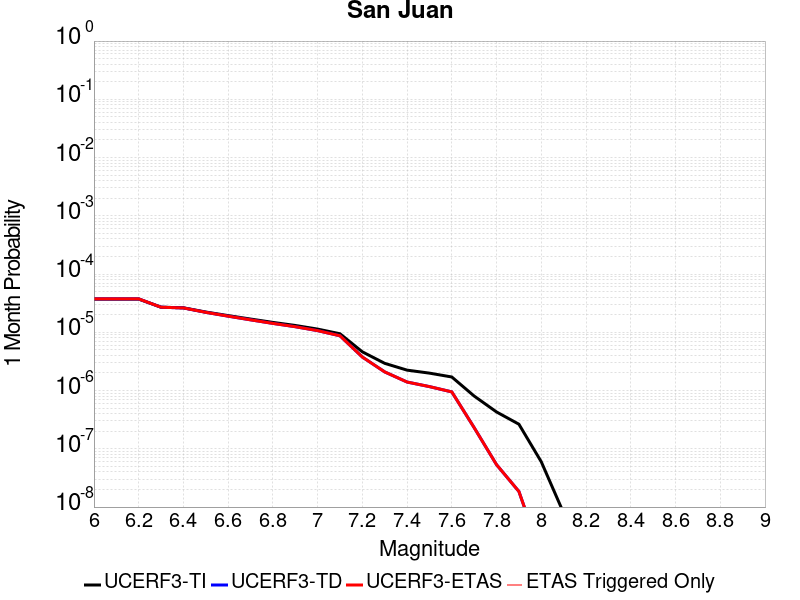 |  |  |

| Magnitude | 1 wk TI Prob | 1 wk TD Prob | 1 wk ETAS Prob | 1 wk ETAS/TD Gain | 1 wk ETAS Triggered Only | 1 mo TI Prob | 1 mo TD Prob | 1 mo ETAS Prob | 1 mo ETAS/TD Gain | 1 mo ETAS Triggered Only | 1 yr TI Prob | 1 yr TD Prob | 1 yr ETAS Prob | 1 yr ETAS/TD Gain | 1 yr ETAS Triggered Only | 10 yr TI Prob | 10 yr TD Prob | 10 yr ETAS Prob | 10 yr ETAS/TD Gain | 10 yr ETAS Triggered Only |
|-----|-----|-----|-----|-----|-----|-----|-----|-----|-----|-----|-----|-----|-----|-----|-----|-----|-----|-----|-----|-----|
| 6.0 | 8.682808E-6 | 8.7531325E-6 | 8.7531325E-6 | 1.0 | 0.0 | 3.72115E-5 | 3.7512913E-5 | 3.7512913E-5 | 1.0 | 0.0 | 4.5295584E-4 | 4.5662883E-4 | 4.7952472E-4 | 1.0501412 | 2.2906359E-5 | 0.004520337 | 0.0045574466 | 0.0045802486 | 1.0050032 | 2.2906359E-5 |
| 6.1 | 8.682808E-6 | 8.7531325E-6 | 8.7531325E-6 | 1.0 | 0.0 | 3.72115E-5 | 3.7512913E-5 | 3.7512913E-5 | 1.0 | 0.0 | 4.5295584E-4 | 4.5662883E-4 | 4.7952472E-4 | 1.0501412 | 2.2906359E-5 | 0.004520337 | 0.0045574466 | 0.0045802486 | 1.0050032 | 2.2906359E-5 |
| 6.2 | 8.682808E-6 | 8.7531325E-6 | 8.7531325E-6 | 1.0 | 0.0 | 3.72115E-5 | 3.7512913E-5 | 3.7512913E-5 | 1.0 | 0.0 | 4.5295584E-4 | 4.5662883E-4 | 4.7952472E-4 | 1.0501412 | 2.2906359E-5 | 0.004520337 | 0.0045574466 | 0.0045802486 | 1.0050032 | 2.2906359E-5 |
| 6.3 | 6.3054235E-6 | 6.286431E-6 | 6.286431E-6 | 1.0 | 0.0 | 2.7022963E-5 | 2.6941576E-5 | 2.6941576E-5 | 1.0 | 0.0 | 3.2895492E-4 | 3.2796574E-4 | 3.2796574E-4 | 1.0 | 0.0 | 0.003284684 | 0.0032750175 | 0.0032750175 | 1.0 | 0.0 |
| 6.4 | 6.1490473E-6 | 6.1177834E-6 | 6.1177834E-6 | 1.0 | 0.0 | 2.6352795E-5 | 2.6218817E-5 | 2.6218817E-5 | 1.0 | 0.0 | 3.2079802E-4 | 3.191687E-4 | 3.191687E-4 | 1.0 | 0.0 | 0.0032033534 | 0.0031872997 | 0.0031872997 | 1.0 | 0.0 |
| 6.5 | 5.204848E-6 | 5.1404445E-6 | 5.1404445E-6 | 1.0 | 0.0 | 2.23063E-5 | 2.2030295E-5 | 2.2030295E-5 | 1.0 | 0.0 | 2.7154534E-4 | 2.681868E-4 | 2.681868E-4 | 1.0 | 0.0 | 0.0027121378 | 0.0026787857 | 0.0026787857 | 1.0 | 0.0 |
| 6.6 | 4.5179986E-6 | 4.417436E-6 | 4.417436E-6 | 1.0 | 0.0 | 1.9362706E-5 | 1.8931734E-5 | 1.8931734E-5 | 1.0 | 0.0 | 2.3571544E-4 | 2.3047028E-4 | 2.3047028E-4 | 1.0 | 0.0 | 0.0023546559 | 0.00230245 | 0.00230245 | 1.0 | 0.0 |
| 6.7 | 3.9442616E-6 | 3.821978E-6 | 3.821978E-6 | 1.0 | 0.0 | 1.6903869E-5 | 1.6379807E-5 | 1.6379807E-5 | 1.0 | 0.0 | 2.0578515E-4 | 1.9940657E-4 | 1.9940657E-4 | 1.0 | 0.0 | 0.002055947 | 0.0019924014 | 0.0019924014 | 1.0 | 0.0 |
| 6.8 | 3.4536245E-6 | 3.3183958E-6 | 3.3183958E-6 | 1.0 | 0.0 | 1.4801163E-5 | 1.4221622E-5 | 1.4221622E-5 | 1.0 | 0.0 | 1.8018926E-4 | 1.7313511E-4 | 1.7313511E-4 | 1.0 | 0.0 | 0.0018004322 | 0.0017301212 | 0.0017301212 | 1.0 | 0.0 |
| 6.9 | 3.059865E-6 | 2.9139994E-6 | 2.9139994E-6 | 1.0 | 0.0 | 1.3113641E-5 | 1.2488513E-5 | 1.2488513E-5 | 1.0 | 0.0 | 1.596469E-4 | 1.5203761E-4 | 1.5203761E-4 | 1.0 | 0.0 | 0.0015953224 | 0.0015194507 | 0.0015194507 | 1.0 | 0.0 |
| 7.0 | 2.6504351E-6 | 2.4938588E-6 | 2.4938588E-6 | 1.0 | 0.0 | 1.1358958E-5 | 1.0687926E-5 | 1.0687926E-5 | 1.0 | 0.0 | 1.3828653E-4 | 1.3011826E-4 | 1.3011826E-4 | 1.0 | 0.0 | 0.0013820052 | 0.001300533 | 0.001300533 | 1.0 | 0.0 |
| 7.1 | 2.2039317E-6 | 2.0353525E-6 | 2.0353525E-6 | 1.0 | 0.0 | 9.445387E-6 | 8.722913E-6 | 8.722913E-6 | 1.0 | 0.0 | 1.1499152E-4 | 1.06196814E-4 | 1.06196814E-4 | 1.0 | 0.0 | 0.0011493203 | 0.001061571 | 0.001061571 | 1.0 | 0.0 |
| 7.2 | 1.0786707E-6 | 8.783211E-7 | 8.783211E-7 | 1.0 | 0.0 | 4.622866E-6 | 3.7642276E-6 | 3.7642276E-6 | 1.0 | 0.0 | 5.628194E-5 | 4.582852E-5 | 4.582852E-5 | 1.0 | 0.0 | 5.6267687E-4 | 4.5824994E-4 | 4.5824994E-4 | 1.0 | 0.0 |
| 7.3 | 6.846433E-7 | 4.877057E-7 | 4.877057E-7 | 1.0 | 0.0 | 2.9341822E-6 | 2.0901655E-6 | 2.0901655E-6 | 1.0 | 0.0 | 3.5723086E-5 | 2.5447467E-5 | 2.5447467E-5 | 1.0 | 0.0 | 3.571734E-4 | 2.5447918E-4 | 2.5447918E-4 | 1.0 | 0.0 |
| 7.4 | 5.23043E-7 | 3.2689408E-7 | 3.2689408E-7 | 1.0 | 0.0 | 2.2416111E-6 | 1.4009738E-6 | 1.4009738E-6 | 1.0 | 0.0 | 2.7291273E-5 | 1.7056724E-5 | 1.7056724E-5 | 1.0 | 0.0 | 2.7287923E-4 | 1.705862E-4 | 1.705862E-4 | 1.0 | 0.0 |
| 7.5 | 4.648444E-7 | 2.728768E-7 | 2.728768E-7 | 1.0 | 0.0 | 1.9921886E-6 | 1.1694715E-6 | 1.1694715E-6 | 1.0 | 0.0 | 2.4254627E-5 | 1.4238223E-5 | 1.4238223E-5 | 1.0 | 0.0 | 2.425198E-4 | 1.4240283E-4 | 1.4240283E-4 | 1.0 | 0.0 |
| 7.6 | 3.9906567E-7 | 2.2125086E-7 | 2.2125086E-7 | 1.0 | 0.0 | 1.7102802E-6 | 9.482176E-7 | 9.482176E-7 | 1.0 | 0.0 | 2.0822463E-5 | 1.1544488E-5 | 1.1544488E-5 | 1.0 | 0.0 | 2.0820512E-4 | 1.1546359E-4 | 1.1546359E-4 | 1.0 | 0.0 |
| 7.7 | 1.8784601E-7 | 5.3822912E-8 | 5.3822912E-8 | 1.0 | 0.0 | 8.0505407E-7 | 2.306696E-7 | 2.306696E-7 | 1.0 | 0.0 | 9.80149E-6 | 2.8083987E-6 | 2.8083987E-6 | 1.0 | 0.0 | 9.801057E-5 | 2.809278E-5 | 2.809278E-5 | 1.0 | 0.0 |
| 7.8 | 1.00154914E-7 | 1.2465811E-8 | 1.2465811E-8 | 1.0 | 0.0 | 4.2923529E-7 | 5.3424902E-8 | 5.3424902E-8 | 1.0 | 0.0 | 5.225927E-6 | 6.50448E-7 | 6.50448E-7 | 1.0 | 0.0 | 5.225804E-5 | 6.510448E-6 | 6.510448E-6 | 1.0 | 0.0 |
| 7.9 | 6.171429E-8 | 4.3225903E-9 | 4.3225903E-9 | 1.0 | 0.0 | 2.6448978E-7 | 1.8525386E-8 | 1.8525386E-8 | 1.0 | 0.0 | 3.2201583E-6 | 2.2554653E-7 | 2.2554653E-7 | 1.0 | 0.0 | 3.2201115E-5 | 2.2608372E-6 | 2.2608372E-6 | 1.0 | 0.0 |
| 8.0 | 1.3974572E-8 | 3.4266734E-10 | 3.4266734E-10 | 1.0 | 0.0 | 5.989102E-8 | 1.4685742E-9 | 1.4685742E-9 | 1.0 | 0.0 | 7.2917294E-7 | 1.7879877E-8 | 1.7879877E-8 | 1.0 | 0.0 | 7.2917055E-6 | 1.831609E-7 | 1.831609E-7 | 1.0 | 0.0 |
| 8.1 | 1.8403477E-9 | 1.1421608E-10 | 1.1421608E-10 | 1.0 | 0.0 | 7.887204E-9 | 4.894991E-10 | 4.894991E-10 | 1.0 | 0.0 | 9.602671E-8 | 5.959654E-9 | 5.959654E-9 | 1.0 | 0.0 | 9.602667E-7 | 6.085037E-8 | 6.085037E-8 | 1.0 | 0.0 |

## South Klamath Lake East
*[(top)](#table-of-contents)*

| 1 Week | 1 Month | 1 Year | 10 Year |
|-----|-----|-----|-----|
|  |  |  |  |

| Magnitude | 1 wk TI Prob | 1 wk TD Prob | 1 wk ETAS Prob | 1 wk ETAS/TD Gain | 1 wk ETAS Triggered Only | 1 mo TI Prob | 1 mo TD Prob | 1 mo ETAS Prob | 1 mo ETAS/TD Gain | 1 mo ETAS Triggered Only | 1 yr TI Prob | 1 yr TD Prob | 1 yr ETAS Prob | 1 yr ETAS/TD Gain | 1 yr ETAS Triggered Only | 10 yr TI Prob | 10 yr TD Prob | 10 yr ETAS Prob | 10 yr ETAS/TD Gain | 10 yr ETAS Triggered Only |
|-----|-----|-----|-----|-----|-----|-----|-----|-----|-----|-----|-----|-----|-----|-----|-----|-----|-----|-----|-----|-----|
| 6.0 | 2.3539369E-5 | 2.5049438E-5 | 2.5049438E-5 | 1.0 | 0.0 | 1.0087911E-4 | 1.0735078E-4 | 1.3025469E-4 | 1.2133557 | 2.2906359E-5 | 0.0012275111 | 0.0013062954 | 0.0013291718 | 1.0175124 | 2.2906359E-5 | 0.012207527 | 0.012994516 | 0.0130171245 | 1.0017399 | 2.2906359E-5 |
| 6.1 | 2.3539369E-5 | 2.5049438E-5 | 2.5049438E-5 | 1.0 | 0.0 | 1.0087911E-4 | 1.0735078E-4 | 1.3025469E-4 | 1.2133557 | 2.2906359E-5 | 0.0012275111 | 0.0013062954 | 0.0013291718 | 1.0175124 | 2.2906359E-5 | 0.012207527 | 0.012994516 | 0.0130171245 | 1.0017399 | 2.2906359E-5 |
| 6.2 | 2.3539369E-5 | 2.5049438E-5 | 2.5049438E-5 | 1.0 | 0.0 | 1.0087911E-4 | 1.0735078E-4 | 1.3025469E-4 | 1.2133557 | 2.2906359E-5 | 0.0012275111 | 0.0013062954 | 0.0013291718 | 1.0175124 | 2.2906359E-5 | 0.012207527 | 0.012994516 | 0.0130171245 | 1.0017399 | 2.2906359E-5 |
| 6.3 | 9.807823E-6 | 1.03968705E-5 | 1.03968705E-5 | 1.0 | 0.0 | 4.2032847E-5 | 4.4557302E-5 | 4.4557302E-5 | 1.0 | 0.0 | 5.1162974E-4 | 5.423585E-4 | 5.423585E-4 | 1.0 | 0.0 | 0.005104534 | 0.005411186 | 0.005411186 | 1.0 | 0.0 |
| 6.4 | 9.807823E-6 | 1.03968705E-5 | 1.03968705E-5 | 1.0 | 0.0 | 4.2032847E-5 | 4.4557302E-5 | 4.4557302E-5 | 1.0 | 0.0 | 5.1162974E-4 | 5.423585E-4 | 5.423585E-4 | 1.0 | 0.0 | 0.005104534 | 0.005411186 | 0.005411186 | 1.0 | 0.0 |
| 6.5 | 6.191981E-6 | 6.5513436E-6 | 6.5513436E-6 | 1.0 | 0.0 | 2.653679E-5 | 2.80769E-5 | 2.80769E-5 | 1.0 | 0.0 | 3.2303753E-4 | 3.4178543E-4 | 3.4178543E-4 | 1.0 | 0.0 | 0.0032256835 | 0.003412876 | 0.003412876 | 1.0 | 0.0 |
| 6.6 | 4.3693776E-6 | 4.616904E-6 | 4.616904E-6 | 1.0 | 0.0 | 1.8725768E-5 | 1.9786587E-5 | 1.9786587E-5 | 1.0 | 0.0 | 2.2796239E-4 | 2.4087621E-4 | 2.4087621E-4 | 1.0 | 0.0 | 0.0022772867 | 0.0024062637 | 0.0024062637 | 1.0 | 0.0 |
| 6.7 | 3.360834E-6 | 3.551507E-6 | 3.551507E-6 | 1.0 | 0.0 | 1.4403494E-5 | 1.522066E-5 | 1.522066E-5 | 1.0 | 0.0 | 1.7534842E-4 | 1.852966E-4 | 1.852966E-4 | 1.0 | 0.0 | 0.0017521014 | 0.0018515008 | 0.0018515008 | 1.0 | 0.0 |
| 6.8 | 2.57873E-6 | 2.7253761E-6 | 2.7253761E-6 | 1.0 | 0.0 | 1.1051653E-5 | 1.1680135E-5 | 1.1680135E-5 | 1.0 | 0.0 | 1.3454557E-4 | 1.4219698E-4 | 1.4219698E-4 | 1.0 | 0.0 | 0.0013446413 | 0.0014211206 | 0.0014211206 | 1.0 | 0.0 |
| 6.9 | 9.987825E-7 | 1.0567024E-6 | 1.0567024E-6 | 1.0 | 0.0 | 4.2804895E-6 | 4.528719E-6 | 4.528719E-6 | 1.0 | 0.0 | 5.211371E-5 | 5.5136083E-5 | 5.5136083E-5 | 1.0 | 0.0 | 5.210149E-4 | 5.5125623E-4 | 5.5125623E-4 | 1.0 | 0.0 |

## Pitas Point (Lower West)
*[(top)](#table-of-contents)*

| 1 Week | 1 Month | 1 Year | 10 Year |
|-----|-----|-----|-----|
|  |  |  |  |

| Magnitude | 1 wk TI Prob | 1 wk TD Prob | 1 wk ETAS Prob | 1 wk ETAS/TD Gain | 1 wk ETAS Triggered Only | 1 mo TI Prob | 1 mo TD Prob | 1 mo ETAS Prob | 1 mo ETAS/TD Gain | 1 mo ETAS Triggered Only | 1 yr TI Prob | 1 yr TD Prob | 1 yr ETAS Prob | 1 yr ETAS/TD Gain | 1 yr ETAS Triggered Only | 10 yr TI Prob | 10 yr TD Prob | 10 yr ETAS Prob | 10 yr ETAS/TD Gain | 10 yr ETAS Triggered Only |
|-----|-----|-----|-----|-----|-----|-----|-----|-----|-----|-----|-----|-----|-----|-----|-----|-----|-----|-----|-----|-----|
| 6.0 | 8.151497E-6 | 7.856467E-6 | 7.856467E-6 | 1.0 | 0.0 | 3.493452E-5 | 3.367014E-5 | 3.367014E-5 | 1.0 | 0.0 | 4.252448E-4 | 4.098576E-4 | 4.3275458E-4 | 1.0558656 | 2.2906359E-5 | 0.0042443196 | 0.004091098 | 0.0041139103 | 1.0055761 | 2.2906359E-5 |
| 6.1 | 8.151497E-6 | 7.856467E-6 | 7.856467E-6 | 1.0 | 0.0 | 3.493452E-5 | 3.367014E-5 | 3.367014E-5 | 1.0 | 0.0 | 4.252448E-4 | 4.098576E-4 | 4.3275458E-4 | 1.0558656 | 2.2906359E-5 | 0.0042443196 | 0.004091098 | 0.0041139103 | 1.0055761 | 2.2906359E-5 |
| 6.2 | 8.151497E-6 | 7.856467E-6 | 7.856467E-6 | 1.0 | 0.0 | 3.493452E-5 | 3.367014E-5 | 3.367014E-5 | 1.0 | 0.0 | 4.252448E-4 | 4.098576E-4 | 4.3275458E-4 | 1.0558656 | 2.2906359E-5 | 0.0042443196 | 0.004091098 | 0.0041139103 | 1.0055761 | 2.2906359E-5 |
| 6.3 | 8.151497E-6 | 7.856467E-6 | 7.856467E-6 | 1.0 | 0.0 | 3.493452E-5 | 3.367014E-5 | 3.367014E-5 | 1.0 | 0.0 | 4.252448E-4 | 4.098576E-4 | 4.3275458E-4 | 1.0558656 | 2.2906359E-5 | 0.0042443196 | 0.004091098 | 0.0041139103 | 1.0055761 | 2.2906359E-5 |
| 6.4 | 8.151497E-6 | 7.856467E-6 | 7.856467E-6 | 1.0 | 0.0 | 3.493452E-5 | 3.367014E-5 | 3.367014E-5 | 1.0 | 0.0 | 4.252448E-4 | 4.098576E-4 | 4.3275458E-4 | 1.0558656 | 2.2906359E-5 | 0.0042443196 | 0.004091098 | 0.0041139103 | 1.0055761 | 2.2906359E-5 |
| 6.5 | 8.151497E-6 | 7.856467E-6 | 7.856467E-6 | 1.0 | 0.0 | 3.493452E-5 | 3.367014E-5 | 3.367014E-5 | 1.0 | 0.0 | 4.252448E-4 | 4.098576E-4 | 4.3275458E-4 | 1.0558656 | 2.2906359E-5 | 0.0042443196 | 0.004091098 | 0.0041139103 | 1.0055761 | 2.2906359E-5 |
| 6.6 | 8.151497E-6 | 7.856467E-6 | 7.856467E-6 | 1.0 | 0.0 | 3.493452E-5 | 3.367014E-5 | 3.367014E-5 | 1.0 | 0.0 | 4.252448E-4 | 4.098576E-4 | 4.3275458E-4 | 1.0558656 | 2.2906359E-5 | 0.0042443196 | 0.004091098 | 0.0041139103 | 1.0055761 | 2.2906359E-5 |
| 6.7 | 8.151497E-6 | 7.856467E-6 | 7.856467E-6 | 1.0 | 0.0 | 3.493452E-5 | 3.367014E-5 | 3.367014E-5 | 1.0 | 0.0 | 4.252448E-4 | 4.098576E-4 | 4.3275458E-4 | 1.0558656 | 2.2906359E-5 | 0.0042443196 | 0.004091098 | 0.0041139103 | 1.0055761 | 2.2906359E-5 |
| 6.8 | 8.151497E-6 | 7.856467E-6 | 7.856467E-6 | 1.0 | 0.0 | 3.493452E-5 | 3.367014E-5 | 3.367014E-5 | 1.0 | 0.0 | 4.252448E-4 | 4.098576E-4 | 4.3275458E-4 | 1.0558656 | 2.2906359E-5 | 0.0042443196 | 0.004091098 | 0.0041139103 | 1.0055761 | 2.2906359E-5 |
| 6.9 | 8.151497E-6 | 7.856467E-6 | 7.856467E-6 | 1.0 | 0.0 | 3.493452E-5 | 3.367014E-5 | 3.367014E-5 | 1.0 | 0.0 | 4.252448E-4 | 4.098576E-4 | 4.3275458E-4 | 1.0558656 | 2.2906359E-5 | 0.0042443196 | 0.004091098 | 0.0041139103 | 1.0055761 | 2.2906359E-5 |
| 7.0 | 8.103535E-6 | 7.805893E-6 | 7.805893E-6 | 1.0 | 0.0 | 3.4728975E-5 | 3.34534E-5 | 3.34534E-5 | 1.0 | 0.0 | 4.2274324E-4 | 4.072198E-4 | 4.3011684E-4 | 1.0562277 | 2.2906359E-5 | 0.0042193993 | 0.004064816 | 0.0040876297 | 1.0056124 | 2.2906359E-5 |
| 7.1 | 7.853298E-6 | 7.541564E-6 | 7.541564E-6 | 1.0 | 0.0 | 3.3656554E-5 | 3.2320593E-5 | 3.2320593E-5 | 1.0 | 0.0 | 4.096915E-4 | 3.9343289E-4 | 4.1633024E-4 | 1.0581988 | 2.2906359E-5 | 0.00408937 | 0.0039274395 | 0.003950256 | 1.0058094 | 2.2906359E-5 |
| 7.2 | 7.771102E-6 | 7.4538384E-6 | 7.4538384E-6 | 1.0 | 0.0 | 3.33043E-5 | 3.1944634E-5 | 3.1944634E-5 | 1.0 | 0.0 | 4.0540437E-4 | 3.888572E-4 | 4.1175468E-4 | 1.0588839 | 2.2906359E-5 | 0.0040466557 | 0.0038818435 | 0.003904661 | 1.005878 | 2.2906359E-5 |
| 7.3 | 7.3945344E-6 | 7.049904E-6 | 7.049904E-6 | 1.0 | 0.0 | 3.1690477E-5 | 3.0213529E-5 | 3.0213529E-5 | 1.0 | 0.0 | 3.8576324E-4 | 3.6778825E-4 | 3.9068618E-4 | 1.0622585 | 2.2906359E-5 | 0.0038509427 | 0.0036718633 | 0.0036946854 | 1.0062155 | 2.2906359E-5 |
| 7.4 | 6.964645E-6 | 6.5907116E-6 | 6.5907116E-6 | 1.0 | 0.0 | 2.9848137E-5 | 2.8245604E-5 | 2.8245604E-5 | 1.0 | 0.0 | 3.6334046E-4 | 3.4383647E-4 | 3.6673495E-4 | 1.066597 | 2.2906359E-5 | 0.0036274698 | 0.003433098 | 0.0034559257 | 1.0066493 | 2.2906359E-5 |
| 7.5 | 6.6525035E-6 | 6.2597182E-6 | 6.2597182E-6 | 1.0 | 0.0 | 2.851042E-5 | 2.682709E-5 | 2.682709E-5 | 1.0 | 0.0 | 3.4705905E-4 | 3.2657135E-4 | 3.4947024E-4 | 1.070119 | 2.2906359E-5 | 0.0034651754 | 0.0032609662 | 0.0032837978 | 1.0070015 | 2.2906359E-5 |
| 7.6 | 5.613338E-6 | 5.151837E-6 | 5.151837E-6 | 1.0 | 0.0 | 2.405694E-5 | 2.2079117E-5 | 2.2079117E-5 | 1.0 | 0.0 | 2.928539E-4 | 2.687804E-4 | 2.916806E-4 | 1.0852004 | 2.2906359E-5 | 0.0029246826 | 0.0026845846 | 0.0027074295 | 1.0085096 | 2.2906359E-5 |
| 7.7 | 4.494704E-6 | 3.9972506E-6 | 3.9972506E-6 | 1.0 | 0.0 | 1.9262876E-5 | 1.7130964E-5 | 1.7130964E-5 | 1.0 | 0.0 | 2.3450027E-4 | 2.0854975E-4 | 2.0854975E-4 | 1.0 | 0.0 | 0.0023425296 | 0.0020835644 | 0.0020835644 | 1.0 | 0.0 |
| 7.8 | 2.6075882E-6 | 2.183817E-6 | 2.183817E-6 | 1.0 | 0.0 | 1.117533E-5 | 9.359183E-6 | 9.359183E-6 | 1.0 | 0.0 | 1.3605114E-4 | 1.13942144E-4 | 1.13942144E-4 | 1.0 | 0.0 | 0.0013596788 | 0.001138842 | 0.001138842 | 1.0 | 0.0 |
| 7.9 | 4.045984E-7 | 3.2426544E-7 | 3.2426544E-7 | 1.0 | 0.0 | 1.733992E-6 | 1.3897082E-6 | 1.3897082E-6 | 1.0 | 0.0 | 2.1111147E-5 | 1.691957E-5 | 1.691957E-5 | 1.0 | 0.0 | 2.1109142E-4 | 1.6918313E-4 | 1.6918313E-4 | 1.0 | 0.0 |
| 8.0 | 7.791402E-9 | 5.6840586E-9 | 5.6840586E-9 | 1.0 | 0.0 | 3.3391725E-8 | 2.436025E-8 | 2.436025E-8 | 1.0 | 0.0 | 4.0654416E-7 | 2.9658602E-7 | 2.9658602E-7 | 1.0 | 0.0 | 4.065434E-6 | 2.9658584E-6 | 2.9658584E-6 | 1.0 | 0.0 |

## South Klamath Lake West
*[(top)](#table-of-contents)*

| 1 Week | 1 Month | 1 Year | 10 Year |
|-----|-----|-----|-----|
| 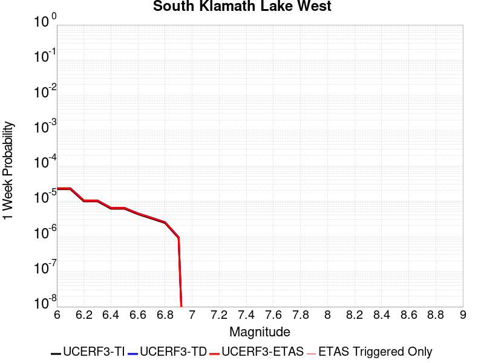 |  |  |  |

| Magnitude | 1 wk TI Prob | 1 wk TD Prob | 1 wk ETAS Prob | 1 wk ETAS/TD Gain | 1 wk ETAS Triggered Only | 1 mo TI Prob | 1 mo TD Prob | 1 mo ETAS Prob | 1 mo ETAS/TD Gain | 1 mo ETAS Triggered Only | 1 yr TI Prob | 1 yr TD Prob | 1 yr ETAS Prob | 1 yr ETAS/TD Gain | 1 yr ETAS Triggered Only | 10 yr TI Prob | 10 yr TD Prob | 10 yr ETAS Prob | 10 yr ETAS/TD Gain | 10 yr ETAS Triggered Only |
|-----|-----|-----|-----|-----|-----|-----|-----|-----|-----|-----|-----|-----|-----|-----|-----|-----|-----|-----|-----|-----|
| 6.0 | 2.174025E-5 | 2.3043856E-5 | 2.3043856E-5 | 1.0 | 0.0 | 9.3169176E-5 | 9.875602E-5 | 1.21660116E-4 | 1.2319261 | 2.2906359E-5 | 0.0011337444 | 0.0012017571 | 0.001224636 | 1.0190378 | 2.2906359E-5 | 0.011279777 | 0.011959186 | 0.011981818 | 1.0018924 | 2.2906359E-5 |
| 6.1 | 2.174025E-5 | 2.3043856E-5 | 2.3043856E-5 | 1.0 | 0.0 | 9.3169176E-5 | 9.875602E-5 | 1.21660116E-4 | 1.2319261 | 2.2906359E-5 | 0.0011337444 | 0.0012017571 | 0.001224636 | 1.0190378 | 2.2906359E-5 | 0.011279777 | 0.011959186 | 0.011981818 | 1.0018924 | 2.2906359E-5 |
| 6.2 | 9.834929E-6 | 1.0394625E-5 | 1.0394625E-5 | 1.0 | 0.0 | 4.2149015E-5 | 4.4547684E-5 | 4.4547684E-5 | 1.0 | 0.0 | 5.1304343E-4 | 5.4224214E-4 | 5.4224214E-4 | 1.0 | 0.0 | 0.0051186057 | 0.0054100924 | 0.0054100924 | 1.0 | 0.0 |
| 6.3 | 9.834929E-6 | 1.0394625E-5 | 1.0394625E-5 | 1.0 | 0.0 | 4.2149015E-5 | 4.4547684E-5 | 4.4547684E-5 | 1.0 | 0.0 | 5.1304343E-4 | 5.4224214E-4 | 5.4224214E-4 | 1.0 | 0.0 | 0.0051186057 | 0.0054100924 | 0.0054100924 | 1.0 | 0.0 |
| 6.4 | 6.066321E-6 | 6.4008973E-6 | 6.4008973E-6 | 1.0 | 0.0 | 2.5998259E-5 | 2.7432145E-5 | 2.7432145E-5 | 1.0 | 0.0 | 3.1648282E-4 | 3.339379E-4 | 3.339379E-4 | 1.0 | 0.0 | 0.0031603249 | 0.0033346312 | 0.0033346312 | 1.0 | 0.0 |
| 6.5 | 6.066321E-6 | 6.4008973E-6 | 6.4008973E-6 | 1.0 | 0.0 | 2.5998259E-5 | 2.7432145E-5 | 2.7432145E-5 | 1.0 | 0.0 | 3.1648282E-4 | 3.339379E-4 | 3.339379E-4 | 1.0 | 0.0 | 0.0031603249 | 0.0033346312 | 0.0033346312 | 1.0 | 0.0 |
| 6.6 | 4.2321803E-6 | 4.4616118E-6 | 4.4616118E-6 | 1.0 | 0.0 | 1.8137789E-5 | 1.9121058E-5 | 1.9121058E-5 | 1.0 | 0.0 | 2.208052E-4 | 2.3277504E-4 | 2.3277504E-4 | 1.0 | 0.0 | 0.0022058594 | 0.0023254142 | 0.0023254142 | 1.0 | 0.0 |
| 6.7 | 3.186646E-6 | 3.3605481E-6 | 3.3605481E-6 | 1.0 | 0.0 | 1.3656982E-5 | 1.4402273E-5 | 1.4402273E-5 | 1.0 | 0.0 | 1.6626107E-4 | 1.7533425E-4 | 1.7533425E-4 | 1.0 | 0.0 | 0.0016613674 | 0.0017520263 | 0.0017520263 | 1.0 | 0.0 |
| 6.8 | 2.380121E-6 | 2.51109E-6 | 2.51109E-6 | 1.0 | 0.0 | 1.0200479E-5 | 1.07617725E-5 | 1.07617725E-5 | 1.0 | 0.0 | 1.2418375E-4 | 1.3101716E-4 | 1.3101716E-4 | 1.0 | 0.0 | 0.0012411437 | 0.0013094451 | 0.0013094451 | 1.0 | 0.0 |
| 6.9 | 8.928287E-7 | 9.4309536E-7 | 9.4309536E-7 | 1.0 | 0.0 | 3.826403E-6 | 4.041832E-6 | 4.041832E-6 | 1.0 | 0.0 | 4.658546E-5 | 4.9208415E-5 | 4.9208415E-5 | 1.0 | 0.0 | 4.6575698E-4 | 4.919968E-4 | 4.919968E-4 | 1.0 | 0.0 |

## Cucamonga
*[(top)](#table-of-contents)*

| 1 Week | 1 Month | 1 Year | 10 Year |
|-----|-----|-----|-----|
|  |  | 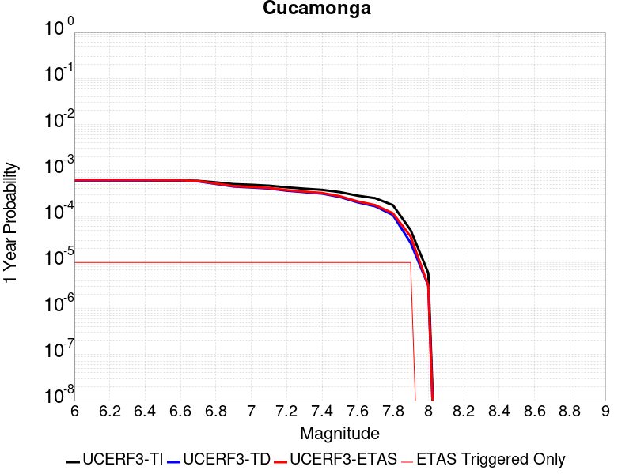 |  |

| Magnitude | 1 wk TI Prob | 1 wk TD Prob | 1 wk ETAS Prob | 1 wk ETAS/TD Gain | 1 wk ETAS Triggered Only | 1 mo TI Prob | 1 mo TD Prob | 1 mo ETAS Prob | 1 mo ETAS/TD Gain | 1 mo ETAS Triggered Only | 1 yr TI Prob | 1 yr TD Prob | 1 yr ETAS Prob | 1 yr ETAS/TD Gain | 1 yr ETAS Triggered Only | 10 yr TI Prob | 10 yr TD Prob | 10 yr ETAS Prob | 10 yr ETAS/TD Gain | 10 yr ETAS Triggered Only |
|-----|-----|-----|-----|-----|-----|-----|-----|-----|-----|-----|-----|-----|-----|-----|-----|-----|-----|-----|-----|-----|
| 6.0 | 1.1848348E-5 | 1.174373E-5 | 1.174373E-5 | 1.0 | 0.0 | 5.0777642E-5 | 5.0329316E-5 | 5.0329316E-5 | 1.0 | 0.0 | 6.180424E-4 | 6.125899E-4 | 6.125899E-4 | 1.0 | 0.0 | 0.0061632637 | 0.006110176 | 0.0061329426 | 1.003726 | 2.2906359E-5 |
| 6.1 | 1.1848348E-5 | 1.174373E-5 | 1.174373E-5 | 1.0 | 0.0 | 5.0777642E-5 | 5.0329316E-5 | 5.0329316E-5 | 1.0 | 0.0 | 6.180424E-4 | 6.125899E-4 | 6.125899E-4 | 1.0 | 0.0 | 0.0061632637 | 0.006110176 | 0.0061329426 | 1.003726 | 2.2906359E-5 |
| 6.2 | 1.1848348E-5 | 1.174373E-5 | 1.174373E-5 | 1.0 | 0.0 | 5.0777642E-5 | 5.0329316E-5 | 5.0329316E-5 | 1.0 | 0.0 | 6.180424E-4 | 6.125899E-4 | 6.125899E-4 | 1.0 | 0.0 | 0.0061632637 | 0.006110176 | 0.0061329426 | 1.003726 | 2.2906359E-5 |
| 6.3 | 1.1848348E-5 | 1.174373E-5 | 1.174373E-5 | 1.0 | 0.0 | 5.0777642E-5 | 5.0329316E-5 | 5.0329316E-5 | 1.0 | 0.0 | 6.180424E-4 | 6.125899E-4 | 6.125899E-4 | 1.0 | 0.0 | 0.0061632637 | 0.006110176 | 0.0061329426 | 1.003726 | 2.2906359E-5 |
| 6.4 | 1.1848348E-5 | 1.174373E-5 | 1.174373E-5 | 1.0 | 0.0 | 5.0777642E-5 | 5.0329316E-5 | 5.0329316E-5 | 1.0 | 0.0 | 6.180424E-4 | 6.125899E-4 | 6.125899E-4 | 1.0 | 0.0 | 0.0061632637 | 0.006110176 | 0.0061329426 | 1.003726 | 2.2906359E-5 |
| 6.5 | 1.16988695E-5 | 1.1582744E-5 | 1.1582744E-5 | 1.0 | 0.0 | 5.013705E-5 | 4.9639406E-5 | 4.9639406E-5 | 1.0 | 0.0 | 6.102476E-4 | 6.041948E-4 | 6.041948E-4 | 1.0 | 0.0 | 0.006085745 | 0.0060266824 | 0.0060494505 | 1.0037779 | 2.2906359E-5 |
| 6.6 | 1.16988695E-5 | 1.1582744E-5 | 1.1582744E-5 | 1.0 | 0.0 | 5.013705E-5 | 4.9639406E-5 | 4.9639406E-5 | 1.0 | 0.0 | 6.102476E-4 | 6.041948E-4 | 6.041948E-4 | 1.0 | 0.0 | 0.006085745 | 0.0060266824 | 0.0060494505 | 1.0037779 | 2.2906359E-5 |
| 6.7 | 1.1397107E-5 | 1.1121481E-5 | 1.1121481E-5 | 1.0 | 0.0 | 4.884383E-5 | 4.7662634E-5 | 4.7662634E-5 | 1.0 | 0.0 | 5.9451134E-4 | 5.8014056E-4 | 5.8014056E-4 | 1.0 | 0.0 | 0.005929234 | 0.0057874005 | 0.0057874005 | 1.0 | 0.0 |
| 6.8 | 1.058387E-5 | 9.790732E-6 | 9.790732E-6 | 1.0 | 0.0 | 4.5358654E-5 | 4.1959614E-5 | 4.1959614E-5 | 1.0 | 0.0 | 5.521017E-4 | 5.107397E-4 | 5.107397E-4 | 1.0 | 0.0 | 0.00550732 | 0.0050966563 | 0.0050966563 | 1.0 | 0.0 |
| 6.9 | 9.690046E-6 | 8.584701E-6 | 8.584701E-6 | 1.0 | 0.0 | 4.1528107E-5 | 3.679106E-5 | 3.679106E-5 | 1.0 | 0.0 | 5.054874E-4 | 4.4783953E-4 | 4.4783953E-4 | 1.0 | 0.0 | 0.005043391 | 0.0044702943 | 0.0044702943 | 1.0 | 0.0 |
| 7.0 | 9.381461E-6 | 8.1921835E-6 | 8.1921835E-6 | 1.0 | 0.0 | 4.020564E-5 | 3.510889E-5 | 3.510889E-5 | 1.0 | 0.0 | 4.893937E-4 | 4.2736722E-4 | 4.2736722E-4 | 1.0 | 0.0 | 0.0048831734 | 0.004266376 | 0.004266376 | 1.0 | 0.0 |
| 7.1 | 8.946492E-6 | 7.786866E-6 | 7.786866E-6 | 1.0 | 0.0 | 3.8341543E-5 | 3.337186E-5 | 3.337186E-5 | 1.0 | 0.0 | 4.667083E-4 | 4.0622696E-4 | 4.0622696E-4 | 1.0 | 0.0 | 0.0046572937 | 0.0040557687 | 0.0040557687 | 1.0 | 0.0 |
| 7.2 | 8.251016E-6 | 6.9799216E-6 | 6.9799216E-6 | 1.0 | 0.0 | 3.5361016E-5 | 2.9913608E-5 | 2.9913608E-5 | 1.0 | 0.0 | 4.3043532E-4 | 3.6413755E-4 | 3.6413755E-4 | 1.0 | 0.0 | 0.0042960253 | 0.0036363304 | 0.0036363304 | 1.0 | 0.0 |
| 7.3 | 7.717881E-6 | 6.4908418E-6 | 6.4908418E-6 | 1.0 | 0.0 | 3.3076216E-5 | 2.7817598E-5 | 2.7817598E-5 | 1.0 | 0.0 | 4.026285E-4 | 3.3862685E-4 | 3.3862685E-4 | 1.0 | 0.0 | 0.004018998 | 0.003382034 | 0.003382034 | 1.0 | 0.0 |
| 7.4 | 7.275623E-6 | 6.0363072E-6 | 6.0363072E-6 | 1.0 | 0.0 | 3.118087E-5 | 2.5869635E-5 | 2.5869635E-5 | 1.0 | 0.0 | 3.7956095E-4 | 3.1491747E-4 | 3.1491747E-4 | 1.0 | 0.0 | 0.0037891332 | 0.0031456365 | 0.0031456365 | 1.0 | 0.0 |
| 7.5 | 6.5109502E-6 | 5.104422E-6 | 5.104422E-6 | 1.0 | 0.0 | 2.7903774E-5 | 2.1875912E-5 | 2.1875912E-5 | 1.0 | 0.0 | 3.3967546E-4 | 2.6630683E-4 | 2.6630683E-4 | 1.0 | 0.0 | 0.0033915674 | 0.0026607898 | 0.0026607898 | 1.0 | 0.0 |
| 7.6 | 5.4495326E-6 | 3.911958E-6 | 3.911958E-6 | 1.0 | 0.0 | 2.335493E-5 | 1.6765429E-5 | 1.6765429E-5 | 1.0 | 0.0 | 2.8430918E-4 | 2.0410004E-4 | 2.0410004E-4 | 1.0 | 0.0 | 0.0028394572 | 0.002040035 | 0.002040035 | 1.0 | 0.0 |
| 7.7 | 4.7997164E-6 | 3.2033015E-6 | 3.2033015E-6 | 1.0 | 0.0 | 2.057005E-5 | 1.3728363E-5 | 1.3728363E-5 | 1.0 | 0.0 | 2.504116E-4 | 1.6713004E-4 | 1.6713004E-4 | 1.0 | 0.0 | 0.002501296 | 0.0016709642 | 0.0016709642 | 1.0 | 0.0 |
| 7.8 | 3.3941733E-6 | 2.0659497E-6 | 2.0659497E-6 | 1.0 | 0.0 | 1.4546376E-5 | 8.85404E-6 | 8.85404E-6 | 1.0 | 0.0 | 1.7708774E-4 | 1.0779262E-4 | 1.0779262E-4 | 1.0 | 0.0 | 0.0017694668 | 0.0010776407 | 0.0010776407 | 1.0 | 0.0 |
| 7.9 | 9.750552E-7 | 5.161305E-7 | 5.161305E-7 | 1.0 | 0.0 | 4.178801E-6 | 2.2119862E-6 | 2.2119862E-6 | 1.0 | 0.0 | 5.0875715E-5 | 2.6930602E-5 | 2.6930602E-5 | 1.0 | 0.0 | 5.086407E-4 | 2.692738E-4 | 2.692738E-4 | 1.0 | 0.0 |
| 8.0 | 1.133857E-7 | 6.057157E-8 | 6.057157E-8 | 1.0 | 0.0 | 4.8593864E-7 | 2.5959244E-7 | 2.5959244E-7 | 1.0 | 0.0 | 5.9162867E-6 | 3.1605334E-6 | 3.1605334E-6 | 1.0 | 0.0 | 5.916129E-5 | 3.16049E-5 | 3.16049E-5 | 1.0 | 0.0 |

## San Jacinto (Clark) rev
*[(top)](#table-of-contents)*

| 1 Week | 1 Month | 1 Year | 10 Year |
|-----|-----|-----|-----|
|  |  |  |  |

| Magnitude | 1 wk TI Prob | 1 wk TD Prob | 1 wk ETAS Prob | 1 wk ETAS/TD Gain | 1 wk ETAS Triggered Only | 1 mo TI Prob | 1 mo TD Prob | 1 mo ETAS Prob | 1 mo ETAS/TD Gain | 1 mo ETAS Triggered Only | 1 yr TI Prob | 1 yr TD Prob | 1 yr ETAS Prob | 1 yr ETAS/TD Gain | 1 yr ETAS Triggered Only | 10 yr TI Prob | 10 yr TD Prob | 10 yr ETAS Prob | 10 yr ETAS/TD Gain | 10 yr ETAS Triggered Only |
|-----|-----|-----|-----|-----|-----|-----|-----|-----|-----|-----|-----|-----|-----|-----|-----|-----|-----|-----|-----|-----|
| 6.0 | 4.482615E-5 | 2.1246653E-5 | 2.1246653E-5 | 1.0 | 0.0 | 1.9209793E-4 | 9.105396E-5 | 9.105396E-5 | 1.0 | 0.0 | 0.0023362834 | 0.0011080275 | 0.0011309085 | 1.0206501 | 2.2906359E-5 | 0.02311874 | 0.011552496 | 0.011575137 | 1.0019599 | 2.2906359E-5 |
| 6.1 | 4.482615E-5 | 2.1246653E-5 | 2.1246653E-5 | 1.0 | 0.0 | 1.9209793E-4 | 9.105396E-5 | 9.105396E-5 | 1.0 | 0.0 | 0.0023362834 | 0.0011080275 | 0.0011309085 | 1.0206501 | 2.2906359E-5 | 0.02311874 | 0.011552496 | 0.011575137 | 1.0019599 | 2.2906359E-5 |
| 6.2 | 4.482615E-5 | 2.1246653E-5 | 2.1246653E-5 | 1.0 | 0.0 | 1.9209793E-4 | 9.105396E-5 | 9.105396E-5 | 1.0 | 0.0 | 0.0023362834 | 0.0011080275 | 0.0011309085 | 1.0206501 | 2.2906359E-5 | 0.02311874 | 0.011552496 | 0.011575137 | 1.0019599 | 2.2906359E-5 |
| 6.3 | 4.482615E-5 | 2.1246653E-5 | 2.1246653E-5 | 1.0 | 0.0 | 1.9209793E-4 | 9.105396E-5 | 9.105396E-5 | 1.0 | 0.0 | 0.0023362834 | 0.0011080275 | 0.0011309085 | 1.0206501 | 2.2906359E-5 | 0.02311874 | 0.011552496 | 0.011575137 | 1.0019599 | 2.2906359E-5 |
| 6.4 | 4.482615E-5 | 2.1246653E-5 | 2.1246653E-5 | 1.0 | 0.0 | 1.9209793E-4 | 9.105396E-5 | 9.105396E-5 | 1.0 | 0.0 | 0.0023362834 | 0.0011080275 | 0.0011309085 | 1.0206501 | 2.2906359E-5 | 0.02311874 | 0.011552496 | 0.011575137 | 1.0019599 | 2.2906359E-5 |
| 6.5 | 3.7294863E-5 | 1.7439266E-5 | 1.7439266E-5 | 1.0 | 0.0 | 1.5982533E-4 | 7.4737596E-5 | 7.4737596E-5 | 1.0 | 0.0 | 0.0019441366 | 9.095549E-4 | 9.3244045E-4 | 1.0251613 | 2.2906359E-5 | 0.01927216 | 0.009538002 | 0.00956069 | 1.0023787 | 2.2906359E-5 |
| 6.6 | 3.7294863E-5 | 1.7439266E-5 | 1.7439266E-5 | 1.0 | 0.0 | 1.5982533E-4 | 7.4737596E-5 | 7.4737596E-5 | 1.0 | 0.0 | 0.0019441366 | 9.095549E-4 | 9.3244045E-4 | 1.0251613 | 2.2906359E-5 | 0.01927216 | 0.009538002 | 0.00956069 | 1.0023787 | 2.2906359E-5 |
| 6.7 | 3.6039248E-5 | 1.6685774E-5 | 1.6685774E-5 | 1.0 | 0.0 | 1.5444479E-4 | 7.150852E-5 | 7.150852E-5 | 1.0 | 0.0 | 0.0018787434 | 8.702727E-4 | 8.9315913E-4 | 1.026298 | 2.2906359E-5 | 0.01862939 | 0.009139063 | 0.009161759 | 1.0024835 | 2.2906359E-5 |
| 6.8 | 3.5031844E-5 | 1.631307E-5 | 1.631307E-5 | 1.0 | 0.0 | 1.5012783E-4 | 6.991131E-5 | 6.991131E-5 | 1.0 | 0.0 | 0.0018262739 | 8.508419E-4 | 8.737288E-4 | 1.0268991 | 2.2906359E-5 | 0.01811338 | 0.008938338 | 0.00896104 | 1.0025398 | 2.2906359E-5 |
| 6.9 | 3.435112E-5 | 1.6142621E-5 | 1.6142621E-5 | 1.0 | 0.0 | 1.4721078E-4 | 6.918085E-5 | 6.918085E-5 | 1.0 | 0.0 | 0.0017908178 | 8.4195554E-4 | 8.648426E-4 | 1.0271832 | 2.2906359E-5 | 0.017764548 | 0.008846124 | 0.0088688275 | 1.0025666 | 2.2906359E-5 |
| 7.0 | 2.8959772E-5 | 1.4409266E-5 | 1.4409266E-5 | 1.0 | 0.0 | 1.241074E-4 | 6.175255E-5 | 6.175255E-5 | 1.0 | 0.0 | 0.0015099603 | 7.515808E-4 | 7.7447E-4 | 1.0304546 | 2.2906359E-5 | 0.014997416 | 0.007906552 | 0.007929278 | 1.0028743 | 2.2906359E-5 |
| 7.1 | 2.6002877E-5 | 1.2895728E-5 | 1.2895728E-5 | 1.0 | 0.0 | 1.11436144E-4 | 5.5266246E-5 | 5.5266246E-5 | 1.0 | 0.0 | 0.0013558907 | 6.72661E-4 | 6.955519E-4 | 1.0340304 | 2.2906359E-5 | 0.013476475 | 0.007082177 | 0.007104921 | 1.0032115 | 2.2906359E-5 |
| 7.2 | 2.2544838E-5 | 1.1323137E-5 | 1.1323137E-5 | 1.0 | 0.0 | 9.661716E-5 | 4.8526836E-5 | 4.8526836E-5 | 1.0 | 0.0 | 0.001175679 | 5.906555E-4 | 6.135483E-4 | 1.0387584 | 2.2906359E-5 | 0.011694785 | 0.006225147 | 0.0062479107 | 1.0036567 | 2.2906359E-5 |
| 7.3 | 1.75334E-5 | 1.0868777E-5 | 1.0868777E-5 | 1.0 | 0.0 | 7.514098E-5 | 4.657965E-5 | 4.657965E-5 | 1.0 | 0.0 | 9.144575E-4 | 5.6696107E-4 | 5.8985443E-4 | 1.040379 | 2.2906359E-5 | 0.009107036 | 0.0059641483 | 0.005986918 | 1.0038178 | 2.2906359E-5 |
| 7.4 | 1.5924552E-5 | 1.0667449E-5 | 1.0667449E-5 | 1.0 | 0.0 | 6.82463E-5 | 4.5716843E-5 | 4.5716843E-5 | 1.0 | 0.0 | 8.305819E-4 | 5.564618E-4 | 5.793554E-4 | 1.0411414 | 2.2906359E-5 | 0.008274844 | 0.005850773 | 0.005873545 | 1.0038922 | 2.2906359E-5 |
| 7.5 | 1.3428931E-5 | 9.904629E-6 | 9.904629E-6 | 1.0 | 0.0 | 5.7551293E-5 | 4.2447726E-5 | 4.2447726E-5 | 1.0 | 0.0 | 7.004617E-4 | 5.166796E-4 | 5.3957413E-4 | 1.0443109 | 2.2906359E-5 | 0.006982579 | 0.005434641 | 0.005457423 | 1.004192 | 2.2906359E-5 |
| 7.6 | 1.0688787E-5 | 8.659321E-6 | 8.659321E-6 | 1.0 | 0.0 | 4.5808283E-5 | 3.711085E-5 | 3.711085E-5 | 1.0 | 0.0 | 5.5757316E-4 | 4.5173138E-4 | 4.5173138E-4 | 1.0 | 0.0 | 0.005561762 | 0.0047653103 | 0.0047653103 | 1.0 | 0.0 |
| 7.7 | 8.81236E-6 | 7.511008E-6 | 7.511008E-6 | 1.0 | 0.0 | 3.776671E-5 | 3.2189637E-5 | 3.2189637E-5 | 1.0 | 0.0 | 4.597127E-4 | 3.9183858E-4 | 3.9183858E-4 | 1.0 | 0.0 | 0.0045876284 | 0.004157538 | 0.004157538 | 1.0 | 0.0 |
| 7.8 | 7.780431E-6 | 6.737165E-6 | 6.737165E-6 | 1.0 | 0.0 | 3.3344273E-5 | 2.8873246E-5 | 2.8873246E-5 | 1.0 | 0.0 | 4.0589093E-4 | 3.5147526E-4 | 3.5147526E-4 | 1.0 | 0.0 | 0.0040515037 | 0.0037444304 | 0.0037444304 | 1.0 | 0.0 |
| 7.9 | 6.5437994E-6 | 5.8182573E-6 | 5.8182573E-6 | 1.0 | 0.0 | 2.8044553E-5 | 2.493515E-5 | 2.493515E-5 | 1.0 | 0.0 | 3.4138895E-4 | 3.0354335E-4 | 3.0354335E-4 | 1.0 | 0.0 | 0.0034086495 | 0.0032547154 | 0.0032547154 | 1.0 | 0.0 |
| 8.0 | 5.4488164E-6 | 4.846891E-6 | 4.846891E-6 | 1.0 | 0.0 | 2.3351862E-5 | 2.0772224E-5 | 2.0772224E-5 | 1.0 | 0.0 | 2.8427184E-4 | 2.5287265E-4 | 2.5287265E-4 | 1.0 | 0.0 | 0.0028390845 | 0.002728809 | 0.002728809 | 1.0 | 0.0 |
| 8.1 | 2.8397242E-6 | 1.3804471E-6 | 1.3804471E-6 | 1.0 | 0.0 | 1.217019E-5 | 5.9161885E-6 | 5.9161885E-6 | 1.0 | 0.0 | 1.4816198E-4 | 7.202722E-5 | 7.202722E-5 | 1.0 | 0.0 | 0.0014806325 | 8.1907987E-4 | 8.1907987E-4 | 1.0 | 0.0 |
| 8.2 | 2.030244E-6 | 6.3955446E-7 | 6.3955446E-7 | 1.0 | 0.0 | 8.701017E-6 | 2.7409446E-6 | 2.7409446E-6 | 1.0 | 0.0 | 1.05929736E-4 | 3.3370496E-5 | 3.3370496E-5 | 1.0 | 0.0 | 0.0010587925 | 3.9933104E-4 | 3.9933104E-4 | 1.0 | 0.0 |
| 8.3 | 1.0659804E-6 | 2.9625085E-7 | 2.9625085E-7 | 1.0 | 0.0 | 4.568479E-6 | 1.2696458E-6 | 1.2696458E-6 | 1.0 | 0.0 | 5.5619817E-5 | 1.5457832E-5 | 1.5457832E-5 | 1.0 | 0.0 | 5.5605895E-4 | 1.8787566E-4 | 1.8787566E-4 | 1.0 | 0.0 |

