# Parent Section Magnitude-Probability Distributions

Only fault sections with at least one triggered aftershock are plotted. Sections are sorted by total supraseismogenic trigger rate (decreasing)

## Table Of Contents

* [Garlock (Central)](#garlock-central)
* [Tank Canyon](#tank-canyon)
* [Little Lake](#little-lake)
* [Airport Lake](#airport-lake)
* [Owl Lake](#owl-lake)
* [Panamint Valley](#panamint-valley)
* [Garlock (East)](#garlock-east)
* [Ash Hill](#ash-hill)
* [Hunter Mountain-Saline Valley](#hunter-mountain-saline-valley)
* [Blackwater](#blackwater)
* [Garlock (West)](#garlock-west)
* [McLean Lake](#mclean-lake)
* [So Sierra Nevada](#so-sierra-nevada)
* [Goldstone Lake](#goldstone-lake)
* [Gravel Hills-Harper Lk](#gravel-hills-harper-lk)
* [Coyote Canyon](#coyote-canyon)
* [San Andreas (Mojave N)](#san-andreas-mojave-n)
* [San Andreas (Mojave S)](#san-andreas-mojave-s)
* [Death Valley (So)](#death-valley-so)
* [Nelson Lake](#nelson-lake)
* [Lenwood-Lockhart-Old Woman Springs](#lenwood-lockhart-old-woman-springs)
* [Bicycle Lake](#bicycle-lake)
* [San Andreas (San Bernardino N)](#san-andreas-san-bernardino-n)
* [Towne Pass](#towne-pass)
* [Paradise](#paradise)
* [Helendale-So Lockhart](#helendale-so-lockhart)
* [Coyote Lake](#coyote-lake)
* [Garlic Springs](#garlic-springs)
* [San Andreas (San Bernardino S)](#san-andreas-san-bernardino-s)
* [Death Valley (Black Mtns Frontal)](#death-valley-black-mtns-frontal)
* [White Wolf (Extension)](#white-wolf-extension)
* [Sierra Nevada  (No Extension)](#sierra-nevada--no-extension)
* [San Jacinto (Anza) rev](#san-jacinto-anza-rev)
* [San Andreas (Big Bend)](#san-andreas-big-bend)
* [Cady](#cady)
* [San Andreas (Cholame) rev](#san-andreas-cholame-rev)
* [Scodie Lineament](#scodie-lineament)
* [Death Valley (No)](#death-valley-no)
* [San Jacinto (Stepovers Combined)](#san-jacinto-stepovers-combined)
* [San Jacinto (San Jacinto Valley) rev](#san-jacinto-san-jacinto-valley-rev)
* [San Diego Trough south](#san-diego-trough-south)
* [Manix-Afton Hills](#manix-afton-hills)
* [Pleito](#pleito)
* [San Jacinto (Lytle Creek connector)](#san-jacinto-lytle-creek-connector)
* [Owens Valley](#owens-valley)
* [Deep Springs](#deep-springs)
* [Emerson-Copper Mtn 2011](#emerson-copper-mtn-2011)
* [Santa Rosa Island](#santa-rosa-island)
* [Kern Canyon (Lake Isabella) 2011](#kern-canyon-lake-isabella-2011)
* [San Jacinto (Coyote Creek)](#san-jacinto-coyote-creek)
* [San Jacinto (Superstition Mtn)](#san-jacinto-superstition-mtn)
* [Death Valley (Fish Lake Valley)](#death-valley-fish-lake-valley)
* [San Diego Trough north alt1](#san-diego-trough-north-alt1)
* [White Wolf](#white-wolf)
* [Red Pass](#red-pass)
* [Cleghorn](#cleghorn)
* [Pinto Mtn](#pinto-mtn)
* [Earthquake Valley (So Extension)](#earthquake-valley-so-extension)
* [Rose Canyon](#rose-canyon)
* [Independence rev 2011](#independence-rev-2011)
* [Baker](#baker)
* [Tin Mountain](#tin-mountain)
* [San Jacinto (San Bernardino)](#san-jacinto-san-bernardino)
* [Camp Rock 2011](#camp-rock-2011)
* [Kern Canyon (South Kern) 2011](#kern-canyon-south-kern-2011)
* [Mono Lake 2011 CFM](#mono-lake-2011-cfm)
* [Ludlow](#ludlow)
* [San Juan](#san-juan)
* [Cleghorn Lake](#cleghorn-lake)
* [Kern Canyon (North Kern) 2011](#kern-canyon-north-kern-2011)
* [Chino alt 1](#chino-alt-1)
* [Round Valley](#round-valley)
* [San Jacinto (Clark) rev](#san-jacinto-clark-rev)
* [San Andreas (Carrizo) rev](#san-andreas-carrizo-rev)
* [Cleghorn Pass](#cleghorn-pass)

## Garlock (Central)
*[(top)](#table-of-contents)*

| 1 Week | 1 Month | 1 Year | 10 Year |
|-----|-----|-----|-----|
|  | 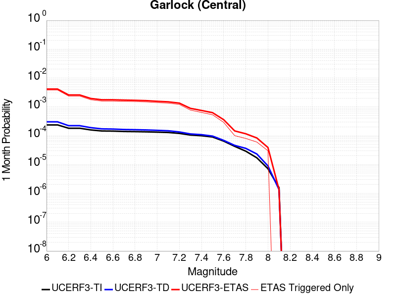 |  |  |

| Magnitude | 1 wk TI Prob | 1 wk TD Prob | 1 wk ETAS Prob | 1 wk ETAS/TD Gain | 1 wk ETAS Triggered Only | 1 mo TI Prob | 1 mo TD Prob | 1 mo ETAS Prob | 1 mo ETAS/TD Gain | 1 mo ETAS Triggered Only | 1 yr TI Prob | 1 yr TD Prob | 1 yr ETAS Prob | 1 yr ETAS/TD Gain | 1 yr ETAS Triggered Only | 10 yr TI Prob | 10 yr TD Prob | 10 yr ETAS Prob | 10 yr ETAS/TD Gain | 10 yr ETAS Triggered Only |
|-----|-----|-----|-----|-----|-----|-----|-----|-----|-----|-----|-----|-----|-----|-----|-----|-----|-----|-----|-----|-----|
| 6.0 | 5.5131142E-5 | 7.030957E-5 | 7.428326E-4 | 10.56517 | 6.725703E-4 | 2.3625491E-4 | 3.012923E-4 | 0.0036631308 | 12.158063 | 0.0033628517 | 0.0028726095 | 0.0036621294 | 0.023653664 | 6.4589915 | 0.020065015 | 0.028357591 | 0.036111314 | 0.07900603 | 2.1878471 | 0.044501737 |
| 6.1 | 5.5131142E-5 | 7.030957E-5 | 7.428326E-4 | 10.56517 | 6.725703E-4 | 2.3625491E-4 | 3.012923E-4 | 0.0036631308 | 12.158063 | 0.0033628517 | 0.0028726095 | 0.0036621294 | 0.023653664 | 6.4589915 | 0.020065015 | 0.028357591 | 0.036111314 | 0.07900603 | 2.1878471 | 0.044501737 |
| 6.2 | 4.216245E-5 | 5.1718438E-5 | 5.0007546E-4 | 9.669191 | 4.4838022E-4 | 1.806837E-4 | 2.216318E-4 | 0.001902685 | 8.584891 | 0.0016814258 | 0.0021976046 | 0.0026950599 | 0.014209734 | 5.2725115 | 0.011545791 | 0.021759989 | 0.026718695 | 0.0524663 | 1.9636551 | 0.026454434 |
| 6.3 | 4.216245E-5 | 5.1718438E-5 | 5.0007546E-4 | 9.669191 | 4.4838022E-4 | 1.806837E-4 | 2.216318E-4 | 0.001902685 | 8.584891 | 0.0016814258 | 0.0021976046 | 0.0026950599 | 0.014209734 | 5.2725115 | 0.011545791 | 0.021759989 | 0.026718695 | 0.0524663 | 1.9636551 | 0.026454434 |
| 6.4 | 3.6858168E-5 | 4.416524E-5 | 4.9252564E-4 | 11.151885 | 4.4838022E-4 | 1.5795401E-4 | 1.8926601E-4 | 0.0014220782 | 7.5136485 | 0.0012330456 | 0.0019213937 | 0.0023019037 | 0.011025191 | 4.7895975 | 0.008743415 | 0.019048655 | 0.022876801 | 0.043139976 | 1.8857522 | 0.020737585 |
| 6.5 | 3.39199E-5 | 4.00718E-5 | 4.8843405E-4 | 12.1889715 | 4.4838022E-4 | 1.453629E-4 | 1.7172511E-4 | 0.0012924832 | 7.526466 | 0.0011209506 | 0.0017683565 | 0.0020887703 | 0.010142757 | 4.8558507 | 0.008070844 | 0.017543508 | 0.02078729 | 0.039227795 | 1.8871047 | 0.01883197 |
| 6.6 | 3.3571985E-5 | 3.9525858E-5 | 4.8788835E-4 | 12.343524 | 4.4838022E-4 | 1.4387199E-4 | 1.6938566E-4 | 0.0012901464 | 7.616621 | 0.0011209506 | 0.0017502342 | 0.0020603414 | 0.010114557 | 4.9091654 | 0.008070844 | 0.017365133 | 0.020508545 | 0.0389543 | 1.899418 | 0.01883197 |
| 6.7 | 3.2580007E-5 | 3.8141945E-5 | 4.8650507E-4 | 12.755119 | 4.4838022E-4 | 1.3962112E-4 | 1.6345536E-4 | 0.0012842227 | 7.856718 | 0.0011209506 | 0.0016985617 | 0.001988274 | 0.00948371 | 4.76982 | 0.0075103687 | 0.016856372 | 0.019801024 | 0.03749097 | 1.8933855 | 0.018047305 |
| 6.8 | 3.2185937E-5 | 3.756897E-5 | 4.8593237E-4 | 12.934406 | 4.4838022E-4 | 1.3793244E-4 | 1.6100006E-4 | 0.0012817702 | 7.9613023 | 0.0011209506 | 0.0016780337 | 0.001958435 | 0.0091184685 | 4.6559978 | 0.0071740835 | 0.016654192 | 0.019507734 | 0.03643362 | 1.8676499 | 0.01726264 |
| 6.9 | 3.165394E-5 | 3.6773246E-5 | 3.7304606E-4 | 10.144496 | 3.3628516E-4 | 1.3565269E-4 | 1.5759023E-4 | 0.0011662868 | 7.4007554 | 0.0010088555 | 0.0016503202 | 0.001916994 | 0.008853565 | 4.618462 | 0.0069498937 | 0.01638118 | 0.01910022 | 0.03548337 | 1.8577465 | 0.016702164 |
| 7.0 | 3.0903822E-5 | 3.5678135E-5 | 3.7195132E-4 | 10.425189 | 3.3628516E-4 | 1.3243823E-4 | 1.5289745E-4 | 0.0011615987 | 7.5972404 | 0.0010088555 | 0.0016112428 | 0.0018599583 | 0.008796926 | 4.7296357 | 0.0069498937 | 0.015996104 | 0.018539215 | 0.03427163 | 1.8486022 | 0.016029593 |
| 7.1 | 3.0069863E-5 | 3.4444005E-5 | 2.586264E-4 | 7.508604 | 2.2419011E-4 | 1.2886449E-4 | 1.4760894E-4 | 0.001044237 | 7.0743484 | 8.9676044E-4 | 0.0015677959 | 0.0017956785 | 0.008621198 | 4.801081 | 0.0068377983 | 0.01556781 | 0.017906671 | 0.033208877 | 1.8545532 | 0.015581213 |
| 7.2 | 2.7957109E-5 | 3.1332263E-5 | 2.5551536E-4 | 8.155024 | 2.2419011E-4 | 1.1981068E-4 | 1.3427433E-4 | 9.1883435E-4 | 6.8429637 | 7.846654E-4 | 0.0014577188 | 0.0016335837 | 0.0074530044 | 4.562365 | 0.005828943 | 0.014481937 | 0.016309762 | 0.029872581 | 1.8315766 | 0.013787692 |
| 7.3 | 2.4519275E-5 | 2.6762631E-5 | 2.5094673E-4 | 9.37676 | 2.2419011E-4 | 1.0507837E-4 | 1.14692026E-4 | 4.5093862E-4 | 3.9317348 | 3.3628516E-4 | 0.0012785783 | 0.0013954957 | 0.0050894707 | 3.64707 | 0.003699137 | 0.012712469 | 0.013952656 | 0.023237262 | 1.6654365 | 0.009415985 |
| 7.4 | 2.3225532E-5 | 2.5246292E-5 | 2.4943074E-4 | 9.879896 | 2.2419011E-4 | 9.95342E-5 | 1.08193984E-4 | 3.3235984E-4 | 3.0718882 | 2.2419011E-4 | 0.0012111551 | 0.0013164802 | 0.004339062 | 3.295957 | 0.0030265665 | 0.012045753 | 0.013169862 | 0.021466272 | 1.6299541 | 0.008407129 |
| 7.5 | 2.097765E-5 | 2.2528295E-5 | 2.4671335E-4 | 10.951267 | 2.2419011E-4 | 8.9901114E-5 | 9.6546326E-5 | 3.2071478E-4 | 3.3218746 | 2.2419011E-4 | 0.0010939965 | 0.0011748294 | 0.0039739134 | 3.382545 | 0.0028023764 | 0.010886264 | 0.011763361 | 0.018853053 | 1.6026927 | 0.0071740835 |
| 7.6 | 1.511254E-5 | 1.603285E-5 | 1.281261E-4 | 7.991474 | 1.12095055E-4 | 6.476642E-5 | 6.8710455E-5 | 1.8079781E-4 | 2.6313 | 1.12095055E-4 | 7.882459E-4 | 8.362365E-4 | 0.0022922535 | 2.7411547 | 0.0014572358 | 0.007854558 | 0.008405034 | 0.012517692 | 1.4893087 | 0.004147517 |
| 7.7 | 9.934069E-6 | 1.0717446E-5 | 1.0717446E-5 | 1.0 | 0.0 | 4.2573887E-5 | 4.5931105E-5 | 4.5931105E-5 | 1.0 | 0.0 | 5.182138E-4 | 5.590681E-4 | 7.8313285E-4 | 1.4007826 | 2.2419011E-4 | 0.00517007 | 0.005647734 | 0.0064279675 | 1.1381499 | 7.846654E-4 |
| 7.8 | 6.7562896E-6 | 8.460225E-6 | 8.460225E-6 | 1.0 | 0.0 | 2.8955206E-5 | 3.6257603E-5 | 3.6257603E-5 | 1.0 | 0.0 | 3.5247262E-4 | 4.4134707E-4 | 5.533927E-4 | 1.2538718 | 1.12095055E-4 | 0.0035191406 | 0.0044631446 | 0.0049095238 | 1.1000144 | 4.4838022E-4 |
| 7.9 | 3.975453E-6 | 5.390275E-6 | 5.390275E-6 | 1.0 | 0.0 | 1.7037546E-5 | 2.3100974E-5 | 2.3100974E-5 | 1.0 | 0.0 | 2.0741238E-4 | 2.8121815E-4 | 3.932817E-4 | 1.3984933 | 1.12095055E-4 | 0.002072189 | 0.002843625 | 0.0032907303 | 1.1572307 | 4.4838022E-4 |
| 8.0 | 1.6729537E-6 | 2.0839254E-6 | 2.0839254E-6 | 1.0 | 0.0 | 7.169782E-6 | 8.931079E-6 | 8.931079E-6 | 1.0 | 0.0 | 8.7288594E-5 | 1.0873049E-4 | 1.0873049E-4 | 1.0 | 0.0 | 8.7254314E-4 | 0.0011002679 | 0.0012122396 | 1.1017677 | 1.12095055E-4 |
| 8.1 | 3.6733252E-7 | 3.1582263E-7 | 3.1582263E-7 | 1.0 | 0.0 | 1.5742813E-6 | 1.3535249E-6 | 1.3535249E-6 | 1.0 | 0.0 | 1.9166706E-5 | 1.6479058E-5 | 1.6479058E-5 | 1.0 | 0.0 | 1.9165053E-4 | 1.6687137E-4 | 1.6687137E-4 | 1.0 | 0.0 |

## Tank Canyon
*[(top)](#table-of-contents)*

| 1 Week | 1 Month | 1 Year | 10 Year |
|-----|-----|-----|-----|
|  |  |  |  |

| Magnitude | 1 wk TI Prob | 1 wk TD Prob | 1 wk ETAS Prob | 1 wk ETAS/TD Gain | 1 wk ETAS Triggered Only | 1 mo TI Prob | 1 mo TD Prob | 1 mo ETAS Prob | 1 mo ETAS/TD Gain | 1 mo ETAS Triggered Only | 1 yr TI Prob | 1 yr TD Prob | 1 yr ETAS Prob | 1 yr ETAS/TD Gain | 1 yr ETAS Triggered Only | 10 yr TI Prob | 10 yr TD Prob | 10 yr ETAS Prob | 10 yr ETAS/TD Gain | 10 yr ETAS Triggered Only |
|-----|-----|-----|-----|-----|-----|-----|-----|-----|-----|-----|-----|-----|-----|-----|-----|-----|-----|-----|-----|-----|
| 6.0 | 4.8284557E-5 | 5.7980193E-5 | 9.5468864E-4 | 16.465773 | 8.9676044E-4 | 2.0691741E-4 | 2.4846673E-4 | 0.0030501469 | 12.275877 | 0.0028023764 | 0.0025163088 | 0.003021537 | 0.017438106 | 5.7712703 | 0.014460262 | 0.02488006 | 0.029871376 | 0.06488779 | 2.1722398 | 0.03609461 |
| 6.1 | 1.7796336E-5 | 2.0877918E-5 | 4.6924877E-4 | 22.475842 | 4.4838022E-4 | 7.626778E-5 | 8.947394E-5 | 8.740691E-4 | 9.768979 | 7.846654E-4 | 9.281647E-4 | 0.001088837 | 0.0056797303 | 5.2163267 | 0.004595897 | 0.009242975 | 0.010839115 | 0.02336856 | 2.1559472 | 0.012666741 |
| 6.2 | 1.7796336E-5 | 2.0877918E-5 | 4.6924877E-4 | 22.475842 | 4.4838022E-4 | 7.626778E-5 | 8.947394E-5 | 8.740691E-4 | 9.768979 | 7.846654E-4 | 9.281647E-4 | 0.001088837 | 0.0056797303 | 5.2163267 | 0.004595897 | 0.009242975 | 0.010839115 | 0.02336856 | 2.1559472 | 0.012666741 |
| 6.3 | 1.3515912E-5 | 1.5762842E-5 | 3.520427E-4 | 22.333708 | 3.3628516E-4 | 5.792405E-5 | 6.7553425E-5 | 6.2799087E-4 | 9.29621 | 5.604753E-4 | 7.049971E-4 | 8.221765E-4 | 0.0049662837 | 6.0404105 | 0.004147517 | 0.007027647 | 0.008193959 | 0.018533379 | 2.2618344 | 0.01042484 |
| 6.4 | 1.0870146E-5 | 1.2620516E-5 | 2.368078E-4 | 18.763718 | 2.2419011E-4 | 4.658551E-5 | 5.4086904E-5 | 5.024429E-4 | 9.289548 | 4.4838022E-4 | 5.67031E-4 | 6.58327E-4 | 0.0042430074 | 6.4451365 | 0.0035870417 | 0.005655863 | 0.006565783 | 0.015140431 | 2.3059597 | 0.00863132 |
| 6.5 | 7.964826E-6 | 9.197785E-6 | 1.21291814E-4 | 13.187066 | 1.12095055E-4 | 3.4134522E-5 | 3.9418548E-5 | 3.7569046E-4 | 9.530805 | 3.3628516E-4 | 4.1550855E-4 | 4.798258E-4 | 0.0028326926 | 5.9035854 | 0.0023539963 | 0.0041473247 | 0.0047891987 | 0.010478668 | 2.1879792 | 0.0057168477 |
| 6.6 | 6.6317E-6 | 7.6136125E-6 | 1.19707816E-4 | 15.722866 | 1.12095055E-4 | 2.8421264E-5 | 3.2629414E-5 | 3.689036E-4 | 11.305861 | 3.3628516E-4 | 3.4597394E-4 | 3.971998E-4 | 0.002302059 | 5.79572 | 0.0019056159 | 0.0034543579 | 0.00396605 | 0.00865537 | 2.1823652 | 0.0047079925 |
| 6.7 | 4.793663E-6 | 5.4315906E-6 | 1.1752604E-4 | 21.6375 | 1.12095055E-4 | 2.0544108E-5 | 2.3278062E-5 | 3.5955542E-4 | 15.446106 | 3.3628516E-4 | 2.500958E-4 | 2.833779E-4 | 0.001852264 | 6.5363736 | 0.0015693308 | 0.0024981452 | 0.002830858 | 0.006295968 | 2.224049 | 0.0034749468 |
| 6.8 | 4.382823E-6 | 4.9699643E-6 | 1.1706446E-4 | 23.554388 | 1.12095055E-4 | 1.8783392E-5 | 2.1299697E-5 | 3.575777E-4 | 16.787926 | 3.3628516E-4 | 2.286638E-4 | 2.5929723E-4 | 0.0018282211 | 7.050678 | 0.0015693308 | 0.0022842865 | 0.0025906207 | 0.0059447605 | 2.2947245 | 0.0033628517 |
| 6.9 | 2.729601E-6 | 3.0739357E-6 | 3.0739357E-6 | 1.0 | 0.0 | 1.1698237E-5 | 1.317395E-5 | 1.2526753E-4 | 9.50873 | 1.12095055E-4 | 1.4241673E-4 | 1.6038226E-4 | 0.001169076 | 7.2893095 | 0.0010088555 | 0.001423255 | 0.001602831 | 0.0037292233 | 2.326648 | 0.002129806 |
| 7.0 | 1.8987357E-6 | 2.1272067E-6 | 2.1272067E-6 | 1.0 | 0.0 | 8.137413E-6 | 9.116572E-6 | 9.116572E-6 | 1.0 | 0.0 | 9.90685E-5 | 1.1098931E-4 | 4.4723717E-4 | 4.0295515 | 3.3628516E-4 | 9.902435E-4 | 0.0011094075 | 0.0022291145 | 2.0092838 | 0.0011209506 |
| 7.1 | 1.4928986E-6 | 1.664348E-6 | 1.664348E-6 | 1.0 | 0.0 | 6.398121E-6 | 7.1329036E-6 | 7.1329036E-6 | 1.0 | 0.0 | 7.789434E-5 | 8.6840235E-5 | 4.230962E-4 | 4.872122 | 3.3628516E-4 | 7.786704E-4 | 8.681209E-4 | 0.0015401073 | 1.7740701 | 6.725703E-4 |
| 7.2 | 1.069082E-6 | 1.1830405E-6 | 1.1830405E-6 | 1.0 | 0.0 | 4.581772E-6 | 5.0701665E-6 | 5.0701665E-6 | 1.0 | 0.0 | 5.5781646E-5 | 6.172806E-5 | 1.738162E-4 | 2.8158376 | 1.12095055E-4 | 5.576765E-4 | 6.1716145E-4 | 8.412132E-4 | 1.3630359 | 2.2419011E-4 |
| 7.3 | 8.776551E-7 | 9.77166E-7 | 9.77166E-7 | 1.0 | 0.0 | 3.7613736E-6 | 4.18785E-6 | 4.18785E-6 | 1.0 | 0.0 | 4.579376E-5 | 5.0986404E-5 | 1.6307575E-4 | 3.1984162 | 1.12095055E-4 | 4.5784327E-4 | 5.0979806E-4 | 7.338739E-4 | 1.4395384 | 2.2419011E-4 |
| 7.4 | 7.55721E-7 | 8.510639E-7 | 8.510639E-7 | 1.0 | 0.0 | 3.2388E-6 | 3.6474144E-6 | 3.6474144E-6 | 1.0 | 0.0 | 3.9431678E-5 | 4.4406883E-5 | 4.4406883E-5 | 1.0 | 0.0 | 3.942468E-4 | 4.4403094E-4 | 5.5607624E-4 | 1.2523366 | 1.12095055E-4 |
| 7.5 | 5.587665E-7 | 6.305905E-7 | 6.305905E-7 | 1.0 | 0.0 | 2.3947114E-6 | 2.7025305E-6 | 2.7025305E-6 | 1.0 | 0.0 | 2.915522E-5 | 3.290331E-5 | 3.290331E-5 | 1.0 | 0.0 | 2.9151395E-4 | 3.290331E-4 | 4.4109128E-4 | 1.3405681 | 1.12095055E-4 |

## Little Lake
*[(top)](#table-of-contents)*

| 1 Week | 1 Month | 1 Year | 10 Year |
|-----|-----|-----|-----|
|  | 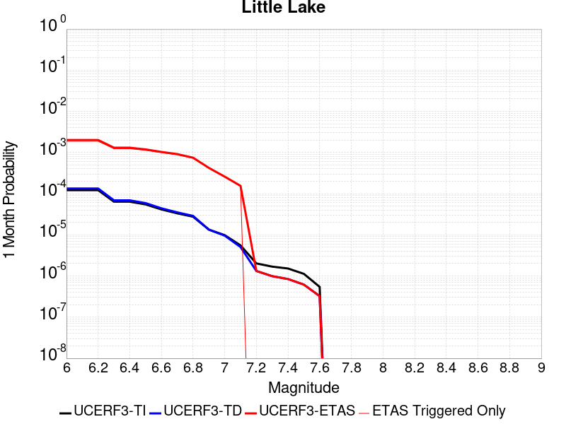 |  |  |

| Magnitude | 1 wk TI Prob | 1 wk TD Prob | 1 wk ETAS Prob | 1 wk ETAS/TD Gain | 1 wk ETAS Triggered Only | 1 mo TI Prob | 1 mo TD Prob | 1 mo ETAS Prob | 1 mo ETAS/TD Gain | 1 mo ETAS Triggered Only | 1 yr TI Prob | 1 yr TD Prob | 1 yr ETAS Prob | 1 yr ETAS/TD Gain | 1 yr ETAS Triggered Only | 10 yr TI Prob | 10 yr TD Prob | 10 yr ETAS Prob | 10 yr ETAS/TD Gain | 10 yr ETAS Triggered Only |
|-----|-----|-----|-----|-----|-----|-----|-----|-----|-----|-----|-----|-----|-----|-----|-----|-----|-----|-----|-----|-----|
| 6.0 | 2.8424427E-5 | 3.121011E-5 | 4.7957635E-4 | 15.366056 | 4.4838022E-4 | 1.2181328E-4 | 1.3375151E-4 | 0.0020391126 | 15.245529 | 0.0019056159 | 0.0014820677 | 0.0016273415 | 0.012482868 | 7.6707115 | 0.010873221 | 0.014722223 | 0.01616766 | 0.037341945 | 2.3096693 | 0.02152225 |
| 6.1 | 2.8424427E-5 | 3.121011E-5 | 4.7957635E-4 | 15.366056 | 4.4838022E-4 | 1.2181328E-4 | 1.3375151E-4 | 0.0020391126 | 15.245529 | 0.0019056159 | 0.0014820677 | 0.0016273415 | 0.012482868 | 7.6707115 | 0.010873221 | 0.014722223 | 0.01616766 | 0.037341945 | 2.3096693 | 0.02152225 |
| 6.2 | 2.8424427E-5 | 3.121011E-5 | 4.7957635E-4 | 15.366056 | 4.4838022E-4 | 1.2181328E-4 | 1.3375151E-4 | 0.0020391126 | 15.245529 | 0.0019056159 | 0.0014820677 | 0.0016273415 | 0.012482868 | 7.6707115 | 0.010873221 | 0.014722223 | 0.01616766 | 0.037341945 | 2.3096693 | 0.02152225 |
| 6.3 | 1.48860645E-5 | 1.608343E-5 | 2.4026993E-4 | 14.938974 | 2.2419011E-4 | 6.379586E-5 | 6.892732E-5 | 0.0010777133 | 15.635503 | 0.0010088555 | 7.7643775E-4 | 8.388952E-4 | 0.008342964 | 9.94518 | 0.0075103687 | 0.007737305 | 0.008360104 | 0.02258832 | 2.7019184 | 0.014348167 |
| 6.4 | 1.48860645E-5 | 1.608343E-5 | 2.4026993E-4 | 14.938974 | 2.2419011E-4 | 6.379586E-5 | 6.892732E-5 | 0.0010777133 | 15.635503 | 0.0010088555 | 7.7643775E-4 | 8.388952E-4 | 0.008342964 | 9.94518 | 0.0075103687 | 0.007737305 | 0.008360104 | 0.02258832 | 2.7019184 | 0.014348167 |
| 6.5 | 1.2797581E-5 | 1.37672705E-5 | 2.379543E-4 | 17.284058 | 2.2419011E-4 | 5.4845623E-5 | 5.9001395E-5 | 0.0010677974 | 18.097832 | 0.0010088555 | 6.675408E-4 | 7.1813096E-4 | 0.0074390043 | 10.358841 | 0.0067257034 | 0.006655392 | 0.0071606543 | 0.019959278 | 2.787354 | 0.012890931 |
| 6.6 | 9.661896E-6 | 1.0290241E-5 | 1.2238414E-4 | 11.893224 | 1.12095055E-4 | 4.1407468E-5 | 4.4100383E-5 | 8.2873116E-4 | 18.791927 | 7.846654E-4 | 5.040193E-4 | 5.368061E-4 | 0.00613855 | 11.435321 | 0.005604753 | 0.005028777 | 0.0053566997 | 0.016394665 | 3.0605905 | 0.011097411 |
| 6.7 | 7.767871E-6 | 8.2006045E-6 | 1.2029474E-4 | 14.669009 | 1.12095055E-4 | 3.329045E-5 | 3.514505E-5 | 7.0769177E-4 | 20.136312 | 6.725703E-4 | 4.0523586E-4 | 4.2782072E-4 | 0.005245846 | 12.2617855 | 0.0048200875 | 0.004044977 | 0.0042713233 | 0.014205171 | 3.3257072 | 0.00997646 |
| 6.8 | 6.4235196E-6 | 6.7364886E-6 | 1.1883079E-4 | 17.63987 | 1.12095055E-4 | 2.752908E-5 | 2.887042E-5 | 5.893295E-4 | 20.412918 | 5.604753E-4 | 3.35115E-4 | 3.514535E-4 | 0.0043854574 | 12.478059 | 0.004035422 | 0.003346101 | 0.0035102374 | 0.011217646 | 3.1956944 | 0.007734559 |
| 6.9 | 3.1283696E-6 | 3.1124437E-6 | 1.1520715E-4 | 37.015015 | 1.12095055E-4 | 1.3407229E-5 | 1.3338985E-5 | 4.6171324E-4 | 34.61382 | 4.4838022E-4 | 1.6322079E-4 | 1.6239155E-4 | 0.002852236 | 17.563944 | 0.0026902813 | 0.0016310095 | 0.0016228772 | 0.006547055 | 4.0342274 | 0.0049321824 |
| 7.0 | 2.290603E-6 | 2.228881E-6 | 1.1432369E-4 | 51.29197 | 1.12095055E-4 | 9.816834E-6 | 9.552317E-6 | 4.5792825E-4 | 47.93897 | 4.4838022E-4 | 1.19513395E-4 | 1.162943E-4 | 0.0020216887 | 17.384245 | 0.0019056159 | 0.0011944914 | 0.0011624366 | 0.0041854847 | 3.6006136 | 0.0030265665 |
| 7.1 | 1.293693E-6 | 1.1778063E-6 | 1.13272734E-4 | 96.17262 | 1.12095055E-4 | 5.5443866E-6 | 5.0477356E-6 | 2.2923671E-4 | 45.413773 | 2.2419011E-4 | 6.750081E-5 | 6.1455146E-5 | 9.581605E-4 | 15.591216 | 8.9676044E-4 | 6.7480316E-4 | 6.1445E-4 | 0.0021828166 | 3.552472 | 0.0015693308 |
| 7.2 | 4.715842E-7 | 3.0923712E-7 | 3.0923712E-7 | 1.0 | 0.0 | 2.0210737E-6 | 1.3253012E-6 | 1.3253012E-6 | 1.0 | 0.0 | 2.4606294E-5 | 1.613543E-5 | 1.2822868E-4 | 7.9470263 | 1.12095055E-4 | 2.460357E-4 | 1.6134311E-4 | 2.734201E-4 | 1.6946498 | 1.12095055E-4 |
| 7.3 | 3.9430947E-7 | 2.3102866E-7 | 2.3102866E-7 | 1.0 | 0.0 | 1.6898966E-6 | 9.901224E-7 | 9.901224E-7 | 1.0 | 0.0 | 2.0574296E-5 | 1.2054675E-5 | 1.2054675E-5 | 1.0 | 0.0 | 2.0572392E-4 | 1.2054028E-4 | 1.2054028E-4 | 1.0 | 0.0 |
| 7.4 | 3.547123E-7 | 1.968413E-7 | 1.968413E-7 | 1.0 | 0.0 | 1.5201948E-6 | 8.436053E-7 | 8.436053E-7 | 1.0 | 0.0 | 1.8508214E-5 | 1.0270846E-5 | 1.0270846E-5 | 1.0 | 0.0 | 1.8506673E-4 | 1.0270378E-4 | 1.0270378E-4 | 1.0 | 0.0 |
| 7.5 | 2.6354266E-7 | 1.4426631E-7 | 1.4426631E-7 | 1.0 | 0.0 | 1.129468E-6 | 6.1828405E-7 | 6.1828405E-7 | 1.0 | 0.0 | 1.3751187E-5 | 7.527583E-6 | 7.527583E-6 | 1.0 | 0.0 | 1.3750336E-4 | 7.527333E-5 | 7.527333E-5 | 1.0 | 0.0 |
| 7.6 | 1.269913E-7 | 7.574039E-8 | 7.574039E-8 | 1.0 | 0.0 | 5.4424834E-7 | 3.2460161E-7 | 3.2460161E-7 | 1.0 | 0.0 | 6.6262032E-6 | 3.952018E-6 | 3.952018E-6 | 1.0 | 0.0 | 6.626006E-5 | 3.9519513E-5 | 3.9519513E-5 | 1.0 | 0.0 |

## Airport Lake
*[(top)](#table-of-contents)*

| 1 Week | 1 Month | 1 Year | 10 Year |
|-----|-----|-----|-----|
|  |  |  |  |

| Magnitude | 1 wk TI Prob | 1 wk TD Prob | 1 wk ETAS Prob | 1 wk ETAS/TD Gain | 1 wk ETAS Triggered Only | 1 mo TI Prob | 1 mo TD Prob | 1 mo ETAS Prob | 1 mo ETAS/TD Gain | 1 mo ETAS Triggered Only | 1 yr TI Prob | 1 yr TD Prob | 1 yr ETAS Prob | 1 yr ETAS/TD Gain | 1 yr ETAS Triggered Only | 10 yr TI Prob | 10 yr TD Prob | 10 yr ETAS Prob | 10 yr ETAS/TD Gain | 10 yr ETAS Triggered Only |
|-----|-----|-----|-----|-----|-----|-----|-----|-----|-----|-----|-----|-----|-----|-----|-----|-----|-----|-----|-----|-----|
| 6.0 | 1.2387061E-5 | 1.31041625E-5 | 2.3729134E-4 | 18.10809 | 2.2419011E-4 | 5.3086325E-5 | 5.6159646E-5 | 9.528697E-4 | 16.967161 | 8.9676044E-4 | 6.461343E-4 | 6.835576E-4 | 0.007852737 | 11.488041 | 0.0071740835 | 0.0064425888 | 0.006817361 | 0.02351699 | 3.449574 | 0.016814258 |
| 6.1 | 1.2387061E-5 | 1.31041625E-5 | 2.3729134E-4 | 18.10809 | 2.2419011E-4 | 5.3086325E-5 | 5.6159646E-5 | 9.528697E-4 | 16.967161 | 8.9676044E-4 | 6.461343E-4 | 6.835576E-4 | 0.007852737 | 11.488041 | 0.0071740835 | 0.0064425888 | 0.006817361 | 0.02351699 | 3.449574 | 0.016814258 |
| 6.2 | 1.2387061E-5 | 1.31041625E-5 | 2.3729134E-4 | 18.10809 | 2.2419011E-4 | 5.3086325E-5 | 5.6159646E-5 | 9.528697E-4 | 16.967161 | 8.9676044E-4 | 6.461343E-4 | 6.835576E-4 | 0.007852737 | 11.488041 | 0.0071740835 | 0.0064425888 | 0.006817361 | 0.02351699 | 3.449574 | 0.016814258 |
| 6.3 | 1.2387061E-5 | 1.31041625E-5 | 2.3729134E-4 | 18.10809 | 2.2419011E-4 | 5.3086325E-5 | 5.6159646E-5 | 9.528697E-4 | 16.967161 | 8.9676044E-4 | 6.461343E-4 | 6.835576E-4 | 0.007852737 | 11.488041 | 0.0071740835 | 0.0064425888 | 0.006817361 | 0.02351699 | 3.449574 | 0.016814258 |
| 6.4 | 1.2387061E-5 | 1.31041625E-5 | 2.3729134E-4 | 18.10809 | 2.2419011E-4 | 5.3086325E-5 | 5.6159646E-5 | 9.528697E-4 | 16.967161 | 8.9676044E-4 | 6.461343E-4 | 6.835576E-4 | 0.007852737 | 11.488041 | 0.0071740835 | 0.0064425888 | 0.006817361 | 0.02351699 | 3.449574 | 0.016814258 |
| 6.5 | 6.9922594E-6 | 7.3854753E-6 | 2.3157393E-4 | 31.355318 | 2.2419011E-4 | 2.996648E-5 | 3.1651685E-5 | 9.283837E-4 | 29.331259 | 8.9676044E-4 | 3.6478083E-4 | 3.8529653E-4 | 0.0063240454 | 16.41345 | 0.005941038 | 0.003641826 | 0.0038468228 | 0.015906518 | 4.1349754 | 0.012106266 |
| 6.6 | 6.9922594E-6 | 7.3854753E-6 | 2.3157393E-4 | 31.355318 | 2.2419011E-4 | 2.996648E-5 | 3.1651685E-5 | 9.283837E-4 | 29.331259 | 8.9676044E-4 | 3.6478083E-4 | 3.8529653E-4 | 0.0063240454 | 16.41345 | 0.005941038 | 0.003641826 | 0.0038468228 | 0.015906518 | 4.1349754 | 0.012106266 |
| 6.7 | 5.477277E-6 | 5.7865013E-6 | 2.2997531E-4 | 39.743416 | 2.2419011E-4 | 2.3473833E-5 | 2.4799077E-5 | 8.09445E-4 | 32.640125 | 7.846654E-4 | 2.8575645E-4 | 3.0189083E-4 | 0.00579289 | 19.188694 | 0.005492658 | 0.0028538927 | 0.003015191 | 0.0140791405 | 4.6694026 | 0.011097411 |
| 6.8 | 3.9950432E-6 | 4.219401E-6 | 1.1631398E-4 | 27.56647 | 1.12095055E-4 | 1.7121502E-5 | 1.8083038E-5 | 5.785482E-4 | 31.993973 | 5.604753E-4 | 2.0843433E-4 | 2.2014149E-4 | 0.0040305345 | 18.308836 | 0.0038112318 | 0.0020823893 | 0.0021995052 | 0.010252598 | 4.6613197 | 0.008070844 |
| 6.9 | 2.95695E-6 | 3.1232569E-6 | 1.1521796E-4 | 36.890324 | 1.12095055E-4 | 1.2672582E-5 | 1.3385331E-5 | 5.738531E-4 | 42.87179 | 5.604753E-4 | 1.5427776E-4 | 1.6295648E-4 | 0.003076953 | 18.882053 | 0.0029144716 | 0.001541707 | 0.0016285924 | 0.0075599547 | 4.642018 | 0.005941038 |
| 7.0 | 1.456072E-6 | 1.540931E-6 | 1.1363581E-4 | 73.74491 | 1.12095055E-4 | 6.2402937E-6 | 6.603979E-6 | 4.5498126E-4 | 68.89502 | 4.4838022E-4 | 7.597293E-5 | 8.0401485E-5 | 0.0018737782 | 23.30527 | 0.0017935209 | 7.594696E-4 | 8.038228E-4 | 0.0036039467 | 4.4835086 | 0.0028023764 |
| 7.1 | 6.995192E-7 | 7.4095556E-7 | 1.1283593E-4 | 152.28433 | 1.12095055E-4 | 2.997936E-6 | 3.175524E-6 | 2.2736493E-4 | 71.59919 | 2.2419011E-4 | 3.649926E-5 | 3.8662E-5 | 8.232971E-4 | 21.294733 | 7.846654E-4 | 3.6493264E-4 | 3.8662003E-4 | 0.0017312407 | 4.4778867 | 0.0013451406 |

## Owl Lake
*[(top)](#table-of-contents)*

| 1 Week | 1 Month | 1 Year | 10 Year |
|-----|-----|-----|-----|
|  |  |  |  |

| Magnitude | 1 wk TI Prob | 1 wk TD Prob | 1 wk ETAS Prob | 1 wk ETAS/TD Gain | 1 wk ETAS Triggered Only | 1 mo TI Prob | 1 mo TD Prob | 1 mo ETAS Prob | 1 mo ETAS/TD Gain | 1 mo ETAS Triggered Only | 1 yr TI Prob | 1 yr TD Prob | 1 yr ETAS Prob | 1 yr ETAS/TD Gain | 1 yr ETAS Triggered Only | 10 yr TI Prob | 10 yr TD Prob | 10 yr ETAS Prob | 10 yr ETAS/TD Gain | 10 yr ETAS Triggered Only |
|-----|-----|-----|-----|-----|-----|-----|-----|-----|-----|-----|-----|-----|-----|-----|-----|-----|-----|-----|-----|-----|
| 6.0 | 5.0320643E-5 | 6.639169E-5 | 4.0265452E-4 | 6.064833 | 3.3628516E-4 | 2.1564208E-4 | 2.8451107E-4 | 0.0014051427 | 4.938798 | 0.0011209506 | 0.0026222812 | 0.0034594585 | 0.009044822 | 2.6145196 | 0.005604753 | 0.02591553 | 0.034156606 | 0.046607226 | 1.3645158 | 0.012890931 |
| 6.1 | 5.0320643E-5 | 6.639169E-5 | 4.0265452E-4 | 6.064833 | 3.3628516E-4 | 2.1564208E-4 | 2.8451107E-4 | 0.0014051427 | 4.938798 | 0.0011209506 | 0.0026222812 | 0.0034594585 | 0.009044822 | 2.6145196 | 0.005604753 | 0.02591553 | 0.034156606 | 0.046607226 | 1.3645158 | 0.012890931 |
| 6.2 | 2.4125871E-5 | 3.099773E-5 | 2.551809E-4 | 8.2322445 | 2.2419011E-4 | 1.0339249E-4 | 1.3284181E-4 | 9.1740297E-4 | 6.90598 | 7.846654E-4 | 0.0012580766 | 0.0016162846 | 0.005869012 | 3.6311748 | 0.004259612 | 0.012509781 | 0.016078865 | 0.025674328 | 1.596775 | 0.00975227 |
| 6.3 | 1.7433485E-5 | 2.2368875E-5 | 2.4655397E-4 | 11.022189 | 2.2419011E-4 | 7.471279E-5 | 9.586398E-5 | 8.8045414E-4 | 9.184411 | 7.846654E-4 | 9.0924866E-4 | 0.0011666653 | 0.005309344 | 4.5508714 | 0.004147517 | 0.009055373 | 0.011635699 | 0.020609751 | 1.7712516 | 0.009079699 |
| 6.4 | 1.7433485E-5 | 2.2368875E-5 | 2.4655397E-4 | 11.022189 | 2.2419011E-4 | 7.471279E-5 | 9.586398E-5 | 8.8045414E-4 | 9.184411 | 7.846654E-4 | 9.0924866E-4 | 0.0011666653 | 0.005309344 | 4.5508714 | 0.004147517 | 0.009055373 | 0.011635699 | 0.020609751 | 1.7712516 | 0.009079699 |
| 6.5 | 1.5182742E-5 | 1.9441362E-5 | 2.4362712E-4 | 12.531381 | 2.2419011E-4 | 6.506727E-5 | 8.331832E-5 | 8.6791837E-4 | 10.416897 | 7.846654E-4 | 7.919061E-4 | 0.0010140799 | 0.005157391 | 5.085784 | 0.004147517 | 0.0078909 | 0.01012468 | 0.018668609 | 1.8438717 | 0.00863132 |
| 6.6 | 6.7271576E-6 | 8.55546E-6 | 2.3274365E-4 | 27.20411 | 2.2419011E-4 | 2.8830356E-5 | 3.6665773E-5 | 8.213024E-4 | 22.399702 | 7.846654E-4 | 3.5095305E-4 | 4.4632002E-4 | 0.003919716 | 8.782299 | 0.0034749468 | 0.0035039932 | 0.0044720164 | 0.011502423 | 2.572089 | 0.0070619886 |
| 6.7 | 6.682835E-6 | 8.487893E-6 | 2.326761E-4 | 27.412704 | 2.2419011E-4 | 2.8640408E-5 | 3.637621E-5 | 8.2101306E-4 | 22.570057 | 7.846654E-4 | 3.4864116E-4 | 4.42796E-4 | 0.003916204 | 8.844262 | 0.0034749468 | 0.003480947 | 0.0044369358 | 0.011467591 | 2.5845745 | 0.0070619886 |
| 6.8 | 6.5774975E-6 | 8.334328E-6 | 2.3252258E-4 | 27.899378 | 2.2419011E-4 | 2.8188972E-5 | 3.5718094E-5 | 8.203555E-4 | 22.967505 | 7.846654E-4 | 3.4314668E-4 | 4.3478666E-4 | 0.0039082225 | 8.988828 | 0.0034749468 | 0.0034261728 | 0.0043570627 | 0.011388281 | 2.6137521 | 0.0070619886 |
| 6.9 | 6.363419E-6 | 8.007404E-6 | 2.3219573E-4 | 28.997625 | 2.2419011E-4 | 2.727151E-5 | 3.431703E-5 | 8.189555E-4 | 23.864407 | 7.846654E-4 | 3.3198006E-4 | 4.177353E-4 | 0.0038912306 | 9.3150625 | 0.0034749468 | 0.0033148455 | 0.0041870046 | 0.011219425 | 2.6795826 | 0.0070619886 |
| 7.0 | 6.1342453E-6 | 7.639479E-6 | 2.3182789E-4 | 30.346035 | 2.2419011E-4 | 2.6289357E-5 | 3.274024E-5 | 8.1738E-4 | 24.965605 | 7.846654E-4 | 3.2002592E-4 | 3.9854506E-4 | 0.0038721068 | 9.715607 | 0.0034749468 | 0.0031956544 | 0.0039956346 | 0.0110294055 | 2.760364 | 0.0070619886 |
| 7.1 | 5.842926E-6 | 7.1498466E-6 | 1.19244105E-4 | 16.677855 | 1.12095055E-4 | 2.504087E-5 | 3.064187E-5 | 7.031916E-4 | 22.948717 | 6.725703E-4 | 3.0482994E-4 | 3.7300633E-4 | 0.0037346038 | 10.012172 | 0.0033628517 | 0.0030441214 | 0.0037410015 | 0.010664895 | 2.850813 | 0.0069498937 |
| 7.2 | 4.77173E-6 | 5.3654235E-6 | 1.1745988E-4 | 21.892006 | 1.12095055E-4 | 2.045011E-5 | 2.299449E-5 | 5.834569E-4 | 25.373768 | 5.604753E-4 | 2.4895166E-4 | 2.7992603E-4 | 0.0026332634 | 9.406997 | 0.0023539963 | 0.0024867293 | 0.0028122598 | 0.007954132 | 2.828377 | 0.0051563727 |
| 7.3 | 3.0494948E-6 | 2.7156198E-6 | 1.1481037E-4 | 42.27778 | 1.12095055E-4 | 1.3069198E-5 | 1.1638319E-5 | 2.3582582E-4 | 20.262877 | 2.2419011E-4 | 1.5910587E-4 | 1.4168749E-4 | 8.1416254E-4 | 5.7461853 | 6.725703E-4 | 0.0015899199 | 0.0014259319 | 0.0032168953 | 2.255995 | 0.0017935209 |
| 7.4 | 2.7263884E-6 | 2.3105267E-6 | 1.14405324E-4 | 49.514828 | 1.12095055E-4 | 1.1684469E-5 | 9.90222E-6 | 1.2199616E-4 | 12.320083 | 1.12095055E-4 | 1.4224913E-4 | 1.2055296E-4 | 3.4471604E-4 | 2.8594573 | 2.2419011E-4 | 0.0014215811 | 0.0012137555 | 0.0023333454 | 1.9224181 | 0.0011209506 |
| 7.5 | 2.6090431E-6 | 2.1703654E-6 | 1.1426518E-4 | 52.6479 | 1.12095055E-4 | 1.1181565E-5 | 9.301533E-6 | 1.2139555E-4 | 13.051133 | 1.12095055E-4 | 1.3612706E-4 | 1.1324038E-4 | 3.374051E-4 | 2.9795477 | 2.2419011E-4 | 0.001360437 | 0.0011404612 | 0.002148166 | 1.8835943 | 0.0010088555 |
| 7.6 | 2.3008756E-6 | 1.8772391E-6 | 1.8772391E-6 | 1.0 | 0.0 | 9.860858E-6 | 8.045286E-6 | 8.045286E-6 | 1.0 | 0.0 | 1.20049335E-4 | 9.794704E-5 | 2.1003111E-4 | 2.1443336 | 1.12095055E-4 | 0.001199845 | 9.87314E-4 | 0.001547236 | 1.5671164 | 5.604753E-4 |
| 7.7 | 1.7184348E-6 | 1.3460315E-6 | 1.3460315E-6 | 1.0 | 0.0 | 7.3646997E-6 | 5.768694E-6 | 5.768694E-6 | 1.0 | 0.0 | 8.966153E-5 | 7.0231625E-5 | 7.0231625E-5 | 1.0 | 0.0 | 8.962536E-4 | 7.09986E-4 | 8.220015E-4 | 1.1577713 | 1.12095055E-4 |
| 7.8 | 8.4612907E-7 | 8.43523E-7 | 8.43523E-7 | 1.0 | 0.0 | 3.6262625E-6 | 3.6150936E-6 | 3.6150936E-6 | 1.0 | 0.0 | 4.4148852E-5 | 4.4012897E-5 | 4.4012897E-5 | 1.0 | 0.0 | 4.414008E-4 | 4.4551937E-4 | 4.4551937E-4 | 1.0 | 0.0 |
| 7.9 | 2.716738E-7 | 3.781083E-7 | 3.781083E-7 | 1.0 | 0.0 | 1.1643157E-6 | 1.6204632E-6 | 1.6204632E-6 | 1.0 | 0.0 | 1.4175452E-5 | 1.9728972E-5 | 1.9728972E-5 | 1.0 | 0.0 | 1.4174548E-4 | 1.9904342E-4 | 1.9904342E-4 | 1.0 | 0.0 |
| 8.0 | 2.1995428E-8 | 3.3962333E-8 | 3.3962333E-8 | 1.0 | 0.0 | 9.426611E-8 | 1.4555286E-7 | 1.4555286E-7 | 1.0 | 0.0 | 1.1476893E-6 | 1.7721053E-6 | 1.7721053E-6 | 1.0 | 0.0 | 1.14768345E-5 | 1.802218E-5 | 1.802218E-5 | 1.0 | 0.0 |

## Panamint Valley
*[(top)](#table-of-contents)*

| 1 Week | 1 Month | 1 Year | 10 Year |
|-----|-----|-----|-----|
|  |  |  |  |

| Magnitude | 1 wk TI Prob | 1 wk TD Prob | 1 wk ETAS Prob | 1 wk ETAS/TD Gain | 1 wk ETAS Triggered Only | 1 mo TI Prob | 1 mo TD Prob | 1 mo ETAS Prob | 1 mo ETAS/TD Gain | 1 mo ETAS Triggered Only | 1 yr TI Prob | 1 yr TD Prob | 1 yr ETAS Prob | 1 yr ETAS/TD Gain | 1 yr ETAS Triggered Only | 10 yr TI Prob | 10 yr TD Prob | 10 yr ETAS Prob | 10 yr ETAS/TD Gain | 10 yr ETAS Triggered Only |
|-----|-----|-----|-----|-----|-----|-----|-----|-----|-----|-----|-----|-----|-----|-----|-----|-----|-----|-----|-----|-----|
| 6.0 | 3.0211835E-5 | 3.3992885E-5 | 3.702666E-4 | 10.892474 | 3.3628516E-4 | 1.2947287E-4 | 1.4567582E-4 | 8.181482E-4 | 5.6162252 | 6.725703E-4 | 0.0015751923 | 0.0017721897 | 0.0063599423 | 3.588748 | 0.004595897 | 0.015640736 | 0.017587427 | 0.029370653 | 1.6699799 | 0.011994171 |
| 6.1 | 3.0211835E-5 | 3.3992885E-5 | 3.702666E-4 | 10.892474 | 3.3628516E-4 | 1.2947287E-4 | 1.4567582E-4 | 8.181482E-4 | 5.6162252 | 6.725703E-4 | 0.0015751923 | 0.0017721897 | 0.0063599423 | 3.588748 | 0.004595897 | 0.015640736 | 0.017587427 | 0.029370653 | 1.6699799 | 0.011994171 |
| 6.2 | 3.0211835E-5 | 3.3992885E-5 | 3.702666E-4 | 10.892474 | 3.3628516E-4 | 1.2947287E-4 | 1.4567582E-4 | 8.181482E-4 | 5.6162252 | 6.725703E-4 | 0.0015751923 | 0.0017721897 | 0.0063599423 | 3.588748 | 0.004595897 | 0.015640736 | 0.017587427 | 0.029370653 | 1.6699799 | 0.011994171 |
| 6.3 | 2.8573924E-5 | 3.211061E-5 | 3.68385E-4 | 11.472376 | 3.3628516E-4 | 1.2245393E-4 | 1.376098E-4 | 8.100876E-4 | 5.886845 | 6.725703E-4 | 0.001489857 | 0.0016741396 | 0.006038528 | 3.606944 | 0.0043717073 | 0.01479908 | 0.016621869 | 0.02753482 | 1.6565417 | 0.011097411 |
| 6.4 | 2.8573924E-5 | 3.211061E-5 | 3.68385E-4 | 11.472376 | 3.3628516E-4 | 1.2245393E-4 | 1.376098E-4 | 8.100876E-4 | 5.886845 | 6.725703E-4 | 0.001489857 | 0.0016741396 | 0.006038528 | 3.606944 | 0.0043717073 | 0.01479908 | 0.016621869 | 0.02753482 | 1.6565417 | 0.011097411 |
| 6.5 | 2.7468774E-5 | 3.083606E-5 | 3.6711086E-4 | 11.905246 | 3.3628516E-4 | 1.1771801E-4 | 1.32148E-4 | 8.0462947E-4 | 6.088851 | 6.725703E-4 | 0.0014322745 | 0.0016077419 | 0.005748591 | 3.5755682 | 0.004147517 | 0.014230782 | 0.01596759 | 0.026446583 | 1.6562662 | 0.01064903 |
| 6.6 | 2.6135967E-5 | 2.9259769E-5 | 3.655351E-4 | 12.492754 | 3.3628516E-4 | 1.1200648E-4 | 1.2539313E-4 | 7.978791E-4 | 6.3630214 | 6.725703E-4 | 0.0013628257 | 0.0015256187 | 0.005666808 | 3.7144327 | 0.004147517 | 0.013544982 | 0.015157788 | 0.025535006 | 1.684613 | 0.010536935 |
| 6.7 | 2.4498746E-5 | 2.7348378E-5 | 3.6362436E-4 | 13.296012 | 3.3628516E-4 | 1.04990395E-4 | 1.1720221E-4 | 7.8969373E-4 | 6.737874 | 6.725703E-4 | 0.0012775084 | 0.001426028 | 0.0054556956 | 3.8257983 | 0.004035422 | 0.012701893 | 0.014174897 | 0.024230955 | 1.7094271 | 0.01020065 |
| 6.8 | 2.2244329E-5 | 2.4942019E-5 | 3.6121882E-4 | 14.48234 | 3.3628516E-4 | 9.532935E-5 | 1.0689011E-4 | 6.673055E-4 | 6.2429113 | 5.604753E-4 | 0.0011600169 | 0.001300632 | 0.005218856 | 4.012554 | 0.003923327 | 0.011539802 | 0.012935915 | 0.022340741 | 1.7270321 | 0.00952808 |
| 6.9 | 1.9902658E-5 | 2.2296357E-5 | 2.4648148E-4 | 11.054787 | 2.2419011E-4 | 8.529431E-5 | 9.555242E-5 | 4.3180547E-4 | 4.5190425 | 3.3628516E-4 | 0.0010379635 | 0.0011627484 | 0.004633655 | 3.9850879 | 0.0034749468 | 0.010331288 | 0.011571749 | 0.019659998 | 1.6989651 | 0.008182939 |
| 7.0 | 1.8353881E-5 | 2.0571932E-5 | 1.3266469E-4 | 6.44882 | 1.12095055E-4 | 7.865712E-5 | 8.8162546E-5 | 2.0024771E-4 | 2.2713468 | 1.12095055E-4 | 9.5722964E-4 | 0.0010728681 | 0.003760263 | 3.50487 | 0.0026902813 | 0.009531168 | 0.0106818145 | 0.01755747 | 1.6436787 | 0.0069498937 |
| 7.1 | 1.7667631E-5 | 1.977821E-5 | 1.3187106E-4 | 6.6674914 | 1.12095055E-4 | 7.571623E-5 | 8.47611E-5 | 1.9684665E-4 | 2.3223703 | 1.12095055E-4 | 9.2145515E-4 | 0.0010314954 | 0.0037190018 | 3.6054466 | 0.0026902813 | 0.009176437 | 0.010271964 | 0.016706694 | 1.6264362 | 0.006501513 |
| 7.2 | 1.6381597E-5 | 1.816348E-5 | 1.302565E-4 | 7.1713405 | 1.12095055E-4 | 7.020495E-5 | 7.7841265E-5 | 1.899276E-4 | 2.4399347 | 1.12095055E-4 | 8.544101E-4 | 9.4732264E-4 | 0.0034110777 | 3.6007562 | 0.0024660912 | 0.008511325 | 0.009437496 | 0.015433502 | 1.6353387 | 0.006053133 |
| 7.3 | 1.4520491E-5 | 1.5970782E-5 | 1.2806404E-4 | 8.018646 | 1.12095055E-4 | 6.222919E-5 | 6.8444504E-5 | 1.8053189E-4 | 2.637639 | 1.12095055E-4 | 7.57377E-4 | 8.330094E-4 | 0.0029610414 | 3.5546312 | 0.002129806 | 0.0075480095 | 0.008301981 | 0.013415545 | 1.6159451 | 0.0051563727 |
| 7.4 | 1.2852287E-5 | 1.4149132E-5 | 1.2624261E-4 | 8.922286 | 1.12095055E-4 | 5.5080065E-5 | 6.0637816E-5 | 1.7272608E-4 | 2.8484876 | 1.12095055E-4 | 6.7039346E-4 | 7.380312E-4 | 0.002754253 | 3.7318926 | 0.002017711 | 0.0066837464 | 0.007358724 | 0.012254612 | 1.6653175 | 0.0049321824 |
| 7.5 | 1.1637851E-5 | 1.2840317E-5 | 1.2493394E-4 | 9.729817 | 1.12095055E-4 | 4.987555E-5 | 5.5028857E-5 | 1.6711775E-4 | 3.036911 | 1.12095055E-4 | 6.070656E-4 | 6.6978607E-4 | 0.0026861457 | 4.010453 | 0.002017711 | 0.006054099 | 0.0066805724 | 0.011468459 | 1.716688 | 0.0048200875 |
| 7.6 | 3.0068115E-6 | 3.3344045E-6 | 1.1542909E-4 | 34.617603 | 1.12095055E-4 | 1.2886271E-5 | 1.4290267E-5 | 1.2638372E-4 | 8.844042 | 1.12095055E-4 | 1.5687906E-4 | 1.739774E-4 | 9.585063E-4 | 5.509372 | 7.846654E-4 | 0.0015676835 | 0.001739853 | 0.0036421535 | 2.0933685 | 0.0019056159 |

## Garlock (East)
*[(top)](#table-of-contents)*

| 1 Week | 1 Month | 1 Year | 10 Year |
|-----|-----|-----|-----|
|  |  |  |  |

| Magnitude | 1 wk TI Prob | 1 wk TD Prob | 1 wk ETAS Prob | 1 wk ETAS/TD Gain | 1 wk ETAS Triggered Only | 1 mo TI Prob | 1 mo TD Prob | 1 mo ETAS Prob | 1 mo ETAS/TD Gain | 1 mo ETAS Triggered Only | 1 yr TI Prob | 1 yr TD Prob | 1 yr ETAS Prob | 1 yr ETAS/TD Gain | 1 yr ETAS Triggered Only | 10 yr TI Prob | 10 yr TD Prob | 10 yr ETAS Prob | 10 yr ETAS/TD Gain | 10 yr ETAS Triggered Only |
|-----|-----|-----|-----|-----|-----|-----|-----|-----|-----|-----|-----|-----|-----|-----|-----|-----|-----|-----|-----|-----|
| 6.0 | 4.5092507E-5 | 6.293872E-5 | 2.8711473E-4 | 4.561814 | 2.2419011E-4 | 1.9323928E-4 | 2.69712E-4 | 9.4210095E-4 | 3.4929886 | 6.725703E-4 | 0.0023501497 | 0.0032792452 | 0.006295887 | 1.9199195 | 0.0030265665 | 0.023254504 | 0.032369826 | 0.039962485 | 1.2345598 | 0.007846654 |
| 6.1 | 4.5092507E-5 | 6.293872E-5 | 2.8711473E-4 | 4.561814 | 2.2419011E-4 | 1.9323928E-4 | 2.69712E-4 | 9.4210095E-4 | 3.4929886 | 6.725703E-4 | 0.0023501497 | 0.0032792452 | 0.006295887 | 1.9199195 | 0.0030265665 | 0.023254504 | 0.032369826 | 0.039962485 | 1.2345598 | 0.007846654 |
| 6.2 | 2.6674514E-5 | 3.453779E-5 | 3.453779E-5 | 1.0 | 0.0 | 1.1431433E-4 | 1.4801089E-4 | 3.7216782E-4 | 2.5144625 | 2.2419011E-4 | 0.0013908884 | 0.0018005761 | 0.003702761 | 2.056431 | 0.0019056159 | 0.01382215 | 0.017904656 | 0.02329897 | 1.3012799 | 0.005492658 |
| 6.3 | 2.6674514E-5 | 3.453779E-5 | 3.453779E-5 | 1.0 | 0.0 | 1.1431433E-4 | 1.4801089E-4 | 3.7216782E-4 | 2.5144625 | 2.2419011E-4 | 0.0013908884 | 0.0018005761 | 0.003702761 | 2.056431 | 0.0019056159 | 0.01382215 | 0.017904656 | 0.02329897 | 1.3012799 | 0.005492658 |
| 6.4 | 2.5312667E-5 | 3.2366417E-5 | 3.2366417E-5 | 1.0 | 0.0 | 1.0847834E-4 | 1.38706E-4 | 3.6286502E-4 | 2.616073 | 2.2419011E-4 | 0.0013199237 | 0.0016874669 | 0.0033660554 | 1.9947387 | 0.0016814258 | 0.013121112 | 0.016792392 | 0.021862177 | 1.3019096 | 0.0051563727 |
| 6.5 | 2.5312667E-5 | 3.2366417E-5 | 3.2366417E-5 | 1.0 | 0.0 | 1.0847834E-4 | 1.38706E-4 | 3.6286502E-4 | 2.616073 | 2.2419011E-4 | 0.0013199237 | 0.0016874669 | 0.0033660554 | 1.9947387 | 0.0016814258 | 0.013121112 | 0.016792392 | 0.021862177 | 1.3019096 | 0.0051563727 |
| 6.6 | 2.246556E-5 | 2.8160235E-5 | 2.8160235E-5 | 1.0 | 0.0 | 9.627742E-5 | 1.20681274E-4 | 3.4484433E-4 | 2.85748 | 2.2419011E-4 | 0.0011715472 | 0.0014683278 | 0.0030353542 | 2.0672185 | 0.0015693308 | 0.011653901 | 0.0146322325 | 0.019271336 | 1.3170469 | 0.0047079925 |
| 6.7 | 2.2241198E-5 | 2.7829901E-5 | 2.7829901E-5 | 1.0 | 0.0 | 9.531594E-5 | 1.19265685E-4 | 3.4342907E-4 | 2.8795295 | 2.2419011E-4 | 0.0011598538 | 0.001451116 | 0.0030181697 | 2.0798953 | 0.0015693308 | 0.011538187 | 0.014462388 | 0.019102292 | 1.3208256 | 0.0047079925 |
| 6.8 | 1.9528685E-5 | 2.3922843E-5 | 2.3922843E-5 | 1.0 | 0.0 | 8.369167E-5 | 1.0252255E-4 | 3.2668968E-4 | 3.1865153 | 2.2419011E-4 | 0.0010184698 | 0.001247517 | 0.002702935 | 2.1666517 | 0.0014572358 | 0.010138147 | 0.012449114 | 0.016766397 | 1.3467945 | 0.0043717073 |
| 6.9 | 1.3318621E-5 | 1.5220143E-5 | 1.5220143E-5 | 1.0 | 0.0 | 5.7078556E-5 | 6.5227585E-5 | 1.7731533E-4 | 2.7184103 | 1.12095055E-4 | 6.9470983E-4 | 7.938622E-4 | 0.002025929 | 2.5519907 | 0.0012330456 | 0.0069254204 | 0.007950885 | 0.011509407 | 1.4475629 | 0.0035870417 |
| 7.0 | 1.1760853E-5 | 1.3128316E-5 | 1.3128316E-5 | 1.0 | 0.0 | 5.0402683E-5 | 5.6263023E-5 | 1.6835178E-4 | 2.9922276 | 1.12095055E-4 | 6.134799E-4 | 6.8479206E-4 | 0.001804975 | 2.6358001 | 0.0011209506 | 0.0061178906 | 0.0068671517 | 0.01020691 | 1.4863383 | 0.0033628517 |
| 7.1 | 1.0064758E-5 | 1.0922758E-5 | 1.0922758E-5 | 1.0 | 0.0 | 4.3133965E-5 | 4.6810997E-5 | 1.589008E-4 | 3.3945189 | 1.12095055E-4 | 5.2502943E-4 | 5.697784E-4 | 0.0016900903 | 2.966224 | 0.0011209506 | 0.005237907 | 0.0057232794 | 0.008843977 | 1.545264 | 0.0031386616 |
| 7.2 | 9.768808E-6 | 1.0518496E-5 | 1.0518496E-5 | 1.0 | 0.0 | 4.186565E-5 | 4.5078512E-5 | 1.5716851E-4 | 3.4865508 | 1.12095055E-4 | 5.095951E-4 | 5.4869615E-4 | 0.0016690317 | 3.041814 | 0.0011209506 | 0.0050842804 | 0.005513476 | 0.008634833 | 1.5661322 | 0.0031386616 |
| 7.3 | 9.344516E-6 | 9.963784E-6 | 9.963784E-6 | 1.0 | 0.0 | 4.004731E-5 | 4.270125E-5 | 4.270125E-5 | 1.0 | 0.0 | 4.8746695E-4 | 5.1976717E-4 | 0.0015280982 | 2.939967 | 0.0010088555 | 0.0048639905 | 0.005224966 | 0.008124209 | 1.5548828 | 0.0029144716 |
| 7.4 | 9.023491E-6 | 9.509588E-6 | 9.509588E-6 | 1.0 | 0.0 | 3.867153E-5 | 4.075476E-5 | 4.075476E-5 | 1.0 | 0.0 | 4.7072413E-4 | 4.960796E-4 | 0.0012803557 | 2.580948 | 7.846654E-4 | 0.004697283 | 0.004988221 | 0.0076650823 | 1.5366366 | 0.0026902813 |
| 7.5 | 7.081253E-6 | 7.104487E-6 | 7.104487E-6 | 1.0 | 0.0 | 3.0347876E-5 | 3.0447449E-5 | 3.0447449E-5 | 1.0 | 0.0 | 3.6942272E-4 | 3.706354E-4 | 9.3090296E-4 | 2.5116408 | 5.604753E-4 | 0.003688092 | 0.003733056 | 0.0052965283 | 1.4188184 | 0.0015693308 |
| 7.6 | 6.116396E-6 | 5.975227E-6 | 5.975227E-6 | 1.0 | 0.0 | 2.6212863E-5 | 2.5607866E-5 | 2.5607866E-5 | 1.0 | 0.0 | 3.1909486E-4 | 3.1173142E-4 | 7.5997185E-4 | 2.437906 | 4.4838022E-4 | 0.0031863707 | 0.0031440689 | 0.0045967232 | 1.4620299 | 0.0014572358 |
| 7.7 | 4.797145E-6 | 4.7724034E-6 | 4.7724034E-6 | 1.0 | 0.0 | 2.055903E-5 | 2.0452999E-5 | 2.0452999E-5 | 1.0 | 0.0 | 2.5027743E-4 | 2.4898694E-4 | 4.731212E-4 | 1.900185 | 2.2419011E-4 | 0.0024999576 | 0.0025172185 | 0.003076283 | 1.2220961 | 5.604753E-4 |
| 7.8 | 3.4028885E-6 | 3.9919487E-6 | 3.9919487E-6 | 1.0 | 0.0 | 1.4583726E-5 | 1.710824E-5 | 1.710824E-5 | 1.0 | 0.0 | 1.775424E-4 | 2.0827298E-4 | 3.203447E-4 | 1.5381001 | 1.12095055E-4 | 0.0017740062 | 0.0021082417 | 0.002443818 | 1.1591735 | 3.3628516E-4 |
| 7.9 | 2.5928412E-6 | 3.3838483E-6 | 3.3838483E-6 | 1.0 | 0.0 | 1.1112129E-5 | 1.4502127E-5 | 1.4502127E-5 | 1.0 | 0.0 | 1.3528178E-4 | 1.7654915E-4 | 2.886244E-4 | 1.6348106 | 1.12095055E-4 | 0.0013519945 | 0.0017871696 | 0.0021228536 | 1.1878301 | 3.3628516E-4 |
| 8.0 | 1.3743648E-6 | 1.6786424E-6 | 1.6786424E-6 | 1.0 | 0.0 | 5.8901214E-6 | 7.194162E-6 | 7.194162E-6 | 1.0 | 0.0 | 7.1709874E-5 | 8.758544E-5 | 8.758544E-5 | 1.0 | 0.0 | 7.1686733E-4 | 8.8641304E-4 | 9.984088E-4 | 1.1263471 | 1.12095055E-4 |
| 8.1 | 3.6733252E-7 | 3.1582263E-7 | 3.1582263E-7 | 1.0 | 0.0 | 1.5742813E-6 | 1.3535249E-6 | 1.3535249E-6 | 1.0 | 0.0 | 1.9166706E-5 | 1.6479058E-5 | 1.6479058E-5 | 1.0 | 0.0 | 1.9165053E-4 | 1.6687137E-4 | 1.6687137E-4 | 1.0 | 0.0 |

## Ash Hill
*[(top)](#table-of-contents)*

| 1 Week | 1 Month | 1 Year | 10 Year |
|-----|-----|-----|-----|
|  |  |  |  |

| Magnitude | 1 wk TI Prob | 1 wk TD Prob | 1 wk ETAS Prob | 1 wk ETAS/TD Gain | 1 wk ETAS Triggered Only | 1 mo TI Prob | 1 mo TD Prob | 1 mo ETAS Prob | 1 mo ETAS/TD Gain | 1 mo ETAS Triggered Only | 1 yr TI Prob | 1 yr TD Prob | 1 yr ETAS Prob | 1 yr ETAS/TD Gain | 1 yr ETAS Triggered Only | 10 yr TI Prob | 10 yr TD Prob | 10 yr ETAS Prob | 10 yr ETAS/TD Gain | 10 yr ETAS Triggered Only |
|-----|-----|-----|-----|-----|-----|-----|-----|-----|-----|-----|-----|-----|-----|-----|-----|-----|-----|-----|-----|-----|
| 6.0 | 2.1545662E-5 | 2.3196802E-5 | 2.4738171E-4 | 10.6644745 | 2.2419011E-4 | 9.2335285E-5 | 9.941153E-5 | 4.3566327E-4 | 4.382422 | 3.3628516E-4 | 0.0011236023 | 0.0012097433 | 0.0030010946 | 2.4807696 | 0.0017935209 | 0.011179381 | 0.012039565 | 0.017244603 | 1.4323277 | 0.0052684676 |
| 6.1 | 2.1545662E-5 | 2.3196802E-5 | 2.4738171E-4 | 10.6644745 | 2.2419011E-4 | 9.2335285E-5 | 9.941153E-5 | 4.3566327E-4 | 4.382422 | 3.3628516E-4 | 0.0011236023 | 0.0012097433 | 0.0030010946 | 2.4807696 | 0.0017935209 | 0.011179381 | 0.012039565 | 0.017244603 | 1.4323277 | 0.0052684676 |
| 6.2 | 2.1545662E-5 | 2.3196802E-5 | 2.4738171E-4 | 10.6644745 | 2.2419011E-4 | 9.2335285E-5 | 9.941153E-5 | 4.3566327E-4 | 4.382422 | 3.3628516E-4 | 0.0011236023 | 0.0012097433 | 0.0030010946 | 2.4807696 | 0.0017935209 | 0.011179381 | 0.012039565 | 0.017244603 | 1.4323277 | 0.0052684676 |
| 6.3 | 1.0025529E-5 | 1.074796E-5 | 1.074796E-5 | 1.0 | 0.0 | 4.2965847E-5 | 4.606195E-5 | 4.606195E-5 | 1.0 | 0.0 | 5.229836E-4 | 5.606731E-4 | 0.0011208341 | 1.9990866 | 5.604753E-4 | 0.005217545 | 0.0055938987 | 0.007600323 | 1.3586808 | 0.002017711 |
| 6.4 | 1.0025529E-5 | 1.074796E-5 | 1.074796E-5 | 1.0 | 0.0 | 4.2965847E-5 | 4.606195E-5 | 4.606195E-5 | 1.0 | 0.0 | 5.229836E-4 | 5.606731E-4 | 0.0011208341 | 1.9990866 | 5.604753E-4 | 0.005217545 | 0.0055938987 | 0.007600323 | 1.3586808 | 0.002017711 |
| 6.5 | 6.9617327E-6 | 7.4573372E-6 | 7.4573372E-6 | 1.0 | 0.0 | 2.9835655E-5 | 3.1959673E-5 | 3.1959673E-5 | 1.0 | 0.0 | 3.6318856E-4 | 3.8904822E-4 | 6.131511E-4 | 1.5760286 | 2.2419011E-4 | 0.0036259557 | 0.003884526 | 0.0051127817 | 1.3161919 | 0.0012330456 |
| 6.6 | 4.9919777E-6 | 5.347192E-6 | 5.347192E-6 | 1.0 | 0.0 | 2.1394015E-5 | 2.2916374E-5 | 2.2916374E-5 | 1.0 | 0.0 | 2.60441E-4 | 2.7897785E-4 | 3.9104163E-4 | 1.4016942 | 1.12095055E-4 | 0.0026013597 | 0.0027869348 | 0.003457631 | 1.2406572 | 6.725703E-4 |
| 6.7 | 3.6630722E-6 | 3.9249953E-6 | 3.9249953E-6 | 1.0 | 0.0 | 1.5698786E-5 | 1.6821332E-5 | 1.6821332E-5 | 1.0 | 0.0 | 1.9111596E-4 | 2.0478622E-4 | 2.0478622E-4 | 1.0 | 0.0 | 0.0019095168 | 0.0020465383 | 0.0024940008 | 1.2186437 | 4.4838022E-4 |
| 6.8 | 2.5599613E-6 | 2.745188E-6 | 2.745188E-6 | 1.0 | 0.0 | 1.0971216E-5 | 1.1765067E-5 | 1.1765067E-5 | 1.0 | 0.0 | 1.3356637E-4 | 1.4323521E-4 | 1.4323521E-4 | 1.0 | 0.0 | 0.0013348613 | 0.001431914 | 0.0017677177 | 1.2345139 | 3.3628516E-4 |
| 6.9 | 1.7684905E-6 | 1.8970534E-6 | 1.8970534E-6 | 1.0 | 0.0 | 7.579223E-6 | 8.130229E-6 | 8.130229E-6 | 1.0 | 0.0 | 9.2273134E-5 | 9.898553E-5 | 9.898553E-5 | 1.0 | 0.0 | 9.223483E-4 | 9.898554E-4 | 0.0012138236 | 1.2262635 | 2.2419011E-4 |

## Hunter Mountain-Saline Valley
*[(top)](#table-of-contents)*

| 1 Week | 1 Month | 1 Year | 10 Year |
|-----|-----|-----|-----|
|  |  |  |  |

| Magnitude | 1 wk TI Prob | 1 wk TD Prob | 1 wk ETAS Prob | 1 wk ETAS/TD Gain | 1 wk ETAS Triggered Only | 1 mo TI Prob | 1 mo TD Prob | 1 mo ETAS Prob | 1 mo ETAS/TD Gain | 1 mo ETAS Triggered Only | 1 yr TI Prob | 1 yr TD Prob | 1 yr ETAS Prob | 1 yr ETAS/TD Gain | 1 yr ETAS Triggered Only | 10 yr TI Prob | 10 yr TD Prob | 10 yr ETAS Prob | 10 yr ETAS/TD Gain | 10 yr ETAS Triggered Only |
|-----|-----|-----|-----|-----|-----|-----|-----|-----|-----|-----|-----|-----|-----|-----|-----|-----|-----|-----|-----|-----|
| 6.0 | 4.5103672E-5 | 5.4585795E-5 | 1.6667473E-4 | 3.053445 | 1.12095055E-4 | 1.9328714E-4 | 2.3391936E-4 | 3.459882E-4 | 1.4790918 | 1.12095055E-4 | 0.002350731 | 0.0028443995 | 0.0049681477 | 1.746642 | 0.002129806 | 0.023260195 | 0.028100612 | 0.033112086 | 1.1783404 | 0.0051563727 |
| 6.1 | 4.5103672E-5 | 5.4585795E-5 | 1.6667473E-4 | 3.053445 | 1.12095055E-4 | 1.9328714E-4 | 2.3391936E-4 | 3.459882E-4 | 1.4790918 | 1.12095055E-4 | 0.002350731 | 0.0028443995 | 0.0049681477 | 1.746642 | 0.002129806 | 0.023260195 | 0.028100612 | 0.033112086 | 1.1783404 | 0.0051563727 |
| 6.2 | 3.9363465E-5 | 4.7075897E-5 | 1.5916568E-4 | 3.381044 | 1.12095055E-4 | 1.6868966E-4 | 2.0173912E-4 | 3.1381156E-4 | 1.5555315 | 1.12095055E-4 | 0.002051862 | 0.0024535626 | 0.004578143 | 1.8659166 | 0.002129806 | 0.020330196 | 0.024280764 | 0.029311936 | 1.2072082 | 0.0051563727 |
| 6.3 | 3.9363465E-5 | 4.7075897E-5 | 1.5916568E-4 | 3.381044 | 1.12095055E-4 | 1.6868966E-4 | 2.0173912E-4 | 3.1381156E-4 | 1.5555315 | 1.12095055E-4 | 0.002051862 | 0.0024535626 | 0.004578143 | 1.8659166 | 0.002129806 | 0.020330196 | 0.024280764 | 0.029311936 | 1.2072082 | 0.0051563727 |
| 6.4 | 3.2311684E-5 | 3.796192E-5 | 1.5005273E-4 | 3.9527168 | 1.12095055E-4 | 1.384713E-4 | 1.6268421E-4 | 2.7476103E-4 | 1.6889225 | 1.12095055E-4 | 0.0016845843 | 0.0019789536 | 0.004104545 | 2.0740986 | 0.002129806 | 0.016718714 | 0.01962205 | 0.024677245 | 1.2576282 | 0.0051563727 |
| 6.5 | 3.2311684E-5 | 3.796192E-5 | 1.5005273E-4 | 3.9527168 | 1.12095055E-4 | 1.384713E-4 | 1.6268421E-4 | 2.7476103E-4 | 1.6889225 | 1.12095055E-4 | 0.0016845843 | 0.0019789536 | 0.004104545 | 2.0740986 | 0.002129806 | 0.016718714 | 0.01962205 | 0.024677245 | 1.2576282 | 0.0051563727 |
| 6.6 | 2.9305844E-5 | 3.4191486E-5 | 1.462827E-4 | 4.2783375 | 1.12095055E-4 | 1.2559042E-4 | 1.4652706E-4 | 2.586057E-4 | 1.7649006 | 1.12095055E-4 | 0.0015279909 | 0.0017825698 | 0.0039085792 | 2.1926656 | 0.002129806 | 0.015175272 | 0.017690638 | 0.02275579 | 1.2863183 | 0.0051563727 |
| 6.7 | 2.7826512E-5 | 3.2353335E-5 | 1.4444477E-4 | 4.464602 | 1.12095055E-4 | 1.19251024E-4 | 1.3865012E-4 | 2.5072964E-4 | 1.8083621 | 1.12095055E-4 | 0.0014509142 | 0.0016868184 | 0.0038130318 | 2.2604876 | 0.002129806 | 0.014414776 | 0.016747838 | 0.021817854 | 1.3027265 | 0.0051563727 |
| 6.8 | 2.3389874E-5 | 2.6874068E-5 | 1.389661E-4 | 5.1710114 | 1.12095055E-4 | 1.0023846E-4 | 1.1516976E-4 | 2.272519E-4 | 1.9731908 | 1.12095055E-4 | 0.00121972 | 0.0014013371 | 0.0035281586 | 2.5177085 | 0.002129806 | 0.01213047 | 0.013931221 | 0.01901576 | 1.3649744 | 0.0051563727 |
| 6.9 | 2.069209E-5 | 2.3576413E-5 | 1.3566883E-4 | 5.7544303 | 1.12095055E-4 | 8.867737E-5 | 1.01038066E-4 | 2.1312179E-4 | 2.1093218 | 1.12095055E-4 | 0.0010791123 | 0.0012294804 | 0.003356668 | 2.7301517 | 0.002129806 | 0.010738871 | 0.012231816 | 0.017325116 | 1.4163978 | 0.0051563727 |
| 7.0 | 1.7462342E-5 | 1.9638785E-5 | 1.3173163E-4 | 6.707729 | 1.12095055E-4 | 7.483646E-5 | 8.416363E-5 | 1.9624925E-4 | 2.3317585 | 1.12095055E-4 | 9.1075303E-4 | 0.0010242332 | 0.0031518578 | 3.0772855 | 0.002129806 | 0.009070295 | 0.010198761 | 0.015302544 | 1.5004318 | 0.0051563727 |
| 7.1 | 1.4807709E-5 | 1.644613E-5 | 1.2853934E-4 | 7.81578 | 1.12095055E-4 | 6.3460066E-5 | 7.0481605E-5 | 1.8256877E-4 | 2.5903037 | 1.12095055E-4 | 7.723524E-4 | 8.577922E-4 | 0.0029857713 | 3.480763 | 0.002129806 | 0.007696735 | 0.008547801 | 0.0136600975 | 1.5980834 | 0.0051563727 |
| 7.2 | 1.4180048E-5 | 1.5702537E-5 | 1.2779584E-4 | 8.138547 | 1.12095055E-4 | 6.077022E-5 | 6.729494E-5 | 1.7938245E-4 | 2.6656158 | 1.12095055E-4 | 7.396263E-4 | 8.1902416E-4 | 0.0029470858 | 3.5982893 | 0.002129806 | 0.0073716943 | 0.008163009 | 0.01327729 | 1.6265191 | 0.0051563727 |
| 7.3 | 1.3730402E-5 | 1.5176156E-5 | 1.2726951E-4 | 8.386149 | 1.12095055E-4 | 5.8843252E-5 | 6.503914E-5 | 1.771269E-4 | 2.7233896 | 1.12095055E-4 | 7.161811E-4 | 7.915799E-4 | 0.0029197 | 3.6884465 | 0.002129806 | 0.007138774 | 0.007890536 | 0.012895012 | 1.6342376 | 0.0050442778 |
| 7.4 | 1.2810095E-5 | 1.4112974E-5 | 1.2620645E-4 | 8.942583 | 1.12095055E-4 | 5.489925E-5 | 6.048286E-5 | 1.7257113E-4 | 2.8532238 | 1.12095055E-4 | 6.681934E-4 | 7.361459E-4 | 0.0027523716 | 3.7388942 | 0.002017711 | 0.006661878 | 0.00733997 | 0.012235951 | 1.66703 | 0.0049321824 |
| 7.5 | 1.1595659E-5 | 1.2804158E-5 | 1.2489778E-4 | 9.75447 | 1.12095055E-4 | 4.9694736E-5 | 5.48739E-5 | 1.6696281E-4 | 3.0426633 | 1.12095055E-4 | 6.0486543E-4 | 6.679006E-4 | 0.002684264 | 4.018957 | 0.002017711 | 0.006032217 | 0.006661806 | 0.011449782 | 1.7187206 | 0.0048200875 |
| 7.6 | 2.997694E-6 | 3.326526E-6 | 1.1542121E-4 | 34.697224 | 1.12095055E-4 | 1.28471975E-5 | 1.4256503E-5 | 1.2634996E-4 | 8.862619 | 1.12095055E-4 | 1.564034E-4 | 1.7356638E-4 | 9.580956E-4 | 5.520053 | 7.846654E-4 | 0.0015629337 | 0.0017357452 | 0.0036380535 | 2.0959606 | 0.0019056159 |

## Blackwater
*[(top)](#table-of-contents)*

| 1 Week | 1 Month | 1 Year | 10 Year |
|-----|-----|-----|-----|
|  |  |  |  |

| Magnitude | 1 wk TI Prob | 1 wk TD Prob | 1 wk ETAS Prob | 1 wk ETAS/TD Gain | 1 wk ETAS Triggered Only | 1 mo TI Prob | 1 mo TD Prob | 1 mo ETAS Prob | 1 mo ETAS/TD Gain | 1 mo ETAS Triggered Only | 1 yr TI Prob | 1 yr TD Prob | 1 yr ETAS Prob | 1 yr ETAS/TD Gain | 1 yr ETAS Triggered Only | 10 yr TI Prob | 10 yr TD Prob | 10 yr ETAS Prob | 10 yr ETAS/TD Gain | 10 yr ETAS Triggered Only |
|-----|-----|-----|-----|-----|-----|-----|-----|-----|-----|-----|-----|-----|-----|-----|-----|-----|-----|-----|-----|-----|
| 6.0 | 3.0708583E-5 | 3.3099266E-5 | 3.3099266E-5 | 1.0 | 0.0 | 1.3160157E-4 | 1.4184705E-4 | 3.6600538E-4 | 2.5802817 | 2.2419011E-4 | 0.0016010714 | 0.0017257566 | 0.0026209694 | 1.5187365 | 8.9676044E-4 | 0.015895851 | 0.01713739 | 0.020222263 | 1.1800083 | 0.0031386616 |
| 6.1 | 3.0708583E-5 | 3.3099266E-5 | 3.3099266E-5 | 1.0 | 0.0 | 1.3160157E-4 | 1.4184705E-4 | 3.6600538E-4 | 2.5802817 | 2.2419011E-4 | 0.0016010714 | 0.0017257566 | 0.0026209694 | 1.5187365 | 8.9676044E-4 | 0.015895851 | 0.01713739 | 0.020222263 | 1.1800083 | 0.0031386616 |
| 6.2 | 1.1707779E-5 | 1.2546313E-5 | 1.2546313E-5 | 1.0 | 0.0 | 5.017523E-5 | 5.3768857E-5 | 1.6585788E-4 | 3.084646 | 1.12095055E-4 | 6.107122E-4 | 6.544489E-4 | 0.0011025356 | 1.6846781 | 4.4838022E-4 | 0.006090366 | 0.006526187 | 0.0077511854 | 1.187705 | 0.0012330456 |
| 6.3 | 1.1707779E-5 | 1.2546313E-5 | 1.2546313E-5 | 1.0 | 0.0 | 5.017523E-5 | 5.3768857E-5 | 1.6585788E-4 | 3.084646 | 1.12095055E-4 | 6.107122E-4 | 6.544489E-4 | 0.0011025356 | 1.6846781 | 4.4838022E-4 | 0.006090366 | 0.006526187 | 0.0077511854 | 1.187705 | 0.0012330456 |
| 6.4 | 7.929244E-6 | 8.48088E-6 | 8.48088E-6 | 1.0 | 0.0 | 3.3982033E-5 | 3.6346144E-5 | 1.4843713E-4 | 4.083986 | 1.12095055E-4 | 4.136527E-4 | 4.4242849E-4 | 8.9061033E-4 | 2.013004 | 4.4838022E-4 | 0.0041288356 | 0.0044158823 | 0.0054202825 | 1.2274518 | 0.0010088555 |
| 6.5 | 5.8832115E-6 | 6.286562E-6 | 6.286562E-6 | 1.0 | 0.0 | 2.521352E-5 | 2.6942143E-5 | 1.3903418E-4 | 5.160472 | 1.12095055E-4 | 3.0693135E-4 | 3.2797377E-4 | 6.6414865E-4 | 2.0250053 | 3.3628516E-4 | 0.0030650778 | 0.0032751507 | 0.0041689742 | 1.2729106 | 8.9676044E-4 |
| 6.6 | 5.8832115E-6 | 6.286562E-6 | 6.286562E-6 | 1.0 | 0.0 | 2.521352E-5 | 2.6942143E-5 | 1.3903418E-4 | 5.160472 | 1.12095055E-4 | 3.0693135E-4 | 3.2797377E-4 | 6.6414865E-4 | 2.0250053 | 3.3628516E-4 | 0.0030650778 | 0.0032751507 | 0.0041689742 | 1.2729106 | 8.9676044E-4 |
| 6.7 | 3.0715053E-6 | 3.2817636E-6 | 3.2817636E-6 | 1.0 | 0.0 | 1.3163528E-5 | 1.40646325E-5 | 1.261581E-4 | 8.969883 | 1.12095055E-4 | 1.6025416E-4 | 1.712246E-4 | 3.9537632E-4 | 2.3091092 | 2.2419011E-4 | 0.0016013865 | 0.0017110414 | 0.002382461 | 1.3924041 | 6.725703E-4 |
| 6.8 | 2.2722281E-6 | 2.4289757E-6 | 2.4289757E-6 | 1.0 | 0.0 | 9.738084E-6 | 1.0409859E-5 | 1.2250376E-4 | 11.768051 | 1.12095055E-4 | 1.1855473E-4 | 1.2673358E-4 | 2.3881443E-4 | 1.8843817 | 1.12095055E-4 | 0.001184915 | 0.0012667032 | 0.0017145155 | 1.3535258 | 4.4838022E-4 |
| 6.9 | 9.952399E-7 | 1.0654484E-6 | 1.0654484E-6 | 1.0 | 0.0 | 4.265307E-6 | 4.5662023E-6 | 4.5662023E-6 | 1.0 | 0.0 | 5.1928873E-5 | 5.5592613E-5 | 5.5592613E-5 | 1.0 | 0.0 | 5.191674E-4 | 5.558377E-4 | 7.7990314E-4 | 1.4031132 | 2.2419011E-4 |
| 7.0 | 4.7385504E-7 | 5.0760383E-7 | 5.0760383E-7 | 1.0 | 0.0 | 2.0308057E-6 | 2.175445E-6 | 2.175445E-6 | 1.0 | 0.0 | 2.4724779E-5 | 2.6486043E-5 | 2.6486043E-5 | 1.0 | 0.0 | 2.4722028E-4 | 2.6486043E-4 | 3.769258E-4 | 1.4231111 | 1.12095055E-4 |

## Garlock (West)
*[(top)](#table-of-contents)*

| 1 Week | 1 Month | 1 Year | 10 Year |
|-----|-----|-----|-----|
|  |  |  |  |

| Magnitude | 1 wk TI Prob | 1 wk TD Prob | 1 wk ETAS Prob | 1 wk ETAS/TD Gain | 1 wk ETAS Triggered Only | 1 mo TI Prob | 1 mo TD Prob | 1 mo ETAS Prob | 1 mo ETAS/TD Gain | 1 mo ETAS Triggered Only | 1 yr TI Prob | 1 yr TD Prob | 1 yr ETAS Prob | 1 yr ETAS/TD Gain | 1 yr ETAS Triggered Only | 10 yr TI Prob | 10 yr TD Prob | 10 yr ETAS Prob | 10 yr ETAS/TD Gain | 10 yr ETAS Triggered Only |
|-----|-----|-----|-----|-----|-----|-----|-----|-----|-----|-----|-----|-----|-----|-----|-----|-----|-----|-----|-----|-----|
| 6.0 | 2.5181727E-5 | 2.5247427E-5 | 1.3733965E-4 | 5.4397483 | 1.12095055E-4 | 1.0791722E-4 | 1.08198794E-4 | 2.2028173E-4 | 2.0358982 | 1.12095055E-4 | 0.0013131002 | 0.0013165277 | 0.002324055 | 1.7652915 | 0.0010088555 | 0.013053683 | 0.013167702 | 0.016265035 | 1.235222 | 0.0031386616 |
| 6.1 | 2.5077732E-5 | 2.5148478E-5 | 1.3724071E-4 | 5.457217 | 1.12095055E-4 | 1.0747157E-4 | 1.0777476E-4 | 2.1985774E-4 | 2.0399742 | 1.12095055E-4 | 0.001307681 | 0.0013113713 | 0.0023189038 | 1.7683045 | 0.0010088555 | 0.013000126 | 0.013116748 | 0.01621424 | 1.2361479 | 0.0031386616 |
| 6.2 | 2.494612E-5 | 2.5030122E-5 | 1.3712238E-4 | 5.478294 | 1.12095055E-4 | 1.0690756E-4 | 1.07267566E-4 | 2.193506E-4 | 2.044892 | 1.12095055E-4 | 0.0013008224 | 0.0013052035 | 0.0023127424 | 1.7719399 | 0.0010088555 | 0.012932341 | 0.013055797 | 0.01615348 | 1.237265 | 0.0031386616 |
| 6.3 | 2.4733758E-5 | 2.4849434E-5 | 1.369417E-4 | 5.510858 | 1.12095055E-4 | 1.0599751E-4 | 1.0649325E-4 | 2.1857637E-4 | 2.0524905 | 1.12095055E-4 | 0.0012897556 | 0.0012957876 | 0.0023033358 | 1.7775567 | 0.0010088555 | 0.012822957 | 0.012962739 | 0.016060716 | 1.2389909 | 0.0031386616 |
| 6.4 | 2.3237335E-5 | 2.32284E-5 | 1.3532085E-4 | 5.825664 | 1.12095055E-4 | 9.958477E-5 | 9.95465E-5 | 2.116304E-4 | 2.125945 | 1.12095055E-4 | 0.0012117702 | 0.0012113076 | 0.002218941 | 1.831856 | 0.0010088555 | 0.012051838 | 0.012127431 | 0.015228029 | 1.2556682 | 0.0031386616 |
| 6.5 | 2.2732203E-5 | 2.3042725E-5 | 1.351352E-4 | 5.8645496 | 1.12095055E-4 | 9.742009E-5 | 9.875081E-5 | 2.108348E-4 | 2.1350183 | 1.12095055E-4 | 0.0011854442 | 0.0012016308 | 0.002209274 | 1.8385631 | 0.0010088555 | 0.011791403 | 0.012031715 | 0.0151326135 | 1.257727 | 0.0031386616 |
| 6.6 | 2.1319436E-5 | 2.1822514E-5 | 1.3391512E-4 | 6.136558 | 1.12095055E-4 | 9.136581E-5 | 9.3521725E-5 | 2.056063E-4 | 2.198487 | 1.12095055E-4 | 0.001111811 | 0.0011380345 | 0.0021457418 | 1.8854805 | 0.0010088555 | 0.011062649 | 0.0114024235 | 0.014505297 | 1.272124 | 0.0031386616 |
| 6.7 | 1.970802E-5 | 2.044191E-5 | 1.3253467E-4 | 6.483478 | 1.12095055E-4 | 8.446021E-5 | 8.760525E-5 | 1.9969049E-4 | 2.2794352 | 1.12095055E-4 | 0.001027818 | 0.0010660738 | 0.0020738537 | 1.9453192 | 0.0010088555 | 0.010230771 | 0.010689921 | 0.01379503 | 1.2904707 | 0.0031386616 |
| 6.8 | 1.8744462E-5 | 1.994929E-5 | 1.3204211E-4 | 6.618888 | 1.12095055E-4 | 8.033094E-5 | 8.549416E-5 | 1.9757963E-4 | 2.3110306 | 1.12095055E-4 | 9.775903E-4 | 0.001040396 | 0.0020482019 | 1.9686753 | 0.0010088555 | 0.009733009 | 0.010435575 | 0.013541482 | 1.2976269 | 0.0031386616 |
| 6.9 | 1.7559682E-5 | 1.9001345E-5 | 1.3109428E-4 | 6.89921 | 1.12095055E-4 | 7.5253614E-5 | 8.1431805E-5 | 1.9351773E-4 | 2.376439 | 1.12095055E-4 | 9.158276E-4 | 9.909827E-4 | 0.0018868545 | 1.9040235 | 8.9676044E-4 | 0.0091206245 | 0.009945906 | 0.01294237 | 1.3012762 | 0.0030265665 |
| 7.0 | 1.6794445E-5 | 1.826383E-5 | 1.3035684E-4 | 7.1374316 | 1.12095055E-4 | 7.197421E-5 | 7.8271216E-5 | 1.903575E-4 | 2.4320242 | 1.12095055E-4 | 8.759337E-4 | 9.525369E-4 | 0.0018484431 | 1.9405476 | 8.9676044E-4 | 0.008724891 | 0.009564651 | 0.012562269 | 1.313406 | 0.0030265665 |
| 7.1 | 1.6337795E-5 | 1.7764389E-5 | 1.2985745E-4 | 7.3099875 | 1.12095055E-4 | 7.0017246E-5 | 7.613088E-5 | 1.882174E-4 | 2.4722872 | 1.12095055E-4 | 8.521265E-4 | 9.2650065E-4 | 0.0018224303 | 1.9670037 | 8.9676044E-4 | 0.008488664 | 0.009306384 | 0.012304785 | 1.3221874 | 0.0030265665 |
| 7.2 | 1.5780008E-5 | 1.721285E-5 | 1.2930598E-4 | 7.512177 | 1.12095055E-4 | 6.762685E-5 | 7.376728E-5 | 1.8585406E-4 | 2.519465 | 1.12095055E-4 | 8.2304585E-4 | 8.977479E-4 | 0.0017937033 | 1.9980034 | 8.9676044E-4 | 0.008200042 | 0.009021141 | 0.012020404 | 1.3324705 | 0.0030265665 |
| 7.3 | 1.5058865E-5 | 1.6665581E-5 | 1.2875877E-4 | 7.72603 | 1.12095055E-4 | 6.45364E-5 | 7.1421964E-5 | 1.8350902E-4 | 2.5693638 | 1.12095055E-4 | 7.854473E-4 | 8.6921675E-4 | 0.0017651977 | 2.0307913 | 8.9676044E-4 | 0.00782677 | 0.00873767 | 0.011737792 | 1.3433548 | 0.0030265665 |
| 7.4 | 1.4887923E-5 | 1.6501404E-5 | 1.285946E-4 | 7.792949 | 1.12095055E-4 | 6.380382E-5 | 7.071839E-5 | 1.8280552E-4 | 2.5849783 | 1.12095055E-4 | 7.7653467E-4 | 8.6065754E-4 | 0.0017566462 | 2.0410511 | 8.9676044E-4 | 0.0077382675 | 0.008652459 | 0.0116528375 | 1.3467661 | 0.0030265665 |
| 7.5 | 1.4509299E-5 | 1.6093083E-5 | 1.2818634E-4 | 7.965306 | 1.12095055E-4 | 6.218123E-5 | 6.896854E-5 | 1.8105586E-4 | 2.625195 | 1.12095055E-4 | 7.567935E-4 | 8.393697E-4 | 0.0017353775 | 2.067477 | 8.9676044E-4 | 0.0075422134 | 0.008440594 | 0.011330466 | 1.3423778 | 0.0029144716 |
| 7.6 | 1.2756717E-5 | 1.4095277E-5 | 1.4095277E-5 | 1.0 | 0.0 | 5.4670498E-5 | 6.0406936E-5 | 6.0406936E-5 | 1.0 | 0.0 | 6.6541E-4 | 7.3520694E-4 | 0.0014072828 | 1.9141315 | 6.725703E-4 | 0.006634211 | 0.007404631 | 0.009629931 | 1.3005283 | 0.0022419011 |
| 7.7 | 1.0328985E-5 | 1.15023295E-5 | 1.15023295E-5 | 1.0 | 0.0 | 4.4266326E-5 | 4.929477E-5 | 4.929477E-5 | 1.0 | 0.0 | 5.388092E-4 | 5.99999E-4 | 8.240545E-4 | 1.3734267 | 2.2419011E-4 | 0.0053750467 | 0.00606014 | 0.00684005 | 1.1286951 | 7.846654E-4 |
| 7.8 | 7.0306583E-6 | 8.933274E-6 | 8.933274E-6 | 1.0 | 0.0 | 3.0131043E-5 | 3.82849E-5 | 3.82849E-5 | 1.0 | 0.0 | 3.667837E-4 | 4.6601912E-4 | 5.7806197E-4 | 1.2404253 | 1.12095055E-4 | 0.003661789 | 0.004712734 | 0.005159001 | 1.0946939 | 4.4838022E-4 |
| 7.9 | 4.060633E-6 | 5.485026E-6 | 5.485026E-6 | 1.0 | 0.0 | 1.7402595E-5 | 2.3507044E-5 | 2.3507044E-5 | 1.0 | 0.0 | 2.11856E-4 | 2.8616076E-4 | 3.9822375E-4 | 1.3916085 | 1.12095055E-4 | 0.0021165414 | 0.0028944004 | 0.003341483 | 1.1544646 | 4.4838022E-4 |
| 8.0 | 1.6729537E-6 | 2.0839254E-6 | 2.0839254E-6 | 1.0 | 0.0 | 7.169782E-6 | 8.931079E-6 | 8.931079E-6 | 1.0 | 0.0 | 8.7288594E-5 | 1.0873049E-4 | 1.0873049E-4 | 1.0 | 0.0 | 8.7254314E-4 | 0.0011002679 | 0.0012122396 | 1.1017677 | 1.12095055E-4 |
| 8.1 | 3.6733252E-7 | 3.1582263E-7 | 3.1582263E-7 | 1.0 | 0.0 | 1.5742813E-6 | 1.3535249E-6 | 1.3535249E-6 | 1.0 | 0.0 | 1.9166706E-5 | 1.6479058E-5 | 1.6479058E-5 | 1.0 | 0.0 | 1.9165053E-4 | 1.6687137E-4 | 1.6687137E-4 | 1.0 | 0.0 |

## McLean Lake
*[(top)](#table-of-contents)*

| 1 Week | 1 Month | 1 Year | 10 Year |
|-----|-----|-----|-----|
|  |  |  |  |

| Magnitude | 1 wk TI Prob | 1 wk TD Prob | 1 wk ETAS Prob | 1 wk ETAS/TD Gain | 1 wk ETAS Triggered Only | 1 mo TI Prob | 1 mo TD Prob | 1 mo ETAS Prob | 1 mo ETAS/TD Gain | 1 mo ETAS Triggered Only | 1 yr TI Prob | 1 yr TD Prob | 1 yr ETAS Prob | 1 yr ETAS/TD Gain | 1 yr ETAS Triggered Only | 10 yr TI Prob | 10 yr TD Prob | 10 yr ETAS Prob | 10 yr ETAS/TD Gain | 10 yr ETAS Triggered Only |
|-----|-----|-----|-----|-----|-----|-----|-----|-----|-----|-----|-----|-----|-----|-----|-----|-----|-----|-----|-----|-----|
| 6.0 | 1.7360222E-5 | 1.8503244E-5 | 1.3059622E-4 | 7.0580177 | 1.12095055E-4 | 7.439883E-5 | 7.929748E-5 | 1.9138365E-4 | 2.4134896 | 1.12095055E-4 | 9.0542925E-4 | 9.650678E-4 | 0.0016369891 | 1.6962426 | 6.725703E-4 | 0.009017491 | 0.009613611 | 0.011944977 | 1.2425067 | 0.0023539963 |
| 6.1 | 9.062689E-6 | 9.592937E-6 | 9.592937E-6 | 1.0 | 0.0 | 3.8839516E-5 | 4.111199E-5 | 4.111199E-5 | 1.0 | 0.0 | 4.727685E-4 | 5.0043245E-4 | 6.1247137E-4 | 1.2238843 | 1.12095055E-4 | 0.0047176396 | 0.0049939384 | 0.006220826 | 1.2456754 | 0.0012330456 |
| 6.2 | 9.062689E-6 | 9.592937E-6 | 9.592937E-6 | 1.0 | 0.0 | 3.8839516E-5 | 4.111199E-5 | 4.111199E-5 | 1.0 | 0.0 | 4.727685E-4 | 5.0043245E-4 | 6.1247137E-4 | 1.2238843 | 1.12095055E-4 | 0.0047176396 | 0.0049939384 | 0.006220826 | 1.2456754 | 0.0012330456 |
| 6.3 | 7.2575485E-6 | 7.6682845E-6 | 7.6682845E-6 | 1.0 | 0.0 | 3.110341E-5 | 3.2863703E-5 | 3.2863703E-5 | 1.0 | 0.0 | 3.786182E-4 | 4.0004926E-4 | 5.120995E-4 | 1.280091 | 1.12095055E-4 | 0.0037797375 | 0.003993996 | 0.005110469 | 1.2795379 | 0.0011209506 |
| 6.4 | 7.2575485E-6 | 7.6682845E-6 | 7.6682845E-6 | 1.0 | 0.0 | 3.110341E-5 | 3.2863703E-5 | 3.2863703E-5 | 1.0 | 0.0 | 3.786182E-4 | 4.0004926E-4 | 5.120995E-4 | 1.280091 | 1.12095055E-4 | 0.0037797375 | 0.003993996 | 0.005110469 | 1.2795379 | 0.0011209506 |
| 6.5 | 6.06582E-6 | 6.404351E-6 | 6.404351E-6 | 1.0 | 0.0 | 2.5996113E-5 | 2.7446966E-5 | 2.7446966E-5 | 1.0 | 0.0 | 3.164567E-4 | 3.3412204E-4 | 4.4617965E-4 | 1.3353792 | 1.12095055E-4 | 0.0031600643 | 0.0033368357 | 0.004230604 | 1.267849 | 8.9676044E-4 |
| 6.6 | 5.598744E-6 | 5.9106987E-6 | 5.9106987E-6 | 1.0 | 0.0 | 2.3994397E-5 | 2.5331356E-5 | 2.5331356E-5 | 1.0 | 0.0 | 2.9209262E-4 | 3.0837202E-4 | 4.204325E-4 | 1.3633938 | 1.12095055E-4 | 0.0029170897 | 0.0030800703 | 0.0039740684 | 1.2902526 | 8.9676044E-4 |
| 6.7 | 5.246996E-6 | 5.5395712E-6 | 5.5395712E-6 | 1.0 | 0.0 | 2.2486933E-5 | 2.374084E-5 | 2.374084E-5 | 1.0 | 0.0 | 2.73744E-4 | 2.8901274E-4 | 4.010754E-4 | 1.387743 | 1.12095055E-4 | 0.0027340704 | 0.0028869926 | 0.0037811643 | 1.3097242 | 8.9676044E-4 |
| 6.8 | 4.02324E-6 | 4.247218E-6 | 4.247218E-6 | 1.0 | 0.0 | 1.7242342E-5 | 1.8202269E-5 | 1.8202269E-5 | 1.0 | 0.0 | 2.099053E-4 | 2.2159604E-4 | 3.3366625E-4 | 1.505741 | 1.12095055E-4 | 0.0020970714 | 0.0022143351 | 0.0027735694 | 1.2525517 | 5.604753E-4 |
| 6.9 | 6.835972E-7 | 7.140349E-7 | 7.140349E-7 | 1.0 | 0.0 | 2.9296991E-6 | 3.060148E-6 | 3.060148E-6 | 1.0 | 0.0 | 3.56685E-5 | 3.725698E-5 | 1.4934786E-4 | 4.0085874 | 1.12095055E-4 | 3.5662777E-4 | 3.7253863E-4 | 4.8459193E-4 | 1.300783 | 1.12095055E-4 |

## So Sierra Nevada
*[(top)](#table-of-contents)*

| 1 Week | 1 Month | 1 Year | 10 Year |
|-----|-----|-----|-----|
|  |  |  |  |

| Magnitude | 1 wk TI Prob | 1 wk TD Prob | 1 wk ETAS Prob | 1 wk ETAS/TD Gain | 1 wk ETAS Triggered Only | 1 mo TI Prob | 1 mo TD Prob | 1 mo ETAS Prob | 1 mo ETAS/TD Gain | 1 mo ETAS Triggered Only | 1 yr TI Prob | 1 yr TD Prob | 1 yr ETAS Prob | 1 yr ETAS/TD Gain | 1 yr ETAS Triggered Only | 10 yr TI Prob | 10 yr TD Prob | 10 yr ETAS Prob | 10 yr ETAS/TD Gain | 10 yr ETAS Triggered Only |
|-----|-----|-----|-----|-----|-----|-----|-----|-----|-----|-----|-----|-----|-----|-----|-----|-----|-----|-----|-----|-----|
| 6.0 | 1.15488665E-5 | 1.1080433E-5 | 1.1080433E-5 | 1.0 | 0.0 | 4.9494203E-5 | 4.7486777E-5 | 2.7166624E-4 | 5.7208815 | 2.2419011E-4 | 6.024253E-4 | 5.780109E-4 | 0.0013622228 | 2.3567421 | 7.846654E-4 | 0.006007948 | 0.0057663447 | 0.008218216 | 1.4252037 | 0.0024660912 |
| 6.1 | 1.15488665E-5 | 1.1080433E-5 | 1.1080433E-5 | 1.0 | 0.0 | 4.9494203E-5 | 4.7486777E-5 | 2.7166624E-4 | 5.7208815 | 2.2419011E-4 | 6.024253E-4 | 5.780109E-4 | 0.0013622228 | 2.3567421 | 7.846654E-4 | 0.006007948 | 0.0057663447 | 0.008218216 | 1.4252037 | 0.0024660912 |
| 6.2 | 1.15488665E-5 | 1.1080433E-5 | 1.1080433E-5 | 1.0 | 0.0 | 4.9494203E-5 | 4.7486777E-5 | 2.7166624E-4 | 5.7208815 | 2.2419011E-4 | 6.024253E-4 | 5.780109E-4 | 0.0013622228 | 2.3567421 | 7.846654E-4 | 0.006007948 | 0.0057663447 | 0.008218216 | 1.4252037 | 0.0024660912 |
| 6.3 | 1.15488665E-5 | 1.1080433E-5 | 1.1080433E-5 | 1.0 | 0.0 | 4.9494203E-5 | 4.7486777E-5 | 2.7166624E-4 | 5.7208815 | 2.2419011E-4 | 6.024253E-4 | 5.780109E-4 | 0.0013622228 | 2.3567421 | 7.846654E-4 | 0.006007948 | 0.0057663447 | 0.008218216 | 1.4252037 | 0.0024660912 |
| 6.4 | 1.15488665E-5 | 1.1080433E-5 | 1.1080433E-5 | 1.0 | 0.0 | 4.9494203E-5 | 4.7486777E-5 | 2.7166624E-4 | 5.7208815 | 2.2419011E-4 | 6.024253E-4 | 5.780109E-4 | 0.0013622228 | 2.3567421 | 7.846654E-4 | 0.006007948 | 0.0057663447 | 0.008218216 | 1.4252037 | 0.0024660912 |
| 6.5 | 1.15488665E-5 | 1.1080433E-5 | 1.1080433E-5 | 1.0 | 0.0 | 4.9494203E-5 | 4.7486777E-5 | 2.7166624E-4 | 5.7208815 | 2.2419011E-4 | 6.024253E-4 | 5.780109E-4 | 0.0013622228 | 2.3567421 | 7.846654E-4 | 0.006007948 | 0.0057663447 | 0.008218216 | 1.4252037 | 0.0024660912 |
| 6.6 | 7.587044E-6 | 6.9361727E-6 | 6.9361727E-6 | 1.0 | 0.0 | 3.2515498E-5 | 2.9726132E-5 | 2.539096E-4 | 8.541629 | 2.2419011E-4 | 3.9580427E-4 | 3.618585E-4 | 0.0010341854 | 2.857983 | 6.725703E-4 | 0.003951 | 0.0036129844 | 0.0054000253 | 1.4946163 | 0.0017935209 |
| 6.7 | 7.587044E-6 | 6.9361727E-6 | 6.9361727E-6 | 1.0 | 0.0 | 3.2515498E-5 | 2.9726132E-5 | 2.539096E-4 | 8.541629 | 2.2419011E-4 | 3.9580427E-4 | 3.618585E-4 | 0.0010341854 | 2.857983 | 6.725703E-4 | 0.003951 | 0.0036129844 | 0.0054000253 | 1.4946163 | 0.0017935209 |
| 6.8 | 5.9026956E-6 | 5.1798306E-6 | 5.1798306E-6 | 1.0 | 0.0 | 2.5297022E-5 | 2.2199092E-5 | 2.4638424E-4 | 11.098843 | 2.2419011E-4 | 3.0794772E-4 | 2.702416E-4 | 7.1850064E-4 | 2.6587346 | 4.4838022E-4 | 0.0030752132 | 0.002699246 | 0.0038171709 | 1.4141619 | 0.0011209506 |
| 6.9 | 5.0118915E-6 | 4.2528136E-6 | 4.2528136E-6 | 1.0 | 0.0 | 2.1479358E-5 | 1.8226221E-5 | 1.3031924E-4 | 7.1500964 | 1.12095055E-4 | 2.614798E-4 | 2.2188236E-4 | 4.4602272E-4 | 2.0101767 | 2.2419011E-4 | 0.0026117235 | 0.002216681 | 0.002999607 | 1.3531975 | 7.846654E-4 |
| 7.0 | 4.4924795E-6 | 3.714279E-6 | 3.714279E-6 | 1.0 | 0.0 | 1.925334E-5 | 1.5918245E-5 | 1.2801152E-4 | 8.041811 | 1.12095055E-4 | 2.3438422E-4 | 1.9378804E-4 | 4.179347E-4 | 2.156659 | 2.2419011E-4 | 0.0023413717 | 0.0019362535 | 0.0027193995 | 1.4044646 | 7.846654E-4 |
| 7.1 | 3.9118436E-6 | 3.1123072E-6 | 3.1123072E-6 | 1.0 | 0.0 | 1.6764936E-5 | 1.3338395E-5 | 1.2543195E-4 | 9.403827 | 1.12095055E-4 | 2.0409399E-4 | 1.6238343E-4 | 3.8653714E-4 | 2.3803978 | 2.2419011E-4 | 0.0020390663 | 0.0016227039 | 0.0024060959 | 1.4827696 | 7.846654E-4 |
| 7.2 | 3.4200818E-6 | 2.6057585E-6 | 2.6057585E-6 | 1.0 | 0.0 | 1.4657411E-5 | 1.1167492E-5 | 1.232613E-4 | 11.03751 | 1.12095055E-4 | 1.7843937E-4 | 1.3595623E-4 | 3.6011587E-4 | 2.6487632 | 2.2419011E-4 | 0.0017829615 | 0.0013587803 | 0.0020304366 | 1.4943084 | 6.725703E-4 |
| 7.3 | 2.6593618E-6 | 1.8286859E-6 | 1.8286859E-6 | 1.0 | 0.0 | 1.13972155E-5 | 7.837203E-6 | 1.19931385E-4 | 15.302829 | 1.12095055E-4 | 1.3875226E-4 | 9.541407E-5 | 2.0749842E-4 | 2.1747153 | 1.12095055E-4 | 0.0013866565 | 9.5375994E-4 | 0.0012897244 | 1.3522526 | 3.3628516E-4 |
| 7.4 | 2.2577992E-6 | 1.4366802E-6 | 1.4366802E-6 | 1.0 | 0.0 | 9.676246E-6 | 6.157188E-6 | 1.18251555E-4 | 19.205448 | 1.12095055E-4 | 1.1780193E-4 | 7.496144E-5 | 1.8704809E-4 | 2.4952574 | 1.12095055E-4 | 0.001177395 | 7.493866E-4 | 9.734087E-4 | 1.2989407 | 2.2419011E-4 |
| 7.5 | 1.489319E-6 | 7.3558385E-7 | 7.3558385E-7 | 1.0 | 0.0 | 6.3827797E-6 | 3.1524985E-6 | 3.1524985E-6 | 1.0 | 0.0 | 7.770758E-5 | 3.8380997E-5 | 3.8380997E-5 | 1.0 | 0.0 | 7.7680405E-4 | 3.837441E-4 | 4.9579615E-4 | 1.2919967 | 1.12095055E-4 |
| 7.6 | 1.0680322E-6 | 4.6610623E-7 | 4.6610623E-7 | 1.0 | 0.0 | 4.577273E-6 | 1.9975967E-6 | 1.9975967E-6 | 1.0 | 0.0 | 5.5726876E-5 | 2.432047E-5 | 2.432047E-5 | 1.0 | 0.0 | 5.5712904E-4 | 2.4317835E-4 | 3.5524616E-4 | 1.4608461 | 1.12095055E-4 |
| 7.7 | 5.509146E-7 | 1.5587625E-7 | 1.5587625E-7 | 1.0 | 0.0 | 2.3610605E-6 | 6.680409E-7 | 6.680409E-7 | 1.0 | 0.0 | 2.8745531E-5 | 8.133369E-6 | 8.133369E-6 | 1.0 | 0.0 | 2.8741814E-4 | 8.133083E-5 | 8.133083E-5 | 1.0 | 0.0 |

## Goldstone Lake
*[(top)](#table-of-contents)*

| 1 Week | 1 Month | 1 Year | 10 Year |
|-----|-----|-----|-----|
| 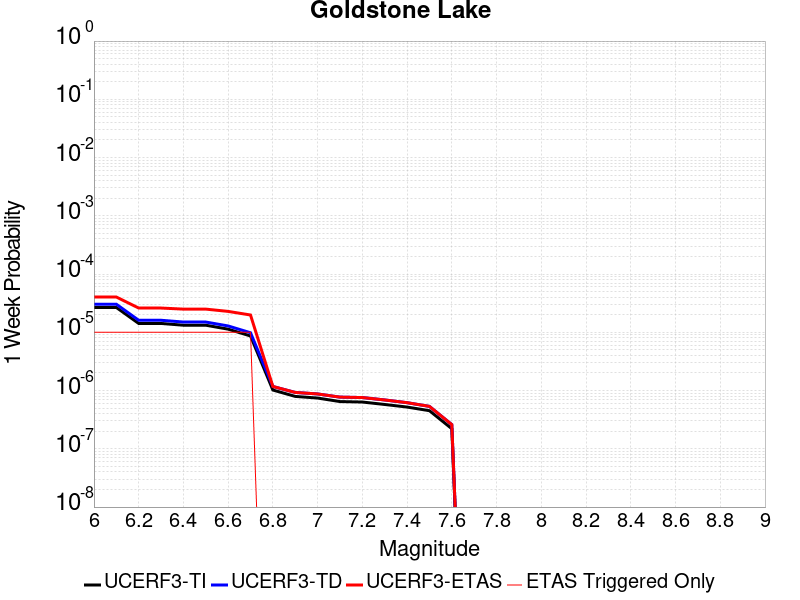 |  |  |  |

| Magnitude | 1 wk TI Prob | 1 wk TD Prob | 1 wk ETAS Prob | 1 wk ETAS/TD Gain | 1 wk ETAS Triggered Only | 1 mo TI Prob | 1 mo TD Prob | 1 mo ETAS Prob | 1 mo ETAS/TD Gain | 1 mo ETAS Triggered Only | 1 yr TI Prob | 1 yr TD Prob | 1 yr ETAS Prob | 1 yr ETAS/TD Gain | 1 yr ETAS Triggered Only | 10 yr TI Prob | 10 yr TD Prob | 10 yr ETAS Prob | 10 yr ETAS/TD Gain | 10 yr ETAS Triggered Only |
|-----|-----|-----|-----|-----|-----|-----|-----|-----|-----|-----|-----|-----|-----|-----|-----|-----|-----|-----|-----|-----|
| 6.0 | 2.671352E-5 | 3.0381472E-5 | 3.0381472E-5 | 1.0 | 0.0 | 1.1448149E-4 | 1.3020092E-4 | 1.3020092E-4 | 1.0 | 0.0 | 0.001392921 | 0.00158424 | 0.0022557448 | 1.4238656 | 6.725703E-4 | 0.013842222 | 0.015748968 | 0.017624572 | 1.1190938 | 0.0019056159 |
| 6.1 | 2.671352E-5 | 3.0381472E-5 | 3.0381472E-5 | 1.0 | 0.0 | 1.1448149E-4 | 1.3020092E-4 | 1.3020092E-4 | 1.0 | 0.0 | 0.001392921 | 0.00158424 | 0.0022557448 | 1.4238656 | 6.725703E-4 | 0.013842222 | 0.015748968 | 0.017624572 | 1.1190938 | 0.0019056159 |
| 6.2 | 1.4197047E-5 | 1.6098957E-5 | 1.6098957E-5 | 1.0 | 0.0 | 6.0843064E-5 | 6.899426E-5 | 6.899426E-5 | 1.0 | 0.0 | 7.4051257E-4 | 8.397801E-4 | 0.0010637819 | 1.2667387 | 2.2419011E-4 | 0.007380498 | 0.008375766 | 0.009487328 | 1.1327116 | 0.0011209506 |
| 6.3 | 1.4197047E-5 | 1.6098957E-5 | 1.6098957E-5 | 1.0 | 0.0 | 6.0843064E-5 | 6.899426E-5 | 6.899426E-5 | 1.0 | 0.0 | 7.4051257E-4 | 8.397801E-4 | 0.0010637819 | 1.2667387 | 2.2419011E-4 | 0.007380498 | 0.008375766 | 0.009487328 | 1.1327116 | 0.0011209506 |
| 6.4 | 1.3238931E-5 | 1.5010976E-5 | 1.5010976E-5 | 1.0 | 0.0 | 5.6737044E-5 | 6.4331725E-5 | 6.4331725E-5 | 1.0 | 0.0 | 6.9055456E-4 | 7.830553E-4 | 0.0010070698 | 1.2860776 | 2.2419011E-4 | 0.006884126 | 0.00781259 | 0.008702345 | 1.1138872 | 8.9676044E-4 |
| 6.5 | 1.3238931E-5 | 1.5010976E-5 | 1.5010976E-5 | 1.0 | 0.0 | 5.6737044E-5 | 6.4331725E-5 | 6.4331725E-5 | 1.0 | 0.0 | 6.9055456E-4 | 7.830553E-4 | 0.0010070698 | 1.2860776 | 2.2419011E-4 | 0.006884126 | 0.00781259 | 0.008702345 | 1.1138872 | 8.9676044E-4 |
| 6.6 | 1.1328278E-5 | 1.285732E-5 | 1.285732E-5 | 1.0 | 0.0 | 4.8548856E-5 | 5.5102173E-5 | 5.5102173E-5 | 1.0 | 0.0 | 5.90922E-4 | 6.707582E-4 | 8.947979E-4 | 1.3340096 | 2.2419011E-4 | 0.0058935313 | 0.0066967285 | 0.0075874836 | 1.1330135 | 8.9676044E-4 |
| 6.7 | 8.651175E-6 | 9.826188E-6 | 9.826188E-6 | 1.0 | 0.0 | 3.707594E-5 | 4.2112064E-5 | 4.2112064E-5 | 1.0 | 0.0 | 4.5130608E-4 | 5.1268435E-4 | 7.367595E-4 | 1.4370626 | 2.2419011E-4 | 0.0045039062 | 0.0051238975 | 0.005681501 | 1.1088241 | 5.604753E-4 |
| 6.8 | 1.0215377E-6 | 1.1755602E-6 | 1.1755602E-6 | 1.0 | 0.0 | 4.378012E-6 | 5.038106E-6 | 5.038106E-6 | 1.0 | 0.0 | 5.3300988E-5 | 6.133733E-5 | 6.133733E-5 | 1.0 | 0.0 | 5.3288206E-4 | 6.1321526E-4 | 6.1321526E-4 | 1.0 | 0.0 |
| 6.9 | 7.9360774E-7 | 9.28402E-7 | 9.28402E-7 | 1.0 | 0.0 | 3.4011714E-6 | 3.97886E-6 | 3.97886E-6 | 1.0 | 0.0 | 4.1408475E-5 | 4.8441616E-5 | 4.8441616E-5 | 1.0 | 0.0 | 4.140076E-4 | 4.8431757E-4 | 4.8431757E-4 | 1.0 | 0.0 |
| 7.0 | 7.4382757E-7 | 8.7478975E-7 | 8.7478975E-7 | 1.0 | 0.0 | 3.1878285E-6 | 3.7490938E-6 | 3.7490938E-6 | 1.0 | 0.0 | 3.8811122E-5 | 4.564433E-5 | 4.564433E-5 | 1.0 | 0.0 | 3.8804344E-4 | 4.5635618E-4 | 4.5635618E-4 | 1.0 | 0.0 |
| 7.1 | 6.4709513E-7 | 7.711771E-7 | 7.711771E-7 | 1.0 | 0.0 | 2.773262E-6 | 3.305041E-6 | 3.305041E-6 | 1.0 | 0.0 | 3.376394E-5 | 4.0238192E-5 | 4.0238192E-5 | 1.0 | 0.0 | 3.375881E-4 | 4.0231502E-4 | 4.0231502E-4 | 1.0 | 0.0 |
| 7.2 | 6.356704E-7 | 7.5888187E-7 | 7.5888187E-7 | 1.0 | 0.0 | 2.7242988E-6 | 3.2523471E-6 | 3.2523471E-6 | 1.0 | 0.0 | 3.3167835E-5 | 3.9596667E-5 | 3.9596667E-5 | 1.0 | 0.0 | 3.3162883E-4 | 3.9590205E-4 | 3.9590205E-4 | 1.0 | 0.0 |
| 7.3 | 5.7695723E-7 | 6.896988E-7 | 6.896988E-7 | 1.0 | 0.0 | 2.4726714E-6 | 2.9558491E-6 | 2.9558491E-6 | 1.0 | 0.0 | 3.0104358E-5 | 3.5986926E-5 | 3.5986926E-5 | 1.0 | 0.0 | 3.0100282E-4 | 3.598167E-4 | 3.598167E-4 | 1.0 | 0.0 |
| 7.4 | 5.209647E-7 | 6.1938704E-7 | 6.1938704E-7 | 1.0 | 0.0 | 2.232704E-6 | 2.6545135E-6 | 2.6545135E-6 | 1.0 | 0.0 | 2.718283E-5 | 3.231828E-5 | 3.231828E-5 | 1.0 | 0.0 | 2.7179506E-4 | 3.2314134E-4 | 3.2314134E-4 | 1.0 | 0.0 |
| 7.5 | 4.512955E-7 | 5.3491794E-7 | 5.3491794E-7 | 1.0 | 0.0 | 1.934122E-6 | 2.2925037E-6 | 2.2925037E-6 | 1.0 | 0.0 | 2.3547682E-5 | 2.7910928E-5 | 2.7910928E-5 | 1.0 | 0.0 | 2.3545188E-4 | 2.7907954E-4 | 2.7907954E-4 | 1.0 | 0.0 |
| 7.6 | 2.21172E-7 | 2.60409E-7 | 2.60409E-7 | 1.0 | 0.0 | 9.478797E-7 | 1.1160382E-6 | 1.1160382E-6 | 1.0 | 0.0 | 1.1540374E-5 | 1.358771E-5 | 1.358771E-5 | 1.0 | 0.0 | 1.1539775E-4 | 1.3587161E-4 | 1.3587161E-4 | 1.0 | 0.0 |

## Gravel Hills-Harper Lk
*[(top)](#table-of-contents)*

| 1 Week | 1 Month | 1 Year | 10 Year |
|-----|-----|-----|-----|
|  |  |  |  |

| Magnitude | 1 wk TI Prob | 1 wk TD Prob | 1 wk ETAS Prob | 1 wk ETAS/TD Gain | 1 wk ETAS Triggered Only | 1 mo TI Prob | 1 mo TD Prob | 1 mo ETAS Prob | 1 mo ETAS/TD Gain | 1 mo ETAS Triggered Only | 1 yr TI Prob | 1 yr TD Prob | 1 yr ETAS Prob | 1 yr ETAS/TD Gain | 1 yr ETAS Triggered Only | 10 yr TI Prob | 10 yr TD Prob | 10 yr ETAS Prob | 10 yr ETAS/TD Gain | 10 yr ETAS Triggered Only |
|-----|-----|-----|-----|-----|-----|-----|-----|-----|-----|-----|-----|-----|-----|-----|-----|-----|-----|-----|-----|-----|
| 6.0 | 3.0679566E-5 | 3.1470034E-5 | 3.1470034E-5 | 1.0 | 0.0 | 1.3147724E-4 | 1.3486583E-4 | 1.3486583E-4 | 1.0 | 0.0 | 0.0015995599 | 0.0016409707 | 0.0024243486 | 1.4773868 | 7.846654E-4 | 0.015880952 | 0.016310113 | 0.017964114 | 1.1014096 | 0.0016814258 |
| 6.1 | 3.0679566E-5 | 3.1470034E-5 | 3.1470034E-5 | 1.0 | 0.0 | 1.3147724E-4 | 1.3486583E-4 | 1.3486583E-4 | 1.0 | 0.0 | 0.0015995599 | 0.0016409707 | 0.0024243486 | 1.4773868 | 7.846654E-4 | 0.015880952 | 0.016310113 | 0.017964114 | 1.1014096 | 0.0016814258 |
| 6.2 | 1.514536E-5 | 1.3637061E-5 | 1.3637061E-5 | 1.0 | 0.0 | 6.490707E-5 | 5.8443307E-5 | 5.8443307E-5 | 1.0 | 0.0 | 7.8995706E-4 | 7.1132684E-4 | 0.0012714034 | 1.7873689 | 5.604753E-4 | 0.007871548 | 0.0070917015 | 0.007870803 | 1.1098609 | 7.846654E-4 |
| 6.3 | 1.514536E-5 | 1.3637061E-5 | 1.3637061E-5 | 1.0 | 0.0 | 6.490707E-5 | 5.8443307E-5 | 5.8443307E-5 | 1.0 | 0.0 | 7.8995706E-4 | 7.1132684E-4 | 0.0012714034 | 1.7873689 | 5.604753E-4 | 0.007871548 | 0.0070917015 | 0.007870803 | 1.1098609 | 7.846654E-4 |
| 6.4 | 1.2532521E-5 | 1.0691045E-5 | 1.0691045E-5 | 1.0 | 0.0 | 5.37097E-5 | 4.5817993E-5 | 4.5817993E-5 | 1.0 | 0.0 | 6.537194E-4 | 5.576971E-4 | 0.0011178599 | 2.004421 | 5.604753E-4 | 0.0065179965 | 0.0055635655 | 0.0061209225 | 1.1001798 | 5.604753E-4 |
| 6.5 | 1.1094058E-5 | 9.084768E-6 | 9.084768E-6 | 1.0 | 0.0 | 4.7545094E-5 | 3.8934162E-5 | 3.8934162E-5 | 1.0 | 0.0 | 5.787078E-4 | 4.7392436E-4 | 8.100502E-4 | 1.7092394 | 3.3628516E-4 | 0.0057720304 | 0.0047295443 | 0.0050642393 | 1.0707668 | 3.3628516E-4 |
| 6.6 | 9.688328E-6 | 7.5325847E-6 | 7.5325847E-6 | 1.0 | 0.0 | 4.1520743E-5 | 3.228212E-5 | 3.228212E-5 | 1.0 | 0.0 | 5.053978E-4 | 3.929665E-4 | 5.050175E-4 | 1.2851413 | 1.12095055E-4 | 0.0050424994 | 0.0039229733 | 0.004034628 | 1.0284619 | 1.12095055E-4 |
| 6.7 | 8.974824E-6 | 6.7502024E-6 | 6.7502024E-6 | 1.0 | 0.0 | 3.8462964E-5 | 2.8929131E-5 | 2.8929131E-5 | 1.0 | 0.0 | 4.6818596E-4 | 3.5215745E-4 | 4.6421302E-4 | 1.3181974 | 1.12095055E-4 | 0.004672008 | 0.0035162151 | 0.003627916 | 1.0317674 | 1.12095055E-4 |
| 6.8 | 7.4780046E-6 | 5.116785E-6 | 5.116785E-6 | 1.0 | 0.0 | 3.20482E-5 | 2.1928901E-5 | 2.1928901E-5 | 1.0 | 0.0 | 3.9011694E-4 | 2.6695305E-4 | 3.790182E-4 | 1.4197934 | 1.12095055E-4 | 0.0038943281 | 0.0026664622 | 0.0027782584 | 1.0419267 | 1.12095055E-4 |
| 6.9 | 6.3409307E-6 | 3.907958E-6 | 3.907958E-6 | 1.0 | 0.0 | 2.7175134E-5 | 1.674829E-5 | 1.674829E-5 | 1.0 | 0.0 | 3.3080703E-4 | 2.0389234E-4 | 3.1596454E-4 | 1.5496637 | 1.12095055E-4 | 0.0033031502 | 0.0020371508 | 0.0021490175 | 1.0549133 | 1.12095055E-4 |
| 7.0 | 5.1239335E-6 | 2.6061791E-6 | 2.6061791E-6 | 1.0 | 0.0 | 2.195953E-5 | 1.11692925E-5 | 1.11692925E-5 | 1.0 | 0.0 | 2.6732447E-4 | 1.359779E-4 | 2.480577E-4 | 1.8242502 | 1.12095055E-4 | 0.0026700313 | 0.0013589723 | 0.001470915 | 1.082373 | 1.12095055E-4 |
| 7.1 | 4.438899E-6 | 2.0987422E-6 | 2.0987422E-6 | 1.0 | 0.0 | 1.9023713E-5 | 8.994581E-6 | 8.994581E-6 | 1.0 | 0.0 | 2.315891E-4 | 1.0950373E-4 | 2.2158651E-4 | 2.0235522 | 1.12095055E-4 | 0.002313479 | 0.0010945196 | 0.001206492 | 1.1023028 | 1.12095055E-4 |
| 7.2 | 3.50367E-6 | 1.2617695E-6 | 1.2617695E-6 | 1.0 | 0.0 | 1.5015643E-5 | 5.407573E-6 | 5.407573E-6 | 1.0 | 0.0 | 1.8280011E-4 | 6.5835295E-5 | 1.7792298E-4 | 2.7025468 | 1.12095055E-4 | 0.0018264982 | 6.5816613E-4 | 7.701874E-4 | 1.1702021 | 1.12095055E-4 |
| 7.3 | 2.561638E-6 | 7.1206705E-7 | 7.1206705E-7 | 1.0 | 0.0 | 1.0978401E-5 | 3.0517124E-6 | 3.0517124E-6 | 1.0 | 0.0 | 1.3365384E-4 | 3.7153986E-5 | 1.4924488E-4 | 4.0169277 | 1.12095055E-4 | 0.0013357349 | 3.7147972E-4 | 4.8353313E-4 | 1.3016407 | 1.12095055E-4 |
| 7.4 | 2.0368864E-6 | 5.3060455E-7 | 5.3060455E-7 | 1.0 | 0.0 | 8.729483E-6 | 2.2740176E-6 | 2.2740176E-6 | 1.0 | 0.0 | 1.06276275E-4 | 2.7685817E-5 | 2.7685817E-5 | 1.0 | 0.0 | 0.0010622547 | 2.768242E-4 | 2.768242E-4 | 1.0 | 0.0 |
| 7.5 | 1.1681728E-6 | 3.6037605E-7 | 3.6037605E-7 | 1.0 | 0.0 | 5.0064455E-6 | 1.544468E-6 | 1.544468E-6 | 1.0 | 0.0 | 6.0951766E-5 | 1.880374E-5 | 1.880374E-5 | 1.0 | 0.0 | 6.093505E-4 | 1.8802195E-4 | 1.8802195E-4 | 1.0 | 0.0 |
| 7.6 | 1.3154387E-7 | 7.120617E-8 | 7.120617E-8 | 1.0 | 0.0 | 5.6375933E-7 | 3.051693E-7 | 3.051693E-7 | 1.0 | 0.0 | 6.863748E-6 | 3.7154316E-6 | 3.7154316E-6 | 1.0 | 0.0 | 6.863536E-5 | 3.715385E-5 | 3.715385E-5 | 1.0 | 0.0 |

## Coyote Canyon
*[(top)](#table-of-contents)*

| 1 Week | 1 Month | 1 Year | 10 Year |
|-----|-----|-----|-----|
|  |  | 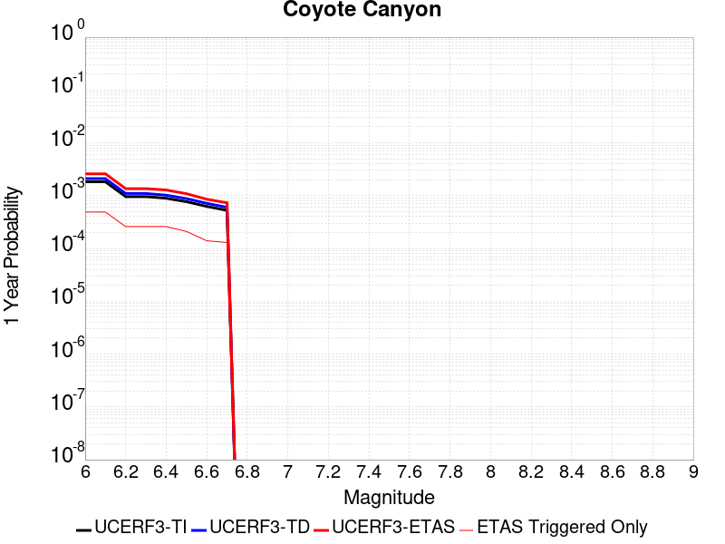 |  |

| Magnitude | 1 wk TI Prob | 1 wk TD Prob | 1 wk ETAS Prob | 1 wk ETAS/TD Gain | 1 wk ETAS Triggered Only | 1 mo TI Prob | 1 mo TD Prob | 1 mo ETAS Prob | 1 mo ETAS/TD Gain | 1 mo ETAS Triggered Only | 1 yr TI Prob | 1 yr TD Prob | 1 yr ETAS Prob | 1 yr ETAS/TD Gain | 1 yr ETAS Triggered Only | 10 yr TI Prob | 10 yr TD Prob | 10 yr ETAS Prob | 10 yr ETAS/TD Gain | 10 yr ETAS Triggered Only |
|-----|-----|-----|-----|-----|-----|-----|-----|-----|-----|-----|-----|-----|-----|-----|-----|-----|-----|-----|-----|-----|
| 6.0 | 3.5090034E-5 | 4.0372353E-5 | 4.0372353E-5 | 1.0 | 0.0 | 1.503772E-4 | 1.7301434E-4 | 1.7301434E-4 | 1.0 | 0.0 | 0.0018293047 | 0.0021046721 | 0.0024402495 | 1.159444 | 3.3628516E-4 | 0.018143194 | 0.020873329 | 0.022409901 | 1.0736142 | 0.0015693308 |
| 6.1 | 3.5090034E-5 | 4.0372353E-5 | 4.0372353E-5 | 1.0 | 0.0 | 1.503772E-4 | 1.7301434E-4 | 1.7301434E-4 | 1.0 | 0.0 | 0.0018293047 | 0.0021046721 | 0.0024402495 | 1.159444 | 3.3628516E-4 | 0.018143194 | 0.020873329 | 0.022409901 | 1.0736142 | 0.0015693308 |
| 6.2 | 1.841879E-5 | 2.10638E-5 | 2.10638E-5 | 1.0 | 0.0 | 7.8935285E-5 | 9.027088E-5 | 9.027088E-5 | 1.0 | 0.0 | 9.606133E-4 | 0.0010985958 | 0.0013225396 | 1.2038455 | 2.2419011E-4 | 0.0095647145 | 0.010941739 | 0.011496082 | 1.0506631 | 5.604753E-4 |
| 6.3 | 1.841879E-5 | 2.10638E-5 | 2.10638E-5 | 1.0 | 0.0 | 7.8935285E-5 | 9.027088E-5 | 9.027088E-5 | 1.0 | 0.0 | 9.606133E-4 | 0.0010985958 | 0.0013225396 | 1.2038455 | 2.2419011E-4 | 0.0095647145 | 0.010941739 | 0.011496082 | 1.0506631 | 5.604753E-4 |
| 6.4 | 1.712201E-5 | 1.9568917E-5 | 1.9568917E-5 | 1.0 | 0.0 | 7.337798E-5 | 8.386466E-5 | 8.386466E-5 | 1.0 | 0.0 | 8.930107E-4 | 0.0010206745 | 0.0012446358 | 1.2194248 | 2.2419011E-4 | 0.008894307 | 0.010169788 | 0.010613608 | 1.0436411 | 4.4838022E-4 |
| 6.5 | 1.4744935E-5 | 1.6840142E-5 | 1.6840142E-5 | 1.0 | 0.0 | 6.3191044E-5 | 7.2170566E-5 | 7.2170566E-5 | 1.0 | 0.0 | 7.6907943E-4 | 8.7841594E-4 | 9.904125E-4 | 1.1274984 | 1.12095055E-4 | 0.007664232 | 0.008758638 | 0.009091978 | 1.0380584 | 3.3628516E-4 |
| 6.6 | 1.2017839E-5 | 1.3726675E-5 | 1.3726675E-5 | 1.0 | 0.0 | 5.150401E-5 | 5.882778E-5 | 5.882778E-5 | 1.0 | 0.0 | 6.268809E-4 | 7.160815E-4 | 7.160815E-4 | 1.0 | 0.0 | 0.0062511545 | 0.007146437 | 0.0073690247 | 1.0311466 | 2.2419011E-4 |
| 6.7 | 1.00956095E-5 | 1.1535696E-5 | 1.1535696E-5 | 1.0 | 0.0 | 4.326618E-5 | 4.943825E-5 | 4.943825E-5 | 1.0 | 0.0 | 5.266384E-4 | 6.0183153E-4 | 6.0183153E-4 | 1.0 | 0.0 | 0.005253921 | 0.006010547 | 0.006121968 | 1.0185376 | 1.12095055E-4 |

## San Andreas (Mojave N)
*[(top)](#table-of-contents)*

| 1 Week | 1 Month | 1 Year | 10 Year |
|-----|-----|-----|-----|
|  |  |  |  |

| Magnitude | 1 wk TI Prob | 1 wk TD Prob | 1 wk ETAS Prob | 1 wk ETAS/TD Gain | 1 wk ETAS Triggered Only | 1 mo TI Prob | 1 mo TD Prob | 1 mo ETAS Prob | 1 mo ETAS/TD Gain | 1 mo ETAS Triggered Only | 1 yr TI Prob | 1 yr TD Prob | 1 yr ETAS Prob | 1 yr ETAS/TD Gain | 1 yr ETAS Triggered Only | 10 yr TI Prob | 10 yr TD Prob | 10 yr ETAS Prob | 10 yr ETAS/TD Gain | 10 yr ETAS Triggered Only |
|-----|-----|-----|-----|-----|-----|-----|-----|-----|-----|-----|-----|-----|-----|-----|-----|-----|-----|-----|-----|-----|
| 6.0 | 9.877682E-5 | 1.9487888E-4 | 1.9487888E-4 | 1.0 | 0.0 | 4.2326056E-4 | 8.3492807E-4 | 8.3492807E-4 | 1.0 | 0.0 | 0.0051410277 | 0.010117998 | 0.0105618425 | 1.0438668 | 4.4838022E-4 | 0.05023708 | 0.09869637 | 0.09970669 | 1.0102366 | 0.0011209506 |
| 6.1 | 9.877682E-5 | 1.9487888E-4 | 1.9487888E-4 | 1.0 | 0.0 | 4.2326056E-4 | 8.3492807E-4 | 8.3492807E-4 | 1.0 | 0.0 | 0.0051410277 | 0.010117998 | 0.0105618425 | 1.0438668 | 4.4838022E-4 | 0.05023708 | 0.09869637 | 0.09970669 | 1.0102366 | 0.0011209506 |
| 6.2 | 9.877682E-5 | 1.9487888E-4 | 1.9487888E-4 | 1.0 | 0.0 | 4.2326056E-4 | 8.3492807E-4 | 8.3492807E-4 | 1.0 | 0.0 | 0.0051410277 | 0.010117998 | 0.0105618425 | 1.0438668 | 4.4838022E-4 | 0.05023708 | 0.09869637 | 0.09970669 | 1.0102366 | 0.0011209506 |
| 6.3 | 9.877682E-5 | 1.9487888E-4 | 1.9487888E-4 | 1.0 | 0.0 | 4.2326056E-4 | 8.3492807E-4 | 8.3492807E-4 | 1.0 | 0.0 | 0.0051410277 | 0.010117998 | 0.0105618425 | 1.0438668 | 4.4838022E-4 | 0.05023708 | 0.09869637 | 0.09970669 | 1.0102366 | 0.0011209506 |
| 6.4 | 9.877682E-5 | 1.9487888E-4 | 1.9487888E-4 | 1.0 | 0.0 | 4.2326056E-4 | 8.3492807E-4 | 8.3492807E-4 | 1.0 | 0.0 | 0.0051410277 | 0.010117998 | 0.0105618425 | 1.0438668 | 4.4838022E-4 | 0.05023708 | 0.09869637 | 0.09970669 | 1.0102366 | 0.0011209506 |
| 6.5 | 9.861474E-5 | 1.9461628E-4 | 1.9461628E-4 | 1.0 | 0.0 | 4.2256617E-4 | 8.338034E-4 | 8.338034E-4 | 1.0 | 0.0 | 0.0051326132 | 0.010104432 | 0.0105482815 | 1.0439262 | 4.4838022E-4 | 0.050156746 | 0.09857411 | 0.09958456 | 1.0102507 | 0.0011209506 |
| 6.6 | 9.861474E-5 | 1.9461628E-4 | 1.9461628E-4 | 1.0 | 0.0 | 4.2256617E-4 | 8.338034E-4 | 8.338034E-4 | 1.0 | 0.0 | 0.0051326132 | 0.010104432 | 0.0105482815 | 1.0439262 | 4.4838022E-4 | 0.050156746 | 0.09857411 | 0.09958456 | 1.0102507 | 0.0011209506 |
| 6.7 | 9.8552715E-5 | 1.9451571E-4 | 1.9451571E-4 | 1.0 | 0.0 | 4.223004E-4 | 8.333726E-4 | 8.333726E-4 | 1.0 | 0.0 | 0.0051293927 | 0.010099237 | 0.010543088 | 1.043949 | 4.4838022E-4 | 0.050125998 | 0.09852727 | 0.099537775 | 1.010256 | 0.0011209506 |
| 6.8 | 9.8464974E-5 | 1.9436708E-4 | 1.9436708E-4 | 1.0 | 0.0 | 4.219245E-4 | 8.32736E-4 | 8.32736E-4 | 1.0 | 0.0 | 0.0051248376 | 0.010091558 | 0.010535413 | 1.0439829 | 4.4838022E-4 | 0.05008251 | 0.09845722 | 0.0994678 | 1.0102642 | 0.0011209506 |
| 6.9 | 9.825824E-5 | 1.940467E-4 | 1.940467E-4 | 1.0 | 0.0 | 4.2103877E-4 | 8.313639E-4 | 8.313639E-4 | 1.0 | 0.0 | 0.0051141046 | 0.010075007 | 0.010518869 | 1.0440558 | 4.4838022E-4 | 0.049980022 | 0.098306164 | 0.099316925 | 1.0102817 | 0.0011209506 |
| 7.0 | 9.781462E-5 | 1.9335936E-4 | 1.9335936E-4 | 1.0 | 0.0 | 4.1913814E-4 | 8.2842E-4 | 8.2842E-4 | 1.0 | 0.0 | 0.005091073 | 0.010039495 | 0.010483374 | 1.0442133 | 4.4838022E-4 | 0.04976007 | 0.097982235 | 0.09899335 | 1.0103194 | 0.0011209506 |
| 7.1 | 9.7121134E-5 | 1.9237513E-4 | 1.9237513E-4 | 1.0 | 0.0 | 4.1616702E-4 | 8.242045E-4 | 8.242045E-4 | 1.0 | 0.0 | 0.005055068 | 0.009988643 | 0.010432545 | 1.0444406 | 4.4838022E-4 | 0.04941613 | 0.09751831 | 0.09852995 | 1.0103738 | 0.0011209506 |
| 7.2 | 9.663819E-5 | 1.9168199E-4 | 1.9168199E-4 | 1.0 | 0.0 | 4.1409794E-4 | 8.212358E-4 | 8.212358E-4 | 1.0 | 0.0 | 0.0050299936 | 0.009952831 | 0.010396749 | 1.0446022 | 4.4838022E-4 | 0.049176537 | 0.09719127 | 0.09820327 | 1.0104125 | 0.0011209506 |
| 7.3 | 9.6277574E-5 | 1.912059E-4 | 1.912059E-4 | 1.0 | 0.0 | 4.125529E-4 | 8.191967E-4 | 8.191967E-4 | 1.0 | 0.0 | 0.0050112694 | 0.009928231 | 0.01037216 | 1.0447137 | 4.4838022E-4 | 0.04899759 | 0.096964255 | 0.09797651 | 1.0104395 | 0.0011209506 |
| 7.4 | 9.593308E-5 | 1.9060235E-4 | 1.9060235E-4 | 1.0 | 0.0 | 4.1107697E-4 | 8.166117E-4 | 8.166117E-4 | 1.0 | 0.0 | 0.0049933824 | 0.009897046 | 0.010340988 | 1.0448561 | 4.4838022E-4 | 0.04882661 | 0.09668197 | 0.097694546 | 1.0104733 | 0.0011209506 |
| 7.5 | 9.561707E-5 | 1.9006194E-4 | 1.9006194E-4 | 1.0 | 0.0 | 4.0972308E-4 | 8.1429706E-4 | 8.1429706E-4 | 1.0 | 0.0 | 0.0049769743 | 0.00986912 | 0.010313076 | 1.0449842 | 4.4838022E-4 | 0.048669744 | 0.09642772 | 0.09744058 | 1.0105038 | 0.0011209506 |
| 7.6 | 9.418194E-5 | 1.8657741E-4 | 1.8657741E-4 | 1.0 | 0.0 | 4.0357444E-4 | 7.993726E-4 | 7.993726E-4 | 1.0 | 0.0 | 0.004902454 | 0.009689045 | 0.01013308 | 1.0458287 | 4.4838022E-4 | 0.047957025 | 0.0948077 | 0.09582238 | 1.0107025 | 0.0011209506 |
| 7.7 | 8.202141E-5 | 1.609954E-4 | 1.609954E-4 | 1.0 | 0.0 | 3.51473E-4 | 6.897979E-4 | 6.897979E-4 | 1.0 | 0.0 | 0.00427079 | 0.008366007 | 0.0086994795 | 1.0398604 | 3.3628516E-4 | 0.04189639 | 0.08258243 | 0.08340514 | 1.0099622 | 8.9676044E-4 |
| 7.8 | 7.2859846E-5 | 1.4586812E-4 | 1.4586812E-4 | 1.0 | 0.0 | 3.1221908E-4 | 6.2499935E-4 | 6.2499935E-4 | 1.0 | 0.0 | 0.003794643 | 0.0075828596 | 0.00780535 | 1.0293412 | 2.2419011E-4 | 0.037304975 | 0.07504203 | 0.07556045 | 1.0069083 | 5.604753E-4 |
| 7.9 | 5.3874453E-5 | 1.00950085E-4 | 1.00950085E-4 | 1.0 | 0.0 | 2.3087008E-4 | 4.3257148E-4 | 4.3257148E-4 | 1.0 | 0.0 | 0.0028072202 | 0.0052538514 | 0.0053653577 | 1.0212237 | 1.12095055E-4 | 0.02772022 | 0.052655075 | 0.053079847 | 1.008067 | 4.4838022E-4 |
| 8.0 | 3.468538E-5 | 5.454598E-5 | 5.454598E-5 | 1.0 | 0.0 | 1.4864317E-4 | 2.3374756E-4 | 2.3374756E-4 | 1.0 | 0.0 | 0.0018082283 | 0.0028421644 | 0.0028421644 | 1.0 | 0.0 | 0.017935853 | 0.029087735 | 0.02919657 | 1.0037416 | 1.12095055E-4 |
| 8.1 | 1.9152367E-5 | 1.9539457E-5 | 1.9539457E-5 | 1.0 | 0.0 | 8.207899E-5 | 8.373785E-5 | 8.373785E-5 | 1.0 | 0.0 | 9.988535E-4 | 0.0010190321 | 0.0010190321 | 1.0 | 0.0 | 0.009943757 | 0.010927947 | 0.010927947 | 1.0 | 0.0 |
| 8.2 | 8.643924E-6 | 5.5269165E-6 | 5.5269165E-6 | 1.0 | 0.0 | 3.704486E-5 | 2.368657E-5 | 2.368657E-5 | 1.0 | 0.0 | 4.5092785E-4 | 2.8834594E-4 | 2.8834594E-4 | 1.0 | 0.0 | 0.0045001395 | 0.0032771796 | 0.0032771796 | 1.0 | 0.0 |
| 8.3 | 1.983087E-6 | 7.7486385E-7 | 7.7486385E-7 | 1.0 | 0.0 | 8.498917E-6 | 3.320841E-6 | 3.320841E-6 | 1.0 | 0.0 | 1.034694E-4 | 4.0430506E-5 | 4.0430506E-5 | 1.0 | 0.0 | 0.0010342124 | 4.7705657E-4 | 4.7705657E-4 | 1.0 | 0.0 |

## San Andreas (Mojave S)
*[(top)](#table-of-contents)*

| 1 Week | 1 Month | 1 Year | 10 Year |
|-----|-----|-----|-----|
|  |  |  | 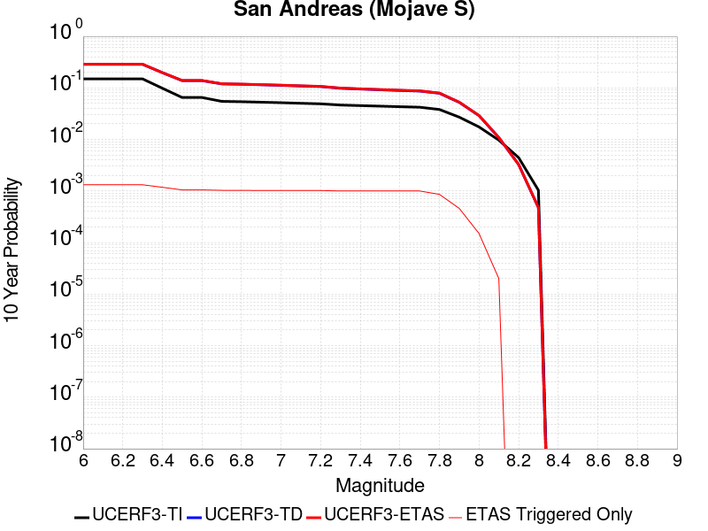 |

| Magnitude | 1 wk TI Prob | 1 wk TD Prob | 1 wk ETAS Prob | 1 wk ETAS/TD Gain | 1 wk ETAS Triggered Only | 1 mo TI Prob | 1 mo TD Prob | 1 mo ETAS Prob | 1 mo ETAS/TD Gain | 1 mo ETAS Triggered Only | 1 yr TI Prob | 1 yr TD Prob | 1 yr ETAS Prob | 1 yr ETAS/TD Gain | 1 yr ETAS Triggered Only | 10 yr TI Prob | 10 yr TD Prob | 10 yr ETAS Prob | 10 yr ETAS/TD Gain | 10 yr ETAS Triggered Only |
|-----|-----|-----|-----|-----|-----|-----|-----|-----|-----|-----|-----|-----|-----|-----|-----|-----|-----|-----|-----|-----|
| 6.0 | 3.1064058E-4 | 6.755789E-4 | 6.755789E-4 | 1.0 | 0.0 | 0.0013306376 | 0.0028922537 | 0.0028922537 | 1.0 | 0.0 | 0.016080605 | 0.034670897 | 0.03521194 | 1.0156051 | 5.604753E-4 | 0.1496549 | 0.28693774 | 0.28773707 | 1.0027857 | 0.0011209506 |
| 6.1 | 3.1064058E-4 | 6.755789E-4 | 6.755789E-4 | 1.0 | 0.0 | 0.0013306376 | 0.0028922537 | 0.0028922537 | 1.0 | 0.0 | 0.016080605 | 0.034670897 | 0.03521194 | 1.0156051 | 5.604753E-4 | 0.1496549 | 0.28693774 | 0.28773707 | 1.0027857 | 0.0011209506 |
| 6.2 | 3.1064058E-4 | 6.755789E-4 | 6.755789E-4 | 1.0 | 0.0 | 0.0013306376 | 0.0028922537 | 0.0028922537 | 1.0 | 0.0 | 0.016080605 | 0.034670897 | 0.03521194 | 1.0156051 | 5.604753E-4 | 0.1496549 | 0.28693774 | 0.28773707 | 1.0027857 | 0.0011209506 |
| 6.3 | 3.1064058E-4 | 6.755789E-4 | 6.755789E-4 | 1.0 | 0.0 | 0.0013306376 | 0.0028922537 | 0.0028922537 | 1.0 | 0.0 | 0.016080605 | 0.034670897 | 0.03521194 | 1.0156051 | 5.604753E-4 | 0.1496549 | 0.28693774 | 0.28773707 | 1.0027857 | 0.0011209506 |
| 6.4 | 1.9872203E-4 | 4.3271694E-4 | 4.3271694E-4 | 1.0 | 0.0 | 8.5138786E-4 | 0.0018532113 | 0.0018532113 | 1.0 | 0.0 | 0.010316478 | 0.022335568 | 0.022773933 | 1.0196264 | 4.4838022E-4 | 0.098504856 | 0.19735251 | 0.1980723 | 1.0036472 | 8.9676044E-4 |
| 6.5 | 1.291105E-4 | 2.8840266E-4 | 2.8840266E-4 | 1.0 | 0.0 | 5.5321335E-4 | 0.0012354287 | 0.0012354287 | 1.0 | 0.0 | 0.006714592 | 0.014938438 | 0.015159279 | 1.0147834 | 2.2419011E-4 | 0.065152965 | 0.13839725 | 0.13897674 | 1.0041871 | 6.725703E-4 |
| 6.6 | 1.291105E-4 | 2.8840266E-4 | 2.8840266E-4 | 1.0 | 0.0 | 5.5321335E-4 | 0.0012354287 | 0.0012354287 | 1.0 | 0.0 | 0.006714592 | 0.014938438 | 0.015159279 | 1.0147834 | 2.2419011E-4 | 0.065152965 | 0.13839725 | 0.13897674 | 1.0041871 | 6.725703E-4 |
| 6.7 | 1.08001186E-4 | 2.4420145E-4 | 2.4420145E-4 | 1.0 | 0.0 | 4.6278012E-4 | 0.0010461585 | 0.0010461585 | 1.0 | 0.0 | 0.0056198016 | 0.012662896 | 0.012884247 | 1.0174803 | 2.2419011E-4 | 0.054797906 | 0.11954315 | 0.12013532 | 1.0049536 | 6.725703E-4 |
| 6.8 | 1.0624356E-4 | 2.3937564E-4 | 2.3937564E-4 | 1.0 | 0.0 | 4.5525006E-4 | 0.0010254928 | 0.0010254928 | 1.0 | 0.0 | 0.0055285925 | 0.012414177 | 0.012635583 | 1.017835 | 2.2419011E-4 | 0.053930566 | 0.11749219 | 0.11808574 | 1.0050519 | 6.725703E-4 |
| 6.9 | 1.0393785E-4 | 2.330758E-4 | 2.330758E-4 | 1.0 | 0.0 | 4.4537184E-4 | 9.985144E-4 | 9.985144E-4 | 1.0 | 0.0 | 0.0054089287 | 0.0120894 | 0.012310879 | 1.0183202 | 2.2419011E-4 | 0.05279156 | 0.114789546 | 0.115384914 | 1.0051866 | 6.725703E-4 |
| 7.0 | 1.0155622E-4 | 2.2676731E-4 | 2.2676731E-4 | 1.0 | 0.0 | 4.3516833E-4 | 9.714983E-4 | 9.714983E-4 | 1.0 | 0.0 | 0.005285311 | 0.011764073 | 0.011985626 | 1.018833 | 2.2419011E-4 | 0.05161361 | 0.11204931 | 0.11264652 | 1.0053298 | 6.725703E-4 |
| 7.1 | 9.885595E-5 | 2.1964697E-4 | 2.1964697E-4 | 1.0 | 0.0 | 4.2359953E-4 | 9.410049E-4 | 9.410049E-4 | 1.0 | 0.0 | 0.0051451353 | 0.011396753 | 0.011618388 | 1.0194472 | 2.2419011E-4 | 0.05027629 | 0.10893335 | 0.10953266 | 1.0055016 | 6.725703E-4 |
| 7.2 | 9.6411415E-5 | 2.1327272E-4 | 2.1327272E-4 | 1.0 | 0.0 | 4.1312634E-4 | 9.137061E-4 | 9.137061E-4 | 1.0 | 0.0 | 0.005018219 | 0.011067813 | 0.011289522 | 1.0200318 | 2.2419011E-4 | 0.049064007 | 0.106122635 | 0.10672383 | 1.0056651 | 6.725703E-4 |
| 7.3 | 9.1180635E-5 | 1.9553355E-4 | 1.9553355E-4 | 1.0 | 0.0 | 3.907156E-4 | 8.377319E-4 | 8.377319E-4 | 1.0 | 0.0 | 0.004746591 | 0.010151802 | 0.010373715 | 1.0218596 | 2.2419011E-4 | 0.046464786 | 0.09831004 | 0.098916486 | 1.0061687 | 6.725703E-4 |
| 7.4 | 8.887388E-5 | 1.8800999E-4 | 1.8800999E-4 | 1.0 | 0.0 | 3.8083247E-4 | 8.0550835E-4 | 8.0550835E-4 | 1.0 | 0.0 | 0.0046267817 | 0.009763064 | 0.009985065 | 1.0227389 | 2.2419011E-4 | 0.045316286 | 0.09494246 | 0.09555117 | 1.0064114 | 6.725703E-4 |
| 7.5 | 8.6750515E-5 | 1.8131707E-4 | 1.8131707E-4 | 1.0 | 0.0 | 3.7173493E-4 | 7.768418E-4 | 7.768418E-4 | 1.0 | 0.0 | 0.004516484 | 0.009417119 | 0.009639198 | 1.0235825 | 2.2419011E-4 | 0.04425787 | 0.09190385 | 0.092514604 | 1.0066457 | 6.725703E-4 |
| 7.6 | 8.453092E-5 | 1.7518285E-4 | 1.7518285E-4 | 1.0 | 0.0 | 3.6222505E-4 | 7.505677E-4 | 7.505677E-4 | 1.0 | 0.0 | 0.0044011753 | 0.009099949 | 0.009322098 | 1.0244123 | 2.2419011E-4 | 0.04315024 | 0.08905971 | 0.08967238 | 1.0068793 | 6.725703E-4 |
| 7.7 | 8.259102E-5 | 1.7039546E-4 | 1.7039546E-4 | 1.0 | 0.0 | 3.539135E-4 | 7.3006196E-4 | 7.3006196E-4 | 1.0 | 0.0 | 0.004300386 | 0.008852349 | 0.009074554 | 1.0251013 | 2.2419011E-4 | 0.042181134 | 0.08680755 | 0.08742174 | 1.0070753 | 6.725703E-4 |
| 7.8 | 7.444844E-5 | 1.535487E-4 | 1.535487E-4 | 1.0 | 0.0 | 3.1902574E-4 | 6.5789995E-4 | 6.5789995E-4 | 1.0 | 0.0 | 0.0038772223 | 0.007980564 | 0.008202964 | 1.0278678 | 2.2419011E-4 | 0.03810269 | 0.07861057 | 0.079126984 | 1.0065693 | 5.604753E-4 |
| 7.9 | 5.2586525E-5 | 1.0055216E-4 | 1.0055216E-4 | 1.0 | 0.0 | 2.2535135E-4 | 4.308667E-4 | 4.308667E-4 | 1.0 | 0.0 | 0.0027402006 | 0.0052331956 | 0.0053447043 | 1.021308 | 1.12095055E-4 | 0.027066574 | 0.052427854 | 0.052852727 | 1.008104 | 4.4838022E-4 |
| 8.0 | 3.379877E-5 | 5.435691E-5 | 5.435691E-5 | 1.0 | 0.0 | 1.4484383E-4 | 2.329374E-4 | 2.329374E-4 | 1.0 | 0.0 | 0.0017620471 | 0.0028323263 | 0.0028323263 | 1.0 | 0.0 | 0.017481409 | 0.02897345 | 0.029082298 | 1.0037568 | 1.12095055E-4 |
| 8.1 | 1.8668277E-5 | 1.9444557E-5 | 1.9444557E-5 | 1.0 | 0.0 | 8.000444E-5 | 8.333116E-5 | 8.333116E-5 | 1.0 | 0.0 | 9.736188E-4 | 0.0010140853 | 0.0010140853 | 1.0 | 0.0 | 0.009693642 | 0.010869623 | 0.010869623 | 1.0 | 0.0 |
| 8.2 | 8.541571E-6 | 5.512696E-6 | 5.512696E-6 | 1.0 | 0.0 | 3.660622E-5 | 2.3625627E-5 | 2.3625627E-5 | 1.0 | 0.0 | 4.455896E-4 | 2.8760414E-4 | 2.8760414E-4 | 1.0 | 0.0 | 0.0044469717 | 0.0032691804 | 0.0032691804 | 1.0 | 0.0 |
| 8.3 | 1.983087E-6 | 7.7486385E-7 | 7.7486385E-7 | 1.0 | 0.0 | 8.498917E-6 | 3.320841E-6 | 3.320841E-6 | 1.0 | 0.0 | 1.034694E-4 | 4.0430506E-5 | 4.0430506E-5 | 1.0 | 0.0 | 0.0010342124 | 4.7705657E-4 | 4.7705657E-4 | 1.0 | 0.0 |

## Death Valley (So)
*[(top)](#table-of-contents)*

| 1 Week | 1 Month | 1 Year | 10 Year |
|-----|-----|-----|-----|
|  |  |  |  |

| Magnitude | 1 wk TI Prob | 1 wk TD Prob | 1 wk ETAS Prob | 1 wk ETAS/TD Gain | 1 wk ETAS Triggered Only | 1 mo TI Prob | 1 mo TD Prob | 1 mo ETAS Prob | 1 mo ETAS/TD Gain | 1 mo ETAS Triggered Only | 1 yr TI Prob | 1 yr TD Prob | 1 yr ETAS Prob | 1 yr ETAS/TD Gain | 1 yr ETAS Triggered Only | 10 yr TI Prob | 10 yr TD Prob | 10 yr ETAS Prob | 10 yr ETAS/TD Gain | 10 yr ETAS Triggered Only |
|-----|-----|-----|-----|-----|-----|-----|-----|-----|-----|-----|-----|-----|-----|-----|-----|-----|-----|-----|-----|-----|
| 6.0 | 2.0684236E-5 | 2.5624238E-5 | 2.5624238E-5 | 1.0 | 0.0 | 8.864371E-5 | 1.09813634E-4 | 1.09813634E-4 | 1.0 | 0.0 | 0.0010787029 | 0.0013361779 | 0.0015600685 | 1.1675605 | 2.2419011E-4 | 0.010734817 | 0.01328472 | 0.014280173 | 1.0749322 | 0.0010088555 |
| 6.1 | 2.0684236E-5 | 2.5624238E-5 | 2.5624238E-5 | 1.0 | 0.0 | 8.864371E-5 | 1.09813634E-4 | 1.09813634E-4 | 1.0 | 0.0 | 0.0010787029 | 0.0013361779 | 0.0015600685 | 1.1675605 | 2.2419011E-4 | 0.010734817 | 0.01328472 | 0.014280173 | 1.0749322 | 0.0010088555 |
| 6.2 | 2.0684236E-5 | 2.5624238E-5 | 2.5624238E-5 | 1.0 | 0.0 | 8.864371E-5 | 1.09813634E-4 | 1.09813634E-4 | 1.0 | 0.0 | 0.0010787029 | 0.0013361779 | 0.0015600685 | 1.1675605 | 2.2419011E-4 | 0.010734817 | 0.01328472 | 0.014280173 | 1.0749322 | 0.0010088555 |
| 6.3 | 2.0240292E-5 | 2.5124238E-5 | 2.5124238E-5 | 1.0 | 0.0 | 8.6741224E-5 | 1.0767096E-4 | 1.0767096E-4 | 1.0 | 0.0 | 0.0010555626 | 0.0013101223 | 0.0015340188 | 1.1708974 | 2.2419011E-4 | 0.010505628 | 0.013027237 | 0.013912315 | 1.0679406 | 8.9676044E-4 |
| 6.4 | 2.0240292E-5 | 2.5124238E-5 | 2.5124238E-5 | 1.0 | 0.0 | 8.6741224E-5 | 1.0767096E-4 | 1.0767096E-4 | 1.0 | 0.0 | 0.0010555626 | 0.0013101223 | 0.0015340188 | 1.1708974 | 2.2419011E-4 | 0.010505628 | 0.013027237 | 0.013912315 | 1.0679406 | 8.9676044E-4 |
| 6.5 | 1.9962767E-5 | 2.4813442E-5 | 2.4813442E-5 | 1.0 | 0.0 | 8.55519E-5 | 1.0633908E-4 | 1.0633908E-4 | 1.0 | 0.0 | 0.0010410968 | 0.0012939262 | 0.0015178261 | 1.1730393 | 2.2419011E-4 | 0.010362327 | 0.012867158 | 0.01375238 | 1.068797 | 8.9676044E-4 |
| 6.6 | 1.8937297E-5 | 2.3317003E-5 | 2.3317003E-5 | 1.0 | 0.0 | 8.115732E-5 | 9.992627E-5 | 9.992627E-5 | 1.0 | 0.0 | 9.876423E-4 | 0.0012159379 | 0.0014398553 | 1.1841521 | 2.2419011E-4 | 0.009832645 | 0.012095899 | 0.0129818125 | 1.0732408 | 8.9676044E-4 |
| 6.7 | 1.8621096E-5 | 2.2917578E-5 | 2.2917578E-5 | 1.0 | 0.0 | 7.980225E-5 | 9.821458E-5 | 9.821458E-5 | 1.0 | 0.0 | 9.711593E-4 | 0.0011951211 | 0.0014190433 | 1.1873636 | 2.2419011E-4 | 0.009669261 | 0.011889981 | 0.012776079 | 1.0745248 | 8.9676044E-4 |
| 6.8 | 1.7830353E-5 | 2.1811285E-5 | 2.1811285E-5 | 1.0 | 0.0 | 7.641356E-5 | 9.347367E-5 | 9.347367E-5 | 1.0 | 0.0 | 9.29938E-4 | 0.0011374619 | 0.001361397 | 1.1968726 | 2.2419011E-4 | 0.009260561 | 0.011319241 | 0.01220585 | 1.0783277 | 8.9676044E-4 |
| 6.9 | 1.3135183E-5 | 1.5307089E-5 | 1.5307089E-5 | 1.0 | 0.0 | 5.6292425E-5 | 6.5600194E-5 | 6.5600194E-5 | 1.0 | 0.0 | 6.8514474E-4 | 7.983962E-4 | 0.0010224073 | 1.2805763 | 2.2419011E-4 | 0.006830362 | 0.007956286 | 0.008512302 | 1.0698838 | 5.604753E-4 |
| 7.0 | 1.1507512E-5 | 1.3156645E-5 | 1.3156645E-5 | 1.0 | 0.0 | 4.9316975E-5 | 5.6384437E-5 | 5.6384437E-5 | 1.0 | 0.0 | 6.002687E-4 | 6.8627007E-4 | 7.982882E-4 | 1.1632274 | 1.12095055E-4 | 0.0059864987 | 0.0068422095 | 0.007176194 | 1.0488124 | 3.3628516E-4 |
| 7.1 | 9.715903E-6 | 1.08670365E-5 | 1.08670365E-5 | 1.0 | 0.0 | 4.1638916E-5 | 4.6572204E-5 | 4.6572204E-5 | 1.0 | 0.0 | 5.068359E-4 | 5.6687335E-4 | 6.789048E-4 | 1.1976306 | 1.12095055E-4 | 0.0050568148 | 0.005654727 | 0.0058776494 | 1.0394223 | 2.2419011E-4 |
| 7.2 | 9.233269E-6 | 1.0287937E-5 | 1.0287937E-5 | 1.0 | 0.0 | 3.9570554E-5 | 4.4090437E-5 | 4.4090437E-5 | 1.0 | 0.0 | 4.81665E-4 | 5.3667306E-4 | 6.4870797E-4 | 1.2087582 | 1.12095055E-4 | 0.0048062233 | 0.005354202 | 0.0055771917 | 1.0416477 | 2.2419011E-4 |
| 7.3 | 8.8041315E-6 | 9.809655E-6 | 9.809655E-6 | 1.0 | 0.0 | 3.7731446E-5 | 4.2040723E-5 | 4.2040723E-5 | 1.0 | 0.0 | 4.592835E-4 | 5.117298E-4 | 6.237675E-4 | 1.2189392 | 1.12095055E-4 | 0.0045833546 | 0.0051059416 | 0.005328987 | 1.0436835 | 2.2419011E-4 |
| 7.4 | 8.708749E-6 | 9.708658E-6 | 9.708658E-6 | 1.0 | 0.0 | 3.7322676E-5 | 4.1607895E-5 | 4.1607895E-5 | 1.0 | 0.0 | 4.5430884E-4 | 5.064626E-4 | 6.1850087E-4 | 1.2212173 | 1.12095055E-4 | 0.004533812 | 0.0050535095 | 0.005276567 | 1.044139 | 2.2419011E-4 |
| 7.5 | 8.612678E-6 | 9.606291E-6 | 9.606291E-6 | 1.0 | 0.0 | 3.6910955E-5 | 4.1169194E-5 | 4.1169194E-5 | 1.0 | 0.0 | 4.492982E-4 | 5.0112384E-4 | 6.1316276E-4 | 1.2235752 | 1.12095055E-4 | 0.004483909 | 0.005000364 | 0.005223433 | 1.0446106 | 2.2419011E-4 |
| 7.6 | 8.319024E-6 | 9.28535E-6 | 9.28535E-6 | 1.0 | 0.0 | 3.5652476E-5 | 3.9793773E-5 | 3.9793773E-5 | 1.0 | 0.0 | 4.3398244E-4 | 4.843857E-4 | 5.964265E-4 | 1.2313049 | 1.12095055E-4 | 0.0043313587 | 0.004833723 | 0.0049452763 | 1.0230781 | 1.12095055E-4 |
| 7.7 | 7.4718328E-6 | 8.346468E-6 | 8.346468E-6 | 1.0 | 0.0 | 3.2021748E-5 | 3.577011E-5 | 3.577011E-5 | 1.0 | 0.0 | 3.8979502E-4 | 4.3541813E-4 | 4.3541813E-4 | 1.0 | 0.0 | 0.00389112 | 0.0043460554 | 0.0043460554 | 1.0 | 0.0 |
| 7.8 | 3.4586725E-7 | 3.648528E-7 | 3.648528E-7 | 1.0 | 0.0 | 1.4822873E-6 | 1.563654E-6 | 1.563654E-6 | 1.0 | 0.0 | 1.80467E-5 | 1.9037325E-5 | 1.9037325E-5 | 1.0 | 0.0 | 1.8045233E-4 | 1.9035739E-4 | 1.9035739E-4 | 1.0 | 0.0 |
| 7.9 | 2.5591178E-9 | 2.6698248E-9 | 2.6698248E-9 | 1.0 | 0.0 | 1.0967647E-8 | 1.1442106E-8 | 1.1442106E-8 | 1.0 | 0.0 | 1.335311E-7 | 1.3930764E-7 | 1.3930764E-7 | 1.0 | 0.0 | 1.3353102E-6 | 1.3930764E-6 | 1.3930764E-6 | 1.0 | 0.0 |

## Nelson Lake
*[(top)](#table-of-contents)*

| 1 Week | 1 Month | 1 Year | 10 Year |
|-----|-----|-----|-----|
|  | 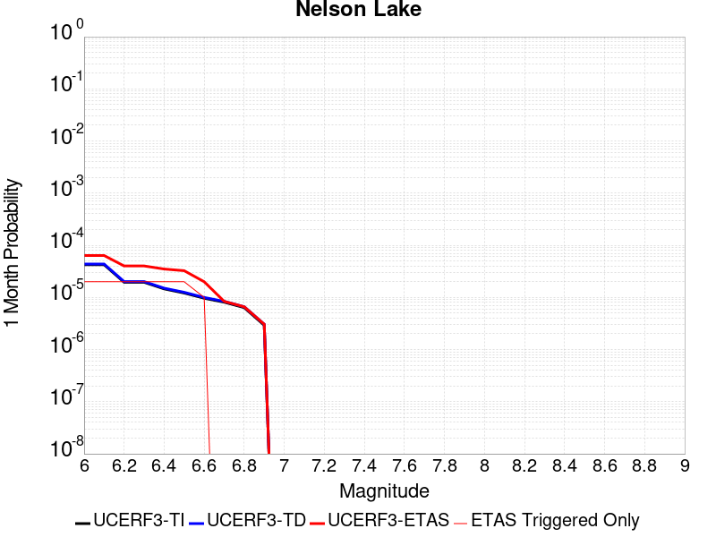 |  | 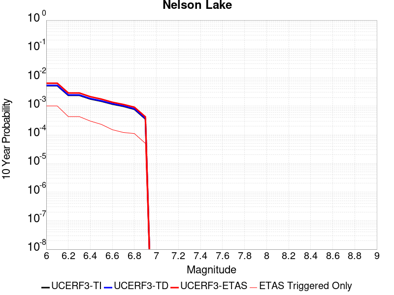 |

| Magnitude | 1 wk TI Prob | 1 wk TD Prob | 1 wk ETAS Prob | 1 wk ETAS/TD Gain | 1 wk ETAS Triggered Only | 1 mo TI Prob | 1 mo TD Prob | 1 mo ETAS Prob | 1 mo ETAS/TD Gain | 1 mo ETAS Triggered Only | 1 yr TI Prob | 1 yr TD Prob | 1 yr ETAS Prob | 1 yr ETAS/TD Gain | 1 yr ETAS Triggered Only | 10 yr TI Prob | 10 yr TD Prob | 10 yr ETAS Prob | 10 yr ETAS/TD Gain | 10 yr ETAS Triggered Only |
|-----|-----|-----|-----|-----|-----|-----|-----|-----|-----|-----|-----|-----|-----|-----|-----|-----|-----|-----|-----|-----|
| 6.0 | 9.913453E-6 | 1.0192636E-5 | 1.0192636E-5 | 1.0 | 0.0 | 4.2485535E-5 | 4.3682052E-5 | 4.3682052E-5 | 1.0 | 0.0 | 5.1713863E-4 | 5.317096E-4 | 8.678159E-4 | 1.632124 | 3.3628516E-4 | 0.0051593683 | 0.0053054015 | 0.006308905 | 1.1891475 | 0.0010088555 |
| 6.1 | 9.913453E-6 | 1.0192636E-5 | 1.0192636E-5 | 1.0 | 0.0 | 4.2485535E-5 | 4.3682052E-5 | 4.3682052E-5 | 1.0 | 0.0 | 5.1713863E-4 | 5.317096E-4 | 8.678159E-4 | 1.632124 | 3.3628516E-4 | 0.0051593683 | 0.0053054015 | 0.006308905 | 1.1891475 | 0.0010088555 |
| 6.2 | 4.5596407E-6 | 4.6965E-6 | 4.6965E-6 | 1.0 | 0.0 | 1.954117E-5 | 2.0127709E-5 | 2.0127709E-5 | 1.0 | 0.0 | 2.3788778E-4 | 2.4502858E-4 | 4.6916376E-4 | 1.9147308 | 2.2419011E-4 | 0.0023763329 | 0.0024477101 | 0.0030068136 | 1.228419 | 5.604753E-4 |
| 6.3 | 4.5596407E-6 | 4.6965E-6 | 4.6965E-6 | 1.0 | 0.0 | 1.954117E-5 | 2.0127709E-5 | 2.0127709E-5 | 1.0 | 0.0 | 2.3788778E-4 | 2.4502858E-4 | 4.6916376E-4 | 1.9147308 | 2.2419011E-4 | 0.0023763329 | 0.0024477101 | 0.0030068136 | 1.228419 | 5.604753E-4 |
| 6.4 | 3.4025713E-6 | 3.5100445E-6 | 3.5100445E-6 | 1.0 | 0.0 | 1.4582367E-5 | 1.5042965E-5 | 1.5042965E-5 | 1.0 | 0.0 | 1.7752586E-4 | 1.8313355E-4 | 2.9520807E-4 | 1.6119825 | 1.12095055E-4 | 0.001773841 | 0.0018299093 | 0.0020536892 | 1.1222901 | 2.2419011E-4 |
| 6.5 | 2.8352947E-6 | 2.9279831E-6 | 2.9279831E-6 | 1.0 | 0.0 | 1.2151207E-5 | 1.2548443E-5 | 1.2548443E-5 | 1.0 | 0.0 | 1.479309E-4 | 1.5276733E-4 | 2.6484526E-4 | 1.7336512 | 1.12095055E-4 | 0.0014783246 | 0.0015266971 | 0.0017505449 | 1.1466223 | 2.2419011E-4 |
| 6.6 | 2.251518E-6 | 2.329174E-6 | 2.329174E-6 | 1.0 | 0.0 | 9.649328E-6 | 9.982141E-6 | 9.982141E-6 | 1.0 | 0.0 | 1.1747423E-4 | 1.2152641E-4 | 2.3360785E-4 | 1.9222804 | 1.12095055E-4 | 0.0011741214 | 0.0012146613 | 0.0013266202 | 1.092173 | 1.12095055E-4 |
| 6.7 | 1.8911853E-6 | 1.9592333E-6 | 1.9592333E-6 | 1.0 | 0.0 | 8.105055E-6 | 8.39669E-6 | 8.39669E-6 | 1.0 | 0.0 | 9.867457E-5 | 1.02225495E-4 | 2.143091E-4 | 2.0964348 | 1.12095055E-4 | 9.863076E-4 | 0.0010218422 | 0.0011338227 | 1.1095868 | 1.12095055E-4 |
| 6.8 | 1.4874814E-6 | 1.5439082E-6 | 1.5439082E-6 | 1.0 | 0.0 | 6.374905E-6 | 6.6167354E-6 | 6.6167354E-6 | 1.0 | 0.0 | 7.76117E-5 | 8.0556296E-5 | 1.9264233E-4 | 2.3913999 | 1.12095055E-4 | 7.75846E-4 | 8.053221E-4 | 9.1732683E-4 | 1.1390808 | 1.12095055E-4 |
| 6.9 | 6.835972E-7 | 7.140349E-7 | 7.140349E-7 | 1.0 | 0.0 | 2.9296991E-6 | 3.060148E-6 | 3.060148E-6 | 1.0 | 0.0 | 3.56685E-5 | 3.725698E-5 | 1.4934786E-4 | 4.0085874 | 1.12095055E-4 | 3.5662777E-4 | 3.7253863E-4 | 4.8459193E-4 | 1.300783 | 1.12095055E-4 |

## Lenwood-Lockhart-Old Woman Springs
*[(top)](#table-of-contents)*

| 1 Week | 1 Month | 1 Year | 10 Year |
|-----|-----|-----|-----|
|  |  | 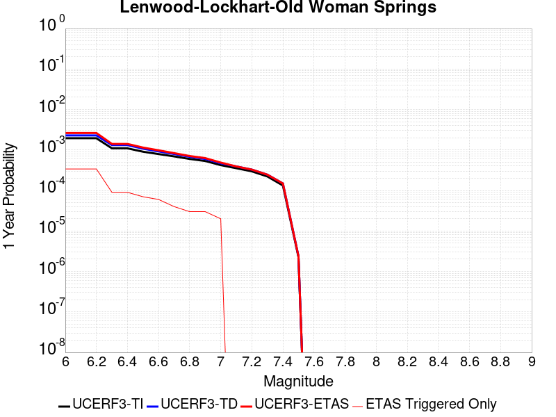 | 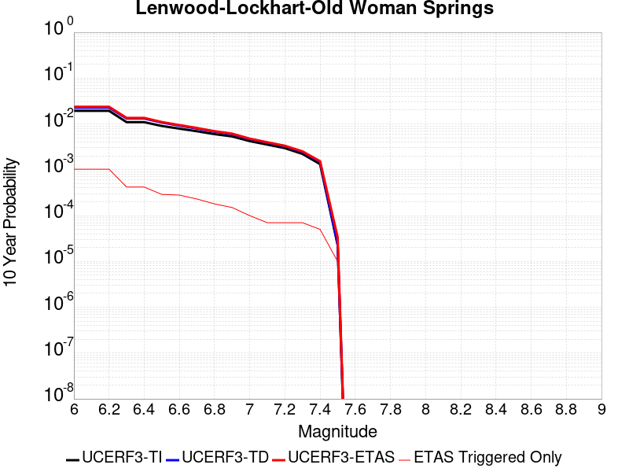 |

| Magnitude | 1 wk TI Prob | 1 wk TD Prob | 1 wk ETAS Prob | 1 wk ETAS/TD Gain | 1 wk ETAS Triggered Only | 1 mo TI Prob | 1 mo TD Prob | 1 mo ETAS Prob | 1 mo ETAS/TD Gain | 1 mo ETAS Triggered Only | 1 yr TI Prob | 1 yr TD Prob | 1 yr ETAS Prob | 1 yr ETAS/TD Gain | 1 yr ETAS Triggered Only | 10 yr TI Prob | 10 yr TD Prob | 10 yr ETAS Prob | 10 yr ETAS/TD Gain | 10 yr ETAS Triggered Only |
|-----|-----|-----|-----|-----|-----|-----|-----|-----|-----|-----|-----|-----|-----|-----|-----|-----|-----|-----|-----|-----|
| 6.0 | 3.744542E-5 | 4.3966986E-5 | 4.3966986E-5 | 1.0 | 0.0 | 1.604705E-4 | 1.884173E-4 | 1.884173E-4 | 1.0 | 0.0 | 0.0019519776 | 0.0022917395 | 0.0024035776 | 1.0488006 | 1.12095055E-4 | 0.019349206 | 0.022699071 | 0.023575475 | 1.0386097 | 8.9676044E-4 |
| 6.1 | 3.744542E-5 | 4.3966986E-5 | 4.3966986E-5 | 1.0 | 0.0 | 1.604705E-4 | 1.884173E-4 | 1.884173E-4 | 1.0 | 0.0 | 0.0019519776 | 0.0022917395 | 0.0024035776 | 1.0488006 | 1.12095055E-4 | 0.019349206 | 0.022699071 | 0.023575475 | 1.0386097 | 8.9676044E-4 |
| 6.2 | 3.744542E-5 | 4.3966986E-5 | 4.3966986E-5 | 1.0 | 0.0 | 1.604705E-4 | 1.884173E-4 | 1.884173E-4 | 1.0 | 0.0 | 0.0019519776 | 0.0022917395 | 0.0024035776 | 1.0488006 | 1.12095055E-4 | 0.019349206 | 0.022699071 | 0.023575475 | 1.0386097 | 8.9676044E-4 |
| 6.3 | 2.1079984E-5 | 2.535506E-5 | 2.535506E-5 | 1.0 | 0.0 | 9.0339665E-5 | 1.0866013E-4 | 1.0866013E-4 | 1.0 | 0.0 | 0.0010993304 | 0.0013221542 | 0.001434101 | 1.0846701 | 1.12095055E-4 | 0.010939079 | 0.013145096 | 0.01347696 | 1.0252463 | 3.3628516E-4 |
| 6.4 | 2.1079984E-5 | 2.535506E-5 | 2.535506E-5 | 1.0 | 0.0 | 9.0339665E-5 | 1.0866013E-4 | 1.0866013E-4 | 1.0 | 0.0 | 0.0010993304 | 0.0013221542 | 0.001434101 | 1.0846701 | 1.12095055E-4 | 0.010939079 | 0.013145096 | 0.01347696 | 1.0252463 | 3.3628516E-4 |
| 6.5 | 1.7397282E-5 | 2.0663669E-5 | 2.0663669E-5 | 1.0 | 0.0 | 7.455765E-5 | 8.855564E-5 | 8.855564E-5 | 1.0 | 0.0 | 9.073613E-4 | 0.0010776434 | 0.0011896177 | 1.1039066 | 1.12095055E-4 | 0.009036654 | 0.01072547 | 0.010947256 | 1.0206784 | 2.2419011E-4 |
| 6.6 | 1.52050325E-5 | 1.768075E-5 | 1.768075E-5 | 1.0 | 0.0 | 6.51628E-5 | 7.5772485E-5 | 7.5772485E-5 | 1.0 | 0.0 | 7.9306826E-4 | 9.221474E-4 | 0.0010341391 | 1.1214466 | 1.12095055E-4 | 0.007902439 | 0.009184072 | 0.009406203 | 1.0241866 | 2.2419011E-4 |
| 6.7 | 1.332523E-5 | 1.5264892E-5 | 1.5264892E-5 | 1.0 | 0.0 | 5.7106878E-5 | 6.541936E-5 | 6.541936E-5 | 1.0 | 0.0 | 6.950544E-4 | 7.9619547E-4 | 9.0820127E-4 | 1.1406763 | 1.12095055E-4 | 0.006928845 | 0.007934059 | 0.0080452645 | 1.0140163 | 1.12095055E-4 |
| 6.8 | 1.1525329E-5 | 1.3031687E-5 | 1.3031687E-5 | 1.0 | 0.0 | 4.9393333E-5 | 5.5848912E-5 | 5.5848912E-5 | 1.0 | 0.0 | 6.011979E-4 | 6.797526E-4 | 7.9177145E-4 | 1.1647936 | 1.12095055E-4 | 0.00599574 | 0.0067771855 | 0.006888521 | 1.016428 | 1.12095055E-4 |
| 6.9 | 1.0253909E-5 | 1.15150315E-5 | 1.15150315E-5 | 1.0 | 0.0 | 4.3944583E-5 | 4.9349223E-5 | 4.9349223E-5 | 1.0 | 0.0 | 5.3489394E-4 | 6.0066476E-4 | 7.126925E-4 | 1.1865063 | 1.12095055E-4 | 0.0053360825 | 0.0059907916 | 0.006102215 | 1.0185992 | 1.12095055E-4 |
| 7.0 | 8.104563E-6 | 8.991697E-6 | 8.991697E-6 | 1.0 | 0.0 | 3.4733377E-5 | 3.8535287E-5 | 3.8535287E-5 | 1.0 | 0.0 | 4.2279682E-4 | 4.6906853E-4 | 5.81111E-4 | 1.2388617 | 1.12095055E-4 | 0.0042199334 | 0.0046810326 | 0.0047926027 | 1.0238346 | 1.12095055E-4 |
| 7.1 | 6.7986157E-6 | 7.516141E-6 | 7.516141E-6 | 1.0 | 0.0 | 2.91366E-5 | 3.2211647E-5 | 3.2211647E-5 | 1.0 | 0.0 | 3.5468035E-4 | 3.9210837E-4 | 3.9210837E-4 | 1.0 | 0.0 | 0.003541148 | 0.003914382 | 0.003914382 | 1.0 | 0.0 |
| 7.2 | 5.6893327E-6 | 6.2802674E-6 | 6.2802674E-6 | 1.0 | 0.0 | 2.4382627E-5 | 2.6915166E-5 | 2.6915166E-5 | 1.0 | 0.0 | 2.9681803E-4 | 3.2764484E-4 | 3.2764484E-4 | 1.0 | 0.0 | 0.002964219 | 0.0032718165 | 0.0032718165 | 1.0 | 0.0 |
| 7.3 | 4.253348E-6 | 4.707076E-6 | 4.707076E-6 | 1.0 | 0.0 | 1.8228506E-5 | 2.0173036E-5 | 2.0173036E-5 | 1.0 | 0.0 | 2.2190946E-4 | 2.455809E-4 | 2.455809E-4 | 1.0 | 0.0 | 0.00221688 | 0.002453276 | 0.002453276 | 1.0 | 0.0 |
| 7.4 | 2.5448119E-6 | 2.852129E-6 | 2.852129E-6 | 1.0 | 0.0 | 1.0906291E-5 | 1.2223362E-5 | 1.2223362E-5 | 1.0 | 0.0 | 1.3277601E-4 | 1.4881093E-4 | 1.4881093E-4 | 1.0 | 0.0 | 0.001326967 | 0.0014872749 | 0.0014872749 | 1.0 | 0.0 |
| 7.5 | 4.3706837E-8 | 4.5631754E-8 | 4.5631754E-8 | 1.0 | 0.0 | 1.8731501E-7 | 1.9556464E-7 | 1.9556464E-7 | 1.0 | 0.0 | 2.2805577E-6 | 2.3809976E-6 | 2.3809976E-6 | 1.0 | 0.0 | 2.2805343E-5 | 2.3809775E-5 | 2.3809775E-5 | 1.0 | 0.0 |

## Bicycle Lake
*[(top)](#table-of-contents)*

| 1 Week | 1 Month | 1 Year | 10 Year |
|-----|-----|-----|-----|
| 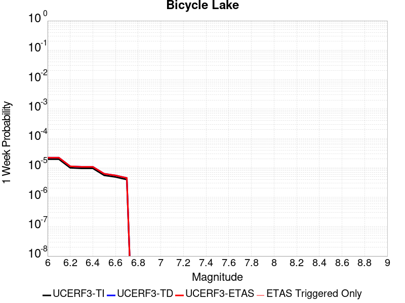 |  |  |  |

| Magnitude | 1 wk TI Prob | 1 wk TD Prob | 1 wk ETAS Prob | 1 wk ETAS/TD Gain | 1 wk ETAS Triggered Only | 1 mo TI Prob | 1 mo TD Prob | 1 mo ETAS Prob | 1 mo ETAS/TD Gain | 1 mo ETAS Triggered Only | 1 yr TI Prob | 1 yr TD Prob | 1 yr ETAS Prob | 1 yr ETAS/TD Gain | 1 yr ETAS Triggered Only | 10 yr TI Prob | 10 yr TD Prob | 10 yr ETAS Prob | 10 yr ETAS/TD Gain | 10 yr ETAS Triggered Only |
|-----|-----|-----|-----|-----|-----|-----|-----|-----|-----|-----|-----|-----|-----|-----|-----|-----|-----|-----|-----|-----|
| 6.0 | 1.9621975E-5 | 2.2100778E-5 | 2.2100778E-5 | 1.0 | 0.0 | 8.4091465E-5 | 9.471494E-5 | 9.471494E-5 | 1.0 | 0.0 | 0.0010233327 | 0.0011526794 | 0.001488577 | 1.2914059 | 3.3628516E-4 | 0.01018633 | 0.011480321 | 0.012034362 | 1.0482601 | 5.604753E-4 |
| 6.1 | 1.9621975E-5 | 2.2100778E-5 | 2.2100778E-5 | 1.0 | 0.0 | 8.4091465E-5 | 9.471494E-5 | 9.471494E-5 | 1.0 | 0.0 | 0.0010233327 | 0.0011526794 | 0.001488577 | 1.2914059 | 3.3628516E-4 | 0.01018633 | 0.011480321 | 0.012034362 | 1.0482601 | 5.604753E-4 |
| 6.2 | 9.9971285E-6 | 1.1257519E-5 | 1.1257519E-5 | 1.0 | 0.0 | 4.2844134E-5 | 4.8245915E-5 | 4.8245915E-5 | 1.0 | 0.0 | 5.2150246E-4 | 5.872877E-4 | 6.993169E-4 | 1.1907569 | 1.12095055E-4 | 0.0052028033 | 0.0058624637 | 0.0060853395 | 1.0380174 | 2.2419011E-4 |
| 6.3 | 9.589428E-6 | 1.0800152E-5 | 1.0800152E-5 | 1.0 | 0.0 | 4.10969E-5 | 4.6285837E-5 | 4.6285837E-5 | 1.0 | 0.0 | 5.002399E-4 | 5.6343625E-4 | 6.754681E-4 | 1.1988369 | 1.12095055E-4 | 0.0049911533 | 0.005625169 | 0.005736633 | 1.0198153 | 1.12095055E-4 |
| 6.4 | 9.589428E-6 | 1.0800152E-5 | 1.0800152E-5 | 1.0 | 0.0 | 4.10969E-5 | 4.6285837E-5 | 4.6285837E-5 | 1.0 | 0.0 | 5.002399E-4 | 5.6343625E-4 | 6.754681E-4 | 1.1988369 | 1.12095055E-4 | 0.0049911533 | 0.005625169 | 0.005736633 | 1.0198153 | 1.12095055E-4 |
| 6.5 | 5.557707E-6 | 6.2866934E-6 | 6.2866934E-6 | 1.0 | 0.0 | 2.3818526E-5 | 2.6942846E-5 | 2.6942846E-5 | 1.0 | 0.0 | 2.8995197E-4 | 3.2800666E-4 | 3.2800666E-4 | 1.0 | 0.0 | 0.0028957394 | 0.0032778624 | 0.0032778624 | 1.0 | 0.0 |
| 6.6 | 4.8742945E-6 | 5.5142486E-6 | 5.5142486E-6 | 1.0 | 0.0 | 2.0889667E-5 | 2.3632427E-5 | 2.3632427E-5 | 1.0 | 0.0 | 2.54302E-4 | 2.8771302E-4 | 2.8771302E-4 | 1.0 | 0.0 | 0.002540112 | 0.002875975 | 0.002875975 | 1.0 | 0.0 |
| 6.7 | 3.991108E-6 | 4.516698E-6 | 4.516698E-6 | 1.0 | 0.0 | 1.7104636E-5 | 1.9357278E-5 | 1.9357278E-5 | 1.0 | 0.0 | 2.0822904E-4 | 2.3567484E-4 | 2.3567484E-4 | 1.0 | 0.0 | 0.0020803404 | 0.0023567486 | 0.0023567486 | 1.0 | 0.0 |

## San Andreas (San Bernardino N)
*[(top)](#table-of-contents)*

| 1 Week | 1 Month | 1 Year | 10 Year |
|-----|-----|-----|-----|
|  | 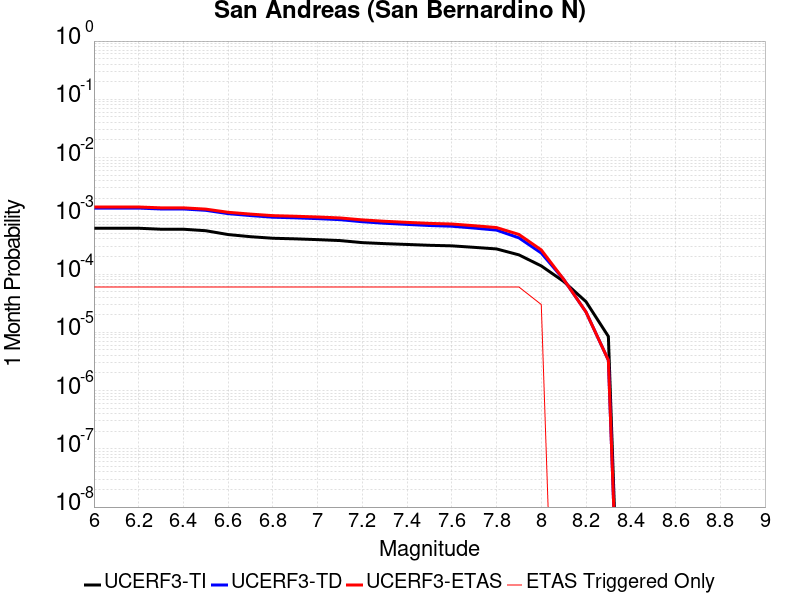 | 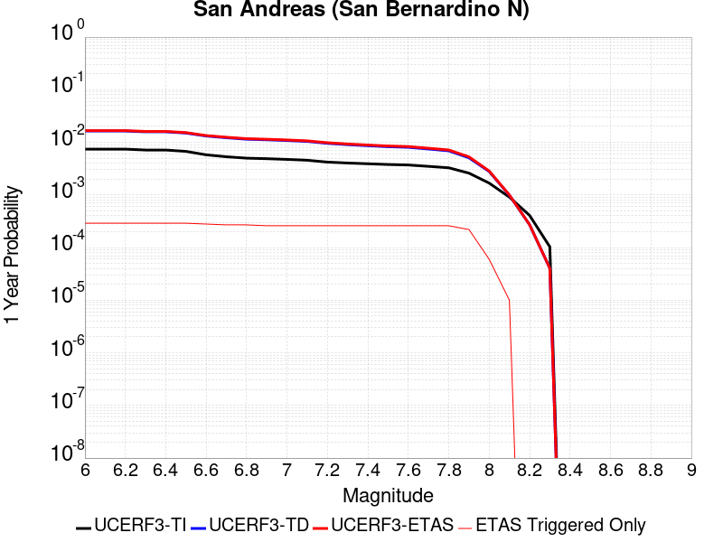 |  |

| Magnitude | 1 wk TI Prob | 1 wk TD Prob | 1 wk ETAS Prob | 1 wk ETAS/TD Gain | 1 wk ETAS Triggered Only | 1 mo TI Prob | 1 mo TD Prob | 1 mo ETAS Prob | 1 mo ETAS/TD Gain | 1 mo ETAS Triggered Only | 1 yr TI Prob | 1 yr TD Prob | 1 yr ETAS Prob | 1 yr ETAS/TD Gain | 1 yr ETAS Triggered Only | 10 yr TI Prob | 10 yr TD Prob | 10 yr ETAS Prob | 10 yr ETAS/TD Gain | 10 yr ETAS Triggered Only |
|-----|-----|-----|-----|-----|-----|-----|-----|-----|-----|-----|-----|-----|-----|-----|-----|-----|-----|-----|-----|-----|
| 6.0 | 1.4273766E-4 | 3.168E-4 | 3.168E-4 | 1.0 | 0.0 | 6.115894E-4 | 0.0013570138 | 0.0013570138 | 1.0 | 0.0 | 0.0074207084 | 0.016397987 | 0.016618501 | 1.0134476 | 2.2419011E-4 | 0.07177748 | 0.15056716 | 0.15104325 | 1.0031619 | 5.604753E-4 |
| 6.1 | 1.4273766E-4 | 3.168E-4 | 3.168E-4 | 1.0 | 0.0 | 6.115894E-4 | 0.0013570138 | 0.0013570138 | 1.0 | 0.0 | 0.0074207084 | 0.016397987 | 0.016618501 | 1.0134476 | 2.2419011E-4 | 0.07177748 | 0.15056716 | 0.15104325 | 1.0031619 | 5.604753E-4 |
| 6.2 | 1.4273766E-4 | 3.168E-4 | 3.168E-4 | 1.0 | 0.0 | 6.115894E-4 | 0.0013570138 | 0.0013570138 | 1.0 | 0.0 | 0.0074207084 | 0.016397987 | 0.016618501 | 1.0134476 | 2.2419011E-4 | 0.07177748 | 0.15056716 | 0.15104325 | 1.0031619 | 5.604753E-4 |
| 6.3 | 1.3730655E-4 | 3.058448E-4 | 3.058448E-4 | 1.0 | 0.0 | 5.883239E-4 | 0.0013101106 | 0.0013101106 | 1.0 | 0.0 | 0.0071393442 | 0.015835345 | 0.016055984 | 1.0139334 | 2.2419011E-4 | 0.06914291 | 0.14586715 | 0.14634588 | 1.003282 | 5.604753E-4 |
| 6.4 | 1.3730655E-4 | 3.058448E-4 | 3.058448E-4 | 1.0 | 0.0 | 5.883239E-4 | 0.0013101106 | 0.0013101106 | 1.0 | 0.0 | 0.0071393442 | 0.015835345 | 0.016055984 | 1.0139334 | 2.2419011E-4 | 0.06914291 | 0.14586715 | 0.14634588 | 1.003282 | 5.604753E-4 |
| 6.5 | 1.2942807E-4 | 2.8998396E-4 | 2.8998396E-4 | 1.0 | 0.0 | 5.545738E-4 | 0.0012422017 | 0.0012422017 | 1.0 | 0.0 | 0.0067310524 | 0.01502018 | 0.015241002 | 1.0147017 | 2.2419011E-4 | 0.06530788 | 0.13901012 | 0.13949268 | 1.0034714 | 5.604753E-4 |
| 6.6 | 1.1125901E-4 | 2.5435875E-4 | 2.5435875E-4 | 1.0 | 0.0 | 4.767372E-4 | 0.0010896558 | 0.0010896558 | 1.0 | 0.0 | 0.005788839 | 0.013186495 | 0.013297112 | 1.0083886 | 1.12095055E-4 | 0.056403454 | 0.12329976 | 0.12369286 | 1.0031881 | 4.4838022E-4 |
| 6.7 | 1.02209575E-4 | 2.3570309E-4 | 2.3570309E-4 | 1.0 | 0.0 | 4.3796748E-4 | 0.0010097665 | 0.0010097665 | 1.0 | 0.0 | 0.0053192247 | 0.012225031 | 0.012335756 | 1.0090572 | 1.12095055E-4 | 0.051936906 | 0.115092136 | 0.11548891 | 1.0034474 | 4.4838022E-4 |
| 6.8 | 9.610582E-5 | 2.2095144E-4 | 2.2095144E-4 | 1.0 | 0.0 | 4.1181705E-4 | 9.465918E-4 | 9.465918E-4 | 1.0 | 0.0 | 0.0050023515 | 0.011464122 | 0.011574931 | 1.0096658 | 1.12095055E-4 | 0.048912346 | 0.10849237 | 0.108892106 | 1.0036844 | 4.4838022E-4 |
| 6.9 | 9.3877505E-5 | 2.1550381E-4 | 2.1550381E-4 | 1.0 | 0.0 | 4.0227012E-4 | 9.232615E-4 | 9.232615E-4 | 1.0 | 0.0 | 0.0048866454 | 0.011183022 | 0.011293863 | 1.0099115 | 1.12095055E-4 | 0.04780577 | 0.10608222 | 0.106483035 | 1.0037783 | 4.4838022E-4 |
| 7.0 | 9.1019785E-5 | 2.087683E-4 | 2.087683E-4 | 1.0 | 0.0 | 3.900265E-4 | 8.944151E-4 | 8.944151E-4 | 1.0 | 0.0 | 0.0047382377 | 0.010835359 | 0.010946239 | 1.0102332 | 1.12095055E-4 | 0.046384744 | 0.10305153 | 0.1034537 | 1.0039027 | 4.4838022E-4 |
| 7.1 | 8.771155E-5 | 2.0050864E-4 | 2.0050864E-4 | 1.0 | 0.0 | 3.758525E-4 | 8.590403E-4 | 8.590403E-4 | 1.0 | 0.0 | 0.0045664064 | 0.010408859 | 0.010519787 | 1.0106571 | 1.12095055E-4 | 0.044737056 | 0.09936224 | 0.09976607 | 1.0040642 | 4.4838022E-4 |
| 7.2 | 8.0830236E-5 | 1.8455362E-4 | 1.8455362E-4 | 1.0 | 0.0 | 3.4636928E-4 | 7.907045E-4 | 7.907045E-4 | 1.0 | 0.0 | 0.0042088944 | 0.009584441 | 0.009695462 | 1.0115834 | 1.12095055E-4 | 0.041300658 | 0.09209058 | 0.09249767 | 1.0044205 | 4.4838022E-4 |
| 7.3 | 7.7668235E-5 | 1.739772E-4 | 1.739772E-4 | 1.0 | 0.0 | 3.328214E-4 | 7.454036E-4 | 7.454036E-4 | 1.0 | 0.0 | 0.0040445733 | 0.0090376055 | 0.009148687 | 1.0122911 | 1.12095055E-4 | 0.03971748 | 0.08735465 | 0.08776387 | 1.0046844 | 4.4838022E-4 |
| 7.4 | 7.520177E-5 | 1.6616903E-4 | 1.6616903E-4 | 1.0 | 0.0 | 3.2225347E-4 | 7.119587E-4 | 7.119587E-4 | 1.0 | 0.0 | 0.0039163795 | 0.008633714 | 0.008744841 | 1.0128713 | 1.12095055E-4 | 0.038480744 | 0.08380819 | 0.084218994 | 1.0049016 | 4.4838022E-4 |
| 7.5 | 7.274697E-5 | 1.5903711E-4 | 1.5903711E-4 | 1.0 | 0.0 | 3.1173544E-4 | 6.814096E-4 | 6.814096E-4 | 1.0 | 0.0 | 0.003788775 | 0.008264662 | 0.008375831 | 1.0134511 | 1.12095055E-4 | 0.03724827 | 0.080522425 | 0.080934696 | 1.00512 | 4.4838022E-4 |
| 7.6 | 7.1185845E-5 | 1.547303E-4 | 1.547303E-4 | 1.0 | 0.0 | 3.0504653E-4 | 6.6296133E-4 | 6.6296133E-4 | 1.0 | 0.0 | 0.0037076178 | 0.008041735 | 0.008152928 | 1.0138271 | 1.12095055E-4 | 0.036463667 | 0.078510396 | 0.078923576 | 1.0052627 | 4.4838022E-4 |
| 7.7 | 6.709961E-5 | 1.4380377E-4 | 1.4380377E-4 | 1.0 | 0.0 | 2.8753807E-4 | 6.161563E-4 | 6.161563E-4 | 1.0 | 0.0 | 0.003495157 | 0.0074759396 | 0.007587197 | 1.014882 | 1.12095055E-4 | 0.034406938 | 0.073334016 | 0.07374952 | 1.0056658 | 4.4838022E-4 |
| 7.8 | 6.300812E-5 | 1.326129E-4 | 1.326129E-4 | 1.0 | 0.0 | 2.7000686E-4 | 5.682172E-4 | 5.682172E-4 | 1.0 | 0.0 | 0.0032823787 | 0.0068961293 | 0.0070074517 | 1.0161427 | 1.12095055E-4 | 0.032343175 | 0.06798044 | 0.068398334 | 1.0061474 | 4.4838022E-4 |
| 7.9 | 4.983037E-5 | 9.769929E-5 | 9.769929E-5 | 1.0 | 0.0 | 2.1354125E-4 | 4.1864405E-4 | 4.1864405E-4 | 1.0 | 0.0 | 0.0025967648 | 0.0050850897 | 0.005196615 | 1.0219318 | 1.12095055E-4 | 0.025666296 | 0.05086521 | 0.051290784 | 1.0083667 | 4.4838022E-4 |
| 8.0 | 3.2211527E-5 | 5.3577114E-5 | 5.3577114E-5 | 1.0 | 0.0 | 1.380421E-4 | 2.2959601E-4 | 2.2959601E-4 | 1.0 | 0.0 | 0.0016793669 | 0.00279175 | 0.00279175 | 1.0 | 0.0 | 0.016667323 | 0.028494263 | 0.028603164 | 1.0038218 | 1.12095055E-4 |
| 8.1 | 1.743376E-5 | 1.8952034E-5 | 1.8952034E-5 | 1.0 | 0.0 | 7.471398E-5 | 8.122048E-5 | 8.122048E-5 | 1.0 | 0.0 | 9.0926304E-4 | 9.884114E-4 | 9.884114E-4 | 1.0 | 0.0 | 0.009055517 | 0.010550455 | 0.010550455 | 1.0 | 0.0 |
| 8.2 | 7.831616E-6 | 5.2024393E-6 | 5.2024393E-6 | 1.0 | 0.0 | 3.3563636E-5 | 2.2295979E-5 | 2.2295979E-5 | 1.0 | 0.0 | 4.0856065E-4 | 2.714198E-4 | 2.714198E-4 | 1.0 | 0.0 | 0.004078103 | 0.0030675507 | 0.0030675507 | 1.0 | 0.0 |
| 8.3 | 1.983087E-6 | 7.7486385E-7 | 7.7486385E-7 | 1.0 | 0.0 | 8.498917E-6 | 3.320841E-6 | 3.320841E-6 | 1.0 | 0.0 | 1.034694E-4 | 4.0430506E-5 | 4.0430506E-5 | 1.0 | 0.0 | 0.0010342124 | 4.7705657E-4 | 4.7705657E-4 | 1.0 | 0.0 |

## Towne Pass
*[(top)](#table-of-contents)*

| 1 Week | 1 Month | 1 Year | 10 Year |
|-----|-----|-----|-----|
|  |  |  |  |

| Magnitude | 1 wk TI Prob | 1 wk TD Prob | 1 wk ETAS Prob | 1 wk ETAS/TD Gain | 1 wk ETAS Triggered Only | 1 mo TI Prob | 1 mo TD Prob | 1 mo ETAS Prob | 1 mo ETAS/TD Gain | 1 mo ETAS Triggered Only | 1 yr TI Prob | 1 yr TD Prob | 1 yr ETAS Prob | 1 yr ETAS/TD Gain | 1 yr ETAS Triggered Only | 10 yr TI Prob | 10 yr TD Prob | 10 yr ETAS Prob | 10 yr ETAS/TD Gain | 10 yr ETAS Triggered Only |
|-----|-----|-----|-----|-----|-----|-----|-----|-----|-----|-----|-----|-----|-----|-----|-----|-----|-----|-----|-----|-----|
| 6.0 | 3.849728E-6 | 3.8946237E-6 | 3.8946237E-6 | 1.0 | 0.0 | 1.649873E-5 | 1.6691163E-5 | 1.6691163E-5 | 1.0 | 0.0 | 2.0085352E-4 | 2.0320032E-4 | 5.3941715E-4 | 2.6546078 | 3.3628516E-4 | 0.0020067208 | 0.0020305745 | 0.0025899117 | 1.2754576 | 5.604753E-4 |
| 6.1 | 3.849728E-6 | 3.8946237E-6 | 3.8946237E-6 | 1.0 | 0.0 | 1.649873E-5 | 1.6691163E-5 | 1.6691163E-5 | 1.0 | 0.0 | 2.0085352E-4 | 2.0320032E-4 | 5.3941715E-4 | 2.6546078 | 3.3628516E-4 | 0.0020067208 | 0.0020305745 | 0.0025899117 | 1.2754576 | 5.604753E-4 |
| 6.2 | 3.849728E-6 | 3.8946237E-6 | 3.8946237E-6 | 1.0 | 0.0 | 1.649873E-5 | 1.6691163E-5 | 1.6691163E-5 | 1.0 | 0.0 | 2.0085352E-4 | 2.0320032E-4 | 5.3941715E-4 | 2.6546078 | 3.3628516E-4 | 0.0020067208 | 0.0020305745 | 0.0025899117 | 1.2754576 | 5.604753E-4 |
| 6.3 | 3.849728E-6 | 3.8946237E-6 | 3.8946237E-6 | 1.0 | 0.0 | 1.649873E-5 | 1.6691163E-5 | 1.6691163E-5 | 1.0 | 0.0 | 2.0085352E-4 | 2.0320032E-4 | 5.3941715E-4 | 2.6546078 | 3.3628516E-4 | 0.0020067208 | 0.0020305745 | 0.0025899117 | 1.2754576 | 5.604753E-4 |
| 6.4 | 3.849728E-6 | 3.8946237E-6 | 3.8946237E-6 | 1.0 | 0.0 | 1.649873E-5 | 1.6691163E-5 | 1.6691163E-5 | 1.0 | 0.0 | 2.0085352E-4 | 2.0320032E-4 | 5.3941715E-4 | 2.6546078 | 3.3628516E-4 | 0.0020067208 | 0.0020305745 | 0.0025899117 | 1.2754576 | 5.604753E-4 |
| 6.5 | 1.1953545E-6 | 1.2030846E-6 | 1.2030846E-6 | 1.0 | 0.0 | 5.1229376E-6 | 5.156067E-6 | 5.156067E-6 | 1.0 | 0.0 | 6.236998E-5 | 6.2773426E-5 | 1.7486144E-4 | 2.7855966 | 1.12095055E-4 | 6.235248E-4 | 6.275687E-4 | 7.395934E-4 | 1.1785059 | 1.12095055E-4 |
| 6.6 | 1.1953545E-6 | 1.2030846E-6 | 1.2030846E-6 | 1.0 | 0.0 | 5.1229376E-6 | 5.156067E-6 | 5.156067E-6 | 1.0 | 0.0 | 6.236998E-5 | 6.2773426E-5 | 1.7486144E-4 | 2.7855966 | 1.12095055E-4 | 6.235248E-4 | 6.275687E-4 | 7.395934E-4 | 1.1785059 | 1.12095055E-4 |
| 6.7 | 8.375951E-7 | 8.410939E-7 | 8.410939E-7 | 1.0 | 0.0 | 3.5896885E-6 | 3.6046833E-6 | 3.6046833E-6 | 1.0 | 0.0 | 4.370358E-5 | 4.3886193E-5 | 1.5597633E-4 | 3.5541093 | 1.12095055E-4 | 4.3694986E-4 | 4.38781E-4 | 5.508269E-4 | 1.2553571 | 1.12095055E-4 |
| 6.8 | 6.38041E-7 | 6.3923943E-7 | 6.3923943E-7 | 1.0 | 0.0 | 2.7344586E-6 | 2.7395947E-6 | 2.7395947E-6 | 1.0 | 0.0 | 3.3291526E-5 | 3.3354096E-5 | 3.3354096E-5 | 1.0 | 0.0 | 3.3286537E-4 | 3.334947E-4 | 3.334947E-4 | 1.0 | 0.0 |
| 6.9 | 5.3460053E-7 | 5.345554E-7 | 5.345554E-7 | 1.0 | 0.0 | 2.2911431E-6 | 2.2909499E-6 | 2.2909499E-6 | 1.0 | 0.0 | 2.789431E-5 | 2.7891992E-5 | 2.7891992E-5 | 1.0 | 0.0 | 2.789081E-4 | 2.7888824E-4 | 2.7888824E-4 | 1.0 | 0.0 |
| 7.0 | 3.557783E-7 | 3.5326104E-7 | 3.5326104E-7 | 1.0 | 0.0 | 1.5247632E-6 | 1.513975E-6 | 1.513975E-6 | 1.0 | 0.0 | 1.8563835E-5 | 1.8432498E-5 | 1.8432498E-5 | 1.0 | 0.0 | 1.8562283E-4 | 1.8431054E-4 | 1.8431054E-4 | 1.0 | 0.0 |
| 7.1 | 3.037942E-7 | 3.000393E-7 | 3.000393E-7 | 1.0 | 0.0 | 1.3019744E-6 | 1.285882E-6 | 1.285882E-6 | 1.0 | 0.0 | 1.5851423E-5 | 1.5655509E-5 | 1.5655509E-5 | 1.0 | 0.0 | 1.5850292E-4 | 1.565448E-4 | 1.565448E-4 | 1.0 | 0.0 |
| 7.2 | 2.0808248E-7 | 2.0219096E-7 | 2.0219096E-7 | 1.0 | 0.0 | 8.917818E-7 | 8.665324E-7 | 8.665324E-7 | 1.0 | 0.0 | 1.0857389E-5 | 1.0549986E-5 | 1.0549986E-5 | 1.0 | 0.0 | 1.0856859E-4 | 1.0549531E-4 | 1.0549531E-4 | 1.0 | 0.0 |
| 7.3 | 1.1162073E-7 | 1.0637787E-7 | 1.0637787E-7 | 1.0 | 0.0 | 4.7837443E-7 | 4.5590508E-7 | 4.5590508E-7 | 1.0 | 0.0 | 5.8241935E-6 | 5.550632E-6 | 5.550632E-6 | 1.0 | 0.0 | 5.8240406E-5 | 5.5505137E-5 | 5.5505137E-5 | 1.0 | 0.0 |

## Paradise
*[(top)](#table-of-contents)*

| 1 Week | 1 Month | 1 Year | 10 Year |
|-----|-----|-----|-----|
| 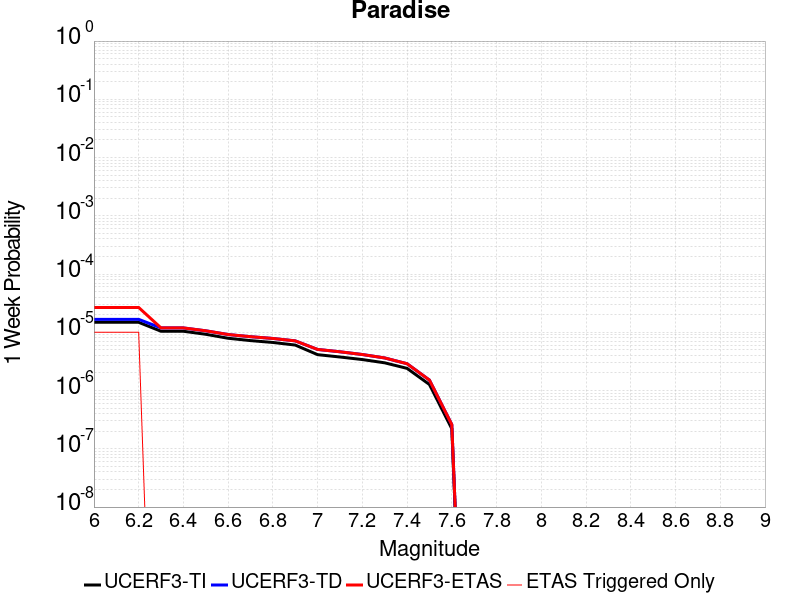 |  |  |  |

| Magnitude | 1 wk TI Prob | 1 wk TD Prob | 1 wk ETAS Prob | 1 wk ETAS/TD Gain | 1 wk ETAS Triggered Only | 1 mo TI Prob | 1 mo TD Prob | 1 mo ETAS Prob | 1 mo ETAS/TD Gain | 1 mo ETAS Triggered Only | 1 yr TI Prob | 1 yr TD Prob | 1 yr ETAS Prob | 1 yr ETAS/TD Gain | 1 yr ETAS Triggered Only | 10 yr TI Prob | 10 yr TD Prob | 10 yr ETAS Prob | 10 yr ETAS/TD Gain | 10 yr ETAS Triggered Only |
|-----|-----|-----|-----|-----|-----|-----|-----|-----|-----|-----|-----|-----|-----|-----|-----|-----|-----|-----|-----|-----|
| 6.0 | 1.4851273E-5 | 1.6696315E-5 | 1.6696315E-5 | 1.0 | 0.0 | 6.364676E-5 | 7.1553804E-5 | 7.1553804E-5 | 1.0 | 0.0 | 7.7462377E-4 | 8.70843E-4 | 0.0010948379 | 1.2572161 | 2.2419011E-4 | 0.0077192914 | 0.008676684 | 0.009232297 | 1.064035 | 5.604753E-4 |
| 6.1 | 1.4851273E-5 | 1.6696315E-5 | 1.6696315E-5 | 1.0 | 0.0 | 6.364676E-5 | 7.1553804E-5 | 7.1553804E-5 | 1.0 | 0.0 | 7.7462377E-4 | 8.70843E-4 | 0.0010948379 | 1.2572161 | 2.2419011E-4 | 0.0077192914 | 0.008676684 | 0.009232297 | 1.064035 | 5.604753E-4 |
| 6.2 | 1.4851273E-5 | 1.6696315E-5 | 1.6696315E-5 | 1.0 | 0.0 | 6.364676E-5 | 7.1553804E-5 | 7.1553804E-5 | 1.0 | 0.0 | 7.7462377E-4 | 8.70843E-4 | 0.0010948379 | 1.2572161 | 2.2419011E-4 | 0.0077192914 | 0.008676684 | 0.009232297 | 1.064035 | 5.604753E-4 |
| 6.3 | 1.0426831E-5 | 1.1889693E-5 | 1.1889693E-5 | 1.0 | 0.0 | 4.4685654E-5 | 5.0954866E-5 | 5.0954866E-5 | 1.0 | 0.0 | 5.43912E-4 | 6.2020484E-4 | 7.322304E-4 | 1.1806266 | 1.12095055E-4 | 0.0054258266 | 0.006185348 | 0.0065195533 | 1.0540317 | 3.3628516E-4 |
| 6.4 | 1.0426831E-5 | 1.1889693E-5 | 1.1889693E-5 | 1.0 | 0.0 | 4.4685654E-5 | 5.0954866E-5 | 5.0954866E-5 | 1.0 | 0.0 | 5.43912E-4 | 6.2020484E-4 | 7.322304E-4 | 1.1806266 | 1.12095055E-4 | 0.0054258266 | 0.006185348 | 0.0065195533 | 1.0540317 | 3.3628516E-4 |
| 6.5 | 9.25027E-6 | 1.0620901E-5 | 1.0620901E-5 | 1.0 | 0.0 | 3.964341E-5 | 4.551738E-5 | 4.551738E-5 | 1.0 | 0.0 | 4.8255164E-4 | 5.540381E-4 | 6.66071E-4 | 1.2022116 | 1.12095055E-4 | 0.0048150513 | 0.005527068 | 0.0057500186 | 1.040338 | 2.2419011E-4 |
| 6.6 | 7.904275E-6 | 9.160301E-6 | 9.160301E-6 | 1.0 | 0.0 | 3.3875025E-5 | 3.9257862E-5 | 3.9257862E-5 | 1.0 | 0.0 | 4.1235037E-4 | 4.778636E-4 | 5.899051E-4 | 1.2344633 | 1.12095055E-4 | 0.0041158604 | 0.004768757 | 0.004880318 | 1.023394 | 1.12095055E-4 |
| 6.7 | 7.2061953E-6 | 8.407947E-6 | 8.407947E-6 | 1.0 | 0.0 | 3.088333E-5 | 3.603358E-5 | 3.603358E-5 | 1.0 | 0.0 | 3.7593965E-4 | 4.386242E-4 | 5.506701E-4 | 1.2554485 | 1.12095055E-4 | 0.003753043 | 0.0043779537 | 0.0044895583 | 1.0254923 | 1.12095055E-4 |
| 6.8 | 6.6948724E-6 | 7.842809E-6 | 7.842809E-6 | 1.0 | 0.0 | 2.8691995E-5 | 3.3611625E-5 | 3.3611625E-5 | 1.0 | 0.0 | 3.4926904E-4 | 4.0914828E-4 | 5.2119745E-4 | 1.2738596 | 1.12095055E-4 | 0.003487206 | 0.0040843077 | 0.004195945 | 1.0273333 | 1.12095055E-4 |
| 6.9 | 6.0421025E-6 | 7.131195E-6 | 7.131195E-6 | 1.0 | 0.0 | 2.5894467E-5 | 3.0561925E-5 | 3.0561925E-5 | 1.0 | 0.0 | 3.1521954E-4 | 3.720313E-4 | 3.720313E-4 | 1.0 | 0.0 | 0.0031477278 | 0.0037144232 | 0.0037144232 | 1.0 | 0.0 |
| 7.0 | 4.134091E-6 | 5.080708E-6 | 5.080708E-6 | 1.0 | 0.0 | 1.7717413E-5 | 2.177429E-5 | 2.177429E-5 | 1.0 | 0.0 | 2.1568815E-4 | 2.6507128E-4 | 2.6507128E-4 | 1.0 | 0.0 | 0.0021547892 | 0.0026477042 | 0.0026477042 | 1.0 | 0.0 |
| 7.1 | 3.7674888E-6 | 4.632229E-6 | 4.632229E-6 | 1.0 | 0.0 | 1.6146281E-5 | 1.9852267E-5 | 1.9852267E-5 | 1.0 | 0.0 | 1.9656324E-4 | 2.4167607E-4 | 2.4167607E-4 | 1.0 | 0.0 | 0.0019638946 | 0.002414283 | 0.002414283 | 1.0 | 0.0 |
| 7.2 | 3.4065345E-6 | 4.1570443E-6 | 4.1570443E-6 | 1.0 | 0.0 | 1.4599351E-5 | 1.7815792E-5 | 1.7815792E-5 | 1.0 | 0.0 | 1.777326E-4 | 2.1688716E-4 | 2.1688716E-4 | 1.0 | 0.0 | 0.0017759053 | 0.002166903 | 0.002166903 | 1.0 | 0.0 |
| 7.3 | 2.9934936E-6 | 3.6295821E-6 | 3.6295821E-6 | 1.0 | 0.0 | 1.2829195E-5 | 1.5555268E-5 | 1.5555268E-5 | 1.0 | 0.0 | 1.5618425E-4 | 1.893704E-4 | 1.893704E-4 | 1.0 | 0.0 | 0.0015607453 | 0.0018922357 | 0.0018922357 | 1.0 | 0.0 |
| 7.4 | 2.4049796E-6 | 2.8891789E-6 | 2.8891789E-6 | 1.0 | 0.0 | 1.0307015E-5 | 1.2382145E-5 | 1.2382145E-5 | 1.0 | 0.0 | 1.2548068E-4 | 1.5074362E-4 | 1.5074362E-4 | 1.0 | 0.0 | 0.0012540985 | 0.0015065551 | 0.0015065551 | 1.0 | 0.0 |
| 7.5 | 1.2710091E-6 | 1.5135612E-6 | 1.5135612E-6 | 1.0 | 0.0 | 5.44717E-6 | 6.4866817E-6 | 6.4866817E-6 | 1.0 | 0.0 | 6.631728E-5 | 7.897374E-5 | 7.897374E-5 | 1.0 | 0.0 | 6.6297496E-4 | 7.8957935E-4 | 7.8957935E-4 | 1.0 | 0.0 |
| 7.6 | 2.21172E-7 | 2.60409E-7 | 2.60409E-7 | 1.0 | 0.0 | 9.478797E-7 | 1.1160382E-6 | 1.1160382E-6 | 1.0 | 0.0 | 1.1540374E-5 | 1.358771E-5 | 1.358771E-5 | 1.0 | 0.0 | 1.1539775E-4 | 1.3587161E-4 | 1.3587161E-4 | 1.0 | 0.0 |

## Helendale-So Lockhart
*[(top)](#table-of-contents)*

| 1 Week | 1 Month | 1 Year | 10 Year |
|-----|-----|-----|-----|
|  |  |  |  |

| Magnitude | 1 wk TI Prob | 1 wk TD Prob | 1 wk ETAS Prob | 1 wk ETAS/TD Gain | 1 wk ETAS Triggered Only | 1 mo TI Prob | 1 mo TD Prob | 1 mo ETAS Prob | 1 mo ETAS/TD Gain | 1 mo ETAS Triggered Only | 1 yr TI Prob | 1 yr TD Prob | 1 yr ETAS Prob | 1 yr ETAS/TD Gain | 1 yr ETAS Triggered Only | 10 yr TI Prob | 10 yr TD Prob | 10 yr ETAS Prob | 10 yr ETAS/TD Gain | 10 yr ETAS Triggered Only |
|-----|-----|-----|-----|-----|-----|-----|-----|-----|-----|-----|-----|-----|-----|-----|-----|-----|-----|-----|-----|-----|
| 6.0 | 1.7296055E-5 | 1.8104853E-5 | 1.8104853E-5 | 1.0 | 0.0 | 7.412385E-5 | 7.759003E-5 | 7.759003E-5 | 1.0 | 0.0 | 9.0208417E-4 | 9.4427E-4 | 0.0010562593 | 1.1185987 | 1.12095055E-4 | 0.008984311 | 0.009404697 | 0.009848861 | 1.0472279 | 4.4838022E-4 |
| 6.1 | 1.7296055E-5 | 1.8104853E-5 | 1.8104853E-5 | 1.0 | 0.0 | 7.412385E-5 | 7.759003E-5 | 7.759003E-5 | 1.0 | 0.0 | 9.0208417E-4 | 9.4427E-4 | 0.0010562593 | 1.1185987 | 1.12095055E-4 | 0.008984311 | 0.009404697 | 0.009848861 | 1.0472279 | 4.4838022E-4 |
| 6.2 | 1.7296055E-5 | 1.8104853E-5 | 1.8104853E-5 | 1.0 | 0.0 | 7.412385E-5 | 7.759003E-5 | 7.759003E-5 | 1.0 | 0.0 | 9.0208417E-4 | 9.4427E-4 | 0.0010562593 | 1.1185987 | 1.12095055E-4 | 0.008984311 | 0.009404697 | 0.009848861 | 1.0472279 | 4.4838022E-4 |
| 6.3 | 1.0669118E-5 | 1.11360705E-5 | 1.11360705E-5 | 1.0 | 0.0 | 4.5723988E-5 | 4.772516E-5 | 4.772516E-5 | 1.0 | 0.0 | 5.5654737E-4 | 5.809017E-4 | 5.809017E-4 | 1.0 | 0.0 | 0.0055515557 | 0.005794129 | 0.0059055747 | 1.0192342 | 1.12095055E-4 |
| 6.4 | 1.0669118E-5 | 1.11360705E-5 | 1.11360705E-5 | 1.0 | 0.0 | 4.5723988E-5 | 4.772516E-5 | 4.772516E-5 | 1.0 | 0.0 | 5.5654737E-4 | 5.809017E-4 | 5.809017E-4 | 1.0 | 0.0 | 0.0055515557 | 0.005794129 | 0.0059055747 | 1.0192342 | 1.12095055E-4 |
| 6.5 | 8.790038E-6 | 9.170723E-6 | 9.170723E-6 | 1.0 | 0.0 | 3.767105E-5 | 3.930252E-5 | 3.930252E-5 | 1.0 | 0.0 | 4.585485E-4 | 4.7840463E-4 | 4.7840463E-4 | 1.0 | 0.0 | 0.0045760344 | 0.004773912 | 0.004773912 | 1.0 | 0.0 |
| 6.6 | 7.396949E-6 | 7.715978E-6 | 7.715978E-6 | 1.0 | 0.0 | 3.1700827E-5 | 3.3068067E-5 | 3.3068067E-5 | 1.0 | 0.0 | 3.858892E-4 | 4.0253034E-4 | 4.0253034E-4 | 1.0 | 0.0 | 0.003852198 | 0.004018119 | 0.004018119 | 1.0 | 0.0 |
| 6.7 | 6.4600285E-6 | 6.7384162E-6 | 6.7384162E-6 | 1.0 | 0.0 | 2.7685543E-5 | 2.887861E-5 | 2.887861E-5 | 1.0 | 0.0 | 3.3701936E-4 | 3.5154115E-4 | 3.5154115E-4 | 1.0 | 0.0 | 0.0033650869 | 0.0035099322 | 0.0035099322 | 1.0 | 0.0 |
| 6.8 | 5.600104E-6 | 5.8363357E-6 | 5.8363357E-6 | 1.0 | 0.0 | 2.4000226E-5 | 2.501263E-5 | 2.501263E-5 | 1.0 | 0.0 | 2.9216358E-4 | 3.0448684E-4 | 3.0448684E-4 | 1.0 | 0.0 | 0.0029177975 | 0.003040758 | 0.003040758 | 1.0 | 0.0 |
| 6.9 | 4.839122E-6 | 5.039786E-6 | 5.039786E-6 | 1.0 | 0.0 | 2.0738931E-5 | 2.1598908E-5 | 2.1598908E-5 | 1.0 | 0.0 | 2.5246723E-4 | 2.6293544E-4 | 2.6293544E-4 | 1.0 | 0.0 | 0.002521806 | 0.002626291 | 0.002626291 | 1.0 | 0.0 |
| 7.0 | 3.6937633E-6 | 3.8454173E-6 | 3.8454173E-6 | 1.0 | 0.0 | 1.5830317E-5 | 1.6480257E-5 | 1.6480257E-5 | 1.0 | 0.0 | 1.9271708E-4 | 2.0062897E-4 | 2.0062897E-4 | 1.0 | 0.0 | 0.0019255003 | 0.0020045098 | 0.0020045098 | 1.0 | 0.0 |
| 7.1 | 2.7858857E-6 | 2.8980082E-6 | 2.8980082E-6 | 1.0 | 0.0 | 1.1939455E-5 | 1.2419978E-5 | 1.2419978E-5 | 1.0 | 0.0 | 1.4535317E-4 | 1.5120296E-4 | 1.5120296E-4 | 1.0 | 0.0 | 0.0014525814 | 0.0015110222 | 0.0015110222 | 1.0 | 0.0 |
| 7.2 | 2.1672065E-6 | 2.2541326E-6 | 2.2541326E-6 | 1.0 | 0.0 | 9.2879945E-6 | 9.660534E-6 | 9.660534E-6 | 1.0 | 0.0 | 1.1307546E-4 | 1.1761083E-4 | 1.1761083E-4 | 1.0 | 0.0 | 0.0011301794 | 0.0011755041 | 0.0011755041 | 1.0 | 0.0 |
| 7.3 | 1.4823496E-6 | 1.5422928E-6 | 1.5422928E-6 | 1.0 | 0.0 | 6.3529114E-6 | 6.6098105E-6 | 6.6098105E-6 | 1.0 | 0.0 | 7.734395E-5 | 8.0471626E-5 | 8.0471626E-5 | 1.0 | 0.0 | 7.731704E-4 | 8.0443994E-4 | 8.0443994E-4 | 1.0 | 0.0 |
| 7.4 | 4.2321457E-7 | 4.4111235E-7 | 4.4111235E-7 | 1.0 | 0.0 | 1.8137755E-6 | 1.8904805E-6 | 1.8904805E-6 | 1.0 | 0.0 | 2.2082493E-5 | 2.3016402E-5 | 2.3016402E-5 | 1.0 | 0.0 | 2.2080299E-4 | 2.3014471E-4 | 2.3014471E-4 | 1.0 | 0.0 |
| 7.5 | 5.6942316E-8 | 5.941907E-8 | 5.941907E-8 | 1.0 | 0.0 | 2.440385E-7 | 2.5465314E-7 | 2.5465314E-7 | 1.0 | 0.0 | 2.9711643E-6 | 3.1003983E-6 | 3.1003983E-6 | 1.0 | 0.0 | 2.9711247E-5 | 3.1003627E-5 | 3.1003627E-5 | 1.0 | 0.0 |

## Coyote Lake
*[(top)](#table-of-contents)*

| 1 Week | 1 Month | 1 Year | 10 Year |
|-----|-----|-----|-----|
| 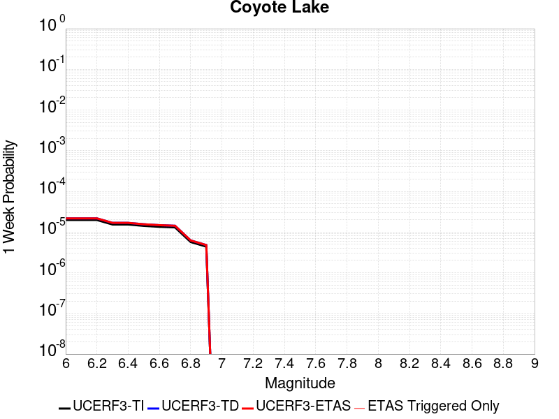 |  |  |  |

| Magnitude | 1 wk TI Prob | 1 wk TD Prob | 1 wk ETAS Prob | 1 wk ETAS/TD Gain | 1 wk ETAS Triggered Only | 1 mo TI Prob | 1 mo TD Prob | 1 mo ETAS Prob | 1 mo ETAS/TD Gain | 1 mo ETAS Triggered Only | 1 yr TI Prob | 1 yr TD Prob | 1 yr ETAS Prob | 1 yr ETAS/TD Gain | 1 yr ETAS Triggered Only | 10 yr TI Prob | 10 yr TD Prob | 10 yr ETAS Prob | 10 yr ETAS/TD Gain | 10 yr ETAS Triggered Only |
|-----|-----|-----|-----|-----|-----|-----|-----|-----|-----|-----|-----|-----|-----|-----|-----|-----|-----|-----|-----|-----|
| 6.0 | 1.980352E-5 | 2.1709513E-5 | 2.1709513E-5 | 1.0 | 0.0 | 8.486947E-5 | 9.303786E-5 | 9.303786E-5 | 1.0 | 0.0 | 0.0010327959 | 0.0011322193 | 0.0012441875 | 1.0988926 | 1.12095055E-4 | 0.010280091 | 0.011271688 | 0.011715014 | 1.039331 | 4.4838022E-4 |
| 6.1 | 1.980352E-5 | 2.1709513E-5 | 2.1709513E-5 | 1.0 | 0.0 | 8.486947E-5 | 9.303786E-5 | 9.303786E-5 | 1.0 | 0.0 | 0.0010327959 | 0.0011322193 | 0.0012441875 | 1.0988926 | 1.12095055E-4 | 0.010280091 | 0.011271688 | 0.011715014 | 1.039331 | 4.4838022E-4 |
| 6.2 | 1.980352E-5 | 2.1709513E-5 | 2.1709513E-5 | 1.0 | 0.0 | 8.486947E-5 | 9.303786E-5 | 9.303786E-5 | 1.0 | 0.0 | 0.0010327959 | 0.0011322193 | 0.0012441875 | 1.0988926 | 1.12095055E-4 | 0.010280091 | 0.011271688 | 0.011715014 | 1.039331 | 4.4838022E-4 |
| 6.3 | 1.5344787E-5 | 1.6822816E-5 | 1.6822816E-5 | 1.0 | 0.0 | 6.576172E-5 | 7.209613E-5 | 7.209613E-5 | 1.0 | 0.0 | 8.003548E-4 | 8.7747816E-4 | 9.894749E-4 | 1.1276348 | 1.12095055E-4 | 0.007974784 | 0.008746182 | 0.0091906395 | 1.0508175 | 4.4838022E-4 |
| 6.4 | 1.5344787E-5 | 1.6822816E-5 | 1.6822816E-5 | 1.0 | 0.0 | 6.576172E-5 | 7.209613E-5 | 7.209613E-5 | 1.0 | 0.0 | 8.003548E-4 | 8.7747816E-4 | 9.894749E-4 | 1.1276348 | 1.12095055E-4 | 0.007974784 | 0.008746182 | 0.0091906395 | 1.0508175 | 4.4838022E-4 |
| 6.5 | 1.4189697E-5 | 1.5559977E-5 | 1.5559977E-5 | 1.0 | 0.0 | 6.081157E-5 | 6.668425E-5 | 6.668425E-5 | 1.0 | 0.0 | 7.401293E-4 | 8.1163866E-4 | 9.236428E-4 | 1.1379975 | 1.12095055E-4 | 0.0073766913 | 0.008092688 | 0.008426252 | 1.0412179 | 3.3628516E-4 |
| 6.6 | 1.3469301E-5 | 1.4773473E-5 | 1.4773473E-5 | 1.0 | 0.0 | 5.7724297E-5 | 6.331368E-5 | 6.331368E-5 | 1.0 | 0.0 | 7.025667E-4 | 7.706315E-4 | 8.8264013E-4 | 1.1453466 | 1.12095055E-4 | 0.0070034964 | 0.0076854974 | 0.008019198 | 1.0434195 | 3.3628516E-4 |
| 6.7 | 1.3027966E-5 | 1.4283569E-5 | 1.4283569E-5 | 1.0 | 0.0 | 5.5832945E-5 | 6.1214196E-5 | 6.1214196E-5 | 1.0 | 0.0 | 6.7955407E-4 | 7.4508775E-4 | 8.5709925E-4 | 1.1503334 | 1.12095055E-4 | 0.006774798 | 0.007431775 | 0.007765561 | 1.0449134 | 3.3628516E-4 |
| 6.8 | 5.695434E-6 | 6.2251847E-6 | 6.2251847E-6 | 1.0 | 0.0 | 2.4408775E-5 | 2.667926E-5 | 2.667926E-5 | 1.0 | 0.0 | 2.971363E-4 | 3.2480157E-4 | 3.2480157E-4 | 1.0 | 0.0 | 0.0029673933 | 0.00324621 | 0.0033579413 | 1.034419 | 1.12095055E-4 |
| 6.9 | 4.385688E-6 | 4.793646E-6 | 4.793646E-6 | 1.0 | 0.0 | 1.879567E-5 | 2.0544197E-5 | 2.0544197E-5 | 1.0 | 0.0 | 2.2881327E-4 | 2.501256E-4 | 2.501256E-4 | 1.0 | 0.0 | 0.002285778 | 0.0025012558 | 0.0026130707 | 1.0447034 | 1.12095055E-4 |

## Garlic Springs
*[(top)](#table-of-contents)*

| 1 Week | 1 Month | 1 Year | 10 Year |
|-----|-----|-----|-----|
|  |  |  | 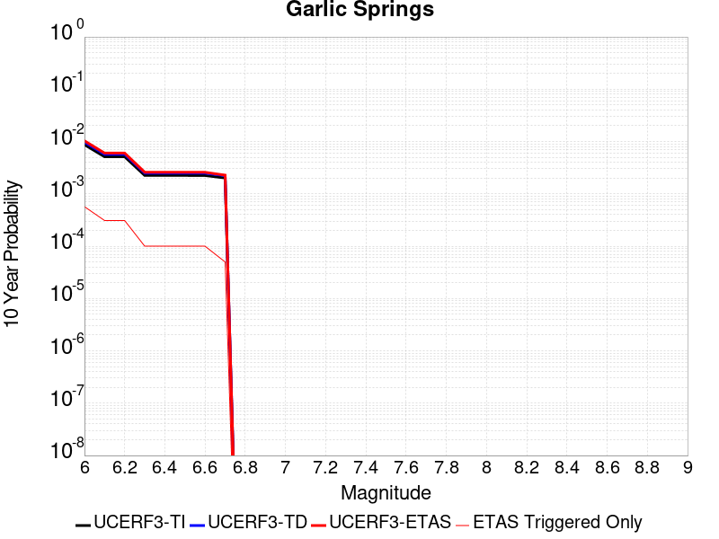 |

| Magnitude | 1 wk TI Prob | 1 wk TD Prob | 1 wk ETAS Prob | 1 wk ETAS/TD Gain | 1 wk ETAS Triggered Only | 1 mo TI Prob | 1 mo TD Prob | 1 mo ETAS Prob | 1 mo ETAS/TD Gain | 1 mo ETAS Triggered Only | 1 yr TI Prob | 1 yr TD Prob | 1 yr ETAS Prob | 1 yr ETAS/TD Gain | 1 yr ETAS Triggered Only | 10 yr TI Prob | 10 yr TD Prob | 10 yr ETAS Prob | 10 yr ETAS/TD Gain | 10 yr ETAS Triggered Only |
|-----|-----|-----|-----|-----|-----|-----|-----|-----|-----|-----|-----|-----|-----|-----|-----|-----|-----|-----|-----|-----|
| 6.0 | 1.6760017E-5 | 1.8779832E-5 | 1.8779832E-5 | 1.0 | 0.0 | 7.182667E-5 | 8.048317E-5 | 8.048317E-5 | 1.0 | 0.0 | 8.7413884E-4 | 9.795596E-4 | 0.0010915449 | 1.1143221 | 1.12095055E-4 | 0.008707083 | 0.009763966 | 0.010096968 | 1.0341052 | 3.3628516E-4 |
| 6.1 | 9.852767E-6 | 1.0975243E-5 | 1.0975243E-5 | 1.0 | 0.0 | 4.222546E-5 | 4.703631E-5 | 4.703631E-5 | 1.0 | 0.0 | 5.139737E-4 | 5.7258754E-4 | 6.846184E-4 | 1.1956571 | 1.12095055E-4 | 0.005127866 | 0.005718083 | 0.005940991 | 1.038983 | 2.2419011E-4 |
| 6.2 | 9.852767E-6 | 1.0975243E-5 | 1.0975243E-5 | 1.0 | 0.0 | 4.222546E-5 | 4.703631E-5 | 4.703631E-5 | 1.0 | 0.0 | 5.139737E-4 | 5.7258754E-4 | 6.846184E-4 | 1.1956571 | 1.12095055E-4 | 0.005127866 | 0.005718083 | 0.005940991 | 1.038983 | 2.2419011E-4 |
| 6.3 | 4.3167724E-6 | 4.7787057E-6 | 4.7787057E-6 | 1.0 | 0.0 | 1.8500323E-5 | 2.0480136E-5 | 2.0480136E-5 | 1.0 | 0.0 | 2.2521814E-4 | 2.4934017E-4 | 3.614073E-4 | 1.4494547 | 1.12095055E-4 | 0.0022499003 | 0.0024928632 | 0.0027164943 | 1.0897086 | 2.2419011E-4 |
| 6.4 | 4.3167724E-6 | 4.7787057E-6 | 4.7787057E-6 | 1.0 | 0.0 | 1.8500323E-5 | 2.0480136E-5 | 2.0480136E-5 | 1.0 | 0.0 | 2.2521814E-4 | 2.4934017E-4 | 3.614073E-4 | 1.4494547 | 1.12095055E-4 | 0.0022499003 | 0.0024928632 | 0.0027164943 | 1.0897086 | 2.2419011E-4 |
| 6.5 | 4.3167724E-6 | 4.7787057E-6 | 4.7787057E-6 | 1.0 | 0.0 | 1.8500323E-5 | 2.0480136E-5 | 2.0480136E-5 | 1.0 | 0.0 | 2.2521814E-4 | 2.4934017E-4 | 3.614073E-4 | 1.4494547 | 1.12095055E-4 | 0.0022499003 | 0.0024928632 | 0.0027164943 | 1.0897086 | 2.2419011E-4 |
| 6.6 | 4.301311E-6 | 4.7615717E-6 | 4.7615717E-6 | 1.0 | 0.0 | 1.8434059E-5 | 2.0406706E-5 | 2.0406706E-5 | 1.0 | 0.0 | 2.2441156E-4 | 2.4844636E-4 | 3.6051357E-4 | 1.4510721 | 1.12095055E-4 | 0.0022418506 | 0.0024839449 | 0.0027075782 | 1.0900315 | 2.2419011E-4 |
| 6.7 | 3.8599724E-6 | 4.2716633E-6 | 4.2716633E-6 | 1.0 | 0.0 | 1.6542634E-5 | 1.8307128E-5 | 1.8307128E-5 | 1.0 | 0.0 | 2.0138794E-4 | 2.2288928E-4 | 3.3495936E-4 | 1.5028061 | 1.12095055E-4 | 0.0020120554 | 0.0022288929 | 0.0024525833 | 1.1003594 | 2.2419011E-4 |

## San Andreas (San Bernardino S)
*[(top)](#table-of-contents)*

| 1 Week | 1 Month | 1 Year | 10 Year |
|-----|-----|-----|-----|
| 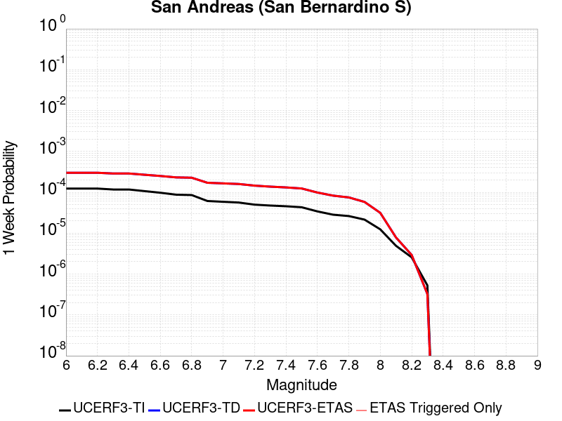 |  |  |  |

| Magnitude | 1 wk TI Prob | 1 wk TD Prob | 1 wk ETAS Prob | 1 wk ETAS/TD Gain | 1 wk ETAS Triggered Only | 1 mo TI Prob | 1 mo TD Prob | 1 mo ETAS Prob | 1 mo ETAS/TD Gain | 1 mo ETAS Triggered Only | 1 yr TI Prob | 1 yr TD Prob | 1 yr ETAS Prob | 1 yr ETAS/TD Gain | 1 yr ETAS Triggered Only | 10 yr TI Prob | 10 yr TD Prob | 10 yr ETAS Prob | 10 yr ETAS/TD Gain | 10 yr ETAS Triggered Only |
|-----|-----|-----|-----|-----|-----|-----|-----|-----|-----|-----|-----|-----|-----|-----|-----|-----|-----|-----|-----|-----|
| 6.0 | 1.2336002E-4 | 3.0052903E-4 | 3.0052903E-4 | 1.0 | 0.0 | 5.2857865E-4 | 0.0012873719 | 0.0012873719 | 1.0 | 0.0 | 0.006416472 | 0.015566076 | 0.015566076 | 1.0 | 0.0 | 0.06234337 | 0.14302991 | 0.1433181 | 1.0020149 | 3.3628516E-4 |
| 6.1 | 1.2336002E-4 | 3.0052903E-4 | 3.0052903E-4 | 1.0 | 0.0 | 5.2857865E-4 | 0.0012873719 | 0.0012873719 | 1.0 | 0.0 | 0.006416472 | 0.015566076 | 0.015566076 | 1.0 | 0.0 | 0.06234337 | 0.14302991 | 0.1433181 | 1.0020149 | 3.3628516E-4 |
| 6.2 | 1.2336002E-4 | 3.0052903E-4 | 3.0052903E-4 | 1.0 | 0.0 | 5.2857865E-4 | 0.0012873719 | 0.0012873719 | 1.0 | 0.0 | 0.006416472 | 0.015566076 | 0.015566076 | 1.0 | 0.0 | 0.06234337 | 0.14302991 | 0.1433181 | 1.0020149 | 3.3628516E-4 |
| 6.3 | 1.1712257E-4 | 2.8840688E-4 | 2.8840688E-4 | 1.0 | 0.0 | 5.018573E-4 | 0.0012354697 | 0.0012354697 | 1.0 | 0.0 | 0.006093008 | 0.014942952 | 0.014942952 | 1.0 | 0.0 | 0.059286322 | 0.13773783 | 0.13802779 | 1.0021052 | 3.3628516E-4 |
| 6.4 | 1.1712257E-4 | 2.8840688E-4 | 2.8840688E-4 | 1.0 | 0.0 | 5.018573E-4 | 0.0012354697 | 0.0012354697 | 1.0 | 0.0 | 0.006093008 | 0.014942952 | 0.014942952 | 1.0 | 0.0 | 0.059286322 | 0.13773783 | 0.13802779 | 1.0021052 | 3.3628516E-4 |
| 6.5 | 1.0689076E-4 | 2.6852704E-4 | 2.6852704E-4 | 1.0 | 0.0 | 4.5802278E-4 | 0.0011503474 | 0.0011503474 | 1.0 | 0.0 | 0.0055621783 | 0.013920166 | 0.013920166 | 1.0 | 0.0 | 0.05425003 | 0.12898327 | 0.12927617 | 1.0022709 | 3.3628516E-4 |
| 6.6 | 9.7648895E-5 | 2.5096696E-4 | 2.5096696E-4 | 1.0 | 0.0 | 4.1842813E-4 | 0.0010751529 | 0.0010751529 | 1.0 | 0.0 | 0.005082469 | 0.013015794 | 0.013015794 | 1.0 | 0.0 | 0.049677886 | 0.121141456 | 0.121437 | 1.0024397 | 3.3628516E-4 |
| 6.7 | 8.757013E-5 | 2.3166684E-4 | 2.3166684E-4 | 1.0 | 0.0 | 3.7524657E-4 | 9.925024E-4 | 9.925024E-4 | 1.0 | 0.0 | 0.00455906 | 0.012020858 | 0.012020858 | 1.0 | 0.0 | 0.04466656 | 0.11244868 | 0.11274715 | 1.0026543 | 3.3628516E-4 |
| 6.8 | 8.562978E-5 | 2.2726225E-4 | 2.2726225E-4 | 1.0 | 0.0 | 3.6693315E-4 | 9.736398E-4 | 9.736398E-4 | 1.0 | 0.0 | 0.004458263 | 0.0117937075 | 0.0117937075 | 1.0 | 0.0 | 0.043698758 | 0.110457905 | 0.110757045 | 1.0027082 | 3.3628516E-4 |
| 6.9 | 6.124075E-5 | 1.7106693E-4 | 1.7106693E-4 | 1.0 | 0.0 | 2.6243398E-4 | 7.329388E-4 | 7.329388E-4 | 1.0 | 0.0 | 0.0031904527 | 0.008887228 | 0.008887228 | 1.0 | 0.0 | 0.031450346 | 0.08435718 | 0.08456245 | 1.0024334 | 2.2419011E-4 |
| 7.0 | 5.8598747E-5 | 1.653528E-4 | 1.653528E-4 | 1.0 | 0.0 | 2.5111332E-4 | 7.084632E-4 | 7.084632E-4 | 1.0 | 0.0 | 0.0030530186 | 0.008591622 | 0.008591622 | 1.0 | 0.0 | 0.03011414 | 0.08167349 | 0.08187937 | 1.0025208 | 2.2419011E-4 |
| 7.1 | 5.613814E-5 | 1.5953425E-4 | 1.5953425E-4 | 1.0 | 0.0 | 2.4056983E-4 | 6.8353984E-4 | 6.8353984E-4 | 1.0 | 0.0 | 0.0029250039 | 0.008290524 | 0.008290524 | 1.0 | 0.0 | 0.028868021 | 0.07897128 | 0.079177774 | 1.0026147 | 2.2419011E-4 |
| 7.2 | 4.991222E-5 | 1.4558934E-4 | 1.4558934E-4 | 1.0 | 0.0 | 2.1389198E-4 | 6.238055E-4 | 6.238055E-4 | 1.0 | 0.0 | 0.002601025 | 0.007568488 | 0.007568488 | 1.0 | 0.0 | 0.025707912 | 0.07242188 | 0.07262983 | 1.0028714 | 2.2419011E-4 |
| 7.3 | 4.7410045E-5 | 1.375228E-4 | 1.375228E-4 | 1.0 | 0.0 | 2.0317009E-4 | 5.892506E-4 | 5.892506E-4 | 1.0 | 0.0 | 0.0024707897 | 0.0071506137 | 0.0071506137 | 1.0 | 0.0 | 0.024434982 | 0.06870162 | 0.068910405 | 1.003039 | 2.2419011E-4 |
| 7.4 | 4.5556746E-5 | 1.3159527E-4 | 1.3159527E-4 | 1.0 | 0.0 | 1.952286E-4 | 5.6385814E-4 | 5.6385814E-4 | 1.0 | 0.0 | 0.002374317 | 0.006843443 | 0.006843443 | 1.0 | 0.0 | 0.023491086 | 0.065951794 | 0.0661612 | 1.0031751 | 2.2419011E-4 |
| 7.5 | 4.3084514E-5 | 1.2394068E-4 | 1.2394068E-4 | 1.0 | 0.0 | 1.8463485E-4 | 5.310665E-4 | 5.310665E-4 | 1.0 | 0.0 | 0.0022456115 | 0.006446638 | 0.006446638 | 1.0 | 0.0 | 0.022230545 | 0.062349852 | 0.06256007 | 1.0033715 | 2.2419011E-4 |
| 7.6 | 3.408608E-5 | 9.8693454E-5 | 9.8693454E-5 | 1.0 | 0.0 | 1.4607502E-4 | 4.2290348E-4 | 4.2290348E-4 | 1.0 | 0.0 | 0.0017770125 | 0.00513672 | 0.00513672 | 1.0 | 0.0 | 0.017628696 | 0.05017014 | 0.05038308 | 1.0042444 | 2.2419011E-4 |
| 7.7 | 2.8315713E-5 | 8.2804654E-5 | 8.2804654E-5 | 1.0 | 0.0 | 1.2134742E-4 | 3.5482887E-4 | 3.5482887E-4 | 1.0 | 0.0 | 0.0014764034 | 0.004311493 | 0.004311493 | 1.0 | 0.0 | 0.01466633 | 0.042413354 | 0.04262804 | 1.0050616 | 2.2419011E-4 |
| 7.8 | 2.6222975E-5 | 7.492829E-5 | 7.492829E-5 | 1.0 | 0.0 | 1.1237934E-4 | 3.2108175E-4 | 3.2108175E-4 | 1.0 | 0.0 | 0.0013673597 | 0.0039021696 | 0.0039021696 | 1.0 | 0.0 | 0.013589768 | 0.03857025 | 0.038785793 | 1.0055883 | 2.2419011E-4 |
| 7.9 | 2.1469694E-5 | 5.812656E-5 | 5.812656E-5 | 1.0 | 0.0 | 9.200973E-5 | 2.4909005E-4 | 2.4909005E-4 | 1.0 | 0.0 | 0.0011196428 | 0.003028457 | 0.003028457 | 1.0 | 0.0 | 0.011140184 | 0.030264879 | 0.030482283 | 1.0071834 | 2.2419011E-4 |
| 8.0 | 1.2420249E-5 | 3.1456424E-5 | 3.1456424E-5 | 1.0 | 0.0 | 5.322855E-5 | 1.348063E-4 | 1.348063E-4 | 1.0 | 0.0 | 6.478649E-4 | 0.0016400319 | 0.0016400319 | 1.0 | 0.0 | 0.0064597935 | 0.016586676 | 0.016586676 | 1.0 | 0.0 |
| 8.1 | 4.9197724E-6 | 7.872929E-6 | 7.872929E-6 | 1.0 | 0.0 | 2.1084568E-5 | 3.3740685E-5 | 3.3740685E-5 | 1.0 | 0.0 | 2.566744E-4 | 4.1071558E-4 | 4.1071558E-4 | 1.0 | 0.0 | 0.002563781 | 0.004409803 | 0.004409803 | 1.0 | 0.0 |
| 8.2 | 2.5634774E-6 | 2.930318E-6 | 2.930318E-6 | 1.0 | 0.0 | 1.0986286E-5 | 1.2558446E-5 | 1.2558446E-5 | 1.0 | 0.0 | 1.3374983E-4 | 1.528884E-4 | 1.528884E-4 | 1.0 | 0.0 | 0.0013366934 | 0.0017173742 | 0.0017173742 | 1.0 | 0.0 |
| 8.3 | 5.2850464E-7 | 3.2441278E-7 | 3.2441278E-7 | 1.0 | 0.0 | 2.2650179E-6 | 1.3903399E-6 | 1.3903399E-6 | 1.0 | 0.0 | 2.7576245E-5 | 1.692727E-5 | 1.692727E-5 | 1.0 | 0.0 | 2.7572823E-4 | 2.0069437E-4 | 2.0069437E-4 | 1.0 | 0.0 |

## Death Valley (Black Mtns Frontal)
*[(top)](#table-of-contents)*

| 1 Week | 1 Month | 1 Year | 10 Year |
|-----|-----|-----|-----|
|  | 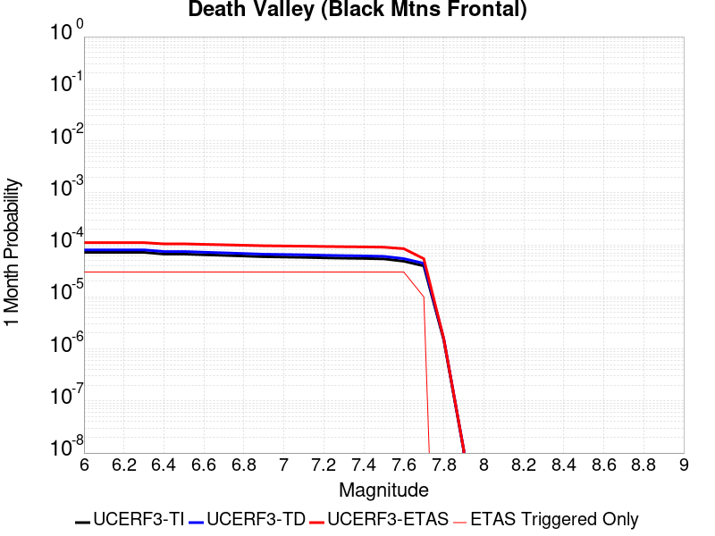 |  |  |

| Magnitude | 1 wk TI Prob | 1 wk TD Prob | 1 wk ETAS Prob | 1 wk ETAS/TD Gain | 1 wk ETAS Triggered Only | 1 mo TI Prob | 1 mo TD Prob | 1 mo ETAS Prob | 1 mo ETAS/TD Gain | 1 mo ETAS Triggered Only | 1 yr TI Prob | 1 yr TD Prob | 1 yr ETAS Prob | 1 yr ETAS/TD Gain | 1 yr ETAS Triggered Only | 10 yr TI Prob | 10 yr TD Prob | 10 yr ETAS Prob | 10 yr ETAS/TD Gain | 10 yr ETAS Triggered Only |
|-----|-----|-----|-----|-----|-----|-----|-----|-----|-----|-----|-----|-----|-----|-----|-----|-----|-----|-----|-----|-----|
| 6.0 | 1.6707214E-5 | 1.8673187E-5 | 1.8673187E-5 | 1.0 | 0.0 | 7.160038E-5 | 8.002553E-5 | 8.002553E-5 | 1.0 | 0.0 | 8.71386E-4 | 9.7388297E-4 | 0.0011978548 | 1.2299781 | 2.2419011E-4 | 0.00867977 | 0.009697005 | 0.010030029 | 1.034343 | 3.3628516E-4 |
| 6.1 | 1.6707214E-5 | 1.8673187E-5 | 1.8673187E-5 | 1.0 | 0.0 | 7.160038E-5 | 8.002553E-5 | 8.002553E-5 | 1.0 | 0.0 | 8.71386E-4 | 9.7388297E-4 | 0.0011978548 | 1.2299781 | 2.2419011E-4 | 0.00867977 | 0.009697005 | 0.010030029 | 1.034343 | 3.3628516E-4 |
| 6.2 | 1.6707214E-5 | 1.8673187E-5 | 1.8673187E-5 | 1.0 | 0.0 | 7.160038E-5 | 8.002553E-5 | 8.002553E-5 | 1.0 | 0.0 | 8.71386E-4 | 9.7388297E-4 | 0.0011978548 | 1.2299781 | 2.2419011E-4 | 0.00867977 | 0.009697005 | 0.010030029 | 1.034343 | 3.3628516E-4 |
| 6.3 | 1.6707214E-5 | 1.8673187E-5 | 1.8673187E-5 | 1.0 | 0.0 | 7.160038E-5 | 8.002553E-5 | 8.002553E-5 | 1.0 | 0.0 | 8.71386E-4 | 9.7388297E-4 | 0.0011978548 | 1.2299781 | 2.2419011E-4 | 0.00867977 | 0.009697005 | 0.010030029 | 1.034343 | 3.3628516E-4 |
| 6.4 | 1.5515609E-5 | 1.7340923E-5 | 1.7340923E-5 | 1.0 | 0.0 | 6.649377E-5 | 7.431616E-5 | 7.431616E-5 | 1.0 | 0.0 | 8.0926094E-4 | 9.0442976E-4 | 0.0011284171 | 1.2476559 | 2.2419011E-4 | 0.008063202 | 0.009008174 | 0.00934143 | 1.0369948 | 3.3628516E-4 |
| 6.5 | 1.5515609E-5 | 1.7340923E-5 | 1.7340923E-5 | 1.0 | 0.0 | 6.649377E-5 | 7.431616E-5 | 7.431616E-5 | 1.0 | 0.0 | 8.0926094E-4 | 9.0442976E-4 | 0.0011284171 | 1.2476559 | 2.2419011E-4 | 0.008063202 | 0.009008174 | 0.00934143 | 1.0369948 | 3.3628516E-4 |
| 6.6 | 1.5041828E-5 | 1.6811773E-5 | 1.6811773E-5 | 1.0 | 0.0 | 6.4463384E-5 | 7.20485E-5 | 7.20485E-5 | 1.0 | 0.0 | 7.8455906E-4 | 8.768433E-4 | 0.0011008369 | 1.2554544 | 2.2419011E-4 | 0.00781795 | 0.008734492 | 0.00906784 | 1.0381645 | 3.3628516E-4 |
| 6.7 | 1.4634985E-5 | 1.6358576E-5 | 1.6358576E-5 | 1.0 | 0.0 | 6.271985E-5 | 7.010633E-5 | 7.010633E-5 | 1.0 | 0.0 | 7.6334673E-4 | 8.532161E-4 | 0.001077215 | 1.2625347 | 2.2419011E-4 | 0.007607299 | 0.00850004 | 0.008833467 | 1.0392265 | 3.3628516E-4 |
| 6.8 | 1.4209158E-5 | 1.5884536E-5 | 1.5884536E-5 | 1.0 | 0.0 | 6.089497E-5 | 6.8074834E-5 | 6.8074834E-5 | 1.0 | 0.0 | 7.4114406E-4 | 8.285016E-4 | 0.0010525059 | 1.2703729 | 2.2419011E-4 | 0.007386771 | 0.008254744 | 0.0085882535 | 1.0404022 | 3.3628516E-4 |
| 6.9 | 1.3780098E-5 | 1.540701E-5 | 1.540701E-5 | 1.0 | 0.0 | 5.9056227E-5 | 6.60284E-5 | 6.60284E-5 | 1.0 | 0.0 | 7.1877235E-4 | 8.036048E-4 | 0.0010276147 | 1.2787564 | 2.2419011E-4 | 0.0071645193 | 0.008007584 | 0.008341176 | 1.0416596 | 3.3628516E-4 |
| 7.0 | 1.3585064E-5 | 1.5190541E-5 | 1.5190541E-5 | 1.0 | 0.0 | 5.8220405E-5 | 6.510072E-5 | 6.510072E-5 | 1.0 | 0.0 | 7.086029E-4 | 7.9231855E-4 | 0.001016331 | 1.2827303 | 2.2419011E-4 | 0.007063476 | 0.007895528 | 0.008229159 | 1.0422555 | 3.3628516E-4 |
| 7.1 | 1.3398601E-5 | 1.4983694E-5 | 1.4983694E-5 | 1.0 | 0.0 | 5.742131E-5 | 6.4214284E-5 | 6.4214284E-5 | 1.0 | 0.0 | 6.9888023E-4 | 7.8153395E-4 | 0.0010055489 | 1.2866349 | 2.2419011E-4 | 0.0069668638 | 0.0077884435 | 0.00812211 | 1.0428412 | 3.3628516E-4 |
| 7.2 | 1.3126312E-5 | 1.4681873E-5 | 1.4681873E-5 | 1.0 | 0.0 | 5.6254412E-5 | 6.292082E-5 | 6.292082E-5 | 1.0 | 0.0 | 6.846822E-4 | 7.657972E-4 | 9.898157E-4 | 1.2925297 | 2.2419011E-4 | 0.006825765 | 0.0076321675 | 0.007965886 | 1.0437253 | 3.3628516E-4 |
| 7.3 | 1.2922429E-5 | 1.4456067E-5 | 1.4456067E-5 | 1.0 | 0.0 | 5.5380664E-5 | 6.1953135E-5 | 6.1953135E-5 | 1.0 | 0.0 | 6.74051E-4 | 7.5402384E-4 | 9.780449E-4 | 1.2971008 | 2.2419011E-4 | 0.006720101 | 0.0075152353 | 0.007848994 | 1.0444108 | 3.3628516E-4 |
| 7.4 | 1.2768878E-5 | 1.4286026E-5 | 1.4286026E-5 | 1.0 | 0.0 | 5.4722615E-5 | 6.122442E-5 | 6.122442E-5 | 1.0 | 0.0 | 6.660441E-4 | 7.451578E-4 | 9.691809E-4 | 1.3006384 | 2.2419011E-4 | 0.0066405144 | 0.007427172 | 0.007760959 | 1.0449414 | 3.3628516E-4 |
| 7.5 | 1.2521929E-5 | 1.4014234E-5 | 1.4014234E-5 | 1.0 | 0.0 | 5.366431E-5 | 6.005965E-5 | 6.005965E-5 | 1.0 | 0.0 | 6.531671E-4 | 7.3098636E-4 | 9.5501257E-4 | 1.3064711 | 2.2419011E-4 | 0.006512506 | 0.007286395 | 0.00762023 | 1.0458162 | 3.3628516E-4 |
| 7.6 | 1.1301089E-5 | 1.26501545E-5 | 1.26501545E-5 | 1.0 | 0.0 | 4.8432343E-5 | 5.421385E-5 | 5.421385E-5 | 1.0 | 0.0 | 5.895042E-4 | 6.5985904E-4 | 8.8390126E-4 | 1.3395303 | 2.2419011E-4 | 0.0058794282 | 0.00657955 | 0.006802265 | 1.0338496 | 2.2419011E-4 |
| 7.7 | 9.189108E-6 | 1.0284987E-5 | 1.0284987E-5 | 1.0 | 0.0 | 3.93813E-5 | 4.4077802E-5 | 4.4077802E-5 | 1.0 | 0.0 | 4.7936183E-4 | 5.3652015E-4 | 6.4855505E-4 | 1.2088177 | 1.12095055E-4 | 0.004783291 | 0.0053527597 | 0.0054642544 | 1.0208294 | 1.12095055E-4 |
| 7.8 | 3.4586725E-7 | 3.648528E-7 | 3.648528E-7 | 1.0 | 0.0 | 1.4822873E-6 | 1.563654E-6 | 1.563654E-6 | 1.0 | 0.0 | 1.80467E-5 | 1.9037325E-5 | 1.9037325E-5 | 1.0 | 0.0 | 1.8045233E-4 | 1.9035739E-4 | 1.9035739E-4 | 1.0 | 0.0 |
| 7.9 | 2.5591178E-9 | 2.6698248E-9 | 2.6698248E-9 | 1.0 | 0.0 | 1.0967647E-8 | 1.1442106E-8 | 1.1442106E-8 | 1.0 | 0.0 | 1.335311E-7 | 1.3930764E-7 | 1.3930764E-7 | 1.0 | 0.0 | 1.3353102E-6 | 1.3930764E-6 | 1.3930764E-6 | 1.0 | 0.0 |

## White Wolf (Extension)
*[(top)](#table-of-contents)*

| 1 Week | 1 Month | 1 Year | 10 Year |
|-----|-----|-----|-----|
| 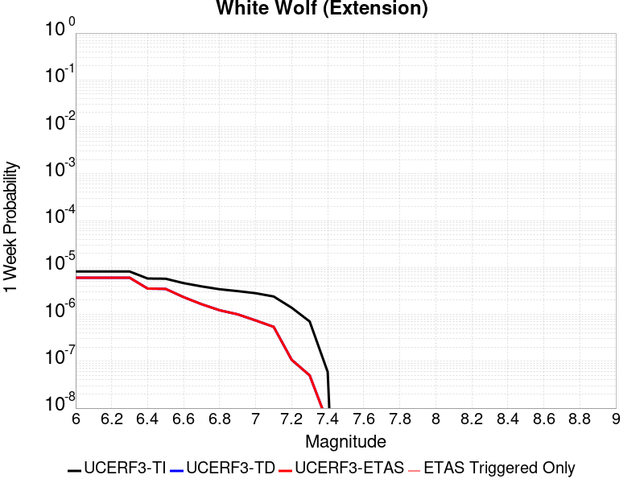 |  |  | 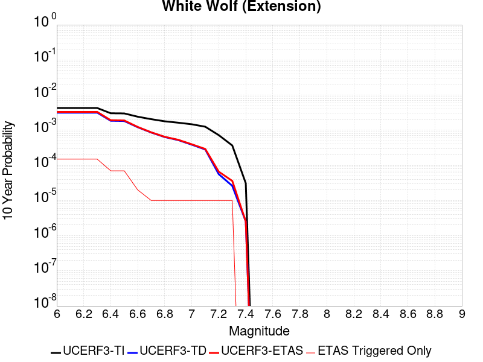 |

| Magnitude | 1 wk TI Prob | 1 wk TD Prob | 1 wk ETAS Prob | 1 wk ETAS/TD Gain | 1 wk ETAS Triggered Only | 1 mo TI Prob | 1 mo TD Prob | 1 mo ETAS Prob | 1 mo ETAS/TD Gain | 1 mo ETAS Triggered Only | 1 yr TI Prob | 1 yr TD Prob | 1 yr ETAS Prob | 1 yr ETAS/TD Gain | 1 yr ETAS Triggered Only | 10 yr TI Prob | 10 yr TD Prob | 10 yr ETAS Prob | 10 yr ETAS/TD Gain | 10 yr ETAS Triggered Only |
|-----|-----|-----|-----|-----|-----|-----|-----|-----|-----|-----|-----|-----|-----|-----|-----|-----|-----|-----|-----|-----|
| 6.0 | 8.222555E-6 | 6.0670677E-6 | 6.0670677E-6 | 1.0 | 0.0 | 3.5239045E-5 | 2.6001497E-5 | 2.6001497E-5 | 1.0 | 0.0 | 4.289509E-4 | 3.1652887E-4 | 4.2858845E-4 | 1.3540264 | 1.12095055E-4 | 0.0042812387 | 0.0031614322 | 0.0034966543 | 1.1060349 | 3.3628516E-4 |
| 6.1 | 8.222555E-6 | 6.0670677E-6 | 6.0670677E-6 | 1.0 | 0.0 | 3.5239045E-5 | 2.6001497E-5 | 2.6001497E-5 | 1.0 | 0.0 | 4.289509E-4 | 3.1652887E-4 | 4.2858845E-4 | 1.3540264 | 1.12095055E-4 | 0.0042812387 | 0.0031614322 | 0.0034966543 | 1.1060349 | 3.3628516E-4 |
| 6.2 | 8.222555E-6 | 6.0670677E-6 | 6.0670677E-6 | 1.0 | 0.0 | 3.5239045E-5 | 2.6001497E-5 | 2.6001497E-5 | 1.0 | 0.0 | 4.289509E-4 | 3.1652887E-4 | 4.2858845E-4 | 1.3540264 | 1.12095055E-4 | 0.0042812387 | 0.0031614322 | 0.0034966543 | 1.1060349 | 3.3628516E-4 |
| 6.3 | 8.222555E-6 | 6.0670677E-6 | 6.0670677E-6 | 1.0 | 0.0 | 3.5239045E-5 | 2.6001497E-5 | 2.6001497E-5 | 1.0 | 0.0 | 4.289509E-4 | 3.1652887E-4 | 4.2858845E-4 | 1.3540264 | 1.12095055E-4 | 0.0042812387 | 0.0031614322 | 0.0034966543 | 1.1060349 | 3.3628516E-4 |
| 6.4 | 5.821773E-6 | 3.5574278E-6 | 3.5574278E-6 | 1.0 | 0.0 | 2.4950215E-5 | 1.5246036E-5 | 1.5246036E-5 | 1.0 | 0.0 | 3.0372653E-4 | 1.8560578E-4 | 2.9768003E-4 | 1.6038295 | 1.12095055E-4 | 0.0030331176 | 0.001854616 | 0.0021902774 | 1.1809871 | 3.3628516E-4 |
| 6.5 | 5.766023E-6 | 3.4993586E-6 | 3.4993586E-6 | 1.0 | 0.0 | 2.4711293E-5 | 1.4997171E-5 | 1.4997171E-5 | 1.0 | 0.0 | 3.0081844E-4 | 1.8257636E-4 | 2.9465096E-4 | 1.6138505 | 1.12095055E-4 | 0.0030041158 | 0.0018243717 | 0.0021600435 | 1.183993 | 3.3628516E-4 |
| 6.6 | 4.643576E-6 | 2.3328114E-6 | 2.3328114E-6 | 1.0 | 0.0 | 1.9900888E-5 | 9.997727E-6 | 9.997727E-6 | 1.0 | 0.0 | 2.4226638E-4 | 1.2171596E-4 | 1.2171596E-4 | 1.0 | 0.0 | 0.0024200242 | 0.0012165353 | 0.0014404528 | 1.1840615 | 2.2419011E-4 |
| 6.7 | 3.9529173E-6 | 1.6484983E-6 | 1.6484983E-6 | 1.0 | 0.0 | 1.6940963E-5 | 7.0649744E-6 | 7.0649744E-6 | 1.0 | 0.0 | 2.0623671E-4 | 8.601286E-5 | 8.601286E-5 | 1.0 | 0.0 | 0.002060454 | 8.598142E-4 | 9.718129E-4 | 1.1302592 | 1.12095055E-4 |
| 6.8 | 3.4377522E-6 | 1.2246483E-6 | 1.2246483E-6 | 1.0 | 0.0 | 1.473314E-5 | 5.2484825E-6 | 5.2484825E-6 | 1.0 | 0.0 | 1.7936122E-4 | 6.389849E-5 | 6.389849E-5 | 1.0 | 0.0 | 0.0017921652 | 6.3881034E-4 | 7.508338E-4 | 1.1753626 | 1.12095055E-4 |
| 6.9 | 3.1367306E-6 | 1.0034878E-6 | 1.0034878E-6 | 1.0 | 0.0 | 1.3443062E-5 | 4.3006553E-6 | 4.3006553E-6 | 1.0 | 0.0 | 1.63657E-4 | 5.23593E-5 | 5.23593E-5 | 1.0 | 0.0 | 0.0016353652 | 5.2347727E-4 | 6.355137E-4 | 1.2140234 | 1.12095055E-4 |
| 7.0 | 2.8298145E-6 | 7.4296156E-7 | 7.4296156E-7 | 1.0 | 0.0 | 1.2127721E-5 | 3.1841173E-6 | 3.1841173E-6 | 1.0 | 0.0 | 1.47645E-4 | 3.876599E-5 | 3.876599E-5 | 1.0 | 0.0 | 0.0014754693 | 3.8759728E-4 | 4.9964886E-4 | 1.2890929 | 1.12095055E-4 |
| 7.1 | 2.4091064E-6 | 5.423516E-7 | 5.423516E-7 | 1.0 | 0.0 | 1.03247E-5 | 2.3243622E-6 | 2.3243622E-6 | 1.0 | 0.0 | 1.2569598E-4 | 2.8298784E-5 | 2.8298784E-5 | 1.0 | 0.0 | 0.001256249 | 2.8295585E-4 | 3.950192E-4 | 1.3960453 | 1.12095055E-4 |
| 7.2 | 1.3875518E-6 | 1.07468146E-7 | 1.07468146E-7 | 1.0 | 0.0 | 5.9466374E-6 | 4.6057767E-7 | 4.6057767E-7 | 1.0 | 0.0 | 7.23979E-5 | 5.60752E-6 | 5.60752E-6 | 1.0 | 0.0 | 7.2374323E-4 | 5.60739E-5 | 1.6816267E-4 | 2.9989474 | 1.12095055E-4 |
| 7.3 | 7.056077E-7 | 5.0041887E-8 | 5.0041887E-8 | 1.0 | 0.0 | 3.0240296E-6 | 2.1446522E-7 | 2.1446522E-7 | 1.0 | 0.0 | 3.681694E-5 | 2.6111113E-6 | 2.6111113E-6 | 1.0 | 0.0 | 3.681084E-4 | 2.6110854E-5 | 1.3820299E-4 | 5.2929325 | 1.12095055E-4 |
| 7.4 | 5.9334678E-8 | 4.8704454E-9 | 4.8704454E-9 | 1.0 | 0.0 | 2.5429145E-7 | 2.0873339E-8 | 2.0873339E-8 | 1.0 | 0.0 | 3.095994E-6 | 2.5413289E-7 | 2.5413289E-7 | 1.0 | 0.0 | 3.095951E-5 | 2.541327E-6 | 2.541327E-6 | 1.0 | 0.0 |

## Sierra Nevada  (No Extension)
*[(top)](#table-of-contents)*

| 1 Week | 1 Month | 1 Year | 10 Year |
|-----|-----|-----|-----|
|  |  |  |  |

| Magnitude | 1 wk TI Prob | 1 wk TD Prob | 1 wk ETAS Prob | 1 wk ETAS/TD Gain | 1 wk ETAS Triggered Only | 1 mo TI Prob | 1 mo TD Prob | 1 mo ETAS Prob | 1 mo ETAS/TD Gain | 1 mo ETAS Triggered Only | 1 yr TI Prob | 1 yr TD Prob | 1 yr ETAS Prob | 1 yr ETAS/TD Gain | 1 yr ETAS Triggered Only | 10 yr TI Prob | 10 yr TD Prob | 10 yr ETAS Prob | 10 yr ETAS/TD Gain | 10 yr ETAS Triggered Only |
|-----|-----|-----|-----|-----|-----|-----|-----|-----|-----|-----|-----|-----|-----|-----|-----|-----|-----|-----|-----|-----|
| 6.0 | 7.7690465E-6 | 6.9769367E-6 | 6.9769367E-6 | 1.0 | 0.0 | 3.329549E-5 | 2.9901017E-5 | 2.9901017E-5 | 1.0 | 0.0 | 4.0529718E-4 | 3.640199E-4 | 4.7607417E-4 | 1.3078245 | 1.12095055E-4 | 0.004045588 | 0.003637753 | 0.0038611274 | 1.0614046 | 2.2419011E-4 |
| 6.1 | 7.7690465E-6 | 6.9769367E-6 | 6.9769367E-6 | 1.0 | 0.0 | 3.329549E-5 | 2.9901017E-5 | 2.9901017E-5 | 1.0 | 0.0 | 4.0529718E-4 | 3.640199E-4 | 4.7607417E-4 | 1.3078245 | 1.12095055E-4 | 0.004045588 | 0.003637753 | 0.0038611274 | 1.0614046 | 2.2419011E-4 |
| 6.2 | 7.7690465E-6 | 6.9769367E-6 | 6.9769367E-6 | 1.0 | 0.0 | 3.329549E-5 | 2.9901017E-5 | 2.9901017E-5 | 1.0 | 0.0 | 4.0529718E-4 | 3.640199E-4 | 4.7607417E-4 | 1.3078245 | 1.12095055E-4 | 0.004045588 | 0.003637753 | 0.0038611274 | 1.0614046 | 2.2419011E-4 |
| 6.3 | 7.7690465E-6 | 6.9769367E-6 | 6.9769367E-6 | 1.0 | 0.0 | 3.329549E-5 | 2.9901017E-5 | 2.9901017E-5 | 1.0 | 0.0 | 4.0529718E-4 | 3.640199E-4 | 4.7607417E-4 | 1.3078245 | 1.12095055E-4 | 0.004045588 | 0.003637753 | 0.0038611274 | 1.0614046 | 2.2419011E-4 |
| 6.4 | 7.7690465E-6 | 6.9769367E-6 | 6.9769367E-6 | 1.0 | 0.0 | 3.329549E-5 | 2.9901017E-5 | 2.9901017E-5 | 1.0 | 0.0 | 4.0529718E-4 | 3.640199E-4 | 4.7607417E-4 | 1.3078245 | 1.12095055E-4 | 0.004045588 | 0.003637753 | 0.0038611274 | 1.0614046 | 2.2419011E-4 |
| 6.5 | 7.7690465E-6 | 6.9769367E-6 | 6.9769367E-6 | 1.0 | 0.0 | 3.329549E-5 | 2.9901017E-5 | 2.9901017E-5 | 1.0 | 0.0 | 4.0529718E-4 | 3.640199E-4 | 4.7607417E-4 | 1.3078245 | 1.12095055E-4 | 0.004045588 | 0.003637753 | 0.0038611274 | 1.0614046 | 2.2419011E-4 |
| 6.6 | 2.653E-6 | 1.6151278E-6 | 1.6151278E-6 | 1.0 | 0.0 | 1.136995E-5 | 6.9219577E-6 | 6.9219577E-6 | 1.0 | 0.0 | 1.3842035E-4 | 8.427161E-5 | 1.9635723E-4 | 2.330052 | 1.12095055E-4 | 0.0013833415 | 8.424E-4 | 0.0010664013 | 1.2659085 | 2.2419011E-4 |
| 6.7 | 2.5902466E-6 | 1.5504587E-6 | 1.5504587E-6 | 1.0 | 0.0 | 1.11010095E-5 | 6.644806E-6 | 6.644806E-6 | 1.0 | 0.0 | 1.351464E-4 | 8.089754E-5 | 1.9298353E-4 | 2.3855302 | 1.12095055E-4 | 0.0013506424 | 8.086839E-4 | 0.0010326927 | 1.2770041 | 2.2419011E-4 |
| 6.8 | 2.5853892E-6 | 1.5472576E-6 | 1.5472576E-6 | 1.0 | 0.0 | 1.1080193E-5 | 6.6310877E-6 | 6.6310877E-6 | 1.0 | 0.0 | 1.34893E-4 | 8.0730526E-5 | 1.9281653E-4 | 2.3883967 | 1.12095055E-4 | 0.0013481114 | 8.07015E-4 | 0.0010310241 | 1.2775775 | 2.2419011E-4 |
| 6.9 | 2.458257E-6 | 1.4223259E-6 | 1.4223259E-6 | 1.0 | 0.0 | 1.0535345E-5 | 6.095668E-6 | 6.095668E-6 | 1.0 | 0.0 | 1.2826028E-4 | 7.421225E-5 | 1.8629899E-4 | 2.5103536 | 1.12095055E-4 | 0.0012818627 | 7.4187666E-4 | 9.659004E-4 | 1.301969 | 2.2419011E-4 |
| 7.0 | 2.4341468E-6 | 1.3992884E-6 | 1.3992884E-6 | 1.0 | 0.0 | 1.0432016E-5 | 5.9969366E-6 | 5.9969366E-6 | 1.0 | 0.0 | 1.270024E-4 | 7.301028E-5 | 1.8509715E-4 | 2.5352204 | 1.12095055E-4 | 0.0012692984 | 7.298648E-4 | 9.538913E-4 | 1.3069425 | 2.2419011E-4 |
| 7.1 | 2.3652476E-6 | 1.3342343E-6 | 1.3342343E-6 | 1.0 | 0.0 | 1.0136736E-5 | 5.7181346E-6 | 5.7181346E-6 | 1.0 | 0.0 | 1.2340778E-4 | 6.961608E-5 | 1.8170333E-4 | 2.610077 | 1.12095055E-4 | 0.0012333926 | 6.959444E-4 | 9.1997854E-4 | 1.3219137 | 2.2419011E-4 |
| 7.2 | 2.272158E-6 | 1.2505349E-6 | 1.2505349E-6 | 1.0 | 0.0 | 9.737784E-6 | 5.3594244E-6 | 5.3594244E-6 | 1.0 | 0.0 | 1.1855107E-4 | 6.5249056E-5 | 1.773368E-4 | 2.7178447 | 1.12095055E-4 | 0.0011848784 | 6.523005E-4 | 8.7634433E-4 | 1.3434672 | 2.2419011E-4 |
| 7.3 | 2.1382127E-6 | 1.1422151E-6 | 1.1422151E-6 | 1.0 | 0.0 | 9.163737E-6 | 4.8951983E-6 | 4.8951983E-6 | 1.0 | 0.0 | 1.1156279E-4 | 5.9597423E-5 | 5.9597423E-5 | 1.0 | 0.0 | 0.001115068 | 5.958156E-4 | 7.0784386E-4 | 1.1880251 | 1.12095055E-4 |
| 7.4 | 1.9048055E-6 | 9.57756E-7 | 9.57756E-7 | 1.0 | 0.0 | 8.163426E-6 | 4.1046624E-6 | 4.1046624E-6 | 1.0 | 0.0 | 9.9385186E-5 | 4.9973125E-5 | 4.9973125E-5 | 1.0 | 0.0 | 9.934074E-4 | 4.996196E-4 | 6.116586E-4 | 1.2242488 | 1.12095055E-4 |
| 7.5 | 1.5373403E-6 | 7.5620164E-7 | 7.5620164E-7 | 1.0 | 0.0 | 6.5885843E-6 | 3.2408602E-6 | 3.2408602E-6 | 1.0 | 0.0 | 8.021306E-5 | 3.9456765E-5 | 3.9456765E-5 | 1.0 | 0.0 | 8.0184115E-4 | 3.9449806E-4 | 5.065489E-4 | 1.2840339 | 1.12095055E-4 |
| 7.6 | 1.0680322E-6 | 4.6610623E-7 | 4.6610623E-7 | 1.0 | 0.0 | 4.577273E-6 | 1.9975967E-6 | 1.9975967E-6 | 1.0 | 0.0 | 5.5726876E-5 | 2.432047E-5 | 2.432047E-5 | 1.0 | 0.0 | 5.5712904E-4 | 2.4317835E-4 | 3.5524616E-4 | 1.4608461 | 1.12095055E-4 |
| 7.7 | 5.509146E-7 | 1.5587625E-7 | 1.5587625E-7 | 1.0 | 0.0 | 2.3610605E-6 | 6.680409E-7 | 6.680409E-7 | 1.0 | 0.0 | 2.8745531E-5 | 8.133369E-6 | 8.133369E-6 | 1.0 | 0.0 | 2.8741814E-4 | 8.133083E-5 | 8.133083E-5 | 1.0 | 0.0 |

## San Jacinto (Anza) rev
*[(top)](#table-of-contents)*

| 1 Week | 1 Month | 1 Year | 10 Year |
|-----|-----|-----|-----|
|  |  |  |  |

| Magnitude | 1 wk TI Prob | 1 wk TD Prob | 1 wk ETAS Prob | 1 wk ETAS/TD Gain | 1 wk ETAS Triggered Only | 1 mo TI Prob | 1 mo TD Prob | 1 mo ETAS Prob | 1 mo ETAS/TD Gain | 1 mo ETAS Triggered Only | 1 yr TI Prob | 1 yr TD Prob | 1 yr ETAS Prob | 1 yr ETAS/TD Gain | 1 yr ETAS Triggered Only | 10 yr TI Prob | 10 yr TD Prob | 10 yr ETAS Prob | 10 yr ETAS/TD Gain | 10 yr ETAS Triggered Only |
|-----|-----|-----|-----|-----|-----|-----|-----|-----|-----|-----|-----|-----|-----|-----|-----|-----|-----|-----|-----|-----|
| 6.0 | 6.3015636E-5 | 4.347976E-5 | 4.347976E-5 | 1.0 | 0.0 | 2.7003905E-4 | 1.8632859E-4 | 1.8632859E-4 | 1.0 | 0.0 | 0.0032827691 | 0.0022662021 | 0.0023780433 | 1.0493517 | 1.12095055E-4 | 0.032346968 | 0.02338772 | 0.02360667 | 1.0093616 | 2.2419011E-4 |
| 6.1 | 6.3015636E-5 | 4.347976E-5 | 4.347976E-5 | 1.0 | 0.0 | 2.7003905E-4 | 1.8632859E-4 | 1.8632859E-4 | 1.0 | 0.0 | 0.0032827691 | 0.0022662021 | 0.0023780433 | 1.0493517 | 1.12095055E-4 | 0.032346968 | 0.02338772 | 0.02360667 | 1.0093616 | 2.2419011E-4 |
| 6.2 | 6.3015636E-5 | 4.347976E-5 | 4.347976E-5 | 1.0 | 0.0 | 2.7003905E-4 | 1.8632859E-4 | 1.8632859E-4 | 1.0 | 0.0 | 0.0032827691 | 0.0022662021 | 0.0023780433 | 1.0493517 | 1.12095055E-4 | 0.032346968 | 0.02338772 | 0.02360667 | 1.0093616 | 2.2419011E-4 |
| 6.3 | 6.3015636E-5 | 4.347976E-5 | 4.347976E-5 | 1.0 | 0.0 | 2.7003905E-4 | 1.8632859E-4 | 1.8632859E-4 | 1.0 | 0.0 | 0.0032827691 | 0.0022662021 | 0.0023780433 | 1.0493517 | 1.12095055E-4 | 0.032346968 | 0.02338772 | 0.02360667 | 1.0093616 | 2.2419011E-4 |
| 6.4 | 6.3015636E-5 | 4.347976E-5 | 4.347976E-5 | 1.0 | 0.0 | 2.7003905E-4 | 1.8632859E-4 | 1.8632859E-4 | 1.0 | 0.0 | 0.0032827691 | 0.0022662021 | 0.0023780433 | 1.0493517 | 1.12095055E-4 | 0.032346968 | 0.02338772 | 0.02360667 | 1.0093616 | 2.2419011E-4 |
| 6.5 | 5.811017E-5 | 4.0251027E-5 | 4.0251027E-5 | 1.0 | 0.0 | 2.4901982E-4 | 1.7249303E-4 | 1.7249303E-4 | 1.0 | 0.0 | 0.0030276014 | 0.0020980856 | 0.0022099453 | 1.0533152 | 1.12095055E-4 | 0.02986684 | 0.021681083 | 0.021900414 | 1.0101162 | 2.2419011E-4 |
| 6.6 | 5.811017E-5 | 4.0251027E-5 | 4.0251027E-5 | 1.0 | 0.0 | 2.4901982E-4 | 1.7249303E-4 | 1.7249303E-4 | 1.0 | 0.0 | 0.0030276014 | 0.0020980856 | 0.0022099453 | 1.0533152 | 1.12095055E-4 | 0.02986684 | 0.021681083 | 0.021900414 | 1.0101162 | 2.2419011E-4 |
| 6.7 | 5.712442E-5 | 3.9671915E-5 | 3.9671915E-5 | 1.0 | 0.0 | 2.4479596E-4 | 1.7001144E-4 | 1.7001144E-4 | 1.0 | 0.0 | 0.0029763177 | 0.0020679298 | 0.002179793 | 1.0540943 | 1.12095055E-4 | 0.029367693 | 0.021372018 | 0.021591417 | 1.0102657 | 2.2419011E-4 |
| 6.8 | 5.6967532E-5 | 3.9528015E-5 | 3.9528015E-5 | 1.0 | 0.0 | 2.4412372E-4 | 1.6939481E-4 | 1.6939481E-4 | 1.0 | 0.0 | 0.0029681553 | 0.0020604366 | 0.0021723006 | 1.0542915 | 1.12095055E-4 | 0.029288229 | 0.0212966 | 0.021516016 | 1.0103029 | 2.2419011E-4 |
| 6.9 | 5.6211324E-5 | 3.9231676E-5 | 3.9231676E-5 | 1.0 | 0.0 | 2.4088343E-4 | 1.6812496E-4 | 1.6812496E-4 | 1.0 | 0.0 | 0.0029288116 | 0.002045005 | 0.002156871 | 1.0547019 | 1.12095055E-4 | 0.028905109 | 0.02113546 | 0.021354912 | 1.0103831 | 2.2419011E-4 |
| 7.0 | 5.4383527E-5 | 3.8088456E-5 | 3.8088456E-5 | 1.0 | 0.0 | 2.3305144E-4 | 1.6322605E-4 | 1.6322605E-4 | 1.0 | 0.0 | 0.0028337094 | 0.0019854708 | 0.0020973433 | 1.0563456 | 1.12095055E-4 | 0.027978465 | 0.020524545 | 0.020744134 | 1.0106988 | 2.2419011E-4 |
| 7.1 | 5.1393665E-5 | 3.654557E-5 | 3.654557E-5 | 1.0 | 0.0 | 2.2023996E-4 | 1.566145E-4 | 1.566145E-4 | 1.0 | 0.0 | 0.0026781242 | 0.001905118 | 0.0020169995 | 1.0587268 | 1.12095055E-4 | 0.026460782 | 0.01969536 | 0.019915134 | 1.0111587 | 2.2419011E-4 |
| 7.2 | 4.785222E-5 | 3.4891167E-5 | 3.4891167E-5 | 1.0 | 0.0 | 2.0506482E-4 | 1.4952502E-4 | 1.4952502E-4 | 1.0 | 0.0 | 0.0024938055 | 0.0018189505 | 0.0019308417 | 1.0615141 | 1.12095055E-4 | 0.024660049 | 0.018806804 | 0.019026777 | 1.0116965 | 2.2419011E-4 |
| 7.3 | 4.2143256E-5 | 3.3981407E-5 | 3.3981407E-5 | 1.0 | 0.0 | 1.8060145E-4 | 1.456265E-4 | 1.456265E-4 | 1.0 | 0.0 | 0.002196605 | 0.0017715642 | 0.0018834607 | 1.0631626 | 1.12095055E-4 | 0.02175019 | 0.01831272 | 0.018532805 | 1.0120181 | 2.2419011E-4 |
| 7.4 | 4.0264713E-5 | 3.3618224E-5 | 3.3618224E-5 | 1.0 | 0.0 | 1.7255165E-4 | 1.4407016E-4 | 1.4407016E-4 | 1.0 | 0.0 | 0.002098792 | 0.0017526465 | 0.001864545 | 1.0638455 | 1.12095055E-4 | 0.020790804 | 0.01811656 | 0.01833669 | 1.0121506 | 2.2419011E-4 |
| 7.5 | 3.694492E-5 | 3.2328353E-5 | 3.2328353E-5 | 1.0 | 0.0 | 1.5832575E-4 | 1.3854275E-4 | 1.3854275E-4 | 1.0 | 0.0 | 0.0019259118 | 0.0016854559 | 0.0017973621 | 1.0663952 | 1.12095055E-4 | 0.01909306 | 0.017431023 | 0.017651305 | 1.0126374 | 2.2419011E-4 |
| 7.6 | 3.200565E-5 | 2.9633984E-5 | 2.9633984E-5 | 1.0 | 0.0 | 1.3715986E-4 | 1.2699662E-4 | 1.2699662E-4 | 1.0 | 0.0 | 0.001668642 | 0.0015450894 | 0.0015450894 | 1.0 | 0.0 | 0.01656168 | 0.016013896 | 0.016124196 | 1.0068878 | 1.12095055E-4 |
| 7.7 | 2.731642E-5 | 2.6218895E-5 | 2.6218895E-5 | 1.0 | 0.0 | 1.1706512E-4 | 1.1236186E-4 | 1.1236186E-4 | 1.0 | 0.0 | 0.001424336 | 0.0013671481 | 0.0013671481 | 1.0 | 0.0 | 0.014152412 | 0.014232767 | 0.014343266 | 1.0077637 | 1.12095055E-4 |
| 7.8 | 2.3466424E-5 | 2.362585E-5 | 2.362585E-5 | 1.0 | 0.0 | 1.0056651E-4 | 1.01249716E-4 | 1.01249716E-4 | 1.0 | 0.0 | 0.0012237094 | 0.001232019 | 0.001232019 | 1.0 | 0.0 | 0.012169928 | 0.012872118 | 0.01298277 | 1.0085963 | 1.12095055E-4 |
| 7.9 | 1.8611925E-5 | 1.9017392E-5 | 1.9017392E-5 | 1.0 | 0.0 | 7.9762955E-5 | 8.150057E-5 | 8.150057E-5 | 1.0 | 0.0 | 9.7068126E-4 | 9.918185E-4 | 9.918185E-4 | 1.0 | 0.0 | 0.0096645225 | 0.010451134 | 0.010562058 | 1.0106136 | 1.12095055E-4 |
| 8.0 | 1.5460775E-5 | 1.583804E-5 | 1.583804E-5 | 1.0 | 0.0 | 6.6258784E-5 | 6.787555E-5 | 6.787555E-5 | 1.0 | 0.0 | 8.0640207E-4 | 8.2607224E-4 | 8.2607224E-4 | 1.0 | 0.0 | 0.008034821 | 0.008753977 | 0.008865091 | 1.0126929 | 1.12095055E-4 |
| 8.1 | 9.983884E-6 | 8.3273635E-6 | 8.3273635E-6 | 1.0 | 0.0 | 4.2787375E-5 | 3.5688212E-5 | 3.5688212E-5 | 1.0 | 0.0 | 5.2081177E-4 | 4.344179E-4 | 4.344179E-4 | 1.0 | 0.0 | 0.0051959283 | 0.0046708663 | 0.0046708663 | 1.0 | 0.0 |
| 8.2 | 4.1226E-6 | 1.569408E-6 | 1.569408E-6 | 1.0 | 0.0 | 1.7668166E-5 | 6.726017E-6 | 6.726017E-6 | 1.0 | 0.0 | 2.1508869E-4 | 8.188621E-5 | 8.188621E-5 | 1.0 | 0.0 | 0.0021488064 | 9.4988575E-4 | 9.4988575E-4 | 1.0 | 0.0 |
| 8.3 | 1.2750878E-6 | 3.657188E-7 | 3.657188E-7 | 1.0 | 0.0 | 5.4646503E-6 | 1.5673653E-6 | 1.5673653E-6 | 1.0 | 0.0 | 6.653009E-5 | 1.908251E-5 | 1.908251E-5 | 1.0 | 0.0 | 6.6510175E-4 | 2.2998886E-4 | 2.2998886E-4 | 1.0 | 0.0 |

## San Andreas (Big Bend)
*[(top)](#table-of-contents)*

| 1 Week | 1 Month | 1 Year | 10 Year |
|-----|-----|-----|-----|
|  |  |  |  |

| Magnitude | 1 wk TI Prob | 1 wk TD Prob | 1 wk ETAS Prob | 1 wk ETAS/TD Gain | 1 wk ETAS Triggered Only | 1 mo TI Prob | 1 mo TD Prob | 1 mo ETAS Prob | 1 mo ETAS/TD Gain | 1 mo ETAS Triggered Only | 1 yr TI Prob | 1 yr TD Prob | 1 yr ETAS Prob | 1 yr ETAS/TD Gain | 1 yr ETAS Triggered Only | 10 yr TI Prob | 10 yr TD Prob | 10 yr ETAS Prob | 10 yr ETAS/TD Gain | 10 yr ETAS Triggered Only |
|-----|-----|-----|-----|-----|-----|-----|-----|-----|-----|-----|-----|-----|-----|-----|-----|-----|-----|-----|-----|-----|
| 6.0 | 1.0179969E-4 | 2.0157539E-4 | 2.0157539E-4 | 1.0 | 0.0 | 4.362114E-4 | 8.6360954E-4 | 8.6360954E-4 | 1.0 | 0.0 | 0.0052979486 | 0.0104640415 | 0.010685885 | 1.0212007 | 2.2419011E-4 | 0.051734097 | 0.101820305 | 0.10202167 | 1.0019777 | 2.2419011E-4 |
| 6.1 | 1.0179969E-4 | 2.0157539E-4 | 2.0157539E-4 | 1.0 | 0.0 | 4.362114E-4 | 8.6360954E-4 | 8.6360954E-4 | 1.0 | 0.0 | 0.0052979486 | 0.0104640415 | 0.010685885 | 1.0212007 | 2.2419011E-4 | 0.051734097 | 0.101820305 | 0.10202167 | 1.0019777 | 2.2419011E-4 |
| 6.2 | 1.0179969E-4 | 2.0157539E-4 | 2.0157539E-4 | 1.0 | 0.0 | 4.362114E-4 | 8.6360954E-4 | 8.6360954E-4 | 1.0 | 0.0 | 0.0052979486 | 0.0104640415 | 0.010685885 | 1.0212007 | 2.2419011E-4 | 0.051734097 | 0.101820305 | 0.10202167 | 1.0019777 | 2.2419011E-4 |
| 6.3 | 1.0179969E-4 | 2.0157539E-4 | 2.0157539E-4 | 1.0 | 0.0 | 4.362114E-4 | 8.6360954E-4 | 8.6360954E-4 | 1.0 | 0.0 | 0.0052979486 | 0.0104640415 | 0.010685885 | 1.0212007 | 2.2419011E-4 | 0.051734097 | 0.101820305 | 0.10202167 | 1.0019777 | 2.2419011E-4 |
| 6.4 | 9.1639464E-5 | 1.8513134E-4 | 1.8513134E-4 | 1.0 | 0.0 | 3.9268145E-4 | 7.93179E-4 | 7.93179E-4 | 1.0 | 0.0 | 0.0047704205 | 0.009614314 | 0.009725331 | 1.0115471 | 1.12095055E-4 | 0.046693064 | 0.09414245 | 0.094243996 | 1.0010786 | 1.12095055E-4 |
| 6.5 | 9.1639464E-5 | 1.8513134E-4 | 1.8513134E-4 | 1.0 | 0.0 | 3.9268145E-4 | 7.93179E-4 | 7.93179E-4 | 1.0 | 0.0 | 0.0047704205 | 0.009614314 | 0.009725331 | 1.0115471 | 1.12095055E-4 | 0.046693064 | 0.09414245 | 0.094243996 | 1.0010786 | 1.12095055E-4 |
| 6.6 | 9.042622E-5 | 1.8319985E-4 | 1.8319985E-4 | 1.0 | 0.0 | 3.8748336E-4 | 7.8490615E-4 | 7.8490615E-4 | 1.0 | 0.0 | 0.0047074095 | 0.009514474 | 0.009625503 | 1.0116694 | 1.12095055E-4 | 0.046089325 | 0.09323598 | 0.09333762 | 1.0010902 | 1.12095055E-4 |
| 6.7 | 8.9836685E-5 | 1.823425E-4 | 1.823425E-4 | 1.0 | 0.0 | 3.8495753E-4 | 7.81234E-4 | 7.81234E-4 | 1.0 | 0.0 | 0.00467679 | 0.0094701545 | 0.009581189 | 1.0117246 | 1.12095055E-4 | 0.045795817 | 0.09283008 | 0.09293177 | 1.0010954 | 1.12095055E-4 |
| 6.8 | 8.9471854E-5 | 1.8180953E-4 | 1.8180953E-4 | 1.0 | 0.0 | 3.8339442E-4 | 7.789512E-4 | 7.789512E-4 | 1.0 | 0.0 | 0.004657841 | 0.009442603 | 0.009553639 | 1.0117592 | 1.12095055E-4 | 0.04561414 | 0.09257703 | 0.09267875 | 1.0010988 | 1.12095055E-4 |
| 6.9 | 8.858234E-5 | 1.806279E-4 | 1.806279E-4 | 1.0 | 0.0 | 3.7958333E-4 | 7.738901E-4 | 7.738901E-4 | 1.0 | 0.0 | 0.004611638 | 0.009381516 | 0.009492559 | 1.0118364 | 1.12095055E-4 | 0.04517103 | 0.09201675 | 0.09211853 | 1.0011061 | 1.12095055E-4 |
| 7.0 | 8.7433385E-5 | 1.790138E-4 | 1.790138E-4 | 1.0 | 0.0 | 3.746607E-4 | 7.669766E-4 | 7.669766E-4 | 1.0 | 0.0 | 0.004551957 | 0.009298065 | 0.0094091175 | 1.0119437 | 1.12095055E-4 | 0.044598386 | 0.091250524 | 0.09135239 | 1.0011164 | 1.12095055E-4 |
| 7.1 | 8.684964E-5 | 1.7813202E-4 | 1.7813202E-4 | 1.0 | 0.0 | 3.7215967E-4 | 7.631998E-4 | 7.631998E-4 | 1.0 | 0.0 | 0.0045216335 | 0.009252474 | 0.009363532 | 1.0120031 | 1.12095055E-4 | 0.04430731 | 0.09083163 | 0.09093354 | 1.001122 | 1.12095055E-4 |
| 7.2 | 8.606521E-5 | 1.7703685E-4 | 1.7703685E-4 | 1.0 | 0.0 | 3.6879873E-4 | 7.585089E-4 | 7.585089E-4 | 1.0 | 0.0 | 0.0044808835 | 0.0091958465 | 0.00930691 | 1.0120777 | 1.12095055E-4 | 0.043916024 | 0.09031174 | 0.09041372 | 1.0011292 | 1.12095055E-4 |
| 7.3 | 8.568266E-5 | 1.7645536E-4 | 1.7645536E-4 | 1.0 | 0.0 | 3.6715972E-4 | 7.560183E-4 | 7.560183E-4 | 1.0 | 0.0 | 0.0044610105 | 0.009165778 | 0.0092768455 | 1.0121176 | 1.12095055E-4 | 0.043725148 | 0.09003232 | 0.090134315 | 1.001133 | 1.12095055E-4 |
| 7.4 | 8.5432206E-5 | 1.7608024E-4 | 1.7608024E-4 | 1.0 | 0.0 | 3.6608664E-4 | 7.544115E-4 | 7.544115E-4 | 1.0 | 0.0 | 0.004447999 | 0.00914638 | 0.00925745 | 1.0121436 | 1.12095055E-4 | 0.043600157 | 0.08985212 | 0.08995414 | 1.0011355 | 1.12095055E-4 |
| 7.5 | 8.4791965E-5 | 1.747701E-4 | 1.747701E-4 | 1.0 | 0.0 | 3.633435E-4 | 7.487999E-4 | 7.487999E-4 | 1.0 | 0.0 | 0.0044147377 | 0.00907863 | 0.009189707 | 1.012235 | 1.12095055E-4 | 0.043280575 | 0.08922856 | 0.08933065 | 1.0011442 | 1.12095055E-4 |
| 7.6 | 8.241105E-5 | 1.6921063E-4 | 1.6921063E-4 | 1.0 | 0.0 | 3.531424E-4 | 7.24987E-4 | 7.24987E-4 | 1.0 | 0.0 | 0.0042910352 | 0.0087910835 | 0.008902193 | 1.0126389 | 1.12095055E-4 | 0.042091176 | 0.08660081 | 0.0867032 | 1.0011823 | 1.12095055E-4 |
| 7.7 | 7.00432E-5 | 1.4277258E-4 | 1.4277258E-4 | 1.0 | 0.0 | 3.001506E-4 | 6.1173906E-4 | 6.1173906E-4 | 1.0 | 0.0 | 0.0036482112 | 0.0074225287 | 0.007533792 | 1.0149899 | 1.12095055E-4 | 0.035888977 | 0.07384562 | 0.073949434 | 1.0014058 | 1.12095055E-4 |
| 7.8 | 6.415362E-5 | 1.3034545E-4 | 1.3034545E-4 | 1.0 | 0.0 | 2.749151E-4 | 5.585038E-4 | 5.585038E-4 | 1.0 | 0.0 | 0.0033419547 | 0.0067786137 | 0.006889949 | 1.0164245 | 1.12095055E-4 | 0.03292141 | 0.0675504 | 0.06765492 | 1.0015473 | 1.12095055E-4 |
| 7.9 | 4.939911E-5 | 9.388254E-5 | 9.388254E-5 | 1.0 | 0.0 | 2.116933E-4 | 4.022917E-4 | 4.022917E-4 | 1.0 | 0.0 | 0.0025743195 | 0.0048869113 | 0.0048869113 | 1.0 | 0.0 | 0.025447013 | 0.049135223 | 0.049135223 | 1.0 | 0.0 |
| 8.0 | 3.344983E-5 | 5.2508483E-5 | 5.2508483E-5 | 1.0 | 0.0 | 1.4334853E-4 | 2.2501696E-4 | 2.2501696E-4 | 1.0 | 0.0 | 0.0017438711 | 0.0027361414 | 0.0027361414 | 1.0 | 0.0 | 0.017302496 | 0.028060736 | 0.028060736 | 1.0 | 0.0 |
| 8.1 | 1.9104898E-5 | 1.931098E-5 | 1.931098E-5 | 1.0 | 0.0 | 8.1875565E-5 | 8.275873E-5 | 8.275873E-5 | 1.0 | 0.0 | 9.963791E-4 | 0.0010071225 | 0.0010071225 | 1.0 | 0.0 | 0.009919235 | 0.010822252 | 0.010822252 | 1.0 | 0.0 |
| 8.2 | 8.643924E-6 | 5.5269165E-6 | 5.5269165E-6 | 1.0 | 0.0 | 3.704486E-5 | 2.368657E-5 | 2.368657E-5 | 1.0 | 0.0 | 4.5092785E-4 | 2.8834594E-4 | 2.8834594E-4 | 1.0 | 0.0 | 0.0045001395 | 0.0032771796 | 0.0032771796 | 1.0 | 0.0 |
| 8.3 | 1.983087E-6 | 7.7486385E-7 | 7.7486385E-7 | 1.0 | 0.0 | 8.498917E-6 | 3.320841E-6 | 3.320841E-6 | 1.0 | 0.0 | 1.034694E-4 | 4.0430506E-5 | 4.0430506E-5 | 1.0 | 0.0 | 0.0010342124 | 4.7705657E-4 | 4.7705657E-4 | 1.0 | 0.0 |

## Cady
*[(top)](#table-of-contents)*

| 1 Week | 1 Month | 1 Year | 10 Year |
|-----|-----|-----|-----|
|  |  |  |  |

| Magnitude | 1 wk TI Prob | 1 wk TD Prob | 1 wk ETAS Prob | 1 wk ETAS/TD Gain | 1 wk ETAS Triggered Only | 1 mo TI Prob | 1 mo TD Prob | 1 mo ETAS Prob | 1 mo ETAS/TD Gain | 1 mo ETAS Triggered Only | 1 yr TI Prob | 1 yr TD Prob | 1 yr ETAS Prob | 1 yr ETAS/TD Gain | 1 yr ETAS Triggered Only | 10 yr TI Prob | 10 yr TD Prob | 10 yr ETAS Prob | 10 yr ETAS/TD Gain | 10 yr ETAS Triggered Only |
|-----|-----|-----|-----|-----|-----|-----|-----|-----|-----|-----|-----|-----|-----|-----|-----|-----|-----|-----|-----|-----|
| 6.0 | 1.9892565E-5 | 2.1861597E-5 | 2.1861597E-5 | 1.0 | 0.0 | 8.525106E-5 | 9.3689705E-5 | 9.3689705E-5 | 1.0 | 0.0 | 0.0010374374 | 0.0011401662 | 0.0011401662 | 1.0 | 0.0 | 0.010326075 | 0.011352182 | 0.011573828 | 1.0195245 | 2.2419011E-4 |
| 6.1 | 1.9892565E-5 | 2.1861597E-5 | 2.1861597E-5 | 1.0 | 0.0 | 8.525106E-5 | 9.3689705E-5 | 9.3689705E-5 | 1.0 | 0.0 | 0.0010374374 | 0.0011401662 | 0.0011401662 | 1.0 | 0.0 | 0.010326075 | 0.011352182 | 0.011573828 | 1.0195245 | 2.2419011E-4 |
| 6.2 | 1.9892565E-5 | 2.1861597E-5 | 2.1861597E-5 | 1.0 | 0.0 | 8.525106E-5 | 9.3689705E-5 | 9.3689705E-5 | 1.0 | 0.0 | 0.0010374374 | 0.0011401662 | 0.0011401662 | 1.0 | 0.0 | 0.010326075 | 0.011352182 | 0.011573828 | 1.0195245 | 2.2419011E-4 |
| 6.3 | 1.1117327E-5 | 1.2178123E-5 | 1.2178123E-5 | 1.0 | 0.0 | 4.764482E-5 | 5.219109E-5 | 5.219109E-5 | 1.0 | 0.0 | 5.7992124E-4 | 6.3527277E-4 | 6.3527277E-4 | 1.0 | 0.0 | 0.0057841022 | 0.006337675 | 0.006560444 | 1.03515 | 2.2419011E-4 |
| 6.4 | 1.1117327E-5 | 1.2178123E-5 | 1.2178123E-5 | 1.0 | 0.0 | 4.764482E-5 | 5.219109E-5 | 5.219109E-5 | 1.0 | 0.0 | 5.7992124E-4 | 6.3527277E-4 | 6.3527277E-4 | 1.0 | 0.0 | 0.0057841022 | 0.006337675 | 0.006560444 | 1.03515 | 2.2419011E-4 |
| 6.5 | 6.103093E-6 | 6.672846E-6 | 6.672846E-6 | 1.0 | 0.0 | 2.615585E-5 | 2.859767E-5 | 2.859767E-5 | 1.0 | 0.0 | 3.1840094E-4 | 3.4813356E-4 | 3.4813356E-4 | 1.0 | 0.0 | 0.0031794512 | 0.0034771163 | 0.003700527 | 1.0642517 | 2.2419011E-4 |
| 6.6 | 5.817237E-6 | 6.366455E-6 | 6.366455E-6 | 1.0 | 0.0 | 2.4930776E-5 | 2.7284592E-5 | 2.7284592E-5 | 1.0 | 0.0 | 3.034899E-4 | 3.321517E-4 | 3.321517E-4 | 1.0 | 0.0 | 0.0030307577 | 0.0033177752 | 0.0035412214 | 1.0673482 | 2.2419011E-4 |
| 6.7 | 4.8846314E-6 | 5.34123E-6 | 5.34123E-6 | 1.0 | 0.0 | 2.0933967E-5 | 2.289085E-5 | 2.289085E-5 | 1.0 | 0.0 | 2.5484123E-4 | 2.7867223E-4 | 2.7867223E-4 | 1.0 | 0.0 | 0.0025454918 | 0.0027843837 | 0.0030079496 | 1.0802928 | 2.2419011E-4 |
| 6.8 | 1.7788773E-6 | 1.9401411E-6 | 1.9401411E-6 | 1.0 | 0.0 | 7.6237375E-6 | 8.3148725E-6 | 8.3148725E-6 | 1.0 | 0.0 | 9.281505E-5 | 1.0123045E-4 | 1.0123045E-4 | 1.0 | 0.0 | 9.2776294E-4 | 0.001011998 | 0.0011239797 | 1.110654 | 1.12095055E-4 |
| 6.9 | 7.5455404E-7 | 8.298188E-7 | 8.298188E-7 | 1.0 | 0.0 | 3.233799E-6 | 3.5563635E-6 | 3.5563635E-6 | 1.0 | 0.0 | 3.937079E-5 | 4.32982E-5 | 4.32982E-5 | 1.0 | 0.0 | 3.9363815E-4 | 4.329306E-4 | 4.329306E-4 | 1.0 | 0.0 |
| 7.0 | 6.8578805E-7 | 7.5428136E-7 | 7.5428136E-7 | 1.0 | 0.0 | 2.9390883E-6 | 3.2326323E-6 | 3.2326323E-6 | 1.0 | 0.0 | 3.578281E-5 | 3.935692E-5 | 3.935692E-5 | 1.0 | 0.0 | 3.577705E-4 | 3.9353195E-4 | 3.9353195E-4 | 1.0 | 0.0 |

## San Andreas (Cholame) rev
*[(top)](#table-of-contents)*

| 1 Week | 1 Month | 1 Year | 10 Year |
|-----|-----|-----|-----|
|  |  |  |  |

| Magnitude | 1 wk TI Prob | 1 wk TD Prob | 1 wk ETAS Prob | 1 wk ETAS/TD Gain | 1 wk ETAS Triggered Only | 1 mo TI Prob | 1 mo TD Prob | 1 mo ETAS Prob | 1 mo ETAS/TD Gain | 1 mo ETAS Triggered Only | 1 yr TI Prob | 1 yr TD Prob | 1 yr ETAS Prob | 1 yr ETAS/TD Gain | 1 yr ETAS Triggered Only | 10 yr TI Prob | 10 yr TD Prob | 10 yr ETAS Prob | 10 yr ETAS/TD Gain | 10 yr ETAS Triggered Only |
|-----|-----|-----|-----|-----|-----|-----|-----|-----|-----|-----|-----|-----|-----|-----|-----|-----|-----|-----|-----|-----|
| 6.0 | 1.2302514E-4 | 2.5301226E-4 | 2.5301226E-4 | 1.0 | 0.0 | 5.27144E-4 | 0.0010838893 | 0.0010838893 | 1.0 | 0.0 | 0.0063991086 | 0.013117016 | 0.013227641 | 1.0084337 | 1.12095055E-4 | 0.06217949 | 0.12479458 | 0.12499079 | 1.0015723 | 2.2419011E-4 |
| 6.1 | 1.2302514E-4 | 2.5301226E-4 | 2.5301226E-4 | 1.0 | 0.0 | 5.27144E-4 | 0.0010838893 | 0.0010838893 | 1.0 | 0.0 | 0.0063991086 | 0.013117016 | 0.013227641 | 1.0084337 | 1.12095055E-4 | 0.06217949 | 0.12479458 | 0.12499079 | 1.0015723 | 2.2419011E-4 |
| 6.2 | 1.2203569E-4 | 2.5117898E-4 | 2.5117898E-4 | 1.0 | 0.0 | 5.2290526E-4 | 0.0010760389 | 0.0010760389 | 1.0 | 0.0 | 0.006347804 | 0.013022584 | 0.013133219 | 1.0084957 | 1.12095055E-4 | 0.061695136 | 0.12398066 | 0.12417706 | 1.001584 | 2.2419011E-4 |
| 6.3 | 1.2142645E-4 | 2.5003796E-4 | 2.5003796E-4 | 1.0 | 0.0 | 5.202953E-4 | 0.0010711529 | 0.0010711529 | 1.0 | 0.0 | 0.006316212 | 0.012963806 | 0.013074447 | 1.0085347 | 1.12095055E-4 | 0.06139677 | 0.12347472 | 0.123671226 | 1.0015914 | 2.2419011E-4 |
| 6.4 | 1.1865206E-4 | 2.4508737E-4 | 2.4508737E-4 | 1.0 | 0.0 | 5.0840975E-4 | 0.0010499532 | 0.0010499532 | 1.0 | 0.0 | 0.006172335 | 0.012708736 | 0.012819407 | 1.0087082 | 1.12095055E-4 | 0.060036868 | 0.121266164 | 0.12136466 | 1.0008123 | 1.12095055E-4 |
| 6.5 | 1.17443946E-4 | 2.4301645E-4 | 2.4301645E-4 | 1.0 | 0.0 | 5.032341E-4 | 0.0010410849 | 0.0010410849 | 1.0 | 0.0 | 0.006109677 | 0.012602015 | 0.012712698 | 1.0087829 | 1.12095055E-4 | 0.059444077 | 0.12033925 | 0.12043786 | 1.0008194 | 1.12095055E-4 |
| 6.6 | 1.13579066E-4 | 2.3609491E-4 | 2.3609491E-4 | 1.0 | 0.0 | 4.866766E-4 | 0.0010114445 | 0.0010114445 | 1.0 | 0.0 | 0.0059092017 | 0.012245254 | 0.012355976 | 1.009042 | 1.12095055E-4 | 0.057545185 | 0.117250346 | 0.1173493 | 1.0008439 | 1.12095055E-4 |
| 6.7 | 1.1271412E-4 | 2.3453572E-4 | 2.3453572E-4 | 1.0 | 0.0 | 4.829711E-4 | 0.0010047674 | 0.0010047674 | 1.0 | 0.0 | 0.005864331 | 0.01216487 | 0.012275602 | 1.0091026 | 1.12095055E-4 | 0.057119697 | 0.11655333 | 0.11665236 | 1.0008496 | 1.12095055E-4 |
| 6.8 | 1.1217975E-4 | 2.3341762E-4 | 2.3341762E-4 | 1.0 | 0.0 | 4.8068175E-4 | 9.999792E-4 | 9.999792E-4 | 1.0 | 0.0 | 0.005836608 | 0.012107224 | 0.012217962 | 1.0091465 | 1.12095055E-4 | 0.056856725 | 0.116050914 | 0.11615 | 1.0008538 | 1.12095055E-4 |
| 6.9 | 1.1146753E-4 | 2.3190254E-4 | 2.3190254E-4 | 1.0 | 0.0 | 4.7763053E-4 | 9.93491E-4 | 9.93491E-4 | 1.0 | 0.0 | 0.0057996577 | 0.012029105 | 0.012139851 | 1.0092065 | 1.12095055E-4 | 0.056506127 | 0.115370646 | 0.115469806 | 1.0008595 | 1.12095055E-4 |
| 7.0 | 1.0965793E-4 | 2.2812837E-4 | 2.2812837E-4 | 1.0 | 0.0 | 4.698779E-4 | 9.773282E-4 | 9.773282E-4 | 1.0 | 0.0 | 0.005705768 | 0.011834476 | 0.011945245 | 1.0093598 | 1.12095055E-4 | 0.055614736 | 0.113670014 | 0.11376937 | 1.000874 | 1.12095055E-4 |
| 7.1 | 9.927982E-5 | 2.0628411E-4 | 2.0628411E-4 | 1.0 | 0.0 | 4.2541555E-4 | 8.837762E-4 | 8.837762E-4 | 1.0 | 0.0 | 0.0051671406 | 0.010707187 | 0.010818081 | 1.010357 | 1.12095055E-4 | 0.05048634 | 0.10375505 | 0.10385551 | 1.0009683 | 1.12095055E-4 |
| 7.2 | 9.696786E-5 | 2.0132023E-4 | 2.0132023E-4 | 1.0 | 0.0 | 4.1551032E-4 | 8.6251675E-4 | 8.6251675E-4 | 1.0 | 0.0 | 0.00504711 | 0.010450863 | 0.010561787 | 1.0106138 | 1.12095055E-4 | 0.04934009 | 0.10149143 | 0.101592146 | 1.0009924 | 1.12095055E-4 |
| 7.3 | 9.4727984E-5 | 1.9559902E-4 | 1.9559902E-4 | 1.0 | 0.0 | 4.0591392E-4 | 8.380132E-4 | 8.380132E-4 | 1.0 | 0.0 | 0.0049308087 | 0.010155352 | 0.010266308 | 1.0109259 | 1.12095055E-4 | 0.048228268 | 0.09885787 | 0.09895889 | 1.0010219 | 1.12095055E-4 |
| 7.4 | 9.220358E-5 | 1.8928824E-4 | 1.8928824E-4 | 1.0 | 0.0 | 3.9509835E-4 | 8.1098406E-4 | 8.1098406E-4 | 1.0 | 0.0 | 0.004799717 | 0.00982928 | 0.009940273 | 1.0112921 | 1.12095055E-4 | 0.046973653 | 0.0959303 | 0.09603164 | 1.0010564 | 1.12095055E-4 |
| 7.5 | 7.71631E-5 | 1.5252932E-4 | 1.5252932E-4 | 1.0 | 0.0 | 3.306571E-4 | 6.535335E-4 | 6.535335E-4 | 1.0 | 0.0 | 0.0040183207 | 0.0079278145 | 0.008039021 | 1.0140274 | 1.12095055E-4 | 0.03946433 | 0.07862106 | 0.07872434 | 1.0013137 | 1.12095055E-4 |
| 7.6 | 7.5634416E-5 | 1.4911414E-4 | 1.4911414E-4 | 1.0 | 0.0 | 3.241072E-4 | 6.389043E-4 | 6.389043E-4 | 1.0 | 0.0 | 0.0039388672 | 0.0077509843 | 0.00786221 | 1.0143499 | 1.12095055E-4 | 0.038697794 | 0.076980904 | 0.07708437 | 1.0013441 | 1.12095055E-4 |
| 7.7 | 6.3783E-5 | 1.2425019E-4 | 1.2425019E-4 | 1.0 | 0.0 | 2.7332708E-4 | 5.323922E-4 | 5.323922E-4 | 1.0 | 0.0 | 0.0033226798 | 0.006462638 | 0.006574008 | 1.017233 | 1.12095055E-4 | 0.032734364 | 0.0648433 | 0.06494813 | 1.0016166 | 1.12095055E-4 |
| 7.8 | 5.863422E-5 | 1.1476381E-4 | 1.1476381E-4 | 1.0 | 0.0 | 2.512653E-4 | 4.9175223E-4 | 4.9175223E-4 | 1.0 | 0.0 | 0.003054864 | 0.005970669 | 0.0060820947 | 1.0186622 | 1.12095055E-4 | 0.030132094 | 0.059935976 | 0.06004135 | 1.0017581 | 1.12095055E-4 |
| 7.9 | 4.595283E-5 | 8.470392E-5 | 8.470392E-5 | 1.0 | 0.0 | 1.9692584E-4 | 3.629663E-4 | 3.629663E-4 | 1.0 | 0.0 | 0.0023949358 | 0.004410167 | 0.004410167 | 1.0 | 0.0 | 0.023692891 | 0.04457013 | 0.04457013 | 1.0 | 0.0 |
| 8.0 | 3.2950178E-5 | 5.104955E-5 | 5.104955E-5 | 1.0 | 0.0 | 1.412074E-4 | 2.1876545E-4 | 2.1876545E-4 | 1.0 | 0.0 | 0.0017178444 | 0.0026602177 | 0.0026602177 | 1.0 | 0.0 | 0.017046256 | 0.027316514 | 0.027316514 | 1.0 | 0.0 |
| 8.1 | 1.9177472E-5 | 1.9323319E-5 | 1.9323319E-5 | 1.0 | 0.0 | 8.218658E-5 | 8.2811595E-5 | 8.2811595E-5 | 1.0 | 0.0 | 0.0010001622 | 0.0010077655 | 0.0010077655 | 1.0 | 0.0 | 0.009956728 | 0.010830752 | 0.010830752 | 1.0 | 0.0 |
| 8.2 | 8.643924E-6 | 5.5269165E-6 | 5.5269165E-6 | 1.0 | 0.0 | 3.704486E-5 | 2.368657E-5 | 2.368657E-5 | 1.0 | 0.0 | 4.5092785E-4 | 2.8834594E-4 | 2.8834594E-4 | 1.0 | 0.0 | 0.0045001395 | 0.0032771796 | 0.0032771796 | 1.0 | 0.0 |
| 8.3 | 1.983087E-6 | 7.7486385E-7 | 7.7486385E-7 | 1.0 | 0.0 | 8.498917E-6 | 3.320841E-6 | 3.320841E-6 | 1.0 | 0.0 | 1.034694E-4 | 4.0430506E-5 | 4.0430506E-5 | 1.0 | 0.0 | 0.0010342124 | 4.7705657E-4 | 4.7705657E-4 | 1.0 | 0.0 |

## Scodie Lineament
*[(top)](#table-of-contents)*

| 1 Week | 1 Month | 1 Year | 10 Year |
|-----|-----|-----|-----|
|  |  |  |  |

| Magnitude | 1 wk TI Prob | 1 wk TD Prob | 1 wk ETAS Prob | 1 wk ETAS/TD Gain | 1 wk ETAS Triggered Only | 1 mo TI Prob | 1 mo TD Prob | 1 mo ETAS Prob | 1 mo ETAS/TD Gain | 1 mo ETAS Triggered Only | 1 yr TI Prob | 1 yr TD Prob | 1 yr ETAS Prob | 1 yr ETAS/TD Gain | 1 yr ETAS Triggered Only | 10 yr TI Prob | 10 yr TD Prob | 10 yr ETAS Prob | 10 yr ETAS/TD Gain | 10 yr ETAS Triggered Only |
|-----|-----|-----|-----|-----|-----|-----|-----|-----|-----|-----|-----|-----|-----|-----|-----|-----|-----|-----|-----|-----|
| 6.0 | 3.2919327E-6 | 3.0134847E-6 | 3.0134847E-6 | 1.0 | 0.0 | 1.4108206E-5 | 1.2914888E-5 | 1.2914888E-5 | 1.0 | 0.0 | 1.7175387E-4 | 1.5723059E-4 | 1.5723059E-4 | 1.0 | 0.0 | 0.0017162118 | 0.0015715051 | 0.0017953429 | 1.1424353 | 2.2419011E-4 |
| 6.1 | 1.8663811E-6 | 1.5491396E-6 | 1.5491396E-6 | 1.0 | 0.0 | 7.998751E-6 | 6.639156E-6 | 6.639156E-6 | 1.0 | 0.0 | 9.738045E-5 | 8.082922E-5 | 8.082922E-5 | 1.0 | 0.0 | 9.7337784E-4 | 8.08047E-4 | 0.0010320559 | 1.2772226 | 2.2419011E-4 |
| 6.2 | 1.8663811E-6 | 1.5491396E-6 | 1.5491396E-6 | 1.0 | 0.0 | 7.998751E-6 | 6.639156E-6 | 6.639156E-6 | 1.0 | 0.0 | 9.738045E-5 | 8.082922E-5 | 8.082922E-5 | 1.0 | 0.0 | 9.7337784E-4 | 8.08047E-4 | 0.0010320559 | 1.2772226 | 2.2419011E-4 |
| 6.3 | 1.8663811E-6 | 1.5491396E-6 | 1.5491396E-6 | 1.0 | 0.0 | 7.998751E-6 | 6.639156E-6 | 6.639156E-6 | 1.0 | 0.0 | 9.738045E-5 | 8.082922E-5 | 8.082922E-5 | 1.0 | 0.0 | 9.7337784E-4 | 8.08047E-4 | 0.0010320559 | 1.2772226 | 2.2419011E-4 |
| 6.4 | 1.8663811E-6 | 1.5491396E-6 | 1.5491396E-6 | 1.0 | 0.0 | 7.998751E-6 | 6.639156E-6 | 6.639156E-6 | 1.0 | 0.0 | 9.738045E-5 | 8.082922E-5 | 8.082922E-5 | 1.0 | 0.0 | 9.7337784E-4 | 8.08047E-4 | 0.0010320559 | 1.2772226 | 2.2419011E-4 |
| 6.5 | 1.8106311E-6 | 1.4910704E-6 | 1.4910704E-6 | 1.0 | 0.0 | 7.759824E-6 | 6.390289E-6 | 6.390289E-6 | 1.0 | 0.0 | 9.447177E-5 | 7.779949E-5 | 7.779949E-5 | 1.0 | 0.0 | 9.4431615E-4 | 7.777712E-4 | 0.0010017869 | 1.2880226 | 2.2419011E-4 |
| 6.6 | 1.2414679E-6 | 8.998118E-7 | 8.998118E-7 | 1.0 | 0.0 | 5.320566E-6 | 3.856331E-6 | 3.856331E-6 | 1.0 | 0.0 | 6.477596E-5 | 4.694991E-5 | 4.694991E-5 | 1.0 | 0.0 | 6.475708E-4 | 4.6940855E-4 | 6.934934E-4 | 1.477377 | 2.2419011E-4 |
| 6.7 | 1.1062215E-6 | 7.594802E-7 | 7.594802E-7 | 1.0 | 0.0 | 4.7409408E-6 | 3.2549115E-6 | 3.2549115E-6 | 1.0 | 0.0 | 5.7719422E-5 | 3.9627896E-5 | 3.9627896E-5 | 1.0 | 0.0 | 5.770443E-4 | 3.962153E-4 | 5.082659E-4 | 1.2828025 | 1.12095055E-4 |
| 6.8 | 1.0006736E-6 | 6.5008345E-7 | 6.5008345E-7 | 1.0 | 0.0 | 4.288594E-6 | 2.7860694E-6 | 2.7860694E-6 | 1.0 | 0.0 | 5.221238E-5 | 3.391993E-5 | 3.391993E-5 | 1.0 | 0.0 | 5.220012E-4 | 3.391536E-4 | 4.5121062E-4 | 1.330402 | 1.12095055E-4 |
| 6.9 | 9.167364E-7 | 5.6320226E-7 | 5.6320226E-7 | 1.0 | 0.0 | 3.9288643E-6 | 2.4137219E-6 | 2.4137219E-6 | 1.0 | 0.0 | 4.7832873E-5 | 2.9386727E-5 | 2.9386727E-5 | 1.0 | 0.0 | 4.782258E-4 | 2.9383408E-4 | 4.058962E-4 | 1.3813789 | 1.12095055E-4 |
| 7.0 | 7.6987664E-7 | 4.1137125E-7 | 4.1137125E-7 | 1.0 | 0.0 | 3.2994672E-6 | 1.7630188E-6 | 1.7630188E-6 | 1.0 | 0.0 | 4.0170275E-5 | 2.146458E-5 | 2.146458E-5 | 1.0 | 0.0 | 4.0163012E-4 | 2.1462893E-4 | 3.2669993E-4 | 1.5221616 | 1.12095055E-4 |
| 7.1 | 7.1038727E-7 | 3.5214526E-7 | 3.5214526E-7 | 1.0 | 0.0 | 3.0445133E-6 | 1.5091933E-6 | 1.5091933E-6 | 1.0 | 0.0 | 3.706632E-5 | 1.8374309E-5 | 1.8374309E-5 | 1.0 | 0.0 | 3.7060137E-4 | 1.8373139E-4 | 2.9580586E-4 | 1.6099908 | 1.12095055E-4 |
| 7.2 | 2.0799602E-7 | 3.119519E-8 | 3.119519E-8 | 1.0 | 0.0 | 8.914113E-7 | 1.3369366E-7 | 1.3369366E-7 | 1.0 | 0.0 | 1.0852878E-5 | 1.6277191E-6 | 1.6277191E-6 | 1.0 | 0.0 | 1.08523476E-4 | 1.627708E-5 | 1.2837032E-4 | 7.886569 | 1.12095055E-4 |
| 7.3 | 1.5048182E-7 | 1.595136E-8 | 1.595136E-8 | 1.0 | 0.0 | 6.449219E-7 | 6.8362965E-8 | 6.8362965E-8 | 1.0 | 0.0 | 7.851896E-6 | 8.323188E-7 | 8.323188E-7 | 1.0 | 0.0 | 7.851618E-5 | 8.32316E-6 | 1.2041728E-4 | 14.467736 | 1.12095055E-4 |
| 7.4 | 5.9334678E-8 | 4.8704454E-9 | 4.8704454E-9 | 1.0 | 0.0 | 2.5429145E-7 | 2.0873339E-8 | 2.0873339E-8 | 1.0 | 0.0 | 3.095994E-6 | 2.5413289E-7 | 2.5413289E-7 | 1.0 | 0.0 | 3.095951E-5 | 2.541327E-6 | 2.541327E-6 | 1.0 | 0.0 |

## Death Valley (No)
*[(top)](#table-of-contents)*

| 1 Week | 1 Month | 1 Year | 10 Year |
|-----|-----|-----|-----|
|  |  | 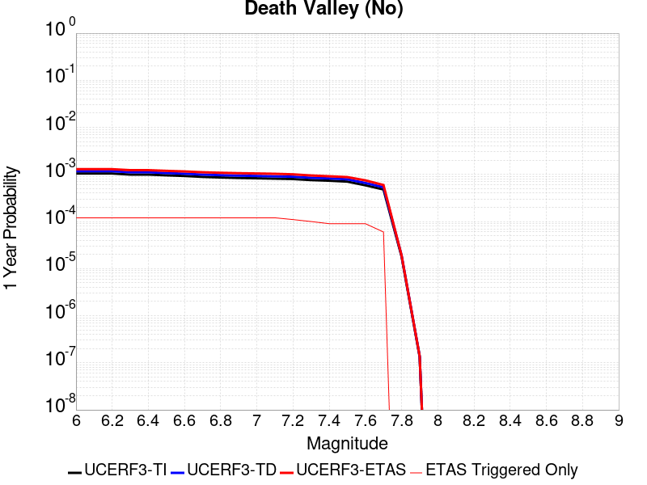 |  |

| Magnitude | 1 wk TI Prob | 1 wk TD Prob | 1 wk ETAS Prob | 1 wk ETAS/TD Gain | 1 wk ETAS Triggered Only | 1 mo TI Prob | 1 mo TD Prob | 1 mo ETAS Prob | 1 mo ETAS/TD Gain | 1 mo ETAS Triggered Only | 1 yr TI Prob | 1 yr TD Prob | 1 yr ETAS Prob | 1 yr ETAS/TD Gain | 1 yr ETAS Triggered Only | 10 yr TI Prob | 10 yr TD Prob | 10 yr ETAS Prob | 10 yr ETAS/TD Gain | 10 yr ETAS Triggered Only |
|-----|-----|-----|-----|-----|-----|-----|-----|-----|-----|-----|-----|-----|-----|-----|-----|-----|-----|-----|-----|-----|
| 6.0 | 2.0074807E-5 | 2.2503706E-5 | 2.2503706E-5 | 1.0 | 0.0 | 8.603206E-5 | 9.6440934E-5 | 9.6440934E-5 | 1.0 | 0.0 | 0.001046937 | 0.0011735433 | 0.0012855068 | 1.0954064 | 1.12095055E-4 | 0.010420183 | 0.011674375 | 0.011895948 | 1.0189794 | 2.2419011E-4 |
| 6.1 | 2.0074807E-5 | 2.2503706E-5 | 2.2503706E-5 | 1.0 | 0.0 | 8.603206E-5 | 9.6440934E-5 | 9.6440934E-5 | 1.0 | 0.0 | 0.001046937 | 0.0011735433 | 0.0012855068 | 1.0954064 | 1.12095055E-4 | 0.010420183 | 0.011674375 | 0.011895948 | 1.0189794 | 2.2419011E-4 |
| 6.2 | 2.0074807E-5 | 2.2503706E-5 | 2.2503706E-5 | 1.0 | 0.0 | 8.603206E-5 | 9.6440934E-5 | 9.6440934E-5 | 1.0 | 0.0 | 0.001046937 | 0.0011735433 | 0.0012855068 | 1.0954064 | 1.12095055E-4 | 0.010420183 | 0.011674375 | 0.011895948 | 1.0189794 | 2.2419011E-4 |
| 6.3 | 1.9050609E-5 | 2.134036E-5 | 2.134036E-5 | 1.0 | 0.0 | 8.164292E-5 | 9.145552E-5 | 9.145552E-5 | 1.0 | 0.0 | 9.935491E-4 | 0.0011129089 | 0.0012248793 | 1.1006105 | 1.12095055E-4 | 0.009891188 | 0.011074181 | 0.011295888 | 1.0200202 | 2.2419011E-4 |
| 6.4 | 1.9050609E-5 | 2.134036E-5 | 2.134036E-5 | 1.0 | 0.0 | 8.164292E-5 | 9.145552E-5 | 9.145552E-5 | 1.0 | 0.0 | 9.935491E-4 | 0.0011129089 | 0.0012248793 | 1.1006105 | 1.12095055E-4 | 0.009891188 | 0.011074181 | 0.011295888 | 1.0200202 | 2.2419011E-4 |
| 6.5 | 1.8367004E-5 | 2.0564283E-5 | 2.0564283E-5 | 1.0 | 0.0 | 7.8713354E-5 | 8.81297E-5 | 8.81297E-5 | 1.0 | 0.0 | 9.5791375E-4 | 0.0010724575 | 0.0011844323 | 1.1044096 | 1.12095055E-4 | 0.009537951 | 0.010673606 | 0.010895403 | 1.02078 | 2.2419011E-4 |
| 6.6 | 1.779439E-5 | 1.9914085E-5 | 1.9914085E-5 | 1.0 | 0.0 | 7.625944E-5 | 8.534332E-5 | 8.534332E-5 | 1.0 | 0.0 | 9.280632E-4 | 0.0010385661 | 0.0011505447 | 1.1078204 | 1.12095055E-4 | 0.009241969 | 0.010337884 | 0.010559756 | 1.0214621 | 2.2419011E-4 |
| 6.7 | 1.7025437E-5 | 1.9046434E-5 | 1.9046434E-5 | 1.0 | 0.0 | 7.296412E-5 | 8.162506E-5 | 8.162506E-5 | 1.0 | 0.0 | 8.87976E-4 | 9.933382E-4 | 0.0011053219 | 1.1127347 | 1.12095055E-4 | 0.008844362 | 0.0098897 | 0.010111673 | 1.0224448 | 2.2419011E-4 |
| 6.8 | 1.6545107E-5 | 1.8515479E-5 | 1.8515479E-5 | 1.0 | 0.0 | 7.090568E-5 | 7.934967E-5 | 7.934967E-5 | 1.0 | 0.0 | 8.629347E-4 | 9.656602E-4 | 0.0010776471 | 1.1159692 | 1.12095055E-4 | 0.008595915 | 0.009615345 | 0.00983738 | 1.0230917 | 2.2419011E-4 |
| 6.9 | 1.615478E-5 | 1.8090475E-5 | 1.8090475E-5 | 1.0 | 0.0 | 6.9232934E-5 | 7.752834E-5 | 7.752834E-5 | 1.0 | 0.0 | 8.4258494E-4 | 9.435049E-4 | 0.0010554942 | 1.118695 | 1.12095055E-4 | 0.008393973 | 0.009395686 | 0.009617769 | 1.0236368 | 2.2419011E-4 |
| 7.0 | 1.5894311E-5 | 1.7808401E-5 | 1.7808401E-5 | 1.0 | 0.0 | 6.81167E-5 | 7.631952E-5 | 7.631952E-5 | 1.0 | 0.0 | 8.2900526E-4 | 9.288001E-4 | 0.001040791 | 1.1205759 | 1.12095055E-4 | 0.008259195 | 0.009249872 | 0.009471987 | 1.0240129 | 2.2419011E-4 |
| 7.1 | 1.5602263E-5 | 1.7486309E-5 | 1.7486309E-5 | 1.0 | 0.0 | 6.6865134E-5 | 7.4939206E-5 | 7.4939206E-5 | 1.0 | 0.0 | 8.137789E-4 | 9.12009E-4 | 0.0010240019 | 1.122798 | 1.12095055E-4 | 0.008108052 | 0.009083345 | 0.009305499 | 1.0244572 | 2.2419011E-4 |
| 7.2 | 1.5323829E-5 | 1.7173385E-5 | 1.7173385E-5 | 1.0 | 0.0 | 6.56719E-5 | 7.3598174E-5 | 7.3598174E-5 | 1.0 | 0.0 | 7.99262E-4 | 8.9569547E-4 | 0.0010076901 | 1.1250365 | 1.12095055E-4 | 0.007963934 | 0.008921531 | 0.009143721 | 1.024905 | 2.2419011E-4 |
| 7.3 | 1.4556212E-5 | 1.6305059E-5 | 1.6305059E-5 | 1.0 | 0.0 | 6.238227E-5 | 6.987698E-5 | 6.987698E-5 | 1.0 | 0.0 | 7.592395E-4 | 8.5042603E-4 | 9.624258E-4 | 1.1316984 | 1.12095055E-4 | 0.0075665074 | 0.008472362 | 0.0086946525 | 1.0262371 | 2.2419011E-4 |
| 7.4 | 1.411725E-5 | 1.581048E-5 | 1.581048E-5 | 1.0 | 0.0 | 6.0501097E-5 | 6.775747E-5 | 6.775747E-5 | 1.0 | 0.0 | 7.363519E-4 | 8.246408E-4 | 9.3664345E-4 | 1.1358199 | 1.12095055E-4 | 0.0073391674 | 0.008216443 | 0.00843879 | 1.0270613 | 2.2419011E-4 |
| 7.5 | 1.3503312E-5 | 1.5128708E-5 | 1.5128708E-5 | 1.0 | 0.0 | 5.7870053E-5 | 6.483574E-5 | 6.483574E-5 | 1.0 | 0.0 | 7.043401E-4 | 7.8909507E-4 | 9.011017E-4 | 1.1419431 | 1.12095055E-4 | 0.007021119 | 0.007863557 | 0.008085984 | 1.0282859 | 2.2419011E-4 |
| 7.6 | 1.1279839E-5 | 1.2628332E-5 | 1.2628332E-5 | 1.0 | 0.0 | 4.834127E-5 | 5.412033E-5 | 5.412033E-5 | 1.0 | 0.0 | 5.88396E-4 | 6.5872114E-4 | 7.707423E-4 | 1.1700586 | 1.12095055E-4 | 0.005868405 | 0.006568238 | 0.006679597 | 1.0169542 | 1.12095055E-4 |
| 7.7 | 9.189108E-6 | 1.0284987E-5 | 1.0284987E-5 | 1.0 | 0.0 | 3.93813E-5 | 4.4077802E-5 | 4.4077802E-5 | 1.0 | 0.0 | 4.7936183E-4 | 5.3652015E-4 | 6.4855505E-4 | 1.2088177 | 1.12095055E-4 | 0.004783291 | 0.0053527597 | 0.0054642544 | 1.0208294 | 1.12095055E-4 |
| 7.8 | 3.4586725E-7 | 3.648528E-7 | 3.648528E-7 | 1.0 | 0.0 | 1.4822873E-6 | 1.563654E-6 | 1.563654E-6 | 1.0 | 0.0 | 1.80467E-5 | 1.9037325E-5 | 1.9037325E-5 | 1.0 | 0.0 | 1.8045233E-4 | 1.9035739E-4 | 1.9035739E-4 | 1.0 | 0.0 |
| 7.9 | 2.5591178E-9 | 2.6698248E-9 | 2.6698248E-9 | 1.0 | 0.0 | 1.0967647E-8 | 1.1442106E-8 | 1.1442106E-8 | 1.0 | 0.0 | 1.335311E-7 | 1.3930764E-7 | 1.3930764E-7 | 1.0 | 0.0 | 1.3353102E-6 | 1.3930764E-6 | 1.3930764E-6 | 1.0 | 0.0 |

## San Jacinto (Stepovers Combined)
*[(top)](#table-of-contents)*

| 1 Week | 1 Month | 1 Year | 10 Year |
|-----|-----|-----|-----|
|  |  |  |  |

| Magnitude | 1 wk TI Prob | 1 wk TD Prob | 1 wk ETAS Prob | 1 wk ETAS/TD Gain | 1 wk ETAS Triggered Only | 1 mo TI Prob | 1 mo TD Prob | 1 mo ETAS Prob | 1 mo ETAS/TD Gain | 1 mo ETAS Triggered Only | 1 yr TI Prob | 1 yr TD Prob | 1 yr ETAS Prob | 1 yr ETAS/TD Gain | 1 yr ETAS Triggered Only | 10 yr TI Prob | 10 yr TD Prob | 10 yr ETAS Prob | 10 yr ETAS/TD Gain | 10 yr ETAS Triggered Only |
|-----|-----|-----|-----|-----|-----|-----|-----|-----|-----|-----|-----|-----|-----|-----|-----|-----|-----|-----|-----|-----|
| 6.0 | 4.0667746E-5 | 3.5424455E-5 | 3.5424455E-5 | 1.0 | 0.0 | 1.742787E-4 | 1.5181027E-4 | 1.5181027E-4 | 1.0 | 0.0 | 0.0021197782 | 0.0018467255 | 0.0019586135 | 1.0605873 | 1.12095055E-4 | 0.020996714 | 0.019065471 | 0.019285386 | 1.0115348 | 2.2419011E-4 |
| 6.1 | 4.0667746E-5 | 3.5424455E-5 | 3.5424455E-5 | 1.0 | 0.0 | 1.742787E-4 | 1.5181027E-4 | 1.5181027E-4 | 1.0 | 0.0 | 0.0021197782 | 0.0018467255 | 0.0019586135 | 1.0605873 | 1.12095055E-4 | 0.020996714 | 0.019065471 | 0.019285386 | 1.0115348 | 2.2419011E-4 |
| 6.2 | 4.0667746E-5 | 3.5424455E-5 | 3.5424455E-5 | 1.0 | 0.0 | 1.742787E-4 | 1.5181027E-4 | 1.5181027E-4 | 1.0 | 0.0 | 0.0021197782 | 0.0018467255 | 0.0019586135 | 1.0605873 | 1.12095055E-4 | 0.020996714 | 0.019065471 | 0.019285386 | 1.0115348 | 2.2419011E-4 |
| 6.3 | 4.0667746E-5 | 3.5424455E-5 | 3.5424455E-5 | 1.0 | 0.0 | 1.742787E-4 | 1.5181027E-4 | 1.5181027E-4 | 1.0 | 0.0 | 0.0021197782 | 0.0018467255 | 0.0019586135 | 1.0605873 | 1.12095055E-4 | 0.020996714 | 0.019065471 | 0.019285386 | 1.0115348 | 2.2419011E-4 |
| 6.4 | 4.0577226E-5 | 3.529632E-5 | 3.529632E-5 | 1.0 | 0.0 | 1.738908E-4 | 1.5126119E-4 | 1.5126119E-4 | 1.0 | 0.0 | 0.0021150648 | 0.0018400518 | 0.0019519407 | 1.0608075 | 1.12095055E-4 | 0.020950472 | 0.019000014 | 0.019219944 | 1.0115752 | 2.2419011E-4 |
| 6.5 | 4.0577226E-5 | 3.529632E-5 | 3.529632E-5 | 1.0 | 0.0 | 1.738908E-4 | 1.5126119E-4 | 1.5126119E-4 | 1.0 | 0.0 | 0.0021150648 | 0.0018400518 | 0.0019519407 | 1.0608075 | 1.12095055E-4 | 0.020950472 | 0.019000014 | 0.019219944 | 1.0115752 | 2.2419011E-4 |
| 6.6 | 4.053861E-5 | 3.5241635E-5 | 3.5241635E-5 | 1.0 | 0.0 | 1.7372532E-4 | 1.5102686E-4 | 1.5102686E-4 | 1.0 | 0.0 | 0.0021130538 | 0.0018372037 | 0.0019490928 | 1.0609019 | 1.12095055E-4 | 0.020930743 | 0.018972082 | 0.019192018 | 1.0115926 | 2.2419011E-4 |
| 6.7 | 4.0516545E-5 | 3.5210687E-5 | 3.5210687E-5 | 1.0 | 0.0 | 1.7363077E-4 | 1.5089424E-4 | 1.5089424E-4 | 1.0 | 0.0 | 0.002111905 | 0.0018355926 | 0.0019474818 | 1.0609554 | 1.12095055E-4 | 0.020919468 | 0.018956272 | 0.019176211 | 1.0116025 | 2.2419011E-4 |
| 6.8 | 4.049434E-5 | 3.5182235E-5 | 3.5182235E-5 | 1.0 | 0.0 | 1.7353562E-4 | 1.507723E-4 | 1.507723E-4 | 1.0 | 0.0 | 0.0021107488 | 0.0018341107 | 0.0019460001 | 1.0610048 | 1.12095055E-4 | 0.020908125 | 0.018941678 | 0.019161623 | 1.0116116 | 2.2419011E-4 |
| 6.9 | 4.046386E-5 | 3.5144778E-5 | 3.5144778E-5 | 1.0 | 0.0 | 1.73405E-4 | 1.506118E-4 | 1.506118E-4 | 1.0 | 0.0 | 0.0021091616 | 0.0018321596 | 0.0019440493 | 1.0610698 | 1.12095055E-4 | 0.020892553 | 0.018922443 | 0.019142391 | 1.0116236 | 2.2419011E-4 |
| 7.0 | 4.036382E-5 | 3.5025278E-5 | 3.5025278E-5 | 1.0 | 0.0 | 1.7297632E-4 | 1.5009972E-4 | 1.5009972E-4 | 1.0 | 0.0 | 0.0021039525 | 0.0018259356 | 0.0019378259 | 1.0612783 | 1.12095055E-4 | 0.02084144 | 0.018861026 | 0.019080987 | 1.0116622 | 2.2419011E-4 |
| 7.1 | 4.0343282E-5 | 3.5003726E-5 | 3.5003726E-5 | 1.0 | 0.0 | 1.7288832E-4 | 1.5000737E-4 | 1.5000737E-4 | 1.0 | 0.0 | 0.002102883 | 0.0018248131 | 0.0019367036 | 1.0613161 | 1.12095055E-4 | 0.020830948 | 0.018849896 | 0.01906986 | 1.0116693 | 2.2419011E-4 |
| 7.2 | 4.0257353E-5 | 3.4908084E-5 | 3.4908084E-5 | 1.0 | 0.0 | 1.725201E-4 | 1.4959752E-4 | 1.4959752E-4 | 1.0 | 0.0 | 0.0020984085 | 0.0018198314 | 0.0019317225 | 1.0614843 | 1.12095055E-4 | 0.020787042 | 0.018800564 | 0.01902054 | 1.0117005 | 2.2419011E-4 |
| 7.3 | 3.9940667E-5 | 3.4735232E-5 | 3.4735232E-5 | 1.0 | 0.0 | 1.7116306E-4 | 1.4885681E-4 | 1.4885681E-4 | 1.0 | 0.0 | 0.0020819185 | 0.0018108283 | 0.0019227203 | 1.0617906 | 1.12095055E-4 | 0.020625217 | 0.018708937 | 0.018928934 | 1.0117588 | 2.2419011E-4 |
| 7.4 | 3.9721202E-5 | 3.4620345E-5 | 3.4620345E-5 | 1.0 | 0.0 | 1.7022261E-4 | 1.4836449E-4 | 1.4836449E-4 | 1.0 | 0.0 | 0.0020704903 | 0.0018048445 | 0.0019167372 | 1.0619957 | 1.12095055E-4 | 0.020513052 | 0.01864792 | 0.01886793 | 1.011798 | 2.2419011E-4 |
| 7.5 | 3.7036873E-5 | 3.368442E-5 | 3.368442E-5 | 1.0 | 0.0 | 1.5871979E-4 | 1.4435383E-4 | 1.4435383E-4 | 1.0 | 0.0 | 0.0019307006 | 0.0017560942 | 0.0018679925 | 1.06372 | 1.12095055E-4 | 0.019140124 | 0.018147755 | 0.018367877 | 1.0121294 | 2.2419011E-4 |
| 7.6 | 3.2940967E-5 | 3.1455937E-5 | 3.1455937E-5 | 1.0 | 0.0 | 1.4116794E-4 | 1.348042E-4 | 1.348042E-4 | 1.0 | 0.0 | 0.0017173645 | 0.0016400078 | 0.0016400078 | 1.0 | 0.0 | 0.01704153 | 0.016975854 | 0.017086046 | 1.0064911 | 1.12095055E-4 |
| 7.7 | 2.8236149E-5 | 2.8018048E-5 | 2.8018048E-5 | 1.0 | 0.0 | 1.2100645E-4 | 1.2007183E-4 | 1.2007183E-4 | 1.0 | 0.0 | 0.0014722579 | 0.0014608953 | 0.0014608953 | 1.0 | 0.0 | 0.014625421 | 0.015184763 | 0.015295155 | 1.00727 | 1.12095055E-4 |
| 7.8 | 2.4329287E-5 | 2.5336392E-5 | 2.5336392E-5 | 1.0 | 0.0 | 1.042642E-4 | 1.08580025E-4 | 1.08580025E-4 | 1.0 | 0.0 | 0.0012686774 | 0.0013211609 | 0.0013211609 | 1.0 | 0.0 | 0.012614589 | 0.01377942 | 0.013889971 | 1.0080229 | 1.12095055E-4 |
| 7.9 | 1.9370926E-5 | 2.053781E-5 | 2.053781E-5 | 1.0 | 0.0 | 8.301561E-5 | 8.801621E-5 | 8.801621E-5 | 1.0 | 0.0 | 0.0010102465 | 0.0010710714 | 0.0010710714 | 1.0 | 0.0 | 0.0100566605 | 0.011260242 | 0.011371075 | 1.0098429 | 1.12095055E-4 |
| 8.0 | 1.5583017E-5 | 1.5984346E-5 | 1.5984346E-5 | 1.0 | 0.0 | 6.6782646E-5 | 6.8502544E-5 | 6.8502544E-5 | 1.0 | 0.0 | 8.127754E-4 | 8.3370006E-4 | 8.3370006E-4 | 1.0 | 0.0 | 0.008098091 | 0.008833316 | 0.008944421 | 1.0125779 | 1.12095055E-4 |
| 8.1 | 1.0024873E-5 | 8.350047E-6 | 8.350047E-6 | 1.0 | 0.0 | 4.2963035E-5 | 3.578543E-5 | 3.578543E-5 | 1.0 | 0.0 | 5.229494E-4 | 4.3560102E-4 | 4.3560102E-4 | 1.0 | 0.0 | 0.0052172043 | 0.004684384 | 0.004684384 | 1.0 | 0.0 |
| 8.2 | 4.142796E-6 | 1.5775288E-6 | 1.5775288E-6 | 1.0 | 0.0 | 1.775472E-5 | 6.7608203E-6 | 6.7608203E-6 | 1.0 | 0.0 | 2.1614227E-4 | 8.230991E-5 | 8.230991E-5 | 1.0 | 0.0 | 0.0021593217 | 9.5490384E-4 | 9.5490384E-4 | 1.0 | 0.0 |
| 8.3 | 1.2750878E-6 | 3.657188E-7 | 3.657188E-7 | 1.0 | 0.0 | 5.4646503E-6 | 1.5673653E-6 | 1.5673653E-6 | 1.0 | 0.0 | 6.653009E-5 | 1.908251E-5 | 1.908251E-5 | 1.0 | 0.0 | 6.6510175E-4 | 2.2998886E-4 | 2.2998886E-4 | 1.0 | 0.0 |

## San Jacinto (San Jacinto Valley) rev
*[(top)](#table-of-contents)*

| 1 Week | 1 Month | 1 Year | 10 Year |
|-----|-----|-----|-----|
| 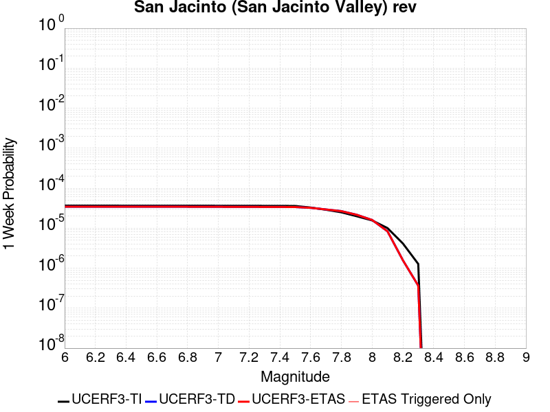 |  |  |  |

| Magnitude | 1 wk TI Prob | 1 wk TD Prob | 1 wk ETAS Prob | 1 wk ETAS/TD Gain | 1 wk ETAS Triggered Only | 1 mo TI Prob | 1 mo TD Prob | 1 mo ETAS Prob | 1 mo ETAS/TD Gain | 1 mo ETAS Triggered Only | 1 yr TI Prob | 1 yr TD Prob | 1 yr ETAS Prob | 1 yr ETAS/TD Gain | 1 yr ETAS Triggered Only | 10 yr TI Prob | 10 yr TD Prob | 10 yr ETAS Prob | 10 yr ETAS/TD Gain | 10 yr ETAS Triggered Only |
|-----|-----|-----|-----|-----|-----|-----|-----|-----|-----|-----|-----|-----|-----|-----|-----|-----|-----|-----|-----|-----|
| 6.0 | 3.652694E-5 | 3.455631E-5 | 3.455631E-5 | 1.0 | 0.0 | 1.5653463E-4 | 1.4809008E-4 | 1.4809008E-4 | 1.0 | 0.0 | 0.0019041431 | 0.0018015072 | 0.0019134003 | 1.0621108 | 1.12095055E-4 | 0.018879099 | 0.018606104 | 0.018826123 | 1.0118251 | 2.2419011E-4 |
| 6.1 | 3.652694E-5 | 3.455631E-5 | 3.455631E-5 | 1.0 | 0.0 | 1.5653463E-4 | 1.4809008E-4 | 1.4809008E-4 | 1.0 | 0.0 | 0.0019041431 | 0.0018015072 | 0.0019134003 | 1.0621108 | 1.12095055E-4 | 0.018879099 | 0.018606104 | 0.018826123 | 1.0118251 | 2.2419011E-4 |
| 6.2 | 3.652694E-5 | 3.455631E-5 | 3.455631E-5 | 1.0 | 0.0 | 1.5653463E-4 | 1.4809008E-4 | 1.4809008E-4 | 1.0 | 0.0 | 0.0019041431 | 0.0018015072 | 0.0019134003 | 1.0621108 | 1.12095055E-4 | 0.018879099 | 0.018606104 | 0.018826123 | 1.0118251 | 2.2419011E-4 |
| 6.3 | 3.652694E-5 | 3.455631E-5 | 3.455631E-5 | 1.0 | 0.0 | 1.5653463E-4 | 1.4809008E-4 | 1.4809008E-4 | 1.0 | 0.0 | 0.0019041431 | 0.0018015072 | 0.0019134003 | 1.0621108 | 1.12095055E-4 | 0.018879099 | 0.018606104 | 0.018826123 | 1.0118251 | 2.2419011E-4 |
| 6.4 | 3.646941E-5 | 3.447785E-5 | 3.447785E-5 | 1.0 | 0.0 | 1.5628811E-4 | 1.4775386E-4 | 1.4775386E-4 | 1.0 | 0.0 | 0.0019011468 | 0.001797421 | 0.0019093147 | 1.0622523 | 1.12095055E-4 | 0.018849645 | 0.018565971 | 0.018785998 | 1.0118512 | 2.2419011E-4 |
| 6.5 | 3.646941E-5 | 3.447785E-5 | 3.447785E-5 | 1.0 | 0.0 | 1.5628811E-4 | 1.4775386E-4 | 1.4775386E-4 | 1.0 | 0.0 | 0.0019011468 | 0.001797421 | 0.0019093147 | 1.0622523 | 1.12095055E-4 | 0.018849645 | 0.018565971 | 0.018785998 | 1.0118512 | 2.2419011E-4 |
| 6.6 | 3.6442503E-5 | 3.444122E-5 | 3.444122E-5 | 1.0 | 0.0 | 1.561728E-4 | 1.4759687E-4 | 1.4759687E-4 | 1.0 | 0.0 | 0.0018997455 | 0.0017955131 | 0.001907407 | 1.0623186 | 1.12095055E-4 | 0.018835869 | 0.018547233 | 0.018767266 | 1.0118634 | 2.2419011E-4 |
| 6.7 | 3.6432113E-5 | 3.4426783E-5 | 3.4426783E-5 | 1.0 | 0.0 | 1.5612828E-4 | 1.4753501E-4 | 1.4753501E-4 | 1.0 | 0.0 | 0.0018992044 | 0.0017947616 | 0.0019066555 | 1.0623447 | 1.12095055E-4 | 0.018830549 | 0.018539855 | 0.018759888 | 1.0118681 | 2.2419011E-4 |
| 6.8 | 3.6409598E-5 | 3.4395824E-5 | 3.4395824E-5 | 1.0 | 0.0 | 1.560318E-4 | 1.4740234E-4 | 1.4740234E-4 | 1.0 | 0.0 | 0.0018980318 | 0.001793149 | 0.0019050431 | 1.0624008 | 1.12095055E-4 | 0.018819023 | 0.018524002 | 0.01874404 | 1.0118785 | 2.2419011E-4 |
| 6.9 | 3.638078E-5 | 3.4356228E-5 | 3.4356228E-5 | 1.0 | 0.0 | 1.5590832E-4 | 1.4723267E-4 | 1.4723267E-4 | 1.0 | 0.0 | 0.0018965311 | 0.0017910866 | 0.001902981 | 1.0624728 | 1.12095055E-4 | 0.018804269 | 0.01850373 | 0.018723771 | 1.0118917 | 2.2419011E-4 |
| 7.0 | 3.6294874E-5 | 3.4238194E-5 | 3.4238194E-5 | 1.0 | 0.0 | 1.5554018E-4 | 1.4672687E-4 | 1.4672687E-4 | 1.0 | 0.0 | 0.0018920569 | 0.0017849386 | 0.0018968335 | 1.0626885 | 1.12095055E-4 | 0.018760284 | 0.018443286 | 0.018663341 | 1.0119314 | 2.2419011E-4 |
| 7.1 | 3.6260717E-5 | 3.4194458E-5 | 3.4194458E-5 | 1.0 | 0.0 | 1.5539382E-4 | 1.4653946E-4 | 1.4653946E-4 | 1.0 | 0.0 | 0.001890278 | 0.0017826606 | 0.0018945559 | 1.0627687 | 1.12095055E-4 | 0.018742796 | 0.01842088 | 0.018640941 | 1.0119462 | 2.2419011E-4 |
| 7.2 | 3.6210204E-5 | 3.412857E-5 | 3.412857E-5 | 1.0 | 0.0 | 1.5517735E-4 | 1.4625712E-4 | 1.4625712E-4 | 1.0 | 0.0 | 0.001887647 | 0.0017792287 | 0.0018911243 | 1.0628899 | 1.12095055E-4 | 0.01871693 | 0.018387107 | 0.018607175 | 1.0119686 | 2.2419011E-4 |
| 7.3 | 3.6119454E-5 | 3.4016623E-5 | 3.4016623E-5 | 1.0 | 0.0 | 1.5478847E-4 | 1.4577739E-4 | 1.4577739E-4 | 1.0 | 0.0 | 0.0018829206 | 0.0017733976 | 0.0018852939 | 1.0630971 | 1.12095055E-4 | 0.018670462 | 0.018329544 | 0.018549625 | 1.0120069 | 2.2419011E-4 |
| 7.4 | 3.607848E-5 | 3.3964046E-5 | 3.3964046E-5 | 1.0 | 0.0 | 1.5461289E-4 | 1.455521E-4 | 1.455521E-4 | 1.0 | 0.0 | 0.0018807866 | 0.0017706591 | 0.0018825557 | 1.0631949 | 1.12095055E-4 | 0.018649481 | 0.018302504 | 0.01852259 | 1.012025 | 2.2419011E-4 |
| 7.5 | 3.5856774E-5 | 3.3772754E-5 | 3.3772754E-5 | 1.0 | 0.0 | 1.5366284E-4 | 1.4473236E-4 | 1.4473236E-4 | 1.0 | 0.0 | 0.0018692396 | 0.0017606949 | 0.0018725926 | 1.0635531 | 1.12095055E-4 | 0.018535944 | 0.018203052 | 0.018423162 | 1.0120919 | 2.2419011E-4 |
| 7.6 | 3.286655E-5 | 3.228726E-5 | 3.228726E-5 | 1.0 | 0.0 | 1.4084904E-4 | 1.3836664E-4 | 1.3836664E-4 | 1.0 | 0.0 | 0.001713488 | 0.0016833142 | 0.0016833142 | 1.0 | 0.0 | 0.017003361 | 0.017418329 | 0.01752847 | 1.0063233 | 1.12095055E-4 |
| 7.7 | 2.8882527E-5 | 2.9376873E-5 | 2.9376873E-5 | 1.0 | 0.0 | 1.237764E-4 | 1.2589482E-4 | 1.2589482E-4 | 1.0 | 0.0 | 0.0015059357 | 0.0015316928 | 0.0015316928 | 1.0 | 0.0 | 0.014957713 | 0.015903201 | 0.016013512 | 1.0069364 | 1.12095055E-4 |
| 7.8 | 2.4950225E-5 | 2.6662403E-5 | 2.6662403E-5 | 1.0 | 0.0 | 1.0692515E-4 | 1.14262446E-4 | 1.14262446E-4 | 1.0 | 0.0 | 0.0013010362 | 0.0013902583 | 0.0013902583 | 1.0 | 0.0 | 0.012934455 | 0.014481823 | 0.014592295 | 1.0076283 | 1.12095055E-4 |
| 7.9 | 1.9881603E-5 | 2.1629137E-5 | 2.1629137E-5 | 1.0 | 0.0 | 8.520408E-5 | 9.2693015E-5 | 9.2693015E-5 | 1.0 | 0.0 | 0.001036866 | 0.001127954 | 0.001127954 | 1.0 | 0.0 | 0.010320415 | 0.011840356 | 0.011951123 | 1.0093551 | 1.12095055E-4 |
| 8.0 | 1.563292E-5 | 1.603562E-5 | 1.603562E-5 | 1.0 | 0.0 | 6.6996516E-5 | 6.872228E-5 | 6.872228E-5 | 1.0 | 0.0 | 8.153773E-4 | 8.3637325E-4 | 8.3637325E-4 | 1.0 | 0.0 | 0.00812392 | 0.00886222 | 0.008973322 | 1.0125365 | 1.12095055E-4 |
| 8.1 | 1.0045313E-5 | 8.359553E-6 | 8.359553E-6 | 1.0 | 0.0 | 4.305063E-5 | 3.5826168E-5 | 3.5826168E-5 | 1.0 | 0.0 | 5.2401534E-4 | 4.3609683E-4 | 4.3609683E-4 | 1.0 | 0.0 | 0.0052278144 | 0.0046901475 | 0.0046901475 | 1.0 | 0.0 |
| 8.2 | 4.1554413E-6 | 1.5821415E-6 | 1.5821415E-6 | 1.0 | 0.0 | 1.7808914E-5 | 6.780589E-6 | 6.780589E-6 | 1.0 | 0.0 | 2.1680194E-4 | 8.255057E-5 | 8.255057E-5 | 1.0 | 0.0 | 0.0021659054 | 9.57762E-4 | 9.57762E-4 | 1.0 | 0.0 |
| 8.3 | 1.2758221E-6 | 3.6600784E-7 | 3.6600784E-7 | 1.0 | 0.0 | 5.4677976E-6 | 1.5686041E-6 | 1.5686041E-6 | 1.0 | 0.0 | 6.65684E-5 | 1.9097592E-5 | 1.9097592E-5 | 1.0 | 0.0 | 6.6548464E-4 | 2.301609E-4 | 2.301609E-4 | 1.0 | 0.0 |

## San Diego Trough south
*[(top)](#table-of-contents)*

| 1 Week | 1 Month | 1 Year | 10 Year |
|-----|-----|-----|-----|
|  |  | 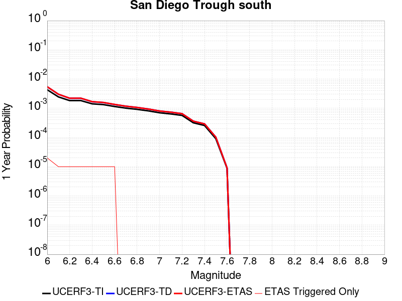 | 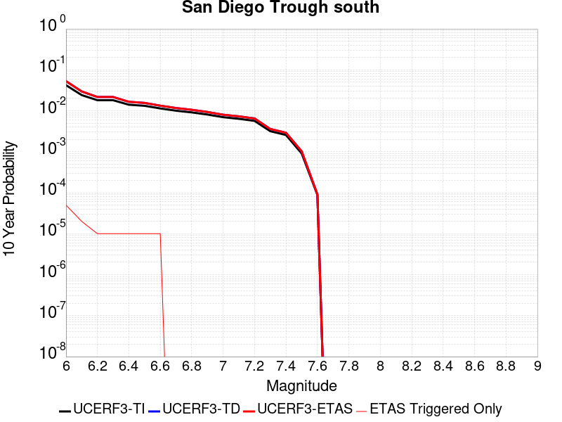 |

| Magnitude | 1 wk TI Prob | 1 wk TD Prob | 1 wk ETAS Prob | 1 wk ETAS/TD Gain | 1 wk ETAS Triggered Only | 1 mo TI Prob | 1 mo TD Prob | 1 mo ETAS Prob | 1 mo ETAS/TD Gain | 1 mo ETAS Triggered Only | 1 yr TI Prob | 1 yr TD Prob | 1 yr ETAS Prob | 1 yr ETAS/TD Gain | 1 yr ETAS Triggered Only | 10 yr TI Prob | 10 yr TD Prob | 10 yr ETAS Prob | 10 yr ETAS/TD Gain | 10 yr ETAS Triggered Only |
|-----|-----|-----|-----|-----|-----|-----|-----|-----|-----|-----|-----|-----|-----|-----|-----|-----|-----|-----|-----|-----|
| 6.0 | 8.279495E-5 | 1.04279236E-4 | 1.04279236E-4 | 1.0 | 0.0 | 3.5478722E-4 | 4.4683943E-4 | 4.4683943E-4 | 1.0 | 0.0 | 0.004310982 | 0.0054275123 | 0.005538999 | 1.0205411 | 1.12095055E-4 | 0.042283054 | 0.053009294 | 0.053115446 | 1.0020025 | 1.12095055E-4 |
| 6.1 | 4.6961468E-5 | 5.7747715E-5 | 5.7747715E-5 | 1.0 | 0.0 | 2.0124791E-4 | 2.4746772E-4 | 2.4746772E-4 | 1.0 | 0.0 | 0.00244744 | 0.003008853 | 0.0031206107 | 1.037143 | 1.12095055E-4 | 0.024206603 | 0.029688226 | 0.029796991 | 1.0036637 | 1.12095055E-4 |
| 6.2 | 3.5079658E-5 | 4.215307E-5 | 4.215307E-5 | 1.0 | 0.0 | 1.5033272E-4 | 1.8064378E-4 | 1.8064378E-4 | 1.0 | 0.0 | 0.0018287642 | 0.0021971618 | 0.0023090106 | 1.0509061 | 1.12095055E-4 | 0.018137876 | 0.021756878 | 0.021866534 | 1.00504 | 1.12095055E-4 |
| 6.3 | 3.5079658E-5 | 4.215307E-5 | 4.215307E-5 | 1.0 | 0.0 | 1.5033272E-4 | 1.8064378E-4 | 1.8064378E-4 | 1.0 | 0.0 | 0.0018287642 | 0.0021971618 | 0.0023090106 | 1.0509061 | 1.12095055E-4 | 0.018137876 | 0.021756878 | 0.021866534 | 1.00504 | 1.12095055E-4 |
| 6.4 | 2.7196904E-5 | 3.2094915E-5 | 3.2094915E-5 | 1.0 | 0.0 | 1.16552954E-4 | 1.3754248E-4 | 1.3754248E-4 | 1.0 | 0.0 | 0.0014181085 | 0.001673306 | 0.0017852135 | 1.0668781 | 1.12095055E-4 | 0.014090929 | 0.016608594 | 0.016718827 | 1.0066371 | 1.12095055E-4 |
| 6.5 | 2.5584688E-5 | 3.0108771E-5 | 3.0108771E-5 | 1.0 | 0.0 | 1.0964406E-4 | 1.290313E-4 | 1.290313E-4 | 1.0 | 0.0 | 0.0013340989 | 0.001569835 | 0.0016817541 | 1.0712935 | 1.12095055E-4 | 0.013261181 | 0.015588958 | 0.015699305 | 1.0070785 | 1.12095055E-4 |
| 6.6 | 2.2034688E-5 | 2.5748534E-5 | 2.5748534E-5 | 1.0 | 0.0 | 9.443096E-5 | 1.1034624E-4 | 1.1034624E-4 | 1.0 | 0.0 | 0.0011490905 | 0.0013426427 | 0.0014545873 | 1.0833763 | 1.12095055E-4 | 0.011431668 | 0.013346296 | 0.013456894 | 1.0082868 | 1.12095055E-4 |
| 6.7 | 1.9394853E-5 | 2.2546645E-5 | 2.2546645E-5 | 1.0 | 0.0 | 8.311815E-5 | 9.662493E-5 | 9.662493E-5 | 1.0 | 0.0 | 0.0010114936 | 0.0011757788 | 0.0011757788 | 1.0 | 0.0 | 0.01006902 | 0.011696285 | 0.011696285 | 1.0 | 0.0 |
| 6.8 | 1.7615313E-5 | 2.040749E-5 | 2.040749E-5 | 1.0 | 0.0 | 7.549201E-5 | 8.745776E-5 | 8.745776E-5 | 1.0 | 0.0 | 9.1872766E-4 | 0.0010642825 | 0.0010642825 | 1.0 | 0.0 | 0.009149387 | 0.0105924215 | 0.0105924215 | 1.0 | 0.0 |
| 6.9 | 1.5621423E-5 | 1.8029812E-5 | 1.8029812E-5 | 1.0 | 0.0 | 6.6947236E-5 | 7.7268356E-5 | 7.7268356E-5 | 1.0 | 0.0 | 8.147778E-4 | 9.4033976E-4 | 9.4033976E-4 | 1.0 | 0.0 | 0.008117969 | 0.009364054 | 0.009364054 | 1.0 | 0.0 |
| 7.0 | 1.3444376E-5 | 1.5451154E-5 | 1.5451154E-5 | 1.0 | 0.0 | 5.7617483E-5 | 6.6217566E-5 | 6.6217566E-5 | 1.0 | 0.0 | 7.0126704E-4 | 8.0590346E-4 | 8.0590346E-4 | 1.0 | 0.0 | 0.006990582 | 0.008030142 | 0.008030142 | 1.0 | 0.0 |
| 7.1 | 1.2268361E-5 | 1.4075787E-5 | 1.4075787E-5 | 1.0 | 0.0 | 5.2577634E-5 | 6.032342E-5 | 6.032342E-5 | 1.0 | 0.0 | 6.399447E-4 | 7.341928E-4 | 7.341928E-4 | 1.0 | 0.0 | 0.0063810493 | 0.007317977 | 0.007317977 | 1.0 | 0.0 |
| 7.2 | 1.0922655E-5 | 1.251599E-5 | 1.251599E-5 | 1.0 | 0.0 | 4.681054E-5 | 5.3638872E-5 | 5.3638872E-5 | 1.0 | 0.0 | 5.697693E-4 | 6.528601E-4 | 6.528601E-4 | 1.0 | 0.0 | 0.0056831064 | 0.006509702 | 0.006509702 | 1.0 | 0.0 |
| 7.3 | 6.1106753E-6 | 6.930162E-6 | 6.930162E-6 | 1.0 | 0.0 | 2.6188345E-5 | 2.9700357E-5 | 2.9700357E-5 | 1.0 | 0.0 | 3.1879646E-4 | 3.6154225E-4 | 3.6154225E-4 | 1.0 | 0.0 | 0.0031833951 | 0.003609586 | 0.003609586 | 1.0 | 0.0 |
| 7.4 | 4.933187E-6 | 5.590545E-6 | 5.590545E-6 | 1.0 | 0.0 | 2.114206E-5 | 2.395926E-5 | 2.395926E-5 | 1.0 | 0.0 | 2.5737417E-4 | 2.9166535E-4 | 2.9166535E-4 | 1.0 | 0.0 | 0.002570763 | 0.0029128667 | 0.0029128667 | 1.0 | 0.0 |
| 7.5 | 1.7489613E-6 | 1.970012E-6 | 1.970012E-6 | 1.0 | 0.0 | 7.495527E-6 | 8.442882E-6 | 8.442882E-6 | 1.0 | 0.0 | 9.125422E-5 | 1.0278747E-4 | 1.0278747E-4 | 1.0 | 0.0 | 9.1216754E-4 | 0.0010274213 | 0.0010274213 | 1.0 | 0.0 |
| 7.6 | 1.6988751E-7 | 1.7534569E-7 | 1.7534569E-7 | 1.0 | 0.0 | 7.2808916E-7 | 7.5148137E-7 | 7.5148137E-7 | 1.0 | 0.0 | 8.864449E-6 | 9.149249E-6 | 9.149249E-6 | 1.0 | 0.0 | 8.8640954E-5 | 9.1488924E-5 | 9.1488924E-5 | 1.0 | 0.0 |

## Manix-Afton Hills
*[(top)](#table-of-contents)*

| 1 Week | 1 Month | 1 Year | 10 Year |
|-----|-----|-----|-----|
|  |  |  |  |

| Magnitude | 1 wk TI Prob | 1 wk TD Prob | 1 wk ETAS Prob | 1 wk ETAS/TD Gain | 1 wk ETAS Triggered Only | 1 mo TI Prob | 1 mo TD Prob | 1 mo ETAS Prob | 1 mo ETAS/TD Gain | 1 mo ETAS Triggered Only | 1 yr TI Prob | 1 yr TD Prob | 1 yr ETAS Prob | 1 yr ETAS/TD Gain | 1 yr ETAS Triggered Only | 10 yr TI Prob | 10 yr TD Prob | 10 yr ETAS Prob | 10 yr ETAS/TD Gain | 10 yr ETAS Triggered Only |
|-----|-----|-----|-----|-----|-----|-----|-----|-----|-----|-----|-----|-----|-----|-----|-----|-----|-----|-----|-----|-----|
| 6.0 | 1.3783202E-5 | 1.4712406E-5 | 1.4712406E-5 | 1.0 | 0.0 | 5.906953E-5 | 6.3051746E-5 | 6.3051746E-5 | 1.0 | 0.0 | 7.189342E-4 | 7.6740206E-4 | 7.6740206E-4 | 1.0 | 0.0 | 0.0071661277 | 0.007649278 | 0.007871753 | 1.0290844 | 2.2419011E-4 |
| 6.1 | 1.3783202E-5 | 1.4712406E-5 | 1.4712406E-5 | 1.0 | 0.0 | 5.906953E-5 | 6.3051746E-5 | 6.3051746E-5 | 1.0 | 0.0 | 7.189342E-4 | 7.6740206E-4 | 7.6740206E-4 | 1.0 | 0.0 | 0.0071661277 | 0.007649278 | 0.007871753 | 1.0290844 | 2.2419011E-4 |
| 6.2 | 1.3783202E-5 | 1.4712406E-5 | 1.4712406E-5 | 1.0 | 0.0 | 5.906953E-5 | 6.3051746E-5 | 6.3051746E-5 | 1.0 | 0.0 | 7.189342E-4 | 7.6740206E-4 | 7.6740206E-4 | 1.0 | 0.0 | 0.0071661277 | 0.007649278 | 0.007871753 | 1.0290844 | 2.2419011E-4 |
| 6.3 | 1.10494875E-5 | 1.1794191E-5 | 1.1794191E-5 | 1.0 | 0.0 | 4.7354086E-5 | 5.0545612E-5 | 5.0545612E-5 | 1.0 | 0.0 | 5.763835E-4 | 6.152294E-4 | 6.152294E-4 | 1.0 | 0.0 | 0.005748908 | 0.006136303 | 0.006359117 | 1.0363109 | 2.2419011E-4 |
| 6.4 | 1.10494875E-5 | 1.1794191E-5 | 1.1794191E-5 | 1.0 | 0.0 | 4.7354086E-5 | 5.0545612E-5 | 5.0545612E-5 | 1.0 | 0.0 | 5.763835E-4 | 6.152294E-4 | 6.152294E-4 | 1.0 | 0.0 | 0.005748908 | 0.006136303 | 0.006359117 | 1.0363109 | 2.2419011E-4 |
| 6.5 | 9.788949E-6 | 1.0455265E-5 | 1.0455265E-5 | 1.0 | 0.0 | 4.1951964E-5 | 4.480756E-5 | 4.480756E-5 | 1.0 | 0.0 | 5.1064545E-4 | 5.454048E-4 | 5.454048E-4 | 1.0 | 0.0 | 0.0050947363 | 0.0054415893 | 0.005664559 | 1.0409752 | 2.2419011E-4 |
| 6.6 | 8.810006E-6 | 9.414486E-6 | 9.414486E-6 | 1.0 | 0.0 | 3.775662E-5 | 4.0347222E-5 | 4.0347222E-5 | 1.0 | 0.0 | 4.5958988E-4 | 4.911256E-4 | 4.911256E-4 | 1.0 | 0.0 | 0.0045864056 | 0.004901285 | 0.0050128303 | 1.0227585 | 1.12095055E-4 |
| 6.7 | 8.80128E-6 | 9.404965E-6 | 9.404965E-6 | 1.0 | 0.0 | 3.7719226E-5 | 4.030642E-5 | 4.030642E-5 | 1.0 | 0.0 | 4.591348E-4 | 4.9062906E-4 | 4.9062906E-4 | 1.0 | 0.0 | 0.004581874 | 0.004896341 | 0.005007887 | 1.0227815 | 1.12095055E-4 |
| 6.8 | 6.8994877E-6 | 7.3807596E-6 | 7.3807596E-6 | 1.0 | 0.0 | 2.9568899E-5 | 3.163149E-5 | 3.163149E-5 | 1.0 | 0.0 | 3.5994186E-4 | 3.8505348E-4 | 3.8505348E-4 | 1.0 | 0.0 | 0.003593594 | 0.0038446684 | 0.0039563323 | 1.0290439 | 1.12095055E-4 |
| 6.9 | 4.9328037E-6 | 5.271442E-6 | 5.271442E-6 | 1.0 | 0.0 | 2.1140417E-5 | 2.2591734E-5 | 2.2591734E-5 | 1.0 | 0.0 | 2.5735417E-4 | 2.750258E-4 | 2.750258E-4 | 1.0 | 0.0 | 0.0025705635 | 0.0027474596 | 0.0027474596 | 1.0 | 0.0 |
| 7.0 | 3.347973E-6 | 3.5903752E-6 | 3.5903752E-6 | 1.0 | 0.0 | 1.4348378E-5 | 1.5387255E-5 | 1.5387255E-5 | 1.0 | 0.0 | 1.746775E-4 | 1.8732782E-4 | 1.8732782E-4 | 1.0 | 0.0 | 0.0017454025 | 0.0018721019 | 0.0018721019 | 1.0 | 0.0 |
| 7.1 | 1.2073567E-6 | 1.2936044E-6 | 1.2936044E-6 | 1.0 | 0.0 | 5.1743755E-6 | 5.5440164E-6 | 5.5440164E-6 | 1.0 | 0.0 | 6.29962E-5 | 6.7497946E-5 | 6.7497946E-5 | 1.0 | 0.0 | 6.297835E-4 | 6.749346E-4 | 6.749346E-4 | 1.0 | 0.0 |

## Pleito
*[(top)](#table-of-contents)*

| 1 Week | 1 Month | 1 Year | 10 Year |
|-----|-----|-----|-----|
|  |  |  |  |

| Magnitude | 1 wk TI Prob | 1 wk TD Prob | 1 wk ETAS Prob | 1 wk ETAS/TD Gain | 1 wk ETAS Triggered Only | 1 mo TI Prob | 1 mo TD Prob | 1 mo ETAS Prob | 1 mo ETAS/TD Gain | 1 mo ETAS Triggered Only | 1 yr TI Prob | 1 yr TD Prob | 1 yr ETAS Prob | 1 yr ETAS/TD Gain | 1 yr ETAS Triggered Only | 10 yr TI Prob | 10 yr TD Prob | 10 yr ETAS Prob | 10 yr ETAS/TD Gain | 10 yr ETAS Triggered Only |
|-----|-----|-----|-----|-----|-----|-----|-----|-----|-----|-----|-----|-----|-----|-----|-----|-----|-----|-----|-----|-----|
| 6.0 | 1.6763008E-5 | 2.4830579E-5 | 2.4830579E-5 | 1.0 | 0.0 | 7.183948E-5 | 1.0641284E-4 | 1.0641284E-4 | 1.0 | 0.0 | 8.742947E-4 | 0.0012948783 | 0.0014068283 | 1.086456 | 1.12095055E-4 | 0.00870863 | 0.012987581 | 0.01320886 | 1.0170377 | 2.2419011E-4 |
| 6.1 | 1.6763008E-5 | 2.4830579E-5 | 2.4830579E-5 | 1.0 | 0.0 | 7.183948E-5 | 1.0641284E-4 | 1.0641284E-4 | 1.0 | 0.0 | 8.742947E-4 | 0.0012948783 | 0.0014068283 | 1.086456 | 1.12095055E-4 | 0.00870863 | 0.012987581 | 0.01320886 | 1.0170377 | 2.2419011E-4 |
| 6.2 | 1.6763008E-5 | 2.4830579E-5 | 2.4830579E-5 | 1.0 | 0.0 | 7.183948E-5 | 1.0641284E-4 | 1.0641284E-4 | 1.0 | 0.0 | 8.742947E-4 | 0.0012948783 | 0.0014068283 | 1.086456 | 1.12095055E-4 | 0.00870863 | 0.012987581 | 0.01320886 | 1.0170377 | 2.2419011E-4 |
| 6.3 | 1.6763008E-5 | 2.4830579E-5 | 2.4830579E-5 | 1.0 | 0.0 | 7.183948E-5 | 1.0641284E-4 | 1.0641284E-4 | 1.0 | 0.0 | 8.742947E-4 | 0.0012948783 | 0.0014068283 | 1.086456 | 1.12095055E-4 | 0.00870863 | 0.012987581 | 0.01320886 | 1.0170377 | 2.2419011E-4 |
| 6.4 | 1.6763008E-5 | 2.4830579E-5 | 2.4830579E-5 | 1.0 | 0.0 | 7.183948E-5 | 1.0641284E-4 | 1.0641284E-4 | 1.0 | 0.0 | 8.742947E-4 | 0.0012948783 | 0.0014068283 | 1.086456 | 1.12095055E-4 | 0.00870863 | 0.012987581 | 0.01320886 | 1.0170377 | 2.2419011E-4 |
| 6.5 | 1.6763008E-5 | 2.4830579E-5 | 2.4830579E-5 | 1.0 | 0.0 | 7.183948E-5 | 1.0641284E-4 | 1.0641284E-4 | 1.0 | 0.0 | 8.742947E-4 | 0.0012948783 | 0.0014068283 | 1.086456 | 1.12095055E-4 | 0.00870863 | 0.012987581 | 0.01320886 | 1.0170377 | 2.2419011E-4 |
| 6.6 | 9.910213E-6 | 1.7280347E-5 | 1.7280347E-5 | 1.0 | 0.0 | 4.247165E-5 | 7.4056545E-5 | 7.4056545E-5 | 1.0 | 0.0 | 5.169696E-4 | 9.012692E-4 | 0.0010132632 | 1.1242626 | 1.12095055E-4 | 0.0051576863 | 0.009083998 | 0.009195074 | 1.0122278 | 1.12095055E-4 |
| 6.7 | 9.910213E-6 | 1.7280347E-5 | 1.7280347E-5 | 1.0 | 0.0 | 4.247165E-5 | 7.4056545E-5 | 7.4056545E-5 | 1.0 | 0.0 | 5.169696E-4 | 9.012692E-4 | 0.0010132632 | 1.1242626 | 1.12095055E-4 | 0.0051576863 | 0.009083998 | 0.009195074 | 1.0122278 | 1.12095055E-4 |
| 6.8 | 8.300162E-6 | 1.5539768E-5 | 1.5539768E-5 | 1.0 | 0.0 | 3.557164E-5 | 6.659731E-5 | 6.659731E-5 | 1.0 | 0.0 | 4.3299864E-4 | 8.105221E-4 | 9.2252635E-4 | 1.1381878 | 1.12095055E-4 | 0.004321559 | 0.0081833685 | 0.008294546 | 1.0135858 | 1.12095055E-4 |
| 6.9 | 8.183114E-6 | 1.5410953E-5 | 1.5410953E-5 | 1.0 | 0.0 | 3.5070017E-5 | 6.604528E-5 | 6.604528E-5 | 1.0 | 0.0 | 4.2689382E-4 | 8.0380606E-4 | 9.15811E-4 | 1.1393433 | 1.12095055E-4 | 0.0042607468 | 0.0081167 | 0.008227885 | 1.0136983 | 1.12095055E-4 |
| 7.0 | 7.1748823E-6 | 1.4197121E-5 | 1.4197121E-5 | 1.0 | 0.0 | 3.0749135E-5 | 6.084339E-5 | 6.084339E-5 | 1.0 | 0.0 | 3.743064E-4 | 7.4051705E-4 | 7.4051705E-4 | 1.0 | 0.0 | 0.0037367654 | 0.00748775 | 0.00748775 | 1.0 | 0.0 |
| 7.1 | 7.1671807E-6 | 1.4187483E-5 | 1.4187483E-5 | 1.0 | 0.0 | 3.0716128E-5 | 6.0802085E-5 | 6.0802085E-5 | 1.0 | 0.0 | 3.7390468E-4 | 7.4001454E-4 | 7.4001454E-4 | 1.0 | 0.0 | 0.0037327618 | 0.0074827587 | 0.0074827587 | 1.0 | 0.0 |
| 7.2 | 7.0649667E-6 | 1.403456E-5 | 1.403456E-5 | 1.0 | 0.0 | 3.0278077E-5 | 6.0146733E-5 | 6.0146733E-5 | 1.0 | 0.0 | 3.6857324E-4 | 7.320409E-4 | 7.320409E-4 | 1.0 | 0.0 | 0.0036796255 | 0.007403409 | 0.007403409 | 1.0 | 0.0 |
| 7.3 | 7.02082E-6 | 1.397789E-5 | 1.397789E-5 | 1.0 | 0.0 | 3.008888E-5 | 5.9903872E-5 | 5.9903872E-5 | 1.0 | 0.0 | 3.6627054E-4 | 7.290861E-4 | 7.290861E-4 | 1.0 | 0.0 | 0.0036566744 | 0.007373845 | 0.007373845 | 1.0 | 0.0 |
| 7.4 | 6.987146E-6 | 1.39373815E-5 | 1.39373815E-5 | 1.0 | 0.0 | 2.9944567E-5 | 5.9730268E-5 | 5.9730268E-5 | 1.0 | 0.0 | 3.6451413E-4 | 7.2697387E-4 | 7.2697387E-4 | 1.0 | 0.0 | 0.0036391679 | 0.007352745 | 0.007352745 | 1.0 | 0.0 |
| 7.5 | 6.9494554E-6 | 1.3894233E-5 | 1.3894233E-5 | 1.0 | 0.0 | 2.9783041E-5 | 5.9545357E-5 | 5.9545357E-5 | 1.0 | 0.0 | 3.625482E-4 | 7.247241E-4 | 7.247241E-4 | 1.0 | 0.0 | 0.0036195726 | 0.0073303464 | 0.0073303464 | 1.0 | 0.0 |
| 7.6 | 6.92694E-6 | 1.3853247E-5 | 1.3853247E-5 | 1.0 | 0.0 | 2.9686547E-5 | 5.936971E-5 | 5.936971E-5 | 1.0 | 0.0 | 3.6137376E-4 | 7.2258705E-4 | 7.2258705E-4 | 1.0 | 0.0 | 0.0036078666 | 0.0073090494 | 0.0073090494 | 1.0 | 0.0 |
| 7.7 | 6.395867E-6 | 1.27296025E-5 | 1.27296025E-5 | 1.0 | 0.0 | 2.741057E-5 | 5.45543E-5 | 5.45543E-5 | 1.0 | 0.0 | 3.336726E-4 | 6.6399656E-4 | 6.6399656E-4 | 1.0 | 0.0 | 0.0033317201 | 0.0067263553 | 0.0067263553 | 1.0 | 0.0 |
| 7.8 | 5.8664327E-6 | 1.1591917E-5 | 1.1591917E-5 | 1.0 | 0.0 | 2.5141611E-5 | 4.9678703E-5 | 4.9678703E-5 | 1.0 | 0.0 | 3.060561E-4 | 6.0467055E-4 | 6.0467055E-4 | 1.0 | 0.0 | 0.0030563495 | 0.006129156 | 0.006129156 | 1.0 | 0.0 |
| 7.9 | 3.7167474E-6 | 7.147996E-6 | 7.147996E-6 | 1.0 | 0.0 | 1.592882E-5 | 3.063391E-5 | 3.063391E-5 | 1.0 | 0.0 | 1.9391612E-4 | 3.7290415E-4 | 3.7290415E-4 | 1.0 | 0.0 | 0.0019374699 | 0.003784743 | 0.003784743 | 1.0 | 0.0 |
| 8.0 | 1.0903841E-6 | 1.2953954E-6 | 1.2953954E-6 | 1.0 | 0.0 | 4.6730665E-6 | 5.5516825E-6 | 5.5516825E-6 | 1.0 | 0.0 | 5.68931E-5 | 6.758965E-5 | 6.758965E-5 | 1.0 | 0.0 | 5.6878536E-4 | 6.9811166E-4 | 6.9811166E-4 | 1.0 | 0.0 |
| 8.1 | 2.6894583E-7 | 1.11864324E-7 | 1.11864324E-7 | 1.0 | 0.0 | 1.1526245E-6 | 4.794184E-7 | 4.794184E-7 | 1.0 | 0.0 | 1.4033113E-5 | 5.836904E-6 | 5.836904E-6 | 1.0 | 0.0 | 1.4032227E-4 | 6.5273154E-5 | 6.5273154E-5 | 1.0 | 0.0 |
| 8.2 | 5.2967013E-9 | 2.4879863E-9 | 2.4879863E-9 | 1.0 | 0.0 | 2.2700148E-8 | 1.0662798E-8 | 1.0662798E-8 | 1.0 | 0.0 | 2.7637427E-7 | 1.2981955E-7 | 1.2981955E-7 | 1.0 | 0.0 | 2.7637393E-6 | 1.476136E-6 | 1.476136E-6 | 1.0 | 0.0 |

## San Jacinto (Lytle Creek connector)
*[(top)](#table-of-contents)*

| 1 Week | 1 Month | 1 Year | 10 Year |
|-----|-----|-----|-----|
|  |  |  |  |

| Magnitude | 1 wk TI Prob | 1 wk TD Prob | 1 wk ETAS Prob | 1 wk ETAS/TD Gain | 1 wk ETAS Triggered Only | 1 mo TI Prob | 1 mo TD Prob | 1 mo ETAS Prob | 1 mo ETAS/TD Gain | 1 mo ETAS Triggered Only | 1 yr TI Prob | 1 yr TD Prob | 1 yr ETAS Prob | 1 yr ETAS/TD Gain | 1 yr ETAS Triggered Only | 10 yr TI Prob | 10 yr TD Prob | 10 yr ETAS Prob | 10 yr ETAS/TD Gain | 10 yr ETAS Triggered Only |
|-----|-----|-----|-----|-----|-----|-----|-----|-----|-----|-----|-----|-----|-----|-----|-----|-----|-----|-----|-----|-----|
| 6.0 | 6.693995E-6 | 6.68718E-6 | 6.68718E-6 | 1.0 | 0.0 | 2.8688235E-5 | 2.8659028E-5 | 2.8659028E-5 | 1.0 | 0.0 | 3.492233E-4 | 3.4886788E-4 | 4.6092382E-4 | 1.3211988 | 1.12095055E-4 | 0.00348675 | 0.003563386 | 0.0037867771 | 1.0626907 | 2.2419011E-4 |
| 6.1 | 6.693995E-6 | 6.68718E-6 | 6.68718E-6 | 1.0 | 0.0 | 2.8688235E-5 | 2.8659028E-5 | 2.8659028E-5 | 1.0 | 0.0 | 3.492233E-4 | 3.4886788E-4 | 4.6092382E-4 | 1.3211988 | 1.12095055E-4 | 0.00348675 | 0.003563386 | 0.0037867771 | 1.0626907 | 2.2419011E-4 |
| 6.2 | 6.693995E-6 | 6.68718E-6 | 6.68718E-6 | 1.0 | 0.0 | 2.8688235E-5 | 2.8659028E-5 | 2.8659028E-5 | 1.0 | 0.0 | 3.492233E-4 | 3.4886788E-4 | 4.6092382E-4 | 1.3211988 | 1.12095055E-4 | 0.00348675 | 0.003563386 | 0.0037867771 | 1.0626907 | 2.2419011E-4 |
| 6.3 | 6.693995E-6 | 6.68718E-6 | 6.68718E-6 | 1.0 | 0.0 | 2.8688235E-5 | 2.8659028E-5 | 2.8659028E-5 | 1.0 | 0.0 | 3.492233E-4 | 3.4886788E-4 | 4.6092382E-4 | 1.3211988 | 1.12095055E-4 | 0.00348675 | 0.003563386 | 0.0037867771 | 1.0626907 | 2.2419011E-4 |
| 6.4 | 6.693995E-6 | 6.68718E-6 | 6.68718E-6 | 1.0 | 0.0 | 2.8688235E-5 | 2.8659028E-5 | 2.8659028E-5 | 1.0 | 0.0 | 3.492233E-4 | 3.4886788E-4 | 4.6092382E-4 | 1.3211988 | 1.12095055E-4 | 0.00348675 | 0.003563386 | 0.0037867771 | 1.0626907 | 2.2419011E-4 |
| 6.5 | 6.6561875E-6 | 6.6473954E-6 | 6.6473954E-6 | 1.0 | 0.0 | 2.8526205E-5 | 2.8488526E-5 | 2.8488526E-5 | 1.0 | 0.0 | 3.472512E-4 | 3.467927E-4 | 4.5884887E-4 | 1.3231215 | 1.12095055E-4 | 0.0034670907 | 0.0035427003 | 0.0037660962 | 1.063058 | 2.2419011E-4 |
| 6.6 | 6.6561875E-6 | 6.6473954E-6 | 6.6473954E-6 | 1.0 | 0.0 | 2.8526205E-5 | 2.8488526E-5 | 2.8488526E-5 | 1.0 | 0.0 | 3.472512E-4 | 3.467927E-4 | 4.5884887E-4 | 1.3231215 | 1.12095055E-4 | 0.0034670907 | 0.0035427003 | 0.0037660962 | 1.063058 | 2.2419011E-4 |
| 6.7 | 6.5802237E-6 | 6.566566E-6 | 6.566566E-6 | 1.0 | 0.0 | 2.8200653E-5 | 2.8142122E-5 | 2.8142122E-5 | 1.0 | 0.0 | 3.4328885E-4 | 3.4257653E-4 | 4.5463318E-4 | 1.3270997 | 1.12095055E-4 | 0.0034275902 | 0.003500672 | 0.0037240773 | 1.0638179 | 2.2419011E-4 |
| 6.8 | 6.575632E-6 | 6.561054E-6 | 6.561054E-6 | 1.0 | 0.0 | 2.8180975E-5 | 2.8118498E-5 | 2.8118498E-5 | 1.0 | 0.0 | 3.4304935E-4 | 3.4228901E-4 | 4.5434572E-4 | 1.3273745 | 1.12095055E-4 | 0.0034252026 | 0.0034978061 | 0.003721212 | 1.0638703 | 2.2419011E-4 |
| 6.9 | 6.570433E-6 | 6.552444E-6 | 6.552444E-6 | 1.0 | 0.0 | 2.8158694E-5 | 2.80816E-5 | 2.80816E-5 | 1.0 | 0.0 | 3.4277816E-4 | 3.418399E-4 | 4.5389668E-4 | 1.3278047 | 1.12095055E-4 | 0.0034224992 | 0.0034933293 | 0.003716736 | 1.0639524 | 2.2419011E-4 |
| 7.0 | 6.5643826E-6 | 6.5425606E-6 | 6.5425606E-6 | 1.0 | 0.0 | 2.8132765E-5 | 2.8039243E-5 | 2.8039243E-5 | 1.0 | 0.0 | 3.424626E-4 | 3.413244E-4 | 4.533812E-4 | 1.3283 | 1.12095055E-4 | 0.0034193532 | 0.0034881902 | 0.0037115982 | 1.064047 | 2.2419011E-4 |
| 7.1 | 6.557402E-6 | 6.531268E-6 | 6.531268E-6 | 1.0 | 0.0 | 2.8102848E-5 | 2.7990847E-5 | 2.7990847E-5 | 1.0 | 0.0 | 3.4209844E-4 | 3.4073534E-4 | 4.527922E-4 | 1.3288678 | 1.12095055E-4 | 0.0034157229 | 0.0034823192 | 0.0037057286 | 1.0641553 | 2.2419011E-4 |
| 7.2 | 6.546394E-6 | 6.5132253E-6 | 6.5132253E-6 | 1.0 | 0.0 | 2.8055672E-5 | 2.7913524E-5 | 2.7913524E-5 | 1.0 | 0.0 | 3.4152428E-4 | 3.3979423E-4 | 4.518512E-4 | 1.3297789 | 1.12095055E-4 | 0.0034099987 | 0.003472942 | 0.0036963534 | 1.0643291 | 2.2419011E-4 |
| 7.3 | 6.5364216E-6 | 6.493994E-6 | 6.493994E-6 | 1.0 | 0.0 | 2.8012933E-5 | 2.7831105E-5 | 2.7831105E-5 | 1.0 | 0.0 | 3.4100408E-4 | 3.387911E-4 | 4.508482E-4 | 1.3307557 | 1.12095055E-4 | 0.003404813 | 0.003462955 | 0.0036863685 | 1.0645154 | 2.2419011E-4 |
| 7.4 | 6.5269523E-6 | 6.475061E-6 | 6.475061E-6 | 1.0 | 0.0 | 2.7972354E-5 | 2.7749968E-5 | 2.7749968E-5 | 1.0 | 0.0 | 3.4051016E-4 | 3.3780356E-4 | 4.4986073E-4 | 1.331723 | 1.12095055E-4 | 0.0033998888 | 0.003453127 | 0.003676543 | 1.0646996 | 2.2419011E-4 |
| 7.5 | 6.5111835E-6 | 6.4513147E-6 | 6.4513147E-6 | 1.0 | 0.0 | 2.7904773E-5 | 2.7648199E-5 | 2.7648199E-5 | 1.0 | 0.0 | 3.3968766E-4 | 3.365649E-4 | 4.4862222E-4 | 1.3329442 | 1.12095055E-4 | 0.0033916887 | 0.0034407894 | 0.003664208 | 1.0649323 | 2.2419011E-4 |
| 7.6 | 6.4768806E-6 | 6.4103915E-6 | 6.4103915E-6 | 1.0 | 0.0 | 2.7757764E-5 | 2.7472817E-5 | 2.7472817E-5 | 1.0 | 0.0 | 3.3789838E-4 | 3.3443028E-4 | 4.4648786E-4 | 1.33507 | 1.12095055E-4 | 0.0033738504 | 0.0034195052 | 0.0036429288 | 1.065338 | 2.2419011E-4 |
| 7.7 | 6.1655364E-6 | 6.2026584E-6 | 6.2026584E-6 | 1.0 | 0.0 | 2.642346E-5 | 2.6582551E-5 | 2.6582551E-5 | 1.0 | 0.0 | 3.2165812E-4 | 3.2359455E-4 | 4.3565335E-4 | 1.3462938 | 1.12095055E-4 | 0.0032119295 | 0.003311007 | 0.0035344549 | 1.0674864 | 2.2419011E-4 |
| 7.8 | 5.5043524E-6 | 5.7629622E-6 | 5.7629622E-6 | 1.0 | 0.0 | 2.3589868E-5 | 2.4698176E-5 | 2.4698176E-5 | 1.0 | 0.0 | 2.871688E-4 | 3.0065887E-4 | 4.1272023E-4 | 1.3727193 | 1.12095055E-4 | 0.0028679797 | 0.0030807185 | 0.003304218 | 1.0725478 | 2.2419011E-4 |
| 7.9 | 3.889249E-6 | 4.0978284E-6 | 4.0978284E-6 | 1.0 | 0.0 | 1.6668104E-5 | 1.7562003E-5 | 1.7562003E-5 | 1.0 | 0.0 | 2.0291525E-4 | 2.1379645E-4 | 3.2586753E-4 | 1.5241953 | 1.12095055E-4 | 0.0020273007 | 0.0022053365 | 0.0024290322 | 1.1014339 | 2.2419011E-4 |
| 8.0 | 2.668535E-6 | 2.5461316E-6 | 2.5461316E-6 | 1.0 | 0.0 | 1.1436528E-5 | 1.0911946E-5 | 1.0911946E-5 | 1.0 | 0.0 | 1.3923083E-4 | 1.3284489E-4 | 1.3284489E-4 | 1.0 | 0.0 | 0.0013914363 | 0.0013835314 | 0.0014954713 | 1.0809089 | 1.12095055E-4 |
| 8.1 | 1.5911459E-6 | 1.2265176E-6 | 1.2265176E-6 | 1.0 | 0.0 | 6.8191785E-6 | 5.2564933E-6 | 5.2564933E-6 | 1.0 | 0.0 | 8.3020335E-5 | 6.399595E-5 | 6.399595E-5 | 1.0 | 0.0 | 8.298933E-4 | 6.735424E-4 | 6.735424E-4 | 1.0 | 0.0 |
| 8.2 | 6.1294963E-7 | 2.2044327E-7 | 2.2044327E-7 | 1.0 | 0.0 | 2.6269242E-6 | 9.4475655E-7 | 9.4475655E-7 | 1.0 | 0.0 | 3.1982334E-5 | 1.150235E-5 | 1.150235E-5 | 1.0 | 0.0 | 3.1977732E-4 | 1.2914916E-4 | 1.2914916E-4 | 1.0 | 0.0 |
| 8.3 | 1.762871E-7 | 4.8134357E-8 | 4.8134357E-8 | 1.0 | 0.0 | 7.5551594E-7 | 2.0629008E-7 | 2.0629008E-7 | 1.0 | 0.0 | 9.1983675E-6 | 2.511579E-6 | 2.511579E-6 | 1.0 | 0.0 | 9.197987E-5 | 2.9024819E-5 | 2.9024819E-5 | 1.0 | 0.0 |

## Owens Valley
*[(top)](#table-of-contents)*

| 1 Week | 1 Month | 1 Year | 10 Year |
|-----|-----|-----|-----|
|  |  |  |  |

| Magnitude | 1 wk TI Prob | 1 wk TD Prob | 1 wk ETAS Prob | 1 wk ETAS/TD Gain | 1 wk ETAS Triggered Only | 1 mo TI Prob | 1 mo TD Prob | 1 mo ETAS Prob | 1 mo ETAS/TD Gain | 1 mo ETAS Triggered Only | 1 yr TI Prob | 1 yr TD Prob | 1 yr ETAS Prob | 1 yr ETAS/TD Gain | 1 yr ETAS Triggered Only | 10 yr TI Prob | 10 yr TD Prob | 10 yr ETAS Prob | 10 yr ETAS/TD Gain | 10 yr ETAS Triggered Only |
|-----|-----|-----|-----|-----|-----|-----|-----|-----|-----|-----|-----|-----|-----|-----|-----|-----|-----|-----|-----|-----|
| 6.0 | 4.83821E-5 | 3.6348592E-6 | 3.6348592E-6 | 1.0 | 0.0 | 2.0733538E-4 | 1.557788E-5 | 1.557788E-5 | 1.0 | 0.0 | 0.002521386 | 1.8964519E-4 | 1.8964519E-4 | 1.0 | 0.0 | 0.024929691 | 0.0019293036 | 0.0020411825 | 1.0579892 | 1.12095055E-4 |
| 6.1 | 4.83821E-5 | 3.6348592E-6 | 3.6348592E-6 | 1.0 | 0.0 | 2.0733538E-4 | 1.557788E-5 | 1.557788E-5 | 1.0 | 0.0 | 0.002521386 | 1.8964519E-4 | 1.8964519E-4 | 1.0 | 0.0 | 0.024929691 | 0.0019293036 | 0.0020411825 | 1.0579892 | 1.12095055E-4 |
| 6.2 | 4.83821E-5 | 3.6348592E-6 | 3.6348592E-6 | 1.0 | 0.0 | 2.0733538E-4 | 1.557788E-5 | 1.557788E-5 | 1.0 | 0.0 | 0.002521386 | 1.8964519E-4 | 1.8964519E-4 | 1.0 | 0.0 | 0.024929691 | 0.0019293036 | 0.0020411825 | 1.0579892 | 1.12095055E-4 |
| 6.3 | 3.953008E-5 | 3.1598945E-6 | 3.1598945E-6 | 1.0 | 0.0 | 1.6940363E-4 | 1.3542339E-5 | 1.3542339E-5 | 1.0 | 0.0 | 0.002060538 | 1.6486623E-4 | 1.6486623E-4 | 1.0 | 0.0 | 0.020415364 | 0.001661594 | 0.0017735028 | 1.0673503 | 1.12095055E-4 |
| 6.4 | 3.953008E-5 | 3.1598945E-6 | 3.1598945E-6 | 1.0 | 0.0 | 1.6940363E-4 | 1.3542339E-5 | 1.3542339E-5 | 1.0 | 0.0 | 0.002060538 | 1.6486623E-4 | 1.6486623E-4 | 1.0 | 0.0 | 0.020415364 | 0.001661594 | 0.0017735028 | 1.0673503 | 1.12095055E-4 |
| 6.5 | 3.457342E-5 | 2.9745124E-6 | 2.9745124E-6 | 1.0 | 0.0 | 1.4816338E-4 | 1.27478515E-5 | 1.27478515E-5 | 1.0 | 0.0 | 0.0018023965 | 1.5519475E-4 | 1.5519475E-4 | 1.0 | 0.0 | 0.017878477 | 0.0015572966 | 0.001669217 | 1.0718684 | 1.12095055E-4 |
| 6.6 | 3.1127765E-5 | 2.8765398E-6 | 2.8765398E-6 | 1.0 | 0.0 | 1.3339789E-4 | 1.2327973E-5 | 1.2327973E-5 | 1.0 | 0.0 | 0.0016229092 | 1.5008343E-4 | 1.5008343E-4 | 1.0 | 0.0 | 0.016111081 | 0.0015023465 | 0.0016142732 | 1.0745013 | 1.12095055E-4 |
| 6.7 | 2.806885E-5 | 2.811941E-6 | 2.811941E-6 | 1.0 | 0.0 | 1.2028952E-4 | 1.2051123E-5 | 1.2051123E-5 | 1.0 | 0.0 | 0.001463541 | 1.4671324E-4 | 1.4671324E-4 | 1.0 | 0.0 | 0.014539397 | 0.0014665497 | 0.0015784804 | 1.0763224 | 1.12095055E-4 |
| 6.8 | 2.524524E-5 | 2.2366908E-6 | 2.2366908E-6 | 1.0 | 0.0 | 1.0818939E-4 | 9.585784E-6 | 9.585784E-6 | 1.0 | 0.0 | 0.0013164099 | 1.16700976E-4 | 1.16700976E-4 | 1.0 | 0.0 | 0.01308639 | 0.0011666705 | 0.0012786346 | 1.0959691 | 1.12095055E-4 |
| 6.9 | 2.2704568E-5 | 1.6091428E-6 | 1.6091428E-6 | 1.0 | 0.0 | 9.730166E-5 | 6.896308E-6 | 6.896308E-6 | 1.0 | 0.0 | 0.0011840039 | 8.3959334E-5 | 8.3959334E-5 | 1.0 | 0.0 | 0.011777153 | 8.394893E-4 | 9.514902E-4 | 1.1334156 | 1.12095055E-4 |
| 7.0 | 2.0871712E-5 | 1.5404663E-6 | 1.5404663E-6 | 1.0 | 0.0 | 8.944713E-5 | 6.601982E-6 | 6.601982E-6 | 1.0 | 0.0 | 0.0010884746 | 8.037618E-5 | 8.037618E-5 | 1.0 | 0.0 | 0.010831586 | 8.0364547E-4 | 9.1565045E-4 | 1.1393712 | 1.12095055E-4 |
| 7.1 | 1.944928E-5 | 1.3872052E-6 | 1.3872052E-6 | 1.0 | 0.0 | 8.335139E-5 | 5.9451518E-6 | 5.9451518E-6 | 1.0 | 0.0 | 0.0010143308 | 7.237983E-5 | 7.237983E-5 | 1.0 | 0.0 | 0.010097133 | 7.2372245E-4 | 8.3573634E-4 | 1.1547747 | 1.12095055E-4 |
| 7.2 | 1.7876306E-5 | 1.249607E-6 | 1.249607E-6 | 1.0 | 0.0 | 7.6610486E-5 | 5.3554472E-6 | 5.3554472E-6 | 1.0 | 0.0 | 9.3233347E-4 | 6.520063E-5 | 6.520063E-5 | 1.0 | 0.0 | 0.009284316 | 6.5195386E-4 | 7.6397584E-4 | 1.171825 | 1.12095055E-4 |
| 7.3 | 1.2618672E-5 | 1.1121642E-6 | 1.1121642E-6 | 1.0 | 0.0 | 5.40789E-5 | 4.7664093E-6 | 4.7664093E-6 | 1.0 | 0.0 | 6.582117E-4 | 5.8029495E-5 | 5.8029495E-5 | 1.0 | 0.0 | 0.0065626553 | 5.8027735E-4 | 6.9230737E-4 | 1.1930629 | 1.12095055E-4 |
| 7.4 | 7.4874442E-6 | 8.5540546E-7 | 8.5540546E-7 | 1.0 | 0.0 | 3.208865E-5 | 3.6660183E-6 | 3.6660183E-6 | 1.0 | 0.0 | 3.906093E-4 | 4.4632863E-5 | 4.4632863E-5 | 1.0 | 0.0 | 0.003899234 | 4.463324E-4 | 5.583774E-4 | 1.251035 | 1.12095055E-4 |
| 7.5 | 2.4734156E-6 | 6.072214E-7 | 6.072214E-7 | 1.0 | 0.0 | 1.060031E-5 | 2.6023747E-6 | 2.6023747E-6 | 1.0 | 0.0 | 1.2905113E-4 | 3.1683456E-5 | 3.1683456E-5 | 1.0 | 0.0 | 0.0012897621 | 3.1678972E-4 | 4.2884925E-4 | 1.3537349 | 1.12095055E-4 |
| 7.6 | 1.1328841E-6 | 3.198316E-7 | 3.198316E-7 | 1.0 | 0.0 | 4.8552088E-6 | 1.3707061E-6 | 1.3707061E-6 | 1.0 | 0.0 | 5.9110564E-5 | 1.668822E-5 | 1.668822E-5 | 1.0 | 0.0 | 5.9094845E-4 | 1.6686987E-4 | 2.7894622E-4 | 1.6716392 | 1.12095055E-4 |
| 7.7 | 4.8613185E-7 | 8.9716416E-8 | 8.9716416E-8 | 1.0 | 0.0 | 2.0834207E-6 | 3.8449886E-7 | 3.8449886E-7 | 1.0 | 0.0 | 2.536535E-5 | 4.6812643E-6 | 4.6812643E-6 | 1.0 | 0.0 | 2.5362454E-4 | 4.6811725E-5 | 4.6811725E-5 | 1.0 | 0.0 |

## Deep Springs
*[(top)](#table-of-contents)*

| 1 Week | 1 Month | 1 Year | 10 Year |
|-----|-----|-----|-----|
|  |  | 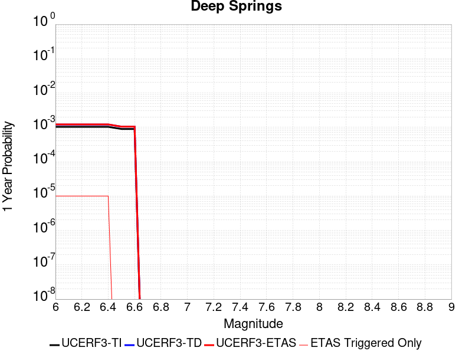 |  |

| Magnitude | 1 wk TI Prob | 1 wk TD Prob | 1 wk ETAS Prob | 1 wk ETAS/TD Gain | 1 wk ETAS Triggered Only | 1 mo TI Prob | 1 mo TD Prob | 1 mo ETAS Prob | 1 mo ETAS/TD Gain | 1 mo ETAS Triggered Only | 1 yr TI Prob | 1 yr TD Prob | 1 yr ETAS Prob | 1 yr ETAS/TD Gain | 1 yr ETAS Triggered Only | 10 yr TI Prob | 10 yr TD Prob | 10 yr ETAS Prob | 10 yr ETAS/TD Gain | 10 yr ETAS Triggered Only |
|-----|-----|-----|-----|-----|-----|-----|-----|-----|-----|-----|-----|-----|-----|-----|-----|-----|-----|-----|-----|-----|
| 6.0 | 1.9810619E-5 | 2.311763E-5 | 2.311763E-5 | 1.0 | 0.0 | 8.489989E-5 | 9.9074656E-5 | 9.9074656E-5 | 1.0 | 0.0 | 0.001033166 | 0.0012060744 | 0.0012060744 | 1.0 | 0.0 | 0.010283757 | 0.012045082 | 0.012155826 | 1.0091943 | 1.12095055E-4 |
| 6.1 | 1.9810619E-5 | 2.311763E-5 | 2.311763E-5 | 1.0 | 0.0 | 8.489989E-5 | 9.9074656E-5 | 9.9074656E-5 | 1.0 | 0.0 | 0.001033166 | 0.0012060744 | 0.0012060744 | 1.0 | 0.0 | 0.010283757 | 0.012045082 | 0.012155826 | 1.0091943 | 1.12095055E-4 |
| 6.2 | 1.9810619E-5 | 2.311763E-5 | 2.311763E-5 | 1.0 | 0.0 | 8.489989E-5 | 9.9074656E-5 | 9.9074656E-5 | 1.0 | 0.0 | 0.001033166 | 0.0012060744 | 0.0012060744 | 1.0 | 0.0 | 0.010283757 | 0.012045082 | 0.012155826 | 1.0091943 | 1.12095055E-4 |
| 6.3 | 1.9810619E-5 | 2.311763E-5 | 2.311763E-5 | 1.0 | 0.0 | 8.489989E-5 | 9.9074656E-5 | 9.9074656E-5 | 1.0 | 0.0 | 0.001033166 | 0.0012060744 | 0.0012060744 | 1.0 | 0.0 | 0.010283757 | 0.012045082 | 0.012155826 | 1.0091943 | 1.12095055E-4 |
| 6.4 | 1.9810619E-5 | 2.311763E-5 | 2.311763E-5 | 1.0 | 0.0 | 8.489989E-5 | 9.9074656E-5 | 9.9074656E-5 | 1.0 | 0.0 | 0.001033166 | 0.0012060744 | 0.0012060744 | 1.0 | 0.0 | 0.010283757 | 0.012045082 | 0.012155826 | 1.0091943 | 1.12095055E-4 |
| 6.5 | 1.7190405E-5 | 2.005498E-5 | 2.005498E-5 | 1.0 | 0.0 | 7.367108E-5 | 8.594992E-5 | 8.594992E-5 | 1.0 | 0.0 | 8.9657627E-4 | 0.0010464402 | 0.0010464402 | 1.0 | 0.0 | 0.008929676 | 0.010464364 | 0.010575286 | 1.0106 | 1.12095055E-4 |
| 6.6 | 1.7190405E-5 | 2.005498E-5 | 2.005498E-5 | 1.0 | 0.0 | 7.367108E-5 | 8.594992E-5 | 8.594992E-5 | 1.0 | 0.0 | 8.9657627E-4 | 0.0010464402 | 0.0010464402 | 1.0 | 0.0 | 0.008929676 | 0.010464364 | 0.010575286 | 1.0106 | 1.12095055E-4 |

## Emerson-Copper Mtn 2011
*[(top)](#table-of-contents)*

| 1 Week | 1 Month | 1 Year | 10 Year |
|-----|-----|-----|-----|
|  |  |  |  |

| Magnitude | 1 wk TI Prob | 1 wk TD Prob | 1 wk ETAS Prob | 1 wk ETAS/TD Gain | 1 wk ETAS Triggered Only | 1 mo TI Prob | 1 mo TD Prob | 1 mo ETAS Prob | 1 mo ETAS/TD Gain | 1 mo ETAS Triggered Only | 1 yr TI Prob | 1 yr TD Prob | 1 yr ETAS Prob | 1 yr ETAS/TD Gain | 1 yr ETAS Triggered Only | 10 yr TI Prob | 10 yr TD Prob | 10 yr ETAS Prob | 10 yr ETAS/TD Gain | 10 yr ETAS Triggered Only |
|-----|-----|-----|-----|-----|-----|-----|-----|-----|-----|-----|-----|-----|-----|-----|-----|-----|-----|-----|-----|-----|
| 6.0 | 2.1364202E-5 | 9.969751E-6 | 9.969751E-6 | 1.0 | 0.0 | 9.1557646E-5 | 4.2726853E-5 | 4.2726853E-5 | 1.0 | 0.0 | 0.0011141442 | 5.20084E-4 | 6.3212076E-4 | 1.2154205 | 1.12095055E-4 | 0.011085749 | 0.0051895385 | 0.005301052 | 1.0214881 | 1.12095055E-4 |
| 6.1 | 2.1364202E-5 | 9.969751E-6 | 9.969751E-6 | 1.0 | 0.0 | 9.1557646E-5 | 4.2726853E-5 | 4.2726853E-5 | 1.0 | 0.0 | 0.0011141442 | 5.20084E-4 | 6.3212076E-4 | 1.2154205 | 1.12095055E-4 | 0.011085749 | 0.0051895385 | 0.005301052 | 1.0214881 | 1.12095055E-4 |
| 6.2 | 2.1364202E-5 | 9.969751E-6 | 9.969751E-6 | 1.0 | 0.0 | 9.1557646E-5 | 4.2726853E-5 | 4.2726853E-5 | 1.0 | 0.0 | 0.0011141442 | 5.20084E-4 | 6.3212076E-4 | 1.2154205 | 1.12095055E-4 | 0.011085749 | 0.0051895385 | 0.005301052 | 1.0214881 | 1.12095055E-4 |
| 6.3 | 1.7751237E-5 | 8.090614E-6 | 8.090614E-6 | 1.0 | 0.0 | 7.607452E-5 | 3.4673634E-5 | 3.4673634E-5 | 1.0 | 0.0 | 9.258136E-4 | 4.2207597E-4 | 5.3412374E-4 | 1.2654682 | 1.12095055E-4 | 0.00921966 | 0.004213366 | 0.004324989 | 1.0264926 | 1.12095055E-4 |
| 6.4 | 1.7751237E-5 | 8.090614E-6 | 8.090614E-6 | 1.0 | 0.0 | 7.607452E-5 | 3.4673634E-5 | 3.4673634E-5 | 1.0 | 0.0 | 9.258136E-4 | 4.2207597E-4 | 5.3412374E-4 | 1.2654682 | 1.12095055E-4 | 0.00921966 | 0.004213366 | 0.004324989 | 1.0264926 | 1.12095055E-4 |
| 6.5 | 1.5886664E-5 | 6.604985E-6 | 6.604985E-6 | 1.0 | 0.0 | 6.808392E-5 | 2.83068E-5 | 2.83068E-5 | 1.0 | 0.0 | 8.286065E-4 | 3.4458548E-4 | 4.5664192E-4 | 1.325192 | 1.12095055E-4 | 0.008255237 | 0.0034409761 | 0.0035526855 | 1.0324644 | 1.12095055E-4 |
| 6.6 | 1.5886664E-5 | 6.604985E-6 | 6.604985E-6 | 1.0 | 0.0 | 6.808392E-5 | 2.83068E-5 | 2.83068E-5 | 1.0 | 0.0 | 8.286065E-4 | 3.4458548E-4 | 4.5664192E-4 | 1.325192 | 1.12095055E-4 | 0.008255237 | 0.0034409761 | 0.0035526855 | 1.0324644 | 1.12095055E-4 |
| 6.7 | 1.428471E-5 | 5.4714073E-6 | 5.4714073E-6 | 1.0 | 0.0 | 6.121875E-5 | 2.34487E-5 | 2.34487E-5 | 1.0 | 0.0 | 7.450834E-4 | 2.8545447E-4 | 3.9751752E-4 | 1.3925778 | 1.12095055E-4 | 0.007425902 | 0.0028512662 | 0.0029630417 | 1.0392021 | 1.12095055E-4 |
| 6.8 | 1.3490684E-5 | 5.074642E-6 | 5.074642E-6 | 1.0 | 0.0 | 5.7815934E-5 | 2.1748307E-5 | 2.1748307E-5 | 1.0 | 0.0 | 7.0368167E-4 | 2.6475734E-4 | 3.7682272E-4 | 1.4232758 | 1.12095055E-4 | 0.007014576 | 0.0026448 | 0.0027565986 | 1.0422711 | 1.12095055E-4 |
| 6.9 | 1.2235421E-5 | 4.2905367E-6 | 4.2905367E-6 | 1.0 | 0.0 | 5.2436466E-5 | 1.8387906E-5 | 1.8387906E-5 | 1.0 | 0.0 | 6.38227E-4 | 2.2385335E-4 | 3.359233E-4 | 1.5006402 | 1.12095055E-4 | 0.0063639707 | 0.002236633 | 0.0023484775 | 1.0500057 | 1.12095055E-4 |
| 7.0 | 1.1009851E-5 | 3.7197753E-6 | 3.7197753E-6 | 1.0 | 0.0 | 4.7184225E-5 | 1.5941816E-5 | 1.5941816E-5 | 1.0 | 0.0 | 5.743165E-4 | 1.9407776E-4 | 3.0615108E-4 | 1.577466 | 1.12095055E-4 | 0.005728345 | 0.0019394207 | 0.0020512983 | 1.0576861 | 1.12095055E-4 |
| 7.1 | 9.726373E-6 | 3.2124865E-6 | 3.2124865E-6 | 1.0 | 0.0 | 4.168379E-5 | 1.3767745E-5 | 1.3767745E-5 | 1.0 | 0.0 | 5.07382E-4 | 1.6761279E-4 | 2.7968906E-4 | 1.6686618 | 1.12095055E-4 | 0.0050622504 | 0.0016751951 | 0.0017871023 | 1.0668025 | 1.12095055E-4 |
| 7.2 | 3.9335127E-6 | 1.1527233E-6 | 1.1527233E-6 | 1.0 | 0.0 | 1.6857803E-5 | 4.940234E-6 | 4.940234E-6 | 1.0 | 0.0 | 2.0522442E-4 | 6.0145747E-5 | 1.7223407E-4 | 2.8636117 | 1.12095055E-4 | 0.00205035 | 6.013006E-4 | 7.133283E-4 | 1.1863089 | 1.12095055E-4 |
| 7.3 | 2.661632E-6 | 6.91309E-7 | 6.91309E-7 | 1.0 | 0.0 | 1.14069435E-5 | 2.9627495E-6 | 2.9627495E-6 | 1.0 | 0.0 | 1.3887069E-4 | 3.607089E-5 | 1.481619E-4 | 4.10752 | 1.12095055E-4 | 0.0013878393 | 3.6065138E-4 | 4.7270601E-4 | 1.3107007 | 1.12095055E-4 |
| 7.4 | 2.0893426E-6 | 5.463086E-7 | 5.463086E-7 | 1.0 | 0.0 | 8.954295E-6 | 2.3413206E-6 | 2.3413206E-6 | 1.0 | 0.0 | 1.0901308E-4 | 2.850521E-5 | 2.850521E-5 | 1.0 | 0.0 | 0.0010895962 | 2.8501608E-4 | 2.8501608E-4 | 1.0 | 0.0 |
| 7.5 | 1.1681728E-6 | 3.6037605E-7 | 3.6037605E-7 | 1.0 | 0.0 | 5.0064455E-6 | 1.544468E-6 | 1.544468E-6 | 1.0 | 0.0 | 6.0951766E-5 | 1.880374E-5 | 1.880374E-5 | 1.0 | 0.0 | 6.093505E-4 | 1.8802195E-4 | 1.8802195E-4 | 1.0 | 0.0 |
| 7.6 | 1.3154387E-7 | 7.120617E-8 | 7.120617E-8 | 1.0 | 0.0 | 5.6375933E-7 | 3.051693E-7 | 3.051693E-7 | 1.0 | 0.0 | 6.863748E-6 | 3.7154316E-6 | 3.7154316E-6 | 1.0 | 0.0 | 6.863536E-5 | 3.715385E-5 | 3.715385E-5 | 1.0 | 0.0 |

## Santa Rosa Island
*[(top)](#table-of-contents)*

| 1 Week | 1 Month | 1 Year | 10 Year |
|-----|-----|-----|-----|
|  |  |  |  |

| Magnitude | 1 wk TI Prob | 1 wk TD Prob | 1 wk ETAS Prob | 1 wk ETAS/TD Gain | 1 wk ETAS Triggered Only | 1 mo TI Prob | 1 mo TD Prob | 1 mo ETAS Prob | 1 mo ETAS/TD Gain | 1 mo ETAS Triggered Only | 1 yr TI Prob | 1 yr TD Prob | 1 yr ETAS Prob | 1 yr ETAS/TD Gain | 1 yr ETAS Triggered Only | 10 yr TI Prob | 10 yr TD Prob | 10 yr ETAS Prob | 10 yr ETAS/TD Gain | 10 yr ETAS Triggered Only |
|-----|-----|-----|-----|-----|-----|-----|-----|-----|-----|-----|-----|-----|-----|-----|-----|-----|-----|-----|-----|-----|
| 6.0 | 4.1143165E-5 | 4.7100217E-5 | 4.7100217E-5 | 1.0 | 0.0 | 1.7631594E-4 | 2.0184356E-4 | 2.0184356E-4 | 1.0 | 0.0 | 0.002144533 | 0.002454873 | 0.002454873 | 1.0 | 0.0 | 0.021239553 | 0.024298182 | 0.024407554 | 1.0045012 | 1.12095055E-4 |
| 6.1 | 2.1061249E-5 | 2.3869197E-5 | 2.3869197E-5 | 1.0 | 0.0 | 9.0259375E-5 | 1.0229272E-4 | 1.0229272E-4 | 1.0 | 0.0 | 0.0010983539 | 0.0012447312 | 0.0012447312 | 1.0 | 0.0 | 0.01092941 | 0.0123806335 | 0.012491341 | 1.008942 | 1.12095055E-4 |
| 6.2 | 2.1061249E-5 | 2.3869197E-5 | 2.3869197E-5 | 1.0 | 0.0 | 9.0259375E-5 | 1.0229272E-4 | 1.0229272E-4 | 1.0 | 0.0 | 0.0010983539 | 0.0012447312 | 0.0012447312 | 1.0 | 0.0 | 0.01092941 | 0.0123806335 | 0.012491341 | 1.008942 | 1.12095055E-4 |
| 6.3 | 1.5158236E-5 | 1.70773E-5 | 1.70773E-5 | 1.0 | 0.0 | 6.496225E-5 | 7.318644E-5 | 7.318644E-5 | 1.0 | 0.0 | 7.906284E-4 | 8.906926E-4 | 8.906926E-4 | 1.0 | 0.0 | 0.007878214 | 0.008872479 | 0.00898358 | 1.0125219 | 1.12095055E-4 |
| 6.4 | 1.2341918E-5 | 1.3855181E-5 | 1.3855181E-5 | 1.0 | 0.0 | 5.2892858E-5 | 5.9378042E-5 | 5.9378042E-5 | 1.0 | 0.0 | 6.437803E-4 | 7.22696E-4 | 7.22696E-4 | 1.0 | 0.0 | 0.006419184 | 0.0072042947 | 0.007315582 | 1.0154474 | 1.12095055E-4 |
| 6.5 | 9.061158E-6 | 1.0118608E-5 | 1.0118608E-5 | 1.0 | 0.0 | 3.883296E-5 | 4.336477E-5 | 4.336477E-5 | 1.0 | 0.0 | 4.726887E-4 | 5.278435E-4 | 5.278435E-4 | 1.0 | 0.0 | 0.004716845 | 0.005266436 | 0.0053779404 | 1.0211728 | 1.12095055E-4 |
| 6.6 | 7.5461685E-6 | 8.402008E-6 | 8.402008E-6 | 1.0 | 0.0 | 3.2340322E-5 | 3.6008132E-5 | 3.6008132E-5 | 1.0 | 0.0 | 3.936723E-4 | 4.383151E-4 | 4.383151E-4 | 1.0 | 0.0 | 0.003929756 | 0.0043749358 | 0.0044865403 | 1.02551 | 1.12095055E-4 |
| 6.7 | 5.5023775E-6 | 6.08825E-6 | 6.08825E-6 | 1.0 | 0.0 | 2.3581404E-5 | 2.6092257E-5 | 2.6092257E-5 | 1.0 | 0.0 | 2.8706578E-4 | 3.1763015E-4 | 3.1763015E-4 | 1.0 | 0.0 | 0.0028669522 | 0.0031720835 | 0.0032838231 | 1.0352259 | 1.12095055E-4 |
| 6.8 | 3.7351679E-6 | 4.0836526E-6 | 4.0836526E-6 | 1.0 | 0.0 | 1.6007763E-5 | 1.7501266E-5 | 1.7501266E-5 | 1.0 | 0.0 | 1.948771E-4 | 2.1305957E-4 | 2.1305957E-4 | 1.0 | 0.0 | 0.0019470629 | 0.0021287983 | 0.0022406548 | 1.0525444 | 1.12095055E-4 |
| 6.9 | 2.456366E-6 | 2.6295188E-6 | 2.6295188E-6 | 1.0 | 0.0 | 1.0527241E-5 | 1.1269318E-5 | 1.1269318E-5 | 1.0 | 0.0 | 1.2816161E-4 | 1.3719534E-4 | 1.3719534E-4 | 1.0 | 0.0 | 0.0012808773 | 0.0013711093 | 0.0013711093 | 1.0 | 0.0 |
| 7.0 | 2.3245157E-6 | 2.4830051E-6 | 2.4830051E-6 | 1.0 | 0.0 | 9.962172E-6 | 1.0641406E-5 | 1.0641406E-5 | 1.0 | 0.0 | 1.2128269E-4 | 1.2955145E-4 | 1.2955145E-4 | 1.0 | 0.0 | 0.0012121652 | 0.0012947614 | 0.0012947614 | 1.0 | 0.0 |
| 7.1 | 2.2248344E-6 | 2.3734624E-6 | 2.3734624E-6 | 1.0 | 0.0 | 9.53497E-6 | 1.01719415E-5 | 1.01719415E-5 | 1.0 | 0.0 | 1.1608207E-4 | 1.2383638E-4 | 1.2383638E-4 | 1.0 | 0.0 | 0.0011602144 | 0.0012376757 | 0.0012376757 | 1.0 | 0.0 |
| 7.2 | 2.1350402E-6 | 2.2763559E-6 | 2.2763559E-6 | 1.0 | 0.0 | 9.150141E-6 | 9.755774E-6 | 9.755774E-6 | 1.0 | 0.0 | 1.1139726E-4 | 1.1877009E-4 | 1.1877009E-4 | 1.0 | 0.0 | 0.0011134144 | 0.0011870681 | 0.0011870681 | 1.0 | 0.0 |
| 7.3 | 1.9793572E-6 | 2.108904E-6 | 2.108904E-6 | 1.0 | 0.0 | 8.482932E-6 | 9.038129E-6 | 9.038129E-6 | 1.0 | 0.0 | 1.032748E-4 | 1.1003368E-4 | 1.1003368E-4 | 1.0 | 0.0 | 0.0010322682 | 0.0010997938 | 0.0010997938 | 1.0 | 0.0 |
| 7.4 | 1.6951194E-6 | 1.8047301E-6 | 1.8047301E-6 | 1.0 | 0.0 | 7.264777E-6 | 7.734535E-6 | 7.734535E-6 | 1.0 | 0.0 | 8.844508E-5 | 9.416391E-5 | 9.416391E-5 | 1.0 | 0.0 | 8.840988E-4 | 9.4124174E-4 | 9.4124174E-4 | 1.0 | 0.0 |
| 7.5 | 8.987207E-7 | 9.5129707E-7 | 9.5129707E-7 | 1.0 | 0.0 | 3.8516546E-6 | 4.076981E-6 | 4.076981E-6 | 1.0 | 0.0 | 4.6892885E-5 | 4.9636128E-5 | 4.9636128E-5 | 1.0 | 0.0 | 4.688299E-4 | 4.9625157E-4 | 4.9625157E-4 | 1.0 | 0.0 |
| 7.6 | 3.8783037E-7 | 4.05319E-7 | 4.05319E-7 | 1.0 | 0.0 | 1.6621291E-6 | 1.7370804E-6 | 1.7370804E-6 | 1.0 | 0.0 | 2.0236233E-5 | 2.1148755E-5 | 2.1148755E-5 | 1.0 | 0.0 | 2.023439E-4 | 2.1146808E-4 | 2.1146808E-4 | 1.0 | 0.0 |
| 7.7 | 6.181804E-8 | 6.339348E-8 | 6.339348E-8 | 1.0 | 0.0 | 2.6493444E-7 | 2.716863E-7 | 2.716863E-7 | 1.0 | 0.0 | 3.225572E-6 | 3.3077758E-6 | 3.3077758E-6 | 1.0 | 0.0 | 3.225525E-5 | 3.307727E-5 | 3.307727E-5 | 1.0 | 0.0 |
| 7.8 | 1.3704449E-9 | 1.3964505E-9 | 1.3964505E-9 | 1.0 | 0.0 | 5.873335E-9 | 5.9847878E-9 | 5.9847878E-9 | 1.0 | 0.0 | 7.1507856E-8 | 7.2864786E-8 | 7.2864786E-8 | 1.0 | 0.0 | 7.1507833E-7 | 7.286477E-7 | 7.286477E-7 | 1.0 | 0.0 |

## Kern Canyon (Lake Isabella) 2011
*[(top)](#table-of-contents)*

| 1 Week | 1 Month | 1 Year | 10 Year |
|-----|-----|-----|-----|
|  |  |  |  |

| Magnitude | 1 wk TI Prob | 1 wk TD Prob | 1 wk ETAS Prob | 1 wk ETAS/TD Gain | 1 wk ETAS Triggered Only | 1 mo TI Prob | 1 mo TD Prob | 1 mo ETAS Prob | 1 mo ETAS/TD Gain | 1 mo ETAS Triggered Only | 1 yr TI Prob | 1 yr TD Prob | 1 yr ETAS Prob | 1 yr ETAS/TD Gain | 1 yr ETAS Triggered Only | 10 yr TI Prob | 10 yr TD Prob | 10 yr ETAS Prob | 10 yr ETAS/TD Gain | 10 yr ETAS Triggered Only |
|-----|-----|-----|-----|-----|-----|-----|-----|-----|-----|-----|-----|-----|-----|-----|-----|-----|-----|-----|-----|-----|
| 6.0 | 4.2387383E-6 | 4.001759E-6 | 4.001759E-6 | 1.0 | 0.0 | 1.8165894E-5 | 1.7150292E-5 | 1.7150292E-5 | 1.0 | 0.0 | 2.2114732E-4 | 2.0878667E-4 | 3.2085832E-4 | 1.5367758 | 1.12095055E-4 | 0.0022092736 | 0.002086089 | 0.0021979504 | 1.0536225 | 1.12095055E-4 |
| 6.1 | 4.2387383E-6 | 4.001759E-6 | 4.001759E-6 | 1.0 | 0.0 | 1.8165894E-5 | 1.7150292E-5 | 1.7150292E-5 | 1.0 | 0.0 | 2.2114732E-4 | 2.0878667E-4 | 3.2085832E-4 | 1.5367758 | 1.12095055E-4 | 0.0022092736 | 0.002086089 | 0.0021979504 | 1.0536225 | 1.12095055E-4 |
| 6.2 | 4.2387383E-6 | 4.001759E-6 | 4.001759E-6 | 1.0 | 0.0 | 1.8165894E-5 | 1.7150292E-5 | 1.7150292E-5 | 1.0 | 0.0 | 2.2114732E-4 | 2.0878667E-4 | 3.2085832E-4 | 1.5367758 | 1.12095055E-4 | 0.0022092736 | 0.002086089 | 0.0021979504 | 1.0536225 | 1.12095055E-4 |
| 6.3 | 4.2387383E-6 | 4.001759E-6 | 4.001759E-6 | 1.0 | 0.0 | 1.8165894E-5 | 1.7150292E-5 | 1.7150292E-5 | 1.0 | 0.0 | 2.2114732E-4 | 2.0878667E-4 | 3.2085832E-4 | 1.5367758 | 1.12095055E-4 | 0.0022092736 | 0.002086089 | 0.0021979504 | 1.0536225 | 1.12095055E-4 |
| 6.4 | 4.2387383E-6 | 4.001759E-6 | 4.001759E-6 | 1.0 | 0.0 | 1.8165894E-5 | 1.7150292E-5 | 1.7150292E-5 | 1.0 | 0.0 | 2.2114732E-4 | 2.0878667E-4 | 3.2085832E-4 | 1.5367758 | 1.12095055E-4 | 0.0022092736 | 0.002086089 | 0.0021979504 | 1.0536225 | 1.12095055E-4 |
| 6.5 | 2.7857532E-6 | 2.5179454E-6 | 2.5179454E-6 | 1.0 | 0.0 | 1.1938888E-5 | 1.0791152E-5 | 1.0791152E-5 | 1.0 | 0.0 | 1.4534626E-4 | 1.3137468E-4 | 1.3137468E-4 | 1.0 | 0.0 | 0.0014525123 | 0.0013130029 | 0.0013130029 | 1.0 | 0.0 |
| 6.6 | 2.2233348E-6 | 1.9441868E-6 | 1.9441868E-6 | 1.0 | 0.0 | 9.528543E-6 | 8.332203E-6 | 8.332203E-6 | 1.0 | 0.0 | 1.1600384E-4 | 1.0143993E-4 | 1.0143993E-4 | 1.0 | 0.0 | 0.001159433 | 0.0010139449 | 0.0010139449 | 1.0 | 0.0 |
| 6.7 | 2.1635126E-6 | 1.8835657E-6 | 1.8835657E-6 | 1.0 | 0.0 | 9.272164E-6 | 8.072399E-6 | 8.072399E-6 | 1.0 | 0.0 | 1.1288274E-4 | 9.8277116E-5 | 9.8277116E-5 | 1.0 | 0.0 | 0.0011282542 | 9.823447E-4 | 9.823447E-4 | 1.0 | 0.0 |
| 6.8 | 1.8685711E-6 | 1.5831973E-6 | 1.5831973E-6 | 1.0 | 0.0 | 8.008137E-6 | 6.785114E-6 | 6.785114E-6 | 1.0 | 0.0 | 9.74947E-5 | 8.260568E-5 | 8.260568E-5 | 1.0 | 0.0 | 9.745194E-4 | 8.2575466E-4 | 8.2575466E-4 | 1.0 | 0.0 |
| 6.9 | 1.5815071E-6 | 1.3065396E-6 | 1.3065396E-6 | 1.0 | 0.0 | 6.77787E-6 | 5.5994437E-6 | 5.5994437E-6 | 1.0 | 0.0 | 8.251744E-5 | 6.8171124E-5 | 6.8171124E-5 | 1.0 | 0.0 | 8.248681E-4 | 6.815048E-4 | 6.815048E-4 | 1.0 | 0.0 |
| 7.0 | 1.3772564E-6 | 1.1211124E-6 | 1.1211124E-6 | 1.0 | 0.0 | 5.9025137E-6 | 4.8047586E-6 | 4.8047586E-6 | 1.0 | 0.0 | 7.186073E-5 | 5.849639E-5 | 5.849639E-5 | 1.0 | 0.0 | 7.18375E-4 | 5.8481196E-4 | 5.8481196E-4 | 1.0 | 0.0 |
| 7.1 | 1.0916998E-6 | 8.764087E-7 | 8.764087E-7 | 1.0 | 0.0 | 4.678705E-6 | 3.756032E-6 | 3.756032E-6 | 1.0 | 0.0 | 5.6961744E-5 | 4.5728742E-5 | 4.5728742E-5 | 1.0 | 0.0 | 5.6947145E-4 | 4.5719466E-4 | 4.5719466E-4 | 1.0 | 0.0 |
| 7.2 | 7.6277024E-7 | 5.9016634E-7 | 5.9016634E-7 | 1.0 | 0.0 | 3.2690114E-6 | 2.529282E-6 | 2.529282E-6 | 1.0 | 0.0 | 3.9799485E-5 | 3.0793577E-5 | 3.0793577E-5 | 1.0 | 0.0 | 3.9792358E-4 | 3.0789373E-4 | 3.0789373E-4 | 1.0 | 0.0 |
| 7.3 | 5.3265916E-7 | 4.3825895E-7 | 4.3825895E-7 | 1.0 | 0.0 | 2.282823E-6 | 1.8782513E-6 | 1.8782513E-6 | 1.0 | 0.0 | 2.7793016E-5 | 2.2867473E-5 | 2.2867473E-5 | 1.0 | 0.0 | 2.778954E-4 | 2.2865158E-4 | 2.2865158E-4 | 1.0 | 0.0 |
| 7.4 | 3.4946007E-7 | 3.0066704E-7 | 3.0066704E-7 | 1.0 | 0.0 | 1.497685E-6 | 1.2885724E-6 | 1.2885724E-6 | 1.0 | 0.0 | 1.8234163E-5 | 1.5688258E-5 | 1.5688258E-5 | 1.0 | 0.0 | 1.8232666E-4 | 1.5687173E-4 | 1.5687173E-4 | 1.0 | 0.0 |
| 7.5 | 1.8317026E-7 | 1.4245374E-7 | 1.4245374E-7 | 1.0 | 0.0 | 7.850152E-7 | 6.105159E-7 | 6.105159E-7 | 1.0 | 0.0 | 9.557518E-6 | 7.4330064E-6 | 7.4330064E-6 | 1.0 | 0.0 | 9.5571064E-5 | 7.4327654E-5 | 7.4327654E-5 | 1.0 | 0.0 |
| 7.6 | 2.572245E-8 | 1.7353377E-8 | 1.7353377E-8 | 1.0 | 0.0 | 1.10239064E-7 | 7.437161E-8 | 7.437161E-8 | 1.0 | 0.0 | 1.3421597E-6 | 9.0547405E-7 | 9.0547405E-7 | 1.0 | 0.0 | 1.3421517E-5 | 9.054709E-6 | 9.054709E-6 | 1.0 | 0.0 |

## San Jacinto (Coyote Creek)
*[(top)](#table-of-contents)*

| 1 Week | 1 Month | 1 Year | 10 Year |
|-----|-----|-----|-----|
|  |  |  | 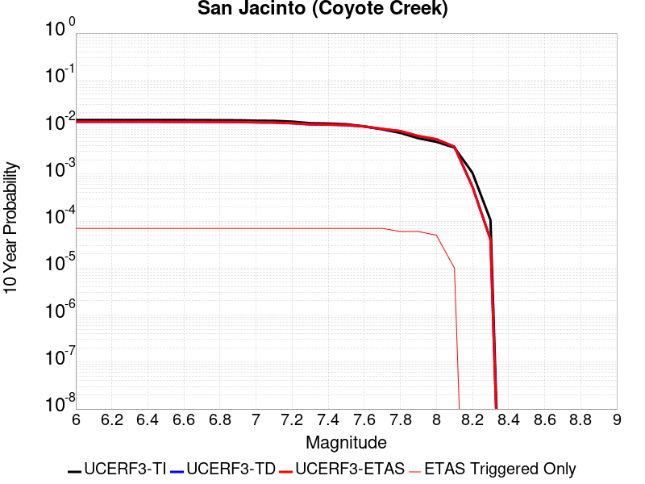 |

| Magnitude | 1 wk TI Prob | 1 wk TD Prob | 1 wk ETAS Prob | 1 wk ETAS/TD Gain | 1 wk ETAS Triggered Only | 1 mo TI Prob | 1 mo TD Prob | 1 mo ETAS Prob | 1 mo ETAS/TD Gain | 1 mo ETAS Triggered Only | 1 yr TI Prob | 1 yr TD Prob | 1 yr ETAS Prob | 1 yr ETAS/TD Gain | 1 yr ETAS Triggered Only | 10 yr TI Prob | 10 yr TD Prob | 10 yr ETAS Prob | 10 yr ETAS/TD Gain | 10 yr ETAS Triggered Only |
|-----|-----|-----|-----|-----|-----|-----|-----|-----|-----|-----|-----|-----|-----|-----|-----|-----|-----|-----|-----|-----|
| 6.0 | 2.7374346E-5 | 2.4226492E-5 | 2.4226492E-5 | 1.0 | 0.0 | 1.1731335E-4 | 1.0382371E-4 | 1.0382371E-4 | 1.0 | 0.0 | 0.0014273542 | 0.0012633232 | 0.0012633232 | 1.0 | 0.0 | 0.01418221 | 0.012970629 | 0.01308127 | 1.0085301 | 1.12095055E-4 |
| 6.1 | 2.7374346E-5 | 2.4226492E-5 | 2.4226492E-5 | 1.0 | 0.0 | 1.1731335E-4 | 1.0382371E-4 | 1.0382371E-4 | 1.0 | 0.0 | 0.0014273542 | 0.0012633232 | 0.0012633232 | 1.0 | 0.0 | 0.01418221 | 0.012970629 | 0.01308127 | 1.0085301 | 1.12095055E-4 |
| 6.2 | 2.7374346E-5 | 2.4226492E-5 | 2.4226492E-5 | 1.0 | 0.0 | 1.1731335E-4 | 1.0382371E-4 | 1.0382371E-4 | 1.0 | 0.0 | 0.0014273542 | 0.0012633232 | 0.0012633232 | 1.0 | 0.0 | 0.01418221 | 0.012970629 | 0.01308127 | 1.0085301 | 1.12095055E-4 |
| 6.3 | 2.7374346E-5 | 2.4226492E-5 | 2.4226492E-5 | 1.0 | 0.0 | 1.1731335E-4 | 1.0382371E-4 | 1.0382371E-4 | 1.0 | 0.0 | 0.0014273542 | 0.0012633232 | 0.0012633232 | 1.0 | 0.0 | 0.01418221 | 0.012970629 | 0.01308127 | 1.0085301 | 1.12095055E-4 |
| 6.4 | 2.7374346E-5 | 2.4226492E-5 | 2.4226492E-5 | 1.0 | 0.0 | 1.1731335E-4 | 1.0382371E-4 | 1.0382371E-4 | 1.0 | 0.0 | 0.0014273542 | 0.0012633232 | 0.0012633232 | 1.0 | 0.0 | 0.01418221 | 0.012970629 | 0.01308127 | 1.0085301 | 1.12095055E-4 |
| 6.5 | 2.7282445E-5 | 2.4112534E-5 | 2.4112534E-5 | 1.0 | 0.0 | 1.16919524E-4 | 1.03335355E-4 | 1.03335355E-4 | 1.0 | 0.0 | 0.0014225657 | 0.0012573845 | 0.0012573845 | 1.0 | 0.0 | 0.014134934 | 0.012911941 | 0.013022589 | 1.0085694 | 1.12095055E-4 |
| 6.6 | 2.7282445E-5 | 2.4112534E-5 | 2.4112534E-5 | 1.0 | 0.0 | 1.16919524E-4 | 1.03335355E-4 | 1.03335355E-4 | 1.0 | 0.0 | 0.0014225657 | 0.0012573845 | 0.0012573845 | 1.0 | 0.0 | 0.014134934 | 0.012911941 | 0.013022589 | 1.0085694 | 1.12095055E-4 |
| 6.7 | 2.7216198E-5 | 2.4037632E-5 | 2.4037632E-5 | 1.0 | 0.0 | 1.1663563E-4 | 1.0301437E-4 | 1.0301437E-4 | 1.0 | 0.0 | 0.0014191137 | 0.001253481 | 0.001253481 | 1.0 | 0.0 | 0.014100855 | 0.012873341 | 0.012983994 | 1.0085955 | 1.12095055E-4 |
| 6.8 | 2.7078617E-5 | 2.39548E-5 | 2.39548E-5 | 1.0 | 0.0 | 1.1604605E-4 | 1.0265941E-4 | 1.0265941E-4 | 1.0 | 0.0 | 0.001411945 | 0.0012491643 | 0.0012491643 | 1.0 | 0.0 | 0.014030075 | 0.01283046 | 0.012941117 | 1.0086246 | 1.12095055E-4 |
| 6.9 | 2.6982952E-5 | 2.3874261E-5 | 2.3874261E-5 | 1.0 | 0.0 | 1.15636096E-4 | 1.0231427E-4 | 1.0231427E-4 | 1.0 | 0.0 | 0.0014069602 | 0.0012449671 | 0.0012449671 | 1.0 | 0.0 | 0.013980856 | 0.012788752 | 0.012899414 | 1.008653 | 1.12095055E-4 |
| 7.0 | 2.6449972E-5 | 2.3451106E-5 | 2.3451106E-5 | 1.0 | 0.0 | 1.1335209E-4 | 1.0050089E-4 | 1.0050089E-4 | 1.0 | 0.0 | 0.001379188 | 0.0012229141 | 0.0012229141 | 1.0 | 0.0 | 0.0137065975 | 0.012570031 | 0.012680717 | 1.0088055 | 1.12095055E-4 |
| 7.1 | 2.6257849E-5 | 2.327706E-5 | 2.327706E-5 | 1.0 | 0.0 | 1.1252879E-4 | 9.975503E-5 | 9.975503E-5 | 1.0 | 0.0 | 0.0013691769 | 0.0012138435 | 0.0012138435 | 1.0 | 0.0 | 0.013607717 | 0.0124798585 | 0.012590555 | 1.00887 | 1.12095055E-4 |
| 7.2 | 2.5270041E-5 | 2.2471224E-5 | 2.2471224E-5 | 1.0 | 0.0 | 1.0829568E-4 | 9.630171E-5 | 9.630171E-5 | 1.0 | 0.0 | 0.0013177024 | 0.001171845 | 0.001171845 | 1.0 | 0.0 | 0.013099162 | 0.012060602 | 0.012171345 | 1.0091822 | 1.12095055E-4 |
| 7.3 | 2.339701E-5 | 2.120195E-5 | 2.120195E-5 | 1.0 | 0.0 | 1.0026905E-4 | 9.086234E-5 | 9.086234E-5 | 1.0 | 0.0 | 0.001220092 | 0.0011056897 | 0.0011056897 | 1.0 | 0.0 | 0.012134149 | 0.0113989655 | 0.011509784 | 1.0097218 | 1.12095055E-4 |
| 7.4 | 2.296333E-5 | 2.0932019E-5 | 2.0932019E-5 | 1.0 | 0.0 | 9.841056E-5 | 8.970558E-5 | 8.970558E-5 | 1.0 | 0.0 | 0.0011974899 | 0.0010916203 | 0.0010916203 | 1.0 | 0.0 | 0.011910575 | 0.011257936 | 0.011368769 | 1.0098449 | 1.12095055E-4 |
| 7.5 | 2.2188895E-5 | 2.0454296E-5 | 2.0454296E-5 | 1.0 | 0.0 | 9.50918E-5 | 8.7658336E-5 | 8.7658336E-5 | 1.0 | 0.0 | 0.0011571277 | 0.0010667198 | 0.0010667198 | 1.0 | 0.0 | 0.011511209 | 0.011007229 | 0.01111809 | 1.0100716 | 1.12095055E-4 |
| 7.6 | 2.0013189E-5 | 1.9038842E-5 | 1.9038842E-5 | 1.0 | 0.0 | 8.5767984E-5 | 8.1592494E-5 | 8.1592494E-5 | 1.0 | 0.0 | 0.001043725 | 9.929377E-4 | 9.929377E-4 | 1.0 | 0.0 | 0.010388365 | 0.010264366 | 0.010375311 | 1.0108087 | 1.12095055E-4 |
| 7.7 | 1.7230794E-5 | 1.681798E-5 | 1.681798E-5 | 1.0 | 0.0 | 7.384417E-5 | 7.207506E-5 | 7.207506E-5 | 1.0 | 0.0 | 8.986819E-4 | 8.7716145E-4 | 8.7716145E-4 | 1.0 | 0.0 | 0.008950562 | 0.009101786 | 0.009212861 | 1.0122036 | 1.12095055E-4 |
| 7.8 | 1.4478809E-5 | 1.5062672E-5 | 1.5062672E-5 | 1.0 | 0.0 | 6.205057E-5 | 6.455272E-5 | 6.455272E-5 | 1.0 | 0.0 | 7.552038E-4 | 7.8564655E-4 | 7.8564655E-4 | 1.0 | 0.0 | 0.0075264242 | 0.008178915 | 0.008290093 | 1.0135933 | 1.12095055E-4 |
| 7.9 | 1.1114467E-5 | 1.1708948E-5 | 1.1708948E-5 | 1.0 | 0.0 | 4.7632562E-5 | 5.0180242E-5 | 5.0180242E-5 | 1.0 | 0.0 | 5.797721E-4 | 6.107738E-4 | 6.107738E-4 | 1.0 | 0.0 | 0.0057826187 | 0.006413855 | 0.006525231 | 1.017365 | 1.12095055E-4 |
| 8.0 | 9.327402E-6 | 9.957178E-6 | 9.957178E-6 | 1.0 | 0.0 | 3.9973966E-5 | 4.2672924E-5 | 4.2672924E-5 | 1.0 | 0.0 | 4.8657437E-4 | 5.1941955E-4 | 5.1941955E-4 | 1.0 | 0.0 | 0.0048551033 | 0.00548048 | 0.0055919606 | 1.0203414 | 1.12095055E-4 |
| 8.1 | 7.0235833E-6 | 6.87082E-6 | 6.87082E-6 | 1.0 | 0.0 | 3.0100724E-5 | 2.944604E-5 | 2.944604E-5 | 1.0 | 0.0 | 3.664147E-4 | 3.5844708E-4 | 3.5844708E-4 | 1.0 | 0.0 | 0.003658111 | 0.0038105806 | 0.0038105806 | 1.0 | 0.0 |
| 8.2 | 2.0358202E-6 | 9.0797465E-7 | 9.0797465E-7 | 1.0 | 0.0 | 8.724915E-6 | 3.891314E-6 | 3.891314E-6 | 1.0 | 0.0 | 1.06220665E-4 | 4.7375743E-5 | 4.7375743E-5 | 1.0 | 0.0 | 0.001061699 | 5.3732167E-4 | 5.3732167E-4 | 1.0 | 0.0 |
| 8.3 | 2.0051264E-7 | 6.6896234E-8 | 6.6896234E-8 | 1.0 | 0.0 | 8.5933965E-7 | 2.866981E-7 | 2.866981E-7 | 1.0 | 0.0 | 1.046241E-5 | 3.4905445E-6 | 3.4905445E-6 | 1.0 | 0.0 | 1.0461917E-4 | 4.0553456E-5 | 4.0553456E-5 | 1.0 | 0.0 |

## San Jacinto (Superstition Mtn)
*[(top)](#table-of-contents)*

| 1 Week | 1 Month | 1 Year | 10 Year |
|-----|-----|-----|-----|
|  |  |  |  |

| Magnitude | 1 wk TI Prob | 1 wk TD Prob | 1 wk ETAS Prob | 1 wk ETAS/TD Gain | 1 wk ETAS Triggered Only | 1 mo TI Prob | 1 mo TD Prob | 1 mo ETAS Prob | 1 mo ETAS/TD Gain | 1 mo ETAS Triggered Only | 1 yr TI Prob | 1 yr TD Prob | 1 yr ETAS Prob | 1 yr ETAS/TD Gain | 1 yr ETAS Triggered Only | 10 yr TI Prob | 10 yr TD Prob | 10 yr ETAS Prob | 10 yr ETAS/TD Gain | 10 yr ETAS Triggered Only |
|-----|-----|-----|-----|-----|-----|-----|-----|-----|-----|-----|-----|-----|-----|-----|-----|-----|-----|-----|-----|-----|
| 6.0 | 6.4193904E-5 | 9.606838E-5 | 9.606838E-5 | 1.0 | 0.0 | 2.7508775E-4 | 4.1166646E-4 | 4.1166646E-4 | 1.0 | 0.0 | 0.0033440501 | 0.0050018053 | 0.0050018053 | 1.0 | 0.0 | 0.03294174 | 0.04885974 | 0.04896636 | 1.0021821 | 1.12095055E-4 |
| 6.1 | 6.4193904E-5 | 9.606838E-5 | 9.606838E-5 | 1.0 | 0.0 | 2.7508775E-4 | 4.1166646E-4 | 4.1166646E-4 | 1.0 | 0.0 | 0.0033440501 | 0.0050018053 | 0.0050018053 | 1.0 | 0.0 | 0.03294174 | 0.04885974 | 0.04896636 | 1.0021821 | 1.12095055E-4 |
| 6.2 | 5.7023593E-5 | 8.321217E-5 | 8.321217E-5 | 1.0 | 0.0 | 2.4436394E-4 | 3.565843E-4 | 3.565843E-4 | 1.0 | 0.0 | 0.002971072 | 0.004334395 | 0.004334395 | 1.0 | 0.0 | 0.029316625 | 0.042537875 | 0.0426452 | 1.0025231 | 1.12095055E-4 |
| 6.3 | 5.6940098E-5 | 8.305749E-5 | 8.305749E-5 | 1.0 | 0.0 | 2.4400617E-4 | 3.5592154E-4 | 3.5592154E-4 | 1.0 | 0.0 | 0.002966728 | 0.004326358 | 0.004326358 | 1.0 | 0.0 | 0.029274331 | 0.04246111 | 0.04256844 | 1.0025278 | 1.12095055E-4 |
| 6.4 | 5.4171585E-5 | 7.755024E-5 | 7.755024E-5 | 1.0 | 0.0 | 2.3214328E-4 | 3.3232514E-4 | 3.3232514E-4 | 1.0 | 0.0 | 0.0028226813 | 0.004040201 | 0.004040201 | 1.0 | 0.0 | 0.02787096 | 0.03975008 | 0.03985772 | 1.002708 | 1.12095055E-4 |
| 6.5 | 4.375144E-5 | 5.6486107E-5 | 5.6486107E-5 | 1.0 | 0.0 | 1.874927E-4 | 2.4206749E-4 | 2.4206749E-4 | 1.0 | 0.0 | 0.0022803338 | 0.0029443644 | 0.0029443644 | 1.0 | 0.0 | 0.022570757 | 0.02926981 | 0.02926981 | 1.0 | 0.0 |
| 6.6 | 2.772192E-5 | 2.5550056E-5 | 2.5550056E-5 | 1.0 | 0.0 | 1.1880282E-4 | 1.09495755E-4 | 1.09495755E-4 | 1.0 | 0.0 | 0.0014454646 | 0.0013323149 | 0.0013323149 | 1.0 | 0.0 | 0.014360986 | 0.013572521 | 0.013572521 | 1.0 | 0.0 |
| 6.7 | 2.7124124E-5 | 2.4760804E-5 | 2.4760804E-5 | 1.0 | 0.0 | 1.1624106E-4 | 1.0611352E-4 | 1.0611352E-4 | 1.0 | 0.0 | 0.0014143161 | 0.0012911857 | 0.0012911857 | 1.0 | 0.0 | 0.014053487 | 0.013165847 | 0.013165847 | 1.0 | 0.0 |
| 6.8 | 2.5475807E-5 | 2.2224416E-5 | 2.2224416E-5 | 1.0 | 0.0 | 1.0917746E-4 | 9.524408E-5 | 9.524408E-5 | 1.0 | 0.0 | 0.001328425 | 0.0011589918 | 0.0011589918 | 1.0 | 0.0 | 0.0132051185 | 0.011853393 | 0.011853393 | 1.0 | 0.0 |
| 6.9 | 2.1162023E-5 | 1.7681692E-5 | 1.7681692E-5 | 1.0 | 0.0 | 9.069123E-5 | 7.57765E-5 | 7.57765E-5 | 1.0 | 0.0 | 0.0011036064 | 9.2219224E-4 | 9.2219224E-4 | 1.0 | 0.0 | 0.010981417 | 0.00947586 | 0.00947586 | 1.0 | 0.0 |
| 7.0 | 1.8754288E-5 | 1.6214553E-5 | 1.6214553E-5 | 1.0 | 0.0 | 8.037304E-5 | 6.9489106E-5 | 6.9489106E-5 | 1.0 | 0.0 | 9.781026E-4 | 8.4570394E-4 | 8.4570394E-4 | 1.0 | 0.0 | 0.009738087 | 0.008697749 | 0.008697749 | 1.0 | 0.0 |
| 7.1 | 1.8678527E-5 | 1.6139646E-5 | 1.6139646E-5 | 1.0 | 0.0 | 8.0048376E-5 | 6.916808E-5 | 6.916808E-5 | 1.0 | 0.0 | 9.7415317E-4 | 8.4179855E-4 | 8.4179855E-4 | 1.0 | 0.0 | 0.009698939 | 0.008658681 | 0.008658681 | 1.0 | 0.0 |
| 7.2 | 1.7804578E-5 | 1.543367E-5 | 1.543367E-5 | 1.0 | 0.0 | 7.6303106E-5 | 6.614264E-5 | 6.614264E-5 | 1.0 | 0.0 | 9.285943E-4 | 8.049914E-4 | 8.049914E-4 | 1.0 | 0.0 | 0.009247236 | 0.008289718 | 0.008289718 | 1.0 | 0.0 |
| 7.3 | 1.6583685E-5 | 1.4582174E-5 | 1.4582174E-5 | 1.0 | 0.0 | 7.1070994E-5 | 6.249354E-5 | 6.249354E-5 | 1.0 | 0.0 | 8.649459E-4 | 7.605953E-4 | 7.605953E-4 | 1.0 | 0.0 | 0.00861587 | 0.007844728 | 0.007844728 | 1.0 | 0.0 |
| 7.4 | 1.6387552E-5 | 1.444696E-5 | 1.444696E-5 | 1.0 | 0.0 | 7.023047E-5 | 6.1914085E-5 | 6.1914085E-5 | 1.0 | 0.0 | 8.5472054E-4 | 7.535453E-4 | 7.535453E-4 | 1.0 | 0.0 | 0.008514405 | 0.0077740606 | 0.0077740606 | 1.0 | 0.0 |
| 7.5 | 1.5790754E-5 | 1.4087126E-5 | 1.4087126E-5 | 1.0 | 0.0 | 6.767291E-5 | 6.037201E-5 | 6.037201E-5 | 1.0 | 0.0 | 8.236062E-4 | 7.3478336E-4 | 7.3478336E-4 | 1.0 | 0.0 | 0.008205604 | 0.0075843562 | 0.0075843562 | 1.0 | 0.0 |
| 7.6 | 1.4248672E-5 | 1.31047855E-5 | 1.31047855E-5 | 1.0 | 0.0 | 6.106431E-5 | 5.6162164E-5 | 5.6162164E-5 | 1.0 | 0.0 | 7.432043E-4 | 6.835616E-4 | 6.835616E-4 | 1.0 | 0.0 | 0.007407237 | 0.007066272 | 0.007066272 | 1.0 | 0.0 |
| 7.7 | 1.15449975E-5 | 1.0951373E-5 | 1.0951373E-5 | 1.0 | 0.0 | 4.947762E-5 | 4.6933616E-5 | 4.6933616E-5 | 1.0 | 0.0 | 6.022235E-4 | 5.7126774E-4 | 5.7126774E-4 | 1.0 | 0.0 | 0.006005941 | 0.005935198 | 0.005935198 | 1.0 | 0.0 |
| 7.8 | 9.1391985E-6 | 9.5601845E-6 | 9.5601845E-6 | 1.0 | 0.0 | 3.9167408E-5 | 4.097158E-5 | 4.097158E-5 | 1.0 | 0.0 | 4.767588E-4 | 4.987154E-4 | 4.987154E-4 | 1.0 | 0.0 | 0.0047573727 | 0.0052007753 | 0.0052007753 | 1.0 | 0.0 |
| 7.9 | 6.973017E-6 | 7.423164E-6 | 7.423164E-6 | 1.0 | 0.0 | 2.9884017E-5 | 3.1813175E-5 | 3.1813175E-5 | 1.0 | 0.0 | 3.6377716E-4 | 3.872571E-4 | 3.872571E-4 | 1.0 | 0.0 | 0.0036318225 | 0.004073359 | 0.004073359 | 1.0 | 0.0 |
| 8.0 | 5.7638235E-6 | 6.2974086E-6 | 6.2974086E-6 | 1.0 | 0.0 | 2.4701867E-5 | 2.6988619E-5 | 2.6988619E-5 | 1.0 | 0.0 | 3.0070372E-4 | 3.285374E-4 | 3.285374E-4 | 1.0 | 0.0 | 0.0030029714 | 0.0034731713 | 0.0034731713 | 1.0 | 0.0 |
| 8.1 | 5.1124434E-6 | 5.5298738E-6 | 5.5298738E-6 | 1.0 | 0.0 | 2.1910288E-5 | 2.3699247E-5 | 2.3699247E-5 | 1.0 | 0.0 | 2.6672508E-4 | 2.8850063E-4 | 2.8850063E-4 | 1.0 | 0.0 | 0.0026640517 | 0.0030583788 | 0.0030583788 | 1.0 | 0.0 |
| 8.2 | 1.1075938E-6 | 5.384721E-7 | 5.384721E-7 | 1.0 | 0.0 | 4.7468216E-6 | 2.3077355E-6 | 2.3077355E-6 | 1.0 | 0.0 | 5.779102E-5 | 2.809634E-5 | 2.809634E-5 | 1.0 | 0.0 | 5.777599E-4 | 3.1614656E-4 | 3.1614656E-4 | 1.0 | 0.0 |
| 8.3 | 1.3584393E-8 | 4.5198636E-9 | 4.5198636E-9 | 1.0 | 0.0 | 5.8218827E-8 | 1.9370844E-8 | 1.9370844E-8 | 1.0 | 0.0 | 7.0881396E-7 | 2.3584003E-7 | 2.3584003E-7 | 1.0 | 0.0 | 7.0881174E-6 | 2.6421167E-6 | 2.6421167E-6 | 1.0 | 0.0 |

## Death Valley (Fish Lake Valley)
*[(top)](#table-of-contents)*

| 1 Week | 1 Month | 1 Year | 10 Year |
|-----|-----|-----|-----|
|  |  |  |  |

| Magnitude | 1 wk TI Prob | 1 wk TD Prob | 1 wk ETAS Prob | 1 wk ETAS/TD Gain | 1 wk ETAS Triggered Only | 1 mo TI Prob | 1 mo TD Prob | 1 mo ETAS Prob | 1 mo ETAS/TD Gain | 1 mo ETAS Triggered Only | 1 yr TI Prob | 1 yr TD Prob | 1 yr ETAS Prob | 1 yr ETAS/TD Gain | 1 yr ETAS Triggered Only | 10 yr TI Prob | 10 yr TD Prob | 10 yr ETAS Prob | 10 yr ETAS/TD Gain | 10 yr ETAS Triggered Only |
|-----|-----|-----|-----|-----|-----|-----|-----|-----|-----|-----|-----|-----|-----|-----|-----|-----|-----|-----|-----|-----|
| 6.0 | 3.872328E-5 | 4.7281694E-5 | 4.7281694E-5 | 1.0 | 0.0 | 1.6594635E-4 | 2.0262178E-4 | 2.0262178E-4 | 1.0 | 0.0 | 0.0020185246 | 0.002464232 | 0.0025760508 | 1.0453768 | 1.12095055E-4 | 0.02000288 | 0.024395194 | 0.024504555 | 1.0044829 | 1.12095055E-4 |
| 6.1 | 3.872328E-5 | 4.7281694E-5 | 4.7281694E-5 | 1.0 | 0.0 | 1.6594635E-4 | 2.0262178E-4 | 2.0262178E-4 | 1.0 | 0.0 | 0.0020185246 | 0.002464232 | 0.0025760508 | 1.0453768 | 1.12095055E-4 | 0.02000288 | 0.024395194 | 0.024504555 | 1.0044829 | 1.12095055E-4 |
| 6.2 | 3.872328E-5 | 4.7281694E-5 | 4.7281694E-5 | 1.0 | 0.0 | 1.6594635E-4 | 2.0262178E-4 | 2.0262178E-4 | 1.0 | 0.0 | 0.0020185246 | 0.002464232 | 0.0025760508 | 1.0453768 | 1.12095055E-4 | 0.02000288 | 0.024395194 | 0.024504555 | 1.0044829 | 1.12095055E-4 |
| 6.3 | 2.8356371E-5 | 3.361828E-5 | 3.361828E-5 | 1.0 | 0.0 | 1.2152165E-4 | 1.4407083E-4 | 1.4407083E-4 | 1.0 | 0.0 | 0.0014785219 | 0.0017527296 | 0.0018646283 | 1.0638424 | 1.12095055E-4 | 0.014687235 | 0.017396059 | 0.017506203 | 1.0063316 | 1.12095055E-4 |
| 6.4 | 2.8356371E-5 | 3.361828E-5 | 3.361828E-5 | 1.0 | 0.0 | 1.2152165E-4 | 1.4407083E-4 | 1.4407083E-4 | 1.0 | 0.0 | 0.0014785219 | 0.0017527296 | 0.0018646283 | 1.0638424 | 1.12095055E-4 | 0.014687235 | 0.017396059 | 0.017506203 | 1.0063316 | 1.12095055E-4 |
| 6.5 | 2.4448687E-5 | 2.8614111E-5 | 2.8614111E-5 | 1.0 | 0.0 | 1.0477588E-4 | 1.2262643E-4 | 1.2262643E-4 | 1.0 | 0.0 | 0.0012748998 | 0.0014920048 | 0.0016039327 | 1.0750184 | 1.12095055E-4 | 0.012676105 | 0.014824731 | 0.014935165 | 1.0074493 | 1.12095055E-4 |
| 6.6 | 2.1298161E-5 | 2.4665313E-5 | 2.4665313E-5 | 1.0 | 0.0 | 9.127464E-5 | 1.0570439E-4 | 1.0570439E-4 | 1.0 | 0.0 | 0.0011107022 | 0.001286225 | 0.001398176 | 1.0870383 | 1.12095055E-4 | 0.011051672 | 0.012791215 | 0.012901876 | 1.0086514 | 1.12095055E-4 |
| 6.7 | 1.8959729E-5 | 2.1785369E-5 | 2.1785369E-5 | 1.0 | 0.0 | 8.125345E-5 | 9.336267E-5 | 9.336267E-5 | 1.0 | 0.0 | 9.888117E-4 | 0.0011361233 | 0.001248091 | 1.0985525 | 1.12095055E-4 | 0.009844234 | 0.011305812 | 0.01141664 | 1.0098027 | 1.12095055E-4 |
| 6.8 | 1.6691629E-5 | 1.9021896E-5 | 1.9021896E-5 | 1.0 | 0.0 | 7.153359E-5 | 8.151996E-5 | 8.151996E-5 | 1.0 | 0.0 | 8.7057345E-4 | 9.920704E-4 | 0.0011040543 | 1.1128789 | 1.12095055E-4 | 0.008671708 | 0.009878175 | 0.009989163 | 1.0112356 | 1.12095055E-4 |
| 6.9 | 1.450505E-5 | 1.6392378E-5 | 1.6392378E-5 | 1.0 | 0.0 | 6.216302E-5 | 7.0251204E-5 | 7.0251204E-5 | 1.0 | 0.0 | 7.5657194E-4 | 8.549816E-4 | 9.669808E-4 | 1.1309961 | 1.12095055E-4 | 0.007540013 | 0.008517854 | 0.008628994 | 1.0130479 | 1.12095055E-4 |
| 7.0 | 1.2940855E-5 | 1.4540358E-5 | 1.4540358E-5 | 1.0 | 0.0 | 5.545963E-5 | 6.2314364E-5 | 6.2314364E-5 | 1.0 | 0.0 | 6.750118E-4 | 7.584191E-4 | 8.7042915E-4 | 1.1476889 | 1.12095055E-4 | 0.006729651 | 0.007558926 | 0.007670174 | 1.0147175 | 1.12095055E-4 |
| 7.1 | 1.2544658E-5 | 1.4080496E-5 | 1.4080496E-5 | 1.0 | 0.0 | 5.3761712E-5 | 6.034362E-5 | 6.034362E-5 | 1.0 | 0.0 | 6.5435225E-4 | 7.344415E-4 | 8.4645423E-4 | 1.1525141 | 1.12095055E-4 | 0.006524288 | 0.0073207365 | 0.007432011 | 1.0151999 | 1.12095055E-4 |
| 7.2 | 1.2489416E-5 | 1.4017952E-5 | 1.4017952E-5 | 1.0 | 0.0 | 5.3524967E-5 | 6.0075585E-5 | 6.0075585E-5 | 1.0 | 0.0 | 6.514716E-4 | 7.311804E-4 | 8.431935E-4 | 1.1531949 | 1.12095055E-4 | 0.006495651 | 0.0072883395 | 0.0073996177 | 1.015268 | 1.12095055E-4 |
| 7.3 | 1.2368307E-5 | 1.3882068E-5 | 1.3882068E-5 | 1.0 | 0.0 | 5.3005948E-5 | 5.9493254E-5 | 5.9493254E-5 | 1.0 | 0.0 | 6.451563E-4 | 7.240952E-4 | 8.361091E-4 | 1.1546949 | 1.12095055E-4 | 0.0064328653 | 0.0072179507 | 0.0073292363 | 1.0154179 | 1.12095055E-4 |
| 7.4 | 1.2161707E-5 | 1.3650086E-5 | 1.3650086E-5 | 1.0 | 0.0 | 5.212056E-5 | 5.8499085E-5 | 5.8499085E-5 | 1.0 | 0.0 | 6.3438306E-4 | 7.119992E-4 | 8.240145E-4 | 1.1573249 | 1.12095055E-4 | 0.006325751 | 0.0070977695 | 0.007209069 | 1.0156809 | 1.12095055E-4 |
| 7.5 | 1.1707948E-5 | 1.314766E-5 | 1.314766E-5 | 1.0 | 0.0 | 5.0175953E-5 | 5.634593E-5 | 5.634593E-5 | 1.0 | 0.0 | 6.10721E-4 | 6.858013E-4 | 7.978195E-4 | 1.1633391 | 1.12095055E-4 | 0.0060904534 | 0.006837433 | 0.0069487616 | 1.0162822 | 1.12095055E-4 |
| 7.6 | 1.0319538E-5 | 1.15815E-5 | 1.15815E-5 | 1.0 | 0.0 | 4.4225842E-5 | 4.9634087E-5 | 4.9634087E-5 | 1.0 | 0.0 | 5.383166E-4 | 6.0413266E-4 | 7.1616E-4 | 1.185435 | 1.12095055E-4 | 0.0053701443 | 0.0060254345 | 0.006136854 | 1.0184915 | 1.12095055E-4 |
| 7.7 | 8.937764E-6 | 1.0024395E-5 | 1.0024395E-5 | 1.0 | 0.0 | 3.830414E-5 | 4.2961015E-5 | 4.2961015E-5 | 1.0 | 0.0 | 4.6625308E-4 | 5.229299E-4 | 6.349663E-4 | 1.2142476 | 1.12095055E-4 | 0.0046527605 | 0.0052175033 | 0.005329014 | 1.0213723 | 1.12095055E-4 |
| 7.8 | 3.108007E-7 | 3.2849027E-7 | 3.2849027E-7 | 1.0 | 0.0 | 1.3320023E-6 | 1.4078147E-6 | 1.4078147E-6 | 1.0 | 0.0 | 1.6217007E-5 | 1.7140013E-5 | 1.7140013E-5 | 1.0 | 0.0 | 1.6215823E-4 | 1.7138729E-4 | 1.7138729E-4 | 1.0 | 0.0 |
| 7.9 | 2.5591178E-9 | 2.6698248E-9 | 2.6698248E-9 | 1.0 | 0.0 | 1.0967647E-8 | 1.1442106E-8 | 1.1442106E-8 | 1.0 | 0.0 | 1.335311E-7 | 1.3930764E-7 | 1.3930764E-7 | 1.0 | 0.0 | 1.3353102E-6 | 1.3930764E-6 | 1.3930764E-6 | 1.0 | 0.0 |

## San Diego Trough north alt1
*[(top)](#table-of-contents)*

| 1 Week | 1 Month | 1 Year | 10 Year |
|-----|-----|-----|-----|
| 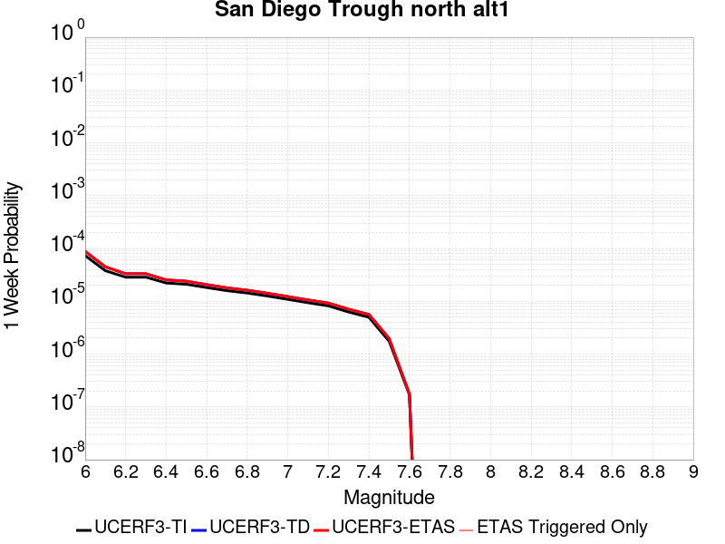 |  | 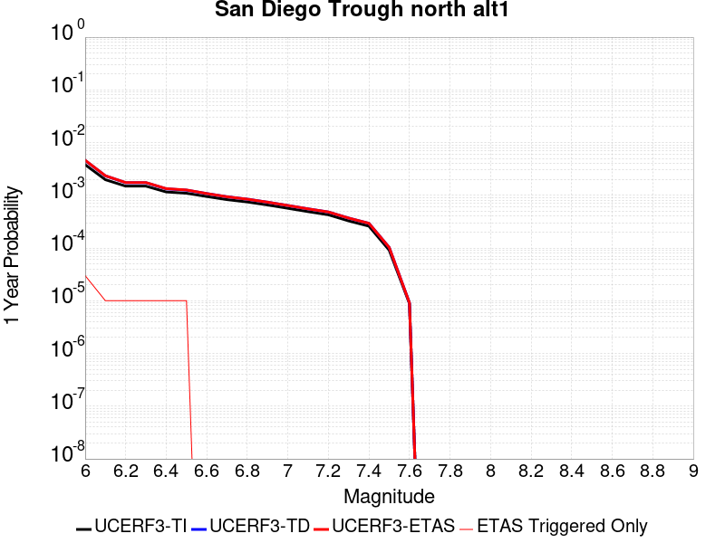 |  |

| Magnitude | 1 wk TI Prob | 1 wk TD Prob | 1 wk ETAS Prob | 1 wk ETAS/TD Gain | 1 wk ETAS Triggered Only | 1 mo TI Prob | 1 mo TD Prob | 1 mo ETAS Prob | 1 mo ETAS/TD Gain | 1 mo ETAS Triggered Only | 1 yr TI Prob | 1 yr TD Prob | 1 yr ETAS Prob | 1 yr ETAS/TD Gain | 1 yr ETAS Triggered Only | 10 yr TI Prob | 10 yr TD Prob | 10 yr ETAS Prob | 10 yr ETAS/TD Gain | 10 yr ETAS Triggered Only |
|-----|-----|-----|-----|-----|-----|-----|-----|-----|-----|-----|-----|-----|-----|-----|-----|-----|-----|-----|-----|-----|
| 6.0 | 7.329252E-5 | 8.823553E-5 | 8.823553E-5 | 1.0 | 0.0 | 3.14073E-4 | 3.7810113E-4 | 3.7810113E-4 | 1.0 | 0.0 | 0.0038171355 | 0.0045943 | 0.0047058803 | 1.0242866 | 1.12095055E-4 | 0.03752231 | 0.04505696 | 0.045164008 | 1.0023757 | 1.12095055E-4 |
| 6.1 | 3.7940346E-5 | 4.48962E-5 | 4.48962E-5 | 1.0 | 0.0 | 1.6259136E-4 | 1.9239864E-4 | 1.9239864E-4 | 1.0 | 0.0 | 0.0019777524 | 0.0023400213 | 0.0023400213 | 1.0 | 0.0 | 0.019602431 | 0.023162305 | 0.023162305 | 1.0 | 0.0 |
| 6.2 | 2.8645263E-5 | 3.330409E-5 | 3.330409E-5 | 1.0 | 0.0 | 1.2275964E-4 | 1.4272417E-4 | 1.4272417E-4 | 1.0 | 0.0 | 0.0014935739 | 0.0017362948 | 0.0017362948 | 1.0 | 0.0 | 0.0148357535 | 0.017229972 | 0.017229972 | 1.0 | 0.0 |
| 6.3 | 2.8645263E-5 | 3.330409E-5 | 3.330409E-5 | 1.0 | 0.0 | 1.2275964E-4 | 1.4272417E-4 | 1.4272417E-4 | 1.0 | 0.0 | 0.0014935739 | 0.0017362948 | 0.0017362948 | 1.0 | 0.0 | 0.0148357535 | 0.017229972 | 0.017229972 | 1.0 | 0.0 |
| 6.4 | 2.2204576E-5 | 2.545331E-5 | 2.545331E-5 | 1.0 | 0.0 | 9.5159E-5 | 1.09081106E-4 | 1.09081106E-4 | 1.0 | 0.0 | 0.001157945 | 0.0013272633 | 0.0013272633 | 1.0 | 0.0 | 0.011519298 | 0.01319452 | 0.01319452 | 1.0 | 0.0 |
| 6.5 | 2.1004838E-5 | 2.4029328E-5 | 2.4029328E-5 | 1.0 | 0.0 | 9.0017624E-5 | 1.02978825E-4 | 1.02978825E-4 | 1.0 | 0.0 | 0.0010954136 | 0.0012530553 | 0.0012530553 | 1.0 | 0.0 | 0.010900296 | 0.012460973 | 0.012460973 | 1.0 | 0.0 |
| 6.6 | 1.820557E-5 | 2.0708592E-5 | 2.0708592E-5 | 1.0 | 0.0 | 7.802154E-5 | 8.874812E-5 | 8.874812E-5 | 1.0 | 0.0 | 9.4949827E-4 | 0.0010799783 | 0.0010799783 | 1.0 | 0.0 | 0.009454516 | 0.010747968 | 0.010747968 | 1.0 | 0.0 |
| 6.7 | 1.5884485E-5 | 1.7986826E-5 | 1.7986826E-5 | 1.0 | 0.0 | 6.807459E-5 | 7.7084136E-5 | 7.7084136E-5 | 1.0 | 0.0 | 8.284929E-4 | 9.38098E-4 | 9.38098E-4 | 1.0 | 0.0 | 0.008254109 | 0.0093417475 | 0.0093417475 | 1.0 | 0.0 |
| 6.8 | 1.4331171E-5 | 1.620389E-5 | 1.620389E-5 | 1.0 | 0.0 | 6.141786E-5 | 6.9443406E-5 | 6.9443406E-5 | 1.0 | 0.0 | 7.4750587E-4 | 8.4514753E-4 | 8.4514753E-4 | 1.0 | 0.0 | 0.0074499645 | 0.008419601 | 0.008419601 | 1.0 | 0.0 |
| 6.9 | 1.2574203E-5 | 1.4208297E-5 | 1.4208297E-5 | 1.0 | 0.0 | 5.3888325E-5 | 6.089129E-5 | 6.089129E-5 | 1.0 | 0.0 | 6.558929E-4 | 7.411007E-4 | 7.411007E-4 | 1.0 | 0.0 | 0.0065396037 | 0.0073864786 | 0.0073864786 | 1.0 | 0.0 |
| 7.0 | 1.0883844E-5 | 1.2291381E-5 | 1.2291381E-5 | 1.0 | 0.0 | 4.664421E-5 | 5.267629E-5 | 5.267629E-5 | 1.0 | 0.0 | 5.677453E-4 | 6.411461E-4 | 6.411461E-4 | 1.0 | 0.0 | 0.00566297 | 0.0063930918 | 0.0063930918 | 1.0 | 0.0 |
| 7.1 | 9.393088E-6 | 1.0608852E-5 | 1.0608852E-5 | 1.0 | 0.0 | 4.025547E-5 | 4.546572E-5 | 4.546572E-5 | 1.0 | 0.0 | 4.900001E-4 | 5.534053E-4 | 5.534053E-4 | 1.0 | 0.0 | 0.0048892107 | 0.0055203685 | 0.0055203685 | 1.0 | 0.0 |
| 7.2 | 8.190791E-6 | 9.2602395E-6 | 9.2602395E-6 | 1.0 | 0.0 | 3.510292E-5 | 3.968614E-5 | 3.968614E-5 | 1.0 | 0.0 | 4.2729423E-4 | 4.830723E-4 | 4.830723E-4 | 1.0 | 0.0 | 0.0042647356 | 0.0048203026 | 0.0048203026 | 1.0 | 0.0 |
| 7.3 | 6.268162E-6 | 7.090957E-6 | 7.090957E-6 | 1.0 | 0.0 | 2.6863276E-5 | 3.0389465E-5 | 3.0389465E-5 | 1.0 | 0.0 | 3.2701128E-4 | 3.6992933E-4 | 3.6992933E-4 | 1.0 | 0.0 | 0.003265305 | 0.0036931813 | 0.0036931813 | 1.0 | 0.0 |
| 7.4 | 4.985186E-6 | 5.643675E-6 | 5.643675E-6 | 1.0 | 0.0 | 2.1364907E-5 | 2.4186958E-5 | 2.4186958E-5 | 1.0 | 0.0 | 2.600867E-4 | 2.9443682E-4 | 2.9443682E-4 | 1.0 | 0.0 | 0.002597825 | 0.0029405085 | 0.0029405085 | 1.0 | 0.0 |
| 7.5 | 1.7489613E-6 | 1.970012E-6 | 1.970012E-6 | 1.0 | 0.0 | 7.495527E-6 | 8.442882E-6 | 8.442882E-6 | 1.0 | 0.0 | 9.125422E-5 | 1.0278747E-4 | 1.0278747E-4 | 1.0 | 0.0 | 9.1216754E-4 | 0.0010274213 | 0.0010274213 | 1.0 | 0.0 |
| 7.6 | 1.6988751E-7 | 1.7534569E-7 | 1.7534569E-7 | 1.0 | 0.0 | 7.2808916E-7 | 7.5148137E-7 | 7.5148137E-7 | 1.0 | 0.0 | 8.864449E-6 | 9.149249E-6 | 9.149249E-6 | 1.0 | 0.0 | 8.8640954E-5 | 9.1488924E-5 | 9.1488924E-5 | 1.0 | 0.0 |

## White Wolf
*[(top)](#table-of-contents)*

| 1 Week | 1 Month | 1 Year | 10 Year |
|-----|-----|-----|-----|
|  |  |  |  |

| Magnitude | 1 wk TI Prob | 1 wk TD Prob | 1 wk ETAS Prob | 1 wk ETAS/TD Gain | 1 wk ETAS Triggered Only | 1 mo TI Prob | 1 mo TD Prob | 1 mo ETAS Prob | 1 mo ETAS/TD Gain | 1 mo ETAS Triggered Only | 1 yr TI Prob | 1 yr TD Prob | 1 yr ETAS Prob | 1 yr ETAS/TD Gain | 1 yr ETAS Triggered Only | 10 yr TI Prob | 10 yr TD Prob | 10 yr ETAS Prob | 10 yr ETAS/TD Gain | 10 yr ETAS Triggered Only |
|-----|-----|-----|-----|-----|-----|-----|-----|-----|-----|-----|-----|-----|-----|-----|-----|-----|-----|-----|-----|-----|
| 6.0 | 2.0037822E-5 | 1.047058E-6 | 1.047058E-6 | 1.0 | 0.0 | 8.587355E-5 | 4.487384E-6 | 4.487384E-6 | 1.0 | 0.0 | 0.001045009 | 5.4632583E-5 | 5.4632583E-5 | 1.0 | 0.0 | 0.010401085 | 5.461966E-4 | 6.582304E-4 | 1.2051163 | 1.12095055E-4 |
| 6.1 | 2.0037822E-5 | 1.047058E-6 | 1.047058E-6 | 1.0 | 0.0 | 8.587355E-5 | 4.487384E-6 | 4.487384E-6 | 1.0 | 0.0 | 0.001045009 | 5.4632583E-5 | 5.4632583E-5 | 1.0 | 0.0 | 0.010401085 | 5.461966E-4 | 6.582304E-4 | 1.2051163 | 1.12095055E-4 |
| 6.2 | 2.0037822E-5 | 1.047058E-6 | 1.047058E-6 | 1.0 | 0.0 | 8.587355E-5 | 4.487384E-6 | 4.487384E-6 | 1.0 | 0.0 | 0.001045009 | 5.4632583E-5 | 5.4632583E-5 | 1.0 | 0.0 | 0.010401085 | 5.461966E-4 | 6.582304E-4 | 1.2051163 | 1.12095055E-4 |
| 6.3 | 2.0037822E-5 | 1.047058E-6 | 1.047058E-6 | 1.0 | 0.0 | 8.587355E-5 | 4.487384E-6 | 4.487384E-6 | 1.0 | 0.0 | 0.001045009 | 5.4632583E-5 | 5.4632583E-5 | 1.0 | 0.0 | 0.010401085 | 5.461966E-4 | 6.582304E-4 | 1.2051163 | 1.12095055E-4 |
| 6.4 | 1.132487E-5 | 1.047058E-6 | 1.047058E-6 | 1.0 | 0.0 | 4.8534253E-5 | 4.487384E-6 | 4.487384E-6 | 1.0 | 0.0 | 5.907443E-4 | 5.4632583E-5 | 5.4632583E-5 | 1.0 | 0.0 | 0.005891764 | 5.461966E-4 | 6.582304E-4 | 1.2051163 | 1.12095055E-4 |
| 6.5 | 1.132487E-5 | 1.047058E-6 | 1.047058E-6 | 1.0 | 0.0 | 4.8534253E-5 | 4.487384E-6 | 4.487384E-6 | 1.0 | 0.0 | 5.907443E-4 | 5.4632583E-5 | 5.4632583E-5 | 1.0 | 0.0 | 0.005891764 | 5.461966E-4 | 6.582304E-4 | 1.2051163 | 1.12095055E-4 |
| 6.6 | 9.347473E-6 | 1.047058E-6 | 1.047058E-6 | 1.0 | 0.0 | 4.0059982E-5 | 4.487384E-6 | 4.487384E-6 | 1.0 | 0.0 | 4.8762115E-4 | 5.4632583E-5 | 5.4632583E-5 | 1.0 | 0.0 | 0.0048655253 | 5.461966E-4 | 6.582304E-4 | 1.2051163 | 1.12095055E-4 |
| 6.7 | 7.842647E-6 | 1.0049686E-6 | 1.0049686E-6 | 1.0 | 0.0 | 3.361091E-5 | 4.3070013E-6 | 4.3070013E-6 | 1.0 | 0.0 | 4.0913603E-4 | 5.2436528E-5 | 5.2436528E-5 | 1.0 | 0.0 | 0.004083836 | 5.2424654E-4 | 6.362828E-4 | 1.2137092 | 1.12095055E-4 |
| 6.8 | 6.26597E-6 | 9.736085E-7 | 9.736085E-7 | 1.0 | 0.0 | 2.685388E-5 | 4.172601E-6 | 4.172601E-6 | 1.0 | 0.0 | 3.2689696E-4 | 5.080029E-5 | 5.080029E-5 | 1.0 | 0.0 | 0.003264165 | 5.0789164E-4 | 6.1992975E-4 | 1.2205945 | 1.12095055E-4 |
| 6.9 | 5.258436E-6 | 9.1844277E-7 | 9.1844277E-7 | 1.0 | 0.0 | 2.2535958E-5 | 3.9361776E-6 | 3.9361776E-6 | 1.0 | 0.0 | 2.7434074E-4 | 4.7921956E-5 | 4.7921956E-5 | 1.0 | 0.0 | 0.0027400232 | 4.7912102E-4 | 5.9116236E-4 | 1.2338477 | 1.12095055E-4 |
| 7.0 | 4.675028E-6 | 8.6622856E-7 | 8.6622856E-7 | 1.0 | 0.0 | 2.003568E-5 | 3.7124032E-6 | 3.7124032E-6 | 1.0 | 0.0 | 2.4390711E-4 | 4.519762E-5 | 4.519762E-5 | 1.0 | 0.0 | 0.0024363957 | 4.5188898E-4 | 5.639334E-4 | 1.2479467 | 1.12095055E-4 |
| 7.1 | 2.8270078E-6 | 6.875069E-7 | 6.875069E-7 | 1.0 | 0.0 | 1.2115692E-5 | 2.946455E-6 | 2.946455E-6 | 1.0 | 0.0 | 1.4749856E-4 | 3.587254E-5 | 3.587254E-5 | 1.0 | 0.0 | 0.001474007 | 3.586716E-4 | 4.7072643E-4 | 1.3124163 | 1.12095055E-4 |
| 7.2 | 1.6881406E-6 | 2.27111E-7 | 2.27111E-7 | 1.0 | 0.0 | 7.2348685E-6 | 9.733325E-7 | 9.733325E-7 | 1.0 | 0.0 | 8.808096E-5 | 1.185026E-5 | 1.185026E-5 | 1.0 | 0.0 | 8.8046055E-4 | 1.1849644E-4 | 2.3057821E-4 | 1.9458661 | 1.12095055E-4 |
| 7.3 | 9.086107E-7 | 1.5269218E-7 | 1.5269218E-7 | 1.0 | 0.0 | 3.8940398E-6 | 6.5439485E-7 | 6.5439485E-7 | 1.0 | 0.0 | 4.7408903E-5 | 7.967229E-6 | 7.967229E-6 | 1.0 | 0.0 | 4.739879E-4 | 7.966952E-5 | 1.9175565E-4 | 2.4068885 | 1.12095055E-4 |
| 7.4 | 1.9717383E-7 | 9.004596E-8 | 9.004596E-8 | 1.0 | 0.0 | 8.450304E-7 | 3.859112E-7 | 3.859112E-7 | 1.0 | 0.0 | 1.0288197E-5 | 4.6984587E-6 | 4.6984587E-6 | 1.0 | 0.0 | 1.028772E-4 | 4.6983627E-5 | 4.6983627E-5 | 1.0 | 0.0 |
| 7.5 | 1.086975E-7 | 6.6600954E-8 | 6.6600954E-8 | 1.0 | 0.0 | 4.6584634E-7 | 2.854326E-7 | 2.854326E-7 | 1.0 | 0.0 | 5.6716644E-6 | 3.4751367E-6 | 3.4751367E-6 | 1.0 | 0.0 | 5.6715195E-5 | 3.4750847E-5 | 3.4750847E-5 | 1.0 | 0.0 |
| 7.6 | 2.4217808E-8 | 1.582155E-8 | 1.582155E-8 | 1.0 | 0.0 | 1.03790605E-7 | 6.780664E-8 | 6.780664E-8 | 1.0 | 0.0 | 1.2636499E-6 | 8.255456E-7 | 8.255456E-7 | 1.0 | 0.0 | 1.2636427E-5 | 8.255431E-6 | 8.255431E-6 | 1.0 | 0.0 |

## Red Pass
*[(top)](#table-of-contents)*

| 1 Week | 1 Month | 1 Year | 10 Year |
|-----|-----|-----|-----|
|  | 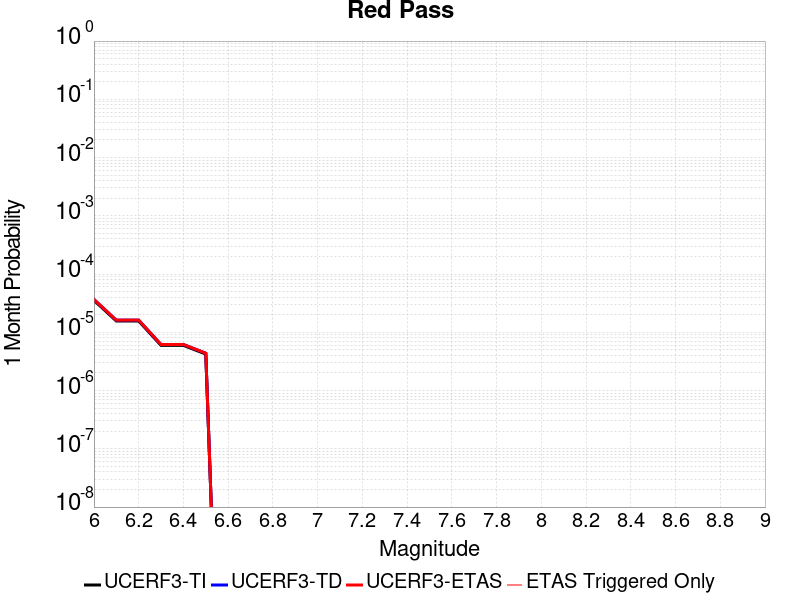 |  |  |

| Magnitude | 1 wk TI Prob | 1 wk TD Prob | 1 wk ETAS Prob | 1 wk ETAS/TD Gain | 1 wk ETAS Triggered Only | 1 mo TI Prob | 1 mo TD Prob | 1 mo ETAS Prob | 1 mo ETAS/TD Gain | 1 mo ETAS Triggered Only | 1 yr TI Prob | 1 yr TD Prob | 1 yr ETAS Prob | 1 yr ETAS/TD Gain | 1 yr ETAS Triggered Only | 10 yr TI Prob | 10 yr TD Prob | 10 yr ETAS Prob | 10 yr ETAS/TD Gain | 10 yr ETAS Triggered Only |
|-----|-----|-----|-----|-----|-----|-----|-----|-----|-----|-----|-----|-----|-----|-----|-----|-----|-----|-----|-----|-----|
| 6.0 | 8.258278E-6 | 8.551668E-6 | 8.551668E-6 | 1.0 | 0.0 | 3.539214E-5 | 3.6649588E-5 | 3.6649588E-5 | 1.0 | 0.0 | 4.308141E-4 | 4.4613527E-4 | 4.4613527E-4 | 1.0 | 0.0 | 0.0042997985 | 0.004454154 | 0.00456575 | 1.0250543 | 1.12095055E-4 |
| 6.1 | 3.649988E-6 | 3.775488E-6 | 3.775488E-6 | 1.0 | 0.0 | 1.5642712E-5 | 1.618059E-5 | 1.618059E-5 | 1.0 | 0.0 | 1.9043336E-4 | 1.9698562E-4 | 1.9698562E-4 | 1.0 | 0.0 | 0.0019027026 | 0.0019685775 | 0.002080452 | 1.05683 | 1.12095055E-4 |
| 6.2 | 3.649988E-6 | 3.775488E-6 | 3.775488E-6 | 1.0 | 0.0 | 1.5642712E-5 | 1.618059E-5 | 1.618059E-5 | 1.0 | 0.0 | 1.9043336E-4 | 1.9698562E-4 | 1.9698562E-4 | 1.0 | 0.0 | 0.0019027026 | 0.0019685775 | 0.002080452 | 1.05683 | 1.12095055E-4 |
| 6.3 | 1.3924937E-6 | 1.4411834E-6 | 1.4411834E-6 | 1.0 | 0.0 | 5.9678164E-6 | 6.1764936E-6 | 6.1764936E-6 | 1.0 | 0.0 | 7.265574E-5 | 7.5197626E-5 | 7.5197626E-5 | 1.0 | 0.0 | 7.263199E-4 | 7.518606E-4 | 8.6387136E-4 | 1.1489781 | 1.12095055E-4 |
| 6.4 | 1.3924937E-6 | 1.4411834E-6 | 1.4411834E-6 | 1.0 | 0.0 | 5.9678164E-6 | 6.1764936E-6 | 6.1764936E-6 | 1.0 | 0.0 | 7.265574E-5 | 7.5197626E-5 | 7.5197626E-5 | 1.0 | 0.0 | 7.263199E-4 | 7.518606E-4 | 8.6387136E-4 | 1.1489781 | 1.12095055E-4 |
| 6.5 | 9.876812E-7 | 1.0222386E-6 | 1.0222386E-6 | 1.0 | 0.0 | 4.2329125E-6 | 4.3810223E-6 | 4.3810223E-6 | 1.0 | 0.0 | 5.153449E-5 | 5.333895E-5 | 5.333895E-5 | 1.0 | 0.0 | 5.1522546E-4 | 5.333895E-4 | 6.4542476E-4 | 1.210044 | 1.12095055E-4 |

## Cleghorn
*[(top)](#table-of-contents)*

| 1 Week | 1 Month | 1 Year | 10 Year |
|-----|-----|-----|-----|
|  |  | 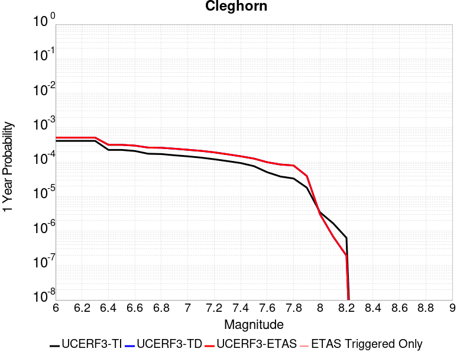 |  |

| Magnitude | 1 wk TI Prob | 1 wk TD Prob | 1 wk ETAS Prob | 1 wk ETAS/TD Gain | 1 wk ETAS Triggered Only | 1 mo TI Prob | 1 mo TD Prob | 1 mo ETAS Prob | 1 mo ETAS/TD Gain | 1 mo ETAS Triggered Only | 1 yr TI Prob | 1 yr TD Prob | 1 yr ETAS Prob | 1 yr ETAS/TD Gain | 1 yr ETAS Triggered Only | 10 yr TI Prob | 10 yr TD Prob | 10 yr ETAS Prob | 10 yr ETAS/TD Gain | 10 yr ETAS Triggered Only |
|-----|-----|-----|-----|-----|-----|-----|-----|-----|-----|-----|-----|-----|-----|-----|-----|-----|-----|-----|-----|-----|
| 6.0 | 7.9267165E-6 | 9.844329E-6 | 9.844329E-6 | 1.0 | 0.0 | 3.39712E-5 | 4.2189356E-5 | 4.2189356E-5 | 1.0 | 0.0 | 4.1352084E-4 | 5.13545E-4 | 5.13545E-4 | 1.0 | 0.0 | 0.004127522 | 0.005138525 | 0.0052500437 | 1.0217025 | 1.12095055E-4 |
| 6.1 | 7.9267165E-6 | 9.844329E-6 | 9.844329E-6 | 1.0 | 0.0 | 3.39712E-5 | 4.2189356E-5 | 4.2189356E-5 | 1.0 | 0.0 | 4.1352084E-4 | 5.13545E-4 | 5.13545E-4 | 1.0 | 0.0 | 0.004127522 | 0.005138525 | 0.0052500437 | 1.0217025 | 1.12095055E-4 |
| 6.2 | 7.9267165E-6 | 9.844329E-6 | 9.844329E-6 | 1.0 | 0.0 | 3.39712E-5 | 4.2189356E-5 | 4.2189356E-5 | 1.0 | 0.0 | 4.1352084E-4 | 5.13545E-4 | 5.13545E-4 | 1.0 | 0.0 | 0.004127522 | 0.005138525 | 0.0052500437 | 1.0217025 | 1.12095055E-4 |
| 6.3 | 7.9267165E-6 | 9.844329E-6 | 9.844329E-6 | 1.0 | 0.0 | 3.39712E-5 | 4.2189356E-5 | 4.2189356E-5 | 1.0 | 0.0 | 4.1352084E-4 | 5.13545E-4 | 5.13545E-4 | 1.0 | 0.0 | 0.004127522 | 0.005138525 | 0.0052500437 | 1.0217025 | 1.12095055E-4 |
| 6.4 | 4.3445207E-6 | 6.1039705E-6 | 6.1039705E-6 | 1.0 | 0.0 | 1.8619241E-5 | 2.6159618E-5 | 2.6159618E-5 | 1.0 | 0.0 | 2.2666567E-4 | 3.184478E-4 | 3.184478E-4 | 1.0 | 0.0 | 0.0022643462 | 0.0031939335 | 0.0031939335 | 1.0 | 0.0 |
| 6.5 | 4.3445207E-6 | 6.1039705E-6 | 6.1039705E-6 | 1.0 | 0.0 | 1.8619241E-5 | 2.6159618E-5 | 2.6159618E-5 | 1.0 | 0.0 | 2.2666567E-4 | 3.184478E-4 | 3.184478E-4 | 1.0 | 0.0 | 0.0022643462 | 0.0031939335 | 0.0031939335 | 1.0 | 0.0 |
| 6.6 | 4.040109E-6 | 5.78636E-6 | 5.78636E-6 | 1.0 | 0.0 | 1.7314638E-5 | 2.4798455E-5 | 2.4798455E-5 | 1.0 | 0.0 | 2.1078532E-4 | 3.018803E-4 | 3.018803E-4 | 1.0 | 0.0 | 0.002105855 | 0.0030287148 | 0.0030287148 | 1.0 | 0.0 |
| 6.7 | 3.3632055E-6 | 5.0798167E-6 | 5.0798167E-6 | 1.0 | 0.0 | 1.4413658E-5 | 2.1770462E-5 | 2.1770462E-5 | 1.0 | 0.0 | 1.7547216E-4 | 2.6502347E-4 | 2.6502347E-4 | 1.0 | 0.0 | 0.0017533366 | 0.0026610303 | 0.0026610303 | 1.0 | 0.0 |
| 6.8 | 3.2902772E-6 | 5.0017165E-6 | 5.0017165E-6 | 1.0 | 0.0 | 1.4101111E-5 | 2.1435753E-5 | 2.1435753E-5 | 1.0 | 0.0 | 1.716675E-4 | 2.6094937E-4 | 2.6094937E-4 | 1.0 | 0.0 | 0.0017153495 | 0.0026203855 | 0.0026203855 | 1.0 | 0.0 |
| 6.9 | 3.031547E-6 | 4.7032236E-6 | 4.7032236E-6 | 1.0 | 0.0 | 1.299228E-5 | 2.0156518E-5 | 2.0156518E-5 | 1.0 | 0.0 | 1.5816953E-4 | 2.4537824E-4 | 2.4537824E-4 | 1.0 | 0.0 | 0.00158057 | 0.002465027 | 0.002465027 | 1.0 | 0.0 |
| 7.0 | 2.8259715E-6 | 4.3821365E-6 | 4.3821365E-6 | 1.0 | 0.0 | 1.211125E-5 | 1.8780453E-5 | 1.8780453E-5 | 1.0 | 0.0 | 1.4744449E-4 | 2.2862825E-4 | 2.2862825E-4 | 1.0 | 0.0 | 0.001473467 | 0.002297883 | 0.002297883 | 1.0 | 0.0 |
| 7.1 | 2.5962665E-6 | 4.0770733E-6 | 4.0770733E-6 | 1.0 | 0.0 | 1.1126809E-5 | 1.7473056E-5 | 1.7473056E-5 | 1.0 | 0.0 | 1.3546048E-4 | 2.127139E-4 | 2.127139E-4 | 1.0 | 0.0 | 0.0013537793 | 0.0021390605 | 0.0021390605 | 1.0 | 0.0 |
| 7.2 | 2.3247253E-6 | 3.687283E-6 | 3.687283E-6 | 1.0 | 0.0 | 9.96307E-6 | 1.5802547E-5 | 1.5802547E-5 | 1.0 | 0.0 | 1.21293626E-4 | 1.923792E-4 | 1.923792E-4 | 1.0 | 0.0 | 0.0012122744 | 0.0019361057 | 0.0019361057 | 1.0 | 0.0 |
| 7.3 | 2.056928E-6 | 3.2453E-6 | 3.2453E-6 | 1.0 | 0.0 | 8.815376E-6 | 1.3908355E-5 | 1.3908355E-5 | 1.0 | 0.0 | 1.0732192E-4 | 1.6932123E-4 | 1.6932123E-4 | 1.0 | 0.0 | 0.001072701 | 0.0017059678 | 0.0017059678 | 1.0 | 0.0 |
| 7.4 | 1.8055999E-6 | 2.835059E-6 | 2.835059E-6 | 1.0 | 0.0 | 7.738263E-6 | 1.2150197E-5 | 1.2150197E-5 | 1.0 | 0.0 | 9.4209274E-5 | 1.4791875E-4 | 1.4791875E-4 | 1.0 | 0.0 | 9.4169343E-4 | 0.0014923868 | 0.0014923868 | 1.0 | 0.0 |
| 7.5 | 1.4683443E-6 | 2.4340136E-6 | 2.4340136E-6 | 1.0 | 0.0 | 6.292889E-6 | 1.0431445E-5 | 1.0431445E-5 | 1.0 | 0.0 | 7.661323E-5 | 1.2699554E-4 | 1.2699554E-4 | 1.0 | 0.0 | 7.658682E-4 | 0.0012834566 | 0.0012834566 | 1.0 | 0.0 |
| 7.6 | 9.804088E-7 | 1.9093818E-6 | 1.9093818E-6 | 1.0 | 0.0 | 4.201745E-6 | 8.183039E-6 | 8.183039E-6 | 1.0 | 0.0 | 5.1155046E-5 | 9.962399E-5 | 9.962399E-5 | 1.0 | 0.0 | 5.114327E-4 | 0.0010100557 | 0.0010100557 | 1.0 | 0.0 |
| 7.7 | 7.3434086E-7 | 1.6373907E-6 | 1.6373907E-6 | 1.0 | 0.0 | 3.1471714E-6 | 7.01737E-6 | 7.01737E-6 | 1.0 | 0.0 | 3.831614E-5 | 8.543315E-5 | 8.543315E-5 | 1.0 | 0.0 | 3.8309532E-4 | 8.683008E-4 | 8.683008E-4 | 1.0 | 0.0 |
| 7.8 | 6.434184E-7 | 1.5305798E-6 | 1.5305798E-6 | 1.0 | 0.0 | 2.7575045E-6 | 6.5596114E-6 | 6.5596114E-6 | 1.0 | 0.0 | 3.35721E-5 | 7.9860365E-5 | 7.9860365E-5 | 1.0 | 0.0 | 3.3567028E-4 | 8.122777E-4 | 8.122777E-4 | 1.0 | 0.0 |
| 7.9 | 3.4943926E-7 | 7.620481E-7 | 7.620481E-7 | 1.0 | 0.0 | 1.497596E-6 | 3.2659163E-6 | 3.2659163E-6 | 1.0 | 0.0 | 1.8233079E-5 | 3.9761813E-5 | 3.9761813E-5 | 1.0 | 0.0 | 1.8231584E-4 | 4.0634157E-4 | 4.0634157E-4 | 1.0 | 0.0 |
| 8.0 | 6.717524E-8 | 5.8917895E-8 | 5.8917895E-8 | 1.0 | 0.0 | 2.8789387E-7 | 2.5250523E-7 | 2.5250523E-7 | 1.0 | 0.0 | 3.505102E-6 | 3.074247E-6 | 3.074247E-6 | 1.0 | 0.0 | 3.5050467E-5 | 3.301935E-5 | 3.301935E-5 | 1.0 | 0.0 |
| 8.1 | 3.1984914E-8 | 1.31279485E-8 | 1.31279485E-8 | 1.0 | 0.0 | 1.370782E-7 | 5.6262632E-8 | 5.6262632E-8 | 1.0 | 0.0 | 1.6689258E-6 | 6.849973E-7 | 6.849973E-7 | 1.0 | 0.0 | 1.6689133E-5 | 7.841479E-6 | 7.841479E-6 | 1.0 | 0.0 |
| 8.2 | 1.21887656E-8 | 3.7025414E-9 | 3.7025414E-9 | 1.0 | 0.0 | 5.2237567E-8 | 1.5868034E-8 | 1.5868034E-8 | 1.0 | 0.0 | 6.359922E-7 | 1.9319329E-7 | 1.9319329E-7 | 1.0 | 0.0 | 6.3599036E-6 | 2.2777037E-6 | 2.2777037E-6 | 1.0 | 0.0 |

## Pinto Mtn
*[(top)](#table-of-contents)*

| 1 Week | 1 Month | 1 Year | 10 Year |
|-----|-----|-----|-----|
|  | 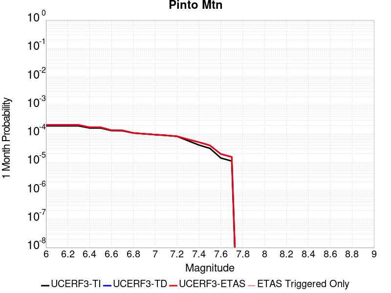 | 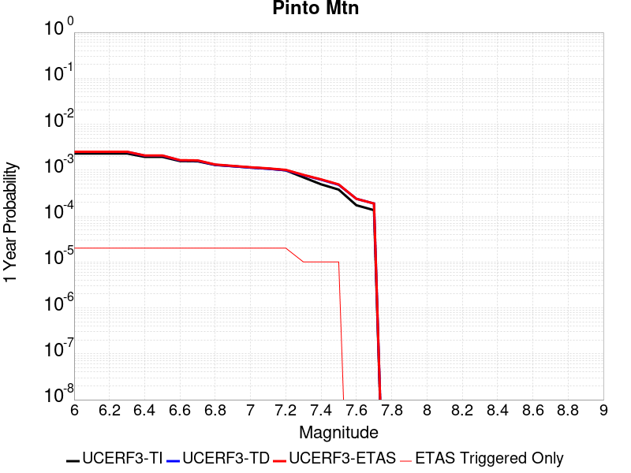 |  |

| Magnitude | 1 wk TI Prob | 1 wk TD Prob | 1 wk ETAS Prob | 1 wk ETAS/TD Gain | 1 wk ETAS Triggered Only | 1 mo TI Prob | 1 mo TD Prob | 1 mo ETAS Prob | 1 mo ETAS/TD Gain | 1 mo ETAS Triggered Only | 1 yr TI Prob | 1 yr TD Prob | 1 yr ETAS Prob | 1 yr ETAS/TD Gain | 1 yr ETAS Triggered Only | 10 yr TI Prob | 10 yr TD Prob | 10 yr ETAS Prob | 10 yr ETAS/TD Gain | 10 yr ETAS Triggered Only |
|-----|-----|-----|-----|-----|-----|-----|-----|-----|-----|-----|-----|-----|-----|-----|-----|-----|-----|-----|-----|-----|
| 6.0 | 4.4194956E-5 | 4.7869722E-5 | 4.7869722E-5 | 1.0 | 0.0 | 1.893932E-4 | 2.0514075E-4 | 2.0514075E-4 | 1.0 | 0.0 | 0.0023034236 | 0.0024948926 | 0.0024948926 | 1.0 | 0.0 | 0.022796938 | 0.024686344 | 0.024795672 | 1.0044286 | 1.12095055E-4 |
| 6.1 | 4.4194956E-5 | 4.7869722E-5 | 4.7869722E-5 | 1.0 | 0.0 | 1.893932E-4 | 2.0514075E-4 | 2.0514075E-4 | 1.0 | 0.0 | 0.0023034236 | 0.0024948926 | 0.0024948926 | 1.0 | 0.0 | 0.022796938 | 0.024686344 | 0.024795672 | 1.0044286 | 1.12095055E-4 |
| 6.2 | 4.4194956E-5 | 4.7869722E-5 | 4.7869722E-5 | 1.0 | 0.0 | 1.893932E-4 | 2.0514075E-4 | 2.0514075E-4 | 1.0 | 0.0 | 0.0023034236 | 0.0024948926 | 0.0024948926 | 1.0 | 0.0 | 0.022796938 | 0.024686344 | 0.024795672 | 1.0044286 | 1.12095055E-4 |
| 6.3 | 4.4194956E-5 | 4.7869722E-5 | 4.7869722E-5 | 1.0 | 0.0 | 1.893932E-4 | 2.0514075E-4 | 2.0514075E-4 | 1.0 | 0.0 | 0.0023034236 | 0.0024948926 | 0.0024948926 | 1.0 | 0.0 | 0.022796938 | 0.024686344 | 0.024795672 | 1.0044286 | 1.12095055E-4 |
| 6.4 | 3.729929E-5 | 3.9617134E-5 | 3.9617134E-5 | 1.0 | 0.0 | 1.5984432E-4 | 1.697772E-4 | 1.697772E-4 | 1.0 | 0.0 | 0.0019443673 | 0.0020651715 | 0.0020651715 | 1.0 | 0.0 | 0.019274427 | 0.020469824 | 0.020579623 | 1.0053641 | 1.12095055E-4 |
| 6.5 | 3.729929E-5 | 3.9617134E-5 | 3.9617134E-5 | 1.0 | 0.0 | 1.5984432E-4 | 1.697772E-4 | 1.697772E-4 | 1.0 | 0.0 | 0.0019443673 | 0.0020651715 | 0.0020651715 | 1.0 | 0.0 | 0.019274427 | 0.020469824 | 0.020579623 | 1.0053641 | 1.12095055E-4 |
| 6.6 | 3.0204548E-5 | 3.1217198E-5 | 3.1217198E-5 | 1.0 | 0.0 | 1.2944164E-4 | 1.3378132E-4 | 1.3378132E-4 | 1.0 | 0.0 | 0.0015748127 | 0.0016276054 | 0.0016276054 | 1.0 | 0.0 | 0.015636992 | 0.01616072 | 0.01616072 | 1.0 | 0.0 |
| 6.7 | 2.9857754E-5 | 3.0826515E-5 | 3.0826515E-5 | 1.0 | 0.0 | 1.2795553E-4 | 1.3210715E-4 | 1.3210715E-4 | 1.0 | 0.0 | 0.0015567453 | 0.0016072524 | 0.0016072524 | 1.0 | 0.0 | 0.015458848 | 0.015960127 | 0.015960127 | 1.0 | 0.0 |
| 6.8 | 2.4819734E-5 | 2.5020017E-5 | 2.5020017E-5 | 1.0 | 0.0 | 1.0636595E-4 | 1.0722436E-4 | 1.0722436E-4 | 1.0 | 0.0 | 0.0012942362 | 0.0013046965 | 0.0013046965 | 1.0 | 0.0 | 0.012867244 | 0.012972736 | 0.012972736 | 1.0 | 0.0 |
| 6.9 | 2.331124E-5 | 2.3348057E-5 | 2.3348057E-5 | 1.0 | 0.0 | 9.990149E-5 | 1.0005938E-4 | 1.0005938E-4 | 1.0 | 0.0 | 0.001215622 | 0.0012175625 | 0.0012175625 | 1.0 | 0.0 | 0.012089936 | 0.012111111 | 0.012111111 | 1.0 | 0.0 |
| 7.0 | 2.1818534E-5 | 2.1770986E-5 | 2.1770986E-5 | 1.0 | 0.0 | 9.3504656E-5 | 9.3301E-5 | 9.3301E-5 | 1.0 | 0.0 | 0.0011378246 | 0.0011353676 | 0.0011353676 | 1.0 | 0.0 | 0.011320163 | 0.011297774 | 0.011297774 | 1.0 | 0.0 |
| 7.1 | 2.066081E-5 | 2.0550438E-5 | 2.0550438E-5 | 1.0 | 0.0 | 8.854332E-5 | 8.807045E-5 | 8.807045E-5 | 1.0 | 0.0 | 0.0010774818 | 0.0010717498 | 0.0010717498 | 1.0 | 0.0 | 0.010722724 | 0.010667863 | 0.010667863 | 1.0 | 0.0 |
| 7.2 | 1.8990233E-5 | 1.906353E-5 | 1.906353E-5 | 1.0 | 0.0 | 8.138417E-5 | 8.1698396E-5 | 8.1698396E-5 | 1.0 | 0.0 | 9.904018E-4 | 9.942434E-4 | 9.942434E-4 | 1.0 | 0.0 | 0.009859995 | 0.009899952 | 0.009899952 | 1.0 | 0.0 |
| 7.3 | 1.3335872E-5 | 1.49154175E-5 | 1.49154175E-5 | 1.0 | 0.0 | 5.7152483E-5 | 6.3921725E-5 | 6.3921725E-5 | 1.0 | 0.0 | 6.956093E-4 | 7.779819E-4 | 7.779819E-4 | 1.0 | 0.0 | 0.006934359 | 0.0077538835 | 0.0077538835 | 1.0 | 0.0 |
| 7.4 | 9.414066E-6 | 1.18692105E-5 | 1.18692105E-5 | 1.0 | 0.0 | 4.0345374E-5 | 5.0867107E-5 | 5.0867107E-5 | 1.0 | 0.0 | 4.910942E-4 | 6.191405E-4 | 6.191405E-4 | 1.0 | 0.0 | 0.0049001034 | 0.006175105 | 0.006175105 | 1.0 | 0.0 |
| 7.5 | 7.2101157E-6 | 9.166289E-6 | 9.166289E-6 | 1.0 | 0.0 | 3.090013E-5 | 3.9283546E-5 | 3.9283546E-5 | 1.0 | 0.0 | 3.7614413E-4 | 4.7818E-4 | 4.7818E-4 | 1.0 | 0.0 | 0.0037550807 | 0.004772287 | 0.004772287 | 1.0 | 0.0 |
| 7.6 | 3.296375E-6 | 4.5533634E-6 | 4.5533634E-6 | 1.0 | 0.0 | 1.4127245E-5 | 1.9514277E-5 | 1.9514277E-5 | 1.0 | 0.0 | 1.7198564E-4 | 2.3756182E-4 | 2.3756182E-4 | 1.0 | 0.0 | 0.0017185259 | 0.0023732164 | 0.0023732164 | 1.0 | 0.0 |
| 7.7 | 2.5741092E-6 | 3.5918313E-6 | 3.5918313E-6 | 1.0 | 0.0 | 1.103185E-5 | 1.539348E-5 | 1.539348E-5 | 1.0 | 0.0 | 1.3430449E-4 | 1.8740082E-4 | 1.8740082E-4 | 1.0 | 0.0 | 0.0013422335 | 0.0018725583 | 0.0018725583 | 1.0 | 0.0 |

## Earthquake Valley (So Extension)
*[(top)](#table-of-contents)*

| 1 Week | 1 Month | 1 Year | 10 Year |
|-----|-----|-----|-----|
|  |  |  |  |

| Magnitude | 1 wk TI Prob | 1 wk TD Prob | 1 wk ETAS Prob | 1 wk ETAS/TD Gain | 1 wk ETAS Triggered Only | 1 mo TI Prob | 1 mo TD Prob | 1 mo ETAS Prob | 1 mo ETAS/TD Gain | 1 mo ETAS Triggered Only | 1 yr TI Prob | 1 yr TD Prob | 1 yr ETAS Prob | 1 yr ETAS/TD Gain | 1 yr ETAS Triggered Only | 10 yr TI Prob | 10 yr TD Prob | 10 yr ETAS Prob | 10 yr ETAS/TD Gain | 10 yr ETAS Triggered Only |
|-----|-----|-----|-----|-----|-----|-----|-----|-----|-----|-----|-----|-----|-----|-----|-----|-----|-----|-----|-----|-----|
| 6.0 | 3.0194888E-5 | 3.7083595E-5 | 3.7083595E-5 | 1.0 | 0.0 | 1.2940024E-4 | 1.5892308E-4 | 2.7100032E-4 | 1.7052294 | 1.12095055E-4 | 0.0015743093 | 0.0019337159 | 0.0020455942 | 1.0578567 | 1.12095055E-4 | 0.01563203 | 0.019218799 | 0.01932874 | 1.0057205 | 1.12095055E-4 |
| 6.1 | 3.0194888E-5 | 3.7083595E-5 | 3.7083595E-5 | 1.0 | 0.0 | 1.2940024E-4 | 1.5892308E-4 | 2.7100032E-4 | 1.7052294 | 1.12095055E-4 | 0.0015743093 | 0.0019337159 | 0.0020455942 | 1.0578567 | 1.12095055E-4 | 0.01563203 | 0.019218799 | 0.01932874 | 1.0057205 | 1.12095055E-4 |
| 6.2 | 3.0194888E-5 | 3.7083595E-5 | 3.7083595E-5 | 1.0 | 0.0 | 1.2940024E-4 | 1.5892308E-4 | 2.7100032E-4 | 1.7052294 | 1.12095055E-4 | 0.0015743093 | 0.0019337159 | 0.0020455942 | 1.0578567 | 1.12095055E-4 | 0.01563203 | 0.019218799 | 0.01932874 | 1.0057205 | 1.12095055E-4 |
| 6.3 | 1.5795305E-5 | 1.8450788E-5 | 1.8450788E-5 | 1.0 | 0.0 | 6.769241E-5 | 7.9073034E-5 | 7.9073034E-5 | 1.0 | 0.0 | 8.238434E-4 | 9.624003E-4 | 9.624003E-4 | 1.0 | 0.0 | 0.008207959 | 0.009593238 | 0.009593238 | 1.0 | 0.0 |
| 6.4 | 1.5795305E-5 | 1.8450788E-5 | 1.8450788E-5 | 1.0 | 0.0 | 6.769241E-5 | 7.9073034E-5 | 7.9073034E-5 | 1.0 | 0.0 | 8.238434E-4 | 9.624003E-4 | 9.624003E-4 | 1.0 | 0.0 | 0.008207959 | 0.009593238 | 0.009593238 | 1.0 | 0.0 |
| 6.5 | 1.5795305E-5 | 1.8450788E-5 | 1.8450788E-5 | 1.0 | 0.0 | 6.769241E-5 | 7.9073034E-5 | 7.9073034E-5 | 1.0 | 0.0 | 8.238434E-4 | 9.624003E-4 | 9.624003E-4 | 1.0 | 0.0 | 0.008207959 | 0.009593238 | 0.009593238 | 1.0 | 0.0 |
| 6.6 | 1.5795305E-5 | 1.8450788E-5 | 1.8450788E-5 | 1.0 | 0.0 | 6.769241E-5 | 7.9073034E-5 | 7.9073034E-5 | 1.0 | 0.0 | 8.238434E-4 | 9.624003E-4 | 9.624003E-4 | 1.0 | 0.0 | 0.008207959 | 0.009593238 | 0.009593238 | 1.0 | 0.0 |
| 6.7 | 1.1363076E-5 | 1.3141109E-5 | 1.3141109E-5 | 1.0 | 0.0 | 4.8697988E-5 | 5.631825E-5 | 5.631825E-5 | 1.0 | 0.0 | 5.927367E-4 | 6.8553514E-4 | 6.8553514E-4 | 1.0 | 0.0 | 0.0059115817 | 0.00684168 | 0.00684168 | 1.0 | 0.0 |
| 6.8 | 1.0049611E-5 | 1.1596789E-5 | 1.1596789E-5 | 1.0 | 0.0 | 4.306905E-5 | 4.969999E-5 | 4.969999E-5 | 1.0 | 0.0 | 5.242395E-4 | 6.0500257E-4 | 6.0500257E-4 | 1.0 | 0.0 | 0.0052300454 | 0.0060407347 | 0.0060407347 | 1.0 | 0.0 |
| 6.9 | 1.0049611E-5 | 1.1596789E-5 | 1.1596789E-5 | 1.0 | 0.0 | 4.306905E-5 | 4.969999E-5 | 4.969999E-5 | 1.0 | 0.0 | 5.242395E-4 | 6.0500257E-4 | 6.0500257E-4 | 1.0 | 0.0 | 0.0052300454 | 0.0060407347 | 0.0060407347 | 1.0 | 0.0 |
| 7.0 | 1.0049611E-5 | 1.1596789E-5 | 1.1596789E-5 | 1.0 | 0.0 | 4.306905E-5 | 4.969999E-5 | 4.969999E-5 | 1.0 | 0.0 | 5.242395E-4 | 6.0500257E-4 | 6.0500257E-4 | 1.0 | 0.0 | 0.0052300454 | 0.0060407347 | 0.0060407347 | 1.0 | 0.0 |
| 7.1 | 8.140254E-6 | 9.38545E-6 | 9.38545E-6 | 1.0 | 0.0 | 3.4886336E-5 | 4.0223113E-5 | 4.0223113E-5 | 1.0 | 0.0 | 4.2465836E-4 | 4.8967346E-4 | 4.8967346E-4 | 1.0 | 0.0 | 0.0042384774 | 0.004892524 | 0.004892524 | 1.0 | 0.0 |
| 7.2 | 1.673835E-7 | 1.41582E-7 | 1.41582E-7 | 1.0 | 0.0 | 7.173577E-7 | 6.067799E-7 | 6.067799E-7 | 1.0 | 0.0 | 8.733795E-6 | 7.387524E-6 | 7.387524E-6 | 1.0 | 0.0 | 8.733451E-5 | 7.387314E-5 | 7.387314E-5 | 1.0 | 0.0 |
| 7.3 | 1.6632116E-7 | 1.4056415E-7 | 1.4056415E-7 | 1.0 | 0.0 | 7.1280476E-7 | 6.024177E-7 | 6.024177E-7 | 1.0 | 0.0 | 8.678364E-6 | 7.334414E-6 | 7.334414E-6 | 1.0 | 0.0 | 8.6780245E-5 | 7.3342075E-5 | 7.3342075E-5 | 1.0 | 0.0 |
| 7.4 | 1.6569169E-7 | 1.4001033E-7 | 1.4001033E-7 | 1.0 | 0.0 | 7.1010703E-7 | 6.000442E-7 | 6.000442E-7 | 1.0 | 0.0 | 8.645519E-6 | 7.3055166E-6 | 7.3055166E-6 | 1.0 | 0.0 | 8.645182E-5 | 7.3053125E-5 | 7.3053125E-5 | 1.0 | 0.0 |
| 7.5 | 1.1764555E-7 | 1.0099064E-7 | 1.0099064E-7 | 1.0 | 0.0 | 5.041951E-7 | 4.3281696E-7 | 4.3281696E-7 | 1.0 | 0.0 | 6.138558E-6 | 5.269536E-6 | 5.269536E-6 | 1.0 | 0.0 | 6.1383886E-5 | 5.2694326E-5 | 5.2694326E-5 | 1.0 | 0.0 |
| 7.6 | 1.07927605E-7 | 9.263696E-8 | 9.263696E-8 | 1.0 | 0.0 | 4.6254678E-7 | 3.9701547E-7 | 3.9701547E-7 | 1.0 | 0.0 | 5.6314925E-6 | 4.833655E-6 | 4.833655E-6 | 1.0 | 0.0 | 5.63135E-5 | 4.8335707E-5 | 4.8335707E-5 | 1.0 | 0.0 |
| 7.7 | 2.1826905E-8 | 1.1186112E-8 | 1.1186112E-8 | 1.0 | 0.0 | 9.3543875E-8 | 4.794048E-8 | 4.794048E-8 | 1.0 | 0.0 | 1.1388961E-6 | 5.836752E-7 | 5.836752E-7 | 1.0 | 0.0 | 1.1388902E-5 | 5.836742E-6 | 5.836742E-6 | 1.0 | 0.0 |
| 7.8 | 2.6169649E-9 | 1.1975333E-9 | 1.1975333E-9 | 1.0 | 0.0 | 1.1215564E-8 | 5.1322857E-9 | 5.1322857E-9 | 1.0 | 0.0 | 1.3654947E-7 | 6.2485576E-8 | 6.2485576E-8 | 1.0 | 0.0 | 1.365494E-6 | 6.248557E-7 | 6.248557E-7 | 1.0 | 0.0 |

## Rose Canyon
*[(top)](#table-of-contents)*

| 1 Week | 1 Month | 1 Year | 10 Year |
|-----|-----|-----|-----|
|  |  |  |  |

| Magnitude | 1 wk TI Prob | 1 wk TD Prob | 1 wk ETAS Prob | 1 wk ETAS/TD Gain | 1 wk ETAS Triggered Only | 1 mo TI Prob | 1 mo TD Prob | 1 mo ETAS Prob | 1 mo ETAS/TD Gain | 1 mo ETAS Triggered Only | 1 yr TI Prob | 1 yr TD Prob | 1 yr ETAS Prob | 1 yr ETAS/TD Gain | 1 yr ETAS Triggered Only | 10 yr TI Prob | 10 yr TD Prob | 10 yr ETAS Prob | 10 yr ETAS/TD Gain | 10 yr ETAS Triggered Only |
|-----|-----|-----|-----|-----|-----|-----|-----|-----|-----|-----|-----|-----|-----|-----|-----|-----|-----|-----|-----|-----|
| 6.0 | 4.5923203E-5 | 4.9793205E-5 | 4.9793205E-5 | 1.0 | 0.0 | 1.9679888E-4 | 2.1338335E-4 | 2.1338335E-4 | 1.0 | 0.0 | 0.0023933933 | 0.0025950412 | 0.0025950412 | 1.0 | 0.0 | 0.023677798 | 0.025680156 | 0.025789374 | 1.0042529 | 1.12095055E-4 |
| 6.1 | 4.5923203E-5 | 4.9793205E-5 | 4.9793205E-5 | 1.0 | 0.0 | 1.9679888E-4 | 2.1338335E-4 | 2.1338335E-4 | 1.0 | 0.0 | 0.0023933933 | 0.0025950412 | 0.0025950412 | 1.0 | 0.0 | 0.023677798 | 0.025680156 | 0.025789374 | 1.0042529 | 1.12095055E-4 |
| 6.2 | 2.8844734E-5 | 2.9738942E-5 | 2.9738942E-5 | 1.0 | 0.0 | 1.2361443E-4 | 1.2744658E-4 | 1.2744658E-4 | 1.0 | 0.0 | 0.0015039665 | 0.0015505927 | 0.0015505927 | 1.0 | 0.0 | 0.0149382865 | 0.015410602 | 0.015520969 | 1.0071619 | 1.12095055E-4 |
| 6.3 | 2.3171577E-5 | 2.3229592E-5 | 2.3229592E-5 | 1.0 | 0.0 | 9.9302975E-5 | 9.9551675E-5 | 9.9551675E-5 | 1.0 | 0.0 | 0.0012083431 | 0.0012113812 | 0.0012113812 | 1.0 | 0.0 | 0.012017938 | 0.012057545 | 0.012168288 | 1.0091846 | 1.12095055E-4 |
| 6.4 | 2.0066604E-5 | 1.9708776E-5 | 1.9708776E-5 | 1.0 | 0.0 | 8.599689E-5 | 8.446351E-5 | 8.446351E-5 | 1.0 | 0.0 | 0.0010465092 | 0.0010278681 | 0.0010278681 | 1.0 | 0.0 | 0.010415946 | 0.0102390535 | 0.0102390535 | 1.0 | 0.0 |
| 6.5 | 1.776989E-5 | 1.7138804E-5 | 1.7138804E-5 | 1.0 | 0.0 | 7.615444E-5 | 7.344999E-5 | 7.344999E-5 | 1.0 | 0.0 | 9.267859E-4 | 8.9389377E-4 | 8.9389377E-4 | 1.0 | 0.0 | 0.009229303 | 0.008909108 | 0.008909108 | 1.0 | 0.0 |
| 6.6 | 1.5227364E-5 | 1.4347781E-5 | 1.4347781E-5 | 1.0 | 0.0 | 6.52585E-5 | 6.148907E-5 | 6.148907E-5 | 1.0 | 0.0 | 7.942326E-4 | 7.4837747E-4 | 7.4837747E-4 | 1.0 | 0.0 | 0.007914 | 0.007462769 | 0.007462769 | 1.0 | 0.0 |
| 6.7 | 1.2703898E-5 | 1.1675434E-5 | 1.1675434E-5 | 1.0 | 0.0 | 5.4444143E-5 | 5.0036637E-5 | 5.0036637E-5 | 1.0 | 0.0 | 6.626558E-4 | 6.0903E-4 | 6.0903E-4 | 1.0 | 0.0 | 0.006606833 | 0.0060762027 | 0.0060762027 | 1.0 | 0.0 |
| 6.8 | 1.1554917E-5 | 1.0611212E-5 | 1.0611212E-5 | 1.0 | 0.0 | 4.9520135E-5 | 4.5475852E-5 | 4.5475852E-5 | 1.0 | 0.0 | 6.0274085E-4 | 5.535319E-4 | 5.535319E-4 | 1.0 | 0.0 | 0.0060110865 | 0.005523539 | 0.005523539 | 1.0 | 0.0 |
| 6.9 | 8.732078E-6 | 7.882266E-6 | 7.882266E-6 | 1.0 | 0.0 | 3.7422655E-5 | 3.378072E-5 | 3.378072E-5 | 1.0 | 0.0 | 4.5552556E-4 | 4.1120558E-4 | 4.1120558E-4 | 1.0 | 0.0 | 0.0045459294 | 0.004105279 | 0.004105279 | 1.0 | 0.0 |
| 7.0 | 5.9337494E-6 | 5.107943E-6 | 5.107943E-6 | 1.0 | 0.0 | 2.5430107E-5 | 2.1891E-5 | 2.1891E-5 | 1.0 | 0.0 | 3.0956755E-4 | 2.6649048E-4 | 2.6649048E-4 | 1.0 | 0.0 | 0.0030913667 | 0.0026617248 | 0.0026617248 | 1.0 | 0.0 |
| 7.1 | 5.013409E-6 | 4.177747E-6 | 4.177747E-6 | 1.0 | 0.0 | 2.1485863E-5 | 1.7904507E-5 | 1.7904507E-5 | 1.0 | 0.0 | 2.6155898E-4 | 2.1796567E-4 | 2.1796567E-4 | 1.0 | 0.0 | 0.0026125133 | 0.0021775307 | 0.0021775307 | 1.0 | 0.0 |
| 7.2 | 4.120763E-6 | 3.2824337E-6 | 3.2824337E-6 | 1.0 | 0.0 | 1.7660293E-5 | 1.4067497E-5 | 1.4067497E-5 | 1.0 | 0.0 | 2.1499286E-4 | 1.712584E-4 | 1.712584E-4 | 1.0 | 0.0 | 0.0021478499 | 0.0017112739 | 0.0017112739 | 1.0 | 0.0 |
| 7.3 | 3.2081239E-6 | 2.4407627E-6 | 2.4407627E-6 | 1.0 | 0.0 | 1.374903E-5 | 1.046037E-5 | 1.046037E-5 | 1.0 | 0.0 | 1.6738157E-4 | 1.2734762E-4 | 1.2734762E-4 | 1.0 | 0.0 | 0.0016725556 | 0.0012727535 | 0.0012727535 | 1.0 | 0.0 |
| 7.4 | 2.4194755E-6 | 1.7682352E-6 | 1.7682352E-6 | 1.0 | 0.0 | 1.0369139E-5 | 7.578129E-6 | 7.578129E-6 | 1.0 | 0.0 | 1.2623696E-4 | 9.225987E-5 | 9.225987E-5 | 1.0 | 0.0 | 0.0012616527 | 9.22221E-4 | 9.22221E-4 | 1.0 | 0.0 |
| 7.5 | 1.3842889E-6 | 9.379746E-7 | 9.379746E-7 | 1.0 | 0.0 | 5.9326535E-6 | 4.019885E-6 | 4.019885E-6 | 1.0 | 0.0 | 7.222766E-5 | 4.894104E-5 | 4.894104E-5 | 1.0 | 0.0 | 7.220419E-4 | 4.8930617E-4 | 4.8930617E-4 | 1.0 | 0.0 |
| 7.6 | 1.0021575E-6 | 6.4123174E-7 | 6.4123174E-7 | 1.0 | 0.0 | 4.2949537E-6 | 2.7481333E-6 | 2.7481333E-6 | 1.0 | 0.0 | 5.2289808E-5 | 3.345803E-5 | 3.345803E-5 | 1.0 | 0.0 | 5.2277505E-4 | 3.345321E-4 | 3.345321E-4 | 1.0 | 0.0 |
| 7.7 | 8.7620116E-8 | 6.4496746E-8 | 6.4496746E-8 | 1.0 | 0.0 | 3.7551473E-7 | 2.764146E-7 | 2.764146E-7 | 1.0 | 0.0 | 4.5718825E-6 | 3.365343E-6 | 3.365343E-6 | 1.0 | 0.0 | 4.5717883E-5 | 3.365295E-5 | 3.365295E-5 | 1.0 | 0.0 |

## Independence rev 2011
*[(top)](#table-of-contents)*

| 1 Week | 1 Month | 1 Year | 10 Year |
|-----|-----|-----|-----|
|  |  |  | 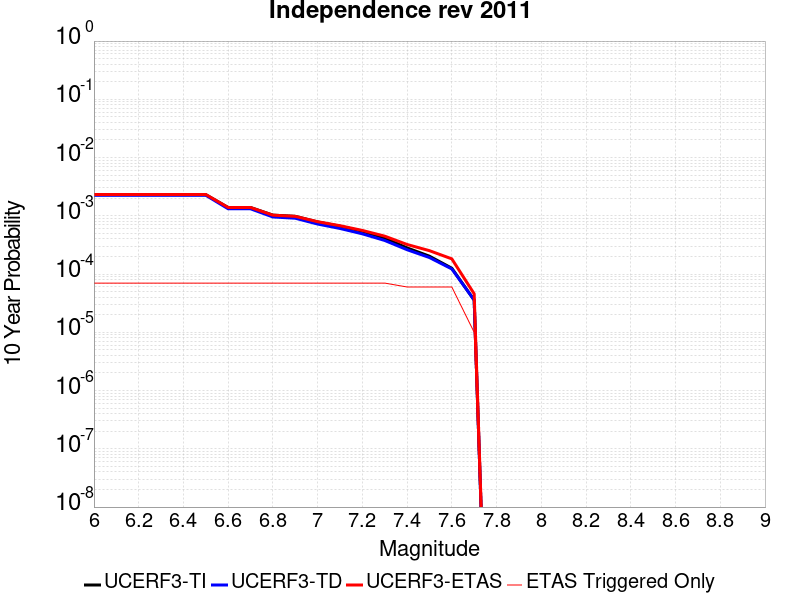 |

| Magnitude | 1 wk TI Prob | 1 wk TD Prob | 1 wk ETAS Prob | 1 wk ETAS/TD Gain | 1 wk ETAS Triggered Only | 1 mo TI Prob | 1 mo TD Prob | 1 mo ETAS Prob | 1 mo ETAS/TD Gain | 1 mo ETAS Triggered Only | 1 yr TI Prob | 1 yr TD Prob | 1 yr ETAS Prob | 1 yr ETAS/TD Gain | 1 yr ETAS Triggered Only | 10 yr TI Prob | 10 yr TD Prob | 10 yr ETAS Prob | 10 yr ETAS/TD Gain | 10 yr ETAS Triggered Only |
|-----|-----|-----|-----|-----|-----|-----|-----|-----|-----|-----|-----|-----|-----|-----|-----|-----|-----|-----|-----|-----|
| 6.0 | 4.422171E-6 | 4.32641E-6 | 4.32641E-6 | 1.0 | 0.0 | 1.8952025E-5 | 1.8541641E-5 | 1.8541641E-5 | 1.0 | 0.0 | 2.3071647E-4 | 2.2572408E-4 | 2.2572408E-4 | 1.0 | 0.0 | 0.0023047708 | 0.0022552419 | 0.0023670841 | 1.0495921 | 1.12095055E-4 |
| 6.1 | 4.422171E-6 | 4.32641E-6 | 4.32641E-6 | 1.0 | 0.0 | 1.8952025E-5 | 1.8541641E-5 | 1.8541641E-5 | 1.0 | 0.0 | 2.3071647E-4 | 2.2572408E-4 | 2.2572408E-4 | 1.0 | 0.0 | 0.0023047708 | 0.0022552419 | 0.0023670841 | 1.0495921 | 1.12095055E-4 |
| 6.2 | 4.422171E-6 | 4.32641E-6 | 4.32641E-6 | 1.0 | 0.0 | 1.8952025E-5 | 1.8541641E-5 | 1.8541641E-5 | 1.0 | 0.0 | 2.3071647E-4 | 2.2572408E-4 | 2.2572408E-4 | 1.0 | 0.0 | 0.0023047708 | 0.0022552419 | 0.0023670841 | 1.0495921 | 1.12095055E-4 |
| 6.3 | 4.422171E-6 | 4.32641E-6 | 4.32641E-6 | 1.0 | 0.0 | 1.8952025E-5 | 1.8541641E-5 | 1.8541641E-5 | 1.0 | 0.0 | 2.3071647E-4 | 2.2572408E-4 | 2.2572408E-4 | 1.0 | 0.0 | 0.0023047708 | 0.0022552419 | 0.0023670841 | 1.0495921 | 1.12095055E-4 |
| 6.4 | 4.422171E-6 | 4.32641E-6 | 4.32641E-6 | 1.0 | 0.0 | 1.8952025E-5 | 1.8541641E-5 | 1.8541641E-5 | 1.0 | 0.0 | 2.3071647E-4 | 2.2572408E-4 | 2.2572408E-4 | 1.0 | 0.0 | 0.0023047708 | 0.0022552419 | 0.0023670841 | 1.0495921 | 1.12095055E-4 |
| 6.5 | 4.422171E-6 | 4.32641E-6 | 4.32641E-6 | 1.0 | 0.0 | 1.8952025E-5 | 1.8541641E-5 | 1.8541641E-5 | 1.0 | 0.0 | 2.3071647E-4 | 2.2572408E-4 | 2.2572408E-4 | 1.0 | 0.0 | 0.0023047708 | 0.0022552419 | 0.0023670841 | 1.0495921 | 1.12095055E-4 |
| 6.6 | 2.663744E-6 | 2.5321206E-6 | 2.5321206E-6 | 1.0 | 0.0 | 1.1415996E-5 | 1.0851903E-5 | 1.0851903E-5 | 1.0 | 0.0 | 1.3898089E-4 | 1.321144E-4 | 1.321144E-4 | 1.0 | 0.0 | 0.0013889399 | 0.0013204068 | 0.0014323539 | 1.0847822 | 1.12095055E-4 |
| 6.7 | 2.663744E-6 | 2.5321206E-6 | 2.5321206E-6 | 1.0 | 0.0 | 1.1415996E-5 | 1.0851903E-5 | 1.0851903E-5 | 1.0 | 0.0 | 1.3898089E-4 | 1.321144E-4 | 1.321144E-4 | 1.0 | 0.0 | 0.0013889399 | 0.0013204068 | 0.0014323539 | 1.0847822 | 1.12095055E-4 |
| 6.8 | 1.9716529E-6 | 1.8323735E-6 | 1.8323735E-6 | 1.0 | 0.0 | 8.449913E-6 | 7.8530065E-6 | 7.8530065E-6 | 1.0 | 0.0 | 1.0287284E-4 | 9.560629E-5 | 9.560629E-5 | 1.0 | 0.0 | 0.0010282523 | 9.556645E-4 | 0.0010676524 | 1.1171833 | 1.12095055E-4 |
| 6.9 | 1.8788617E-6 | 1.7431099E-6 | 1.7431099E-6 | 1.0 | 0.0 | 8.0522395E-6 | 7.4704503E-6 | 7.4704503E-6 | 1.0 | 0.0 | 9.80316E-5 | 9.0949055E-5 | 9.0949055E-5 | 1.0 | 0.0 | 9.798837E-4 | 9.091304E-4 | 0.0010211235 | 1.1231871 | 1.12095055E-4 |
| 7.0 | 1.5045488E-6 | 1.3850419E-6 | 1.3850419E-6 | 1.0 | 0.0 | 6.44805E-6 | 5.9358804E-6 | 5.9358804E-6 | 1.0 | 0.0 | 7.8502184E-5 | 7.2267E-5 | 7.2267E-5 | 1.0 | 0.0 | 7.8474457E-4 | 7.2244013E-4 | 8.344542E-4 | 1.1550497 | 1.12095055E-4 |
| 7.1 | 1.272341E-6 | 1.1625895E-6 | 1.1625895E-6 | 1.0 | 0.0 | 5.4528787E-6 | 4.9825167E-6 | 4.9825167E-6 | 1.0 | 0.0 | 6.6386776E-5 | 6.0660488E-5 | 6.0660488E-5 | 1.0 | 0.0 | 6.636695E-4 | 6.064425E-4 | 7.1846956E-4 | 1.1847283 | 1.12095055E-4 |
| 7.2 | 1.0416892E-6 | 9.410568E-7 | 9.410568E-7 | 1.0 | 0.0 | 4.464375E-6 | 4.0330942E-6 | 4.0330942E-6 | 1.0 | 0.0 | 5.4352407E-5 | 4.9101836E-5 | 4.9101836E-5 | 1.0 | 0.0 | 5.4339116E-4 | 4.909117E-4 | 6.0295174E-4 | 1.2282284 | 1.12095055E-4 |
| 7.3 | 7.9450155E-7 | 7.2355164E-7 | 7.2355164E-7 | 1.0 | 0.0 | 3.4050022E-6 | 3.100932E-6 | 3.100932E-6 | 1.0 | 0.0 | 4.1455114E-5 | 3.7753205E-5 | 3.7753205E-5 | 1.0 | 0.0 | 4.144738E-4 | 3.7746903E-4 | 4.895218E-4 | 1.2968528 | 1.12095055E-4 |
| 7.4 | 5.3893444E-7 | 5.019832E-7 | 5.019832E-7 | 1.0 | 0.0 | 2.309717E-6 | 2.151355E-6 | 2.151355E-6 | 1.0 | 0.0 | 2.8120441E-5 | 2.6192436E-5 | 2.6192436E-5 | 1.0 | 0.0 | 2.8116882E-4 | 2.6189393E-4 | 3.7395966E-4 | 1.4279048 | 1.12095055E-4 |
| 7.5 | 3.8852085E-7 | 3.6827632E-7 | 3.6827632E-7 | 1.0 | 0.0 | 1.6650882E-6 | 1.5783261E-6 | 1.5783261E-6 | 1.0 | 0.0 | 2.027226E-5 | 1.9215953E-5 | 1.9215953E-5 | 1.0 | 0.0 | 2.0270412E-4 | 1.9214312E-4 | 3.0421664E-4 | 1.5832814 | 1.12095055E-4 |
| 7.6 | 2.414929E-7 | 2.3458642E-7 | 2.3458642E-7 | 1.0 | 0.0 | 1.0349692E-6 | 1.00537E-6 | 1.00537E-6 | 1.0 | 0.0 | 1.2600677E-5 | 1.2240313E-5 | 1.2240313E-5 | 1.0 | 0.0 | 1.2599962E-4 | 1.2239651E-4 | 2.3447785E-4 | 1.9157233 | 1.12095055E-4 |
| 7.7 | 6.8298014E-8 | 6.8591994E-8 | 6.8591994E-8 | 1.0 | 0.0 | 2.9270575E-7 | 2.9396566E-7 | 2.9396566E-7 | 1.0 | 0.0 | 3.5636867E-6 | 3.5790265E-6 | 3.5790265E-6 | 1.0 | 0.0 | 3.5636294E-5 | 3.5789737E-5 | 3.5789737E-5 | 1.0 | 0.0 |

## Baker
*[(top)](#table-of-contents)*

| 1 Week | 1 Month | 1 Year | 10 Year |
|-----|-----|-----|-----|
|  | 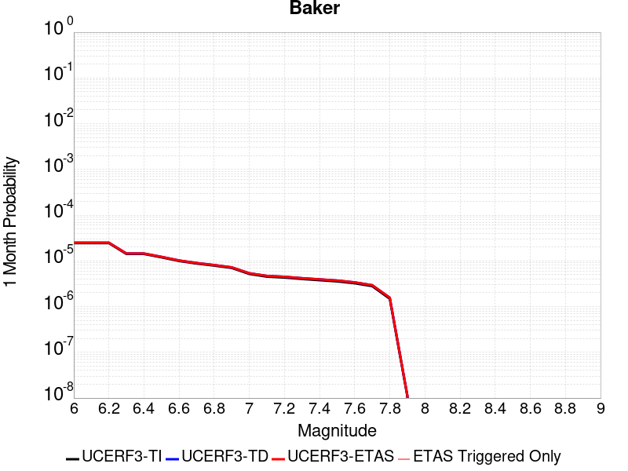 |  |  |

| Magnitude | 1 wk TI Prob | 1 wk TD Prob | 1 wk ETAS Prob | 1 wk ETAS/TD Gain | 1 wk ETAS Triggered Only | 1 mo TI Prob | 1 mo TD Prob | 1 mo ETAS Prob | 1 mo ETAS/TD Gain | 1 mo ETAS Triggered Only | 1 yr TI Prob | 1 yr TD Prob | 1 yr ETAS Prob | 1 yr ETAS/TD Gain | 1 yr ETAS Triggered Only | 10 yr TI Prob | 10 yr TD Prob | 10 yr ETAS Prob | 10 yr ETAS/TD Gain | 10 yr ETAS Triggered Only |
|-----|-----|-----|-----|-----|-----|-----|-----|-----|-----|-----|-----|-----|-----|-----|-----|-----|-----|-----|-----|-----|
| 6.0 | 5.695525E-6 | 5.8350274E-6 | 5.8350274E-6 | 1.0 | 0.0 | 2.4409164E-5 | 2.5007044E-5 | 2.5007044E-5 | 1.0 | 0.0 | 2.9714106E-4 | 3.0442222E-4 | 4.1648318E-4 | 1.3681102 | 1.12095055E-4 | 0.0029674405 | 0.0030404478 | 0.003152202 | 1.0367558 | 1.12095055E-4 |
| 6.1 | 5.695525E-6 | 5.8350274E-6 | 5.8350274E-6 | 1.0 | 0.0 | 2.4409164E-5 | 2.5007044E-5 | 2.5007044E-5 | 1.0 | 0.0 | 2.9714106E-4 | 3.0442222E-4 | 4.1648318E-4 | 1.3681102 | 1.12095055E-4 | 0.0029674405 | 0.0030404478 | 0.003152202 | 1.0367558 | 1.12095055E-4 |
| 6.2 | 5.695525E-6 | 5.8350274E-6 | 5.8350274E-6 | 1.0 | 0.0 | 2.4409164E-5 | 2.5007044E-5 | 2.5007044E-5 | 1.0 | 0.0 | 2.9714106E-4 | 3.0442222E-4 | 4.1648318E-4 | 1.3681102 | 1.12095055E-4 | 0.0029674405 | 0.0030404478 | 0.003152202 | 1.0367558 | 1.12095055E-4 |
| 6.3 | 3.2995713E-6 | 3.3837825E-6 | 3.3837825E-6 | 1.0 | 0.0 | 1.4140943E-5 | 1.4501847E-5 | 1.4501847E-5 | 1.0 | 0.0 | 1.7215237E-4 | 1.7654616E-4 | 2.8862144E-4 | 1.6348213 | 1.12095055E-4 | 0.0017201907 | 0.0017641061 | 0.0018760035 | 1.0634301 | 1.12095055E-4 |
| 6.4 | 3.2995713E-6 | 3.3837825E-6 | 3.3837825E-6 | 1.0 | 0.0 | 1.4140943E-5 | 1.4501847E-5 | 1.4501847E-5 | 1.0 | 0.0 | 1.7215237E-4 | 1.7654616E-4 | 2.8862144E-4 | 1.6348213 | 1.12095055E-4 | 0.0017201907 | 0.0017641061 | 0.0018760035 | 1.0634301 | 1.12095055E-4 |
| 6.5 | 2.782202E-6 | 2.8559416E-6 | 2.8559416E-6 | 1.0 | 0.0 | 1.1923668E-5 | 1.2239694E-5 | 1.2239694E-5 | 1.0 | 0.0 | 1.4516099E-4 | 1.4900843E-4 | 2.6108677E-4 | 1.7521613 | 1.12095055E-4 | 0.001450662 | 0.0014891179 | 0.001601046 | 1.0751641 | 1.12095055E-4 |
| 6.6 | 2.3163404E-6 | 2.381009E-6 | 2.381009E-6 | 1.0 | 0.0 | 9.927136E-6 | 1.0204285E-5 | 1.0204285E-5 | 1.0 | 0.0 | 1.20856166E-4 | 1.242303E-4 | 2.3631143E-4 | 1.9022045 | 1.12095055E-4 | 0.0012079047 | 0.0012416287 | 0.0013535846 | 1.0901686 | 1.12095055E-4 |
| 6.7 | 2.037056E-6 | 2.0965824E-6 | 2.0965824E-6 | 1.0 | 0.0 | 8.7302105E-6 | 8.985324E-6 | 8.985324E-6 | 1.0 | 0.0 | 1.0628513E-4 | 1.0939099E-4 | 2.2147378E-4 | 2.0246072 | 1.12095055E-4 | 0.0010623431 | 0.0010933875 | 0.00120536 | 1.1024088 | 1.12095055E-4 |
| 6.8 | 1.8356744E-6 | 1.8916058E-6 | 1.8916058E-6 | 1.0 | 0.0 | 7.867153E-6 | 8.106858E-6 | 8.106858E-6 | 1.0 | 0.0 | 9.577837E-5 | 9.869666E-5 | 2.1078066E-4 | 2.135641 | 1.12095055E-4 | 9.57371E-4 | 9.865423E-4 | 0.0010985268 | 1.113512 | 1.12095055E-4 |
| 6.9 | 1.6310546E-6 | 1.6832794E-6 | 1.6832794E-6 | 1.0 | 0.0 | 6.9902153E-6 | 7.214035E-6 | 7.214035E-6 | 1.0 | 0.0 | 8.510255E-5 | 8.782745E-5 | 1.9991267E-4 | 2.276198 | 1.12095055E-4 | 8.5069967E-4 | 8.779387E-4 | 9.899354E-4 | 1.1275678 | 1.12095055E-4 |
| 7.0 | 1.2058036E-6 | 1.2509291E-6 | 1.2509291E-6 | 1.0 | 0.0 | 5.1677193E-6 | 5.3611143E-6 | 5.3611143E-6 | 1.0 | 0.0 | 6.291517E-5 | 6.526963E-5 | 1.7735737E-4 | 2.717303 | 1.12095055E-4 | 6.289736E-4 | 6.5250695E-4 | 7.645289E-4 | 1.1716793 | 1.12095055E-4 |
| 7.1 | 1.052382E-6 | 1.0952205E-6 | 1.0952205E-6 | 1.0 | 0.0 | 4.5102006E-6 | 4.6937935E-6 | 4.6937935E-6 | 1.0 | 0.0 | 5.491031E-5 | 5.7145444E-5 | 1.6923409E-4 | 2.9614625 | 1.12095055E-4 | 5.4896745E-4 | 5.7130837E-4 | 6.8333937E-4 | 1.1960955 | 1.12095055E-4 |
| 7.2 | 1.0067454E-6 | 1.0488296E-6 | 1.0488296E-6 | 1.0 | 0.0 | 4.3146156E-6 | 4.494976E-6 | 4.494976E-6 | 1.0 | 0.0 | 5.252918E-5 | 5.472497E-5 | 1.6681389E-4 | 3.0482225 | 1.12095055E-4 | 5.251676E-4 | 5.471158E-4 | 6.5914955E-4 | 1.2047715 | 1.12095055E-4 |
| 7.3 | 9.3596316E-7 | 9.768293E-7 | 9.768293E-7 | 1.0 | 0.0 | 4.0112645E-6 | 4.186404E-6 | 4.186404E-6 | 1.0 | 0.0 | 4.8836053E-5 | 5.0968287E-5 | 1.6305763E-4 | 3.1991978 | 1.12095055E-4 | 4.8825322E-4 | 5.0956674E-4 | 6.2160473E-4 | 1.219869 | 1.12095055E-4 |
| 7.4 | 8.8117395E-7 | 9.2082155E-7 | 9.2082155E-7 | 1.0 | 0.0 | 3.7764542E-6 | 3.946372E-6 | 3.946372E-6 | 1.0 | 0.0 | 4.5977362E-5 | 4.804603E-5 | 1.601357E-4 | 3.3329642 | 1.12095055E-4 | 4.596785E-4 | 4.8035718E-4 | 5.923984E-4 | 1.2332456 | 1.12095055E-4 |
| 7.5 | 8.292386E-7 | 8.6751294E-7 | 8.6751294E-7 | 1.0 | 0.0 | 3.5538749E-6 | 3.7179072E-6 | 3.7179072E-6 | 1.0 | 0.0 | 4.326757E-5 | 4.5264587E-5 | 1.5735457E-4 | 3.4763284 | 1.12095055E-4 | 4.3259145E-4 | 4.5255444E-4 | 5.6459877E-4 | 1.247582 | 1.12095055E-4 |
| 7.6 | 7.553842E-7 | 7.914975E-7 | 7.914975E-7 | 1.0 | 0.0 | 3.2373566E-6 | 3.3921276E-6 | 3.3921276E-6 | 1.0 | 0.0 | 3.9414106E-5 | 4.129838E-5 | 1.533888E-4 | 3.7141604 | 1.12095055E-4 | 3.9407116E-4 | 4.1290774E-4 | 5.249565E-4 | 1.2713652 | 1.12095055E-4 |
| 7.7 | 6.5285366E-7 | 6.8532506E-7 | 6.8532506E-7 | 1.0 | 0.0 | 2.797941E-6 | 2.9371042E-6 | 2.9371042E-6 | 1.0 | 0.0 | 3.40644E-5 | 3.575866E-5 | 3.575866E-5 | 1.0 | 0.0 | 3.405918E-4 | 3.5752976E-4 | 3.5752976E-4 | 1.0 | 0.0 |
| 7.8 | 3.4586725E-7 | 3.648528E-7 | 3.648528E-7 | 1.0 | 0.0 | 1.4822873E-6 | 1.563654E-6 | 1.563654E-6 | 1.0 | 0.0 | 1.80467E-5 | 1.9037325E-5 | 1.9037325E-5 | 1.0 | 0.0 | 1.8045233E-4 | 1.9035739E-4 | 1.9035739E-4 | 1.0 | 0.0 |
| 7.9 | 2.5591178E-9 | 2.6698248E-9 | 2.6698248E-9 | 1.0 | 0.0 | 1.0967647E-8 | 1.1442106E-8 | 1.1442106E-8 | 1.0 | 0.0 | 1.335311E-7 | 1.3930764E-7 | 1.3930764E-7 | 1.0 | 0.0 | 1.3353102E-6 | 1.3930764E-6 | 1.3930764E-6 | 1.0 | 0.0 |

## Tin Mountain
*[(top)](#table-of-contents)*

| 1 Week | 1 Month | 1 Year | 10 Year |
|-----|-----|-----|-----|
|  |  |  |  |

| Magnitude | 1 wk TI Prob | 1 wk TD Prob | 1 wk ETAS Prob | 1 wk ETAS/TD Gain | 1 wk ETAS Triggered Only | 1 mo TI Prob | 1 mo TD Prob | 1 mo ETAS Prob | 1 mo ETAS/TD Gain | 1 mo ETAS Triggered Only | 1 yr TI Prob | 1 yr TD Prob | 1 yr ETAS Prob | 1 yr ETAS/TD Gain | 1 yr ETAS Triggered Only | 10 yr TI Prob | 10 yr TD Prob | 10 yr ETAS Prob | 10 yr ETAS/TD Gain | 10 yr ETAS Triggered Only |
|-----|-----|-----|-----|-----|-----|-----|-----|-----|-----|-----|-----|-----|-----|-----|-----|-----|-----|-----|-----|-----|
| 6.0 | 4.083776E-6 | 4.1816697E-6 | 4.1816697E-6 | 1.0 | 0.0 | 1.750178E-5 | 1.792134E-5 | 1.792134E-5 | 1.0 | 0.0 | 2.1306332E-4 | 2.1817419E-4 | 2.1817419E-4 | 1.0 | 0.0 | 0.0021285915 | 0.0021799656 | 0.0022918165 | 1.0513085 | 1.12095055E-4 |
| 6.1 | 4.083776E-6 | 4.1816697E-6 | 4.1816697E-6 | 1.0 | 0.0 | 1.750178E-5 | 1.792134E-5 | 1.792134E-5 | 1.0 | 0.0 | 2.1306332E-4 | 2.1817419E-4 | 2.1817419E-4 | 1.0 | 0.0 | 0.0021285915 | 0.0021799656 | 0.0022918165 | 1.0513085 | 1.12095055E-4 |
| 6.2 | 4.083776E-6 | 4.1816697E-6 | 4.1816697E-6 | 1.0 | 0.0 | 1.750178E-5 | 1.792134E-5 | 1.792134E-5 | 1.0 | 0.0 | 2.1306332E-4 | 2.1817419E-4 | 2.1817419E-4 | 1.0 | 0.0 | 0.0021285915 | 0.0021799656 | 0.0022918165 | 1.0513085 | 1.12095055E-4 |
| 6.3 | 4.083776E-6 | 4.1816697E-6 | 4.1816697E-6 | 1.0 | 0.0 | 1.750178E-5 | 1.792134E-5 | 1.792134E-5 | 1.0 | 0.0 | 2.1306332E-4 | 2.1817419E-4 | 2.1817419E-4 | 1.0 | 0.0 | 0.0021285915 | 0.0021799656 | 0.0022918165 | 1.0513085 | 1.12095055E-4 |
| 6.4 | 4.083776E-6 | 4.1816697E-6 | 4.1816697E-6 | 1.0 | 0.0 | 1.750178E-5 | 1.792134E-5 | 1.792134E-5 | 1.0 | 0.0 | 2.1306332E-4 | 2.1817419E-4 | 2.1817419E-4 | 1.0 | 0.0 | 0.0021285915 | 0.0021799656 | 0.0022918165 | 1.0513085 | 1.12095055E-4 |
| 6.5 | 2.3143427E-6 | 2.3732375E-6 | 2.3732375E-6 | 1.0 | 0.0 | 9.9185745E-6 | 1.0170983E-5 | 1.0170983E-5 | 1.0 | 0.0 | 1.2075195E-4 | 1.2382545E-4 | 1.2382545E-4 | 1.0 | 0.0 | 0.0012068636 | 0.0012376405 | 0.0013495968 | 1.0904595 | 1.12095055E-4 |
| 6.6 | 2.3143427E-6 | 2.3732375E-6 | 2.3732375E-6 | 1.0 | 0.0 | 9.9185745E-6 | 1.0170983E-5 | 1.0170983E-5 | 1.0 | 0.0 | 1.2075195E-4 | 1.2382545E-4 | 1.2382545E-4 | 1.0 | 0.0 | 0.0012068636 | 0.0012376405 | 0.0013495968 | 1.0904595 | 1.12095055E-4 |
| 6.7 | 1.7029532E-6 | 1.7498556E-6 | 1.7498556E-6 | 1.0 | 0.0 | 7.2983503E-6 | 7.4993627E-6 | 7.4993627E-6 | 1.0 | 0.0 | 8.885379E-5 | 9.130145E-5 | 9.130145E-5 | 1.0 | 0.0 | 8.881827E-4 | 9.1269205E-4 | 0.0010246849 | 1.1227059 | 1.12095055E-4 |
| 6.8 | 1.2914646E-6 | 1.3299907E-6 | 1.3299907E-6 | 1.0 | 0.0 | 5.534837E-6 | 5.69995E-6 | 5.69995E-6 | 1.0 | 0.0 | 6.738455E-5 | 6.939512E-5 | 6.939512E-5 | 1.0 | 0.0 | 6.736412E-4 | 6.937779E-4 | 8.057952E-4 | 1.1614599 | 1.12095055E-4 |
| 6.9 | 5.8708974E-7 | 6.1173347E-7 | 6.1173347E-7 | 1.0 | 0.0 | 2.5160964E-6 | 2.6217124E-6 | 2.6217124E-6 | 1.0 | 0.0 | 3.0633044E-5 | 3.1918924E-5 | 3.1918924E-5 | 1.0 | 0.0 | 3.0628822E-4 | 3.1914748E-4 | 3.1914748E-4 | 1.0 | 0.0 |
| 7.0 | 4.6248786E-7 | 4.832303E-7 | 4.832303E-7 | 1.0 | 0.0 | 1.9820893E-6 | 2.0709856E-6 | 2.0709856E-6 | 1.0 | 0.0 | 2.413167E-5 | 2.5213994E-5 | 2.5213994E-5 | 1.0 | 0.0 | 2.412905E-4 | 2.5211502E-4 | 2.5211502E-4 | 1.0 | 0.0 |
| 7.1 | 3.804606E-7 | 3.987401E-7 | 3.987401E-7 | 1.0 | 0.0 | 1.6305444E-6 | 1.7088852E-6 | 1.7088852E-6 | 1.0 | 0.0 | 1.9851697E-5 | 2.0805513E-5 | 2.0805513E-5 | 1.0 | 0.0 | 1.9849923E-4 | 2.0803901E-4 | 2.0803901E-4 | 1.0 | 0.0 |
| 7.2 | 3.5864858E-7 | 3.7619301E-7 | 3.7619301E-7 | 1.0 | 0.0 | 1.5370645E-6 | 1.612255E-6 | 1.612255E-6 | 1.0 | 0.0 | 1.87136E-5 | 1.9629062E-5 | 1.9629062E-5 | 1.0 | 0.0 | 1.8712023E-4 | 1.9627658E-4 | 1.9627658E-4 | 1.0 | 0.0 |
| 7.3 | 3.342063E-7 | 3.506576E-7 | 3.506576E-7 | 1.0 | 0.0 | 1.4323119E-6 | 1.5028176E-6 | 1.5028176E-6 | 1.0 | 0.0 | 1.7438259E-5 | 1.8296683E-5 | 1.8296683E-5 | 1.0 | 0.0 | 1.743689E-4 | 1.8295507E-4 | 1.8295507E-4 | 1.0 | 0.0 |
| 7.4 | 2.971242E-7 | 3.116784E-7 | 3.116784E-7 | 1.0 | 0.0 | 1.2733886E-6 | 1.3357641E-6 | 1.3357641E-6 | 1.0 | 0.0 | 1.5503398E-5 | 1.626284E-5 | 1.626284E-5 | 1.0 | 0.0 | 1.5502315E-4 | 1.6261978E-4 | 1.6261978E-4 | 1.0 | 0.0 |
| 7.5 | 1.4326713E-7 | 1.5013477E-7 | 1.5013477E-7 | 1.0 | 0.0 | 6.140018E-7 | 6.4343476E-7 | 6.4343476E-7 | 1.0 | 0.0 | 7.4754466E-6 | 7.833818E-6 | 7.833818E-6 | 1.0 | 0.0 | 7.475195E-5 | 7.833818E-5 | 7.833818E-5 | 1.0 | 0.0 |

## San Jacinto (San Bernardino)
*[(top)](#table-of-contents)*

| 1 Week | 1 Month | 1 Year | 10 Year |
|-----|-----|-----|-----|
|  |  |  |  |

| Magnitude | 1 wk TI Prob | 1 wk TD Prob | 1 wk ETAS Prob | 1 wk ETAS/TD Gain | 1 wk ETAS Triggered Only | 1 mo TI Prob | 1 mo TD Prob | 1 mo ETAS Prob | 1 mo ETAS/TD Gain | 1 mo ETAS Triggered Only | 1 yr TI Prob | 1 yr TD Prob | 1 yr ETAS Prob | 1 yr ETAS/TD Gain | 1 yr ETAS Triggered Only | 10 yr TI Prob | 10 yr TD Prob | 10 yr ETAS Prob | 10 yr ETAS/TD Gain | 10 yr ETAS Triggered Only |
|-----|-----|-----|-----|-----|-----|-----|-----|-----|-----|-----|-----|-----|-----|-----|-----|-----|-----|-----|-----|-----|
| 6.0 | 3.409352E-5 | 3.614597E-5 | 3.614597E-5 | 1.0 | 0.0 | 1.461069E-4 | 1.5490211E-4 | 1.5490211E-4 | 1.0 | 0.0 | 0.0017774 | 0.0018843036 | 0.0018843036 | 1.0 | 0.0 | 0.01763251 | 0.01943142 | 0.019541336 | 1.0056566 | 1.12095055E-4 |
| 6.1 | 3.409352E-5 | 3.614597E-5 | 3.614597E-5 | 1.0 | 0.0 | 1.461069E-4 | 1.5490211E-4 | 1.5490211E-4 | 1.0 | 0.0 | 0.0017774 | 0.0018843036 | 0.0018843036 | 1.0 | 0.0 | 0.01763251 | 0.01943142 | 0.019541336 | 1.0056566 | 1.12095055E-4 |
| 6.2 | 3.409352E-5 | 3.614597E-5 | 3.614597E-5 | 1.0 | 0.0 | 1.461069E-4 | 1.5490211E-4 | 1.5490211E-4 | 1.0 | 0.0 | 0.0017774 | 0.0018843036 | 0.0018843036 | 1.0 | 0.0 | 0.01763251 | 0.01943142 | 0.019541336 | 1.0056566 | 1.12095055E-4 |
| 6.3 | 3.409352E-5 | 3.614597E-5 | 3.614597E-5 | 1.0 | 0.0 | 1.461069E-4 | 1.5490211E-4 | 1.5490211E-4 | 1.0 | 0.0 | 0.0017774 | 0.0018843036 | 0.0018843036 | 1.0 | 0.0 | 0.01763251 | 0.01943142 | 0.019541336 | 1.0056566 | 1.12095055E-4 |
| 6.4 | 3.400795E-5 | 3.6038597E-5 | 3.6038597E-5 | 1.0 | 0.0 | 1.4574021E-4 | 1.54442E-4 | 1.54442E-4 | 1.0 | 0.0 | 0.0017729428 | 0.0018787116 | 0.0018787116 | 1.0 | 0.0 | 0.017588645 | 0.019376488 | 0.01948641 | 1.005673 | 1.12095055E-4 |
| 6.5 | 3.341482E-5 | 3.5298992E-5 | 3.5298992E-5 | 1.0 | 0.0 | 1.4319851E-4 | 1.5127263E-4 | 1.5127263E-4 | 1.0 | 0.0 | 0.0017420477 | 0.0018401899 | 0.0018401899 | 1.0 | 0.0 | 0.017284546 | 0.01899794 | 0.019107904 | 1.0057883 | 1.12095055E-4 |
| 6.6 | 3.3364955E-5 | 3.523619E-5 | 3.523619E-5 | 1.0 | 0.0 | 1.4298483E-4 | 1.510035E-4 | 1.510035E-4 | 1.0 | 0.0 | 0.0017394501 | 0.0018369189 | 0.0018369189 | 1.0 | 0.0 | 0.017258976 | 0.018965796 | 0.019075764 | 1.0057983 | 1.12095055E-4 |
| 6.7 | 3.335922E-5 | 3.5225963E-5 | 3.5225963E-5 | 1.0 | 0.0 | 1.4296026E-4 | 1.5095968E-4 | 1.5095968E-4 | 1.0 | 0.0 | 0.0017391514 | 0.001836386 | 0.001836386 | 1.0 | 0.0 | 0.017256035 | 0.018960586 | 0.019070556 | 1.0057999 | 1.12095055E-4 |
| 6.8 | 3.327683E-5 | 3.511999E-5 | 3.511999E-5 | 1.0 | 0.0 | 1.4260718E-4 | 1.5050556E-4 | 1.5050556E-4 | 1.0 | 0.0 | 0.0017348597 | 0.0018308666 | 0.0018308666 | 1.0 | 0.0 | 0.017213784 | 0.018906342 | 0.019016318 | 1.0058168 | 1.12095055E-4 |
| 6.9 | 3.3235785E-5 | 3.506092E-5 | 3.506092E-5 | 1.0 | 0.0 | 1.4243131E-4 | 1.5025244E-4 | 1.5025244E-4 | 1.0 | 0.0 | 0.0017327217 | 0.0018277899 | 0.0018277899 | 1.0 | 0.0 | 0.017192734 | 0.018876202 | 0.01898618 | 1.0058264 | 1.12095055E-4 |
| 7.0 | 3.3197095E-5 | 3.500082E-5 | 3.500082E-5 | 1.0 | 0.0 | 1.422655E-4 | 1.499949E-4 | 1.499949E-4 | 1.0 | 0.0 | 0.0017307063 | 0.0018246598 | 0.0018246598 | 1.0 | 0.0 | 0.017172894 | 0.018845567 | 0.018955551 | 1.005836 | 1.12095055E-4 |
| 7.1 | 3.3129716E-5 | 3.488097E-5 | 3.488097E-5 | 1.0 | 0.0 | 1.4197677E-4 | 1.494813E-4 | 1.494813E-4 | 1.0 | 0.0 | 0.0017271966 | 0.0018184172 | 0.0018184172 | 1.0 | 0.0 | 0.017138338 | 0.018784622 | 0.01889461 | 1.0058553 | 1.12095055E-4 |
| 7.2 | 3.3034008E-5 | 3.4748366E-5 | 3.4748366E-5 | 1.0 | 0.0 | 1.4156665E-4 | 1.4891308E-4 | 1.4891308E-4 | 1.0 | 0.0 | 0.0017222111 | 0.0018115105 | 0.0018115105 | 1.0 | 0.0 | 0.017089253 | 0.018716995 | 0.018826991 | 1.0058769 | 1.12095055E-4 |
| 7.3 | 3.2956614E-5 | 3.461603E-5 | 3.461603E-5 | 1.0 | 0.0 | 1.4123498E-4 | 1.48346E-4 | 1.48346E-4 | 1.0 | 0.0 | 0.0017181796 | 0.0018046177 | 0.0018046177 | 1.0 | 0.0 | 0.017049557 | 0.018649703 | 0.018759707 | 1.0058985 | 1.12095055E-4 |
| 7.4 | 3.2915937E-5 | 3.4537654E-5 | 3.4537654E-5 | 1.0 | 0.0 | 1.4106068E-4 | 1.4801013E-4 | 1.4801013E-4 | 1.0 | 0.0 | 0.0017160608 | 0.0018005354 | 0.0018005354 | 1.0 | 0.0 | 0.017028693 | 0.018609937 | 0.018719945 | 1.0059114 | 1.12095055E-4 |
| 7.5 | 3.281791E-5 | 3.4402456E-5 | 3.4402456E-5 | 1.0 | 0.0 | 1.406406E-4 | 1.4743076E-4 | 1.4743076E-4 | 1.0 | 0.0 | 0.0017109542 | 0.0017934933 | 0.0017934933 | 1.0 | 0.0 | 0.016978411 | 0.018540774 | 0.01865079 | 1.0059338 | 1.12095055E-4 |
| 7.6 | 3.2521442E-5 | 3.41271E-5 | 3.41271E-5 | 1.0 | 0.0 | 1.3937015E-4 | 1.4625082E-4 | 1.4625082E-4 | 1.0 | 0.0 | 0.0016955109 | 0.0017791509 | 0.0017791509 | 1.0 | 0.0 | 0.016826328 | 0.018398259 | 0.01850829 | 1.0059806 | 1.12095055E-4 |
| 7.7 | 3.0287873E-5 | 3.26093E-5 | 3.26093E-5 | 1.0 | 0.0 | 1.297987E-4 | 1.3974665E-4 | 1.3974665E-4 | 1.0 | 0.0 | 0.0015791537 | 0.0017000888 | 0.0017000888 | 1.0 | 0.0 | 0.01567979 | 0.017608235 | 0.017718356 | 1.006254 | 1.12095055E-4 |
| 7.8 | 2.6316151E-5 | 2.9814415E-5 | 2.9814415E-5 | 1.0 | 0.0 | 1.1277862E-4 | 1.2776982E-4 | 1.2776982E-4 | 1.0 | 0.0 | 0.0013722149 | 0.0015544884 | 0.0015544884 | 1.0 | 0.0 | 0.013637724 | 0.016146967 | 0.016257253 | 1.0068301 | 1.12095055E-4 |
| 7.9 | 2.0761147E-5 | 2.3549805E-5 | 2.3549805E-5 | 1.0 | 0.0 | 8.897331E-5 | 1.0092383E-4 | 1.0092383E-4 | 1.0 | 0.0 | 0.0010827117 | 0.0012280559 | 0.0012280559 | 1.0 | 0.0 | 0.010774517 | 0.01286122 | 0.012971873 | 1.0086037 | 1.12095055E-4 |
| 8.0 | 1.5738568E-5 | 1.6132728E-5 | 1.6132728E-5 | 1.0 | 0.0 | 6.744926E-5 | 6.9138434E-5 | 6.9138434E-5 | 1.0 | 0.0 | 8.2088535E-4 | 8.4143603E-4 | 8.4143603E-4 | 1.0 | 0.0 | 0.008178596 | 0.008918099 | 0.009029195 | 1.0124573 | 1.12095055E-4 |
| 8.1 | 1.0105832E-5 | 8.388601E-6 | 8.388601E-6 | 1.0 | 0.0 | 4.3309992E-5 | 3.5950656E-5 | 3.5950656E-5 | 1.0 | 0.0 | 5.2717153E-4 | 4.3761183E-4 | 4.3761183E-4 | 1.0 | 0.0 | 0.005259227 | 0.004708467 | 0.004708467 | 1.0 | 0.0 |
| 8.2 | 4.189207E-6 | 1.5951842E-6 | 1.5951842E-6 | 1.0 | 0.0 | 1.7953622E-5 | 6.836486E-6 | 6.836486E-6 | 1.0 | 0.0 | 2.1856341E-4 | 8.323107E-5 | 8.323107E-5 | 1.0 | 0.0 | 0.0021834858 | 9.661565E-4 | 9.661565E-4 | 1.0 | 0.0 |
| 8.3 | 1.2758221E-6 | 3.6600784E-7 | 3.6600784E-7 | 1.0 | 0.0 | 5.4677976E-6 | 1.5686041E-6 | 1.5686041E-6 | 1.0 | 0.0 | 6.65684E-5 | 1.9097592E-5 | 1.9097592E-5 | 1.0 | 0.0 | 6.6548464E-4 | 2.301609E-4 | 2.301609E-4 | 1.0 | 0.0 |

## Camp Rock 2011
*[(top)](#table-of-contents)*

| 1 Week | 1 Month | 1 Year | 10 Year |
|-----|-----|-----|-----|
| 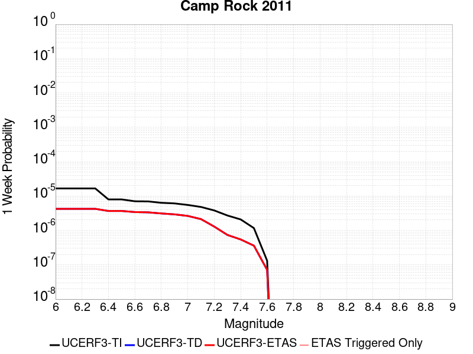 |  |  |  |

| Magnitude | 1 wk TI Prob | 1 wk TD Prob | 1 wk ETAS Prob | 1 wk ETAS/TD Gain | 1 wk ETAS Triggered Only | 1 mo TI Prob | 1 mo TD Prob | 1 mo ETAS Prob | 1 mo ETAS/TD Gain | 1 mo ETAS Triggered Only | 1 yr TI Prob | 1 yr TD Prob | 1 yr ETAS Prob | 1 yr ETAS/TD Gain | 1 yr ETAS Triggered Only | 10 yr TI Prob | 10 yr TD Prob | 10 yr ETAS Prob | 10 yr ETAS/TD Gain | 10 yr ETAS Triggered Only |
|-----|-----|-----|-----|-----|-----|-----|-----|-----|-----|-----|-----|-----|-----|-----|-----|-----|-----|-----|-----|-----|
| 6.0 | 1.6710783E-5 | 4.250767E-6 | 4.250767E-6 | 1.0 | 0.0 | 7.161568E-5 | 1.8217446E-5 | 1.8217446E-5 | 1.0 | 0.0 | 8.7157206E-4 | 2.2177536E-4 | 3.3384556E-4 | 1.505332 | 1.12095055E-4 | 0.008681616 | 0.0022155934 | 0.00232744 | 1.0504816 | 1.12095055E-4 |
| 6.1 | 1.6710783E-5 | 4.250767E-6 | 4.250767E-6 | 1.0 | 0.0 | 7.161568E-5 | 1.8217446E-5 | 1.8217446E-5 | 1.0 | 0.0 | 8.7157206E-4 | 2.2177536E-4 | 3.3384556E-4 | 1.505332 | 1.12095055E-4 | 0.008681616 | 0.0022155934 | 0.00232744 | 1.0504816 | 1.12095055E-4 |
| 6.2 | 1.6710783E-5 | 4.250767E-6 | 4.250767E-6 | 1.0 | 0.0 | 7.161568E-5 | 1.8217446E-5 | 1.8217446E-5 | 1.0 | 0.0 | 8.7157206E-4 | 2.2177536E-4 | 3.3384556E-4 | 1.505332 | 1.12095055E-4 | 0.008681616 | 0.0022155934 | 0.00232744 | 1.0504816 | 1.12095055E-4 |
| 6.3 | 1.6710783E-5 | 4.250767E-6 | 4.250767E-6 | 1.0 | 0.0 | 7.161568E-5 | 1.8217446E-5 | 1.8217446E-5 | 1.0 | 0.0 | 8.7157206E-4 | 2.2177536E-4 | 3.3384556E-4 | 1.505332 | 1.12095055E-4 | 0.008681616 | 0.0022155934 | 0.00232744 | 1.0504816 | 1.12095055E-4 |
| 6.4 | 7.982846E-6 | 3.6825343E-6 | 3.6825343E-6 | 1.0 | 0.0 | 3.421175E-5 | 1.5782196E-5 | 1.5782196E-5 | 1.0 | 0.0 | 4.1644843E-4 | 1.9213164E-4 | 3.0420517E-4 | 1.5833163 | 1.12095055E-4 | 0.0041566887 | 0.0019196902 | 0.00203157 | 1.0582801 | 1.12095055E-4 |
| 6.5 | 7.982846E-6 | 3.6825343E-6 | 3.6825343E-6 | 1.0 | 0.0 | 3.421175E-5 | 1.5782196E-5 | 1.5782196E-5 | 1.0 | 0.0 | 4.1644843E-4 | 1.9213164E-4 | 3.0420517E-4 | 1.5833163 | 1.12095055E-4 | 0.0041566887 | 0.0019196902 | 0.00203157 | 1.0582801 | 1.12095055E-4 |
| 6.6 | 7.048869E-6 | 3.424784E-6 | 3.424784E-6 | 1.0 | 0.0 | 3.0209088E-5 | 1.4677564E-5 | 1.4677564E-5 | 1.0 | 0.0 | 3.677336E-4 | 1.78685E-4 | 2.9076004E-4 | 1.6272212 | 1.12095055E-4 | 0.0036712566 | 0.001785445 | 0.00189734 | 1.0626706 | 1.12095055E-4 |
| 6.7 | 6.987307E-6 | 3.3627566E-6 | 3.3627566E-6 | 1.0 | 0.0 | 2.9945259E-5 | 1.4411736E-5 | 1.4411736E-5 | 1.0 | 0.0 | 3.6452254E-4 | 1.7544907E-4 | 2.8752445E-4 | 1.6387916 | 1.12095055E-4 | 0.0036392517 | 0.0017531366 | 0.0018650353 | 1.0638276 | 1.12095055E-4 |
| 6.8 | 6.3737602E-6 | 3.1183051E-6 | 3.1183051E-6 | 1.0 | 0.0 | 2.731583E-5 | 1.3364098E-5 | 1.3364098E-5 | 1.0 | 0.0 | 3.3251947E-4 | 1.6269603E-4 | 2.7477284E-4 | 1.6888725 | 1.12095055E-4 | 0.0033202237 | 0.0016257978 | 0.0017377107 | 1.0688356 | 1.12095055E-4 |
| 6.9 | 6.112211E-6 | 2.9334967E-6 | 2.9334967E-6 | 1.0 | 0.0 | 2.6194928E-5 | 1.257207E-5 | 1.257207E-5 | 1.0 | 0.0 | 3.1887658E-4 | 1.5305448E-4 | 2.6513237E-4 | 1.7322745 | 1.12095055E-4 | 0.003184194 | 0.0015295185 | 0.0016414421 | 1.0731757 | 1.12095055E-4 |
| 7.0 | 5.5140117E-6 | 2.6422588E-6 | 2.6422588E-6 | 1.0 | 0.0 | 2.3631264E-5 | 1.1323918E-5 | 1.1323918E-5 | 1.0 | 0.0 | 2.8767265E-4 | 1.3786025E-4 | 2.4993985E-4 | 1.8129944 | 1.12095055E-4 | 0.0028730053 | 0.0013777724 | 0.0014897131 | 1.0812476 | 1.12095055E-4 |
| 7.1 | 4.8151105E-6 | 2.134553E-6 | 2.134553E-6 | 1.0 | 0.0 | 2.0636026E-5 | 9.148053E-6 | 9.148053E-6 | 1.0 | 0.0 | 2.5121463E-4 | 1.1137208E-4 | 2.2345466E-4 | 2.0063794 | 1.12095055E-4 | 0.0025093083 | 0.0011131845 | 0.0012251548 | 1.1005856 | 1.12095055E-4 |
| 7.2 | 3.818335E-6 | 1.2939513E-6 | 1.2939513E-6 | 1.0 | 0.0 | 1.6364189E-5 | 5.5454943E-6 | 5.5454943E-6 | 1.0 | 0.0 | 1.9921579E-4 | 6.751438E-5 | 1.7960188E-4 | 2.6602015 | 1.12095055E-4 | 0.0019903728 | 6.7494693E-4 | 7.8696635E-4 | 1.1659677 | 1.12095055E-4 |
| 7.3 | 2.7166698E-6 | 7.3851675E-7 | 7.3851675E-7 | 1.0 | 0.0 | 1.1642818E-5 | 3.1650682E-6 | 3.1650682E-6 | 1.0 | 0.0 | 1.4174209E-4 | 3.8534043E-5 | 1.5062478E-4 | 3.9088757 | 1.12095055E-4 | 0.0014165172 | 3.852756E-4 | 4.973275E-4 | 1.2908356 | 1.12095055E-4 |
| 7.4 | 2.0893426E-6 | 5.463086E-7 | 5.463086E-7 | 1.0 | 0.0 | 8.954295E-6 | 2.3413206E-6 | 2.3413206E-6 | 1.0 | 0.0 | 1.0901308E-4 | 2.850521E-5 | 2.850521E-5 | 1.0 | 0.0 | 0.0010895962 | 2.8501608E-4 | 2.8501608E-4 | 1.0 | 0.0 |
| 7.5 | 1.1681728E-6 | 3.6037605E-7 | 3.6037605E-7 | 1.0 | 0.0 | 5.0064455E-6 | 1.544468E-6 | 1.544468E-6 | 1.0 | 0.0 | 6.0951766E-5 | 1.880374E-5 | 1.880374E-5 | 1.0 | 0.0 | 6.093505E-4 | 1.8802195E-4 | 1.8802195E-4 | 1.0 | 0.0 |
| 7.6 | 1.3154387E-7 | 7.120617E-8 | 7.120617E-8 | 1.0 | 0.0 | 5.6375933E-7 | 3.051693E-7 | 3.051693E-7 | 1.0 | 0.0 | 6.863748E-6 | 3.7154316E-6 | 3.7154316E-6 | 1.0 | 0.0 | 6.863536E-5 | 3.715385E-5 | 3.715385E-5 | 1.0 | 0.0 |

## Kern Canyon (South Kern) 2011
*[(top)](#table-of-contents)*

| 1 Week | 1 Month | 1 Year | 10 Year |
|-----|-----|-----|-----|
|  |  |  |  |

| Magnitude | 1 wk TI Prob | 1 wk TD Prob | 1 wk ETAS Prob | 1 wk ETAS/TD Gain | 1 wk ETAS Triggered Only | 1 mo TI Prob | 1 mo TD Prob | 1 mo ETAS Prob | 1 mo ETAS/TD Gain | 1 mo ETAS Triggered Only | 1 yr TI Prob | 1 yr TD Prob | 1 yr ETAS Prob | 1 yr ETAS/TD Gain | 1 yr ETAS Triggered Only | 10 yr TI Prob | 10 yr TD Prob | 10 yr ETAS Prob | 10 yr ETAS/TD Gain | 10 yr ETAS Triggered Only |
|-----|-----|-----|-----|-----|-----|-----|-----|-----|-----|-----|-----|-----|-----|-----|-----|-----|-----|-----|-----|-----|
| 6.0 | 4.105075E-6 | 4.113829E-6 | 4.113829E-6 | 1.0 | 0.0 | 1.7593058E-5 | 1.763058E-5 | 1.763058E-5 | 1.0 | 0.0 | 2.1417443E-4 | 2.1463181E-4 | 3.267028E-4 | 1.5221547 | 1.12095055E-4 | 0.0021396813 | 0.0021443092 | 0.0022561639 | 1.0521635 | 1.12095055E-4 |
| 6.1 | 4.105075E-6 | 4.113829E-6 | 4.113829E-6 | 1.0 | 0.0 | 1.7593058E-5 | 1.763058E-5 | 1.763058E-5 | 1.0 | 0.0 | 2.1417443E-4 | 2.1463181E-4 | 3.267028E-4 | 1.5221547 | 1.12095055E-4 | 0.0021396813 | 0.0021443092 | 0.0022561639 | 1.0521635 | 1.12095055E-4 |
| 6.2 | 4.105075E-6 | 4.113829E-6 | 4.113829E-6 | 1.0 | 0.0 | 1.7593058E-5 | 1.763058E-5 | 1.763058E-5 | 1.0 | 0.0 | 2.1417443E-4 | 2.1463181E-4 | 3.267028E-4 | 1.5221547 | 1.12095055E-4 | 0.0021396813 | 0.0021443092 | 0.0022561639 | 1.0521635 | 1.12095055E-4 |
| 6.3 | 4.105075E-6 | 4.113829E-6 | 4.113829E-6 | 1.0 | 0.0 | 1.7593058E-5 | 1.763058E-5 | 1.763058E-5 | 1.0 | 0.0 | 2.1417443E-4 | 2.1463181E-4 | 3.267028E-4 | 1.5221547 | 1.12095055E-4 | 0.0021396813 | 0.0021443092 | 0.0022561639 | 1.0521635 | 1.12095055E-4 |
| 6.4 | 4.105075E-6 | 4.113829E-6 | 4.113829E-6 | 1.0 | 0.0 | 1.7593058E-5 | 1.763058E-5 | 1.763058E-5 | 1.0 | 0.0 | 2.1417443E-4 | 2.1463181E-4 | 3.267028E-4 | 1.5221547 | 1.12095055E-4 | 0.0021396813 | 0.0021443092 | 0.0022561639 | 1.0521635 | 1.12095055E-4 |
| 6.5 | 2.9849807E-6 | 2.9732298E-6 | 2.9732298E-6 | 1.0 | 0.0 | 1.2792712E-5 | 1.2742352E-5 | 1.2742352E-5 | 1.0 | 0.0 | 1.5574014E-4 | 1.5512724E-4 | 2.6720492E-4 | 1.7224886 | 1.12095055E-4 | 0.0015563103 | 0.0015502047 | 0.0016621259 | 1.0721978 | 1.12095055E-4 |
| 6.6 | 2.9849807E-6 | 2.9732298E-6 | 2.9732298E-6 | 1.0 | 0.0 | 1.2792712E-5 | 1.2742352E-5 | 1.2742352E-5 | 1.0 | 0.0 | 1.5574014E-4 | 1.5512724E-4 | 2.6720492E-4 | 1.7224886 | 1.12095055E-4 | 0.0015563103 | 0.0015502047 | 0.0016621259 | 1.0721978 | 1.12095055E-4 |
| 6.7 | 2.6756725E-6 | 2.6582882E-6 | 2.6582882E-6 | 1.0 | 0.0 | 1.1467117E-5 | 1.1392614E-5 | 1.1392614E-5 | 1.0 | 0.0 | 1.396032E-4 | 1.3869636E-4 | 2.5077586E-4 | 1.8080926 | 1.12095055E-4 | 0.0013951553 | 0.0013861089 | 0.0014980485 | 1.0807582 | 1.12095055E-4 |
| 6.8 | 2.3283721E-6 | 2.3048378E-6 | 2.3048378E-6 | 1.0 | 0.0 | 9.9787E-6 | 9.87784E-6 | 9.87784E-6 | 1.0 | 0.0 | 1.214839E-4 | 1.2025614E-4 | 2.3233771E-4 | 1.9320238 | 1.12095055E-4 | 0.001214175 | 0.0012019181 | 0.0013138785 | 1.0931513 | 1.12095055E-4 |
| 6.9 | 2.0972677E-6 | 2.0696948E-6 | 2.0696948E-6 | 1.0 | 0.0 | 8.988259E-6 | 8.870091E-6 | 8.870091E-6 | 1.0 | 0.0 | 1.0942656E-4 | 1.0798806E-4 | 2.2007102E-4 | 2.0379198 | 1.12095055E-4 | 0.0010937268 | 0.0010793617 | 0.0011913357 | 1.103741 | 1.12095055E-4 |
| 7.0 | 1.7132242E-6 | 1.6787479E-6 | 1.6787479E-6 | 1.0 | 0.0 | 7.3423685E-6 | 7.194614E-6 | 7.194614E-6 | 1.0 | 0.0 | 8.938967E-5 | 8.7590946E-5 | 8.7590946E-5 | 1.0 | 0.0 | 8.935372E-4 | 8.755681E-4 | 8.755681E-4 | 1.0 | 0.0 |
| 7.1 | 1.4215541E-6 | 1.3816122E-6 | 1.3816122E-6 | 1.0 | 0.0 | 6.0923603E-6 | 5.921182E-6 | 5.921182E-6 | 1.0 | 0.0 | 7.417196E-5 | 7.2088034E-5 | 7.2088034E-5 | 1.0 | 0.0 | 7.414721E-4 | 7.2064914E-4 | 7.2064914E-4 | 1.0 | 0.0 |
| 7.2 | 9.097853E-7 | 8.604018E-7 | 8.604018E-7 | 1.0 | 0.0 | 3.899074E-6 | 3.6874312E-6 | 3.6874312E-6 | 1.0 | 0.0 | 4.7470192E-5 | 4.489356E-5 | 4.489356E-5 | 1.0 | 0.0 | 4.7460053E-4 | 4.48846E-4 | 4.48846E-4 | 1.0 | 0.0 |
| 7.3 | 6.144169E-7 | 5.628374E-7 | 5.628374E-7 | 1.0 | 0.0 | 2.6332125E-6 | 2.412158E-6 | 2.412158E-6 | 1.0 | 0.0 | 3.205889E-5 | 2.9367633E-5 | 2.9367633E-5 | 1.0 | 0.0 | 3.2054266E-4 | 2.9363803E-4 | 2.9363803E-4 | 1.0 | 0.0 |
| 7.4 | 4.049844E-7 | 3.5729457E-7 | 3.5729457E-7 | 1.0 | 0.0 | 1.7356463E-6 | 1.5312617E-6 | 1.5312617E-6 | 1.0 | 0.0 | 2.1131287E-5 | 1.8642953E-5 | 1.8642953E-5 | 1.0 | 0.0 | 2.1129279E-4 | 1.8641414E-4 | 1.8641414E-4 | 1.0 | 0.0 |
| 7.5 | 1.9871162E-7 | 1.5831044E-7 | 1.5831044E-7 | 1.0 | 0.0 | 8.5162094E-7 | 6.7847316E-7 | 6.7847316E-7 | 1.0 | 0.0 | 1.0368436E-5 | 8.26038E-6 | 8.26038E-6 | 1.0 | 0.0 | 1.0367952E-4 | 8.260082E-5 | 8.260082E-5 | 1.0 | 0.0 |
| 7.6 | 2.572245E-8 | 1.7353377E-8 | 1.7353377E-8 | 1.0 | 0.0 | 1.10239064E-7 | 7.437161E-8 | 7.437161E-8 | 1.0 | 0.0 | 1.3421597E-6 | 9.0547405E-7 | 9.0547405E-7 | 1.0 | 0.0 | 1.3421517E-5 | 9.054709E-6 | 9.054709E-6 | 1.0 | 0.0 |

## Mono Lake 2011 CFM
*[(top)](#table-of-contents)*

| 1 Week | 1 Month | 1 Year | 10 Year |
|-----|-----|-----|-----|
|  | 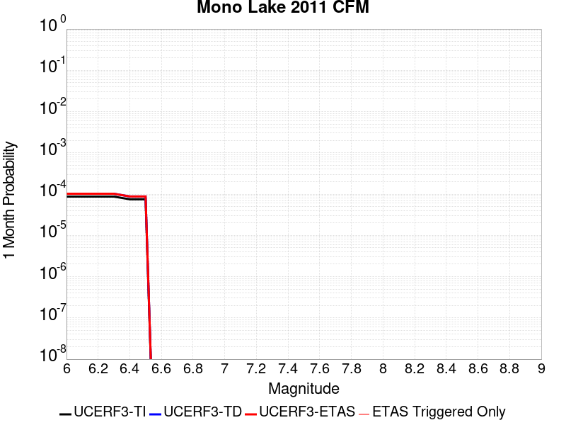 |  | 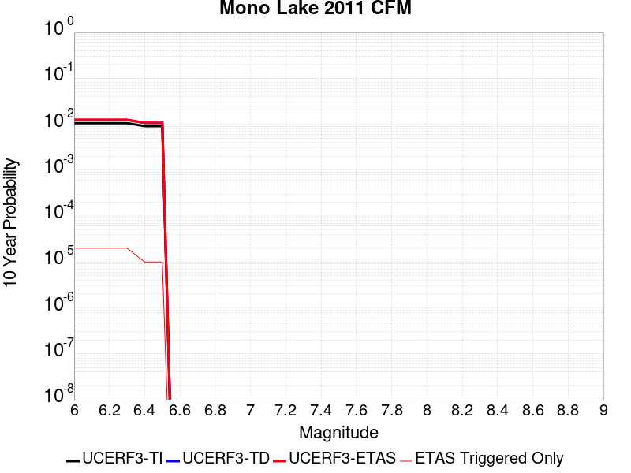 |

| Magnitude | 1 wk TI Prob | 1 wk TD Prob | 1 wk ETAS Prob | 1 wk ETAS/TD Gain | 1 wk ETAS Triggered Only | 1 mo TI Prob | 1 mo TD Prob | 1 mo ETAS Prob | 1 mo ETAS/TD Gain | 1 mo ETAS Triggered Only | 1 yr TI Prob | 1 yr TD Prob | 1 yr ETAS Prob | 1 yr ETAS/TD Gain | 1 yr ETAS Triggered Only | 10 yr TI Prob | 10 yr TD Prob | 10 yr ETAS Prob | 10 yr ETAS/TD Gain | 10 yr ETAS Triggered Only |
|-----|-----|-----|-----|-----|-----|-----|-----|-----|-----|-----|-----|-----|-----|-----|-----|-----|-----|-----|-----|-----|
| 6.0 | 2.0341662E-5 | 2.3833583E-5 | 2.3833583E-5 | 1.0 | 0.0 | 8.717564E-5 | 1.0214293E-4 | 1.0214293E-4 | 1.0 | 0.0 | 0.0010608466 | 0.0012434124 | 0.0012434124 | 1.0 | 0.0 | 0.010557966 | 0.012416651 | 0.012527354 | 1.0089157 | 1.12095055E-4 |
| 6.1 | 2.0341662E-5 | 2.3833583E-5 | 2.3833583E-5 | 1.0 | 0.0 | 8.717564E-5 | 1.0214293E-4 | 1.0214293E-4 | 1.0 | 0.0 | 0.0010608466 | 0.0012434124 | 0.0012434124 | 1.0 | 0.0 | 0.010557966 | 0.012416651 | 0.012527354 | 1.0089157 | 1.12095055E-4 |
| 6.2 | 2.0341662E-5 | 2.3833583E-5 | 2.3833583E-5 | 1.0 | 0.0 | 8.717564E-5 | 1.0214293E-4 | 1.0214293E-4 | 1.0 | 0.0 | 0.0010608466 | 0.0012434124 | 0.0012434124 | 1.0 | 0.0 | 0.010557966 | 0.012416651 | 0.012527354 | 1.0089157 | 1.12095055E-4 |
| 6.3 | 2.0341662E-5 | 2.3833583E-5 | 2.3833583E-5 | 1.0 | 0.0 | 8.717564E-5 | 1.0214293E-4 | 1.0214293E-4 | 1.0 | 0.0 | 0.0010608466 | 0.0012434124 | 0.0012434124 | 1.0 | 0.0 | 0.010557966 | 0.012416651 | 0.012527354 | 1.0089157 | 1.12095055E-4 |
| 6.4 | 1.749821E-5 | 2.0495634E-5 | 2.0495634E-5 | 1.0 | 0.0 | 7.499018E-5 | 8.783843E-5 | 8.783843E-5 | 1.0 | 0.0 | 9.1262296E-4 | 0.0010694329 | 0.0010694329 | 1.0 | 0.0 | 0.009088841 | 0.010694289 | 0.010694289 | 1.0 | 0.0 |
| 6.5 | 1.749821E-5 | 2.0495634E-5 | 2.0495634E-5 | 1.0 | 0.0 | 7.499018E-5 | 8.783843E-5 | 8.783843E-5 | 1.0 | 0.0 | 9.1262296E-4 | 0.0010694329 | 0.0010694329 | 1.0 | 0.0 | 0.009088841 | 0.010694289 | 0.010694289 | 1.0 | 0.0 |

## Ludlow
*[(top)](#table-of-contents)*

| 1 Week | 1 Month | 1 Year | 10 Year |
|-----|-----|-----|-----|
|  |  | 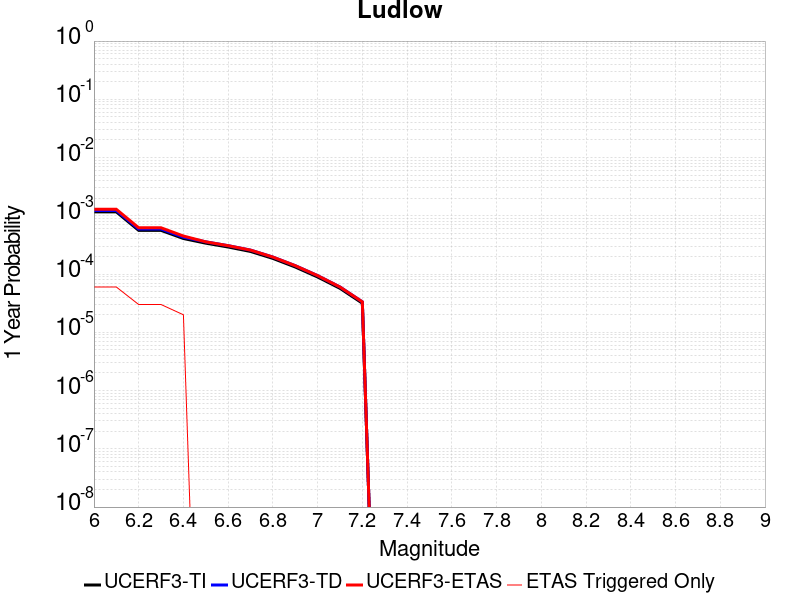 | 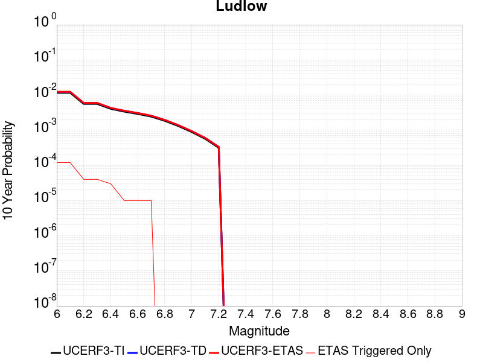 |

| Magnitude | 1 wk TI Prob | 1 wk TD Prob | 1 wk ETAS Prob | 1 wk ETAS/TD Gain | 1 wk ETAS Triggered Only | 1 mo TI Prob | 1 mo TD Prob | 1 mo ETAS Prob | 1 mo ETAS/TD Gain | 1 mo ETAS Triggered Only | 1 yr TI Prob | 1 yr TD Prob | 1 yr ETAS Prob | 1 yr ETAS/TD Gain | 1 yr ETAS Triggered Only | 10 yr TI Prob | 10 yr TD Prob | 10 yr ETAS Prob | 10 yr ETAS/TD Gain | 10 yr ETAS Triggered Only |
|-----|-----|-----|-----|-----|-----|-----|-----|-----|-----|-----|-----|-----|-----|-----|-----|-----|-----|-----|-----|-----|
| 6.0 | 2.2407607E-5 | 2.3659004E-5 | 2.3659004E-5 | 1.0 | 0.0 | 9.602906E-5 | 1.0139204E-4 | 1.0139204E-4 | 1.0 | 0.0 | 0.0011685267 | 0.0012337932 | 0.0012337932 | 1.0 | 0.0 | 0.011624013 | 0.012273945 | 0.012384664 | 1.0090207 | 1.12095055E-4 |
| 6.1 | 2.2407607E-5 | 2.3659004E-5 | 2.3659004E-5 | 1.0 | 0.0 | 9.602906E-5 | 1.0139204E-4 | 1.0139204E-4 | 1.0 | 0.0 | 0.0011685267 | 0.0012337932 | 0.0012337932 | 1.0 | 0.0 | 0.011624013 | 0.012273945 | 0.012384664 | 1.0090207 | 1.12095055E-4 |
| 6.2 | 1.0781252E-5 | 1.1366481E-5 | 1.1366481E-5 | 1.0 | 0.0 | 4.620455E-5 | 4.8712605E-5 | 4.8712605E-5 | 1.0 | 0.0 | 5.623952E-4 | 5.929186E-4 | 5.929186E-4 | 1.0 | 0.0 | 0.00560974 | 0.005913785 | 0.005913785 | 1.0 | 0.0 |
| 6.3 | 1.0781252E-5 | 1.1366481E-5 | 1.1366481E-5 | 1.0 | 0.0 | 4.620455E-5 | 4.8712605E-5 | 4.8712605E-5 | 1.0 | 0.0 | 5.623952E-4 | 5.929186E-4 | 5.929186E-4 | 1.0 | 0.0 | 0.00560974 | 0.005913785 | 0.005913785 | 1.0 | 0.0 |
| 6.4 | 7.814439E-6 | 8.238321E-6 | 8.238321E-6 | 1.0 | 0.0 | 3.3490025E-5 | 3.530662E-5 | 3.530662E-5 | 1.0 | 0.0 | 4.0766477E-4 | 4.2977472E-4 | 4.2977472E-4 | 1.0 | 0.0 | 0.0040691774 | 0.0042895824 | 0.0042895824 | 1.0 | 0.0 |
| 6.5 | 6.4986366E-6 | 6.8514128E-6 | 6.8514128E-6 | 1.0 | 0.0 | 2.7851002E-5 | 2.9362871E-5 | 2.9362871E-5 | 1.0 | 0.0 | 3.390332E-4 | 3.5743523E-4 | 3.5743523E-4 | 1.0 | 0.0 | 0.003385164 | 0.0035686996 | 0.0035686996 | 1.0 | 0.0 |
| 6.6 | 5.582177E-6 | 5.8864307E-6 | 5.8864307E-6 | 1.0 | 0.0 | 2.3923398E-5 | 2.522732E-5 | 2.522732E-5 | 1.0 | 0.0 | 2.9122844E-4 | 3.0710007E-4 | 3.0710007E-4 | 1.0 | 0.0 | 0.0029084706 | 0.00306683 | 0.00306683 | 1.0 | 0.0 |
| 6.7 | 4.6858763E-6 | 4.9407836E-6 | 4.9407836E-6 | 1.0 | 0.0 | 2.0082172E-5 | 2.1174617E-5 | 2.1174617E-5 | 1.0 | 0.0 | 2.4447302E-4 | 2.5777103E-4 | 2.5777103E-4 | 1.0 | 0.0 | 0.0024420423 | 0.0025747768 | 0.0025747768 | 1.0 | 0.0 |
| 6.8 | 3.5584908E-6 | 3.752289E-6 | 3.752289E-6 | 1.0 | 0.0 | 1.5250586E-5 | 1.6081141E-5 | 1.6081141E-5 | 1.0 | 0.0 | 1.8566006E-4 | 1.9577073E-4 | 1.9577073E-4 | 1.0 | 0.0 | 0.0018550502 | 0.0019560237 | 0.0019560237 | 1.0 | 0.0 |
| 6.9 | 2.532834E-6 | 2.6711969E-6 | 2.6711969E-6 | 1.0 | 0.0 | 1.0854958E-5 | 1.1447937E-5 | 1.1447937E-5 | 1.0 | 0.0 | 1.3215111E-4 | 1.3937001E-4 | 1.3937001E-4 | 1.0 | 0.0 | 0.0013207254 | 0.0013928536 | 0.0013928536 | 1.0 | 0.0 |
| 7.0 | 1.7083285E-6 | 1.8020748E-6 | 1.8020748E-6 | 1.0 | 0.0 | 7.3213873E-6 | 7.723156E-6 | 7.723156E-6 | 1.0 | 0.0 | 8.913424E-5 | 9.4025534E-5 | 9.4025534E-5 | 1.0 | 0.0 | 8.9098496E-4 | 9.3987404E-4 | 9.3987404E-4 | 1.0 | 0.0 |
| 7.1 | 1.0905424E-6 | 1.1498448E-6 | 1.1498448E-6 | 1.0 | 0.0 | 4.6737446E-6 | 4.9278974E-6 | 4.9278974E-6 | 1.0 | 0.0 | 5.6901354E-5 | 5.99956E-5 | 5.99956E-5 | 1.0 | 0.0 | 5.6886784E-4 | 5.998038E-4 | 5.998038E-4 | 1.0 | 0.0 |
| 7.2 | 6.06668E-7 | 6.387725E-7 | 6.387725E-7 | 1.0 | 0.0 | 2.600003E-6 | 2.737594E-6 | 2.737594E-6 | 1.0 | 0.0 | 3.1654577E-5 | 3.332977E-5 | 3.332977E-5 | 1.0 | 0.0 | 3.1650066E-4 | 3.3325455E-4 | 3.3325455E-4 | 1.0 | 0.0 |

## San Juan
*[(top)](#table-of-contents)*

| 1 Week | 1 Month | 1 Year | 10 Year |
|-----|-----|-----|-----|
| 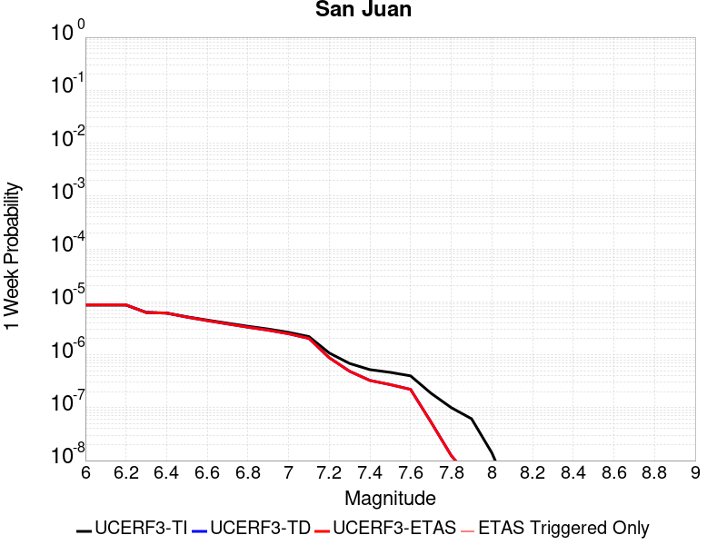 |  |  |  |

| Magnitude | 1 wk TI Prob | 1 wk TD Prob | 1 wk ETAS Prob | 1 wk ETAS/TD Gain | 1 wk ETAS Triggered Only | 1 mo TI Prob | 1 mo TD Prob | 1 mo ETAS Prob | 1 mo ETAS/TD Gain | 1 mo ETAS Triggered Only | 1 yr TI Prob | 1 yr TD Prob | 1 yr ETAS Prob | 1 yr ETAS/TD Gain | 1 yr ETAS Triggered Only | 10 yr TI Prob | 10 yr TD Prob | 10 yr ETAS Prob | 10 yr ETAS/TD Gain | 10 yr ETAS Triggered Only |
|-----|-----|-----|-----|-----|-----|-----|-----|-----|-----|-----|-----|-----|-----|-----|-----|-----|-----|-----|-----|-----|
| 6.0 | 8.682808E-6 | 8.7531325E-6 | 8.7531325E-6 | 1.0 | 0.0 | 3.72115E-5 | 3.7512913E-5 | 3.7512913E-5 | 1.0 | 0.0 | 4.5295584E-4 | 4.5662883E-4 | 5.6867267E-4 | 1.2453719 | 1.12095055E-4 | 0.004520337 | 0.0045574466 | 0.004669031 | 1.0244839 | 1.12095055E-4 |
| 6.1 | 8.682808E-6 | 8.7531325E-6 | 8.7531325E-6 | 1.0 | 0.0 | 3.72115E-5 | 3.7512913E-5 | 3.7512913E-5 | 1.0 | 0.0 | 4.5295584E-4 | 4.5662883E-4 | 5.6867267E-4 | 1.2453719 | 1.12095055E-4 | 0.004520337 | 0.0045574466 | 0.004669031 | 1.0244839 | 1.12095055E-4 |
| 6.2 | 8.682808E-6 | 8.7531325E-6 | 8.7531325E-6 | 1.0 | 0.0 | 3.72115E-5 | 3.7512913E-5 | 3.7512913E-5 | 1.0 | 0.0 | 4.5295584E-4 | 4.5662883E-4 | 5.6867267E-4 | 1.2453719 | 1.12095055E-4 | 0.004520337 | 0.0045574466 | 0.004669031 | 1.0244839 | 1.12095055E-4 |
| 6.3 | 6.3054235E-6 | 6.286431E-6 | 6.286431E-6 | 1.0 | 0.0 | 2.7022963E-5 | 2.6941576E-5 | 2.6941576E-5 | 1.0 | 0.0 | 3.2895492E-4 | 3.2796574E-4 | 3.2796574E-4 | 1.0 | 0.0 | 0.003284684 | 0.0032750175 | 0.0032750175 | 1.0 | 0.0 |
| 6.4 | 6.1490473E-6 | 6.1177834E-6 | 6.1177834E-6 | 1.0 | 0.0 | 2.6352795E-5 | 2.6218817E-5 | 2.6218817E-5 | 1.0 | 0.0 | 3.2079802E-4 | 3.191687E-4 | 3.191687E-4 | 1.0 | 0.0 | 0.0032033534 | 0.0031872997 | 0.0031872997 | 1.0 | 0.0 |
| 6.5 | 5.204848E-6 | 5.1404445E-6 | 5.1404445E-6 | 1.0 | 0.0 | 2.23063E-5 | 2.2030295E-5 | 2.2030295E-5 | 1.0 | 0.0 | 2.7154534E-4 | 2.681868E-4 | 2.681868E-4 | 1.0 | 0.0 | 0.0027121378 | 0.0026787857 | 0.0026787857 | 1.0 | 0.0 |
| 6.6 | 4.5179986E-6 | 4.417436E-6 | 4.417436E-6 | 1.0 | 0.0 | 1.9362706E-5 | 1.8931734E-5 | 1.8931734E-5 | 1.0 | 0.0 | 2.3571544E-4 | 2.3047028E-4 | 2.3047028E-4 | 1.0 | 0.0 | 0.0023546559 | 0.00230245 | 0.00230245 | 1.0 | 0.0 |
| 6.7 | 3.9442616E-6 | 3.821978E-6 | 3.821978E-6 | 1.0 | 0.0 | 1.6903869E-5 | 1.6379807E-5 | 1.6379807E-5 | 1.0 | 0.0 | 2.0578515E-4 | 1.9940657E-4 | 1.9940657E-4 | 1.0 | 0.0 | 0.002055947 | 0.0019924014 | 0.0019924014 | 1.0 | 0.0 |
| 6.8 | 3.4536245E-6 | 3.3183958E-6 | 3.3183958E-6 | 1.0 | 0.0 | 1.4801163E-5 | 1.4221622E-5 | 1.4221622E-5 | 1.0 | 0.0 | 1.8018926E-4 | 1.7313511E-4 | 1.7313511E-4 | 1.0 | 0.0 | 0.0018004322 | 0.0017301212 | 0.0017301212 | 1.0 | 0.0 |
| 6.9 | 3.059865E-6 | 2.9139994E-6 | 2.9139994E-6 | 1.0 | 0.0 | 1.3113641E-5 | 1.2488513E-5 | 1.2488513E-5 | 1.0 | 0.0 | 1.596469E-4 | 1.5203761E-4 | 1.5203761E-4 | 1.0 | 0.0 | 0.0015953224 | 0.0015194507 | 0.0015194507 | 1.0 | 0.0 |
| 7.0 | 2.6504351E-6 | 2.4938588E-6 | 2.4938588E-6 | 1.0 | 0.0 | 1.1358958E-5 | 1.0687926E-5 | 1.0687926E-5 | 1.0 | 0.0 | 1.3828653E-4 | 1.3011826E-4 | 1.3011826E-4 | 1.0 | 0.0 | 0.0013820052 | 0.001300533 | 0.001300533 | 1.0 | 0.0 |
| 7.1 | 2.2039317E-6 | 2.0353525E-6 | 2.0353525E-6 | 1.0 | 0.0 | 9.445387E-6 | 8.722913E-6 | 8.722913E-6 | 1.0 | 0.0 | 1.1499152E-4 | 1.06196814E-4 | 1.06196814E-4 | 1.0 | 0.0 | 0.0011493203 | 0.001061571 | 0.001061571 | 1.0 | 0.0 |
| 7.2 | 1.0786707E-6 | 8.783211E-7 | 8.783211E-7 | 1.0 | 0.0 | 4.622866E-6 | 3.7642276E-6 | 3.7642276E-6 | 1.0 | 0.0 | 5.628194E-5 | 4.582852E-5 | 4.582852E-5 | 1.0 | 0.0 | 5.6267687E-4 | 4.5824994E-4 | 4.5824994E-4 | 1.0 | 0.0 |
| 7.3 | 6.846433E-7 | 4.877057E-7 | 4.877057E-7 | 1.0 | 0.0 | 2.9341822E-6 | 2.0901655E-6 | 2.0901655E-6 | 1.0 | 0.0 | 3.5723086E-5 | 2.5447467E-5 | 2.5447467E-5 | 1.0 | 0.0 | 3.571734E-4 | 2.5447918E-4 | 2.5447918E-4 | 1.0 | 0.0 |
| 7.4 | 5.23043E-7 | 3.2689408E-7 | 3.2689408E-7 | 1.0 | 0.0 | 2.2416111E-6 | 1.4009738E-6 | 1.4009738E-6 | 1.0 | 0.0 | 2.7291273E-5 | 1.7056724E-5 | 1.7056724E-5 | 1.0 | 0.0 | 2.7287923E-4 | 1.705862E-4 | 1.705862E-4 | 1.0 | 0.0 |
| 7.5 | 4.648444E-7 | 2.728768E-7 | 2.728768E-7 | 1.0 | 0.0 | 1.9921886E-6 | 1.1694715E-6 | 1.1694715E-6 | 1.0 | 0.0 | 2.4254627E-5 | 1.4238223E-5 | 1.4238223E-5 | 1.0 | 0.0 | 2.425198E-4 | 1.4240283E-4 | 1.4240283E-4 | 1.0 | 0.0 |
| 7.6 | 3.9906567E-7 | 2.2125086E-7 | 2.2125086E-7 | 1.0 | 0.0 | 1.7102802E-6 | 9.482176E-7 | 9.482176E-7 | 1.0 | 0.0 | 2.0822463E-5 | 1.1544488E-5 | 1.1544488E-5 | 1.0 | 0.0 | 2.0820512E-4 | 1.1546359E-4 | 1.1546359E-4 | 1.0 | 0.0 |
| 7.7 | 1.8784601E-7 | 5.3822912E-8 | 5.3822912E-8 | 1.0 | 0.0 | 8.0505407E-7 | 2.306696E-7 | 2.306696E-7 | 1.0 | 0.0 | 9.80149E-6 | 2.8083987E-6 | 2.8083987E-6 | 1.0 | 0.0 | 9.801057E-5 | 2.809278E-5 | 2.809278E-5 | 1.0 | 0.0 |
| 7.8 | 1.00154914E-7 | 1.2465811E-8 | 1.2465811E-8 | 1.0 | 0.0 | 4.2923529E-7 | 5.3424902E-8 | 5.3424902E-8 | 1.0 | 0.0 | 5.225927E-6 | 6.50448E-7 | 6.50448E-7 | 1.0 | 0.0 | 5.225804E-5 | 6.510448E-6 | 6.510448E-6 | 1.0 | 0.0 |
| 7.9 | 6.171429E-8 | 4.3225903E-9 | 4.3225903E-9 | 1.0 | 0.0 | 2.6448978E-7 | 1.8525386E-8 | 1.8525386E-8 | 1.0 | 0.0 | 3.2201583E-6 | 2.2554653E-7 | 2.2554653E-7 | 1.0 | 0.0 | 3.2201115E-5 | 2.2608372E-6 | 2.2608372E-6 | 1.0 | 0.0 |
| 8.0 | 1.3974572E-8 | 3.4266734E-10 | 3.4266734E-10 | 1.0 | 0.0 | 5.989102E-8 | 1.4685742E-9 | 1.4685742E-9 | 1.0 | 0.0 | 7.2917294E-7 | 1.7879877E-8 | 1.7879877E-8 | 1.0 | 0.0 | 7.2917055E-6 | 1.831609E-7 | 1.831609E-7 | 1.0 | 0.0 |
| 8.1 | 1.8403477E-9 | 1.1421608E-10 | 1.1421608E-10 | 1.0 | 0.0 | 7.887204E-9 | 4.894991E-10 | 4.894991E-10 | 1.0 | 0.0 | 9.602671E-8 | 5.959654E-9 | 5.959654E-9 | 1.0 | 0.0 | 9.602667E-7 | 6.085037E-8 | 6.085037E-8 | 1.0 | 0.0 |

## Cleghorn Lake
*[(top)](#table-of-contents)*

| 1 Week | 1 Month | 1 Year | 10 Year |
|-----|-----|-----|-----|
| 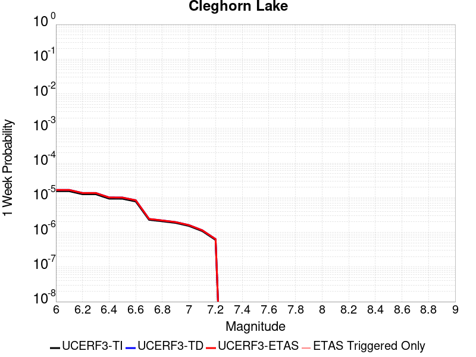 |  |  | 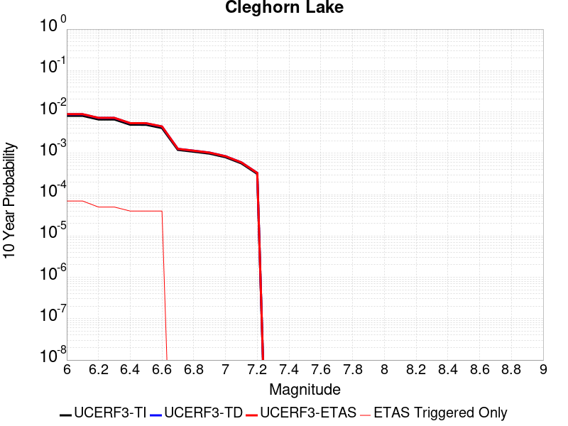 |

| Magnitude | 1 wk TI Prob | 1 wk TD Prob | 1 wk ETAS Prob | 1 wk ETAS/TD Gain | 1 wk ETAS Triggered Only | 1 mo TI Prob | 1 mo TD Prob | 1 mo ETAS Prob | 1 mo ETAS/TD Gain | 1 mo ETAS Triggered Only | 1 yr TI Prob | 1 yr TD Prob | 1 yr ETAS Prob | 1 yr ETAS/TD Gain | 1 yr ETAS Triggered Only | 10 yr TI Prob | 10 yr TD Prob | 10 yr ETAS Prob | 10 yr ETAS/TD Gain | 10 yr ETAS Triggered Only |
|-----|-----|-----|-----|-----|-----|-----|-----|-----|-----|-----|-----|-----|-----|-----|-----|-----|-----|-----|-----|-----|
| 6.0 | 1.5467183E-5 | 1.679612E-5 | 1.679612E-5 | 1.0 | 0.0 | 6.6286244E-5 | 7.19817E-5 | 7.19817E-5 | 1.0 | 0.0 | 8.067362E-4 | 8.760797E-4 | 9.880766E-4 | 1.1278386 | 1.12095055E-4 | 0.008038137 | 0.008731688 | 0.008842805 | 1.0127256 | 1.12095055E-4 |
| 6.1 | 1.5467183E-5 | 1.679612E-5 | 1.679612E-5 | 1.0 | 0.0 | 6.6286244E-5 | 7.19817E-5 | 7.19817E-5 | 1.0 | 0.0 | 8.067362E-4 | 8.760797E-4 | 9.880766E-4 | 1.1278386 | 1.12095055E-4 | 0.008038137 | 0.008731688 | 0.008842805 | 1.0127256 | 1.12095055E-4 |
| 6.2 | 1.2624631E-5 | 1.36830695E-5 | 1.36830695E-5 | 1.0 | 0.0 | 5.410444E-5 | 5.8640682E-5 | 5.8640682E-5 | 1.0 | 0.0 | 6.585225E-4 | 7.1376516E-4 | 8.257802E-4 | 1.1569355 | 1.12095055E-4 | 0.0065657445 | 0.0071195234 | 0.00723082 | 1.0156326 | 1.12095055E-4 |
| 6.3 | 1.2624631E-5 | 1.36830695E-5 | 1.36830695E-5 | 1.0 | 0.0 | 5.410444E-5 | 5.8640682E-5 | 5.8640682E-5 | 1.0 | 0.0 | 6.585225E-4 | 7.1376516E-4 | 8.257802E-4 | 1.1569355 | 1.12095055E-4 | 0.0065657445 | 0.0071195234 | 0.00723082 | 1.0156326 | 1.12095055E-4 |
| 6.4 | 9.417684E-6 | 1.01712E-5 | 1.01712E-5 | 1.0 | 0.0 | 4.036088E-5 | 4.3590364E-5 | 4.3590364E-5 | 1.0 | 0.0 | 4.912829E-4 | 5.3062453E-4 | 6.4266013E-4 | 1.2111391 | 1.12095055E-4 | 0.004901982 | 0.0052976124 | 0.0054091136 | 1.0210475 | 1.12095055E-4 |
| 6.5 | 9.368219E-6 | 1.0118622E-5 | 1.0118622E-5 | 1.0 | 0.0 | 4.014889E-5 | 4.336504E-5 | 4.336504E-5 | 1.0 | 0.0 | 4.8870314E-4 | 5.2788254E-4 | 6.399184E-4 | 1.2122364 | 1.12095055E-4 | 0.004876298 | 0.0052703223 | 0.005381827 | 1.021157 | 1.12095055E-4 |
| 6.6 | 7.803798E-6 | 8.44275E-6 | 8.44275E-6 | 1.0 | 0.0 | 3.3444423E-5 | 3.6182937E-5 | 3.6182937E-5 | 1.0 | 0.0 | 4.0710976E-4 | 4.4047815E-4 | 5.525238E-4 | 1.2543728 | 1.12095055E-4 | 0.0040636472 | 0.004399969 | 0.0045115706 | 1.0253643 | 1.12095055E-4 |
| 6.7 | 2.3108669E-6 | 2.4440203E-6 | 2.4440203E-6 | 1.0 | 0.0 | 9.903678E-6 | 1.0474332E-5 | 1.0474332E-5 | 1.0 | 0.0 | 1.205706E-4 | 1.2751772E-4 | 1.2751772E-4 | 1.0 | 0.0 | 0.001205052 | 0.0012744641 | 0.0012744641 | 1.0 | 0.0 |
| 6.8 | 2.0882828E-6 | 2.2064476E-6 | 2.2064476E-6 | 1.0 | 0.0 | 8.949753E-6 | 9.456171E-6 | 9.456171E-6 | 1.0 | 0.0 | 1.08957785E-4 | 1.15122966E-4 | 1.15122966E-4 | 1.0 | 0.0 | 0.0010890438 | 0.0011506502 | 0.0011506502 | 1.0 | 0.0 |
| 6.9 | 1.876935E-6 | 1.9811969E-6 | 1.9811969E-6 | 1.0 | 0.0 | 8.043982E-6 | 8.490817E-6 | 8.490817E-6 | 1.0 | 0.0 | 9.7931086E-5 | 1.0337095E-4 | 1.0337095E-4 | 1.0 | 0.0 | 9.788794E-4 | 0.0010332447 | 0.0010332447 | 1.0 | 0.0 |
| 7.0 | 1.5357559E-6 | 1.6203991E-6 | 1.6203991E-6 | 1.0 | 0.0 | 6.5817944E-6 | 6.9445496E-6 | 6.9445496E-6 | 1.0 | 0.0 | 8.01304E-5 | 8.454674E-5 | 8.454674E-5 | 1.0 | 0.0 | 8.010151E-4 | 8.451582E-4 | 8.451582E-4 | 1.0 | 0.0 |
| 7.1 | 1.0905424E-6 | 1.1498448E-6 | 1.1498448E-6 | 1.0 | 0.0 | 4.6737446E-6 | 4.9278974E-6 | 4.9278974E-6 | 1.0 | 0.0 | 5.6901354E-5 | 5.99956E-5 | 5.99956E-5 | 1.0 | 0.0 | 5.6886784E-4 | 5.998038E-4 | 5.998038E-4 | 1.0 | 0.0 |
| 7.2 | 6.06668E-7 | 6.387725E-7 | 6.387725E-7 | 1.0 | 0.0 | 2.600003E-6 | 2.737594E-6 | 2.737594E-6 | 1.0 | 0.0 | 3.1654577E-5 | 3.332977E-5 | 3.332977E-5 | 1.0 | 0.0 | 3.1650066E-4 | 3.3325455E-4 | 3.3325455E-4 | 1.0 | 0.0 |

## Kern Canyon (North Kern) 2011
*[(top)](#table-of-contents)*

| 1 Week | 1 Month | 1 Year | 10 Year |
|-----|-----|-----|-----|
|  |  |  |  |

| Magnitude | 1 wk TI Prob | 1 wk TD Prob | 1 wk ETAS Prob | 1 wk ETAS/TD Gain | 1 wk ETAS Triggered Only | 1 mo TI Prob | 1 mo TD Prob | 1 mo ETAS Prob | 1 mo ETAS/TD Gain | 1 mo ETAS Triggered Only | 1 yr TI Prob | 1 yr TD Prob | 1 yr ETAS Prob | 1 yr ETAS/TD Gain | 1 yr ETAS Triggered Only | 10 yr TI Prob | 10 yr TD Prob | 10 yr ETAS Prob | 10 yr ETAS/TD Gain | 10 yr ETAS Triggered Only |
|-----|-----|-----|-----|-----|-----|-----|-----|-----|-----|-----|-----|-----|-----|-----|-----|-----|-----|-----|-----|-----|
| 6.0 | 6.6264497E-6 | 6.7575443E-6 | 6.7575443E-6 | 1.0 | 0.0 | 2.8398761E-5 | 2.8960629E-5 | 2.8960629E-5 | 1.0 | 0.0 | 3.4570007E-4 | 3.525466E-4 | 3.525466E-4 | 1.0 | 0.0 | 0.0034516277 | 0.0035206617 | 0.0036323622 | 1.0317271 | 1.12095055E-4 |
| 6.1 | 6.6264497E-6 | 6.7575443E-6 | 6.7575443E-6 | 1.0 | 0.0 | 2.8398761E-5 | 2.8960629E-5 | 2.8960629E-5 | 1.0 | 0.0 | 3.4570007E-4 | 3.525466E-4 | 3.525466E-4 | 1.0 | 0.0 | 0.0034516277 | 0.0035206617 | 0.0036323622 | 1.0317271 | 1.12095055E-4 |
| 6.2 | 6.6264497E-6 | 6.7575443E-6 | 6.7575443E-6 | 1.0 | 0.0 | 2.8398761E-5 | 2.8960629E-5 | 2.8960629E-5 | 1.0 | 0.0 | 3.4570007E-4 | 3.525466E-4 | 3.525466E-4 | 1.0 | 0.0 | 0.0034516277 | 0.0035206617 | 0.0036323622 | 1.0317271 | 1.12095055E-4 |
| 6.3 | 6.6264497E-6 | 6.7575443E-6 | 6.7575443E-6 | 1.0 | 0.0 | 2.8398761E-5 | 2.8960629E-5 | 2.8960629E-5 | 1.0 | 0.0 | 3.4570007E-4 | 3.525466E-4 | 3.525466E-4 | 1.0 | 0.0 | 0.0034516277 | 0.0035206617 | 0.0036323622 | 1.0317271 | 1.12095055E-4 |
| 6.4 | 6.6264497E-6 | 6.7575443E-6 | 6.7575443E-6 | 1.0 | 0.0 | 2.8398761E-5 | 2.8960629E-5 | 2.8960629E-5 | 1.0 | 0.0 | 3.4570007E-4 | 3.525466E-4 | 3.525466E-4 | 1.0 | 0.0 | 0.0034516277 | 0.0035206617 | 0.0036323622 | 1.0317271 | 1.12095055E-4 |
| 6.5 | 3.2162225E-6 | 3.2571832E-6 | 3.2571832E-6 | 1.0 | 0.0 | 1.3783738E-5 | 1.3959286E-5 | 1.3959286E-5 | 1.0 | 0.0 | 1.6780409E-4 | 1.6994186E-4 | 1.6994186E-4 | 1.0 | 0.0 | 0.0016767744 | 0.0016981987 | 0.0016981987 | 1.0 | 0.0 |
| 6.6 | 3.2162225E-6 | 3.2571832E-6 | 3.2571832E-6 | 1.0 | 0.0 | 1.3783738E-5 | 1.3959286E-5 | 1.3959286E-5 | 1.0 | 0.0 | 1.6780409E-4 | 1.6994186E-4 | 1.6994186E-4 | 1.0 | 0.0 | 0.0016767744 | 0.0016981987 | 0.0016981987 | 1.0 | 0.0 |
| 6.7 | 2.1908265E-6 | 2.2071804E-6 | 2.2071804E-6 | 1.0 | 0.0 | 9.389223E-6 | 9.4593115E-6 | 9.4593115E-6 | 1.0 | 0.0 | 1.1430779E-4 | 1.1516123E-4 | 1.1516123E-4 | 1.0 | 0.0 | 0.0011424901 | 0.001151035 | 0.001151035 | 1.0 | 0.0 |
| 6.8 | 1.7303895E-6 | 1.7365974E-6 | 1.7365974E-6 | 1.0 | 0.0 | 7.415934E-6 | 7.4425398E-6 | 7.4425398E-6 | 1.0 | 0.0 | 9.028525E-5 | 9.0609254E-5 | 9.0609254E-5 | 1.0 | 0.0 | 9.024858E-4 | 9.057328E-4 | 9.057328E-4 | 1.0 | 0.0 |
| 6.9 | 1.3700314E-6 | 1.3688968E-6 | 1.3688968E-6 | 1.0 | 0.0 | 5.87155E-6 | 5.866688E-6 | 5.866688E-6 | 1.0 | 0.0 | 7.148377E-5 | 7.142463E-5 | 7.142463E-5 | 1.0 | 0.0 | 7.146078E-4 | 7.1402127E-4 | 7.1402127E-4 | 1.0 | 0.0 |
| 7.0 | 1.1467797E-6 | 1.1414094E-6 | 1.1414094E-6 | 1.0 | 0.0 | 4.9147607E-6 | 4.8917454E-6 | 4.8917454E-6 | 1.0 | 0.0 | 5.983557E-5 | 5.95554E-5 | 5.95554E-5 | 1.0 | 0.0 | 5.981946E-4 | 5.9539755E-4 | 5.9539755E-4 | 1.0 | 0.0 |
| 7.1 | 9.3952065E-7 | 9.3029274E-7 | 9.3029274E-7 | 1.0 | 0.0 | 4.026511E-6 | 3.986963E-6 | 3.986963E-6 | 1.0 | 0.0 | 4.9021666E-5 | 4.854021E-5 | 4.854021E-5 | 1.0 | 0.0 | 4.901085E-4 | 4.8529785E-4 | 4.8529785E-4 | 1.0 | 0.0 |
| 7.2 | 6.858055E-7 | 6.719475E-7 | 6.719475E-7 | 1.0 | 0.0 | 2.939163E-6 | 2.8797717E-6 | 2.8797717E-6 | 1.0 | 0.0 | 3.5783723E-5 | 3.5060668E-5 | 3.5060668E-5 | 1.0 | 0.0 | 3.5777962E-4 | 3.5055223E-4 | 3.5055223E-4 | 1.0 | 0.0 |
| 7.3 | 5.1101983E-7 | 4.9394305E-7 | 4.9394305E-7 | 1.0 | 0.0 | 2.1900833E-6 | 2.1168971E-6 | 2.1168971E-6 | 1.0 | 0.0 | 2.6663936E-5 | 2.5772923E-5 | 2.5772923E-5 | 1.0 | 0.0 | 2.6660739E-4 | 2.576998E-4 | 2.576998E-4 | 1.0 | 0.0 |
| 7.4 | 3.4999414E-7 | 3.2996817E-7 | 3.2996817E-7 | 1.0 | 0.0 | 1.499974E-6 | 1.4141485E-6 | 1.4141485E-6 | 1.0 | 0.0 | 1.8262032E-5 | 1.7217126E-5 | 1.7217126E-5 | 1.0 | 0.0 | 1.826053E-4 | 1.7215815E-4 | 1.7215815E-4 | 1.0 | 0.0 |
| 7.5 | 1.7021522E-7 | 1.4750509E-7 | 1.4750509E-7 | 1.0 | 0.0 | 7.2949354E-7 | 6.3216453E-7 | 6.3216453E-7 | 1.0 | 0.0 | 8.881548E-6 | 7.696577E-6 | 7.696577E-6 | 1.0 | 0.0 | 8.8811925E-5 | 7.696318E-5 | 7.696318E-5 | 1.0 | 0.0 |
| 7.6 | 2.572245E-8 | 1.7353377E-8 | 1.7353377E-8 | 1.0 | 0.0 | 1.10239064E-7 | 7.437161E-8 | 7.437161E-8 | 1.0 | 0.0 | 1.3421597E-6 | 9.0547405E-7 | 9.0547405E-7 | 1.0 | 0.0 | 1.3421517E-5 | 9.054709E-6 | 9.054709E-6 | 1.0 | 0.0 |

## Chino alt 1
*[(top)](#table-of-contents)*

| 1 Week | 1 Month | 1 Year | 10 Year |
|-----|-----|-----|-----|
|  |  |  |  |

| Magnitude | 1 wk TI Prob | 1 wk TD Prob | 1 wk ETAS Prob | 1 wk ETAS/TD Gain | 1 wk ETAS Triggered Only | 1 mo TI Prob | 1 mo TD Prob | 1 mo ETAS Prob | 1 mo ETAS/TD Gain | 1 mo ETAS Triggered Only | 1 yr TI Prob | 1 yr TD Prob | 1 yr ETAS Prob | 1 yr ETAS/TD Gain | 1 yr ETAS Triggered Only | 10 yr TI Prob | 10 yr TD Prob | 10 yr ETAS Prob | 10 yr ETAS/TD Gain | 10 yr ETAS Triggered Only |
|-----|-----|-----|-----|-----|-----|-----|-----|-----|-----|-----|-----|-----|-----|-----|-----|-----|-----|-----|-----|-----|
| 6.0 | 3.939946E-5 | 4.8967257E-5 | 4.8967257E-5 | 1.0 | 0.0 | 1.6884391E-4 | 2.0984573E-4 | 2.0984573E-4 | 1.0 | 0.0 | 0.0020537362 | 0.002552355 | 0.002664164 | 1.0438062 | 1.12095055E-4 | 0.020348595 | 0.025287293 | 0.025396552 | 1.0043207 | 1.12095055E-4 |
| 6.1 | 2.1505624E-5 | 2.6890864E-5 | 2.6890864E-5 | 1.0 | 0.0 | 9.2163704E-5 | 1.15242095E-4 | 1.15242095E-4 | 1.0 | 0.0 | 0.0011215154 | 0.0014022809 | 0.0015142187 | 1.0798255 | 1.12095055E-4 | 0.011158722 | 0.013951185 | 0.014061716 | 1.0079228 | 1.12095055E-4 |
| 6.2 | 2.1505624E-5 | 2.6890864E-5 | 2.6890864E-5 | 1.0 | 0.0 | 9.2163704E-5 | 1.15242095E-4 | 1.15242095E-4 | 1.0 | 0.0 | 0.0011215154 | 0.0014022809 | 0.0015142187 | 1.0798255 | 1.12095055E-4 | 0.011158722 | 0.013951185 | 0.014061716 | 1.0079228 | 1.12095055E-4 |
| 6.3 | 1.4290785E-5 | 1.8174556E-5 | 1.8174556E-5 | 1.0 | 0.0 | 6.1244784E-5 | 7.7888886E-5 | 7.7888886E-5 | 1.0 | 0.0 | 7.454001E-4 | 9.4793004E-4 | 9.4793004E-4 | 1.0 | 0.0 | 0.007429048 | 0.009449286 | 0.009449286 | 1.0 | 0.0 |
| 6.4 | 1.4290785E-5 | 1.8174556E-5 | 1.8174556E-5 | 1.0 | 0.0 | 6.1244784E-5 | 7.7888886E-5 | 7.7888886E-5 | 1.0 | 0.0 | 7.454001E-4 | 9.4793004E-4 | 9.4793004E-4 | 1.0 | 0.0 | 0.007429048 | 0.009449286 | 0.009449286 | 1.0 | 0.0 |
| 6.5 | 1.3017944E-5 | 1.6661137E-5 | 1.6661137E-5 | 1.0 | 0.0 | 5.5789995E-5 | 7.140317E-5 | 7.140317E-5 | 1.0 | 0.0 | 6.790315E-4 | 8.690306E-4 | 8.690306E-4 | 1.0 | 0.0 | 0.0067696036 | 0.008666586 | 0.008666586 | 1.0 | 0.0 |
| 6.6 | 9.470016E-6 | 1.2046306E-5 | 1.2046306E-5 | 1.0 | 0.0 | 4.058515E-5 | 5.1626197E-5 | 5.1626197E-5 | 1.0 | 0.0 | 4.940122E-4 | 6.2840164E-4 | 6.2840164E-4 | 1.0 | 0.0 | 0.004929154 | 0.006275441 | 0.006275441 | 1.0 | 0.0 |
| 6.7 | 8.314155E-6 | 1.0413858E-5 | 1.0413858E-5 | 1.0 | 0.0 | 3.5631605E-5 | 4.4630237E-5 | 4.4630237E-5 | 1.0 | 0.0 | 4.3372845E-4 | 5.432699E-4 | 5.432699E-4 | 1.0 | 0.0 | 0.004328829 | 0.005428933 | 0.005428933 | 1.0 | 0.0 |
| 6.8 | 3.4856364E-6 | 3.8155918E-6 | 3.8155918E-6 | 1.0 | 0.0 | 1.4938357E-5 | 1.6352446E-5 | 1.6352446E-5 | 1.0 | 0.0 | 1.8185932E-4 | 1.990749E-4 | 1.990749E-4 | 1.0 | 0.0 | 0.0018171056 | 0.001990641 | 0.001990641 | 1.0 | 0.0 |
| 6.9 | 2.2645952E-6 | 2.154401E-6 | 2.154401E-6 | 1.0 | 0.0 | 9.705372E-6 | 9.233116E-6 | 9.233116E-6 | 1.0 | 0.0 | 1.18156495E-4 | 1.124076E-4 | 1.124076E-4 | 1.0 | 0.0 | 0.0011809369 | 0.0011241237 | 0.0011241237 | 1.0 | 0.0 |
| 7.0 | 1.7864003E-6 | 1.5443994E-6 | 1.5443994E-6 | 1.0 | 0.0 | 7.655979E-6 | 6.618838E-6 | 6.618838E-6 | 1.0 | 0.0 | 9.3207556E-5 | 8.0581434E-5 | 8.0581434E-5 | 1.0 | 0.0 | 9.316847E-4 | 8.059694E-4 | 8.059694E-4 | 1.0 | 0.0 |
| 7.1 | 1.7315456E-6 | 1.4746504E-6 | 1.4746504E-6 | 1.0 | 0.0 | 7.420889E-6 | 6.319915E-6 | 6.319915E-6 | 1.0 | 0.0 | 9.034557E-5 | 7.6942306E-5 | 7.6942306E-5 | 1.0 | 0.0 | 9.0308854E-4 | 7.695947E-4 | 7.695947E-4 | 1.0 | 0.0 |
| 7.2 | 1.6008337E-6 | 1.3586603E-6 | 1.3586603E-6 | 1.0 | 0.0 | 6.860698E-6 | 5.822817E-6 | 5.822817E-6 | 1.0 | 0.0 | 8.352579E-5 | 7.089055E-5 | 7.089055E-5 | 1.0 | 0.0 | 8.34944E-4 | 7.0910365E-4 | 7.0910365E-4 | 1.0 | 0.0 |
| 7.3 | 1.3320939E-6 | 1.1229135E-6 | 1.1229135E-6 | 1.0 | 0.0 | 5.7089615E-6 | 4.8124784E-6 | 4.8124784E-6 | 1.0 | 0.0 | 6.9504385E-5 | 5.8590394E-5 | 5.8590394E-5 | 1.0 | 0.0 | 6.9482654E-4 | 5.858941E-4 | 5.858941E-4 | 1.0 | 0.0 |
| 7.4 | 1.114294E-6 | 9.2475307E-7 | 9.2475307E-7 | 1.0 | 0.0 | 4.775537E-6 | 3.963222E-6 | 3.963222E-6 | 1.0 | 0.0 | 5.8140613E-5 | 4.8251193E-5 | 4.8251193E-5 | 1.0 | 0.0 | 5.81254E-4 | 4.82424E-4 | 4.82424E-4 | 1.0 | 0.0 |
| 7.5 | 9.354081E-7 | 7.6331327E-7 | 7.6331327E-7 | 1.0 | 0.0 | 4.0088858E-6 | 3.2713388E-6 | 3.2713388E-6 | 1.0 | 0.0 | 4.8807087E-5 | 3.9827857E-5 | 3.9827857E-5 | 1.0 | 0.0 | 4.879637E-4 | 3.982106E-4 | 3.982106E-4 | 1.0 | 0.0 |
| 7.6 | 8.521771E-7 | 6.8901085E-7 | 6.8901085E-7 | 1.0 | 0.0 | 3.6521824E-6 | 2.9529006E-6 | 2.9529006E-6 | 1.0 | 0.0 | 4.4464414E-5 | 3.5951E-5 | 3.5951E-5 | 1.0 | 0.0 | 4.4455516E-4 | 3.5945504E-4 | 3.5945504E-4 | 1.0 | 0.0 |
| 7.7 | 2.1803626E-7 | 1.4212328E-7 | 1.4212328E-7 | 1.0 | 0.0 | 9.344408E-7 | 6.090997E-7 | 6.090997E-7 | 1.0 | 0.0 | 1.1376757E-5 | 7.4157733E-6 | 7.4157733E-6 | 1.0 | 0.0 | 1.13761744E-4 | 7.415622E-5 | 7.415622E-5 | 1.0 | 0.0 |

## Round Valley
*[(top)](#table-of-contents)*

| 1 Week | 1 Month | 1 Year | 10 Year |
|-----|-----|-----|-----|
|  | 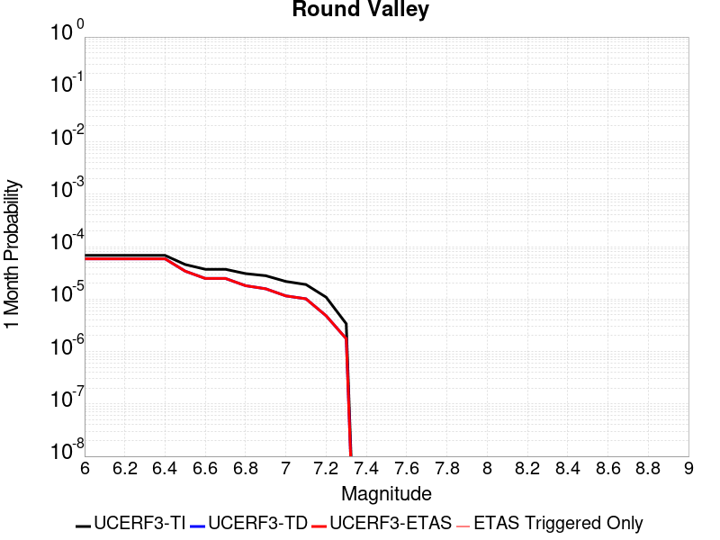 |  |  |

| Magnitude | 1 wk TI Prob | 1 wk TD Prob | 1 wk ETAS Prob | 1 wk ETAS/TD Gain | 1 wk ETAS Triggered Only | 1 mo TI Prob | 1 mo TD Prob | 1 mo ETAS Prob | 1 mo ETAS/TD Gain | 1 mo ETAS Triggered Only | 1 yr TI Prob | 1 yr TD Prob | 1 yr ETAS Prob | 1 yr ETAS/TD Gain | 1 yr ETAS Triggered Only | 10 yr TI Prob | 10 yr TD Prob | 10 yr ETAS Prob | 10 yr ETAS/TD Gain | 10 yr ETAS Triggered Only |
|-----|-----|-----|-----|-----|-----|-----|-----|-----|-----|-----|-----|-----|-----|-----|-----|-----|-----|-----|-----|-----|
| 6.0 | 1.588152E-5 | 1.36734325E-5 | 1.36734325E-5 | 1.0 | 0.0 | 6.806188E-5 | 5.859933E-5 | 5.859933E-5 | 1.0 | 0.0 | 8.283384E-4 | 7.132527E-4 | 7.132527E-4 | 1.0 | 0.0 | 0.008252576 | 0.007113524 | 0.0072248215 | 1.015646 | 1.12095055E-4 |
| 6.1 | 1.588152E-5 | 1.36734325E-5 | 1.36734325E-5 | 1.0 | 0.0 | 6.806188E-5 | 5.859933E-5 | 5.859933E-5 | 1.0 | 0.0 | 8.283384E-4 | 7.132527E-4 | 7.132527E-4 | 1.0 | 0.0 | 0.008252576 | 0.007113524 | 0.0072248215 | 1.015646 | 1.12095055E-4 |
| 6.2 | 1.588152E-5 | 1.36734325E-5 | 1.36734325E-5 | 1.0 | 0.0 | 6.806188E-5 | 5.859933E-5 | 5.859933E-5 | 1.0 | 0.0 | 8.283384E-4 | 7.132527E-4 | 7.132527E-4 | 1.0 | 0.0 | 0.008252576 | 0.007113524 | 0.0072248215 | 1.015646 | 1.12095055E-4 |
| 6.3 | 1.588152E-5 | 1.36734325E-5 | 1.36734325E-5 | 1.0 | 0.0 | 6.806188E-5 | 5.859933E-5 | 5.859933E-5 | 1.0 | 0.0 | 8.283384E-4 | 7.132527E-4 | 7.132527E-4 | 1.0 | 0.0 | 0.008252576 | 0.007113524 | 0.0072248215 | 1.015646 | 1.12095055E-4 |
| 6.4 | 1.588152E-5 | 1.36734325E-5 | 1.36734325E-5 | 1.0 | 0.0 | 6.806188E-5 | 5.859933E-5 | 5.859933E-5 | 1.0 | 0.0 | 8.283384E-4 | 7.132527E-4 | 7.132527E-4 | 1.0 | 0.0 | 0.008252576 | 0.007113524 | 0.0072248215 | 1.015646 | 1.12095055E-4 |
| 6.5 | 1.0646776E-5 | 7.955055E-6 | 7.955055E-6 | 1.0 | 0.0 | 4.5628243E-5 | 3.4092693E-5 | 3.4092693E-5 | 1.0 | 0.0 | 5.553823E-4 | 4.1500785E-4 | 4.1500785E-4 | 1.0 | 0.0 | 0.005539963 | 0.0041431575 | 0.004254788 | 1.0269433 | 1.12095055E-4 |
| 6.6 | 8.632956E-6 | 5.7705133E-6 | 5.7705133E-6 | 1.0 | 0.0 | 3.6997862E-5 | 2.473056E-5 | 2.473056E-5 | 1.0 | 0.0 | 4.5035584E-4 | 3.0105677E-4 | 3.0105677E-4 | 1.0 | 0.0 | 0.0044944426 | 0.0030068676 | 0.0030068676 | 1.0 | 0.0 |
| 6.7 | 8.632956E-6 | 5.7705133E-6 | 5.7705133E-6 | 1.0 | 0.0 | 3.6997862E-5 | 2.473056E-5 | 2.473056E-5 | 1.0 | 0.0 | 4.5035584E-4 | 3.0105677E-4 | 3.0105677E-4 | 1.0 | 0.0 | 0.0044944426 | 0.0030068676 | 0.0030068676 | 1.0 | 0.0 |
| 6.8 | 7.143895E-6 | 4.203435E-6 | 4.203435E-6 | 1.0 | 0.0 | 3.0616335E-5 | 1.8014607E-5 | 1.8014607E-5 | 1.0 | 0.0 | 3.726901E-4 | 2.1930743E-4 | 2.1930743E-4 | 1.0 | 0.0 | 0.0037206567 | 0.002191075 | 0.002191075 | 1.0 | 0.0 |
| 6.9 | 6.5120694E-6 | 3.6659874E-6 | 3.6659874E-6 | 1.0 | 0.0 | 2.790857E-5 | 1.5711288E-5 | 1.5711288E-5 | 1.0 | 0.0 | 3.3973387E-4 | 1.9126966E-4 | 1.9126966E-4 | 1.0 | 0.0 | 0.0033921495 | 0.0019111994 | 0.0019111994 | 1.0 | 0.0 |
| 7.0 | 5.0614435E-6 | 2.684983E-6 | 2.684983E-6 | 1.0 | 0.0 | 2.169172E-5 | 1.1507024E-5 | 1.1507024E-5 | 1.0 | 0.0 | 2.6406467E-4 | 1.4009005E-4 | 1.4009005E-4 | 1.0 | 0.0 | 0.0026375111 | 0.0014001188 | 0.0014001188 | 1.0 | 0.0 |
| 7.1 | 4.41728E-6 | 2.3587174E-6 | 2.3587174E-6 | 1.0 | 0.0 | 1.8931061E-5 | 1.0108755E-5 | 1.0108755E-5 | 1.0 | 0.0 | 2.304613E-4 | 1.2306812E-4 | 1.2306812E-4 | 1.0 | 0.0 | 0.0023022245 | 0.0012300963 | 0.0012300963 | 1.0 | 0.0 |
| 7.2 | 2.535495E-6 | 1.1217944E-6 | 1.1217944E-6 | 1.0 | 0.0 | 1.0866362E-5 | 4.807684E-6 | 4.807684E-6 | 1.0 | 0.0 | 1.3228992E-4 | 5.8532507E-5 | 5.8532507E-5 | 1.0 | 0.0 | 0.0013221119 | 5.8522215E-4 | 5.8522215E-4 | 1.0 | 0.0 |
| 7.3 | 7.900015E-7 | 4.0900827E-7 | 4.0900827E-7 | 1.0 | 0.0 | 3.3857161E-6 | 1.7528926E-6 | 1.7528926E-6 | 1.0 | 0.0 | 4.1220315E-5 | 2.1341466E-5 | 2.1341466E-5 | 1.0 | 0.0 | 4.121267E-4 | 2.1341466E-4 | 2.1341466E-4 | 1.0 | 0.0 |

## San Jacinto (Clark) rev
*[(top)](#table-of-contents)*

| 1 Week | 1 Month | 1 Year | 10 Year |
|-----|-----|-----|-----|
| 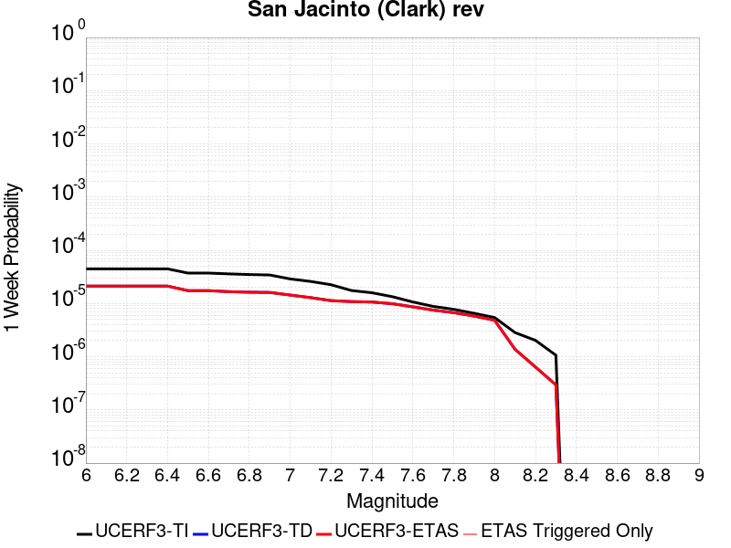 |  |  |  |

| Magnitude | 1 wk TI Prob | 1 wk TD Prob | 1 wk ETAS Prob | 1 wk ETAS/TD Gain | 1 wk ETAS Triggered Only | 1 mo TI Prob | 1 mo TD Prob | 1 mo ETAS Prob | 1 mo ETAS/TD Gain | 1 mo ETAS Triggered Only | 1 yr TI Prob | 1 yr TD Prob | 1 yr ETAS Prob | 1 yr ETAS/TD Gain | 1 yr ETAS Triggered Only | 10 yr TI Prob | 10 yr TD Prob | 10 yr ETAS Prob | 10 yr ETAS/TD Gain | 10 yr ETAS Triggered Only |
|-----|-----|-----|-----|-----|-----|-----|-----|-----|-----|-----|-----|-----|-----|-----|-----|-----|-----|-----|-----|-----|
| 6.0 | 4.482615E-5 | 2.1246653E-5 | 2.1246653E-5 | 1.0 | 0.0 | 1.9209793E-4 | 9.105396E-5 | 9.105396E-5 | 1.0 | 0.0 | 0.0023362834 | 0.0011080275 | 0.0012199983 | 1.1010542 | 1.12095055E-4 | 0.02311874 | 0.011552496 | 0.011663295 | 1.009591 | 1.12095055E-4 |
| 6.1 | 4.482615E-5 | 2.1246653E-5 | 2.1246653E-5 | 1.0 | 0.0 | 1.9209793E-4 | 9.105396E-5 | 9.105396E-5 | 1.0 | 0.0 | 0.0023362834 | 0.0011080275 | 0.0012199983 | 1.1010542 | 1.12095055E-4 | 0.02311874 | 0.011552496 | 0.011663295 | 1.009591 | 1.12095055E-4 |
| 6.2 | 4.482615E-5 | 2.1246653E-5 | 2.1246653E-5 | 1.0 | 0.0 | 1.9209793E-4 | 9.105396E-5 | 9.105396E-5 | 1.0 | 0.0 | 0.0023362834 | 0.0011080275 | 0.0012199983 | 1.1010542 | 1.12095055E-4 | 0.02311874 | 0.011552496 | 0.011663295 | 1.009591 | 1.12095055E-4 |
| 6.3 | 4.482615E-5 | 2.1246653E-5 | 2.1246653E-5 | 1.0 | 0.0 | 1.9209793E-4 | 9.105396E-5 | 9.105396E-5 | 1.0 | 0.0 | 0.0023362834 | 0.0011080275 | 0.0012199983 | 1.1010542 | 1.12095055E-4 | 0.02311874 | 0.011552496 | 0.011663295 | 1.009591 | 1.12095055E-4 |
| 6.4 | 4.482615E-5 | 2.1246653E-5 | 2.1246653E-5 | 1.0 | 0.0 | 1.9209793E-4 | 9.105396E-5 | 9.105396E-5 | 1.0 | 0.0 | 0.0023362834 | 0.0011080275 | 0.0012199983 | 1.1010542 | 1.12095055E-4 | 0.02311874 | 0.011552496 | 0.011663295 | 1.009591 | 1.12095055E-4 |
| 6.5 | 3.7294863E-5 | 1.7439266E-5 | 1.7439266E-5 | 1.0 | 0.0 | 1.5982533E-4 | 7.4737596E-5 | 7.4737596E-5 | 1.0 | 0.0 | 0.0019441366 | 9.095549E-4 | 0.001021548 | 1.1231296 | 1.12095055E-4 | 0.01927216 | 0.009538002 | 0.009649028 | 1.0116404 | 1.12095055E-4 |
| 6.6 | 3.7294863E-5 | 1.7439266E-5 | 1.7439266E-5 | 1.0 | 0.0 | 1.5982533E-4 | 7.4737596E-5 | 7.4737596E-5 | 1.0 | 0.0 | 0.0019441366 | 9.095549E-4 | 0.001021548 | 1.1231296 | 1.12095055E-4 | 0.01927216 | 0.009538002 | 0.009649028 | 1.0116404 | 1.12095055E-4 |
| 6.7 | 3.6039248E-5 | 1.6685774E-5 | 1.6685774E-5 | 1.0 | 0.0 | 1.5444479E-4 | 7.150852E-5 | 7.150852E-5 | 1.0 | 0.0 | 0.0018787434 | 8.702727E-4 | 9.822702E-4 | 1.1286924 | 1.12095055E-4 | 0.01862939 | 0.009139063 | 0.009250133 | 1.0121534 | 1.12095055E-4 |
| 6.8 | 3.5031844E-5 | 1.631307E-5 | 1.631307E-5 | 1.0 | 0.0 | 1.5012783E-4 | 6.991131E-5 | 6.991131E-5 | 1.0 | 0.0 | 0.0018262739 | 8.508419E-4 | 9.628416E-4 | 1.131634 | 1.12095055E-4 | 0.01811338 | 0.008938338 | 0.0090494305 | 1.0124289 | 1.12095055E-4 |
| 6.9 | 3.435112E-5 | 1.6142621E-5 | 1.6142621E-5 | 1.0 | 0.0 | 1.4721078E-4 | 6.918085E-5 | 6.918085E-5 | 1.0 | 0.0 | 0.0017908178 | 8.4195554E-4 | 9.539562E-4 | 1.1330245 | 1.12095055E-4 | 0.017764548 | 0.008846124 | 0.008957228 | 1.0125595 | 1.12095055E-4 |
| 7.0 | 2.8959772E-5 | 1.4409266E-5 | 1.4409266E-5 | 1.0 | 0.0 | 1.241074E-4 | 6.175255E-5 | 6.175255E-5 | 1.0 | 0.0 | 0.0015099603 | 7.515808E-4 | 8.635916E-4 | 1.1490337 | 1.12095055E-4 | 0.014997416 | 0.007906552 | 0.008017761 | 1.0140654 | 1.12095055E-4 |
| 7.1 | 2.6002877E-5 | 1.2895728E-5 | 1.2895728E-5 | 1.0 | 0.0 | 1.11436144E-4 | 5.5266246E-5 | 5.5266246E-5 | 1.0 | 0.0 | 0.0013558907 | 6.72661E-4 | 7.8468065E-4 | 1.1665322 | 1.12095055E-4 | 0.013476475 | 0.007082177 | 0.0071934783 | 1.0157157 | 1.12095055E-4 |
| 7.2 | 2.2544838E-5 | 1.1323137E-5 | 1.1323137E-5 | 1.0 | 0.0 | 9.661716E-5 | 4.8526836E-5 | 4.8526836E-5 | 1.0 | 0.0 | 0.001175679 | 5.906555E-4 | 7.0268434E-4 | 1.1896687 | 1.12095055E-4 | 0.011694785 | 0.006225147 | 0.006336544 | 1.0178947 | 1.12095055E-4 |
| 7.3 | 1.75334E-5 | 1.0868777E-5 | 1.0868777E-5 | 1.0 | 0.0 | 7.514098E-5 | 4.657965E-5 | 4.657965E-5 | 1.0 | 0.0 | 9.144575E-4 | 5.6696107E-4 | 6.789926E-4 | 1.1976 | 1.12095055E-4 | 0.009107036 | 0.0059641483 | 0.006075575 | 1.0186827 | 1.12095055E-4 |
| 7.4 | 1.5924552E-5 | 1.0667449E-5 | 1.0667449E-5 | 1.0 | 0.0 | 6.82463E-5 | 4.5716843E-5 | 4.5716843E-5 | 1.0 | 0.0 | 8.305819E-4 | 5.564618E-4 | 6.684945E-4 | 1.2013304 | 1.12095055E-4 | 0.008274844 | 0.005850773 | 0.005962212 | 1.0190469 | 1.12095055E-4 |
| 7.5 | 1.3428931E-5 | 9.904629E-6 | 9.904629E-6 | 1.0 | 0.0 | 5.7551293E-5 | 4.2447726E-5 | 4.2447726E-5 | 1.0 | 0.0 | 7.004617E-4 | 5.166796E-4 | 6.287167E-4 | 1.2168406 | 1.12095055E-4 | 0.006982579 | 0.005434641 | 0.0055461274 | 1.0205139 | 1.12095055E-4 |
| 7.6 | 1.0688787E-5 | 8.659321E-6 | 8.659321E-6 | 1.0 | 0.0 | 4.5808283E-5 | 3.711085E-5 | 3.711085E-5 | 1.0 | 0.0 | 5.5757316E-4 | 4.5173138E-4 | 4.5173138E-4 | 1.0 | 0.0 | 0.005561762 | 0.0047653103 | 0.0047653103 | 1.0 | 0.0 |
| 7.7 | 8.81236E-6 | 7.511008E-6 | 7.511008E-6 | 1.0 | 0.0 | 3.776671E-5 | 3.2189637E-5 | 3.2189637E-5 | 1.0 | 0.0 | 4.597127E-4 | 3.9183858E-4 | 3.9183858E-4 | 1.0 | 0.0 | 0.0045876284 | 0.004157538 | 0.004157538 | 1.0 | 0.0 |
| 7.8 | 7.780431E-6 | 6.737165E-6 | 6.737165E-6 | 1.0 | 0.0 | 3.3344273E-5 | 2.8873246E-5 | 2.8873246E-5 | 1.0 | 0.0 | 4.0589093E-4 | 3.5147526E-4 | 3.5147526E-4 | 1.0 | 0.0 | 0.0040515037 | 0.0037444304 | 0.0037444304 | 1.0 | 0.0 |
| 7.9 | 6.5437994E-6 | 5.8182573E-6 | 5.8182573E-6 | 1.0 | 0.0 | 2.8044553E-5 | 2.493515E-5 | 2.493515E-5 | 1.0 | 0.0 | 3.4138895E-4 | 3.0354335E-4 | 3.0354335E-4 | 1.0 | 0.0 | 0.0034086495 | 0.0032547154 | 0.0032547154 | 1.0 | 0.0 |
| 8.0 | 5.4488164E-6 | 4.846891E-6 | 4.846891E-6 | 1.0 | 0.0 | 2.3351862E-5 | 2.0772224E-5 | 2.0772224E-5 | 1.0 | 0.0 | 2.8427184E-4 | 2.5287265E-4 | 2.5287265E-4 | 1.0 | 0.0 | 0.0028390845 | 0.002728809 | 0.002728809 | 1.0 | 0.0 |
| 8.1 | 2.8397242E-6 | 1.3804471E-6 | 1.3804471E-6 | 1.0 | 0.0 | 1.217019E-5 | 5.9161885E-6 | 5.9161885E-6 | 1.0 | 0.0 | 1.4816198E-4 | 7.202722E-5 | 7.202722E-5 | 1.0 | 0.0 | 0.0014806325 | 8.1907987E-4 | 8.1907987E-4 | 1.0 | 0.0 |
| 8.2 | 2.030244E-6 | 6.3955446E-7 | 6.3955446E-7 | 1.0 | 0.0 | 8.701017E-6 | 2.7409446E-6 | 2.7409446E-6 | 1.0 | 0.0 | 1.05929736E-4 | 3.3370496E-5 | 3.3370496E-5 | 1.0 | 0.0 | 0.0010587925 | 3.9933104E-4 | 3.9933104E-4 | 1.0 | 0.0 |
| 8.3 | 1.0659804E-6 | 2.9625085E-7 | 2.9625085E-7 | 1.0 | 0.0 | 4.568479E-6 | 1.2696458E-6 | 1.2696458E-6 | 1.0 | 0.0 | 5.5619817E-5 | 1.5457832E-5 | 1.5457832E-5 | 1.0 | 0.0 | 5.5605895E-4 | 1.8787566E-4 | 1.8787566E-4 | 1.0 | 0.0 |

## San Andreas (Carrizo) rev
*[(top)](#table-of-contents)*

| 1 Week | 1 Month | 1 Year | 10 Year |
|-----|-----|-----|-----|
|  |  |  |  |

| Magnitude | 1 wk TI Prob | 1 wk TD Prob | 1 wk ETAS Prob | 1 wk ETAS/TD Gain | 1 wk ETAS Triggered Only | 1 mo TI Prob | 1 mo TD Prob | 1 mo ETAS Prob | 1 mo ETAS/TD Gain | 1 mo ETAS Triggered Only | 1 yr TI Prob | 1 yr TD Prob | 1 yr ETAS Prob | 1 yr ETAS/TD Gain | 1 yr ETAS Triggered Only | 10 yr TI Prob | 10 yr TD Prob | 10 yr ETAS Prob | 10 yr ETAS/TD Gain | 10 yr ETAS Triggered Only |
|-----|-----|-----|-----|-----|-----|-----|-----|-----|-----|-----|-----|-----|-----|-----|-----|-----|-----|-----|-----|-----|
| 6.0 | 1.1674632E-4 | 2.4418926E-4 | 2.4418926E-4 | 1.0 | 0.0 | 5.002454E-4 | 0.0010461073 | 0.0010461073 | 1.0 | 0.0 | 0.006073493 | 0.012662465 | 0.01277314 | 1.0087404 | 1.12095055E-4 | 0.0591016 | 0.12101763 | 0.121116154 | 1.0008142 | 1.12095055E-4 |
| 6.1 | 1.1674632E-4 | 2.4418926E-4 | 2.4418926E-4 | 1.0 | 0.0 | 5.002454E-4 | 0.0010461073 | 0.0010461073 | 1.0 | 0.0 | 0.006073493 | 0.012662465 | 0.01277314 | 1.0087404 | 1.12095055E-4 | 0.0591016 | 0.12101763 | 0.121116154 | 1.0008142 | 1.12095055E-4 |
| 6.2 | 1.1674632E-4 | 2.4418926E-4 | 2.4418926E-4 | 1.0 | 0.0 | 5.002454E-4 | 0.0010461073 | 0.0010461073 | 1.0 | 0.0 | 0.006073493 | 0.012662465 | 0.01277314 | 1.0087404 | 1.12095055E-4 | 0.0591016 | 0.12101763 | 0.121116154 | 1.0008142 | 1.12095055E-4 |
| 6.3 | 1.1674632E-4 | 2.4418926E-4 | 2.4418926E-4 | 1.0 | 0.0 | 5.002454E-4 | 0.0010461073 | 0.0010461073 | 1.0 | 0.0 | 0.006073493 | 0.012662465 | 0.01277314 | 1.0087404 | 1.12095055E-4 | 0.0591016 | 0.12101763 | 0.121116154 | 1.0008142 | 1.12095055E-4 |
| 6.4 | 1.1674632E-4 | 2.4418926E-4 | 2.4418926E-4 | 1.0 | 0.0 | 5.002454E-4 | 0.0010461073 | 0.0010461073 | 1.0 | 0.0 | 0.006073493 | 0.012662465 | 0.01277314 | 1.0087404 | 1.12095055E-4 | 0.0591016 | 0.12101763 | 0.121116154 | 1.0008142 | 1.12095055E-4 |
| 6.5 | 1.13136164E-4 | 2.3738507E-4 | 2.3738507E-4 | 1.0 | 0.0 | 4.847792E-4 | 0.0010169694 | 0.0010169694 | 1.0 | 0.0 | 0.0058862255 | 0.012311762 | 0.012422478 | 1.0089927 | 1.12095055E-4 | 0.057327334 | 0.11798858 | 0.11808745 | 1.0008379 | 1.12095055E-4 |
| 6.6 | 1.13136164E-4 | 2.3738507E-4 | 2.3738507E-4 | 1.0 | 0.0 | 4.847792E-4 | 0.0010169694 | 0.0010169694 | 1.0 | 0.0 | 0.0058862255 | 0.012311762 | 0.012422478 | 1.0089927 | 1.12095055E-4 | 0.057327334 | 0.11798858 | 0.11808745 | 1.0008379 | 1.12095055E-4 |
| 6.7 | 1.1149675E-4 | 2.3429535E-4 | 2.3429535E-4 | 1.0 | 0.0 | 4.777557E-4 | 0.001003738 | 0.001003738 | 1.0 | 0.0 | 0.0058011734 | 0.012152475 | 0.012263208 | 1.009112 | 1.12095055E-4 | 0.05652051 | 0.11660991 | 0.116708934 | 1.0008491 | 1.12095055E-4 |
| 6.8 | 1.1103589E-4 | 2.3331578E-4 | 2.3331578E-4 | 1.0 | 0.0 | 4.7578133E-4 | 9.995431E-4 | 9.995431E-4 | 1.0 | 0.0 | 0.005777263 | 0.012101971 | 0.012212709 | 1.0091505 | 1.12095055E-4 | 0.056293584 | 0.11616996 | 0.11626904 | 1.0008528 | 1.12095055E-4 |
| 6.9 | 1.1053259E-4 | 2.3223832E-4 | 2.3223832E-4 | 1.0 | 0.0 | 4.7362508E-4 | 9.94929E-4 | 9.94929E-4 | 1.0 | 0.0 | 0.0057511497 | 0.012046416 | 0.012157161 | 1.0091932 | 1.12095055E-4 | 0.05604569 | 0.11568588 | 0.115785 | 1.0008569 | 1.12095055E-4 |
| 7.0 | 1.1005377E-4 | 2.3124556E-4 | 2.3124556E-4 | 1.0 | 0.0 | 4.7157376E-4 | 9.906775E-4 | 9.906775E-4 | 1.0 | 0.0 | 0.0057263062 | 0.011995226 | 0.012105976 | 1.0092329 | 1.12095055E-4 | 0.055809796 | 0.115237914 | 0.11533709 | 1.0008607 | 1.12095055E-4 |
| 7.1 | 1.0308142E-4 | 2.1632477E-4 | 2.1632477E-4 | 1.0 | 0.0 | 4.417027E-4 | 9.267778E-4 | 9.267778E-4 | 1.0 | 0.0 | 0.0053644776 | 0.01122546 | 0.011336297 | 1.0098737 | 1.12095055E-4 | 0.052368138 | 0.108490154 | 0.10859009 | 1.0009211 | 1.12095055E-4 |
| 7.2 | 1.0027479E-4 | 2.1039638E-4 | 2.1039638E-4 | 1.0 | 0.0 | 4.296783E-4 | 9.013882E-4 | 9.013882E-4 | 1.0 | 0.0 | 0.0052187922 | 0.01091948 | 0.01103035 | 1.0101535 | 1.12095055E-4 | 0.050979212 | 0.105792396 | 0.10589263 | 1.0009475 | 1.12095055E-4 |
| 7.3 | 9.816942E-5 | 2.0513569E-4 | 2.0513569E-4 | 1.0 | 0.0 | 4.2065824E-4 | 8.7885774E-4 | 8.7885774E-4 | 1.0 | 0.0 | 0.005109493 | 0.010647885 | 0.010758786 | 1.0104153 | 1.12095055E-4 | 0.049935985 | 0.10337204 | 0.103472546 | 1.0009723 | 1.12095055E-4 |
| 7.4 | 9.5634205E-5 | 1.9881417E-4 | 1.9881417E-4 | 1.0 | 0.0 | 4.0979648E-4 | 8.5178344E-4 | 8.5178344E-4 | 1.0 | 0.0 | 0.0049778637 | 0.010321417 | 0.010432355 | 1.0107484 | 1.12095055E-4 | 0.048678253 | 0.100452885 | 0.10055372 | 1.0010037 | 1.12095055E-4 |
| 7.5 | 8.052417E-5 | 1.6191212E-4 | 1.6191212E-4 | 1.0 | 0.0 | 3.4505792E-4 | 6.9372467E-4 | 6.9372467E-4 | 1.0 | 0.0 | 0.0041929903 | 0.008413471 | 0.008524624 | 1.0132111 | 1.12095055E-4 | 0.04114753 | 0.083160356 | 0.08326313 | 1.0012358 | 1.12095055E-4 |
| 7.6 | 7.897024E-5 | 1.5843454E-4 | 1.5843454E-4 | 1.0 | 0.0 | 3.384E-4 | 6.788286E-4 | 6.788286E-4 | 1.0 | 0.0 | 0.0041122385 | 0.008233497 | 0.008344669 | 1.0135024 | 1.12095055E-4 | 0.040369697 | 0.08149801 | 0.08160097 | 1.0012634 | 1.12095055E-4 |
| 7.7 | 6.707427E-5 | 1.3346E-4 | 1.3346E-4 | 1.0 | 0.0 | 2.8742946E-4 | 5.718461E-4 | 5.718461E-4 | 1.0 | 0.0 | 0.003493839 | 0.0069400338 | 0.007051351 | 1.0160398 | 1.12095055E-4 | 0.034394164 | 0.06936544 | 0.06946976 | 1.001504 | 1.12095055E-4 |
| 7.8 | 6.147705E-5 | 1.226075E-4 | 1.226075E-4 | 1.0 | 0.0 | 2.6344648E-4 | 5.253549E-4 | 5.253549E-4 | 1.0 | 0.0 | 0.0032027436 | 0.0063774628 | 0.006488843 | 1.0174646 | 1.12095055E-4 | 0.031569764 | 0.063803546 | 0.06390849 | 1.0016447 | 1.12095055E-4 |
| 7.9 | 4.7636717E-5 | 8.925424E-5 | 8.925424E-5 | 1.0 | 0.0 | 2.0414138E-4 | 3.8246208E-4 | 3.8246208E-4 | 1.0 | 0.0 | 0.0024825884 | 0.004646542 | 0.004646542 | 1.0 | 0.0 | 0.024550365 | 0.046842933 | 0.046842933 | 1.0 | 0.0 |
| 8.0 | 3.3554235E-5 | 5.2418785E-5 | 5.2418785E-5 | 1.0 | 0.0 | 1.4379594E-4 | 2.246326E-4 | 2.246326E-4 | 1.0 | 0.0 | 0.0017493097 | 0.0027314737 | 0.0027314737 | 1.0 | 0.0 | 0.017356034 | 0.028019711 | 0.028019711 | 1.0 | 0.0 |
| 8.1 | 1.9175432E-5 | 1.9323146E-5 | 1.9323146E-5 | 1.0 | 0.0 | 8.217783E-5 | 8.281086E-5 | 8.281086E-5 | 1.0 | 0.0 | 0.0010000558 | 0.0010077565 | 0.0010077565 | 1.0 | 0.0 | 0.009955673 | 0.010830634 | 0.010830634 | 1.0 | 0.0 |
| 8.2 | 8.643924E-6 | 5.5269165E-6 | 5.5269165E-6 | 1.0 | 0.0 | 3.704486E-5 | 2.368657E-5 | 2.368657E-5 | 1.0 | 0.0 | 4.5092785E-4 | 2.8834594E-4 | 2.8834594E-4 | 1.0 | 0.0 | 0.0045001395 | 0.0032771796 | 0.0032771796 | 1.0 | 0.0 |
| 8.3 | 1.983087E-6 | 7.7486385E-7 | 7.7486385E-7 | 1.0 | 0.0 | 8.498917E-6 | 3.320841E-6 | 3.320841E-6 | 1.0 | 0.0 | 1.034694E-4 | 4.0430506E-5 | 4.0430506E-5 | 1.0 | 0.0 | 0.0010342124 | 4.7705657E-4 | 4.7705657E-4 | 1.0 | 0.0 |

## Cleghorn Pass
*[(top)](#table-of-contents)*

| 1 Week | 1 Month | 1 Year | 10 Year |
|-----|-----|-----|-----|
|  | 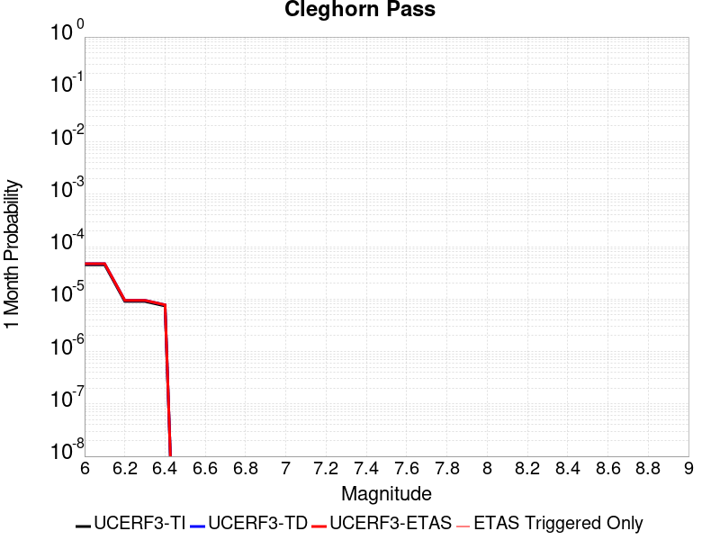 |  |  |

| Magnitude | 1 wk TI Prob | 1 wk TD Prob | 1 wk ETAS Prob | 1 wk ETAS/TD Gain | 1 wk ETAS Triggered Only | 1 mo TI Prob | 1 mo TD Prob | 1 mo ETAS Prob | 1 mo ETAS/TD Gain | 1 mo ETAS Triggered Only | 1 yr TI Prob | 1 yr TD Prob | 1 yr ETAS Prob | 1 yr ETAS/TD Gain | 1 yr ETAS Triggered Only | 10 yr TI Prob | 10 yr TD Prob | 10 yr ETAS Prob | 10 yr ETAS/TD Gain | 10 yr ETAS Triggered Only |
|-----|-----|-----|-----|-----|-----|-----|-----|-----|-----|-----|-----|-----|-----|-----|-----|-----|-----|-----|-----|-----|
| 6.0 | 1.0522846E-5 | 1.1041362E-5 | 1.1041362E-5 | 1.0 | 0.0 | 4.509713E-5 | 4.731956E-5 | 4.731956E-5 | 1.0 | 0.0 | 5.4891926E-4 | 5.76016E-4 | 6.880465E-4 | 1.194492 | 1.12095055E-4 | 0.0054756533 | 0.0057503963 | 0.0058618467 | 1.0193814 | 1.12095055E-4 |
| 6.1 | 1.0522846E-5 | 1.1041362E-5 | 1.1041362E-5 | 1.0 | 0.0 | 4.509713E-5 | 4.731956E-5 | 4.731956E-5 | 1.0 | 0.0 | 5.4891926E-4 | 5.76016E-4 | 6.880465E-4 | 1.194492 | 1.12095055E-4 | 0.0054756533 | 0.0057503963 | 0.0058618467 | 1.0193814 | 1.12095055E-4 |
| 6.2 | 2.1045846E-6 | 2.2083466E-6 | 2.2083466E-6 | 1.0 | 0.0 | 9.019617E-6 | 9.464332E-6 | 9.464332E-6 | 1.0 | 0.0 | 1.098083E-4 | 1.1522634E-4 | 2.2730848E-4 | 1.9727128 | 1.12095055E-4 | 0.0010975406 | 0.0011520775 | 0.0012640434 | 1.0971861 | 1.12095055E-4 |
| 6.3 | 2.1045846E-6 | 2.2083466E-6 | 2.2083466E-6 | 1.0 | 0.0 | 9.019617E-6 | 9.464332E-6 | 9.464332E-6 | 1.0 | 0.0 | 1.098083E-4 | 1.1522634E-4 | 2.2730848E-4 | 1.9727128 | 1.12095055E-4 | 0.0010975406 | 0.0011520775 | 0.0012640434 | 1.0971861 | 1.12095055E-4 |
| 6.4 | 1.7259927E-6 | 1.8109952E-6 | 1.8109952E-6 | 1.0 | 0.0 | 7.3970905E-6 | 7.761408E-6 | 7.761408E-6 | 1.0 | 0.0 | 9.005586E-5 | 9.4495146E-5 | 2.065796E-4 | 2.18614 | 1.12095055E-4 | 9.001937E-4 | 9.4495143E-4 | 0.0010569405 | 1.1185131 | 1.12095055E-4 |

