# Parent Section Magnitude-Probability Distributions

Only fault sections with at least one triggered aftershock are plotted. Sections are sorted by total supraseismogenic trigger rate (decreasing)

## Table Of Contents

* [Garlock (Central)](#garlock-central)
* [Tank Canyon](#tank-canyon)
* [Little Lake](#little-lake)
* [Airport Lake](#airport-lake)
* [Owl Lake](#owl-lake)
* [Panamint Valley](#panamint-valley)
* [Garlock (East)](#garlock-east)
* [Ash Hill](#ash-hill)
* [Hunter Mountain-Saline Valley](#hunter-mountain-saline-valley)
* [Blackwater](#blackwater)
* [Garlock (West)](#garlock-west)
* [McLean Lake](#mclean-lake)
* [Goldstone Lake](#goldstone-lake)
* [So Sierra Nevada](#so-sierra-nevada)
* [Gravel Hills-Harper Lk](#gravel-hills-harper-lk)
* [Coyote Canyon](#coyote-canyon)
* [Death Valley (So)](#death-valley-so)
* [San Andreas (Mojave S)](#san-andreas-mojave-s)
* [San Andreas (Mojave N)](#san-andreas-mojave-n)
* [Nelson Lake](#nelson-lake)
* [Lenwood-Lockhart-Old Woman Springs](#lenwood-lockhart-old-woman-springs)
* [San Andreas (San Bernardino N)](#san-andreas-san-bernardino-n)
* [Bicycle Lake](#bicycle-lake)
* [Paradise](#paradise)
* [Towne Pass](#towne-pass)
* [Death Valley (Black Mtns Frontal)](#death-valley-black-mtns-frontal)
* [Garlic Springs](#garlic-springs)
* [San Andreas (San Bernardino S)](#san-andreas-san-bernardino-s)
* [Helendale-So Lockhart](#helendale-so-lockhart)
* [Death Valley (No)](#death-valley-no)
* [Coyote Lake](#coyote-lake)
* [Sierra Nevada  (No Extension)](#sierra-nevada--no-extension)
* [White Wolf (Extension)](#white-wolf-extension)
* [Death Valley (Fish Lake Valley)](#death-valley-fish-lake-valley)
* [San Jacinto (San Bernardino)](#san-jacinto-san-bernardino)
* [San Andreas (Cholame) rev](#san-andreas-cholame-rev)
* [San Andreas (San Gorgonio Pass-Garnet HIll)](#san-andreas-san-gorgonio-pass-garnet-hill)
* [San Jacinto (San Jacinto Valley) rev](#san-jacinto-san-jacinto-valley-rev)
* [San Andreas (Big Bend)](#san-andreas-big-bend)
* [San Andreas (Carrizo) rev](#san-andreas-carrizo-rev)
* [Manix-Afton Hills](#manix-afton-hills)
* [Calico-Hidalgo](#calico-hidalgo)
* [San Andreas (Parkfield)](#san-andreas-parkfield)
* [San Andreas (Coachella) rev](#san-andreas-coachella-rev)
* [Ludlow](#ludlow)
* [San Jacinto (Lytle Creek connector)](#san-jacinto-lytle-creek-connector)
* [Cady](#cady)
* [San Jacinto (Stepovers Combined)](#san-jacinto-stepovers-combined)
* [Scodie Lineament](#scodie-lineament)
* [Pleito](#pleito)
* [San Jacinto (Anza) rev](#san-jacinto-anza-rev)
* [Baker](#baker)
* [Brawley (Seismic Zone) alt 1](#brawley-seismic-zone-alt-1)
* [Santa Cruz Island](#santa-cruz-island)
* [San Andreas (North Branch Mill Creek)](#san-andreas-north-branch-mill-creek)
* [Palos Verdes](#palos-verdes)
* [Red Mountain](#red-mountain)
* [Lake Isabella (Seismicity)](#lake-isabella-seismicity)
* [Independence rev 2011](#independence-rev-2011)
* [Red Pass](#red-pass)
* [Imperial](#imperial)
* [Elsinore (Glen Ivy) rev](#elsinore-glen-ivy-rev)
* [Tin Mountain](#tin-mountain)
* [Rose Canyon](#rose-canyon)
* [Owens Valley](#owens-valley)
* [San Jacinto (Coyote Creek)](#san-jacinto-coyote-creek)
* [Cleghorn Pass](#cleghorn-pass)
* [Kern Canyon (South Kern) 2011](#kern-canyon-south-kern-2011)
* [Coronado Bank alt1](#coronado-bank-alt1)
* [Mission Ridge-Arroyo Parida-Santa Ana](#mission-ridge-arroyo-parida-santa-ana)
* [San Diego Trough south](#san-diego-trough-south)
* [San Andreas (Creeping Section) 2011 CFM](#san-andreas-creeping-section-2011-cfm)
* [San Diego Trough north alt1](#san-diego-trough-north-alt1)
* [Pinto Mtn](#pinto-mtn)
* [Santa Rosa Island](#santa-rosa-island)
* [Cleghorn Lake](#cleghorn-lake)
* [Rinconada 2011 CFM](#rinconada-2011-cfm)
* [Ventura-Pitas Point](#ventura-pitas-point)
* [South Klamath Lake West](#south-klamath-lake-west)
* [Pitas Point (Lower West)](#pitas-point-lower-west)
* [South Klamath Lake East](#south-klamath-lake-east)
* [Mono Lake 2011 CFM](#mono-lake-2011-cfm)
* [Calaveras (So) 2011 CFM](#calaveras-so-2011-cfm)
* [San Juan](#san-juan)
* [Channel Islands Thrust](#channel-islands-thrust)
* [White Wolf](#white-wolf)
* [Malibu Coast (Extension) alt 1](#malibu-coast-extension-alt-1)
* [Kern Canyon (Lake Isabella) 2011](#kern-canyon-lake-isabella-2011)
* [Lost Hills](#lost-hills)
* [Deep Springs](#deep-springs)
* [San Jacinto (Borrego)](#san-jacinto-borrego)
* [Quien Sabe 2011 CFM](#quien-sabe-2011-cfm)
* [Cleghorn](#cleghorn)
* [Camp Rock 2011](#camp-rock-2011)
* [Cucamonga](#cucamonga)
* [Whittier alt 1](#whittier-alt-1)
* [Chino alt 1](#chino-alt-1)
* [San Jacinto (Superstition Mtn)](#san-jacinto-superstition-mtn)
* [Malibu Coast alt 1](#malibu-coast-alt-1)
* [Elysian Park (Upper)](#elysian-park-upper)
* [Elmore Ranch](#elmore-ranch)
* [Mission Creek](#mission-creek)
* [Santa Ynez (West)](#santa-ynez-west)
* [San Jacinto (Clark) rev](#san-jacinto-clark-rev)
* [Point Reyes 2011 CFM](#point-reyes-2011-cfm)
* [Great Valley 05 Pittsburg - Kirby Hills alt1](#great-valley-05-pittsburg---kirby-hills-alt1)
* [San Clemente](#san-clemente)
* [Maacama 2011 CFM](#maacama-2011-cfm)
* [Anacapa-Dume alt 1](#anacapa-dume-alt-1)
* [Earthquake Valley (So Extension)](#earthquake-valley-so-extension)
* [Round Valley](#round-valley)
* [Pitas Point (Lower)-Montalvo](#pitas-point-lower-montalvo)
* [Hat Creek-McArthur-Mayfield](#hat-creek-mcarthur-mayfield)
* [Blue Cut](#blue-cut)
* [Sierra Madre](#sierra-madre)
* [San Pedro Basin](#san-pedro-basin)
* [Emerson-Copper Mtn 2011](#emerson-copper-mtn-2011)
* [Newport-Inglewood (Offshore)](#newport-inglewood-offshore)
* [Kern Canyon (North Kern) 2011](#kern-canyon-north-kern-2011)

## Garlock (Central)
*[(top)](#table-of-contents)*

| 1 Week | 1 Month | 1 Year | 10 Year |
|-----|-----|-----|-----|
|  |  |  | 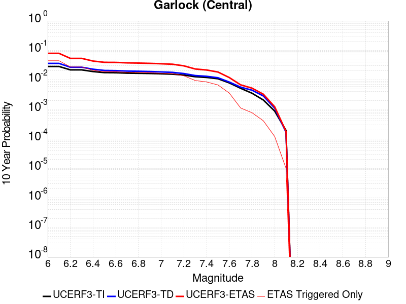 |

| Magnitude | 1 wk TI Prob | 1 wk TD Prob | 1 wk ETAS Prob | 1 wk ETAS/TD Gain | 1 wk ETAS Triggered Only | 1 mo TI Prob | 1 mo TD Prob | 1 mo ETAS Prob | 1 mo ETAS/TD Gain | 1 mo ETAS Triggered Only | 1 yr TI Prob | 1 yr TD Prob | 1 yr ETAS Prob | 1 yr ETAS/TD Gain | 1 yr ETAS Triggered Only | 10 yr TI Prob | 10 yr TD Prob | 10 yr ETAS Prob | 10 yr ETAS/TD Gain | 10 yr ETAS Triggered Only |
|-----|-----|-----|-----|-----|-----|-----|-----|-----|-----|-----|-----|-----|-----|-----|-----|-----|-----|-----|-----|-----|
| 6.0 | 5.5131142E-5 | 7.030957E-5 | 0.0012541253 | 17.83719 | 0.001183899 | 2.3625491E-4 | 3.012923E-4 | 0.0043678223 | 14.496959 | 0.0040677553 | 0.0028726095 | 0.0036621294 | 0.02425912 | 6.624321 | 0.020672698 | 0.028357591 | 0.036111314 | 0.07947489 | 2.200831 | 0.044988163 |
| 6.1 | 5.5131142E-5 | 7.030957E-5 | 0.0012541253 | 17.83719 | 0.001183899 | 2.3625491E-4 | 3.012923E-4 | 0.0043678223 | 14.496959 | 0.0040677553 | 0.0028726095 | 0.0036621294 | 0.02425912 | 6.624321 | 0.020672698 | 0.028357591 | 0.036111314 | 0.07947489 | 2.200831 | 0.044988163 |
| 6.2 | 4.216245E-5 | 5.1718438E-5 | 8.1058877E-4 | 15.67311 | 7.589096E-4 | 1.806837E-4 | 2.216318E-4 | 0.0028620518 | 12.913544 | 0.0026410054 | 0.0021976046 | 0.0026950599 | 0.015259007 | 5.6618433 | 0.012597899 | 0.021759989 | 0.026718695 | 0.053339012 | 1.996318 | 0.027351102 |
| 6.3 | 4.216245E-5 | 5.1718438E-5 | 8.1058877E-4 | 15.67311 | 7.589096E-4 | 1.806837E-4 | 2.216318E-4 | 0.0028620518 | 12.913544 | 0.0026410054 | 0.0021976046 | 0.0026950599 | 0.015259007 | 5.6618433 | 0.012597899 | 0.021759989 | 0.026718695 | 0.053339012 | 1.996318 | 0.027351102 |
| 6.4 | 3.6858168E-5 | 4.416524E-5 | 7.7268627E-4 | 17.49535 | 7.285532E-4 | 1.5795401E-4 | 1.8926601E-4 | 0.0023441613 | 12.385538 | 0.0021553033 | 0.0019213937 | 0.0023019037 | 0.011902726 | 5.170819 | 0.009622973 | 0.019048655 | 0.022876801 | 0.04331387 | 1.8933535 | 0.02091555 |
| 6.5 | 3.39199E-5 | 4.00718E-5 | 7.078855E-4 | 17.665426 | 6.678405E-4 | 1.453629E-4 | 1.7172511E-4 | 0.0021142 | 12.311537 | 0.0019428086 | 0.0017683565 | 0.0020887703 | 0.010813148 | 5.1768007 | 0.008742639 | 0.017543508 | 0.02078729 | 0.039157562 | 1.8837261 | 0.018760245 |
| 6.6 | 3.3571985E-5 | 3.9525858E-5 | 7.073399E-4 | 17.895624 | 6.678405E-4 | 1.4387199E-4 | 1.6938566E-4 | 0.0021118652 | 12.4677925 | 0.0019428086 | 0.0017502342 | 0.0020603414 | 0.010754674 | 5.21985 | 0.008712282 | 0.017365133 | 0.020508545 | 0.03885431 | 1.8945426 | 0.01872989 |
| 6.7 | 3.2580007E-5 | 3.8141945E-5 | 6.756017E-4 | 17.712828 | 6.374841E-4 | 1.3962112E-4 | 1.6345536E-4 | 0.0020755948 | 12.698237 | 0.0019124522 | 0.0016985617 | 0.001988274 | 0.010289386 | 5.1750336 | 0.008317649 | 0.016856372 | 0.019801024 | 0.037505426 | 1.8941154 | 0.018062048 |
| 6.8 | 3.2185937E-5 | 3.756897E-5 | 6.7502906E-4 | 17.967728 | 6.374841E-4 | 1.3793244E-4 | 1.6100006E-4 | 0.0020427927 | 12.688149 | 0.0018820958 | 0.0016780337 | 0.001958435 | 0.01010831 | 5.1614223 | 0.008165867 | 0.016654192 | 0.019507734 | 0.036800735 | 1.8864689 | 0.01763706 |
| 6.9 | 3.165394E-5 | 3.6773246E-5 | 6.438786E-4 | 17.50943 | 6.071277E-4 | 1.3565269E-4 | 1.5759023E-4 | 0.0020090379 | 12.748492 | 0.0018517395 | 0.0016503202 | 0.001916994 | 0.010006611 | 5.219949 | 0.008105154 | 0.01638118 | 0.01910022 | 0.036013313 | 1.885492 | 0.017242426 |
| 7.0 | 3.0903822E-5 | 3.5678135E-5 | 5.820735E-4 | 16.314573 | 5.464149E-4 | 1.3243823E-4 | 1.5289745E-4 | 0.0018829468 | 12.315096 | 0.0017303139 | 0.0016112428 | 0.0018599583 | 0.009677338 | 5.2029867 | 0.007831947 | 0.015996104 | 0.018539215 | 0.034836315 | 1.879061 | 0.016604941 |
| 7.1 | 3.0069863E-5 | 3.4444005E-5 | 5.5048475E-4 | 15.982019 | 5.160585E-4 | 1.2886449E-4 | 1.4760894E-4 | 0.0018473155 | 12.51493 | 0.0016999575 | 0.0015677959 | 0.0017956785 | 0.009371147 | 5.218722 | 0.007589096 | 0.01556781 | 0.017906671 | 0.033737272 | 1.8840615 | 0.01611924 |
| 7.2 | 2.7957109E-5 | 3.1332263E-5 | 5.473746E-4 | 17.47 | 5.160585E-4 | 1.1981068E-4 | 1.3427433E-4 | 0.0017429467 | 12.980491 | 0.0016088884 | 0.0014577188 | 0.0016335837 | 0.008301078 | 5.0815144 | 0.0066784043 | 0.014481937 | 0.016309762 | 0.030135535 | 1.8476992 | 0.014055006 |
| 7.3 | 2.4519275E-5 | 2.6762631E-5 | 4.2138505E-4 | 15.745278 | 3.9463298E-4 | 1.0507837E-4 | 1.14692026E-4 | 0.0011466907 | 9.997998 | 0.001032117 | 0.0012785783 | 0.0013954957 | 0.0058516567 | 4.1932464 | 0.0044623883 | 0.012712469 | 0.013952656 | 0.023501229 | 1.6843553 | 0.009683686 |
| 7.4 | 2.3225532E-5 | 2.5246292E-5 | 3.895137E-4 | 15.428551 | 3.642766E-4 | 9.95342E-5 | 1.08193984E-4 | 9.884338E-4 | 9.1357565 | 8.803351E-4 | 0.0012111551 | 0.0013164802 | 0.0051363492 | 3.901577 | 0.0038249043 | 0.012045753 | 0.013169862 | 0.021707492 | 1.6482701 | 0.0086515695 |
| 7.5 | 2.097765E-5 | 2.2528295E-5 | 2.9572958E-4 | 13.12703 | 2.7320746E-4 | 8.9901114E-5 | 9.6546326E-5 | 8.250292E-4 | 8.5454235 | 7.285532E-4 | 0.0010939965 | 0.0011748294 | 0.004267543 | 3.6324787 | 0.0030963512 | 0.010886264 | 0.011763361 | 0.018423203 | 1.5661513 | 0.006739117 |
| 7.6 | 1.511254E-5 | 1.603285E-5 | 7.674465E-5 | 4.7867126 | 6.071277E-5 | 6.476642E-5 | 6.8710455E-5 | 3.7225345E-4 | 5.4177117 | 3.0356384E-4 | 7.882459E-4 | 8.362365E-4 | 0.0024134484 | 2.8860836 | 0.0015785319 | 0.007854558 | 0.008405034 | 0.011896779 | 1.4154347 | 0.0035213404 |
| 7.7 | 9.934069E-6 | 1.0717446E-5 | 1.0717446E-5 | 1.0 | 0.0 | 4.2573887E-5 | 4.5931105E-5 | 1.3699607E-4 | 2.9826427 | 9.106915E-5 | 5.182138E-4 | 5.590681E-4 | 9.23141E-4 | 1.651214 | 3.642766E-4 | 0.00517007 | 0.005647734 | 0.0066438364 | 1.1763722 | 0.0010017607 |
| 7.8 | 6.7562896E-6 | 8.460225E-6 | 8.460225E-6 | 1.0 | 0.0 | 2.8955206E-5 | 3.6257603E-5 | 1.2732345E-4 | 3.5116346 | 9.106915E-5 | 3.5247262E-4 | 4.4134707E-4 | 6.8409095E-4 | 1.5500067 | 2.4285108E-4 | 0.0035191406 | 0.0044631446 | 0.0051582255 | 1.1557379 | 6.981968E-4 |
| 7.9 | 3.975453E-6 | 5.390275E-6 | 5.390275E-6 | 1.0 | 0.0 | 1.7037546E-5 | 2.3100974E-5 | 8.381234E-5 | 3.6280868 | 6.071277E-5 | 2.0741238E-4 | 2.8121815E-4 | 4.9365306E-4 | 1.7554097 | 2.1249469E-4 | 0.002072189 | 0.002843625 | 0.0034187562 | 1.2022529 | 5.767713E-4 |
| 8.0 | 1.6729537E-6 | 2.0839254E-6 | 2.0839254E-6 | 1.0 | 0.0 | 7.169782E-6 | 8.931079E-6 | 3.928719E-5 | 4.39893 | 3.0356385E-5 | 8.7288594E-5 | 1.0873049E-4 | 1.3908357E-4 | 1.279159 | 3.0356385E-5 | 8.7254314E-4 | 0.0011002679 | 0.0012822058 | 1.1653578 | 1.821383E-4 |
| 8.1 | 3.6733252E-7 | 3.1582263E-7 | 3.1582263E-7 | 1.0 | 0.0 | 1.5742813E-6 | 1.3535249E-6 | 1.3535249E-6 | 1.0 | 0.0 | 1.9166706E-5 | 1.6479058E-5 | 1.6479058E-5 | 1.0 | 0.0 | 1.9165053E-4 | 1.6687137E-4 | 1.6687137E-4 | 1.0 | 0.0 |

## Tank Canyon
*[(top)](#table-of-contents)*

| 1 Week | 1 Month | 1 Year | 10 Year |
|-----|-----|-----|-----|
|  |  |  |  |

| Magnitude | 1 wk TI Prob | 1 wk TD Prob | 1 wk ETAS Prob | 1 wk ETAS/TD Gain | 1 wk ETAS Triggered Only | 1 mo TI Prob | 1 mo TD Prob | 1 mo ETAS Prob | 1 mo ETAS/TD Gain | 1 mo ETAS Triggered Only | 1 yr TI Prob | 1 yr TD Prob | 1 yr ETAS Prob | 1 yr ETAS/TD Gain | 1 yr ETAS Triggered Only | 10 yr TI Prob | 10 yr TD Prob | 10 yr ETAS Prob | 10 yr ETAS/TD Gain | 10 yr ETAS Triggered Only |
|-----|-----|-----|-----|-----|-----|-----|-----|-----|-----|-----|-----|-----|-----|-----|-----|-----|-----|-----|-----|-----|
| 6.0 | 4.8284557E-5 | 5.7980193E-5 | 7.257819E-4 | 12.517756 | 6.678405E-4 | 2.0691741E-4 | 2.4846673E-4 | 0.0027977694 | 11.260138 | 0.0025499363 | 0.0025163088 | 0.003021537 | 0.016913017 | 5.597488 | 0.01393358 | 0.02488006 | 0.029871376 | 0.06185364 | 2.0706658 | 0.032967035 |
| 6.1 | 1.7796336E-5 | 2.0877918E-5 | 2.6372392E-4 | 12.631716 | 2.4285108E-4 | 7.626778E-5 | 8.947394E-5 | 6.3583994E-4 | 7.106426 | 5.464149E-4 | 9.281647E-4 | 0.001088837 | 0.0057283067 | 5.26094 | 0.0046445266 | 0.009242975 | 0.010839115 | 0.02221948 | 2.0499349 | 0.011505069 |
| 6.2 | 1.7796336E-5 | 2.0877918E-5 | 2.6372392E-4 | 12.631716 | 2.4285108E-4 | 7.626778E-5 | 8.947394E-5 | 6.3583994E-4 | 7.106426 | 5.464149E-4 | 9.281647E-4 | 0.001088837 | 0.0057283067 | 5.26094 | 0.0046445266 | 0.009242975 | 0.010839115 | 0.02221948 | 2.0499349 | 0.011505069 |
| 6.3 | 1.3515912E-5 | 1.5762842E-5 | 2.2825418E-4 | 14.480522 | 2.1249469E-4 | 5.792405E-5 | 6.7553425E-5 | 5.532228E-4 | 8.189411 | 4.8570216E-4 | 7.049971E-4 | 8.221765E-4 | 0.004704599 | 5.722128 | 0.0038856172 | 0.007027647 | 0.008193959 | 0.01725636 | 2.1059856 | 0.009137272 |
| 6.4 | 1.0870146E-5 | 1.2620516E-5 | 1.6440052E-4 | 13.02645 | 1.5178192E-4 | 4.658551E-5 | 5.4086904E-5 | 4.4869856E-4 | 8.295881 | 3.9463298E-4 | 5.67031E-4 | 6.58327E-4 | 0.0037526398 | 5.700267 | 0.0030963512 | 0.005655863 | 0.006565783 | 0.013682852 | 2.0839634 | 0.0071641067 |
| 6.5 | 7.964826E-6 | 9.197785E-6 | 1.002661E-4 | 10.901113 | 9.106915E-5 | 3.4134522E-5 | 3.9418548E-5 | 2.8226004E-4 | 7.1605897 | 2.4285108E-4 | 4.1550855E-4 | 4.798258E-4 | 0.0025430694 | 5.299985 | 0.002064234 | 0.0041473247 | 0.0047891987 | 0.00932085 | 1.946223 | 0.0045534577 |
| 6.6 | 6.6317E-6 | 7.6136125E-6 | 9.8682074E-5 | 12.961267 | 9.106915E-5 | 2.8421264E-5 | 3.2629414E-5 | 2.4511717E-4 | 7.512154 | 2.1249469E-4 | 3.4597394E-4 | 3.971998E-4 | 0.0018537275 | 4.66699 | 0.0014571064 | 0.0034543579 | 0.00396605 | 0.007382717 | 1.8614784 | 0.0034302713 |
| 6.7 | 4.793663E-6 | 5.4315906E-6 | 9.650025E-5 | 17.766481 | 9.106915E-5 | 2.0544108E-5 | 2.3278062E-5 | 2.0541213E-4 | 8.82428 | 1.821383E-4 | 2.500958E-4 | 2.833779E-4 | 0.001254507 | 4.426975 | 9.714043E-4 | 0.0024981452 | 0.002830858 | 0.005070871 | 1.7912842 | 0.0022463724 |
| 6.8 | 4.382823E-6 | 4.9699643E-6 | 9.603866E-5 | 19.323814 | 9.106915E-5 | 1.8783392E-5 | 2.1299697E-5 | 2.0343412E-4 | 9.551034 | 1.821383E-4 | 2.286638E-4 | 2.5929723E-4 | 0.0012001011 | 4.628284 | 9.410479E-4 | 0.0022842865 | 0.0025906207 | 0.0047100624 | 1.8181213 | 0.0021249468 |
| 6.9 | 2.729601E-6 | 3.0739357E-6 | 3.3430228E-5 | 10.875382 | 3.0356385E-5 | 1.1698237E-5 | 1.317395E-5 | 1.042419E-4 | 7.9127293 | 9.106915E-5 | 1.4241673E-4 | 1.6038226E-4 | 6.15655E-4 | 3.8386726 | 4.5534575E-4 | 0.001423255 | 0.001602831 | 0.0027545246 | 1.7185372 | 0.0011535425 |
| 7.0 | 1.8987357E-6 | 2.1272067E-6 | 2.1272067E-6 | 1.0 | 0.0 | 8.137413E-6 | 9.116572E-6 | 3.9472678E-5 | 4.329772 | 3.0356385E-5 | 9.90685E-5 | 1.1098931E-4 | 2.3240138E-4 | 2.0939076 | 1.2142554E-4 | 9.902435E-4 | 0.0011094075 | 0.0016248935 | 1.4646498 | 5.160585E-4 |
| 7.1 | 1.4928986E-6 | 1.664348E-6 | 1.664348E-6 | 1.0 | 0.0 | 6.398121E-6 | 7.1329036E-6 | 3.748907E-5 | 5.2557936 | 3.0356385E-5 | 7.789434E-5 | 8.6840235E-5 | 2.0825522E-4 | 2.398142 | 1.2142554E-4 | 7.786704E-4 | 8.681209E-4 | 0.0011410911 | 1.3144381 | 2.7320746E-4 |
| 7.2 | 1.069082E-6 | 1.1830405E-6 | 1.1830405E-6 | 1.0 | 0.0 | 4.581772E-6 | 5.0701665E-6 | 5.0701665E-6 | 1.0 | 0.0 | 5.5781646E-5 | 6.172806E-5 | 9.208257E-5 | 1.4917457 | 3.0356385E-5 | 5.576765E-4 | 6.1716145E-4 | 6.778367E-4 | 1.0983135 | 6.071277E-5 |
| 7.3 | 8.776551E-7 | 9.77166E-7 | 9.77166E-7 | 1.0 | 0.0 | 3.7613736E-6 | 4.18785E-6 | 4.18785E-6 | 1.0 | 0.0 | 4.579376E-5 | 5.0986404E-5 | 8.134124E-5 | 1.5953516 | 3.0356385E-5 | 4.5784327E-4 | 5.0979806E-4 | 5.704799E-4 | 1.1190311 | 6.071277E-5 |
| 7.4 | 7.55721E-7 | 8.510639E-7 | 8.510639E-7 | 1.0 | 0.0 | 3.2388E-6 | 3.6474144E-6 | 3.6474144E-6 | 1.0 | 0.0 | 3.9431678E-5 | 4.4406883E-5 | 4.4406883E-5 | 1.0 | 0.0 | 3.942468E-4 | 4.4403094E-4 | 4.7437387E-4 | 1.068335 | 3.0356385E-5 |
| 7.5 | 5.587665E-7 | 6.305905E-7 | 6.305905E-7 | 1.0 | 0.0 | 2.3947114E-6 | 2.7025305E-6 | 2.7025305E-6 | 1.0 | 0.0 | 2.915522E-5 | 3.290331E-5 | 3.290331E-5 | 1.0 | 0.0 | 2.9151395E-4 | 3.290331E-4 | 3.5937948E-4 | 1.092229 | 3.0356385E-5 |

## Little Lake
*[(top)](#table-of-contents)*

| 1 Week | 1 Month | 1 Year | 10 Year |
|-----|-----|-----|-----|
| 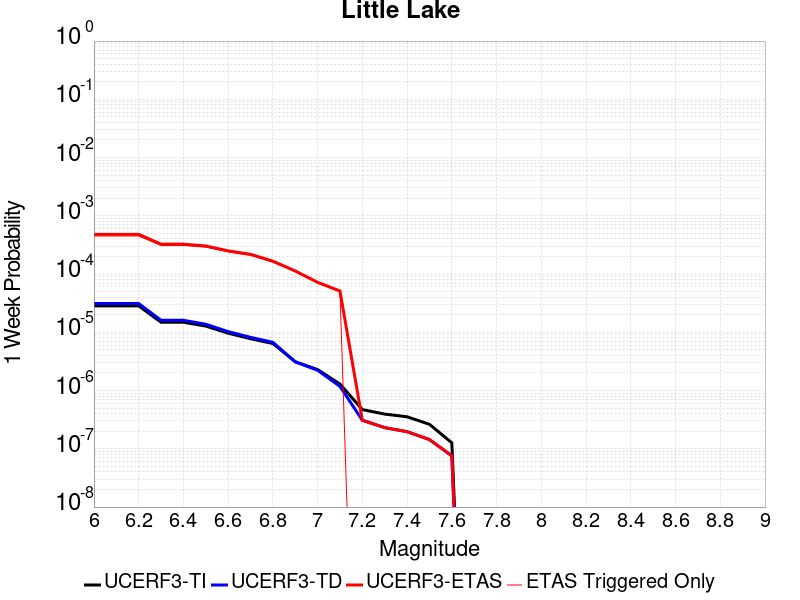 |  |  | 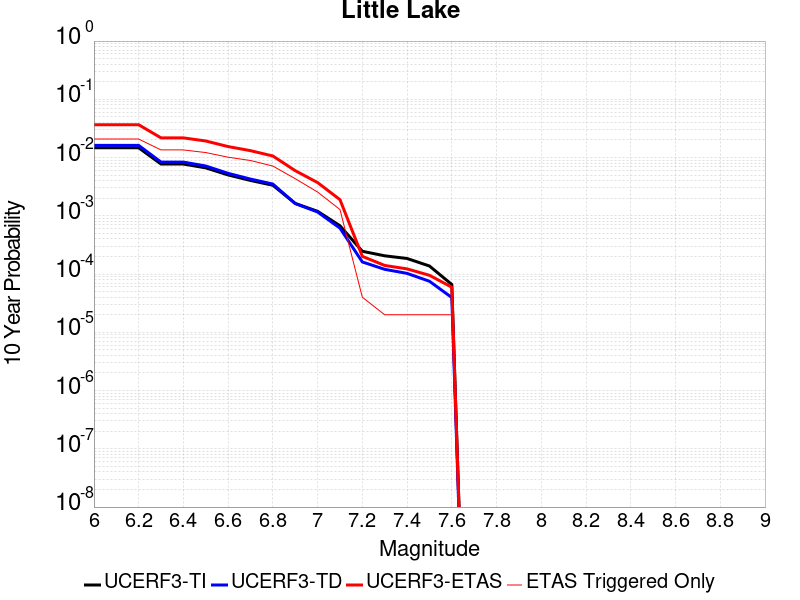 |

| Magnitude | 1 wk TI Prob | 1 wk TD Prob | 1 wk ETAS Prob | 1 wk ETAS/TD Gain | 1 wk ETAS Triggered Only | 1 mo TI Prob | 1 mo TD Prob | 1 mo ETAS Prob | 1 mo ETAS/TD Gain | 1 mo ETAS Triggered Only | 1 yr TI Prob | 1 yr TD Prob | 1 yr ETAS Prob | 1 yr ETAS/TD Gain | 1 yr ETAS Triggered Only | 10 yr TI Prob | 10 yr TD Prob | 10 yr ETAS Prob | 10 yr ETAS/TD Gain | 10 yr ETAS Triggered Only |
|-----|-----|-----|-----|-----|-----|-----|-----|-----|-----|-----|-----|-----|-----|-----|-----|-----|-----|-----|-----|-----|
| 6.0 | 2.8424427E-5 | 3.121011E-5 | 6.3831883E-4 | 20.452309 | 6.071277E-4 | 1.2181328E-4 | 1.3375151E-4 | 0.0023494712 | 17.56594 | 0.002216016 | 0.0014820677 | 0.0016273415 | 0.011901409 | 7.313406 | 0.010290815 | 0.014722223 | 0.01616766 | 0.037193038 | 2.300459 | 0.021370895 |
| 6.1 | 2.8424427E-5 | 3.121011E-5 | 6.3831883E-4 | 20.452309 | 6.071277E-4 | 1.2181328E-4 | 1.3375151E-4 | 0.0023494712 | 17.56594 | 0.002216016 | 0.0014820677 | 0.0016273415 | 0.011901409 | 7.313406 | 0.010290815 | 0.014722223 | 0.01616766 | 0.037193038 | 2.300459 | 0.021370895 |
| 6.2 | 2.8424427E-5 | 3.121011E-5 | 6.3831883E-4 | 20.452309 | 6.071277E-4 | 1.2181328E-4 | 1.3375151E-4 | 0.0023494712 | 17.56594 | 0.002216016 | 0.0014820677 | 0.0016273415 | 0.011901409 | 7.313406 | 0.010290815 | 0.014722223 | 0.01616766 | 0.037193038 | 2.300459 | 0.021370895 |
| 6.3 | 1.48860645E-5 | 1.608343E-5 | 4.4106596E-4 | 27.423628 | 4.2498938E-4 | 6.379586E-5 | 6.892732E-5 | 0.0015562876 | 22.578676 | 0.0014874628 | 7.7643775E-4 | 8.388952E-4 | 0.00760269 | 9.06274 | 0.0067694737 | 0.007737305 | 0.008360104 | 0.02244812 | 2.6851485 | 0.014206788 |
| 6.4 | 1.48860645E-5 | 1.608343E-5 | 4.4106596E-4 | 27.423628 | 4.2498938E-4 | 6.379586E-5 | 6.892732E-5 | 0.0015562876 | 22.578676 | 0.0014874628 | 7.7643775E-4 | 8.388952E-4 | 0.00760269 | 9.06274 | 0.0067694737 | 0.007737305 | 0.008360104 | 0.02244812 | 2.6851485 | 0.014206788 |
| 6.5 | 1.2797581E-5 | 1.37672705E-5 | 4.387508E-4 | 31.869122 | 4.2498938E-4 | 5.4845623E-5 | 5.9001395E-5 | 0.0014856673 | 25.180204 | 0.0014267501 | 6.675408E-4 | 7.1813096E-4 | 0.0068760514 | 9.574927 | 0.006162346 | 0.006655392 | 0.0071606543 | 0.019939596 | 2.7846053 | 0.012871107 |
| 6.6 | 9.661896E-6 | 1.0290241E-5 | 2.8349488E-4 | 27.549877 | 2.7320746E-4 | 4.1407468E-5 | 4.4100383E-5 | 0.0012279472 | 27.844366 | 0.001183899 | 5.040193E-4 | 5.368061E-4 | 0.0057249614 | 10.664859 | 0.0051909415 | 0.005028777 | 0.0053566997 | 0.016347233 | 3.051736 | 0.011049724 |
| 6.7 | 7.767871E-6 | 8.2006045E-6 | 2.5104967E-4 | 30.613558 | 2.4285108E-4 | 3.329045E-5 | 3.514505E-5 | 0.0011279364 | 32.09375 | 0.0010928299 | 4.0523586E-4 | 4.2782072E-4 | 0.0049186433 | 11.496973 | 0.004492745 | 0.004044977 | 0.0042713233 | 0.013822967 | 3.236226 | 0.009592617 |
| 6.8 | 6.4235196E-6 | 6.7364886E-6 | 1.8887357E-4 | 28.03739 | 1.821383E-4 | 2.752908E-5 | 2.887042E-5 | 9.6989115E-4 | 33.594635 | 9.410479E-4 | 3.35115E-4 | 3.514535E-4 | 0.0041750134 | 11.879277 | 0.0038249043 | 0.003346101 | 0.0035102374 | 0.011254192 | 3.206106 | 0.0077712345 |
| 6.9 | 3.1283696E-6 | 3.1124437E-6 | 1.245376E-4 | 40.012806 | 1.2142554E-4 | 1.3407229E-5 | 1.3338985E-5 | 5.597466E-4 | 41.963207 | 5.464149E-4 | 1.6322079E-4 | 1.6239155E-4 | 0.0024387506 | 15.017719 | 0.0022767289 | 0.0016310095 | 0.0016228772 | 0.0063204807 | 3.8946142 | 0.0047052396 |
| 7.0 | 2.290603E-6 | 2.228881E-6 | 9.329783E-5 | 41.8586 | 9.106915E-5 | 9.816834E-6 | 9.552317E-6 | 3.7382543E-4 | 39.13453 | 3.642766E-4 | 1.19513395E-4 | 1.162943E-4 | 0.0016035842 | 13.789018 | 0.0014874628 | 0.0011944914 | 0.0011624366 | 0.004103583 | 3.5301564 | 0.0029445693 |
| 7.1 | 1.293693E-6 | 1.1778063E-6 | 6.18905E-5 | 52.547264 | 6.071277E-5 | 5.5443866E-6 | 5.0477356E-6 | 1.5682889E-4 | 31.069157 | 1.5178192E-4 | 6.750081E-5 | 6.1455146E-5 | 7.5960904E-4 | 12.360381 | 6.981968E-4 | 6.7480316E-4 | 6.1445E-4 | 0.0021313366 | 3.46869 | 0.0015178192 |
| 7.2 | 4.715842E-7 | 3.0923712E-7 | 3.0923712E-7 | 1.0 | 0.0 | 2.0210737E-6 | 1.3253012E-6 | 1.3253012E-6 | 1.0 | 0.0 | 2.4606294E-5 | 1.613543E-5 | 7.684722E-5 | 4.7626386 | 6.071277E-5 | 2.460357E-4 | 1.6134311E-4 | 2.5239759E-4 | 1.5643529 | 9.106915E-5 |
| 7.3 | 3.9430947E-7 | 2.3102866E-7 | 2.3102866E-7 | 1.0 | 0.0 | 1.6898966E-6 | 9.901224E-7 | 9.901224E-7 | 1.0 | 0.0 | 2.0574296E-5 | 1.2054675E-5 | 1.2054675E-5 | 1.0 | 0.0 | 2.0572392E-4 | 1.2054028E-4 | 1.5089301E-4 | 1.2518057 | 3.0356385E-5 |
| 7.4 | 3.547123E-7 | 1.968413E-7 | 1.968413E-7 | 1.0 | 0.0 | 1.5201948E-6 | 8.436053E-7 | 8.436053E-7 | 1.0 | 0.0 | 1.8508214E-5 | 1.0270846E-5 | 1.0270846E-5 | 1.0 | 0.0 | 1.8506673E-4 | 1.0270378E-4 | 1.3305705E-4 | 1.2955419 | 3.0356385E-5 |
| 7.5 | 2.6354266E-7 | 1.4426631E-7 | 1.4426631E-7 | 1.0 | 0.0 | 1.129468E-6 | 6.1828405E-7 | 6.1828405E-7 | 1.0 | 0.0 | 1.3751187E-5 | 7.527583E-6 | 7.527583E-6 | 1.0 | 0.0 | 1.3750336E-4 | 7.527333E-5 | 1.0562743E-4 | 1.4032516 | 3.0356385E-5 |
| 7.6 | 1.269913E-7 | 7.574039E-8 | 7.574039E-8 | 1.0 | 0.0 | 5.4424834E-7 | 3.2460161E-7 | 3.2460161E-7 | 1.0 | 0.0 | 6.6262032E-6 | 3.952018E-6 | 3.952018E-6 | 1.0 | 0.0 | 6.626006E-5 | 3.9519513E-5 | 6.9874695E-5 | 1.7681062 | 3.0356385E-5 |

## Airport Lake
*[(top)](#table-of-contents)*

| 1 Week | 1 Month | 1 Year | 10 Year |
|-----|-----|-----|-----|
|  |  |  |  |

| Magnitude | 1 wk TI Prob | 1 wk TD Prob | 1 wk ETAS Prob | 1 wk ETAS/TD Gain | 1 wk ETAS Triggered Only | 1 mo TI Prob | 1 mo TD Prob | 1 mo ETAS Prob | 1 mo ETAS/TD Gain | 1 mo ETAS Triggered Only | 1 yr TI Prob | 1 yr TD Prob | 1 yr ETAS Prob | 1 yr ETAS/TD Gain | 1 yr ETAS Triggered Only | 10 yr TI Prob | 10 yr TD Prob | 10 yr ETAS Prob | 10 yr ETAS/TD Gain | 10 yr ETAS Triggered Only |
|-----|-----|-----|-----|-----|-----|-----|-----|-----|-----|-----|-----|-----|-----|-----|-----|-----|-----|-----|-----|-----|
| 6.0 | 1.2387061E-5 | 1.31041625E-5 | 4.3808797E-4 | 33.43121 | 4.2498938E-4 | 5.3086325E-5 | 5.6159646E-5 | 0.0016042483 | 28.565855 | 0.0015481756 | 6.461343E-4 | 6.835576E-4 | 0.007842767 | 11.473454 | 0.0071641067 | 0.0064425888 | 0.006817361 | 0.022977456 | 3.3704329 | 0.016271021 |
| 6.1 | 1.2387061E-5 | 1.31041625E-5 | 4.3808797E-4 | 33.43121 | 4.2498938E-4 | 5.3086325E-5 | 5.6159646E-5 | 0.0016042483 | 28.565855 | 0.0015481756 | 6.461343E-4 | 6.835576E-4 | 0.007842767 | 11.473454 | 0.0071641067 | 0.0064425888 | 0.006817361 | 0.022977456 | 3.3704329 | 0.016271021 |
| 6.2 | 1.2387061E-5 | 1.31041625E-5 | 4.3808797E-4 | 33.43121 | 4.2498938E-4 | 5.3086325E-5 | 5.6159646E-5 | 0.0016042483 | 28.565855 | 0.0015481756 | 6.461343E-4 | 6.835576E-4 | 0.007842767 | 11.473454 | 0.0071641067 | 0.0064425888 | 0.006817361 | 0.022977456 | 3.3704329 | 0.016271021 |
| 6.3 | 1.2387061E-5 | 1.31041625E-5 | 4.3808797E-4 | 33.43121 | 4.2498938E-4 | 5.3086325E-5 | 5.6159646E-5 | 0.0016042483 | 28.565855 | 0.0015481756 | 6.461343E-4 | 6.835576E-4 | 0.007842767 | 11.473454 | 0.0071641067 | 0.0064425888 | 0.006817361 | 0.022977456 | 3.3704329 | 0.016271021 |
| 6.4 | 1.2387061E-5 | 1.31041625E-5 | 4.3808797E-4 | 33.43121 | 4.2498938E-4 | 5.3086325E-5 | 5.6159646E-5 | 0.0016042483 | 28.565855 | 0.0015481756 | 6.461343E-4 | 6.835576E-4 | 0.007842767 | 11.473454 | 0.0071641067 | 0.0064425888 | 0.006817361 | 0.022977456 | 3.3704329 | 0.016271021 |
| 6.5 | 6.9922594E-6 | 7.3854753E-6 | 3.4130324E-4 | 46.212765 | 3.3392024E-4 | 2.996648E-5 | 3.1651685E-5 | 0.001276224 | 40.32089 | 0.0012446117 | 3.6478083E-4 | 3.8529653E-4 | 0.0059990636 | 15.569991 | 0.005615931 | 0.003641826 | 0.0038468228 | 0.016154343 | 4.199399 | 0.012355048 |
| 6.6 | 6.9922594E-6 | 7.3854753E-6 | 3.4130324E-4 | 46.212765 | 3.3392024E-4 | 2.996648E-5 | 3.1651685E-5 | 0.001276224 | 40.32089 | 0.0012446117 | 3.6478083E-4 | 3.8529653E-4 | 0.0059990636 | 15.569991 | 0.005615931 | 0.003641826 | 0.0038468228 | 0.016154343 | 4.199399 | 0.012355048 |
| 6.7 | 5.477277E-6 | 5.7865013E-6 | 3.0934857E-4 | 53.460384 | 3.0356384E-4 | 2.3473833E-5 | 2.4799077E-5 | 0.001178313 | 47.514393 | 0.0011535425 | 2.8575645E-4 | 3.0189083E-4 | 0.0053395294 | 17.686954 | 0.0050391597 | 0.0028538927 | 0.003015191 | 0.013698684 | 4.5432224 | 0.010715803 |
| 6.8 | 3.9950432E-6 | 4.219401E-6 | 2.1671319E-4 | 51.36113 | 2.1249469E-4 | 1.7121502E-5 | 1.8083038E-5 | 9.2875806E-4 | 51.360737 | 9.106915E-4 | 2.0843433E-4 | 2.2014149E-4 | 0.004165603 | 18.922388 | 0.00394633 | 0.0020823893 | 0.0021995052 | 0.0104685705 | 4.7595115 | 0.008287293 |
| 6.9 | 2.95695E-6 | 3.1232569E-6 | 1.8526099E-4 | 59.3166 | 1.821383E-4 | 1.2672582E-5 | 1.3385331E-5 | 6.5086083E-4 | 48.624935 | 6.374841E-4 | 1.5427776E-4 | 1.6295648E-4 | 0.0028035315 | 17.204172 | 0.0026410054 | 0.001541707 | 0.0016285924 | 0.007386912 | 4.5357647 | 0.005767713 |
| 7.0 | 1.456072E-6 | 1.540931E-6 | 9.2609946E-5 | 60.099995 | 9.106915E-5 | 6.2402937E-6 | 6.603979E-6 | 3.101658E-4 | 46.966507 | 3.0356384E-4 | 7.597293E-5 | 8.0401485E-5 | 0.0014463289 | 17.988834 | 0.0013660373 | 7.594696E-4 | 8.038228E-4 | 0.0035337012 | 4.3961196 | 0.0027320746 |
| 7.1 | 6.995192E-7 | 7.4095556E-7 | 6.145368E-5 | 82.938416 | 6.071277E-5 | 2.997936E-6 | 3.175524E-6 | 1.2460067E-4 | 39.23783 | 1.2142554E-4 | 3.649926E-5 | 3.8662E-5 | 6.457662E-4 | 16.702866 | 6.071277E-4 | 3.6493264E-4 | 3.8662003E-4 | 0.0017521292 | 4.531915 | 0.0013660373 |

## Owl Lake
*[(top)](#table-of-contents)*

| 1 Week | 1 Month | 1 Year | 10 Year |
|-----|-----|-----|-----|
|  |  |  |  |

| Magnitude | 1 wk TI Prob | 1 wk TD Prob | 1 wk ETAS Prob | 1 wk ETAS/TD Gain | 1 wk ETAS Triggered Only | 1 mo TI Prob | 1 mo TD Prob | 1 mo ETAS Prob | 1 mo ETAS/TD Gain | 1 mo ETAS Triggered Only | 1 yr TI Prob | 1 yr TD Prob | 1 yr ETAS Prob | 1 yr ETAS/TD Gain | 1 yr ETAS Triggered Only | 10 yr TI Prob | 10 yr TD Prob | 10 yr ETAS Prob | 10 yr ETAS/TD Gain | 10 yr ETAS Triggered Only |
|-----|-----|-----|-----|-----|-----|-----|-----|-----|-----|-----|-----|-----|-----|-----|-----|-----|-----|-----|-----|-----|
| 6.0 | 5.0320643E-5 | 6.639169E-5 | 2.7887226E-4 | 4.2004094 | 2.1249469E-4 | 2.1564208E-4 | 2.8451107E-4 | 0.0014377255 | 5.05332 | 0.0011535425 | 0.0026222812 | 0.0034594585 | 0.00902571 | 2.608995 | 0.0055855745 | 0.02591553 | 0.034156606 | 0.04644148 | 1.3596632 | 0.012719325 |
| 6.1 | 5.0320643E-5 | 6.639169E-5 | 2.7887226E-4 | 4.2004094 | 2.1249469E-4 | 2.1564208E-4 | 2.8451107E-4 | 0.0014377255 | 5.05332 | 0.0011535425 | 0.0026222812 | 0.0034594585 | 0.00902571 | 2.608995 | 0.0055855745 | 0.02591553 | 0.034156606 | 0.04644148 | 1.3596632 | 0.012719325 |
| 6.2 | 2.4125871E-5 | 3.099773E-5 | 2.1313039E-4 | 6.875677 | 1.821383E-4 | 1.0339249E-4 | 1.3284181E-4 | 0.00101306 | 7.6260624 | 8.803351E-4 | 0.0012580766 | 0.0016162846 | 0.005919924 | 3.6626742 | 0.0043106065 | 0.012509781 | 0.016078865 | 0.025427638 | 1.5814325 | 0.0095015485 |
| 6.3 | 1.7433485E-5 | 2.2368875E-5 | 2.045031E-4 | 9.142306 | 1.821383E-4 | 7.471279E-5 | 9.586398E-5 | 9.154078E-4 | 9.549027 | 8.1962236E-4 | 9.0924866E-4 | 0.0011666653 | 0.005138712 | 4.4046154 | 0.0039766864 | 0.009055373 | 0.011635699 | 0.020036586 | 1.7219924 | 0.008499787 |
| 6.4 | 1.7433485E-5 | 2.2368875E-5 | 2.045031E-4 | 9.142306 | 1.821383E-4 | 7.471279E-5 | 9.586398E-5 | 9.154078E-4 | 9.549027 | 8.1962236E-4 | 9.0924866E-4 | 0.0011666653 | 0.005138712 | 4.4046154 | 0.0039766864 | 0.009055373 | 0.011635699 | 0.020036586 | 1.7219924 | 0.008499787 |
| 6.5 | 1.5182742E-5 | 1.9441362E-5 | 2.0157613E-4 | 10.368415 | 1.821383E-4 | 6.506727E-5 | 8.331832E-5 | 9.028724E-4 | 10.836421 | 8.1962236E-4 | 7.919061E-4 | 0.0010140799 | 0.004956408 | 4.887591 | 0.00394633 | 0.0078909 | 0.01012468 | 0.01820787 | 1.7983651 | 0.008165867 |
| 6.6 | 6.7271576E-6 | 8.55546E-6 | 1.2997996E-4 | 15.192633 | 1.2142554E-4 | 2.8830356E-5 | 3.6665773E-5 | 6.134159E-4 | 16.729933 | 5.767713E-4 | 3.5095305E-4 | 4.4632002E-4 | 0.0033288894 | 7.4585257 | 0.0028838564 | 0.0035039932 | 0.0044720164 | 0.01042548 | 2.3312707 | 0.0059802076 |
| 6.7 | 6.682835E-6 | 8.487893E-6 | 1.299124E-4 | 15.305613 | 1.2142554E-4 | 2.8640408E-5 | 3.637621E-5 | 6.131265E-4 | 16.855152 | 5.767713E-4 | 3.4864116E-4 | 4.42796E-4 | 0.0033253755 | 7.509949 | 0.0028838564 | 0.003480947 | 0.0044369358 | 0.010360388 | 2.3350322 | 0.005949851 |
| 6.8 | 6.5774975E-6 | 8.334328E-6 | 1.2975885E-4 | 15.569203 | 1.2142554E-4 | 2.8188972E-5 | 3.5718094E-5 | 6.124688E-4 | 17.147297 | 5.767713E-4 | 3.4314668E-4 | 4.3478666E-4 | 0.0033173892 | 7.6299243 | 0.0028838564 | 0.0034261728 | 0.0043570627 | 0.01028099 | 2.3596148 | 0.005949851 |
| 6.9 | 6.363419E-6 | 8.007404E-6 | 1.2943197E-4 | 16.164036 | 1.2142554E-4 | 2.727151E-5 | 3.431703E-5 | 6.110685E-4 | 17.80657 | 5.767713E-4 | 3.3198006E-4 | 4.177353E-4 | 0.0033003872 | 7.9006658 | 0.0028838564 | 0.0033148455 | 0.0041870046 | 0.010111944 | 2.4150782 | 0.005949851 |
| 7.0 | 6.1342453E-6 | 7.639479E-6 | 1.290641E-4 | 16.894358 | 1.2142554E-4 | 2.6289357E-5 | 3.274024E-5 | 6.0949265E-4 | 18.616009 | 5.767713E-4 | 3.2002592E-4 | 3.9854506E-4 | 0.0032812522 | 8.233077 | 0.0028838564 | 0.0031956544 | 0.0039956346 | 0.009921712 | 2.483138 | 0.005949851 |
| 7.1 | 5.842926E-6 | 7.1498466E-6 | 9.821835E-5 | 13.737126 | 9.106915E-5 | 2.504087E-5 | 3.064187E-5 | 5.7704E-4 | 18.831749 | 5.464149E-4 | 3.0482994E-4 | 3.7300633E-4 | 0.003195097 | 8.565798 | 0.0028231437 | 0.0030441214 | 0.0037410015 | 0.009456894 | 2.5279045 | 0.0057373564 |
| 7.2 | 4.77173E-6 | 5.3654235E-6 | 9.643409E-5 | 17.973248 | 9.106915E-5 | 2.045011E-5 | 2.299449E-5 | 4.7832978E-4 | 20.80193 | 4.5534575E-4 | 2.4895166E-4 | 2.7992603E-4 | 0.0023739303 | 8.480562 | 0.0020945906 | 0.0024867293 | 0.0028122598 | 0.0070502018 | 2.5069525 | 0.0042498936 |
| 7.3 | 3.0494948E-6 | 2.7156198E-6 | 6.3428226E-5 | 23.356813 | 6.071277E-5 | 1.3069198E-5 | 1.1638319E-5 | 1.6341847E-4 | 14.041415 | 1.5178192E-4 | 1.5910587E-4 | 1.4168749E-4 | 7.1837706E-4 | 5.070152 | 5.767713E-4 | 0.0015899199 | 0.0014259319 | 0.0026687689 | 1.8715963 | 0.0012446117 |
| 7.4 | 2.7263884E-6 | 2.3105267E-6 | 6.302315E-5 | 27.276533 | 6.071277E-5 | 1.1684469E-5 | 9.90222E-6 | 1.3132655E-4 | 13.262335 | 1.2142554E-4 | 1.4224913E-4 | 1.2055296E-4 | 4.8478565E-4 | 4.02135 | 3.642766E-4 | 0.0014215811 | 0.0012137555 | 0.002093022 | 1.7244183 | 8.803351E-4 |
| 7.5 | 2.6090431E-6 | 2.1703654E-6 | 6.2883E-5 | 28.973463 | 6.071277E-5 | 1.1181565E-5 | 9.301533E-6 | 1.0036984E-4 | 10.790676 | 9.106915E-5 | 1.3612706E-4 | 1.1324038E-4 | 4.471228E-4 | 3.9484396 | 3.3392024E-4 | 0.001360437 | 0.0011404612 | 0.0019591488 | 1.7178566 | 8.1962236E-4 |
| 7.6 | 2.3008756E-6 | 1.8772391E-6 | 1.8772391E-6 | 1.0 | 0.0 | 9.860858E-6 | 8.045286E-6 | 8.045286E-6 | 1.0 | 0.0 | 1.20049335E-4 | 9.794704E-5 | 2.800675E-4 | 2.859377 | 1.821383E-4 | 0.001199845 | 9.87314E-4 | 0.0015028631 | 1.5221733 | 5.160585E-4 |
| 7.7 | 1.7184348E-6 | 1.3460315E-6 | 1.3460315E-6 | 1.0 | 0.0 | 7.3646997E-6 | 5.768694E-6 | 5.768694E-6 | 1.0 | 0.0 | 8.966153E-5 | 7.0231625E-5 | 1.6129437E-4 | 2.296606 | 9.106915E-5 | 8.962536E-4 | 7.09986E-4 | 9.2232984E-4 | 1.2990817 | 2.1249469E-4 |
| 7.8 | 8.4612907E-7 | 8.43523E-7 | 8.43523E-7 | 1.0 | 0.0 | 3.6262625E-6 | 3.6150936E-6 | 3.6150936E-6 | 1.0 | 0.0 | 4.4148852E-5 | 4.4012897E-5 | 7.436795E-5 | 1.6896852 | 3.0356385E-5 | 4.414008E-4 | 4.4551937E-4 | 5.365479E-4 | 1.2043202 | 9.106915E-5 |
| 7.9 | 2.716738E-7 | 3.781083E-7 | 3.781083E-7 | 1.0 | 0.0 | 1.1643157E-6 | 1.6204632E-6 | 1.6204632E-6 | 1.0 | 0.0 | 1.4175452E-5 | 1.9728972E-5 | 5.0084756E-5 | 2.53864 | 3.0356385E-5 | 1.4174548E-4 | 1.9904342E-4 | 2.5974412E-4 | 1.304962 | 6.071277E-5 |
| 8.0 | 2.1995428E-8 | 3.3962333E-8 | 3.3962333E-8 | 1.0 | 0.0 | 9.426611E-8 | 1.4555286E-7 | 1.4555286E-7 | 1.0 | 0.0 | 1.1476893E-6 | 1.7721053E-6 | 1.7721053E-6 | 1.0 | 0.0 | 1.14768345E-5 | 1.802218E-5 | 1.802218E-5 | 1.0 | 0.0 |

## Panamint Valley
*[(top)](#table-of-contents)*

| 1 Week | 1 Month | 1 Year | 10 Year |
|-----|-----|-----|-----|
|  |  |  | 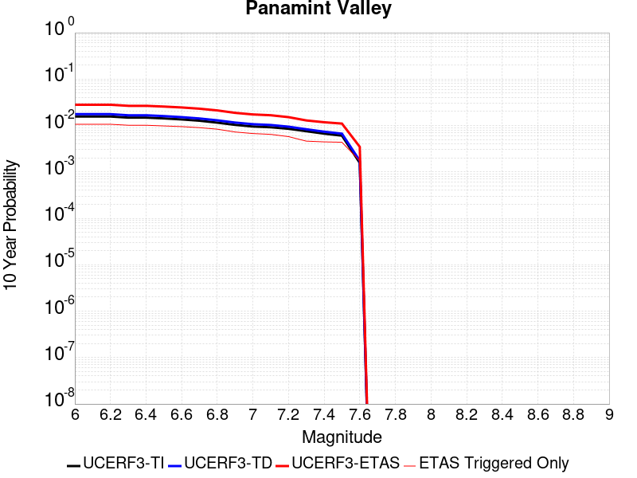 |

| Magnitude | 1 wk TI Prob | 1 wk TD Prob | 1 wk ETAS Prob | 1 wk ETAS/TD Gain | 1 wk ETAS Triggered Only | 1 mo TI Prob | 1 mo TD Prob | 1 mo ETAS Prob | 1 mo ETAS/TD Gain | 1 mo ETAS Triggered Only | 1 yr TI Prob | 1 yr TD Prob | 1 yr ETAS Prob | 1 yr ETAS/TD Gain | 1 yr ETAS Triggered Only | 10 yr TI Prob | 10 yr TD Prob | 10 yr ETAS Prob | 10 yr ETAS/TD Gain | 10 yr ETAS Triggered Only |
|-----|-----|-----|-----|-----|-----|-----|-----|-----|-----|-----|-----|-----|-----|-----|-----|-----|-----|-----|-----|-----|
| 6.0 | 3.0211835E-5 | 3.3992885E-5 | 4.2861246E-4 | 12.608888 | 3.9463298E-4 | 1.2947287E-4 | 1.4567582E-4 | 0.0010562347 | 7.2505836 | 9.106915E-4 | 0.0015751923 | 0.0017721897 | 0.0064084856 | 3.6161397 | 0.0046445266 | 0.015640736 | 0.017587427 | 0.02862175 | 1.6273984 | 0.011231862 |
| 6.1 | 3.0211835E-5 | 3.3992885E-5 | 4.2861246E-4 | 12.608888 | 3.9463298E-4 | 1.2947287E-4 | 1.4567582E-4 | 0.0010562347 | 7.2505836 | 9.106915E-4 | 0.0015751923 | 0.0017721897 | 0.0064084856 | 3.6161397 | 0.0046445266 | 0.015640736 | 0.017587427 | 0.02862175 | 1.6273984 | 0.011231862 |
| 6.2 | 3.0211835E-5 | 3.3992885E-5 | 4.2861246E-4 | 12.608888 | 3.9463298E-4 | 1.2947287E-4 | 1.4567582E-4 | 0.0010562347 | 7.2505836 | 9.106915E-4 | 0.0015751923 | 0.0017721897 | 0.0064084856 | 3.6161397 | 0.0046445266 | 0.015640736 | 0.017587427 | 0.02862175 | 1.6273984 | 0.011231862 |
| 6.3 | 2.8573924E-5 | 3.211061E-5 | 3.9637552E-4 | 12.344067 | 3.642766E-4 | 1.2245393E-4 | 1.376098E-4 | 0.0010178238 | 7.3964486 | 8.803351E-4 | 0.001489857 | 0.0016741396 | 0.0061896686 | 3.6972237 | 0.0045231013 | 0.01479908 | 0.016621869 | 0.027159557 | 1.6339653 | 0.010715803 |
| 6.4 | 2.8573924E-5 | 3.211061E-5 | 3.9637552E-4 | 12.344067 | 3.642766E-4 | 1.2245393E-4 | 1.376098E-4 | 0.0010178238 | 7.3964486 | 8.803351E-4 | 0.001489857 | 0.0016741396 | 0.0061896686 | 3.6972237 | 0.0045231013 | 0.01479908 | 0.016621869 | 0.027159557 | 1.6339653 | 0.010715803 |
| 6.5 | 2.7468774E-5 | 3.083606E-5 | 3.9510144E-4 | 12.812967 | 3.642766E-4 | 1.1771801E-4 | 1.32148E-4 | 0.0010123668 | 7.660856 | 8.803351E-4 | 0.0014322745 | 0.0016077419 | 0.0059720334 | 3.7145472 | 0.0043713194 | 0.014230782 | 0.01596759 | 0.026213573 | 1.6416736 | 0.0104122395 |
| 6.6 | 2.6135967E-5 | 2.9259769E-5 | 3.9352573E-4 | 13.449379 | 3.642766E-4 | 1.1200648E-4 | 1.2539313E-4 | 9.752653E-4 | 7.7776613 | 8.4997877E-4 | 0.0013628257 | 0.0015256187 | 0.0057993387 | 3.801303 | 0.00428025 | 0.013544982 | 0.015157788 | 0.025143135 | 1.6587602 | 0.010139032 |
| 6.7 | 2.4498746E-5 | 2.7348378E-5 | 3.9161503E-4 | 14.319497 | 3.642766E-4 | 1.04990395E-4 | 1.1720221E-4 | 9.6708135E-4 | 8.251391 | 8.4997877E-4 | 0.0012775084 | 0.001426028 | 0.0056092353 | 3.9334679 | 0.004189181 | 0.012701893 | 0.014174897 | 0.023721319 | 1.6734737 | 0.009683686 |
| 6.8 | 2.2244329E-5 | 2.4942019E-5 | 3.8920954E-4 | 15.604572 | 3.642766E-4 | 9.532935E-5 | 1.0689011E-4 | 9.2642487E-4 | 8.667077 | 8.1962236E-4 | 0.0011600169 | 0.001300632 | 0.005181195 | 3.9835982 | 0.0038856172 | 0.011539802 | 0.012935915 | 0.021685315 | 1.6763649 | 0.008864064 |
| 6.9 | 1.9902658E-5 | 2.2296357E-5 | 3.2585344E-4 | 14.614648 | 3.0356384E-4 | 8.529431E-5 | 9.555242E-5 | 7.936825E-4 | 8.3062525 | 6.981968E-4 | 0.0010379635 | 0.0011627484 | 0.004498068 | 3.8684793 | 0.0033392021 | 0.010331288 | 0.011571749 | 0.019133035 | 1.6534265 | 0.0076498087 |
| 7.0 | 1.8353881E-5 | 2.0571932E-5 | 2.63418E-4 | 12.8047285 | 2.4285108E-4 | 7.865712E-5 | 8.8162546E-5 | 6.9523667E-4 | 7.8858514 | 6.071277E-4 | 9.5722964E-4 | 0.0010728681 | 0.004074926 | 3.798161 | 0.003005282 | 0.009531168 | 0.0106818145 | 0.017499106 | 1.6382147 | 0.006890899 |
| 7.1 | 1.7667631E-5 | 1.977821E-5 | 2.6262447E-4 | 13.278476 | 2.4285108E-4 | 7.571623E-5 | 8.47611E-5 | 6.9183734E-4 | 8.162203 | 6.071277E-4 | 9.2145515E-4 | 0.0010314954 | 0.0040033525 | 3.881115 | 0.0029749256 | 0.009176437 | 0.010271964 | 0.016791634 | 1.6347054 | 0.0065873354 |
| 7.2 | 1.6381597E-5 | 1.816348E-5 | 2.6101014E-4 | 14.37005 | 2.4285108E-4 | 7.020495E-5 | 7.7841265E-5 | 6.545677E-4 | 8.409006 | 5.767713E-4 | 8.544101E-4 | 9.4732264E-4 | 0.0036464813 | 3.8492498 | 0.0027017181 | 0.008511325 | 0.009437496 | 0.015240986 | 1.6149396 | 0.005858782 |
| 7.3 | 1.4520491E-5 | 1.5970782E-5 | 1.9810618E-4 | 12.404288 | 1.821383E-4 | 6.222919E-5 | 6.8444504E-5 | 4.6305047E-4 | 6.765342 | 3.9463298E-4 | 7.57377E-4 | 8.330094E-4 | 0.0030775105 | 3.6944487 | 0.0022463724 | 0.0075480095 | 0.008301981 | 0.012907948 | 1.5548035 | 0.0046445266 |
| 7.4 | 1.2852287E-5 | 1.4149132E-5 | 1.9628486E-4 | 13.872572 | 1.821383E-4 | 5.5080065E-5 | 6.0637816E-5 | 3.9453778E-4 | 6.5064645 | 3.3392024E-4 | 6.7039346E-4 | 7.380312E-4 | 0.0028310758 | 3.835984 | 0.0020945906 | 0.0066837464 | 0.007358724 | 0.011758141 | 1.5978507 | 0.004432032 |
| 7.5 | 1.1637851E-5 | 1.2840317E-5 | 1.9497628E-4 | 15.184694 | 1.821383E-4 | 4.987555E-5 | 5.5028857E-5 | 3.889307E-4 | 7.067759 | 3.3392024E-4 | 6.070656E-4 | 6.6978607E-4 | 0.0027023016 | 4.034574 | 0.0020338777 | 0.006054099 | 0.0066805724 | 0.010992535 | 1.6454481 | 0.004340963 |
| 7.6 | 3.0068115E-6 | 3.3344045E-6 | 3.369069E-5 | 10.103959 | 3.0356385E-5 | 1.2886271E-5 | 1.4290267E-5 | 1.6607002E-4 | 11.621198 | 1.5178192E-4 | 1.5687906E-4 | 1.739774E-4 | 0.0010541594 | 6.059174 | 8.803351E-4 | 0.0015676835 | 0.001739853 | 0.0034065493 | 1.9579524 | 0.0016696011 |

## Garlock (East)
*[(top)](#table-of-contents)*

| 1 Week | 1 Month | 1 Year | 10 Year |
|-----|-----|-----|-----|
|  |  |  |  |

| Magnitude | 1 wk TI Prob | 1 wk TD Prob | 1 wk ETAS Prob | 1 wk ETAS/TD Gain | 1 wk ETAS Triggered Only | 1 mo TI Prob | 1 mo TD Prob | 1 mo ETAS Prob | 1 mo ETAS/TD Gain | 1 mo ETAS Triggered Only | 1 yr TI Prob | 1 yr TD Prob | 1 yr ETAS Prob | 1 yr ETAS/TD Gain | 1 yr ETAS Triggered Only | 10 yr TI Prob | 10 yr TD Prob | 10 yr ETAS Prob | 10 yr ETAS/TD Gain | 10 yr ETAS Triggered Only |
|-----|-----|-----|-----|-----|-----|-----|-----|-----|-----|-----|-----|-----|-----|-----|-----|-----|-----|-----|-----|-----|
| 6.0 | 4.5092507E-5 | 6.293872E-5 | 3.057745E-4 | 4.8582892 | 2.4285108E-4 | 1.9323928E-4 | 2.69712E-4 | 0.0010587651 | 3.9255395 | 7.8926596E-4 | 0.0023501497 | 0.0032792452 | 0.0069100657 | 2.1072123 | 0.003642766 | 0.023254504 | 0.032369826 | 0.040888213 | 1.2631583 | 0.008803352 |
| 6.1 | 4.5092507E-5 | 6.293872E-5 | 3.057745E-4 | 4.8582892 | 2.4285108E-4 | 1.9323928E-4 | 2.69712E-4 | 0.0010587651 | 3.9255395 | 7.8926596E-4 | 0.0023501497 | 0.0032792452 | 0.0069100657 | 2.1072123 | 0.003642766 | 0.023254504 | 0.032369826 | 0.040888213 | 1.2631583 | 0.008803352 |
| 6.2 | 2.6674514E-5 | 3.453779E-5 | 1.8631447E-4 | 5.3945103 | 1.5178192E-4 | 1.1431433E-4 | 1.4801089E-4 | 6.943449E-4 | 4.6911745 | 5.464149E-4 | 0.0013908884 | 0.0018005761 | 0.0045277313 | 2.5146015 | 0.0027320746 | 0.01382215 | 0.017904656 | 0.023807602 | 1.3296878 | 0.006010564 |
| 6.3 | 2.6674514E-5 | 3.453779E-5 | 1.8631447E-4 | 5.3945103 | 1.5178192E-4 | 1.1431433E-4 | 1.4801089E-4 | 6.943449E-4 | 4.6911745 | 5.464149E-4 | 0.0013908884 | 0.0018005761 | 0.0045277313 | 2.5146015 | 0.0027320746 | 0.01382215 | 0.017904656 | 0.023807602 | 1.3296878 | 0.006010564 |
| 6.4 | 2.5312667E-5 | 3.2366417E-5 | 1.8414343E-4 | 5.6893363 | 1.5178192E-4 | 1.0847834E-4 | 1.38706E-4 | 6.8504515E-4 | 4.9388285 | 5.464149E-4 | 0.0013199237 | 0.0016874669 | 0.004354321 | 2.580389 | 0.002671362 | 0.013121112 | 0.016792392 | 0.022612484 | 1.346591 | 0.0059194947 |
| 6.5 | 2.5312667E-5 | 3.2366417E-5 | 1.8414343E-4 | 5.6893363 | 1.5178192E-4 | 1.0847834E-4 | 1.38706E-4 | 6.8504515E-4 | 4.9388285 | 5.464149E-4 | 0.0013199237 | 0.0016874669 | 0.004354321 | 2.580389 | 0.002671362 | 0.013121112 | 0.016792392 | 0.022612484 | 1.346591 | 0.0059194947 |
| 6.6 | 2.246556E-5 | 2.8160235E-5 | 1.7993788E-4 | 6.3897862 | 1.5178192E-4 | 9.627742E-5 | 1.20681274E-4 | 6.670302E-4 | 5.527206 | 5.464149E-4 | 0.0011715472 | 0.0014683278 | 0.003984208 | 2.7134323 | 0.0025195798 | 0.011653901 | 0.0146322325 | 0.020136077 | 1.3761452 | 0.0055855745 |
| 6.7 | 2.2241198E-5 | 2.7829901E-5 | 1.796076E-4 | 6.453763 | 1.5178192E-4 | 9.531594E-5 | 1.19265685E-4 | 6.6561543E-4 | 5.5809464 | 5.464149E-4 | 0.0011598538 | 0.001451116 | 0.0039367275 | 2.7128963 | 0.0024892234 | 0.011538187 | 0.014462388 | 0.019937264 | 1.3785597 | 0.005555218 |
| 6.8 | 1.9528685E-5 | 2.3922843E-5 | 1.7570113E-4 | 7.344492 | 1.5178192E-4 | 8.369167E-5 | 1.0252255E-4 | 6.488814E-4 | 6.3291583 | 5.464149E-4 | 0.0010184698 | 0.001247517 | 0.0035820426 | 2.8713377 | 0.0023374415 | 0.010138147 | 0.012449114 | 0.017665368 | 1.4190061 | 0.005282011 |
| 6.9 | 1.3318621E-5 | 1.5220143E-5 | 1.6699976E-4 | 10.972285 | 1.5178192E-4 | 5.7078556E-5 | 6.5227585E-5 | 5.8125245E-4 | 8.911145 | 5.160585E-4 | 6.9470983E-4 | 7.938622E-4 | 0.0028867899 | 3.6363866 | 0.0020945906 | 0.0069254204 | 0.007950885 | 0.012468139 | 1.5681447 | 0.0045534577 |
| 7.0 | 1.1760853E-5 | 1.3128316E-5 | 1.6490824E-4 | 12.561264 | 1.5178192E-4 | 5.0402683E-5 | 5.6263023E-5 | 5.7229254E-4 | 10.171734 | 5.160585E-4 | 6.134799E-4 | 6.8479206E-4 | 0.002717277 | 3.9680324 | 0.0020338777 | 0.0061178906 | 0.0068671517 | 0.0112386 | 1.6365738 | 0.004401676 |
| 7.1 | 1.0064758E-5 | 1.0922758E-5 | 1.6270301E-4 | 14.895782 | 1.5178192E-4 | 4.3133965E-5 | 4.6810997E-5 | 5.628454E-4 | 12.023785 | 5.160585E-4 | 5.2502943E-4 | 5.697784E-4 | 0.0025418191 | 4.4610662 | 0.001973165 | 0.005237907 | 0.0057232794 | 0.009918667 | 1.7330391 | 0.0042195376 |
| 7.2 | 9.768808E-6 | 1.0518496E-5 | 1.6229882E-4 | 15.42985 | 1.5178192E-4 | 4.186565E-5 | 4.5078512E-5 | 5.6111376E-4 | 12.447478 | 5.160585E-4 | 5.095951E-4 | 5.4869615E-4 | 0.0025207784 | 4.5941243 | 0.001973165 | 0.0050842804 | 0.005513476 | 0.009709749 | 1.7610939 | 0.0042195376 |
| 7.3 | 9.344516E-6 | 9.963784E-6 | 1.3138811E-4 | 13.186568 | 1.2142554E-4 | 4.004731E-5 | 4.270125E-5 | 4.9802754E-4 | 11.663068 | 4.5534575E-4 | 4.8746695E-4 | 5.1976717E-4 | 0.0022795224 | 4.3856606 | 0.0017606702 | 0.0048639905 | 0.005224966 | 0.009120478 | 1.7455575 | 0.0039159735 |
| 7.4 | 9.023491E-6 | 9.509588E-6 | 1.00577876E-4 | 10.57647 | 9.106915E-5 | 3.867153E-5 | 4.075476E-5 | 4.3537168E-4 | 10.682719 | 3.9463298E-4 | 4.7072413E-4 | 4.960796E-4 | 0.0019524632 | 3.9357862 | 0.0014571064 | 0.004697283 | 0.004988221 | 0.008431586 | 1.6902993 | 0.0034606277 |
| 7.5 | 7.081253E-6 | 7.104487E-6 | 7.104487E-6 | 1.0 | 0.0 | 3.0347876E-5 | 3.0447449E-5 | 3.0364658E-4 | 9.972809 | 2.7320746E-4 | 3.6942272E-4 | 3.706354E-4 | 0.0011292637 | 3.0468318 | 7.589096E-4 | 0.003688092 | 0.003733056 | 0.005335938 | 1.4293754 | 0.0016088884 |
| 7.6 | 6.116396E-6 | 5.975227E-6 | 5.975227E-6 | 1.0 | 0.0 | 2.6212863E-5 | 2.5607866E-5 | 1.470303E-4 | 5.7416067 | 1.2142554E-4 | 3.1909486E-4 | 3.1173142E-4 | 7.6693523E-4 | 2.4602437 | 4.5534575E-4 | 0.0031863707 | 0.0031440689 | 0.0041729407 | 1.3272421 | 0.001032117 |
| 7.7 | 4.797145E-6 | 4.7724034E-6 | 4.7724034E-6 | 1.0 | 0.0 | 2.055903E-5 | 2.0452999E-5 | 1.1152029E-4 | 5.452515 | 9.106915E-5 | 2.5027743E-4 | 2.4898694E-4 | 5.221264E-4 | 2.097003 | 2.7320746E-4 | 0.0024999576 | 0.0025172185 | 0.003062258 | 1.2165245 | 5.464149E-4 |
| 7.8 | 3.4028885E-6 | 3.9919487E-6 | 3.9919487E-6 | 1.0 | 0.0 | 1.4583726E-5 | 1.710824E-5 | 1.0817583E-4 | 6.323025 | 9.106915E-5 | 1.775424E-4 | 2.0827298E-4 | 4.207234E-4 | 2.0200577 | 2.1249469E-4 | 0.0017740062 | 0.0021082417 | 0.0025020428 | 1.1867912 | 3.9463298E-4 |
| 7.9 | 2.5928412E-6 | 3.3838483E-6 | 3.3838483E-6 | 1.0 | 0.0 | 1.1112129E-5 | 1.4502127E-5 | 7.521401E-5 | 5.186413 | 6.071277E-5 | 1.3528178E-4 | 1.7654915E-4 | 3.586553E-4 | 2.0314755 | 1.821383E-4 | 0.0013519945 | 0.0017871696 | 0.002120493 | 1.1865091 | 3.3392024E-4 |
| 8.0 | 1.3743648E-6 | 1.6786424E-6 | 1.6786424E-6 | 1.0 | 0.0 | 5.8901214E-6 | 7.194162E-6 | 3.755033E-5 | 5.2195554 | 3.0356385E-5 | 7.1709874E-5 | 8.758544E-5 | 1.1793916E-4 | 1.3465613 | 3.0356385E-5 | 7.1686733E-4 | 8.8641304E-4 | 0.001007731 | 1.1368638 | 1.2142554E-4 |
| 8.1 | 3.6733252E-7 | 3.1582263E-7 | 3.1582263E-7 | 1.0 | 0.0 | 1.5742813E-6 | 1.3535249E-6 | 1.3535249E-6 | 1.0 | 0.0 | 1.9166706E-5 | 1.6479058E-5 | 1.6479058E-5 | 1.0 | 0.0 | 1.9165053E-4 | 1.6687137E-4 | 1.6687137E-4 | 1.0 | 0.0 |

## Ash Hill
*[(top)](#table-of-contents)*

| 1 Week | 1 Month | 1 Year | 10 Year |
|-----|-----|-----|-----|
| 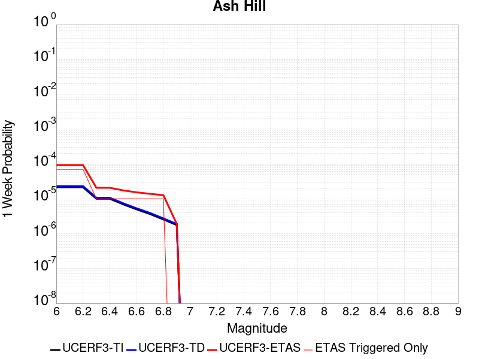 |  |  |  |

| Magnitude | 1 wk TI Prob | 1 wk TD Prob | 1 wk ETAS Prob | 1 wk ETAS/TD Gain | 1 wk ETAS Triggered Only | 1 mo TI Prob | 1 mo TD Prob | 1 mo ETAS Prob | 1 mo ETAS/TD Gain | 1 mo ETAS Triggered Only | 1 yr TI Prob | 1 yr TD Prob | 1 yr ETAS Prob | 1 yr ETAS/TD Gain | 1 yr ETAS Triggered Only | 10 yr TI Prob | 10 yr TD Prob | 10 yr ETAS Prob | 10 yr ETAS/TD Gain | 10 yr ETAS Triggered Only |
|-----|-----|-----|-----|-----|-----|-----|-----|-----|-----|-----|-----|-----|-----|-----|-----|-----|-----|-----|-----|-----|
| 6.0 | 2.1545662E-5 | 2.3196802E-5 | 1.4461952E-4 | 6.2344594 | 1.2142554E-4 | 9.2335285E-5 | 9.941153E-5 | 4.0294518E-4 | 4.053304 | 3.0356384E-4 | 0.0011236023 | 0.0012097433 | 0.0035140375 | 2.9047794 | 0.002307085 | 0.011179381 | 0.012039565 | 0.017317964 | 1.4384211 | 0.005342724 |
| 6.1 | 2.1545662E-5 | 2.3196802E-5 | 1.4461952E-4 | 6.2344594 | 1.2142554E-4 | 9.2335285E-5 | 9.941153E-5 | 4.0294518E-4 | 4.053304 | 3.0356384E-4 | 0.0011236023 | 0.0012097433 | 0.0035140375 | 2.9047794 | 0.002307085 | 0.011179381 | 0.012039565 | 0.017317964 | 1.4384211 | 0.005342724 |
| 6.2 | 2.1545662E-5 | 2.3196802E-5 | 1.4461952E-4 | 6.2344594 | 1.2142554E-4 | 9.2335285E-5 | 9.941153E-5 | 4.0294518E-4 | 4.053304 | 3.0356384E-4 | 0.0011236023 | 0.0012097433 | 0.0035140375 | 2.9047794 | 0.002307085 | 0.011179381 | 0.012039565 | 0.017317964 | 1.4384211 | 0.005342724 |
| 6.3 | 1.0025529E-5 | 1.074796E-5 | 1.074796E-5 | 1.0 | 0.0 | 4.2965847E-5 | 4.606195E-5 | 7.641693E-5 | 1.6590035 | 3.0356385E-5 | 5.229836E-4 | 5.606731E-4 | 0.0012888178 | 2.2986975 | 7.285532E-4 | 0.005217545 | 0.0055938987 | 0.0075258394 | 1.3453656 | 0.0019428086 |
| 6.4 | 1.0025529E-5 | 1.074796E-5 | 1.074796E-5 | 1.0 | 0.0 | 4.2965847E-5 | 4.606195E-5 | 7.641693E-5 | 1.6590035 | 3.0356385E-5 | 5.229836E-4 | 5.606731E-4 | 0.0012888178 | 2.2986975 | 7.285532E-4 | 0.005217545 | 0.0055938987 | 0.0075258394 | 1.3453656 | 0.0019428086 |
| 6.5 | 6.9617327E-6 | 7.4573372E-6 | 7.4573372E-6 | 1.0 | 0.0 | 2.9835655E-5 | 3.1959673E-5 | 6.2315085E-5 | 1.9498036 | 3.0356385E-5 | 3.6318856E-4 | 3.8904822E-4 | 8.7456143E-4 | 2.2479513 | 4.8570216E-4 | 0.0036259557 | 0.003884526 | 0.0052150185 | 1.3425109 | 0.001335681 |
| 6.6 | 4.9919777E-6 | 5.347192E-6 | 5.347192E-6 | 1.0 | 0.0 | 2.1394015E-5 | 2.2916374E-5 | 5.3272062E-5 | 2.3246288 | 3.0356385E-5 | 2.60441E-4 | 2.7897785E-4 | 5.82457E-4 | 2.0878253 | 3.0356384E-4 | 0.0026013597 | 0.0027869348 | 0.0036345448 | 1.304137 | 8.4997877E-4 |
| 6.7 | 3.6630722E-6 | 3.9249953E-6 | 3.9249953E-6 | 1.0 | 0.0 | 1.5698786E-5 | 1.6821332E-5 | 1.6821332E-5 | 1.0 | 0.0 | 1.9111596E-4 | 2.0478622E-4 | 4.172374E-4 | 2.037429 | 2.1249469E-4 | 0.0019095168 | 0.0020465383 | 0.0026524235 | 1.2960536 | 6.071277E-4 |
| 6.8 | 2.5599613E-6 | 2.745188E-6 | 2.745188E-6 | 1.0 | 0.0 | 1.0971216E-5 | 1.1765067E-5 | 1.1765067E-5 | 1.0 | 0.0 | 1.3356637E-4 | 1.4323521E-4 | 2.949954E-4 | 2.0595171 | 1.5178192E-4 | 0.0013348613 | 0.001431914 | 0.001825982 | 1.2752036 | 3.9463298E-4 |
| 6.9 | 1.7684905E-6 | 1.8970534E-6 | 1.8970534E-6 | 1.0 | 0.0 | 7.579223E-6 | 8.130229E-6 | 8.130229E-6 | 1.0 | 0.0 | 9.2273134E-5 | 9.898553E-5 | 1.596923E-4 | 1.6132892 | 6.071277E-5 | 9.223483E-4 | 9.898554E-4 | 0.001141487 | 1.1531857 | 1.5178192E-4 |

## Hunter Mountain-Saline Valley
*[(top)](#table-of-contents)*

| 1 Week | 1 Month | 1 Year | 10 Year |
|-----|-----|-----|-----|
|  |  | 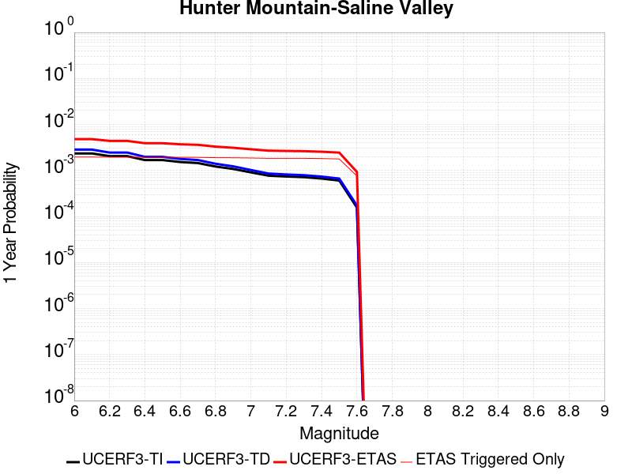 | 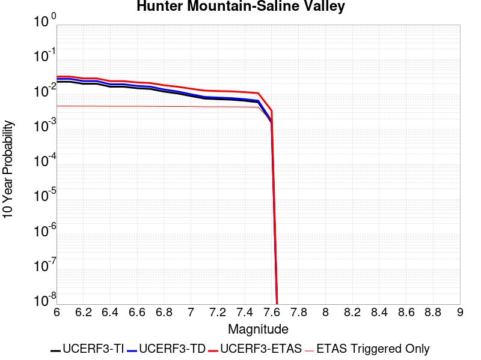 |

| Magnitude | 1 wk TI Prob | 1 wk TD Prob | 1 wk ETAS Prob | 1 wk ETAS/TD Gain | 1 wk ETAS Triggered Only | 1 mo TI Prob | 1 mo TD Prob | 1 mo ETAS Prob | 1 mo ETAS/TD Gain | 1 mo ETAS Triggered Only | 1 yr TI Prob | 1 yr TD Prob | 1 yr ETAS Prob | 1 yr ETAS/TD Gain | 1 yr ETAS Triggered Only | 10 yr TI Prob | 10 yr TD Prob | 10 yr ETAS Prob | 10 yr ETAS/TD Gain | 10 yr ETAS Triggered Only |
|-----|-----|-----|-----|-----|-----|-----|-----|-----|-----|-----|-----|-----|-----|-----|-----|-----|-----|-----|-----|-----|
| 6.0 | 4.5103672E-5 | 5.4585795E-5 | 2.3671416E-4 | 4.336552 | 1.821383E-4 | 1.9328714E-4 | 2.3391936E-4 | 5.677615E-4 | 2.4271677 | 3.3392024E-4 | 0.002350731 | 0.0028443995 | 0.005114652 | 1.7981484 | 0.0022767289 | 0.023260195 | 0.028100612 | 0.03273264 | 1.1648372 | 0.0047659525 |
| 6.1 | 4.5103672E-5 | 5.4585795E-5 | 2.3671416E-4 | 4.336552 | 1.821383E-4 | 1.9328714E-4 | 2.3391936E-4 | 5.677615E-4 | 2.4271677 | 3.3392024E-4 | 0.002350731 | 0.0028443995 | 0.005114652 | 1.7981484 | 0.0022767289 | 0.023260195 | 0.028100612 | 0.03273264 | 1.1648372 | 0.0047659525 |
| 6.2 | 3.9363465E-5 | 4.7075897E-5 | 2.2920563E-4 | 4.868853 | 1.821383E-4 | 1.6868966E-4 | 2.0173912E-4 | 5.35592E-4 | 2.654874 | 3.3392024E-4 | 0.002051862 | 0.0024535626 | 0.004724705 | 1.9256511 | 0.0022767289 | 0.020330196 | 0.024280764 | 0.028901376 | 1.1902993 | 0.004735596 |
| 6.3 | 3.9363465E-5 | 4.7075897E-5 | 2.2920563E-4 | 4.868853 | 1.821383E-4 | 1.6868966E-4 | 2.0173912E-4 | 5.35592E-4 | 2.654874 | 3.3392024E-4 | 0.002051862 | 0.0024535626 | 0.004724705 | 1.9256511 | 0.0022767289 | 0.020330196 | 0.024280764 | 0.028901376 | 1.1902993 | 0.004735596 |
| 6.4 | 3.2311684E-5 | 3.796192E-5 | 2.2009331E-4 | 5.797739 | 1.821383E-4 | 1.384713E-4 | 1.6268421E-4 | 4.965501E-4 | 3.052233 | 3.3392024E-4 | 0.0016845843 | 0.0019789536 | 0.0042208806 | 2.132885 | 0.0022463724 | 0.016718714 | 0.01962205 | 0.024234964 | 1.2350882 | 0.0047052396 |
| 6.5 | 3.2311684E-5 | 3.796192E-5 | 2.2009331E-4 | 5.797739 | 1.821383E-4 | 1.384713E-4 | 1.6268421E-4 | 4.965501E-4 | 3.052233 | 3.3392024E-4 | 0.0016845843 | 0.0019789536 | 0.0042208806 | 2.132885 | 0.0022463724 | 0.016718714 | 0.01962205 | 0.024234964 | 1.2350882 | 0.0047052396 |
| 6.6 | 2.9305844E-5 | 3.4191486E-5 | 2.1632356E-4 | 6.3268256 | 1.821383E-4 | 1.2559042E-4 | 1.4652706E-4 | 4.8039836E-4 | 3.2785642 | 3.3392024E-4 | 0.0015279909 | 0.0017825698 | 0.003994636 | 2.240942 | 0.002216016 | 0.015175272 | 0.017690638 | 0.02228282 | 1.2595826 | 0.004674883 |
| 6.7 | 2.7826512E-5 | 3.2353335E-5 | 2.1448574E-4 | 6.6294785 | 1.821383E-4 | 1.19251024E-4 | 1.3865012E-4 | 4.7252406E-4 | 3.408032 | 3.3392024E-4 | 0.0014509142 | 0.0016868184 | 0.0038990965 | 2.3115094 | 0.002216016 | 0.014414776 | 0.016747838 | 0.021344427 | 1.2744586 | 0.004674883 |
| 6.8 | 2.3389874E-5 | 2.6874068E-5 | 2.0900747E-4 | 7.7772923 | 1.821383E-4 | 1.0023846E-4 | 1.1516976E-4 | 4.4905153E-4 | 3.8990402 | 3.3392024E-4 | 0.00121972 | 0.0014013371 | 0.003583934 | 2.5575101 | 0.0021856597 | 0.01213047 | 0.013931221 | 0.018511044 | 1.3287452 | 0.0046445266 |
| 6.9 | 2.069209E-5 | 2.3576413E-5 | 2.0571043E-4 | 8.725264 | 1.821383E-4 | 8.867737E-5 | 1.01038066E-4 | 4.3492456E-4 | 4.3045616 | 3.3392024E-4 | 0.0010791123 | 0.0012294804 | 0.0034124528 | 2.7755244 | 0.0021856597 | 0.010738871 | 0.012231816 | 0.016819531 | 1.3750641 | 0.0046445266 |
| 7.0 | 1.7462342E-5 | 1.9638785E-5 | 2.0177351E-4 | 10.274237 | 1.821383E-4 | 7.483646E-5 | 8.416363E-5 | 4.1805574E-4 | 4.9671783 | 3.3392024E-4 | 9.1075303E-4 | 0.0010242332 | 0.0032076542 | 3.1317618 | 0.0021856597 | 0.009070295 | 0.010198761 | 0.014765872 | 1.4478104 | 0.00461417 |
| 7.1 | 1.4807709E-5 | 1.644613E-5 | 1.9858145E-4 | 12.07466 | 1.821383E-4 | 6.3460066E-5 | 7.0481605E-5 | 4.0437828E-4 | 5.737359 | 3.3392024E-4 | 7.723524E-4 | 8.577922E-4 | 0.0029809163 | 3.475103 | 0.0021249468 | 0.007696735 | 0.008547801 | 0.013002142 | 1.5211097 | 0.004492745 |
| 7.2 | 1.4180048E-5 | 1.5702537E-5 | 1.9783797E-4 | 12.59911 | 1.821383E-4 | 6.077022E-5 | 6.729494E-5 | 4.011927E-4 | 5.9617066 | 3.3392024E-4 | 7.396263E-4 | 8.1902416E-4 | 0.0029422306 | 3.5923612 | 0.0021249468 | 0.0073716943 | 0.008163009 | 0.012619079 | 1.5458858 | 0.004492745 |
| 7.3 | 1.3730402E-5 | 1.5176156E-5 | 1.9731169E-4 | 13.001428 | 1.821383E-4 | 5.8843252E-5 | 6.503914E-5 | 3.9893764E-4 | 6.133809 | 3.3392024E-4 | 7.161811E-4 | 7.915799E-4 | 0.0029148448 | 3.6823127 | 0.0021249468 | 0.007138774 | 0.007890536 | 0.012317714 | 1.5610744 | 0.0044623883 |
| 7.4 | 1.2810095E-5 | 1.4112974E-5 | 1.962487E-4 | 13.905553 | 1.821383E-4 | 5.489925E-5 | 6.048286E-5 | 3.943829E-4 | 6.5205727 | 3.3392024E-4 | 6.681934E-4 | 7.361459E-4 | 0.0028291945 | 3.8432524 | 0.0020945906 | 0.006661878 | 0.00733997 | 0.011739471 | 1.5993896 | 0.004432032 |
| 7.5 | 1.1595659E-5 | 1.2804158E-5 | 1.9494013E-4 | 15.224751 | 1.821383E-4 | 4.9694736E-5 | 5.48739E-5 | 3.887758E-4 | 7.0848947 | 3.3392024E-4 | 6.0486543E-4 | 6.679006E-4 | 0.0027004199 | 4.043146 | 0.0020338777 | 0.006032217 | 0.006661806 | 0.01097385 | 1.6472785 | 0.004340963 |
| 7.6 | 2.997694E-6 | 3.326526E-6 | 3.368281E-5 | 10.125521 | 3.0356385E-5 | 1.28471975E-5 | 1.4256503E-5 | 1.6603626E-4 | 11.646353 | 1.5178192E-4 | 1.564034E-4 | 1.7356638E-4 | 0.0010537488 | 6.071157 | 8.803351E-4 | 0.0015629337 | 0.0017357452 | 0.0034024483 | 1.9602233 | 0.0016696011 |

## Blackwater
*[(top)](#table-of-contents)*

| 1 Week | 1 Month | 1 Year | 10 Year |
|-----|-----|-----|-----|
|  |  |  | 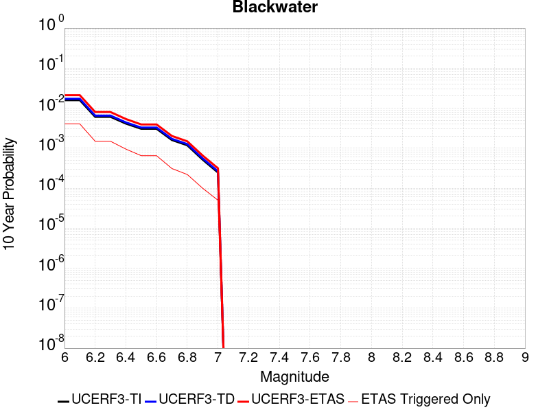 |

| Magnitude | 1 wk TI Prob | 1 wk TD Prob | 1 wk ETAS Prob | 1 wk ETAS/TD Gain | 1 wk ETAS Triggered Only | 1 mo TI Prob | 1 mo TD Prob | 1 mo ETAS Prob | 1 mo ETAS/TD Gain | 1 mo ETAS Triggered Only | 1 yr TI Prob | 1 yr TD Prob | 1 yr ETAS Prob | 1 yr ETAS/TD Gain | 1 yr ETAS Triggered Only | 10 yr TI Prob | 10 yr TD Prob | 10 yr ETAS Prob | 10 yr ETAS/TD Gain | 10 yr ETAS Triggered Only |
|-----|-----|-----|-----|-----|-----|-----|-----|-----|-----|-----|-----|-----|-----|-----|-----|-----|-----|-----|-----|-----|
| 6.0 | 3.0708583E-5 | 3.3099266E-5 | 9.381003E-5 | 2.8342025 | 6.071277E-5 | 1.3160157E-4 | 1.4184705E-4 | 3.239595E-4 | 2.283865 | 1.821383E-4 | 0.0016010714 | 0.0017257566 | 0.0030288284 | 1.7550728 | 0.0013053245 | 0.015895851 | 0.01713739 | 0.0207774 | 1.2124017 | 0.003703479 |
| 6.1 | 3.0708583E-5 | 3.3099266E-5 | 9.381003E-5 | 2.8342025 | 6.071277E-5 | 1.3160157E-4 | 1.4184705E-4 | 3.239595E-4 | 2.283865 | 1.821383E-4 | 0.0016010714 | 0.0017257566 | 0.0030288284 | 1.7550728 | 0.0013053245 | 0.015895851 | 0.01713739 | 0.0207774 | 1.2124017 | 0.003703479 |
| 6.2 | 1.1707779E-5 | 1.2546313E-5 | 1.2546313E-5 | 1.0 | 0.0 | 5.017523E-5 | 5.3768857E-5 | 8.412361E-5 | 1.5645415 | 3.0356385E-5 | 6.107122E-4 | 6.544489E-4 | 9.881505E-4 | 1.5098972 | 3.3392024E-4 | 0.006090366 | 0.006526187 | 0.0076722014 | 1.1756024 | 0.0011535425 |
| 6.3 | 1.1707779E-5 | 1.2546313E-5 | 1.2546313E-5 | 1.0 | 0.0 | 5.017523E-5 | 5.3768857E-5 | 8.412361E-5 | 1.5645415 | 3.0356385E-5 | 6.107122E-4 | 6.544489E-4 | 9.881505E-4 | 1.5098972 | 3.3392024E-4 | 0.006090366 | 0.006526187 | 0.0076722014 | 1.1756024 | 0.0011535425 |
| 6.4 | 7.929244E-6 | 8.48088E-6 | 8.48088E-6 | 1.0 | 0.0 | 3.3982033E-5 | 3.6346144E-5 | 6.6701425E-5 | 1.8351719 | 3.0356385E-5 | 4.136527E-4 | 4.4242849E-4 | 6.244862E-4 | 1.4114964 | 1.821383E-4 | 0.0041288356 | 0.0044158823 | 0.0051714405 | 1.1711003 | 7.589096E-4 |
| 6.5 | 5.8832115E-6 | 6.286562E-6 | 6.286562E-6 | 1.0 | 0.0 | 2.521352E-5 | 2.6942143E-5 | 5.729771E-5 | 2.1266944 | 3.0356385E-5 | 3.0693135E-4 | 3.2797377E-4 | 4.7970592E-4 | 1.4626349 | 1.5178192E-4 | 0.0030650778 | 0.0032751507 | 0.0038802898 | 1.1847669 | 6.071277E-4 |
| 6.6 | 5.8832115E-6 | 6.286562E-6 | 6.286562E-6 | 1.0 | 0.0 | 2.521352E-5 | 2.6942143E-5 | 5.729771E-5 | 2.1266944 | 3.0356385E-5 | 3.0693135E-4 | 3.2797377E-4 | 4.7970592E-4 | 1.4626349 | 1.5178192E-4 | 0.0030650778 | 0.0032751507 | 0.0038802898 | 1.1847669 | 6.071277E-4 |
| 6.7 | 3.0715053E-6 | 3.2817636E-6 | 3.2817636E-6 | 1.0 | 0.0 | 1.3163528E-5 | 1.40646325E-5 | 4.442059E-5 | 3.1583185 | 3.0356385E-5 | 1.6025416E-4 | 1.712246E-4 | 2.3192698E-4 | 1.354519 | 6.071277E-5 | 0.0016013865 | 0.0017110414 | 0.0019837813 | 1.1594 | 2.7320746E-4 |
| 6.8 | 2.2722281E-6 | 2.4289757E-6 | 2.4289757E-6 | 1.0 | 0.0 | 9.738084E-6 | 1.0409859E-5 | 4.0765928E-5 | 3.9160883 | 3.0356385E-5 | 1.1855473E-4 | 1.2673358E-4 | 1.5708612E-4 | 1.2394987 | 3.0356385E-5 | 0.001184915 | 0.0012667032 | 0.0014789287 | 1.1675416 | 2.1249469E-4 |
| 6.9 | 9.952399E-7 | 1.0654484E-6 | 1.0654484E-6 | 1.0 | 0.0 | 4.265307E-6 | 4.5662023E-6 | 4.5662023E-6 | 1.0 | 0.0 | 5.1928873E-5 | 5.5592613E-5 | 5.5592613E-5 | 1.0 | 0.0 | 5.191674E-4 | 5.558377E-4 | 6.468562E-4 | 1.1637502 | 9.106915E-5 |
| 7.0 | 4.7385504E-7 | 5.0760383E-7 | 5.0760383E-7 | 1.0 | 0.0 | 2.0308057E-6 | 2.175445E-6 | 2.175445E-6 | 1.0 | 0.0 | 2.4724779E-5 | 2.6486043E-5 | 2.6486043E-5 | 1.0 | 0.0 | 2.4722028E-4 | 2.6486043E-4 | 2.9520877E-4 | 1.1145824 | 3.0356385E-5 |

## Garlock (West)
*[(top)](#table-of-contents)*

| 1 Week | 1 Month | 1 Year | 10 Year |
|-----|-----|-----|-----|
|  |  |  | 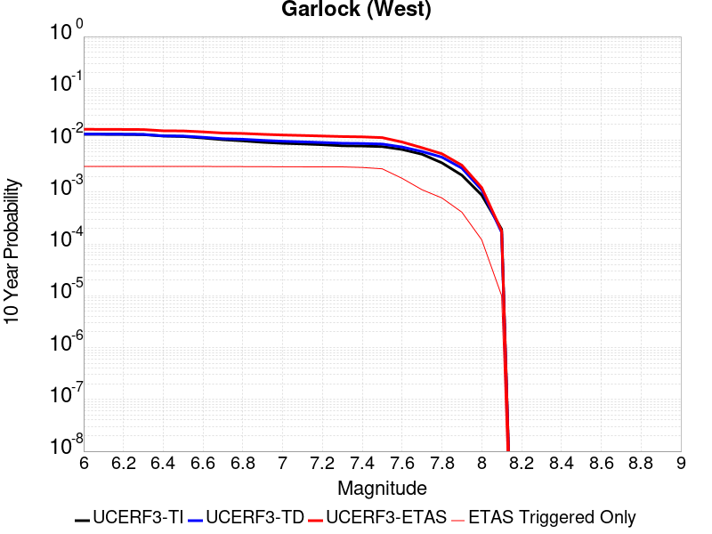 |

| Magnitude | 1 wk TI Prob | 1 wk TD Prob | 1 wk ETAS Prob | 1 wk ETAS/TD Gain | 1 wk ETAS Triggered Only | 1 mo TI Prob | 1 mo TD Prob | 1 mo ETAS Prob | 1 mo ETAS/TD Gain | 1 mo ETAS Triggered Only | 1 yr TI Prob | 1 yr TD Prob | 1 yr ETAS Prob | 1 yr ETAS/TD Gain | 1 yr ETAS Triggered Only | 10 yr TI Prob | 10 yr TD Prob | 10 yr ETAS Prob | 10 yr ETAS/TD Gain | 10 yr ETAS Triggered Only |
|-----|-----|-----|-----|-----|-----|-----|-----|-----|-----|-----|-----|-----|-----|-----|-----|-----|-----|-----|-----|-----|
| 6.0 | 2.5181727E-5 | 2.5247427E-5 | 1.1631428E-4 | 4.6069756 | 9.106915E-5 | 1.0791722E-4 | 1.08198794E-4 | 5.331422E-4 | 4.927432 | 4.2498938E-4 | 0.0013131002 | 0.0013165277 | 0.0026504502 | 2.0132127 | 0.001335681 | 0.013053683 | 0.013167702 | 0.016283194 | 1.2366011 | 0.0031570639 |
| 6.1 | 2.5077732E-5 | 2.5148478E-5 | 1.1621534E-4 | 4.6211677 | 9.106915E-5 | 1.0747157E-4 | 1.0777476E-4 | 5.327183E-4 | 4.942886 | 4.2498938E-4 | 0.001307681 | 0.0013113713 | 0.0026453007 | 2.017202 | 0.001335681 | 0.013000126 | 0.013116748 | 0.016232401 | 1.2375325 | 0.0031570639 |
| 6.2 | 2.494612E-5 | 2.5030122E-5 | 1.1609699E-4 | 4.638291 | 9.106915E-5 | 1.0690756E-4 | 1.07267566E-4 | 5.322113E-4 | 4.961531 | 4.2498938E-4 | 0.0013008224 | 0.0013052035 | 0.0026391412 | 2.0220149 | 0.001335681 | 0.012932341 | 0.013055797 | 0.016171642 | 1.2386562 | 0.0031570639 |
| 6.3 | 2.4733758E-5 | 2.4849434E-5 | 1.1591632E-4 | 4.6647468 | 9.106915E-5 | 1.0599751E-4 | 1.0649325E-4 | 5.3143734E-4 | 4.9903383 | 4.2498938E-4 | 0.0012897556 | 0.0012957876 | 0.0026297376 | 2.0294511 | 0.001335681 | 0.012822957 | 0.012962739 | 0.016078878 | 1.2403921 | 0.0031570639 |
| 6.4 | 2.3237335E-5 | 2.32284E-5 | 1.14295435E-4 | 4.920504 | 9.106915E-5 | 9.958477E-5 | 9.95465E-5 | 5.244936E-4 | 5.26883 | 4.2498938E-4 | 0.0012117702 | 0.0012113076 | 0.0025453705 | 2.1013412 | 0.001335681 | 0.012051838 | 0.012127431 | 0.015246208 | 1.2571671 | 0.0031570639 |
| 6.5 | 2.2732203E-5 | 2.3042725E-5 | 1.14109775E-4 | 4.952096 | 9.106915E-5 | 9.742009E-5 | 9.875081E-5 | 5.236982E-4 | 5.30323 | 4.2498938E-4 | 0.0011854442 | 0.0012016308 | 0.0025357066 | 2.1102211 | 0.001335681 | 0.011791403 | 0.012031715 | 0.015150795 | 1.2592381 | 0.0031570639 |
| 6.6 | 2.1319436E-5 | 2.1822514E-5 | 1.1288968E-4 | 5.173083 | 9.106915E-5 | 9.136581E-5 | 9.3521725E-5 | 5.1847135E-4 | 5.54386 | 4.2498938E-4 | 0.001111811 | 0.0011380345 | 0.0024721953 | 2.1723378 | 0.001335681 | 0.011062649 | 0.0114024235 | 0.014523489 | 1.2737195 | 0.0031570639 |
| 6.7 | 1.970802E-5 | 2.044191E-5 | 1.115092E-4 | 5.454931 | 9.106915E-5 | 8.446021E-5 | 8.760525E-5 | 5.125574E-4 | 5.850761 | 4.2498938E-4 | 0.001027818 | 0.0010660738 | 0.0023700066 | 2.223117 | 0.0013053245 | 0.010230771 | 0.010689921 | 0.013783204 | 1.2893645 | 0.0031267076 |
| 6.8 | 1.8744462E-5 | 1.994929E-5 | 1.1101663E-4 | 5.5649414 | 9.106915E-5 | 8.033094E-5 | 8.549416E-5 | 5.104472E-4 | 5.9705505 | 4.2498938E-4 | 9.775903E-4 | 0.001040396 | 0.0023443624 | 2.2533367 | 0.0013053245 | 0.009733009 | 0.010435575 | 0.013529654 | 1.2964934 | 0.0031267076 |
| 6.9 | 1.7559682E-5 | 1.9001345E-5 | 1.10068766E-4 | 5.7926826 | 9.106915E-5 | 7.5253614E-5 | 8.1431805E-5 | 5.0638657E-4 | 6.2185354 | 4.2498938E-4 | 9.158276E-4 | 9.909827E-4 | 0.0022646873 | 2.2852945 | 0.0012749681 | 0.0091206245 | 0.009945906 | 0.013011461 | 1.3082228 | 0.0030963512 |
| 7.0 | 1.6794445E-5 | 1.826383E-5 | 1.0933132E-4 | 5.986221 | 9.106915E-5 | 7.197421E-5 | 7.8271216E-5 | 5.0322735E-4 | 6.429277 | 4.2498938E-4 | 8.759337E-4 | 9.525369E-4 | 0.0022262905 | 2.3372223 | 0.0012749681 | 0.008724891 | 0.009564651 | 0.0126313865 | 1.3206322 | 0.0030963512 |
| 7.1 | 1.6337795E-5 | 1.7764389E-5 | 1.08831926E-4 | 6.1264095 | 9.106915E-5 | 7.0017246E-5 | 7.613088E-5 | 5.010879E-4 | 6.5819273 | 4.2498938E-4 | 8.521265E-4 | 9.2650065E-4 | 0.0022002875 | 2.3748364 | 0.0012749681 | 0.008488664 | 0.009306384 | 0.01237392 | 1.3296162 | 0.0030963512 |
| 7.2 | 1.5780008E-5 | 1.721285E-5 | 1.0828044E-4 | 6.290674 | 9.106915E-5 | 6.762685E-5 | 7.376728E-5 | 4.987253E-4 | 6.760793 | 4.2498938E-4 | 8.2304585E-4 | 8.977479E-4 | 0.0021715714 | 2.41891 | 0.0012749681 | 0.008200042 | 0.009021141 | 0.01208956 | 1.3401364 | 0.0030963512 |
| 7.3 | 1.5058865E-5 | 1.6665581E-5 | 1.0773321E-4 | 6.464414 | 9.106915E-5 | 6.45364E-5 | 7.1421964E-5 | 4.9638096E-4 | 6.9499764 | 4.2498938E-4 | 7.854473E-4 | 8.6921675E-4 | 0.0021430766 | 2.465526 | 0.0012749681 | 0.00782677 | 0.00873767 | 0.011806967 | 1.3512716 | 0.0030963512 |
| 7.4 | 1.4887923E-5 | 1.6501404E-5 | 1.0756905E-4 | 6.5187817 | 9.106915E-5 | 6.380382E-5 | 7.071839E-5 | 4.956777E-4 | 7.0091763 | 4.2498938E-4 | 7.7653467E-4 | 8.6065754E-4 | 0.002104198 | 2.4448726 | 0.0012446117 | 0.0077382675 | 0.008652459 | 0.011661831 | 1.3478055 | 0.0030356385 |
| 7.5 | 1.4509299E-5 | 1.6093083E-5 | 1.0716077E-4 | 6.658809 | 9.106915E-5 | 6.218123E-5 | 6.896854E-5 | 4.635743E-4 | 6.721533 | 3.9463298E-4 | 7.567935E-4 | 8.393697E-4 | 0.0020526059 | 2.4454134 | 0.0012142553 | 0.0075422134 | 0.008440594 | 0.011300109 | 1.3387812 | 0.0028838564 |
| 7.6 | 1.2756717E-5 | 1.4095277E-5 | 4.4451233E-5 | 3.153626 | 3.0356385E-5 | 5.4670498E-5 | 6.0406936E-5 | 2.1217969E-4 | 3.5125053 | 1.5178192E-4 | 6.6541E-4 | 7.3520694E-4 | 0.0014328904 | 1.9489621 | 6.981968E-4 | 0.006634211 | 0.007404631 | 0.0092426585 | 1.2482268 | 0.0018517395 |
| 7.7 | 1.0328985E-5 | 1.15023295E-5 | 1.15023295E-5 | 1.0 | 0.0 | 4.4266326E-5 | 4.929477E-5 | 1.4035944E-4 | 2.8473494 | 9.106915E-5 | 5.388092E-4 | 5.99999E-4 | 9.64057E-4 | 1.6067644 | 3.642766E-4 | 0.0053750467 | 0.00606014 | 0.0070558297 | 1.1643015 | 0.0010017607 |
| 7.8 | 7.0306583E-6 | 8.933274E-6 | 8.933274E-6 | 1.0 | 0.0 | 3.0131043E-5 | 3.82849E-5 | 1.2935056E-4 | 3.3786314 | 9.106915E-5 | 3.667837E-4 | 4.6601912E-4 | 7.08757E-4 | 1.5208755 | 2.4285108E-4 | 0.003661789 | 0.004712734 | 0.0054076402 | 1.147453 | 6.981968E-4 |
| 7.9 | 4.060633E-6 | 5.485026E-6 | 5.485026E-6 | 1.0 | 0.0 | 1.7402595E-5 | 2.3507044E-5 | 8.421839E-5 | 3.5826871 | 6.071277E-5 | 2.11856E-4 | 2.8616076E-4 | 4.9859466E-4 | 1.7423584 | 2.1249469E-4 | 0.0021165414 | 0.0028944004 | 0.0034695023 | 1.1986947 | 5.767713E-4 |
| 8.0 | 1.6729537E-6 | 2.0839254E-6 | 2.0839254E-6 | 1.0 | 0.0 | 7.169782E-6 | 8.931079E-6 | 3.928719E-5 | 4.39893 | 3.0356385E-5 | 8.7288594E-5 | 1.0873049E-4 | 1.3908357E-4 | 1.279159 | 3.0356385E-5 | 8.7254314E-4 | 0.0011002679 | 0.0012822058 | 1.1653578 | 1.821383E-4 |
| 8.1 | 3.6733252E-7 | 3.1582263E-7 | 3.1582263E-7 | 1.0 | 0.0 | 1.5742813E-6 | 1.3535249E-6 | 1.3535249E-6 | 1.0 | 0.0 | 1.9166706E-5 | 1.6479058E-5 | 1.6479058E-5 | 1.0 | 0.0 | 1.9165053E-4 | 1.6687137E-4 | 1.6687137E-4 | 1.0 | 0.0 |

## McLean Lake
*[(top)](#table-of-contents)*

| 1 Week | 1 Month | 1 Year | 10 Year |
|-----|-----|-----|-----|
|  |  |  | 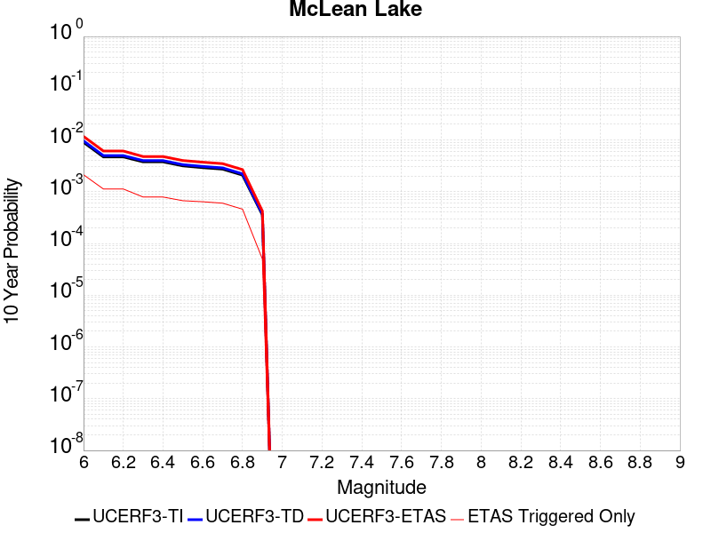 |

| Magnitude | 1 wk TI Prob | 1 wk TD Prob | 1 wk ETAS Prob | 1 wk ETAS/TD Gain | 1 wk ETAS Triggered Only | 1 mo TI Prob | 1 mo TD Prob | 1 mo ETAS Prob | 1 mo ETAS/TD Gain | 1 mo ETAS Triggered Only | 1 yr TI Prob | 1 yr TD Prob | 1 yr ETAS Prob | 1 yr ETAS/TD Gain | 1 yr ETAS Triggered Only | 10 yr TI Prob | 10 yr TD Prob | 10 yr ETAS Prob | 10 yr ETAS/TD Gain | 10 yr ETAS Triggered Only |
|-----|-----|-----|-----|-----|-----|-----|-----|-----|-----|-----|-----|-----|-----|-----|-----|-----|-----|-----|-----|-----|
| 6.0 | 1.7360222E-5 | 1.8503244E-5 | 4.8859067E-5 | 2.6405675 | 3.0356385E-5 | 7.439883E-5 | 7.929748E-5 | 1.7035942E-4 | 2.1483583 | 9.106915E-5 | 9.0542925E-4 | 9.650678E-4 | 0.001723245 | 1.7856206 | 7.589096E-4 | 0.009017491 | 0.009613611 | 0.011988711 | 1.2470559 | 0.0023981542 |
| 6.1 | 9.062689E-6 | 9.592937E-6 | 9.592937E-6 | 1.0 | 0.0 | 3.8839516E-5 | 4.111199E-5 | 7.1467126E-5 | 1.7383523 | 3.0356385E-5 | 4.727685E-4 | 5.0043245E-4 | 7.7350315E-4 | 1.5456696 | 2.7320746E-4 | 0.0047176396 | 0.0049939384 | 0.00614172 | 1.229835 | 0.0011535425 |
| 6.2 | 9.062689E-6 | 9.592937E-6 | 9.592937E-6 | 1.0 | 0.0 | 3.8839516E-5 | 4.111199E-5 | 7.1467126E-5 | 1.7383523 | 3.0356385E-5 | 4.727685E-4 | 5.0043245E-4 | 7.7350315E-4 | 1.5456696 | 2.7320746E-4 | 0.0047176396 | 0.0049939384 | 0.00614172 | 1.229835 | 0.0011535425 |
| 6.3 | 7.2575485E-6 | 7.6682845E-6 | 7.6682845E-6 | 1.0 | 0.0 | 3.110341E-5 | 3.2863703E-5 | 6.3219086E-5 | 1.9236752 | 3.0356385E-5 | 3.786182E-4 | 4.0004926E-4 | 6.124589E-4 | 1.5309588 | 2.1249469E-4 | 0.0037797375 | 0.003993996 | 0.00490105 | 1.2271044 | 9.106915E-4 |
| 6.4 | 7.2575485E-6 | 7.6682845E-6 | 7.6682845E-6 | 1.0 | 0.0 | 3.110341E-5 | 3.2863703E-5 | 6.3219086E-5 | 1.9236752 | 3.0356385E-5 | 3.786182E-4 | 4.0004926E-4 | 6.124589E-4 | 1.5309588 | 2.1249469E-4 | 0.0037797375 | 0.003993996 | 0.00490105 | 1.2271044 | 9.106915E-4 |
| 6.5 | 6.06582E-6 | 6.404351E-6 | 6.404351E-6 | 1.0 | 0.0 | 2.5996113E-5 | 2.7446966E-5 | 5.7802517E-5 | 2.105971 | 3.0356385E-5 | 3.164567E-4 | 3.3412204E-4 | 4.8585326E-4 | 1.4541191 | 1.5178192E-4 | 0.0031600643 | 0.0033368357 | 0.004093213 | 1.226675 | 7.589096E-4 |
| 6.6 | 5.598744E-6 | 5.9106987E-6 | 5.9106987E-6 | 1.0 | 0.0 | 2.3994397E-5 | 2.5331356E-5 | 5.568697E-5 | 2.1983414 | 3.0356385E-5 | 2.9209262E-4 | 3.0837202E-4 | 4.601071E-4 | 1.4920522 | 1.5178192E-4 | 0.0029170897 | 0.0030800703 | 0.0038366425 | 1.2456347 | 7.589096E-4 |
| 6.7 | 5.246996E-6 | 5.5395712E-6 | 5.5395712E-6 | 1.0 | 0.0 | 2.2486933E-5 | 2.374084E-5 | 2.374084E-5 | 1.0 | 0.0 | 2.73744E-4 | 2.8901274E-4 | 4.1040318E-4 | 1.4200176 | 1.2142554E-4 | 0.0027340704 | 0.0028869926 | 0.003583174 | 1.2411441 | 6.981968E-4 |
| 6.8 | 4.02324E-6 | 4.247218E-6 | 4.247218E-6 | 1.0 | 0.0 | 1.7242342E-5 | 1.8202269E-5 | 1.8202269E-5 | 1.0 | 0.0 | 2.099053E-4 | 2.2159604E-4 | 2.8229537E-4 | 1.2739187 | 6.071277E-5 | 0.0020970714 | 0.0022143351 | 0.0026989619 | 1.2188587 | 4.8570216E-4 |
| 6.9 | 6.835972E-7 | 7.140349E-7 | 7.140349E-7 | 1.0 | 0.0 | 2.9296991E-6 | 3.060148E-6 | 3.060148E-6 | 1.0 | 0.0 | 3.56685E-5 | 3.725698E-5 | 6.7612236E-5 | 1.8147534 | 3.0356385E-5 | 3.5662777E-4 | 3.7253863E-4 | 4.3322876E-4 | 1.1629096 | 6.071277E-5 |

## Goldstone Lake
*[(top)](#table-of-contents)*

| 1 Week | 1 Month | 1 Year | 10 Year |
|-----|-----|-----|-----|
|  | 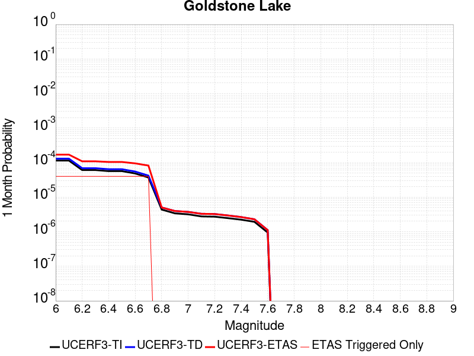 |  |  |

| Magnitude | 1 wk TI Prob | 1 wk TD Prob | 1 wk ETAS Prob | 1 wk ETAS/TD Gain | 1 wk ETAS Triggered Only | 1 mo TI Prob | 1 mo TD Prob | 1 mo ETAS Prob | 1 mo ETAS/TD Gain | 1 mo ETAS Triggered Only | 1 yr TI Prob | 1 yr TD Prob | 1 yr ETAS Prob | 1 yr ETAS/TD Gain | 1 yr ETAS Triggered Only | 10 yr TI Prob | 10 yr TD Prob | 10 yr ETAS Prob | 10 yr ETAS/TD Gain | 10 yr ETAS Triggered Only |
|-----|-----|-----|-----|-----|-----|-----|-----|-----|-----|-----|-----|-----|-----|-----|-----|-----|-----|-----|-----|-----|
| 6.0 | 2.671352E-5 | 3.0381472E-5 | 3.0381472E-5 | 1.0 | 0.0 | 1.1448149E-4 | 1.3020092E-4 | 1.6055335E-4 | 1.23312 | 3.0356385E-5 | 0.001392921 | 0.00158424 | 0.002220714 | 1.4017537 | 6.374841E-4 | 0.013842222 | 0.015748968 | 0.017840449 | 1.1328012 | 0.0021249468 |
| 6.1 | 2.671352E-5 | 3.0381472E-5 | 3.0381472E-5 | 1.0 | 0.0 | 1.1448149E-4 | 1.3020092E-4 | 1.6055335E-4 | 1.23312 | 3.0356385E-5 | 0.001392921 | 0.00158424 | 0.002220714 | 1.4017537 | 6.374841E-4 | 0.013842222 | 0.015748968 | 0.017840449 | 1.1328012 | 0.0021249468 |
| 6.2 | 1.4197047E-5 | 1.6098957E-5 | 1.6098957E-5 | 1.0 | 0.0 | 6.0843064E-5 | 6.899426E-5 | 9.934855E-5 | 1.4399538 | 3.0356385E-5 | 7.4051257E-4 | 8.397801E-4 | 0.001143089 | 1.3611766 | 3.0356384E-4 | 0.007380498 | 0.008375766 | 0.009549749 | 1.1401643 | 0.001183899 |
| 6.3 | 1.4197047E-5 | 1.6098957E-5 | 1.6098957E-5 | 1.0 | 0.0 | 6.0843064E-5 | 6.899426E-5 | 9.934855E-5 | 1.4399538 | 3.0356385E-5 | 7.4051257E-4 | 8.397801E-4 | 0.001143089 | 1.3611766 | 3.0356384E-4 | 0.007380498 | 0.008375766 | 0.009549749 | 1.1401643 | 0.001183899 |
| 6.4 | 1.3238931E-5 | 1.5010976E-5 | 1.5010976E-5 | 1.0 | 0.0 | 5.6737044E-5 | 6.4331725E-5 | 9.4686155E-5 | 1.4718423 | 3.0356385E-5 | 6.9055456E-4 | 7.830553E-4 | 0.0010863814 | 1.3873624 | 3.0356384E-4 | 0.006884126 | 0.00781259 | 0.008896883 | 1.1387877 | 0.0010928299 |
| 6.5 | 1.3238931E-5 | 1.5010976E-5 | 1.5010976E-5 | 1.0 | 0.0 | 5.6737044E-5 | 6.4331725E-5 | 9.4686155E-5 | 1.4718423 | 3.0356385E-5 | 6.9055456E-4 | 7.830553E-4 | 0.0010863814 | 1.3873624 | 3.0356384E-4 | 0.006884126 | 0.00781259 | 0.008896883 | 1.1387877 | 0.0010928299 |
| 6.6 | 1.1328278E-5 | 1.285732E-5 | 1.285732E-5 | 1.0 | 0.0 | 4.8548856E-5 | 5.5102173E-5 | 8.5456886E-5 | 1.5508804 | 3.0356385E-5 | 5.90922E-4 | 6.707582E-4 | 9.437824E-4 | 1.4070382 | 2.7320746E-4 | 0.0058935313 | 0.0066967285 | 0.007721934 | 1.1530905 | 0.001032117 |
| 6.7 | 8.651175E-6 | 9.826188E-6 | 9.826188E-6 | 1.0 | 0.0 | 3.707594E-5 | 4.2112064E-5 | 7.246717E-5 | 1.7208173 | 3.0356385E-5 | 4.5130608E-4 | 5.1268435E-4 | 7.554109E-4 | 1.4734426 | 2.4285108E-4 | 0.0045039062 | 0.0051238975 | 0.0059091193 | 1.153247 | 7.8926596E-4 |
| 6.8 | 1.0215377E-6 | 1.1755602E-6 | 1.1755602E-6 | 1.0 | 0.0 | 4.378012E-6 | 5.038106E-6 | 5.038106E-6 | 1.0 | 0.0 | 5.3300988E-5 | 6.133733E-5 | 9.169185E-5 | 1.4948784 | 3.0356385E-5 | 5.3288206E-4 | 6.1321526E-4 | 6.738908E-4 | 1.0989466 | 6.071277E-5 |
| 6.9 | 7.9360774E-7 | 9.28402E-7 | 9.28402E-7 | 1.0 | 0.0 | 3.4011714E-6 | 3.97886E-6 | 3.97886E-6 | 1.0 | 0.0 | 4.1408475E-5 | 4.8441616E-5 | 4.8441616E-5 | 1.0 | 0.0 | 4.140076E-4 | 4.8431757E-4 | 4.8431757E-4 | 1.0 | 0.0 |
| 7.0 | 7.4382757E-7 | 8.7478975E-7 | 8.7478975E-7 | 1.0 | 0.0 | 3.1878285E-6 | 3.7490938E-6 | 3.7490938E-6 | 1.0 | 0.0 | 3.8811122E-5 | 4.564433E-5 | 4.564433E-5 | 1.0 | 0.0 | 3.8804344E-4 | 4.5635618E-4 | 4.5635618E-4 | 1.0 | 0.0 |
| 7.1 | 6.4709513E-7 | 7.711771E-7 | 7.711771E-7 | 1.0 | 0.0 | 2.773262E-6 | 3.305041E-6 | 3.305041E-6 | 1.0 | 0.0 | 3.376394E-5 | 4.0238192E-5 | 4.0238192E-5 | 1.0 | 0.0 | 3.375881E-4 | 4.0231502E-4 | 4.0231502E-4 | 1.0 | 0.0 |
| 7.2 | 6.356704E-7 | 7.5888187E-7 | 7.5888187E-7 | 1.0 | 0.0 | 2.7242988E-6 | 3.2523471E-6 | 3.2523471E-6 | 1.0 | 0.0 | 3.3167835E-5 | 3.9596667E-5 | 3.9596667E-5 | 1.0 | 0.0 | 3.3162883E-4 | 3.9590205E-4 | 3.9590205E-4 | 1.0 | 0.0 |
| 7.3 | 5.7695723E-7 | 6.896988E-7 | 6.896988E-7 | 1.0 | 0.0 | 2.4726714E-6 | 2.9558491E-6 | 2.9558491E-6 | 1.0 | 0.0 | 3.0104358E-5 | 3.5986926E-5 | 3.5986926E-5 | 1.0 | 0.0 | 3.0100282E-4 | 3.598167E-4 | 3.598167E-4 | 1.0 | 0.0 |
| 7.4 | 5.209647E-7 | 6.1938704E-7 | 6.1938704E-7 | 1.0 | 0.0 | 2.232704E-6 | 2.6545135E-6 | 2.6545135E-6 | 1.0 | 0.0 | 2.718283E-5 | 3.231828E-5 | 3.231828E-5 | 1.0 | 0.0 | 2.7179506E-4 | 3.2314134E-4 | 3.2314134E-4 | 1.0 | 0.0 |
| 7.5 | 4.512955E-7 | 5.3491794E-7 | 5.3491794E-7 | 1.0 | 0.0 | 1.934122E-6 | 2.2925037E-6 | 2.2925037E-6 | 1.0 | 0.0 | 2.3547682E-5 | 2.7910928E-5 | 2.7910928E-5 | 1.0 | 0.0 | 2.3545188E-4 | 2.7907954E-4 | 2.7907954E-4 | 1.0 | 0.0 |
| 7.6 | 2.21172E-7 | 2.60409E-7 | 2.60409E-7 | 1.0 | 0.0 | 9.478797E-7 | 1.1160382E-6 | 1.1160382E-6 | 1.0 | 0.0 | 1.1540374E-5 | 1.358771E-5 | 1.358771E-5 | 1.0 | 0.0 | 1.1539775E-4 | 1.3587161E-4 | 1.3587161E-4 | 1.0 | 0.0 |

## So Sierra Nevada
*[(top)](#table-of-contents)*

| 1 Week | 1 Month | 1 Year | 10 Year |
|-----|-----|-----|-----|
|  |  |  |  |

| Magnitude | 1 wk TI Prob | 1 wk TD Prob | 1 wk ETAS Prob | 1 wk ETAS/TD Gain | 1 wk ETAS Triggered Only | 1 mo TI Prob | 1 mo TD Prob | 1 mo ETAS Prob | 1 mo ETAS/TD Gain | 1 mo ETAS Triggered Only | 1 yr TI Prob | 1 yr TD Prob | 1 yr ETAS Prob | 1 yr ETAS/TD Gain | 1 yr ETAS Triggered Only | 10 yr TI Prob | 10 yr TD Prob | 10 yr ETAS Prob | 10 yr ETAS/TD Gain | 10 yr ETAS Triggered Only |
|-----|-----|-----|-----|-----|-----|-----|-----|-----|-----|-----|-----|-----|-----|-----|-----|-----|-----|-----|-----|-----|
| 6.0 | 1.15488665E-5 | 1.1080433E-5 | 1.1080433E-5 | 1.0 | 0.0 | 4.9494203E-5 | 4.7486777E-5 | 1.9926149E-4 | 4.1961465 | 1.5178192E-4 | 6.024253E-4 | 5.780109E-4 | 0.001488176 | 2.5746503 | 9.106915E-4 | 0.006007948 | 0.0057663447 | 0.00790922 | 1.3716176 | 0.0021553033 |
| 6.1 | 1.15488665E-5 | 1.1080433E-5 | 1.1080433E-5 | 1.0 | 0.0 | 4.9494203E-5 | 4.7486777E-5 | 1.9926149E-4 | 4.1961465 | 1.5178192E-4 | 6.024253E-4 | 5.780109E-4 | 0.001488176 | 2.5746503 | 9.106915E-4 | 0.006007948 | 0.0057663447 | 0.00790922 | 1.3716176 | 0.0021553033 |
| 6.2 | 1.15488665E-5 | 1.1080433E-5 | 1.1080433E-5 | 1.0 | 0.0 | 4.9494203E-5 | 4.7486777E-5 | 1.9926149E-4 | 4.1961465 | 1.5178192E-4 | 6.024253E-4 | 5.780109E-4 | 0.001488176 | 2.5746503 | 9.106915E-4 | 0.006007948 | 0.0057663447 | 0.00790922 | 1.3716176 | 0.0021553033 |
| 6.3 | 1.15488665E-5 | 1.1080433E-5 | 1.1080433E-5 | 1.0 | 0.0 | 4.9494203E-5 | 4.7486777E-5 | 1.9926149E-4 | 4.1961465 | 1.5178192E-4 | 6.024253E-4 | 5.780109E-4 | 0.001488176 | 2.5746503 | 9.106915E-4 | 0.006007948 | 0.0057663447 | 0.00790922 | 1.3716176 | 0.0021553033 |
| 6.4 | 1.15488665E-5 | 1.1080433E-5 | 1.1080433E-5 | 1.0 | 0.0 | 4.9494203E-5 | 4.7486777E-5 | 1.9926149E-4 | 4.1961465 | 1.5178192E-4 | 6.024253E-4 | 5.780109E-4 | 0.001488176 | 2.5746503 | 9.106915E-4 | 0.006007948 | 0.0057663447 | 0.00790922 | 1.3716176 | 0.0021553033 |
| 6.5 | 1.15488665E-5 | 1.1080433E-5 | 1.1080433E-5 | 1.0 | 0.0 | 4.9494203E-5 | 4.7486777E-5 | 1.9926149E-4 | 4.1961465 | 1.5178192E-4 | 6.024253E-4 | 5.780109E-4 | 0.001488176 | 2.5746503 | 9.106915E-4 | 0.006007948 | 0.0057663447 | 0.00790922 | 1.3716176 | 0.0021553033 |
| 6.6 | 7.587044E-6 | 6.9361727E-6 | 6.9361727E-6 | 1.0 | 0.0 | 3.2515498E-5 | 2.9726132E-5 | 1.5114807E-4 | 5.0846863 | 1.2142554E-4 | 3.9580427E-4 | 3.618585E-4 | 0.0010294573 | 2.8449168 | 6.678405E-4 | 0.003951 | 0.0036129844 | 0.004883346 | 1.3516101 | 0.0012749681 |
| 6.7 | 7.587044E-6 | 6.9361727E-6 | 6.9361727E-6 | 1.0 | 0.0 | 3.2515498E-5 | 2.9726132E-5 | 1.5114807E-4 | 5.0846863 | 1.2142554E-4 | 3.9580427E-4 | 3.618585E-4 | 0.0010294573 | 2.8449168 | 6.678405E-4 | 0.003951 | 0.0036129844 | 0.004883346 | 1.3516101 | 0.0012749681 |
| 6.8 | 5.9026956E-6 | 5.1798306E-6 | 5.1798306E-6 | 1.0 | 0.0 | 2.5297022E-5 | 2.2199092E-5 | 1.4362193E-4 | 6.469721 | 1.2142554E-4 | 3.0794772E-4 | 2.702416E-4 | 7.558125E-4 | 2.796803 | 4.8570216E-4 | 0.0030752132 | 0.002699246 | 0.0036074794 | 1.3364767 | 9.106915E-4 |
| 6.9 | 5.0118915E-6 | 4.2528136E-6 | 4.2528136E-6 | 1.0 | 0.0 | 2.1479358E-5 | 1.8226221E-5 | 1.0929371E-4 | 5.99651 | 9.106915E-5 | 2.614798E-4 | 2.2188236E-4 | 6.164278E-4 | 2.778174 | 3.9463298E-4 | 0.0026117235 | 0.002216681 | 0.0028830408 | 1.3006116 | 6.678405E-4 |
| 7.0 | 4.4924795E-6 | 3.714279E-6 | 3.714279E-6 | 1.0 | 0.0 | 1.925334E-5 | 1.5918245E-5 | 1.0698595E-4 | 6.7209635 | 9.106915E-5 | 2.3438422E-4 | 1.9378804E-4 | 5.2764354E-4 | 2.722787 | 3.3392024E-4 | 0.0023413717 | 0.0019362535 | 0.0025422056 | 1.3129508 | 6.071277E-4 |
| 7.1 | 3.9118436E-6 | 3.1123072E-6 | 3.1123072E-6 | 1.0 | 0.0 | 1.6764936E-5 | 1.3338395E-5 | 7.405035E-5 | 5.551669 | 6.071277E-5 | 2.0409399E-4 | 1.6238343E-4 | 4.0519505E-4 | 2.4952981 | 2.4285108E-4 | 0.0020390663 | 0.0016227039 | 0.0020773106 | 1.280154 | 4.5534575E-4 |
| 7.2 | 3.4200818E-6 | 2.6057585E-6 | 2.6057585E-6 | 1.0 | 0.0 | 1.4657411E-5 | 1.1167492E-5 | 4.1523537E-5 | 3.718251 | 3.0356385E-5 | 1.7843937E-4 | 1.3595623E-4 | 3.4842204E-4 | 2.5627515 | 2.1249469E-4 | 0.0017829615 | 0.0013587803 | 0.001752877 | 1.2900372 | 3.9463298E-4 |
| 7.3 | 2.6593618E-6 | 1.8286859E-6 | 1.8286859E-6 | 1.0 | 0.0 | 1.13972155E-5 | 7.837203E-6 | 3.819335E-5 | 4.873339 | 3.0356385E-5 | 1.3875226E-4 | 9.541407E-5 | 2.1682802E-4 | 2.2724953 | 1.2142554E-4 | 0.0013866565 | 9.5375994E-4 | 0.0011963794 | 1.2543821 | 2.4285108E-4 |
| 7.4 | 2.2577992E-6 | 1.4366802E-6 | 1.4366802E-6 | 1.0 | 0.0 | 9.676246E-6 | 6.157188E-6 | 3.6513386E-5 | 5.9302044 | 3.0356385E-5 | 1.1780193E-4 | 7.496144E-5 | 1.9637788E-4 | 2.6197186 | 1.2142554E-4 | 0.001177395 | 7.493866E-4 | 9.6172205E-4 | 1.2833457 | 2.1249469E-4 |
| 7.5 | 1.489319E-6 | 7.3558385E-7 | 7.3558385E-7 | 1.0 | 0.0 | 6.3827797E-6 | 3.1524985E-6 | 3.1524985E-6 | 1.0 | 0.0 | 7.770758E-5 | 3.8380997E-5 | 9.9091434E-5 | 2.5817838 | 6.071277E-5 | 7.7680405E-4 | 3.837441E-4 | 5.0512305E-4 | 1.3163017 | 1.2142554E-4 |
| 7.6 | 1.0680322E-6 | 4.6610623E-7 | 4.6610623E-7 | 1.0 | 0.0 | 4.577273E-6 | 1.9975967E-6 | 1.9975967E-6 | 1.0 | 0.0 | 5.5726876E-5 | 2.432047E-5 | 5.4676115E-5 | 2.248152 | 3.0356385E-5 | 5.5712904E-4 | 2.4317835E-4 | 3.3422536E-4 | 1.3744042 | 9.106915E-5 |
| 7.7 | 5.509146E-7 | 1.5587625E-7 | 1.5587625E-7 | 1.0 | 0.0 | 2.3610605E-6 | 6.680409E-7 | 6.680409E-7 | 1.0 | 0.0 | 2.8745531E-5 | 8.133369E-6 | 8.133369E-6 | 1.0 | 0.0 | 2.8741814E-4 | 8.133083E-5 | 8.133083E-5 | 1.0 | 0.0 |

## Gravel Hills-Harper Lk
*[(top)](#table-of-contents)*

| 1 Week | 1 Month | 1 Year | 10 Year |
|-----|-----|-----|-----|
|  |  |  |  |

| Magnitude | 1 wk TI Prob | 1 wk TD Prob | 1 wk ETAS Prob | 1 wk ETAS/TD Gain | 1 wk ETAS Triggered Only | 1 mo TI Prob | 1 mo TD Prob | 1 mo ETAS Prob | 1 mo ETAS/TD Gain | 1 mo ETAS Triggered Only | 1 yr TI Prob | 1 yr TD Prob | 1 yr ETAS Prob | 1 yr ETAS/TD Gain | 1 yr ETAS Triggered Only | 10 yr TI Prob | 10 yr TD Prob | 10 yr ETAS Prob | 10 yr ETAS/TD Gain | 10 yr ETAS Triggered Only |
|-----|-----|-----|-----|-----|-----|-----|-----|-----|-----|-----|-----|-----|-----|-----|-----|-----|-----|-----|-----|-----|
| 6.0 | 3.0679566E-5 | 3.1470034E-5 | 9.218089E-5 | 2.9291642 | 6.071277E-5 | 1.3147724E-4 | 1.3486583E-4 | 2.5627497E-4 | 1.9002218 | 1.2142554E-4 | 0.0015995599 | 0.0016409707 | 0.0022774087 | 1.3878424 | 6.374841E-4 | 0.015880952 | 0.016310113 | 0.018251095 | 1.1190048 | 0.001973165 |
| 6.1 | 3.0679566E-5 | 3.1470034E-5 | 9.218089E-5 | 2.9291642 | 6.071277E-5 | 1.3147724E-4 | 1.3486583E-4 | 2.5627497E-4 | 1.9002218 | 1.2142554E-4 | 0.0015995599 | 0.0016409707 | 0.0022774087 | 1.3878424 | 6.374841E-4 | 0.015880952 | 0.016310113 | 0.018251095 | 1.1190048 | 0.001973165 |
| 6.2 | 1.514536E-5 | 1.3637061E-5 | 1.3637061E-5 | 1.0 | 0.0 | 6.490707E-5 | 5.8443307E-5 | 8.879792E-5 | 1.5193856 | 3.0356385E-5 | 7.8995706E-4 | 7.1132684E-4 | 0.0010450096 | 1.4690989 | 3.3392024E-4 | 0.007871548 | 0.0070917015 | 0.007724665 | 1.089254 | 6.374841E-4 |
| 6.3 | 1.514536E-5 | 1.3637061E-5 | 1.3637061E-5 | 1.0 | 0.0 | 6.490707E-5 | 5.8443307E-5 | 8.879792E-5 | 1.5193856 | 3.0356385E-5 | 7.8995706E-4 | 7.1132684E-4 | 0.0010450096 | 1.4690989 | 3.3392024E-4 | 0.007871548 | 0.0070917015 | 0.007724665 | 1.089254 | 6.374841E-4 |
| 6.4 | 1.2532521E-5 | 1.0691045E-5 | 1.0691045E-5 | 1.0 | 0.0 | 5.37097E-5 | 4.5817993E-5 | 7.617298E-5 | 1.6625125 | 3.0356385E-5 | 6.537194E-4 | 5.576971E-4 | 8.6109166E-4 | 1.5440131 | 3.0356384E-4 | 0.0065179965 | 0.0055635655 | 0.0061069406 | 1.0976666 | 5.464149E-4 |
| 6.5 | 1.1094058E-5 | 9.084768E-6 | 9.084768E-6 | 1.0 | 0.0 | 4.7545094E-5 | 3.8934162E-5 | 3.8934162E-5 | 1.0 | 0.0 | 5.787078E-4 | 4.7392436E-4 | 6.5597636E-4 | 1.3841372 | 1.821383E-4 | 0.0057720304 | 0.0047295443 | 0.0050618853 | 1.0702691 | 3.3392024E-4 |
| 6.6 | 9.688328E-6 | 7.5325847E-6 | 7.5325847E-6 | 1.0 | 0.0 | 4.1520743E-5 | 3.228212E-5 | 3.228212E-5 | 1.0 | 0.0 | 5.053978E-4 | 3.929665E-4 | 4.8399987E-4 | 1.2316568 | 9.106915E-5 | 0.0050424994 | 0.0039229733 | 0.004134634 | 1.0539542 | 2.1249469E-4 |
| 6.7 | 8.974824E-6 | 6.7502024E-6 | 6.7502024E-6 | 1.0 | 0.0 | 3.8462964E-5 | 2.8929131E-5 | 2.8929131E-5 | 1.0 | 0.0 | 4.6818596E-4 | 3.5215745E-4 | 4.4319453E-4 | 1.2585124 | 9.106915E-5 | 0.004672008 | 0.0035162151 | 0.0037279625 | 1.0602202 | 2.1249469E-4 |
| 6.8 | 7.4780046E-6 | 5.116785E-6 | 5.116785E-6 | 1.0 | 0.0 | 3.20482E-5 | 2.1928901E-5 | 2.1928901E-5 | 1.0 | 0.0 | 3.9011694E-4 | 2.6695305E-4 | 3.276496E-4 | 1.2273679 | 6.071277E-5 | 0.0038943281 | 0.0026664622 | 0.002727013 | 1.0227083 | 6.071277E-5 |
| 6.9 | 6.3409307E-6 | 3.907958E-6 | 3.907958E-6 | 1.0 | 0.0 | 2.7175134E-5 | 1.674829E-5 | 1.674829E-5 | 1.0 | 0.0 | 3.3080703E-4 | 2.0389234E-4 | 2.6459273E-4 | 1.297708 | 6.071277E-5 | 0.0033031502 | 0.0020371508 | 0.0020977398 | 1.0297421 | 6.071277E-5 |
| 7.0 | 5.1239335E-6 | 2.6061791E-6 | 2.6061791E-6 | 1.0 | 0.0 | 2.195953E-5 | 1.11692925E-5 | 1.11692925E-5 | 1.0 | 0.0 | 2.6732447E-4 | 1.359779E-4 | 1.6633017E-4 | 1.2232146 | 3.0356385E-5 | 0.0026700313 | 0.0013589723 | 0.0013892874 | 1.0223074 | 3.0356385E-5 |
| 7.1 | 4.438899E-6 | 2.0987422E-6 | 2.0987422E-6 | 1.0 | 0.0 | 1.9023713E-5 | 8.994581E-6 | 8.994581E-6 | 1.0 | 0.0 | 2.315891E-4 | 1.0950373E-4 | 1.398568E-4 | 1.2771875 | 3.0356385E-5 | 0.002313479 | 0.0010945196 | 0.0011248428 | 1.0277045 | 3.0356385E-5 |
| 7.2 | 3.50367E-6 | 1.2617695E-6 | 1.2617695E-6 | 1.0 | 0.0 | 1.5015643E-5 | 5.407573E-6 | 5.407573E-6 | 1.0 | 0.0 | 1.8280011E-4 | 6.5835295E-5 | 9.618968E-5 | 1.4610655 | 3.0356385E-5 | 0.0018264982 | 6.5816613E-4 | 6.8850257E-4 | 1.0460923 | 3.0356385E-5 |
| 7.3 | 2.561638E-6 | 7.1206705E-7 | 7.1206705E-7 | 1.0 | 0.0 | 1.0978401E-5 | 3.0517124E-6 | 3.0517124E-6 | 1.0 | 0.0 | 1.3365384E-4 | 3.7153986E-5 | 6.750924E-5 | 1.8170121 | 3.0356385E-5 | 0.0013357349 | 3.7147972E-4 | 4.0182483E-4 | 1.0816871 | 3.0356385E-5 |
| 7.4 | 2.0368864E-6 | 5.3060455E-7 | 5.3060455E-7 | 1.0 | 0.0 | 8.729483E-6 | 2.2740176E-6 | 2.2740176E-6 | 1.0 | 0.0 | 1.06276275E-4 | 2.7685817E-5 | 2.7685817E-5 | 1.0 | 0.0 | 0.0010622547 | 2.768242E-4 | 2.768242E-4 | 1.0 | 0.0 |
| 7.5 | 1.1681728E-6 | 3.6037605E-7 | 3.6037605E-7 | 1.0 | 0.0 | 5.0064455E-6 | 1.544468E-6 | 1.544468E-6 | 1.0 | 0.0 | 6.0951766E-5 | 1.880374E-5 | 1.880374E-5 | 1.0 | 0.0 | 6.093505E-4 | 1.8802195E-4 | 1.8802195E-4 | 1.0 | 0.0 |
| 7.6 | 1.3154387E-7 | 7.120617E-8 | 7.120617E-8 | 1.0 | 0.0 | 5.6375933E-7 | 3.051693E-7 | 3.051693E-7 | 1.0 | 0.0 | 6.863748E-6 | 3.7154316E-6 | 3.7154316E-6 | 1.0 | 0.0 | 6.863536E-5 | 3.715385E-5 | 3.715385E-5 | 1.0 | 0.0 |

## Coyote Canyon
*[(top)](#table-of-contents)*

| 1 Week | 1 Month | 1 Year | 10 Year |
|-----|-----|-----|-----|
| 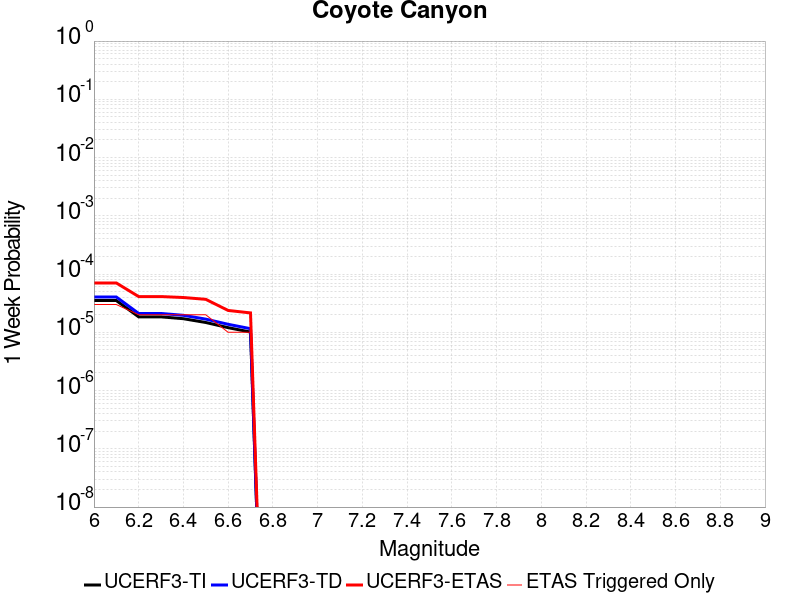 |  |  |  |

| Magnitude | 1 wk TI Prob | 1 wk TD Prob | 1 wk ETAS Prob | 1 wk ETAS/TD Gain | 1 wk ETAS Triggered Only | 1 mo TI Prob | 1 mo TD Prob | 1 mo ETAS Prob | 1 mo ETAS/TD Gain | 1 mo ETAS Triggered Only | 1 yr TI Prob | 1 yr TD Prob | 1 yr ETAS Prob | 1 yr ETAS/TD Gain | 1 yr ETAS Triggered Only | 10 yr TI Prob | 10 yr TD Prob | 10 yr ETAS Prob | 10 yr ETAS/TD Gain | 10 yr ETAS Triggered Only |
|-----|-----|-----|-----|-----|-----|-----|-----|-----|-----|-----|-----|-----|-----|-----|-----|-----|-----|-----|-----|-----|
| 6.0 | 3.5090034E-5 | 4.0372353E-5 | 1.0108267E-4 | 2.5037596 | 6.071277E-5 | 1.503772E-4 | 1.7301434E-4 | 2.9441886E-4 | 1.7017021 | 1.2142554E-4 | 0.0018293047 | 0.0021046721 | 0.002589352 | 1.2302876 | 4.8570216E-4 | 0.018143194 | 0.020873329 | 0.022240574 | 1.065502 | 0.0013963936 |
| 6.1 | 3.5090034E-5 | 4.0372353E-5 | 1.0108267E-4 | 2.5037596 | 6.071277E-5 | 1.503772E-4 | 1.7301434E-4 | 2.9441886E-4 | 1.7017021 | 1.2142554E-4 | 0.0018293047 | 0.0021046721 | 0.002589352 | 1.2302876 | 4.8570216E-4 | 0.018143194 | 0.020873329 | 0.022240574 | 1.065502 | 0.0013963936 |
| 6.2 | 1.841879E-5 | 2.10638E-5 | 5.1419545E-5 | 2.4411333 | 3.0356385E-5 | 7.8935285E-5 | 9.027088E-5 | 1.8133181E-4 | 2.008752 | 9.106915E-5 | 9.606133E-4 | 0.0010985958 | 0.0013411801 | 1.220813 | 2.4285108E-4 | 0.0095647145 | 0.010941739 | 0.011542223 | 1.0548801 | 6.071277E-4 |
| 6.3 | 1.841879E-5 | 2.10638E-5 | 5.1419545E-5 | 2.4411333 | 3.0356385E-5 | 7.8935285E-5 | 9.027088E-5 | 1.8133181E-4 | 2.008752 | 9.106915E-5 | 9.606133E-4 | 0.0010985958 | 0.0013411801 | 1.220813 | 2.4285108E-4 | 0.0095647145 | 0.010941739 | 0.011542223 | 1.0548801 | 6.071277E-4 |
| 6.4 | 1.712201E-5 | 1.9568917E-5 | 4.9924707E-5 | 2.551225 | 3.0356385E-5 | 7.337798E-5 | 8.386466E-5 | 1.7492617E-4 | 2.0858152 | 9.106915E-5 | 8.930107E-4 | 0.0010206745 | 0.0012632776 | 1.2376891 | 2.4285108E-4 | 0.008894307 | 0.010169788 | 0.010740694 | 1.0561374 | 5.767713E-4 |
| 6.5 | 1.4744935E-5 | 1.6840142E-5 | 4.7196016E-5 | 2.8025901 | 3.0356385E-5 | 6.3191044E-5 | 7.2170566E-5 | 1.6323314E-4 | 2.261769 | 9.106915E-5 | 7.6907943E-4 | 8.7841594E-4 | 0.001090724 | 1.2416942 | 2.1249469E-4 | 0.007664232 | 0.008758638 | 0.009300267 | 1.0618395 | 5.464149E-4 |
| 6.6 | 1.2017839E-5 | 1.3726675E-5 | 4.408264E-5 | 3.2114582 | 3.0356385E-5 | 5.150401E-5 | 5.882778E-5 | 8.918238E-5 | 1.5159909 | 3.0356385E-5 | 6.268809E-4 | 7.160815E-4 | 8.070854E-4 | 1.127086 | 9.106915E-5 | 0.0062511545 | 0.007146437 | 0.007477971 | 1.0463915 | 3.3392024E-4 |
| 6.7 | 1.00956095E-5 | 1.1535696E-5 | 4.189173E-5 | 3.631487 | 3.0356385E-5 | 4.326618E-5 | 4.943825E-5 | 7.9793135E-5 | 1.6139959 | 3.0356385E-5 | 5.266384E-4 | 6.0183153E-4 | 6.9284585E-4 | 1.1512289 | 9.106915E-5 | 0.005253921 | 0.006010547 | 0.006282112 | 1.0451815 | 2.7320746E-4 |

## Death Valley (So)
*[(top)](#table-of-contents)*

| 1 Week | 1 Month | 1 Year | 10 Year |
|-----|-----|-----|-----|
|  |  |  |  |

| Magnitude | 1 wk TI Prob | 1 wk TD Prob | 1 wk ETAS Prob | 1 wk ETAS/TD Gain | 1 wk ETAS Triggered Only | 1 mo TI Prob | 1 mo TD Prob | 1 mo ETAS Prob | 1 mo ETAS/TD Gain | 1 mo ETAS Triggered Only | 1 yr TI Prob | 1 yr TD Prob | 1 yr ETAS Prob | 1 yr ETAS/TD Gain | 1 yr ETAS Triggered Only | 10 yr TI Prob | 10 yr TD Prob | 10 yr ETAS Prob | 10 yr ETAS/TD Gain | 10 yr ETAS Triggered Only |
|-----|-----|-----|-----|-----|-----|-----|-----|-----|-----|-----|-----|-----|-----|-----|-----|-----|-----|-----|-----|-----|
| 6.0 | 2.0684236E-5 | 2.5624238E-5 | 2.5624238E-5 | 1.0 | 0.0 | 8.864371E-5 | 1.09813634E-4 | 1.7051974E-4 | 1.5528102 | 6.071277E-5 | 0.0010787029 | 0.0013361779 | 0.0017302836 | 1.29495 | 3.9463298E-4 | 0.010734817 | 0.01328472 | 0.014512797 | 1.0924429 | 0.0012446117 |
| 6.1 | 2.0684236E-5 | 2.5624238E-5 | 2.5624238E-5 | 1.0 | 0.0 | 8.864371E-5 | 1.09813634E-4 | 1.7051974E-4 | 1.5528102 | 6.071277E-5 | 0.0010787029 | 0.0013361779 | 0.0017302836 | 1.29495 | 3.9463298E-4 | 0.010734817 | 0.01328472 | 0.014512797 | 1.0924429 | 0.0012446117 |
| 6.2 | 2.0684236E-5 | 2.5624238E-5 | 2.5624238E-5 | 1.0 | 0.0 | 8.864371E-5 | 1.09813634E-4 | 1.7051974E-4 | 1.5528102 | 6.071277E-5 | 0.0010787029 | 0.0013361779 | 0.0017302836 | 1.29495 | 3.9463298E-4 | 0.010734817 | 0.01328472 | 0.014512797 | 1.0924429 | 0.0012446117 |
| 6.3 | 2.0240292E-5 | 2.5124238E-5 | 2.5124238E-5 | 1.0 | 0.0 | 8.6741224E-5 | 1.0767096E-4 | 1.6837718E-4 | 1.5638125 | 6.071277E-5 | 0.0010555626 | 0.0013101223 | 0.0016739217 | 1.2776835 | 3.642766E-4 | 0.010505628 | 0.013027237 | 0.014195713 | 1.0896949 | 0.001183899 |
| 6.4 | 2.0240292E-5 | 2.5124238E-5 | 2.5124238E-5 | 1.0 | 0.0 | 8.6741224E-5 | 1.0767096E-4 | 1.6837718E-4 | 1.5638125 | 6.071277E-5 | 0.0010555626 | 0.0013101223 | 0.0016739217 | 1.2776835 | 3.642766E-4 | 0.010505628 | 0.013027237 | 0.014195713 | 1.0896949 | 0.001183899 |
| 6.5 | 1.9962767E-5 | 2.4813442E-5 | 2.4813442E-5 | 1.0 | 0.0 | 8.55519E-5 | 1.0633908E-4 | 1.670454E-4 | 1.5708749 | 6.071277E-5 | 0.0010410968 | 0.0012939262 | 0.0016577314 | 1.2811638 | 3.642766E-4 | 0.010362327 | 0.012867158 | 0.014035824 | 1.0908254 | 0.001183899 |
| 6.6 | 1.8937297E-5 | 2.3317003E-5 | 2.3317003E-5 | 1.0 | 0.0 | 8.115732E-5 | 9.992627E-5 | 1.6063296E-4 | 1.607515 | 6.071277E-5 | 9.876423E-4 | 0.0012159379 | 0.0015797715 | 1.2992206 | 3.642766E-4 | 0.009832645 | 0.012095899 | 0.01317551 | 1.0892543 | 0.0010928299 |
| 6.7 | 1.8621096E-5 | 2.2917578E-5 | 2.2917578E-5 | 1.0 | 0.0 | 7.980225E-5 | 9.821458E-5 | 1.5892138E-4 | 1.6181039 | 6.071277E-5 | 9.711593E-4 | 0.0011951211 | 0.0015589623 | 1.3044388 | 3.642766E-4 | 0.009669261 | 0.011889981 | 0.012939822 | 1.0882963 | 0.0010624734 |
| 6.8 | 1.7830353E-5 | 2.1811285E-5 | 2.1811285E-5 | 1.0 | 0.0 | 7.641356E-5 | 9.347367E-5 | 1.5418076E-4 | 1.6494566 | 6.071277E-5 | 9.29938E-4 | 0.0011374619 | 0.0014710022 | 1.2932322 | 3.3392024E-4 | 0.009260561 | 0.011319241 | 0.012339675 | 1.0901505 | 0.001032117 |
| 6.9 | 1.3135183E-5 | 1.5307089E-5 | 1.5307089E-5 | 1.0 | 0.0 | 5.6292425E-5 | 6.5600194E-5 | 9.595459E-5 | 1.462718 | 3.0356385E-5 | 6.8514474E-4 | 7.983962E-4 | 0.0010713855 | 1.3419222 | 2.7320746E-4 | 0.006830362 | 0.007956286 | 0.008528468 | 1.0719157 | 5.767713E-4 |
| 7.0 | 1.1507512E-5 | 1.3156645E-5 | 1.3156645E-5 | 1.0 | 0.0 | 4.9316975E-5 | 5.6384437E-5 | 8.6739106E-5 | 1.538352 | 3.0356385E-5 | 6.002687E-4 | 6.8627007E-4 | 8.682834E-4 | 1.2652211 | 1.821383E-4 | 0.0059864987 | 0.0068422095 | 0.007234142 | 1.0572816 | 3.9463298E-4 |
| 7.1 | 9.715903E-6 | 1.08670365E-5 | 1.08670365E-5 | 1.0 | 0.0 | 4.1638916E-5 | 4.6572204E-5 | 7.692717E-5 | 1.651783 | 3.0356385E-5 | 5.068359E-4 | 5.6687335E-4 | 6.8823004E-4 | 1.2140808 | 1.2142554E-4 | 0.0050568148 | 0.005654727 | 0.0058962046 | 1.0427037 | 2.4285108E-4 |
| 7.2 | 9.233269E-6 | 1.0287937E-5 | 1.0287937E-5 | 1.0 | 0.0 | 3.9570554E-5 | 4.4090437E-5 | 7.444548E-5 | 1.6884723 | 3.0356385E-5 | 4.81665E-4 | 5.3667306E-4 | 6.580335E-4 | 1.2261347 | 1.2142554E-4 | 0.0048062233 | 0.005354202 | 0.005595753 | 1.0451143 | 2.4285108E-4 |
| 7.3 | 8.8041315E-6 | 9.809655E-6 | 9.809655E-6 | 1.0 | 0.0 | 3.7731446E-5 | 4.2040723E-5 | 7.239583E-5 | 1.7220405 | 3.0356385E-5 | 4.592835E-4 | 5.117298E-4 | 6.027524E-4 | 1.1778723 | 9.106915E-5 | 0.0045833546 | 0.0051059416 | 0.00528715 | 1.0354897 | 1.821383E-4 |
| 7.4 | 8.708749E-6 | 9.708658E-6 | 9.708658E-6 | 1.0 | 0.0 | 3.7322676E-5 | 4.1607895E-5 | 7.196301E-5 | 1.7295519 | 3.0356385E-5 | 4.5430884E-4 | 5.064626E-4 | 5.974856E-4 | 1.1797231 | 9.106915E-5 | 0.004533812 | 0.0050535095 | 0.0052347276 | 1.0358598 | 1.821383E-4 |
| 7.5 | 8.612678E-6 | 9.606291E-6 | 9.606291E-6 | 1.0 | 0.0 | 3.6910955E-5 | 4.1169194E-5 | 7.152433E-5 | 1.7373264 | 3.0356385E-5 | 4.492982E-4 | 5.0112384E-4 | 5.9214735E-4 | 1.1816387 | 9.106915E-5 | 0.004483909 | 0.005000364 | 0.0051815915 | 1.0362428 | 1.821383E-4 |
| 7.6 | 8.319024E-6 | 9.28535E-6 | 9.28535E-6 | 1.0 | 0.0 | 3.5652476E-5 | 3.9793773E-5 | 7.014895E-5 | 1.7628121 | 3.0356385E-5 | 4.3398244E-4 | 4.843857E-4 | 5.754107E-4 | 1.1879185 | 9.106915E-5 | 0.0043313587 | 0.004833723 | 0.0049847714 | 1.0312488 | 1.5178192E-4 |
| 7.7 | 7.4718328E-6 | 8.346468E-6 | 8.346468E-6 | 1.0 | 0.0 | 3.2021748E-5 | 3.577011E-5 | 3.577011E-5 | 1.0 | 0.0 | 3.8979502E-4 | 4.3541813E-4 | 4.657613E-4 | 1.0696874 | 3.0356385E-5 | 0.00389112 | 0.0043460554 | 0.0044367285 | 1.0208634 | 9.106915E-5 |
| 7.8 | 3.4586725E-7 | 3.648528E-7 | 3.648528E-7 | 1.0 | 0.0 | 1.4822873E-6 | 1.563654E-6 | 1.563654E-6 | 1.0 | 0.0 | 1.80467E-5 | 1.9037325E-5 | 1.9037325E-5 | 1.0 | 0.0 | 1.8045233E-4 | 1.9035739E-4 | 1.9035739E-4 | 1.0 | 0.0 |
| 7.9 | 2.5591178E-9 | 2.6698248E-9 | 2.6698248E-9 | 1.0 | 0.0 | 1.0967647E-8 | 1.1442106E-8 | 1.1442106E-8 | 1.0 | 0.0 | 1.335311E-7 | 1.3930764E-7 | 1.3930764E-7 | 1.0 | 0.0 | 1.3353102E-6 | 1.3930764E-6 | 1.3930764E-6 | 1.0 | 0.0 |

## San Andreas (Mojave S)
*[(top)](#table-of-contents)*

| 1 Week | 1 Month | 1 Year | 10 Year |
|-----|-----|-----|-----|
|  |  |  |  |

| Magnitude | 1 wk TI Prob | 1 wk TD Prob | 1 wk ETAS Prob | 1 wk ETAS/TD Gain | 1 wk ETAS Triggered Only | 1 mo TI Prob | 1 mo TD Prob | 1 mo ETAS Prob | 1 mo ETAS/TD Gain | 1 mo ETAS Triggered Only | 1 yr TI Prob | 1 yr TD Prob | 1 yr ETAS Prob | 1 yr ETAS/TD Gain | 1 yr ETAS Triggered Only | 10 yr TI Prob | 10 yr TD Prob | 10 yr ETAS Prob | 10 yr ETAS/TD Gain | 10 yr ETAS Triggered Only |
|-----|-----|-----|-----|-----|-----|-----|-----|-----|-----|-----|-----|-----|-----|-----|-----|-----|-----|-----|-----|-----|
| 6.0 | 3.1064058E-4 | 6.755789E-4 | 6.755789E-4 | 1.0 | 0.0 | 0.0013306376 | 0.0028922537 | 0.0030133282 | 1.0418615 | 1.2142554E-4 | 0.016080605 | 0.034670897 | 0.035198368 | 1.0152136 | 5.464149E-4 | 0.1496549 | 0.28693774 | 0.2878036 | 1.0030175 | 0.0012142553 |
| 6.1 | 3.1064058E-4 | 6.755789E-4 | 6.755789E-4 | 1.0 | 0.0 | 0.0013306376 | 0.0028922537 | 0.0030133282 | 1.0418615 | 1.2142554E-4 | 0.016080605 | 0.034670897 | 0.035198368 | 1.0152136 | 5.464149E-4 | 0.1496549 | 0.28693774 | 0.2878036 | 1.0030175 | 0.0012142553 |
| 6.2 | 3.1064058E-4 | 6.755789E-4 | 6.755789E-4 | 1.0 | 0.0 | 0.0013306376 | 0.0028922537 | 0.0030133282 | 1.0418615 | 1.2142554E-4 | 0.016080605 | 0.034670897 | 0.035198368 | 1.0152136 | 5.464149E-4 | 0.1496549 | 0.28693774 | 0.2878036 | 1.0030175 | 0.0012142553 |
| 6.3 | 3.1064058E-4 | 6.755789E-4 | 6.755789E-4 | 1.0 | 0.0 | 0.0013306376 | 0.0028922537 | 0.0030133282 | 1.0418615 | 1.2142554E-4 | 0.016080605 | 0.034670897 | 0.035198368 | 1.0152136 | 5.464149E-4 | 0.1496549 | 0.28693774 | 0.2878036 | 1.0030175 | 0.0012142553 |
| 6.4 | 1.9872203E-4 | 4.3271694E-4 | 4.3271694E-4 | 1.0 | 0.0 | 8.5138786E-4 | 0.0018532113 | 0.0019744118 | 1.0654002 | 1.2142554E-4 | 0.010316478 | 0.022335568 | 0.022810422 | 1.02126 | 4.8570216E-4 | 0.098504856 | 0.19735251 | 0.19822967 | 1.0044446 | 0.0010928299 |
| 6.5 | 1.291105E-4 | 2.8840266E-4 | 2.8840266E-4 | 1.0 | 0.0 | 5.5321335E-4 | 0.0012354287 | 0.0013567043 | 1.0981647 | 1.2142554E-4 | 0.006714592 | 0.014938438 | 0.015327176 | 1.0260227 | 3.9463298E-4 | 0.065152965 | 0.13839725 | 0.13923422 | 1.0060476 | 9.714043E-4 |
| 6.6 | 1.291105E-4 | 2.8840266E-4 | 2.8840266E-4 | 1.0 | 0.0 | 5.5321335E-4 | 0.0012354287 | 0.0013567043 | 1.0981647 | 1.2142554E-4 | 0.006714592 | 0.014938438 | 0.015327176 | 1.0260227 | 3.9463298E-4 | 0.065152965 | 0.13839725 | 0.13923422 | 1.0060476 | 9.714043E-4 |
| 6.7 | 1.08001186E-4 | 2.4420145E-4 | 2.4420145E-4 | 1.0 | 0.0 | 4.6278012E-4 | 0.0010461585 | 0.001167457 | 1.1159465 | 1.2142554E-4 | 0.0056198016 | 0.012662896 | 0.0130525315 | 1.0307698 | 3.9463298E-4 | 0.054797906 | 0.11954315 | 0.12037171 | 1.006931 | 9.410479E-4 |
| 6.8 | 1.0624356E-4 | 2.3937564E-4 | 2.3937564E-4 | 1.0 | 0.0 | 4.5525006E-4 | 0.0010254928 | 0.0011467938 | 1.1182855 | 1.2142554E-4 | 0.0055285925 | 0.012414177 | 0.01280391 | 1.0313942 | 3.9463298E-4 | 0.053930566 | 0.11749219 | 0.11832268 | 1.0070684 | 9.410479E-4 |
| 6.9 | 1.0393785E-4 | 2.330758E-4 | 2.330758E-4 | 1.0 | 0.0 | 4.4537184E-4 | 9.985144E-4 | 0.0011198187 | 1.1214848 | 1.2142554E-4 | 0.0054089287 | 0.0120894 | 0.012449272 | 1.0297676 | 3.642766E-4 | 0.05279156 | 0.114789546 | 0.1155957 | 1.0070229 | 9.106915E-4 |
| 7.0 | 1.0155622E-4 | 2.2676731E-4 | 2.2676731E-4 | 1.0 | 0.0 | 4.3516833E-4 | 9.714983E-4 | 0.0010928059 | 1.1248665 | 1.2142554E-4 | 0.005285311 | 0.011764073 | 0.012124064 | 1.0306009 | 3.642766E-4 | 0.05161361 | 0.11204931 | 0.11285796 | 1.0072169 | 9.106915E-4 |
| 7.1 | 9.885595E-5 | 2.1964697E-4 | 2.1964697E-4 | 1.0 | 0.0 | 4.2359953E-4 | 9.410049E-4 | 0.0010623162 | 1.1289167 | 1.2142554E-4 | 0.0051451353 | 0.011396753 | 0.011756877 | 1.0315989 | 3.642766E-4 | 0.05027629 | 0.10893335 | 0.10974484 | 1.0074494 | 9.106915E-4 |
| 7.2 | 9.6411415E-5 | 2.1327272E-4 | 2.1327272E-4 | 1.0 | 0.0 | 4.1312634E-4 | 9.137061E-4 | 0.0010350207 | 1.132772 | 1.2142554E-4 | 0.005018219 | 0.011067813 | 0.011428058 | 1.0325489 | 3.642766E-4 | 0.049064007 | 0.106122635 | 0.106936686 | 1.0076708 | 9.106915E-4 |
| 7.3 | 9.1180635E-5 | 1.9553355E-4 | 1.9553355E-4 | 1.0 | 0.0 | 3.907156E-4 | 8.377319E-4 | 9.5905573E-4 | 1.1448241 | 1.2142554E-4 | 0.004746591 | 0.010151802 | 0.01051238 | 1.0355186 | 3.642766E-4 | 0.046464786 | 0.09831004 | 0.0991312 | 1.0083528 | 9.106915E-4 |
| 7.4 | 8.887388E-5 | 1.8800999E-4 | 1.8800999E-4 | 1.0 | 0.0 | 3.8083247E-4 | 8.0550835E-4 | 9.268361E-4 | 1.1506226 | 1.2142554E-4 | 0.0046267817 | 0.009763064 | 0.010123784 | 1.0369475 | 3.642766E-4 | 0.045316286 | 0.09494246 | 0.095766686 | 1.0086813 | 9.106915E-4 |
| 7.5 | 8.6750515E-5 | 1.8131707E-4 | 1.8131707E-4 | 1.0 | 0.0 | 3.7173493E-4 | 7.768418E-4 | 8.98173E-4 | 1.1561853 | 1.2142554E-4 | 0.004516484 | 0.009417119 | 0.009777966 | 1.0383182 | 3.642766E-4 | 0.04425787 | 0.09190385 | 0.09273084 | 1.0089985 | 9.106915E-4 |
| 7.6 | 8.453092E-5 | 1.7518285E-4 | 1.7518285E-4 | 1.0 | 0.0 | 3.6222505E-4 | 7.505677E-4 | 8.719021E-4 | 1.1616569 | 1.2142554E-4 | 0.0044011753 | 0.009099949 | 0.00946091 | 1.0396663 | 3.642766E-4 | 0.04315024 | 0.08905971 | 0.089889295 | 1.0093149 | 9.106915E-4 |
| 7.7 | 8.259102E-5 | 1.7039546E-4 | 1.7039546E-4 | 1.0 | 0.0 | 3.539135E-4 | 7.3006196E-4 | 8.5139886E-4 | 1.1662008 | 1.2142554E-4 | 0.004300386 | 0.008852349 | 0.009213401 | 1.040786 | 3.642766E-4 | 0.042181134 | 0.08680755 | 0.08763918 | 1.0095803 | 9.106915E-4 |
| 7.8 | 7.444844E-5 | 1.535487E-4 | 1.535487E-4 | 1.0 | 0.0 | 3.1902574E-4 | 6.5789995E-4 | 7.792456E-4 | 1.184444 | 1.2142554E-4 | 0.0038772223 | 0.007980564 | 0.008281705 | 1.0377344 | 3.0356384E-4 | 0.03810269 | 0.07861057 | 0.07930982 | 1.0088952 | 7.589096E-4 |
| 7.9 | 5.2586525E-5 | 1.0055216E-4 | 1.0055216E-4 | 1.0 | 0.0 | 2.2535135E-4 | 4.308667E-4 | 5.218966E-4 | 1.2112716 | 9.106915E-5 | 0.0027402006 | 0.0052331956 | 0.0054747756 | 1.0461631 | 2.4285108E-4 | 0.027066574 | 0.052427854 | 0.05300315 | 1.0109731 | 6.071277E-4 |
| 8.0 | 3.379877E-5 | 5.435691E-5 | 5.435691E-5 | 1.0 | 0.0 | 1.4484383E-4 | 2.329374E-4 | 2.6328673E-4 | 1.1302896 | 3.0356385E-5 | 0.0017620471 | 0.0028323263 | 0.002862597 | 1.0106875 | 3.0356385E-5 | 0.017481409 | 0.02897345 | 0.029150313 | 1.0061042 | 1.821383E-4 |
| 8.1 | 1.8668277E-5 | 1.9444557E-5 | 1.9444557E-5 | 1.0 | 0.0 | 8.000444E-5 | 8.333116E-5 | 8.333116E-5 | 1.0 | 0.0 | 9.736188E-4 | 0.0010140853 | 0.0010140853 | 1.0 | 0.0 | 0.009693642 | 0.010869623 | 0.010869623 | 1.0 | 0.0 |
| 8.2 | 8.541571E-6 | 5.512696E-6 | 5.512696E-6 | 1.0 | 0.0 | 3.660622E-5 | 2.3625627E-5 | 2.3625627E-5 | 1.0 | 0.0 | 4.455896E-4 | 2.8760414E-4 | 2.8760414E-4 | 1.0 | 0.0 | 0.0044469717 | 0.0032691804 | 0.0032691804 | 1.0 | 0.0 |
| 8.3 | 1.983087E-6 | 7.7486385E-7 | 7.7486385E-7 | 1.0 | 0.0 | 8.498917E-6 | 3.320841E-6 | 3.320841E-6 | 1.0 | 0.0 | 1.034694E-4 | 4.0430506E-5 | 4.0430506E-5 | 1.0 | 0.0 | 0.0010342124 | 4.7705657E-4 | 4.7705657E-4 | 1.0 | 0.0 |

## San Andreas (Mojave N)
*[(top)](#table-of-contents)*

| 1 Week | 1 Month | 1 Year | 10 Year |
|-----|-----|-----|-----|
| 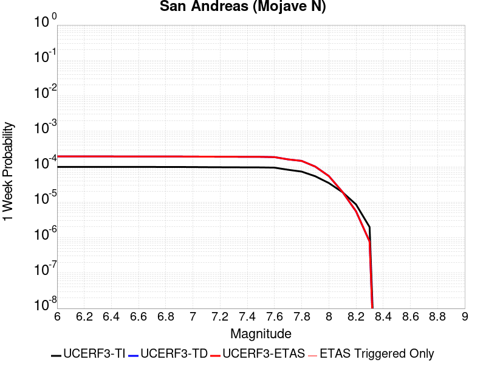 | 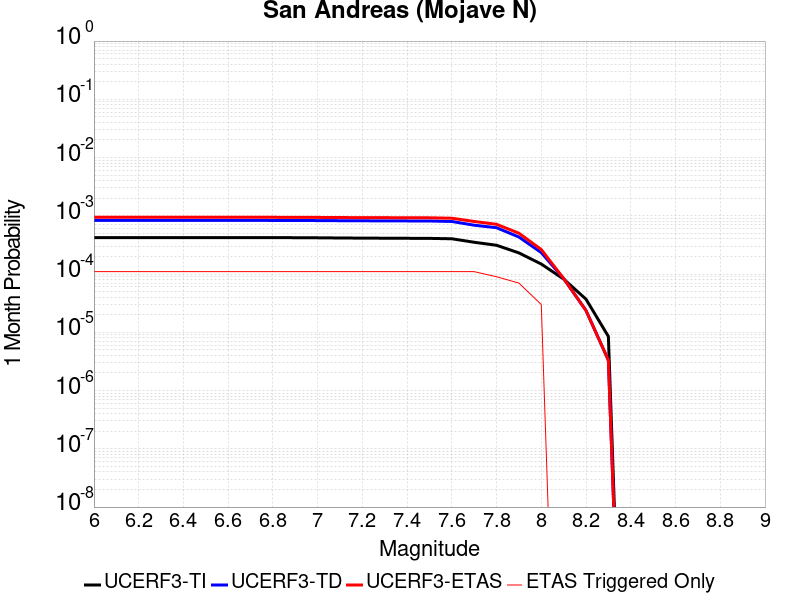 |  |  |

| Magnitude | 1 wk TI Prob | 1 wk TD Prob | 1 wk ETAS Prob | 1 wk ETAS/TD Gain | 1 wk ETAS Triggered Only | 1 mo TI Prob | 1 mo TD Prob | 1 mo ETAS Prob | 1 mo ETAS/TD Gain | 1 mo ETAS Triggered Only | 1 yr TI Prob | 1 yr TD Prob | 1 yr ETAS Prob | 1 yr ETAS/TD Gain | 1 yr ETAS Triggered Only | 10 yr TI Prob | 10 yr TD Prob | 10 yr ETAS Prob | 10 yr ETAS/TD Gain | 10 yr ETAS Triggered Only |
|-----|-----|-----|-----|-----|-----|-----|-----|-----|-----|-----|-----|-----|-----|-----|-----|-----|-----|-----|-----|-----|
| 6.0 | 9.877682E-5 | 1.9487888E-4 | 1.9487888E-4 | 1.0 | 0.0 | 4.2326056E-4 | 8.3492807E-4 | 9.562522E-4 | 1.1453109 | 1.2142554E-4 | 0.0051410277 | 0.010117998 | 0.010598786 | 1.0475181 | 4.8570216E-4 | 0.05023708 | 0.09869637 | 0.09976342 | 1.0108114 | 0.001183899 |
| 6.1 | 9.877682E-5 | 1.9487888E-4 | 1.9487888E-4 | 1.0 | 0.0 | 4.2326056E-4 | 8.3492807E-4 | 9.562522E-4 | 1.1453109 | 1.2142554E-4 | 0.0051410277 | 0.010117998 | 0.010598786 | 1.0475181 | 4.8570216E-4 | 0.05023708 | 0.09869637 | 0.09976342 | 1.0108114 | 0.001183899 |
| 6.2 | 9.877682E-5 | 1.9487888E-4 | 1.9487888E-4 | 1.0 | 0.0 | 4.2326056E-4 | 8.3492807E-4 | 9.562522E-4 | 1.1453109 | 1.2142554E-4 | 0.0051410277 | 0.010117998 | 0.010598786 | 1.0475181 | 4.8570216E-4 | 0.05023708 | 0.09869637 | 0.09976342 | 1.0108114 | 0.001183899 |
| 6.3 | 9.877682E-5 | 1.9487888E-4 | 1.9487888E-4 | 1.0 | 0.0 | 4.2326056E-4 | 8.3492807E-4 | 9.562522E-4 | 1.1453109 | 1.2142554E-4 | 0.0051410277 | 0.010117998 | 0.010598786 | 1.0475181 | 4.8570216E-4 | 0.05023708 | 0.09869637 | 0.09976342 | 1.0108114 | 0.001183899 |
| 6.4 | 9.877682E-5 | 1.9487888E-4 | 1.9487888E-4 | 1.0 | 0.0 | 4.2326056E-4 | 8.3492807E-4 | 9.562522E-4 | 1.1453109 | 1.2142554E-4 | 0.0051410277 | 0.010117998 | 0.010598786 | 1.0475181 | 4.8570216E-4 | 0.05023708 | 0.09869637 | 0.09976342 | 1.0108114 | 0.001183899 |
| 6.5 | 9.861474E-5 | 1.9461628E-4 | 1.9461628E-4 | 1.0 | 0.0 | 4.2256617E-4 | 8.338034E-4 | 9.5512765E-4 | 1.1455071 | 1.2142554E-4 | 0.0051326132 | 0.010104432 | 0.010585226 | 1.0475825 | 4.8570216E-4 | 0.050156746 | 0.09857411 | 0.0996413 | 1.0108263 | 0.001183899 |
| 6.6 | 9.861474E-5 | 1.9461628E-4 | 1.9461628E-4 | 1.0 | 0.0 | 4.2256617E-4 | 8.338034E-4 | 9.5512765E-4 | 1.1455071 | 1.2142554E-4 | 0.0051326132 | 0.010104432 | 0.010585226 | 1.0475825 | 4.8570216E-4 | 0.050156746 | 0.09857411 | 0.0996413 | 1.0108263 | 0.001183899 |
| 6.7 | 9.8552715E-5 | 1.9451571E-4 | 1.9451571E-4 | 1.0 | 0.0 | 4.223004E-4 | 8.333726E-4 | 9.5469697E-4 | 1.1455823 | 1.2142554E-4 | 0.0051293927 | 0.010099237 | 0.010580033 | 1.0476073 | 4.8570216E-4 | 0.050125998 | 0.09852727 | 0.099594526 | 1.0108321 | 0.001183899 |
| 6.8 | 9.8464974E-5 | 1.9436708E-4 | 1.9436708E-4 | 1.0 | 0.0 | 4.219245E-4 | 8.32736E-4 | 9.5406047E-4 | 1.1456938 | 1.2142554E-4 | 0.0051248376 | 0.010091558 | 0.010572359 | 1.0476439 | 4.8570216E-4 | 0.05008251 | 0.09845722 | 0.09952455 | 1.0108407 | 0.001183899 |
| 6.9 | 9.825824E-5 | 1.940467E-4 | 1.940467E-4 | 1.0 | 0.0 | 4.2103877E-4 | 8.313639E-4 | 9.5268845E-4 | 1.1459343 | 1.2142554E-4 | 0.0051141046 | 0.010075007 | 0.010555815 | 1.0477229 | 4.8570216E-4 | 0.049980022 | 0.098306164 | 0.09937368 | 1.0108591 | 0.001183899 |
| 7.0 | 9.781462E-5 | 1.9335936E-4 | 1.9335936E-4 | 1.0 | 0.0 | 4.1913814E-4 | 8.2842E-4 | 9.4974495E-4 | 1.1464534 | 1.2142554E-4 | 0.005091073 | 0.010039495 | 0.010520321 | 1.0478934 | 4.8570216E-4 | 0.04976007 | 0.097982235 | 0.099050134 | 1.010899 | 0.001183899 |
| 7.1 | 9.7121134E-5 | 1.9237513E-4 | 1.9237513E-4 | 1.0 | 0.0 | 4.1616702E-4 | 8.242045E-4 | 9.4552996E-4 | 1.1472031 | 1.2142554E-4 | 0.005055068 | 0.009988643 | 0.010469494 | 1.0481397 | 4.8570216E-4 | 0.04941613 | 0.09751831 | 0.09858676 | 1.0109564 | 0.001183899 |
| 7.2 | 9.663819E-5 | 1.9168199E-4 | 1.9168199E-4 | 1.0 | 0.0 | 4.1409794E-4 | 8.212358E-4 | 9.4256166E-4 | 1.1477357 | 1.2142554E-4 | 0.0050299936 | 0.009952831 | 0.010433699 | 1.0483147 | 4.8570216E-4 | 0.049176537 | 0.09719127 | 0.0982601 | 1.0109972 | 0.001183899 |
| 7.3 | 9.6277574E-5 | 1.912059E-4 | 1.912059E-4 | 1.0 | 0.0 | 4.125529E-4 | 8.191967E-4 | 9.4052276E-4 | 1.1481037 | 1.2142554E-4 | 0.0050112694 | 0.009928231 | 0.010409111 | 1.0484356 | 4.8570216E-4 | 0.04899759 | 0.096964255 | 0.09803336 | 1.0110258 | 0.001183899 |
| 7.4 | 9.593308E-5 | 1.9060235E-4 | 1.9060235E-4 | 1.0 | 0.0 | 4.1107697E-4 | 8.166117E-4 | 9.379381E-4 | 1.1485729 | 1.2142554E-4 | 0.0049933824 | 0.009897046 | 0.010377941 | 1.0485898 | 4.8570216E-4 | 0.04882661 | 0.09668197 | 0.09775141 | 1.0110614 | 0.001183899 |
| 7.5 | 9.561707E-5 | 1.9006194E-4 | 1.9006194E-4 | 1.0 | 0.0 | 4.0972308E-4 | 8.1429706E-4 | 9.356237E-4 | 1.1489955 | 1.2142554E-4 | 0.0049769743 | 0.00986912 | 0.010350029 | 1.0487286 | 4.8570216E-4 | 0.048669744 | 0.09642772 | 0.097497456 | 1.0110937 | 0.001183899 |
| 7.6 | 9.418194E-5 | 1.8657741E-4 | 1.8657741E-4 | 1.0 | 0.0 | 4.0357444E-4 | 7.993726E-4 | 9.207011E-4 | 1.1517797 | 1.2142554E-4 | 0.004902454 | 0.009689045 | 0.010170041 | 1.0496433 | 4.8570216E-4 | 0.047957025 | 0.0948077 | 0.09587936 | 1.0113034 | 0.001183899 |
| 7.7 | 8.202141E-5 | 1.609954E-4 | 1.609954E-4 | 1.0 | 0.0 | 3.51473E-4 | 6.897979E-4 | 8.111397E-4 | 1.1759092 | 1.2142554E-4 | 0.00427079 | 0.008366007 | 0.008787442 | 1.0503745 | 4.2498938E-4 | 0.04189639 | 0.08258243 | 0.083557166 | 1.0118032 | 0.0010624734 |
| 7.8 | 7.2859846E-5 | 1.4586812E-4 | 1.4586812E-4 | 1.0 | 0.0 | 3.1221908E-4 | 6.2499935E-4 | 7.46349E-4 | 1.1941596 | 1.2142554E-4 | 0.003794643 | 0.0075828596 | 0.0078841215 | 1.0397294 | 3.0356384E-4 | 0.037304975 | 0.07504203 | 0.075743996 | 1.0093542 | 7.589096E-4 |
| 7.9 | 5.3874453E-5 | 1.00950085E-4 | 1.00950085E-4 | 1.0 | 0.0 | 2.3087008E-4 | 4.3257148E-4 | 5.2360125E-4 | 1.2104386 | 9.106915E-5 | 0.0028072202 | 0.0052538514 | 0.0054954267 | 1.0459806 | 2.4285108E-4 | 0.02772022 | 0.052655075 | 0.053230237 | 1.0109231 | 6.071277E-4 |
| 8.0 | 3.468538E-5 | 5.454598E-5 | 5.454598E-5 | 1.0 | 0.0 | 1.4864317E-4 | 2.3374756E-4 | 2.6409686E-4 | 1.1298379 | 3.0356385E-5 | 0.0018082283 | 0.0028421644 | 0.0028724344 | 1.0106504 | 3.0356385E-5 | 0.017935853 | 0.029087735 | 0.029264575 | 1.0060796 | 1.821383E-4 |
| 8.1 | 1.9152367E-5 | 1.9539457E-5 | 1.9539457E-5 | 1.0 | 0.0 | 8.207899E-5 | 8.373785E-5 | 8.373785E-5 | 1.0 | 0.0 | 9.988535E-4 | 0.0010190321 | 0.0010190321 | 1.0 | 0.0 | 0.009943757 | 0.010927947 | 0.010927947 | 1.0 | 0.0 |
| 8.2 | 8.643924E-6 | 5.5269165E-6 | 5.5269165E-6 | 1.0 | 0.0 | 3.704486E-5 | 2.368657E-5 | 2.368657E-5 | 1.0 | 0.0 | 4.5092785E-4 | 2.8834594E-4 | 2.8834594E-4 | 1.0 | 0.0 | 0.0045001395 | 0.0032771796 | 0.0032771796 | 1.0 | 0.0 |
| 8.3 | 1.983087E-6 | 7.7486385E-7 | 7.7486385E-7 | 1.0 | 0.0 | 8.498917E-6 | 3.320841E-6 | 3.320841E-6 | 1.0 | 0.0 | 1.034694E-4 | 4.0430506E-5 | 4.0430506E-5 | 1.0 | 0.0 | 0.0010342124 | 4.7705657E-4 | 4.7705657E-4 | 1.0 | 0.0 |

## Nelson Lake
*[(top)](#table-of-contents)*

| 1 Week | 1 Month | 1 Year | 10 Year |
|-----|-----|-----|-----|
|  |  |  |  |

| Magnitude | 1 wk TI Prob | 1 wk TD Prob | 1 wk ETAS Prob | 1 wk ETAS/TD Gain | 1 wk ETAS Triggered Only | 1 mo TI Prob | 1 mo TD Prob | 1 mo ETAS Prob | 1 mo ETAS/TD Gain | 1 mo ETAS Triggered Only | 1 yr TI Prob | 1 yr TD Prob | 1 yr ETAS Prob | 1 yr ETAS/TD Gain | 1 yr ETAS Triggered Only | 10 yr TI Prob | 10 yr TD Prob | 10 yr ETAS Prob | 10 yr ETAS/TD Gain | 10 yr ETAS Triggered Only |
|-----|-----|-----|-----|-----|-----|-----|-----|-----|-----|-----|-----|-----|-----|-----|-----|-----|-----|-----|-----|-----|
| 6.0 | 9.913453E-6 | 1.0192636E-5 | 1.0192636E-5 | 1.0 | 0.0 | 4.2485535E-5 | 4.3682052E-5 | 7.403711E-5 | 1.6949091 | 3.0356385E-5 | 5.1713863E-4 | 5.317096E-4 | 8.35112E-4 | 1.5706168 | 3.0356384E-4 | 0.0051593683 | 0.0053054015 | 0.0063924333 | 1.2048916 | 0.0010928299 |
| 6.1 | 9.913453E-6 | 1.0192636E-5 | 1.0192636E-5 | 1.0 | 0.0 | 4.2485535E-5 | 4.3682052E-5 | 7.403711E-5 | 1.6949091 | 3.0356385E-5 | 5.1713863E-4 | 5.317096E-4 | 8.35112E-4 | 1.5706168 | 3.0356384E-4 | 0.0051593683 | 0.0053054015 | 0.0063924333 | 1.2048916 | 0.0010928299 |
| 6.2 | 4.5596407E-6 | 4.6965E-6 | 4.6965E-6 | 1.0 | 0.0 | 1.954117E-5 | 2.0127709E-5 | 5.0483482E-5 | 2.5081584 | 3.0356385E-5 | 2.3788778E-4 | 2.4502858E-4 | 4.574712E-4 | 1.8670115 | 2.1249469E-4 | 0.0023763329 | 0.0024477101 | 0.0028716594 | 1.1732023 | 4.2498938E-4 |
| 6.3 | 4.5596407E-6 | 4.6965E-6 | 4.6965E-6 | 1.0 | 0.0 | 1.954117E-5 | 2.0127709E-5 | 5.0483482E-5 | 2.5081584 | 3.0356385E-5 | 2.3788778E-4 | 2.4502858E-4 | 4.574712E-4 | 1.8670115 | 2.1249469E-4 | 0.0023763329 | 0.0024477101 | 0.0028716594 | 1.1732023 | 4.2498938E-4 |
| 6.4 | 3.4025713E-6 | 3.5100445E-6 | 3.5100445E-6 | 1.0 | 0.0 | 1.4582367E-5 | 1.5042965E-5 | 4.5398894E-5 | 3.0179484 | 3.0356385E-5 | 1.7752586E-4 | 1.8313355E-4 | 3.652385E-4 | 1.9943833 | 1.821383E-4 | 0.001773841 | 0.0018299093 | 0.0021329178 | 1.1655866 | 3.0356384E-4 |
| 6.5 | 2.8352947E-6 | 2.9279831E-6 | 2.9279831E-6 | 1.0 | 0.0 | 1.2151207E-5 | 1.2548443E-5 | 4.2904445E-5 | 3.419105 | 3.0356385E-5 | 1.479309E-4 | 1.5276733E-4 | 3.0452607E-4 | 1.9933978 | 1.5178192E-4 | 0.0014783246 | 0.0015266971 | 0.0017691774 | 1.1588267 | 2.4285108E-4 |
| 6.6 | 2.251518E-6 | 2.329174E-6 | 2.329174E-6 | 1.0 | 0.0 | 9.649328E-6 | 9.982141E-6 | 4.0338222E-5 | 4.0410395 | 3.0356385E-5 | 1.1747423E-4 | 1.2152641E-4 | 2.429372E-4 | 1.9990485 | 1.2142554E-4 | 0.0011741214 | 0.0012146613 | 0.0013965784 | 1.1497678 | 1.821383E-4 |
| 6.7 | 1.8911853E-6 | 1.9592333E-6 | 1.9592333E-6 | 1.0 | 0.0 | 8.105055E-6 | 8.39669E-6 | 8.39669E-6 | 1.0 | 0.0 | 9.867457E-5 | 1.02225495E-4 | 1.9328533E-4 | 1.8907743 | 9.106915E-5 | 9.863076E-4 | 0.0010218422 | 0.0011431436 | 1.1187086 | 1.2142554E-4 |
| 6.8 | 1.4874814E-6 | 1.5439082E-6 | 1.5439082E-6 | 1.0 | 0.0 | 6.374905E-6 | 6.6167354E-6 | 6.6167354E-6 | 1.0 | 0.0 | 7.76117E-5 | 8.0556296E-5 | 1.4126417E-4 | 1.7536081 | 6.071277E-5 | 7.75846E-4 | 8.053221E-4 | 8.963179E-4 | 1.1129931 | 9.106915E-5 |
| 6.9 | 6.835972E-7 | 7.140349E-7 | 7.140349E-7 | 1.0 | 0.0 | 2.9296991E-6 | 3.060148E-6 | 3.060148E-6 | 1.0 | 0.0 | 3.56685E-5 | 3.725698E-5 | 6.7612236E-5 | 1.8147534 | 3.0356385E-5 | 3.5662777E-4 | 3.7253863E-4 | 4.3322876E-4 | 1.1629096 | 6.071277E-5 |

## Lenwood-Lockhart-Old Woman Springs
*[(top)](#table-of-contents)*

| 1 Week | 1 Month | 1 Year | 10 Year |
|-----|-----|-----|-----|
|  |  |  |  |

| Magnitude | 1 wk TI Prob | 1 wk TD Prob | 1 wk ETAS Prob | 1 wk ETAS/TD Gain | 1 wk ETAS Triggered Only | 1 mo TI Prob | 1 mo TD Prob | 1 mo ETAS Prob | 1 mo ETAS/TD Gain | 1 mo ETAS Triggered Only | 1 yr TI Prob | 1 yr TD Prob | 1 yr ETAS Prob | 1 yr ETAS/TD Gain | 1 yr ETAS Triggered Only | 10 yr TI Prob | 10 yr TD Prob | 10 yr ETAS Prob | 10 yr ETAS/TD Gain | 10 yr ETAS Triggered Only |
|-----|-----|-----|-----|-----|-----|-----|-----|-----|-----|-----|-----|-----|-----|-----|-----|-----|-----|-----|-----|-----|
| 6.0 | 3.744542E-5 | 4.3966986E-5 | 4.3966986E-5 | 1.0 | 0.0 | 1.604705E-4 | 1.884173E-4 | 1.884173E-4 | 1.0 | 0.0 | 0.0019519776 | 0.0022917395 | 0.0025946074 | 1.1321565 | 3.0356384E-4 | 0.019349206 | 0.022699071 | 0.02358909 | 1.0392095 | 9.106915E-4 |
| 6.1 | 3.744542E-5 | 4.3966986E-5 | 4.3966986E-5 | 1.0 | 0.0 | 1.604705E-4 | 1.884173E-4 | 1.884173E-4 | 1.0 | 0.0 | 0.0019519776 | 0.0022917395 | 0.0025946074 | 1.1321565 | 3.0356384E-4 | 0.019349206 | 0.022699071 | 0.02358909 | 1.0392095 | 9.106915E-4 |
| 6.2 | 3.744542E-5 | 4.3966986E-5 | 4.3966986E-5 | 1.0 | 0.0 | 1.604705E-4 | 1.884173E-4 | 1.884173E-4 | 1.0 | 0.0 | 0.0019519776 | 0.0022917395 | 0.0025946074 | 1.1321565 | 3.0356384E-4 | 0.019349206 | 0.022699071 | 0.02358909 | 1.0392095 | 9.106915E-4 |
| 6.3 | 2.1079984E-5 | 2.535506E-5 | 2.535506E-5 | 1.0 | 0.0 | 9.0339665E-5 | 1.0866013E-4 | 1.0866013E-4 | 1.0 | 0.0 | 0.0010993304 | 0.0013221542 | 0.0014434193 | 1.0917177 | 1.2142554E-4 | 0.010939079 | 0.013145096 | 0.013534541 | 1.0296267 | 3.9463298E-4 |
| 6.4 | 2.1079984E-5 | 2.535506E-5 | 2.535506E-5 | 1.0 | 0.0 | 9.0339665E-5 | 1.0866013E-4 | 1.0866013E-4 | 1.0 | 0.0 | 0.0010993304 | 0.0013221542 | 0.0014434193 | 1.0917177 | 1.2142554E-4 | 0.010939079 | 0.013145096 | 0.013534541 | 1.0296267 | 3.9463298E-4 |
| 6.5 | 1.7397282E-5 | 2.0663669E-5 | 2.0663669E-5 | 1.0 | 0.0 | 7.455765E-5 | 8.855564E-5 | 8.855564E-5 | 1.0 | 0.0 | 9.073613E-4 | 0.0010776434 | 0.001198938 | 1.1125555 | 1.2142554E-4 | 0.009036654 | 0.01072547 | 0.0109957475 | 1.0251995 | 2.7320746E-4 |
| 6.6 | 1.52050325E-5 | 1.768075E-5 | 1.768075E-5 | 1.0 | 0.0 | 6.51628E-5 | 7.5772485E-5 | 7.5772485E-5 | 1.0 | 0.0 | 7.9306826E-4 | 9.221474E-4 | 0.001043461 | 1.1315554 | 1.2142554E-4 | 0.007902439 | 0.009184072 | 0.00945477 | 1.0294747 | 2.7320746E-4 |
| 6.7 | 1.332523E-5 | 1.5264892E-5 | 1.5264892E-5 | 1.0 | 0.0 | 5.7106878E-5 | 6.541936E-5 | 6.541936E-5 | 1.0 | 0.0 | 6.950544E-4 | 7.9619547E-4 | 8.871921E-4 | 1.1142893 | 9.106915E-5 | 0.006928845 | 0.007934059 | 0.008144868 | 1.0265701 | 2.1249469E-4 |
| 6.8 | 1.1525329E-5 | 1.3031687E-5 | 1.3031687E-5 | 1.0 | 0.0 | 4.9393333E-5 | 5.5848912E-5 | 5.5848912E-5 | 1.0 | 0.0 | 6.011979E-4 | 6.797526E-4 | 7.404241E-4 | 1.0892552 | 6.071277E-5 | 0.00599574 | 0.0067771855 | 0.006927939 | 1.0222442 | 1.5178192E-4 |
| 6.9 | 1.0253909E-5 | 1.15150315E-5 | 1.15150315E-5 | 1.0 | 0.0 | 4.3944583E-5 | 4.9349223E-5 | 4.9349223E-5 | 1.0 | 0.0 | 5.3489394E-4 | 6.0066476E-4 | 6.6134107E-4 | 1.1010152 | 6.071277E-5 | 0.0053360825 | 0.0059907916 | 0.0061416645 | 1.025184 | 1.5178192E-4 |
| 7.0 | 8.104563E-6 | 8.991697E-6 | 8.991697E-6 | 1.0 | 0.0 | 3.4733377E-5 | 3.8535287E-5 | 3.8535287E-5 | 1.0 | 0.0 | 4.2279682E-4 | 4.6906853E-4 | 5.297528E-4 | 1.1293719 | 6.071277E-5 | 0.0042199334 | 0.0046810326 | 0.00480189 | 1.0258185 | 1.2142554E-4 |
| 7.1 | 6.7986157E-6 | 7.516141E-6 | 7.516141E-6 | 1.0 | 0.0 | 2.91366E-5 | 3.2211647E-5 | 3.2211647E-5 | 1.0 | 0.0 | 3.5468035E-4 | 3.9210837E-4 | 3.9210837E-4 | 1.0 | 0.0 | 0.003541148 | 0.003914382 | 0.003974857 | 1.0154495 | 6.071277E-5 |
| 7.2 | 5.6893327E-6 | 6.2802674E-6 | 6.2802674E-6 | 1.0 | 0.0 | 2.4382627E-5 | 2.6915166E-5 | 2.6915166E-5 | 1.0 | 0.0 | 2.9681803E-4 | 3.2764484E-4 | 3.2764484E-4 | 1.0 | 0.0 | 0.002964219 | 0.0032718165 | 0.0033323306 | 1.0184956 | 6.071277E-5 |
| 7.3 | 4.253348E-6 | 4.707076E-6 | 4.707076E-6 | 1.0 | 0.0 | 1.8228506E-5 | 2.0173036E-5 | 2.0173036E-5 | 1.0 | 0.0 | 2.2190946E-4 | 2.455809E-4 | 2.455809E-4 | 1.0 | 0.0 | 0.00221688 | 0.002453276 | 0.0025138396 | 1.0246869 | 6.071277E-5 |
| 7.4 | 2.5448119E-6 | 2.852129E-6 | 2.852129E-6 | 1.0 | 0.0 | 1.0906291E-5 | 1.2223362E-5 | 1.2223362E-5 | 1.0 | 0.0 | 1.3277601E-4 | 1.4881093E-4 | 1.4881093E-4 | 1.0 | 0.0 | 0.001326967 | 0.0014872749 | 0.0015478974 | 1.0407608 | 6.071277E-5 |
| 7.5 | 4.3706837E-8 | 4.5631754E-8 | 4.5631754E-8 | 1.0 | 0.0 | 1.8731501E-7 | 1.9556464E-7 | 1.9556464E-7 | 1.0 | 0.0 | 2.2805577E-6 | 2.3809976E-6 | 2.3809976E-6 | 1.0 | 0.0 | 2.2805343E-5 | 2.3809775E-5 | 2.3809775E-5 | 1.0 | 0.0 |

## San Andreas (San Bernardino N)
*[(top)](#table-of-contents)*

| 1 Week | 1 Month | 1 Year | 10 Year |
|-----|-----|-----|-----|
|  |  |  |  |

| Magnitude | 1 wk TI Prob | 1 wk TD Prob | 1 wk ETAS Prob | 1 wk ETAS/TD Gain | 1 wk ETAS Triggered Only | 1 mo TI Prob | 1 mo TD Prob | 1 mo ETAS Prob | 1 mo ETAS/TD Gain | 1 mo ETAS Triggered Only | 1 yr TI Prob | 1 yr TD Prob | 1 yr ETAS Prob | 1 yr ETAS/TD Gain | 1 yr ETAS Triggered Only | 10 yr TI Prob | 10 yr TD Prob | 10 yr ETAS Prob | 10 yr ETAS/TD Gain | 10 yr ETAS Triggered Only |
|-----|-----|-----|-----|-----|-----|-----|-----|-----|-----|-----|-----|-----|-----|-----|-----|-----|-----|-----|-----|-----|
| 6.0 | 1.4273766E-4 | 3.168E-4 | 3.168E-4 | 1.0 | 0.0 | 6.115894E-4 | 0.0013570138 | 0.0014176442 | 1.0446793 | 6.071277E-5 | 0.0074207084 | 0.016397987 | 0.016666714 | 1.0163878 | 2.7320746E-4 | 0.07177748 | 0.15056716 | 0.15116023 | 1.0039389 | 6.981968E-4 |
| 6.1 | 1.4273766E-4 | 3.168E-4 | 3.168E-4 | 1.0 | 0.0 | 6.115894E-4 | 0.0013570138 | 0.0014176442 | 1.0446793 | 6.071277E-5 | 0.0074207084 | 0.016397987 | 0.016666714 | 1.0163878 | 2.7320746E-4 | 0.07177748 | 0.15056716 | 0.15116023 | 1.0039389 | 6.981968E-4 |
| 6.2 | 1.4273766E-4 | 3.168E-4 | 3.168E-4 | 1.0 | 0.0 | 6.115894E-4 | 0.0013570138 | 0.0014176442 | 1.0446793 | 6.071277E-5 | 0.0074207084 | 0.016397987 | 0.016666714 | 1.0163878 | 2.7320746E-4 | 0.07177748 | 0.15056716 | 0.15116023 | 1.0039389 | 6.981968E-4 |
| 6.3 | 1.3730655E-4 | 3.058448E-4 | 3.058448E-4 | 1.0 | 0.0 | 5.883239E-4 | 0.0013101106 | 0.0013707438 | 1.046281 | 6.071277E-5 | 0.0071393442 | 0.015835345 | 0.016104225 | 1.0169798 | 2.7320746E-4 | 0.06914291 | 0.14586715 | 0.14646351 | 1.0040883 | 6.981968E-4 |
| 6.4 | 1.3730655E-4 | 3.058448E-4 | 3.058448E-4 | 1.0 | 0.0 | 5.883239E-4 | 0.0013101106 | 0.0013707438 | 1.046281 | 6.071277E-5 | 0.0071393442 | 0.015835345 | 0.016104225 | 1.0169798 | 2.7320746E-4 | 0.06914291 | 0.14586715 | 0.14646351 | 1.0040883 | 6.981968E-4 |
| 6.5 | 1.2942807E-4 | 2.8998396E-4 | 2.8998396E-4 | 1.0 | 0.0 | 5.545738E-4 | 0.0012422017 | 0.001302839 | 1.0488144 | 6.071277E-5 | 0.0067310524 | 0.01502018 | 0.015289283 | 1.0179162 | 2.7320746E-4 | 0.06530788 | 0.13901012 | 0.13961126 | 1.0043244 | 6.981968E-4 |
| 6.6 | 1.1125901E-4 | 2.5435875E-4 | 2.5435875E-4 | 1.0 | 0.0 | 4.767372E-4 | 0.0010896558 | 0.0011503024 | 1.0556567 | 6.071277E-5 | 0.005788839 | 0.013186495 | 0.013426144 | 1.0181738 | 2.4285108E-4 | 0.056403454 | 0.12329976 | 0.12388526 | 1.0047486 | 6.678405E-4 |
| 6.7 | 1.02209575E-4 | 2.3570309E-4 | 2.3570309E-4 | 1.0 | 0.0 | 4.3796748E-4 | 0.0010097665 | 0.0010704179 | 1.0600648 | 6.071277E-5 | 0.0053192247 | 0.012225031 | 0.012464914 | 1.0196222 | 2.4285108E-4 | 0.051936906 | 0.115092136 | 0.11565625 | 1.0049014 | 6.374841E-4 |
| 6.8 | 9.610582E-5 | 2.2095144E-4 | 2.2095144E-4 | 1.0 | 0.0 | 4.1181705E-4 | 9.465918E-4 | 0.001007247 | 1.0640776 | 6.071277E-5 | 0.0050023515 | 0.011464122 | 0.011704189 | 1.0209408 | 2.4285108E-4 | 0.048912346 | 0.10849237 | 0.10906069 | 1.0052384 | 6.374841E-4 |
| 6.9 | 9.3877505E-5 | 2.1550381E-4 | 2.1550381E-4 | 1.0 | 0.0 | 4.0227012E-4 | 9.232615E-4 | 9.839182E-4 | 1.0656983 | 6.071277E-5 | 0.0048866454 | 0.011183022 | 0.011393139 | 1.018789 | 2.1249469E-4 | 0.04780577 | 0.10608222 | 0.106624946 | 1.0051161 | 6.071277E-4 |
| 7.0 | 9.1019785E-5 | 2.087683E-4 | 2.087683E-4 | 1.0 | 0.0 | 3.900265E-4 | 8.944151E-4 | 9.550735E-4 | 1.0678191 | 6.071277E-5 | 0.0047382377 | 0.010835359 | 0.011045551 | 1.0193987 | 2.1249469E-4 | 0.046384744 | 0.10305153 | 0.10359609 | 1.0052843 | 6.071277E-4 |
| 7.1 | 8.771155E-5 | 2.0050864E-4 | 2.0050864E-4 | 1.0 | 0.0 | 3.758525E-4 | 8.590403E-4 | 9.197009E-4 | 1.0706143 | 6.071277E-5 | 0.0045664064 | 0.010408859 | 0.010619142 | 1.0202023 | 2.1249469E-4 | 0.044737056 | 0.09936224 | 0.099909045 | 1.005503 | 6.071277E-4 |
| 7.2 | 8.0830236E-5 | 1.8455362E-4 | 1.8455362E-4 | 1.0 | 0.0 | 3.4636928E-4 | 7.907045E-4 | 8.5136923E-4 | 1.0767224 | 6.071277E-5 | 0.0042088944 | 0.009584441 | 0.009794899 | 1.0219584 | 2.1249469E-4 | 0.041300658 | 0.09209058 | 0.09264179 | 1.0059856 | 6.071277E-4 |
| 7.3 | 7.7668235E-5 | 1.739772E-4 | 1.739772E-4 | 1.0 | 0.0 | 3.328214E-4 | 7.454036E-4 | 8.060711E-4 | 1.0813888 | 6.071277E-5 | 0.0040445733 | 0.0090376055 | 0.009248179 | 1.0232998 | 2.1249469E-4 | 0.03971748 | 0.08735465 | 0.087908745 | 1.006343 | 6.071277E-4 |
| 7.4 | 7.520177E-5 | 1.6616903E-4 | 1.6616903E-4 | 1.0 | 0.0 | 3.2225347E-4 | 7.119587E-4 | 7.7262823E-4 | 1.085215 | 6.071277E-5 | 0.0039163795 | 0.008633714 | 0.008844374 | 1.0243998 | 2.1249469E-4 | 0.038480744 | 0.08380819 | 0.08436444 | 1.0066371 | 6.071277E-4 |
| 7.5 | 7.274697E-5 | 1.5903711E-4 | 1.5903711E-4 | 1.0 | 0.0 | 3.1173544E-4 | 6.814096E-4 | 7.42081E-4 | 1.089038 | 6.071277E-5 | 0.003788775 | 0.008264662 | 0.0084754005 | 1.0254987 | 2.1249469E-4 | 0.03724827 | 0.080522425 | 0.08108066 | 1.0069327 | 6.071277E-4 |
| 7.6 | 7.1185845E-5 | 1.547303E-4 | 1.547303E-4 | 1.0 | 0.0 | 3.0504653E-4 | 6.6296133E-4 | 7.2363386E-4 | 1.0915174 | 6.071277E-5 | 0.0037076178 | 0.008041735 | 0.008252521 | 1.0262115 | 2.1249469E-4 | 0.036463667 | 0.078510396 | 0.07906986 | 1.007126 | 6.071277E-4 |
| 7.7 | 6.709961E-5 | 1.4380377E-4 | 1.4380377E-4 | 1.0 | 0.0 | 2.8753807E-4 | 6.161563E-4 | 6.768317E-4 | 1.098474 | 6.071277E-5 | 0.003495157 | 0.0074759396 | 0.0076868455 | 1.0282114 | 2.1249469E-4 | 0.034406938 | 0.073334016 | 0.073896624 | 1.0076718 | 6.071277E-4 |
| 7.8 | 6.300812E-5 | 1.326129E-4 | 1.326129E-4 | 1.0 | 0.0 | 2.7000686E-4 | 5.682172E-4 | 6.288955E-4 | 1.1067871 | 6.071277E-5 | 0.0032823787 | 0.0068961293 | 0.0071071587 | 1.0306011 | 2.1249469E-4 | 0.032343175 | 0.06798044 | 0.06854629 | 1.0083238 | 6.071277E-4 |
| 7.9 | 4.983037E-5 | 9.769929E-5 | 9.769929E-5 | 1.0 | 0.0 | 2.1354125E-4 | 4.1864405E-4 | 4.7933141E-4 | 1.1449617 | 6.071277E-5 | 0.0025967648 | 0.0050850897 | 0.005296504 | 1.0415753 | 2.1249469E-4 | 0.025666296 | 0.05086521 | 0.051412646 | 1.0107625 | 5.767713E-4 |
| 8.0 | 3.2211527E-5 | 5.3577114E-5 | 5.3577114E-5 | 1.0 | 0.0 | 1.380421E-4 | 2.2959601E-4 | 2.5994543E-4 | 1.1321862 | 3.0356385E-5 | 0.0016793669 | 0.00279175 | 0.0028220217 | 1.0108433 | 3.0356385E-5 | 0.016667323 | 0.028494263 | 0.028671212 | 1.00621 | 1.821383E-4 |
| 8.1 | 1.743376E-5 | 1.8952034E-5 | 1.8952034E-5 | 1.0 | 0.0 | 7.471398E-5 | 8.122048E-5 | 8.122048E-5 | 1.0 | 0.0 | 9.0926304E-4 | 9.884114E-4 | 9.884114E-4 | 1.0 | 0.0 | 0.009055517 | 0.010550455 | 0.010550455 | 1.0 | 0.0 |
| 8.2 | 7.831616E-6 | 5.2024393E-6 | 5.2024393E-6 | 1.0 | 0.0 | 3.3563636E-5 | 2.2295979E-5 | 2.2295979E-5 | 1.0 | 0.0 | 4.0856065E-4 | 2.714198E-4 | 2.714198E-4 | 1.0 | 0.0 | 0.004078103 | 0.0030675507 | 0.0030675507 | 1.0 | 0.0 |
| 8.3 | 1.983087E-6 | 7.7486385E-7 | 7.7486385E-7 | 1.0 | 0.0 | 8.498917E-6 | 3.320841E-6 | 3.320841E-6 | 1.0 | 0.0 | 1.034694E-4 | 4.0430506E-5 | 4.0430506E-5 | 1.0 | 0.0 | 0.0010342124 | 4.7705657E-4 | 4.7705657E-4 | 1.0 | 0.0 |

## Bicycle Lake
*[(top)](#table-of-contents)*

| 1 Week | 1 Month | 1 Year | 10 Year |
|-----|-----|-----|-----|
|  |  |  |  |

| Magnitude | 1 wk TI Prob | 1 wk TD Prob | 1 wk ETAS Prob | 1 wk ETAS/TD Gain | 1 wk ETAS Triggered Only | 1 mo TI Prob | 1 mo TD Prob | 1 mo ETAS Prob | 1 mo ETAS/TD Gain | 1 mo ETAS Triggered Only | 1 yr TI Prob | 1 yr TD Prob | 1 yr ETAS Prob | 1 yr ETAS/TD Gain | 1 yr ETAS Triggered Only | 10 yr TI Prob | 10 yr TD Prob | 10 yr ETAS Prob | 10 yr ETAS/TD Gain | 10 yr ETAS Triggered Only |
|-----|-----|-----|-----|-----|-----|-----|-----|-----|-----|-----|-----|-----|-----|-----|-----|-----|-----|-----|-----|-----|
| 6.0 | 1.9621975E-5 | 2.2100778E-5 | 2.2100778E-5 | 1.0 | 0.0 | 8.4091465E-5 | 9.471494E-5 | 1.2506844E-4 | 1.3204722 | 3.0356385E-5 | 0.0010233327 | 0.0011526794 | 0.0014862147 | 1.2893566 | 3.3392024E-4 | 0.01018633 | 0.011480321 | 0.012230518 | 1.0653464 | 7.589096E-4 |
| 6.1 | 1.9621975E-5 | 2.2100778E-5 | 2.2100778E-5 | 1.0 | 0.0 | 8.4091465E-5 | 9.471494E-5 | 1.2506844E-4 | 1.3204722 | 3.0356385E-5 | 0.0010233327 | 0.0011526794 | 0.0014862147 | 1.2893566 | 3.3392024E-4 | 0.01018633 | 0.011480321 | 0.012230518 | 1.0653464 | 7.589096E-4 |
| 6.2 | 9.9971285E-6 | 1.1257519E-5 | 1.1257519E-5 | 1.0 | 0.0 | 4.2844134E-5 | 4.8245915E-5 | 4.8245915E-5 | 1.0 | 0.0 | 5.2150246E-4 | 5.872877E-4 | 7.0864195E-4 | 1.206635 | 1.2142554E-4 | 0.0052028033 | 0.0058624637 | 0.0062849615 | 1.0720683 | 4.2498938E-4 |
| 6.3 | 9.589428E-6 | 1.0800152E-5 | 1.0800152E-5 | 1.0 | 0.0 | 4.10969E-5 | 4.6285837E-5 | 4.6285837E-5 | 1.0 | 0.0 | 5.002399E-4 | 5.6343625E-4 | 6.847934E-4 | 1.2153875 | 1.2142554E-4 | 0.0049911533 | 0.005625169 | 0.005987396 | 1.0643941 | 3.642766E-4 |
| 6.4 | 9.589428E-6 | 1.0800152E-5 | 1.0800152E-5 | 1.0 | 0.0 | 4.10969E-5 | 4.6285837E-5 | 4.6285837E-5 | 1.0 | 0.0 | 5.002399E-4 | 5.6343625E-4 | 6.847934E-4 | 1.2153875 | 1.2142554E-4 | 0.0049911533 | 0.005625169 | 0.005987396 | 1.0643941 | 3.642766E-4 |
| 6.5 | 5.557707E-6 | 6.2866934E-6 | 6.2866934E-6 | 1.0 | 0.0 | 2.3818526E-5 | 2.6942846E-5 | 2.6942846E-5 | 1.0 | 0.0 | 2.8995197E-4 | 3.2800666E-4 | 4.1904594E-4 | 1.2775532 | 9.106915E-5 | 0.0028957394 | 0.0032778624 | 0.0035804312 | 1.0923067 | 3.0356384E-4 |
| 6.6 | 4.8742945E-6 | 5.5142486E-6 | 5.5142486E-6 | 1.0 | 0.0 | 2.0889667E-5 | 2.3632427E-5 | 2.3632427E-5 | 1.0 | 0.0 | 2.54302E-4 | 2.8771302E-4 | 3.4840833E-4 | 1.2109578 | 6.071277E-5 | 0.002540112 | 0.002875975 | 0.0030878587 | 1.0736736 | 2.1249469E-4 |
| 6.7 | 3.991108E-6 | 4.516698E-6 | 4.516698E-6 | 1.0 | 0.0 | 1.7104636E-5 | 1.9357278E-5 | 1.9357278E-5 | 1.0 | 0.0 | 2.0822904E-4 | 2.3567484E-4 | 2.963733E-4 | 1.2575517 | 6.071277E-5 | 0.0020803404 | 0.0023567486 | 0.0025384575 | 1.0771016 | 1.821383E-4 |

## Paradise
*[(top)](#table-of-contents)*

| 1 Week | 1 Month | 1 Year | 10 Year |
|-----|-----|-----|-----|
|  |  |  |  |

| Magnitude | 1 wk TI Prob | 1 wk TD Prob | 1 wk ETAS Prob | 1 wk ETAS/TD Gain | 1 wk ETAS Triggered Only | 1 mo TI Prob | 1 mo TD Prob | 1 mo ETAS Prob | 1 mo ETAS/TD Gain | 1 mo ETAS Triggered Only | 1 yr TI Prob | 1 yr TD Prob | 1 yr ETAS Prob | 1 yr ETAS/TD Gain | 1 yr ETAS Triggered Only | 10 yr TI Prob | 10 yr TD Prob | 10 yr ETAS Prob | 10 yr ETAS/TD Gain | 10 yr ETAS Triggered Only |
|-----|-----|-----|-----|-----|-----|-----|-----|-----|-----|-----|-----|-----|-----|-----|-----|-----|-----|-----|-----|-----|
| 6.0 | 1.4851273E-5 | 1.6696315E-5 | 4.705219E-5 | 2.8181183 | 3.0356385E-5 | 6.364676E-5 | 7.1553804E-5 | 1.01908015E-4 | 1.4242152 | 3.0356385E-5 | 7.7462377E-4 | 8.70843E-4 | 0.0012348024 | 1.4179392 | 3.642766E-4 | 0.0077192914 | 0.008676684 | 0.009368824 | 1.07977 | 6.981968E-4 |
| 6.1 | 1.4851273E-5 | 1.6696315E-5 | 4.705219E-5 | 2.8181183 | 3.0356385E-5 | 6.364676E-5 | 7.1553804E-5 | 1.01908015E-4 | 1.4242152 | 3.0356385E-5 | 7.7462377E-4 | 8.70843E-4 | 0.0012348024 | 1.4179392 | 3.642766E-4 | 0.0077192914 | 0.008676684 | 0.009368824 | 1.07977 | 6.981968E-4 |
| 6.2 | 1.4851273E-5 | 1.6696315E-5 | 4.705219E-5 | 2.8181183 | 3.0356385E-5 | 6.364676E-5 | 7.1553804E-5 | 1.01908015E-4 | 1.4242152 | 3.0356385E-5 | 7.7462377E-4 | 8.70843E-4 | 0.0012348024 | 1.4179392 | 3.642766E-4 | 0.0077192914 | 0.008676684 | 0.009368824 | 1.07977 | 6.981968E-4 |
| 6.3 | 1.0426831E-5 | 1.1889693E-5 | 1.1889693E-5 | 1.0 | 0.0 | 4.4685654E-5 | 5.0954866E-5 | 5.0954866E-5 | 1.0 | 0.0 | 5.43912E-4 | 6.2020484E-4 | 7.7189266E-4 | 1.2445769 | 1.5178192E-4 | 0.0054258266 | 0.006185348 | 0.006607709 | 1.068284 | 4.2498938E-4 |
| 6.4 | 1.0426831E-5 | 1.1889693E-5 | 1.1889693E-5 | 1.0 | 0.0 | 4.4685654E-5 | 5.0954866E-5 | 5.0954866E-5 | 1.0 | 0.0 | 5.43912E-4 | 6.2020484E-4 | 7.7189266E-4 | 1.2445769 | 1.5178192E-4 | 0.0054258266 | 0.006185348 | 0.006607709 | 1.068284 | 4.2498938E-4 |
| 6.5 | 9.25027E-6 | 1.0620901E-5 | 1.0620901E-5 | 1.0 | 0.0 | 3.964341E-5 | 4.551738E-5 | 4.551738E-5 | 1.0 | 0.0 | 4.8255164E-4 | 5.540381E-4 | 6.450568E-4 | 1.1642823 | 9.106915E-5 | 0.0048150513 | 0.005527068 | 0.005798765 | 1.0491576 | 2.7320746E-4 |
| 6.6 | 7.904275E-6 | 9.160301E-6 | 9.160301E-6 | 1.0 | 0.0 | 3.3875025E-5 | 3.9257862E-5 | 3.9257862E-5 | 1.0 | 0.0 | 4.1235037E-4 | 4.778636E-4 | 5.6888926E-4 | 1.1904845 | 9.106915E-5 | 0.0041158604 | 0.004768757 | 0.004950027 | 1.0380119 | 1.821383E-4 |
| 6.7 | 7.2061953E-6 | 8.407947E-6 | 8.407947E-6 | 1.0 | 0.0 | 3.088333E-5 | 3.603358E-5 | 3.603358E-5 | 1.0 | 0.0 | 3.7593965E-4 | 4.386242E-4 | 5.296534E-4 | 1.2075335 | 9.106915E-5 | 0.003753043 | 0.0043779537 | 0.0044988478 | 1.0276142 | 1.2142554E-4 |
| 6.8 | 6.6948724E-6 | 7.842809E-6 | 7.842809E-6 | 1.0 | 0.0 | 2.8691995E-5 | 3.3611625E-5 | 3.3611625E-5 | 1.0 | 0.0 | 3.4926904E-4 | 4.0914828E-4 | 4.698362E-4 | 1.1483275 | 6.071277E-5 | 0.003487206 | 0.0040843077 | 0.0041750045 | 1.0222063 | 9.106915E-5 |
| 6.9 | 6.0421025E-6 | 7.131195E-6 | 7.131195E-6 | 1.0 | 0.0 | 2.5894467E-5 | 3.0561925E-5 | 3.0561925E-5 | 1.0 | 0.0 | 3.1521954E-4 | 3.720313E-4 | 3.720313E-4 | 1.0 | 0.0 | 0.0031477278 | 0.0037144232 | 0.0037144232 | 1.0 | 0.0 |
| 7.0 | 4.134091E-6 | 5.080708E-6 | 5.080708E-6 | 1.0 | 0.0 | 1.7717413E-5 | 2.177429E-5 | 2.177429E-5 | 1.0 | 0.0 | 2.1568815E-4 | 2.6507128E-4 | 2.6507128E-4 | 1.0 | 0.0 | 0.0021547892 | 0.0026477042 | 0.0026477042 | 1.0 | 0.0 |
| 7.1 | 3.7674888E-6 | 4.632229E-6 | 4.632229E-6 | 1.0 | 0.0 | 1.6146281E-5 | 1.9852267E-5 | 1.9852267E-5 | 1.0 | 0.0 | 1.9656324E-4 | 2.4167607E-4 | 2.4167607E-4 | 1.0 | 0.0 | 0.0019638946 | 0.002414283 | 0.002414283 | 1.0 | 0.0 |
| 7.2 | 3.4065345E-6 | 4.1570443E-6 | 4.1570443E-6 | 1.0 | 0.0 | 1.4599351E-5 | 1.7815792E-5 | 1.7815792E-5 | 1.0 | 0.0 | 1.777326E-4 | 2.1688716E-4 | 2.1688716E-4 | 1.0 | 0.0 | 0.0017759053 | 0.002166903 | 0.002166903 | 1.0 | 0.0 |
| 7.3 | 2.9934936E-6 | 3.6295821E-6 | 3.6295821E-6 | 1.0 | 0.0 | 1.2829195E-5 | 1.5555268E-5 | 1.5555268E-5 | 1.0 | 0.0 | 1.5618425E-4 | 1.893704E-4 | 1.893704E-4 | 1.0 | 0.0 | 0.0015607453 | 0.0018922357 | 0.0018922357 | 1.0 | 0.0 |
| 7.4 | 2.4049796E-6 | 2.8891789E-6 | 2.8891789E-6 | 1.0 | 0.0 | 1.0307015E-5 | 1.2382145E-5 | 1.2382145E-5 | 1.0 | 0.0 | 1.2548068E-4 | 1.5074362E-4 | 1.5074362E-4 | 1.0 | 0.0 | 0.0012540985 | 0.0015065551 | 0.0015065551 | 1.0 | 0.0 |
| 7.5 | 1.2710091E-6 | 1.5135612E-6 | 1.5135612E-6 | 1.0 | 0.0 | 5.44717E-6 | 6.4866817E-6 | 6.4866817E-6 | 1.0 | 0.0 | 6.631728E-5 | 7.897374E-5 | 7.897374E-5 | 1.0 | 0.0 | 6.6297496E-4 | 7.8957935E-4 | 7.8957935E-4 | 1.0 | 0.0 |
| 7.6 | 2.21172E-7 | 2.60409E-7 | 2.60409E-7 | 1.0 | 0.0 | 9.478797E-7 | 1.1160382E-6 | 1.1160382E-6 | 1.0 | 0.0 | 1.1540374E-5 | 1.358771E-5 | 1.358771E-5 | 1.0 | 0.0 | 1.1539775E-4 | 1.3587161E-4 | 1.3587161E-4 | 1.0 | 0.0 |

## Towne Pass
*[(top)](#table-of-contents)*

| 1 Week | 1 Month | 1 Year | 10 Year |
|-----|-----|-----|-----|
|  |  |  |  |

| Magnitude | 1 wk TI Prob | 1 wk TD Prob | 1 wk ETAS Prob | 1 wk ETAS/TD Gain | 1 wk ETAS Triggered Only | 1 mo TI Prob | 1 mo TD Prob | 1 mo ETAS Prob | 1 mo ETAS/TD Gain | 1 mo ETAS Triggered Only | 1 yr TI Prob | 1 yr TD Prob | 1 yr ETAS Prob | 1 yr ETAS/TD Gain | 1 yr ETAS Triggered Only | 10 yr TI Prob | 10 yr TD Prob | 10 yr ETAS Prob | 10 yr ETAS/TD Gain | 10 yr ETAS Triggered Only |
|-----|-----|-----|-----|-----|-----|-----|-----|-----|-----|-----|-----|-----|-----|-----|-----|-----|-----|-----|-----|-----|
| 6.0 | 3.849728E-6 | 3.8946237E-6 | 3.8946237E-6 | 1.0 | 0.0 | 1.649873E-5 | 1.6691163E-5 | 4.704704E-5 | 2.8186796 | 3.0356385E-5 | 2.0085352E-4 | 2.0320032E-4 | 5.370527E-4 | 2.6429715 | 3.3392024E-4 | 0.0020067208 | 0.0020305745 | 0.0027273535 | 1.3431438 | 6.981968E-4 |
| 6.1 | 3.849728E-6 | 3.8946237E-6 | 3.8946237E-6 | 1.0 | 0.0 | 1.649873E-5 | 1.6691163E-5 | 4.704704E-5 | 2.8186796 | 3.0356385E-5 | 2.0085352E-4 | 2.0320032E-4 | 5.370527E-4 | 2.6429715 | 3.3392024E-4 | 0.0020067208 | 0.0020305745 | 0.0027273535 | 1.3431438 | 6.981968E-4 |
| 6.2 | 3.849728E-6 | 3.8946237E-6 | 3.8946237E-6 | 1.0 | 0.0 | 1.649873E-5 | 1.6691163E-5 | 4.704704E-5 | 2.8186796 | 3.0356385E-5 | 2.0085352E-4 | 2.0320032E-4 | 5.370527E-4 | 2.6429715 | 3.3392024E-4 | 0.0020067208 | 0.0020305745 | 0.0027273535 | 1.3431438 | 6.981968E-4 |
| 6.3 | 3.849728E-6 | 3.8946237E-6 | 3.8946237E-6 | 1.0 | 0.0 | 1.649873E-5 | 1.6691163E-5 | 4.704704E-5 | 2.8186796 | 3.0356385E-5 | 2.0085352E-4 | 2.0320032E-4 | 5.370527E-4 | 2.6429715 | 3.3392024E-4 | 0.0020067208 | 0.0020305745 | 0.0027273535 | 1.3431438 | 6.981968E-4 |
| 6.4 | 3.849728E-6 | 3.8946237E-6 | 3.8946237E-6 | 1.0 | 0.0 | 1.649873E-5 | 1.6691163E-5 | 4.704704E-5 | 2.8186796 | 3.0356385E-5 | 2.0085352E-4 | 2.0320032E-4 | 5.370527E-4 | 2.6429715 | 3.3392024E-4 | 0.0020067208 | 0.0020305745 | 0.0027273535 | 1.3431438 | 6.981968E-4 |
| 6.5 | 1.1953545E-6 | 1.2030846E-6 | 1.2030846E-6 | 1.0 | 0.0 | 5.1229376E-6 | 5.156067E-6 | 5.156067E-6 | 1.0 | 0.0 | 6.236998E-5 | 6.2773426E-5 | 1.5383687E-4 | 2.4506686 | 9.106915E-5 | 6.235248E-4 | 6.275687E-4 | 7.7925535E-4 | 1.2417053 | 1.5178192E-4 |
| 6.6 | 1.1953545E-6 | 1.2030846E-6 | 1.2030846E-6 | 1.0 | 0.0 | 5.1229376E-6 | 5.156067E-6 | 5.156067E-6 | 1.0 | 0.0 | 6.236998E-5 | 6.2773426E-5 | 1.5383687E-4 | 2.4506686 | 9.106915E-5 | 6.235248E-4 | 6.275687E-4 | 7.7925535E-4 | 1.2417053 | 1.5178192E-4 |
| 6.7 | 8.375951E-7 | 8.410939E-7 | 8.410939E-7 | 1.0 | 0.0 | 3.5896885E-6 | 3.6046833E-6 | 3.6046833E-6 | 1.0 | 0.0 | 4.370358E-5 | 4.3886193E-5 | 1.045963E-4 | 2.383353 | 6.071277E-5 | 4.3694986E-4 | 4.38781E-4 | 5.298102E-4 | 1.2074593 | 9.106915E-5 |
| 6.8 | 6.38041E-7 | 6.3923943E-7 | 6.3923943E-7 | 1.0 | 0.0 | 2.7344586E-6 | 2.7395947E-6 | 2.7395947E-6 | 1.0 | 0.0 | 3.3291526E-5 | 3.3354096E-5 | 6.370946E-5 | 1.9100943 | 3.0356385E-5 | 3.3286537E-4 | 3.334947E-4 | 3.9418723E-4 | 1.1819894 | 6.071277E-5 |
| 6.9 | 5.3460053E-7 | 5.345554E-7 | 5.345554E-7 | 1.0 | 0.0 | 2.2911431E-6 | 2.2909499E-6 | 2.2909499E-6 | 1.0 | 0.0 | 2.789431E-5 | 2.7891992E-5 | 5.824753E-5 | 2.0883245 | 3.0356385E-5 | 2.789081E-4 | 2.7888824E-4 | 3.0923614E-4 | 1.1088175 | 3.0356385E-5 |
| 7.0 | 3.557783E-7 | 3.5326104E-7 | 3.5326104E-7 | 1.0 | 0.0 | 1.5247632E-6 | 1.513975E-6 | 1.513975E-6 | 1.0 | 0.0 | 1.8563835E-5 | 1.8432498E-5 | 1.8432498E-5 | 1.0 | 0.0 | 1.8562283E-4 | 1.8431054E-4 | 1.8431054E-4 | 1.0 | 0.0 |
| 7.1 | 3.037942E-7 | 3.000393E-7 | 3.000393E-7 | 1.0 | 0.0 | 1.3019744E-6 | 1.285882E-6 | 1.285882E-6 | 1.0 | 0.0 | 1.5851423E-5 | 1.5655509E-5 | 1.5655509E-5 | 1.0 | 0.0 | 1.5850292E-4 | 1.565448E-4 | 1.565448E-4 | 1.0 | 0.0 |
| 7.2 | 2.0808248E-7 | 2.0219096E-7 | 2.0219096E-7 | 1.0 | 0.0 | 8.917818E-7 | 8.665324E-7 | 8.665324E-7 | 1.0 | 0.0 | 1.0857389E-5 | 1.0549986E-5 | 1.0549986E-5 | 1.0 | 0.0 | 1.0856859E-4 | 1.0549531E-4 | 1.0549531E-4 | 1.0 | 0.0 |
| 7.3 | 1.1162073E-7 | 1.0637787E-7 | 1.0637787E-7 | 1.0 | 0.0 | 4.7837443E-7 | 4.5590508E-7 | 4.5590508E-7 | 1.0 | 0.0 | 5.8241935E-6 | 5.550632E-6 | 5.550632E-6 | 1.0 | 0.0 | 5.8240406E-5 | 5.5505137E-5 | 5.5505137E-5 | 1.0 | 0.0 |

## Death Valley (Black Mtns Frontal)
*[(top)](#table-of-contents)*

| 1 Week | 1 Month | 1 Year | 10 Year |
|-----|-----|-----|-----|
|  |  |  |  |

| Magnitude | 1 wk TI Prob | 1 wk TD Prob | 1 wk ETAS Prob | 1 wk ETAS/TD Gain | 1 wk ETAS Triggered Only | 1 mo TI Prob | 1 mo TD Prob | 1 mo ETAS Prob | 1 mo ETAS/TD Gain | 1 mo ETAS Triggered Only | 1 yr TI Prob | 1 yr TD Prob | 1 yr ETAS Prob | 1 yr ETAS/TD Gain | 1 yr ETAS Triggered Only | 10 yr TI Prob | 10 yr TD Prob | 10 yr ETAS Prob | 10 yr ETAS/TD Gain | 10 yr ETAS Triggered Only |
|-----|-----|-----|-----|-----|-----|-----|-----|-----|-----|-----|-----|-----|-----|-----|-----|-----|-----|-----|-----|-----|
| 6.0 | 1.6707214E-5 | 1.8673187E-5 | 4.9029004E-5 | 2.6256368 | 3.0356385E-5 | 7.160038E-5 | 8.002553E-5 | 1.4073343E-4 | 1.7586068 | 6.071277E-5 | 8.71386E-4 | 9.7388297E-4 | 0.0012468243 | 1.2802609 | 2.7320746E-4 | 0.00867977 | 0.009697005 | 0.010208059 | 1.0527023 | 5.160585E-4 |
| 6.1 | 1.6707214E-5 | 1.8673187E-5 | 4.9029004E-5 | 2.6256368 | 3.0356385E-5 | 7.160038E-5 | 8.002553E-5 | 1.4073343E-4 | 1.7586068 | 6.071277E-5 | 8.71386E-4 | 9.7388297E-4 | 0.0012468243 | 1.2802609 | 2.7320746E-4 | 0.00867977 | 0.009697005 | 0.010208059 | 1.0527023 | 5.160585E-4 |
| 6.2 | 1.6707214E-5 | 1.8673187E-5 | 4.9029004E-5 | 2.6256368 | 3.0356385E-5 | 7.160038E-5 | 8.002553E-5 | 1.4073343E-4 | 1.7586068 | 6.071277E-5 | 8.71386E-4 | 9.7388297E-4 | 0.0012468243 | 1.2802609 | 2.7320746E-4 | 0.00867977 | 0.009697005 | 0.010208059 | 1.0527023 | 5.160585E-4 |
| 6.3 | 1.6707214E-5 | 1.8673187E-5 | 4.9029004E-5 | 2.6256368 | 3.0356385E-5 | 7.160038E-5 | 8.002553E-5 | 1.4073343E-4 | 1.7586068 | 6.071277E-5 | 8.71386E-4 | 9.7388297E-4 | 0.0012468243 | 1.2802609 | 2.7320746E-4 | 0.00867977 | 0.009697005 | 0.010208059 | 1.0527023 | 5.160585E-4 |
| 6.4 | 1.5515609E-5 | 1.7340923E-5 | 4.769678E-5 | 2.750533 | 3.0356385E-5 | 6.649377E-5 | 7.431616E-5 | 1.3502441E-4 | 1.8168918 | 6.071277E-5 | 8.0926094E-4 | 9.0442976E-4 | 0.0011470612 | 1.26827 | 2.4285108E-4 | 0.008063202 | 0.009008174 | 0.009399252 | 1.0434136 | 3.9463298E-4 |
| 6.5 | 1.5515609E-5 | 1.7340923E-5 | 4.769678E-5 | 2.750533 | 3.0356385E-5 | 6.649377E-5 | 7.431616E-5 | 1.3502441E-4 | 1.8168918 | 6.071277E-5 | 8.0926094E-4 | 9.0442976E-4 | 0.0011470612 | 1.26827 | 2.4285108E-4 | 0.008063202 | 0.009008174 | 0.009399252 | 1.0434136 | 3.9463298E-4 |
| 6.6 | 1.5041828E-5 | 1.6811773E-5 | 4.7167647E-5 | 2.8056319 | 3.0356385E-5 | 6.4463384E-5 | 7.20485E-5 | 1.3275689E-4 | 1.8426046 | 6.071277E-5 | 7.8455906E-4 | 8.768433E-4 | 0.0011194814 | 1.2767178 | 2.4285108E-4 | 0.00781795 | 0.008734492 | 0.009125678 | 1.0447863 | 3.9463298E-4 |
| 6.7 | 1.4634985E-5 | 1.6358576E-5 | 4.6714464E-5 | 2.855656 | 3.0356385E-5 | 6.271985E-5 | 7.010633E-5 | 1.3081483E-4 | 1.865949 | 6.071277E-5 | 7.6334673E-4 | 8.532161E-4 | 0.0010958599 | 1.2843874 | 2.4285108E-4 | 0.007607299 | 0.00850004 | 0.008891319 | 1.0460325 | 3.9463298E-4 |
| 6.8 | 1.4209158E-5 | 1.5884536E-5 | 4.624044E-5 | 2.9110348 | 3.0356385E-5 | 6.089497E-5 | 6.8074834E-5 | 1.2878347E-4 | 1.8917925 | 6.071277E-5 | 7.4114406E-4 | 8.285016E-4 | 0.0010711515 | 1.292878 | 2.4285108E-4 | 0.007386771 | 0.008254744 | 0.008616013 | 1.0437651 | 3.642766E-4 |
| 6.9 | 1.3780098E-5 | 1.540701E-5 | 4.5762925E-5 | 2.9702666 | 3.0356385E-5 | 5.9056227E-5 | 6.60284E-5 | 1.2673716E-4 | 1.9194341 | 6.071277E-5 | 7.1877235E-4 | 8.036048E-4 | 0.0010462607 | 1.3019593 | 2.4285108E-4 | 0.0071645193 | 0.008007584 | 0.008368944 | 1.0451272 | 3.642766E-4 |
| 7.0 | 1.3585064E-5 | 1.5190541E-5 | 4.5546465E-5 | 2.9983437 | 3.0356385E-5 | 5.8220405E-5 | 6.510072E-5 | 1.2580954E-4 | 1.9325367 | 6.071277E-5 | 7.086029E-4 | 7.9231855E-4 | 0.0010349771 | 1.306264 | 2.4285108E-4 | 0.007063476 | 0.007895528 | 0.008256929 | 1.0457728 | 3.642766E-4 |
| 7.1 | 1.3398601E-5 | 1.4983694E-5 | 4.5339624E-5 | 3.025931 | 3.0356385E-5 | 5.742131E-5 | 6.4214284E-5 | 1.2492316E-4 | 1.9454106 | 6.071277E-5 | 6.9888023E-4 | 7.8153395E-4 | 0.0010241952 | 1.3104936 | 2.4285108E-4 | 0.0069668638 | 0.0077884435 | 0.008149883 | 1.0464071 | 3.642766E-4 |
| 7.2 | 1.3126312E-5 | 1.4681873E-5 | 4.503781E-5 | 3.0675795 | 3.0356385E-5 | 5.6254412E-5 | 6.292082E-5 | 1.2362977E-4 | 1.9648467 | 6.071277E-5 | 6.846822E-4 | 7.657972E-4 | 9.781292E-4 | 1.2772691 | 2.1249469E-4 | 0.006825765 | 0.0076321675 | 0.007963539 | 1.0434178 | 3.3392024E-4 |
| 7.3 | 1.2922429E-5 | 1.4456067E-5 | 4.481201E-5 | 3.0998757 | 3.0356385E-5 | 5.5380664E-5 | 6.1953135E-5 | 1.2266214E-4 | 1.9799182 | 6.071277E-5 | 6.74051E-4 | 7.5402384E-4 | 9.3602476E-4 | 1.241373 | 1.821383E-4 | 0.006720101 | 0.0075152353 | 0.007816518 | 1.0400896 | 3.0356384E-4 |
| 7.4 | 1.2768878E-5 | 1.4286026E-5 | 4.4641976E-5 | 3.12487 | 3.0356385E-5 | 5.4722615E-5 | 6.122442E-5 | 1.2193347E-4 | 1.9915823 | 6.071277E-5 | 6.660441E-4 | 7.451578E-4 | 9.2716044E-4 | 1.2442471 | 1.821383E-4 | 0.0066405144 | 0.007427172 | 0.0077284807 | 1.0405685 | 3.0356384E-4 |
| 7.5 | 1.2521929E-5 | 1.4014234E-5 | 4.4370194E-5 | 3.1660805 | 3.0356385E-5 | 5.366431E-5 | 6.005965E-5 | 1.2076877E-4 | 2.0108137 | 6.071277E-5 | 6.531671E-4 | 7.3098636E-4 | 9.1299147E-4 | 1.2489858 | 1.821383E-4 | 0.006512506 | 0.007286395 | 0.007587747 | 1.0413581 | 3.0356384E-4 |
| 7.6 | 1.1301089E-5 | 1.26501545E-5 | 4.3006155E-5 | 3.3996544 | 3.0356385E-5 | 4.8432343E-5 | 5.421385E-5 | 1.1492333E-4 | 2.1198149 | 6.071277E-5 | 5.895042E-4 | 6.5985904E-4 | 8.418772E-4 | 1.275844 | 1.821383E-4 | 0.0058794282 | 0.00657955 | 0.0068208035 | 1.0366671 | 2.4285108E-4 |
| 7.7 | 9.189108E-6 | 1.0284987E-5 | 1.0284987E-5 | 1.0 | 0.0 | 3.93813E-5 | 4.4077802E-5 | 4.4077802E-5 | 1.0 | 0.0 | 4.7936183E-4 | 5.3652015E-4 | 6.275404E-4 | 1.1696494 | 9.106915E-5 | 0.004783291 | 0.0053527597 | 0.005503729 | 1.0282041 | 1.5178192E-4 |
| 7.8 | 3.4586725E-7 | 3.648528E-7 | 3.648528E-7 | 1.0 | 0.0 | 1.4822873E-6 | 1.563654E-6 | 1.563654E-6 | 1.0 | 0.0 | 1.80467E-5 | 1.9037325E-5 | 1.9037325E-5 | 1.0 | 0.0 | 1.8045233E-4 | 1.9035739E-4 | 1.9035739E-4 | 1.0 | 0.0 |
| 7.9 | 2.5591178E-9 | 2.6698248E-9 | 2.6698248E-9 | 1.0 | 0.0 | 1.0967647E-8 | 1.1442106E-8 | 1.1442106E-8 | 1.0 | 0.0 | 1.335311E-7 | 1.3930764E-7 | 1.3930764E-7 | 1.0 | 0.0 | 1.3353102E-6 | 1.3930764E-6 | 1.3930764E-6 | 1.0 | 0.0 |

## Garlic Springs
*[(top)](#table-of-contents)*

| 1 Week | 1 Month | 1 Year | 10 Year |
|-----|-----|-----|-----|
| 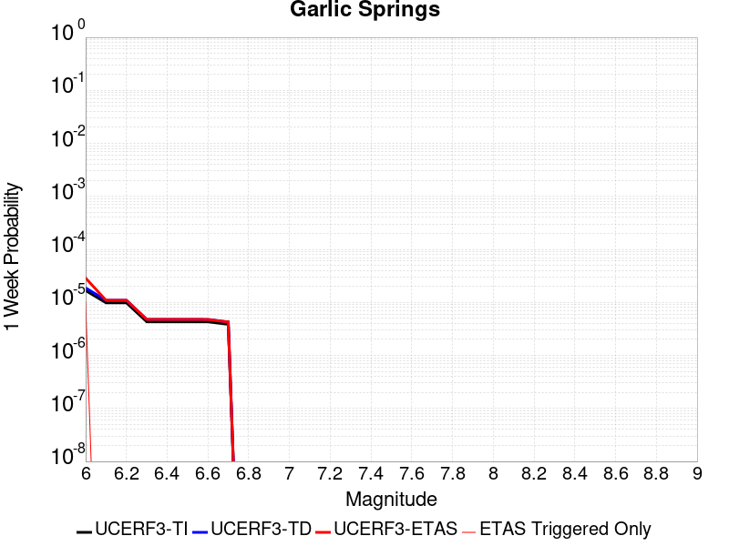 |  | 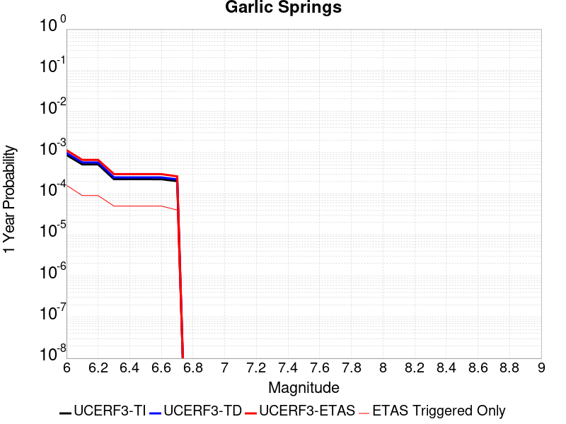 |  |

| Magnitude | 1 wk TI Prob | 1 wk TD Prob | 1 wk ETAS Prob | 1 wk ETAS/TD Gain | 1 wk ETAS Triggered Only | 1 mo TI Prob | 1 mo TD Prob | 1 mo ETAS Prob | 1 mo ETAS/TD Gain | 1 mo ETAS Triggered Only | 1 yr TI Prob | 1 yr TD Prob | 1 yr ETAS Prob | 1 yr ETAS/TD Gain | 1 yr ETAS Triggered Only | 10 yr TI Prob | 10 yr TD Prob | 10 yr ETAS Prob | 10 yr ETAS/TD Gain | 10 yr ETAS Triggered Only |
|-----|-----|-----|-----|-----|-----|-----|-----|-----|-----|-----|-----|-----|-----|-----|-----|-----|-----|-----|-----|-----|
| 6.0 | 1.6760017E-5 | 1.8779832E-5 | 1.8779832E-5 | 1.0 | 0.0 | 7.182667E-5 | 8.048317E-5 | 8.048317E-5 | 1.0 | 0.0 | 8.7413884E-4 | 9.795596E-4 | 0.0011615194 | 1.1857568 | 1.821383E-4 | 0.008707083 | 0.009763966 | 0.010274987 | 1.0523373 | 5.160585E-4 |
| 6.1 | 9.852767E-6 | 1.0975243E-5 | 1.0975243E-5 | 1.0 | 0.0 | 4.222546E-5 | 4.703631E-5 | 4.703631E-5 | 1.0 | 0.0 | 5.139737E-4 | 5.7258754E-4 | 6.939436E-4 | 1.2119431 | 1.2142554E-4 | 0.005127866 | 0.005718083 | 0.005989728 | 1.0475063 | 2.7320746E-4 |
| 6.2 | 9.852767E-6 | 1.0975243E-5 | 1.0975243E-5 | 1.0 | 0.0 | 4.222546E-5 | 4.703631E-5 | 4.703631E-5 | 1.0 | 0.0 | 5.139737E-4 | 5.7258754E-4 | 6.939436E-4 | 1.2119431 | 1.2142554E-4 | 0.005127866 | 0.005718083 | 0.005989728 | 1.0475063 | 2.7320746E-4 |
| 6.3 | 4.3167724E-6 | 4.7787057E-6 | 4.7787057E-6 | 1.0 | 0.0 | 1.8500323E-5 | 2.0480136E-5 | 2.0480136E-5 | 1.0 | 0.0 | 2.2521814E-4 | 2.4934017E-4 | 3.403866E-4 | 1.3651495 | 9.106915E-5 | 0.0022499003 | 0.0024928632 | 0.0026442667 | 1.0607347 | 1.5178192E-4 |
| 6.4 | 4.3167724E-6 | 4.7787057E-6 | 4.7787057E-6 | 1.0 | 0.0 | 1.8500323E-5 | 2.0480136E-5 | 2.0480136E-5 | 1.0 | 0.0 | 2.2521814E-4 | 2.4934017E-4 | 3.403866E-4 | 1.3651495 | 9.106915E-5 | 0.0022499003 | 0.0024928632 | 0.0026442667 | 1.0607347 | 1.5178192E-4 |
| 6.5 | 4.3167724E-6 | 4.7787057E-6 | 4.7787057E-6 | 1.0 | 0.0 | 1.8500323E-5 | 2.0480136E-5 | 2.0480136E-5 | 1.0 | 0.0 | 2.2521814E-4 | 2.4934017E-4 | 3.403866E-4 | 1.3651495 | 9.106915E-5 | 0.0022499003 | 0.0024928632 | 0.0026442667 | 1.0607347 | 1.5178192E-4 |
| 6.6 | 4.301311E-6 | 4.7615717E-6 | 4.7615717E-6 | 1.0 | 0.0 | 1.8434059E-5 | 2.0406706E-5 | 2.0406706E-5 | 1.0 | 0.0 | 2.2441156E-4 | 2.4844636E-4 | 3.394929E-4 | 1.3664635 | 9.106915E-5 | 0.0022418506 | 0.0024839449 | 0.00263535 | 1.0609534 | 1.5178192E-4 |
| 6.7 | 3.8599724E-6 | 4.2716633E-6 | 4.2716633E-6 | 1.0 | 0.0 | 1.6542634E-5 | 1.8307128E-5 | 1.8307128E-5 | 1.0 | 0.0 | 2.0138794E-4 | 2.2288928E-4 | 3.1393813E-4 | 1.4084936 | 9.106915E-5 | 0.0020120554 | 0.0022288929 | 0.0023500477 | 1.0543566 | 1.2142554E-4 |

## San Andreas (San Bernardino S)
*[(top)](#table-of-contents)*

| 1 Week | 1 Month | 1 Year | 10 Year |
|-----|-----|-----|-----|
|  |  |  |  |

| Magnitude | 1 wk TI Prob | 1 wk TD Prob | 1 wk ETAS Prob | 1 wk ETAS/TD Gain | 1 wk ETAS Triggered Only | 1 mo TI Prob | 1 mo TD Prob | 1 mo ETAS Prob | 1 mo ETAS/TD Gain | 1 mo ETAS Triggered Only | 1 yr TI Prob | 1 yr TD Prob | 1 yr ETAS Prob | 1 yr ETAS/TD Gain | 1 yr ETAS Triggered Only | 10 yr TI Prob | 10 yr TD Prob | 10 yr ETAS Prob | 10 yr ETAS/TD Gain | 10 yr ETAS Triggered Only |
|-----|-----|-----|-----|-----|-----|-----|-----|-----|-----|-----|-----|-----|-----|-----|-----|-----|-----|-----|-----|-----|
| 6.0 | 1.2336002E-4 | 3.0052903E-4 | 3.0052903E-4 | 1.0 | 0.0 | 5.2857865E-4 | 0.0012873719 | 0.0013176892 | 1.0235498 | 3.0356385E-5 | 0.006416472 | 0.015566076 | 0.015625844 | 1.0038396 | 6.071277E-5 | 0.06234337 | 0.14302991 | 0.1433681 | 1.0023645 | 3.9463298E-4 |
| 6.1 | 1.2336002E-4 | 3.0052903E-4 | 3.0052903E-4 | 1.0 | 0.0 | 5.2857865E-4 | 0.0012873719 | 0.0013176892 | 1.0235498 | 3.0356385E-5 | 0.006416472 | 0.015566076 | 0.015625844 | 1.0038396 | 6.071277E-5 | 0.06234337 | 0.14302991 | 0.1433681 | 1.0023645 | 3.9463298E-4 |
| 6.2 | 1.2336002E-4 | 3.0052903E-4 | 3.0052903E-4 | 1.0 | 0.0 | 5.2857865E-4 | 0.0012873719 | 0.0013176892 | 1.0235498 | 3.0356385E-5 | 0.006416472 | 0.015566076 | 0.015625844 | 1.0038396 | 6.071277E-5 | 0.06234337 | 0.14302991 | 0.1433681 | 1.0023645 | 3.9463298E-4 |
| 6.3 | 1.1712257E-4 | 2.8840688E-4 | 2.8840688E-4 | 1.0 | 0.0 | 5.018573E-4 | 0.0012354697 | 0.0012657887 | 1.0245404 | 3.0356385E-5 | 0.006093008 | 0.014942952 | 0.015002758 | 1.0040022 | 6.071277E-5 | 0.059286322 | 0.13773783 | 0.13807811 | 1.0024705 | 3.9463298E-4 |
| 6.4 | 1.1712257E-4 | 2.8840688E-4 | 2.8840688E-4 | 1.0 | 0.0 | 5.018573E-4 | 0.0012354697 | 0.0012657887 | 1.0245404 | 3.0356385E-5 | 0.006093008 | 0.014942952 | 0.015002758 | 1.0040022 | 6.071277E-5 | 0.059286322 | 0.13773783 | 0.13807811 | 1.0024705 | 3.9463298E-4 |
| 6.5 | 1.0689076E-4 | 2.6852704E-4 | 2.6852704E-4 | 1.0 | 0.0 | 4.5802278E-4 | 0.0011503474 | 0.001180669 | 1.0263585 | 3.0356385E-5 | 0.0055621783 | 0.013920166 | 0.013980033 | 1.0043008 | 6.071277E-5 | 0.05425003 | 0.12898327 | 0.12930056 | 1.0024599 | 3.642766E-4 |
| 6.6 | 9.7648895E-5 | 2.5096696E-4 | 2.5096696E-4 | 1.0 | 0.0 | 4.1842813E-4 | 0.0010751529 | 0.0011054766 | 1.0282041 | 3.0356385E-5 | 0.005082469 | 0.013015794 | 0.013075717 | 1.0046039 | 6.071277E-5 | 0.049677886 | 0.121141456 | 0.1214616 | 1.0026428 | 3.642766E-4 |
| 6.7 | 8.757013E-5 | 2.3166684E-4 | 2.3166684E-4 | 1.0 | 0.0 | 3.7524657E-4 | 9.925024E-4 | 0.0010228286 | 1.0305554 | 3.0356385E-5 | 0.00455906 | 0.012020858 | 0.012080842 | 1.0049899 | 6.071277E-5 | 0.04466656 | 0.11244868 | 0.112771995 | 1.0028752 | 3.642766E-4 |
| 6.8 | 8.562978E-5 | 2.2726225E-4 | 2.2726225E-4 | 1.0 | 0.0 | 3.6693315E-4 | 9.736398E-4 | 0.0010039666 | 1.0311478 | 3.0356385E-5 | 0.004458263 | 0.0117937075 | 0.011853704 | 1.0050871 | 6.071277E-5 | 0.043698758 | 0.110457905 | 0.110781945 | 1.0029336 | 3.642766E-4 |
| 6.9 | 6.124075E-5 | 1.7106693E-4 | 1.7106693E-4 | 1.0 | 0.0 | 2.6243398E-4 | 7.329388E-4 | 7.63273E-4 | 1.041387 | 3.0356385E-5 | 0.0031904527 | 0.008887228 | 0.0089474 | 1.0067707 | 6.071277E-5 | 0.031450346 | 0.08435718 | 0.08466293 | 1.0036244 | 3.3392024E-4 |
| 7.0 | 5.8598747E-5 | 1.653528E-4 | 1.653528E-4 | 1.0 | 0.0 | 2.5111332E-4 | 7.084632E-4 | 7.3879806E-4 | 1.0428178 | 3.0356385E-5 | 0.0030530186 | 0.008591622 | 0.0086518135 | 1.0070058 | 6.071277E-5 | 0.03011414 | 0.08167349 | 0.08198013 | 1.0037546 | 3.3392024E-4 |
| 7.1 | 5.613814E-5 | 1.5953425E-4 | 1.5953425E-4 | 1.0 | 0.0 | 2.4056983E-4 | 6.8353984E-4 | 7.1387546E-4 | 1.0443802 | 3.0356385E-5 | 0.0029250039 | 0.008290524 | 0.008350734 | 1.0072625 | 6.071277E-5 | 0.028868021 | 0.07897128 | 0.079278834 | 1.0038944 | 3.3392024E-4 |
| 7.2 | 4.991222E-5 | 1.4558934E-4 | 1.4558934E-4 | 1.0 | 0.0 | 2.1389198E-4 | 6.238055E-4 | 6.5414293E-4 | 1.0486329 | 3.0356385E-5 | 0.002601025 | 0.007568488 | 0.007628741 | 1.007961 | 6.071277E-5 | 0.025707912 | 0.07242188 | 0.072731614 | 1.0042769 | 3.3392024E-4 |
| 7.3 | 4.7410045E-5 | 1.375228E-4 | 1.375228E-4 | 1.0 | 0.0 | 2.0317009E-4 | 5.892506E-4 | 6.195891E-4 | 1.0514866 | 3.0356385E-5 | 0.0024707897 | 0.0071506137 | 0.007210892 | 1.0084299 | 6.071277E-5 | 0.024434982 | 0.06870162 | 0.0690126 | 1.0045265 | 3.3392024E-4 |
| 7.4 | 4.5556746E-5 | 1.3159527E-4 | 1.3159527E-4 | 1.0 | 0.0 | 1.952286E-4 | 5.6385814E-4 | 5.9419736E-4 | 1.0538065 | 3.0356385E-5 | 0.002374317 | 0.006843443 | 0.00690374 | 1.008811 | 6.071277E-5 | 0.023491086 | 0.065951794 | 0.06626369 | 1.0047292 | 3.3392024E-4 |
| 7.5 | 4.3084514E-5 | 1.2394068E-4 | 1.2394068E-4 | 1.0 | 0.0 | 1.8463485E-4 | 5.310665E-4 | 5.614068E-4 | 1.0571308 | 3.0356385E-5 | 0.0022456115 | 0.006446638 | 0.0065069594 | 1.009357 | 6.071277E-5 | 0.022230545 | 0.062349852 | 0.06266295 | 1.0050217 | 3.3392024E-4 |
| 7.6 | 3.408608E-5 | 9.8693454E-5 | 9.8693454E-5 | 1.0 | 0.0 | 1.4607502E-4 | 4.2290348E-4 | 4.5324702E-4 | 1.0717505 | 3.0356385E-5 | 0.0017770125 | 0.00513672 | 0.005197121 | 1.0117587 | 6.071277E-5 | 0.017628696 | 0.05017014 | 0.050458472 | 1.0057471 | 3.0356384E-4 |
| 7.7 | 2.8315713E-5 | 8.2804654E-5 | 8.2804654E-5 | 1.0 | 0.0 | 1.2134742E-4 | 3.5482887E-4 | 3.8517447E-4 | 1.0855218 | 3.0356385E-5 | 0.0014764034 | 0.004311493 | 0.0043719443 | 1.0140209 | 6.071277E-5 | 0.01466633 | 0.042413354 | 0.042674974 | 1.0061684 | 2.7320746E-4 |
| 7.8 | 2.6222975E-5 | 7.492829E-5 | 7.492829E-5 | 1.0 | 0.0 | 1.1237934E-4 | 3.2108175E-4 | 3.514284E-4 | 1.0945138 | 3.0356385E-5 | 0.0013673597 | 0.0039021696 | 0.0039626453 | 1.015498 | 6.071277E-5 | 0.013589768 | 0.03857025 | 0.03883292 | 1.0068102 | 2.7320746E-4 |
| 7.9 | 2.1469694E-5 | 5.812656E-5 | 5.812656E-5 | 1.0 | 0.0 | 9.200973E-5 | 2.4909005E-4 | 2.794389E-4 | 1.1218388 | 3.0356385E-5 | 0.0011196428 | 0.003028457 | 0.003088986 | 1.0199867 | 6.071277E-5 | 0.011140184 | 0.030264879 | 0.030529818 | 1.008754 | 2.7320746E-4 |
| 8.0 | 1.2420249E-5 | 3.1456424E-5 | 3.1456424E-5 | 1.0 | 0.0 | 5.322855E-5 | 1.348063E-4 | 1.6515858E-4 | 1.2251549 | 3.0356385E-5 | 6.478649E-4 | 0.0016400319 | 0.0016703386 | 1.0184792 | 3.0356385E-5 | 0.0064597935 | 0.016586676 | 0.016676234 | 1.0053995 | 9.106915E-5 |
| 8.1 | 4.9197724E-6 | 7.872929E-6 | 7.872929E-6 | 1.0 | 0.0 | 2.1084568E-5 | 3.3740685E-5 | 3.3740685E-5 | 1.0 | 0.0 | 2.566744E-4 | 4.1071558E-4 | 4.1071558E-4 | 1.0 | 0.0 | 0.002563781 | 0.004409803 | 0.004409803 | 1.0 | 0.0 |
| 8.2 | 2.5634774E-6 | 2.930318E-6 | 2.930318E-6 | 1.0 | 0.0 | 1.0986286E-5 | 1.2558446E-5 | 1.2558446E-5 | 1.0 | 0.0 | 1.3374983E-4 | 1.528884E-4 | 1.528884E-4 | 1.0 | 0.0 | 0.0013366934 | 0.0017173742 | 0.0017173742 | 1.0 | 0.0 |
| 8.3 | 5.2850464E-7 | 3.2441278E-7 | 3.2441278E-7 | 1.0 | 0.0 | 2.2650179E-6 | 1.3903399E-6 | 1.3903399E-6 | 1.0 | 0.0 | 2.7576245E-5 | 1.692727E-5 | 1.692727E-5 | 1.0 | 0.0 | 2.7572823E-4 | 2.0069437E-4 | 2.0069437E-4 | 1.0 | 0.0 |

## Helendale-So Lockhart
*[(top)](#table-of-contents)*

| 1 Week | 1 Month | 1 Year | 10 Year |
|-----|-----|-----|-----|
|  |  |  |  |

| Magnitude | 1 wk TI Prob | 1 wk TD Prob | 1 wk ETAS Prob | 1 wk ETAS/TD Gain | 1 wk ETAS Triggered Only | 1 mo TI Prob | 1 mo TD Prob | 1 mo ETAS Prob | 1 mo ETAS/TD Gain | 1 mo ETAS Triggered Only | 1 yr TI Prob | 1 yr TD Prob | 1 yr ETAS Prob | 1 yr ETAS/TD Gain | 1 yr ETAS Triggered Only | 10 yr TI Prob | 10 yr TD Prob | 10 yr ETAS Prob | 10 yr ETAS/TD Gain | 10 yr ETAS Triggered Only |
|-----|-----|-----|-----|-----|-----|-----|-----|-----|-----|-----|-----|-----|-----|-----|-----|-----|-----|-----|-----|-----|
| 6.0 | 1.7296055E-5 | 1.8104853E-5 | 1.8104853E-5 | 1.0 | 0.0 | 7.412385E-5 | 7.759003E-5 | 7.759003E-5 | 1.0 | 0.0 | 9.0208417E-4 | 9.4427E-4 | 0.0010959086 | 1.1605881 | 1.5178192E-4 | 0.008984311 | 0.009404697 | 0.009765549 | 1.0383692 | 3.642766E-4 |
| 6.1 | 1.7296055E-5 | 1.8104853E-5 | 1.8104853E-5 | 1.0 | 0.0 | 7.412385E-5 | 7.759003E-5 | 7.759003E-5 | 1.0 | 0.0 | 9.0208417E-4 | 9.4427E-4 | 0.0010959086 | 1.1605881 | 1.5178192E-4 | 0.008984311 | 0.009404697 | 0.009765549 | 1.0383692 | 3.642766E-4 |
| 6.2 | 1.7296055E-5 | 1.8104853E-5 | 1.8104853E-5 | 1.0 | 0.0 | 7.412385E-5 | 7.759003E-5 | 7.759003E-5 | 1.0 | 0.0 | 9.0208417E-4 | 9.4427E-4 | 0.0010959086 | 1.1605881 | 1.5178192E-4 | 0.008984311 | 0.009404697 | 0.009765549 | 1.0383692 | 3.642766E-4 |
| 6.3 | 1.0669118E-5 | 1.11360705E-5 | 1.11360705E-5 | 1.0 | 0.0 | 4.5723988E-5 | 4.772516E-5 | 4.772516E-5 | 1.0 | 0.0 | 5.5654737E-4 | 5.809017E-4 | 6.415792E-4 | 1.104454 | 6.071277E-5 | 0.0055515557 | 0.005794129 | 0.005975212 | 1.0312529 | 1.821383E-4 |
| 6.4 | 1.0669118E-5 | 1.11360705E-5 | 1.11360705E-5 | 1.0 | 0.0 | 4.5723988E-5 | 4.772516E-5 | 4.772516E-5 | 1.0 | 0.0 | 5.5654737E-4 | 5.809017E-4 | 6.415792E-4 | 1.104454 | 6.071277E-5 | 0.0055515557 | 0.005794129 | 0.005975212 | 1.0312529 | 1.821383E-4 |
| 6.5 | 8.790038E-6 | 9.170723E-6 | 9.170723E-6 | 1.0 | 0.0 | 3.767105E-5 | 3.930252E-5 | 3.930252E-5 | 1.0 | 0.0 | 4.585485E-4 | 4.7840463E-4 | 5.390884E-4 | 1.1268461 | 6.071277E-5 | 0.0045760344 | 0.004773912 | 0.0048645465 | 1.0189854 | 9.106915E-5 |
| 6.6 | 7.396949E-6 | 7.715978E-6 | 7.715978E-6 | 1.0 | 0.0 | 3.1700827E-5 | 3.3068067E-5 | 3.3068067E-5 | 1.0 | 0.0 | 3.858892E-4 | 4.0253034E-4 | 4.6321866E-4 | 1.1507671 | 6.071277E-5 | 0.003852198 | 0.004018119 | 0.0041088224 | 1.0225736 | 9.106915E-5 |
| 6.7 | 6.4600285E-6 | 6.7384162E-6 | 6.7384162E-6 | 1.0 | 0.0 | 2.7685543E-5 | 2.887861E-5 | 2.887861E-5 | 1.0 | 0.0 | 3.3701936E-4 | 3.5154115E-4 | 3.8188687E-4 | 1.086322 | 3.0356385E-5 | 0.0033650869 | 0.0035099322 | 0.0035704318 | 1.0172367 | 6.071277E-5 |
| 6.8 | 5.600104E-6 | 5.8363357E-6 | 5.8363357E-6 | 1.0 | 0.0 | 2.4000226E-5 | 2.501263E-5 | 2.501263E-5 | 1.0 | 0.0 | 2.9216358E-4 | 3.0448684E-4 | 3.0448684E-4 | 1.0 | 0.0 | 0.0029177975 | 0.003040758 | 0.003040758 | 1.0 | 0.0 |
| 6.9 | 4.839122E-6 | 5.039786E-6 | 5.039786E-6 | 1.0 | 0.0 | 2.0738931E-5 | 2.1598908E-5 | 2.1598908E-5 | 1.0 | 0.0 | 2.5246723E-4 | 2.6293544E-4 | 2.6293544E-4 | 1.0 | 0.0 | 0.002521806 | 0.002626291 | 0.002626291 | 1.0 | 0.0 |
| 7.0 | 3.6937633E-6 | 3.8454173E-6 | 3.8454173E-6 | 1.0 | 0.0 | 1.5830317E-5 | 1.6480257E-5 | 1.6480257E-5 | 1.0 | 0.0 | 1.9271708E-4 | 2.0062897E-4 | 2.0062897E-4 | 1.0 | 0.0 | 0.0019255003 | 0.0020045098 | 0.0020045098 | 1.0 | 0.0 |
| 7.1 | 2.7858857E-6 | 2.8980082E-6 | 2.8980082E-6 | 1.0 | 0.0 | 1.1939455E-5 | 1.2419978E-5 | 1.2419978E-5 | 1.0 | 0.0 | 1.4535317E-4 | 1.5120296E-4 | 1.5120296E-4 | 1.0 | 0.0 | 0.0014525814 | 0.0015110222 | 0.0015110222 | 1.0 | 0.0 |
| 7.2 | 2.1672065E-6 | 2.2541326E-6 | 2.2541326E-6 | 1.0 | 0.0 | 9.2879945E-6 | 9.660534E-6 | 9.660534E-6 | 1.0 | 0.0 | 1.1307546E-4 | 1.1761083E-4 | 1.1761083E-4 | 1.0 | 0.0 | 0.0011301794 | 0.0011755041 | 0.0011755041 | 1.0 | 0.0 |
| 7.3 | 1.4823496E-6 | 1.5422928E-6 | 1.5422928E-6 | 1.0 | 0.0 | 6.3529114E-6 | 6.6098105E-6 | 6.6098105E-6 | 1.0 | 0.0 | 7.734395E-5 | 8.0471626E-5 | 8.0471626E-5 | 1.0 | 0.0 | 7.731704E-4 | 8.0443994E-4 | 8.0443994E-4 | 1.0 | 0.0 |
| 7.4 | 4.2321457E-7 | 4.4111235E-7 | 4.4111235E-7 | 1.0 | 0.0 | 1.8137755E-6 | 1.8904805E-6 | 1.8904805E-6 | 1.0 | 0.0 | 2.2082493E-5 | 2.3016402E-5 | 2.3016402E-5 | 1.0 | 0.0 | 2.2080299E-4 | 2.3014471E-4 | 2.3014471E-4 | 1.0 | 0.0 |
| 7.5 | 5.6942316E-8 | 5.941907E-8 | 5.941907E-8 | 1.0 | 0.0 | 2.440385E-7 | 2.5465314E-7 | 2.5465314E-7 | 1.0 | 0.0 | 2.9711643E-6 | 3.1003983E-6 | 3.1003983E-6 | 1.0 | 0.0 | 2.9711247E-5 | 3.1003627E-5 | 3.1003627E-5 | 1.0 | 0.0 |

## Death Valley (No)
*[(top)](#table-of-contents)*

| 1 Week | 1 Month | 1 Year | 10 Year |
|-----|-----|-----|-----|
|  |  |  |  |

| Magnitude | 1 wk TI Prob | 1 wk TD Prob | 1 wk ETAS Prob | 1 wk ETAS/TD Gain | 1 wk ETAS Triggered Only | 1 mo TI Prob | 1 mo TD Prob | 1 mo ETAS Prob | 1 mo ETAS/TD Gain | 1 mo ETAS Triggered Only | 1 yr TI Prob | 1 yr TD Prob | 1 yr ETAS Prob | 1 yr ETAS/TD Gain | 1 yr ETAS Triggered Only | 10 yr TI Prob | 10 yr TD Prob | 10 yr ETAS Prob | 10 yr ETAS/TD Gain | 10 yr ETAS Triggered Only |
|-----|-----|-----|-----|-----|-----|-----|-----|-----|-----|-----|-----|-----|-----|-----|-----|-----|-----|-----|-----|-----|
| 6.0 | 2.0074807E-5 | 2.2503706E-5 | 5.2859406E-5 | 2.34892 | 3.0356385E-5 | 8.603206E-5 | 9.6440934E-5 | 1.875013E-4 | 1.9442087 | 9.106915E-5 | 0.001046937 | 0.0011735433 | 0.0013857885 | 1.1808585 | 2.1249469E-4 | 0.010420183 | 0.011674375 | 0.012004397 | 1.0282689 | 3.3392024E-4 |
| 6.1 | 2.0074807E-5 | 2.2503706E-5 | 5.2859406E-5 | 2.34892 | 3.0356385E-5 | 8.603206E-5 | 9.6440934E-5 | 1.875013E-4 | 1.9442087 | 9.106915E-5 | 0.001046937 | 0.0011735433 | 0.0013857885 | 1.1808585 | 2.1249469E-4 | 0.010420183 | 0.011674375 | 0.012004397 | 1.0282689 | 3.3392024E-4 |
| 6.2 | 2.0074807E-5 | 2.2503706E-5 | 5.2859406E-5 | 2.34892 | 3.0356385E-5 | 8.603206E-5 | 9.6440934E-5 | 1.875013E-4 | 1.9442087 | 9.106915E-5 | 0.001046937 | 0.0011735433 | 0.0013857885 | 1.1808585 | 2.1249469E-4 | 0.010420183 | 0.011674375 | 0.012004397 | 1.0282689 | 3.3392024E-4 |
| 6.3 | 1.9050609E-5 | 2.134036E-5 | 5.1696097E-5 | 2.4224565 | 3.0356385E-5 | 8.164292E-5 | 9.145552E-5 | 1.8251635E-4 | 1.9956843 | 9.106915E-5 | 9.935491E-4 | 0.0011129089 | 0.0013251671 | 1.1907238 | 2.1249469E-4 | 0.009891188 | 0.011074181 | 0.011404403 | 1.0298191 | 3.3392024E-4 |
| 6.4 | 1.9050609E-5 | 2.134036E-5 | 5.1696097E-5 | 2.4224565 | 3.0356385E-5 | 8.164292E-5 | 9.145552E-5 | 1.8251635E-4 | 1.9956843 | 9.106915E-5 | 9.935491E-4 | 0.0011129089 | 0.0013251671 | 1.1907238 | 2.1249469E-4 | 0.009891188 | 0.011074181 | 0.011404403 | 1.0298191 | 3.3392024E-4 |
| 6.5 | 1.8367004E-5 | 2.0564283E-5 | 5.0920044E-5 | 2.47614 | 3.0356385E-5 | 7.8713354E-5 | 8.81297E-5 | 1.7919083E-4 | 2.0332627 | 9.106915E-5 | 9.5791375E-4 | 0.0010724575 | 0.0012847243 | 1.1979256 | 2.1249469E-4 | 0.009537951 | 0.010673606 | 0.011003962 | 1.0309508 | 3.3392024E-4 |
| 6.6 | 1.779439E-5 | 1.9914085E-5 | 5.0269864E-5 | 2.524337 | 3.0356385E-5 | 7.625944E-5 | 8.534332E-5 | 1.764047E-4 | 2.0670006 | 9.106915E-5 | 9.280632E-4 | 0.0010385661 | 0.0012508401 | 1.2043914 | 2.1249469E-4 | 0.009241969 | 0.010337884 | 0.010668351 | 1.0319667 | 3.3392024E-4 |
| 6.7 | 1.7025437E-5 | 1.9046434E-5 | 4.940224E-5 | 2.5937788 | 3.0356385E-5 | 7.296412E-5 | 8.162506E-5 | 1.7268678E-4 | 2.11561 | 9.106915E-5 | 8.87976E-4 | 9.933382E-4 | 0.0012056218 | 1.2137073 | 2.1249469E-4 | 0.008844362 | 0.0098897 | 0.010220318 | 1.0334306 | 3.3392024E-4 |
| 6.8 | 1.6545107E-5 | 1.8515479E-5 | 4.88713E-5 | 2.6394835 | 3.0356385E-5 | 7.090568E-5 | 7.934967E-5 | 1.704116E-4 | 2.147603 | 9.106915E-5 | 8.629347E-4 | 9.656602E-4 | 0.0011779497 | 1.2198387 | 2.1249469E-4 | 0.008595915 | 0.009615345 | 0.009946055 | 1.0343939 | 3.3392024E-4 |
| 6.9 | 1.615478E-5 | 1.8090475E-5 | 4.8446313E-5 | 2.678001 | 3.0356385E-5 | 6.9232934E-5 | 7.752834E-5 | 1.6859043E-4 | 2.174565 | 9.106915E-5 | 8.4258494E-4 | 9.435049E-4 | 0.0011557991 | 1.225006 | 2.1249469E-4 | 0.008393973 | 0.009395686 | 0.0097264685 | 1.0352058 | 3.3392024E-4 |
| 7.0 | 1.5894311E-5 | 1.7808401E-5 | 4.8164242E-5 | 2.70458 | 3.0356385E-5 | 6.81167E-5 | 7.631952E-5 | 1.6738172E-4 | 2.1931705 | 9.106915E-5 | 8.2900526E-4 | 9.288001E-4 | 0.0011410974 | 1.2285717 | 2.1249469E-4 | 0.008259195 | 0.009249872 | 0.0095807025 | 1.0357661 | 3.3392024E-4 |
| 7.1 | 1.5602263E-5 | 1.7486309E-5 | 4.784216E-5 | 2.7359784 | 3.0356385E-5 | 6.6865134E-5 | 7.4939206E-5 | 1.6600153E-4 | 2.2151494 | 9.106915E-5 | 8.137789E-4 | 9.12009E-4 | 0.0011243098 | 1.2327838 | 2.1249469E-4 | 0.008108052 | 0.009083345 | 0.009414232 | 1.0364279 | 3.3392024E-4 |
| 7.2 | 1.5323829E-5 | 1.7173385E-5 | 4.7529247E-5 | 2.767611 | 3.0356385E-5 | 6.56719E-5 | 7.3598174E-5 | 1.6466063E-4 | 2.2372923 | 9.106915E-5 | 7.99262E-4 | 8.9569547E-4 | 0.0010776706 | 1.2031664 | 1.821383E-4 | 0.007963934 | 0.008921531 | 0.009222386 | 1.0337224 | 3.0356384E-4 |
| 7.3 | 1.4556212E-5 | 1.6305059E-5 | 4.666095E-5 | 2.8617468 | 3.0356385E-5 | 6.238227E-5 | 6.987698E-5 | 1.3058551E-4 | 1.8687915 | 6.071277E-5 | 7.592395E-4 | 8.5042603E-4 | 0.0010020789 | 1.1783258 | 1.5178192E-4 | 0.0075665074 | 0.008472362 | 0.0087432545 | 1.0319737 | 2.7320746E-4 |
| 7.4 | 1.411725E-5 | 1.581048E-5 | 4.6166384E-5 | 2.9199862 | 3.0356385E-5 | 6.0501097E-5 | 6.775747E-5 | 1.2846613E-4 | 1.8959699 | 6.071277E-5 | 7.363519E-4 | 8.246408E-4 | 9.7629754E-4 | 1.1839064 | 1.5178192E-4 | 0.0073391674 | 0.008216443 | 0.008487405 | 1.032978 | 2.7320746E-4 |
| 7.5 | 1.3503312E-5 | 1.5128708E-5 | 4.5484634E-5 | 3.0065114 | 3.0356385E-5 | 5.7870053E-5 | 6.483574E-5 | 1.2554457E-4 | 1.9363482 | 6.071277E-5 | 7.043401E-4 | 7.8909507E-4 | 9.407572E-4 | 1.1921976 | 1.5178192E-4 | 0.007021119 | 0.007863557 | 0.008134616 | 1.0344703 | 2.7320746E-4 |
| 7.6 | 1.1279839E-5 | 1.2628332E-5 | 4.298433E-5 | 3.4038012 | 3.0356385E-5 | 4.834127E-5 | 5.412033E-5 | 1.1482981E-4 | 2.12175 | 6.071277E-5 | 5.88396E-4 | 6.5872114E-4 | 8.10403E-4 | 1.2302673 | 1.5178192E-4 | 0.005868405 | 0.006568238 | 0.006779337 | 1.0321393 | 2.1249469E-4 |
| 7.7 | 9.189108E-6 | 1.0284987E-5 | 1.0284987E-5 | 1.0 | 0.0 | 3.93813E-5 | 4.4077802E-5 | 4.4077802E-5 | 1.0 | 0.0 | 4.7936183E-4 | 5.3652015E-4 | 6.275404E-4 | 1.1696494 | 9.106915E-5 | 0.004783291 | 0.0053527597 | 0.005503729 | 1.0282041 | 1.5178192E-4 |
| 7.8 | 3.4586725E-7 | 3.648528E-7 | 3.648528E-7 | 1.0 | 0.0 | 1.4822873E-6 | 1.563654E-6 | 1.563654E-6 | 1.0 | 0.0 | 1.80467E-5 | 1.9037325E-5 | 1.9037325E-5 | 1.0 | 0.0 | 1.8045233E-4 | 1.9035739E-4 | 1.9035739E-4 | 1.0 | 0.0 |
| 7.9 | 2.5591178E-9 | 2.6698248E-9 | 2.6698248E-9 | 1.0 | 0.0 | 1.0967647E-8 | 1.1442106E-8 | 1.1442106E-8 | 1.0 | 0.0 | 1.335311E-7 | 1.3930764E-7 | 1.3930764E-7 | 1.0 | 0.0 | 1.3353102E-6 | 1.3930764E-6 | 1.3930764E-6 | 1.0 | 0.0 |

## Coyote Lake
*[(top)](#table-of-contents)*

| 1 Week | 1 Month | 1 Year | 10 Year |
|-----|-----|-----|-----|
|  | 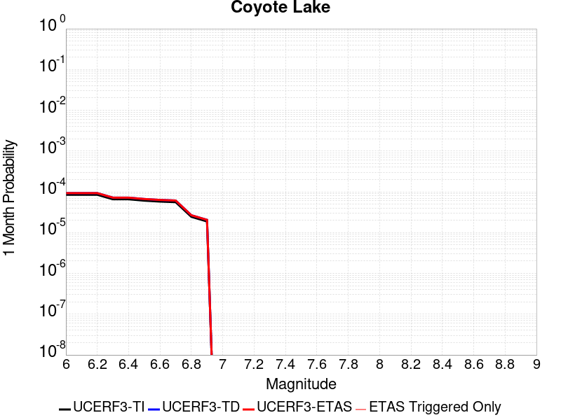 |  | 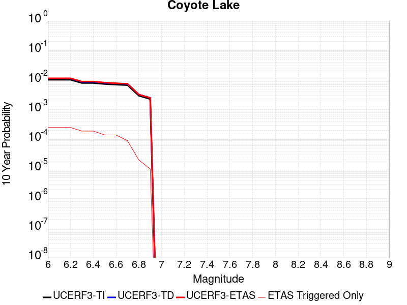 |

| Magnitude | 1 wk TI Prob | 1 wk TD Prob | 1 wk ETAS Prob | 1 wk ETAS/TD Gain | 1 wk ETAS Triggered Only | 1 mo TI Prob | 1 mo TD Prob | 1 mo ETAS Prob | 1 mo ETAS/TD Gain | 1 mo ETAS Triggered Only | 1 yr TI Prob | 1 yr TD Prob | 1 yr ETAS Prob | 1 yr ETAS/TD Gain | 1 yr ETAS Triggered Only | 10 yr TI Prob | 10 yr TD Prob | 10 yr ETAS Prob | 10 yr ETAS/TD Gain | 10 yr ETAS Triggered Only |
|-----|-----|-----|-----|-----|-----|-----|-----|-----|-----|-----|-----|-----|-----|-----|-----|-----|-----|-----|-----|-----|
| 6.0 | 1.980352E-5 | 2.1709513E-5 | 2.1709513E-5 | 1.0 | 0.0 | 8.486947E-5 | 9.303786E-5 | 9.303786E-5 | 1.0 | 0.0 | 0.0010327959 | 0.0011322193 | 0.0012535074 | 1.1071242 | 1.2142554E-4 | 0.010280091 | 0.011271688 | 0.01157183 | 1.026628 | 3.0356384E-4 |
| 6.1 | 1.980352E-5 | 2.1709513E-5 | 2.1709513E-5 | 1.0 | 0.0 | 8.486947E-5 | 9.303786E-5 | 9.303786E-5 | 1.0 | 0.0 | 0.0010327959 | 0.0011322193 | 0.0012535074 | 1.1071242 | 1.2142554E-4 | 0.010280091 | 0.011271688 | 0.01157183 | 1.026628 | 3.0356384E-4 |
| 6.2 | 1.980352E-5 | 2.1709513E-5 | 2.1709513E-5 | 1.0 | 0.0 | 8.486947E-5 | 9.303786E-5 | 9.303786E-5 | 1.0 | 0.0 | 0.0010327959 | 0.0011322193 | 0.0012535074 | 1.1071242 | 1.2142554E-4 | 0.010280091 | 0.011271688 | 0.01157183 | 1.026628 | 3.0356384E-4 |
| 6.3 | 1.5344787E-5 | 1.6822816E-5 | 1.6822816E-5 | 1.0 | 0.0 | 6.576172E-5 | 7.209613E-5 | 7.209613E-5 | 1.0 | 0.0 | 8.003548E-4 | 8.7747816E-4 | 9.6846744E-4 | 1.103694 | 9.106915E-5 | 0.007974784 | 0.008746182 | 0.008986908 | 1.0275236 | 2.4285108E-4 |
| 6.4 | 1.5344787E-5 | 1.6822816E-5 | 1.6822816E-5 | 1.0 | 0.0 | 6.576172E-5 | 7.209613E-5 | 7.209613E-5 | 1.0 | 0.0 | 8.003548E-4 | 8.7747816E-4 | 9.6846744E-4 | 1.103694 | 9.106915E-5 | 0.007974784 | 0.008746182 | 0.008986908 | 1.0275236 | 2.4285108E-4 |
| 6.5 | 1.4189697E-5 | 1.5559977E-5 | 1.5559977E-5 | 1.0 | 0.0 | 6.081157E-5 | 6.668425E-5 | 6.668425E-5 | 1.0 | 0.0 | 7.401293E-4 | 8.1163866E-4 | 9.0263394E-4 | 1.112113 | 9.106915E-5 | 0.0073766913 | 0.008092688 | 0.008273352 | 1.0223244 | 1.821383E-4 |
| 6.6 | 1.3469301E-5 | 1.4773473E-5 | 1.4773473E-5 | 1.0 | 0.0 | 5.7724297E-5 | 6.331368E-5 | 6.331368E-5 | 1.0 | 0.0 | 7.025667E-4 | 7.706315E-4 | 8.616304E-4 | 1.1180836 | 9.106915E-5 | 0.0070034964 | 0.0076854974 | 0.007866235 | 1.0235168 | 1.821383E-4 |
| 6.7 | 1.3027966E-5 | 1.4283569E-5 | 1.4283569E-5 | 1.0 | 0.0 | 5.5832945E-5 | 6.1214196E-5 | 6.1214196E-5 | 1.0 | 0.0 | 6.7955407E-4 | 7.4508775E-4 | 8.36089E-4 | 1.122135 | 9.106915E-5 | 0.006774798 | 0.007431775 | 0.007582429 | 1.0202715 | 1.5178192E-4 |
| 6.8 | 5.695434E-6 | 6.2251847E-6 | 6.2251847E-6 | 1.0 | 0.0 | 2.4408775E-5 | 2.667926E-5 | 2.667926E-5 | 1.0 | 0.0 | 2.971363E-4 | 3.2480157E-4 | 3.2480157E-4 | 1.0 | 0.0 | 0.0029673933 | 0.00324621 | 0.0032764678 | 1.009321 | 3.0356385E-5 |
| 6.9 | 4.385688E-6 | 4.793646E-6 | 4.793646E-6 | 1.0 | 0.0 | 1.879567E-5 | 2.0544197E-5 | 2.0544197E-5 | 1.0 | 0.0 | 2.2881327E-4 | 2.501256E-4 | 2.501256E-4 | 1.0 | 0.0 | 0.002285778 | 0.0025012558 | 0.0025315364 | 1.0121061 | 3.0356385E-5 |

## Sierra Nevada  (No Extension)
*[(top)](#table-of-contents)*

| 1 Week | 1 Month | 1 Year | 10 Year |
|-----|-----|-----|-----|
| 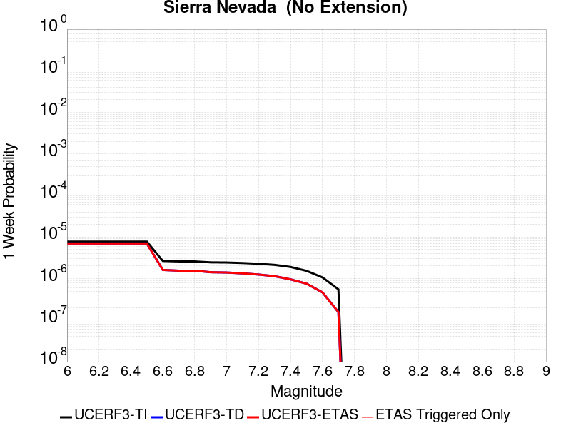 |  |  |  |

| Magnitude | 1 wk TI Prob | 1 wk TD Prob | 1 wk ETAS Prob | 1 wk ETAS/TD Gain | 1 wk ETAS Triggered Only | 1 mo TI Prob | 1 mo TD Prob | 1 mo ETAS Prob | 1 mo ETAS/TD Gain | 1 mo ETAS Triggered Only | 1 yr TI Prob | 1 yr TD Prob | 1 yr ETAS Prob | 1 yr ETAS/TD Gain | 1 yr ETAS Triggered Only | 10 yr TI Prob | 10 yr TD Prob | 10 yr ETAS Prob | 10 yr ETAS/TD Gain | 10 yr ETAS Triggered Only |
|-----|-----|-----|-----|-----|-----|-----|-----|-----|-----|-----|-----|-----|-----|-----|-----|-----|-----|-----|-----|-----|
| 6.0 | 7.7690465E-6 | 6.9769367E-6 | 6.9769367E-6 | 1.0 | 0.0 | 3.329549E-5 | 2.9901017E-5 | 2.9901017E-5 | 1.0 | 0.0 | 4.0529718E-4 | 3.640199E-4 | 5.157466E-4 | 1.4168087 | 1.5178192E-4 | 0.004045588 | 0.003637753 | 0.0038797206 | 1.0665157 | 2.4285108E-4 |
| 6.1 | 7.7690465E-6 | 6.9769367E-6 | 6.9769367E-6 | 1.0 | 0.0 | 3.329549E-5 | 2.9901017E-5 | 2.9901017E-5 | 1.0 | 0.0 | 4.0529718E-4 | 3.640199E-4 | 5.157466E-4 | 1.4168087 | 1.5178192E-4 | 0.004045588 | 0.003637753 | 0.0038797206 | 1.0665157 | 2.4285108E-4 |
| 6.2 | 7.7690465E-6 | 6.9769367E-6 | 6.9769367E-6 | 1.0 | 0.0 | 3.329549E-5 | 2.9901017E-5 | 2.9901017E-5 | 1.0 | 0.0 | 4.0529718E-4 | 3.640199E-4 | 5.157466E-4 | 1.4168087 | 1.5178192E-4 | 0.004045588 | 0.003637753 | 0.0038797206 | 1.0665157 | 2.4285108E-4 |
| 6.3 | 7.7690465E-6 | 6.9769367E-6 | 6.9769367E-6 | 1.0 | 0.0 | 3.329549E-5 | 2.9901017E-5 | 2.9901017E-5 | 1.0 | 0.0 | 4.0529718E-4 | 3.640199E-4 | 5.157466E-4 | 1.4168087 | 1.5178192E-4 | 0.004045588 | 0.003637753 | 0.0038797206 | 1.0665157 | 2.4285108E-4 |
| 6.4 | 7.7690465E-6 | 6.9769367E-6 | 6.9769367E-6 | 1.0 | 0.0 | 3.329549E-5 | 2.9901017E-5 | 2.9901017E-5 | 1.0 | 0.0 | 4.0529718E-4 | 3.640199E-4 | 5.157466E-4 | 1.4168087 | 1.5178192E-4 | 0.004045588 | 0.003637753 | 0.0038797206 | 1.0665157 | 2.4285108E-4 |
| 6.5 | 7.7690465E-6 | 6.9769367E-6 | 6.9769367E-6 | 1.0 | 0.0 | 3.329549E-5 | 2.9901017E-5 | 2.9901017E-5 | 1.0 | 0.0 | 4.0529718E-4 | 3.640199E-4 | 5.157466E-4 | 1.4168087 | 1.5178192E-4 | 0.004045588 | 0.003637753 | 0.0038797206 | 1.0665157 | 2.4285108E-4 |
| 6.6 | 2.653E-6 | 1.6151278E-6 | 1.6151278E-6 | 1.0 | 0.0 | 1.136995E-5 | 6.9219577E-6 | 6.9219577E-6 | 1.0 | 0.0 | 1.3842035E-4 | 8.427161E-5 | 1.7533309E-4 | 2.0805712 | 9.106915E-5 | 0.0013833415 | 8.424E-4 | 0.0010243849 | 1.2160314 | 1.821383E-4 |
| 6.7 | 2.5902466E-6 | 1.5504587E-6 | 1.5504587E-6 | 1.0 | 0.0 | 1.11010095E-5 | 6.644806E-6 | 6.644806E-6 | 1.0 | 0.0 | 1.351464E-4 | 8.089754E-5 | 1.7195933E-4 | 2.1256435 | 9.106915E-5 | 0.0013506424 | 8.086839E-4 | 9.90675E-4 | 1.2250459 | 1.821383E-4 |
| 6.8 | 2.5853892E-6 | 1.5472576E-6 | 1.5472576E-6 | 1.0 | 0.0 | 1.1080193E-5 | 6.6310877E-6 | 6.6310877E-6 | 1.0 | 0.0 | 1.34893E-4 | 8.0730526E-5 | 1.7179233E-4 | 2.1279724 | 9.106915E-5 | 0.0013481114 | 8.07015E-4 | 9.890064E-4 | 1.2255117 | 1.821383E-4 |
| 6.9 | 2.458257E-6 | 1.4223259E-6 | 1.4223259E-6 | 1.0 | 0.0 | 1.0535345E-5 | 6.095668E-6 | 6.095668E-6 | 1.0 | 0.0 | 1.2826028E-4 | 7.421225E-5 | 1.6527464E-4 | 2.2270534 | 9.106915E-5 | 0.0012818627 | 7.4187666E-4 | 9.2387985E-4 | 1.2453281 | 1.821383E-4 |
| 7.0 | 2.4341468E-6 | 1.3992884E-6 | 1.3992884E-6 | 1.0 | 0.0 | 1.0432016E-5 | 5.9969366E-6 | 5.9969366E-6 | 1.0 | 0.0 | 1.270024E-4 | 7.301028E-5 | 1.6407279E-4 | 2.247256 | 9.106915E-5 | 0.0012692984 | 7.298648E-4 | 9.1187016E-4 | 1.2493685 | 1.821383E-4 |
| 7.1 | 2.3652476E-6 | 1.3342343E-6 | 1.3342343E-6 | 1.0 | 0.0 | 1.0136736E-5 | 5.7181346E-6 | 5.7181346E-6 | 1.0 | 0.0 | 1.2340778E-4 | 6.961608E-5 | 1.6067889E-4 | 2.3080716 | 9.106915E-5 | 0.0012333926 | 6.959444E-4 | 8.77956E-4 | 1.2615317 | 1.821383E-4 |
| 7.2 | 2.272158E-6 | 1.2505349E-6 | 1.2505349E-6 | 1.0 | 0.0 | 9.737784E-6 | 5.3594244E-6 | 5.3594244E-6 | 1.0 | 0.0 | 1.1855107E-4 | 6.5249056E-5 | 1.5631226E-4 | 2.395625 | 9.106915E-5 | 0.0011848784 | 6.523005E-4 | 8.3432E-4 | 1.2790424 | 1.821383E-4 |
| 7.3 | 2.1382127E-6 | 1.1422151E-6 | 1.1422151E-6 | 1.0 | 0.0 | 9.163737E-6 | 4.8951983E-6 | 4.8951983E-6 | 1.0 | 0.0 | 1.1156279E-4 | 5.9597423E-5 | 1.2030657E-4 | 2.0186539 | 6.071277E-5 | 0.001115068 | 5.958156E-4 | 7.475071E-4 | 1.2545947 | 1.5178192E-4 |
| 7.4 | 1.9048055E-6 | 9.57756E-7 | 9.57756E-7 | 1.0 | 0.0 | 8.163426E-6 | 4.1046624E-6 | 4.1046624E-6 | 1.0 | 0.0 | 9.9385186E-5 | 4.9973125E-5 | 1.1068286E-4 | 2.2148476 | 6.071277E-5 | 9.934074E-4 | 4.996196E-4 | 6.209844E-4 | 1.2429146 | 1.2142554E-4 |
| 7.5 | 1.5373403E-6 | 7.5620164E-7 | 7.5620164E-7 | 1.0 | 0.0 | 6.5885843E-6 | 3.2408602E-6 | 3.2408602E-6 | 1.0 | 0.0 | 8.021306E-5 | 3.9456765E-5 | 1.0016713E-4 | 2.5386558 | 6.071277E-5 | 8.0184115E-4 | 3.9449806E-4 | 5.158757E-4 | 1.3076761 | 1.2142554E-4 |
| 7.6 | 1.0680322E-6 | 4.6610623E-7 | 4.6610623E-7 | 1.0 | 0.0 | 4.577273E-6 | 1.9975967E-6 | 1.9975967E-6 | 1.0 | 0.0 | 5.5726876E-5 | 2.432047E-5 | 5.4676115E-5 | 2.248152 | 3.0356385E-5 | 5.5712904E-4 | 2.4317835E-4 | 3.3422536E-4 | 1.3744042 | 9.106915E-5 |
| 7.7 | 5.509146E-7 | 1.5587625E-7 | 1.5587625E-7 | 1.0 | 0.0 | 2.3610605E-6 | 6.680409E-7 | 6.680409E-7 | 1.0 | 0.0 | 2.8745531E-5 | 8.133369E-6 | 8.133369E-6 | 1.0 | 0.0 | 2.8741814E-4 | 8.133083E-5 | 8.133083E-5 | 1.0 | 0.0 |

## White Wolf (Extension)
*[(top)](#table-of-contents)*

| 1 Week | 1 Month | 1 Year | 10 Year |
|-----|-----|-----|-----|
|  |  |  |  |

| Magnitude | 1 wk TI Prob | 1 wk TD Prob | 1 wk ETAS Prob | 1 wk ETAS/TD Gain | 1 wk ETAS Triggered Only | 1 mo TI Prob | 1 mo TD Prob | 1 mo ETAS Prob | 1 mo ETAS/TD Gain | 1 mo ETAS Triggered Only | 1 yr TI Prob | 1 yr TD Prob | 1 yr ETAS Prob | 1 yr ETAS/TD Gain | 1 yr ETAS Triggered Only | 10 yr TI Prob | 10 yr TD Prob | 10 yr ETAS Prob | 10 yr ETAS/TD Gain | 10 yr ETAS Triggered Only |
|-----|-----|-----|-----|-----|-----|-----|-----|-----|-----|-----|-----|-----|-----|-----|-----|-----|-----|-----|-----|-----|
| 6.0 | 8.222555E-6 | 6.0670677E-6 | 6.0670677E-6 | 1.0 | 0.0 | 3.5239045E-5 | 2.6001497E-5 | 2.6001497E-5 | 1.0 | 0.0 | 4.289509E-4 | 3.1652887E-4 | 3.772224E-4 | 1.1917473 | 6.071277E-5 | 0.0042812387 | 0.0031614322 | 0.003373255 | 1.0670022 | 2.1249469E-4 |
| 6.1 | 8.222555E-6 | 6.0670677E-6 | 6.0670677E-6 | 1.0 | 0.0 | 3.5239045E-5 | 2.6001497E-5 | 2.6001497E-5 | 1.0 | 0.0 | 4.289509E-4 | 3.1652887E-4 | 3.772224E-4 | 1.1917473 | 6.071277E-5 | 0.0042812387 | 0.0031614322 | 0.003373255 | 1.0670022 | 2.1249469E-4 |
| 6.2 | 8.222555E-6 | 6.0670677E-6 | 6.0670677E-6 | 1.0 | 0.0 | 3.5239045E-5 | 2.6001497E-5 | 2.6001497E-5 | 1.0 | 0.0 | 4.289509E-4 | 3.1652887E-4 | 3.772224E-4 | 1.1917473 | 6.071277E-5 | 0.0042812387 | 0.0031614322 | 0.003373255 | 1.0670022 | 2.1249469E-4 |
| 6.3 | 8.222555E-6 | 6.0670677E-6 | 6.0670677E-6 | 1.0 | 0.0 | 3.5239045E-5 | 2.6001497E-5 | 2.6001497E-5 | 1.0 | 0.0 | 4.289509E-4 | 3.1652887E-4 | 3.772224E-4 | 1.1917473 | 6.071277E-5 | 0.0042812387 | 0.0031614322 | 0.003373255 | 1.0670022 | 2.1249469E-4 |
| 6.4 | 5.821773E-6 | 3.5574278E-6 | 3.5574278E-6 | 1.0 | 0.0 | 2.4950215E-5 | 1.5246036E-5 | 1.5246036E-5 | 1.0 | 0.0 | 3.0372653E-4 | 1.8560578E-4 | 2.4630726E-4 | 1.3270453 | 6.071277E-5 | 0.0030331176 | 0.001854616 | 0.0019758162 | 1.0653507 | 1.2142554E-4 |
| 6.5 | 5.766023E-6 | 3.4993586E-6 | 3.4993586E-6 | 1.0 | 0.0 | 2.4711293E-5 | 1.4997171E-5 | 1.4997171E-5 | 1.0 | 0.0 | 3.0081844E-4 | 1.8257636E-4 | 2.4327805E-4 | 1.3324728 | 6.071277E-5 | 0.0030041158 | 0.0018243717 | 0.0019455758 | 1.066436 | 1.2142554E-4 |
| 6.6 | 4.643576E-6 | 2.3328114E-6 | 2.3328114E-6 | 1.0 | 0.0 | 1.9900888E-5 | 9.997727E-6 | 9.997727E-6 | 1.0 | 0.0 | 2.4226638E-4 | 1.2171596E-4 | 1.2171596E-4 | 1.0 | 0.0 | 0.0024200242 | 0.0012165353 | 0.0012771743 | 1.0498456 | 6.071277E-5 |
| 6.7 | 3.9529173E-6 | 1.6484983E-6 | 1.6484983E-6 | 1.0 | 0.0 | 1.6940963E-5 | 7.0649744E-6 | 7.0649744E-6 | 1.0 | 0.0 | 2.0623671E-4 | 8.601286E-5 | 8.601286E-5 | 1.0 | 0.0 | 0.002060454 | 8.598142E-4 | 8.9014444E-4 | 1.0352753 | 3.0356385E-5 |
| 6.8 | 3.4377522E-6 | 1.2246483E-6 | 1.2246483E-6 | 1.0 | 0.0 | 1.473314E-5 | 5.2484825E-6 | 5.2484825E-6 | 1.0 | 0.0 | 1.7936122E-4 | 6.389849E-5 | 6.389849E-5 | 1.0 | 0.0 | 0.0017921652 | 6.3881034E-4 | 6.691473E-4 | 1.0474899 | 3.0356385E-5 |
| 6.9 | 3.1367306E-6 | 1.0034878E-6 | 1.0034878E-6 | 1.0 | 0.0 | 1.3443062E-5 | 4.3006553E-6 | 4.3006553E-6 | 1.0 | 0.0 | 1.63657E-4 | 5.23593E-5 | 5.23593E-5 | 1.0 | 0.0 | 0.0016353652 | 5.2347727E-4 | 5.538178E-4 | 1.0579596 | 3.0356385E-5 |
| 7.0 | 2.8298145E-6 | 7.4296156E-7 | 7.4296156E-7 | 1.0 | 0.0 | 1.2127721E-5 | 3.1841173E-6 | 3.1841173E-6 | 1.0 | 0.0 | 1.47645E-4 | 3.876599E-5 | 3.876599E-5 | 1.0 | 0.0 | 0.0014754693 | 3.8759728E-4 | 4.179419E-4 | 1.078289 | 3.0356385E-5 |
| 7.1 | 2.4091064E-6 | 5.423516E-7 | 5.423516E-7 | 1.0 | 0.0 | 1.03247E-5 | 2.3243622E-6 | 2.3243622E-6 | 1.0 | 0.0 | 1.2569598E-4 | 2.8298784E-5 | 2.8298784E-5 | 1.0 | 0.0 | 0.001256249 | 2.8295585E-4 | 3.1330364E-4 | 1.1072527 | 3.0356385E-5 |
| 7.2 | 1.3875518E-6 | 1.07468146E-7 | 1.07468146E-7 | 1.0 | 0.0 | 5.9466374E-6 | 4.6057767E-7 | 4.6057767E-7 | 1.0 | 0.0 | 7.23979E-5 | 5.60752E-6 | 5.60752E-6 | 1.0 | 0.0 | 7.2374323E-4 | 5.60739E-5 | 8.642858E-5 | 1.5413336 | 3.0356385E-5 |
| 7.3 | 7.056077E-7 | 5.0041887E-8 | 5.0041887E-8 | 1.0 | 0.0 | 3.0240296E-6 | 2.1446522E-7 | 2.1446522E-7 | 1.0 | 0.0 | 3.681694E-5 | 2.6111113E-6 | 2.6111113E-6 | 1.0 | 0.0 | 3.681084E-4 | 2.6110854E-5 | 5.6466444E-5 | 2.162566 | 3.0356385E-5 |
| 7.4 | 5.9334678E-8 | 4.8704454E-9 | 4.8704454E-9 | 1.0 | 0.0 | 2.5429145E-7 | 2.0873339E-8 | 2.0873339E-8 | 1.0 | 0.0 | 3.095994E-6 | 2.5413289E-7 | 2.5413289E-7 | 1.0 | 0.0 | 3.095951E-5 | 2.541327E-6 | 2.541327E-6 | 1.0 | 0.0 |

## Death Valley (Fish Lake Valley)
*[(top)](#table-of-contents)*

| 1 Week | 1 Month | 1 Year | 10 Year |
|-----|-----|-----|-----|
|  |  |  |  |

| Magnitude | 1 wk TI Prob | 1 wk TD Prob | 1 wk ETAS Prob | 1 wk ETAS/TD Gain | 1 wk ETAS Triggered Only | 1 mo TI Prob | 1 mo TD Prob | 1 mo ETAS Prob | 1 mo ETAS/TD Gain | 1 mo ETAS Triggered Only | 1 yr TI Prob | 1 yr TD Prob | 1 yr ETAS Prob | 1 yr ETAS/TD Gain | 1 yr ETAS Triggered Only | 10 yr TI Prob | 10 yr TD Prob | 10 yr ETAS Prob | 10 yr ETAS/TD Gain | 10 yr ETAS Triggered Only |
|-----|-----|-----|-----|-----|-----|-----|-----|-----|-----|-----|-----|-----|-----|-----|-----|-----|-----|-----|-----|-----|
| 6.0 | 3.872328E-5 | 4.7281694E-5 | 7.763664E-5 | 1.6420021 | 3.0356385E-5 | 1.6594635E-4 | 2.0262178E-4 | 2.3297202E-4 | 1.1497877 | 3.0356385E-5 | 0.0020185246 | 0.002464232 | 0.0025853582 | 1.0491538 | 1.2142554E-4 | 0.02000288 | 0.024395194 | 0.024602504 | 1.0084981 | 2.1249469E-4 |
| 6.1 | 3.872328E-5 | 4.7281694E-5 | 7.763664E-5 | 1.6420021 | 3.0356385E-5 | 1.6594635E-4 | 2.0262178E-4 | 2.3297202E-4 | 1.1497877 | 3.0356385E-5 | 0.0020185246 | 0.002464232 | 0.0025853582 | 1.0491538 | 1.2142554E-4 | 0.02000288 | 0.024395194 | 0.024602504 | 1.0084981 | 2.1249469E-4 |
| 6.2 | 3.872328E-5 | 4.7281694E-5 | 7.763664E-5 | 1.6420021 | 3.0356385E-5 | 1.6594635E-4 | 2.0262178E-4 | 2.3297202E-4 | 1.1497877 | 3.0356385E-5 | 0.0020185246 | 0.002464232 | 0.0025853582 | 1.0491538 | 1.2142554E-4 | 0.02000288 | 0.024395194 | 0.024602504 | 1.0084981 | 2.1249469E-4 |
| 6.3 | 2.8356371E-5 | 3.361828E-5 | 6.397364E-5 | 1.9029422 | 3.0356385E-5 | 1.2152165E-4 | 1.4407083E-4 | 1.7442284E-4 | 1.2106743 | 3.0356385E-5 | 0.0014785219 | 0.0017527296 | 0.0018739423 | 1.0691565 | 1.2142554E-4 | 0.014687235 | 0.017396059 | 0.017604856 | 1.0120026 | 2.1249469E-4 |
| 6.4 | 2.8356371E-5 | 3.361828E-5 | 6.397364E-5 | 1.9029422 | 3.0356385E-5 | 1.2152165E-4 | 1.4407083E-4 | 1.7442284E-4 | 1.2106743 | 3.0356385E-5 | 0.0014785219 | 0.0017527296 | 0.0018739423 | 1.0691565 | 1.2142554E-4 | 0.014687235 | 0.017396059 | 0.017604856 | 1.0120026 | 2.1249469E-4 |
| 6.5 | 2.4448687E-5 | 2.8614111E-5 | 5.896963E-5 | 2.0608582 | 3.0356385E-5 | 1.0477588E-4 | 1.2262643E-4 | 1.5297909E-4 | 1.2475214 | 3.0356385E-5 | 0.0012748998 | 0.0014920048 | 0.0016132492 | 1.0812627 | 1.2142554E-4 | 0.012676105 | 0.014824731 | 0.015034076 | 1.0141213 | 2.1249469E-4 |
| 6.6 | 2.1298161E-5 | 2.4665313E-5 | 5.5020948E-5 | 2.2307014 | 3.0356385E-5 | 9.127464E-5 | 1.0570439E-4 | 1.3605757E-4 | 1.2871515 | 3.0356385E-5 | 0.0011107022 | 0.001286225 | 0.0014074944 | 1.0942831 | 1.2142554E-4 | 0.011051672 | 0.012791215 | 0.012971023 | 1.0140572 | 1.821383E-4 |
| 6.7 | 1.8959729E-5 | 2.1785369E-5 | 5.214109E-5 | 2.3933995 | 3.0356385E-5 | 8.125345E-5 | 9.336267E-5 | 1.2371622E-4 | 1.3251144 | 3.0356385E-5 | 9.888117E-4 | 0.0011361233 | 0.001257411 | 1.1067556 | 1.2142554E-4 | 0.009844234 | 0.011305812 | 0.011485891 | 1.015928 | 1.821383E-4 |
| 6.8 | 1.6691629E-5 | 1.9021896E-5 | 4.93777E-5 | 2.595835 | 3.0356385E-5 | 7.153359E-5 | 8.151996E-5 | 1.11873866E-4 | 1.3723494 | 3.0356385E-5 | 8.7057345E-4 | 9.920704E-4 | 0.0011133755 | 1.1222746 | 1.2142554E-4 | 0.008671708 | 0.009878175 | 0.010058514 | 1.0182563 | 1.821383E-4 |
| 6.9 | 1.450505E-5 | 1.6392378E-5 | 4.6748264E-5 | 2.8518293 | 3.0356385E-5 | 6.216302E-5 | 7.0251204E-5 | 1.0060546E-4 | 1.4320816 | 3.0356385E-5 | 7.5657194E-4 | 8.549816E-4 | 9.763033E-4 | 1.1418998 | 1.2142554E-4 | 0.007540013 | 0.008517854 | 0.008698441 | 1.021201 | 1.821383E-4 |
| 7.0 | 1.2940855E-5 | 1.4540358E-5 | 4.48963E-5 | 3.0877025 | 3.0356385E-5 | 5.545963E-5 | 6.2314364E-5 | 9.266886E-5 | 1.4871187 | 3.0356385E-5 | 6.750118E-4 | 7.584191E-4 | 8.7975257E-4 | 1.1599821 | 1.2142554E-4 | 0.006729651 | 0.007558926 | 0.0077396873 | 1.0239136 | 1.821383E-4 |
| 7.1 | 1.2544658E-5 | 1.4080496E-5 | 4.4436452E-5 | 3.155887 | 3.0356385E-5 | 5.3761712E-5 | 6.034362E-5 | 9.069817E-5 | 1.5030284 | 3.0356385E-5 | 6.5435225E-4 | 7.344415E-4 | 8.557779E-4 | 1.165209 | 1.2142554E-4 | 0.006524288 | 0.0073207365 | 0.0075015416 | 1.0246977 | 1.821383E-4 |
| 7.2 | 1.2489416E-5 | 1.4017952E-5 | 4.437391E-5 | 3.165506 | 3.0356385E-5 | 5.3524967E-5 | 6.0075585E-5 | 9.043015E-5 | 1.5052729 | 3.0356385E-5 | 6.514716E-4 | 7.311804E-4 | 8.5251714E-4 | 1.1659464 | 1.2142554E-4 | 0.006495651 | 0.0072883395 | 0.0074691507 | 1.0248083 | 1.821383E-4 |
| 7.3 | 1.2368307E-5 | 1.3882068E-5 | 4.423803E-5 | 3.1867032 | 3.0356385E-5 | 5.3005948E-5 | 5.9493254E-5 | 8.984783E-5 | 1.5102189 | 3.0356385E-5 | 6.451563E-4 | 7.240952E-4 | 8.4543286E-4 | 1.1675713 | 1.2142554E-4 | 0.0064328653 | 0.0072179507 | 0.007398774 | 1.025052 | 1.821383E-4 |
| 7.4 | 1.2161707E-5 | 1.3650086E-5 | 4.4006054E-5 | 3.2238667 | 3.0356385E-5 | 5.212056E-5 | 5.8499085E-5 | 8.8853696E-5 | 1.5188903 | 3.0356385E-5 | 6.3438306E-4 | 7.119992E-4 | 8.333383E-4 | 1.1704203 | 1.2142554E-4 | 0.006325751 | 0.0070977695 | 0.007278615 | 1.0254792 | 1.821383E-4 |
| 7.5 | 1.1707948E-5 | 1.314766E-5 | 4.3503645E-5 | 3.3088508 | 3.0356385E-5 | 5.0175953E-5 | 5.634593E-5 | 8.67006E-5 | 1.5387199 | 3.0356385E-5 | 6.10721E-4 | 6.858013E-4 | 8.0714363E-4 | 1.176935 | 1.2142554E-4 | 0.0060904534 | 0.006837433 | 0.007018326 | 1.0264562 | 1.821383E-4 |
| 7.6 | 1.0319538E-5 | 1.15815E-5 | 4.1937532E-5 | 3.6210794 | 3.0356385E-5 | 4.4225842E-5 | 4.9634087E-5 | 7.998896E-5 | 1.6115732 | 3.0356385E-5 | 5.383166E-4 | 6.0413266E-4 | 7.254848E-4 | 1.20087 | 1.2142554E-4 | 0.0053701443 | 0.0060254345 | 0.0062064757 | 1.0300461 | 1.821383E-4 |
| 7.7 | 8.937764E-6 | 1.0024395E-5 | 1.0024395E-5 | 1.0 | 0.0 | 3.830414E-5 | 4.2961015E-5 | 4.2961015E-5 | 1.0 | 0.0 | 4.6625308E-4 | 5.229299E-4 | 6.139514E-4 | 1.1740607 | 9.106915E-5 | 0.0046527605 | 0.0052175033 | 0.0053684935 | 1.0289391 | 1.5178192E-4 |
| 7.8 | 3.108007E-7 | 3.2849027E-7 | 3.2849027E-7 | 1.0 | 0.0 | 1.3320023E-6 | 1.4078147E-6 | 1.4078147E-6 | 1.0 | 0.0 | 1.6217007E-5 | 1.7140013E-5 | 1.7140013E-5 | 1.0 | 0.0 | 1.6215823E-4 | 1.7138729E-4 | 1.7138729E-4 | 1.0 | 0.0 |
| 7.9 | 2.5591178E-9 | 2.6698248E-9 | 2.6698248E-9 | 1.0 | 0.0 | 1.0967647E-8 | 1.1442106E-8 | 1.1442106E-8 | 1.0 | 0.0 | 1.335311E-7 | 1.3930764E-7 | 1.3930764E-7 | 1.0 | 0.0 | 1.3353102E-6 | 1.3930764E-6 | 1.3930764E-6 | 1.0 | 0.0 |

## San Jacinto (San Bernardino)
*[(top)](#table-of-contents)*

| 1 Week | 1 Month | 1 Year | 10 Year |
|-----|-----|-----|-----|
|  |  |  |  |

| Magnitude | 1 wk TI Prob | 1 wk TD Prob | 1 wk ETAS Prob | 1 wk ETAS/TD Gain | 1 wk ETAS Triggered Only | 1 mo TI Prob | 1 mo TD Prob | 1 mo ETAS Prob | 1 mo ETAS/TD Gain | 1 mo ETAS Triggered Only | 1 yr TI Prob | 1 yr TD Prob | 1 yr ETAS Prob | 1 yr ETAS/TD Gain | 1 yr ETAS Triggered Only | 10 yr TI Prob | 10 yr TD Prob | 10 yr ETAS Prob | 10 yr ETAS/TD Gain | 10 yr ETAS Triggered Only |
|-----|-----|-----|-----|-----|-----|-----|-----|-----|-----|-----|-----|-----|-----|-----|-----|-----|-----|-----|-----|-----|
| 6.0 | 3.409352E-5 | 3.614597E-5 | 3.614597E-5 | 1.0 | 0.0 | 1.461069E-4 | 1.5490211E-4 | 1.852538E-4 | 1.1959411 | 3.0356385E-5 | 0.0017774 | 0.0018843036 | 0.0019752013 | 1.0482394 | 9.106915E-5 | 0.01763251 | 0.01943142 | 0.019639784 | 1.0107231 | 2.1249469E-4 |
| 6.1 | 3.409352E-5 | 3.614597E-5 | 3.614597E-5 | 1.0 | 0.0 | 1.461069E-4 | 1.5490211E-4 | 1.852538E-4 | 1.1959411 | 3.0356385E-5 | 0.0017774 | 0.0018843036 | 0.0019752013 | 1.0482394 | 9.106915E-5 | 0.01763251 | 0.01943142 | 0.019639784 | 1.0107231 | 2.1249469E-4 |
| 6.2 | 3.409352E-5 | 3.614597E-5 | 3.614597E-5 | 1.0 | 0.0 | 1.461069E-4 | 1.5490211E-4 | 1.852538E-4 | 1.1959411 | 3.0356385E-5 | 0.0017774 | 0.0018843036 | 0.0019752013 | 1.0482394 | 9.106915E-5 | 0.01763251 | 0.01943142 | 0.019639784 | 1.0107231 | 2.1249469E-4 |
| 6.3 | 3.409352E-5 | 3.614597E-5 | 3.614597E-5 | 1.0 | 0.0 | 1.461069E-4 | 1.5490211E-4 | 1.852538E-4 | 1.1959411 | 3.0356385E-5 | 0.0017774 | 0.0018843036 | 0.0019752013 | 1.0482394 | 9.106915E-5 | 0.01763251 | 0.01943142 | 0.019639784 | 1.0107231 | 2.1249469E-4 |
| 6.4 | 3.400795E-5 | 3.6038597E-5 | 3.6038597E-5 | 1.0 | 0.0 | 1.4574021E-4 | 1.54442E-4 | 1.847937E-4 | 1.1965249 | 3.0356385E-5 | 0.0017729428 | 0.0018787116 | 0.0019696096 | 1.0483832 | 9.106915E-5 | 0.017588645 | 0.019376488 | 0.019584864 | 1.0107541 | 2.1249469E-4 |
| 6.5 | 3.341482E-5 | 3.5298992E-5 | 3.5298992E-5 | 1.0 | 0.0 | 1.4319851E-4 | 1.5127263E-4 | 1.8162443E-4 | 1.200643 | 3.0356385E-5 | 0.0017420477 | 0.0018401899 | 0.0019310915 | 1.049398 | 9.106915E-5 | 0.017284546 | 0.01899794 | 0.019206397 | 1.0109726 | 2.1249469E-4 |
| 6.6 | 3.3364955E-5 | 3.523619E-5 | 3.523619E-5 | 1.0 | 0.0 | 1.4298483E-4 | 1.510035E-4 | 1.8135531E-4 | 1.2010006 | 3.0356385E-5 | 0.0017394501 | 0.0018369189 | 0.0019278207 | 1.049486 | 9.106915E-5 | 0.017258976 | 0.018965796 | 0.019174261 | 1.0109916 | 2.1249469E-4 |
| 6.7 | 3.335922E-5 | 3.5225963E-5 | 3.5225963E-5 | 1.0 | 0.0 | 1.4296026E-4 | 1.5095968E-4 | 1.8131148E-4 | 1.201059 | 3.0356385E-5 | 0.0017391514 | 0.001836386 | 0.001927288 | 1.0495005 | 9.106915E-5 | 0.017256035 | 0.018960586 | 0.019169051 | 1.0109947 | 2.1249469E-4 |
| 6.8 | 3.327683E-5 | 3.511999E-5 | 3.511999E-5 | 1.0 | 0.0 | 1.4260718E-4 | 1.5050556E-4 | 1.8085737E-4 | 1.2016658 | 3.0356385E-5 | 0.0017348597 | 0.0018308666 | 0.001921769 | 1.04965 | 9.106915E-5 | 0.017213784 | 0.018906342 | 0.01911482 | 1.0110269 | 2.1249469E-4 |
| 6.9 | 3.3235785E-5 | 3.506092E-5 | 3.506092E-5 | 1.0 | 0.0 | 1.4243131E-4 | 1.5025244E-4 | 1.8060426E-4 | 1.2020055 | 3.0356385E-5 | 0.0017327217 | 0.0018277899 | 0.0019186926 | 1.0497336 | 9.106915E-5 | 0.017192734 | 0.018876202 | 0.019084685 | 1.0110447 | 2.1249469E-4 |
| 7.0 | 3.3197095E-5 | 3.500082E-5 | 3.500082E-5 | 1.0 | 0.0 | 1.422655E-4 | 1.499949E-4 | 1.8034673E-4 | 1.2023524 | 3.0356385E-5 | 0.0017307063 | 0.0018246598 | 0.0019155627 | 1.0498191 | 9.106915E-5 | 0.017172894 | 0.018845567 | 0.019054057 | 1.0110631 | 2.1249469E-4 |
| 7.1 | 3.3129716E-5 | 3.488097E-5 | 3.488097E-5 | 1.0 | 0.0 | 1.4197677E-4 | 1.494813E-4 | 1.7983315E-4 | 1.2030478 | 3.0356385E-5 | 0.0017271966 | 0.0018184172 | 0.0019093207 | 1.0499905 | 9.106915E-5 | 0.017138338 | 0.018784622 | 0.018993124 | 1.0110997 | 2.1249469E-4 |
| 7.2 | 3.3034008E-5 | 3.4748366E-5 | 3.4748366E-5 | 1.0 | 0.0 | 1.4156665E-4 | 1.4891308E-4 | 1.7926494E-4 | 1.2038227 | 3.0356385E-5 | 0.0017222111 | 0.0018115105 | 0.0019024147 | 1.0501814 | 9.106915E-5 | 0.017089253 | 0.018716995 | 0.018925512 | 1.0111406 | 2.1249469E-4 |
| 7.3 | 3.2956614E-5 | 3.461603E-5 | 3.461603E-5 | 1.0 | 0.0 | 1.4123498E-4 | 1.48346E-4 | 1.7869787E-4 | 1.204602 | 3.0356385E-5 | 0.0017181796 | 0.0018046177 | 0.0018955225 | 1.0503734 | 9.106915E-5 | 0.017049557 | 0.018649703 | 0.018858233 | 1.0111815 | 2.1249469E-4 |
| 7.4 | 3.2915937E-5 | 3.4537654E-5 | 3.4537654E-5 | 1.0 | 0.0 | 1.4106068E-4 | 1.4801013E-4 | 1.7836202E-4 | 1.2050663 | 3.0356385E-5 | 0.0017160608 | 0.0018005354 | 0.0018914405 | 1.0504879 | 9.106915E-5 | 0.017028693 | 0.018609937 | 0.018818477 | 1.0112058 | 2.1249469E-4 |
| 7.5 | 3.281791E-5 | 3.4402456E-5 | 3.4402456E-5 | 1.0 | 0.0 | 1.406406E-4 | 1.4743076E-4 | 1.7778268E-4 | 1.2058723 | 3.0356385E-5 | 0.0017109542 | 0.0017934933 | 0.0018843991 | 1.0506865 | 9.106915E-5 | 0.016978411 | 0.018540774 | 0.018749328 | 1.0112485 | 2.1249469E-4 |
| 7.6 | 3.2521442E-5 | 3.41271E-5 | 3.41271E-5 | 1.0 | 0.0 | 1.3937015E-4 | 1.4625082E-4 | 1.7660276E-4 | 1.2075335 | 3.0356385E-5 | 0.0016955109 | 0.0017791509 | 0.001870058 | 1.0510958 | 9.106915E-5 | 0.016826328 | 0.018398259 | 0.018606843 | 1.0113373 | 2.1249469E-4 |
| 7.7 | 3.0287873E-5 | 3.26093E-5 | 3.26093E-5 | 1.0 | 0.0 | 1.297987E-4 | 1.3974665E-4 | 1.7009879E-4 | 1.2171941 | 3.0356385E-5 | 0.0015791537 | 0.0017000888 | 0.0017910032 | 1.0534762 | 9.106915E-5 | 0.01567979 | 0.017608235 | 0.017816989 | 1.0118554 | 2.1249469E-4 |
| 7.8 | 2.6316151E-5 | 2.9814415E-5 | 2.9814415E-5 | 1.0 | 0.0 | 1.1277862E-4 | 1.2776982E-4 | 1.5812232E-4 | 1.2375561 | 3.0356385E-5 | 0.0013722149 | 0.0015544884 | 0.001645416 | 1.0584936 | 9.106915E-5 | 0.013637724 | 0.016146967 | 0.01635603 | 1.0129476 | 2.1249469E-4 |
| 7.9 | 2.0761147E-5 | 2.3549805E-5 | 2.3549805E-5 | 1.0 | 0.0 | 8.897331E-5 | 1.0092383E-4 | 1.3127715E-4 | 1.3007548 | 3.0356385E-5 | 0.0010827117 | 0.0012280559 | 0.0013190132 | 1.0740662 | 9.106915E-5 | 0.010774517 | 0.01286122 | 0.013041016 | 1.0139797 | 1.821383E-4 |
| 8.0 | 1.5738568E-5 | 1.6132728E-5 | 1.6132728E-5 | 1.0 | 0.0 | 6.744926E-5 | 6.9138434E-5 | 6.9138434E-5 | 1.0 | 0.0 | 8.2088535E-4 | 8.4143603E-4 | 8.4143603E-4 | 1.0 | 0.0 | 0.008178596 | 0.008918099 | 0.009008356 | 1.0101206 | 9.106915E-5 |
| 8.1 | 1.0105832E-5 | 8.388601E-6 | 8.388601E-6 | 1.0 | 0.0 | 4.3309992E-5 | 3.5950656E-5 | 3.5950656E-5 | 1.0 | 0.0 | 5.2717153E-4 | 4.3761183E-4 | 4.3761183E-4 | 1.0 | 0.0 | 0.005259227 | 0.004708467 | 0.004708467 | 1.0 | 0.0 |
| 8.2 | 4.189207E-6 | 1.5951842E-6 | 1.5951842E-6 | 1.0 | 0.0 | 1.7953622E-5 | 6.836486E-6 | 6.836486E-6 | 1.0 | 0.0 | 2.1856341E-4 | 8.323107E-5 | 8.323107E-5 | 1.0 | 0.0 | 0.0021834858 | 9.661565E-4 | 9.661565E-4 | 1.0 | 0.0 |
| 8.3 | 1.2758221E-6 | 3.6600784E-7 | 3.6600784E-7 | 1.0 | 0.0 | 5.4677976E-6 | 1.5686041E-6 | 1.5686041E-6 | 1.0 | 0.0 | 6.65684E-5 | 1.9097592E-5 | 1.9097592E-5 | 1.0 | 0.0 | 6.6548464E-4 | 2.301609E-4 | 2.301609E-4 | 1.0 | 0.0 |

## San Andreas (Cholame) rev
*[(top)](#table-of-contents)*

| 1 Week | 1 Month | 1 Year | 10 Year |
|-----|-----|-----|-----|
|  | 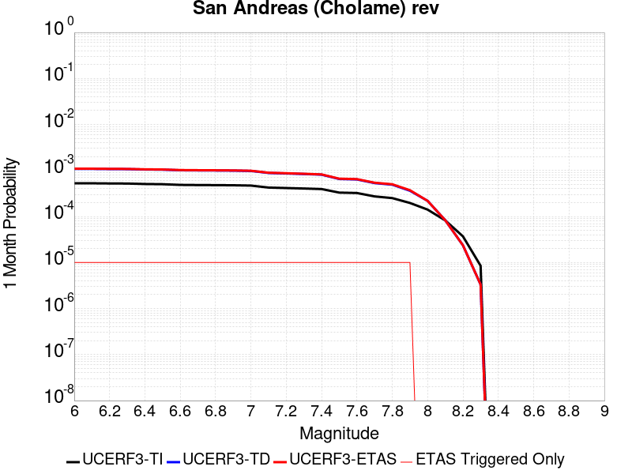 |  |  |

| Magnitude | 1 wk TI Prob | 1 wk TD Prob | 1 wk ETAS Prob | 1 wk ETAS/TD Gain | 1 wk ETAS Triggered Only | 1 mo TI Prob | 1 mo TD Prob | 1 mo ETAS Prob | 1 mo ETAS/TD Gain | 1 mo ETAS Triggered Only | 1 yr TI Prob | 1 yr TD Prob | 1 yr ETAS Prob | 1 yr ETAS/TD Gain | 1 yr ETAS Triggered Only | 10 yr TI Prob | 10 yr TD Prob | 10 yr ETAS Prob | 10 yr ETAS/TD Gain | 10 yr ETAS Triggered Only |
|-----|-----|-----|-----|-----|-----|-----|-----|-----|-----|-----|-----|-----|-----|-----|-----|-----|-----|-----|-----|-----|
| 6.0 | 1.2302514E-4 | 2.5301226E-4 | 2.5301226E-4 | 1.0 | 0.0 | 5.27144E-4 | 0.0010838893 | 0.0011142128 | 1.0279765 | 3.0356385E-5 | 0.0063991086 | 0.013117016 | 0.013206891 | 1.0068518 | 9.106915E-5 | 0.06217949 | 0.12479458 | 0.124953985 | 1.0012773 | 1.821383E-4 |
| 6.1 | 1.2302514E-4 | 2.5301226E-4 | 2.5301226E-4 | 1.0 | 0.0 | 5.27144E-4 | 0.0010838893 | 0.0011142128 | 1.0279765 | 3.0356385E-5 | 0.0063991086 | 0.013117016 | 0.013206891 | 1.0068518 | 9.106915E-5 | 0.06217949 | 0.12479458 | 0.124953985 | 1.0012773 | 1.821383E-4 |
| 6.2 | 1.2203569E-4 | 2.5117898E-4 | 2.5117898E-4 | 1.0 | 0.0 | 5.2290526E-4 | 0.0010760389 | 0.0011063627 | 1.0281808 | 3.0356385E-5 | 0.006347804 | 0.013022584 | 0.013112467 | 1.0069021 | 9.106915E-5 | 0.061695136 | 0.12398066 | 0.12414022 | 1.001287 | 1.821383E-4 |
| 6.3 | 1.2142645E-4 | 2.5003796E-4 | 2.5003796E-4 | 1.0 | 0.0 | 5.202953E-4 | 0.0010711529 | 0.0011014767 | 1.0283096 | 3.0356385E-5 | 0.006316212 | 0.012963806 | 0.013053695 | 1.0069338 | 9.106915E-5 | 0.06139677 | 0.12347472 | 0.12363437 | 1.001293 | 1.821383E-4 |
| 6.4 | 1.1865206E-4 | 2.4508737E-4 | 2.4508737E-4 | 1.0 | 0.0 | 5.0840975E-4 | 0.0010499532 | 0.0010802777 | 1.0288818 | 3.0356385E-5 | 0.006172335 | 0.012708736 | 0.012798647 | 1.0070748 | 9.106915E-5 | 0.060036868 | 0.121266164 | 0.12139954 | 1.0010998 | 1.5178192E-4 |
| 6.5 | 1.17443946E-4 | 2.4301645E-4 | 2.4301645E-4 | 1.0 | 0.0 | 5.032341E-4 | 0.0010410849 | 0.0010714097 | 1.0291281 | 3.0356385E-5 | 0.006109677 | 0.012602015 | 0.012691937 | 1.0071355 | 9.106915E-5 | 0.059444077 | 0.12033925 | 0.120472774 | 1.0011095 | 1.5178192E-4 |
| 6.6 | 1.13579066E-4 | 2.3609491E-4 | 2.3609491E-4 | 1.0 | 0.0 | 4.866766E-4 | 0.0010114445 | 0.0010417702 | 1.0299826 | 3.0356385E-5 | 0.0059092017 | 0.012245254 | 0.012335207 | 1.007346 | 9.106915E-5 | 0.057545185 | 0.117250346 | 0.11738433 | 1.0011427 | 1.5178192E-4 |
| 6.7 | 1.1271412E-4 | 2.3453572E-4 | 2.3453572E-4 | 1.0 | 0.0 | 4.829711E-4 | 0.0010047674 | 0.0010350933 | 1.030182 | 3.0356385E-5 | 0.005864331 | 0.01216487 | 0.012254831 | 1.0073951 | 9.106915E-5 | 0.057119697 | 0.11655333 | 0.116687424 | 1.0011505 | 1.5178192E-4 |
| 6.8 | 1.1217975E-4 | 2.3341762E-4 | 2.3341762E-4 | 1.0 | 0.0 | 4.8068175E-4 | 9.999792E-4 | 0.0010303053 | 1.0303266 | 3.0356385E-5 | 0.005836608 | 0.012107224 | 0.01219719 | 1.0074308 | 9.106915E-5 | 0.056856725 | 0.116050914 | 0.116185084 | 1.0011561 | 1.5178192E-4 |
| 6.9 | 1.1146753E-4 | 2.3190254E-4 | 2.3190254E-4 | 1.0 | 0.0 | 4.7763053E-4 | 9.93491E-4 | 0.0010238172 | 1.030525 | 3.0356385E-5 | 0.0057996577 | 0.012029105 | 0.012119078 | 1.0074797 | 9.106915E-5 | 0.056506127 | 0.115370646 | 0.11550491 | 1.0011638 | 1.5178192E-4 |
| 7.0 | 1.0965793E-4 | 2.2812837E-4 | 2.2812837E-4 | 1.0 | 0.0 | 4.698779E-4 | 9.773282E-4 | 0.0010076548 | 1.0310302 | 3.0356385E-5 | 0.005705768 | 0.011834476 | 0.011924468 | 1.0076041 | 9.106915E-5 | 0.055614736 | 0.113670014 | 0.11380454 | 1.0011835 | 1.5178192E-4 |
| 7.1 | 9.927982E-5 | 2.0628411E-4 | 2.0628411E-4 | 1.0 | 0.0 | 4.2541555E-4 | 8.837762E-4 | 9.141058E-4 | 1.0343181 | 3.0356385E-5 | 0.0051671406 | 0.010707187 | 0.01079728 | 1.0084144 | 9.106915E-5 | 0.05048634 | 0.10375505 | 0.10389108 | 1.0013111 | 1.5178192E-4 |
| 7.2 | 9.696786E-5 | 2.0132023E-4 | 2.0132023E-4 | 1.0 | 0.0 | 4.1551032E-4 | 8.6251675E-4 | 8.9284696E-4 | 1.0351647 | 3.0356385E-5 | 0.00504711 | 0.010450863 | 0.01054098 | 1.008623 | 9.106915E-5 | 0.04934009 | 0.10149143 | 0.101627804 | 1.0013437 | 1.5178192E-4 |
| 7.3 | 9.4727984E-5 | 1.9559902E-4 | 1.9559902E-4 | 1.0 | 0.0 | 4.0591392E-4 | 8.380132E-4 | 8.683441E-4 | 1.0361938 | 3.0356385E-5 | 0.0049308087 | 0.010155352 | 0.0102454955 | 1.0088766 | 9.106915E-5 | 0.048228268 | 0.09885787 | 0.09899465 | 1.0013835 | 1.5178192E-4 |
| 7.4 | 9.220358E-5 | 1.8928824E-4 | 1.8928824E-4 | 1.0 | 0.0 | 3.9509835E-4 | 8.1098406E-4 | 8.4131584E-4 | 1.0374012 | 3.0356385E-5 | 0.004799717 | 0.00982928 | 0.009919454 | 1.009174 | 9.106915E-5 | 0.046973653 | 0.0959303 | 0.096067525 | 1.0014304 | 1.5178192E-4 |
| 7.5 | 7.71631E-5 | 1.5252932E-4 | 1.5252932E-4 | 1.0 | 0.0 | 3.306571E-4 | 6.535335E-4 | 6.8387005E-4 | 1.0464193 | 3.0356385E-5 | 0.0040183207 | 0.0079278145 | 0.008018161 | 1.0113962 | 9.106915E-5 | 0.03946433 | 0.07862106 | 0.07873294 | 1.001423 | 1.2142554E-4 |
| 7.6 | 7.5634416E-5 | 1.4911414E-4 | 1.4911414E-4 | 1.0 | 0.0 | 3.241072E-4 | 6.389043E-4 | 6.6924124E-4 | 1.0474828 | 3.0356385E-5 | 0.0039388672 | 0.0077509843 | 0.007841348 | 1.0116583 | 9.106915E-5 | 0.038697794 | 0.076980904 | 0.07709298 | 1.0014559 | 1.2142554E-4 |
| 7.7 | 6.3783E-5 | 1.2425019E-4 | 1.2425019E-4 | 1.0 | 0.0 | 2.7332708E-4 | 5.323922E-4 | 5.627324E-4 | 1.0569885 | 3.0356385E-5 | 0.0033226798 | 0.006462638 | 0.006522958 | 1.0093337 | 6.071277E-5 | 0.032734364 | 0.0648433 | 0.06490008 | 1.0008756 | 6.071277E-5 |
| 7.8 | 5.863422E-5 | 1.1476381E-4 | 1.1476381E-4 | 1.0 | 0.0 | 2.512653E-4 | 4.9175223E-4 | 5.220937E-4 | 1.0617007 | 3.0356385E-5 | 0.003054864 | 0.005970669 | 0.006031019 | 1.0101078 | 6.071277E-5 | 0.030132094 | 0.059935976 | 0.059993047 | 1.0009522 | 6.071277E-5 |
| 7.9 | 4.595283E-5 | 8.470392E-5 | 8.470392E-5 | 1.0 | 0.0 | 1.9692584E-4 | 3.629663E-4 | 3.9331167E-4 | 1.0836039 | 3.0356385E-5 | 0.0023949358 | 0.004410167 | 0.0044403896 | 1.0068529 | 3.0356385E-5 | 0.023692891 | 0.04457013 | 0.04459913 | 1.0006508 | 3.0356385E-5 |
| 8.0 | 3.2950178E-5 | 5.104955E-5 | 5.104955E-5 | 1.0 | 0.0 | 1.412074E-4 | 2.1876545E-4 | 2.1876545E-4 | 1.0 | 0.0 | 0.0017178444 | 0.0026602177 | 0.0026602177 | 1.0 | 0.0 | 0.017046256 | 0.027316514 | 0.027316514 | 1.0 | 0.0 |
| 8.1 | 1.9177472E-5 | 1.9323319E-5 | 1.9323319E-5 | 1.0 | 0.0 | 8.218658E-5 | 8.2811595E-5 | 8.2811595E-5 | 1.0 | 0.0 | 0.0010001622 | 0.0010077655 | 0.0010077655 | 1.0 | 0.0 | 0.009956728 | 0.010830752 | 0.010830752 | 1.0 | 0.0 |
| 8.2 | 8.643924E-6 | 5.5269165E-6 | 5.5269165E-6 | 1.0 | 0.0 | 3.704486E-5 | 2.368657E-5 | 2.368657E-5 | 1.0 | 0.0 | 4.5092785E-4 | 2.8834594E-4 | 2.8834594E-4 | 1.0 | 0.0 | 0.0045001395 | 0.0032771796 | 0.0032771796 | 1.0 | 0.0 |
| 8.3 | 1.983087E-6 | 7.7486385E-7 | 7.7486385E-7 | 1.0 | 0.0 | 8.498917E-6 | 3.320841E-6 | 3.320841E-6 | 1.0 | 0.0 | 1.034694E-4 | 4.0430506E-5 | 4.0430506E-5 | 1.0 | 0.0 | 0.0010342124 | 4.7705657E-4 | 4.7705657E-4 | 1.0 | 0.0 |

## San Andreas (San Gorgonio Pass-Garnet HIll)
*[(top)](#table-of-contents)*

| 1 Week | 1 Month | 1 Year | 10 Year |
|-----|-----|-----|-----|
|  |  |  | 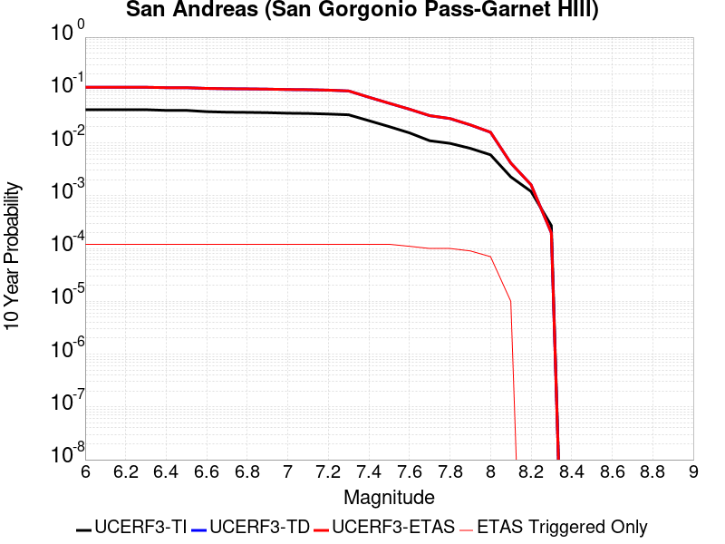 |

| Magnitude | 1 wk TI Prob | 1 wk TD Prob | 1 wk ETAS Prob | 1 wk ETAS/TD Gain | 1 wk ETAS Triggered Only | 1 mo TI Prob | 1 mo TD Prob | 1 mo ETAS Prob | 1 mo ETAS/TD Gain | 1 mo ETAS Triggered Only | 1 yr TI Prob | 1 yr TD Prob | 1 yr ETAS Prob | 1 yr ETAS/TD Gain | 1 yr ETAS Triggered Only | 10 yr TI Prob | 10 yr TD Prob | 10 yr ETAS Prob | 10 yr ETAS/TD Gain | 10 yr ETAS Triggered Only |
|-----|-----|-----|-----|-----|-----|-----|-----|-----|-----|-----|-----|-----|-----|-----|-----|-----|-----|-----|-----|-----|
| 6.0 | 8.31567E-5 | 2.3422479E-4 | 2.3422479E-4 | 1.0 | 0.0 | 3.5633717E-4 | 0.001003437 | 0.0010337628 | 1.030222 | 3.0356385E-5 | 0.004329778 | 0.012148325 | 0.012178313 | 1.0024685 | 3.0356385E-5 | 0.042463828 | 0.11274116 | 0.11290276 | 1.0014334 | 1.821383E-4 |
| 6.1 | 8.31567E-5 | 2.3422479E-4 | 2.3422479E-4 | 1.0 | 0.0 | 3.5633717E-4 | 0.001003437 | 0.0010337628 | 1.030222 | 3.0356385E-5 | 0.004329778 | 0.012148325 | 0.012178313 | 1.0024685 | 3.0356385E-5 | 0.042463828 | 0.11274116 | 0.11290276 | 1.0014334 | 1.821383E-4 |
| 6.2 | 8.31567E-5 | 2.3422479E-4 | 2.3422479E-4 | 1.0 | 0.0 | 3.5633717E-4 | 0.001003437 | 0.0010337628 | 1.030222 | 3.0356385E-5 | 0.004329778 | 0.012148325 | 0.012178313 | 1.0024685 | 3.0356385E-5 | 0.042463828 | 0.11274116 | 0.11290276 | 1.0014334 | 1.821383E-4 |
| 6.3 | 8.31567E-5 | 2.3422479E-4 | 2.3422479E-4 | 1.0 | 0.0 | 3.5633717E-4 | 0.001003437 | 0.0010337628 | 1.030222 | 3.0356385E-5 | 0.004329778 | 0.012148325 | 0.012178313 | 1.0024685 | 3.0356385E-5 | 0.042463828 | 0.11274116 | 0.11290276 | 1.0014334 | 1.821383E-4 |
| 6.4 | 8.059055E-5 | 2.2980345E-4 | 2.2980345E-4 | 1.0 | 0.0 | 3.4534236E-4 | 9.845027E-4 | 0.0010148291 | 1.0308039 | 3.0356385E-5 | 0.0041964394 | 0.011920336 | 0.011950331 | 1.0025163 | 3.0356385E-5 | 0.041180745 | 0.1107217 | 0.110883676 | 1.0014628 | 1.821383E-4 |
| 6.5 | 8.059055E-5 | 2.2980345E-4 | 2.2980345E-4 | 1.0 | 0.0 | 3.4534236E-4 | 9.845027E-4 | 0.0010148291 | 1.0308039 | 3.0356385E-5 | 0.0041964394 | 0.011920336 | 0.011950331 | 1.0025163 | 3.0356385E-5 | 0.041180745 | 0.1107217 | 0.110883676 | 1.0014628 | 1.821383E-4 |
| 6.6 | 7.619237E-5 | 2.2224057E-4 | 2.2224057E-4 | 1.0 | 0.0 | 3.2649786E-4 | 9.521143E-4 | 9.824417E-4 | 1.0318527 | 3.0356385E-5 | 0.0039678677 | 0.011530932 | 0.011560938 | 1.0026022 | 3.0356385E-5 | 0.03897764 | 0.10725754 | 0.10742014 | 1.001516 | 1.821383E-4 |
| 6.7 | 7.440636E-5 | 2.1899794E-4 | 2.1899794E-4 | 1.0 | 0.0 | 3.188454E-4 | 9.382273E-4 | 9.6855516E-4 | 1.0323247 | 3.0356385E-5 | 0.0038750346 | 0.011363627 | 0.011393639 | 1.002641 | 3.0356385E-5 | 0.038081564 | 0.10576587 | 0.10592875 | 1.00154 | 1.821383E-4 |
| 6.8 | 7.3735864E-5 | 2.1746915E-4 | 2.1746915E-4 | 1.0 | 0.0 | 3.1597257E-4 | 9.3167997E-4 | 9.620081E-4 | 1.032552 | 3.0356385E-5 | 0.0038401815 | 0.0112847425 | 0.011314756 | 1.0026597 | 3.0356385E-5 | 0.03774495 | 0.10506733 | 0.10523033 | 1.0015514 | 1.821383E-4 |
| 6.9 | 7.27575E-5 | 2.1515826E-4 | 2.1515826E-4 | 1.0 | 0.0 | 3.117806E-4 | 9.217832E-4 | 9.521116E-4 | 1.0329019 | 3.0356385E-5 | 0.003789323 | 0.01116549 | 0.011195508 | 1.0026884 | 3.0356385E-5 | 0.037253562 | 0.104015164 | 0.104178354 | 1.0015689 | 1.821383E-4 |
| 7.0 | 7.102591E-5 | 2.10997E-4 | 2.10997E-4 | 1.0 | 0.0 | 3.0436125E-4 | 9.0396166E-4 | 9.3429064E-4 | 1.0335511 | 3.0356385E-5 | 0.003699303 | 0.0109507125 | 0.010980736 | 1.0027417 | 3.0356385E-5 | 0.03638325 | 0.10211699 | 0.10228053 | 1.0016015 | 1.821383E-4 |
| 7.1 | 7.028513E-5 | 2.0935269E-4 | 2.0935269E-4 | 1.0 | 0.0 | 3.0118722E-4 | 8.969195E-4 | 9.272487E-4 | 1.0338148 | 3.0356385E-5 | 0.0036607897 | 0.010865833 | 0.010895859 | 1.0027634 | 3.0356385E-5 | 0.036010686 | 0.10135982 | 0.101523496 | 1.0016148 | 1.821383E-4 |
| 7.2 | 6.8498244E-5 | 2.0542955E-4 | 2.0542955E-4 | 1.0 | 0.0 | 2.9353087E-4 | 8.8011747E-4 | 9.1044715E-4 | 1.0344609 | 3.0356385E-5 | 0.003567883 | 0.010663286 | 0.010693318 | 1.0028164 | 3.0356385E-5 | 0.035111405 | 0.099551365 | 0.099715374 | 1.0016475 | 1.821383E-4 |
| 7.3 | 6.622592E-5 | 1.9769753E-4 | 1.9769753E-4 | 1.0 | 0.0 | 2.8379448E-4 | 8.4700214E-4 | 8.773328E-4 | 1.0358094 | 3.0356385E-5 | 0.0034497243 | 0.010263974 | 0.010294018 | 1.0029272 | 3.0356385E-5 | 0.033966612 | 0.09604639 | 0.09621104 | 1.0017142 | 1.821383E-4 |
| 7.4 | 5.1050705E-5 | 1.472159E-4 | 1.472159E-4 | 1.0 | 0.0 | 2.1877038E-4 | 6.307736E-4 | 6.6111085E-4 | 1.0480952 | 3.0356385E-5 | 0.002660276 | 0.0076528206 | 0.0076829446 | 1.0039363 | 3.0356385E-5 | 0.02628654 | 0.073003724 | 0.07317257 | 1.0023128 | 1.821383E-4 |
| 7.5 | 3.9302922E-5 | 1.1158177E-4 | 1.1158177E-4 | 1.0 | 0.0 | 1.6843023E-4 | 4.781203E-4 | 5.0846214E-4 | 1.0634607 | 3.0356385E-5 | 0.0020487092 | 0.0058056475 | 0.0058358274 | 1.0051984 | 3.0356385E-5 | 0.020299247 | 0.056134652 | 0.056306567 | 1.0030625 | 1.821383E-4 |
| 7.6 | 2.9851626E-5 | 8.520211E-5 | 8.520211E-5 | 1.0 | 0.0 | 1.2792926E-4 | 3.6510095E-4 | 3.9544623E-4 | 1.0831149 | 3.0356385E-5 | 0.0015564259 | 0.0044360696 | 0.0044662915 | 1.0068127 | 3.0356385E-5 | 0.0154556995 | 0.043306693 | 0.0434519 | 1.003353 | 1.5178192E-4 |
| 7.7 | 2.1135214E-5 | 6.375337E-5 | 6.375337E-5 | 1.0 | 0.0 | 9.0576345E-5 | 2.7320013E-4 | 3.035482E-4 | 1.1110837 | 3.0356385E-5 | 0.0011022091 | 0.0033211438 | 0.0033513992 | 1.00911 | 3.0356385E-5 | 0.010967582 | 0.032683704 | 0.032801162 | 1.0035938 | 1.2142554E-4 |
| 7.8 | 1.883379E-5 | 5.584623E-5 | 5.584623E-5 | 1.0 | 0.0 | 8.0713755E-5 | 2.3931904E-4 | 2.6966818E-4 | 1.1268145 | 3.0356385E-5 | 9.822468E-4 | 0.0029098194 | 0.0029400876 | 1.0104021 | 3.0356385E-5 | 0.0097791655 | 0.028788505 | 0.028906435 | 1.0040964 | 1.2142554E-4 |
| 7.9 | 1.5156185E-5 | 4.1827483E-5 | 4.1827483E-5 | 1.0 | 0.0 | 6.495346E-5 | 1.7924832E-4 | 2.0959927E-4 | 1.1693234 | 3.0356385E-5 | 7.9052144E-4 | 0.0021801654 | 0.0022104557 | 1.0138935 | 3.0356385E-5 | 0.007877152 | 0.021837084 | 0.021955857 | 1.005439 | 1.2142554E-4 |
| 8.0 | 1.1405907E-5 | 3.01013E-5 | 3.01013E-5 | 1.0 | 0.0 | 4.8881542E-5 | 1.289992E-4 | 1.5935166E-4 | 1.235292 | 3.0356385E-5 | 5.9497025E-4 | 0.0015694348 | 0.0015997435 | 1.0193119 | 3.0356385E-5 | 0.005933798 | 0.015831854 | 0.015921481 | 1.0056612 | 9.106915E-5 |
| 8.1 | 4.3511436E-6 | 7.415145E-6 | 7.415145E-6 | 1.0 | 0.0 | 1.8647626E-5 | 3.1778807E-5 | 3.1778807E-5 | 1.0 | 0.0 | 2.2701119E-4 | 3.868384E-4 | 3.868384E-4 | 1.0 | 0.0 | 0.0022677942 | 0.004139254 | 0.004139254 | 1.0 | 0.0 |
| 8.2 | 2.3042528E-6 | 2.7545068E-6 | 2.7545068E-6 | 1.0 | 0.0 | 9.875332E-6 | 1.1804976E-5 | 1.1804976E-5 | 1.0 | 0.0 | 1.2022553E-4 | 1.4371614E-4 | 1.4371614E-4 | 1.0 | 0.0 | 0.0012016051 | 0.001609254 | 0.001609254 | 1.0 | 0.0 |
| 8.3 | 5.202968E-7 | 3.194589E-7 | 3.194589E-7 | 1.0 | 0.0 | 2.2298414E-6 | 1.3691089E-6 | 1.3691089E-6 | 1.0 | 0.0 | 2.714798E-5 | 1.6668786E-5 | 1.6668786E-5 | 1.0 | 0.0 | 2.7144665E-4 | 1.975942E-4 | 1.975942E-4 | 1.0 | 0.0 |

## San Jacinto (San Jacinto Valley) rev
*[(top)](#table-of-contents)*

| 1 Week | 1 Month | 1 Year | 10 Year |
|-----|-----|-----|-----|
|  |  |  | 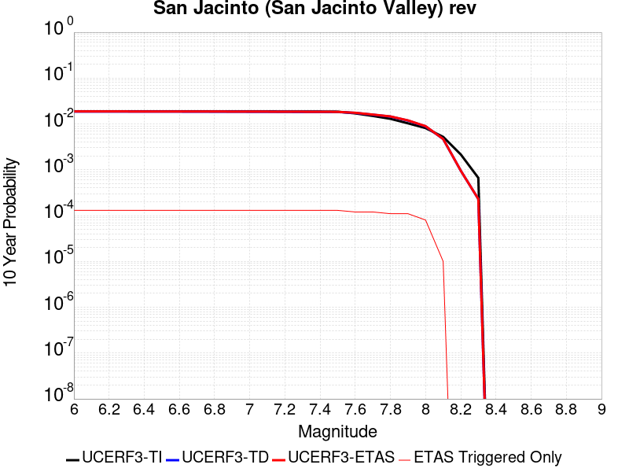 |

| Magnitude | 1 wk TI Prob | 1 wk TD Prob | 1 wk ETAS Prob | 1 wk ETAS/TD Gain | 1 wk ETAS Triggered Only | 1 mo TI Prob | 1 mo TD Prob | 1 mo ETAS Prob | 1 mo ETAS/TD Gain | 1 mo ETAS Triggered Only | 1 yr TI Prob | 1 yr TD Prob | 1 yr ETAS Prob | 1 yr ETAS/TD Gain | 1 yr ETAS Triggered Only | 10 yr TI Prob | 10 yr TD Prob | 10 yr ETAS Prob | 10 yr ETAS/TD Gain | 10 yr ETAS Triggered Only |
|-----|-----|-----|-----|-----|-----|-----|-----|-----|-----|-----|-----|-----|-----|-----|-----|-----|-----|-----|-----|-----|
| 6.0 | 3.652694E-5 | 3.455631E-5 | 3.455631E-5 | 1.0 | 0.0 | 1.5653463E-4 | 1.4809008E-4 | 1.7844197E-4 | 1.2049556 | 3.0356385E-5 | 0.0019041431 | 0.0018015072 | 0.0018924122 | 1.0504606 | 9.106915E-5 | 0.018879099 | 0.018606104 | 0.018784855 | 1.0096071 | 1.821383E-4 |
| 6.1 | 3.652694E-5 | 3.455631E-5 | 3.455631E-5 | 1.0 | 0.0 | 1.5653463E-4 | 1.4809008E-4 | 1.7844197E-4 | 1.2049556 | 3.0356385E-5 | 0.0019041431 | 0.0018015072 | 0.0018924122 | 1.0504606 | 9.106915E-5 | 0.018879099 | 0.018606104 | 0.018784855 | 1.0096071 | 1.821383E-4 |
| 6.2 | 3.652694E-5 | 3.455631E-5 | 3.455631E-5 | 1.0 | 0.0 | 1.5653463E-4 | 1.4809008E-4 | 1.7844197E-4 | 1.2049556 | 3.0356385E-5 | 0.0019041431 | 0.0018015072 | 0.0018924122 | 1.0504606 | 9.106915E-5 | 0.018879099 | 0.018606104 | 0.018784855 | 1.0096071 | 1.821383E-4 |
| 6.3 | 3.652694E-5 | 3.455631E-5 | 3.455631E-5 | 1.0 | 0.0 | 1.5653463E-4 | 1.4809008E-4 | 1.7844197E-4 | 1.2049556 | 3.0356385E-5 | 0.0019041431 | 0.0018015072 | 0.0018924122 | 1.0504606 | 9.106915E-5 | 0.018879099 | 0.018606104 | 0.018784855 | 1.0096071 | 1.821383E-4 |
| 6.4 | 3.646941E-5 | 3.447785E-5 | 3.447785E-5 | 1.0 | 0.0 | 1.5628811E-4 | 1.4775386E-4 | 1.7810575E-4 | 1.205422 | 3.0356385E-5 | 0.0019011468 | 0.001797421 | 0.0018883265 | 1.0505755 | 9.106915E-5 | 0.018849645 | 0.018565971 | 0.018744728 | 1.0096282 | 1.821383E-4 |
| 6.5 | 3.646941E-5 | 3.447785E-5 | 3.447785E-5 | 1.0 | 0.0 | 1.5628811E-4 | 1.4775386E-4 | 1.7810575E-4 | 1.205422 | 3.0356385E-5 | 0.0019011468 | 0.001797421 | 0.0018883265 | 1.0505755 | 9.106915E-5 | 0.018849645 | 0.018565971 | 0.018744728 | 1.0096282 | 1.821383E-4 |
| 6.6 | 3.6442503E-5 | 3.444122E-5 | 3.444122E-5 | 1.0 | 0.0 | 1.561728E-4 | 1.4759687E-4 | 1.7794878E-4 | 1.2056406 | 3.0356385E-5 | 0.0018997455 | 0.0017955131 | 0.0018864188 | 1.0506294 | 9.106915E-5 | 0.018835869 | 0.018547233 | 0.018725993 | 1.0096381 | 1.821383E-4 |
| 6.7 | 3.6432113E-5 | 3.4426783E-5 | 3.4426783E-5 | 1.0 | 0.0 | 1.5612828E-4 | 1.4753501E-4 | 1.7788692E-4 | 1.2057267 | 3.0356385E-5 | 0.0018992044 | 0.0017947616 | 0.0018856673 | 1.0506506 | 9.106915E-5 | 0.018830549 | 0.018539855 | 0.018718617 | 1.009642 | 1.821383E-4 |
| 6.8 | 3.6409598E-5 | 3.4395824E-5 | 3.4395824E-5 | 1.0 | 0.0 | 1.560318E-4 | 1.4740234E-4 | 1.7775426E-4 | 1.205912 | 3.0356385E-5 | 0.0018980318 | 0.001793149 | 0.0018840549 | 1.0506963 | 9.106915E-5 | 0.018819023 | 0.018524002 | 0.018702768 | 1.0096505 | 1.821383E-4 |
| 6.9 | 3.638078E-5 | 3.4356228E-5 | 3.4356228E-5 | 1.0 | 0.0 | 1.5590832E-4 | 1.4723267E-4 | 1.7758459E-4 | 1.2061493 | 3.0356385E-5 | 0.0018965311 | 0.0017910866 | 0.0018819927 | 1.0507547 | 9.106915E-5 | 0.018804269 | 0.01850373 | 0.018682497 | 1.0096612 | 1.821383E-4 |
| 7.0 | 3.6294874E-5 | 3.4238194E-5 | 3.4238194E-5 | 1.0 | 0.0 | 1.5554018E-4 | 1.4672687E-4 | 1.7707881E-4 | 1.2068601 | 3.0356385E-5 | 0.0018920569 | 0.0017849386 | 0.0018758451 | 1.0509298 | 9.106915E-5 | 0.018760284 | 0.018443286 | 0.018622065 | 1.0096935 | 1.821383E-4 |
| 7.1 | 3.6260717E-5 | 3.4194458E-5 | 3.4194458E-5 | 1.0 | 0.0 | 1.5539382E-4 | 1.4653946E-4 | 1.768914E-4 | 1.2071247 | 3.0356385E-5 | 0.001890278 | 0.0017826606 | 0.0018735675 | 1.050995 | 9.106915E-5 | 0.018742796 | 0.01842088 | 0.018599663 | 1.0097054 | 1.821383E-4 |
| 7.2 | 3.6210204E-5 | 3.412857E-5 | 3.412857E-5 | 1.0 | 0.0 | 1.5517735E-4 | 1.4625712E-4 | 1.7660906E-4 | 1.2075245 | 3.0356385E-5 | 0.001887647 | 0.0017792287 | 0.0018701359 | 1.0510936 | 9.106915E-5 | 0.01871693 | 0.018387107 | 0.018565897 | 1.0097237 | 1.821383E-4 |
| 7.3 | 3.6119454E-5 | 3.4016623E-5 | 3.4016623E-5 | 1.0 | 0.0 | 1.5478847E-4 | 1.4577739E-4 | 1.7612935E-4 | 1.2082076 | 3.0356385E-5 | 0.0018829206 | 0.0017733976 | 0.0018643052 | 1.0512619 | 9.106915E-5 | 0.018670462 | 0.018329544 | 0.018508343 | 1.0097548 | 1.821383E-4 |
| 7.4 | 3.607848E-5 | 3.3964046E-5 | 3.3964046E-5 | 1.0 | 0.0 | 1.5461289E-4 | 1.455521E-4 | 1.7590406E-4 | 1.20853 | 3.0356385E-5 | 0.0018807866 | 0.0017706591 | 0.001861567 | 1.0513413 | 9.106915E-5 | 0.018649481 | 0.018302504 | 0.018481309 | 1.0097694 | 1.821383E-4 |
| 7.5 | 3.5856774E-5 | 3.3772754E-5 | 3.3772754E-5 | 1.0 | 0.0 | 1.5366284E-4 | 1.4473236E-4 | 1.7508435E-4 | 1.2097112 | 3.0356385E-5 | 0.0018692396 | 0.0017606949 | 0.0018516037 | 1.0516323 | 9.106915E-5 | 0.018535944 | 0.018203052 | 0.018381875 | 1.0098238 | 1.821383E-4 |
| 7.6 | 3.286655E-5 | 3.228726E-5 | 3.228726E-5 | 1.0 | 0.0 | 1.4084904E-4 | 1.3836664E-4 | 1.6871883E-4 | 1.2193606 | 3.0356385E-5 | 0.001713488 | 0.0016833142 | 0.0017439248 | 1.0360067 | 6.071277E-5 | 0.017003361 | 0.017418329 | 0.017567467 | 1.0085621 | 1.5178192E-4 |
| 7.7 | 2.8882527E-5 | 2.9376873E-5 | 2.9376873E-5 | 1.0 | 0.0 | 1.237764E-4 | 1.2589482E-4 | 1.5624738E-4 | 1.2410946 | 3.0356385E-5 | 0.0015059357 | 0.0015316928 | 0.0015923125 | 1.039577 | 6.071277E-5 | 0.014957713 | 0.015903201 | 0.016052568 | 1.0093924 | 1.5178192E-4 |
| 7.8 | 2.4950225E-5 | 2.6662403E-5 | 2.6662403E-5 | 1.0 | 0.0 | 1.0692515E-4 | 1.14262446E-4 | 1.4461536E-4 | 1.265642 | 3.0356385E-5 | 0.0013010362 | 0.0013902583 | 0.0014508867 | 1.0436094 | 6.071277E-5 | 0.012934455 | 0.014481823 | 0.014631406 | 1.0103291 | 1.5178192E-4 |
| 7.9 | 1.9881603E-5 | 2.1629137E-5 | 2.1629137E-5 | 1.0 | 0.0 | 8.520408E-5 | 9.2693015E-5 | 1.2304659E-4 | 1.3274634 | 3.0356385E-5 | 0.001036866 | 0.001127954 | 0.0011885983 | 1.0537648 | 6.071277E-5 | 0.010320415 | 0.011840356 | 0.01199034 | 1.0126673 | 1.5178192E-4 |
| 8.0 | 1.563292E-5 | 1.603562E-5 | 1.603562E-5 | 1.0 | 0.0 | 6.6996516E-5 | 6.872228E-5 | 6.872228E-5 | 1.0 | 0.0 | 8.153773E-4 | 8.3637325E-4 | 8.3637325E-4 | 1.0 | 0.0 | 0.00812392 | 0.00886222 | 0.008952482 | 1.010185 | 9.106915E-5 |
| 8.1 | 1.0045313E-5 | 8.359553E-6 | 8.359553E-6 | 1.0 | 0.0 | 4.305063E-5 | 3.5826168E-5 | 3.5826168E-5 | 1.0 | 0.0 | 5.2401534E-4 | 4.3609683E-4 | 4.3609683E-4 | 1.0 | 0.0 | 0.0052278144 | 0.0046901475 | 0.0046901475 | 1.0 | 0.0 |
| 8.2 | 4.1554413E-6 | 1.5821415E-6 | 1.5821415E-6 | 1.0 | 0.0 | 1.7808914E-5 | 6.780589E-6 | 6.780589E-6 | 1.0 | 0.0 | 2.1680194E-4 | 8.255057E-5 | 8.255057E-5 | 1.0 | 0.0 | 0.0021659054 | 9.57762E-4 | 9.57762E-4 | 1.0 | 0.0 |
| 8.3 | 1.2758221E-6 | 3.6600784E-7 | 3.6600784E-7 | 1.0 | 0.0 | 5.4677976E-6 | 1.5686041E-6 | 1.5686041E-6 | 1.0 | 0.0 | 6.65684E-5 | 1.9097592E-5 | 1.9097592E-5 | 1.0 | 0.0 | 6.6548464E-4 | 2.301609E-4 | 2.301609E-4 | 1.0 | 0.0 |

## San Andreas (Big Bend)
*[(top)](#table-of-contents)*

| 1 Week | 1 Month | 1 Year | 10 Year |
|-----|-----|-----|-----|
|  |  | 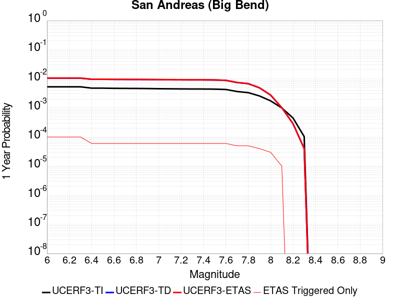 |  |

| Magnitude | 1 wk TI Prob | 1 wk TD Prob | 1 wk ETAS Prob | 1 wk ETAS/TD Gain | 1 wk ETAS Triggered Only | 1 mo TI Prob | 1 mo TD Prob | 1 mo ETAS Prob | 1 mo ETAS/TD Gain | 1 mo ETAS Triggered Only | 1 yr TI Prob | 1 yr TD Prob | 1 yr ETAS Prob | 1 yr ETAS/TD Gain | 1 yr ETAS Triggered Only | 10 yr TI Prob | 10 yr TD Prob | 10 yr ETAS Prob | 10 yr ETAS/TD Gain | 10 yr ETAS Triggered Only |
|-----|-----|-----|-----|-----|-----|-----|-----|-----|-----|-----|-----|-----|-----|-----|-----|-----|-----|-----|-----|-----|
| 6.0 | 1.0179969E-4 | 2.0157539E-4 | 2.0157539E-4 | 1.0 | 0.0 | 4.362114E-4 | 8.6360954E-4 | 8.939397E-4 | 1.0351202 | 3.0356385E-5 | 0.0052979486 | 0.0104640415 | 0.010614235 | 1.0143533 | 1.5178192E-4 | 0.051734097 | 0.101820305 | 0.1019839 | 1.0016067 | 1.821383E-4 |
| 6.1 | 1.0179969E-4 | 2.0157539E-4 | 2.0157539E-4 | 1.0 | 0.0 | 4.362114E-4 | 8.6360954E-4 | 8.939397E-4 | 1.0351202 | 3.0356385E-5 | 0.0052979486 | 0.0104640415 | 0.010614235 | 1.0143533 | 1.5178192E-4 | 0.051734097 | 0.101820305 | 0.1019839 | 1.0016067 | 1.821383E-4 |
| 6.2 | 1.0179969E-4 | 2.0157539E-4 | 2.0157539E-4 | 1.0 | 0.0 | 4.362114E-4 | 8.6360954E-4 | 8.939397E-4 | 1.0351202 | 3.0356385E-5 | 0.0052979486 | 0.0104640415 | 0.010614235 | 1.0143533 | 1.5178192E-4 | 0.051734097 | 0.101820305 | 0.1019839 | 1.0016067 | 1.821383E-4 |
| 6.3 | 1.0179969E-4 | 2.0157539E-4 | 2.0157539E-4 | 1.0 | 0.0 | 4.362114E-4 | 8.6360954E-4 | 8.939397E-4 | 1.0351202 | 3.0356385E-5 | 0.0052979486 | 0.0104640415 | 0.010614235 | 1.0143533 | 1.5178192E-4 | 0.051734097 | 0.101820305 | 0.1019839 | 1.0016067 | 1.821383E-4 |
| 6.4 | 9.1639464E-5 | 1.8513134E-4 | 1.8513134E-4 | 1.0 | 0.0 | 3.9268145E-4 | 7.93179E-4 | 8.235113E-4 | 1.0382414 | 3.0356385E-5 | 0.0047704205 | 0.009614314 | 0.009704508 | 1.0093812 | 9.106915E-5 | 0.046693064 | 0.09414245 | 0.094252445 | 1.0011684 | 1.2142554E-4 |
| 6.5 | 9.1639464E-5 | 1.8513134E-4 | 1.8513134E-4 | 1.0 | 0.0 | 3.9268145E-4 | 7.93179E-4 | 8.235113E-4 | 1.0382414 | 3.0356385E-5 | 0.0047704205 | 0.009614314 | 0.009704508 | 1.0093812 | 9.106915E-5 | 0.046693064 | 0.09414245 | 0.094252445 | 1.0011684 | 1.2142554E-4 |
| 6.6 | 9.042622E-5 | 1.8319985E-4 | 1.8319985E-4 | 1.0 | 0.0 | 3.8748336E-4 | 7.8490615E-4 | 8.152387E-4 | 1.0386448 | 3.0356385E-5 | 0.0047074095 | 0.009514474 | 0.009604677 | 1.0094806 | 9.106915E-5 | 0.046089325 | 0.09323598 | 0.09334608 | 1.0011809 | 1.2142554E-4 |
| 6.7 | 8.9836685E-5 | 1.823425E-4 | 1.823425E-4 | 1.0 | 0.0 | 3.8495753E-4 | 7.81234E-4 | 8.115667E-4 | 1.0388266 | 3.0356385E-5 | 0.00467679 | 0.0094701545 | 0.0095603615 | 1.0095254 | 9.106915E-5 | 0.045795817 | 0.09283008 | 0.09294023 | 1.0011866 | 1.2142554E-4 |
| 6.8 | 8.9471854E-5 | 1.8180953E-4 | 1.8180953E-4 | 1.0 | 0.0 | 3.8339442E-4 | 7.789512E-4 | 8.09284E-4 | 1.0389404 | 3.0356385E-5 | 0.004657841 | 0.009442603 | 0.009532812 | 1.0095534 | 9.106915E-5 | 0.04561414 | 0.09257703 | 0.09268721 | 1.0011902 | 1.2142554E-4 |
| 6.9 | 8.858234E-5 | 1.806279E-4 | 1.806279E-4 | 1.0 | 0.0 | 3.7958333E-4 | 7.738901E-4 | 8.04223E-4 | 1.0391953 | 3.0356385E-5 | 0.004611638 | 0.009381516 | 0.00947173 | 1.0096163 | 9.106915E-5 | 0.04517103 | 0.09201675 | 0.092127 | 1.0011982 | 1.2142554E-4 |
| 7.0 | 8.7433385E-5 | 1.790138E-4 | 1.790138E-4 | 1.0 | 0.0 | 3.746607E-4 | 7.669766E-4 | 7.9730974E-4 | 1.0395489 | 3.0356385E-5 | 0.004551957 | 0.009298065 | 0.009388288 | 1.0097034 | 9.106915E-5 | 0.044598386 | 0.091250524 | 0.09136087 | 1.0012093 | 1.2142554E-4 |
| 7.1 | 8.684964E-5 | 1.7813202E-4 | 1.7813202E-4 | 1.0 | 0.0 | 3.7215967E-4 | 7.631998E-4 | 7.93533E-4 | 1.0397447 | 3.0356385E-5 | 0.0045216335 | 0.009252474 | 0.0093427 | 1.0097516 | 9.106915E-5 | 0.04430731 | 0.09083163 | 0.090942025 | 1.0012153 | 1.2142554E-4 |
| 7.2 | 8.606521E-5 | 1.7703685E-4 | 1.7703685E-4 | 1.0 | 0.0 | 3.6879873E-4 | 7.585089E-4 | 7.8884227E-4 | 1.0399908 | 3.0356385E-5 | 0.0044808835 | 0.0091958465 | 0.009286078 | 1.0098122 | 9.106915E-5 | 0.043916024 | 0.09031174 | 0.090422206 | 1.0012231 | 1.2142554E-4 |
| 7.3 | 8.568266E-5 | 1.7645536E-4 | 1.7645536E-4 | 1.0 | 0.0 | 3.6715972E-4 | 7.560183E-4 | 7.863517E-4 | 1.0401226 | 3.0356385E-5 | 0.0044610105 | 0.009165778 | 0.009256012 | 1.0098447 | 9.106915E-5 | 0.043725148 | 0.09003232 | 0.09014281 | 1.0012273 | 1.2142554E-4 |
| 7.4 | 8.5432206E-5 | 1.7608024E-4 | 1.7608024E-4 | 1.0 | 0.0 | 3.6608664E-4 | 7.544115E-4 | 7.8474503E-4 | 1.0402081 | 3.0356385E-5 | 0.004447999 | 0.00914638 | 0.009236616 | 1.0098658 | 9.106915E-5 | 0.043600157 | 0.08985212 | 0.08996263 | 1.00123 | 1.2142554E-4 |
| 7.5 | 8.4791965E-5 | 1.747701E-4 | 1.747701E-4 | 1.0 | 0.0 | 3.633435E-4 | 7.487999E-4 | 7.791336E-4 | 1.0405097 | 3.0356385E-5 | 0.0044147377 | 0.00907863 | 0.009168873 | 1.00994 | 9.106915E-5 | 0.043280575 | 0.08922856 | 0.08933915 | 1.0012394 | 1.2142554E-4 |
| 7.6 | 8.241105E-5 | 1.6921063E-4 | 1.6921063E-4 | 1.0 | 0.0 | 3.531424E-4 | 7.24987E-4 | 7.553214E-4 | 1.0418413 | 3.0356385E-5 | 0.0042910352 | 0.0087910835 | 0.008881352 | 1.0102682 | 9.106915E-5 | 0.042091176 | 0.08660081 | 0.08671172 | 1.0012807 | 1.2142554E-4 |
| 7.7 | 7.00432E-5 | 1.4277258E-4 | 1.4277258E-4 | 1.0 | 0.0 | 3.001506E-4 | 6.1173906E-4 | 6.420769E-4 | 1.0495927 | 3.0356385E-5 | 0.0036482112 | 0.0074225287 | 0.007482791 | 1.0081189 | 6.071277E-5 | 0.035888977 | 0.07384562 | 0.07390185 | 1.0007614 | 6.071277E-5 |
| 7.8 | 6.415362E-5 | 1.3034545E-4 | 1.3034545E-4 | 1.0 | 0.0 | 2.749151E-4 | 5.585038E-4 | 5.8884325E-4 | 1.0543227 | 3.0356385E-5 | 0.0033419547 | 0.0067786137 | 0.006838915 | 1.0088958 | 6.071277E-5 | 0.03292141 | 0.0675504 | 0.06760701 | 1.000838 | 6.071277E-5 |
| 7.9 | 4.939911E-5 | 9.388254E-5 | 9.388254E-5 | 1.0 | 0.0 | 2.116933E-4 | 4.022917E-4 | 4.326359E-4 | 1.0754282 | 3.0356385E-5 | 0.0025743195 | 0.0048869113 | 0.004917119 | 1.0061814 | 3.0356385E-5 | 0.025447013 | 0.049135223 | 0.049164087 | 1.0005875 | 3.0356385E-5 |
| 8.0 | 3.344983E-5 | 5.2508483E-5 | 5.2508483E-5 | 1.0 | 0.0 | 1.4334853E-4 | 2.2501696E-4 | 2.2501696E-4 | 1.0 | 0.0 | 0.0017438711 | 0.0027361414 | 0.0027361414 | 1.0 | 0.0 | 0.017302496 | 0.028060736 | 0.028060736 | 1.0 | 0.0 |
| 8.1 | 1.9104898E-5 | 1.931098E-5 | 1.931098E-5 | 1.0 | 0.0 | 8.1875565E-5 | 8.275873E-5 | 8.275873E-5 | 1.0 | 0.0 | 9.963791E-4 | 0.0010071225 | 0.0010071225 | 1.0 | 0.0 | 0.009919235 | 0.010822252 | 0.010822252 | 1.0 | 0.0 |
| 8.2 | 8.643924E-6 | 5.5269165E-6 | 5.5269165E-6 | 1.0 | 0.0 | 3.704486E-5 | 2.368657E-5 | 2.368657E-5 | 1.0 | 0.0 | 4.5092785E-4 | 2.8834594E-4 | 2.8834594E-4 | 1.0 | 0.0 | 0.0045001395 | 0.0032771796 | 0.0032771796 | 1.0 | 0.0 |
| 8.3 | 1.983087E-6 | 7.7486385E-7 | 7.7486385E-7 | 1.0 | 0.0 | 8.498917E-6 | 3.320841E-6 | 3.320841E-6 | 1.0 | 0.0 | 1.034694E-4 | 4.0430506E-5 | 4.0430506E-5 | 1.0 | 0.0 | 0.0010342124 | 4.7705657E-4 | 4.7705657E-4 | 1.0 | 0.0 |

## San Andreas (Carrizo) rev
*[(top)](#table-of-contents)*

| 1 Week | 1 Month | 1 Year | 10 Year |
|-----|-----|-----|-----|
| 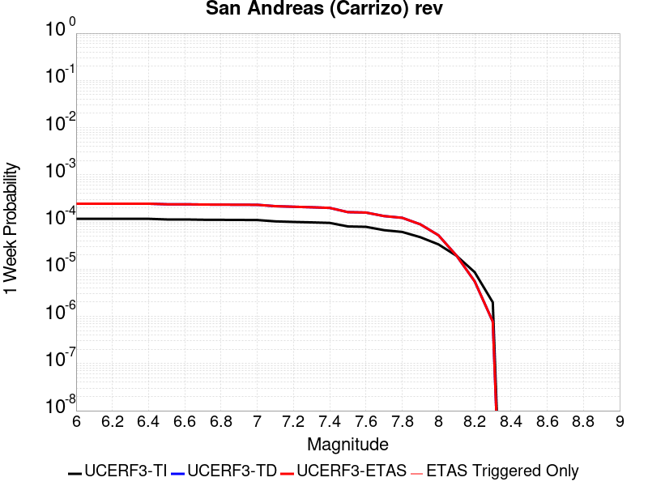 | 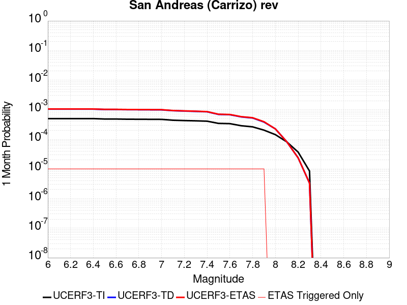 |  |  |

| Magnitude | 1 wk TI Prob | 1 wk TD Prob | 1 wk ETAS Prob | 1 wk ETAS/TD Gain | 1 wk ETAS Triggered Only | 1 mo TI Prob | 1 mo TD Prob | 1 mo ETAS Prob | 1 mo ETAS/TD Gain | 1 mo ETAS Triggered Only | 1 yr TI Prob | 1 yr TD Prob | 1 yr ETAS Prob | 1 yr ETAS/TD Gain | 1 yr ETAS Triggered Only | 10 yr TI Prob | 10 yr TD Prob | 10 yr ETAS Prob | 10 yr ETAS/TD Gain | 10 yr ETAS Triggered Only |
|-----|-----|-----|-----|-----|-----|-----|-----|-----|-----|-----|-----|-----|-----|-----|-----|-----|-----|-----|-----|-----|
| 6.0 | 1.1674632E-4 | 2.4418926E-4 | 2.4418926E-4 | 1.0 | 0.0 | 5.002454E-4 | 0.0010461073 | 0.0010764318 | 1.0289881 | 3.0356385E-5 | 0.006073493 | 0.012662465 | 0.012752381 | 1.0071009 | 9.106915E-5 | 0.0591016 | 0.12101763 | 0.12115104 | 1.0011024 | 1.5178192E-4 |
| 6.1 | 1.1674632E-4 | 2.4418926E-4 | 2.4418926E-4 | 1.0 | 0.0 | 5.002454E-4 | 0.0010461073 | 0.0010764318 | 1.0289881 | 3.0356385E-5 | 0.006073493 | 0.012662465 | 0.012752381 | 1.0071009 | 9.106915E-5 | 0.0591016 | 0.12101763 | 0.12115104 | 1.0011024 | 1.5178192E-4 |
| 6.2 | 1.1674632E-4 | 2.4418926E-4 | 2.4418926E-4 | 1.0 | 0.0 | 5.002454E-4 | 0.0010461073 | 0.0010764318 | 1.0289881 | 3.0356385E-5 | 0.006073493 | 0.012662465 | 0.012752381 | 1.0071009 | 9.106915E-5 | 0.0591016 | 0.12101763 | 0.12115104 | 1.0011024 | 1.5178192E-4 |
| 6.3 | 1.1674632E-4 | 2.4418926E-4 | 2.4418926E-4 | 1.0 | 0.0 | 5.002454E-4 | 0.0010461073 | 0.0010764318 | 1.0289881 | 3.0356385E-5 | 0.006073493 | 0.012662465 | 0.012752381 | 1.0071009 | 9.106915E-5 | 0.0591016 | 0.12101763 | 0.12115104 | 1.0011024 | 1.5178192E-4 |
| 6.4 | 1.1674632E-4 | 2.4418926E-4 | 2.4418926E-4 | 1.0 | 0.0 | 5.002454E-4 | 0.0010461073 | 0.0010764318 | 1.0289881 | 3.0356385E-5 | 0.006073493 | 0.012662465 | 0.012752381 | 1.0071009 | 9.106915E-5 | 0.0591016 | 0.12101763 | 0.12115104 | 1.0011024 | 1.5178192E-4 |
| 6.5 | 1.13136164E-4 | 2.3738507E-4 | 2.3738507E-4 | 1.0 | 0.0 | 4.847792E-4 | 0.0010169694 | 0.0010472949 | 1.0298195 | 3.0356385E-5 | 0.0058862255 | 0.012311762 | 0.01240171 | 1.0073059 | 9.106915E-5 | 0.057327334 | 0.11798858 | 0.11812246 | 1.0011346 | 1.5178192E-4 |
| 6.6 | 1.13136164E-4 | 2.3738507E-4 | 2.3738507E-4 | 1.0 | 0.0 | 4.847792E-4 | 0.0010169694 | 0.0010472949 | 1.0298195 | 3.0356385E-5 | 0.0058862255 | 0.012311762 | 0.01240171 | 1.0073059 | 9.106915E-5 | 0.057327334 | 0.11798858 | 0.11812246 | 1.0011346 | 1.5178192E-4 |
| 6.7 | 1.1149675E-4 | 2.3429535E-4 | 2.3429535E-4 | 1.0 | 0.0 | 4.777557E-4 | 0.001003738 | 0.001034064 | 1.030213 | 3.0356385E-5 | 0.0058011734 | 0.012152475 | 0.012242437 | 1.0074028 | 9.106915E-5 | 0.05652051 | 0.11660991 | 0.116744 | 1.0011499 | 1.5178192E-4 |
| 6.8 | 1.1103589E-4 | 2.3331578E-4 | 2.3331578E-4 | 1.0 | 0.0 | 4.7578133E-4 | 9.995431E-4 | 0.0010298691 | 1.03034 | 3.0356385E-5 | 0.005777263 | 0.012101971 | 0.012191937 | 1.0074341 | 9.106915E-5 | 0.056293584 | 0.11616996 | 0.11630411 | 1.0011548 | 1.5178192E-4 |
| 6.9 | 1.1053259E-4 | 2.3223832E-4 | 2.3223832E-4 | 1.0 | 0.0 | 4.7362508E-4 | 9.94929E-4 | 0.0010252552 | 1.0304807 | 3.0356385E-5 | 0.0057511497 | 0.012046416 | 0.012136389 | 1.0074688 | 9.106915E-5 | 0.05604569 | 0.11568588 | 0.1158201 | 1.0011603 | 1.5178192E-4 |
| 7.0 | 1.1005377E-4 | 2.3124556E-4 | 2.3124556E-4 | 1.0 | 0.0 | 4.7157376E-4 | 9.906775E-4 | 0.0010210038 | 1.0306116 | 3.0356385E-5 | 0.0057263062 | 0.011995226 | 0.012085202 | 1.007501 | 9.106915E-5 | 0.055809796 | 0.115237914 | 0.1153722 | 1.0011654 | 1.5178192E-4 |
| 7.1 | 1.0308142E-4 | 2.1632477E-4 | 2.1632477E-4 | 1.0 | 0.0 | 4.417027E-4 | 9.267778E-4 | 9.5710607E-4 | 1.0327244 | 3.0356385E-5 | 0.0053644776 | 0.01122546 | 0.011315507 | 1.0080217 | 9.106915E-5 | 0.052368138 | 0.108490154 | 0.10862547 | 1.0012473 | 1.5178192E-4 |
| 7.2 | 1.0027479E-4 | 2.1039638E-4 | 2.1039638E-4 | 1.0 | 0.0 | 4.296783E-4 | 9.013882E-4 | 9.3171716E-4 | 1.0336471 | 3.0356385E-5 | 0.0052187922 | 0.01091948 | 0.011009554 | 1.008249 | 9.106915E-5 | 0.050979212 | 0.105792396 | 0.105928116 | 1.0012829 | 1.5178192E-4 |
| 7.3 | 9.816942E-5 | 2.0513569E-4 | 2.0513569E-4 | 1.0 | 0.0 | 4.2065824E-4 | 8.7885774E-4 | 9.091874E-4 | 1.0345104 | 3.0356385E-5 | 0.005109493 | 0.010647885 | 0.010737984 | 1.0084617 | 9.106915E-5 | 0.049935985 | 0.10337204 | 0.10350813 | 1.0013165 | 1.5178192E-4 |
| 7.4 | 9.5634205E-5 | 1.9881417E-4 | 1.9881417E-4 | 1.0 | 0.0 | 4.0979648E-4 | 8.5178344E-4 | 8.82114E-4 | 1.0356083 | 3.0356385E-5 | 0.0049778637 | 0.010321417 | 0.010411547 | 1.0087322 | 9.106915E-5 | 0.048678253 | 0.100452885 | 0.100589424 | 1.0013592 | 1.5178192E-4 |
| 7.5 | 8.052417E-5 | 1.6191212E-4 | 1.6191212E-4 | 1.0 | 0.0 | 3.4505792E-4 | 6.9372467E-4 | 7.2406E-4 | 1.0437282 | 3.0356385E-5 | 0.0041929903 | 0.008413471 | 0.008503774 | 1.0107331 | 9.106915E-5 | 0.04114753 | 0.083160356 | 0.08327169 | 1.0013387 | 1.2142554E-4 |
| 7.6 | 7.897024E-5 | 1.5843454E-4 | 1.5843454E-4 | 1.0 | 0.0 | 3.384E-4 | 6.788286E-4 | 7.091644E-4 | 1.0446885 | 3.0356385E-5 | 0.0041122385 | 0.008233497 | 0.008323817 | 1.0109698 | 9.106915E-5 | 0.040369697 | 0.08149801 | 0.08160955 | 1.0013685 | 1.2142554E-4 |
| 7.7 | 6.707427E-5 | 1.3346E-4 | 1.3346E-4 | 1.0 | 0.0 | 2.8742946E-4 | 5.718461E-4 | 6.021851E-4 | 1.0530546 | 3.0356385E-5 | 0.003493839 | 0.0069400338 | 0.0070003252 | 1.0086875 | 6.071277E-5 | 0.034394164 | 0.06936544 | 0.06942194 | 1.0008146 | 6.071277E-5 |
| 7.8 | 6.147705E-5 | 1.226075E-4 | 1.226075E-4 | 1.0 | 0.0 | 2.6344648E-4 | 5.253549E-4 | 5.556953E-4 | 1.0577523 | 3.0356385E-5 | 0.0032027436 | 0.0063774628 | 0.0064377883 | 1.0094591 | 6.071277E-5 | 0.031569764 | 0.063803546 | 0.06386039 | 1.0008909 | 6.071277E-5 |
| 7.9 | 4.7636717E-5 | 8.925424E-5 | 8.925424E-5 | 1.0 | 0.0 | 2.0414138E-4 | 3.8246208E-4 | 4.1280687E-4 | 1.0793406 | 3.0356385E-5 | 0.0024825884 | 0.004646542 | 0.0046767574 | 1.0065027 | 3.0356385E-5 | 0.024550365 | 0.046842933 | 0.046871867 | 1.0006177 | 3.0356385E-5 |
| 8.0 | 3.3554235E-5 | 5.2418785E-5 | 5.2418785E-5 | 1.0 | 0.0 | 1.4379594E-4 | 2.246326E-4 | 2.246326E-4 | 1.0 | 0.0 | 0.0017493097 | 0.0027314737 | 0.0027314737 | 1.0 | 0.0 | 0.017356034 | 0.028019711 | 0.028019711 | 1.0 | 0.0 |
| 8.1 | 1.9175432E-5 | 1.9323146E-5 | 1.9323146E-5 | 1.0 | 0.0 | 8.217783E-5 | 8.281086E-5 | 8.281086E-5 | 1.0 | 0.0 | 0.0010000558 | 0.0010077565 | 0.0010077565 | 1.0 | 0.0 | 0.009955673 | 0.010830634 | 0.010830634 | 1.0 | 0.0 |
| 8.2 | 8.643924E-6 | 5.5269165E-6 | 5.5269165E-6 | 1.0 | 0.0 | 3.704486E-5 | 2.368657E-5 | 2.368657E-5 | 1.0 | 0.0 | 4.5092785E-4 | 2.8834594E-4 | 2.8834594E-4 | 1.0 | 0.0 | 0.0045001395 | 0.0032771796 | 0.0032771796 | 1.0 | 0.0 |
| 8.3 | 1.983087E-6 | 7.7486385E-7 | 7.7486385E-7 | 1.0 | 0.0 | 8.498917E-6 | 3.320841E-6 | 3.320841E-6 | 1.0 | 0.0 | 1.034694E-4 | 4.0430506E-5 | 4.0430506E-5 | 1.0 | 0.0 | 0.0010342124 | 4.7705657E-4 | 4.7705657E-4 | 1.0 | 0.0 |

## Manix-Afton Hills
*[(top)](#table-of-contents)*

| 1 Week | 1 Month | 1 Year | 10 Year |
|-----|-----|-----|-----|
|  |  |  |  |

| Magnitude | 1 wk TI Prob | 1 wk TD Prob | 1 wk ETAS Prob | 1 wk ETAS/TD Gain | 1 wk ETAS Triggered Only | 1 mo TI Prob | 1 mo TD Prob | 1 mo ETAS Prob | 1 mo ETAS/TD Gain | 1 mo ETAS Triggered Only | 1 yr TI Prob | 1 yr TD Prob | 1 yr ETAS Prob | 1 yr ETAS/TD Gain | 1 yr ETAS Triggered Only | 10 yr TI Prob | 10 yr TD Prob | 10 yr ETAS Prob | 10 yr ETAS/TD Gain | 10 yr ETAS Triggered Only |
|-----|-----|-----|-----|-----|-----|-----|-----|-----|-----|-----|-----|-----|-----|-----|-----|-----|-----|-----|-----|-----|
| 6.0 | 1.3783202E-5 | 1.4712406E-5 | 1.4712406E-5 | 1.0 | 0.0 | 5.906953E-5 | 6.3051746E-5 | 6.3051746E-5 | 1.0 | 0.0 | 7.189342E-4 | 7.6740206E-4 | 7.6740206E-4 | 1.0 | 0.0 | 0.0071661277 | 0.007649278 | 0.0077998987 | 1.0196909 | 1.5178192E-4 |
| 6.1 | 1.3783202E-5 | 1.4712406E-5 | 1.4712406E-5 | 1.0 | 0.0 | 5.906953E-5 | 6.3051746E-5 | 6.3051746E-5 | 1.0 | 0.0 | 7.189342E-4 | 7.6740206E-4 | 7.6740206E-4 | 1.0 | 0.0 | 0.0071661277 | 0.007649278 | 0.0077998987 | 1.0196909 | 1.5178192E-4 |
| 6.2 | 1.3783202E-5 | 1.4712406E-5 | 1.4712406E-5 | 1.0 | 0.0 | 5.906953E-5 | 6.3051746E-5 | 6.3051746E-5 | 1.0 | 0.0 | 7.189342E-4 | 7.6740206E-4 | 7.6740206E-4 | 1.0 | 0.0 | 0.0071661277 | 0.007649278 | 0.0077998987 | 1.0196909 | 1.5178192E-4 |
| 6.3 | 1.10494875E-5 | 1.1794191E-5 | 1.1794191E-5 | 1.0 | 0.0 | 4.7354086E-5 | 5.0545612E-5 | 5.0545612E-5 | 1.0 | 0.0 | 5.763835E-4 | 6.152294E-4 | 6.152294E-4 | 1.0 | 0.0 | 0.005748908 | 0.006136303 | 0.0062871533 | 1.0245833 | 1.5178192E-4 |
| 6.4 | 1.10494875E-5 | 1.1794191E-5 | 1.1794191E-5 | 1.0 | 0.0 | 4.7354086E-5 | 5.0545612E-5 | 5.0545612E-5 | 1.0 | 0.0 | 5.763835E-4 | 6.152294E-4 | 6.152294E-4 | 1.0 | 0.0 | 0.005748908 | 0.006136303 | 0.0062871533 | 1.0245833 | 1.5178192E-4 |
| 6.5 | 9.788949E-6 | 1.0455265E-5 | 1.0455265E-5 | 1.0 | 0.0 | 4.1951964E-5 | 4.480756E-5 | 4.480756E-5 | 1.0 | 0.0 | 5.1064545E-4 | 5.454048E-4 | 5.454048E-4 | 1.0 | 0.0 | 0.0050947363 | 0.0054415893 | 0.005592545 | 1.0277412 | 1.5178192E-4 |
| 6.6 | 8.810006E-6 | 9.414486E-6 | 9.414486E-6 | 1.0 | 0.0 | 3.775662E-5 | 4.0347222E-5 | 4.0347222E-5 | 1.0 | 0.0 | 4.5958988E-4 | 4.911256E-4 | 4.911256E-4 | 1.0 | 0.0 | 0.0045864056 | 0.004901285 | 0.005022115 | 1.0246528 | 1.2142554E-4 |
| 6.7 | 8.80128E-6 | 9.404965E-6 | 9.404965E-6 | 1.0 | 0.0 | 3.7719226E-5 | 4.030642E-5 | 4.030642E-5 | 1.0 | 0.0 | 4.591348E-4 | 4.9062906E-4 | 4.9062906E-4 | 1.0 | 0.0 | 0.004581874 | 0.004896341 | 0.0050171716 | 1.0246779 | 1.2142554E-4 |
| 6.8 | 6.8994877E-6 | 7.3807596E-6 | 7.3807596E-6 | 1.0 | 0.0 | 2.9568899E-5 | 3.163149E-5 | 3.163149E-5 | 1.0 | 0.0 | 3.5994186E-4 | 3.8505348E-4 | 3.8505348E-4 | 1.0 | 0.0 | 0.003593594 | 0.0038446684 | 0.0039353874 | 1.023596 | 9.106915E-5 |
| 6.9 | 4.9328037E-6 | 5.271442E-6 | 5.271442E-6 | 1.0 | 0.0 | 2.1140417E-5 | 2.2591734E-5 | 2.2591734E-5 | 1.0 | 0.0 | 2.5735417E-4 | 2.750258E-4 | 2.750258E-4 | 1.0 | 0.0 | 0.0025705635 | 0.0027474596 | 0.0027777327 | 1.0110185 | 3.0356385E-5 |
| 7.0 | 3.347973E-6 | 3.5903752E-6 | 3.5903752E-6 | 1.0 | 0.0 | 1.4348378E-5 | 1.5387255E-5 | 1.5387255E-5 | 1.0 | 0.0 | 1.746775E-4 | 1.8732782E-4 | 1.8732782E-4 | 1.0 | 0.0 | 0.0017454025 | 0.0018721019 | 0.0019024014 | 1.0161848 | 3.0356385E-5 |
| 7.1 | 1.2073567E-6 | 1.2936044E-6 | 1.2936044E-6 | 1.0 | 0.0 | 5.1743755E-6 | 5.5440164E-6 | 5.5440164E-6 | 1.0 | 0.0 | 6.29962E-5 | 6.7497946E-5 | 6.7497946E-5 | 1.0 | 0.0 | 6.297835E-4 | 6.749346E-4 | 7.052705E-4 | 1.0449464 | 3.0356385E-5 |

## Calico-Hidalgo
*[(top)](#table-of-contents)*

| 1 Week | 1 Month | 1 Year | 10 Year |
|-----|-----|-----|-----|
| 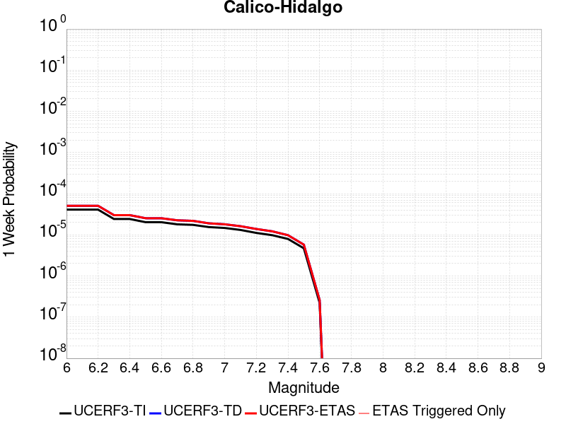 |  |  |  |

| Magnitude | 1 wk TI Prob | 1 wk TD Prob | 1 wk ETAS Prob | 1 wk ETAS/TD Gain | 1 wk ETAS Triggered Only | 1 mo TI Prob | 1 mo TD Prob | 1 mo ETAS Prob | 1 mo ETAS/TD Gain | 1 mo ETAS Triggered Only | 1 yr TI Prob | 1 yr TD Prob | 1 yr ETAS Prob | 1 yr ETAS/TD Gain | 1 yr ETAS Triggered Only | 10 yr TI Prob | 10 yr TD Prob | 10 yr ETAS Prob | 10 yr ETAS/TD Gain | 10 yr ETAS Triggered Only |
|-----|-----|-----|-----|-----|-----|-----|-----|-----|-----|-----|-----|-----|-----|-----|-----|-----|-----|-----|-----|-----|
| 6.0 | 4.0906612E-5 | 5.0713337E-5 | 5.0713337E-5 | 1.0 | 0.0 | 1.7530227E-4 | 2.1732705E-4 | 2.1732705E-4 | 1.0 | 0.0 | 0.0021322158 | 0.0026431496 | 0.0026734257 | 1.0114546 | 3.0356385E-5 | 0.02111873 | 0.026157506 | 0.026305318 | 1.0056509 | 1.5178192E-4 |
| 6.1 | 4.0906612E-5 | 5.0713337E-5 | 5.0713337E-5 | 1.0 | 0.0 | 1.7530227E-4 | 2.1732705E-4 | 2.1732705E-4 | 1.0 | 0.0 | 0.0021322158 | 0.0026431496 | 0.0026734257 | 1.0114546 | 3.0356385E-5 | 0.02111873 | 0.026157506 | 0.026305318 | 1.0056509 | 1.5178192E-4 |
| 6.2 | 4.0906612E-5 | 5.0713337E-5 | 5.0713337E-5 | 1.0 | 0.0 | 1.7530227E-4 | 2.1732705E-4 | 2.1732705E-4 | 1.0 | 0.0 | 0.0021322158 | 0.0026431496 | 0.0026734257 | 1.0114546 | 3.0356385E-5 | 0.02111873 | 0.026157506 | 0.026305318 | 1.0056509 | 1.5178192E-4 |
| 6.3 | 2.4242801E-5 | 3.0094301E-5 | 3.0094301E-5 | 1.0 | 0.0 | 1.0389358E-4 | 1.2896939E-4 | 1.2896939E-4 | 1.0 | 0.0 | 0.0012641704 | 0.0015691036 | 0.0015691036 | 1.0 | 0.0 | 0.01257003 | 0.015583925 | 0.015643692 | 1.0038352 | 6.071277E-5 |
| 6.4 | 2.4242801E-5 | 3.0094301E-5 | 3.0094301E-5 | 1.0 | 0.0 | 1.0389358E-4 | 1.2896939E-4 | 1.2896939E-4 | 1.0 | 0.0 | 0.0012641704 | 0.0015691036 | 0.0015691036 | 1.0 | 0.0 | 0.01257003 | 0.015583925 | 0.015643692 | 1.0038352 | 6.071277E-5 |
| 6.5 | 2.0286952E-5 | 2.531821E-5 | 2.531821E-5 | 1.0 | 0.0 | 8.694118E-5 | 1.085022E-4 | 1.085022E-4 | 1.0 | 0.0 | 0.0010579949 | 0.0013202309 | 0.0013202309 | 1.0 | 0.0 | 0.010529719 | 0.013125811 | 0.0131857265 | 1.0045648 | 6.071277E-5 |
| 6.6 | 2.0269223E-5 | 2.5299158E-5 | 2.5299158E-5 | 1.0 | 0.0 | 8.6865206E-5 | 1.0842055E-4 | 1.0842055E-4 | 1.0 | 0.0 | 0.0010570707 | 0.0013192381 | 0.0013192381 | 1.0 | 0.0 | 0.010520565 | 0.013116 | 0.013175916 | 1.0045682 | 6.071277E-5 |
| 6.7 | 1.799852E-5 | 2.2542603E-5 | 2.2542603E-5 | 1.0 | 0.0 | 7.713423E-5 | 9.6607655E-5 | 9.6607655E-5 | 1.0 | 0.0 | 9.3870464E-4 | 0.0011755781 | 0.0011755781 | 1.0 | 0.0 | 0.009347493 | 0.011695206 | 0.011755209 | 1.0051305 | 6.071277E-5 |
| 6.8 | 1.7458793E-5 | 2.1844051E-5 | 2.1844051E-5 | 1.0 | 0.0 | 7.4821255E-5 | 9.361408E-5 | 9.361408E-5 | 1.0 | 0.0 | 9.10568E-4 | 0.00113917 | 0.00113917 | 1.0 | 0.0 | 0.009068459 | 0.01133489 | 0.011394914 | 1.0052955 | 6.071277E-5 |
| 6.9 | 1.542884E-5 | 1.9027526E-5 | 1.9027526E-5 | 1.0 | 0.0 | 6.612192E-5 | 8.1544065E-5 | 8.1544065E-5 | 1.0 | 0.0 | 8.04737E-4 | 9.9236E-4 | 9.9236E-4 | 1.0 | 0.0 | 0.008018291 | 0.009880684 | 0.0099407965 | 1.0060838 | 6.071277E-5 |
| 7.0 | 1.468253E-5 | 1.8032079E-5 | 1.8032079E-5 | 1.0 | 0.0 | 6.292361E-5 | 7.727812E-5 | 7.727812E-5 | 1.0 | 0.0 | 7.658257E-4 | 9.4046805E-4 | 9.4046805E-4 | 1.0 | 0.0 | 0.0076319184 | 0.009366247 | 0.009426391 | 1.0064213 | 6.071277E-5 |
| 7.1 | 1.3139281E-5 | 1.6202212E-5 | 1.6202212E-5 | 1.0 | 0.0 | 5.6309986E-5 | 6.943627E-5 | 6.943627E-5 | 1.0 | 0.0 | 6.853584E-4 | 8.450713E-4 | 8.450713E-4 | 1.0 | 0.0 | 0.0068324856 | 0.008419875 | 0.008480077 | 1.0071499 | 6.071277E-5 |
| 7.2 | 1.1127404E-5 | 1.3867652E-5 | 1.3867652E-5 | 1.0 | 0.0 | 4.7688E-5 | 5.9431502E-5 | 5.9431502E-5 | 1.0 | 0.0 | 5.8044674E-4 | 7.233492E-4 | 7.233492E-4 | 1.0 | 0.0 | 0.0057893298 | 0.007211055 | 0.0072411927 | 1.0041794 | 3.0356385E-5 |
| 7.3 | 9.808154E-6 | 1.2177076E-5 | 1.2177076E-5 | 1.0 | 0.0 | 4.2034266E-5 | 5.2186486E-5 | 5.2186486E-5 | 1.0 | 0.0 | 5.11647E-4 | 6.35196E-4 | 6.35196E-4 | 1.0 | 0.0 | 0.0051047057 | 0.00633488 | 0.006365044 | 1.0047616 | 3.0356385E-5 |
| 7.4 | 7.942452E-6 | 9.792786E-6 | 9.792786E-6 | 1.0 | 0.0 | 3.4038632E-5 | 4.1968462E-5 | 4.1968462E-5 | 1.0 | 0.0 | 4.1434157E-4 | 5.108557E-4 | 5.108557E-4 | 1.0 | 0.0 | 0.0041356985 | 0.0050977548 | 0.0051279566 | 1.0059245 | 3.0356385E-5 |
| 7.5 | 4.7121216E-6 | 5.773185E-6 | 5.773185E-6 | 1.0 | 0.0 | 2.019465E-5 | 2.4742028E-5 | 2.4742028E-5 | 1.0 | 0.0 | 2.4584212E-4 | 3.0120023E-4 | 3.0120023E-4 | 1.0 | 0.0 | 0.0024557032 | 0.0030086725 | 0.0030389375 | 1.0100592 | 3.0356385E-5 |
| 7.6 | 2.21172E-7 | 2.60409E-7 | 2.60409E-7 | 1.0 | 0.0 | 9.478797E-7 | 1.1160382E-6 | 1.1160382E-6 | 1.0 | 0.0 | 1.1540374E-5 | 1.358771E-5 | 1.358771E-5 | 1.0 | 0.0 | 1.1539775E-4 | 1.3587161E-4 | 1.3587161E-4 | 1.0 | 0.0 |

## San Andreas (Parkfield)
*[(top)](#table-of-contents)*

| 1 Week | 1 Month | 1 Year | 10 Year |
|-----|-----|-----|-----|
|  |  |  |  |

| Magnitude | 1 wk TI Prob | 1 wk TD Prob | 1 wk ETAS Prob | 1 wk ETAS/TD Gain | 1 wk ETAS Triggered Only | 1 mo TI Prob | 1 mo TD Prob | 1 mo ETAS Prob | 1 mo ETAS/TD Gain | 1 mo ETAS Triggered Only | 1 yr TI Prob | 1 yr TD Prob | 1 yr ETAS Prob | 1 yr ETAS/TD Gain | 1 yr ETAS Triggered Only | 10 yr TI Prob | 10 yr TD Prob | 10 yr ETAS Prob | 10 yr ETAS/TD Gain | 10 yr ETAS Triggered Only |
|-----|-----|-----|-----|-----|-----|-----|-----|-----|-----|-----|-----|-----|-----|-----|-----|-----|-----|-----|-----|-----|
| 6.0 | 5.556969E-4 | 7.8797597E-4 | 7.8797597E-4 | 1.0 | 0.0 | 0.0023793848 | 0.003373235 | 0.003403489 | 1.0089688 | 3.0356385E-5 | 0.028586963 | 0.04067351 | 0.04073175 | 1.001432 | 6.071277E-5 | 0.25176284 | 0.33868203 | 0.3387824 | 1.0002964 | 1.5178192E-4 |
| 6.1 | 1.925858E-4 | 3.056036E-4 | 3.056036E-4 | 1.0 | 0.0 | 8.2510663E-4 | 0.0013091693 | 0.001339486 | 1.0231571 | 3.0356385E-5 | 0.0099994885 | 0.015918575 | 0.015978321 | 1.0037532 | 6.071277E-5 | 0.095613256 | 0.15041287 | 0.15051603 | 1.0006858 | 1.2142554E-4 |
| 6.2 | 9.4306815E-5 | 1.831944E-4 | 1.831944E-4 | 1.0 | 0.0 | 4.0410945E-4 | 7.8488386E-4 | 8.152164E-4 | 1.0386459 | 3.0356385E-5 | 0.0049089384 | 0.0095143 | 0.009574435 | 1.0063205 | 6.071277E-5 | 0.048019063 | 0.092186436 | 0.09229667 | 1.0011958 | 1.2142554E-4 |
| 6.3 | 9.283051E-5 | 1.8015703E-4 | 1.8015703E-4 | 1.0 | 0.0 | 3.9778434E-4 | 7.718743E-4 | 8.022073E-4 | 1.0392978 | 3.0356385E-5 | 0.0048322747 | 0.00935728 | 0.009417425 | 1.0064275 | 6.071277E-5 | 0.047285385 | 0.09083898 | 0.09094938 | 1.0012153 | 1.2142554E-4 |
| 6.4 | 9.138826E-5 | 1.7777387E-4 | 1.7777387E-4 | 1.0 | 0.0 | 3.916052E-4 | 7.6166674E-4 | 7.92E-4 | 1.0398248 | 3.0356385E-5 | 0.0047573745 | 0.009234063 | 0.009294216 | 1.0065142 | 6.071277E-5 | 0.046568092 | 0.08973953 | 0.08985006 | 1.0012317 | 1.2142554E-4 |
| 6.5 | 9.000255E-5 | 1.7534966E-4 | 1.7534966E-4 | 1.0 | 0.0 | 3.8566816E-4 | 7.512833E-4 | 7.816169E-4 | 1.0403757 | 3.0356385E-5 | 0.0046854047 | 0.00910872 | 0.00916888 | 1.0066047 | 6.071277E-5 | 0.045878403 | 0.08862388 | 0.088734545 | 1.0012487 | 1.2142554E-4 |
| 6.6 | 8.8109264E-5 | 1.7215131E-4 | 1.7215131E-4 | 1.0 | 0.0 | 3.7755648E-4 | 7.3758385E-4 | 7.6791784E-4 | 1.0411261 | 3.0356385E-5 | 0.0045870654 | 0.008943325 | 0.009003495 | 1.0067279 | 6.071277E-5 | 0.04493529 | 0.08715216 | 0.087263 | 1.0012718 | 1.2142554E-4 |
| 6.7 | 8.738073E-5 | 1.7081993E-4 | 1.7081993E-4 | 1.0 | 0.0 | 3.7443507E-4 | 7.318812E-4 | 7.6221535E-4 | 1.0414468 | 3.0356385E-5 | 0.0045492216 | 0.008874504 | 0.008934678 | 1.0067805 | 6.071277E-5 | 0.04457213 | 0.086551875 | 0.08666279 | 1.0012815 | 1.2142554E-4 |
| 6.8 | 8.710195E-5 | 1.7027321E-4 | 1.7027321E-4 | 1.0 | 0.0 | 3.7324068E-4 | 7.2953943E-4 | 7.5987366E-4 | 1.04158 | 3.0356385E-5 | 0.0045347405 | 0.008846234 | 0.008906409 | 1.0068024 | 6.071277E-5 | 0.04443313 | 0.08629888 | 0.08640983 | 1.0012856 | 1.2142554E-4 |
| 6.9 | 8.6801556E-5 | 1.696812E-4 | 1.696812E-4 | 1.0 | 0.0 | 3.7195362E-4 | 7.270036E-4 | 7.5733796E-4 | 1.0417252 | 3.0356385E-5 | 0.0045191357 | 0.00881561 | 0.008875788 | 1.0068263 | 6.071277E-5 | 0.044283327 | 0.08602441 | 0.086135395 | 1.0012901 | 1.2142554E-4 |
| 7.0 | 8.5571606E-5 | 1.6720325E-4 | 1.6720325E-4 | 1.0 | 0.0 | 3.6668387E-4 | 7.1638974E-4 | 7.4672437E-4 | 1.0423437 | 3.0356385E-5 | 0.004455241 | 0.008687424 | 0.008747608 | 1.0069278 | 6.071277E-5 | 0.043669727 | 0.08487067 | 0.0849818 | 1.0013093 | 1.2142554E-4 |
| 7.1 | 7.82589E-5 | 1.519865E-4 | 1.519865E-4 | 1.0 | 0.0 | 3.3535215E-4 | 6.5120886E-4 | 6.8154547E-4 | 1.0465851 | 3.0356385E-5 | 0.0040752706 | 0.007899817 | 0.00796005 | 1.0076246 | 6.071277E-5 | 0.040013418 | 0.077774286 | 0.07788627 | 1.0014398 | 1.2142554E-4 |
| 7.2 | 7.690929E-5 | 1.4935475E-4 | 1.4935475E-4 | 1.0 | 0.0 | 3.2956956E-4 | 6.3993543E-4 | 6.702724E-4 | 1.0474063 | 3.0356385E-5 | 0.004005129 | 0.007763549 | 0.00782379 | 1.0077596 | 6.071277E-5 | 0.0393371 | 0.07654616 | 0.07665829 | 1.0014648 | 1.2142554E-4 |
| 7.3 | 7.5543794E-5 | 1.4631219E-4 | 1.4631219E-4 | 1.0 | 0.0 | 3.2371894E-4 | 6.269022E-4 | 6.572396E-4 | 1.0483925 | 3.0356385E-5 | 0.003934157 | 0.0076059876 | 0.0076662386 | 1.0079216 | 6.071277E-5 | 0.038652334 | 0.07510628 | 0.07521858 | 1.0014952 | 1.2142554E-4 |
| 7.4 | 7.4214564E-5 | 1.4331246E-4 | 1.4331246E-4 | 1.0 | 0.0 | 3.1802364E-4 | 6.140524E-4 | 6.443902E-4 | 1.0494058 | 3.0356385E-5 | 0.003865065 | 0.007450621 | 0.0075108814 | 1.008088 | 6.071277E-5 | 0.03798529 | 0.07367671 | 0.07378919 | 1.0015267 | 1.2142554E-4 |
| 7.5 | 6.149578E-5 | 1.124955E-4 | 1.124955E-4 | 1.0 | 0.0 | 2.6352672E-4 | 4.820346E-4 | 5.1237637E-4 | 1.0629451 | 3.0356385E-5 | 0.0032037178 | 0.0058530113 | 0.0059133684 | 1.0103122 | 6.071277E-5 | 0.03157923 | 0.058828387 | 0.0589141 | 1.001457 | 9.106915E-5 |
| 7.6 | 6.0643448E-5 | 1.1077644E-4 | 1.1077644E-4 | 1.0 | 0.0 | 2.598746E-4 | 4.7466988E-4 | 5.050119E-4 | 1.0639223 | 3.0356385E-5 | 0.0031593828 | 0.0057638236 | 0.0058241864 | 1.0104727 | 6.071277E-5 | 0.031148417 | 0.057987217 | 0.058073003 | 1.0014794 | 9.106915E-5 |
| 7.7 | 5.1652263E-5 | 9.226993E-5 | 9.226993E-5 | 1.0 | 0.0 | 2.2134806E-4 | 3.9538264E-4 | 4.2572702E-4 | 1.0767468 | 3.0356385E-5 | 0.002691582 | 0.004803169 | 0.0048333793 | 1.0062897 | 3.0356385E-5 | 0.026592141 | 0.048781026 | 0.0488099 | 1.000592 | 3.0356385E-5 |
| 7.8 | 4.8090482E-5 | 8.607785E-5 | 8.607785E-5 | 1.0 | 0.0 | 2.060858E-4 | 3.6885295E-4 | 3.9919815E-4 | 1.0822691 | 3.0356385E-5 | 0.0025062072 | 0.0044815456 | 0.004511766 | 1.0067433 | 3.0356385E-5 | 0.024781305 | 0.04552861 | 0.045557585 | 1.0006363 | 3.0356385E-5 |
| 7.9 | 3.970278E-5 | 6.787929E-5 | 6.787929E-5 | 1.0 | 0.0 | 1.7014367E-4 | 2.9087884E-4 | 3.212264E-4 | 1.1043305 | 3.0356385E-5 | 0.002069531 | 0.0035357028 | 0.0035659517 | 1.0085553 | 3.0356385E-5 | 0.020503636 | 0.036061067 | 0.03609033 | 1.0008115 | 3.0356385E-5 |
| 8.0 | 2.8982335E-5 | 4.093677E-5 | 4.093677E-5 | 1.0 | 0.0 | 1.2420409E-4 | 1.754315E-4 | 1.754315E-4 | 1.0 | 0.0 | 0.0015111357 | 0.0021337876 | 0.0021337876 | 1.0 | 0.0 | 0.015009012 | 0.022130102 | 0.022130102 | 1.0 | 0.0 |
| 8.1 | 1.8836186E-5 | 1.8816902E-5 | 1.8816902E-5 | 1.0 | 0.0 | 8.0724014E-5 | 8.0641374E-5 | 8.0641374E-5 | 1.0 | 0.0 | 9.823717E-4 | 9.813671E-4 | 9.813671E-4 | 1.0 | 0.0 | 0.009780403 | 0.010559504 | 0.010559504 | 1.0 | 0.0 |
| 8.2 | 8.643924E-6 | 5.5269165E-6 | 5.5269165E-6 | 1.0 | 0.0 | 3.704486E-5 | 2.368657E-5 | 2.368657E-5 | 1.0 | 0.0 | 4.5092785E-4 | 2.8834594E-4 | 2.8834594E-4 | 1.0 | 0.0 | 0.0045001395 | 0.0032771796 | 0.0032771796 | 1.0 | 0.0 |
| 8.3 | 1.983087E-6 | 7.7486385E-7 | 7.7486385E-7 | 1.0 | 0.0 | 8.498917E-6 | 3.320841E-6 | 3.320841E-6 | 1.0 | 0.0 | 1.034694E-4 | 4.0430506E-5 | 4.0430506E-5 | 1.0 | 0.0 | 0.0010342124 | 4.7705657E-4 | 4.7705657E-4 | 1.0 | 0.0 |

## San Andreas (Coachella) rev
*[(top)](#table-of-contents)*

| 1 Week | 1 Month | 1 Year | 10 Year |
|-----|-----|-----|-----|
|  | 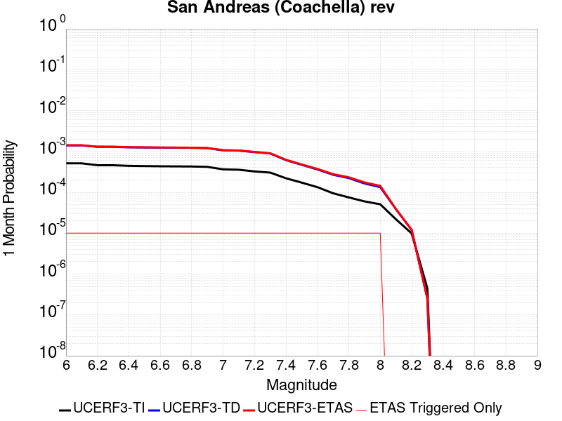 | 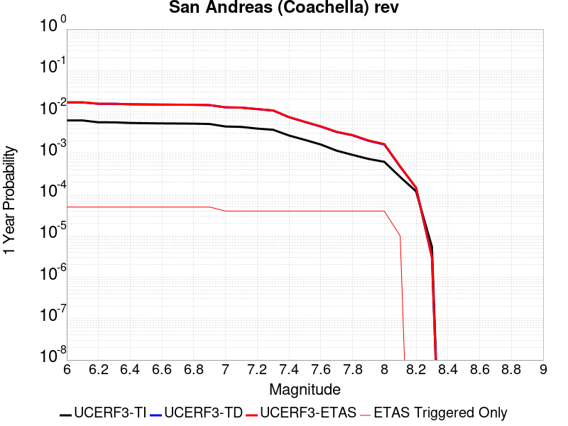 | 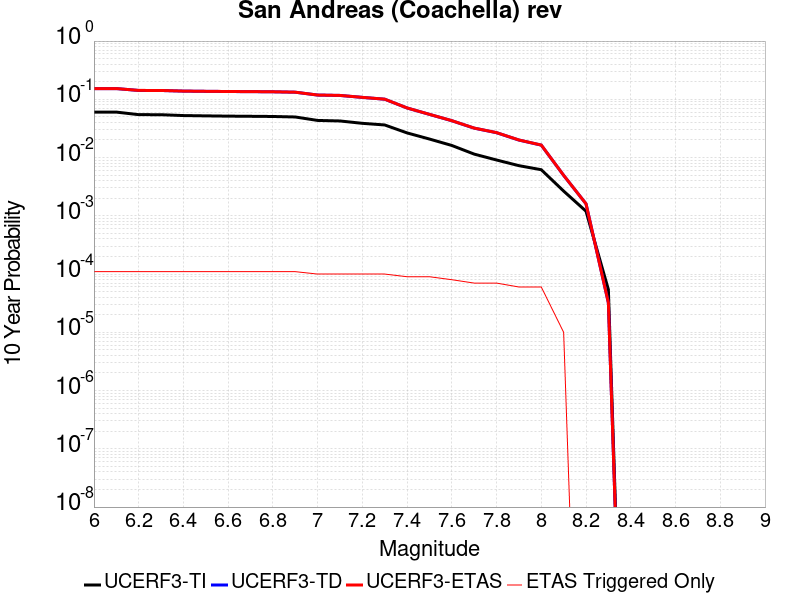 |

| Magnitude | 1 wk TI Prob | 1 wk TD Prob | 1 wk ETAS Prob | 1 wk ETAS/TD Gain | 1 wk ETAS Triggered Only | 1 mo TI Prob | 1 mo TD Prob | 1 mo ETAS Prob | 1 mo ETAS/TD Gain | 1 mo ETAS Triggered Only | 1 yr TI Prob | 1 yr TD Prob | 1 yr ETAS Prob | 1 yr ETAS/TD Gain | 1 yr ETAS Triggered Only | 10 yr TI Prob | 10 yr TD Prob | 10 yr ETAS Prob | 10 yr ETAS/TD Gain | 10 yr ETAS Triggered Only |
|-----|-----|-----|-----|-----|-----|-----|-----|-----|-----|-----|-----|-----|-----|-----|-----|-----|-----|-----|-----|-----|
| 6.0 | 1.1925945E-4 | 3.2773515E-4 | 3.2773515E-4 | 1.0 | 0.0 | 5.110118E-4 | 0.0014038279 | 0.0014341417 | 1.0215937 | 3.0356385E-5 | 0.0062038354 | 0.016959002 | 0.016988844 | 1.0017596 | 3.0356385E-5 | 0.060334753 | 0.15282515 | 0.15295373 | 1.0008414 | 1.5178192E-4 |
| 6.1 | 1.1925945E-4 | 3.2773515E-4 | 3.2773515E-4 | 1.0 | 0.0 | 5.110118E-4 | 0.0014038279 | 0.0014341417 | 1.0215937 | 3.0356385E-5 | 0.0062038354 | 0.016959002 | 0.016988844 | 1.0017596 | 3.0356385E-5 | 0.060334753 | 0.15282515 | 0.15295373 | 1.0008414 | 1.5178192E-4 |
| 6.2 | 1.07432395E-4 | 3.0273956E-4 | 3.0273956E-4 | 1.0 | 0.0 | 4.603433E-4 | 0.0012968141 | 0.0013271311 | 1.0233781 | 3.0356385E-5 | 0.005590286 | 0.015675513 | 0.015705394 | 1.0019062 | 3.0356385E-5 | 0.05451731 | 0.14199676 | 0.14212699 | 1.0009171 | 1.5178192E-4 |
| 6.3 | 1.0718766E-4 | 3.0219258E-4 | 3.0219258E-4 | 1.0 | 0.0 | 4.592948E-4 | 0.0012944723 | 0.0013247894 | 1.0234205 | 3.0356385E-5 | 0.005577586 | 0.015647411 | 0.015677292 | 1.0019096 | 3.0356385E-5 | 0.054396555 | 0.14176506 | 0.14189532 | 1.0009189 | 1.5178192E-4 |
| 6.4 | 1.0355944E-4 | 2.9427282E-4 | 2.9427282E-4 | 1.0 | 0.0 | 4.4375064E-4 | 0.0012605636 | 0.0012908818 | 1.0240512 | 3.0356385E-5 | 0.0053892885 | 0.01524042 | 0.015270313 | 1.0019615 | 3.0356385E-5 | 0.052604496 | 0.13832551 | 0.1384563 | 1.0009454 | 1.5178192E-4 |
| 6.5 | 1.0227914E-4 | 2.9146695E-4 | 2.9146695E-4 | 1.0 | 0.0 | 4.382655E-4 | 0.0012485499 | 0.0012788684 | 1.0242829 | 3.0356385E-5 | 0.0053228354 | 0.015096189 | 0.015126088 | 1.0019805 | 3.0356385E-5 | 0.051971316 | 0.13710485 | 0.13723582 | 1.0009552 | 1.5178192E-4 |
| 6.6 | 1.0116757E-4 | 2.8912423E-4 | 2.8912423E-4 | 1.0 | 0.0 | 4.3350324E-4 | 0.0012385194 | 0.0012688382 | 1.0244799 | 3.0356385E-5 | 0.0052651367 | 0.014975752 | 0.015005654 | 1.0019966 | 3.0356385E-5 | 0.051421247 | 0.13608314 | 0.13621427 | 1.0009636 | 1.5178192E-4 |
| 6.7 | 1.0050676E-4 | 2.8770973E-4 | 2.8770973E-4 | 1.0 | 0.0 | 4.3067214E-4 | 0.001232463 | 0.001262782 | 1.0246003 | 3.0356385E-5 | 0.005230834 | 0.014903027 | 0.0149329305 | 1.0020065 | 3.0356385E-5 | 0.051094085 | 0.13546793 | 0.13559915 | 1.0009687 | 1.5178192E-4 |
| 6.8 | 9.976819E-5 | 2.8574577E-4 | 2.8574577E-4 | 1.0 | 0.0 | 4.2750788E-4 | 0.0012240539 | 0.0012543731 | 1.0247695 | 3.0356385E-5 | 0.0051924936 | 0.014802042 | 0.014831949 | 1.0020205 | 3.0356385E-5 | 0.050728295 | 0.1346196 | 0.13475095 | 1.0009757 | 1.5178192E-4 |
| 6.9 | 9.77719E-5 | 2.8071183E-4 | 2.8071183E-4 | 1.0 | 0.0 | 4.1895514E-4 | 0.0012025 | 0.0012328199 | 1.0252141 | 3.0356385E-5 | 0.0050888555 | 0.014543155 | 0.01457307 | 1.002057 | 3.0356385E-5 | 0.049738888 | 0.1324474 | 0.13257909 | 1.0009942 | 1.5178192E-4 |
| 7.0 | 8.500761E-5 | 2.480338E-4 | 2.480338E-4 | 1.0 | 0.0 | 3.6426744E-4 | 0.0010625721 | 0.0010928963 | 1.0285385 | 3.0356385E-5 | 0.0044259406 | 0.012860856 | 0.012890822 | 1.0023301 | 3.0356385E-5 | 0.04338823 | 0.11829921 | 0.118433036 | 1.0011313 | 1.5178192E-4 |
| 7.1 | 8.319876E-5 | 2.4405654E-4 | 2.4405654E-4 | 1.0 | 0.0 | 3.5651738E-4 | 0.0010455406 | 0.0010758652 | 1.0290037 | 3.0356385E-5 | 0.004331963 | 0.012655924 | 0.012685896 | 1.0023682 | 3.0356385E-5 | 0.042484846 | 0.11651793 | 0.11665203 | 1.0011508 | 1.5178192E-4 |
| 7.2 | 7.563917E-5 | 2.2452862E-4 | 2.2452862E-4 | 1.0 | 0.0 | 3.2412758E-4 | 9.6191367E-4 | 9.922408E-4 | 1.031528 | 3.0356385E-5 | 0.0039391145 | 0.011649104 | 0.011679106 | 1.0025755 | 3.0356385E-5 | 0.03870018 | 0.10792095 | 0.10805635 | 1.0012547 | 1.5178192E-4 |
| 7.3 | 7.082985E-5 | 2.0767492E-4 | 2.0767492E-4 | 1.0 | 0.0 | 3.0352117E-4 | 8.897347E-4 | 9.200641E-4 | 1.0340881 | 3.0356385E-5 | 0.0036891096 | 0.010779344 | 0.010809373 | 1.0027858 | 3.0356385E-5 | 0.03628465 | 0.10043901 | 0.10057555 | 1.0013593 | 1.5178192E-4 |
| 7.4 | 5.146215E-5 | 1.4304483E-4 | 1.4304483E-4 | 1.0 | 0.0 | 2.2053342E-4 | 6.129062E-4 | 6.4324395E-4 | 1.0494982 | 3.0356385E-5 | 0.0026816884 | 0.0074367905 | 0.007466921 | 1.0040516 | 3.0356385E-5 | 0.02649557 | 0.07098342 | 0.07112443 | 1.0019865 | 1.5178192E-4 |
| 7.5 | 4.0285166E-5 | 1.09682325E-4 | 1.09682325E-4 | 1.0 | 0.0 | 1.7263928E-4 | 4.6998274E-4 | 5.003249E-4 | 1.06456 | 3.0356385E-5 | 0.002099857 | 0.0057070972 | 0.0057372805 | 1.0052887 | 3.0356385E-5 | 0.020801254 | 0.055129685 | 0.055273097 | 1.0026014 | 1.5178192E-4 |
| 7.6 | 3.1168736E-5 | 8.46259E-5 | 8.46259E-5 | 1.0 | 0.0 | 1.3357346E-4 | 3.6263216E-4 | 3.9297753E-4 | 1.0836809 | 3.0356385E-5 | 0.0016250437 | 0.004406135 | 0.004436358 | 1.0068592 | 3.0356385E-5 | 0.016132116 | 0.04291678 | 0.043032993 | 1.002708 | 1.2142554E-4 |
| 7.7 | 2.2100989E-5 | 6.259584E-5 | 6.259584E-5 | 1.0 | 0.0 | 9.4715084E-5 | 2.6824034E-4 | 2.9858857E-4 | 1.1131382 | 3.0356385E-5 | 0.001152546 | 0.003260942 | 0.0032911992 | 1.0092788 | 3.0356385E-5 | 0.011465867 | 0.031994775 | 0.03208293 | 1.0027553 | 9.106915E-5 |
| 7.8 | 1.7484861E-5 | 5.1981464E-5 | 5.1981464E-5 | 1.0 | 0.0 | 7.493296E-5 | 2.227587E-4 | 2.5310833E-4 | 1.1362444 | 3.0356385E-5 | 9.1192697E-4 | 0.002708717 | 0.0027389913 | 1.0111766 | 3.0356385E-5 | 0.009081938 | 0.026724702 | 0.026813338 | 1.0033166 | 9.106915E-5 |
| 7.9 | 1.3967285E-5 | 3.8374823E-5 | 3.8374823E-5 | 1.0 | 0.0 | 5.985842E-5 | 1.6445316E-4 | 1.9480455E-4 | 1.1845595 | 3.0356385E-5 | 7.2853256E-4 | 0.0020003798 | 0.0020306755 | 1.015145 | 3.0356385E-5 | 0.0072614877 | 0.019979829 | 0.020069078 | 1.004467 | 9.106915E-5 |
| 8.0 | 1.1887396E-5 | 3.119606E-5 | 3.119606E-5 | 1.0 | 0.0 | 5.094499E-5 | 1.3369056E-4 | 1.6404288E-4 | 1.2270342 | 3.0356385E-5 | 6.200787E-4 | 0.0016264683 | 0.0016567754 | 1.0186336 | 3.0356385E-5 | 0.006183513 | 0.016340243 | 0.016429823 | 1.0054822 | 9.106915E-5 |
| 8.1 | 5.100864E-6 | 9.026575E-6 | 9.026575E-6 | 1.0 | 0.0 | 2.1860664E-5 | 3.8684746E-5 | 3.8684746E-5 | 1.0 | 0.0 | 2.6612106E-4 | 4.7088516E-4 | 4.7088516E-4 | 1.0 | 0.0 | 0.002658026 | 0.0049442193 | 0.0049442193 | 1.0 | 0.0 |
| 8.2 | 2.3004484E-6 | 2.807767E-6 | 2.807767E-6 | 1.0 | 0.0 | 9.859027E-6 | 1.20332315E-5 | 1.20332315E-5 | 1.0 | 0.0 | 1.2002704E-4 | 1.4649479E-4 | 1.4649479E-4 | 1.0 | 0.0 | 0.0011996223 | 0.0016083963 | 0.0016083963 | 1.0 | 0.0 |
| 8.3 | 1.0424446E-7 | 5.8743755E-8 | 5.8743755E-8 | 1.0 | 0.0 | 4.4676187E-7 | 2.5175893E-7 | 2.5175893E-7 | 1.0 | 0.0 | 5.439312E-6 | 3.0651609E-6 | 3.0651609E-6 | 1.0 | 0.0 | 5.4391792E-5 | 3.2218184E-5 | 3.2218184E-5 | 1.0 | 0.0 |

## Ludlow
*[(top)](#table-of-contents)*

| 1 Week | 1 Month | 1 Year | 10 Year |
|-----|-----|-----|-----|
|  | 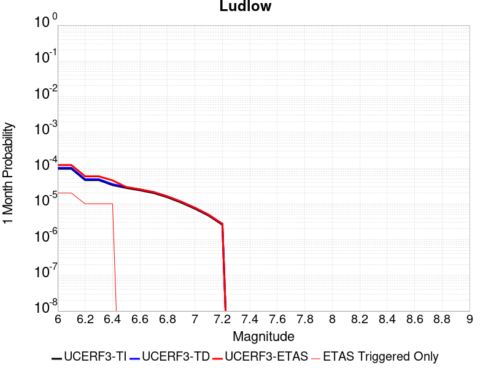 |  |  |

| Magnitude | 1 wk TI Prob | 1 wk TD Prob | 1 wk ETAS Prob | 1 wk ETAS/TD Gain | 1 wk ETAS Triggered Only | 1 mo TI Prob | 1 mo TD Prob | 1 mo ETAS Prob | 1 mo ETAS/TD Gain | 1 mo ETAS Triggered Only | 1 yr TI Prob | 1 yr TD Prob | 1 yr ETAS Prob | 1 yr ETAS/TD Gain | 1 yr ETAS Triggered Only | 10 yr TI Prob | 10 yr TD Prob | 10 yr ETAS Prob | 10 yr ETAS/TD Gain | 10 yr ETAS Triggered Only |
|-----|-----|-----|-----|-----|-----|-----|-----|-----|-----|-----|-----|-----|-----|-----|-----|-----|-----|-----|-----|-----|
| 6.0 | 2.2407607E-5 | 2.3659004E-5 | 2.3659004E-5 | 1.0 | 0.0 | 9.602906E-5 | 1.0139204E-4 | 1.0139204E-4 | 1.0 | 0.0 | 0.0011685267 | 0.0012337932 | 0.001294431 | 1.0491475 | 6.071277E-5 | 0.011624013 | 0.012273945 | 0.012423865 | 1.0122144 | 1.5178192E-4 |
| 6.1 | 2.2407607E-5 | 2.3659004E-5 | 2.3659004E-5 | 1.0 | 0.0 | 9.602906E-5 | 1.0139204E-4 | 1.0139204E-4 | 1.0 | 0.0 | 0.0011685267 | 0.0012337932 | 0.001294431 | 1.0491475 | 6.071277E-5 | 0.011624013 | 0.012273945 | 0.012423865 | 1.0122144 | 1.5178192E-4 |
| 6.2 | 1.0781252E-5 | 1.1366481E-5 | 1.1366481E-5 | 1.0 | 0.0 | 4.620455E-5 | 4.8712605E-5 | 4.8712605E-5 | 1.0 | 0.0 | 5.623952E-4 | 5.929186E-4 | 6.2325696E-4 | 1.0511678 | 3.0356385E-5 | 0.00560974 | 0.005913785 | 0.0059439624 | 1.0051028 | 3.0356385E-5 |
| 6.3 | 1.0781252E-5 | 1.1366481E-5 | 1.1366481E-5 | 1.0 | 0.0 | 4.620455E-5 | 4.8712605E-5 | 4.8712605E-5 | 1.0 | 0.0 | 5.623952E-4 | 5.929186E-4 | 6.2325696E-4 | 1.0511678 | 3.0356385E-5 | 0.00560974 | 0.005913785 | 0.0059439624 | 1.0051028 | 3.0356385E-5 |
| 6.4 | 7.814439E-6 | 8.238321E-6 | 8.238321E-6 | 1.0 | 0.0 | 3.3490025E-5 | 3.530662E-5 | 3.530662E-5 | 1.0 | 0.0 | 4.0766477E-4 | 4.2977472E-4 | 4.6011806E-4 | 1.0706029 | 3.0356385E-5 | 0.0040691774 | 0.0042895824 | 0.0043198084 | 1.0070465 | 3.0356385E-5 |
| 6.5 | 6.4986366E-6 | 6.8514128E-6 | 6.8514128E-6 | 1.0 | 0.0 | 2.7851002E-5 | 2.9362871E-5 | 2.9362871E-5 | 1.0 | 0.0 | 3.390332E-4 | 3.5743523E-4 | 3.5743523E-4 | 1.0 | 0.0 | 0.003385164 | 0.0035686996 | 0.0035686996 | 1.0 | 0.0 |
| 6.6 | 5.582177E-6 | 5.8864307E-6 | 5.8864307E-6 | 1.0 | 0.0 | 2.3923398E-5 | 2.522732E-5 | 2.522732E-5 | 1.0 | 0.0 | 2.9122844E-4 | 3.0710007E-4 | 3.0710007E-4 | 1.0 | 0.0 | 0.0029084706 | 0.00306683 | 0.00306683 | 1.0 | 0.0 |
| 6.7 | 4.6858763E-6 | 4.9407836E-6 | 4.9407836E-6 | 1.0 | 0.0 | 2.0082172E-5 | 2.1174617E-5 | 2.1174617E-5 | 1.0 | 0.0 | 2.4447302E-4 | 2.5777103E-4 | 2.5777103E-4 | 1.0 | 0.0 | 0.0024420423 | 0.0025747768 | 0.0025747768 | 1.0 | 0.0 |
| 6.8 | 3.5584908E-6 | 3.752289E-6 | 3.752289E-6 | 1.0 | 0.0 | 1.5250586E-5 | 1.6081141E-5 | 1.6081141E-5 | 1.0 | 0.0 | 1.8566006E-4 | 1.9577073E-4 | 1.9577073E-4 | 1.0 | 0.0 | 0.0018550502 | 0.0019560237 | 0.0019560237 | 1.0 | 0.0 |
| 6.9 | 2.532834E-6 | 2.6711969E-6 | 2.6711969E-6 | 1.0 | 0.0 | 1.0854958E-5 | 1.1447937E-5 | 1.1447937E-5 | 1.0 | 0.0 | 1.3215111E-4 | 1.3937001E-4 | 1.3937001E-4 | 1.0 | 0.0 | 0.0013207254 | 0.0013928536 | 0.0013928536 | 1.0 | 0.0 |
| 7.0 | 1.7083285E-6 | 1.8020748E-6 | 1.8020748E-6 | 1.0 | 0.0 | 7.3213873E-6 | 7.723156E-6 | 7.723156E-6 | 1.0 | 0.0 | 8.913424E-5 | 9.4025534E-5 | 9.4025534E-5 | 1.0 | 0.0 | 8.9098496E-4 | 9.3987404E-4 | 9.3987404E-4 | 1.0 | 0.0 |
| 7.1 | 1.0905424E-6 | 1.1498448E-6 | 1.1498448E-6 | 1.0 | 0.0 | 4.6737446E-6 | 4.9278974E-6 | 4.9278974E-6 | 1.0 | 0.0 | 5.6901354E-5 | 5.99956E-5 | 5.99956E-5 | 1.0 | 0.0 | 5.6886784E-4 | 5.998038E-4 | 5.998038E-4 | 1.0 | 0.0 |
| 7.2 | 6.06668E-7 | 6.387725E-7 | 6.387725E-7 | 1.0 | 0.0 | 2.600003E-6 | 2.737594E-6 | 2.737594E-6 | 1.0 | 0.0 | 3.1654577E-5 | 3.332977E-5 | 3.332977E-5 | 1.0 | 0.0 | 3.1650066E-4 | 3.3325455E-4 | 3.3325455E-4 | 1.0 | 0.0 |

## San Jacinto (Lytle Creek connector)
*[(top)](#table-of-contents)*

| 1 Week | 1 Month | 1 Year | 10 Year |
|-----|-----|-----|-----|
| 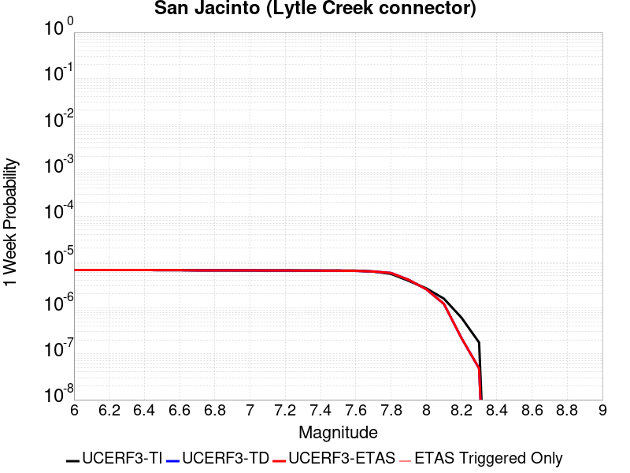 |  |  |  |

| Magnitude | 1 wk TI Prob | 1 wk TD Prob | 1 wk ETAS Prob | 1 wk ETAS/TD Gain | 1 wk ETAS Triggered Only | 1 mo TI Prob | 1 mo TD Prob | 1 mo ETAS Prob | 1 mo ETAS/TD Gain | 1 mo ETAS Triggered Only | 1 yr TI Prob | 1 yr TD Prob | 1 yr ETAS Prob | 1 yr ETAS/TD Gain | 1 yr ETAS Triggered Only | 10 yr TI Prob | 10 yr TD Prob | 10 yr ETAS Prob | 10 yr ETAS/TD Gain | 10 yr ETAS Triggered Only |
|-----|-----|-----|-----|-----|-----|-----|-----|-----|-----|-----|-----|-----|-----|-----|-----|-----|-----|-----|-----|-----|
| 6.0 | 6.693995E-6 | 6.68718E-6 | 6.68718E-6 | 1.0 | 0.0 | 2.8688235E-5 | 2.8659028E-5 | 2.8659028E-5 | 1.0 | 0.0 | 3.492233E-4 | 3.4886788E-4 | 4.0955946E-4 | 1.1739672 | 6.071277E-5 | 0.00348675 | 0.003563386 | 0.003684379 | 1.0339545 | 1.2142554E-4 |
| 6.1 | 6.693995E-6 | 6.68718E-6 | 6.68718E-6 | 1.0 | 0.0 | 2.8688235E-5 | 2.8659028E-5 | 2.8659028E-5 | 1.0 | 0.0 | 3.492233E-4 | 3.4886788E-4 | 4.0955946E-4 | 1.1739672 | 6.071277E-5 | 0.00348675 | 0.003563386 | 0.003684379 | 1.0339545 | 1.2142554E-4 |
| 6.2 | 6.693995E-6 | 6.68718E-6 | 6.68718E-6 | 1.0 | 0.0 | 2.8688235E-5 | 2.8659028E-5 | 2.8659028E-5 | 1.0 | 0.0 | 3.492233E-4 | 3.4886788E-4 | 4.0955946E-4 | 1.1739672 | 6.071277E-5 | 0.00348675 | 0.003563386 | 0.003684379 | 1.0339545 | 1.2142554E-4 |
| 6.3 | 6.693995E-6 | 6.68718E-6 | 6.68718E-6 | 1.0 | 0.0 | 2.8688235E-5 | 2.8659028E-5 | 2.8659028E-5 | 1.0 | 0.0 | 3.492233E-4 | 3.4886788E-4 | 4.0955946E-4 | 1.1739672 | 6.071277E-5 | 0.00348675 | 0.003563386 | 0.003684379 | 1.0339545 | 1.2142554E-4 |
| 6.4 | 6.693995E-6 | 6.68718E-6 | 6.68718E-6 | 1.0 | 0.0 | 2.8688235E-5 | 2.8659028E-5 | 2.8659028E-5 | 1.0 | 0.0 | 3.492233E-4 | 3.4886788E-4 | 4.0955946E-4 | 1.1739672 | 6.071277E-5 | 0.00348675 | 0.003563386 | 0.003684379 | 1.0339545 | 1.2142554E-4 |
| 6.5 | 6.6561875E-6 | 6.6473954E-6 | 6.6473954E-6 | 1.0 | 0.0 | 2.8526205E-5 | 2.8488526E-5 | 2.8488526E-5 | 1.0 | 0.0 | 3.472512E-4 | 3.467927E-4 | 4.074844E-4 | 1.1750087 | 6.071277E-5 | 0.0034670907 | 0.0035427003 | 0.0036636957 | 1.0341535 | 1.2142554E-4 |
| 6.6 | 6.6561875E-6 | 6.6473954E-6 | 6.6473954E-6 | 1.0 | 0.0 | 2.8526205E-5 | 2.8488526E-5 | 2.8488526E-5 | 1.0 | 0.0 | 3.472512E-4 | 3.467927E-4 | 4.074844E-4 | 1.1750087 | 6.071277E-5 | 0.0034670907 | 0.0035427003 | 0.0036636957 | 1.0341535 | 1.2142554E-4 |
| 6.7 | 6.5802237E-6 | 6.566566E-6 | 6.566566E-6 | 1.0 | 0.0 | 2.8200653E-5 | 2.8142122E-5 | 2.8142122E-5 | 1.0 | 0.0 | 3.4328885E-4 | 3.4257653E-4 | 4.032685E-4 | 1.1771632 | 6.071277E-5 | 0.0034275902 | 0.003500672 | 0.0036216725 | 1.034565 | 1.2142554E-4 |
| 6.8 | 6.575632E-6 | 6.561054E-6 | 6.561054E-6 | 1.0 | 0.0 | 2.8180975E-5 | 2.8118498E-5 | 2.8118498E-5 | 1.0 | 0.0 | 3.4304935E-4 | 3.4228901E-4 | 4.02981E-4 | 1.1773121 | 6.071277E-5 | 0.0034252026 | 0.0034978061 | 0.0036188068 | 1.0345933 | 1.2142554E-4 |
| 6.9 | 6.570433E-6 | 6.552444E-6 | 6.552444E-6 | 1.0 | 0.0 | 2.8158694E-5 | 2.80816E-5 | 2.80816E-5 | 1.0 | 0.0 | 3.4277816E-4 | 3.418399E-4 | 4.0253194E-4 | 1.1775451 | 6.071277E-5 | 0.0034224992 | 0.0034933293 | 0.0036143307 | 1.0346378 | 1.2142554E-4 |
| 7.0 | 6.5643826E-6 | 6.5425606E-6 | 6.5425606E-6 | 1.0 | 0.0 | 2.8132765E-5 | 2.8039243E-5 | 2.8039243E-5 | 1.0 | 0.0 | 3.424626E-4 | 3.413244E-4 | 4.0201645E-4 | 1.1778134 | 6.071277E-5 | 0.0034193532 | 0.0034881902 | 0.003609192 | 1.0346891 | 1.2142554E-4 |
| 7.1 | 6.557402E-6 | 6.531268E-6 | 6.531268E-6 | 1.0 | 0.0 | 2.8102848E-5 | 2.7990847E-5 | 2.7990847E-5 | 1.0 | 0.0 | 3.4209844E-4 | 3.4073534E-4 | 4.0142742E-4 | 1.1781209 | 6.071277E-5 | 0.0034157229 | 0.0034823192 | 0.003603322 | 1.0347477 | 1.2142554E-4 |
| 7.2 | 6.546394E-6 | 6.5132253E-6 | 6.5132253E-6 | 1.0 | 0.0 | 2.8055672E-5 | 2.7913524E-5 | 2.7913524E-5 | 1.0 | 0.0 | 3.4152428E-4 | 3.3979423E-4 | 4.0048637E-4 | 1.1786144 | 6.071277E-5 | 0.0034099987 | 0.003472942 | 0.0035939459 | 1.0348419 | 1.2142554E-4 |
| 7.3 | 6.5364216E-6 | 6.493994E-6 | 6.493994E-6 | 1.0 | 0.0 | 2.8012933E-5 | 2.7831105E-5 | 2.7831105E-5 | 1.0 | 0.0 | 3.4100408E-4 | 3.387911E-4 | 3.994833E-4 | 1.1791434 | 6.071277E-5 | 0.003404813 | 0.003462955 | 0.0035839598 | 1.0349427 | 1.2142554E-4 |
| 7.4 | 6.5269523E-6 | 6.475061E-6 | 6.475061E-6 | 1.0 | 0.0 | 2.7972354E-5 | 2.7749968E-5 | 2.7749968E-5 | 1.0 | 0.0 | 3.4051016E-4 | 3.3780356E-4 | 3.9849582E-4 | 1.1796674 | 6.071277E-5 | 0.0033998888 | 0.003453127 | 0.0035741332 | 1.0350425 | 1.2142554E-4 |
| 7.5 | 6.5111835E-6 | 6.4513147E-6 | 6.4513147E-6 | 1.0 | 0.0 | 2.7904773E-5 | 2.7648199E-5 | 2.7648199E-5 | 1.0 | 0.0 | 3.3968766E-4 | 3.365649E-4 | 3.9725722E-4 | 1.1803287 | 6.071277E-5 | 0.0033916887 | 0.0034407894 | 0.0035617973 | 1.0351686 | 1.2142554E-4 |
| 7.6 | 6.4768806E-6 | 6.4103915E-6 | 6.4103915E-6 | 1.0 | 0.0 | 2.7757764E-5 | 2.7472817E-5 | 2.7472817E-5 | 1.0 | 0.0 | 3.3789838E-4 | 3.3443028E-4 | 3.9512274E-4 | 1.1814802 | 6.071277E-5 | 0.0033738504 | 0.0034195052 | 0.0035405157 | 1.0353882 | 1.2142554E-4 |
| 7.7 | 6.1655364E-6 | 6.2026584E-6 | 6.2026584E-6 | 1.0 | 0.0 | 2.642346E-5 | 2.6582551E-5 | 2.6582551E-5 | 1.0 | 0.0 | 3.2165812E-4 | 3.2359455E-4 | 3.8428768E-4 | 1.1875591 | 6.071277E-5 | 0.0032119295 | 0.003311007 | 0.0034320306 | 1.0365518 | 1.2142554E-4 |
| 7.8 | 5.5043524E-6 | 5.7629622E-6 | 5.7629622E-6 | 1.0 | 0.0 | 2.3589868E-5 | 2.4698176E-5 | 2.4698176E-5 | 1.0 | 0.0 | 2.871688E-4 | 3.0065887E-4 | 3.613534E-4 | 1.2018716 | 6.071277E-5 | 0.0028679797 | 0.0030807185 | 0.00320177 | 1.0392933 | 1.2142554E-4 |
| 7.9 | 3.889249E-6 | 4.0978284E-6 | 4.0978284E-6 | 1.0 | 0.0 | 1.6668104E-5 | 1.7562003E-5 | 1.7562003E-5 | 1.0 | 0.0 | 2.0291525E-4 | 2.1379645E-4 | 2.7449624E-4 | 1.283914 | 6.071277E-5 | 0.0020273007 | 0.0022053365 | 0.002326494 | 1.0549384 | 1.2142554E-4 |
| 8.0 | 2.668535E-6 | 2.5461316E-6 | 2.5461316E-6 | 1.0 | 0.0 | 1.1436528E-5 | 1.0911946E-5 | 1.0911946E-5 | 1.0 | 0.0 | 1.3923083E-4 | 1.3284489E-4 | 1.3284489E-4 | 1.0 | 0.0 | 0.0013914363 | 0.0013835314 | 0.0014441601 | 1.0438218 | 6.071277E-5 |
| 8.1 | 1.5911459E-6 | 1.2265176E-6 | 1.2265176E-6 | 1.0 | 0.0 | 6.8191785E-6 | 5.2564933E-6 | 5.2564933E-6 | 1.0 | 0.0 | 8.3020335E-5 | 6.399595E-5 | 6.399595E-5 | 1.0 | 0.0 | 8.298933E-4 | 6.735424E-4 | 6.735424E-4 | 1.0 | 0.0 |
| 8.2 | 6.1294963E-7 | 2.2044327E-7 | 2.2044327E-7 | 1.0 | 0.0 | 2.6269242E-6 | 9.4475655E-7 | 9.4475655E-7 | 1.0 | 0.0 | 3.1982334E-5 | 1.150235E-5 | 1.150235E-5 | 1.0 | 0.0 | 3.1977732E-4 | 1.2914916E-4 | 1.2914916E-4 | 1.0 | 0.0 |
| 8.3 | 1.762871E-7 | 4.8134357E-8 | 4.8134357E-8 | 1.0 | 0.0 | 7.5551594E-7 | 2.0629008E-7 | 2.0629008E-7 | 1.0 | 0.0 | 9.1983675E-6 | 2.511579E-6 | 2.511579E-6 | 1.0 | 0.0 | 9.197987E-5 | 2.9024819E-5 | 2.9024819E-5 | 1.0 | 0.0 |

## Cady
*[(top)](#table-of-contents)*

| 1 Week | 1 Month | 1 Year | 10 Year |
|-----|-----|-----|-----|
| 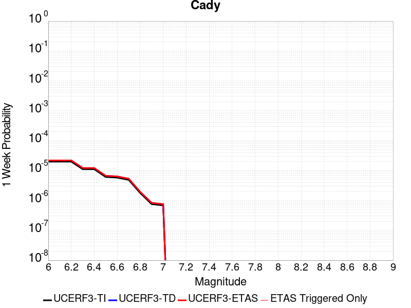 |  |  |  |

| Magnitude | 1 wk TI Prob | 1 wk TD Prob | 1 wk ETAS Prob | 1 wk ETAS/TD Gain | 1 wk ETAS Triggered Only | 1 mo TI Prob | 1 mo TD Prob | 1 mo ETAS Prob | 1 mo ETAS/TD Gain | 1 mo ETAS Triggered Only | 1 yr TI Prob | 1 yr TD Prob | 1 yr ETAS Prob | 1 yr ETAS/TD Gain | 1 yr ETAS Triggered Only | 10 yr TI Prob | 10 yr TD Prob | 10 yr ETAS Prob | 10 yr ETAS/TD Gain | 10 yr ETAS Triggered Only |
|-----|-----|-----|-----|-----|-----|-----|-----|-----|-----|-----|-----|-----|-----|-----|-----|-----|-----|-----|-----|-----|
| 6.0 | 1.9892565E-5 | 2.1861597E-5 | 2.1861597E-5 | 1.0 | 0.0 | 8.525106E-5 | 9.3689705E-5 | 9.3689705E-5 | 1.0 | 0.0 | 0.0010374374 | 0.0011401662 | 0.0011401662 | 1.0 | 0.0 | 0.010326075 | 0.011352182 | 0.01147223 | 1.0105748 | 1.2142554E-4 |
| 6.1 | 1.9892565E-5 | 2.1861597E-5 | 2.1861597E-5 | 1.0 | 0.0 | 8.525106E-5 | 9.3689705E-5 | 9.3689705E-5 | 1.0 | 0.0 | 0.0010374374 | 0.0011401662 | 0.0011401662 | 1.0 | 0.0 | 0.010326075 | 0.011352182 | 0.01147223 | 1.0105748 | 1.2142554E-4 |
| 6.2 | 1.9892565E-5 | 2.1861597E-5 | 2.1861597E-5 | 1.0 | 0.0 | 8.525106E-5 | 9.3689705E-5 | 9.3689705E-5 | 1.0 | 0.0 | 0.0010374374 | 0.0011401662 | 0.0011401662 | 1.0 | 0.0 | 0.010326075 | 0.011352182 | 0.01147223 | 1.0105748 | 1.2142554E-4 |
| 6.3 | 1.1117327E-5 | 1.2178123E-5 | 1.2178123E-5 | 1.0 | 0.0 | 4.764482E-5 | 5.219109E-5 | 5.219109E-5 | 1.0 | 0.0 | 5.7992124E-4 | 6.3527277E-4 | 6.3527277E-4 | 1.0 | 0.0 | 0.0057841022 | 0.006337675 | 0.0064583304 | 1.0190378 | 1.2142554E-4 |
| 6.4 | 1.1117327E-5 | 1.2178123E-5 | 1.2178123E-5 | 1.0 | 0.0 | 4.764482E-5 | 5.219109E-5 | 5.219109E-5 | 1.0 | 0.0 | 5.7992124E-4 | 6.3527277E-4 | 6.3527277E-4 | 1.0 | 0.0 | 0.0057841022 | 0.006337675 | 0.0064583304 | 1.0190378 | 1.2142554E-4 |
| 6.5 | 6.103093E-6 | 6.672846E-6 | 6.672846E-6 | 1.0 | 0.0 | 2.615585E-5 | 2.859767E-5 | 2.859767E-5 | 1.0 | 0.0 | 3.1840094E-4 | 3.4813356E-4 | 3.4813356E-4 | 1.0 | 0.0 | 0.0031794512 | 0.0034771163 | 0.0035678688 | 1.0260999 | 9.106915E-5 |
| 6.6 | 5.817237E-6 | 6.366455E-6 | 6.366455E-6 | 1.0 | 0.0 | 2.4930776E-5 | 2.7284592E-5 | 2.7284592E-5 | 1.0 | 0.0 | 3.034899E-4 | 3.321517E-4 | 3.321517E-4 | 1.0 | 0.0 | 0.0030307577 | 0.0033177752 | 0.0034085421 | 1.0273578 | 9.106915E-5 |
| 6.7 | 4.8846314E-6 | 5.34123E-6 | 5.34123E-6 | 1.0 | 0.0 | 2.0933967E-5 | 2.289085E-5 | 2.289085E-5 | 1.0 | 0.0 | 2.5484123E-4 | 2.7867223E-4 | 2.7867223E-4 | 1.0 | 0.0 | 0.0025454918 | 0.0027843837 | 0.0028751993 | 1.032616 | 9.106915E-5 |
| 6.8 | 1.7788773E-6 | 1.9401411E-6 | 1.9401411E-6 | 1.0 | 0.0 | 7.6237375E-6 | 8.3148725E-6 | 8.3148725E-6 | 1.0 | 0.0 | 9.281505E-5 | 1.0123045E-4 | 1.0123045E-4 | 1.0 | 0.0 | 9.2776294E-4 | 0.001011998 | 0.0010726494 | 1.0599322 | 6.071277E-5 |
| 6.9 | 7.5455404E-7 | 8.298188E-7 | 8.298188E-7 | 1.0 | 0.0 | 3.233799E-6 | 3.5563635E-6 | 3.5563635E-6 | 1.0 | 0.0 | 3.937079E-5 | 4.32982E-5 | 4.32982E-5 | 1.0 | 0.0 | 3.9363815E-4 | 4.329306E-4 | 4.329306E-4 | 1.0 | 0.0 |
| 7.0 | 6.8578805E-7 | 7.5428136E-7 | 7.5428136E-7 | 1.0 | 0.0 | 2.9390883E-6 | 3.2326323E-6 | 3.2326323E-6 | 1.0 | 0.0 | 3.578281E-5 | 3.935692E-5 | 3.935692E-5 | 1.0 | 0.0 | 3.577705E-4 | 3.9353195E-4 | 3.9353195E-4 | 1.0 | 0.0 |

## San Jacinto (Stepovers Combined)
*[(top)](#table-of-contents)*

| 1 Week | 1 Month | 1 Year | 10 Year |
|-----|-----|-----|-----|
| 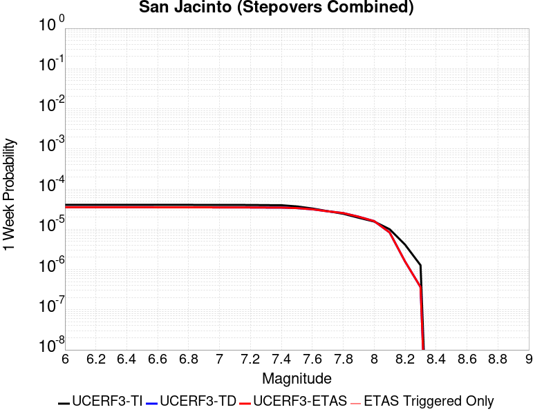 | 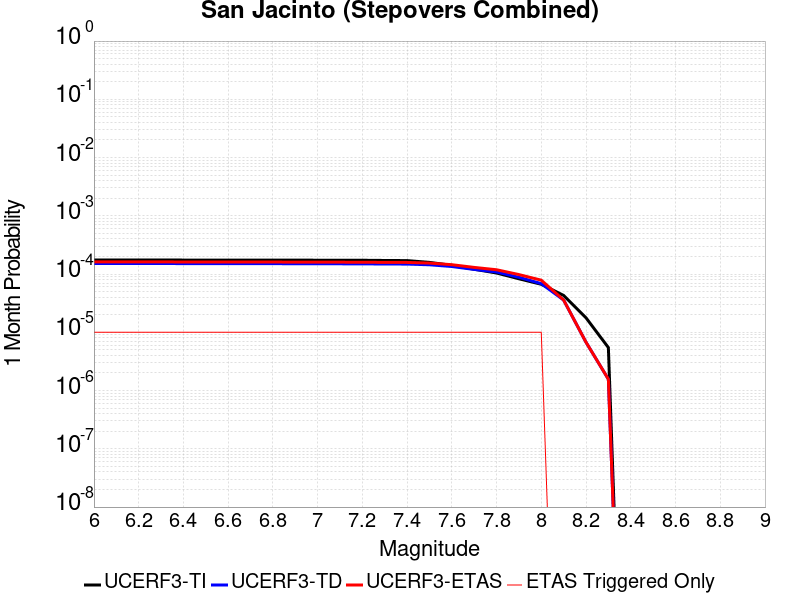 |  | 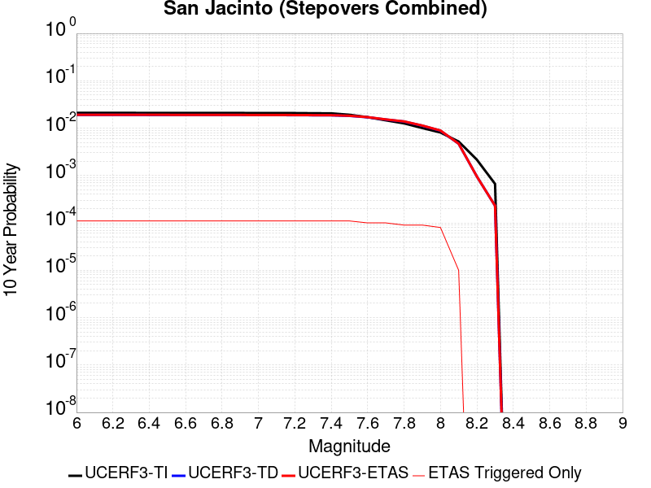 |

| Magnitude | 1 wk TI Prob | 1 wk TD Prob | 1 wk ETAS Prob | 1 wk ETAS/TD Gain | 1 wk ETAS Triggered Only | 1 mo TI Prob | 1 mo TD Prob | 1 mo ETAS Prob | 1 mo ETAS/TD Gain | 1 mo ETAS Triggered Only | 1 yr TI Prob | 1 yr TD Prob | 1 yr ETAS Prob | 1 yr ETAS/TD Gain | 1 yr ETAS Triggered Only | 10 yr TI Prob | 10 yr TD Prob | 10 yr ETAS Prob | 10 yr ETAS/TD Gain | 10 yr ETAS Triggered Only |
|-----|-----|-----|-----|-----|-----|-----|-----|-----|-----|-----|-----|-----|-----|-----|-----|-----|-----|-----|-----|-----|
| 6.0 | 4.0667746E-5 | 3.5424455E-5 | 3.5424455E-5 | 1.0 | 0.0 | 1.742787E-4 | 1.5181027E-4 | 1.5181027E-4 | 1.0 | 0.0 | 0.0021197782 | 0.0018467255 | 0.0018770258 | 1.0164076 | 3.0356385E-5 | 0.020996714 | 0.019065471 | 0.019184582 | 1.0062474 | 1.2142554E-4 |
| 6.1 | 4.0667746E-5 | 3.5424455E-5 | 3.5424455E-5 | 1.0 | 0.0 | 1.742787E-4 | 1.5181027E-4 | 1.5181027E-4 | 1.0 | 0.0 | 0.0021197782 | 0.0018467255 | 0.0018770258 | 1.0164076 | 3.0356385E-5 | 0.020996714 | 0.019065471 | 0.019184582 | 1.0062474 | 1.2142554E-4 |
| 6.2 | 4.0667746E-5 | 3.5424455E-5 | 3.5424455E-5 | 1.0 | 0.0 | 1.742787E-4 | 1.5181027E-4 | 1.5181027E-4 | 1.0 | 0.0 | 0.0021197782 | 0.0018467255 | 0.0018770258 | 1.0164076 | 3.0356385E-5 | 0.020996714 | 0.019065471 | 0.019184582 | 1.0062474 | 1.2142554E-4 |
| 6.3 | 4.0667746E-5 | 3.5424455E-5 | 3.5424455E-5 | 1.0 | 0.0 | 1.742787E-4 | 1.5181027E-4 | 1.5181027E-4 | 1.0 | 0.0 | 0.0021197782 | 0.0018467255 | 0.0018770258 | 1.0164076 | 3.0356385E-5 | 0.020996714 | 0.019065471 | 0.019184582 | 1.0062474 | 1.2142554E-4 |
| 6.4 | 4.0577226E-5 | 3.529632E-5 | 3.529632E-5 | 1.0 | 0.0 | 1.738908E-4 | 1.5126119E-4 | 1.5126119E-4 | 1.0 | 0.0 | 0.0021150648 | 0.0018400518 | 0.0018703524 | 1.0164672 | 3.0356385E-5 | 0.020950472 | 0.019000014 | 0.019119132 | 1.0062693 | 1.2142554E-4 |
| 6.5 | 4.0577226E-5 | 3.529632E-5 | 3.529632E-5 | 1.0 | 0.0 | 1.738908E-4 | 1.5126119E-4 | 1.5126119E-4 | 1.0 | 0.0 | 0.0021150648 | 0.0018400518 | 0.0018703524 | 1.0164672 | 3.0356385E-5 | 0.020950472 | 0.019000014 | 0.019119132 | 1.0062693 | 1.2142554E-4 |
| 6.6 | 4.053861E-5 | 3.5241635E-5 | 3.5241635E-5 | 1.0 | 0.0 | 1.7372532E-4 | 1.5102686E-4 | 1.5102686E-4 | 1.0 | 0.0 | 0.0021130538 | 0.0018372037 | 0.0018675043 | 1.0164928 | 3.0356385E-5 | 0.020930743 | 0.018972082 | 0.019091204 | 1.0062788 | 1.2142554E-4 |
| 6.7 | 4.0516545E-5 | 3.5210687E-5 | 3.5210687E-5 | 1.0 | 0.0 | 1.7363077E-4 | 1.5089424E-4 | 1.5089424E-4 | 1.0 | 0.0 | 0.002111905 | 0.0018355926 | 0.0018658931 | 1.0165073 | 3.0356385E-5 | 0.020919468 | 0.018956272 | 0.019075396 | 1.0062841 | 1.2142554E-4 |
| 6.8 | 4.049434E-5 | 3.5182235E-5 | 3.5182235E-5 | 1.0 | 0.0 | 1.7353562E-4 | 1.507723E-4 | 1.507723E-4 | 1.0 | 0.0 | 0.0021107488 | 0.0018341107 | 0.0018644114 | 1.0165206 | 3.0356385E-5 | 0.020908125 | 0.018941678 | 0.019060804 | 1.0062891 | 1.2142554E-4 |
| 6.9 | 4.046386E-5 | 3.5144778E-5 | 3.5144778E-5 | 1.0 | 0.0 | 1.73405E-4 | 1.506118E-4 | 1.506118E-4 | 1.0 | 0.0 | 0.0021091616 | 0.0018321596 | 0.0018624604 | 1.0165383 | 3.0356385E-5 | 0.020892553 | 0.018922443 | 0.019041572 | 1.0062956 | 1.2142554E-4 |
| 7.0 | 4.036382E-5 | 3.5025278E-5 | 3.5025278E-5 | 1.0 | 0.0 | 1.7297632E-4 | 1.5009972E-4 | 1.5009972E-4 | 1.0 | 0.0 | 0.0021039525 | 0.0018259356 | 0.0018562365 | 1.0165948 | 3.0356385E-5 | 0.02084144 | 0.018861026 | 0.01898016 | 1.0063164 | 1.2142554E-4 |
| 7.1 | 4.0343282E-5 | 3.5003726E-5 | 3.5003726E-5 | 1.0 | 0.0 | 1.7288832E-4 | 1.5000737E-4 | 1.5000737E-4 | 1.0 | 0.0 | 0.002102883 | 0.0018248131 | 0.001855114 | 1.016605 | 3.0356385E-5 | 0.020830948 | 0.018849896 | 0.018969033 | 1.0063202 | 1.2142554E-4 |
| 7.2 | 4.0257353E-5 | 3.4908084E-5 | 3.4908084E-5 | 1.0 | 0.0 | 1.725201E-4 | 1.4959752E-4 | 1.4959752E-4 | 1.0 | 0.0 | 0.0020984085 | 0.0018198314 | 0.0018501326 | 1.0166506 | 3.0356385E-5 | 0.020787042 | 0.018800564 | 0.018919708 | 1.0063372 | 1.2142554E-4 |
| 7.3 | 3.9940667E-5 | 3.4735232E-5 | 3.4735232E-5 | 1.0 | 0.0 | 1.7116306E-4 | 1.4885681E-4 | 1.4885681E-4 | 1.0 | 0.0 | 0.0020819185 | 0.0018108283 | 0.0018411297 | 1.0167334 | 3.0356385E-5 | 0.020625217 | 0.018708937 | 0.018828092 | 1.0063689 | 1.2142554E-4 |
| 7.4 | 3.9721202E-5 | 3.4620345E-5 | 3.4620345E-5 | 1.0 | 0.0 | 1.7022261E-4 | 1.4836449E-4 | 1.4836449E-4 | 1.0 | 0.0 | 0.0020704903 | 0.0018048445 | 0.001835146 | 1.0167891 | 3.0356385E-5 | 0.020513052 | 0.01864792 | 0.018767081 | 1.0063901 | 1.2142554E-4 |
| 7.5 | 3.7036873E-5 | 3.368442E-5 | 3.368442E-5 | 1.0 | 0.0 | 1.5871979E-4 | 1.4435383E-4 | 1.4435383E-4 | 1.0 | 0.0 | 0.0019307006 | 0.0017560942 | 0.0017863973 | 1.0172559 | 3.0356385E-5 | 0.019140124 | 0.018147755 | 0.018266976 | 1.0065695 | 1.2142554E-4 |
| 7.6 | 3.2940967E-5 | 3.1455937E-5 | 3.1455937E-5 | 1.0 | 0.0 | 1.4116794E-4 | 1.348042E-4 | 1.348042E-4 | 1.0 | 0.0 | 0.0017173645 | 0.0016400078 | 0.0016400078 | 1.0 | 0.0 | 0.01704153 | 0.016975854 | 0.017065376 | 1.0052736 | 9.106915E-5 |
| 7.7 | 2.8236149E-5 | 2.8018048E-5 | 2.8018048E-5 | 1.0 | 0.0 | 1.2100645E-4 | 1.2007183E-4 | 1.2007183E-4 | 1.0 | 0.0 | 0.0014722579 | 0.0014608953 | 0.0014608953 | 1.0 | 0.0 | 0.014625421 | 0.015184763 | 0.015274449 | 1.0059063 | 9.106915E-5 |
| 7.8 | 2.4329287E-5 | 2.5336392E-5 | 2.5336392E-5 | 1.0 | 0.0 | 1.042642E-4 | 1.08580025E-4 | 1.08580025E-4 | 1.0 | 0.0 | 0.0012686774 | 0.0013211609 | 0.0013211609 | 1.0 | 0.0 | 0.012614589 | 0.01377942 | 0.013869235 | 1.006518 | 9.106915E-5 |
| 7.9 | 1.9370926E-5 | 2.053781E-5 | 2.053781E-5 | 1.0 | 0.0 | 8.301561E-5 | 8.801621E-5 | 8.801621E-5 | 1.0 | 0.0 | 0.0010102465 | 0.0010710714 | 0.0010710714 | 1.0 | 0.0 | 0.0100566605 | 0.011260242 | 0.011350286 | 1.0079966 | 9.106915E-5 |
| 8.0 | 1.5583017E-5 | 1.5984346E-5 | 1.5984346E-5 | 1.0 | 0.0 | 6.6782646E-5 | 6.8502544E-5 | 6.8502544E-5 | 1.0 | 0.0 | 8.127754E-4 | 8.3370006E-4 | 8.3370006E-4 | 1.0 | 0.0 | 0.008098091 | 0.008833316 | 0.008923581 | 1.0102186 | 9.106915E-5 |
| 8.1 | 1.0024873E-5 | 8.350047E-6 | 8.350047E-6 | 1.0 | 0.0 | 4.2963035E-5 | 3.578543E-5 | 3.578543E-5 | 1.0 | 0.0 | 5.229494E-4 | 4.3560102E-4 | 4.3560102E-4 | 1.0 | 0.0 | 0.0052172043 | 0.004684384 | 0.004684384 | 1.0 | 0.0 |
| 8.2 | 4.142796E-6 | 1.5775288E-6 | 1.5775288E-6 | 1.0 | 0.0 | 1.775472E-5 | 6.7608203E-6 | 6.7608203E-6 | 1.0 | 0.0 | 2.1614227E-4 | 8.230991E-5 | 8.230991E-5 | 1.0 | 0.0 | 0.0021593217 | 9.5490384E-4 | 9.5490384E-4 | 1.0 | 0.0 |
| 8.3 | 1.2750878E-6 | 3.657188E-7 | 3.657188E-7 | 1.0 | 0.0 | 5.4646503E-6 | 1.5673653E-6 | 1.5673653E-6 | 1.0 | 0.0 | 6.653009E-5 | 1.908251E-5 | 1.908251E-5 | 1.0 | 0.0 | 6.6510175E-4 | 2.2998886E-4 | 2.2998886E-4 | 1.0 | 0.0 |

## Scodie Lineament
*[(top)](#table-of-contents)*

| 1 Week | 1 Month | 1 Year | 10 Year |
|-----|-----|-----|-----|
|  |  |  |  |

| Magnitude | 1 wk TI Prob | 1 wk TD Prob | 1 wk ETAS Prob | 1 wk ETAS/TD Gain | 1 wk ETAS Triggered Only | 1 mo TI Prob | 1 mo TD Prob | 1 mo ETAS Prob | 1 mo ETAS/TD Gain | 1 mo ETAS Triggered Only | 1 yr TI Prob | 1 yr TD Prob | 1 yr ETAS Prob | 1 yr ETAS/TD Gain | 1 yr ETAS Triggered Only | 10 yr TI Prob | 10 yr TD Prob | 10 yr ETAS Prob | 10 yr ETAS/TD Gain | 10 yr ETAS Triggered Only |
|-----|-----|-----|-----|-----|-----|-----|-----|-----|-----|-----|-----|-----|-----|-----|-----|-----|-----|-----|-----|-----|
| 6.0 | 3.2919327E-6 | 3.0134847E-6 | 3.0134847E-6 | 1.0 | 0.0 | 1.4108206E-5 | 1.2914888E-5 | 1.2914888E-5 | 1.0 | 0.0 | 1.7175387E-4 | 1.5723059E-4 | 1.875822E-4 | 1.1930388 | 3.0356385E-5 | 0.0017162118 | 0.0015715051 | 0.0016927399 | 1.0771456 | 1.2142554E-4 |
| 6.1 | 1.8663811E-6 | 1.5491396E-6 | 1.5491396E-6 | 1.0 | 0.0 | 7.998751E-6 | 6.639156E-6 | 6.639156E-6 | 1.0 | 0.0 | 9.738045E-5 | 8.082922E-5 | 1.1118315E-4 | 1.3755317 | 3.0356385E-5 | 9.7337784E-4 | 8.08047E-4 | 8.990426E-4 | 1.1126118 | 9.106915E-5 |
| 6.2 | 1.8663811E-6 | 1.5491396E-6 | 1.5491396E-6 | 1.0 | 0.0 | 7.998751E-6 | 6.639156E-6 | 6.639156E-6 | 1.0 | 0.0 | 9.738045E-5 | 8.082922E-5 | 1.1118315E-4 | 1.3755317 | 3.0356385E-5 | 9.7337784E-4 | 8.08047E-4 | 8.990426E-4 | 1.1126118 | 9.106915E-5 |
| 6.3 | 1.8663811E-6 | 1.5491396E-6 | 1.5491396E-6 | 1.0 | 0.0 | 7.998751E-6 | 6.639156E-6 | 6.639156E-6 | 1.0 | 0.0 | 9.738045E-5 | 8.082922E-5 | 1.1118315E-4 | 1.3755317 | 3.0356385E-5 | 9.7337784E-4 | 8.08047E-4 | 8.990426E-4 | 1.1126118 | 9.106915E-5 |
| 6.4 | 1.8663811E-6 | 1.5491396E-6 | 1.5491396E-6 | 1.0 | 0.0 | 7.998751E-6 | 6.639156E-6 | 6.639156E-6 | 1.0 | 0.0 | 9.738045E-5 | 8.082922E-5 | 1.1118315E-4 | 1.3755317 | 3.0356385E-5 | 9.7337784E-4 | 8.08047E-4 | 8.990426E-4 | 1.1126118 | 9.106915E-5 |
| 6.5 | 1.8106311E-6 | 1.4910704E-6 | 1.4910704E-6 | 1.0 | 0.0 | 7.759824E-6 | 6.390289E-6 | 6.390289E-6 | 1.0 | 0.0 | 9.447177E-5 | 7.779949E-5 | 1.0815351E-4 | 1.3901571 | 3.0356385E-5 | 9.4431615E-4 | 7.777712E-4 | 8.687695E-4 | 1.1169988 | 9.106915E-5 |
| 6.6 | 1.2414679E-6 | 8.998118E-7 | 8.998118E-7 | 1.0 | 0.0 | 5.320566E-6 | 3.856331E-6 | 3.856331E-6 | 1.0 | 0.0 | 6.477596E-5 | 4.694991E-5 | 4.694991E-5 | 1.0 | 0.0 | 6.475708E-4 | 4.6940855E-4 | 5.300928E-4 | 1.1292782 | 6.071277E-5 |
| 6.7 | 1.1062215E-6 | 7.594802E-7 | 7.594802E-7 | 1.0 | 0.0 | 4.7409408E-6 | 3.2549115E-6 | 3.2549115E-6 | 1.0 | 0.0 | 5.7719422E-5 | 3.9627896E-5 | 3.9627896E-5 | 1.0 | 0.0 | 5.770443E-4 | 3.962153E-4 | 4.2655965E-4 | 1.0765855 | 3.0356385E-5 |
| 6.8 | 1.0006736E-6 | 6.5008345E-7 | 6.5008345E-7 | 1.0 | 0.0 | 4.288594E-6 | 2.7860694E-6 | 2.7860694E-6 | 1.0 | 0.0 | 5.221238E-5 | 3.391993E-5 | 3.391993E-5 | 1.0 | 0.0 | 5.220012E-4 | 3.391536E-4 | 3.6949967E-4 | 1.089476 | 3.0356385E-5 |
| 6.9 | 9.167364E-7 | 5.6320226E-7 | 5.6320226E-7 | 1.0 | 0.0 | 3.9288643E-6 | 2.4137219E-6 | 2.4137219E-6 | 1.0 | 0.0 | 4.7832873E-5 | 2.9386727E-5 | 2.9386727E-5 | 1.0 | 0.0 | 4.782258E-4 | 2.9383408E-4 | 3.2418154E-4 | 1.1032809 | 3.0356385E-5 |
| 7.0 | 7.6987664E-7 | 4.1137125E-7 | 4.1137125E-7 | 1.0 | 0.0 | 3.2994672E-6 | 1.7630188E-6 | 1.7630188E-6 | 1.0 | 0.0 | 4.0170275E-5 | 2.146458E-5 | 2.146458E-5 | 1.0 | 0.0 | 4.0163012E-4 | 2.1462893E-4 | 2.449788E-4 | 1.1414062 | 3.0356385E-5 |
| 7.1 | 7.1038727E-7 | 3.5214526E-7 | 3.5214526E-7 | 1.0 | 0.0 | 3.0445133E-6 | 1.5091933E-6 | 1.5091933E-6 | 1.0 | 0.0 | 3.706632E-5 | 1.8374309E-5 | 1.8374309E-5 | 1.0 | 0.0 | 3.7060137E-4 | 1.8373139E-4 | 2.140822E-4 | 1.1651912 | 3.0356385E-5 |
| 7.2 | 2.0799602E-7 | 3.119519E-8 | 3.119519E-8 | 1.0 | 0.0 | 8.914113E-7 | 1.3369366E-7 | 1.3369366E-7 | 1.0 | 0.0 | 1.0852878E-5 | 1.6277191E-6 | 1.6277191E-6 | 1.0 | 0.0 | 1.08523476E-4 | 1.627708E-5 | 4.663297E-5 | 2.864947 | 3.0356385E-5 |
| 7.3 | 1.5048182E-7 | 1.595136E-8 | 1.595136E-8 | 1.0 | 0.0 | 6.449219E-7 | 6.8362965E-8 | 6.8362965E-8 | 1.0 | 0.0 | 7.851896E-6 | 8.323188E-7 | 8.323188E-7 | 1.0 | 0.0 | 7.851618E-5 | 8.32316E-6 | 3.8679293E-5 | 4.647188 | 3.0356385E-5 |
| 7.4 | 5.9334678E-8 | 4.8704454E-9 | 4.8704454E-9 | 1.0 | 0.0 | 2.5429145E-7 | 2.0873339E-8 | 2.0873339E-8 | 1.0 | 0.0 | 3.095994E-6 | 2.5413289E-7 | 2.5413289E-7 | 1.0 | 0.0 | 3.095951E-5 | 2.541327E-6 | 2.541327E-6 | 1.0 | 0.0 |

## Pleito
*[(top)](#table-of-contents)*

| 1 Week | 1 Month | 1 Year | 10 Year |
|-----|-----|-----|-----|
| 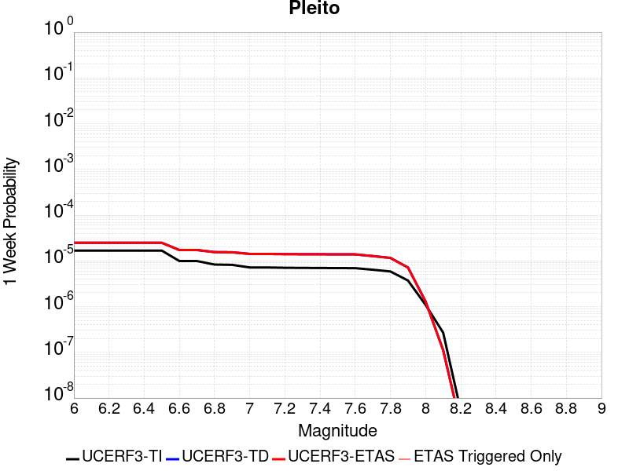 |  |  | 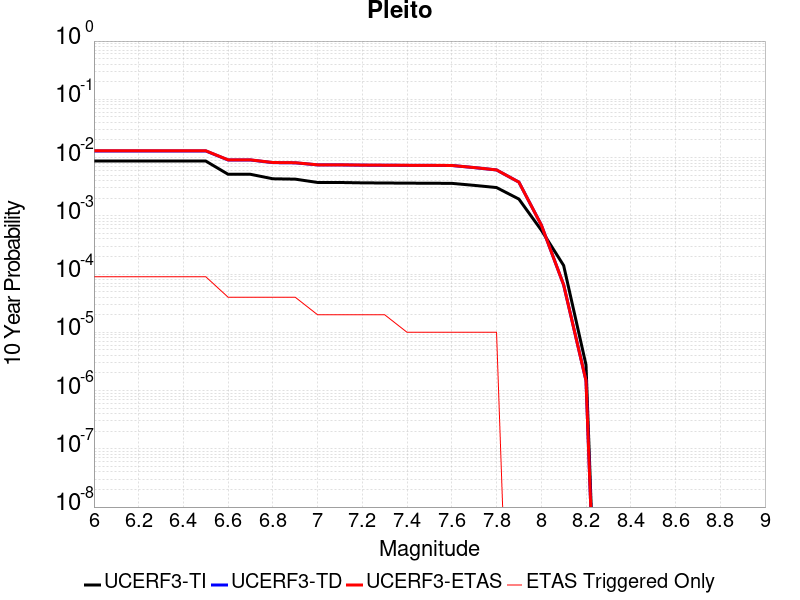 |

| Magnitude | 1 wk TI Prob | 1 wk TD Prob | 1 wk ETAS Prob | 1 wk ETAS/TD Gain | 1 wk ETAS Triggered Only | 1 mo TI Prob | 1 mo TD Prob | 1 mo ETAS Prob | 1 mo ETAS/TD Gain | 1 mo ETAS Triggered Only | 1 yr TI Prob | 1 yr TD Prob | 1 yr ETAS Prob | 1 yr ETAS/TD Gain | 1 yr ETAS Triggered Only | 10 yr TI Prob | 10 yr TD Prob | 10 yr ETAS Prob | 10 yr ETAS/TD Gain | 10 yr ETAS Triggered Only |
|-----|-----|-----|-----|-----|-----|-----|-----|-----|-----|-----|-----|-----|-----|-----|-----|-----|-----|-----|-----|-----|
| 6.0 | 1.6763008E-5 | 2.4830579E-5 | 2.4830579E-5 | 1.0 | 0.0 | 7.183948E-5 | 1.0641284E-4 | 1.0641284E-4 | 1.0 | 0.0 | 8.742947E-4 | 0.0012948783 | 0.0013251954 | 1.0234131 | 3.0356385E-5 | 0.00870863 | 0.012987581 | 0.01310743 | 1.009228 | 1.2142554E-4 |
| 6.1 | 1.6763008E-5 | 2.4830579E-5 | 2.4830579E-5 | 1.0 | 0.0 | 7.183948E-5 | 1.0641284E-4 | 1.0641284E-4 | 1.0 | 0.0 | 8.742947E-4 | 0.0012948783 | 0.0013251954 | 1.0234131 | 3.0356385E-5 | 0.00870863 | 0.012987581 | 0.01310743 | 1.009228 | 1.2142554E-4 |
| 6.2 | 1.6763008E-5 | 2.4830579E-5 | 2.4830579E-5 | 1.0 | 0.0 | 7.183948E-5 | 1.0641284E-4 | 1.0641284E-4 | 1.0 | 0.0 | 8.742947E-4 | 0.0012948783 | 0.0013251954 | 1.0234131 | 3.0356385E-5 | 0.00870863 | 0.012987581 | 0.01310743 | 1.009228 | 1.2142554E-4 |
| 6.3 | 1.6763008E-5 | 2.4830579E-5 | 2.4830579E-5 | 1.0 | 0.0 | 7.183948E-5 | 1.0641284E-4 | 1.0641284E-4 | 1.0 | 0.0 | 8.742947E-4 | 0.0012948783 | 0.0013251954 | 1.0234131 | 3.0356385E-5 | 0.00870863 | 0.012987581 | 0.01310743 | 1.009228 | 1.2142554E-4 |
| 6.4 | 1.6763008E-5 | 2.4830579E-5 | 2.4830579E-5 | 1.0 | 0.0 | 7.183948E-5 | 1.0641284E-4 | 1.0641284E-4 | 1.0 | 0.0 | 8.742947E-4 | 0.0012948783 | 0.0013251954 | 1.0234131 | 3.0356385E-5 | 0.00870863 | 0.012987581 | 0.01310743 | 1.009228 | 1.2142554E-4 |
| 6.5 | 1.6763008E-5 | 2.4830579E-5 | 2.4830579E-5 | 1.0 | 0.0 | 7.183948E-5 | 1.0641284E-4 | 1.0641284E-4 | 1.0 | 0.0 | 8.742947E-4 | 0.0012948783 | 0.0013251954 | 1.0234131 | 3.0356385E-5 | 0.00870863 | 0.012987581 | 0.01310743 | 1.009228 | 1.2142554E-4 |
| 6.6 | 9.910213E-6 | 1.7280347E-5 | 1.7280347E-5 | 1.0 | 0.0 | 4.247165E-5 | 7.4056545E-5 | 7.4056545E-5 | 1.0 | 0.0 | 5.169696E-4 | 9.012692E-4 | 9.3159825E-4 | 1.0336515 | 3.0356385E-5 | 0.0051576863 | 0.009083998 | 0.009114078 | 1.0033114 | 3.0356385E-5 |
| 6.7 | 9.910213E-6 | 1.7280347E-5 | 1.7280347E-5 | 1.0 | 0.0 | 4.247165E-5 | 7.4056545E-5 | 7.4056545E-5 | 1.0 | 0.0 | 5.169696E-4 | 9.012692E-4 | 9.3159825E-4 | 1.0336515 | 3.0356385E-5 | 0.0051576863 | 0.009083998 | 0.009114078 | 1.0033114 | 3.0356385E-5 |
| 6.8 | 8.300162E-6 | 1.5539768E-5 | 1.5539768E-5 | 1.0 | 0.0 | 3.557164E-5 | 6.659731E-5 | 6.659731E-5 | 1.0 | 0.0 | 4.3299864E-4 | 8.105221E-4 | 8.408539E-4 | 1.0374225 | 3.0356385E-5 | 0.004321559 | 0.0081833685 | 0.008213476 | 1.0036792 | 3.0356385E-5 |
| 6.9 | 8.183114E-6 | 1.5410953E-5 | 1.5410953E-5 | 1.0 | 0.0 | 3.5070017E-5 | 6.604528E-5 | 6.604528E-5 | 1.0 | 0.0 | 4.2689382E-4 | 8.0380606E-4 | 8.341381E-4 | 1.0377355 | 3.0356385E-5 | 0.0042607468 | 0.0081167 | 0.008146809 | 1.0037097 | 3.0356385E-5 |
| 7.0 | 7.1748823E-6 | 1.4197121E-5 | 1.4197121E-5 | 1.0 | 0.0 | 3.0749135E-5 | 6.084339E-5 | 6.084339E-5 | 1.0 | 0.0 | 3.743064E-4 | 7.4051705E-4 | 7.4051705E-4 | 1.0 | 0.0 | 0.0037367654 | 0.00748775 | 0.00748775 | 1.0 | 0.0 |
| 7.1 | 7.1671807E-6 | 1.4187483E-5 | 1.4187483E-5 | 1.0 | 0.0 | 3.0716128E-5 | 6.0802085E-5 | 6.0802085E-5 | 1.0 | 0.0 | 3.7390468E-4 | 7.4001454E-4 | 7.4001454E-4 | 1.0 | 0.0 | 0.0037327618 | 0.0074827587 | 0.0074827587 | 1.0 | 0.0 |
| 7.2 | 7.0649667E-6 | 1.403456E-5 | 1.403456E-5 | 1.0 | 0.0 | 3.0278077E-5 | 6.0146733E-5 | 6.0146733E-5 | 1.0 | 0.0 | 3.6857324E-4 | 7.320409E-4 | 7.320409E-4 | 1.0 | 0.0 | 0.0036796255 | 0.007403409 | 0.007403409 | 1.0 | 0.0 |
| 7.3 | 7.02082E-6 | 1.397789E-5 | 1.397789E-5 | 1.0 | 0.0 | 3.008888E-5 | 5.9903872E-5 | 5.9903872E-5 | 1.0 | 0.0 | 3.6627054E-4 | 7.290861E-4 | 7.290861E-4 | 1.0 | 0.0 | 0.0036566744 | 0.007373845 | 0.007373845 | 1.0 | 0.0 |
| 7.4 | 6.987146E-6 | 1.39373815E-5 | 1.39373815E-5 | 1.0 | 0.0 | 2.9944567E-5 | 5.9730268E-5 | 5.9730268E-5 | 1.0 | 0.0 | 3.6451413E-4 | 7.2697387E-4 | 7.2697387E-4 | 1.0 | 0.0 | 0.0036391679 | 0.007352745 | 0.007352745 | 1.0 | 0.0 |
| 7.5 | 6.9494554E-6 | 1.3894233E-5 | 1.3894233E-5 | 1.0 | 0.0 | 2.9783041E-5 | 5.9545357E-5 | 5.9545357E-5 | 1.0 | 0.0 | 3.625482E-4 | 7.247241E-4 | 7.247241E-4 | 1.0 | 0.0 | 0.0036195726 | 0.0073303464 | 0.0073303464 | 1.0 | 0.0 |
| 7.6 | 6.92694E-6 | 1.3853247E-5 | 1.3853247E-5 | 1.0 | 0.0 | 2.9686547E-5 | 5.936971E-5 | 5.936971E-5 | 1.0 | 0.0 | 3.6137376E-4 | 7.2258705E-4 | 7.2258705E-4 | 1.0 | 0.0 | 0.0036078666 | 0.0073090494 | 0.0073090494 | 1.0 | 0.0 |
| 7.7 | 6.395867E-6 | 1.27296025E-5 | 1.27296025E-5 | 1.0 | 0.0 | 2.741057E-5 | 5.45543E-5 | 5.45543E-5 | 1.0 | 0.0 | 3.336726E-4 | 6.6399656E-4 | 6.6399656E-4 | 1.0 | 0.0 | 0.0033317201 | 0.0067263553 | 0.0067263553 | 1.0 | 0.0 |
| 7.8 | 5.8664327E-6 | 1.1591917E-5 | 1.1591917E-5 | 1.0 | 0.0 | 2.5141611E-5 | 4.9678703E-5 | 4.9678703E-5 | 1.0 | 0.0 | 3.060561E-4 | 6.0467055E-4 | 6.0467055E-4 | 1.0 | 0.0 | 0.0030563495 | 0.006129156 | 0.006129156 | 1.0 | 0.0 |
| 7.9 | 3.7167474E-6 | 7.147996E-6 | 7.147996E-6 | 1.0 | 0.0 | 1.592882E-5 | 3.063391E-5 | 3.063391E-5 | 1.0 | 0.0 | 1.9391612E-4 | 3.7290415E-4 | 3.7290415E-4 | 1.0 | 0.0 | 0.0019374699 | 0.003784743 | 0.003784743 | 1.0 | 0.0 |
| 8.0 | 1.0903841E-6 | 1.2953954E-6 | 1.2953954E-6 | 1.0 | 0.0 | 4.6730665E-6 | 5.5516825E-6 | 5.5516825E-6 | 1.0 | 0.0 | 5.68931E-5 | 6.758965E-5 | 6.758965E-5 | 1.0 | 0.0 | 5.6878536E-4 | 6.9811166E-4 | 6.9811166E-4 | 1.0 | 0.0 |
| 8.1 | 2.6894583E-7 | 1.11864324E-7 | 1.11864324E-7 | 1.0 | 0.0 | 1.1526245E-6 | 4.794184E-7 | 4.794184E-7 | 1.0 | 0.0 | 1.4033113E-5 | 5.836904E-6 | 5.836904E-6 | 1.0 | 0.0 | 1.4032227E-4 | 6.5273154E-5 | 6.5273154E-5 | 1.0 | 0.0 |
| 8.2 | 5.2967013E-9 | 2.4879863E-9 | 2.4879863E-9 | 1.0 | 0.0 | 2.2700148E-8 | 1.0662798E-8 | 1.0662798E-8 | 1.0 | 0.0 | 2.7637427E-7 | 1.2981955E-7 | 1.2981955E-7 | 1.0 | 0.0 | 2.7637393E-6 | 1.476136E-6 | 1.476136E-6 | 1.0 | 0.0 |

## San Jacinto (Anza) rev
*[(top)](#table-of-contents)*

| 1 Week | 1 Month | 1 Year | 10 Year |
|-----|-----|-----|-----|
|  |  |  |  |

| Magnitude | 1 wk TI Prob | 1 wk TD Prob | 1 wk ETAS Prob | 1 wk ETAS/TD Gain | 1 wk ETAS Triggered Only | 1 mo TI Prob | 1 mo TD Prob | 1 mo ETAS Prob | 1 mo ETAS/TD Gain | 1 mo ETAS Triggered Only | 1 yr TI Prob | 1 yr TD Prob | 1 yr ETAS Prob | 1 yr ETAS/TD Gain | 1 yr ETAS Triggered Only | 10 yr TI Prob | 10 yr TD Prob | 10 yr ETAS Prob | 10 yr ETAS/TD Gain | 10 yr ETAS Triggered Only |
|-----|-----|-----|-----|-----|-----|-----|-----|-----|-----|-----|-----|-----|-----|-----|-----|-----|-----|-----|-----|-----|
| 6.0 | 6.3015636E-5 | 4.347976E-5 | 4.347976E-5 | 1.0 | 0.0 | 2.7003905E-4 | 1.8632859E-4 | 1.8632859E-4 | 1.0 | 0.0 | 0.0032827691 | 0.0022662021 | 0.00229649 | 1.0133649 | 3.0356385E-5 | 0.032346968 | 0.02338772 | 0.02347666 | 1.0038028 | 9.106915E-5 |
| 6.1 | 6.3015636E-5 | 4.347976E-5 | 4.347976E-5 | 1.0 | 0.0 | 2.7003905E-4 | 1.8632859E-4 | 1.8632859E-4 | 1.0 | 0.0 | 0.0032827691 | 0.0022662021 | 0.00229649 | 1.0133649 | 3.0356385E-5 | 0.032346968 | 0.02338772 | 0.02347666 | 1.0038028 | 9.106915E-5 |
| 6.2 | 6.3015636E-5 | 4.347976E-5 | 4.347976E-5 | 1.0 | 0.0 | 2.7003905E-4 | 1.8632859E-4 | 1.8632859E-4 | 1.0 | 0.0 | 0.0032827691 | 0.0022662021 | 0.00229649 | 1.0133649 | 3.0356385E-5 | 0.032346968 | 0.02338772 | 0.02347666 | 1.0038028 | 9.106915E-5 |
| 6.3 | 6.3015636E-5 | 4.347976E-5 | 4.347976E-5 | 1.0 | 0.0 | 2.7003905E-4 | 1.8632859E-4 | 1.8632859E-4 | 1.0 | 0.0 | 0.0032827691 | 0.0022662021 | 0.00229649 | 1.0133649 | 3.0356385E-5 | 0.032346968 | 0.02338772 | 0.02347666 | 1.0038028 | 9.106915E-5 |
| 6.4 | 6.3015636E-5 | 4.347976E-5 | 4.347976E-5 | 1.0 | 0.0 | 2.7003905E-4 | 1.8632859E-4 | 1.8632859E-4 | 1.0 | 0.0 | 0.0032827691 | 0.0022662021 | 0.00229649 | 1.0133649 | 3.0356385E-5 | 0.032346968 | 0.02338772 | 0.02347666 | 1.0038028 | 9.106915E-5 |
| 6.5 | 5.811017E-5 | 4.0251027E-5 | 4.0251027E-5 | 1.0 | 0.0 | 2.4901982E-4 | 1.7249303E-4 | 1.7249303E-4 | 1.0 | 0.0 | 0.0030276014 | 0.0020980856 | 0.0021283783 | 1.0144383 | 3.0356385E-5 | 0.02986684 | 0.021681083 | 0.021770177 | 1.0041094 | 9.106915E-5 |
| 6.6 | 5.811017E-5 | 4.0251027E-5 | 4.0251027E-5 | 1.0 | 0.0 | 2.4901982E-4 | 1.7249303E-4 | 1.7249303E-4 | 1.0 | 0.0 | 0.0030276014 | 0.0020980856 | 0.0021283783 | 1.0144383 | 3.0356385E-5 | 0.02986684 | 0.021681083 | 0.021770177 | 1.0041094 | 9.106915E-5 |
| 6.7 | 5.712442E-5 | 3.9671915E-5 | 3.9671915E-5 | 1.0 | 0.0 | 2.4479596E-4 | 1.7001144E-4 | 1.7001144E-4 | 1.0 | 0.0 | 0.0029763177 | 0.0020679298 | 0.0020982234 | 1.0146493 | 3.0356385E-5 | 0.029367693 | 0.021372018 | 0.021461142 | 1.0041701 | 9.106915E-5 |
| 6.8 | 5.6967532E-5 | 3.9528015E-5 | 3.9528015E-5 | 1.0 | 0.0 | 2.4412372E-4 | 1.6939481E-4 | 1.6939481E-4 | 1.0 | 0.0 | 0.0029681553 | 0.0020604366 | 0.0020907305 | 1.0147027 | 3.0356385E-5 | 0.029288229 | 0.0212966 | 0.02138573 | 1.0041852 | 9.106915E-5 |
| 6.9 | 5.6211324E-5 | 3.9231676E-5 | 3.9231676E-5 | 1.0 | 0.0 | 2.4088343E-4 | 1.6812496E-4 | 1.6812496E-4 | 1.0 | 0.0 | 0.0029288116 | 0.002045005 | 0.0020752994 | 1.0148138 | 3.0356385E-5 | 0.028905109 | 0.02113546 | 0.021224605 | 1.0042177 | 9.106915E-5 |
| 7.0 | 5.4383527E-5 | 3.8088456E-5 | 3.8088456E-5 | 1.0 | 0.0 | 2.3305144E-4 | 1.6322605E-4 | 1.6322605E-4 | 1.0 | 0.0 | 0.0028337094 | 0.0019854708 | 0.002015767 | 1.0152589 | 3.0356385E-5 | 0.027978465 | 0.020524545 | 0.020613745 | 1.004346 | 9.106915E-5 |
| 7.1 | 5.1393665E-5 | 3.654557E-5 | 3.654557E-5 | 1.0 | 0.0 | 2.2023996E-4 | 1.566145E-4 | 1.566145E-4 | 1.0 | 0.0 | 0.0026781242 | 0.001905118 | 0.0019354166 | 1.0159037 | 3.0356385E-5 | 0.026460782 | 0.01969536 | 0.019784635 | 1.0045328 | 9.106915E-5 |
| 7.2 | 4.785222E-5 | 3.4891167E-5 | 3.4891167E-5 | 1.0 | 0.0 | 2.0506482E-4 | 1.4952502E-4 | 1.4952502E-4 | 1.0 | 0.0 | 0.0024938055 | 0.0018189505 | 0.0018492517 | 1.0166585 | 3.0356385E-5 | 0.024660049 | 0.018806804 | 0.018896159 | 1.0047513 | 9.106915E-5 |
| 7.3 | 4.2143256E-5 | 3.3981407E-5 | 3.3981407E-5 | 1.0 | 0.0 | 1.8060145E-4 | 1.456265E-4 | 1.456265E-4 | 1.0 | 0.0 | 0.002196605 | 0.0017715642 | 0.0018018668 | 1.017105 | 3.0356385E-5 | 0.02175019 | 0.01831272 | 0.018402122 | 1.004882 | 9.106915E-5 |
| 7.4 | 4.0264713E-5 | 3.3618224E-5 | 3.3618224E-5 | 1.0 | 0.0 | 1.7255165E-4 | 1.4407016E-4 | 1.4407016E-4 | 1.0 | 0.0 | 0.002098792 | 0.0017526465 | 0.0017829497 | 1.01729 | 3.0356385E-5 | 0.020790804 | 0.01811656 | 0.01820598 | 1.0049357 | 9.106915E-5 |
| 7.5 | 3.694492E-5 | 3.2328353E-5 | 3.2328353E-5 | 1.0 | 0.0 | 1.5832575E-4 | 1.3854275E-4 | 1.3854275E-4 | 1.0 | 0.0 | 0.0019259118 | 0.0016854559 | 0.0017157611 | 1.0179805 | 3.0356385E-5 | 0.01909306 | 0.017431023 | 0.017520504 | 1.0051335 | 9.106915E-5 |
| 7.6 | 3.200565E-5 | 2.9633984E-5 | 2.9633984E-5 | 1.0 | 0.0 | 1.3715986E-4 | 1.2699662E-4 | 1.2699662E-4 | 1.0 | 0.0 | 0.001668642 | 0.0015450894 | 0.0015450894 | 1.0 | 0.0 | 0.01656168 | 0.016013896 | 0.016073637 | 1.0037305 | 6.071277E-5 |
| 7.7 | 2.731642E-5 | 2.6218895E-5 | 2.6218895E-5 | 1.0 | 0.0 | 1.1706512E-4 | 1.1236186E-4 | 1.1236186E-4 | 1.0 | 0.0 | 0.001424336 | 0.0013671481 | 0.0013671481 | 1.0 | 0.0 | 0.014152412 | 0.014232767 | 0.0142926155 | 1.004205 | 6.071277E-5 |
| 7.8 | 2.3466424E-5 | 2.362585E-5 | 2.362585E-5 | 1.0 | 0.0 | 1.0056651E-4 | 1.01249716E-4 | 1.01249716E-4 | 1.0 | 0.0 | 0.0012237094 | 0.001232019 | 0.001232019 | 1.0 | 0.0 | 0.012169928 | 0.012872118 | 0.012932049 | 1.004656 | 6.071277E-5 |
| 7.9 | 1.8611925E-5 | 1.9017392E-5 | 1.9017392E-5 | 1.0 | 0.0 | 7.9762955E-5 | 8.150057E-5 | 8.150057E-5 | 1.0 | 0.0 | 9.7068126E-4 | 9.918185E-4 | 9.918185E-4 | 1.0 | 0.0 | 0.0096645225 | 0.010451134 | 0.010511213 | 1.0057485 | 6.071277E-5 |
| 8.0 | 1.5460775E-5 | 1.583804E-5 | 1.583804E-5 | 1.0 | 0.0 | 6.6258784E-5 | 6.787555E-5 | 6.787555E-5 | 1.0 | 0.0 | 8.0640207E-4 | 8.2607224E-4 | 8.2607224E-4 | 1.0 | 0.0 | 0.008034821 | 0.008753977 | 0.008814158 | 1.0068747 | 6.071277E-5 |
| 8.1 | 9.983884E-6 | 8.3273635E-6 | 8.3273635E-6 | 1.0 | 0.0 | 4.2787375E-5 | 3.5688212E-5 | 3.5688212E-5 | 1.0 | 0.0 | 5.2081177E-4 | 4.344179E-4 | 4.344179E-4 | 1.0 | 0.0 | 0.0051959283 | 0.0046708663 | 0.0046708663 | 1.0 | 0.0 |
| 8.2 | 4.1226E-6 | 1.569408E-6 | 1.569408E-6 | 1.0 | 0.0 | 1.7668166E-5 | 6.726017E-6 | 6.726017E-6 | 1.0 | 0.0 | 2.1508869E-4 | 8.188621E-5 | 8.188621E-5 | 1.0 | 0.0 | 0.0021488064 | 9.4988575E-4 | 9.4988575E-4 | 1.0 | 0.0 |
| 8.3 | 1.2750878E-6 | 3.657188E-7 | 3.657188E-7 | 1.0 | 0.0 | 5.4646503E-6 | 1.5673653E-6 | 1.5673653E-6 | 1.0 | 0.0 | 6.653009E-5 | 1.908251E-5 | 1.908251E-5 | 1.0 | 0.0 | 6.6510175E-4 | 2.2998886E-4 | 2.2998886E-4 | 1.0 | 0.0 |

## Baker
*[(top)](#table-of-contents)*

| 1 Week | 1 Month | 1 Year | 10 Year |
|-----|-----|-----|-----|
|  |  |  |  |

| Magnitude | 1 wk TI Prob | 1 wk TD Prob | 1 wk ETAS Prob | 1 wk ETAS/TD Gain | 1 wk ETAS Triggered Only | 1 mo TI Prob | 1 mo TD Prob | 1 mo ETAS Prob | 1 mo ETAS/TD Gain | 1 mo ETAS Triggered Only | 1 yr TI Prob | 1 yr TD Prob | 1 yr ETAS Prob | 1 yr ETAS/TD Gain | 1 yr ETAS Triggered Only | 10 yr TI Prob | 10 yr TD Prob | 10 yr ETAS Prob | 10 yr ETAS/TD Gain | 10 yr ETAS Triggered Only |
|-----|-----|-----|-----|-----|-----|-----|-----|-----|-----|-----|-----|-----|-----|-----|-----|-----|-----|-----|-----|-----|
| 6.0 | 5.695525E-6 | 5.8350274E-6 | 5.8350274E-6 | 1.0 | 0.0 | 2.4409164E-5 | 2.5007044E-5 | 2.5007044E-5 | 1.0 | 0.0 | 2.9714106E-4 | 3.0442222E-4 | 3.3476937E-4 | 1.0996877 | 3.0356385E-5 | 0.0029674405 | 0.0030404478 | 0.0031312401 | 1.0298615 | 9.106915E-5 |
| 6.1 | 5.695525E-6 | 5.8350274E-6 | 5.8350274E-6 | 1.0 | 0.0 | 2.4409164E-5 | 2.5007044E-5 | 2.5007044E-5 | 1.0 | 0.0 | 2.9714106E-4 | 3.0442222E-4 | 3.3476937E-4 | 1.0996877 | 3.0356385E-5 | 0.0029674405 | 0.0030404478 | 0.0031312401 | 1.0298615 | 9.106915E-5 |
| 6.2 | 5.695525E-6 | 5.8350274E-6 | 5.8350274E-6 | 1.0 | 0.0 | 2.4409164E-5 | 2.5007044E-5 | 2.5007044E-5 | 1.0 | 0.0 | 2.9714106E-4 | 3.0442222E-4 | 3.3476937E-4 | 1.0996877 | 3.0356385E-5 | 0.0029674405 | 0.0030404478 | 0.0031312401 | 1.0298615 | 9.106915E-5 |
| 6.3 | 3.2995713E-6 | 3.3837825E-6 | 3.3837825E-6 | 1.0 | 0.0 | 1.4140943E-5 | 1.4501847E-5 | 1.4501847E-5 | 1.0 | 0.0 | 1.7215237E-4 | 1.7654616E-4 | 2.0689718E-4 | 1.1719155 | 3.0356385E-5 | 0.0017201907 | 0.0017641061 | 0.001794409 | 1.0171775 | 3.0356385E-5 |
| 6.4 | 3.2995713E-6 | 3.3837825E-6 | 3.3837825E-6 | 1.0 | 0.0 | 1.4140943E-5 | 1.4501847E-5 | 1.4501847E-5 | 1.0 | 0.0 | 1.7215237E-4 | 1.7654616E-4 | 2.0689718E-4 | 1.1719155 | 3.0356385E-5 | 0.0017201907 | 0.0017641061 | 0.001794409 | 1.0171775 | 3.0356385E-5 |
| 6.5 | 2.782202E-6 | 2.8559416E-6 | 2.8559416E-6 | 1.0 | 0.0 | 1.1923668E-5 | 1.2239694E-5 | 1.2239694E-5 | 1.0 | 0.0 | 1.4516099E-4 | 1.4900843E-4 | 1.7936029E-4 | 1.2036922 | 3.0356385E-5 | 0.001450662 | 0.0014891179 | 0.001519429 | 1.0203551 | 3.0356385E-5 |
| 6.6 | 2.3163404E-6 | 2.381009E-6 | 2.381009E-6 | 1.0 | 0.0 | 9.927136E-6 | 1.0204285E-5 | 1.0204285E-5 | 1.0 | 0.0 | 1.20856166E-4 | 1.242303E-4 | 1.5458291E-4 | 1.2443254 | 3.0356385E-5 | 0.0012079047 | 0.0012416287 | 0.0012719474 | 1.0244185 | 3.0356385E-5 |
| 6.7 | 2.037056E-6 | 2.0965824E-6 | 2.0965824E-6 | 1.0 | 0.0 | 8.7302105E-6 | 8.985324E-6 | 8.985324E-6 | 1.0 | 0.0 | 1.0628513E-4 | 1.0939099E-4 | 1.3974405E-4 | 1.2774732 | 3.0356385E-5 | 0.0010623431 | 0.0010933875 | 0.0011237107 | 1.0277332 | 3.0356385E-5 |
| 6.8 | 1.8356744E-6 | 1.8916058E-6 | 1.8916058E-6 | 1.0 | 0.0 | 7.867153E-6 | 8.106858E-6 | 8.106858E-6 | 1.0 | 0.0 | 9.577837E-5 | 9.869666E-5 | 1.2905005E-4 | 1.3075422 | 3.0356385E-5 | 9.57371E-4 | 9.865423E-4 | 0.0010168687 | 1.0307401 | 3.0356385E-5 |
| 6.9 | 1.6310546E-6 | 1.6832794E-6 | 1.6832794E-6 | 1.0 | 0.0 | 6.9902153E-6 | 7.214035E-6 | 7.214035E-6 | 1.0 | 0.0 | 8.510255E-5 | 8.782745E-5 | 1.1818117E-4 | 1.3456062 | 3.0356385E-5 | 8.5069967E-4 | 8.779387E-4 | 9.0826844E-4 | 1.0345465 | 3.0356385E-5 |
| 7.0 | 1.2058036E-6 | 1.2509291E-6 | 1.2509291E-6 | 1.0 | 0.0 | 5.1677193E-6 | 5.3611143E-6 | 5.3611143E-6 | 1.0 | 0.0 | 6.291517E-5 | 6.526963E-5 | 9.562403E-5 | 1.4650617 | 3.0356385E-5 | 6.289736E-4 | 6.5250695E-4 | 6.8284356E-4 | 1.0464923 | 3.0356385E-5 |
| 7.1 | 1.052382E-6 | 1.0952205E-6 | 1.0952205E-6 | 1.0 | 0.0 | 4.5102006E-6 | 4.6937935E-6 | 4.6937935E-6 | 1.0 | 0.0 | 5.491031E-5 | 5.7145444E-5 | 8.750009E-5 | 1.5311823 | 3.0356385E-5 | 5.4896745E-4 | 5.7130837E-4 | 6.016474E-4 | 1.0531045 | 3.0356385E-5 |
| 7.2 | 1.0067454E-6 | 1.0488296E-6 | 1.0488296E-6 | 1.0 | 0.0 | 4.3146156E-6 | 4.494976E-6 | 4.494976E-6 | 1.0 | 0.0 | 5.252918E-5 | 5.472497E-5 | 8.507969E-5 | 1.5546777 | 3.0356385E-5 | 5.251676E-4 | 5.471158E-4 | 5.7745556E-4 | 1.055454 | 3.0356385E-5 |
| 7.3 | 9.3596316E-7 | 9.768293E-7 | 9.768293E-7 | 1.0 | 0.0 | 4.0112645E-6 | 4.186404E-6 | 4.186404E-6 | 1.0 | 0.0 | 4.8836053E-5 | 5.0968287E-5 | 8.132312E-5 | 1.5955632 | 3.0356385E-5 | 4.8825322E-4 | 5.0956674E-4 | 5.3990766E-4 | 1.0595425 | 3.0356385E-5 |
| 7.4 | 8.8117395E-7 | 9.2082155E-7 | 9.2082155E-7 | 1.0 | 0.0 | 3.7764542E-6 | 3.946372E-6 | 3.946372E-6 | 1.0 | 0.0 | 4.5977362E-5 | 4.804603E-5 | 7.840095E-5 | 1.6317884 | 3.0356385E-5 | 4.596785E-4 | 4.8035718E-4 | 5.10699E-4 | 1.0631651 | 3.0356385E-5 |
| 7.5 | 8.292386E-7 | 8.6751294E-7 | 8.6751294E-7 | 1.0 | 0.0 | 3.5538749E-6 | 3.7179072E-6 | 3.7179072E-6 | 1.0 | 0.0 | 4.326757E-5 | 4.5264587E-5 | 7.5619595E-5 | 1.6706127 | 3.0356385E-5 | 4.3259145E-4 | 4.5255444E-4 | 4.8289707E-4 | 1.0670475 | 3.0356385E-5 |
| 7.6 | 7.553842E-7 | 7.914975E-7 | 7.914975E-7 | 1.0 | 0.0 | 3.2373566E-6 | 3.3921276E-6 | 3.3921276E-6 | 1.0 | 0.0 | 3.9414106E-5 | 4.129838E-5 | 7.165351E-5 | 1.7350199 | 3.0356385E-5 | 3.9407116E-4 | 4.1290774E-4 | 4.432516E-4 | 1.0734882 | 3.0356385E-5 |
| 7.7 | 6.5285366E-7 | 6.8532506E-7 | 6.8532506E-7 | 1.0 | 0.0 | 2.797941E-6 | 2.9371042E-6 | 2.9371042E-6 | 1.0 | 0.0 | 3.40644E-5 | 3.575866E-5 | 3.575866E-5 | 1.0 | 0.0 | 3.405918E-4 | 3.5752976E-4 | 3.5752976E-4 | 1.0 | 0.0 |
| 7.8 | 3.4586725E-7 | 3.648528E-7 | 3.648528E-7 | 1.0 | 0.0 | 1.4822873E-6 | 1.563654E-6 | 1.563654E-6 | 1.0 | 0.0 | 1.80467E-5 | 1.9037325E-5 | 1.9037325E-5 | 1.0 | 0.0 | 1.8045233E-4 | 1.9035739E-4 | 1.9035739E-4 | 1.0 | 0.0 |
| 7.9 | 2.5591178E-9 | 2.6698248E-9 | 2.6698248E-9 | 1.0 | 0.0 | 1.0967647E-8 | 1.1442106E-8 | 1.1442106E-8 | 1.0 | 0.0 | 1.335311E-7 | 1.3930764E-7 | 1.3930764E-7 | 1.0 | 0.0 | 1.3353102E-6 | 1.3930764E-6 | 1.3930764E-6 | 1.0 | 0.0 |

## Brawley (Seismic Zone) alt 1
*[(top)](#table-of-contents)*

| 1 Week | 1 Month | 1 Year | 10 Year |
|-----|-----|-----|-----|
|  |  |  |  |

| Magnitude | 1 wk TI Prob | 1 wk TD Prob | 1 wk ETAS Prob | 1 wk ETAS/TD Gain | 1 wk ETAS Triggered Only | 1 mo TI Prob | 1 mo TD Prob | 1 mo ETAS Prob | 1 mo ETAS/TD Gain | 1 mo ETAS Triggered Only | 1 yr TI Prob | 1 yr TD Prob | 1 yr ETAS Prob | 1 yr ETAS/TD Gain | 1 yr ETAS Triggered Only | 10 yr TI Prob | 10 yr TD Prob | 10 yr ETAS Prob | 10 yr ETAS/TD Gain | 10 yr ETAS Triggered Only |
|-----|-----|-----|-----|-----|-----|-----|-----|-----|-----|-----|-----|-----|-----|-----|-----|-----|-----|-----|-----|-----|
| 6.0 | 2.2521618E-4 | 4.772101E-4 | 4.772101E-4 | 1.0 | 0.0 | 9.6485513E-4 | 0.0020436202 | 0.0020739145 | 1.0148239 | 3.0356385E-5 | 0.011683988 | 0.024591245 | 0.024620855 | 1.0012041 | 3.0356385E-5 | 0.11088423 | 0.21380395 | 0.21387555 | 1.0003349 | 9.106915E-5 |
| 6.1 | 2.2521618E-4 | 4.772101E-4 | 4.772101E-4 | 1.0 | 0.0 | 9.6485513E-4 | 0.0020436202 | 0.0020739145 | 1.0148239 | 3.0356385E-5 | 0.011683988 | 0.024591245 | 0.024620855 | 1.0012041 | 3.0356385E-5 | 0.11088423 | 0.21380395 | 0.21387555 | 1.0003349 | 9.106915E-5 |
| 6.2 | 2.198148E-4 | 4.6803395E-4 | 4.6803395E-4 | 1.0 | 0.0 | 9.417233E-4 | 0.0020043545 | 0.00203465 | 1.0151149 | 3.0356385E-5 | 0.011405343 | 0.024124414 | 0.024154037 | 1.001228 | 3.0356385E-5 | 0.10837428 | 0.21023573 | 0.21030766 | 1.0003421 | 9.106915E-5 |
| 6.3 | 2.1704129E-4 | 4.6238757E-4 | 4.6238757E-4 | 1.0 | 0.0 | 9.298453E-4 | 0.0019801927 | 0.0020104889 | 1.0152997 | 3.0356385E-5 | 0.011262234 | 0.023837421 | 0.023867054 | 1.0012431 | 3.0356385E-5 | 0.107082725 | 0.20812663 | 0.20819876 | 1.0003465 | 9.106915E-5 |
| 6.4 | 1.876142E-4 | 4.01283E-4 | 4.01283E-4 | 1.0 | 0.0 | 8.038131E-4 | 0.0017186651 | 0.0017489694 | 1.0176324 | 3.0356385E-5 | 0.00974259 | 0.020723002 | 0.02075273 | 1.0014346 | 3.0356385E-5 | 0.093263686 | 0.18487856 | 0.1849528 | 1.0004015 | 9.106915E-5 |
| 6.5 | 1.7390939E-4 | 3.7557358E-4 | 3.7557358E-4 | 1.0 | 0.0 | 7.45113E-4 | 0.0016086204 | 0.001638928 | 1.0188407 | 3.0356385E-5 | 0.009034078 | 0.019409802 | 0.019439569 | 1.0015336 | 3.0356385E-5 | 0.086755216 | 0.17469509 | 0.17477025 | 1.0004302 | 9.106915E-5 |
| 6.6 | 1.591791E-4 | 3.4968083E-4 | 3.4968083E-4 | 1.0 | 0.0 | 6.8201777E-4 | 0.0014977815 | 0.0015280924 | 1.0202372 | 3.0356385E-5 | 0.008271996 | 0.01808458 | 0.018114388 | 1.0016482 | 3.0356385E-5 | 0.07970774 | 0.16409402 | 0.16417015 | 1.000464 | 9.106915E-5 |
| 6.7 | 1.4268003E-4 | 3.212972E-4 | 3.212972E-4 | 1.0 | 0.0 | 6.1134255E-4 | 0.0013762696 | 0.0014065843 | 1.0220267 | 3.0356385E-5 | 0.007417723 | 0.016629316 | 0.016659169 | 1.0017952 | 3.0356385E-5 | 0.07174956 | 0.15220782 | 0.15228502 | 1.0005072 | 9.106915E-5 |
| 6.8 | 1.239713E-4 | 2.911428E-4 | 2.911428E-4 | 1.0 | 0.0 | 5.3119735E-4 | 0.0012471643 | 0.0012774828 | 1.02431 | 3.0356385E-5 | 0.0064481674 | 0.015079947 | 0.015109845 | 1.0019827 | 3.0356385E-5 | 0.06264243 | 0.13861826 | 0.13869672 | 1.0005659 | 9.106915E-5 |
| 6.9 | 1.0180238E-4 | 2.630136E-4 | 2.630136E-4 | 1.0 | 0.0 | 4.3622297E-4 | 0.0011267184 | 0.0011267184 | 1.0 | 0.0 | 0.005298089 | 0.013632518 | 0.013632518 | 1.0 | 0.0 | 0.05173543 | 0.12515211 | 0.12520522 | 1.0004244 | 6.071277E-5 |
| 7.0 | 7.6619996E-5 | 2.2435088E-4 | 2.2435088E-4 | 1.0 | 0.0 | 3.283301E-4 | 9.6115266E-4 | 9.6115266E-4 | 1.0 | 0.0 | 0.0039900932 | 0.011639957 | 0.011639957 | 1.0 | 0.0 | 0.039192066 | 0.10741362 | 0.10746781 | 1.0005045 | 6.071277E-5 |
| 7.1 | 7.5127435E-5 | 2.2117796E-4 | 2.2117796E-4 | 1.0 | 0.0 | 3.2193496E-4 | 9.475644E-4 | 9.475644E-4 | 1.0 | 0.0 | 0.0039125155 | 0.011476275 | 0.011476275 | 1.0 | 0.0 | 0.038443442 | 0.105976 | 0.10603028 | 1.0005121 | 6.071277E-5 |
| 7.2 | 6.788582E-5 | 2.0244301E-4 | 2.0244301E-4 | 1.0 | 0.0 | 2.9090676E-4 | 8.6732744E-4 | 8.6732744E-4 | 1.0 | 0.0 | 0.0035360386 | 0.010509226 | 0.010509226 | 1.0 | 0.0 | 0.034803 | 0.09764301 | 0.097697794 | 1.0005611 | 6.071277E-5 |
| 7.3 | 6.399602E-5 | 1.8873831E-4 | 1.8873831E-4 | 1.0 | 0.0 | 2.7423984E-4 | 8.086306E-4 | 8.086306E-4 | 1.0 | 0.0 | 0.0033337586 | 0.009801228 | 0.009801228 | 1.0 | 0.0 | 0.03284188 | 0.091533326 | 0.091588475 | 1.0006026 | 6.071277E-5 |
| 7.4 | 4.506759E-5 | 1.2555033E-4 | 1.2555033E-4 | 1.0 | 0.0 | 1.9313251E-4 | 5.3796277E-4 | 5.3796277E-4 | 1.0 | 0.0 | 0.0023488526 | 0.0065302025 | 0.0065302025 | 1.0 | 0.0 | 0.023241805 | 0.06247698 | 0.0625339 | 1.000911 | 6.071277E-5 |
| 7.5 | 3.43289E-5 | 9.357253E-5 | 9.357253E-5 | 1.0 | 0.0 | 1.4711556E-4 | 4.0096382E-4 | 4.0096382E-4 | 1.0 | 0.0 | 0.0017896603 | 0.0048708697 | 0.0048708697 | 1.0 | 0.0 | 0.01775316 | 0.047152933 | 0.047210783 | 1.0012269 | 6.071277E-5 |
| 7.6 | 2.5980507E-5 | 7.0721406E-5 | 7.0721406E-5 | 1.0 | 0.0 | 1.1134028E-4 | 3.0305664E-4 | 3.0305664E-4 | 1.0 | 0.0 | 0.001354725 | 0.0036834965 | 0.0036834965 | 1.0 | 0.0 | 0.013464959 | 0.035926983 | 0.03595625 | 1.0008146 | 3.0356385E-5 |
| 7.7 | 1.7292105E-5 | 4.956983E-5 | 4.956983E-5 | 1.0 | 0.0 | 7.4106916E-5 | 2.1242486E-4 | 2.1242486E-4 | 1.0 | 0.0 | 9.018782E-4 | 0.002583211 | 0.002583211 | 1.0 | 0.0 | 0.008982267 | 0.02536434 | 0.02536434 | 1.0 | 0.0 |
| 7.8 | 1.2927471E-5 | 3.983483E-5 | 3.983483E-5 | 1.0 | 0.0 | 5.5402274E-5 | 1.7070955E-4 | 1.7070955E-4 | 1.0 | 0.0 | 6.743139E-4 | 0.0020764102 | 0.0020764102 | 1.0 | 0.0 | 0.0067227143 | 0.0204962 | 0.0204962 | 1.0 | 0.0 |
| 7.9 | 1.0200774E-5 | 2.886029E-5 | 2.886029E-5 | 1.0 | 0.0 | 4.371687E-5 | 1.236811E-4 | 1.236811E-4 | 1.0 | 0.0 | 5.321229E-4 | 0.0015047783 | 0.0015047783 | 1.0 | 0.0 | 0.005308505 | 0.01504465 | 0.01504465 | 1.0 | 0.0 |
| 8.0 | 8.650396E-6 | 2.337573E-5 | 2.337573E-5 | 1.0 | 0.0 | 3.70726E-5 | 1.0017785E-4 | 1.0017785E-4 | 1.0 | 0.0 | 4.5126543E-4 | 0.0012189838 | 0.0012189838 | 1.0 | 0.0 | 0.0045035016 | 0.01225692 | 0.01225692 | 1.0 | 0.0 |
| 8.1 | 3.9368224E-6 | 7.370358E-6 | 7.370358E-6 | 1.0 | 0.0 | 1.6871985E-5 | 3.1586867E-5 | 3.1586867E-5 | 1.0 | 0.0 | 2.0539707E-4 | 3.8450237E-4 | 3.8450237E-4 | 1.0 | 0.0 | 0.0020520731 | 0.0040221987 | 0.0040221987 | 1.0 | 0.0 |
| 8.2 | 1.7101195E-6 | 2.234449E-6 | 2.234449E-6 | 1.0 | 0.0 | 7.329063E-6 | 9.576175E-6 | 9.576175E-6 | 1.0 | 0.0 | 8.922769E-5 | 1.1658373E-4 | 1.1658373E-4 | 1.0 | 0.0 | 8.9191867E-4 | 0.0012751748 | 0.0012751748 | 1.0 | 0.0 |
| 8.3 | 3.0346666E-8 | 1.7388597E-8 | 1.7388597E-8 | 1.0 | 0.0 | 1.3005713E-7 | 7.452256E-8 | 7.452256E-8 | 1.0 | 0.0 | 1.5834444E-6 | 9.073121E-7 | 9.073121E-7 | 1.0 | 0.0 | 1.5834332E-5 | 9.4598245E-6 | 9.4598245E-6 | 1.0 | 0.0 |

## Santa Cruz Island
*[(top)](#table-of-contents)*

| 1 Week | 1 Month | 1 Year | 10 Year |
|-----|-----|-----|-----|
| 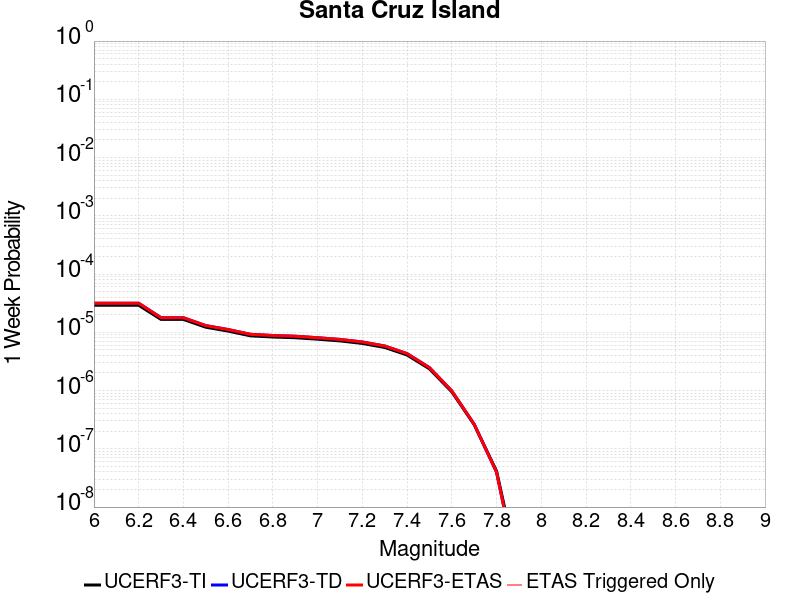 |  |  |  |

| Magnitude | 1 wk TI Prob | 1 wk TD Prob | 1 wk ETAS Prob | 1 wk ETAS/TD Gain | 1 wk ETAS Triggered Only | 1 mo TI Prob | 1 mo TD Prob | 1 mo ETAS Prob | 1 mo ETAS/TD Gain | 1 mo ETAS Triggered Only | 1 yr TI Prob | 1 yr TD Prob | 1 yr ETAS Prob | 1 yr ETAS/TD Gain | 1 yr ETAS Triggered Only | 10 yr TI Prob | 10 yr TD Prob | 10 yr ETAS Prob | 10 yr ETAS/TD Gain | 10 yr ETAS Triggered Only |
|-----|-----|-----|-----|-----|-----|-----|-----|-----|-----|-----|-----|-----|-----|-----|-----|-----|-----|-----|-----|-----|
| 6.0 | 2.9164563E-5 | 3.160327E-5 | 3.160327E-5 | 1.0 | 0.0 | 1.2498499E-4 | 1.3543632E-4 | 1.3543632E-4 | 1.0 | 0.0 | 0.0015206301 | 0.0016478263 | 0.0017084391 | 1.0367835 | 6.071277E-5 | 0.015102667 | 0.016369814 | 0.016459392 | 1.0054722 | 9.106915E-5 |
| 6.1 | 2.9164563E-5 | 3.160327E-5 | 3.160327E-5 | 1.0 | 0.0 | 1.2498499E-4 | 1.3543632E-4 | 1.3543632E-4 | 1.0 | 0.0 | 0.0015206301 | 0.0016478263 | 0.0017084391 | 1.0367835 | 6.071277E-5 | 0.015102667 | 0.016369814 | 0.016459392 | 1.0054722 | 9.106915E-5 |
| 6.2 | 2.9164563E-5 | 3.160327E-5 | 3.160327E-5 | 1.0 | 0.0 | 1.2498499E-4 | 1.3543632E-4 | 1.3543632E-4 | 1.0 | 0.0 | 0.0015206301 | 0.0016478263 | 0.0017084391 | 1.0367835 | 6.071277E-5 | 0.015102667 | 0.016369814 | 0.016459392 | 1.0054722 | 9.106915E-5 |
| 6.3 | 1.6635553E-5 | 1.7806033E-5 | 1.7806033E-5 | 1.0 | 0.0 | 7.1293274E-5 | 7.6309436E-5 | 7.6309436E-5 | 1.0 | 0.0 | 8.6765E-4 | 9.2868967E-4 | 9.2868967E-4 | 1.0 | 0.0 | 0.008642701 | 0.009249959 | 0.009280035 | 1.0032514 | 3.0356385E-5 |
| 6.4 | 1.6635553E-5 | 1.7806033E-5 | 1.7806033E-5 | 1.0 | 0.0 | 7.1293274E-5 | 7.6309436E-5 | 7.6309436E-5 | 1.0 | 0.0 | 8.6765E-4 | 9.2868967E-4 | 9.2868967E-4 | 1.0 | 0.0 | 0.008642701 | 0.009249959 | 0.009280035 | 1.0032514 | 3.0356385E-5 |
| 6.5 | 1.2238748E-5 | 1.3044146E-5 | 1.3044146E-5 | 1.0 | 0.0 | 5.2450723E-5 | 5.5902303E-5 | 5.5902303E-5 | 1.0 | 0.0 | 6.3840044E-4 | 6.804017E-4 | 6.804017E-4 | 1.0 | 0.0 | 0.0063656955 | 0.0067835837 | 0.0068137343 | 1.0044446 | 3.0356385E-5 |
| 6.6 | 1.0489767E-5 | 1.1157589E-5 | 1.1157589E-5 | 1.0 | 0.0 | 4.495537E-5 | 4.7817375E-5 | 4.7817375E-5 | 1.0 | 0.0 | 5.4719415E-4 | 5.8202323E-4 | 5.8202323E-4 | 1.0 | 0.0 | 0.005458487 | 0.0058052302 | 0.0058354107 | 1.0051988 | 3.0356385E-5 |
| 6.7 | 8.699222E-6 | 9.237551E-6 | 9.237551E-6 | 1.0 | 0.0 | 3.7281847E-5 | 3.9588907E-5 | 3.9588907E-5 | 1.0 | 0.0 | 4.5381195E-4 | 4.818889E-4 | 4.818889E-4 | 1.0 | 0.0 | 0.0045288634 | 0.0048085074 | 0.0048387176 | 1.0062827 | 3.0356385E-5 |
| 6.8 | 8.307732E-6 | 8.817633E-6 | 8.817633E-6 | 1.0 | 0.0 | 3.560408E-5 | 3.7789312E-5 | 3.7789312E-5 | 1.0 | 0.0 | 4.3339343E-4 | 4.5998816E-4 | 4.5998816E-4 | 1.0 | 0.0 | 0.004325492 | 0.004590414 | 0.0046206308 | 1.0065826 | 3.0356385E-5 |
| 6.9 | 8.073121E-6 | 8.565643E-6 | 8.565643E-6 | 1.0 | 0.0 | 3.459863E-5 | 3.6709385E-5 | 3.6709385E-5 | 1.0 | 0.0 | 4.2115687E-4 | 4.4684552E-4 | 4.4684552E-4 | 1.0 | 0.0 | 0.004203596 | 0.0044595217 | 0.0044897427 | 1.0067767 | 3.0356385E-5 |
| 7.0 | 7.617019E-6 | 8.075319E-6 | 8.075319E-6 | 1.0 | 0.0 | 3.264396E-5 | 3.4608052E-5 | 3.4608052E-5 | 1.0 | 0.0 | 3.9736772E-4 | 4.2127198E-4 | 4.2127198E-4 | 1.0 | 0.0 | 0.003966579 | 0.0042047813 | 0.00423501 | 1.0071892 | 3.0356385E-5 |
| 7.1 | 7.1224836E-6 | 7.5463936E-6 | 7.5463936E-6 | 1.0 | 0.0 | 3.052457E-5 | 3.234129E-5 | 3.234129E-5 | 1.0 | 0.0 | 3.715733E-4 | 3.936844E-4 | 3.936844E-4 | 1.0 | 0.0 | 0.003709526 | 0.0039299126 | 0.00396015 | 1.0076941 | 3.0356385E-5 |
| 7.2 | 6.441115E-6 | 6.827937E-6 | 6.827937E-6 | 1.0 | 0.0 | 2.7604487E-5 | 2.926226E-5 | 2.926226E-5 | 1.0 | 0.0 | 3.360328E-4 | 3.5621002E-4 | 3.5621002E-4 | 1.0 | 0.0 | 0.0033552512 | 0.003556419 | 0.0035866674 | 1.0085053 | 3.0356385E-5 |
| 7.3 | 5.494274E-6 | 5.8204623E-6 | 5.8204623E-6 | 1.0 | 0.0 | 2.3546674E-5 | 2.49446E-5 | 2.49446E-5 | 1.0 | 0.0 | 2.8664304E-4 | 3.036584E-4 | 3.036584E-4 | 1.0 | 0.0 | 0.002862736 | 0.0030324578 | 0.003062722 | 1.0099801 | 3.0356385E-5 |
| 7.4 | 4.0802624E-6 | 4.3125915E-6 | 4.3125915E-6 | 1.0 | 0.0 | 1.7486722E-5 | 1.8482404E-5 | 1.8482404E-5 | 1.0 | 0.0 | 2.1288003E-4 | 2.2500011E-4 | 2.2500011E-4 | 1.0 | 0.0 | 0.0021267622 | 0.002247732 | 0.0022780201 | 1.013475 | 3.0356385E-5 |
| 7.5 | 2.3584746E-6 | 2.4754813E-6 | 2.4754813E-6 | 1.0 | 0.0 | 1.0107709E-5 | 1.0609163E-5 | 1.0609163E-5 | 1.0 | 0.0 | 1.2305441E-4 | 1.2915896E-4 | 1.2915896E-4 | 1.0 | 0.0 | 0.0012298629 | 0.0012908439 | 0.0012908439 | 1.0 | 0.0 |
| 7.6 | 9.4981914E-7 | 9.861508E-7 | 9.861508E-7 | 1.0 | 0.0 | 4.0706473E-6 | 4.2263537E-6 | 4.2263537E-6 | 1.0 | 0.0 | 4.9559E-5 | 5.1454655E-5 | 5.1454655E-5 | 1.0 | 0.0 | 4.954795E-4 | 5.144287E-4 | 5.144287E-4 | 1.0 | 0.0 |
| 7.7 | 2.6013532E-7 | 2.641776E-7 | 2.641776E-7 | 1.0 | 0.0 | 1.1148652E-6 | 1.1321893E-6 | 1.1321893E-6 | 1.0 | 0.0 | 1.3573399E-5 | 1.3784318E-5 | 1.3784318E-5 | 1.0 | 0.0 | 1.357257E-4 | 1.378347E-4 | 1.378347E-4 | 1.0 | 0.0 |
| 7.8 | 4.1522263E-8 | 3.965808E-8 | 3.965808E-8 | 1.0 | 0.0 | 1.7795254E-7 | 1.6996319E-7 | 1.6996319E-7 | 1.0 | 0.0 | 2.16657E-6 | 2.0693E-6 | 2.0693E-6 | 1.0 | 0.0 | 2.1665488E-5 | 2.0692829E-5 | 2.0692829E-5 | 1.0 | 0.0 |
| 7.9 | 7.7242046E-10 | 5.947136E-10 | 5.947136E-10 | 1.0 | 0.0 | 3.3103735E-9 | 2.5487725E-9 | 2.5487725E-9 | 1.0 | 0.0 | 4.0303796E-8 | 3.1031306E-8 | 3.1031306E-8 | 1.0 | 0.0 | 4.030379E-7 | 3.1031303E-7 | 3.1031303E-7 | 1.0 | 0.0 |

## San Andreas (North Branch Mill Creek)
*[(top)](#table-of-contents)*

| 1 Week | 1 Month | 1 Year | 10 Year |
|-----|-----|-----|-----|
|  |  |  |  |

| Magnitude | 1 wk TI Prob | 1 wk TD Prob | 1 wk ETAS Prob | 1 wk ETAS/TD Gain | 1 wk ETAS Triggered Only | 1 mo TI Prob | 1 mo TD Prob | 1 mo ETAS Prob | 1 mo ETAS/TD Gain | 1 mo ETAS Triggered Only | 1 yr TI Prob | 1 yr TD Prob | 1 yr ETAS Prob | 1 yr ETAS/TD Gain | 1 yr ETAS Triggered Only | 10 yr TI Prob | 10 yr TD Prob | 10 yr ETAS Prob | 10 yr ETAS/TD Gain | 10 yr ETAS Triggered Only |
|-----|-----|-----|-----|-----|-----|-----|-----|-----|-----|-----|-----|-----|-----|-----|-----|-----|-----|-----|-----|-----|
| 6.0 | 1.3461156E-5 | 2.3568791E-5 | 2.3568791E-5 | 1.0 | 0.0 | 5.7689394E-5 | 1.01005215E-4 | 1.01005215E-4 | 1.0 | 0.0 | 7.02142E-4 | 0.0012290481 | 0.0012593672 | 1.0246687 | 3.0356385E-5 | 0.0069992766 | 0.012264845 | 0.012354797 | 1.0073341 | 9.106915E-5 |
| 6.1 | 1.3461156E-5 | 2.3568791E-5 | 2.3568791E-5 | 1.0 | 0.0 | 5.7689394E-5 | 1.01005215E-4 | 1.01005215E-4 | 1.0 | 0.0 | 7.02142E-4 | 0.0012290481 | 0.0012593672 | 1.0246687 | 3.0356385E-5 | 0.0069992766 | 0.012264845 | 0.012354797 | 1.0073341 | 9.106915E-5 |
| 6.2 | 1.3461156E-5 | 2.3568791E-5 | 2.3568791E-5 | 1.0 | 0.0 | 5.7689394E-5 | 1.01005215E-4 | 1.01005215E-4 | 1.0 | 0.0 | 7.02142E-4 | 0.0012290481 | 0.0012593672 | 1.0246687 | 3.0356385E-5 | 0.0069992766 | 0.012264845 | 0.012354797 | 1.0073341 | 9.106915E-5 |
| 6.3 | 1.3461156E-5 | 2.3568791E-5 | 2.3568791E-5 | 1.0 | 0.0 | 5.7689394E-5 | 1.01005215E-4 | 1.01005215E-4 | 1.0 | 0.0 | 7.02142E-4 | 0.0012290481 | 0.0012593672 | 1.0246687 | 3.0356385E-5 | 0.0069992766 | 0.012264845 | 0.012354797 | 1.0073341 | 9.106915E-5 |
| 6.4 | 1.3461156E-5 | 2.3568791E-5 | 2.3568791E-5 | 1.0 | 0.0 | 5.7689394E-5 | 1.01005215E-4 | 1.01005215E-4 | 1.0 | 0.0 | 7.02142E-4 | 0.0012290481 | 0.0012593672 | 1.0246687 | 3.0356385E-5 | 0.0069992766 | 0.012264845 | 0.012354797 | 1.0073341 | 9.106915E-5 |
| 6.5 | 1.3450706E-5 | 2.3557752E-5 | 2.3557752E-5 | 1.0 | 0.0 | 5.764461E-5 | 1.009579E-4 | 1.009579E-4 | 1.0 | 0.0 | 7.0159714E-4 | 0.0012284727 | 0.0012587918 | 1.0246803 | 3.0356385E-5 | 0.006993862 | 0.012259155 | 0.012349107 | 1.0073376 | 9.106915E-5 |
| 6.6 | 1.3074523E-5 | 2.317201E-5 | 2.317201E-5 | 1.0 | 0.0 | 5.6032466E-5 | 9.9304845E-5 | 9.9304845E-5 | 1.0 | 0.0 | 6.8198174E-4 | 0.0012083692 | 0.0012386888 | 1.0250914 | 3.0356385E-5 | 0.006798926 | 0.0120603135 | 0.012150284 | 1.0074601 | 9.106915E-5 |
| 6.7 | 1.3050216E-5 | 2.31473E-5 | 2.31473E-5 | 1.0 | 0.0 | 5.59283E-5 | 9.9198965E-5 | 9.9198965E-5 | 1.0 | 0.0 | 6.8071426E-4 | 0.0012070815 | 0.0012374012 | 1.0251182 | 3.0356385E-5 | 0.0067863287 | 0.012047576 | 0.012137548 | 1.0074681 | 9.106915E-5 |
| 6.8 | 1.29049395E-5 | 2.2995695E-5 | 2.2995695E-5 | 1.0 | 0.0 | 5.530571E-5 | 9.854927E-5 | 9.854927E-5 | 1.0 | 0.0 | 6.73139E-4 | 0.0011991803 | 0.0012295003 | 1.0252839 | 3.0356385E-5 | 0.0067110364 | 0.011969416 | 0.012059396 | 1.0075175 | 9.106915E-5 |
| 6.9 | 1.2867369E-5 | 2.2955088E-5 | 2.2955088E-5 | 1.0 | 0.0 | 5.51447E-5 | 9.837526E-5 | 9.837526E-5 | 1.0 | 0.0 | 6.711799E-4 | 0.001197064 | 0.001227384 | 1.0253286 | 3.0356385E-5 | 0.006691564 | 0.011948481 | 0.012038463 | 1.0075308 | 9.106915E-5 |
| 7.0 | 1.2495996E-5 | 2.2354692E-5 | 2.2354692E-5 | 1.0 | 0.0 | 5.3553173E-5 | 9.580232E-5 | 9.580232E-5 | 1.0 | 0.0 | 6.518148E-4 | 0.001165772 | 0.001196093 | 1.0260093 | 3.0356385E-5 | 0.0064990623 | 0.011638851 | 0.01172886 | 1.0077335 | 9.106915E-5 |
| 7.1 | 1.2452067E-5 | 2.2299744E-5 | 2.2299744E-5 | 1.0 | 0.0 | 5.3364907E-5 | 9.5566844E-5 | 9.5566844E-5 | 1.0 | 0.0 | 6.4952404E-4 | 0.0011629082 | 0.0011932292 | 1.0260735 | 3.0356385E-5 | 0.0064762887 | 0.011610513 | 0.011700525 | 1.0077527 | 9.106915E-5 |
| 7.2 | 1.2002777E-5 | 2.167794E-5 | 2.167794E-5 | 1.0 | 0.0 | 5.143946E-5 | 9.290217E-5 | 9.290217E-5 | 1.0 | 0.0 | 6.2609545E-4 | 0.0011304996 | 0.0011608218 | 1.0268219 | 3.0356385E-5 | 0.006243344 | 0.011289758 | 0.011379798 | 1.0079755 | 9.106915E-5 |
| 7.3 | 1.1923425E-5 | 2.1547696E-5 | 2.1547696E-5 | 1.0 | 0.0 | 5.109939E-5 | 9.234402E-5 | 9.234402E-5 | 1.0 | 0.0 | 6.219575E-4 | 0.0011237112 | 0.0011540335 | 1.0269841 | 3.0356385E-5 | 0.0062021962 | 0.011222587 | 0.011312635 | 1.0080237 | 9.106915E-5 |
| 7.4 | 1.16105175E-5 | 2.0921012E-5 | 2.0921012E-5 | 1.0 | 0.0 | 4.975841E-5 | 8.965841E-5 | 8.965841E-5 | 1.0 | 0.0 | 6.0564023E-4 | 0.0010910471 | 0.0011213704 | 1.0277928 | 3.0356385E-5 | 0.006039923 | 0.01089987 | 0.010989946 | 1.008264 | 9.106915E-5 |
| 7.5 | 1.1037265E-5 | 1.9618798E-5 | 1.9618798E-5 | 1.0 | 0.0 | 4.7301706E-5 | 8.407787E-5 | 8.407787E-5 | 1.0 | 0.0 | 5.757461E-4 | 0.0010231695 | 0.0010534948 | 1.0296386 | 3.0356385E-5 | 0.005742567 | 0.010228194 | 0.010318332 | 1.0088127 | 9.106915E-5 |
| 7.6 | 1.0720915E-5 | 1.9059898E-5 | 1.9059898E-5 | 1.0 | 0.0 | 4.5945973E-5 | 8.168274E-5 | 8.168274E-5 | 1.0 | 0.0 | 5.592486E-4 | 9.940357E-4 | 0.001024362 | 1.0305082 | 3.0356385E-5 | 0.005578433 | 0.00993951 | 0.0100296745 | 1.0090712 | 9.106915E-5 |
| 7.7 | 9.276279E-6 | 1.6502676E-5 | 1.6502676E-5 | 1.0 | 0.0 | 3.9754876E-5 | 7.072384E-5 | 7.072384E-5 | 1.0 | 0.0 | 4.839081E-4 | 8.607243E-4 | 8.910546E-4 | 1.035238 | 3.0356385E-5 | 0.0048285574 | 0.008617393 | 0.008707677 | 1.010477 | 9.106915E-5 |
| 7.8 | 5.8346777E-6 | 1.1204534E-5 | 1.1204534E-5 | 1.0 | 0.0 | 2.5005522E-5 | 4.8018544E-5 | 4.8018544E-5 | 1.0 | 0.0 | 3.043997E-4 | 5.8446906E-4 | 6.148077E-4 | 1.051908 | 3.0356385E-5 | 0.0030398308 | 0.0058723968 | 0.005962931 | 1.015417 | 9.106915E-5 |
| 7.9 | 4.690204E-6 | 8.550357E-6 | 8.550357E-6 | 1.0 | 0.0 | 2.0100719E-5 | 3.6643873E-5 | 3.6643873E-5 | 1.0 | 0.0 | 2.4469878E-4 | 4.460479E-4 | 4.7639073E-4 | 1.068026 | 3.0356385E-5 | 0.002444295 | 0.0044919904 | 0.0045826505 | 1.0201826 | 9.106915E-5 |
| 8.0 | 2.9570454E-6 | 4.8721763E-6 | 4.8721763E-6 | 1.0 | 0.0 | 1.267299E-5 | 2.0880589E-5 | 2.0880589E-5 | 1.0 | 0.0 | 1.5428272E-4 | 2.5419152E-4 | 2.5419152E-4 | 1.0 | 0.0 | 0.0015417566 | 0.002562766 | 0.002562766 | 1.0 | 0.0 |
| 8.1 | 1.6376824E-6 | 2.2101194E-6 | 2.2101194E-6 | 1.0 | 0.0 | 7.01862E-6 | 9.471906E-6 | 9.471906E-6 | 1.0 | 0.0 | 8.544835E-5 | 1.15314375E-4 | 1.15314375E-4 | 1.0 | 0.0 | 8.54155E-4 | 0.0011675779 | 0.0011675779 | 1.0 | 0.0 |
| 8.2 | 6.9631557E-7 | 4.5774055E-7 | 4.5774055E-7 | 1.0 | 0.0 | 2.984206E-6 | 1.9617437E-6 | 1.9617437E-6 | 1.0 | 0.0 | 3.63321E-5 | 2.388397E-5 | 2.388397E-5 | 1.0 | 0.0 | 3.6326164E-4 | 2.4735386E-4 | 2.4735386E-4 | 1.0 | 0.0 |
| 8.3 | 1.7876137E-7 | 8.444342E-8 | 8.444342E-8 | 1.0 | 0.0 | 7.661199E-7 | 3.6190033E-7 | 3.6190033E-7 | 1.0 | 0.0 | 9.32747E-6 | 4.406128E-6 | 4.406128E-6 | 1.0 | 0.0 | 9.3270784E-5 | 4.626742E-5 | 4.626742E-5 | 1.0 | 0.0 |

## Palos Verdes
*[(top)](#table-of-contents)*

| 1 Week | 1 Month | 1 Year | 10 Year |
|-----|-----|-----|-----|
|  |  | 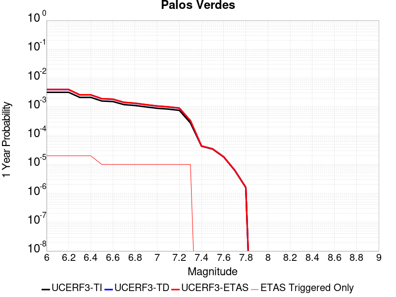 |  |

| Magnitude | 1 wk TI Prob | 1 wk TD Prob | 1 wk ETAS Prob | 1 wk ETAS/TD Gain | 1 wk ETAS Triggered Only | 1 mo TI Prob | 1 mo TD Prob | 1 mo ETAS Prob | 1 mo ETAS/TD Gain | 1 mo ETAS Triggered Only | 1 yr TI Prob | 1 yr TD Prob | 1 yr ETAS Prob | 1 yr ETAS/TD Gain | 1 yr ETAS Triggered Only | 10 yr TI Prob | 10 yr TD Prob | 10 yr ETAS Prob | 10 yr ETAS/TD Gain | 10 yr ETAS Triggered Only |
|-----|-----|-----|-----|-----|-----|-----|-----|-----|-----|-----|-----|-----|-----|-----|-----|-----|-----|-----|-----|-----|
| 6.0 | 6.126063E-5 | 7.625118E-5 | 7.625118E-5 | 1.0 | 0.0 | 2.6251914E-4 | 3.267532E-4 | 3.267532E-4 | 1.0 | 0.0 | 0.0031914865 | 0.003971426 | 0.0040318975 | 1.0152267 | 6.071277E-5 | 0.031460393 | 0.039061166 | 0.039148677 | 1.0022404 | 9.106915E-5 |
| 6.1 | 6.126063E-5 | 7.625118E-5 | 7.625118E-5 | 1.0 | 0.0 | 2.6251914E-4 | 3.267532E-4 | 3.267532E-4 | 1.0 | 0.0 | 0.0031914865 | 0.003971426 | 0.0040318975 | 1.0152267 | 6.071277E-5 | 0.031460393 | 0.039061166 | 0.039148677 | 1.0022404 | 9.106915E-5 |
| 6.2 | 6.126063E-5 | 7.625118E-5 | 7.625118E-5 | 1.0 | 0.0 | 2.6251914E-4 | 3.267532E-4 | 3.267532E-4 | 1.0 | 0.0 | 0.0031914865 | 0.003971426 | 0.0040318975 | 1.0152267 | 6.071277E-5 | 0.031460393 | 0.039061166 | 0.039148677 | 1.0022404 | 9.106915E-5 |
| 6.3 | 4.0838047E-5 | 4.9764007E-5 | 4.9764007E-5 | 1.0 | 0.0 | 1.7500846E-4 | 2.1325816E-4 | 2.1325816E-4 | 1.0 | 0.0 | 0.0021286458 | 0.0025935178 | 0.002654073 | 1.0233487 | 6.071277E-5 | 0.021083709 | 0.025654016 | 0.025742749 | 1.0034589 | 9.106915E-5 |
| 6.4 | 4.0838047E-5 | 4.9764007E-5 | 4.9764007E-5 | 1.0 | 0.0 | 1.7500846E-4 | 2.1325816E-4 | 2.1325816E-4 | 1.0 | 0.0 | 0.0021286458 | 0.0025935178 | 0.002654073 | 1.0233487 | 6.071277E-5 | 0.021083709 | 0.025654016 | 0.025742749 | 1.0034589 | 9.106915E-5 |
| 6.5 | 3.0512005E-5 | 3.657133E-5 | 3.657133E-5 | 1.0 | 0.0 | 1.3075917E-4 | 1.5672554E-4 | 1.5672554E-4 | 1.0 | 0.0 | 0.0015908304 | 0.0019065797 | 0.0019368782 | 1.0158916 | 3.0356385E-5 | 0.015794903 | 0.018914111 | 0.018973675 | 1.0031492 | 6.071277E-5 |
| 6.6 | 2.9255087E-5 | 3.5163906E-5 | 3.5163906E-5 | 1.0 | 0.0 | 1.2537291E-4 | 1.5069441E-4 | 1.5069441E-4 | 1.0 | 0.0 | 0.0015253464 | 0.0018332743 | 0.001863575 | 1.0165282 | 3.0356385E-5 | 0.015149189 | 0.018193072 | 0.01825268 | 1.0032765 | 6.071277E-5 |
| 6.7 | 2.287198E-5 | 2.7255252E-5 | 2.7255252E-5 | 1.0 | 0.0 | 9.801909E-5 | 1.1680351E-4 | 1.1680351E-4 | 1.0 | 0.0 | 0.001192729 | 0.0014212468 | 0.0014515601 | 1.0213286 | 3.0356385E-5 | 0.011863477 | 0.01413081 | 0.014160737 | 1.0021179 | 3.0356385E-5 |
| 6.8 | 2.1325764E-5 | 2.5438425E-5 | 2.5438425E-5 | 1.0 | 0.0 | 9.139293E-5 | 1.09017776E-4 | 1.09017776E-4 | 1.0 | 0.0 | 0.001112141 | 0.0013265735 | 0.0013568896 | 1.0228529 | 3.0356385E-5 | 0.011065915 | 0.013195587 | 0.013225543 | 1.0022701 | 3.0356385E-5 |
| 6.9 | 1.9009392E-5 | 2.2619284E-5 | 2.2619284E-5 | 1.0 | 0.0 | 8.1466285E-5 | 9.693668E-5 | 9.693668E-5 | 1.0 | 0.0 | 9.914007E-4 | 0.0011796525 | 0.0012099731 | 1.025703 | 3.0356385E-5 | 0.009869894 | 0.011742596 | 0.011772595 | 1.0025548 | 3.0356385E-5 |
| 7.0 | 1.7098473E-5 | 2.0324482E-5 | 2.0324482E-5 | 1.0 | 0.0 | 7.3277115E-5 | 8.710249E-5 | 8.710249E-5 | 1.0 | 0.0 | 8.917837E-4 | 0.0010600422 | 0.0010903664 | 1.0286067 | 3.0356385E-5 | 0.008882134 | 0.010558298 | 0.010588334 | 1.0028448 | 3.0356385E-5 |
| 7.1 | 1.5982785E-5 | 1.8999555E-5 | 1.8999555E-5 | 1.0 | 0.0 | 6.849585E-5 | 8.14246E-5 | 8.14246E-5 | 1.0 | 0.0 | 8.336179E-4 | 9.909783E-4 | 0.0010213046 | 1.0306023 | 3.0356385E-5 | 0.008304977 | 0.009873961 | 0.009904018 | 1.003044 | 3.0356385E-5 |
| 7.2 | 1.4468002E-5 | 1.7201583E-5 | 1.7201583E-5 | 1.0 | 0.0 | 6.200425E-5 | 7.3719464E-5 | 7.3719464E-5 | 1.0 | 0.0 | 7.546402E-4 | 8.972489E-4 | 9.27578E-4 | 1.0338024 | 3.0356385E-5 | 0.007520827 | 0.008944537 | 0.008974621 | 1.0033635 | 3.0356385E-5 |
| 7.3 | 5.288233E-6 | 6.205136E-6 | 6.205136E-6 | 1.0 | 0.0 | 2.2663658E-5 | 2.6593365E-5 | 2.6593365E-5 | 1.0 | 0.0 | 2.7589512E-4 | 3.2376102E-4 | 3.541076E-4 | 1.0937313 | 3.0356385E-5 | 0.0027555283 | 0.003236318 | 0.0032665762 | 1.0093496 | 3.0356385E-5 |
| 7.4 | 8.279556E-7 | 8.40852E-7 | 8.40852E-7 | 1.0 | 0.0 | 3.5483763E-6 | 3.603647E-6 | 3.603647E-6 | 1.0 | 0.0 | 4.3200624E-5 | 4.387359E-5 | 4.387359E-5 | 1.0 | 0.0 | 4.3192226E-4 | 4.386565E-4 | 4.386565E-4 | 1.0 | 0.0 |
| 7.5 | 6.559831E-7 | 6.667374E-7 | 6.667374E-7 | 1.0 | 0.0 | 2.8113532E-6 | 2.8574432E-6 | 2.8574432E-6 | 1.0 | 0.0 | 3.4227687E-5 | 3.478888E-5 | 3.478888E-5 | 1.0 | 0.0 | 3.4222414E-4 | 3.4784098E-4 | 3.4784098E-4 | 1.0 | 0.0 |
| 7.6 | 3.5018968E-7 | 3.562084E-7 | 3.562084E-7 | 1.0 | 0.0 | 1.500812E-6 | 1.5266068E-6 | 1.5266068E-6 | 1.0 | 0.0 | 1.8272232E-5 | 1.8586326E-5 | 1.8586326E-5 | 1.0 | 0.0 | 1.8270731E-4 | 1.8585232E-4 | 1.8585232E-4 | 1.0 | 0.0 |
| 7.7 | 1.1986104E-7 | 1.2198663E-7 | 1.2198663E-7 | 1.0 | 0.0 | 5.1369005E-7 | 5.227997E-7 | 5.227997E-7 | 1.0 | 0.0 | 6.2541585E-6 | 6.3650687E-6 | 6.3650687E-6 | 1.0 | 0.0 | 6.2539824E-5 | 6.3648906E-5 | 6.3648906E-5 | 1.0 | 0.0 |
| 7.8 | 3.0445005E-8 | 3.102837E-8 | 3.102837E-8 | 1.0 | 0.0 | 1.3047858E-7 | 1.3297873E-7 | 1.3297873E-7 | 1.0 | 0.0 | 1.5885756E-6 | 1.619015E-6 | 1.619015E-6 | 1.0 | 0.0 | 1.5885644E-5 | 1.6190053E-5 | 1.6190053E-5 | 1.0 | 0.0 |

## Red Mountain
*[(top)](#table-of-contents)*

| 1 Week | 1 Month | 1 Year | 10 Year |
|-----|-----|-----|-----|
| 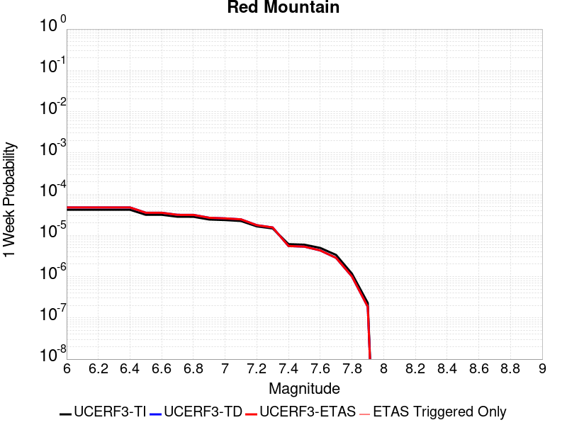 |  |  |  |

| Magnitude | 1 wk TI Prob | 1 wk TD Prob | 1 wk ETAS Prob | 1 wk ETAS/TD Gain | 1 wk ETAS Triggered Only | 1 mo TI Prob | 1 mo TD Prob | 1 mo ETAS Prob | 1 mo ETAS/TD Gain | 1 mo ETAS Triggered Only | 1 yr TI Prob | 1 yr TD Prob | 1 yr ETAS Prob | 1 yr ETAS/TD Gain | 1 yr ETAS Triggered Only | 10 yr TI Prob | 10 yr TD Prob | 10 yr ETAS Prob | 10 yr ETAS/TD Gain | 10 yr ETAS Triggered Only |
|-----|-----|-----|-----|-----|-----|-----|-----|-----|-----|-----|-----|-----|-----|-----|-----|-----|-----|-----|-----|-----|
| 6.0 | 4.1810763E-5 | 4.7600555E-5 | 4.7600555E-5 | 1.0 | 0.0 | 1.7917668E-4 | 2.0398737E-4 | 2.0398737E-4 | 1.0 | 0.0 | 0.0021792934 | 0.0024808832 | 0.0025111642 | 1.0122057 | 3.0356385E-5 | 0.021580452 | 0.024549497 | 0.02460872 | 1.0024123 | 6.071277E-5 |
| 6.1 | 4.1810763E-5 | 4.7600555E-5 | 4.7600555E-5 | 1.0 | 0.0 | 1.7917668E-4 | 2.0398737E-4 | 2.0398737E-4 | 1.0 | 0.0 | 0.0021792934 | 0.0024808832 | 0.0025111642 | 1.0122057 | 3.0356385E-5 | 0.021580452 | 0.024549497 | 0.02460872 | 1.0024123 | 6.071277E-5 |
| 6.2 | 4.1810763E-5 | 4.7600555E-5 | 4.7600555E-5 | 1.0 | 0.0 | 1.7917668E-4 | 2.0398737E-4 | 2.0398737E-4 | 1.0 | 0.0 | 0.0021792934 | 0.0024808832 | 0.0025111642 | 1.0122057 | 3.0356385E-5 | 0.021580452 | 0.024549497 | 0.02460872 | 1.0024123 | 6.071277E-5 |
| 6.3 | 4.1810763E-5 | 4.7600555E-5 | 4.7600555E-5 | 1.0 | 0.0 | 1.7917668E-4 | 2.0398737E-4 | 2.0398737E-4 | 1.0 | 0.0 | 0.0021792934 | 0.0024808832 | 0.0025111642 | 1.0122057 | 3.0356385E-5 | 0.021580452 | 0.024549497 | 0.02460872 | 1.0024123 | 6.071277E-5 |
| 6.4 | 4.1810763E-5 | 4.7600555E-5 | 4.7600555E-5 | 1.0 | 0.0 | 1.7917668E-4 | 2.0398737E-4 | 2.0398737E-4 | 1.0 | 0.0 | 0.0021792934 | 0.0024808832 | 0.0025111642 | 1.0122057 | 3.0356385E-5 | 0.021580452 | 0.024549497 | 0.02460872 | 1.0024123 | 6.071277E-5 |
| 6.5 | 3.154503E-5 | 3.536723E-5 | 3.536723E-5 | 1.0 | 0.0 | 1.3518598E-4 | 1.5156555E-4 | 1.5156555E-4 | 1.0 | 0.0 | 0.0016446467 | 0.001843841 | 0.0018741415 | 1.0164334 | 3.0356385E-5 | 0.01632528 | 0.018295081 | 0.018324884 | 1.0016289 | 3.0356385E-5 |
| 6.6 | 3.1535834E-5 | 3.5356607E-5 | 3.5356607E-5 | 1.0 | 0.0 | 1.3514658E-4 | 1.5152004E-4 | 1.5152004E-4 | 1.0 | 0.0 | 0.0016441676 | 0.001843288 | 0.0018735883 | 1.0164382 | 3.0356385E-5 | 0.01632056 | 0.018289642 | 0.018319443 | 1.0016294 | 3.0356385E-5 |
| 6.7 | 2.8267326E-5 | 3.147588E-5 | 3.147588E-5 | 1.0 | 0.0 | 1.2114006E-4 | 1.3489013E-4 | 1.3489013E-4 | 1.0 | 0.0 | 0.0014738824 | 0.0016411353 | 0.0016714418 | 1.0184668 | 3.0356385E-5 | 0.014641452 | 0.016298926 | 0.016328786 | 1.0018321 | 3.0356385E-5 |
| 6.8 | 2.8212884E-5 | 3.1413754E-5 | 3.1413754E-5 | 1.0 | 0.0 | 1.20906756E-4 | 1.346239E-4 | 1.346239E-4 | 1.0 | 0.0 | 0.0014710457 | 0.0016378989 | 0.0016682055 | 1.0185034 | 3.0356385E-5 | 0.014613459 | 0.016267035 | 0.016296897 | 1.0018358 | 3.0356385E-5 |
| 6.9 | 2.4227871E-5 | 2.6712387E-5 | 2.6712387E-5 | 1.0 | 0.0 | 1.03829596E-4 | 1.14477065E-4 | 1.14477065E-4 | 1.0 | 0.0 | 0.0012633923 | 0.0013929431 | 0.0014232572 | 1.0217626 | 3.0356385E-5 | 0.012562336 | 0.013849813 | 0.013879749 | 1.0021615 | 3.0356385E-5 |
| 7.0 | 2.348524E-5 | 2.5840971E-5 | 2.5840971E-5 | 1.0 | 0.0 | 1.0064714E-4 | 1.10742745E-4 | 1.10742745E-4 | 1.0 | 0.0 | 0.0012246901 | 0.0013475346 | 0.0013778501 | 1.0224969 | 3.0356385E-5 | 0.012179627 | 0.013401275 | 0.013431224 | 1.0022348 | 3.0356385E-5 |
| 7.1 | 2.2311642E-5 | 2.4467727E-5 | 2.4467727E-5 | 1.0 | 0.0 | 9.561782E-5 | 1.0485789E-4 | 1.0485789E-4 | 1.0 | 0.0 | 0.0011635252 | 0.001275972 | 0.0013062897 | 1.0237604 | 3.0356385E-5 | 0.01157452 | 0.012693978 | 0.012723949 | 1.002361 | 3.0356385E-5 |
| 7.2 | 1.6533986E-5 | 1.767366E-5 | 1.767366E-5 | 1.0 | 0.0 | 7.085802E-5 | 7.574241E-5 | 7.574241E-5 | 1.0 | 0.0 | 8.623549E-4 | 9.218372E-4 | 9.5216563E-4 | 1.0329 | 3.0356385E-5 | 0.008590161 | 0.009186415 | 0.009216492 | 1.0032741 | 3.0356385E-5 |
| 7.3 | 1.4703092E-5 | 1.5562402E-5 | 1.5562402E-5 | 1.0 | 0.0 | 6.301173E-5 | 6.669465E-5 | 6.669465E-5 | 1.0 | 0.0 | 7.668978E-4 | 8.117665E-4 | 8.4209826E-4 | 1.0373651 | 3.0356385E-5 | 0.0076425658 | 0.00809409 | 0.008124201 | 1.00372 | 3.0356385E-5 |
| 7.4 | 6.1331984E-6 | 5.5294786E-6 | 5.5294786E-6 | 1.0 | 0.0 | 2.6284872E-5 | 2.3697552E-5 | 2.3697552E-5 | 1.0 | 0.0 | 3.199713E-4 | 2.8848005E-4 | 3.1882766E-4 | 1.1051984 | 3.0356385E-5 | 0.0031951098 | 0.00288111 | 0.0029113789 | 1.010506 | 3.0356385E-5 |
| 7.5 | 5.954766E-6 | 5.339087E-6 | 5.339087E-6 | 1.0 | 0.0 | 2.5520176E-5 | 2.2881602E-5 | 2.2881602E-5 | 1.0 | 0.0 | 3.1066386E-4 | 2.7854842E-4 | 3.0889636E-4 | 1.1089503 | 3.0356385E-5 | 0.003102299 | 0.0027820468 | 0.0028123187 | 1.0108812 | 3.0356385E-5 |
| 7.6 | 4.9726646E-6 | 4.3157743E-6 | 4.3157743E-6 | 1.0 | 0.0 | 2.1311245E-5 | 1.8496046E-5 | 1.8496046E-5 | 1.0 | 0.0 | 2.5943352E-4 | 2.2516643E-4 | 2.5551597E-4 | 1.1347872 | 3.0356385E-5 | 0.0025913084 | 0.0022494176 | 0.0022797056 | 1.0134648 | 3.0356385E-5 |
| 7.7 | 3.3613894E-6 | 2.852986E-6 | 2.852986E-6 | 1.0 | 0.0 | 1.4405875E-5 | 1.2227028E-5 | 1.2227028E-5 | 1.0 | 0.0 | 1.7537741E-4 | 1.4885415E-4 | 1.4885415E-4 | 1.0 | 0.0 | 0.0017523908 | 0.0014875707 | 0.0014875707 | 1.0 | 0.0 |
| 7.8 | 1.1828961E-6 | 1.0123645E-6 | 1.0123645E-6 | 1.0 | 0.0 | 5.069545E-6 | 4.3386976E-6 | 4.3386976E-6 | 1.0 | 0.0 | 6.171996E-5 | 5.2822394E-5 | 5.2822394E-5 | 1.0 | 0.0 | 6.170282E-4 | 5.281013E-4 | 5.281013E-4 | 1.0 | 0.0 |
| 7.9 | 2.2967266E-7 | 1.862061E-7 | 1.862061E-7 | 1.0 | 0.0 | 9.843111E-7 | 7.980259E-7 | 7.980259E-7 | 1.0 | 0.0 | 1.19839215E-5 | 9.715925E-6 | 9.715925E-6 | 1.0 | 0.0 | 1.1983275E-4 | 9.7155294E-5 | 9.7155294E-5 | 1.0 | 0.0 |

## Lake Isabella (Seismicity)
*[(top)](#table-of-contents)*

| 1 Week | 1 Month | 1 Year | 10 Year |
|-----|-----|-----|-----|
|  | 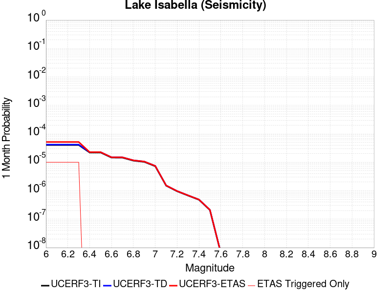 |  |  |

| Magnitude | 1 wk TI Prob | 1 wk TD Prob | 1 wk ETAS Prob | 1 wk ETAS/TD Gain | 1 wk ETAS Triggered Only | 1 mo TI Prob | 1 mo TD Prob | 1 mo ETAS Prob | 1 mo ETAS/TD Gain | 1 mo ETAS Triggered Only | 1 yr TI Prob | 1 yr TD Prob | 1 yr ETAS Prob | 1 yr ETAS/TD Gain | 1 yr ETAS Triggered Only | 10 yr TI Prob | 10 yr TD Prob | 10 yr ETAS Prob | 10 yr ETAS/TD Gain | 10 yr ETAS Triggered Only |
|-----|-----|-----|-----|-----|-----|-----|-----|-----|-----|-----|-----|-----|-----|-----|-----|-----|-----|-----|-----|-----|
| 6.0 | 9.431637E-6 | 9.742077E-6 | 9.742077E-6 | 1.0 | 0.0 | 4.0420677E-5 | 4.1751162E-5 | 4.1751162E-5 | 1.0 | 0.0 | 4.920106E-4 | 5.0821493E-4 | 5.992378E-4 | 1.1791031 | 9.106915E-5 | 0.004909227 | 0.0050718198 | 0.0051624267 | 1.0178648 | 9.106915E-5 |
| 6.1 | 9.431637E-6 | 9.742077E-6 | 9.742077E-6 | 1.0 | 0.0 | 4.0420677E-5 | 4.1751162E-5 | 4.1751162E-5 | 1.0 | 0.0 | 4.920106E-4 | 5.0821493E-4 | 5.992378E-4 | 1.1791031 | 9.106915E-5 | 0.004909227 | 0.0050718198 | 0.0051624267 | 1.0178648 | 9.106915E-5 |
| 6.2 | 9.431637E-6 | 9.742077E-6 | 9.742077E-6 | 1.0 | 0.0 | 4.0420677E-5 | 4.1751162E-5 | 4.1751162E-5 | 1.0 | 0.0 | 4.920106E-4 | 5.0821493E-4 | 5.992378E-4 | 1.1791031 | 9.106915E-5 | 0.004909227 | 0.0050718198 | 0.0051624267 | 1.0178648 | 9.106915E-5 |
| 6.3 | 9.431637E-6 | 9.742077E-6 | 9.742077E-6 | 1.0 | 0.0 | 4.0420677E-5 | 4.1751162E-5 | 4.1751162E-5 | 1.0 | 0.0 | 4.920106E-4 | 5.0821493E-4 | 5.992378E-4 | 1.1791031 | 9.106915E-5 | 0.004909227 | 0.0050718198 | 0.0051624267 | 1.0178648 | 9.106915E-5 |
| 6.4 | 5.144063E-6 | 5.3002896E-6 | 5.3002896E-6 | 1.0 | 0.0 | 2.2045799E-5 | 2.2715349E-5 | 2.2715349E-5 | 1.0 | 0.0 | 2.6837454E-4 | 2.7652772E-4 | 3.068757E-4 | 1.1097467 | 3.0356385E-5 | 0.0026805066 | 0.0027621768 | 0.0027924492 | 1.0109596 | 3.0356385E-5 |
| 6.5 | 5.144063E-6 | 5.3002896E-6 | 5.3002896E-6 | 1.0 | 0.0 | 2.2045799E-5 | 2.2715349E-5 | 2.2715349E-5 | 1.0 | 0.0 | 2.6837454E-4 | 2.7652772E-4 | 3.068757E-4 | 1.1097467 | 3.0356385E-5 | 0.0026805066 | 0.0027621768 | 0.0027924492 | 1.0109596 | 3.0356385E-5 |
| 6.6 | 3.4009804E-6 | 3.4989196E-6 | 3.4989196E-6 | 1.0 | 0.0 | 1.4575549E-5 | 1.4995293E-5 | 1.4995293E-5 | 1.0 | 0.0 | 1.7744285E-4 | 1.82554E-4 | 2.1290484E-4 | 1.1662568 | 3.0356385E-5 | 0.0017730123 | 0.0018241982 | 0.0018544991 | 1.0166106 | 3.0356385E-5 |
| 6.7 | 3.3880428E-6 | 3.485786E-6 | 3.485786E-6 | 1.0 | 0.0 | 1.4520103E-5 | 1.4939006E-5 | 1.4939006E-5 | 1.0 | 0.0 | 1.767679E-4 | 1.8186883E-4 | 2.1221969E-4 | 1.1668832 | 3.0356385E-5 | 0.0017662736 | 0.0018173576 | 0.0018476589 | 1.0166732 | 3.0356385E-5 |
| 6.8 | 2.6582E-6 | 2.7338033E-6 | 2.7338033E-6 | 1.0 | 0.0 | 1.1392236E-5 | 1.1716254E-5 | 1.1716254E-5 | 1.0 | 0.0 | 1.3869164E-4 | 1.4263741E-4 | 1.7298946E-4 | 1.2127917 | 3.0356385E-5 | 0.0013860512 | 0.0014255906 | 0.0014559038 | 1.0212636 | 3.0356385E-5 |
| 6.9 | 2.406011E-6 | 2.474422E-6 | 2.474422E-6 | 1.0 | 0.0 | 1.0311434E-5 | 1.060463E-5 | 1.060463E-5 | 1.0 | 0.0 | 1.2553448E-4 | 1.2910504E-4 | 1.2910504E-4 | 1.0 | 0.0 | 0.0012546359 | 0.00129043 | 0.00129043 | 1.0 | 0.0 |
| 7.0 | 1.6953097E-6 | 1.7430021E-6 | 1.7430021E-6 | 1.0 | 0.0 | 7.265593E-6 | 7.4699938E-6 | 7.4699938E-6 | 1.0 | 0.0 | 8.8455E-5 | 9.094443E-5 | 9.094443E-5 | 1.0 | 0.0 | 8.84198E-4 | 9.0917485E-4 | 9.0917485E-4 | 1.0 | 0.0 |
| 7.1 | 3.5013824E-7 | 3.5715772E-7 | 3.5715772E-7 | 1.0 | 0.0 | 1.5005916E-6 | 1.530675E-6 | 1.530675E-6 | 1.0 | 0.0 | 1.826955E-5 | 1.8635812E-5 | 1.8635812E-5 | 1.0 | 0.0 | 1.8268047E-4 | 1.8634275E-4 | 1.8634275E-4 | 1.0 | 0.0 |
| 7.2 | 2.2321095E-7 | 2.2751153E-7 | 2.2751153E-7 | 1.0 | 0.0 | 9.56618E-7 | 9.750491E-7 | 9.750491E-7 | 1.0 | 0.0 | 1.1646762E-5 | 1.187116E-5 | 1.187116E-5 | 1.0 | 0.0 | 1.1646151E-4 | 1.1870535E-4 | 1.1870535E-4 | 1.0 | 0.0 |
| 7.3 | 1.5760406E-7 | 1.6061328E-7 | 1.6061328E-7 | 1.0 | 0.0 | 6.7544585E-7 | 6.883425E-7 | 6.883425E-7 | 1.0 | 0.0 | 8.223522E-6 | 8.380538E-6 | 8.380538E-6 | 1.0 | 0.0 | 8.2232174E-5 | 8.380228E-5 | 8.380228E-5 | 1.0 | 0.0 |
| 7.4 | 1.1216497E-7 | 1.14319974E-7 | 1.14319974E-7 | 1.0 | 0.0 | 4.8070694E-7 | 4.8994264E-7 | 4.8994264E-7 | 1.0 | 0.0 | 5.852591E-6 | 5.9650356E-6 | 5.9650356E-6 | 1.0 | 0.0 | 5.8524372E-5 | 5.96488E-5 | 5.96488E-5 | 1.0 | 0.0 |
| 7.5 | 4.885185E-8 | 4.9789E-8 | 4.9789E-8 | 1.0 | 0.0 | 2.0936506E-7 | 2.1338143E-7 | 2.1338143E-7 | 1.0 | 0.0 | 2.5490165E-6 | 2.597916E-6 | 2.597916E-6 | 1.0 | 0.0 | 2.5489873E-5 | 2.5978874E-5 | 2.5978874E-5 | 1.0 | 0.0 |
| 7.6 | 1.504641E-9 | 1.5318269E-9 | 1.5318269E-9 | 1.0 | 0.0 | 6.4484613E-9 | 6.5649726E-9 | 6.5649726E-9 | 1.0 | 0.0 | 7.851001E-8 | 7.992854E-8 | 7.992854E-8 | 1.0 | 0.0 | 7.8509987E-7 | 7.9928543E-7 | 7.9928543E-7 | 1.0 | 0.0 |

## Independence rev 2011
*[(top)](#table-of-contents)*

| 1 Week | 1 Month | 1 Year | 10 Year |
|-----|-----|-----|-----|
|  |  |  |  |

| Magnitude | 1 wk TI Prob | 1 wk TD Prob | 1 wk ETAS Prob | 1 wk ETAS/TD Gain | 1 wk ETAS Triggered Only | 1 mo TI Prob | 1 mo TD Prob | 1 mo ETAS Prob | 1 mo ETAS/TD Gain | 1 mo ETAS Triggered Only | 1 yr TI Prob | 1 yr TD Prob | 1 yr ETAS Prob | 1 yr ETAS/TD Gain | 1 yr ETAS Triggered Only | 10 yr TI Prob | 10 yr TD Prob | 10 yr ETAS Prob | 10 yr ETAS/TD Gain | 10 yr ETAS Triggered Only |
|-----|-----|-----|-----|-----|-----|-----|-----|-----|-----|-----|-----|-----|-----|-----|-----|-----|-----|-----|-----|-----|
| 6.0 | 4.422171E-6 | 4.32641E-6 | 4.32641E-6 | 1.0 | 0.0 | 1.8952025E-5 | 1.8541641E-5 | 1.8541641E-5 | 1.0 | 0.0 | 2.3071647E-4 | 2.2572408E-4 | 2.2572408E-4 | 1.0 | 0.0 | 0.0023047708 | 0.0022552419 | 0.0023461056 | 1.04029 | 9.106915E-5 |
| 6.1 | 4.422171E-6 | 4.32641E-6 | 4.32641E-6 | 1.0 | 0.0 | 1.8952025E-5 | 1.8541641E-5 | 1.8541641E-5 | 1.0 | 0.0 | 2.3071647E-4 | 2.2572408E-4 | 2.2572408E-4 | 1.0 | 0.0 | 0.0023047708 | 0.0022552419 | 0.0023461056 | 1.04029 | 9.106915E-5 |
| 6.2 | 4.422171E-6 | 4.32641E-6 | 4.32641E-6 | 1.0 | 0.0 | 1.8952025E-5 | 1.8541641E-5 | 1.8541641E-5 | 1.0 | 0.0 | 2.3071647E-4 | 2.2572408E-4 | 2.2572408E-4 | 1.0 | 0.0 | 0.0023047708 | 0.0022552419 | 0.0023461056 | 1.04029 | 9.106915E-5 |
| 6.3 | 4.422171E-6 | 4.32641E-6 | 4.32641E-6 | 1.0 | 0.0 | 1.8952025E-5 | 1.8541641E-5 | 1.8541641E-5 | 1.0 | 0.0 | 2.3071647E-4 | 2.2572408E-4 | 2.2572408E-4 | 1.0 | 0.0 | 0.0023047708 | 0.0022552419 | 0.0023461056 | 1.04029 | 9.106915E-5 |
| 6.4 | 4.422171E-6 | 4.32641E-6 | 4.32641E-6 | 1.0 | 0.0 | 1.8952025E-5 | 1.8541641E-5 | 1.8541641E-5 | 1.0 | 0.0 | 2.3071647E-4 | 2.2572408E-4 | 2.2572408E-4 | 1.0 | 0.0 | 0.0023047708 | 0.0022552419 | 0.0023461056 | 1.04029 | 9.106915E-5 |
| 6.5 | 4.422171E-6 | 4.32641E-6 | 4.32641E-6 | 1.0 | 0.0 | 1.8952025E-5 | 1.8541641E-5 | 1.8541641E-5 | 1.0 | 0.0 | 2.3071647E-4 | 2.2572408E-4 | 2.2572408E-4 | 1.0 | 0.0 | 0.0023047708 | 0.0022552419 | 0.0023461056 | 1.04029 | 9.106915E-5 |
| 6.6 | 2.663744E-6 | 2.5321206E-6 | 2.5321206E-6 | 1.0 | 0.0 | 1.1415996E-5 | 1.0851903E-5 | 1.0851903E-5 | 1.0 | 0.0 | 1.3898089E-4 | 1.321144E-4 | 1.321144E-4 | 1.0 | 0.0 | 0.0013889399 | 0.0013204068 | 0.0014113557 | 1.0688795 | 9.106915E-5 |
| 6.7 | 2.663744E-6 | 2.5321206E-6 | 2.5321206E-6 | 1.0 | 0.0 | 1.1415996E-5 | 1.0851903E-5 | 1.0851903E-5 | 1.0 | 0.0 | 1.3898089E-4 | 1.321144E-4 | 1.321144E-4 | 1.0 | 0.0 | 0.0013889399 | 0.0013204068 | 0.0014113557 | 1.0688795 | 9.106915E-5 |
| 6.8 | 1.9716529E-6 | 1.8323735E-6 | 1.8323735E-6 | 1.0 | 0.0 | 8.449913E-6 | 7.8530065E-6 | 7.8530065E-6 | 1.0 | 0.0 | 1.0287284E-4 | 9.560629E-5 | 9.560629E-5 | 1.0 | 0.0 | 0.0010282523 | 9.556645E-4 | 0.0010466466 | 1.095203 | 9.106915E-5 |
| 6.9 | 1.8788617E-6 | 1.7431099E-6 | 1.7431099E-6 | 1.0 | 0.0 | 8.0522395E-6 | 7.4704503E-6 | 7.4704503E-6 | 1.0 | 0.0 | 9.80316E-5 | 9.0949055E-5 | 9.0949055E-5 | 1.0 | 0.0 | 9.798837E-4 | 9.091304E-4 | 0.0010001168 | 1.1000806 | 9.106915E-5 |
| 7.0 | 1.5045488E-6 | 1.3850419E-6 | 1.3850419E-6 | 1.0 | 0.0 | 6.44805E-6 | 5.9358804E-6 | 5.9358804E-6 | 1.0 | 0.0 | 7.8502184E-5 | 7.2267E-5 | 7.2267E-5 | 1.0 | 0.0 | 7.8474457E-4 | 7.2244013E-4 | 8.134435E-4 | 1.1259667 | 9.106915E-5 |
| 7.1 | 1.272341E-6 | 1.1625895E-6 | 1.1625895E-6 | 1.0 | 0.0 | 5.4528787E-6 | 4.9825167E-6 | 4.9825167E-6 | 1.0 | 0.0 | 6.6386776E-5 | 6.0660488E-5 | 6.0660488E-5 | 1.0 | 0.0 | 6.636695E-4 | 6.064425E-4 | 6.974564E-4 | 1.1500784 | 9.106915E-5 |
| 7.2 | 1.0416892E-6 | 9.410568E-7 | 9.410568E-7 | 1.0 | 0.0 | 4.464375E-6 | 4.0330942E-6 | 4.0330942E-6 | 1.0 | 0.0 | 5.4352407E-5 | 4.9101836E-5 | 4.9101836E-5 | 1.0 | 0.0 | 5.4339116E-4 | 4.909117E-4 | 5.8193615E-4 | 1.1854192 | 9.106915E-5 |
| 7.3 | 7.9450155E-7 | 7.2355164E-7 | 7.2355164E-7 | 1.0 | 0.0 | 3.4050022E-6 | 3.100932E-6 | 3.100932E-6 | 1.0 | 0.0 | 4.1455114E-5 | 3.7753205E-5 | 3.7753205E-5 | 1.0 | 0.0 | 4.144738E-4 | 3.7746903E-4 | 4.685038E-4 | 1.2411715 | 9.106915E-5 |
| 7.4 | 5.3893444E-7 | 5.019832E-7 | 5.019832E-7 | 1.0 | 0.0 | 2.309717E-6 | 2.151355E-6 | 2.151355E-6 | 1.0 | 0.0 | 2.8120441E-5 | 2.6192436E-5 | 2.6192436E-5 | 1.0 | 0.0 | 2.8116882E-4 | 2.6189393E-4 | 3.2259081E-4 | 1.2317612 | 6.071277E-5 |
| 7.5 | 3.8852085E-7 | 3.6827632E-7 | 3.6827632E-7 | 1.0 | 0.0 | 1.6650882E-6 | 1.5783261E-6 | 1.5783261E-6 | 1.0 | 0.0 | 2.027226E-5 | 1.9215953E-5 | 1.9215953E-5 | 1.0 | 0.0 | 2.0270412E-4 | 1.9214312E-4 | 2.5284424E-4 | 1.3159161 | 6.071277E-5 |
| 7.6 | 2.414929E-7 | 2.3458642E-7 | 2.3458642E-7 | 1.0 | 0.0 | 1.0349692E-6 | 1.00537E-6 | 1.00537E-6 | 1.0 | 0.0 | 1.2600677E-5 | 1.2240313E-5 | 1.2240313E-5 | 1.0 | 0.0 | 1.2599962E-4 | 1.2239651E-4 | 1.8310185E-4 | 1.4959728 | 6.071277E-5 |
| 7.7 | 6.8298014E-8 | 6.8591994E-8 | 6.8591994E-8 | 1.0 | 0.0 | 2.9270575E-7 | 2.9396566E-7 | 2.9396566E-7 | 1.0 | 0.0 | 3.5636867E-6 | 3.5790265E-6 | 3.5790265E-6 | 1.0 | 0.0 | 3.5636294E-5 | 3.5789737E-5 | 3.5789737E-5 | 1.0 | 0.0 |

## Red Pass
*[(top)](#table-of-contents)*

| 1 Week | 1 Month | 1 Year | 10 Year |
|-----|-----|-----|-----|
|  |  |  |  |

| Magnitude | 1 wk TI Prob | 1 wk TD Prob | 1 wk ETAS Prob | 1 wk ETAS/TD Gain | 1 wk ETAS Triggered Only | 1 mo TI Prob | 1 mo TD Prob | 1 mo ETAS Prob | 1 mo ETAS/TD Gain | 1 mo ETAS Triggered Only | 1 yr TI Prob | 1 yr TD Prob | 1 yr ETAS Prob | 1 yr ETAS/TD Gain | 1 yr ETAS Triggered Only | 10 yr TI Prob | 10 yr TD Prob | 10 yr ETAS Prob | 10 yr ETAS/TD Gain | 10 yr ETAS Triggered Only |
|-----|-----|-----|-----|-----|-----|-----|-----|-----|-----|-----|-----|-----|-----|-----|-----|-----|-----|-----|-----|-----|
| 6.0 | 8.258278E-6 | 8.551668E-6 | 8.551668E-6 | 1.0 | 0.0 | 3.539214E-5 | 3.6649588E-5 | 3.6649588E-5 | 1.0 | 0.0 | 4.308141E-4 | 4.4613527E-4 | 4.4613527E-4 | 1.0 | 0.0 | 0.0042997985 | 0.004454154 | 0.0045448174 | 1.0203549 | 9.106915E-5 |
| 6.1 | 3.649988E-6 | 3.775488E-6 | 3.775488E-6 | 1.0 | 0.0 | 1.5642712E-5 | 1.618059E-5 | 1.618059E-5 | 1.0 | 0.0 | 1.9043336E-4 | 1.9698562E-4 | 1.9698562E-4 | 1.0 | 0.0 | 0.0019027026 | 0.0019685775 | 0.0020291707 | 1.0307802 | 6.071277E-5 |
| 6.2 | 3.649988E-6 | 3.775488E-6 | 3.775488E-6 | 1.0 | 0.0 | 1.5642712E-5 | 1.618059E-5 | 1.618059E-5 | 1.0 | 0.0 | 1.9043336E-4 | 1.9698562E-4 | 1.9698562E-4 | 1.0 | 0.0 | 0.0019027026 | 0.0019685775 | 0.0020291707 | 1.0307802 | 6.071277E-5 |
| 6.3 | 1.3924937E-6 | 1.4411834E-6 | 1.4411834E-6 | 1.0 | 0.0 | 5.9678164E-6 | 6.1764936E-6 | 6.1764936E-6 | 1.0 | 0.0 | 7.265574E-5 | 7.5197626E-5 | 7.5197626E-5 | 1.0 | 0.0 | 7.263199E-4 | 7.518606E-4 | 8.125277E-4 | 1.0806893 | 6.071277E-5 |
| 6.4 | 1.3924937E-6 | 1.4411834E-6 | 1.4411834E-6 | 1.0 | 0.0 | 5.9678164E-6 | 6.1764936E-6 | 6.1764936E-6 | 1.0 | 0.0 | 7.265574E-5 | 7.5197626E-5 | 7.5197626E-5 | 1.0 | 0.0 | 7.263199E-4 | 7.518606E-4 | 8.125277E-4 | 1.0806893 | 6.071277E-5 |
| 6.5 | 9.876812E-7 | 1.0222386E-6 | 1.0222386E-6 | 1.0 | 0.0 | 4.2329125E-6 | 4.3810223E-6 | 4.3810223E-6 | 1.0 | 0.0 | 5.153449E-5 | 5.333895E-5 | 5.333895E-5 | 1.0 | 0.0 | 5.1522546E-4 | 5.333895E-4 | 5.940699E-4 | 1.1137637 | 6.071277E-5 |

## Imperial
*[(top)](#table-of-contents)*

| 1 Week | 1 Month | 1 Year | 10 Year |
|-----|-----|-----|-----|
|  |  |  |  |

| Magnitude | 1 wk TI Prob | 1 wk TD Prob | 1 wk ETAS Prob | 1 wk ETAS/TD Gain | 1 wk ETAS Triggered Only | 1 mo TI Prob | 1 mo TD Prob | 1 mo ETAS Prob | 1 mo ETAS/TD Gain | 1 mo ETAS Triggered Only | 1 yr TI Prob | 1 yr TD Prob | 1 yr ETAS Prob | 1 yr ETAS/TD Gain | 1 yr ETAS Triggered Only | 10 yr TI Prob | 10 yr TD Prob | 10 yr ETAS Prob | 10 yr ETAS/TD Gain | 10 yr ETAS Triggered Only |
|-----|-----|-----|-----|-----|-----|-----|-----|-----|-----|-----|-----|-----|-----|-----|-----|-----|-----|-----|-----|-----|
| 6.0 | 2.7496446E-4 | 5.0681044E-4 | 5.0681044E-4 | 1.0 | 0.0 | 0.0011778869 | 0.0021702761 | 0.0022005665 | 1.013957 | 3.0356385E-5 | 0.0142467655 | 0.026103565 | 0.02613313 | 1.0011326 | 3.0356385E-5 | 0.13367249 | 0.22847165 | 0.22854191 | 1.0003076 | 9.106915E-5 |
| 6.1 | 2.5356023E-4 | 4.876858E-4 | 4.876858E-4 | 1.0 | 0.0 | 0.001086234 | 0.0020884462 | 0.002118739 | 1.014505 | 3.0356385E-5 | 0.013144928 | 0.025128005 | 0.025157599 | 1.0011777 | 3.0356385E-5 | 0.123940155 | 0.21985963 | 0.21993068 | 1.0003232 | 9.106915E-5 |
| 6.2 | 2.4820742E-4 | 4.7861782E-4 | 4.7861782E-4 | 1.0 | 0.0 | 0.0010633124 | 0.0020496447 | 0.0020799388 | 1.0147802 | 3.0356385E-5 | 0.01286919 | 0.024666933 | 0.024696542 | 1.0012003 | 3.0356385E-5 | 0.12148927 | 0.21636096 | 0.21643232 | 1.0003299 | 9.106915E-5 |
| 6.3 | 2.3205351E-4 | 4.5988287E-4 | 4.5988287E-4 | 1.0 | 0.0 | 9.94136E-4 | 0.0019694748 | 0.0019997715 | 1.0153831 | 3.0356385E-5 | 0.012036599 | 0.023710756 | 0.023740392 | 1.0012499 | 3.0356385E-5 | 0.11405133 | 0.20827678 | 0.20834889 | 1.0003462 | 9.106915E-5 |
| 6.4 | 2.0304754E-4 | 3.9971748E-4 | 3.9971748E-4 | 1.0 | 0.0 | 8.6991355E-4 | 0.0017119648 | 0.0017422693 | 1.0177015 | 3.0356385E-5 | 0.010539869 | 0.020643953 | 0.020673683 | 1.0014402 | 3.0356385E-5 | 0.100537635 | 0.1854115 | 0.18548568 | 1.0004001 | 9.106915E-5 |
| 6.5 | 1.854992E-4 | 3.7077596E-4 | 3.7077596E-4 | 1.0 | 0.0 | 7.9475436E-4 | 0.0015880845 | 0.0016183926 | 1.0190847 | 3.0356385E-5 | 0.009633281 | 0.019164657 | 0.019194432 | 1.0015537 | 3.0356385E-5 | 0.0922623 | 0.1736267 | 0.17370196 | 1.0004334 | 9.106915E-5 |
| 6.6 | 1.6586106E-4 | 3.4115417E-4 | 3.4115417E-4 | 1.0 | 0.0 | 7.106394E-4 | 0.0014612802 | 0.0014915923 | 1.0207435 | 3.0356385E-5 | 0.008617763 | 0.017647566 | 0.017677387 | 1.0016898 | 3.0356385E-5 | 0.08291132 | 0.1610807 | 0.1611571 | 1.0004743 | 9.106915E-5 |
| 6.7 | 1.4224656E-4 | 3.0837086E-4 | 3.0837086E-4 | 1.0 | 0.0 | 6.094856E-4 | 0.0013209282 | 0.0013512445 | 1.0229508 | 3.0356385E-5 | 0.0073952693 | 0.01596562 | 0.015995493 | 1.001871 | 3.0356385E-5 | 0.07153955 | 0.14675768 | 0.14683537 | 1.0005295 | 9.106915E-5 |
| 6.8 | 1.2317259E-4 | 2.7850247E-4 | 2.7850247E-4 | 1.0 | 0.0 | 5.2777573E-4 | 0.0011930423 | 0.0012233624 | 1.0254141 | 3.0356385E-5 | 0.0064067547 | 0.014429941 | 0.01445986 | 1.0020734 | 3.0356385E-5 | 0.06225166 | 0.13317463 | 0.13325357 | 1.0005927 | 9.106915E-5 |
| 6.9 | 9.859898E-5 | 2.5058497E-4 | 2.5058497E-4 | 1.0 | 0.0 | 4.2249862E-4 | 0.0010734978 | 0.0010734978 | 1.0 | 0.0 | 0.0051317946 | 0.012992479 | 0.012992479 | 1.0 | 0.0 | 0.05014893 | 0.119586915 | 0.119640365 | 1.0004469 | 6.071277E-5 |
| 7.0 | 7.3191884E-5 | 2.1299644E-4 | 2.1299644E-4 | 1.0 | 0.0 | 3.136418E-4 | 9.1252575E-4 | 9.1252575E-4 | 1.0 | 0.0 | 0.003811904 | 0.011054094 | 0.011054094 | 1.0 | 0.0 | 0.037471764 | 0.102200456 | 0.102254964 | 1.0005333 | 6.071277E-5 |
| 7.1 | 7.1760296E-5 | 2.1000559E-4 | 2.1000559E-4 | 1.0 | 0.0 | 3.0750787E-4 | 8.997167E-4 | 8.997167E-4 | 1.0 | 0.0 | 0.003737482 | 0.010899713 | 0.010899713 | 1.0 | 0.0 | 0.03675245 | 0.10083536 | 0.10088995 | 1.0005413 | 6.071277E-5 |
| 7.2 | 6.46614E-5 | 1.9167885E-4 | 1.9167885E-4 | 1.0 | 0.0 | 2.7709085E-4 | 8.2122517E-4 | 8.2122517E-4 | 1.0 | 0.0 | 0.0033683628 | 0.009953204 | 0.009953204 | 1.0 | 0.0 | 0.033177625 | 0.092639305 | 0.092694394 | 1.0005946 | 6.071277E-5 |
| 7.3 | 6.088115E-5 | 1.7838202E-4 | 1.7838202E-4 | 1.0 | 0.0 | 2.6089314E-4 | 7.642732E-4 | 7.642732E-4 | 1.0 | 0.0 | 0.0031717476 | 0.009265904 | 0.009265904 | 1.0 | 0.0 | 0.031268585 | 0.08668562 | 0.086741075 | 1.0006397 | 6.071277E-5 |
| 7.4 | 4.199346E-5 | 1.1533306E-4 | 1.1533306E-4 | 1.0 | 0.0 | 1.7995955E-4 | 4.941918E-4 | 4.941918E-4 | 1.0 | 0.0 | 0.0021888057 | 0.006000356 | 0.006000356 | 1.0 | 0.0 | 0.02167372 | 0.05754115 | 0.05759837 | 1.0009944 | 6.071277E-5 |
| 7.5 | 3.130448E-5 | 8.3522464E-5 | 8.3522464E-5 | 1.0 | 0.0 | 1.3415517E-4 | 3.5790465E-4 | 3.5790465E-4 | 1.0 | 0.0 | 0.0016321153 | 0.0043488424 | 0.0043488424 | 1.0 | 0.0 | 0.016201803 | 0.04221757 | 0.042275723 | 1.0013773 | 6.071277E-5 |
| 7.6 | 2.3074248E-5 | 6.100647E-5 | 6.100647E-5 | 1.0 | 0.0 | 9.888588E-5 | 2.6143022E-4 | 2.6143022E-4 | 1.0 | 0.0 | 0.0012032706 | 0.0031782908 | 0.0031782908 | 1.0 | 0.0 | 0.011967761 | 0.031100241 | 0.031129653 | 1.0009457 | 3.0356385E-5 |
| 7.7 | 1.45864815E-5 | 4.0258925E-5 | 4.0258925E-5 | 1.0 | 0.0 | 6.2511994E-5 | 1.7252687E-4 | 1.7252687E-4 | 1.0 | 0.0 | 7.608177E-4 | 0.0020984965 | 0.0020984965 | 1.0 | 0.0 | 0.007582182 | 0.020689316 | 0.020689316 | 1.0 | 0.0 |
| 7.8 | 1.0352979E-5 | 3.1075066E-5 | 3.1075066E-5 | 1.0 | 0.0 | 4.4369157E-5 | 1.3317207E-4 | 1.3317207E-4 | 1.0 | 0.0 | 5.400606E-4 | 0.0016201665 | 0.0016201665 | 1.0 | 0.0 | 0.0053875 | 0.016069198 | 0.016069198 | 1.0 | 0.0 |
| 7.9 | 8.137906E-6 | 2.2240849E-5 | 2.2240849E-5 | 1.0 | 0.0 | 3.4876273E-5 | 9.531444E-5 | 9.531444E-5 | 1.0 | 0.0 | 4.2453592E-4 | 0.0011598365 | 0.0011598365 | 1.0 | 0.0 | 0.004237258 | 0.011660647 | 0.011660647 | 1.0 | 0.0 |
| 8.0 | 6.93792E-6 | 1.808769E-5 | 1.808769E-5 | 1.0 | 0.0 | 2.9733603E-5 | 7.751637E-5 | 7.751637E-5 | 1.0 | 0.0 | 3.6194647E-4 | 9.43354E-4 | 9.43354E-4 | 1.0 | 0.0 | 0.0036135751 | 0.009538571 | 0.009538571 | 1.0 | 0.0 |
| 8.1 | 3.4286315E-6 | 6.416584E-6 | 6.416584E-6 | 1.0 | 0.0 | 1.4694053E-5 | 2.7499356E-5 | 2.7499356E-5 | 1.0 | 0.0 | 1.7888541E-4 | 3.3475333E-4 | 3.3475333E-4 | 1.0 | 0.0 | 0.0017874148 | 0.0035042574 | 0.0035042574 | 1.0 | 0.0 |
| 8.2 | 1.4906886E-6 | 1.9510446E-6 | 1.9510446E-6 | 1.0 | 0.0 | 6.3886496E-6 | 8.361593E-6 | 8.361593E-6 | 1.0 | 0.0 | 7.7779034E-5 | 1.01797676E-4 | 1.01797676E-4 | 1.0 | 0.0 | 7.775182E-4 | 0.001114906 | 0.001114906 | 1.0 | 0.0 |
| 8.3 | 2.5758007E-8 | 1.4646456E-8 | 1.4646456E-8 | 1.0 | 0.0 | 1.10391454E-7 | 6.2770525E-8 | 6.2770525E-8 | 1.0 | 0.0 | 1.3440151E-6 | 7.642311E-7 | 7.642311E-7 | 1.0 | 0.0 | 1.344007E-5 | 7.965785E-6 | 7.965785E-6 | 1.0 | 0.0 |

## Elsinore (Glen Ivy) rev
*[(top)](#table-of-contents)*

| 1 Week | 1 Month | 1 Year | 10 Year |
|-----|-----|-----|-----|
|  |  | 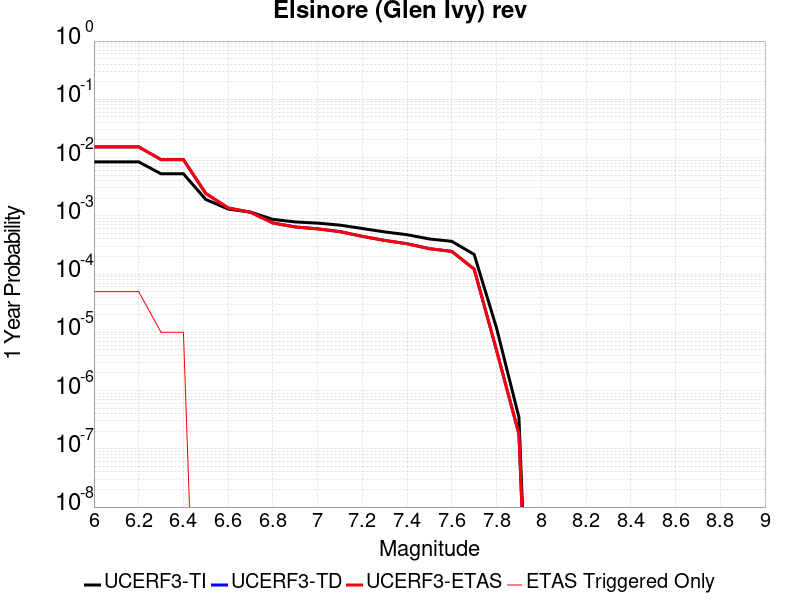 |  |

| Magnitude | 1 wk TI Prob | 1 wk TD Prob | 1 wk ETAS Prob | 1 wk ETAS/TD Gain | 1 wk ETAS Triggered Only | 1 mo TI Prob | 1 mo TD Prob | 1 mo ETAS Prob | 1 mo ETAS/TD Gain | 1 mo ETAS Triggered Only | 1 yr TI Prob | 1 yr TD Prob | 1 yr ETAS Prob | 1 yr ETAS/TD Gain | 1 yr ETAS Triggered Only | 10 yr TI Prob | 10 yr TD Prob | 10 yr ETAS Prob | 10 yr ETAS/TD Gain | 10 yr ETAS Triggered Only |
|-----|-----|-----|-----|-----|-----|-----|-----|-----|-----|-----|-----|-----|-----|-----|-----|-----|-----|-----|-----|-----|
| 6.0 | 1.6204086E-4 | 2.9373835E-4 | 2.9373835E-4 | 1.0 | 0.0 | 6.94276E-4 | 0.0012584261 | 0.0012584261 | 1.0 | 0.0 | 0.008420097 | 0.015239672 | 0.01529946 | 1.0039232 | 6.071277E-5 | 0.081081145 | 0.13972586 | 0.13977809 | 1.0003738 | 6.071277E-5 |
| 6.1 | 1.6204086E-4 | 2.9373835E-4 | 2.9373835E-4 | 1.0 | 0.0 | 6.94276E-4 | 0.0012584261 | 0.0012584261 | 1.0 | 0.0 | 0.008420097 | 0.015239672 | 0.01529946 | 1.0039232 | 6.071277E-5 | 0.081081145 | 0.13972586 | 0.13977809 | 1.0003738 | 6.071277E-5 |
| 6.2 | 1.6204086E-4 | 2.9373835E-4 | 2.9373835E-4 | 1.0 | 0.0 | 6.94276E-4 | 0.0012584261 | 0.0012584261 | 1.0 | 0.0 | 0.008420097 | 0.015239672 | 0.01529946 | 1.0039232 | 6.071277E-5 | 0.081081145 | 0.13972586 | 0.13977809 | 1.0003738 | 6.071277E-5 |
| 6.3 | 1.0111737E-4 | 1.7707222E-4 | 1.7707222E-4 | 1.0 | 0.0 | 4.332882E-4 | 7.5877697E-4 | 7.5877697E-4 | 1.0 | 0.0 | 0.005262531 | 0.009219674 | 0.009219674 | 1.0 | 0.0 | 0.0513964 | 0.087036215 | 0.087036215 | 1.0 | 0.0 |
| 6.4 | 1.0111737E-4 | 1.7707222E-4 | 1.7707222E-4 | 1.0 | 0.0 | 4.332882E-4 | 7.5877697E-4 | 7.5877697E-4 | 1.0 | 0.0 | 0.005262531 | 0.009219674 | 0.009219674 | 1.0 | 0.0 | 0.0513964 | 0.087036215 | 0.087036215 | 1.0 | 0.0 |
| 6.5 | 3.6624708E-5 | 4.6410038E-5 | 4.6410038E-5 | 1.0 | 0.0 | 1.569536E-4 | 1.9888705E-4 | 1.9888705E-4 | 1.0 | 0.0 | 0.001909235 | 0.002419124 | 0.002419124 | 1.0 | 0.0 | 0.01892915 | 0.02374938 | 0.02374938 | 1.0 | 0.0 |
| 6.6 | 2.5051324E-5 | 2.6161024E-5 | 2.6161024E-5 | 1.0 | 0.0 | 1.073584E-4 | 1.121141E-4 | 1.121141E-4 | 1.0 | 0.0 | 0.0013063047 | 0.0013641791 | 0.0013641791 | 1.0 | 0.0 | 0.012986525 | 0.0135714235 | 0.0135714235 | 1.0 | 0.0 |
| 6.7 | 2.2189772E-5 | 2.208435E-5 | 2.208435E-5 | 1.0 | 0.0 | 9.509556E-5 | 9.464399E-5 | 9.464399E-5 | 1.0 | 0.0 | 0.0011571734 | 0.0011517179 | 0.0011517179 | 1.0 | 0.0 | 0.011511663 | 0.011471325 | 0.011471325 | 1.0 | 0.0 |
| 6.8 | 1.6654378E-5 | 1.4444795E-5 | 1.4444795E-5 | 1.0 | 0.0 | 7.137396E-5 | 6.190482E-5 | 6.190482E-5 | 1.0 | 0.0 | 8.686314E-4 | 7.534358E-4 | 7.534358E-4 | 1.0 | 0.0 | 0.008652439 | 0.007514148 | 0.007514148 | 1.0 | 0.0 |
| 6.9 | 1.5042909E-5 | 1.233821E-5 | 1.233821E-5 | 1.0 | 0.0 | 6.446802E-5 | 5.2876985E-5 | 5.2876985E-5 | 1.0 | 0.0 | 7.8461546E-4 | 6.435903E-4 | 6.435903E-4 | 1.0 | 0.0 | 0.007818509 | 0.0064214864 | 0.0064214864 | 1.0 | 0.0 |
| 7.0 | 1.4361385E-5 | 1.145718E-5 | 1.145718E-5 | 1.0 | 0.0 | 6.154734E-5 | 4.9101294E-5 | 4.9101294E-5 | 1.0 | 0.0 | 7.490812E-4 | 5.976472E-4 | 5.976472E-4 | 1.0 | 0.0 | 0.007465612 | 0.0059643895 | 0.0059643895 | 1.0 | 0.0 |
| 7.1 | 1.3265571E-5 | 1.02501535E-5 | 1.02501535E-5 | 1.0 | 0.0 | 5.6851208E-5 | 4.3928503E-5 | 4.3928503E-5 | 1.0 | 0.0 | 6.919436E-4 | 5.347008E-4 | 5.347008E-4 | 1.0 | 0.0 | 0.006897931 | 0.0053374986 | 0.0053374986 | 1.0 | 0.0 |
| 7.2 | 1.1596403E-5 | 8.509482E-6 | 8.509482E-6 | 1.0 | 0.0 | 4.9697923E-5 | 3.6468704E-5 | 3.6468704E-5 | 1.0 | 0.0 | 6.049042E-4 | 4.4391773E-4 | 4.4391773E-4 | 1.0 | 0.0 | 0.006032603 | 0.004431725 | 0.004431725 | 1.0 | 0.0 |
| 7.3 | 1.0150827E-5 | 7.2425387E-6 | 7.2425387E-6 | 1.0 | 0.0 | 4.3502816E-5 | 3.103909E-5 | 3.103909E-5 | 1.0 | 0.0 | 5.2951806E-4 | 3.7783684E-4 | 3.7783684E-4 | 1.0 | 0.0 | 0.005282581 | 0.0037723312 | 0.0037723312 | 1.0 | 0.0 |
| 7.4 | 9.080705E-6 | 6.355858E-6 | 6.355858E-6 | 1.0 | 0.0 | 3.8916725E-5 | 2.7239115E-5 | 2.7239115E-5 | 1.0 | 0.0 | 4.7370812E-4 | 3.3158713E-4 | 3.3158713E-4 | 1.0 | 0.0 | 0.004726996 | 0.0033110748 | 0.0033110748 | 1.0 | 0.0 |
| 7.5 | 7.671649E-6 | 5.228478E-6 | 5.228478E-6 | 1.0 | 0.0 | 3.287808E-5 | 2.240758E-5 | 2.240758E-5 | 1.0 | 0.0 | 4.0021708E-4 | 2.7277938E-4 | 2.7277938E-4 | 1.0 | 0.0 | 0.0039949706 | 0.0027245705 | 0.0027245705 | 1.0 | 0.0 |
| 7.6 | 6.990086E-6 | 4.690167E-6 | 4.690167E-6 | 1.0 | 0.0 | 2.9957167E-5 | 2.0100566E-5 | 2.0100566E-5 | 1.0 | 0.0 | 3.6466747E-4 | 2.4469808E-4 | 2.4469808E-4 | 1.0 | 0.0 | 0.0036406964 | 0.0024444028 | 0.0024444028 | 1.0 | 0.0 |
| 7.7 | 4.163505E-6 | 2.33086E-6 | 2.33086E-6 | 1.0 | 0.0 | 1.7843471E-5 | 9.989366E-6 | 9.989366E-6 | 1.0 | 0.0 | 2.172226E-4 | 1.21614496E-4 | 1.21614496E-4 | 1.0 | 0.0 | 0.0021701038 | 0.0012155526 | 0.0012155526 | 1.0 | 0.0 |
| 7.8 | 2.2692414E-7 | 9.390229E-8 | 9.390229E-8 | 1.0 | 0.0 | 9.725317E-7 | 4.0243833E-7 | 4.0243833E-7 | 1.0 | 0.0 | 1.1840509E-5 | 4.899679E-6 | 4.899679E-6 | 1.0 | 0.0 | 1.1839878E-4 | 4.8996037E-5 | 4.8996037E-5 | 1.0 | 0.0 |
| 7.9 | 6.676829E-9 | 3.4410954E-9 | 3.4410954E-9 | 1.0 | 0.0 | 2.861498E-8 | 1.4747552E-8 | 1.4747552E-8 | 1.0 | 0.0 | 3.4838732E-7 | 1.7955142E-7 | 1.7955142E-7 | 1.0 | 0.0 | 3.4838679E-6 | 1.795513E-6 | 1.795513E-6 | 1.0 | 0.0 |

## Tin Mountain
*[(top)](#table-of-contents)*

| 1 Week | 1 Month | 1 Year | 10 Year |
|-----|-----|-----|-----|
|  |  | 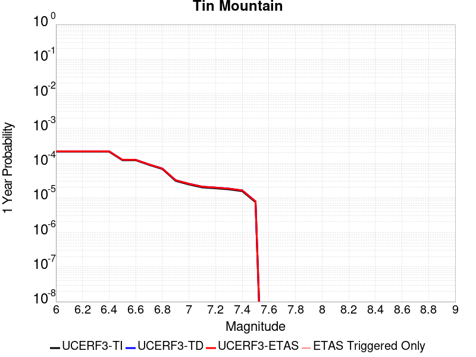 |  |

| Magnitude | 1 wk TI Prob | 1 wk TD Prob | 1 wk ETAS Prob | 1 wk ETAS/TD Gain | 1 wk ETAS Triggered Only | 1 mo TI Prob | 1 mo TD Prob | 1 mo ETAS Prob | 1 mo ETAS/TD Gain | 1 mo ETAS Triggered Only | 1 yr TI Prob | 1 yr TD Prob | 1 yr ETAS Prob | 1 yr ETAS/TD Gain | 1 yr ETAS Triggered Only | 10 yr TI Prob | 10 yr TD Prob | 10 yr ETAS Prob | 10 yr ETAS/TD Gain | 10 yr ETAS Triggered Only |
|-----|-----|-----|-----|-----|-----|-----|-----|-----|-----|-----|-----|-----|-----|-----|-----|-----|-----|-----|-----|-----|
| 6.0 | 4.083776E-6 | 4.1816697E-6 | 4.1816697E-6 | 1.0 | 0.0 | 1.750178E-5 | 1.792134E-5 | 1.792134E-5 | 1.0 | 0.0 | 2.1306332E-4 | 2.1817419E-4 | 2.1817419E-4 | 1.0 | 0.0 | 0.0021285915 | 0.0021799656 | 0.002240546 | 1.0277896 | 6.071277E-5 |
| 6.1 | 4.083776E-6 | 4.1816697E-6 | 4.1816697E-6 | 1.0 | 0.0 | 1.750178E-5 | 1.792134E-5 | 1.792134E-5 | 1.0 | 0.0 | 2.1306332E-4 | 2.1817419E-4 | 2.1817419E-4 | 1.0 | 0.0 | 0.0021285915 | 0.0021799656 | 0.002240546 | 1.0277896 | 6.071277E-5 |
| 6.2 | 4.083776E-6 | 4.1816697E-6 | 4.1816697E-6 | 1.0 | 0.0 | 1.750178E-5 | 1.792134E-5 | 1.792134E-5 | 1.0 | 0.0 | 2.1306332E-4 | 2.1817419E-4 | 2.1817419E-4 | 1.0 | 0.0 | 0.0021285915 | 0.0021799656 | 0.002240546 | 1.0277896 | 6.071277E-5 |
| 6.3 | 4.083776E-6 | 4.1816697E-6 | 4.1816697E-6 | 1.0 | 0.0 | 1.750178E-5 | 1.792134E-5 | 1.792134E-5 | 1.0 | 0.0 | 2.1306332E-4 | 2.1817419E-4 | 2.1817419E-4 | 1.0 | 0.0 | 0.0021285915 | 0.0021799656 | 0.002240546 | 1.0277896 | 6.071277E-5 |
| 6.4 | 4.083776E-6 | 4.1816697E-6 | 4.1816697E-6 | 1.0 | 0.0 | 1.750178E-5 | 1.792134E-5 | 1.792134E-5 | 1.0 | 0.0 | 2.1306332E-4 | 2.1817419E-4 | 2.1817419E-4 | 1.0 | 0.0 | 0.0021285915 | 0.0021799656 | 0.002240546 | 1.0277896 | 6.071277E-5 |
| 6.5 | 2.3143427E-6 | 2.3732375E-6 | 2.3732375E-6 | 1.0 | 0.0 | 9.9185745E-6 | 1.0170983E-5 | 1.0170983E-5 | 1.0 | 0.0 | 1.2075195E-4 | 1.2382545E-4 | 1.2382545E-4 | 1.0 | 0.0 | 0.0012068636 | 0.0012376405 | 0.0012982781 | 1.0489945 | 6.071277E-5 |
| 6.6 | 2.3143427E-6 | 2.3732375E-6 | 2.3732375E-6 | 1.0 | 0.0 | 9.9185745E-6 | 1.0170983E-5 | 1.0170983E-5 | 1.0 | 0.0 | 1.2075195E-4 | 1.2382545E-4 | 1.2382545E-4 | 1.0 | 0.0 | 0.0012068636 | 0.0012376405 | 0.0012982781 | 1.0489945 | 6.071277E-5 |
| 6.7 | 1.7029532E-6 | 1.7498556E-6 | 1.7498556E-6 | 1.0 | 0.0 | 7.2983503E-6 | 7.4993627E-6 | 7.4993627E-6 | 1.0 | 0.0 | 8.885379E-5 | 9.130145E-5 | 9.130145E-5 | 1.0 | 0.0 | 8.881827E-4 | 9.1269205E-4 | 9.4302074E-4 | 1.03323 | 3.0356385E-5 |
| 6.8 | 1.2914646E-6 | 1.3299907E-6 | 1.3299907E-6 | 1.0 | 0.0 | 5.534837E-6 | 5.69995E-6 | 5.69995E-6 | 1.0 | 0.0 | 6.738455E-5 | 6.939512E-5 | 6.939512E-5 | 1.0 | 0.0 | 6.736412E-4 | 6.937779E-4 | 7.2411326E-4 | 1.0437248 | 3.0356385E-5 |
| 6.9 | 5.8708974E-7 | 6.1173347E-7 | 6.1173347E-7 | 1.0 | 0.0 | 2.5160964E-6 | 2.6217124E-6 | 2.6217124E-6 | 1.0 | 0.0 | 3.0633044E-5 | 3.1918924E-5 | 3.1918924E-5 | 1.0 | 0.0 | 3.0628822E-4 | 3.1914748E-4 | 3.1914748E-4 | 1.0 | 0.0 |
| 7.0 | 4.6248786E-7 | 4.832303E-7 | 4.832303E-7 | 1.0 | 0.0 | 1.9820893E-6 | 2.0709856E-6 | 2.0709856E-6 | 1.0 | 0.0 | 2.413167E-5 | 2.5213994E-5 | 2.5213994E-5 | 1.0 | 0.0 | 2.412905E-4 | 2.5211502E-4 | 2.5211502E-4 | 1.0 | 0.0 |
| 7.1 | 3.804606E-7 | 3.987401E-7 | 3.987401E-7 | 1.0 | 0.0 | 1.6305444E-6 | 1.7088852E-6 | 1.7088852E-6 | 1.0 | 0.0 | 1.9851697E-5 | 2.0805513E-5 | 2.0805513E-5 | 1.0 | 0.0 | 1.9849923E-4 | 2.0803901E-4 | 2.0803901E-4 | 1.0 | 0.0 |
| 7.2 | 3.5864858E-7 | 3.7619301E-7 | 3.7619301E-7 | 1.0 | 0.0 | 1.5370645E-6 | 1.612255E-6 | 1.612255E-6 | 1.0 | 0.0 | 1.87136E-5 | 1.9629062E-5 | 1.9629062E-5 | 1.0 | 0.0 | 1.8712023E-4 | 1.9627658E-4 | 1.9627658E-4 | 1.0 | 0.0 |
| 7.3 | 3.342063E-7 | 3.506576E-7 | 3.506576E-7 | 1.0 | 0.0 | 1.4323119E-6 | 1.5028176E-6 | 1.5028176E-6 | 1.0 | 0.0 | 1.7438259E-5 | 1.8296683E-5 | 1.8296683E-5 | 1.0 | 0.0 | 1.743689E-4 | 1.8295507E-4 | 1.8295507E-4 | 1.0 | 0.0 |
| 7.4 | 2.971242E-7 | 3.116784E-7 | 3.116784E-7 | 1.0 | 0.0 | 1.2733886E-6 | 1.3357641E-6 | 1.3357641E-6 | 1.0 | 0.0 | 1.5503398E-5 | 1.626284E-5 | 1.626284E-5 | 1.0 | 0.0 | 1.5502315E-4 | 1.6261978E-4 | 1.6261978E-4 | 1.0 | 0.0 |
| 7.5 | 1.4326713E-7 | 1.5013477E-7 | 1.5013477E-7 | 1.0 | 0.0 | 6.140018E-7 | 6.4343476E-7 | 6.4343476E-7 | 1.0 | 0.0 | 7.4754466E-6 | 7.833818E-6 | 7.833818E-6 | 1.0 | 0.0 | 7.475195E-5 | 7.833818E-5 | 7.833818E-5 | 1.0 | 0.0 |

## Rose Canyon
*[(top)](#table-of-contents)*

| 1 Week | 1 Month | 1 Year | 10 Year |
|-----|-----|-----|-----|
|  |  |  | 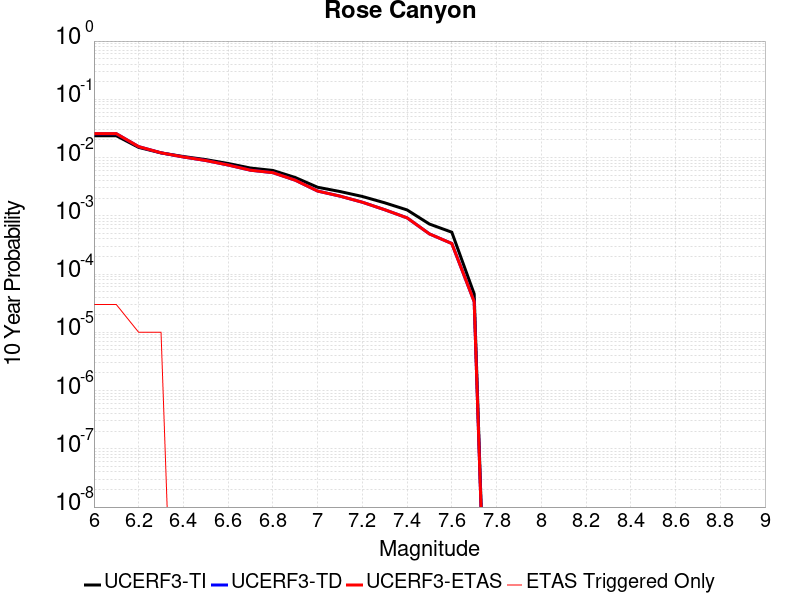 |

| Magnitude | 1 wk TI Prob | 1 wk TD Prob | 1 wk ETAS Prob | 1 wk ETAS/TD Gain | 1 wk ETAS Triggered Only | 1 mo TI Prob | 1 mo TD Prob | 1 mo ETAS Prob | 1 mo ETAS/TD Gain | 1 mo ETAS Triggered Only | 1 yr TI Prob | 1 yr TD Prob | 1 yr ETAS Prob | 1 yr ETAS/TD Gain | 1 yr ETAS Triggered Only | 10 yr TI Prob | 10 yr TD Prob | 10 yr ETAS Prob | 10 yr ETAS/TD Gain | 10 yr ETAS Triggered Only |
|-----|-----|-----|-----|-----|-----|-----|-----|-----|-----|-----|-----|-----|-----|-----|-----|-----|-----|-----|-----|-----|
| 6.0 | 4.5923203E-5 | 4.9793205E-5 | 4.9793205E-5 | 1.0 | 0.0 | 1.9679888E-4 | 2.1338335E-4 | 2.1338335E-4 | 1.0 | 0.0 | 0.0023933933 | 0.0025950412 | 0.0025950412 | 1.0 | 0.0 | 0.023677798 | 0.025680156 | 0.02573931 | 1.0023035 | 6.071277E-5 |
| 6.1 | 4.5923203E-5 | 4.9793205E-5 | 4.9793205E-5 | 1.0 | 0.0 | 1.9679888E-4 | 2.1338335E-4 | 2.1338335E-4 | 1.0 | 0.0 | 0.0023933933 | 0.0025950412 | 0.0025950412 | 1.0 | 0.0 | 0.023677798 | 0.025680156 | 0.02573931 | 1.0023035 | 6.071277E-5 |
| 6.2 | 2.8844734E-5 | 2.9738942E-5 | 2.9738942E-5 | 1.0 | 0.0 | 1.2361443E-4 | 1.2744658E-4 | 1.2744658E-4 | 1.0 | 0.0 | 0.0015039665 | 0.0015505927 | 0.0015505927 | 1.0 | 0.0 | 0.0149382865 | 0.015410602 | 0.01544049 | 1.0019395 | 3.0356385E-5 |
| 6.3 | 2.3171577E-5 | 2.3229592E-5 | 2.3229592E-5 | 1.0 | 0.0 | 9.9302975E-5 | 9.9551675E-5 | 9.9551675E-5 | 1.0 | 0.0 | 0.0012083431 | 0.0012113812 | 0.0012113812 | 1.0 | 0.0 | 0.012017938 | 0.012057545 | 0.012087535 | 1.0024873 | 3.0356385E-5 |
| 6.4 | 2.0066604E-5 | 1.9708776E-5 | 1.9708776E-5 | 1.0 | 0.0 | 8.599689E-5 | 8.446351E-5 | 8.446351E-5 | 1.0 | 0.0 | 0.0010465092 | 0.0010278681 | 0.0010278681 | 1.0 | 0.0 | 0.010415946 | 0.0102390535 | 0.0102390535 | 1.0 | 0.0 |
| 6.5 | 1.776989E-5 | 1.7138804E-5 | 1.7138804E-5 | 1.0 | 0.0 | 7.615444E-5 | 7.344999E-5 | 7.344999E-5 | 1.0 | 0.0 | 9.267859E-4 | 8.9389377E-4 | 8.9389377E-4 | 1.0 | 0.0 | 0.009229303 | 0.008909108 | 0.008909108 | 1.0 | 0.0 |
| 6.6 | 1.5227364E-5 | 1.4347781E-5 | 1.4347781E-5 | 1.0 | 0.0 | 6.52585E-5 | 6.148907E-5 | 6.148907E-5 | 1.0 | 0.0 | 7.942326E-4 | 7.4837747E-4 | 7.4837747E-4 | 1.0 | 0.0 | 0.007914 | 0.007462769 | 0.007462769 | 1.0 | 0.0 |
| 6.7 | 1.2703898E-5 | 1.1675434E-5 | 1.1675434E-5 | 1.0 | 0.0 | 5.4444143E-5 | 5.0036637E-5 | 5.0036637E-5 | 1.0 | 0.0 | 6.626558E-4 | 6.0903E-4 | 6.0903E-4 | 1.0 | 0.0 | 0.006606833 | 0.0060762027 | 0.0060762027 | 1.0 | 0.0 |
| 6.8 | 1.1554917E-5 | 1.0611212E-5 | 1.0611212E-5 | 1.0 | 0.0 | 4.9520135E-5 | 4.5475852E-5 | 4.5475852E-5 | 1.0 | 0.0 | 6.0274085E-4 | 5.535319E-4 | 5.535319E-4 | 1.0 | 0.0 | 0.0060110865 | 0.005523539 | 0.005523539 | 1.0 | 0.0 |
| 6.9 | 8.732078E-6 | 7.882266E-6 | 7.882266E-6 | 1.0 | 0.0 | 3.7422655E-5 | 3.378072E-5 | 3.378072E-5 | 1.0 | 0.0 | 4.5552556E-4 | 4.1120558E-4 | 4.1120558E-4 | 1.0 | 0.0 | 0.0045459294 | 0.004105279 | 0.004105279 | 1.0 | 0.0 |
| 7.0 | 5.9337494E-6 | 5.107943E-6 | 5.107943E-6 | 1.0 | 0.0 | 2.5430107E-5 | 2.1891E-5 | 2.1891E-5 | 1.0 | 0.0 | 3.0956755E-4 | 2.6649048E-4 | 2.6649048E-4 | 1.0 | 0.0 | 0.0030913667 | 0.0026617248 | 0.0026617248 | 1.0 | 0.0 |
| 7.1 | 5.013409E-6 | 4.177747E-6 | 4.177747E-6 | 1.0 | 0.0 | 2.1485863E-5 | 1.7904507E-5 | 1.7904507E-5 | 1.0 | 0.0 | 2.6155898E-4 | 2.1796567E-4 | 2.1796567E-4 | 1.0 | 0.0 | 0.0026125133 | 0.0021775307 | 0.0021775307 | 1.0 | 0.0 |
| 7.2 | 4.120763E-6 | 3.2824337E-6 | 3.2824337E-6 | 1.0 | 0.0 | 1.7660293E-5 | 1.4067497E-5 | 1.4067497E-5 | 1.0 | 0.0 | 2.1499286E-4 | 1.712584E-4 | 1.712584E-4 | 1.0 | 0.0 | 0.0021478499 | 0.0017112739 | 0.0017112739 | 1.0 | 0.0 |
| 7.3 | 3.2081239E-6 | 2.4407627E-6 | 2.4407627E-6 | 1.0 | 0.0 | 1.374903E-5 | 1.046037E-5 | 1.046037E-5 | 1.0 | 0.0 | 1.6738157E-4 | 1.2734762E-4 | 1.2734762E-4 | 1.0 | 0.0 | 0.0016725556 | 0.0012727535 | 0.0012727535 | 1.0 | 0.0 |
| 7.4 | 2.4194755E-6 | 1.7682352E-6 | 1.7682352E-6 | 1.0 | 0.0 | 1.0369139E-5 | 7.578129E-6 | 7.578129E-6 | 1.0 | 0.0 | 1.2623696E-4 | 9.225987E-5 | 9.225987E-5 | 1.0 | 0.0 | 0.0012616527 | 9.22221E-4 | 9.22221E-4 | 1.0 | 0.0 |
| 7.5 | 1.3842889E-6 | 9.379746E-7 | 9.379746E-7 | 1.0 | 0.0 | 5.9326535E-6 | 4.019885E-6 | 4.019885E-6 | 1.0 | 0.0 | 7.222766E-5 | 4.894104E-5 | 4.894104E-5 | 1.0 | 0.0 | 7.220419E-4 | 4.8930617E-4 | 4.8930617E-4 | 1.0 | 0.0 |
| 7.6 | 1.0021575E-6 | 6.4123174E-7 | 6.4123174E-7 | 1.0 | 0.0 | 4.2949537E-6 | 2.7481333E-6 | 2.7481333E-6 | 1.0 | 0.0 | 5.2289808E-5 | 3.345803E-5 | 3.345803E-5 | 1.0 | 0.0 | 5.2277505E-4 | 3.345321E-4 | 3.345321E-4 | 1.0 | 0.0 |
| 7.7 | 8.7620116E-8 | 6.4496746E-8 | 6.4496746E-8 | 1.0 | 0.0 | 3.7551473E-7 | 2.764146E-7 | 2.764146E-7 | 1.0 | 0.0 | 4.5718825E-6 | 3.365343E-6 | 3.365343E-6 | 1.0 | 0.0 | 4.5717883E-5 | 3.365295E-5 | 3.365295E-5 | 1.0 | 0.0 |

## Owens Valley
*[(top)](#table-of-contents)*

| 1 Week | 1 Month | 1 Year | 10 Year |
|-----|-----|-----|-----|
|  |  | 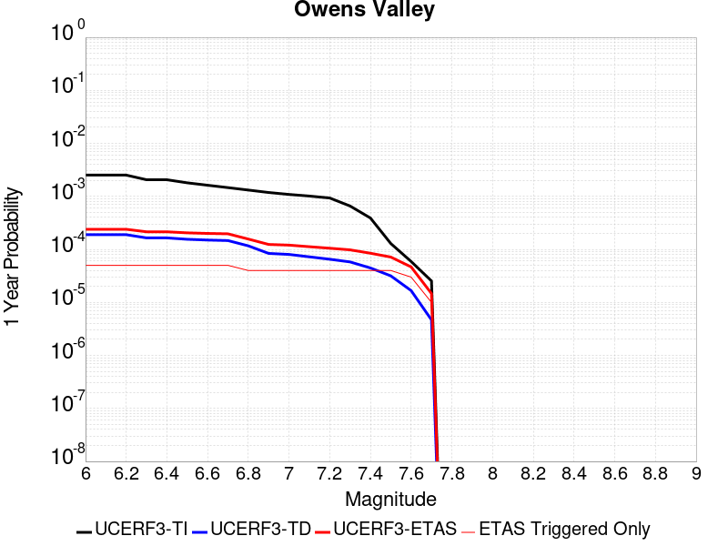 |  |

| Magnitude | 1 wk TI Prob | 1 wk TD Prob | 1 wk ETAS Prob | 1 wk ETAS/TD Gain | 1 wk ETAS Triggered Only | 1 mo TI Prob | 1 mo TD Prob | 1 mo ETAS Prob | 1 mo ETAS/TD Gain | 1 mo ETAS Triggered Only | 1 yr TI Prob | 1 yr TD Prob | 1 yr ETAS Prob | 1 yr ETAS/TD Gain | 1 yr ETAS Triggered Only | 10 yr TI Prob | 10 yr TD Prob | 10 yr ETAS Prob | 10 yr ETAS/TD Gain | 10 yr ETAS Triggered Only |
|-----|-----|-----|-----|-----|-----|-----|-----|-----|-----|-----|-----|-----|-----|-----|-----|-----|-----|-----|-----|-----|
| 6.0 | 4.83821E-5 | 3.6348592E-6 | 3.6348592E-6 | 1.0 | 0.0 | 2.0733538E-4 | 1.557788E-5 | 1.557788E-5 | 1.0 | 0.0 | 0.002521386 | 1.8964519E-4 | 2.1999581E-4 | 1.160039 | 3.0356385E-5 | 0.024929691 | 0.0019293036 | 0.0019898992 | 1.0314081 | 6.071277E-5 |
| 6.1 | 4.83821E-5 | 3.6348592E-6 | 3.6348592E-6 | 1.0 | 0.0 | 2.0733538E-4 | 1.557788E-5 | 1.557788E-5 | 1.0 | 0.0 | 0.002521386 | 1.8964519E-4 | 2.1999581E-4 | 1.160039 | 3.0356385E-5 | 0.024929691 | 0.0019293036 | 0.0019898992 | 1.0314081 | 6.071277E-5 |
| 6.2 | 4.83821E-5 | 3.6348592E-6 | 3.6348592E-6 | 1.0 | 0.0 | 2.0733538E-4 | 1.557788E-5 | 1.557788E-5 | 1.0 | 0.0 | 0.002521386 | 1.8964519E-4 | 2.1999581E-4 | 1.160039 | 3.0356385E-5 | 0.024929691 | 0.0019293036 | 0.0019898992 | 1.0314081 | 6.071277E-5 |
| 6.3 | 3.953008E-5 | 3.1598945E-6 | 3.1598945E-6 | 1.0 | 0.0 | 1.6940363E-4 | 1.3542339E-5 | 1.3542339E-5 | 1.0 | 0.0 | 0.002060538 | 1.6486623E-4 | 1.9521761E-4 | 1.184097 | 3.0356385E-5 | 0.020415364 | 0.001661594 | 0.0017222059 | 1.0364782 | 6.071277E-5 |
| 6.4 | 3.953008E-5 | 3.1598945E-6 | 3.1598945E-6 | 1.0 | 0.0 | 1.6940363E-4 | 1.3542339E-5 | 1.3542339E-5 | 1.0 | 0.0 | 0.002060538 | 1.6486623E-4 | 1.9521761E-4 | 1.184097 | 3.0356385E-5 | 0.020415364 | 0.001661594 | 0.0017222059 | 1.0364782 | 6.071277E-5 |
| 6.5 | 3.457342E-5 | 2.9745124E-6 | 2.9745124E-6 | 1.0 | 0.0 | 1.4816338E-4 | 1.27478515E-5 | 1.27478515E-5 | 1.0 | 0.0 | 0.0018023965 | 1.5519475E-4 | 1.8554642E-4 | 1.1955715 | 3.0356385E-5 | 0.017878477 | 0.0015572966 | 0.0016179148 | 1.0389253 | 6.071277E-5 |
| 6.6 | 3.1127765E-5 | 2.8765398E-6 | 2.8765398E-6 | 1.0 | 0.0 | 1.3339789E-4 | 1.2327973E-5 | 1.2327973E-5 | 1.0 | 0.0 | 0.0016229092 | 1.5008343E-4 | 1.8043527E-4 | 1.2022331 | 3.0356385E-5 | 0.016111081 | 0.0015023465 | 0.001562968 | 1.0403513 | 6.071277E-5 |
| 6.7 | 2.806885E-5 | 2.811941E-6 | 2.811941E-6 | 1.0 | 0.0 | 1.2028952E-4 | 1.2051123E-5 | 1.2051123E-5 | 1.0 | 0.0 | 0.001463541 | 1.4671324E-4 | 1.7706516E-4 | 1.2068793 | 3.0356385E-5 | 0.014539397 | 0.0014665497 | 0.0015271734 | 1.0413376 | 6.071277E-5 |
| 6.8 | 2.524524E-5 | 2.2366908E-6 | 2.2366908E-6 | 1.0 | 0.0 | 1.0818939E-4 | 9.585784E-6 | 9.585784E-6 | 1.0 | 0.0 | 0.0013164099 | 1.16700976E-4 | 1.4705381E-4 | 1.2600907 | 3.0356385E-5 | 0.01308639 | 0.0011666705 | 0.0012273124 | 1.0519786 | 6.071277E-5 |
| 6.9 | 2.2704568E-5 | 1.6091428E-6 | 1.6091428E-6 | 1.0 | 0.0 | 9.730166E-5 | 6.896308E-6 | 6.896308E-6 | 1.0 | 0.0 | 0.0011840039 | 8.3959334E-5 | 1.1431317E-4 | 1.3615302 | 3.0356385E-5 | 0.011777153 | 8.394893E-4 | 9.001511E-4 | 1.0722604 | 6.071277E-5 |
| 7.0 | 2.0871712E-5 | 1.5404663E-6 | 1.5404663E-6 | 1.0 | 0.0 | 8.944713E-5 | 6.601982E-6 | 6.601982E-6 | 1.0 | 0.0 | 0.0010884746 | 8.037618E-5 | 1.1073013E-4 | 1.3776485 | 3.0356385E-5 | 0.010831586 | 8.0364547E-4 | 8.6430943E-4 | 1.075486 | 6.071277E-5 |
| 7.1 | 1.944928E-5 | 1.3872052E-6 | 1.3872052E-6 | 1.0 | 0.0 | 8.335139E-5 | 5.9451518E-6 | 5.9451518E-6 | 1.0 | 0.0 | 0.0010143308 | 7.237983E-5 | 1.0273401E-4 | 1.4193736 | 3.0356385E-5 | 0.010097133 | 7.2372245E-4 | 7.8439125E-4 | 1.0838288 | 6.071277E-5 |
| 7.2 | 1.7876306E-5 | 1.249607E-6 | 1.249607E-6 | 1.0 | 0.0 | 7.6610486E-5 | 5.3554472E-6 | 5.3554472E-6 | 1.0 | 0.0 | 9.3233347E-4 | 6.520063E-5 | 9.5555035E-5 | 1.4655539 | 3.0356385E-5 | 0.009284316 | 6.5195386E-4 | 7.12627E-4 | 1.0930636 | 6.071277E-5 |
| 7.3 | 1.2618672E-5 | 1.1121642E-6 | 1.1121642E-6 | 1.0 | 0.0 | 5.40789E-5 | 4.7664093E-6 | 4.7664093E-6 | 1.0 | 0.0 | 6.582117E-4 | 5.8029495E-5 | 8.838412E-5 | 1.5230895 | 3.0356385E-5 | 0.0065626553 | 5.8027735E-4 | 6.409549E-4 | 1.1045665 | 6.071277E-5 |
| 7.4 | 7.4874442E-6 | 8.5540546E-7 | 8.5540546E-7 | 1.0 | 0.0 | 3.208865E-5 | 3.6660183E-6 | 3.6660183E-6 | 1.0 | 0.0 | 3.906093E-4 | 4.4632863E-5 | 7.498789E-5 | 1.680105 | 3.0356385E-5 | 0.003899234 | 4.463324E-4 | 5.0701806E-4 | 1.1359652 | 6.071277E-5 |
| 7.5 | 2.4734156E-6 | 6.072214E-7 | 6.072214E-7 | 1.0 | 0.0 | 1.060031E-5 | 2.6023747E-6 | 2.6023747E-6 | 1.0 | 0.0 | 1.2905113E-4 | 3.1683456E-5 | 6.2038875E-5 | 1.9580843 | 3.0356385E-5 | 0.0012897621 | 3.1678972E-4 | 3.7748326E-4 | 1.1915894 | 6.071277E-5 |
| 7.6 | 1.1328841E-6 | 3.198316E-7 | 3.198316E-7 | 1.0 | 0.0 | 4.8552088E-6 | 1.3707061E-6 | 1.3707061E-6 | 1.0 | 0.0 | 5.9110564E-5 | 1.668822E-5 | 4.7044097E-5 | 2.8190002 | 3.0356385E-5 | 5.9094845E-4 | 1.6686987E-4 | 2.275725E-4 | 1.3637723 | 6.071277E-5 |
| 7.7 | 4.8613185E-7 | 8.9716416E-8 | 8.9716416E-8 | 1.0 | 0.0 | 2.0834207E-6 | 3.8449886E-7 | 3.8449886E-7 | 1.0 | 0.0 | 2.536535E-5 | 4.6812643E-6 | 4.6812643E-6 | 1.0 | 0.0 | 2.5362454E-4 | 4.6811725E-5 | 4.6811725E-5 | 1.0 | 0.0 |

## San Jacinto (Coyote Creek)
*[(top)](#table-of-contents)*

| 1 Week | 1 Month | 1 Year | 10 Year |
|-----|-----|-----|-----|
|  |  |  |  |

| Magnitude | 1 wk TI Prob | 1 wk TD Prob | 1 wk ETAS Prob | 1 wk ETAS/TD Gain | 1 wk ETAS Triggered Only | 1 mo TI Prob | 1 mo TD Prob | 1 mo ETAS Prob | 1 mo ETAS/TD Gain | 1 mo ETAS Triggered Only | 1 yr TI Prob | 1 yr TD Prob | 1 yr ETAS Prob | 1 yr ETAS/TD Gain | 1 yr ETAS Triggered Only | 10 yr TI Prob | 10 yr TD Prob | 10 yr ETAS Prob | 10 yr ETAS/TD Gain | 10 yr ETAS Triggered Only |
|-----|-----|-----|-----|-----|-----|-----|-----|-----|-----|-----|-----|-----|-----|-----|-----|-----|-----|-----|-----|-----|
| 6.0 | 2.7374346E-5 | 2.4226492E-5 | 2.4226492E-5 | 1.0 | 0.0 | 1.1731335E-4 | 1.0382371E-4 | 1.0382371E-4 | 1.0 | 0.0 | 0.0014273542 | 0.0012633232 | 0.0012633232 | 1.0 | 0.0 | 0.01418221 | 0.012970629 | 0.013030554 | 1.0046201 | 6.071277E-5 |
| 6.1 | 2.7374346E-5 | 2.4226492E-5 | 2.4226492E-5 | 1.0 | 0.0 | 1.1731335E-4 | 1.0382371E-4 | 1.0382371E-4 | 1.0 | 0.0 | 0.0014273542 | 0.0012633232 | 0.0012633232 | 1.0 | 0.0 | 0.01418221 | 0.012970629 | 0.013030554 | 1.0046201 | 6.071277E-5 |
| 6.2 | 2.7374346E-5 | 2.4226492E-5 | 2.4226492E-5 | 1.0 | 0.0 | 1.1731335E-4 | 1.0382371E-4 | 1.0382371E-4 | 1.0 | 0.0 | 0.0014273542 | 0.0012633232 | 0.0012633232 | 1.0 | 0.0 | 0.01418221 | 0.012970629 | 0.013030554 | 1.0046201 | 6.071277E-5 |
| 6.3 | 2.7374346E-5 | 2.4226492E-5 | 2.4226492E-5 | 1.0 | 0.0 | 1.1731335E-4 | 1.0382371E-4 | 1.0382371E-4 | 1.0 | 0.0 | 0.0014273542 | 0.0012633232 | 0.0012633232 | 1.0 | 0.0 | 0.01418221 | 0.012970629 | 0.013030554 | 1.0046201 | 6.071277E-5 |
| 6.4 | 2.7374346E-5 | 2.4226492E-5 | 2.4226492E-5 | 1.0 | 0.0 | 1.1731335E-4 | 1.0382371E-4 | 1.0382371E-4 | 1.0 | 0.0 | 0.0014273542 | 0.0012633232 | 0.0012633232 | 1.0 | 0.0 | 0.01418221 | 0.012970629 | 0.013030554 | 1.0046201 | 6.071277E-5 |
| 6.5 | 2.7282445E-5 | 2.4112534E-5 | 2.4112534E-5 | 1.0 | 0.0 | 1.16919524E-4 | 1.03335355E-4 | 1.03335355E-4 | 1.0 | 0.0 | 0.0014225657 | 0.0012573845 | 0.0012573845 | 1.0 | 0.0 | 0.014134934 | 0.012911941 | 0.01297187 | 1.0046413 | 6.071277E-5 |
| 6.6 | 2.7282445E-5 | 2.4112534E-5 | 2.4112534E-5 | 1.0 | 0.0 | 1.16919524E-4 | 1.03335355E-4 | 1.03335355E-4 | 1.0 | 0.0 | 0.0014225657 | 0.0012573845 | 0.0012573845 | 1.0 | 0.0 | 0.014134934 | 0.012911941 | 0.01297187 | 1.0046413 | 6.071277E-5 |
| 6.7 | 2.7216198E-5 | 2.4037632E-5 | 2.4037632E-5 | 1.0 | 0.0 | 1.1663563E-4 | 1.0301437E-4 | 1.0301437E-4 | 1.0 | 0.0 | 0.0014191137 | 0.001253481 | 0.001253481 | 1.0 | 0.0 | 0.014100855 | 0.012873341 | 0.012933273 | 1.0046555 | 6.071277E-5 |
| 6.8 | 2.7078617E-5 | 2.39548E-5 | 2.39548E-5 | 1.0 | 0.0 | 1.1604605E-4 | 1.0265941E-4 | 1.0265941E-4 | 1.0 | 0.0 | 0.001411945 | 0.0012491643 | 0.0012491643 | 1.0 | 0.0 | 0.014030075 | 0.01283046 | 0.012890395 | 1.0046712 | 6.071277E-5 |
| 6.9 | 2.6982952E-5 | 2.3874261E-5 | 2.3874261E-5 | 1.0 | 0.0 | 1.15636096E-4 | 1.0231427E-4 | 1.0231427E-4 | 1.0 | 0.0 | 0.0014069602 | 0.0012449671 | 0.0012449671 | 1.0 | 0.0 | 0.013980856 | 0.012788752 | 0.012848688 | 1.0046866 | 6.071277E-5 |
| 7.0 | 2.6449972E-5 | 2.3451106E-5 | 2.3451106E-5 | 1.0 | 0.0 | 1.1335209E-4 | 1.0050089E-4 | 1.0050089E-4 | 1.0 | 0.0 | 0.001379188 | 0.0012229141 | 0.0012229141 | 1.0 | 0.0 | 0.0137065975 | 0.012570031 | 0.012629981 | 1.0047692 | 6.071277E-5 |
| 7.1 | 2.6257849E-5 | 2.327706E-5 | 2.327706E-5 | 1.0 | 0.0 | 1.1252879E-4 | 9.975503E-5 | 9.975503E-5 | 1.0 | 0.0 | 0.0013691769 | 0.0012138435 | 0.0012138435 | 1.0 | 0.0 | 0.013607717 | 0.0124798585 | 0.012539813 | 1.0048041 | 6.071277E-5 |
| 7.2 | 2.5270041E-5 | 2.2471224E-5 | 2.2471224E-5 | 1.0 | 0.0 | 1.0829568E-4 | 9.630171E-5 | 9.630171E-5 | 1.0 | 0.0 | 0.0013177024 | 0.001171845 | 0.001171845 | 1.0 | 0.0 | 0.013099162 | 0.012060602 | 0.012120582 | 1.0049733 | 6.071277E-5 |
| 7.3 | 2.339701E-5 | 2.120195E-5 | 2.120195E-5 | 1.0 | 0.0 | 1.0026905E-4 | 9.086234E-5 | 9.086234E-5 | 1.0 | 0.0 | 0.001220092 | 0.0011056897 | 0.0011056897 | 1.0 | 0.0 | 0.012134149 | 0.0113989655 | 0.011458986 | 1.0052655 | 6.071277E-5 |
| 7.4 | 2.296333E-5 | 2.0932019E-5 | 2.0932019E-5 | 1.0 | 0.0 | 9.841056E-5 | 8.970558E-5 | 8.970558E-5 | 1.0 | 0.0 | 0.0011974899 | 0.0010916203 | 0.0010916203 | 1.0 | 0.0 | 0.011910575 | 0.011257936 | 0.011317966 | 1.0053322 | 6.071277E-5 |
| 7.5 | 2.2188895E-5 | 2.0454296E-5 | 2.0454296E-5 | 1.0 | 0.0 | 9.50918E-5 | 8.7658336E-5 | 8.7658336E-5 | 1.0 | 0.0 | 0.0011571277 | 0.0010667198 | 0.0010667198 | 1.0 | 0.0 | 0.011511209 | 0.011007229 | 0.011067273 | 1.005455 | 6.071277E-5 |
| 7.6 | 2.0013189E-5 | 1.9038842E-5 | 1.9038842E-5 | 1.0 | 0.0 | 8.5767984E-5 | 8.1592494E-5 | 8.1592494E-5 | 1.0 | 0.0 | 0.001043725 | 9.929377E-4 | 9.929377E-4 | 1.0 | 0.0 | 0.010388365 | 0.010264366 | 0.010324456 | 1.0058542 | 6.071277E-5 |
| 7.7 | 1.7230794E-5 | 1.681798E-5 | 1.681798E-5 | 1.0 | 0.0 | 7.384417E-5 | 7.207506E-5 | 7.207506E-5 | 1.0 | 0.0 | 8.986819E-4 | 8.7716145E-4 | 8.7716145E-4 | 1.0 | 0.0 | 0.008950562 | 0.009101786 | 0.009161945 | 1.0066097 | 6.071277E-5 |
| 7.8 | 1.4478809E-5 | 1.5062672E-5 | 1.5062672E-5 | 1.0 | 0.0 | 6.205057E-5 | 6.455272E-5 | 6.455272E-5 | 1.0 | 0.0 | 7.552038E-4 | 7.8564655E-4 | 7.8564655E-4 | 1.0 | 0.0 | 0.0075264242 | 0.008178915 | 0.008239131 | 1.0073624 | 6.071277E-5 |
| 7.9 | 1.1114467E-5 | 1.1708948E-5 | 1.1708948E-5 | 1.0 | 0.0 | 4.7632562E-5 | 5.0180242E-5 | 5.0180242E-5 | 1.0 | 0.0 | 5.797721E-4 | 6.107738E-4 | 6.107738E-4 | 1.0 | 0.0 | 0.0057826187 | 0.006413855 | 0.0064741783 | 1.0094051 | 6.071277E-5 |
| 8.0 | 9.327402E-6 | 9.957178E-6 | 9.957178E-6 | 1.0 | 0.0 | 3.9973966E-5 | 4.2672924E-5 | 4.2672924E-5 | 1.0 | 0.0 | 4.8657437E-4 | 5.1941955E-4 | 5.1941955E-4 | 1.0 | 0.0 | 0.0048551033 | 0.00548048 | 0.00554086 | 1.0110173 | 6.071277E-5 |
| 8.1 | 7.0235833E-6 | 6.87082E-6 | 6.87082E-6 | 1.0 | 0.0 | 3.0100724E-5 | 2.944604E-5 | 2.944604E-5 | 1.0 | 0.0 | 3.664147E-4 | 3.5844708E-4 | 3.5844708E-4 | 1.0 | 0.0 | 0.003658111 | 0.0038105806 | 0.0038105806 | 1.0 | 0.0 |
| 8.2 | 2.0358202E-6 | 9.0797465E-7 | 9.0797465E-7 | 1.0 | 0.0 | 8.724915E-6 | 3.891314E-6 | 3.891314E-6 | 1.0 | 0.0 | 1.06220665E-4 | 4.7375743E-5 | 4.7375743E-5 | 1.0 | 0.0 | 0.001061699 | 5.3732167E-4 | 5.3732167E-4 | 1.0 | 0.0 |
| 8.3 | 2.0051264E-7 | 6.6896234E-8 | 6.6896234E-8 | 1.0 | 0.0 | 8.5933965E-7 | 2.866981E-7 | 2.866981E-7 | 1.0 | 0.0 | 1.046241E-5 | 3.4905445E-6 | 3.4905445E-6 | 1.0 | 0.0 | 1.0461917E-4 | 4.0553456E-5 | 4.0553456E-5 | 1.0 | 0.0 |

## Cleghorn Pass
*[(top)](#table-of-contents)*

| 1 Week | 1 Month | 1 Year | 10 Year |
|-----|-----|-----|-----|
|  |  |  |  |

| Magnitude | 1 wk TI Prob | 1 wk TD Prob | 1 wk ETAS Prob | 1 wk ETAS/TD Gain | 1 wk ETAS Triggered Only | 1 mo TI Prob | 1 mo TD Prob | 1 mo ETAS Prob | 1 mo ETAS/TD Gain | 1 mo ETAS Triggered Only | 1 yr TI Prob | 1 yr TD Prob | 1 yr ETAS Prob | 1 yr ETAS/TD Gain | 1 yr ETAS Triggered Only | 10 yr TI Prob | 10 yr TD Prob | 10 yr ETAS Prob | 10 yr ETAS/TD Gain | 10 yr ETAS Triggered Only |
|-----|-----|-----|-----|-----|-----|-----|-----|-----|-----|-----|-----|-----|-----|-----|-----|-----|-----|-----|-----|-----|
| 6.0 | 1.0522846E-5 | 1.1041362E-5 | 1.1041362E-5 | 1.0 | 0.0 | 4.509713E-5 | 4.731956E-5 | 4.731956E-5 | 1.0 | 0.0 | 5.4891926E-4 | 5.76016E-4 | 6.063549E-4 | 1.0526702 | 3.0356385E-5 | 0.0054756533 | 0.0057503963 | 0.00581076 | 1.0104973 | 6.071277E-5 |
| 6.1 | 1.0522846E-5 | 1.1041362E-5 | 1.1041362E-5 | 1.0 | 0.0 | 4.509713E-5 | 4.731956E-5 | 4.731956E-5 | 1.0 | 0.0 | 5.4891926E-4 | 5.76016E-4 | 6.063549E-4 | 1.0526702 | 3.0356385E-5 | 0.0054756533 | 0.0057503963 | 0.00581076 | 1.0104973 | 6.071277E-5 |
| 6.2 | 2.1045846E-6 | 2.2083466E-6 | 2.2083466E-6 | 1.0 | 0.0 | 9.019617E-6 | 9.464332E-6 | 9.464332E-6 | 1.0 | 0.0 | 1.098083E-4 | 1.1522634E-4 | 1.4557924E-4 | 1.2634196 | 3.0356385E-5 | 0.0010975406 | 0.0011520775 | 0.0012127203 | 1.0526378 | 6.071277E-5 |
| 6.3 | 2.1045846E-6 | 2.2083466E-6 | 2.2083466E-6 | 1.0 | 0.0 | 9.019617E-6 | 9.464332E-6 | 9.464332E-6 | 1.0 | 0.0 | 1.098083E-4 | 1.1522634E-4 | 1.4557924E-4 | 1.2634196 | 3.0356385E-5 | 0.0010975406 | 0.0011520775 | 0.0012127203 | 1.0526378 | 6.071277E-5 |
| 6.4 | 1.7259927E-6 | 1.8109952E-6 | 1.8109952E-6 | 1.0 | 0.0 | 7.3970905E-6 | 7.761408E-6 | 7.761408E-6 | 1.0 | 0.0 | 9.005586E-5 | 9.4495146E-5 | 1.2484865E-4 | 1.3212178 | 3.0356385E-5 | 9.001937E-4 | 9.4495143E-4 | 0.0010056068 | 1.064189 | 6.071277E-5 |

## Kern Canyon (South Kern) 2011
*[(top)](#table-of-contents)*

| 1 Week | 1 Month | 1 Year | 10 Year |
|-----|-----|-----|-----|
|  |  |  |  |

| Magnitude | 1 wk TI Prob | 1 wk TD Prob | 1 wk ETAS Prob | 1 wk ETAS/TD Gain | 1 wk ETAS Triggered Only | 1 mo TI Prob | 1 mo TD Prob | 1 mo ETAS Prob | 1 mo ETAS/TD Gain | 1 mo ETAS Triggered Only | 1 yr TI Prob | 1 yr TD Prob | 1 yr ETAS Prob | 1 yr ETAS/TD Gain | 1 yr ETAS Triggered Only | 10 yr TI Prob | 10 yr TD Prob | 10 yr ETAS Prob | 10 yr ETAS/TD Gain | 10 yr ETAS Triggered Only |
|-----|-----|-----|-----|-----|-----|-----|-----|-----|-----|-----|-----|-----|-----|-----|-----|-----|-----|-----|-----|-----|
| 6.0 | 4.105075E-6 | 4.113829E-6 | 4.113829E-6 | 1.0 | 0.0 | 1.7593058E-5 | 1.763058E-5 | 1.763058E-5 | 1.0 | 0.0 | 2.1417443E-4 | 2.1463181E-4 | 2.449817E-4 | 1.1414044 | 3.0356385E-5 | 0.0021396813 | 0.0021443092 | 0.0022048918 | 1.0282527 | 6.071277E-5 |
| 6.1 | 4.105075E-6 | 4.113829E-6 | 4.113829E-6 | 1.0 | 0.0 | 1.7593058E-5 | 1.763058E-5 | 1.763058E-5 | 1.0 | 0.0 | 2.1417443E-4 | 2.1463181E-4 | 2.449817E-4 | 1.1414044 | 3.0356385E-5 | 0.0021396813 | 0.0021443092 | 0.0022048918 | 1.0282527 | 6.071277E-5 |
| 6.2 | 4.105075E-6 | 4.113829E-6 | 4.113829E-6 | 1.0 | 0.0 | 1.7593058E-5 | 1.763058E-5 | 1.763058E-5 | 1.0 | 0.0 | 2.1417443E-4 | 2.1463181E-4 | 2.449817E-4 | 1.1414044 | 3.0356385E-5 | 0.0021396813 | 0.0021443092 | 0.0022048918 | 1.0282527 | 6.071277E-5 |
| 6.3 | 4.105075E-6 | 4.113829E-6 | 4.113829E-6 | 1.0 | 0.0 | 1.7593058E-5 | 1.763058E-5 | 1.763058E-5 | 1.0 | 0.0 | 2.1417443E-4 | 2.1463181E-4 | 2.449817E-4 | 1.1414044 | 3.0356385E-5 | 0.0021396813 | 0.0021443092 | 0.0022048918 | 1.0282527 | 6.071277E-5 |
| 6.4 | 4.105075E-6 | 4.113829E-6 | 4.113829E-6 | 1.0 | 0.0 | 1.7593058E-5 | 1.763058E-5 | 1.763058E-5 | 1.0 | 0.0 | 2.1417443E-4 | 2.1463181E-4 | 2.449817E-4 | 1.1414044 | 3.0356385E-5 | 0.0021396813 | 0.0021443092 | 0.0022048918 | 1.0282527 | 6.071277E-5 |
| 6.5 | 2.9849807E-6 | 2.9732298E-6 | 2.9732298E-6 | 1.0 | 0.0 | 1.2792712E-5 | 1.2742352E-5 | 1.2742352E-5 | 1.0 | 0.0 | 1.5574014E-4 | 1.5512724E-4 | 1.8547892E-4 | 1.1956567 | 3.0356385E-5 | 0.0015563103 | 0.0015502047 | 0.0016108233 | 1.0391036 | 6.071277E-5 |
| 6.6 | 2.9849807E-6 | 2.9732298E-6 | 2.9732298E-6 | 1.0 | 0.0 | 1.2792712E-5 | 1.2742352E-5 | 1.2742352E-5 | 1.0 | 0.0 | 1.5574014E-4 | 1.5512724E-4 | 1.8547892E-4 | 1.1956567 | 3.0356385E-5 | 0.0015563103 | 0.0015502047 | 0.0016108233 | 1.0391036 | 6.071277E-5 |
| 6.7 | 2.6756725E-6 | 2.6582882E-6 | 2.6582882E-6 | 1.0 | 0.0 | 1.1467117E-5 | 1.1392614E-5 | 1.1392614E-5 | 1.0 | 0.0 | 1.396032E-4 | 1.3869636E-4 | 1.6904854E-4 | 1.218839 | 3.0356385E-5 | 0.0013951553 | 0.0013861089 | 0.0014467376 | 1.0437402 | 6.071277E-5 |
| 6.8 | 2.3283721E-6 | 2.3048378E-6 | 2.3048378E-6 | 1.0 | 0.0 | 9.9787E-6 | 9.87784E-6 | 9.87784E-6 | 1.0 | 0.0 | 1.214839E-4 | 1.2025614E-4 | 1.5060887E-4 | 1.2524008 | 3.0356385E-5 | 0.001214175 | 0.0012019181 | 0.001232238 | 1.0252262 | 3.0356385E-5 |
| 6.9 | 2.0972677E-6 | 2.0696948E-6 | 2.0696948E-6 | 1.0 | 0.0 | 8.988259E-6 | 8.870091E-6 | 8.870091E-6 | 1.0 | 0.0 | 1.0942656E-4 | 1.0798806E-4 | 1.3834117E-4 | 1.2810783 | 3.0356385E-5 | 0.0010937268 | 0.0010793617 | 0.0011096853 | 1.028094 | 3.0356385E-5 |
| 7.0 | 1.7132242E-6 | 1.6787479E-6 | 1.6787479E-6 | 1.0 | 0.0 | 7.3423685E-6 | 7.194614E-6 | 7.194614E-6 | 1.0 | 0.0 | 8.938967E-5 | 8.7590946E-5 | 8.7590946E-5 | 1.0 | 0.0 | 8.935372E-4 | 8.755681E-4 | 8.755681E-4 | 1.0 | 0.0 |
| 7.1 | 1.4215541E-6 | 1.3816122E-6 | 1.3816122E-6 | 1.0 | 0.0 | 6.0923603E-6 | 5.921182E-6 | 5.921182E-6 | 1.0 | 0.0 | 7.417196E-5 | 7.2088034E-5 | 7.2088034E-5 | 1.0 | 0.0 | 7.414721E-4 | 7.2064914E-4 | 7.2064914E-4 | 1.0 | 0.0 |
| 7.2 | 9.097853E-7 | 8.604018E-7 | 8.604018E-7 | 1.0 | 0.0 | 3.899074E-6 | 3.6874312E-6 | 3.6874312E-6 | 1.0 | 0.0 | 4.7470192E-5 | 4.489356E-5 | 4.489356E-5 | 1.0 | 0.0 | 4.7460053E-4 | 4.48846E-4 | 4.48846E-4 | 1.0 | 0.0 |
| 7.3 | 6.144169E-7 | 5.628374E-7 | 5.628374E-7 | 1.0 | 0.0 | 2.6332125E-6 | 2.412158E-6 | 2.412158E-6 | 1.0 | 0.0 | 3.205889E-5 | 2.9367633E-5 | 2.9367633E-5 | 1.0 | 0.0 | 3.2054266E-4 | 2.9363803E-4 | 2.9363803E-4 | 1.0 | 0.0 |
| 7.4 | 4.049844E-7 | 3.5729457E-7 | 3.5729457E-7 | 1.0 | 0.0 | 1.7356463E-6 | 1.5312617E-6 | 1.5312617E-6 | 1.0 | 0.0 | 2.1131287E-5 | 1.8642953E-5 | 1.8642953E-5 | 1.0 | 0.0 | 2.1129279E-4 | 1.8641414E-4 | 1.8641414E-4 | 1.0 | 0.0 |
| 7.5 | 1.9871162E-7 | 1.5831044E-7 | 1.5831044E-7 | 1.0 | 0.0 | 8.5162094E-7 | 6.7847316E-7 | 6.7847316E-7 | 1.0 | 0.0 | 1.0368436E-5 | 8.26038E-6 | 8.26038E-6 | 1.0 | 0.0 | 1.0367952E-4 | 8.260082E-5 | 8.260082E-5 | 1.0 | 0.0 |
| 7.6 | 2.572245E-8 | 1.7353377E-8 | 1.7353377E-8 | 1.0 | 0.0 | 1.10239064E-7 | 7.437161E-8 | 7.437161E-8 | 1.0 | 0.0 | 1.3421597E-6 | 9.0547405E-7 | 9.0547405E-7 | 1.0 | 0.0 | 1.3421517E-5 | 9.054709E-6 | 9.054709E-6 | 1.0 | 0.0 |

## Coronado Bank alt1
*[(top)](#table-of-contents)*

| 1 Week | 1 Month | 1 Year | 10 Year |
|-----|-----|-----|-----|
|  | 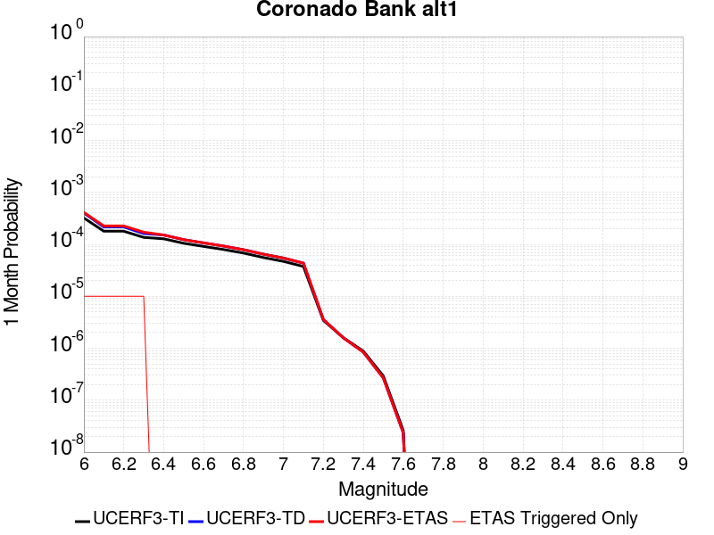 |  |  |

| Magnitude | 1 wk TI Prob | 1 wk TD Prob | 1 wk ETAS Prob | 1 wk ETAS/TD Gain | 1 wk ETAS Triggered Only | 1 mo TI Prob | 1 mo TD Prob | 1 mo ETAS Prob | 1 mo ETAS/TD Gain | 1 mo ETAS Triggered Only | 1 yr TI Prob | 1 yr TD Prob | 1 yr ETAS Prob | 1 yr ETAS/TD Gain | 1 yr ETAS Triggered Only | 10 yr TI Prob | 10 yr TD Prob | 10 yr ETAS Prob | 10 yr ETAS/TD Gain | 10 yr ETAS Triggered Only |
|-----|-----|-----|-----|-----|-----|-----|-----|-----|-----|-----|-----|-----|-----|-----|-----|-----|-----|-----|-----|-----|
| 6.0 | 7.533492E-5 | 9.398079E-5 | 9.398079E-5 | 1.0 | 0.0 | 3.22824E-4 | 4.027169E-4 | 4.3306107E-4 | 1.0753486 | 3.0356385E-5 | 0.0039233007 | 0.0048925513 | 0.0049227593 | 1.0061742 | 3.0356385E-5 | 0.03854755 | 0.04791869 | 0.047976494 | 1.0012063 | 6.071277E-5 |
| 6.1 | 4.1807285E-5 | 5.050703E-5 | 5.050703E-5 | 1.0 | 0.0 | 1.7916178E-4 | 2.1644133E-4 | 2.4679114E-4 | 1.1402218 | 3.0356385E-5 | 0.0021791123 | 0.0026320831 | 0.0026623595 | 1.0115029 | 3.0356385E-5 | 0.021578677 | 0.02601815 | 0.026047718 | 1.0011364 | 3.0356385E-5 |
| 6.2 | 4.1807285E-5 | 5.050703E-5 | 5.050703E-5 | 1.0 | 0.0 | 1.7916178E-4 | 2.1644133E-4 | 2.4679114E-4 | 1.1402218 | 3.0356385E-5 | 0.0021791123 | 0.0026320831 | 0.0026623595 | 1.0115029 | 3.0356385E-5 | 0.021578677 | 0.02601815 | 0.026047718 | 1.0011364 | 3.0356385E-5 |
| 6.3 | 3.1793104E-5 | 3.7720565E-5 | 3.7720565E-5 | 1.0 | 0.0 | 1.3624904E-4 | 1.6164976E-4 | 1.9200123E-4 | 1.1877607 | 3.0356385E-5 | 0.0016575698 | 0.0019663367 | 0.0019966334 | 1.0154077 | 3.0356385E-5 | 0.016452603 | 0.019493273 | 0.019523038 | 1.001527 | 3.0356385E-5 |
| 6.4 | 2.9878007E-5 | 3.5344478E-5 | 3.5344478E-5 | 1.0 | 0.0 | 1.2804232E-4 | 1.5146774E-4 | 1.5146774E-4 | 1.0 | 0.0 | 0.0015578003 | 0.0018425882 | 0.0018425882 | 1.0 | 0.0 | 0.015469253 | 0.01827687 | 0.01827687 | 1.0 | 0.0 |
| 6.5 | 2.4512565E-5 | 2.877075E-5 | 2.877075E-5 | 1.0 | 0.0 | 1.0504962E-4 | 1.2329755E-4 | 1.2329755E-4 | 1.0 | 0.0 | 0.0012782287 | 0.0015001415 | 0.0015001415 | 1.0 | 0.0 | 0.012709012 | 0.014903126 | 0.014903126 | 1.0 | 0.0 |
| 6.6 | 2.1317413E-5 | 2.491231E-5 | 2.491231E-5 | 1.0 | 0.0 | 9.135714E-5 | 1.06762796E-4 | 1.06762796E-4 | 1.0 | 0.0 | 0.0011117056 | 0.0012990843 | 0.0012990843 | 1.0 | 0.0 | 0.011061605 | 0.012917308 | 0.012917308 | 1.0 | 0.0 |
| 6.7 | 1.8585655E-5 | 2.1639657E-5 | 2.1639657E-5 | 1.0 | 0.0 | 7.9650374E-5 | 9.2738206E-5 | 9.2738206E-5 | 1.0 | 0.0 | 9.6931186E-4 | 0.0011285233 | 0.0011285233 | 1.0 | 0.0 | 0.0096509475 | 0.011230088 | 0.011230088 | 1.0 | 0.0 |
| 6.8 | 1.5862879E-5 | 1.8423476E-5 | 1.8423476E-5 | 1.0 | 0.0 | 6.798199E-5 | 7.895547E-5 | 7.895547E-5 | 1.0 | 0.0 | 8.273665E-4 | 9.608782E-4 | 9.608782E-4 | 1.0 | 0.0 | 0.008242928 | 0.009569218 | 0.009569218 | 1.0 | 0.0 |
| 6.9 | 1.3021509E-5 | 1.5098512E-5 | 1.5098512E-5 | 1.0 | 0.0 | 5.5805274E-5 | 6.470641E-5 | 6.470641E-5 | 1.0 | 0.0 | 6.792174E-4 | 7.875339E-4 | 7.875339E-4 | 1.0 | 0.0 | 0.006771452 | 0.007849255 | 0.007849255 | 1.0 | 0.0 |
| 7.0 | 1.0974371E-5 | 1.2722845E-5 | 1.2722845E-5 | 1.0 | 0.0 | 4.7032172E-5 | 5.4525437E-5 | 5.4525437E-5 | 1.0 | 0.0 | 5.7246623E-4 | 6.6366256E-4 | 6.6366256E-4 | 1.0 | 0.0 | 0.0057099373 | 0.006618556 | 0.006618556 | 1.0 | 0.0 |
| 7.1 | 8.766221E-6 | 1.0166036E-5 | 1.0166036E-5 | 1.0 | 0.0 | 3.7568978E-5 | 4.3568096E-5 | 4.3568096E-5 | 1.0 | 0.0 | 4.573063E-4 | 5.3032965E-4 | 5.3032965E-4 | 1.0 | 0.0 | 0.0045636636 | 0.005292341 | 0.005292341 | 1.0 | 0.0 |
| 7.2 | 8.026024E-7 | 8.332506E-7 | 8.332506E-7 | 1.0 | 0.0 | 3.43972E-6 | 3.5710693E-6 | 3.5710693E-6 | 1.0 | 0.0 | 4.1877785E-5 | 4.3476914E-5 | 4.3476914E-5 | 1.0 | 0.0 | 4.1869894E-4 | 4.3468518E-4 | 4.3468518E-4 | 1.0 | 0.0 |
| 7.3 | 3.7293114E-7 | 3.70035E-7 | 3.70035E-7 | 1.0 | 0.0 | 1.5982754E-6 | 1.5858633E-6 | 1.5858633E-6 | 1.0 | 0.0 | 1.9458828E-5 | 1.9307714E-5 | 1.9307714E-5 | 1.0 | 0.0 | 1.9457124E-4 | 1.9306043E-4 | 1.9306043E-4 | 1.0 | 0.0 |
| 7.4 | 2.0557036E-7 | 1.9675562E-7 | 1.9675562E-7 | 1.0 | 0.0 | 8.810155E-7 | 8.432381E-7 | 8.432381E-7 | 1.0 | 0.0 | 1.0726311E-5 | 1.0266376E-5 | 1.0266376E-5 | 1.0 | 0.0 | 1.0725793E-4 | 1.0265905E-4 | 1.0265905E-4 | 1.0 | 0.0 |
| 7.5 | 6.845446E-8 | 6.279751E-8 | 6.279751E-8 | 1.0 | 0.0 | 2.9337625E-7 | 2.6913216E-7 | 2.6913216E-7 | 1.0 | 0.0 | 3.5718497E-6 | 3.2766793E-6 | 3.2766793E-6 | 1.0 | 0.0 | 3.5717923E-5 | 3.276632E-5 | 3.276632E-5 | 1.0 | 0.0 |
| 7.6 | 6.0975145E-9 | 5.531959E-9 | 5.531959E-9 | 1.0 | 0.0 | 2.6132206E-8 | 2.3708395E-8 | 2.3708395E-8 | 1.0 | 0.0 | 3.1815955E-7 | 2.886497E-7 | 2.886497E-7 | 1.0 | 0.0 | 3.181591E-6 | 2.886494E-6 | 2.886494E-6 | 1.0 | 0.0 |

## Mission Ridge-Arroyo Parida-Santa Ana
*[(top)](#table-of-contents)*

| 1 Week | 1 Month | 1 Year | 10 Year |
|-----|-----|-----|-----|
|  |  |  |  |

| Magnitude | 1 wk TI Prob | 1 wk TD Prob | 1 wk ETAS Prob | 1 wk ETAS/TD Gain | 1 wk ETAS Triggered Only | 1 mo TI Prob | 1 mo TD Prob | 1 mo ETAS Prob | 1 mo ETAS/TD Gain | 1 mo ETAS Triggered Only | 1 yr TI Prob | 1 yr TD Prob | 1 yr ETAS Prob | 1 yr ETAS/TD Gain | 1 yr ETAS Triggered Only | 10 yr TI Prob | 10 yr TD Prob | 10 yr ETAS Prob | 10 yr ETAS/TD Gain | 10 yr ETAS Triggered Only |
|-----|-----|-----|-----|-----|-----|-----|-----|-----|-----|-----|-----|-----|-----|-----|-----|-----|-----|-----|-----|-----|
| 6.0 | 4.169034E-5 | 4.7151516E-5 | 4.7151516E-5 | 1.0 | 0.0 | 1.7866064E-4 | 2.0206712E-4 | 2.0206712E-4 | 1.0 | 0.0 | 0.0021730233 | 0.0024581002 | 0.0024883822 | 1.0123192 | 3.0356385E-5 | 0.021518968 | 0.024391286 | 0.024450518 | 1.0024284 | 6.071277E-5 |
| 6.1 | 1.73813E-5 | 1.6857384E-5 | 1.6857384E-5 | 1.0 | 0.0 | 7.4489166E-5 | 7.224399E-5 | 7.224399E-5 | 1.0 | 0.0 | 9.065282E-4 | 8.792264E-4 | 9.095561E-4 | 1.0344958 | 3.0356385E-5 | 0.009028391 | 0.008758621 | 0.008788711 | 1.0034355 | 3.0356385E-5 |
| 6.2 | 1.4622182E-5 | 1.3675793E-5 | 1.3675793E-5 | 1.0 | 0.0 | 6.2664985E-5 | 5.8609243E-5 | 5.8609243E-5 | 1.0 | 0.0 | 7.6267915E-4 | 7.133378E-4 | 7.133378E-4 | 1.0 | 0.0 | 0.007600669 | 0.007110924 | 0.007110924 | 1.0 | 0.0 |
| 6.3 | 1.3552434E-5 | 1.2484522E-5 | 1.2484522E-5 | 1.0 | 0.0 | 5.8080568E-5 | 5.3504016E-5 | 5.3504016E-5 | 1.0 | 0.0 | 7.069015E-4 | 6.5121986E-4 | 6.5121986E-4 | 1.0 | 0.0 | 0.00704657 | 0.0064934785 | 0.0064934785 | 1.0 | 0.0 |
| 6.4 | 1.30977305E-5 | 1.1981406E-5 | 1.1981406E-5 | 1.0 | 0.0 | 5.613192E-5 | 5.1347888E-5 | 5.1347888E-5 | 1.0 | 0.0 | 6.831918E-4 | 6.249842E-4 | 6.249842E-4 | 1.0 | 0.0 | 0.006810953 | 0.006232611 | 0.006232611 | 1.0 | 0.0 |
| 6.5 | 1.225205E-5 | 1.1050929E-5 | 1.1050929E-5 | 1.0 | 0.0 | 5.2507727E-5 | 4.7360278E-5 | 4.7360278E-5 | 1.0 | 0.0 | 6.3909404E-4 | 5.7646155E-4 | 5.7646155E-4 | 1.0 | 0.0 | 0.006372592 | 0.005749972 | 0.005749972 | 1.0 | 0.0 |
| 6.6 | 1.1352241E-5 | 1.0065536E-5 | 1.0065536E-5 | 1.0 | 0.0 | 4.8651553E-5 | 4.3137312E-5 | 4.3137312E-5 | 1.0 | 0.0 | 5.921717E-4 | 5.2507233E-4 | 5.2507233E-4 | 1.0 | 0.0 | 0.0059059616 | 0.0052385633 | 0.0052385633 | 1.0 | 0.0 |
| 6.7 | 1.0864116E-5 | 9.518941E-6 | 9.518941E-6 | 1.0 | 0.0 | 4.6559664E-5 | 4.0794832E-5 | 4.0794832E-5 | 1.0 | 0.0 | 5.667165E-4 | 4.965659E-4 | 4.965659E-4 | 1.0 | 0.0 | 0.005652734 | 0.004954797 | 0.004954797 | 1.0 | 0.0 |
| 6.8 | 1.0666365E-5 | 9.301663E-6 | 9.301663E-6 | 1.0 | 0.0 | 4.571219E-5 | 3.9863673E-5 | 3.9863673E-5 | 1.0 | 0.0 | 5.564038E-4 | 4.8523414E-4 | 4.8523414E-4 | 1.0 | 0.0 | 0.005550127 | 0.0048419787 | 0.0048419787 | 1.0 | 0.0 |
| 6.9 | 1.0038665E-5 | 8.59381E-6 | 8.59381E-6 | 1.0 | 0.0 | 4.302214E-5 | 3.6830104E-5 | 3.6830104E-5 | 1.0 | 0.0 | 5.236687E-4 | 4.4831607E-4 | 4.4831607E-4 | 1.0 | 0.0 | 0.005224364 | 0.0044743274 | 0.0044743274 | 1.0 | 0.0 |
| 7.0 | 9.5379955E-6 | 8.026733E-6 | 8.026733E-6 | 1.0 | 0.0 | 4.0876483E-5 | 3.439984E-5 | 3.439984E-5 | 1.0 | 0.0 | 4.975576E-4 | 4.1873928E-4 | 4.1873928E-4 | 1.0 | 0.0 | 0.00496445 | 0.004179702 | 0.004179702 | 1.0 | 0.0 |
| 7.1 | 9.207389E-6 | 7.653964E-6 | 7.653964E-6 | 1.0 | 0.0 | 3.945964E-5 | 3.2802298E-5 | 3.2802298E-5 | 1.0 | 0.0 | 4.803152E-4 | 3.992965E-4 | 3.992965E-4 | 1.0 | 0.0 | 0.004792784 | 0.0039859866 | 0.0039859866 | 1.0 | 0.0 |
| 7.2 | 7.638091E-6 | 5.932339E-6 | 5.932339E-6 | 1.0 | 0.0 | 3.2734264E-5 | 2.5424062E-5 | 2.5424062E-5 | 1.0 | 0.0 | 3.984668E-4 | 3.094943E-4 | 3.094943E-4 | 1.0 | 0.0 | 0.0039775306 | 0.0030906897 | 0.0030906897 | 1.0 | 0.0 |
| 7.3 | 7.2500147E-6 | 5.5973046E-6 | 5.5973046E-6 | 1.0 | 0.0 | 3.1071122E-5 | 2.3988228E-5 | 2.3988228E-5 | 1.0 | 0.0 | 3.7822526E-4 | 2.9201785E-4 | 2.9201785E-4 | 1.0 | 0.0 | 0.0037758215 | 0.0029163968 | 0.0029163968 | 1.0 | 0.0 |
| 7.4 | 6.3899715E-6 | 4.919501E-6 | 4.919501E-6 | 1.0 | 0.0 | 2.7385306E-5 | 2.1083406E-5 | 2.1083406E-5 | 1.0 | 0.0 | 3.3336508E-4 | 2.5666042E-4 | 2.5666042E-4 | 1.0 | 0.0 | 0.0033286542 | 0.0025636845 | 0.0025636845 | 1.0 | 0.0 |
| 7.5 | 5.379025E-6 | 4.0846667E-6 | 4.0846667E-6 | 1.0 | 0.0 | 2.305276E-5 | 1.7505596E-5 | 1.7505596E-5 | 1.0 | 0.0 | 2.806312E-4 | 2.131099E-4 | 2.131099E-4 | 1.0 | 0.0 | 0.0028027708 | 0.0021290667 | 0.0021290667 | 1.0 | 0.0 |
| 7.6 | 4.1270696E-6 | 3.088875E-6 | 3.088875E-6 | 1.0 | 0.0 | 1.768732E-5 | 1.3237969E-5 | 1.3237969E-5 | 1.0 | 0.0 | 2.1532185E-4 | 1.6116044E-4 | 1.6116044E-4 | 1.0 | 0.0 | 0.0021511333 | 0.0016104437 | 0.0016104437 | 1.0 | 0.0 |
| 7.7 | 2.5406805E-6 | 1.8285147E-6 | 1.8285147E-6 | 1.0 | 0.0 | 1.0888585E-5 | 7.836468E-6 | 7.836468E-6 | 1.0 | 0.0 | 1.3256045E-4 | 9.540488E-5 | 9.540488E-5 | 1.0 | 0.0 | 0.0013248142 | 9.5364545E-4 | 9.5364545E-4 | 1.0 | 0.0 |
| 7.8 | 4.8608285E-7 | 3.510324E-7 | 3.510324E-7 | 1.0 | 0.0 | 2.0832106E-6 | 1.5044238E-6 | 1.5044238E-6 | 1.0 | 0.0 | 2.5362791E-5 | 1.8316206E-5 | 1.8316206E-5 | 1.0 | 0.0 | 2.5359896E-4 | 1.831471E-4 | 1.831471E-4 | 1.0 | 0.0 |
| 7.9 | 2.0472514E-8 | 1.2691886E-8 | 1.2691886E-8 | 1.0 | 0.0 | 8.7739345E-8 | 5.4393798E-8 | 5.4393798E-8 | 1.0 | 0.0 | 1.068226E-6 | 6.622443E-7 | 6.622443E-7 | 1.0 | 0.0 | 1.0682209E-5 | 6.6224243E-6 | 6.6224243E-6 | 1.0 | 0.0 |
| 8.0 | 4.443582E-9 | 2.0335202E-9 | 2.0335202E-9 | 1.0 | 0.0 | 1.9043922E-8 | 8.715086E-9 | 8.715086E-9 | 1.0 | 0.0 | 2.3185973E-7 | 1.0610617E-7 | 1.0610617E-7 | 1.0 | 0.0 | 2.3185949E-6 | 1.0610613E-6 | 1.0610613E-6 | 1.0 | 0.0 |

## San Diego Trough south
*[(top)](#table-of-contents)*

| 1 Week | 1 Month | 1 Year | 10 Year |
|-----|-----|-----|-----|
|  | 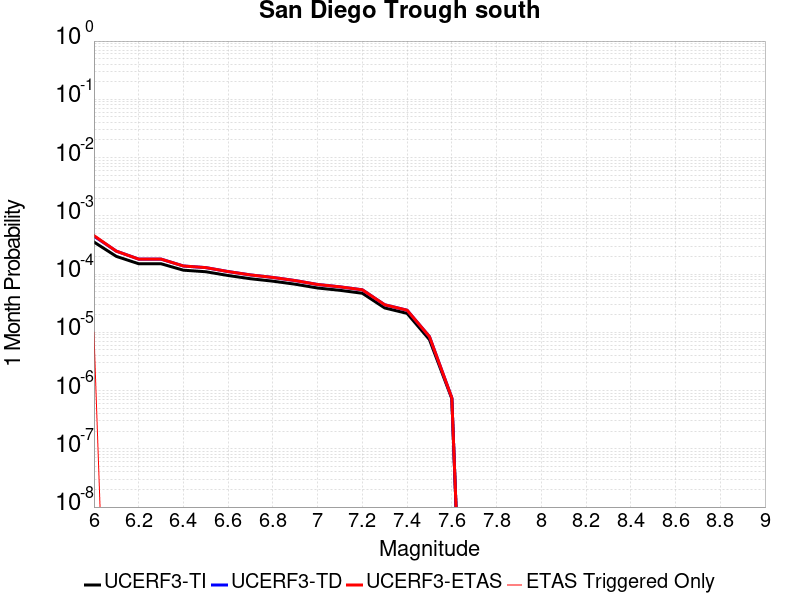 |  |  |

| Magnitude | 1 wk TI Prob | 1 wk TD Prob | 1 wk ETAS Prob | 1 wk ETAS/TD Gain | 1 wk ETAS Triggered Only | 1 mo TI Prob | 1 mo TD Prob | 1 mo ETAS Prob | 1 mo ETAS/TD Gain | 1 mo ETAS Triggered Only | 1 yr TI Prob | 1 yr TD Prob | 1 yr ETAS Prob | 1 yr ETAS/TD Gain | 1 yr ETAS Triggered Only | 10 yr TI Prob | 10 yr TD Prob | 10 yr ETAS Prob | 10 yr ETAS/TD Gain | 10 yr ETAS Triggered Only |
|-----|-----|-----|-----|-----|-----|-----|-----|-----|-----|-----|-----|-----|-----|-----|-----|-----|-----|-----|-----|-----|
| 6.0 | 8.279495E-5 | 1.04279236E-4 | 1.04279236E-4 | 1.0 | 0.0 | 3.5478722E-4 | 4.4683943E-4 | 4.4683943E-4 | 1.0 | 0.0 | 0.004310982 | 0.0054275123 | 0.005457704 | 1.0055627 | 3.0356385E-5 | 0.042283054 | 0.053009294 | 0.053038042 | 1.0005423 | 3.0356385E-5 |
| 6.1 | 4.6961468E-5 | 5.7747715E-5 | 5.7747715E-5 | 1.0 | 0.0 | 2.0124791E-4 | 2.4746772E-4 | 2.4746772E-4 | 1.0 | 0.0 | 0.00244744 | 0.003008853 | 0.003039118 | 1.0100586 | 3.0356385E-5 | 0.024206603 | 0.029688226 | 0.02971768 | 1.0009922 | 3.0356385E-5 |
| 6.2 | 3.5079658E-5 | 4.215307E-5 | 4.215307E-5 | 1.0 | 0.0 | 1.5033272E-4 | 1.8064378E-4 | 1.8064378E-4 | 1.0 | 0.0 | 0.0018287642 | 0.0021971618 | 0.0022274514 | 1.0137858 | 3.0356385E-5 | 0.018137876 | 0.021756878 | 0.021786574 | 1.001365 | 3.0356385E-5 |
| 6.3 | 3.5079658E-5 | 4.215307E-5 | 4.215307E-5 | 1.0 | 0.0 | 1.5033272E-4 | 1.8064378E-4 | 1.8064378E-4 | 1.0 | 0.0 | 0.0018287642 | 0.0021971618 | 0.0022274514 | 1.0137858 | 3.0356385E-5 | 0.018137876 | 0.021756878 | 0.021786574 | 1.001365 | 3.0356385E-5 |
| 6.4 | 2.7196904E-5 | 3.2094915E-5 | 3.2094915E-5 | 1.0 | 0.0 | 1.16552954E-4 | 1.3754248E-4 | 1.3754248E-4 | 1.0 | 0.0 | 0.0014181085 | 0.001673306 | 0.0017036116 | 1.0181112 | 3.0356385E-5 | 0.014090929 | 0.016608594 | 0.016638447 | 1.0017974 | 3.0356385E-5 |
| 6.5 | 2.5584688E-5 | 3.0108771E-5 | 3.0108771E-5 | 1.0 | 0.0 | 1.0964406E-4 | 1.290313E-4 | 1.290313E-4 | 1.0 | 0.0 | 0.0013340989 | 0.001569835 | 0.0016001437 | 1.0193069 | 3.0356385E-5 | 0.013261181 | 0.015588958 | 0.01561884 | 1.0019169 | 3.0356385E-5 |
| 6.6 | 2.2034688E-5 | 2.5748534E-5 | 2.5748534E-5 | 1.0 | 0.0 | 9.443096E-5 | 1.1034624E-4 | 1.1034624E-4 | 1.0 | 0.0 | 0.0011490905 | 0.0013426427 | 0.0013729583 | 1.0225791 | 3.0356385E-5 | 0.011431668 | 0.013346296 | 0.013376247 | 1.0022441 | 3.0356385E-5 |
| 6.7 | 1.9394853E-5 | 2.2546645E-5 | 2.2546645E-5 | 1.0 | 0.0 | 8.311815E-5 | 9.662493E-5 | 9.662493E-5 | 1.0 | 0.0 | 0.0010114936 | 0.0011757788 | 0.0011757788 | 1.0 | 0.0 | 0.01006902 | 0.011696285 | 0.011696285 | 1.0 | 0.0 |
| 6.8 | 1.7615313E-5 | 2.040749E-5 | 2.040749E-5 | 1.0 | 0.0 | 7.549201E-5 | 8.745776E-5 | 8.745776E-5 | 1.0 | 0.0 | 9.1872766E-4 | 0.0010642825 | 0.0010642825 | 1.0 | 0.0 | 0.009149387 | 0.0105924215 | 0.0105924215 | 1.0 | 0.0 |
| 6.9 | 1.5621423E-5 | 1.8029812E-5 | 1.8029812E-5 | 1.0 | 0.0 | 6.6947236E-5 | 7.7268356E-5 | 7.7268356E-5 | 1.0 | 0.0 | 8.147778E-4 | 9.4033976E-4 | 9.4033976E-4 | 1.0 | 0.0 | 0.008117969 | 0.009364054 | 0.009364054 | 1.0 | 0.0 |
| 7.0 | 1.3444376E-5 | 1.5451154E-5 | 1.5451154E-5 | 1.0 | 0.0 | 5.7617483E-5 | 6.6217566E-5 | 6.6217566E-5 | 1.0 | 0.0 | 7.0126704E-4 | 8.0590346E-4 | 8.0590346E-4 | 1.0 | 0.0 | 0.006990582 | 0.008030142 | 0.008030142 | 1.0 | 0.0 |
| 7.1 | 1.2268361E-5 | 1.4075787E-5 | 1.4075787E-5 | 1.0 | 0.0 | 5.2577634E-5 | 6.032342E-5 | 6.032342E-5 | 1.0 | 0.0 | 6.399447E-4 | 7.341928E-4 | 7.341928E-4 | 1.0 | 0.0 | 0.0063810493 | 0.007317977 | 0.007317977 | 1.0 | 0.0 |
| 7.2 | 1.0922655E-5 | 1.251599E-5 | 1.251599E-5 | 1.0 | 0.0 | 4.681054E-5 | 5.3638872E-5 | 5.3638872E-5 | 1.0 | 0.0 | 5.697693E-4 | 6.528601E-4 | 6.528601E-4 | 1.0 | 0.0 | 0.0056831064 | 0.006509702 | 0.006509702 | 1.0 | 0.0 |
| 7.3 | 6.1106753E-6 | 6.930162E-6 | 6.930162E-6 | 1.0 | 0.0 | 2.6188345E-5 | 2.9700357E-5 | 2.9700357E-5 | 1.0 | 0.0 | 3.1879646E-4 | 3.6154225E-4 | 3.6154225E-4 | 1.0 | 0.0 | 0.0031833951 | 0.003609586 | 0.003609586 | 1.0 | 0.0 |
| 7.4 | 4.933187E-6 | 5.590545E-6 | 5.590545E-6 | 1.0 | 0.0 | 2.114206E-5 | 2.395926E-5 | 2.395926E-5 | 1.0 | 0.0 | 2.5737417E-4 | 2.9166535E-4 | 2.9166535E-4 | 1.0 | 0.0 | 0.002570763 | 0.0029128667 | 0.0029128667 | 1.0 | 0.0 |
| 7.5 | 1.7489613E-6 | 1.970012E-6 | 1.970012E-6 | 1.0 | 0.0 | 7.495527E-6 | 8.442882E-6 | 8.442882E-6 | 1.0 | 0.0 | 9.125422E-5 | 1.0278747E-4 | 1.0278747E-4 | 1.0 | 0.0 | 9.1216754E-4 | 0.0010274213 | 0.0010274213 | 1.0 | 0.0 |
| 7.6 | 1.6988751E-7 | 1.7534569E-7 | 1.7534569E-7 | 1.0 | 0.0 | 7.2808916E-7 | 7.5148137E-7 | 7.5148137E-7 | 1.0 | 0.0 | 8.864449E-6 | 9.149249E-6 | 9.149249E-6 | 1.0 | 0.0 | 8.8640954E-5 | 9.1488924E-5 | 9.1488924E-5 | 1.0 | 0.0 |

## San Andreas (Creeping Section) 2011 CFM
*[(top)](#table-of-contents)*

| 1 Week | 1 Month | 1 Year | 10 Year |
|-----|-----|-----|-----|
|  |  | 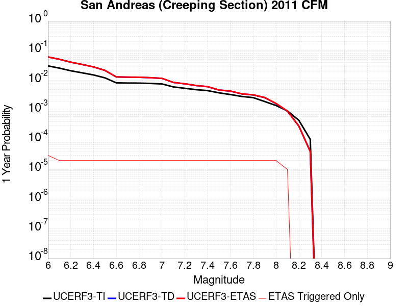 |  |

| Magnitude | 1 wk TI Prob | 1 wk TD Prob | 1 wk ETAS Prob | 1 wk ETAS/TD Gain | 1 wk ETAS Triggered Only | 1 mo TI Prob | 1 mo TD Prob | 1 mo ETAS Prob | 1 mo ETAS/TD Gain | 1 mo ETAS Triggered Only | 1 yr TI Prob | 1 yr TD Prob | 1 yr ETAS Prob | 1 yr ETAS/TD Gain | 1 yr ETAS Triggered Only | 10 yr TI Prob | 10 yr TD Prob | 10 yr ETAS Prob | 10 yr ETAS/TD Gain | 10 yr ETAS Triggered Only |
|-----|-----|-----|-----|-----|-----|-----|-----|-----|-----|-----|-----|-----|-----|-----|-----|-----|-----|-----|-----|-----|
| 6.0 | 5.986481E-4 | 0.001228818 | 0.001228818 | 1.0 | 0.0 | 0.0025631124 | 0.005251403 | 0.005251403 | 1.0 | 0.0 | 0.030762846 | 0.061267417 | 0.061267417 | 1.0 | 0.0 | 0.26835477 | 0.42623988 | 0.4262747 | 1.0000818 | 6.071277E-5 |
| 6.1 | 5.015945E-4 | 0.0010226909 | 0.0010226909 | 1.0 | 0.0 | 0.00214792 | 0.0043728617 | 0.0043728617 | 1.0 | 0.0 | 0.025839351 | 0.051300284 | 0.051300284 | 1.0 | 0.0 | 0.23032776 | 0.3731487 | 0.37318677 | 1.000102 | 6.071277E-5 |
| 6.2 | 4.073338E-4 | 8.1182894E-4 | 8.1182894E-4 | 1.0 | 0.0 | 0.0017445484 | 0.003471832 | 0.003471832 | 1.0 | 0.0 | 0.021034058 | 0.04098442 | 0.04098442 | 1.0 | 0.0 | 0.19150782 | 0.3133488 | 0.31339046 | 1.000133 | 6.071277E-5 |
| 6.3 | 3.464099E-4 | 6.7496847E-4 | 6.7496847E-4 | 1.0 | 0.0 | 0.0014837692 | 0.0028874867 | 0.0028874867 | 1.0 | 0.0 | 0.017915873 | 0.034241114 | 0.034241114 | 1.0 | 0.0 | 0.16538359 | 0.27165115 | 0.27169538 | 1.0001628 | 6.071277E-5 |
| 6.4 | 2.935057E-4 | 5.5568025E-4 | 5.5568025E-4 | 1.0 | 0.0 | 0.0012572751 | 0.0023777 | 0.0023777 | 1.0 | 0.0 | 0.015200248 | 0.028316312 | 0.028316312 | 1.0 | 0.0 | 0.14201577 | 0.23333858 | 0.23336186 | 1.0000998 | 3.0356385E-5 |
| 6.5 | 2.3409708E-4 | 4.2212562E-4 | 4.2212562E-4 | 1.0 | 0.0 | 0.0010028875 | 0.0018066199 | 0.0018066199 | 1.0 | 0.0 | 0.012141965 | 0.02163862 | 0.02163862 | 1.0 | 0.0 | 0.11499573 | 0.18719828 | 0.18722296 | 1.0001318 | 3.0356385E-5 |
| 6.6 | 1.5842178E-4 | 2.5166248E-4 | 2.5166248E-4 | 1.0 | 0.0 | 6.7877385E-4 | 0.0010780916 | 0.0010780916 | 1.0 | 0.0 | 0.0082328 | 0.013045433 | 0.013045433 | 1.0 | 0.0 | 0.07934396 | 0.12354783 | 0.123574436 | 1.0002153 | 3.0356385E-5 |
| 6.7 | 1.5616413E-4 | 2.4702126E-4 | 2.4702126E-4 | 1.0 | 0.0 | 6.691031E-4 | 0.0010582256 | 0.0010582256 | 1.0 | 0.0 | 0.0081159435 | 0.012807187 | 0.012807187 | 1.0 | 0.0 | 0.0782586 | 0.12157497 | 0.121601634 | 1.0002193 | 3.0356385E-5 |
| 6.8 | 1.5538467E-4 | 2.4525842E-4 | 2.4525842E-4 | 1.0 | 0.0 | 6.6576427E-4 | 0.0010506767 | 0.0010506767 | 1.0 | 0.0 | 0.008075596 | 0.012716471 | 0.012716471 | 1.0 | 0.0 | 0.07788358 | 0.12080543 | 0.120832115 | 1.0002209 | 3.0356385E-5 |
| 6.9 | 1.5153569E-4 | 2.363453E-4 | 2.363453E-4 | 1.0 | 0.0 | 6.49277E-4 | 0.0010125173 | 0.0010125173 | 1.0 | 0.0 | 0.007876333 | 0.012258248 | 0.012258248 | 1.0 | 0.0 | 0.07602952 | 0.11687415 | 0.11690096 | 1.0002294 | 3.0356385E-5 |
| 7.0 | 1.4588932E-4 | 2.2490788E-4 | 2.2490788E-4 | 1.0 | 0.0 | 6.250901E-4 | 9.6353685E-4 | 9.6353685E-4 | 1.0 | 0.0 | 0.0075839474 | 0.011668463 | 0.011668463 | 1.0 | 0.0 | 0.073302895 | 0.111718945 | 0.11174591 | 1.0002414 | 3.0356385E-5 |
| 7.1 | 1.1565079E-4 | 1.6362451E-4 | 1.6362451E-4 | 1.0 | 0.0 | 4.955521E-4 | 7.0106034E-4 | 7.0106034E-4 | 1.0 | 0.0 | 0.006016669 | 0.00850221 | 0.00850221 | 1.0 | 0.0 | 0.058563538 | 0.084029324 | 0.08405713 | 1.0003309 | 3.0356385E-5 |
| 7.2 | 1.0393792E-4 | 1.4692238E-4 | 1.4692238E-4 | 1.0 | 0.0 | 4.4537216E-4 | 6.295162E-4 | 6.295162E-4 | 1.0 | 0.0 | 0.005408933 | 0.0076375967 | 0.0076375967 | 1.0 | 0.0 | 0.052791595 | 0.07596378 | 0.07599183 | 1.0003693 | 3.0356385E-5 |
| 7.3 | 9.332884E-5 | 1.2847784E-4 | 1.2847784E-4 | 1.0 | 0.0 | 3.999194E-4 | 5.505037E-4 | 5.505037E-4 | 1.0 | 0.0 | 0.0048581534 | 0.0066819214 | 0.0066819214 | 1.0 | 0.0 | 0.047533102 | 0.0667903 | 0.06681863 | 1.0004241 | 3.0356385E-5 |
| 7.4 | 8.670252E-5 | 1.1764739E-4 | 1.1764739E-4 | 1.0 | 0.0 | 3.715293E-4 | 5.041063E-4 | 5.041063E-4 | 1.0 | 0.0 | 0.004513991 | 0.0061203437 | 0.0061203437 | 1.0 | 0.0 | 0.044233937 | 0.061436135 | 0.061464626 | 1.0004637 | 3.0356385E-5 |
| 7.5 | 7.3036405E-5 | 9.0574984E-5 | 9.0574984E-5 | 1.0 | 0.0 | 3.129756E-4 | 3.8812085E-4 | 3.8812085E-4 | 1.0 | 0.0 | 0.0038038217 | 0.0047151544 | 0.0047151544 | 1.0 | 0.0 | 0.03739367 | 0.048123557 | 0.048152454 | 1.0006005 | 3.0356385E-5 |
| 7.6 | 6.3935775E-5 | 8.3263905E-5 | 8.3263905E-5 | 1.0 | 0.0 | 2.7398168E-4 | 3.567966E-4 | 3.567966E-4 | 1.0 | 0.0 | 0.0033306254 | 0.004335365 | 0.004335365 | 1.0 | 0.0 | 0.032811474 | 0.04421104 | 0.044240054 | 1.0006562 | 3.0356385E-5 |
| 7.7 | 5.5050095E-5 | 6.702637E-5 | 6.702637E-5 | 1.0 | 0.0 | 2.3590765E-4 | 2.8722425E-4 | 2.8722425E-4 | 1.0 | 0.0 | 0.0028683927 | 0.003491352 | 0.003491352 | 1.0 | 0.0 | 0.0283165 | 0.03599376 | 0.03599376 | 1.0 | 0.0 |
| 7.8 | 5.027131E-5 | 6.200182E-5 | 6.200182E-5 | 1.0 | 0.0 | 2.1543067E-4 | 2.65695E-4 | 2.65695E-4 | 1.0 | 0.0 | 0.0026197135 | 0.0032300418 | 0.0032300418 | 1.0 | 0.0 | 0.025890453 | 0.033307906 | 0.033307906 | 1.0 | 0.0 |
| 7.9 | 3.7271806E-5 | 5.0525578E-5 | 5.0525578E-5 | 1.0 | 0.0 | 1.5972654E-4 | 2.1652023E-4 | 2.1652023E-4 | 1.0 | 0.0 | 0.0019429359 | 0.002632949 | 0.002632949 | 1.0 | 0.0 | 0.019260362 | 0.027214935 | 0.027214935 | 1.0 | 0.0 |
| 8.0 | 2.7310243E-5 | 3.1628108E-5 | 3.1628108E-5 | 1.0 | 0.0 | 1.17038646E-4 | 1.35542E-4 | 1.35542E-4 | 1.0 | 0.0 | 0.0014240141 | 0.0016489754 | 0.0016489754 | 1.0 | 0.0 | 0.014149235 | 0.017315505 | 0.017315505 | 1.0 | 0.0 |
| 8.1 | 1.7940547E-5 | 1.7529763E-5 | 1.7529763E-5 | 1.0 | 0.0 | 7.688579E-5 | 7.51254E-5 | 7.51254E-5 | 1.0 | 0.0 | 9.3568244E-4 | 9.142684E-4 | 9.142684E-4 | 1.0 | 0.0 | 0.009317525 | 0.009867 | 0.009867 | 1.0 | 0.0 |
| 8.2 | 8.643924E-6 | 5.5269165E-6 | 5.5269165E-6 | 1.0 | 0.0 | 3.704486E-5 | 2.368657E-5 | 2.368657E-5 | 1.0 | 0.0 | 4.5092785E-4 | 2.8834594E-4 | 2.8834594E-4 | 1.0 | 0.0 | 0.0045001395 | 0.0032771796 | 0.0032771796 | 1.0 | 0.0 |
| 8.3 | 1.983087E-6 | 7.7486385E-7 | 7.7486385E-7 | 1.0 | 0.0 | 8.498917E-6 | 3.320841E-6 | 3.320841E-6 | 1.0 | 0.0 | 1.034694E-4 | 4.0430506E-5 | 4.0430506E-5 | 1.0 | 0.0 | 0.0010342124 | 4.7705657E-4 | 4.7705657E-4 | 1.0 | 0.0 |

## San Diego Trough north alt1
*[(top)](#table-of-contents)*

| 1 Week | 1 Month | 1 Year | 10 Year |
|-----|-----|-----|-----|
|  | 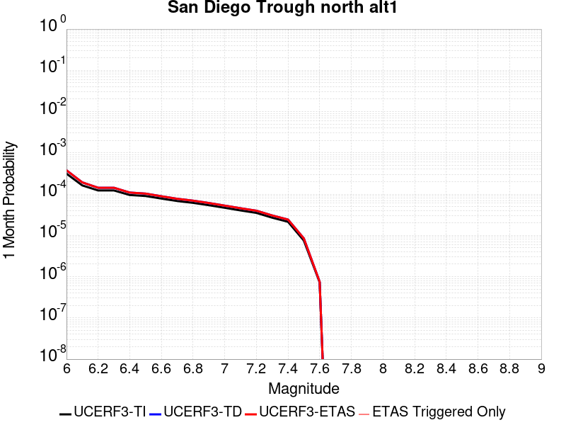 |  |  |

| Magnitude | 1 wk TI Prob | 1 wk TD Prob | 1 wk ETAS Prob | 1 wk ETAS/TD Gain | 1 wk ETAS Triggered Only | 1 mo TI Prob | 1 mo TD Prob | 1 mo ETAS Prob | 1 mo ETAS/TD Gain | 1 mo ETAS Triggered Only | 1 yr TI Prob | 1 yr TD Prob | 1 yr ETAS Prob | 1 yr ETAS/TD Gain | 1 yr ETAS Triggered Only | 10 yr TI Prob | 10 yr TD Prob | 10 yr ETAS Prob | 10 yr ETAS/TD Gain | 10 yr ETAS Triggered Only |
|-----|-----|-----|-----|-----|-----|-----|-----|-----|-----|-----|-----|-----|-----|-----|-----|-----|-----|-----|-----|-----|
| 6.0 | 7.329252E-5 | 8.823553E-5 | 8.823553E-5 | 1.0 | 0.0 | 3.14073E-4 | 3.7810113E-4 | 3.7810113E-4 | 1.0 | 0.0 | 0.0038171355 | 0.0045943 | 0.004654734 | 1.0131541 | 6.071277E-5 | 0.03752231 | 0.04505696 | 0.04511494 | 1.0012867 | 6.071277E-5 |
| 6.1 | 3.7940346E-5 | 4.48962E-5 | 4.48962E-5 | 1.0 | 0.0 | 1.6259136E-4 | 1.9239864E-4 | 1.9239864E-4 | 1.0 | 0.0 | 0.0019777524 | 0.0023400213 | 0.0023703065 | 1.0129423 | 3.0356385E-5 | 0.019602431 | 0.023162305 | 0.023191959 | 1.0012802 | 3.0356385E-5 |
| 6.2 | 2.8645263E-5 | 3.330409E-5 | 3.330409E-5 | 1.0 | 0.0 | 1.2275964E-4 | 1.4272417E-4 | 1.4272417E-4 | 1.0 | 0.0 | 0.0014935739 | 0.0017362948 | 0.0017665984 | 1.0174531 | 3.0356385E-5 | 0.0148357535 | 0.017229972 | 0.017259805 | 1.0017315 | 3.0356385E-5 |
| 6.3 | 2.8645263E-5 | 3.330409E-5 | 3.330409E-5 | 1.0 | 0.0 | 1.2275964E-4 | 1.4272417E-4 | 1.4272417E-4 | 1.0 | 0.0 | 0.0014935739 | 0.0017362948 | 0.0017665984 | 1.0174531 | 3.0356385E-5 | 0.0148357535 | 0.017229972 | 0.017259805 | 1.0017315 | 3.0356385E-5 |
| 6.4 | 2.2204576E-5 | 2.545331E-5 | 2.545331E-5 | 1.0 | 0.0 | 9.5159E-5 | 1.09081106E-4 | 1.09081106E-4 | 1.0 | 0.0 | 0.001157945 | 0.0013272633 | 0.0013575795 | 1.0228411 | 3.0356385E-5 | 0.011519298 | 0.01319452 | 0.013224476 | 1.0022703 | 3.0356385E-5 |
| 6.5 | 2.1004838E-5 | 2.4029328E-5 | 2.4029328E-5 | 1.0 | 0.0 | 9.0017624E-5 | 1.02978825E-4 | 1.02978825E-4 | 1.0 | 0.0 | 0.0010954136 | 0.0012530553 | 0.0012833736 | 1.0241956 | 3.0356385E-5 | 0.010900296 | 0.012460973 | 0.012490951 | 1.0024058 | 3.0356385E-5 |
| 6.6 | 1.820557E-5 | 2.0708592E-5 | 2.0708592E-5 | 1.0 | 0.0 | 7.802154E-5 | 8.874812E-5 | 8.874812E-5 | 1.0 | 0.0 | 9.4949827E-4 | 0.0010799783 | 0.0010799783 | 1.0 | 0.0 | 0.009454516 | 0.010747968 | 0.010747968 | 1.0 | 0.0 |
| 6.7 | 1.5884485E-5 | 1.7986826E-5 | 1.7986826E-5 | 1.0 | 0.0 | 6.807459E-5 | 7.7084136E-5 | 7.7084136E-5 | 1.0 | 0.0 | 8.284929E-4 | 9.38098E-4 | 9.38098E-4 | 1.0 | 0.0 | 0.008254109 | 0.0093417475 | 0.0093417475 | 1.0 | 0.0 |
| 6.8 | 1.4331171E-5 | 1.620389E-5 | 1.620389E-5 | 1.0 | 0.0 | 6.141786E-5 | 6.9443406E-5 | 6.9443406E-5 | 1.0 | 0.0 | 7.4750587E-4 | 8.4514753E-4 | 8.4514753E-4 | 1.0 | 0.0 | 0.0074499645 | 0.008419601 | 0.008419601 | 1.0 | 0.0 |
| 6.9 | 1.2574203E-5 | 1.4208297E-5 | 1.4208297E-5 | 1.0 | 0.0 | 5.3888325E-5 | 6.089129E-5 | 6.089129E-5 | 1.0 | 0.0 | 6.558929E-4 | 7.411007E-4 | 7.411007E-4 | 1.0 | 0.0 | 0.0065396037 | 0.0073864786 | 0.0073864786 | 1.0 | 0.0 |
| 7.0 | 1.0883844E-5 | 1.2291381E-5 | 1.2291381E-5 | 1.0 | 0.0 | 4.664421E-5 | 5.267629E-5 | 5.267629E-5 | 1.0 | 0.0 | 5.677453E-4 | 6.411461E-4 | 6.411461E-4 | 1.0 | 0.0 | 0.00566297 | 0.0063930918 | 0.0063930918 | 1.0 | 0.0 |
| 7.1 | 9.393088E-6 | 1.0608852E-5 | 1.0608852E-5 | 1.0 | 0.0 | 4.025547E-5 | 4.546572E-5 | 4.546572E-5 | 1.0 | 0.0 | 4.900001E-4 | 5.534053E-4 | 5.534053E-4 | 1.0 | 0.0 | 0.0048892107 | 0.0055203685 | 0.0055203685 | 1.0 | 0.0 |
| 7.2 | 8.190791E-6 | 9.2602395E-6 | 9.2602395E-6 | 1.0 | 0.0 | 3.510292E-5 | 3.968614E-5 | 3.968614E-5 | 1.0 | 0.0 | 4.2729423E-4 | 4.830723E-4 | 4.830723E-4 | 1.0 | 0.0 | 0.0042647356 | 0.0048203026 | 0.0048203026 | 1.0 | 0.0 |
| 7.3 | 6.268162E-6 | 7.090957E-6 | 7.090957E-6 | 1.0 | 0.0 | 2.6863276E-5 | 3.0389465E-5 | 3.0389465E-5 | 1.0 | 0.0 | 3.2701128E-4 | 3.6992933E-4 | 3.6992933E-4 | 1.0 | 0.0 | 0.003265305 | 0.0036931813 | 0.0036931813 | 1.0 | 0.0 |
| 7.4 | 4.985186E-6 | 5.643675E-6 | 5.643675E-6 | 1.0 | 0.0 | 2.1364907E-5 | 2.4186958E-5 | 2.4186958E-5 | 1.0 | 0.0 | 2.600867E-4 | 2.9443682E-4 | 2.9443682E-4 | 1.0 | 0.0 | 0.002597825 | 0.0029405085 | 0.0029405085 | 1.0 | 0.0 |
| 7.5 | 1.7489613E-6 | 1.970012E-6 | 1.970012E-6 | 1.0 | 0.0 | 7.495527E-6 | 8.442882E-6 | 8.442882E-6 | 1.0 | 0.0 | 9.125422E-5 | 1.0278747E-4 | 1.0278747E-4 | 1.0 | 0.0 | 9.1216754E-4 | 0.0010274213 | 0.0010274213 | 1.0 | 0.0 |
| 7.6 | 1.6988751E-7 | 1.7534569E-7 | 1.7534569E-7 | 1.0 | 0.0 | 7.2808916E-7 | 7.5148137E-7 | 7.5148137E-7 | 1.0 | 0.0 | 8.864449E-6 | 9.149249E-6 | 9.149249E-6 | 1.0 | 0.0 | 8.8640954E-5 | 9.1488924E-5 | 9.1488924E-5 | 1.0 | 0.0 |

## Pinto Mtn
*[(top)](#table-of-contents)*

| 1 Week | 1 Month | 1 Year | 10 Year |
|-----|-----|-----|-----|
|  |  |  |  |

| Magnitude | 1 wk TI Prob | 1 wk TD Prob | 1 wk ETAS Prob | 1 wk ETAS/TD Gain | 1 wk ETAS Triggered Only | 1 mo TI Prob | 1 mo TD Prob | 1 mo ETAS Prob | 1 mo ETAS/TD Gain | 1 mo ETAS Triggered Only | 1 yr TI Prob | 1 yr TD Prob | 1 yr ETAS Prob | 1 yr ETAS/TD Gain | 1 yr ETAS Triggered Only | 10 yr TI Prob | 10 yr TD Prob | 10 yr ETAS Prob | 10 yr ETAS/TD Gain | 10 yr ETAS Triggered Only |
|-----|-----|-----|-----|-----|-----|-----|-----|-----|-----|-----|-----|-----|-----|-----|-----|-----|-----|-----|-----|-----|
| 6.0 | 4.4194956E-5 | 4.7869722E-5 | 4.7869722E-5 | 1.0 | 0.0 | 1.893932E-4 | 2.0514075E-4 | 2.0514075E-4 | 1.0 | 0.0 | 0.0023034236 | 0.0024948926 | 0.0024948926 | 1.0 | 0.0 | 0.022796938 | 0.024686344 | 0.024745557 | 1.0023986 | 6.071277E-5 |
| 6.1 | 4.4194956E-5 | 4.7869722E-5 | 4.7869722E-5 | 1.0 | 0.0 | 1.893932E-4 | 2.0514075E-4 | 2.0514075E-4 | 1.0 | 0.0 | 0.0023034236 | 0.0024948926 | 0.0024948926 | 1.0 | 0.0 | 0.022796938 | 0.024686344 | 0.024745557 | 1.0023986 | 6.071277E-5 |
| 6.2 | 4.4194956E-5 | 4.7869722E-5 | 4.7869722E-5 | 1.0 | 0.0 | 1.893932E-4 | 2.0514075E-4 | 2.0514075E-4 | 1.0 | 0.0 | 0.0023034236 | 0.0024948926 | 0.0024948926 | 1.0 | 0.0 | 0.022796938 | 0.024686344 | 0.024745557 | 1.0023986 | 6.071277E-5 |
| 6.3 | 4.4194956E-5 | 4.7869722E-5 | 4.7869722E-5 | 1.0 | 0.0 | 1.893932E-4 | 2.0514075E-4 | 2.0514075E-4 | 1.0 | 0.0 | 0.0023034236 | 0.0024948926 | 0.0024948926 | 1.0 | 0.0 | 0.022796938 | 0.024686344 | 0.024745557 | 1.0023986 | 6.071277E-5 |
| 6.4 | 3.729929E-5 | 3.9617134E-5 | 3.9617134E-5 | 1.0 | 0.0 | 1.5984432E-4 | 1.697772E-4 | 1.697772E-4 | 1.0 | 0.0 | 0.0019443673 | 0.0020651715 | 0.0020651715 | 1.0 | 0.0 | 0.019274427 | 0.020469824 | 0.020529293 | 1.0029052 | 6.071277E-5 |
| 6.5 | 3.729929E-5 | 3.9617134E-5 | 3.9617134E-5 | 1.0 | 0.0 | 1.5984432E-4 | 1.697772E-4 | 1.697772E-4 | 1.0 | 0.0 | 0.0019443673 | 0.0020651715 | 0.0020651715 | 1.0 | 0.0 | 0.019274427 | 0.020469824 | 0.020529293 | 1.0029052 | 6.071277E-5 |
| 6.6 | 3.0204548E-5 | 3.1217198E-5 | 3.1217198E-5 | 1.0 | 0.0 | 1.2944164E-4 | 1.3378132E-4 | 1.3378132E-4 | 1.0 | 0.0 | 0.0015748127 | 0.0016276054 | 0.0016276054 | 1.0 | 0.0 | 0.015636992 | 0.01616072 | 0.016190585 | 1.0018481 | 3.0356385E-5 |
| 6.7 | 2.9857754E-5 | 3.0826515E-5 | 3.0826515E-5 | 1.0 | 0.0 | 1.2795553E-4 | 1.3210715E-4 | 1.3210715E-4 | 1.0 | 0.0 | 0.0015567453 | 0.0016072524 | 0.0016072524 | 1.0 | 0.0 | 0.015458848 | 0.015960127 | 0.015989998 | 1.0018717 | 3.0356385E-5 |
| 6.8 | 2.4819734E-5 | 2.5020017E-5 | 2.5020017E-5 | 1.0 | 0.0 | 1.0636595E-4 | 1.0722436E-4 | 1.0722436E-4 | 1.0 | 0.0 | 0.0012942362 | 0.0013046965 | 0.0013046965 | 1.0 | 0.0 | 0.012867244 | 0.012972736 | 0.013002698 | 1.0023097 | 3.0356385E-5 |
| 6.9 | 2.331124E-5 | 2.3348057E-5 | 2.3348057E-5 | 1.0 | 0.0 | 9.990149E-5 | 1.0005938E-4 | 1.0005938E-4 | 1.0 | 0.0 | 0.001215622 | 0.0012175625 | 0.0012175625 | 1.0 | 0.0 | 0.012089936 | 0.012111111 | 0.012141099 | 1.0024761 | 3.0356385E-5 |
| 7.0 | 2.1818534E-5 | 2.1770986E-5 | 2.1770986E-5 | 1.0 | 0.0 | 9.3504656E-5 | 9.3301E-5 | 9.3301E-5 | 1.0 | 0.0 | 0.0011378246 | 0.0011353676 | 0.0011353676 | 1.0 | 0.0 | 0.011320163 | 0.011297774 | 0.011327787 | 1.0026566 | 3.0356385E-5 |
| 7.1 | 2.066081E-5 | 2.0550438E-5 | 2.0550438E-5 | 1.0 | 0.0 | 8.854332E-5 | 8.807045E-5 | 8.807045E-5 | 1.0 | 0.0 | 0.0010774818 | 0.0010717498 | 0.0010717498 | 1.0 | 0.0 | 0.010722724 | 0.010667863 | 0.010697896 | 1.0028152 | 3.0356385E-5 |
| 7.2 | 1.8990233E-5 | 1.906353E-5 | 1.906353E-5 | 1.0 | 0.0 | 8.138417E-5 | 8.1698396E-5 | 8.1698396E-5 | 1.0 | 0.0 | 9.904018E-4 | 9.942434E-4 | 9.942434E-4 | 1.0 | 0.0 | 0.009859995 | 0.009899952 | 0.009930008 | 1.0030359 | 3.0356385E-5 |
| 7.3 | 1.3335872E-5 | 1.49154175E-5 | 1.49154175E-5 | 1.0 | 0.0 | 5.7152483E-5 | 6.3921725E-5 | 6.3921725E-5 | 1.0 | 0.0 | 6.956093E-4 | 7.779819E-4 | 7.779819E-4 | 1.0 | 0.0 | 0.006934359 | 0.0077538835 | 0.007784005 | 1.0038847 | 3.0356385E-5 |
| 7.4 | 9.414066E-6 | 1.18692105E-5 | 1.18692105E-5 | 1.0 | 0.0 | 4.0345374E-5 | 5.0867107E-5 | 5.0867107E-5 | 1.0 | 0.0 | 4.910942E-4 | 6.191405E-4 | 6.191405E-4 | 1.0 | 0.0 | 0.0049001034 | 0.006175105 | 0.006205274 | 1.0048856 | 3.0356385E-5 |
| 7.5 | 7.2101157E-6 | 9.166289E-6 | 9.166289E-6 | 1.0 | 0.0 | 3.090013E-5 | 3.9283546E-5 | 3.9283546E-5 | 1.0 | 0.0 | 3.7614413E-4 | 4.7818E-4 | 4.7818E-4 | 1.0 | 0.0 | 0.0037550807 | 0.004772287 | 0.0048024985 | 1.0063306 | 3.0356385E-5 |
| 7.6 | 3.296375E-6 | 4.5533634E-6 | 4.5533634E-6 | 1.0 | 0.0 | 1.4127245E-5 | 1.9514277E-5 | 1.9514277E-5 | 1.0 | 0.0 | 1.7198564E-4 | 2.3756182E-4 | 2.3756182E-4 | 1.0 | 0.0 | 0.0017185259 | 0.0023732164 | 0.0023732164 | 1.0 | 0.0 |
| 7.7 | 2.5741092E-6 | 3.5918313E-6 | 3.5918313E-6 | 1.0 | 0.0 | 1.103185E-5 | 1.539348E-5 | 1.539348E-5 | 1.0 | 0.0 | 1.3430449E-4 | 1.8740082E-4 | 1.8740082E-4 | 1.0 | 0.0 | 0.0013422335 | 0.0018725583 | 0.0018725583 | 1.0 | 0.0 |

## Santa Rosa Island
*[(top)](#table-of-contents)*

| 1 Week | 1 Month | 1 Year | 10 Year |
|-----|-----|-----|-----|
| 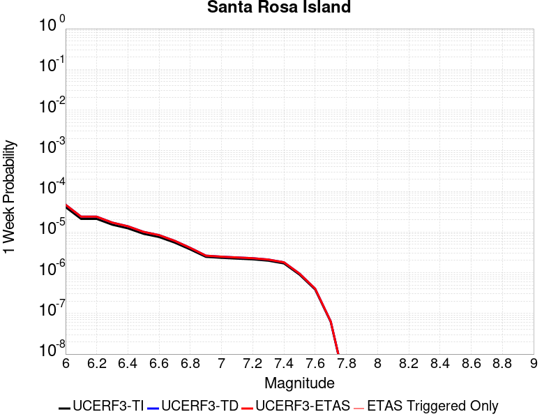 | 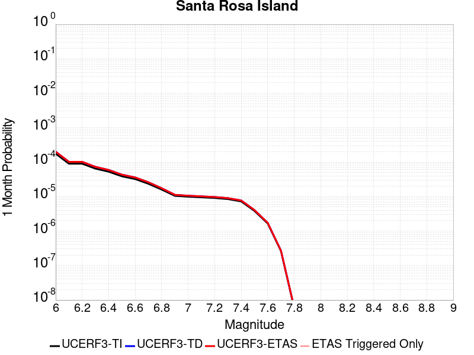 |  |  |

| Magnitude | 1 wk TI Prob | 1 wk TD Prob | 1 wk ETAS Prob | 1 wk ETAS/TD Gain | 1 wk ETAS Triggered Only | 1 mo TI Prob | 1 mo TD Prob | 1 mo ETAS Prob | 1 mo ETAS/TD Gain | 1 mo ETAS Triggered Only | 1 yr TI Prob | 1 yr TD Prob | 1 yr ETAS Prob | 1 yr ETAS/TD Gain | 1 yr ETAS Triggered Only | 10 yr TI Prob | 10 yr TD Prob | 10 yr ETAS Prob | 10 yr ETAS/TD Gain | 10 yr ETAS Triggered Only |
|-----|-----|-----|-----|-----|-----|-----|-----|-----|-----|-----|-----|-----|-----|-----|-----|-----|-----|-----|-----|-----|
| 6.0 | 4.1143165E-5 | 4.7100217E-5 | 4.7100217E-5 | 1.0 | 0.0 | 1.7631594E-4 | 2.0184356E-4 | 2.0184356E-4 | 1.0 | 0.0 | 0.002144533 | 0.002454873 | 0.002454873 | 1.0 | 0.0 | 0.021239553 | 0.024298182 | 0.02435742 | 1.002438 | 6.071277E-5 |
| 6.1 | 2.1061249E-5 | 2.3869197E-5 | 2.3869197E-5 | 1.0 | 0.0 | 9.0259375E-5 | 1.0229272E-4 | 1.0229272E-4 | 1.0 | 0.0 | 0.0010983539 | 0.0012447312 | 0.0012447312 | 1.0 | 0.0 | 0.01092941 | 0.0123806335 | 0.012440594 | 1.0048431 | 6.071277E-5 |
| 6.2 | 2.1061249E-5 | 2.3869197E-5 | 2.3869197E-5 | 1.0 | 0.0 | 9.0259375E-5 | 1.0229272E-4 | 1.0229272E-4 | 1.0 | 0.0 | 0.0010983539 | 0.0012447312 | 0.0012447312 | 1.0 | 0.0 | 0.01092941 | 0.0123806335 | 0.012440594 | 1.0048431 | 6.071277E-5 |
| 6.3 | 1.5158236E-5 | 1.70773E-5 | 1.70773E-5 | 1.0 | 0.0 | 6.496225E-5 | 7.318644E-5 | 7.318644E-5 | 1.0 | 0.0 | 7.906284E-4 | 8.906926E-4 | 8.906926E-4 | 1.0 | 0.0 | 0.007878214 | 0.008872479 | 0.008932654 | 1.006782 | 6.071277E-5 |
| 6.4 | 1.2341918E-5 | 1.3855181E-5 | 1.3855181E-5 | 1.0 | 0.0 | 5.2892858E-5 | 5.9378042E-5 | 5.9378042E-5 | 1.0 | 0.0 | 6.437803E-4 | 7.22696E-4 | 7.22696E-4 | 1.0 | 0.0 | 0.006419184 | 0.0072042947 | 0.00726457 | 1.0083666 | 6.071277E-5 |
| 6.5 | 9.061158E-6 | 1.0118608E-5 | 1.0118608E-5 | 1.0 | 0.0 | 3.883296E-5 | 4.336477E-5 | 4.336477E-5 | 1.0 | 0.0 | 4.726887E-4 | 5.278435E-4 | 5.278435E-4 | 1.0 | 0.0 | 0.004716845 | 0.005266436 | 0.005326829 | 1.0114676 | 6.071277E-5 |
| 6.6 | 7.5461685E-6 | 8.402008E-6 | 8.402008E-6 | 1.0 | 0.0 | 3.2340322E-5 | 3.6008132E-5 | 3.6008132E-5 | 1.0 | 0.0 | 3.936723E-4 | 4.383151E-4 | 4.383151E-4 | 1.0 | 0.0 | 0.003929756 | 0.0043749358 | 0.004435383 | 1.0138167 | 6.071277E-5 |
| 6.7 | 5.5023775E-6 | 6.08825E-6 | 6.08825E-6 | 1.0 | 0.0 | 2.3581404E-5 | 2.6092257E-5 | 2.6092257E-5 | 1.0 | 0.0 | 2.8706578E-4 | 3.1763015E-4 | 3.1763015E-4 | 1.0 | 0.0 | 0.0028669522 | 0.0031720835 | 0.003232604 | 1.019079 | 6.071277E-5 |
| 6.8 | 3.7351679E-6 | 4.0836526E-6 | 4.0836526E-6 | 1.0 | 0.0 | 1.6007763E-5 | 1.7501266E-5 | 1.7501266E-5 | 1.0 | 0.0 | 1.948771E-4 | 2.1305957E-4 | 2.1305957E-4 | 1.0 | 0.0 | 0.0019470629 | 0.0021287983 | 0.0021893817 | 1.0284591 | 6.071277E-5 |
| 6.9 | 2.456366E-6 | 2.6295188E-6 | 2.6295188E-6 | 1.0 | 0.0 | 1.0527241E-5 | 1.1269318E-5 | 1.1269318E-5 | 1.0 | 0.0 | 1.2816161E-4 | 1.3719534E-4 | 1.3719534E-4 | 1.0 | 0.0 | 0.0012808773 | 0.0013711093 | 0.0014014241 | 1.0221096 | 3.0356385E-5 |
| 7.0 | 2.3245157E-6 | 2.4830051E-6 | 2.4830051E-6 | 1.0 | 0.0 | 9.962172E-6 | 1.0641406E-5 | 1.0641406E-5 | 1.0 | 0.0 | 1.2128269E-4 | 1.2955145E-4 | 1.2955145E-4 | 1.0 | 0.0 | 0.0012121652 | 0.0012947614 | 0.0013250785 | 1.0234152 | 3.0356385E-5 |
| 7.1 | 2.2248344E-6 | 2.3734624E-6 | 2.3734624E-6 | 1.0 | 0.0 | 9.53497E-6 | 1.01719415E-5 | 1.01719415E-5 | 1.0 | 0.0 | 1.1608207E-4 | 1.2383638E-4 | 1.2383638E-4 | 1.0 | 0.0 | 0.0011602144 | 0.0012376757 | 0.0012679944 | 1.0244966 | 3.0356385E-5 |
| 7.2 | 2.1350402E-6 | 2.2763559E-6 | 2.2763559E-6 | 1.0 | 0.0 | 9.150141E-6 | 9.755774E-6 | 9.755774E-6 | 1.0 | 0.0 | 1.1139726E-4 | 1.1877009E-4 | 1.1877009E-4 | 1.0 | 0.0 | 0.0011134144 | 0.0011870681 | 0.0012173884 | 1.0255423 | 3.0356385E-5 |
| 7.3 | 1.9793572E-6 | 2.108904E-6 | 2.108904E-6 | 1.0 | 0.0 | 8.482932E-6 | 9.038129E-6 | 9.038129E-6 | 1.0 | 0.0 | 1.032748E-4 | 1.1003368E-4 | 1.1003368E-4 | 1.0 | 0.0 | 0.0010322682 | 0.0010997938 | 0.0011301168 | 1.0275716 | 3.0356385E-5 |
| 7.4 | 1.6951194E-6 | 1.8047301E-6 | 1.8047301E-6 | 1.0 | 0.0 | 7.264777E-6 | 7.734535E-6 | 7.734535E-6 | 1.0 | 0.0 | 8.844508E-5 | 9.416391E-5 | 9.416391E-5 | 1.0 | 0.0 | 8.840988E-4 | 9.4124174E-4 | 9.715695E-4 | 1.0322211 | 3.0356385E-5 |
| 7.5 | 8.987207E-7 | 9.5129707E-7 | 9.5129707E-7 | 1.0 | 0.0 | 3.8516546E-6 | 4.076981E-6 | 4.076981E-6 | 1.0 | 0.0 | 4.6892885E-5 | 4.9636128E-5 | 4.9636128E-5 | 1.0 | 0.0 | 4.688299E-4 | 4.9625157E-4 | 4.9625157E-4 | 1.0 | 0.0 |
| 7.6 | 3.8783037E-7 | 4.05319E-7 | 4.05319E-7 | 1.0 | 0.0 | 1.6621291E-6 | 1.7370804E-6 | 1.7370804E-6 | 1.0 | 0.0 | 2.0236233E-5 | 2.1148755E-5 | 2.1148755E-5 | 1.0 | 0.0 | 2.023439E-4 | 2.1146808E-4 | 2.1146808E-4 | 1.0 | 0.0 |
| 7.7 | 6.181804E-8 | 6.339348E-8 | 6.339348E-8 | 1.0 | 0.0 | 2.6493444E-7 | 2.716863E-7 | 2.716863E-7 | 1.0 | 0.0 | 3.225572E-6 | 3.3077758E-6 | 3.3077758E-6 | 1.0 | 0.0 | 3.225525E-5 | 3.307727E-5 | 3.307727E-5 | 1.0 | 0.0 |
| 7.8 | 1.3704449E-9 | 1.3964505E-9 | 1.3964505E-9 | 1.0 | 0.0 | 5.873335E-9 | 5.9847878E-9 | 5.9847878E-9 | 1.0 | 0.0 | 7.1507856E-8 | 7.2864786E-8 | 7.2864786E-8 | 1.0 | 0.0 | 7.1507833E-7 | 7.286477E-7 | 7.286477E-7 | 1.0 | 0.0 |

## Cleghorn Lake
*[(top)](#table-of-contents)*

| 1 Week | 1 Month | 1 Year | 10 Year |
|-----|-----|-----|-----|
|  |  |  |  |

| Magnitude | 1 wk TI Prob | 1 wk TD Prob | 1 wk ETAS Prob | 1 wk ETAS/TD Gain | 1 wk ETAS Triggered Only | 1 mo TI Prob | 1 mo TD Prob | 1 mo ETAS Prob | 1 mo ETAS/TD Gain | 1 mo ETAS Triggered Only | 1 yr TI Prob | 1 yr TD Prob | 1 yr ETAS Prob | 1 yr ETAS/TD Gain | 1 yr ETAS Triggered Only | 10 yr TI Prob | 10 yr TD Prob | 10 yr ETAS Prob | 10 yr ETAS/TD Gain | 10 yr ETAS Triggered Only |
|-----|-----|-----|-----|-----|-----|-----|-----|-----|-----|-----|-----|-----|-----|-----|-----|-----|-----|-----|-----|-----|
| 6.0 | 1.5467183E-5 | 1.679612E-5 | 1.679612E-5 | 1.0 | 0.0 | 6.6286244E-5 | 7.19817E-5 | 7.19817E-5 | 1.0 | 0.0 | 8.067362E-4 | 8.760797E-4 | 9.064095E-4 | 1.0346199 | 3.0356385E-5 | 0.008038137 | 0.008731688 | 0.008791871 | 1.0068924 | 6.071277E-5 |
| 6.1 | 1.5467183E-5 | 1.679612E-5 | 1.679612E-5 | 1.0 | 0.0 | 6.6286244E-5 | 7.19817E-5 | 7.19817E-5 | 1.0 | 0.0 | 8.067362E-4 | 8.760797E-4 | 9.064095E-4 | 1.0346199 | 3.0356385E-5 | 0.008038137 | 0.008731688 | 0.008791871 | 1.0068924 | 6.071277E-5 |
| 6.2 | 1.2624631E-5 | 1.36830695E-5 | 1.36830695E-5 | 1.0 | 0.0 | 5.410444E-5 | 5.8640682E-5 | 5.8640682E-5 | 1.0 | 0.0 | 6.585225E-4 | 7.1376516E-4 | 7.4409985E-4 | 1.0424995 | 3.0356385E-5 | 0.0065657445 | 0.0071195234 | 0.0071798037 | 1.008467 | 6.071277E-5 |
| 6.3 | 1.2624631E-5 | 1.36830695E-5 | 1.36830695E-5 | 1.0 | 0.0 | 5.410444E-5 | 5.8640682E-5 | 5.8640682E-5 | 1.0 | 0.0 | 6.585225E-4 | 7.1376516E-4 | 7.4409985E-4 | 1.0424995 | 3.0356385E-5 | 0.0065657445 | 0.0071195234 | 0.0071798037 | 1.008467 | 6.071277E-5 |
| 6.4 | 9.417684E-6 | 1.01712E-5 | 1.01712E-5 | 1.0 | 0.0 | 4.036088E-5 | 4.3590364E-5 | 4.3590364E-5 | 1.0 | 0.0 | 4.912829E-4 | 5.3062453E-4 | 5.609648E-4 | 1.0571784 | 3.0356385E-5 | 0.004901982 | 0.0052976124 | 0.0053580035 | 1.0113997 | 6.071277E-5 |
| 6.5 | 9.368219E-6 | 1.0118622E-5 | 1.0118622E-5 | 1.0 | 0.0 | 4.014889E-5 | 4.336504E-5 | 4.336504E-5 | 1.0 | 0.0 | 4.8870314E-4 | 5.2788254E-4 | 5.582229E-4 | 1.0574756 | 3.0356385E-5 | 0.004876298 | 0.0052703223 | 0.0053307153 | 1.011459 | 6.071277E-5 |
| 6.6 | 7.803798E-6 | 8.44275E-6 | 8.44275E-6 | 1.0 | 0.0 | 3.3444423E-5 | 3.6182937E-5 | 3.6182937E-5 | 1.0 | 0.0 | 4.0710976E-4 | 4.4047815E-4 | 4.7082116E-4 | 1.0688865 | 3.0356385E-5 | 0.0040636472 | 0.004399969 | 0.0044604144 | 1.0137378 | 6.071277E-5 |
| 6.7 | 2.3108669E-6 | 2.4440203E-6 | 2.4440203E-6 | 1.0 | 0.0 | 9.903678E-6 | 1.0474332E-5 | 1.0474332E-5 | 1.0 | 0.0 | 1.205706E-4 | 1.2751772E-4 | 1.2751772E-4 | 1.0 | 0.0 | 0.001205052 | 0.0012744641 | 0.0012744641 | 1.0 | 0.0 |
| 6.8 | 2.0882828E-6 | 2.2064476E-6 | 2.2064476E-6 | 1.0 | 0.0 | 8.949753E-6 | 9.456171E-6 | 9.456171E-6 | 1.0 | 0.0 | 1.08957785E-4 | 1.15122966E-4 | 1.15122966E-4 | 1.0 | 0.0 | 0.0010890438 | 0.0011506502 | 0.0011506502 | 1.0 | 0.0 |
| 6.9 | 1.876935E-6 | 1.9811969E-6 | 1.9811969E-6 | 1.0 | 0.0 | 8.043982E-6 | 8.490817E-6 | 8.490817E-6 | 1.0 | 0.0 | 9.7931086E-5 | 1.0337095E-4 | 1.0337095E-4 | 1.0 | 0.0 | 9.788794E-4 | 0.0010332447 | 0.0010332447 | 1.0 | 0.0 |
| 7.0 | 1.5357559E-6 | 1.6203991E-6 | 1.6203991E-6 | 1.0 | 0.0 | 6.5817944E-6 | 6.9445496E-6 | 6.9445496E-6 | 1.0 | 0.0 | 8.01304E-5 | 8.454674E-5 | 8.454674E-5 | 1.0 | 0.0 | 8.010151E-4 | 8.451582E-4 | 8.451582E-4 | 1.0 | 0.0 |
| 7.1 | 1.0905424E-6 | 1.1498448E-6 | 1.1498448E-6 | 1.0 | 0.0 | 4.6737446E-6 | 4.9278974E-6 | 4.9278974E-6 | 1.0 | 0.0 | 5.6901354E-5 | 5.99956E-5 | 5.99956E-5 | 1.0 | 0.0 | 5.6886784E-4 | 5.998038E-4 | 5.998038E-4 | 1.0 | 0.0 |
| 7.2 | 6.06668E-7 | 6.387725E-7 | 6.387725E-7 | 1.0 | 0.0 | 2.600003E-6 | 2.737594E-6 | 2.737594E-6 | 1.0 | 0.0 | 3.1654577E-5 | 3.332977E-5 | 3.332977E-5 | 1.0 | 0.0 | 3.1650066E-4 | 3.3325455E-4 | 3.3325455E-4 | 1.0 | 0.0 |

## Rinconada 2011 CFM
*[(top)](#table-of-contents)*

| 1 Week | 1 Month | 1 Year | 10 Year |
|-----|-----|-----|-----|
|  |  |  | 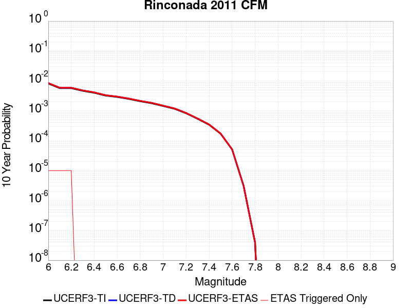 |

| Magnitude | 1 wk TI Prob | 1 wk TD Prob | 1 wk ETAS Prob | 1 wk ETAS/TD Gain | 1 wk ETAS Triggered Only | 1 mo TI Prob | 1 mo TD Prob | 1 mo ETAS Prob | 1 mo ETAS/TD Gain | 1 mo ETAS Triggered Only | 1 yr TI Prob | 1 yr TD Prob | 1 yr ETAS Prob | 1 yr ETAS/TD Gain | 1 yr ETAS Triggered Only | 10 yr TI Prob | 10 yr TD Prob | 10 yr ETAS Prob | 10 yr ETAS/TD Gain | 10 yr ETAS Triggered Only |
|-----|-----|-----|-----|-----|-----|-----|-----|-----|-----|-----|-----|-----|-----|-----|-----|-----|-----|-----|-----|-----|
| 6.0 | 1.5752368E-5 | 1.6275435E-5 | 1.6275435E-5 | 1.0 | 0.0 | 6.75084E-5 | 6.9750015E-5 | 6.9750015E-5 | 1.0 | 0.0 | 8.2160486E-4 | 8.488787E-4 | 8.792093E-4 | 1.0357302 | 3.0356385E-5 | 0.008185739 | 0.008456742 | 0.008486842 | 1.0035592 | 3.0356385E-5 |
| 6.1 | 1.0966133E-5 | 1.1323521E-5 | 1.1323521E-5 | 1.0 | 0.0 | 4.6996865E-5 | 4.8528476E-5 | 4.8528476E-5 | 1.0 | 0.0 | 5.720366E-4 | 5.9067475E-4 | 6.210132E-4 | 1.0513624 | 3.0356385E-5 | 0.0057056635 | 0.005891144 | 0.0059213215 | 1.0051225 | 3.0356385E-5 |
| 6.2 | 1.0966133E-5 | 1.1323521E-5 | 1.1323521E-5 | 1.0 | 0.0 | 4.6996865E-5 | 4.8528476E-5 | 4.8528476E-5 | 1.0 | 0.0 | 5.720366E-4 | 5.9067475E-4 | 6.210132E-4 | 1.0513624 | 3.0356385E-5 | 0.0057056635 | 0.005891144 | 0.0059213215 | 1.0051225 | 3.0356385E-5 |
| 6.3 | 8.926149E-6 | 9.213167E-6 | 9.213167E-6 | 1.0 | 0.0 | 3.8254362E-5 | 3.9484406E-5 | 3.9484406E-5 | 1.0 | 0.0 | 4.6564735E-4 | 4.8061693E-4 | 4.8061693E-4 | 1.0 | 0.0 | 0.0046467283 | 0.00479582 | 0.00479582 | 1.0 | 0.0 |
| 6.4 | 7.676955E-6 | 7.9205265E-6 | 7.9205265E-6 | 1.0 | 0.0 | 3.290082E-5 | 3.3944674E-5 | 3.3944674E-5 | 1.0 | 0.0 | 4.0049385E-4 | 4.1319823E-4 | 4.1319823E-4 | 1.0 | 0.0 | 0.0039977287 | 0.0041243257 | 0.0041243257 | 1.0 | 0.0 |
| 6.5 | 6.1671026E-6 | 6.35922E-6 | 6.35922E-6 | 1.0 | 0.0 | 2.6430173E-5 | 2.7253516E-5 | 2.7253516E-5 | 1.0 | 0.0 | 3.2173982E-4 | 3.3176114E-4 | 3.3176114E-4 | 1.0 | 0.0 | 0.003212744 | 0.0033126706 | 0.0033126706 | 1.0 | 0.0 |
| 6.6 | 5.553456E-6 | 5.72505E-6 | 5.72505E-6 | 1.0 | 0.0 | 2.3800309E-5 | 2.4535697E-5 | 2.4535697E-5 | 1.0 | 0.0 | 2.897302E-4 | 2.9868123E-4 | 2.9868123E-4 | 1.0 | 0.0 | 0.0028935277 | 0.0029828066 | 0.0029828066 | 1.0 | 0.0 |
| 6.7 | 4.787857E-6 | 4.9335113E-6 | 4.9335113E-6 | 1.0 | 0.0 | 2.0519226E-5 | 2.1143449E-5 | 2.1143449E-5 | 1.0 | 0.0 | 2.4979294E-4 | 2.573911E-4 | 2.573911E-4 | 1.0 | 0.0 | 0.0024951235 | 0.0025709358 | 0.0025709358 | 1.0 | 0.0 |
| 6.8 | 3.9955166E-6 | 4.11364E-6 | 4.11364E-6 | 1.0 | 0.0 | 1.7123532E-5 | 1.7629767E-5 | 1.7629767E-5 | 1.0 | 0.0 | 2.0845905E-4 | 2.146213E-4 | 2.146213E-4 | 1.0 | 0.0 | 0.002082636 | 0.002144144 | 0.002144144 | 1.0 | 0.0 |
| 6.9 | 3.4250072E-6 | 3.5225821E-6 | 3.5225821E-6 | 1.0 | 0.0 | 1.46785205E-5 | 1.5096693E-5 | 1.5096693E-5 | 1.0 | 0.0 | 1.7869633E-4 | 1.8378675E-4 | 1.8378675E-4 | 1.0 | 0.0 | 0.001785527 | 0.0018363501 | 0.0018363501 | 1.0 | 0.0 |
| 7.0 | 2.7712713E-6 | 2.8468053E-6 | 2.8468053E-6 | 1.0 | 0.0 | 1.1876823E-5 | 1.2200538E-5 | 1.2200538E-5 | 1.0 | 0.0 | 1.4459073E-4 | 1.4853143E-4 | 1.4853143E-4 | 1.0 | 0.0 | 0.0014449668 | 0.0014843232 | 0.0014843232 | 1.0 | 0.0 |
| 7.1 | 2.227358E-6 | 2.2857805E-6 | 2.2857805E-6 | 1.0 | 0.0 | 9.545785E-6 | 9.796166E-6 | 9.796166E-6 | 1.0 | 0.0 | 1.16213734E-4 | 1.1926179E-4 | 1.1926179E-4 | 1.0 | 0.0 | 0.0011615298 | 0.0011919789 | 0.0011919789 | 1.0 | 0.0 |
| 7.2 | 1.581796E-6 | 1.6209568E-6 | 1.6209568E-6 | 1.0 | 0.0 | 6.779108E-6 | 6.9469393E-6 | 6.9469393E-6 | 1.0 | 0.0 | 8.253252E-5 | 8.457571E-5 | 8.457571E-5 | 1.0 | 0.0 | 8.250187E-4 | 8.454357E-4 | 8.454357E-4 | 1.0 | 0.0 |
| 7.3 | 1.0306567E-6 | 1.0546827E-6 | 1.0546827E-6 | 1.0 | 0.0 | 4.4170924E-6 | 4.520061E-6 | 4.520061E-6 | 1.0 | 0.0 | 5.3776774E-5 | 5.5030352E-5 | 5.5030352E-5 | 1.0 | 0.0 | 5.376376E-4 | 5.501675E-4 | 5.501675E-4 | 1.0 | 0.0 |
| 7.4 | 6.535541E-7 | 6.6829654E-7 | 6.6829654E-7 | 1.0 | 0.0 | 2.800943E-6 | 2.8641248E-6 | 2.8641248E-6 | 1.0 | 0.0 | 3.4100947E-5 | 3.4870165E-5 | 3.4870165E-5 | 1.0 | 0.0 | 3.4095717E-4 | 3.4864704E-4 | 3.4864704E-4 | 1.0 | 0.0 |
| 7.5 | 3.2656962E-7 | 3.3317815E-7 | 3.3317815E-7 | 1.0 | 0.0 | 1.3995833E-6 | 1.4279057E-6 | 1.4279057E-6 | 1.0 | 0.0 | 1.7039794E-5 | 1.7384613E-5 | 1.7384613E-5 | 1.0 | 0.0 | 1.7038487E-4 | 1.7383257E-4 | 1.7383257E-4 | 1.0 | 0.0 |
| 7.6 | 9.754343E-8 | 9.8213114E-8 | 9.8213114E-8 | 1.0 | 0.0 | 4.180432E-7 | 4.2091327E-7 | 4.2091327E-7 | 1.0 | 0.0 | 5.089664E-6 | 5.124607E-6 | 5.124607E-6 | 1.0 | 0.0 | 5.0895473E-5 | 5.12449E-5 | 5.12449E-5 | 1.0 | 0.0 |
| 7.7 | 6.0001453E-9 | 5.8493015E-9 | 5.8493015E-9 | 1.0 | 0.0 | 2.5714908E-8 | 2.5068434E-8 | 2.5068434E-8 | 1.0 | 0.0 | 3.1307894E-7 | 3.0520815E-7 | 3.0520815E-7 | 1.0 | 0.0 | 3.1307852E-6 | 3.0520773E-6 | 3.0520773E-6 | 1.0 | 0.0 |
| 7.8 | 7.400003E-11 | 7.465528E-11 | 7.465528E-11 | 1.0 | 0.0 | 3.171432E-10 | 3.199514E-10 | 3.199514E-10 | 1.0 | 0.0 | 3.861218E-9 | 3.895409E-9 | 3.895409E-9 | 1.0 | 0.0 | 3.861218E-8 | 3.8954088E-8 | 3.8954088E-8 | 1.0 | 0.0 |

## Ventura-Pitas Point
*[(top)](#table-of-contents)*

| 1 Week | 1 Month | 1 Year | 10 Year |
|-----|-----|-----|-----|
|  |  |  |  |

| Magnitude | 1 wk TI Prob | 1 wk TD Prob | 1 wk ETAS Prob | 1 wk ETAS/TD Gain | 1 wk ETAS Triggered Only | 1 mo TI Prob | 1 mo TD Prob | 1 mo ETAS Prob | 1 mo ETAS/TD Gain | 1 mo ETAS Triggered Only | 1 yr TI Prob | 1 yr TD Prob | 1 yr ETAS Prob | 1 yr ETAS/TD Gain | 1 yr ETAS Triggered Only | 10 yr TI Prob | 10 yr TD Prob | 10 yr ETAS Prob | 10 yr ETAS/TD Gain | 10 yr ETAS Triggered Only |
|-----|-----|-----|-----|-----|-----|-----|-----|-----|-----|-----|-----|-----|-----|-----|-----|-----|-----|-----|-----|-----|
| 6.0 | 3.3179622E-5 | 3.3742806E-5 | 3.3742806E-5 | 1.0 | 0.0 | 1.4219063E-4 | 1.4460545E-4 | 1.4460545E-4 | 1.0 | 0.0 | 0.0017297962 | 0.0017594066 | 0.0017897097 | 1.0172234 | 3.0356385E-5 | 0.017163932 | 0.01748032 | 0.017510144 | 1.0017062 | 3.0356385E-5 |
| 6.1 | 3.3179622E-5 | 3.3742806E-5 | 3.3742806E-5 | 1.0 | 0.0 | 1.4219063E-4 | 1.4460545E-4 | 1.4460545E-4 | 1.0 | 0.0 | 0.0017297962 | 0.0017594066 | 0.0017897097 | 1.0172234 | 3.0356385E-5 | 0.017163932 | 0.01748032 | 0.017510144 | 1.0017062 | 3.0356385E-5 |
| 6.2 | 3.3179622E-5 | 3.3742806E-5 | 3.3742806E-5 | 1.0 | 0.0 | 1.4219063E-4 | 1.4460545E-4 | 1.4460545E-4 | 1.0 | 0.0 | 0.0017297962 | 0.0017594066 | 0.0017897097 | 1.0172234 | 3.0356385E-5 | 0.017163932 | 0.01748032 | 0.017510144 | 1.0017062 | 3.0356385E-5 |
| 6.3 | 3.3179622E-5 | 3.3742806E-5 | 3.3742806E-5 | 1.0 | 0.0 | 1.4219063E-4 | 1.4460545E-4 | 1.4460545E-4 | 1.0 | 0.0 | 0.0017297962 | 0.0017594066 | 0.0017897097 | 1.0172234 | 3.0356385E-5 | 0.017163932 | 0.01748032 | 0.017510144 | 1.0017062 | 3.0356385E-5 |
| 6.4 | 1.8754668E-5 | 1.70237E-5 | 1.70237E-5 | 1.0 | 0.0 | 8.037467E-5 | 7.2956806E-5 | 7.2956806E-5 | 1.0 | 0.0 | 9.781223E-4 | 8.8791025E-4 | 8.8791025E-4 | 1.0 | 0.0 | 0.009738282 | 0.0088459635 | 0.0088459635 | 1.0 | 0.0 |
| 6.5 | 1.8754668E-5 | 1.70237E-5 | 1.70237E-5 | 1.0 | 0.0 | 8.037467E-5 | 7.2956806E-5 | 7.2956806E-5 | 1.0 | 0.0 | 9.781223E-4 | 8.8791025E-4 | 8.8791025E-4 | 1.0 | 0.0 | 0.009738282 | 0.0088459635 | 0.0088459635 | 1.0 | 0.0 |
| 6.6 | 1.4361558E-5 | 1.2125619E-5 | 1.2125619E-5 | 1.0 | 0.0 | 6.154808E-5 | 5.1965915E-5 | 5.1965915E-5 | 1.0 | 0.0 | 7.490902E-4 | 6.3250365E-4 | 6.3250365E-4 | 1.0 | 0.0 | 0.0074657016 | 0.0063072913 | 0.0063072913 | 1.0 | 0.0 |
| 6.7 | 1.4361558E-5 | 1.2125619E-5 | 1.2125619E-5 | 1.0 | 0.0 | 6.154808E-5 | 5.1965915E-5 | 5.1965915E-5 | 1.0 | 0.0 | 7.490902E-4 | 6.3250365E-4 | 6.3250365E-4 | 1.0 | 0.0 | 0.0074657016 | 0.0063072913 | 0.0063072913 | 1.0 | 0.0 |
| 6.8 | 1.3663846E-5 | 1.13476435E-5 | 1.13476435E-5 | 1.0 | 0.0 | 5.8558027E-5 | 4.863186E-5 | 4.863186E-5 | 1.0 | 0.0 | 7.127108E-4 | 5.91934E-4 | 5.91934E-4 | 1.0 | 0.0 | 0.007104293 | 0.0059037893 | 0.0059037893 | 1.0 | 0.0 |
| 6.9 | 1.3644157E-5 | 1.1325741E-5 | 1.1325741E-5 | 1.0 | 0.0 | 5.8473648E-5 | 4.8537997E-5 | 4.8537997E-5 | 1.0 | 0.0 | 7.116841E-4 | 5.907918E-4 | 5.907918E-4 | 1.0 | 0.0 | 0.007094092 | 0.005892428 | 0.005892428 | 1.0 | 0.0 |
| 7.0 | 1.3568845E-5 | 1.1245293E-5 | 1.1245293E-5 | 1.0 | 0.0 | 5.8150898E-5 | 4.8193233E-5 | 4.8193233E-5 | 1.0 | 0.0 | 7.077572E-4 | 5.865966E-4 | 5.865966E-4 | 1.0 | 0.0 | 0.007055073 | 0.0058506974 | 0.0058506974 | 1.0 | 0.0 |
| 7.1 | 1.306572E-5 | 1.0723656E-5 | 1.0723656E-5 | 1.0 | 0.0 | 5.599474E-5 | 4.5957724E-5 | 4.5957724E-5 | 1.0 | 0.0 | 6.815227E-4 | 5.593935E-4 | 5.593935E-4 | 1.0 | 0.0 | 0.0067943637 | 0.0055800593 | 0.0055800593 | 1.0 | 0.0 |
| 7.2 | 1.232604E-5 | 9.9980925E-6 | 9.9980925E-6 | 1.0 | 0.0 | 5.2824813E-5 | 4.2848274E-5 | 4.2848274E-5 | 1.0 | 0.0 | 6.429523E-4 | 5.2155467E-4 | 5.2155467E-4 | 1.0 | 0.0 | 0.0064109527 | 0.005203498 | 0.005203498 | 1.0 | 0.0 |
| 7.3 | 1.0917261E-5 | 8.845197E-6 | 8.845197E-6 | 1.0 | 0.0 | 4.678742E-5 | 3.7907444E-5 | 3.7907444E-5 | 1.0 | 0.0 | 5.69488E-4 | 4.6142694E-4 | 4.6142694E-4 | 1.0 | 0.0 | 0.0056803077 | 0.0046048546 | 0.0046048546 | 1.0 | 0.0 |
| 7.4 | 1.039959E-5 | 8.424825E-6 | 8.424825E-6 | 1.0 | 0.0 | 4.456891E-5 | 3.61059E-5 | 3.61059E-5 | 1.0 | 0.0 | 5.424914E-4 | 4.395022E-4 | 4.395022E-4 | 1.0 | 0.0 | 0.0054116896 | 0.004386492 | 0.004386492 | 1.0 | 0.0 |
| 7.5 | 9.015877E-6 | 7.2985176E-6 | 7.2985176E-6 | 1.0 | 0.0 | 3.86389E-5 | 3.1278993E-5 | 3.1278993E-5 | 1.0 | 0.0 | 4.7032707E-4 | 3.8075662E-4 | 3.8075662E-4 | 1.0 | 0.0 | 0.004693329 | 0.0038011875 | 0.0038011875 | 1.0 | 0.0 |
| 7.6 | 4.900162E-6 | 3.8745034E-6 | 3.8745034E-6 | 1.0 | 0.0 | 2.1000526E-5 | 1.660491E-5 | 1.660491E-5 | 1.0 | 0.0 | 2.556514E-4 | 2.0214616E-4 | 2.0214616E-4 | 1.0 | 0.0 | 0.0025535747 | 0.0020196363 | 0.0020196363 | 1.0 | 0.0 |
| 7.7 | 3.8850626E-6 | 3.1270158E-6 | 3.1270158E-6 | 1.0 | 0.0 | 1.6650163E-5 | 1.3401428E-5 | 1.3401428E-5 | 1.0 | 0.0 | 2.0269687E-4 | 1.6315027E-4 | 1.6315027E-4 | 1.0 | 0.0 | 0.002025121 | 0.0016303142 | 0.0016303142 | 1.0 | 0.0 |
| 7.8 | 2.4654719E-6 | 2.0300472E-6 | 2.0300472E-6 | 1.0 | 0.0 | 1.0566265E-5 | 8.700174E-6 | 8.700174E-6 | 1.0 | 0.0 | 1.2863669E-4 | 1.05919506E-4 | 1.05919506E-4 | 1.0 | 0.0 | 0.0012856225 | 0.0010586949 | 0.0010586949 | 1.0 | 0.0 |
| 7.9 | 4.095894E-7 | 3.2767971E-7 | 3.2767971E-7 | 1.0 | 0.0 | 1.7553821E-6 | 1.4043409E-6 | 1.4043409E-6 | 1.0 | 0.0 | 2.1371567E-5 | 1.709772E-5 | 1.709772E-5 | 1.0 | 0.0 | 2.1369511E-4 | 1.7096435E-4 | 1.7096435E-4 | 1.0 | 0.0 |
| 8.0 | 7.791402E-9 | 5.6840586E-9 | 5.6840586E-9 | 1.0 | 0.0 | 3.3391725E-8 | 2.436025E-8 | 2.436025E-8 | 1.0 | 0.0 | 4.0654416E-7 | 2.9658602E-7 | 2.9658602E-7 | 1.0 | 0.0 | 4.065434E-6 | 2.9658584E-6 | 2.9658584E-6 | 1.0 | 0.0 |

## South Klamath Lake West
*[(top)](#table-of-contents)*

| 1 Week | 1 Month | 1 Year | 10 Year |
|-----|-----|-----|-----|
|  | 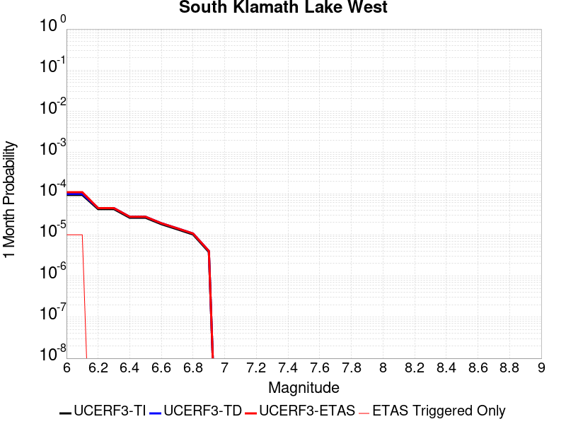 |  |  |

| Magnitude | 1 wk TI Prob | 1 wk TD Prob | 1 wk ETAS Prob | 1 wk ETAS/TD Gain | 1 wk ETAS Triggered Only | 1 mo TI Prob | 1 mo TD Prob | 1 mo ETAS Prob | 1 mo ETAS/TD Gain | 1 mo ETAS Triggered Only | 1 yr TI Prob | 1 yr TD Prob | 1 yr ETAS Prob | 1 yr ETAS/TD Gain | 1 yr ETAS Triggered Only | 10 yr TI Prob | 10 yr TD Prob | 10 yr ETAS Prob | 10 yr ETAS/TD Gain | 10 yr ETAS Triggered Only |
|-----|-----|-----|-----|-----|-----|-----|-----|-----|-----|-----|-----|-----|-----|-----|-----|-----|-----|-----|-----|-----|
| 6.0 | 2.174025E-5 | 2.3043856E-5 | 2.3043856E-5 | 1.0 | 0.0 | 9.3169176E-5 | 9.875602E-5 | 1.2910941E-4 | 1.3073573 | 3.0356385E-5 | 0.0011337444 | 0.0012017571 | 0.001232077 | 1.0252297 | 3.0356385E-5 | 0.011279777 | 0.011959186 | 0.011989179 | 1.0025079 | 3.0356385E-5 |
| 6.1 | 2.174025E-5 | 2.3043856E-5 | 2.3043856E-5 | 1.0 | 0.0 | 9.3169176E-5 | 9.875602E-5 | 1.2910941E-4 | 1.3073573 | 3.0356385E-5 | 0.0011337444 | 0.0012017571 | 0.001232077 | 1.0252297 | 3.0356385E-5 | 0.011279777 | 0.011959186 | 0.011989179 | 1.0025079 | 3.0356385E-5 |
| 6.2 | 9.834929E-6 | 1.0394625E-5 | 1.0394625E-5 | 1.0 | 0.0 | 4.2149015E-5 | 4.4547684E-5 | 4.4547684E-5 | 1.0 | 0.0 | 5.1304343E-4 | 5.4224214E-4 | 5.4224214E-4 | 1.0 | 0.0 | 0.0051186057 | 0.0054100924 | 0.0054100924 | 1.0 | 0.0 |
| 6.3 | 9.834929E-6 | 1.0394625E-5 | 1.0394625E-5 | 1.0 | 0.0 | 4.2149015E-5 | 4.4547684E-5 | 4.4547684E-5 | 1.0 | 0.0 | 5.1304343E-4 | 5.4224214E-4 | 5.4224214E-4 | 1.0 | 0.0 | 0.0051186057 | 0.0054100924 | 0.0054100924 | 1.0 | 0.0 |
| 6.4 | 6.066321E-6 | 6.4008973E-6 | 6.4008973E-6 | 1.0 | 0.0 | 2.5998259E-5 | 2.7432145E-5 | 2.7432145E-5 | 1.0 | 0.0 | 3.1648282E-4 | 3.339379E-4 | 3.339379E-4 | 1.0 | 0.0 | 0.0031603249 | 0.0033346312 | 0.0033346312 | 1.0 | 0.0 |
| 6.5 | 6.066321E-6 | 6.4008973E-6 | 6.4008973E-6 | 1.0 | 0.0 | 2.5998259E-5 | 2.7432145E-5 | 2.7432145E-5 | 1.0 | 0.0 | 3.1648282E-4 | 3.339379E-4 | 3.339379E-4 | 1.0 | 0.0 | 0.0031603249 | 0.0033346312 | 0.0033346312 | 1.0 | 0.0 |
| 6.6 | 4.2321803E-6 | 4.4616118E-6 | 4.4616118E-6 | 1.0 | 0.0 | 1.8137789E-5 | 1.9121058E-5 | 1.9121058E-5 | 1.0 | 0.0 | 2.208052E-4 | 2.3277504E-4 | 2.3277504E-4 | 1.0 | 0.0 | 0.0022058594 | 0.0023254142 | 0.0023254142 | 1.0 | 0.0 |
| 6.7 | 3.186646E-6 | 3.3605481E-6 | 3.3605481E-6 | 1.0 | 0.0 | 1.3656982E-5 | 1.4402273E-5 | 1.4402273E-5 | 1.0 | 0.0 | 1.6626107E-4 | 1.7533425E-4 | 1.7533425E-4 | 1.0 | 0.0 | 0.0016613674 | 0.0017520263 | 0.0017520263 | 1.0 | 0.0 |
| 6.8 | 2.380121E-6 | 2.51109E-6 | 2.51109E-6 | 1.0 | 0.0 | 1.0200479E-5 | 1.07617725E-5 | 1.07617725E-5 | 1.0 | 0.0 | 1.2418375E-4 | 1.3101716E-4 | 1.3101716E-4 | 1.0 | 0.0 | 0.0012411437 | 0.0013094451 | 0.0013094451 | 1.0 | 0.0 |
| 6.9 | 8.928287E-7 | 9.4309536E-7 | 9.4309536E-7 | 1.0 | 0.0 | 3.826403E-6 | 4.041832E-6 | 4.041832E-6 | 1.0 | 0.0 | 4.658546E-5 | 4.9208415E-5 | 4.9208415E-5 | 1.0 | 0.0 | 4.6575698E-4 | 4.919968E-4 | 4.919968E-4 | 1.0 | 0.0 |

## Pitas Point (Lower West)
*[(top)](#table-of-contents)*

| 1 Week | 1 Month | 1 Year | 10 Year |
|-----|-----|-----|-----|
|  |  |  |  |

| Magnitude | 1 wk TI Prob | 1 wk TD Prob | 1 wk ETAS Prob | 1 wk ETAS/TD Gain | 1 wk ETAS Triggered Only | 1 mo TI Prob | 1 mo TD Prob | 1 mo ETAS Prob | 1 mo ETAS/TD Gain | 1 mo ETAS Triggered Only | 1 yr TI Prob | 1 yr TD Prob | 1 yr ETAS Prob | 1 yr ETAS/TD Gain | 1 yr ETAS Triggered Only | 10 yr TI Prob | 10 yr TD Prob | 10 yr ETAS Prob | 10 yr ETAS/TD Gain | 10 yr ETAS Triggered Only |
|-----|-----|-----|-----|-----|-----|-----|-----|-----|-----|-----|-----|-----|-----|-----|-----|-----|-----|-----|-----|-----|
| 6.0 | 8.151497E-6 | 7.856467E-6 | 7.856467E-6 | 1.0 | 0.0 | 3.493452E-5 | 3.367014E-5 | 3.367014E-5 | 1.0 | 0.0 | 4.252448E-4 | 4.098576E-4 | 4.4020155E-4 | 1.0740353 | 3.0356385E-5 | 0.0042443196 | 0.004091098 | 0.00412133 | 1.0073898 | 3.0356385E-5 |
| 6.1 | 8.151497E-6 | 7.856467E-6 | 7.856467E-6 | 1.0 | 0.0 | 3.493452E-5 | 3.367014E-5 | 3.367014E-5 | 1.0 | 0.0 | 4.252448E-4 | 4.098576E-4 | 4.4020155E-4 | 1.0740353 | 3.0356385E-5 | 0.0042443196 | 0.004091098 | 0.00412133 | 1.0073898 | 3.0356385E-5 |
| 6.2 | 8.151497E-6 | 7.856467E-6 | 7.856467E-6 | 1.0 | 0.0 | 3.493452E-5 | 3.367014E-5 | 3.367014E-5 | 1.0 | 0.0 | 4.252448E-4 | 4.098576E-4 | 4.4020155E-4 | 1.0740353 | 3.0356385E-5 | 0.0042443196 | 0.004091098 | 0.00412133 | 1.0073898 | 3.0356385E-5 |
| 6.3 | 8.151497E-6 | 7.856467E-6 | 7.856467E-6 | 1.0 | 0.0 | 3.493452E-5 | 3.367014E-5 | 3.367014E-5 | 1.0 | 0.0 | 4.252448E-4 | 4.098576E-4 | 4.4020155E-4 | 1.0740353 | 3.0356385E-5 | 0.0042443196 | 0.004091098 | 0.00412133 | 1.0073898 | 3.0356385E-5 |
| 6.4 | 8.151497E-6 | 7.856467E-6 | 7.856467E-6 | 1.0 | 0.0 | 3.493452E-5 | 3.367014E-5 | 3.367014E-5 | 1.0 | 0.0 | 4.252448E-4 | 4.098576E-4 | 4.4020155E-4 | 1.0740353 | 3.0356385E-5 | 0.0042443196 | 0.004091098 | 0.00412133 | 1.0073898 | 3.0356385E-5 |
| 6.5 | 8.151497E-6 | 7.856467E-6 | 7.856467E-6 | 1.0 | 0.0 | 3.493452E-5 | 3.367014E-5 | 3.367014E-5 | 1.0 | 0.0 | 4.252448E-4 | 4.098576E-4 | 4.4020155E-4 | 1.0740353 | 3.0356385E-5 | 0.0042443196 | 0.004091098 | 0.00412133 | 1.0073898 | 3.0356385E-5 |
| 6.6 | 8.151497E-6 | 7.856467E-6 | 7.856467E-6 | 1.0 | 0.0 | 3.493452E-5 | 3.367014E-5 | 3.367014E-5 | 1.0 | 0.0 | 4.252448E-4 | 4.098576E-4 | 4.4020155E-4 | 1.0740353 | 3.0356385E-5 | 0.0042443196 | 0.004091098 | 0.00412133 | 1.0073898 | 3.0356385E-5 |
| 6.7 | 8.151497E-6 | 7.856467E-6 | 7.856467E-6 | 1.0 | 0.0 | 3.493452E-5 | 3.367014E-5 | 3.367014E-5 | 1.0 | 0.0 | 4.252448E-4 | 4.098576E-4 | 4.4020155E-4 | 1.0740353 | 3.0356385E-5 | 0.0042443196 | 0.004091098 | 0.00412133 | 1.0073898 | 3.0356385E-5 |
| 6.8 | 8.151497E-6 | 7.856467E-6 | 7.856467E-6 | 1.0 | 0.0 | 3.493452E-5 | 3.367014E-5 | 3.367014E-5 | 1.0 | 0.0 | 4.252448E-4 | 4.098576E-4 | 4.4020155E-4 | 1.0740353 | 3.0356385E-5 | 0.0042443196 | 0.004091098 | 0.00412133 | 1.0073898 | 3.0356385E-5 |
| 6.9 | 8.151497E-6 | 7.856467E-6 | 7.856467E-6 | 1.0 | 0.0 | 3.493452E-5 | 3.367014E-5 | 3.367014E-5 | 1.0 | 0.0 | 4.252448E-4 | 4.098576E-4 | 4.4020155E-4 | 1.0740353 | 3.0356385E-5 | 0.0042443196 | 0.004091098 | 0.00412133 | 1.0073898 | 3.0356385E-5 |
| 7.0 | 8.103535E-6 | 7.805893E-6 | 7.805893E-6 | 1.0 | 0.0 | 3.4728975E-5 | 3.34534E-5 | 3.34534E-5 | 1.0 | 0.0 | 4.2274324E-4 | 4.072198E-4 | 4.375638E-4 | 1.0745151 | 3.0356385E-5 | 0.0042193993 | 0.004064816 | 0.004095049 | 1.0074377 | 3.0356385E-5 |
| 7.1 | 7.853298E-6 | 7.541564E-6 | 7.541564E-6 | 1.0 | 0.0 | 3.3656554E-5 | 3.2320593E-5 | 3.2320593E-5 | 1.0 | 0.0 | 4.096915E-4 | 3.9343289E-4 | 4.2377732E-4 | 1.0771273 | 3.0356385E-5 | 0.00408937 | 0.0039274395 | 0.0039576767 | 1.0076989 | 3.0356385E-5 |
| 7.2 | 7.771102E-6 | 7.4538384E-6 | 7.4538384E-6 | 1.0 | 0.0 | 3.33043E-5 | 3.1944634E-5 | 3.1944634E-5 | 1.0 | 0.0 | 4.0540437E-4 | 3.888572E-4 | 4.192018E-4 | 1.0780352 | 3.0356385E-5 | 0.0040466557 | 0.0038818435 | 0.003912082 | 1.0077897 | 3.0356385E-5 |
| 7.3 | 7.3945344E-6 | 7.049904E-6 | 7.049904E-6 | 1.0 | 0.0 | 3.1690477E-5 | 3.0213529E-5 | 3.0213529E-5 | 1.0 | 0.0 | 3.8576324E-4 | 3.6778825E-4 | 3.9813347E-4 | 1.0825073 | 3.0356385E-5 | 0.0038509427 | 0.0036718633 | 0.0037021083 | 1.0082369 | 3.0356385E-5 |
| 7.4 | 6.964645E-6 | 6.5907116E-6 | 6.5907116E-6 | 1.0 | 0.0 | 2.9848137E-5 | 2.8245604E-5 | 2.8245604E-5 | 1.0 | 0.0 | 3.6334046E-4 | 3.4383647E-4 | 3.7418242E-4 | 1.088257 | 3.0356385E-5 | 0.0036274698 | 0.003433098 | 0.0034633502 | 1.008812 | 3.0356385E-5 |
| 7.5 | 6.6525035E-6 | 6.2597182E-6 | 6.2597182E-6 | 1.0 | 0.0 | 2.851042E-5 | 2.682709E-5 | 2.682709E-5 | 1.0 | 0.0 | 3.4705905E-4 | 3.2657135E-4 | 3.5691782E-4 | 1.0929245 | 3.0356385E-5 | 0.0034651754 | 0.0032609662 | 0.0032912234 | 1.0092787 | 3.0356385E-5 |
| 7.6 | 5.613338E-6 | 5.151837E-6 | 5.151837E-6 | 1.0 | 0.0 | 2.405694E-5 | 2.2079117E-5 | 2.2079117E-5 | 1.0 | 0.0 | 2.928539E-4 | 2.687804E-4 | 2.9912862E-4 | 1.1129109 | 3.0356385E-5 | 0.0029246826 | 0.0026845846 | 0.0027148596 | 1.0112773 | 3.0356385E-5 |
| 7.7 | 4.494704E-6 | 3.9972506E-6 | 3.9972506E-6 | 1.0 | 0.0 | 1.9262876E-5 | 1.7130964E-5 | 1.7130964E-5 | 1.0 | 0.0 | 2.3450027E-4 | 2.0854975E-4 | 2.0854975E-4 | 1.0 | 0.0 | 0.0023425296 | 0.0020835644 | 0.0020835644 | 1.0 | 0.0 |
| 7.8 | 2.6075882E-6 | 2.183817E-6 | 2.183817E-6 | 1.0 | 0.0 | 1.117533E-5 | 9.359183E-6 | 9.359183E-6 | 1.0 | 0.0 | 1.3605114E-4 | 1.13942144E-4 | 1.13942144E-4 | 1.0 | 0.0 | 0.0013596788 | 0.001138842 | 0.001138842 | 1.0 | 0.0 |
| 7.9 | 4.045984E-7 | 3.2426544E-7 | 3.2426544E-7 | 1.0 | 0.0 | 1.733992E-6 | 1.3897082E-6 | 1.3897082E-6 | 1.0 | 0.0 | 2.1111147E-5 | 1.691957E-5 | 1.691957E-5 | 1.0 | 0.0 | 2.1109142E-4 | 1.6918313E-4 | 1.6918313E-4 | 1.0 | 0.0 |
| 8.0 | 7.791402E-9 | 5.6840586E-9 | 5.6840586E-9 | 1.0 | 0.0 | 3.3391725E-8 | 2.436025E-8 | 2.436025E-8 | 1.0 | 0.0 | 4.0654416E-7 | 2.9658602E-7 | 2.9658602E-7 | 1.0 | 0.0 | 4.065434E-6 | 2.9658584E-6 | 2.9658584E-6 | 1.0 | 0.0 |

## South Klamath Lake East
*[(top)](#table-of-contents)*

| 1 Week | 1 Month | 1 Year | 10 Year |
|-----|-----|-----|-----|
|  |  |  | 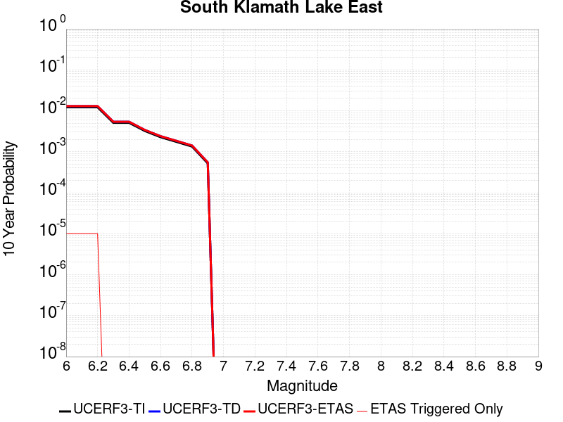 |

| Magnitude | 1 wk TI Prob | 1 wk TD Prob | 1 wk ETAS Prob | 1 wk ETAS/TD Gain | 1 wk ETAS Triggered Only | 1 mo TI Prob | 1 mo TD Prob | 1 mo ETAS Prob | 1 mo ETAS/TD Gain | 1 mo ETAS Triggered Only | 1 yr TI Prob | 1 yr TD Prob | 1 yr ETAS Prob | 1 yr ETAS/TD Gain | 1 yr ETAS Triggered Only | 10 yr TI Prob | 10 yr TD Prob | 10 yr ETAS Prob | 10 yr ETAS/TD Gain | 10 yr ETAS Triggered Only |
|-----|-----|-----|-----|-----|-----|-----|-----|-----|-----|-----|-----|-----|-----|-----|-----|-----|-----|-----|-----|-----|
| 6.0 | 2.3539369E-5 | 2.5049438E-5 | 2.5049438E-5 | 1.0 | 0.0 | 1.0087911E-4 | 1.0735078E-4 | 1.377039E-4 | 1.2827471 | 3.0356385E-5 | 0.0012275111 | 0.0013062954 | 0.0013366122 | 1.0232081 | 3.0356385E-5 | 0.012207527 | 0.012994516 | 0.013024477 | 1.0023057 | 3.0356385E-5 |
| 6.1 | 2.3539369E-5 | 2.5049438E-5 | 2.5049438E-5 | 1.0 | 0.0 | 1.0087911E-4 | 1.0735078E-4 | 1.377039E-4 | 1.2827471 | 3.0356385E-5 | 0.0012275111 | 0.0013062954 | 0.0013366122 | 1.0232081 | 3.0356385E-5 | 0.012207527 | 0.012994516 | 0.013024477 | 1.0023057 | 3.0356385E-5 |
| 6.2 | 2.3539369E-5 | 2.5049438E-5 | 2.5049438E-5 | 1.0 | 0.0 | 1.0087911E-4 | 1.0735078E-4 | 1.377039E-4 | 1.2827471 | 3.0356385E-5 | 0.0012275111 | 0.0013062954 | 0.0013366122 | 1.0232081 | 3.0356385E-5 | 0.012207527 | 0.012994516 | 0.013024477 | 1.0023057 | 3.0356385E-5 |
| 6.3 | 9.807823E-6 | 1.03968705E-5 | 1.03968705E-5 | 1.0 | 0.0 | 4.2032847E-5 | 4.4557302E-5 | 4.4557302E-5 | 1.0 | 0.0 | 5.1162974E-4 | 5.423585E-4 | 5.423585E-4 | 1.0 | 0.0 | 0.005104534 | 0.005411186 | 0.005411186 | 1.0 | 0.0 |
| 6.4 | 9.807823E-6 | 1.03968705E-5 | 1.03968705E-5 | 1.0 | 0.0 | 4.2032847E-5 | 4.4557302E-5 | 4.4557302E-5 | 1.0 | 0.0 | 5.1162974E-4 | 5.423585E-4 | 5.423585E-4 | 1.0 | 0.0 | 0.005104534 | 0.005411186 | 0.005411186 | 1.0 | 0.0 |
| 6.5 | 6.191981E-6 | 6.5513436E-6 | 6.5513436E-6 | 1.0 | 0.0 | 2.653679E-5 | 2.80769E-5 | 2.80769E-5 | 1.0 | 0.0 | 3.2303753E-4 | 3.4178543E-4 | 3.4178543E-4 | 1.0 | 0.0 | 0.0032256835 | 0.003412876 | 0.003412876 | 1.0 | 0.0 |
| 6.6 | 4.3693776E-6 | 4.616904E-6 | 4.616904E-6 | 1.0 | 0.0 | 1.8725768E-5 | 1.9786587E-5 | 1.9786587E-5 | 1.0 | 0.0 | 2.2796239E-4 | 2.4087621E-4 | 2.4087621E-4 | 1.0 | 0.0 | 0.0022772867 | 0.0024062637 | 0.0024062637 | 1.0 | 0.0 |
| 6.7 | 3.360834E-6 | 3.551507E-6 | 3.551507E-6 | 1.0 | 0.0 | 1.4403494E-5 | 1.522066E-5 | 1.522066E-5 | 1.0 | 0.0 | 1.7534842E-4 | 1.852966E-4 | 1.852966E-4 | 1.0 | 0.0 | 0.0017521014 | 0.0018515008 | 0.0018515008 | 1.0 | 0.0 |
| 6.8 | 2.57873E-6 | 2.7253761E-6 | 2.7253761E-6 | 1.0 | 0.0 | 1.1051653E-5 | 1.1680135E-5 | 1.1680135E-5 | 1.0 | 0.0 | 1.3454557E-4 | 1.4219698E-4 | 1.4219698E-4 | 1.0 | 0.0 | 0.0013446413 | 0.0014211206 | 0.0014211206 | 1.0 | 0.0 |
| 6.9 | 9.987825E-7 | 1.0567024E-6 | 1.0567024E-6 | 1.0 | 0.0 | 4.2804895E-6 | 4.528719E-6 | 4.528719E-6 | 1.0 | 0.0 | 5.211371E-5 | 5.5136083E-5 | 5.5136083E-5 | 1.0 | 0.0 | 5.210149E-4 | 5.5125623E-4 | 5.5125623E-4 | 1.0 | 0.0 |

## Mono Lake 2011 CFM
*[(top)](#table-of-contents)*

| 1 Week | 1 Month | 1 Year | 10 Year |
|-----|-----|-----|-----|
|  |  | 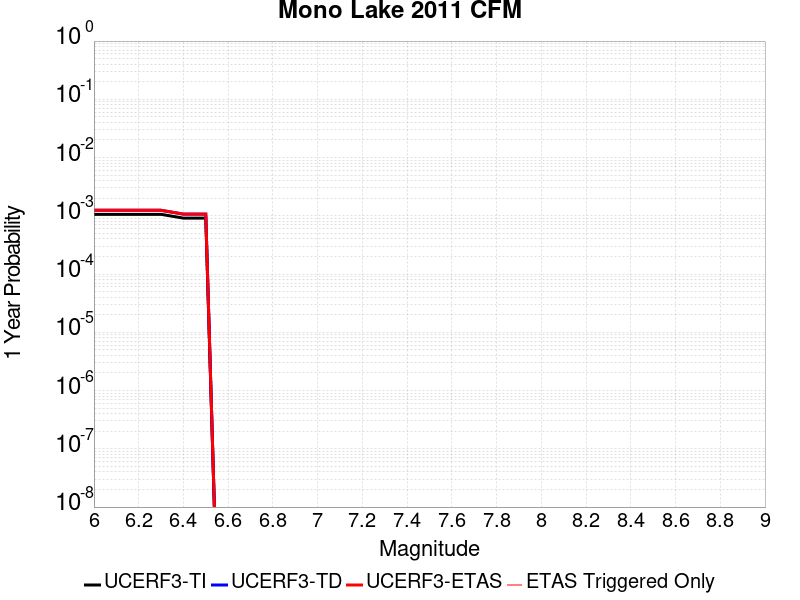 |  |

| Magnitude | 1 wk TI Prob | 1 wk TD Prob | 1 wk ETAS Prob | 1 wk ETAS/TD Gain | 1 wk ETAS Triggered Only | 1 mo TI Prob | 1 mo TD Prob | 1 mo ETAS Prob | 1 mo ETAS/TD Gain | 1 mo ETAS Triggered Only | 1 yr TI Prob | 1 yr TD Prob | 1 yr ETAS Prob | 1 yr ETAS/TD Gain | 1 yr ETAS Triggered Only | 10 yr TI Prob | 10 yr TD Prob | 10 yr ETAS Prob | 10 yr ETAS/TD Gain | 10 yr ETAS Triggered Only |
|-----|-----|-----|-----|-----|-----|-----|-----|-----|-----|-----|-----|-----|-----|-----|-----|-----|-----|-----|-----|-----|
| 6.0 | 2.0341662E-5 | 2.3833583E-5 | 2.3833583E-5 | 1.0 | 0.0 | 8.717564E-5 | 1.0214293E-4 | 1.0214293E-4 | 1.0 | 0.0 | 0.0010608466 | 0.0012434124 | 0.0012434124 | 1.0 | 0.0 | 0.010557966 | 0.012416651 | 0.01244663 | 1.0024145 | 3.0356385E-5 |
| 6.1 | 2.0341662E-5 | 2.3833583E-5 | 2.3833583E-5 | 1.0 | 0.0 | 8.717564E-5 | 1.0214293E-4 | 1.0214293E-4 | 1.0 | 0.0 | 0.0010608466 | 0.0012434124 | 0.0012434124 | 1.0 | 0.0 | 0.010557966 | 0.012416651 | 0.01244663 | 1.0024145 | 3.0356385E-5 |
| 6.2 | 2.0341662E-5 | 2.3833583E-5 | 2.3833583E-5 | 1.0 | 0.0 | 8.717564E-5 | 1.0214293E-4 | 1.0214293E-4 | 1.0 | 0.0 | 0.0010608466 | 0.0012434124 | 0.0012434124 | 1.0 | 0.0 | 0.010557966 | 0.012416651 | 0.01244663 | 1.0024145 | 3.0356385E-5 |
| 6.3 | 2.0341662E-5 | 2.3833583E-5 | 2.3833583E-5 | 1.0 | 0.0 | 8.717564E-5 | 1.0214293E-4 | 1.0214293E-4 | 1.0 | 0.0 | 0.0010608466 | 0.0012434124 | 0.0012434124 | 1.0 | 0.0 | 0.010557966 | 0.012416651 | 0.01244663 | 1.0024145 | 3.0356385E-5 |
| 6.4 | 1.749821E-5 | 2.0495634E-5 | 2.0495634E-5 | 1.0 | 0.0 | 7.499018E-5 | 8.783843E-5 | 8.783843E-5 | 1.0 | 0.0 | 9.1262296E-4 | 0.0010694329 | 0.0010694329 | 1.0 | 0.0 | 0.009088841 | 0.010694289 | 0.010694289 | 1.0 | 0.0 |
| 6.5 | 1.749821E-5 | 2.0495634E-5 | 2.0495634E-5 | 1.0 | 0.0 | 7.499018E-5 | 8.783843E-5 | 8.783843E-5 | 1.0 | 0.0 | 9.1262296E-4 | 0.0010694329 | 0.0010694329 | 1.0 | 0.0 | 0.009088841 | 0.010694289 | 0.010694289 | 1.0 | 0.0 |

## Calaveras (So) 2011 CFM
*[(top)](#table-of-contents)*

| 1 Week | 1 Month | 1 Year | 10 Year |
|-----|-----|-----|-----|
|  |  |  | 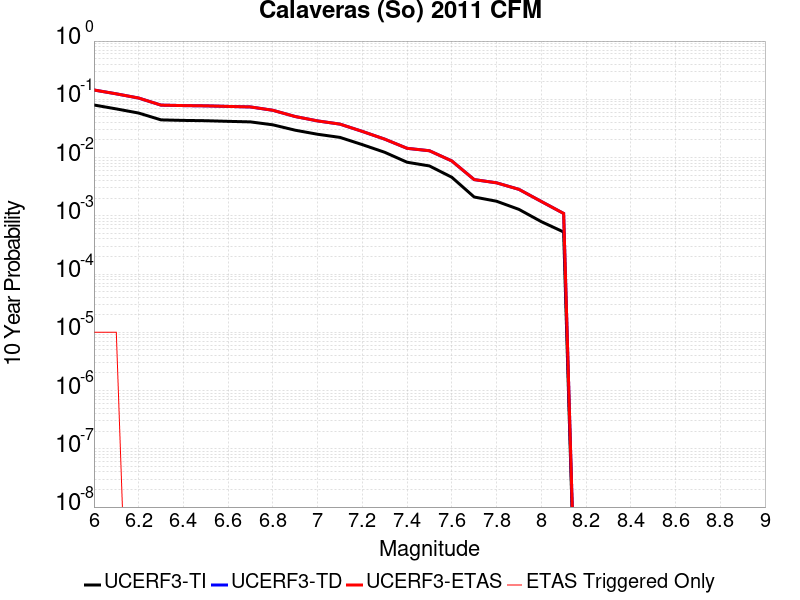 |

| Magnitude | 1 wk TI Prob | 1 wk TD Prob | 1 wk ETAS Prob | 1 wk ETAS/TD Gain | 1 wk ETAS Triggered Only | 1 mo TI Prob | 1 mo TD Prob | 1 mo ETAS Prob | 1 mo ETAS/TD Gain | 1 mo ETAS Triggered Only | 1 yr TI Prob | 1 yr TD Prob | 1 yr ETAS Prob | 1 yr ETAS/TD Gain | 1 yr ETAS Triggered Only | 10 yr TI Prob | 10 yr TD Prob | 10 yr ETAS Prob | 10 yr ETAS/TD Gain | 10 yr ETAS Triggered Only |
|-----|-----|-----|-----|-----|-----|-----|-----|-----|-----|-----|-----|-----|-----|-----|-----|-----|-----|-----|-----|-----|
| 6.0 | 1.5950744E-4 | 3.0764073E-4 | 3.0764073E-4 | 1.0 | 0.0 | 6.834242E-4 | 0.0013163671 | 0.0013163671 | 1.0 | 0.0 | 0.00828899 | 0.01587209 | 0.01587209 | 1.0 | 0.0 | 0.079865426 | 0.14452533 | 0.1445513 | 1.0001796 | 3.0356385E-5 |
| 6.1 | 1.3584697E-4 | 2.6080143E-4 | 2.6080143E-4 | 1.0 | 0.0 | 5.8207137E-4 | 0.0011158073 | 0.0011158073 | 1.0 | 0.0 | 0.007063716 | 0.013474081 | 0.013474081 | 1.0 | 0.0 | 0.06843361 | 0.12414853 | 0.124175124 | 1.0002142 | 3.0356385E-5 |
| 6.2 | 1.14676266E-4 | 2.1759344E-4 | 2.1759344E-4 | 1.0 | 0.0 | 4.9137714E-4 | 9.307718E-4 | 9.307718E-4 | 1.0 | 0.0 | 0.0059661185 | 0.011256671 | 0.011256671 | 1.0 | 0.0 | 0.058084648 | 0.10513544 | 0.10513544 | 1.0 | 0.0 |
| 6.3 | 8.691518E-5 | 1.6015633E-4 | 1.6015633E-4 | 1.0 | 0.0 | 3.7244044E-4 | 6.860808E-4 | 6.860808E-4 | 1.0 | 0.0 | 0.004525038 | 0.008314001 | 0.008314001 | 1.0 | 0.0 | 0.044339992 | 0.07944975 | 0.07944975 | 1.0 | 0.0 |
| 6.4 | 8.50982E-5 | 1.5721902E-4 | 1.5721902E-4 | 1.0 | 0.0 | 3.646556E-4 | 6.7349884E-4 | 6.7349884E-4 | 1.0 | 0.0 | 0.0044306475 | 0.00816197 | 0.00816197 | 1.0 | 0.0 | 0.04343345 | 0.078055486 | 0.078055486 | 1.0 | 0.0 |
| 6.5 | 8.4062965E-5 | 1.5546323E-4 | 1.5546323E-4 | 1.0 | 0.0 | 3.602201E-4 | 6.6597783E-4 | 6.6597783E-4 | 1.0 | 0.0 | 0.004376863 | 0.008071141 | 0.008071141 | 1.0 | 0.0 | 0.042916555 | 0.07722655 | 0.07722655 | 1.0 | 0.0 |
| 6.6 | 8.194716E-5 | 1.5181798E-4 | 1.5181798E-4 | 1.0 | 0.0 | 3.5115483E-4 | 6.503632E-4 | 6.503632E-4 | 1.0 | 0.0 | 0.0042669317 | 0.007882898 | 0.007882898 | 1.0 | 0.0 | 0.04185927 | 0.07551128 | 0.07551128 | 1.0 | 0.0 |
| 6.7 | 8.012326E-5 | 1.4849303E-4 | 1.4849303E-4 | 1.0 | 0.0 | 3.433402E-4 | 6.36127E-4 | 6.36127E-4 | 1.0 | 0.0 | 0.004172157 | 0.0077113253 | 0.0077113253 | 1.0 | 0.0 | 0.040946912 | 0.07395302 | 0.07395302 | 1.0 | 0.0 |
| 6.8 | 7.119773E-5 | 1.2905148E-4 | 1.2905148E-4 | 1.0 | 0.0 | 3.0509746E-4 | 5.528928E-4 | 5.528928E-4 | 1.0 | 0.0 | 0.0037082357 | 0.006707953 | 0.006707953 | 1.0 | 0.0 | 0.036469642 | 0.06479163 | 0.06479163 | 1.0 | 0.0 |
| 6.9 | 5.7343088E-5 | 9.939656E-5 | 9.939656E-5 | 1.0 | 0.0 | 2.4573295E-4 | 4.2591617E-4 | 4.2591617E-4 | 1.0 | 0.0 | 0.0029876942 | 0.005173279 | 0.005173279 | 1.0 | 0.0 | 0.02947844 | 0.05060683 | 0.05060683 | 1.0 | 0.0 |
| 7.0 | 4.8746577E-5 | 8.304976E-5 | 8.304976E-5 | 1.0 | 0.0 | 2.0889717E-4 | 3.5587934E-4 | 3.5587934E-4 | 1.0 | 0.0 | 0.0025403565 | 0.0043242895 | 0.0043242895 | 1.0 | 0.0 | 0.025115121 | 0.042581204 | 0.042581204 | 1.0 | 0.0 |
| 7.1 | 4.2998014E-5 | 7.282232E-5 | 7.282232E-5 | 1.0 | 0.0 | 1.8426418E-4 | 3.1205863E-4 | 3.1205863E-4 | 1.0 | 0.0 | 0.002241108 | 0.0037927555 | 0.0037927555 | 1.0 | 0.0 | 0.022186412 | 0.037506565 | 0.037506565 | 1.0 | 0.0 |
| 7.2 | 3.221292E-5 | 5.4070573E-5 | 5.4070573E-5 | 1.0 | 0.0 | 1.3804805E-4 | 2.3171061E-4 | 2.3171061E-4 | 1.0 | 0.0 | 0.0016794393 | 0.0028174552 | 0.0028174552 | 1.0 | 0.0 | 0.016668037 | 0.0281162 | 0.0281162 | 1.0 | 0.0 |
| 7.3 | 2.3756531E-5 | 3.9616672E-5 | 3.9616672E-5 | 1.0 | 0.0 | 1.0180973E-4 | 1.697748E-4 | 1.697748E-4 | 1.0 | 0.0 | 0.0012388286 | 0.0020650658 | 0.0020650658 | 1.0 | 0.0 | 0.012319452 | 0.02071471 | 0.02071471 | 1.0 | 0.0 |
| 7.4 | 1.5997684E-5 | 2.741595E-5 | 2.741595E-5 | 1.0 | 0.0 | 6.8559704E-5 | 1.1749165E-4 | 1.1749165E-4 | 1.0 | 0.0 | 8.343947E-4 | 0.0014295246 | 0.0014295246 | 1.0 | 0.0 | 0.008312687 | 0.014412995 | 0.014412995 | 1.0 | 0.0 |
| 7.5 | 1.3814293E-5 | 2.4854633E-5 | 2.4854633E-5 | 1.0 | 0.0 | 5.9202768E-5 | 1.06515516E-4 | 1.06515516E-4 | 1.0 | 0.0 | 7.205553E-4 | 0.0012960574 | 0.0012960574 | 1.0 | 0.0 | 0.007182234 | 0.013090733 | 0.013090733 | 1.0 | 0.0 |
| 7.6 | 8.817309E-6 | 1.6489466E-5 | 1.6489466E-5 | 1.0 | 0.0 | 3.7787922E-5 | 7.0667236E-5 | 7.0667236E-5 | 1.0 | 0.0 | 4.5997082E-4 | 8.6003536E-4 | 8.6003536E-4 | 1.0 | 0.0 | 0.004590199 | 0.008748965 | 0.008748965 | 1.0 | 0.0 |
| 7.7 | 4.0352206E-6 | 7.74847E-6 | 7.74847E-6 | 1.0 | 0.0 | 1.7293689E-5 | 3.3207307E-5 | 3.3207307E-5 | 1.0 | 0.0 | 2.1053031E-4 | 4.0422403E-4 | 4.0422403E-4 | 1.0 | 0.0 | 0.0021033096 | 0.004185346 | 0.004185346 | 1.0 | 0.0 |
| 7.8 | 3.413169E-6 | 6.8233107E-6 | 6.8233107E-6 | 1.0 | 0.0 | 1.4627784E-5 | 2.9242432E-5 | 2.9242432E-5 | 1.0 | 0.0 | 1.7807873E-4 | 3.559685E-4 | 3.559685E-4 | 1.0 | 0.0 | 0.0017793609 | 0.003684084 | 0.003684084 | 1.0 | 0.0 |
| 7.9 | 2.4740732E-6 | 5.3056738E-6 | 5.3056738E-6 | 1.0 | 0.0 | 1.06031275E-5 | 2.2738403E-5 | 2.2738403E-5 | 1.0 | 0.0 | 1.2908543E-4 | 2.7680496E-4 | 2.7680496E-4 | 1.0 | 0.0 | 0.0012901047 | 0.0028476554 | 0.0028476554 | 1.0 | 0.0 |
| 8.0 | 1.5231818E-6 | 3.3045035E-6 | 3.3045035E-6 | 1.0 | 0.0 | 6.527906E-6 | 1.4162081E-5 | 1.4162081E-5 | 1.0 | 0.0 | 7.9474354E-5 | 1.7240974E-4 | 1.7240974E-4 | 1.0 | 0.0 | 7.944594E-4 | 0.0017640805 | 0.0017640805 | 1.0 | 0.0 |
| 8.1 | 1.0104524E-6 | 2.0554423E-6 | 2.0554423E-6 | 1.0 | 0.0 | 4.330503E-6 | 8.809009E-6 | 8.809009E-6 | 1.0 | 0.0 | 5.2722597E-5 | 1.07244436E-4 | 1.07244436E-4 | 1.0 | 0.0 | 5.271009E-4 | 0.0010977517 | 0.0010977517 | 1.0 | 0.0 |

## San Juan
*[(top)](#table-of-contents)*

| 1 Week | 1 Month | 1 Year | 10 Year |
|-----|-----|-----|-----|
|  |  |  |  |

| Magnitude | 1 wk TI Prob | 1 wk TD Prob | 1 wk ETAS Prob | 1 wk ETAS/TD Gain | 1 wk ETAS Triggered Only | 1 mo TI Prob | 1 mo TD Prob | 1 mo ETAS Prob | 1 mo ETAS/TD Gain | 1 mo ETAS Triggered Only | 1 yr TI Prob | 1 yr TD Prob | 1 yr ETAS Prob | 1 yr ETAS/TD Gain | 1 yr ETAS Triggered Only | 10 yr TI Prob | 10 yr TD Prob | 10 yr ETAS Prob | 10 yr ETAS/TD Gain | 10 yr ETAS Triggered Only |
|-----|-----|-----|-----|-----|-----|-----|-----|-----|-----|-----|-----|-----|-----|-----|-----|-----|-----|-----|-----|-----|
| 6.0 | 8.682808E-6 | 8.7531325E-6 | 8.7531325E-6 | 1.0 | 0.0 | 3.72115E-5 | 3.7512913E-5 | 3.7512913E-5 | 1.0 | 0.0 | 4.5295584E-4 | 4.5662883E-4 | 4.8697134E-4 | 1.066449 | 3.0356385E-5 | 0.004520337 | 0.0045574466 | 0.0045876647 | 1.0066304 | 3.0356385E-5 |
| 6.1 | 8.682808E-6 | 8.7531325E-6 | 8.7531325E-6 | 1.0 | 0.0 | 3.72115E-5 | 3.7512913E-5 | 3.7512913E-5 | 1.0 | 0.0 | 4.5295584E-4 | 4.5662883E-4 | 4.8697134E-4 | 1.066449 | 3.0356385E-5 | 0.004520337 | 0.0045574466 | 0.0045876647 | 1.0066304 | 3.0356385E-5 |
| 6.2 | 8.682808E-6 | 8.7531325E-6 | 8.7531325E-6 | 1.0 | 0.0 | 3.72115E-5 | 3.7512913E-5 | 3.7512913E-5 | 1.0 | 0.0 | 4.5295584E-4 | 4.5662883E-4 | 4.8697134E-4 | 1.066449 | 3.0356385E-5 | 0.004520337 | 0.0045574466 | 0.0045876647 | 1.0066304 | 3.0356385E-5 |
| 6.3 | 6.3054235E-6 | 6.286431E-6 | 6.286431E-6 | 1.0 | 0.0 | 2.7022963E-5 | 2.6941576E-5 | 2.6941576E-5 | 1.0 | 0.0 | 3.2895492E-4 | 3.2796574E-4 | 3.2796574E-4 | 1.0 | 0.0 | 0.003284684 | 0.0032750175 | 0.0032750175 | 1.0 | 0.0 |
| 6.4 | 6.1490473E-6 | 6.1177834E-6 | 6.1177834E-6 | 1.0 | 0.0 | 2.6352795E-5 | 2.6218817E-5 | 2.6218817E-5 | 1.0 | 0.0 | 3.2079802E-4 | 3.191687E-4 | 3.191687E-4 | 1.0 | 0.0 | 0.0032033534 | 0.0031872997 | 0.0031872997 | 1.0 | 0.0 |
| 6.5 | 5.204848E-6 | 5.1404445E-6 | 5.1404445E-6 | 1.0 | 0.0 | 2.23063E-5 | 2.2030295E-5 | 2.2030295E-5 | 1.0 | 0.0 | 2.7154534E-4 | 2.681868E-4 | 2.681868E-4 | 1.0 | 0.0 | 0.0027121378 | 0.0026787857 | 0.0026787857 | 1.0 | 0.0 |
| 6.6 | 4.5179986E-6 | 4.417436E-6 | 4.417436E-6 | 1.0 | 0.0 | 1.9362706E-5 | 1.8931734E-5 | 1.8931734E-5 | 1.0 | 0.0 | 2.3571544E-4 | 2.3047028E-4 | 2.3047028E-4 | 1.0 | 0.0 | 0.0023546559 | 0.00230245 | 0.00230245 | 1.0 | 0.0 |
| 6.7 | 3.9442616E-6 | 3.821978E-6 | 3.821978E-6 | 1.0 | 0.0 | 1.6903869E-5 | 1.6379807E-5 | 1.6379807E-5 | 1.0 | 0.0 | 2.0578515E-4 | 1.9940657E-4 | 1.9940657E-4 | 1.0 | 0.0 | 0.002055947 | 0.0019924014 | 0.0019924014 | 1.0 | 0.0 |
| 6.8 | 3.4536245E-6 | 3.3183958E-6 | 3.3183958E-6 | 1.0 | 0.0 | 1.4801163E-5 | 1.4221622E-5 | 1.4221622E-5 | 1.0 | 0.0 | 1.8018926E-4 | 1.7313511E-4 | 1.7313511E-4 | 1.0 | 0.0 | 0.0018004322 | 0.0017301212 | 0.0017301212 | 1.0 | 0.0 |
| 6.9 | 3.059865E-6 | 2.9139994E-6 | 2.9139994E-6 | 1.0 | 0.0 | 1.3113641E-5 | 1.2488513E-5 | 1.2488513E-5 | 1.0 | 0.0 | 1.596469E-4 | 1.5203761E-4 | 1.5203761E-4 | 1.0 | 0.0 | 0.0015953224 | 0.0015194507 | 0.0015194507 | 1.0 | 0.0 |
| 7.0 | 2.6504351E-6 | 2.4938588E-6 | 2.4938588E-6 | 1.0 | 0.0 | 1.1358958E-5 | 1.0687926E-5 | 1.0687926E-5 | 1.0 | 0.0 | 1.3828653E-4 | 1.3011826E-4 | 1.3011826E-4 | 1.0 | 0.0 | 0.0013820052 | 0.001300533 | 0.001300533 | 1.0 | 0.0 |
| 7.1 | 2.2039317E-6 | 2.0353525E-6 | 2.0353525E-6 | 1.0 | 0.0 | 9.445387E-6 | 8.722913E-6 | 8.722913E-6 | 1.0 | 0.0 | 1.1499152E-4 | 1.06196814E-4 | 1.06196814E-4 | 1.0 | 0.0 | 0.0011493203 | 0.001061571 | 0.001061571 | 1.0 | 0.0 |
| 7.2 | 1.0786707E-6 | 8.783211E-7 | 8.783211E-7 | 1.0 | 0.0 | 4.622866E-6 | 3.7642276E-6 | 3.7642276E-6 | 1.0 | 0.0 | 5.628194E-5 | 4.582852E-5 | 4.582852E-5 | 1.0 | 0.0 | 5.6267687E-4 | 4.5824994E-4 | 4.5824994E-4 | 1.0 | 0.0 |
| 7.3 | 6.846433E-7 | 4.877057E-7 | 4.877057E-7 | 1.0 | 0.0 | 2.9341822E-6 | 2.0901655E-6 | 2.0901655E-6 | 1.0 | 0.0 | 3.5723086E-5 | 2.5447467E-5 | 2.5447467E-5 | 1.0 | 0.0 | 3.571734E-4 | 2.5447918E-4 | 2.5447918E-4 | 1.0 | 0.0 |
| 7.4 | 5.23043E-7 | 3.2689408E-7 | 3.2689408E-7 | 1.0 | 0.0 | 2.2416111E-6 | 1.4009738E-6 | 1.4009738E-6 | 1.0 | 0.0 | 2.7291273E-5 | 1.7056724E-5 | 1.7056724E-5 | 1.0 | 0.0 | 2.7287923E-4 | 1.705862E-4 | 1.705862E-4 | 1.0 | 0.0 |
| 7.5 | 4.648444E-7 | 2.728768E-7 | 2.728768E-7 | 1.0 | 0.0 | 1.9921886E-6 | 1.1694715E-6 | 1.1694715E-6 | 1.0 | 0.0 | 2.4254627E-5 | 1.4238223E-5 | 1.4238223E-5 | 1.0 | 0.0 | 2.425198E-4 | 1.4240283E-4 | 1.4240283E-4 | 1.0 | 0.0 |
| 7.6 | 3.9906567E-7 | 2.2125086E-7 | 2.2125086E-7 | 1.0 | 0.0 | 1.7102802E-6 | 9.482176E-7 | 9.482176E-7 | 1.0 | 0.0 | 2.0822463E-5 | 1.1544488E-5 | 1.1544488E-5 | 1.0 | 0.0 | 2.0820512E-4 | 1.1546359E-4 | 1.1546359E-4 | 1.0 | 0.0 |
| 7.7 | 1.8784601E-7 | 5.3822912E-8 | 5.3822912E-8 | 1.0 | 0.0 | 8.0505407E-7 | 2.306696E-7 | 2.306696E-7 | 1.0 | 0.0 | 9.80149E-6 | 2.8083987E-6 | 2.8083987E-6 | 1.0 | 0.0 | 9.801057E-5 | 2.809278E-5 | 2.809278E-5 | 1.0 | 0.0 |
| 7.8 | 1.00154914E-7 | 1.2465811E-8 | 1.2465811E-8 | 1.0 | 0.0 | 4.2923529E-7 | 5.3424902E-8 | 5.3424902E-8 | 1.0 | 0.0 | 5.225927E-6 | 6.50448E-7 | 6.50448E-7 | 1.0 | 0.0 | 5.225804E-5 | 6.510448E-6 | 6.510448E-6 | 1.0 | 0.0 |
| 7.9 | 6.171429E-8 | 4.3225903E-9 | 4.3225903E-9 | 1.0 | 0.0 | 2.6448978E-7 | 1.8525386E-8 | 1.8525386E-8 | 1.0 | 0.0 | 3.2201583E-6 | 2.2554653E-7 | 2.2554653E-7 | 1.0 | 0.0 | 3.2201115E-5 | 2.2608372E-6 | 2.2608372E-6 | 1.0 | 0.0 |
| 8.0 | 1.3974572E-8 | 3.4266734E-10 | 3.4266734E-10 | 1.0 | 0.0 | 5.989102E-8 | 1.4685742E-9 | 1.4685742E-9 | 1.0 | 0.0 | 7.2917294E-7 | 1.7879877E-8 | 1.7879877E-8 | 1.0 | 0.0 | 7.2917055E-6 | 1.831609E-7 | 1.831609E-7 | 1.0 | 0.0 |
| 8.1 | 1.8403477E-9 | 1.1421608E-10 | 1.1421608E-10 | 1.0 | 0.0 | 7.887204E-9 | 4.894991E-10 | 4.894991E-10 | 1.0 | 0.0 | 9.602671E-8 | 5.959654E-9 | 5.959654E-9 | 1.0 | 0.0 | 9.602667E-7 | 6.085037E-8 | 6.085037E-8 | 1.0 | 0.0 |

## Channel Islands Thrust
*[(top)](#table-of-contents)*

| 1 Week | 1 Month | 1 Year | 10 Year |
|-----|-----|-----|-----|
|  |  |  | 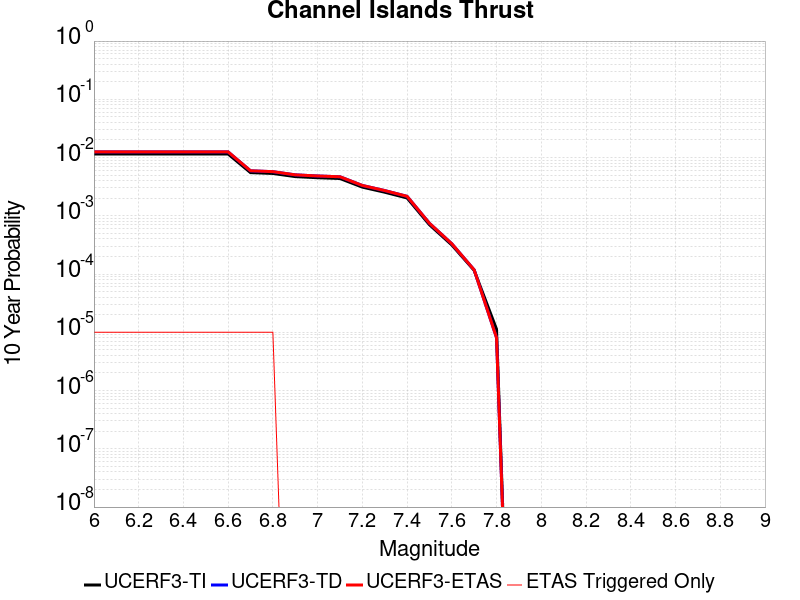 |

| Magnitude | 1 wk TI Prob | 1 wk TD Prob | 1 wk ETAS Prob | 1 wk ETAS/TD Gain | 1 wk ETAS Triggered Only | 1 mo TI Prob | 1 mo TD Prob | 1 mo ETAS Prob | 1 mo ETAS/TD Gain | 1 mo ETAS Triggered Only | 1 yr TI Prob | 1 yr TD Prob | 1 yr ETAS Prob | 1 yr ETAS/TD Gain | 1 yr ETAS Triggered Only | 10 yr TI Prob | 10 yr TD Prob | 10 yr ETAS Prob | 10 yr ETAS/TD Gain | 10 yr ETAS Triggered Only |
|-----|-----|-----|-----|-----|-----|-----|-----|-----|-----|-----|-----|-----|-----|-----|-----|-----|-----|-----|-----|-----|
| 6.0 | 2.2156251E-5 | 2.4094834E-5 | 2.4094834E-5 | 1.0 | 0.0 | 9.495191E-5 | 1.0326009E-4 | 1.0326009E-4 | 1.0 | 0.0 | 0.0011554264 | 0.0012565731 | 0.0012868914 | 1.0241277 | 3.0356385E-5 | 0.011494373 | 0.012505272 | 0.01253525 | 1.0023972 | 3.0356385E-5 |
| 6.1 | 2.2156251E-5 | 2.4094834E-5 | 2.4094834E-5 | 1.0 | 0.0 | 9.495191E-5 | 1.0326009E-4 | 1.0326009E-4 | 1.0 | 0.0 | 0.0011554264 | 0.0012565731 | 0.0012868914 | 1.0241277 | 3.0356385E-5 | 0.011494373 | 0.012505272 | 0.01253525 | 1.0023972 | 3.0356385E-5 |
| 6.2 | 2.2156251E-5 | 2.4094834E-5 | 2.4094834E-5 | 1.0 | 0.0 | 9.495191E-5 | 1.0326009E-4 | 1.0326009E-4 | 1.0 | 0.0 | 0.0011554264 | 0.0012565731 | 0.0012868914 | 1.0241277 | 3.0356385E-5 | 0.011494373 | 0.012505272 | 0.01253525 | 1.0023972 | 3.0356385E-5 |
| 6.3 | 2.2156251E-5 | 2.4094834E-5 | 2.4094834E-5 | 1.0 | 0.0 | 9.495191E-5 | 1.0326009E-4 | 1.0326009E-4 | 1.0 | 0.0 | 0.0011554264 | 0.0012565731 | 0.0012868914 | 1.0241277 | 3.0356385E-5 | 0.011494373 | 0.012505272 | 0.01253525 | 1.0023972 | 3.0356385E-5 |
| 6.4 | 2.2156251E-5 | 2.4094834E-5 | 2.4094834E-5 | 1.0 | 0.0 | 9.495191E-5 | 1.0326009E-4 | 1.0326009E-4 | 1.0 | 0.0 | 0.0011554264 | 0.0012565731 | 0.0012868914 | 1.0241277 | 3.0356385E-5 | 0.011494373 | 0.012505272 | 0.01253525 | 1.0023972 | 3.0356385E-5 |
| 6.5 | 2.2156251E-5 | 2.4094834E-5 | 2.4094834E-5 | 1.0 | 0.0 | 9.495191E-5 | 1.0326009E-4 | 1.0326009E-4 | 1.0 | 0.0 | 0.0011554264 | 0.0012565731 | 0.0012868914 | 1.0241277 | 3.0356385E-5 | 0.011494373 | 0.012505272 | 0.01253525 | 1.0023972 | 3.0356385E-5 |
| 6.6 | 2.2156251E-5 | 2.4094834E-5 | 2.4094834E-5 | 1.0 | 0.0 | 9.495191E-5 | 1.0326009E-4 | 1.0326009E-4 | 1.0 | 0.0 | 0.0011554264 | 0.0012565731 | 0.0012868914 | 1.0241277 | 3.0356385E-5 | 0.011494373 | 0.012505272 | 0.01253525 | 1.0023972 | 3.0356385E-5 |
| 6.7 | 1.0601296E-5 | 1.1380667E-5 | 1.1380667E-5 | 1.0 | 0.0 | 4.5433335E-5 | 4.8773403E-5 | 4.8773403E-5 | 1.0 | 0.0 | 5.5301044E-4 | 5.936593E-4 | 6.2399765E-4 | 1.051104 | 3.0356385E-5 | 0.005516363 | 0.0059212362 | 0.0059514125 | 1.0050963 | 3.0356385E-5 |
| 6.8 | 1.0246747E-5 | 1.0997752E-5 | 1.0997752E-5 | 1.0 | 0.0 | 4.391389E-5 | 4.7132395E-5 | 4.7132395E-5 | 1.0 | 0.0 | 5.345204E-4 | 5.7369063E-4 | 6.0402957E-4 | 1.0528839 | 3.0356385E-5 | 0.0053323656 | 0.0057225865 | 0.0057527693 | 1.0052743 | 3.0356385E-5 |
| 6.9 | 9.049551E-6 | 9.700583E-6 | 9.700583E-6 | 1.0 | 0.0 | 3.878322E-5 | 4.157329E-5 | 4.157329E-5 | 1.0 | 0.0 | 4.7208337E-4 | 5.0604134E-4 | 5.0604134E-4 | 1.0 | 0.0 | 0.0047108172 | 0.005049308 | 0.005049308 | 1.0 | 0.0 |
| 7.0 | 8.6542195E-6 | 9.2755E-6 | 9.2755E-6 | 1.0 | 0.0 | 3.7088983E-5 | 3.9751558E-5 | 3.9751558E-5 | 1.0 | 0.0 | 4.5146482E-4 | 4.8387185E-4 | 4.8387185E-4 | 1.0 | 0.0 | 0.004505487 | 0.004828595 | 0.004828595 | 1.0 | 0.0 |
| 7.1 | 8.391028E-6 | 8.993796E-6 | 8.993796E-6 | 1.0 | 0.0 | 3.5961057E-5 | 3.854429E-5 | 3.854429E-5 | 1.0 | 0.0 | 4.3773788E-4 | 4.6917977E-4 | 4.6917977E-4 | 1.0 | 0.0 | 0.004368766 | 0.0046823025 | 0.0046823025 | 1.0 | 0.0 |
| 7.2 | 5.965188E-6 | 6.372285E-6 | 6.372285E-6 | 1.0 | 0.0 | 2.556484E-5 | 2.730951E-5 | 2.730951E-5 | 1.0 | 0.0 | 3.1120746E-4 | 3.3244313E-4 | 3.3244313E-4 | 1.0 | 0.0 | 0.00310772 | 0.003319516 | 0.003319516 | 1.0 | 0.0 |
| 7.3 | 4.877518E-6 | 5.206485E-6 | 5.206485E-6 | 1.0 | 0.0 | 2.0903482E-5 | 2.2313321E-5 | 2.2313321E-5 | 1.0 | 0.0 | 2.5447016E-4 | 2.7163126E-4 | 2.7163126E-4 | 1.0 | 0.0 | 0.0025417898 | 0.0027130388 | 0.0027130388 | 1.0 | 0.0 |
| 7.4 | 3.8829853E-6 | 4.1422427E-6 | 4.1422427E-6 | 1.0 | 0.0 | 1.664126E-5 | 1.775235E-5 | 1.775235E-5 | 1.0 | 0.0 | 2.0258849E-4 | 2.1611385E-4 | 2.1611385E-4 | 1.0 | 0.0 | 0.002024039 | 0.0021590786 | 0.0021590786 | 1.0 | 0.0 |
| 7.5 | 1.3489616E-6 | 1.4279142E-6 | 1.4279142E-6 | 1.0 | 0.0 | 5.7812517E-6 | 6.1196183E-6 | 6.1196183E-6 | 1.0 | 0.0 | 7.038446E-5 | 7.450384E-5 | 7.450384E-5 | 1.0 | 0.0 | 7.036218E-4 | 7.4479263E-4 | 7.4479263E-4 | 1.0 | 0.0 |
| 7.6 | 6.058192E-7 | 6.354317E-7 | 6.354317E-7 | 1.0 | 0.0 | 2.5963652E-6 | 2.7232759E-6 | 2.7232759E-6 | 1.0 | 0.0 | 3.161029E-5 | 3.3155397E-5 | 3.3155397E-5 | 1.0 | 0.0 | 3.1605794E-4 | 3.3150613E-4 | 3.3150613E-4 | 1.0 | 0.0 |
| 7.7 | 2.2170494E-7 | 2.2609672E-7 | 2.2609672E-7 | 1.0 | 0.0 | 9.5016367E-7 | 9.689857E-7 | 9.689857E-7 | 1.0 | 0.0 | 1.1568181E-5 | 1.1797348E-5 | 1.1797348E-5 | 1.0 | 0.0 | 1.1567579E-4 | 1.17968324E-4 | 1.17968324E-4 | 1.0 | 0.0 |
| 7.8 | 2.1613102E-8 | 1.5467746E-8 | 1.5467746E-8 | 1.0 | 0.0 | 9.262757E-8 | 6.629034E-8 | 6.629034E-8 | 1.0 | 0.0 | 1.1277401E-6 | 8.070847E-7 | 8.070847E-7 | 1.0 | 0.0 | 1.1277344E-5 | 8.070825E-6 | 8.070825E-6 | 1.0 | 0.0 |

## White Wolf
*[(top)](#table-of-contents)*

| 1 Week | 1 Month | 1 Year | 10 Year |
|-----|-----|-----|-----|
|  |  | 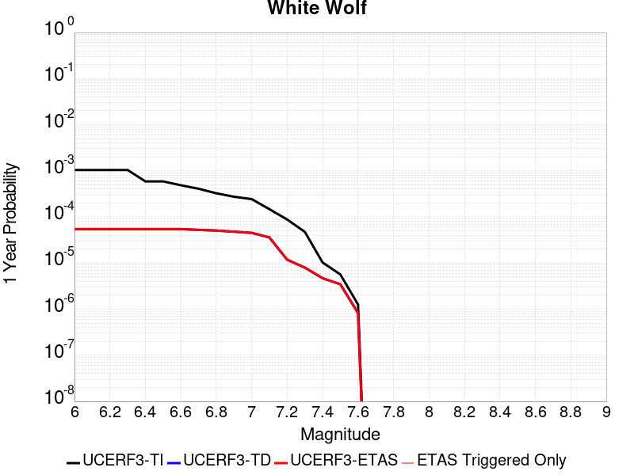 |  |

| Magnitude | 1 wk TI Prob | 1 wk TD Prob | 1 wk ETAS Prob | 1 wk ETAS/TD Gain | 1 wk ETAS Triggered Only | 1 mo TI Prob | 1 mo TD Prob | 1 mo ETAS Prob | 1 mo ETAS/TD Gain | 1 mo ETAS Triggered Only | 1 yr TI Prob | 1 yr TD Prob | 1 yr ETAS Prob | 1 yr ETAS/TD Gain | 1 yr ETAS Triggered Only | 10 yr TI Prob | 10 yr TD Prob | 10 yr ETAS Prob | 10 yr ETAS/TD Gain | 10 yr ETAS Triggered Only |
|-----|-----|-----|-----|-----|-----|-----|-----|-----|-----|-----|-----|-----|-----|-----|-----|-----|-----|-----|-----|-----|
| 6.0 | 2.0037822E-5 | 1.047058E-6 | 1.047058E-6 | 1.0 | 0.0 | 8.587355E-5 | 4.487384E-6 | 4.487384E-6 | 1.0 | 0.0 | 0.001045009 | 5.4632583E-5 | 5.4632583E-5 | 1.0 | 0.0 | 0.010401085 | 5.461966E-4 | 5.765364E-4 | 1.0555474 | 3.0356385E-5 |
| 6.1 | 2.0037822E-5 | 1.047058E-6 | 1.047058E-6 | 1.0 | 0.0 | 8.587355E-5 | 4.487384E-6 | 4.487384E-6 | 1.0 | 0.0 | 0.001045009 | 5.4632583E-5 | 5.4632583E-5 | 1.0 | 0.0 | 0.010401085 | 5.461966E-4 | 5.765364E-4 | 1.0555474 | 3.0356385E-5 |
| 6.2 | 2.0037822E-5 | 1.047058E-6 | 1.047058E-6 | 1.0 | 0.0 | 8.587355E-5 | 4.487384E-6 | 4.487384E-6 | 1.0 | 0.0 | 0.001045009 | 5.4632583E-5 | 5.4632583E-5 | 1.0 | 0.0 | 0.010401085 | 5.461966E-4 | 5.765364E-4 | 1.0555474 | 3.0356385E-5 |
| 6.3 | 2.0037822E-5 | 1.047058E-6 | 1.047058E-6 | 1.0 | 0.0 | 8.587355E-5 | 4.487384E-6 | 4.487384E-6 | 1.0 | 0.0 | 0.001045009 | 5.4632583E-5 | 5.4632583E-5 | 1.0 | 0.0 | 0.010401085 | 5.461966E-4 | 5.765364E-4 | 1.0555474 | 3.0356385E-5 |
| 6.4 | 1.132487E-5 | 1.047058E-6 | 1.047058E-6 | 1.0 | 0.0 | 4.8534253E-5 | 4.487384E-6 | 4.487384E-6 | 1.0 | 0.0 | 5.907443E-4 | 5.4632583E-5 | 5.4632583E-5 | 1.0 | 0.0 | 0.005891764 | 5.461966E-4 | 5.765364E-4 | 1.0555474 | 3.0356385E-5 |
| 6.5 | 1.132487E-5 | 1.047058E-6 | 1.047058E-6 | 1.0 | 0.0 | 4.8534253E-5 | 4.487384E-6 | 4.487384E-6 | 1.0 | 0.0 | 5.907443E-4 | 5.4632583E-5 | 5.4632583E-5 | 1.0 | 0.0 | 0.005891764 | 5.461966E-4 | 5.765364E-4 | 1.0555474 | 3.0356385E-5 |
| 6.6 | 9.347473E-6 | 1.047058E-6 | 1.047058E-6 | 1.0 | 0.0 | 4.0059982E-5 | 4.487384E-6 | 4.487384E-6 | 1.0 | 0.0 | 4.8762115E-4 | 5.4632583E-5 | 5.4632583E-5 | 1.0 | 0.0 | 0.0048655253 | 5.461966E-4 | 5.765364E-4 | 1.0555474 | 3.0356385E-5 |
| 6.7 | 7.842647E-6 | 1.0049686E-6 | 1.0049686E-6 | 1.0 | 0.0 | 3.361091E-5 | 4.3070013E-6 | 4.3070013E-6 | 1.0 | 0.0 | 4.0913603E-4 | 5.2436528E-5 | 5.2436528E-5 | 1.0 | 0.0 | 0.004083836 | 5.2424654E-4 | 5.54587E-4 | 1.0578744 | 3.0356385E-5 |
| 6.8 | 6.26597E-6 | 9.736085E-7 | 9.736085E-7 | 1.0 | 0.0 | 2.685388E-5 | 4.172601E-6 | 4.172601E-6 | 1.0 | 0.0 | 3.2689696E-4 | 5.080029E-5 | 5.080029E-5 | 1.0 | 0.0 | 0.003264165 | 5.0789164E-4 | 5.382326E-4 | 1.059739 | 3.0356385E-5 |
| 6.9 | 5.258436E-6 | 9.1844277E-7 | 9.1844277E-7 | 1.0 | 0.0 | 2.2535958E-5 | 3.9361776E-6 | 3.9361776E-6 | 1.0 | 0.0 | 2.7434074E-4 | 4.7921956E-5 | 4.7921956E-5 | 1.0 | 0.0 | 0.0027400232 | 4.7912102E-4 | 5.0946284E-4 | 1.0633281 | 3.0356385E-5 |
| 7.0 | 4.675028E-6 | 8.6622856E-7 | 8.6622856E-7 | 1.0 | 0.0 | 2.003568E-5 | 3.7124032E-6 | 3.7124032E-6 | 1.0 | 0.0 | 2.4390711E-4 | 4.519762E-5 | 4.519762E-5 | 1.0 | 0.0 | 0.0024363957 | 4.5188898E-4 | 4.8223164E-4 | 1.0671463 | 3.0356385E-5 |
| 7.1 | 2.8270078E-6 | 6.875069E-7 | 6.875069E-7 | 1.0 | 0.0 | 1.2115692E-5 | 2.946455E-6 | 2.946455E-6 | 1.0 | 0.0 | 1.4749856E-4 | 3.587254E-5 | 3.587254E-5 | 1.0 | 0.0 | 0.001474007 | 3.586716E-4 | 3.8901708E-4 | 1.0846052 | 3.0356385E-5 |
| 7.2 | 1.6881406E-6 | 2.27111E-7 | 2.27111E-7 | 1.0 | 0.0 | 7.2348685E-6 | 9.733325E-7 | 9.733325E-7 | 1.0 | 0.0 | 8.808096E-5 | 1.185026E-5 | 1.185026E-5 | 1.0 | 0.0 | 8.8046055E-4 | 1.1849644E-4 | 1.4884923E-4 | 1.2561494 | 3.0356385E-5 |
| 7.3 | 9.086107E-7 | 1.5269218E-7 | 1.5269218E-7 | 1.0 | 0.0 | 3.8940398E-6 | 6.5439485E-7 | 6.5439485E-7 | 1.0 | 0.0 | 4.7408903E-5 | 7.967229E-6 | 7.967229E-6 | 1.0 | 0.0 | 4.739879E-4 | 7.966952E-5 | 1.1002348E-4 | 1.3809985 | 3.0356385E-5 |
| 7.4 | 1.9717383E-7 | 9.004596E-8 | 9.004596E-8 | 1.0 | 0.0 | 8.450304E-7 | 3.859112E-7 | 3.859112E-7 | 1.0 | 0.0 | 1.0288197E-5 | 4.6984587E-6 | 4.6984587E-6 | 1.0 | 0.0 | 1.028772E-4 | 4.6983627E-5 | 4.6983627E-5 | 1.0 | 0.0 |
| 7.5 | 1.086975E-7 | 6.6600954E-8 | 6.6600954E-8 | 1.0 | 0.0 | 4.6584634E-7 | 2.854326E-7 | 2.854326E-7 | 1.0 | 0.0 | 5.6716644E-6 | 3.4751367E-6 | 3.4751367E-6 | 1.0 | 0.0 | 5.6715195E-5 | 3.4750847E-5 | 3.4750847E-5 | 1.0 | 0.0 |
| 7.6 | 2.4217808E-8 | 1.582155E-8 | 1.582155E-8 | 1.0 | 0.0 | 1.03790605E-7 | 6.780664E-8 | 6.780664E-8 | 1.0 | 0.0 | 1.2636499E-6 | 8.255456E-7 | 8.255456E-7 | 1.0 | 0.0 | 1.2636427E-5 | 8.255431E-6 | 8.255431E-6 | 1.0 | 0.0 |

## Malibu Coast (Extension) alt 1
*[(top)](#table-of-contents)*

| 1 Week | 1 Month | 1 Year | 10 Year |
|-----|-----|-----|-----|
| 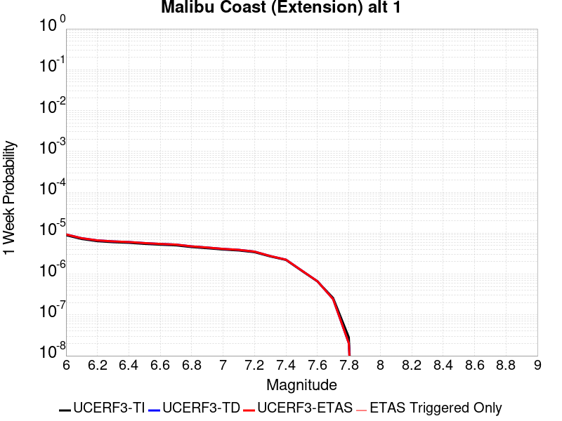 |  |  |  |

| Magnitude | 1 wk TI Prob | 1 wk TD Prob | 1 wk ETAS Prob | 1 wk ETAS/TD Gain | 1 wk ETAS Triggered Only | 1 mo TI Prob | 1 mo TD Prob | 1 mo ETAS Prob | 1 mo ETAS/TD Gain | 1 mo ETAS Triggered Only | 1 yr TI Prob | 1 yr TD Prob | 1 yr ETAS Prob | 1 yr ETAS/TD Gain | 1 yr ETAS Triggered Only | 10 yr TI Prob | 10 yr TD Prob | 10 yr ETAS Prob | 10 yr ETAS/TD Gain | 10 yr ETAS Triggered Only |
|-----|-----|-----|-----|-----|-----|-----|-----|-----|-----|-----|-----|-----|-----|-----|-----|-----|-----|-----|-----|-----|
| 6.0 | 8.930738E-6 | 9.329973E-6 | 9.329973E-6 | 1.0 | 0.0 | 3.827403E-5 | 3.9984996E-5 | 3.9984996E-5 | 1.0 | 0.0 | 4.6588664E-4 | 4.8671028E-4 | 4.8671028E-4 | 1.0 | 0.0 | 0.0046491115 | 0.004856626 | 0.004886835 | 1.0062201 | 3.0356385E-5 |
| 6.1 | 7.199952E-6 | 7.5308994E-6 | 7.5308994E-6 | 1.0 | 0.0 | 3.0856572E-5 | 3.227489E-5 | 3.227489E-5 | 1.0 | 0.0 | 3.75614E-4 | 3.928765E-4 | 3.928765E-4 | 1.0 | 0.0 | 0.0037497976 | 0.0039218855 | 0.003952123 | 1.0077099 | 3.0356385E-5 |
| 6.2 | 6.3721413E-6 | 6.667345E-6 | 6.667345E-6 | 1.0 | 0.0 | 2.7308892E-5 | 2.8574026E-5 | 2.8574026E-5 | 1.0 | 0.0 | 3.3243504E-4 | 3.478336E-4 | 3.478336E-4 | 1.0 | 0.0 | 0.0033193815 | 0.0034729317 | 0.0035031824 | 1.0087105 | 3.0356385E-5 |
| 6.3 | 6.016345E-6 | 6.2956897E-6 | 6.2956897E-6 | 1.0 | 0.0 | 2.578408E-5 | 2.698125E-5 | 2.698125E-5 | 1.0 | 0.0 | 3.1387596E-4 | 3.2844752E-4 | 3.2844752E-4 | 1.0 | 0.0 | 0.00313433 | 0.003279657 | 0.0033099141 | 1.0092256 | 3.0356385E-5 |
| 6.4 | 5.8104883E-6 | 6.0800626E-6 | 6.0800626E-6 | 1.0 | 0.0 | 2.4901856E-5 | 2.6057152E-5 | 2.6057152E-5 | 1.0 | 0.0 | 3.031379E-4 | 3.1719997E-4 | 3.1719997E-4 | 1.0 | 0.0 | 0.0030272473 | 0.0031675068 | 0.003197767 | 1.0095533 | 3.0356385E-5 |
| 6.5 | 5.476925E-6 | 5.7280054E-6 | 5.7280054E-6 | 1.0 | 0.0 | 2.3472323E-5 | 2.4548364E-5 | 2.4548364E-5 | 1.0 | 0.0 | 2.8573806E-4 | 2.9883566E-4 | 2.9883566E-4 | 1.0 | 0.0 | 0.0028537093 | 0.0029843699 | 0.0030146358 | 1.0101415 | 3.0356385E-5 |
| 6.6 | 5.222387E-6 | 5.459052E-6 | 5.459052E-6 | 1.0 | 0.0 | 2.2381464E-5 | 2.3395727E-5 | 2.3395727E-5 | 1.0 | 0.0 | 2.7246025E-4 | 2.8480604E-4 | 2.8480604E-4 | 1.0 | 0.0 | 0.0027212645 | 0.002844441 | 0.002874711 | 1.0106418 | 3.0356385E-5 |
| 6.7 | 5.0337076E-6 | 5.25956E-6 | 5.25956E-6 | 1.0 | 0.0 | 2.1572854E-5 | 2.2540778E-5 | 2.2540778E-5 | 1.0 | 0.0 | 2.6261783E-4 | 2.743997E-4 | 2.743997E-4 | 1.0 | 0.0 | 0.002623077 | 0.0027406388 | 0.0027709121 | 1.011046 | 3.0356385E-5 |
| 6.8 | 4.5675624E-6 | 4.7591243E-6 | 4.7591243E-6 | 1.0 | 0.0 | 1.9575122E-5 | 2.0396088E-5 | 2.0396088E-5 | 1.0 | 0.0 | 2.3830103E-4 | 2.4829427E-4 | 2.4829427E-4 | 1.0 | 0.0 | 0.0023804565 | 0.0024801884 | 0.0025104694 | 1.0122092 | 3.0356385E-5 |
| 6.9 | 4.2802412E-6 | 4.452401E-6 | 4.452401E-6 | 1.0 | 0.0 | 1.8343762E-5 | 1.908158E-5 | 1.908158E-5 | 1.0 | 0.0 | 2.2331243E-4 | 2.3229362E-4 | 2.3229362E-4 | 1.0 | 0.0 | 0.0022308815 | 0.0023205248 | 0.002350811 | 1.0130514 | 3.0356385E-5 |
| 7.0 | 3.9794063E-6 | 4.1304497E-6 | 4.1304497E-6 | 1.0 | 0.0 | 1.7054486E-5 | 1.7701808E-5 | 1.7701808E-5 | 1.0 | 0.0 | 2.0761859E-4 | 2.1549831E-4 | 2.1549831E-4 | 1.0 | 0.0 | 0.0020742472 | 0.002152907 | 0.002183198 | 1.0140698 | 3.0356385E-5 |
| 7.1 | 3.7730424E-6 | 3.91155E-6 | 3.91155E-6 | 1.0 | 0.0 | 1.6170083E-5 | 1.6763677E-5 | 1.6763677E-5 | 1.0 | 0.0 | 1.9685295E-4 | 2.0407878E-4 | 2.0407878E-4 | 1.0 | 0.0 | 0.0019667868 | 0.0020389266 | 0.002069221 | 1.014858 | 3.0356385E-5 |
| 7.2 | 3.424985E-6 | 3.541639E-6 | 3.541639E-6 | 1.0 | 0.0 | 1.4678424E-5 | 1.5178365E-5 | 1.5178365E-5 | 1.0 | 0.0 | 1.7869516E-4 | 1.8478103E-4 | 1.8478103E-4 | 1.0 | 0.0 | 0.0017855153 | 0.001846286 | 0.0018765863 | 1.0164115 | 3.0356385E-5 |
| 7.3 | 2.6966375E-6 | 2.7598792E-6 | 2.7598792E-6 | 1.0 | 0.0 | 1.15569665E-5 | 1.1828E-5 | 1.1828E-5 | 1.0 | 0.0 | 1.4069698E-4 | 1.4399643E-4 | 1.4399643E-4 | 1.0 | 0.0 | 0.0014060794 | 0.0014390353 | 0.001469348 | 1.0210646 | 3.0356385E-5 |
| 7.4 | 2.215957E-6 | 2.2495597E-6 | 2.2495597E-6 | 1.0 | 0.0 | 9.496924E-6 | 9.640935E-6 | 9.640935E-6 | 1.0 | 0.0 | 1.1561892E-4 | 1.17372096E-4 | 1.17372096E-4 | 1.0 | 0.0 | 0.0011555878 | 0.0011731047 | 0.0012034255 | 1.0258466 | 3.0356385E-5 |
| 7.5 | 1.2040218E-6 | 1.22201E-6 | 1.22201E-6 | 1.0 | 0.0 | 5.160083E-6 | 5.237175E-6 | 5.237175E-6 | 1.0 | 0.0 | 6.2822204E-5 | 6.376076E-5 | 6.376076E-5 | 1.0 | 0.0 | 6.280445E-4 | 6.3742656E-4 | 6.3742656E-4 | 1.0 | 0.0 |
| 7.6 | 6.6157446E-7 | 6.67956E-7 | 6.67956E-7 | 1.0 | 0.0 | 2.835316E-6 | 2.8626655E-6 | 2.8626655E-6 | 1.0 | 0.0 | 3.4519428E-5 | 3.485241E-5 | 3.485241E-5 | 1.0 | 0.0 | 3.4514067E-4 | 3.4847096E-4 | 3.4847096E-4 | 1.0 | 0.0 |
| 7.7 | 2.6012302E-7 | 2.4359613E-7 | 2.4359613E-7 | 1.0 | 0.0 | 1.1148124E-6 | 1.043983E-6 | 1.043983E-6 | 1.0 | 0.0 | 1.3572758E-5 | 1.2710431E-5 | 1.2710431E-5 | 1.0 | 0.0 | 1.3571928E-4 | 1.270981E-4 | 1.270981E-4 | 1.0 | 0.0 |
| 7.8 | 2.8323132E-8 | 2.0268452E-8 | 2.0268452E-8 | 1.0 | 0.0 | 1.2138484E-7 | 8.6864794E-8 | 8.6864794E-8 | 1.0 | 0.0 | 1.4778595E-6 | 1.0575784E-6 | 1.0575784E-6 | 1.0 | 0.0 | 1.4778497E-5 | 1.0575742E-5 | 1.0575742E-5 | 1.0 | 0.0 |

## Kern Canyon (Lake Isabella) 2011
*[(top)](#table-of-contents)*

| 1 Week | 1 Month | 1 Year | 10 Year |
|-----|-----|-----|-----|
| 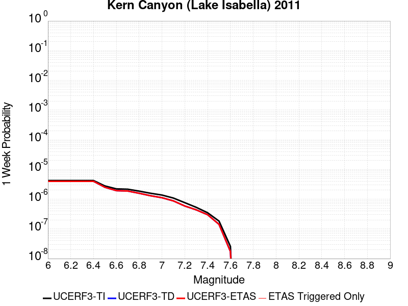 | 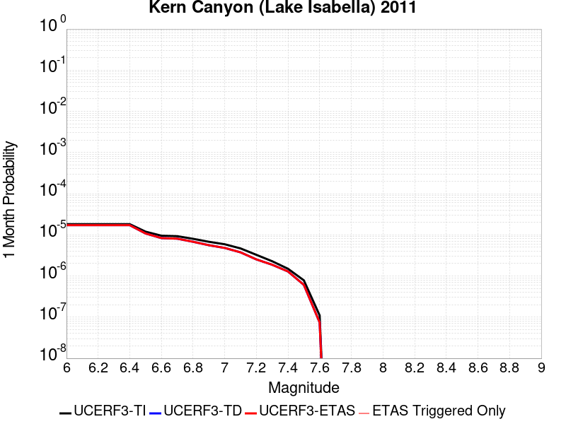 |  | 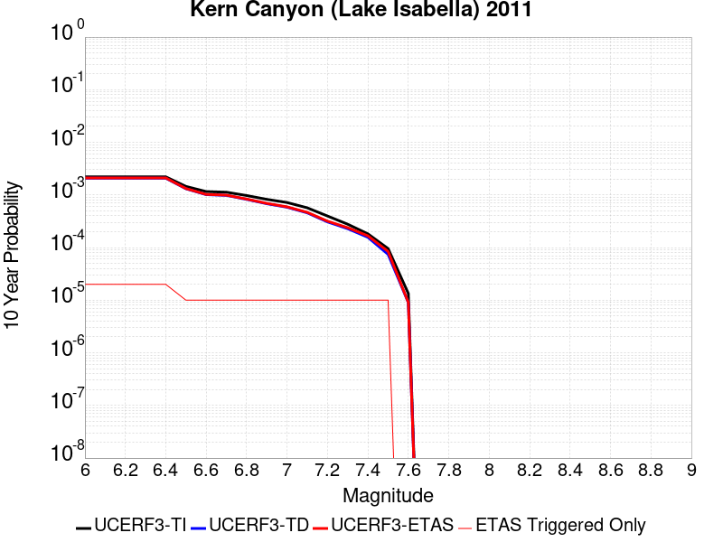 |

| Magnitude | 1 wk TI Prob | 1 wk TD Prob | 1 wk ETAS Prob | 1 wk ETAS/TD Gain | 1 wk ETAS Triggered Only | 1 mo TI Prob | 1 mo TD Prob | 1 mo ETAS Prob | 1 mo ETAS/TD Gain | 1 mo ETAS Triggered Only | 1 yr TI Prob | 1 yr TD Prob | 1 yr ETAS Prob | 1 yr ETAS/TD Gain | 1 yr ETAS Triggered Only | 10 yr TI Prob | 10 yr TD Prob | 10 yr ETAS Prob | 10 yr ETAS/TD Gain | 10 yr ETAS Triggered Only |
|-----|-----|-----|-----|-----|-----|-----|-----|-----|-----|-----|-----|-----|-----|-----|-----|-----|-----|-----|-----|-----|
| 6.0 | 4.2387383E-6 | 4.001759E-6 | 4.001759E-6 | 1.0 | 0.0 | 1.8165894E-5 | 1.7150292E-5 | 1.7150292E-5 | 1.0 | 0.0 | 2.2114732E-4 | 2.0878667E-4 | 2.3913672E-4 | 1.1453639 | 3.0356385E-5 | 0.0022092736 | 0.002086089 | 0.0021163821 | 1.0145215 | 3.0356385E-5 |
| 6.1 | 4.2387383E-6 | 4.001759E-6 | 4.001759E-6 | 1.0 | 0.0 | 1.8165894E-5 | 1.7150292E-5 | 1.7150292E-5 | 1.0 | 0.0 | 2.2114732E-4 | 2.0878667E-4 | 2.3913672E-4 | 1.1453639 | 3.0356385E-5 | 0.0022092736 | 0.002086089 | 0.0021163821 | 1.0145215 | 3.0356385E-5 |
| 6.2 | 4.2387383E-6 | 4.001759E-6 | 4.001759E-6 | 1.0 | 0.0 | 1.8165894E-5 | 1.7150292E-5 | 1.7150292E-5 | 1.0 | 0.0 | 2.2114732E-4 | 2.0878667E-4 | 2.3913672E-4 | 1.1453639 | 3.0356385E-5 | 0.0022092736 | 0.002086089 | 0.0021163821 | 1.0145215 | 3.0356385E-5 |
| 6.3 | 4.2387383E-6 | 4.001759E-6 | 4.001759E-6 | 1.0 | 0.0 | 1.8165894E-5 | 1.7150292E-5 | 1.7150292E-5 | 1.0 | 0.0 | 2.2114732E-4 | 2.0878667E-4 | 2.3913672E-4 | 1.1453639 | 3.0356385E-5 | 0.0022092736 | 0.002086089 | 0.0021163821 | 1.0145215 | 3.0356385E-5 |
| 6.4 | 4.2387383E-6 | 4.001759E-6 | 4.001759E-6 | 1.0 | 0.0 | 1.8165894E-5 | 1.7150292E-5 | 1.7150292E-5 | 1.0 | 0.0 | 2.2114732E-4 | 2.0878667E-4 | 2.3913672E-4 | 1.1453639 | 3.0356385E-5 | 0.0022092736 | 0.002086089 | 0.0021163821 | 1.0145215 | 3.0356385E-5 |
| 6.5 | 2.7857532E-6 | 2.5179454E-6 | 2.5179454E-6 | 1.0 | 0.0 | 1.1938888E-5 | 1.0791152E-5 | 1.0791152E-5 | 1.0 | 0.0 | 1.4534626E-4 | 1.3137468E-4 | 1.3137468E-4 | 1.0 | 0.0 | 0.0014525123 | 0.0013130029 | 0.0013130029 | 1.0 | 0.0 |
| 6.6 | 2.2233348E-6 | 1.9441868E-6 | 1.9441868E-6 | 1.0 | 0.0 | 9.528543E-6 | 8.332203E-6 | 8.332203E-6 | 1.0 | 0.0 | 1.1600384E-4 | 1.0143993E-4 | 1.0143993E-4 | 1.0 | 0.0 | 0.001159433 | 0.0010139449 | 0.0010139449 | 1.0 | 0.0 |
| 6.7 | 2.1635126E-6 | 1.8835657E-6 | 1.8835657E-6 | 1.0 | 0.0 | 9.272164E-6 | 8.072399E-6 | 8.072399E-6 | 1.0 | 0.0 | 1.1288274E-4 | 9.8277116E-5 | 9.8277116E-5 | 1.0 | 0.0 | 0.0011282542 | 9.823447E-4 | 9.823447E-4 | 1.0 | 0.0 |
| 6.8 | 1.8685711E-6 | 1.5831973E-6 | 1.5831973E-6 | 1.0 | 0.0 | 8.008137E-6 | 6.785114E-6 | 6.785114E-6 | 1.0 | 0.0 | 9.74947E-5 | 8.260568E-5 | 8.260568E-5 | 1.0 | 0.0 | 9.745194E-4 | 8.2575466E-4 | 8.2575466E-4 | 1.0 | 0.0 |
| 6.9 | 1.5815071E-6 | 1.3065396E-6 | 1.3065396E-6 | 1.0 | 0.0 | 6.77787E-6 | 5.5994437E-6 | 5.5994437E-6 | 1.0 | 0.0 | 8.251744E-5 | 6.8171124E-5 | 6.8171124E-5 | 1.0 | 0.0 | 8.248681E-4 | 6.815048E-4 | 6.815048E-4 | 1.0 | 0.0 |
| 7.0 | 1.3772564E-6 | 1.1211124E-6 | 1.1211124E-6 | 1.0 | 0.0 | 5.9025137E-6 | 4.8047586E-6 | 4.8047586E-6 | 1.0 | 0.0 | 7.186073E-5 | 5.849639E-5 | 5.849639E-5 | 1.0 | 0.0 | 7.18375E-4 | 5.8481196E-4 | 5.8481196E-4 | 1.0 | 0.0 |
| 7.1 | 1.0916998E-6 | 8.764087E-7 | 8.764087E-7 | 1.0 | 0.0 | 4.678705E-6 | 3.756032E-6 | 3.756032E-6 | 1.0 | 0.0 | 5.6961744E-5 | 4.5728742E-5 | 4.5728742E-5 | 1.0 | 0.0 | 5.6947145E-4 | 4.5719466E-4 | 4.5719466E-4 | 1.0 | 0.0 |
| 7.2 | 7.6277024E-7 | 5.9016634E-7 | 5.9016634E-7 | 1.0 | 0.0 | 3.2690114E-6 | 2.529282E-6 | 2.529282E-6 | 1.0 | 0.0 | 3.9799485E-5 | 3.0793577E-5 | 3.0793577E-5 | 1.0 | 0.0 | 3.9792358E-4 | 3.0789373E-4 | 3.0789373E-4 | 1.0 | 0.0 |
| 7.3 | 5.3265916E-7 | 4.3825895E-7 | 4.3825895E-7 | 1.0 | 0.0 | 2.282823E-6 | 1.8782513E-6 | 1.8782513E-6 | 1.0 | 0.0 | 2.7793016E-5 | 2.2867473E-5 | 2.2867473E-5 | 1.0 | 0.0 | 2.778954E-4 | 2.2865158E-4 | 2.2865158E-4 | 1.0 | 0.0 |
| 7.4 | 3.4946007E-7 | 3.0066704E-7 | 3.0066704E-7 | 1.0 | 0.0 | 1.497685E-6 | 1.2885724E-6 | 1.2885724E-6 | 1.0 | 0.0 | 1.8234163E-5 | 1.5688258E-5 | 1.5688258E-5 | 1.0 | 0.0 | 1.8232666E-4 | 1.5687173E-4 | 1.5687173E-4 | 1.0 | 0.0 |
| 7.5 | 1.8317026E-7 | 1.4245374E-7 | 1.4245374E-7 | 1.0 | 0.0 | 7.850152E-7 | 6.105159E-7 | 6.105159E-7 | 1.0 | 0.0 | 9.557518E-6 | 7.4330064E-6 | 7.4330064E-6 | 1.0 | 0.0 | 9.5571064E-5 | 7.4327654E-5 | 7.4327654E-5 | 1.0 | 0.0 |
| 7.6 | 2.572245E-8 | 1.7353377E-8 | 1.7353377E-8 | 1.0 | 0.0 | 1.10239064E-7 | 7.437161E-8 | 7.437161E-8 | 1.0 | 0.0 | 1.3421597E-6 | 9.0547405E-7 | 9.0547405E-7 | 1.0 | 0.0 | 1.3421517E-5 | 9.054709E-6 | 9.054709E-6 | 1.0 | 0.0 |

## Lost Hills
*[(top)](#table-of-contents)*

| 1 Week | 1 Month | 1 Year | 10 Year |
|-----|-----|-----|-----|
| 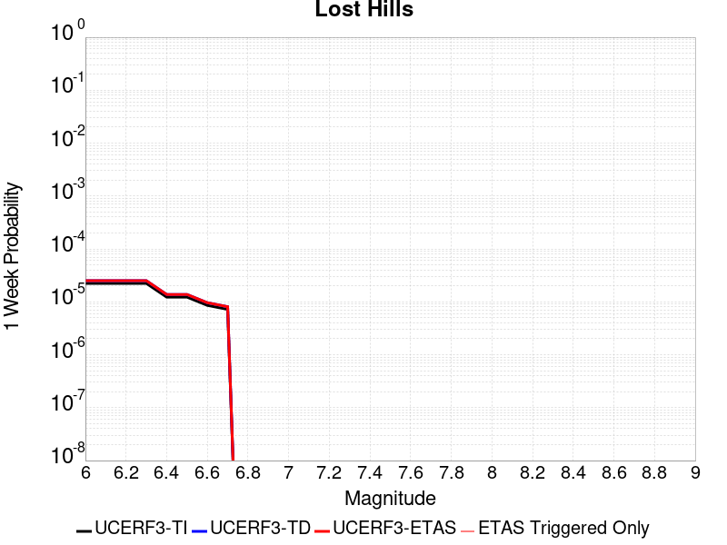 |  |  |  |

| Magnitude | 1 wk TI Prob | 1 wk TD Prob | 1 wk ETAS Prob | 1 wk ETAS/TD Gain | 1 wk ETAS Triggered Only | 1 mo TI Prob | 1 mo TD Prob | 1 mo ETAS Prob | 1 mo ETAS/TD Gain | 1 mo ETAS Triggered Only | 1 yr TI Prob | 1 yr TD Prob | 1 yr ETAS Prob | 1 yr ETAS/TD Gain | 1 yr ETAS Triggered Only | 10 yr TI Prob | 10 yr TD Prob | 10 yr ETAS Prob | 10 yr ETAS/TD Gain | 10 yr ETAS Triggered Only |
|-----|-----|-----|-----|-----|-----|-----|-----|-----|-----|-----|-----|-----|-----|-----|-----|-----|-----|-----|-----|-----|
| 6.0 | 2.233523E-5 | 2.5110714E-5 | 2.5110714E-5 | 1.0 | 0.0 | 9.571891E-5 | 1.0761386E-4 | 1.0761386E-4 | 1.0 | 0.0 | 0.0011647546 | 0.0013095795 | 0.0013095795 | 1.0 | 0.0 | 0.011586686 | 0.013035225 | 0.013065185 | 1.0022985 | 3.0356385E-5 |
| 6.1 | 2.233523E-5 | 2.5110714E-5 | 2.5110714E-5 | 1.0 | 0.0 | 9.571891E-5 | 1.0761386E-4 | 1.0761386E-4 | 1.0 | 0.0 | 0.0011647546 | 0.0013095795 | 0.0013095795 | 1.0 | 0.0 | 0.011586686 | 0.013035225 | 0.013065185 | 1.0022985 | 3.0356385E-5 |
| 6.2 | 2.233523E-5 | 2.5110714E-5 | 2.5110714E-5 | 1.0 | 0.0 | 9.571891E-5 | 1.0761386E-4 | 1.0761386E-4 | 1.0 | 0.0 | 0.0011647546 | 0.0013095795 | 0.0013095795 | 1.0 | 0.0 | 0.011586686 | 0.013035225 | 0.013065185 | 1.0022985 | 3.0356385E-5 |
| 6.3 | 2.233523E-5 | 2.5110714E-5 | 2.5110714E-5 | 1.0 | 0.0 | 9.571891E-5 | 1.0761386E-4 | 1.0761386E-4 | 1.0 | 0.0 | 0.0011647546 | 0.0013095795 | 0.0013095795 | 1.0 | 0.0 | 0.011586686 | 0.013035225 | 0.013065185 | 1.0022985 | 3.0356385E-5 |
| 6.4 | 1.2288092E-5 | 1.37833285E-5 | 1.37833285E-5 | 1.0 | 0.0 | 5.2662188E-5 | 5.90706E-5 | 5.90706E-5 | 1.0 | 0.0 | 6.409735E-4 | 7.1904104E-4 | 7.1904104E-4 | 1.0 | 0.0 | 0.006391279 | 0.0071763545 | 0.0071763545 | 1.0 | 0.0 |
| 6.5 | 1.2288092E-5 | 1.37833285E-5 | 1.37833285E-5 | 1.0 | 0.0 | 5.2662188E-5 | 5.90706E-5 | 5.90706E-5 | 1.0 | 0.0 | 6.409735E-4 | 7.1904104E-4 | 7.1904104E-4 | 1.0 | 0.0 | 0.006391279 | 0.0071763545 | 0.0071763545 | 1.0 | 0.0 |
| 6.6 | 8.58281E-6 | 9.635334E-6 | 9.635334E-6 | 1.0 | 0.0 | 3.6782953E-5 | 4.1294108E-5 | 4.1294108E-5 | 1.0 | 0.0 | 4.4774043E-4 | 5.0272304E-4 | 5.0272304E-4 | 1.0 | 0.0 | 0.0044683935 | 0.0050240206 | 0.0050240206 | 1.0 | 0.0 |
| 6.7 | 7.205685E-6 | 8.089616E-6 | 8.089616E-6 | 1.0 | 0.0 | 3.088114E-5 | 3.466978E-5 | 3.466978E-5 | 1.0 | 0.0 | 3.7591302E-4 | 4.2210458E-4 | 4.2210458E-4 | 1.0 | 0.0 | 0.0037527776 | 0.004221046 | 0.004221046 | 1.0 | 0.0 |

## Deep Springs
*[(top)](#table-of-contents)*

| 1 Week | 1 Month | 1 Year | 10 Year |
|-----|-----|-----|-----|
|  |  |  |  |

| Magnitude | 1 wk TI Prob | 1 wk TD Prob | 1 wk ETAS Prob | 1 wk ETAS/TD Gain | 1 wk ETAS Triggered Only | 1 mo TI Prob | 1 mo TD Prob | 1 mo ETAS Prob | 1 mo ETAS/TD Gain | 1 mo ETAS Triggered Only | 1 yr TI Prob | 1 yr TD Prob | 1 yr ETAS Prob | 1 yr ETAS/TD Gain | 1 yr ETAS Triggered Only | 10 yr TI Prob | 10 yr TD Prob | 10 yr ETAS Prob | 10 yr ETAS/TD Gain | 10 yr ETAS Triggered Only |
|-----|-----|-----|-----|-----|-----|-----|-----|-----|-----|-----|-----|-----|-----|-----|-----|-----|-----|-----|-----|-----|
| 6.0 | 1.9810619E-5 | 2.311763E-5 | 2.311763E-5 | 1.0 | 0.0 | 8.489989E-5 | 9.9074656E-5 | 9.9074656E-5 | 1.0 | 0.0 | 0.001033166 | 0.0012060744 | 0.0012060744 | 1.0 | 0.0 | 0.010283757 | 0.012045082 | 0.012075072 | 1.0024899 | 3.0356385E-5 |
| 6.1 | 1.9810619E-5 | 2.311763E-5 | 2.311763E-5 | 1.0 | 0.0 | 8.489989E-5 | 9.9074656E-5 | 9.9074656E-5 | 1.0 | 0.0 | 0.001033166 | 0.0012060744 | 0.0012060744 | 1.0 | 0.0 | 0.010283757 | 0.012045082 | 0.012075072 | 1.0024899 | 3.0356385E-5 |
| 6.2 | 1.9810619E-5 | 2.311763E-5 | 2.311763E-5 | 1.0 | 0.0 | 8.489989E-5 | 9.9074656E-5 | 9.9074656E-5 | 1.0 | 0.0 | 0.001033166 | 0.0012060744 | 0.0012060744 | 1.0 | 0.0 | 0.010283757 | 0.012045082 | 0.012075072 | 1.0024899 | 3.0356385E-5 |
| 6.3 | 1.9810619E-5 | 2.311763E-5 | 2.311763E-5 | 1.0 | 0.0 | 8.489989E-5 | 9.9074656E-5 | 9.9074656E-5 | 1.0 | 0.0 | 0.001033166 | 0.0012060744 | 0.0012060744 | 1.0 | 0.0 | 0.010283757 | 0.012045082 | 0.012075072 | 1.0024899 | 3.0356385E-5 |
| 6.4 | 1.9810619E-5 | 2.311763E-5 | 2.311763E-5 | 1.0 | 0.0 | 8.489989E-5 | 9.9074656E-5 | 9.9074656E-5 | 1.0 | 0.0 | 0.001033166 | 0.0012060744 | 0.0012060744 | 1.0 | 0.0 | 0.010283757 | 0.012045082 | 0.012075072 | 1.0024899 | 3.0356385E-5 |
| 6.5 | 1.7190405E-5 | 2.005498E-5 | 2.005498E-5 | 1.0 | 0.0 | 7.367108E-5 | 8.594992E-5 | 8.594992E-5 | 1.0 | 0.0 | 8.9657627E-4 | 0.0010464402 | 0.0010464402 | 1.0 | 0.0 | 0.008929676 | 0.010464364 | 0.010494403 | 1.0028706 | 3.0356385E-5 |
| 6.6 | 1.7190405E-5 | 2.005498E-5 | 2.005498E-5 | 1.0 | 0.0 | 7.367108E-5 | 8.594992E-5 | 8.594992E-5 | 1.0 | 0.0 | 8.9657627E-4 | 0.0010464402 | 0.0010464402 | 1.0 | 0.0 | 0.008929676 | 0.010464364 | 0.010494403 | 1.0028706 | 3.0356385E-5 |

## San Jacinto (Borrego)
*[(top)](#table-of-contents)*

| 1 Week | 1 Month | 1 Year | 10 Year |
|-----|-----|-----|-----|
|  | 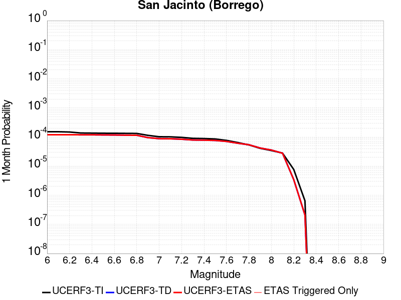 |  |  |

| Magnitude | 1 wk TI Prob | 1 wk TD Prob | 1 wk ETAS Prob | 1 wk ETAS/TD Gain | 1 wk ETAS Triggered Only | 1 mo TI Prob | 1 mo TD Prob | 1 mo ETAS Prob | 1 mo ETAS/TD Gain | 1 mo ETAS Triggered Only | 1 yr TI Prob | 1 yr TD Prob | 1 yr ETAS Prob | 1 yr ETAS/TD Gain | 1 yr ETAS Triggered Only | 10 yr TI Prob | 10 yr TD Prob | 10 yr ETAS Prob | 10 yr ETAS/TD Gain | 10 yr ETAS Triggered Only |
|-----|-----|-----|-----|-----|-----|-----|-----|-----|-----|-----|-----|-----|-----|-----|-----|-----|-----|-----|-----|-----|
| 6.0 | 3.543992E-5 | 2.8003382E-5 | 2.8003382E-5 | 1.0 | 0.0 | 1.5187653E-4 | 1.2000904E-4 | 1.2000904E-4 | 1.0 | 0.0 | 0.0018475284 | 0.0014601431 | 0.0014601431 | 1.0 | 0.0 | 0.018322436 | 0.014909599 | 0.014939503 | 1.0020057 | 3.0356385E-5 |
| 6.1 | 3.542281E-5 | 2.8003382E-5 | 2.8003382E-5 | 1.0 | 0.0 | 1.5180321E-4 | 1.2000904E-4 | 1.2000904E-4 | 1.0 | 0.0 | 0.0018466372 | 0.0014601431 | 0.0014601431 | 1.0 | 0.0 | 0.018313672 | 0.014909599 | 0.014939503 | 1.0020057 | 3.0356385E-5 |
| 6.2 | 3.4688688E-5 | 2.8003382E-5 | 2.8003382E-5 | 1.0 | 0.0 | 1.4865733E-4 | 1.2000904E-4 | 1.2000904E-4 | 1.0 | 0.0 | 0.0018084005 | 0.001460143 | 0.001460143 | 1.0 | 0.0 | 0.017937548 | 0.014909599 | 0.014939503 | 1.0020057 | 3.0356385E-5 |
| 6.3 | 3.2087122E-5 | 2.7848688E-5 | 2.7848688E-5 | 1.0 | 0.0 | 1.3750899E-4 | 1.1934613E-4 | 1.1934613E-4 | 1.0 | 0.0 | 0.0016728862 | 0.0014520829 | 0.0014520829 | 1.0 | 0.0 | 0.016603488 | 0.0148306135 | 0.01486052 | 1.0020165 | 3.0356385E-5 |
| 6.4 | 3.1828724E-5 | 2.781566E-5 | 2.781566E-5 | 1.0 | 0.0 | 1.364017E-4 | 1.1920459E-4 | 1.1920459E-4 | 1.0 | 0.0 | 0.0016594254 | 0.0014503619 | 0.0014503619 | 1.0 | 0.0 | 0.016470885 | 0.014813685 | 0.0148435915 | 1.0020188 | 3.0356385E-5 |
| 6.5 | 3.1563577E-5 | 2.7555256E-5 | 2.7555256E-5 | 1.0 | 0.0 | 1.3526545E-4 | 1.18088676E-4 | 1.18088676E-4 | 1.0 | 0.0 | 0.0016456128 | 0.0014367937 | 0.0014367937 | 1.0 | 0.0 | 0.0163348 | 0.014680215 | 0.0147101255 | 1.0020375 | 3.0356385E-5 |
| 6.6 | 3.1467625E-5 | 2.7399425E-5 | 2.7399425E-5 | 1.0 | 0.0 | 1.3485427E-4 | 1.1742089E-4 | 1.1742089E-4 | 1.0 | 0.0 | 0.0016406142 | 0.001428674 | 0.001428674 | 1.0 | 0.0 | 0.016285548 | 0.014600436 | 0.014630349 | 1.0020487 | 3.0356385E-5 |
| 6.7 | 3.1223695E-5 | 2.701733E-5 | 2.701733E-5 | 1.0 | 0.0 | 1.3380898E-4 | 1.15783485E-4 | 1.15783485E-4 | 1.0 | 0.0 | 0.0016279068 | 0.0014087645 | 0.0014087645 | 1.0 | 0.0 | 0.01616033 | 0.01440476 | 0.014434679 | 1.002077 | 3.0356385E-5 |
| 6.8 | 3.1015585E-5 | 2.6838206E-5 | 2.6838206E-5 | 1.0 | 0.0 | 1.3291716E-4 | 1.1501588E-4 | 1.1501588E-4 | 1.0 | 0.0 | 0.001617065 | 0.0013994309 | 0.0013994309 | 1.0 | 0.0 | 0.016053487 | 0.014311978 | 0.014341899 | 1.0020907 | 3.0356385E-5 |
| 6.9 | 2.6641965E-5 | 2.2256108E-5 | 2.2256108E-5 | 1.0 | 0.0 | 1.1417485E-4 | 9.537986E-5 | 9.537986E-5 | 1.0 | 0.0 | 0.0013891924 | 0.001160635 | 0.001160635 | 1.0 | 0.0 | 0.0138054015 | 0.011919958 | 0.011949952 | 1.0025163 | 3.0356385E-5 |
| 7.0 | 2.3854353E-5 | 2.054833E-5 | 2.054833E-5 | 1.0 | 0.0 | 1.02228936E-4 | 8.8061315E-5 | 8.8061315E-5 | 1.0 | 0.0 | 0.0012439266 | 0.0010716218 | 0.0010716218 | 1.0 | 0.0 | 0.012369866 | 0.011019007 | 0.011049029 | 1.0027245 | 3.0356385E-5 |
| 7.1 | 2.3672901E-5 | 2.0384747E-5 | 2.0384747E-5 | 1.0 | 0.0 | 1.0145135E-4 | 8.736029E-5 | 8.736029E-5 | 1.0 | 0.0 | 0.0012344702 | 0.001063095 | 0.001063095 | 1.0 | 0.0 | 0.0122763505 | 0.010934151 | 0.010964176 | 1.002746 | 3.0356385E-5 |
| 7.2 | 2.2717244E-5 | 1.9611558E-5 | 1.9611558E-5 | 1.0 | 0.0 | 9.735599E-5 | 8.4046835E-5 | 8.4046835E-5 | 1.0 | 0.0 | 0.0011846646 | 0.0010227922 | 0.0010227922 | 1.0 | 0.0 | 0.01178369 | 0.0105312355 | 0.0105612725 | 1.0028522 | 3.0356385E-5 |
| 7.3 | 2.1016205E-5 | 1.8452236E-5 | 1.8452236E-5 | 1.0 | 0.0 | 9.006634E-5 | 7.907863E-5 | 7.907863E-5 | 1.0 | 0.0 | 0.001096006 | 9.6235913E-4 | 9.6235913E-4 | 1.0 | 0.0 | 0.010906163 | 0.009926388 | 0.009956443 | 1.0030278 | 3.0356385E-5 |
| 7.4 | 2.0683625E-5 | 1.825456E-5 | 1.825456E-5 | 1.0 | 0.0 | 8.86411E-5 | 7.823149E-5 | 7.823149E-5 | 1.0 | 0.0 | 0.001078671 | 9.520543E-4 | 9.520543E-4 | 1.0 | 0.0 | 0.010734501 | 0.009823013 | 0.0098530715 | 1.00306 | 3.0356385E-5 |
| 7.5 | 1.9993966E-5 | 1.7848999E-5 | 1.7848999E-5 | 1.0 | 0.0 | 8.568561E-5 | 7.649348E-5 | 7.649348E-5 | 1.0 | 0.0 | 0.001042723 | 9.3091227E-4 | 9.3091227E-4 | 1.0 | 0.0 | 0.010378438 | 0.009609638 | 0.009639702 | 1.0031286 | 3.0356385E-5 |
| 7.6 | 1.788966E-5 | 1.6500542E-5 | 1.6500542E-5 | 1.0 | 0.0 | 7.666772E-5 | 7.07147E-5 | 7.07147E-5 | 1.0 | 0.0 | 9.3302975E-4 | 8.606132E-4 | 8.606132E-4 | 1.0 | 0.0 | 0.00929122 | 0.008900661 | 0.008930747 | 1.0033802 | 3.0356385E-5 |
| 7.7 | 1.5125781E-5 | 1.4300437E-5 | 1.4300437E-5 | 1.0 | 0.0 | 6.4823165E-5 | 6.1286155E-5 | 6.1286155E-5 | 1.0 | 0.0 | 7.889362E-4 | 7.459043E-4 | 7.459043E-4 | 1.0 | 0.0 | 0.007861412 | 0.0077472753 | 0.007777396 | 1.003888 | 3.0356385E-5 |
| 7.8 | 1.250089E-5 | 1.26912855E-5 | 1.26912855E-5 | 1.0 | 0.0 | 5.3574146E-5 | 5.4390093E-5 | 5.4390093E-5 | 1.0 | 0.0 | 6.5207E-4 | 6.619988E-4 | 6.619988E-4 | 1.0 | 0.0 | 0.006501599 | 0.0068996777 | 0.0069298246 | 1.0043694 | 3.0356385E-5 |
| 7.9 | 9.561E-6 | 9.808689E-6 | 9.808689E-6 | 1.0 | 0.0 | 4.0975072E-5 | 4.2036565E-5 | 4.2036565E-5 | 1.0 | 0.0 | 4.987573E-4 | 5.1167555E-4 | 5.1167555E-4 | 1.0 | 0.0 | 0.0049763937 | 0.0053808247 | 0.0054110177 | 1.0056112 | 3.0356385E-5 |
| 8.0 | 8.01699E-6 | 8.342766E-6 | 8.342766E-6 | 1.0 | 0.0 | 3.4358076E-5 | 3.5754223E-5 | 3.5754223E-5 | 1.0 | 0.0 | 4.1822926E-4 | 4.3522127E-4 | 4.3522127E-4 | 1.0 | 0.0 | 0.0041744304 | 0.004599371 | 0.0046295878 | 1.0065697 | 3.0356385E-5 |
| 8.1 | 6.541947E-6 | 6.502812E-6 | 6.502812E-6 | 1.0 | 0.0 | 2.8036617E-5 | 2.7868899E-5 | 2.7868899E-5 | 1.0 | 0.0 | 3.4129233E-4 | 3.3925154E-4 | 3.3925154E-4 | 1.0 | 0.0 | 0.0034076865 | 0.0036021962 | 0.0036021962 | 1.0 | 0.0 |
| 8.2 | 1.7968189E-6 | 8.0462127E-7 | 8.0462127E-7 | 1.0 | 0.0 | 7.70063E-6 | 3.4483724E-6 | 3.4483724E-6 | 1.0 | 0.0 | 9.3751136E-5 | 4.198315E-5 | 4.198315E-5 | 1.0 | 0.0 | 9.371159E-4 | 4.7540086E-4 | 4.7540086E-4 | 1.0 | 0.0 |
| 8.3 | 1.5167889E-7 | 4.9512888E-8 | 4.9512888E-8 | 1.0 | 0.0 | 6.500522E-7 | 2.1219807E-7 | 2.1219807E-7 | 1.0 | 0.0 | 7.9143565E-6 | 2.583509E-6 | 2.583509E-6 | 1.0 | 0.0 | 7.914075E-5 | 3.0002166E-5 | 3.0002166E-5 | 1.0 | 0.0 |

## Quien Sabe 2011 CFM
*[(top)](#table-of-contents)*

| 1 Week | 1 Month | 1 Year | 10 Year |
|-----|-----|-----|-----|
|  |  |  |  |

| Magnitude | 1 wk TI Prob | 1 wk TD Prob | 1 wk ETAS Prob | 1 wk ETAS/TD Gain | 1 wk ETAS Triggered Only | 1 mo TI Prob | 1 mo TD Prob | 1 mo ETAS Prob | 1 mo ETAS/TD Gain | 1 mo ETAS Triggered Only | 1 yr TI Prob | 1 yr TD Prob | 1 yr ETAS Prob | 1 yr ETAS/TD Gain | 1 yr ETAS Triggered Only | 10 yr TI Prob | 10 yr TD Prob | 10 yr ETAS Prob | 10 yr ETAS/TD Gain | 10 yr ETAS Triggered Only |
|-----|-----|-----|-----|-----|-----|-----|-----|-----|-----|-----|-----|-----|-----|-----|-----|-----|-----|-----|-----|-----|
| 6.0 | 3.729899E-5 | 7.0994334E-5 | 7.0994334E-5 | 1.0 | 0.0 | 1.5984301E-4 | 3.0423512E-4 | 3.0423512E-4 | 1.0 | 0.0 | 0.0019443515 | 0.0036865699 | 0.0036865699 | 1.0 | 0.0 | 0.019274272 | 0.0353649 | 0.03539418 | 1.000828 | 3.0356385E-5 |
| 6.1 | 1.7825725E-5 | 3.319839E-5 | 3.319839E-5 | 1.0 | 0.0 | 7.639373E-5 | 1.4227358E-4 | 1.4227358E-4 | 1.0 | 0.0 | 9.296967E-4 | 0.0017274261 | 0.0017274261 | 1.0 | 0.0 | 0.009258169 | 0.01670641 | 0.01673626 | 1.0017867 | 3.0356385E-5 |
| 6.2 | 4.8865336E-6 | 7.812467E-6 | 7.812467E-6 | 1.0 | 0.0 | 2.0942118E-5 | 3.348162E-5 | 3.348162E-5 | 1.0 | 0.0 | 2.5494045E-4 | 4.0715327E-4 | 4.0715327E-4 | 1.0 | 0.0 | 0.0025464818 | 0.0040157936 | 0.0040157936 | 1.0 | 0.0 |
| 6.3 | 3.858491E-6 | 5.79343E-6 | 5.79343E-6 | 1.0 | 0.0 | 1.6536285E-5 | 2.4828774E-5 | 2.4828774E-5 | 1.0 | 0.0 | 2.0131067E-4 | 3.022531E-4 | 3.022531E-4 | 1.0 | 0.0 | 0.002011284 | 0.0030038692 | 0.0030038692 | 1.0 | 0.0 |
| 6.4 | 3.0771805E-6 | 4.388484E-6 | 4.388484E-6 | 1.0 | 0.0 | 1.318785E-5 | 1.8807666E-5 | 1.8807666E-5 | 1.0 | 0.0 | 1.6055023E-4 | 2.289617E-4 | 2.289617E-4 | 1.0 | 0.0 | 0.001604343 | 0.0022882835 | 0.0022882835 | 1.0 | 0.0 |
| 6.5 | 2.5081235E-6 | 3.4668653E-6 | 3.4668653E-6 | 1.0 | 0.0 | 1.0749056E-5 | 1.4857917E-5 | 1.4857917E-5 | 1.0 | 0.0 | 1.308619E-4 | 1.808816E-4 | 1.808816E-4 | 1.0 | 0.0 | 0.0013078486 | 0.0018139676 | 0.0018139676 | 1.0 | 0.0 |
| 6.6 | 1.7505364E-6 | 2.4048998E-6 | 2.4048998E-6 | 1.0 | 0.0 | 7.502277E-6 | 1.0306677E-5 | 1.0306677E-5 | 1.0 | 0.0 | 9.13364E-5 | 1.2547728E-4 | 1.2547728E-4 | 1.0 | 0.0 | 9.129886E-4 | 0.0012595841 | 0.0012595841 | 1.0 | 0.0 |
| 6.7 | 1.505737E-6 | 2.0661041E-6 | 2.0661041E-6 | 1.0 | 0.0 | 6.4531428E-6 | 8.854705E-6 | 8.854705E-6 | 1.0 | 0.0 | 7.8564175E-5 | 1.07801294E-4 | 1.07801294E-4 | 1.0 | 0.0 | 7.853641E-4 | 0.0010830046 | 0.0010830046 | 1.0 | 0.0 |
| 6.8 | 1.2924105E-6 | 1.750539E-6 | 1.750539E-6 | 1.0 | 0.0 | 5.5388905E-6 | 7.5022917E-6 | 7.5022917E-6 | 1.0 | 0.0 | 6.74339E-5 | 9.133712E-5 | 9.133712E-5 | 1.0 | 0.0 | 6.741344E-4 | 9.171743E-4 | 9.171743E-4 | 1.0 | 0.0 |
| 6.9 | 8.9075286E-7 | 1.1264539E-6 | 1.1264539E-6 | 1.0 | 0.0 | 3.8175067E-6 | 4.827652E-6 | 4.827652E-6 | 1.0 | 0.0 | 4.6477155E-5 | 5.87753E-5 | 5.87753E-5 | 1.0 | 0.0 | 4.6467435E-4 | 5.9113425E-4 | 5.9113425E-4 | 1.0 | 0.0 |
| 7.0 | 6.6891175E-7 | 8.529351E-7 | 8.529351E-7 | 1.0 | 0.0 | 2.8667614E-6 | 3.6554322E-6 | 3.6554322E-6 | 1.0 | 0.0 | 3.4902263E-5 | 4.4504177E-5 | 4.4504177E-5 | 1.0 | 0.0 | 3.4896782E-4 | 4.4743155E-4 | 4.4743155E-4 | 1.0 | 0.0 |
| 7.1 | 4.4205015E-7 | 5.3951663E-7 | 5.3951663E-7 | 1.0 | 0.0 | 1.8944993E-6 | 2.312213E-6 | 2.312213E-6 | 1.0 | 0.0 | 2.3065284E-5 | 2.8150998E-5 | 2.8150998E-5 | 1.0 | 0.0 | 2.3062891E-4 | 2.8285658E-4 | 2.8285658E-4 | 1.0 | 0.0 |
| 7.2 | 1.6620965E-7 | 1.6002667E-7 | 1.6002667E-7 | 1.0 | 0.0 | 7.123269E-7 | 6.858284E-7 | 6.858284E-7 | 1.0 | 0.0 | 8.672545E-6 | 8.3499335E-6 | 8.3499335E-6 | 1.0 | 0.0 | 8.6722066E-5 | 8.365197E-5 | 8.365197E-5 | 1.0 | 0.0 |
| 7.3 | 1.2142488E-7 | 1.17323225E-7 | 1.17323225E-7 | 1.0 | 0.0 | 5.2039223E-7 | 5.0281375E-7 | 5.0281375E-7 | 1.0 | 0.0 | 6.335757E-6 | 6.121744E-6 | 6.121744E-6 | 1.0 | 0.0 | 6.3355765E-5 | 6.1278944E-5 | 6.1278944E-5 | 1.0 | 0.0 |
| 7.4 | 2.4192937E-8 | 2.4553245E-8 | 2.4553245E-8 | 1.0 | 0.0 | 1.0368401E-7 | 1.0522819E-7 | 1.0522819E-7 | 1.0 | 0.0 | 1.2623522E-6 | 1.2811525E-6 | 1.2811525E-6 | 1.0 | 0.0 | 1.2623449E-5 | 1.2817795E-5 | 1.2817795E-5 | 1.0 | 0.0 |
| 7.5 | 1.4432802E-8 | 1.4510259E-8 | 1.4510259E-8 | 1.0 | 0.0 | 6.185486E-8 | 6.218682E-8 | 6.218682E-8 | 1.0 | 0.0 | 7.530827E-7 | 7.571244E-7 | 7.571244E-7 | 1.0 | 0.0 | 7.530801E-6 | 7.575493E-6 | 7.575493E-6 | 1.0 | 0.0 |

## Cleghorn
*[(top)](#table-of-contents)*

| 1 Week | 1 Month | 1 Year | 10 Year |
|-----|-----|-----|-----|
| 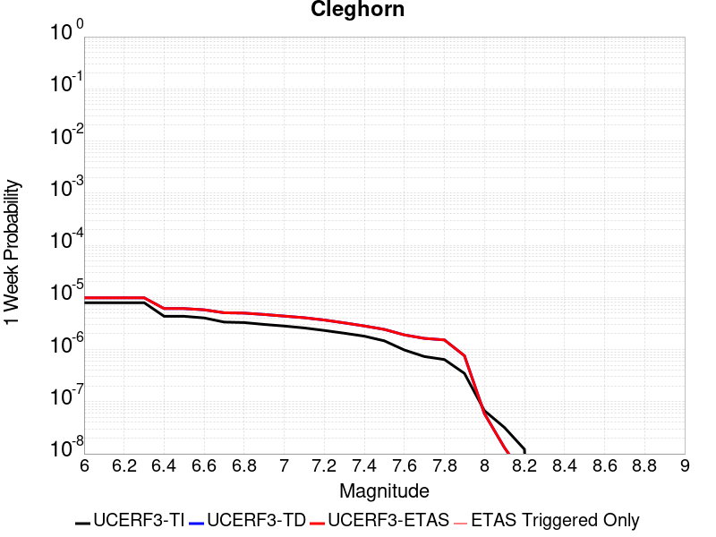 | 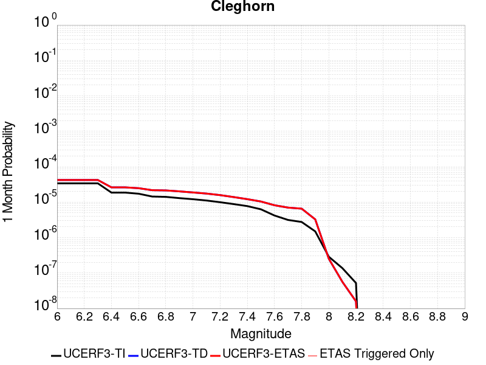 |  |  |

| Magnitude | 1 wk TI Prob | 1 wk TD Prob | 1 wk ETAS Prob | 1 wk ETAS/TD Gain | 1 wk ETAS Triggered Only | 1 mo TI Prob | 1 mo TD Prob | 1 mo ETAS Prob | 1 mo ETAS/TD Gain | 1 mo ETAS Triggered Only | 1 yr TI Prob | 1 yr TD Prob | 1 yr ETAS Prob | 1 yr ETAS/TD Gain | 1 yr ETAS Triggered Only | 10 yr TI Prob | 10 yr TD Prob | 10 yr ETAS Prob | 10 yr ETAS/TD Gain | 10 yr ETAS Triggered Only |
|-----|-----|-----|-----|-----|-----|-----|-----|-----|-----|-----|-----|-----|-----|-----|-----|-----|-----|-----|-----|-----|
| 6.0 | 7.9267165E-6 | 9.844329E-6 | 9.844329E-6 | 1.0 | 0.0 | 3.39712E-5 | 4.2189356E-5 | 4.2189356E-5 | 1.0 | 0.0 | 4.1352084E-4 | 5.13545E-4 | 5.13545E-4 | 1.0 | 0.0 | 0.004127522 | 0.005138525 | 0.0051687253 | 1.0058773 | 3.0356385E-5 |
| 6.1 | 7.9267165E-6 | 9.844329E-6 | 9.844329E-6 | 1.0 | 0.0 | 3.39712E-5 | 4.2189356E-5 | 4.2189356E-5 | 1.0 | 0.0 | 4.1352084E-4 | 5.13545E-4 | 5.13545E-4 | 1.0 | 0.0 | 0.004127522 | 0.005138525 | 0.0051687253 | 1.0058773 | 3.0356385E-5 |
| 6.2 | 7.9267165E-6 | 9.844329E-6 | 9.844329E-6 | 1.0 | 0.0 | 3.39712E-5 | 4.2189356E-5 | 4.2189356E-5 | 1.0 | 0.0 | 4.1352084E-4 | 5.13545E-4 | 5.13545E-4 | 1.0 | 0.0 | 0.004127522 | 0.005138525 | 0.0051687253 | 1.0058773 | 3.0356385E-5 |
| 6.3 | 7.9267165E-6 | 9.844329E-6 | 9.844329E-6 | 1.0 | 0.0 | 3.39712E-5 | 4.2189356E-5 | 4.2189356E-5 | 1.0 | 0.0 | 4.1352084E-4 | 5.13545E-4 | 5.13545E-4 | 1.0 | 0.0 | 0.004127522 | 0.005138525 | 0.0051687253 | 1.0058773 | 3.0356385E-5 |
| 6.4 | 4.3445207E-6 | 6.1039705E-6 | 6.1039705E-6 | 1.0 | 0.0 | 1.8619241E-5 | 2.6159618E-5 | 2.6159618E-5 | 1.0 | 0.0 | 2.2666567E-4 | 3.184478E-4 | 3.184478E-4 | 1.0 | 0.0 | 0.0022643462 | 0.0031939335 | 0.0031939335 | 1.0 | 0.0 |
| 6.5 | 4.3445207E-6 | 6.1039705E-6 | 6.1039705E-6 | 1.0 | 0.0 | 1.8619241E-5 | 2.6159618E-5 | 2.6159618E-5 | 1.0 | 0.0 | 2.2666567E-4 | 3.184478E-4 | 3.184478E-4 | 1.0 | 0.0 | 0.0022643462 | 0.0031939335 | 0.0031939335 | 1.0 | 0.0 |
| 6.6 | 4.040109E-6 | 5.78636E-6 | 5.78636E-6 | 1.0 | 0.0 | 1.7314638E-5 | 2.4798455E-5 | 2.4798455E-5 | 1.0 | 0.0 | 2.1078532E-4 | 3.018803E-4 | 3.018803E-4 | 1.0 | 0.0 | 0.002105855 | 0.0030287148 | 0.0030287148 | 1.0 | 0.0 |
| 6.7 | 3.3632055E-6 | 5.0798167E-6 | 5.0798167E-6 | 1.0 | 0.0 | 1.4413658E-5 | 2.1770462E-5 | 2.1770462E-5 | 1.0 | 0.0 | 1.7547216E-4 | 2.6502347E-4 | 2.6502347E-4 | 1.0 | 0.0 | 0.0017533366 | 0.0026610303 | 0.0026610303 | 1.0 | 0.0 |
| 6.8 | 3.2902772E-6 | 5.0017165E-6 | 5.0017165E-6 | 1.0 | 0.0 | 1.4101111E-5 | 2.1435753E-5 | 2.1435753E-5 | 1.0 | 0.0 | 1.716675E-4 | 2.6094937E-4 | 2.6094937E-4 | 1.0 | 0.0 | 0.0017153495 | 0.0026203855 | 0.0026203855 | 1.0 | 0.0 |
| 6.9 | 3.031547E-6 | 4.7032236E-6 | 4.7032236E-6 | 1.0 | 0.0 | 1.299228E-5 | 2.0156518E-5 | 2.0156518E-5 | 1.0 | 0.0 | 1.5816953E-4 | 2.4537824E-4 | 2.4537824E-4 | 1.0 | 0.0 | 0.00158057 | 0.002465027 | 0.002465027 | 1.0 | 0.0 |
| 7.0 | 2.8259715E-6 | 4.3821365E-6 | 4.3821365E-6 | 1.0 | 0.0 | 1.211125E-5 | 1.8780453E-5 | 1.8780453E-5 | 1.0 | 0.0 | 1.4744449E-4 | 2.2862825E-4 | 2.2862825E-4 | 1.0 | 0.0 | 0.001473467 | 0.002297883 | 0.002297883 | 1.0 | 0.0 |
| 7.1 | 2.5962665E-6 | 4.0770733E-6 | 4.0770733E-6 | 1.0 | 0.0 | 1.1126809E-5 | 1.7473056E-5 | 1.7473056E-5 | 1.0 | 0.0 | 1.3546048E-4 | 2.127139E-4 | 2.127139E-4 | 1.0 | 0.0 | 0.0013537793 | 0.0021390605 | 0.0021390605 | 1.0 | 0.0 |
| 7.2 | 2.3247253E-6 | 3.687283E-6 | 3.687283E-6 | 1.0 | 0.0 | 9.96307E-6 | 1.5802547E-5 | 1.5802547E-5 | 1.0 | 0.0 | 1.21293626E-4 | 1.923792E-4 | 1.923792E-4 | 1.0 | 0.0 | 0.0012122744 | 0.0019361057 | 0.0019361057 | 1.0 | 0.0 |
| 7.3 | 2.056928E-6 | 3.2453E-6 | 3.2453E-6 | 1.0 | 0.0 | 8.815376E-6 | 1.3908355E-5 | 1.3908355E-5 | 1.0 | 0.0 | 1.0732192E-4 | 1.6932123E-4 | 1.6932123E-4 | 1.0 | 0.0 | 0.001072701 | 0.0017059678 | 0.0017059678 | 1.0 | 0.0 |
| 7.4 | 1.8055999E-6 | 2.835059E-6 | 2.835059E-6 | 1.0 | 0.0 | 7.738263E-6 | 1.2150197E-5 | 1.2150197E-5 | 1.0 | 0.0 | 9.4209274E-5 | 1.4791875E-4 | 1.4791875E-4 | 1.0 | 0.0 | 9.4169343E-4 | 0.0014923868 | 0.0014923868 | 1.0 | 0.0 |
| 7.5 | 1.4683443E-6 | 2.4340136E-6 | 2.4340136E-6 | 1.0 | 0.0 | 6.292889E-6 | 1.0431445E-5 | 1.0431445E-5 | 1.0 | 0.0 | 7.661323E-5 | 1.2699554E-4 | 1.2699554E-4 | 1.0 | 0.0 | 7.658682E-4 | 0.0012834566 | 0.0012834566 | 1.0 | 0.0 |
| 7.6 | 9.804088E-7 | 1.9093818E-6 | 1.9093818E-6 | 1.0 | 0.0 | 4.201745E-6 | 8.183039E-6 | 8.183039E-6 | 1.0 | 0.0 | 5.1155046E-5 | 9.962399E-5 | 9.962399E-5 | 1.0 | 0.0 | 5.114327E-4 | 0.0010100557 | 0.0010100557 | 1.0 | 0.0 |
| 7.7 | 7.3434086E-7 | 1.6373907E-6 | 1.6373907E-6 | 1.0 | 0.0 | 3.1471714E-6 | 7.01737E-6 | 7.01737E-6 | 1.0 | 0.0 | 3.831614E-5 | 8.543315E-5 | 8.543315E-5 | 1.0 | 0.0 | 3.8309532E-4 | 8.683008E-4 | 8.683008E-4 | 1.0 | 0.0 |
| 7.8 | 6.434184E-7 | 1.5305798E-6 | 1.5305798E-6 | 1.0 | 0.0 | 2.7575045E-6 | 6.5596114E-6 | 6.5596114E-6 | 1.0 | 0.0 | 3.35721E-5 | 7.9860365E-5 | 7.9860365E-5 | 1.0 | 0.0 | 3.3567028E-4 | 8.122777E-4 | 8.122777E-4 | 1.0 | 0.0 |
| 7.9 | 3.4943926E-7 | 7.620481E-7 | 7.620481E-7 | 1.0 | 0.0 | 1.497596E-6 | 3.2659163E-6 | 3.2659163E-6 | 1.0 | 0.0 | 1.8233079E-5 | 3.9761813E-5 | 3.9761813E-5 | 1.0 | 0.0 | 1.8231584E-4 | 4.0634157E-4 | 4.0634157E-4 | 1.0 | 0.0 |
| 8.0 | 6.717524E-8 | 5.8917895E-8 | 5.8917895E-8 | 1.0 | 0.0 | 2.8789387E-7 | 2.5250523E-7 | 2.5250523E-7 | 1.0 | 0.0 | 3.505102E-6 | 3.074247E-6 | 3.074247E-6 | 1.0 | 0.0 | 3.5050467E-5 | 3.301935E-5 | 3.301935E-5 | 1.0 | 0.0 |
| 8.1 | 3.1984914E-8 | 1.31279485E-8 | 1.31279485E-8 | 1.0 | 0.0 | 1.370782E-7 | 5.6262632E-8 | 5.6262632E-8 | 1.0 | 0.0 | 1.6689258E-6 | 6.849973E-7 | 6.849973E-7 | 1.0 | 0.0 | 1.6689133E-5 | 7.841479E-6 | 7.841479E-6 | 1.0 | 0.0 |
| 8.2 | 1.21887656E-8 | 3.7025414E-9 | 3.7025414E-9 | 1.0 | 0.0 | 5.2237567E-8 | 1.5868034E-8 | 1.5868034E-8 | 1.0 | 0.0 | 6.359922E-7 | 1.9319329E-7 | 1.9319329E-7 | 1.0 | 0.0 | 6.3599036E-6 | 2.2777037E-6 | 2.2777037E-6 | 1.0 | 0.0 |

## Camp Rock 2011
*[(top)](#table-of-contents)*

| 1 Week | 1 Month | 1 Year | 10 Year |
|-----|-----|-----|-----|
|  |  |  |  |

| Magnitude | 1 wk TI Prob | 1 wk TD Prob | 1 wk ETAS Prob | 1 wk ETAS/TD Gain | 1 wk ETAS Triggered Only | 1 mo TI Prob | 1 mo TD Prob | 1 mo ETAS Prob | 1 mo ETAS/TD Gain | 1 mo ETAS Triggered Only | 1 yr TI Prob | 1 yr TD Prob | 1 yr ETAS Prob | 1 yr ETAS/TD Gain | 1 yr ETAS Triggered Only | 10 yr TI Prob | 10 yr TD Prob | 10 yr ETAS Prob | 10 yr ETAS/TD Gain | 10 yr ETAS Triggered Only |
|-----|-----|-----|-----|-----|-----|-----|-----|-----|-----|-----|-----|-----|-----|-----|-----|-----|-----|-----|-----|-----|
| 6.0 | 1.6710783E-5 | 4.250767E-6 | 4.250767E-6 | 1.0 | 0.0 | 7.161568E-5 | 1.8217446E-5 | 1.8217446E-5 | 1.0 | 0.0 | 8.7157206E-4 | 2.2177536E-4 | 2.5212503E-4 | 1.1368486 | 3.0356385E-5 | 0.008681616 | 0.0022155934 | 0.0022458825 | 1.0136709 | 3.0356385E-5 |
| 6.1 | 1.6710783E-5 | 4.250767E-6 | 4.250767E-6 | 1.0 | 0.0 | 7.161568E-5 | 1.8217446E-5 | 1.8217446E-5 | 1.0 | 0.0 | 8.7157206E-4 | 2.2177536E-4 | 2.5212503E-4 | 1.1368486 | 3.0356385E-5 | 0.008681616 | 0.0022155934 | 0.0022458825 | 1.0136709 | 3.0356385E-5 |
| 6.2 | 1.6710783E-5 | 4.250767E-6 | 4.250767E-6 | 1.0 | 0.0 | 7.161568E-5 | 1.8217446E-5 | 1.8217446E-5 | 1.0 | 0.0 | 8.7157206E-4 | 2.2177536E-4 | 2.5212503E-4 | 1.1368486 | 3.0356385E-5 | 0.008681616 | 0.0022155934 | 0.0022458825 | 1.0136709 | 3.0356385E-5 |
| 6.3 | 1.6710783E-5 | 4.250767E-6 | 4.250767E-6 | 1.0 | 0.0 | 7.161568E-5 | 1.8217446E-5 | 1.8217446E-5 | 1.0 | 0.0 | 8.7157206E-4 | 2.2177536E-4 | 2.5212503E-4 | 1.1368486 | 3.0356385E-5 | 0.008681616 | 0.0022155934 | 0.0022458825 | 1.0136709 | 3.0356385E-5 |
| 6.4 | 7.982846E-6 | 3.6825343E-6 | 3.6825343E-6 | 1.0 | 0.0 | 3.421175E-5 | 1.5782196E-5 | 1.5782196E-5 | 1.0 | 0.0 | 4.1644843E-4 | 1.9213164E-4 | 2.224822E-4 | 1.1579674 | 3.0356385E-5 | 0.0041566887 | 0.0019196902 | 0.0019499883 | 1.0157828 | 3.0356385E-5 |
| 6.5 | 7.982846E-6 | 3.6825343E-6 | 3.6825343E-6 | 1.0 | 0.0 | 3.421175E-5 | 1.5782196E-5 | 1.5782196E-5 | 1.0 | 0.0 | 4.1644843E-4 | 1.9213164E-4 | 2.224822E-4 | 1.1579674 | 3.0356385E-5 | 0.0041566887 | 0.0019196902 | 0.0019499883 | 1.0157828 | 3.0356385E-5 |
| 6.6 | 7.048869E-6 | 3.424784E-6 | 3.424784E-6 | 1.0 | 0.0 | 3.0209088E-5 | 1.4677564E-5 | 1.4677564E-5 | 1.0 | 0.0 | 3.677336E-4 | 1.78685E-4 | 2.0903596E-4 | 1.1698574 | 3.0356385E-5 | 0.0036712566 | 0.001785445 | 0.0018157471 | 1.0169718 | 3.0356385E-5 |
| 6.7 | 6.987307E-6 | 3.3627566E-6 | 3.3627566E-6 | 1.0 | 0.0 | 2.9945259E-5 | 1.4411736E-5 | 1.4411736E-5 | 1.0 | 0.0 | 3.6452254E-4 | 1.7544907E-4 | 2.0580013E-4 | 1.1729907 | 3.0356385E-5 | 0.0036392517 | 0.0017531366 | 0.0017834399 | 1.0172851 | 3.0356385E-5 |
| 6.8 | 6.3737602E-6 | 3.1183051E-6 | 3.1183051E-6 | 1.0 | 0.0 | 2.731583E-5 | 1.3364098E-5 | 1.3364098E-5 | 1.0 | 0.0 | 3.3251947E-4 | 1.6269603E-4 | 1.9304748E-4 | 1.1865531 | 3.0356385E-5 | 0.0033202237 | 0.0016257978 | 0.0016561049 | 1.0186414 | 3.0356385E-5 |
| 6.9 | 6.112211E-6 | 2.9334967E-6 | 2.9334967E-6 | 1.0 | 0.0 | 2.6194928E-5 | 1.257207E-5 | 1.257207E-5 | 1.0 | 0.0 | 3.1887658E-4 | 1.5305448E-4 | 1.8340621E-4 | 1.1983068 | 3.0356385E-5 | 0.003184194 | 0.0015295185 | 0.0015598284 | 1.0198166 | 3.0356385E-5 |
| 7.0 | 5.5140117E-6 | 2.6422588E-6 | 2.6422588E-6 | 1.0 | 0.0 | 2.3631264E-5 | 1.1323918E-5 | 1.1323918E-5 | 1.0 | 0.0 | 2.8767265E-4 | 1.3786025E-4 | 1.6821244E-4 | 1.2201664 | 3.0356385E-5 | 0.0028730053 | 0.0013777724 | 0.001408087 | 1.0220026 | 3.0356385E-5 |
| 7.1 | 4.8151105E-6 | 2.134553E-6 | 2.134553E-6 | 1.0 | 0.0 | 2.0636026E-5 | 9.148053E-6 | 9.148053E-6 | 1.0 | 0.0 | 2.5121463E-4 | 1.1137208E-4 | 1.4172508E-4 | 1.2725369 | 3.0356385E-5 | 0.0025093083 | 0.0011131845 | 0.0011435072 | 1.0272394 | 3.0356385E-5 |
| 7.2 | 3.818335E-6 | 1.2939513E-6 | 1.2939513E-6 | 1.0 | 0.0 | 1.6364189E-5 | 5.5454943E-6 | 5.5454943E-6 | 1.0 | 0.0 | 1.9921579E-4 | 6.751438E-5 | 9.786872E-5 | 1.4495981 | 3.0356385E-5 | 0.0019903728 | 6.7494693E-4 | 7.0528284E-4 | 1.0449456 | 3.0356385E-5 |
| 7.3 | 2.7166698E-6 | 7.3851675E-7 | 7.3851675E-7 | 1.0 | 0.0 | 1.1642818E-5 | 3.1650682E-6 | 3.1650682E-6 | 1.0 | 0.0 | 1.4174209E-4 | 3.8534043E-5 | 6.8889254E-5 | 1.7877506 | 3.0356385E-5 | 0.0014165172 | 3.852756E-4 | 4.156203E-4 | 1.078761 | 3.0356385E-5 |
| 7.4 | 2.0893426E-6 | 5.463086E-7 | 5.463086E-7 | 1.0 | 0.0 | 8.954295E-6 | 2.3413206E-6 | 2.3413206E-6 | 1.0 | 0.0 | 1.0901308E-4 | 2.850521E-5 | 2.850521E-5 | 1.0 | 0.0 | 0.0010895962 | 2.8501608E-4 | 2.8501608E-4 | 1.0 | 0.0 |
| 7.5 | 1.1681728E-6 | 3.6037605E-7 | 3.6037605E-7 | 1.0 | 0.0 | 5.0064455E-6 | 1.544468E-6 | 1.544468E-6 | 1.0 | 0.0 | 6.0951766E-5 | 1.880374E-5 | 1.880374E-5 | 1.0 | 0.0 | 6.093505E-4 | 1.8802195E-4 | 1.8802195E-4 | 1.0 | 0.0 |
| 7.6 | 1.3154387E-7 | 7.120617E-8 | 7.120617E-8 | 1.0 | 0.0 | 5.6375933E-7 | 3.051693E-7 | 3.051693E-7 | 1.0 | 0.0 | 6.863748E-6 | 3.7154316E-6 | 3.7154316E-6 | 1.0 | 0.0 | 6.863536E-5 | 3.715385E-5 | 3.715385E-5 | 1.0 | 0.0 |

## Cucamonga
*[(top)](#table-of-contents)*

| 1 Week | 1 Month | 1 Year | 10 Year |
|-----|-----|-----|-----|
| 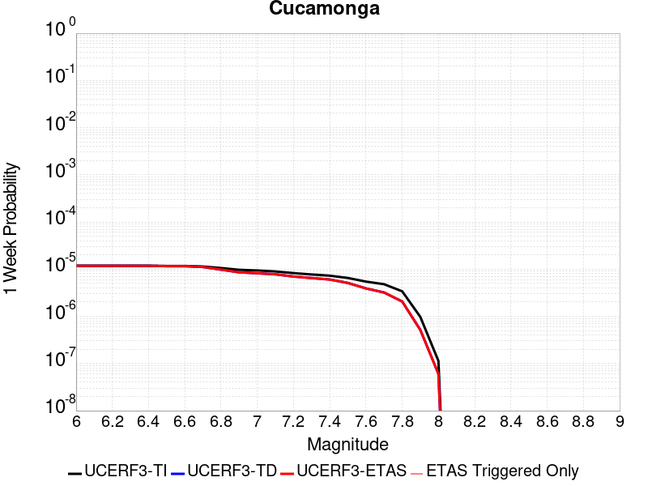 |  |  |  |

| Magnitude | 1 wk TI Prob | 1 wk TD Prob | 1 wk ETAS Prob | 1 wk ETAS/TD Gain | 1 wk ETAS Triggered Only | 1 mo TI Prob | 1 mo TD Prob | 1 mo ETAS Prob | 1 mo ETAS/TD Gain | 1 mo ETAS Triggered Only | 1 yr TI Prob | 1 yr TD Prob | 1 yr ETAS Prob | 1 yr ETAS/TD Gain | 1 yr ETAS Triggered Only | 10 yr TI Prob | 10 yr TD Prob | 10 yr ETAS Prob | 10 yr ETAS/TD Gain | 10 yr ETAS Triggered Only |
|-----|-----|-----|-----|-----|-----|-----|-----|-----|-----|-----|-----|-----|-----|-----|-----|-----|-----|-----|-----|-----|
| 6.0 | 1.1848348E-5 | 1.174373E-5 | 1.174373E-5 | 1.0 | 0.0 | 5.0777642E-5 | 5.0329316E-5 | 5.0329316E-5 | 1.0 | 0.0 | 6.180424E-4 | 6.125899E-4 | 6.125899E-4 | 1.0 | 0.0 | 0.0061632637 | 0.006110176 | 0.006140347 | 1.0049378 | 3.0356385E-5 |
| 6.1 | 1.1848348E-5 | 1.174373E-5 | 1.174373E-5 | 1.0 | 0.0 | 5.0777642E-5 | 5.0329316E-5 | 5.0329316E-5 | 1.0 | 0.0 | 6.180424E-4 | 6.125899E-4 | 6.125899E-4 | 1.0 | 0.0 | 0.0061632637 | 0.006110176 | 0.006140347 | 1.0049378 | 3.0356385E-5 |
| 6.2 | 1.1848348E-5 | 1.174373E-5 | 1.174373E-5 | 1.0 | 0.0 | 5.0777642E-5 | 5.0329316E-5 | 5.0329316E-5 | 1.0 | 0.0 | 6.180424E-4 | 6.125899E-4 | 6.125899E-4 | 1.0 | 0.0 | 0.0061632637 | 0.006110176 | 0.006140347 | 1.0049378 | 3.0356385E-5 |
| 6.3 | 1.1848348E-5 | 1.174373E-5 | 1.174373E-5 | 1.0 | 0.0 | 5.0777642E-5 | 5.0329316E-5 | 5.0329316E-5 | 1.0 | 0.0 | 6.180424E-4 | 6.125899E-4 | 6.125899E-4 | 1.0 | 0.0 | 0.0061632637 | 0.006110176 | 0.006140347 | 1.0049378 | 3.0356385E-5 |
| 6.4 | 1.1848348E-5 | 1.174373E-5 | 1.174373E-5 | 1.0 | 0.0 | 5.0777642E-5 | 5.0329316E-5 | 5.0329316E-5 | 1.0 | 0.0 | 6.180424E-4 | 6.125899E-4 | 6.125899E-4 | 1.0 | 0.0 | 0.0061632637 | 0.006110176 | 0.006140347 | 1.0049378 | 3.0356385E-5 |
| 6.5 | 1.16988695E-5 | 1.1582744E-5 | 1.1582744E-5 | 1.0 | 0.0 | 5.013705E-5 | 4.9639406E-5 | 4.9639406E-5 | 1.0 | 0.0 | 6.102476E-4 | 6.041948E-4 | 6.041948E-4 | 1.0 | 0.0 | 0.006085745 | 0.0060266824 | 0.0060568554 | 1.0050067 | 3.0356385E-5 |
| 6.6 | 1.16988695E-5 | 1.1582744E-5 | 1.1582744E-5 | 1.0 | 0.0 | 5.013705E-5 | 4.9639406E-5 | 4.9639406E-5 | 1.0 | 0.0 | 6.102476E-4 | 6.041948E-4 | 6.041948E-4 | 1.0 | 0.0 | 0.006085745 | 0.0060266824 | 0.0060568554 | 1.0050067 | 3.0356385E-5 |
| 6.7 | 1.1397107E-5 | 1.1121481E-5 | 1.1121481E-5 | 1.0 | 0.0 | 4.884383E-5 | 4.7662634E-5 | 4.7662634E-5 | 1.0 | 0.0 | 5.9451134E-4 | 5.8014056E-4 | 5.8014056E-4 | 1.0 | 0.0 | 0.005929234 | 0.0057874005 | 0.0057874005 | 1.0 | 0.0 |
| 6.8 | 1.058387E-5 | 9.790732E-6 | 9.790732E-6 | 1.0 | 0.0 | 4.5358654E-5 | 4.1959614E-5 | 4.1959614E-5 | 1.0 | 0.0 | 5.521017E-4 | 5.107397E-4 | 5.107397E-4 | 1.0 | 0.0 | 0.00550732 | 0.0050966563 | 0.0050966563 | 1.0 | 0.0 |
| 6.9 | 9.690046E-6 | 8.584701E-6 | 8.584701E-6 | 1.0 | 0.0 | 4.1528107E-5 | 3.679106E-5 | 3.679106E-5 | 1.0 | 0.0 | 5.054874E-4 | 4.4783953E-4 | 4.4783953E-4 | 1.0 | 0.0 | 0.005043391 | 0.0044702943 | 0.0044702943 | 1.0 | 0.0 |
| 7.0 | 9.381461E-6 | 8.1921835E-6 | 8.1921835E-6 | 1.0 | 0.0 | 4.020564E-5 | 3.510889E-5 | 3.510889E-5 | 1.0 | 0.0 | 4.893937E-4 | 4.2736722E-4 | 4.2736722E-4 | 1.0 | 0.0 | 0.0048831734 | 0.004266376 | 0.004266376 | 1.0 | 0.0 |
| 7.1 | 8.946492E-6 | 7.786866E-6 | 7.786866E-6 | 1.0 | 0.0 | 3.8341543E-5 | 3.337186E-5 | 3.337186E-5 | 1.0 | 0.0 | 4.667083E-4 | 4.0622696E-4 | 4.0622696E-4 | 1.0 | 0.0 | 0.0046572937 | 0.0040557687 | 0.0040557687 | 1.0 | 0.0 |
| 7.2 | 8.251016E-6 | 6.9799216E-6 | 6.9799216E-6 | 1.0 | 0.0 | 3.5361016E-5 | 2.9913608E-5 | 2.9913608E-5 | 1.0 | 0.0 | 4.3043532E-4 | 3.6413755E-4 | 3.6413755E-4 | 1.0 | 0.0 | 0.0042960253 | 0.0036363304 | 0.0036363304 | 1.0 | 0.0 |
| 7.3 | 7.717881E-6 | 6.4908418E-6 | 6.4908418E-6 | 1.0 | 0.0 | 3.3076216E-5 | 2.7817598E-5 | 2.7817598E-5 | 1.0 | 0.0 | 4.026285E-4 | 3.3862685E-4 | 3.3862685E-4 | 1.0 | 0.0 | 0.004018998 | 0.003382034 | 0.003382034 | 1.0 | 0.0 |
| 7.4 | 7.275623E-6 | 6.0363072E-6 | 6.0363072E-6 | 1.0 | 0.0 | 3.118087E-5 | 2.5869635E-5 | 2.5869635E-5 | 1.0 | 0.0 | 3.7956095E-4 | 3.1491747E-4 | 3.1491747E-4 | 1.0 | 0.0 | 0.0037891332 | 0.0031456365 | 0.0031456365 | 1.0 | 0.0 |
| 7.5 | 6.5109502E-6 | 5.104422E-6 | 5.104422E-6 | 1.0 | 0.0 | 2.7903774E-5 | 2.1875912E-5 | 2.1875912E-5 | 1.0 | 0.0 | 3.3967546E-4 | 2.6630683E-4 | 2.6630683E-4 | 1.0 | 0.0 | 0.0033915674 | 0.0026607898 | 0.0026607898 | 1.0 | 0.0 |
| 7.6 | 5.4495326E-6 | 3.911958E-6 | 3.911958E-6 | 1.0 | 0.0 | 2.335493E-5 | 1.6765429E-5 | 1.6765429E-5 | 1.0 | 0.0 | 2.8430918E-4 | 2.0410004E-4 | 2.0410004E-4 | 1.0 | 0.0 | 0.0028394572 | 0.002040035 | 0.002040035 | 1.0 | 0.0 |
| 7.7 | 4.7997164E-6 | 3.2033015E-6 | 3.2033015E-6 | 1.0 | 0.0 | 2.057005E-5 | 1.3728363E-5 | 1.3728363E-5 | 1.0 | 0.0 | 2.504116E-4 | 1.6713004E-4 | 1.6713004E-4 | 1.0 | 0.0 | 0.002501296 | 0.0016709642 | 0.0016709642 | 1.0 | 0.0 |
| 7.8 | 3.3941733E-6 | 2.0659497E-6 | 2.0659497E-6 | 1.0 | 0.0 | 1.4546376E-5 | 8.85404E-6 | 8.85404E-6 | 1.0 | 0.0 | 1.7708774E-4 | 1.0779262E-4 | 1.0779262E-4 | 1.0 | 0.0 | 0.0017694668 | 0.0010776407 | 0.0010776407 | 1.0 | 0.0 |
| 7.9 | 9.750552E-7 | 5.161305E-7 | 5.161305E-7 | 1.0 | 0.0 | 4.178801E-6 | 2.2119862E-6 | 2.2119862E-6 | 1.0 | 0.0 | 5.0875715E-5 | 2.6930602E-5 | 2.6930602E-5 | 1.0 | 0.0 | 5.086407E-4 | 2.692738E-4 | 2.692738E-4 | 1.0 | 0.0 |
| 8.0 | 1.133857E-7 | 6.057157E-8 | 6.057157E-8 | 1.0 | 0.0 | 4.8593864E-7 | 2.5959244E-7 | 2.5959244E-7 | 1.0 | 0.0 | 5.9162867E-6 | 3.1605334E-6 | 3.1605334E-6 | 1.0 | 0.0 | 5.916129E-5 | 3.16049E-5 | 3.16049E-5 | 1.0 | 0.0 |

## Whittier alt 1
*[(top)](#table-of-contents)*

| 1 Week | 1 Month | 1 Year | 10 Year |
|-----|-----|-----|-----|
|  | 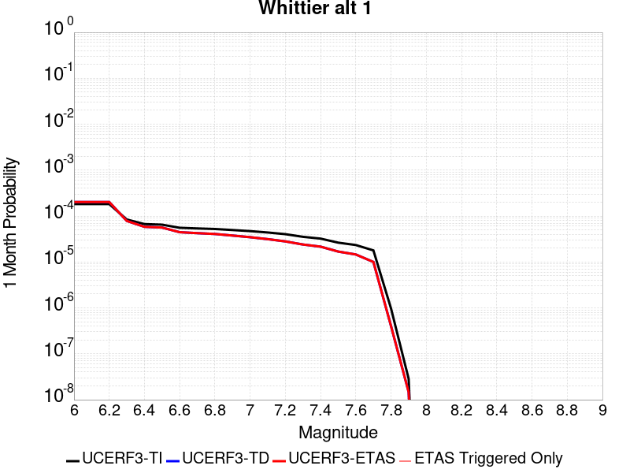 |  |  |

| Magnitude | 1 wk TI Prob | 1 wk TD Prob | 1 wk ETAS Prob | 1 wk ETAS/TD Gain | 1 wk ETAS Triggered Only | 1 mo TI Prob | 1 mo TD Prob | 1 mo ETAS Prob | 1 mo ETAS/TD Gain | 1 mo ETAS Triggered Only | 1 yr TI Prob | 1 yr TD Prob | 1 yr ETAS Prob | 1 yr ETAS/TD Gain | 1 yr ETAS Triggered Only | 10 yr TI Prob | 10 yr TD Prob | 10 yr ETAS Prob | 10 yr ETAS/TD Gain | 10 yr ETAS Triggered Only |
|-----|-----|-----|-----|-----|-----|-----|-----|-----|-----|-----|-----|-----|-----|-----|-----|-----|-----|-----|-----|-----|
| 6.0 | 4.2554693E-5 | 4.7264235E-5 | 4.7264235E-5 | 1.0 | 0.0 | 1.8236451E-4 | 2.0254709E-4 | 2.0254709E-4 | 1.0 | 0.0 | 0.002218027 | 0.0024635424 | 0.0024635424 | 1.0 | 0.0 | 0.02196019 | 0.024396377 | 0.024425993 | 1.0012139 | 3.0356385E-5 |
| 6.1 | 4.2554693E-5 | 4.7264235E-5 | 4.7264235E-5 | 1.0 | 0.0 | 1.8236451E-4 | 2.0254709E-4 | 2.0254709E-4 | 1.0 | 0.0 | 0.002218027 | 0.0024635424 | 0.0024635424 | 1.0 | 0.0 | 0.02196019 | 0.024396377 | 0.024425993 | 1.0012139 | 3.0356385E-5 |
| 6.2 | 4.2554693E-5 | 4.7264235E-5 | 4.7264235E-5 | 1.0 | 0.0 | 1.8236451E-4 | 2.0254709E-4 | 2.0254709E-4 | 1.0 | 0.0 | 0.002218027 | 0.0024635424 | 0.0024635424 | 1.0 | 0.0 | 0.02196019 | 0.024396377 | 0.024425993 | 1.0012139 | 3.0356385E-5 |
| 6.3 | 1.9617712E-5 | 1.8275026E-5 | 1.8275026E-5 | 1.0 | 0.0 | 8.40732E-5 | 7.83193E-5 | 7.83193E-5 | 1.0 | 0.0 | 0.0010231105 | 9.5313933E-4 | 9.5313933E-4 | 1.0 | 0.0 | 0.01018413 | 0.009493795 | 0.009523863 | 1.0031672 | 3.0356385E-5 |
| 6.4 | 1.5611336E-5 | 1.3609712E-5 | 1.3609712E-5 | 1.0 | 0.0 | 6.690401E-5 | 5.8326066E-5 | 5.8326066E-5 | 1.0 | 0.0 | 8.142519E-4 | 7.098945E-4 | 7.098945E-4 | 1.0 | 0.0 | 0.008112748 | 0.007078228 | 0.007078228 | 1.0 | 0.0 |
| 6.5 | 1.5150166E-5 | 1.3106303E-5 | 1.3106303E-5 | 1.0 | 0.0 | 6.492767E-5 | 5.6168694E-5 | 5.6168694E-5 | 1.0 | 0.0 | 7.9020765E-4 | 6.836452E-4 | 6.836452E-4 | 1.0 | 0.0 | 0.007874036 | 0.006817366 | 0.006817366 | 1.0 | 0.0 |
| 6.6 | 1.295588E-5 | 1.038518E-5 | 1.038518E-5 | 1.0 | 0.0 | 5.552402E-5 | 4.4507167E-5 | 4.4507167E-5 | 1.0 | 0.0 | 6.7579525E-4 | 5.4174196E-4 | 5.4174196E-4 | 1.0 | 0.0 | 0.006737438 | 0.0054056463 | 0.0054056463 | 1.0 | 0.0 |
| 6.7 | 1.2542085E-5 | 9.903713E-6 | 9.903713E-6 | 1.0 | 0.0 | 5.3750682E-5 | 4.2443804E-5 | 4.2443804E-5 | 1.0 | 0.0 | 6.542181E-4 | 5.166327E-4 | 5.166327E-4 | 1.0 | 0.0 | 0.006522954 | 0.005155734 | 0.005155734 | 1.0 | 0.0 |
| 6.8 | 1.2195878E-5 | 9.499611E-6 | 9.499611E-6 | 1.0 | 0.0 | 5.2267E-5 | 4.0711995E-5 | 4.0711995E-5 | 1.0 | 0.0 | 6.36165E-4 | 4.955577E-4 | 4.955577E-4 | 1.0 | 0.0 | 0.0063434686 | 0.0049458668 | 0.0049458668 | 1.0 | 0.0 |
| 6.9 | 1.1580298E-5 | 8.776835E-6 | 8.776835E-6 | 1.0 | 0.0 | 4.9628903E-5 | 3.7614474E-5 | 3.7614474E-5 | 1.0 | 0.0 | 6.040644E-4 | 4.5786164E-4 | 4.5786164E-4 | 1.0 | 0.0 | 0.00602425 | 0.0045704423 | 0.0045704423 | 1.0 | 0.0 |
| 7.0 | 1.0964795E-5 | 8.087695E-6 | 8.087695E-6 | 1.0 | 0.0 | 4.6991136E-5 | 3.4661098E-5 | 3.4661098E-5 | 1.0 | 0.0 | 5.7196687E-4 | 4.219187E-4 | 4.219187E-4 | 1.0 | 0.0 | 0.0057049696 | 0.004212385 | 0.004212385 | 1.0 | 0.0 |
| 7.1 | 1.0230601E-5 | 7.329962E-6 | 7.329962E-6 | 1.0 | 0.0 | 4.3844695E-5 | 3.1413754E-5 | 3.1413754E-5 | 1.0 | 0.0 | 5.336784E-4 | 3.8239663E-4 | 3.8239663E-4 | 1.0 | 0.0 | 0.005323986 | 0.0038185497 | 0.0038185497 | 1.0 | 0.0 |
| 7.2 | 9.40865E-6 | 6.546295E-6 | 6.546295E-6 | 1.0 | 0.0 | 4.032216E-5 | 2.8055256E-5 | 2.8055256E-5 | 1.0 | 0.0 | 4.908117E-4 | 3.415204E-4 | 3.415204E-4 | 1.0 | 0.0 | 0.0048972913 | 0.0034110483 | 0.0034110483 | 1.0 | 0.0 |
| 7.3 | 8.237384E-6 | 5.6003446E-6 | 5.6003446E-6 | 1.0 | 0.0 | 3.5302593E-5 | 2.4001263E-5 | 2.4001263E-5 | 1.0 | 0.0 | 4.2972428E-4 | 2.9217722E-4 | 2.9217722E-4 | 1.0 | 0.0 | 0.0042889426 | 0.002918252 | 0.002918252 | 1.0 | 0.0 |
| 7.4 | 7.5316966E-6 | 5.030179E-6 | 5.030179E-6 | 1.0 | 0.0 | 3.2278298E-5 | 2.1557738E-5 | 2.1557738E-5 | 1.0 | 0.0 | 3.9291743E-4 | 2.6243486E-4 | 2.6243486E-4 | 1.0 | 0.0 | 0.0039222343 | 0.0026213615 | 0.0026213615 | 1.0 | 0.0 |
| 7.5 | 6.149649E-6 | 3.9357315E-6 | 3.9357315E-6 | 1.0 | 0.0 | 2.6355372E-5 | 1.6867318E-5 | 1.6867318E-5 | 1.0 | 0.0 | 3.208294E-4 | 2.0534113E-4 | 2.0534113E-4 | 1.0 | 0.0 | 0.003203666 | 0.0020516033 | 0.0020516033 | 1.0 | 0.0 |
| 7.6 | 5.457711E-6 | 3.3970512E-6 | 3.3970512E-6 | 1.0 | 0.0 | 2.338998E-5 | 1.4558714E-5 | 1.4558714E-5 | 1.0 | 0.0 | 2.8473578E-4 | 1.7723875E-4 | 1.7723875E-4 | 1.0 | 0.0 | 0.0028437122 | 0.0017710547 | 0.0017710547 | 1.0 | 0.0 |
| 7.7 | 4.1676276E-6 | 2.3345212E-6 | 2.3345212E-6 | 1.0 | 0.0 | 1.7861139E-5 | 1.00050565E-5 | 1.00050565E-5 | 1.0 | 0.0 | 2.1743766E-4 | 1.21805504E-4 | 1.21805504E-4 | 1.0 | 0.0 | 0.0021722503 | 0.0012174605 | 0.0012174605 | 1.0 | 0.0 |
| 7.8 | 2.2692414E-7 | 9.390229E-8 | 9.390229E-8 | 1.0 | 0.0 | 9.725317E-7 | 4.0243833E-7 | 4.0243833E-7 | 1.0 | 0.0 | 1.1840509E-5 | 4.899679E-6 | 4.899679E-6 | 1.0 | 0.0 | 1.1839878E-4 | 4.8996037E-5 | 4.8996037E-5 | 1.0 | 0.0 |
| 7.9 | 6.676829E-9 | 3.4410954E-9 | 3.4410954E-9 | 1.0 | 0.0 | 2.861498E-8 | 1.4747552E-8 | 1.4747552E-8 | 1.0 | 0.0 | 3.4838732E-7 | 1.7955142E-7 | 1.7955142E-7 | 1.0 | 0.0 | 3.4838679E-6 | 1.795513E-6 | 1.795513E-6 | 1.0 | 0.0 |

## Chino alt 1
*[(top)](#table-of-contents)*

| 1 Week | 1 Month | 1 Year | 10 Year |
|-----|-----|-----|-----|
|  |  | 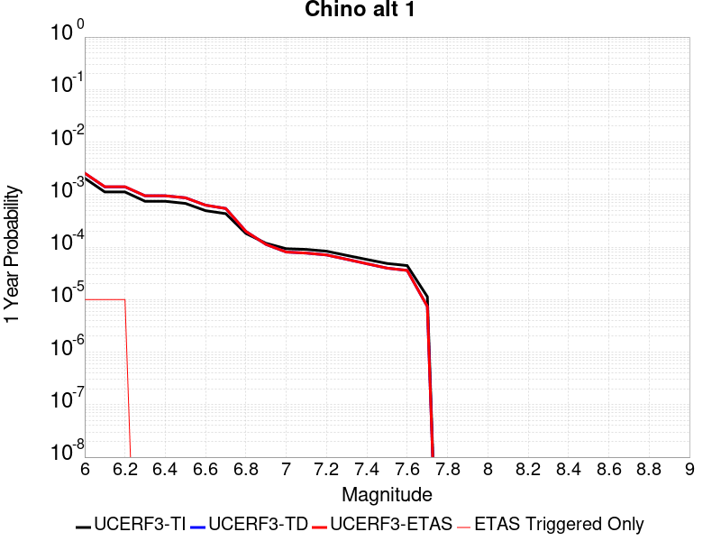 |  |

| Magnitude | 1 wk TI Prob | 1 wk TD Prob | 1 wk ETAS Prob | 1 wk ETAS/TD Gain | 1 wk ETAS Triggered Only | 1 mo TI Prob | 1 mo TD Prob | 1 mo ETAS Prob | 1 mo ETAS/TD Gain | 1 mo ETAS Triggered Only | 1 yr TI Prob | 1 yr TD Prob | 1 yr ETAS Prob | 1 yr ETAS/TD Gain | 1 yr ETAS Triggered Only | 10 yr TI Prob | 10 yr TD Prob | 10 yr ETAS Prob | 10 yr ETAS/TD Gain | 10 yr ETAS Triggered Only |
|-----|-----|-----|-----|-----|-----|-----|-----|-----|-----|-----|-----|-----|-----|-----|-----|-----|-----|-----|-----|-----|
| 6.0 | 3.939946E-5 | 4.8967257E-5 | 4.8967257E-5 | 1.0 | 0.0 | 1.6884391E-4 | 2.0984573E-4 | 2.0984573E-4 | 1.0 | 0.0 | 0.0020537362 | 0.002552355 | 0.0025826339 | 1.0118631 | 3.0356385E-5 | 0.020348595 | 0.025287293 | 0.025316881 | 1.0011702 | 3.0356385E-5 |
| 6.1 | 2.1505624E-5 | 2.6890864E-5 | 2.6890864E-5 | 1.0 | 0.0 | 9.2163704E-5 | 1.15242095E-4 | 1.15242095E-4 | 1.0 | 0.0 | 0.0011215154 | 0.0014022809 | 0.0014325947 | 1.0216175 | 3.0356385E-5 | 0.011158722 | 0.013951185 | 0.013981119 | 1.0021455 | 3.0356385E-5 |
| 6.2 | 2.1505624E-5 | 2.6890864E-5 | 2.6890864E-5 | 1.0 | 0.0 | 9.2163704E-5 | 1.15242095E-4 | 1.15242095E-4 | 1.0 | 0.0 | 0.0011215154 | 0.0014022809 | 0.0014325947 | 1.0216175 | 3.0356385E-5 | 0.011158722 | 0.013951185 | 0.013981119 | 1.0021455 | 3.0356385E-5 |
| 6.3 | 1.4290785E-5 | 1.8174556E-5 | 1.8174556E-5 | 1.0 | 0.0 | 6.1244784E-5 | 7.7888886E-5 | 7.7888886E-5 | 1.0 | 0.0 | 7.454001E-4 | 9.4793004E-4 | 9.4793004E-4 | 1.0 | 0.0 | 0.007429048 | 0.009449286 | 0.009449286 | 1.0 | 0.0 |
| 6.4 | 1.4290785E-5 | 1.8174556E-5 | 1.8174556E-5 | 1.0 | 0.0 | 6.1244784E-5 | 7.7888886E-5 | 7.7888886E-5 | 1.0 | 0.0 | 7.454001E-4 | 9.4793004E-4 | 9.4793004E-4 | 1.0 | 0.0 | 0.007429048 | 0.009449286 | 0.009449286 | 1.0 | 0.0 |
| 6.5 | 1.3017944E-5 | 1.6661137E-5 | 1.6661137E-5 | 1.0 | 0.0 | 5.5789995E-5 | 7.140317E-5 | 7.140317E-5 | 1.0 | 0.0 | 6.790315E-4 | 8.690306E-4 | 8.690306E-4 | 1.0 | 0.0 | 0.0067696036 | 0.008666586 | 0.008666586 | 1.0 | 0.0 |
| 6.6 | 9.470016E-6 | 1.2046306E-5 | 1.2046306E-5 | 1.0 | 0.0 | 4.058515E-5 | 5.1626197E-5 | 5.1626197E-5 | 1.0 | 0.0 | 4.940122E-4 | 6.2840164E-4 | 6.2840164E-4 | 1.0 | 0.0 | 0.004929154 | 0.006275441 | 0.006275441 | 1.0 | 0.0 |
| 6.7 | 8.314155E-6 | 1.0413858E-5 | 1.0413858E-5 | 1.0 | 0.0 | 3.5631605E-5 | 4.4630237E-5 | 4.4630237E-5 | 1.0 | 0.0 | 4.3372845E-4 | 5.432699E-4 | 5.432699E-4 | 1.0 | 0.0 | 0.004328829 | 0.005428933 | 0.005428933 | 1.0 | 0.0 |
| 6.8 | 3.4856364E-6 | 3.8155918E-6 | 3.8155918E-6 | 1.0 | 0.0 | 1.4938357E-5 | 1.6352446E-5 | 1.6352446E-5 | 1.0 | 0.0 | 1.8185932E-4 | 1.990749E-4 | 1.990749E-4 | 1.0 | 0.0 | 0.0018171056 | 0.001990641 | 0.001990641 | 1.0 | 0.0 |
| 6.9 | 2.2645952E-6 | 2.154401E-6 | 2.154401E-6 | 1.0 | 0.0 | 9.705372E-6 | 9.233116E-6 | 9.233116E-6 | 1.0 | 0.0 | 1.18156495E-4 | 1.124076E-4 | 1.124076E-4 | 1.0 | 0.0 | 0.0011809369 | 0.0011241237 | 0.0011241237 | 1.0 | 0.0 |
| 7.0 | 1.7864003E-6 | 1.5443994E-6 | 1.5443994E-6 | 1.0 | 0.0 | 7.655979E-6 | 6.618838E-6 | 6.618838E-6 | 1.0 | 0.0 | 9.3207556E-5 | 8.0581434E-5 | 8.0581434E-5 | 1.0 | 0.0 | 9.316847E-4 | 8.059694E-4 | 8.059694E-4 | 1.0 | 0.0 |
| 7.1 | 1.7315456E-6 | 1.4746504E-6 | 1.4746504E-6 | 1.0 | 0.0 | 7.420889E-6 | 6.319915E-6 | 6.319915E-6 | 1.0 | 0.0 | 9.034557E-5 | 7.6942306E-5 | 7.6942306E-5 | 1.0 | 0.0 | 9.0308854E-4 | 7.695947E-4 | 7.695947E-4 | 1.0 | 0.0 |
| 7.2 | 1.6008337E-6 | 1.3586603E-6 | 1.3586603E-6 | 1.0 | 0.0 | 6.860698E-6 | 5.822817E-6 | 5.822817E-6 | 1.0 | 0.0 | 8.352579E-5 | 7.089055E-5 | 7.089055E-5 | 1.0 | 0.0 | 8.34944E-4 | 7.0910365E-4 | 7.0910365E-4 | 1.0 | 0.0 |
| 7.3 | 1.3320939E-6 | 1.1229135E-6 | 1.1229135E-6 | 1.0 | 0.0 | 5.7089615E-6 | 4.8124784E-6 | 4.8124784E-6 | 1.0 | 0.0 | 6.9504385E-5 | 5.8590394E-5 | 5.8590394E-5 | 1.0 | 0.0 | 6.9482654E-4 | 5.858941E-4 | 5.858941E-4 | 1.0 | 0.0 |
| 7.4 | 1.114294E-6 | 9.2475307E-7 | 9.2475307E-7 | 1.0 | 0.0 | 4.775537E-6 | 3.963222E-6 | 3.963222E-6 | 1.0 | 0.0 | 5.8140613E-5 | 4.8251193E-5 | 4.8251193E-5 | 1.0 | 0.0 | 5.81254E-4 | 4.82424E-4 | 4.82424E-4 | 1.0 | 0.0 |
| 7.5 | 9.354081E-7 | 7.6331327E-7 | 7.6331327E-7 | 1.0 | 0.0 | 4.0088858E-6 | 3.2713388E-6 | 3.2713388E-6 | 1.0 | 0.0 | 4.8807087E-5 | 3.9827857E-5 | 3.9827857E-5 | 1.0 | 0.0 | 4.879637E-4 | 3.982106E-4 | 3.982106E-4 | 1.0 | 0.0 |
| 7.6 | 8.521771E-7 | 6.8901085E-7 | 6.8901085E-7 | 1.0 | 0.0 | 3.6521824E-6 | 2.9529006E-6 | 2.9529006E-6 | 1.0 | 0.0 | 4.4464414E-5 | 3.5951E-5 | 3.5951E-5 | 1.0 | 0.0 | 4.4455516E-4 | 3.5945504E-4 | 3.5945504E-4 | 1.0 | 0.0 |
| 7.7 | 2.1803626E-7 | 1.4212328E-7 | 1.4212328E-7 | 1.0 | 0.0 | 9.344408E-7 | 6.090997E-7 | 6.090997E-7 | 1.0 | 0.0 | 1.1376757E-5 | 7.4157733E-6 | 7.4157733E-6 | 1.0 | 0.0 | 1.13761744E-4 | 7.415622E-5 | 7.415622E-5 | 1.0 | 0.0 |

## San Jacinto (Superstition Mtn)
*[(top)](#table-of-contents)*

| 1 Week | 1 Month | 1 Year | 10 Year |
|-----|-----|-----|-----|
| 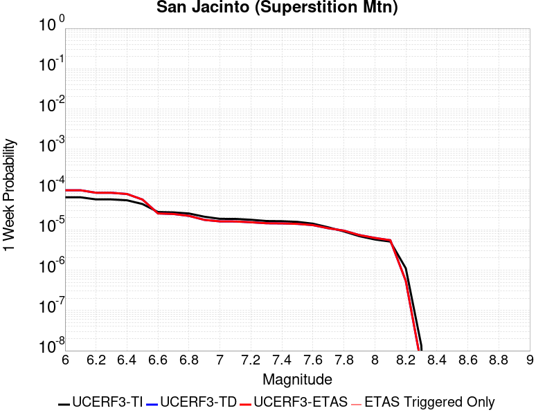 |  |  |  |

| Magnitude | 1 wk TI Prob | 1 wk TD Prob | 1 wk ETAS Prob | 1 wk ETAS/TD Gain | 1 wk ETAS Triggered Only | 1 mo TI Prob | 1 mo TD Prob | 1 mo ETAS Prob | 1 mo ETAS/TD Gain | 1 mo ETAS Triggered Only | 1 yr TI Prob | 1 yr TD Prob | 1 yr ETAS Prob | 1 yr ETAS/TD Gain | 1 yr ETAS Triggered Only | 10 yr TI Prob | 10 yr TD Prob | 10 yr ETAS Prob | 10 yr ETAS/TD Gain | 10 yr ETAS Triggered Only |
|-----|-----|-----|-----|-----|-----|-----|-----|-----|-----|-----|-----|-----|-----|-----|-----|-----|-----|-----|-----|-----|
| 6.0 | 6.4193904E-5 | 9.606838E-5 | 9.606838E-5 | 1.0 | 0.0 | 2.7508775E-4 | 4.1166646E-4 | 4.1166646E-4 | 1.0 | 0.0 | 0.0033440501 | 0.0050018053 | 0.0050018053 | 1.0 | 0.0 | 0.03294174 | 0.04885974 | 0.048888616 | 1.0005909 | 3.0356385E-5 |
| 6.1 | 6.4193904E-5 | 9.606838E-5 | 9.606838E-5 | 1.0 | 0.0 | 2.7508775E-4 | 4.1166646E-4 | 4.1166646E-4 | 1.0 | 0.0 | 0.0033440501 | 0.0050018053 | 0.0050018053 | 1.0 | 0.0 | 0.03294174 | 0.04885974 | 0.048888616 | 1.0005909 | 3.0356385E-5 |
| 6.2 | 5.7023593E-5 | 8.321217E-5 | 8.321217E-5 | 1.0 | 0.0 | 2.4436394E-4 | 3.565843E-4 | 3.565843E-4 | 1.0 | 0.0 | 0.002971072 | 0.004334395 | 0.004334395 | 1.0 | 0.0 | 0.029316625 | 0.042537875 | 0.04256694 | 1.0006833 | 3.0356385E-5 |
| 6.3 | 5.6940098E-5 | 8.305749E-5 | 8.305749E-5 | 1.0 | 0.0 | 2.4400617E-4 | 3.5592154E-4 | 3.5592154E-4 | 1.0 | 0.0 | 0.002966728 | 0.004326358 | 0.004326358 | 1.0 | 0.0 | 0.029274331 | 0.04246111 | 0.042490173 | 1.0006846 | 3.0356385E-5 |
| 6.4 | 5.4171585E-5 | 7.755024E-5 | 7.755024E-5 | 1.0 | 0.0 | 2.3214328E-4 | 3.3232514E-4 | 3.3232514E-4 | 1.0 | 0.0 | 0.0028226813 | 0.004040201 | 0.004040201 | 1.0 | 0.0 | 0.02787096 | 0.03975008 | 0.03977923 | 1.0007334 | 3.0356385E-5 |
| 6.5 | 4.375144E-5 | 5.6486107E-5 | 5.6486107E-5 | 1.0 | 0.0 | 1.874927E-4 | 2.4206749E-4 | 2.4206749E-4 | 1.0 | 0.0 | 0.0022803338 | 0.0029443644 | 0.0029443644 | 1.0 | 0.0 | 0.022570757 | 0.02926981 | 0.02926981 | 1.0 | 0.0 |
| 6.6 | 2.772192E-5 | 2.5550056E-5 | 2.5550056E-5 | 1.0 | 0.0 | 1.1880282E-4 | 1.09495755E-4 | 1.09495755E-4 | 1.0 | 0.0 | 0.0014454646 | 0.0013323149 | 0.0013323149 | 1.0 | 0.0 | 0.014360986 | 0.013572521 | 0.013572521 | 1.0 | 0.0 |
| 6.7 | 2.7124124E-5 | 2.4760804E-5 | 2.4760804E-5 | 1.0 | 0.0 | 1.1624106E-4 | 1.0611352E-4 | 1.0611352E-4 | 1.0 | 0.0 | 0.0014143161 | 0.0012911857 | 0.0012911857 | 1.0 | 0.0 | 0.014053487 | 0.013165847 | 0.013165847 | 1.0 | 0.0 |
| 6.8 | 2.5475807E-5 | 2.2224416E-5 | 2.2224416E-5 | 1.0 | 0.0 | 1.0917746E-4 | 9.524408E-5 | 9.524408E-5 | 1.0 | 0.0 | 0.001328425 | 0.0011589918 | 0.0011589918 | 1.0 | 0.0 | 0.0132051185 | 0.011853393 | 0.011853393 | 1.0 | 0.0 |
| 6.9 | 2.1162023E-5 | 1.7681692E-5 | 1.7681692E-5 | 1.0 | 0.0 | 9.069123E-5 | 7.57765E-5 | 7.57765E-5 | 1.0 | 0.0 | 0.0011036064 | 9.2219224E-4 | 9.2219224E-4 | 1.0 | 0.0 | 0.010981417 | 0.00947586 | 0.00947586 | 1.0 | 0.0 |
| 7.0 | 1.8754288E-5 | 1.6214553E-5 | 1.6214553E-5 | 1.0 | 0.0 | 8.037304E-5 | 6.9489106E-5 | 6.9489106E-5 | 1.0 | 0.0 | 9.781026E-4 | 8.4570394E-4 | 8.4570394E-4 | 1.0 | 0.0 | 0.009738087 | 0.008697749 | 0.008697749 | 1.0 | 0.0 |
| 7.1 | 1.8678527E-5 | 1.6139646E-5 | 1.6139646E-5 | 1.0 | 0.0 | 8.0048376E-5 | 6.916808E-5 | 6.916808E-5 | 1.0 | 0.0 | 9.7415317E-4 | 8.4179855E-4 | 8.4179855E-4 | 1.0 | 0.0 | 0.009698939 | 0.008658681 | 0.008658681 | 1.0 | 0.0 |
| 7.2 | 1.7804578E-5 | 1.543367E-5 | 1.543367E-5 | 1.0 | 0.0 | 7.6303106E-5 | 6.614264E-5 | 6.614264E-5 | 1.0 | 0.0 | 9.285943E-4 | 8.049914E-4 | 8.049914E-4 | 1.0 | 0.0 | 0.009247236 | 0.008289718 | 0.008289718 | 1.0 | 0.0 |
| 7.3 | 1.6583685E-5 | 1.4582174E-5 | 1.4582174E-5 | 1.0 | 0.0 | 7.1070994E-5 | 6.249354E-5 | 6.249354E-5 | 1.0 | 0.0 | 8.649459E-4 | 7.605953E-4 | 7.605953E-4 | 1.0 | 0.0 | 0.00861587 | 0.007844728 | 0.007844728 | 1.0 | 0.0 |
| 7.4 | 1.6387552E-5 | 1.444696E-5 | 1.444696E-5 | 1.0 | 0.0 | 7.023047E-5 | 6.1914085E-5 | 6.1914085E-5 | 1.0 | 0.0 | 8.5472054E-4 | 7.535453E-4 | 7.535453E-4 | 1.0 | 0.0 | 0.008514405 | 0.0077740606 | 0.0077740606 | 1.0 | 0.0 |
| 7.5 | 1.5790754E-5 | 1.4087126E-5 | 1.4087126E-5 | 1.0 | 0.0 | 6.767291E-5 | 6.037201E-5 | 6.037201E-5 | 1.0 | 0.0 | 8.236062E-4 | 7.3478336E-4 | 7.3478336E-4 | 1.0 | 0.0 | 0.008205604 | 0.0075843562 | 0.0075843562 | 1.0 | 0.0 |
| 7.6 | 1.4248672E-5 | 1.31047855E-5 | 1.31047855E-5 | 1.0 | 0.0 | 6.106431E-5 | 5.6162164E-5 | 5.6162164E-5 | 1.0 | 0.0 | 7.432043E-4 | 6.835616E-4 | 6.835616E-4 | 1.0 | 0.0 | 0.007407237 | 0.007066272 | 0.007066272 | 1.0 | 0.0 |
| 7.7 | 1.15449975E-5 | 1.0951373E-5 | 1.0951373E-5 | 1.0 | 0.0 | 4.947762E-5 | 4.6933616E-5 | 4.6933616E-5 | 1.0 | 0.0 | 6.022235E-4 | 5.7126774E-4 | 5.7126774E-4 | 1.0 | 0.0 | 0.006005941 | 0.005935198 | 0.005935198 | 1.0 | 0.0 |
| 7.8 | 9.1391985E-6 | 9.5601845E-6 | 9.5601845E-6 | 1.0 | 0.0 | 3.9167408E-5 | 4.097158E-5 | 4.097158E-5 | 1.0 | 0.0 | 4.767588E-4 | 4.987154E-4 | 4.987154E-4 | 1.0 | 0.0 | 0.0047573727 | 0.0052007753 | 0.0052007753 | 1.0 | 0.0 |
| 7.9 | 6.973017E-6 | 7.423164E-6 | 7.423164E-6 | 1.0 | 0.0 | 2.9884017E-5 | 3.1813175E-5 | 3.1813175E-5 | 1.0 | 0.0 | 3.6377716E-4 | 3.872571E-4 | 3.872571E-4 | 1.0 | 0.0 | 0.0036318225 | 0.004073359 | 0.004073359 | 1.0 | 0.0 |
| 8.0 | 5.7638235E-6 | 6.2974086E-6 | 6.2974086E-6 | 1.0 | 0.0 | 2.4701867E-5 | 2.6988619E-5 | 2.6988619E-5 | 1.0 | 0.0 | 3.0070372E-4 | 3.285374E-4 | 3.285374E-4 | 1.0 | 0.0 | 0.0030029714 | 0.0034731713 | 0.0034731713 | 1.0 | 0.0 |
| 8.1 | 5.1124434E-6 | 5.5298738E-6 | 5.5298738E-6 | 1.0 | 0.0 | 2.1910288E-5 | 2.3699247E-5 | 2.3699247E-5 | 1.0 | 0.0 | 2.6672508E-4 | 2.8850063E-4 | 2.8850063E-4 | 1.0 | 0.0 | 0.0026640517 | 0.0030583788 | 0.0030583788 | 1.0 | 0.0 |
| 8.2 | 1.1075938E-6 | 5.384721E-7 | 5.384721E-7 | 1.0 | 0.0 | 4.7468216E-6 | 2.3077355E-6 | 2.3077355E-6 | 1.0 | 0.0 | 5.779102E-5 | 2.809634E-5 | 2.809634E-5 | 1.0 | 0.0 | 5.777599E-4 | 3.1614656E-4 | 3.1614656E-4 | 1.0 | 0.0 |
| 8.3 | 1.3584393E-8 | 4.5198636E-9 | 4.5198636E-9 | 1.0 | 0.0 | 5.8218827E-8 | 1.9370844E-8 | 1.9370844E-8 | 1.0 | 0.0 | 7.0881396E-7 | 2.3584003E-7 | 2.3584003E-7 | 1.0 | 0.0 | 7.0881174E-6 | 2.6421167E-6 | 2.6421167E-6 | 1.0 | 0.0 |

## Malibu Coast alt 1
*[(top)](#table-of-contents)*

| 1 Week | 1 Month | 1 Year | 10 Year |
|-----|-----|-----|-----|
|  |  | 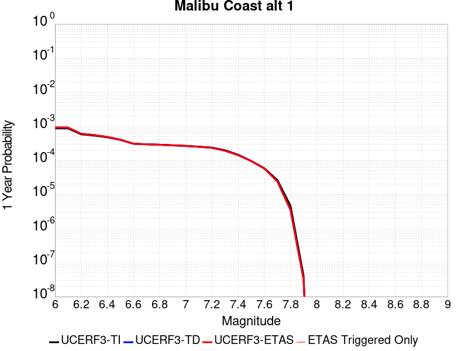 | 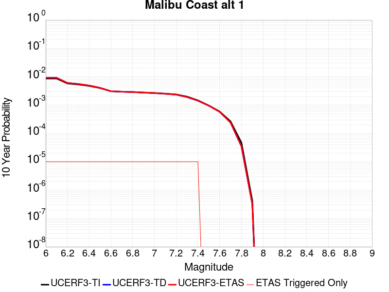 |

| Magnitude | 1 wk TI Prob | 1 wk TD Prob | 1 wk ETAS Prob | 1 wk ETAS/TD Gain | 1 wk ETAS Triggered Only | 1 mo TI Prob | 1 mo TD Prob | 1 mo ETAS Prob | 1 mo ETAS/TD Gain | 1 mo ETAS Triggered Only | 1 yr TI Prob | 1 yr TD Prob | 1 yr ETAS Prob | 1 yr ETAS/TD Gain | 1 yr ETAS Triggered Only | 10 yr TI Prob | 10 yr TD Prob | 10 yr ETAS Prob | 10 yr ETAS/TD Gain | 10 yr ETAS Triggered Only |
|-----|-----|-----|-----|-----|-----|-----|-----|-----|-----|-----|-----|-----|-----|-----|-----|-----|-----|-----|-----|-----|
| 6.0 | 1.6572556E-5 | 1.760009E-5 | 1.760009E-5 | 1.0 | 0.0 | 7.102331E-5 | 7.5426884E-5 | 7.5426884E-5 | 1.0 | 0.0 | 8.6436566E-4 | 9.179543E-4 | 9.179543E-4 | 1.0 | 0.0 | 0.0086101135 | 0.009143559 | 0.009173638 | 1.0032896 | 3.0356385E-5 |
| 6.1 | 1.6572556E-5 | 1.760009E-5 | 1.760009E-5 | 1.0 | 0.0 | 7.102331E-5 | 7.5426884E-5 | 7.5426884E-5 | 1.0 | 0.0 | 8.6436566E-4 | 9.179543E-4 | 9.179543E-4 | 1.0 | 0.0 | 0.0086101135 | 0.009143559 | 0.009173638 | 1.0032896 | 3.0356385E-5 |
| 6.2 | 1.1085717E-5 | 1.1558359E-5 | 1.1558359E-5 | 1.0 | 0.0 | 4.750935E-5 | 4.9534905E-5 | 4.9534905E-5 | 1.0 | 0.0 | 5.782728E-4 | 6.029241E-4 | 6.029241E-4 | 1.0 | 0.0 | 0.0057677035 | 0.0060132546 | 0.006043428 | 1.0050179 | 3.0356385E-5 |
| 6.3 | 1.0208568E-5 | 1.059332E-5 | 1.059332E-5 | 1.0 | 0.0 | 4.375027E-5 | 4.5399174E-5 | 4.5399174E-5 | 1.0 | 0.0 | 5.325294E-4 | 5.525977E-4 | 5.525977E-4 | 1.0 | 0.0 | 0.0053125503 | 0.005512544 | 0.005542733 | 1.0054765 | 3.0356385E-5 |
| 6.4 | 9.0682315E-6 | 9.343562E-6 | 9.343562E-6 | 1.0 | 0.0 | 3.8863272E-5 | 4.0043233E-5 | 4.0043233E-5 | 1.0 | 0.0 | 4.730576E-4 | 4.8741934E-4 | 4.8741934E-4 | 1.0 | 0.0 | 0.0047205184 | 0.004863716 | 0.004893925 | 1.006211 | 3.0356385E-5 |
| 6.5 | 7.605796E-6 | 7.7493205E-6 | 7.7493205E-6 | 1.0 | 0.0 | 3.259586E-5 | 3.321096E-5 | 3.321096E-5 | 1.0 | 0.0 | 3.9678233E-4 | 4.0426973E-4 | 4.0426973E-4 | 1.0 | 0.0 | 0.0039607463 | 0.004035481 | 0.004065715 | 1.0074921 | 3.0356385E-5 |
| 6.6 | 5.889873E-6 | 5.88005E-6 | 5.88005E-6 | 1.0 | 0.0 | 2.5242069E-5 | 2.5199974E-5 | 2.5199974E-5 | 1.0 | 0.0 | 3.0727885E-4 | 3.0676657E-4 | 3.0676657E-4 | 1.0 | 0.0 | 0.003068543 | 0.003063444 | 0.0030937074 | 1.0098789 | 3.0356385E-5 |
| 6.7 | 5.66586E-6 | 5.6421336E-6 | 5.6421336E-6 | 1.0 | 0.0 | 2.428203E-5 | 2.4180348E-5 | 2.4180348E-5 | 1.0 | 0.0 | 2.955936E-4 | 2.9435605E-4 | 2.9435605E-4 | 1.0 | 0.0 | 0.0029520073 | 0.0029396736 | 0.002969941 | 1.0102961 | 3.0356385E-5 |
| 6.8 | 5.521556E-6 | 5.489908E-6 | 5.489908E-6 | 1.0 | 0.0 | 2.3663597E-5 | 2.3527966E-5 | 2.3527966E-5 | 1.0 | 0.0 | 2.880662E-4 | 2.8641542E-4 | 2.8641542E-4 | 1.0 | 0.0 | 0.0028769306 | 0.0028604744 | 0.002890744 | 1.010582 | 3.0356385E-5 |
| 6.9 | 5.29752E-6 | 5.2503906E-6 | 5.2503906E-6 | 1.0 | 0.0 | 2.270346E-5 | 2.250148E-5 | 2.250148E-5 | 1.0 | 0.0 | 2.7637955E-4 | 2.7392115E-4 | 2.7392115E-4 | 1.0 | 0.0 | 0.0027603607 | 0.0027358455 | 0.0027661189 | 1.0110655 | 3.0356385E-5 |
| 7.0 | 5.106743E-6 | 5.0481212E-6 | 5.0481212E-6 | 1.0 | 0.0 | 2.1885859E-5 | 2.1634627E-5 | 2.1634627E-5 | 1.0 | 0.0 | 2.6642776E-4 | 2.6336982E-4 | 2.6336982E-4 | 1.0 | 0.0 | 0.0026610855 | 0.0026305865 | 0.002660863 | 1.0115094 | 3.0356385E-5 |
| 7.1 | 4.8469647E-6 | 4.770791E-6 | 4.770791E-6 | 1.0 | 0.0 | 2.0772539E-5 | 2.0446085E-5 | 2.0446085E-5 | 1.0 | 0.0 | 2.528763E-4 | 2.489027E-4 | 2.489027E-4 | 1.0 | 0.0 | 0.0025258875 | 0.0024862476 | 0.0025165284 | 1.0121794 | 3.0356385E-5 |
| 7.2 | 4.545514E-6 | 4.4485814E-6 | 4.4485814E-6 | 1.0 | 0.0 | 1.9480629E-5 | 1.906521E-5 | 1.906521E-5 | 1.0 | 0.0 | 2.3715083E-4 | 2.3209427E-4 | 2.3209427E-4 | 1.0 | 0.0 | 0.0023689792 | 0.0023185262 | 0.0023488123 | 1.0130626 | 3.0356385E-5 |
| 7.3 | 3.794097E-6 | 3.6522415E-6 | 3.6522415E-6 | 1.0 | 0.0 | 1.6260314E-5 | 1.565237E-5 | 1.565237E-5 | 1.0 | 0.0 | 1.9795135E-4 | 1.9055097E-4 | 1.9055097E-4 | 1.0 | 0.0 | 0.001977751 | 0.0019038806 | 0.0019341791 | 1.0159141 | 3.0356385E-5 |
| 7.4 | 2.808217E-6 | 2.7193082E-6 | 2.7193082E-6 | 1.0 | 0.0 | 1.203516E-5 | 1.1654126E-5 | 1.1654126E-5 | 1.0 | 0.0 | 1.4651821E-4 | 1.4187976E-4 | 1.4187976E-4 | 1.0 | 0.0 | 0.0014642165 | 0.0014178946 | 0.0014482079 | 1.0213791 | 3.0356385E-5 |
| 7.5 | 1.83809E-6 | 1.81923E-6 | 1.81923E-6 | 1.0 | 0.0 | 7.877505E-6 | 7.796677E-6 | 7.796677E-6 | 1.0 | 0.0 | 9.59044E-5 | 9.4920426E-5 | 9.4920426E-5 | 1.0 | 0.0 | 9.5863023E-4 | 9.488008E-4 | 9.488008E-4 | 1.0 | 0.0 |
| 7.6 | 1.1292672E-6 | 1.1002485E-6 | 1.1002485E-6 | 1.0 | 0.0 | 4.839708E-6 | 4.715342E-6 | 4.715342E-6 | 1.0 | 0.0 | 5.8921847E-5 | 5.7407793E-5 | 5.7407793E-5 | 1.0 | 0.0 | 5.890623E-4 | 5.7393126E-4 | 5.7393126E-4 | 1.0 | 0.0 |
| 7.7 | 5.065272E-7 | 4.6096739E-7 | 4.6096739E-7 | 1.0 | 0.0 | 2.170829E-6 | 1.975573E-6 | 1.975573E-6 | 1.0 | 0.0 | 2.6429525E-5 | 2.4052348E-5 | 2.4052348E-5 | 1.0 | 0.0 | 2.642638E-4 | 2.4049857E-4 | 2.4049857E-4 | 1.0 | 0.0 |
| 7.8 | 8.952991E-8 | 6.709905E-8 | 6.709905E-8 | 1.0 | 0.0 | 3.8369956E-7 | 2.8756733E-7 | 2.8756733E-7 | 1.0 | 0.0 | 4.671532E-6 | 3.5011267E-6 | 3.5011267E-6 | 1.0 | 0.0 | 4.671434E-5 | 3.5010737E-5 | 3.5010737E-5 | 1.0 | 0.0 |
| 7.9 | 8.007447E-10 | 6.1612504E-10 | 6.1612504E-10 | 1.0 | 0.0 | 3.4317629E-9 | 2.6405358E-9 | 2.6405358E-9 | 1.0 | 0.0 | 4.1781714E-8 | 3.2148524E-8 | 3.2148524E-8 | 1.0 | 0.0 | 4.1781706E-7 | 3.214852E-7 | 3.214852E-7 | 1.0 | 0.0 |

## Elysian Park (Upper)
*[(top)](#table-of-contents)*

| 1 Week | 1 Month | 1 Year | 10 Year |
|-----|-----|-----|-----|
|  |  | 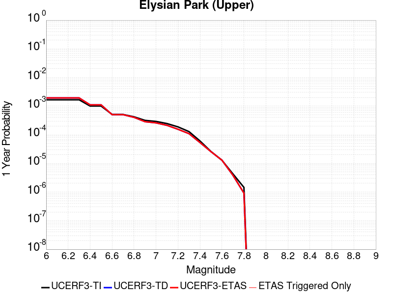 | 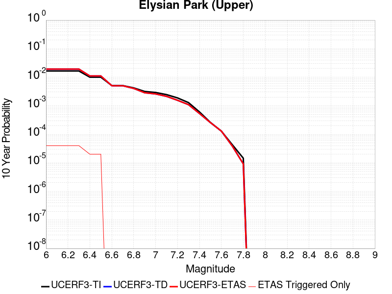 |

| Magnitude | 1 wk TI Prob | 1 wk TD Prob | 1 wk ETAS Prob | 1 wk ETAS/TD Gain | 1 wk ETAS Triggered Only | 1 mo TI Prob | 1 mo TD Prob | 1 mo ETAS Prob | 1 mo ETAS/TD Gain | 1 mo ETAS Triggered Only | 1 yr TI Prob | 1 yr TD Prob | 1 yr ETAS Prob | 1 yr ETAS/TD Gain | 1 yr ETAS Triggered Only | 10 yr TI Prob | 10 yr TD Prob | 10 yr ETAS Prob | 10 yr ETAS/TD Gain | 10 yr ETAS Triggered Only |
|-----|-----|-----|-----|-----|-----|-----|-----|-----|-----|-----|-----|-----|-----|-----|-----|-----|-----|-----|-----|-----|
| 6.0 | 3.1876025E-5 | 3.704556E-5 | 3.704556E-5 | 1.0 | 0.0 | 1.3660437E-4 | 1.5875977E-4 | 1.5875977E-4 | 1.0 | 0.0 | 0.0016618895 | 0.0019316166 | 0.0019316166 | 1.0 | 0.0 | 0.016495159 | 0.019194895 | 0.01922467 | 1.0015512 | 3.0356385E-5 |
| 6.1 | 3.1876025E-5 | 3.704556E-5 | 3.704556E-5 | 1.0 | 0.0 | 1.3660437E-4 | 1.5875977E-4 | 1.5875977E-4 | 1.0 | 0.0 | 0.0016618895 | 0.0019316166 | 0.0019316166 | 1.0 | 0.0 | 0.016495159 | 0.019194895 | 0.01922467 | 1.0015512 | 3.0356385E-5 |
| 6.2 | 3.1876025E-5 | 3.704556E-5 | 3.704556E-5 | 1.0 | 0.0 | 1.3660437E-4 | 1.5875977E-4 | 1.5875977E-4 | 1.0 | 0.0 | 0.0016618895 | 0.0019316166 | 0.0019316166 | 1.0 | 0.0 | 0.016495159 | 0.019194895 | 0.01922467 | 1.0015512 | 3.0356385E-5 |
| 6.3 | 3.1876025E-5 | 3.704556E-5 | 3.704556E-5 | 1.0 | 0.0 | 1.3660437E-4 | 1.5875977E-4 | 1.5875977E-4 | 1.0 | 0.0 | 0.0016618895 | 0.0019316166 | 0.0019316166 | 1.0 | 0.0 | 0.016495159 | 0.019194895 | 0.01922467 | 1.0015512 | 3.0356385E-5 |
| 6.4 | 1.9273462E-5 | 2.1206919E-5 | 2.1206919E-5 | 1.0 | 0.0 | 8.259794E-5 | 9.088461E-5 | 9.088461E-5 | 1.0 | 0.0 | 0.001005166 | 0.0011061319 | 0.0011061319 | 1.0 | 0.0 | 0.010006315 | 0.011023126 | 0.011053148 | 1.0027236 | 3.0356385E-5 |
| 6.5 | 1.9273462E-5 | 2.1206919E-5 | 2.1206919E-5 | 1.0 | 0.0 | 8.259794E-5 | 9.088461E-5 | 9.088461E-5 | 1.0 | 0.0 | 0.001005166 | 0.0011061319 | 0.0011061319 | 1.0 | 0.0 | 0.010006315 | 0.011023126 | 0.011053148 | 1.0027236 | 3.0356385E-5 |
| 6.6 | 9.813258E-6 | 9.666892E-6 | 9.666892E-6 | 1.0 | 0.0 | 4.205614E-5 | 4.1428917E-5 | 4.1428917E-5 | 1.0 | 0.0 | 5.119132E-4 | 5.042876E-4 | 5.042876E-4 | 1.0 | 0.0 | 0.005107356 | 0.0050321566 | 0.0050321566 | 1.0 | 0.0 |
| 6.7 | 9.801478E-6 | 9.65446E-6 | 9.65446E-6 | 1.0 | 0.0 | 4.2005657E-5 | 4.1375642E-5 | 4.1375642E-5 | 1.0 | 0.0 | 5.112989E-4 | 5.036392E-4 | 5.036392E-4 | 1.0 | 0.0 | 0.0051012407 | 0.0050257025 | 0.0050257025 | 1.0 | 0.0 |
| 6.8 | 8.102489E-6 | 7.774029E-6 | 7.774029E-6 | 1.0 | 0.0 | 3.4724493E-5 | 3.331687E-5 | 3.331687E-5 | 1.0 | 0.0 | 4.2268867E-4 | 4.0556237E-4 | 4.0556237E-4 | 1.0 | 0.0 | 0.004218856 | 0.0040487163 | 0.0040487163 | 1.0 | 0.0 |
| 6.9 | 6.08275E-6 | 5.482067E-6 | 5.482067E-6 | 1.0 | 0.0 | 2.6068668E-5 | 2.3494365E-5 | 2.3494365E-5 | 1.0 | 0.0 | 3.173398E-4 | 2.8600713E-4 | 2.8600713E-4 | 1.0 | 0.0 | 0.0031688702 | 0.002856468 | 0.002856468 | 1.0 | 0.0 |
| 7.0 | 5.5995934E-6 | 4.9833366E-6 | 4.9833366E-6 | 1.0 | 0.0 | 2.3998036E-5 | 2.1356986E-5 | 2.1356986E-5 | 1.0 | 0.0 | 2.9213692E-4 | 2.5999092E-4 | 2.5999092E-4 | 1.0 | 0.0 | 0.0029175316 | 0.002596935 | 0.002596935 | 1.0 | 0.0 |
| 7.1 | 4.709881E-6 | 4.087854E-6 | 4.087854E-6 | 1.0 | 0.0 | 2.0185047E-5 | 1.751926E-5 | 1.751926E-5 | 1.0 | 0.0 | 2.4572524E-4 | 2.1327652E-4 | 2.1327652E-4 | 1.0 | 0.0 | 0.002454537 | 0.0021307599 | 0.0021307599 | 1.0 | 0.0 |
| 7.2 | 3.6063436E-6 | 2.9782757E-6 | 2.9782757E-6 | 1.0 | 0.0 | 1.5455667E-5 | 1.2763977E-5 | 1.2763977E-5 | 1.0 | 0.0 | 1.881565E-4 | 1.5539044E-4 | 1.5539044E-4 | 1.0 | 0.0 | 0.0018799726 | 0.0015528292 | 0.0015528292 | 1.0 | 0.0 |
| 7.3 | 2.471135E-6 | 2.0956875E-6 | 2.0956875E-6 | 1.0 | 0.0 | 1.0590536E-5 | 8.981488E-6 | 8.981488E-6 | 1.0 | 0.0 | 1.2893214E-4 | 1.093442E-4 | 1.093442E-4 | 1.0 | 0.0 | 0.0012885736 | 0.0010929112 | 0.0010929112 | 1.0 | 0.0 |
| 7.4 | 1.163943E-6 | 1.0276299E-6 | 1.0276299E-6 | 1.0 | 0.0 | 4.988318E-6 | 4.404121E-6 | 4.404121E-6 | 1.0 | 0.0 | 6.0731076E-5 | 5.3618878E-5 | 5.3618878E-5 | 1.0 | 0.0 | 6.071448E-4 | 5.360624E-4 | 5.360624E-4 | 1.0 | 0.0 |
| 7.5 | 4.99459E-7 | 4.918171E-7 | 4.918171E-7 | 1.0 | 0.0 | 2.140537E-6 | 2.107786E-6 | 2.107786E-6 | 1.0 | 0.0 | 2.6060725E-5 | 2.5662008E-5 | 2.5662008E-5 | 1.0 | 0.0 | 2.605767E-4 | 2.56592E-4 | 2.56592E-4 | 1.0 | 0.0 |
| 7.6 | 2.4667852E-7 | 2.4781724E-7 | 2.4781724E-7 | 1.0 | 0.0 | 1.0571932E-6 | 1.0620735E-6 | 1.0620735E-6 | 1.0 | 0.0 | 1.2871251E-5 | 1.2930672E-5 | 1.2930672E-5 | 1.0 | 0.0 | 1.2870505E-4 | 1.2929956E-4 | 1.2929956E-4 | 1.0 | 0.0 |
| 7.7 | 8.2312795E-8 | 7.388283E-8 | 7.388283E-8 | 1.0 | 0.0 | 3.527691E-7 | 3.166407E-7 | 3.166407E-7 | 1.0 | 0.0 | 4.294955E-6 | 3.8550947E-6 | 3.8550947E-6 | 1.0 | 0.0 | 4.2948723E-5 | 3.855039E-5 | 3.855039E-5 | 1.0 | 0.0 |
| 7.8 | 2.7819295E-8 | 1.7579014E-8 | 1.7579014E-8 | 1.0 | 0.0 | 1.1922555E-7 | 7.5338626E-8 | 7.5338626E-8 | 1.0 | 0.0 | 1.45157E-6 | 9.172476E-7 | 9.172476E-7 | 1.0 | 0.0 | 1.45156055E-5 | 9.172452E-6 | 9.172452E-6 | 1.0 | 0.0 |

## Elmore Ranch
*[(top)](#table-of-contents)*

| 1 Week | 1 Month | 1 Year | 10 Year |
|-----|-----|-----|-----|
|  |  |  |  |

| Magnitude | 1 wk TI Prob | 1 wk TD Prob | 1 wk ETAS Prob | 1 wk ETAS/TD Gain | 1 wk ETAS Triggered Only | 1 mo TI Prob | 1 mo TD Prob | 1 mo ETAS Prob | 1 mo ETAS/TD Gain | 1 mo ETAS Triggered Only | 1 yr TI Prob | 1 yr TD Prob | 1 yr ETAS Prob | 1 yr ETAS/TD Gain | 1 yr ETAS Triggered Only | 10 yr TI Prob | 10 yr TD Prob | 10 yr ETAS Prob | 10 yr ETAS/TD Gain | 10 yr ETAS Triggered Only |
|-----|-----|-----|-----|-----|-----|-----|-----|-----|-----|-----|-----|-----|-----|-----|-----|-----|-----|-----|-----|-----|
| 6.0 | 9.102099E-5 | 8.9578614E-5 | 8.9578614E-5 | 1.0 | 0.0 | 3.9003167E-4 | 3.8386503E-4 | 3.8386503E-4 | 1.0 | 0.0 | 0.0047383 | 0.0046650036 | 0.0046650036 | 1.0 | 0.0 | 0.046385348 | 0.045895047 | 0.045924008 | 1.0006311 | 3.0356385E-5 |
| 6.1 | 3.8306698E-5 | 4.1522737E-5 | 4.1522737E-5 | 1.0 | 0.0 | 1.6416123E-4 | 1.7794652E-4 | 1.7794652E-4 | 1.0 | 0.0 | 0.0019968306 | 0.0021641937 | 0.0021641937 | 1.0 | 0.0 | 0.019789828 | 0.021639477 | 0.021669177 | 1.0013725 | 3.0356385E-5 |
| 6.2 | 3.8306698E-5 | 4.1522737E-5 | 4.1522737E-5 | 1.0 | 0.0 | 1.6416123E-4 | 1.7794652E-4 | 1.7794652E-4 | 1.0 | 0.0 | 0.0019968306 | 0.0021641937 | 0.0021641937 | 1.0 | 0.0 | 0.019789828 | 0.021639477 | 0.021669177 | 1.0013725 | 3.0356385E-5 |
| 6.3 | 3.3197924E-5 | 3.65734E-5 | 3.65734E-5 | 1.0 | 0.0 | 1.4226905E-4 | 1.5673772E-4 | 1.5673772E-4 | 1.0 | 0.0 | 0.0017307495 | 0.0019067894 | 0.0019067894 | 1.0 | 0.0 | 0.017173318 | 0.019099101 | 0.01912888 | 1.001559 | 3.0356385E-5 |
| 6.4 | 2.5148964E-5 | 2.743219E-5 | 2.743219E-5 | 1.0 | 0.0 | 1.0777682E-4 | 1.1756489E-4 | 1.1756489E-4 | 1.0 | 0.0 | 0.0013113929 | 0.0014310612 | 0.0014310612 | 1.0 | 0.0 | 0.01303681 | 0.014393246 | 0.014423165 | 1.0020788 | 3.0356385E-5 |
| 6.5 | 2.5148964E-5 | 2.743219E-5 | 2.743219E-5 | 1.0 | 0.0 | 1.0777682E-4 | 1.1756489E-4 | 1.1756489E-4 | 1.0 | 0.0 | 0.0013113929 | 0.0014310612 | 0.0014310612 | 1.0 | 0.0 | 0.01303681 | 0.014393246 | 0.014423165 | 1.0020788 | 3.0356385E-5 |

## Mission Creek
*[(top)](#table-of-contents)*

| 1 Week | 1 Month | 1 Year | 10 Year |
|-----|-----|-----|-----|
|  |  |  | 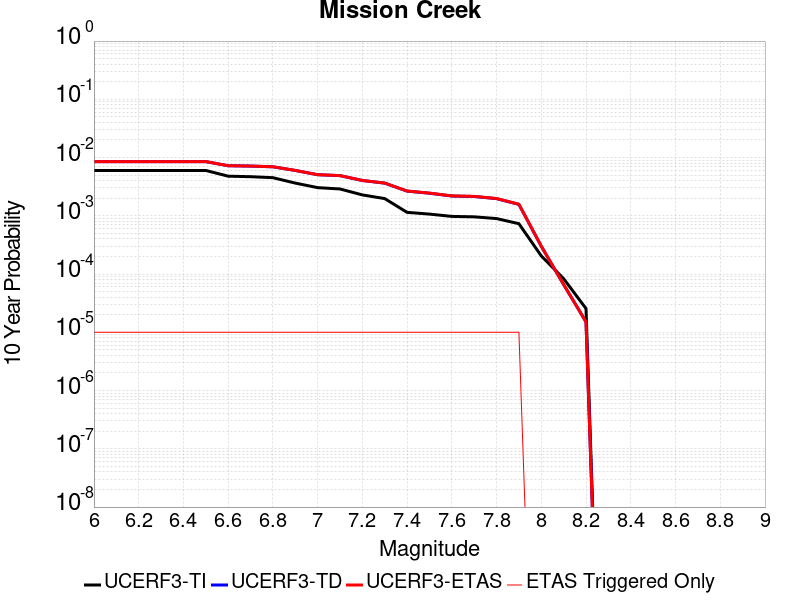 |

| Magnitude | 1 wk TI Prob | 1 wk TD Prob | 1 wk ETAS Prob | 1 wk ETAS/TD Gain | 1 wk ETAS Triggered Only | 1 mo TI Prob | 1 mo TD Prob | 1 mo ETAS Prob | 1 mo ETAS/TD Gain | 1 mo ETAS Triggered Only | 1 yr TI Prob | 1 yr TD Prob | 1 yr ETAS Prob | 1 yr ETAS/TD Gain | 1 yr ETAS Triggered Only | 10 yr TI Prob | 10 yr TD Prob | 10 yr ETAS Prob | 10 yr ETAS/TD Gain | 10 yr ETAS Triggered Only |
|-----|-----|-----|-----|-----|-----|-----|-----|-----|-----|-----|-----|-----|-----|-----|-----|-----|-----|-----|-----|-----|
| 6.0 | 1.1549387E-5 | 1.6345795E-5 | 1.6345795E-5 | 1.0 | 0.0 | 4.9496433E-5 | 7.005161E-5 | 7.005161E-5 | 1.0 | 0.0 | 6.0245243E-4 | 8.525597E-4 | 8.525597E-4 | 1.0 | 0.0 | 0.006008218 | 0.008521856 | 0.008551954 | 1.0035318 | 3.0356385E-5 |
| 6.1 | 1.1549387E-5 | 1.6345795E-5 | 1.6345795E-5 | 1.0 | 0.0 | 4.9496433E-5 | 7.005161E-5 | 7.005161E-5 | 1.0 | 0.0 | 6.0245243E-4 | 8.525597E-4 | 8.525597E-4 | 1.0 | 0.0 | 0.006008218 | 0.008521856 | 0.008551954 | 1.0035318 | 3.0356385E-5 |
| 6.2 | 1.1549387E-5 | 1.6345795E-5 | 1.6345795E-5 | 1.0 | 0.0 | 4.9496433E-5 | 7.005161E-5 | 7.005161E-5 | 1.0 | 0.0 | 6.0245243E-4 | 8.525597E-4 | 8.525597E-4 | 1.0 | 0.0 | 0.006008218 | 0.008521856 | 0.008551954 | 1.0035318 | 3.0356385E-5 |
| 6.3 | 1.1549387E-5 | 1.6345795E-5 | 1.6345795E-5 | 1.0 | 0.0 | 4.9496433E-5 | 7.005161E-5 | 7.005161E-5 | 1.0 | 0.0 | 6.0245243E-4 | 8.525597E-4 | 8.525597E-4 | 1.0 | 0.0 | 0.006008218 | 0.008521856 | 0.008551954 | 1.0035318 | 3.0356385E-5 |
| 6.4 | 1.1549387E-5 | 1.6345795E-5 | 1.6345795E-5 | 1.0 | 0.0 | 4.9496433E-5 | 7.005161E-5 | 7.005161E-5 | 1.0 | 0.0 | 6.0245243E-4 | 8.525597E-4 | 8.525597E-4 | 1.0 | 0.0 | 0.006008218 | 0.008521856 | 0.008551954 | 1.0035318 | 3.0356385E-5 |
| 6.5 | 1.1549387E-5 | 1.6345795E-5 | 1.6345795E-5 | 1.0 | 0.0 | 4.9496433E-5 | 7.005161E-5 | 7.005161E-5 | 1.0 | 0.0 | 6.0245243E-4 | 8.525597E-4 | 8.525597E-4 | 1.0 | 0.0 | 0.006008218 | 0.008521856 | 0.008551954 | 1.0035318 | 3.0356385E-5 |
| 6.6 | 9.202681E-6 | 1.386889E-5 | 1.386889E-5 | 1.0 | 0.0 | 3.9439463E-5 | 5.9436796E-5 | 5.9436796E-5 | 1.0 | 0.0 | 4.800697E-4 | 7.234118E-4 | 7.234118E-4 | 1.0 | 0.0 | 0.004790339 | 0.007238961 | 0.0072690975 | 1.0041631 | 3.0356385E-5 |
| 6.7 | 9.019164E-6 | 1.3674544E-5 | 1.3674544E-5 | 1.0 | 0.0 | 3.8652986E-5 | 5.8603924E-5 | 5.8603924E-5 | 1.0 | 0.0 | 4.7049852E-4 | 7.132782E-4 | 7.132782E-4 | 1.0 | 0.0 | 0.004695036 | 0.0071382783 | 0.0071684183 | 1.0042223 | 3.0356385E-5 |
| 6.8 | 8.673558E-6 | 1.3296605E-5 | 1.3296605E-5 | 1.0 | 0.0 | 3.717186E-5 | 5.698426E-5 | 5.698426E-5 | 1.0 | 0.0 | 4.524734E-4 | 6.9357135E-4 | 6.9357135E-4 | 1.0 | 0.0 | 0.0045155324 | 0.006942443 | 0.006972589 | 1.0043422 | 3.0356385E-5 |
| 6.9 | 7.002255E-6 | 1.1500656E-5 | 1.1500656E-5 | 1.0 | 0.0 | 3.000932E-5 | 4.928763E-5 | 4.928763E-5 | 1.0 | 0.0 | 3.653022E-4 | 5.9991854E-4 | 5.9991854E-4 | 1.0 | 0.0 | 0.0036470229 | 0.0060111843 | 0.006041358 | 1.0050197 | 3.0356385E-5 |
| 7.0 | 5.84644E-6 | 9.696806E-6 | 9.696806E-6 | 1.0 | 0.0 | 2.5055931E-5 | 4.1557105E-5 | 4.1557105E-5 | 1.0 | 0.0 | 3.0501327E-4 | 5.058449E-4 | 5.058449E-4 | 1.0 | 0.0 | 0.0030459496 | 0.005074921 | 0.0051051234 | 1.0059513 | 3.0356385E-5 |
| 7.1 | 5.54703E-6 | 9.3512035E-6 | 9.3512035E-6 | 1.0 | 0.0 | 2.377277E-5 | 4.0075996E-5 | 4.0075996E-5 | 1.0 | 0.0 | 2.8939504E-4 | 4.8782045E-4 | 4.8782045E-4 | 1.0 | 0.0 | 0.0028901845 | 0.0048954757 | 0.0049256836 | 1.0061705 | 3.0356385E-5 |
| 7.2 | 4.384709E-6 | 7.702349E-6 | 7.702349E-6 | 1.0 | 0.0 | 1.8791474E-5 | 3.300967E-5 | 3.300967E-5 | 1.0 | 0.0 | 2.2876218E-4 | 4.0182227E-4 | 4.0182227E-4 | 1.0 | 0.0 | 0.0022852682 | 0.0040389015 | 0.004069135 | 1.0074856 | 3.0356385E-5 |
| 7.3 | 3.7888456E-6 | 6.9358207E-6 | 6.9358207E-6 | 1.0 | 0.0 | 1.623781E-5 | 2.9724626E-5 | 2.9724626E-5 | 1.0 | 0.0 | 1.9767738E-4 | 3.618406E-4 | 3.618406E-4 | 1.0 | 0.0 | 0.0019750162 | 0.0036404422 | 0.003670688 | 1.0083083 | 3.0356385E-5 |
| 7.4 | 2.1982462E-6 | 5.043541E-6 | 5.043541E-6 | 1.0 | 0.0 | 9.421021E-6 | 2.1614998E-5 | 2.1614998E-5 | 1.0 | 0.0 | 1.1469489E-4 | 2.6313102E-4 | 2.6313102E-4 | 1.0 | 0.0 | 0.0011463572 | 0.0026559075 | 0.0026861834 | 1.0113994 | 3.0356385E-5 |
| 7.5 | 2.051923E-6 | 4.6342434E-6 | 4.6342434E-6 | 1.0 | 0.0 | 8.793926E-6 | 1.9860892E-5 | 1.9860892E-5 | 1.0 | 0.0 | 1.0706078E-4 | 2.4177968E-4 | 2.4177968E-4 | 1.0 | 0.0 | 0.0010700922 | 0.0024432896 | 0.0024735718 | 1.0123941 | 3.0356385E-5 |
| 7.6 | 1.8733427E-6 | 4.1419444E-6 | 4.1419444E-6 | 1.0 | 0.0 | 8.028587E-6 | 1.775107E-5 | 1.775107E-5 | 1.0 | 0.0 | 9.774366E-5 | 2.1609793E-4 | 2.1609793E-4 | 1.0 | 0.0 | 9.770069E-4 | 0.0021874912 | 0.002217781 | 1.0138469 | 3.0356385E-5 |
| 7.7 | 1.8411953E-6 | 4.0614955E-6 | 4.0614955E-6 | 1.0 | 0.0 | 7.890813E-6 | 1.7406293E-5 | 1.7406293E-5 | 1.0 | 0.0 | 9.606641E-5 | 2.1190109E-4 | 2.1190109E-4 | 1.0 | 0.0 | 9.6024893E-4 | 0.0021457132 | 0.0021760045 | 1.0141171 | 3.0356385E-5 |
| 7.8 | 1.7194251E-6 | 3.7276084E-6 | 3.7276084E-6 | 1.0 | 0.0 | 7.368944E-6 | 1.5975367E-5 | 1.5975367E-5 | 1.0 | 0.0 | 8.97132E-5 | 1.9448281E-4 | 1.9448281E-4 | 1.0 | 0.0 | 8.967699E-4 | 0.001971057 | 0.0020013535 | 1.0153707 | 3.0356385E-5 |
| 7.9 | 1.4035052E-6 | 2.9641483E-6 | 2.9641483E-6 | 1.0 | 0.0 | 6.0150082E-6 | 1.2703431E-5 | 1.2703431E-5 | 1.0 | 0.0 | 7.3230265E-5 | 1.5465336E-4 | 1.5465336E-4 | 1.0 | 0.0 | 7.3206134E-4 | 0.0015702422 | 0.001600551 | 1.0193019 | 3.0356385E-5 |
| 8.0 | 3.9318823E-7 | 5.562867E-7 | 5.562867E-7 | 1.0 | 0.0 | 1.6850913E-6 | 2.3840837E-6 | 2.3840837E-6 | 1.0 | 0.0 | 2.0515794E-5 | 2.9025838E-5 | 2.9025838E-5 | 1.0 | 0.0 | 2.0513899E-4 | 3.0078672E-4 | 3.0078672E-4 | 1.0 | 0.0 |
| 8.1 | 1.596793E-7 | 1.14993E-7 | 1.14993E-7 | 1.0 | 0.0 | 6.8433974E-7 | 4.9282704E-7 | 4.9282704E-7 | 1.0 | 0.0 | 8.331805E-6 | 6.000153E-6 | 6.000153E-6 | 1.0 | 0.0 | 8.331492E-5 | 6.6147746E-5 | 6.6147746E-5 | 1.0 | 0.0 |
| 8.2 | 4.9003038E-8 | 2.5747717E-8 | 2.5747717E-8 | 1.0 | 0.0 | 2.10013E-7 | 1.1034735E-7 | 1.1034735E-7 | 1.0 | 0.0 | 2.5569052E-6 | 1.3434782E-6 | 1.3434782E-6 | 1.0 | 0.0 | 2.556876E-5 | 1.512413E-5 | 1.512413E-5 | 1.0 | 0.0 |

## Santa Ynez (West)
*[(top)](#table-of-contents)*

| 1 Week | 1 Month | 1 Year | 10 Year |
|-----|-----|-----|-----|
|  | 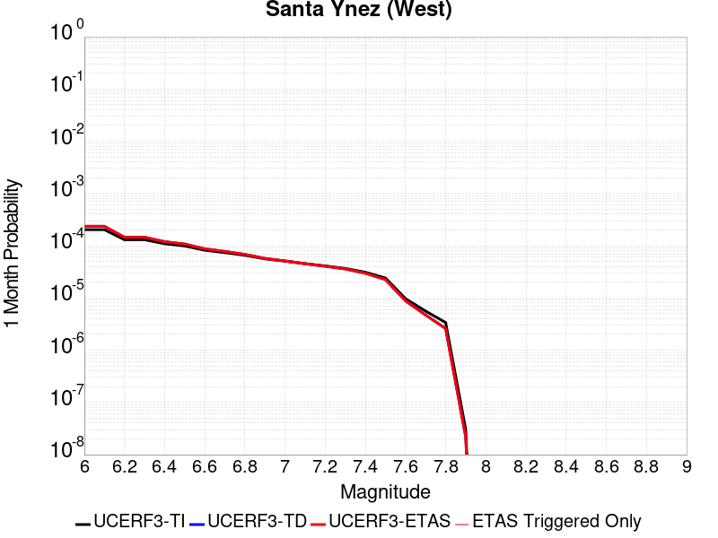 |  |  |

| Magnitude | 1 wk TI Prob | 1 wk TD Prob | 1 wk ETAS Prob | 1 wk ETAS/TD Gain | 1 wk ETAS Triggered Only | 1 mo TI Prob | 1 mo TD Prob | 1 mo ETAS Prob | 1 mo ETAS/TD Gain | 1 mo ETAS Triggered Only | 1 yr TI Prob | 1 yr TD Prob | 1 yr ETAS Prob | 1 yr ETAS/TD Gain | 1 yr ETAS Triggered Only | 10 yr TI Prob | 10 yr TD Prob | 10 yr ETAS Prob | 10 yr ETAS/TD Gain | 10 yr ETAS Triggered Only |
|-----|-----|-----|-----|-----|-----|-----|-----|-----|-----|-----|-----|-----|-----|-----|-----|-----|-----|-----|-----|-----|
| 6.0 | 4.7352758E-5 | 5.498621E-5 | 5.498621E-5 | 1.0 | 0.0 | 2.0292461E-4 | 2.356277E-4 | 2.356277E-4 | 1.0 | 0.0 | 0.0024678076 | 0.0028652318 | 0.0028955012 | 1.0105643 | 3.0356385E-5 | 0.024405818 | 0.028311422 | 0.028340919 | 1.0010419 | 3.0356385E-5 |
| 6.1 | 4.7352758E-5 | 5.498621E-5 | 5.498621E-5 | 1.0 | 0.0 | 2.0292461E-4 | 2.356277E-4 | 2.356277E-4 | 1.0 | 0.0 | 0.0024678076 | 0.0028652318 | 0.0028955012 | 1.0105643 | 3.0356385E-5 | 0.024405818 | 0.028311422 | 0.028340919 | 1.0010419 | 3.0356385E-5 |
| 6.2 | 3.0415853E-5 | 3.3932272E-5 | 3.3932272E-5 | 1.0 | 0.0 | 1.3034715E-4 | 1.4541604E-4 | 1.4541604E-4 | 1.0 | 0.0 | 0.0015858212 | 0.0017690392 | 0.0017993419 | 1.0171294 | 3.0356385E-5 | 0.015745522 | 0.017553467 | 0.01758329 | 1.001699 | 3.0356385E-5 |
| 6.3 | 3.0415853E-5 | 3.3932272E-5 | 3.3932272E-5 | 1.0 | 0.0 | 1.3034715E-4 | 1.4541604E-4 | 1.4541604E-4 | 1.0 | 0.0 | 0.0015858212 | 0.0017690392 | 0.0017993419 | 1.0171294 | 3.0356385E-5 | 0.015745522 | 0.017553467 | 0.01758329 | 1.001699 | 3.0356385E-5 |
| 6.4 | 2.5452082E-5 | 2.791787E-5 | 2.791787E-5 | 1.0 | 0.0 | 1.09075794E-4 | 1.1964254E-4 | 1.1964254E-4 | 1.0 | 0.0 | 0.0013271887 | 0.0014556927 | 0.0014860049 | 1.0208232 | 3.0356385E-5 | 0.013192902 | 0.014463755 | 0.014493672 | 1.0020684 | 3.0356385E-5 |
| 6.5 | 2.3143784E-5 | 2.5132935E-5 | 2.5132935E-5 | 1.0 | 0.0 | 9.9183875E-5 | 1.0770812E-4 | 1.0770812E-4 | 1.0 | 0.0 | 0.0012068948 | 0.0013105706 | 0.0013408873 | 1.0231323 | 3.0356385E-5 | 0.012003611 | 0.013030095 | 0.013060056 | 1.0022993 | 3.0356385E-5 |
| 6.6 | 1.9118515E-5 | 2.0357847E-5 | 2.0357847E-5 | 1.0 | 0.0 | 8.193392E-5 | 8.724504E-5 | 8.724504E-5 | 1.0 | 0.0 | 9.97089E-4 | 0.0010616988 | 0.001092023 | 1.028562 | 3.0356385E-5 | 0.00992627 | 0.010567175 | 0.010597211 | 1.0028423 | 3.0356385E-5 |
| 6.7 | 1.722807E-5 | 1.8149358E-5 | 1.8149358E-5 | 1.0 | 0.0 | 7.3832496E-5 | 7.778068E-5 | 7.778068E-5 | 1.0 | 0.0 | 8.985399E-4 | 9.465739E-4 | 9.769015E-4 | 1.0320394 | 3.0356385E-5 | 0.008949154 | 0.009426067 | 0.009456136 | 1.0031902 | 3.0356385E-5 |
| 6.8 | 1.5317364E-5 | 1.5929016E-5 | 1.5929016E-5 | 1.0 | 0.0 | 6.56442E-5 | 6.826545E-5 | 6.826545E-5 | 1.0 | 0.0 | 7.98925E-4 | 8.308192E-4 | 8.611503E-4 | 1.0365075 | 3.0356385E-5 | 0.007960589 | 0.008277619 | 0.008307724 | 1.003637 | 3.0356385E-5 |
| 6.9 | 1.3071226E-5 | 1.3331613E-5 | 1.3331613E-5 | 1.0 | 0.0 | 5.6018336E-5 | 5.7134246E-5 | 5.7134246E-5 | 1.0 | 0.0 | 6.8180985E-4 | 6.953897E-4 | 7.2572497E-4 | 1.0436234 | 3.0356385E-5 | 0.0067972173 | 0.006932398 | 0.006962544 | 1.0043485 | 3.0356385E-5 |
| 7.0 | 1.1836986E-5 | 1.1934524E-5 | 1.1934524E-5 | 1.0 | 0.0 | 5.0728955E-5 | 5.114697E-5 | 5.114697E-5 | 1.0 | 0.0 | 6.1745E-4 | 6.225381E-4 | 6.528756E-4 | 1.0487319 | 3.0356385E-5 | 0.006157372 | 0.006208135 | 0.0062383027 | 1.0048594 | 3.0356385E-5 |
| 7.1 | 1.0597169E-5 | 1.05437175E-5 | 1.05437175E-5 | 1.0 | 0.0 | 4.541565E-5 | 4.518658E-5 | 4.518658E-5 | 1.0 | 0.0 | 5.5279525E-4 | 5.500089E-4 | 5.803486E-4 | 1.0551622 | 3.0356385E-5 | 0.0055142213 | 0.0054866076 | 0.005516798 | 1.0055025 | 3.0356385E-5 |
| 7.2 | 9.59113E-6 | 9.460548E-6 | 9.460548E-6 | 1.0 | 0.0 | 4.11042E-5 | 4.0544586E-5 | 4.0544586E-5 | 1.0 | 0.0 | 5.0032866E-4 | 4.935196E-4 | 5.23861E-4 | 1.0614797 | 3.0356385E-5 | 0.004992037 | 0.0049243546 | 0.0049545616 | 1.0061342 | 3.0356385E-5 |
| 7.3 | 8.586084E-6 | 8.380881E-6 | 8.380881E-6 | 1.0 | 0.0 | 3.679698E-5 | 3.5917572E-5 | 3.5917572E-5 | 1.0 | 0.0 | 4.4791115E-4 | 4.3720973E-4 | 4.6755286E-4 | 1.0694017 | 3.0356385E-5 | 0.004470094 | 0.004363607 | 0.0043938314 | 1.0069264 | 3.0356385E-5 |
| 7.4 | 7.2622997E-6 | 6.952687E-6 | 6.952687E-6 | 1.0 | 0.0 | 3.112377E-5 | 2.9796895E-5 | 2.9796895E-5 | 1.0 | 0.0 | 3.78866E-4 | 3.6271778E-4 | 3.9306315E-4 | 1.0836611 | 3.0356385E-5 | 0.0037822074 | 0.0036213577 | 0.0036516043 | 1.0083523 | 3.0356385E-5 |
| 7.5 | 5.627296E-6 | 5.252259E-6 | 5.252259E-6 | 1.0 | 0.0 | 2.411676E-5 | 2.2509492E-5 | 2.2509492E-5 | 1.0 | 0.0 | 2.9358198E-4 | 2.7401932E-4 | 3.043674E-4 | 1.1107515 | 3.0356385E-5 | 0.0029319443 | 0.0027368865 | 0.0027671596 | 1.0110612 | 3.0356385E-5 |
| 7.6 | 2.265244E-6 | 2.0610528E-6 | 2.0610528E-6 | 1.0 | 0.0 | 9.708152E-6 | 8.833054E-6 | 8.833054E-6 | 1.0 | 0.0 | 1.18190335E-4 | 1.0753721E-4 | 1.3789034E-4 | 1.2822568 | 3.0356385E-5 | 0.001181275 | 0.0010748605 | 0.0011051842 | 1.0282118 | 3.0356385E-5 |
| 7.7 | 1.3099874E-6 | 1.1017219E-6 | 1.1017219E-6 | 1.0 | 0.0 | 5.61422E-6 | 4.7216568E-6 | 4.7216568E-6 | 1.0 | 0.0 | 6.8350986E-5 | 5.7484678E-5 | 5.7484678E-5 | 1.0 | 0.0 | 6.832996E-4 | 5.747005E-4 | 5.747005E-4 | 1.0 | 0.0 |
| 7.8 | 7.903951E-7 | 6.0716326E-7 | 6.0716326E-7 | 1.0 | 0.0 | 3.3874032E-6 | 2.6021257E-6 | 2.6021257E-6 | 1.0 | 0.0 | 4.1240855E-5 | 3.1680436E-5 | 3.1680436E-5 | 1.0 | 0.0 | 4.12332E-4 | 3.167605E-4 | 3.167605E-4 | 1.0 | 0.0 |
| 7.9 | 7.0753297E-9 | 5.090257E-9 | 5.090257E-9 | 1.0 | 0.0 | 3.032284E-8 | 2.1815387E-8 | 2.1815387E-8 | 1.0 | 0.0 | 3.6918053E-7 | 2.6560232E-7 | 2.6560232E-7 | 1.0 | 0.0 | 3.691799E-6 | 2.656021E-6 | 2.656021E-6 | 1.0 | 0.0 |

## San Jacinto (Clark) rev
*[(top)](#table-of-contents)*

| 1 Week | 1 Month | 1 Year | 10 Year |
|-----|-----|-----|-----|
|  |  | 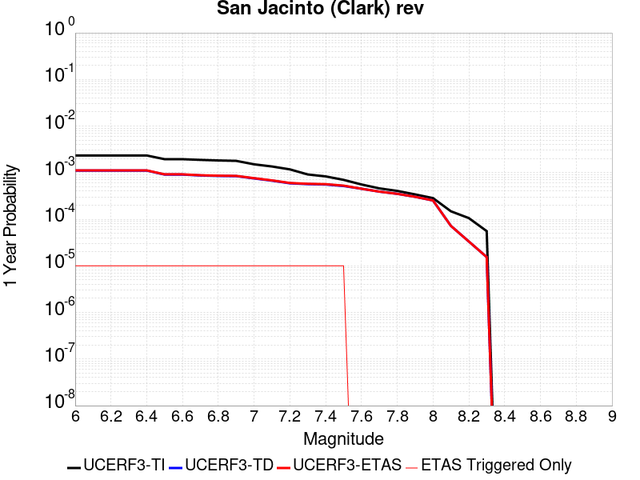 |  |

| Magnitude | 1 wk TI Prob | 1 wk TD Prob | 1 wk ETAS Prob | 1 wk ETAS/TD Gain | 1 wk ETAS Triggered Only | 1 mo TI Prob | 1 mo TD Prob | 1 mo ETAS Prob | 1 mo ETAS/TD Gain | 1 mo ETAS Triggered Only | 1 yr TI Prob | 1 yr TD Prob | 1 yr ETAS Prob | 1 yr ETAS/TD Gain | 1 yr ETAS Triggered Only | 10 yr TI Prob | 10 yr TD Prob | 10 yr ETAS Prob | 10 yr ETAS/TD Gain | 10 yr ETAS Triggered Only |
|-----|-----|-----|-----|-----|-----|-----|-----|-----|-----|-----|-----|-----|-----|-----|-----|-----|-----|-----|-----|-----|
| 6.0 | 4.482615E-5 | 2.1246653E-5 | 2.1246653E-5 | 1.0 | 0.0 | 1.9209793E-4 | 9.105396E-5 | 9.105396E-5 | 1.0 | 0.0 | 0.0023362834 | 0.0011080275 | 0.0011383502 | 1.0273664 | 3.0356385E-5 | 0.02311874 | 0.011552496 | 0.011582501 | 1.0025973 | 3.0356385E-5 |
| 6.1 | 4.482615E-5 | 2.1246653E-5 | 2.1246653E-5 | 1.0 | 0.0 | 1.9209793E-4 | 9.105396E-5 | 9.105396E-5 | 1.0 | 0.0 | 0.0023362834 | 0.0011080275 | 0.0011383502 | 1.0273664 | 3.0356385E-5 | 0.02311874 | 0.011552496 | 0.011582501 | 1.0025973 | 3.0356385E-5 |
| 6.2 | 4.482615E-5 | 2.1246653E-5 | 2.1246653E-5 | 1.0 | 0.0 | 1.9209793E-4 | 9.105396E-5 | 9.105396E-5 | 1.0 | 0.0 | 0.0023362834 | 0.0011080275 | 0.0011383502 | 1.0273664 | 3.0356385E-5 | 0.02311874 | 0.011552496 | 0.011582501 | 1.0025973 | 3.0356385E-5 |
| 6.3 | 4.482615E-5 | 2.1246653E-5 | 2.1246653E-5 | 1.0 | 0.0 | 1.9209793E-4 | 9.105396E-5 | 9.105396E-5 | 1.0 | 0.0 | 0.0023362834 | 0.0011080275 | 0.0011383502 | 1.0273664 | 3.0356385E-5 | 0.02311874 | 0.011552496 | 0.011582501 | 1.0025973 | 3.0356385E-5 |
| 6.4 | 4.482615E-5 | 2.1246653E-5 | 2.1246653E-5 | 1.0 | 0.0 | 1.9209793E-4 | 9.105396E-5 | 9.105396E-5 | 1.0 | 0.0 | 0.0023362834 | 0.0011080275 | 0.0011383502 | 1.0273664 | 3.0356385E-5 | 0.02311874 | 0.011552496 | 0.011582501 | 1.0025973 | 3.0356385E-5 |
| 6.5 | 3.7294863E-5 | 1.7439266E-5 | 1.7439266E-5 | 1.0 | 0.0 | 1.5982533E-4 | 7.4737596E-5 | 7.4737596E-5 | 1.0 | 0.0 | 0.0019441366 | 9.095549E-4 | 9.398837E-4 | 1.0333446 | 3.0356385E-5 | 0.01927216 | 0.009538002 | 0.009568069 | 1.0031524 | 3.0356385E-5 |
| 6.6 | 3.7294863E-5 | 1.7439266E-5 | 1.7439266E-5 | 1.0 | 0.0 | 1.5982533E-4 | 7.4737596E-5 | 7.4737596E-5 | 1.0 | 0.0 | 0.0019441366 | 9.095549E-4 | 9.398837E-4 | 1.0333446 | 3.0356385E-5 | 0.01927216 | 0.009538002 | 0.009568069 | 1.0031524 | 3.0356385E-5 |
| 6.7 | 3.6039248E-5 | 1.6685774E-5 | 1.6685774E-5 | 1.0 | 0.0 | 1.5444479E-4 | 7.150852E-5 | 7.150852E-5 | 1.0 | 0.0 | 0.0018787434 | 8.702727E-4 | 9.0060267E-4 | 1.0348511 | 3.0356385E-5 | 0.01862939 | 0.009139063 | 0.009169142 | 1.0032912 | 3.0356385E-5 |
| 6.8 | 3.5031844E-5 | 1.631307E-5 | 1.631307E-5 | 1.0 | 0.0 | 1.5012783E-4 | 6.991131E-5 | 6.991131E-5 | 1.0 | 0.0 | 0.0018262739 | 8.508419E-4 | 8.811725E-4 | 1.0356477 | 3.0356385E-5 | 0.01811338 | 0.008938338 | 0.008968422 | 1.0033659 | 3.0356385E-5 |
| 6.9 | 3.435112E-5 | 1.6142621E-5 | 1.6142621E-5 | 1.0 | 0.0 | 1.4721078E-4 | 6.918085E-5 | 6.918085E-5 | 1.0 | 0.0 | 0.0017908178 | 8.4195554E-4 | 8.722864E-4 | 1.0360242 | 3.0356385E-5 | 0.017764548 | 0.008846124 | 0.008876212 | 1.0034013 | 3.0356385E-5 |
| 7.0 | 2.8959772E-5 | 1.4409266E-5 | 1.4409266E-5 | 1.0 | 0.0 | 1.241074E-4 | 6.175255E-5 | 6.175255E-5 | 1.0 | 0.0 | 0.0015099603 | 7.515808E-4 | 7.819144E-4 | 1.0403597 | 3.0356385E-5 | 0.014997416 | 0.007906552 | 0.007936669 | 1.0038091 | 3.0356385E-5 |
| 7.1 | 2.6002877E-5 | 1.2895728E-5 | 1.2895728E-5 | 1.0 | 0.0 | 1.11436144E-4 | 5.5266246E-5 | 5.5266246E-5 | 1.0 | 0.0 | 0.0013558907 | 6.72661E-4 | 7.029969E-4 | 1.0450984 | 3.0356385E-5 | 0.013476475 | 0.007082177 | 0.0071123186 | 1.004256 | 3.0356385E-5 |
| 7.2 | 2.2544838E-5 | 1.1323137E-5 | 1.1323137E-5 | 1.0 | 0.0 | 9.661716E-5 | 4.8526836E-5 | 4.8526836E-5 | 1.0 | 0.0 | 0.001175679 | 5.906555E-4 | 6.2099396E-4 | 1.0513641 | 3.0356385E-5 | 0.011694785 | 0.006225147 | 0.006255314 | 1.0048461 | 3.0356385E-5 |
| 7.3 | 1.75334E-5 | 1.0868777E-5 | 1.0868777E-5 | 1.0 | 0.0 | 7.514098E-5 | 4.657965E-5 | 4.657965E-5 | 1.0 | 0.0 | 9.144575E-4 | 5.6696107E-4 | 5.9730024E-4 | 1.0535119 | 3.0356385E-5 | 0.009107036 | 0.0059641483 | 0.0059943236 | 1.0050595 | 3.0356385E-5 |
| 7.4 | 1.5924552E-5 | 1.0667449E-5 | 1.0667449E-5 | 1.0 | 0.0 | 6.82463E-5 | 4.5716843E-5 | 4.5716843E-5 | 1.0 | 0.0 | 8.305819E-4 | 5.564618E-4 | 5.8680127E-4 | 1.0545222 | 3.0356385E-5 | 0.008274844 | 0.005850773 | 0.005880952 | 1.0051581 | 3.0356385E-5 |
| 7.5 | 1.3428931E-5 | 9.904629E-6 | 9.904629E-6 | 1.0 | 0.0 | 5.7551293E-5 | 4.2447726E-5 | 4.2447726E-5 | 1.0 | 0.0 | 7.004617E-4 | 5.166796E-4 | 5.470203E-4 | 1.0587225 | 3.0356385E-5 | 0.006982579 | 0.005434641 | 0.0054648328 | 1.0055554 | 3.0356385E-5 |
| 7.6 | 1.0688787E-5 | 8.659321E-6 | 8.659321E-6 | 1.0 | 0.0 | 4.5808283E-5 | 3.711085E-5 | 3.711085E-5 | 1.0 | 0.0 | 5.5757316E-4 | 4.5173138E-4 | 4.5173138E-4 | 1.0 | 0.0 | 0.005561762 | 0.0047653103 | 0.0047653103 | 1.0 | 0.0 |
| 7.7 | 8.81236E-6 | 7.511008E-6 | 7.511008E-6 | 1.0 | 0.0 | 3.776671E-5 | 3.2189637E-5 | 3.2189637E-5 | 1.0 | 0.0 | 4.597127E-4 | 3.9183858E-4 | 3.9183858E-4 | 1.0 | 0.0 | 0.0045876284 | 0.004157538 | 0.004157538 | 1.0 | 0.0 |
| 7.8 | 7.780431E-6 | 6.737165E-6 | 6.737165E-6 | 1.0 | 0.0 | 3.3344273E-5 | 2.8873246E-5 | 2.8873246E-5 | 1.0 | 0.0 | 4.0589093E-4 | 3.5147526E-4 | 3.5147526E-4 | 1.0 | 0.0 | 0.0040515037 | 0.0037444304 | 0.0037444304 | 1.0 | 0.0 |
| 7.9 | 6.5437994E-6 | 5.8182573E-6 | 5.8182573E-6 | 1.0 | 0.0 | 2.8044553E-5 | 2.493515E-5 | 2.493515E-5 | 1.0 | 0.0 | 3.4138895E-4 | 3.0354335E-4 | 3.0354335E-4 | 1.0 | 0.0 | 0.0034086495 | 0.0032547154 | 0.0032547154 | 1.0 | 0.0 |
| 8.0 | 5.4488164E-6 | 4.846891E-6 | 4.846891E-6 | 1.0 | 0.0 | 2.3351862E-5 | 2.0772224E-5 | 2.0772224E-5 | 1.0 | 0.0 | 2.8427184E-4 | 2.5287265E-4 | 2.5287265E-4 | 1.0 | 0.0 | 0.0028390845 | 0.002728809 | 0.002728809 | 1.0 | 0.0 |
| 8.1 | 2.8397242E-6 | 1.3804471E-6 | 1.3804471E-6 | 1.0 | 0.0 | 1.217019E-5 | 5.9161885E-6 | 5.9161885E-6 | 1.0 | 0.0 | 1.4816198E-4 | 7.202722E-5 | 7.202722E-5 | 1.0 | 0.0 | 0.0014806325 | 8.1907987E-4 | 8.1907987E-4 | 1.0 | 0.0 |
| 8.2 | 2.030244E-6 | 6.3955446E-7 | 6.3955446E-7 | 1.0 | 0.0 | 8.701017E-6 | 2.7409446E-6 | 2.7409446E-6 | 1.0 | 0.0 | 1.05929736E-4 | 3.3370496E-5 | 3.3370496E-5 | 1.0 | 0.0 | 0.0010587925 | 3.9933104E-4 | 3.9933104E-4 | 1.0 | 0.0 |
| 8.3 | 1.0659804E-6 | 2.9625085E-7 | 2.9625085E-7 | 1.0 | 0.0 | 4.568479E-6 | 1.2696458E-6 | 1.2696458E-6 | 1.0 | 0.0 | 5.5619817E-5 | 1.5457832E-5 | 1.5457832E-5 | 1.0 | 0.0 | 5.5605895E-4 | 1.8787566E-4 | 1.8787566E-4 | 1.0 | 0.0 |

## Point Reyes 2011 CFM
*[(top)](#table-of-contents)*

| 1 Week | 1 Month | 1 Year | 10 Year |
|-----|-----|-----|-----|
|  |  |  |  |

| Magnitude | 1 wk TI Prob | 1 wk TD Prob | 1 wk ETAS Prob | 1 wk ETAS/TD Gain | 1 wk ETAS Triggered Only | 1 mo TI Prob | 1 mo TD Prob | 1 mo ETAS Prob | 1 mo ETAS/TD Gain | 1 mo ETAS Triggered Only | 1 yr TI Prob | 1 yr TD Prob | 1 yr ETAS Prob | 1 yr ETAS/TD Gain | 1 yr ETAS Triggered Only | 10 yr TI Prob | 10 yr TD Prob | 10 yr ETAS Prob | 10 yr ETAS/TD Gain | 10 yr ETAS Triggered Only |
|-----|-----|-----|-----|-----|-----|-----|-----|-----|-----|-----|-----|-----|-----|-----|-----|-----|-----|-----|-----|-----|
| 6.0 | 8.8644965E-6 | 8.967546E-6 | 8.967546E-6 | 1.0 | 0.0 | 3.7990147E-5 | 3.843181E-5 | 6.878703E-5 | 1.7898462 | 3.0356385E-5 | 4.624319E-4 | 4.678131E-4 | 4.981553E-4 | 1.0648596 | 3.0356385E-5 | 0.0046147075 | 0.0046689115 | 0.0046991264 | 1.0064715 | 3.0356385E-5 |
| 6.1 | 4.526405E-6 | 4.5394795E-6 | 4.5394795E-6 | 1.0 | 0.0 | 1.9398734E-5 | 1.9454772E-5 | 1.9454772E-5 | 1.0 | 0.0 | 2.36154E-4 | 2.3683715E-4 | 2.3683715E-4 | 1.0 | 0.0 | 0.002359032 | 0.0023659538 | 0.0023659538 | 1.0 | 0.0 |
| 6.2 | 4.526405E-6 | 4.5394795E-6 | 4.5394795E-6 | 1.0 | 0.0 | 1.9398734E-5 | 1.9454772E-5 | 1.9454772E-5 | 1.0 | 0.0 | 2.36154E-4 | 2.3683715E-4 | 2.3683715E-4 | 1.0 | 0.0 | 0.002359032 | 0.0023659538 | 0.0023659538 | 1.0 | 0.0 |
| 6.3 | 2.6842322E-6 | 2.6608877E-6 | 2.6608877E-6 | 1.0 | 0.0 | 1.1503801E-5 | 1.1403756E-5 | 1.1403756E-5 | 1.0 | 0.0 | 1.4004979E-4 | 1.3883208E-4 | 1.3883208E-4 | 1.0 | 0.0 | 0.0013996155 | 0.0013874753 | 0.0013874753 | 1.0 | 0.0 |
| 6.4 | 2.6842322E-6 | 2.6608877E-6 | 2.6608877E-6 | 1.0 | 0.0 | 1.1503801E-5 | 1.1403756E-5 | 1.1403756E-5 | 1.0 | 0.0 | 1.4004979E-4 | 1.3883208E-4 | 1.3883208E-4 | 1.0 | 0.0 | 0.0013996155 | 0.0013874753 | 0.0013874753 | 1.0 | 0.0 |
| 6.5 | 1.9281833E-6 | 1.8908191E-6 | 1.8908191E-6 | 1.0 | 0.0 | 8.263617E-6 | 8.103486E-6 | 8.103486E-6 | 1.0 | 0.0 | 1.0060489E-4 | 9.865555E-5 | 9.865555E-5 | 1.0 | 0.0 | 0.0010055936 | 9.861285E-4 | 9.861285E-4 | 1.0 | 0.0 |
| 6.6 | 1.4726726E-6 | 1.4271395E-6 | 1.4271395E-6 | 1.0 | 0.0 | 6.3114385E-6 | 6.116298E-6 | 6.116298E-6 | 1.0 | 0.0 | 7.683905E-5 | 7.446343E-5 | 7.446343E-5 | 1.0 | 0.0 | 7.6812494E-4 | 7.44392E-4 | 7.44392E-4 | 1.0 | 0.0 |
| 6.7 | 8.572307E-7 | 8.008884E-7 | 8.008884E-7 | 1.0 | 0.0 | 3.6738406E-6 | 3.4323746E-6 | 3.4323746E-6 | 1.0 | 0.0 | 4.472809E-5 | 4.1788375E-5 | 4.1788375E-5 | 1.0 | 0.0 | 4.471909E-4 | 4.178091E-4 | 4.178091E-4 | 1.0 | 0.0 |
| 6.8 | 6.6745434E-7 | 6.0789284E-7 | 6.0789284E-7 | 1.0 | 0.0 | 2.8605155E-6 | 2.6052526E-6 | 2.6052526E-6 | 1.0 | 0.0 | 3.482622E-5 | 3.17185E-5 | 3.17185E-5 | 1.0 | 0.0 | 3.4820763E-4 | 3.17143E-4 | 3.17143E-4 | 1.0 | 0.0 |
| 6.9 | 4.291521E-7 | 3.6551677E-7 | 3.6551677E-7 | 1.0 | 0.0 | 1.839222E-6 | 1.5664996E-6 | 1.5664996E-6 | 1.0 | 0.0 | 2.2392298E-5 | 1.907197E-5 | 1.907197E-5 | 1.0 | 0.0 | 2.2390042E-4 | 1.9070598E-4 | 1.9070598E-4 | 1.0 | 0.0 |
| 7.0 | 2.6812808E-7 | 2.0202775E-7 | 2.0202775E-7 | 1.0 | 0.0 | 1.1491198E-6 | 8.6583293E-7 | 8.6583293E-7 | 1.0 | 0.0 | 1.3990444E-5 | 1.0541466E-5 | 1.0541466E-5 | 1.0 | 0.0 | 1.3989564E-4 | 1.0541201E-4 | 1.0541201E-4 | 1.0 | 0.0 |
| 7.1 | 1.9451231E-7 | 1.2740678E-7 | 1.2740678E-7 | 1.0 | 0.0 | 8.336239E-7 | 5.4602896E-7 | 5.4602896E-7 | 1.0 | 0.0 | 1.0149324E-5 | 6.647882E-6 | 6.647882E-6 | 1.0 | 0.0 | 1.014886E-4 | 6.6479115E-5 | 6.6479115E-5 | 1.0 | 0.0 |
| 7.2 | 1.6715143E-7 | 1.0057795E-7 | 1.0057795E-7 | 1.0 | 0.0 | 7.1636305E-7 | 4.310483E-7 | 4.310483E-7 | 1.0 | 0.0 | 8.721685E-6 | 5.248E-6 | 5.248E-6 | 1.0 | 0.0 | 8.721343E-5 | 5.2481042E-5 | 5.2481042E-5 | 1.0 | 0.0 |
| 7.3 | 1.5503173E-7 | 9.0278355E-8 | 9.0278355E-8 | 1.0 | 0.0 | 6.644215E-7 | 3.869072E-7 | 3.869072E-7 | 1.0 | 0.0 | 8.089301E-6 | 4.7105846E-6 | 4.7105846E-6 | 1.0 | 0.0 | 8.089007E-5 | 4.710713E-5 | 4.710713E-5 | 1.0 | 0.0 |
| 7.4 | 1.4251614E-7 | 8.111958E-8 | 8.111958E-8 | 1.0 | 0.0 | 6.1078333E-7 | 3.4765532E-7 | 3.4765532E-7 | 1.0 | 0.0 | 7.4362615E-6 | 4.232695E-6 | 4.232695E-6 | 1.0 | 0.0 | 7.436013E-5 | 4.2328422E-5 | 4.2328422E-5 | 1.0 | 0.0 |
| 7.5 | 1.2710186E-7 | 7.0434105E-8 | 7.0434105E-8 | 1.0 | 0.0 | 5.447221E-7 | 3.0186044E-7 | 3.0186044E-7 | 1.0 | 0.0 | 6.6319717E-6 | 3.6751444E-6 | 3.6751444E-6 | 1.0 | 0.0 | 6.6317734E-5 | 3.6753114E-5 | 3.6753114E-5 | 1.0 | 0.0 |
| 7.6 | 1.0144708E-7 | 5.5078203E-8 | 5.5078203E-8 | 1.0 | 0.0 | 4.347731E-7 | 2.3604943E-7 | 2.3604943E-7 | 1.0 | 0.0 | 5.2933497E-6 | 2.873898E-6 | 2.873898E-6 | 1.0 | 0.0 | 5.293224E-5 | 2.8740886E-5 | 2.8740886E-5 | 1.0 | 0.0 |
| 7.7 | 7.090527E-8 | 3.9928437E-8 | 3.9928437E-8 | 1.0 | 0.0 | 3.038797E-7 | 1.7112185E-7 | 1.7112185E-7 | 1.0 | 0.0 | 3.699729E-6 | 2.0834066E-6 | 2.0834066E-6 | 1.0 | 0.0 | 3.6996673E-5 | 2.0836149E-5 | 2.0836149E-5 | 1.0 | 0.0 |
| 7.8 | 3.8712045E-8 | 2.7529941E-8 | 2.7529941E-8 | 1.0 | 0.0 | 1.6590876E-7 | 1.17985465E-7 | 1.17985465E-7 | 1.0 | 0.0 | 2.0199373E-6 | 1.4364721E-6 | 1.4364721E-6 | 1.0 | 0.0 | 2.0199188E-5 | 1.4366906E-5 | 1.4366906E-5 | 1.0 | 0.0 |
| 7.9 | 1.7068782E-8 | 1.1907058E-8 | 1.1907058E-8 | 1.0 | 0.0 | 7.315192E-8 | 5.1030252E-8 | 5.1030252E-8 | 1.0 | 0.0 | 8.906242E-7 | 6.2129317E-7 | 6.2129317E-7 | 1.0 | 0.0 | 8.906207E-6 | 6.215192E-6 | 6.215192E-6 | 1.0 | 0.0 |
| 8.0 | 1.0172592E-8 | 7.090016E-9 | 7.090016E-9 | 1.0 | 0.0 | 4.359682E-8 | 3.038579E-8 | 3.038579E-8 | 1.0 | 0.0 | 5.3079117E-7 | 3.6994695E-7 | 3.6994695E-7 | 1.0 | 0.0 | 5.307899E-6 | 3.7017412E-6 | 3.7017412E-6 | 1.0 | 0.0 |
| 8.1 | 3.7861243E-9 | 3.5751233E-9 | 3.5751233E-9 | 1.0 | 0.0 | 1.6226247E-8 | 1.532196E-8 | 1.532196E-8 | 1.0 | 0.0 | 1.9755454E-7 | 1.8654485E-7 | 1.8654485E-7 | 1.0 | 0.0 | 1.9755437E-6 | 1.8674533E-6 | 1.8674533E-6 | 1.0 | 0.0 |

## Great Valley 05 Pittsburg - Kirby Hills alt1
*[(top)](#table-of-contents)*

| 1 Week | 1 Month | 1 Year | 10 Year |
|-----|-----|-----|-----|
| 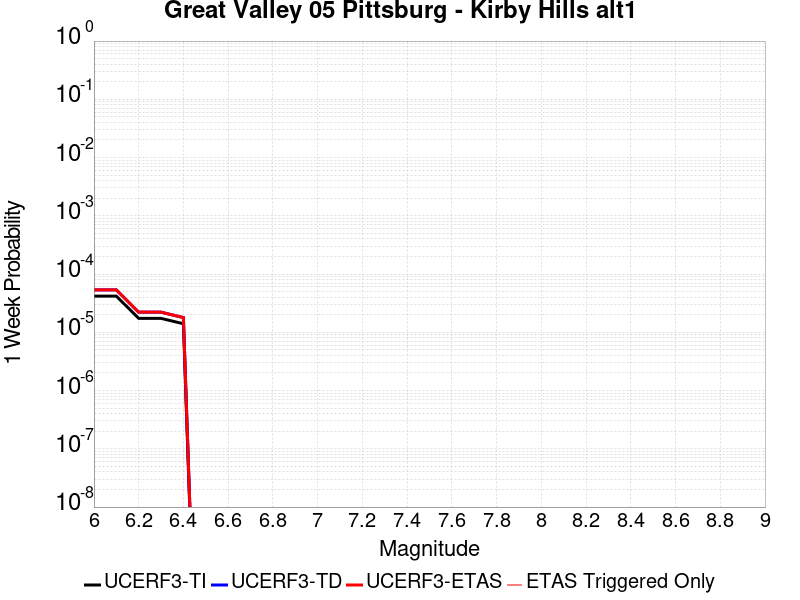 |  |  |  |

| Magnitude | 1 wk TI Prob | 1 wk TD Prob | 1 wk ETAS Prob | 1 wk ETAS/TD Gain | 1 wk ETAS Triggered Only | 1 mo TI Prob | 1 mo TD Prob | 1 mo ETAS Prob | 1 mo ETAS/TD Gain | 1 mo ETAS Triggered Only | 1 yr TI Prob | 1 yr TD Prob | 1 yr ETAS Prob | 1 yr ETAS/TD Gain | 1 yr ETAS Triggered Only | 10 yr TI Prob | 10 yr TD Prob | 10 yr ETAS Prob | 10 yr ETAS/TD Gain | 10 yr ETAS Triggered Only |
|-----|-----|-----|-----|-----|-----|-----|-----|-----|-----|-----|-----|-----|-----|-----|-----|-----|-----|-----|-----|-----|
| 6.0 | 4.187212E-5 | 5.346171E-5 | 5.346171E-5 | 1.0 | 0.0 | 1.794396E-4 | 2.2910618E-4 | 2.2910618E-4 | 1.0 | 0.0 | 0.002182488 | 0.002786782 | 0.0028170538 | 1.0108626 | 3.0356385E-5 | 0.021611776 | 0.027612798 | 0.027642315 | 1.001069 | 3.0356385E-5 |
| 6.1 | 4.187212E-5 | 5.346171E-5 | 5.346171E-5 | 1.0 | 0.0 | 1.794396E-4 | 2.2910618E-4 | 2.2910618E-4 | 1.0 | 0.0 | 0.002182488 | 0.002786782 | 0.0028170538 | 1.0108626 | 3.0356385E-5 | 0.021611776 | 0.027612798 | 0.027642315 | 1.001069 | 3.0356385E-5 |
| 6.2 | 1.7353306E-5 | 2.2162525E-5 | 2.2162525E-5 | 1.0 | 0.0 | 7.436919E-5 | 9.498003E-5 | 9.498003E-5 | 1.0 | 0.0 | 9.050688E-4 | 0.0011561753 | 0.0011561753 | 1.0 | 0.0 | 0.009013915 | 0.011539226 | 0.011539226 | 1.0 | 0.0 |
| 6.3 | 1.7353306E-5 | 2.2162525E-5 | 2.2162525E-5 | 1.0 | 0.0 | 7.436919E-5 | 9.498003E-5 | 9.498003E-5 | 1.0 | 0.0 | 9.050688E-4 | 0.0011561753 | 0.0011561753 | 1.0 | 0.0 | 0.009013915 | 0.011539226 | 0.011539226 | 1.0 | 0.0 |
| 6.4 | 1.4028824E-5 | 1.7907167E-5 | 1.7907167E-5 | 1.0 | 0.0 | 6.0122147E-5 | 7.6745E-5 | 7.6745E-5 | 1.0 | 0.0 | 7.3174125E-4 | 9.343703E-4 | 9.343703E-4 | 1.0 | 0.0 | 0.0072933645 | 0.009341467 | 0.009341467 | 1.0 | 0.0 |

## San Clemente
*[(top)](#table-of-contents)*

| 1 Week | 1 Month | 1 Year | 10 Year |
|-----|-----|-----|-----|
|  |  |  |  |

| Magnitude | 1 wk TI Prob | 1 wk TD Prob | 1 wk ETAS Prob | 1 wk ETAS/TD Gain | 1 wk ETAS Triggered Only | 1 mo TI Prob | 1 mo TD Prob | 1 mo ETAS Prob | 1 mo ETAS/TD Gain | 1 mo ETAS Triggered Only | 1 yr TI Prob | 1 yr TD Prob | 1 yr ETAS Prob | 1 yr ETAS/TD Gain | 1 yr ETAS Triggered Only | 10 yr TI Prob | 10 yr TD Prob | 10 yr ETAS Prob | 10 yr ETAS/TD Gain | 10 yr ETAS Triggered Only |
|-----|-----|-----|-----|-----|-----|-----|-----|-----|-----|-----|-----|-----|-----|-----|-----|-----|-----|-----|-----|-----|
| 6.0 | 6.681379E-5 | 8.165889E-5 | 8.165889E-5 | 1.0 | 0.0 | 2.8631336E-4 | 3.4992295E-4 | 3.4992295E-4 | 1.0 | 0.0 | 0.003480294 | 0.004252569 | 0.0042827963 | 1.007108 | 3.0356385E-5 | 0.03426291 | 0.04176773 | 0.04179682 | 1.0006964 | 3.0356385E-5 |
| 6.1 | 6.681379E-5 | 8.165889E-5 | 8.165889E-5 | 1.0 | 0.0 | 2.8631336E-4 | 3.4992295E-4 | 3.4992295E-4 | 1.0 | 0.0 | 0.003480294 | 0.004252569 | 0.0042827963 | 1.007108 | 3.0356385E-5 | 0.03426291 | 0.04176773 | 0.04179682 | 1.0006964 | 3.0356385E-5 |
| 6.2 | 3.9400576E-5 | 4.646316E-5 | 4.646316E-5 | 1.0 | 0.0 | 1.6884868E-4 | 1.9911298E-4 | 1.9911298E-4 | 1.0 | 0.0 | 0.0020537945 | 0.0024215663 | 0.0024215663 | 1.0 | 0.0 | 0.020349167 | 0.02395851 | 0.02395851 | 1.0 | 0.0 |
| 6.3 | 3.2590255E-5 | 3.793738E-5 | 3.793738E-5 | 1.0 | 0.0 | 1.3966505E-4 | 1.6257883E-4 | 1.6257883E-4 | 1.0 | 0.0 | 0.0016990956 | 0.0019776302 | 0.0019776302 | 1.0 | 0.0 | 0.01686163 | 0.019604106 | 0.019604106 | 1.0 | 0.0 |
| 6.4 | 2.9454652E-5 | 3.410493E-5 | 3.410493E-5 | 1.0 | 0.0 | 1.2622811E-4 | 1.4615596E-4 | 1.4615596E-4 | 1.0 | 0.0 | 0.0015357438 | 0.0017780208 | 0.0017780208 | 1.0 | 0.0 | 0.015251739 | 0.01764113 | 0.01764113 | 1.0 | 0.0 |
| 6.5 | 2.790836E-5 | 3.225413E-5 | 3.225413E-5 | 1.0 | 0.0 | 1.1960178E-4 | 1.382248E-4 | 1.382248E-4 | 1.0 | 0.0 | 0.001455179 | 0.0016816128 | 0.0016816128 | 1.0 | 0.0 | 0.014456868 | 0.016691903 | 0.016691903 | 1.0 | 0.0 |
| 6.6 | 2.2492153E-5 | 2.576768E-5 | 2.576768E-5 | 1.0 | 0.0 | 9.639138E-5 | 1.1042832E-4 | 1.1042832E-4 | 1.0 | 0.0 | 0.0011729331 | 0.0013436505 | 0.0013436505 | 1.0 | 0.0 | 0.011667615 | 0.013356981 | 0.013356981 | 1.0 | 0.0 |
| 6.7 | 1.9862755E-5 | 2.2670674E-5 | 2.2670674E-5 | 1.0 | 0.0 | 8.512331E-5 | 9.715648E-5 | 9.715648E-5 | 1.0 | 0.0 | 0.0010358836 | 0.0011822495 | 0.0011822495 | 1.0 | 0.0 | 0.010310682 | 0.011760893 | 0.011760893 | 1.0 | 0.0 |
| 6.8 | 1.6697575E-5 | 1.8981149E-5 | 1.8981149E-5 | 1.0 | 0.0 | 7.155907E-5 | 8.13453E-5 | 8.13453E-5 | 1.0 | 0.0 | 8.7088346E-4 | 9.899384E-4 | 9.899384E-4 | 1.0 | 0.0 | 0.008674784 | 0.009856314 | 0.009856314 | 1.0 | 0.0 |
| 6.9 | 1.5218415E-5 | 1.7272489E-5 | 1.7272489E-5 | 1.0 | 0.0 | 6.522015E-5 | 7.40229E-5 | 7.40229E-5 | 1.0 | 0.0 | 7.93766E-4 | 9.00865E-4 | 9.00865E-4 | 1.0 | 0.0 | 0.007909367 | 0.008973078 | 0.008973078 | 1.0 | 0.0 |
| 7.0 | 1.2392958E-5 | 1.403548E-5 | 1.403548E-5 | 1.0 | 0.0 | 5.3111595E-5 | 6.015071E-5 | 6.015071E-5 | 1.0 | 0.0 | 6.4644177E-4 | 7.3209644E-4 | 7.3209644E-4 | 1.0 | 0.0 | 0.0064456454 | 0.007297633 | 0.007297633 | 1.0 | 0.0 |
| 7.1 | 1.0934128E-5 | 1.2377302E-5 | 1.2377302E-5 | 1.0 | 0.0 | 4.6859706E-5 | 5.304454E-5 | 5.304454E-5 | 1.0 | 0.0 | 5.7036756E-4 | 6.4563326E-4 | 6.4563326E-4 | 1.0 | 0.0 | 0.0056890585 | 0.006438322 | 0.006438322 | 1.0 | 0.0 |
| 7.2 | 9.5798805E-6 | 1.0846835E-5 | 1.0846835E-5 | 1.0 | 0.0 | 4.1055984E-5 | 4.648565E-5 | 4.648565E-5 | 1.0 | 0.0 | 4.9974193E-4 | 5.65823E-4 | 5.65823E-4 | 1.0 | 0.0 | 0.0049861963 | 0.0056445473 | 0.0056445473 | 1.0 | 0.0 |
| 7.3 | 8.0167365E-6 | 9.085522E-6 | 9.085522E-6 | 1.0 | 0.0 | 3.4356988E-5 | 3.8937407E-5 | 3.8937407E-5 | 1.0 | 0.0 | 4.1821605E-4 | 4.7396688E-4 | 4.7396688E-4 | 1.0 | 0.0 | 0.0041742986 | 0.0047302633 | 0.0047302633 | 1.0 | 0.0 |
| 7.4 | 2.9581017E-6 | 3.3629888E-6 | 3.3629888E-6 | 1.0 | 0.0 | 1.2677518E-5 | 1.4412758E-5 | 1.4412758E-5 | 1.0 | 0.0 | 1.5433785E-4 | 1.7546625E-4 | 1.7546625E-4 | 1.0 | 0.0 | 0.001542307 | 0.0017537723 | 0.0017537723 | 1.0 | 0.0 |

## Maacama 2011 CFM
*[(top)](#table-of-contents)*

| 1 Week | 1 Month | 1 Year | 10 Year |
|-----|-----|-----|-----|
|  |  |  |  |

| Magnitude | 1 wk TI Prob | 1 wk TD Prob | 1 wk ETAS Prob | 1 wk ETAS/TD Gain | 1 wk ETAS Triggered Only | 1 mo TI Prob | 1 mo TD Prob | 1 mo ETAS Prob | 1 mo ETAS/TD Gain | 1 mo ETAS Triggered Only | 1 yr TI Prob | 1 yr TD Prob | 1 yr ETAS Prob | 1 yr ETAS/TD Gain | 1 yr ETAS Triggered Only | 10 yr TI Prob | 10 yr TD Prob | 10 yr ETAS Prob | 10 yr ETAS/TD Gain | 10 yr ETAS Triggered Only |
|-----|-----|-----|-----|-----|-----|-----|-----|-----|-----|-----|-----|-----|-----|-----|-----|-----|-----|-----|-----|-----|
| 6.0 | 1.368203E-4 | 2.5821978E-4 | 2.5821978E-4 | 1.0 | 0.0 | 5.862409E-4 | 0.0011061751 | 0.0011061751 | 1.0 | 0.0 | 0.0071141496 | 0.013360178 | 0.013360178 | 1.0 | 0.0 | 0.06890667 | 0.124274775 | 0.12430136 | 1.0002139 | 3.0356385E-5 |
| 6.1 | 1.368203E-4 | 2.5821978E-4 | 2.5821978E-4 | 1.0 | 0.0 | 5.862409E-4 | 0.0011061751 | 0.0011061751 | 1.0 | 0.0 | 0.0071141496 | 0.013360178 | 0.013360178 | 1.0 | 0.0 | 0.06890667 | 0.124274775 | 0.12430136 | 1.0002139 | 3.0356385E-5 |
| 6.2 | 1.360743E-4 | 2.569653E-4 | 2.569653E-4 | 1.0 | 0.0 | 5.8304524E-4 | 0.001100804 | 0.001100804 | 1.0 | 0.0 | 0.007075496 | 0.013295712 | 0.013295712 | 1.0 | 0.0 | 0.06854413 | 0.12370895 | 0.123735555 | 1.000215 | 3.0356385E-5 |
| 6.3 | 1.1917239E-4 | 2.2381521E-4 | 2.2381521E-4 | 1.0 | 0.0 | 5.1063887E-4 | 9.5883745E-4 | 9.5883745E-4 | 1.0 | 0.0 | 0.0061993203 | 0.011596504 | 0.011596504 | 1.0 | 0.0 | 0.060292065 | 0.10892511 | 0.108952165 | 1.0002483 | 3.0356385E-5 |
| 6.4 | 1.1859289E-4 | 2.2285058E-4 | 2.2285058E-4 | 1.0 | 0.0 | 5.0815626E-4 | 9.547067E-4 | 9.547067E-4 | 1.0 | 0.0 | 0.006169266 | 0.011546799 | 0.011546799 | 1.0 | 0.0 | 0.06000784 | 0.108481795 | 0.108508855 | 1.0002495 | 3.0356385E-5 |
| 6.5 | 1.09512424E-4 | 2.0540757E-4 | 2.0540757E-4 | 1.0 | 0.0 | 4.6925453E-4 | 8.800018E-4 | 8.800018E-4 | 1.0 | 0.0 | 0.005698218 | 0.010647914 | 0.010647914 | 1.0 | 0.0 | 0.055543028 | 0.10057131 | 0.10059862 | 1.0002714 | 3.0356385E-5 |
| 6.6 | 1.0502928E-4 | 1.9697966E-4 | 1.9697966E-4 | 1.0 | 0.0 | 4.500478E-4 | 8.439078E-4 | 8.439078E-4 | 1.0 | 0.0 | 0.0054655746 | 0.010213858 | 0.010213858 | 1.0 | 0.0 | 0.053330887 | 0.09672256 | 0.09674998 | 1.0002835 | 3.0356385E-5 |
| 6.7 | 9.739358E-5 | 1.8277904E-4 | 1.8277904E-4 | 1.0 | 0.0 | 4.173343E-4 | 7.830906E-4 | 7.830906E-4 | 1.0 | 0.0 | 0.0050692135 | 0.009483728 | 0.009483728 | 1.0 | 0.0 | 0.049551267 | 0.090193085 | 0.090193085 | 1.0 | 0.0 |
| 6.8 | 8.969524E-5 | 1.6676696E-4 | 1.6676696E-4 | 1.0 | 0.0 | 3.8435153E-4 | 7.145057E-4 | 7.145057E-4 | 1.0 | 0.0 | 0.0046694432 | 0.008656753 | 0.008656753 | 1.0 | 0.0 | 0.045725387 | 0.08272071 | 0.08272071 | 1.0 | 0.0 |
| 6.9 | 7.838291E-5 | 1.4433586E-4 | 1.4433586E-4 | 1.0 | 0.0 | 3.358835E-4 | 6.1842095E-4 | 6.1842095E-4 | 1.0 | 0.0 | 0.0040817154 | 0.0074986615 | 0.0074986615 | 1.0 | 0.0 | 0.04007554 | 0.0721146 | 0.0721146 | 1.0 | 0.0 |
| 7.0 | 6.961957E-5 | 1.2720449E-4 | 1.2720449E-4 | 1.0 | 0.0 | 2.9833548E-4 | 5.45033E-4 | 5.45033E-4 | 1.0 | 0.0 | 0.0036261857 | 0.00661301 | 0.00661301 | 1.0 | 0.0 | 0.035675827 | 0.06392813 | 0.06392813 | 1.0 | 0.0 |
| 7.1 | 5.999398E-5 | 1.0915919E-4 | 1.0915919E-4 | 1.0 | 0.0 | 2.570917E-4 | 4.6772574E-4 | 4.6772574E-4 | 1.0 | 0.0 | 0.0031255994 | 0.0056784255 | 0.0056784255 | 1.0 | 0.0 | 0.030820016 | 0.055189762 | 0.055189762 | 1.0 | 0.0 |
| 7.2 | 5.116532E-5 | 9.314969E-5 | 9.314969E-5 | 1.0 | 0.0 | 2.1926152E-4 | 3.9913683E-4 | 3.9913683E-4 | 1.0 | 0.0 | 0.002666241 | 0.0048479997 | 0.0048479997 | 1.0 | 0.0 | 0.026344774 | 0.04734885 | 0.04734885 | 1.0 | 0.0 |
| 7.3 | 4.2087835E-5 | 7.62479E-5 | 7.62479E-5 | 1.0 | 0.0 | 1.8036396E-4 | 3.267206E-4 | 3.267206E-4 | 1.0 | 0.0 | 0.0021937196 | 0.0039701494 | 0.0039701494 | 1.0 | 0.0 | 0.0217219 | 0.03894215 | 0.03894215 | 1.0 | 0.0 |
| 7.4 | 2.8991652E-5 | 5.121617E-5 | 5.121617E-5 | 1.0 | 0.0 | 1.2424402E-4 | 2.194667E-4 | 2.194667E-4 | 1.0 | 0.0 | 0.0015116213 | 0.0026686103 | 0.0026686103 | 1.0 | 0.0 | 0.015013801 | 0.026356548 | 0.026356548 | 1.0 | 0.0 |
| 7.5 | 1.1292299E-6 | 1.4957741E-6 | 1.4957741E-6 | 1.0 | 0.0 | 4.8395473E-6 | 6.4104515E-6 | 6.4104515E-6 | 1.0 | 0.0 | 5.8919897E-5 | 7.804569E-5 | 7.804569E-5 | 1.0 | 0.0 | 5.890428E-4 | 7.808754E-4 | 7.808754E-4 | 1.0 | 0.0 |
| 7.6 | 2.6535366E-7 | 3.4745202E-7 | 3.4745202E-7 | 1.0 | 0.0 | 1.1372296E-6 | 1.4890793E-6 | 1.4890793E-6 | 1.0 | 0.0 | 1.3845682E-5 | 1.812939E-5 | 1.812939E-5 | 1.0 | 0.0 | 1.3844819E-4 | 1.8180255E-4 | 1.8180255E-4 | 1.0 | 0.0 |
| 7.7 | 9.727789E-8 | 1.231708E-7 | 1.231708E-7 | 1.0 | 0.0 | 4.1690518E-7 | 5.2787476E-7 | 5.2787476E-7 | 1.0 | 0.0 | 5.0758085E-6 | 6.4268565E-6 | 6.4268565E-6 | 1.0 | 0.0 | 5.0756928E-5 | 6.464869E-5 | 6.464869E-5 | 1.0 | 0.0 |
| 7.8 | 6.1939325E-9 | 7.723534E-9 | 7.723534E-9 | 1.0 | 0.0 | 2.6545425E-8 | 3.3100857E-8 | 3.3100857E-8 | 1.0 | 0.0 | 3.231905E-7 | 4.0300287E-7 | 4.0300287E-7 | 1.0 | 0.0 | 3.2319003E-6 | 4.066108E-6 | 4.066108E-6 | 1.0 | 0.0 |

## Anacapa-Dume alt 1
*[(top)](#table-of-contents)*

| 1 Week | 1 Month | 1 Year | 10 Year |
|-----|-----|-----|-----|
|  |  |  |  |

| Magnitude | 1 wk TI Prob | 1 wk TD Prob | 1 wk ETAS Prob | 1 wk ETAS/TD Gain | 1 wk ETAS Triggered Only | 1 mo TI Prob | 1 mo TD Prob | 1 mo ETAS Prob | 1 mo ETAS/TD Gain | 1 mo ETAS Triggered Only | 1 yr TI Prob | 1 yr TD Prob | 1 yr ETAS Prob | 1 yr ETAS/TD Gain | 1 yr ETAS Triggered Only | 10 yr TI Prob | 10 yr TD Prob | 10 yr ETAS Prob | 10 yr ETAS/TD Gain | 10 yr ETAS Triggered Only |
|-----|-----|-----|-----|-----|-----|-----|-----|-----|-----|-----|-----|-----|-----|-----|-----|-----|-----|-----|-----|-----|
| 6.0 | 5.1871802E-6 | 5.3676713E-6 | 5.3676713E-6 | 1.0 | 0.0 | 2.2230583E-5 | 2.3004108E-5 | 2.3004108E-5 | 1.0 | 0.0 | 2.7062374E-4 | 2.8003985E-4 | 2.8003985E-4 | 1.0 | 0.0 | 0.002702944 | 0.0027969552 | 0.0028272266 | 1.010823 | 3.0356385E-5 |
| 6.1 | 5.1871802E-6 | 5.3676713E-6 | 5.3676713E-6 | 1.0 | 0.0 | 2.2230583E-5 | 2.3004108E-5 | 2.3004108E-5 | 1.0 | 0.0 | 2.7062374E-4 | 2.8003985E-4 | 2.8003985E-4 | 1.0 | 0.0 | 0.002702944 | 0.0027969552 | 0.0028272266 | 1.010823 | 3.0356385E-5 |
| 6.2 | 5.1871802E-6 | 5.3676713E-6 | 5.3676713E-6 | 1.0 | 0.0 | 2.2230583E-5 | 2.3004108E-5 | 2.3004108E-5 | 1.0 | 0.0 | 2.7062374E-4 | 2.8003985E-4 | 2.8003985E-4 | 1.0 | 0.0 | 0.002702944 | 0.0027969552 | 0.0028272266 | 1.010823 | 3.0356385E-5 |
| 6.3 | 5.1871802E-6 | 5.3676713E-6 | 5.3676713E-6 | 1.0 | 0.0 | 2.2230583E-5 | 2.3004108E-5 | 2.3004108E-5 | 1.0 | 0.0 | 2.7062374E-4 | 2.8003985E-4 | 2.8003985E-4 | 1.0 | 0.0 | 0.002702944 | 0.0027969552 | 0.0028272266 | 1.010823 | 3.0356385E-5 |
| 6.4 | 5.1871802E-6 | 5.3676713E-6 | 5.3676713E-6 | 1.0 | 0.0 | 2.2230583E-5 | 2.3004108E-5 | 2.3004108E-5 | 1.0 | 0.0 | 2.7062374E-4 | 2.8003985E-4 | 2.8003985E-4 | 1.0 | 0.0 | 0.002702944 | 0.0027969552 | 0.0028272266 | 1.010823 | 3.0356385E-5 |
| 6.5 | 5.1871802E-6 | 5.3676713E-6 | 5.3676713E-6 | 1.0 | 0.0 | 2.2230583E-5 | 2.3004108E-5 | 2.3004108E-5 | 1.0 | 0.0 | 2.7062374E-4 | 2.8003985E-4 | 2.8003985E-4 | 1.0 | 0.0 | 0.002702944 | 0.0027969552 | 0.0028272266 | 1.010823 | 3.0356385E-5 |
| 6.6 | 5.1871802E-6 | 5.3676713E-6 | 5.3676713E-6 | 1.0 | 0.0 | 2.2230583E-5 | 2.3004108E-5 | 2.3004108E-5 | 1.0 | 0.0 | 2.7062374E-4 | 2.8003985E-4 | 2.8003985E-4 | 1.0 | 0.0 | 0.002702944 | 0.0027969552 | 0.0028272266 | 1.010823 | 3.0356385E-5 |
| 6.7 | 4.7693475E-6 | 4.9369546E-6 | 4.9369546E-6 | 1.0 | 0.0 | 2.04399E-5 | 2.115821E-5 | 2.115821E-5 | 1.0 | 0.0 | 2.4882736E-4 | 2.5757152E-4 | 2.5757152E-4 | 1.0 | 0.0 | 0.0024854892 | 0.0025728059 | 0.002603084 | 1.0117686 | 3.0356385E-5 |
| 6.8 | 4.753408E-6 | 4.9205023E-6 | 4.9205023E-6 | 1.0 | 0.0 | 2.037159E-5 | 2.10877E-5 | 2.10877E-5 | 1.0 | 0.0 | 2.4799586E-4 | 2.5671325E-4 | 2.5671325E-4 | 1.0 | 0.0 | 0.002477193 | 0.002564243 | 0.0025945217 | 1.011808 | 3.0356385E-5 |
| 6.9 | 3.800069E-6 | 3.9373476E-6 | 3.9373476E-6 | 1.0 | 0.0 | 1.6285909E-5 | 1.6874239E-5 | 1.6874239E-5 | 1.0 | 0.0 | 1.9826289E-4 | 2.0542473E-4 | 2.0542473E-4 | 1.0 | 0.0 | 0.001980861 | 0.002052372 | 0.0020826661 | 1.0147605 | 3.0356385E-5 |
| 7.0 | 3.6671938E-6 | 3.800134E-6 | 3.800134E-6 | 1.0 | 0.0 | 1.571645E-5 | 1.6286187E-5 | 1.6286187E-5 | 1.0 | 0.0 | 1.9133097E-4 | 1.9826653E-4 | 1.9826653E-4 | 1.0 | 0.0 | 0.0019116632 | 0.0019809196 | 0.0020112158 | 1.0152941 | 3.0356385E-5 |
| 7.1 | 3.2394885E-6 | 3.3589904E-6 | 3.3589904E-6 | 1.0 | 0.0 | 1.3883448E-5 | 1.4395595E-5 | 1.4395595E-5 | 1.0 | 0.0 | 1.6901788E-4 | 1.7525238E-4 | 1.7525238E-4 | 1.0 | 0.0 | 0.0016888938 | 0.0017511529 | 0.0017814562 | 1.0173048 | 3.0356385E-5 |
| 7.2 | 3.0935948E-6 | 3.2081164E-6 | 3.2081164E-6 | 1.0 | 0.0 | 1.3258196E-5 | 1.3748998E-5 | 1.3748998E-5 | 1.0 | 0.0 | 1.6140658E-4 | 1.673813E-4 | 1.673813E-4 | 1.0 | 0.0 | 0.001612894 | 0.0016725634 | 0.001702869 | 1.0181192 | 3.0356385E-5 |
| 7.3 | 2.5604163E-6 | 2.6472246E-6 | 2.6472246E-6 | 1.0 | 0.0 | 1.0973167E-5 | 1.13452E-5 | 1.13452E-5 | 1.0 | 0.0 | 1.3359012E-4 | 1.381191E-4 | 1.381191E-4 | 1.0 | 0.0 | 0.0013350984 | 0.0013803372 | 0.0014106516 | 1.0219617 | 3.0356385E-5 |
| 7.4 | 2.1429005E-6 | 2.210728E-6 | 2.210728E-6 | 1.0 | 0.0 | 9.1838265E-6 | 9.474515E-6 | 9.474515E-6 | 1.0 | 0.0 | 1.11807356E-4 | 1.15346134E-4 | 1.15346134E-4 | 1.0 | 0.0 | 0.0011175112 | 0.0011528654 | 0.0011831867 | 1.0263009 | 3.0356385E-5 |
| 7.5 | 1.7237151E-6 | 1.7762461E-6 | 1.7762461E-6 | 1.0 | 0.0 | 7.3873293E-6 | 7.612461E-6 | 7.612461E-6 | 1.0 | 0.0 | 8.993702E-5 | 9.2677794E-5 | 9.2677794E-5 | 1.0 | 0.0 | 8.990063E-4 | 9.263938E-4 | 9.263938E-4 | 1.0 | 0.0 |
| 7.6 | 9.541696E-7 | 9.823765E-7 | 9.823765E-7 | 1.0 | 0.0 | 4.089292E-6 | 4.2101783E-6 | 4.2101783E-6 | 1.0 | 0.0 | 4.9785995E-5 | 5.1257724E-5 | 5.1257724E-5 | 1.0 | 0.0 | 4.9774844E-4 | 5.124603E-4 | 5.124603E-4 | 1.0 | 0.0 |
| 7.7 | 2.7226676E-7 | 2.7173658E-7 | 2.7173658E-7 | 1.0 | 0.0 | 1.166857E-6 | 1.1645848E-6 | 1.1645848E-6 | 1.0 | 0.0 | 1.4206392E-5 | 1.4178729E-5 | 1.4178729E-5 | 1.0 | 0.0 | 1.4205484E-4 | 1.417783E-4 | 1.417783E-4 | 1.0 | 0.0 |
| 7.8 | 4.5017995E-8 | 4.2159332E-8 | 4.2159332E-8 | 1.0 | 0.0 | 1.9293425E-7 | 1.8068283E-7 | 1.8068283E-7 | 1.0 | 0.0 | 2.348972E-6 | 2.1998117E-6 | 2.1998117E-6 | 1.0 | 0.0 | 2.348947E-5 | 2.199792E-5 | 2.199792E-5 | 1.0 | 0.0 |
| 7.9 | 8.007447E-10 | 6.1612504E-10 | 6.1612504E-10 | 1.0 | 0.0 | 3.4317629E-9 | 2.6405358E-9 | 2.6405358E-9 | 1.0 | 0.0 | 4.1781714E-8 | 3.2148524E-8 | 3.2148524E-8 | 1.0 | 0.0 | 4.1781706E-7 | 3.214852E-7 | 3.214852E-7 | 1.0 | 0.0 |

## Earthquake Valley (So Extension)
*[(top)](#table-of-contents)*

| 1 Week | 1 Month | 1 Year | 10 Year |
|-----|-----|-----|-----|
|  | 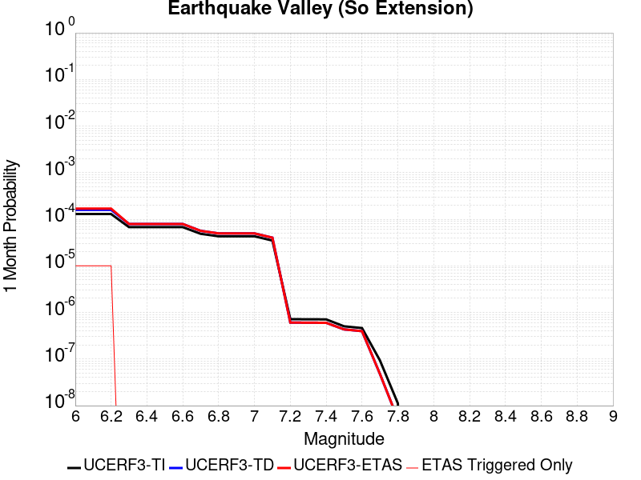 |  |  |

| Magnitude | 1 wk TI Prob | 1 wk TD Prob | 1 wk ETAS Prob | 1 wk ETAS/TD Gain | 1 wk ETAS Triggered Only | 1 mo TI Prob | 1 mo TD Prob | 1 mo ETAS Prob | 1 mo ETAS/TD Gain | 1 mo ETAS Triggered Only | 1 yr TI Prob | 1 yr TD Prob | 1 yr ETAS Prob | 1 yr ETAS/TD Gain | 1 yr ETAS Triggered Only | 10 yr TI Prob | 10 yr TD Prob | 10 yr ETAS Prob | 10 yr ETAS/TD Gain | 10 yr ETAS Triggered Only |
|-----|-----|-----|-----|-----|-----|-----|-----|-----|-----|-----|-----|-----|-----|-----|-----|-----|-----|-----|-----|-----|
| 6.0 | 3.0194888E-5 | 3.7083595E-5 | 3.7083595E-5 | 1.0 | 0.0 | 1.2940024E-4 | 1.5892308E-4 | 1.8927465E-4 | 1.1909827 | 3.0356385E-5 | 0.0015743093 | 0.0019337159 | 0.0019640136 | 1.0156682 | 3.0356385E-5 | 0.01563203 | 0.019218799 | 0.019248573 | 1.0015491 | 3.0356385E-5 |
| 6.1 | 3.0194888E-5 | 3.7083595E-5 | 3.7083595E-5 | 1.0 | 0.0 | 1.2940024E-4 | 1.5892308E-4 | 1.8927465E-4 | 1.1909827 | 3.0356385E-5 | 0.0015743093 | 0.0019337159 | 0.0019640136 | 1.0156682 | 3.0356385E-5 | 0.01563203 | 0.019218799 | 0.019248573 | 1.0015491 | 3.0356385E-5 |
| 6.2 | 3.0194888E-5 | 3.7083595E-5 | 3.7083595E-5 | 1.0 | 0.0 | 1.2940024E-4 | 1.5892308E-4 | 1.8927465E-4 | 1.1909827 | 3.0356385E-5 | 0.0015743093 | 0.0019337159 | 0.0019640136 | 1.0156682 | 3.0356385E-5 | 0.01563203 | 0.019218799 | 0.019248573 | 1.0015491 | 3.0356385E-5 |
| 6.3 | 1.5795305E-5 | 1.8450788E-5 | 1.8450788E-5 | 1.0 | 0.0 | 6.769241E-5 | 7.9073034E-5 | 7.9073034E-5 | 1.0 | 0.0 | 8.238434E-4 | 9.624003E-4 | 9.624003E-4 | 1.0 | 0.0 | 0.008207959 | 0.009593238 | 0.009593238 | 1.0 | 0.0 |
| 6.4 | 1.5795305E-5 | 1.8450788E-5 | 1.8450788E-5 | 1.0 | 0.0 | 6.769241E-5 | 7.9073034E-5 | 7.9073034E-5 | 1.0 | 0.0 | 8.238434E-4 | 9.624003E-4 | 9.624003E-4 | 1.0 | 0.0 | 0.008207959 | 0.009593238 | 0.009593238 | 1.0 | 0.0 |
| 6.5 | 1.5795305E-5 | 1.8450788E-5 | 1.8450788E-5 | 1.0 | 0.0 | 6.769241E-5 | 7.9073034E-5 | 7.9073034E-5 | 1.0 | 0.0 | 8.238434E-4 | 9.624003E-4 | 9.624003E-4 | 1.0 | 0.0 | 0.008207959 | 0.009593238 | 0.009593238 | 1.0 | 0.0 |
| 6.6 | 1.5795305E-5 | 1.8450788E-5 | 1.8450788E-5 | 1.0 | 0.0 | 6.769241E-5 | 7.9073034E-5 | 7.9073034E-5 | 1.0 | 0.0 | 8.238434E-4 | 9.624003E-4 | 9.624003E-4 | 1.0 | 0.0 | 0.008207959 | 0.009593238 | 0.009593238 | 1.0 | 0.0 |
| 6.7 | 1.1363076E-5 | 1.3141109E-5 | 1.3141109E-5 | 1.0 | 0.0 | 4.8697988E-5 | 5.631825E-5 | 5.631825E-5 | 1.0 | 0.0 | 5.927367E-4 | 6.8553514E-4 | 6.8553514E-4 | 1.0 | 0.0 | 0.0059115817 | 0.00684168 | 0.00684168 | 1.0 | 0.0 |
| 6.8 | 1.0049611E-5 | 1.1596789E-5 | 1.1596789E-5 | 1.0 | 0.0 | 4.306905E-5 | 4.969999E-5 | 4.969999E-5 | 1.0 | 0.0 | 5.242395E-4 | 6.0500257E-4 | 6.0500257E-4 | 1.0 | 0.0 | 0.0052300454 | 0.0060407347 | 0.0060407347 | 1.0 | 0.0 |
| 6.9 | 1.0049611E-5 | 1.1596789E-5 | 1.1596789E-5 | 1.0 | 0.0 | 4.306905E-5 | 4.969999E-5 | 4.969999E-5 | 1.0 | 0.0 | 5.242395E-4 | 6.0500257E-4 | 6.0500257E-4 | 1.0 | 0.0 | 0.0052300454 | 0.0060407347 | 0.0060407347 | 1.0 | 0.0 |
| 7.0 | 1.0049611E-5 | 1.1596789E-5 | 1.1596789E-5 | 1.0 | 0.0 | 4.306905E-5 | 4.969999E-5 | 4.969999E-5 | 1.0 | 0.0 | 5.242395E-4 | 6.0500257E-4 | 6.0500257E-4 | 1.0 | 0.0 | 0.0052300454 | 0.0060407347 | 0.0060407347 | 1.0 | 0.0 |
| 7.1 | 8.140254E-6 | 9.38545E-6 | 9.38545E-6 | 1.0 | 0.0 | 3.4886336E-5 | 4.0223113E-5 | 4.0223113E-5 | 1.0 | 0.0 | 4.2465836E-4 | 4.8967346E-4 | 4.8967346E-4 | 1.0 | 0.0 | 0.0042384774 | 0.004892524 | 0.004892524 | 1.0 | 0.0 |
| 7.2 | 1.673835E-7 | 1.41582E-7 | 1.41582E-7 | 1.0 | 0.0 | 7.173577E-7 | 6.067799E-7 | 6.067799E-7 | 1.0 | 0.0 | 8.733795E-6 | 7.387524E-6 | 7.387524E-6 | 1.0 | 0.0 | 8.733451E-5 | 7.387314E-5 | 7.387314E-5 | 1.0 | 0.0 |
| 7.3 | 1.6632116E-7 | 1.4056415E-7 | 1.4056415E-7 | 1.0 | 0.0 | 7.1280476E-7 | 6.024177E-7 | 6.024177E-7 | 1.0 | 0.0 | 8.678364E-6 | 7.334414E-6 | 7.334414E-6 | 1.0 | 0.0 | 8.6780245E-5 | 7.3342075E-5 | 7.3342075E-5 | 1.0 | 0.0 |
| 7.4 | 1.6569169E-7 | 1.4001033E-7 | 1.4001033E-7 | 1.0 | 0.0 | 7.1010703E-7 | 6.000442E-7 | 6.000442E-7 | 1.0 | 0.0 | 8.645519E-6 | 7.3055166E-6 | 7.3055166E-6 | 1.0 | 0.0 | 8.645182E-5 | 7.3053125E-5 | 7.3053125E-5 | 1.0 | 0.0 |
| 7.5 | 1.1764555E-7 | 1.0099064E-7 | 1.0099064E-7 | 1.0 | 0.0 | 5.041951E-7 | 4.3281696E-7 | 4.3281696E-7 | 1.0 | 0.0 | 6.138558E-6 | 5.269536E-6 | 5.269536E-6 | 1.0 | 0.0 | 6.1383886E-5 | 5.2694326E-5 | 5.2694326E-5 | 1.0 | 0.0 |
| 7.6 | 1.07927605E-7 | 9.263696E-8 | 9.263696E-8 | 1.0 | 0.0 | 4.6254678E-7 | 3.9701547E-7 | 3.9701547E-7 | 1.0 | 0.0 | 5.6314925E-6 | 4.833655E-6 | 4.833655E-6 | 1.0 | 0.0 | 5.63135E-5 | 4.8335707E-5 | 4.8335707E-5 | 1.0 | 0.0 |
| 7.7 | 2.1826905E-8 | 1.1186112E-8 | 1.1186112E-8 | 1.0 | 0.0 | 9.3543875E-8 | 4.794048E-8 | 4.794048E-8 | 1.0 | 0.0 | 1.1388961E-6 | 5.836752E-7 | 5.836752E-7 | 1.0 | 0.0 | 1.1388902E-5 | 5.836742E-6 | 5.836742E-6 | 1.0 | 0.0 |
| 7.8 | 2.6169649E-9 | 1.1975333E-9 | 1.1975333E-9 | 1.0 | 0.0 | 1.1215564E-8 | 5.1322857E-9 | 5.1322857E-9 | 1.0 | 0.0 | 1.3654947E-7 | 6.2485576E-8 | 6.2485576E-8 | 1.0 | 0.0 | 1.365494E-6 | 6.248557E-7 | 6.248557E-7 | 1.0 | 0.0 |

## Round Valley
*[(top)](#table-of-contents)*

| 1 Week | 1 Month | 1 Year | 10 Year |
|-----|-----|-----|-----|
|  |  |  |  |

| Magnitude | 1 wk TI Prob | 1 wk TD Prob | 1 wk ETAS Prob | 1 wk ETAS/TD Gain | 1 wk ETAS Triggered Only | 1 mo TI Prob | 1 mo TD Prob | 1 mo ETAS Prob | 1 mo ETAS/TD Gain | 1 mo ETAS Triggered Only | 1 yr TI Prob | 1 yr TD Prob | 1 yr ETAS Prob | 1 yr ETAS/TD Gain | 1 yr ETAS Triggered Only | 10 yr TI Prob | 10 yr TD Prob | 10 yr ETAS Prob | 10 yr ETAS/TD Gain | 10 yr ETAS Triggered Only |
|-----|-----|-----|-----|-----|-----|-----|-----|-----|-----|-----|-----|-----|-----|-----|-----|-----|-----|-----|-----|-----|
| 6.0 | 1.588152E-5 | 1.36734325E-5 | 1.36734325E-5 | 1.0 | 0.0 | 6.806188E-5 | 5.859933E-5 | 5.859933E-5 | 1.0 | 0.0 | 8.283384E-4 | 7.132527E-4 | 7.132527E-4 | 1.0 | 0.0 | 0.008252576 | 0.007113524 | 0.007143664 | 1.004237 | 3.0356385E-5 |
| 6.1 | 1.588152E-5 | 1.36734325E-5 | 1.36734325E-5 | 1.0 | 0.0 | 6.806188E-5 | 5.859933E-5 | 5.859933E-5 | 1.0 | 0.0 | 8.283384E-4 | 7.132527E-4 | 7.132527E-4 | 1.0 | 0.0 | 0.008252576 | 0.007113524 | 0.007143664 | 1.004237 | 3.0356385E-5 |
| 6.2 | 1.588152E-5 | 1.36734325E-5 | 1.36734325E-5 | 1.0 | 0.0 | 6.806188E-5 | 5.859933E-5 | 5.859933E-5 | 1.0 | 0.0 | 8.283384E-4 | 7.132527E-4 | 7.132527E-4 | 1.0 | 0.0 | 0.008252576 | 0.007113524 | 0.007143664 | 1.004237 | 3.0356385E-5 |
| 6.3 | 1.588152E-5 | 1.36734325E-5 | 1.36734325E-5 | 1.0 | 0.0 | 6.806188E-5 | 5.859933E-5 | 5.859933E-5 | 1.0 | 0.0 | 8.283384E-4 | 7.132527E-4 | 7.132527E-4 | 1.0 | 0.0 | 0.008252576 | 0.007113524 | 0.007143664 | 1.004237 | 3.0356385E-5 |
| 6.4 | 1.588152E-5 | 1.36734325E-5 | 1.36734325E-5 | 1.0 | 0.0 | 6.806188E-5 | 5.859933E-5 | 5.859933E-5 | 1.0 | 0.0 | 8.283384E-4 | 7.132527E-4 | 7.132527E-4 | 1.0 | 0.0 | 0.008252576 | 0.007113524 | 0.007143664 | 1.004237 | 3.0356385E-5 |
| 6.5 | 1.0646776E-5 | 7.955055E-6 | 7.955055E-6 | 1.0 | 0.0 | 4.5628243E-5 | 3.4092693E-5 | 3.4092693E-5 | 1.0 | 0.0 | 5.553823E-4 | 4.1500785E-4 | 4.1500785E-4 | 1.0 | 0.0 | 0.005539963 | 0.0041431575 | 0.004173388 | 1.0072966 | 3.0356385E-5 |
| 6.6 | 8.632956E-6 | 5.7705133E-6 | 5.7705133E-6 | 1.0 | 0.0 | 3.6997862E-5 | 2.473056E-5 | 2.473056E-5 | 1.0 | 0.0 | 4.5035584E-4 | 3.0105677E-4 | 3.0105677E-4 | 1.0 | 0.0 | 0.0044944426 | 0.0030068676 | 0.0030068676 | 1.0 | 0.0 |
| 6.7 | 8.632956E-6 | 5.7705133E-6 | 5.7705133E-6 | 1.0 | 0.0 | 3.6997862E-5 | 2.473056E-5 | 2.473056E-5 | 1.0 | 0.0 | 4.5035584E-4 | 3.0105677E-4 | 3.0105677E-4 | 1.0 | 0.0 | 0.0044944426 | 0.0030068676 | 0.0030068676 | 1.0 | 0.0 |
| 6.8 | 7.143895E-6 | 4.203435E-6 | 4.203435E-6 | 1.0 | 0.0 | 3.0616335E-5 | 1.8014607E-5 | 1.8014607E-5 | 1.0 | 0.0 | 3.726901E-4 | 2.1930743E-4 | 2.1930743E-4 | 1.0 | 0.0 | 0.0037206567 | 0.002191075 | 0.002191075 | 1.0 | 0.0 |
| 6.9 | 6.5120694E-6 | 3.6659874E-6 | 3.6659874E-6 | 1.0 | 0.0 | 2.790857E-5 | 1.5711288E-5 | 1.5711288E-5 | 1.0 | 0.0 | 3.3973387E-4 | 1.9126966E-4 | 1.9126966E-4 | 1.0 | 0.0 | 0.0033921495 | 0.0019111994 | 0.0019111994 | 1.0 | 0.0 |
| 7.0 | 5.0614435E-6 | 2.684983E-6 | 2.684983E-6 | 1.0 | 0.0 | 2.169172E-5 | 1.1507024E-5 | 1.1507024E-5 | 1.0 | 0.0 | 2.6406467E-4 | 1.4009005E-4 | 1.4009005E-4 | 1.0 | 0.0 | 0.0026375111 | 0.0014001188 | 0.0014001188 | 1.0 | 0.0 |
| 7.1 | 4.41728E-6 | 2.3587174E-6 | 2.3587174E-6 | 1.0 | 0.0 | 1.8931061E-5 | 1.0108755E-5 | 1.0108755E-5 | 1.0 | 0.0 | 2.304613E-4 | 1.2306812E-4 | 1.2306812E-4 | 1.0 | 0.0 | 0.0023022245 | 0.0012300963 | 0.0012300963 | 1.0 | 0.0 |
| 7.2 | 2.535495E-6 | 1.1217944E-6 | 1.1217944E-6 | 1.0 | 0.0 | 1.0866362E-5 | 4.807684E-6 | 4.807684E-6 | 1.0 | 0.0 | 1.3228992E-4 | 5.8532507E-5 | 5.8532507E-5 | 1.0 | 0.0 | 0.0013221119 | 5.8522215E-4 | 5.8522215E-4 | 1.0 | 0.0 |
| 7.3 | 7.900015E-7 | 4.0900827E-7 | 4.0900827E-7 | 1.0 | 0.0 | 3.3857161E-6 | 1.7528926E-6 | 1.7528926E-6 | 1.0 | 0.0 | 4.1220315E-5 | 2.1341466E-5 | 2.1341466E-5 | 1.0 | 0.0 | 4.121267E-4 | 2.1341466E-4 | 2.1341466E-4 | 1.0 | 0.0 |

## Pitas Point (Lower)-Montalvo
*[(top)](#table-of-contents)*

| 1 Week | 1 Month | 1 Year | 10 Year |
|-----|-----|-----|-----|
|  |  | 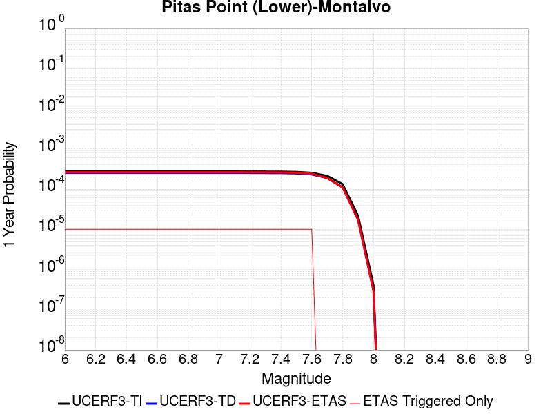 |  |

| Magnitude | 1 wk TI Prob | 1 wk TD Prob | 1 wk ETAS Prob | 1 wk ETAS/TD Gain | 1 wk ETAS Triggered Only | 1 mo TI Prob | 1 mo TD Prob | 1 mo ETAS Prob | 1 mo ETAS/TD Gain | 1 mo ETAS Triggered Only | 1 yr TI Prob | 1 yr TD Prob | 1 yr ETAS Prob | 1 yr ETAS/TD Gain | 1 yr ETAS Triggered Only | 10 yr TI Prob | 10 yr TD Prob | 10 yr ETAS Prob | 10 yr ETAS/TD Gain | 10 yr ETAS Triggered Only |
|-----|-----|-----|-----|-----|-----|-----|-----|-----|-----|-----|-----|-----|-----|-----|-----|-----|-----|-----|-----|-----|
| 6.0 | 5.2543637E-6 | 4.838267E-6 | 4.838267E-6 | 1.0 | 0.0 | 2.2518509E-5 | 2.0735268E-5 | 2.0735268E-5 | 1.0 | 0.0 | 2.7412834E-4 | 2.5242296E-4 | 2.8277168E-4 | 1.1202296 | 3.0356385E-5 | 0.0027379042 | 0.0025213948 | 0.0025516746 | 1.0120091 | 3.0356385E-5 |
| 6.1 | 5.2543637E-6 | 4.838267E-6 | 4.838267E-6 | 1.0 | 0.0 | 2.2518509E-5 | 2.0735268E-5 | 2.0735268E-5 | 1.0 | 0.0 | 2.7412834E-4 | 2.5242296E-4 | 2.8277168E-4 | 1.1202296 | 3.0356385E-5 | 0.0027379042 | 0.0025213948 | 0.0025516746 | 1.0120091 | 3.0356385E-5 |
| 6.2 | 5.2543637E-6 | 4.838267E-6 | 4.838267E-6 | 1.0 | 0.0 | 2.2518509E-5 | 2.0735268E-5 | 2.0735268E-5 | 1.0 | 0.0 | 2.7412834E-4 | 2.5242296E-4 | 2.8277168E-4 | 1.1202296 | 3.0356385E-5 | 0.0027379042 | 0.0025213948 | 0.0025516746 | 1.0120091 | 3.0356385E-5 |
| 6.3 | 5.2543637E-6 | 4.838267E-6 | 4.838267E-6 | 1.0 | 0.0 | 2.2518509E-5 | 2.0735268E-5 | 2.0735268E-5 | 1.0 | 0.0 | 2.7412834E-4 | 2.5242296E-4 | 2.8277168E-4 | 1.1202296 | 3.0356385E-5 | 0.0027379042 | 0.0025213948 | 0.0025516746 | 1.0120091 | 3.0356385E-5 |
| 6.4 | 5.2543637E-6 | 4.838267E-6 | 4.838267E-6 | 1.0 | 0.0 | 2.2518509E-5 | 2.0735268E-5 | 2.0735268E-5 | 1.0 | 0.0 | 2.7412834E-4 | 2.5242296E-4 | 2.8277168E-4 | 1.1202296 | 3.0356385E-5 | 0.0027379042 | 0.0025213948 | 0.0025516746 | 1.0120091 | 3.0356385E-5 |
| 6.5 | 5.2543637E-6 | 4.838267E-6 | 4.838267E-6 | 1.0 | 0.0 | 2.2518509E-5 | 2.0735268E-5 | 2.0735268E-5 | 1.0 | 0.0 | 2.7412834E-4 | 2.5242296E-4 | 2.8277168E-4 | 1.1202296 | 3.0356385E-5 | 0.0027379042 | 0.0025213948 | 0.0025516746 | 1.0120091 | 3.0356385E-5 |
| 6.6 | 5.2543637E-6 | 4.838267E-6 | 4.838267E-6 | 1.0 | 0.0 | 2.2518509E-5 | 2.0735268E-5 | 2.0735268E-5 | 1.0 | 0.0 | 2.7412834E-4 | 2.5242296E-4 | 2.8277168E-4 | 1.1202296 | 3.0356385E-5 | 0.0027379042 | 0.0025213948 | 0.0025516746 | 1.0120091 | 3.0356385E-5 |
| 6.7 | 5.2543637E-6 | 4.838267E-6 | 4.838267E-6 | 1.0 | 0.0 | 2.2518509E-5 | 2.0735268E-5 | 2.0735268E-5 | 1.0 | 0.0 | 2.7412834E-4 | 2.5242296E-4 | 2.8277168E-4 | 1.1202296 | 3.0356385E-5 | 0.0027379042 | 0.0025213948 | 0.0025516746 | 1.0120091 | 3.0356385E-5 |
| 6.8 | 5.2543637E-6 | 4.838267E-6 | 4.838267E-6 | 1.0 | 0.0 | 2.2518509E-5 | 2.0735268E-5 | 2.0735268E-5 | 1.0 | 0.0 | 2.7412834E-4 | 2.5242296E-4 | 2.8277168E-4 | 1.1202296 | 3.0356385E-5 | 0.0027379042 | 0.0025213948 | 0.0025516746 | 1.0120091 | 3.0356385E-5 |
| 6.9 | 5.2543637E-6 | 4.838267E-6 | 4.838267E-6 | 1.0 | 0.0 | 2.2518509E-5 | 2.0735268E-5 | 2.0735268E-5 | 1.0 | 0.0 | 2.7412834E-4 | 2.5242296E-4 | 2.8277168E-4 | 1.1202296 | 3.0356385E-5 | 0.0027379042 | 0.0025213948 | 0.0025516746 | 1.0120091 | 3.0356385E-5 |
| 7.0 | 5.2543637E-6 | 4.838267E-6 | 4.838267E-6 | 1.0 | 0.0 | 2.2518509E-5 | 2.0735268E-5 | 2.0735268E-5 | 1.0 | 0.0 | 2.7412834E-4 | 2.5242296E-4 | 2.8277168E-4 | 1.1202296 | 3.0356385E-5 | 0.0027379042 | 0.0025213948 | 0.0025516746 | 1.0120091 | 3.0356385E-5 |
| 7.1 | 5.2543637E-6 | 4.838267E-6 | 4.838267E-6 | 1.0 | 0.0 | 2.2518509E-5 | 2.0735268E-5 | 2.0735268E-5 | 1.0 | 0.0 | 2.7412834E-4 | 2.5242296E-4 | 2.8277168E-4 | 1.1202296 | 3.0356385E-5 | 0.0027379042 | 0.0025213948 | 0.0025516746 | 1.0120091 | 3.0356385E-5 |
| 7.2 | 5.2458695E-6 | 4.8294205E-6 | 4.8294205E-6 | 1.0 | 0.0 | 2.2482105E-5 | 2.0697353E-5 | 2.0697353E-5 | 1.0 | 0.0 | 2.7368523E-4 | 2.5196146E-4 | 2.8231018E-4 | 1.1204499 | 3.0356385E-5 | 0.0027334841 | 0.0025167903 | 0.0025470704 | 1.0120312 | 3.0356385E-5 |
| 7.3 | 5.22665E-6 | 4.8093366E-6 | 4.8093366E-6 | 1.0 | 0.0 | 2.2399736E-5 | 2.0611282E-5 | 2.0611282E-5 | 1.0 | 0.0 | 2.7268266E-4 | 2.5091376E-4 | 2.8126253E-4 | 1.120953 | 3.0356385E-5 | 0.002723483 | 0.0025063371 | 0.0025366175 | 1.0120815 | 3.0356385E-5 |
| 7.4 | 5.210642E-6 | 4.7925478E-6 | 4.7925478E-6 | 1.0 | 0.0 | 2.233113E-5 | 2.053933E-5 | 2.053933E-5 | 1.0 | 0.0 | 2.718476E-4 | 2.5003796E-4 | 2.8038677E-4 | 1.1213768 | 3.0356385E-5 | 0.002715153 | 0.0024975988 | 0.0025278796 | 1.0121238 | 3.0356385E-5 |
| 7.5 | 5.1226016E-6 | 4.7004287E-6 | 4.7004287E-6 | 1.0 | 0.0 | 2.1953823E-5 | 2.0144542E-5 | 2.0144542E-5 | 1.0 | 0.0 | 2.67255E-4 | 2.4523248E-4 | 2.7558143E-4 | 1.1237558 | 3.0356385E-5 | 0.0026693381 | 0.0024496503 | 0.0024799325 | 1.0123618 | 3.0356385E-5 |
| 7.6 | 4.8796987E-6 | 4.4453113E-6 | 4.4453113E-6 | 1.0 | 0.0 | 2.0912828E-5 | 1.9051196E-5 | 1.9051196E-5 | 1.0 | 0.0 | 2.5458392E-4 | 2.3192393E-4 | 2.6227327E-4 | 1.130859 | 3.0356385E-5 | 0.0025429246 | 0.0023168495 | 0.0023471355 | 1.0130721 | 3.0356385E-5 |
| 7.7 | 4.0834398E-6 | 3.6094207E-6 | 3.6094207E-6 | 1.0 | 0.0 | 1.7500339E-5 | 1.5468855E-5 | 1.5468855E-5 | 1.0 | 0.0 | 2.1304579E-4 | 1.8831727E-4 | 1.8831727E-4 | 1.0 | 0.0 | 0.0021284167 | 0.0018816007 | 0.0018816007 | 1.0 | 0.0 |
| 7.8 | 2.5445438E-6 | 2.121405E-6 | 2.121405E-6 | 1.0 | 0.0 | 1.0905142E-5 | 9.091705E-6 | 9.091705E-6 | 1.0 | 0.0 | 1.3276201E-4 | 1.1068593E-4 | 1.1068593E-4 | 1.0 | 0.0 | 0.0013268272 | 0.0011063127 | 0.0011063127 | 1.0 | 0.0 |
| 7.9 | 4.1677114E-7 | 3.3296945E-7 | 3.3296945E-7 | 1.0 | 0.0 | 1.7861609E-6 | 1.4270112E-6 | 1.4270112E-6 | 1.0 | 0.0 | 2.1746291E-5 | 1.7373726E-5 | 1.7373726E-5 | 1.0 | 0.0 | 2.1744163E-4 | 1.73724E-4 | 1.73724E-4 | 1.0 | 0.0 |
| 8.0 | 7.791402E-9 | 5.6840586E-9 | 5.6840586E-9 | 1.0 | 0.0 | 3.3391725E-8 | 2.436025E-8 | 2.436025E-8 | 1.0 | 0.0 | 4.0654416E-7 | 2.9658602E-7 | 2.9658602E-7 | 1.0 | 0.0 | 4.065434E-6 | 2.9658584E-6 | 2.9658584E-6 | 1.0 | 0.0 |

## Hat Creek-McArthur-Mayfield
*[(top)](#table-of-contents)*

| 1 Week | 1 Month | 1 Year | 10 Year |
|-----|-----|-----|-----|
|  |  |  | 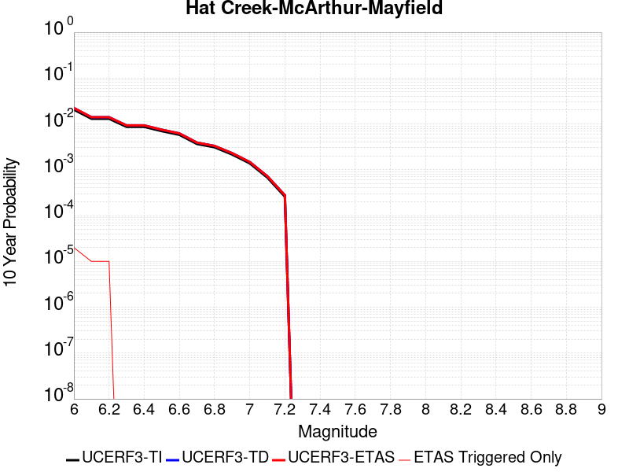 |

| Magnitude | 1 wk TI Prob | 1 wk TD Prob | 1 wk ETAS Prob | 1 wk ETAS/TD Gain | 1 wk ETAS Triggered Only | 1 mo TI Prob | 1 mo TD Prob | 1 mo ETAS Prob | 1 mo ETAS/TD Gain | 1 mo ETAS Triggered Only | 1 yr TI Prob | 1 yr TD Prob | 1 yr ETAS Prob | 1 yr ETAS/TD Gain | 1 yr ETAS Triggered Only | 10 yr TI Prob | 10 yr TD Prob | 10 yr ETAS Prob | 10 yr ETAS/TD Gain | 10 yr ETAS Triggered Only |
|-----|-----|-----|-----|-----|-----|-----|-----|-----|-----|-----|-----|-----|-----|-----|-----|-----|-----|-----|-----|-----|
| 6.0 | 3.967457E-5 | 4.316336E-5 | 4.316336E-5 | 1.0 | 0.0 | 1.7002279E-4 | 1.8497335E-4 | 1.8497335E-4 | 1.0 | 0.0 | 0.002068062 | 0.0022498388 | 0.002280127 | 1.0134623 | 3.0356385E-5 | 0.02048922 | 0.022282979 | 0.022312658 | 1.0013319 | 3.0356385E-5 |
| 6.1 | 2.5044013E-5 | 2.707408E-5 | 2.707408E-5 | 1.0 | 0.0 | 1.0732707E-4 | 1.16026786E-4 | 1.16026786E-4 | 1.0 | 0.0 | 0.0013059238 | 0.0014117425 | 0.001442056 | 1.0214725 | 3.0356385E-5 | 0.01298276 | 0.014031162 | 0.0140610915 | 1.0021331 | 3.0356385E-5 |
| 6.2 | 2.5044013E-5 | 2.707408E-5 | 2.707408E-5 | 1.0 | 0.0 | 1.0732707E-4 | 1.16026786E-4 | 1.16026786E-4 | 1.0 | 0.0 | 0.0013059238 | 0.0014117425 | 0.001442056 | 1.0214725 | 3.0356385E-5 | 0.01298276 | 0.014031162 | 0.0140610915 | 1.0021331 | 3.0356385E-5 |
| 6.3 | 1.6624012E-5 | 1.7892884E-5 | 1.7892884E-5 | 1.0 | 0.0 | 7.124382E-5 | 7.668158E-5 | 7.668158E-5 | 1.0 | 0.0 | 8.670483E-4 | 9.33207E-4 | 9.33207E-4 | 1.0 | 0.0 | 0.008636732 | 0.009293816 | 0.009293816 | 1.0 | 0.0 |
| 6.4 | 1.6624012E-5 | 1.7892884E-5 | 1.7892884E-5 | 1.0 | 0.0 | 7.124382E-5 | 7.668158E-5 | 7.668158E-5 | 1.0 | 0.0 | 8.670483E-4 | 9.33207E-4 | 9.33207E-4 | 1.0 | 0.0 | 0.008636732 | 0.009293816 | 0.009293816 | 1.0 | 0.0 |
| 6.5 | 1.3394842E-5 | 1.439356E-5 | 1.439356E-5 | 1.0 | 0.0 | 5.7405203E-5 | 6.1685256E-5 | 6.1685256E-5 | 1.0 | 0.0 | 6.986842E-4 | 7.507648E-4 | 7.507648E-4 | 1.0 | 0.0 | 0.006964916 | 0.0074828775 | 0.0074828775 | 1.0 | 0.0 |
| 6.6 | 1.1137514E-5 | 1.195571E-5 | 1.195571E-5 | 1.0 | 0.0 | 4.7731326E-5 | 5.1237774E-5 | 5.1237774E-5 | 1.0 | 0.0 | 5.809739E-4 | 6.236454E-4 | 6.236454E-4 | 1.0 | 0.0 | 0.005794574 | 0.006219374 | 0.006219374 | 1.0 | 0.0 |
| 6.7 | 7.0200663E-6 | 7.525007E-6 | 7.525007E-6 | 1.0 | 0.0 | 3.008565E-5 | 3.224964E-5 | 3.224964E-5 | 1.0 | 0.0 | 3.6623122E-4 | 3.9257022E-4 | 3.9257022E-4 | 1.0 | 0.0 | 0.0036562826 | 0.00391893 | 0.00391893 | 1.0 | 0.0 |
| 6.8 | 5.940172E-6 | 6.3660814E-6 | 6.3660814E-6 | 1.0 | 0.0 | 2.545763E-5 | 2.7282927E-5 | 2.7282927E-5 | 1.0 | 0.0 | 3.0990256E-4 | 3.3212028E-4 | 3.3212028E-4 | 1.0 | 0.0 | 0.0030947074 | 0.003316368 | 0.003316368 | 1.0 | 0.0 |
| 6.9 | 4.129831E-6 | 4.4239646E-6 | 4.4239646E-6 | 1.0 | 0.0 | 1.7699154E-5 | 1.8959714E-5 | 1.8959714E-5 | 1.0 | 0.0 | 2.154659E-4 | 2.3081087E-4 | 2.3081087E-4 | 1.0 | 0.0 | 0.002152571 | 0.0023057899 | 0.0023057899 | 1.0 | 0.0 |
| 7.0 | 2.6512955E-6 | 2.8376644E-6 | 2.8376644E-6 | 1.0 | 0.0 | 1.1362646E-5 | 1.2161364E-5 | 1.2161364E-5 | 1.0 | 0.0 | 1.3833142E-4 | 1.4805498E-4 | 1.4805498E-4 | 1.0 | 0.0 | 0.0013824535 | 0.001479606 | 0.001479606 | 1.0 | 0.0 |
| 7.1 | 1.2992575E-6 | 1.3910619E-6 | 1.3910619E-6 | 1.0 | 0.0 | 5.568235E-6 | 5.961682E-6 | 5.961682E-6 | 1.0 | 0.0 | 6.779115E-5 | 7.258128E-5 | 7.258128E-5 | 1.0 | 0.0 | 6.7770475E-4 | 7.255973E-4 | 7.255973E-4 | 1.0 | 0.0 |
| 7.2 | 4.968191E-7 | 5.3276585E-7 | 5.3276585E-7 | 1.0 | 0.0 | 2.1292228E-6 | 2.2832808E-6 | 2.2832808E-6 | 1.0 | 0.0 | 2.592298E-5 | 2.7798715E-5 | 2.7798715E-5 | 1.0 | 0.0 | 2.5919956E-4 | 2.7796475E-4 | 2.7796475E-4 | 1.0 | 0.0 |

## Blue Cut
*[(top)](#table-of-contents)*

| 1 Week | 1 Month | 1 Year | 10 Year |
|-----|-----|-----|-----|
| 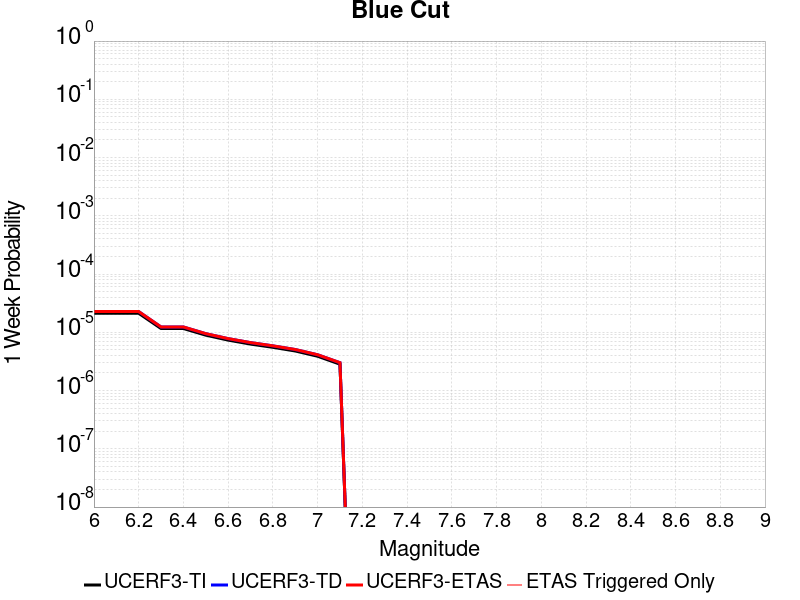 |  | 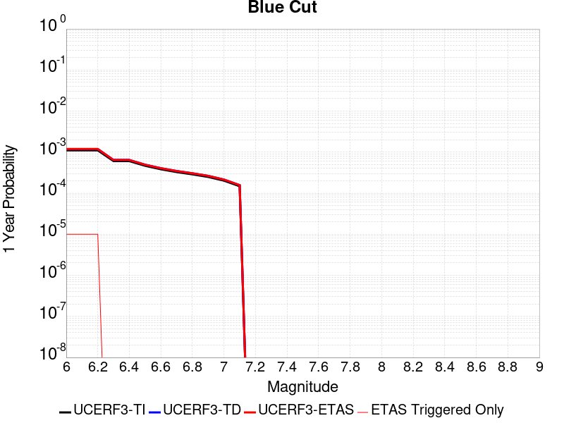 |  |

| Magnitude | 1 wk TI Prob | 1 wk TD Prob | 1 wk ETAS Prob | 1 wk ETAS/TD Gain | 1 wk ETAS Triggered Only | 1 mo TI Prob | 1 mo TD Prob | 1 mo ETAS Prob | 1 mo ETAS/TD Gain | 1 mo ETAS Triggered Only | 1 yr TI Prob | 1 yr TD Prob | 1 yr ETAS Prob | 1 yr ETAS/TD Gain | 1 yr ETAS Triggered Only | 10 yr TI Prob | 10 yr TD Prob | 10 yr ETAS Prob | 10 yr ETAS/TD Gain | 10 yr ETAS Triggered Only |
|-----|-----|-----|-----|-----|-----|-----|-----|-----|-----|-----|-----|-----|-----|-----|-----|-----|-----|-----|-----|-----|
| 6.0 | 2.1227985E-5 | 2.2721695E-5 | 2.2721695E-5 | 1.0 | 0.0 | 9.097391E-5 | 9.7375385E-5 | 9.7375385E-5 | 1.0 | 0.0 | 0.0011070445 | 0.0011849586 | 0.0011849586 | 1.0 | 0.0 | 0.011015458 | 0.011792246 | 0.011822245 | 1.0025439 | 3.0356385E-5 |
| 6.1 | 2.1227985E-5 | 2.2721695E-5 | 2.2721695E-5 | 1.0 | 0.0 | 9.097391E-5 | 9.7375385E-5 | 9.7375385E-5 | 1.0 | 0.0 | 0.0011070445 | 0.0011849586 | 0.0011849586 | 1.0 | 0.0 | 0.011015458 | 0.011792246 | 0.011822245 | 1.0025439 | 3.0356385E-5 |
| 6.2 | 2.1227985E-5 | 2.2721695E-5 | 2.2721695E-5 | 1.0 | 0.0 | 9.097391E-5 | 9.7375385E-5 | 9.7375385E-5 | 1.0 | 0.0 | 0.0011070445 | 0.0011849586 | 0.0011849586 | 1.0 | 0.0 | 0.011015458 | 0.011792246 | 0.011822245 | 1.0025439 | 3.0356385E-5 |
| 6.3 | 1.1613981E-5 | 1.2354586E-5 | 1.2354586E-5 | 1.0 | 0.0 | 4.9773254E-5 | 5.294722E-5 | 5.294722E-5 | 1.0 | 0.0 | 6.0582085E-4 | 6.444542E-4 | 6.444542E-4 | 1.0 | 0.0 | 0.0060417196 | 0.006427101 | 0.006427101 | 1.0 | 0.0 |
| 6.4 | 1.1613981E-5 | 1.2354586E-5 | 1.2354586E-5 | 1.0 | 0.0 | 4.9773254E-5 | 5.294722E-5 | 5.294722E-5 | 1.0 | 0.0 | 6.0582085E-4 | 6.444542E-4 | 6.444542E-4 | 1.0 | 0.0 | 0.0060417196 | 0.006427101 | 0.006427101 | 1.0 | 0.0 |
| 6.5 | 8.931326E-6 | 9.4823745E-6 | 9.4823745E-6 | 1.0 | 0.0 | 3.8276554E-5 | 4.0638166E-5 | 4.0638166E-5 | 1.0 | 0.0 | 4.6591737E-4 | 4.946665E-4 | 4.946665E-4 | 1.0 | 0.0 | 0.0046494175 | 0.004936564 | 0.004936564 | 1.0 | 0.0 |
| 6.6 | 7.345353E-6 | 7.790905E-6 | 7.790905E-6 | 1.0 | 0.0 | 3.1479703E-5 | 3.338921E-5 | 3.338921E-5 | 1.0 | 0.0 | 3.83198E-4 | 4.0644582E-4 | 4.0644582E-4 | 1.0 | 0.0 | 0.0038253788 | 0.004057816 | 0.004057816 | 1.0 | 0.0 |
| 6.7 | 6.2775666E-6 | 6.65568E-6 | 6.65568E-6 | 1.0 | 0.0 | 2.690358E-5 | 2.8524073E-5 | 2.8524073E-5 | 1.0 | 0.0 | 3.2750185E-4 | 3.4723277E-4 | 3.4723277E-4 | 1.0 | 0.0 | 0.0032701963 | 0.0034676434 | 0.0034676434 | 1.0 | 0.0 |
| 6.8 | 5.5234095E-6 | 5.8555775E-6 | 5.8555775E-6 | 1.0 | 0.0 | 2.367154E-5 | 2.5095133E-5 | 2.5095133E-5 | 1.0 | 0.0 | 2.8816288E-4 | 3.0549767E-4 | 3.0549767E-4 | 1.0 | 0.0 | 0.002877895 | 0.0030514933 | 0.0030514933 | 1.0 | 0.0 |
| 6.9 | 4.7780054E-6 | 5.0658246E-6 | 5.0658246E-6 | 1.0 | 0.0 | 2.0477004E-5 | 2.1710535E-5 | 2.1710535E-5 | 1.0 | 0.0 | 2.4927902E-4 | 2.6430076E-4 | 2.6430076E-4 | 1.0 | 0.0 | 0.0024899957 | 0.0026405565 | 0.0026405565 | 1.0 | 0.0 |
| 7.0 | 3.883171E-6 | 4.118818E-6 | 4.118818E-6 | 1.0 | 0.0 | 1.6642054E-5 | 1.7651997E-5 | 1.7651997E-5 | 1.0 | 0.0 | 2.0259817E-4 | 2.1489876E-4 | 2.1489876E-4 | 1.0 | 0.0 | 0.0020241356 | 0.0021475854 | 0.0021475854 | 1.0 | 0.0 |
| 7.1 | 2.8358215E-6 | 3.0099607E-6 | 3.0099607E-6 | 1.0 | 0.0 | 1.2153464E-5 | 1.28998045E-5 | 1.28998045E-5 | 1.0 | 0.0 | 1.4795837E-4 | 1.5705038E-4 | 1.5705038E-4 | 1.0 | 0.0 | 0.001478599 | 0.0015700393 | 0.0015700393 | 1.0 | 0.0 |

## Sierra Madre
*[(top)](#table-of-contents)*

| 1 Week | 1 Month | 1 Year | 10 Year |
|-----|-----|-----|-----|
|  |  |  | 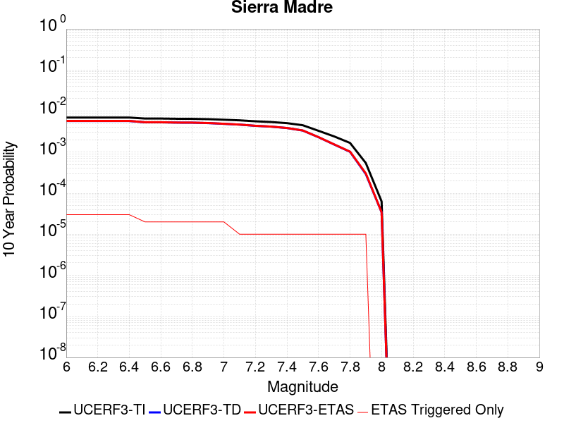 |

| Magnitude | 1 wk TI Prob | 1 wk TD Prob | 1 wk ETAS Prob | 1 wk ETAS/TD Gain | 1 wk ETAS Triggered Only | 1 mo TI Prob | 1 mo TD Prob | 1 mo ETAS Prob | 1 mo ETAS/TD Gain | 1 mo ETAS Triggered Only | 1 yr TI Prob | 1 yr TD Prob | 1 yr ETAS Prob | 1 yr ETAS/TD Gain | 1 yr ETAS Triggered Only | 10 yr TI Prob | 10 yr TD Prob | 10 yr ETAS Prob | 10 yr ETAS/TD Gain | 10 yr ETAS Triggered Only |
|-----|-----|-----|-----|-----|-----|-----|-----|-----|-----|-----|-----|-----|-----|-----|-----|-----|-----|-----|-----|-----|
| 6.0 | 1.3379373E-5 | 1.1004191E-5 | 1.1004191E-5 | 1.0 | 0.0 | 5.7338908E-5 | 4.7159974E-5 | 4.7159974E-5 | 1.0 | 0.0 | 6.978776E-4 | 5.740229E-4 | 5.740229E-4 | 1.0 | 0.0 | 0.0069569005 | 0.005725766 | 0.0057559484 | 1.0052713 | 3.0356385E-5 |
| 6.1 | 1.3379373E-5 | 1.1004191E-5 | 1.1004191E-5 | 1.0 | 0.0 | 5.7338908E-5 | 4.7159974E-5 | 4.7159974E-5 | 1.0 | 0.0 | 6.978776E-4 | 5.740229E-4 | 5.740229E-4 | 1.0 | 0.0 | 0.0069569005 | 0.005725766 | 0.0057559484 | 1.0052713 | 3.0356385E-5 |
| 6.2 | 1.3379373E-5 | 1.1004191E-5 | 1.1004191E-5 | 1.0 | 0.0 | 5.7338908E-5 | 4.7159974E-5 | 4.7159974E-5 | 1.0 | 0.0 | 6.978776E-4 | 5.740229E-4 | 5.740229E-4 | 1.0 | 0.0 | 0.0069569005 | 0.005725766 | 0.0057559484 | 1.0052713 | 3.0356385E-5 |
| 6.3 | 1.3379373E-5 | 1.1004191E-5 | 1.1004191E-5 | 1.0 | 0.0 | 5.7338908E-5 | 4.7159974E-5 | 4.7159974E-5 | 1.0 | 0.0 | 6.978776E-4 | 5.740229E-4 | 5.740229E-4 | 1.0 | 0.0 | 0.0069569005 | 0.005725766 | 0.0057559484 | 1.0052713 | 3.0356385E-5 |
| 6.4 | 1.3379373E-5 | 1.1004191E-5 | 1.1004191E-5 | 1.0 | 0.0 | 5.7338908E-5 | 4.7159974E-5 | 4.7159974E-5 | 1.0 | 0.0 | 6.978776E-4 | 5.740229E-4 | 5.740229E-4 | 1.0 | 0.0 | 0.0069569005 | 0.005725766 | 0.0057559484 | 1.0052713 | 3.0356385E-5 |
| 6.5 | 1.26563245E-5 | 1.023358E-5 | 1.023358E-5 | 1.0 | 0.0 | 5.4240263E-5 | 4.3857468E-5 | 4.3857468E-5 | 1.0 | 0.0 | 6.601751E-4 | 5.338349E-4 | 5.338349E-4 | 1.0 | 0.0 | 0.006582173 | 0.0053258473 | 0.0053258473 | 1.0 | 0.0 |
| 6.6 | 1.26563245E-5 | 1.023358E-5 | 1.023358E-5 | 1.0 | 0.0 | 5.4240263E-5 | 4.3857468E-5 | 4.3857468E-5 | 1.0 | 0.0 | 6.601751E-4 | 5.338349E-4 | 5.338349E-4 | 1.0 | 0.0 | 0.006582173 | 0.0053258473 | 0.0053258473 | 1.0 | 0.0 |
| 6.7 | 1.2502474E-5 | 1.006971E-5 | 1.006971E-5 | 1.0 | 0.0 | 5.3580934E-5 | 4.315519E-5 | 4.315519E-5 | 1.0 | 0.0 | 6.521526E-4 | 5.252888E-4 | 5.252888E-4 | 1.0 | 0.0 | 0.0065024206 | 0.005240791 | 0.005240791 | 1.0 | 0.0 |
| 6.8 | 1.2454966E-5 | 1.002199E-5 | 1.002199E-5 | 1.0 | 0.0 | 5.3377335E-5 | 4.2950687E-5 | 4.2950687E-5 | 1.0 | 0.0 | 6.4967526E-4 | 5.228002E-4 | 5.228002E-4 | 1.0 | 0.0 | 0.006477792 | 0.0052160216 | 0.0052160216 | 1.0 | 0.0 |
| 6.9 | 1.2225574E-5 | 9.795794E-6 | 9.795794E-6 | 1.0 | 0.0 | 5.2394265E-5 | 4.1981304E-5 | 4.1981304E-5 | 1.0 | 0.0 | 6.3771347E-4 | 5.1100354E-4 | 5.1100354E-4 | 1.0 | 0.0 | 0.006358865 | 0.0050986013 | 0.0050986013 | 1.0 | 0.0 |
| 7.0 | 1.182946E-5 | 9.402269E-6 | 9.402269E-6 | 1.0 | 0.0 | 5.06967E-5 | 4.029482E-5 | 4.029482E-5 | 1.0 | 0.0 | 6.1705755E-4 | 4.9048004E-4 | 4.9048004E-4 | 1.0 | 0.0 | 0.006153469 | 0.004894287 | 0.004894287 | 1.0 | 0.0 |
| 7.1 | 1.14369095E-5 | 8.989202E-6 | 8.989202E-6 | 1.0 | 0.0 | 4.9014405E-5 | 3.8524588E-5 | 3.8524588E-5 | 1.0 | 0.0 | 5.9658696E-4 | 4.6893687E-4 | 4.6893687E-4 | 1.0 | 0.0 | 0.005949879 | 0.004679779 | 0.004679779 | 1.0 | 0.0 |
| 7.2 | 1.0836419E-5 | 8.402509E-6 | 8.402509E-6 | 1.0 | 0.0 | 4.644097E-5 | 3.601026E-5 | 3.601026E-5 | 1.0 | 0.0 | 5.652721E-4 | 4.3833765E-4 | 4.3833765E-4 | 1.0 | 0.0 | 0.0056383642 | 0.0043750275 | 0.0043750275 | 1.0 | 0.0 |
| 7.3 | 1.0403439E-5 | 8.02372E-6 | 8.02372E-6 | 1.0 | 0.0 | 4.4585406E-5 | 3.438692E-5 | 3.438692E-5 | 1.0 | 0.0 | 5.426921E-4 | 4.1858124E-4 | 4.1858124E-4 | 1.0 | 0.0 | 0.005413687 | 0.0041782237 | 0.0041782237 | 1.0 | 0.0 |
| 7.4 | 9.768864E-6 | 7.4172585E-6 | 7.4172585E-6 | 1.0 | 0.0 | 4.186589E-5 | 3.178787E-5 | 3.178787E-5 | 1.0 | 0.0 | 5.09598E-4 | 3.8694945E-4 | 3.8694945E-4 | 1.0 | 0.0 | 0.0050843097 | 0.0038630487 | 0.0038630487 | 1.0 | 0.0 |
| 7.5 | 8.687089E-6 | 6.4527394E-6 | 6.4527394E-6 | 1.0 | 0.0 | 3.722985E-5 | 2.765431E-5 | 2.765431E-5 | 1.0 | 0.0 | 4.5317915E-4 | 3.3664008E-4 | 3.3664008E-4 | 1.0 | 0.0 | 0.004522561 | 0.0033615883 | 0.0033615883 | 1.0 | 0.0 |
| 7.6 | 6.3506063E-6 | 4.4326393E-6 | 4.4326393E-6 | 1.0 | 0.0 | 2.72166E-5 | 1.8996889E-5 | 1.8996889E-5 | 1.0 | 0.0 | 3.3131172E-4 | 2.3126282E-4 | 2.3126282E-4 | 1.0 | 0.0 | 0.003308182 | 0.0023104465 | 0.0023104465 | 1.0 | 0.0 |
| 7.7 | 4.62223E-6 | 2.935122E-6 | 2.935122E-6 | 1.0 | 0.0 | 1.9809406E-5 | 1.2579034E-5 | 1.2579034E-5 | 1.0 | 0.0 | 2.4115283E-4 | 1.5313899E-4 | 1.5313899E-4 | 1.0 | 0.0 | 0.0024089129 | 0.0015305356 | 0.0015305356 | 1.0 | 0.0 |
| 7.8 | 3.2145008E-6 | 1.9510014E-6 | 1.9510014E-6 | 1.0 | 0.0 | 1.3776359E-5 | 8.361408E-6 | 8.361408E-6 | 1.0 | 0.0 | 1.6771426E-4 | 1.01795405E-4 | 1.01795405E-4 | 1.0 | 0.0 | 0.0016758774 | 0.0010176324 | 0.0010176324 | 1.0 | 0.0 |
| 7.9 | 1.0391769E-6 | 5.6080785E-7 | 5.6080785E-7 | 1.0 | 0.0 | 4.4536077E-6 | 2.40346E-6 | 2.40346E-6 | 1.0 | 0.0 | 5.4221324E-5 | 2.9261737E-5 | 2.9261737E-5 | 1.0 | 0.0 | 5.4208096E-4 | 2.9257927E-4 | 2.9257927E-4 | 1.0 | 0.0 |
| 8.0 | 1.210983E-7 | 6.617328E-8 | 6.617328E-8 | 1.0 | 0.0 | 5.1899264E-7 | 2.8359972E-7 | 2.8359972E-7 | 1.0 | 0.0 | 6.3187167E-6 | 3.4528214E-6 | 3.4528214E-6 | 1.0 | 0.0 | 6.318537E-5 | 3.4527697E-5 | 3.4527697E-5 | 1.0 | 0.0 |

## San Pedro Basin
*[(top)](#table-of-contents)*

| 1 Week | 1 Month | 1 Year | 10 Year |
|-----|-----|-----|-----|
|  |  |  |  |

| Magnitude | 1 wk TI Prob | 1 wk TD Prob | 1 wk ETAS Prob | 1 wk ETAS/TD Gain | 1 wk ETAS Triggered Only | 1 mo TI Prob | 1 mo TD Prob | 1 mo ETAS Prob | 1 mo ETAS/TD Gain | 1 mo ETAS Triggered Only | 1 yr TI Prob | 1 yr TD Prob | 1 yr ETAS Prob | 1 yr ETAS/TD Gain | 1 yr ETAS Triggered Only | 10 yr TI Prob | 10 yr TD Prob | 10 yr ETAS Prob | 10 yr ETAS/TD Gain | 10 yr ETAS Triggered Only |
|-----|-----|-----|-----|-----|-----|-----|-----|-----|-----|-----|-----|-----|-----|-----|-----|-----|-----|-----|-----|-----|
| 6.0 | 5.3449043E-5 | 6.3385276E-5 | 6.3385276E-5 | 1.0 | 0.0 | 2.2904722E-4 | 2.7162637E-4 | 2.7162637E-4 | 1.0 | 0.0 | 0.0027850836 | 0.0033026508 | 0.0033026508 | 1.0 | 0.0 | 0.027504366 | 0.032597434 | 0.032626804 | 1.0009009 | 3.0356385E-5 |
| 6.1 | 5.3449043E-5 | 6.3385276E-5 | 6.3385276E-5 | 1.0 | 0.0 | 2.2904722E-4 | 2.7162637E-4 | 2.7162637E-4 | 1.0 | 0.0 | 0.0027850836 | 0.0033026508 | 0.0033026508 | 1.0 | 0.0 | 0.027504366 | 0.032597434 | 0.032626804 | 1.0009009 | 3.0356385E-5 |
| 6.2 | 2.3189454E-5 | 2.6648175E-5 | 2.6648175E-5 | 1.0 | 0.0 | 9.9379584E-5 | 1.14201735E-4 | 1.14201735E-4 | 1.0 | 0.0 | 0.0012092749 | 0.0013895667 | 0.0013895667 | 1.0 | 0.0 | 0.012027155 | 0.013813651 | 0.013813651 | 1.0 | 0.0 |
| 6.3 | 2.3189454E-5 | 2.6648175E-5 | 2.6648175E-5 | 1.0 | 0.0 | 9.9379584E-5 | 1.14201735E-4 | 1.14201735E-4 | 1.0 | 0.0 | 0.0012092749 | 0.0013895667 | 0.0013895667 | 1.0 | 0.0 | 0.012027155 | 0.013813651 | 0.013813651 | 1.0 | 0.0 |
| 6.4 | 1.966056E-5 | 2.2467766E-5 | 2.2467766E-5 | 1.0 | 0.0 | 8.425682E-5 | 9.62871E-5 | 9.62871E-5 | 1.0 | 0.0 | 0.001025344 | 0.0011717052 | 0.0011717052 | 1.0 | 0.0 | 0.010206259 | 0.011659362 | 0.011659362 | 1.0 | 0.0 |
| 6.5 | 1.7342953E-5 | 1.9748875E-5 | 1.9748875E-5 | 1.0 | 0.0 | 7.4324824E-5 | 8.46355E-5 | 8.46355E-5 | 1.0 | 0.0 | 9.04529E-4 | 0.0010299871 | 0.0010299871 | 1.0 | 0.0 | 0.009008561 | 0.010255857 | 0.010255857 | 1.0 | 0.0 |
| 6.6 | 1.439804E-5 | 1.6325706E-5 | 1.6325706E-5 | 1.0 | 0.0 | 6.170443E-5 | 6.9965616E-5 | 6.9965616E-5 | 1.0 | 0.0 | 7.509924E-4 | 8.5153064E-4 | 8.5153064E-4 | 1.0 | 0.0 | 0.0074845953 | 0.008485881 | 0.008485881 | 1.0 | 0.0 |
| 6.7 | 1.2634884E-5 | 1.4287867E-5 | 1.4287867E-5 | 1.0 | 0.0 | 5.414838E-5 | 6.123245E-5 | 6.123245E-5 | 1.0 | 0.0 | 6.590571E-4 | 7.4528053E-4 | 7.4528053E-4 | 1.0 | 0.0 | 0.006571059 | 0.0074308338 | 0.0074308338 | 1.0 | 0.0 |
| 6.8 | 1.146091E-5 | 1.2935489E-5 | 1.2935489E-5 | 1.0 | 0.0 | 4.911726E-5 | 5.54368E-5 | 5.54368E-5 | 1.0 | 0.0 | 5.9783855E-4 | 6.747638E-4 | 6.747638E-4 | 1.0 | 0.0 | 0.0059623276 | 0.0067300913 | 0.0067300913 | 1.0 | 0.0 |
| 6.9 | 9.109035E-6 | 1.0236781E-5 | 1.0236781E-5 | 1.0 | 0.0 | 3.9038136E-5 | 4.387134E-5 | 4.387134E-5 | 1.0 | 0.0 | 4.7518566E-4 | 5.3403067E-4 | 5.3403067E-4 | 1.0 | 0.0 | 0.0047417083 | 0.0053302287 | 0.0053302287 | 1.0 | 0.0 |
| 7.0 | 5.9351028E-6 | 6.585005E-6 | 6.585005E-6 | 1.0 | 0.0 | 2.5435906E-5 | 2.8221279E-5 | 2.8221279E-5 | 1.0 | 0.0 | 3.0963816E-4 | 3.435635E-4 | 3.435635E-4 | 1.0 | 0.0 | 0.0030920706 | 0.0034326415 | 0.0034326415 | 1.0 | 0.0 |
| 7.1 | 2.1557585E-6 | 2.209775E-6 | 2.209775E-6 | 1.0 | 0.0 | 9.238933E-6 | 9.470431E-6 | 9.470431E-6 | 1.0 | 0.0 | 1.1247819E-4 | 1.1529655E-4 | 1.1529655E-4 | 1.0 | 0.0 | 0.0011242128 | 0.0011523827 | 0.0011523827 | 1.0 | 0.0 |
| 7.2 | 2.1251979E-6 | 2.1781198E-6 | 2.1781198E-6 | 1.0 | 0.0 | 9.107958E-6 | 9.334766E-6 | 9.334766E-6 | 1.0 | 0.0 | 1.1088375E-4 | 1.1364501E-4 | 1.1364501E-4 | 1.0 | 0.0 | 0.0011082845 | 0.0011358842 | 0.0011358842 | 1.0 | 0.0 |
| 7.3 | 1.7145798E-6 | 1.7443804E-6 | 1.7443804E-6 | 1.0 | 0.0 | 7.3481783E-6 | 7.4758946E-6 | 7.4758946E-6 | 1.0 | 0.0 | 8.94604E-5 | 9.101531E-5 | 9.101531E-5 | 1.0 | 0.0 | 8.9424395E-4 | 9.0978947E-4 | 9.0978947E-4 | 1.0 | 0.0 |
| 7.4 | 1.4467993E-6 | 1.4642625E-6 | 1.4642625E-6 | 1.0 | 0.0 | 6.200554E-6 | 6.275396E-6 | 6.275396E-6 | 1.0 | 0.0 | 7.548913E-5 | 7.640034E-5 | 7.640034E-5 | 1.0 | 0.0 | 7.546349E-4 | 7.63748E-4 | 7.63748E-4 | 1.0 | 0.0 |
| 7.5 | 1.2803735E-6 | 1.2932165E-6 | 1.2932165E-6 | 1.0 | 0.0 | 5.487303E-6 | 5.542345E-6 | 5.542345E-6 | 1.0 | 0.0 | 6.680587E-5 | 6.747604E-5 | 6.747604E-5 | 1.0 | 0.0 | 6.678579E-4 | 6.745625E-4 | 6.745625E-4 | 1.0 | 0.0 |
| 7.6 | 6.755009E-7 | 6.7698187E-7 | 6.7698187E-7 | 1.0 | 0.0 | 2.8950008E-6 | 2.9013481E-6 | 2.9013481E-6 | 1.0 | 0.0 | 3.5246063E-5 | 3.53234E-5 | 3.53234E-5 | 1.0 | 0.0 | 3.5240475E-4 | 3.5318357E-4 | 3.5318357E-4 | 1.0 | 0.0 |
| 7.7 | 6.211885E-8 | 4.5702848E-8 | 4.5702848E-8 | 1.0 | 0.0 | 2.6622362E-7 | 1.9586933E-7 | 1.9586933E-7 | 1.0 | 0.0 | 3.2412677E-6 | 2.3847067E-6 | 2.3847067E-6 | 1.0 | 0.0 | 3.2412205E-5 | 2.3846831E-5 | 2.3846831E-5 | 1.0 | 0.0 |
| 7.8 | 2.6580573E-9 | 1.5143348E-9 | 1.5143348E-9 | 1.0 | 0.0 | 1.1391674E-8 | 6.490006E-9 | 6.490006E-9 | 1.0 | 0.0 | 1.3869362E-7 | 7.901583E-8 | 7.901583E-8 | 1.0 | 0.0 | 1.3869354E-6 | 7.9015825E-7 | 7.9015825E-7 | 1.0 | 0.0 |

## Emerson-Copper Mtn 2011
*[(top)](#table-of-contents)*

| 1 Week | 1 Month | 1 Year | 10 Year |
|-----|-----|-----|-----|
| 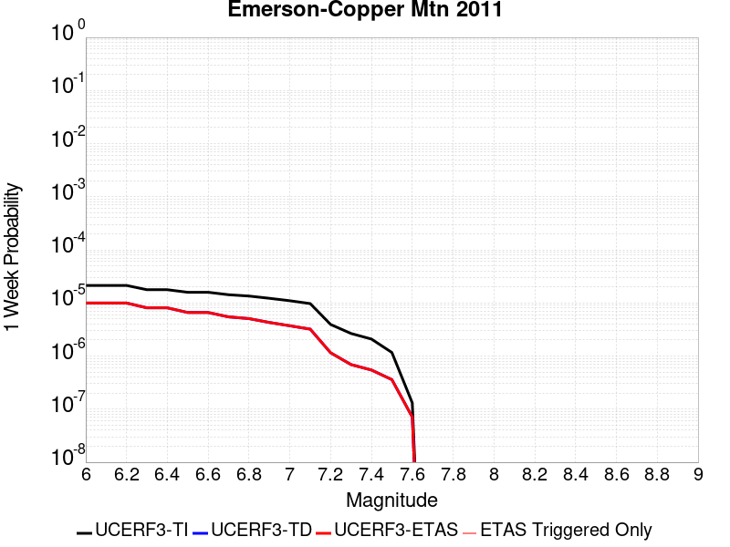 | 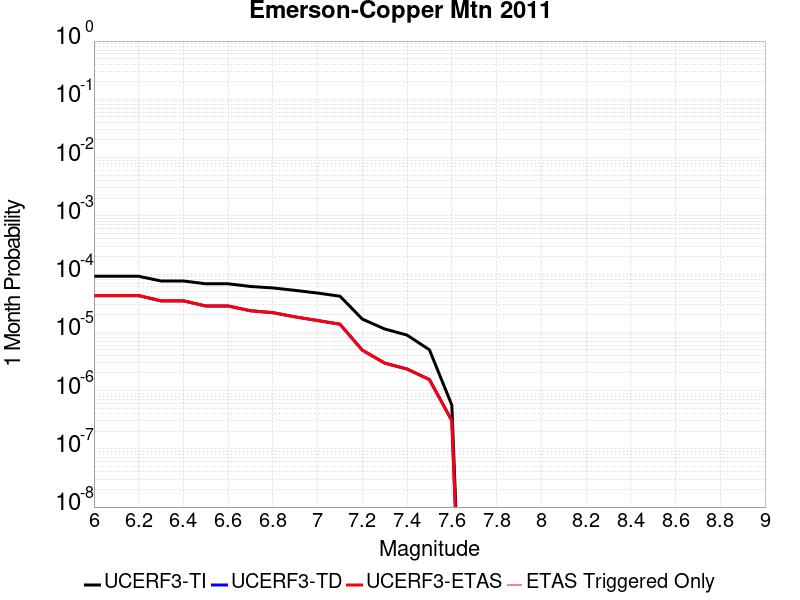 |  |  |

| Magnitude | 1 wk TI Prob | 1 wk TD Prob | 1 wk ETAS Prob | 1 wk ETAS/TD Gain | 1 wk ETAS Triggered Only | 1 mo TI Prob | 1 mo TD Prob | 1 mo ETAS Prob | 1 mo ETAS/TD Gain | 1 mo ETAS Triggered Only | 1 yr TI Prob | 1 yr TD Prob | 1 yr ETAS Prob | 1 yr ETAS/TD Gain | 1 yr ETAS Triggered Only | 10 yr TI Prob | 10 yr TD Prob | 10 yr ETAS Prob | 10 yr ETAS/TD Gain | 10 yr ETAS Triggered Only |
|-----|-----|-----|-----|-----|-----|-----|-----|-----|-----|-----|-----|-----|-----|-----|-----|-----|-----|-----|-----|-----|
| 6.0 | 2.1364202E-5 | 9.969751E-6 | 9.969751E-6 | 1.0 | 0.0 | 9.1557646E-5 | 4.2726853E-5 | 4.2726853E-5 | 1.0 | 0.0 | 0.0011141442 | 5.20084E-4 | 5.504246E-4 | 1.0583379 | 3.0356385E-5 | 0.011085749 | 0.0051895385 | 0.0052197375 | 1.0058192 | 3.0356385E-5 |
| 6.1 | 2.1364202E-5 | 9.969751E-6 | 9.969751E-6 | 1.0 | 0.0 | 9.1557646E-5 | 4.2726853E-5 | 4.2726853E-5 | 1.0 | 0.0 | 0.0011141442 | 5.20084E-4 | 5.504246E-4 | 1.0583379 | 3.0356385E-5 | 0.011085749 | 0.0051895385 | 0.0052197375 | 1.0058192 | 3.0356385E-5 |
| 6.2 | 2.1364202E-5 | 9.969751E-6 | 9.969751E-6 | 1.0 | 0.0 | 9.1557646E-5 | 4.2726853E-5 | 4.2726853E-5 | 1.0 | 0.0 | 0.0011141442 | 5.20084E-4 | 5.504246E-4 | 1.0583379 | 3.0356385E-5 | 0.011085749 | 0.0051895385 | 0.0052197375 | 1.0058192 | 3.0356385E-5 |
| 6.3 | 1.7751237E-5 | 8.090614E-6 | 8.090614E-6 | 1.0 | 0.0 | 7.607452E-5 | 3.4673634E-5 | 3.4673634E-5 | 1.0 | 0.0 | 9.258136E-4 | 4.2207597E-4 | 4.5241957E-4 | 1.0718913 | 3.0356385E-5 | 0.00921966 | 0.004213366 | 0.0042435946 | 1.0071744 | 3.0356385E-5 |
| 6.4 | 1.7751237E-5 | 8.090614E-6 | 8.090614E-6 | 1.0 | 0.0 | 7.607452E-5 | 3.4673634E-5 | 3.4673634E-5 | 1.0 | 0.0 | 9.258136E-4 | 4.2207597E-4 | 4.5241957E-4 | 1.0718913 | 3.0356385E-5 | 0.00921966 | 0.004213366 | 0.0042435946 | 1.0071744 | 3.0356385E-5 |
| 6.5 | 1.5886664E-5 | 6.604985E-6 | 6.604985E-6 | 1.0 | 0.0 | 6.808392E-5 | 2.83068E-5 | 2.83068E-5 | 1.0 | 0.0 | 8.286065E-4 | 3.4458548E-4 | 3.749314E-4 | 1.088065 | 3.0356385E-5 | 0.008255237 | 0.0034409761 | 0.003471228 | 1.0087917 | 3.0356385E-5 |
| 6.6 | 1.5886664E-5 | 6.604985E-6 | 6.604985E-6 | 1.0 | 0.0 | 6.808392E-5 | 2.83068E-5 | 2.83068E-5 | 1.0 | 0.0 | 8.286065E-4 | 3.4458548E-4 | 3.749314E-4 | 1.088065 | 3.0356385E-5 | 0.008255237 | 0.0034409761 | 0.003471228 | 1.0087917 | 3.0356385E-5 |
| 6.7 | 1.428471E-5 | 5.4714073E-6 | 5.4714073E-6 | 1.0 | 0.0 | 6.121875E-5 | 2.34487E-5 | 2.34487E-5 | 1.0 | 0.0 | 7.450834E-4 | 2.8545447E-4 | 3.1580217E-4 | 1.1063137 | 3.0356385E-5 | 0.007425902 | 0.0028512662 | 0.002881536 | 1.0106163 | 3.0356385E-5 |
| 6.8 | 1.3490684E-5 | 5.074642E-6 | 5.074642E-6 | 1.0 | 0.0 | 5.7815934E-5 | 2.1748307E-5 | 2.1748307E-5 | 1.0 | 0.0 | 7.0368167E-4 | 2.6475734E-4 | 2.9510568E-4 | 1.114627 | 3.0356385E-5 | 0.007014576 | 0.0026448 | 0.0026750762 | 1.0114474 | 3.0356385E-5 |
| 6.9 | 1.2235421E-5 | 4.2905367E-6 | 4.2905367E-6 | 1.0 | 0.0 | 5.2436466E-5 | 1.8387906E-5 | 1.8387906E-5 | 1.0 | 0.0 | 6.38227E-4 | 2.2385335E-4 | 2.5420293E-4 | 1.135578 | 3.0356385E-5 | 0.0063639707 | 0.002236633 | 0.0022669216 | 1.013542 | 3.0356385E-5 |
| 7.0 | 1.1009851E-5 | 3.7197753E-6 | 3.7197753E-6 | 1.0 | 0.0 | 4.7184225E-5 | 1.5941816E-5 | 1.5941816E-5 | 1.0 | 0.0 | 5.743165E-4 | 1.9407776E-4 | 2.2442825E-4 | 1.1563832 | 3.0356385E-5 | 0.005728345 | 0.0019394207 | 0.0019697181 | 1.0156219 | 3.0356385E-5 |
| 7.1 | 9.726373E-6 | 3.2124865E-6 | 3.2124865E-6 | 1.0 | 0.0 | 4.168379E-5 | 1.3767745E-5 | 1.3767745E-5 | 1.0 | 0.0 | 5.07382E-4 | 1.6761279E-4 | 1.9796408E-4 | 1.1810799 | 3.0356385E-5 | 0.0050622504 | 0.0016751951 | 0.0017055006 | 1.0180907 | 3.0356385E-5 |
| 7.2 | 3.9335127E-6 | 1.1527233E-6 | 1.1527233E-6 | 1.0 | 0.0 | 1.6857803E-5 | 4.940234E-6 | 4.940234E-6 | 1.0 | 0.0 | 2.0522442E-4 | 6.0145747E-5 | 9.05003E-5 | 1.5046834 | 3.0356385E-5 | 0.00205035 | 6.013006E-4 | 6.3163874E-4 | 1.0504541 | 3.0356385E-5 |
| 7.3 | 2.661632E-6 | 6.91309E-7 | 6.91309E-7 | 1.0 | 0.0 | 1.14069435E-5 | 2.9627495E-6 | 2.9627495E-6 | 1.0 | 0.0 | 1.3887069E-4 | 3.607089E-5 | 6.6426175E-5 | 1.8415453 | 3.0356385E-5 | 0.0013878393 | 3.6065138E-4 | 3.909968E-4 | 1.0841407 | 3.0356385E-5 |
| 7.4 | 2.0893426E-6 | 5.463086E-7 | 5.463086E-7 | 1.0 | 0.0 | 8.954295E-6 | 2.3413206E-6 | 2.3413206E-6 | 1.0 | 0.0 | 1.0901308E-4 | 2.850521E-5 | 2.850521E-5 | 1.0 | 0.0 | 0.0010895962 | 2.8501608E-4 | 2.8501608E-4 | 1.0 | 0.0 |
| 7.5 | 1.1681728E-6 | 3.6037605E-7 | 3.6037605E-7 | 1.0 | 0.0 | 5.0064455E-6 | 1.544468E-6 | 1.544468E-6 | 1.0 | 0.0 | 6.0951766E-5 | 1.880374E-5 | 1.880374E-5 | 1.0 | 0.0 | 6.093505E-4 | 1.8802195E-4 | 1.8802195E-4 | 1.0 | 0.0 |
| 7.6 | 1.3154387E-7 | 7.120617E-8 | 7.120617E-8 | 1.0 | 0.0 | 5.6375933E-7 | 3.051693E-7 | 3.051693E-7 | 1.0 | 0.0 | 6.863748E-6 | 3.7154316E-6 | 3.7154316E-6 | 1.0 | 0.0 | 6.863536E-5 | 3.715385E-5 | 3.715385E-5 | 1.0 | 0.0 |

## Newport-Inglewood (Offshore)
*[(top)](#table-of-contents)*

| 1 Week | 1 Month | 1 Year | 10 Year |
|-----|-----|-----|-----|
|  |  |  |  |

| Magnitude | 1 wk TI Prob | 1 wk TD Prob | 1 wk ETAS Prob | 1 wk ETAS/TD Gain | 1 wk ETAS Triggered Only | 1 mo TI Prob | 1 mo TD Prob | 1 mo ETAS Prob | 1 mo ETAS/TD Gain | 1 mo ETAS Triggered Only | 1 yr TI Prob | 1 yr TD Prob | 1 yr ETAS Prob | 1 yr ETAS/TD Gain | 1 yr ETAS Triggered Only | 10 yr TI Prob | 10 yr TD Prob | 10 yr ETAS Prob | 10 yr ETAS/TD Gain | 10 yr ETAS Triggered Only |
|-----|-----|-----|-----|-----|-----|-----|-----|-----|-----|-----|-----|-----|-----|-----|-----|-----|-----|-----|-----|-----|
| 6.0 | 1.9626508E-5 | 1.896721E-5 | 1.896721E-5 | 1.0 | 0.0 | 8.411089E-5 | 8.128558E-5 | 8.128558E-5 | 1.0 | 0.0 | 0.001023569 | 9.892152E-4 | 0.0010195415 | 1.0306569 | 3.0356385E-5 | 0.010188672 | 0.009849462 | 0.009879519 | 1.0030516 | 3.0356385E-5 |
| 6.1 | 1.331886E-5 | 1.2219322E-5 | 1.2219322E-5 | 1.0 | 0.0 | 5.707958E-5 | 5.236748E-5 | 5.236748E-5 | 1.0 | 0.0 | 6.947222E-4 | 6.373891E-4 | 6.677261E-4 | 1.0475957 | 3.0356385E-5 | 0.006925544 | 0.0063557867 | 0.0063859504 | 1.0047458 | 3.0356385E-5 |
| 6.2 | 1.2250852E-5 | 1.1077154E-5 | 1.1077154E-5 | 1.0 | 0.0 | 5.2502597E-5 | 4.747266E-5 | 4.747266E-5 | 1.0 | 0.0 | 6.3903164E-4 | 5.7782733E-4 | 6.081662E-4 | 1.052505 | 3.0356385E-5 | 0.006371971 | 0.00576337 | 0.005793552 | 1.0052367 | 3.0356385E-5 |
| 6.3 | 1.2106258E-5 | 1.0919997E-5 | 1.0919997E-5 | 1.0 | 0.0 | 5.1882926E-5 | 4.6799156E-5 | 4.6799156E-5 | 1.0 | 0.0 | 6.3149154E-4 | 5.6963175E-4 | 5.999708E-4 | 1.0532609 | 3.0356385E-5 | 0.0062970007 | 0.0056818333 | 0.0057120174 | 1.0053123 | 3.0356385E-5 |
| 6.4 | 1.1348758E-5 | 1.0110395E-5 | 1.0110395E-5 | 1.0 | 0.0 | 4.8636626E-5 | 4.332955E-5 | 4.332955E-5 | 1.0 | 0.0 | 5.919901E-4 | 5.2741036E-4 | 5.2741036E-4 | 1.0 | 0.0 | 0.005904155 | 0.0052616824 | 0.0052616824 | 1.0 | 0.0 |
| 6.5 | 1.100837E-5 | 9.744385E-6 | 9.744385E-6 | 1.0 | 0.0 | 4.7177873E-5 | 4.1760988E-5 | 4.1760988E-5 | 1.0 | 0.0 | 5.7423924E-4 | 5.083222E-4 | 5.083222E-4 | 1.0 | 0.0 | 0.005727576 | 0.005071686 | 0.005071686 | 1.0 | 0.0 |
| 6.6 | 1.0634696E-5 | 9.3465E-6 | 9.3465E-6 | 1.0 | 0.0 | 4.557647E-5 | 4.0055813E-5 | 4.0055813E-5 | 1.0 | 0.0 | 5.5475225E-4 | 4.8757115E-4 | 4.8757115E-4 | 1.0 | 0.0 | 0.0055336943 | 0.004865101 | 0.004865101 | 1.0 | 0.0 |
| 6.7 | 9.9780855E-6 | 8.668802E-6 | 8.668802E-6 | 1.0 | 0.0 | 4.276252E-5 | 3.7151487E-5 | 3.7151487E-5 | 1.0 | 0.0 | 5.205093E-4 | 4.5222617E-4 | 4.5222617E-4 | 1.0 | 0.0 | 0.0051929182 | 0.004513138 | 0.004513138 | 1.0 | 0.0 |
| 6.8 | 9.59546E-6 | 8.273809E-6 | 8.273809E-6 | 1.0 | 0.0 | 4.1122752E-5 | 3.5458703E-5 | 3.5458703E-5 | 1.0 | 0.0 | 5.0055445E-4 | 4.3162485E-4 | 4.3162485E-4 | 1.0 | 0.0 | 0.004994285 | 0.004307941 | 0.004307941 | 1.0 | 0.0 |
| 6.9 | 9.000614E-6 | 7.707632E-6 | 7.707632E-6 | 1.0 | 0.0 | 3.857349E-5 | 3.3032295E-5 | 3.3032295E-5 | 1.0 | 0.0 | 4.6953102E-4 | 4.0209465E-4 | 4.0209465E-4 | 1.0 | 0.0 | 0.004685402 | 0.004013743 | 0.004013743 | 1.0 | 0.0 |
| 7.0 | 7.4070194E-6 | 6.1494907E-6 | 6.1494907E-6 | 1.0 | 0.0 | 3.1743984E-5 | 2.6354695E-5 | 2.6354695E-5 | 1.0 | 0.0 | 3.8641447E-4 | 3.2082133E-4 | 3.2082133E-4 | 1.0 | 0.0 | 0.0038574322 | 0.0032036016 | 0.0032036016 | 1.0 | 0.0 |
| 7.1 | 6.299615E-6 | 5.057077E-6 | 5.057077E-6 | 1.0 | 0.0 | 2.699807E-5 | 2.1673008E-5 | 2.1673008E-5 | 1.0 | 0.0 | 3.2865192E-4 | 2.6383705E-4 | 2.6383705E-4 | 1.0 | 0.0 | 0.003281663 | 0.002635253 | 0.002635253 | 1.0 | 0.0 |
| 7.2 | 5.096653E-6 | 3.8931703E-6 | 3.8931703E-6 | 1.0 | 0.0 | 2.1842614E-5 | 1.668491E-5 | 1.668491E-5 | 1.0 | 0.0 | 2.6590136E-4 | 2.0311994E-4 | 2.0311994E-4 | 1.0 | 0.0 | 0.0026558342 | 0.002029354 | 0.002029354 | 1.0 | 0.0 |
| 7.3 | 3.9753018E-6 | 2.9101893E-6 | 2.9101893E-6 | 1.0 | 0.0 | 1.7036897E-5 | 1.2472181E-5 | 1.2472181E-5 | 1.0 | 0.0 | 2.0740448E-4 | 1.5183829E-4 | 1.5183829E-4 | 1.0 | 0.0 | 0.00207211 | 0.0015173536 | 0.0015173536 | 1.0 | 0.0 |
| 7.4 | 3.0568392E-6 | 2.145217E-6 | 2.145217E-6 | 1.0 | 0.0 | 1.3100675E-5 | 9.1937545E-6 | 9.1937545E-6 | 1.0 | 0.0 | 1.5948903E-4 | 1.11928275E-4 | 1.11928275E-4 | 1.0 | 0.0 | 0.0015937461 | 0.0011187253 | 0.0011187253 | 1.0 | 0.0 |
| 7.5 | 1.7279019E-6 | 1.147124E-6 | 1.147124E-6 | 1.0 | 0.0 | 7.405273E-6 | 4.9162363E-6 | 4.9162363E-6 | 1.0 | 0.0 | 9.015547E-5 | 5.9853573E-5 | 5.9853573E-5 | 1.0 | 0.0 | 9.01189E-4 | 5.983784E-4 | 5.983784E-4 | 1.0 | 0.0 |
| 7.6 | 1.1156416E-6 | 7.223928E-7 | 7.223928E-7 | 1.0 | 0.0 | 4.7813123E-6 | 3.0959657E-6 | 3.0959657E-6 | 1.0 | 0.0 | 5.821092E-5 | 3.7692753E-5 | 3.7692753E-5 | 1.0 | 0.0 | 5.8195676E-4 | 3.7686594E-4 | 3.7686594E-4 | 1.0 | 0.0 |
| 7.7 | 9.117973E-8 | 6.7345866E-8 | 6.7345866E-8 | 1.0 | 0.0 | 3.907702E-7 | 2.886251E-7 | 2.886251E-7 | 1.0 | 0.0 | 4.757617E-6 | 3.5140051E-6 | 3.5140051E-6 | 1.0 | 0.0 | 4.7575148E-5 | 3.5139525E-5 | 3.5139525E-5 | 1.0 | 0.0 |

## Kern Canyon (North Kern) 2011
*[(top)](#table-of-contents)*

| 1 Week | 1 Month | 1 Year | 10 Year |
|-----|-----|-----|-----|
|  |  |  |  |

| Magnitude | 1 wk TI Prob | 1 wk TD Prob | 1 wk ETAS Prob | 1 wk ETAS/TD Gain | 1 wk ETAS Triggered Only | 1 mo TI Prob | 1 mo TD Prob | 1 mo ETAS Prob | 1 mo ETAS/TD Gain | 1 mo ETAS Triggered Only | 1 yr TI Prob | 1 yr TD Prob | 1 yr ETAS Prob | 1 yr ETAS/TD Gain | 1 yr ETAS Triggered Only | 10 yr TI Prob | 10 yr TD Prob | 10 yr ETAS Prob | 10 yr ETAS/TD Gain | 10 yr ETAS Triggered Only |
|-----|-----|-----|-----|-----|-----|-----|-----|-----|-----|-----|-----|-----|-----|-----|-----|-----|-----|-----|-----|-----|
| 6.0 | 6.6264497E-6 | 6.7575443E-6 | 6.7575443E-6 | 1.0 | 0.0 | 2.8398761E-5 | 2.8960629E-5 | 2.8960629E-5 | 1.0 | 0.0 | 3.4570007E-4 | 3.525466E-4 | 3.525466E-4 | 1.0 | 0.0 | 0.0034516277 | 0.0035206617 | 0.0035509113 | 1.008592 | 3.0356385E-5 |
| 6.1 | 6.6264497E-6 | 6.7575443E-6 | 6.7575443E-6 | 1.0 | 0.0 | 2.8398761E-5 | 2.8960629E-5 | 2.8960629E-5 | 1.0 | 0.0 | 3.4570007E-4 | 3.525466E-4 | 3.525466E-4 | 1.0 | 0.0 | 0.0034516277 | 0.0035206617 | 0.0035509113 | 1.008592 | 3.0356385E-5 |
| 6.2 | 6.6264497E-6 | 6.7575443E-6 | 6.7575443E-6 | 1.0 | 0.0 | 2.8398761E-5 | 2.8960629E-5 | 2.8960629E-5 | 1.0 | 0.0 | 3.4570007E-4 | 3.525466E-4 | 3.525466E-4 | 1.0 | 0.0 | 0.0034516277 | 0.0035206617 | 0.0035509113 | 1.008592 | 3.0356385E-5 |
| 6.3 | 6.6264497E-6 | 6.7575443E-6 | 6.7575443E-6 | 1.0 | 0.0 | 2.8398761E-5 | 2.8960629E-5 | 2.8960629E-5 | 1.0 | 0.0 | 3.4570007E-4 | 3.525466E-4 | 3.525466E-4 | 1.0 | 0.0 | 0.0034516277 | 0.0035206617 | 0.0035509113 | 1.008592 | 3.0356385E-5 |
| 6.4 | 6.6264497E-6 | 6.7575443E-6 | 6.7575443E-6 | 1.0 | 0.0 | 2.8398761E-5 | 2.8960629E-5 | 2.8960629E-5 | 1.0 | 0.0 | 3.4570007E-4 | 3.525466E-4 | 3.525466E-4 | 1.0 | 0.0 | 0.0034516277 | 0.0035206617 | 0.0035509113 | 1.008592 | 3.0356385E-5 |
| 6.5 | 3.2162225E-6 | 3.2571832E-6 | 3.2571832E-6 | 1.0 | 0.0 | 1.3783738E-5 | 1.3959286E-5 | 1.3959286E-5 | 1.0 | 0.0 | 1.6780409E-4 | 1.6994186E-4 | 1.6994186E-4 | 1.0 | 0.0 | 0.0016767744 | 0.0016981987 | 0.0016981987 | 1.0 | 0.0 |
| 6.6 | 3.2162225E-6 | 3.2571832E-6 | 3.2571832E-6 | 1.0 | 0.0 | 1.3783738E-5 | 1.3959286E-5 | 1.3959286E-5 | 1.0 | 0.0 | 1.6780409E-4 | 1.6994186E-4 | 1.6994186E-4 | 1.0 | 0.0 | 0.0016767744 | 0.0016981987 | 0.0016981987 | 1.0 | 0.0 |
| 6.7 | 2.1908265E-6 | 2.2071804E-6 | 2.2071804E-6 | 1.0 | 0.0 | 9.389223E-6 | 9.4593115E-6 | 9.4593115E-6 | 1.0 | 0.0 | 1.1430779E-4 | 1.1516123E-4 | 1.1516123E-4 | 1.0 | 0.0 | 0.0011424901 | 0.001151035 | 0.001151035 | 1.0 | 0.0 |
| 6.8 | 1.7303895E-6 | 1.7365974E-6 | 1.7365974E-6 | 1.0 | 0.0 | 7.415934E-6 | 7.4425398E-6 | 7.4425398E-6 | 1.0 | 0.0 | 9.028525E-5 | 9.0609254E-5 | 9.0609254E-5 | 1.0 | 0.0 | 9.024858E-4 | 9.057328E-4 | 9.057328E-4 | 1.0 | 0.0 |
| 6.9 | 1.3700314E-6 | 1.3688968E-6 | 1.3688968E-6 | 1.0 | 0.0 | 5.87155E-6 | 5.866688E-6 | 5.866688E-6 | 1.0 | 0.0 | 7.148377E-5 | 7.142463E-5 | 7.142463E-5 | 1.0 | 0.0 | 7.146078E-4 | 7.1402127E-4 | 7.1402127E-4 | 1.0 | 0.0 |
| 7.0 | 1.1467797E-6 | 1.1414094E-6 | 1.1414094E-6 | 1.0 | 0.0 | 4.9147607E-6 | 4.8917454E-6 | 4.8917454E-6 | 1.0 | 0.0 | 5.983557E-5 | 5.95554E-5 | 5.95554E-5 | 1.0 | 0.0 | 5.981946E-4 | 5.9539755E-4 | 5.9539755E-4 | 1.0 | 0.0 |
| 7.1 | 9.3952065E-7 | 9.3029274E-7 | 9.3029274E-7 | 1.0 | 0.0 | 4.026511E-6 | 3.986963E-6 | 3.986963E-6 | 1.0 | 0.0 | 4.9021666E-5 | 4.854021E-5 | 4.854021E-5 | 1.0 | 0.0 | 4.901085E-4 | 4.8529785E-4 | 4.8529785E-4 | 1.0 | 0.0 |
| 7.2 | 6.858055E-7 | 6.719475E-7 | 6.719475E-7 | 1.0 | 0.0 | 2.939163E-6 | 2.8797717E-6 | 2.8797717E-6 | 1.0 | 0.0 | 3.5783723E-5 | 3.5060668E-5 | 3.5060668E-5 | 1.0 | 0.0 | 3.5777962E-4 | 3.5055223E-4 | 3.5055223E-4 | 1.0 | 0.0 |
| 7.3 | 5.1101983E-7 | 4.9394305E-7 | 4.9394305E-7 | 1.0 | 0.0 | 2.1900833E-6 | 2.1168971E-6 | 2.1168971E-6 | 1.0 | 0.0 | 2.6663936E-5 | 2.5772923E-5 | 2.5772923E-5 | 1.0 | 0.0 | 2.6660739E-4 | 2.576998E-4 | 2.576998E-4 | 1.0 | 0.0 |
| 7.4 | 3.4999414E-7 | 3.2996817E-7 | 3.2996817E-7 | 1.0 | 0.0 | 1.499974E-6 | 1.4141485E-6 | 1.4141485E-6 | 1.0 | 0.0 | 1.8262032E-5 | 1.7217126E-5 | 1.7217126E-5 | 1.0 | 0.0 | 1.826053E-4 | 1.7215815E-4 | 1.7215815E-4 | 1.0 | 0.0 |
| 7.5 | 1.7021522E-7 | 1.4750509E-7 | 1.4750509E-7 | 1.0 | 0.0 | 7.2949354E-7 | 6.3216453E-7 | 6.3216453E-7 | 1.0 | 0.0 | 8.881548E-6 | 7.696577E-6 | 7.696577E-6 | 1.0 | 0.0 | 8.8811925E-5 | 7.696318E-5 | 7.696318E-5 | 1.0 | 0.0 |
| 7.6 | 2.572245E-8 | 1.7353377E-8 | 1.7353377E-8 | 1.0 | 0.0 | 1.10239064E-7 | 7.437161E-8 | 7.437161E-8 | 1.0 | 0.0 | 1.3421597E-6 | 9.0547405E-7 | 9.0547405E-7 | 1.0 | 0.0 | 1.3421517E-5 | 9.054709E-6 | 9.054709E-6 | 1.0 | 0.0 |

