# Parent Section Magnitude-Probability Distributions

Only fault sections with at least one triggered aftershock are plotted. Sections are sorted by total supraseismogenic trigger rate (decreasing)

## Table Of Contents

* [Tank Canyon](#tank-canyon)
* [Garlock (Central)](#garlock-central)
* [Little Lake](#little-lake)
* [Owl Lake](#owl-lake)
* [Airport Lake](#airport-lake)
* [Panamint Valley](#panamint-valley)
* [Garlock (East)](#garlock-east)
* [Blackwater](#blackwater)
* [Hunter Mountain-Saline Valley](#hunter-mountain-saline-valley)
* [Ash Hill](#ash-hill)
* [Garlock (West)](#garlock-west)
* [Gravel Hills-Harper Lk](#gravel-hills-harper-lk)
* [McLean Lake](#mclean-lake)
* [Goldstone Lake](#goldstone-lake)
* [So Sierra Nevada](#so-sierra-nevada)
* [Coyote Canyon](#coyote-canyon)
* [San Andreas (Mojave S)](#san-andreas-mojave-s)
* [Lenwood-Lockhart-Old Woman Springs](#lenwood-lockhart-old-woman-springs)
* [San Andreas (Mojave N)](#san-andreas-mojave-n)
* [Death Valley (So)](#death-valley-so)
* [Nelson Lake](#nelson-lake)
* [Towne Pass](#towne-pass)
* [Bicycle Lake](#bicycle-lake)
* [Paradise](#paradise)
* [San Andreas (San Bernardino N)](#san-andreas-san-bernardino-n)
* [Garlic Springs](#garlic-springs)
* [Helendale-So Lockhart](#helendale-so-lockhart)
* [San Andreas (San Bernardino S)](#san-andreas-san-bernardino-s)
* [Coyote Lake](#coyote-lake)
* [Death Valley (Black Mtns Frontal)](#death-valley-black-mtns-frontal)
* [San Andreas (Big Bend)](#san-andreas-big-bend)
* [Elsinore (Glen Ivy) rev](#elsinore-glen-ivy-rev)
* [San Andreas (San Gorgonio Pass-Garnet HIll)](#san-andreas-san-gorgonio-pass-garnet-hill)
* [San Andreas (Parkfield)](#san-andreas-parkfield)
* [Red Pass](#red-pass)
* [Ludlow](#ludlow)
* [San Andreas (Carrizo) rev](#san-andreas-carrizo-rev)
* [Cady](#cady)
* [Death Valley (No)](#death-valley-no)
* [San Andreas (Cholame) rev](#san-andreas-cholame-rev)
* [San Andreas (Coachella) rev](#san-andreas-coachella-rev)
* [White Wolf (Extension)](#white-wolf-extension)
* [Scodie Lineament](#scodie-lineament)
* [Santa Ynez (West)](#santa-ynez-west)
* [Death Valley (Fish Lake Valley)](#death-valley-fish-lake-valley)
* [Calico-Hidalgo](#calico-hidalgo)
* [Cleghorn Lake](#cleghorn-lake)
* [Cleghorn Pass](#cleghorn-pass)
* [Sierra Nevada  (No Extension)](#sierra-nevada--no-extension)
* [San Jacinto (San Bernardino)](#san-jacinto-san-bernardino)
* [Manix-Afton Hills](#manix-afton-hills)
* [San Andreas (Creeping Section) 2011 CFM](#san-andreas-creeping-section-2011-cfm)
* [San Andreas (North Branch Mill Creek)](#san-andreas-north-branch-mill-creek)
* [Baker](#baker)
* [Santa Ynez (East)](#santa-ynez-east)
* [Lake Isabella (Seismicity)](#lake-isabella-seismicity)
* [Mission Ridge-Arroyo Parida-Santa Ana](#mission-ridge-arroyo-parida-santa-ana)
* [Brawley (Seismic Zone) alt 1](#brawley-seismic-zone-alt-1)
* [Santa Rosa Island](#santa-rosa-island)
* [Pinto Mtn](#pinto-mtn)
* [Imperial](#imperial)
* [Red Mountain](#red-mountain)
* [San Jacinto (San Jacinto Valley) rev](#san-jacinto-san-jacinto-valley-rev)
* [Owens Valley](#owens-valley)
* [San Jacinto (Anza) rev](#san-jacinto-anza-rev)
* [Chino alt 1](#chino-alt-1)
* [Dry Mountain](#dry-mountain)
* [Deep Springs](#deep-springs)
* [Cleghorn](#cleghorn)
* [San Jacinto (Stepovers Combined)](#san-jacinto-stepovers-combined)
* [Kern Canyon (North Kern) 2011](#kern-canyon-north-kern-2011)
* [Independence rev 2011](#independence-rev-2011)
* [Coronado Bank alt1](#coronado-bank-alt1)
* [Camp Rock 2011](#camp-rock-2011)
* [Santa Cruz Island](#santa-cruz-island)
* [White Mountains](#white-mountains)
* [Channel Islands Thrust](#channel-islands-thrust)
* [Ortigalita (North)](#ortigalita-north)
* [Elysian Park (Upper)](#elysian-park-upper)
* [Big Pine (Central)](#big-pine-central)
* [Pisgah-Bullion Mtn-Mesquite Lk](#pisgah-bullion-mtn-mesquite-lk)
* [Bullion Mountains](#bullion-mountains)
* [Palos Verdes](#palos-verdes)
* [Whittier alt 1](#whittier-alt-1)
* [Mission Creek](#mission-creek)
* [Pleito](#pleito)
* [Mono Lake 2011 CFM](#mono-lake-2011-cfm)
* [San Diego Trough north alt1](#san-diego-trough-north-alt1)
* [Pine Mtn](#pine-mtn)
* [Blue Cut](#blue-cut)
* [San Pedro Basin](#san-pedro-basin)
* [San Diego Trough south](#san-diego-trough-south)
* [San Clemente](#san-clemente)
* [Kern Canyon (South Kern) 2011](#kern-canyon-south-kern-2011)
* [San Jacinto (Clark) rev](#san-jacinto-clark-rev)
* [Lost Hills](#lost-hills)
* [Tin Mountain](#tin-mountain)
* [Oceanic - West Huasna](#oceanic---west-huasna)
* [Great Valley 09 (Laguna Seca)](#great-valley-09-laguna-seca)
* [Big Pine (East)](#big-pine-east)
* [Hunting Creek - Berryessa 2011 CFM](#hunting-creek---berryessa-2011-cfm)
* [San Gabriel](#san-gabriel)
* [Hunting Creek - Bartlett Springs connector 2011](#hunting-creek---bartlett-springs-connector-2011)
* [Calaveras (So) 2011 CFM](#calaveras-so-2011-cfm)
* [Cucamonga](#cucamonga)
* [Green Valley 2011 CFM](#green-valley-2011-cfm)
* [Rose Canyon](#rose-canyon)
* [San Jacinto (Lytle Creek connector)](#san-jacinto-lytle-creek-connector)
* [Great Valley 07 (Orestimba)](#great-valley-07-orestimba)
* [San Jacinto (Coyote Creek)](#san-jacinto-coyote-creek)
* [San Andreas (Santa Cruz Mts) 2011 CFM](#san-andreas-santa-cruz-mts-2011-cfm)
* [Santa Ynez River](#santa-ynez-river)
* [Raymond](#raymond)
* [Sierra Madre](#sierra-madre)
* [Rinconada 2011 CFM](#rinconada-2011-cfm)
* [Oak Ridge (Onshore)](#oak-ridge-onshore)
* [Kern Canyon (Lake Isabella) 2011](#kern-canyon-lake-isabella-2011)
* [Sheephole](#sheephole)
* [Calaveras (So) - Paicines extension 2011 CFM](#calaveras-so---paicines-extension-2011-cfm)
* [Newport-Inglewood alt 1](#newport-inglewood-alt-1)
* [San Jacinto (Superstition Mtn)](#san-jacinto-superstition-mtn)
* [North Frontal  (West)](#north-frontal--west)
* [Fontana (Seismicity)](#fontana-seismicity)
* [Ventura-Pitas Point](#ventura-pitas-point)
* [Clamshell-Sawpit](#clamshell-sawpit)
* [San Cayetano](#san-cayetano)
* [Concord 2011 CFM](#concord-2011-cfm)
* [Eaton Roughs 2011 CFM](#eaton-roughs-2011-cfm)
* [Hat Creek-McArthur-Mayfield](#hat-creek-mcarthur-mayfield)
* [Almanor 2011 CFM](#almanor-2011-cfm)
* [Cerro Prieto](#cerro-prieto)
* [San Jacinto (Borrego)](#san-jacinto-borrego)
* [North Frontal  (East)](#north-frontal--east)
* [Great Valley 08 (Quinto)](#great-valley-08-quinto)
* [Redondo Canyon alt 1](#redondo-canyon-alt-1)
* [White Wolf](#white-wolf)
* [Hosgri (Extension)](#hosgri-extension)
* [Oceanside alt1](#oceanside-alt1)
* [San Juan](#san-juan)
* [Santa Cruz Catalina Ridge alt1](#santa-cruz-catalina-ridge-alt1)
* [San Luis Range 2011 CFM](#san-luis-range-2011-cfm)
* [Hayward (So) 2011 CFM](#hayward-so-2011-cfm)
* [Homestead Valley 2011](#homestead-valley-2011)
* [Great Valley 05 Pittsburg - Kirby Hills alt1](#great-valley-05-pittsburg---kirby-hills-alt1)
* [Hayward (No) 2011 CFM](#hayward-no-2011-cfm)
* [Johnson Valley (No) 2011 rev](#johnson-valley-no-2011-rev)
* [Great Valley 03a Dunnigan Hills](#great-valley-03a-dunnigan-hills)
* [Honey Lake 2011 CFM](#honey-lake-2011-cfm)
* [Monte Vista - Shannon 2011 CFM](#monte-vista---shannon-2011-cfm)
* [San Andreas (Peninsula) 2011 CFM](#san-andreas-peninsula-2011-cfm)
* [Bartlett Springs 2011 CFM](#bartlett-springs-2011-cfm)
* [San Jose](#san-jose)
* [Hosgri](#hosgri)
* [Calaveras (Central) 2011 CFM](#calaveras-central-2011-cfm)
* [Pitas Point (Lower)-Montalvo](#pitas-point-lower-montalvo)
* [Puente Hills](#puente-hills)
* [Owens Valley Keough Hot Springs](#owens-valley-keough-hot-springs)
* [South Cuyama](#south-cuyama)
* [Mount Diablo Thrust South](#mount-diablo-thrust-south)
* [Elsinore (Temecula) rev](#elsinore-temecula-rev)
* [San Gorgonio Pass](#san-gorgonio-pass)
* [Great Valley 10 (Panoche)](#great-valley-10-panoche)
* [Calaveras (No) 2011 CFM](#calaveras-no-2011-cfm)
* [La Panza 2011](#la-panza-2011)
* [Newport-Inglewood (Offshore)](#newport-inglewood-offshore)
* [Simi-Santa Rosa](#simi-santa-rosa)
* [San Andreas (Offshore) 2011 CFM](#san-andreas-offshore-2011-cfm)
* [Pitas Point (Lower West)](#pitas-point-lower-west)
* [Gillem - Big Crack 2011 CFM](#gillem---big-crack-2011-cfm)
* [Hayward (So) extension 2011 CFM](#hayward-so-extension-2011-cfm)
* [San Joaquin Hills](#san-joaquin-hills)
* [Great Valley 04b Gordon Valley](#great-valley-04b-gordon-valley)
* [Point Reyes 2011 CFM](#point-reyes-2011-cfm)
* [Burnt Mtn](#burnt-mtn)
* [San Andreas (North Coast) 2011 CFM](#san-andreas-north-coast-2011-cfm)
* [Keddie Ridge 2011 CFM](#keddie-ridge-2011-cfm)
* [Bennett Valley 2011 CFM](#bennett-valley-2011-cfm)
* [Santa Susana alt 1](#santa-susana-alt-1)
* [Skinner Flat 2011 CFM](#skinner-flat-2011-cfm)
* [Elsinore (Coyote Mountains)](#elsinore-coyote-mountains)
* [San Luis Range - Pecho 2011 CFM](#san-luis-range---pecho-2011-cfm)
* [Elsinore (Stepovers Combined)](#elsinore-stepovers-combined)
* [Ortigalita (South)](#ortigalita-south)
* [Robinson Creek](#robinson-creek)
* [Monterey Bay-Tularcitos](#monterey-bay-tularcitos)
* [West Napa 2011 CFM](#west-napa-2011-cfm)
* [Hartley Springs 2011 CFM](#hartley-springs-2011-cfm)
* [San Gregorio (North) 2011 CFM](#san-gregorio-north-2011-cfm)
* [Sisar](#sisar)
* [Elmore Ranch](#elmore-ranch)
* [Fickle Hill (alt1)](#fickle-hill-alt1)
* [Clayton](#clayton)
* [Garberville - Briceland 2011 CFM](#garberville---briceland-2011-cfm)
* [Emerson-Copper Mtn 2011](#emerson-copper-mtn-2011)
* [Malibu Coast alt 1](#malibu-coast-alt-1)
* [Rodgers Creek - Healdsburg 2011 CFM](#rodgers-creek---healdsburg-2011-cfm)
* [Malibu Coast (Extension) alt 1](#malibu-coast-extension-alt-1)
* [Santa Monica alt 1](#santa-monica-alt-1)
* [Mad River (alt1)](#mad-river-alt1)
* [Channel Islands Western Deep Ramp](#channel-islands-western-deep-ramp)
* [Greenville (So) 2011 CFM](#greenville-so-2011-cfm)
* [East Huasna 2011 CFM](#east-huasna-2011-cfm)
* [Sargent 2011 CFM](#sargent-2011-cfm)
* [Pittville 2011 CFM](#pittville-2011-cfm)
* [Santa Susana East (connector)](#santa-susana-east-connector)
* [South Klamath Lake West](#south-klamath-lake-west)
* [Anaheim](#anaheim)
* [Butano 2011 CFM](#butano-2011-cfm)
* [Los Osos 2011](#los-osos-2011)
* [Franklin 2011 CFM](#franklin-2011-cfm)
* [Hollywood](#hollywood)
* [Laguna Salada](#laguna-salada)
* [Earthquake Valley (No  Extension)](#earthquake-valley-no--extension)
* [Hector Mine](#hector-mine)
* [Rocky Ledge 2011 CFM](#rocky-ledge-2011-cfm)
* [Superstition Hills](#superstition-hills)
* [Big Lagoon - Bald Mtn 2011 CFM](#big-lagoon---bald-mtn-2011-cfm)
* [Sierra Madre (San Fernando)](#sierra-madre-san-fernando)

## Tank Canyon
*[(top)](#table-of-contents)*

| 1 Week | 1 Month | 1 Year | 10 Year |
|-----|-----|-----|-----|
|  |  |  | 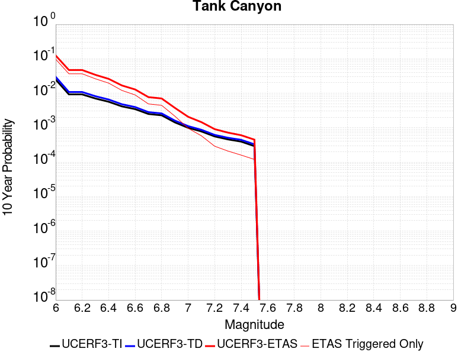 |

| Magnitude | 1 wk TI Prob | 1 wk TD Prob | 1 wk ETAS Prob | 1 wk ETAS/TD Gain | 1 wk ETAS Triggered Only | 1 mo TI Prob | 1 mo TD Prob | 1 mo ETAS Prob | 1 mo ETAS/TD Gain | 1 mo ETAS Triggered Only | 1 yr TI Prob | 1 yr TD Prob | 1 yr ETAS Prob | 1 yr ETAS/TD Gain | 1 yr ETAS Triggered Only | 10 yr TI Prob | 10 yr TD Prob | 10 yr ETAS Prob | 10 yr ETAS/TD Gain | 10 yr ETAS Triggered Only |
|-----|-----|-----|-----|-----|-----|-----|-----|-----|-----|-----|-----|-----|-----|-----|-----|-----|-----|-----|-----|-----|
| 6.0 | 4.8284557E-5 | 5.7964822E-5 | 0.033886004 | 584.596 | 0.03383 | 2.0691741E-4 | 2.4840087E-4 | 0.046146996 | 185.77632 | 0.04591 | 0.0025163088 | 0.0030207601 | 0.07371656 | 24.403315 | 0.07091 | 0.02488006 | 0.029863637 | 0.124180295 | 4.158244 | 0.09722 |
| 6.1 | 1.7796336E-5 | 2.0873314E-5 | 0.011640631 | 557.68 | 0.01162 | 7.626778E-5 | 8.945422E-5 | 0.016138019 | 180.40533 | 0.01605 | 9.281647E-4 | 0.0010885983 | 0.027060295 | 24.857927 | 0.026 | 0.009242975 | 0.010836744 | 0.04710936 | 4.347188 | 0.03667 |
| 6.2 | 1.7796336E-5 | 2.0873314E-5 | 0.011640631 | 557.68 | 0.01162 | 7.626778E-5 | 8.945422E-5 | 0.016138019 | 180.40533 | 0.01605 | 9.281647E-4 | 0.0010885983 | 0.027060295 | 24.857927 | 0.026 | 0.009242975 | 0.010836744 | 0.04710936 | 4.347188 | 0.03667 |
| 6.3 | 1.3515912E-5 | 1.5759564E-5 | 0.008355628 | 530.1941 | 0.00834 | 5.792405E-5 | 6.753938E-5 | 0.011506767 | 170.37123 | 0.01144 | 7.049971E-4 | 8.2200574E-4 | 0.019336773 | 23.523891 | 0.01853 | 0.007027647 | 0.0081922645 | 0.03416771 | 4.170728 | 0.02619 |
| 6.4 | 1.0870146E-5 | 1.2618021E-5 | 0.006362538 | 504.24216 | 0.00635 | 4.658551E-5 | 5.4076212E-5 | 0.008793604 | 162.615 | 0.00874 | 5.67031E-4 | 6.581969E-4 | 0.014469101 | 21.982937 | 0.01382 | 0.005655863 | 0.0065644905 | 0.026095433 | 3.9752412 | 0.01966 |
| 6.5 | 7.964826E-6 | 9.196094E-6 | 0.0038791606 | 421.82697 | 0.00387 | 3.4134522E-5 | 3.9411298E-5 | 0.005449198 | 138.26488 | 0.00541 | 4.1550855E-4 | 4.7973756E-4 | 0.00895567 | 18.66785 | 0.00848 | 0.0041473247 | 0.004788321 | 0.016780622 | 3.5044897 | 0.01205 |
| 6.6 | 6.6317E-6 | 7.6122988E-6 | 0.0028075909 | 368.823 | 0.0028 | 2.8421264E-5 | 3.2623782E-5 | 0.0039724954 | 121.76685 | 0.00394 | 3.4597394E-4 | 3.9713128E-4 | 0.006604665 | 16.630938 | 0.00621 | 0.0034543579 | 0.003965368 | 0.012840036 | 3.238044 | 0.00891 |
| 6.7 | 4.793663E-6 | 5.4307857E-6 | 0.001435423 | 264.31223 | 0.00143 | 2.0544108E-5 | 2.3274613E-5 | 0.0020432277 | 87.78783 | 0.00202 | 2.500958E-4 | 2.8333595E-4 | 0.003592398 | 12.678935 | 0.00331 | 0.0024981452 | 0.0028304397 | 0.007706599 | 2.7227569 | 0.00489 |
| 6.8 | 4.382823E-6 | 4.9692567E-6 | 0.0012949628 | 260.59488 | 0.00129 | 1.8783392E-5 | 2.1296666E-5 | 0.0018612575 | 87.39666 | 0.00184 | 2.286638E-4 | 2.5926033E-4 | 0.0032784774 | 12.645504 | 0.00302 | 0.0022842865 | 0.002590253 | 0.0070287264 | 2.7135289 | 0.00445 |
| 6.9 | 2.729601E-6 | 3.0735416E-6 | 6.330716E-4 | 205.97462 | 6.3E-4 | 1.1698237E-5 | 1.3172262E-5 | 9.3316013E-4 | 70.84282 | 9.2E-4 | 1.4241673E-4 | 1.6036171E-4 | 0.0016201276 | 10.102958 | 0.00146 | 0.001423255 | 0.0016026258 | 0.0037491801 | 2.3393984 | 0.00215 |
| 7.0 | 1.8987357E-6 | 2.126939E-6 | 2.9212632E-4 | 137.34589 | 2.9E-4 | 8.137413E-6 | 9.115425E-6 | 4.391115E-4 | 48.172356 | 4.3E-4 | 9.90685E-5 | 1.1097535E-4 | 7.908999E-4 | 7.126807 | 6.8E-4 | 9.902435E-4 | 0.0011092679 | 0.0020682032 | 1.8644756 | 9.6E-4 |
| 7.1 | 1.4928986E-6 | 1.6641272E-6 | 1.5166387E-4 | 91.13719 | 1.5E-4 | 6.398121E-6 | 7.1319573E-6 | 2.571302E-4 | 36.053238 | 2.5E-4 | 7.789434E-5 | 8.682871E-5 | 4.7679484E-4 | 5.491212 | 3.9E-4 | 7.786704E-4 | 8.6800574E-4 | 0.0014475023 | 1.6676184 | 5.8E-4 |
| 7.2 | 1.069082E-6 | 1.1828573E-6 | 7.1182774E-5 | 60.17867 | 7.0E-5 | 4.581772E-6 | 5.0693816E-6 | 1.4506867E-4 | 28.616642 | 1.4E-4 | 5.5781646E-5 | 6.171851E-5 | 2.9170432E-4 | 4.726367 | 2.3E-4 | 5.576765E-4 | 6.170659E-4 | 9.0688694E-4 | 1.469676 | 2.9E-4 |
| 7.3 | 8.776551E-7 | 9.770005E-7 | 5.0976952E-5 | 52.177 | 5.0E-5 | 3.7613736E-6 | 4.1871413E-6 | 1.1418668E-4 | 27.270798 | 1.1E-4 | 4.579376E-5 | 5.097777E-5 | 2.1096962E-4 | 4.138463 | 1.6E-4 | 4.5784327E-4 | 5.097118E-4 | 7.196047E-4 | 1.4117875 | 2.1E-4 |
| 7.4 | 7.55721E-7 | 8.510244E-7 | 4.085099E-5 | 48.002136 | 4.0E-5 | 3.2388E-6 | 3.6472454E-6 | 9.3646915E-5 | 25.676067 | 9.0E-5 | 3.9431678E-5 | 4.4404827E-5 | 1.8439861E-4 | 4.1526704 | 1.4E-4 | 3.942468E-4 | 4.440104E-4 | 6.0393935E-4 | 1.360192 | 1.6E-4 |
| 7.5 | 5.587665E-7 | 6.305619E-7 | 4.0630537E-5 | 64.43545 | 4.0E-5 | 2.3947114E-6 | 2.702408E-6 | 7.270222E-5 | 26.902754 | 7.0E-5 | 2.915522E-5 | 3.290182E-5 | 1.5289788E-4 | 4.6470947 | 1.2E-4 | 2.9151395E-4 | 3.290182E-4 | 4.489787E-4 | 1.3646015 | 1.2E-4 |

## Garlock (Central)
*[(top)](#table-of-contents)*

| 1 Week | 1 Month | 1 Year | 10 Year |
|-----|-----|-----|-----|
| 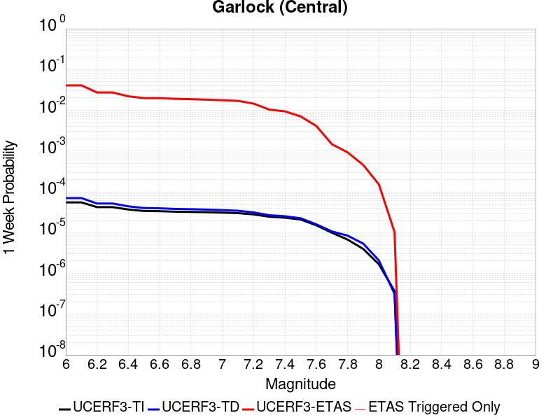 |  |  |  |

| Magnitude | 1 wk TI Prob | 1 wk TD Prob | 1 wk ETAS Prob | 1 wk ETAS/TD Gain | 1 wk ETAS Triggered Only | 1 mo TI Prob | 1 mo TD Prob | 1 mo ETAS Prob | 1 mo ETAS/TD Gain | 1 mo ETAS Triggered Only | 1 yr TI Prob | 1 yr TD Prob | 1 yr ETAS Prob | 1 yr ETAS/TD Gain | 1 yr ETAS Triggered Only | 10 yr TI Prob | 10 yr TD Prob | 10 yr ETAS Prob | 10 yr ETAS/TD Gain | 10 yr ETAS Triggered Only |
|-----|-----|-----|-----|-----|-----|-----|-----|-----|-----|-----|-----|-----|-----|-----|-----|-----|-----|-----|-----|-----|
| 6.0 | 5.5131142E-5 | 7.024681E-5 | 0.04087738 | 581.9108 | 0.04081 | 2.3625491E-4 | 3.010234E-4 | 0.05391488 | 179.10529 | 0.05363 | 0.0028726095 | 0.0036588663 | 0.08114432 | 22.177448 | 0.07777 | 0.028357591 | 0.036079824 | 0.13383096 | 3.709302 | 0.10141 |
| 6.1 | 5.5131142E-5 | 7.024681E-5 | 0.04087738 | 581.9108 | 0.04081 | 2.3625491E-4 | 3.010234E-4 | 0.05391488 | 179.10529 | 0.05363 | 0.0028726095 | 0.0036588663 | 0.08114432 | 22.177448 | 0.07777 | 0.028357591 | 0.036079824 | 0.13383096 | 3.709302 | 0.10141 |
| 6.2 | 4.216245E-5 | 5.1661493E-5 | 0.027290255 | 528.25134 | 0.02724 | 1.806837E-4 | 2.2138779E-4 | 0.036283404 | 163.89072 | 0.03607 | 0.0021976046 | 0.0026920962 | 0.05524025 | 20.519419 | 0.05269 | 0.021759989 | 0.026689773 | 0.09419857 | 3.5293882 | 0.06936 |
| 6.3 | 4.216245E-5 | 5.1661493E-5 | 0.027290255 | 528.25134 | 0.02724 | 1.806837E-4 | 2.2138779E-4 | 0.036283404 | 163.89072 | 0.03607 | 0.0021976046 | 0.0026920962 | 0.05524025 | 20.519419 | 0.05269 | 0.021759989 | 0.026689773 | 0.09419857 | 3.5293882 | 0.06936 |
| 6.4 | 3.6858168E-5 | 4.411054E-5 | 0.022003142 | 498.81824 | 0.02196 | 1.5795401E-4 | 1.8903162E-4 | 0.029133558 | 154.12003 | 0.02895 | 0.0019213937 | 0.002299056 | 0.04471132 | 19.447687 | 0.04251 | 0.019048655 | 0.02284894 | 0.07789186 | 3.4089923 | 0.05633 |
| 6.5 | 3.39199E-5 | 4.0018083E-5 | 0.019879224 | 496.756 | 0.01984 | 1.453629E-4 | 1.7149492E-4 | 0.026446989 | 154.21442 | 0.02628 | 0.0017683565 | 0.002085973 | 0.040805038 | 19.561632 | 0.0388 | 0.017543508 | 0.020759864 | 0.07074028 | 3.4075503 | 0.05104 |
| 6.6 | 3.3571985E-5 | 3.9472274E-5 | 0.019808691 | 501.83813 | 0.01977 | 1.4387199E-4 | 1.6915603E-4 | 0.026344728 | 155.74217 | 0.02618 | 0.0017502342 | 0.0020575512 | 0.040628027 | 19.745817 | 0.03865 | 0.017365133 | 0.020481179 | 0.070299506 | 3.4323955 | 0.05086 |
| 6.7 | 3.2580007E-5 | 3.8088703E-5 | 0.019107362 | 501.65433 | 0.01907 | 1.3962112E-4 | 1.632272E-4 | 0.025339117 | 155.23833 | 0.02518 | 0.0016985617 | 0.0019855013 | 0.03891204 | 19.598093 | 0.037 | 0.016856372 | 0.019773813 | 0.06755984 | 3.4166317 | 0.04875 |
| 6.8 | 3.2185937E-5 | 3.7515918E-5 | 0.018736815 | 499.43637 | 0.0187 | 1.3793244E-4 | 1.6077272E-4 | 0.024816807 | 154.35957 | 0.02466 | 0.0016780337 | 0.001955672 | 0.03811482 | 19.48937 | 0.03623 | 0.016654192 | 0.019480614 | 0.066280805 | 3.402398 | 0.04773 |
| 6.9 | 3.165394E-5 | 3.6720503E-5 | 0.018226052 | 496.34537 | 0.01819 | 1.3565269E-4 | 1.5736422E-4 | 0.024103595 | 153.17075 | 0.02395 | 0.0016503202 | 0.001914247 | 0.037136693 | 19.400156 | 0.03529 | 0.01638118 | 0.019073246 | 0.06465691 | 3.389927 | 0.04647 |
| 7.0 | 3.0903822E-5 | 3.5625766E-5 | 0.017624998 | 494.7262 | 0.01759 | 1.3243823E-4 | 1.5267303E-4 | 0.02334913 | 152.93553 | 0.0232 | 0.0016112428 | 0.0018572307 | 0.03597375 | 19.369566 | 0.03418 | 0.015996104 | 0.018512413 | 0.06266954 | 3.3852713 | 0.04499 |
| 7.1 | 3.0069863E-5 | 3.4392073E-5 | 0.017023807 | 494.99222 | 0.01699 | 1.2886449E-4 | 1.4738638E-4 | 0.022544084 | 152.95908 | 0.0224 | 0.0015677959 | 0.0017929734 | 0.03475377 | 19.383316 | 0.03302 | 0.01556781 | 0.017880075 | 0.060602292 | 3.3893757 | 0.0435 |
| 7.2 | 2.7957109E-5 | 3.128145E-5 | 0.014560827 | 465.47797 | 0.01453 | 1.1981068E-4 | 1.340566E-4 | 0.019251494 | 143.60721 | 0.01912 | 0.0014577188 | 0.0016309366 | 0.029745009 | 18.237993 | 0.02816 | 0.014481937 | 0.016283695 | 0.05291729 | 3.2497103 | 0.03724 |
| 7.3 | 2.4519275E-5 | 2.6714795E-5 | 0.010386438 | 388.78973 | 0.01036 | 1.0507837E-4 | 1.1448703E-4 | 0.013692932 | 119.60247 | 0.01358 | 0.0012785783 | 0.001393003 | 0.021554878 | 15.473676 | 0.02019 | 0.012712469 | 0.013928054 | 0.040384363 | 2.899498 | 0.02683 |
| 7.4 | 2.3225532E-5 | 2.51994E-5 | 0.0094149625 | 373.61853 | 0.00939 | 9.95342E-5 | 1.0799304E-4 | 0.012466658 | 115.43946 | 0.01236 | 0.0012111551 | 0.0013140367 | 0.019719819 | 15.007054 | 0.01843 | 0.012045753 | 0.013145725 | 0.037244707 | 2.833218 | 0.02442 |
| 7.5 | 2.097765E-5 | 2.2483688E-5 | 0.0070723253 | 314.55362 | 0.00705 | 8.9901114E-5 | 9.635517E-5 | 0.009435455 | 97.923706 | 0.00934 | 0.0010939965 | 0.0011725046 | 0.015305914 | 13.054032 | 0.01415 | 0.010886264 | 0.011740365 | 0.030458003 | 2.5942976 | 0.01894 |
| 7.6 | 1.511254E-5 | 1.5991332E-5 | 0.0041359253 | 258.63544 | 0.00412 | 6.476642E-5 | 6.853253E-5 | 0.005548157 | 80.95655 | 0.00548 | 7.882459E-4 | 8.3407195E-4 | 0.008987266 | 10.775168 | 0.00816 | 0.007854558 | 0.008383559 | 0.019132681 | 2.282167 | 0.01084 |
| 7.7 | 9.934069E-6 | 1.0678794E-5 | 0.0014706632 | 137.71811 | 0.00146 | 4.2573887E-5 | 4.5765457E-5 | 0.0018456831 | 40.329174 | 0.0018 | 5.182138E-4 | 5.570524E-4 | 0.0030956375 | 5.5571747 | 0.00254 | 0.00517007 | 0.005627684 | 0.008819619 | 1.5671846 | 0.00321 |
| 7.8 | 6.7562896E-6 | 8.428449E-6 | 9.284207E-4 | 110.153206 | 9.2E-4 | 2.8955206E-5 | 3.6121426E-5 | 0.0011460814 | 31.728575 | 0.00111 | 3.5247262E-4 | 4.3968976E-4 | 0.0020189951 | 4.5918627 | 0.00158 | 0.0035191406 | 0.004446654 | 0.006457672 | 1.4522542 | 0.00202 |
| 7.9 | 3.975453E-6 | 5.37103E-6 | 4.553686E-4 | 84.78236 | 4.5E-4 | 1.7037546E-5 | 2.3018498E-5 | 5.3300674E-4 | 23.155582 | 5.1E-4 | 2.0741238E-4 | 2.8021427E-4 | 0.0010599957 | 3.782804 | 7.8E-4 | 0.002072189 | 0.0028336283 | 0.0038906247 | 1.3730187 | 0.00106 |
| 8.0 | 1.6729537E-6 | 2.0775144E-6 | 1.520772E-4 | 73.201515 | 1.5E-4 | 7.169782E-6 | 8.903603E-6 | 1.5890227E-4 | 17.846962 | 1.5E-4 | 8.7288594E-5 | 1.0839601E-4 | 3.383711E-4 | 3.1216195 | 2.3E-4 | 8.7254314E-4 | 0.0010969337 | 0.0014265717 | 1.3005086 | 3.3E-4 |
| 8.1 | 3.6733252E-7 | 3.1489964E-7 | 1.0314897E-5 | 32.756138 | 1.0E-5 | 1.5742813E-6 | 1.3495693E-6 | 1.1349556E-5 | 8.409761 | 1.0E-5 | 1.9166706E-5 | 1.6430899E-5 | 3.643057E-5 | 2.2171988 | 2.0E-5 | 1.9165053E-4 | 1.6638759E-4 | 1.8638426E-4 | 1.1201813 | 2.0E-5 |

## Little Lake
*[(top)](#table-of-contents)*

| 1 Week | 1 Month | 1 Year | 10 Year |
|-----|-----|-----|-----|
|  |  |  |  |

| Magnitude | 1 wk TI Prob | 1 wk TD Prob | 1 wk ETAS Prob | 1 wk ETAS/TD Gain | 1 wk ETAS Triggered Only | 1 mo TI Prob | 1 mo TD Prob | 1 mo ETAS Prob | 1 mo ETAS/TD Gain | 1 mo ETAS Triggered Only | 1 yr TI Prob | 1 yr TD Prob | 1 yr ETAS Prob | 1 yr ETAS/TD Gain | 1 yr ETAS Triggered Only | 10 yr TI Prob | 10 yr TD Prob | 10 yr ETAS Prob | 10 yr ETAS/TD Gain | 10 yr ETAS Triggered Only |
|-----|-----|-----|-----|-----|-----|-----|-----|-----|-----|-----|-----|-----|-----|-----|-----|-----|-----|-----|-----|-----|
| 6.0 | 2.8424427E-5 | 3.120572E-5 | 0.02329048 | 746.3529 | 0.02326 | 1.2181328E-4 | 1.337327E-4 | 0.029149853 | 217.97101 | 0.02902 | 0.0014820677 | 0.0016271127 | 0.04076333 | 25.052555 | 0.0392 | 0.014722223 | 0.016165402 | 0.064688124 | 4.0016403 | 0.04932 |
| 6.1 | 2.8424427E-5 | 3.120572E-5 | 0.02329048 | 746.3529 | 0.02326 | 1.2181328E-4 | 1.337327E-4 | 0.029149853 | 217.97101 | 0.02902 | 0.0014820677 | 0.0016271127 | 0.04076333 | 25.052555 | 0.0392 | 0.014722223 | 0.016165402 | 0.064688124 | 4.0016403 | 0.04932 |
| 6.2 | 2.8424427E-5 | 3.120572E-5 | 0.02329048 | 746.3529 | 0.02326 | 1.2181328E-4 | 1.337327E-4 | 0.029149853 | 217.97101 | 0.02902 | 0.0014820677 | 0.0016271127 | 0.04076333 | 25.052555 | 0.0392 | 0.014722223 | 0.016165402 | 0.064688124 | 4.0016403 | 0.04932 |
| 6.3 | 1.48860645E-5 | 1.6081389E-5 | 0.013175869 | 819.3241 | 0.01316 | 6.379586E-5 | 6.8918576E-5 | 0.01642779 | 238.3652 | 0.01636 | 7.7643775E-4 | 8.3878887E-4 | 0.022620503 | 26.968054 | 0.0218 | 0.007737305 | 0.008359048 | 0.035242435 | 4.2160826 | 0.02711 |
| 6.4 | 1.48860645E-5 | 1.6081389E-5 | 0.013175869 | 819.3241 | 0.01316 | 6.379586E-5 | 6.8918576E-5 | 0.01642779 | 238.3652 | 0.01636 | 7.7643775E-4 | 8.3878887E-4 | 0.022620503 | 26.968054 | 0.0218 | 0.007737305 | 0.008359048 | 0.035242435 | 4.2160826 | 0.02711 |
| 6.5 | 1.2797581E-5 | 1.3765565E-5 | 0.0123735955 | 898.8803 | 0.01236 | 5.4845623E-5 | 5.899409E-5 | 0.015428088 | 261.5192 | 0.01537 | 6.675408E-4 | 7.18042E-4 | 0.02119333 | 29.515444 | 0.02049 | 0.006655392 | 0.00715977 | 0.032367982 | 4.5208135 | 0.02539 |
| 6.6 | 9.661896E-6 | 1.0289038E-5 | 0.011160174 | 1084.6665 | 0.01115 | 4.1407468E-5 | 4.409522E-5 | 0.013923483 | 315.75946 | 0.01388 | 5.040193E-4 | 5.367433E-4 | 0.019046802 | 35.485867 | 0.01852 | 0.005028777 | 0.0053560743 | 0.028004117 | 5.228478 | 0.02277 |
| 6.7 | 7.767871E-6 | 8.199687E-6 | 0.00974812 | 1188.8406 | 0.00974 | 3.329045E-5 | 3.5141118E-5 | 0.0120947175 | 344.17566 | 0.01206 | 4.0523586E-4 | 4.2777284E-4 | 0.01653088 | 38.644066 | 0.01611 | 0.004044977 | 0.004270846 | 0.024065942 | 5.6349354 | 0.01988 |
| 6.8 | 6.4235196E-6 | 6.7357446E-6 | 0.007886683 | 1170.8702 | 0.00788 | 2.752908E-5 | 2.8867229E-5 | 0.009798585 | 339.43628 | 0.00977 | 3.35115E-4 | 3.5141467E-4 | 0.013346846 | 37.980335 | 0.013 | 0.003346101 | 0.00350985 | 0.019294254 | 5.4971733 | 0.01584 |
| 6.9 | 3.1283696E-6 | 3.1121804E-6 | 0.0046130978 | 1482.272 | 0.00461 | 1.3407229E-5 | 1.3337856E-5 | 0.005543264 | 415.60382 | 0.00553 | 1.6322079E-4 | 1.6237781E-4 | 0.0074012023 | 45.58013 | 0.00724 | 0.0016310095 | 0.00162274 | 0.010298639 | 6.3464503 | 0.00869 |
| 7.0 | 2.290603E-6 | 2.2286815E-6 | 0.0026222228 | 1176.5803 | 0.00262 | 9.816834E-6 | 9.551463E-6 | 0.0031595214 | 330.78925 | 0.00315 | 1.19513395E-4 | 1.162839E-4 | 0.004345792 | 37.372257 | 0.00423 | 0.0011944914 | 0.0011623327 | 0.0063063465 | 5.4255953 | 0.00515 |
| 7.1 | 1.293693E-6 | 1.1776827E-6 | 0.0013211762 | 1121.8438 | 0.00132 | 5.5443866E-6 | 5.0472063E-6 | 0.0015950392 | 316.02417 | 0.00159 | 6.750081E-5 | 6.14487E-5 | 0.0021013233 | 34.196384 | 0.00204 | 6.7480316E-4 | 6.143856E-4 | 0.0030328988 | 4.936475 | 0.00242 |
| 7.2 | 4.715842E-7 | 3.0917857E-7 | 7.030916E-5 | 227.40631 | 7.0E-5 | 2.0210737E-6 | 1.3250503E-6 | 8.132494E-5 | 61.37498 | 8.0E-5 | 2.4606294E-5 | 1.6132375E-5 | 1.4613027E-4 | 9.0582 | 1.3E-4 | 2.460357E-4 | 1.6131258E-4 | 3.0128998E-4 | 1.8677403 | 1.4E-4 |
| 7.3 | 3.9430947E-7 | 2.3097488E-7 | 5.0230963E-5 | 217.47371 | 5.0E-5 | 1.6898966E-6 | 9.89892E-7 | 6.0989834E-5 | 61.612617 | 6.0E-5 | 2.0574296E-5 | 1.2051869E-5 | 1.12050664E-4 | 9.297369 | 1.0E-4 | 2.0572392E-4 | 1.20512224E-4 | 2.3049896E-4 | 1.9126605 | 1.1E-4 |
| 7.4 | 3.547123E-7 | 1.9679135E-7 | 4.0196785E-5 | 204.26093 | 4.0E-5 | 1.5201948E-6 | 8.4339126E-7 | 5.0843348E-5 | 60.284416 | 5.0E-5 | 1.8508214E-5 | 1.0268241E-5 | 1.00267316E-4 | 9.7648 | 9.0E-5 | 1.8506673E-4 | 1.02677724E-4 | 1.9266849E-4 | 1.876439 | 9.0E-5 |
| 7.5 | 2.6354266E-7 | 1.4423138E-7 | 3.0144227E-5 | 208.99908 | 3.0E-5 | 1.129468E-6 | 6.181344E-7 | 4.061811E-5 | 65.71081 | 4.0E-5 | 1.3751187E-5 | 7.5257603E-6 | 6.752531E-5 | 8.972556 | 6.0E-5 | 1.3750336E-4 | 7.5255106E-5 | 1.352506E-4 | 1.7972281 | 6.0E-5 |
| 7.6 | 1.269913E-7 | 7.572556E-8 | 1.0075725E-5 | 133.0558 | 1.0E-5 | 5.4424834E-7 | 3.245381E-7 | 2.032453E-5 | 62.62603 | 2.0E-5 | 6.6262032E-6 | 3.9512443E-6 | 3.3951124E-5 | 8.592515 | 3.0E-5 | 6.626006E-5 | 3.9511775E-5 | 6.951059E-5 | 1.7592373 | 3.0E-5 |

## Owl Lake
*[(top)](#table-of-contents)*

| 1 Week | 1 Month | 1 Year | 10 Year |
|-----|-----|-----|-----|
| 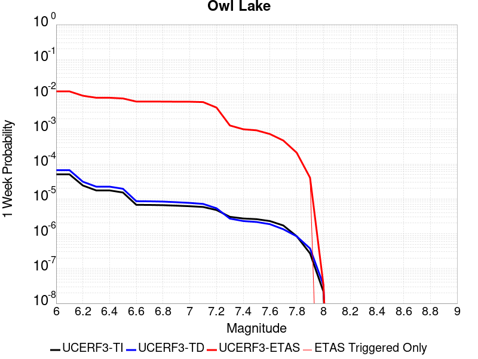 | 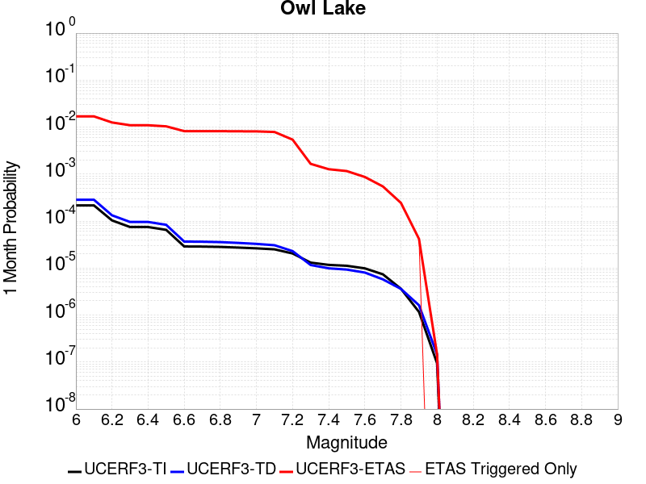 |  |  |

| Magnitude | 1 wk TI Prob | 1 wk TD Prob | 1 wk ETAS Prob | 1 wk ETAS/TD Gain | 1 wk ETAS Triggered Only | 1 mo TI Prob | 1 mo TD Prob | 1 mo ETAS Prob | 1 mo ETAS/TD Gain | 1 mo ETAS Triggered Only | 1 yr TI Prob | 1 yr TD Prob | 1 yr ETAS Prob | 1 yr ETAS/TD Gain | 1 yr ETAS Triggered Only | 10 yr TI Prob | 10 yr TD Prob | 10 yr ETAS Prob | 10 yr ETAS/TD Gain | 10 yr ETAS Triggered Only |
|-----|-----|-----|-----|-----|-----|-----|-----|-----|-----|-----|-----|-----|-----|-----|-----|-----|-----|-----|-----|-----|
| 6.0 | 5.0320643E-5 | 6.635816E-5 | 0.012085561 | 182.12622 | 0.01202 | 2.1564208E-4 | 2.843674E-4 | 0.016919635 | 59.499214 | 0.01664 | 0.0026222812 | 0.0034577388 | 0.029118702 | 8.421313 | 0.02575 | 0.02591553 | 0.034140717 | 0.06886336 | 2.0170448 | 0.03595 |
| 6.1 | 5.0320643E-5 | 6.635816E-5 | 0.012085561 | 182.12622 | 0.01202 | 2.1564208E-4 | 2.843674E-4 | 0.016919635 | 59.499214 | 0.01664 | 0.0026222812 | 0.0034577388 | 0.029118702 | 8.421313 | 0.02575 | 0.02591553 | 0.034140717 | 0.06886336 | 2.0170448 | 0.03595 |
| 6.2 | 2.4125871E-5 | 3.0981035E-5 | 0.009080701 | 293.10513 | 0.00905 | 1.0339249E-4 | 1.3277028E-4 | 0.012551121 | 94.532616 | 0.01242 | 0.0012580766 | 0.001615439 | 0.020554794 | 12.7239685 | 0.01897 | 0.012509781 | 0.016070465 | 0.041613273 | 2.5894258 | 0.02596 |
| 6.3 | 1.7433485E-5 | 2.2355514E-5 | 0.007942178 | 355.2671 | 0.00792 | 7.471279E-5 | 9.580672E-5 | 0.0109547665 | 114.34236 | 0.01086 | 9.0924866E-4 | 0.0011659743 | 0.017456958 | 14.971992 | 0.01631 | 0.009055373 | 0.011628896 | 0.033550967 | 2.8851378 | 0.02218 |
| 6.4 | 1.7433485E-5 | 2.2355514E-5 | 0.007942178 | 355.2671 | 0.00792 | 7.471279E-5 | 9.580672E-5 | 0.0109547665 | 114.34236 | 0.01086 | 9.0924866E-4 | 0.0011659743 | 0.017456958 | 14.971992 | 0.01631 | 0.009055373 | 0.011628896 | 0.033550967 | 2.8851378 | 0.02218 |
| 6.5 | 1.5182742E-5 | 1.9429144E-5 | 0.007589282 | 390.61328 | 0.00757 | 6.506727E-5 | 8.326596E-5 | 0.010382408 | 124.68971 | 0.0103 | 7.919061E-4 | 0.0010134429 | 0.016387846 | 16.17047 | 0.01539 | 0.0078909 | 0.010118429 | 0.03074756 | 3.0387683 | 0.02084 |
| 6.6 | 6.7271576E-6 | 8.547361E-6 | 0.0061784945 | 722.85406 | 0.00617 | 2.8830356E-5 | 3.6631063E-5 | 0.008206332 | 224.02657 | 0.00817 | 3.5095305E-4 | 4.458976E-4 | 0.012060716 | 27.048174 | 0.01162 | 0.0035039932 | 0.004467813 | 0.019619813 | 4.391369 | 0.01522 |
| 6.7 | 6.682835E-6 | 8.479807E-6 | 0.0061784275 | 728.60474 | 0.00617 | 2.8640408E-5 | 3.6341557E-5 | 0.008206044 | 225.80334 | 0.00817 | 3.4864116E-4 | 4.4237426E-4 | 0.012047239 | 27.233135 | 0.01161 | 0.003480947 | 0.0044327388 | 0.019575316 | 4.416077 | 0.01521 |
| 6.8 | 6.5774975E-6 | 8.32628E-6 | 0.006158275 | 739.61896 | 0.00615 | 2.8188972E-5 | 3.5683603E-5 | 0.008185393 | 229.38806 | 0.00815 | 3.4314668E-4 | 4.343669E-4 | 0.0120193325 | 27.670921 | 0.01159 | 0.0034261728 | 0.004352885 | 0.019466808 | 4.4721622 | 0.01518 |
| 6.9 | 6.363419E-6 | 7.999454E-6 | 0.0061179507 | 764.79596 | 0.00611 | 2.727151E-5 | 3.428296E-5 | 0.008134006 | 237.2609 | 0.0081 | 3.3198006E-4 | 4.1732067E-4 | 0.011932513 | 28.593151 | 0.01152 | 0.0033148455 | 0.0041828766 | 0.01918984 | 4.5877137 | 0.01507 |
| 7.0 | 6.1342453E-6 | 7.6316555E-6 | 0.006107585 | 800.2962 | 0.0061 | 2.6289357E-5 | 3.2706717E-5 | 0.008102443 | 247.73024 | 0.00807 | 3.2002592E-4 | 3.9813702E-4 | 0.011843578 | 29.747494 | 0.01145 | 0.0031956544 | 0.003991571 | 0.018901818 | 4.7354336 | 0.01497 |
| 7.1 | 5.842926E-6 | 7.142211E-6 | 0.0059670997 | 835.4695 | 0.00596 | 2.504087E-5 | 3.0609146E-5 | 0.00787037 | 257.12473 | 0.00784 | 3.0482994E-4 | 3.7260808E-4 | 0.011548443 | 30.993538 | 0.01118 | 0.0030441214 | 0.0037370329 | 0.01827251 | 4.889577 | 0.01459 |
| 7.2 | 4.77173E-6 | 5.358483E-6 | 0.0041553364 | 775.46875 | 0.00415 | 2.045011E-5 | 2.2964748E-5 | 0.0054128408 | 235.70216 | 0.00539 | 2.4895166E-4 | 2.79564E-4 | 0.007957417 | 28.463669 | 0.00768 | 0.0024867293 | 0.002808645 | 0.012920165 | 4.600142 | 0.01014 |
| 7.3 | 3.0494948E-6 | 2.710463E-6 | 0.001272707 | 469.55338 | 0.00127 | 1.3069198E-5 | 1.1616219E-5 | 0.0016515972 | 142.18027 | 0.00164 | 1.5910587E-4 | 1.4141845E-4 | 0.0024310946 | 17.190788 | 0.00229 | 0.0015899199 | 0.0014232415 | 0.0044189715 | 3.1048644 | 0.003 |
| 7.4 | 2.7263884E-6 | 2.3056762E-6 | 9.923034E-4 | 430.3741 | 9.9E-4 | 1.1684469E-5 | 9.881433E-6 | 0.0012698689 | 128.51062 | 0.00126 | 1.4224913E-4 | 1.20299905E-4 | 0.0018500917 | 15.378996 | 0.00173 | 0.0014215811 | 0.0012112238 | 0.0033785955 | 2.7894065 | 0.00217 |
| 7.5 | 2.6090431E-6 | 2.1656133E-6 | 9.221636E-4 | 425.821 | 9.2E-4 | 1.1181565E-5 | 9.281167E-6 | 0.0011592705 | 124.90568 | 0.00115 | 1.3612706E-4 | 1.1299244E-4 | 0.0016628173 | 14.716181 | 0.00155 | 0.001360437 | 0.0011379806 | 0.0030957502 | 2.7203891 | 0.00196 |
| 7.6 | 2.3008756E-6 | 1.8727933E-6 | 7.2187145E-4 | 385.45172 | 7.2E-4 | 9.860858E-6 | 8.0262325E-6 | 8.6801936E-4 | 108.14779 | 8.6E-4 | 1.20049335E-4 | 9.7715085E-5 | 0.0012476027 | 12.767759 | 0.00115 | 0.001199845 | 9.849932E-4 | 0.002443555 | 2.4807837 | 0.00146 |
| 7.7 | 1.7184348E-6 | 1.3419171E-6 | 4.7134128E-4 | 351.24472 | 4.7E-4 | 7.3646997E-6 | 5.7510606E-6 | 5.457479E-4 | 94.89518 | 5.4E-4 | 8.966153E-5 | 7.0016955E-5 | 7.6996797E-4 | 10.996879 | 7.0E-4 | 8.962536E-4 | 7.078345E-4 | 0.001537247 | 2.1717606 | 8.3E-4 |
| 7.8 | 8.4612907E-7 | 8.4058576E-7 | 2.1084042E-4 | 250.82558 | 2.1E-4 | 3.6262625E-6 | 3.6025056E-6 | 2.4360164E-4 | 67.620056 | 2.4E-4 | 4.4148852E-5 | 4.3859643E-5 | 3.638456E-4 | 8.295681 | 3.2E-4 | 4.414008E-4 | 4.4398365E-4 | 8.43806E-4 | 1.9005342 | 4.0E-4 |
| 7.9 | 2.716738E-7 | 3.768106E-7 | 4.0376795E-5 | 107.15409 | 4.0E-5 | 1.1643157E-6 | 1.6149015E-6 | 4.1614836E-5 | 25.769272 | 4.0E-5 | 1.4175452E-5 | 1.966126E-5 | 6.966027E-5 | 3.5430222 | 5.0E-5 | 1.4174548E-4 | 1.9836679E-4 | 2.7835093E-4 | 1.4032133 | 8.0E-5 |
| 8.0 | 2.1995428E-8 | 3.384878E-8 | 3.384878E-8 | 1.0 | 0.0 | 9.426611E-8 | 1.4506621E-7 | 1.4506621E-7 | 1.0 | 0.0 | 1.1476893E-6 | 1.7661803E-6 | 1.1766163E-5 | 6.6619263 | 1.0E-5 | 1.14768345E-5 | 1.7963059E-5 | 2.7962878E-5 | 1.5566881 | 1.0E-5 |

## Airport Lake
*[(top)](#table-of-contents)*

| 1 Week | 1 Month | 1 Year | 10 Year |
|-----|-----|-----|-----|
| 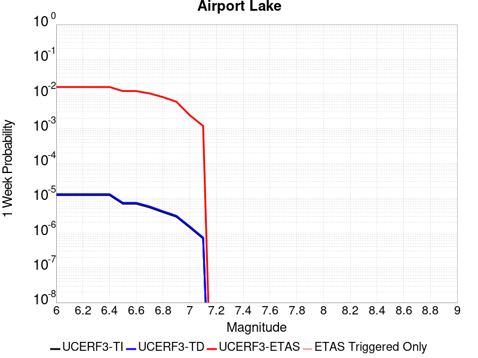 |  |  |  |

| Magnitude | 1 wk TI Prob | 1 wk TD Prob | 1 wk ETAS Prob | 1 wk ETAS/TD Gain | 1 wk ETAS Triggered Only | 1 mo TI Prob | 1 mo TD Prob | 1 mo ETAS Prob | 1 mo ETAS/TD Gain | 1 mo ETAS Triggered Only | 1 yr TI Prob | 1 yr TD Prob | 1 yr ETAS Prob | 1 yr ETAS/TD Gain | 1 yr ETAS Triggered Only | 10 yr TI Prob | 10 yr TD Prob | 10 yr ETAS Prob | 10 yr ETAS/TD Gain | 10 yr ETAS Triggered Only |
|-----|-----|-----|-----|-----|-----|-----|-----|-----|-----|-----|-----|-----|-----|-----|-----|-----|-----|-----|-----|-----|
| 6.0 | 1.2387061E-5 | 1.3103157E-5 | 0.015902895 | 1213.669 | 0.01589 | 5.3086325E-5 | 5.615534E-5 | 0.019585058 | 348.76575 | 0.01953 | 6.461343E-4 | 6.8350515E-4 | 0.026126103 | 38.22371 | 0.02546 | 0.0064425888 | 0.0068168393 | 0.037307564 | 5.4728537 | 0.0307 |
| 6.1 | 1.2387061E-5 | 1.3103157E-5 | 0.015902895 | 1213.669 | 0.01589 | 5.3086325E-5 | 5.615534E-5 | 0.019585058 | 348.76575 | 0.01953 | 6.461343E-4 | 6.8350515E-4 | 0.026126103 | 38.22371 | 0.02546 | 0.0064425888 | 0.0068168393 | 0.037307564 | 5.4728537 | 0.0307 |
| 6.2 | 1.2387061E-5 | 1.3103157E-5 | 0.015902895 | 1213.669 | 0.01589 | 5.3086325E-5 | 5.615534E-5 | 0.019585058 | 348.76575 | 0.01953 | 6.461343E-4 | 6.8350515E-4 | 0.026126103 | 38.22371 | 0.02546 | 0.0064425888 | 0.0068168393 | 0.037307564 | 5.4728537 | 0.0307 |
| 6.3 | 1.2387061E-5 | 1.3103157E-5 | 0.015902895 | 1213.669 | 0.01589 | 5.3086325E-5 | 5.615534E-5 | 0.019585058 | 348.76575 | 0.01953 | 6.461343E-4 | 6.8350515E-4 | 0.026126103 | 38.22371 | 0.02546 | 0.0064425888 | 0.0068168393 | 0.037307564 | 5.4728537 | 0.0307 |
| 6.4 | 1.2387061E-5 | 1.3103157E-5 | 0.015902895 | 1213.669 | 0.01589 | 5.3086325E-5 | 5.615534E-5 | 0.019585058 | 348.76575 | 0.01953 | 6.461343E-4 | 6.8350515E-4 | 0.026126103 | 38.22371 | 0.02546 | 0.0064425888 | 0.0068168393 | 0.037307564 | 5.4728537 | 0.0307 |
| 6.5 | 6.9922594E-6 | 7.384925E-6 | 0.012127295 | 1642.1691 | 0.01212 | 2.996648E-5 | 3.1649324E-5 | 0.01487118 | 469.8735 | 0.01484 | 3.6478083E-4 | 3.8526783E-4 | 0.019607859 | 50.894096 | 0.01923 | 0.003641826 | 0.0038465366 | 0.027056912 | 7.034097 | 0.0233 |
| 6.6 | 6.9922594E-6 | 7.384925E-6 | 0.012127295 | 1642.1691 | 0.01212 | 2.996648E-5 | 3.1649324E-5 | 0.01487118 | 469.8735 | 0.01484 | 3.6478083E-4 | 3.8526783E-4 | 0.019607859 | 50.894096 | 0.01923 | 0.003641826 | 0.0038465366 | 0.027056912 | 7.034097 | 0.0233 |
| 6.7 | 5.477277E-6 | 5.7860684E-6 | 0.010365726 | 1791.4973 | 0.01036 | 2.3473833E-5 | 2.4797222E-5 | 0.012704483 | 512.3349 | 0.01268 | 2.8575645E-4 | 3.0186825E-4 | 0.01688686 | 55.941162 | 0.01659 | 0.0028538927 | 0.003014966 | 0.023114184 | 7.666483 | 0.02016 |
| 6.8 | 3.9950432E-6 | 4.2190873E-6 | 0.008134184 | 1927.949 | 0.00813 | 1.7121502E-5 | 1.8081691E-5 | 0.009967902 | 551.2704 | 0.00995 | 2.0843433E-4 | 2.2012512E-4 | 0.013117285 | 59.590134 | 0.0129 | 0.0020823893 | 0.0021993418 | 0.017665252 | 8.0320635 | 0.0155 |
| 6.9 | 2.95695E-6 | 3.1230243E-6 | 0.0059731044 | 1912.6025 | 0.00597 | 1.2672582E-5 | 1.3384334E-5 | 0.0072332877 | 540.4294 | 0.00722 | 1.5427776E-4 | 1.6294434E-4 | 0.009601406 | 58.92445 | 0.00944 | 0.001541707 | 0.0016284712 | 0.012800248 | 7.8602858 | 0.01119 |
| 7.0 | 1.456072E-6 | 1.540812E-6 | 0.002451537 | 1591.0682 | 0.00245 | 6.2402937E-6 | 6.603469E-6 | 0.002946584 | 446.2176 | 0.00294 | 7.597293E-5 | 8.039528E-5 | 0.0040100794 | 49.87954 | 0.00393 | 7.594696E-4 | 8.0376083E-4 | 0.0056298785 | 7.0044203 | 0.00483 |
| 7.1 | 6.995192E-7 | 7.4089746E-7 | 0.00120074 | 1620.6561 | 0.0012 | 2.997936E-6 | 3.1752747E-6 | 0.0014531707 | 457.65195 | 0.00145 | 3.649926E-5 | 3.865897E-5 | 0.0018885875 | 48.852505 | 0.00185 | 3.6493264E-4 | 3.865897E-4 | 0.0025957352 | 6.714445 | 0.00221 |

## Panamint Valley
*[(top)](#table-of-contents)*

| 1 Week | 1 Month | 1 Year | 10 Year |
|-----|-----|-----|-----|
|  |  |  |  |

| Magnitude | 1 wk TI Prob | 1 wk TD Prob | 1 wk ETAS Prob | 1 wk ETAS/TD Gain | 1 wk ETAS Triggered Only | 1 mo TI Prob | 1 mo TD Prob | 1 mo ETAS Prob | 1 mo ETAS/TD Gain | 1 mo ETAS Triggered Only | 1 yr TI Prob | 1 yr TD Prob | 1 yr ETAS Prob | 1 yr ETAS/TD Gain | 1 yr ETAS Triggered Only | 10 yr TI Prob | 10 yr TD Prob | 10 yr ETAS Prob | 10 yr ETAS/TD Gain | 10 yr ETAS Triggered Only |
|-----|-----|-----|-----|-----|-----|-----|-----|-----|-----|-----|-----|-----|-----|-----|-----|-----|-----|-----|-----|-----|
| 6.0 | 3.0211835E-5 | 3.3984514E-5 | 0.009133675 | 268.75992 | 0.0091 | 1.2947287E-4 | 1.4563995E-4 | 0.01284379 | 88.18865 | 0.0127 | 0.0015751923 | 0.0017717537 | 0.022035787 | 12.437275 | 0.0203 | 0.015640736 | 0.017583137 | 0.04544448 | 2.584549 | 0.02836 |
| 6.1 | 3.0211835E-5 | 3.3984514E-5 | 0.009133675 | 268.75992 | 0.0091 | 1.2947287E-4 | 1.4563995E-4 | 0.01284379 | 88.18865 | 0.0127 | 0.0015751923 | 0.0017717537 | 0.022035787 | 12.437275 | 0.0203 | 0.015640736 | 0.017583137 | 0.04544448 | 2.584549 | 0.02836 |
| 6.2 | 3.0211835E-5 | 3.3984514E-5 | 0.009133675 | 268.75992 | 0.0091 | 1.2947287E-4 | 1.4563995E-4 | 0.01284379 | 88.18865 | 0.0127 | 0.0015751923 | 0.0017717537 | 0.022035787 | 12.437275 | 0.0203 | 0.015640736 | 0.017583137 | 0.04544448 | 2.584549 | 0.02836 |
| 6.3 | 2.8573924E-5 | 3.210268E-5 | 0.008701825 | 271.06226 | 0.00867 | 1.2245393E-4 | 1.3757581E-4 | 0.012155922 | 88.35799 | 0.01202 | 0.001489857 | 0.0016737265 | 0.020841591 | 12.4522085 | 0.0192 | 0.01479908 | 0.016617801 | 0.042923275 | 2.5829697 | 0.02675 |
| 6.4 | 2.8573924E-5 | 3.210268E-5 | 0.008701825 | 271.06226 | 0.00867 | 1.2245393E-4 | 1.3757581E-4 | 0.012155922 | 88.35799 | 0.01202 | 0.001489857 | 0.0016737265 | 0.020841591 | 12.4522085 | 0.0192 | 0.01479908 | 0.016617801 | 0.042923275 | 2.5829697 | 0.02675 |
| 6.5 | 2.7468774E-5 | 3.0828433E-5 | 0.008510567 | 276.06226 | 0.00848 | 1.1771801E-4 | 1.3211532E-4 | 0.011880563 | 89.925705 | 0.01175 | 0.0014322745 | 0.0016073446 | 0.020297255 | 12.627818 | 0.01872 | 0.014230782 | 0.015963677 | 0.041538782 | 2.602081 | 0.02599 |
| 6.6 | 2.6135967E-5 | 2.925248E-5 | 0.008149015 | 278.57516 | 0.00812 | 1.1200648E-4 | 1.253619E-4 | 0.011363952 | 90.64918 | 0.01124 | 0.0013628257 | 0.0015252391 | 0.019417906 | 12.731058 | 0.01792 | 0.013544982 | 0.015154043 | 0.039666858 | 2.617576 | 0.02489 |
| 6.7 | 2.4498746E-5 | 2.7341335E-5 | 0.007817129 | 285.9088 | 0.00779 | 1.04990395E-4 | 1.1717203E-4 | 0.0109059075 | 93.076035 | 0.01079 | 0.0012775084 | 0.0014256609 | 0.018501282 | 12.977337 | 0.0171 | 0.012701893 | 0.014171274 | 0.0375157 | 2.647306 | 0.02368 |
| 6.8 | 2.2244329E-5 | 2.4935423E-5 | 0.007294754 | 292.5458 | 0.00727 | 9.532935E-5 | 1.0686185E-4 | 0.010165786 | 95.13018 | 0.01006 | 0.0011600169 | 0.0013002884 | 0.017029809 | 13.096949 | 0.01575 | 0.011539802 | 0.0129325185 | 0.03429266 | 2.6516612 | 0.02164 |
| 6.9 | 1.9902658E-5 | 2.2290267E-5 | 0.0065621445 | 294.39508 | 0.00654 | 8.529431E-5 | 9.552632E-5 | 0.009084667 | 95.1012 | 0.00899 | 0.0010379635 | 0.0011624309 | 0.015076239 | 12.969578 | 0.01393 | 0.010331288 | 0.011568608 | 0.03040811 | 2.6285021 | 0.01906 |
| 7.0 | 1.8353881E-5 | 2.0566185E-5 | 0.0061004413 | 296.62482 | 0.00608 | 7.865712E-5 | 8.813792E-5 | 0.008417403 | 95.50264 | 0.00833 | 9.5722964E-4 | 0.0010725686 | 0.013978711 | 13.032929 | 0.01292 | 0.009531168 | 0.010678849 | 0.028001862 | 2.6221797 | 0.01751 |
| 7.1 | 1.7667631E-5 | 1.9772613E-5 | 0.005909656 | 298.8809 | 0.00589 | 7.571623E-5 | 8.473711E-5 | 0.0081740515 | 96.46365 | 0.00809 | 9.2145515E-4 | 0.0010312037 | 0.013558272 | 13.148006 | 0.01254 | 0.009176437 | 0.010269073 | 0.0270846 | 2.6374924 | 0.01699 |
| 7.2 | 1.6381597E-5 | 1.8158249E-5 | 0.005298062 | 291.77164 | 0.00528 | 7.020495E-5 | 7.781885E-5 | 0.0073972493 | 95.0573 | 0.00732 | 8.544101E-4 | 9.4704994E-4 | 0.012166414 | 12.846645 | 0.01123 | 0.008511325 | 0.009434792 | 0.024402233 | 2.586409 | 0.01511 |
| 7.3 | 1.4520491E-5 | 1.5966476E-5 | 0.0043258974 | 270.93628 | 0.00431 | 6.222919E-5 | 6.842605E-5 | 0.0060580163 | 88.53377 | 0.00599 | 7.57377E-4 | 8.327849E-4 | 0.009975165 | 11.978081 | 0.00915 | 0.0075480095 | 0.00829975 | 0.020567082 | 2.4780362 | 0.01237 |
| 7.4 | 1.2852287E-5 | 1.4145411E-5 | 0.004114087 | 290.84256 | 0.0041 | 5.5080065E-5 | 6.062187E-5 | 0.005760276 | 95.019775 | 0.0057 | 6.7039346E-4 | 7.378371E-4 | 0.009501366 | 12.877322 | 0.00877 | 0.0066837464 | 0.0073567946 | 0.01910969 | 2.5975566 | 0.01184 |
| 7.5 | 1.1637851E-5 | 1.2836797E-5 | 0.0040827845 | 318.0532 | 0.00407 | 4.987555E-5 | 5.5013777E-5 | 0.0056647053 | 102.96885 | 0.00561 | 6.070656E-4 | 6.6960254E-4 | 0.00928383 | 13.864688 | 0.00862 | 0.006054099 | 0.0066787465 | 0.018211206 | 2.7267401 | 0.01161 |
| 7.6 | 3.0068115E-6 | 3.3330316E-6 | 0.0018833268 | 565.0492 | 0.00188 | 1.2886271E-5 | 1.4284384E-5 | 0.002634247 | 184.41446 | 0.00262 | 1.5687906E-4 | 1.7390578E-4 | 0.0041532135 | 23.881977 | 0.00398 | 0.0015676835 | 0.0017391363 | 0.007049884 | 4.05367 | 0.00532 |

## Garlock (East)
*[(top)](#table-of-contents)*

| 1 Week | 1 Month | 1 Year | 10 Year |
|-----|-----|-----|-----|
|  |  |  |  |

| Magnitude | 1 wk TI Prob | 1 wk TD Prob | 1 wk ETAS Prob | 1 wk ETAS/TD Gain | 1 wk ETAS Triggered Only | 1 mo TI Prob | 1 mo TD Prob | 1 mo ETAS Prob | 1 mo ETAS/TD Gain | 1 mo ETAS Triggered Only | 1 yr TI Prob | 1 yr TD Prob | 1 yr ETAS Prob | 1 yr ETAS/TD Gain | 1 yr ETAS Triggered Only | 10 yr TI Prob | 10 yr TD Prob | 10 yr ETAS Prob | 10 yr ETAS/TD Gain | 10 yr ETAS Triggered Only |
|-----|-----|-----|-----|-----|-----|-----|-----|-----|-----|-----|-----|-----|-----|-----|-----|-----|-----|-----|-----|-----|
| 6.0 | 4.5092507E-5 | 6.290325E-5 | 0.007872412 | 125.151115 | 0.00781 | 1.9323928E-4 | 2.6956003E-4 | 0.010946681 | 40.60944 | 0.01068 | 0.0023501497 | 0.0032774 | 0.020650275 | 6.30081 | 0.01743 | 0.023254504 | 0.032351844 | 0.056136638 | 1.7351912 | 0.02458 |
| 6.1 | 4.5092507E-5 | 6.290325E-5 | 0.007872412 | 125.151115 | 0.00781 | 1.9323928E-4 | 2.6956003E-4 | 0.010946681 | 40.60944 | 0.01068 | 0.0023501497 | 0.0032774 | 0.020650275 | 6.30081 | 0.01743 | 0.023254504 | 0.032351844 | 0.056136638 | 1.7351912 | 0.02458 |
| 6.2 | 2.6674514E-5 | 3.4509674E-5 | 0.0062342957 | 180.65356 | 0.0062 | 1.1431433E-4 | 1.4789042E-4 | 0.008286687 | 56.032616 | 0.00814 | 0.0013908884 | 0.0017991117 | 0.014416371 | 8.013049 | 0.01264 | 0.01382215 | 0.017890299 | 0.035136145 | 1.9639776 | 0.01756 |
| 6.3 | 2.6674514E-5 | 3.4509674E-5 | 0.0062342957 | 180.65356 | 0.0062 | 1.1431433E-4 | 1.4789042E-4 | 0.008286687 | 56.032616 | 0.00814 | 0.0013908884 | 0.0017991117 | 0.014416371 | 8.013049 | 0.01264 | 0.01382215 | 0.017890299 | 0.035136145 | 1.9639776 | 0.01756 |
| 6.4 | 2.5312667E-5 | 3.233893E-5 | 0.0061321417 | 189.62105 | 0.0061 | 1.0847834E-4 | 1.3858822E-4 | 0.008157477 | 58.861256 | 0.00802 | 0.0013199237 | 0.0016860351 | 0.014135011 | 8.38358 | 0.01247 | 0.013121112 | 0.016778335 | 0.0337979 | 2.0143776 | 0.01731 |
| 6.5 | 2.5312667E-5 | 3.233893E-5 | 0.0061321417 | 189.62105 | 0.0061 | 1.0847834E-4 | 1.3858822E-4 | 0.008157477 | 58.861256 | 0.00802 | 0.0013199237 | 0.0016860351 | 0.014135011 | 8.38358 | 0.01247 | 0.013121112 | 0.016778335 | 0.0337979 | 2.0143776 | 0.01731 |
| 6.6 | 2.246556E-5 | 2.8133776E-5 | 0.005947967 | 211.4173 | 0.00592 | 9.627742E-5 | 1.20567885E-4 | 0.0078796325 | 65.35432 | 0.00776 | 0.0011715472 | 0.0014669491 | 0.013349492 | 9.100174 | 0.0119 | 0.011653901 | 0.01461866 | 0.03081833 | 2.10815 | 0.01644 |
| 6.7 | 2.2241198E-5 | 2.7803519E-5 | 0.005937639 | 213.55711 | 0.00591 | 9.531594E-5 | 1.1915263E-4 | 0.007868229 | 66.034874 | 0.00775 | 0.0011598538 | 0.0014497414 | 0.013302533 | 9.175797 | 0.01187 | 0.011538187 | 0.014448853 | 0.03059218 | 2.117274 | 0.01638 |
| 6.8 | 1.9528685E-5 | 2.389819E-5 | 0.005723762 | 239.50607 | 0.0057 | 8.369167E-5 | 1.0241691E-4 | 0.007521657 | 73.44155 | 0.00742 | 0.0010184698 | 0.0012462323 | 0.01261205 | 10.120144 | 0.01138 | 0.010138147 | 0.012436427 | 0.027694285 | 2.2268682 | 0.01545 |
| 6.9 | 1.3318621E-5 | 1.5198884E-5 | 0.005385117 | 354.31003 | 0.00537 | 5.7078556E-5 | 6.513648E-5 | 0.0069746864 | 107.07803 | 0.00691 | 6.9470983E-4 | 7.927538E-4 | 0.011184509 | 14.108426 | 0.0104 | 0.0069254204 | 0.007939888 | 0.021570794 | 2.716763 | 0.01374 |
| 7.0 | 1.1760853E-5 | 1.31077895E-5 | 0.005273039 | 402.28284 | 0.00526 | 5.0402683E-5 | 5.6175057E-5 | 0.006785797 | 120.797325 | 0.00673 | 6.134799E-4 | 6.8372174E-4 | 0.010816789 | 15.820455 | 0.01014 | 0.0061178906 | 0.00685652 | 0.020105055 | 2.9322534 | 0.01334 |
| 7.1 | 1.0064758E-5 | 1.0902931E-5 | 0.005100847 | 467.8419 | 0.00509 | 4.3133965E-5 | 4.672603E-5 | 0.0065464224 | 140.10226 | 0.0065 | 5.2502943E-4 | 5.687444E-4 | 0.010253233 | 18.02784 | 0.00969 | 0.005237907 | 0.0057129986 | 0.018380215 | 3.2172623 | 0.01274 |
| 7.2 | 9.768808E-6 | 1.0498807E-5 | 0.0049904464 | 475.33463 | 0.00498 | 4.186565E-5 | 4.499413E-5 | 0.0064147078 | 142.56766 | 0.00637 | 5.095951E-4 | 5.4766936E-4 | 0.010022477 | 18.300234 | 0.00948 | 0.0050842804 | 0.0055032647 | 0.017914584 | 3.2552648 | 0.01248 |
| 7.3 | 9.344516E-6 | 9.944468E-6 | 0.0046198987 | 464.56973 | 0.00461 | 4.004731E-5 | 4.261847E-5 | 0.0058823694 | 138.02396 | 0.00584 | 4.8746695E-4 | 5.1875977E-4 | 0.009244231 | 17.819868 | 0.00873 | 0.0048639905 | 0.0052149445 | 0.016674869 | 3.197516 | 0.01152 |
| 7.4 | 9.023491E-6 | 9.490661E-6 | 0.004099452 | 431.94586 | 0.00409 | 3.867153E-5 | 4.0673647E-5 | 0.0052604615 | 129.3334 | 0.00522 | 4.7072413E-4 | 4.950925E-4 | 0.008331211 | 16.827585 | 0.00784 | 0.004697283 | 0.0049783974 | 0.01526692 | 3.0666337 | 0.01034 |
| 7.5 | 7.081253E-6 | 7.087672E-6 | 0.0018570746 | 262.01474 | 0.00185 | 3.0347876E-5 | 3.0375388E-5 | 0.002410303 | 79.35053 | 0.00238 | 3.6942272E-4 | 3.6975832E-4 | 0.004158357 | 11.246148 | 0.00379 | 0.003688092 | 0.0037243143 | 0.008815283 | 2.3669546 | 0.00511 |
| 7.6 | 6.116396E-6 | 5.959245E-6 | 0.0010759529 | 180.5519 | 0.00107 | 2.6212863E-5 | 2.5539372E-5 | 0.0014555028 | 56.99055 | 0.00143 | 3.1909486E-4 | 3.1089774E-4 | 0.0026001858 | 8.363476 | 0.00229 | 0.0031863707 | 0.0031357552 | 0.006196128 | 1.9759605 | 0.00307 |
| 7.7 | 4.797145E-6 | 4.757281E-6 | 5.647546E-4 | 118.71374 | 5.6E-4 | 2.055903E-5 | 2.0388188E-5 | 7.303737E-4 | 35.823376 | 7.1E-4 | 2.5027743E-4 | 2.4819805E-4 | 0.0013979126 | 5.6322465 | 0.00115 | 0.0024999576 | 0.0025093474 | 0.0040055835 | 1.596265 | 0.0015 |
| 7.8 | 3.4028885E-6 | 3.978462E-6 | 3.3397714E-4 | 83.946304 | 3.3E-4 | 1.4583726E-5 | 1.7050439E-5 | 4.2704344E-4 | 25.04589 | 4.1E-4 | 1.775424E-4 | 2.0756939E-4 | 8.8742824E-4 | 4.275333 | 6.8E-4 | 0.0017740062 | 0.0021012232 | 0.0029893531 | 1.4226729 | 8.9E-4 |
| 7.9 | 2.5928412E-6 | 3.3724489E-6 | 2.3337167E-4 | 69.19947 | 2.3E-4 | 1.1112129E-5 | 1.4453272E-5 | 2.9444922E-4 | 20.372496 | 2.8E-4 | 1.3528178E-4 | 1.7595445E-4 | 6.5587E-4 | 3.7274988 | 4.8E-4 | 0.0013519945 | 0.0017812408 | 0.0024001366 | 1.3474519 | 6.2E-4 |
| 8.0 | 1.3743648E-6 | 1.6734747E-6 | 1.0167331E-4 | 60.75581 | 1.0E-4 | 5.8901214E-6 | 7.1720146E-6 | 1.071713E-4 | 14.942984 | 1.0E-4 | 7.1709874E-5 | 8.731581E-5 | 2.5730097E-4 | 2.9467854 | 1.7E-4 | 7.1686733E-4 | 8.837234E-4 | 0.0011335025 | 1.2826439 | 2.5E-4 |
| 8.1 | 3.6733252E-7 | 3.1489964E-7 | 1.0314897E-5 | 32.756138 | 1.0E-5 | 1.5742813E-6 | 1.3495693E-6 | 1.1349556E-5 | 8.409761 | 1.0E-5 | 1.9166706E-5 | 1.6430899E-5 | 3.643057E-5 | 2.2171988 | 2.0E-5 | 1.9165053E-4 | 1.6638759E-4 | 1.8638426E-4 | 1.1201813 | 2.0E-5 |

## Blackwater
*[(top)](#table-of-contents)*

| 1 Week | 1 Month | 1 Year | 10 Year |
|-----|-----|-----|-----|
|  |  |  |  |

| Magnitude | 1 wk TI Prob | 1 wk TD Prob | 1 wk ETAS Prob | 1 wk ETAS/TD Gain | 1 wk ETAS Triggered Only | 1 mo TI Prob | 1 mo TD Prob | 1 mo ETAS Prob | 1 mo ETAS/TD Gain | 1 mo ETAS Triggered Only | 1 yr TI Prob | 1 yr TD Prob | 1 yr ETAS Prob | 1 yr ETAS/TD Gain | 1 yr ETAS Triggered Only | 10 yr TI Prob | 10 yr TD Prob | 10 yr ETAS Prob | 10 yr ETAS/TD Gain | 10 yr ETAS Triggered Only |
|-----|-----|-----|-----|-----|-----|-----|-----|-----|-----|-----|-----|-----|-----|-----|-----|-----|-----|-----|-----|-----|
| 6.0 | 3.0708583E-5 | 3.3095846E-5 | 0.004342953 | 131.22351 | 0.00431 | 1.3160157E-4 | 1.4183241E-4 | 0.0062109716 | 43.79092 | 0.00607 | 0.0016010714 | 0.0017255784 | 0.011538616 | 6.6868105 | 0.00983 | 0.015895851 | 0.017135633 | 0.031249566 | 1.8236598 | 0.01436 |
| 6.1 | 3.0708583E-5 | 3.3095846E-5 | 0.004342953 | 131.22351 | 0.00431 | 1.3160157E-4 | 1.4183241E-4 | 0.0062109716 | 43.79092 | 0.00607 | 0.0016010714 | 0.0017255784 | 0.011538616 | 6.6868105 | 0.00983 | 0.015895851 | 0.017135633 | 0.031249566 | 1.8236598 | 0.01436 |
| 6.2 | 1.1707779E-5 | 1.2545122E-5 | 0.0016925241 | 134.91492 | 0.00168 | 5.017523E-5 | 5.3763757E-5 | 0.0023336413 | 43.40547 | 0.00228 | 6.107122E-4 | 6.5438676E-4 | 0.0044219196 | 6.757349 | 0.00377 | 0.006090366 | 0.0065255696 | 0.012079092 | 1.8510402 | 0.00559 |
| 6.3 | 1.1707779E-5 | 1.2545122E-5 | 0.0016925241 | 134.91492 | 0.00168 | 5.017523E-5 | 5.3763757E-5 | 0.0023336413 | 43.40547 | 0.00228 | 6.107122E-4 | 6.5438676E-4 | 0.0044219196 | 6.757349 | 0.00377 | 0.006090366 | 0.0065255696 | 0.012079092 | 1.8510402 | 0.00559 |
| 6.4 | 7.929244E-6 | 8.480098E-6 | 0.0010484713 | 123.63905 | 0.00104 | 3.3982033E-5 | 3.6342793E-5 | 0.0014562912 | 40.070976 | 0.00142 | 4.136527E-4 | 4.423877E-4 | 0.0028813083 | 6.513084 | 0.00244 | 0.0041288356 | 0.0044154758 | 0.008069271 | 1.8274975 | 0.00367 |
| 6.5 | 5.8832115E-6 | 6.285991E-6 | 8.2628086E-4 | 131.44798 | 8.2E-4 | 2.521352E-5 | 2.6939697E-5 | 0.0011169104 | 41.45965 | 0.00109 | 3.0693135E-4 | 3.27944E-4 | 0.0020673734 | 6.304044 | 0.00174 | 0.0030650778 | 0.0032748538 | 0.005906208 | 1.8035029 | 0.00264 |
| 6.6 | 5.8832115E-6 | 6.285991E-6 | 8.2628086E-4 | 131.44798 | 8.2E-4 | 2.521352E-5 | 2.6939697E-5 | 0.0011169104 | 41.45965 | 0.00109 | 3.0693135E-4 | 3.27944E-4 | 0.0020673734 | 6.304044 | 0.00174 | 0.0030650778 | 0.0032748538 | 0.005906208 | 1.8035029 | 0.00264 |
| 6.7 | 3.0715053E-6 | 3.2814662E-6 | 3.332804E-4 | 101.564476 | 3.3E-4 | 1.3163528E-5 | 1.4063357E-5 | 4.940566E-4 | 35.13077 | 4.8E-4 | 1.6025416E-4 | 1.7120909E-4 | 9.6107385E-4 | 5.613451 | 7.9E-4 | 0.0016013865 | 0.0017108864 | 0.0028888676 | 1.6885209 | 0.00118 |
| 6.8 | 2.2722281E-6 | 2.4287538E-6 | 2.324282E-4 | 95.69855 | 2.3E-4 | 9.738084E-6 | 1.0408908E-5 | 3.4040547E-4 | 32.703285 | 3.3E-4 | 1.1855473E-4 | 1.26722E-4 | 6.766523E-4 | 5.339659 | 5.5E-4 | 0.001184915 | 0.0012665876 | 0.002055587 | 1.6229331 | 7.9E-4 |
| 6.9 | 9.952399E-7 | 1.0653489E-6 | 9.106525E-5 | 85.47928 | 9.0E-5 | 4.265307E-6 | 4.5657757E-6 | 1.3456518E-4 | 29.472578 | 1.3E-4 | 5.1928873E-5 | 5.5587418E-5 | 2.4557687E-4 | 4.4178495 | 1.9E-4 | 5.191674E-4 | 5.557858E-4 | 8.356301E-4 | 1.5035113 | 2.8E-4 |
| 7.0 | 4.7385504E-7 | 5.0755597E-7 | 4.0507537E-5 | 79.809006 | 4.0E-5 | 2.0308057E-6 | 2.1752398E-6 | 5.217513E-5 | 23.985922 | 5.0E-5 | 2.4724779E-5 | 2.6483543E-5 | 1.0648143E-4 | 4.0206637 | 8.0E-5 | 2.4722028E-4 | 2.6483546E-4 | 3.7480632E-4 | 1.4152423 | 1.1E-4 |

## Hunter Mountain-Saline Valley
*[(top)](#table-of-contents)*

| 1 Week | 1 Month | 1 Year | 10 Year |
|-----|-----|-----|-----|
|  |  |  |  |

| Magnitude | 1 wk TI Prob | 1 wk TD Prob | 1 wk ETAS Prob | 1 wk ETAS/TD Gain | 1 wk ETAS Triggered Only | 1 mo TI Prob | 1 mo TD Prob | 1 mo ETAS Prob | 1 mo ETAS/TD Gain | 1 mo ETAS Triggered Only | 1 yr TI Prob | 1 yr TD Prob | 1 yr ETAS Prob | 1 yr ETAS/TD Gain | 1 yr ETAS Triggered Only | 10 yr TI Prob | 10 yr TD Prob | 10 yr ETAS Prob | 10 yr ETAS/TD Gain | 10 yr ETAS Triggered Only |
|-----|-----|-----|-----|-----|-----|-----|-----|-----|-----|-----|-----|-----|-----|-----|-----|-----|-----|-----|-----|-----|
| 6.0 | 4.5103672E-5 | 5.4570177E-5 | 0.0043543354 | 79.79332 | 0.0043 | 1.9328714E-4 | 2.3385242E-4 | 0.006192459 | 26.480198 | 0.00596 | 0.002350731 | 0.0028435152 | 0.012037298 | 4.2332454 | 0.00922 | 0.023260195 | 0.028091887 | 0.0402213 | 1.4317764 | 0.01248 |
| 6.1 | 4.5103672E-5 | 5.4570177E-5 | 0.0043543354 | 79.79332 | 0.0043 | 1.9328714E-4 | 2.3385242E-4 | 0.006192459 | 26.480198 | 0.00596 | 0.002350731 | 0.0028435152 | 0.012037298 | 4.2332454 | 0.00922 | 0.023260195 | 0.028091887 | 0.0402213 | 1.4317764 | 0.01248 |
| 6.2 | 3.9363465E-5 | 4.706337E-5 | 0.004326862 | 91.936935 | 0.00428 | 1.6868966E-4 | 2.0168544E-4 | 0.0061404873 | 30.445864 | 0.00594 | 0.002051862 | 0.0024528175 | 0.011620276 | 4.7375216 | 0.00919 | 0.020330196 | 0.024273481 | 0.036421277 | 1.5004554 | 0.01245 |
| 6.3 | 3.9363465E-5 | 4.706337E-5 | 0.004326862 | 91.936935 | 0.00428 | 1.6868966E-4 | 2.0168544E-4 | 0.0061404873 | 30.445864 | 0.00594 | 0.002051862 | 0.0024528175 | 0.011620276 | 4.7375216 | 0.00919 | 0.020330196 | 0.024273481 | 0.036421277 | 1.5004554 | 0.01245 |
| 6.4 | 3.2311684E-5 | 3.795099E-5 | 0.0042877896 | 112.98229 | 0.00425 | 1.384713E-4 | 1.6263737E-4 | 0.006061678 | 37.271126 | 0.0059 | 0.0016845843 | 0.0019783843 | 0.011080341 | 5.6007023 | 0.00912 | 0.016718714 | 0.019616475 | 0.031704605 | 1.6162233 | 0.01233 |
| 6.5 | 3.2311684E-5 | 3.795099E-5 | 0.0042877896 | 112.98229 | 0.00425 | 1.384713E-4 | 1.6263737E-4 | 0.006061678 | 37.271126 | 0.0059 | 0.0016845843 | 0.0019783843 | 0.011080341 | 5.6007023 | 0.00912 | 0.016718714 | 0.019616475 | 0.031704605 | 1.6162233 | 0.01233 |
| 6.6 | 2.9305844E-5 | 3.418183E-5 | 0.004244038 | 124.16064 | 0.00421 | 1.2559042E-4 | 1.4648569E-4 | 0.005995629 | 40.92979 | 0.00585 | 0.0015279909 | 0.001782067 | 0.010815939 | 6.0693226 | 0.00905 | 0.015175272 | 0.01768569 | 0.029719042 | 1.6804004 | 0.01225 |
| 6.7 | 2.7826512E-5 | 3.2344276E-5 | 0.0042422083 | 131.15793 | 0.00421 | 1.19251024E-4 | 1.386113E-4 | 0.005977802 | 43.12637 | 0.00584 | 0.0014509142 | 0.0016863465 | 0.010711102 | 6.3516617 | 0.00904 | 0.014414776 | 0.016743187 | 0.028758585 | 1.7176291 | 0.01222 |
| 6.8 | 2.3389874E-5 | 2.6866714E-5 | 0.0042067543 | 156.57867 | 0.00418 | 1.0023846E-4 | 1.15138246E-4 | 0.0059244693 | 51.45527 | 0.00581 | 0.00121972 | 0.001400954 | 0.01037836 | 7.408066 | 0.00899 | 0.01213047 | 0.013927434 | 0.025918076 | 1.860937 | 0.01216 |
| 6.9 | 2.069209E-5 | 2.3570032E-5 | 0.0041634724 | 176.64264 | 0.00414 | 8.867737E-5 | 1.01010715E-4 | 0.005860429 | 58.017895 | 0.00576 | 0.0010791123 | 0.0012291478 | 0.010138184 | 8.24814 | 0.00892 | 0.010738871 | 0.012228523 | 0.024141047 | 1.9741588 | 0.01206 |
| 7.0 | 1.7462342E-5 | 1.9633546E-5 | 0.0041495524 | 211.35013 | 0.00413 | 7.483646E-5 | 8.414118E-5 | 0.0058336575 | 69.33177 | 0.00575 | 9.1075303E-4 | 0.0010239601 | 0.009904857 | 9.673089 | 0.00889 | 0.009070295 | 0.0101960525 | 0.022083597 | 2.165897 | 0.01201 |
| 7.1 | 1.4807709E-5 | 1.6441749E-5 | 0.004146374 | 252.18568 | 0.00413 | 6.3460066E-5 | 7.046283E-5 | 0.005820058 | 82.59756 | 0.00575 | 7.723524E-4 | 8.575638E-4 | 0.009719958 | 11.334384 | 0.00887 | 0.007696735 | 0.008545532 | 0.020413242 | 2.388762 | 0.01197 |
| 7.2 | 1.4180048E-5 | 1.5698337E-5 | 0.0041456334 | 264.0811 | 0.00413 | 6.077022E-5 | 6.727694E-5 | 0.00581689 | 86.46187 | 0.00575 | 7.396263E-4 | 8.188051E-4 | 0.00967155 | 11.811785 | 0.00886 | 0.0073716943 | 0.008160833 | 0.020013312 | 2.4523613 | 0.01195 |
| 7.3 | 1.3730402E-5 | 1.5172075E-5 | 0.00411511 | 271.2292 | 0.0041 | 5.8843252E-5 | 6.502165E-5 | 0.00578465 | 88.96498 | 0.00572 | 7.161811E-4 | 7.9136714E-4 | 0.009584403 | 12.1111965 | 0.0088 | 0.007138774 | 0.007888422 | 0.019674709 | 2.4941244 | 0.01188 |
| 7.4 | 1.2810095E-5 | 1.4109277E-5 | 0.004084052 | 289.45862 | 0.00407 | 5.489925E-5 | 6.0467017E-5 | 0.0057201246 | 94.59909 | 0.00566 | 6.681934E-4 | 7.359531E-4 | 0.009449536 | 12.839861 | 0.00872 | 0.006661878 | 0.007338053 | 0.019021684 | 2.5921977 | 0.01177 |
| 7.5 | 1.1595659E-5 | 1.2800664E-5 | 0.004052749 | 316.60458 | 0.00404 | 4.9694736E-5 | 5.4858923E-5 | 0.005624553 | 102.527596 | 0.00557 | 6.0486543E-4 | 6.6771836E-4 | 0.009231996 | 13.826182 | 0.00857 | 0.006032217 | 0.0066599925 | 0.018123137 | 2.7211947 | 0.01154 |
| 7.6 | 2.997694E-6 | 3.3251579E-6 | 0.0018833189 | 566.3848 | 0.00188 | 1.28471975E-5 | 1.425064E-5 | 0.0026242135 | 184.14706 | 0.00261 | 1.564034E-4 | 1.73495E-4 | 0.004132808 | 23.820904 | 0.00396 | 0.0015629337 | 0.001735031 | 0.0070258356 | 4.0494003 | 0.0053 |

## Ash Hill
*[(top)](#table-of-contents)*

| 1 Week | 1 Month | 1 Year | 10 Year |
|-----|-----|-----|-----|
|  |  | 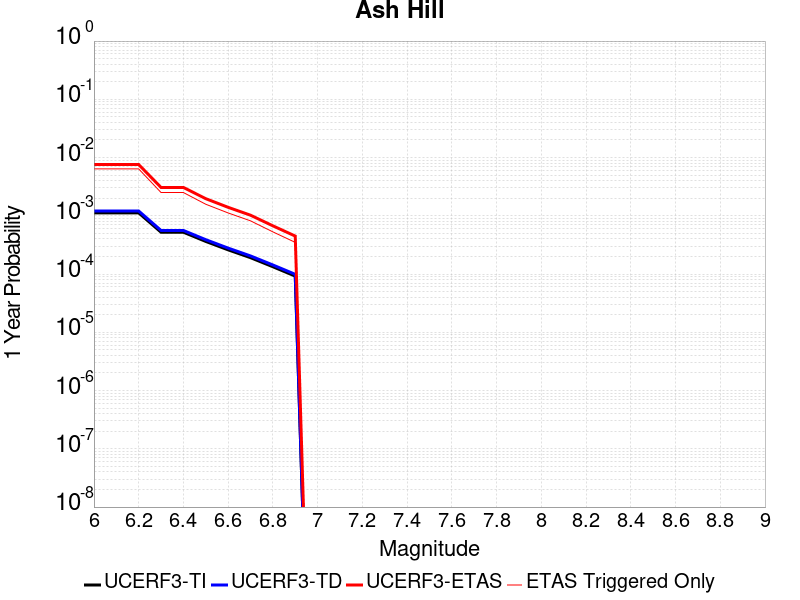 |  |

| Magnitude | 1 wk TI Prob | 1 wk TD Prob | 1 wk ETAS Prob | 1 wk ETAS/TD Gain | 1 wk ETAS Triggered Only | 1 mo TI Prob | 1 mo TD Prob | 1 mo ETAS Prob | 1 mo ETAS/TD Gain | 1 mo ETAS Triggered Only | 1 yr TI Prob | 1 yr TD Prob | 1 yr ETAS Prob | 1 yr ETAS/TD Gain | 1 yr ETAS Triggered Only | 10 yr TI Prob | 10 yr TD Prob | 10 yr ETAS Prob | 10 yr ETAS/TD Gain | 10 yr ETAS Triggered Only |
|-----|-----|-----|-----|-----|-----|-----|-----|-----|-----|-----|-----|-----|-----|-----|-----|-----|-----|-----|-----|-----|
| 6.0 | 2.1545662E-5 | 2.3194447E-5 | 0.002763131 | 119.12898 | 0.00274 | 9.2335285E-5 | 9.940143E-5 | 0.0039090225 | 39.325615 | 0.00381 | 0.0011236023 | 0.0012096206 | 0.007591891 | 6.2762585 | 0.00639 | 0.011179381 | 0.012038348 | 0.02153266 | 1.7886722 | 0.00961 |
| 6.1 | 2.1545662E-5 | 2.3194447E-5 | 0.002763131 | 119.12898 | 0.00274 | 9.2335285E-5 | 9.940143E-5 | 0.0039090225 | 39.325615 | 0.00381 | 0.0011236023 | 0.0012096206 | 0.007591891 | 6.2762585 | 0.00639 | 0.011179381 | 0.012038348 | 0.02153266 | 1.7886722 | 0.00961 |
| 6.2 | 2.1545662E-5 | 2.3194447E-5 | 0.002763131 | 119.12898 | 0.00274 | 9.2335285E-5 | 9.940143E-5 | 0.0039090225 | 39.325615 | 0.00381 | 0.0011236023 | 0.0012096206 | 0.007591891 | 6.2762585 | 0.00639 | 0.011179381 | 0.012038348 | 0.02153266 | 1.7886722 | 0.00961 |
| 6.3 | 1.0025529E-5 | 1.0746934E-5 | 0.0011007353 | 102.42318 | 0.00109 | 4.2965847E-5 | 4.605755E-5 | 0.0015659876 | 34.000668 | 0.00152 | 5.229836E-4 | 5.6061964E-4 | 0.0030692124 | 5.474679 | 0.00251 | 0.005217545 | 0.0055933665 | 0.009521273 | 1.7022437 | 0.00395 |
| 6.4 | 1.0025529E-5 | 1.0746934E-5 | 0.0011007353 | 102.42318 | 0.00109 | 4.2965847E-5 | 4.605755E-5 | 0.0015659876 | 34.000668 | 0.00152 | 5.229836E-4 | 5.6061964E-4 | 0.0030692124 | 5.474679 | 0.00251 | 0.005217545 | 0.0055933665 | 0.009521273 | 1.7022437 | 0.00395 |
| 6.5 | 6.9617327E-6 | 7.456634E-6 | 6.674517E-4 | 89.51112 | 6.6E-4 | 2.9835655E-5 | 3.195666E-5 | 9.819263E-4 | 30.726812 | 9.5E-4 | 3.6318856E-4 | 3.8901155E-4 | 0.0019683968 | 5.059996 | 0.00158 | 0.0036259557 | 0.0038841602 | 0.0064142947 | 1.651398 | 0.00254 |
| 6.6 | 4.9919777E-6 | 5.3466883E-6 | 4.9534405E-4 | 92.64503 | 4.9E-4 | 2.1394015E-5 | 2.2914215E-5 | 6.728993E-4 | 29.366022 | 6.5E-4 | 2.60441E-4 | 2.7895154E-4 | 0.0013986392 | 5.013914 | 0.00112 | 0.0026013597 | 0.0027866727 | 0.004581657 | 1.6441317 | 0.0018 |
| 6.7 | 3.6630722E-6 | 3.924624E-6 | 3.9392308E-4 | 100.37219 | 3.9E-4 | 1.5698786E-5 | 1.681974E-5 | 5.068115E-4 | 30.131947 | 4.9E-4 | 1.9111596E-4 | 2.0476682E-4 | 0.001024599 | 5.003735 | 8.2E-4 | 0.0019095168 | 0.0020463446 | 0.0034235206 | 1.6729933 | 0.00138 |
| 6.8 | 2.5599613E-6 | 2.744925E-6 | 2.8274415E-4 | 103.00615 | 2.8E-4 | 1.0971216E-5 | 1.1763939E-5 | 3.3176018E-4 | 28.201452 | 3.2E-4 | 1.3356637E-4 | 1.4322149E-4 | 6.731456E-4 | 4.7000318 | 5.3E-4 | 0.0013348613 | 0.0014317769 | 0.0023504596 | 1.6416382 | 9.2E-4 |
| 6.9 | 1.7684905E-6 | 1.8968707E-6 | 1.7189655E-4 | 90.62112 | 1.7E-4 | 7.579223E-6 | 8.129446E-6 | 2.0812782E-4 | 25.601723 | 2.0E-4 | 9.2273134E-5 | 9.8976E-5 | 4.4894137E-4 | 4.5358605 | 3.5E-4 | 9.223483E-4 | 9.8976E-4 | 0.001579176 | 1.595514 | 5.9E-4 |

## Garlock (West)
*[(top)](#table-of-contents)*

| 1 Week | 1 Month | 1 Year | 10 Year |
|-----|-----|-----|-----|
|  |  |  |  |

| Magnitude | 1 wk TI Prob | 1 wk TD Prob | 1 wk ETAS Prob | 1 wk ETAS/TD Gain | 1 wk ETAS Triggered Only | 1 mo TI Prob | 1 mo TD Prob | 1 mo ETAS Prob | 1 mo ETAS/TD Gain | 1 mo ETAS Triggered Only | 1 yr TI Prob | 1 yr TD Prob | 1 yr ETAS Prob | 1 yr ETAS/TD Gain | 1 yr ETAS Triggered Only | 10 yr TI Prob | 10 yr TD Prob | 10 yr ETAS Prob | 10 yr ETAS/TD Gain | 10 yr ETAS Triggered Only |
|-----|-----|-----|-----|-----|-----|-----|-----|-----|-----|-----|-----|-----|-----|-----|-----|-----|-----|-----|-----|-----|
| 6.0 | 2.5181727E-5 | 2.51973E-5 | 0.0037751028 | 149.82172 | 0.00375 | 1.0791722E-4 | 1.0798398E-4 | 0.0050274525 | 46.557396 | 0.00492 | 0.0013131002 | 0.0013139155 | 0.008614311 | 6.556214 | 0.00731 | 0.013053683 | 0.013141977 | 0.0227145 | 1.728393 | 0.0097 |
| 6.1 | 2.5077732E-5 | 2.5098372E-5 | 0.0037750043 | 150.40833 | 0.00375 | 1.0747157E-4 | 1.0756004E-4 | 0.005027031 | 46.736977 | 0.00492 | 0.001307681 | 0.0013087603 | 0.008609193 | 6.578129 | 0.00731 | 0.013000126 | 0.013091032 | 0.02266405 | 1.7312652 | 0.0097 |
| 6.2 | 2.494612E-5 | 2.498005E-5 | 0.0037748865 | 151.11604 | 0.00375 | 1.0690756E-4 | 1.0705298E-4 | 0.0050265263 | 46.953632 | 0.00492 | 0.0013008224 | 0.0013025942 | 0.008603072 | 6.604568 | 0.00731 | 0.012932341 | 0.013030097 | 0.022603706 | 1.7347304 | 0.0097 |
| 6.3 | 2.4733758E-5 | 2.479942E-5 | 0.0037747065 | 152.20947 | 0.00375 | 1.0599751E-4 | 1.06278916E-4 | 0.005025756 | 47.288364 | 0.00492 | 0.0012897556 | 0.0012931811 | 0.008593728 | 6.645417 | 0.00731 | 0.012822957 | 0.012937066 | 0.022511577 | 1.7400836 | 0.0097 |
| 6.4 | 2.3237335E-5 | 2.317873E-5 | 0.0037530924 | 161.91966 | 0.00373 | 9.958477E-5 | 9.933365E-5 | 0.00496885 | 50.02182 | 0.00487 | 0.0012117702 | 0.001208719 | 0.008459943 | 6.999099 | 0.00726 | 0.012051838 | 0.012101916 | 0.021615375 | 1.7861118 | 0.00963 |
| 6.5 | 2.2732203E-5 | 2.2993298E-5 | 0.0037529075 | 163.21745 | 0.00373 | 9.742009E-5 | 9.8539E-5 | 0.0049680592 | 50.417187 | 0.00487 | 0.0011854442 | 0.0011990548 | 0.00845035 | 7.047509 | 0.00726 | 0.011791403 | 0.012006322 | 0.021520702 | 1.7924474 | 0.00963 |
| 6.6 | 2.1319436E-5 | 2.17735E-5 | 0.0037216928 | 170.92764 | 0.0037 | 9.136581E-5 | 9.331167E-5 | 0.004922861 | 52.757183 | 0.00483 | 0.001111811 | 0.0011354799 | 0.008357271 | 7.360122 | 0.00723 | 0.011062649 | 0.011377227 | 0.020858118 | 1.8333219 | 0.00959 |
| 6.7 | 1.970802E-5 | 2.0393396E-5 | 0.0037103181 | 181.93724 | 0.00369 | 8.446021E-5 | 8.739735E-5 | 0.004896977 | 56.031185 | 0.00481 | 0.001027818 | 0.001063545 | 0.008265877 | 7.7720046 | 0.00721 | 0.010230771 | 0.010664964 | 0.020132901 | 1.8877608 | 0.00957 |
| 6.8 | 1.8744462E-5 | 1.9901045E-5 | 0.0036998277 | 185.91124 | 0.00368 | 8.033094E-5 | 8.5287415E-5 | 0.004884878 | 57.275486 | 0.0048 | 9.775903E-4 | 0.0010378812 | 0.008230409 | 7.93001 | 0.0072 | 0.009733009 | 0.01041075 | 0.019861327 | 1.907771 | 0.00955 |
| 6.9 | 1.7559682E-5 | 1.8953415E-5 | 0.0036988836 | 195.15659 | 0.00368 | 7.5253614E-5 | 8.12264E-5 | 0.0048808367 | 60.089287 | 0.0048 | 9.158276E-4 | 9.884841E-4 | 0.008181367 | 8.27668 | 0.0072 | 0.0091206245 | 0.009921231 | 0.019376483 | 1.9530321 | 0.00955 |
| 7.0 | 1.6794445E-5 | 1.8216237E-5 | 0.0036881494 | 202.46494 | 0.00367 | 7.197421E-5 | 7.8067256E-5 | 0.0048576943 | 62.224472 | 0.00478 | 8.759337E-4 | 9.5005584E-4 | 0.008103253 | 8.52924 | 0.00716 | 0.008724891 | 0.009540141 | 0.01890989 | 1.9821397 | 0.00946 |
| 7.1 | 1.6337795E-5 | 1.7717046E-5 | 0.0036576525 | 206.44823 | 0.00364 | 7.0017246E-5 | 7.5927994E-5 | 0.004815568 | 63.42283 | 0.00474 | 8.521265E-4 | 9.240326E-4 | 0.008007481 | 8.6658 | 0.00709 | 0.008488664 | 0.009281996 | 0.01857493 | 2.0011785 | 0.00938 |
| 7.2 | 1.5780008E-5 | 1.7165687E-5 | 0.0036471034 | 212.46475 | 0.00363 | 6.762685E-5 | 7.356516E-5 | 0.0047832187 | 65.020164 | 0.00471 | 8.2304585E-4 | 8.9528906E-4 | 0.007948969 | 8.878661 | 0.00706 | 0.008200042 | 0.008996838 | 0.018242897 | 2.027701 | 0.00933 |
| 7.3 | 1.5058865E-5 | 1.6618762E-5 | 0.0036165589 | 217.61903 | 0.0036 | 6.45364E-5 | 7.122133E-5 | 0.00472089 | 66.28478 | 0.00465 | 7.854473E-4 | 8.667759E-4 | 0.007840726 | 9.045851 | 0.00698 | 0.00782677 | 0.008713539 | 0.017873025 | 2.0511787 | 0.00924 |
| 7.4 | 1.4887923E-5 | 1.6454731E-5 | 0.0035663964 | 216.73987 | 0.00355 | 6.380382E-5 | 7.051838E-5 | 0.0046601947 | 66.08482 | 0.00459 | 7.7653467E-4 | 8.582243E-4 | 0.0077223284 | 8.998031 | 0.00687 | 0.0077382675 | 0.008628399 | 0.017630054 | 2.043259 | 0.00908 |
| 7.5 | 1.4509299E-5 | 1.6046748E-5 | 0.0033259937 | 207.26901 | 0.00331 | 6.218123E-5 | 6.876997E-5 | 0.0043184776 | 62.79598 | 0.00425 | 7.567935E-4 | 8.36954E-4 | 0.007191631 | 8.592625 | 0.00636 | 0.0075422134 | 0.008416704 | 0.016785666 | 1.9943278 | 0.00844 |
| 7.6 | 1.2756717E-5 | 1.4050848E-5 | 0.0022740192 | 161.84212 | 0.00226 | 5.4670498E-5 | 6.0216535E-5 | 0.0029700412 | 49.322685 | 0.00291 | 6.6541E-4 | 7.328904E-4 | 0.004969783 | 6.7810726 | 0.00424 | 0.006634211 | 0.0073816874 | 0.012920498 | 1.7503448 | 0.00558 |
| 7.7 | 1.0328985E-5 | 1.1460557E-5 | 0.0014714438 | 128.392 | 0.00146 | 4.4266326E-5 | 4.911575E-5 | 0.0018490274 | 37.64632 | 0.0018 | 5.388092E-4 | 5.978206E-4 | 0.003136302 | 5.2462263 | 0.00254 | 0.0053750467 | 0.006038511 | 0.009229127 | 1.528378 | 0.00321 |
| 7.8 | 7.0306583E-6 | 8.899601E-6 | 9.288914E-4 | 104.374504 | 9.2E-4 | 3.0131043E-5 | 3.814059E-5 | 0.0011480983 | 30.101744 | 0.00111 | 3.667837E-4 | 4.642629E-4 | 0.0020435294 | 4.4016643 | 0.00158 | 0.003661789 | 0.0046952725 | 0.006705788 | 1.4282 | 0.00202 |
| 7.9 | 4.060633E-6 | 5.4653938E-6 | 4.5546293E-4 | 83.33579 | 4.5E-4 | 1.7402595E-5 | 2.3422906E-5 | 5.33411E-4 | 22.773046 | 5.1E-4 | 2.11856E-4 | 2.851367E-4 | 0.0010649143 | 3.7347503 | 7.8E-4 | 0.0021165414 | 0.002884201 | 0.003941144 | 1.3664595 | 0.00106 |
| 8.0 | 1.6729537E-6 | 2.0775144E-6 | 1.520772E-4 | 73.201515 | 1.5E-4 | 7.169782E-6 | 8.903603E-6 | 1.5890227E-4 | 17.846962 | 1.5E-4 | 8.7288594E-5 | 1.0839601E-4 | 3.383711E-4 | 3.1216195 | 2.3E-4 | 8.7254314E-4 | 0.0010969337 | 0.0014265717 | 1.3005086 | 3.3E-4 |
| 8.1 | 3.6733252E-7 | 3.1489964E-7 | 1.0314897E-5 | 32.756138 | 1.0E-5 | 1.5742813E-6 | 1.3495693E-6 | 1.1349556E-5 | 8.409761 | 1.0E-5 | 1.9166706E-5 | 1.6430899E-5 | 3.643057E-5 | 2.2171988 | 2.0E-5 | 1.9165053E-4 | 1.6638759E-4 | 1.8638426E-4 | 1.1201813 | 2.0E-5 |

## Gravel Hills-Harper Lk
*[(top)](#table-of-contents)*

| 1 Week | 1 Month | 1 Year | 10 Year |
|-----|-----|-----|-----|
| 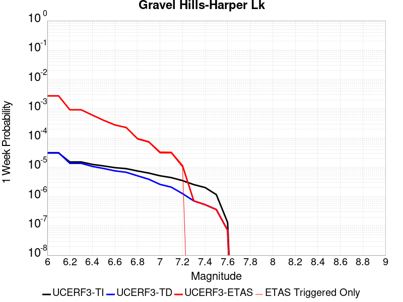 |  |  |  |

| Magnitude | 1 wk TI Prob | 1 wk TD Prob | 1 wk ETAS Prob | 1 wk ETAS/TD Gain | 1 wk ETAS Triggered Only | 1 mo TI Prob | 1 mo TD Prob | 1 mo ETAS Prob | 1 mo ETAS/TD Gain | 1 mo ETAS Triggered Only | 1 yr TI Prob | 1 yr TD Prob | 1 yr ETAS Prob | 1 yr ETAS/TD Gain | 1 yr ETAS Triggered Only | 10 yr TI Prob | 10 yr TD Prob | 10 yr ETAS Prob | 10 yr ETAS/TD Gain | 10 yr ETAS Triggered Only |
|-----|-----|-----|-----|-----|-----|-----|-----|-----|-----|-----|-----|-----|-----|-----|-----|-----|-----|-----|-----|-----|
| 6.0 | 3.0679566E-5 | 3.1464646E-5 | 0.00272138 | 86.49009 | 0.00269 | 1.3147724E-4 | 1.3484273E-4 | 0.004004321 | 29.69623 | 0.00387 | 0.0015995599 | 0.0016406906 | 0.007970288 | 4.8578863 | 0.00634 | 0.015880952 | 0.01630734 | 0.025190083 | 1.5447085 | 0.00903 |
| 6.1 | 3.0679566E-5 | 3.1464646E-5 | 0.00272138 | 86.49009 | 0.00269 | 1.3147724E-4 | 1.3484273E-4 | 0.004004321 | 29.69623 | 0.00387 | 0.0015995599 | 0.0016406906 | 0.007970288 | 4.8578863 | 0.00634 | 0.015880952 | 0.01630734 | 0.025190083 | 1.5447085 | 0.00903 |
| 6.2 | 1.514536E-5 | 1.3635206E-5 | 9.1362296E-4 | 67.0047 | 9.0E-4 | 6.490707E-5 | 5.843536E-5 | 0.0013783582 | 23.587744 | 0.00132 | 7.8995706E-4 | 7.1123015E-4 | 0.0027198005 | 3.8240795 | 0.00201 | 0.007871548 | 0.0070907404 | 0.010039681 | 1.4158862 | 0.00297 |
| 6.3 | 1.514536E-5 | 1.3635206E-5 | 9.1362296E-4 | 67.0047 | 9.0E-4 | 6.490707E-5 | 5.843536E-5 | 0.0013783582 | 23.587744 | 0.00132 | 7.8995706E-4 | 7.1123015E-4 | 0.0027198005 | 3.8240795 | 0.00201 | 0.007871548 | 0.0070907404 | 0.010039681 | 1.4158862 | 0.00297 |
| 6.4 | 1.2532521E-5 | 1.06896905E-5 | 6.006834E-4 | 56.192776 | 5.9E-4 | 5.37097E-5 | 4.581219E-5 | 8.9577324E-4 | 19.553164 | 8.5E-4 | 6.537194E-4 | 5.576265E-4 | 0.0018169238 | 3.258317 | 0.00126 | 0.0065179965 | 0.005562863 | 0.007392627 | 1.3289249 | 0.00184 |
| 6.5 | 1.1094058E-5 | 9.083664E-6 | 3.9908013E-4 | 43.93383 | 3.9E-4 | 4.7545094E-5 | 3.892943E-5 | 6.0890726E-4 | 15.64131 | 5.7E-4 | 5.787078E-4 | 4.7386673E-4 | 0.0012934782 | 2.7296243 | 8.2E-4 | 0.0057720304 | 0.0047289706 | 0.00601287 | 1.2714967 | 0.00129 |
| 6.6 | 9.688328E-6 | 7.5316952E-6 | 2.7752967E-4 | 36.848232 | 2.7E-4 | 4.1520743E-5 | 3.227831E-5 | 4.322654E-4 | 13.391823 | 4.0E-4 | 5.053978E-4 | 3.9292008E-4 | 9.826883E-4 | 2.5009875 | 5.9E-4 | 0.0050424994 | 0.0039225104 | 0.004828941 | 1.2310842 | 9.1E-4 |
| 6.7 | 8.974824E-6 | 6.749413E-6 | 2.2674793E-4 | 33.595207 | 2.2E-4 | 3.8462964E-5 | 2.8925748E-5 | 3.3891678E-4 | 11.716785 | 3.1E-4 | 4.6818596E-4 | 3.5211627E-4 | 8.019578E-4 | 2.2775369 | 4.5E-4 | 0.004672008 | 0.0035158044 | 0.0042033787 | 1.1955667 | 6.9E-4 |
| 6.8 | 7.4780046E-6 | 5.1161933E-6 | 9.5115734E-5 | 18.591114 | 9.0E-5 | 3.20482E-5 | 2.1926366E-5 | 1.4192374E-4 | 6.472743 | 1.2E-4 | 3.9011694E-4 | 2.669222E-4 | 4.5687146E-4 | 1.711628 | 1.9E-4 | 0.0038943281 | 0.0026661542 | 0.002955381 | 1.1084809 | 2.9E-4 |
| 6.9 | 6.3409307E-6 | 3.9074966E-6 | 7.390722E-5 | 18.914211 | 7.0E-5 | 2.7175134E-5 | 1.6746313E-5 | 1.067448E-4 | 6.3742275 | 9.0E-5 | 3.3080703E-4 | 2.0386827E-4 | 3.538377E-4 | 1.7356192 | 1.5E-4 | 0.0033031502 | 0.0020369107 | 0.0022564626 | 1.1077867 | 2.2E-4 |
| 7.0 | 5.1239335E-6 | 2.6058565E-6 | 3.2605778E-5 | 12.5125 | 3.0E-5 | 2.195953E-5 | 1.116791E-5 | 6.116735E-5 | 5.4770637 | 5.0E-5 | 2.6732447E-4 | 1.3596108E-4 | 2.1595019E-4 | 1.5883237 | 8.0E-5 | 0.0026700313 | 0.0013588042 | 0.0014786411 | 1.0881929 | 1.2E-4 |
| 7.1 | 4.438899E-6 | 2.0984728E-6 | 3.209841E-5 | 15.296082 | 3.0E-5 | 1.9023713E-5 | 8.993425E-6 | 5.8992977E-5 | 6.559567 | 5.0E-5 | 2.315891E-4 | 1.0948967E-4 | 1.79482E-4 | 1.6392597 | 7.0E-5 | 0.002313479 | 0.0010943791 | 0.0012042588 | 1.1004037 | 1.1E-4 |
| 7.2 | 3.50367E-6 | 1.2615716E-6 | 1.1261559E-5 | 8.926611 | 1.0E-5 | 1.5015643E-5 | 5.4067245E-6 | 3.5406563E-5 | 6.548616 | 3.0E-5 | 1.8280011E-4 | 6.582497E-5 | 1.1582168E-4 | 1.7595402 | 5.0E-5 | 0.0018264982 | 6.580629E-4 | 7.380103E-4 | 1.1214889 | 8.0E-5 |
| 7.3 | 2.561638E-6 | 7.1191585E-7 | 7.1191585E-7 | 1.0 | 0.0 | 1.0978401E-5 | 3.0510646E-6 | 1.3051034E-5 | 4.2775345 | 1.0E-5 | 1.3365384E-4 | 3.71461E-5 | 4.7145724E-5 | 1.2691972 | 1.0E-5 | 0.0013357349 | 3.7140088E-4 | 3.9139346E-4 | 1.0538301 | 2.0E-5 |
| 7.4 | 2.0368864E-6 | 5.304837E-7 | 5.304837E-7 | 1.0 | 0.0 | 8.729483E-6 | 2.2734996E-6 | 1.2273477E-5 | 5.398495 | 1.0E-5 | 1.06276275E-4 | 2.7679513E-5 | 3.7679238E-5 | 1.361268 | 1.0E-5 | 0.0010622547 | 2.767612E-4 | 2.867584E-4 | 1.0361222 | 1.0E-5 |
| 7.5 | 1.1681728E-6 | 3.6030585E-7 | 3.6030585E-7 | 1.0 | 0.0 | 5.0064455E-6 | 1.544167E-6 | 1.544167E-6 | 1.0 | 0.0 | 6.0951766E-5 | 1.8800076E-5 | 1.8800076E-5 | 1.0 | 0.0 | 6.093505E-4 | 1.8798532E-4 | 1.8798532E-4 | 1.0 | 0.0 |
| 7.6 | 1.3154387E-7 | 7.1197384E-8 | 7.1197384E-8 | 1.0 | 0.0 | 5.6375933E-7 | 3.051316E-7 | 3.051316E-7 | 1.0 | 0.0 | 6.863748E-6 | 3.7149728E-6 | 3.7149728E-6 | 1.0 | 0.0 | 6.863536E-5 | 3.7149264E-5 | 3.7149264E-5 | 1.0 | 0.0 |

## McLean Lake
*[(top)](#table-of-contents)*

| 1 Week | 1 Month | 1 Year | 10 Year |
|-----|-----|-----|-----|
|  |  |  |  |

| Magnitude | 1 wk TI Prob | 1 wk TD Prob | 1 wk ETAS Prob | 1 wk ETAS/TD Gain | 1 wk ETAS Triggered Only | 1 mo TI Prob | 1 mo TD Prob | 1 mo ETAS Prob | 1 mo ETAS/TD Gain | 1 mo ETAS Triggered Only | 1 yr TI Prob | 1 yr TD Prob | 1 yr ETAS Prob | 1 yr ETAS/TD Gain | 1 yr ETAS Triggered Only | 10 yr TI Prob | 10 yr TD Prob | 10 yr ETAS Prob | 10 yr ETAS/TD Gain | 10 yr ETAS Triggered Only |
|-----|-----|-----|-----|-----|-----|-----|-----|-----|-----|-----|-----|-----|-----|-----|-----|-----|-----|-----|-----|-----|
| 6.0 | 1.7360222E-5 | 1.8501627E-5 | 0.001458475 | 78.82955 | 0.00144 | 7.439883E-5 | 7.9290556E-5 | 0.002409106 | 30.383265 | 0.00233 | 9.0542925E-4 | 9.6498354E-4 | 0.0053807185 | 5.5759687 | 0.00442 | 0.009017491 | 0.0096127745 | 0.016902024 | 1.7582878 | 0.00736 |
| 6.1 | 9.062689E-6 | 9.592193E-6 | 7.095855E-4 | 73.97531 | 7.0E-4 | 3.8839516E-5 | 4.1108804E-5 | 0.0012610586 | 30.676123 | 0.00122 | 4.727685E-4 | 5.003936E-4 | 0.0028292276 | 5.6540046 | 0.00233 | 0.0047176396 | 0.004993552 | 0.008814377 | 1.7651517 | 0.00384 |
| 6.2 | 9.062689E-6 | 9.592193E-6 | 7.095855E-4 | 73.97531 | 7.0E-4 | 3.8839516E-5 | 4.1108804E-5 | 0.0012610586 | 30.676123 | 0.00122 | 4.727685E-4 | 5.003936E-4 | 0.0028292276 | 5.6540046 | 0.00233 | 0.0047176396 | 0.004993552 | 0.008814377 | 1.7651517 | 0.00384 |
| 6.3 | 7.2575485E-6 | 7.66771E-6 | 6.076631E-4 | 79.249626 | 6.0E-4 | 3.110341E-5 | 3.2861237E-5 | 0.001072827 | 32.64719 | 0.00104 | 3.786182E-4 | 4.0001926E-4 | 0.0022592752 | 5.6479163 | 0.00186 | 0.0037797375 | 0.0039936965 | 0.0071111964 | 1.7806051 | 0.00313 |
| 6.4 | 7.2575485E-6 | 7.66771E-6 | 6.076631E-4 | 79.249626 | 6.0E-4 | 3.110341E-5 | 3.2861237E-5 | 0.001072827 | 32.64719 | 0.00104 | 3.786182E-4 | 4.0001926E-4 | 0.0022592752 | 5.6479163 | 0.00186 | 0.0037797375 | 0.0039936965 | 0.0071111964 | 1.7806051 | 0.00313 |
| 6.5 | 6.06582E-6 | 6.4038773E-6 | 5.4640044E-4 | 85.32338 | 5.4E-4 | 2.5996113E-5 | 2.7444936E-5 | 9.274202E-4 | 33.792034 | 9.0E-4 | 3.164567E-4 | 3.3409733E-4 | 0.0019135695 | 5.7275805 | 0.00158 | 0.0031600643 | 0.0033365893 | 0.005987714 | 1.7945613 | 0.00266 |
| 6.6 | 5.598744E-6 | 5.910262E-6 | 4.759075E-4 | 80.52223 | 4.7E-4 | 2.3994397E-5 | 2.5329486E-5 | 8.453087E-4 | 33.372517 | 8.2E-4 | 2.9209262E-4 | 3.0834923E-4 | 0.0017579021 | 5.70101 | 0.00145 | 0.0029170897 | 0.003079843 | 0.0054724514 | 1.7768605 | 0.0024 |
| 6.7 | 5.246996E-6 | 5.539162E-6 | 4.4553672E-4 | 80.43396 | 4.4E-4 | 2.2486933E-5 | 2.3739085E-5 | 8.1372034E-4 | 34.27766 | 7.9E-4 | 2.73744E-4 | 2.8899137E-4 | 0.0016785897 | 5.808442 | 0.00139 | 0.0027340704 | 0.0028867796 | 0.00518014 | 1.7944356 | 0.0023 |
| 6.8 | 4.02324E-6 | 4.2469046E-6 | 3.4424546E-4 | 81.05797 | 3.4E-4 | 1.7242342E-5 | 1.8200926E-5 | 5.781907E-4 | 31.767105 | 5.6E-4 | 2.099053E-4 | 2.2157968E-4 | 0.001271347 | 5.7376513 | 0.00105 | 0.0020970714 | 0.002214172 | 0.0039902306 | 1.8021322 | 0.00178 |
| 6.9 | 6.835972E-7 | 7.1399285E-7 | 2.0713978E-5 | 29.011465 | 2.0E-5 | 2.9296991E-6 | 3.0599674E-6 | 3.3059874E-5 | 10.803996 | 3.0E-5 | 3.56685E-5 | 3.7254784E-5 | 1.3725106E-4 | 3.684119 | 1.0E-4 | 3.5662777E-4 | 3.7251666E-4 | 6.0243096E-4 | 1.617192 | 2.3E-4 |

## Goldstone Lake
*[(top)](#table-of-contents)*

| 1 Week | 1 Month | 1 Year | 10 Year |
|-----|-----|-----|-----|
|  |  |  |  |

| Magnitude | 1 wk TI Prob | 1 wk TD Prob | 1 wk ETAS Prob | 1 wk ETAS/TD Gain | 1 wk ETAS Triggered Only | 1 mo TI Prob | 1 mo TD Prob | 1 mo ETAS Prob | 1 mo ETAS/TD Gain | 1 mo ETAS Triggered Only | 1 yr TI Prob | 1 yr TD Prob | 1 yr ETAS Prob | 1 yr ETAS/TD Gain | 1 yr ETAS Triggered Only | 10 yr TI Prob | 10 yr TD Prob | 10 yr ETAS Prob | 10 yr ETAS/TD Gain | 10 yr ETAS Triggered Only |
|-----|-----|-----|-----|-----|-----|-----|-----|-----|-----|-----|-----|-----|-----|-----|-----|-----|-----|-----|-----|-----|
| 6.0 | 2.671352E-5 | 3.037609E-5 | 0.0015003314 | 49.391857 | 0.00147 | 1.1448149E-4 | 1.3017785E-4 | 0.0023198929 | 17.820948 | 0.00219 | 0.001392921 | 0.0015839594 | 0.0056874496 | 3.5906534 | 0.00411 | 0.013842222 | 0.015746197 | 0.022055263 | 1.4006724 | 0.00641 |
| 6.1 | 2.671352E-5 | 3.037609E-5 | 0.0015003314 | 49.391857 | 0.00147 | 1.1448149E-4 | 1.3017785E-4 | 0.0023198929 | 17.820948 | 0.00219 | 0.001392921 | 0.0015839594 | 0.0056874496 | 3.5906534 | 0.00411 | 0.013842222 | 0.015746197 | 0.022055263 | 1.4006724 | 0.00641 |
| 6.2 | 1.4197047E-5 | 1.6096245E-5 | 7.1608496E-4 | 44.487705 | 7.0E-4 | 6.0843064E-5 | 6.8982634E-5 | 0.0011689068 | 16.944942 | 0.0011 | 7.4051257E-4 | 8.3963864E-4 | 0.0028779258 | 3.4275768 | 0.00204 | 0.007380498 | 0.0083743585 | 0.011468231 | 1.3694458 | 0.00312 |
| 6.3 | 1.4197047E-5 | 1.6096245E-5 | 7.1608496E-4 | 44.487705 | 7.0E-4 | 6.0843064E-5 | 6.8982634E-5 | 0.0011689068 | 16.944942 | 0.0011 | 7.4051257E-4 | 8.3963864E-4 | 0.0028779258 | 3.4275768 | 0.00204 | 0.007380498 | 0.0083743585 | 0.011468231 | 1.3694458 | 0.00312 |
| 6.4 | 1.3238931E-5 | 1.500846E-5 | 6.849984E-4 | 45.64082 | 6.7E-4 | 5.6737044E-5 | 6.4320935E-5 | 0.001104254 | 17.16788 | 0.00104 | 6.9055456E-4 | 7.82924E-4 | 0.0026714443 | 3.4121373 | 0.00189 | 0.006884126 | 0.0078112837 | 0.010698552 | 1.369628 | 0.00291 |
| 6.5 | 1.3238931E-5 | 1.500846E-5 | 6.849984E-4 | 45.64082 | 6.7E-4 | 5.6737044E-5 | 6.4320935E-5 | 0.001104254 | 17.16788 | 0.00104 | 6.9055456E-4 | 7.82924E-4 | 0.0026714443 | 3.4121373 | 0.00189 | 0.006884126 | 0.0078112837 | 0.010698552 | 1.369628 | 0.00291 |
| 6.6 | 1.1328278E-5 | 1.2855166E-5 | 5.3284847E-4 | 41.450146 | 5.2E-4 | 4.8548856E-5 | 5.5092944E-5 | 9.25045E-4 | 16.790627 | 8.7E-4 | 5.90922E-4 | 6.7064585E-4 | 0.0022295995 | 3.3245559 | 0.00156 | 0.0058935313 | 0.0066956086 | 0.009079539 | 1.3560439 | 0.0024 |
| 6.7 | 8.651175E-6 | 9.824565E-6 | 3.7982094E-4 | 38.66033 | 3.7E-4 | 3.707594E-5 | 4.2105108E-5 | 7.120769E-4 | 16.911888 | 6.7E-4 | 4.5130608E-4 | 5.1259965E-4 | 0.0017219794 | 3.3593068 | 0.00121 | 0.0045039062 | 0.005123051 | 0.0069536245 | 1.357321 | 0.00184 |
| 6.8 | 1.0215377E-6 | 1.1754702E-6 | 1.1754702E-6 | 1.0 | 0.0 | 4.378012E-6 | 5.0377203E-6 | 1.503767E-5 | 2.9850147 | 1.0E-5 | 5.3300988E-5 | 6.1332634E-5 | 9.1330796E-5 | 1.489106 | 3.0E-5 | 5.3288206E-4 | 6.1316835E-4 | 7.0311315E-4 | 1.1466886 | 9.0E-5 |
| 6.9 | 7.9360774E-7 | 9.2833966E-7 | 9.2833966E-7 | 1.0 | 0.0 | 3.4011714E-6 | 3.9785928E-6 | 3.9785928E-6 | 1.0 | 0.0 | 4.1408475E-5 | 4.843836E-5 | 4.843836E-5 | 1.0 | 0.0 | 4.140076E-4 | 4.8428503E-4 | 5.042753E-4 | 1.041278 | 2.0E-5 |
| 7.0 | 7.4382757E-7 | 8.7473285E-7 | 8.7473285E-7 | 1.0 | 0.0 | 3.1878285E-6 | 3.74885E-6 | 3.74885E-6 | 1.0 | 0.0 | 3.8811122E-5 | 4.564136E-5 | 4.564136E-5 | 1.0 | 0.0 | 3.8804344E-4 | 4.5632652E-4 | 4.763174E-4 | 1.0438082 | 2.0E-5 |
| 7.1 | 6.4709513E-7 | 7.7113E-7 | 7.7113E-7 | 1.0 | 0.0 | 2.773262E-6 | 3.3048389E-6 | 3.3048389E-6 | 1.0 | 0.0 | 3.376394E-5 | 4.0235733E-5 | 4.0235733E-5 | 1.0 | 0.0 | 3.375881E-4 | 4.0229043E-4 | 4.2228238E-4 | 1.0496954 | 2.0E-5 |
| 7.2 | 6.356704E-7 | 7.5883594E-7 | 7.5883594E-7 | 1.0 | 0.0 | 2.7242988E-6 | 3.2521505E-6 | 3.2521505E-6 | 1.0 | 0.0 | 3.3167835E-5 | 3.959427E-5 | 3.959427E-5 | 1.0 | 0.0 | 3.3162883E-4 | 3.958781E-4 | 4.158702E-4 | 1.0505006 | 2.0E-5 |
| 7.3 | 5.7695723E-7 | 6.8965653E-7 | 6.8965653E-7 | 1.0 | 0.0 | 2.4726714E-6 | 2.9556677E-6 | 2.9556677E-6 | 1.0 | 0.0 | 3.0104358E-5 | 3.5984718E-5 | 3.5984718E-5 | 1.0 | 0.0 | 3.0100282E-4 | 3.5979465E-4 | 3.7978747E-4 | 1.0555673 | 2.0E-5 |
| 7.4 | 5.209647E-7 | 6.193514E-7 | 6.193514E-7 | 1.0 | 0.0 | 2.232704E-6 | 2.6543607E-6 | 2.6543607E-6 | 1.0 | 0.0 | 2.718283E-5 | 3.2316417E-5 | 3.2316417E-5 | 1.0 | 0.0 | 2.7179506E-4 | 3.2312275E-4 | 3.331195E-4 | 1.030938 | 1.0E-5 |
| 7.5 | 4.512955E-7 | 5.348885E-7 | 5.348885E-7 | 1.0 | 0.0 | 1.934122E-6 | 2.2923775E-6 | 2.2923775E-6 | 1.0 | 0.0 | 2.3547682E-5 | 2.7909393E-5 | 2.7909393E-5 | 1.0 | 0.0 | 2.3545188E-4 | 2.7906417E-4 | 2.890614E-4 | 1.0358241 | 1.0E-5 |
| 7.6 | 2.21172E-7 | 2.603961E-7 | 2.603961E-7 | 1.0 | 0.0 | 9.478797E-7 | 1.1159829E-6 | 1.1159829E-6 | 1.0 | 0.0 | 1.1540374E-5 | 1.3587036E-5 | 1.3587036E-5 | 1.0 | 0.0 | 1.1539775E-4 | 1.3586486E-4 | 1.4586351E-4 | 1.0735925 | 1.0E-5 |

## So Sierra Nevada
*[(top)](#table-of-contents)*

| 1 Week | 1 Month | 1 Year | 10 Year |
|-----|-----|-----|-----|
|  |  |  | 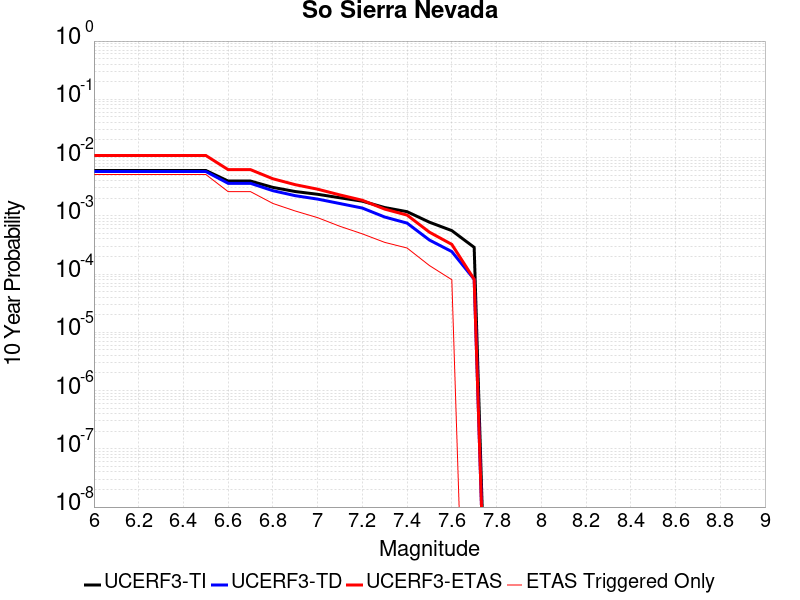 |

| Magnitude | 1 wk TI Prob | 1 wk TD Prob | 1 wk ETAS Prob | 1 wk ETAS/TD Gain | 1 wk ETAS Triggered Only | 1 mo TI Prob | 1 mo TD Prob | 1 mo ETAS Prob | 1 mo ETAS/TD Gain | 1 mo ETAS Triggered Only | 1 yr TI Prob | 1 yr TD Prob | 1 yr ETAS Prob | 1 yr ETAS/TD Gain | 1 yr ETAS Triggered Only | 10 yr TI Prob | 10 yr TD Prob | 10 yr ETAS Prob | 10 yr ETAS/TD Gain | 10 yr ETAS Triggered Only |
|-----|-----|-----|-----|-----|-----|-----|-----|-----|-----|-----|-----|-----|-----|-----|-----|-----|-----|-----|-----|-----|
| 6.0 | 1.15488665E-5 | 1.1079643E-5 | 0.0014810633 | 133.67429 | 0.00147 | 4.9494203E-5 | 4.748339E-5 | 0.0022173803 | 46.69802 | 0.00217 | 6.024253E-4 | 5.7796965E-4 | 0.0042858254 | 7.415312 | 0.00371 | 0.006007948 | 0.005765934 | 0.010866355 | 1.8845783 | 0.00513 |
| 6.1 | 1.15488665E-5 | 1.1079643E-5 | 0.0014810633 | 133.67429 | 0.00147 | 4.9494203E-5 | 4.748339E-5 | 0.0022173803 | 46.69802 | 0.00217 | 6.024253E-4 | 5.7796965E-4 | 0.0042858254 | 7.415312 | 0.00371 | 0.006007948 | 0.005765934 | 0.010866355 | 1.8845783 | 0.00513 |
| 6.2 | 1.15488665E-5 | 1.1079643E-5 | 0.0014810633 | 133.67429 | 0.00147 | 4.9494203E-5 | 4.748339E-5 | 0.0022173803 | 46.69802 | 0.00217 | 6.024253E-4 | 5.7796965E-4 | 0.0042858254 | 7.415312 | 0.00371 | 0.006007948 | 0.005765934 | 0.010866355 | 1.8845783 | 0.00513 |
| 6.3 | 1.15488665E-5 | 1.1079643E-5 | 0.0014810633 | 133.67429 | 0.00147 | 4.9494203E-5 | 4.748339E-5 | 0.0022173803 | 46.69802 | 0.00217 | 6.024253E-4 | 5.7796965E-4 | 0.0042858254 | 7.415312 | 0.00371 | 0.006007948 | 0.005765934 | 0.010866355 | 1.8845783 | 0.00513 |
| 6.4 | 1.15488665E-5 | 1.1079643E-5 | 0.0014810633 | 133.67429 | 0.00147 | 4.9494203E-5 | 4.748339E-5 | 0.0022173803 | 46.69802 | 0.00217 | 6.024253E-4 | 5.7796965E-4 | 0.0042858254 | 7.415312 | 0.00371 | 0.006007948 | 0.005765934 | 0.010866355 | 1.8845783 | 0.00513 |
| 6.5 | 1.15488665E-5 | 1.1079643E-5 | 0.0014810633 | 133.67429 | 0.00147 | 4.9494203E-5 | 4.748339E-5 | 0.0022173803 | 46.69802 | 0.00217 | 6.024253E-4 | 5.7796965E-4 | 0.0042858254 | 7.415312 | 0.00371 | 0.006007948 | 0.005765934 | 0.010866355 | 1.8845783 | 0.00513 |
| 6.6 | 7.587044E-6 | 6.935635E-6 | 7.769303E-4 | 112.020065 | 7.7E-4 | 3.2515498E-5 | 2.9723828E-5 | 0.0011696899 | 39.35193 | 0.00114 | 3.9580427E-4 | 3.6183043E-4 | 0.002231154 | 6.1662965 | 0.00187 | 0.003951 | 0.0036127048 | 0.006203312 | 1.7170824 | 0.0026 |
| 6.7 | 7.587044E-6 | 6.935635E-6 | 7.769303E-4 | 112.020065 | 7.7E-4 | 3.2515498E-5 | 2.9723828E-5 | 0.0011696899 | 39.35193 | 0.00114 | 3.9580427E-4 | 3.6183043E-4 | 0.002231154 | 6.1662965 | 0.00187 | 0.003951 | 0.0036127048 | 0.006203312 | 1.7170824 | 0.0026 |
| 6.8 | 5.9026956E-6 | 5.1793927E-6 | 5.3517666E-4 | 103.32807 | 5.3E-4 | 2.5297022E-5 | 2.2197215E-5 | 8.021799E-4 | 36.138763 | 7.8E-4 | 3.0794772E-4 | 2.7021873E-4 | 0.001519881 | 5.624632 | 0.00125 | 0.0030752132 | 0.002699018 | 0.0043246187 | 1.6022934 | 0.00163 |
| 6.9 | 5.0118915E-6 | 4.2524252E-6 | 4.0425072E-4 | 95.06357 | 4.0E-4 | 2.1479358E-5 | 1.8224557E-5 | 5.8821414E-4 | 32.27591 | 5.7E-4 | 2.614798E-4 | 2.2186211E-4 | 0.0011616535 | 5.2359257 | 9.4E-4 | 0.0026117235 | 0.0022164788 | 0.0034237967 | 1.544701 | 0.00121 |
| 7.0 | 4.4924795E-6 | 3.7139177E-6 | 3.337127E-4 | 89.85463 | 3.3E-4 | 1.925334E-5 | 1.5916696E-5 | 4.8590923E-4 | 30.52827 | 4.7E-4 | 2.3438422E-4 | 1.9376918E-4 | 9.2362775E-4 | 4.7666388 | 7.3E-4 | 0.0023413717 | 0.0019360651 | 0.0028642647 | 1.4794257 | 9.3E-4 |
| 7.1 | 3.9118436E-6 | 3.1119775E-6 | 2.3311126E-4 | 74.90776 | 2.3E-4 | 1.6764936E-5 | 1.3336982E-5 | 3.433326E-4 | 25.742899 | 3.3E-4 | 2.0409399E-4 | 1.6236622E-4 | 6.722834E-4 | 4.1405373 | 5.1E-4 | 0.0020390663 | 0.001622532 | 0.0022814611 | 1.4061116 | 6.6E-4 |
| 7.2 | 3.4200818E-6 | 2.6054543E-6 | 1.7260501E-4 | 66.24757 | 1.7E-4 | 1.4657411E-5 | 1.11661875E-5 | 2.611634E-4 | 23.38877 | 2.5E-4 | 1.7843937E-4 | 1.3594035E-4 | 5.458846E-4 | 4.0156183 | 4.1E-4 | 0.0017829615 | 0.0013586218 | 0.001847956 | 1.3601696 | 4.9E-4 |
| 7.3 | 2.6593618E-6 | 1.8284203E-6 | 1.218282E-4 | 66.6303 | 1.2E-4 | 1.13972155E-5 | 7.836065E-6 | 1.8783465E-4 | 23.970533 | 1.8E-4 | 1.3875226E-4 | 9.540021E-5 | 3.9537158E-4 | 4.144347 | 3.0E-4 | 0.0013866565 | 9.5362146E-4 | 0.0013032877 | 1.3666719 | 3.5E-4 |
| 7.4 | 2.2577992E-6 | 1.436438E-6 | 8.143632E-5 | 56.693237 | 8.0E-5 | 9.676246E-6 | 6.15615E-6 | 1.4615529E-4 | 23.741346 | 1.4E-4 | 1.1780193E-4 | 7.49488E-5 | 3.2493006E-4 | 4.3353605 | 2.5E-4 | 0.001177395 | 7.492603E-4 | 0.0010290504 | 1.3734219 | 2.8E-4 |
| 7.5 | 1.489319E-6 | 7.353936E-7 | 5.0735358E-5 | 68.99075 | 5.0E-5 | 6.3827797E-6 | 3.1516831E-6 | 8.315143E-5 | 26.383183 | 8.0E-5 | 7.770758E-5 | 3.8371072E-5 | 1.6836608E-4 | 4.387839 | 1.3E-4 | 7.7680405E-4 | 3.836449E-4 | 5.235912E-4 | 1.3647808 | 1.4E-4 |
| 7.6 | 1.0680322E-6 | 4.6596554E-7 | 2.0465955E-5 | 43.921608 | 2.0E-5 | 4.577273E-6 | 1.9969937E-6 | 4.1996915E-5 | 21.03007 | 4.0E-5 | 5.5726876E-5 | 2.4313129E-5 | 9.431143E-5 | 3.8790329 | 7.0E-5 | 5.5712904E-4 | 2.4310495E-4 | 3.2308552E-4 | 1.328996 | 8.0E-5 |
| 7.7 | 5.509146E-7 | 1.5580486E-7 | 1.5580486E-7 | 1.0 | 0.0 | 2.3610605E-6 | 6.677349E-7 | 6.677349E-7 | 1.0 | 0.0 | 2.8745531E-5 | 8.129644E-6 | 8.129644E-6 | 1.0 | 0.0 | 2.8741814E-4 | 8.1293576E-5 | 8.1293576E-5 | 1.0 | 0.0 |

## Coyote Canyon
*[(top)](#table-of-contents)*

| 1 Week | 1 Month | 1 Year | 10 Year |
|-----|-----|-----|-----|
|  |  |  |  |

| Magnitude | 1 wk TI Prob | 1 wk TD Prob | 1 wk ETAS Prob | 1 wk ETAS/TD Gain | 1 wk ETAS Triggered Only | 1 mo TI Prob | 1 mo TD Prob | 1 mo ETAS Prob | 1 mo ETAS/TD Gain | 1 mo ETAS Triggered Only | 1 yr TI Prob | 1 yr TD Prob | 1 yr ETAS Prob | 1 yr ETAS/TD Gain | 1 yr ETAS Triggered Only | 10 yr TI Prob | 10 yr TD Prob | 10 yr ETAS Prob | 10 yr ETAS/TD Gain | 10 yr ETAS Triggered Only |
|-----|-----|-----|-----|-----|-----|-----|-----|-----|-----|-----|-----|-----|-----|-----|-----|-----|-----|-----|-----|-----|
| 6.0 | 3.5090034E-5 | 4.0364324E-5 | 8.7033084E-4 | 21.561882 | 8.3E-4 | 1.503772E-4 | 1.7297994E-4 | 0.0014927516 | 8.629622 | 0.00132 | 0.0018293047 | 0.0021042528 | 0.0047087604 | 2.2377353 | 0.00261 | 0.018143194 | 0.020869201 | 0.025157794 | 1.2054987 | 0.00438 |
| 6.1 | 3.5090034E-5 | 4.0364324E-5 | 8.7033084E-4 | 21.561882 | 8.3E-4 | 1.503772E-4 | 1.7297994E-4 | 0.0014927516 | 8.629622 | 0.00132 | 0.0018293047 | 0.0021042528 | 0.0047087604 | 2.2377353 | 0.00261 | 0.018143194 | 0.020869201 | 0.025157794 | 1.2054987 | 0.00438 |
| 6.2 | 1.841879E-5 | 2.1059794E-5 | 5.410488E-4 | 25.69108 | 5.2E-4 | 7.8935285E-5 | 9.0253714E-5 | 8.901815E-4 | 9.863102 | 8.0E-4 | 9.606133E-4 | 0.001098387 | 0.0026366955 | 2.400516 | 0.00154 | 0.0095647145 | 0.010939667 | 0.01329363 | 1.2151769 | 0.00238 |
| 6.3 | 1.841879E-5 | 2.1059794E-5 | 5.410488E-4 | 25.69108 | 5.2E-4 | 7.8935285E-5 | 9.0253714E-5 | 8.901815E-4 | 9.863102 | 8.0E-4 | 9.606133E-4 | 0.001098387 | 0.0026366955 | 2.400516 | 0.00154 | 0.0095647145 | 0.010939667 | 0.01329363 | 1.2151769 | 0.00238 |
| 6.4 | 1.712201E-5 | 1.9565212E-5 | 4.9955584E-4 | 25.53286 | 4.8E-4 | 7.337798E-5 | 8.3848776E-5 | 8.337859E-4 | 9.943924 | 7.5E-4 | 8.930107E-4 | 0.0010204813 | 0.0024690016 | 2.4194481 | 0.00145 | 0.008894307 | 0.010167871 | 0.01241479 | 1.2209822 | 0.00227 |
| 6.5 | 1.4744935E-5 | 1.6836972E-5 | 4.668294E-4 | 27.726446 | 4.5E-4 | 6.3191044E-5 | 7.215698E-5 | 7.7210646E-4 | 10.700371 | 7.0E-4 | 7.6907943E-4 | 8.7825063E-4 | 0.0022070825 | 2.513044 | 0.00133 | 0.007664232 | 0.008756994 | 0.01085843 | 1.2399722 | 0.00212 |
| 6.6 | 1.2017839E-5 | 1.37240895E-5 | 4.2371848E-4 | 30.874067 | 4.1E-4 | 5.150401E-5 | 5.88167E-5 | 6.687808E-4 | 11.370594 | 6.1E-4 | 6.268809E-4 | 7.159466E-4 | 0.0018951017 | 2.6469877 | 0.00118 | 0.0062511545 | 0.0071450938 | 0.009011661 | 1.2612376 | 0.00188 |
| 6.7 | 1.00956095E-5 | 1.1533517E-5 | 3.515296E-4 | 30.47896 | 3.4E-4 | 4.326618E-5 | 4.942891E-5 | 5.794027E-4 | 11.72194 | 5.3E-4 | 5.266384E-4 | 6.017178E-4 | 0.00161111 | 2.6775177 | 0.00101 | 0.005253921 | 0.0060094125 | 0.007609737 | 1.2663031 | 0.00161 |

## San Andreas (Mojave S)
*[(top)](#table-of-contents)*

| 1 Week | 1 Month | 1 Year | 10 Year |
|-----|-----|-----|-----|
|  |  |  |  |

| Magnitude | 1 wk TI Prob | 1 wk TD Prob | 1 wk ETAS Prob | 1 wk ETAS/TD Gain | 1 wk ETAS Triggered Only | 1 mo TI Prob | 1 mo TD Prob | 1 mo ETAS Prob | 1 mo ETAS/TD Gain | 1 mo ETAS Triggered Only | 1 yr TI Prob | 1 yr TD Prob | 1 yr ETAS Prob | 1 yr ETAS/TD Gain | 1 yr ETAS Triggered Only | 10 yr TI Prob | 10 yr TD Prob | 10 yr ETAS Prob | 10 yr ETAS/TD Gain | 10 yr ETAS Triggered Only |
|-----|-----|-----|-----|-----|-----|-----|-----|-----|-----|-----|-----|-----|-----|-----|-----|-----|-----|-----|-----|-----|
| 6.0 | 3.1064058E-4 | 6.7460834E-4 | 0.0023334885 | 3.459027 | 0.00166 | 0.0013306376 | 0.0028881032 | 0.0049421536 | 1.7112108 | 0.00206 | 0.016080605 | 0.03462235 | 0.037557095 | 1.0847646 | 0.00304 | 0.1496549 | 0.28660452 | 0.28953657 | 1.0102303 | 0.00411 |
| 6.1 | 3.1064058E-4 | 6.7460834E-4 | 0.0023334885 | 3.459027 | 0.00166 | 0.0013306376 | 0.0028881032 | 0.0049421536 | 1.7112108 | 0.00206 | 0.016080605 | 0.03462235 | 0.037557095 | 1.0847646 | 0.00304 | 0.1496549 | 0.28660452 | 0.28953657 | 1.0102303 | 0.00411 |
| 6.2 | 3.1064058E-4 | 6.7460834E-4 | 0.0023334885 | 3.459027 | 0.00166 | 0.0013306376 | 0.0028881032 | 0.0049421536 | 1.7112108 | 0.00206 | 0.016080605 | 0.03462235 | 0.037557095 | 1.0847646 | 0.00304 | 0.1496549 | 0.28660452 | 0.28953657 | 1.0102303 | 0.00411 |
| 6.3 | 3.1064058E-4 | 6.7460834E-4 | 0.0023334885 | 3.459027 | 0.00166 | 0.0013306376 | 0.0028881032 | 0.0049421536 | 1.7112108 | 0.00206 | 0.016080605 | 0.03462235 | 0.037557095 | 1.0847646 | 0.00304 | 0.1496549 | 0.28660452 | 0.28953657 | 1.0102303 | 0.00411 |
| 6.4 | 1.9872203E-4 | 4.3179357E-4 | 0.0018511805 | 4.2871885 | 0.00142 | 8.5138786E-4 | 0.0018492596 | 0.003625968 | 1.9607674 | 0.00178 | 0.010316478 | 0.02228844 | 0.024850044 | 1.1149297 | 0.00262 | 0.098504856 | 0.19699748 | 0.1998401 | 1.0144298 | 0.00354 |
| 6.5 | 1.291105E-4 | 2.875267E-4 | 0.001587153 | 5.5200195 | 0.0013 | 5.5321335E-4 | 0.0012316781 | 0.0028496827 | 2.3136587 | 0.00162 | 0.006714592 | 0.0148934 | 0.017237954 | 1.1574223 | 0.00238 | 0.065152965 | 0.13803436 | 0.14077541 | 1.0198578 | 0.00318 |
| 6.6 | 1.291105E-4 | 2.875267E-4 | 0.001587153 | 5.5200195 | 0.0013 | 5.5321335E-4 | 0.0012316781 | 0.0028496827 | 2.3136587 | 0.00162 | 0.006714592 | 0.0148934 | 0.017237954 | 1.1574223 | 0.00238 | 0.065152965 | 0.13803436 | 0.14077541 | 1.0198578 | 0.00318 |
| 6.7 | 1.08001186E-4 | 2.4333889E-4 | 0.001533025 | 6.2999587 | 0.00129 | 4.6278012E-4 | 0.0010424647 | 0.002610828 | 2.5044763 | 0.00157 | 0.0056198016 | 0.012618446 | 0.014899298 | 1.1807554 | 0.00231 | 0.054797906 | 0.119176775 | 0.12185448 | 1.0224683 | 0.00304 |
| 6.8 | 1.0624356E-4 | 2.3851555E-4 | 0.0015282079 | 6.407162 | 0.00129 | 4.5525006E-4 | 0.0010218095 | 0.0025902053 | 2.5349197 | 0.00157 | 0.0055285925 | 0.012369843 | 0.014631516 | 1.1828376 | 0.00229 | 0.053930566 | 0.11712591 | 0.11979219 | 1.0227642 | 0.00302 |
| 6.9 | 1.0393785E-4 | 2.3221898E-4 | 0.0015119218 | 6.5107584 | 0.00128 | 4.4537184E-4 | 9.948451E-4 | 0.0025532932 | 2.5665233 | 0.00156 | 0.0054089287 | 0.012045221 | 0.014297758 | 1.1870067 | 0.00228 | 0.05279156 | 0.11442335 | 0.117088936 | 1.0232958 | 0.00301 |
| 7.0 | 1.0155622E-4 | 2.2591476E-4 | 0.0015056256 | 6.6645737 | 0.00128 | 4.3516833E-4 | 9.6784724E-4 | 0.002516347 | 2.5999424 | 0.00155 | 0.005285311 | 0.0117200995 | 0.013963495 | 1.1914144 | 0.00227 | 0.05161361 | 0.111683756 | 0.1143487 | 1.0238615 | 0.003 |
| 7.1 | 9.885595E-5 | 2.1879886E-4 | 0.001488521 | 6.803148 | 0.00127 | 4.2359953E-4 | 9.3737274E-4 | 0.0024759292 | 2.6413498 | 0.00154 | 0.0051451353 | 0.011352993 | 0.013577448 | 1.1959356 | 0.00225 | 0.05027629 | 0.1085682 | 0.111215755 | 1.024386 | 0.00297 |
| 7.2 | 9.6411415E-5 | 2.124288E-4 | 0.001482159 | 6.977204 | 0.00127 | 4.1312634E-4 | 9.1009185E-4 | 0.0024486904 | 2.690597 | 0.00154 | 0.005018219 | 0.011024255 | 0.013249451 | 1.2018454 | 0.00225 | 0.049064007 | 0.105758004 | 0.108396016 | 1.0249438 | 0.00295 |
| 7.3 | 9.1180635E-5 | 1.9471257E-4 | 0.0014544672 | 7.4698167 | 0.00126 | 3.907156E-4 | 8.342157E-4 | 0.0023629393 | 2.832528 | 0.00153 | 0.004746591 | 0.01010939 | 0.012306947 | 1.2173778 | 0.00222 | 0.046464786 | 0.09795115 | 0.10057612 | 1.0267987 | 0.00291 |
| 7.4 | 8.887388E-5 | 1.8719878E-4 | 0.0014469629 | 7.729553 | 0.00126 | 3.8083247E-4 | 8.020339E-4 | 0.0023308068 | 2.90612 | 0.00153 | 0.0046267817 | 0.00972114 | 0.011919559 | 1.2261482 | 0.00222 | 0.045316286 | 0.09458615 | 0.097211845 | 1.0277599 | 0.0029 |
| 7.5 | 8.6750515E-5 | 1.8051457E-4 | 0.0014302889 | 7.923399 | 0.00125 | 3.7173493E-4 | 7.7340455E-4 | 0.002292229 | 2.9638162 | 0.00152 | 0.004516484 | 0.009375632 | 0.011564911 | 1.2335074 | 0.00221 | 0.04425787 | 0.091549896 | 0.09417532 | 1.0286775 | 0.00289 |
| 7.6 | 8.453092E-5 | 1.7439072E-4 | 0.0014241728 | 8.166562 | 0.00125 | 3.6222505E-4 | 7.471748E-4 | 0.0022660391 | 3.03281 | 0.00152 | 0.0044011753 | 0.009058985 | 0.011229145 | 1.2395589 | 0.00219 | 0.04315024 | 0.08870898 | 0.09131528 | 1.0293802 | 0.00286 |
| 7.7 | 8.259102E-5 | 1.6961215E-4 | 0.0014194001 | 8.3685055 | 0.00125 | 3.539135E-4 | 7.2670676E-4 | 0.0022456022 | 3.0901077 | 0.00152 | 0.004300386 | 0.008811831 | 0.010962709 | 1.2440898 | 0.00217 | 0.042181134 | 0.08645982 | 0.08905428 | 1.0300076 | 0.00284 |
| 7.8 | 7.444844E-5 | 1.5283503E-4 | 0.0011726791 | 7.672843 | 0.00102 | 3.1902574E-4 | 6.548429E-4 | 0.0018840374 | 2.877083 | 0.00123 | 0.0038772223 | 0.007943616 | 0.009689636 | 1.2198015 | 0.00176 | 0.03810269 | 0.078290746 | 0.080429114 | 1.0273131 | 0.00232 |
| 7.9 | 5.2586525E-5 | 1.00064186E-4 | 6.200122E-4 | 6.1961446 | 5.2E-4 | 2.2535135E-4 | 4.2877605E-4 | 0.0010285188 | 2.398732 | 6.0E-4 | 0.0027402006 | 0.005207864 | 0.0061031766 | 1.1719155 | 9.0E-4 | 0.027066574 | 0.052200034 | 0.05339426 | 1.0228779 | 0.00126 |
| 8.0 | 3.379877E-5 | 5.4074168E-5 | 2.3406443E-4 | 4.3285813 | 1.8E-4 | 1.4484383E-4 | 2.3172585E-4 | 4.2168182E-4 | 1.8197445 | 1.9E-4 | 0.0017620471 | 0.002817614 | 0.0030968252 | 1.0990949 | 2.8E-4 | 0.017481409 | 0.028834904 | 0.02922337 | 1.0134721 | 4.0E-4 |
| 8.1 | 1.8668277E-5 | 1.9309397E-5 | 3.9309012E-5 | 2.0357451 | 2.0E-5 | 8.000444E-5 | 8.275194E-5 | 1.0275028E-4 | 1.2416662 | 2.0E-5 | 9.736188E-4 | 0.0010070398 | 0.0010469995 | 1.0396804 | 4.0E-5 | 0.009693642 | 0.010798888 | 0.010848348 | 1.0045801 | 5.0E-5 |
| 8.2 | 8.541571E-6 | 5.460819E-6 | 1.5460764E-5 | 2.831217 | 1.0E-5 | 3.660622E-5 | 2.3403301E-5 | 3.3403066E-5 | 1.4272802 | 1.0E-5 | 4.455896E-4 | 2.84898E-4 | 2.9489517E-4 | 1.0350903 | 1.0E-5 | 0.0044469717 | 0.0032408056 | 0.003250773 | 1.0030756 | 1.0E-5 |
| 8.3 | 1.983087E-6 | 7.6599065E-7 | 7.6599065E-7 | 1.0 | 0.0 | 8.498917E-6 | 3.282813E-6 | 3.282813E-6 | 1.0 | 0.0 | 1.034694E-4 | 3.9967534E-5 | 3.9967534E-5 | 1.0 | 0.0 | 0.0010342124 | 4.719687E-4 | 4.719687E-4 | 1.0 | 0.0 |

## Lenwood-Lockhart-Old Woman Springs
*[(top)](#table-of-contents)*

| 1 Week | 1 Month | 1 Year | 10 Year |
|-----|-----|-----|-----|
|  | 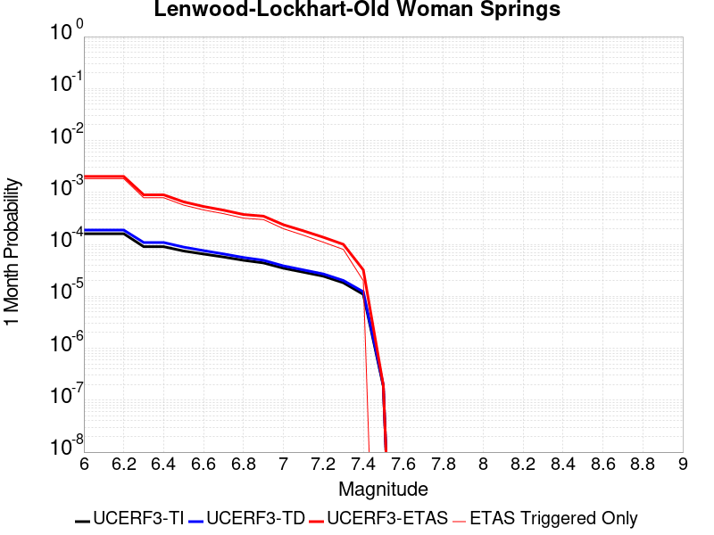 |  |  |

| Magnitude | 1 wk TI Prob | 1 wk TD Prob | 1 wk ETAS Prob | 1 wk ETAS/TD Gain | 1 wk ETAS Triggered Only | 1 mo TI Prob | 1 mo TD Prob | 1 mo ETAS Prob | 1 mo ETAS/TD Gain | 1 mo ETAS Triggered Only | 1 yr TI Prob | 1 yr TD Prob | 1 yr ETAS Prob | 1 yr ETAS/TD Gain | 1 yr ETAS Triggered Only | 10 yr TI Prob | 10 yr TD Prob | 10 yr ETAS Prob | 10 yr ETAS/TD Gain | 10 yr ETAS Triggered Only |
|-----|-----|-----|-----|-----|-----|-----|-----|-----|-----|-----|-----|-----|-----|-----|-----|-----|-----|-----|-----|-----|
| 6.0 | 3.744542E-5 | 4.396252E-5 | 0.0012639089 | 28.749691 | 0.00122 | 1.604705E-4 | 1.8839816E-4 | 0.0020280515 | 10.764709 | 0.00184 | 0.0019519776 | 0.0022915069 | 0.005244724 | 2.2887664 | 0.00296 | 0.019349206 | 0.022696787 | 0.02688942 | 1.1847235 | 0.00429 |
| 6.1 | 3.744542E-5 | 4.396252E-5 | 0.0012639089 | 28.749691 | 0.00122 | 1.604705E-4 | 1.8839816E-4 | 0.0020280515 | 10.764709 | 0.00184 | 0.0019519776 | 0.0022915069 | 0.005244724 | 2.2887664 | 0.00296 | 0.019349206 | 0.022696787 | 0.02688942 | 1.1847235 | 0.00429 |
| 6.2 | 3.744542E-5 | 4.396252E-5 | 0.0012639089 | 28.749691 | 0.00122 | 1.604705E-4 | 1.8839816E-4 | 0.0020280515 | 10.764709 | 0.00184 | 0.0019519776 | 0.0022915069 | 0.005244724 | 2.2887664 | 0.00296 | 0.019349206 | 0.022696787 | 0.02688942 | 1.1847235 | 0.00429 |
| 6.3 | 2.1079984E-5 | 2.5353434E-5 | 5.253407E-4 | 20.720694 | 5.0E-4 | 9.0339665E-5 | 1.0865316E-4 | 8.985673E-4 | 8.270052 | 7.9E-4 | 0.0010993304 | 0.0013220694 | 0.0026303376 | 1.9895608 | 0.00131 | 0.010939079 | 0.0131442575 | 0.015029152 | 1.1434005 | 0.00191 |
| 6.4 | 2.1079984E-5 | 2.5353434E-5 | 5.253407E-4 | 20.720694 | 5.0E-4 | 9.0339665E-5 | 1.0865316E-4 | 8.985673E-4 | 8.270052 | 7.9E-4 | 0.0010993304 | 0.0013220694 | 0.0026303376 | 1.9895608 | 0.00131 | 0.010939079 | 0.0131442575 | 0.015029152 | 1.1434005 | 0.00191 |
| 6.5 | 1.7397282E-5 | 2.066241E-5 | 3.8065496E-4 | 18.422583 | 3.6E-4 | 7.455765E-5 | 8.8550245E-5 | 6.584998E-4 | 7.4364533 | 5.7E-4 | 9.073613E-4 | 0.0010775778 | 0.0019366511 | 1.7972262 | 8.6E-4 | 0.009036654 | 0.010724821 | 0.011931737 | 1.1125348 | 0.00122 |
| 6.6 | 1.52050325E-5 | 1.7679693E-5 | 2.776751E-4 | 15.705877 | 2.6E-4 | 6.51628E-5 | 7.576796E-5 | 5.357331E-4 | 7.070708 | 4.6E-4 | 7.9306826E-4 | 9.220924E-4 | 0.0016314377 | 1.7692779 | 7.1E-4 | 0.007902439 | 0.009183526 | 0.010174342 | 1.1078906 | 0.001 |
| 6.7 | 1.332523E-5 | 1.5264002E-5 | 2.3526064E-4 | 15.412775 | 2.2E-4 | 5.7106878E-5 | 6.5415545E-5 | 4.5539002E-4 | 6.9614954 | 3.9E-4 | 6.950544E-4 | 7.961491E-4 | 0.0014056634 | 1.7655782 | 6.1E-4 | 0.006928845 | 0.007933599 | 0.008816538 | 1.1112912 | 8.9E-4 |
| 6.8 | 1.1525329E-5 | 1.3030979E-5 | 1.9302864E-4 | 14.813057 | 1.8E-4 | 4.9393333E-5 | 5.584588E-5 | 3.75828E-4 | 6.7297354 | 3.2E-4 | 6.011979E-4 | 6.797157E-4 | 0.0011993623 | 1.7645057 | 5.2E-4 | 0.00599574 | 0.006776819 | 0.007551533 | 1.1143183 | 7.8E-4 |
| 6.9 | 1.0253909E-5 | 1.15144385E-5 | 1.715126E-4 | 14.895437 | 1.6E-4 | 4.3944583E-5 | 4.9346683E-5 | 3.4933188E-4 | 7.079136 | 3.0E-4 | 5.3489394E-4 | 6.0063385E-4 | 0.0010603576 | 1.7653975 | 4.6E-4 | 0.0053360825 | 0.0059904843 | 0.0066763507 | 1.1144927 | 6.9E-4 |
| 7.0 | 8.104563E-6 | 8.991279E-6 | 1.0899038E-4 | 12.121788 | 1.0E-4 | 3.4733377E-5 | 3.8533497E-5 | 2.3852578E-4 | 6.190089 | 2.0E-4 | 4.2279682E-4 | 4.6904673E-4 | 7.7890133E-4 | 1.660605 | 3.1E-4 | 0.0042199334 | 0.0046808156 | 0.005128709 | 1.095687 | 4.5E-4 |
| 7.1 | 6.7986157E-6 | 7.515816E-6 | 7.751529E-5 | 10.313622 | 7.0E-5 | 2.91366E-5 | 3.2210253E-5 | 1.8220542E-4 | 5.656752 | 1.5E-4 | 3.5468035E-4 | 3.920914E-4 | 6.4199336E-4 | 1.6373564 | 2.5E-4 | 0.003541148 | 0.003914213 | 0.0042728037 | 1.0916126 | 3.6E-4 |
| 7.2 | 5.6893327E-6 | 6.2800136E-6 | 5.62797E-5 | 8.961716 | 5.0E-5 | 2.4382627E-5 | 2.6914078E-5 | 1.3691111E-4 | 5.0869703 | 1.1E-4 | 2.9681803E-4 | 3.2763163E-4 | 5.0757267E-4 | 1.5492176 | 1.8E-4 | 0.002964219 | 0.0032716845 | 0.0035507686 | 1.0853028 | 2.8E-4 |
| 7.3 | 4.253348E-6 | 4.7069107E-6 | 3.470677E-5 | 7.3735776 | 3.0E-5 | 1.8228506E-5 | 2.0172329E-5 | 1.0017071E-4 | 4.965749 | 8.0E-5 | 2.2190946E-4 | 2.4557224E-4 | 3.8553786E-4 | 1.569957 | 1.4E-4 | 0.00221688 | 0.0024531898 | 0.0026626745 | 1.0853928 | 2.1E-4 |
| 7.4 | 2.5448119E-6 | 2.852045E-6 | 2.852045E-6 | 1.0 | 0.0 | 1.0906291E-5 | 1.2223002E-5 | 3.2222757E-5 | 2.6362393 | 2.0E-5 | 1.3277601E-4 | 1.4880655E-4 | 1.987991E-4 | 1.3359567 | 5.0E-5 | 0.001326967 | 0.0014872311 | 0.0015671122 | 1.0537112 | 8.0E-5 |
| 7.5 | 4.3706837E-8 | 4.562909E-8 | 4.562909E-8 | 1.0 | 0.0 | 1.8731501E-7 | 1.9555324E-7 | 1.9555324E-7 | 1.0 | 0.0 | 2.2805577E-6 | 2.3808586E-6 | 1.2380835E-5 | 5.2001553 | 1.0E-5 | 2.2805343E-5 | 2.3808387E-5 | 3.3808148E-5 | 1.4200101 | 1.0E-5 |

## San Andreas (Mojave N)
*[(top)](#table-of-contents)*

| 1 Week | 1 Month | 1 Year | 10 Year |
|-----|-----|-----|-----|
|  | 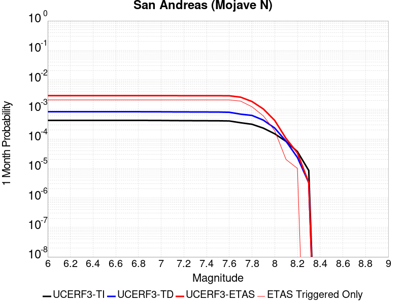 |  |  |

| Magnitude | 1 wk TI Prob | 1 wk TD Prob | 1 wk ETAS Prob | 1 wk ETAS/TD Gain | 1 wk ETAS Triggered Only | 1 mo TI Prob | 1 mo TD Prob | 1 mo ETAS Prob | 1 mo ETAS/TD Gain | 1 mo ETAS Triggered Only | 1 yr TI Prob | 1 yr TD Prob | 1 yr ETAS Prob | 1 yr ETAS/TD Gain | 1 yr ETAS Triggered Only | 10 yr TI Prob | 10 yr TD Prob | 10 yr ETAS Prob | 10 yr ETAS/TD Gain | 10 yr ETAS Triggered Only |
|-----|-----|-----|-----|-----|-----|-----|-----|-----|-----|-----|-----|-----|-----|-----|-----|-----|-----|-----|-----|-----|
| 6.0 | 9.877682E-5 | 1.9400702E-4 | 0.0018936772 | 9.76087 | 0.0017 | 4.2326056E-4 | 8.311939E-4 | 0.0029194567 | 3.5123653 | 0.00209 | 0.0051410277 | 0.010072956 | 0.013092234 | 1.2997409 | 0.00305 | 0.05023708 | 0.09831428 | 0.10183085 | 1.0357687 | 0.0039 |
| 6.1 | 9.877682E-5 | 1.9400702E-4 | 0.0018936772 | 9.76087 | 0.0017 | 4.2326056E-4 | 8.311939E-4 | 0.0029194567 | 3.5123653 | 0.00209 | 0.0051410277 | 0.010072956 | 0.013092234 | 1.2997409 | 0.00305 | 0.05023708 | 0.09831428 | 0.10183085 | 1.0357687 | 0.0039 |
| 6.2 | 9.877682E-5 | 1.9400702E-4 | 0.0018936772 | 9.76087 | 0.0017 | 4.2326056E-4 | 8.311939E-4 | 0.0029194567 | 3.5123653 | 0.00209 | 0.0051410277 | 0.010072956 | 0.013092234 | 1.2997409 | 0.00305 | 0.05023708 | 0.09831428 | 0.10183085 | 1.0357687 | 0.0039 |
| 6.3 | 9.877682E-5 | 1.9400702E-4 | 0.0018936772 | 9.76087 | 0.0017 | 4.2326056E-4 | 8.311939E-4 | 0.0029194567 | 3.5123653 | 0.00209 | 0.0051410277 | 0.010072956 | 0.013092234 | 1.2997409 | 0.00305 | 0.05023708 | 0.09831428 | 0.10183085 | 1.0357687 | 0.0039 |
| 6.4 | 9.877682E-5 | 1.9400702E-4 | 0.0018936772 | 9.76087 | 0.0017 | 4.2326056E-4 | 8.311939E-4 | 0.0029194567 | 3.5123653 | 0.00209 | 0.0051410277 | 0.010072956 | 0.013092234 | 1.2997409 | 0.00305 | 0.05023708 | 0.09831428 | 0.10183085 | 1.0357687 | 0.0039 |
| 6.5 | 9.861474E-5 | 1.9374468E-4 | 0.0018934153 | 9.772735 | 0.0017 | 4.2256617E-4 | 8.300703E-4 | 0.0029183354 | 3.515769 | 0.00209 | 0.0051326132 | 0.010059402 | 0.013078721 | 1.300149 | 0.00305 | 0.050156746 | 0.098192066 | 0.10170912 | 1.0358181 | 0.0039 |
| 6.6 | 9.861474E-5 | 1.9374468E-4 | 0.0018934153 | 9.772735 | 0.0017 | 4.2256617E-4 | 8.300703E-4 | 0.0029183354 | 3.515769 | 0.00209 | 0.0051326132 | 0.010059402 | 0.013078721 | 1.300149 | 0.00305 | 0.050156746 | 0.098192066 | 0.10170912 | 1.0358181 | 0.0039 |
| 6.7 | 9.8552715E-5 | 1.9364421E-4 | 0.001893315 | 9.777287 | 0.0017 | 4.223004E-4 | 8.2964E-4 | 0.002917906 | 3.5170748 | 0.00209 | 0.0051293927 | 0.010054212 | 0.013073547 | 1.3003055 | 0.00305 | 0.050125998 | 0.098145254 | 0.10166249 | 1.035837 | 0.0039 |
| 6.8 | 9.8464974E-5 | 1.9349584E-4 | 0.0018931669 | 9.7840185 | 0.0017 | 4.219245E-4 | 8.290045E-4 | 0.0029172718 | 3.519006 | 0.00209 | 0.0051248376 | 0.010046546 | 0.013065904 | 1.3005369 | 0.00305 | 0.05008251 | 0.09807528 | 0.10159279 | 1.0358654 | 0.0039 |
| 6.9 | 9.825824E-5 | 1.9317595E-4 | 0.0018928476 | 9.798568 | 0.0017 | 4.2103877E-4 | 8.276344E-4 | 0.0029159046 | 3.5231795 | 0.00209 | 0.0051141046 | 0.010030019 | 0.013049427 | 1.3010372 | 0.00305 | 0.049980022 | 0.09792438 | 0.10144248 | 1.0359267 | 0.0039 |
| 7.0 | 9.781462E-5 | 1.924896E-4 | 0.0018921624 | 9.829946 | 0.0017 | 4.1913814E-4 | 8.246948E-4 | 0.0029129712 | 3.5321808 | 0.00209 | 0.005091073 | 0.009994558 | 0.013014075 | 1.302116 | 0.00305 | 0.04976007 | 0.09760077 | 0.10112013 | 1.0360587 | 0.0039 |
| 7.1 | 9.7121134E-5 | 1.9150671E-4 | 0.0018911811 | 9.875273 | 0.0017 | 4.1616702E-4 | 8.204851E-4 | 0.0029087702 | 3.5451837 | 0.00209 | 0.005055068 | 0.009943774 | 0.012963446 | 1.3036746 | 0.00305 | 0.04941613 | 0.09713728 | 0.10065845 | 1.0362494 | 0.0039 |
| 7.2 | 9.663819E-5 | 1.9081456E-4 | 0.0018904902 | 9.907473 | 0.0017 | 4.1409794E-4 | 8.175206E-4 | 0.002905812 | 3.5544205 | 0.00209 | 0.0050299936 | 0.00990801 | 0.012927791 | 1.3047817 | 0.00305 | 0.049176537 | 0.09681055 | 0.10033298 | 1.0363848 | 0.0039 |
| 7.3 | 9.6277574E-5 | 1.9033969E-4 | 0.0018900161 | 9.9297 | 0.0017 | 4.125529E-4 | 8.154867E-4 | 0.0029037823 | 3.5607965 | 0.00209 | 0.0050112694 | 0.009883473 | 0.012903328 | 1.3055459 | 0.00305 | 0.04899759 | 0.09658401 | 0.10010733 | 1.0364794 | 0.0039 |
| 7.4 | 9.593308E-5 | 1.897375E-4 | 0.001889415 | 9.958047 | 0.0017 | 4.1107697E-4 | 8.129075E-4 | 0.0029012086 | 3.5689282 | 0.00209 | 0.0049933824 | 0.009852355 | 0.012872306 | 1.3065207 | 0.00305 | 0.04882661 | 0.09630218 | 0.099826604 | 1.0365975 | 0.0039 |
| 7.5 | 9.561707E-5 | 1.8919831E-4 | 0.0018888767 | 9.983581 | 0.0017 | 4.0972308E-4 | 8.1059814E-4 | 0.002898904 | 3.576253 | 0.00209 | 0.0049769743 | 0.009824493 | 0.012844528 | 1.3073986 | 0.00305 | 0.048669744 | 0.09604836 | 0.099573776 | 1.0367045 | 0.0039 |
| 7.6 | 9.418194E-5 | 1.8572104E-4 | 0.0018854053 | 10.151813 | 0.0017 | 4.0357444E-4 | 7.957047E-4 | 0.0028840418 | 3.6245124 | 0.00209 | 0.004902454 | 0.009644784 | 0.01264556 | 1.3111295 | 0.00303 | 0.047957025 | 0.094430685 | 0.09793524 | 1.0371125 | 0.00387 |
| 7.7 | 8.202141E-5 | 1.6021315E-4 | 0.0016999664 | 10.610655 | 0.00154 | 3.51473E-4 | 6.8644714E-4 | 0.0025851429 | 3.765975 | 0.0019 | 0.00427079 | 0.008325525 | 0.011022879 | 1.3239862 | 0.00272 | 0.04189639 | 0.08223219 | 0.085426025 | 1.0388392 | 0.00348 |
| 7.8 | 7.2859846E-5 | 1.4516473E-4 | 0.0011550181 | 7.9566035 | 0.00101 | 3.1221908E-4 | 6.219862E-4 | 0.0018412274 | 2.9602382 | 0.00122 | 0.003794643 | 0.0075464295 | 0.009283223 | 1.2301477 | 0.00175 | 0.037304975 | 0.07472468 | 0.07685281 | 1.0284797 | 0.0023 |
| 7.9 | 5.3874453E-5 | 1.0045676E-4 | 6.2040455E-4 | 6.1758366 | 5.2E-4 | 2.3087008E-4 | 4.3045796E-4 | 0.0010301997 | 2.3932643 | 6.0E-4 | 0.0028072202 | 0.0052282433 | 0.0061235377 | 1.171242 | 9.0E-4 | 0.02772022 | 0.05242443 | 0.053618375 | 1.0227746 | 0.00126 |
| 8.0 | 3.468538E-5 | 5.4260272E-5 | 2.342505E-4 | 4.3171644 | 1.8E-4 | 1.4864317E-4 | 2.325233E-4 | 4.2247912E-4 | 1.8169324 | 1.9E-4 | 0.0018082283 | 0.002827298 | 0.0031065063 | 1.0987545 | 2.8E-4 | 0.017935853 | 0.028947512 | 0.029335933 | 1.0134181 | 4.0E-4 |
| 8.1 | 1.9152367E-5 | 1.940263E-5 | 3.9402243E-5 | 2.0307682 | 2.0E-5 | 8.207899E-5 | 8.3151484E-5 | 1.0314982E-4 | 1.2405049 | 2.0E-5 | 9.988535E-4 | 0.0010118998 | 0.0010518593 | 1.0394896 | 4.0E-5 | 0.009943757 | 0.01085625 | 0.010905707 | 1.0045556 | 5.0E-5 |
| 8.2 | 8.643924E-6 | 5.4748625E-6 | 1.5474809E-5 | 2.82652 | 1.0E-5 | 3.704486E-5 | 2.3463486E-5 | 3.346325E-5 | 1.4261842 | 1.0E-5 | 4.5092785E-4 | 2.8563058E-4 | 2.9562772E-4 | 1.0350002 | 1.0E-5 | 0.0045001395 | 0.0032487072 | 0.0032586746 | 1.0030681 | 1.0E-5 |
| 8.3 | 1.983087E-6 | 7.6599065E-7 | 7.6599065E-7 | 1.0 | 0.0 | 8.498917E-6 | 3.282813E-6 | 3.282813E-6 | 1.0 | 0.0 | 1.034694E-4 | 3.9967534E-5 | 3.9967534E-5 | 1.0 | 0.0 | 0.0010342124 | 4.719687E-4 | 4.719687E-4 | 1.0 | 0.0 |

## Death Valley (So)
*[(top)](#table-of-contents)*

| 1 Week | 1 Month | 1 Year | 10 Year |
|-----|-----|-----|-----|
|  |  |  |  |

| Magnitude | 1 wk TI Prob | 1 wk TD Prob | 1 wk ETAS Prob | 1 wk ETAS/TD Gain | 1 wk ETAS Triggered Only | 1 mo TI Prob | 1 mo TD Prob | 1 mo ETAS Prob | 1 mo ETAS/TD Gain | 1 mo ETAS Triggered Only | 1 yr TI Prob | 1 yr TD Prob | 1 yr ETAS Prob | 1 yr ETAS/TD Gain | 1 yr ETAS Triggered Only | 10 yr TI Prob | 10 yr TD Prob | 10 yr ETAS Prob | 10 yr ETAS/TD Gain | 10 yr ETAS Triggered Only |
|-----|-----|-----|-----|-----|-----|-----|-----|-----|-----|-----|-----|-----|-----|-----|-----|-----|-----|-----|-----|-----|
| 6.0 | 2.0684236E-5 | 2.5617775E-5 | 7.855983E-4 | 30.66614 | 7.6E-4 | 8.864371E-5 | 1.0978594E-4 | 0.0012796575 | 11.655932 | 0.00117 | 0.0010787029 | 0.0013358411 | 0.0036227822 | 2.7119856 | 0.00229 | 0.010734817 | 0.013281397 | 0.016892787 | 1.2719134 | 0.00366 |
| 6.1 | 2.0684236E-5 | 2.5617775E-5 | 7.855983E-4 | 30.66614 | 7.6E-4 | 8.864371E-5 | 1.0978594E-4 | 0.0012796575 | 11.655932 | 0.00117 | 0.0010787029 | 0.0013358411 | 0.0036227822 | 2.7119856 | 0.00229 | 0.010734817 | 0.013281397 | 0.016892787 | 1.2719134 | 0.00366 |
| 6.2 | 2.0684236E-5 | 2.5617775E-5 | 7.855983E-4 | 30.66614 | 7.6E-4 | 8.864371E-5 | 1.0978594E-4 | 0.0012796575 | 11.655932 | 0.00117 | 0.0010787029 | 0.0013358411 | 0.0036227822 | 2.7119856 | 0.00229 | 0.010734817 | 0.013281397 | 0.016892787 | 1.2719134 | 0.00366 |
| 6.3 | 2.0240292E-5 | 2.511786E-5 | 7.7509903E-4 | 30.85848 | 7.5E-4 | 8.6741224E-5 | 1.07643624E-4 | 0.0012475209 | 11.589361 | 0.00114 | 0.0010555626 | 0.00130979 | 0.0035268823 | 2.6927083 | 0.00222 | 0.010505628 | 0.013023956 | 0.016478373 | 1.2652355 | 0.0035 |
| 6.4 | 2.0240292E-5 | 2.511786E-5 | 7.7509903E-4 | 30.85848 | 7.5E-4 | 8.6741224E-5 | 1.07643624E-4 | 0.0012475209 | 11.589361 | 0.00114 | 0.0010555626 | 0.00130979 | 0.0035268823 | 2.6927083 | 0.00222 | 0.010505628 | 0.013023956 | 0.016478373 | 1.2652355 | 0.0035 |
| 6.5 | 1.9962767E-5 | 2.4807114E-5 | 7.4478926E-4 | 30.023212 | 7.2E-4 | 8.55519E-5 | 1.0631196E-4 | 0.001206195 | 11.345807 | 0.0011 | 0.0010410968 | 0.0012935963 | 0.003450802 | 2.6676035 | 0.00216 | 0.010362327 | 0.012863902 | 0.016220165 | 1.2609055 | 0.0034 |
| 6.6 | 1.8937297E-5 | 2.3310964E-5 | 6.732958E-4 | 28.883224 | 6.5E-4 | 8.115732E-5 | 9.990039E-5 | 0.0011097995 | 11.10906 | 0.00101 | 9.876423E-4 | 0.0012156231 | 0.0031632527 | 2.6021655 | 0.00195 | 0.009832645 | 0.012092789 | 0.0150960265 | 1.2483495 | 0.00304 |
| 6.7 | 1.8621096E-5 | 2.2911607E-5 | 6.128981E-4 | 26.750551 | 5.9E-4 | 7.980225E-5 | 9.818898E-5 | 0.0010380967 | 10.572435 | 9.4E-4 | 9.711593E-4 | 0.0011948098 | 0.0030425994 | 2.5465136 | 0.00185 | 0.009669261 | 0.011886904 | 0.014772194 | 1.2427285 | 0.00292 |
| 6.8 | 1.7830353E-5 | 2.1805688E-5 | 5.717937E-4 | 26.222227 | 5.5E-4 | 7.641356E-5 | 9.344968E-5 | 9.433702E-4 | 10.0949545 | 8.5E-4 | 9.29938E-4 | 0.00113717 | 0.002855214 | 2.5108066 | 0.00172 | 0.009260561 | 0.011316354 | 0.01401546 | 1.2385138 | 0.00273 |
| 6.9 | 1.3135183E-5 | 1.5303925E-5 | 4.152978E-4 | 27.136686 | 4.0E-4 | 5.6292425E-5 | 6.558664E-5 | 6.5554795E-4 | 9.995145 | 5.9E-4 | 6.8514474E-4 | 7.982312E-4 | 0.0019573052 | 2.452053 | 0.00116 | 0.006830362 | 0.007954649 | 0.009621285 | 1.2095172 | 0.00168 |
| 7.0 | 1.1507512E-5 | 1.3154199E-5 | 2.8315064E-4 | 21.525494 | 2.7E-4 | 4.9316975E-5 | 5.6373956E-5 | 4.263531E-4 | 7.5629444 | 3.7E-4 | 6.002687E-4 | 6.8614254E-4 | 0.0015355593 | 2.2379596 | 8.5E-4 | 0.0059864987 | 0.0068409415 | 0.008052596 | 1.1771181 | 0.00122 |
| 7.1 | 9.715903E-6 | 1.0865278E-5 | 1.3086398E-4 | 12.044236 | 1.2E-4 | 4.1638916E-5 | 4.656467E-5 | 2.1655676E-4 | 4.6506667 | 1.7E-4 | 5.068359E-4 | 5.667817E-4 | 9.465663E-4 | 1.6700722 | 3.8E-4 | 0.0050568148 | 0.0056538144 | 0.0062305355 | 1.1020056 | 5.8E-4 |
| 7.2 | 9.233269E-6 | 1.02863105E-5 | 7.028569E-5 | 6.8329353 | 6.0E-5 | 3.9570554E-5 | 4.4083466E-5 | 1.4407905E-4 | 3.2683241 | 1.0E-4 | 4.81665E-4 | 5.3658825E-4 | 7.9644873E-4 | 1.4842829 | 2.6E-4 | 0.0048062233 | 0.0053533576 | 0.0057512163 | 1.0743195 | 4.0E-4 |
| 7.3 | 8.8041315E-6 | 9.808164E-6 | 4.980777E-5 | 5.078195 | 4.0E-5 | 3.7731446E-5 | 4.2034335E-5 | 1.2203097E-4 | 2.903126 | 8.0E-5 | 4.592835E-4 | 5.1165203E-4 | 6.815651E-4 | 1.332087 | 1.7E-4 | 0.0045833546 | 0.005105167 | 0.005353891 | 1.04872 | 2.5E-4 |
| 7.4 | 8.708749E-6 | 9.707175E-6 | 4.9706785E-5 | 5.120623 | 4.0E-5 | 3.7322676E-5 | 4.160154E-5 | 1.2159821E-4 | 2.9229257 | 8.0E-5 | 4.5430884E-4 | 5.0638523E-4 | 6.7629915E-4 | 1.3355428 | 1.7E-4 | 0.004533812 | 0.0050527398 | 0.0053014765 | 1.0492281 | 2.5E-4 |
| 7.5 | 8.612678E-6 | 9.604817E-6 | 4.9604434E-5 | 5.164537 | 4.0E-5 | 3.6910955E-5 | 4.1162875E-5 | 1.2115958E-4 | 2.9434187 | 8.0E-5 | 4.492982E-4 | 5.01047E-4 | 6.709618E-4 | 1.3391196 | 1.7E-4 | 0.004483909 | 0.0049995985 | 0.0052483487 | 1.049754 | 2.5E-4 |
| 7.6 | 8.319024E-6 | 9.283916E-6 | 4.9283546E-5 | 5.3084865 | 4.0E-5 | 3.5652476E-5 | 3.978763E-5 | 1.1978445E-4 | 3.010595 | 8.0E-5 | 4.3398244E-4 | 4.8431093E-4 | 6.442334E-4 | 1.3302063 | 1.6E-4 | 0.0043313587 | 0.0048329784 | 0.0050718184 | 1.0494188 | 2.4E-4 |
| 7.7 | 7.4718328E-6 | 8.34517E-6 | 4.8344835E-5 | 5.793152 | 4.0E-5 | 3.2021748E-5 | 3.5764548E-5 | 1.0576204E-4 | 2.9571755 | 7.0E-5 | 3.8979502E-4 | 4.353504E-4 | 5.752894E-4 | 1.3214401 | 1.4E-4 | 0.00389112 | 0.0043453807 | 0.004554468 | 1.0481172 | 2.1E-4 |
| 7.8 | 3.4586725E-7 | 3.6482615E-7 | 3.6482615E-7 | 1.0 | 0.0 | 1.4822873E-6 | 1.5635396E-6 | 1.5635396E-6 | 1.0 | 0.0 | 1.80467E-5 | 1.9035933E-5 | 1.9035933E-5 | 1.0 | 0.0 | 1.8045233E-4 | 1.9034347E-4 | 2.0034157E-4 | 1.0525266 | 1.0E-5 |
| 7.9 | 2.5591178E-9 | 2.6696718E-9 | 2.6696718E-9 | 1.0 | 0.0 | 1.0967647E-8 | 1.14414505E-8 | 1.14414505E-8 | 1.0 | 0.0 | 1.335311E-7 | 1.3929966E-7 | 1.3929966E-7 | 1.0 | 0.0 | 1.3353102E-6 | 1.3929966E-6 | 1.3929966E-6 | 1.0 | 0.0 |

## Nelson Lake
*[(top)](#table-of-contents)*

| 1 Week | 1 Month | 1 Year | 10 Year |
|-----|-----|-----|-----|
|  |  | 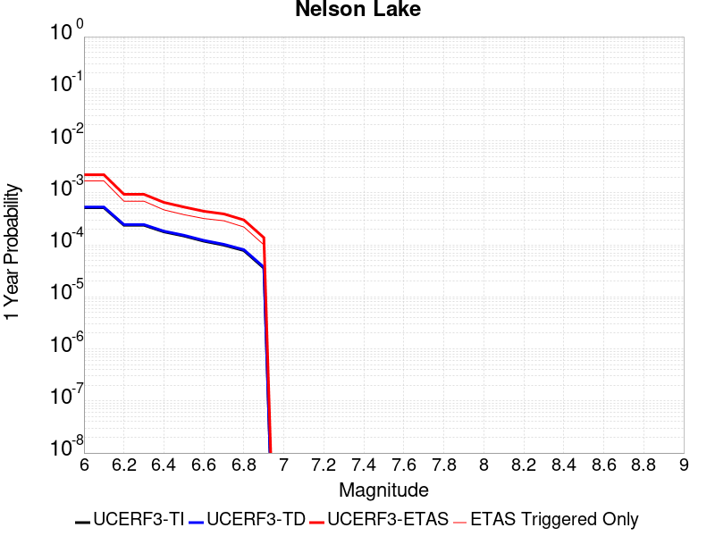 |  |

| Magnitude | 1 wk TI Prob | 1 wk TD Prob | 1 wk ETAS Prob | 1 wk ETAS/TD Gain | 1 wk ETAS Triggered Only | 1 mo TI Prob | 1 mo TD Prob | 1 mo ETAS Prob | 1 mo ETAS/TD Gain | 1 mo ETAS Triggered Only | 1 yr TI Prob | 1 yr TD Prob | 1 yr ETAS Prob | 1 yr ETAS/TD Gain | 1 yr ETAS Triggered Only | 10 yr TI Prob | 10 yr TD Prob | 10 yr ETAS Prob | 10 yr ETAS/TD Gain | 10 yr ETAS Triggered Only |
|-----|-----|-----|-----|-----|-----|-----|-----|-----|-----|-----|-----|-----|-----|-----|-----|-----|-----|-----|-----|-----|
| 6.0 | 9.913453E-6 | 1.0192255E-5 | 3.901884E-4 | 38.28283 | 3.8E-4 | 4.2485535E-5 | 4.3680422E-5 | 7.4364984E-4 | 17.024786 | 7.0E-4 | 5.1713863E-4 | 5.316897E-4 | 0.002220791 | 4.1768556 | 0.00169 | 0.0051593683 | 0.005305204 | 0.008299235 | 1.5643574 | 0.00301 |
| 6.1 | 9.913453E-6 | 1.0192255E-5 | 3.901884E-4 | 38.28283 | 3.8E-4 | 4.2485535E-5 | 4.3680422E-5 | 7.4364984E-4 | 17.024786 | 7.0E-4 | 5.1713863E-4 | 5.316897E-4 | 0.002220791 | 4.1768556 | 0.00169 | 0.0051593683 | 0.005305204 | 0.008299235 | 1.5643574 | 0.00301 |
| 6.2 | 4.5596407E-6 | 4.696313E-6 | 1.14695795E-4 | 24.42252 | 1.1E-4 | 1.954117E-5 | 2.0126909E-5 | 3.2012086E-4 | 15.905119 | 3.0E-4 | 2.3788778E-4 | 2.4501883E-4 | 9.348498E-4 | 3.8154202 | 6.9E-4 | 0.0023763329 | 0.0024476128 | 0.0038342106 | 1.5665103 | 0.00139 |
| 6.3 | 4.5596407E-6 | 4.696313E-6 | 1.14695795E-4 | 24.42252 | 1.1E-4 | 1.954117E-5 | 2.0126909E-5 | 3.2012086E-4 | 15.905119 | 3.0E-4 | 2.3788778E-4 | 2.4501883E-4 | 9.348498E-4 | 3.8154202 | 6.9E-4 | 0.0023763329 | 0.0024476128 | 0.0038342106 | 1.5665103 | 0.00139 |
| 6.4 | 3.4025713E-6 | 3.5098972E-6 | 8.3509614E-5 | 23.79261 | 8.0E-5 | 1.4582367E-5 | 1.5042335E-5 | 2.3503903E-4 | 15.625169 | 2.2E-4 | 1.7752586E-4 | 1.8312587E-4 | 6.530398E-4 | 3.5660706 | 4.7E-4 | 0.001773841 | 0.0018298327 | 0.002758131 | 1.5073133 | 9.3E-4 |
| 6.5 | 2.8352947E-6 | 2.927856E-6 | 6.2927684E-5 | 21.49275 | 6.0E-5 | 1.2151207E-5 | 1.2547898E-5 | 1.8254576E-4 | 14.547915 | 1.7E-4 | 1.479309E-4 | 1.5276071E-4 | 5.3270266E-4 | 3.4871707 | 3.8E-4 | 0.0014783246 | 0.0015266308 | 0.0022954554 | 1.5036087 | 7.7E-4 |
| 6.6 | 2.251518E-6 | 2.3290677E-6 | 6.232893E-5 | 26.761322 | 6.0E-5 | 9.649328E-6 | 9.981683E-6 | 1.5998019E-4 | 16.027374 | 1.5E-4 | 1.1747423E-4 | 1.2152085E-4 | 4.4148197E-4 | 3.632973 | 3.2E-4 | 0.0011741214 | 0.0012146058 | 0.0018638162 | 1.5345031 | 6.5E-4 |
| 6.7 | 1.8911853E-6 | 1.9591396E-6 | 6.195902E-5 | 31.625628 | 6.0E-5 | 8.105055E-6 | 8.39629E-6 | 1.383952E-4 | 16.4829 | 1.3E-4 | 9.867457E-5 | 1.0222061E-4 | 3.9219097E-4 | 3.8367112 | 2.9E-4 | 9.863076E-4 | 0.0010217935 | 0.0015812212 | 1.547496 | 5.6E-4 |
| 6.8 | 1.4874814E-6 | 1.5438305E-6 | 4.1543768E-5 | 26.90954 | 4.0E-5 | 6.374905E-6 | 6.6164025E-6 | 8.661587E-5 | 13.091083 | 8.0E-5 | 7.76117E-5 | 8.055224E-5 | 3.0053454E-4 | 3.7309268 | 2.2E-4 | 7.75846E-4 | 8.0528157E-4 | 0.0012249433 | 1.5211368 | 4.2E-4 |
| 6.9 | 6.835972E-7 | 7.1399285E-7 | 2.0713978E-5 | 29.011465 | 2.0E-5 | 2.9296991E-6 | 3.0599674E-6 | 3.3059874E-5 | 10.803996 | 3.0E-5 | 3.56685E-5 | 3.7254784E-5 | 1.3725106E-4 | 3.684119 | 1.0E-4 | 3.5662777E-4 | 3.7251666E-4 | 6.0243096E-4 | 1.617192 | 2.3E-4 |

## Towne Pass
*[(top)](#table-of-contents)*

| 1 Week | 1 Month | 1 Year | 10 Year |
|-----|-----|-----|-----|
|  |  |  |  |

| Magnitude | 1 wk TI Prob | 1 wk TD Prob | 1 wk ETAS Prob | 1 wk ETAS/TD Gain | 1 wk ETAS Triggered Only | 1 mo TI Prob | 1 mo TD Prob | 1 mo ETAS Prob | 1 mo ETAS/TD Gain | 1 mo ETAS Triggered Only | 1 yr TI Prob | 1 yr TD Prob | 1 yr ETAS Prob | 1 yr ETAS/TD Gain | 1 yr ETAS Triggered Only | 10 yr TI Prob | 10 yr TD Prob | 10 yr ETAS Prob | 10 yr ETAS/TD Gain | 10 yr ETAS Triggered Only |
|-----|-----|-----|-----|-----|-----|-----|-----|-----|-----|-----|-----|-----|-----|-----|-----|-----|-----|-----|-----|-----|
| 6.0 | 3.849728E-6 | 3.8945414E-6 | 5.9389224E-4 | 152.4935 | 5.9E-4 | 1.649873E-5 | 1.669081E-5 | 9.166758E-4 | 54.92099 | 9.0E-4 | 2.0085352E-4 | 2.0319603E-4 | 0.0019828344 | 9.758234 | 0.00178 | 0.0020067208 | 0.0020305314 | 0.0047050896 | 2.3171716 | 0.00268 |
| 6.1 | 3.849728E-6 | 3.8945414E-6 | 5.9389224E-4 | 152.4935 | 5.9E-4 | 1.649873E-5 | 1.669081E-5 | 9.166758E-4 | 54.92099 | 9.0E-4 | 2.0085352E-4 | 2.0319603E-4 | 0.0019828344 | 9.758234 | 0.00178 | 0.0020067208 | 0.0020305314 | 0.0047050896 | 2.3171716 | 0.00268 |
| 6.2 | 3.849728E-6 | 3.8945414E-6 | 5.9389224E-4 | 152.4935 | 5.9E-4 | 1.649873E-5 | 1.669081E-5 | 9.166758E-4 | 54.92099 | 9.0E-4 | 2.0085352E-4 | 2.0319603E-4 | 0.0019828344 | 9.758234 | 0.00178 | 0.0020067208 | 0.0020305314 | 0.0047050896 | 2.3171716 | 0.00268 |
| 6.3 | 3.849728E-6 | 3.8945414E-6 | 5.9389224E-4 | 152.4935 | 5.9E-4 | 1.649873E-5 | 1.669081E-5 | 9.166758E-4 | 54.92099 | 9.0E-4 | 2.0085352E-4 | 2.0319603E-4 | 0.0019828344 | 9.758234 | 0.00178 | 0.0020067208 | 0.0020305314 | 0.0047050896 | 2.3171716 | 0.00268 |
| 6.4 | 3.849728E-6 | 3.8945414E-6 | 5.9389224E-4 | 152.4935 | 5.9E-4 | 1.649873E-5 | 1.669081E-5 | 9.166758E-4 | 54.92099 | 9.0E-4 | 2.0085352E-4 | 2.0319603E-4 | 0.0019828344 | 9.758234 | 0.00178 | 0.0020067208 | 0.0020305314 | 0.0047050896 | 2.3171716 | 0.00268 |
| 6.5 | 1.1953545E-6 | 1.203052E-6 | 8.1202954E-5 | 67.49746 | 8.0E-5 | 5.1229376E-6 | 5.1559277E-6 | 1.251553E-4 | 24.274061 | 1.2E-4 | 6.236998E-5 | 6.277173E-5 | 3.3275477E-4 | 5.301029 | 2.7E-4 | 6.235248E-4 | 6.275517E-4 | 0.001087263 | 1.7325473 | 4.6E-4 |
| 6.6 | 1.1953545E-6 | 1.203052E-6 | 8.1202954E-5 | 67.49746 | 8.0E-5 | 5.1229376E-6 | 5.1559277E-6 | 1.251553E-4 | 24.274061 | 1.2E-4 | 6.236998E-5 | 6.277173E-5 | 3.3275477E-4 | 5.301029 | 2.7E-4 | 6.235248E-4 | 6.275517E-4 | 0.001087263 | 1.7325473 | 4.6E-4 |
| 6.7 | 8.375951E-7 | 8.4106705E-7 | 6.0841016E-5 | 72.33789 | 6.0E-5 | 3.5896885E-6 | 3.6045683E-6 | 8.360428E-5 | 23.193977 | 8.0E-5 | 4.370358E-5 | 4.3884793E-5 | 1.9387821E-4 | 4.4178905 | 1.5E-4 | 4.3694986E-4 | 4.38767E-4 | 7.286398E-4 | 1.6606531 | 2.9E-4 |
| 6.8 | 6.38041E-7 | 6.392156E-7 | 5.0639184E-5 | 79.22082 | 5.0E-5 | 2.7344586E-6 | 2.7394929E-6 | 7.27393E-5 | 26.552103 | 7.0E-5 | 3.3291526E-5 | 3.3352855E-5 | 1.4334919E-4 | 4.2979584 | 1.1E-4 | 3.3286537E-4 | 3.334823E-4 | 5.534089E-4 | 1.6594852 | 2.2E-4 |
| 6.9 | 5.3460053E-7 | 5.345333E-7 | 5.0534505E-5 | 94.53949 | 5.0E-5 | 2.2911431E-6 | 2.2908553E-6 | 6.229072E-5 | 27.191032 | 6.0E-5 | 2.789431E-5 | 2.789084E-5 | 1.1788833E-4 | 4.226776 | 9.0E-5 | 2.789081E-4 | 2.7887672E-4 | 4.388321E-4 | 1.5735703 | 1.6E-4 |
| 7.0 | 3.557783E-7 | 3.5324226E-7 | 4.035323E-5 | 114.236694 | 4.0E-5 | 1.5247632E-6 | 1.5138945E-6 | 4.1513835E-5 | 27.421879 | 4.0E-5 | 1.8563835E-5 | 1.843152E-5 | 5.843078E-5 | 3.1701555 | 4.0E-5 | 1.8562283E-4 | 1.8430075E-4 | 2.64286E-4 | 1.4339931 | 8.0E-5 |
| 7.1 | 3.037942E-7 | 3.0002218E-7 | 4.030001E-5 | 134.32344 | 4.0E-5 | 1.3019744E-6 | 1.2858087E-6 | 4.128576E-5 | 32.108784 | 4.0E-5 | 1.5851423E-5 | 1.5654618E-5 | 5.565399E-5 | 3.555117 | 4.0E-5 | 1.5850292E-4 | 1.5653588E-4 | 2.3652337E-4 | 1.5109849 | 8.0E-5 |
| 7.2 | 2.0808248E-7 | 2.0217689E-7 | 2.0202173E-5 | 99.923256 | 2.0E-5 | 8.917818E-7 | 8.6647213E-7 | 2.0866455E-5 | 24.082085 | 2.0E-5 | 1.0857389E-5 | 1.0549252E-5 | 3.054904E-5 | 2.895849 | 2.0E-5 | 1.0856859E-4 | 1.0548797E-4 | 1.6548164E-4 | 1.5687252 | 6.0E-5 |
| 7.3 | 1.1162073E-7 | 1.0636894E-7 | 1.0106368E-5 | 95.0124 | 1.0E-5 | 4.7837443E-7 | 4.558668E-7 | 1.0455862E-5 | 22.936222 | 1.0E-5 | 5.8241935E-6 | 5.550166E-6 | 1.5550111E-5 | 2.8017378 | 1.0E-5 | 5.8240406E-5 | 5.5500474E-5 | 8.549881E-5 | 1.5405059 | 3.0E-5 |

## Bicycle Lake
*[(top)](#table-of-contents)*

| 1 Week | 1 Month | 1 Year | 10 Year |
|-----|-----|-----|-----|
|  |  |  |  |

| Magnitude | 1 wk TI Prob | 1 wk TD Prob | 1 wk ETAS Prob | 1 wk ETAS/TD Gain | 1 wk ETAS Triggered Only | 1 mo TI Prob | 1 mo TD Prob | 1 mo ETAS Prob | 1 mo ETAS/TD Gain | 1 mo ETAS Triggered Only | 1 yr TI Prob | 1 yr TD Prob | 1 yr ETAS Prob | 1 yr ETAS/TD Gain | 1 yr ETAS Triggered Only | 10 yr TI Prob | 10 yr TD Prob | 10 yr ETAS Prob | 10 yr ETAS/TD Gain | 10 yr ETAS Triggered Only |
|-----|-----|-----|-----|-----|-----|-----|-----|-----|-----|-----|-----|-----|-----|-----|-----|-----|-----|-----|-----|-----|
| 6.0 | 1.9621975E-5 | 2.2097078E-5 | 4.420878E-4 | 20.006618 | 4.2E-4 | 8.4091465E-5 | 9.4699084E-5 | 6.9464225E-4 | 7.3352585 | 6.0E-4 | 0.0010233327 | 0.0011524865 | 0.0025109192 | 2.178697 | 0.00136 | 0.01018633 | 0.011478408 | 0.013583959 | 1.1834358 | 0.00213 |
| 6.1 | 1.9621975E-5 | 2.2097078E-5 | 4.420878E-4 | 20.006618 | 4.2E-4 | 8.4091465E-5 | 9.4699084E-5 | 6.9464225E-4 | 7.3352585 | 6.0E-4 | 0.0010233327 | 0.0011524865 | 0.0025109192 | 2.178697 | 0.00136 | 0.01018633 | 0.011478408 | 0.013583959 | 1.1834358 | 0.00213 |
| 6.2 | 9.9971285E-6 | 1.1255639E-5 | 2.712527E-4 | 24.099272 | 2.6E-4 | 4.2844134E-5 | 4.8237856E-5 | 4.1822E-4 | 8.669954 | 3.7E-4 | 5.2150246E-4 | 5.871896E-4 | 0.0014167023 | 2.4126825 | 8.3E-4 | 0.0052028033 | 0.005861487 | 0.007183691 | 1.2255749 | 0.00133 |
| 6.3 | 9.589428E-6 | 1.0798346E-5 | 2.7079554E-4 | 25.077501 | 2.6E-4 | 4.10969E-5 | 4.62781E-5 | 4.1626097E-4 | 8.994773 | 3.7E-4 | 5.002399E-4 | 5.6334207E-4 | 0.0013429027 | 2.3838139 | 7.8E-4 | 0.0049911533 | 0.0056242296 | 0.0068870867 | 1.2245387 | 0.00127 |
| 6.4 | 9.589428E-6 | 1.0798346E-5 | 2.7079554E-4 | 25.077501 | 2.6E-4 | 4.10969E-5 | 4.62781E-5 | 4.1626097E-4 | 8.994773 | 3.7E-4 | 5.002399E-4 | 5.6334207E-4 | 0.0013429027 | 2.3838139 | 7.8E-4 | 0.0049911533 | 0.0056242296 | 0.0068870867 | 1.2245387 | 0.00127 |
| 6.5 | 5.557707E-6 | 6.2856016E-6 | 2.0628434E-4 | 32.818554 | 2.0E-4 | 2.3818526E-5 | 2.6938165E-5 | 3.0693063E-4 | 11.393895 | 2.8E-4 | 2.8995197E-4 | 3.2794967E-4 | 8.87766E-4 | 2.707019 | 5.6E-4 | 0.0028957394 | 0.0032772934 | 0.0040946063 | 1.2493864 | 8.2E-4 |
| 6.6 | 4.8742945E-6 | 5.5132896E-6 | 1.855123E-4 | 33.648205 | 1.8E-4 | 2.0889667E-5 | 2.3628318E-5 | 2.8362218E-4 | 12.003486 | 2.6E-4 | 2.54302E-4 | 2.87663E-4 | 8.075134E-4 | 2.8071508 | 5.2E-4 | 0.002540112 | 0.0028754752 | 0.0036233186 | 1.2600764 | 7.5E-4 |
| 6.7 | 3.991108E-6 | 4.5159104E-6 | 1.4451527E-4 | 32.00136 | 1.4E-4 | 1.7104636E-5 | 1.9353902E-5 | 2.2934984E-4 | 11.850315 | 2.1E-4 | 2.0822904E-4 | 2.3563375E-4 | 6.4553716E-4 | 2.7395785 | 4.1E-4 | 0.0020803404 | 0.0023563374 | 0.0029649 | 1.2582663 | 6.1E-4 |

## Paradise
*[(top)](#table-of-contents)*

| 1 Week | 1 Month | 1 Year | 10 Year |
|-----|-----|-----|-----|
|  |  |  |  |

| Magnitude | 1 wk TI Prob | 1 wk TD Prob | 1 wk ETAS Prob | 1 wk ETAS/TD Gain | 1 wk ETAS Triggered Only | 1 mo TI Prob | 1 mo TD Prob | 1 mo ETAS Prob | 1 mo ETAS/TD Gain | 1 mo ETAS Triggered Only | 1 yr TI Prob | 1 yr TD Prob | 1 yr ETAS Prob | 1 yr ETAS/TD Gain | 1 yr ETAS Triggered Only | 10 yr TI Prob | 10 yr TD Prob | 10 yr ETAS Prob | 10 yr ETAS/TD Gain | 10 yr ETAS Triggered Only |
|-----|-----|-----|-----|-----|-----|-----|-----|-----|-----|-----|-----|-----|-----|-----|-----|-----|-----|-----|-----|-----|
| 6.0 | 1.4851273E-5 | 1.6694692E-5 | 4.9668667E-4 | 29.751175 | 4.8E-4 | 6.364676E-5 | 7.154685E-5 | 7.414989E-4 | 10.363824 | 6.7E-4 | 7.7462377E-4 | 8.707584E-4 | 0.0021296612 | 2.4457545 | 0.00126 | 0.0077192914 | 0.008675844 | 0.010717972 | 1.2353809 | 0.00206 |
| 6.1 | 1.4851273E-5 | 1.6694692E-5 | 4.9668667E-4 | 29.751175 | 4.8E-4 | 6.364676E-5 | 7.154685E-5 | 7.414989E-4 | 10.363824 | 6.7E-4 | 7.7462377E-4 | 8.707584E-4 | 0.0021296612 | 2.4457545 | 0.00126 | 0.0077192914 | 0.008675844 | 0.010717972 | 1.2353809 | 0.00206 |
| 6.2 | 1.4851273E-5 | 1.6694692E-5 | 4.9668667E-4 | 29.751175 | 4.8E-4 | 6.364676E-5 | 7.154685E-5 | 7.414989E-4 | 10.363824 | 6.7E-4 | 7.7462377E-4 | 8.707584E-4 | 0.0021296612 | 2.4457545 | 0.00126 | 0.0077192914 | 0.008675844 | 0.010717972 | 1.2353809 | 0.00206 |
| 6.3 | 1.0426831E-5 | 1.188862E-5 | 2.1188625E-4 | 17.82261 | 2.0E-4 | 4.4685654E-5 | 5.0950268E-5 | 3.30936E-4 | 6.495275 | 2.8E-4 | 5.43912E-4 | 6.201489E-4 | 0.0011498202 | 1.8541034 | 5.3E-4 | 0.0054258266 | 0.0061847917 | 0.007019596 | 1.134977 | 8.4E-4 |
| 6.4 | 1.0426831E-5 | 1.188862E-5 | 2.1188625E-4 | 17.82261 | 2.0E-4 | 4.4685654E-5 | 5.0950268E-5 | 3.30936E-4 | 6.495275 | 2.8E-4 | 5.43912E-4 | 6.201489E-4 | 0.0011498202 | 1.8541034 | 5.3E-4 | 0.0054258266 | 0.0061847917 | 0.007019596 | 1.134977 | 8.4E-4 |
| 6.5 | 9.25027E-6 | 1.06199595E-5 | 1.6061837E-4 | 15.124197 | 1.5E-4 | 3.964341E-5 | 4.551335E-5 | 2.5550378E-4 | 5.613821 | 2.1E-4 | 4.8255164E-4 | 5.53989E-4 | 9.4377296E-4 | 1.703595 | 3.9E-4 | 0.0048150513 | 0.0055265795 | 0.006182932 | 1.1187629 | 6.6E-4 |
| 6.6 | 7.904275E-6 | 9.159525E-6 | 6.9158974E-5 | 7.550498 | 6.0E-5 | 3.3875025E-5 | 3.9254537E-5 | 1.5924983E-4 | 4.0568514 | 1.2E-4 | 4.1235037E-4 | 4.7782314E-4 | 6.7772757E-4 | 1.4183649 | 2.0E-4 | 0.0041158604 | 0.0047683544 | 0.0051166853 | 1.0730506 | 3.5E-4 |
| 6.7 | 7.2061953E-6 | 8.407248E-6 | 5.840683E-5 | 6.947199 | 5.0E-5 | 3.088333E-5 | 3.6030586E-5 | 1.160277E-4 | 3.2202556 | 8.0E-5 | 3.7593965E-4 | 4.3858777E-4 | 5.88522E-4 | 1.3418568 | 1.5E-4 | 0.003753043 | 0.004377591 | 0.0046364525 | 1.0591334 | 2.6E-4 |
| 6.8 | 6.6948724E-6 | 7.842166E-6 | 3.784193E-5 | 4.8254437 | 3.0E-5 | 2.8691995E-5 | 3.360887E-5 | 9.360685E-5 | 2.785183 | 6.0E-5 | 3.4926904E-4 | 4.0911473E-4 | 5.290656E-4 | 1.2931962 | 1.2E-4 | 0.003487206 | 0.0040839734 | 0.0042931153 | 1.0512105 | 2.1E-4 |
| 6.9 | 6.0421025E-6 | 7.130621E-6 | 2.7130478E-5 | 3.8047848 | 2.0E-5 | 2.5894467E-5 | 3.0559466E-5 | 6.055855E-5 | 1.9816626 | 3.0E-5 | 3.1521954E-4 | 3.7200135E-4 | 4.3197905E-4 | 1.1612297 | 6.0E-5 | 0.0031477278 | 0.0037141247 | 0.0038137534 | 1.0268242 | 1.0E-4 |
| 7.0 | 4.134091E-6 | 5.0803087E-6 | 5.0803087E-6 | 1.0 | 0.0 | 1.7717413E-5 | 2.177258E-5 | 3.177236E-5 | 1.4592834 | 1.0E-5 | 2.1568815E-4 | 2.6505045E-4 | 2.950425E-4 | 1.113156 | 3.0E-5 | 0.0021547892 | 0.0026474963 | 0.002697364 | 1.0188358 | 5.0E-5 |
| 7.1 | 3.7674888E-6 | 4.6318696E-6 | 4.6318696E-6 | 1.0 | 0.0 | 1.6146281E-5 | 1.9850726E-5 | 1.9850726E-5 | 1.0 | 0.0 | 1.9656324E-4 | 2.4165731E-4 | 2.616525E-4 | 1.0827419 | 2.0E-5 | 0.0019638946 | 0.002414096 | 0.0024539994 | 1.0165293 | 4.0E-5 |
| 7.2 | 3.4065345E-6 | 4.156723E-6 | 4.156723E-6 | 1.0 | 0.0 | 1.4599351E-5 | 1.7814415E-5 | 1.7814415E-5 | 1.0 | 0.0 | 1.777326E-4 | 2.1687041E-4 | 2.3686608E-4 | 1.092201 | 2.0E-5 | 0.0017759053 | 0.002166736 | 0.0022066492 | 1.0184209 | 4.0E-5 |
| 7.3 | 2.9934936E-6 | 3.6293168E-6 | 3.6293168E-6 | 1.0 | 0.0 | 1.2829195E-5 | 1.555413E-5 | 1.555413E-5 | 1.0 | 0.0 | 1.5618425E-4 | 1.8935655E-4 | 1.9935466E-4 | 1.0528004 | 1.0E-5 | 0.0015607453 | 0.0018920974 | 0.0019220406 | 1.0158254 | 3.0E-5 |
| 7.4 | 2.4049796E-6 | 2.8889842E-6 | 2.8889842E-6 | 1.0 | 0.0 | 1.0307015E-5 | 1.238131E-5 | 1.238131E-5 | 1.0 | 0.0 | 1.2548068E-4 | 1.5073347E-4 | 1.6073196E-4 | 1.0663322 | 1.0E-5 | 0.0012540985 | 0.0015064536 | 0.0015264235 | 1.0132562 | 2.0E-5 |
| 7.5 | 1.2710091E-6 | 1.5134682E-6 | 1.5134682E-6 | 1.0 | 0.0 | 5.44717E-6 | 6.4862834E-6 | 6.4862834E-6 | 1.0 | 0.0 | 6.631728E-5 | 7.8968886E-5 | 8.8968096E-5 | 1.1266222 | 1.0E-5 | 6.6297496E-4 | 7.8953087E-4 | 8.0951507E-4 | 1.0253115 | 2.0E-5 |
| 7.6 | 2.21172E-7 | 2.603961E-7 | 2.603961E-7 | 1.0 | 0.0 | 9.478797E-7 | 1.1159829E-6 | 1.1159829E-6 | 1.0 | 0.0 | 1.1540374E-5 | 1.3587036E-5 | 1.3587036E-5 | 1.0 | 0.0 | 1.1539775E-4 | 1.3586486E-4 | 1.4586351E-4 | 1.0735925 | 1.0E-5 |

## San Andreas (San Bernardino N)
*[(top)](#table-of-contents)*

| 1 Week | 1 Month | 1 Year | 10 Year |
|-----|-----|-----|-----|
|  |  | 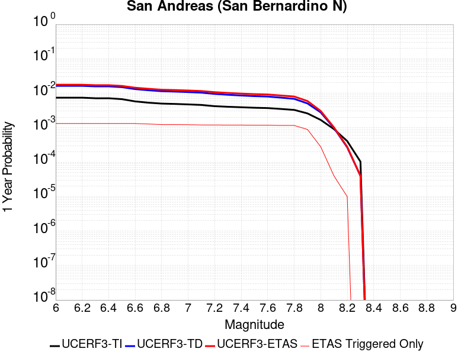 |  |

| Magnitude | 1 wk TI Prob | 1 wk TD Prob | 1 wk ETAS Prob | 1 wk ETAS/TD Gain | 1 wk ETAS Triggered Only | 1 mo TI Prob | 1 mo TD Prob | 1 mo ETAS Prob | 1 mo ETAS/TD Gain | 1 mo ETAS Triggered Only | 1 yr TI Prob | 1 yr TD Prob | 1 yr ETAS Prob | 1 yr ETAS/TD Gain | 1 yr ETAS Triggered Only | 10 yr TI Prob | 10 yr TD Prob | 10 yr ETAS Prob | 10 yr ETAS/TD Gain | 10 yr ETAS Triggered Only |
|-----|-----|-----|-----|-----|-----|-----|-----|-----|-----|-----|-----|-----|-----|-----|-----|-----|-----|-----|-----|-----|
| 6.0 | 1.4273766E-4 | 3.1606483E-4 | 0.0010658278 | 3.3721807 | 7.5E-4 | 6.115894E-4 | 0.0013538664 | 0.0022426615 | 1.6564865 | 8.9E-4 | 0.0074207084 | 0.016360244 | 0.017658647 | 1.0793633 | 0.00132 | 0.07177748 | 0.15026689 | 0.15183888 | 1.0104614 | 0.00185 |
| 6.1 | 1.4273766E-4 | 3.1606483E-4 | 0.0010658278 | 3.3721807 | 7.5E-4 | 6.115894E-4 | 0.0013538664 | 0.0022426615 | 1.6564865 | 8.9E-4 | 0.0074207084 | 0.016360244 | 0.017658647 | 1.0793633 | 0.00132 | 0.07177748 | 0.15026689 | 0.15183888 | 1.0104614 | 0.00185 |
| 6.2 | 1.4273766E-4 | 3.1606483E-4 | 0.0010658278 | 3.3721807 | 7.5E-4 | 6.115894E-4 | 0.0013538664 | 0.0022426615 | 1.6564865 | 8.9E-4 | 0.0074207084 | 0.016360244 | 0.017658647 | 1.0793633 | 0.00132 | 0.07177748 | 0.15026689 | 0.15183888 | 1.0104614 | 0.00185 |
| 6.3 | 1.3730655E-4 | 3.0511338E-4 | 0.0010548845 | 3.4573526 | 7.5E-4 | 5.883239E-4 | 0.0013069791 | 0.002195816 | 1.6800696 | 8.9E-4 | 0.0071393442 | 0.015797773 | 0.01709692 | 1.082236 | 0.00132 | 0.06914291 | 0.14556676 | 0.14714746 | 1.0108589 | 0.00185 |
| 6.4 | 1.3730655E-4 | 3.0511338E-4 | 0.0010548845 | 3.4573526 | 7.5E-4 | 5.883239E-4 | 0.0013069791 | 0.002195816 | 1.6800696 | 8.9E-4 | 0.0071393442 | 0.015797773 | 0.01709692 | 1.082236 | 0.00132 | 0.06914291 | 0.14556676 | 0.14714746 | 1.0108589 | 0.00185 |
| 6.5 | 1.2942807E-4 | 2.8925808E-4 | 0.0010390411 | 3.5920904 | 7.5E-4 | 5.545738E-4 | 0.0012390936 | 0.0021279908 | 1.717377 | 8.9E-4 | 0.0067310524 | 0.01498286 | 0.016283082 | 1.0867807 | 0.00132 | 0.06530788 | 0.13870941 | 0.14028558 | 1.011363 | 0.00183 |
| 6.6 | 1.1125901E-4 | 2.536472E-4 | 0.001003457 | 3.9561129 | 7.5E-4 | 4.767372E-4 | 0.0010866089 | 0.0019756418 | 1.818172 | 8.9E-4 | 0.005788839 | 0.013149847 | 0.014452489 | 1.0990614 | 0.00132 | 0.056403454 | 0.122999296 | 0.1246042 | 1.0130482 | 0.00183 |
| 6.7 | 1.02209575E-4 | 2.3499702E-4 | 9.7482314E-4 | 4.1482363 | 7.4E-4 | 4.3796748E-4 | 0.0010067427 | 0.001865877 | 1.8533801 | 8.6E-4 | 0.0053192247 | 0.012188629 | 0.013453028 | 1.1037359 | 0.00128 | 0.051936906 | 0.114790924 | 0.11634889 | 1.0135722 | 0.00176 |
| 6.8 | 9.610582E-5 | 2.2025521E-4 | 9.400966E-4 | 4.268215 | 7.2E-4 | 4.1181705E-4 | 9.436101E-4 | 0.0017828174 | 1.8893582 | 8.4E-4 | 0.0050023515 | 0.011428202 | 0.012644145 | 1.1063985 | 0.00123 | 0.048912346 | 0.1081929 | 0.10971789 | 1.0140951 | 0.00171 |
| 6.9 | 9.3877505E-5 | 2.1481077E-4 | 9.346561E-4 | 4.351067 | 7.2E-4 | 4.0227012E-4 | 9.2029345E-4 | 0.0017595204 | 1.9119123 | 8.4E-4 | 0.0048866454 | 0.011147255 | 0.012363545 | 1.1091111 | 0.00123 | 0.04780577 | 0.10578323 | 0.10731234 | 1.0144551 | 0.00171 |
| 7.0 | 9.1019785E-5 | 2.0808022E-4 | 9.279304E-4 | 4.459484 | 7.2E-4 | 3.900265E-4 | 8.914682E-4 | 0.0017207284 | 1.9302183 | 8.3E-4 | 0.0047382377 | 0.010799837 | 0.012006661 | 1.1117446 | 0.00122 | 0.046384744 | 0.102753714 | 0.104279034 | 1.0148444 | 0.0017 |
| 7.1 | 8.771155E-5 | 1.9982594E-4 | 8.9968607E-4 | 4.5023484 | 7.0E-4 | 3.758525E-4 | 8.5611636E-4 | 0.0016654229 | 1.9453231 | 8.1E-4 | 0.0045664064 | 0.0103736 | 0.011561151 | 1.1144782 | 0.0012 | 0.044737056 | 0.09906527 | 0.10056982 | 1.0151876 | 0.00167 |
| 7.2 | 8.0830236E-5 | 1.8388197E-4 | 8.8375324E-4 | 4.8060894 | 7.0E-4 | 3.4636928E-4 | 7.8782777E-4 | 0.0015971896 | 2.0273335 | 8.1E-4 | 0.0042088944 | 0.009549725 | 0.010738265 | 1.1244581 | 0.0012 | 0.041300658 | 0.09179615 | 0.093285605 | 1.0162257 | 0.00164 |
| 7.3 | 7.7668235E-5 | 1.7331762E-4 | 8.731963E-4 | 5.038128 | 7.0E-4 | 3.328214E-4 | 7.425784E-4 | 0.0015519769 | 2.089984 | 8.1E-4 | 0.0040445733 | 0.009003494 | 0.01018278 | 1.130981 | 0.00119 | 0.03971748 | 0.08706327 | 0.08855135 | 1.017092 | 0.00163 |
| 7.4 | 7.520177E-5 | 1.6551897E-4 | 8.654031E-4 | 5.228422 | 7.0E-4 | 3.2225347E-4 | 7.0917426E-4 | 0.0015185998 | 2.1413634 | 8.1E-4 | 0.0039163795 | 0.008600081 | 0.009779847 | 1.1371808 | 0.00119 | 0.038480744 | 0.08351955 | 0.08500425 | 1.0177766 | 0.00162 |
| 7.5 | 7.274697E-5 | 1.5839566E-4 | 8.482864E-4 | 5.35549 | 6.9E-4 | 3.1173544E-4 | 6.78662E-4 | 0.001478119 | 2.17799 | 8.0E-4 | 0.003788775 | 0.008231463 | 0.00940175 | 1.1421725 | 0.00118 | 0.03724827 | 0.08023631 | 0.081717126 | 1.0184557 | 0.00161 |
| 7.6 | 7.1185845E-5 | 1.540943E-4 | 8.43988E-4 | 5.4770875 | 6.9E-4 | 3.0504653E-4 | 6.6023704E-4 | 0.0014597089 | 2.210886 | 8.0E-4 | 0.0037076178 | 0.008008812 | 0.009179361 | 1.1461577 | 0.00118 | 0.036463667 | 0.07822598 | 0.07971004 | 1.0189714 | 0.00161 |
| 7.7 | 6.709961E-5 | 1.4318313E-4 | 8.3308434E-4 | 5.8183136 | 6.9E-4 | 2.8753807E-4 | 6.1349774E-4 | 0.0014130069 | 2.3031983 | 8.0E-4 | 0.003495157 | 0.0074437927 | 0.008595157 | 1.1546745 | 0.00116 | 0.034406938 | 0.07305469 | 0.07451927 | 1.0200477 | 0.00158 |
| 7.8 | 6.300812E-5 | 1.3202413E-4 | 8.2193303E-4 | 6.2256274 | 6.9E-4 | 2.7000686E-4 | 5.65695E-4 | 0.0013652424 | 2.4133897 | 8.0E-4 | 0.0032823787 | 0.006865616 | 0.008017652 | 1.1677979 | 0.00116 | 0.032343175 | 0.06771354 | 0.06918655 | 1.0217535 | 0.00158 |
| 7.9 | 4.983037E-5 | 9.723488E-5 | 6.071853E-4 | 6.2445216 | 5.1E-4 | 2.1354125E-4 | 4.1665437E-4 | 0.0010064086 | 2.4154518 | 5.9E-4 | 0.0025967648 | 0.0050609782 | 0.0059464737 | 1.1749654 | 8.9E-4 | 0.025666296 | 0.05064886 | 0.051835548 | 1.0234298 | 0.00125 |
| 8.0 | 3.2211527E-5 | 5.3304586E-5 | 2.33295E-4 | 4.3766403 | 1.8E-4 | 1.380421E-4 | 2.2842824E-4 | 4.1838482E-4 | 1.8315811 | 1.9E-4 | 0.0016793669 | 0.0027775685 | 0.003056791 | 1.1005276 | 2.8E-4 | 0.016667323 | 0.028361378 | 0.028750034 | 1.0137037 | 4.0E-4 |
| 8.1 | 1.743376E-5 | 1.8824427E-5 | 3.8824048E-5 | 2.0624294 | 2.0E-5 | 7.471398E-5 | 8.067362E-5 | 1.00672005E-4 | 1.2478925 | 2.0E-5 | 9.0926304E-4 | 9.817594E-4 | 0.0010217201 | 1.0407032 | 4.0E-5 | 0.009055517 | 0.010484105 | 0.010533581 | 1.0047191 | 5.0E-5 |
| 8.2 | 7.831616E-6 | 5.1551065E-6 | 1.5155055E-5 | 2.939814 | 1.0E-5 | 3.3563636E-5 | 2.2093127E-5 | 3.2092907E-5 | 1.4526194 | 1.0E-5 | 4.0856065E-4 | 2.6895068E-4 | 2.78948E-4 | 1.0371715 | 1.0E-5 | 0.004078103 | 0.0030418145 | 0.0030517841 | 1.0032775 | 1.0E-5 |
| 8.3 | 1.983087E-6 | 7.6599065E-7 | 7.6599065E-7 | 1.0 | 0.0 | 8.498917E-6 | 3.282813E-6 | 3.282813E-6 | 1.0 | 0.0 | 1.034694E-4 | 3.9967534E-5 | 3.9967534E-5 | 1.0 | 0.0 | 0.0010342124 | 4.719687E-4 | 4.719687E-4 | 1.0 | 0.0 |

## Garlic Springs
*[(top)](#table-of-contents)*

| 1 Week | 1 Month | 1 Year | 10 Year |
|-----|-----|-----|-----|
|  |  |  |  |

| Magnitude | 1 wk TI Prob | 1 wk TD Prob | 1 wk ETAS Prob | 1 wk ETAS/TD Gain | 1 wk ETAS Triggered Only | 1 mo TI Prob | 1 mo TD Prob | 1 mo ETAS Prob | 1 mo ETAS/TD Gain | 1 mo ETAS Triggered Only | 1 yr TI Prob | 1 yr TD Prob | 1 yr ETAS Prob | 1 yr ETAS/TD Gain | 1 yr ETAS Triggered Only | 10 yr TI Prob | 10 yr TD Prob | 10 yr ETAS Prob | 10 yr ETAS/TD Gain | 10 yr ETAS Triggered Only |
|-----|-----|-----|-----|-----|-----|-----|-----|-----|-----|-----|-----|-----|-----|-----|-----|-----|-----|-----|-----|-----|
| 6.0 | 1.6760017E-5 | 1.8776833E-5 | 3.0877138E-4 | 16.444275 | 2.9E-4 | 7.182667E-5 | 8.0470316E-5 | 5.504325E-4 | 6.840193 | 4.7E-4 | 8.7413884E-4 | 9.794032E-4 | 0.0019284728 | 1.9690285 | 9.5E-4 | 0.008707083 | 0.009762413 | 0.011326988 | 1.1602652 | 0.00158 |
| 6.1 | 9.852767E-6 | 1.09735865E-5 | 1.7097183E-4 | 15.580305 | 1.6E-4 | 4.222546E-5 | 4.702921E-5 | 3.0701698E-4 | 6.5282187 | 2.6E-4 | 5.139737E-4 | 5.7250116E-4 | 0.0011721577 | 2.047433 | 6.0E-4 | 0.005127866 | 0.005717221 | 0.006701561 | 1.172171 | 9.9E-4 |
| 6.2 | 9.852767E-6 | 1.09735865E-5 | 1.7097183E-4 | 15.580305 | 1.6E-4 | 4.222546E-5 | 4.702921E-5 | 3.0701698E-4 | 6.5282187 | 2.6E-4 | 5.139737E-4 | 5.7250116E-4 | 0.0011721577 | 2.047433 | 6.0E-4 | 0.005127866 | 0.005717221 | 0.006701561 | 1.172171 | 9.9E-4 |
| 6.3 | 4.3167724E-6 | 4.7780286E-6 | 7.4777694E-5 | 15.650324 | 7.0E-5 | 1.8500323E-5 | 2.0477235E-5 | 1.1047539E-4 | 5.395035 | 9.0E-5 | 2.2521814E-4 | 2.4930484E-4 | 5.1923754E-4 | 2.0827415 | 2.7E-4 | 0.0022499003 | 0.00249251 | 0.002901488 | 1.1640828 | 4.1E-4 |
| 6.4 | 4.3167724E-6 | 4.7780286E-6 | 7.4777694E-5 | 15.650324 | 7.0E-5 | 1.8500323E-5 | 2.0477235E-5 | 1.1047539E-4 | 5.395035 | 9.0E-5 | 2.2521814E-4 | 2.4930484E-4 | 5.1923754E-4 | 2.0827415 | 2.7E-4 | 0.0022499003 | 0.00249251 | 0.002901488 | 1.1640828 | 4.1E-4 |
| 6.5 | 4.3167724E-6 | 4.7780286E-6 | 7.4777694E-5 | 15.650324 | 7.0E-5 | 1.8500323E-5 | 2.0477235E-5 | 1.1047539E-4 | 5.395035 | 9.0E-5 | 2.2521814E-4 | 2.4930484E-4 | 5.1923754E-4 | 2.0827415 | 2.7E-4 | 0.0022499003 | 0.00249251 | 0.002901488 | 1.1640828 | 4.1E-4 |
| 6.6 | 4.301311E-6 | 4.760897E-6 | 7.4760566E-5 | 15.703041 | 7.0E-5 | 1.8434059E-5 | 2.0403815E-5 | 1.10401976E-4 | 5.41085 | 9.0E-5 | 2.2441156E-4 | 2.4841115E-4 | 5.183441E-4 | 2.0866377 | 2.7E-4 | 0.0022418506 | 0.002483593 | 0.0028925748 | 1.1646734 | 4.1E-4 |
| 6.7 | 3.8599724E-6 | 4.27106E-6 | 7.427076E-5 | 17.389305 | 7.0E-5 | 1.6542634E-5 | 1.8304541E-5 | 1.083029E-4 | 5.9167223 | 9.0E-5 | 2.0138794E-4 | 2.228578E-4 | 4.728021E-4 | 2.1215415 | 2.5E-4 | 0.0020120554 | 0.002228578 | 0.0026177089 | 1.1746095 | 3.9E-4 |

## Helendale-So Lockhart
*[(top)](#table-of-contents)*

| 1 Week | 1 Month | 1 Year | 10 Year |
|-----|-----|-----|-----|
|  |  |  |  |

| Magnitude | 1 wk TI Prob | 1 wk TD Prob | 1 wk ETAS Prob | 1 wk ETAS/TD Gain | 1 wk ETAS Triggered Only | 1 mo TI Prob | 1 mo TD Prob | 1 mo ETAS Prob | 1 mo ETAS/TD Gain | 1 mo ETAS Triggered Only | 1 yr TI Prob | 1 yr TD Prob | 1 yr ETAS Prob | 1 yr ETAS/TD Gain | 1 yr ETAS Triggered Only | 10 yr TI Prob | 10 yr TD Prob | 10 yr ETAS Prob | 10 yr ETAS/TD Gain | 10 yr ETAS Triggered Only |
|-----|-----|-----|-----|-----|-----|-----|-----|-----|-----|-----|-----|-----|-----|-----|-----|-----|-----|-----|-----|-----|
| 6.0 | 1.7296055E-5 | 1.8103729E-5 | 3.680974E-4 | 20.332684 | 3.5E-4 | 7.412385E-5 | 7.7585224E-5 | 6.575402E-4 | 8.475071 | 5.8E-4 | 9.0208417E-4 | 9.4421144E-4 | 0.0018733334 | 1.9840189 | 9.3E-4 | 0.008984311 | 0.009404116 | 0.010721609 | 1.1400974 | 0.00133 |
| 6.1 | 1.7296055E-5 | 1.8103729E-5 | 3.680974E-4 | 20.332684 | 3.5E-4 | 7.412385E-5 | 7.7585224E-5 | 6.575402E-4 | 8.475071 | 5.8E-4 | 9.0208417E-4 | 9.4421144E-4 | 0.0018733334 | 1.9840189 | 9.3E-4 | 0.008984311 | 0.009404116 | 0.010721609 | 1.1400974 | 0.00133 |
| 6.2 | 1.7296055E-5 | 1.8103729E-5 | 3.680974E-4 | 20.332684 | 3.5E-4 | 7.412385E-5 | 7.7585224E-5 | 6.575402E-4 | 8.475071 | 5.8E-4 | 9.0208417E-4 | 9.4421144E-4 | 0.0018733334 | 1.9840189 | 9.3E-4 | 0.008984311 | 0.009404116 | 0.010721609 | 1.1400974 | 0.00133 |
| 6.3 | 1.0669118E-5 | 1.1135425E-5 | 2.811324E-4 | 25.246674 | 2.7E-4 | 4.5723988E-5 | 4.772239E-5 | 4.7770186E-4 | 10.0100155 | 4.3E-4 | 5.5654737E-4 | 5.80868E-4 | 0.001210502 | 2.0839539 | 6.3E-4 | 0.0055515557 | 0.0057937936 | 0.0067184055 | 1.1595865 | 9.3E-4 |
| 6.4 | 1.0669118E-5 | 1.1135425E-5 | 2.811324E-4 | 25.246674 | 2.7E-4 | 4.5723988E-5 | 4.772239E-5 | 4.7770186E-4 | 10.0100155 | 4.3E-4 | 5.5654737E-4 | 5.80868E-4 | 0.001210502 | 2.0839539 | 6.3E-4 | 0.0055515557 | 0.0057937936 | 0.0067184055 | 1.1595865 | 9.3E-4 |
| 6.5 | 8.790038E-6 | 9.170197E-6 | 2.3916809E-4 | 26.08102 | 2.3E-4 | 3.767105E-5 | 3.930026E-5 | 4.2928493E-4 | 10.923208 | 3.9E-4 | 4.585485E-4 | 4.7837716E-4 | 0.0010381093 | 2.1700644 | 5.6E-4 | 0.0045760344 | 0.004773638 | 0.005579772 | 1.1688719 | 8.1E-4 |
| 6.6 | 7.396949E-6 | 7.715537E-6 | 2.07714E-4 | 26.921522 | 2.0E-4 | 3.1700827E-5 | 3.3066175E-5 | 3.6305527E-4 | 10.979657 | 3.3E-4 | 3.858892E-4 | 4.025073E-4 | 8.823141E-4 | 2.192045 | 4.8E-4 | 0.003852198 | 0.00401789 | 0.0046652784 | 1.1611265 | 6.5E-4 |
| 6.7 | 6.4600285E-6 | 6.738031E-6 | 1.7673688E-4 | 26.229752 | 1.7E-4 | 2.7685543E-5 | 2.887696E-5 | 3.0886888E-4 | 10.696032 | 2.8E-4 | 3.3701936E-4 | 3.5152107E-4 | 7.613769E-4 | 2.1659498 | 4.1E-4 | 0.0033650869 | 0.003509732 | 0.0040677665 | 1.1589963 | 5.6E-4 |
| 6.8 | 5.600104E-6 | 5.836009E-6 | 1.4583519E-4 | 24.988855 | 1.4E-4 | 2.4000226E-5 | 2.5011232E-5 | 2.4500574E-4 | 9.795828 | 2.2E-4 | 2.9216358E-4 | 3.044698E-4 | 6.4436626E-4 | 2.1163554 | 3.4E-4 | 0.0029177975 | 0.003040588 | 0.0035191285 | 1.1573842 | 4.8E-4 |
| 6.9 | 4.839122E-6 | 5.0395092E-6 | 1.3503885E-4 | 26.796032 | 1.3E-4 | 2.0738931E-5 | 2.159772E-5 | 2.3159318E-4 | 10.723039 | 2.1E-4 | 2.5246723E-4 | 2.6292098E-4 | 5.528447E-4 | 2.102703 | 2.9E-4 | 0.002521806 | 0.002626147 | 0.003045044 | 1.1595101 | 4.2E-4 |
| 7.0 | 3.6937633E-6 | 3.845208E-6 | 9.3844865E-5 | 24.405666 | 9.0E-5 | 1.5830317E-5 | 1.647936E-5 | 1.8647657E-4 | 11.315764 | 1.7E-4 | 1.9271708E-4 | 2.0061806E-4 | 4.305719E-4 | 2.1462271 | 2.3E-4 | 0.0019255003 | 0.002004401 | 0.0023037996 | 1.1493707 | 3.0E-4 |
| 7.1 | 2.7858857E-6 | 2.8978538E-6 | 5.289771E-5 | 18.254099 | 5.0E-5 | 1.1939455E-5 | 1.2419316E-5 | 1.3241783E-4 | 10.662249 | 1.2E-4 | 1.4535317E-4 | 1.511949E-4 | 3.111707E-4 | 2.0580769 | 1.6E-4 | 0.0014525814 | 0.0015109418 | 0.0017306093 | 1.1453846 | 2.2E-4 |
| 7.2 | 2.1672065E-6 | 2.2540128E-6 | 2.2253967E-5 | 9.873044 | 2.0E-5 | 9.2879945E-6 | 9.66002E-6 | 8.965925E-5 | 9.281476 | 8.0E-5 | 1.1307546E-4 | 1.1760458E-4 | 2.2759165E-4 | 1.9352278 | 1.1E-4 | 0.0011301794 | 0.0011754417 | 0.0013452418 | 1.1444565 | 1.7E-4 |
| 7.3 | 1.4823496E-6 | 1.5422102E-6 | 2.1542179E-5 | 13.968381 | 2.0E-5 | 6.3529114E-6 | 6.6094562E-6 | 7.6608994E-5 | 11.5908165 | 7.0E-5 | 7.734395E-5 | 8.046731E-5 | 1.8045926E-4 | 2.2426407 | 1.0E-4 | 7.731704E-4 | 8.0439687E-4 | 9.3429233E-4 | 1.1614817 | 1.3E-4 |
| 7.4 | 4.2321457E-7 | 4.4108765E-7 | 4.4108765E-7 | 1.0 | 0.0 | 1.8137755E-6 | 1.8903745E-6 | 1.1890355E-5 | 6.289947 | 1.0E-5 | 2.2082493E-5 | 2.3015113E-5 | 5.3014424E-5 | 2.3034613 | 3.0E-5 | 2.2080299E-4 | 2.3013182E-4 | 2.701226E-4 | 1.1737734 | 4.0E-5 |
| 7.5 | 5.6942316E-8 | 5.9415648E-8 | 5.9415648E-8 | 1.0 | 0.0 | 2.440385E-7 | 2.5463845E-7 | 2.5463845E-7 | 1.0 | 0.0 | 2.9711643E-6 | 3.1002196E-6 | 1.3100189E-5 | 4.225568 | 1.0E-5 | 2.9711247E-5 | 3.1001844E-5 | 4.100153E-5 | 1.3225515 | 1.0E-5 |

## San Andreas (San Bernardino S)
*[(top)](#table-of-contents)*

| 1 Week | 1 Month | 1 Year | 10 Year |
|-----|-----|-----|-----|
|  |  | 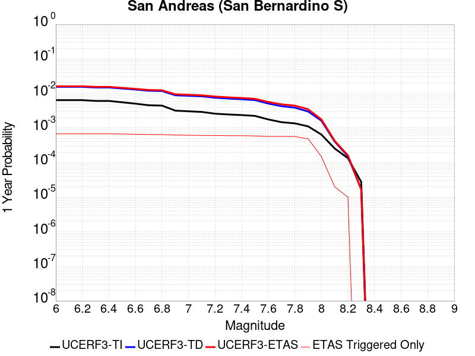 |  |

| Magnitude | 1 wk TI Prob | 1 wk TD Prob | 1 wk ETAS Prob | 1 wk ETAS/TD Gain | 1 wk ETAS Triggered Only | 1 mo TI Prob | 1 mo TD Prob | 1 mo ETAS Prob | 1 mo ETAS/TD Gain | 1 mo ETAS Triggered Only | 1 yr TI Prob | 1 yr TD Prob | 1 yr ETAS Prob | 1 yr ETAS/TD Gain | 1 yr ETAS Triggered Only | 10 yr TI Prob | 10 yr TD Prob | 10 yr ETAS Prob | 10 yr ETAS/TD Gain | 10 yr ETAS Triggered Only |
|-----|-----|-----|-----|-----|-----|-----|-----|-----|-----|-----|-----|-----|-----|-----|-----|-----|-----|-----|-----|-----|
| 6.0 | 1.2336002E-4 | 3.0004102E-4 | 6.99921E-4 | 2.332751 | 4.0E-4 | 5.2857865E-4 | 0.0012852824 | 0.0017546784 | 1.3652084 | 4.7E-4 | 0.006416472 | 0.015540994 | 0.016210426 | 1.0430752 | 6.8E-4 | 0.06234337 | 0.14283717 | 0.14369434 | 1.006001 | 0.001 |
| 6.1 | 1.2336002E-4 | 3.0004102E-4 | 6.99921E-4 | 2.332751 | 4.0E-4 | 5.2857865E-4 | 0.0012852824 | 0.0017546784 | 1.3652084 | 4.7E-4 | 0.006416472 | 0.015540994 | 0.016210426 | 1.0430752 | 6.8E-4 | 0.06234337 | 0.14283717 | 0.14369434 | 1.006001 | 0.001 |
| 6.2 | 1.2336002E-4 | 3.0004102E-4 | 6.99921E-4 | 2.332751 | 4.0E-4 | 5.2857865E-4 | 0.0012852824 | 0.0017546784 | 1.3652084 | 4.7E-4 | 0.006416472 | 0.015540994 | 0.016210426 | 1.0430752 | 6.8E-4 | 0.06234337 | 0.14283717 | 0.14369434 | 1.006001 | 0.001 |
| 6.3 | 1.1712257E-4 | 2.8792414E-4 | 6.8780896E-4 | 2.3888547 | 4.0E-4 | 5.018573E-4 | 0.0012334028 | 0.0017028231 | 1.3805896 | 4.7E-4 | 0.006093008 | 0.014918125 | 0.015587981 | 1.0449021 | 6.8E-4 | 0.059286322 | 0.13754563 | 0.13840808 | 1.0062703 | 0.001 |
| 6.4 | 1.1712257E-4 | 2.8792414E-4 | 6.8780896E-4 | 2.3888547 | 4.0E-4 | 5.018573E-4 | 0.0012334028 | 0.0017028231 | 1.3805896 | 4.7E-4 | 0.006093008 | 0.014918125 | 0.015587981 | 1.0449021 | 6.8E-4 | 0.059286322 | 0.13754563 | 0.13840808 | 1.0062703 | 0.001 |
| 6.5 | 1.0689076E-4 | 2.680528E-4 | 6.5794826E-4 | 2.4545472 | 3.9E-4 | 4.5802278E-4 | 0.0011483167 | 0.0016077885 | 1.4001263 | 4.6E-4 | 0.0055621783 | 0.01389575 | 0.0145564405 | 1.0475461 | 6.7E-4 | 0.05425003 | 0.12879294 | 0.12965544 | 1.0066967 | 9.9E-4 |
| 6.6 | 9.7648895E-5 | 2.50501E-4 | 6.404033E-4 | 2.55649 | 3.9E-4 | 4.1842813E-4 | 0.0010731576 | 0.001532664 | 1.4281815 | 4.6E-4 | 0.005082469 | 0.012991785 | 0.013643211 | 1.0501413 | 6.6E-4 | 0.049677886 | 0.12095292 | 0.1217968 | 1.006977 | 9.6E-4 |
| 6.7 | 8.757013E-5 | 2.3120902E-4 | 6.211189E-4 | 2.6863954 | 3.9E-4 | 3.7524657E-4 | 9.905418E-4 | 0.0014500861 | 1.4639323 | 4.6E-4 | 0.00455906 | 0.011997245 | 0.012639447 | 1.0535291 | 6.5E-4 | 0.04466656 | 0.11226123 | 0.1130957 | 1.0074333 | 9.4E-4 |
| 6.8 | 8.562978E-5 | 2.2680782E-4 | 6.1671936E-4 | 2.7191274 | 3.9E-4 | 3.6693315E-4 | 9.7169366E-4 | 0.0014312466 | 1.4729402 | 4.6E-4 | 0.004458263 | 0.011770263 | 0.012412613 | 1.0545739 | 6.5E-4 | 0.043698758 | 0.11027153 | 0.11110788 | 1.0075845 | 9.4E-4 |
| 6.9 | 6.124075E-5 | 1.7065753E-4 | 5.405944E-4 | 3.1677148 | 3.7E-4 | 2.6243398E-4 | 7.311852E-4 | 0.0011708635 | 1.6013228 | 4.4E-4 | 0.0031904527 | 0.008866051 | 0.009490465 | 1.0704275 | 6.3E-4 | 0.031450346 | 0.08418263 | 0.08498855 | 1.0095735 | 8.8E-4 |
| 7.0 | 5.8598747E-5 | 1.649477E-4 | 5.2488834E-4 | 3.18215 | 3.6E-4 | 2.5111332E-4 | 7.06728E-4 | 0.0011364241 | 1.6080077 | 4.3E-4 | 0.0030530186 | 0.008570663 | 0.00918535 | 1.0717198 | 6.2E-4 | 0.03011414 | 0.081500374 | 0.08229946 | 1.0098048 | 8.7E-4 |
| 7.1 | 5.613814E-5 | 1.5913323E-4 | 5.090775E-4 | 3.199065 | 3.5E-4 | 2.4056983E-4 | 6.818221E-4 | 0.0011015357 | 1.6155765 | 4.2E-4 | 0.0029250039 | 0.008269769 | 0.008874724 | 1.0731527 | 6.1E-4 | 0.028868021 | 0.07879931 | 0.07958233 | 1.0099369 | 8.5E-4 |
| 7.2 | 4.991222E-5 | 1.4519796E-4 | 4.9514713E-4 | 3.4101522 | 3.5E-4 | 2.1389198E-4 | 6.2212895E-4 | 0.0010418677 | 1.6746812 | 4.2E-4 | 0.002601025 | 0.007548217 | 0.008153613 | 1.0802038 | 6.1E-4 | 0.025707912 | 0.07225321 | 0.07302324 | 1.0106574 | 8.3E-4 |
| 7.3 | 4.7410045E-5 | 1.3714004E-4 | 4.8709204E-4 | 3.5517857 | 3.5E-4 | 2.0317009E-4 | 5.8761094E-4 | 0.0010073641 | 1.7143387 | 4.2E-4 | 0.0024707897 | 0.0071307817 | 0.007726503 | 1.0835422 | 6.0E-4 | 0.024434982 | 0.06853558 | 0.06929938 | 1.0111446 | 8.2E-4 |
| 7.4 | 4.5556746E-5 | 1.3121912E-4 | 4.811732E-4 | 3.6669443 | 3.5E-4 | 1.952286E-4 | 5.622468E-4 | 9.820106E-4 | 1.746583 | 4.2E-4 | 0.002374317 | 0.0068239477 | 0.0074198535 | 1.0873257 | 6.0E-4 | 0.023491086 | 0.065788016 | 0.06655407 | 1.0116442 | 8.2E-4 |
| 7.5 | 4.3084514E-5 | 1.2357246E-4 | 4.6353045E-4 | 3.751082 | 3.4E-4 | 1.8463485E-4 | 5.2948913E-4 | 9.39272E-4 | 1.7739214 | 4.1E-4 | 0.0022456115 | 0.0064275465 | 0.0070137545 | 1.0912024 | 5.9E-4 | 0.022230545 | 0.062188786 | 0.06294841 | 1.0122149 | 8.1E-4 |
| 7.6 | 3.408608E-5 | 9.83552E-5 | 4.2832273E-4 | 4.354856 | 3.3E-4 | 1.4607502E-4 | 4.214543E-4 | 8.212857E-4 | 1.9486946 | 4.0E-4 | 0.0017770125 | 0.0051191594 | 0.005686241 | 1.1107764 | 5.7E-4 | 0.017628696 | 0.050020292 | 0.050761275 | 1.0148137 | 7.8E-4 |
| 7.7 | 2.8315713E-5 | 8.248679E-5 | 4.1245957E-4 | 5.0003104 | 3.3E-4 | 1.2134742E-4 | 3.5346695E-4 | 7.533256E-4 | 2.1312475 | 4.0E-4 | 0.0014764034 | 0.0042949775 | 0.004862529 | 1.1321431 | 5.7E-4 | 0.01466633 | 0.0422714 | 0.043008853 | 1.0174457 | 7.7E-4 |
| 7.8 | 2.6222975E-5 | 7.463088E-5 | 4.0460625E-4 | 5.421432 | 3.3E-4 | 1.1237934E-4 | 3.1980744E-4 | 7.196795E-4 | 2.2503526 | 4.0E-4 | 0.0013673597 | 0.0038867102 | 0.004454495 | 1.1460836 | 5.7E-4 | 0.013589768 | 0.03843674 | 0.039177146 | 1.0192629 | 7.7E-4 |
| 7.9 | 2.1469694E-5 | 5.787864E-5 | 3.4786185E-4 | 6.010194 | 2.9E-4 | 9.200973E-5 | 2.4802773E-4 | 5.9794093E-4 | 2.4107823 | 3.5E-4 | 0.0011196428 | 0.0030155594 | 0.0035040816 | 1.1620005 | 4.9E-4 | 0.011140184 | 0.030152109 | 0.030821305 | 1.022194 | 6.9E-4 |
| 8.0 | 1.2420249E-5 | 3.131896E-5 | 1.3131583E-4 | 4.192854 | 1.0E-4 | 5.322855E-5 | 1.342172E-4 | 2.3420379E-4 | 1.7449609 | 1.0E-4 | 6.478649E-4 | 0.0016328706 | 0.0017826258 | 1.0917127 | 1.5E-4 | 0.0064597935 | 0.016522504 | 0.016748704 | 1.0136904 | 2.3E-4 |
| 8.1 | 4.9197724E-6 | 7.822348E-6 | 1.782227E-5 | 2.2783785 | 1.0E-5 | 2.1084568E-5 | 3.352392E-5 | 4.3523585E-5 | 1.2982844 | 1.0E-5 | 2.566744E-4 | 4.0807744E-4 | 4.2806927E-4 | 1.0489902 | 2.0E-5 | 0.002563781 | 0.0043843705 | 0.004414239 | 1.0068125 | 3.0E-5 |
| 8.2 | 2.5634774E-6 | 2.9067196E-6 | 1.290669E-5 | 4.4402943 | 1.0E-5 | 1.0986286E-5 | 1.2457311E-5 | 2.2457185E-5 | 1.8027315 | 1.0E-5 | 1.3374983E-4 | 1.5165724E-4 | 1.6165573E-4 | 1.0659282 | 1.0E-5 | 0.0013366934 | 0.0017049741 | 0.001714957 | 1.0058552 | 1.0E-5 |
| 8.3 | 5.2850464E-7 | 3.2088764E-7 | 3.2088764E-7 | 1.0 | 0.0 | 2.2650179E-6 | 1.375232E-6 | 1.375232E-6 | 1.0 | 0.0 | 2.7576245E-5 | 1.6743334E-5 | 1.6743334E-5 | 1.0 | 0.0 | 2.7572823E-4 | 1.9870348E-4 | 1.9870348E-4 | 1.0 | 0.0 |

## Coyote Lake
*[(top)](#table-of-contents)*

| 1 Week | 1 Month | 1 Year | 10 Year |
|-----|-----|-----|-----|
|  |  |  |  |

| Magnitude | 1 wk TI Prob | 1 wk TD Prob | 1 wk ETAS Prob | 1 wk ETAS/TD Gain | 1 wk ETAS Triggered Only | 1 mo TI Prob | 1 mo TD Prob | 1 mo ETAS Prob | 1 mo ETAS/TD Gain | 1 mo ETAS Triggered Only | 1 yr TI Prob | 1 yr TD Prob | 1 yr ETAS Prob | 1 yr ETAS/TD Gain | 1 yr ETAS Triggered Only | 10 yr TI Prob | 10 yr TD Prob | 10 yr ETAS Prob | 10 yr ETAS/TD Gain | 10 yr ETAS Triggered Only |
|-----|-----|-----|-----|-----|-----|-----|-----|-----|-----|-----|-----|-----|-----|-----|-----|-----|-----|-----|-----|-----|
| 6.0 | 1.980352E-5 | 2.1706745E-5 | 1.9170306E-4 | 8.831497 | 1.7E-4 | 8.486947E-5 | 9.302599E-5 | 3.6300087E-4 | 3.9021444 | 2.7E-4 | 0.0010327959 | 0.0011320751 | 0.0017413845 | 1.5382235 | 6.1E-4 | 0.010280091 | 0.011270258 | 0.012199664 | 1.0824654 | 9.4E-4 |
| 6.1 | 1.980352E-5 | 2.1706745E-5 | 1.9170306E-4 | 8.831497 | 1.7E-4 | 8.486947E-5 | 9.302599E-5 | 3.6300087E-4 | 3.9021444 | 2.7E-4 | 0.0010327959 | 0.0011320751 | 0.0017413845 | 1.5382235 | 6.1E-4 | 0.010280091 | 0.011270258 | 0.012199664 | 1.0824654 | 9.4E-4 |
| 6.2 | 1.980352E-5 | 2.1706745E-5 | 1.9170306E-4 | 8.831497 | 1.7E-4 | 8.486947E-5 | 9.302599E-5 | 3.6300087E-4 | 3.9021444 | 2.7E-4 | 0.0010327959 | 0.0011320751 | 0.0017413845 | 1.5382235 | 6.1E-4 | 0.010280091 | 0.011270258 | 0.012199664 | 1.0824654 | 9.4E-4 |
| 6.3 | 1.5344787E-5 | 1.682067E-5 | 1.6681815E-4 | 9.91745 | 1.5E-4 | 6.576172E-5 | 7.2086936E-5 | 2.9207108E-4 | 4.0516505 | 2.2E-4 | 8.003548E-4 | 8.773662E-4 | 0.0013569451 | 1.5466119 | 4.8E-4 | 0.007974784 | 0.00874507 | 0.009478598 | 1.0838791 | 7.4E-4 |
| 6.4 | 1.5344787E-5 | 1.682067E-5 | 1.6681815E-4 | 9.91745 | 1.5E-4 | 6.576172E-5 | 7.2086936E-5 | 2.9207108E-4 | 4.0516505 | 2.2E-4 | 8.003548E-4 | 8.773662E-4 | 0.0013569451 | 1.5466119 | 4.8E-4 | 0.007974784 | 0.00874507 | 0.009478598 | 1.0838791 | 7.4E-4 |
| 6.5 | 1.4189697E-5 | 1.5557987E-5 | 1.4555597E-4 | 9.355707 | 1.3E-4 | 6.081157E-5 | 6.6675726E-5 | 2.5666304E-4 | 3.849423 | 1.9E-4 | 7.401293E-4 | 8.115349E-4 | 0.0012411859 | 1.5294302 | 4.3E-4 | 0.0073766913 | 0.008091656 | 0.008746316 | 1.0809056 | 6.6E-4 |
| 6.6 | 1.3469301E-5 | 1.4771577E-5 | 1.4476966E-4 | 9.800555 | 1.3E-4 | 5.7724297E-5 | 6.330556E-5 | 2.5329355E-4 | 4.0011263 | 1.9E-4 | 7.025667E-4 | 7.7053264E-4 | 0.0012002013 | 1.5576255 | 4.3E-4 | 0.0070034964 | 0.0076845144 | 0.008329519 | 1.0839357 | 6.5E-4 |
| 6.7 | 1.3027966E-5 | 1.4281745E-5 | 1.4427988E-4 | 10.102399 | 1.3E-4 | 5.5832945E-5 | 6.120638E-5 | 2.5119475E-4 | 4.1040616 | 1.9E-4 | 6.7955407E-4 | 7.4499263E-4 | 0.0011546871 | 1.549931 | 4.1E-4 | 0.006774798 | 0.0074308286 | 0.008056147 | 1.084152 | 6.3E-4 |
| 6.8 | 5.695434E-6 | 6.2244176E-6 | 3.622423E-5 | 5.819698 | 3.0E-5 | 2.4408775E-5 | 2.6675973E-5 | 7.667464E-5 | 2.874296 | 5.0E-5 | 2.971363E-4 | 3.2476155E-4 | 4.1473232E-4 | 1.2770364 | 9.0E-5 | 0.0029673933 | 0.0032458105 | 0.0034052911 | 1.0491344 | 1.6E-4 |
| 6.9 | 4.385688E-6 | 4.7930553E-6 | 3.4792913E-5 | 7.2590256 | 3.0E-5 | 1.879567E-5 | 2.0541665E-5 | 7.054064E-5 | 3.4340272 | 5.0E-5 | 2.2881327E-4 | 2.5009477E-4 | 3.2007726E-4 | 1.2798239 | 7.0E-5 | 0.002285778 | 0.0025009478 | 0.0026306226 | 1.0518503 | 1.3E-4 |

## Death Valley (Black Mtns Frontal)
*[(top)](#table-of-contents)*

| 1 Week | 1 Month | 1 Year | 10 Year |
|-----|-----|-----|-----|
|  |  |  |  |

| Magnitude | 1 wk TI Prob | 1 wk TD Prob | 1 wk ETAS Prob | 1 wk ETAS/TD Gain | 1 wk ETAS Triggered Only | 1 mo TI Prob | 1 mo TD Prob | 1 mo ETAS Prob | 1 mo ETAS/TD Gain | 1 mo ETAS Triggered Only | 1 yr TI Prob | 1 yr TD Prob | 1 yr ETAS Prob | 1 yr ETAS/TD Gain | 1 yr ETAS Triggered Only | 10 yr TI Prob | 10 yr TD Prob | 10 yr ETAS Prob | 10 yr ETAS/TD Gain | 10 yr ETAS Triggered Only |
|-----|-----|-----|-----|-----|-----|-----|-----|-----|-----|-----|-----|-----|-----|-----|-----|-----|-----|-----|-----|-----|
| 6.0 | 1.6707214E-5 | 1.867027E-5 | 2.586658E-4 | 13.854423 | 2.4E-4 | 7.160038E-5 | 8.001302E-5 | 3.9998742E-4 | 4.9990287 | 3.2E-4 | 8.71386E-4 | 9.737309E-4 | 0.0015631564 | 1.6053269 | 5.9E-4 | 0.00867977 | 0.009695496 | 0.010507546 | 1.0837554 | 8.2E-4 |
| 6.1 | 1.6707214E-5 | 1.867027E-5 | 2.586658E-4 | 13.854423 | 2.4E-4 | 7.160038E-5 | 8.001302E-5 | 3.9998742E-4 | 4.9990287 | 3.2E-4 | 8.71386E-4 | 9.737309E-4 | 0.0015631564 | 1.6053269 | 5.9E-4 | 0.00867977 | 0.009695496 | 0.010507546 | 1.0837554 | 8.2E-4 |
| 6.2 | 1.6707214E-5 | 1.867027E-5 | 2.586658E-4 | 13.854423 | 2.4E-4 | 7.160038E-5 | 8.001302E-5 | 3.9998742E-4 | 4.9990287 | 3.2E-4 | 8.71386E-4 | 9.737309E-4 | 0.0015631564 | 1.6053269 | 5.9E-4 | 0.00867977 | 0.009695496 | 0.010507546 | 1.0837554 | 8.2E-4 |
| 6.3 | 1.6707214E-5 | 1.867027E-5 | 2.586658E-4 | 13.854423 | 2.4E-4 | 7.160038E-5 | 8.001302E-5 | 3.9998742E-4 | 4.9990287 | 3.2E-4 | 8.71386E-4 | 9.737309E-4 | 0.0015631564 | 1.6053269 | 5.9E-4 | 0.00867977 | 0.009695496 | 0.010507546 | 1.0837554 | 8.2E-4 |
| 6.4 | 1.5515609E-5 | 1.7338214E-5 | 1.9733509E-4 | 11.381513 | 1.8E-4 | 6.649377E-5 | 7.4304546E-5 | 3.142867E-4 | 4.2297106 | 2.4E-4 | 8.0926094E-4 | 9.042885E-4 | 0.0013838544 | 1.5303241 | 4.8E-4 | 0.008063202 | 0.009006773 | 0.009670738 | 1.0737184 | 6.7E-4 |
| 6.5 | 1.5515609E-5 | 1.7338214E-5 | 1.9733509E-4 | 11.381513 | 1.8E-4 | 6.649377E-5 | 7.4304546E-5 | 3.142867E-4 | 4.2297106 | 2.4E-4 | 8.0926094E-4 | 9.042885E-4 | 0.0013838544 | 1.5303241 | 4.8E-4 | 0.008063202 | 0.009006773 | 0.009670738 | 1.0737184 | 6.7E-4 |
| 6.6 | 1.5041828E-5 | 1.6809145E-5 | 1.9680613E-4 | 11.708277 | 1.8E-4 | 6.4463384E-5 | 7.203723E-5 | 3.0202066E-4 | 4.192563 | 2.3E-4 | 7.8455906E-4 | 8.767063E-4 | 0.0013163206 | 1.5014384 | 4.4E-4 | 0.00781795 | 0.008733132 | 0.009347718 | 1.070374 | 6.2E-4 |
| 6.7 | 1.4634985E-5 | 1.6356016E-5 | 1.763534E-4 | 10.782173 | 1.6E-4 | 6.271985E-5 | 7.009536E-5 | 2.8008065E-4 | 3.9957087 | 2.1E-4 | 7.6334673E-4 | 8.5308263E-4 | 0.0012627329 | 1.4801999 | 4.1E-4 | 0.007607299 | 0.008498715 | 0.009083701 | 1.0688323 | 5.9E-4 |
| 6.8 | 1.4209158E-5 | 1.5882048E-5 | 1.3588014E-4 | 8.555581 | 1.2E-4 | 6.089497E-5 | 6.8064175E-5 | 2.380526E-4 | 3.4974728 | 1.7E-4 | 7.4114406E-4 | 8.2837185E-4 | 0.001178082 | 1.4221655 | 3.5E-4 | 0.007386771 | 0.008253456 | 0.008769165 | 1.0624839 | 5.2E-4 |
| 6.9 | 1.3780098E-5 | 1.5404594E-5 | 1.054032E-4 | 6.8423233 | 9.0E-5 | 5.9056227E-5 | 6.6018045E-5 | 2.060088E-4 | 3.1204925 | 1.4E-4 | 7.1877235E-4 | 8.0347876E-4 | 0.0011132297 | 1.3855122 | 3.1E-4 | 0.0071645193 | 0.008006332 | 0.008472569 | 1.0582335 | 4.7E-4 |
| 7.0 | 1.3585064E-5 | 1.5188155E-5 | 9.518694E-5 | 6.2671824 | 8.0E-5 | 5.8220405E-5 | 6.50905E-5 | 1.850827E-4 | 2.843467 | 1.2E-4 | 7.086029E-4 | 7.9219416E-4 | 0.0010819645 | 1.3657819 | 2.9E-4 | 0.007063476 | 0.007894293 | 0.00833082 | 1.0552964 | 4.4E-4 |
| 7.1 | 1.3398601E-5 | 1.49813395E-5 | 8.498029E-5 | 5.6724095 | 7.0E-5 | 5.742131E-5 | 6.420419E-5 | 1.7419714E-4 | 2.7131739 | 1.1E-4 | 6.9888023E-4 | 7.8141113E-4 | 0.0010412079 | 1.3324714 | 2.6E-4 | 0.0069668638 | 0.007787224 | 0.008194031 | 1.0522404 | 4.1E-4 |
| 7.2 | 1.3126312E-5 | 1.4679561E-5 | 6.4678825E-5 | 4.4060464 | 5.0E-5 | 5.6254412E-5 | 6.291092E-5 | 1.5290525E-4 | 2.4305043 | 9.0E-5 | 6.846822E-4 | 7.6567667E-4 | 9.955006E-4 | 1.3001579 | 2.3E-4 | 0.006825765 | 0.00763097 | 0.0079783 | 1.0455158 | 3.5E-4 |
| 7.3 | 1.2922429E-5 | 1.4453788E-5 | 6.445307E-5 | 4.459251 | 5.0E-5 | 5.5380664E-5 | 6.194336E-5 | 1.5193778E-4 | 2.45285 | 9.0E-5 | 6.74051E-4 | 7.53905E-4 | 9.537542E-4 | 1.2650855 | 2.0E-4 | 0.006720101 | 0.007514055 | 0.007821726 | 1.040946 | 3.1E-4 |
| 7.4 | 1.2768878E-5 | 1.4283772E-5 | 6.428306E-5 | 4.5004263 | 5.0E-5 | 5.4722615E-5 | 6.1214756E-5 | 1.5120924E-4 | 2.4701438 | 9.0E-5 | 6.660441E-4 | 7.4504025E-4 | 9.4489125E-4 | 1.2682419 | 2.0E-4 | 0.0066405144 | 0.0074260035 | 0.0077337013 | 1.0414352 | 3.1E-4 |
| 7.5 | 1.2521929E-5 | 1.40120155E-5 | 6.4011314E-5 | 4.568316 | 5.0E-5 | 5.366431E-5 | 6.005014E-5 | 1.5004474E-4 | 2.4986575 | 9.0E-5 | 6.531671E-4 | 7.3087064E-4 | 9.307245E-4 | 1.2734462 | 2.0E-4 | 0.006512506 | 0.0072852457 | 0.0075929873 | 1.0422418 | 3.1E-4 |
| 7.6 | 1.1301089E-5 | 1.2648149E-5 | 6.2647516E-5 | 4.953098 | 5.0E-5 | 4.8432343E-5 | 5.4205255E-5 | 1.4420037E-4 | 2.6602657 | 9.0E-5 | 5.895042E-4 | 6.5975444E-4 | 8.296423E-4 | 1.2575016 | 1.7E-4 | 0.0058794282 | 0.00657851 | 0.0068467343 | 1.0407727 | 2.7E-4 |
| 7.7 | 9.189108E-6 | 1.0283358E-5 | 6.0282844E-5 | 5.862175 | 5.0E-5 | 3.93813E-5 | 4.407082E-5 | 1.240673E-4 | 2.81518 | 8.0E-5 | 4.7936183E-4 | 5.3643517E-4 | 6.863547E-4 | 1.2794737 | 1.5E-4 | 0.004783291 | 0.005351914 | 0.005580683 | 1.0427452 | 2.3E-4 |
| 7.8 | 3.4586725E-7 | 3.6482615E-7 | 3.6482615E-7 | 1.0 | 0.0 | 1.4822873E-6 | 1.5635396E-6 | 1.5635396E-6 | 1.0 | 0.0 | 1.80467E-5 | 1.9035933E-5 | 1.9035933E-5 | 1.0 | 0.0 | 1.8045233E-4 | 1.9034347E-4 | 2.0034157E-4 | 1.0525266 | 1.0E-5 |
| 7.9 | 2.5591178E-9 | 2.6696718E-9 | 2.6696718E-9 | 1.0 | 0.0 | 1.0967647E-8 | 1.14414505E-8 | 1.14414505E-8 | 1.0 | 0.0 | 1.335311E-7 | 1.3929966E-7 | 1.3929966E-7 | 1.0 | 0.0 | 1.3353102E-6 | 1.3929966E-6 | 1.3929966E-6 | 1.0 | 0.0 |

## San Andreas (Big Bend)
*[(top)](#table-of-contents)*

| 1 Week | 1 Month | 1 Year | 10 Year |
|-----|-----|-----|-----|
|  |  |  |  |

| Magnitude | 1 wk TI Prob | 1 wk TD Prob | 1 wk ETAS Prob | 1 wk ETAS/TD Gain | 1 wk ETAS Triggered Only | 1 mo TI Prob | 1 mo TD Prob | 1 mo ETAS Prob | 1 mo ETAS/TD Gain | 1 mo ETAS Triggered Only | 1 yr TI Prob | 1 yr TD Prob | 1 yr ETAS Prob | 1 yr ETAS/TD Gain | 1 yr ETAS Triggered Only | 10 yr TI Prob | 10 yr TD Prob | 10 yr ETAS Prob | 10 yr ETAS/TD Gain | 10 yr ETAS Triggered Only |
|-----|-----|-----|-----|-----|-----|-----|-----|-----|-----|-----|-----|-----|-----|-----|-----|-----|-----|-----|-----|-----|
| 6.0 | 1.0179969E-4 | 2.0072258E-4 | 3.7068847E-4 | 1.84677 | 1.7E-4 | 4.362114E-4 | 8.599571E-4 | 0.0011097421 | 1.2904621 | 2.5E-4 | 0.0052979486 | 0.010419999 | 0.010885102 | 1.0446355 | 4.7E-4 | 0.051734097 | 0.10144902 | 0.10212293 | 1.0066428 | 7.5E-4 |
| 6.1 | 1.0179969E-4 | 2.0072258E-4 | 3.7068847E-4 | 1.84677 | 1.7E-4 | 4.362114E-4 | 8.599571E-4 | 0.0011097421 | 1.2904621 | 2.5E-4 | 0.0052979486 | 0.010419999 | 0.010885102 | 1.0446355 | 4.7E-4 | 0.051734097 | 0.10144902 | 0.10212293 | 1.0066428 | 7.5E-4 |
| 6.2 | 1.0179969E-4 | 2.0072258E-4 | 3.7068847E-4 | 1.84677 | 1.7E-4 | 4.362114E-4 | 8.599571E-4 | 0.0011097421 | 1.2904621 | 2.5E-4 | 0.0052979486 | 0.010419999 | 0.010885102 | 1.0446355 | 4.7E-4 | 0.051734097 | 0.10144902 | 0.10212293 | 1.0066428 | 7.5E-4 |
| 6.3 | 1.0179969E-4 | 2.0072258E-4 | 3.7068847E-4 | 1.84677 | 1.7E-4 | 4.362114E-4 | 8.599571E-4 | 0.0011097421 | 1.2904621 | 2.5E-4 | 0.0052979486 | 0.010419999 | 0.010885102 | 1.0446355 | 4.7E-4 | 0.051734097 | 0.10144902 | 0.10212293 | 1.0066428 | 7.5E-4 |
| 6.4 | 9.1639464E-5 | 1.8429532E-4 | 3.3426768E-4 | 1.8137611 | 1.5E-4 | 3.9268145E-4 | 7.895982E-4 | 9.794482E-4 | 1.2404387 | 1.9E-4 | 0.0047704205 | 0.009571102 | 0.009897944 | 1.0341488 | 3.3E-4 | 0.046693064 | 0.09377527 | 0.0942012 | 1.004542 | 4.7E-4 |
| 6.5 | 9.1639464E-5 | 1.8429532E-4 | 3.3426768E-4 | 1.8137611 | 1.5E-4 | 3.9268145E-4 | 7.895982E-4 | 9.794482E-4 | 1.2404387 | 1.9E-4 | 0.0047704205 | 0.009571102 | 0.009897944 | 1.0341488 | 3.3E-4 | 0.046693064 | 0.09377527 | 0.0942012 | 1.004542 | 4.7E-4 |
| 6.6 | 9.042622E-5 | 1.823659E-4 | 3.2234038E-4 | 1.7675474 | 1.4E-4 | 3.8748336E-4 | 7.8133424E-4 | 9.512014E-4 | 1.2174065 | 1.7E-4 | 0.0047074095 | 0.009471365 | 0.009758619 | 1.0303286 | 2.9E-4 | 0.046089325 | 0.092869274 | 0.09325934 | 1.0042002 | 4.3E-4 |
| 6.7 | 8.9836685E-5 | 1.8150927E-4 | 3.2148385E-4 | 1.7711705 | 1.4E-4 | 3.8495753E-4 | 7.776651E-4 | 9.4753294E-4 | 1.2184331 | 1.7E-4 | 0.00467679 | 0.00942708 | 0.009714346 | 1.0304724 | 2.9E-4 | 0.045795817 | 0.09246355 | 0.09285379 | 1.0042205 | 4.3E-4 |
| 6.8 | 8.9471854E-5 | 1.8097709E-4 | 3.2095175E-4 | 1.7734386 | 1.4E-4 | 3.8339442E-4 | 7.7538576E-4 | 9.4525394E-4 | 1.2190757 | 1.7E-4 | 0.004657841 | 0.009399569 | 0.009686843 | 1.0305625 | 2.9E-4 | 0.04561414 | 0.092210755 | 0.092601106 | 1.0042332 | 4.3E-4 |
| 6.9 | 8.858234E-5 | 1.7979681E-4 | 3.1977164E-4 | 1.7785168 | 1.4E-4 | 3.7958333E-4 | 7.703304E-4 | 9.401995E-4 | 1.2205145 | 1.7E-4 | 0.004611638 | 0.009338548 | 0.009625841 | 1.0307641 | 2.9E-4 | 0.04517103 | 0.09165087 | 0.09204146 | 1.0042617 | 4.3E-4 |
| 7.0 | 8.7433385E-5 | 1.7818481E-4 | 3.1815987E-4 | 1.7855611 | 1.4E-4 | 3.746607E-4 | 7.634259E-4 | 9.332961E-4 | 1.2225105 | 1.7E-4 | 0.004551957 | 0.009255203 | 0.009542519 | 1.0310438 | 2.9E-4 | 0.044598386 | 0.09088532 | 0.091267146 | 1.0042012 | 4.2E-4 |
| 7.1 | 8.684964E-5 | 1.7730435E-4 | 3.1727954E-4 | 1.7894627 | 1.4E-4 | 3.7215967E-4 | 7.596547E-4 | 9.2952553E-4 | 1.2236159 | 1.7E-4 | 0.0045216335 | 0.009209678 | 0.009497006 | 1.0311986 | 2.9E-4 | 0.04430731 | 0.09046686 | 0.09084886 | 1.0042226 | 4.2E-4 |
| 7.2 | 8.606521E-5 | 1.762105E-4 | 3.1618582E-4 | 1.7943643 | 1.4E-4 | 3.6879873E-4 | 7.549695E-4 | 9.2484115E-4 | 1.2250047 | 1.7E-4 | 0.0044808835 | 0.0091531165 | 0.009440462 | 1.0313932 | 2.9E-4 | 0.043916024 | 0.089947365 | 0.09032049 | 1.0041482 | 4.1E-4 |
| 7.3 | 8.568266E-5 | 1.7563057E-4 | 3.0560774E-4 | 1.7400601 | 1.3E-4 | 3.6715972E-4 | 7.524855E-4 | 9.123651E-4 | 1.2124687 | 1.6E-4 | 0.0044610105 | 0.009123127 | 0.009400573 | 1.0304112 | 2.8E-4 | 0.043725148 | 0.08966853 | 0.09003266 | 1.0040609 | 4.0E-4 |
| 7.4 | 8.5432206E-5 | 1.7525644E-4 | 3.0523367E-4 | 1.7416402 | 1.3E-4 | 3.6608664E-4 | 7.50883E-4 | 9.107629E-4 | 1.2129225 | 1.6E-4 | 0.004447999 | 0.009103781 | 0.009381231 | 1.0304765 | 2.8E-4 | 0.043600157 | 0.08948871 | 0.089852914 | 1.0040698 | 4.0E-4 |
| 7.5 | 8.4791965E-5 | 1.7394972E-4 | 3.039271E-4 | 1.7472123 | 1.3E-4 | 3.633435E-4 | 7.4528606E-4 | 9.051668E-4 | 1.2145227 | 1.6E-4 | 0.0044147377 | 0.009036204 | 0.009313674 | 1.0307064 | 2.8E-4 | 0.043280575 | 0.088866346 | 0.0892308 | 1.0041012 | 4.0E-4 |
| 7.6 | 8.241105E-5 | 1.6840403E-4 | 2.8838383E-4 | 1.712452 | 1.2E-4 | 3.531424E-4 | 7.215321E-4 | 8.7142386E-4 | 1.2077409 | 1.5E-4 | 0.0042910352 | 0.008749358 | 0.009007084 | 1.0294565 | 2.6E-4 | 0.042091176 | 0.086243294 | 0.08658139 | 1.0039202 | 3.7E-4 |
| 7.7 | 7.00432E-5 | 1.42045E-4 | 2.3203222E-4 | 1.633512 | 9.0E-5 | 3.001506E-4 | 6.0862233E-4 | 7.1855535E-4 | 1.180626 | 1.1E-4 | 0.0036482112 | 0.0073848404 | 0.0075734374 | 1.0255383 | 1.9E-4 | 0.035888977 | 0.07351733 | 0.07378601 | 1.0036546 | 2.9E-4 |
| 7.8 | 6.415362E-5 | 1.2968935E-4 | 2.1967766E-4 | 1.693876 | 9.0E-5 | 2.749151E-4 | 5.556931E-4 | 6.6563196E-4 | 1.197841 | 1.1E-4 | 0.0033419547 | 0.0067446055 | 0.006913459 | 1.0250354 | 1.7E-4 | 0.03292141 | 0.06725231 | 0.067504145 | 1.0037447 | 2.7E-4 |
| 7.9 | 4.939911E-5 | 9.3411545E-5 | 1.63405E-4 | 1.749302 | 7.0E-5 | 2.116933E-4 | 4.0027377E-4 | 4.902377E-4 | 1.2247561 | 9.0E-5 | 0.0025743195 | 0.004862453 | 0.0049818694 | 1.0245589 | 1.2E-4 | 0.025447013 | 0.048914436 | 0.049095143 | 1.0036943 | 1.9E-4 |
| 8.0 | 3.344983E-5 | 5.222685E-5 | 8.2225284E-5 | 1.5743872 | 3.0E-5 | 1.4334853E-4 | 2.2381016E-4 | 2.6380122E-4 | 1.1786829 | 4.0E-5 | 0.0017438711 | 0.0027214854 | 0.0027713494 | 1.0183223 | 5.0E-5 | 0.017302496 | 0.027922187 | 0.027990233 | 1.002437 | 7.0E-5 |
| 8.1 | 1.9104898E-5 | 1.9173063E-5 | 2.9172872E-5 | 1.5215551 | 1.0E-5 | 8.1875565E-5 | 8.216769E-5 | 9.216687E-5 | 1.1216923 | 1.0E-5 | 9.963791E-4 | 9.999331E-4 | 0.0010199131 | 1.0199814 | 2.0E-5 | 0.009919235 | 0.010749801 | 0.010779479 | 1.0027608 | 3.0E-5 |
| 8.2 | 8.643924E-6 | 5.4748625E-6 | 1.5474809E-5 | 2.82652 | 1.0E-5 | 3.704486E-5 | 2.3463486E-5 | 3.346325E-5 | 1.4261842 | 1.0E-5 | 4.5092785E-4 | 2.8563058E-4 | 2.9562772E-4 | 1.0350002 | 1.0E-5 | 0.0045001395 | 0.0032487072 | 0.0032586746 | 1.0030681 | 1.0E-5 |
| 8.3 | 1.983087E-6 | 7.6599065E-7 | 7.6599065E-7 | 1.0 | 0.0 | 8.498917E-6 | 3.282813E-6 | 3.282813E-6 | 1.0 | 0.0 | 1.034694E-4 | 3.9967534E-5 | 3.9967534E-5 | 1.0 | 0.0 | 0.0010342124 | 4.719687E-4 | 4.719687E-4 | 1.0 | 0.0 |

## Elsinore (Glen Ivy) rev
*[(top)](#table-of-contents)*

| 1 Week | 1 Month | 1 Year | 10 Year |
|-----|-----|-----|-----|
|  |  |  |  |

| Magnitude | 1 wk TI Prob | 1 wk TD Prob | 1 wk ETAS Prob | 1 wk ETAS/TD Gain | 1 wk ETAS Triggered Only | 1 mo TI Prob | 1 mo TD Prob | 1 mo ETAS Prob | 1 mo ETAS/TD Gain | 1 mo ETAS Triggered Only | 1 yr TI Prob | 1 yr TD Prob | 1 yr ETAS Prob | 1 yr ETAS/TD Gain | 1 yr ETAS Triggered Only | 10 yr TI Prob | 10 yr TD Prob | 10 yr ETAS Prob | 10 yr ETAS/TD Gain | 10 yr ETAS Triggered Only |
|-----|-----|-----|-----|-----|-----|-----|-----|-----|-----|-----|-----|-----|-----|-----|-----|-----|-----|-----|-----|-----|
| 6.0 | 1.6204086E-4 | 2.9360707E-4 | 4.6355714E-4 | 1.5788351 | 1.7E-4 | 6.94276E-4 | 0.0012578638 | 0.0014975619 | 1.1905596 | 2.4E-4 | 0.008420097 | 0.015234485 | 0.015598848 | 1.023917 | 3.7E-4 | 0.081081145 | 0.13969168 | 0.14012183 | 1.0030793 | 5.0E-4 |
| 6.1 | 1.6204086E-4 | 2.9360707E-4 | 4.6355714E-4 | 1.5788351 | 1.7E-4 | 6.94276E-4 | 0.0012578638 | 0.0014975619 | 1.1905596 | 2.4E-4 | 0.008420097 | 0.015234485 | 0.015598848 | 1.023917 | 3.7E-4 | 0.081081145 | 0.13969168 | 0.14012183 | 1.0030793 | 5.0E-4 |
| 6.2 | 1.6204086E-4 | 2.9360707E-4 | 4.6355714E-4 | 1.5788351 | 1.7E-4 | 6.94276E-4 | 0.0012578638 | 0.0014975619 | 1.1905596 | 2.4E-4 | 0.008420097 | 0.015234485 | 0.015598848 | 1.023917 | 3.7E-4 | 0.081081145 | 0.13969168 | 0.14012183 | 1.0030793 | 5.0E-4 |
| 6.3 | 1.0111737E-4 | 1.7703383E-4 | 2.8701435E-4 | 1.6212401 | 1.1E-4 | 4.332882E-4 | 7.5861247E-4 | 9.1849105E-4 | 1.2107514 | 1.6E-4 | 0.005262531 | 0.009217682 | 0.00945547 | 1.0257969 | 2.4E-4 | 0.0513964 | 0.0870191 | 0.08733864 | 1.0036721 | 3.5E-4 |
| 6.4 | 1.0111737E-4 | 1.7703383E-4 | 2.8701435E-4 | 1.6212401 | 1.1E-4 | 4.332882E-4 | 7.5861247E-4 | 9.1849105E-4 | 1.2107514 | 1.6E-4 | 0.005262531 | 0.009217682 | 0.00945547 | 1.0257969 | 2.4E-4 | 0.0513964 | 0.0870191 | 0.08733864 | 1.0036721 | 3.5E-4 |
| 6.5 | 3.6624708E-5 | 4.6391084E-5 | 1.063883E-4 | 2.293292 | 6.0E-5 | 1.569536E-4 | 1.9880582E-4 | 2.6879192E-4 | 1.3520323 | 7.0E-5 | 0.001909235 | 0.0024181372 | 0.0025079194 | 1.0371287 | 9.0E-5 | 0.01892915 | 0.023739954 | 0.023857106 | 1.0049348 | 1.2E-4 |
| 6.6 | 2.5051324E-5 | 2.614772E-5 | 5.6146935E-5 | 2.1472976 | 3.0E-5 | 1.073584E-4 | 1.12057096E-4 | 1.4205373E-4 | 1.2676907 | 3.0E-5 | 0.0013063047 | 0.0013634858 | 0.0014034313 | 1.0292965 | 4.0E-5 | 0.012986525 | 0.013564618 | 0.01361394 | 1.003636 | 5.0E-5 |
| 6.7 | 2.2189772E-5 | 2.2072849E-5 | 5.2072188E-5 | 2.3591058 | 3.0E-5 | 9.509556E-5 | 9.4594696E-5 | 1.2459185E-4 | 1.3171126 | 3.0E-5 | 0.0011571734 | 0.0011511183 | 0.0011810838 | 1.0260316 | 3.0E-5 | 0.011511663 | 0.011465415 | 0.011495071 | 1.0025866 | 3.0E-5 |
| 6.8 | 1.6654378E-5 | 1.4437705E-5 | 1.4437705E-5 | 1.0 | 0.0 | 7.137396E-5 | 6.187444E-5 | 6.187444E-5 | 1.0 | 0.0 | 8.686314E-4 | 7.530661E-4 | 7.530661E-4 | 1.0 | 0.0 | 0.008652439 | 0.00751048 | 0.00751048 | 1.0 | 0.0 |
| 6.9 | 1.5042909E-5 | 1.2332022E-5 | 1.2332022E-5 | 1.0 | 0.0 | 6.446802E-5 | 5.285047E-5 | 5.285047E-5 | 1.0 | 0.0 | 7.8461546E-4 | 6.4326765E-4 | 6.4326765E-4 | 1.0 | 0.0 | 0.007818509 | 0.00641828 | 0.00641828 | 1.0 | 0.0 |
| 7.0 | 1.4361385E-5 | 1.1451324E-5 | 1.1451324E-5 | 1.0 | 0.0 | 6.154734E-5 | 4.9076196E-5 | 4.9076196E-5 | 1.0 | 0.0 | 7.490812E-4 | 5.973418E-4 | 5.973418E-4 | 1.0 | 0.0 | 0.007465612 | 0.0059613534 | 0.0059613534 | 1.0 | 0.0 |
| 7.1 | 1.3265571E-5 | 1.0244926E-5 | 1.0244926E-5 | 1.0 | 0.0 | 5.6851208E-5 | 4.39061E-5 | 4.39061E-5 | 1.0 | 0.0 | 6.919436E-4 | 5.344282E-4 | 5.344282E-4 | 1.0 | 0.0 | 0.006897931 | 0.0053347866 | 0.0053347866 | 1.0 | 0.0 |
| 7.2 | 1.1596403E-5 | 8.505067E-6 | 8.505067E-6 | 1.0 | 0.0 | 4.9697923E-5 | 3.6449786E-5 | 3.6449786E-5 | 1.0 | 0.0 | 6.049042E-4 | 4.436875E-4 | 4.436875E-4 | 1.0 | 0.0 | 0.006032603 | 0.0044294316 | 0.0044294316 | 1.0 | 0.0 |
| 7.3 | 1.0150827E-5 | 7.2387597E-6 | 7.2387597E-6 | 1.0 | 0.0 | 4.3502816E-5 | 3.1022897E-5 | 3.1022897E-5 | 1.0 | 0.0 | 5.2951806E-4 | 3.7763975E-4 | 3.7763975E-4 | 1.0 | 0.0 | 0.005282581 | 0.0037703665 | 0.0037703665 | 1.0 | 0.0 |
| 7.4 | 9.080705E-6 | 6.352519E-6 | 6.352519E-6 | 1.0 | 0.0 | 3.8916725E-5 | 2.7224805E-5 | 2.7224805E-5 | 1.0 | 0.0 | 4.7370812E-4 | 3.3141294E-4 | 3.3141294E-4 | 1.0 | 0.0 | 0.004726996 | 0.0033093381 | 0.0033093381 | 1.0 | 0.0 |
| 7.5 | 7.671649E-6 | 5.2256332E-6 | 5.2256332E-6 | 1.0 | 0.0 | 3.287808E-5 | 2.2395385E-5 | 2.2395385E-5 | 1.0 | 0.0 | 4.0021708E-4 | 2.7263095E-4 | 2.7263095E-4 | 1.0 | 0.0 | 0.0039949706 | 0.00272309 | 0.00272309 | 1.0 | 0.0 |
| 7.6 | 6.990086E-6 | 4.687545E-6 | 4.687545E-6 | 1.0 | 0.0 | 2.9957167E-5 | 2.008933E-5 | 2.008933E-5 | 1.0 | 0.0 | 3.6466747E-4 | 2.445613E-4 | 2.445613E-4 | 1.0 | 0.0 | 0.0036406964 | 0.002443038 | 0.002443038 | 1.0 | 0.0 |
| 7.7 | 4.163505E-6 | 2.3295343E-6 | 2.3295343E-6 | 1.0 | 0.0 | 1.7843471E-5 | 9.983683E-6 | 9.983683E-6 | 1.0 | 0.0 | 2.172226E-4 | 1.21545316E-4 | 1.21545316E-4 | 1.0 | 0.0 | 0.0021701038 | 0.0012148614 | 0.0012148614 | 1.0 | 0.0 |
| 7.8 | 2.2692414E-7 | 9.3854695E-8 | 9.3854695E-8 | 1.0 | 0.0 | 9.725317E-7 | 4.0223435E-7 | 4.0223435E-7 | 1.0 | 0.0 | 1.1840509E-5 | 4.8971956E-6 | 4.8971956E-6 | 1.0 | 0.0 | 1.1839878E-4 | 4.8971204E-5 | 4.8971204E-5 | 1.0 | 0.0 |
| 7.9 | 6.676829E-9 | 3.439853E-9 | 3.439853E-9 | 1.0 | 0.0 | 2.861498E-8 | 1.4742227E-8 | 1.4742227E-8 | 1.0 | 0.0 | 3.4838732E-7 | 1.7948659E-7 | 1.7948659E-7 | 1.0 | 0.0 | 3.4838679E-6 | 1.7948646E-6 | 1.7948646E-6 | 1.0 | 0.0 |

## San Andreas (San Gorgonio Pass-Garnet HIll)
*[(top)](#table-of-contents)*

| 1 Week | 1 Month | 1 Year | 10 Year |
|-----|-----|-----|-----|
|  |  |  |  |

| Magnitude | 1 wk TI Prob | 1 wk TD Prob | 1 wk ETAS Prob | 1 wk ETAS/TD Gain | 1 wk ETAS Triggered Only | 1 mo TI Prob | 1 mo TD Prob | 1 mo ETAS Prob | 1 mo ETAS/TD Gain | 1 mo ETAS Triggered Only | 1 yr TI Prob | 1 yr TD Prob | 1 yr ETAS Prob | 1 yr ETAS/TD Gain | 1 yr ETAS Triggered Only | 10 yr TI Prob | 10 yr TD Prob | 10 yr ETAS Prob | 10 yr ETAS/TD Gain | 10 yr ETAS Triggered Only |
|-----|-----|-----|-----|-----|-----|-----|-----|-----|-----|-----|-----|-----|-----|-----|-----|-----|-----|-----|-----|-----|
| 6.0 | 8.31567E-5 | 2.3382473E-4 | 4.7376862E-4 | 2.0261698 | 2.4E-4 | 3.5633717E-4 | 0.0010017233 | 0.001251473 | 1.2493199 | 2.5E-4 | 0.004329778 | 0.012127888 | 0.012463765 | 1.0276946 | 3.4E-4 | 0.042463828 | 0.11257892 | 0.113049254 | 1.0041778 | 5.3E-4 |
| 6.1 | 8.31567E-5 | 2.3382473E-4 | 4.7376862E-4 | 2.0261698 | 2.4E-4 | 3.5633717E-4 | 0.0010017233 | 0.001251473 | 1.2493199 | 2.5E-4 | 0.004329778 | 0.012127888 | 0.012463765 | 1.0276946 | 3.4E-4 | 0.042463828 | 0.11257892 | 0.113049254 | 1.0041778 | 5.3E-4 |
| 6.2 | 8.31567E-5 | 2.3382473E-4 | 4.7376862E-4 | 2.0261698 | 2.4E-4 | 3.5633717E-4 | 0.0010017233 | 0.001251473 | 1.2493199 | 2.5E-4 | 0.004329778 | 0.012127888 | 0.012463765 | 1.0276946 | 3.4E-4 | 0.042463828 | 0.11257892 | 0.113049254 | 1.0041778 | 5.3E-4 |
| 6.3 | 8.31567E-5 | 2.3382473E-4 | 4.7376862E-4 | 2.0261698 | 2.4E-4 | 3.5633717E-4 | 0.0010017233 | 0.001251473 | 1.2493199 | 2.5E-4 | 0.004329778 | 0.012127888 | 0.012463765 | 1.0276946 | 3.4E-4 | 0.042463828 | 0.11257892 | 0.113049254 | 1.0041778 | 5.3E-4 |
| 6.4 | 8.059055E-5 | 2.2940808E-4 | 4.6935302E-4 | 2.0459306 | 2.4E-4 | 3.4534236E-4 | 9.828096E-4 | 0.0012325639 | 1.2541227 | 2.5E-4 | 0.0041964394 | 0.011900152 | 0.012236105 | 1.028231 | 3.4E-4 | 0.041180745 | 0.11056015 | 0.11102265 | 1.0041833 | 5.2E-4 |
| 6.5 | 8.059055E-5 | 2.2940808E-4 | 4.6935302E-4 | 2.0459306 | 2.4E-4 | 3.4534236E-4 | 9.828096E-4 | 0.0012325639 | 1.2541227 | 2.5E-4 | 0.0041964394 | 0.011900152 | 0.012236105 | 1.028231 | 3.4E-4 | 0.041180745 | 0.11056015 | 0.11102265 | 1.0041833 | 5.2E-4 |
| 6.6 | 7.619237E-5 | 2.218517E-4 | 4.5180068E-4 | 2.0364985 | 2.3E-4 | 3.2649786E-4 | 9.5044886E-4 | 0.0011902208 | 1.2522722 | 2.4E-4 | 0.0039678677 | 0.01151087 | 0.011837072 | 1.0283386 | 3.3E-4 | 0.03897764 | 0.10709683 | 0.10755221 | 1.0042521 | 5.1E-4 |
| 6.7 | 7.440636E-5 | 2.1860997E-4 | 4.4855967E-4 | 2.051872 | 2.3E-4 | 3.188454E-4 | 9.3656575E-4 | 0.001176341 | 1.2560154 | 2.4E-4 | 0.0038750346 | 0.011343609 | 0.011669865 | 1.0287613 | 3.3E-4 | 0.038081564 | 0.105605274 | 0.106061414 | 1.0043193 | 5.1E-4 |
| 6.8 | 7.3735864E-5 | 2.1708169E-4 | 4.4703175E-4 | 2.059279 | 2.3E-4 | 3.1597257E-4 | 9.3002064E-4 | 0.0011697974 | 1.2578188 | 2.4E-4 | 0.0038401815 | 0.011264749 | 0.011591031 | 1.0289649 | 3.3E-4 | 0.03774495 | 0.10490683 | 0.105363324 | 1.0043515 | 5.1E-4 |
| 6.9 | 7.27575E-5 | 2.1477141E-4 | 4.44722E-4 | 2.070676 | 2.3E-4 | 3.117806E-4 | 9.201265E-4 | 0.0011599057 | 1.2605937 | 2.4E-4 | 0.003789323 | 0.011145527 | 0.011471848 | 1.0292783 | 3.3E-4 | 0.037253562 | 0.103854746 | 0.10431178 | 1.0044007 | 5.1E-4 |
| 7.0 | 7.102591E-5 | 2.1061185E-4 | 4.405634E-4 | 2.0918264 | 2.3E-4 | 3.0436125E-4 | 9.023122E-4 | 0.0011420957 | 1.2657434 | 2.4E-4 | 0.003699303 | 0.010930831 | 0.011257224 | 1.0298598 | 3.3E-4 | 0.03638325 | 0.10195695 | 0.10241495 | 1.0044922 | 5.1E-4 |
| 7.1 | 7.028513E-5 | 2.0896831E-4 | 4.3892025E-4 | 2.1004152 | 2.3E-4 | 3.0118722E-4 | 8.9527335E-4 | 0.0011350585 | 1.2678345 | 2.4E-4 | 0.0036607897 | 0.010845989 | 0.01117241 | 1.0300959 | 3.3E-4 | 0.036010686 | 0.101199985 | 0.101658374 | 1.0045295 | 5.1E-4 |
| 7.2 | 6.8498244E-5 | 2.0504706E-4 | 4.349999E-4 | 2.1214638 | 2.3E-4 | 2.9353087E-4 | 8.784794E-4 | 0.0011182686 | 1.2729594 | 2.4E-4 | 0.003567883 | 0.010643536 | 0.010970023 | 1.0306747 | 3.3E-4 | 0.035111405 | 0.09939202 | 0.099842325 | 1.0045305 | 5.0E-4 |
| 7.3 | 6.622592E-5 | 1.9732013E-4 | 4.2727473E-4 | 2.1653886 | 2.3E-4 | 2.8379448E-4 | 8.453858E-4 | 0.0010851829 | 1.2836541 | 2.4E-4 | 0.0034497243 | 0.0102444785 | 0.010571098 | 1.0318825 | 3.3E-4 | 0.033966612 | 0.095888525 | 0.09634058 | 1.0047144 | 5.0E-4 |
| 7.4 | 5.1050705E-5 | 1.4689034E-4 | 3.7685654E-4 | 2.565564 | 2.3E-4 | 2.1877038E-4 | 6.29379E-4 | 8.692279E-4 | 1.3810883 | 2.4E-4 | 0.002660276 | 0.0076359594 | 0.007953516 | 1.041587 | 3.2E-4 | 0.02628654 | 0.07286301 | 0.07330804 | 1.0061077 | 4.8E-4 |
| 7.5 | 3.9302922E-5 | 1.1129847E-4 | 3.3127397E-4 | 2.9764469 | 2.2E-4 | 1.6843023E-4 | 4.7690657E-4 | 7.067969E-4 | 1.4820448 | 2.3E-4 | 0.0020487092 | 0.005790949 | 0.0060991533 | 1.0532218 | 3.1E-4 | 0.020299247 | 0.05600951 | 0.056453187 | 1.0079215 | 4.7E-4 |
| 7.6 | 2.9851626E-5 | 8.4949745E-5 | 2.8493276E-4 | 3.3541331 | 2.0E-4 | 1.2792926E-4 | 3.6401965E-4 | 5.739432E-4 | 1.576682 | 2.1E-4 | 0.0015564259 | 0.0044229585 | 0.00470172 | 1.0630261 | 2.8E-4 | 0.0154556995 | 0.04319374 | 0.043605164 | 1.0095252 | 4.3E-4 |
| 7.7 | 2.1135214E-5 | 6.3529005E-5 | 2.635163E-4 | 4.1479683 | 2.0E-4 | 9.0576345E-5 | 2.7223877E-4 | 4.8218158E-4 | 1.7711717 | 2.1E-4 | 0.0011022091 | 0.0033094748 | 0.0035885482 | 1.0843256 | 2.8E-4 | 0.010967582 | 0.032582592 | 0.03298891 | 1.0124704 | 4.2E-4 |
| 7.8 | 1.883379E-5 | 5.564028E-5 | 2.4562972E-4 | 4.4146023 | 1.9E-4 | 8.0713755E-5 | 2.3843657E-4 | 4.3838887E-4 | 1.8385975 | 2.0E-4 | 9.822468E-4 | 0.0028991038 | 0.0031683212 | 1.0928622 | 2.7E-4 | 0.0097791655 | 0.028695205 | 0.02909344 | 1.0138781 | 4.1E-4 |
| 7.9 | 1.5156185E-5 | 4.1658426E-5 | 2.2165093E-4 | 5.3206744 | 1.8E-4 | 6.495346E-5 | 1.785239E-4 | 3.6848997E-4 | 2.0640934 | 1.9E-4 | 7.9052144E-4 | 0.0021713632 | 0.002410842 | 1.1102897 | 2.4E-4 | 0.007877152 | 0.021759422 | 0.022121372 | 1.0166341 | 3.7E-4 |
| 8.0 | 1.1405907E-5 | 2.9974231E-5 | 1.1997153E-4 | 4.002489 | 9.0E-5 | 4.8881542E-5 | 1.2845467E-4 | 2.184431E-4 | 1.7005463 | 9.0E-5 | 5.9497025E-4 | 0.0015628147 | 0.0016726428 | 1.0702758 | 1.1E-4 | 0.005933798 | 0.015772851 | 0.015950011 | 1.011232 | 1.8E-4 |
| 8.1 | 4.3511436E-6 | 7.369219E-6 | 7.369219E-6 | 1.0 | 0.0 | 1.8647626E-5 | 3.1581985E-5 | 3.1581985E-5 | 1.0 | 0.0 | 2.2701119E-4 | 3.8444297E-4 | 3.9443912E-4 | 1.0260017 | 1.0E-5 | 0.0022677942 | 0.0041163345 | 0.004136252 | 1.0048387 | 2.0E-5 |
| 8.2 | 2.3042528E-6 | 2.7329415E-6 | 2.7329415E-6 | 1.0 | 0.0 | 9.875332E-6 | 1.1712554E-5 | 1.1712554E-5 | 1.0 | 0.0 | 1.2022553E-4 | 1.4259106E-4 | 1.4259106E-4 | 1.0 | 0.0 | 0.0012016051 | 0.0015979785 | 0.0015979785 | 1.0 | 0.0 |
| 8.3 | 5.202968E-7 | 3.1598344E-7 | 3.1598344E-7 | 1.0 | 0.0 | 2.2298414E-6 | 1.3542141E-6 | 1.3542141E-6 | 1.0 | 0.0 | 2.714798E-5 | 1.6487444E-5 | 1.6487444E-5 | 1.0 | 0.0 | 2.7144665E-4 | 1.9563142E-4 | 1.9563142E-4 | 1.0 | 0.0 |

## San Andreas (Parkfield)
*[(top)](#table-of-contents)*

| 1 Week | 1 Month | 1 Year | 10 Year |
|-----|-----|-----|-----|
|  |  |  |  |

| Magnitude | 1 wk TI Prob | 1 wk TD Prob | 1 wk ETAS Prob | 1 wk ETAS/TD Gain | 1 wk ETAS Triggered Only | 1 mo TI Prob | 1 mo TD Prob | 1 mo ETAS Prob | 1 mo ETAS/TD Gain | 1 mo ETAS Triggered Only | 1 yr TI Prob | 1 yr TD Prob | 1 yr ETAS Prob | 1 yr ETAS/TD Gain | 1 yr ETAS Triggered Only | 10 yr TI Prob | 10 yr TD Prob | 10 yr ETAS Prob | 10 yr ETAS/TD Gain | 10 yr ETAS Triggered Only |
|-----|-----|-----|-----|-----|-----|-----|-----|-----|-----|-----|-----|-----|-----|-----|-----|-----|-----|-----|-----|-----|
| 6.0 | 5.556969E-4 | 7.7782426E-4 | 9.47692E-4 | 1.2183883 | 1.7E-4 | 0.0023793848 | 0.0033298214 | 0.0035690223 | 1.071836 | 2.4E-4 | 0.028586963 | 0.040191233 | 0.04054636 | 1.008836 | 3.7E-4 | 0.25176284 | 0.33716413 | 0.33749557 | 1.000983 | 5.0E-4 |
| 6.1 | 1.925858E-4 | 3.0276453E-4 | 4.0273427E-4 | 1.3301897 | 1.0E-4 | 8.2510663E-4 | 0.0012970108 | 0.0014368292 | 1.1078005 | 1.4E-4 | 0.0099994885 | 0.015778083 | 0.015974928 | 1.0124758 | 2.0E-4 | 0.095613256 | 0.1497237 | 0.14993626 | 1.0014198 | 2.5E-4 |
| 6.2 | 9.4306815E-5 | 1.8242796E-4 | 2.8240972E-4 | 1.5480616 | 1.0E-4 | 4.0410945E-4 | 7.816011E-4 | 9.114995E-4 | 1.1661953 | 1.3E-4 | 0.0049089384 | 0.009474681 | 0.009652975 | 1.018818 | 1.8E-4 | 0.048019063 | 0.09185409 | 0.092062965 | 1.0022739 | 2.3E-4 |
| 6.3 | 9.283051E-5 | 1.7939322E-4 | 2.7937526E-4 | 1.5573347 | 1.0E-4 | 3.9778434E-4 | 7.686027E-4 | 8.985028E-4 | 1.1690081 | 1.3E-4 | 0.0048322747 | 0.009317789 | 0.009496112 | 1.0191379 | 1.8E-4 | 0.047285385 | 0.09050704 | 0.09071622 | 1.0023112 | 2.3E-4 |
| 6.4 | 9.138826E-5 | 1.770153E-4 | 2.769976E-4 | 1.5648229 | 1.0E-4 | 3.916052E-4 | 7.5841765E-4 | 8.8831905E-4 | 1.1712795 | 1.3E-4 | 0.0047573745 | 0.00919484 | 0.009373184 | 1.0193962 | 1.8E-4 | 0.046568092 | 0.08940927 | 0.089618705 | 1.0023425 | 2.3E-4 |
| 6.5 | 9.000255E-5 | 1.7459576E-4 | 2.745783E-4 | 1.5726516 | 1.0E-4 | 3.8566816E-4 | 7.480541E-4 | 8.7795686E-4 | 1.1736542 | 1.3E-4 | 0.0046854047 | 0.009069731 | 0.009248099 | 1.0196662 | 1.8E-4 | 0.045878403 | 0.088295065 | 0.088504754 | 1.0023749 | 2.3E-4 |
| 6.6 | 8.8109264E-5 | 1.7140752E-4 | 2.7139037E-4 | 1.583305 | 1.0E-4 | 3.7755648E-4 | 7.3439797E-4 | 8.643025E-4 | 1.1768857 | 1.3E-4 | 0.0045870654 | 0.008904854 | 0.009083251 | 1.0200337 | 1.8E-4 | 0.04493529 | 0.0868267 | 0.08703672 | 1.002419 | 2.3E-4 |
| 6.7 | 8.738073E-5 | 1.7007832E-4 | 2.700613E-4 | 1.5878644 | 1.0E-4 | 3.7443507E-4 | 7.287046E-4 | 8.586099E-4 | 1.1782688 | 1.3E-4 | 0.0045492216 | 0.008836143 | 0.009014552 | 1.0201908 | 1.8E-4 | 0.04457213 | 0.08622707 | 0.08643723 | 1.0024374 | 2.3E-4 |
| 6.8 | 8.710195E-5 | 1.6953335E-4 | 2.695164E-4 | 1.5897545 | 1.0E-4 | 3.7324068E-4 | 7.263703E-4 | 8.5627584E-4 | 1.1788421 | 1.3E-4 | 0.0045347405 | 0.008807961 | 0.008986375 | 1.020256 | 1.8E-4 | 0.04443313 | 0.08597467 | 0.0861849 | 1.0024452 | 2.3E-4 |
| 6.9 | 8.6801556E-5 | 1.689429E-4 | 2.68926E-4 | 1.591816 | 1.0E-4 | 3.7195362E-4 | 7.2384125E-4 | 8.5374713E-4 | 1.1794674 | 1.3E-4 | 0.0045191357 | 0.008777418 | 0.008955838 | 1.0203272 | 1.8E-4 | 0.044283327 | 0.085700735 | 0.08591102 | 1.0024538 | 2.3E-4 |
| 7.0 | 8.5571606E-5 | 1.6647128E-4 | 2.6645462E-4 | 1.6006042 | 1.0E-4 | 3.6668387E-4 | 7.132544E-4 | 8.431617E-4 | 1.1821332 | 1.3E-4 | 0.004455241 | 0.008649553 | 0.008827996 | 1.0206304 | 1.8E-4 | 0.043669727 | 0.08454914 | 0.08475969 | 1.0024903 | 2.3E-4 |
| 7.1 | 7.82589E-5 | 1.5128135E-4 | 2.4126774E-4 | 1.594828 | 9.0E-5 | 3.3535215E-4 | 6.481883E-4 | 7.681105E-4 | 1.1850114 | 1.2E-4 | 0.0040752706 | 0.007863307 | 0.0080220485 | 1.0201876 | 1.6E-4 | 0.040013418 | 0.07746111 | 0.077654846 | 1.002501 | 2.1E-4 |
| 7.2 | 7.690929E-5 | 1.4865391E-4 | 2.2864202E-4 | 1.5380827 | 8.0E-5 | 3.2956956E-4 | 6.369334E-4 | 7.468633E-4 | 1.1725925 | 1.1E-4 | 0.004005129 | 0.007727258 | 0.007876099 | 1.0192618 | 1.5E-4 | 0.0393371 | 0.07623427 | 0.076419026 | 1.0024235 | 2.0E-4 |
| 7.3 | 7.5543794E-5 | 1.4561978E-4 | 2.2560814E-4 | 1.5492959 | 8.0E-5 | 3.2371894E-4 | 6.2393624E-4 | 7.338676E-4 | 1.17619 | 1.1E-4 | 0.003934157 | 0.007570127 | 0.0077189915 | 1.0196648 | 1.5E-4 | 0.038652334 | 0.074797355 | 0.07498239 | 1.002474 | 2.0E-4 |
| 7.4 | 7.4214564E-5 | 1.4262961E-4 | 2.226182E-4 | 1.5608133 | 8.0E-5 | 3.1802364E-4 | 6.111273E-4 | 7.210601E-4 | 1.1798853 | 1.1E-4 | 0.003865065 | 0.00741525 | 0.0075641377 | 1.0200785 | 1.5E-4 | 0.03798529 | 0.07337123 | 0.07355656 | 1.0025258 | 2.0E-4 |
| 7.5 | 6.149578E-5 | 1.11907226E-4 | 1.9189827E-4 | 1.7147979 | 8.0E-5 | 2.6352672E-4 | 4.7951436E-4 | 5.894616E-4 | 1.2292888 | 1.1E-4 | 0.0032037178 | 0.0058224914 | 0.005961676 | 1.0239047 | 1.4E-4 | 0.03157923 | 0.058557566 | 0.05873644 | 1.0030546 | 1.9E-4 |
| 7.6 | 6.0643448E-5 | 1.10193796E-4 | 1.9018499E-4 | 1.7259136 | 8.0E-5 | 2.598746E-4 | 4.7217376E-4 | 5.8212184E-4 | 1.2328551 | 1.1E-4 | 0.0031593828 | 0.0057335934 | 0.0058727907 | 1.0242774 | 1.4E-4 | 0.031148417 | 0.057718582 | 0.057897612 | 1.0031018 | 1.9E-4 |
| 7.7 | 5.1652263E-5 | 9.174698E-5 | 1.6174057E-4 | 1.7628978 | 7.0E-5 | 2.2134806E-4 | 3.931421E-4 | 4.8310673E-4 | 1.2288349 | 9.0E-5 | 0.002691582 | 0.0047760103 | 0.004885485 | 1.0229218 | 1.1E-4 | 0.026592141 | 0.04853623 | 0.04867895 | 1.0029404 | 1.5E-4 |
| 7.8 | 4.8090482E-5 | 8.559635E-5 | 1.5559036E-4 | 1.8177218 | 7.0E-5 | 2.060858E-4 | 3.6678996E-4 | 4.5675694E-4 | 1.245282 | 9.0E-5 | 0.0025062072 | 0.0044565317 | 0.0045660418 | 1.0245728 | 1.1E-4 | 0.024781305 | 0.04530245 | 0.045445655 | 1.0031611 | 1.5E-4 |
| 7.9 | 3.970278E-5 | 6.750426E-5 | 1.1750089E-4 | 1.740644 | 5.0E-5 | 1.7014367E-4 | 2.892719E-4 | 3.5925166E-4 | 1.2419169 | 7.0E-5 | 0.002069531 | 0.0035162016 | 0.0036058852 | 1.0255058 | 9.0E-5 | 0.020503636 | 0.035881363 | 0.035997055 | 1.0032244 | 1.2E-4 |
| 8.0 | 2.8982335E-5 | 4.069796E-5 | 7.069674E-5 | 1.7371078 | 3.0E-5 | 1.2420409E-4 | 1.7440817E-4 | 2.144012E-4 | 1.229307 | 4.0E-5 | 0.0015111357 | 0.0021213528 | 0.0021712466 | 1.0235199 | 5.0E-5 | 0.015009012 | 0.022010697 | 0.022069376 | 1.002666 | 6.0E-5 |
| 8.1 | 1.8836186E-5 | 1.8681134E-5 | 2.8680948E-5 | 1.5352894 | 1.0E-5 | 8.0724014E-5 | 8.005955E-5 | 9.0058755E-5 | 1.124897 | 1.0E-5 | 9.823717E-4 | 9.742898E-4 | 9.942703E-4 | 1.0205078 | 2.0E-5 | 0.009780403 | 0.010488115 | 0.010517801 | 1.0028304 | 3.0E-5 |
| 8.2 | 8.643924E-6 | 5.4748625E-6 | 1.5474809E-5 | 2.82652 | 1.0E-5 | 3.704486E-5 | 2.3463486E-5 | 3.346325E-5 | 1.4261842 | 1.0E-5 | 4.5092785E-4 | 2.8563058E-4 | 2.9562772E-4 | 1.0350002 | 1.0E-5 | 0.0045001395 | 0.0032487072 | 0.0032586746 | 1.0030681 | 1.0E-5 |
| 8.3 | 1.983087E-6 | 7.6599065E-7 | 7.6599065E-7 | 1.0 | 0.0 | 8.498917E-6 | 3.282813E-6 | 3.282813E-6 | 1.0 | 0.0 | 1.034694E-4 | 3.9967534E-5 | 3.9967534E-5 | 1.0 | 0.0 | 0.0010342124 | 4.719687E-4 | 4.719687E-4 | 1.0 | 0.0 |

## Red Pass
*[(top)](#table-of-contents)*

| 1 Week | 1 Month | 1 Year | 10 Year |
|-----|-----|-----|-----|
|  |  |  |  |

| Magnitude | 1 wk TI Prob | 1 wk TD Prob | 1 wk ETAS Prob | 1 wk ETAS/TD Gain | 1 wk ETAS Triggered Only | 1 mo TI Prob | 1 mo TD Prob | 1 mo ETAS Prob | 1 mo ETAS/TD Gain | 1 mo ETAS Triggered Only | 1 yr TI Prob | 1 yr TD Prob | 1 yr ETAS Prob | 1 yr ETAS/TD Gain | 1 yr ETAS Triggered Only | 10 yr TI Prob | 10 yr TD Prob | 10 yr ETAS Prob | 10 yr ETAS/TD Gain | 10 yr ETAS Triggered Only |
|-----|-----|-----|-----|-----|-----|-----|-----|-----|-----|-----|-----|-----|-----|-----|-----|-----|-----|-----|-----|-----|
| 6.0 | 8.258278E-6 | 8.551265E-6 | 1.3855015E-4 | 16.2023 | 1.3E-4 | 3.539214E-5 | 3.6647863E-5 | 2.566398E-4 | 7.002858 | 2.2E-4 | 4.308141E-4 | 4.4611428E-4 | 7.859626E-4 | 1.7617966 | 3.4E-4 | 0.0042997985 | 0.004453945 | 0.004931807 | 1.1072897 | 4.8E-4 |
| 6.1 | 3.649988E-6 | 3.7753161E-6 | 3.3775203E-5 | 8.946324 | 3.0E-5 | 1.5642712E-5 | 1.6179853E-5 | 7.617888E-5 | 4.708256 | 6.0E-5 | 1.9043336E-4 | 1.9697666E-4 | 3.2695106E-4 | 1.6598467 | 1.3E-4 | 0.0019027026 | 0.001968488 | 0.0022080156 | 1.121681 | 2.4E-4 |
| 6.2 | 3.649988E-6 | 3.7753161E-6 | 3.3775203E-5 | 8.946324 | 3.0E-5 | 1.5642712E-5 | 1.6179853E-5 | 7.617888E-5 | 4.708256 | 6.0E-5 | 1.9043336E-4 | 1.9697666E-4 | 3.2695106E-4 | 1.6598467 | 1.3E-4 | 0.0019027026 | 0.001968488 | 0.0022080156 | 1.121681 | 2.4E-4 |
| 6.3 | 1.3924937E-6 | 1.4411166E-6 | 1.1441102E-5 | 7.9390535 | 1.0E-5 | 5.9678164E-6 | 6.1762075E-6 | 2.6176083E-5 | 4.238213 | 2.0E-5 | 7.265574E-5 | 7.519415E-5 | 1.1519114E-4 | 1.5319163 | 4.0E-5 | 7.263199E-4 | 7.518258E-4 | 8.3176565E-4 | 1.1063277 | 8.0E-5 |
| 6.4 | 1.3924937E-6 | 1.4411166E-6 | 1.1441102E-5 | 7.9390535 | 1.0E-5 | 5.9678164E-6 | 6.1762075E-6 | 2.6176083E-5 | 4.238213 | 2.0E-5 | 7.265574E-5 | 7.519415E-5 | 1.1519114E-4 | 1.5319163 | 4.0E-5 | 7.263199E-4 | 7.518258E-4 | 8.3176565E-4 | 1.1063277 | 8.0E-5 |
| 6.5 | 9.876812E-7 | 1.0221912E-6 | 1.0221912E-6 | 1.0 | 0.0 | 4.2329125E-6 | 4.3808195E-6 | 4.3808195E-6 | 1.0 | 0.0 | 5.153449E-5 | 5.3336476E-5 | 7.333541E-5 | 1.3749579 | 2.0E-5 | 5.1522546E-4 | 5.333648E-4 | 5.833381E-4 | 1.0936944 | 5.0E-5 |

## Ludlow
*[(top)](#table-of-contents)*

| 1 Week | 1 Month | 1 Year | 10 Year |
|-----|-----|-----|-----|
|  |  |  |  |

| Magnitude | 1 wk TI Prob | 1 wk TD Prob | 1 wk ETAS Prob | 1 wk ETAS/TD Gain | 1 wk ETAS Triggered Only | 1 mo TI Prob | 1 mo TD Prob | 1 mo ETAS Prob | 1 mo ETAS/TD Gain | 1 mo ETAS Triggered Only | 1 yr TI Prob | 1 yr TD Prob | 1 yr ETAS Prob | 1 yr ETAS/TD Gain | 1 yr ETAS Triggered Only | 10 yr TI Prob | 10 yr TD Prob | 10 yr ETAS Prob | 10 yr ETAS/TD Gain | 10 yr ETAS Triggered Only |
|-----|-----|-----|-----|-----|-----|-----|-----|-----|-----|-----|-----|-----|-----|-----|-----|-----|-----|-----|-----|-----|
| 6.0 | 2.2407607E-5 | 2.3657254E-5 | 1.4365441E-4 | 6.07232 | 1.2E-4 | 9.602906E-5 | 1.0138454E-4 | 2.913653E-4 | 2.873863 | 1.9E-4 | 0.0011685267 | 0.001233702 | 0.0015433194 | 1.2509663 | 3.1E-4 | 0.011624013 | 0.012273042 | 0.01267801 | 1.0329965 | 4.1E-4 |
| 6.1 | 2.2407607E-5 | 2.3657254E-5 | 1.4365441E-4 | 6.07232 | 1.2E-4 | 9.602906E-5 | 1.0138454E-4 | 2.913653E-4 | 2.873863 | 1.9E-4 | 0.0011685267 | 0.001233702 | 0.0015433194 | 1.2509663 | 3.1E-4 | 0.011624013 | 0.012273042 | 0.01267801 | 1.0329965 | 4.1E-4 |
| 6.2 | 1.0781252E-5 | 1.1365663E-5 | 6.136509E-5 | 5.399165 | 5.0E-5 | 4.620455E-5 | 4.8709102E-5 | 1.08706176E-4 | 2.2317426 | 6.0E-5 | 5.623952E-4 | 5.9287593E-4 | 7.0281076E-4 | 1.1854262 | 1.1E-4 | 0.00560974 | 0.0059133614 | 0.006072415 | 1.0268973 | 1.6E-4 |
| 6.3 | 1.0781252E-5 | 1.1365663E-5 | 6.136509E-5 | 5.399165 | 5.0E-5 | 4.620455E-5 | 4.8709102E-5 | 1.08706176E-4 | 2.2317426 | 6.0E-5 | 5.623952E-4 | 5.9287593E-4 | 7.0281076E-4 | 1.1854262 | 1.1E-4 | 0.00560974 | 0.0059133614 | 0.006072415 | 1.0268973 | 1.6E-4 |
| 6.4 | 7.814439E-6 | 8.237729E-6 | 3.8237482E-5 | 4.6417503 | 3.0E-5 | 3.3490025E-5 | 3.530408E-5 | 7.530267E-5 | 2.1329734 | 4.0E-5 | 4.0766477E-4 | 4.2974384E-4 | 5.0970947E-4 | 1.1860774 | 8.0E-5 | 0.0040691774 | 0.0042892746 | 0.0044187168 | 1.0301782 | 1.3E-4 |
| 6.5 | 6.4986366E-6 | 6.85092E-6 | 2.6850783E-5 | 3.919296 | 2.0E-5 | 2.7851002E-5 | 2.9360759E-5 | 5.9359878E-5 | 2.0217419 | 3.0E-5 | 3.390332E-4 | 3.5740953E-4 | 4.273845E-4 | 1.1957837 | 7.0E-5 | 0.003385164 | 0.0035684432 | 0.0036581222 | 1.0251311 | 9.0E-5 |
| 6.6 | 5.582177E-6 | 5.8860055E-6 | 2.5885887E-5 | 4.39787 | 2.0E-5 | 2.3923398E-5 | 2.5225498E-5 | 4.5224995E-5 | 1.7928286 | 2.0E-5 | 2.9122844E-4 | 3.0707786E-4 | 3.5706253E-4 | 1.1627752 | 5.0E-5 | 0.0029084706 | 0.003066609 | 0.003136394 | 1.0227566 | 7.0E-5 |
| 6.7 | 4.6858763E-6 | 4.940427E-6 | 2.494033E-5 | 5.048213 | 2.0E-5 | 2.0082172E-5 | 2.1173091E-5 | 4.117267E-5 | 1.9445752 | 2.0E-5 | 2.4447302E-4 | 2.5775246E-4 | 2.877447E-4 | 1.1163608 | 3.0E-5 | 0.0024420423 | 0.0025745912 | 0.0026244626 | 1.0193706 | 5.0E-5 |
| 6.8 | 3.5584908E-6 | 3.7520183E-6 | 1.3751981E-5 | 3.6652222 | 1.0E-5 | 1.5250586E-5 | 1.6079981E-5 | 2.607982E-5 | 1.6218812 | 1.0E-5 | 1.8566006E-4 | 1.957566E-4 | 2.1575269E-4 | 1.1021477 | 2.0E-5 | 0.0018550502 | 0.0019558826 | 0.0019958045 | 1.0204111 | 4.0E-5 |
| 6.9 | 2.532834E-6 | 2.6710034E-6 | 2.6710034E-6 | 1.0 | 0.0 | 1.0854958E-5 | 1.1447109E-5 | 1.1447109E-5 | 1.0 | 0.0 | 1.3215111E-4 | 1.3935992E-4 | 1.4935853E-4 | 1.0717466 | 1.0E-5 | 0.0013207254 | 0.0013927529 | 0.0014227111 | 1.0215101 | 3.0E-5 |
| 7.0 | 1.7083285E-6 | 1.8019439E-6 | 1.8019439E-6 | 1.0 | 0.0 | 7.3213873E-6 | 7.722595E-6 | 7.722595E-6 | 1.0 | 0.0 | 8.913424E-5 | 9.40187E-5 | 1.0401776E-4 | 1.1063519 | 1.0E-5 | 8.9098496E-4 | 9.3980576E-4 | 9.697775E-4 | 1.0318915 | 3.0E-5 |
| 7.1 | 1.0905424E-6 | 1.1497619E-6 | 1.1497619E-6 | 1.0 | 0.0 | 4.6737446E-6 | 4.9275427E-6 | 4.9275427E-6 | 1.0 | 0.0 | 5.6901354E-5 | 5.999128E-5 | 6.999068E-5 | 1.1666809 | 1.0E-5 | 5.6886784E-4 | 5.997606E-4 | 6.197486E-4 | 1.0333266 | 2.0E-5 |
| 7.2 | 6.06668E-7 | 6.387277E-7 | 6.387277E-7 | 1.0 | 0.0 | 2.600003E-6 | 2.7374022E-6 | 2.7374022E-6 | 1.0 | 0.0 | 3.1654577E-5 | 3.3327433E-5 | 3.3327433E-5 | 1.0 | 0.0 | 3.1650066E-4 | 3.3323118E-4 | 3.4322785E-4 | 1.0299993 | 1.0E-5 |

## San Andreas (Carrizo) rev
*[(top)](#table-of-contents)*

| 1 Week | 1 Month | 1 Year | 10 Year |
|-----|-----|-----|-----|
|  |  |  |  |

| Magnitude | 1 wk TI Prob | 1 wk TD Prob | 1 wk ETAS Prob | 1 wk ETAS/TD Gain | 1 wk ETAS Triggered Only | 1 mo TI Prob | 1 mo TD Prob | 1 mo ETAS Prob | 1 mo ETAS/TD Gain | 1 mo ETAS Triggered Only | 1 yr TI Prob | 1 yr TD Prob | 1 yr ETAS Prob | 1 yr ETAS/TD Gain | 1 yr ETAS Triggered Only | 10 yr TI Prob | 10 yr TD Prob | 10 yr ETAS Prob | 10 yr ETAS/TD Gain | 10 yr ETAS Triggered Only |
|-----|-----|-----|-----|-----|-----|-----|-----|-----|-----|-----|-----|-----|-----|-----|-----|-----|-----|-----|-----|-----|
| 6.0 | 1.1674632E-4 | 2.432302E-4 | 3.931937E-4 | 1.6165497 | 1.5E-4 | 5.002454E-4 | 0.0010420004 | 0.001241792 | 1.1917385 | 2.0E-4 | 0.006073493 | 0.012613042 | 0.012909259 | 1.023485 | 3.0E-4 | 0.0591016 | 0.12061418 | 0.12098352 | 1.0030621 | 4.2E-4 |
| 6.1 | 1.1674632E-4 | 2.432302E-4 | 3.931937E-4 | 1.6165497 | 1.5E-4 | 5.002454E-4 | 0.0010420004 | 0.001241792 | 1.1917385 | 2.0E-4 | 0.006073493 | 0.012613042 | 0.012909259 | 1.023485 | 3.0E-4 | 0.0591016 | 0.12061418 | 0.12098352 | 1.0030621 | 4.2E-4 |
| 6.2 | 1.1674632E-4 | 2.432302E-4 | 3.931937E-4 | 1.6165497 | 1.5E-4 | 5.002454E-4 | 0.0010420004 | 0.001241792 | 1.1917385 | 2.0E-4 | 0.006073493 | 0.012613042 | 0.012909259 | 1.023485 | 3.0E-4 | 0.0591016 | 0.12061418 | 0.12098352 | 1.0030621 | 4.2E-4 |
| 6.3 | 1.1674632E-4 | 2.432302E-4 | 3.931937E-4 | 1.6165497 | 1.5E-4 | 5.002454E-4 | 0.0010420004 | 0.001241792 | 1.1917385 | 2.0E-4 | 0.006073493 | 0.012613042 | 0.012909259 | 1.023485 | 3.0E-4 | 0.0591016 | 0.12061418 | 0.12098352 | 1.0030621 | 4.2E-4 |
| 6.4 | 1.1674632E-4 | 2.432302E-4 | 3.931937E-4 | 1.6165497 | 1.5E-4 | 5.002454E-4 | 0.0010420004 | 0.001241792 | 1.1917385 | 2.0E-4 | 0.006073493 | 0.012613042 | 0.012909259 | 1.023485 | 3.0E-4 | 0.0591016 | 0.12061418 | 0.12098352 | 1.0030621 | 4.2E-4 |
| 6.5 | 1.13136164E-4 | 2.3643032E-4 | 3.7639722E-4 | 1.5920006 | 1.4E-4 | 4.847792E-4 | 0.0010128808 | 0.0012026884 | 1.1873938 | 1.9E-4 | 0.0058862255 | 0.012262545 | 0.012548988 | 1.0233593 | 2.9E-4 | 0.057327334 | 0.117585555 | 0.11794734 | 1.0030768 | 4.1E-4 |
| 6.6 | 1.13136164E-4 | 2.3643032E-4 | 3.7639722E-4 | 1.5920006 | 1.4E-4 | 4.847792E-4 | 0.0010128808 | 0.0012026884 | 1.1873938 | 1.9E-4 | 0.0058862255 | 0.012262545 | 0.012548988 | 1.0233593 | 2.9E-4 | 0.057327334 | 0.117585555 | 0.11794734 | 1.0030768 | 4.1E-4 |
| 6.7 | 1.1149675E-4 | 2.3334254E-4 | 3.733099E-4 | 1.5998363 | 1.4E-4 | 4.777557E-4 | 9.996577E-4 | 0.0011894677 | 1.189875 | 1.9E-4 | 0.0058011734 | 0.012103349 | 0.012389839 | 1.0236703 | 2.9E-4 | 0.05652051 | 0.1162071 | 0.11656945 | 1.0031182 | 4.1E-4 |
| 6.8 | 1.1103589E-4 | 2.3236412E-4 | 3.723316E-4 | 1.6023626 | 1.4E-4 | 4.7578133E-4 | 9.954676E-4 | 0.0011852785 | 1.190675 | 1.9E-4 | 0.005777263 | 0.012052901 | 0.012339406 | 1.0237706 | 2.9E-4 | 0.056293584 | 0.1157674 | 0.116129935 | 1.0031316 | 4.1E-4 |
| 6.9 | 1.1053259E-4 | 2.3128795E-4 | 3.7125556E-4 | 1.6051661 | 1.4E-4 | 4.7362508E-4 | 9.90859E-4 | 0.0011806708 | 1.1915628 | 1.9E-4 | 0.0057511497 | 0.01199741 | 0.0122839315 | 1.0238819 | 2.9E-4 | 0.05604569 | 0.11528359 | 0.115646325 | 1.0031464 | 4.1E-4 |
| 7.0 | 1.1005377E-4 | 2.3029637E-4 | 3.7026414E-4 | 1.6077724 | 1.4E-4 | 4.7157376E-4 | 9.866126E-4 | 0.0011764251 | 1.192388 | 1.9E-4 | 0.0057263062 | 0.011946279 | 0.012232814 | 1.0239854 | 2.9E-4 | 0.055809796 | 0.11483591 | 0.11519883 | 1.0031604 | 4.1E-4 |
| 7.1 | 1.0308142E-4 | 2.1539345E-4 | 3.353676E-4 | 1.557 | 1.2E-4 | 4.417027E-4 | 9.227892E-4 | 0.0010826415 | 1.1732274 | 1.6E-4 | 0.0053644776 | 0.011177397 | 0.011424604 | 1.0221165 | 2.5E-4 | 0.052368138 | 0.108092256 | 0.108422264 | 1.003053 | 3.7E-4 |
| 7.2 | 1.0027479E-4 | 2.094724E-4 | 3.2944727E-4 | 1.5727478 | 1.2E-4 | 4.296783E-4 | 8.9743105E-4 | 0.0010472964 | 1.1669937 | 1.5E-4 | 0.0052187922 | 0.010871782 | 0.011109173 | 1.0218354 | 2.4E-4 | 0.050979212 | 0.10539625 | 0.10570936 | 1.0029708 | 3.5E-4 |
| 7.3 | 9.816942E-5 | 2.0422463E-4 | 3.2420014E-4 | 1.5874683 | 1.2E-4 | 4.2065824E-4 | 8.7495585E-4 | 0.0010248246 | 1.1712872 | 1.5E-4 | 0.005109493 | 0.010600842 | 0.010838297 | 1.0223997 | 2.4E-4 | 0.049935985 | 0.102979995 | 0.103293955 | 1.0030488 | 3.5E-4 |
| 7.4 | 9.5634205E-5 | 1.9791997E-4 | 3.1789622E-4 | 1.6061857 | 1.2E-4 | 4.0979648E-4 | 8.479536E-4 | 9.978265E-4 | 1.1767465 | 1.5E-4 | 0.0049778637 | 0.010275229 | 0.010512763 | 1.0231172 | 2.4E-4 | 0.048678253 | 0.10006632 | 0.10038129 | 1.0031477 | 3.5E-4 |
| 7.5 | 8.052417E-5 | 1.611261E-4 | 2.8110677E-4 | 1.7446383 | 1.2E-4 | 3.4505792E-4 | 6.903579E-4 | 8.402543E-4 | 1.2171286 | 1.5E-4 | 0.0041929903 | 0.008372796 | 0.00860087 | 1.0272399 | 2.3E-4 | 0.04114753 | 0.08281049 | 0.08311316 | 1.003655 | 3.3E-4 |
| 7.6 | 7.897024E-5 | 1.5765853E-4 | 2.6764118E-4 | 1.6976004 | 1.1E-4 | 3.384E-4 | 6.755046E-4 | 8.1541005E-4 | 1.2071124 | 1.4E-4 | 0.0041122385 | 0.008193332 | 0.0084115295 | 1.0266311 | 2.2E-4 | 0.040369697 | 0.08115171 | 0.08144574 | 1.0036232 | 3.2E-4 |
| 7.7 | 6.707427E-5 | 1.3276102E-4 | 2.1275041E-4 | 1.6025065 | 8.0E-5 | 2.8742946E-4 | 5.688518E-4 | 6.687949E-4 | 1.1756927 | 1.0E-4 | 0.003493839 | 0.00690381 | 0.0070627052 | 1.0230156 | 1.6E-4 | 0.034394164 | 0.069048055 | 0.069280796 | 1.0033706 | 2.5E-4 |
| 7.8 | 6.147705E-5 | 1.2197486E-4 | 2.019651E-4 | 1.6557928 | 8.0E-5 | 2.6344648E-4 | 5.226447E-4 | 6.2259246E-4 | 1.1912346 | 1.0E-4 | 0.0032027436 | 0.006344659 | 0.006483771 | 1.0219258 | 1.4E-4 | 0.031569764 | 0.06351457 | 0.06372996 | 1.0033913 | 2.3E-4 |
| 7.9 | 4.7636717E-5 | 8.87977E-5 | 1.4879237E-4 | 1.6756332 | 6.0E-5 | 2.0414138E-4 | 3.8050607E-4 | 4.6047565E-4 | 1.2101663 | 8.0E-5 | 0.0024825884 | 0.0046228287 | 0.00473232 | 1.023685 | 1.1E-4 | 0.024550365 | 0.046628095 | 0.046790168 | 1.0034759 | 1.7E-4 |
| 8.0 | 3.3554235E-5 | 5.2136907E-5 | 8.2135346E-5 | 1.5753781 | 3.0E-5 | 1.4379594E-4 | 2.2342477E-4 | 2.6341583E-4 | 1.1789912 | 4.0E-5 | 0.0017493097 | 0.002716805 | 0.0027666693 | 1.0183539 | 5.0E-5 | 0.017356034 | 0.027880952 | 0.027949002 | 1.0024407 | 7.0E-5 |
| 8.1 | 1.9175432E-5 | 1.9184976E-5 | 2.9184785E-5 | 1.5212312 | 1.0E-5 | 8.217783E-5 | 8.2218736E-5 | 9.221792E-5 | 1.1216167 | 1.0E-5 | 0.0010000558 | 0.0010005541 | 0.0010205341 | 1.0199689 | 2.0E-5 | 0.009955673 | 0.0107580265 | 0.010787704 | 1.0027586 | 3.0E-5 |
| 8.2 | 8.643924E-6 | 5.4748625E-6 | 1.5474809E-5 | 2.82652 | 1.0E-5 | 3.704486E-5 | 2.3463486E-5 | 3.346325E-5 | 1.4261842 | 1.0E-5 | 4.5092785E-4 | 2.8563058E-4 | 2.9562772E-4 | 1.0350002 | 1.0E-5 | 0.0045001395 | 0.0032487072 | 0.0032586746 | 1.0030681 | 1.0E-5 |
| 8.3 | 1.983087E-6 | 7.6599065E-7 | 7.6599065E-7 | 1.0 | 0.0 | 8.498917E-6 | 3.282813E-6 | 3.282813E-6 | 1.0 | 0.0 | 1.034694E-4 | 3.9967534E-5 | 3.9967534E-5 | 1.0 | 0.0 | 0.0010342124 | 4.719687E-4 | 4.719687E-4 | 1.0 | 0.0 |

## Cady
*[(top)](#table-of-contents)*

| 1 Week | 1 Month | 1 Year | 10 Year |
|-----|-----|-----|-----|
|  |  |  |  |

| Magnitude | 1 wk TI Prob | 1 wk TD Prob | 1 wk ETAS Prob | 1 wk ETAS/TD Gain | 1 wk ETAS Triggered Only | 1 mo TI Prob | 1 mo TD Prob | 1 mo ETAS Prob | 1 mo ETAS/TD Gain | 1 mo ETAS Triggered Only | 1 yr TI Prob | 1 yr TD Prob | 1 yr ETAS Prob | 1 yr ETAS/TD Gain | 1 yr ETAS Triggered Only | 10 yr TI Prob | 10 yr TD Prob | 10 yr ETAS Prob | 10 yr ETAS/TD Gain | 10 yr ETAS Triggered Only |
|-----|-----|-----|-----|-----|-----|-----|-----|-----|-----|-----|-----|-----|-----|-----|-----|-----|-----|-----|-----|-----|
| 6.0 | 1.9892565E-5 | 2.1858728E-5 | 1.0185698E-4 | 4.6597853 | 8.0E-5 | 8.525106E-5 | 9.3677416E-5 | 2.2366524E-4 | 2.3876112 | 1.3E-4 | 0.0010374374 | 0.0011400167 | 0.0013497773 | 1.1839979 | 2.1E-4 | 0.010326075 | 0.011350701 | 0.011676955 | 1.0287431 | 3.3E-4 |
| 6.1 | 1.9892565E-5 | 2.1858728E-5 | 1.0185698E-4 | 4.6597853 | 8.0E-5 | 8.525106E-5 | 9.3677416E-5 | 2.2366524E-4 | 2.3876112 | 1.3E-4 | 0.0010374374 | 0.0011400167 | 0.0013497773 | 1.1839979 | 2.1E-4 | 0.010326075 | 0.011350701 | 0.011676955 | 1.0287431 | 3.3E-4 |
| 6.2 | 1.9892565E-5 | 2.1858728E-5 | 1.0185698E-4 | 4.6597853 | 8.0E-5 | 8.525106E-5 | 9.3677416E-5 | 2.2366524E-4 | 2.3876112 | 1.3E-4 | 0.0010374374 | 0.0011400167 | 0.0013497773 | 1.1839979 | 2.1E-4 | 0.010326075 | 0.011350701 | 0.011676955 | 1.0287431 | 3.3E-4 |
| 6.3 | 1.1117327E-5 | 1.2176583E-5 | 4.217622E-5 | 3.4637153 | 3.0E-5 | 4.764482E-5 | 5.2184492E-5 | 9.21824E-5 | 1.7664713 | 4.0E-5 | 5.7992124E-4 | 6.351925E-4 | 6.9515436E-4 | 1.0943996 | 6.0E-5 | 0.0057841022 | 0.0063368753 | 0.0064660516 | 1.0203848 | 1.3E-4 |
| 6.4 | 1.1117327E-5 | 1.2176583E-5 | 4.217622E-5 | 3.4637153 | 3.0E-5 | 4.764482E-5 | 5.2184492E-5 | 9.21824E-5 | 1.7664713 | 4.0E-5 | 5.7992124E-4 | 6.351925E-4 | 6.9515436E-4 | 1.0943996 | 6.0E-5 | 0.0057841022 | 0.0063368753 | 0.0064660516 | 1.0203848 | 1.3E-4 |
| 6.5 | 6.103093E-6 | 6.672021E-6 | 6.672021E-6 | 1.0 | 0.0 | 2.615585E-5 | 2.8594131E-5 | 3.8593847E-5 | 1.3497121 | 1.0E-5 | 3.1840094E-4 | 3.480905E-4 | 3.58087E-4 | 1.0287181 | 1.0E-5 | 0.0031794512 | 0.0034766865 | 0.0035165476 | 1.0114652 | 4.0E-5 |
| 6.6 | 5.817237E-6 | 6.3656585E-6 | 6.3656585E-6 | 1.0 | 0.0 | 2.4930776E-5 | 2.728118E-5 | 2.728118E-5 | 1.0 | 0.0 | 3.034899E-4 | 3.3211018E-4 | 3.3211018E-4 | 1.0 | 0.0 | 0.0030307577 | 0.0033173605 | 0.003347261 | 1.0090133 | 3.0E-5 |
| 6.7 | 4.8846314E-6 | 5.3405684E-6 | 5.3405684E-6 | 1.0 | 0.0 | 2.0933967E-5 | 2.2888014E-5 | 2.2888014E-5 | 1.0 | 0.0 | 2.5484123E-4 | 2.7863772E-4 | 2.7863772E-4 | 1.0 | 0.0 | 0.0025454918 | 0.0027840391 | 0.0028039834 | 1.0071638 | 2.0E-5 |
| 6.8 | 1.7788773E-6 | 1.9399079E-6 | 1.9399079E-6 | 1.0 | 0.0 | 7.6237375E-6 | 8.313874E-6 | 8.313874E-6 | 1.0 | 0.0 | 9.281505E-5 | 1.01218284E-4 | 1.01218284E-4 | 1.0 | 0.0 | 9.2776294E-4 | 0.0010118765 | 0.0010218663 | 1.0098727 | 1.0E-5 |
| 6.9 | 7.5455404E-7 | 8.297092E-7 | 8.297092E-7 | 1.0 | 0.0 | 3.233799E-6 | 3.5558937E-6 | 3.5558937E-6 | 1.0 | 0.0 | 3.937079E-5 | 4.3292483E-5 | 4.3292483E-5 | 1.0 | 0.0 | 3.9363815E-4 | 4.3287344E-4 | 4.3287344E-4 | 1.0 | 0.0 |
| 7.0 | 6.8578805E-7 | 7.541816E-7 | 7.541816E-7 | 1.0 | 0.0 | 2.9390883E-6 | 3.2322048E-6 | 3.2322048E-6 | 1.0 | 0.0 | 3.578281E-5 | 3.9351715E-5 | 3.9351715E-5 | 1.0 | 0.0 | 3.577705E-4 | 3.9347992E-4 | 3.9347992E-4 | 1.0 | 0.0 |

## Death Valley (No)
*[(top)](#table-of-contents)*

| 1 Week | 1 Month | 1 Year | 10 Year |
|-----|-----|-----|-----|
|  |  |  |  |

| Magnitude | 1 wk TI Prob | 1 wk TD Prob | 1 wk ETAS Prob | 1 wk ETAS/TD Gain | 1 wk ETAS Triggered Only | 1 mo TI Prob | 1 mo TD Prob | 1 mo ETAS Prob | 1 mo ETAS/TD Gain | 1 mo ETAS Triggered Only | 1 yr TI Prob | 1 yr TD Prob | 1 yr ETAS Prob | 1 yr ETAS/TD Gain | 1 yr ETAS Triggered Only | 10 yr TI Prob | 10 yr TD Prob | 10 yr ETAS Prob | 10 yr ETAS/TD Gain | 10 yr ETAS Triggered Only |
|-----|-----|-----|-----|-----|-----|-----|-----|-----|-----|-----|-----|-----|-----|-----|-----|-----|-----|-----|-----|-----|
| 6.0 | 2.0074807E-5 | 2.2500084E-5 | 7.249896E-5 | 3.222164 | 5.0E-5 | 8.603206E-5 | 9.642541E-5 | 2.064148E-4 | 2.1406682 | 1.1E-4 | 0.001046937 | 0.0011733545 | 0.0013930963 | 1.1872766 | 2.2E-4 | 0.010420183 | 0.011672506 | 0.012018421 | 1.029635 | 3.5E-4 |
| 6.1 | 2.0074807E-5 | 2.2500084E-5 | 7.249896E-5 | 3.222164 | 5.0E-5 | 8.603206E-5 | 9.642541E-5 | 2.064148E-4 | 2.1406682 | 1.1E-4 | 0.001046937 | 0.0011733545 | 0.0013930963 | 1.1872766 | 2.2E-4 | 0.010420183 | 0.011672506 | 0.012018421 | 1.029635 | 3.5E-4 |
| 6.2 | 2.0074807E-5 | 2.2500084E-5 | 7.249896E-5 | 3.222164 | 5.0E-5 | 8.603206E-5 | 9.642541E-5 | 2.064148E-4 | 2.1406682 | 1.1E-4 | 0.001046937 | 0.0011733545 | 0.0013930963 | 1.1872766 | 2.2E-4 | 0.010420183 | 0.011672506 | 0.012018421 | 1.029635 | 3.5E-4 |
| 6.3 | 1.9050609E-5 | 2.1336948E-5 | 7.133588E-5 | 3.343303 | 5.0E-5 | 8.164292E-5 | 9.1440896E-5 | 2.0143084E-4 | 2.202853 | 1.1E-4 | 9.935491E-4 | 0.001112731 | 0.0013324863 | 1.1974918 | 2.2E-4 | 0.009891188 | 0.011072419 | 0.011408654 | 1.0303669 | 3.4E-4 |
| 6.4 | 1.9050609E-5 | 2.1336948E-5 | 7.133588E-5 | 3.343303 | 5.0E-5 | 8.164292E-5 | 9.1440896E-5 | 2.0143084E-4 | 2.202853 | 1.1E-4 | 9.935491E-4 | 0.001112731 | 0.0013324863 | 1.1974918 | 2.2E-4 | 0.009891188 | 0.011072419 | 0.011408654 | 1.0303669 | 3.4E-4 |
| 6.5 | 1.8367004E-5 | 2.0561009E-5 | 7.055998E-5 | 3.4317374 | 5.0E-5 | 7.8713354E-5 | 8.811567E-5 | 1.9810598E-4 | 2.248249 | 1.1E-4 | 9.5791375E-4 | 0.0010722869 | 0.0012920509 | 1.204949 | 2.2E-4 | 0.009537951 | 0.0106719155 | 0.011008287 | 1.0315193 | 3.4E-4 |
| 6.6 | 1.779439E-5 | 1.9910927E-5 | 6.990993E-5 | 3.511134 | 5.0E-5 | 7.625944E-5 | 8.53298E-5 | 1.8532126E-4 | 2.1718235 | 1.0E-4 | 9.280632E-4 | 0.0010384015 | 0.0012481834 | 1.2020239 | 2.1E-4 | 0.009241969 | 0.010336253 | 0.010662842 | 1.0315964 | 3.3E-4 |
| 6.7 | 1.7025437E-5 | 1.9043426E-5 | 6.904247E-5 | 3.625528 | 5.0E-5 | 7.296412E-5 | 8.161216E-5 | 1.81604E-4 | 2.2252076 | 1.0E-4 | 8.87976E-4 | 9.931813E-4 | 0.0012029727 | 1.2112317 | 2.1E-4 | 0.008844362 | 0.009888145 | 0.010214882 | 1.0330433 | 3.3E-4 |
| 6.8 | 1.6545107E-5 | 1.8512545E-5 | 6.851162E-5 | 3.7008212 | 5.0E-5 | 7.090568E-5 | 7.93371E-5 | 1.7932917E-4 | 2.2603443 | 1.0E-4 | 8.629347E-4 | 9.655073E-4 | 0.0011753045 | 1.2172922 | 2.1E-4 | 0.008595915 | 0.009613829 | 0.009940656 | 1.0339955 | 3.3E-4 |
| 6.9 | 1.615478E-5 | 1.8087594E-5 | 6.808669E-5 | 3.7642756 | 5.0E-5 | 6.9232934E-5 | 7.751599E-5 | 1.6750902E-4 | 2.1609607 | 9.0E-5 | 8.4258494E-4 | 9.433546E-4 | 0.001143166 | 1.2118094 | 2.0E-4 | 0.008393973 | 0.009394196 | 0.009711189 | 1.0337436 | 3.2E-4 |
| 7.0 | 1.5894311E-5 | 1.780555E-5 | 6.7804656E-5 | 3.8080633 | 5.0E-5 | 6.81167E-5 | 7.6307304E-5 | 1.6630044E-4 | 2.1793516 | 9.0E-5 | 8.2900526E-4 | 9.286515E-4 | 0.0011284658 | 1.2151661 | 2.0E-4 | 0.008259195 | 0.009248397 | 0.009565438 | 1.0342805 | 3.2E-4 |
| 7.1 | 1.5602263E-5 | 1.7483504E-5 | 6.748263E-5 | 3.8597887 | 5.0E-5 | 6.6865134E-5 | 7.492718E-5 | 1.6492044E-4 | 2.2010763 | 9.0E-5 | 8.137789E-4 | 9.118627E-4 | 0.0011116803 | 1.2191312 | 2.0E-4 | 0.008108052 | 0.009081894 | 0.0093989875 | 1.034915 | 3.2E-4 |
| 7.2 | 1.5323829E-5 | 1.717063E-5 | 6.716977E-5 | 3.911899 | 5.0E-5 | 6.56719E-5 | 7.358637E-5 | 1.6357975E-4 | 2.2229626 | 9.0E-5 | 7.99262E-4 | 8.9555193E-4 | 0.0010953728 | 1.2231259 | 2.0E-4 | 0.007963934 | 0.008920107 | 0.009237252 | 1.035554 | 3.2E-4 |
| 7.3 | 1.4556212E-5 | 1.6302456E-5 | 6.630164E-5 | 4.0669727 | 5.0E-5 | 6.238227E-5 | 6.9865826E-5 | 1.5985954E-4 | 2.2880933 | 9.0E-5 | 7.592395E-4 | 8.5029035E-4 | 0.0010501203 | 1.2350137 | 2.0E-4 | 0.0075665074 | 0.008471014 | 0.0087883035 | 1.0374559 | 3.2E-4 |
| 7.4 | 1.411725E-5 | 1.580796E-5 | 6.580717E-5 | 4.1629133 | 5.0E-5 | 6.0501097E-5 | 6.7746674E-5 | 1.5774058E-4 | 2.3283885 | 9.0E-5 | 7.363519E-4 | 8.245094E-4 | 0.0010243446 | 1.2423685 | 2.0E-4 | 0.0073391674 | 0.008215138 | 0.008522592 | 1.0374252 | 3.1E-4 |
| 7.5 | 1.3503312E-5 | 1.5126289E-5 | 6.512553E-5 | 4.3054533 | 5.0E-5 | 5.7870053E-5 | 6.482538E-5 | 1.5481954E-4 | 2.3882551 | 9.0E-5 | 7.043401E-4 | 7.8896893E-4 | 9.888111E-4 | 1.2532954 | 2.0E-4 | 0.007021119 | 0.007862304 | 0.008169867 | 1.0391186 | 3.1E-4 |
| 7.6 | 1.1279839E-5 | 1.2626327E-5 | 6.2625695E-5 | 4.95993 | 5.0E-5 | 4.834127E-5 | 5.4111737E-5 | 1.4410686E-4 | 2.663135 | 9.0E-5 | 5.88396E-4 | 6.5861654E-4 | 8.285046E-4 | 1.2579468 | 1.7E-4 | 0.005868405 | 0.006567199 | 0.0068354253 | 1.0408434 | 2.7E-4 |
| 7.7 | 9.189108E-6 | 1.0283358E-5 | 6.0282844E-5 | 5.862175 | 5.0E-5 | 3.93813E-5 | 4.407082E-5 | 1.240673E-4 | 2.81518 | 8.0E-5 | 4.7936183E-4 | 5.3643517E-4 | 6.863547E-4 | 1.2794737 | 1.5E-4 | 0.004783291 | 0.005351914 | 0.005580683 | 1.0427452 | 2.3E-4 |
| 7.8 | 3.4586725E-7 | 3.6482615E-7 | 3.6482615E-7 | 1.0 | 0.0 | 1.4822873E-6 | 1.5635396E-6 | 1.5635396E-6 | 1.0 | 0.0 | 1.80467E-5 | 1.9035933E-5 | 1.9035933E-5 | 1.0 | 0.0 | 1.8045233E-4 | 1.9034347E-4 | 2.0034157E-4 | 1.0525266 | 1.0E-5 |
| 7.9 | 2.5591178E-9 | 2.6696718E-9 | 2.6696718E-9 | 1.0 | 0.0 | 1.0967647E-8 | 1.14414505E-8 | 1.14414505E-8 | 1.0 | 0.0 | 1.335311E-7 | 1.3929966E-7 | 1.3929966E-7 | 1.0 | 0.0 | 1.3353102E-6 | 1.3929966E-6 | 1.3929966E-6 | 1.0 | 0.0 |

## San Andreas (Cholame) rev
*[(top)](#table-of-contents)*

| 1 Week | 1 Month | 1 Year | 10 Year |
|-----|-----|-----|-----|
|  |  |  |  |

| Magnitude | 1 wk TI Prob | 1 wk TD Prob | 1 wk ETAS Prob | 1 wk ETAS/TD Gain | 1 wk ETAS Triggered Only | 1 mo TI Prob | 1 mo TD Prob | 1 mo ETAS Prob | 1 mo ETAS/TD Gain | 1 mo ETAS Triggered Only | 1 yr TI Prob | 1 yr TD Prob | 1 yr ETAS Prob | 1 yr ETAS/TD Gain | 1 yr ETAS Triggered Only | 10 yr TI Prob | 10 yr TD Prob | 10 yr ETAS Prob | 10 yr ETAS/TD Gain | 10 yr ETAS Triggered Only |
|-----|-----|-----|-----|-----|-----|-----|-----|-----|-----|-----|-----|-----|-----|-----|-----|-----|-----|-----|-----|-----|
| 6.0 | 1.2302514E-4 | 2.5204287E-4 | 3.820101E-4 | 1.5156553 | 1.3E-4 | 5.27144E-4 | 0.0010797381 | 0.0012395654 | 1.1480241 | 1.6E-4 | 0.0063991086 | 0.0130670825 | 0.013303947 | 1.0181267 | 2.4E-4 | 0.06217949 | 0.12439073 | 0.12469719 | 1.0024637 | 3.5E-4 |
| 6.1 | 1.2302514E-4 | 2.5204287E-4 | 3.820101E-4 | 1.5156553 | 1.3E-4 | 5.27144E-4 | 0.0010797381 | 0.0012395654 | 1.1480241 | 1.6E-4 | 0.0063991086 | 0.0130670825 | 0.013303947 | 1.0181267 | 2.4E-4 | 0.06217949 | 0.12439073 | 0.12469719 | 1.0024637 | 3.5E-4 |
| 6.2 | 1.2203569E-4 | 2.5021084E-4 | 3.801783E-4 | 1.5194318 | 1.3E-4 | 5.2290526E-4 | 0.0010718931 | 0.0012317216 | 1.1491086 | 1.6E-4 | 0.006347804 | 0.01297271 | 0.013209596 | 1.0182604 | 2.4E-4 | 0.061695136 | 0.12357691 | 0.12388366 | 1.0024823 | 3.5E-4 |
| 6.3 | 1.2142645E-4 | 2.4907055E-4 | 3.790382E-4 | 1.5218104 | 1.3E-4 | 5.202953E-4 | 0.0010670102 | 0.0012268395 | 1.1497917 | 1.6E-4 | 0.006316212 | 0.012913967 | 0.013150867 | 1.0183445 | 2.4E-4 | 0.06139677 | 0.12307103 | 0.12337796 | 1.0024939 | 3.5E-4 |
| 6.4 | 1.1865206E-4 | 2.44126E-4 | 3.7409426E-4 | 1.5323819 | 1.3E-4 | 5.0840975E-4 | 0.0010458364 | 0.001205669 | 1.1528276 | 1.6E-4 | 0.006172335 | 0.012659196 | 0.012896158 | 1.0187186 | 2.4E-4 | 0.060036868 | 0.1208638 | 0.121171504 | 1.0025458 | 3.5E-4 |
| 6.5 | 1.17443946E-4 | 2.4205919E-4 | 3.7202772E-4 | 1.5369288 | 1.3E-4 | 5.032341E-4 | 0.0010369857 | 0.0011968197 | 1.1541333 | 1.6E-4 | 0.006109677 | 0.012552682 | 0.012789669 | 1.0188794 | 2.4E-4 | 0.059444077 | 0.11993805 | 0.120246075 | 1.0025681 | 3.5E-4 |
| 6.6 | 1.13579066E-4 | 2.3514954E-4 | 3.6511896E-4 | 1.5527097 | 1.3E-4 | 4.866766E-4 | 0.001007396 | 0.0011672348 | 1.1586653 | 1.6E-4 | 0.0059092017 | 0.012196515 | 0.012433588 | 1.0194378 | 2.4E-4 | 0.057545185 | 0.11685214 | 0.117161244 | 1.0026453 | 3.5E-4 |
| 6.7 | 1.1271412E-4 | 2.3359268E-4 | 3.635623E-4 | 1.5563942 | 1.3E-4 | 4.829711E-4 | 0.0010007289 | 0.0011605688 | 1.1597234 | 1.6E-4 | 0.005864331 | 0.012116249 | 0.012353341 | 1.0195681 | 2.4E-4 | 0.057119697 | 0.116155714 | 0.116465054 | 1.0026633 | 3.5E-4 |
| 6.8 | 1.1217975E-4 | 2.3247694E-4 | 3.6244674E-4 | 1.5590652 | 1.3E-4 | 4.8068175E-4 | 9.959509E-4 | 0.0011557915 | 1.1604905 | 1.6E-4 | 0.005836608 | 0.012058721 | 0.012295827 | 1.0196626 | 2.4E-4 | 0.056856725 | 0.11565396 | 0.11596349 | 1.0026762 | 3.5E-4 |
| 6.9 | 1.1146753E-4 | 2.3096445E-4 | 3.609344E-4 | 1.5627272 | 1.3E-4 | 4.7763053E-4 | 9.894737E-4 | 0.0011493154 | 1.1615422 | 1.6E-4 | 0.0057996577 | 0.011980731 | 0.012217856 | 1.0197922 | 2.4E-4 | 0.056506127 | 0.11497439 | 0.11528415 | 1.0026941 | 3.5E-4 |
| 7.0 | 1.0965793E-4 | 2.2719789E-4 | 3.5716835E-4 | 1.5720584 | 1.3E-4 | 4.698779E-4 | 9.733434E-4 | 0.0011331877 | 1.1642219 | 1.6E-4 | 0.005705768 | 0.011786487 | 0.0120236585 | 1.0201223 | 2.4E-4 | 0.055614736 | 0.11327597 | 0.11358632 | 1.0027398 | 3.5E-4 |
| 7.1 | 9.927982E-5 | 2.0538924E-4 | 3.2536458E-4 | 1.5841365 | 1.2E-4 | 4.2541555E-4 | 8.7994366E-4 | 0.0010298117 | 1.1703155 | 1.5E-4 | 0.0051671406 | 0.010660981 | 0.010878636 | 1.020416 | 2.2E-4 | 0.05048634 | 0.1033706 | 0.103666484 | 1.0028625 | 3.3E-4 |
| 7.2 | 9.696786E-5 | 2.0043184E-4 | 3.204078E-4 | 1.5985873 | 1.2E-4 | 4.1551032E-4 | 8.5871184E-4 | 0.001008583 | 1.1745303 | 1.5E-4 | 0.00504711 | 0.010404981 | 0.010622691 | 1.0209237 | 2.2E-4 | 0.04934009 | 0.1011086 | 0.10139625 | 1.0028449 | 3.2E-4 |
| 7.3 | 9.4727984E-5 | 1.9472468E-4 | 3.1470132E-4 | 1.6161346 | 1.2E-4 | 4.0591392E-4 | 8.3426846E-4 | 9.841433E-4 | 1.1796483 | 1.5E-4 | 0.0049308087 | 0.010110183 | 0.0103279585 | 1.0215403 | 2.2E-4 | 0.048228268 | 0.09847952 | 0.098768 | 1.0029294 | 3.2E-4 |
| 7.4 | 9.220358E-5 | 1.8843076E-4 | 3.0840814E-4 | 1.6367188 | 1.2E-4 | 3.9509835E-4 | 8.073114E-4 | 9.571903E-4 | 1.1856519 | 1.5E-4 | 0.004799717 | 0.009784967 | 0.010002814 | 1.0222635 | 2.2E-4 | 0.046973653 | 0.095557496 | 0.09584692 | 1.0030288 | 3.2E-4 |
| 7.5 | 7.71631E-5 | 1.5177966E-4 | 2.7176144E-4 | 1.7904998 | 1.2E-4 | 3.306571E-4 | 6.503223E-4 | 8.002247E-4 | 1.2305049 | 1.5E-4 | 0.0040183207 | 0.007889002 | 0.008097345 | 1.0264094 | 2.1E-4 | 0.03946433 | 0.07828531 | 0.07856182 | 1.0035322 | 3.0E-4 |
| 7.6 | 7.5634416E-5 | 1.483744E-4 | 2.5835808E-4 | 1.7412578 | 1.1E-4 | 3.241072E-4 | 6.3573546E-4 | 7.756465E-4 | 1.2200774 | 1.4E-4 | 0.0039388672 | 0.0077126776 | 0.007911135 | 1.0257313 | 2.0E-4 | 0.038697794 | 0.07664872 | 0.07691649 | 1.0034935 | 2.9E-4 |
| 7.7 | 6.3783E-5 | 1.235872E-4 | 2.0357732E-4 | 1.6472362 | 8.0E-5 | 2.7332708E-4 | 5.29552E-4 | 6.2949903E-4 | 1.1887388 | 1.0E-4 | 0.0033226798 | 0.0064282627 | 0.0065673627 | 1.0216389 | 1.4E-4 | 0.032734364 | 0.06454029 | 0.0647461 | 1.0031887 | 2.2E-4 |
| 7.8 | 5.863422E-5 | 1.1416107E-4 | 1.9415194E-4 | 1.7006843 | 8.0E-5 | 2.512653E-4 | 4.8917E-4 | 5.8912113E-4 | 1.204328 | 1.0E-4 | 0.003054864 | 0.0059394026 | 0.0060686306 | 1.0217577 | 1.3E-4 | 0.030132094 | 0.059659187 | 0.059856657 | 1.00331 | 2.1E-4 |
| 7.9 | 4.595283E-5 | 8.426331E-5 | 1.4425826E-4 | 1.7119937 | 6.0E-5 | 1.9692584E-4 | 3.610785E-4 | 4.4104963E-4 | 1.2214785 | 8.0E-5 | 0.0023949358 | 0.0043872762 | 0.0044868374 | 1.0226932 | 1.0E-4 | 0.023692891 | 0.044362005 | 0.04450535 | 1.0032313 | 1.5E-4 |
| 8.0 | 3.2950178E-5 | 5.0772942E-5 | 8.077142E-5 | 1.5908359 | 3.0E-5 | 1.412074E-4 | 2.1758018E-4 | 2.575715E-4 | 1.1838002 | 4.0E-5 | 0.0017178444 | 0.0026458222 | 0.0026956901 | 1.0188477 | 5.0E-5 | 0.017046256 | 0.027180137 | 0.027248235 | 1.0025054 | 7.0E-5 |
| 8.1 | 1.9177472E-5 | 1.9185145E-5 | 2.9184954E-5 | 1.5212266 | 1.0E-5 | 8.218658E-5 | 8.221946E-5 | 9.2218645E-5 | 1.1216156 | 1.0E-5 | 0.0010001622 | 0.0010005629 | 0.0010205429 | 1.0199687 | 2.0E-5 | 0.009956728 | 0.010758142 | 0.0107878195 | 1.0027586 | 3.0E-5 |
| 8.2 | 8.643924E-6 | 5.4748625E-6 | 1.5474809E-5 | 2.82652 | 1.0E-5 | 3.704486E-5 | 2.3463486E-5 | 3.346325E-5 | 1.4261842 | 1.0E-5 | 4.5092785E-4 | 2.8563058E-4 | 2.9562772E-4 | 1.0350002 | 1.0E-5 | 0.0045001395 | 0.0032487072 | 0.0032586746 | 1.0030681 | 1.0E-5 |
| 8.3 | 1.983087E-6 | 7.6599065E-7 | 7.6599065E-7 | 1.0 | 0.0 | 8.498917E-6 | 3.282813E-6 | 3.282813E-6 | 1.0 | 0.0 | 1.034694E-4 | 3.9967534E-5 | 3.9967534E-5 | 1.0 | 0.0 | 0.0010342124 | 4.719687E-4 | 4.719687E-4 | 1.0 | 0.0 |

## San Andreas (Coachella) rev
*[(top)](#table-of-contents)*

| 1 Week | 1 Month | 1 Year | 10 Year |
|-----|-----|-----|-----|
|  |  |  |  |

| Magnitude | 1 wk TI Prob | 1 wk TD Prob | 1 wk ETAS Prob | 1 wk ETAS/TD Gain | 1 wk ETAS Triggered Only | 1 mo TI Prob | 1 mo TD Prob | 1 mo ETAS Prob | 1 mo ETAS/TD Gain | 1 mo ETAS Triggered Only | 1 yr TI Prob | 1 yr TD Prob | 1 yr ETAS Prob | 1 yr ETAS/TD Gain | 1 yr ETAS Triggered Only | 10 yr TI Prob | 10 yr TD Prob | 10 yr ETAS Prob | 10 yr ETAS/TD Gain | 10 yr ETAS Triggered Only |
|-----|-----|-----|-----|-----|-----|-----|-----|-----|-----|-----|-----|-----|-----|-----|-----|-----|-----|-----|-----|-----|
| 6.0 | 1.1925945E-4 | 3.2729402E-4 | 4.672482E-4 | 1.4276099 | 1.4E-4 | 5.110118E-4 | 0.0014019393 | 0.001541743 | 1.0997217 | 1.4E-4 | 0.0062038354 | 0.016936364 | 0.017123146 | 1.0110284 | 1.9E-4 | 0.060334753 | 0.15265316 | 0.15293278 | 1.0018318 | 3.3E-4 |
| 6.1 | 1.1925945E-4 | 3.2729402E-4 | 4.672482E-4 | 1.4276099 | 1.4E-4 | 5.110118E-4 | 0.0014019393 | 0.001541743 | 1.0997217 | 1.4E-4 | 0.0062038354 | 0.016936364 | 0.017123146 | 1.0110284 | 1.9E-4 | 0.060334753 | 0.15265316 | 0.15293278 | 1.0018318 | 3.3E-4 |
| 6.2 | 1.07432395E-4 | 3.0230157E-4 | 4.4225925E-4 | 1.4629737 | 1.4E-4 | 4.603433E-4 | 0.0012949388 | 0.0014347576 | 1.1079732 | 1.4E-4 | 0.005590286 | 0.015653009 | 0.015840035 | 1.0119482 | 1.9E-4 | 0.05451731 | 0.14182423 | 0.14210743 | 1.0019969 | 3.3E-4 |
| 6.3 | 1.0718766E-4 | 3.0175463E-4 | 4.417124E-4 | 1.4638132 | 1.4E-4 | 4.592948E-4 | 0.0012925972 | 0.0014324161 | 1.1081691 | 1.4E-4 | 0.005577586 | 0.015624908 | 0.015811939 | 1.01197 | 1.9E-4 | 0.054396555 | 0.14159249 | 0.14187577 | 1.0020007 | 3.3E-4 |
| 6.4 | 1.0355944E-4 | 2.9383553E-4 | 4.337944E-4 | 1.476317 | 1.4E-4 | 4.4375064E-4 | 0.0012586913 | 0.0013985151 | 1.1110866 | 1.4E-4 | 0.0053892885 | 0.015217941 | 0.0154050505 | 1.0122952 | 1.9E-4 | 0.052604496 | 0.13815255 | 0.13842835 | 1.0019963 | 3.2E-4 |
| 6.5 | 1.0227914E-4 | 2.9102986E-4 | 4.3098914E-4 | 1.4809103 | 1.4E-4 | 4.382655E-4 | 0.0012466786 | 0.001386504 | 1.1121584 | 1.4E-4 | 0.0053228354 | 0.01507372 | 0.015260857 | 1.0124147 | 1.9E-4 | 0.051971316 | 0.13693172 | 0.13720791 | 1.0020169 | 3.2E-4 |
| 6.6 | 1.0116757E-4 | 2.8868738E-4 | 4.2864698E-4 | 1.4848137 | 1.4E-4 | 4.3350324E-4 | 0.0012366489 | 0.0013764758 | 1.1130692 | 1.4E-4 | 0.0052651367 | 0.01495329 | 0.01514045 | 1.0125163 | 1.9E-4 | 0.051421247 | 0.1359099 | 0.1361864 | 1.0020345 | 3.2E-4 |
| 6.7 | 1.0050676E-4 | 2.8727303E-4 | 4.272328E-4 | 1.4872013 | 1.4E-4 | 4.3067214E-4 | 0.0012305931 | 0.0013704208 | 1.1136262 | 1.4E-4 | 0.005230834 | 0.014880571 | 0.015067743 | 1.0125784 | 1.9E-4 | 0.051094085 | 0.13529462 | 0.13557133 | 1.0020452 | 3.2E-4 |
| 6.8 | 9.976819E-5 | 2.853096E-4 | 4.2526965E-4 | 1.490555 | 1.4E-4 | 4.2750788E-4 | 0.0012221863 | 0.0013620153 | 1.1144089 | 1.4E-4 | 0.0051924936 | 0.0147796115 | 0.014966804 | 1.0126655 | 1.9E-4 | 0.050728295 | 0.13444631 | 0.13472329 | 1.0020602 | 3.2E-4 |
| 6.9 | 9.77719E-5 | 2.8027873E-4 | 4.202395E-4 | 1.4993627 | 1.4E-4 | 4.1895514E-4 | 0.0012006456 | 0.0013404775 | 1.1164639 | 1.4E-4 | 0.0050888555 | 0.014520878 | 0.0147081185 | 1.0128946 | 1.9E-4 | 0.049738888 | 0.1322748 | 0.13255249 | 1.0020992 | 3.2E-4 |
| 7.0 | 8.500761E-5 | 2.4762485E-4 | 3.8759017E-4 | 1.5652313 | 1.4E-4 | 3.6426744E-4 | 0.001060821 | 0.0012006725 | 1.1318333 | 1.4E-4 | 0.0044259406 | 0.012839786 | 0.013027346 | 1.0146078 | 1.9E-4 | 0.04338823 | 0.11813272 | 0.118414916 | 1.0023888 | 3.2E-4 |
| 7.1 | 8.319876E-5 | 2.4365232E-4 | 3.836182E-4 | 1.5744492 | 1.4E-4 | 3.5651738E-4 | 0.0010438096 | 0.0011836634 | 1.1339841 | 1.4E-4 | 0.004331963 | 0.012635092 | 0.012822692 | 1.0148475 | 1.9E-4 | 0.042484846 | 0.116353 | 0.11663577 | 1.0024302 | 3.2E-4 |
| 7.2 | 7.563917E-5 | 2.2413683E-4 | 3.6410545E-4 | 1.6244785 | 1.4E-4 | 3.2412758E-4 | 9.602359E-4 | 0.0011001015 | 1.1456575 | 1.4E-4 | 0.0039391145 | 0.011628893 | 0.011816684 | 1.0161486 | 1.9E-4 | 0.03870018 | 0.10775925 | 0.108044766 | 1.0026495 | 3.2E-4 |
| 7.3 | 7.082985E-5 | 2.0729867E-4 | 3.4726964E-4 | 1.675214 | 1.4E-4 | 3.0352117E-4 | 8.881233E-4 | 0.001027999 | 1.1574957 | 1.4E-4 | 0.0036891096 | 0.010759917 | 0.010947873 | 1.0174681 | 1.9E-4 | 0.03628465 | 0.100282 | 0.10056991 | 1.002871 | 3.2E-4 |
| 7.4 | 5.146215E-5 | 1.4273795E-4 | 2.8271796E-4 | 1.9806784 | 1.4E-4 | 2.2053342E-4 | 6.115915E-4 | 7.515059E-4 | 1.228771 | 1.4E-4 | 0.0026816884 | 0.0074208933 | 0.0075995577 | 1.0240759 | 1.8E-4 | 0.02649557 | 0.070849575 | 0.07112832 | 1.0039343 | 3.0E-4 |
| 7.5 | 4.0285166E-5 | 1.09416E-4 | 2.4940068E-4 | 2.2793803 | 1.4E-4 | 1.7263928E-4 | 4.6884175E-4 | 6.087761E-4 | 1.2984682 | 1.4E-4 | 0.002099857 | 0.0056932783 | 0.0058722533 | 1.0314362 | 1.8E-4 | 0.020801254 | 0.055011146 | 0.055294644 | 1.0051534 | 3.0E-4 |
| 7.6 | 3.1168736E-5 | 8.4389096E-5 | 2.0437897E-4 | 2.4218647 | 1.2E-4 | 1.3357346E-4 | 3.6161754E-4 | 4.8157416E-4 | 1.3317223 | 1.2E-4 | 0.0016250437 | 0.0043938323 | 0.004543173 | 1.0339887 | 1.5E-4 | 0.016132116 | 0.04281005 | 0.043058917 | 1.0058134 | 2.6E-4 |
| 7.7 | 2.2100989E-5 | 6.238755E-5 | 1.8238007E-4 | 2.9233406 | 1.2E-4 | 9.4715084E-5 | 2.6734784E-4 | 3.8731578E-4 | 1.4487334 | 1.2E-4 | 0.001152546 | 0.0032501083 | 0.0033996208 | 1.0460023 | 1.5E-4 | 0.011465867 | 0.0319002 | 0.032142226 | 1.007587 | 2.5E-4 |
| 7.8 | 1.7484861E-5 | 5.179572E-5 | 1.6179003E-4 | 3.1236176 | 1.1E-4 | 7.493296E-5 | 2.2196278E-4 | 3.3193835E-4 | 1.4954686 | 1.1E-4 | 9.1192697E-4 | 0.0026990508 | 0.0028386728 | 1.05173 | 1.4E-4 | 0.009081938 | 0.026640115 | 0.026873723 | 1.0087689 | 2.4E-4 |
| 7.9 | 1.3967285E-5 | 3.822255E-5 | 1.3821873E-4 | 3.6161566 | 1.0E-4 | 5.985842E-5 | 1.6380067E-4 | 2.6378428E-4 | 1.6103982 | 1.0E-4 | 7.2853256E-4 | 0.00199245 | 0.002112211 | 1.0601074 | 1.2E-4 | 0.0072614877 | 0.019909438 | 0.020115256 | 1.0103377 | 2.1E-4 |
| 8.0 | 1.1887396E-5 | 3.106521E-5 | 1.2106242E-4 | 3.8970416 | 9.0E-5 | 5.094499E-5 | 1.3312983E-4 | 2.2311785E-4 | 1.6759418 | 9.0E-5 | 6.200787E-4 | 0.0016196516 | 0.0017194896 | 1.0616417 | 1.0E-4 | 0.006183513 | 0.016279267 | 0.016436663 | 1.0096685 | 1.6E-4 |
| 8.1 | 5.100864E-6 | 8.973418E-6 | 8.973418E-6 | 1.0 | 0.0 | 2.1860664E-5 | 3.8456936E-5 | 3.8456936E-5 | 1.0 | 0.0 | 2.6612106E-4 | 4.6811273E-4 | 4.7810806E-4 | 1.0213524 | 1.0E-5 | 0.002658026 | 0.004917731 | 0.0049376325 | 1.0040469 | 2.0E-5 |
| 8.2 | 2.3004484E-6 | 2.7864487E-6 | 2.7864487E-6 | 1.0 | 0.0 | 9.859027E-6 | 1.1941868E-5 | 1.1941868E-5 | 1.0 | 0.0 | 1.2002704E-4 | 1.4538258E-4 | 1.4538258E-4 | 1.0 | 0.0 | 0.0011996223 | 0.0015973912 | 0.0015973912 | 1.0 | 0.0 |
| 8.3 | 1.0424446E-7 | 5.8161504E-8 | 5.8161504E-8 | 1.0 | 0.0 | 4.4676187E-7 | 2.4926356E-7 | 2.4926356E-7 | 1.0 | 0.0 | 5.439312E-6 | 3.03478E-6 | 3.03478E-6 | 1.0 | 0.0 | 5.4391792E-5 | 3.190716E-5 | 3.190716E-5 | 1.0 | 0.0 |

## White Wolf (Extension)
*[(top)](#table-of-contents)*

| 1 Week | 1 Month | 1 Year | 10 Year |
|-----|-----|-----|-----|
|  |  |  |  |

| Magnitude | 1 wk TI Prob | 1 wk TD Prob | 1 wk ETAS Prob | 1 wk ETAS/TD Gain | 1 wk ETAS Triggered Only | 1 mo TI Prob | 1 mo TD Prob | 1 mo ETAS Prob | 1 mo ETAS/TD Gain | 1 mo ETAS Triggered Only | 1 yr TI Prob | 1 yr TD Prob | 1 yr ETAS Prob | 1 yr ETAS/TD Gain | 1 yr ETAS Triggered Only | 10 yr TI Prob | 10 yr TD Prob | 10 yr ETAS Prob | 10 yr ETAS/TD Gain | 10 yr ETAS Triggered Only |
|-----|-----|-----|-----|-----|-----|-----|-----|-----|-----|-----|-----|-----|-----|-----|-----|-----|-----|-----|-----|-----|
| 6.0 | 8.222555E-6 | 6.0666657E-6 | 1.16065996E-4 | 19.131762 | 1.1E-4 | 3.5239045E-5 | 2.5999774E-5 | 1.7599587E-4 | 6.7691307 | 1.5E-4 | 4.289509E-4 | 3.1650788E-4 | 5.2644144E-4 | 1.6632806 | 2.1E-4 | 0.0042812387 | 0.003161223 | 0.003470243 | 1.0977533 | 3.1E-4 |
| 6.1 | 8.222555E-6 | 6.0666657E-6 | 1.16065996E-4 | 19.131762 | 1.1E-4 | 3.5239045E-5 | 2.5999774E-5 | 1.7599587E-4 | 6.7691307 | 1.5E-4 | 4.289509E-4 | 3.1650788E-4 | 5.2644144E-4 | 1.6632806 | 2.1E-4 | 0.0042812387 | 0.003161223 | 0.003470243 | 1.0977533 | 3.1E-4 |
| 6.2 | 8.222555E-6 | 6.0666657E-6 | 1.16065996E-4 | 19.131762 | 1.1E-4 | 3.5239045E-5 | 2.5999774E-5 | 1.7599587E-4 | 6.7691307 | 1.5E-4 | 4.289509E-4 | 3.1650788E-4 | 5.2644144E-4 | 1.6632806 | 2.1E-4 | 0.0042812387 | 0.003161223 | 0.003470243 | 1.0977533 | 3.1E-4 |
| 6.3 | 8.222555E-6 | 6.0666657E-6 | 1.16065996E-4 | 19.131762 | 1.1E-4 | 3.5239045E-5 | 2.5999774E-5 | 1.7599587E-4 | 6.7691307 | 1.5E-4 | 4.289509E-4 | 3.1650788E-4 | 5.2644144E-4 | 1.6632806 | 2.1E-4 | 0.0042812387 | 0.003161223 | 0.003470243 | 1.0977533 | 3.1E-4 |
| 6.4 | 5.821773E-6 | 3.5571766E-6 | 1.3557141E-5 | 3.8112085 | 1.0E-5 | 2.4950215E-5 | 1.5244959E-5 | 5.524435E-5 | 3.623778 | 4.0E-5 | 3.0372653E-4 | 1.8559267E-4 | 2.655778E-4 | 1.4309715 | 8.0E-5 | 0.0030331176 | 0.001854485 | 0.0020141883 | 1.0861173 | 1.6E-4 |
| 6.5 | 5.766023E-6 | 3.4991106E-6 | 1.3499076E-5 | 3.8578591 | 1.0E-5 | 2.4711293E-5 | 1.4996108E-5 | 5.4995508E-5 | 3.6673186 | 4.0E-5 | 3.0081844E-4 | 1.8256342E-4 | 2.6254883E-4 | 1.438124 | 8.0E-5 | 0.0030041158 | 0.0018242426 | 0.0019839506 | 1.0875477 | 1.6E-4 |
| 6.6 | 4.643576E-6 | 2.332624E-6 | 1.2332601E-5 | 5.2870073 | 1.0E-5 | 1.9900888E-5 | 9.996925E-6 | 2.9996725E-5 | 3.0005953 | 2.0E-5 | 2.4226638E-4 | 1.2170619E-4 | 1.6170132E-4 | 1.3286203 | 4.0E-5 | 0.0024200242 | 0.0012164378 | 0.0012963405 | 1.0656857 | 8.0E-5 |
| 6.7 | 3.9529173E-6 | 1.6483477E-6 | 1.6483477E-6 | 1.0 | 0.0 | 1.6940963E-5 | 7.0643296E-6 | 7.0643296E-6 | 1.0 | 0.0 | 2.0623671E-4 | 8.6005006E-5 | 9.600414E-5 | 1.1162623 | 1.0E-5 | 0.002060454 | 8.597357E-4 | 8.797185E-4 | 1.023243 | 2.0E-5 |
| 6.8 | 3.4377522E-6 | 1.2245237E-6 | 1.2245237E-6 | 1.0 | 0.0 | 1.473314E-5 | 5.2479486E-6 | 5.2479486E-6 | 1.0 | 0.0 | 1.7936122E-4 | 6.3891996E-5 | 7.389135E-5 | 1.1565042 | 1.0E-5 | 0.0017921652 | 6.387454E-4 | 6.5873255E-4 | 1.0312914 | 2.0E-5 |
| 6.9 | 3.1367306E-6 | 1.0033783E-6 | 1.0033783E-6 | 1.0 | 0.0 | 1.3443062E-5 | 4.3001864E-6 | 4.3001864E-6 | 1.0 | 0.0 | 1.63657E-4 | 5.235359E-5 | 6.2353065E-5 | 1.1909989 | 1.0E-5 | 0.0016353652 | 5.2342017E-4 | 5.434097E-4 | 1.0381902 | 2.0E-5 |
| 7.0 | 2.8298145E-6 | 7.4286646E-7 | 7.4286646E-7 | 1.0 | 0.0 | 1.2127721E-5 | 3.1837099E-6 | 3.1837099E-6 | 1.0 | 0.0 | 1.47645E-4 | 3.8761027E-5 | 4.876064E-5 | 1.2579811 | 1.0E-5 | 0.0014754693 | 3.8754768E-4 | 4.0753992E-4 | 1.0515865 | 2.0E-5 |
| 7.1 | 2.4091064E-6 | 5.4227525E-7 | 5.4227525E-7 | 1.0 | 0.0 | 1.03247E-5 | 2.3240348E-6 | 2.3240348E-6 | 1.0 | 0.0 | 1.2569598E-4 | 2.8294799E-5 | 3.8294515E-5 | 1.3534119 | 1.0E-5 | 0.001256249 | 2.8291598E-4 | 3.0291034E-4 | 1.0706724 | 2.0E-5 |
| 7.2 | 1.3875518E-6 | 1.0743063E-7 | 1.0743063E-7 | 1.0 | 0.0 | 5.9466374E-6 | 4.6041689E-7 | 4.6041689E-7 | 1.0 | 0.0 | 7.23979E-5 | 5.6055624E-6 | 5.6055624E-6 | 1.0 | 0.0 | 7.2374323E-4 | 5.6054323E-5 | 5.6054323E-5 | 1.0 | 0.0 |
| 7.3 | 7.056077E-7 | 5.002034E-8 | 5.002034E-8 | 1.0 | 0.0 | 3.0240296E-6 | 2.1437286E-7 | 2.1437286E-7 | 1.0 | 0.0 | 3.681694E-5 | 2.609987E-6 | 2.609987E-6 | 1.0 | 0.0 | 3.681084E-4 | 2.609961E-5 | 2.609961E-5 | 1.0 | 0.0 |
| 7.4 | 5.9334678E-8 | 4.8683537E-9 | 4.8683537E-9 | 1.0 | 0.0 | 2.5429145E-7 | 2.0864372E-8 | 2.0864372E-8 | 1.0 | 0.0 | 3.095994E-6 | 2.5402372E-7 | 2.5402372E-7 | 1.0 | 0.0 | 3.095951E-5 | 2.5402353E-6 | 2.5402353E-6 | 1.0 | 0.0 |

## Scodie Lineament
*[(top)](#table-of-contents)*

| 1 Week | 1 Month | 1 Year | 10 Year |
|-----|-----|-----|-----|
|  |  |  |  |

| Magnitude | 1 wk TI Prob | 1 wk TD Prob | 1 wk ETAS Prob | 1 wk ETAS/TD Gain | 1 wk ETAS Triggered Only | 1 mo TI Prob | 1 mo TD Prob | 1 mo ETAS Prob | 1 mo ETAS/TD Gain | 1 mo ETAS Triggered Only | 1 yr TI Prob | 1 yr TD Prob | 1 yr ETAS Prob | 1 yr ETAS/TD Gain | 1 yr ETAS Triggered Only | 10 yr TI Prob | 10 yr TD Prob | 10 yr ETAS Prob | 10 yr ETAS/TD Gain | 10 yr ETAS Triggered Only |
|-----|-----|-----|-----|-----|-----|-----|-----|-----|-----|-----|-----|-----|-----|-----|-----|-----|-----|-----|-----|-----|
| 6.0 | 3.2919327E-6 | 3.0133422E-6 | 7.301313E-5 | 24.22995 | 7.0E-5 | 1.4108206E-5 | 1.2914278E-5 | 1.3291273E-4 | 10.291921 | 1.2E-4 | 1.7175387E-4 | 1.5722317E-4 | 3.7718858E-4 | 2.399065 | 2.2E-4 | 0.0017162118 | 0.0015714309 | 0.0018709594 | 1.1906089 | 3.0E-4 |
| 6.1 | 1.8663811E-6 | 1.5490499E-6 | 1.5490499E-6 | 1.0 | 0.0 | 7.998751E-6 | 6.6387715E-6 | 2.6638638E-5 | 4.0125856 | 2.0E-5 | 9.738045E-5 | 8.082454E-5 | 1.308205E-4 | 1.618574 | 5.0E-5 | 9.7337784E-4 | 8.080003E-4 | 8.8793563E-4 | 1.0989299 | 8.0E-5 |
| 6.2 | 1.8663811E-6 | 1.5490499E-6 | 1.5490499E-6 | 1.0 | 0.0 | 7.998751E-6 | 6.6387715E-6 | 2.6638638E-5 | 4.0125856 | 2.0E-5 | 9.738045E-5 | 8.082454E-5 | 1.308205E-4 | 1.618574 | 5.0E-5 | 9.7337784E-4 | 8.080003E-4 | 8.8793563E-4 | 1.0989299 | 8.0E-5 |
| 6.3 | 1.8663811E-6 | 1.5490499E-6 | 1.5490499E-6 | 1.0 | 0.0 | 7.998751E-6 | 6.6387715E-6 | 2.6638638E-5 | 4.0125856 | 2.0E-5 | 9.738045E-5 | 8.082454E-5 | 1.308205E-4 | 1.618574 | 5.0E-5 | 9.7337784E-4 | 8.080003E-4 | 8.8793563E-4 | 1.0989299 | 8.0E-5 |
| 6.4 | 1.8663811E-6 | 1.5490499E-6 | 1.5490499E-6 | 1.0 | 0.0 | 7.998751E-6 | 6.6387715E-6 | 2.6638638E-5 | 4.0125856 | 2.0E-5 | 9.738045E-5 | 8.082454E-5 | 1.308205E-4 | 1.618574 | 5.0E-5 | 9.7337784E-4 | 8.080003E-4 | 8.8793563E-4 | 1.0989299 | 8.0E-5 |
| 6.5 | 1.8106311E-6 | 1.4909839E-6 | 1.4909839E-6 | 1.0 | 0.0 | 7.759824E-6 | 6.3899183E-6 | 2.6389791E-5 | 4.1299105 | 2.0E-5 | 9.447177E-5 | 7.7794975E-5 | 1.2779108E-4 | 1.642665 | 5.0E-5 | 9.4431615E-4 | 7.7772606E-4 | 8.5766386E-4 | 1.102784 | 8.0E-5 |
| 6.6 | 1.2414679E-6 | 8.997558E-7 | 8.997558E-7 | 1.0 | 0.0 | 5.320566E-6 | 3.856091E-6 | 3.856091E-6 | 1.0 | 0.0 | 6.477596E-5 | 4.6946985E-5 | 5.6946516E-5 | 1.2129962 | 1.0E-5 | 6.475708E-4 | 4.693793E-4 | 4.893699E-4 | 1.0425894 | 2.0E-5 |
| 6.7 | 1.1062215E-6 | 7.594311E-7 | 7.594311E-7 | 1.0 | 0.0 | 4.7409408E-6 | 3.2547011E-6 | 3.2547011E-6 | 1.0 | 0.0 | 5.7719422E-5 | 3.9625334E-5 | 3.9625334E-5 | 1.0 | 0.0 | 5.770443E-4 | 3.961897E-4 | 4.0618572E-4 | 1.0252304 | 1.0E-5 |
| 6.8 | 1.0006736E-6 | 6.500397E-7 | 6.500397E-7 | 1.0 | 0.0 | 4.288594E-6 | 2.7858816E-6 | 2.7858816E-6 | 1.0 | 0.0 | 5.221238E-5 | 3.3917644E-5 | 3.3917644E-5 | 1.0 | 0.0 | 5.220012E-4 | 3.3913075E-4 | 3.4912734E-4 | 1.0294771 | 1.0E-5 |
| 6.9 | 9.167364E-7 | 5.631625E-7 | 5.631625E-7 | 1.0 | 0.0 | 3.9288643E-6 | 2.4135516E-6 | 2.4135516E-6 | 1.0 | 0.0 | 4.7832873E-5 | 2.9384651E-5 | 2.9384651E-5 | 1.0 | 0.0 | 4.782258E-4 | 2.9381333E-4 | 3.038104E-4 | 1.0340252 | 1.0E-5 |
| 7.0 | 7.6987664E-7 | 4.113383E-7 | 4.113383E-7 | 1.0 | 0.0 | 3.2994672E-6 | 1.7628774E-6 | 1.7628774E-6 | 1.0 | 0.0 | 4.0170275E-5 | 2.1462862E-5 | 2.1462862E-5 | 1.0 | 0.0 | 4.0163012E-4 | 2.1461173E-4 | 2.246096E-4 | 1.0465858 | 1.0E-5 |
| 7.1 | 7.1038727E-7 | 3.5211494E-7 | 3.5211494E-7 | 1.0 | 0.0 | 3.0445133E-6 | 1.5090633E-6 | 1.5090633E-6 | 1.0 | 0.0 | 3.706632E-5 | 1.8372726E-5 | 1.8372726E-5 | 1.0 | 0.0 | 3.7060137E-4 | 1.8371557E-4 | 1.9371373E-4 | 1.054422 | 1.0E-5 |
| 7.2 | 2.0799602E-7 | 3.1186854E-8 | 3.1186854E-8 | 1.0 | 0.0 | 8.914113E-7 | 1.3365793E-7 | 1.3365793E-7 | 1.0 | 0.0 | 1.0852878E-5 | 1.6272843E-6 | 1.6272843E-6 | 1.0 | 0.0 | 1.08523476E-4 | 1.627273E-5 | 1.627273E-5 | 1.0 | 0.0 |
| 7.3 | 1.5048182E-7 | 1.5945696E-8 | 1.5945696E-8 | 1.0 | 0.0 | 6.449219E-7 | 6.83387E-8 | 6.83387E-8 | 1.0 | 0.0 | 7.851896E-6 | 8.320234E-7 | 8.320234E-7 | 1.0 | 0.0 | 7.851618E-5 | 8.320206E-6 | 8.320206E-6 | 1.0 | 0.0 |
| 7.4 | 5.9334678E-8 | 4.8683537E-9 | 4.8683537E-9 | 1.0 | 0.0 | 2.5429145E-7 | 2.0864372E-8 | 2.0864372E-8 | 1.0 | 0.0 | 3.095994E-6 | 2.5402372E-7 | 2.5402372E-7 | 1.0 | 0.0 | 3.095951E-5 | 2.5402353E-6 | 2.5402353E-6 | 1.0 | 0.0 |

## Santa Ynez (West)
*[(top)](#table-of-contents)*

| 1 Week | 1 Month | 1 Year | 10 Year |
|-----|-----|-----|-----|
|  |  |  |  |

| Magnitude | 1 wk TI Prob | 1 wk TD Prob | 1 wk ETAS Prob | 1 wk ETAS/TD Gain | 1 wk ETAS Triggered Only | 1 mo TI Prob | 1 mo TD Prob | 1 mo ETAS Prob | 1 mo ETAS/TD Gain | 1 mo ETAS Triggered Only | 1 yr TI Prob | 1 yr TD Prob | 1 yr ETAS Prob | 1 yr ETAS/TD Gain | 1 yr ETAS Triggered Only | 10 yr TI Prob | 10 yr TD Prob | 10 yr ETAS Prob | 10 yr ETAS/TD Gain | 10 yr ETAS Triggered Only |
|-----|-----|-----|-----|-----|-----|-----|-----|-----|-----|-----|-----|-----|-----|-----|-----|-----|-----|-----|-----|-----|
| 6.0 | 4.7352758E-5 | 5.4972126E-5 | 1.2496828E-4 | 2.2733026 | 7.0E-5 | 2.0292461E-4 | 2.3557522E-4 | 3.5554694E-4 | 1.5092715 | 1.2E-4 | 0.0024678076 | 0.0028645284 | 0.0030440127 | 1.0626576 | 1.8E-4 | 0.024405818 | 0.028304417 | 0.028547341 | 1.0085826 | 2.5E-4 |
| 6.1 | 4.7352758E-5 | 5.4972126E-5 | 9.4969924E-5 | 1.7276015 | 4.0E-5 | 2.0292461E-4 | 2.3557522E-4 | 3.1555636E-4 | 1.3395143 | 8.0E-5 | 0.0024678076 | 0.0028645284 | 0.002994156 | 1.0452527 | 1.3E-4 | 0.024405818 | 0.028304417 | 0.02848904 | 1.0065228 | 1.9E-4 |
| 6.2 | 3.0415853E-5 | 3.392511E-5 | 6.392409E-5 | 1.8842708 | 3.0E-5 | 1.3034715E-4 | 1.4538545E-4 | 1.9537818E-4 | 1.3438634 | 5.0E-5 | 0.0015858212 | 0.0017686661 | 0.0018485246 | 1.0451518 | 8.0E-5 | 0.015745522 | 0.017549807 | 0.017667701 | 1.0067177 | 1.2E-4 |
| 6.3 | 3.0415853E-5 | 3.392511E-5 | 6.392409E-5 | 1.8842708 | 3.0E-5 | 1.3034715E-4 | 1.4538545E-4 | 1.9537818E-4 | 1.3438634 | 5.0E-5 | 0.0015858212 | 0.0017686661 | 0.0018485246 | 1.0451518 | 8.0E-5 | 0.015745522 | 0.017549807 | 0.017667701 | 1.0067177 | 1.2E-4 |
| 6.4 | 2.5452082E-5 | 2.7912422E-5 | 5.7911584E-5 | 2.0747602 | 3.0E-5 | 1.09075794E-4 | 1.196193E-4 | 1.6961331E-4 | 1.4179428 | 5.0E-5 | 0.0013271887 | 0.0014554089 | 0.0015352924 | 1.0548874 | 8.0E-5 | 0.013192902 | 0.014460951 | 0.014579216 | 1.0081782 | 1.2E-4 |
| 6.5 | 2.3143784E-5 | 2.5128256E-5 | 5.5127504E-5 | 2.193845 | 3.0E-5 | 9.9183875E-5 | 1.0768817E-4 | 1.5768278E-4 | 1.4642535 | 5.0E-5 | 0.0012068948 | 0.0013103267 | 0.0013902219 | 1.0609735 | 8.0E-5 | 0.012003611 | 0.01302768 | 0.013146116 | 1.0090911 | 1.2E-4 |
| 6.6 | 1.9118515E-5 | 2.035434E-5 | 3.0354136E-5 | 1.4912857 | 1.0E-5 | 8.193392E-5 | 8.7230015E-5 | 1.172274E-4 | 1.3438883 | 3.0E-5 | 9.97089E-4 | 0.001061516 | 0.001111463 | 1.0470525 | 5.0E-5 | 0.00992627 | 0.010565365 | 0.010634625 | 1.0065554 | 7.0E-5 |
| 6.7 | 1.722807E-5 | 1.8146347E-5 | 2.8146165E-5 | 1.5510651 | 1.0E-5 | 7.3832496E-5 | 7.776777E-5 | 1.0776544E-4 | 1.385734 | 3.0E-5 | 8.985399E-4 | 9.464169E-4 | 9.963696E-4 | 1.0527809 | 5.0E-5 | 0.008949154 | 0.0094245095 | 0.00949385 | 1.0073575 | 7.0E-5 |
| 6.8 | 1.5317364E-5 | 1.5926486E-5 | 1.5926486E-5 | 1.0 | 0.0 | 6.56442E-5 | 6.82546E-5 | 8.825324E-5 | 1.2930006 | 2.0E-5 | 7.98925E-4 | 8.306873E-4 | 8.70654E-4 | 1.0481129 | 4.0E-5 | 0.007960589 | 0.00827631 | 0.008335813 | 1.0071896 | 6.0E-5 |
| 6.9 | 1.3071226E-5 | 1.3329624E-5 | 1.3329624E-5 | 1.0 | 0.0 | 5.6018336E-5 | 5.7125722E-5 | 5.7125722E-5 | 1.0 | 0.0 | 6.8180985E-4 | 6.9528597E-4 | 7.152721E-4 | 1.0287452 | 2.0E-5 | 0.0067972173 | 0.006931367 | 0.0069710896 | 1.0057309 | 4.0E-5 |
| 7.0 | 1.1836986E-5 | 1.19327815E-5 | 1.19327815E-5 | 1.0 | 0.0 | 5.0728955E-5 | 5.11395E-5 | 5.11395E-5 | 1.0 | 0.0 | 6.1745E-4 | 6.2244723E-4 | 6.4243475E-4 | 1.0321113 | 2.0E-5 | 0.006157372 | 0.006207231 | 0.0062469826 | 1.006404 | 4.0E-5 |
| 7.1 | 1.0597169E-5 | 1.0542201E-5 | 1.0542201E-5 | 1.0 | 0.0 | 4.541565E-5 | 4.5180084E-5 | 4.5180084E-5 | 1.0 | 0.0 | 5.5279525E-4 | 5.4992986E-4 | 5.5992434E-4 | 1.0181742 | 1.0E-5 | 0.0055142213 | 0.005485821 | 0.0055156564 | 1.0054387 | 3.0E-5 |
| 7.2 | 9.59113E-6 | 9.459144E-6 | 9.459144E-6 | 1.0 | 0.0 | 4.11042E-5 | 4.0538565E-5 | 4.0538565E-5 | 1.0 | 0.0 | 5.0032866E-4 | 4.934463E-4 | 5.034414E-4 | 1.0202557 | 1.0E-5 | 0.004992037 | 0.0049236254 | 0.0049534775 | 1.0060631 | 3.0E-5 |
| 7.3 | 8.586084E-6 | 8.379583E-6 | 8.379583E-6 | 1.0 | 0.0 | 3.679698E-5 | 3.5912013E-5 | 3.5912013E-5 | 1.0 | 0.0 | 4.4791115E-4 | 4.3714207E-4 | 4.471377E-4 | 1.0228659 | 1.0E-5 | 0.004470094 | 0.004362933 | 0.0043928022 | 1.0068461 | 3.0E-5 |
| 7.4 | 7.2622997E-6 | 6.9515427E-6 | 6.9515427E-6 | 1.0 | 0.0 | 3.112377E-5 | 2.979199E-5 | 2.979199E-5 | 1.0 | 0.0 | 3.78866E-4 | 3.626581E-4 | 3.7265447E-4 | 1.0275642 | 1.0E-5 | 0.0037822074 | 0.0036207628 | 0.0036406906 | 1.0055037 | 2.0E-5 |
| 7.5 | 5.627296E-6 | 5.251588E-6 | 5.251588E-6 | 1.0 | 0.0 | 2.411676E-5 | 2.2506614E-5 | 2.2506614E-5 | 1.0 | 0.0 | 2.9358198E-4 | 2.739843E-4 | 2.739843E-4 | 1.0 | 0.0 | 0.0029319443 | 0.002736537 | 0.0027465096 | 1.0036442 | 1.0E-5 |
| 7.6 | 2.265244E-6 | 2.0608625E-6 | 2.0608625E-6 | 1.0 | 0.0 | 9.708152E-6 | 8.832238E-6 | 8.832238E-6 | 1.0 | 0.0 | 1.18190335E-4 | 1.0752728E-4 | 1.0752728E-4 | 1.0 | 0.0 | 0.001181275 | 0.0010747612 | 0.0010747612 | 1.0 | 0.0 |
| 7.7 | 1.3099874E-6 | 1.1016252E-6 | 1.1016252E-6 | 1.0 | 0.0 | 5.61422E-6 | 4.7212425E-6 | 4.7212425E-6 | 1.0 | 0.0 | 6.8350986E-5 | 5.7479636E-5 | 5.7479636E-5 | 1.0 | 0.0 | 6.832996E-4 | 5.7465007E-4 | 5.7465007E-4 | 1.0 | 0.0 |
| 7.8 | 7.903951E-7 | 6.0711415E-7 | 6.0711415E-7 | 1.0 | 0.0 | 3.3874032E-6 | 2.6019152E-6 | 2.6019152E-6 | 1.0 | 0.0 | 4.1240855E-5 | 3.167787E-5 | 3.167787E-5 | 1.0 | 0.0 | 4.12332E-4 | 3.167349E-4 | 3.167349E-4 | 1.0 | 0.0 |
| 7.9 | 7.0753297E-9 | 5.0899476E-9 | 5.0899476E-9 | 1.0 | 0.0 | 3.032284E-8 | 2.181406E-8 | 2.181406E-8 | 1.0 | 0.0 | 3.6918053E-7 | 2.6558615E-7 | 2.6558615E-7 | 1.0 | 0.0 | 3.691799E-6 | 2.6558594E-6 | 2.6558594E-6 | 1.0 | 0.0 |

## Death Valley (Fish Lake Valley)
*[(top)](#table-of-contents)*

| 1 Week | 1 Month | 1 Year | 10 Year |
|-----|-----|-----|-----|
|  |  |  |  |

| Magnitude | 1 wk TI Prob | 1 wk TD Prob | 1 wk ETAS Prob | 1 wk ETAS/TD Gain | 1 wk ETAS Triggered Only | 1 mo TI Prob | 1 mo TD Prob | 1 mo ETAS Prob | 1 mo ETAS/TD Gain | 1 mo ETAS Triggered Only | 1 yr TI Prob | 1 yr TD Prob | 1 yr ETAS Prob | 1 yr ETAS/TD Gain | 1 yr ETAS Triggered Only | 10 yr TI Prob | 10 yr TD Prob | 10 yr ETAS Prob | 10 yr ETAS/TD Gain | 10 yr ETAS Triggered Only |
|-----|-----|-----|-----|-----|-----|-----|-----|-----|-----|-----|-----|-----|-----|-----|-----|-----|-----|-----|-----|-----|
| 6.0 | 3.872328E-5 | 4.7267473E-5 | 9.726511E-5 | 2.05776 | 5.0E-5 | 1.6594635E-4 | 2.0256084E-4 | 2.9254262E-4 | 1.4442209 | 9.0E-5 | 0.0020185246 | 0.002463534 | 0.0026430907 | 1.0728858 | 1.8E-4 | 0.02000288 | 0.024388181 | 0.024671108 | 1.011601 | 2.9E-4 |
| 6.1 | 3.872328E-5 | 4.7267473E-5 | 9.726511E-5 | 2.05776 | 5.0E-5 | 1.6594635E-4 | 2.0256084E-4 | 2.9254262E-4 | 1.4442209 | 9.0E-5 | 0.0020185246 | 0.002463534 | 0.0026430907 | 1.0728858 | 1.8E-4 | 0.02000288 | 0.024388181 | 0.024671108 | 1.011601 | 2.9E-4 |
| 6.2 | 3.872328E-5 | 4.7267473E-5 | 9.726511E-5 | 2.05776 | 5.0E-5 | 1.6594635E-4 | 2.0256084E-4 | 2.9254262E-4 | 1.4442209 | 9.0E-5 | 0.0020185246 | 0.002463534 | 0.0026430907 | 1.0728858 | 1.8E-4 | 0.02000288 | 0.024388181 | 0.024671108 | 1.011601 | 2.9E-4 |
| 6.3 | 2.8356371E-5 | 3.3609853E-5 | 8.360817E-5 | 2.4876091 | 5.0E-5 | 1.2152165E-4 | 1.4403471E-4 | 2.2402318E-4 | 1.5553417 | 8.0E-5 | 0.0014785219 | 0.0017522911 | 0.0019120107 | 1.091149 | 1.6E-4 | 0.014687235 | 0.017391782 | 0.017637435 | 1.0141246 | 2.5E-4 |
| 6.4 | 2.8356371E-5 | 3.3609853E-5 | 8.360817E-5 | 2.4876091 | 5.0E-5 | 1.2152165E-4 | 1.4403471E-4 | 2.2402318E-4 | 1.5553417 | 8.0E-5 | 0.0014785219 | 0.0017522911 | 0.0019120107 | 1.091149 | 1.6E-4 | 0.014687235 | 0.017391782 | 0.017637435 | 1.0141246 | 2.5E-4 |
| 6.5 | 2.4448687E-5 | 2.8607552E-5 | 7.860612E-5 | 2.7477403 | 5.0E-5 | 1.0477588E-4 | 1.2259831E-4 | 2.0258852E-4 | 1.6524575 | 8.0E-5 | 0.0012748998 | 0.0014916632 | 0.0016514244 | 1.1071029 | 1.6E-4 | 0.012676105 | 0.014821377 | 0.015067671 | 1.0166175 | 2.5E-4 |
| 6.6 | 2.1298161E-5 | 2.4660083E-5 | 7.465885E-5 | 3.027518 | 5.0E-5 | 9.127464E-5 | 1.0568198E-4 | 1.8567353E-4 | 1.756908 | 8.0E-5 | 0.0011107022 | 0.0012859525 | 0.0014457467 | 1.1242614 | 1.6E-4 | 0.011051672 | 0.012788526 | 0.013035328 | 1.0192988 | 2.5E-4 |
| 6.7 | 1.8959729E-5 | 2.1781025E-5 | 7.1779934E-5 | 3.295526 | 5.0E-5 | 8.125345E-5 | 9.334405E-5 | 1.733366E-4 | 1.8569643 | 8.0E-5 | 9.888117E-4 | 0.001135897 | 0.0012957152 | 1.1406978 | 1.6E-4 | 0.009844234 | 0.01130357 | 0.011550744 | 1.0218669 | 2.5E-4 |
| 6.8 | 1.6691629E-5 | 1.9018353E-5 | 6.90174E-5 | 3.6289895 | 5.0E-5 | 7.153359E-5 | 8.150477E-5 | 1.6149825E-4 | 1.9814576 | 8.0E-5 | 8.7057345E-4 | 9.918857E-4 | 0.0011517269 | 1.1611489 | 1.6E-4 | 0.008671708 | 0.009876343 | 0.010123874 | 1.025063 | 2.5E-4 |
| 6.9 | 1.450505E-5 | 1.638954E-5 | 6.638872E-5 | 4.0506763 | 5.0E-5 | 6.216302E-5 | 7.0239046E-5 | 1.5023342E-4 | 2.1388876 | 8.0E-5 | 7.5657194E-4 | 8.5483363E-4 | 0.0010146969 | 1.1870109 | 1.6E-4 | 0.007540013 | 0.008516385 | 0.008764257 | 1.0291052 | 2.5E-4 |
| 7.0 | 1.2940855E-5 | 1.4537972E-5 | 6.453724E-5 | 4.4392195 | 5.0E-5 | 5.545963E-5 | 6.230414E-5 | 1.4229915E-4 | 2.283944 | 8.0E-5 | 6.750118E-4 | 7.5829466E-4 | 9.1817335E-4 | 1.2108397 | 1.6E-4 | 0.006729651 | 0.0075576897 | 0.0078058005 | 1.0328289 | 2.5E-4 |
| 7.1 | 1.2544658E-5 | 1.4078208E-5 | 6.40775E-5 | 4.5515385 | 5.0E-5 | 5.3761712E-5 | 6.0333812E-5 | 1.4032898E-4 | 2.3258762 | 8.0E-5 | 6.5435225E-4 | 7.343222E-4 | 8.942047E-4 | 1.217728 | 1.6E-4 | 0.006524288 | 0.007319551 | 0.007567721 | 1.0339051 | 2.5E-4 |
| 7.2 | 1.2489416E-5 | 1.4015674E-5 | 6.4014974E-5 | 4.5673847 | 5.0E-5 | 5.3524967E-5 | 6.0065824E-5 | 1.4006102E-4 | 2.331792 | 8.0E-5 | 6.514716E-4 | 7.310616E-4 | 8.909447E-4 | 1.2186998 | 1.6E-4 | 0.006495651 | 0.0072871596 | 0.007535338 | 1.0340569 | 2.5E-4 |
| 7.3 | 1.2368307E-5 | 1.3879812E-5 | 6.387912E-5 | 4.602304 | 5.0E-5 | 5.3005948E-5 | 5.9483587E-5 | 1.3947883E-4 | 2.3448288 | 8.0E-5 | 6.451563E-4 | 7.2397763E-4 | 8.838618E-4 | 1.2208413 | 1.6E-4 | 0.0064328653 | 0.007216782 | 0.0074649774 | 1.0343915 | 2.5E-4 |
| 7.4 | 1.2161707E-5 | 1.36478675E-5 | 6.364719E-5 | 4.663526 | 5.0E-5 | 5.212056E-5 | 5.8489582E-5 | 1.384849E-4 | 2.3676848 | 8.0E-5 | 6.3438306E-4 | 7.118836E-4 | 8.717697E-4 | 1.2245959 | 1.6E-4 | 0.006325751 | 0.0070966207 | 0.0073448466 | 1.034978 | 2.5E-4 |
| 7.5 | 1.1707948E-5 | 1.3145515E-5 | 6.314486E-5 | 4.803529 | 5.0E-5 | 5.0175953E-5 | 5.6336736E-5 | 1.3633222E-4 | 2.4199526 | 8.0E-5 | 6.10721E-4 | 6.856895E-4 | 8.455798E-4 | 1.2331817 | 1.6E-4 | 0.0060904534 | 0.006836321 | 0.0070846123 | 1.0363194 | 2.5E-4 |
| 7.6 | 1.0319538E-5 | 1.1579622E-5 | 6.157904E-5 | 5.31788 | 5.0E-5 | 4.4225842E-5 | 4.9626036E-5 | 1.2962207E-4 | 2.6119769 | 8.0E-5 | 5.383166E-4 | 6.040347E-4 | 7.539441E-4 | 1.2481802 | 1.5E-4 | 0.0053701443 | 0.0060244603 | 0.0062630144 | 1.0395976 | 2.4E-4 |
| 7.7 | 8.937764E-6 | 1.0022779E-5 | 6.0022277E-5 | 5.9885864 | 5.0E-5 | 3.830414E-5 | 4.295409E-5 | 1.2295066E-4 | 2.8623736 | 8.0E-5 | 4.6625308E-4 | 5.228456E-4 | 6.727672E-4 | 1.2867416 | 1.5E-4 | 0.0046527605 | 0.005216664 | 0.0054454645 | 1.0438595 | 2.3E-4 |
| 7.8 | 3.108007E-7 | 3.284654E-7 | 3.284654E-7 | 1.0 | 0.0 | 1.3320023E-6 | 1.407708E-6 | 1.407708E-6 | 1.0 | 0.0 | 1.6217007E-5 | 1.7138715E-5 | 1.7138715E-5 | 1.0 | 0.0 | 1.6215823E-4 | 1.7137431E-4 | 1.813726E-4 | 1.0583419 | 1.0E-5 |
| 7.9 | 2.5591178E-9 | 2.6696718E-9 | 2.6696718E-9 | 1.0 | 0.0 | 1.0967647E-8 | 1.14414505E-8 | 1.14414505E-8 | 1.0 | 0.0 | 1.335311E-7 | 1.3929966E-7 | 1.3929966E-7 | 1.0 | 0.0 | 1.3353102E-6 | 1.3929966E-6 | 1.3929966E-6 | 1.0 | 0.0 |

## Calico-Hidalgo
*[(top)](#table-of-contents)*

| 1 Week | 1 Month | 1 Year | 10 Year |
|-----|-----|-----|-----|
|  |  |  |  |

| Magnitude | 1 wk TI Prob | 1 wk TD Prob | 1 wk ETAS Prob | 1 wk ETAS/TD Gain | 1 wk ETAS Triggered Only | 1 mo TI Prob | 1 mo TD Prob | 1 mo ETAS Prob | 1 mo ETAS/TD Gain | 1 mo ETAS Triggered Only | 1 yr TI Prob | 1 yr TD Prob | 1 yr ETAS Prob | 1 yr ETAS/TD Gain | 1 yr ETAS Triggered Only | 10 yr TI Prob | 10 yr TD Prob | 10 yr ETAS Prob | 10 yr ETAS/TD Gain | 10 yr ETAS Triggered Only |
|-----|-----|-----|-----|-----|-----|-----|-----|-----|-----|-----|-----|-----|-----|-----|-----|-----|-----|-----|-----|-----|
| 6.0 | 4.0906612E-5 | 5.0703686E-5 | 1.3069963E-4 | 2.5777144 | 8.0E-5 | 1.7530227E-4 | 2.172857E-4 | 3.3725964E-4 | 1.5521482 | 1.2E-4 | 0.0021322158 | 0.002642648 | 0.0028121988 | 1.0641594 | 1.7E-4 | 0.02111873 | 0.026152607 | 0.026425285 | 1.0104264 | 2.8E-4 |
| 6.1 | 4.0906612E-5 | 5.0703686E-5 | 1.3069963E-4 | 2.5777144 | 8.0E-5 | 1.7530227E-4 | 2.172857E-4 | 3.3725964E-4 | 1.5521482 | 1.2E-4 | 0.0021322158 | 0.002642648 | 0.0028121988 | 1.0641594 | 1.7E-4 | 0.02111873 | 0.026152607 | 0.026425285 | 1.0104264 | 2.8E-4 |
| 6.2 | 4.0906612E-5 | 5.0703686E-5 | 1.3069963E-4 | 2.5777144 | 8.0E-5 | 1.7530227E-4 | 2.172857E-4 | 3.3725964E-4 | 1.5521482 | 1.2E-4 | 0.0021322158 | 0.002642648 | 0.0028121988 | 1.0641594 | 1.7E-4 | 0.02111873 | 0.026152607 | 0.026425285 | 1.0104264 | 2.8E-4 |
| 6.3 | 2.4242801E-5 | 3.0090669E-5 | 8.0089165E-5 | 2.6615946 | 5.0E-5 | 1.0389358E-4 | 1.2895382E-4 | 1.9894479E-4 | 1.54276 | 7.0E-5 | 0.0012641704 | 0.0015689151 | 0.0016687582 | 1.0636383 | 1.0E-4 | 0.01257003 | 0.01558206 | 0.015749412 | 1.0107399 | 1.7E-4 |
| 6.4 | 2.4242801E-5 | 3.0090669E-5 | 8.0089165E-5 | 2.6615946 | 5.0E-5 | 1.0389358E-4 | 1.2895382E-4 | 1.9894479E-4 | 1.54276 | 7.0E-5 | 0.0012641704 | 0.0015689151 | 0.0016687582 | 1.0636383 | 1.0E-4 | 0.01257003 | 0.01558206 | 0.015749412 | 1.0107399 | 1.7E-4 |
| 6.5 | 2.0286952E-5 | 2.5315738E-5 | 5.531498E-5 | 2.1850035 | 3.0E-5 | 8.694118E-5 | 1.0849161E-4 | 1.5848617E-4 | 1.4608152 | 5.0E-5 | 0.0010579949 | 0.001320102 | 0.0013999965 | 1.0605214 | 8.0E-5 | 0.010529719 | 0.013124538 | 0.0132725695 | 1.011279 | 1.5E-4 |
| 6.6 | 2.0269223E-5 | 2.5296687E-5 | 5.5295928E-5 | 2.185896 | 3.0E-5 | 8.6865206E-5 | 1.08409964E-4 | 1.5840455E-4 | 1.4611622 | 5.0E-5 | 0.0010570707 | 0.0013191093 | 0.0013990038 | 1.060567 | 8.0E-5 | 0.010520565 | 0.013114728 | 0.013262761 | 1.0112876 | 1.5E-4 |
| 6.7 | 1.799852E-5 | 2.25406E-5 | 5.2539923E-5 | 2.3309016 | 3.0E-5 | 7.713423E-5 | 9.659908E-5 | 1.4659425E-4 | 1.5175533 | 5.0E-5 | 9.3870464E-4 | 0.0011754738 | 0.0012553798 | 1.0679777 | 8.0E-5 | 0.009347493 | 0.011694173 | 0.011842419 | 1.012677 | 1.5E-4 |
| 6.8 | 1.7458793E-5 | 2.184212E-5 | 5.1841464E-5 | 2.3734632 | 3.0E-5 | 7.4821255E-5 | 9.3605806E-5 | 1.4360112E-4 | 1.534105 | 5.0E-5 | 9.10568E-4 | 0.0011390693 | 0.0012189782 | 1.0701528 | 8.0E-5 | 0.009068459 | 0.011333893 | 0.011482193 | 1.0130847 | 1.5E-4 |
| 6.9 | 1.542884E-5 | 1.9025927E-5 | 4.9025355E-5 | 2.5767658 | 3.0E-5 | 6.612192E-5 | 8.153721E-5 | 1.3153313E-4 | 1.6131669 | 5.0E-5 | 8.04737E-4 | 9.922766E-4 | 0.0010721972 | 1.0805427 | 8.0E-5 | 0.008018291 | 0.009879857 | 0.010018474 | 1.0140302 | 1.4E-4 |
| 7.0 | 1.468253E-5 | 1.8030598E-5 | 4.803006E-5 | 2.6638083 | 3.0E-5 | 6.292361E-5 | 7.7271776E-5 | 1.2726792E-4 | 1.6470168 | 5.0E-5 | 7.658257E-4 | 9.4039086E-4 | 0.0010203157 | 1.084991 | 8.0E-5 | 0.0076319184 | 0.009365481 | 0.009494264 | 1.0137508 | 1.3E-4 |
| 7.1 | 1.3139281E-5 | 1.6200942E-5 | 4.6200457E-5 | 2.8517141 | 3.0E-5 | 5.6309986E-5 | 6.943083E-5 | 1.0942806E-4 | 1.5760729 | 4.0E-5 | 6.853584E-4 | 8.4500515E-4 | 9.14946E-4 | 1.0827698 | 7.0E-5 | 0.0068324856 | 0.0084192185 | 0.008538208 | 1.0141331 | 1.2E-4 |
| 7.2 | 1.1127404E-5 | 1.3866597E-5 | 3.386632E-5 | 2.4422948 | 2.0E-5 | 4.7688E-5 | 5.942698E-5 | 7.9425794E-5 | 1.3365275 | 2.0E-5 | 5.8044674E-4 | 7.232942E-4 | 7.7325804E-4 | 1.0690782 | 5.0E-5 | 0.0057893298 | 0.0072105085 | 0.0073097874 | 1.0137687 | 1.0E-4 |
| 7.3 | 9.808154E-6 | 1.2176215E-5 | 3.2175973E-5 | 2.6425266 | 2.0E-5 | 4.2034266E-5 | 5.2182797E-5 | 7.218175E-5 | 1.3832481 | 2.0E-5 | 5.11647E-4 | 6.3515105E-4 | 6.7512563E-4 | 1.0629371 | 4.0E-5 | 0.0051047057 | 0.006334433 | 0.006423863 | 1.0141181 | 9.0E-5 |
| 7.4 | 7.942452E-6 | 9.792144E-6 | 1.9792045E-5 | 2.0212169 | 1.0E-5 | 3.4038632E-5 | 4.1965708E-5 | 5.1965286E-5 | 1.2382798 | 1.0E-5 | 4.1434157E-4 | 5.1082217E-4 | 5.3081196E-4 | 1.0391326 | 2.0E-5 | 0.0041356985 | 0.005097421 | 0.0051571154 | 1.0117106 | 6.0E-5 |
| 7.5 | 4.7121216E-6 | 5.772836E-6 | 5.772836E-6 | 1.0 | 0.0 | 2.019465E-5 | 2.4740535E-5 | 2.4740535E-5 | 1.0 | 0.0 | 2.4584212E-4 | 3.0118204E-4 | 3.1117903E-4 | 1.0331925 | 1.0E-5 | 0.0024557032 | 0.0030084911 | 0.0030384008 | 1.0099418 | 3.0E-5 |
| 7.6 | 2.21172E-7 | 2.603961E-7 | 2.603961E-7 | 1.0 | 0.0 | 9.478797E-7 | 1.1159829E-6 | 1.1159829E-6 | 1.0 | 0.0 | 1.1540374E-5 | 1.3587036E-5 | 1.3587036E-5 | 1.0 | 0.0 | 1.1539775E-4 | 1.3586486E-4 | 1.4586351E-4 | 1.0735925 | 1.0E-5 |

## Cleghorn Lake
*[(top)](#table-of-contents)*

| 1 Week | 1 Month | 1 Year | 10 Year |
|-----|-----|-----|-----|
|  |  |  |  |

| Magnitude | 1 wk TI Prob | 1 wk TD Prob | 1 wk ETAS Prob | 1 wk ETAS/TD Gain | 1 wk ETAS Triggered Only | 1 mo TI Prob | 1 mo TD Prob | 1 mo ETAS Prob | 1 mo ETAS/TD Gain | 1 mo ETAS Triggered Only | 1 yr TI Prob | 1 yr TD Prob | 1 yr ETAS Prob | 1 yr ETAS/TD Gain | 1 yr ETAS Triggered Only | 10 yr TI Prob | 10 yr TD Prob | 10 yr ETAS Prob | 10 yr ETAS/TD Gain | 10 yr ETAS Triggered Only |
|-----|-----|-----|-----|-----|-----|-----|-----|-----|-----|-----|-----|-----|-----|-----|-----|-----|-----|-----|-----|-----|
| 6.0 | 1.5467183E-5 | 1.6794203E-5 | 7.67932E-5 | 4.5726013 | 6.0E-5 | 6.6286244E-5 | 7.197348E-5 | 1.7196628E-4 | 2.3893006 | 1.0E-4 | 8.067362E-4 | 8.759797E-4 | 0.001055822 | 1.2053043 | 1.8E-4 | 0.008038137 | 0.008730696 | 0.008998338 | 1.0306554 | 2.7E-4 |
| 6.1 | 1.5467183E-5 | 1.6794203E-5 | 7.67932E-5 | 4.5726013 | 6.0E-5 | 6.6286244E-5 | 7.197348E-5 | 1.7196628E-4 | 2.3893006 | 1.0E-4 | 8.067362E-4 | 8.759797E-4 | 0.001055822 | 1.2053043 | 1.8E-4 | 0.008038137 | 0.008730696 | 0.008998338 | 1.0306554 | 2.7E-4 |
| 6.2 | 1.2624631E-5 | 1.3681544E-5 | 7.368073E-5 | 5.38541 | 6.0E-5 | 5.410444E-5 | 5.863415E-5 | 1.5862829E-4 | 2.705391 | 1.0E-4 | 6.585225E-4 | 7.1368564E-4 | 8.7357144E-4 | 1.2240283 | 1.6E-4 | 0.0065657445 | 0.0071187317 | 0.0073470944 | 1.0320791 | 2.3E-4 |
| 6.3 | 1.2624631E-5 | 1.3681544E-5 | 7.368073E-5 | 5.38541 | 6.0E-5 | 5.410444E-5 | 5.863415E-5 | 1.5862829E-4 | 2.705391 | 1.0E-4 | 6.585225E-4 | 7.1368564E-4 | 8.7357144E-4 | 1.2240283 | 1.6E-4 | 0.0065657445 | 0.0071187317 | 0.0073470944 | 1.0320791 | 2.3E-4 |
| 6.4 | 9.417684E-6 | 1.0170118E-5 | 6.016961E-5 | 5.916314 | 5.0E-5 | 4.036088E-5 | 4.3585722E-5 | 1.2358224E-4 | 2.8353834 | 8.0E-5 | 4.912829E-4 | 5.3056807E-4 | 6.405097E-4 | 1.207215 | 1.1E-4 | 0.004901982 | 0.005297049 | 0.0054562017 | 1.0300455 | 1.6E-4 |
| 6.5 | 9.368219E-6 | 1.0117545E-5 | 6.011704E-5 | 5.9418607 | 5.0E-5 | 4.014889E-5 | 4.3360415E-5 | 1.2335695E-4 | 2.8449209 | 8.0E-5 | 4.8870314E-4 | 5.2782625E-4 | 6.377682E-4 | 1.2082919 | 1.1E-4 | 0.004876298 | 0.0052697617 | 0.005418971 | 1.0283142 | 1.5E-4 |
| 6.6 | 7.803798E-6 | 8.441831E-6 | 5.844141E-5 | 6.922836 | 5.0E-5 | 3.3444423E-5 | 3.6179E-5 | 1.0617646E-4 | 2.9347541 | 7.0E-5 | 4.0710976E-4 | 4.4043022E-4 | 5.403862E-4 | 1.2269508 | 1.0E-4 | 0.0040636472 | 0.0043994905 | 0.0045289183 | 1.0294188 | 1.3E-4 |
| 6.7 | 2.3108669E-6 | 2.4438336E-6 | 1.2443809E-5 | 5.0919213 | 1.0E-5 | 9.903678E-6 | 1.0473532E-5 | 2.0473428E-5 | 1.9547777 | 1.0E-5 | 1.205706E-4 | 1.2750797E-4 | 1.5750415E-4 | 1.2352494 | 3.0E-5 | 0.001205052 | 0.0012743667 | 0.0013143158 | 1.0313481 | 4.0E-5 |
| 6.8 | 2.0882828E-6 | 2.2062823E-6 | 2.2062823E-6 | 1.0 | 0.0 | 8.949753E-6 | 9.455462E-6 | 9.455462E-6 | 1.0 | 0.0 | 1.08957785E-4 | 1.1511434E-4 | 1.2511319E-4 | 1.0868602 | 1.0E-5 | 0.0010890438 | 0.0011505639 | 0.0011705409 | 1.0173628 | 2.0E-5 |
| 6.9 | 1.876935E-6 | 1.981051E-6 | 1.981051E-6 | 1.0 | 0.0 | 8.043982E-6 | 8.490192E-6 | 8.490192E-6 | 1.0 | 0.0 | 9.7931086E-5 | 1.03363345E-4 | 1.1336231E-4 | 1.0967361 | 1.0E-5 | 9.788794E-4 | 0.0010331686 | 0.001053148 | 1.0193379 | 2.0E-5 |
| 7.0 | 1.5357559E-6 | 1.6202807E-6 | 1.6202807E-6 | 1.0 | 0.0 | 6.5817944E-6 | 6.9440425E-6 | 6.9440425E-6 | 1.0 | 0.0 | 8.01304E-5 | 8.454057E-5 | 9.453972E-5 | 1.1182764 | 1.0E-5 | 8.010151E-4 | 8.450965E-4 | 8.650796E-4 | 1.0236459 | 2.0E-5 |
| 7.1 | 1.0905424E-6 | 1.1497619E-6 | 1.1497619E-6 | 1.0 | 0.0 | 4.6737446E-6 | 4.9275427E-6 | 4.9275427E-6 | 1.0 | 0.0 | 5.6901354E-5 | 5.999128E-5 | 6.999068E-5 | 1.1666809 | 1.0E-5 | 5.6886784E-4 | 5.997606E-4 | 6.197486E-4 | 1.0333266 | 2.0E-5 |
| 7.2 | 6.06668E-7 | 6.387277E-7 | 6.387277E-7 | 1.0 | 0.0 | 2.600003E-6 | 2.7374022E-6 | 2.7374022E-6 | 1.0 | 0.0 | 3.1654577E-5 | 3.3327433E-5 | 3.3327433E-5 | 1.0 | 0.0 | 3.1650066E-4 | 3.3323118E-4 | 3.4322785E-4 | 1.0299993 | 1.0E-5 |

## Cleghorn Pass
*[(top)](#table-of-contents)*

| 1 Week | 1 Month | 1 Year | 10 Year |
|-----|-----|-----|-----|
|  |  | 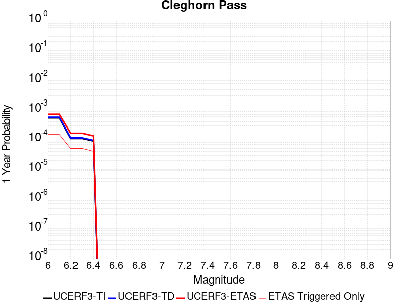 |  |

| Magnitude | 1 wk TI Prob | 1 wk TD Prob | 1 wk ETAS Prob | 1 wk ETAS/TD Gain | 1 wk ETAS Triggered Only | 1 mo TI Prob | 1 mo TD Prob | 1 mo ETAS Prob | 1 mo ETAS/TD Gain | 1 mo ETAS Triggered Only | 1 yr TI Prob | 1 yr TD Prob | 1 yr ETAS Prob | 1 yr ETAS/TD Gain | 1 yr ETAS Triggered Only | 10 yr TI Prob | 10 yr TD Prob | 10 yr ETAS Prob | 10 yr ETAS/TD Gain | 10 yr ETAS Triggered Only |
|-----|-----|-----|-----|-----|-----|-----|-----|-----|-----|-----|-----|-----|-----|-----|-----|-----|-----|-----|-----|-----|
| 6.0 | 1.0522846E-5 | 1.1040642E-5 | 8.103987E-5 | 7.3401413 | 7.0E-5 | 4.509713E-5 | 4.7316473E-5 | 1.3731222E-4 | 2.901996 | 9.0E-5 | 5.4891926E-4 | 5.759784E-4 | 7.25892E-4 | 1.2602764 | 1.5E-4 | 0.0054756533 | 0.005750022 | 0.0059786993 | 1.0397699 | 2.3E-4 |
| 6.1 | 1.0522846E-5 | 1.1040642E-5 | 8.103987E-5 | 7.3401413 | 7.0E-5 | 4.509713E-5 | 4.7316473E-5 | 1.3731222E-4 | 2.901996 | 9.0E-5 | 5.4891926E-4 | 5.759784E-4 | 7.25892E-4 | 1.2602764 | 1.5E-4 | 0.0054756533 | 0.005750022 | 0.0059786993 | 1.0397699 | 2.3E-4 |
| 6.2 | 2.1045846E-6 | 2.2082024E-6 | 3.2208136E-5 | 14.585681 | 3.0E-5 | 9.019617E-6 | 9.463714E-6 | 3.946343E-5 | 4.169973 | 3.0E-5 | 1.098083E-4 | 1.1521882E-4 | 1.6521306E-4 | 1.4339069 | 5.0E-5 | 0.0010975406 | 0.0011520023 | 0.0012319101 | 1.0693643 | 8.0E-5 |
| 6.3 | 2.1045846E-6 | 2.2082024E-6 | 3.2208136E-5 | 14.585681 | 3.0E-5 | 9.019617E-6 | 9.463714E-6 | 3.946343E-5 | 4.169973 | 3.0E-5 | 1.098083E-4 | 1.1521882E-4 | 1.6521306E-4 | 1.4339069 | 5.0E-5 | 0.0010975406 | 0.0011520023 | 0.0012319101 | 1.0693643 | 8.0E-5 |
| 6.4 | 1.7259927E-6 | 1.810877E-6 | 2.1810842E-5 | 12.044352 | 2.0E-5 | 7.3970905E-6 | 7.760902E-6 | 2.7760747E-5 | 3.5770001 | 2.0E-5 | 9.005586E-5 | 9.4488976E-5 | 1.344852E-4 | 1.4232898 | 4.0E-5 | 9.001937E-4 | 9.448898E-4 | 0.0010048331 | 1.0634395 | 6.0E-5 |

## Sierra Nevada  (No Extension)
*[(top)](#table-of-contents)*

| 1 Week | 1 Month | 1 Year | 10 Year |
|-----|-----|-----|-----|
|  |  |  |  |

| Magnitude | 1 wk TI Prob | 1 wk TD Prob | 1 wk ETAS Prob | 1 wk ETAS/TD Gain | 1 wk ETAS Triggered Only | 1 mo TI Prob | 1 mo TD Prob | 1 mo ETAS Prob | 1 mo ETAS/TD Gain | 1 mo ETAS Triggered Only | 1 yr TI Prob | 1 yr TD Prob | 1 yr ETAS Prob | 1 yr ETAS/TD Gain | 1 yr ETAS Triggered Only | 10 yr TI Prob | 10 yr TD Prob | 10 yr ETAS Prob | 10 yr ETAS/TD Gain | 10 yr ETAS Triggered Only |
|-----|-----|-----|-----|-----|-----|-----|-----|-----|-----|-----|-----|-----|-----|-----|-----|-----|-----|-----|-----|-----|
| 6.0 | 7.7690465E-6 | 6.976322E-6 | 9.6975695E-5 | 13.900691 | 9.0E-5 | 3.329549E-5 | 2.9898381E-5 | 1.6989419E-4 | 5.682388 | 1.4E-4 | 4.0529718E-4 | 3.6398784E-4 | 5.8390776E-4 | 1.6041958 | 2.2E-4 | 0.004045588 | 0.0036374326 | 0.0038865234 | 1.0684798 | 2.5E-4 |
| 6.1 | 7.7690465E-6 | 6.976322E-6 | 9.6975695E-5 | 13.900691 | 9.0E-5 | 3.329549E-5 | 2.9898381E-5 | 1.6989419E-4 | 5.682388 | 1.4E-4 | 4.0529718E-4 | 3.6398784E-4 | 5.8390776E-4 | 1.6041958 | 2.2E-4 | 0.004045588 | 0.0036374326 | 0.0038865234 | 1.0684798 | 2.5E-4 |
| 6.2 | 7.7690465E-6 | 6.976322E-6 | 9.6975695E-5 | 13.900691 | 9.0E-5 | 3.329549E-5 | 2.9898381E-5 | 1.6989419E-4 | 5.682388 | 1.4E-4 | 4.0529718E-4 | 3.6398784E-4 | 5.8390776E-4 | 1.6041958 | 2.2E-4 | 0.004045588 | 0.0036374326 | 0.0038865234 | 1.0684798 | 2.5E-4 |
| 6.3 | 7.7690465E-6 | 6.976322E-6 | 9.6975695E-5 | 13.900691 | 9.0E-5 | 3.329549E-5 | 2.9898381E-5 | 1.6989419E-4 | 5.682388 | 1.4E-4 | 4.0529718E-4 | 3.6398784E-4 | 5.8390776E-4 | 1.6041958 | 2.2E-4 | 0.004045588 | 0.0036374326 | 0.0038865234 | 1.0684798 | 2.5E-4 |
| 6.4 | 7.7690465E-6 | 6.976322E-6 | 9.6975695E-5 | 13.900691 | 9.0E-5 | 3.329549E-5 | 2.9898381E-5 | 1.6989419E-4 | 5.682388 | 1.4E-4 | 4.0529718E-4 | 3.6398784E-4 | 5.8390776E-4 | 1.6041958 | 2.2E-4 | 0.004045588 | 0.0036374326 | 0.0038865234 | 1.0684798 | 2.5E-4 |
| 6.5 | 7.7690465E-6 | 6.976322E-6 | 9.6975695E-5 | 13.900691 | 9.0E-5 | 3.329549E-5 | 2.9898381E-5 | 1.6989419E-4 | 5.682388 | 1.4E-4 | 4.0529718E-4 | 3.6398784E-4 | 5.8390776E-4 | 1.6041958 | 2.2E-4 | 0.004045588 | 0.0036374326 | 0.0038865234 | 1.0684798 | 2.5E-4 |
| 6.6 | 2.653E-6 | 1.614854E-6 | 7.161474E-5 | 44.347504 | 7.0E-5 | 1.136995E-5 | 6.9207845E-6 | 1.06920095E-4 | 15.449129 | 1.0E-4 | 1.3842035E-4 | 8.425733E-5 | 2.6424218E-4 | 3.1361327 | 1.8E-4 | 0.0013833415 | 8.422573E-4 | 0.0010520804 | 1.24912 | 2.1E-4 |
| 6.7 | 2.5902466E-6 | 1.5501876E-6 | 7.155008E-5 | 46.155758 | 7.0E-5 | 1.11010095E-5 | 6.643644E-6 | 1.0664298E-4 | 16.05188 | 1.0E-4 | 1.351464E-4 | 8.0883394E-5 | 2.6086884E-4 | 3.225246 | 1.8E-4 | 0.0013506424 | 8.0854254E-4 | 0.0010183727 | 1.2595166 | 2.1E-4 |
| 6.8 | 2.5853892E-6 | 1.5469877E-6 | 7.154688E-5 | 46.249157 | 7.0E-5 | 1.1080193E-5 | 6.629931E-6 | 1.0662927E-4 | 16.083014 | 1.0E-4 | 1.34893E-4 | 8.071645E-5 | 2.6070193E-4 | 3.2298489 | 1.8E-4 | 0.0013481114 | 8.068743E-4 | 0.0010167048 | 1.2600536 | 2.1E-4 |
| 6.9 | 2.458257E-6 | 1.4220619E-6 | 7.1421964E-5 | 50.224228 | 7.0E-5 | 1.0535345E-5 | 6.094537E-6 | 1.06093925E-4 | 17.408037 | 1.0E-4 | 1.2826028E-4 | 7.4198484E-5 | 2.541851E-4 | 3.4257455 | 1.8E-4 | 0.0012818627 | 7.4173906E-4 | 9.515833E-4 | 1.2829084 | 2.1E-4 |
| 7.0 | 2.4341468E-6 | 1.3990258E-6 | 7.139893E-5 | 51.034744 | 7.0E-5 | 1.0432016E-5 | 5.9958115E-6 | 1.0599521E-4 | 17.67821 | 1.0E-4 | 1.270024E-4 | 7.2996576E-5 | 2.5298345E-4 | 3.4656892 | 1.8E-4 | 0.0012692984 | 7.297279E-4 | 9.395747E-4 | 1.2875684 | 2.1E-4 |
| 7.1 | 2.3652476E-6 | 1.3339754E-6 | 7.133388E-5 | 53.47466 | 7.0E-5 | 1.0136736E-5 | 5.717025E-6 | 1.05716455E-4 | 18.491514 | 1.0E-4 | 1.2340778E-4 | 6.9602575E-5 | 2.4959006E-4 | 3.5859313 | 1.8E-4 | 0.0012333926 | 6.9580943E-4 | 9.0566336E-4 | 1.3015968 | 2.1E-4 |
| 7.2 | 2.272158E-6 | 1.2502821E-6 | 7.125019E-5 | 56.987293 | 7.0E-5 | 9.737784E-6 | 5.3583412E-6 | 1.053578E-4 | 19.662392 | 1.0E-4 | 1.1855107E-4 | 6.5235865E-5 | 2.3522477E-4 | 3.6057584 | 1.7E-4 | 0.0011848784 | 6.5216864E-4 | 8.520382E-4 | 1.3064691 | 2.0E-4 |
| 7.3 | 2.1382127E-6 | 1.1419703E-6 | 7.114189E-5 | 62.297497 | 7.0E-5 | 9.163737E-6 | 4.8941492E-6 | 1.0489366E-4 | 21.43246 | 1.0E-4 | 1.1156279E-4 | 5.958465E-5 | 2.2957452E-4 | 3.8529139 | 1.7E-4 | 0.001115068 | 5.956879E-4 | 7.9556875E-4 | 1.3355463 | 2.0E-4 |
| 7.4 | 1.9048055E-6 | 9.575242E-7 | 6.0957467E-5 | 63.661537 | 6.0E-5 | 8.163426E-6 | 4.1036687E-6 | 9.41033E-5 | 22.931503 | 9.0E-5 | 9.9385186E-5 | 4.996103E-5 | 2.0995304E-4 | 4.202336 | 1.6E-4 | 9.934074E-4 | 4.994987E-4 | 6.794088E-4 | 1.3601813 | 1.8E-4 |
| 7.5 | 1.5373403E-6 | 7.560042E-7 | 5.0755967E-5 | 67.137146 | 5.0E-5 | 6.5885843E-6 | 3.2400142E-6 | 8.3239756E-5 | 25.69117 | 8.0E-5 | 8.021306E-5 | 3.9446462E-5 | 1.6944134E-4 | 4.295476 | 1.3E-4 | 8.0184115E-4 | 3.943951E-4 | 5.3433987E-4 | 1.354834 | 1.4E-4 |
| 7.6 | 1.0680322E-6 | 4.6596554E-7 | 2.0465955E-5 | 43.921608 | 2.0E-5 | 4.577273E-6 | 1.9969937E-6 | 4.1996915E-5 | 21.03007 | 4.0E-5 | 5.5726876E-5 | 2.4313129E-5 | 9.431143E-5 | 3.8790329 | 7.0E-5 | 5.5712904E-4 | 2.4310495E-4 | 3.2308552E-4 | 1.328996 | 8.0E-5 |
| 7.7 | 5.509146E-7 | 1.5580486E-7 | 1.5580486E-7 | 1.0 | 0.0 | 2.3610605E-6 | 6.677349E-7 | 6.677349E-7 | 1.0 | 0.0 | 2.8745531E-5 | 8.129644E-6 | 8.129644E-6 | 1.0 | 0.0 | 2.8741814E-4 | 8.1293576E-5 | 8.1293576E-5 | 1.0 | 0.0 |

## San Jacinto (San Bernardino)
*[(top)](#table-of-contents)*

| 1 Week | 1 Month | 1 Year | 10 Year |
|-----|-----|-----|-----|
| 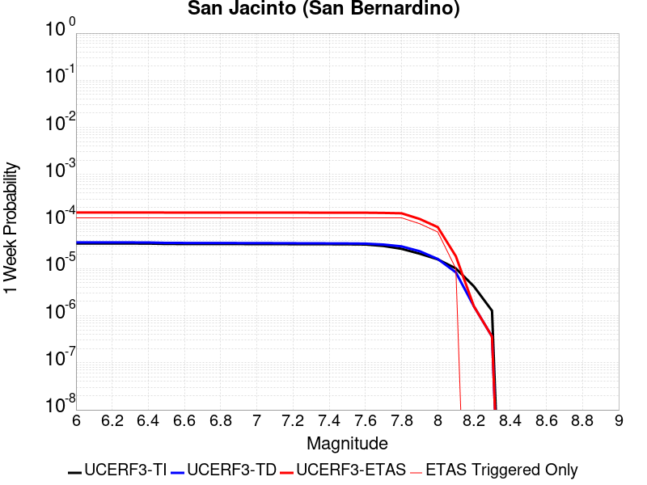 |  |  |  |

| Magnitude | 1 wk TI Prob | 1 wk TD Prob | 1 wk ETAS Prob | 1 wk ETAS/TD Gain | 1 wk ETAS Triggered Only | 1 mo TI Prob | 1 mo TD Prob | 1 mo ETAS Prob | 1 mo ETAS/TD Gain | 1 mo ETAS Triggered Only | 1 yr TI Prob | 1 yr TD Prob | 1 yr ETAS Prob | 1 yr ETAS/TD Gain | 1 yr ETAS Triggered Only | 10 yr TI Prob | 10 yr TD Prob | 10 yr ETAS Prob | 10 yr ETAS/TD Gain | 10 yr ETAS Triggered Only |
|-----|-----|-----|-----|-----|-----|-----|-----|-----|-----|-----|-----|-----|-----|-----|-----|-----|-----|-----|-----|-----|
| 6.0 | 3.409352E-5 | 3.5986508E-5 | 1.559822E-4 | 4.334463 | 1.2E-4 | 1.461069E-4 | 1.542188E-4 | 2.941972E-4 | 1.9076612 | 1.4E-4 | 0.0017774 | 0.0018759987 | 0.0021055671 | 1.1223713 | 2.3E-4 | 0.01763251 | 0.019349935 | 0.019604905 | 1.0131767 | 2.6E-4 |
| 6.1 | 3.409352E-5 | 3.5986508E-5 | 1.559822E-4 | 4.334463 | 1.2E-4 | 1.461069E-4 | 1.542188E-4 | 2.941972E-4 | 1.9076612 | 1.4E-4 | 0.0017774 | 0.0018759987 | 0.0021055671 | 1.1223713 | 2.3E-4 | 0.01763251 | 0.019349935 | 0.019604905 | 1.0131767 | 2.6E-4 |
| 6.2 | 3.409352E-5 | 3.5986508E-5 | 1.559822E-4 | 4.334463 | 1.2E-4 | 1.461069E-4 | 1.542188E-4 | 2.941972E-4 | 1.9076612 | 1.4E-4 | 0.0017774 | 0.0018759987 | 0.0021055671 | 1.1223713 | 2.3E-4 | 0.01763251 | 0.019349935 | 0.019604905 | 1.0131767 | 2.6E-4 |
| 6.3 | 3.409352E-5 | 3.5986508E-5 | 1.559822E-4 | 4.334463 | 1.2E-4 | 1.461069E-4 | 1.542188E-4 | 2.941972E-4 | 1.9076612 | 1.4E-4 | 0.0017774 | 0.0018759987 | 0.0021055671 | 1.1223713 | 2.3E-4 | 0.01763251 | 0.019349935 | 0.019604905 | 1.0131767 | 2.6E-4 |
| 6.4 | 3.400795E-5 | 3.5879173E-5 | 1.5587486E-4 | 4.3444386 | 1.2E-4 | 1.4574021E-4 | 1.5375883E-4 | 2.937373E-4 | 1.9103768 | 1.4E-4 | 0.0017729428 | 0.0018704084 | 0.0020999783 | 1.1227378 | 2.3E-4 | 0.017588645 | 0.019295016 | 0.01955 | 1.013215 | 2.6E-4 |
| 6.5 | 3.341482E-5 | 3.5139812E-5 | 1.551356E-4 | 4.41481 | 1.2E-4 | 1.4319851E-4 | 1.5059051E-4 | 2.905694E-4 | 1.9295335 | 1.4E-4 | 0.0017420477 | 0.0018318989 | 0.002051496 | 1.119874 | 2.2E-4 | 0.017284546 | 0.018916558 | 0.01916183 | 1.0129659 | 2.5E-4 |
| 6.6 | 3.3364955E-5 | 3.5077028E-5 | 1.5507282E-4 | 4.4209223 | 1.2E-4 | 1.4298483E-4 | 1.5032147E-4 | 2.9030044E-4 | 1.9311973 | 1.4E-4 | 0.0017394501 | 0.001828629 | 0.0020482268 | 1.1200887 | 2.2E-4 | 0.017258976 | 0.018884424 | 0.019129703 | 1.0129884 | 2.5E-4 |
| 6.7 | 3.335922E-5 | 3.5066805E-5 | 1.5506259E-4 | 4.42192 | 1.2E-4 | 1.4296026E-4 | 1.5027766E-4 | 2.902566E-4 | 1.931469 | 1.4E-4 | 0.0017391514 | 0.0018280965 | 0.0020476943 | 1.1201237 | 2.2E-4 | 0.017256035 | 0.018879214 | 0.019124495 | 1.012992 | 2.5E-4 |
| 6.8 | 3.327683E-5 | 3.496087E-5 | 1.5495668E-4 | 4.432289 | 1.2E-4 | 1.4260718E-4 | 1.498237E-4 | 2.8980273E-4 | 1.9342916 | 1.4E-4 | 0.0017348597 | 0.0018225788 | 0.0020421778 | 1.120488 | 2.2E-4 | 0.017213784 | 0.018824987 | 0.01907028 | 1.0130302 | 2.5E-4 |
| 6.9 | 3.3235785E-5 | 3.4901823E-5 | 1.5489763E-4 | 4.4380956 | 1.2E-4 | 1.4243131E-4 | 1.4957068E-4 | 2.8954973E-4 | 1.9358723 | 1.4E-4 | 0.0017327217 | 0.0018195034 | 0.002039103 | 1.1206921 | 2.2E-4 | 0.017192734 | 0.018794855 | 0.019040156 | 1.0130515 | 2.5E-4 |
| 7.0 | 3.3197095E-5 | 3.4841752E-5 | 1.5483757E-4 | 4.4440236 | 1.2E-4 | 1.422655E-4 | 1.4931326E-4 | 2.8929237E-4 | 1.937486 | 1.4E-4 | 0.0017307063 | 0.0018163746 | 0.002035975 | 1.1209004 | 2.2E-4 | 0.017172894 | 0.018764233 | 0.019009542 | 1.0130732 | 2.5E-4 |
| 7.1 | 3.3129716E-5 | 3.4721965E-5 | 1.547178E-4 | 4.4559054 | 1.2E-4 | 1.4197677E-4 | 1.4879994E-4 | 2.8877912E-4 | 1.9407206 | 1.4E-4 | 0.0017271966 | 0.0018101353 | 0.0020297372 | 1.1213179 | 2.2E-4 | 0.017138338 | 0.018703312 | 0.018948637 | 1.0131166 | 2.5E-4 |
| 7.2 | 3.3034008E-5 | 3.458941E-5 | 1.5458526E-4 | 4.4691496 | 1.2E-4 | 1.4156665E-4 | 1.4823192E-4 | 2.8821116E-4 | 1.9443259 | 1.4E-4 | 0.0017222111 | 0.0018032312 | 0.0020228345 | 1.1217833 | 2.2E-4 | 0.017089253 | 0.018635705 | 0.018881045 | 1.0131651 | 2.5E-4 |
| 7.3 | 3.2956614E-5 | 3.445717E-5 | 1.5445304E-4 | 4.4824643 | 1.2E-4 | 1.4123498E-4 | 1.4766524E-4 | 2.8764457E-4 | 1.9479505 | 1.4E-4 | 0.0017181796 | 0.0017963431 | 0.002015948 | 1.122251 | 2.2E-4 | 0.017049557 | 0.018568452 | 0.018813811 | 1.0132138 | 2.5E-4 |
| 7.4 | 3.2915937E-5 | 3.4378863E-5 | 1.5437473E-4 | 4.4903965 | 1.2E-4 | 1.4106068E-4 | 1.4732967E-4 | 2.8730906E-4 | 1.9501098 | 1.4E-4 | 0.0017160608 | 0.0017922645 | 0.0020118703 | 1.1225297 | 2.2E-4 | 0.017028693 | 0.018528719 | 0.018774087 | 1.0132426 | 2.5E-4 |
| 7.5 | 3.281791E-5 | 3.4243778E-5 | 1.5423966E-4 | 4.504166 | 1.2E-4 | 1.406406E-4 | 1.4675081E-4 | 2.8673027E-4 | 1.9538581 | 1.4E-4 | 0.0017109542 | 0.0017852283 | 0.0020048355 | 1.1230135 | 2.2E-4 | 0.016978411 | 0.018459605 | 0.01870499 | 1.013293 | 2.5E-4 |
| 7.6 | 3.2521442E-5 | 3.396873E-5 | 1.5396465E-4 | 4.532541 | 1.2E-4 | 1.3937015E-4 | 1.4557215E-4 | 2.8555177E-4 | 1.9615824 | 1.4E-4 | 0.0016955109 | 0.0017709016 | 0.001990512 | 1.1240104 | 2.2E-4 | 0.016826328 | 0.018317232 | 0.018562654 | 1.0133984 | 2.5E-4 |
| 7.7 | 3.0287873E-5 | 3.245276E-5 | 1.5244886E-4 | 4.697562 | 1.2E-4 | 1.297987E-4 | 1.3907586E-4 | 2.790564E-4 | 2.0065048 | 1.4E-4 | 0.0015791537 | 0.0016919347 | 0.0019115624 | 1.1298087 | 2.2E-4 | 0.01567979 | 0.01752809 | 0.017773708 | 1.0140128 | 2.5E-4 |
| 7.8 | 2.6316151E-5 | 2.9663592E-5 | 1.4966003E-4 | 5.0452433 | 1.2E-4 | 1.1277862E-4 | 1.2712348E-4 | 2.671057E-4 | 2.1011515 | 1.4E-4 | 0.0013722149 | 0.0015466306 | 0.0017662903 | 1.1420248 | 2.2E-4 | 0.013637724 | 0.016069634 | 0.016315617 | 1.0153073 | 2.5E-4 |
| 7.9 | 2.0761147E-5 | 2.34181E-5 | 1.1341599E-4 | 4.843091 | 9.0E-5 | 8.897331E-5 | 1.0035944E-4 | 2.003494E-4 | 1.9963186 | 1.0E-4 | 0.0010827117 | 0.0012211921 | 0.0014009723 | 1.1472169 | 1.8E-4 | 0.010774517 | 0.012793174 | 0.012990615 | 1.0154333 | 2.0E-4 |
| 8.0 | 1.5738568E-5 | 1.6033575E-5 | 7.6032615E-5 | 4.7420874 | 6.0E-5 | 6.744926E-5 | 6.871352E-5 | 1.3870871E-4 | 2.0186524 | 7.0E-5 | 8.2088535E-4 | 8.3626667E-4 | 9.4617467E-4 | 1.131427 | 1.1E-4 | 0.008178596 | 0.008865921 | 0.008984856 | 1.013415 | 1.2E-4 |
| 8.1 | 1.0105832E-5 | 8.3304985E-6 | 1.8330415E-5 | 2.2003984 | 1.0E-5 | 4.3309992E-5 | 3.570165E-5 | 4.5701294E-5 | 1.2800891 | 1.0E-5 | 5.2717153E-4 | 4.345814E-4 | 4.545727E-4 | 1.0460013 | 2.0E-5 | 0.005259227 | 0.004677232 | 0.0046971384 | 1.004256 | 2.0E-5 |
| 8.2 | 4.189207E-6 | 1.5784357E-6 | 1.5784357E-6 | 1.0 | 0.0 | 1.7953622E-5 | 6.7647065E-6 | 6.7647065E-6 | 1.0 | 0.0 | 2.1856341E-4 | 8.235722E-5 | 8.235722E-5 | 1.0 | 0.0 | 0.0021834858 | 9.565867E-4 | 9.565867E-4 | 1.0 | 0.0 |
| 8.3 | 1.2758221E-6 | 3.6149942E-7 | 3.6149942E-7 | 1.0 | 0.0 | 5.4677976E-6 | 1.5492824E-6 | 1.5492824E-6 | 1.0 | 0.0 | 6.65684E-5 | 1.8862354E-5 | 1.8862354E-5 | 1.0 | 0.0 | 6.6548464E-4 | 2.2751294E-4 | 2.2751294E-4 | 1.0 | 0.0 |

## Manix-Afton Hills
*[(top)](#table-of-contents)*

| 1 Week | 1 Month | 1 Year | 10 Year |
|-----|-----|-----|-----|
|  |  |  |  |

| Magnitude | 1 wk TI Prob | 1 wk TD Prob | 1 wk ETAS Prob | 1 wk ETAS/TD Gain | 1 wk ETAS Triggered Only | 1 mo TI Prob | 1 mo TD Prob | 1 mo ETAS Prob | 1 mo ETAS/TD Gain | 1 mo ETAS Triggered Only | 1 yr TI Prob | 1 yr TD Prob | 1 yr ETAS Prob | 1 yr ETAS/TD Gain | 1 yr ETAS Triggered Only | 10 yr TI Prob | 10 yr TD Prob | 10 yr ETAS Prob | 10 yr ETAS/TD Gain | 10 yr ETAS Triggered Only |
|-----|-----|-----|-----|-----|-----|-----|-----|-----|-----|-----|-----|-----|-----|-----|-----|-----|-----|-----|-----|-----|
| 6.0 | 1.3783202E-5 | 1.47110895E-5 | 1.1470962E-4 | 7.797493 | 1.0E-4 | 5.906953E-5 | 6.30461E-5 | 1.8303854E-4 | 2.903249 | 1.2E-4 | 7.189342E-4 | 7.6733343E-4 | 9.771723E-4 | 1.273465 | 2.1E-4 | 0.0071661277 | 0.007648596 | 0.00788676 | 1.0311383 | 2.4E-4 |
| 6.1 | 1.3783202E-5 | 1.47110895E-5 | 1.1470962E-4 | 7.797493 | 1.0E-4 | 5.906953E-5 | 6.30461E-5 | 1.8303854E-4 | 2.903249 | 1.2E-4 | 7.189342E-4 | 7.6733343E-4 | 9.771723E-4 | 1.273465 | 2.1E-4 | 0.0071661277 | 0.007648596 | 0.00788676 | 1.0311383 | 2.4E-4 |
| 6.2 | 1.3783202E-5 | 1.47110895E-5 | 1.1470962E-4 | 7.797493 | 1.0E-4 | 5.906953E-5 | 6.30461E-5 | 1.8303854E-4 | 2.903249 | 1.2E-4 | 7.189342E-4 | 7.6733343E-4 | 9.771723E-4 | 1.273465 | 2.1E-4 | 0.0071661277 | 0.007648596 | 0.00788676 | 1.0311383 | 2.4E-4 |
| 6.3 | 1.10494875E-5 | 1.1793136E-5 | 5.1792664E-5 | 4.3917637 | 4.0E-5 | 4.7354086E-5 | 5.054109E-5 | 1.1053806E-4 | 2.1870928 | 6.0E-5 | 5.763835E-4 | 6.151744E-4 | 7.4509444E-4 | 1.2111921 | 1.3E-4 | 0.005748908 | 0.0061357557 | 0.0062848353 | 1.0242969 | 1.5E-4 |
| 6.4 | 1.10494875E-5 | 1.1793136E-5 | 5.1792664E-5 | 4.3917637 | 4.0E-5 | 4.7354086E-5 | 5.054109E-5 | 1.1053806E-4 | 2.1870928 | 6.0E-5 | 5.763835E-4 | 6.151744E-4 | 7.4509444E-4 | 1.2111921 | 1.3E-4 | 0.005748908 | 0.0061357557 | 0.0062848353 | 1.0242969 | 1.5E-4 |
| 6.5 | 9.788949E-6 | 1.045432E-5 | 4.0454004E-5 | 3.8695972 | 3.0E-5 | 4.1951964E-5 | 4.480351E-5 | 9.480127E-5 | 2.115934 | 5.0E-5 | 5.1064545E-4 | 5.453555E-4 | 6.552955E-4 | 1.2015933 | 1.1E-4 | 0.0050947363 | 0.0054410985 | 0.005570391 | 1.0237622 | 1.3E-4 |
| 6.6 | 8.810006E-6 | 9.4136285E-6 | 3.9413346E-5 | 4.186839 | 3.0E-5 | 3.775662E-5 | 4.0343548E-5 | 8.034193E-5 | 1.9914445 | 4.0E-5 | 4.5958988E-4 | 4.9108086E-4 | 5.9103174E-4 | 1.2035325 | 1.0E-4 | 0.0045864056 | 0.004900839 | 0.0050103 | 1.0223352 | 1.1E-4 |
| 6.7 | 8.80128E-6 | 9.404108E-6 | 3.9403825E-5 | 4.1900654 | 3.0E-5 | 3.7719226E-5 | 4.0302748E-5 | 8.0301135E-5 | 1.9924482 | 4.0E-5 | 4.591348E-4 | 4.9058435E-4 | 5.905353E-4 | 1.2037386 | 1.0E-4 | 0.004581874 | 0.0048958957 | 0.0050053573 | 1.0223578 | 1.1E-4 |
| 6.8 | 6.8994877E-6 | 7.380076E-6 | 2.7379929E-5 | 3.7099793 | 2.0E-5 | 2.9568899E-5 | 3.162856E-5 | 6.162761E-5 | 1.9484799 | 3.0E-5 | 3.5994186E-4 | 3.8501783E-4 | 4.549909E-4 | 1.1817398 | 7.0E-5 | 0.003593594 | 0.0038443129 | 0.003924005 | 1.02073 | 8.0E-5 |
| 6.9 | 4.9328037E-6 | 5.2709615E-6 | 2.5270856E-5 | 4.794354 | 2.0E-5 | 2.1140417E-5 | 2.2589675E-5 | 5.2588995E-5 | 2.3280103 | 3.0E-5 | 2.5735417E-4 | 2.7500073E-4 | 3.4498147E-4 | 1.2544748 | 7.0E-5 | 0.0025705635 | 0.0027472095 | 0.0028170173 | 1.0254104 | 7.0E-5 |
| 7.0 | 3.347973E-6 | 3.59003E-6 | 2.3589959E-5 | 6.5709643 | 2.0E-5 | 1.4348378E-5 | 1.5385775E-5 | 4.5385314E-5 | 2.949823 | 3.0E-5 | 1.746775E-4 | 1.8730981E-4 | 2.2730233E-4 | 1.2135099 | 4.0E-5 | 0.0017454025 | 0.0018719219 | 0.001911847 | 1.0213284 | 4.0E-5 |
| 7.1 | 1.2073567E-6 | 1.293482E-6 | 1.12934695E-5 | 8.73106 | 1.0E-5 | 5.1743755E-6 | 5.543492E-6 | 2.554338E-5 | 4.6078143 | 2.0E-5 | 6.29962E-5 | 6.749156E-5 | 8.749021E-5 | 1.2963134 | 2.0E-5 | 6.297835E-4 | 6.7487074E-4 | 6.9485727E-4 | 1.0296153 | 2.0E-5 |

## San Andreas (Creeping Section) 2011 CFM
*[(top)](#table-of-contents)*

| 1 Week | 1 Month | 1 Year | 10 Year |
|-----|-----|-----|-----|
|  |  |  | 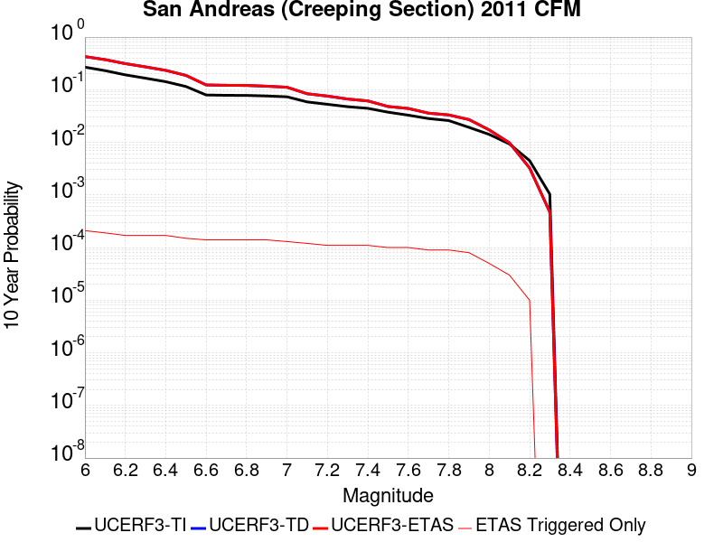 |

| Magnitude | 1 wk TI Prob | 1 wk TD Prob | 1 wk ETAS Prob | 1 wk ETAS/TD Gain | 1 wk ETAS Triggered Only | 1 mo TI Prob | 1 mo TD Prob | 1 mo ETAS Prob | 1 mo ETAS/TD Gain | 1 mo ETAS Triggered Only | 1 yr TI Prob | 1 yr TD Prob | 1 yr ETAS Prob | 1 yr ETAS/TD Gain | 1 yr ETAS Triggered Only | 10 yr TI Prob | 10 yr TD Prob | 10 yr ETAS Prob | 10 yr ETAS/TD Gain | 10 yr ETAS Triggered Only |
|-----|-----|-----|-----|-----|-----|-----|-----|-----|-----|-----|-----|-----|-----|-----|-----|-----|-----|-----|-----|-----|
| 6.0 | 5.986481E-4 | 0.001228691 | 0.0013185804 | 1.0731587 | 9.0E-5 | 0.0025631124 | 0.005246795 | 0.005366165 | 1.0227511 | 1.2E-4 | 0.030762846 | 0.061203245 | 0.061362844 | 1.0026076 | 1.7E-4 | 0.26835477 | 0.425928 | 0.42604855 | 1.000283 | 2.1E-4 |
| 6.1 | 5.015945E-4 | 0.0010230356 | 0.0011029538 | 1.0781187 | 8.0E-5 | 0.00214792 | 0.004369436 | 0.004478955 | 1.0250648 | 1.1E-4 | 0.025839351 | 0.051246606 | 0.051398408 | 1.0029621 | 1.6E-4 | 0.23032776 | 0.37284943 | 0.3729686 | 1.0003196 | 1.9E-4 |
| 6.2 | 4.073338E-4 | 8.1157376E-4 | 8.815169E-4 | 1.0861821 | 7.0E-5 | 0.0017445484 | 0.0034683137 | 0.0035580015 | 1.0258592 | 9.0E-5 | 0.021034058 | 0.04093177 | 0.04106604 | 1.0032803 | 1.4E-4 | 0.19150782 | 0.31302592 | 0.3131427 | 1.0003731 | 1.7E-4 |
| 6.3 | 3.464099E-4 | 6.7455834E-4 | 7.4451114E-4 | 1.1037016 | 7.0E-5 | 0.0014837692 | 0.0028832308 | 0.0029729714 | 1.031125 | 9.0E-5 | 0.017915873 | 0.034187846 | 0.03432306 | 1.003955 | 1.4E-4 | 0.16538359 | 0.27130842 | 0.27143228 | 1.0004566 | 1.7E-4 |
| 6.4 | 2.935057E-4 | 5.5516965E-4 | 6.251308E-4 | 1.1260176 | 7.0E-5 | 0.0012572751 | 0.0023727308 | 0.0024625172 | 1.037841 | 9.0E-5 | 0.015200248 | 0.02826279 | 0.028398834 | 1.0048136 | 1.4E-4 | 0.14201577 | 0.23297668 | 0.23310706 | 1.0005597 | 1.7E-4 |
| 6.5 | 2.3409708E-4 | 4.2132285E-4 | 4.8129758E-4 | 1.1423486 | 6.0E-5 | 0.0010028875 | 0.0018017791 | 0.001881635 | 1.0443206 | 8.0E-5 | 0.012141965 | 0.021586355 | 0.021703765 | 1.005439 | 1.2E-4 | 0.11499573 | 0.1868149 | 0.18693689 | 1.0006529 | 1.5E-4 |
| 6.6 | 1.5842178E-4 | 2.5068692E-4 | 3.1067187E-4 | 1.2392824 | 6.0E-5 | 6.7877385E-4 | 0.0010739256 | 0.0011438504 | 1.0651114 | 7.0E-5 | 0.0082328 | 0.012995283 | 0.013103854 | 1.0083547 | 1.1E-4 | 0.07934396 | 0.12313759 | 0.12326036 | 1.000997 | 1.4E-4 |
| 6.7 | 1.5616413E-4 | 2.4605254E-4 | 3.0603778E-4 | 1.2437904 | 6.0E-5 | 6.691031E-4 | 0.0010540807 | 0.0011240068 | 1.0663385 | 7.0E-5 | 0.0081159435 | 0.012757154 | 0.012865751 | 1.0085126 | 1.1E-4 | 0.0782586 | 0.12116472 | 0.121287756 | 1.0010154 | 1.4E-4 |
| 6.8 | 1.5538467E-4 | 2.442914E-4 | 3.0427676E-4 | 1.2455482 | 6.0E-5 | 6.6576427E-4 | 0.001046539 | 0.0011164658 | 1.0668172 | 7.0E-5 | 0.008075596 | 0.012666538 | 0.012775145 | 1.0085742 | 1.1E-4 | 0.07788358 | 0.12039561 | 0.12051875 | 1.0010228 | 1.4E-4 |
| 6.9 | 1.5153569E-4 | 2.3538464E-4 | 2.953705E-4 | 1.2548419 | 6.0E-5 | 6.49277E-4 | 0.0010084033 | 0.0010783328 | 1.0693467 | 7.0E-5 | 0.007876333 | 0.012208726 | 0.012317384 | 1.0088999 | 1.1E-4 | 0.07602952 | 0.11646574 | 0.116589434 | 1.001062 | 1.4E-4 |
| 7.0 | 1.4588932E-4 | 2.2395732E-4 | 2.7394612E-4 | 1.2232069 | 5.0E-5 | 6.250901E-4 | 9.59466E-4 | 0.0010194085 | 1.0624747 | 6.0E-5 | 0.0075839474 | 0.011619428 | 0.011718266 | 1.0085063 | 1.0E-4 | 0.073302895 | 0.11131206 | 0.11142759 | 1.0010378 | 1.3E-4 |
| 7.1 | 1.1565079E-4 | 1.6281323E-4 | 2.1280508E-4 | 1.3070503 | 5.0E-5 | 4.955521E-4 | 6.9758523E-4 | 7.5754337E-4 | 1.085951 | 6.0E-5 | 0.006016669 | 0.008460228 | 0.008549467 | 1.010548 | 9.0E-5 | 0.058563538 | 0.08366478 | 0.083774745 | 1.0013143 | 1.2E-4 |
| 7.2 | 1.0393792E-4 | 1.4615392E-4 | 1.8614807E-4 | 1.2736441 | 4.0E-5 | 4.4537216E-4 | 6.262243E-4 | 6.7619304E-4 | 1.0797936 | 5.0E-5 | 0.005408933 | 0.0075977976 | 0.00767719 | 1.0104494 | 8.0E-5 | 0.052791595 | 0.07561503 | 0.07571672 | 1.0013447 | 1.1E-4 |
| 7.3 | 9.332884E-5 | 1.2780601E-4 | 1.6780088E-4 | 1.3129344 | 4.0E-5 | 3.999194E-4 | 5.4762565E-4 | 5.9759826E-4 | 1.0912533 | 5.0E-5 | 0.0048581534 | 0.0066470946 | 0.0067265625 | 1.0119554 | 8.0E-5 | 0.047533102 | 0.06647954 | 0.06658223 | 1.0015446 | 1.1E-4 |
| 7.4 | 8.670252E-5 | 1.1702972E-4 | 1.5702503E-4 | 1.3417535 | 4.0E-5 | 3.715293E-4 | 5.014601E-4 | 5.5143505E-4 | 1.0996588 | 5.0E-5 | 0.004513991 | 0.0060883067 | 0.0061678197 | 1.01306 | 8.0E-5 | 0.044233937 | 0.061148684 | 0.061251957 | 1.0016888 | 1.1E-4 |
| 7.5 | 7.3036405E-5 | 9.005699E-5 | 1.3005338E-4 | 1.4441233 | 4.0E-5 | 3.129756E-4 | 3.859015E-4 | 4.358822E-4 | 1.1295167 | 5.0E-5 | 0.0038038217 | 0.0046882504 | 0.004757922 | 1.014861 | 7.0E-5 | 0.03739367 | 0.047875606 | 0.04797082 | 1.0019888 | 1.0E-4 |
| 7.6 | 6.3935775E-5 | 8.280209E-5 | 1.2279878E-4 | 1.4830396 | 4.0E-5 | 2.7398168E-4 | 3.5481792E-4 | 4.0480017E-4 | 1.1408674 | 5.0E-5 | 0.0033306254 | 0.00431137 | 0.004381068 | 1.0161661 | 7.0E-5 | 0.032811474 | 0.043990135 | 0.044085737 | 1.0021732 | 1.0E-4 |
| 7.7 | 5.5050095E-5 | 6.661729E-5 | 1.0661463E-4 | 1.6004047 | 4.0E-5 | 2.3590765E-4 | 2.8547147E-4 | 3.3545718E-4 | 1.1750989 | 5.0E-5 | 0.0028683927 | 0.0034700802 | 0.0035398372 | 1.0201025 | 7.0E-5 | 0.0283165 | 0.03579509 | 0.035881866 | 1.0024244 | 9.0E-5 |
| 7.8 | 5.027131E-5 | 6.1627725E-5 | 1.0162526E-4 | 1.6490185 | 4.0E-5 | 2.1543067E-4 | 2.640921E-4 | 3.1407888E-4 | 1.1892779 | 5.0E-5 | 0.0026197135 | 0.003210584 | 0.003280359 | 1.0217329 | 7.0E-5 | 0.025890453 | 0.03312572 | 0.03321274 | 1.0026269 | 9.0E-5 |
| 7.9 | 3.7271806E-5 | 5.0224386E-5 | 9.022238E-5 | 1.7963859 | 4.0E-5 | 1.5972654E-4 | 2.1522962E-4 | 2.6521887E-4 | 1.23226 | 5.0E-5 | 0.0019429359 | 0.0026172737 | 0.0026870905 | 1.0266753 | 7.0E-5 | 0.019260362 | 0.027066687 | 0.027144521 | 1.0028757 | 8.0E-5 |
| 8.0 | 2.7310243E-5 | 3.1428404E-5 | 5.1427774E-5 | 1.636347 | 2.0E-5 | 1.17038646E-4 | 1.3468621E-4 | 1.6468218E-4 | 1.2227099 | 3.0E-5 | 0.0014240141 | 0.0016385721 | 0.0016785065 | 1.0243715 | 4.0E-5 | 0.014149235 | 0.01721387 | 0.017263008 | 1.0028546 | 5.0E-5 |
| 8.1 | 1.7940547E-5 | 1.7400796E-5 | 2.7400622E-5 | 1.5746764 | 1.0E-5 | 7.688579E-5 | 7.457271E-5 | 8.457197E-5 | 1.1340873 | 1.0E-5 | 9.3568244E-4 | 9.075451E-4 | 9.2752697E-4 | 1.0220175 | 2.0E-5 | 0.009317525 | 0.009799073 | 0.00982878 | 1.0030315 | 3.0E-5 |
| 8.2 | 8.643924E-6 | 5.4748625E-6 | 1.5474809E-5 | 2.82652 | 1.0E-5 | 3.704486E-5 | 2.3463486E-5 | 3.346325E-5 | 1.4261842 | 1.0E-5 | 4.5092785E-4 | 2.8563058E-4 | 2.9562772E-4 | 1.0350002 | 1.0E-5 | 0.0045001395 | 0.0032487072 | 0.0032586746 | 1.0030681 | 1.0E-5 |
| 8.3 | 1.983087E-6 | 7.6599065E-7 | 7.6599065E-7 | 1.0 | 0.0 | 8.498917E-6 | 3.282813E-6 | 3.282813E-6 | 1.0 | 0.0 | 1.034694E-4 | 3.9967534E-5 | 3.9967534E-5 | 1.0 | 0.0 | 0.0010342124 | 4.719687E-4 | 4.719687E-4 | 1.0 | 0.0 |

## San Andreas (North Branch Mill Creek)
*[(top)](#table-of-contents)*

| 1 Week | 1 Month | 1 Year | 10 Year |
|-----|-----|-----|-----|
|  |  |  |  |

| Magnitude | 1 wk TI Prob | 1 wk TD Prob | 1 wk ETAS Prob | 1 wk ETAS/TD Gain | 1 wk ETAS Triggered Only | 1 mo TI Prob | 1 mo TD Prob | 1 mo ETAS Prob | 1 mo ETAS/TD Gain | 1 mo ETAS Triggered Only | 1 yr TI Prob | 1 yr TD Prob | 1 yr ETAS Prob | 1 yr ETAS/TD Gain | 1 yr ETAS Triggered Only | 10 yr TI Prob | 10 yr TD Prob | 10 yr ETAS Prob | 10 yr ETAS/TD Gain | 10 yr ETAS Triggered Only |
|-----|-----|-----|-----|-----|-----|-----|-----|-----|-----|-----|-----|-----|-----|-----|-----|-----|-----|-----|-----|-----|
| 6.0 | 1.3461156E-5 | 2.3499893E-5 | 1.1349778E-4 | 4.829715 | 9.0E-5 | 5.7689394E-5 | 1.00709956E-4 | 1.907009E-4 | 1.8935654 | 9.0E-5 | 7.02142E-4 | 0.0012254574 | 0.0013453104 | 1.0978026 | 1.2E-4 | 0.0069992766 | 0.01222957 | 0.012456757 | 1.0185769 | 2.3E-4 |
| 6.1 | 1.3461156E-5 | 2.3499893E-5 | 1.1349778E-4 | 4.829715 | 9.0E-5 | 5.7689394E-5 | 1.00709956E-4 | 1.907009E-4 | 1.8935654 | 9.0E-5 | 7.02142E-4 | 0.0012254574 | 0.0013453104 | 1.0978026 | 1.2E-4 | 0.0069992766 | 0.01222957 | 0.012456757 | 1.0185769 | 2.3E-4 |
| 6.2 | 1.3461156E-5 | 2.3499893E-5 | 1.1349778E-4 | 4.829715 | 9.0E-5 | 5.7689394E-5 | 1.00709956E-4 | 1.907009E-4 | 1.8935654 | 9.0E-5 | 7.02142E-4 | 0.0012254574 | 0.0013453104 | 1.0978026 | 1.2E-4 | 0.0069992766 | 0.01222957 | 0.012456757 | 1.0185769 | 2.3E-4 |
| 6.3 | 1.3461156E-5 | 2.3499893E-5 | 1.1349778E-4 | 4.829715 | 9.0E-5 | 5.7689394E-5 | 1.00709956E-4 | 1.907009E-4 | 1.8935654 | 9.0E-5 | 7.02142E-4 | 0.0012254574 | 0.0013453104 | 1.0978026 | 1.2E-4 | 0.0069992766 | 0.01222957 | 0.012456757 | 1.0185769 | 2.3E-4 |
| 6.4 | 1.3461156E-5 | 2.3499893E-5 | 1.1349778E-4 | 4.829715 | 9.0E-5 | 5.7689394E-5 | 1.00709956E-4 | 1.907009E-4 | 1.8935654 | 9.0E-5 | 7.02142E-4 | 0.0012254574 | 0.0013453104 | 1.0978026 | 1.2E-4 | 0.0069992766 | 0.01222957 | 0.012456757 | 1.0185769 | 2.3E-4 |
| 6.5 | 1.3450706E-5 | 2.3488852E-5 | 1.1348674E-4 | 4.831515 | 9.0E-5 | 5.764461E-5 | 1.0066265E-4 | 1.9065359E-4 | 1.8939854 | 9.0E-5 | 7.0159714E-4 | 0.001224882 | 0.001344735 | 1.0978487 | 1.2E-4 | 0.006993862 | 0.01222388 | 0.0124510685 | 1.0185857 | 2.3E-4 |
| 6.6 | 1.3074523E-5 | 2.3103135E-5 | 1.1310106E-4 | 4.895485 | 9.0E-5 | 5.6032466E-5 | 9.9009696E-5 | 1.8900078E-4 | 1.9089118 | 9.0E-5 | 6.8198174E-4 | 0.0012047797 | 0.0013246351 | 1.0994833 | 1.2E-4 | 0.006798926 | 0.012025044 | 0.012252279 | 1.0188967 | 2.3E-4 |
| 6.7 | 1.3050216E-5 | 2.3078432E-5 | 1.13076356E-4 | 4.899655 | 9.0E-5 | 5.59283E-5 | 9.890384E-5 | 1.8889493E-4 | 1.9098848 | 9.0E-5 | 6.8071426E-4 | 0.0012034923 | 0.0013233478 | 1.0995898 | 1.2E-4 | 0.0067863287 | 0.012012309 | 0.0122395465 | 1.0189171 | 2.3E-4 |
| 6.8 | 1.29049395E-5 | 2.292684E-5 | 1.12924776E-4 | 4.92544 | 9.0E-5 | 5.530571E-5 | 9.825421E-5 | 1.8824537E-4 | 1.9159013 | 9.0E-5 | 6.73139E-4 | 0.0011955918 | 0.0013154483 | 1.1002487 | 1.2E-4 | 0.0067110364 | 0.011934154 | 0.0121614095 | 1.0190424 | 2.3E-4 |
| 6.9 | 1.2867369E-5 | 2.2886245E-5 | 1.1288418E-4 | 4.932403 | 9.0E-5 | 5.51447E-5 | 9.8080236E-5 | 1.8807141E-4 | 1.917526 | 9.0E-5 | 6.711799E-4 | 0.0011934759 | 0.0013133327 | 1.1004267 | 1.2E-4 | 0.006691564 | 0.011913223 | 0.012140484 | 1.0190762 | 2.3E-4 |
| 7.0 | 1.2495996E-5 | 2.2286325E-5 | 1.1228432E-4 | 5.038261 | 9.0E-5 | 5.3553173E-5 | 9.550934E-5 | 1.8550074E-4 | 1.9422262 | 9.0E-5 | 6.518148E-4 | 0.0011622087 | 0.0012820694 | 1.1031317 | 1.2E-4 | 0.0064990623 | 0.0116038285 | 0.01183116 | 1.0195911 | 2.3E-4 |
| 7.1 | 1.2452067E-5 | 2.2231397E-5 | 1.122294E-4 | 5.0482383 | 9.0E-5 | 5.3364907E-5 | 9.527396E-5 | 1.8526538E-4 | 1.9445543 | 9.0E-5 | 6.4952404E-4 | 0.0011593461 | 0.001279207 | 1.1033866 | 1.2E-4 | 0.0064762887 | 0.0115755 | 0.011802837 | 1.0196396 | 2.3E-4 |
| 7.2 | 1.2002777E-5 | 2.1609963E-5 | 1.1160802E-4 | 5.1646557 | 9.0E-5 | 5.143946E-5 | 9.2610855E-5 | 1.8260253E-4 | 1.9717183 | 9.0E-5 | 6.2609545E-4 | 0.0011269567 | 0.0012468214 | 1.1063615 | 1.2E-4 | 0.006243344 | 0.011254923 | 0.011482335 | 1.0202055 | 2.3E-4 |
| 7.3 | 1.1923425E-5 | 2.1479793E-5 | 1.1147786E-4 | 5.1898947 | 9.0E-5 | 5.109939E-5 | 9.205302E-5 | 1.8204474E-4 | 1.9776074 | 9.0E-5 | 6.219575E-4 | 0.001120172 | 0.0012400375 | 1.1070064 | 1.2E-4 | 0.0062021962 | 0.011187789 | 0.011415216 | 1.0203282 | 2.3E-4 |
| 7.4 | 1.16105175E-5 | 2.0853771E-5 | 1.1085189E-4 | 5.315676 | 9.0E-5 | 4.975841E-5 | 8.937026E-5 | 1.7936222E-4 | 2.0069563 | 9.0E-5 | 6.0564023E-4 | 0.0010875424 | 0.0012074119 | 1.1102206 | 1.2E-4 | 0.006039923 | 0.010865397 | 0.0110928975 | 1.0209382 | 2.3E-4 |
| 7.5 | 1.1037265E-5 | 1.9553907E-5 | 1.09552144E-4 | 5.6025705 | 9.0E-5 | 4.7301706E-5 | 8.379978E-5 | 1.7379224E-4 | 2.0738986 | 9.0E-5 | 5.757461E-4 | 0.0010197869 | 0.0011396646 | 1.1175517 | 1.2E-4 | 0.005742567 | 0.010194898 | 0.010422553 | 1.0223303 | 2.3E-4 |
| 7.6 | 1.0720915E-5 | 1.899582E-5 | 1.0899411E-4 | 5.737795 | 9.0E-5 | 4.5945973E-5 | 8.140812E-5 | 1.714008E-4 | 2.1054509 | 9.0E-5 | 5.592486E-4 | 9.906954E-4 | 0.0011105766 | 1.1210071 | 1.2E-4 | 0.005578433 | 0.009906623 | 0.010134344 | 1.0229868 | 2.3E-4 |
| 7.7 | 9.276279E-6 | 1.6441649E-5 | 1.06440166E-4 | 6.4738135 | 9.0E-5 | 3.9754876E-5 | 7.0462316E-5 | 1.6045598E-4 | 2.2771885 | 9.0E-5 | 4.839081E-4 | 8.575427E-4 | 9.774398E-4 | 1.1398147 | 1.2E-4 | 0.0048285574 | 0.008586041 | 0.008814067 | 1.0265577 | 2.3E-4 |
| 7.8 | 5.8346777E-6 | 1.1155013E-5 | 9.115412E-5 | 8.171583 | 8.0E-5 | 2.5005522E-5 | 4.7806327E-5 | 1.278025E-4 | 2.6733387 | 8.0E-5 | 3.043997E-4 | 5.818867E-4 | 6.918227E-4 | 1.1889303 | 1.1E-4 | 0.0030398308 | 0.0058469265 | 0.00606564 | 1.0374066 | 2.2E-4 |
| 7.9 | 4.690204E-6 | 8.509093E-6 | 7.85085E-5 | 9.226423 | 7.0E-5 | 2.0100719E-5 | 3.6467034E-5 | 1.0646448E-4 | 2.919472 | 7.0E-5 | 2.4469878E-4 | 4.4389578E-4 | 5.438514E-4 | 1.2251781 | 1.0E-4 | 0.002444295 | 0.0044707474 | 0.004669853 | 1.0445353 | 2.0E-4 |
| 8.0 | 2.9570454E-6 | 4.846947E-6 | 2.484685E-5 | 5.126289 | 2.0E-5 | 1.267299E-5 | 2.0772464E-5 | 4.0772047E-5 | 1.9627931 | 2.0E-5 | 1.5428272E-4 | 2.5287544E-4 | 2.7287038E-4 | 1.0790703 | 2.0E-5 | 0.0015417566 | 0.002549644 | 0.0025995167 | 1.0195606 | 5.0E-5 |
| 8.1 | 1.6376824E-6 | 2.1968929E-6 | 2.1968929E-6 | 1.0 | 0.0 | 7.01862E-6 | 9.41522E-6 | 9.41522E-6 | 1.0 | 0.0 | 8.544835E-5 | 1.14624294E-4 | 1.14624294E-4 | 1.0 | 0.0 | 8.54155E-4 | 0.0011606582 | 0.0011606582 | 1.0 | 0.0 |
| 8.2 | 6.9631557E-7 | 4.5360213E-7 | 4.5360213E-7 | 1.0 | 0.0 | 2.984206E-6 | 1.9440076E-6 | 1.9440076E-6 | 1.0 | 0.0 | 3.63321E-5 | 2.3668037E-5 | 2.3668037E-5 | 1.0 | 0.0 | 3.6326164E-4 | 2.451564E-4 | 2.451564E-4 | 1.0 | 0.0 |
| 8.3 | 1.7876137E-7 | 8.360375E-8 | 8.360375E-8 | 1.0 | 0.0 | 7.661199E-7 | 3.5830175E-7 | 3.5830175E-7 | 1.0 | 0.0 | 9.32747E-6 | 4.3623154E-6 | 4.3623154E-6 | 1.0 | 0.0 | 9.3270784E-5 | 4.5817014E-5 | 4.5817014E-5 | 1.0 | 0.0 |

## Baker
*[(top)](#table-of-contents)*

| 1 Week | 1 Month | 1 Year | 10 Year |
|-----|-----|-----|-----|
|  |  |  |  |

| Magnitude | 1 wk TI Prob | 1 wk TD Prob | 1 wk ETAS Prob | 1 wk ETAS/TD Gain | 1 wk ETAS Triggered Only | 1 mo TI Prob | 1 mo TD Prob | 1 mo ETAS Prob | 1 mo ETAS/TD Gain | 1 mo ETAS Triggered Only | 1 yr TI Prob | 1 yr TD Prob | 1 yr ETAS Prob | 1 yr ETAS/TD Gain | 1 yr ETAS Triggered Only | 10 yr TI Prob | 10 yr TD Prob | 10 yr ETAS Prob | 10 yr ETAS/TD Gain | 10 yr ETAS Triggered Only |
|-----|-----|-----|-----|-----|-----|-----|-----|-----|-----|-----|-----|-----|-----|-----|-----|-----|-----|-----|-----|-----|
| 6.0 | 5.695525E-6 | 5.8348373E-6 | 6.583449E-5 | 11.283004 | 6.0E-5 | 2.4409164E-5 | 2.5006228E-5 | 9.500448E-5 | 3.7992327 | 7.0E-5 | 2.9714106E-4 | 3.044123E-4 | 4.0438186E-4 | 1.3284018 | 1.0E-4 | 0.0029674405 | 0.0030403486 | 0.0032696493 | 1.0754192 | 2.3E-4 |
| 6.1 | 5.695525E-6 | 5.8348373E-6 | 6.583449E-5 | 11.283004 | 6.0E-5 | 2.4409164E-5 | 2.5006228E-5 | 9.500448E-5 | 3.7992327 | 7.0E-5 | 2.9714106E-4 | 3.044123E-4 | 4.0438186E-4 | 1.3284018 | 1.0E-4 | 0.0029674405 | 0.0030403486 | 0.0032696493 | 1.0754192 | 2.3E-4 |
| 6.2 | 5.695525E-6 | 5.8348373E-6 | 6.583449E-5 | 11.283004 | 6.0E-5 | 2.4409164E-5 | 2.5006228E-5 | 9.500448E-5 | 3.7992327 | 7.0E-5 | 2.9714106E-4 | 3.044123E-4 | 4.0438186E-4 | 1.3284018 | 1.0E-4 | 0.0029674405 | 0.0030403486 | 0.0032696493 | 1.0754192 | 2.3E-4 |
| 6.3 | 3.2995713E-6 | 3.383667E-6 | 4.338353E-5 | 12.821454 | 4.0E-5 | 1.4140943E-5 | 1.4501353E-5 | 5.450077E-5 | 3.7583234 | 4.0E-5 | 1.7215237E-4 | 1.7654014E-4 | 2.2653131E-4 | 1.2831718 | 5.0E-5 | 0.0017201907 | 0.001764046 | 0.001873852 | 1.0622467 | 1.1E-4 |
| 6.4 | 3.2995713E-6 | 3.383667E-6 | 4.338353E-5 | 12.821454 | 4.0E-5 | 1.4140943E-5 | 1.4501353E-5 | 5.450077E-5 | 3.7583234 | 4.0E-5 | 1.7215237E-4 | 1.7654014E-4 | 2.2653131E-4 | 1.2831718 | 5.0E-5 | 0.0017201907 | 0.001764046 | 0.001873852 | 1.0622467 | 1.1E-4 |
| 6.5 | 2.782202E-6 | 2.8558404E-6 | 4.2855725E-5 | 15.006345 | 4.0E-5 | 1.1923668E-5 | 1.223926E-5 | 5.223877E-5 | 4.2681313 | 4.0E-5 | 1.4516099E-4 | 1.4900314E-4 | 1.989957E-4 | 1.3355134 | 5.0E-5 | 0.001450662 | 0.0014890651 | 0.0015889162 | 1.0670562 | 1.0E-4 |
| 6.6 | 2.3163404E-6 | 2.38092E-6 | 4.2380823E-5 | 17.800188 | 4.0E-5 | 9.927136E-6 | 1.0203904E-5 | 5.0203496E-5 | 4.920028 | 4.0E-5 | 1.20856166E-4 | 1.2422565E-4 | 1.7421944E-4 | 1.4024434 | 5.0E-5 | 0.0012079047 | 0.0012415823 | 0.0013414582 | 1.0804424 | 1.0E-4 |
| 6.7 | 2.037056E-6 | 2.0965003E-6 | 3.209644E-5 | 15.30953 | 3.0E-5 | 8.7302105E-6 | 8.984972E-6 | 3.89847E-5 | 4.3388786 | 3.0E-5 | 1.0628513E-4 | 1.093867E-4 | 1.4938232E-4 | 1.3656352 | 4.0E-5 | 0.0010623431 | 0.0010933448 | 0.0011632682 | 1.0639538 | 7.0E-5 |
| 6.8 | 1.8356744E-6 | 1.8915287E-6 | 2.189149E-5 | 11.573439 | 2.0E-5 | 7.867153E-6 | 8.106527E-6 | 2.8106366E-5 | 3.4671278 | 2.0E-5 | 9.577837E-5 | 9.869264E-5 | 1.2868967E-4 | 1.303944 | 3.0E-5 | 9.57371E-4 | 9.86502E-4 | 0.0010464429 | 1.060761 | 6.0E-5 |
| 6.9 | 1.6310546E-6 | 1.6832072E-6 | 2.1683174E-5 | 12.882058 | 2.0E-5 | 6.9902153E-6 | 7.213726E-6 | 2.7213582E-5 | 3.7724724 | 2.0E-5 | 8.510255E-5 | 8.782368E-5 | 1.1782105E-4 | 1.3415635 | 3.0E-5 | 8.5069967E-4 | 8.7790104E-4 | 9.278572E-4 | 1.0569041 | 5.0E-5 |
| 7.0 | 1.2058036E-6 | 1.2508665E-6 | 1.1250854E-5 | 8.994448 | 1.0E-5 | 5.1677193E-6 | 5.3608455E-6 | 1.5360793E-5 | 2.8653674 | 1.0E-5 | 6.291517E-5 | 6.5266366E-5 | 8.526506E-5 | 1.3064165 | 2.0E-5 | 6.289736E-4 | 6.524743E-4 | 6.924482E-4 | 1.0612651 | 4.0E-5 |
| 7.1 | 1.052382E-6 | 1.0951609E-6 | 1.109515E-5 | 10.131069 | 1.0E-5 | 4.5102006E-6 | 4.693538E-6 | 1.4693491E-5 | 3.1305788 | 1.0E-5 | 5.491031E-5 | 5.7142337E-5 | 6.7141766E-5 | 1.1749916 | 1.0E-5 | 5.4896745E-4 | 5.7127734E-4 | 6.0126017E-4 | 1.0524839 | 3.0E-5 |
| 7.2 | 1.0067454E-6 | 1.0487711E-6 | 1.1048761E-5 | 10.53496 | 1.0E-5 | 4.3146156E-6 | 4.4947255E-6 | 1.4494681E-5 | 3.22482 | 1.0E-5 | 5.252918E-5 | 5.4721917E-5 | 6.472137E-5 | 1.1827321 | 1.0E-5 | 5.251676E-4 | 5.470853E-4 | 5.6707434E-4 | 1.0365374 | 2.0E-5 |
| 7.3 | 9.3596316E-7 | 9.767723E-7 | 9.767723E-7 | 1.0 | 0.0 | 4.0112645E-6 | 4.1861604E-6 | 4.1861604E-6 | 1.0 | 0.0 | 4.8836053E-5 | 5.096532E-5 | 5.096532E-5 | 1.0 | 0.0 | 4.8825322E-4 | 5.095371E-4 | 5.19532E-4 | 1.0196157 | 1.0E-5 |
| 7.4 | 8.8117395E-7 | 9.2076635E-7 | 9.2076635E-7 | 1.0 | 0.0 | 3.7764542E-6 | 3.9461356E-6 | 3.9461356E-6 | 1.0 | 0.0 | 4.5977362E-5 | 4.8043148E-5 | 4.8043148E-5 | 1.0 | 0.0 | 4.596785E-4 | 4.8032837E-4 | 4.903236E-4 | 1.020809 | 1.0E-5 |
| 7.5 | 8.292386E-7 | 8.6745956E-7 | 8.6745956E-7 | 1.0 | 0.0 | 3.5538749E-6 | 3.7176785E-6 | 3.7176785E-6 | 1.0 | 0.0 | 4.326757E-5 | 4.5261804E-5 | 4.5261804E-5 | 1.0 | 0.0 | 4.3259145E-4 | 4.5252658E-4 | 4.6252206E-4 | 1.0220882 | 1.0E-5 |
| 7.6 | 7.553842E-7 | 7.9144706E-7 | 7.9144706E-7 | 1.0 | 0.0 | 3.2373566E-6 | 3.3919116E-6 | 3.3919116E-6 | 1.0 | 0.0 | 3.9414106E-5 | 4.129575E-5 | 4.129575E-5 | 1.0 | 0.0 | 3.9407116E-4 | 4.1288146E-4 | 4.2287732E-4 | 1.02421 | 1.0E-5 |
| 7.7 | 6.5285366E-7 | 6.852797E-7 | 6.852797E-7 | 1.0 | 0.0 | 2.797941E-6 | 2.9369096E-6 | 2.9369096E-6 | 1.0 | 0.0 | 3.40644E-5 | 3.5756293E-5 | 3.5756293E-5 | 1.0 | 0.0 | 3.405918E-4 | 3.5750607E-4 | 3.675025E-4 | 1.0279616 | 1.0E-5 |
| 7.8 | 3.4586725E-7 | 3.6482615E-7 | 3.6482615E-7 | 1.0 | 0.0 | 1.4822873E-6 | 1.5635396E-6 | 1.5635396E-6 | 1.0 | 0.0 | 1.80467E-5 | 1.9035933E-5 | 1.9035933E-5 | 1.0 | 0.0 | 1.8045233E-4 | 1.9034347E-4 | 2.0034157E-4 | 1.0525266 | 1.0E-5 |
| 7.9 | 2.5591178E-9 | 2.6696718E-9 | 2.6696718E-9 | 1.0 | 0.0 | 1.0967647E-8 | 1.14414505E-8 | 1.14414505E-8 | 1.0 | 0.0 | 1.335311E-7 | 1.3929966E-7 | 1.3929966E-7 | 1.0 | 0.0 | 1.3353102E-6 | 1.3929966E-6 | 1.3929966E-6 | 1.0 | 0.0 |

## Santa Ynez (East)
*[(top)](#table-of-contents)*

| 1 Week | 1 Month | 1 Year | 10 Year |
|-----|-----|-----|-----|
|  |  |  |  |

| Magnitude | 1 wk TI Prob | 1 wk TD Prob | 1 wk ETAS Prob | 1 wk ETAS/TD Gain | 1 wk ETAS Triggered Only | 1 mo TI Prob | 1 mo TD Prob | 1 mo ETAS Prob | 1 mo ETAS/TD Gain | 1 mo ETAS Triggered Only | 1 yr TI Prob | 1 yr TD Prob | 1 yr ETAS Prob | 1 yr ETAS/TD Gain | 1 yr ETAS Triggered Only | 10 yr TI Prob | 10 yr TD Prob | 10 yr ETAS Prob | 10 yr ETAS/TD Gain | 10 yr ETAS Triggered Only |
|-----|-----|-----|-----|-----|-----|-----|-----|-----|-----|-----|-----|-----|-----|-----|-----|-----|-----|-----|-----|-----|
| 6.0 | 3.2269712E-5 | 3.67505E-5 | 8.674867E-5 | 2.3604755 | 5.0E-5 | 1.3829143E-4 | 1.5749598E-4 | 2.1748652E-4 | 1.3809022 | 6.0E-5 | 0.0016823979 | 0.0019164166 | 0.0020461674 | 1.0677049 | 1.3E-4 | 0.016697178 | 0.019056441 | 0.01925263 | 1.0102952 | 2.0E-4 |
| 6.1 | 3.2269712E-5 | 3.67505E-5 | 8.674867E-5 | 2.3604755 | 5.0E-5 | 1.3829143E-4 | 1.5749598E-4 | 2.1748652E-4 | 1.3809022 | 6.0E-5 | 0.0016823979 | 0.0019164166 | 0.0020461674 | 1.0677049 | 1.3E-4 | 0.016697178 | 0.019056441 | 0.01925263 | 1.0102952 | 2.0E-4 |
| 6.2 | 3.2269712E-5 | 3.67505E-5 | 8.674867E-5 | 2.3604755 | 5.0E-5 | 1.3829143E-4 | 1.5749598E-4 | 2.1748652E-4 | 1.3809022 | 6.0E-5 | 0.0016823979 | 0.0019164166 | 0.0020461674 | 1.0677049 | 1.3E-4 | 0.016697178 | 0.019056441 | 0.01925263 | 1.0102952 | 2.0E-4 |
| 6.3 | 3.2269712E-5 | 3.67505E-5 | 8.674867E-5 | 2.3604755 | 5.0E-5 | 1.3829143E-4 | 1.5749598E-4 | 2.1748652E-4 | 1.3809022 | 6.0E-5 | 0.0016823979 | 0.0019164166 | 0.0020461674 | 1.0677049 | 1.3E-4 | 0.016697178 | 0.019056441 | 0.01925263 | 1.0102952 | 2.0E-4 |
| 6.4 | 1.4404779E-5 | 1.4849382E-5 | 1.4849382E-5 | 1.0 | 0.0 | 6.1733306E-5 | 6.363868E-5 | 6.363868E-5 | 1.0 | 0.0 | 7.513438E-4 | 7.745306E-4 | 8.144996E-4 | 1.0516042 | 4.0E-5 | 0.0074880854 | 0.007718862 | 0.0077783987 | 1.0077132 | 6.0E-5 |
| 6.5 | 1.4404779E-5 | 1.4849382E-5 | 1.4849382E-5 | 1.0 | 0.0 | 6.1733306E-5 | 6.363868E-5 | 6.363868E-5 | 1.0 | 0.0 | 7.513438E-4 | 7.745306E-4 | 8.144996E-4 | 1.0516042 | 4.0E-5 | 0.0074880854 | 0.007718862 | 0.0077783987 | 1.0077132 | 6.0E-5 |
| 6.6 | 1.280208E-5 | 1.3011947E-5 | 1.3011947E-5 | 1.0 | 0.0 | 5.4864904E-5 | 5.5764307E-5 | 5.5764307E-5 | 1.0 | 0.0 | 6.6777546E-4 | 6.787207E-4 | 7.1869354E-4 | 1.0588944 | 4.0E-5 | 0.006657724 | 0.0067666885 | 0.0068262825 | 1.008807 | 6.0E-5 |
| 6.7 | 1.2457027E-5 | 1.2628468E-5 | 1.2628468E-5 | 1.0 | 0.0 | 5.3386164E-5 | 5.412089E-5 | 5.412089E-5 | 1.0 | 0.0 | 6.497827E-4 | 6.587243E-4 | 6.986979E-4 | 1.0606835 | 4.0E-5 | 0.00647886 | 0.006567915 | 0.006627521 | 1.0090753 | 6.0E-5 |
| 6.8 | 1.2095134E-5 | 1.2230915E-5 | 1.2230915E-5 | 1.0 | 0.0 | 5.1835254E-5 | 5.241716E-5 | 5.241716E-5 | 1.0 | 0.0 | 6.309115E-4 | 6.379937E-4 | 6.679745E-4 | 1.0469924 | 3.0E-5 | 0.0062912325 | 0.006361809 | 0.006411491 | 1.0078094 | 5.0E-5 |
| 6.9 | 1.1104036E-5 | 1.1157347E-5 | 1.1157347E-5 | 1.0 | 0.0 | 4.758786E-5 | 4.781633E-5 | 4.781633E-5 | 1.0 | 0.0 | 5.7922816E-4 | 5.820096E-4 | 6.0199795E-4 | 1.0343437 | 2.0E-5 | 0.005777207 | 0.0058049993 | 0.0058447667 | 1.0068506 | 4.0E-5 |
| 7.0 | 1.0577444E-5 | 1.058168E-5 | 1.058168E-5 | 1.0 | 0.0 | 4.5331115E-5 | 4.5349276E-5 | 4.5349276E-5 | 1.0 | 0.0 | 5.5176654E-4 | 5.519888E-4 | 5.7197775E-4 | 1.0362126 | 2.0E-5 | 0.0055039856 | 0.0055063153 | 0.0055460953 | 1.0072244 | 4.0E-5 |
| 7.1 | 1.0021775E-5 | 9.980988E-6 | 9.980988E-6 | 1.0 | 0.0 | 4.294976E-5 | 4.2774966E-5 | 4.2774966E-5 | 1.0 | 0.0 | 5.2278786E-4 | 5.2066194E-4 | 5.306567E-4 | 1.0191963 | 1.0E-5 | 0.0052155964 | 0.0051945536 | 0.005224398 | 1.0057453 | 3.0E-5 |
| 7.2 | 8.874109E-6 | 8.748793E-6 | 8.748793E-6 | 1.0 | 0.0 | 3.8031343E-5 | 3.7494297E-5 | 3.7494297E-5 | 1.0 | 0.0 | 4.629332E-4 | 4.5639853E-4 | 4.6639398E-4 | 1.0219007 | 1.0E-5 | 0.0046197 | 0.0045547304 | 0.0045845937 | 1.0065565 | 3.0E-5 |
| 7.3 | 7.5504267E-6 | 7.5051175E-6 | 7.5051175E-6 | 1.0 | 0.0 | 3.235857E-5 | 3.21644E-5 | 3.21644E-5 | 1.0 | 0.0 | 3.9389438E-4 | 3.915322E-4 | 4.015283E-4 | 1.0255307 | 1.0E-5 | 0.0039319694 | 0.003908531 | 0.0039384137 | 1.0076455 | 3.0E-5 |
| 7.4 | 6.309394E-6 | 6.1831556E-6 | 6.1831556E-6 | 1.0 | 0.0 | 2.703998E-5 | 2.6498974E-5 | 2.6498974E-5 | 1.0 | 0.0 | 3.2916202E-4 | 3.225782E-4 | 3.3257497E-4 | 1.0309902 | 1.0E-5 | 0.003286749 | 0.003221197 | 0.0032411327 | 1.0061889 | 2.0E-5 |
| 7.5 | 4.6103073E-6 | 4.4408903E-6 | 4.4408903E-6 | 1.0 | 0.0 | 1.975831E-5 | 1.9032252E-5 | 1.9032252E-5 | 1.0 | 0.0 | 2.4053088E-4 | 2.3169373E-4 | 2.3169373E-4 | 1.0 | 0.0 | 0.002402707 | 0.002314591 | 0.002324568 | 1.0043104 | 1.0E-5 |
| 7.6 | 1.2858658E-6 | 1.3008173E-6 | 1.3008173E-6 | 1.0 | 0.0 | 5.5108417E-6 | 5.5749197E-6 | 5.5749197E-6 | 1.0 | 0.0 | 6.7092435E-5 | 6.78726E-5 | 6.78726E-5 | 1.0 | 0.0 | 6.707218E-4 | 6.785256E-4 | 6.785256E-4 | 1.0 | 0.0 |
| 7.7 | 5.3302307E-7 | 5.612138E-7 | 5.612138E-7 | 1.0 | 0.0 | 2.2843826E-6 | 2.4052001E-6 | 2.4052001E-6 | 1.0 | 0.0 | 2.7812002E-5 | 2.9282954E-5 | 2.9282954E-5 | 1.0 | 0.0 | 2.7808524E-4 | 2.9279452E-4 | 2.9279452E-4 | 1.0 | 0.0 |
| 7.8 | 4.613933E-8 | 4.80301E-8 | 4.80301E-8 | 1.0 | 0.0 | 1.9773998E-7 | 2.0584326E-7 | 2.0584326E-7 | 1.0 | 0.0 | 2.4074816E-6 | 2.5061388E-6 | 2.5061388E-6 | 1.0 | 0.0 | 2.4074554E-5 | 2.5061116E-5 | 2.5061116E-5 | 1.0 | 0.0 |

## Lake Isabella (Seismicity)
*[(top)](#table-of-contents)*

| 1 Week | 1 Month | 1 Year | 10 Year |
|-----|-----|-----|-----|
|  | 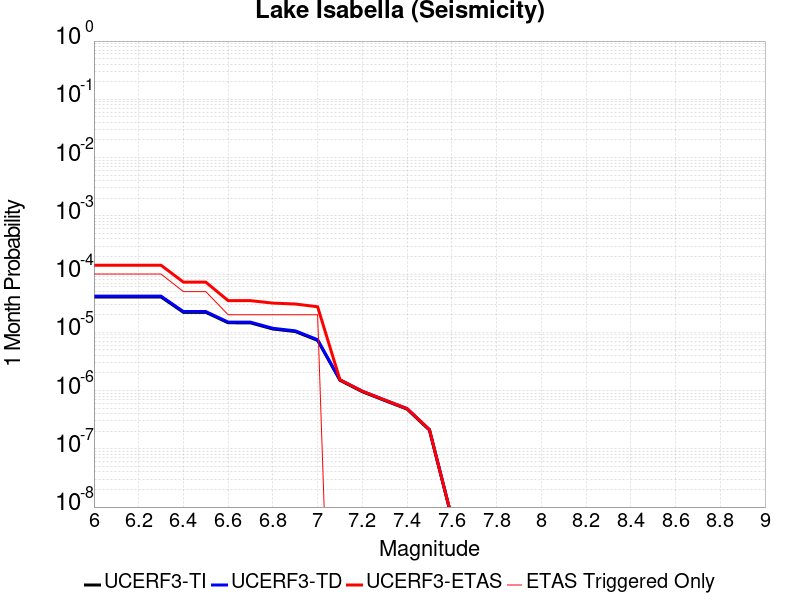 | 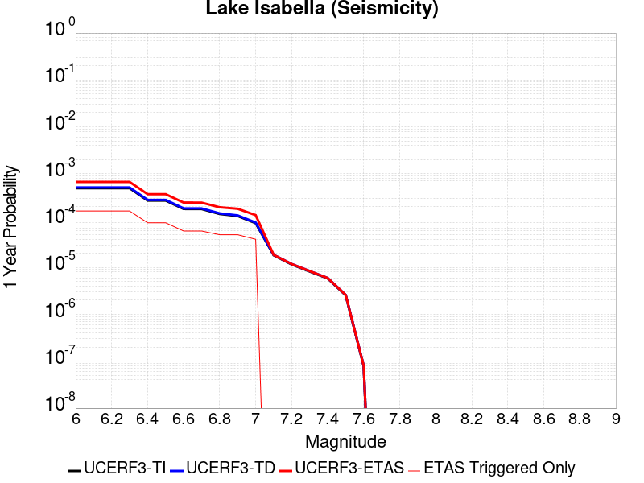 |  |

| Magnitude | 1 wk TI Prob | 1 wk TD Prob | 1 wk ETAS Prob | 1 wk ETAS/TD Gain | 1 wk ETAS Triggered Only | 1 mo TI Prob | 1 mo TD Prob | 1 mo ETAS Prob | 1 mo ETAS/TD Gain | 1 mo ETAS Triggered Only | 1 yr TI Prob | 1 yr TD Prob | 1 yr ETAS Prob | 1 yr ETAS/TD Gain | 1 yr ETAS Triggered Only | 10 yr TI Prob | 10 yr TD Prob | 10 yr ETAS Prob | 10 yr ETAS/TD Gain | 10 yr ETAS Triggered Only |
|-----|-----|-----|-----|-----|-----|-----|-----|-----|-----|-----|-----|-----|-----|-----|-----|-----|-----|-----|-----|-----|
| 6.0 | 9.431637E-6 | 9.741651E-6 | 5.9741164E-5 | 6.13255 | 5.0E-5 | 4.0420677E-5 | 4.1749343E-5 | 1.4174517E-4 | 3.3951473 | 1.0E-4 | 4.920106E-4 | 5.0819275E-4 | 6.6811143E-4 | 1.3146812 | 1.6E-4 | 0.004909227 | 0.005071599 | 0.005280534 | 1.0411971 | 2.1E-4 |
| 6.1 | 9.431637E-6 | 9.741651E-6 | 5.9741164E-5 | 6.13255 | 5.0E-5 | 4.0420677E-5 | 4.1749343E-5 | 1.4174517E-4 | 3.3951473 | 1.0E-4 | 4.920106E-4 | 5.0819275E-4 | 6.6811143E-4 | 1.3146812 | 1.6E-4 | 0.004909227 | 0.005071599 | 0.005280534 | 1.0411971 | 2.1E-4 |
| 6.2 | 9.431637E-6 | 9.741651E-6 | 5.9741164E-5 | 6.13255 | 5.0E-5 | 4.0420677E-5 | 4.1749343E-5 | 1.4174517E-4 | 3.3951473 | 1.0E-4 | 4.920106E-4 | 5.0819275E-4 | 6.6811143E-4 | 1.3146812 | 1.6E-4 | 0.004909227 | 0.005071599 | 0.005280534 | 1.0411971 | 2.1E-4 |
| 6.3 | 9.431637E-6 | 9.741651E-6 | 5.9741164E-5 | 6.13255 | 5.0E-5 | 4.0420677E-5 | 4.1749343E-5 | 1.4174517E-4 | 3.3951473 | 1.0E-4 | 4.920106E-4 | 5.0819275E-4 | 6.6811143E-4 | 1.3146812 | 1.6E-4 | 0.004909227 | 0.005071599 | 0.005280534 | 1.0411971 | 2.1E-4 |
| 6.4 | 5.144063E-6 | 5.3000763E-6 | 2.529997E-5 | 4.773511 | 2.0E-5 | 2.2045799E-5 | 2.2714434E-5 | 7.27133E-5 | 3.2011936 | 5.0E-5 | 2.6837454E-4 | 2.765166E-4 | 3.664917E-4 | 1.3253877 | 9.0E-5 | 0.0026805066 | 0.0027620657 | 0.0028817342 | 1.0433258 | 1.2E-4 |
| 6.5 | 5.144063E-6 | 5.3000763E-6 | 2.529997E-5 | 4.773511 | 2.0E-5 | 2.2045799E-5 | 2.2714434E-5 | 7.27133E-5 | 3.2011936 | 5.0E-5 | 2.6837454E-4 | 2.765166E-4 | 3.664917E-4 | 1.3253877 | 9.0E-5 | 0.0026805066 | 0.0027620657 | 0.0028817342 | 1.0433258 | 1.2E-4 |
| 6.6 | 3.4009804E-6 | 3.498786E-6 | 3.498786E-6 | 1.0 | 0.0 | 1.4575549E-5 | 1.4994721E-5 | 3.499442E-5 | 2.3337827 | 2.0E-5 | 1.7744285E-4 | 1.8254704E-4 | 2.4253609E-4 | 1.3286225 | 6.0E-5 | 0.0017730123 | 0.0018241286 | 0.0018940009 | 1.0383044 | 7.0E-5 |
| 6.7 | 3.3880428E-6 | 3.4856528E-6 | 3.4856528E-6 | 1.0 | 0.0 | 1.4520103E-5 | 1.4938435E-5 | 3.4938137E-5 | 2.3388083 | 2.0E-5 | 1.767679E-4 | 1.8186188E-4 | 2.4185097E-4 | 1.3298607 | 6.0E-5 | 0.0017662736 | 0.0018172882 | 0.001887161 | 1.0384489 | 7.0E-5 |
| 6.8 | 2.6582E-6 | 2.7337003E-6 | 2.7337003E-6 | 1.0 | 0.0 | 1.1392236E-5 | 1.1715813E-5 | 3.171558E-5 | 2.7070744 | 2.0E-5 | 1.3869164E-4 | 1.4263204E-4 | 1.926249E-4 | 1.3505024 | 5.0E-5 | 0.0013860512 | 0.0014255369 | 0.0014754656 | 1.0350245 | 5.0E-5 |
| 6.9 | 2.406011E-6 | 2.4743288E-6 | 2.4743288E-6 | 1.0 | 0.0 | 1.0311434E-5 | 1.0604231E-5 | 3.060402E-5 | 2.8860197 | 2.0E-5 | 1.2553448E-4 | 1.2910018E-4 | 1.7909372E-4 | 1.3872461 | 5.0E-5 | 0.0012546359 | 0.0012903814 | 0.001340317 | 1.0386982 | 5.0E-5 |
| 7.0 | 1.6953097E-6 | 1.7429371E-6 | 1.7429371E-6 | 1.0 | 0.0 | 7.265593E-6 | 7.469715E-6 | 2.7469567E-5 | 3.6774583 | 2.0E-5 | 8.8455E-5 | 9.094104E-5 | 1.3093739E-4 | 1.4398054 | 4.0E-5 | 8.84198E-4 | 9.09141E-4 | 9.491046E-4 | 1.0439576 | 4.0E-5 |
| 7.1 | 3.5013824E-7 | 3.5714822E-7 | 3.5714822E-7 | 1.0 | 0.0 | 1.5005916E-6 | 1.5306344E-6 | 1.5306344E-6 | 1.0 | 0.0 | 1.826955E-5 | 1.8635317E-5 | 1.8635317E-5 | 1.0 | 0.0 | 1.8268047E-4 | 1.863378E-4 | 1.863378E-4 | 1.0 | 0.0 |
| 7.2 | 2.2321095E-7 | 2.2750574E-7 | 2.2750574E-7 | 1.0 | 0.0 | 9.56618E-7 | 9.750242E-7 | 9.750242E-7 | 1.0 | 0.0 | 1.1646762E-5 | 1.1870856E-5 | 1.1870856E-5 | 1.0 | 0.0 | 1.1646151E-4 | 1.1870232E-4 | 1.1870232E-4 | 1.0 | 0.0 |
| 7.3 | 1.5760406E-7 | 1.6060922E-7 | 1.6060922E-7 | 1.0 | 0.0 | 6.7544585E-7 | 6.8832503E-7 | 6.8832503E-7 | 1.0 | 0.0 | 8.223522E-6 | 8.380326E-6 | 8.380326E-6 | 1.0 | 0.0 | 8.2232174E-5 | 8.3800165E-5 | 8.3800165E-5 | 1.0 | 0.0 |
| 7.4 | 1.1216497E-7 | 1.1431706E-7 | 1.1431706E-7 | 1.0 | 0.0 | 4.8070694E-7 | 4.899302E-7 | 4.899302E-7 | 1.0 | 0.0 | 5.852591E-6 | 5.964884E-6 | 5.964884E-6 | 1.0 | 0.0 | 5.8524372E-5 | 5.9647282E-5 | 5.9647282E-5 | 1.0 | 0.0 |
| 7.5 | 4.885185E-8 | 4.9787737E-8 | 4.9787737E-8 | 1.0 | 0.0 | 2.0936506E-7 | 2.13376E-7 | 2.13376E-7 | 1.0 | 0.0 | 2.5490165E-6 | 2.59785E-6 | 2.59785E-6 | 1.0 | 0.0 | 2.5489873E-5 | 2.5978214E-5 | 2.5978214E-5 | 1.0 | 0.0 |
| 7.6 | 1.504641E-9 | 1.5317903E-9 | 1.5317903E-9 | 1.0 | 0.0 | 6.4484613E-9 | 6.5648154E-9 | 6.5648154E-9 | 1.0 | 0.0 | 7.851001E-8 | 7.992663E-8 | 7.992663E-8 | 1.0 | 0.0 | 7.8509987E-7 | 7.992663E-7 | 7.992663E-7 | 1.0 | 0.0 |

## Mission Ridge-Arroyo Parida-Santa Ana
*[(top)](#table-of-contents)*

| 1 Week | 1 Month | 1 Year | 10 Year |
|-----|-----|-----|-----|
|  |  |  |  |

| Magnitude | 1 wk TI Prob | 1 wk TD Prob | 1 wk ETAS Prob | 1 wk ETAS/TD Gain | 1 wk ETAS Triggered Only | 1 mo TI Prob | 1 mo TD Prob | 1 mo ETAS Prob | 1 mo ETAS/TD Gain | 1 mo ETAS Triggered Only | 1 yr TI Prob | 1 yr TD Prob | 1 yr ETAS Prob | 1 yr ETAS/TD Gain | 1 yr ETAS Triggered Only | 10 yr TI Prob | 10 yr TD Prob | 10 yr ETAS Prob | 10 yr ETAS/TD Gain | 10 yr ETAS Triggered Only |
|-----|-----|-----|-----|-----|-----|-----|-----|-----|-----|-----|-----|-----|-----|-----|-----|-----|-----|-----|-----|-----|
| 6.0 | 4.169034E-5 | 4.7138263E-5 | 8.713638E-5 | 1.8485276 | 4.0E-5 | 1.7866064E-4 | 2.0201034E-4 | 2.719962E-4 | 1.3464469 | 7.0E-5 | 0.0021730233 | 0.00245745 | 0.0025871305 | 1.0527704 | 1.3E-4 | 0.021518968 | 0.024384614 | 0.02455047 | 1.0068016 | 1.7E-4 |
| 6.1 | 1.73813E-5 | 1.6854226E-5 | 1.6854226E-5 | 1.0 | 0.0 | 7.4489166E-5 | 7.223046E-5 | 8.222974E-5 | 1.1384357 | 1.0E-5 | 9.065282E-4 | 8.790618E-4 | 9.0903544E-4 | 1.0340973 | 3.0E-5 | 0.009028391 | 0.008756988 | 0.008816463 | 1.0067917 | 6.0E-5 |
| 6.2 | 1.4622182E-5 | 1.367329E-5 | 1.367329E-5 | 1.0 | 0.0 | 6.2664985E-5 | 5.8598518E-5 | 6.859793E-5 | 1.1706427 | 1.0E-5 | 7.6267915E-4 | 7.132073E-4 | 7.33193E-4 | 1.0280223 | 2.0E-5 | 0.007600669 | 0.007109627 | 0.0071592717 | 1.0069827 | 5.0E-5 |
| 6.3 | 1.3552434E-5 | 1.2482201E-5 | 1.2482201E-5 | 1.0 | 0.0 | 5.8080568E-5 | 5.3494066E-5 | 6.3493535E-5 | 1.1869266 | 1.0E-5 | 7.069015E-4 | 6.510988E-4 | 6.710858E-4 | 1.0306973 | 2.0E-5 | 0.00704657 | 0.006492275 | 0.0065220804 | 1.0045909 | 3.0E-5 |
| 6.4 | 1.30977305E-5 | 1.1979156E-5 | 1.1979156E-5 | 1.0 | 0.0 | 5.613192E-5 | 5.1338247E-5 | 6.1337734E-5 | 1.1947765 | 1.0E-5 | 6.831918E-4 | 6.248669E-4 | 6.448544E-4 | 1.0319868 | 2.0E-5 | 0.006810953 | 0.0062314444 | 0.0062612575 | 1.0047843 | 3.0E-5 |
| 6.5 | 1.225205E-5 | 1.1048803E-5 | 1.1048803E-5 | 1.0 | 0.0 | 5.2507727E-5 | 4.7351168E-5 | 5.7350695E-5 | 1.2111781 | 1.0E-5 | 6.3909404E-4 | 5.7635066E-4 | 5.963392E-4 | 1.0346811 | 2.0E-5 | 0.006372592 | 0.005748869 | 0.0057786964 | 1.0051885 | 3.0E-5 |
| 6.6 | 1.1352241E-5 | 1.0063535E-5 | 1.0063535E-5 | 1.0 | 0.0 | 4.8651553E-5 | 4.3128734E-5 | 5.3128304E-5 | 1.231854 | 1.0E-5 | 5.921717E-4 | 5.2496797E-4 | 5.4495747E-4 | 1.0380776 | 2.0E-5 | 0.0059059616 | 0.0052375244 | 0.00525742 | 1.0037986 | 2.0E-5 |
| 6.7 | 1.0864116E-5 | 9.517027E-6 | 9.517027E-6 | 1.0 | 0.0 | 4.6559664E-5 | 4.0786632E-5 | 5.0786224E-5 | 1.2451683 | 1.0E-5 | 5.667165E-4 | 4.964661E-4 | 5.164562E-4 | 1.0402647 | 2.0E-5 | 0.005652734 | 0.004953804 | 0.004973705 | 1.0040174 | 2.0E-5 |
| 6.8 | 1.0666365E-5 | 9.299779E-6 | 9.299779E-6 | 1.0 | 0.0 | 4.571219E-5 | 3.9855597E-5 | 4.9855196E-5 | 1.2508957 | 1.0E-5 | 5.564038E-4 | 4.8513585E-4 | 5.0512614E-4 | 1.0412055 | 2.0E-5 | 0.005550127 | 0.0048410003 | 0.004860903 | 1.0041114 | 2.0E-5 |
| 6.9 | 1.0038665E-5 | 8.592046E-6 | 8.592046E-6 | 1.0 | 0.0 | 4.302214E-5 | 3.682254E-5 | 4.6822173E-5 | 1.2715628 | 1.0E-5 | 5.236687E-4 | 4.4822405E-4 | 4.6821506E-4 | 1.0446005 | 2.0E-5 | 0.005224364 | 0.004473411 | 0.0044933213 | 1.0044509 | 2.0E-5 |
| 7.0 | 9.5379955E-6 | 8.025073E-6 | 8.025073E-6 | 1.0 | 0.0 | 4.0876483E-5 | 3.4392728E-5 | 4.4392382E-5 | 1.2907492 | 1.0E-5 | 4.975576E-4 | 4.1865272E-4 | 4.3864435E-4 | 1.0477523 | 2.0E-5 | 0.00496445 | 0.0041788397 | 0.004198756 | 1.004766 | 2.0E-5 |
| 7.1 | 9.207389E-6 | 7.652375E-6 | 7.652375E-6 | 1.0 | 0.0 | 3.945964E-5 | 3.279549E-5 | 4.2795164E-5 | 1.30491 | 1.0E-5 | 4.803152E-4 | 3.9921363E-4 | 4.0920964E-4 | 1.0250392 | 1.0E-5 | 0.004792784 | 0.003985161 | 0.0039951215 | 1.0024993 | 1.0E-5 |
| 7.2 | 7.638091E-6 | 5.9311183E-6 | 5.9311183E-6 | 1.0 | 0.0 | 3.2734264E-5 | 2.541883E-5 | 3.5418576E-5 | 1.3933991 | 1.0E-5 | 3.984668E-4 | 3.0943064E-4 | 3.1942755E-4 | 1.0323074 | 1.0E-5 | 0.0039775306 | 0.0030900547 | 0.0031000238 | 1.0032262 | 1.0E-5 |
| 7.3 | 7.2500147E-6 | 5.5961527E-6 | 5.5961527E-6 | 1.0 | 0.0 | 3.1071122E-5 | 2.3983293E-5 | 3.3983055E-5 | 1.4169469 | 1.0E-5 | 3.7822526E-4 | 2.9195778E-4 | 3.0195486E-4 | 1.0342416 | 1.0E-5 | 0.0037758215 | 0.0029157975 | 0.0029257683 | 1.0034196 | 1.0E-5 |
| 7.4 | 6.3899715E-6 | 4.9184964E-6 | 4.9184964E-6 | 1.0 | 0.0 | 2.7385306E-5 | 2.10791E-5 | 3.107889E-5 | 1.4743936 | 1.0E-5 | 3.3336508E-4 | 2.5660804E-4 | 2.6660546E-4 | 1.03896 | 1.0E-5 | 0.0033286542 | 0.0025631618 | 0.002573136 | 1.0038915 | 1.0E-5 |
| 7.5 | 5.379025E-6 | 4.0838527E-6 | 4.0838527E-6 | 1.0 | 0.0 | 2.305276E-5 | 1.7502109E-5 | 2.7501934E-5 | 1.5713497 | 1.0E-5 | 2.806312E-4 | 2.1306744E-4 | 2.2306532E-4 | 1.0469235 | 1.0E-5 | 0.0028027708 | 0.002128643 | 0.0021386216 | 1.0046878 | 1.0E-5 |
| 7.6 | 4.1270696E-6 | 3.0883439E-6 | 3.0883439E-6 | 1.0 | 0.0 | 1.768732E-5 | 1.3235693E-5 | 2.3235561E-5 | 1.7555227 | 1.0E-5 | 2.1532185E-4 | 1.6113273E-4 | 1.7113112E-4 | 1.0620506 | 1.0E-5 | 0.0021511333 | 0.001610167 | 0.0016201509 | 1.0062006 | 1.0E-5 |
| 7.7 | 2.5406805E-6 | 1.8282013E-6 | 1.8282013E-6 | 1.0 | 0.0 | 1.0888585E-5 | 7.835125E-6 | 7.835125E-6 | 1.0 | 0.0 | 1.3256045E-4 | 9.538854E-5 | 9.538854E-5 | 1.0 | 0.0 | 0.0013248142 | 9.534821E-4 | 9.534821E-4 | 1.0 | 0.0 |
| 7.8 | 4.8608285E-7 | 3.5098864E-7 | 3.5098864E-7 | 1.0 | 0.0 | 2.0832106E-6 | 1.5042363E-6 | 1.5042363E-6 | 1.0 | 0.0 | 2.5362791E-5 | 1.8313924E-5 | 1.8313924E-5 | 1.0 | 0.0 | 2.5359896E-4 | 1.8312426E-4 | 1.8312426E-4 | 1.0 | 0.0 |
| 7.9 | 2.0472514E-8 | 1.2688783E-8 | 1.2688783E-8 | 1.0 | 0.0 | 8.7739345E-8 | 5.43805E-8 | 5.43805E-8 | 1.0 | 0.0 | 1.068226E-6 | 6.6208236E-7 | 6.6208236E-7 | 1.0 | 0.0 | 1.0682209E-5 | 6.620805E-6 | 6.620805E-6 | 1.0 | 0.0 |
| 8.0 | 4.443582E-9 | 2.0321211E-9 | 2.0321211E-9 | 1.0 | 0.0 | 1.9043922E-8 | 8.70909E-9 | 8.70909E-9 | 1.0 | 0.0 | 2.3185973E-7 | 1.0603316E-7 | 1.0603316E-7 | 1.0 | 0.0 | 2.3185949E-6 | 1.0603312E-6 | 1.0603312E-6 | 1.0 | 0.0 |

## Brawley (Seismic Zone) alt 1
*[(top)](#table-of-contents)*

| 1 Week | 1 Month | 1 Year | 10 Year |
|-----|-----|-----|-----|
|  |  |  |  |

| Magnitude | 1 wk TI Prob | 1 wk TD Prob | 1 wk ETAS Prob | 1 wk ETAS/TD Gain | 1 wk ETAS Triggered Only | 1 mo TI Prob | 1 mo TD Prob | 1 mo ETAS Prob | 1 mo ETAS/TD Gain | 1 mo ETAS Triggered Only | 1 yr TI Prob | 1 yr TD Prob | 1 yr ETAS Prob | 1 yr ETAS/TD Gain | 1 yr ETAS Triggered Only | 10 yr TI Prob | 10 yr TD Prob | 10 yr ETAS Prob | 10 yr ETAS/TD Gain | 10 yr ETAS Triggered Only |
|-----|-----|-----|-----|-----|-----|-----|-----|-----|-----|-----|-----|-----|-----|-----|-----|-----|-----|-----|-----|-----|
| 6.0 | 2.2521618E-4 | 4.7632487E-4 | 5.462915E-4 | 1.1468885 | 7.0E-5 | 9.6485513E-4 | 0.0020398323 | 0.0021096894 | 1.0342466 | 7.0E-5 | 0.011683988 | 0.024546238 | 0.024663292 | 1.0047687 | 1.2E-4 | 0.11088423 | 0.21350002 | 0.21365732 | 1.0007367 | 2.0E-4 |
| 6.1 | 2.2521618E-4 | 4.7632487E-4 | 5.462915E-4 | 1.1468885 | 7.0E-5 | 9.6485513E-4 | 0.0020398323 | 0.0021096894 | 1.0342466 | 7.0E-5 | 0.011683988 | 0.024546238 | 0.024663292 | 1.0047687 | 1.2E-4 | 0.11088423 | 0.21350002 | 0.21365732 | 1.0007367 | 2.0E-4 |
| 6.2 | 2.198148E-4 | 4.6717093E-4 | 5.3713826E-4 | 1.1497681 | 7.0E-5 | 9.417233E-4 | 0.0020006616 | 0.0020705215 | 1.0349184 | 7.0E-5 | 0.011405343 | 0.024080504 | 0.024197614 | 1.0048633 | 1.2E-4 | 0.10837428 | 0.20993657 | 0.21009459 | 1.0007527 | 2.0E-4 |
| 6.3 | 2.1704129E-4 | 4.615278E-4 | 5.314955E-4 | 1.1516001 | 7.0E-5 | 9.298453E-4 | 0.0019765133 | 0.002046375 | 1.0353459 | 7.0E-5 | 0.011262234 | 0.02379366 | 0.023910806 | 1.0049233 | 1.2E-4 | 0.107082725 | 0.20782755 | 0.20798598 | 1.0007623 | 2.0E-4 |
| 6.4 | 1.876142E-4 | 4.00449E-4 | 4.70421E-4 | 1.1747338 | 7.0E-5 | 8.038131E-4 | 0.0017150956 | 0.0017849755 | 1.0407441 | 7.0E-5 | 0.00974259 | 0.020680401 | 0.02079792 | 1.0056826 | 1.2E-4 | 0.093263686 | 0.18457815 | 0.18474124 | 1.0008836 | 2.0E-4 |
| 6.5 | 1.7390939E-4 | 3.7477075E-4 | 4.3474828E-4 | 1.1600379 | 6.0E-5 | 7.45113E-4 | 0.0016051838 | 0.0016650875 | 1.037319 | 6.0E-5 | 0.009034078 | 0.019368723 | 0.019476593 | 1.0055692 | 1.1E-4 | 0.086755216 | 0.17440031 | 0.17455718 | 1.0008994 | 1.9E-4 |
| 6.6 | 1.591791E-4 | 3.4891962E-4 | 4.088987E-4 | 1.1718993 | 6.0E-5 | 6.8201777E-4 | 0.0014945229 | 0.0015544333 | 1.0400866 | 6.0E-5 | 0.008271996 | 0.018045569 | 0.018153585 | 1.0059857 | 1.1E-4 | 0.07970774 | 0.16380852 | 0.1639674 | 1.0009699 | 1.9E-4 |
| 6.7 | 1.4268003E-4 | 3.20582E-4 | 3.8056276E-4 | 1.1870996 | 6.0E-5 | 6.1134255E-4 | 0.0013732077 | 0.0014331252 | 1.0436333 | 6.0E-5 | 0.007417723 | 0.016592601 | 0.016700776 | 1.0065194 | 1.1E-4 | 0.07174956 | 0.15193306 | 0.1520942 | 1.0010606 | 1.9E-4 |
| 6.8 | 1.239713E-4 | 2.9053655E-4 | 3.5051914E-4 | 1.2064545 | 6.0E-5 | 5.3119735E-4 | 0.0012445687 | 0.001304494 | 1.0481495 | 6.0E-5 | 0.0064481674 | 0.015048777 | 0.015157122 | 1.0071995 | 1.1E-4 | 0.06264243 | 0.13837762 | 0.13854134 | 1.001183 | 1.9E-4 |
| 6.9 | 1.0180238E-4 | 2.625439E-4 | 3.2252815E-4 | 1.2284732 | 6.0E-5 | 4.3622297E-4 | 0.0011247073 | 0.0011846398 | 1.0532873 | 6.0E-5 | 0.005298089 | 0.013608336 | 0.013716839 | 1.0079733 | 1.1E-4 | 0.05173543 | 0.124961674 | 0.12512793 | 1.0013305 | 1.9E-4 |
| 7.0 | 7.6619996E-5 | 2.23993E-4 | 2.8397955E-4 | 1.2678055 | 6.0E-5 | 3.283301E-4 | 9.5962E-4 | 0.0010195625 | 1.0624647 | 6.0E-5 | 0.0039900932 | 0.011621496 | 0.011730217 | 1.0093552 | 1.1E-4 | 0.039192066 | 0.107266866 | 0.107436486 | 1.0015813 | 1.9E-4 |
| 7.1 | 7.5127435E-5 | 2.2082464E-4 | 2.808114E-4 | 1.2716488 | 6.0E-5 | 3.2193496E-4 | 9.4605127E-4 | 0.0010059945 | 1.0633615 | 6.0E-5 | 0.0039125155 | 0.011458045 | 0.011566784 | 1.0094903 | 1.1E-4 | 0.038443442 | 0.10583085 | 0.106000744 | 1.0016053 | 1.9E-4 |
| 7.2 | 6.788582E-5 | 2.0210193E-4 | 2.620898E-4 | 1.2968199 | 6.0E-5 | 2.9090676E-4 | 8.6586666E-4 | 9.2581473E-4 | 1.0692347 | 6.0E-5 | 0.0035360386 | 0.0104916105 | 0.010600456 | 1.0103745 | 1.1E-4 | 0.034803 | 0.09750131 | 0.09767278 | 1.0017587 | 1.9E-4 |
| 7.3 | 6.399602E-5 | 1.8841137E-4 | 2.4840006E-4 | 1.3183922 | 6.0E-5 | 2.7423984E-4 | 8.072303E-4 | 8.6718187E-4 | 1.0742682 | 6.0E-5 | 0.0033337586 | 0.009784332 | 0.009893254 | 1.0111325 | 1.1E-4 | 0.03284188 | 0.09139617 | 0.0915688 | 1.0018889 | 1.9E-4 |
| 7.4 | 4.506759E-5 | 1.2529209E-4 | 1.8528457E-4 | 1.478821 | 6.0E-5 | 1.9313251E-4 | 5.368565E-4 | 5.968243E-4 | 1.1117017 | 6.0E-5 | 0.0023488526 | 0.0065168133 | 0.0066161617 | 1.015245 | 1.0E-4 | 0.023241805 | 0.062363707 | 0.062523104 | 1.002556 | 1.7E-4 |
| 7.5 | 3.43289E-5 | 9.33541E-5 | 1.533485E-4 | 1.6426542 | 6.0E-5 | 1.4711556E-4 | 4.00028E-4 | 4.6000397E-4 | 1.1499295 | 6.0E-5 | 0.0017896603 | 0.0048595266 | 0.004959041 | 1.0204781 | 1.0E-4 | 0.01775316 | 0.04705519 | 0.04721719 | 1.0034428 | 1.7E-4 |
| 7.6 | 2.5980507E-5 | 7.053101E-5 | 1.1052819E-4 | 1.5670865 | 4.0E-5 | 1.1134028E-4 | 3.0224086E-4 | 3.4222877E-4 | 1.1323048 | 4.0E-5 | 0.001354725 | 0.003673598 | 0.0037433407 | 1.0189849 | 7.0E-5 | 0.013464959 | 0.035840835 | 0.035966177 | 1.0034971 | 1.3E-4 |
| 7.7 | 1.7292105E-5 | 4.9407296E-5 | 8.940532E-5 | 1.809557 | 4.0E-5 | 7.4106916E-5 | 2.117284E-4 | 2.5171993E-4 | 1.1888813 | 4.0E-5 | 9.018782E-4 | 0.0025747516 | 0.0026445715 | 1.0271171 | 7.0E-5 | 0.008982267 | 0.025290398 | 0.025407363 | 1.0046248 | 1.2E-4 |
| 7.8 | 1.2927471E-5 | 3.9693266E-5 | 6.9692076E-5 | 1.7557657 | 3.0E-5 | 5.5402274E-5 | 1.7010293E-4 | 2.0009783E-4 | 1.1763338 | 3.0E-5 | 6.743139E-4 | 0.0020690386 | 0.0021289145 | 1.028939 | 6.0E-5 | 0.0067227143 | 0.020431727 | 0.020539481 | 1.0052738 | 1.1E-4 |
| 7.9 | 1.0200774E-5 | 2.874569E-5 | 4.8745114E-5 | 1.6957365 | 2.0E-5 | 4.371687E-5 | 1.2319001E-4 | 1.4318754E-4 | 1.1623309 | 2.0E-5 | 5.321229E-4 | 0.0014988075 | 0.0015387476 | 1.0266479 | 4.0E-5 | 0.005308505 | 0.014991644 | 0.015080295 | 1.0059134 | 9.0E-5 |
| 8.0 | 8.650396E-6 | 2.3277367E-5 | 3.3277134E-5 | 1.4295919 | 1.0E-5 | 3.70726E-5 | 9.975634E-5 | 1.0975534E-4 | 1.1002343 | 1.0E-5 | 4.5126543E-4 | 0.0012138576 | 0.0012338333 | 1.0164564 | 2.0E-5 | 0.0045035016 | 0.012211097 | 0.012250609 | 1.0032357 | 4.0E-5 |
| 8.1 | 3.9368224E-6 | 7.3279825E-6 | 7.3279825E-6 | 1.0 | 0.0 | 1.6871985E-5 | 3.140526E-5 | 3.140526E-5 | 1.0 | 0.0 | 2.0539707E-4 | 3.8229208E-4 | 3.9228826E-4 | 1.026148 | 1.0E-5 | 0.0020520731 | 0.004001185 | 0.0040211044 | 1.0049785 | 2.0E-5 |
| 8.2 | 1.7101195E-6 | 2.217876E-6 | 2.217876E-6 | 1.0 | 0.0 | 7.329063E-6 | 9.505149E-6 | 9.505149E-6 | 1.0 | 0.0 | 8.922769E-5 | 1.1571907E-4 | 1.1571907E-4 | 1.0 | 0.0 | 8.9191867E-4 | 0.0012666774 | 0.0012666774 | 1.0 | 0.0 |
| 8.3 | 3.0346666E-8 | 1.721586E-8 | 1.721586E-8 | 1.0 | 0.0 | 1.3005713E-7 | 7.378226E-8 | 7.378226E-8 | 1.0 | 0.0 | 1.5834444E-6 | 8.9829894E-7 | 8.9829894E-7 | 1.0 | 0.0 | 1.5834332E-5 | 9.367729E-6 | 9.367729E-6 | 1.0 | 0.0 |

## Santa Rosa Island
*[(top)](#table-of-contents)*

| 1 Week | 1 Month | 1 Year | 10 Year |
|-----|-----|-----|-----|
|  |  | 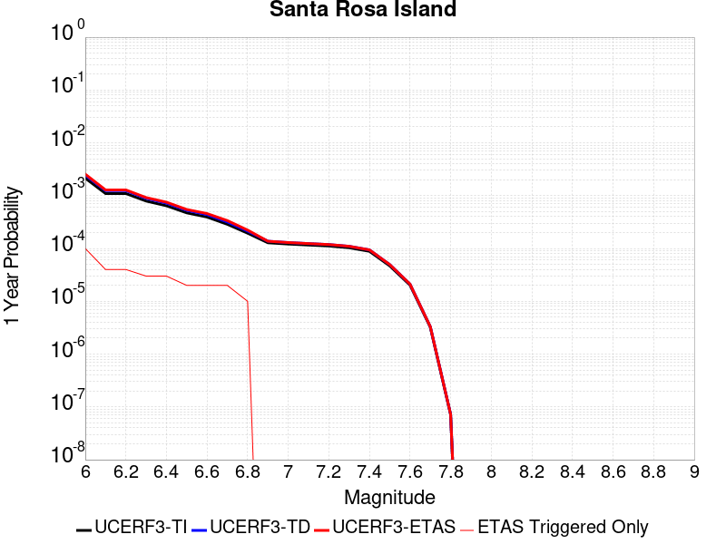 |  |

| Magnitude | 1 wk TI Prob | 1 wk TD Prob | 1 wk ETAS Prob | 1 wk ETAS/TD Gain | 1 wk ETAS Triggered Only | 1 mo TI Prob | 1 mo TD Prob | 1 mo ETAS Prob | 1 mo ETAS/TD Gain | 1 mo ETAS Triggered Only | 1 yr TI Prob | 1 yr TD Prob | 1 yr ETAS Prob | 1 yr ETAS/TD Gain | 1 yr ETAS Triggered Only | 10 yr TI Prob | 10 yr TD Prob | 10 yr ETAS Prob | 10 yr ETAS/TD Gain | 10 yr ETAS Triggered Only |
|-----|-----|-----|-----|-----|-----|-----|-----|-----|-----|-----|-----|-----|-----|-----|-----|-----|-----|-----|-----|-----|
| 6.0 | 4.1143165E-5 | 4.7091133E-5 | 6.709019E-5 | 1.4246885 | 2.0E-5 | 1.7631594E-4 | 2.0180465E-4 | 2.4179657E-4 | 1.1981715 | 4.0E-5 | 0.002144533 | 0.0024544 | 0.0025541545 | 1.0406431 | 1.0E-4 | 0.021239553 | 0.024293551 | 0.024449663 | 1.0064261 | 1.6E-4 |
| 6.1 | 2.1061249E-5 | 2.3864959E-5 | 4.3864482E-5 | 1.8380288 | 2.0E-5 | 9.0259375E-5 | 1.0227455E-4 | 1.3227148E-4 | 1.2932981 | 3.0E-5 | 0.0010983539 | 0.0012445104 | 0.0012844605 | 1.0321012 | 4.0E-5 | 0.01092941 | 0.012378449 | 0.012447582 | 1.005585 | 7.0E-5 |
| 6.2 | 2.1061249E-5 | 2.3864959E-5 | 4.3864482E-5 | 1.8380288 | 2.0E-5 | 9.0259375E-5 | 1.0227455E-4 | 1.3227148E-4 | 1.2932981 | 3.0E-5 | 0.0010983539 | 0.0012445104 | 0.0012844605 | 1.0321012 | 4.0E-5 | 0.01092941 | 0.012378449 | 0.012447582 | 1.005585 | 7.0E-5 |
| 6.3 | 1.5158236E-5 | 1.7074419E-5 | 3.7074078E-5 | 2.1713228 | 2.0E-5 | 6.496225E-5 | 7.3174095E-5 | 9.317263E-5 | 1.2733008 | 2.0E-5 | 7.906284E-4 | 8.905424E-4 | 9.2051574E-4 | 1.0336573 | 3.0E-5 | 0.007878214 | 0.008870989 | 0.008920546 | 1.0055864 | 5.0E-5 |
| 6.4 | 1.2341918E-5 | 1.3852917E-5 | 3.385264E-5 | 2.4437194 | 2.0E-5 | 5.2892858E-5 | 5.9368336E-5 | 7.936715E-5 | 1.33686 | 2.0E-5 | 6.437803E-4 | 7.225779E-4 | 7.5255625E-4 | 1.041488 | 3.0E-5 | 0.006419184 | 0.007203121 | 0.007252761 | 1.0068915 | 5.0E-5 |
| 6.5 | 9.061158E-6 | 1.0117031E-5 | 2.011693E-5 | 1.9884223 | 1.0E-5 | 3.883296E-5 | 4.3358013E-5 | 5.335758E-5 | 1.2306279 | 1.0E-5 | 4.726887E-4 | 5.277613E-4 | 5.4775074E-4 | 1.0378759 | 2.0E-5 | 0.004716845 | 0.0052656173 | 0.0053054066 | 1.0075564 | 4.0E-5 |
| 6.6 | 7.5461685E-6 | 8.400733E-6 | 1.840065E-5 | 2.1903622 | 1.0E-5 | 3.2340322E-5 | 3.600267E-5 | 4.600231E-5 | 1.2777472 | 1.0E-5 | 3.936723E-4 | 4.3824865E-4 | 4.582399E-4 | 1.0456161 | 2.0E-5 | 0.003929756 | 0.0043742736 | 0.004414099 | 1.0091044 | 4.0E-5 |
| 6.7 | 5.5023775E-6 | 6.087381E-6 | 1.608732E-5 | 2.6427326 | 1.0E-5 | 2.3581404E-5 | 2.6088532E-5 | 3.608827E-5 | 1.3833002 | 1.0E-5 | 2.8706578E-4 | 3.1758484E-4 | 3.3757847E-4 | 1.0629553 | 2.0E-5 | 0.0028669522 | 0.0031716314 | 0.003191568 | 1.0062859 | 2.0E-5 |
| 6.8 | 3.7351679E-6 | 4.0831405E-6 | 4.0831405E-6 | 1.0 | 0.0 | 1.6007763E-5 | 1.749907E-5 | 1.749907E-5 | 1.0 | 0.0 | 1.948771E-4 | 2.1303284E-4 | 2.2303071E-4 | 1.0469311 | 1.0E-5 | 0.0019470629 | 0.0021285315 | 0.00213851 | 1.004688 | 1.0E-5 |
| 6.9 | 2.456366E-6 | 2.6292705E-6 | 2.6292705E-6 | 1.0 | 0.0 | 1.0527241E-5 | 1.1268254E-5 | 1.1268254E-5 | 1.0 | 0.0 | 1.2816161E-4 | 1.3718237E-4 | 1.3718237E-4 | 1.0 | 0.0 | 0.0012808773 | 0.0013709799 | 0.0013709799 | 1.0 | 0.0 |
| 7.0 | 2.3245157E-6 | 2.4827782E-6 | 2.4827782E-6 | 1.0 | 0.0 | 9.962172E-6 | 1.0640435E-5 | 1.0640435E-5 | 1.0 | 0.0 | 1.2128269E-4 | 1.2953962E-4 | 1.2953962E-4 | 1.0 | 0.0 | 0.0012121652 | 0.0012946434 | 0.0012946434 | 1.0 | 0.0 |
| 7.1 | 2.2248344E-6 | 2.37325E-6 | 2.37325E-6 | 1.0 | 0.0 | 9.53497E-6 | 1.0171032E-5 | 1.0171032E-5 | 1.0 | 0.0 | 1.1608207E-4 | 1.2382529E-4 | 1.2382529E-4 | 1.0 | 0.0 | 0.0011602144 | 0.001237565 | 0.001237565 | 1.0 | 0.0 |
| 7.2 | 2.1350402E-6 | 2.276154E-6 | 2.276154E-6 | 1.0 | 0.0 | 9.150141E-6 | 9.754909E-6 | 9.754909E-6 | 1.0 | 0.0 | 1.1139726E-4 | 1.1875956E-4 | 1.1875956E-4 | 1.0 | 0.0 | 0.0011134144 | 0.0011869629 | 0.0011869629 | 1.0 | 0.0 |
| 7.3 | 1.9793572E-6 | 2.108719E-6 | 2.108719E-6 | 1.0 | 0.0 | 8.482932E-6 | 9.037336E-6 | 9.037336E-6 | 1.0 | 0.0 | 1.032748E-4 | 1.10024026E-4 | 1.10024026E-4 | 1.0 | 0.0 | 0.0010322682 | 0.0010996973 | 0.0010996973 | 1.0 | 0.0 |
| 7.4 | 1.6951194E-6 | 1.8045733E-6 | 1.8045733E-6 | 1.0 | 0.0 | 7.264777E-6 | 7.733863E-6 | 7.733863E-6 | 1.0 | 0.0 | 8.844508E-5 | 9.415573E-5 | 9.415573E-5 | 1.0 | 0.0 | 8.840988E-4 | 9.4116E-4 | 9.4116E-4 | 1.0 | 0.0 |
| 7.5 | 8.987207E-7 | 9.5122147E-7 | 9.5122147E-7 | 1.0 | 0.0 | 3.8516546E-6 | 4.076657E-6 | 4.076657E-6 | 1.0 | 0.0 | 4.6892885E-5 | 4.963218E-5 | 4.963218E-5 | 1.0 | 0.0 | 4.688299E-4 | 4.9621216E-4 | 4.9621216E-4 | 1.0 | 0.0 |
| 7.6 | 3.8783037E-7 | 4.052932E-7 | 4.052932E-7 | 1.0 | 0.0 | 1.6621291E-6 | 1.7369698E-6 | 1.7369698E-6 | 1.0 | 0.0 | 2.0236233E-5 | 2.1147409E-5 | 2.1147409E-5 | 1.0 | 0.0 | 2.023439E-4 | 2.1145462E-4 | 2.1145462E-4 | 1.0 | 0.0 |
| 7.7 | 6.181804E-8 | 6.339035E-8 | 6.339035E-8 | 1.0 | 0.0 | 2.6493444E-7 | 2.7167292E-7 | 2.7167292E-7 | 1.0 | 0.0 | 3.225572E-6 | 3.3076128E-6 | 3.3076128E-6 | 1.0 | 0.0 | 3.225525E-5 | 3.307564E-5 | 3.307564E-5 | 1.0 | 0.0 |
| 7.8 | 1.3704449E-9 | 1.3964153E-9 | 1.3964153E-9 | 1.0 | 0.0 | 5.873335E-9 | 5.984637E-9 | 5.984637E-9 | 1.0 | 0.0 | 7.1507856E-8 | 7.286295E-8 | 7.286295E-8 | 1.0 | 0.0 | 7.1507833E-7 | 7.286294E-7 | 7.286294E-7 | 1.0 | 0.0 |

## Pinto Mtn
*[(top)](#table-of-contents)*

| 1 Week | 1 Month | 1 Year | 10 Year |
|-----|-----|-----|-----|
|  |  |  |  |

| Magnitude | 1 wk TI Prob | 1 wk TD Prob | 1 wk ETAS Prob | 1 wk ETAS/TD Gain | 1 wk ETAS Triggered Only | 1 mo TI Prob | 1 mo TD Prob | 1 mo ETAS Prob | 1 mo ETAS/TD Gain | 1 mo ETAS Triggered Only | 1 yr TI Prob | 1 yr TD Prob | 1 yr ETAS Prob | 1 yr ETAS/TD Gain | 1 yr ETAS Triggered Only | 10 yr TI Prob | 10 yr TD Prob | 10 yr ETAS Prob | 10 yr ETAS/TD Gain | 10 yr ETAS Triggered Only |
|-----|-----|-----|-----|-----|-----|-----|-----|-----|-----|-----|-----|-----|-----|-----|-----|-----|-----|-----|-----|-----|
| 6.0 | 4.4194956E-5 | 4.785362E-5 | 9.7851225E-5 | 2.0448031 | 5.0E-5 | 1.893932E-4 | 2.0507174E-4 | 2.8505534E-4 | 1.3900274 | 8.0E-5 | 0.0023034236 | 0.0024940541 | 0.0026037798 | 1.0439949 | 1.1E-4 | 0.022796938 | 0.024678145 | 0.024853703 | 1.0071139 | 1.8E-4 |
| 6.1 | 4.4194956E-5 | 4.785362E-5 | 9.7851225E-5 | 2.0448031 | 5.0E-5 | 1.893932E-4 | 2.0507174E-4 | 2.8505534E-4 | 1.3900274 | 8.0E-5 | 0.0023034236 | 0.0024940541 | 0.0026037798 | 1.0439949 | 1.1E-4 | 0.022796938 | 0.024678145 | 0.024853703 | 1.0071139 | 1.8E-4 |
| 6.2 | 4.4194956E-5 | 4.785362E-5 | 9.7851225E-5 | 2.0448031 | 5.0E-5 | 1.893932E-4 | 2.0507174E-4 | 2.8505534E-4 | 1.3900274 | 8.0E-5 | 0.0023034236 | 0.0024940541 | 0.0026037798 | 1.0439949 | 1.1E-4 | 0.022796938 | 0.024678145 | 0.024853703 | 1.0071139 | 1.8E-4 |
| 6.3 | 4.4194956E-5 | 4.785362E-5 | 9.7851225E-5 | 2.0448031 | 5.0E-5 | 1.893932E-4 | 2.0507174E-4 | 2.8505534E-4 | 1.3900274 | 8.0E-5 | 0.0023034236 | 0.0024940541 | 0.0026037798 | 1.0439949 | 1.1E-4 | 0.022796938 | 0.024678145 | 0.024853703 | 1.0071139 | 1.8E-4 |
| 6.4 | 3.729929E-5 | 3.9603186E-5 | 8.9601206E-5 | 2.2624748 | 5.0E-5 | 1.5984432E-4 | 1.6971743E-4 | 2.2970724E-4 | 1.3534688 | 6.0E-5 | 0.0019443673 | 0.002064445 | 0.00214428 | 1.0386714 | 8.0E-5 | 0.019274427 | 0.02046269 | 0.020599825 | 1.0067017 | 1.4E-4 |
| 6.5 | 3.729929E-5 | 3.9603186E-5 | 8.9601206E-5 | 2.2624748 | 5.0E-5 | 1.5984432E-4 | 1.6971743E-4 | 2.2970724E-4 | 1.3534688 | 6.0E-5 | 0.0019443673 | 0.002064445 | 0.00214428 | 1.0386714 | 8.0E-5 | 0.019274427 | 0.02046269 | 0.020599825 | 1.0067017 | 1.4E-4 |
| 6.6 | 3.0204548E-5 | 3.1205298E-5 | 8.120374E-5 | 2.602242 | 5.0E-5 | 1.2944164E-4 | 1.3373033E-4 | 1.8372365E-4 | 1.3738368 | 5.0E-5 | 0.0015748127 | 0.0016269855 | 0.0016868878 | 1.036818 | 6.0E-5 | 0.015636992 | 0.01615461 | 0.016262831 | 1.0066992 | 1.1E-4 |
| 6.7 | 2.9857754E-5 | 3.081468E-5 | 8.0813144E-5 | 2.622553 | 5.0E-5 | 1.2795553E-4 | 1.3205643E-4 | 1.8204983E-4 | 1.378576 | 5.0E-5 | 0.0015567453 | 0.001606636 | 0.0016665396 | 1.0372851 | 6.0E-5 | 0.015458848 | 0.01595405 | 0.016062293 | 1.0067848 | 1.1E-4 |
| 6.8 | 2.4819734E-5 | 2.5009364E-5 | 6.500836E-5 | 2.599361 | 4.0E-5 | 1.0636595E-4 | 1.07178705E-4 | 1.4717442E-4 | 1.3731685 | 4.0E-5 | 0.0012942362 | 0.0013041412 | 0.001344089 | 1.0306315 | 4.0E-5 | 0.012867244 | 0.0129672475 | 0.01304621 | 1.0060894 | 8.0E-5 |
| 6.9 | 2.331124E-5 | 2.3337643E-5 | 6.333671E-5 | 2.7139292 | 4.0E-5 | 9.990149E-5 | 1.00014746E-4 | 1.4001074E-4 | 1.399901 | 4.0E-5 | 0.001215622 | 0.0012170197 | 0.001256971 | 1.0328271 | 4.0E-5 | 0.012089936 | 0.012105742 | 0.012184773 | 1.0065284 | 8.0E-5 |
| 7.0 | 2.1818534E-5 | 2.1760772E-5 | 5.176012E-5 | 2.3785975 | 3.0E-5 | 9.3504656E-5 | 9.325723E-5 | 1.2325443E-4 | 1.3216609 | 3.0E-5 | 0.0011378246 | 0.0011348352 | 0.0011648012 | 1.0264056 | 3.0E-5 | 0.011320163 | 0.011292503 | 0.0113617135 | 1.0061288 | 7.0E-5 |
| 7.1 | 2.066081E-5 | 2.0540418E-5 | 5.0539802E-5 | 2.460505 | 3.0E-5 | 8.854332E-5 | 8.8027504E-5 | 1.1802486E-4 | 1.3407726 | 3.0E-5 | 0.0010774818 | 0.0010712275 | 0.0011011953 | 1.0279752 | 3.0E-5 | 0.010722724 | 0.010662688 | 0.010731942 | 1.006495 | 7.0E-5 |
| 7.2 | 1.8990233E-5 | 1.9053701E-5 | 3.905332E-5 | 2.0496447 | 2.0E-5 | 8.138417E-5 | 8.1656275E-5 | 1.01654645E-4 | 1.2449092 | 2.0E-5 | 9.904018E-4 | 9.937311E-4 | 0.0010137112 | 1.0201062 | 2.0E-5 | 0.009859995 | 0.009894874 | 0.00995428 | 1.0060037 | 6.0E-5 |
| 7.3 | 1.3335872E-5 | 1.4906372E-5 | 3.4906072E-5 | 2.3416882 | 2.0E-5 | 5.7152483E-5 | 6.388296E-5 | 8.388168E-5 | 1.3130525 | 2.0E-5 | 6.956093E-4 | 7.775102E-4 | 7.9749466E-4 | 1.0257032 | 2.0E-5 | 0.006934359 | 0.0077491994 | 0.007808734 | 1.0076827 | 6.0E-5 |
| 7.4 | 9.414066E-6 | 1.186061E-5 | 2.1860491E-5 | 1.843117 | 1.0E-5 | 4.0345374E-5 | 5.0830247E-5 | 6.082974E-5 | 1.1967232 | 1.0E-5 | 4.910942E-4 | 6.1869196E-4 | 6.286858E-4 | 1.0161531 | 1.0E-5 | 0.0049001034 | 0.006170644 | 0.0062203356 | 1.0080528 | 5.0E-5 |
| 7.5 | 7.2101157E-6 | 9.157893E-6 | 9.157893E-6 | 1.0 | 0.0 | 3.090013E-5 | 3.924757E-5 | 3.924757E-5 | 1.0 | 0.0 | 3.7614413E-4 | 4.7774217E-4 | 4.7774217E-4 | 1.0 | 0.0 | 0.0037550807 | 0.004767927 | 0.0047878316 | 1.0041747 | 2.0E-5 |
| 7.6 | 3.296375E-6 | 4.5453176E-6 | 4.5453176E-6 | 1.0 | 0.0 | 1.4127245E-5 | 1.9479796E-5 | 1.9479796E-5 | 1.0 | 0.0 | 1.7198564E-4 | 2.3714209E-4 | 2.3714209E-4 | 1.0 | 0.0 | 0.0017185259 | 0.0023690276 | 0.002379004 | 1.0042112 | 1.0E-5 |
| 7.7 | 2.5741092E-6 | 3.584251E-6 | 3.584251E-6 | 1.0 | 0.0 | 1.103185E-5 | 1.5360993E-5 | 1.5360993E-5 | 1.0 | 0.0 | 1.3430449E-4 | 1.8700535E-4 | 1.8700535E-4 | 1.0 | 0.0 | 0.0013422335 | 0.0018686098 | 0.0018686098 | 1.0 | 0.0 |

## Imperial
*[(top)](#table-of-contents)*

| 1 Week | 1 Month | 1 Year | 10 Year |
|-----|-----|-----|-----|
|  |  |  |  |

| Magnitude | 1 wk TI Prob | 1 wk TD Prob | 1 wk ETAS Prob | 1 wk ETAS/TD Gain | 1 wk ETAS Triggered Only | 1 mo TI Prob | 1 mo TD Prob | 1 mo ETAS Prob | 1 mo ETAS/TD Gain | 1 mo ETAS Triggered Only | 1 yr TI Prob | 1 yr TD Prob | 1 yr ETAS Prob | 1 yr ETAS/TD Gain | 1 yr ETAS Triggered Only | 10 yr TI Prob | 10 yr TD Prob | 10 yr ETAS Prob | 10 yr ETAS/TD Gain | 10 yr ETAS Triggered Only |
|-----|-----|-----|-----|-----|-----|-----|-----|-----|-----|-----|-----|-----|-----|-----|-----|-----|-----|-----|-----|-----|
| 6.0 | 2.7496446E-4 | 5.0552754E-4 | 5.7549216E-4 | 1.1383992 | 7.0E-5 | 0.0011778869 | 0.002164787 | 0.0022346354 | 1.0322658 | 7.0E-5 | 0.0142467655 | 0.026038699 | 0.026136095 | 1.0037404 | 1.0E-4 | 0.13367249 | 0.2280438 | 0.22817501 | 1.0005754 | 1.7E-4 |
| 6.1 | 2.5356023E-4 | 4.8656776E-4 | 5.565337E-4 | 1.1437949 | 7.0E-5 | 0.001086234 | 0.0020836622 | 0.0021535165 | 1.0335248 | 7.0E-5 | 0.013144928 | 0.025071215 | 0.025168708 | 1.0038886 | 1.0E-4 | 0.123940155 | 0.21947981 | 0.2196125 | 1.0006045 | 1.7E-4 |
| 6.2 | 2.4820742E-4 | 4.7752203E-4 | 5.4748857E-4 | 1.1465201 | 7.0E-5 | 0.0010633124 | 0.0020449557 | 0.0021148126 | 1.0341606 | 7.0E-5 | 0.01286919 | 0.024611235 | 0.024708774 | 1.0039632 | 1.0E-4 | 0.12148927 | 0.21598552 | 0.21611881 | 1.0006171 | 1.7E-4 |
| 6.3 | 2.3205351E-4 | 4.5890483E-4 | 5.288727E-4 | 1.1524671 | 7.0E-5 | 9.94136E-4 | 0.0019652895 | 0.002035152 | 1.0355482 | 7.0E-5 | 0.012036599 | 0.02366133 | 0.023758965 | 1.0041263 | 1.0E-4 | 0.11405133 | 0.20793462 | 0.20806926 | 1.0006475 | 1.7E-4 |
| 6.4 | 2.0304754E-4 | 3.987652E-4 | 4.6873727E-4 | 1.1754719 | 7.0E-5 | 8.6991355E-4 | 0.0017078889 | 0.0017777694 | 1.0409163 | 7.0E-5 | 0.010539869 | 0.020595672 | 0.020693611 | 1.0047554 | 1.0E-4 | 0.100537635 | 0.1850669 | 0.18520543 | 1.0007486 | 1.7E-4 |
| 6.5 | 1.854992E-4 | 3.6988858E-4 | 4.298664E-4 | 1.162151 | 6.0E-5 | 7.9475436E-4 | 0.0015842861 | 0.001644191 | 1.037812 | 6.0E-5 | 0.009633281 | 0.01911948 | 0.01920776 | 1.0046172 | 9.0E-5 | 0.0922623 | 0.173298 | 0.17343028 | 1.0007633 | 1.6E-4 |
| 6.6 | 1.6586106E-4 | 3.403506E-4 | 4.003302E-4 | 1.1762288 | 6.0E-5 | 7.106394E-4 | 0.0014578402 | 0.0015177528 | 1.0410968 | 6.0E-5 | 0.008617763 | 0.01760642 | 0.017694835 | 1.0050218 | 9.0E-5 | 0.08291132 | 0.16077545 | 0.16090973 | 1.0008352 | 1.6E-4 |
| 6.7 | 1.4224656E-4 | 3.076692E-4 | 3.6765073E-4 | 1.1949546 | 6.0E-5 | 6.094856E-4 | 0.001317924 | 0.001377845 | 1.0454662 | 6.0E-5 | 0.0073952693 | 0.015929576 | 0.016018143 | 1.0055599 | 9.0E-5 | 0.07153955 | 0.14648417 | 0.14662072 | 1.0009322 | 1.6E-4 |
| 6.8 | 1.2317259E-4 | 2.779122E-4 | 3.378955E-4 | 1.2158356 | 6.0E-5 | 5.2777573E-4 | 0.0011905148 | 0.0012504433 | 1.0503384 | 6.0E-5 | 0.0064067547 | 0.0143995695 | 0.014488273 | 1.0061601 | 9.0E-5 | 0.06225166 | 0.13293684 | 0.13307557 | 1.0010436 | 1.6E-4 |
| 6.9 | 9.859898E-5 | 2.5014306E-4 | 3.1012803E-4 | 1.2398027 | 6.0E-5 | 4.2249862E-4 | 0.0010716055 | 0.0011315412 | 1.0559307 | 6.0E-5 | 0.0051317946 | 0.012969712 | 0.013058544 | 1.0068493 | 9.0E-5 | 0.05014893 | 0.11940631 | 0.11954721 | 1.0011799 | 1.6E-4 |
| 7.0 | 7.3191884E-5 | 2.1266776E-4 | 2.7265502E-4 | 1.2820702 | 6.0E-5 | 3.136418E-4 | 9.1111806E-4 | 9.710634E-4 | 1.0657932 | 6.0E-5 | 0.003811904 | 0.011037128 | 0.011126135 | 1.0080643 | 9.0E-5 | 0.037471764 | 0.10206493 | 0.1022086 | 1.0014076 | 1.6E-4 |
| 7.1 | 7.1760296E-5 | 2.0968143E-4 | 2.6966885E-4 | 1.2860883 | 6.0E-5 | 3.0750787E-4 | 8.983284E-4 | 9.5827447E-4 | 1.0667307 | 6.0E-5 | 0.003737482 | 0.010882978 | 0.010971999 | 1.0081798 | 9.0E-5 | 0.03675245 | 0.10070146 | 0.100845344 | 1.0014288 | 1.6E-4 |
| 7.2 | 6.46614E-5 | 1.9136685E-4 | 2.5135538E-4 | 1.3134739 | 6.0E-5 | 2.7709085E-4 | 8.1988896E-4 | 8.7983976E-4 | 1.0731206 | 6.0E-5 | 0.0033683628 | 0.0099370815 | 0.010026188 | 1.008967 | 9.0E-5 | 0.033177625 | 0.09250898 | 0.092654176 | 1.0015695 | 1.6E-4 |
| 7.3 | 6.088115E-5 | 1.78084E-4 | 2.380733E-4 | 1.3368597 | 6.0E-5 | 2.6089314E-4 | 7.6299673E-4 | 8.2295097E-4 | 1.0785773 | 6.0E-5 | 0.0031717476 | 0.009250494 | 0.009339661 | 1.0096393 | 9.0E-5 | 0.031268585 | 0.08655989 | 0.08670604 | 1.0016885 | 1.6E-4 |
| 7.4 | 4.199346E-5 | 1.1510366E-4 | 1.7509676E-4 | 1.5212092 | 6.0E-5 | 1.7995955E-4 | 4.9320905E-4 | 5.531794E-4 | 1.1215923 | 6.0E-5 | 0.0021888057 | 0.0059884563 | 0.0060679773 | 1.0132791 | 8.0E-5 | 0.02167372 | 0.057439793 | 0.057571754 | 1.0022973 | 1.4E-4 |
| 7.5 | 3.130448E-5 | 8.33328E-5 | 1.433278E-4 | 1.7199446 | 6.0E-5 | 1.3415517E-4 | 3.57092E-4 | 4.1707058E-4 | 1.167964 | 6.0E-5 | 0.0016321153 | 0.004338988 | 0.004418641 | 1.0183575 | 8.0E-5 | 0.016201803 | 0.04213201 | 0.042266108 | 1.0031829 | 1.4E-4 |
| 7.6 | 2.3074248E-5 | 6.0844646E-5 | 1.0084221E-4 | 1.657372 | 4.0E-5 | 9.888588E-5 | 2.6073685E-4 | 3.0072642E-4 | 1.1533713 | 4.0E-5 | 0.0012032706 | 0.0031698733 | 0.0032197149 | 1.0157235 | 5.0E-5 | 0.011967761 | 0.031026395 | 0.031123292 | 1.003123 | 1.0E-4 |
| 7.7 | 1.45864815E-5 | 4.0124698E-5 | 8.012309E-5 | 1.9968522 | 4.0E-5 | 6.2511994E-5 | 1.7195169E-4 | 2.1194482E-4 | 1.2325835 | 4.0E-5 | 7.608177E-4 | 0.0020915072 | 0.0021414026 | 1.0238562 | 5.0E-5 | 0.007582182 | 0.020627763 | 0.020715907 | 1.004273 | 9.0E-5 |
| 7.8 | 1.0352979E-5 | 3.0960902E-5 | 6.095997E-5 | 1.968934 | 3.0E-5 | 4.4369157E-5 | 1.3268284E-4 | 1.6267886E-4 | 1.2260731 | 3.0E-5 | 5.400606E-4 | 0.0016142189 | 0.0016541544 | 1.0247397 | 4.0E-5 | 0.0053875 | 0.016016833 | 0.01609555 | 1.0049148 | 8.0E-5 |
| 7.9 | 8.137906E-6 | 2.2149103E-5 | 4.214866E-5 | 1.9029511 | 2.0E-5 | 3.4876273E-5 | 9.492128E-5 | 1.1491938E-4 | 1.210681 | 2.0E-5 | 4.2453592E-4 | 0.0011550548 | 0.0011850202 | 1.0259428 | 3.0E-5 | 0.004237258 | 0.011617903 | 0.01168709 | 1.0059552 | 7.0E-5 |
| 8.0 | 6.93792E-6 | 1.8008766E-5 | 2.8008586E-5 | 1.5552752 | 1.0E-5 | 2.9733603E-5 | 7.717814E-5 | 8.7177374E-5 | 1.1295604 | 1.0E-5 | 3.6194647E-4 | 9.3923963E-4 | 9.592208E-4 | 1.0212739 | 2.0E-5 | 0.0036135751 | 0.00950155 | 0.009541171 | 1.0041698 | 4.0E-5 |
| 8.1 | 3.4286315E-6 | 6.379872E-6 | 6.379872E-6 | 1.0 | 0.0 | 1.4694053E-5 | 2.7342023E-5 | 2.7342023E-5 | 1.0 | 0.0 | 1.7888541E-4 | 3.328384E-4 | 3.4283506E-4 | 1.0300347 | 1.0E-5 | 0.0017874148 | 0.003486031 | 0.003505961 | 1.0057172 | 2.0E-5 |
| 8.2 | 1.4906886E-6 | 1.9366646E-6 | 1.9366646E-6 | 1.0 | 0.0 | 6.3886496E-6 | 8.299965E-6 | 8.299965E-6 | 1.0 | 0.0 | 7.7779034E-5 | 1.0104742E-4 | 1.0104742E-4 | 1.0 | 0.0 | 7.775182E-4 | 0.0011075331 | 0.0011075331 | 1.0 | 0.0 |
| 8.3 | 2.5758007E-8 | 1.4500102E-8 | 1.4500102E-8 | 1.0 | 0.0 | 1.10391454E-7 | 6.214329E-8 | 6.214329E-8 | 1.0 | 0.0 | 1.3440151E-6 | 7.565946E-7 | 7.565946E-7 | 1.0 | 0.0 | 1.344007E-5 | 7.887763E-6 | 7.887763E-6 | 1.0 | 0.0 |

## Red Mountain
*[(top)](#table-of-contents)*

| 1 Week | 1 Month | 1 Year | 10 Year |
|-----|-----|-----|-----|
|  |  |  |  |

| Magnitude | 1 wk TI Prob | 1 wk TD Prob | 1 wk ETAS Prob | 1 wk ETAS/TD Gain | 1 wk ETAS Triggered Only | 1 mo TI Prob | 1 mo TD Prob | 1 mo ETAS Prob | 1 mo ETAS/TD Gain | 1 mo ETAS Triggered Only | 1 yr TI Prob | 1 yr TD Prob | 1 yr ETAS Prob | 1 yr ETAS/TD Gain | 1 yr ETAS Triggered Only | 10 yr TI Prob | 10 yr TD Prob | 10 yr ETAS Prob | 10 yr ETAS/TD Gain | 10 yr ETAS Triggered Only |
|-----|-----|-----|-----|-----|-----|-----|-----|-----|-----|-----|-----|-----|-----|-----|-----|-----|-----|-----|-----|-----|
| 6.0 | 4.1810763E-5 | 4.7589947E-5 | 9.758757E-5 | 2.0505922 | 5.0E-5 | 1.7917668E-4 | 2.039419E-4 | 2.9392354E-4 | 1.4412122 | 9.0E-5 | 0.0021792934 | 0.0024803306 | 0.0025900577 | 1.0442389 | 1.1E-4 | 0.021580452 | 0.024544092 | 0.024680655 | 1.005564 | 1.4E-4 |
| 6.1 | 4.1810763E-5 | 4.7589947E-5 | 9.758757E-5 | 2.0505922 | 5.0E-5 | 1.7917668E-4 | 2.039419E-4 | 2.9392354E-4 | 1.4412122 | 9.0E-5 | 0.0021792934 | 0.0024803306 | 0.0025900577 | 1.0442389 | 1.1E-4 | 0.021580452 | 0.024544092 | 0.024680655 | 1.005564 | 1.4E-4 |
| 6.2 | 4.1810763E-5 | 4.7589947E-5 | 9.758757E-5 | 2.0505922 | 5.0E-5 | 1.7917668E-4 | 2.039419E-4 | 2.9392354E-4 | 1.4412122 | 9.0E-5 | 0.0021792934 | 0.0024803306 | 0.0025900577 | 1.0442389 | 1.1E-4 | 0.021580452 | 0.024544092 | 0.024680655 | 1.005564 | 1.4E-4 |
| 6.3 | 4.1810763E-5 | 4.7589947E-5 | 9.758757E-5 | 2.0505922 | 5.0E-5 | 1.7917668E-4 | 2.039419E-4 | 2.9392354E-4 | 1.4412122 | 9.0E-5 | 0.0021792934 | 0.0024803306 | 0.0025900577 | 1.0442389 | 1.1E-4 | 0.021580452 | 0.024544092 | 0.024680655 | 1.005564 | 1.4E-4 |
| 6.4 | 4.1810763E-5 | 4.7589947E-5 | 9.758757E-5 | 2.0505922 | 5.0E-5 | 1.7917668E-4 | 2.039419E-4 | 2.9392354E-4 | 1.4412122 | 9.0E-5 | 0.0021792934 | 0.0024803306 | 0.0025900577 | 1.0442389 | 1.1E-4 | 0.021580452 | 0.024544092 | 0.024680655 | 1.005564 | 1.4E-4 |
| 6.5 | 3.154503E-5 | 3.5359728E-5 | 7.5358315E-5 | 2.1311905 | 4.0E-5 | 1.3518598E-4 | 1.5153342E-4 | 2.215228E-4 | 1.4618744 | 7.0E-5 | 0.0016446467 | 0.0018434501 | 0.0019332842 | 1.0487314 | 9.0E-5 | 0.01632528 | 0.018291233 | 0.018399222 | 1.0059038 | 1.1E-4 |
| 6.6 | 3.1535834E-5 | 3.534911E-5 | 7.534769E-5 | 2.1315303 | 4.0E-5 | 1.3514658E-4 | 1.5148791E-4 | 2.214773E-4 | 1.4620131 | 7.0E-5 | 0.0016441676 | 0.001842897 | 0.0019327312 | 1.0487461 | 9.0E-5 | 0.01632056 | 0.018285794 | 0.018393783 | 1.0059056 | 1.1E-4 |
| 6.7 | 2.8267326E-5 | 3.146934E-5 | 7.146808E-5 | 2.2710385 | 4.0E-5 | 1.2114006E-4 | 1.348621E-4 | 2.0485267E-4 | 1.5189787 | 7.0E-5 | 0.0014738824 | 0.0016407946 | 0.0017306468 | 1.0547615 | 9.0E-5 | 0.014641452 | 0.016295563 | 0.01640377 | 1.0066403 | 1.1E-4 |
| 6.8 | 2.8212884E-5 | 3.1407224E-5 | 7.140597E-5 | 2.2735524 | 4.0E-5 | 1.20906756E-4 | 1.3459593E-4 | 2.0458651E-4 | 1.5200052 | 7.0E-5 | 0.0014710457 | 0.0016375587 | 0.0017274113 | 1.0548699 | 9.0E-5 | 0.014613459 | 0.01626368 | 0.01637189 | 1.0066535 | 1.1E-4 |
| 6.9 | 2.4227871E-5 | 2.6706979E-5 | 5.6706176E-5 | 2.123272 | 3.0E-5 | 1.03829596E-4 | 1.14453884E-4 | 1.7444702E-4 | 1.5241686 | 6.0E-5 | 0.0012633923 | 0.0013926612 | 0.0014725497 | 1.057364 | 8.0E-5 | 0.012562336 | 0.013847026 | 0.013945641 | 1.0071218 | 1.0E-4 |
| 7.0 | 2.348524E-5 | 2.5835763E-5 | 5.583499E-5 | 2.1611512 | 3.0E-5 | 1.0064714E-4 | 1.1072042E-4 | 1.7071379E-4 | 1.5418454 | 6.0E-5 | 0.0012246901 | 0.0013472632 | 0.0014171689 | 1.0518872 | 7.0E-5 | 0.012179627 | 0.01339859 | 0.013487384 | 1.0066271 | 9.0E-5 |
| 7.1 | 2.2311642E-5 | 2.4462828E-5 | 5.4462096E-5 | 2.2263205 | 3.0E-5 | 9.561782E-5 | 1.048369E-4 | 1.6483062E-4 | 1.5722575 | 6.0E-5 | 0.0011635252 | 0.0012757168 | 0.0013456275 | 1.0548011 | 7.0E-5 | 0.01157452 | 0.012691451 | 0.01278031 | 1.0070014 | 9.0E-5 |
| 7.2 | 1.6533986E-5 | 1.7670347E-5 | 4.7669815E-5 | 2.6977296 | 3.0E-5 | 7.085802E-5 | 7.572822E-5 | 1.2572443E-4 | 1.6602058 | 5.0E-5 | 8.623549E-4 | 9.216645E-4 | 9.816092E-4 | 1.0650396 | 6.0E-5 | 0.008590161 | 0.009184699 | 0.009263964 | 1.0086302 | 8.0E-5 |
| 7.3 | 1.4703092E-5 | 1.555952E-5 | 4.5559053E-5 | 2.92805 | 3.0E-5 | 6.301173E-5 | 6.66823E-5 | 1.16678966E-4 | 1.7497741 | 5.0E-5 | 7.668978E-4 | 8.1161625E-4 | 8.715676E-4 | 1.0738666 | 6.0E-5 | 0.0076425658 | 0.008092596 | 0.008171949 | 1.0098056 | 8.0E-5 |
| 7.4 | 6.1331984E-6 | 5.528872E-6 | 1.5528816E-5 | 2.8086772 | 1.0E-5 | 2.6284872E-5 | 2.3694953E-5 | 4.369448E-5 | 1.8440416 | 2.0E-5 | 3.199713E-4 | 2.8844838E-4 | 3.1843974E-4 | 1.1039747 | 3.0E-5 | 0.0031951098 | 0.0028807942 | 0.0029107078 | 1.0103838 | 3.0E-5 |
| 7.5 | 5.954766E-6 | 5.3385015E-6 | 1.5338448E-5 | 2.873175 | 1.0E-5 | 2.5520176E-5 | 2.2879094E-5 | 4.2878637E-5 | 1.8741405 | 2.0E-5 | 3.1066386E-4 | 2.785179E-4 | 3.0850954E-4 | 1.1076831 | 3.0E-5 | 0.003102299 | 0.0027817423 | 0.002811659 | 1.0107546 | 3.0E-5 |
| 7.6 | 4.9726646E-6 | 4.315295E-6 | 1.4315252E-5 | 3.3173287 | 1.0E-5 | 2.1311245E-5 | 1.8493993E-5 | 3.849362E-5 | 2.0814123 | 2.0E-5 | 2.5943352E-4 | 2.2514143E-4 | 2.5513468E-4 | 1.1332196 | 3.0E-5 | 0.0025913084 | 0.002249168 | 0.0022791005 | 1.0133083 | 3.0E-5 |
| 7.7 | 3.3613894E-6 | 2.8526642E-6 | 1.2852636E-5 | 4.5054846 | 1.0E-5 | 1.4405875E-5 | 1.2225649E-5 | 2.2225526E-5 | 1.8179425 | 1.0E-5 | 1.7537741E-4 | 1.4883737E-4 | 1.5883589E-4 | 1.0671774 | 1.0E-5 | 0.0017523908 | 0.0014874031 | 0.0014973882 | 1.0067132 | 1.0E-5 |
| 7.8 | 1.1828961E-6 | 1.0122756E-6 | 1.0122756E-6 | 1.0 | 0.0 | 5.069545E-6 | 4.338317E-6 | 4.338317E-6 | 1.0 | 0.0 | 6.171996E-5 | 5.281776E-5 | 5.281776E-5 | 1.0 | 0.0 | 6.170282E-4 | 5.2805495E-4 | 5.2805495E-4 | 1.0 | 0.0 |
| 7.9 | 2.2967266E-7 | 1.8618952E-7 | 1.8618952E-7 | 1.0 | 0.0 | 9.843111E-7 | 7.9795484E-7 | 7.9795484E-7 | 1.0 | 0.0 | 1.19839215E-5 | 9.7150605E-6 | 9.7150605E-6 | 1.0 | 0.0 | 1.1983275E-4 | 9.714664E-5 | 9.714664E-5 | 1.0 | 0.0 |

## San Jacinto (San Jacinto Valley) rev
*[(top)](#table-of-contents)*

| 1 Week | 1 Month | 1 Year | 10 Year |
|-----|-----|-----|-----|
|  |  |  |  |

| Magnitude | 1 wk TI Prob | 1 wk TD Prob | 1 wk ETAS Prob | 1 wk ETAS/TD Gain | 1 wk ETAS Triggered Only | 1 mo TI Prob | 1 mo TD Prob | 1 mo ETAS Prob | 1 mo ETAS/TD Gain | 1 mo ETAS Triggered Only | 1 yr TI Prob | 1 yr TD Prob | 1 yr ETAS Prob | 1 yr ETAS/TD Gain | 1 yr ETAS Triggered Only | 10 yr TI Prob | 10 yr TD Prob | 10 yr ETAS Prob | 10 yr ETAS/TD Gain | 10 yr ETAS Triggered Only |
|-----|-----|-----|-----|-----|-----|-----|-----|-----|-----|-----|-----|-----|-----|-----|-----|-----|-----|-----|-----|-----|
| 6.0 | 3.652694E-5 | 3.4402394E-5 | 9.4400326E-5 | 2.7440047 | 6.0E-5 | 1.5653463E-4 | 1.474305E-4 | 2.1742018E-4 | 1.47473 | 7.0E-5 | 0.0019041431 | 0.00179349 | 0.0019332389 | 1.0779201 | 1.4E-4 | 0.018879099 | 0.018526595 | 0.018683631 | 1.0084763 | 1.6E-4 |
| 6.1 | 3.652694E-5 | 3.4402394E-5 | 9.4400326E-5 | 2.7440047 | 6.0E-5 | 1.5653463E-4 | 1.474305E-4 | 2.1742018E-4 | 1.47473 | 7.0E-5 | 0.0019041431 | 0.00179349 | 0.0019332389 | 1.0779201 | 1.4E-4 | 0.018879099 | 0.018526595 | 0.018683631 | 1.0084763 | 1.6E-4 |
| 6.2 | 3.652694E-5 | 3.4402394E-5 | 9.4400326E-5 | 2.7440047 | 6.0E-5 | 1.5653463E-4 | 1.474305E-4 | 2.1742018E-4 | 1.47473 | 7.0E-5 | 0.0019041431 | 0.00179349 | 0.0019332389 | 1.0779201 | 1.4E-4 | 0.018879099 | 0.018526595 | 0.018683631 | 1.0084763 | 1.6E-4 |
| 6.3 | 3.652694E-5 | 3.4402394E-5 | 9.4400326E-5 | 2.7440047 | 6.0E-5 | 1.5653463E-4 | 1.474305E-4 | 2.1742018E-4 | 1.47473 | 7.0E-5 | 0.0019041431 | 0.00179349 | 0.0019332389 | 1.0779201 | 1.4E-4 | 0.018879099 | 0.018526595 | 0.018683631 | 1.0084763 | 1.6E-4 |
| 6.4 | 3.646941E-5 | 3.432397E-5 | 9.432191E-5 | 2.7479897 | 6.0E-5 | 1.5628811E-4 | 1.4709444E-4 | 2.1708415E-4 | 1.4758147 | 7.0E-5 | 0.0019011468 | 0.0017894056 | 0.0019291551 | 1.0780983 | 1.4E-4 | 0.018849645 | 0.018486476 | 0.018643519 | 1.008495 | 1.6E-4 |
| 6.5 | 3.646941E-5 | 3.432397E-5 | 9.432191E-5 | 2.7479897 | 6.0E-5 | 1.5628811E-4 | 1.4709444E-4 | 2.1708415E-4 | 1.4758147 | 7.0E-5 | 0.0019011468 | 0.0017894056 | 0.0019291551 | 1.0780983 | 1.4E-4 | 0.018849645 | 0.018486476 | 0.018643519 | 1.008495 | 1.6E-4 |
| 6.6 | 3.6442503E-5 | 3.4287354E-5 | 9.42853E-5 | 2.7498562 | 6.0E-5 | 1.561728E-4 | 1.4693754E-4 | 2.1692725E-4 | 1.4763229 | 7.0E-5 | 0.0018997455 | 0.0017874985 | 0.0019272482 | 1.0781817 | 1.4E-4 | 0.018835869 | 0.018467745 | 0.01862479 | 1.0085038 | 1.6E-4 |
| 6.7 | 3.6432113E-5 | 3.4272925E-5 | 9.427087E-5 | 2.750593 | 6.0E-5 | 1.5612828E-4 | 1.4687571E-4 | 2.1686543E-4 | 1.4765234 | 7.0E-5 | 0.0018992044 | 0.0017867472 | 0.0019264971 | 1.0782146 | 1.4E-4 | 0.018830549 | 0.018460369 | 0.018617416 | 1.0085073 | 1.6E-4 |
| 6.8 | 3.6409598E-5 | 3.424198E-5 | 9.423993E-5 | 2.752175 | 6.0E-5 | 1.560318E-4 | 1.4674311E-4 | 2.1673283E-4 | 1.4769541 | 7.0E-5 | 0.0018980318 | 0.0017851355 | 0.0019248856 | 1.0782855 | 1.4E-4 | 0.018819023 | 0.018444523 | 0.018601572 | 1.0085146 | 1.6E-4 |
| 6.9 | 3.638078E-5 | 3.4202407E-5 | 9.420035E-5 | 2.7542026 | 6.0E-5 | 1.5590832E-4 | 1.4657351E-4 | 2.1656326E-4 | 1.477506 | 7.0E-5 | 0.0018965311 | 0.001783074 | 0.0019228244 | 1.078376 | 1.4E-4 | 0.018804269 | 0.018424258 | 0.018581308 | 1.0085242 | 1.6E-4 |
| 7.0 | 3.6294874E-5 | 3.408442E-5 | 9.4082374E-5 | 2.7602751 | 6.0E-5 | 1.5554018E-4 | 1.4606792E-4 | 2.160577E-4 | 1.4791591 | 7.0E-5 | 0.0018920569 | 0.001776929 | 0.0019166801 | 1.0786476 | 1.4E-4 | 0.018760284 | 0.018363839 | 0.018520901 | 1.0085528 | 1.6E-4 |
| 7.1 | 3.6260717E-5 | 3.4040702E-5 | 9.403866E-5 | 2.7625358 | 6.0E-5 | 1.5539382E-4 | 1.4588058E-4 | 2.1587037E-4 | 1.4797746 | 7.0E-5 | 0.001890278 | 0.0017746518 | 0.0019144034 | 1.0787487 | 1.4E-4 | 0.018742796 | 0.018341439 | 0.018498505 | 1.0085634 | 1.6E-4 |
| 7.2 | 3.6210204E-5 | 3.397492E-5 | 9.3972885E-5 | 2.7659485 | 6.0E-5 | 1.5517735E-4 | 1.455987E-4 | 2.155885E-4 | 1.4807036 | 7.0E-5 | 0.001887647 | 0.0017712255 | 0.0019109775 | 1.0789013 | 1.4E-4 | 0.01871693 | 0.01830772 | 0.01846479 | 1.0085795 | 1.6E-4 |
| 7.3 | 3.6119454E-5 | 3.386321E-5 | 9.386118E-5 | 2.7717745 | 6.0E-5 | 1.5478847E-4 | 1.4511998E-4 | 2.1510982E-4 | 1.4822896 | 7.0E-5 | 0.0018829206 | 0.0017654065 | 0.0019051593 | 1.0791619 | 1.4E-4 | 0.018670462 | 0.018250274 | 0.018407352 | 1.008607 | 1.6E-4 |
| 7.4 | 3.607848E-5 | 3.381071E-5 | 9.380868E-5 | 2.7745256 | 6.0E-5 | 1.5461289E-4 | 1.44895E-4 | 2.1488486E-4 | 1.4830384 | 7.0E-5 | 0.0018807866 | 0.0017626719 | 0.0019024251 | 1.0792849 | 1.4E-4 | 0.018649481 | 0.018223269 | 0.018380353 | 1.00862 | 1.6E-4 |
| 7.5 | 3.5856774E-5 | 3.3620483E-5 | 9.3618466E-5 | 2.7845664 | 6.0E-5 | 1.5366284E-4 | 1.4407984E-4 | 2.1406975E-4 | 1.4857718 | 7.0E-5 | 0.0018692396 | 0.0017527633 | 0.0018925179 | 1.0797338 | 1.4E-4 | 0.018535944 | 0.018124366 | 0.018281467 | 1.008668 | 1.6E-4 |
| 7.6 | 3.286655E-5 | 3.2143445E-5 | 9.214152E-5 | 2.8665724 | 6.0E-5 | 1.4084904E-4 | 1.3775036E-4 | 2.0774073E-4 | 1.5080956 | 7.0E-5 | 0.001713488 | 0.0016758227 | 0.0018056048 | 1.0774438 | 1.3E-4 | 0.017003361 | 0.017344031 | 0.01749143 | 1.0084985 | 1.5E-4 |
| 7.7 | 2.8882527E-5 | 2.9236293E-5 | 8.923454E-5 | 3.0521836 | 6.0E-5 | 1.237764E-4 | 1.2529238E-4 | 1.9528362E-4 | 1.5586232 | 7.0E-5 | 0.0015059357 | 0.0015243685 | 0.0016541703 | 1.0851512 | 1.3E-4 | 0.014957713 | 0.015830461 | 0.015978087 | 1.0093254 | 1.5E-4 |
| 7.8 | 2.4950225E-5 | 2.6527203E-5 | 8.6525615E-5 | 3.261769 | 6.0E-5 | 1.0692515E-4 | 1.1368306E-4 | 1.836751E-4 | 1.615677 | 7.0E-5 | 0.0013010362 | 0.0013832134 | 0.0015130336 | 1.0938541 | 1.3E-4 | 0.012934455 | 0.014411755 | 0.014559593 | 1.0102582 | 1.5E-4 |
| 7.9 | 1.9881603E-5 | 2.1507445E-5 | 8.150616E-5 | 3.7896717 | 6.0E-5 | 8.520408E-5 | 9.217151E-5 | 1.6216506E-4 | 1.7593837 | 7.0E-5 | 0.001036866 | 0.0011216112 | 0.0012514654 | 1.1157746 | 1.3E-4 | 0.010320415 | 0.011777027 | 0.011915378 | 1.0117476 | 1.4E-4 |
| 8.0 | 1.563292E-5 | 1.5937347E-5 | 7.593639E-5 | 4.7646823 | 6.0E-5 | 6.6996516E-5 | 6.8301124E-5 | 1.3829635E-4 | 2.0248032 | 7.0E-5 | 8.153773E-4 | 8.3124964E-4 | 9.411582E-4 | 1.1322209 | 1.1E-4 | 0.00812392 | 0.008810506 | 0.008929449 | 1.0135001 | 1.2E-4 |
| 8.1 | 1.0045313E-5 | 8.301802E-6 | 1.830172E-5 | 2.2045476 | 1.0E-5 | 4.305063E-5 | 3.5578672E-5 | 4.5578316E-5 | 1.2810572 | 1.0E-5 | 5.2401534E-4 | 4.3308473E-4 | 4.530761E-4 | 1.0461603 | 2.0E-5 | 0.0052278144 | 0.0046591135 | 0.0046790205 | 1.0042727 | 2.0E-5 |
| 8.2 | 4.1554413E-6 | 1.5655598E-6 | 1.5655598E-6 | 1.0 | 0.0 | 1.7808914E-5 | 6.709525E-6 | 6.709525E-6 | 1.0 | 0.0 | 2.1680194E-4 | 8.168544E-5 | 8.168544E-5 | 1.0 | 0.0 | 0.0021659054 | 9.482903E-4 | 9.482903E-4 | 1.0 | 0.0 |
| 8.3 | 1.2758221E-6 | 3.6149942E-7 | 3.6149942E-7 | 1.0 | 0.0 | 5.4677976E-6 | 1.5492824E-6 | 1.5492824E-6 | 1.0 | 0.0 | 6.65684E-5 | 1.8862354E-5 | 1.8862354E-5 | 1.0 | 0.0 | 6.6548464E-4 | 2.2751294E-4 | 2.2751294E-4 | 1.0 | 0.0 |

## Owens Valley
*[(top)](#table-of-contents)*

| 1 Week | 1 Month | 1 Year | 10 Year |
|-----|-----|-----|-----|
|  |  |  |  |

| Magnitude | 1 wk TI Prob | 1 wk TD Prob | 1 wk ETAS Prob | 1 wk ETAS/TD Gain | 1 wk ETAS Triggered Only | 1 mo TI Prob | 1 mo TD Prob | 1 mo ETAS Prob | 1 mo ETAS/TD Gain | 1 mo ETAS Triggered Only | 1 yr TI Prob | 1 yr TD Prob | 1 yr ETAS Prob | 1 yr ETAS/TD Gain | 1 yr ETAS Triggered Only | 10 yr TI Prob | 10 yr TD Prob | 10 yr ETAS Prob | 10 yr ETAS/TD Gain | 10 yr ETAS Triggered Only |
|-----|-----|-----|-----|-----|-----|-----|-----|-----|-----|-----|-----|-----|-----|-----|-----|-----|-----|-----|-----|-----|
| 6.0 | 4.83821E-5 | 3.626567E-6 | 5.3626387E-5 | 14.787094 | 5.0E-5 | 2.0733538E-4 | 1.5542342E-5 | 9.55411E-5 | 6.147149 | 8.0E-5 | 0.002521386 | 1.8921259E-4 | 3.291861E-4 | 1.7397685 | 1.4E-4 | 0.024929691 | 0.001925011 | 0.0020647414 | 1.0725869 | 1.4E-4 |
| 6.1 | 4.83821E-5 | 3.626567E-6 | 5.3626387E-5 | 14.787094 | 5.0E-5 | 2.0733538E-4 | 1.5542342E-5 | 9.55411E-5 | 6.147149 | 8.0E-5 | 0.002521386 | 1.8921259E-4 | 3.291861E-4 | 1.7397685 | 1.4E-4 | 0.024929691 | 0.001925011 | 0.0020647414 | 1.0725869 | 1.4E-4 |
| 6.2 | 4.83821E-5 | 3.626567E-6 | 5.3626387E-5 | 14.787094 | 5.0E-5 | 2.0733538E-4 | 1.5542342E-5 | 9.55411E-5 | 6.147149 | 8.0E-5 | 0.002521386 | 1.8921259E-4 | 3.291861E-4 | 1.7397685 | 1.4E-4 | 0.024929691 | 0.001925011 | 0.0020647414 | 1.0725869 | 1.4E-4 |
| 6.3 | 3.953008E-5 | 3.1553948E-6 | 4.315527E-5 | 13.676662 | 4.0E-5 | 1.6940363E-4 | 1.3523055E-5 | 7.352224E-5 | 5.436807 | 6.0E-5 | 0.002060538 | 1.6463149E-4 | 2.8461174E-4 | 1.7287806 | 1.2E-4 | 0.020415364 | 0.0016592 | 0.0017790009 | 1.072204 | 1.2E-4 |
| 6.4 | 3.953008E-5 | 3.1553948E-6 | 4.315527E-5 | 13.676662 | 4.0E-5 | 1.6940363E-4 | 1.3523055E-5 | 7.352224E-5 | 5.436807 | 6.0E-5 | 0.002060538 | 1.6463149E-4 | 2.8461174E-4 | 1.7287806 | 1.2E-4 | 0.020415364 | 0.0016592 | 0.0017790009 | 1.072204 | 1.2E-4 |
| 6.5 | 3.457342E-5 | 2.9715961E-6 | 4.297148E-5 | 14.460739 | 4.0E-5 | 1.4816338E-4 | 1.2735354E-5 | 7.273459E-5 | 5.711234 | 6.0E-5 | 0.0018023965 | 1.550426E-4 | 2.75024E-4 | 1.7738608 | 1.2E-4 | 0.017878477 | 0.001555719 | 0.0016755323 | 1.0770148 | 1.2E-4 |
| 6.6 | 3.1127765E-5 | 2.8744932E-6 | 4.2874377E-5 | 14.915456 | 4.0E-5 | 1.3339789E-4 | 1.2319203E-5 | 7.2318464E-5 | 5.870385 | 6.0E-5 | 0.0016229092 | 1.4997667E-4 | 2.5996016E-4 | 1.7333375 | 1.1E-4 | 0.016111081 | 0.0015012559 | 0.0016110907 | 1.073162 | 1.1E-4 |
| 6.7 | 2.806885E-5 | 2.8104134E-6 | 4.28103E-5 | 15.232741 | 4.0E-5 | 1.2028952E-4 | 1.20445775E-5 | 7.2043855E-5 | 5.981435 | 6.0E-5 | 0.001463541 | 1.4663354E-4 | 2.566174E-4 | 1.7500594 | 1.1E-4 | 0.014539397 | 0.0014657511 | 0.0015755899 | 1.0749369 | 1.1E-4 |
| 6.8 | 2.524524E-5 | 2.2353688E-6 | 4.223528E-5 | 18.8941 | 4.0E-5 | 1.0818939E-4 | 9.580118E-6 | 6.9579546E-5 | 7.262911 | 6.0E-5 | 0.0013164099 | 1.16632E-4 | 2.2661917E-4 | 1.9430274 | 1.1E-4 | 0.01308639 | 0.0011659812 | 0.0012758529 | 1.0942311 | 1.1E-4 |
| 6.9 | 2.2704568E-5 | 1.6081682E-6 | 3.160812E-5 | 19.654736 | 3.0E-5 | 9.730166E-5 | 6.8921313E-6 | 5.6891786E-5 | 8.2546 | 5.0E-5 | 0.0011840039 | 8.390849E-5 | 1.8390009E-4 | 2.1916745 | 1.0E-4 | 0.011777153 | 8.3897985E-4 | 9.388959E-4 | 1.1190923 | 1.0E-4 |
| 7.0 | 2.0871712E-5 | 1.5395453E-6 | 3.15395E-5 | 20.486242 | 3.0E-5 | 8.944713E-5 | 6.598035E-6 | 5.6597706E-5 | 8.577964 | 5.0E-5 | 0.0010884746 | 8.032813E-5 | 1.803201E-4 | 2.244794 | 1.0E-4 | 0.010831586 | 8.0316263E-4 | 9.030823E-4 | 1.1244078 | 1.0E-4 |
| 7.1 | 1.944928E-5 | 1.3864178E-6 | 3.1386375E-5 | 22.63847 | 3.0E-5 | 8.335139E-5 | 5.941777E-6 | 5.594148E-5 | 9.414941 | 5.0E-5 | 0.0010143308 | 7.233874E-5 | 1.723315E-4 | 2.382285 | 1.0E-4 | 0.010097133 | 7.2330976E-4 | 8.232374E-4 | 1.1381533 | 1.0E-4 |
| 7.2 | 1.7876306E-5 | 1.2489141E-6 | 3.1248877E-5 | 25.020838 | 3.0E-5 | 7.6610486E-5 | 5.352478E-6 | 5.535221E-5 | 10.341417 | 5.0E-5 | 9.3233347E-4 | 6.516448E-5 | 1.6515797E-4 | 2.5344784 | 1.0E-4 | 0.009284316 | 6.5159105E-4 | 7.5152586E-4 | 1.1533705 | 1.0E-4 |
| 7.3 | 1.2618672E-5 | 1.1115209E-6 | 2.1111498E-5 | 18.993343 | 2.0E-5 | 5.40789E-5 | 4.763652E-6 | 4.4763463E-5 | 9.396878 | 4.0E-5 | 6.582117E-4 | 5.799593E-5 | 1.4799071E-4 | 2.551743 | 9.0E-5 | 0.0065626553 | 5.7994033E-4 | 6.6988816E-4 | 1.1550983 | 9.0E-5 |
| 7.4 | 7.4874442E-6 | 8.5486437E-7 | 2.0854848E-5 | 24.395504 | 2.0E-5 | 3.208865E-5 | 3.6636993E-6 | 4.3663553E-5 | 11.917887 | 4.0E-5 | 3.906093E-4 | 4.4604632E-5 | 1.3460062E-4 | 3.0176377 | 9.0E-5 | 0.003899234 | 4.4604883E-4 | 5.360087E-4 | 1.2016816 | 9.0E-5 |
| 7.5 | 2.4734156E-6 | 6.068616E-7 | 2.0606849E-5 | 33.956425 | 2.0E-5 | 1.060031E-5 | 2.6008327E-6 | 4.260073E-5 | 16.37965 | 4.0E-5 | 1.2905113E-4 | 3.166468E-5 | 1.0166247E-4 | 3.210595 | 7.0E-5 | 0.0012897621 | 3.1660203E-4 | 3.8657986E-4 | 1.2210277 | 7.0E-5 |
| 7.6 | 1.1328841E-6 | 3.196531E-7 | 1.031965E-5 | 32.283905 | 1.0E-5 | 4.8552088E-6 | 1.3699412E-6 | 2.1369913E-5 | 15.599147 | 2.0E-5 | 5.9110564E-5 | 1.6678909E-5 | 4.6678408E-5 | 2.7986488 | 3.0E-5 | 5.9094845E-4 | 1.6677675E-4 | 1.9677174E-4 | 1.1798512 | 3.0E-5 |
| 7.7 | 4.8613185E-7 | 8.964689E-8 | 8.964689E-8 | 1.0 | 0.0 | 2.0834207E-6 | 3.8420092E-7 | 3.8420092E-7 | 1.0 | 0.0 | 2.536535E-5 | 4.6776368E-6 | 4.6776368E-6 | 1.0 | 0.0 | 2.5362454E-4 | 4.677545E-5 | 4.677545E-5 | 1.0 | 0.0 |

## San Jacinto (Anza) rev
*[(top)](#table-of-contents)*

| 1 Week | 1 Month | 1 Year | 10 Year |
|-----|-----|-----|-----|
|  | 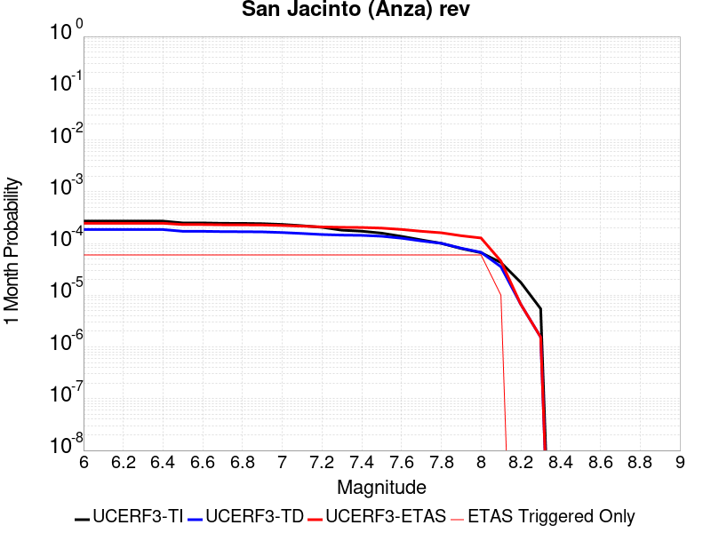 | 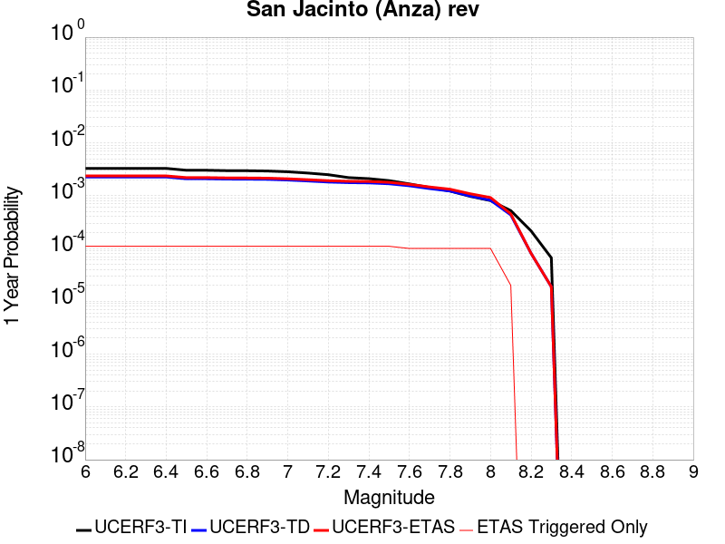 |  |

| Magnitude | 1 wk TI Prob | 1 wk TD Prob | 1 wk ETAS Prob | 1 wk ETAS/TD Gain | 1 wk ETAS Triggered Only | 1 mo TI Prob | 1 mo TD Prob | 1 mo ETAS Prob | 1 mo ETAS/TD Gain | 1 mo ETAS Triggered Only | 1 yr TI Prob | 1 yr TD Prob | 1 yr ETAS Prob | 1 yr ETAS/TD Gain | 1 yr ETAS Triggered Only | 10 yr TI Prob | 10 yr TD Prob | 10 yr ETAS Prob | 10 yr ETAS/TD Gain | 10 yr ETAS Triggered Only |
|-----|-----|-----|-----|-----|-----|-----|-----|-----|-----|-----|-----|-----|-----|-----|-----|-----|-----|-----|-----|-----|
| 6.0 | 6.3015636E-5 | 4.3302647E-5 | 9.3300485E-5 | 2.1546137 | 5.0E-5 | 2.7003905E-4 | 1.8556965E-4 | 2.455585E-4 | 1.3232688 | 6.0E-5 | 0.0032827691 | 0.0022569813 | 0.002366733 | 1.0486276 | 1.1E-4 | 0.032346968 | 0.023296192 | 0.023432931 | 1.0058695 | 1.4E-4 |
| 6.1 | 6.3015636E-5 | 4.3302647E-5 | 9.3300485E-5 | 2.1546137 | 5.0E-5 | 2.7003905E-4 | 1.8556965E-4 | 2.455585E-4 | 1.3232688 | 6.0E-5 | 0.0032827691 | 0.0022569813 | 0.002366733 | 1.0486276 | 1.1E-4 | 0.032346968 | 0.023296192 | 0.023432931 | 1.0058695 | 1.4E-4 |
| 6.2 | 6.3015636E-5 | 4.3302647E-5 | 9.3300485E-5 | 2.1546137 | 5.0E-5 | 2.7003905E-4 | 1.8556965E-4 | 2.455585E-4 | 1.3232688 | 6.0E-5 | 0.0032827691 | 0.0022569813 | 0.002366733 | 1.0486276 | 1.1E-4 | 0.032346968 | 0.023296192 | 0.023432931 | 1.0058695 | 1.4E-4 |
| 6.3 | 6.3015636E-5 | 4.3302647E-5 | 9.3300485E-5 | 2.1546137 | 5.0E-5 | 2.7003905E-4 | 1.8556965E-4 | 2.455585E-4 | 1.3232688 | 6.0E-5 | 0.0032827691 | 0.0022569813 | 0.002366733 | 1.0486276 | 1.1E-4 | 0.032346968 | 0.023296192 | 0.023432931 | 1.0058695 | 1.4E-4 |
| 6.4 | 6.3015636E-5 | 4.3302647E-5 | 9.3300485E-5 | 2.1546137 | 5.0E-5 | 2.7003905E-4 | 1.8556965E-4 | 2.455585E-4 | 1.3232688 | 6.0E-5 | 0.0032827691 | 0.0022569813 | 0.002366733 | 1.0486276 | 1.1E-4 | 0.032346968 | 0.023296192 | 0.023432931 | 1.0058695 | 1.4E-4 |
| 6.5 | 5.811017E-5 | 4.0082516E-5 | 9.008051E-5 | 2.2473767 | 5.0E-5 | 2.4901982E-4 | 1.7177092E-4 | 2.3176061E-4 | 1.3492424 | 6.0E-5 | 0.0030276014 | 0.002089311 | 0.002199081 | 1.052539 | 1.1E-4 | 0.02986684 | 0.021593736 | 0.021730714 | 1.0063434 | 1.4E-4 |
| 6.6 | 5.811017E-5 | 4.0082516E-5 | 9.008051E-5 | 2.2473767 | 5.0E-5 | 2.4901982E-4 | 1.7177092E-4 | 2.3176061E-4 | 1.3492424 | 6.0E-5 | 0.0030276014 | 0.002089311 | 0.002199081 | 1.052539 | 1.1E-4 | 0.02986684 | 0.021593736 | 0.021730714 | 1.0063434 | 1.4E-4 |
| 6.7 | 5.712442E-5 | 3.9505223E-5 | 8.950325E-5 | 2.2656054 | 5.0E-5 | 2.4479596E-4 | 1.6929714E-4 | 2.2928699E-4 | 1.3543464 | 6.0E-5 | 0.0029763177 | 0.0020592497 | 0.002169023 | 1.0533075 | 1.1E-4 | 0.029367693 | 0.021285562 | 0.021422582 | 1.0064372 | 1.4E-4 |
| 6.8 | 5.6967532E-5 | 3.9361643E-5 | 8.935967E-5 | 2.2702222 | 5.0E-5 | 2.4412372E-4 | 1.6868189E-4 | 2.2867176E-4 | 1.3556391 | 6.0E-5 | 0.0029681553 | 0.002051773 | 0.0021615473 | 1.0535022 | 1.1E-4 | 0.029288229 | 0.021210281 | 0.021347312 | 1.0064605 | 1.4E-4 |
| 6.9 | 5.6211324E-5 | 3.9066435E-5 | 8.906448E-5 | 2.279821 | 5.0E-5 | 2.4088343E-4 | 1.6741687E-4 | 2.2740682E-4 | 1.3583268 | 6.0E-5 | 0.0029288116 | 0.0020364004 | 0.0021461763 | 1.0539069 | 1.1E-4 | 0.028905109 | 0.021049714 | 0.021186767 | 1.006511 | 1.4E-4 |
| 7.0 | 5.4383527E-5 | 3.792697E-5 | 8.792507E-5 | 2.318273 | 5.0E-5 | 2.3305144E-4 | 1.6253405E-4 | 2.2252431E-4 | 1.3690934 | 6.0E-5 | 0.0028337094 | 0.001977061 | 0.0020868434 | 1.0555282 | 1.1E-4 | 0.027978465 | 0.020440677 | 0.020577814 | 1.0067091 | 1.4E-4 |
| 7.1 | 5.1393665E-5 | 3.6389913E-5 | 8.638809E-5 | 2.3739572 | 5.0E-5 | 2.2023996E-4 | 1.5594746E-4 | 2.1593811E-4 | 1.3846849 | 6.0E-5 | 0.0026781242 | 0.0018970112 | 0.0020068025 | 1.057876 | 1.1E-4 | 0.026460782 | 0.019614287 | 0.019751541 | 1.0069977 | 1.4E-4 |
| 7.2 | 4.785222E-5 | 3.4741795E-5 | 8.474006E-5 | 2.4391387 | 5.0E-5 | 2.0506482E-4 | 1.4888494E-4 | 2.0887601E-4 | 1.4029357 | 6.0E-5 | 0.0024938055 | 0.0018111705 | 0.0019209713 | 1.0606242 | 1.1E-4 | 0.024660049 | 0.018728992 | 0.01886637 | 1.0073351 | 1.4E-4 |
| 7.3 | 4.2143256E-5 | 3.383628E-5 | 8.383459E-5 | 2.4776537 | 5.0E-5 | 1.8060145E-4 | 1.4500458E-4 | 2.0499589E-4 | 1.41372 | 6.0E-5 | 0.002196605 | 0.0017640047 | 0.0018738107 | 1.0622481 | 1.1E-4 | 0.02175019 | 0.01823724 | 0.01836487 | 1.0069983 | 1.3E-4 |
| 7.4 | 4.0264713E-5 | 3.347446E-5 | 8.347279E-5 | 2.4936259 | 5.0E-5 | 1.7255165E-4 | 1.4345412E-4 | 2.0344551E-4 | 1.4181921 | 6.0E-5 | 0.002098792 | 0.0017451581 | 0.0018549662 | 1.0629215 | 1.1E-4 | 0.020790804 | 0.018041821 | 0.018169476 | 1.0070754 | 1.3E-4 |
| 7.5 | 3.694492E-5 | 3.218847E-5 | 8.218686E-5 | 2.5533013 | 5.0E-5 | 1.5832575E-4 | 1.379433E-4 | 1.9793502E-4 | 1.4349014 | 6.0E-5 | 0.0019259118 | 0.001678169 | 0.0017879844 | 1.0654377 | 1.1E-4 | 0.01909306 | 0.01735827 | 0.017486013 | 1.0073593 | 1.3E-4 |
| 7.6 | 3.200565E-5 | 2.9504106E-5 | 7.950263E-5 | 2.6946294 | 5.0E-5 | 1.3715986E-4 | 1.2644005E-4 | 1.8643247E-4 | 1.4744731 | 6.0E-5 | 0.001668642 | 0.0015383229 | 0.001638169 | 1.0649059 | 1.0E-4 | 0.01656168 | 0.0159463 | 0.016064387 | 1.0074053 | 1.2E-4 |
| 7.7 | 2.731642E-5 | 2.6092788E-5 | 7.6091485E-5 | 2.9161882 | 5.0E-5 | 1.1706512E-4 | 1.1182144E-4 | 1.7181474E-4 | 1.5365098 | 6.0E-5 | 0.001424336 | 0.0013605768 | 0.0014604408 | 1.0733982 | 1.0E-4 | 0.014152412 | 0.014167004 | 0.014285305 | 1.0083504 | 1.2E-4 |
| 7.8 | 2.3466424E-5 | 2.3504817E-5 | 7.3503645E-5 | 3.1271734 | 5.0E-5 | 1.0056651E-4 | 1.0073105E-4 | 1.60725E-4 | 1.5955856 | 6.0E-5 | 0.0012237094 | 0.0012257113 | 0.0013255888 | 1.0814853 | 1.0E-4 | 0.012169928 | 0.012808893 | 0.012927356 | 1.0092485 | 1.2E-4 |
| 7.9 | 1.8611925E-5 | 1.8908117E-5 | 6.8907175E-5 | 3.644317 | 5.0E-5 | 7.9762955E-5 | 8.1032274E-5 | 1.4102741E-4 | 1.7403858 | 6.0E-5 | 9.7068126E-4 | 9.861222E-4 | 0.0010860235 | 1.1013073 | 1.0E-4 | 0.0096645225 | 0.010393824 | 0.010502681 | 1.0104733 | 1.1E-4 |
| 8.0 | 1.5460775E-5 | 1.5740965E-5 | 6.5740176E-5 | 4.1763754 | 5.0E-5 | 6.6258784E-5 | 6.7459536E-5 | 1.2745548E-4 | 1.8893621 | 6.0E-5 | 8.0640207E-4 | 8.21011E-4 | 9.2092896E-4 | 1.121701 | 1.0E-4 | 0.008034821 | 0.0087028835 | 0.0088119265 | 1.0125295 | 1.1E-4 |
| 8.1 | 9.983884E-6 | 8.269952E-6 | 1.826987E-5 | 2.2091868 | 1.0E-5 | 4.2787375E-5 | 3.544217E-5 | 4.544182E-5 | 1.2821398 | 1.0E-5 | 5.2081177E-4 | 4.314235E-4 | 4.5141487E-4 | 1.0463382 | 2.0E-5 | 0.0051959283 | 0.004640022 | 0.0046599293 | 1.0042903 | 2.0E-5 |
| 8.2 | 4.1226E-6 | 1.5529788E-6 | 1.5529788E-6 | 1.0 | 0.0 | 1.7668166E-5 | 6.6556063E-6 | 6.6556063E-6 | 1.0 | 0.0 | 2.1508869E-4 | 8.102902E-5 | 8.102902E-5 | 1.0 | 0.0 | 0.0021488064 | 9.4050163E-4 | 9.4050163E-4 | 1.0 | 0.0 |
| 8.3 | 1.2750878E-6 | 3.612133E-7 | 3.612133E-7 | 1.0 | 0.0 | 5.4646503E-6 | 1.548056E-6 | 1.548056E-6 | 1.0 | 0.0 | 6.653009E-5 | 1.8847424E-5 | 1.8847424E-5 | 1.0 | 0.0 | 6.6510175E-4 | 2.2734253E-4 | 2.2734253E-4 | 1.0 | 0.0 |

## Chino alt 1
*[(top)](#table-of-contents)*

| 1 Week | 1 Month | 1 Year | 10 Year |
|-----|-----|-----|-----|
| 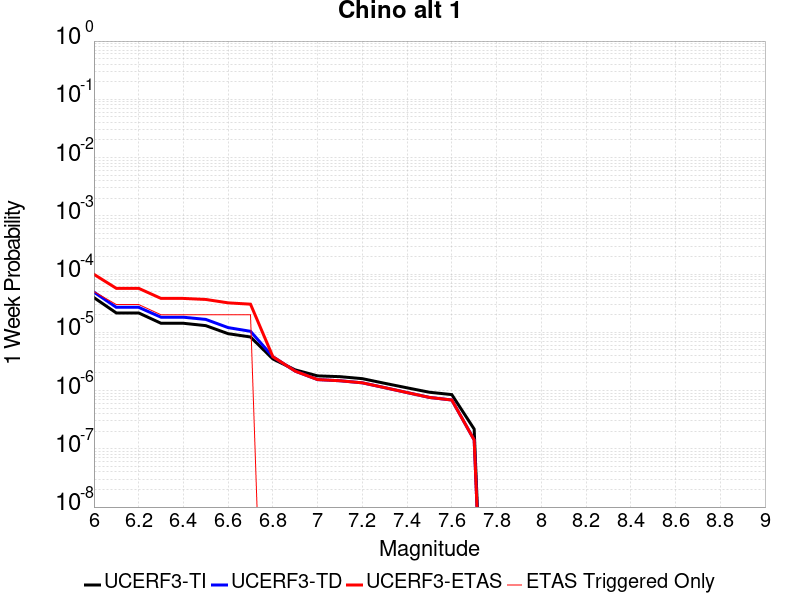 |  |  | 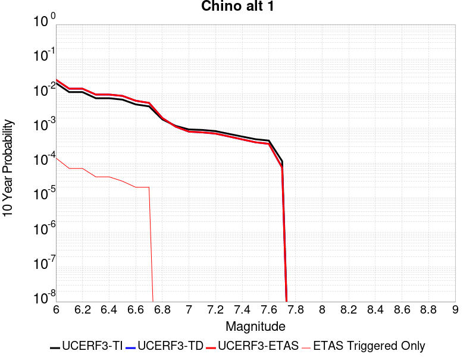 |

| Magnitude | 1 wk TI Prob | 1 wk TD Prob | 1 wk ETAS Prob | 1 wk ETAS/TD Gain | 1 wk ETAS Triggered Only | 1 mo TI Prob | 1 mo TD Prob | 1 mo ETAS Prob | 1 mo ETAS/TD Gain | 1 mo ETAS Triggered Only | 1 yr TI Prob | 1 yr TD Prob | 1 yr ETAS Prob | 1 yr ETAS/TD Gain | 1 yr ETAS Triggered Only | 10 yr TI Prob | 10 yr TD Prob | 10 yr ETAS Prob | 10 yr ETAS/TD Gain | 10 yr ETAS Triggered Only |
|-----|-----|-----|-----|-----|-----|-----|-----|-----|-----|-----|-----|-----|-----|-----|-----|-----|-----|-----|-----|-----|
| 6.0 | 3.939946E-5 | 4.8948554E-5 | 9.8946104E-5 | 2.0214307 | 5.0E-5 | 1.6884391E-4 | 2.097656E-4 | 2.69753E-4 | 1.2859735 | 6.0E-5 | 0.0020537362 | 0.0025513945 | 0.002641165 | 1.0351849 | 9.0E-5 | 0.020348595 | 0.025277847 | 0.025414309 | 1.0053984 | 1.4E-4 |
| 6.1 | 2.1505624E-5 | 2.6879026E-5 | 5.687822E-5 | 2.116082 | 3.0E-5 | 9.2163704E-5 | 1.1519137E-4 | 1.5518676E-4 | 1.3472083 | 4.0E-5 | 0.0011215154 | 0.001401664 | 0.0014515939 | 1.0356219 | 5.0E-5 | 0.011158722 | 0.013945141 | 0.014014165 | 1.0049497 | 7.0E-5 |
| 6.2 | 2.1505624E-5 | 2.6879026E-5 | 5.687822E-5 | 2.116082 | 3.0E-5 | 9.2163704E-5 | 1.1519137E-4 | 1.5518676E-4 | 1.3472083 | 4.0E-5 | 0.0011215154 | 0.001401664 | 0.0014515939 | 1.0356219 | 5.0E-5 | 0.011158722 | 0.013945141 | 0.014014165 | 1.0049497 | 7.0E-5 |
| 6.3 | 1.4290785E-5 | 1.8165128E-5 | 3.8164766E-5 | 2.1009908 | 2.0E-5 | 6.1244784E-5 | 7.784848E-5 | 1.0784614E-4 | 1.385334 | 3.0E-5 | 7.454001E-4 | 9.4743853E-4 | 9.774101E-4 | 1.0316343 | 3.0E-5 | 0.007429048 | 0.0094444575 | 0.00948408 | 1.0041953 | 4.0E-5 |
| 6.4 | 1.4290785E-5 | 1.8165128E-5 | 3.8164766E-5 | 2.1009908 | 2.0E-5 | 6.1244784E-5 | 7.784848E-5 | 1.0784614E-4 | 1.385334 | 3.0E-5 | 7.454001E-4 | 9.4743853E-4 | 9.774101E-4 | 1.0316343 | 3.0E-5 | 0.007429048 | 0.0094444575 | 0.00948408 | 1.0041953 | 4.0E-5 |
| 6.5 | 1.3017944E-5 | 1.6652088E-5 | 3.6651756E-5 | 2.2010305 | 2.0E-5 | 5.5789995E-5 | 7.136439E-5 | 1.01362246E-4 | 1.4203477 | 3.0E-5 | 6.790315E-4 | 8.685589E-4 | 8.985328E-4 | 1.03451 | 3.0E-5 | 0.0067696036 | 0.008661949 | 0.008691689 | 1.0034335 | 3.0E-5 |
| 6.6 | 9.470016E-6 | 1.2039424E-5 | 3.2039185E-5 | 2.661189 | 2.0E-5 | 4.058515E-5 | 5.1596704E-5 | 7.159567E-5 | 1.3876016 | 2.0E-5 | 4.940122E-4 | 6.280428E-4 | 6.480302E-4 | 1.031825 | 2.0E-5 | 0.004929154 | 0.0062718987 | 0.006291773 | 1.0031688 | 2.0E-5 |
| 6.7 | 8.314155E-6 | 1.0407736E-5 | 3.040753E-5 | 2.9216273 | 2.0E-5 | 3.5631605E-5 | 4.4604003E-5 | 6.460311E-5 | 1.4483702 | 2.0E-5 | 4.3372845E-4 | 5.429507E-4 | 5.6293985E-4 | 1.0368158 | 2.0E-5 | 0.004328829 | 0.005425775 | 0.0054456666 | 1.0036662 | 2.0E-5 |
| 6.8 | 3.4856364E-6 | 3.8133708E-6 | 3.8133708E-6 | 1.0 | 0.0 | 1.4938357E-5 | 1.6342927E-5 | 1.6342927E-5 | 1.0 | 0.0 | 1.8185932E-4 | 1.9895904E-4 | 1.9895904E-4 | 1.0 | 0.0 | 0.0018171056 | 0.0019894864 | 0.0019894864 | 1.0 | 0.0 |
| 6.9 | 2.2645952E-6 | 2.1529022E-6 | 2.1529022E-6 | 1.0 | 0.0 | 9.705372E-6 | 9.226692E-6 | 9.226692E-6 | 1.0 | 0.0 | 1.18156495E-4 | 1.123294E-4 | 1.123294E-4 | 1.0 | 0.0 | 0.0011809369 | 0.0011233423 | 0.0011233423 | 1.0 | 0.0 |
| 7.0 | 1.7864003E-6 | 1.5430785E-6 | 1.5430785E-6 | 1.0 | 0.0 | 7.655979E-6 | 6.613177E-6 | 6.613177E-6 | 1.0 | 0.0 | 9.3207556E-5 | 8.051251E-5 | 8.051251E-5 | 1.0 | 0.0 | 9.316847E-4 | 8.0528046E-4 | 8.0528046E-4 | 1.0 | 0.0 |
| 7.1 | 1.7315456E-6 | 1.4733511E-6 | 1.4733511E-6 | 1.0 | 0.0 | 7.420889E-6 | 6.3143466E-6 | 6.3143466E-6 | 1.0 | 0.0 | 9.034557E-5 | 7.6874516E-5 | 7.6874516E-5 | 1.0 | 0.0 | 9.0308854E-4 | 7.6891703E-4 | 7.6891703E-4 | 1.0 | 0.0 |
| 7.2 | 1.6008337E-6 | 1.3574215E-6 | 1.3574215E-6 | 1.0 | 0.0 | 6.860698E-6 | 5.817508E-6 | 5.817508E-6 | 1.0 | 0.0 | 8.352579E-5 | 7.082591E-5 | 7.082591E-5 | 1.0 | 0.0 | 8.34944E-4 | 7.0845755E-4 | 7.0845755E-4 | 1.0 | 0.0 |
| 7.3 | 1.3320939E-6 | 1.121782E-6 | 1.121782E-6 | 1.0 | 0.0 | 5.7089615E-6 | 4.807629E-6 | 4.807629E-6 | 1.0 | 0.0 | 6.9504385E-5 | 5.8531357E-5 | 5.8531357E-5 | 1.0 | 0.0 | 6.9482654E-4 | 5.8530393E-4 | 5.8530393E-4 | 1.0 | 0.0 |
| 7.4 | 1.114294E-6 | 9.237111E-7 | 9.237111E-7 | 1.0 | 0.0 | 4.775537E-6 | 3.958756E-6 | 3.958756E-6 | 1.0 | 0.0 | 5.8140613E-5 | 4.8196827E-5 | 4.8196827E-5 | 1.0 | 0.0 | 5.81254E-4 | 4.8188053E-4 | 4.8188053E-4 | 1.0 | 0.0 |
| 7.5 | 9.354081E-7 | 7.6234323E-7 | 7.6234323E-7 | 1.0 | 0.0 | 4.0088858E-6 | 3.2671815E-6 | 3.2671815E-6 | 1.0 | 0.0 | 4.8807087E-5 | 3.9777242E-5 | 3.9777242E-5 | 1.0 | 0.0 | 4.879637E-4 | 3.977046E-4 | 3.977046E-4 | 1.0 | 0.0 |
| 7.6 | 8.521771E-7 | 6.88071E-7 | 6.88071E-7 | 1.0 | 0.0 | 3.6521824E-6 | 2.9488726E-6 | 2.9488726E-6 | 1.0 | 0.0 | 4.4464414E-5 | 3.5901965E-5 | 3.5901965E-5 | 1.0 | 0.0 | 4.4455516E-4 | 3.589648E-4 | 3.589648E-4 | 1.0 | 0.0 |
| 7.7 | 2.1803626E-7 | 1.418649E-7 | 1.418649E-7 | 1.0 | 0.0 | 9.344408E-7 | 6.079923E-7 | 6.079923E-7 | 1.0 | 0.0 | 1.1376757E-5 | 7.4022914E-6 | 7.4022914E-6 | 1.0 | 0.0 | 1.13761744E-4 | 7.402141E-5 | 7.402141E-5 | 1.0 | 0.0 |

## Dry Mountain
*[(top)](#table-of-contents)*

| 1 Week | 1 Month | 1 Year | 10 Year |
|-----|-----|-----|-----|
|  |  |  |  |

| Magnitude | 1 wk TI Prob | 1 wk TD Prob | 1 wk ETAS Prob | 1 wk ETAS/TD Gain | 1 wk ETAS Triggered Only | 1 mo TI Prob | 1 mo TD Prob | 1 mo ETAS Prob | 1 mo ETAS/TD Gain | 1 mo ETAS Triggered Only | 1 yr TI Prob | 1 yr TD Prob | 1 yr ETAS Prob | 1 yr ETAS/TD Gain | 1 yr ETAS Triggered Only | 10 yr TI Prob | 10 yr TD Prob | 10 yr ETAS Prob | 10 yr ETAS/TD Gain | 10 yr ETAS Triggered Only |
|-----|-----|-----|-----|-----|-----|-----|-----|-----|-----|-----|-----|-----|-----|-----|-----|-----|-----|-----|-----|-----|
| 6.0 | 6.222801E-6 | 6.439381E-6 | 5.6439058E-5 | 8.764671 | 5.0E-5 | 2.6668875E-5 | 2.7597147E-5 | 7.759577E-5 | 2.8117316 | 5.0E-5 | 3.2464517E-4 | 3.3595937E-4 | 4.359258E-4 | 1.2975551 | 1.0E-4 | 0.0032417132 | 0.0033560768 | 0.0034856405 | 1.0386057 | 1.3E-4 |
| 6.1 | 6.222801E-6 | 6.439381E-6 | 5.6439058E-5 | 8.764671 | 5.0E-5 | 2.6668875E-5 | 2.7597147E-5 | 7.759577E-5 | 2.8117316 | 5.0E-5 | 3.2464517E-4 | 3.3595937E-4 | 4.359258E-4 | 1.2975551 | 1.0E-4 | 0.0032417132 | 0.0033560768 | 0.0034856405 | 1.0386057 | 1.3E-4 |
| 6.2 | 6.222801E-6 | 6.439381E-6 | 5.6439058E-5 | 8.764671 | 5.0E-5 | 2.6668875E-5 | 2.7597147E-5 | 7.759577E-5 | 2.8117316 | 5.0E-5 | 3.2464517E-4 | 3.3595937E-4 | 4.359258E-4 | 1.2975551 | 1.0E-4 | 0.0032417132 | 0.0033560768 | 0.0034856405 | 1.0386057 | 1.3E-4 |
| 6.3 | 6.222801E-6 | 6.439381E-6 | 5.6439058E-5 | 8.764671 | 5.0E-5 | 2.6668875E-5 | 2.7597147E-5 | 7.759577E-5 | 2.8117316 | 5.0E-5 | 3.2464517E-4 | 3.3595937E-4 | 4.359258E-4 | 1.2975551 | 1.0E-4 | 0.0032417132 | 0.0033560768 | 0.0034856405 | 1.0386057 | 1.3E-4 |
| 6.4 | 6.222801E-6 | 6.439381E-6 | 5.6439058E-5 | 8.764671 | 5.0E-5 | 2.6668875E-5 | 2.7597147E-5 | 7.759577E-5 | 2.8117316 | 5.0E-5 | 3.2464517E-4 | 3.3595937E-4 | 4.359258E-4 | 1.2975551 | 1.0E-4 | 0.0032417132 | 0.0033560768 | 0.0034856405 | 1.0386057 | 1.3E-4 |
| 6.5 | 2.8528623E-6 | 2.9521684E-6 | 5.2952022E-5 | 17.936653 | 5.0E-5 | 1.22264955E-5 | 1.2652138E-5 | 6.26515E-5 | 4.9518514 | 5.0E-5 | 1.4884741E-4 | 1.540376E-4 | 2.1402835E-4 | 1.3894553 | 6.0E-5 | 0.0014874774 | 0.0015401616 | 0.0016100538 | 1.0453798 | 7.0E-5 |
| 6.6 | 2.8528623E-6 | 2.9521684E-6 | 5.2952022E-5 | 17.936653 | 5.0E-5 | 1.22264955E-5 | 1.2652138E-5 | 6.26515E-5 | 4.9518514 | 5.0E-5 | 1.4884741E-4 | 1.540376E-4 | 2.1402835E-4 | 1.3894553 | 6.0E-5 | 0.0014874774 | 0.0015401616 | 0.0016100538 | 1.0453798 | 7.0E-5 |
| 6.7 | 2.541E-6 | 2.6293578E-6 | 4.2629254E-5 | 16.2128 | 4.0E-5 | 1.0889954E-5 | 1.1268677E-5 | 5.1268227E-5 | 4.5496225 | 4.0E-5 | 1.3257713E-4 | 1.3719614E-4 | 1.8718927E-4 | 1.3643918 | 5.0E-5 | 0.0013249806 | 0.0013719613 | 0.001431879 | 1.043673 | 6.0E-5 |

## Deep Springs
*[(top)](#table-of-contents)*

| 1 Week | 1 Month | 1 Year | 10 Year |
|-----|-----|-----|-----|
|  |  |  |  |

| Magnitude | 1 wk TI Prob | 1 wk TD Prob | 1 wk ETAS Prob | 1 wk ETAS/TD Gain | 1 wk ETAS Triggered Only | 1 mo TI Prob | 1 mo TD Prob | 1 mo ETAS Prob | 1 mo ETAS/TD Gain | 1 mo ETAS Triggered Only | 1 yr TI Prob | 1 yr TD Prob | 1 yr ETAS Prob | 1 yr ETAS/TD Gain | 1 yr ETAS Triggered Only | 10 yr TI Prob | 10 yr TD Prob | 10 yr ETAS Prob | 10 yr ETAS/TD Gain | 10 yr ETAS Triggered Only |
|-----|-----|-----|-----|-----|-----|-----|-----|-----|-----|-----|-----|-----|-----|-----|-----|-----|-----|-----|-----|-----|
| 6.0 | 1.9810619E-5 | 2.311252E-5 | 7.311136E-5 | 3.1632798 | 5.0E-5 | 8.489989E-5 | 9.905276E-5 | 1.6904583E-4 | 1.7066242 | 7.0E-5 | 0.001033166 | 0.0012058079 | 0.0012956994 | 1.0745487 | 9.0E-5 | 0.010283757 | 0.012042425 | 0.012180739 | 1.0114856 | 1.4E-4 |
| 6.1 | 1.9810619E-5 | 2.311252E-5 | 7.311136E-5 | 3.1632798 | 5.0E-5 | 8.489989E-5 | 9.905276E-5 | 1.6904583E-4 | 1.7066242 | 7.0E-5 | 0.001033166 | 0.0012058079 | 0.0012956994 | 1.0745487 | 9.0E-5 | 0.010283757 | 0.012042425 | 0.012180739 | 1.0114856 | 1.4E-4 |
| 6.2 | 1.9810619E-5 | 2.311252E-5 | 7.311136E-5 | 3.1632798 | 5.0E-5 | 8.489989E-5 | 9.905276E-5 | 1.6904583E-4 | 1.7066242 | 7.0E-5 | 0.001033166 | 0.0012058079 | 0.0012956994 | 1.0745487 | 9.0E-5 | 0.010283757 | 0.012042425 | 0.012180739 | 1.0114856 | 1.4E-4 |
| 6.3 | 1.9810619E-5 | 2.311252E-5 | 7.311136E-5 | 3.1632798 | 5.0E-5 | 8.489989E-5 | 9.905276E-5 | 1.6904583E-4 | 1.7066242 | 7.0E-5 | 0.001033166 | 0.0012058079 | 0.0012956994 | 1.0745487 | 9.0E-5 | 0.010283757 | 0.012042425 | 0.012180739 | 1.0114856 | 1.4E-4 |
| 6.4 | 1.9810619E-5 | 2.311252E-5 | 7.311136E-5 | 3.1632798 | 5.0E-5 | 8.489989E-5 | 9.905276E-5 | 1.6904583E-4 | 1.7066242 | 7.0E-5 | 0.001033166 | 0.0012058079 | 0.0012956994 | 1.0745487 | 9.0E-5 | 0.010283757 | 0.012042425 | 0.012180739 | 1.0114856 | 1.4E-4 |
| 6.5 | 1.7190405E-5 | 2.0050555E-5 | 7.004955E-5 | 3.4936464 | 5.0E-5 | 7.367108E-5 | 8.593095E-5 | 1.5592494E-4 | 1.8145375 | 7.0E-5 | 8.9657627E-4 | 0.0010462094 | 0.0011361152 | 1.0859349 | 9.0E-5 | 0.008929676 | 0.010462056 | 0.010600591 | 1.0132416 | 1.4E-4 |
| 6.6 | 1.7190405E-5 | 2.0050555E-5 | 7.004955E-5 | 3.4936464 | 5.0E-5 | 7.367108E-5 | 8.593095E-5 | 1.5592494E-4 | 1.8145375 | 7.0E-5 | 8.9657627E-4 | 0.0010462094 | 0.0011361152 | 1.0859349 | 9.0E-5 | 0.008929676 | 0.010462056 | 0.010600591 | 1.0132416 | 1.4E-4 |

## Cleghorn
*[(top)](#table-of-contents)*

| 1 Week | 1 Month | 1 Year | 10 Year |
|-----|-----|-----|-----|
|  |  |  |  |

| Magnitude | 1 wk TI Prob | 1 wk TD Prob | 1 wk ETAS Prob | 1 wk ETAS/TD Gain | 1 wk ETAS Triggered Only | 1 mo TI Prob | 1 mo TD Prob | 1 mo ETAS Prob | 1 mo ETAS/TD Gain | 1 mo ETAS Triggered Only | 1 yr TI Prob | 1 yr TD Prob | 1 yr ETAS Prob | 1 yr ETAS/TD Gain | 1 yr ETAS Triggered Only | 10 yr TI Prob | 10 yr TD Prob | 10 yr ETAS Prob | 10 yr ETAS/TD Gain | 10 yr ETAS Triggered Only |
|-----|-----|-----|-----|-----|-----|-----|-----|-----|-----|-----|-----|-----|-----|-----|-----|-----|-----|-----|-----|-----|
| 6.0 | 7.9267165E-6 | 9.831582E-6 | 4.983119E-5 | 5.068481 | 4.0E-5 | 3.39712E-5 | 4.2134732E-5 | 9.213263E-5 | 2.1866195 | 5.0E-5 | 4.1352084E-4 | 5.128803E-4 | 5.928392E-4 | 1.1559018 | 8.0E-5 | 0.004127522 | 0.0051320773 | 0.0052713584 | 1.0271394 | 1.4E-4 |
| 6.1 | 7.9267165E-6 | 9.831582E-6 | 4.983119E-5 | 5.068481 | 4.0E-5 | 3.39712E-5 | 4.2134732E-5 | 9.213263E-5 | 2.1866195 | 5.0E-5 | 4.1352084E-4 | 5.128803E-4 | 5.928392E-4 | 1.1559018 | 8.0E-5 | 0.004127522 | 0.0051320773 | 0.0052713584 | 1.0271394 | 1.4E-4 |
| 6.2 | 7.9267165E-6 | 9.831582E-6 | 4.983119E-5 | 5.068481 | 4.0E-5 | 3.39712E-5 | 4.2134732E-5 | 9.213263E-5 | 2.1866195 | 5.0E-5 | 4.1352084E-4 | 5.128803E-4 | 5.928392E-4 | 1.1559018 | 8.0E-5 | 0.004127522 | 0.0051320773 | 0.0052713584 | 1.0271394 | 1.4E-4 |
| 6.3 | 7.9267165E-6 | 9.831582E-6 | 4.983119E-5 | 5.068481 | 4.0E-5 | 3.39712E-5 | 4.2134732E-5 | 9.213263E-5 | 2.1866195 | 5.0E-5 | 4.1352084E-4 | 5.128803E-4 | 5.928392E-4 | 1.1559018 | 8.0E-5 | 0.004127522 | 0.0051320773 | 0.0052713584 | 1.0271394 | 1.4E-4 |
| 6.4 | 4.3445207E-6 | 6.0914435E-6 | 2.6091322E-5 | 4.283274 | 2.0E-5 | 1.8619241E-5 | 2.610593E-5 | 4.6105408E-5 | 1.7660894 | 2.0E-5 | 2.2666567E-4 | 3.1779436E-4 | 3.4778484E-4 | 1.0943707 | 3.0E-5 | 0.0022643462 | 0.0031875873 | 0.003257364 | 1.0218902 | 7.0E-5 |
| 6.5 | 4.3445207E-6 | 6.0914435E-6 | 2.6091322E-5 | 4.283274 | 2.0E-5 | 1.8619241E-5 | 2.610593E-5 | 4.6105408E-5 | 1.7660894 | 2.0E-5 | 2.2666567E-4 | 3.1779436E-4 | 3.4778484E-4 | 1.0943707 | 3.0E-5 | 0.0022643462 | 0.0031875873 | 0.003257364 | 1.0218902 | 7.0E-5 |
| 6.6 | 4.040109E-6 | 5.773851E-6 | 2.5773736E-5 | 4.4638724 | 2.0E-5 | 1.7314638E-5 | 2.4744846E-5 | 4.4744353E-5 | 1.8082291 | 2.0E-5 | 2.1078532E-4 | 3.012278E-4 | 3.3121876E-4 | 1.0995624 | 3.0E-5 | 0.002105855 | 0.003022377 | 0.0030921653 | 1.0230906 | 7.0E-5 |
| 6.7 | 3.3632055E-6 | 5.067348E-6 | 2.5067247E-5 | 4.946818 | 2.0E-5 | 1.4413658E-5 | 2.1717027E-5 | 4.1716594E-5 | 1.9209164 | 2.0E-5 | 1.7547216E-4 | 2.6437303E-4 | 2.943651E-4 | 1.113446 | 3.0E-5 | 0.0017533366 | 0.0026547113 | 0.002714552 | 1.0225413 | 6.0E-5 |
| 6.8 | 3.2902772E-6 | 4.9892556E-6 | 2.4989156E-5 | 5.008594 | 2.0E-5 | 1.4101111E-5 | 2.1382351E-5 | 4.138192E-5 | 1.9353309 | 2.0E-5 | 1.716675E-4 | 2.6029933E-4 | 2.9029153E-4 | 1.115222 | 3.0E-5 | 0.0017153495 | 0.0026140702 | 0.0026739133 | 1.0228927 | 6.0E-5 |
| 6.9 | 3.031547E-6 | 4.6910186E-6 | 2.4690924E-5 | 5.2634463 | 2.0E-5 | 1.299228E-5 | 2.0104211E-5 | 4.010381E-5 | 1.9947964 | 2.0E-5 | 1.5816953E-4 | 2.4474156E-4 | 2.7473422E-4 | 1.1225483 | 3.0E-5 | 0.00158057 | 0.0024588439 | 0.0025186962 | 1.0243417 | 6.0E-5 |
| 7.0 | 2.8259715E-6 | 4.3705895E-6 | 2.4370502E-5 | 5.576022 | 2.0E-5 | 1.211125E-5 | 1.8730963E-5 | 3.8730588E-5 | 2.0677307 | 2.0E-5 | 1.4744449E-4 | 2.2802586E-4 | 2.5801902E-4 | 1.131534 | 3.0E-5 | 0.001473467 | 0.0022920412 | 0.0023519036 | 1.0261176 | 6.0E-5 |
| 7.1 | 2.5962665E-6 | 4.0658106E-6 | 1.406577E-5 | 3.4595242 | 1.0E-5 | 1.1126809E-5 | 1.7424789E-5 | 2.7424614E-5 | 1.5738851 | 1.0E-5 | 1.3546048E-4 | 2.1212637E-4 | 2.3212213E-4 | 1.0942634 | 2.0E-5 | 0.0013537793 | 0.002133366 | 0.0021732806 | 1.0187097 | 4.0E-5 |
| 7.2 | 2.3247253E-6 | 3.6763672E-6 | 1.367633E-5 | 3.7200665 | 1.0E-5 | 9.96307E-6 | 1.5755764E-5 | 2.5755608E-5 | 1.6346784 | 1.0E-5 | 1.21293626E-4 | 1.9180974E-4 | 2.118059E-4 | 1.10425 | 2.0E-5 | 0.0012122744 | 0.0019305905 | 0.0019605325 | 1.0155092 | 3.0E-5 |
| 7.3 | 2.056928E-6 | 3.2350938E-6 | 1.32350615E-5 | 4.0910907 | 1.0E-5 | 8.815376E-6 | 1.3864615E-5 | 2.3864475E-5 | 1.7212505 | 1.0E-5 | 1.0732192E-4 | 1.6878877E-4 | 1.8878539E-4 | 1.1184713 | 2.0E-5 | 0.001072701 | 0.0017008206 | 0.0017307696 | 1.0176085 | 3.0E-5 |
| 7.4 | 1.8055999E-6 | 2.8255042E-6 | 1.2825476E-5 | 4.539181 | 1.0E-5 | 7.738263E-6 | 1.2109249E-5 | 2.2109127E-5 | 1.8258051 | 1.0E-5 | 9.4209274E-5 | 1.4742027E-4 | 1.6741733E-4 | 1.1356466 | 2.0E-5 | 9.4169343E-4 | 0.0014875771 | 0.0015075473 | 1.0134246 | 2.0E-5 |
| 7.5 | 1.4683443E-6 | 2.4247483E-6 | 2.4247483E-6 | 1.0 | 0.0 | 6.292889E-6 | 1.0391738E-5 | 1.0391738E-5 | 1.0 | 0.0 | 7.661323E-5 | 1.2651215E-4 | 1.3651089E-4 | 1.0790337 | 1.0E-5 | 7.658682E-4 | 0.0012787961 | 0.0012887834 | 1.0078099 | 1.0E-5 |
| 7.6 | 9.804088E-7 | 1.900266E-6 | 1.900266E-6 | 1.0 | 0.0 | 4.201745E-6 | 8.143972E-6 | 8.143972E-6 | 1.0 | 0.0 | 5.1155046E-5 | 9.91484E-5 | 9.91484E-5 | 1.0 | 0.0 | 5.114327E-4 | 0.001005471 | 0.001005471 | 1.0 | 0.0 |
| 7.7 | 7.3434086E-7 | 1.6284146E-6 | 1.6284146E-6 | 1.0 | 0.0 | 3.1471714E-6 | 6.978901E-6 | 6.978901E-6 | 1.0 | 0.0 | 3.831614E-5 | 8.4964835E-5 | 8.4964835E-5 | 1.0 | 0.0 | 3.8309532E-4 | 8.6378685E-4 | 8.6378685E-4 | 1.0 | 0.0 |
| 7.8 | 6.434184E-7 | 1.5220047E-6 | 1.5220047E-6 | 1.0 | 0.0 | 2.7575045E-6 | 6.5228614E-6 | 6.5228614E-6 | 1.0 | 0.0 | 3.35721E-5 | 7.941297E-5 | 7.941297E-5 | 1.0 | 0.0 | 3.3567028E-4 | 8.079678E-4 | 8.079678E-4 | 1.0 | 0.0 |
| 7.9 | 3.4943926E-7 | 7.574459E-7 | 7.574459E-7 | 1.0 | 0.0 | 1.497596E-6 | 3.2461926E-6 | 3.2461926E-6 | 1.0 | 0.0 | 1.8233079E-5 | 3.952169E-5 | 3.952169E-5 | 1.0 | 0.0 | 1.8231584E-4 | 4.040099E-4 | 4.040099E-4 | 1.0 | 0.0 |
| 8.0 | 6.717524E-8 | 5.838828E-8 | 5.838828E-8 | 1.0 | 0.0 | 2.8789387E-7 | 2.5023547E-7 | 2.5023547E-7 | 1.0 | 0.0 | 3.505102E-6 | 3.0466126E-6 | 3.0466126E-6 | 1.0 | 0.0 | 3.5050467E-5 | 3.273506E-5 | 3.273506E-5 | 1.0 | 0.0 |
| 8.1 | 3.1984914E-8 | 1.2956093E-8 | 1.2956093E-8 | 1.0 | 0.0 | 1.370782E-7 | 5.552611E-8 | 5.552611E-8 | 1.0 | 0.0 | 1.6689258E-6 | 6.760302E-7 | 6.760302E-7 | 1.0 | 0.0 | 1.6689133E-5 | 7.74454E-6 | 7.74454E-6 | 1.0 | 0.0 |
| 8.2 | 1.21887656E-8 | 3.6495305E-9 | 3.6495305E-9 | 1.0 | 0.0 | 5.2237567E-8 | 1.5640845E-8 | 1.5640845E-8 | 1.0 | 0.0 | 6.359922E-7 | 1.9042727E-7 | 1.9042727E-7 | 1.0 | 0.0 | 6.3599036E-6 | 2.2470974E-6 | 2.2470974E-6 | 1.0 | 0.0 |

## San Jacinto (Stepovers Combined)
*[(top)](#table-of-contents)*

| 1 Week | 1 Month | 1 Year | 10 Year |
|-----|-----|-----|-----|
| 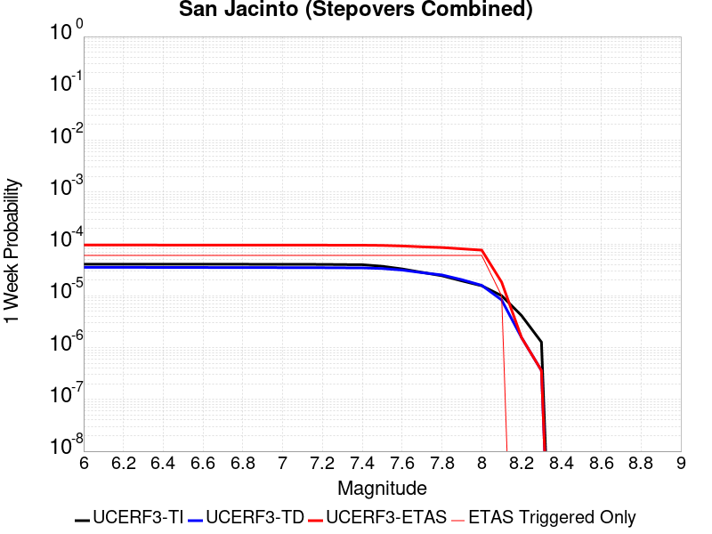 |  |  |  |

| Magnitude | 1 wk TI Prob | 1 wk TD Prob | 1 wk ETAS Prob | 1 wk ETAS/TD Gain | 1 wk ETAS Triggered Only | 1 mo TI Prob | 1 mo TD Prob | 1 mo ETAS Prob | 1 mo ETAS/TD Gain | 1 mo ETAS Triggered Only | 1 yr TI Prob | 1 yr TD Prob | 1 yr ETAS Prob | 1 yr ETAS/TD Gain | 1 yr ETAS Triggered Only | 10 yr TI Prob | 10 yr TD Prob | 10 yr ETAS Prob | 10 yr ETAS/TD Gain | 10 yr ETAS Triggered Only |
|-----|-----|-----|-----|-----|-----|-----|-----|-----|-----|-----|-----|-----|-----|-----|-----|-----|-----|-----|-----|-----|
| 6.0 | 4.0667746E-5 | 3.5272755E-5 | 9.527064E-5 | 2.7009695 | 6.0E-5 | 1.742787E-4 | 1.5116022E-4 | 2.2114963E-4 | 1.4630148 | 7.0E-5 | 0.0021197782 | 0.0018388226 | 0.0019586019 | 1.0651392 | 1.2E-4 | 0.020996714 | 0.018986892 | 0.019124234 | 1.0072335 | 1.4E-4 |
| 6.1 | 4.0667746E-5 | 3.5272755E-5 | 9.527064E-5 | 2.7009695 | 6.0E-5 | 1.742787E-4 | 1.5116022E-4 | 2.2114963E-4 | 1.4630148 | 7.0E-5 | 0.0021197782 | 0.0018388226 | 0.0019586019 | 1.0651392 | 1.2E-4 | 0.020996714 | 0.018986892 | 0.019124234 | 1.0072335 | 1.4E-4 |
| 6.2 | 4.0667746E-5 | 3.5272755E-5 | 9.527064E-5 | 2.7009695 | 6.0E-5 | 1.742787E-4 | 1.5116022E-4 | 2.2114963E-4 | 1.4630148 | 7.0E-5 | 0.0021197782 | 0.0018388226 | 0.0019586019 | 1.0651392 | 1.2E-4 | 0.020996714 | 0.018986892 | 0.019124234 | 1.0072335 | 1.4E-4 |
| 6.3 | 4.0667746E-5 | 3.5272755E-5 | 9.527064E-5 | 2.7009695 | 6.0E-5 | 1.742787E-4 | 1.5116022E-4 | 2.2114963E-4 | 1.4630148 | 7.0E-5 | 0.0021197782 | 0.0018388226 | 0.0019586019 | 1.0651392 | 1.2E-4 | 0.020996714 | 0.018986892 | 0.019124234 | 1.0072335 | 1.4E-4 |
| 6.4 | 4.0577226E-5 | 3.5144654E-5 | 9.5142546E-5 | 2.7071698 | 6.0E-5 | 1.738908E-4 | 1.5061127E-4 | 2.2060073E-4 | 1.4647026 | 7.0E-5 | 0.0021150648 | 0.0018321523 | 0.0019519324 | 1.0653768 | 1.2E-4 | 0.020950472 | 0.018921461 | 0.01905881 | 1.007259 | 1.4E-4 |
| 6.5 | 4.0577226E-5 | 3.5144654E-5 | 9.5142546E-5 | 2.7071698 | 6.0E-5 | 1.738908E-4 | 1.5061127E-4 | 2.2060073E-4 | 1.4647026 | 7.0E-5 | 0.0021150648 | 0.0018321523 | 0.0019519324 | 1.0653768 | 1.2E-4 | 0.020950472 | 0.018921461 | 0.01905881 | 1.007259 | 1.4E-4 |
| 6.6 | 4.053861E-5 | 3.509E-5 | 9.50879E-5 | 2.7098289 | 6.0E-5 | 1.7372532E-4 | 1.5037706E-4 | 2.2036654E-4 | 1.4654266 | 7.0E-5 | 0.0021130538 | 0.0018293057 | 0.0019490861 | 1.0654787 | 1.2E-4 | 0.020930743 | 0.018893538 | 0.019030893 | 1.00727 | 1.4E-4 |
| 6.7 | 4.0516545E-5 | 3.5059067E-5 | 9.505697E-5 | 2.7113373 | 6.0E-5 | 1.7363077E-4 | 1.5024451E-4 | 2.20234E-4 | 1.4658372 | 7.0E-5 | 0.002111905 | 0.001827695 | 0.0019474757 | 1.0655365 | 1.2E-4 | 0.020919468 | 0.018877735 | 0.019015092 | 1.0072762 | 1.4E-4 |
| 6.8 | 4.049434E-5 | 3.5030633E-5 | 9.502853E-5 | 2.7127268 | 6.0E-5 | 1.7353562E-4 | 1.5012265E-4 | 2.2011214E-4 | 1.4662154 | 7.0E-5 | 0.0021107488 | 0.0018262138 | 0.0019459947 | 1.0655897 | 1.2E-4 | 0.020908125 | 0.018863149 | 0.019000508 | 1.0072819 | 1.4E-4 |
| 6.9 | 4.046386E-5 | 3.499319E-5 | 9.499109E-5 | 2.7145593 | 6.0E-5 | 1.73405E-4 | 1.4996222E-4 | 2.1995172E-4 | 1.4667143 | 7.0E-5 | 0.0021091616 | 0.0018242638 | 0.0019440448 | 1.06566 | 1.2E-4 | 0.020892553 | 0.01884392 | 0.018981284 | 1.0072894 | 1.4E-4 |
| 7.0 | 4.036382E-5 | 3.487376E-5 | 9.487166E-5 | 2.7204313 | 6.0E-5 | 1.7297632E-4 | 1.4945042E-4 | 2.1943996E-4 | 1.4683127 | 7.0E-5 | 0.0021039525 | 0.0018180435 | 0.0019378253 | 1.0658851 | 1.2E-4 | 0.02084144 | 0.018782536 | 0.018919906 | 1.0073137 | 1.4E-4 |
| 7.1 | 4.0343282E-5 | 3.4852223E-5 | 9.485013E-5 | 2.7214947 | 6.0E-5 | 1.7288832E-4 | 1.4935812E-4 | 2.1934767E-4 | 1.4686022 | 7.0E-5 | 0.002102883 | 0.0018169218 | 0.0019367038 | 1.0659257 | 1.2E-4 | 0.020830948 | 0.018771412 | 0.018908784 | 1.0073181 | 1.4E-4 |
| 7.2 | 4.0257353E-5 | 3.4756722E-5 | 9.4754636E-5 | 2.7262247 | 6.0E-5 | 1.725201E-4 | 1.489489E-4 | 2.1893847E-4 | 1.4698899 | 7.0E-5 | 0.0020984085 | 0.0018119477 | 0.0019317302 | 1.066107 | 1.2E-4 | 0.020787042 | 0.018722152 | 0.018859532 | 1.0073378 | 1.4E-4 |
| 7.3 | 3.9940667E-5 | 3.4584376E-5 | 9.4582305E-5 | 2.7348273 | 6.0E-5 | 1.7116306E-4 | 1.4821035E-4 | 2.1819999E-4 | 1.4722316 | 7.0E-5 | 0.0020819185 | 0.0018029709 | 0.0019227546 | 1.0664368 | 1.2E-4 | 0.020625217 | 0.018630784 | 0.018768176 | 1.0073744 | 1.4E-4 |
| 7.4 | 3.9721202E-5 | 3.4469766E-5 | 9.44677E-5 | 2.7405958 | 6.0E-5 | 1.7022261E-4 | 1.4771923E-4 | 2.1770889E-4 | 1.473802 | 7.0E-5 | 0.0020704903 | 0.0017970012 | 0.0019167856 | 1.0666579 | 1.2E-4 | 0.020513052 | 0.018569905 | 0.018707307 | 1.0073991 | 1.4E-4 |
| 7.5 | 3.7036873E-5 | 3.3537188E-5 | 9.353517E-5 | 2.7889988 | 6.0E-5 | 1.5871979E-4 | 1.437229E-4 | 2.1371283E-4 | 1.4869784 | 7.0E-5 | 0.0019307006 | 0.0017484248 | 0.001868215 | 1.0685132 | 1.2E-4 | 0.019140124 | 0.018071463 | 0.018208934 | 1.007607 | 1.4E-4 |
| 7.6 | 3.2940967E-5 | 3.1317984E-5 | 9.1316106E-5 | 2.915772 | 6.0E-5 | 1.4116794E-4 | 1.3421304E-4 | 2.0420365E-4 | 1.5214888 | 7.0E-5 | 0.0017173645 | 0.0016328214 | 0.0017426417 | 1.067258 | 1.1E-4 | 0.01704153 | 0.016904354 | 0.017032156 | 1.0075604 | 1.3E-4 |
| 7.7 | 2.8236149E-5 | 2.7883889E-5 | 8.788222E-5 | 3.15172 | 6.0E-5 | 1.2100645E-4 | 1.19496915E-4 | 1.8948855E-4 | 1.5857192 | 7.0E-5 | 0.0014722579 | 0.001453905 | 0.0015637451 | 1.0755483 | 1.1E-4 | 0.014625421 | 0.015115095 | 0.015243131 | 1.0084707 | 1.3E-4 |
| 7.8 | 2.4329287E-5 | 2.5207537E-5 | 8.5206026E-5 | 3.3801806 | 6.0E-5 | 1.042642E-4 | 1.0802783E-4 | 1.7802027E-4 | 1.6479112 | 7.0E-5 | 0.0012686774 | 0.0013144462 | 0.0014243015 | 1.0835755 | 1.1E-4 | 0.012614589 | 0.013712396 | 0.013840613 | 1.0093504 | 1.3E-4 |
| 7.9 | 1.9370926E-5 | 2.0421452E-5 | 8.042023E-5 | 3.938027 | 6.0E-5 | 8.301561E-5 | 8.7517576E-5 | 1.5751144E-4 | 1.7997694 | 7.0E-5 | 0.0010102465 | 0.0010650064 | 0.0011748893 | 1.1031758 | 1.1E-4 | 0.0100566605 | 0.011199483 | 0.011318138 | 1.0105947 | 1.2E-4 |
| 8.0 | 1.5583017E-5 | 1.588647E-5 | 7.588552E-5 | 4.776739 | 6.0E-5 | 6.6782646E-5 | 6.808309E-5 | 1.3807832E-4 | 2.0280855 | 7.0E-5 | 8.127754E-4 | 8.285971E-4 | 9.38506E-4 | 1.1326445 | 1.1E-4 | 0.008098091 | 0.008781809 | 0.008900756 | 1.0135446 | 1.2E-4 |
| 8.1 | 1.0024873E-5 | 8.292404E-6 | 1.8292321E-5 | 2.2059128 | 1.0E-5 | 4.2963035E-5 | 3.5538393E-5 | 4.553804E-5 | 1.2813758 | 1.0E-5 | 5.229494E-4 | 4.3259456E-4 | 4.525859E-4 | 1.0462127 | 2.0E-5 | 0.0052172043 | 0.0046534105 | 0.0046733175 | 1.004278 | 2.0E-5 |
| 8.2 | 4.142796E-6 | 1.5610041E-6 | 1.5610041E-6 | 1.0 | 0.0 | 1.775472E-5 | 6.69E-6 | 6.69E-6 | 1.0 | 0.0 | 2.1614227E-4 | 8.144774E-5 | 8.144774E-5 | 1.0 | 0.0 | 0.0021593217 | 9.454649E-4 | 9.454649E-4 | 1.0 | 0.0 |
| 8.3 | 1.2750878E-6 | 3.612133E-7 | 3.612133E-7 | 1.0 | 0.0 | 5.4646503E-6 | 1.548056E-6 | 1.548056E-6 | 1.0 | 0.0 | 6.653009E-5 | 1.8847424E-5 | 1.8847424E-5 | 1.0 | 0.0 | 6.6510175E-4 | 2.2734253E-4 | 2.2734253E-4 | 1.0 | 0.0 |

## Kern Canyon (North Kern) 2011
*[(top)](#table-of-contents)*

| 1 Week | 1 Month | 1 Year | 10 Year |
|-----|-----|-----|-----|
|  |  |  |  |

| Magnitude | 1 wk TI Prob | 1 wk TD Prob | 1 wk ETAS Prob | 1 wk ETAS/TD Gain | 1 wk ETAS Triggered Only | 1 mo TI Prob | 1 mo TD Prob | 1 mo ETAS Prob | 1 mo ETAS/TD Gain | 1 mo ETAS Triggered Only | 1 yr TI Prob | 1 yr TD Prob | 1 yr ETAS Prob | 1 yr ETAS/TD Gain | 1 yr ETAS Triggered Only | 10 yr TI Prob | 10 yr TD Prob | 10 yr ETAS Prob | 10 yr ETAS/TD Gain | 10 yr ETAS Triggered Only |
|-----|-----|-----|-----|-----|-----|-----|-----|-----|-----|-----|-----|-----|-----|-----|-----|-----|-----|-----|-----|-----|
| 6.0 | 6.6264497E-6 | 6.75733E-6 | 4.675706E-5 | 6.919458 | 4.0E-5 | 2.8398761E-5 | 2.895971E-5 | 1.0895739E-4 | 3.7623787 | 8.0E-5 | 3.4570007E-4 | 3.5253543E-4 | 4.6249665E-4 | 1.3119154 | 1.1E-4 | 0.0034516277 | 0.0035205502 | 0.0036500925 | 1.0367961 | 1.3E-4 |
| 6.1 | 6.6264497E-6 | 6.75733E-6 | 4.675706E-5 | 6.919458 | 4.0E-5 | 2.8398761E-5 | 2.895971E-5 | 1.0895739E-4 | 3.7623787 | 8.0E-5 | 3.4570007E-4 | 3.5253543E-4 | 4.6249665E-4 | 1.3119154 | 1.1E-4 | 0.0034516277 | 0.0035205502 | 0.0036500925 | 1.0367961 | 1.3E-4 |
| 6.2 | 6.6264497E-6 | 6.75733E-6 | 4.675706E-5 | 6.919458 | 4.0E-5 | 2.8398761E-5 | 2.895971E-5 | 1.0895739E-4 | 3.7623787 | 8.0E-5 | 3.4570007E-4 | 3.5253543E-4 | 4.6249665E-4 | 1.3119154 | 1.1E-4 | 0.0034516277 | 0.0035205502 | 0.0036500925 | 1.0367961 | 1.3E-4 |
| 6.3 | 6.6264497E-6 | 6.75733E-6 | 4.675706E-5 | 6.919458 | 4.0E-5 | 2.8398761E-5 | 2.895971E-5 | 1.0895739E-4 | 3.7623787 | 8.0E-5 | 3.4570007E-4 | 3.5253543E-4 | 4.6249665E-4 | 1.3119154 | 1.1E-4 | 0.0034516277 | 0.0035205502 | 0.0036500925 | 1.0367961 | 1.3E-4 |
| 6.4 | 6.6264497E-6 | 6.75733E-6 | 4.675706E-5 | 6.919458 | 4.0E-5 | 2.8398761E-5 | 2.895971E-5 | 1.0895739E-4 | 3.7623787 | 8.0E-5 | 3.4570007E-4 | 3.5253543E-4 | 4.6249665E-4 | 1.3119154 | 1.1E-4 | 0.0034516277 | 0.0035205502 | 0.0036500925 | 1.0367961 | 1.3E-4 |
| 6.5 | 3.2162225E-6 | 3.2570915E-6 | 4.325696E-5 | 13.280856 | 4.0E-5 | 1.3783738E-5 | 1.3958893E-5 | 5.3958334E-5 | 3.8655167 | 4.0E-5 | 1.6780409E-4 | 1.6993708E-4 | 2.1992858E-4 | 1.2941766 | 5.0E-5 | 0.0016767744 | 0.001698151 | 0.0017680321 | 1.0411513 | 7.0E-5 |
| 6.6 | 3.2162225E-6 | 3.2570915E-6 | 4.325696E-5 | 13.280856 | 4.0E-5 | 1.3783738E-5 | 1.3958893E-5 | 5.3958334E-5 | 3.8655167 | 4.0E-5 | 1.6780409E-4 | 1.6993708E-4 | 2.1992858E-4 | 1.2941766 | 5.0E-5 | 0.0016767744 | 0.001698151 | 0.0017680321 | 1.0411513 | 7.0E-5 |
| 6.7 | 2.1908265E-6 | 2.2071222E-6 | 4.2207033E-5 | 19.123108 | 4.0E-5 | 9.389223E-6 | 9.459061E-6 | 4.9458682E-5 | 5.228709 | 4.0E-5 | 1.1430779E-4 | 1.1515819E-4 | 1.6515242E-4 | 1.4341353 | 5.0E-5 | 0.0011424901 | 0.0011510046 | 0.0012109354 | 1.0520684 | 6.0E-5 |
| 6.8 | 1.7303895E-6 | 1.7365529E-6 | 4.1736483E-5 | 24.0341 | 4.0E-5 | 7.415934E-6 | 7.4423488E-6 | 4.7442052E-5 | 6.374607 | 4.0E-5 | 9.028525E-5 | 9.0606925E-5 | 1.3060331E-4 | 1.4414274 | 4.0E-5 | 9.024858E-4 | 9.057096E-4 | 9.556643E-4 | 1.0551553 | 5.0E-5 |
| 6.9 | 1.3700314E-6 | 1.3688622E-6 | 2.1368834E-5 | 15.610654 | 2.0E-5 | 5.87155E-6 | 5.8665396E-6 | 2.5866422E-5 | 4.409145 | 2.0E-5 | 7.148377E-5 | 7.142282E-5 | 9.1421396E-5 | 1.2800026 | 2.0E-5 | 7.146078E-4 | 7.140032E-4 | 7.439818E-4 | 1.0419866 | 3.0E-5 |
| 7.0 | 1.1467797E-6 | 1.1413804E-6 | 2.1141357E-5 | 18.522621 | 2.0E-5 | 4.9147607E-6 | 4.8916213E-6 | 2.4891524E-5 | 5.088604 | 2.0E-5 | 5.983557E-5 | 5.9553895E-5 | 7.95527E-5 | 1.3358103 | 2.0E-5 | 5.981946E-4 | 5.953825E-4 | 6.2536466E-4 | 1.0503578 | 3.0E-5 |
| 7.1 | 9.3952065E-7 | 9.3026904E-7 | 2.093025E-5 | 22.499138 | 2.0E-5 | 4.026511E-6 | 3.9868614E-6 | 2.3986782E-5 | 6.0164576 | 2.0E-5 | 4.9021666E-5 | 4.8538972E-5 | 6.8538E-5 | 1.4120201 | 2.0E-5 | 4.901085E-4 | 4.8528548E-4 | 5.152709E-4 | 1.0617893 | 3.0E-5 |
| 7.2 | 6.858055E-7 | 6.7193E-7 | 1.06719235E-5 | 15.882492 | 1.0E-5 | 2.939163E-6 | 2.879697E-6 | 1.2879668E-5 | 4.4725776 | 1.0E-5 | 3.5783723E-5 | 3.5059755E-5 | 4.5059405E-5 | 1.2852173 | 1.0E-5 | 3.5777962E-4 | 3.5054312E-4 | 3.7053612E-4 | 1.0570344 | 2.0E-5 |
| 7.3 | 5.1101983E-7 | 4.9393E-7 | 1.0493925E-5 | 21.245775 | 1.0E-5 | 2.1900833E-6 | 2.116841E-6 | 1.211682E-5 | 5.7240105 | 1.0E-5 | 2.6663936E-5 | 2.5772239E-5 | 3.577198E-5 | 1.3880044 | 1.0E-5 | 2.6660739E-4 | 2.57693E-4 | 2.676904E-4 | 1.0387958 | 1.0E-5 |
| 7.4 | 3.4999414E-7 | 3.2995905E-7 | 1.0329955E-5 | 31.306782 | 1.0E-5 | 1.499974E-6 | 1.4141094E-6 | 1.1414096E-5 | 8.071578 | 1.0E-5 | 1.8262032E-5 | 1.721665E-5 | 2.7216476E-5 | 1.5808231 | 1.0E-5 | 1.826053E-4 | 1.7215339E-4 | 1.8215168E-4 | 1.0580777 | 1.0E-5 |
| 7.5 | 1.7021522E-7 | 1.4750044E-7 | 1.4750044E-7 | 1.0 | 0.0 | 7.2949354E-7 | 6.321446E-7 | 6.321446E-7 | 1.0 | 0.0 | 8.881548E-6 | 7.696334E-6 | 7.696334E-6 | 1.0 | 0.0 | 8.8811925E-5 | 7.696076E-5 | 7.696076E-5 | 1.0 | 0.0 |
| 7.6 | 2.572245E-8 | 1.7352555E-8 | 1.7352555E-8 | 1.0 | 0.0 | 1.10239064E-7 | 7.436809E-8 | 7.436809E-8 | 1.0 | 0.0 | 1.3421597E-6 | 9.054312E-7 | 9.054312E-7 | 1.0 | 0.0 | 1.3421517E-5 | 9.05428E-6 | 9.05428E-6 | 1.0 | 0.0 |

## Independence rev 2011
*[(top)](#table-of-contents)*

| 1 Week | 1 Month | 1 Year | 10 Year |
|-----|-----|-----|-----|
|  |  |  |  |

| Magnitude | 1 wk TI Prob | 1 wk TD Prob | 1 wk ETAS Prob | 1 wk ETAS/TD Gain | 1 wk ETAS Triggered Only | 1 mo TI Prob | 1 mo TD Prob | 1 mo ETAS Prob | 1 mo ETAS/TD Gain | 1 mo ETAS Triggered Only | 1 yr TI Prob | 1 yr TD Prob | 1 yr ETAS Prob | 1 yr ETAS/TD Gain | 1 yr ETAS Triggered Only | 10 yr TI Prob | 10 yr TD Prob | 10 yr ETAS Prob | 10 yr ETAS/TD Gain | 10 yr ETAS Triggered Only |
|-----|-----|-----|-----|-----|-----|-----|-----|-----|-----|-----|-----|-----|-----|-----|-----|-----|-----|-----|-----|-----|
| 6.0 | 4.422171E-6 | 4.326227E-6 | 5.432601E-5 | 12.557364 | 5.0E-5 | 1.8952025E-5 | 1.8540857E-5 | 8.853956E-5 | 4.7753754 | 7.0E-5 | 2.3071647E-4 | 2.2571455E-4 | 3.1569423E-4 | 1.3986437 | 9.0E-5 | 0.0023047708 | 0.0022551466 | 0.0023848533 | 1.057516 | 1.3E-4 |
| 6.1 | 4.422171E-6 | 4.326227E-6 | 5.432601E-5 | 12.557364 | 5.0E-5 | 1.8952025E-5 | 1.8540857E-5 | 8.853956E-5 | 4.7753754 | 7.0E-5 | 2.3071647E-4 | 2.2571455E-4 | 3.1569423E-4 | 1.3986437 | 9.0E-5 | 0.0023047708 | 0.0022551466 | 0.0023848533 | 1.057516 | 1.3E-4 |
| 6.2 | 4.422171E-6 | 4.326227E-6 | 5.432601E-5 | 12.557364 | 5.0E-5 | 1.8952025E-5 | 1.8540857E-5 | 8.853956E-5 | 4.7753754 | 7.0E-5 | 2.3071647E-4 | 2.2571455E-4 | 3.1569423E-4 | 1.3986437 | 9.0E-5 | 0.0023047708 | 0.0022551466 | 0.0023848533 | 1.057516 | 1.3E-4 |
| 6.3 | 4.422171E-6 | 4.326227E-6 | 5.432601E-5 | 12.557364 | 5.0E-5 | 1.8952025E-5 | 1.8540857E-5 | 8.853956E-5 | 4.7753754 | 7.0E-5 | 2.3071647E-4 | 2.2571455E-4 | 3.1569423E-4 | 1.3986437 | 9.0E-5 | 0.0023047708 | 0.0022551466 | 0.0023848533 | 1.057516 | 1.3E-4 |
| 6.4 | 4.422171E-6 | 4.326227E-6 | 5.432601E-5 | 12.557364 | 5.0E-5 | 1.8952025E-5 | 1.8540857E-5 | 8.853956E-5 | 4.7753754 | 7.0E-5 | 2.3071647E-4 | 2.2571455E-4 | 3.1569423E-4 | 1.3986437 | 9.0E-5 | 0.0023047708 | 0.0022551466 | 0.0023848533 | 1.057516 | 1.3E-4 |
| 6.5 | 4.422171E-6 | 4.326227E-6 | 5.432601E-5 | 12.557364 | 5.0E-5 | 1.8952025E-5 | 1.8540857E-5 | 8.853956E-5 | 4.7753754 | 7.0E-5 | 2.3071647E-4 | 2.2571455E-4 | 3.1569423E-4 | 1.3986437 | 9.0E-5 | 0.0023047708 | 0.0022551466 | 0.0023848533 | 1.057516 | 1.3E-4 |
| 6.6 | 2.663744E-6 | 2.5319862E-6 | 5.253186E-5 | 20.747293 | 5.0E-5 | 1.1415996E-5 | 1.0851327E-5 | 8.0850565E-5 | 7.450754 | 7.0E-5 | 1.3898089E-4 | 1.3210738E-4 | 2.2209549E-4 | 1.6811739 | 9.0E-5 | 0.0013889399 | 0.0013203367 | 0.0014301916 | 1.0832021 | 1.1E-4 |
| 6.7 | 2.663744E-6 | 2.5319862E-6 | 5.253186E-5 | 20.747293 | 5.0E-5 | 1.1415996E-5 | 1.0851327E-5 | 8.0850565E-5 | 7.450754 | 7.0E-5 | 1.3898089E-4 | 1.3210738E-4 | 2.2209549E-4 | 1.6811739 | 9.0E-5 | 0.0013889399 | 0.0013203367 | 0.0014301916 | 1.0832021 | 1.1E-4 |
| 6.8 | 1.9716529E-6 | 1.8322585E-6 | 5.183217E-5 | 28.288677 | 5.0E-5 | 8.449913E-6 | 7.852514E-6 | 7.785196E-5 | 9.914273 | 7.0E-5 | 1.0287284E-4 | 9.5600284E-5 | 1.8559168E-4 | 1.9413298 | 9.0E-5 | 0.0010282523 | 9.556045E-4 | 0.0010654994 | 1.1150004 | 1.1E-4 |
| 6.9 | 1.8788617E-6 | 1.7429993E-6 | 4.174293E-5 | 23.948908 | 4.0E-5 | 8.0522395E-6 | 7.4699765E-6 | 6.7469526E-5 | 9.032094 | 6.0E-5 | 9.80316E-5 | 9.0943286E-5 | 1.7093601E-4 | 1.8795891 | 8.0E-5 | 9.798837E-4 | 9.0907275E-4 | 0.0010089818 | 1.1099021 | 1.0E-4 |
| 7.0 | 1.5045488E-6 | 1.3849503E-6 | 4.1384894E-5 | 29.88186 | 4.0E-5 | 6.44805E-6 | 5.9354884E-6 | 6.5935135E-5 | 11.108628 | 6.0E-5 | 7.8502184E-5 | 7.226223E-5 | 1.5225644E-4 | 2.1069992 | 8.0E-5 | 7.8474457E-4 | 7.2239246E-4 | 8.223202E-4 | 1.1383289 | 1.0E-4 |
| 7.1 | 1.272341E-6 | 1.1625096E-6 | 3.1162475E-5 | 26.806206 | 3.0E-5 | 5.4528787E-6 | 4.982175E-6 | 5.4981927E-5 | 11.0357275 | 5.0E-5 | 6.6386776E-5 | 6.0656326E-5 | 1.3065209E-4 | 2.1539729 | 7.0E-5 | 6.636695E-4 | 6.064009E-4 | 6.9634634E-4 | 1.1483266 | 9.0E-5 |
| 7.2 | 1.0416892E-6 | 9.4098806E-7 | 3.094096E-5 | 32.88135 | 3.0E-5 | 4.464375E-6 | 4.0328E-6 | 5.4032596E-5 | 13.398284 | 5.0E-5 | 5.4352407E-5 | 4.909825E-5 | 1.1909481E-4 | 2.4256427 | 7.0E-5 | 5.4339116E-4 | 4.9087586E-4 | 5.808317E-4 | 1.1832558 | 9.0E-5 |
| 7.3 | 7.9450155E-7 | 7.235002E-7 | 2.0723486E-5 | 28.643373 | 2.0E-5 | 3.4050022E-6 | 3.1007114E-6 | 4.3100586E-5 | 13.900226 | 4.0E-5 | 4.1455114E-5 | 3.775052E-5 | 9.7748256E-5 | 2.589322 | 6.0E-5 | 4.144738E-4 | 3.7744216E-4 | 4.5741198E-4 | 1.211873 | 8.0E-5 |
| 7.4 | 5.3893444E-7 | 5.019512E-7 | 2.050194E-5 | 40.84449 | 2.0E-5 | 2.309717E-6 | 2.1512178E-6 | 4.2151132E-5 | 19.59408 | 4.0E-5 | 2.8120441E-5 | 2.6190766E-5 | 8.61892E-5 | 3.2908237 | 6.0E-5 | 2.8116882E-4 | 2.6187726E-4 | 3.418563E-4 | 1.3054067 | 8.0E-5 |
| 7.5 | 3.8852085E-7 | 3.682554E-7 | 2.0368248E-5 | 55.310116 | 2.0E-5 | 1.6650882E-6 | 1.5782365E-6 | 4.1578172E-5 | 26.344706 | 4.0E-5 | 2.027226E-5 | 1.9214862E-5 | 7.921371E-5 | 4.122523 | 6.0E-5 | 2.0270412E-4 | 1.9213221E-4 | 2.6211876E-4 | 1.3642625 | 7.0E-5 |
| 7.6 | 2.414929E-7 | 2.345755E-7 | 1.0234573E-5 | 43.630188 | 1.0E-5 | 1.0349692E-6 | 1.0053232E-6 | 2.1005302E-5 | 20.89408 | 2.0E-5 | 1.2600677E-5 | 1.2239742E-5 | 5.223925E-5 | 4.2680025 | 4.0E-5 | 1.2599962E-4 | 1.223908E-4 | 1.7238468E-4 | 1.4084774 | 5.0E-5 |
| 7.7 | 6.8298014E-8 | 6.85897E-8 | 6.85897E-8 | 1.0 | 0.0 | 2.9270575E-7 | 2.9395582E-7 | 2.9395582E-7 | 1.0 | 0.0 | 3.5636867E-6 | 3.5789067E-6 | 3.5789067E-6 | 1.0 | 0.0 | 3.5636294E-5 | 3.5788536E-5 | 3.5788536E-5 | 1.0 | 0.0 |

## Coronado Bank alt1
*[(top)](#table-of-contents)*

| 1 Week | 1 Month | 1 Year | 10 Year |
|-----|-----|-----|-----|
|  |  |  |  |

| Magnitude | 1 wk TI Prob | 1 wk TD Prob | 1 wk ETAS Prob | 1 wk ETAS/TD Gain | 1 wk ETAS Triggered Only | 1 mo TI Prob | 1 mo TD Prob | 1 mo ETAS Prob | 1 mo ETAS/TD Gain | 1 mo ETAS Triggered Only | 1 yr TI Prob | 1 yr TD Prob | 1 yr ETAS Prob | 1 yr ETAS/TD Gain | 1 yr ETAS Triggered Only | 10 yr TI Prob | 10 yr TD Prob | 10 yr ETAS Prob | 10 yr ETAS/TD Gain | 10 yr ETAS Triggered Only |
|-----|-----|-----|-----|-----|-----|-----|-----|-----|-----|-----|-----|-----|-----|-----|-----|-----|-----|-----|-----|-----|
| 6.0 | 7.533492E-5 | 9.394913E-5 | 1.2394632E-4 | 1.3192917 | 3.0E-5 | 3.22824E-4 | 4.0258127E-4 | 4.5256113E-4 | 1.1241485 | 5.0E-5 | 0.0039233007 | 0.0048909658 | 0.004960623 | 1.014242 | 7.0E-5 | 0.03854755 | 0.04790356 | 0.048008293 | 1.0021863 | 1.1E-4 |
| 6.1 | 4.1807285E-5 | 5.049283E-5 | 7.049182E-5 | 1.3960758 | 2.0E-5 | 1.7916178E-4 | 2.1638049E-4 | 2.3637616E-4 | 1.0924097 | 2.0E-5 | 0.0021791123 | 0.0026313474 | 0.0026512947 | 1.0075806 | 2.0E-5 | 0.021578677 | 0.026011046 | 0.026050007 | 1.0014979 | 4.0E-5 |
| 6.2 | 4.1807285E-5 | 5.049283E-5 | 7.049182E-5 | 1.3960758 | 2.0E-5 | 1.7916178E-4 | 2.1638049E-4 | 2.3637616E-4 | 1.0924097 | 2.0E-5 | 0.0021791123 | 0.0026313474 | 0.0026512947 | 1.0075806 | 2.0E-5 | 0.021578677 | 0.026011046 | 0.026050007 | 1.0014979 | 4.0E-5 |
| 6.3 | 3.1793104E-5 | 3.7711117E-5 | 4.771074E-5 | 1.2651638 | 1.0E-5 | 1.3624904E-4 | 1.6160926E-4 | 1.7160765E-4 | 1.0618676 | 1.0E-5 | 0.0016575698 | 0.001965848 | 0.0019758283 | 1.0050769 | 1.0E-5 | 0.016452603 | 0.019488465 | 0.01951788 | 1.0015094 | 3.0E-5 |
| 6.4 | 2.9878007E-5 | 3.5335794E-5 | 4.533544E-5 | 1.2829891 | 1.0E-5 | 1.2804232E-4 | 1.5143053E-4 | 1.6142902E-4 | 1.0660269 | 1.0E-5 | 0.0015578003 | 0.0018421387 | 0.0018521203 | 1.0054184 | 1.0E-5 | 0.015469253 | 0.01827244 | 0.018292075 | 1.0010746 | 2.0E-5 |
| 6.5 | 2.4512565E-5 | 2.8764043E-5 | 3.8763756E-5 | 1.3476462 | 1.0E-5 | 1.0504962E-4 | 1.2326881E-4 | 1.3326757E-4 | 1.0811136 | 1.0E-5 | 0.0012782287 | 0.0014997921 | 0.0015097772 | 1.0066576 | 1.0E-5 | 0.012709012 | 0.014899683 | 0.014909534 | 1.0006611 | 1.0E-5 |
| 6.6 | 2.1317413E-5 | 2.490667E-5 | 3.490642E-5 | 1.4014889 | 1.0E-5 | 9.135714E-5 | 1.0673863E-4 | 1.1673757E-4 | 1.0936768 | 1.0E-5 | 0.0011117056 | 0.0012987906 | 0.0013087775 | 1.0076895 | 1.0E-5 | 0.011061605 | 0.012914404 | 0.012924275 | 1.0007644 | 1.0E-5 |
| 6.7 | 1.8585655E-5 | 2.163488E-5 | 3.1634663E-5 | 1.4622066 | 1.0E-5 | 7.9650374E-5 | 9.271773E-5 | 1.02716804E-4 | 1.1078442 | 1.0E-5 | 9.6931186E-4 | 0.0011282742 | 0.001138263 | 1.0088531 | 1.0E-5 | 0.0096509475 | 0.011227623 | 0.01123751 | 1.0008807 | 1.0E-5 |
| 6.8 | 1.5862879E-5 | 1.8419474E-5 | 2.841929E-5 | 1.5428936 | 1.0E-5 | 6.798199E-5 | 7.893833E-5 | 8.893754E-5 | 1.1266712 | 1.0E-5 | 8.273665E-4 | 9.6066965E-4 | 9.7066E-4 | 1.0103995 | 1.0E-5 | 0.008242928 | 0.00956715 | 0.0095770545 | 1.0010352 | 1.0E-5 |
| 6.9 | 1.3021509E-5 | 1.5095265E-5 | 1.5095265E-5 | 1.0 | 0.0 | 5.5805274E-5 | 6.469249E-5 | 6.469249E-5 | 1.0 | 0.0 | 6.792174E-4 | 7.8736455E-4 | 7.8736455E-4 | 1.0 | 0.0 | 0.006771452 | 0.007847573 | 0.007847573 | 1.0 | 0.0 |
| 7.0 | 1.0974371E-5 | 1.2720104E-5 | 1.2720104E-5 | 1.0 | 0.0 | 4.7032172E-5 | 5.451369E-5 | 5.451369E-5 | 1.0 | 0.0 | 5.7246623E-4 | 6.6351966E-4 | 6.6351966E-4 | 1.0 | 0.0 | 0.0057099373 | 0.006617135 | 0.006617135 | 1.0 | 0.0 |
| 7.1 | 8.766221E-6 | 1.01638325E-5 | 1.01638325E-5 | 1.0 | 0.0 | 3.7568978E-5 | 4.355865E-5 | 4.355865E-5 | 1.0 | 0.0 | 4.573063E-4 | 5.3021475E-4 | 5.3021475E-4 | 1.0 | 0.0 | 0.0045636636 | 0.0052911965 | 0.0052911965 | 1.0 | 0.0 |
| 7.2 | 8.026024E-7 | 8.331765E-7 | 8.331765E-7 | 1.0 | 0.0 | 3.43972E-6 | 3.5707515E-6 | 3.5707515E-6 | 1.0 | 0.0 | 4.1877785E-5 | 4.3473043E-5 | 4.3473043E-5 | 1.0 | 0.0 | 4.1869894E-4 | 4.3464647E-4 | 4.3464647E-4 | 1.0 | 0.0 |
| 7.3 | 3.7293114E-7 | 3.7000953E-7 | 3.7000953E-7 | 1.0 | 0.0 | 1.5982754E-6 | 1.5857541E-6 | 1.5857541E-6 | 1.0 | 0.0 | 1.9458828E-5 | 1.9306386E-5 | 1.9306386E-5 | 1.0 | 0.0 | 1.9457124E-4 | 1.9304715E-4 | 1.9304715E-4 | 1.0 | 0.0 |
| 7.4 | 2.0557036E-7 | 1.9674363E-7 | 1.9674363E-7 | 1.0 | 0.0 | 8.810155E-7 | 8.431867E-7 | 8.431867E-7 | 1.0 | 0.0 | 1.0726311E-5 | 1.026575E-5 | 1.026575E-5 | 1.0 | 0.0 | 1.0725793E-4 | 1.0265279E-4 | 1.0265279E-4 | 1.0 | 0.0 |
| 7.5 | 6.845446E-8 | 6.279369E-8 | 6.279369E-8 | 1.0 | 0.0 | 2.9337625E-7 | 2.691158E-7 | 2.691158E-7 | 1.0 | 0.0 | 3.5718497E-6 | 3.2764797E-6 | 3.2764797E-6 | 1.0 | 0.0 | 3.5717923E-5 | 3.2764325E-5 | 3.2764325E-5 | 1.0 | 0.0 |
| 7.6 | 6.0975145E-9 | 5.53185E-9 | 5.53185E-9 | 1.0 | 0.0 | 2.6132206E-8 | 2.370793E-8 | 2.370793E-8 | 1.0 | 0.0 | 3.1815955E-7 | 2.88644E-7 | 2.88644E-7 | 1.0 | 0.0 | 3.181591E-6 | 2.8864374E-6 | 2.8864374E-6 | 1.0 | 0.0 |

## Camp Rock 2011
*[(top)](#table-of-contents)*

| 1 Week | 1 Month | 1 Year | 10 Year |
|-----|-----|-----|-----|
|  |  |  |  |

| Magnitude | 1 wk TI Prob | 1 wk TD Prob | 1 wk ETAS Prob | 1 wk ETAS/TD Gain | 1 wk ETAS Triggered Only | 1 mo TI Prob | 1 mo TD Prob | 1 mo ETAS Prob | 1 mo ETAS/TD Gain | 1 mo ETAS Triggered Only | 1 yr TI Prob | 1 yr TD Prob | 1 yr ETAS Prob | 1 yr ETAS/TD Gain | 1 yr ETAS Triggered Only | 10 yr TI Prob | 10 yr TD Prob | 10 yr ETAS Prob | 10 yr ETAS/TD Gain | 10 yr ETAS Triggered Only |
|-----|-----|-----|-----|-----|-----|-----|-----|-----|-----|-----|-----|-----|-----|-----|-----|-----|-----|-----|-----|-----|
| 6.0 | 1.6710783E-5 | 4.25026E-6 | 3.4250133E-5 | 8.058361 | 3.0E-5 | 7.161568E-5 | 1.8215276E-5 | 6.8214365E-5 | 3.7448986 | 5.0E-5 | 8.7157206E-4 | 2.2174895E-4 | 3.0173123E-4 | 1.3606883 | 8.0E-5 | 0.008681616 | 0.0022153298 | 0.0023350639 | 1.0540481 | 1.2E-4 |
| 6.1 | 1.6710783E-5 | 4.25026E-6 | 3.4250133E-5 | 8.058361 | 3.0E-5 | 7.161568E-5 | 1.8215276E-5 | 6.8214365E-5 | 3.7448986 | 5.0E-5 | 8.7157206E-4 | 2.2174895E-4 | 3.0173123E-4 | 1.3606883 | 8.0E-5 | 0.008681616 | 0.0022153298 | 0.0023350639 | 1.0540481 | 1.2E-4 |
| 6.2 | 1.6710783E-5 | 4.25026E-6 | 3.4250133E-5 | 8.058361 | 3.0E-5 | 7.161568E-5 | 1.8215276E-5 | 6.8214365E-5 | 3.7448986 | 5.0E-5 | 8.7157206E-4 | 2.2174895E-4 | 3.0173123E-4 | 1.3606883 | 8.0E-5 | 0.008681616 | 0.0022153298 | 0.0023350639 | 1.0540481 | 1.2E-4 |
| 6.3 | 1.6710783E-5 | 4.25026E-6 | 3.4250133E-5 | 8.058361 | 3.0E-5 | 7.161568E-5 | 1.8215276E-5 | 6.8214365E-5 | 3.7448986 | 5.0E-5 | 8.7157206E-4 | 2.2174895E-4 | 3.0173123E-4 | 1.3606883 | 8.0E-5 | 0.008681616 | 0.0022153298 | 0.0023350639 | 1.0540481 | 1.2E-4 |
| 6.4 | 7.982846E-6 | 3.6820884E-6 | 3.368198E-5 | 9.14752 | 3.0E-5 | 3.421175E-5 | 1.5780286E-5 | 6.5779495E-5 | 4.1684604 | 5.0E-5 | 4.1644843E-4 | 1.9210839E-4 | 2.7209302E-4 | 1.4163516 | 8.0E-5 | 0.0041566887 | 0.001919458 | 0.0020392276 | 1.0623976 | 1.2E-4 |
| 6.5 | 7.982846E-6 | 3.6820884E-6 | 3.368198E-5 | 9.14752 | 3.0E-5 | 3.421175E-5 | 1.5780286E-5 | 6.5779495E-5 | 4.1684604 | 5.0E-5 | 4.1644843E-4 | 1.9210839E-4 | 2.7209302E-4 | 1.4163516 | 8.0E-5 | 0.0041566887 | 0.001919458 | 0.0020392276 | 1.0623976 | 1.2E-4 |
| 6.6 | 7.048869E-6 | 3.4243571E-6 | 3.3424254E-5 | 9.760738 | 3.0E-5 | 3.0209088E-5 | 1.4675736E-5 | 6.4675005E-5 | 4.4069343 | 5.0E-5 | 3.677336E-4 | 1.7866275E-4 | 2.5864845E-4 | 1.447691 | 8.0E-5 | 0.0036712566 | 0.0017852228 | 0.0019050086 | 1.0670985 | 1.2E-4 |
| 6.7 | 6.987307E-6 | 3.3623348E-6 | 3.3362234E-5 | 9.922341 | 3.0E-5 | 2.9945259E-5 | 1.4409929E-5 | 6.440921E-5 | 4.46978 | 5.0E-5 | 3.6452254E-4 | 1.7542706E-4 | 2.5541303E-4 | 1.45595 | 8.0E-5 | 0.0036392517 | 0.001752917 | 0.0018727066 | 1.0683373 | 1.2E-4 |
| 6.8 | 6.3737602E-6 | 3.1179077E-6 | 3.3117813E-5 | 10.621807 | 3.0E-5 | 2.731583E-5 | 1.3362394E-5 | 6.3361724E-5 | 4.741794 | 5.0E-5 | 3.3251947E-4 | 1.626753E-4 | 2.4266228E-4 | 1.4916972 | 8.0E-5 | 0.0033202237 | 0.0016255907 | 0.0017453957 | 1.0736994 | 1.2E-4 |
| 6.9 | 6.112211E-6 | 2.9331156E-6 | 3.293303E-5 | 11.228002 | 3.0E-5 | 2.6194928E-5 | 1.2570436E-5 | 6.256981E-5 | 4.9775367 | 5.0E-5 | 3.1887658E-4 | 1.5303459E-4 | 2.3302235E-4 | 1.5226777 | 8.0E-5 | 0.003184194 | 0.0015293199 | 0.0016491363 | 1.0783463 | 1.2E-4 |
| 7.0 | 5.5140117E-6 | 2.641923E-6 | 3.2641845E-5 | 12.355335 | 3.0E-5 | 2.3631264E-5 | 1.132248E-5 | 6.1321916E-5 | 5.415944 | 5.0E-5 | 2.8767265E-4 | 1.3784273E-4 | 2.178317E-4 | 1.5802916 | 8.0E-5 | 0.0028730053 | 0.0013775975 | 0.0014974321 | 1.0869882 | 1.2E-4 |
| 7.1 | 4.8151105E-6 | 2.1342705E-6 | 3.2134205E-5 | 15.056295 | 3.0E-5 | 2.0636026E-5 | 9.146843E-6 | 5.9146387E-5 | 6.466317 | 5.0E-5 | 2.5121463E-4 | 1.1135734E-4 | 1.8134955E-4 | 1.6285369 | 7.0E-5 | 0.0025093083 | 0.0011130372 | 0.0012229148 | 1.0987186 | 1.1E-4 |
| 7.2 | 3.818335E-6 | 1.2937425E-6 | 1.129373E-5 | 8.729504 | 1.0E-5 | 1.6364189E-5 | 5.5445994E-6 | 3.554443E-5 | 6.4106407 | 3.0E-5 | 1.9921579E-4 | 6.750349E-5 | 1.17500116E-4 | 1.7406524 | 5.0E-5 | 0.0019903728 | 6.748381E-4 | 7.547841E-4 | 1.118467 | 8.0E-5 |
| 7.3 | 2.7166698E-6 | 7.3835776E-7 | 7.3835776E-7 | 1.0 | 0.0 | 1.1642818E-5 | 3.1643867E-6 | 1.3164355E-5 | 4.16016 | 1.0E-5 | 1.4174209E-4 | 3.8525748E-5 | 4.8525362E-5 | 1.2595567 | 1.0E-5 | 0.0014165172 | 3.851927E-4 | 4.0518498E-4 | 1.051902 | 2.0E-5 |
| 7.4 | 2.0893426E-6 | 5.4618386E-7 | 5.4618386E-7 | 1.0 | 0.0 | 8.954295E-6 | 2.3407858E-6 | 1.2340763E-5 | 5.2720594 | 1.0E-5 | 1.0901308E-4 | 2.84987E-5 | 3.8498416E-5 | 1.3508832 | 1.0E-5 | 0.0010895962 | 2.84951E-4 | 2.9494814E-4 | 1.0350838 | 1.0E-5 |
| 7.5 | 1.1681728E-6 | 3.6030585E-7 | 3.6030585E-7 | 1.0 | 0.0 | 5.0064455E-6 | 1.544167E-6 | 1.544167E-6 | 1.0 | 0.0 | 6.0951766E-5 | 1.8800076E-5 | 1.8800076E-5 | 1.0 | 0.0 | 6.093505E-4 | 1.8798532E-4 | 1.8798532E-4 | 1.0 | 0.0 |
| 7.6 | 1.3154387E-7 | 7.1197384E-8 | 7.1197384E-8 | 1.0 | 0.0 | 5.6375933E-7 | 3.051316E-7 | 3.051316E-7 | 1.0 | 0.0 | 6.863748E-6 | 3.7149728E-6 | 3.7149728E-6 | 1.0 | 0.0 | 6.863536E-5 | 3.7149264E-5 | 3.7149264E-5 | 1.0 | 0.0 |

## Santa Cruz Island
*[(top)](#table-of-contents)*

| 1 Week | 1 Month | 1 Year | 10 Year |
|-----|-----|-----|-----|
| 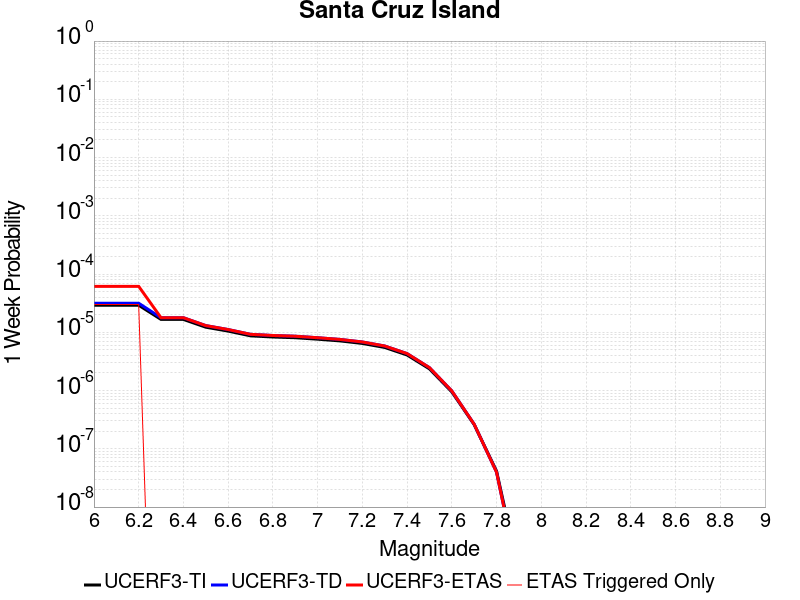 |  |  |  |

| Magnitude | 1 wk TI Prob | 1 wk TD Prob | 1 wk ETAS Prob | 1 wk ETAS/TD Gain | 1 wk ETAS Triggered Only | 1 mo TI Prob | 1 mo TD Prob | 1 mo ETAS Prob | 1 mo ETAS/TD Gain | 1 mo ETAS Triggered Only | 1 yr TI Prob | 1 yr TD Prob | 1 yr ETAS Prob | 1 yr ETAS/TD Gain | 1 yr ETAS Triggered Only | 10 yr TI Prob | 10 yr TD Prob | 10 yr ETAS Prob | 10 yr ETAS/TD Gain | 10 yr ETAS Triggered Only |
|-----|-----|-----|-----|-----|-----|-----|-----|-----|-----|-----|-----|-----|-----|-----|-----|-----|-----|-----|-----|-----|
| 6.0 | 2.9164563E-5 | 3.1599742E-5 | 6.1598796E-5 | 1.9493448 | 3.0E-5 | 1.2498499E-4 | 1.3542121E-4 | 1.8541444E-4 | 1.3691684 | 5.0E-5 | 0.0015206301 | 0.0016476426 | 0.0017175272 | 1.0424149 | 7.0E-5 | 0.015102667 | 0.016368 | 0.016476199 | 1.0066104 | 1.1E-4 |
| 6.1 | 2.9164563E-5 | 3.1599742E-5 | 6.1598796E-5 | 1.9493448 | 3.0E-5 | 1.2498499E-4 | 1.3542121E-4 | 1.8541444E-4 | 1.3691684 | 5.0E-5 | 0.0015206301 | 0.0016476426 | 0.0017175272 | 1.0424149 | 7.0E-5 | 0.015102667 | 0.016368 | 0.016476199 | 1.0066104 | 1.1E-4 |
| 6.2 | 2.9164563E-5 | 3.1599742E-5 | 6.1598796E-5 | 1.9493448 | 3.0E-5 | 1.2498499E-4 | 1.3542121E-4 | 1.8541444E-4 | 1.3691684 | 5.0E-5 | 0.0015206301 | 0.0016476426 | 0.0017175272 | 1.0424149 | 7.0E-5 | 0.015102667 | 0.016368 | 0.016476199 | 1.0066104 | 1.1E-4 |
| 6.3 | 1.6635553E-5 | 1.780436E-5 | 1.780436E-5 | 1.0 | 0.0 | 7.1293274E-5 | 7.630226E-5 | 9.630074E-5 | 1.2620955 | 2.0E-5 | 8.6765E-4 | 9.2860236E-4 | 9.585745E-4 | 1.0322766 | 3.0E-5 | 0.008642701 | 0.009249094 | 0.009288724 | 1.0042847 | 4.0E-5 |
| 6.4 | 1.6635553E-5 | 1.780436E-5 | 1.780436E-5 | 1.0 | 0.0 | 7.1293274E-5 | 7.630226E-5 | 9.630074E-5 | 1.2620955 | 2.0E-5 | 8.6765E-4 | 9.2860236E-4 | 9.585745E-4 | 1.0322766 | 3.0E-5 | 0.008642701 | 0.009249094 | 0.009288724 | 1.0042847 | 4.0E-5 |
| 6.5 | 1.2238748E-5 | 1.3042995E-5 | 1.3042995E-5 | 1.0 | 0.0 | 5.2450723E-5 | 5.5897377E-5 | 7.5896256E-5 | 1.3577785 | 2.0E-5 | 6.3840044E-4 | 6.8034173E-4 | 7.0032815E-4 | 1.029377 | 2.0E-5 | 0.0063656955 | 0.0067829876 | 0.0068127844 | 1.0043929 | 3.0E-5 |
| 6.6 | 1.0489767E-5 | 1.1156636E-5 | 1.1156636E-5 | 1.0 | 0.0 | 4.495537E-5 | 4.781329E-5 | 6.781233E-5 | 1.4182737 | 2.0E-5 | 5.4719415E-4 | 5.819735E-4 | 6.019619E-4 | 1.0343459 | 2.0E-5 | 0.005458487 | 0.0058047357 | 0.00582462 | 1.0034255 | 2.0E-5 |
| 6.7 | 8.699222E-6 | 9.236782E-6 | 9.236782E-6 | 1.0 | 0.0 | 3.7281847E-5 | 3.958561E-5 | 4.9585215E-5 | 1.252607 | 1.0E-5 | 4.5381195E-4 | 4.8184878E-4 | 4.9184397E-4 | 1.0207434 | 1.0E-5 | 0.0045288634 | 0.004808108 | 0.00481806 | 1.0020698 | 1.0E-5 |
| 6.8 | 8.307732E-6 | 8.8169045E-6 | 8.8169045E-6 | 1.0 | 0.0 | 3.560408E-5 | 3.7786187E-5 | 4.778581E-5 | 1.264637 | 1.0E-5 | 4.3339343E-4 | 4.5995016E-4 | 4.6994555E-4 | 1.0217315 | 1.0E-5 | 0.004325492 | 0.0045900354 | 0.0045999894 | 1.0021687 | 1.0E-5 |
| 6.9 | 8.073121E-6 | 8.564939E-6 | 8.564939E-6 | 1.0 | 0.0 | 3.459863E-5 | 3.6706366E-5 | 4.6706E-5 | 1.2724223 | 1.0E-5 | 4.2115687E-4 | 4.468088E-4 | 4.5680432E-4 | 1.0223709 | 1.0E-5 | 0.004203596 | 0.004459156 | 0.0044691116 | 1.0022326 | 1.0E-5 |
| 7.0 | 7.617019E-6 | 8.074664E-6 | 8.074664E-6 | 1.0 | 0.0 | 3.264396E-5 | 3.4605247E-5 | 4.46049E-5 | 1.2889636 | 1.0E-5 | 3.9736772E-4 | 4.212378E-4 | 4.312336E-4 | 1.0237296 | 1.0E-5 | 0.003966579 | 0.0042044413 | 0.004214399 | 1.0023685 | 1.0E-5 |
| 7.1 | 7.1224836E-6 | 7.545788E-6 | 7.545788E-6 | 1.0 | 0.0 | 3.052457E-5 | 3.2338692E-5 | 4.2338368E-5 | 1.3092171 | 1.0E-5 | 3.715733E-4 | 3.936528E-4 | 4.0364885E-4 | 1.0253931 | 1.0E-5 | 0.003709526 | 0.003929598 | 0.0039395588 | 1.0025347 | 1.0E-5 |
| 7.2 | 6.441115E-6 | 6.8273835E-6 | 6.8273835E-6 | 1.0 | 0.0 | 2.7604487E-5 | 2.9259887E-5 | 3.9259594E-5 | 1.3417548 | 1.0E-5 | 3.360328E-4 | 3.5618112E-4 | 3.6617756E-4 | 1.0280656 | 1.0E-5 | 0.0033552512 | 0.003556131 | 0.0035660954 | 1.002802 | 1.0E-5 |
| 7.3 | 5.494274E-6 | 5.8199944E-6 | 5.8199944E-6 | 1.0 | 0.0 | 2.3546674E-5 | 2.4942596E-5 | 2.4942596E-5 | 1.0 | 0.0 | 2.8664304E-4 | 3.0363398E-4 | 3.0363398E-4 | 1.0 | 0.0 | 0.002862736 | 0.0030322142 | 0.0030322142 | 1.0 | 0.0 |
| 7.4 | 4.0802624E-6 | 4.312256E-6 | 4.312256E-6 | 1.0 | 0.0 | 1.7486722E-5 | 1.8480967E-5 | 1.8480967E-5 | 1.0 | 0.0 | 2.1288003E-4 | 2.2498262E-4 | 2.2498262E-4 | 1.0 | 0.0 | 0.0021267622 | 0.0022475575 | 0.0022475575 | 1.0 | 0.0 |
| 7.5 | 2.3584746E-6 | 2.4753094E-6 | 2.4753094E-6 | 1.0 | 0.0 | 1.0107709E-5 | 1.0608426E-5 | 1.0608426E-5 | 1.0 | 0.0 | 1.2305441E-4 | 1.2915E-4 | 1.2915E-4 | 1.0 | 0.0 | 0.0012298629 | 0.0012907543 | 0.0012907543 | 1.0 | 0.0 |
| 7.6 | 9.4981914E-7 | 9.86093E-7 | 9.86093E-7 | 1.0 | 0.0 | 4.0706473E-6 | 4.2261063E-6 | 4.2261063E-6 | 1.0 | 0.0 | 4.9559E-5 | 5.145164E-5 | 5.145164E-5 | 1.0 | 0.0 | 4.954795E-4 | 5.1439856E-4 | 5.1439856E-4 | 1.0 | 0.0 |
| 7.7 | 2.6013532E-7 | 2.6416603E-7 | 2.6416603E-7 | 1.0 | 0.0 | 1.1148652E-6 | 1.1321397E-6 | 1.1321397E-6 | 1.0 | 0.0 | 1.3573399E-5 | 1.3783714E-5 | 1.3783714E-5 | 1.0 | 0.0 | 1.357257E-4 | 1.3782867E-4 | 1.3782867E-4 | 1.0 | 0.0 |
| 7.8 | 4.1522263E-8 | 3.965679E-8 | 3.965679E-8 | 1.0 | 0.0 | 1.7795254E-7 | 1.6995766E-7 | 1.6995766E-7 | 1.0 | 0.0 | 2.16657E-6 | 2.0692328E-6 | 2.0692328E-6 | 1.0 | 0.0 | 2.1665488E-5 | 2.0692156E-5 | 2.0692156E-5 | 1.0 | 0.0 |
| 7.9 | 7.7242046E-10 | 5.9468175E-10 | 5.9468175E-10 | 1.0 | 0.0 | 3.3103735E-9 | 2.5486364E-9 | 2.5486364E-9 | 1.0 | 0.0 | 4.0303796E-8 | 3.1029646E-8 | 3.1029646E-8 | 1.0 | 0.0 | 4.030379E-7 | 3.1029643E-7 | 3.1029643E-7 | 1.0 | 0.0 |

## White Mountains
*[(top)](#table-of-contents)*

| 1 Week | 1 Month | 1 Year | 10 Year |
|-----|-----|-----|-----|
|  |  |  | 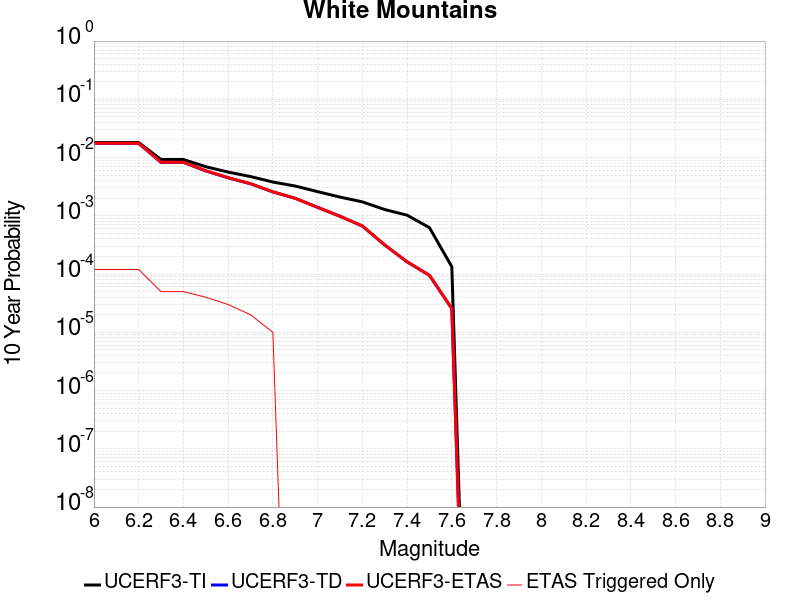 |

| Magnitude | 1 wk TI Prob | 1 wk TD Prob | 1 wk ETAS Prob | 1 wk ETAS/TD Gain | 1 wk ETAS Triggered Only | 1 mo TI Prob | 1 mo TD Prob | 1 mo ETAS Prob | 1 mo ETAS/TD Gain | 1 mo ETAS Triggered Only | 1 yr TI Prob | 1 yr TD Prob | 1 yr ETAS Prob | 1 yr ETAS/TD Gain | 1 yr ETAS Triggered Only | 10 yr TI Prob | 10 yr TD Prob | 10 yr ETAS Prob | 10 yr ETAS/TD Gain | 10 yr ETAS Triggered Only |
|-----|-----|-----|-----|-----|-----|-----|-----|-----|-----|-----|-----|-----|-----|-----|-----|-----|-----|-----|-----|-----|
| 6.0 | 3.503579E-5 | 3.378405E-5 | 8.378236E-5 | 2.4799383 | 5.0E-5 | 1.5014476E-4 | 1.4478143E-4 | 2.0477275E-4 | 1.4143578 | 6.0E-5 | 0.0018264796 | 0.0017614096 | 0.0018412686 | 1.0453382 | 8.0E-5 | 0.018115403 | 0.017486818 | 0.01760472 | 1.0067424 | 1.2E-4 |
| 6.1 | 3.503579E-5 | 3.378405E-5 | 8.378236E-5 | 2.4799383 | 5.0E-5 | 1.5014476E-4 | 1.4478143E-4 | 2.0477275E-4 | 1.4143578 | 6.0E-5 | 0.0018264796 | 0.0017614096 | 0.0018412686 | 1.0453382 | 8.0E-5 | 0.018115403 | 0.017486818 | 0.01760472 | 1.0067424 | 1.2E-4 |
| 6.2 | 3.503579E-5 | 3.378405E-5 | 8.378236E-5 | 2.4799383 | 5.0E-5 | 1.5014476E-4 | 1.4478143E-4 | 2.0477275E-4 | 1.4143578 | 6.0E-5 | 0.0018264796 | 0.0017614096 | 0.0018412686 | 1.0453382 | 8.0E-5 | 0.018115403 | 0.017486818 | 0.01760472 | 1.0067424 | 1.2E-4 |
| 6.3 | 1.7818425E-5 | 1.5916074E-5 | 4.5915596E-5 | 2.884857 | 3.0E-5 | 7.636245E-5 | 6.821004E-5 | 9.8207995E-5 | 1.439788 | 3.0E-5 | 9.293162E-4 | 8.301551E-4 | 8.7012193E-4 | 1.0481437 | 4.0E-5 | 0.009254395 | 0.008271999 | 0.008321585 | 1.0059944 | 5.0E-5 |
| 6.4 | 1.7818425E-5 | 1.5916074E-5 | 4.5915596E-5 | 2.884857 | 3.0E-5 | 7.636245E-5 | 6.821004E-5 | 9.8207995E-5 | 1.439788 | 3.0E-5 | 9.293162E-4 | 8.301551E-4 | 8.7012193E-4 | 1.0481437 | 4.0E-5 | 0.009254395 | 0.008271999 | 0.008321585 | 1.0059944 | 5.0E-5 |
| 6.5 | 1.3397557E-5 | 1.13362685E-5 | 3.1336043E-5 | 2.764229 | 2.0E-5 | 5.741684E-5 | 4.858314E-5 | 6.858217E-5 | 1.4116454 | 2.0E-5 | 6.988258E-4 | 5.913462E-4 | 6.213285E-4 | 1.0507017 | 3.0E-5 | 0.006966323 | 0.005898432 | 0.005938196 | 1.0067414 | 4.0E-5 |
| 6.6 | 1.0818695E-5 | 8.625366E-6 | 1.862528E-5 | 2.1593611 | 1.0E-5 | 4.6365014E-5 | 3.6965357E-5 | 4.6964986E-5 | 1.2705135 | 1.0E-5 | 5.6434784E-4 | 4.4996463E-4 | 4.6995562E-4 | 1.044428 | 2.0E-5 | 0.005629168 | 0.004490972 | 0.004520837 | 1.0066501 | 3.0E-5 |
| 6.7 | 9.067908E-6 | 6.802442E-6 | 1.6802374E-5 | 2.4700503 | 1.0E-5 | 3.8861883E-5 | 2.9153016E-5 | 3.9152725E-5 | 1.3430077 | 1.0E-5 | 4.7304068E-4 | 3.5488335E-4 | 3.648798E-4 | 1.0281683 | 1.0E-5 | 0.00472035 | 0.0035434833 | 0.0035634125 | 1.0056242 | 2.0E-5 |
| 6.8 | 7.295947E-6 | 4.936391E-6 | 1.4936341E-5 | 3.0257614 | 1.0E-5 | 3.126797E-5 | 2.1155796E-5 | 3.1155585E-5 | 1.4726737 | 1.0E-5 | 3.8062103E-4 | 2.575425E-4 | 2.6753993E-4 | 1.0388186 | 1.0E-5 | 0.0037996976 | 0.0025725532 | 0.0025825277 | 1.0038772 | 1.0E-5 |
| 6.9 | 6.2243444E-6 | 3.832213E-6 | 3.832213E-6 | 1.0 | 0.0 | 2.6675489E-5 | 1.642367E-5 | 1.642367E-5 | 1.0 | 0.0 | 3.2472567E-4 | 1.9994036E-4 | 1.9994036E-4 | 1.0 | 0.0 | 0.0032425157 | 0.0019976576 | 0.0019976576 | 1.0 | 0.0 |
| 7.0 | 4.9878413E-6 | 2.6795342E-6 | 2.6795342E-6 | 1.0 | 0.0 | 2.1376287E-5 | 1.14836685E-5 | 1.14836685E-5 | 1.0 | 0.0 | 2.602252E-4 | 1.3980496E-4 | 1.3980496E-4 | 1.0 | 0.0 | 0.002599207 | 0.0013971963 | 0.0013971963 | 1.0 | 0.0 |
| 7.1 | 4.0252844E-6 | 1.8857575E-6 | 1.8857575E-6 | 1.0 | 0.0 | 1.7251105E-5 | 8.081794E-6 | 8.081794E-6 | 1.0 | 0.0 | 2.1001195E-4 | 9.8391516E-5 | 9.8391516E-5 | 1.0 | 0.0 | 0.0020981359 | 9.834924E-4 | 9.834924E-4 | 1.0 | 0.0 |
| 7.2 | 3.3284066E-6 | 1.281964E-6 | 1.281964E-6 | 1.0 | 0.0 | 1.4264522E-5 | 5.494121E-6 | 5.494121E-6 | 1.0 | 0.0 | 1.736567E-4 | 6.688897E-5 | 6.688897E-5 | 1.0 | 0.0 | 0.0017352107 | 6.6869846E-4 | 6.6869846E-4 | 1.0 | 0.0 |
| 7.3 | 2.458226E-6 | 6.05722E-7 | 6.05722E-7 | 1.0 | 0.0 | 1.0535211E-5 | 2.5959491E-6 | 2.5959491E-6 | 1.0 | 0.0 | 1.2825865E-4 | 3.1605257E-5 | 3.1605257E-5 | 1.0 | 0.0 | 0.0012818464 | 3.160114E-4 | 3.160114E-4 | 1.0 | 0.0 |
| 7.4 | 1.965953E-6 | 3.1089303E-7 | 3.1089303E-7 | 1.0 | 0.0 | 8.425486E-6 | 1.332398E-6 | 1.332398E-6 | 1.0 | 0.0 | 1.0257547E-4 | 1.6221828E-5 | 1.6221828E-5 | 1.0 | 0.0 | 0.0010252813 | 1.6220656E-4 | 1.6220656E-4 | 1.0 | 0.0 |
| 7.5 | 1.2014192E-6 | 1.8244253E-7 | 1.8244253E-7 | 1.0 | 0.0 | 5.148929E-6 | 7.8189635E-7 | 7.8189635E-7 | 1.0 | 0.0 | 6.2686406E-5 | 9.519547E-6 | 9.519547E-6 | 1.0 | 0.0 | 6.266873E-4 | 9.519148E-5 | 9.519148E-5 | 1.0 | 0.0 |
| 7.6 | 2.5612175E-7 | 4.8946475E-8 | 4.8946475E-8 | 1.0 | 0.0 | 1.0976642E-6 | 2.0977059E-7 | 2.0977059E-7 | 1.0 | 0.0 | 1.3363979E-5 | 2.5539543E-6 | 2.5539543E-6 | 1.0 | 0.0 | 1.3363175E-4 | 2.5539286E-5 | 2.5539286E-5 | 1.0 | 0.0 |

## Channel Islands Thrust
*[(top)](#table-of-contents)*

| 1 Week | 1 Month | 1 Year | 10 Year |
|-----|-----|-----|-----|
|  |  |  |  |

| Magnitude | 1 wk TI Prob | 1 wk TD Prob | 1 wk ETAS Prob | 1 wk ETAS/TD Gain | 1 wk ETAS Triggered Only | 1 mo TI Prob | 1 mo TD Prob | 1 mo ETAS Prob | 1 mo ETAS/TD Gain | 1 mo ETAS Triggered Only | 1 yr TI Prob | 1 yr TD Prob | 1 yr ETAS Prob | 1 yr ETAS/TD Gain | 1 yr ETAS Triggered Only | 10 yr TI Prob | 10 yr TD Prob | 10 yr ETAS Prob | 10 yr ETAS/TD Gain | 10 yr ETAS Triggered Only |
|-----|-----|-----|-----|-----|-----|-----|-----|-----|-----|-----|-----|-----|-----|-----|-----|-----|-----|-----|-----|-----|
| 6.0 | 2.2156251E-5 | 2.4092022E-5 | 5.40913E-5 | 2.2451954 | 3.0E-5 | 9.495191E-5 | 1.03248036E-4 | 1.5324287E-4 | 1.4842207 | 5.0E-5 | 0.0011554264 | 0.0012564264 | 0.0013263385 | 1.0556436 | 7.0E-5 | 0.011494373 | 0.0125038205 | 0.0126025705 | 1.0078975 | 1.0E-4 |
| 6.1 | 2.2156251E-5 | 2.4092022E-5 | 5.40913E-5 | 2.2451954 | 3.0E-5 | 9.495191E-5 | 1.03248036E-4 | 1.5324287E-4 | 1.4842207 | 5.0E-5 | 0.0011554264 | 0.0012564264 | 0.0013263385 | 1.0556436 | 7.0E-5 | 0.011494373 | 0.0125038205 | 0.0126025705 | 1.0078975 | 1.0E-4 |
| 6.2 | 2.2156251E-5 | 2.4092022E-5 | 5.40913E-5 | 2.2451954 | 3.0E-5 | 9.495191E-5 | 1.03248036E-4 | 1.5324287E-4 | 1.4842207 | 5.0E-5 | 0.0011554264 | 0.0012564264 | 0.0013263385 | 1.0556436 | 7.0E-5 | 0.011494373 | 0.0125038205 | 0.0126025705 | 1.0078975 | 1.0E-4 |
| 6.3 | 2.2156251E-5 | 2.4092022E-5 | 5.40913E-5 | 2.2451954 | 3.0E-5 | 9.495191E-5 | 1.03248036E-4 | 1.5324287E-4 | 1.4842207 | 5.0E-5 | 0.0011554264 | 0.0012564264 | 0.0013263385 | 1.0556436 | 7.0E-5 | 0.011494373 | 0.0125038205 | 0.0126025705 | 1.0078975 | 1.0E-4 |
| 6.4 | 2.2156251E-5 | 2.4092022E-5 | 5.40913E-5 | 2.2451954 | 3.0E-5 | 9.495191E-5 | 1.03248036E-4 | 1.5324287E-4 | 1.4842207 | 5.0E-5 | 0.0011554264 | 0.0012564264 | 0.0013263385 | 1.0556436 | 7.0E-5 | 0.011494373 | 0.0125038205 | 0.0126025705 | 1.0078975 | 1.0E-4 |
| 6.5 | 2.2156251E-5 | 2.4092022E-5 | 5.40913E-5 | 2.2451954 | 3.0E-5 | 9.495191E-5 | 1.03248036E-4 | 1.5324287E-4 | 1.4842207 | 5.0E-5 | 0.0011554264 | 0.0012564264 | 0.0013263385 | 1.0556436 | 7.0E-5 | 0.011494373 | 0.0125038205 | 0.0126025705 | 1.0078975 | 1.0E-4 |
| 6.6 | 2.2156251E-5 | 2.4092022E-5 | 5.40913E-5 | 2.2451954 | 3.0E-5 | 9.495191E-5 | 1.03248036E-4 | 1.5324287E-4 | 1.4842207 | 5.0E-5 | 0.0011554264 | 0.0012564264 | 0.0013263385 | 1.0556436 | 7.0E-5 | 0.011494373 | 0.0125038205 | 0.0126025705 | 1.0078975 | 1.0E-4 |
| 6.7 | 1.0601296E-5 | 1.1379544E-5 | 3.1379317E-5 | 2.7575197 | 2.0E-5 | 4.5433335E-5 | 4.876859E-5 | 7.876712E-5 | 1.61512 | 3.0E-5 | 5.5301044E-4 | 5.936007E-4 | 6.2358286E-4 | 1.050509 | 3.0E-5 | 0.005516363 | 0.005920653 | 0.0059604165 | 1.006716 | 4.0E-5 |
| 6.8 | 1.0246747E-5 | 1.0996669E-5 | 2.0996558E-5 | 1.9093564 | 1.0E-5 | 4.391389E-5 | 4.7127756E-5 | 6.712681E-5 | 1.4243584 | 2.0E-5 | 5.345204E-4 | 5.7363417E-4 | 5.936227E-4 | 1.0348455 | 2.0E-5 | 0.0053323656 | 0.005722025 | 0.0057518533 | 1.0052129 | 3.0E-5 |
| 6.9 | 9.049551E-6 | 9.699645E-6 | 9.699645E-6 | 1.0 | 0.0 | 3.878322E-5 | 4.1569267E-5 | 5.1568848E-5 | 1.2405523 | 1.0E-5 | 4.7208337E-4 | 5.059924E-4 | 5.1598734E-4 | 1.0197531 | 1.0E-5 | 0.0047108172 | 0.0050488203 | 0.0050587696 | 1.0019706 | 1.0E-5 |
| 7.0 | 8.6542195E-6 | 9.274603E-6 | 9.274603E-6 | 1.0 | 0.0 | 3.7088983E-5 | 3.9747716E-5 | 4.974732E-5 | 1.2515768 | 1.0E-5 | 4.5146482E-4 | 4.8382508E-4 | 4.9382023E-4 | 1.0206586 | 1.0E-5 | 0.004505487 | 0.004828129 | 0.004838081 | 1.0020612 | 1.0E-5 |
| 7.1 | 8.391028E-6 | 8.992924E-6 | 8.992924E-6 | 1.0 | 0.0 | 3.5961057E-5 | 3.854056E-5 | 4.8540176E-5 | 1.2594569 | 1.0E-5 | 4.3773788E-4 | 4.6913436E-4 | 4.7912967E-4 | 1.0213058 | 1.0E-5 | 0.004368766 | 0.0046818503 | 0.0046918034 | 1.0021259 | 1.0E-5 |
| 7.2 | 5.965188E-6 | 6.3716952E-6 | 6.3716952E-6 | 1.0 | 0.0 | 2.556484E-5 | 2.7306982E-5 | 3.730671E-5 | 1.3661968 | 1.0E-5 | 3.1120746E-4 | 3.3241234E-4 | 3.42409E-4 | 1.0300732 | 1.0E-5 | 0.00310772 | 0.0033192092 | 0.003329176 | 1.0030028 | 1.0E-5 |
| 7.3 | 4.877518E-6 | 5.2060063E-6 | 5.2060063E-6 | 1.0 | 0.0 | 2.0903482E-5 | 2.2311267E-5 | 2.2311267E-5 | 1.0 | 0.0 | 2.5447016E-4 | 2.716063E-4 | 2.716063E-4 | 1.0 | 0.0 | 0.0025417898 | 0.0027127895 | 0.0027127895 | 1.0 | 0.0 |
| 7.4 | 3.8829853E-6 | 4.141863E-6 | 4.141863E-6 | 1.0 | 0.0 | 1.664126E-5 | 1.7750723E-5 | 1.7750723E-5 | 1.0 | 0.0 | 2.0258849E-4 | 2.1609402E-4 | 2.1609402E-4 | 1.0 | 0.0 | 0.002024039 | 0.0021588807 | 0.0021588807 | 1.0 | 0.0 |
| 7.5 | 1.3489616E-6 | 1.4277903E-6 | 1.4277903E-6 | 1.0 | 0.0 | 5.7812517E-6 | 6.119087E-6 | 6.119087E-6 | 1.0 | 0.0 | 7.038446E-5 | 7.449738E-5 | 7.449738E-5 | 1.0 | 0.0 | 7.036218E-4 | 7.44728E-4 | 7.44728E-4 | 1.0 | 0.0 |
| 7.6 | 6.058192E-7 | 6.353778E-7 | 6.353778E-7 | 1.0 | 0.0 | 2.5963652E-6 | 2.7230449E-6 | 2.7230449E-6 | 1.0 | 0.0 | 3.161029E-5 | 3.3152584E-5 | 3.3152584E-5 | 1.0 | 0.0 | 3.1605794E-4 | 3.31478E-4 | 3.31478E-4 | 1.0 | 0.0 |
| 7.7 | 2.2170494E-7 | 2.2607902E-7 | 2.2607902E-7 | 1.0 | 0.0 | 9.5016367E-7 | 9.689098E-7 | 9.689098E-7 | 1.0 | 0.0 | 1.1568181E-5 | 1.1796425E-5 | 1.1796425E-5 | 1.0 | 0.0 | 1.1567579E-4 | 1.1795909E-4 | 1.1795909E-4 | 1.0 | 0.0 |
| 7.8 | 2.1613102E-8 | 1.5466682E-8 | 1.5466682E-8 | 1.0 | 0.0 | 9.262757E-8 | 6.628578E-8 | 6.628578E-8 | 1.0 | 0.0 | 1.1277401E-6 | 8.070291E-7 | 8.070291E-7 | 1.0 | 0.0 | 1.1277344E-5 | 8.070269E-6 | 8.070269E-6 | 1.0 | 0.0 |

## Ortigalita (North)
*[(top)](#table-of-contents)*

| 1 Week | 1 Month | 1 Year | 10 Year |
|-----|-----|-----|-----|
|  |  |  |  |

| Magnitude | 1 wk TI Prob | 1 wk TD Prob | 1 wk ETAS Prob | 1 wk ETAS/TD Gain | 1 wk ETAS Triggered Only | 1 mo TI Prob | 1 mo TD Prob | 1 mo ETAS Prob | 1 mo ETAS/TD Gain | 1 mo ETAS Triggered Only | 1 yr TI Prob | 1 yr TD Prob | 1 yr ETAS Prob | 1 yr ETAS/TD Gain | 1 yr ETAS Triggered Only | 10 yr TI Prob | 10 yr TD Prob | 10 yr ETAS Prob | 10 yr ETAS/TD Gain | 10 yr ETAS Triggered Only |
|-----|-----|-----|-----|-----|-----|-----|-----|-----|-----|-----|-----|-----|-----|-----|-----|-----|-----|-----|-----|-----|
| 6.0 | 7.711876E-5 | 1.05064966E-4 | 1.3506181E-4 | 1.2855076 | 3.0E-5 | 3.3046713E-4 | 4.502116E-4 | 4.801981E-4 | 1.0666053 | 3.0E-5 | 0.004016016 | 0.0054681194 | 0.0055377367 | 1.0127314 | 7.0E-5 | 0.039442103 | 0.053454787 | 0.053539976 | 1.0015937 | 9.0E-5 |
| 6.1 | 4.607858E-5 | 6.0239203E-5 | 7.02386E-5 | 1.1659949 | 1.0E-5 | 1.9746469E-4 | 2.5814527E-4 | 2.6814267E-4 | 1.0387279 | 1.0E-5 | 0.0024014818 | 0.0031387596 | 0.003178634 | 1.0127039 | 4.0E-5 | 0.023756953 | 0.030975068 | 0.03103321 | 1.0018771 | 6.0E-5 |
| 6.2 | 4.607858E-5 | 6.0239203E-5 | 7.02386E-5 | 1.1659949 | 1.0E-5 | 1.9746469E-4 | 2.5814527E-4 | 2.6814267E-4 | 1.0387279 | 1.0E-5 | 0.0024014818 | 0.0031387596 | 0.003178634 | 1.0127039 | 4.0E-5 | 0.023756953 | 0.030975068 | 0.03103321 | 1.0018771 | 6.0E-5 |
| 6.3 | 3.327423E-5 | 4.2475127E-5 | 5.2474705E-5 | 1.2354219 | 1.0E-5 | 1.4259605E-4 | 1.8202531E-4 | 1.920235E-4 | 1.0549275 | 1.0E-5 | 0.0017347244 | 0.002214197 | 0.0022341528 | 1.0090126 | 2.0E-5 | 0.017212452 | 0.021945644 | 0.021984767 | 1.0017827 | 4.0E-5 |
| 6.4 | 2.7732503E-5 | 3.4998593E-5 | 4.4998244E-5 | 1.2857158 | 1.0E-5 | 1.1884817E-4 | 1.4998685E-4 | 1.5998536E-4 | 1.0666625 | 1.0E-5 | 0.001446016 | 0.0018248095 | 0.0018447731 | 1.0109401 | 2.0E-5 | 0.014366428 | 0.018121224 | 0.018160498 | 1.0021673 | 4.0E-5 |
| 6.5 | 2.7689714E-5 | 3.4948407E-5 | 4.4948058E-5 | 1.286126 | 1.0E-5 | 1.186648E-4 | 1.497718E-4 | 1.597703E-4 | 1.0667583 | 1.0E-5 | 0.0014437864 | 0.0018221956 | 0.0018421591 | 1.0109558 | 2.0E-5 | 0.014344421 | 0.01809551 | 0.018134786 | 1.0021704 | 4.0E-5 |
| 6.6 | 2.2976905E-5 | 2.8718265E-5 | 3.871798E-5 | 1.3482004 | 1.0E-5 | 9.846873E-5 | 1.230739E-4 | 1.3307267E-4 | 1.081242 | 1.0E-5 | 0.0011981975 | 0.0014976363 | 0.0015176064 | 1.0133344 | 2.0E-5 | 0.011917574 | 0.014898697 | 0.014938101 | 1.0026448 | 4.0E-5 |
| 6.7 | 1.9871539E-5 | 2.4904411E-5 | 2.4904411E-5 | 1.0 | 0.0 | 8.516096E-5 | 1.0673023E-4 | 1.0673023E-4 | 1.0 | 0.0 | 0.0010363415 | 0.0012989145 | 0.0013089016 | 1.0076888 | 1.0E-5 | 0.010315218 | 0.012936919 | 0.01295666 | 1.001526 | 2.0E-5 |
| 6.8 | 6.5640475E-6 | 7.6054926E-6 | 7.6054926E-6 | 1.0 | 0.0 | 2.813133E-5 | 3.2594577E-5 | 3.2594577E-5 | 1.0 | 0.0 | 3.424451E-4 | 3.9676955E-4 | 3.9676955E-4 | 1.0 | 0.0 | 0.0034191788 | 0.003960899 | 0.003960899 | 1.0 | 0.0 |
| 6.9 | 5.6219683E-6 | 6.5018376E-6 | 6.5018376E-6 | 1.0 | 0.0 | 2.4093928E-5 | 2.7864735E-5 | 2.7864735E-5 | 1.0 | 0.0 | 2.933041E-4 | 3.3920293E-4 | 3.3920293E-4 | 1.0 | 0.0 | 0.0029291727 | 0.003387109 | 0.003387109 | 1.0 | 0.0 |
| 7.0 | 3.875591E-6 | 4.4847548E-6 | 4.4847548E-6 | 1.0 | 0.0 | 1.6609569E-5 | 1.9220248E-5 | 1.9220248E-5 | 1.0 | 0.0 | 2.0220275E-4 | 2.339835E-4 | 2.339835E-4 | 1.0 | 0.0 | 0.0020201886 | 0.0023375798 | 0.0023375798 | 1.0 | 0.0 |
| 7.1 | 1.6017933E-6 | 1.8570418E-6 | 1.8570418E-6 | 1.0 | 0.0 | 6.8648105E-6 | 7.958732E-6 | 7.958732E-6 | 1.0 | 0.0 | 8.357586E-5 | 9.689432E-5 | 9.689432E-5 | 1.0 | 0.0 | 8.3544437E-4 | 9.686254E-4 | 9.686254E-4 | 1.0 | 0.0 |

## Elysian Park (Upper)
*[(top)](#table-of-contents)*

| 1 Week | 1 Month | 1 Year | 10 Year |
|-----|-----|-----|-----|
|  |  | 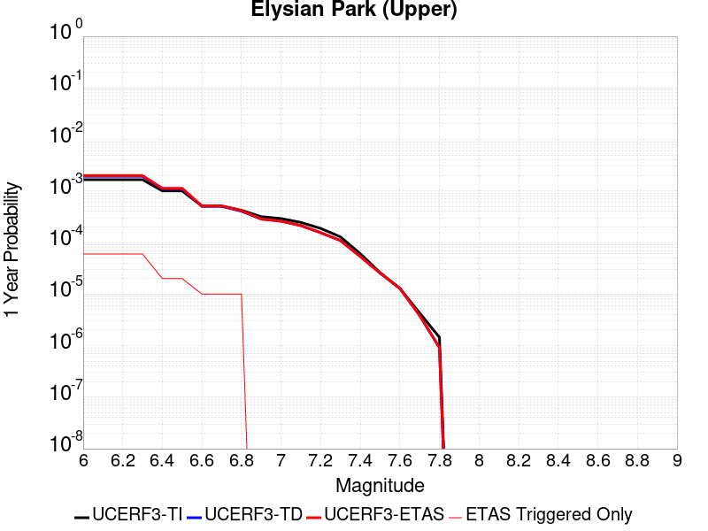 |  |

| Magnitude | 1 wk TI Prob | 1 wk TD Prob | 1 wk ETAS Prob | 1 wk ETAS/TD Gain | 1 wk ETAS Triggered Only | 1 mo TI Prob | 1 mo TD Prob | 1 mo ETAS Prob | 1 mo ETAS/TD Gain | 1 mo ETAS Triggered Only | 1 yr TI Prob | 1 yr TD Prob | 1 yr ETAS Prob | 1 yr ETAS/TD Gain | 1 yr ETAS Triggered Only | 10 yr TI Prob | 10 yr TD Prob | 10 yr ETAS Prob | 10 yr ETAS/TD Gain | 10 yr ETAS Triggered Only |
|-----|-----|-----|-----|-----|-----|-----|-----|-----|-----|-----|-----|-----|-----|-----|-----|-----|-----|-----|-----|-----|
| 6.0 | 3.1876025E-5 | 3.7035516E-5 | 5.7034773E-5 | 1.5400022 | 2.0E-5 | 1.3660437E-4 | 1.587167E-4 | 1.7871354E-4 | 1.1259906 | 2.0E-5 | 0.0016618895 | 0.0019311075 | 0.0019909916 | 1.0310103 | 6.0E-5 | 0.016495159 | 0.019189782 | 0.019278057 | 1.0046 | 9.0E-5 |
| 6.1 | 3.1876025E-5 | 3.7035516E-5 | 5.7034773E-5 | 1.5400022 | 2.0E-5 | 1.3660437E-4 | 1.587167E-4 | 1.7871354E-4 | 1.1259906 | 2.0E-5 | 0.0016618895 | 0.0019311075 | 0.0019909916 | 1.0310103 | 6.0E-5 | 0.016495159 | 0.019189782 | 0.019278057 | 1.0046 | 9.0E-5 |
| 6.2 | 3.1876025E-5 | 3.7035516E-5 | 5.7034773E-5 | 1.5400022 | 2.0E-5 | 1.3660437E-4 | 1.587167E-4 | 1.7871354E-4 | 1.1259906 | 2.0E-5 | 0.0016618895 | 0.0019311075 | 0.0019909916 | 1.0310103 | 6.0E-5 | 0.016495159 | 0.019189782 | 0.019278057 | 1.0046 | 9.0E-5 |
| 6.3 | 3.1876025E-5 | 3.7035516E-5 | 5.7034773E-5 | 1.5400022 | 2.0E-5 | 1.3660437E-4 | 1.587167E-4 | 1.7871354E-4 | 1.1259906 | 2.0E-5 | 0.0016618895 | 0.0019311075 | 0.0019909916 | 1.0310103 | 6.0E-5 | 0.016495159 | 0.019189782 | 0.019278057 | 1.0046 | 9.0E-5 |
| 6.4 | 1.9273462E-5 | 2.1202266E-5 | 2.1202266E-5 | 1.0 | 0.0 | 8.259794E-5 | 9.086466E-5 | 9.086466E-5 | 1.0 | 0.0 | 0.001005166 | 0.0011058892 | 0.0011258671 | 1.018065 | 2.0E-5 | 0.010006315 | 0.011020724 | 0.011070172 | 1.0044869 | 5.0E-5 |
| 6.5 | 1.9273462E-5 | 2.1202266E-5 | 2.1202266E-5 | 1.0 | 0.0 | 8.259794E-5 | 9.086466E-5 | 9.086466E-5 | 1.0 | 0.0 | 0.001005166 | 0.0011058892 | 0.0011258671 | 1.018065 | 2.0E-5 | 0.010006315 | 0.011020724 | 0.011070172 | 1.0044869 | 5.0E-5 |
| 6.6 | 9.813258E-6 | 9.665599E-6 | 9.665599E-6 | 1.0 | 0.0 | 4.205614E-5 | 4.1423376E-5 | 4.1423376E-5 | 1.0 | 0.0 | 5.119132E-4 | 5.0422014E-4 | 5.142151E-4 | 1.0198226 | 1.0E-5 | 0.005107356 | 0.0050314846 | 0.005061334 | 1.0059325 | 3.0E-5 |
| 6.7 | 9.801478E-6 | 9.653168E-6 | 9.653168E-6 | 1.0 | 0.0 | 4.2005657E-5 | 4.1370105E-5 | 4.1370105E-5 | 1.0 | 0.0 | 5.112989E-4 | 5.035719E-4 | 5.1356683E-4 | 1.0198481 | 1.0E-5 | 0.0051012407 | 0.0050250315 | 0.0050548804 | 1.0059401 | 3.0E-5 |
| 6.8 | 8.102489E-6 | 7.773004E-6 | 7.773004E-6 | 1.0 | 0.0 | 3.4724493E-5 | 3.3312477E-5 | 3.3312477E-5 | 1.0 | 0.0 | 4.2268867E-4 | 4.055089E-4 | 4.1550485E-4 | 1.0246503 | 1.0E-5 | 0.004218856 | 0.0040481836 | 0.0040681027 | 1.0049205 | 2.0E-5 |
| 6.9 | 6.08275E-6 | 5.4814514E-6 | 5.4814514E-6 | 1.0 | 0.0 | 2.6068668E-5 | 2.3491726E-5 | 2.3491726E-5 | 1.0 | 0.0 | 3.173398E-4 | 2.85975E-4 | 2.85975E-4 | 1.0 | 0.0 | 0.0031688702 | 0.0028561477 | 0.0028661191 | 1.0034912 | 1.0E-5 |
| 7.0 | 5.5995934E-6 | 4.98278E-6 | 4.98278E-6 | 1.0 | 0.0 | 2.3998036E-5 | 2.13546E-5 | 2.13546E-5 | 1.0 | 0.0 | 2.9213692E-4 | 2.599619E-4 | 2.599619E-4 | 1.0 | 0.0 | 0.0029175316 | 0.0025966454 | 0.0026066194 | 1.0038412 | 1.0E-5 |
| 7.1 | 4.709881E-6 | 4.0874015E-6 | 4.0874015E-6 | 1.0 | 0.0 | 2.0185047E-5 | 1.7517319E-5 | 1.7517319E-5 | 1.0 | 0.0 | 2.4572524E-4 | 2.132529E-4 | 2.132529E-4 | 1.0 | 0.0 | 0.002454537 | 0.002130524 | 0.0021405027 | 1.0046837 | 1.0E-5 |
| 7.2 | 3.6063436E-6 | 2.9779544E-6 | 2.9779544E-6 | 1.0 | 0.0 | 1.5455667E-5 | 1.27626E-5 | 1.27626E-5 | 1.0 | 0.0 | 1.881565E-4 | 1.5537368E-4 | 1.5537368E-4 | 1.0 | 0.0 | 0.0018799726 | 0.0015526618 | 0.0015626462 | 1.0064305 | 1.0E-5 |
| 7.3 | 2.471135E-6 | 2.0954615E-6 | 2.0954615E-6 | 1.0 | 0.0 | 1.0590536E-5 | 8.980519E-6 | 8.980519E-6 | 1.0 | 0.0 | 1.2893214E-4 | 1.093324E-4 | 1.093324E-4 | 1.0 | 0.0 | 0.0012885736 | 0.0010927934 | 0.0011027824 | 1.0091408 | 1.0E-5 |
| 7.4 | 1.163943E-6 | 1.0275091E-6 | 1.0275091E-6 | 1.0 | 0.0 | 4.988318E-6 | 4.4036033E-6 | 4.4036033E-6 | 1.0 | 0.0 | 6.0731076E-5 | 5.3612584E-5 | 5.3612584E-5 | 1.0 | 0.0 | 6.071448E-4 | 5.359995E-4 | 5.459941E-4 | 1.0186467 | 1.0E-5 |
| 7.5 | 4.99459E-7 | 4.917604E-7 | 4.917604E-7 | 1.0 | 0.0 | 2.140537E-6 | 2.1075427E-6 | 2.1075427E-6 | 1.0 | 0.0 | 2.6060725E-5 | 2.5659048E-5 | 2.5659048E-5 | 1.0 | 0.0 | 2.605767E-4 | 2.5656243E-4 | 2.6655986E-4 | 1.0389669 | 1.0E-5 |
| 7.6 | 2.4667852E-7 | 2.4778336E-7 | 2.4778336E-7 | 1.0 | 0.0 | 1.0571932E-6 | 1.0619283E-6 | 1.0619283E-6 | 1.0 | 0.0 | 1.2871251E-5 | 1.2928905E-5 | 1.2928905E-5 | 1.0 | 0.0 | 1.2870505E-4 | 1.2928189E-4 | 1.392806E-4 | 1.0773404 | 1.0E-5 |
| 7.7 | 8.2312795E-8 | 7.3864456E-8 | 7.3864456E-8 | 1.0 | 0.0 | 3.527691E-7 | 3.165619E-7 | 3.165619E-7 | 1.0 | 0.0 | 4.294955E-6 | 3.8541357E-6 | 3.8541357E-6 | 1.0 | 0.0 | 4.2948723E-5 | 3.8540802E-5 | 4.8540416E-5 | 1.2594553 | 1.0E-5 |
| 7.8 | 2.7819295E-8 | 1.7566023E-8 | 1.7566023E-8 | 1.0 | 0.0 | 1.1922555E-7 | 7.5282955E-8 | 7.5282955E-8 | 1.0 | 0.0 | 1.45157E-6 | 9.165697E-7 | 9.165697E-7 | 1.0 | 0.0 | 1.45156055E-5 | 9.165675E-6 | 1.9165584E-5 | 2.0910172 | 1.0E-5 |

## Big Pine (Central)
*[(top)](#table-of-contents)*

| 1 Week | 1 Month | 1 Year | 10 Year |
|-----|-----|-----|-----|
|  |  |  |  |

| Magnitude | 1 wk TI Prob | 1 wk TD Prob | 1 wk ETAS Prob | 1 wk ETAS/TD Gain | 1 wk ETAS Triggered Only | 1 mo TI Prob | 1 mo TD Prob | 1 mo ETAS Prob | 1 mo ETAS/TD Gain | 1 mo ETAS Triggered Only | 1 yr TI Prob | 1 yr TD Prob | 1 yr ETAS Prob | 1 yr ETAS/TD Gain | 1 yr ETAS Triggered Only | 10 yr TI Prob | 10 yr TD Prob | 10 yr ETAS Prob | 10 yr ETAS/TD Gain | 10 yr ETAS Triggered Only |
|-----|-----|-----|-----|-----|-----|-----|-----|-----|-----|-----|-----|-----|-----|-----|-----|-----|-----|-----|-----|-----|
| 6.0 | 1.2706755E-5 | 1.4250529E-5 | 3.4250243E-5 | 2.4034367 | 2.0E-5 | 5.4456385E-5 | 6.107247E-5 | 8.1071244E-5 | 1.3274598 | 2.0E-5 | 6.628048E-4 | 7.433402E-4 | 7.93303E-4 | 1.0672139 | 5.0E-5 | 0.006608314 | 0.0074135666 | 0.0075028995 | 1.0120499 | 9.0E-5 |
| 6.1 | 8.342579E-6 | 9.510762E-6 | 9.510762E-6 | 1.0 | 0.0 | 3.5753423E-5 | 4.0759893E-5 | 4.0759893E-5 | 1.0 | 0.0 | 4.3521097E-4 | 4.961604E-4 | 5.161505E-4 | 1.0402895 | 2.0E-5 | 0.0043435963 | 0.0049540824 | 0.0050137853 | 1.0120512 | 6.0E-5 |
| 6.2 | 6.923899E-6 | 7.967147E-6 | 7.967147E-6 | 1.0 | 0.0 | 2.9673516E-5 | 3.4144578E-5 | 3.4144578E-5 | 1.0 | 0.0 | 3.6121515E-4 | 4.156502E-4 | 4.3564188E-4 | 1.0480974 | 2.0E-5 | 0.003606286 | 0.0041520367 | 0.004201829 | 1.0119923 | 5.0E-5 |
| 6.3 | 2.728396E-6 | 3.4242908E-6 | 3.4242908E-6 | 1.0 | 0.0 | 1.1693074E-5 | 1.4675454E-5 | 1.4675454E-5 | 1.0 | 0.0 | 1.4235388E-4 | 1.7865987E-4 | 1.8865809E-4 | 1.0559623 | 1.0E-5 | 0.0014226272 | 0.0017866704 | 0.0018166169 | 1.0167611 | 3.0E-5 |
| 6.4 | 2.7136944E-6 | 3.408584E-6 | 3.408584E-6 | 1.0 | 0.0 | 1.1630066E-5 | 1.4608141E-5 | 1.4608141E-5 | 1.0 | 0.0 | 1.4158686E-4 | 1.7784047E-4 | 1.8783868E-4 | 1.0562202 | 1.0E-5 | 0.0014149669 | 0.0017784894 | 0.0018084361 | 1.0168382 | 3.0E-5 |
| 6.5 | 2.6971882E-6 | 3.3909291E-6 | 3.3909291E-6 | 1.0 | 0.0 | 1.1559327E-5 | 1.45324775E-5 | 1.45324775E-5 | 1.0 | 0.0 | 1.4072572E-4 | 1.7691942E-4 | 1.8691765E-4 | 1.056513 | 1.0E-5 | 0.0014063664 | 0.0017692937 | 0.0017992406 | 1.0169259 | 3.0E-5 |
| 6.6 | 2.669092E-6 | 3.3609497E-6 | 3.3609497E-6 | 1.0 | 0.0 | 1.1438916E-5 | 1.4403995E-5 | 1.4403995E-5 | 1.0 | 0.0 | 1.3925991E-4 | 1.753554E-4 | 1.8535365E-4 | 1.0570171 | 1.0E-5 | 0.0013917267 | 0.0017536782 | 0.0017836256 | 1.0170768 | 3.0E-5 |
| 6.7 | 2.6408059E-6 | 3.3309752E-6 | 3.3309752E-6 | 1.0 | 0.0 | 1.1317691E-5 | 1.4275535E-5 | 1.4275535E-5 | 1.0 | 0.0 | 1.3778417E-4 | 1.7379165E-4 | 1.837899E-4 | 1.0575302 | 1.0E-5 | 0.0013769877 | 0.0017380653 | 0.0017680131 | 1.0172306 | 3.0E-5 |
| 6.8 | 2.1786943E-6 | 2.8544325E-6 | 2.8544325E-6 | 1.0 | 0.0 | 9.337228E-6 | 1.2233229E-5 | 1.2233229E-5 | 1.0 | 0.0 | 1.1367482E-4 | 1.4893012E-4 | 1.5892863E-4 | 1.0671356 | 1.0E-5 | 0.0011361669 | 0.0014897975 | 0.0015197528 | 1.0201069 | 3.0E-5 |
| 6.9 | 1.4411696E-6 | 2.068499E-6 | 2.068499E-6 | 1.0 | 0.0 | 6.1764263E-6 | 8.864968E-6 | 8.864968E-6 | 1.0 | 0.0 | 7.51954E-5 | 1.079259E-4 | 1.1792482E-4 | 1.0926461 | 1.0E-5 | 7.5169955E-4 | 0.0010801847 | 0.0011101522 | 1.027743 | 3.0E-5 |
| 7.0 | 1.0073411E-6 | 1.554261E-6 | 1.554261E-6 | 1.0 | 0.0 | 4.317169E-6 | 6.6611024E-6 | 6.6611024E-6 | 1.0 | 0.0 | 5.2560266E-5 | 8.1096056E-5 | 9.1095244E-5 | 1.1233006 | 1.0E-5 | 5.2547833E-4 | 8.1210316E-4 | 8.320869E-4 | 1.0246074 | 2.0E-5 |
| 7.1 | 8.947104E-7 | 1.4302494E-6 | 1.4302494E-6 | 1.0 | 0.0 | 3.834468E-6 | 6.129627E-6 | 6.129627E-6 | 1.0 | 0.0 | 4.6683643E-5 | 7.46258E-5 | 8.4625055E-5 | 1.133992 | 1.0E-5 | 4.6673836E-4 | 7.474457E-4 | 7.6743076E-4 | 1.0267378 | 2.0E-5 |
| 7.2 | 5.215166E-7 | 1.0111678E-6 | 1.0111678E-6 | 1.0 | 0.0 | 2.2350691E-6 | 4.3335694E-6 | 4.3335694E-6 | 1.0 | 0.0 | 2.7211627E-5 | 5.2759973E-5 | 6.275945E-5 | 1.1895276 | 1.0E-5 | 2.7208295E-4 | 5.2890263E-4 | 5.3889735E-4 | 1.018897 | 1.0E-5 |
| 7.3 | 4.4024807E-7 | 9.219589E-7 | 9.219589E-7 | 1.0 | 0.0 | 1.8867761E-6 | 3.9512465E-6 | 3.9512465E-6 | 1.0 | 0.0 | 2.2971257E-5 | 4.810541E-5 | 5.8104924E-5 | 1.2078668 | 1.0E-5 | 2.2968883E-4 | 4.8237795E-4 | 4.9237313E-4 | 1.0207206 | 1.0E-5 |
| 7.4 | 3.6130905E-7 | 8.358523E-7 | 8.358523E-7 | 1.0 | 0.0 | 1.5484665E-6 | 3.5822195E-6 | 3.5822195E-6 | 1.0 | 0.0 | 1.8852415E-5 | 4.3612687E-5 | 5.361225E-5 | 1.2292811 | 1.0E-5 | 1.8850817E-4 | 4.374597E-4 | 4.4745533E-4 | 1.0228492 | 1.0E-5 |
| 7.5 | 3.408184E-7 | 8.108147E-7 | 8.108147E-7 | 1.0 | 0.0 | 1.4606494E-6 | 3.4749157E-6 | 3.4749157E-6 | 1.0 | 0.0 | 1.7783263E-5 | 4.2306317E-5 | 5.2305895E-5 | 1.2363613 | 1.0E-5 | 1.778184E-4 | 4.2437963E-4 | 4.3437537E-4 | 1.0235538 | 1.0E-5 |
| 7.6 | 3.1428627E-7 | 7.7316E-7 | 7.7316E-7 | 1.0 | 0.0 | 1.3469405E-6 | 3.3135389E-6 | 3.3135389E-6 | 1.0 | 0.0 | 1.6398877E-5 | 4.0341627E-5 | 5.0341227E-5 | 1.247873 | 1.0E-5 | 1.6397667E-4 | 4.0471106E-4 | 4.14707E-4 | 1.024699 | 1.0E-5 |
| 7.7 | 1.7972785E-7 | 5.077752E-7 | 5.077752E-7 | 1.0 | 0.0 | 7.70262E-7 | 2.1761778E-6 | 2.1761778E-6 | 1.0 | 0.0 | 9.377899E-6 | 2.6494654E-5 | 3.6494388E-5 | 1.3774246 | 1.0E-5 | 9.377503E-5 | 2.662899E-4 | 2.7628723E-4 | 1.037543 | 1.0E-5 |
| 7.8 | 4.9230927E-8 | 1.198079E-7 | 1.198079E-7 | 1.0 | 0.0 | 2.1098968E-7 | 5.134623E-7 | 5.134623E-7 | 1.0 | 0.0 | 2.5687964E-6 | 6.2513873E-6 | 1.6251324E-5 | 2.599635 | 1.0E-5 | 2.5687666E-5 | 6.295415E-5 | 7.295352E-5 | 1.1588358 | 1.0E-5 |
| 7.9 | 3.6805972E-9 | 4.105293E-9 | 4.105293E-9 | 1.0 | 0.0 | 1.5773987E-8 | 1.7594115E-8 | 1.7594115E-8 | 1.0 | 0.0 | 1.9204828E-7 | 2.1420831E-7 | 2.1420831E-7 | 1.0 | 0.0 | 1.920481E-6 | 2.1900614E-6 | 2.1900614E-6 | 1.0 | 0.0 |

## Pisgah-Bullion Mtn-Mesquite Lk
*[(top)](#table-of-contents)*

| 1 Week | 1 Month | 1 Year | 10 Year |
|-----|-----|-----|-----|
|  |  |  |  |

| Magnitude | 1 wk TI Prob | 1 wk TD Prob | 1 wk ETAS Prob | 1 wk ETAS/TD Gain | 1 wk ETAS Triggered Only | 1 mo TI Prob | 1 mo TD Prob | 1 mo ETAS Prob | 1 mo ETAS/TD Gain | 1 mo ETAS Triggered Only | 1 yr TI Prob | 1 yr TD Prob | 1 yr ETAS Prob | 1 yr ETAS/TD Gain | 1 yr ETAS Triggered Only | 10 yr TI Prob | 10 yr TD Prob | 10 yr ETAS Prob | 10 yr ETAS/TD Gain | 10 yr ETAS Triggered Only |
|-----|-----|-----|-----|-----|-----|-----|-----|-----|-----|-----|-----|-----|-----|-----|-----|-----|-----|-----|-----|-----|
| 6.0 | 3.0240792E-5 | 2.4091114E-5 | 6.409015E-5 | 2.6603231 | 4.0E-5 | 1.2959696E-4 | 1.03244114E-4 | 1.4323999E-4 | 1.3873913 | 4.0E-5 | 0.0015767008 | 0.0012563728 | 0.00130631 | 1.0397471 | 5.0E-5 | 0.015655609 | 0.012502721 | 0.012601471 | 1.0078982 | 1.0E-4 |
| 6.1 | 3.0240792E-5 | 2.4091114E-5 | 6.409015E-5 | 2.6603231 | 4.0E-5 | 1.2959696E-4 | 1.03244114E-4 | 1.4323999E-4 | 1.3873913 | 4.0E-5 | 0.0015767008 | 0.0012563728 | 0.00130631 | 1.0397471 | 5.0E-5 | 0.015655609 | 0.012502721 | 0.012601471 | 1.0078982 | 1.0E-4 |
| 6.2 | 3.0240792E-5 | 2.4091114E-5 | 6.409015E-5 | 2.6603231 | 4.0E-5 | 1.2959696E-4 | 1.03244114E-4 | 1.4323999E-4 | 1.3873913 | 4.0E-5 | 0.0015767008 | 0.0012563728 | 0.00130631 | 1.0397471 | 5.0E-5 | 0.015655609 | 0.012502721 | 0.012601471 | 1.0078982 | 1.0E-4 |
| 6.3 | 2.0498217E-5 | 1.36380695E-5 | 3.3637796E-5 | 2.4664633 | 2.0E-5 | 8.784654E-5 | 5.844765E-5 | 7.844648E-5 | 1.3421665 | 2.0E-5 | 0.0010690069 | 7.1138405E-4 | 7.413627E-4 | 1.0421413 | 3.0E-5 | 0.01063879 | 0.0070926943 | 0.00714234 | 1.0069995 | 5.0E-5 |
| 6.4 | 2.0498217E-5 | 1.36380695E-5 | 3.3637796E-5 | 2.4664633 | 2.0E-5 | 8.784654E-5 | 5.844765E-5 | 7.844648E-5 | 1.3421665 | 2.0E-5 | 0.0010690069 | 7.1138405E-4 | 7.413627E-4 | 1.0421413 | 3.0E-5 | 0.01063879 | 0.0070926943 | 0.00714234 | 1.0069995 | 5.0E-5 |
| 6.5 | 1.7316182E-5 | 1.0477042E-5 | 3.0476833E-5 | 2.9089155 | 2.0E-5 | 7.42101E-5 | 4.4900895E-5 | 6.49E-5 | 1.4454054 | 2.0E-5 | 9.0313336E-4 | 5.465413E-4 | 5.765249E-4 | 1.0548606 | 3.0E-5 | 0.008994718 | 0.0054529672 | 0.005492749 | 1.0072955 | 4.0E-5 |
| 6.6 | 1.5251077E-5 | 8.414273E-6 | 2.8414104E-5 | 3.3768938 | 2.0E-5 | 6.536012E-5 | 3.6060712E-5 | 5.605999E-5 | 1.5546002 | 2.0E-5 | 7.9546886E-4 | 4.3895794E-4 | 4.589492E-4 | 1.0455425 | 2.0E-5 | 0.007926274 | 0.0043816264 | 0.004411495 | 1.0068167 | 3.0E-5 |
| 6.7 | 1.2997425E-5 | 6.4114965E-6 | 2.6411368E-5 | 4.1193767 | 2.0E-5 | 5.570206E-5 | 2.7477578E-5 | 4.7477028E-5 | 1.7278461 | 2.0E-5 | 6.7796157E-4 | 3.3449283E-4 | 3.5448614E-4 | 1.059772 | 2.0E-5 | 0.0067589693 | 0.0033403537 | 0.0033602868 | 1.0059674 | 2.0E-5 |
| 6.8 | 1.035386E-5 | 4.3332193E-6 | 2.4333132E-5 | 5.615486 | 2.0E-5 | 4.437293E-5 | 1.8570812E-5 | 3.857044E-5 | 2.0769389 | 2.0E-5 | 5.401065E-4 | 2.2607706E-4 | 2.4607254E-4 | 1.0884454 | 2.0E-5 | 0.0053879567 | 0.0022585576 | 0.0022785123 | 1.0088352 | 2.0E-5 |
| 6.9 | 8.816252E-6 | 3.580638E-6 | 2.3580566E-5 | 6.585577 | 2.0E-5 | 3.778339E-5 | 1.5345504E-5 | 3.5345198E-5 | 2.3032935 | 2.0E-5 | 4.5991567E-4 | 1.8681608E-4 | 2.0681234E-4 | 1.1070372 | 2.0E-5 | 0.00458965 | 0.0018666488 | 0.0018866115 | 1.0106944 | 2.0E-5 |
| 7.0 | 6.8232207E-6 | 2.5675843E-6 | 1.2567559E-5 | 4.8947015 | 1.0E-5 | 2.9242048E-5 | 1.1003888E-5 | 2.1003778E-5 | 1.9087597 | 1.0E-5 | 3.5596377E-4 | 1.3396442E-4 | 1.4396307E-4 | 1.0746367 | 1.0E-5 | 0.0035539411 | 0.0013388677 | 0.0013488543 | 1.007459 | 1.0E-5 |
| 7.1 | 5.837013E-6 | 2.22738E-6 | 1.2227358E-5 | 5.4895697 | 1.0E-5 | 2.501553E-5 | 9.545881E-6 | 1.9545785E-5 | 2.0475621 | 1.0E-5 | 3.045215E-4 | 1.16215204E-4 | 1.2621404E-4 | 1.0860373 | 1.0E-5 | 0.0030410455 | 0.0011615733 | 0.0011715617 | 1.008599 | 1.0E-5 |
| 7.2 | 4.278052E-6 | 1.6275711E-6 | 1.6275711E-6 | 1.0 | 0.0 | 1.833438E-5 | 6.9752873E-6 | 6.9752873E-6 | 1.0 | 0.0 | 2.231982E-4 | 8.492105E-5 | 8.492105E-5 | 1.0 | 0.0 | 0.0022297418 | 8.489092E-4 | 8.489092E-4 | 1.0 | 0.0 |
| 7.3 | 1.8803692E-6 | 8.344926E-7 | 8.344926E-7 | 1.0 | 0.0 | 8.0587E-6 | 3.5763926E-6 | 3.5763926E-6 | 1.0 | 0.0 | 9.811026E-5 | 4.354186E-5 | 4.354186E-5 | 1.0 | 0.0 | 9.806695E-4 | 4.3534773E-4 | 4.3534773E-4 | 1.0 | 0.0 |

## Bullion Mountains
*[(top)](#table-of-contents)*

| 1 Week | 1 Month | 1 Year | 10 Year |
|-----|-----|-----|-----|
|  |  |  |  |

| Magnitude | 1 wk TI Prob | 1 wk TD Prob | 1 wk ETAS Prob | 1 wk ETAS/TD Gain | 1 wk ETAS Triggered Only | 1 mo TI Prob | 1 mo TD Prob | 1 mo ETAS Prob | 1 mo ETAS/TD Gain | 1 mo ETAS Triggered Only | 1 yr TI Prob | 1 yr TD Prob | 1 yr ETAS Prob | 1 yr ETAS/TD Gain | 1 yr ETAS Triggered Only | 10 yr TI Prob | 10 yr TD Prob | 10 yr ETAS Prob | 10 yr ETAS/TD Gain | 10 yr ETAS Triggered Only |
|-----|-----|-----|-----|-----|-----|-----|-----|-----|-----|-----|-----|-----|-----|-----|-----|-----|-----|-----|-----|-----|
| 6.0 | 1.6420427E-5 | 1.4692089E-5 | 6.4691354E-5 | 4.403142 | 5.0E-5 | 7.037136E-5 | 6.296479E-5 | 1.3296038E-4 | 2.1116624 | 7.0E-5 | 8.5643446E-4 | 7.663651E-4 | 8.4630377E-4 | 1.1043088 | 8.0E-5 | 0.008531413 | 0.007641016 | 0.007740252 | 1.0129873 | 1.0E-4 |
| 6.1 | 1.6420427E-5 | 1.4692089E-5 | 6.4691354E-5 | 4.403142 | 5.0E-5 | 7.037136E-5 | 6.296479E-5 | 1.3296038E-4 | 2.1116624 | 7.0E-5 | 8.5643446E-4 | 7.663651E-4 | 8.4630377E-4 | 1.1043088 | 8.0E-5 | 0.008531413 | 0.007641016 | 0.007740252 | 1.0129873 | 1.0E-4 |
| 6.2 | 1.6420427E-5 | 1.4692089E-5 | 6.4691354E-5 | 4.403142 | 5.0E-5 | 7.037136E-5 | 6.296479E-5 | 1.3296038E-4 | 2.1116624 | 7.0E-5 | 8.5643446E-4 | 7.663651E-4 | 8.4630377E-4 | 1.1043088 | 8.0E-5 | 0.008531413 | 0.007641016 | 0.007740252 | 1.0129873 | 1.0E-4 |
| 6.3 | 1.2046778E-5 | 9.862335E-6 | 4.986194E-5 | 5.0557947 | 4.0E-5 | 5.1628023E-5 | 4.2266598E-5 | 1.0226406E-4 | 2.4195008 | 6.0E-5 | 6.283899E-4 | 5.144975E-4 | 5.844615E-4 | 1.1359851 | 7.0E-5 | 0.0062661595 | 0.005135345 | 0.0052149342 | 1.0154983 | 8.0E-5 |
| 6.4 | 1.2046778E-5 | 9.862335E-6 | 4.986194E-5 | 5.0557947 | 4.0E-5 | 5.1628023E-5 | 4.2266598E-5 | 1.0226406E-4 | 2.4195008 | 6.0E-5 | 6.283899E-4 | 5.144975E-4 | 5.844615E-4 | 1.1359851 | 7.0E-5 | 0.0062661595 | 0.005135345 | 0.0052149342 | 1.0154983 | 8.0E-5 |
| 6.5 | 1.0244343E-5 | 7.879458E-6 | 3.787922E-5 | 4.807338 | 3.0E-5 | 4.390359E-5 | 3.3768785E-5 | 8.3767096E-5 | 2.4806073 | 5.0E-5 | 5.343951E-4 | 4.110781E-4 | 4.7105344E-4 | 1.1458976 | 6.0E-5 | 0.005331118 | 0.004105208 | 0.0041649616 | 1.0145556 | 6.0E-5 |
| 6.6 | 9.605408E-6 | 7.1774966E-6 | 3.717728E-5 | 5.1797004 | 3.0E-5 | 4.1165385E-5 | 3.076045E-5 | 8.075892E-5 | 2.625414 | 5.0E-5 | 5.010733E-4 | 3.744645E-4 | 4.3444202E-4 | 1.1601688 | 6.0E-5 | 0.00499945 | 0.003740332 | 0.0038001076 | 1.0159813 | 6.0E-5 |
| 6.7 | 8.60418E-6 | 6.1240044E-6 | 3.612382E-5 | 5.8987255 | 3.0E-5 | 3.687454E-5 | 2.624558E-5 | 7.6244265E-5 | 2.9050326 | 5.0E-5 | 4.48855E-4 | 3.1951256E-4 | 3.794934E-4 | 1.187726 | 6.0E-5 | 0.004479495 | 0.0031924439 | 0.0032522522 | 1.0187343 | 6.0E-5 |
| 6.8 | 5.187994E-6 | 2.5631666E-6 | 1.2563141E-5 | 4.901414 | 1.0E-5 | 2.223407E-5 | 1.0984976E-5 | 2.0984866E-5 | 1.9103242 | 1.0E-5 | 2.7066618E-4 | 1.3373788E-4 | 1.4373654E-4 | 1.0747632 | 1.0E-5 | 0.0027033675 | 0.0013369655 | 0.0013469522 | 1.0074697 | 1.0E-5 |
| 6.9 | 4.5302368E-6 | 2.3443165E-6 | 1.2344293E-5 | 5.2656255 | 1.0E-5 | 1.9415156E-5 | 1.0047055E-5 | 2.0046955E-5 | 1.9953066 | 1.0E-5 | 2.3635388E-4 | 1.2232E-4 | 1.3231878E-4 | 1.0817428 | 1.0E-5 | 0.0023610266 | 0.0012229157 | 0.0012329036 | 1.0081671 | 1.0E-5 |
| 7.0 | 3.431668E-6 | 1.6882402E-6 | 1.1688223E-5 | 6.9233174 | 1.0E-5 | 1.4707065E-5 | 7.235315E-6 | 1.7235243E-5 | 2.3820999 | 1.0E-5 | 1.7904381E-4 | 8.808996E-5 | 9.808908E-5 | 1.1135104 | 1.0E-5 | 0.0017889962 | 8.808996E-4 | 8.9089083E-4 | 1.011342 | 1.0E-5 |

## Palos Verdes
*[(top)](#table-of-contents)*

| 1 Week | 1 Month | 1 Year | 10 Year |
|-----|-----|-----|-----|
| 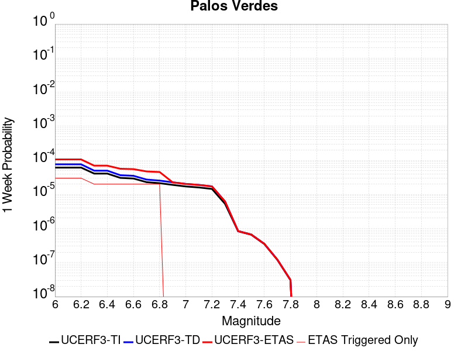 |  |  |  |

| Magnitude | 1 wk TI Prob | 1 wk TD Prob | 1 wk ETAS Prob | 1 wk ETAS/TD Gain | 1 wk ETAS Triggered Only | 1 mo TI Prob | 1 mo TD Prob | 1 mo ETAS Prob | 1 mo ETAS/TD Gain | 1 mo ETAS Triggered Only | 1 yr TI Prob | 1 yr TD Prob | 1 yr ETAS Prob | 1 yr ETAS/TD Gain | 1 yr ETAS Triggered Only | 10 yr TI Prob | 10 yr TD Prob | 10 yr ETAS Prob | 10 yr ETAS/TD Gain | 10 yr ETAS Triggered Only |
|-----|-----|-----|-----|-----|-----|-----|-----|-----|-----|-----|-----|-----|-----|-----|-----|-----|-----|-----|-----|-----|
| 6.0 | 6.126063E-5 | 7.622612E-5 | 1.0622383E-4 | 1.3935359 | 3.0E-5 | 2.6251914E-4 | 3.2664582E-4 | 3.766295E-4 | 1.153021 | 5.0E-5 | 0.0031914865 | 0.003970174 | 0.004029936 | 1.0150527 | 6.0E-5 | 0.031460393 | 0.039048895 | 0.039144993 | 1.0024608 | 1.0E-4 |
| 6.1 | 6.126063E-5 | 7.622612E-5 | 1.0622383E-4 | 1.3935359 | 3.0E-5 | 2.6251914E-4 | 3.2664582E-4 | 3.766295E-4 | 1.153021 | 5.0E-5 | 0.0031914865 | 0.003970174 | 0.004029936 | 1.0150527 | 6.0E-5 | 0.031460393 | 0.039048895 | 0.039144993 | 1.0024608 | 1.0E-4 |
| 6.2 | 6.126063E-5 | 7.622612E-5 | 1.0622383E-4 | 1.3935359 | 3.0E-5 | 2.6251914E-4 | 3.2664582E-4 | 3.766295E-4 | 1.153021 | 5.0E-5 | 0.0031914865 | 0.003970174 | 0.004029936 | 1.0150527 | 6.0E-5 | 0.031460393 | 0.039048895 | 0.039144993 | 1.0024608 | 1.0E-4 |
| 6.3 | 4.0838047E-5 | 4.9749437E-5 | 6.974844E-5 | 1.4019946 | 2.0E-5 | 1.7500846E-4 | 2.1319572E-4 | 2.3319144E-4 | 1.0937905 | 2.0E-5 | 0.0021286458 | 0.0025927818 | 0.002622704 | 1.0115405 | 3.0E-5 | 0.021083709 | 0.025646681 | 0.025685655 | 1.0015197 | 4.0E-5 |
| 6.4 | 4.0838047E-5 | 4.9749437E-5 | 6.974844E-5 | 1.4019946 | 2.0E-5 | 1.7500846E-4 | 2.1319572E-4 | 2.3319144E-4 | 1.0937905 | 2.0E-5 | 0.0021286458 | 0.0025927818 | 0.002622704 | 1.0115405 | 3.0E-5 | 0.021083709 | 0.025646681 | 0.025685655 | 1.0015197 | 4.0E-5 |
| 6.5 | 3.0512005E-5 | 3.656162E-5 | 5.656089E-5 | 1.5470017 | 2.0E-5 | 1.3075917E-4 | 1.5668393E-4 | 1.766808E-4 | 1.1276255 | 2.0E-5 | 0.0015908304 | 0.0019060767 | 0.0019360194 | 1.0157092 | 3.0E-5 | 0.015794903 | 0.018909154 | 0.018948397 | 1.0020754 | 4.0E-5 |
| 6.6 | 2.9255087E-5 | 3.515442E-5 | 5.5153716E-5 | 1.5688986 | 2.0E-5 | 1.2537291E-4 | 1.5065377E-4 | 1.7065075E-4 | 1.1327348 | 2.0E-5 | 0.0015253464 | 0.0018327828 | 0.0018627278 | 1.0163386 | 3.0E-5 | 0.015149189 | 0.018188225 | 0.018227497 | 1.0021592 | 4.0E-5 |
| 6.7 | 2.287198E-5 | 2.7248278E-5 | 4.7247733E-5 | 1.7339714 | 2.0E-5 | 9.801909E-5 | 1.16773626E-4 | 1.367713E-4 | 1.1712515 | 2.0E-5 | 0.001192729 | 0.0014208833 | 0.0014508407 | 1.0210836 | 3.0E-5 | 0.011863477 | 0.014127217 | 0.014166652 | 1.0027914 | 4.0E-5 |
| 6.8 | 2.1325764E-5 | 2.5431877E-5 | 4.543137E-5 | 1.7863946 | 2.0E-5 | 9.139293E-5 | 1.0898971E-4 | 1.2898754E-4 | 1.1834836 | 2.0E-5 | 0.001112141 | 0.0013262323 | 0.0013561925 | 1.0225905 | 3.0E-5 | 0.011065915 | 0.013192211 | 0.0132316835 | 1.002992 | 4.0E-5 |
| 6.9 | 1.9009392E-5 | 2.2613547E-5 | 2.2613547E-5 | 1.0 | 0.0 | 8.1466285E-5 | 9.6912096E-5 | 9.6912096E-5 | 1.0 | 0.0 | 9.914007E-4 | 0.0011793535 | 0.0011893417 | 1.0084692 | 1.0E-5 | 0.009869894 | 0.011739632 | 0.011759398 | 1.0016836 | 2.0E-5 |
| 7.0 | 1.7098473E-5 | 2.0319356E-5 | 2.0319356E-5 | 1.0 | 0.0 | 7.3277115E-5 | 8.708052E-5 | 8.708052E-5 | 1.0 | 0.0 | 8.917837E-4 | 0.001059775 | 0.0010697644 | 1.009426 | 1.0E-5 | 0.008882134 | 0.010555646 | 0.010575435 | 1.0018747 | 2.0E-5 |
| 7.1 | 1.5982785E-5 | 1.899476E-5 | 1.899476E-5 | 1.0 | 0.0 | 6.849585E-5 | 8.1404054E-5 | 8.1404054E-5 | 1.0 | 0.0 | 8.336179E-4 | 9.907284E-4 | 0.0010007184 | 1.0100836 | 1.0E-5 | 0.008304977 | 0.009871479 | 0.009891282 | 1.002006 | 2.0E-5 |
| 7.2 | 1.4468002E-5 | 1.7197237E-5 | 1.7197237E-5 | 1.0 | 0.0 | 6.200425E-5 | 7.370083E-5 | 7.370083E-5 | 1.0 | 0.0 | 7.546402E-4 | 8.970222E-4 | 9.0701325E-4 | 1.011138 | 1.0E-5 | 0.007520827 | 0.008942284 | 0.008962105 | 1.0022166 | 2.0E-5 |
| 7.3 | 5.288233E-6 | 6.2036747E-6 | 6.2036747E-6 | 1.0 | 0.0 | 2.2663658E-5 | 2.6587102E-5 | 2.6587102E-5 | 1.0 | 0.0 | 2.7589512E-4 | 3.236848E-4 | 3.236848E-4 | 1.0 | 0.0 | 0.0027555283 | 0.0032355562 | 0.003245524 | 1.0030806 | 1.0E-5 |
| 7.4 | 8.279556E-7 | 8.408347E-7 | 8.408347E-7 | 1.0 | 0.0 | 3.5483763E-6 | 3.6035726E-6 | 3.6035726E-6 | 1.0 | 0.0 | 4.3200624E-5 | 4.3872686E-5 | 4.3872686E-5 | 1.0 | 0.0 | 4.3192226E-4 | 4.3864746E-4 | 4.3864746E-4 | 1.0 | 0.0 |
| 7.5 | 6.559831E-7 | 6.667229E-7 | 6.667229E-7 | 1.0 | 0.0 | 2.8113532E-6 | 2.857381E-6 | 2.857381E-6 | 1.0 | 0.0 | 3.4227687E-5 | 3.4788125E-5 | 3.4788125E-5 | 1.0 | 0.0 | 3.4222414E-4 | 3.4783344E-4 | 3.4783344E-4 | 1.0 | 0.0 |
| 7.6 | 3.5018968E-7 | 3.5620027E-7 | 3.5620027E-7 | 1.0 | 0.0 | 1.500812E-6 | 1.526572E-6 | 1.526572E-6 | 1.0 | 0.0 | 1.8272232E-5 | 1.8585903E-5 | 1.8585903E-5 | 1.0 | 0.0 | 1.8270731E-4 | 1.8584808E-4 | 1.8584808E-4 | 1.0 | 0.0 |
| 7.7 | 1.1986104E-7 | 1.2198376E-7 | 1.2198376E-7 | 1.0 | 0.0 | 5.1369005E-7 | 5.2278745E-7 | 5.2278745E-7 | 1.0 | 0.0 | 6.2541585E-6 | 6.364919E-6 | 6.364919E-6 | 1.0 | 0.0 | 6.2539824E-5 | 6.364741E-5 | 6.364741E-5 | 1.0 | 0.0 |
| 7.8 | 3.0445005E-8 | 3.1027582E-8 | 3.1027582E-8 | 1.0 | 0.0 | 1.3047858E-7 | 1.3297536E-7 | 1.3297536E-7 | 1.0 | 0.0 | 1.5885756E-6 | 1.6189739E-6 | 1.6189739E-6 | 1.0 | 0.0 | 1.5885644E-5 | 1.6189642E-5 | 1.6189642E-5 | 1.0 | 0.0 |

## Whittier alt 1
*[(top)](#table-of-contents)*

| 1 Week | 1 Month | 1 Year | 10 Year |
|-----|-----|-----|-----|
|  |  |  |  |

| Magnitude | 1 wk TI Prob | 1 wk TD Prob | 1 wk ETAS Prob | 1 wk ETAS/TD Gain | 1 wk ETAS Triggered Only | 1 mo TI Prob | 1 mo TD Prob | 1 mo ETAS Prob | 1 mo ETAS/TD Gain | 1 mo ETAS Triggered Only | 1 yr TI Prob | 1 yr TD Prob | 1 yr ETAS Prob | 1 yr ETAS/TD Gain | 1 yr ETAS Triggered Only | 10 yr TI Prob | 10 yr TD Prob | 10 yr ETAS Prob | 10 yr ETAS/TD Gain | 10 yr ETAS Triggered Only |
|-----|-----|-----|-----|-----|-----|-----|-----|-----|-----|-----|-----|-----|-----|-----|-----|-----|-----|-----|-----|-----|
| 6.0 | 4.2554693E-5 | 4.725218E-5 | 9.724982E-5 | 2.0581024 | 5.0E-5 | 1.8236451E-4 | 2.0249544E-4 | 2.524853E-4 | 1.2468691 | 5.0E-5 | 0.002218027 | 0.0024629154 | 0.0025427183 | 1.0324018 | 8.0E-5 | 0.02196019 | 0.024390234 | 0.024487795 | 1.004 | 1.0E-4 |
| 6.1 | 4.2554693E-5 | 4.725218E-5 | 9.724982E-5 | 2.0581024 | 5.0E-5 | 1.8236451E-4 | 2.0249544E-4 | 2.524853E-4 | 1.2468691 | 5.0E-5 | 0.002218027 | 0.0024629154 | 0.0025427183 | 1.0324018 | 8.0E-5 | 0.02196019 | 0.024390234 | 0.024487795 | 1.004 | 1.0E-4 |
| 6.2 | 4.2554693E-5 | 4.725218E-5 | 9.724982E-5 | 2.0581024 | 5.0E-5 | 1.8236451E-4 | 2.0249544E-4 | 2.524853E-4 | 1.2468691 | 5.0E-5 | 0.002218027 | 0.0024629154 | 0.0025427183 | 1.0324018 | 8.0E-5 | 0.02196019 | 0.024390234 | 0.024487795 | 1.004 | 1.0E-4 |
| 6.3 | 1.9617712E-5 | 1.8268593E-5 | 3.8268226E-5 | 2.0947552 | 2.0E-5 | 8.40732E-5 | 7.829172E-5 | 9.8290155E-5 | 1.2554349 | 2.0E-5 | 0.0010231105 | 9.52804E-4 | 9.827754E-4 | 1.031456 | 3.0E-5 | 0.01018413 | 0.009490474 | 0.00954 | 1.0052184 | 5.0E-5 |
| 6.4 | 1.5611336E-5 | 1.3604271E-5 | 2.3604134E-5 | 1.7350533 | 1.0E-5 | 6.690401E-5 | 5.8302747E-5 | 6.8302164E-5 | 1.1715086 | 1.0E-5 | 8.142519E-4 | 7.0961076E-4 | 7.295966E-4 | 1.0281645 | 2.0E-5 | 0.008112748 | 0.0070754145 | 0.0071052024 | 1.00421 | 3.0E-5 |
| 6.5 | 1.5150166E-5 | 1.3100925E-5 | 2.3100794E-5 | 1.7632949 | 1.0E-5 | 6.492767E-5 | 5.6145647E-5 | 6.614508E-5 | 1.1780982 | 1.0E-5 | 7.9020765E-4 | 6.8336475E-4 | 7.0335105E-4 | 1.0292469 | 2.0E-5 | 0.007874036 | 0.0068145846 | 0.0068443804 | 1.0043724 | 3.0E-5 |
| 6.6 | 1.295588E-5 | 1.0380725E-5 | 1.0380725E-5 | 1.0 | 0.0 | 5.552402E-5 | 4.4488075E-5 | 4.4488075E-5 | 1.0 | 0.0 | 6.7579525E-4 | 5.4150965E-4 | 5.5150426E-4 | 1.0184569 | 1.0E-5 | 0.006737438 | 0.0054033357 | 0.0054232273 | 1.0036814 | 2.0E-5 |
| 6.7 | 1.2542085E-5 | 9.899369E-6 | 9.899369E-6 | 1.0 | 0.0 | 5.3750682E-5 | 4.242519E-5 | 4.242519E-5 | 1.0 | 0.0 | 6.542181E-4 | 5.164061E-4 | 5.164061E-4 | 1.0 | 0.0 | 0.006522954 | 0.0051534795 | 0.0051534795 | 1.0 | 0.0 |
| 6.8 | 1.2195878E-5 | 9.495415E-6 | 9.495415E-6 | 1.0 | 0.0 | 5.2267E-5 | 4.069401E-5 | 4.069401E-5 | 1.0 | 0.0 | 6.36165E-4 | 4.9533875E-4 | 4.9533875E-4 | 1.0 | 0.0 | 0.0063434686 | 0.004943688 | 0.004943688 | 1.0 | 0.0 |
| 6.9 | 1.1580298E-5 | 8.772933E-6 | 8.772933E-6 | 1.0 | 0.0 | 4.9628903E-5 | 3.7597754E-5 | 3.7597754E-5 | 1.0 | 0.0 | 6.040644E-4 | 4.5765814E-4 | 4.5765814E-4 | 1.0 | 0.0 | 0.00602425 | 0.0045684157 | 0.0045684157 | 1.0 | 0.0 |
| 7.0 | 1.0964795E-5 | 8.083994E-6 | 8.083994E-6 | 1.0 | 0.0 | 4.6991136E-5 | 3.4645236E-5 | 3.4645236E-5 | 1.0 | 0.0 | 5.7196687E-4 | 4.2172565E-4 | 4.2172565E-4 | 1.0 | 0.0 | 0.0057049696 | 0.004210462 | 0.004210462 | 1.0 | 0.0 |
| 7.1 | 1.0230601E-5 | 7.3266697E-6 | 7.3266697E-6 | 1.0 | 0.0 | 4.3844695E-5 | 3.1399642E-5 | 3.1399642E-5 | 1.0 | 0.0 | 5.336784E-4 | 3.8222488E-4 | 3.8222488E-4 | 1.0 | 0.0 | 0.005323986 | 0.0038168381 | 0.0038168381 | 1.0 | 0.0 |
| 7.2 | 9.40865E-6 | 6.543289E-6 | 6.543289E-6 | 1.0 | 0.0 | 4.032216E-5 | 2.8042374E-5 | 2.8042374E-5 | 1.0 | 0.0 | 4.908117E-4 | 3.4136363E-4 | 3.4136363E-4 | 1.0 | 0.0 | 0.0048972913 | 0.003409485 | 0.003409485 | 1.0 | 0.0 |
| 7.3 | 8.237384E-6 | 5.5977525E-6 | 5.5977525E-6 | 1.0 | 0.0 | 3.5302593E-5 | 2.3990153E-5 | 2.3990153E-5 | 1.0 | 0.0 | 4.2972428E-4 | 2.92042E-4 | 2.92042E-4 | 1.0 | 0.0 | 0.0042889426 | 0.002916903 | 0.002916903 | 1.0 | 0.0 |
| 7.4 | 7.5316966E-6 | 5.027819E-6 | 5.027819E-6 | 1.0 | 0.0 | 3.2278298E-5 | 2.1547625E-5 | 2.1547625E-5 | 1.0 | 0.0 | 3.9291743E-4 | 2.6231175E-4 | 2.6231175E-4 | 1.0 | 0.0 | 0.0039222343 | 0.0026201333 | 0.0026201333 | 1.0 | 0.0 |
| 7.5 | 6.149649E-6 | 3.933841E-6 | 3.933841E-6 | 1.0 | 0.0 | 2.6355372E-5 | 1.6859214E-5 | 1.6859214E-5 | 1.0 | 0.0 | 3.208294E-4 | 2.052425E-4 | 2.052425E-4 | 1.0 | 0.0 | 0.003203666 | 0.0020506186 | 0.0020506186 | 1.0 | 0.0 |
| 7.6 | 5.457711E-6 | 3.3953788E-6 | 3.3953788E-6 | 1.0 | 0.0 | 2.338998E-5 | 1.4551547E-5 | 1.4551547E-5 | 1.0 | 0.0 | 2.8473578E-4 | 1.771515E-4 | 1.771515E-4 | 1.0 | 0.0 | 0.0028437122 | 0.0017701836 | 0.0017701836 | 1.0 | 0.0 |
| 7.7 | 4.1676276E-6 | 2.3331952E-6 | 2.3331952E-6 | 1.0 | 0.0 | 1.7861139E-5 | 9.999374E-6 | 9.999374E-6 | 1.0 | 0.0 | 2.1743766E-4 | 1.2173632E-4 | 1.2173632E-4 | 1.0 | 0.0 | 0.0021722503 | 0.0012167693 | 0.0012167693 | 1.0 | 0.0 |
| 7.8 | 2.2692414E-7 | 9.3854695E-8 | 9.3854695E-8 | 1.0 | 0.0 | 9.725317E-7 | 4.0223435E-7 | 4.0223435E-7 | 1.0 | 0.0 | 1.1840509E-5 | 4.8971956E-6 | 4.8971956E-6 | 1.0 | 0.0 | 1.1839878E-4 | 4.8971204E-5 | 4.8971204E-5 | 1.0 | 0.0 |
| 7.9 | 6.676829E-9 | 3.439853E-9 | 3.439853E-9 | 1.0 | 0.0 | 2.861498E-8 | 1.4742227E-8 | 1.4742227E-8 | 1.0 | 0.0 | 3.4838732E-7 | 1.7948659E-7 | 1.7948659E-7 | 1.0 | 0.0 | 3.4838679E-6 | 1.7948646E-6 | 1.7948646E-6 | 1.0 | 0.0 |

## Mission Creek
*[(top)](#table-of-contents)*

| 1 Week | 1 Month | 1 Year | 10 Year |
|-----|-----|-----|-----|
| 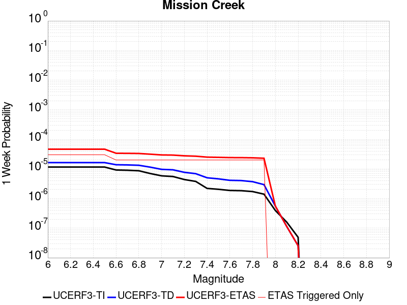 |  |  |  |

| Magnitude | 1 wk TI Prob | 1 wk TD Prob | 1 wk ETAS Prob | 1 wk ETAS/TD Gain | 1 wk ETAS Triggered Only | 1 mo TI Prob | 1 mo TD Prob | 1 mo ETAS Prob | 1 mo ETAS/TD Gain | 1 mo ETAS Triggered Only | 1 yr TI Prob | 1 yr TD Prob | 1 yr ETAS Prob | 1 yr ETAS/TD Gain | 1 yr ETAS Triggered Only | 10 yr TI Prob | 10 yr TD Prob | 10 yr ETAS Prob | 10 yr ETAS/TD Gain | 10 yr ETAS Triggered Only |
|-----|-----|-----|-----|-----|-----|-----|-----|-----|-----|-----|-----|-----|-----|-----|-----|-----|-----|-----|-----|-----|
| 6.0 | 1.1549387E-5 | 1.632237E-5 | 4.632188E-5 | 2.8379383 | 3.0E-5 | 4.9496433E-5 | 6.9951224E-5 | 1.0994842E-4 | 1.571787 | 4.0E-5 | 6.0245243E-4 | 8.513384E-4 | 9.3127025E-4 | 1.0938897 | 8.0E-5 | 0.006008218 | 0.008509998 | 0.008609147 | 1.0116509 | 1.0E-4 |
| 6.1 | 1.1549387E-5 | 1.632237E-5 | 4.632188E-5 | 2.8379383 | 3.0E-5 | 4.9496433E-5 | 6.9951224E-5 | 1.0994842E-4 | 1.571787 | 4.0E-5 | 6.0245243E-4 | 8.513384E-4 | 9.3127025E-4 | 1.0938897 | 8.0E-5 | 0.006008218 | 0.008509998 | 0.008609147 | 1.0116509 | 1.0E-4 |
| 6.2 | 1.1549387E-5 | 1.632237E-5 | 4.632188E-5 | 2.8379383 | 3.0E-5 | 4.9496433E-5 | 6.9951224E-5 | 1.0994842E-4 | 1.571787 | 4.0E-5 | 6.0245243E-4 | 8.513384E-4 | 9.3127025E-4 | 1.0938897 | 8.0E-5 | 0.006008218 | 0.008509998 | 0.008609147 | 1.0116509 | 1.0E-4 |
| 6.3 | 1.1549387E-5 | 1.632237E-5 | 4.632188E-5 | 2.8379383 | 3.0E-5 | 4.9496433E-5 | 6.9951224E-5 | 1.0994842E-4 | 1.571787 | 4.0E-5 | 6.0245243E-4 | 8.513384E-4 | 9.3127025E-4 | 1.0938897 | 8.0E-5 | 0.006008218 | 0.008509998 | 0.008609147 | 1.0116509 | 1.0E-4 |
| 6.4 | 1.1549387E-5 | 1.632237E-5 | 4.632188E-5 | 2.8379383 | 3.0E-5 | 4.9496433E-5 | 6.9951224E-5 | 1.0994842E-4 | 1.571787 | 4.0E-5 | 6.0245243E-4 | 8.513384E-4 | 9.3127025E-4 | 1.0938897 | 8.0E-5 | 0.006008218 | 0.008509998 | 0.008609147 | 1.0116509 | 1.0E-4 |
| 6.5 | 1.1549387E-5 | 1.632237E-5 | 4.632188E-5 | 2.8379383 | 3.0E-5 | 4.9496433E-5 | 6.9951224E-5 | 1.0994842E-4 | 1.571787 | 4.0E-5 | 6.0245243E-4 | 8.513384E-4 | 9.3127025E-4 | 1.0938897 | 8.0E-5 | 0.006008218 | 0.008509998 | 0.008609147 | 1.0116509 | 1.0E-4 |
| 6.6 | 9.202681E-6 | 1.3845646E-5 | 3.384537E-5 | 2.4444773 | 2.0E-5 | 3.9439463E-5 | 5.9337188E-5 | 8.933541E-5 | 1.5055552 | 3.0E-5 | 4.800697E-4 | 7.221998E-4 | 7.821565E-4 | 1.0830195 | 6.0E-5 | 0.004790339 | 0.0072271815 | 0.0073066032 | 1.0109893 | 8.0E-5 |
| 6.7 | 9.019164E-6 | 1.3651316E-5 | 3.3651042E-5 | 2.4650402 | 2.0E-5 | 3.8652986E-5 | 5.8504378E-5 | 8.8502624E-5 | 1.5127522 | 3.0E-5 | 4.7049852E-4 | 7.12067E-4 | 7.7202433E-4 | 1.0842017 | 6.0E-5 | 0.004695036 | 0.007126506 | 0.0072059357 | 1.0111457 | 8.0E-5 |
| 6.8 | 8.673558E-6 | 1.3273427E-5 | 3.327316E-5 | 2.5067499 | 2.0E-5 | 3.717186E-5 | 5.6884925E-5 | 8.688322E-5 | 1.5273505 | 3.0E-5 | 4.524734E-4 | 6.923627E-4 | 7.523212E-4 | 1.0865998 | 6.0E-5 | 0.0045155324 | 0.006930694 | 0.0070101395 | 1.0114628 | 8.0E-5 |
| 6.9 | 7.002255E-6 | 1.1477657E-5 | 3.1477426E-5 | 2.742496 | 2.0E-5 | 3.000932E-5 | 4.9189068E-5 | 7.9187594E-5 | 1.6098616 | 3.0E-5 | 3.653022E-4 | 5.9871917E-4 | 6.5868325E-4 | 1.1001539 | 6.0E-5 | 0.0036470229 | 0.005999517 | 0.006079037 | 1.0132544 | 8.0E-5 |
| 7.0 | 5.84644E-6 | 9.67498E-6 | 2.9674786E-5 | 3.0671678 | 2.0E-5 | 2.5055931E-5 | 4.1463565E-5 | 7.1462324E-5 | 1.7234968 | 3.0E-5 | 3.0501327E-4 | 5.047066E-4 | 5.6467624E-4 | 1.1188209 | 6.0E-5 | 0.0030459496 | 0.0050638523 | 0.0051434473 | 1.0157182 | 8.0E-5 |
| 7.1 | 5.54703E-6 | 9.329456E-6 | 2.9329269E-5 | 3.1437278 | 2.0E-5 | 2.377277E-5 | 3.9982795E-5 | 6.9981594E-5 | 1.7502928 | 3.0E-5 | 2.8939504E-4 | 4.8668624E-4 | 5.466571E-4 | 1.1232227 | 6.0E-5 | 0.0028901845 | 0.004884446 | 0.0049640555 | 1.0162985 | 8.0E-5 |
| 7.2 | 4.384709E-6 | 7.68157E-6 | 2.7681417E-5 | 3.603614 | 2.0E-5 | 1.8791474E-5 | 3.2920623E-5 | 6.291964E-5 | 1.9112529 | 3.0E-5 | 2.2876218E-4 | 4.0073853E-4 | 4.6071448E-4 | 1.1496636 | 6.0E-5 | 0.0022852682 | 0.004028366 | 0.0041080434 | 1.0197792 | 8.0E-5 |
| 7.3 | 3.7888456E-6 | 6.915452E-6 | 2.6915313E-5 | 3.892054 | 2.0E-5 | 1.623781E-5 | 2.9637333E-5 | 5.9636444E-5 | 2.0122068 | 3.0E-5 | 1.9767738E-4 | 3.6077813E-4 | 4.207565E-4 | 1.1662472 | 6.0E-5 | 0.0019750162 | 0.0036301152 | 0.0037098248 | 1.0219579 | 8.0E-5 |
| 7.4 | 2.1982462E-6 | 5.0237763E-6 | 2.5023675E-5 | 4.9810486 | 2.0E-5 | 9.421021E-6 | 2.1530293E-5 | 5.152965E-5 | 2.3933556 | 3.0E-5 | 1.1469489E-4 | 2.621E-4 | 3.2208426E-4 | 1.2288603 | 6.0E-5 | 0.0011463572 | 0.0026458844 | 0.002725673 | 1.0301557 | 8.0E-5 |
| 7.5 | 2.051923E-6 | 4.615016E-6 | 2.4614923E-5 | 5.333659 | 2.0E-5 | 8.793926E-6 | 1.9778492E-5 | 4.9777896E-5 | 2.5167692 | 3.0E-5 | 1.0706078E-4 | 2.4077666E-4 | 3.007622E-4 | 1.2491336 | 6.0E-5 | 0.0010700922 | 0.0024335422 | 0.0025133474 | 1.0327939 | 8.0E-5 |
| 7.6 | 1.8733427E-6 | 4.1233748E-6 | 2.4123292E-5 | 5.8503757 | 2.0E-5 | 8.028587E-6 | 1.7671488E-5 | 4.7670957E-5 | 2.69762 | 3.0E-5 | 9.774366E-5 | 2.151292E-4 | 2.751163E-4 | 1.2788422 | 6.0E-5 | 9.770069E-4 | 0.0021780801 | 0.002257906 | 1.0366496 | 8.0E-5 |
| 7.7 | 1.8411953E-6 | 4.0430496E-6 | 2.4042969E-5 | 5.946741 | 2.0E-5 | 7.890813E-6 | 1.732724E-5 | 4.732672E-5 | 2.7313478 | 3.0E-5 | 9.606641E-5 | 2.1093882E-4 | 2.7092616E-4 | 1.2843827 | 6.0E-5 | 9.6024893E-4 | 0.0021363653 | 0.0022161943 | 1.0373667 | 8.0E-5 |
| 7.8 | 1.7194251E-6 | 3.7104276E-6 | 2.3710354E-5 | 6.3901944 | 2.0E-5 | 7.368944E-6 | 1.5901736E-5 | 4.590126E-5 | 2.8865564 | 3.0E-5 | 8.97132E-5 | 1.9358651E-4 | 2.535749E-4 | 1.309879 | 6.0E-5 | 8.967699E-4 | 0.0019623525 | 0.0020421955 | 1.0406874 | 8.0E-5 |
| 7.9 | 1.4035052E-6 | 2.9500632E-6 | 2.2950004E-5 | 7.779496 | 2.0E-5 | 6.0150082E-6 | 1.2643067E-5 | 4.264269E-5 | 3.372812 | 3.0E-5 | 7.3230265E-5 | 1.5391852E-4 | 2.1390928E-4 | 1.3897567 | 6.0E-5 | 7.3206134E-4 | 0.0015631086 | 0.0016429836 | 1.0511 | 8.0E-5 |
| 8.0 | 3.9318823E-7 | 5.528522E-7 | 5.528522E-7 | 1.0 | 0.0 | 1.6850913E-6 | 2.3693647E-6 | 2.3693647E-6 | 1.0 | 0.0 | 2.0515794E-5 | 2.8846638E-5 | 5.8845773E-5 | 2.0399525 | 3.0E-5 | 2.0513899E-4 | 2.9899E-4 | 3.3897802E-4 | 1.1337438 | 4.0E-5 |
| 8.1 | 1.596793E-7 | 1.1380002E-7 | 1.1380002E-7 | 1.0 | 0.0 | 6.8433974E-7 | 4.877143E-7 | 4.877143E-7 | 1.0 | 0.0 | 8.331805E-6 | 5.937906E-6 | 5.937906E-6 | 1.0 | 0.0 | 8.331492E-5 | 6.549966E-5 | 6.549966E-5 | 1.0 | 0.0 |
| 8.2 | 4.9003038E-8 | 2.5444924E-8 | 2.5444924E-8 | 1.0 | 0.0 | 2.10013E-7 | 1.0904967E-7 | 1.0904967E-7 | 1.0 | 0.0 | 2.5569052E-6 | 1.327679E-6 | 1.327679E-6 | 1.0 | 0.0 | 2.556876E-5 | 1.495635E-5 | 1.495635E-5 | 1.0 | 0.0 |

## Pleito
*[(top)](#table-of-contents)*

| 1 Week | 1 Month | 1 Year | 10 Year |
|-----|-----|-----|-----|
|  | 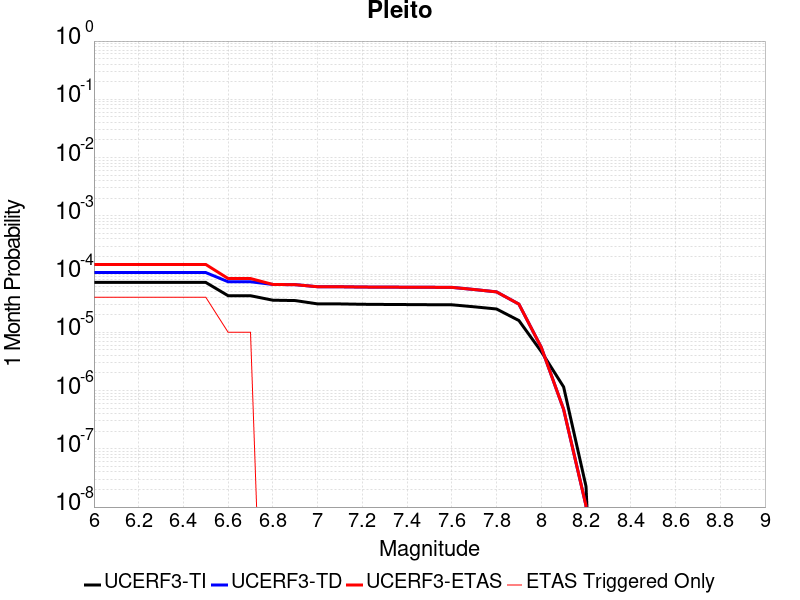 |  |  |

| Magnitude | 1 wk TI Prob | 1 wk TD Prob | 1 wk ETAS Prob | 1 wk ETAS/TD Gain | 1 wk ETAS Triggered Only | 1 mo TI Prob | 1 mo TD Prob | 1 mo ETAS Prob | 1 mo ETAS/TD Gain | 1 mo ETAS Triggered Only | 1 yr TI Prob | 1 yr TD Prob | 1 yr ETAS Prob | 1 yr ETAS/TD Gain | 1 yr ETAS Triggered Only | 10 yr TI Prob | 10 yr TD Prob | 10 yr ETAS Prob | 10 yr ETAS/TD Gain | 10 yr ETAS Triggered Only |
|-----|-----|-----|-----|-----|-----|-----|-----|-----|-----|-----|-----|-----|-----|-----|-----|-----|-----|-----|-----|-----|
| 6.0 | 1.6763008E-5 | 2.4763838E-5 | 6.476285E-5 | 2.6152184 | 4.0E-5 | 7.183948E-5 | 1.0612683E-4 | 1.4612258E-4 | 1.3768675 | 4.0E-5 | 8.742947E-4 | 0.0012914003 | 0.0013513229 | 1.0464011 | 6.0E-5 | 0.00870863 | 0.0129538905 | 0.013052595 | 1.0076197 | 1.0E-4 |
| 6.1 | 1.6763008E-5 | 2.4763838E-5 | 6.476285E-5 | 2.6152184 | 4.0E-5 | 7.183948E-5 | 1.0612683E-4 | 1.4612258E-4 | 1.3768675 | 4.0E-5 | 8.742947E-4 | 0.0012914003 | 0.0013513229 | 1.0464011 | 6.0E-5 | 0.00870863 | 0.0129538905 | 0.013052595 | 1.0076197 | 1.0E-4 |
| 6.2 | 1.6763008E-5 | 2.4763838E-5 | 6.476285E-5 | 2.6152184 | 4.0E-5 | 7.183948E-5 | 1.0612683E-4 | 1.4612258E-4 | 1.3768675 | 4.0E-5 | 8.742947E-4 | 0.0012914003 | 0.0013513229 | 1.0464011 | 6.0E-5 | 0.00870863 | 0.0129538905 | 0.013052595 | 1.0076197 | 1.0E-4 |
| 6.3 | 1.6763008E-5 | 2.4763838E-5 | 6.476285E-5 | 2.6152184 | 4.0E-5 | 7.183948E-5 | 1.0612683E-4 | 1.4612258E-4 | 1.3768675 | 4.0E-5 | 8.742947E-4 | 0.0012914003 | 0.0013513229 | 1.0464011 | 6.0E-5 | 0.00870863 | 0.0129538905 | 0.013052595 | 1.0076197 | 1.0E-4 |
| 6.4 | 1.6763008E-5 | 2.4763838E-5 | 6.476285E-5 | 2.6152184 | 4.0E-5 | 7.183948E-5 | 1.0612683E-4 | 1.4612258E-4 | 1.3768675 | 4.0E-5 | 8.742947E-4 | 0.0012914003 | 0.0013513229 | 1.0464011 | 6.0E-5 | 0.00870863 | 0.0129538905 | 0.013052595 | 1.0076197 | 1.0E-4 |
| 6.5 | 1.6763008E-5 | 2.4763838E-5 | 6.476285E-5 | 2.6152184 | 4.0E-5 | 7.183948E-5 | 1.0612683E-4 | 1.4612258E-4 | 1.3768675 | 4.0E-5 | 8.742947E-4 | 0.0012914003 | 0.0013513229 | 1.0464011 | 6.0E-5 | 0.00870863 | 0.0129538905 | 0.013052595 | 1.0076197 | 1.0E-4 |
| 6.6 | 9.910213E-6 | 1.7214623E-5 | 2.7214452E-5 | 1.5808915 | 1.0E-5 | 4.247165E-5 | 7.377489E-5 | 8.377415E-5 | 1.1355375 | 1.0E-5 | 5.169696E-4 | 8.978429E-4 | 9.178249E-4 | 1.0222557 | 2.0E-5 | 0.0051576863 | 0.009050702 | 0.00909034 | 1.0043795 | 4.0E-5 |
| 6.7 | 9.910213E-6 | 1.7214623E-5 | 2.7214452E-5 | 1.5808915 | 1.0E-5 | 4.247165E-5 | 7.377489E-5 | 8.377415E-5 | 1.1355375 | 1.0E-5 | 5.169696E-4 | 8.978429E-4 | 9.178249E-4 | 1.0222557 | 2.0E-5 | 0.0051576863 | 0.009050702 | 0.00909034 | 1.0043795 | 4.0E-5 |
| 6.8 | 8.300162E-6 | 1.5474232E-5 | 1.5474232E-5 | 1.0 | 0.0 | 3.557164E-5 | 6.631646E-5 | 6.631646E-5 | 1.0 | 0.0 | 4.3299864E-4 | 8.071053E-4 | 8.170972E-4 | 1.01238 | 1.0E-5 | 0.004321559 | 0.008150139 | 0.008169976 | 1.0024339 | 2.0E-5 |
| 6.9 | 8.183114E-6 | 1.5345448E-5 | 1.5345448E-5 | 1.0 | 0.0 | 3.5070017E-5 | 6.576455E-5 | 6.576455E-5 | 1.0 | 0.0 | 4.2689382E-4 | 8.003907E-4 | 8.103827E-4 | 1.012484 | 1.0E-5 | 0.0042607468 | 0.008083483 | 0.008103322 | 1.0024542 | 2.0E-5 |
| 7.0 | 7.1748823E-6 | 1.413244E-5 | 1.413244E-5 | 1.0 | 0.0 | 3.0749135E-5 | 6.0566195E-5 | 6.0566195E-5 | 1.0 | 0.0 | 3.743064E-4 | 7.371445E-4 | 7.371445E-4 | 1.0 | 0.0 | 0.0037367654 | 0.007454939 | 0.0074648648 | 1.0013314 | 1.0E-5 |
| 7.1 | 7.1671807E-6 | 1.412281E-5 | 1.412281E-5 | 1.0 | 0.0 | 3.0716128E-5 | 6.052493E-5 | 6.052493E-5 | 1.0 | 0.0 | 3.7390468E-4 | 7.366424E-4 | 7.366424E-4 | 1.0 | 0.0 | 0.0037327618 | 0.0074499524 | 0.0074598775 | 1.0013323 | 1.0E-5 |
| 7.2 | 7.0649667E-6 | 1.39701015E-5 | 1.39701015E-5 | 1.0 | 0.0 | 3.0278077E-5 | 5.9870494E-5 | 5.9870494E-5 | 1.0 | 0.0 | 3.6857324E-4 | 7.2868E-4 | 7.2868E-4 | 1.0 | 0.0 | 0.0036796255 | 0.0073707094 | 0.007380636 | 1.0013467 | 1.0E-5 |
| 7.3 | 7.02082E-6 | 1.3913556E-5 | 1.3913556E-5 | 1.0 | 0.0 | 3.008888E-5 | 5.9628168E-5 | 5.9628168E-5 | 1.0 | 0.0 | 3.6627054E-4 | 7.2573166E-4 | 7.2573166E-4 | 1.0 | 0.0 | 0.0036566744 | 0.007341209 | 0.0073511354 | 1.0013522 | 1.0E-5 |
| 7.4 | 6.987146E-6 | 1.3873118E-5 | 1.3873118E-5 | 1.0 | 0.0 | 2.9944567E-5 | 5.945487E-5 | 5.945487E-5 | 1.0 | 0.0 | 3.6451413E-4 | 7.2362315E-4 | 7.2362315E-4 | 1.0 | 0.0 | 0.0036391679 | 0.007320144 | 0.007330071 | 1.0013561 | 1.0E-5 |
| 7.5 | 6.9494554E-6 | 1.3830024E-5 | 1.3830024E-5 | 1.0 | 0.0 | 2.9783041E-5 | 5.9270187E-5 | 5.9270187E-5 | 1.0 | 0.0 | 3.625482E-4 | 7.2137616E-4 | 7.2137616E-4 | 1.0 | 0.0 | 0.0036195726 | 0.0072977724 | 0.0073077 | 1.0013603 | 1.0E-5 |
| 7.6 | 6.92694E-6 | 1.3789138E-5 | 1.3789138E-5 | 1.0 | 0.0 | 2.9686547E-5 | 5.909497E-5 | 5.909497E-5 | 1.0 | 0.0 | 3.6137376E-4 | 7.1924424E-4 | 7.1924424E-4 | 1.0 | 0.0 | 0.0036078666 | 0.0072765257 | 0.007286453 | 1.0013642 | 1.0E-5 |
| 7.7 | 6.395867E-6 | 1.2668219E-5 | 1.2668219E-5 | 1.0 | 0.0 | 2.741057E-5 | 5.429124E-5 | 5.429124E-5 | 1.0 | 0.0 | 3.336726E-4 | 6.6079566E-4 | 6.6079566E-4 | 1.0 | 0.0 | 0.0033317201 | 0.0066951844 | 0.0067051174 | 1.0014836 | 1.0E-5 |
| 7.8 | 5.8664327E-6 | 1.153586E-5 | 1.153586E-5 | 1.0 | 0.0 | 2.5141611E-5 | 4.9438466E-5 | 4.9438466E-5 | 1.0 | 0.0 | 3.060561E-4 | 6.017473E-4 | 6.017473E-4 | 1.0 | 0.0 | 0.0030563495 | 0.0061006667 | 0.0061106053 | 1.0016291 | 1.0E-5 |
| 7.9 | 3.7167474E-6 | 7.1140853E-6 | 7.1140853E-6 | 1.0 | 0.0 | 1.592882E-5 | 3.0488582E-5 | 3.0488582E-5 | 1.0 | 0.0 | 1.9391612E-4 | 3.7113542E-4 | 3.7113542E-4 | 1.0 | 0.0 | 0.0019374699 | 0.0037674906 | 0.0037674906 | 1.0 | 0.0 |
| 8.0 | 1.0903841E-6 | 1.2879392E-6 | 1.2879392E-6 | 1.0 | 0.0 | 4.6730665E-6 | 5.5197274E-6 | 5.5197274E-6 | 1.0 | 0.0 | 5.68931E-5 | 6.720063E-5 | 6.720063E-5 | 1.0 | 0.0 | 5.6878536E-4 | 6.941948E-4 | 6.941948E-4 | 1.0 | 0.0 |
| 8.1 | 2.6894583E-7 | 1.1060341E-7 | 1.1060341E-7 | 1.0 | 0.0 | 1.1526245E-6 | 4.740145E-7 | 4.740145E-7 | 1.0 | 0.0 | 1.4033113E-5 | 5.7711113E-6 | 5.7711113E-6 | 1.0 | 0.0 | 1.4032227E-4 | 6.456908E-5 | 6.456908E-5 | 1.0 | 0.0 |
| 8.2 | 5.2967013E-9 | 2.4578228E-9 | 2.4578228E-9 | 1.0 | 0.0 | 2.2700148E-8 | 1.0533527E-8 | 1.0533527E-8 | 1.0 | 0.0 | 2.7637427E-7 | 1.2824569E-7 | 1.2824569E-7 | 1.0 | 0.0 | 2.7637393E-6 | 1.4592787E-6 | 1.4592787E-6 | 1.0 | 0.0 |

## Mono Lake 2011 CFM
*[(top)](#table-of-contents)*

| 1 Week | 1 Month | 1 Year | 10 Year |
|-----|-----|-----|-----|
|  |  |  |  |

| Magnitude | 1 wk TI Prob | 1 wk TD Prob | 1 wk ETAS Prob | 1 wk ETAS/TD Gain | 1 wk ETAS Triggered Only | 1 mo TI Prob | 1 mo TD Prob | 1 mo ETAS Prob | 1 mo ETAS/TD Gain | 1 mo ETAS Triggered Only | 1 yr TI Prob | 1 yr TD Prob | 1 yr ETAS Prob | 1 yr ETAS/TD Gain | 1 yr ETAS Triggered Only | 10 yr TI Prob | 10 yr TD Prob | 10 yr ETAS Prob | 10 yr ETAS/TD Gain | 10 yr ETAS Triggered Only |
|-----|-----|-----|-----|-----|-----|-----|-----|-----|-----|-----|-----|-----|-----|-----|-----|-----|-----|-----|-----|-----|
| 6.0 | 2.0341662E-5 | 2.3828166E-5 | 7.3826974E-5 | 3.098307 | 5.0E-5 | 8.717564E-5 | 1.0211971E-4 | 1.6211359E-4 | 1.5874857 | 6.0E-5 | 0.0010608466 | 0.0012431298 | 0.0013130428 | 1.0562395 | 7.0E-5 | 0.010557966 | 0.012413835 | 0.0125125935 | 1.0079556 | 1.0E-4 |
| 6.1 | 2.0341662E-5 | 2.3828166E-5 | 7.3826974E-5 | 3.098307 | 5.0E-5 | 8.717564E-5 | 1.0211971E-4 | 1.6211359E-4 | 1.5874857 | 6.0E-5 | 0.0010608466 | 0.0012431298 | 0.0013130428 | 1.0562395 | 7.0E-5 | 0.010557966 | 0.012413835 | 0.0125125935 | 1.0079556 | 1.0E-4 |
| 6.2 | 2.0341662E-5 | 2.3828166E-5 | 7.3826974E-5 | 3.098307 | 5.0E-5 | 8.717564E-5 | 1.0211971E-4 | 1.6211359E-4 | 1.5874857 | 6.0E-5 | 0.0010608466 | 0.0012431298 | 0.0013130428 | 1.0562395 | 7.0E-5 | 0.010557966 | 0.012413835 | 0.0125125935 | 1.0079556 | 1.0E-4 |
| 6.3 | 2.0341662E-5 | 2.3828166E-5 | 7.3826974E-5 | 3.098307 | 5.0E-5 | 8.717564E-5 | 1.0211971E-4 | 1.6211359E-4 | 1.5874857 | 6.0E-5 | 0.0010608466 | 0.0012431298 | 0.0013130428 | 1.0562395 | 7.0E-5 | 0.010557966 | 0.012413835 | 0.0125125935 | 1.0079556 | 1.0E-4 |
| 6.4 | 1.749821E-5 | 2.0490985E-5 | 7.048996E-5 | 3.4400475 | 5.0E-5 | 7.499018E-5 | 8.781851E-5 | 1.4781323E-4 | 1.6831672 | 6.0E-5 | 9.1262296E-4 | 0.0010691903 | 0.0011391155 | 1.0654001 | 7.0E-5 | 0.009088841 | 0.010691865 | 0.010790796 | 1.0092529 | 1.0E-4 |
| 6.5 | 1.749821E-5 | 2.0490985E-5 | 7.048996E-5 | 3.4400475 | 5.0E-5 | 7.499018E-5 | 8.781851E-5 | 1.4781323E-4 | 1.6831672 | 6.0E-5 | 9.1262296E-4 | 0.0010691903 | 0.0011391155 | 1.0654001 | 7.0E-5 | 0.009088841 | 0.010691865 | 0.010790796 | 1.0092529 | 1.0E-4 |

## San Diego Trough north alt1
*[(top)](#table-of-contents)*

| 1 Week | 1 Month | 1 Year | 10 Year |
|-----|-----|-----|-----|
|  |  |  |  |

| Magnitude | 1 wk TI Prob | 1 wk TD Prob | 1 wk ETAS Prob | 1 wk ETAS/TD Gain | 1 wk ETAS Triggered Only | 1 mo TI Prob | 1 mo TD Prob | 1 mo ETAS Prob | 1 mo ETAS/TD Gain | 1 mo ETAS Triggered Only | 1 yr TI Prob | 1 yr TD Prob | 1 yr ETAS Prob | 1 yr ETAS/TD Gain | 1 yr ETAS Triggered Only | 10 yr TI Prob | 10 yr TD Prob | 10 yr ETAS Prob | 10 yr ETAS/TD Gain | 10 yr ETAS Triggered Only |
|-----|-----|-----|-----|-----|-----|-----|-----|-----|-----|-----|-----|-----|-----|-----|-----|-----|-----|-----|-----|-----|
| 6.0 | 7.329252E-5 | 8.821093E-5 | 1.18208285E-4 | 1.3400639 | 3.0E-5 | 3.14073E-4 | 3.7799572E-4 | 4.179806E-4 | 1.1057813 | 4.0E-5 | 0.0038171355 | 0.004593027 | 0.004642797 | 1.0108361 | 5.0E-5 | 0.03752231 | 0.045044992 | 0.04513094 | 1.001908 | 9.0E-5 |
| 6.1 | 3.7940346E-5 | 4.4885E-5 | 5.4884553E-5 | 1.2227815 | 1.0E-5 | 1.6259136E-4 | 1.9235066E-4 | 2.0234875E-4 | 1.0519783 | 1.0E-5 | 0.0019777524 | 0.0023394432 | 0.0023494198 | 1.0042645 | 1.0E-5 | 0.019602431 | 0.023156688 | 0.023176223 | 1.0008436 | 2.0E-5 |
| 6.2 | 2.8645263E-5 | 3.329678E-5 | 3.329678E-5 | 1.0 | 0.0 | 1.2275964E-4 | 1.4269284E-4 | 1.4269284E-4 | 1.0 | 0.0 | 0.0014935739 | 0.0017359189 | 0.0017359189 | 1.0 | 0.0 | 0.0148357535 | 0.017226247 | 0.017236074 | 1.0005705 | 1.0E-5 |
| 6.3 | 2.8645263E-5 | 3.329678E-5 | 3.329678E-5 | 1.0 | 0.0 | 1.2275964E-4 | 1.4269284E-4 | 1.4269284E-4 | 1.0 | 0.0 | 0.0014935739 | 0.0017359189 | 0.0017359189 | 1.0 | 0.0 | 0.0148357535 | 0.017226247 | 0.017236074 | 1.0005705 | 1.0E-5 |
| 6.4 | 2.2204576E-5 | 2.5448318E-5 | 2.5448318E-5 | 1.0 | 0.0 | 9.5159E-5 | 1.0905972E-4 | 1.0905972E-4 | 1.0 | 0.0 | 0.001157945 | 0.0013270034 | 0.0013270034 | 1.0 | 0.0 | 0.011519298 | 0.013191955 | 0.0132018225 | 1.000748 | 1.0E-5 |
| 6.5 | 2.1004838E-5 | 2.4024694E-5 | 2.4024694E-5 | 1.0 | 0.0 | 9.0017624E-5 | 1.0295896E-4 | 1.0295896E-4 | 1.0 | 0.0 | 0.0010954136 | 0.0012528138 | 0.0012528138 | 1.0 | 0.0 | 0.010900296 | 0.012458589 | 0.012468464 | 1.0007926 | 1.0E-5 |
| 6.6 | 1.820557E-5 | 2.0704787E-5 | 2.0704787E-5 | 1.0 | 0.0 | 7.802154E-5 | 8.873181E-5 | 8.873181E-5 | 1.0 | 0.0 | 9.4949827E-4 | 0.0010797799 | 0.0010797799 | 1.0 | 0.0 | 0.009454516 | 0.010746004 | 0.010755897 | 1.0009205 | 1.0E-5 |
| 6.7 | 1.5884485E-5 | 1.7983646E-5 | 1.7983646E-5 | 1.0 | 0.0 | 6.807459E-5 | 7.707051E-5 | 7.707051E-5 | 1.0 | 0.0 | 8.284929E-4 | 9.3793223E-4 | 9.3793223E-4 | 1.0 | 0.0 | 0.008254109 | 0.009340104 | 0.009340104 | 1.0 | 0.0 |
| 6.8 | 1.4331171E-5 | 1.6201066E-5 | 1.6201066E-5 | 1.0 | 0.0 | 6.141786E-5 | 6.94313E-5 | 6.94313E-5 | 1.0 | 0.0 | 7.4750587E-4 | 8.450002E-4 | 8.450002E-4 | 1.0 | 0.0 | 0.0074499645 | 0.008418139 | 0.008418139 | 1.0 | 0.0 |
| 6.9 | 1.2574203E-5 | 1.4205835E-5 | 1.4205835E-5 | 1.0 | 0.0 | 5.3888325E-5 | 6.0880735E-5 | 6.0880735E-5 | 1.0 | 0.0 | 6.558929E-4 | 7.409723E-4 | 7.409723E-4 | 1.0 | 0.0 | 0.0065396037 | 0.007385203 | 0.007385203 | 1.0 | 0.0 |
| 7.0 | 1.0883844E-5 | 1.2289262E-5 | 1.2289262E-5 | 1.0 | 0.0 | 4.664421E-5 | 5.2667205E-5 | 5.2667205E-5 | 1.0 | 0.0 | 5.677453E-4 | 6.4103556E-4 | 6.4103556E-4 | 1.0 | 0.0 | 0.00566297 | 0.006391993 | 0.006391993 | 1.0 | 0.0 |
| 7.1 | 9.393088E-6 | 1.060702E-5 | 1.060702E-5 | 1.0 | 0.0 | 4.025547E-5 | 4.545787E-5 | 4.545787E-5 | 1.0 | 0.0 | 4.900001E-4 | 5.533098E-4 | 5.533098E-4 | 1.0 | 0.0 | 0.0048892107 | 0.005519418 | 0.005519418 | 1.0 | 0.0 |
| 7.2 | 8.190791E-6 | 9.258625E-6 | 9.258625E-6 | 1.0 | 0.0 | 3.510292E-5 | 3.9679224E-5 | 3.9679224E-5 | 1.0 | 0.0 | 4.2729423E-4 | 4.8298817E-4 | 4.8298817E-4 | 1.0 | 0.0 | 0.0042647356 | 0.004819465 | 0.004819465 | 1.0 | 0.0 |
| 7.3 | 6.268162E-6 | 7.089716E-6 | 7.089716E-6 | 1.0 | 0.0 | 2.6863276E-5 | 3.0384144E-5 | 3.0384144E-5 | 1.0 | 0.0 | 3.2701128E-4 | 3.6986457E-4 | 3.6986457E-4 | 1.0 | 0.0 | 0.003265305 | 0.003692536 | 0.003692536 | 1.0 | 0.0 |
| 7.4 | 4.985186E-6 | 5.6426816E-6 | 5.6426816E-6 | 1.0 | 0.0 | 2.1364907E-5 | 2.4182698E-5 | 2.4182698E-5 | 1.0 | 0.0 | 2.600867E-4 | 2.9438498E-4 | 2.9438498E-4 | 1.0 | 0.0 | 0.002597825 | 0.0029399914 | 0.0029399914 | 1.0 | 0.0 |
| 7.5 | 1.7489613E-6 | 1.969678E-6 | 1.969678E-6 | 1.0 | 0.0 | 7.495527E-6 | 8.4414505E-6 | 8.4414505E-6 | 1.0 | 0.0 | 9.125422E-5 | 1.02770035E-4 | 1.02770035E-4 | 1.0 | 0.0 | 9.1216754E-4 | 0.0010272472 | 0.0010272472 | 1.0 | 0.0 |
| 7.6 | 1.6988751E-7 | 1.7533823E-7 | 1.7533823E-7 | 1.0 | 0.0 | 7.2808916E-7 | 7.5144936E-7 | 7.5144936E-7 | 1.0 | 0.0 | 8.864449E-6 | 9.14886E-6 | 9.14886E-6 | 1.0 | 0.0 | 8.8640954E-5 | 9.1485024E-5 | 9.1485024E-5 | 1.0 | 0.0 |

## Pine Mtn
*[(top)](#table-of-contents)*

| 1 Week | 1 Month | 1 Year | 10 Year |
|-----|-----|-----|-----|
|  |  |  |  |

| Magnitude | 1 wk TI Prob | 1 wk TD Prob | 1 wk ETAS Prob | 1 wk ETAS/TD Gain | 1 wk ETAS Triggered Only | 1 mo TI Prob | 1 mo TD Prob | 1 mo ETAS Prob | 1 mo ETAS/TD Gain | 1 mo ETAS Triggered Only | 1 yr TI Prob | 1 yr TD Prob | 1 yr ETAS Prob | 1 yr ETAS/TD Gain | 1 yr ETAS Triggered Only | 10 yr TI Prob | 10 yr TD Prob | 10 yr ETAS Prob | 10 yr ETAS/TD Gain | 10 yr ETAS Triggered Only |
|-----|-----|-----|-----|-----|-----|-----|-----|-----|-----|-----|-----|-----|-----|-----|-----|-----|-----|-----|-----|-----|
| 6.0 | 6.894797E-6 | 7.225461E-6 | 2.7225316E-5 | 3.7679694 | 2.0E-5 | 2.9548795E-5 | 3.096591E-5 | 6.0964983E-5 | 1.9687773 | 3.0E-5 | 3.596972E-4 | 3.7694772E-4 | 4.269289E-4 | 1.1325943 | 5.0E-5 | 0.0035911554 | 0.003763381 | 0.0038530424 | 1.0238247 | 9.0E-5 |
| 6.1 | 6.894797E-6 | 7.225461E-6 | 2.7225316E-5 | 3.7679694 | 2.0E-5 | 2.9548795E-5 | 3.096591E-5 | 6.0964983E-5 | 1.9687773 | 3.0E-5 | 3.596972E-4 | 3.7694772E-4 | 4.269289E-4 | 1.1325943 | 5.0E-5 | 0.0035911554 | 0.003763381 | 0.0038530424 | 1.0238247 | 9.0E-5 |
| 6.2 | 6.894797E-6 | 7.225461E-6 | 2.7225316E-5 | 3.7679694 | 2.0E-5 | 2.9548795E-5 | 3.096591E-5 | 6.0964983E-5 | 1.9687773 | 3.0E-5 | 3.596972E-4 | 3.7694772E-4 | 4.269289E-4 | 1.1325943 | 5.0E-5 | 0.0035911554 | 0.003763381 | 0.0038530424 | 1.0238247 | 9.0E-5 |
| 6.3 | 6.894797E-6 | 7.225461E-6 | 2.7225316E-5 | 3.7679694 | 2.0E-5 | 2.9548795E-5 | 3.096591E-5 | 6.0964983E-5 | 1.9687773 | 3.0E-5 | 3.596972E-4 | 3.7694772E-4 | 4.269289E-4 | 1.1325943 | 5.0E-5 | 0.0035911554 | 0.003763381 | 0.0038530424 | 1.0238247 | 9.0E-5 |
| 6.4 | 6.894797E-6 | 7.225461E-6 | 2.7225316E-5 | 3.7679694 | 2.0E-5 | 2.9548795E-5 | 3.096591E-5 | 6.0964983E-5 | 1.9687773 | 3.0E-5 | 3.596972E-4 | 3.7694772E-4 | 4.269289E-4 | 1.1325943 | 5.0E-5 | 0.0035911554 | 0.003763381 | 0.0038530424 | 1.0238247 | 9.0E-5 |
| 6.5 | 6.894797E-6 | 7.225461E-6 | 2.7225316E-5 | 3.7679694 | 2.0E-5 | 2.9548795E-5 | 3.096591E-5 | 6.0964983E-5 | 1.9687773 | 3.0E-5 | 3.596972E-4 | 3.7694772E-4 | 4.269289E-4 | 1.1325943 | 5.0E-5 | 0.0035911554 | 0.003763381 | 0.0038530424 | 1.0238247 | 9.0E-5 |
| 6.6 | 6.894797E-6 | 7.225461E-6 | 2.7225316E-5 | 3.7679694 | 2.0E-5 | 2.9548795E-5 | 3.096591E-5 | 6.0964983E-5 | 1.9687773 | 3.0E-5 | 3.596972E-4 | 3.7694772E-4 | 4.269289E-4 | 1.1325943 | 5.0E-5 | 0.0035911554 | 0.003763381 | 0.0038530424 | 1.0238247 | 9.0E-5 |
| 6.7 | 6.0867933E-6 | 6.3971133E-6 | 1.6397049E-5 | 2.563195 | 1.0E-5 | 2.6085996E-5 | 2.7415923E-5 | 3.7415648E-5 | 1.3647416 | 1.0E-5 | 3.1755073E-4 | 3.3373994E-4 | 3.5373325E-4 | 1.0599068 | 2.0E-5 | 0.0031709734 | 0.0033326065 | 0.0033824397 | 1.0149533 | 5.0E-5 |
| 6.8 | 5.6530425E-6 | 5.9505956E-6 | 1.5950536E-5 | 2.680494 | 1.0E-5 | 2.42271E-5 | 2.5502315E-5 | 3.550206E-5 | 1.3921113 | 1.0E-5 | 2.94925E-4 | 3.104485E-4 | 3.304423E-4 | 1.0644029 | 2.0E-5 | 0.002945339 | 0.0031003528 | 0.003150198 | 1.0160772 | 5.0E-5 |
| 6.9 | 4.6015225E-6 | 4.863834E-6 | 1.48637855E-5 | 3.0559812 | 1.0E-5 | 1.9720663E-5 | 2.0844845E-5 | 3.0844636E-5 | 1.4797249 | 1.0E-5 | 2.4007261E-4 | 2.5375787E-4 | 2.6375536E-4 | 1.0393976 | 1.0E-5 | 0.0023981342 | 0.0025348254 | 0.002574724 | 1.0157402 | 4.0E-5 |
| 7.0 | 4.4875965E-6 | 4.747473E-6 | 1.4747426E-5 | 3.1063738 | 1.0E-5 | 1.9232413E-5 | 2.0346162E-5 | 3.0345958E-5 | 1.4914832 | 1.0E-5 | 2.3412947E-4 | 2.4768783E-4 | 2.5768534E-4 | 1.0403634 | 1.0E-5 | 0.0023388295 | 0.0024742614 | 0.0025141623 | 1.0161264 | 4.0E-5 |
| 7.1 | 3.203907E-6 | 3.4294096E-6 | 3.4294096E-6 | 1.0 | 0.0 | 1.3730958E-5 | 1.4697391E-5 | 1.4697391E-5 | 1.0 | 0.0 | 1.6716159E-4 | 1.789267E-4 | 1.789267E-4 | 1.0 | 0.0 | 0.0016703589 | 0.0017878925 | 0.0018178389 | 1.0167495 | 3.0E-5 |
| 7.2 | 2.2060601E-6 | 2.3784817E-6 | 2.3784817E-6 | 1.0 | 0.0 | 9.4545085E-6 | 1.0193455E-5 | 1.0193455E-5 | 1.0 | 0.0 | 1.15102564E-4 | 1.240987E-4 | 1.240987E-4 | 1.0 | 0.0 | 0.0011504296 | 0.0012403389 | 0.001260314 | 1.0161046 | 2.0E-5 |
| 7.3 | 1.3765207E-6 | 1.5216481E-6 | 1.5216481E-6 | 1.0 | 0.0 | 5.899361E-6 | 6.521333E-6 | 6.521333E-6 | 1.0 | 0.0 | 7.182235E-5 | 7.939443E-5 | 7.939443E-5 | 1.0 | 0.0 | 7.1799144E-4 | 7.936697E-4 | 8.036618E-4 | 1.0125897 | 1.0E-5 |
| 7.4 | 1.1245983E-6 | 1.2587075E-6 | 1.2587075E-6 | 1.0 | 0.0 | 4.819698E-6 | 5.39445E-6 | 5.39445E-6 | 1.0 | 0.0 | 5.8678244E-5 | 6.567554E-5 | 6.567554E-5 | 1.0 | 0.0 | 5.866275E-4 | 6.5656955E-4 | 6.5656955E-4 | 1.0 | 0.0 |
| 7.5 | 8.031682E-7 | 9.276951E-7 | 9.276951E-7 | 1.0 | 0.0 | 3.4421448E-6 | 3.9758306E-6 | 3.9758306E-6 | 1.0 | 0.0 | 4.1907308E-5 | 4.840473E-5 | 4.840473E-5 | 1.0 | 0.0 | 4.1899405E-4 | 4.8394862E-4 | 4.8394862E-4 | 1.0 | 0.0 |
| 7.6 | 4.8953444E-7 | 6.003009E-7 | 6.003009E-7 | 1.0 | 0.0 | 2.098003E-6 | 2.5727159E-6 | 2.5727159E-6 | 1.0 | 0.0 | 2.5542888E-5 | 3.1322415E-5 | 3.1322415E-5 | 1.0 | 0.0 | 2.5539953E-4 | 3.1318486E-4 | 3.1318486E-4 | 1.0 | 0.0 |
| 7.7 | 6.634529E-8 | 6.788826E-8 | 6.788826E-8 | 1.0 | 0.0 | 2.843369E-7 | 2.9094966E-7 | 2.9094966E-7 | 1.0 | 0.0 | 3.4617963E-6 | 3.5423066E-6 | 3.5423066E-6 | 1.0 | 0.0 | 3.4617424E-5 | 3.542255E-5 | 3.542255E-5 | 1.0 | 0.0 |
| 7.8 | 9.235578E-9 | 9.488566E-9 | 9.488566E-9 | 1.0 | 0.0 | 3.9581046E-8 | 4.0665284E-8 | 4.0665284E-8 | 1.0 | 0.0 | 4.818991E-7 | 4.950997E-7 | 4.950997E-7 | 1.0 | 0.0 | 4.8189804E-6 | 4.950988E-6 | 4.950988E-6 | 1.0 | 0.0 |

## Blue Cut
*[(top)](#table-of-contents)*

| 1 Week | 1 Month | 1 Year | 10 Year |
|-----|-----|-----|-----|
|  |  |  |  |

| Magnitude | 1 wk TI Prob | 1 wk TD Prob | 1 wk ETAS Prob | 1 wk ETAS/TD Gain | 1 wk ETAS Triggered Only | 1 mo TI Prob | 1 mo TD Prob | 1 mo ETAS Prob | 1 mo ETAS/TD Gain | 1 mo ETAS Triggered Only | 1 yr TI Prob | 1 yr TD Prob | 1 yr ETAS Prob | 1 yr ETAS/TD Gain | 1 yr ETAS Triggered Only | 10 yr TI Prob | 10 yr TD Prob | 10 yr ETAS Prob | 10 yr ETAS/TD Gain | 10 yr ETAS Triggered Only |
|-----|-----|-----|-----|-----|-----|-----|-----|-----|-----|-----|-----|-----|-----|-----|-----|-----|-----|-----|-----|-----|
| 6.0 | 2.1227985E-5 | 2.2719574E-5 | 5.2718893E-5 | 2.3204172 | 3.0E-5 | 9.097391E-5 | 9.73663E-5 | 1.3736241E-4 | 1.4107797 | 4.0E-5 | 0.0011070445 | 0.0011848481 | 0.001244777 | 1.0505794 | 6.0E-5 | 0.011015458 | 0.011791152 | 0.01188009 | 1.0075428 | 9.0E-5 |
| 6.1 | 2.1227985E-5 | 2.2719574E-5 | 5.2718893E-5 | 2.3204172 | 3.0E-5 | 9.097391E-5 | 9.73663E-5 | 1.3736241E-4 | 1.4107797 | 4.0E-5 | 0.0011070445 | 0.0011848481 | 0.001244777 | 1.0505794 | 6.0E-5 | 0.011015458 | 0.011791152 | 0.01188009 | 1.0075428 | 9.0E-5 |
| 6.2 | 2.1227985E-5 | 2.2719574E-5 | 5.2718893E-5 | 2.3204172 | 3.0E-5 | 9.097391E-5 | 9.73663E-5 | 1.3736241E-4 | 1.4107797 | 4.0E-5 | 0.0011070445 | 0.0011848481 | 0.001244777 | 1.0505794 | 6.0E-5 | 0.011015458 | 0.011791152 | 0.01188009 | 1.0075428 | 9.0E-5 |
| 6.3 | 1.1613981E-5 | 1.2353542E-5 | 3.2353295E-5 | 2.618949 | 2.0E-5 | 4.9773254E-5 | 5.2942745E-5 | 8.294116E-5 | 1.5666199 | 3.0E-5 | 6.0582085E-4 | 6.443998E-4 | 6.7438046E-4 | 1.046525 | 3.0E-5 | 0.0060417196 | 0.0064265593 | 0.006476238 | 1.0077302 | 5.0E-5 |
| 6.4 | 1.1613981E-5 | 1.2353542E-5 | 3.2353295E-5 | 2.618949 | 2.0E-5 | 4.9773254E-5 | 5.2942745E-5 | 8.294116E-5 | 1.5666199 | 3.0E-5 | 6.0582085E-4 | 6.443998E-4 | 6.7438046E-4 | 1.046525 | 3.0E-5 | 0.0060417196 | 0.0064265593 | 0.006476238 | 1.0077302 | 5.0E-5 |
| 6.5 | 8.931326E-6 | 9.4816E-6 | 1.9481506E-5 | 2.0546644 | 1.0E-5 | 3.8276554E-5 | 4.0634844E-5 | 6.0634033E-5 | 1.4921684 | 2.0E-5 | 4.6591737E-4 | 4.946261E-4 | 5.146162E-4 | 1.0404146 | 2.0E-5 | 0.0046494175 | 0.004936161 | 0.004966013 | 1.0060476 | 3.0E-5 |
| 6.6 | 7.345353E-6 | 7.79028E-6 | 7.79028E-6 | 1.0 | 0.0 | 3.1479703E-5 | 3.338653E-5 | 4.3386193E-5 | 1.299512 | 1.0E-5 | 3.83198E-4 | 4.064132E-4 | 4.164091E-4 | 1.0245955 | 1.0E-5 | 0.0038253788 | 0.0040574907 | 0.00407741 | 1.0049092 | 2.0E-5 |
| 6.7 | 6.2775666E-6 | 6.655149E-6 | 6.655149E-6 | 1.0 | 0.0 | 2.690358E-5 | 2.8521798E-5 | 2.8521798E-5 | 1.0 | 0.0 | 3.2750185E-4 | 3.472051E-4 | 3.472051E-4 | 1.0 | 0.0 | 0.0032701963 | 0.003467367 | 0.0034773324 | 1.002874 | 1.0E-5 |
| 6.8 | 5.5234095E-6 | 5.8551113E-6 | 5.8551113E-6 | 1.0 | 0.0 | 2.367154E-5 | 2.5093133E-5 | 2.5093133E-5 | 1.0 | 0.0 | 2.8816288E-4 | 3.0547334E-4 | 3.0547334E-4 | 1.0 | 0.0 | 0.002877895 | 0.0030512505 | 0.00306122 | 1.0032673 | 1.0E-5 |
| 6.9 | 4.7780054E-6 | 5.0654203E-6 | 5.0654203E-6 | 1.0 | 0.0 | 2.0477004E-5 | 2.1708804E-5 | 2.1708804E-5 | 1.0 | 0.0 | 2.4927902E-4 | 2.642797E-4 | 2.642797E-4 | 1.0 | 0.0 | 0.0024899957 | 0.002640346 | 0.0026503198 | 1.0037774 | 1.0E-5 |
| 7.0 | 3.883171E-6 | 4.118487E-6 | 4.118487E-6 | 1.0 | 0.0 | 1.6642054E-5 | 1.7650578E-5 | 1.7650578E-5 | 1.0 | 0.0 | 2.0259817E-4 | 2.1488148E-4 | 2.1488148E-4 | 1.0 | 0.0 | 0.0020241356 | 0.0021474129 | 0.0021573913 | 1.0046468 | 1.0E-5 |
| 7.1 | 2.8358215E-6 | 3.0097158E-6 | 3.0097158E-6 | 1.0 | 0.0 | 1.2153464E-5 | 1.2898756E-5 | 1.2898756E-5 | 1.0 | 0.0 | 1.4795837E-4 | 1.5703762E-4 | 1.5703762E-4 | 1.0 | 0.0 | 0.001478599 | 0.0015699116 | 0.001579896 | 1.0063598 | 1.0E-5 |

## San Pedro Basin
*[(top)](#table-of-contents)*

| 1 Week | 1 Month | 1 Year | 10 Year |
|-----|-----|-----|-----|
|  |  |  |  |

| Magnitude | 1 wk TI Prob | 1 wk TD Prob | 1 wk ETAS Prob | 1 wk ETAS/TD Gain | 1 wk ETAS Triggered Only | 1 mo TI Prob | 1 mo TD Prob | 1 mo ETAS Prob | 1 mo ETAS/TD Gain | 1 mo ETAS Triggered Only | 1 yr TI Prob | 1 yr TD Prob | 1 yr ETAS Prob | 1 yr ETAS/TD Gain | 1 yr ETAS Triggered Only | 10 yr TI Prob | 10 yr TD Prob | 10 yr ETAS Prob | 10 yr ETAS/TD Gain | 10 yr ETAS Triggered Only |
|-----|-----|-----|-----|-----|-----|-----|-----|-----|-----|-----|-----|-----|-----|-----|-----|-----|-----|-----|-----|-----|
| 6.0 | 5.3449043E-5 | 6.336954E-5 | 1.2336574E-4 | 1.9467672 | 6.0E-5 | 2.2904722E-4 | 2.715589E-4 | 3.3154263E-4 | 1.2208865 | 6.0E-5 | 0.0027850836 | 0.0033018254 | 0.0033715942 | 1.0211304 | 7.0E-5 | 0.027504366 | 0.03258945 | 0.032666843 | 1.0023748 | 8.0E-5 |
| 6.1 | 5.3449043E-5 | 6.336954E-5 | 1.2336574E-4 | 1.9467672 | 6.0E-5 | 2.2904722E-4 | 2.715589E-4 | 3.3154263E-4 | 1.2208865 | 6.0E-5 | 0.0027850836 | 0.0033018254 | 0.0033715942 | 1.0211304 | 7.0E-5 | 0.027504366 | 0.03258945 | 0.032666843 | 1.0023748 | 8.0E-5 |
| 6.2 | 2.3189454E-5 | 2.6642796E-5 | 4.6642264E-5 | 1.750652 | 2.0E-5 | 9.9379584E-5 | 1.14178685E-4 | 1.341764E-4 | 1.1751441 | 2.0E-5 | 0.0012092749 | 0.0013892864 | 0.0014092586 | 1.0143759 | 2.0E-5 | 0.012027155 | 0.013810883 | 0.013830608 | 1.0014281 | 2.0E-5 |
| 6.3 | 2.3189454E-5 | 2.6642796E-5 | 4.6642264E-5 | 1.750652 | 2.0E-5 | 9.9379584E-5 | 1.14178685E-4 | 1.341764E-4 | 1.1751441 | 2.0E-5 | 0.0012092749 | 0.0013892864 | 0.0014092586 | 1.0143759 | 2.0E-5 | 0.012027155 | 0.013810883 | 0.013830608 | 1.0014281 | 2.0E-5 |
| 6.4 | 1.966056E-5 | 2.2463413E-5 | 3.2463187E-5 | 1.4451584 | 1.0E-5 | 8.425682E-5 | 9.626844E-5 | 1.0626748E-4 | 1.1038662 | 1.0E-5 | 0.001025344 | 0.0011714783 | 0.0011814666 | 1.0085262 | 1.0E-5 | 0.010206259 | 0.011657117 | 0.011667 | 1.0008478 | 1.0E-5 |
| 6.5 | 1.7342953E-5 | 1.9745148E-5 | 1.9745148E-5 | 1.0 | 0.0 | 7.4324824E-5 | 8.4619525E-5 | 8.4619525E-5 | 1.0 | 0.0 | 9.04529E-4 | 0.0010297928 | 0.0010297928 | 1.0 | 0.0 | 0.009008561 | 0.010253931 | 0.010253931 | 1.0 | 0.0 |
| 6.6 | 1.439804E-5 | 1.6322716E-5 | 1.6322716E-5 | 1.0 | 0.0 | 6.170443E-5 | 6.99528E-5 | 6.99528E-5 | 1.0 | 0.0 | 7.509924E-4 | 8.513747E-4 | 8.513747E-4 | 1.0 | 0.0 | 0.0074845953 | 0.008484332 | 0.008484332 | 1.0 | 0.0 |
| 6.7 | 1.2634884E-5 | 1.4285297E-5 | 1.4285297E-5 | 1.0 | 0.0 | 5.414838E-5 | 6.1221435E-5 | 6.1221435E-5 | 1.0 | 0.0 | 6.590571E-4 | 7.4514654E-4 | 7.4514654E-4 | 1.0 | 0.0 | 0.006571059 | 0.007429501 | 0.007429501 | 1.0 | 0.0 |
| 6.8 | 1.146091E-5 | 1.2933192E-5 | 1.2933192E-5 | 1.0 | 0.0 | 4.911726E-5 | 5.5426954E-5 | 5.5426954E-5 | 1.0 | 0.0 | 5.9783855E-4 | 6.7464396E-4 | 6.7464396E-4 | 1.0 | 0.0 | 0.0059623276 | 0.006728899 | 0.006728899 | 1.0 | 0.0 |
| 6.9 | 9.109035E-6 | 1.0235011E-5 | 1.0235011E-5 | 1.0 | 0.0 | 3.9038136E-5 | 4.3863754E-5 | 4.3863754E-5 | 1.0 | 0.0 | 4.7518566E-4 | 5.3393835E-4 | 5.3393835E-4 | 1.0 | 0.0 | 0.0047417083 | 0.005329309 | 0.005329309 | 1.0 | 0.0 |
| 7.0 | 5.9351028E-6 | 6.583964E-6 | 6.583964E-6 | 1.0 | 0.0 | 2.5435906E-5 | 2.8216817E-5 | 2.8216817E-5 | 1.0 | 0.0 | 3.0963816E-4 | 3.435092E-4 | 3.435092E-4 | 1.0 | 0.0 | 0.0030920706 | 0.0034320992 | 0.0034320992 | 1.0 | 0.0 |
| 7.1 | 2.1557585E-6 | 2.209648E-6 | 2.209648E-6 | 1.0 | 0.0 | 9.238933E-6 | 9.469887E-6 | 9.469887E-6 | 1.0 | 0.0 | 1.1247819E-4 | 1.1528993E-4 | 1.1528993E-4 | 1.0 | 0.0 | 0.0011242128 | 0.0011523166 | 0.0011523166 | 1.0 | 0.0 |
| 7.2 | 2.1251979E-6 | 2.1779945E-6 | 2.1779945E-6 | 1.0 | 0.0 | 9.107958E-6 | 9.334229E-6 | 9.334229E-6 | 1.0 | 0.0 | 1.1088375E-4 | 1.1363847E-4 | 1.1363847E-4 | 1.0 | 0.0 | 0.0011082845 | 0.0011358189 | 0.0011358189 | 1.0 | 0.0 |
| 7.3 | 1.7145798E-6 | 1.7442874E-6 | 1.7442874E-6 | 1.0 | 0.0 | 7.3481783E-6 | 7.4754967E-6 | 7.4754967E-6 | 1.0 | 0.0 | 8.94604E-5 | 9.1010465E-5 | 9.1010465E-5 | 1.0 | 0.0 | 8.9424395E-4 | 9.0974104E-4 | 9.0974104E-4 | 1.0 | 0.0 |
| 7.4 | 1.4467993E-6 | 1.4641868E-6 | 1.4641868E-6 | 1.0 | 0.0 | 6.200554E-6 | 6.2750714E-6 | 6.2750714E-6 | 1.0 | 0.0 | 7.548913E-5 | 7.639639E-5 | 7.639639E-5 | 1.0 | 0.0 | 7.546349E-4 | 7.6370855E-4 | 7.6370855E-4 | 1.0 | 0.0 |
| 7.5 | 1.2803735E-6 | 1.2931497E-6 | 1.2931497E-6 | 1.0 | 0.0 | 5.487303E-6 | 5.5420587E-6 | 5.5420587E-6 | 1.0 | 0.0 | 6.680587E-5 | 6.7472545E-5 | 6.7472545E-5 | 1.0 | 0.0 | 6.678579E-4 | 6.7452766E-4 | 6.7452766E-4 | 1.0 | 0.0 |
| 7.6 | 6.755009E-7 | 6.769465E-7 | 6.769465E-7 | 1.0 | 0.0 | 2.8950008E-6 | 2.9011965E-6 | 2.9011965E-6 | 1.0 | 0.0 | 3.5246063E-5 | 3.5321555E-5 | 3.5321555E-5 | 1.0 | 0.0 | 3.5240475E-4 | 3.5316512E-4 | 3.5316512E-4 | 1.0 | 0.0 |
| 7.7 | 6.211885E-8 | 4.569953E-8 | 4.569953E-8 | 1.0 | 0.0 | 2.6622362E-7 | 1.9585512E-7 | 1.9585512E-7 | 1.0 | 0.0 | 3.2412677E-6 | 2.3845337E-6 | 2.3845337E-6 | 1.0 | 0.0 | 3.2412205E-5 | 2.3845101E-5 | 2.3845101E-5 | 1.0 | 0.0 |
| 7.8 | 2.6580573E-9 | 1.5138163E-9 | 1.5138163E-9 | 1.0 | 0.0 | 1.1391674E-8 | 6.487784E-9 | 6.487784E-9 | 1.0 | 0.0 | 1.3869362E-7 | 7.898877E-8 | 7.898877E-8 | 1.0 | 0.0 | 1.3869354E-6 | 7.898877E-7 | 7.898877E-7 | 1.0 | 0.0 |

## San Diego Trough south
*[(top)](#table-of-contents)*

| 1 Week | 1 Month | 1 Year | 10 Year |
|-----|-----|-----|-----|
|  |  |  |  |

| Magnitude | 1 wk TI Prob | 1 wk TD Prob | 1 wk ETAS Prob | 1 wk ETAS/TD Gain | 1 wk ETAS Triggered Only | 1 mo TI Prob | 1 mo TD Prob | 1 mo ETAS Prob | 1 mo ETAS/TD Gain | 1 mo ETAS Triggered Only | 1 yr TI Prob | 1 yr TD Prob | 1 yr ETAS Prob | 1 yr ETAS/TD Gain | 1 yr ETAS Triggered Only | 10 yr TI Prob | 10 yr TD Prob | 10 yr ETAS Prob | 10 yr ETAS/TD Gain | 10 yr ETAS Triggered Only |
|-----|-----|-----|-----|-----|-----|-----|-----|-----|-----|-----|-----|-----|-----|-----|-----|-----|-----|-----|-----|-----|
| 6.0 | 8.279495E-5 | 1.04241306E-4 | 1.2423922E-4 | 1.1918426 | 2.0E-5 | 3.5478722E-4 | 4.4667677E-4 | 4.966544E-4 | 1.1118878 | 5.0E-5 | 0.004310982 | 0.0054256152 | 0.0054852897 | 1.0109986 | 6.0E-5 | 0.042283054 | 0.05299221 | 0.05306797 | 1.0014297 | 8.0E-5 |
| 6.1 | 4.6961468E-5 | 5.772944E-5 | 7.7728284E-5 | 1.3464236 | 2.0E-5 | 2.0124791E-4 | 2.473894E-4 | 2.6738446E-4 | 1.0808243 | 2.0E-5 | 0.00244744 | 0.0030079768 | 0.0030279167 | 1.006629 | 2.0E-5 | 0.024206603 | 0.029679462 | 0.029708572 | 1.0009809 | 3.0E-5 |
| 6.2 | 3.5079658E-5 | 4.214154E-5 | 5.2141117E-5 | 1.2372856 | 1.0E-5 | 1.5033272E-4 | 1.8059435E-4 | 1.9059255E-4 | 1.0553627 | 1.0E-5 | 0.0018287642 | 0.0021965632 | 0.0022065411 | 1.0045426 | 1.0E-5 | 0.018137876 | 0.021751117 | 0.021770682 | 1.0008994 | 2.0E-5 |
| 6.3 | 3.5079658E-5 | 4.214154E-5 | 5.2141117E-5 | 1.2372856 | 1.0E-5 | 1.5033272E-4 | 1.8059435E-4 | 1.9059255E-4 | 1.0553627 | 1.0E-5 | 0.0018287642 | 0.0021965632 | 0.0022065411 | 1.0045426 | 1.0E-5 | 0.018137876 | 0.021751117 | 0.021770682 | 1.0008994 | 2.0E-5 |
| 6.4 | 2.7196904E-5 | 3.2087162E-5 | 4.2086842E-5 | 1.3116411 | 1.0E-5 | 1.16552954E-4 | 1.3750927E-4 | 1.4750789E-4 | 1.0727124 | 1.0E-5 | 0.0014181085 | 0.0016729041 | 0.0016828874 | 1.0059676 | 1.0E-5 | 0.014090929 | 0.016604643 | 0.016624311 | 1.0011845 | 2.0E-5 |
| 6.5 | 2.5584688E-5 | 3.010164E-5 | 4.010134E-5 | 1.3321978 | 1.0E-5 | 1.0964406E-4 | 1.2900073E-4 | 1.3899944E-4 | 1.0775089 | 1.0E-5 | 0.0013340989 | 0.0015694655 | 0.0015794499 | 1.0063616 | 1.0E-5 | 0.013261181 | 0.015585314 | 0.015605003 | 1.0012633 | 2.0E-5 |
| 6.6 | 2.2034688E-5 | 2.5742738E-5 | 2.5742738E-5 | 1.0 | 0.0 | 9.443096E-5 | 1.1032141E-4 | 1.1032141E-4 | 1.0 | 0.0 | 0.0011490905 | 0.0013423424 | 0.0013423424 | 1.0 | 0.0 | 0.011431668 | 0.013343317 | 0.013353184 | 1.0007395 | 1.0E-5 |
| 6.7 | 1.9394853E-5 | 2.254176E-5 | 2.254176E-5 | 1.0 | 0.0 | 8.311815E-5 | 9.6603995E-5 | 9.6603995E-5 | 1.0 | 0.0 | 0.0010114936 | 0.0011755243 | 0.0011755243 | 1.0 | 0.0 | 0.01006902 | 0.011693766 | 0.01170365 | 1.0008452 | 1.0E-5 |
| 6.8 | 1.7615313E-5 | 2.0403182E-5 | 2.0403182E-5 | 1.0 | 0.0 | 7.549201E-5 | 8.74393E-5 | 8.74393E-5 | 1.0 | 0.0 | 9.1872766E-4 | 0.0010640579 | 0.0010640579 | 1.0 | 0.0 | 0.009149387 | 0.010590198 | 0.010590198 | 1.0 | 0.0 |
| 6.9 | 1.5621423E-5 | 1.8026114E-5 | 1.8026114E-5 | 1.0 | 0.0 | 6.6947236E-5 | 7.725251E-5 | 7.725251E-5 | 1.0 | 0.0 | 8.147778E-4 | 9.40147E-4 | 9.40147E-4 | 1.0 | 0.0 | 0.008117969 | 0.009362142 | 0.009362142 | 1.0 | 0.0 |
| 7.0 | 1.3444376E-5 | 1.544809E-5 | 1.544809E-5 | 1.0 | 0.0 | 5.7617483E-5 | 6.620443E-5 | 6.620443E-5 | 1.0 | 0.0 | 7.0126704E-4 | 8.057436E-4 | 8.057436E-4 | 1.0 | 0.0 | 0.006990582 | 0.008028555 | 0.008028555 | 1.0 | 0.0 |
| 7.1 | 1.2268361E-5 | 1.407303E-5 | 1.407303E-5 | 1.0 | 0.0 | 5.2577634E-5 | 6.0311606E-5 | 6.0311606E-5 | 1.0 | 0.0 | 6.399447E-4 | 7.3404907E-4 | 7.3404907E-4 | 1.0 | 0.0 | 0.0063810493 | 0.0073165493 | 0.0073165493 | 1.0 | 0.0 |
| 7.2 | 1.0922655E-5 | 1.2513563E-5 | 1.2513563E-5 | 1.0 | 0.0 | 4.681054E-5 | 5.3628468E-5 | 5.3628468E-5 | 1.0 | 0.0 | 5.697693E-4 | 6.5273355E-4 | 6.5273355E-4 | 1.0 | 0.0 | 0.0056831064 | 0.0065084435 | 0.0065084435 | 1.0 | 0.0 |
| 7.3 | 6.1106753E-6 | 6.928925E-6 | 6.928925E-6 | 1.0 | 0.0 | 2.6188345E-5 | 2.9695057E-5 | 2.9695057E-5 | 1.0 | 0.0 | 3.1879646E-4 | 3.6147775E-4 | 3.6147775E-4 | 1.0 | 0.0 | 0.0031833951 | 0.003608943 | 0.003608943 | 1.0 | 0.0 |
| 7.4 | 4.933187E-6 | 5.5895525E-6 | 5.5895525E-6 | 1.0 | 0.0 | 2.114206E-5 | 2.3955008E-5 | 2.3955008E-5 | 1.0 | 0.0 | 2.5737417E-4 | 2.9161357E-4 | 2.9161357E-4 | 1.0 | 0.0 | 0.002570763 | 0.0029123505 | 0.0029123505 | 1.0 | 0.0 |
| 7.5 | 1.7489613E-6 | 1.969678E-6 | 1.969678E-6 | 1.0 | 0.0 | 7.495527E-6 | 8.4414505E-6 | 8.4414505E-6 | 1.0 | 0.0 | 9.125422E-5 | 1.02770035E-4 | 1.02770035E-4 | 1.0 | 0.0 | 9.1216754E-4 | 0.0010272472 | 0.0010272472 | 1.0 | 0.0 |
| 7.6 | 1.6988751E-7 | 1.7533823E-7 | 1.7533823E-7 | 1.0 | 0.0 | 7.2808916E-7 | 7.5144936E-7 | 7.5144936E-7 | 1.0 | 0.0 | 8.864449E-6 | 9.14886E-6 | 9.14886E-6 | 1.0 | 0.0 | 8.8640954E-5 | 9.1485024E-5 | 9.1485024E-5 | 1.0 | 0.0 |

## San Clemente
*[(top)](#table-of-contents)*

| 1 Week | 1 Month | 1 Year | 10 Year |
|-----|-----|-----|-----|
|  |  |  |  |

| Magnitude | 1 wk TI Prob | 1 wk TD Prob | 1 wk ETAS Prob | 1 wk ETAS/TD Gain | 1 wk ETAS Triggered Only | 1 mo TI Prob | 1 mo TD Prob | 1 mo ETAS Prob | 1 mo ETAS/TD Gain | 1 mo ETAS Triggered Only | 1 yr TI Prob | 1 yr TD Prob | 1 yr ETAS Prob | 1 yr ETAS/TD Gain | 1 yr ETAS Triggered Only | 10 yr TI Prob | 10 yr TD Prob | 10 yr ETAS Prob | 10 yr ETAS/TD Gain | 10 yr ETAS Triggered Only |
|-----|-----|-----|-----|-----|-----|-----|-----|-----|-----|-----|-----|-----|-----|-----|-----|-----|-----|-----|-----|-----|
| 6.0 | 6.681379E-5 | 8.163422E-5 | 1.0163259E-4 | 1.2449753 | 2.0E-5 | 2.8631336E-4 | 3.498173E-4 | 3.7980682E-4 | 1.085729 | 3.0E-5 | 0.003480294 | 0.0042512873 | 0.004301075 | 1.0117111 | 5.0E-5 | 0.03426291 | 0.041755714 | 0.041832373 | 1.001836 | 8.0E-5 |
| 6.1 | 6.681379E-5 | 8.163422E-5 | 9.163341E-5 | 1.1224877 | 1.0E-5 | 2.8631336E-4 | 3.498173E-4 | 3.6981032E-4 | 1.0571527 | 2.0E-5 | 0.003480294 | 0.0042512873 | 0.0042712027 | 1.0046844 | 2.0E-5 | 0.03426291 | 0.041755714 | 0.04178446 | 1.0006884 | 3.0E-5 |
| 6.2 | 3.9400576E-5 | 4.6451984E-5 | 4.6451984E-5 | 1.0 | 0.0 | 1.6884868E-4 | 1.9906509E-4 | 2.090631E-4 | 1.0502248 | 1.0E-5 | 0.0020537945 | 0.002420985 | 0.0024309605 | 1.0041206 | 1.0E-5 | 0.020349167 | 0.02395286 | 0.02397238 | 1.0008149 | 2.0E-5 |
| 6.3 | 3.2590255E-5 | 3.7929087E-5 | 3.7929087E-5 | 1.0 | 0.0 | 1.3966505E-4 | 1.6254328E-4 | 1.7254165E-4 | 1.0615121 | 1.0E-5 | 0.0016990956 | 0.0019771985 | 0.0019871786 | 1.0050477 | 1.0E-5 | 0.01686163 | 0.019599866 | 0.01960967 | 1.0005002 | 1.0E-5 |
| 6.4 | 2.9454652E-5 | 3.4097775E-5 | 3.4097775E-5 | 1.0 | 0.0 | 1.2622811E-4 | 1.4612528E-4 | 1.5612383E-4 | 1.0684245 | 1.0E-5 | 0.0015357438 | 0.0017776482 | 0.0017876304 | 1.0056154 | 1.0E-5 | 0.015251739 | 0.017637458 | 0.017647281 | 1.000557 | 1.0E-5 |
| 6.5 | 2.790836E-5 | 3.2247463E-5 | 3.2247463E-5 | 1.0 | 0.0 | 1.1960178E-4 | 1.3819622E-4 | 1.4819484E-4 | 1.0723509 | 1.0E-5 | 0.001455179 | 0.0016812651 | 0.0016912483 | 1.0059379 | 1.0E-5 | 0.014456868 | 0.016688475 | 0.016698308 | 1.0005893 | 1.0E-5 |
| 6.6 | 2.2492153E-5 | 2.5762707E-5 | 2.5762707E-5 | 1.0 | 0.0 | 9.639138E-5 | 1.1040701E-4 | 1.2040591E-4 | 1.090564 | 1.0E-5 | 0.0011729331 | 0.0013433908 | 0.0013533774 | 1.0074339 | 1.0E-5 | 0.011667615 | 0.013354415 | 0.0133642815 | 1.0007389 | 1.0E-5 |
| 6.7 | 1.9862755E-5 | 2.2666423E-5 | 2.2666423E-5 | 1.0 | 0.0 | 8.512331E-5 | 9.713826E-5 | 1.0713729E-4 | 1.102936 | 1.0E-5 | 0.0010358836 | 0.0011820279 | 0.0011920161 | 1.00845 | 1.0E-5 | 0.010310682 | 0.011758701 | 0.011768583 | 1.0008404 | 1.0E-5 |
| 6.8 | 1.6697575E-5 | 1.897771E-5 | 1.897771E-5 | 1.0 | 0.0 | 7.155907E-5 | 8.133056E-5 | 9.132974E-5 | 1.1229451 | 1.0E-5 | 8.7088346E-4 | 9.897591E-4 | 9.997492E-4 | 1.0100935 | 1.0E-5 | 0.008674784 | 0.0098545365 | 0.009864438 | 1.0010048 | 1.0E-5 |
| 6.9 | 1.5218415E-5 | 1.72694E-5 | 1.72694E-5 | 1.0 | 0.0 | 6.522015E-5 | 7.4009666E-5 | 8.400893E-5 | 1.1351075 | 1.0E-5 | 7.93766E-4 | 9.00704E-4 | 9.10695E-4 | 1.0110924 | 1.0E-5 | 0.007909367 | 0.008971481 | 0.008981391 | 1.0011046 | 1.0E-5 |
| 7.0 | 1.2392958E-5 | 1.4033016E-5 | 1.4033016E-5 | 1.0 | 0.0 | 5.3111595E-5 | 6.014015E-5 | 7.013955E-5 | 1.1662682 | 1.0E-5 | 6.4644177E-4 | 7.319679E-4 | 7.419606E-4 | 1.0136518 | 1.0E-5 | 0.0064456454 | 0.0072963564 | 0.007306284 | 1.0013605 | 1.0E-5 |
| 7.1 | 1.0934128E-5 | 1.2375138E-5 | 1.2375138E-5 | 1.0 | 0.0 | 4.6859706E-5 | 5.303527E-5 | 6.3034735E-5 | 1.1885438 | 1.0E-5 | 5.7036756E-4 | 6.455204E-4 | 6.5551396E-4 | 1.0154814 | 1.0E-5 | 0.0056890585 | 0.0064371997 | 0.0064471355 | 1.0015435 | 1.0E-5 |
| 7.2 | 9.5798805E-6 | 1.0844935E-5 | 1.0844935E-5 | 1.0 | 0.0 | 4.1055984E-5 | 4.6477508E-5 | 5.647704E-5 | 1.2151479 | 1.0E-5 | 4.9974193E-4 | 5.657239E-4 | 5.7571824E-4 | 1.0176665 | 1.0E-5 | 0.0049861963 | 0.0056435615 | 0.005653505 | 1.0017619 | 1.0E-5 |
| 7.3 | 8.0167365E-6 | 9.083918E-6 | 9.083918E-6 | 1.0 | 0.0 | 3.4356988E-5 | 3.8930535E-5 | 4.8930146E-5 | 1.2568578 | 1.0E-5 | 4.1821605E-4 | 4.7388324E-4 | 4.8387848E-4 | 1.0210923 | 1.0E-5 | 0.0041742986 | 0.0047294297 | 0.004739383 | 1.0021044 | 1.0E-5 |
| 7.4 | 2.9581017E-6 | 3.3623792E-6 | 3.3623792E-6 | 1.0 | 0.0 | 1.2677518E-5 | 1.4410146E-5 | 2.4410001E-5 | 1.6939455 | 1.0E-5 | 1.5433785E-4 | 1.7543444E-4 | 1.8543268E-4 | 1.0569913 | 1.0E-5 | 0.001542307 | 0.0017534546 | 0.0017634371 | 1.0056931 | 1.0E-5 |

## Kern Canyon (South Kern) 2011
*[(top)](#table-of-contents)*

| 1 Week | 1 Month | 1 Year | 10 Year |
|-----|-----|-----|-----|
|  |  |  |  |

| Magnitude | 1 wk TI Prob | 1 wk TD Prob | 1 wk ETAS Prob | 1 wk ETAS/TD Gain | 1 wk ETAS Triggered Only | 1 mo TI Prob | 1 mo TD Prob | 1 mo ETAS Prob | 1 mo ETAS/TD Gain | 1 mo ETAS Triggered Only | 1 yr TI Prob | 1 yr TD Prob | 1 yr ETAS Prob | 1 yr ETAS/TD Gain | 1 yr ETAS Triggered Only | 10 yr TI Prob | 10 yr TD Prob | 10 yr ETAS Prob | 10 yr ETAS/TD Gain | 10 yr ETAS Triggered Only |
|-----|-----|-----|-----|-----|-----|-----|-----|-----|-----|-----|-----|-----|-----|-----|-----|-----|-----|-----|-----|-----|
| 6.0 | 4.105075E-6 | 4.1137264E-6 | 4.4113563E-5 | 10.723504 | 4.0E-5 | 1.7593058E-5 | 1.763014E-5 | 6.762926E-5 | 3.8360023 | 5.0E-5 | 2.1417443E-4 | 2.1462646E-4 | 2.8461145E-4 | 1.326078 | 7.0E-5 | 0.0021396813 | 0.0021442557 | 0.0022240842 | 1.037229 | 8.0E-5 |
| 6.1 | 4.105075E-6 | 4.1137264E-6 | 4.4113563E-5 | 10.723504 | 4.0E-5 | 1.7593058E-5 | 1.763014E-5 | 6.762926E-5 | 3.8360023 | 5.0E-5 | 2.1417443E-4 | 2.1462646E-4 | 2.8461145E-4 | 1.326078 | 7.0E-5 | 0.0021396813 | 0.0021442557 | 0.0022240842 | 1.037229 | 8.0E-5 |
| 6.2 | 4.105075E-6 | 4.1137264E-6 | 4.4113563E-5 | 10.723504 | 4.0E-5 | 1.7593058E-5 | 1.763014E-5 | 6.762926E-5 | 3.8360023 | 5.0E-5 | 2.1417443E-4 | 2.1462646E-4 | 2.8461145E-4 | 1.326078 | 7.0E-5 | 0.0021396813 | 0.0021442557 | 0.0022240842 | 1.037229 | 8.0E-5 |
| 6.3 | 4.105075E-6 | 4.1137264E-6 | 4.4113563E-5 | 10.723504 | 4.0E-5 | 1.7593058E-5 | 1.763014E-5 | 6.762926E-5 | 3.8360023 | 5.0E-5 | 2.1417443E-4 | 2.1462646E-4 | 2.8461145E-4 | 1.326078 | 7.0E-5 | 0.0021396813 | 0.0021442557 | 0.0022240842 | 1.037229 | 8.0E-5 |
| 6.4 | 4.105075E-6 | 4.1137264E-6 | 4.4113563E-5 | 10.723504 | 4.0E-5 | 1.7593058E-5 | 1.763014E-5 | 6.762926E-5 | 3.8360023 | 5.0E-5 | 2.1417443E-4 | 2.1462646E-4 | 2.8461145E-4 | 1.326078 | 7.0E-5 | 0.0021396813 | 0.0021442557 | 0.0022240842 | 1.037229 | 8.0E-5 |
| 6.5 | 2.9849807E-6 | 2.9731548E-6 | 4.2973035E-5 | 14.453683 | 4.0E-5 | 1.2792712E-5 | 1.274203E-5 | 6.274139E-5 | 4.9239717 | 5.0E-5 | 1.5574014E-4 | 1.5512333E-4 | 2.1511402E-4 | 1.386729 | 6.0E-5 | 0.0015563103 | 0.0015501656 | 0.0016200572 | 1.0450865 | 7.0E-5 |
| 6.6 | 2.9849807E-6 | 2.9731548E-6 | 4.2973035E-5 | 14.453683 | 4.0E-5 | 1.2792712E-5 | 1.274203E-5 | 6.274139E-5 | 4.9239717 | 5.0E-5 | 1.5574014E-4 | 1.5512333E-4 | 2.1511402E-4 | 1.386729 | 6.0E-5 | 0.0015563103 | 0.0015501656 | 0.0016200572 | 1.0450865 | 7.0E-5 |
| 6.7 | 2.6756725E-6 | 2.6582206E-6 | 4.2658114E-5 | 16.047619 | 4.0E-5 | 1.1467117E-5 | 1.1392325E-5 | 6.139176E-5 | 5.38887 | 5.0E-5 | 1.396032E-4 | 1.3869285E-4 | 1.9868452E-4 | 1.4325507 | 6.0E-5 | 0.0013951553 | 0.0013860738 | 0.0014559767 | 1.0504323 | 7.0E-5 |
| 6.8 | 2.3283721E-6 | 2.3047787E-6 | 3.230471E-5 | 14.016403 | 3.0E-5 | 9.9787E-6 | 9.877586E-6 | 4.987719E-5 | 5.0495324 | 4.0E-5 | 1.214839E-4 | 1.20253055E-4 | 1.7024705E-4 | 1.4157399 | 5.0E-5 | 0.001214175 | 0.0012018873 | 0.0012618152 | 1.0498614 | 6.0E-5 |
| 6.9 | 2.0972677E-6 | 2.0696411E-6 | 3.206958E-5 | 15.495236 | 3.0E-5 | 8.988259E-6 | 8.869861E-6 | 4.8869504E-5 | 5.5096135 | 4.0E-5 | 1.0942656E-4 | 1.0798526E-4 | 1.5797986E-4 | 1.4629762 | 5.0E-5 | 0.0010937268 | 0.0010793337 | 0.001139269 | 1.0555298 | 6.0E-5 |
| 7.0 | 1.7132242E-6 | 1.6787036E-6 | 3.1678654E-5 | 18.870903 | 3.0E-5 | 7.3423685E-6 | 7.194424E-6 | 3.7194208E-5 | 5.169866 | 3.0E-5 | 8.938967E-5 | 8.758863E-5 | 1.17586E-4 | 1.3424802 | 3.0E-5 | 8.935372E-4 | 8.7554497E-4 | 9.1550994E-4 | 1.0456458 | 4.0E-5 |
| 7.1 | 1.4215541E-6 | 1.3815752E-6 | 3.1381533E-5 | 22.714315 | 3.0E-5 | 6.0923603E-6 | 5.9210233E-6 | 3.5920846E-5 | 6.066662 | 3.0E-5 | 7.417196E-5 | 7.20861E-5 | 1.0208394E-4 | 1.416139 | 3.0E-5 | 7.414721E-4 | 7.206299E-4 | 7.606011E-4 | 1.055467 | 4.0E-5 |
| 7.2 | 9.097853E-7 | 8.6037755E-7 | 1.0860369E-5 | 12.622794 | 1.0E-5 | 3.899074E-6 | 3.6873273E-6 | 1.368729E-5 | 3.7119815 | 1.0E-5 | 4.7470192E-5 | 4.4892295E-5 | 5.4891847E-5 | 1.2227454 | 1.0E-5 | 4.7460053E-4 | 4.4883334E-4 | 4.6882438E-4 | 1.0445399 | 2.0E-5 |
| 7.3 | 6.144169E-7 | 5.628206E-7 | 1.0562815E-5 | 18.767641 | 1.0E-5 | 2.6332125E-6 | 2.4120861E-6 | 1.24120625E-5 | 5.1457787 | 1.0E-5 | 3.205889E-5 | 2.9366758E-5 | 3.9366467E-5 | 1.3405111 | 1.0E-5 | 3.2054266E-4 | 2.936293E-4 | 3.0362635E-4 | 1.0340465 | 1.0E-5 |
| 7.4 | 4.049844E-7 | 3.5728314E-7 | 1.0357279E-5 | 28.988997 | 1.0E-5 | 1.7356463E-6 | 1.5312125E-6 | 1.1531197E-5 | 7.530762 | 1.0E-5 | 2.1131287E-5 | 1.8642357E-5 | 2.864217E-5 | 1.536403 | 1.0E-5 | 2.1129279E-4 | 1.8640817E-4 | 1.964063E-4 | 1.0536357 | 1.0E-5 |
| 7.5 | 1.9871162E-7 | 1.583044E-7 | 1.583044E-7 | 1.0 | 0.0 | 8.5162094E-7 | 6.7844724E-7 | 6.7844724E-7 | 1.0 | 0.0 | 1.0368436E-5 | 8.260065E-6 | 8.260065E-6 | 1.0 | 0.0 | 1.0367952E-4 | 8.259767E-5 | 8.259767E-5 | 1.0 | 0.0 |
| 7.6 | 2.572245E-8 | 1.7352555E-8 | 1.7352555E-8 | 1.0 | 0.0 | 1.10239064E-7 | 7.436809E-8 | 7.436809E-8 | 1.0 | 0.0 | 1.3421597E-6 | 9.054312E-7 | 9.054312E-7 | 1.0 | 0.0 | 1.3421517E-5 | 9.05428E-6 | 9.05428E-6 | 1.0 | 0.0 |

## San Jacinto (Clark) rev
*[(top)](#table-of-contents)*

| 1 Week | 1 Month | 1 Year | 10 Year |
|-----|-----|-----|-----|
|  | 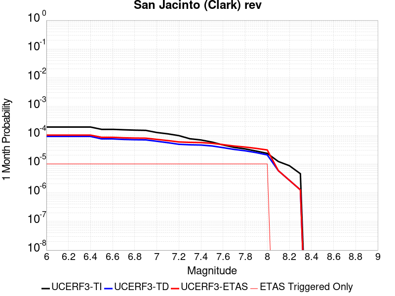 |  |  |

| Magnitude | 1 wk TI Prob | 1 wk TD Prob | 1 wk ETAS Prob | 1 wk ETAS/TD Gain | 1 wk ETAS Triggered Only | 1 mo TI Prob | 1 mo TD Prob | 1 mo ETAS Prob | 1 mo ETAS/TD Gain | 1 mo ETAS Triggered Only | 1 yr TI Prob | 1 yr TD Prob | 1 yr ETAS Prob | 1 yr ETAS/TD Gain | 1 yr ETAS Triggered Only | 10 yr TI Prob | 10 yr TD Prob | 10 yr ETAS Prob | 10 yr ETAS/TD Gain | 10 yr ETAS Triggered Only |
|-----|-----|-----|-----|-----|-----|-----|-----|-----|-----|-----|-----|-----|-----|-----|-----|-----|-----|-----|-----|-----|
| 6.0 | 4.482615E-5 | 2.1154196E-5 | 2.1154196E-5 | 1.0 | 0.0 | 1.9209793E-4 | 9.065773E-5 | 1.0065683E-4 | 1.1102949 | 1.0E-5 | 0.0023362834 | 0.0011032083 | 0.0011531531 | 1.0452724 | 5.0E-5 | 0.02311874 | 0.011503847 | 0.011582927 | 1.0068742 | 8.0E-5 |
| 6.1 | 4.482615E-5 | 2.1154196E-5 | 2.1154196E-5 | 1.0 | 0.0 | 1.9209793E-4 | 9.065773E-5 | 1.0065683E-4 | 1.1102949 | 1.0E-5 | 0.0023362834 | 0.0011032083 | 0.0011531531 | 1.0452724 | 5.0E-5 | 0.02311874 | 0.011503847 | 0.011582927 | 1.0068742 | 8.0E-5 |
| 6.2 | 4.482615E-5 | 2.1154196E-5 | 2.1154196E-5 | 1.0 | 0.0 | 1.9209793E-4 | 9.065773E-5 | 1.0065683E-4 | 1.1102949 | 1.0E-5 | 0.0023362834 | 0.0011032083 | 0.0011531531 | 1.0452724 | 5.0E-5 | 0.02311874 | 0.011503847 | 0.011582927 | 1.0068742 | 8.0E-5 |
| 6.3 | 4.482615E-5 | 2.1154196E-5 | 2.1154196E-5 | 1.0 | 0.0 | 1.9209793E-4 | 9.065773E-5 | 1.0065683E-4 | 1.1102949 | 1.0E-5 | 0.0023362834 | 0.0011032083 | 0.0011531531 | 1.0452724 | 5.0E-5 | 0.02311874 | 0.011503847 | 0.011582927 | 1.0068742 | 8.0E-5 |
| 6.4 | 4.482615E-5 | 2.1154196E-5 | 2.1154196E-5 | 1.0 | 0.0 | 1.9209793E-4 | 9.065773E-5 | 1.0065683E-4 | 1.1102949 | 1.0E-5 | 0.0023362834 | 0.0011032083 | 0.0011531531 | 1.0452724 | 5.0E-5 | 0.02311874 | 0.011503847 | 0.011582927 | 1.0068742 | 8.0E-5 |
| 6.5 | 3.7294863E-5 | 1.7356087E-5 | 1.7356087E-5 | 1.0 | 0.0 | 1.5982533E-4 | 7.438113E-5 | 8.4380394E-5 | 1.1344327 | 1.0E-5 | 0.0019441366 | 9.052186E-4 | 9.551733E-4 | 1.0551853 | 5.0E-5 | 0.01927216 | 0.0094941035 | 0.009573344 | 1.0083463 | 8.0E-5 |
| 6.6 | 3.7294863E-5 | 1.7356087E-5 | 1.7356087E-5 | 1.0 | 0.0 | 1.5982533E-4 | 7.438113E-5 | 8.4380394E-5 | 1.1344327 | 1.0E-5 | 0.0019441366 | 9.052186E-4 | 9.551733E-4 | 1.0551853 | 5.0E-5 | 0.01927216 | 0.0094941035 | 0.009573344 | 1.0083463 | 8.0E-5 |
| 6.7 | 3.6039248E-5 | 1.6604314E-5 | 1.6604314E-5 | 1.0 | 0.0 | 1.5444479E-4 | 7.1159426E-5 | 8.115871E-5 | 1.1405195 | 1.0E-5 | 0.0018787434 | 8.6602574E-4 | 9.1598247E-4 | 1.057685 | 5.0E-5 | 0.01862939 | 0.009096047 | 0.009175319 | 1.008715 | 8.0E-5 |
| 6.8 | 3.5031844E-5 | 1.6232942E-5 | 1.6232942E-5 | 1.0 | 0.0 | 1.5012783E-4 | 6.956792E-5 | 7.9567224E-5 | 1.1437345 | 1.0E-5 | 0.0018262739 | 8.4666436E-4 | 8.96622E-4 | 1.0590053 | 5.0E-5 | 0.01811338 | 0.008895969 | 0.008975257 | 1.0089128 | 8.0E-5 |
| 6.9 | 3.435112E-5 | 1.6063195E-5 | 1.6063195E-5 | 1.0 | 0.0 | 1.4721078E-4 | 6.884047E-5 | 7.883978E-5 | 1.1452534 | 1.0E-5 | 0.0017908178 | 8.3781447E-4 | 8.877726E-4 | 1.0596291 | 5.0E-5 | 0.017764548 | 0.008804181 | 0.008883476 | 1.0090066 | 8.0E-5 |
| 7.0 | 2.8959772E-5 | 1.4336745E-5 | 1.4336745E-5 | 1.0 | 0.0 | 1.241074E-4 | 6.144176E-5 | 7.144115E-5 | 1.1627457 | 1.0E-5 | 0.0015099603 | 7.477995E-4 | 7.977621E-4 | 1.0668129 | 5.0E-5 | 0.014997416 | 0.007868037 | 0.007947407 | 1.0100877 | 8.0E-5 |
| 7.1 | 2.6002877E-5 | 1.2829002E-5 | 1.2829002E-5 | 1.0 | 0.0 | 1.11436144E-4 | 5.498029E-5 | 6.497974E-5 | 1.1818733 | 1.0E-5 | 0.0013558907 | 6.691816E-4 | 7.191481E-4 | 1.0746682 | 5.0E-5 | 0.013476475 | 0.0070465137 | 0.00712595 | 1.0112731 | 8.0E-5 |
| 7.2 | 2.2544838E-5 | 1.1262543E-5 | 1.1262543E-5 | 1.0 | 0.0 | 9.661716E-5 | 4.8267157E-5 | 5.8266676E-5 | 1.2071702 | 1.0E-5 | 0.001175679 | 5.874956E-4 | 6.3746626E-4 | 1.085057 | 5.0E-5 | 0.011694785 | 0.0061927503 | 0.0062722545 | 1.0128384 | 8.0E-5 |
| 7.3 | 1.75334E-5 | 1.0811715E-5 | 1.0811715E-5 | 1.0 | 0.0 | 7.514098E-5 | 4.6335106E-5 | 5.633464E-5 | 1.2158091 | 1.0E-5 | 9.144575E-4 | 5.6398526E-4 | 6.1395706E-4 | 1.0886048 | 5.0E-5 | 0.009107036 | 0.0059337732 | 0.006003358 | 1.0117269 | 7.0E-5 |
| 7.4 | 1.5924552E-5 | 1.0611516E-5 | 1.0611516E-5 | 1.0 | 0.0 | 6.82463E-5 | 4.547714E-5 | 5.547669E-5 | 1.2198807 | 1.0E-5 | 8.305819E-4 | 5.535449E-4 | 6.035172E-4 | 1.090277 | 5.0E-5 | 0.008274844 | 0.0058210334 | 0.005890626 | 1.0119554 | 7.0E-5 |
| 7.5 | 1.3428931E-5 | 9.8519E-6 | 9.8519E-6 | 1.0 | 0.0 | 5.7551293E-5 | 4.2221753E-5 | 5.222133E-5 | 1.2368348 | 1.0E-5 | 7.004617E-4 | 5.1392964E-4 | 5.6390394E-4 | 1.0972396 | 5.0E-5 | 0.006982579 | 0.0054066023 | 0.005476224 | 1.0128771 | 7.0E-5 |
| 7.6 | 1.0688787E-5 | 8.614839E-6 | 8.614839E-6 | 1.0 | 0.0 | 4.5808283E-5 | 3.692022E-5 | 4.6919853E-5 | 1.2708442 | 1.0E-5 | 5.5757316E-4 | 4.4941145E-4 | 4.893935E-4 | 1.0889653 | 4.0E-5 | 0.005561762 | 0.0047416524 | 0.004801368 | 1.0125939 | 6.0E-5 |
| 7.7 | 8.81236E-6 | 7.4680274E-6 | 7.4680274E-6 | 1.0 | 0.0 | 3.776671E-5 | 3.2005442E-5 | 4.2005122E-5 | 1.3124368 | 1.0E-5 | 4.597127E-4 | 3.8959677E-4 | 4.2958118E-4 | 1.1026303 | 4.0E-5 | 0.0045876284 | 0.0041346536 | 0.0041944054 | 1.0144515 | 6.0E-5 |
| 7.8 | 7.780431E-6 | 6.696579E-6 | 6.696579E-6 | 1.0 | 0.0 | 3.3344273E-5 | 2.8699309E-5 | 3.869902E-5 | 1.3484304 | 1.0E-5 | 4.0589093E-4 | 3.4935825E-4 | 3.893443E-4 | 1.1144557 | 4.0E-5 | 0.0040515037 | 0.0037227906 | 0.0037825673 | 1.0160569 | 6.0E-5 |
| 7.9 | 6.5437994E-6 | 5.780382E-6 | 5.780382E-6 | 1.0 | 0.0 | 2.8044553E-5 | 2.477283E-5 | 3.4772584E-5 | 1.403658 | 1.0E-5 | 3.4138895E-4 | 3.0156763E-4 | 3.4155557E-4 | 1.1326002 | 4.0E-5 | 0.0034086495 | 0.0032344845 | 0.0032843228 | 1.0154084 | 5.0E-5 |
| 8.0 | 5.4488164E-6 | 4.8133406E-6 | 4.8133406E-6 | 1.0 | 0.0 | 2.3351862E-5 | 2.062844E-5 | 3.0628235E-5 | 1.4847577 | 1.0E-5 | 2.8427184E-4 | 2.5112246E-4 | 2.9111243E-4 | 1.1592448 | 4.0E-5 | 0.0028390845 | 0.002710839 | 0.0027607034 | 1.0183945 | 5.0E-5 |
| 8.1 | 2.8397242E-6 | 1.3670389E-6 | 1.3670389E-6 | 1.0 | 0.0 | 1.217019E-5 | 5.858725E-6 | 5.858725E-6 | 1.0 | 0.0 | 1.4816198E-4 | 7.132765E-5 | 8.132694E-5 | 1.1401881 | 1.0E-5 | 0.0014806325 | 8.115382E-4 | 8.2153006E-4 | 1.0123123 | 1.0E-5 |
| 8.2 | 2.030244E-6 | 6.318974E-7 | 6.318974E-7 | 1.0 | 0.0 | 8.701017E-6 | 2.708129E-6 | 2.708129E-6 | 1.0 | 0.0 | 1.05929736E-4 | 3.2970976E-5 | 3.2970976E-5 | 1.0 | 0.0 | 0.0010587925 | 3.9486602E-4 | 3.9486602E-4 | 1.0 | 0.0 |
| 8.3 | 1.0659804E-6 | 2.9250086E-7 | 2.9250086E-7 | 1.0 | 0.0 | 4.568479E-6 | 1.2535745E-6 | 1.2535745E-6 | 1.0 | 0.0 | 5.5619817E-5 | 1.5262167E-5 | 1.5262167E-5 | 1.0 | 0.0 | 5.5605895E-4 | 1.8566217E-4 | 1.8566217E-4 | 1.0 | 0.0 |

## Lost Hills
*[(top)](#table-of-contents)*

| 1 Week | 1 Month | 1 Year | 10 Year |
|-----|-----|-----|-----|
|  |  |  |  |

| Magnitude | 1 wk TI Prob | 1 wk TD Prob | 1 wk ETAS Prob | 1 wk ETAS/TD Gain | 1 wk ETAS Triggered Only | 1 mo TI Prob | 1 mo TD Prob | 1 mo ETAS Prob | 1 mo ETAS/TD Gain | 1 mo ETAS Triggered Only | 1 yr TI Prob | 1 yr TD Prob | 1 yr ETAS Prob | 1 yr ETAS/TD Gain | 1 yr ETAS Triggered Only | 10 yr TI Prob | 10 yr TD Prob | 10 yr ETAS Prob | 10 yr ETAS/TD Gain | 10 yr ETAS Triggered Only |
|-----|-----|-----|-----|-----|-----|-----|-----|-----|-----|-----|-----|-----|-----|-----|-----|-----|-----|-----|-----|-----|
| 6.0 | 2.233523E-5 | 2.5106583E-5 | 4.510608E-5 | 1.7965839 | 2.0E-5 | 9.571891E-5 | 1.0759615E-4 | 1.27594E-4 | 1.1858603 | 2.0E-5 | 0.0011647546 | 0.001309364 | 0.0013493117 | 1.0305092 | 4.0E-5 | 0.011586686 | 0.013033091 | 0.013112048 | 1.0060582 | 8.0E-5 |
| 6.1 | 2.233523E-5 | 2.5106583E-5 | 4.510608E-5 | 1.7965839 | 2.0E-5 | 9.571891E-5 | 1.0759615E-4 | 1.27594E-4 | 1.1858603 | 2.0E-5 | 0.0011647546 | 0.001309364 | 0.0013493117 | 1.0305092 | 4.0E-5 | 0.011586686 | 0.013033091 | 0.013112048 | 1.0060582 | 8.0E-5 |
| 6.2 | 2.233523E-5 | 2.5106583E-5 | 4.510608E-5 | 1.7965839 | 2.0E-5 | 9.571891E-5 | 1.0759615E-4 | 1.27594E-4 | 1.1858603 | 2.0E-5 | 0.0011647546 | 0.001309364 | 0.0013493117 | 1.0305092 | 4.0E-5 | 0.011586686 | 0.013033091 | 0.013112048 | 1.0060582 | 8.0E-5 |
| 6.3 | 2.233523E-5 | 2.5106583E-5 | 4.510608E-5 | 1.7965839 | 2.0E-5 | 9.571891E-5 | 1.0759615E-4 | 1.27594E-4 | 1.1858603 | 2.0E-5 | 0.0011647546 | 0.001309364 | 0.0013493117 | 1.0305092 | 4.0E-5 | 0.011586686 | 0.013033091 | 0.013112048 | 1.0060582 | 8.0E-5 |
| 6.4 | 1.2288092E-5 | 1.3781108E-5 | 2.3780969E-5 | 1.7256211 | 1.0E-5 | 5.2662188E-5 | 5.906108E-5 | 6.906049E-5 | 1.1693063 | 1.0E-5 | 6.409735E-4 | 7.189252E-4 | 7.3891087E-4 | 1.0277992 | 2.0E-5 | 0.006391279 | 0.0071752006 | 0.0072149136 | 1.0055348 | 4.0E-5 |
| 6.5 | 1.2288092E-5 | 1.3781108E-5 | 2.3780969E-5 | 1.7256211 | 1.0E-5 | 5.2662188E-5 | 5.906108E-5 | 6.906049E-5 | 1.1693063 | 1.0E-5 | 6.409735E-4 | 7.189252E-4 | 7.3891087E-4 | 1.0277992 | 2.0E-5 | 0.006391279 | 0.0071752006 | 0.0072149136 | 1.0055348 | 4.0E-5 |
| 6.6 | 8.58281E-6 | 9.63377E-6 | 1.9633673E-5 | 2.0380054 | 1.0E-5 | 3.6782953E-5 | 4.12874E-5 | 5.128699E-5 | 1.2421947 | 1.0E-5 | 4.4774043E-4 | 5.026414E-4 | 5.2263134E-4 | 1.0397698 | 2.0E-5 | 0.0044683935 | 0.005023205 | 0.0050530545 | 1.0059422 | 3.0E-5 |
| 6.7 | 7.205685E-6 | 8.088302E-6 | 1.8088222E-5 | 2.2363434 | 1.0E-5 | 3.088114E-5 | 3.466415E-5 | 4.4663804E-5 | 1.2884725 | 1.0E-5 | 3.7591302E-4 | 4.2203604E-4 | 4.320318E-4 | 1.0236846 | 1.0E-5 | 0.0037527776 | 0.0042203604 | 0.004240276 | 1.0047189 | 2.0E-5 |

## Tin Mountain
*[(top)](#table-of-contents)*

| 1 Week | 1 Month | 1 Year | 10 Year |
|-----|-----|-----|-----|
|  |  | 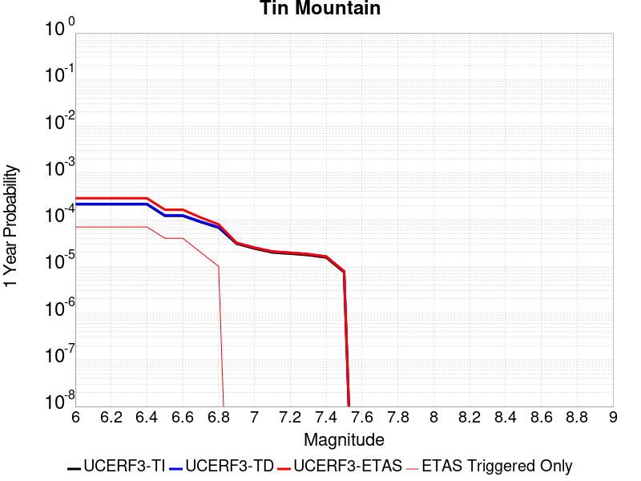 |  |

| Magnitude | 1 wk TI Prob | 1 wk TD Prob | 1 wk ETAS Prob | 1 wk ETAS/TD Gain | 1 wk ETAS Triggered Only | 1 mo TI Prob | 1 mo TD Prob | 1 mo ETAS Prob | 1 mo ETAS/TD Gain | 1 mo ETAS Triggered Only | 1 yr TI Prob | 1 yr TD Prob | 1 yr ETAS Prob | 1 yr ETAS/TD Gain | 1 yr ETAS Triggered Only | 10 yr TI Prob | 10 yr TD Prob | 10 yr ETAS Prob | 10 yr ETAS/TD Gain | 10 yr ETAS Triggered Only |
|-----|-----|-----|-----|-----|-----|-----|-----|-----|-----|-----|-----|-----|-----|-----|-----|-----|-----|-----|-----|-----|
| 6.0 | 4.083776E-6 | 4.1815365E-6 | 5.4181328E-5 | 12.957276 | 5.0E-5 | 1.750178E-5 | 1.792077E-5 | 6.791987E-5 | 3.7900088 | 5.0E-5 | 2.1306332E-4 | 2.1816725E-4 | 2.8815196E-4 | 1.3207848 | 7.0E-5 | 0.0021285915 | 0.0021798965 | 0.0022497438 | 1.0320417 | 7.0E-5 |
| 6.1 | 4.083776E-6 | 4.1815365E-6 | 5.4181328E-5 | 12.957276 | 5.0E-5 | 1.750178E-5 | 1.792077E-5 | 6.791987E-5 | 3.7900088 | 5.0E-5 | 2.1306332E-4 | 2.1816725E-4 | 2.8815196E-4 | 1.3207848 | 7.0E-5 | 0.0021285915 | 0.0021798965 | 0.0022497438 | 1.0320417 | 7.0E-5 |
| 6.2 | 4.083776E-6 | 4.1815365E-6 | 5.4181328E-5 | 12.957276 | 5.0E-5 | 1.750178E-5 | 1.792077E-5 | 6.791987E-5 | 3.7900088 | 5.0E-5 | 2.1306332E-4 | 2.1816725E-4 | 2.8815196E-4 | 1.3207848 | 7.0E-5 | 0.0021285915 | 0.0021798965 | 0.0022497438 | 1.0320417 | 7.0E-5 |
| 6.3 | 4.083776E-6 | 4.1815365E-6 | 5.4181328E-5 | 12.957276 | 5.0E-5 | 1.750178E-5 | 1.792077E-5 | 6.791987E-5 | 3.7900088 | 5.0E-5 | 2.1306332E-4 | 2.1816725E-4 | 2.8815196E-4 | 1.3207848 | 7.0E-5 | 0.0021285915 | 0.0021798965 | 0.0022497438 | 1.0320417 | 7.0E-5 |
| 6.4 | 4.083776E-6 | 4.1815365E-6 | 5.4181328E-5 | 12.957276 | 5.0E-5 | 1.750178E-5 | 1.792077E-5 | 6.791987E-5 | 3.7900088 | 5.0E-5 | 2.1306332E-4 | 2.1816725E-4 | 2.8815196E-4 | 1.3207848 | 7.0E-5 | 0.0021285915 | 0.0021798965 | 0.0022497438 | 1.0320417 | 7.0E-5 |
| 6.5 | 2.3143427E-6 | 2.3731573E-6 | 2.237311E-5 | 9.427572 | 2.0E-5 | 9.9185745E-6 | 1.0170638E-5 | 3.0170435E-5 | 2.966425 | 2.0E-5 | 1.2075195E-4 | 1.2382126E-4 | 1.6381631E-4 | 1.3230063 | 4.0E-5 | 0.0012068636 | 0.0012375986 | 0.0012775491 | 1.0322807 | 4.0E-5 |
| 6.6 | 2.3143427E-6 | 2.3731573E-6 | 2.237311E-5 | 9.427572 | 2.0E-5 | 9.9185745E-6 | 1.0170638E-5 | 3.0170435E-5 | 2.966425 | 2.0E-5 | 1.2075195E-4 | 1.2382126E-4 | 1.6381631E-4 | 1.3230063 | 4.0E-5 | 0.0012068636 | 0.0012375986 | 0.0012775491 | 1.0322807 | 4.0E-5 |
| 6.7 | 1.7029532E-6 | 1.7497915E-6 | 1.1749774E-5 | 6.7149568 | 1.0E-5 | 7.2983503E-6 | 7.499088E-6 | 1.7499013E-5 | 2.3334856 | 1.0E-5 | 8.885379E-5 | 9.1298105E-5 | 1.1129628E-4 | 1.2190425 | 2.0E-5 | 8.881827E-4 | 9.1265864E-4 | 9.3264034E-4 | 1.021894 | 2.0E-5 |
| 6.8 | 1.2914646E-6 | 1.3299378E-6 | 1.3299378E-6 | 1.0 | 0.0 | 5.534837E-6 | 5.6997237E-6 | 5.6997237E-6 | 1.0 | 0.0 | 6.738455E-5 | 6.939237E-5 | 7.939168E-5 | 1.144098 | 1.0E-5 | 6.736412E-4 | 6.9375033E-4 | 7.037434E-4 | 1.0144044 | 1.0E-5 |
| 6.9 | 5.8708974E-7 | 6.1169936E-7 | 6.1169936E-7 | 1.0 | 0.0 | 2.5160964E-6 | 2.6215664E-6 | 2.6215664E-6 | 1.0 | 0.0 | 3.0633044E-5 | 3.1917145E-5 | 3.1917145E-5 | 1.0 | 0.0 | 3.0628822E-4 | 3.191297E-4 | 3.191297E-4 | 1.0 | 0.0 |
| 7.0 | 4.6248786E-7 | 4.832015E-7 | 4.832015E-7 | 1.0 | 0.0 | 1.9820893E-6 | 2.0708624E-6 | 2.0708624E-6 | 1.0 | 0.0 | 2.413167E-5 | 2.5212494E-5 | 2.5212494E-5 | 1.0 | 0.0 | 2.412905E-4 | 2.5210003E-4 | 2.5210003E-4 | 1.0 | 0.0 |
| 7.1 | 3.804606E-7 | 3.987147E-7 | 3.987147E-7 | 1.0 | 0.0 | 1.6305444E-6 | 1.7087764E-6 | 1.7087764E-6 | 1.0 | 0.0 | 1.9851697E-5 | 2.0804187E-5 | 2.0804187E-5 | 1.0 | 0.0 | 1.9849923E-4 | 2.0802575E-4 | 2.0802575E-4 | 1.0 | 0.0 |
| 7.2 | 3.5864858E-7 | 3.7616863E-7 | 3.7616863E-7 | 1.0 | 0.0 | 1.5370645E-6 | 1.6121504E-6 | 1.6121504E-6 | 1.0 | 0.0 | 1.87136E-5 | 1.9627789E-5 | 1.9627789E-5 | 1.0 | 0.0 | 1.8712023E-4 | 1.9626386E-4 | 1.9626386E-4 | 1.0 | 0.0 |
| 7.3 | 3.342063E-7 | 3.506347E-7 | 3.506347E-7 | 1.0 | 0.0 | 1.4323119E-6 | 1.5027196E-6 | 1.5027196E-6 | 1.0 | 0.0 | 1.7438259E-5 | 1.829549E-5 | 1.829549E-5 | 1.0 | 0.0 | 1.743689E-4 | 1.8294314E-4 | 1.8294314E-4 | 1.0 | 0.0 |
| 7.4 | 2.971242E-7 | 3.1165817E-7 | 3.1165817E-7 | 1.0 | 0.0 | 1.2733886E-6 | 1.3356774E-6 | 1.3356774E-6 | 1.0 | 0.0 | 1.5503398E-5 | 1.6261785E-5 | 1.6261785E-5 | 1.0 | 0.0 | 1.5502315E-4 | 1.6260923E-4 | 1.6260923E-4 | 1.0 | 0.0 |
| 7.5 | 1.4326713E-7 | 1.5012525E-7 | 1.5012525E-7 | 1.0 | 0.0 | 6.140018E-7 | 6.433939E-7 | 6.433939E-7 | 1.0 | 0.0 | 7.4754466E-6 | 7.8333205E-6 | 7.8333205E-6 | 1.0 | 0.0 | 7.475195E-5 | 7.833321E-5 | 7.833321E-5 | 1.0 | 0.0 |

## Oceanic - West Huasna
*[(top)](#table-of-contents)*

| 1 Week | 1 Month | 1 Year | 10 Year |
|-----|-----|-----|-----|
|  | 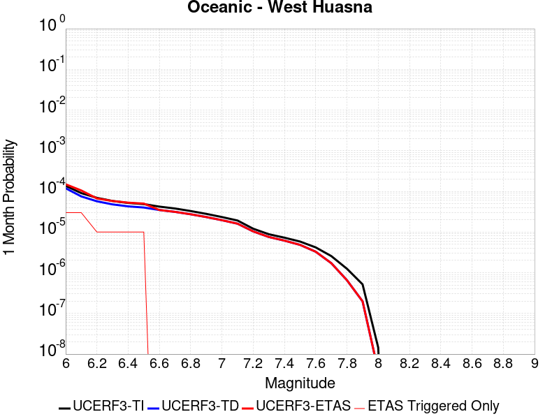 |  |  |

| Magnitude | 1 wk TI Prob | 1 wk TD Prob | 1 wk ETAS Prob | 1 wk ETAS/TD Gain | 1 wk ETAS Triggered Only | 1 mo TI Prob | 1 mo TD Prob | 1 mo ETAS Prob | 1 mo ETAS/TD Gain | 1 mo ETAS Triggered Only | 1 yr TI Prob | 1 yr TD Prob | 1 yr ETAS Prob | 1 yr ETAS/TD Gain | 1 yr ETAS Triggered Only | 10 yr TI Prob | 10 yr TD Prob | 10 yr ETAS Prob | 10 yr ETAS/TD Gain | 10 yr ETAS Triggered Only |
|-----|-----|-----|-----|-----|-----|-----|-----|-----|-----|-----|-----|-----|-----|-----|-----|-----|-----|-----|-----|-----|
| 6.0 | 3.195567E-5 | 2.7926868E-5 | 5.792603E-5 | 2.0742042 | 3.0E-5 | 1.3694567E-4 | 1.1968133E-4 | 1.4967774E-4 | 1.2506356 | 3.0E-5 | 0.0016660384 | 0.0014561893 | 0.001516102 | 1.0411434 | 6.0E-5 | 0.016536033 | 0.014471028 | 0.014540015 | 1.0047673 | 7.0E-5 |
| 6.1 | 2.1156782E-5 | 1.7573486E-5 | 4.7572958E-5 | 2.7070873 | 3.0E-5 | 9.066878E-5 | 7.531282E-5 | 1.0531056E-4 | 1.3983085 | 3.0E-5 | 0.0011033333 | 9.165572E-4 | 9.665114E-4 | 1.054502 | 5.0E-5 | 0.010978713 | 0.009128777 | 0.009178321 | 1.0054272 | 5.0E-5 |
| 6.2 | 1.6195117E-5 | 1.3327152E-5 | 2.332702E-5 | 1.7503378 | 1.0E-5 | 6.9405796E-5 | 5.7115132E-5 | 6.711456E-5 | 1.1750749 | 1.0E-5 | 8.44688E-4 | 6.9515745E-4 | 7.251366E-4 | 1.0431257 | 3.0E-5 | 0.008414844 | 0.006930123 | 0.006959915 | 1.0042989 | 3.0E-5 |
| 6.3 | 1.3559345E-5 | 1.1179142E-5 | 2.117903E-5 | 1.894513 | 1.0E-5 | 5.811018E-5 | 4.7909736E-5 | 5.790926E-5 | 1.2087158 | 1.0E-5 | 7.072618E-4 | 5.831459E-4 | 6.131284E-4 | 1.0514151 | 3.0E-5 | 0.0070501505 | 0.0058162753 | 0.005846101 | 1.0051279 | 3.0E-5 |
| 6.4 | 1.2120619E-5 | 1.0000977E-5 | 2.0000878E-5 | 1.9998922 | 1.0E-5 | 5.1944477E-5 | 4.2860633E-5 | 5.2860203E-5 | 1.2333044 | 1.0E-5 | 6.322405E-4 | 5.2170374E-4 | 5.516881E-4 | 1.0574739 | 3.0E-5 | 0.006304447 | 0.0052048573 | 0.005234701 | 1.0057338 | 3.0E-5 |
| 6.5 | 1.13511915E-5 | 9.3674735E-6 | 1.936738E-5 | 2.0675137 | 1.0E-5 | 4.8647056E-5 | 4.01457E-5 | 5.01453E-5 | 1.2490827 | 1.0E-5 | 5.9211696E-4 | 4.886647E-4 | 5.1865005E-4 | 1.0613618 | 3.0E-5 | 0.0059054173 | 0.0048759608 | 0.0049058143 | 1.0061226 | 3.0E-5 |
| 6.6 | 9.850605E-6 | 8.135418E-6 | 8.135418E-6 | 1.0 | 0.0 | 4.2216197E-5 | 3.4865614E-5 | 3.4865614E-5 | 1.0 | 0.0 | 5.1386096E-4 | 4.2440637E-4 | 4.4439788E-4 | 1.0471046 | 2.0E-5 | 0.0051267436 | 0.004235991 | 0.004255906 | 1.0047015 | 2.0E-5 |
| 6.7 | 8.8558645E-6 | 7.318433E-6 | 7.318433E-6 | 1.0 | 0.0 | 3.7953152E-5 | 3.1364336E-5 | 3.1364336E-5 | 1.0 | 0.0 | 4.6198163E-4 | 3.8179406E-4 | 4.017864E-4 | 1.0523642 | 2.0E-5 | 0.004610224 | 0.0038114067 | 0.0038313305 | 1.0052274 | 2.0E-5 |
| 6.8 | 7.67136E-6 | 6.391756E-6 | 6.391756E-6 | 1.0 | 0.0 | 3.2876844E-5 | 2.7392953E-5 | 2.7392953E-5 | 1.0 | 0.0 | 4.0020206E-4 | 3.3345833E-4 | 3.5345164E-4 | 1.0599575 | 2.0E-5 | 0.003994821 | 0.0033296007 | 0.003349534 | 1.0059867 | 2.0E-5 |
| 6.9 | 6.534529E-6 | 5.4583297E-6 | 5.4583297E-6 | 1.0 | 0.0 | 2.8004823E-5 | 2.3392633E-5 | 2.3392633E-5 | 1.0 | 0.0 | 3.4090536E-4 | 2.847682E-4 | 3.047625E-4 | 1.0702126 | 2.0E-5 | 0.0034038287 | 0.0028440498 | 0.002863993 | 1.0070122 | 2.0E-5 |
| 7.0 | 5.460525E-6 | 4.5699517E-6 | 4.5699517E-6 | 1.0 | 0.0 | 2.3402039E-5 | 1.958536E-5 | 1.958536E-5 | 1.0 | 0.0 | 2.8488258E-4 | 2.3842578E-4 | 2.5842103E-4 | 1.0838635 | 2.0E-5 | 0.0028451765 | 0.0023817138 | 0.002401666 | 1.0083773 | 2.0E-5 |
| 7.1 | 4.4825083E-6 | 3.7524428E-6 | 3.7524428E-6 | 1.0 | 0.0 | 1.9210609E-5 | 1.60818E-5 | 1.60818E-5 | 1.0 | 0.0 | 2.3386406E-4 | 1.9577841E-4 | 2.157745E-4 | 1.1021363 | 2.0E-5 | 0.002336181 | 0.0019560715 | 0.0019760323 | 1.0102046 | 2.0E-5 |
| 7.2 | 2.821708E-6 | 2.4249334E-6 | 2.4249334E-6 | 1.0 | 0.0 | 1.2092979E-5 | 1.039253E-5 | 1.039253E-5 | 1.0 | 0.0 | 1.4722206E-4 | 1.2652173E-4 | 1.2652173E-4 | 1.0 | 0.0 | 0.0014712457 | 0.0012644994 | 0.0012644994 | 1.0 | 0.0 |
| 7.3 | 2.0644757E-6 | 1.7687412E-6 | 1.7687412E-6 | 1.0 | 0.0 | 8.847723E-6 | 7.5802973E-6 | 7.5802973E-6 | 1.0 | 0.0 | 1.0771569E-4 | 9.228622E-5 | 9.228622E-5 | 1.0 | 0.0 | 0.001076635 | 9.2248066E-4 | 9.2248066E-4 | 1.0 | 0.0 |
| 7.4 | 1.6980367E-6 | 1.4379892E-6 | 1.4379892E-6 | 1.0 | 0.0 | 7.27728E-6 | 6.162796E-6 | 6.162796E-6 | 1.0 | 0.0 | 8.8597284E-5 | 7.5029464E-5 | 7.5029464E-5 | 1.0 | 0.0 | 8.8561967E-4 | 7.500429E-4 | 7.500429E-4 | 1.0 | 0.0 |
| 7.5 | 1.3637683E-6 | 1.1302635E-6 | 1.1302635E-6 | 1.0 | 0.0 | 5.844708E-6 | 4.8439774E-6 | 4.8439774E-6 | 1.0 | 0.0 | 7.1156996E-5 | 5.897383E-5 | 5.897383E-5 | 1.0 | 0.0 | 7.1134215E-4 | 5.895833E-4 | 5.895833E-4 | 1.0 | 0.0 |
| 7.6 | 9.802994E-7 | 7.677247E-7 | 7.677247E-7 | 1.0 | 0.0 | 4.2012766E-6 | 3.2902446E-6 | 3.2902446E-6 | 1.0 | 0.0 | 5.1149345E-5 | 4.0057992E-5 | 4.0057992E-5 | 1.0 | 0.0 | 5.113757E-4 | 4.0050913E-4 | 4.0050913E-4 | 1.0 | 0.0 |
| 7.7 | 5.986191E-7 | 4.0050548E-7 | 4.0050548E-7 | 1.0 | 0.0 | 2.5655079E-6 | 1.7164509E-6 | 1.7164509E-6 | 1.0 | 0.0 | 3.1234613E-5 | 2.089759E-5 | 2.089759E-5 | 1.0 | 0.0 | 3.123022E-4 | 2.089576E-4 | 2.089576E-4 | 1.0 | 0.0 |
| 7.8 | 2.9189815E-7 | 1.5285792E-7 | 1.5285792E-7 | 1.0 | 0.0 | 1.2509914E-6 | 6.5510517E-7 | 6.5510517E-7 | 1.0 | 0.0 | 1.5230714E-5 | 7.9758765E-6 | 7.9758765E-6 | 1.0 | 0.0 | 1.522967E-4 | 7.9757214E-5 | 7.9757214E-5 | 1.0 | 0.0 |
| 7.9 | 1.2057845E-7 | 4.621248E-8 | 4.621248E-8 | 1.0 | 0.0 | 5.1676466E-7 | 1.9805347E-7 | 1.9805347E-7 | 1.0 | 0.0 | 6.2915915E-6 | 2.4112983E-6 | 2.4112983E-6 | 1.0 | 0.0 | 6.2914136E-5 | 2.4114026E-5 | 2.4114026E-5 | 1.0 | 0.0 |
| 8.0 | 3.3806387E-9 | 9.011393E-10 | 9.011393E-10 | 1.0 | 0.0 | 1.4488451E-8 | 3.8620254E-9 | 3.8620254E-9 | 1.0 | 0.0 | 1.7639688E-7 | 4.702016E-8 | 4.702016E-8 | 1.0 | 0.0 | 1.7639674E-6 | 4.7129527E-7 | 4.7129527E-7 | 1.0 | 0.0 |

## Great Valley 09 (Laguna Seca)
*[(top)](#table-of-contents)*

| 1 Week | 1 Month | 1 Year | 10 Year |
|-----|-----|-----|-----|
|  |  |  |  |

| Magnitude | 1 wk TI Prob | 1 wk TD Prob | 1 wk ETAS Prob | 1 wk ETAS/TD Gain | 1 wk ETAS Triggered Only | 1 mo TI Prob | 1 mo TD Prob | 1 mo ETAS Prob | 1 mo ETAS/TD Gain | 1 mo ETAS Triggered Only | 1 yr TI Prob | 1 yr TD Prob | 1 yr ETAS Prob | 1 yr ETAS/TD Gain | 1 yr ETAS Triggered Only | 10 yr TI Prob | 10 yr TD Prob | 10 yr ETAS Prob | 10 yr ETAS/TD Gain | 10 yr ETAS Triggered Only |
|-----|-----|-----|-----|-----|-----|-----|-----|-----|-----|-----|-----|-----|-----|-----|-----|-----|-----|-----|-----|-----|
| 6.0 | 5.4353277E-5 | 7.05022E-5 | 7.05022E-5 | 1.0 | 0.0 | 2.3292181E-4 | 3.0211566E-4 | 3.0211566E-4 | 1.0 | 0.0 | 0.0028321352 | 0.0036721937 | 0.0037020836 | 1.0081395 | 3.0E-5 | 0.02796312 | 0.03611547 | 0.036173303 | 1.0016013 | 6.0E-5 |
| 6.1 | 4.5578287E-5 | 5.822118E-5 | 5.822118E-5 | 1.0 | 0.0 | 1.953209E-4 | 2.4949326E-4 | 2.4949326E-4 | 1.0 | 0.0 | 0.0023754383 | 0.003033432 | 0.0030533713 | 1.0065732 | 2.0E-5 | 0.023502063 | 0.029919548 | 0.029968051 | 1.0016211 | 5.0E-5 |
| 6.2 | 2.8536782E-5 | 3.4737273E-5 | 3.4737273E-5 | 1.0 | 0.0 | 1.2229476E-4 | 1.4886224E-4 | 1.4886224E-4 | 1.0 | 0.0 | 0.0014879217 | 0.001810813 | 0.0018207949 | 1.0055124 | 1.0E-5 | 0.014779986 | 0.017958116 | 0.017997399 | 1.0021874 | 4.0E-5 |
| 6.3 | 2.3698774E-5 | 2.8213295E-5 | 2.8213295E-5 | 1.0 | 0.0 | 1.01562226E-4 | 1.20905075E-4 | 1.20905075E-4 | 1.0 | 0.0 | 0.0012358186 | 0.0014710218 | 0.0014810071 | 1.006788 | 1.0E-5 | 0.012289686 | 0.014611342 | 0.014640903 | 1.0020232 | 3.0E-5 |
| 6.4 | 1.9191197E-5 | 2.2123184E-5 | 2.2123184E-5 | 1.0 | 0.0 | 8.2245395E-5 | 9.4806666E-5 | 9.4806666E-5 | 1.0 | 0.0 | 0.0010008777 | 0.0011536429 | 0.0011636313 | 1.0086582 | 1.0E-5 | 0.009963818 | 0.011476948 | 0.011506603 | 1.002584 | 3.0E-5 |
| 6.5 | 1.5203241E-5 | 1.6802203E-5 | 1.6802203E-5 | 1.0 | 0.0 | 6.5155116E-5 | 7.200386E-5 | 7.200386E-5 | 1.0 | 0.0 | 7.9297484E-4 | 8.7626575E-4 | 8.8625704E-4 | 1.011402 | 1.0E-5 | 0.007901512 | 0.0087295165 | 0.008759255 | 1.0034066 | 3.0E-5 |
| 6.6 | 1.0984925E-5 | 1.1242595E-5 | 1.1242595E-5 | 1.0 | 0.0 | 4.70774E-5 | 4.8181686E-5 | 4.8181686E-5 | 1.0 | 0.0 | 5.730166E-4 | 5.8645656E-4 | 5.8645656E-4 | 1.0 | 0.0 | 0.005715413 | 0.0058494853 | 0.0058594267 | 1.0016996 | 1.0E-5 |
| 6.7 | 9.134616E-6 | 9.019894E-6 | 9.019894E-6 | 1.0 | 0.0 | 3.9147766E-5 | 3.865613E-5 | 3.865613E-5 | 1.0 | 0.0 | 4.7651984E-4 | 4.7053912E-4 | 4.7053912E-4 | 1.0 | 0.0 | 0.004754993 | 0.0046956735 | 0.0046956735 | 1.0 | 0.0 |
| 6.8 | 7.785589E-6 | 7.4519444E-6 | 7.4519444E-6 | 1.0 | 0.0 | 3.3366385E-5 | 3.1936524E-5 | 3.1936524E-5 | 1.0 | 0.0 | 4.0616E-4 | 3.8875983E-4 | 3.8875983E-4 | 1.0 | 0.0 | 0.0040541845 | 0.0038810016 | 0.0038810016 | 1.0 | 0.0 |
| 6.9 | 5.579095E-6 | 4.898492E-6 | 4.898492E-6 | 1.0 | 0.0 | 2.3910188E-5 | 2.0993377E-5 | 2.0993377E-5 | 1.0 | 0.0 | 2.9106764E-4 | 2.5556577E-4 | 2.5556577E-4 | 1.0 | 0.0 | 0.002906867 | 0.002552856 | 0.002552856 | 1.0 | 0.0 |
| 7.0 | 2.6816688E-6 | 1.5216126E-6 | 1.5216126E-6 | 1.0 | 0.0 | 1.1492816E-5 | 6.521181E-6 | 6.521181E-6 | 1.0 | 0.0 | 1.3991605E-4 | 7.939258E-5 | 7.939258E-5 | 1.0 | 0.0 | 0.0013982799 | 7.9365086E-4 | 7.9365086E-4 | 1.0 | 0.0 |
| 7.1 | 1.9951021E-6 | 7.453827E-7 | 7.453827E-7 | 1.0 | 0.0 | 8.55041E-6 | 3.1944935E-6 | 3.1944935E-6 | 1.0 | 0.0 | 1.0409627E-4 | 3.8892307E-5 | 3.8892307E-5 | 1.0 | 0.0 | 0.0010404752 | 3.8885913E-4 | 3.8885913E-4 | 1.0 | 0.0 |
| 7.2 | 1.9951021E-6 | 7.453827E-7 | 7.453827E-7 | 1.0 | 0.0 | 8.55041E-6 | 3.1944935E-6 | 3.1944935E-6 | 1.0 | 0.0 | 1.0409627E-4 | 3.8892307E-5 | 3.8892307E-5 | 1.0 | 0.0 | 0.0010404752 | 3.8885913E-4 | 3.8885913E-4 | 1.0 | 0.0 |
| 7.3 | 1.7087556E-6 | 6.578881E-7 | 6.578881E-7 | 1.0 | 0.0 | 7.3232177E-6 | 2.8195177E-6 | 2.8195177E-6 | 1.0 | 0.0 | 8.915652E-5 | 3.4327128E-5 | 3.4327128E-5 | 1.0 | 0.0 | 8.9120766E-4 | 3.432223E-4 | 3.432223E-4 | 1.0 | 0.0 |
| 7.4 | 1.3804846E-6 | 6.073852E-7 | 6.073852E-7 | 1.0 | 0.0 | 5.916349E-6 | 2.6030768E-6 | 2.6030768E-6 | 1.0 | 0.0 | 7.2029165E-5 | 3.169204E-5 | 3.169204E-5 | 1.0 | 0.0 | 7.200583E-4 | 3.1687922E-4 | 3.1687922E-4 | 1.0 | 0.0 |
| 7.5 | 1.3804846E-6 | 6.073852E-7 | 6.073852E-7 | 1.0 | 0.0 | 5.916349E-6 | 2.6030768E-6 | 2.6030768E-6 | 1.0 | 0.0 | 7.2029165E-5 | 3.169204E-5 | 3.169204E-5 | 1.0 | 0.0 | 7.200583E-4 | 3.1687922E-4 | 3.1687922E-4 | 1.0 | 0.0 |

## Big Pine (East)
*[(top)](#table-of-contents)*

| 1 Week | 1 Month | 1 Year | 10 Year |
|-----|-----|-----|-----|
|  |  |  |  |

| Magnitude | 1 wk TI Prob | 1 wk TD Prob | 1 wk ETAS Prob | 1 wk ETAS/TD Gain | 1 wk ETAS Triggered Only | 1 mo TI Prob | 1 mo TD Prob | 1 mo ETAS Prob | 1 mo ETAS/TD Gain | 1 mo ETAS Triggered Only | 1 yr TI Prob | 1 yr TD Prob | 1 yr ETAS Prob | 1 yr ETAS/TD Gain | 1 yr ETAS Triggered Only | 10 yr TI Prob | 10 yr TD Prob | 10 yr ETAS Prob | 10 yr ETAS/TD Gain | 10 yr ETAS Triggered Only |
|-----|-----|-----|-----|-----|-----|-----|-----|-----|-----|-----|-----|-----|-----|-----|-----|-----|-----|-----|-----|-----|
| 6.0 | 9.916913E-6 | 1.2816984E-5 | 1.2816984E-5 | 1.0 | 0.0 | 4.250036E-5 | 5.49289E-5 | 5.49289E-5 | 1.0 | 0.0 | 5.173191E-4 | 6.685763E-4 | 6.885629E-4 | 1.0298944 | 2.0E-5 | 0.0051611643 | 0.006670441 | 0.006730041 | 1.0089349 | 6.0E-5 |
| 6.1 | 9.916913E-6 | 1.2816984E-5 | 1.2816984E-5 | 1.0 | 0.0 | 4.250036E-5 | 5.49289E-5 | 5.49289E-5 | 1.0 | 0.0 | 5.173191E-4 | 6.685763E-4 | 6.885629E-4 | 1.0298944 | 2.0E-5 | 0.0051611643 | 0.006670441 | 0.006730041 | 1.0089349 | 6.0E-5 |
| 6.2 | 9.916913E-6 | 1.2816984E-5 | 1.2816984E-5 | 1.0 | 0.0 | 4.250036E-5 | 5.49289E-5 | 5.49289E-5 | 1.0 | 0.0 | 5.173191E-4 | 6.685763E-4 | 6.885629E-4 | 1.0298944 | 2.0E-5 | 0.0051611643 | 0.006670441 | 0.006730041 | 1.0089349 | 6.0E-5 |
| 6.3 | 5.479711E-6 | 8.112951E-6 | 8.112951E-6 | 1.0 | 0.0 | 2.3484265E-5 | 3.4769346E-5 | 3.4769346E-5 | 1.0 | 0.0 | 2.858834E-4 | 4.2323777E-4 | 4.3323354E-4 | 1.0236174 | 1.0E-5 | 0.0028551589 | 0.004227244 | 0.0042670746 | 1.0094224 | 4.0E-5 |
| 6.4 | 5.465009E-6 | 8.097245E-6 | 8.097245E-6 | 1.0 | 0.0 | 2.3421257E-5 | 3.4702036E-5 | 3.4702036E-5 | 1.0 | 0.0 | 2.851165E-4 | 4.2241855E-4 | 4.3241432E-4 | 1.0236632 | 1.0E-5 | 0.0028475097 | 0.0042190826 | 0.004258914 | 1.0094408 | 4.0E-5 |
| 6.5 | 4.826767E-6 | 7.422301E-6 | 7.422301E-6 | 1.0 | 0.0 | 2.068598E-5 | 3.180949E-5 | 3.180949E-5 | 1.0 | 0.0 | 2.518227E-4 | 3.872145E-4 | 3.9721062E-4 | 1.0258155 | 1.0E-5 | 0.0025153751 | 0.003868283 | 0.003908128 | 1.0103005 | 4.0E-5 |
| 6.6 | 4.3146847E-6 | 6.8822374E-6 | 6.8822374E-6 | 1.0 | 0.0 | 1.8491375E-5 | 2.9494982E-5 | 2.9494982E-5 | 1.0 | 0.0 | 2.2510924E-4 | 3.590447E-4 | 3.690411E-4 | 1.0278417 | 1.0E-5 | 0.0022488134 | 0.0035874986 | 0.0036173908 | 1.0083324 | 3.0E-5 |
| 6.7 | 3.6968106E-6 | 5.9954727E-6 | 5.9954727E-6 | 1.0 | 0.0 | 1.5843378E-5 | 2.5694639E-5 | 2.5694639E-5 | 1.0 | 0.0 | 1.9287605E-4 | 3.1278885E-4 | 3.2278572E-4 | 1.0319605 | 1.0E-5 | 0.0019270873 | 0.0031262483 | 0.0031561544 | 1.0095662 | 3.0E-5 |
| 6.8 | 3.4671132E-6 | 5.702177E-6 | 5.702177E-6 | 1.0 | 0.0 | 1.4858972E-5 | 2.4437682E-5 | 2.4437682E-5 | 1.0 | 0.0 | 1.8089297E-4 | 2.974896E-4 | 3.0748663E-4 | 1.0336046 | 1.0E-5 | 0.0018074579 | 0.002973667 | 0.003003578 | 1.0100585 | 3.0E-5 |
| 6.9 | 2.7686972E-6 | 4.825223E-6 | 4.825223E-6 | 1.0 | 0.0 | 1.1865792E-5 | 2.0679368E-5 | 2.0679368E-5 | 1.0 | 0.0 | 1.4445644E-4 | 2.5174298E-4 | 2.6174047E-4 | 1.039713 | 1.0E-5 | 0.0014436257 | 0.0025172636 | 0.0025471882 | 1.0118877 | 3.0E-5 |
| 7.0 | 2.1472624E-6 | 3.9850406E-6 | 3.9850406E-6 | 1.0 | 0.0 | 9.20252E-6 | 1.7078637E-5 | 1.7078637E-5 | 1.0 | 0.0 | 1.12034926E-4 | 2.079131E-4 | 2.1791102E-4 | 1.048087 | 1.0E-5 | 0.0011197845 | 0.0020798394 | 0.0020997976 | 1.0095961 | 2.0E-5 |
| 7.1 | 1.7018335E-6 | 3.344876E-6 | 3.344876E-6 | 1.0 | 0.0 | 7.293552E-6 | 1.4335106E-5 | 1.4335106E-5 | 1.0 | 0.0 | 8.879537E-5 | 1.7451629E-4 | 1.8451455E-4 | 1.0572913 | 1.0E-5 | 8.87599E-4 | 0.0017464145 | 0.0017663795 | 1.011432 | 2.0E-5 |
| 7.2 | 1.25603E-6 | 2.794484E-6 | 2.794484E-6 | 1.0 | 0.0 | 5.3829745E-6 | 1.1976307E-5 | 1.1976307E-5 | 1.0 | 0.0 | 6.553574E-5 | 1.4580201E-4 | 1.5580055E-4 | 1.0685762 | 1.0E-5 | 6.551642E-4 | 0.001459661 | 0.0014696465 | 1.006841 | 1.0E-5 |
| 7.3 | 1.112297E-6 | 2.610332E-6 | 2.610332E-6 | 1.0 | 0.0 | 4.7669787E-6 | 1.118709E-5 | 1.118709E-5 | 1.0 | 0.0 | 5.803642E-5 | 1.3619453E-4 | 1.4619317E-4 | 1.0734144 | 1.0E-5 | 5.802127E-4 | 0.0013635408 | 0.0013735272 | 1.0073239 | 1.0E-5 |
| 7.4 | 1.0137181E-6 | 2.4834917E-6 | 2.4834917E-6 | 1.0 | 0.0 | 4.3444993E-6 | 1.0643494E-5 | 1.0643494E-5 | 1.0 | 0.0 | 5.2892992E-5 | 1.2957705E-4 | 1.3957576E-4 | 1.0771642 | 1.0E-5 | 5.288041E-4 | 0.0012972289 | 0.0013072159 | 1.0076988 | 1.0E-5 |
| 7.5 | 9.598608E-7 | 2.4071483E-6 | 2.4071483E-6 | 1.0 | 0.0 | 4.1136827E-6 | 1.031631E-5 | 1.031631E-5 | 1.0 | 0.0 | 5.0082934E-5 | 1.2559404E-4 | 1.355928E-4 | 1.0796117 | 1.0E-5 | 5.007165E-4 | 0.0012572526 | 0.00126724 | 1.0079439 | 1.0E-5 |
| 7.6 | 7.929459E-7 | 2.0448588E-6 | 2.0448588E-6 | 1.0 | 0.0 | 3.3983351E-6 | 8.763653E-6 | 8.763653E-6 | 1.0 | 0.0 | 4.1373947E-5 | 1.06692416E-4 | 1.1669135E-4 | 1.0937173 | 1.0E-5 | 4.1366243E-4 | 0.0010685222 | 0.0010785116 | 1.0093488 | 1.0E-5 |
| 7.7 | 4.155788E-7 | 1.1605589E-6 | 1.1605589E-6 | 1.0 | 0.0 | 1.7810507E-6 | 4.9738146E-6 | 4.9738146E-6 | 1.0 | 0.0 | 2.1684076E-5 | 6.0554554E-5 | 7.055395E-5 | 1.1651304 | 1.0E-5 | 2.1681961E-4 | 6.0857297E-4 | 6.185669E-4 | 1.0164219 | 1.0E-5 |
| 7.8 | 1.14666925E-7 | 2.592015E-7 | 2.592015E-7 | 1.0 | 0.0 | 4.914296E-7 | 1.1108631E-6 | 1.1108631E-6 | 1.0 | 0.0 | 5.9831386E-6 | 1.3524678E-5 | 2.3524542E-5 | 1.7393792 | 1.0E-5 | 5.9829777E-5 | 1.3634123E-4 | 1.4633987E-4 | 1.0733354 | 1.0E-5 |
| 7.9 | 2.9231824E-8 | 4.1463963E-8 | 4.1463963E-8 | 1.0 | 0.0 | 1.2527924E-7 | 1.7770269E-7 | 1.7770269E-7 | 1.0 | 0.0 | 1.5252737E-6 | 2.1635283E-6 | 2.1635283E-6 | 1.0 | 0.0 | 1.5252632E-5 | 2.1967755E-5 | 2.1967755E-5 | 1.0 | 0.0 |

## Hunting Creek - Berryessa 2011 CFM
*[(top)](#table-of-contents)*

| 1 Week | 1 Month | 1 Year | 10 Year |
|-----|-----|-----|-----|
|  |  |  |  |

| Magnitude | 1 wk TI Prob | 1 wk TD Prob | 1 wk ETAS Prob | 1 wk ETAS/TD Gain | 1 wk ETAS Triggered Only | 1 mo TI Prob | 1 mo TD Prob | 1 mo ETAS Prob | 1 mo ETAS/TD Gain | 1 mo ETAS Triggered Only | 1 yr TI Prob | 1 yr TD Prob | 1 yr ETAS Prob | 1 yr ETAS/TD Gain | 1 yr ETAS Triggered Only | 10 yr TI Prob | 10 yr TD Prob | 10 yr ETAS Prob | 10 yr ETAS/TD Gain | 10 yr ETAS Triggered Only |
|-----|-----|-----|-----|-----|-----|-----|-----|-----|-----|-----|-----|-----|-----|-----|-----|-----|-----|-----|-----|-----|
| 6.0 | 1.1270982E-4 | 2.0012174E-4 | 2.2011774E-4 | 1.0999192 | 2.0E-5 | 4.8295266E-4 | 8.5739547E-4 | 8.8736974E-4 | 1.0349597 | 3.0E-5 | 0.0058641075 | 0.010386313 | 0.010435794 | 1.0047641 | 5.0E-5 | 0.057117578 | 0.09803703 | 0.09809114 | 1.000552 | 6.0E-5 |
| 6.1 | 1.1239393E-4 | 1.9960315E-4 | 2.1959915E-4 | 1.1001788 | 2.0E-5 | 4.8159933E-4 | 8.551744E-4 | 8.751573E-4 | 1.023367 | 2.0E-5 | 0.0058477195 | 0.010359551 | 0.01038924 | 1.0028659 | 3.0E-5 | 0.056962132 | 0.09779551 | 0.09782257 | 1.0002768 | 3.0E-5 |
| 6.2 | 7.596265E-5 | 1.2940196E-4 | 1.4939938E-4 | 1.1545372 | 2.0E-5 | 3.2551357E-4 | 5.5444165E-4 | 5.7443057E-4 | 1.0360523 | 2.0E-5 | 0.0039559277 | 0.0067210156 | 0.0067408816 | 1.0029558 | 2.0E-5 | 0.038862433 | 0.0645915 | 0.064610206 | 1.0002897 | 2.0E-5 |
| 6.3 | 6.78794E-5 | 1.145119E-4 | 1.3450961E-4 | 1.1746343 | 2.0E-5 | 2.9087928E-4 | 4.906513E-4 | 5.1064143E-4 | 1.0407422 | 2.0E-5 | 0.003535705 | 0.005952679 | 0.00597256 | 1.0033399 | 2.0E-5 | 0.034799766 | 0.057465393 | 0.057484243 | 1.0003281 | 2.0E-5 |
| 6.4 | 6.2165134E-5 | 1.0436625E-4 | 1.2436416E-4 | 1.1916128 | 2.0E-5 | 2.6639478E-4 | 4.4721062E-4 | 4.672017E-4 | 1.0447017 | 2.0E-5 | 0.0032385332 | 0.005427573 | 0.005447464 | 1.0036649 | 2.0E-5 | 0.03191742 | 0.052550517 | 0.052569468 | 1.0003606 | 2.0E-5 |
| 6.5 | 5.4368087E-5 | 9.071415E-5 | 1.1071233E-4 | 1.2204528 | 2.0E-5 | 2.3298527E-4 | 3.8872007E-4 | 4.087123E-4 | 1.051431 | 2.0E-5 | 0.0028329059 | 0.0047198683 | 0.004739774 | 1.0042174 | 2.0E-5 | 0.027970633 | 0.045880128 | 0.04589921 | 1.0004159 | 2.0E-5 |
| 6.6 | 4.729947E-5 | 7.847572E-5 | 9.847416E-5 | 1.2548358 | 2.0E-5 | 2.0269625E-4 | 3.362842E-4 | 3.5627748E-4 | 1.0594535 | 2.0E-5 | 0.002465034 | 0.0040849647 | 0.0041048834 | 1.004876 | 2.0E-5 | 0.02437869 | 0.03985155 | 0.03987075 | 1.0004818 | 2.0E-5 |
| 6.7 | 3.6875328E-5 | 6.0451803E-5 | 8.045059E-5 | 1.3308221 | 2.0E-5 | 1.5802756E-4 | 2.59056E-4 | 2.7905082E-4 | 1.0771834 | 2.0E-5 | 0.0019222875 | 0.0031482063 | 0.0031681433 | 1.0063329 | 2.0E-5 | 0.019057442 | 0.03089237 | 0.030911753 | 1.0006274 | 2.0E-5 |
| 6.8 | 2.0292036E-5 | 2.8976308E-5 | 2.8976308E-5 | 1.0 | 0.0 | 8.6962966E-5 | 1.2417832E-4 | 1.2417832E-4 | 1.0 | 0.0 | 0.0010582599 | 0.0015108072 | 0.0015108072 | 1.0 | 0.0 | 0.010532344 | 0.014978523 | 0.014978523 | 1.0 | 0.0 |
| 6.9 | 1.7871042E-5 | 2.4472254E-5 | 2.4472254E-5 | 1.0 | 0.0 | 7.658793E-5 | 1.048769E-4 | 1.048769E-4 | 1.0 | 0.0 | 9.320591E-4 | 0.0012761299 | 0.0012761299 | 1.0 | 0.0 | 0.009281595 | 0.012679775 | 0.012679775 | 1.0 | 0.0 |
| 7.0 | 1.6415532E-5 | 2.1906277E-5 | 2.1906277E-5 | 1.0 | 0.0 | 7.035038E-5 | 9.3880684E-5 | 9.3880684E-5 | 1.0 | 0.0 | 8.561793E-4 | 0.0011424015 | 0.0011424015 | 1.0 | 0.0 | 0.008528882 | 0.01136452 | 0.01136452 | 1.0 | 0.0 |
| 7.1 | 1.5409885E-5 | 2.0346342E-5 | 2.0346342E-5 | 1.0 | 0.0 | 6.6040695E-5 | 8.7195716E-5 | 8.7195716E-5 | 1.0 | 0.0 | 8.0374884E-4 | 0.0010610938 | 0.0010610938 | 1.0 | 0.0 | 0.00800848 | 0.010560595 | 0.010560595 | 1.0 | 0.0 |
| 7.2 | 1.4497423E-5 | 1.9054964E-5 | 1.9054964E-5 | 1.0 | 0.0 | 6.213033E-5 | 8.166159E-5 | 8.166159E-5 | 1.0 | 0.0 | 7.5617427E-4 | 9.937795E-4 | 9.937795E-4 | 1.0 | 0.0 | 0.0075360634 | 0.009893929 | 0.009893929 | 1.0 | 0.0 |
| 7.3 | 1.3615175E-5 | 1.7826127E-5 | 1.7826127E-5 | 1.0 | 0.0 | 5.8349444E-5 | 7.639547E-5 | 7.639547E-5 | 1.0 | 0.0 | 7.101729E-4 | 9.297209E-4 | 9.297209E-4 | 1.0 | 0.0 | 0.0070790765 | 0.009258823 | 0.009258823 | 1.0 | 0.0 |
| 7.4 | 1.2252825E-5 | 1.602625E-5 | 1.602625E-5 | 1.0 | 0.0 | 5.251105E-5 | 6.868213E-5 | 6.868213E-5 | 1.0 | 0.0 | 6.391345E-4 | 8.35887E-4 | 8.35887E-4 | 1.0 | 0.0 | 0.0063729943 | 0.008327872 | 0.008327872 | 1.0 | 0.0 |
| 7.5 | 1.0913301E-5 | 1.4241117E-5 | 1.4241117E-5 | 1.0 | 0.0 | 4.6770452E-5 | 6.1031948E-5 | 6.1031948E-5 | 1.0 | 0.0 | 5.6928146E-4 | 7.4281334E-4 | 7.4281334E-4 | 1.0 | 0.0 | 0.0056782532 | 0.0074036797 | 0.0074036797 | 1.0 | 0.0 |
| 7.6 | 8.623192E-6 | 1.12346415E-5 | 1.12346415E-5 | 1.0 | 0.0 | 3.6956015E-5 | 4.814759E-5 | 4.814759E-5 | 1.0 | 0.0 | 4.4984656E-4 | 5.8604183E-4 | 5.8604183E-4 | 1.0 | 0.0 | 0.00448937 | 0.0058452785 | 0.0058452785 | 1.0 | 0.0 |
| 7.7 | 2.0993634E-6 | 2.662584E-6 | 2.662584E-6 | 1.0 | 0.0 | 8.997241E-6 | 1.1411025E-5 | 1.1411025E-5 | 1.0 | 0.0 | 1.09535904E-4 | 1.3892044E-4 | 1.3892044E-4 | 1.0 | 0.0 | 0.0010948193 | 0.0013883426 | 0.0013883426 | 1.0 | 0.0 |
| 7.8 | 1.8428308E-7 | 2.167437E-7 | 2.167437E-7 | 1.0 | 0.0 | 7.897844E-7 | 9.289013E-7 | 9.289013E-7 | 1.0 | 0.0 | 9.615583E-6 | 1.1309318E-5 | 1.1309318E-5 | 1.0 | 0.0 | 9.615166E-5 | 1.13086026E-4 | 1.13086026E-4 | 1.0 | 0.0 |

## San Gabriel
*[(top)](#table-of-contents)*

| 1 Week | 1 Month | 1 Year | 10 Year |
|-----|-----|-----|-----|
| 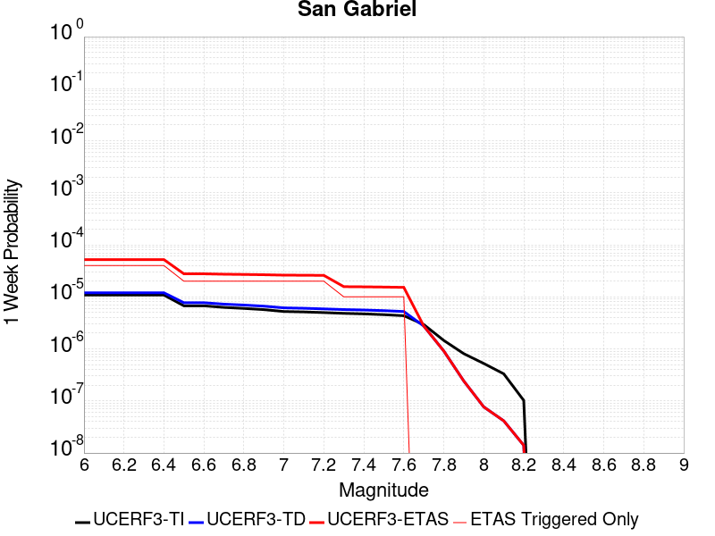 |  |  |  |

| Magnitude | 1 wk TI Prob | 1 wk TD Prob | 1 wk ETAS Prob | 1 wk ETAS/TD Gain | 1 wk ETAS Triggered Only | 1 mo TI Prob | 1 mo TD Prob | 1 mo ETAS Prob | 1 mo ETAS/TD Gain | 1 mo ETAS Triggered Only | 1 yr TI Prob | 1 yr TD Prob | 1 yr ETAS Prob | 1 yr ETAS/TD Gain | 1 yr ETAS Triggered Only | 10 yr TI Prob | 10 yr TD Prob | 10 yr ETAS Prob | 10 yr ETAS/TD Gain | 10 yr ETAS Triggered Only |
|-----|-----|-----|-----|-----|-----|-----|-----|-----|-----|-----|-----|-----|-----|-----|-----|-----|-----|-----|-----|-----|
| 6.0 | 1.083775E-5 | 1.19851875E-5 | 5.198471E-5 | 4.337413 | 4.0E-5 | 4.6446676E-5 | 5.1364143E-5 | 9.136209E-5 | 1.7787133 | 4.0E-5 | 5.653415E-4 | 6.251903E-4 | 6.7515904E-4 | 1.0799257 | 5.0E-5 | 0.0056390543 | 0.006246409 | 0.0063060345 | 1.0095456 | 6.0E-5 |
| 6.1 | 1.083775E-5 | 1.19851875E-5 | 5.198471E-5 | 4.337413 | 4.0E-5 | 4.6446676E-5 | 5.1364143E-5 | 9.136209E-5 | 1.7787133 | 4.0E-5 | 5.653415E-4 | 6.251903E-4 | 6.7515904E-4 | 1.0799257 | 5.0E-5 | 0.0056390543 | 0.006246409 | 0.0063060345 | 1.0095456 | 6.0E-5 |
| 6.2 | 1.083775E-5 | 1.19851875E-5 | 5.198471E-5 | 4.337413 | 4.0E-5 | 4.6446676E-5 | 5.1364143E-5 | 9.136209E-5 | 1.7787133 | 4.0E-5 | 5.653415E-4 | 6.251903E-4 | 6.7515904E-4 | 1.0799257 | 5.0E-5 | 0.0056390543 | 0.006246409 | 0.0063060345 | 1.0095456 | 6.0E-5 |
| 6.3 | 1.083775E-5 | 1.19851875E-5 | 5.198471E-5 | 4.337413 | 4.0E-5 | 4.6446676E-5 | 5.1364143E-5 | 9.136209E-5 | 1.7787133 | 4.0E-5 | 5.653415E-4 | 6.251903E-4 | 6.7515904E-4 | 1.0799257 | 5.0E-5 | 0.0056390543 | 0.006246409 | 0.0063060345 | 1.0095456 | 6.0E-5 |
| 6.4 | 1.083775E-5 | 1.19851875E-5 | 5.198471E-5 | 4.337413 | 4.0E-5 | 4.6446676E-5 | 5.1364143E-5 | 9.136209E-5 | 1.7787133 | 4.0E-5 | 5.653415E-4 | 6.251903E-4 | 6.7515904E-4 | 1.0799257 | 5.0E-5 | 0.0056390543 | 0.006246409 | 0.0063060345 | 1.0095456 | 6.0E-5 |
| 6.5 | 6.7317824E-6 | 7.716944E-6 | 2.7716791E-5 | 3.5916793 | 2.0E-5 | 2.8850178E-5 | 3.3072207E-5 | 5.3071544E-5 | 1.6047174 | 2.0E-5 | 3.511943E-4 | 4.0258077E-4 | 4.2257272E-4 | 1.0496595 | 2.0E-5 | 0.003506398 | 0.0040296097 | 0.004049529 | 1.0049433 | 2.0E-5 |
| 6.6 | 6.7317824E-6 | 7.716944E-6 | 2.7716791E-5 | 3.5916793 | 2.0E-5 | 2.8850178E-5 | 3.3072207E-5 | 5.3071544E-5 | 1.6047174 | 2.0E-5 | 3.511943E-4 | 4.0258077E-4 | 4.2257272E-4 | 1.0496595 | 2.0E-5 | 0.003506398 | 0.0040296097 | 0.004049529 | 1.0049433 | 2.0E-5 |
| 6.7 | 6.274881E-6 | 7.2458647E-6 | 2.724572E-5 | 3.760175 | 2.0E-5 | 2.6892068E-5 | 3.1053343E-5 | 5.105272E-5 | 1.6440331 | 2.0E-5 | 3.2736175E-4 | 3.780098E-4 | 3.9800224E-4 | 1.0528886 | 2.0E-5 | 0.0032687993 | 0.0037847564 | 0.0038046807 | 1.0052644 | 2.0E-5 |
| 6.8 | 5.996209E-6 | 6.958585E-6 | 2.6958445E-5 | 3.8741276 | 2.0E-5 | 2.5697784E-5 | 2.9822171E-5 | 4.9821574E-5 | 1.670622 | 2.0E-5 | 3.128256E-4 | 3.6302538E-4 | 3.830181E-4 | 1.0550725 | 2.0E-5 | 0.003123856 | 0.0036354093 | 0.0036553366 | 1.0054815 | 2.0E-5 |
| 6.9 | 5.686331E-6 | 6.6236316E-6 | 2.6623498E-5 | 4.0194716 | 2.0E-5 | 2.4369761E-5 | 2.8386688E-5 | 4.8386122E-5 | 1.7045356 | 2.0E-5 | 2.9666146E-4 | 3.4555403E-4 | 3.655471E-4 | 1.0578581 | 2.0E-5 | 0.0029626573 | 0.0034612515 | 0.0034811823 | 1.0057583 | 2.0E-5 |
| 7.0 | 5.2329838E-6 | 6.147514E-6 | 2.614739E-5 | 4.2533274 | 2.0E-5 | 2.242688E-5 | 2.6346226E-5 | 4.63457E-5 | 1.759102 | 2.0E-5 | 2.7301308E-4 | 3.2071886E-4 | 3.4071246E-4 | 1.0623399 | 2.0E-5 | 0.002726779 | 0.0032136322 | 0.0032335678 | 1.0062035 | 2.0E-5 |
| 7.1 | 5.135671E-6 | 6.03764E-6 | 2.603752E-5 | 4.3125324 | 2.0E-5 | 2.2009834E-5 | 2.5875348E-5 | 4.587483E-5 | 1.7729164 | 2.0E-5 | 2.6793676E-4 | 3.1498758E-4 | 3.3498128E-4 | 1.0634745 | 2.0E-5 | 0.0026761394 | 0.0031564834 | 0.0031764202 | 1.0063162 | 2.0E-5 |
| 7.2 | 4.989062E-6 | 5.87102E-6 | 2.5870902E-5 | 4.406543 | 2.0E-5 | 2.1381518E-5 | 2.5161276E-5 | 4.5160774E-5 | 1.7948523 | 2.0E-5 | 2.6028889E-4 | 3.0629625E-4 | 3.2629012E-4 | 1.0652763 | 2.0E-5 | 0.0025998424 | 0.003069813 | 0.0030897513 | 1.006495 | 2.0E-5 |
| 7.3 | 4.8219395E-6 | 5.702574E-6 | 1.5702517E-5 | 2.753584 | 1.0E-5 | 2.0665291E-5 | 2.443938E-5 | 3.4439134E-5 | 1.4091657 | 1.0E-5 | 2.5157086E-4 | 2.9750957E-4 | 3.075066E-4 | 1.0336024 | 1.0E-5 | 0.0025128627 | 0.0029821852 | 0.0029921555 | 1.0033432 | 1.0E-5 |
| 7.4 | 4.7118383E-6 | 5.5911332E-6 | 1.5591077E-5 | 2.7885363 | 1.0E-5 | 2.0193436E-5 | 2.3961782E-5 | 3.3961544E-5 | 1.4173212 | 1.0E-5 | 2.4582737E-4 | 2.916964E-4 | 3.0169348E-4 | 1.0342722 | 1.0E-5 | 0.002455556 | 0.0029242067 | 0.0029341774 | 1.0034097 | 1.0E-5 |
| 7.5 | 4.5506545E-6 | 5.4365014E-6 | 1.5436446E-5 | 2.8394084 | 1.0E-5 | 1.9502659E-5 | 2.3299088E-5 | 3.3298853E-5 | 1.4291914 | 1.0E-5 | 2.37419E-4 | 2.8363022E-4 | 2.9362738E-4 | 1.0352472 | 1.0E-5 | 0.002371655 | 0.002843753 | 0.0028537244 | 1.0035064 | 1.0E-5 |
| 7.6 | 4.343636E-6 | 5.2293817E-6 | 1.522933E-5 | 2.912262 | 1.0E-5 | 1.861545E-5 | 2.2411448E-5 | 3.2411222E-5 | 1.4461906 | 1.0E-5 | 2.2661954E-4 | 2.7282597E-4 | 2.8282322E-4 | 1.0366434 | 1.0E-5 | 0.0022638857 | 0.0027359722 | 0.002745945 | 1.0036451 | 1.0E-5 |
| 7.7 | 2.936235E-6 | 2.7440458E-6 | 2.7440458E-6 | 1.0 | 0.0 | 1.2583803E-5 | 1.1760143E-5 | 1.1760143E-5 | 1.0 | 0.0 | 1.5319703E-4 | 1.4317037E-4 | 1.4317037E-4 | 1.0 | 0.0 | 0.0015309147 | 0.0014380751 | 0.0014380751 | 1.0 | 0.0 |
| 7.8 | 1.4541639E-6 | 9.1237047E-7 | 9.1237047E-7 | 1.0 | 0.0 | 6.232116E-6 | 3.9101533E-6 | 3.9101533E-6 | 1.0 | 0.0 | 7.587337E-5 | 4.7605077E-5 | 4.7605077E-5 | 1.0 | 0.0 | 7.584747E-4 | 4.8085177E-4 | 4.8085177E-4 | 1.0 | 0.0 |
| 7.9 | 8.098958E-7 | 2.41753E-7 | 2.41753E-7 | 1.0 | 0.0 | 3.4709774E-6 | 1.0360839E-6 | 1.0360839E-6 | 1.0 | 0.0 | 4.225833E-5 | 1.2614248E-5 | 1.2614248E-5 | 1.0 | 0.0 | 4.2250296E-4 | 1.2921814E-4 | 1.2921814E-4 | 1.0 | 0.0 |
| 8.0 | 5.2473234E-7 | 7.6792055E-8 | 7.6792055E-8 | 1.0 | 0.0 | 2.248851E-6 | 3.2910876E-7 | 3.2910876E-7 | 1.0 | 0.0 | 2.7379416E-5 | 4.0068917E-6 | 4.0068917E-6 | 1.0 | 0.0 | 2.7376044E-4 | 4.21918E-5 | 4.21918E-5 | 1.0 | 0.0 |
| 8.1 | 3.3162388E-7 | 4.1496126E-8 | 4.1496126E-8 | 1.0 | 0.0 | 1.4212444E-6 | 1.7784053E-7 | 1.7784053E-7 | 1.0 | 0.0 | 1.7303513E-5 | 2.1652063E-6 | 2.1652063E-6 | 1.0 | 0.0 | 1.7302166E-4 | 2.2965523E-5 | 2.2965523E-5 | 1.0 | 0.0 |
| 8.2 | 1.0235345E-7 | 1.4043474E-8 | 1.4043474E-8 | 1.0 | 0.0 | 4.3865757E-7 | 6.0186316E-8 | 6.0186316E-8 | 1.0 | 0.0 | 5.340643E-6 | 7.327681E-7 | 7.327681E-7 | 1.0 | 0.0 | 5.3405143E-5 | 7.9273705E-6 | 7.9273705E-6 | 1.0 | 0.0 |

## Hunting Creek - Bartlett Springs connector 2011
*[(top)](#table-of-contents)*

| 1 Week | 1 Month | 1 Year | 10 Year |
|-----|-----|-----|-----|
|  |  |  | 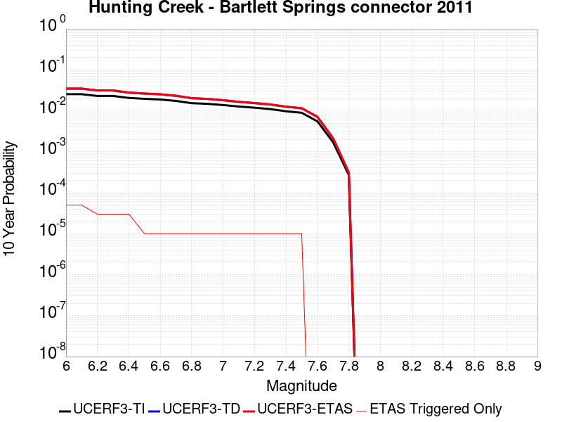 |

| Magnitude | 1 wk TI Prob | 1 wk TD Prob | 1 wk ETAS Prob | 1 wk ETAS/TD Gain | 1 wk ETAS Triggered Only | 1 mo TI Prob | 1 mo TD Prob | 1 mo ETAS Prob | 1 mo ETAS/TD Gain | 1 mo ETAS Triggered Only | 1 yr TI Prob | 1 yr TD Prob | 1 yr ETAS Prob | 1 yr ETAS/TD Gain | 1 yr ETAS Triggered Only | 10 yr TI Prob | 10 yr TD Prob | 10 yr ETAS Prob | 10 yr ETAS/TD Gain | 10 yr ETAS Triggered Only |
|-----|-----|-----|-----|-----|-----|-----|-----|-----|-----|-----|-----|-----|-----|-----|-----|-----|-----|-----|-----|-----|
| 6.0 | 4.940016E-5 | 6.786822E-5 | 6.786822E-5 | 1.0 | 0.0 | 2.1169778E-4 | 2.9083234E-4 | 3.0082942E-4 | 1.0343741 | 1.0E-5 | 0.002574374 | 0.003535177 | 0.0035650712 | 1.0084561 | 3.0E-5 | 0.025447546 | 0.034773834 | 0.034822095 | 1.0013878 | 5.0E-5 |
| 6.1 | 4.940016E-5 | 6.786822E-5 | 6.786822E-5 | 1.0 | 0.0 | 2.1169778E-4 | 2.9083234E-4 | 3.0082942E-4 | 1.0343741 | 1.0E-5 | 0.002574374 | 0.003535177 | 0.0035650712 | 1.0084561 | 3.0E-5 | 0.025447546 | 0.034773834 | 0.034822095 | 1.0013878 | 5.0E-5 |
| 6.2 | 4.472471E-5 | 6.1002804E-5 | 6.1002804E-5 | 1.0 | 0.0 | 1.9166325E-4 | 2.6141506E-4 | 2.7141246E-4 | 1.0382433 | 1.0E-5 | 0.0023310026 | 0.003178107 | 0.0031980434 | 1.006273 | 2.0E-5 | 0.02306703 | 0.031316914 | 0.031345975 | 1.0009279 | 3.0E-5 |
| 6.3 | 4.472471E-5 | 6.1002804E-5 | 6.1002804E-5 | 1.0 | 0.0 | 1.9166325E-4 | 2.6141506E-4 | 2.7141246E-4 | 1.0382433 | 1.0E-5 | 0.0023310026 | 0.003178107 | 0.0031980434 | 1.006273 | 2.0E-5 | 0.02306703 | 0.031316914 | 0.031345975 | 1.0009279 | 3.0E-5 |
| 6.4 | 4.0001003E-5 | 5.4103755E-5 | 5.4103755E-5 | 1.0 | 0.0 | 1.714216E-4 | 2.31853E-4 | 2.4185069E-4 | 1.0431207 | 1.0E-5 | 0.0020850603 | 0.0028191248 | 0.0028290965 | 1.0035372 | 1.0E-5 | 0.02065605 | 0.027828315 | 0.02785748 | 1.0010481 | 3.0E-5 |
| 6.5 | 3.8033053E-5 | 5.1266547E-5 | 5.1266547E-5 | 1.0 | 0.0 | 1.6298861E-4 | 2.1969559E-4 | 2.1969559E-4 | 1.0 | 0.0 | 0.0019825802 | 0.0026714746 | 0.0026714746 | 1.0 | 0.0 | 0.019649856 | 0.026390454 | 0.02640019 | 1.000369 | 1.0E-5 |
| 6.6 | 3.653754E-5 | 4.913017E-5 | 4.913017E-5 | 1.0 | 0.0 | 1.5658008E-4 | 2.1054115E-4 | 2.1054115E-4 | 1.0 | 0.0 | 0.0019046954 | 0.0025602852 | 0.0025602852 | 1.0 | 0.0 | 0.018884527 | 0.025306415 | 0.02531616 | 1.0003852 | 1.0E-5 |
| 6.7 | 3.372024E-5 | 4.514011E-5 | 4.514011E-5 | 1.0 | 0.0 | 1.4450731E-4 | 1.9344354E-4 | 1.9344354E-4 | 1.0 | 0.0 | 0.0017579567 | 0.002352639 | 0.002352639 | 1.0 | 0.0 | 0.017441148 | 0.023278099 | 0.023287866 | 1.0004196 | 1.0E-5 |
| 6.8 | 2.9650024E-5 | 3.9411374E-5 | 3.9411374E-5 | 1.0 | 0.0 | 1.2706534E-4 | 1.6889503E-4 | 1.6889503E-4 | 1.0 | 0.0 | 0.0015459227 | 0.0020543463 | 0.0020543463 | 1.0 | 0.0 | 0.015352124 | 0.020351216 | 0.020361012 | 1.0004814 | 1.0E-5 |
| 6.9 | 2.860775E-5 | 3.7812544E-5 | 3.7812544E-5 | 1.0 | 0.0 | 1.2259888E-4 | 1.6204377E-4 | 1.6204377E-4 | 1.0 | 0.0 | 0.0014916194 | 0.001971107 | 0.001971107 | 1.0 | 0.0 | 0.014816469 | 0.01953584 | 0.019545645 | 1.0005019 | 1.0E-5 |
| 7.0 | 2.6696067E-5 | 3.506726E-5 | 3.506726E-5 | 1.0 | 0.0 | 1.144067E-4 | 1.5027967E-4 | 1.5027967E-4 | 1.0 | 0.0 | 0.0013920115 | 0.0018281302 | 0.0018281302 | 1.0 | 0.0 | 0.013833242 | 0.018131364 | 0.018141182 | 1.0005416 | 1.0E-5 |
| 7.1 | 2.456087E-5 | 3.2013093E-5 | 3.2013093E-5 | 1.0 | 0.0 | 1.0525662E-4 | 1.371918E-4 | 1.371918E-4 | 1.0 | 0.0 | 0.001280746 | 0.0016690396 | 0.0016690396 | 1.0 | 0.0 | 0.012733897 | 0.016566366 | 0.0165762 | 1.0005937 | 1.0E-5 |
| 7.2 | 2.295761E-5 | 2.9822932E-5 | 2.9822932E-5 | 1.0 | 0.0 | 9.8386045E-5 | 1.2780636E-4 | 1.2780636E-4 | 1.0 | 0.0 | 0.0011971919 | 0.001554941 | 0.001554941 | 1.0 | 0.0 | 0.011907627 | 0.015442089 | 0.015451935 | 1.0006375 | 1.0E-5 |
| 7.3 | 2.1256936E-5 | 2.7541912E-5 | 2.7541912E-5 | 1.0 | 0.0 | 9.109797E-5 | 1.1803147E-4 | 1.1803147E-4 | 1.0 | 0.0 | 0.0011085535 | 0.0014360948 | 0.0014360948 | 1.0 | 0.0 | 0.011030397 | 0.014269472 | 0.014279329 | 1.0006908 | 1.0E-5 |
| 7.4 | 1.8784336E-5 | 2.4306766E-5 | 2.4306766E-5 | 1.0 | 0.0 | 8.050181E-5 | 1.0416774E-4 | 1.0416774E-4 | 1.0 | 0.0 | 9.796688E-4 | 0.001267512 | 0.001267512 | 1.0 | 0.0 | 0.009753612 | 0.012603902 | 0.012613776 | 1.0007834 | 1.0E-5 |
| 7.5 | 1.7248298E-5 | 2.2268887E-5 | 2.2268887E-5 | 1.0 | 0.0 | 7.391918E-5 | 9.543464E-5 | 9.543464E-5 | 1.0 | 0.0 | 8.9959445E-4 | 0.0011613049 | 0.0011613049 | 1.0 | 0.0 | 0.008959615 | 0.01155334 | 0.011563224 | 1.0008556 | 1.0E-5 |
| 7.6 | 1.0653709E-5 | 1.3722118E-5 | 1.3722118E-5 | 1.0 | 0.0 | 4.5657955E-5 | 5.8807767E-5 | 5.8807767E-5 | 1.0 | 0.0 | 5.557438E-4 | 7.157521E-4 | 7.157521E-4 | 1.0 | 0.0 | 0.0055435603 | 0.0071348166 | 0.0071348166 | 1.0 | 0.0 |
| 7.7 | 3.286316E-6 | 4.0903437E-6 | 4.0903437E-6 | 1.0 | 0.0 | 1.4084137E-5 | 1.7529928E-5 | 1.7529928E-5 | 1.0 | 0.0 | 1.7146087E-4 | 2.1340612E-4 | 2.1340612E-4 | 1.0 | 0.0 | 0.0017132863 | 0.0021320276 | 0.0021320276 | 1.0 | 0.0 |
| 7.8 | 5.1855085E-7 | 5.9720696E-7 | 5.9720696E-7 | 1.0 | 0.0 | 2.222359E-6 | 2.5594559E-6 | 2.5594559E-6 | 1.0 | 0.0 | 2.7056883E-5 | 3.116094E-5 | 3.116094E-5 | 1.0 | 0.0 | 2.705359E-4 | 3.1156495E-4 | 3.1156495E-4 | 1.0 | 0.0 |

## Calaveras (So) 2011 CFM
*[(top)](#table-of-contents)*

| 1 Week | 1 Month | 1 Year | 10 Year |
|-----|-----|-----|-----|
|  |  | 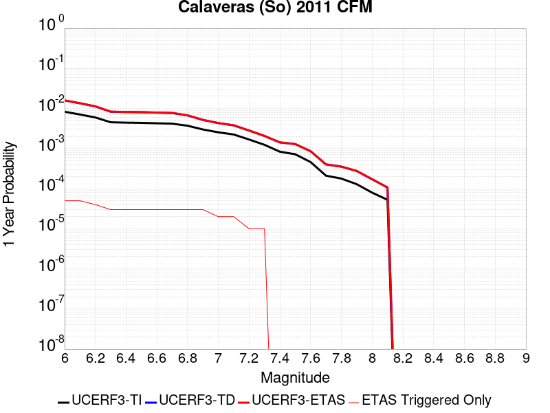 | 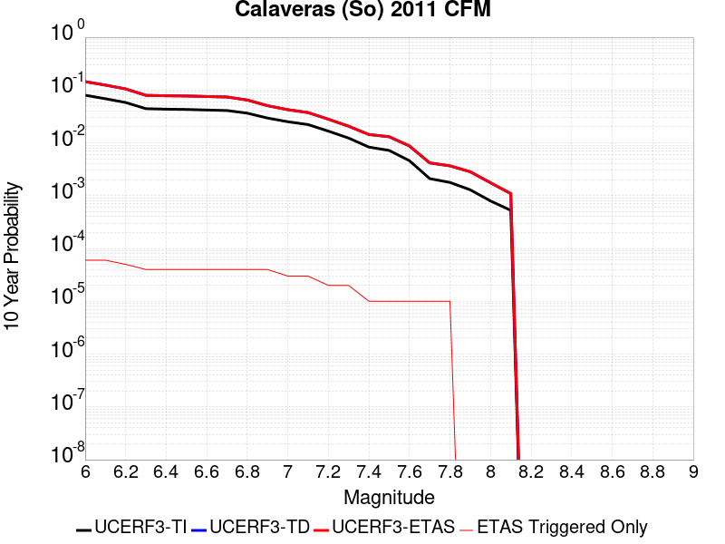 |

| Magnitude | 1 wk TI Prob | 1 wk TD Prob | 1 wk ETAS Prob | 1 wk ETAS/TD Gain | 1 wk ETAS Triggered Only | 1 mo TI Prob | 1 mo TD Prob | 1 mo ETAS Prob | 1 mo ETAS/TD Gain | 1 mo ETAS Triggered Only | 1 yr TI Prob | 1 yr TD Prob | 1 yr ETAS Prob | 1 yr ETAS/TD Gain | 1 yr ETAS Triggered Only | 10 yr TI Prob | 10 yr TD Prob | 10 yr ETAS Prob | 10 yr ETAS/TD Gain | 10 yr ETAS Triggered Only |
|-----|-----|-----|-----|-----|-----|-----|-----|-----|-----|-----|-----|-----|-----|-----|-----|-----|-----|-----|-----|-----|
| 6.0 | 1.5950744E-4 | 3.071188E-4 | 3.3710958E-4 | 1.0976521 | 3.0E-5 | 6.834242E-4 | 0.0013155643 | 0.0013455248 | 1.0227739 | 3.0E-5 | 0.00828899 | 0.01585904 | 0.015908247 | 1.0031028 | 5.0E-5 | 0.079865426 | 0.14440064 | 0.14445198 | 1.0003555 | 6.0E-5 |
| 6.1 | 1.3584697E-4 | 2.6036944E-4 | 2.903616E-4 | 1.1151909 | 3.0E-5 | 5.8207137E-4 | 0.0011153965 | 0.001145363 | 1.0268663 | 3.0E-5 | 0.007063716 | 0.013462106 | 0.013511433 | 1.0036641 | 5.0E-5 | 0.06843361 | 0.12402854 | 0.124081105 | 1.0004238 | 6.0E-5 |
| 6.2 | 1.14676266E-4 | 2.1726108E-4 | 2.3725674E-4 | 1.0920352 | 2.0E-5 | 4.9137714E-4 | 9.307893E-4 | 9.507707E-4 | 1.0214671 | 2.0E-5 | 0.0059661185 | 0.011245592 | 0.011285142 | 1.0035169 | 4.0E-5 | 0.058084648 | 0.105019294 | 0.10506404 | 1.000426 | 5.0E-5 |
| 6.3 | 8.691518E-5 | 1.5987165E-4 | 1.7986844E-4 | 1.1250803 | 2.0E-5 | 3.7244044E-4 | 6.8496726E-4 | 7.0495356E-4 | 1.0291785 | 2.0E-5 | 0.004525038 | 0.008300893 | 0.008330644 | 1.003584 | 3.0E-5 | 0.044339992 | 0.0793347 | 0.07937153 | 1.0004642 | 4.0E-5 |
| 6.4 | 8.50982E-5 | 1.5693568E-4 | 1.7693255E-4 | 1.1274208 | 2.0E-5 | 3.646556E-4 | 6.7239115E-4 | 6.923777E-4 | 1.0297246 | 2.0E-5 | 0.0044306475 | 0.008148931 | 0.008178686 | 1.0036515 | 3.0E-5 | 0.04343345 | 0.077940844 | 0.077977724 | 1.0004733 | 4.0E-5 |
| 6.5 | 8.4062965E-5 | 1.5518135E-4 | 1.7517825E-4 | 1.1288614 | 2.0E-5 | 3.602201E-4 | 6.648764E-4 | 6.8486313E-4 | 1.0300608 | 2.0E-5 | 0.004376863 | 0.008058134 | 0.008087891 | 1.003693 | 3.0E-5 | 0.042916555 | 0.077112116 | 0.077149026 | 1.0004787 | 4.0E-5 |
| 6.6 | 8.194716E-5 | 1.5154095E-4 | 1.7153792E-4 | 1.1319575 | 2.0E-5 | 3.5115483E-4 | 6.492825E-4 | 6.6926953E-4 | 1.0307832 | 2.0E-5 | 0.0042669317 | 0.007869979 | 0.0078997435 | 1.0037819 | 3.0E-5 | 0.04185927 | 0.07539739 | 0.07543437 | 1.0004905 | 4.0E-5 |
| 6.7 | 8.012326E-5 | 1.4821833E-4 | 1.6821537E-4 | 1.1349161 | 2.0E-5 | 3.433402E-4 | 6.350497E-4 | 6.55037E-4 | 1.0314736 | 2.0E-5 | 0.004172157 | 0.007698474 | 0.0077282432 | 1.0038669 | 3.0E-5 | 0.040946912 | 0.073839515 | 0.07387656 | 1.0005018 | 4.0E-5 |
| 6.8 | 7.119773E-5 | 1.2880519E-4 | 1.488026E-4 | 1.1552533 | 2.0E-5 | 3.0509746E-4 | 5.519001E-4 | 5.718891E-4 | 1.0362184 | 2.0E-5 | 0.0037082357 | 0.0066958875 | 0.0067256866 | 1.0044503 | 3.0E-5 | 0.036469642 | 0.06468402 | 0.06472143 | 1.0005784 | 4.0E-5 |
| 6.9 | 5.7343088E-5 | 9.9189E-5 | 1.1918702E-4 | 1.2016152 | 2.0E-5 | 2.4573295E-4 | 4.2502693E-4 | 4.450184E-4 | 1.0470358 | 2.0E-5 | 0.0029876942 | 0.0051625078 | 0.005192353 | 1.0057812 | 3.0E-5 | 0.02947844 | 0.050509132 | 0.05054711 | 1.000752 | 4.0E-5 |
| 7.0 | 4.8746577E-5 | 8.284751E-5 | 9.284668E-5 | 1.1206937 | 1.0E-5 | 2.0889717E-4 | 3.550128E-4 | 3.6500924E-4 | 1.028158 | 1.0E-5 | 0.0025403565 | 0.004313781 | 0.0043336945 | 1.0046163 | 2.0E-5 | 0.025115121 | 0.04248505 | 0.042513777 | 1.0006762 | 3.0E-5 |
| 7.1 | 4.2998014E-5 | 7.264914E-5 | 8.264841E-5 | 1.1376379 | 1.0E-5 | 1.8426418E-4 | 3.1131663E-4 | 3.213135E-4 | 1.0321116 | 1.0E-5 | 0.002241108 | 0.0037837527 | 0.0038036772 | 1.0052657 | 2.0E-5 | 0.022186412 | 0.037423246 | 0.03745212 | 1.0007716 | 3.0E-5 |
| 7.2 | 3.221292E-5 | 5.390566E-5 | 5.390566E-5 | 1.0 | 0.0 | 1.3804805E-4 | 2.3100396E-4 | 2.3100396E-4 | 1.0 | 0.0 | 0.0016794393 | 0.0028088738 | 0.0028188457 | 1.0035502 | 1.0E-5 | 0.016668037 | 0.028035998 | 0.028055437 | 1.0006933 | 2.0E-5 |
| 7.3 | 2.3756531E-5 | 3.9471706E-5 | 3.9471706E-5 | 1.0 | 0.0 | 1.0180973E-4 | 1.6915359E-4 | 1.6915359E-4 | 1.0 | 0.0 | 0.0012388286 | 0.0020575167 | 0.002067496 | 1.0048503 | 1.0E-5 | 0.012319452 | 0.02064345 | 0.020663038 | 1.0009488 | 2.0E-5 |
| 7.4 | 1.5997684E-5 | 2.734085E-5 | 2.734085E-5 | 1.0 | 0.0 | 6.8559704E-5 | 1.1716982E-4 | 1.1716982E-4 | 1.0 | 0.0 | 8.343947E-4 | 0.0014256114 | 0.0014256114 | 1.0 | 0.0 | 0.008312687 | 0.014376549 | 0.014386405 | 1.0006856 | 1.0E-5 |
| 7.5 | 1.3814293E-5 | 2.4782603E-5 | 2.4782603E-5 | 1.0 | 0.0 | 5.9202768E-5 | 1.0620684E-4 | 1.0620684E-4 | 1.0 | 0.0 | 7.205553E-4 | 0.0012923037 | 0.0012923037 | 1.0 | 0.0 | 0.007182234 | 0.013055766 | 0.013065635 | 1.0007559 | 1.0E-5 |
| 7.6 | 8.817309E-6 | 1.6429829E-5 | 1.6429829E-5 | 1.0 | 0.0 | 3.7787922E-5 | 7.041166E-5 | 7.041166E-5 | 1.0 | 0.0 | 4.5997082E-4 | 8.5692614E-4 | 8.5692614E-4 | 1.0 | 0.0 | 0.004590199 | 0.008719863 | 0.008729776 | 1.0011368 | 1.0E-5 |
| 7.7 | 4.0352206E-6 | 7.706877E-6 | 7.706877E-6 | 1.0 | 0.0 | 1.7293689E-5 | 3.3029053E-5 | 3.3029053E-5 | 1.0 | 0.0 | 2.1053031E-4 | 4.020546E-4 | 4.020546E-4 | 1.0 | 0.0 | 0.0021033096 | 0.0041649863 | 0.0041749445 | 1.002391 | 1.0E-5 |
| 7.8 | 3.413169E-6 | 6.7868646E-6 | 6.7868646E-6 | 1.0 | 0.0 | 1.4627784E-5 | 2.9086239E-5 | 2.9086239E-5 | 1.0 | 0.0 | 1.7807873E-4 | 3.5406748E-4 | 3.5406748E-4 | 1.0 | 0.0 | 0.0017793609 | 0.0036663096 | 0.003676273 | 1.0027175 | 1.0E-5 |
| 7.9 | 2.4740732E-6 | 5.278809E-6 | 5.278809E-6 | 1.0 | 0.0 | 1.06031275E-5 | 2.2623271E-5 | 2.2623271E-5 | 1.0 | 0.0 | 1.2908543E-4 | 2.7540355E-4 | 2.7540355E-4 | 1.0 | 0.0 | 0.0012901047 | 0.002834638 | 0.002834638 | 1.0 | 0.0 |
| 8.0 | 1.5231818E-6 | 3.2887135E-6 | 3.2887135E-6 | 1.0 | 0.0 | 6.527906E-6 | 1.409441E-5 | 1.409441E-5 | 1.0 | 0.0 | 7.9474354E-5 | 1.7158597E-4 | 1.7158597E-4 | 1.0 | 0.0 | 7.944594E-4 | 0.001756374 | 0.001756374 | 1.0 | 0.0 |
| 8.1 | 1.0104524E-6 | 2.0456548E-6 | 2.0456548E-6 | 1.0 | 0.0 | 4.330503E-6 | 8.767062E-6 | 8.767062E-6 | 1.0 | 0.0 | 5.2722597E-5 | 1.06733794E-4 | 1.06733794E-4 | 1.0 | 0.0 | 5.271009E-4 | 0.0010929212 | 0.0010929212 | 1.0 | 0.0 |

## Cucamonga
*[(top)](#table-of-contents)*

| 1 Week | 1 Month | 1 Year | 10 Year |
|-----|-----|-----|-----|
|  |  |  |  |

| Magnitude | 1 wk TI Prob | 1 wk TD Prob | 1 wk ETAS Prob | 1 wk ETAS/TD Gain | 1 wk ETAS Triggered Only | 1 mo TI Prob | 1 mo TD Prob | 1 mo ETAS Prob | 1 mo ETAS/TD Gain | 1 mo ETAS Triggered Only | 1 yr TI Prob | 1 yr TD Prob | 1 yr ETAS Prob | 1 yr ETAS/TD Gain | 1 yr ETAS Triggered Only | 10 yr TI Prob | 10 yr TD Prob | 10 yr ETAS Prob | 10 yr ETAS/TD Gain | 10 yr ETAS Triggered Only |
|-----|-----|-----|-----|-----|-----|-----|-----|-----|-----|-----|-----|-----|-----|-----|-----|-----|-----|-----|-----|-----|
| 6.0 | 1.1848348E-5 | 1.1737008E-5 | 3.1736774E-5 | 2.7039917 | 2.0E-5 | 5.0777642E-5 | 5.030051E-5 | 7.02995E-5 | 1.3975903 | 2.0E-5 | 6.180424E-4 | 6.1223935E-4 | 6.4222096E-4 | 1.0489705 | 3.0E-5 | 0.0061632637 | 0.0061067017 | 0.006166335 | 1.0097653 | 6.0E-5 |
| 6.1 | 1.1848348E-5 | 1.1737008E-5 | 3.1736774E-5 | 2.7039917 | 2.0E-5 | 5.0777642E-5 | 5.030051E-5 | 7.02995E-5 | 1.3975903 | 2.0E-5 | 6.180424E-4 | 6.1223935E-4 | 6.4222096E-4 | 1.0489705 | 3.0E-5 | 0.0061632637 | 0.0061067017 | 0.006166335 | 1.0097653 | 6.0E-5 |
| 6.2 | 1.1848348E-5 | 1.1737008E-5 | 3.1736774E-5 | 2.7039917 | 2.0E-5 | 5.0777642E-5 | 5.030051E-5 | 7.02995E-5 | 1.3975903 | 2.0E-5 | 6.180424E-4 | 6.1223935E-4 | 6.4222096E-4 | 1.0489705 | 3.0E-5 | 0.0061632637 | 0.0061067017 | 0.006166335 | 1.0097653 | 6.0E-5 |
| 6.3 | 1.1848348E-5 | 1.1737008E-5 | 3.1736774E-5 | 2.7039917 | 2.0E-5 | 5.0777642E-5 | 5.030051E-5 | 7.02995E-5 | 1.3975903 | 2.0E-5 | 6.180424E-4 | 6.1223935E-4 | 6.4222096E-4 | 1.0489705 | 3.0E-5 | 0.0061632637 | 0.0061067017 | 0.006166335 | 1.0097653 | 6.0E-5 |
| 6.4 | 1.1848348E-5 | 1.1737008E-5 | 3.1736774E-5 | 2.7039917 | 2.0E-5 | 5.0777642E-5 | 5.030051E-5 | 7.02995E-5 | 1.3975903 | 2.0E-5 | 6.180424E-4 | 6.1223935E-4 | 6.4222096E-4 | 1.0489705 | 3.0E-5 | 0.0061632637 | 0.0061067017 | 0.006166335 | 1.0097653 | 6.0E-5 |
| 6.5 | 1.16988695E-5 | 1.15760395E-5 | 3.1575808E-5 | 2.7276866 | 2.0E-5 | 5.013705E-5 | 4.9610666E-5 | 6.9609676E-5 | 1.4031191 | 2.0E-5 | 6.102476E-4 | 6.0384517E-4 | 6.3382706E-4 | 1.0496516 | 3.0E-5 | 0.006085745 | 0.006023216 | 0.0060828547 | 1.0099014 | 6.0E-5 |
| 6.6 | 1.16988695E-5 | 1.15760395E-5 | 3.1575808E-5 | 2.7276866 | 2.0E-5 | 5.013705E-5 | 4.9610666E-5 | 6.9609676E-5 | 1.4031191 | 2.0E-5 | 6.102476E-4 | 6.0384517E-4 | 6.3382706E-4 | 1.0496516 | 3.0E-5 | 0.006085745 | 0.006023216 | 0.0060828547 | 1.0099014 | 6.0E-5 |
| 6.7 | 1.1397107E-5 | 1.11149475E-5 | 3.1114727E-5 | 2.7993586 | 2.0E-5 | 4.884383E-5 | 4.7634636E-5 | 6.763368E-5 | 1.4198426 | 2.0E-5 | 5.9451134E-4 | 5.797998E-4 | 6.0978247E-4 | 1.051712 | 3.0E-5 | 0.005929234 | 0.0057840226 | 0.005833734 | 1.0085945 | 5.0E-5 |
| 6.8 | 1.058387E-5 | 9.784992E-6 | 2.9784796E-5 | 3.0439267 | 2.0E-5 | 4.5358654E-5 | 4.193501E-5 | 6.193417E-5 | 1.4769084 | 2.0E-5 | 5.521017E-4 | 5.1044027E-4 | 5.4042495E-4 | 1.0587428 | 3.0E-5 | 0.00550732 | 0.0050936877 | 0.005143433 | 1.0097661 | 5.0E-5 |
| 6.9 | 9.690046E-6 | 8.57948E-6 | 2.8579308E-5 | 3.3311236 | 2.0E-5 | 4.1528107E-5 | 3.6768684E-5 | 5.676795E-5 | 1.5439211 | 2.0E-5 | 5.054874E-4 | 4.475672E-4 | 4.7755375E-4 | 1.0669991 | 3.0E-5 | 0.005043391 | 0.004467594 | 0.004517371 | 1.0111417 | 5.0E-5 |
| 7.0 | 9.381461E-6 | 8.187101E-6 | 2.8186938E-5 | 3.442847 | 2.0E-5 | 4.020564E-5 | 3.5087105E-5 | 5.5086406E-5 | 1.5699899 | 2.0E-5 | 4.893937E-4 | 4.2710215E-4 | 4.5708934E-4 | 1.0702108 | 3.0E-5 | 0.0048831734 | 0.0042637475 | 0.004313534 | 1.0116768 | 5.0E-5 |
| 7.1 | 8.946492E-6 | 7.781886E-6 | 1.7781807E-5 | 2.2850256 | 1.0E-5 | 3.8341543E-5 | 3.3350516E-5 | 4.335018E-5 | 1.2998354 | 1.0E-5 | 4.667083E-4 | 4.0596718E-4 | 4.2595906E-4 | 1.0492451 | 2.0E-5 | 0.0046572937 | 0.004053192 | 0.00409303 | 1.0098288 | 4.0E-5 |
| 7.2 | 8.251016E-6 | 6.9752796E-6 | 1.697521E-5 | 2.4336243 | 1.0E-5 | 3.5361016E-5 | 2.9893714E-5 | 3.9893417E-5 | 1.3345085 | 1.0E-5 | 4.3043532E-4 | 3.6389544E-4 | 3.8388814E-4 | 1.0549408 | 2.0E-5 | 0.0042960253 | 0.0036339292 | 0.00366382 | 1.0082256 | 3.0E-5 |
| 7.3 | 7.717881E-6 | 6.4863502E-6 | 1.6486285E-5 | 2.541689 | 1.0E-5 | 3.3076216E-5 | 2.7798349E-5 | 3.7798072E-5 | 1.3597236 | 1.0E-5 | 4.026285E-4 | 3.3839257E-4 | 3.583858E-4 | 1.059083 | 2.0E-5 | 0.004018998 | 0.00337971 | 0.0034096087 | 1.0088465 | 3.0E-5 |
| 7.4 | 7.275623E-6 | 6.031997E-6 | 1.6031938E-5 | 2.6578157 | 1.0E-5 | 3.118087E-5 | 2.585116E-5 | 3.5850902E-5 | 1.3868198 | 1.0E-5 | 3.7956095E-4 | 3.1469265E-4 | 3.3468637E-4 | 1.063534 | 2.0E-5 | 0.0037891332 | 0.0031434062 | 0.003173312 | 1.0095137 | 3.0E-5 |
| 7.5 | 6.5109502E-6 | 5.1006014E-6 | 5.1006014E-6 | 1.0 | 0.0 | 2.7903774E-5 | 2.1859538E-5 | 2.1859538E-5 | 1.0 | 0.0 | 3.3967546E-4 | 2.661075E-4 | 2.7610484E-4 | 1.0375688 | 1.0E-5 | 0.0033915674 | 0.002658813 | 0.0026787599 | 1.0075022 | 2.0E-5 |
| 7.6 | 5.4495326E-6 | 3.90857E-6 | 3.90857E-6 | 1.0 | 0.0 | 2.335493E-5 | 1.6750908E-5 | 1.6750908E-5 | 1.0 | 0.0 | 2.8430918E-4 | 2.0392328E-4 | 2.0392328E-4 | 1.0 | 0.0 | 0.0028394572 | 0.002038282 | 0.002048262 | 1.004896 | 1.0E-5 |
| 7.7 | 4.7997164E-6 | 3.2002547E-6 | 3.2002547E-6 | 1.0 | 0.0 | 2.057005E-5 | 1.3715306E-5 | 1.3715306E-5 | 1.0 | 0.0 | 2.504116E-4 | 1.6697108E-4 | 1.6697108E-4 | 1.0 | 0.0 | 0.002501296 | 0.0016693877 | 0.001679371 | 1.0059803 | 1.0E-5 |
| 7.8 | 3.3941733E-6 | 2.0641899E-6 | 2.0641899E-6 | 1.0 | 0.0 | 1.4546376E-5 | 8.846498E-6 | 8.846498E-6 | 1.0 | 0.0 | 1.7708774E-4 | 1.07700806E-4 | 1.07700806E-4 | 1.0 | 0.0 | 0.0017694668 | 0.001076723 | 0.0010867122 | 1.0092775 | 1.0E-5 |
| 7.9 | 9.750552E-7 | 5.155946E-7 | 5.155946E-7 | 1.0 | 0.0 | 4.178801E-6 | 2.2096892E-6 | 2.2096892E-6 | 1.0 | 0.0 | 5.0875715E-5 | 2.690264E-5 | 2.690264E-5 | 1.0 | 0.0 | 5.086407E-4 | 2.6899425E-4 | 2.6899425E-4 | 1.0 | 0.0 |
| 8.0 | 1.133857E-7 | 6.053707E-8 | 6.053707E-8 | 1.0 | 0.0 | 4.8593864E-7 | 2.5944456E-7 | 2.5944456E-7 | 1.0 | 0.0 | 5.9162867E-6 | 3.158733E-6 | 3.158733E-6 | 1.0 | 0.0 | 5.916129E-5 | 3.1586897E-5 | 3.1586897E-5 | 1.0 | 0.0 |

## Green Valley 2011 CFM
*[(top)](#table-of-contents)*

| 1 Week | 1 Month | 1 Year | 10 Year |
|-----|-----|-----|-----|
|  |  |  |  |

| Magnitude | 1 wk TI Prob | 1 wk TD Prob | 1 wk ETAS Prob | 1 wk ETAS/TD Gain | 1 wk ETAS Triggered Only | 1 mo TI Prob | 1 mo TD Prob | 1 mo ETAS Prob | 1 mo ETAS/TD Gain | 1 mo ETAS Triggered Only | 1 yr TI Prob | 1 yr TD Prob | 1 yr ETAS Prob | 1 yr ETAS/TD Gain | 1 yr ETAS Triggered Only | 10 yr TI Prob | 10 yr TD Prob | 10 yr ETAS Prob | 10 yr ETAS/TD Gain | 10 yr ETAS Triggered Only |
|-----|-----|-----|-----|-----|-----|-----|-----|-----|-----|-----|-----|-----|-----|-----|-----|-----|-----|-----|-----|-----|
| 6.0 | 9.9629346E-5 | 1.7305532E-4 | 2.3304494E-4 | 1.3466499 | 6.0E-5 | 4.2691303E-4 | 7.4143766E-4 | 8.013932E-4 | 1.0808638 | 6.0E-5 | 0.0051852856 | 0.008986705 | 0.009046166 | 1.0066165 | 6.0E-5 | 0.050659515 | 0.085522056 | 0.08557693 | 1.0006416 | 6.0E-5 |
| 6.1 | 9.88615E-5 | 1.7152846E-4 | 2.2151989E-4 | 1.2914468 | 5.0E-5 | 4.2362334E-4 | 7.348976E-4 | 7.848609E-4 | 1.0679867 | 5.0E-5 | 0.0051454236 | 0.0089077335 | 0.008957288 | 1.0055631 | 5.0E-5 | 0.050279044 | 0.084809676 | 0.08485544 | 1.0005395 | 5.0E-5 |
| 6.2 | 9.696895E-5 | 1.6791887E-4 | 2.1791048E-4 | 1.2977128 | 5.0E-5 | 4.15515E-4 | 7.194366E-4 | 7.694006E-4 | 1.0694488 | 5.0E-5 | 0.0050471667 | 0.008721114 | 0.008770678 | 1.0056832 | 5.0E-5 | 0.04934063 | 0.0831186 | 0.083164446 | 1.0005516 | 5.0E-5 |
| 6.3 | 9.275224E-5 | 1.5971228E-4 | 2.0970429E-4 | 1.313013 | 5.0E-5 | 3.9744904E-4 | 6.842841E-4 | 7.342499E-4 | 1.073019 | 5.0E-5 | 0.0048282105 | 0.008296439 | 0.008346024 | 1.0059767 | 5.0E-5 | 0.047246475 | 0.07925707 | 0.07930311 | 1.0005809 | 5.0E-5 |
| 6.4 | 8.391499E-5 | 1.4367796E-4 | 1.9367078E-4 | 1.3479505 | 5.0E-5 | 3.595861E-4 | 6.156248E-4 | 6.65594E-4 | 1.0811683 | 5.0E-5 | 0.004369175 | 0.0074670846 | 0.007516711 | 1.006646 | 5.0E-5 | 0.04284265 | 0.071630865 | 0.07167728 | 1.000648 | 5.0E-5 |
| 6.5 | 5.9519385E-5 | 9.9340905E-5 | 1.4933593E-4 | 1.5032673 | 5.0E-5 | 2.5505814E-4 | 4.2568138E-4 | 4.756601E-4 | 1.1174088 | 5.0E-5 | 0.0031009112 | 0.005168295 | 0.0052180365 | 1.0096244 | 5.0E-5 | 0.030579966 | 0.050145864 | 0.050193354 | 1.0009471 | 5.0E-5 |
| 6.6 | 4.5361558E-5 | 7.402609E-5 | 9.402461E-5 | 1.2701551 | 2.0E-5 | 1.9439218E-4 | 3.1721895E-4 | 3.372126E-4 | 1.063028 | 2.0E-5 | 0.0023641558 | 0.0038539418 | 0.0038738647 | 1.0051695 | 2.0E-5 | 0.023391623 | 0.037665963 | 0.037685208 | 1.0005109 | 2.0E-5 |
| 6.7 | 3.8808106E-5 | 6.2651976E-5 | 8.2650724E-5 | 1.3192037 | 2.0E-5 | 1.6630985E-4 | 2.6848342E-4 | 2.8847807E-4 | 1.0744725 | 2.0E-5 | 0.0020229418 | 0.0032626586 | 0.0032825933 | 1.00611 | 2.0E-5 | 0.020046256 | 0.032005914 | 0.032025274 | 1.0006049 | 2.0E-5 |
| 6.8 | 2.2284667E-5 | 3.1285235E-5 | 3.1285235E-5 | 1.0 | 0.0 | 9.550222E-5 | 1.3407279E-4 | 1.3407279E-4 | 1.0 | 0.0 | 0.0011621192 | 0.0016311078 | 0.0016311078 | 1.0 | 0.0 | 0.011560607 | 0.016165998 | 0.016165998 | 1.0 | 0.0 |
| 6.9 | 1.8050168E-5 | 2.4448054E-5 | 2.4448054E-5 | 1.0 | 0.0 | 7.735557E-5 | 1.047732E-4 | 1.047732E-4 | 1.0 | 0.0 | 9.4139716E-4 | 0.0012748708 | 0.0012748708 | 1.0 | 0.0 | 0.009374191 | 0.012667833 | 0.012667833 | 1.0 | 0.0 |
| 7.0 | 1.4763166E-5 | 1.9582854E-5 | 1.9582854E-5 | 1.0 | 0.0 | 6.326917E-5 | 8.3923835E-5 | 8.3923835E-5 | 1.0 | 0.0 | 7.7002996E-4 | 0.0010212966 | 0.0010212966 | 1.0 | 0.0 | 0.007673672 | 0.010165343 | 0.010165343 | 1.0 | 0.0 |
| 7.1 | 1.2399713E-5 | 1.6303715E-5 | 1.6303715E-5 | 1.0 | 0.0 | 5.3140546E-5 | 6.98712E-5 | 6.98712E-5 | 1.0 | 0.0 | 6.467941E-4 | 8.503518E-4 | 8.503518E-4 | 1.0 | 0.0 | 0.006449148 | 0.008471259 | 0.008471259 | 1.0 | 0.0 |
| 7.2 | 1.0584195E-5 | 1.3921742E-5 | 1.3921742E-5 | 1.0 | 0.0 | 4.5360044E-5 | 5.9663253E-5 | 5.9663253E-5 | 1.0 | 0.0 | 5.521186E-4 | 7.261596E-4 | 7.261596E-4 | 1.0 | 0.0 | 0.0055074887 | 0.007238285 | 0.007238285 | 1.0 | 0.0 |
| 7.3 | 7.998173E-6 | 1.054402E-5 | 1.054402E-5 | 1.0 | 0.0 | 3.4277433E-5 | 4.518788E-5 | 4.518788E-5 | 1.0 | 0.0 | 4.1724785E-4 | 5.500247E-4 | 5.500247E-4 | 1.0 | 0.0 | 0.004164653 | 0.0054868995 | 0.0054868995 | 1.0 | 0.0 |
| 7.4 | 6.7571127E-6 | 8.932697E-6 | 8.932697E-6 | 1.0 | 0.0 | 2.8958733E-5 | 3.828243E-5 | 3.828243E-5 | 1.0 | 0.0 | 3.5251552E-4 | 4.6598984E-4 | 4.6598984E-4 | 1.0 | 0.0 | 0.0035195686 | 0.0046503306 | 0.0046503306 | 1.0 | 0.0 |
| 7.5 | 5.69878E-6 | 7.516314E-6 | 7.516314E-6 | 1.0 | 0.0 | 2.4423114E-5 | 3.221238E-5 | 3.221238E-5 | 1.0 | 0.0 | 2.9731085E-4 | 3.9211605E-4 | 3.9211605E-4 | 1.0 | 0.0 | 0.002969134 | 0.0039143935 | 0.0039143935 | 1.0 | 0.0 |
| 7.6 | 4.503664E-6 | 5.9356807E-6 | 5.9356807E-6 | 1.0 | 0.0 | 1.9301275E-5 | 2.5438389E-5 | 2.5438389E-5 | 1.0 | 0.0 | 2.3496768E-4 | 3.096692E-4 | 3.096692E-4 | 1.0 | 0.0 | 0.002347194 | 0.003092502 | 0.003092502 | 1.0 | 0.0 |
| 7.7 | 1.0873546E-6 | 1.4106979E-6 | 1.4106979E-6 | 1.0 | 0.0 | 4.6600826E-6 | 6.045834E-6 | 6.045834E-6 | 1.0 | 0.0 | 5.6735033E-5 | 7.360557E-5 | 7.360557E-5 | 1.0 | 0.0 | 5.672055E-4 | 7.35814E-4 | 7.35814E-4 | 1.0 | 0.0 |
| 7.8 | 4.9373917E-8 | 6.1777136E-8 | 6.1777136E-8 | 1.0 | 0.0 | 2.1160248E-7 | 2.6475914E-7 | 2.6475914E-7 | 1.0 | 0.0 | 2.5762572E-6 | 3.223439E-6 | 3.223439E-6 | 1.0 | 0.0 | 2.5762274E-5 | 3.2232296E-5 | 3.2232296E-5 | 1.0 | 0.0 |

## Rose Canyon
*[(top)](#table-of-contents)*

| 1 Week | 1 Month | 1 Year | 10 Year |
|-----|-----|-----|-----|
|  |  |  |  |

| Magnitude | 1 wk TI Prob | 1 wk TD Prob | 1 wk ETAS Prob | 1 wk ETAS/TD Gain | 1 wk ETAS Triggered Only | 1 mo TI Prob | 1 mo TD Prob | 1 mo ETAS Prob | 1 mo ETAS/TD Gain | 1 mo ETAS Triggered Only | 1 yr TI Prob | 1 yr TD Prob | 1 yr ETAS Prob | 1 yr ETAS/TD Gain | 1 yr ETAS Triggered Only | 10 yr TI Prob | 10 yr TD Prob | 10 yr ETAS Prob | 10 yr ETAS/TD Gain | 10 yr ETAS Triggered Only |
|-----|-----|-----|-----|-----|-----|-----|-----|-----|-----|-----|-----|-----|-----|-----|-----|-----|-----|-----|-----|-----|
| 6.0 | 4.5923203E-5 | 4.9714225E-5 | 8.971224E-5 | 1.8045586 | 4.0E-5 | 1.9679888E-4 | 2.1304491E-4 | 2.5303639E-4 | 1.1877139 | 4.0E-5 | 0.0023933933 | 0.0025909345 | 0.002650779 | 1.0230976 | 6.0E-5 | 0.023677798 | 0.02563999 | 0.025698453 | 1.0022801 | 6.0E-5 |
| 6.1 | 4.5923203E-5 | 4.9714225E-5 | 7.9712736E-5 | 1.603419 | 3.0E-5 | 1.9679888E-4 | 2.1304491E-4 | 2.4303852E-4 | 1.1407853 | 3.0E-5 | 0.0023933933 | 0.0025909345 | 0.002640805 | 1.019248 | 5.0E-5 | 0.023677798 | 0.02563999 | 0.025688708 | 1.0019001 | 5.0E-5 |
| 6.2 | 2.8844734E-5 | 2.9668723E-5 | 3.9668426E-5 | 1.3370453 | 1.0E-5 | 1.2361443E-4 | 1.2714567E-4 | 1.371444E-4 | 1.07864 | 1.0E-5 | 0.0015039665 | 0.0015468939 | 0.0015668629 | 1.0129092 | 2.0E-5 | 0.0149382865 | 0.015374276 | 0.015393969 | 1.0012809 | 2.0E-5 |
| 6.3 | 2.3171577E-5 | 2.3161238E-5 | 2.3161238E-5 | 1.0 | 0.0 | 9.9302975E-5 | 9.9258745E-5 | 9.9258745E-5 | 1.0 | 0.0 | 0.0012083431 | 0.0012078186 | 0.0012178066 | 1.0082694 | 1.0E-5 | 0.012017938 | 0.012022437 | 0.012032316 | 1.0008218 | 1.0E-5 |
| 6.4 | 2.0066604E-5 | 1.9667024E-5 | 1.9667024E-5 | 1.0 | 0.0 | 8.599689E-5 | 8.4284584E-5 | 8.4284584E-5 | 1.0 | 0.0 | 0.0010465092 | 0.0010256917 | 0.0010356815 | 1.0097395 | 1.0E-5 | 0.010415946 | 0.010217559 | 0.010227457 | 1.0009687 | 1.0E-5 |
| 6.5 | 1.776989E-5 | 1.7113807E-5 | 1.7113807E-5 | 1.0 | 0.0 | 7.615444E-5 | 7.334287E-5 | 7.334287E-5 | 1.0 | 0.0 | 9.267859E-4 | 8.925905E-4 | 9.025816E-4 | 1.0111934 | 1.0E-5 | 0.009229303 | 0.008896211 | 0.008906122 | 1.0011141 | 1.0E-5 |
| 6.6 | 1.5227364E-5 | 1.433926E-5 | 1.433926E-5 | 1.0 | 0.0 | 6.52585E-5 | 6.1452556E-5 | 6.1452556E-5 | 1.0 | 0.0 | 7.942326E-4 | 7.479332E-4 | 7.479332E-4 | 1.0 | 0.0 | 0.007914 | 0.007458359 | 0.007458359 | 1.0 | 0.0 |
| 6.7 | 1.2703898E-5 | 1.1673274E-5 | 1.1673274E-5 | 1.0 | 0.0 | 5.4444143E-5 | 5.0027378E-5 | 5.0027378E-5 | 1.0 | 0.0 | 6.626558E-4 | 6.089174E-4 | 6.089174E-4 | 1.0 | 0.0 | 0.006606833 | 0.0060750856 | 0.0060750856 | 1.0 | 0.0 |
| 6.8 | 1.1554917E-5 | 1.0609337E-5 | 1.0609337E-5 | 1.0 | 0.0 | 4.9520135E-5 | 4.546782E-5 | 4.546782E-5 | 1.0 | 0.0 | 6.0274085E-4 | 5.5343413E-4 | 5.5343413E-4 | 1.0 | 0.0 | 0.0060110865 | 0.0055225673 | 0.0055225673 | 1.0 | 0.0 |
| 6.9 | 8.732078E-6 | 7.881357E-6 | 7.881357E-6 | 1.0 | 0.0 | 3.7422655E-5 | 3.3776825E-5 | 3.3776825E-5 | 1.0 | 0.0 | 4.5552556E-4 | 4.111582E-4 | 4.111582E-4 | 1.0 | 0.0 | 0.0045459294 | 0.0041048084 | 0.0041048084 | 1.0 | 0.0 |
| 7.0 | 5.9337494E-6 | 5.1074853E-6 | 5.1074853E-6 | 1.0 | 0.0 | 2.5430107E-5 | 2.188904E-5 | 2.188904E-5 | 1.0 | 0.0 | 3.0956755E-4 | 2.664666E-4 | 2.664666E-4 | 1.0 | 0.0 | 0.0030913667 | 0.0026614866 | 0.0026614866 | 1.0 | 0.0 |
| 7.1 | 5.013409E-6 | 4.1773833E-6 | 4.1773833E-6 | 1.0 | 0.0 | 2.1485863E-5 | 1.7902948E-5 | 1.7902948E-5 | 1.0 | 0.0 | 2.6155898E-4 | 2.179467E-4 | 2.179467E-4 | 1.0 | 0.0 | 0.0026125133 | 0.0021773411 | 0.0021773411 | 1.0 | 0.0 |
| 7.2 | 4.120763E-6 | 3.2821383E-6 | 3.2821383E-6 | 1.0 | 0.0 | 1.7660293E-5 | 1.4066231E-5 | 1.4066231E-5 | 1.0 | 0.0 | 2.1499286E-4 | 1.7124301E-4 | 1.7124301E-4 | 1.0 | 0.0 | 0.0021478499 | 0.00171112 | 0.00171112 | 1.0 | 0.0 |
| 7.3 | 3.2081239E-6 | 2.4405372E-6 | 2.4405372E-6 | 1.0 | 0.0 | 1.374903E-5 | 1.0459404E-5 | 1.0459404E-5 | 1.0 | 0.0 | 1.6738157E-4 | 1.2733586E-4 | 1.2733586E-4 | 1.0 | 0.0 | 0.0016725556 | 0.001272636 | 0.001272636 | 1.0 | 0.0 |
| 7.4 | 2.4194755E-6 | 1.7680634E-6 | 1.7680634E-6 | 1.0 | 0.0 | 1.0369139E-5 | 7.577393E-6 | 7.577393E-6 | 1.0 | 0.0 | 1.2623696E-4 | 9.2250906E-5 | 9.2250906E-5 | 1.0 | 0.0 | 0.0012616527 | 9.2213147E-4 | 9.2213147E-4 | 1.0 | 0.0 |
| 7.5 | 1.3842889E-6 | 9.3786275E-7 | 9.3786275E-7 | 1.0 | 0.0 | 5.9326535E-6 | 4.019406E-6 | 4.019406E-6 | 1.0 | 0.0 | 7.222766E-5 | 4.8935202E-5 | 4.8935202E-5 | 1.0 | 0.0 | 7.220419E-4 | 4.892478E-4 | 4.892478E-4 | 1.0 | 0.0 |
| 7.6 | 1.0021575E-6 | 6.411463E-7 | 6.411463E-7 | 1.0 | 0.0 | 4.2949537E-6 | 2.7477672E-6 | 2.7477672E-6 | 1.0 | 0.0 | 5.2289808E-5 | 3.3453573E-5 | 3.3453573E-5 | 1.0 | 0.0 | 5.2277505E-4 | 3.344875E-4 | 3.344875E-4 | 1.0 | 0.0 |
| 7.7 | 8.7620116E-8 | 6.4492404E-8 | 6.4492404E-8 | 1.0 | 0.0 | 3.7551473E-7 | 2.76396E-7 | 2.76396E-7 | 1.0 | 0.0 | 4.5718825E-6 | 3.3651165E-6 | 3.3651165E-6 | 1.0 | 0.0 | 4.5717883E-5 | 3.3650686E-5 | 3.3650686E-5 | 1.0 | 0.0 |

## San Jacinto (Lytle Creek connector)
*[(top)](#table-of-contents)*

| 1 Week | 1 Month | 1 Year | 10 Year |
|-----|-----|-----|-----|
|  |  |  |  |

| Magnitude | 1 wk TI Prob | 1 wk TD Prob | 1 wk ETAS Prob | 1 wk ETAS/TD Gain | 1 wk ETAS Triggered Only | 1 mo TI Prob | 1 mo TD Prob | 1 mo ETAS Prob | 1 mo ETAS/TD Gain | 1 mo ETAS Triggered Only | 1 yr TI Prob | 1 yr TD Prob | 1 yr ETAS Prob | 1 yr ETAS/TD Gain | 1 yr ETAS Triggered Only | 10 yr TI Prob | 10 yr TD Prob | 10 yr ETAS Prob | 10 yr ETAS/TD Gain | 10 yr ETAS Triggered Only |
|-----|-----|-----|-----|-----|-----|-----|-----|-----|-----|-----|-----|-----|-----|-----|-----|-----|-----|-----|-----|-----|
| 6.0 | 6.693995E-6 | 6.660216E-6 | 1.666015E-5 | 2.5014427 | 1.0E-5 | 2.8688235E-5 | 2.854347E-5 | 3.8543185E-5 | 1.3503329 | 1.0E-5 | 3.492233E-4 | 3.4746144E-4 | 3.8744754E-4 | 1.1150807 | 4.0E-5 | 0.00348675 | 0.0035493854 | 0.0036091723 | 1.0168444 | 6.0E-5 |
| 6.1 | 6.693995E-6 | 6.660216E-6 | 1.666015E-5 | 2.5014427 | 1.0E-5 | 2.8688235E-5 | 2.854347E-5 | 3.8543185E-5 | 1.3503329 | 1.0E-5 | 3.492233E-4 | 3.4746144E-4 | 3.8744754E-4 | 1.1150807 | 4.0E-5 | 0.00348675 | 0.0035493854 | 0.0036091723 | 1.0168444 | 6.0E-5 |
| 6.2 | 6.693995E-6 | 6.660216E-6 | 1.666015E-5 | 2.5014427 | 1.0E-5 | 2.8688235E-5 | 2.854347E-5 | 3.8543185E-5 | 1.3503329 | 1.0E-5 | 3.492233E-4 | 3.4746144E-4 | 3.8744754E-4 | 1.1150807 | 4.0E-5 | 0.00348675 | 0.0035493854 | 0.0036091723 | 1.0168444 | 6.0E-5 |
| 6.3 | 6.693995E-6 | 6.660216E-6 | 1.666015E-5 | 2.5014427 | 1.0E-5 | 2.8688235E-5 | 2.854347E-5 | 3.8543185E-5 | 1.3503329 | 1.0E-5 | 3.492233E-4 | 3.4746144E-4 | 3.8744754E-4 | 1.1150807 | 4.0E-5 | 0.00348675 | 0.0035493854 | 0.0036091723 | 1.0168444 | 6.0E-5 |
| 6.4 | 6.693995E-6 | 6.660216E-6 | 1.666015E-5 | 2.5014427 | 1.0E-5 | 2.8688235E-5 | 2.854347E-5 | 3.8543185E-5 | 1.3503329 | 1.0E-5 | 3.492233E-4 | 3.4746144E-4 | 3.8744754E-4 | 1.1150807 | 4.0E-5 | 0.00348675 | 0.0035493854 | 0.0036091723 | 1.0168444 | 6.0E-5 |
| 6.5 | 6.6561875E-6 | 6.6204343E-6 | 1.6620368E-5 | 2.510465 | 1.0E-5 | 2.8526205E-5 | 2.837298E-5 | 3.83727E-5 | 1.352438 | 1.0E-5 | 3.472512E-4 | 3.4538636E-4 | 3.8537255E-4 | 1.1157724 | 4.0E-5 | 0.0034670907 | 0.003528701 | 0.003588489 | 1.0169435 | 6.0E-5 |
| 6.6 | 6.6561875E-6 | 6.6204343E-6 | 1.6620368E-5 | 2.510465 | 1.0E-5 | 2.8526205E-5 | 2.837298E-5 | 3.83727E-5 | 1.352438 | 1.0E-5 | 3.472512E-4 | 3.4538636E-4 | 3.8537255E-4 | 1.1157724 | 4.0E-5 | 0.0034670907 | 0.003528701 | 0.003588489 | 1.0169435 | 6.0E-5 |
| 6.7 | 6.5802237E-6 | 6.539611E-6 | 1.6539545E-5 | 2.5291328 | 1.0E-5 | 2.8200653E-5 | 2.8026603E-5 | 3.8026323E-5 | 1.3567939 | 1.0E-5 | 3.4328885E-4 | 3.4117055E-4 | 3.811569E-4 | 1.1172035 | 4.0E-5 | 0.0034275902 | 0.0034866752 | 0.0035464661 | 1.0171484 | 6.0E-5 |
| 6.8 | 6.575632E-6 | 6.5341005E-6 | 1.6534035E-5 | 2.5304224 | 1.0E-5 | 2.8180975E-5 | 2.8002989E-5 | 3.800271E-5 | 1.3570948 | 1.0E-5 | 3.4304935E-4 | 3.4088313E-4 | 3.808695E-4 | 1.1173023 | 4.0E-5 | 0.0034252026 | 0.00348381 | 0.003543601 | 1.0171626 | 6.0E-5 |
| 6.9 | 6.570433E-6 | 6.525495E-6 | 1.652543E-5 | 2.532441 | 1.0E-5 | 2.8158694E-5 | 2.7966107E-5 | 3.7965827E-5 | 1.3575656 | 1.0E-5 | 3.4277816E-4 | 3.4043423E-4 | 3.8042062E-4 | 1.117457 | 4.0E-5 | 0.0034224992 | 0.0034793352 | 0.0035391264 | 1.0171846 | 6.0E-5 |
| 7.0 | 6.5643826E-6 | 6.515616E-6 | 1.651555E-5 | 2.5347643 | 1.0E-5 | 2.8132765E-5 | 2.792377E-5 | 3.792349E-5 | 1.3581078 | 1.0E-5 | 3.424626E-4 | 3.3991894E-4 | 3.7990534E-4 | 1.1176351 | 4.0E-5 | 0.0034193532 | 0.0034741985 | 0.00353399 | 1.0172101 | 6.0E-5 |
| 7.1 | 6.557402E-6 | 6.5043278E-6 | 1.6504262E-5 | 2.537428 | 1.0E-5 | 2.8102848E-5 | 2.7875392E-5 | 3.7875114E-5 | 1.3587294 | 1.0E-5 | 3.4209844E-4 | 3.3933012E-4 | 3.7931657E-4 | 1.1178393 | 4.0E-5 | 0.0034157229 | 0.0034683298 | 0.0035281216 | 1.0172395 | 6.0E-5 |
| 7.2 | 6.546394E-6 | 6.4862943E-6 | 1.648623E-5 | 2.5417023 | 1.0E-5 | 2.8055672E-5 | 2.7798109E-5 | 3.7797832E-5 | 1.3597267 | 1.0E-5 | 3.4152428E-4 | 3.3838948E-4 | 3.7837596E-4 | 1.1181669 | 4.0E-5 | 0.0034099987 | 0.0034589572 | 0.0035187495 | 1.0172863 | 6.0E-5 |
| 7.3 | 6.5364216E-6 | 6.4670803E-6 | 1.6467016E-5 | 2.5462828 | 1.0E-5 | 2.8012933E-5 | 2.7715765E-5 | 3.7715487E-5 | 1.3607955 | 1.0E-5 | 3.4100408E-4 | 3.3738726E-4 | 3.7737377E-4 | 1.1185181 | 4.0E-5 | 0.003404813 | 0.0034489788 | 0.0035087718 | 1.0173365 | 6.0E-5 |
| 7.4 | 6.5269523E-6 | 6.4481674E-6 | 1.6448103E-5 | 2.5508182 | 1.0E-5 | 2.7972354E-5 | 2.7634711E-5 | 3.7634436E-5 | 1.3618537 | 1.0E-5 | 3.4051016E-4 | 3.3640073E-4 | 3.763873E-4 | 1.1188658 | 4.0E-5 | 0.0033998888 | 0.003439161 | 0.0034989545 | 1.0173861 | 6.0E-5 |
| 7.5 | 6.5111835E-6 | 6.424442E-6 | 1.6424377E-5 | 2.5565455 | 1.0E-5 | 2.7904773E-5 | 2.7533031E-5 | 3.7532758E-5 | 1.36319 | 1.0E-5 | 3.3968766E-4 | 3.3516317E-4 | 3.7514977E-4 | 1.1193049 | 4.0E-5 | 0.0033916887 | 0.003426834 | 0.0034866284 | 1.0174489 | 6.0E-5 |
| 7.6 | 6.4768806E-6 | 6.383551E-6 | 1.6383487E-5 | 2.5665162 | 1.0E-5 | 2.7757764E-5 | 2.735779E-5 | 3.7357517E-5 | 1.3655167 | 1.0E-5 | 3.3789838E-4 | 3.3303024E-4 | 3.7301693E-4 | 1.1200693 | 4.0E-5 | 0.0033738504 | 0.0034055663 | 0.003465362 | 1.0175582 | 6.0E-5 |
| 7.7 | 6.1655364E-6 | 6.1760365E-6 | 1.6175974E-5 | 2.6191514 | 1.0E-5 | 2.642346E-5 | 2.646846E-5 | 3.6468195E-5 | 1.3777982 | 1.0E-5 | 3.2165812E-4 | 3.2220592E-4 | 3.62193E-4 | 1.1241043 | 4.0E-5 | 0.0032119295 | 0.0032971818 | 0.003356984 | 1.0181373 | 6.0E-5 |
| 7.8 | 5.5043524E-6 | 5.737097E-6 | 1.573704E-5 | 2.7430317 | 1.0E-5 | 2.3589868E-5 | 2.4587327E-5 | 3.458708E-5 | 1.4067036 | 1.0E-5 | 2.871688E-4 | 2.9930964E-4 | 3.3929767E-4 | 1.1336008 | 4.0E-5 | 0.0028679797 | 0.0030672832 | 0.0031270992 | 1.0195013 | 6.0E-5 |
| 7.9 | 3.889249E-6 | 4.076761E-6 | 1.4076721E-5 | 3.4529178 | 1.0E-5 | 1.6668104E-5 | 1.7471715E-5 | 2.7471542E-5 | 1.5723436 | 1.0E-5 | 2.0291525E-4 | 2.1269741E-4 | 2.5268891E-4 | 1.1880206 | 4.0E-5 | 0.0020273007 | 0.0021943315 | 0.0022442217 | 1.022736 | 5.0E-5 |
| 8.0 | 2.668535E-6 | 2.5315155E-6 | 1.253149E-5 | 4.950193 | 1.0E-5 | 1.1436528E-5 | 1.0849307E-5 | 2.0849198E-5 | 1.9217079 | 1.0E-5 | 1.3923083E-4 | 1.3208234E-4 | 1.520797E-4 | 1.1514007 | 2.0E-5 | 0.0013914363 | 0.0013757964 | 0.001405755 | 1.0217756 | 3.0E-5 |
| 8.1 | 1.5911459E-6 | 1.218661E-6 | 1.218661E-6 | 1.0 | 0.0 | 6.8191785E-6 | 5.2228224E-6 | 5.2228224E-6 | 1.0 | 0.0 | 8.3020335E-5 | 6.3586034E-5 | 6.3586034E-5 | 1.0 | 0.0 | 8.298933E-4 | 6.6932244E-4 | 6.6932244E-4 | 1.0 | 0.0 |
| 8.2 | 6.1294963E-7 | 2.1812275E-7 | 2.1812275E-7 | 1.0 | 0.0 | 2.6269242E-6 | 9.3481145E-7 | 9.3481145E-7 | 1.0 | 0.0 | 3.1982334E-5 | 1.138127E-5 | 1.138127E-5 | 1.0 | 0.0 | 3.1977732E-4 | 1.2784546E-4 | 1.2784546E-4 | 1.0 | 0.0 |
| 8.3 | 1.762871E-7 | 4.7546838E-8 | 4.7546838E-8 | 1.0 | 0.0 | 7.5551594E-7 | 2.0377215E-7 | 2.0377215E-7 | 1.0 | 0.0 | 9.1983675E-6 | 2.480923E-6 | 2.480923E-6 | 1.0 | 0.0 | 9.197987E-5 | 2.868753E-5 | 2.868753E-5 | 1.0 | 0.0 |

## Great Valley 07 (Orestimba)
*[(top)](#table-of-contents)*

| 1 Week | 1 Month | 1 Year | 10 Year |
|-----|-----|-----|-----|
|  |  |  |  |

| Magnitude | 1 wk TI Prob | 1 wk TD Prob | 1 wk ETAS Prob | 1 wk ETAS/TD Gain | 1 wk ETAS Triggered Only | 1 mo TI Prob | 1 mo TD Prob | 1 mo ETAS Prob | 1 mo ETAS/TD Gain | 1 mo ETAS Triggered Only | 1 yr TI Prob | 1 yr TD Prob | 1 yr ETAS Prob | 1 yr ETAS/TD Gain | 1 yr ETAS Triggered Only | 10 yr TI Prob | 10 yr TD Prob | 10 yr ETAS Prob | 10 yr ETAS/TD Gain | 10 yr ETAS Triggered Only |
|-----|-----|-----|-----|-----|-----|-----|-----|-----|-----|-----|-----|-----|-----|-----|-----|-----|-----|-----|-----|-----|
| 6.0 | 2.9687902E-5 | 3.27575E-5 | 4.2757172E-5 | 1.3052636 | 1.0E-5 | 1.2722766E-4 | 1.4038214E-4 | 1.6037932E-4 | 1.1424483 | 2.0E-5 | 0.0015478961 | 0.0017078844 | 0.0017378331 | 1.0175356 | 3.0E-5 | 0.015371585 | 0.016955135 | 0.017004289 | 1.0028989 | 5.0E-5 |
| 6.1 | 2.9687902E-5 | 3.27575E-5 | 4.2757172E-5 | 1.3052636 | 1.0E-5 | 1.2722766E-4 | 1.4038214E-4 | 1.6037932E-4 | 1.1424483 | 2.0E-5 | 0.0015478961 | 0.0017078844 | 0.0017378331 | 1.0175356 | 3.0E-5 | 0.015371585 | 0.016955135 | 0.017004289 | 1.0028989 | 5.0E-5 |
| 6.2 | 1.9231524E-5 | 2.1159167E-5 | 3.1158954E-5 | 1.4725984 | 1.0E-5 | 8.2418206E-5 | 9.067912E-5 | 1.10677305E-4 | 1.2205379 | 2.0E-5 | 0.0010029797 | 0.0011034822 | 0.0011234601 | 1.0181044 | 2.0E-5 | 0.00998465 | 0.01098244 | 0.011022001 | 1.0036021 | 4.0E-5 |
| 6.3 | 1.324766E-5 | 1.4548534E-5 | 2.4548388E-5 | 1.6873446 | 1.0E-5 | 5.6774446E-5 | 6.234942E-5 | 8.2348175E-5 | 1.3207529 | 2.0E-5 | 6.910097E-4 | 7.5884897E-4 | 7.7883375E-4 | 1.0263357 | 2.0E-5 | 0.006888649 | 0.0075635235 | 0.007603221 | 1.0052485 | 4.0E-5 |
| 6.4 | 7.818645E-6 | 8.57284E-6 | 8.57284E-6 | 1.0 | 0.0 | 3.3508048E-5 | 3.6740246E-5 | 4.673988E-5 | 1.2721711 | 1.0E-5 | 4.078841E-4 | 4.4722404E-4 | 4.5721958E-4 | 1.0223502 | 1.0E-5 | 0.004071363 | 0.0044635804 | 0.0044934466 | 1.0066911 | 3.0E-5 |
| 6.5 | 5.3076565E-6 | 5.8178007E-6 | 5.8178007E-6 | 1.0 | 0.0 | 2.27469E-5 | 2.4933206E-5 | 2.4933206E-5 | 1.0 | 0.0 | 2.7690834E-4 | 3.035216E-4 | 3.035216E-4 | 1.0 | 0.0 | 0.0027656353 | 0.00303128 | 0.0030512193 | 1.0065778 | 2.0E-5 |
| 6.6 | 3.6003578E-6 | 3.9484953E-6 | 3.9484953E-6 | 1.0 | 0.0 | 1.5430012E-5 | 1.6922022E-5 | 1.6922022E-5 | 1.0 | 0.0 | 1.8784421E-4 | 2.0600771E-4 | 2.0600771E-4 | 1.0 | 0.0 | 0.0018768552 | 0.0020583214 | 0.0020683007 | 1.0048484 | 1.0E-5 |
| 6.7 | 2.5361826E-6 | 2.7834678E-6 | 2.7834678E-6 | 1.0 | 0.0 | 1.0869308E-5 | 1.1929101E-5 | 1.1929101E-5 | 1.0 | 0.0 | 1.3232579E-4 | 1.4522845E-4 | 1.4522845E-4 | 1.0 | 0.0 | 0.0013224703 | 0.0014514653 | 0.0014514653 | 1.0 | 0.0 |
| 6.8 | 1.2115831E-6 | 1.3313797E-6 | 1.3313797E-6 | 1.0 | 0.0 | 5.1924885E-6 | 5.7059065E-6 | 5.7059065E-6 | 1.0 | 0.0 | 6.3216714E-5 | 6.9468166E-5 | 6.9468166E-5 | 1.0 | 0.0 | 6.3198735E-4 | 6.945596E-4 | 6.945596E-4 | 1.0 | 0.0 |

## San Jacinto (Coyote Creek)
*[(top)](#table-of-contents)*

| 1 Week | 1 Month | 1 Year | 10 Year |
|-----|-----|-----|-----|
|  |  | 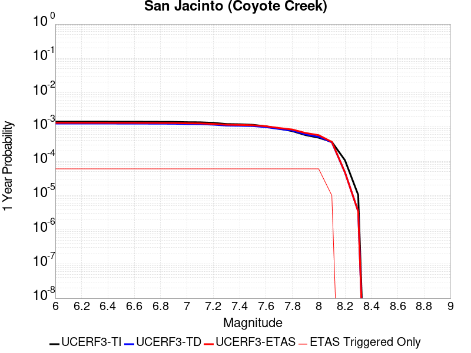 |  |

| Magnitude | 1 wk TI Prob | 1 wk TD Prob | 1 wk ETAS Prob | 1 wk ETAS/TD Gain | 1 wk ETAS Triggered Only | 1 mo TI Prob | 1 mo TD Prob | 1 mo ETAS Prob | 1 mo ETAS/TD Gain | 1 mo ETAS Triggered Only | 1 yr TI Prob | 1 yr TD Prob | 1 yr ETAS Prob | 1 yr ETAS/TD Gain | 1 yr ETAS Triggered Only | 10 yr TI Prob | 10 yr TD Prob | 10 yr ETAS Prob | 10 yr ETAS/TD Gain | 10 yr ETAS Triggered Only |
|-----|-----|-----|-----|-----|-----|-----|-----|-----|-----|-----|-----|-----|-----|-----|-----|-----|-----|-----|-----|-----|
| 6.0 | 2.7374346E-5 | 2.4145214E-5 | 7.414401E-5 | 3.0707538 | 5.0E-5 | 1.1731335E-4 | 1.034754E-4 | 1.5347023E-4 | 1.4831567 | 5.0E-5 | 0.0014273542 | 0.0012590875 | 0.0013190119 | 1.0475936 | 6.0E-5 | 0.01418221 | 0.012928318 | 0.012987542 | 1.004581 | 6.0E-5 |
| 6.1 | 2.7374346E-5 | 2.4145214E-5 | 7.414401E-5 | 3.0707538 | 5.0E-5 | 1.1731335E-4 | 1.034754E-4 | 1.5347023E-4 | 1.4831567 | 5.0E-5 | 0.0014273542 | 0.0012590875 | 0.0013190119 | 1.0475936 | 6.0E-5 | 0.01418221 | 0.012928318 | 0.012987542 | 1.004581 | 6.0E-5 |
| 6.2 | 2.7374346E-5 | 2.4145214E-5 | 7.414401E-5 | 3.0707538 | 5.0E-5 | 1.1731335E-4 | 1.034754E-4 | 1.5347023E-4 | 1.4831567 | 5.0E-5 | 0.0014273542 | 0.0012590875 | 0.0013190119 | 1.0475936 | 6.0E-5 | 0.01418221 | 0.012928318 | 0.012987542 | 1.004581 | 6.0E-5 |
| 6.3 | 2.7374346E-5 | 2.4145214E-5 | 7.414401E-5 | 3.0707538 | 5.0E-5 | 1.1731335E-4 | 1.034754E-4 | 1.5347023E-4 | 1.4831567 | 5.0E-5 | 0.0014273542 | 0.0012590875 | 0.0013190119 | 1.0475936 | 6.0E-5 | 0.01418221 | 0.012928318 | 0.012987542 | 1.004581 | 6.0E-5 |
| 6.4 | 2.7374346E-5 | 2.4145214E-5 | 7.414401E-5 | 3.0707538 | 5.0E-5 | 1.1731335E-4 | 1.034754E-4 | 1.5347023E-4 | 1.4831567 | 5.0E-5 | 0.0014273542 | 0.0012590875 | 0.0013190119 | 1.0475936 | 6.0E-5 | 0.01418221 | 0.012928318 | 0.012987542 | 1.004581 | 6.0E-5 |
| 6.5 | 2.7282445E-5 | 2.4031293E-5 | 7.403009E-5 | 3.0805705 | 5.0E-5 | 1.16919524E-4 | 1.029872E-4 | 1.5298206E-4 | 1.4854472 | 5.0E-5 | 0.0014225657 | 0.0012531505 | 0.0013130754 | 1.0478194 | 6.0E-5 | 0.014134934 | 0.012869646 | 0.012928873 | 1.0046021 | 6.0E-5 |
| 6.6 | 2.7282445E-5 | 2.4031293E-5 | 7.403009E-5 | 3.0805705 | 5.0E-5 | 1.16919524E-4 | 1.029872E-4 | 1.5298206E-4 | 1.4854472 | 5.0E-5 | 0.0014225657 | 0.0012531505 | 0.0013130754 | 1.0478194 | 6.0E-5 | 0.014134934 | 0.012869646 | 0.012928873 | 1.0046021 | 6.0E-5 |
| 6.7 | 2.7216198E-5 | 2.3956412E-5 | 7.395521E-5 | 3.0870738 | 5.0E-5 | 1.1663563E-4 | 1.02666316E-4 | 1.5266119E-4 | 1.4869647 | 5.0E-5 | 0.0014191137 | 0.0012492483 | 0.0013091734 | 1.0479689 | 6.0E-5 | 0.014100855 | 0.0128310565 | 0.012890287 | 1.0046161 | 6.0E-5 |
| 6.8 | 2.7078617E-5 | 2.387363E-5 | 7.3872434E-5 | 3.094311 | 5.0E-5 | 1.1604605E-4 | 1.0231156E-4 | 1.5230644E-4 | 1.4886533 | 5.0E-5 | 0.001411945 | 0.0012449342 | 0.0013048594 | 1.0481353 | 6.0E-5 | 0.014030075 | 0.012788199 | 0.012847432 | 1.0046319 | 6.0E-5 |
| 6.9 | 2.6982952E-5 | 2.3793142E-5 | 7.3791954E-5 | 3.1013958 | 5.0E-5 | 1.15636096E-4 | 1.0196664E-4 | 1.5196153E-4 | 1.4903065 | 5.0E-5 | 0.0014069602 | 0.0012407395 | 0.001300665 | 1.0482982 | 6.0E-5 | 0.013980856 | 0.012746515 | 0.01280575 | 1.0046471 | 6.0E-5 |
| 7.0 | 2.6449972E-5 | 2.3370165E-5 | 7.3368996E-5 | 3.13943 | 5.0E-5 | 1.1335209E-4 | 1.00154015E-4 | 1.50149E-4 | 1.4991812 | 5.0E-5 | 0.001379188 | 0.0012186957 | 0.0012786225 | 1.049173 | 6.0E-5 | 0.0137065975 | 0.0125278765 | 0.012587125 | 1.0047293 | 6.0E-5 |
| 7.1 | 2.6257849E-5 | 2.3196202E-5 | 7.319504E-5 | 3.1554754 | 5.0E-5 | 1.1252879E-4 | 9.940852E-5 | 1.4940355E-4 | 1.502925 | 5.0E-5 | 0.0013691769 | 0.0012096294 | 0.0012695567 | 1.049542 | 6.0E-5 | 0.013607717 | 0.012437741 | 0.012496995 | 1.0047641 | 6.0E-5 |
| 7.2 | 2.5270041E-5 | 2.2390966E-5 | 7.238985E-5 | 3.2329934 | 5.0E-5 | 1.0829568E-4 | 9.595777E-5 | 1.4595297E-4 | 1.5210125 | 5.0E-5 | 0.0013177024 | 0.0011676621 | 0.001227592 | 1.0513247 | 6.0E-5 | 0.013099162 | 0.012018777 | 0.012078056 | 1.0049322 | 6.0E-5 |
| 7.3 | 2.339701E-5 | 2.1122814E-5 | 7.112176E-5 | 3.3670588 | 5.0E-5 | 1.0026905E-4 | 9.0523215E-5 | 1.4051869E-4 | 1.5522945 | 5.0E-5 | 0.001220092 | 0.0011015651 | 0.001161499 | 1.054408 | 6.0E-5 | 0.012134149 | 0.011357696 | 0.0114170145 | 1.0052228 | 6.0E-5 |
| 7.4 | 2.296333E-5 | 2.0853171E-5 | 7.0852126E-5 | 3.397667 | 5.0E-5 | 9.841056E-5 | 8.936768E-5 | 1.3936321E-4 | 1.5594364 | 5.0E-5 | 0.0011974899 | 0.0010875105 | 0.0011474452 | 1.0551119 | 6.0E-5 | 0.011910575 | 0.01121681 | 0.011276136 | 1.0052891 | 6.0E-5 |
| 7.5 | 2.2188895E-5 | 2.0376096E-5 | 7.037508E-5 | 3.453806 | 5.0E-5 | 9.50918E-5 | 8.732321E-5 | 1.3731884E-4 | 1.5725354 | 5.0E-5 | 0.0011571277 | 0.0010626436 | 0.0011225798 | 1.0564029 | 6.0E-5 | 0.011511209 | 0.010966429 | 0.011025771 | 1.0054113 | 6.0E-5 |
| 7.6 | 2.0013189E-5 | 1.8962366E-5 | 6.896142E-5 | 3.636752 | 5.0E-5 | 8.5767984E-5 | 8.1264756E-5 | 1.3126069E-4 | 1.6152228 | 5.0E-5 | 0.001043725 | 9.889511E-4 | 0.0010488918 | 1.0606103 | 6.0E-5 | 0.010388365 | 0.010224434 | 0.01028382 | 1.0058084 | 6.0E-5 |
| 7.7 | 1.7230794E-5 | 1.674371E-5 | 6.6742876E-5 | 3.986146 | 5.0E-5 | 7.384417E-5 | 7.175679E-5 | 1.217532E-4 | 1.6967481 | 5.0E-5 | 8.986819E-4 | 8.7328954E-4 | 9.3323714E-4 | 1.0686457 | 6.0E-5 | 0.008950562 | 0.009062956 | 0.009122413 | 1.0065603 | 6.0E-5 |
| 7.8 | 1.4478809E-5 | 1.4990978E-5 | 6.499023E-5 | 4.3352895 | 5.0E-5 | 6.205057E-5 | 6.424547E-5 | 1.14242255E-4 | 1.7782149 | 5.0E-5 | 7.552038E-4 | 7.819085E-4 | 8.4186165E-4 | 1.0766753 | 6.0E-5 | 0.0075264242 | 0.008141387 | 0.008200899 | 1.0073098 | 6.0E-5 |
| 7.9 | 1.1114467E-5 | 1.1645102E-5 | 6.164452E-5 | 5.2936006 | 5.0E-5 | 4.7632562E-5 | 4.990663E-5 | 9.990414E-5 | 2.0018208 | 5.0E-5 | 5.797721E-4 | 6.074444E-4 | 6.6740793E-4 | 1.0987145 | 6.0E-5 | 0.0057826187 | 0.0063803247 | 0.006439942 | 1.0093439 | 6.0E-5 |
| 8.0 | 9.327402E-6 | 9.899186E-6 | 5.989869E-5 | 6.0508704 | 5.0E-5 | 3.9973966E-5 | 4.2424395E-5 | 9.242228E-5 | 2.178517 | 5.0E-5 | 4.8657437E-4 | 5.1639514E-4 | 5.7636417E-4 | 1.1161301 | 6.0E-5 | 0.0048551033 | 0.0054499684 | 0.0055096415 | 1.0109493 | 6.0E-5 |
| 8.1 | 7.0235833E-6 | 6.827495E-6 | 1.6827427E-5 | 2.464656 | 1.0E-5 | 3.0100724E-5 | 2.9260367E-5 | 3.9260074E-5 | 1.3417492 | 1.0E-5 | 3.664147E-4 | 3.5618723E-4 | 3.6618367E-4 | 1.0280651 | 1.0E-5 | 0.003658111 | 0.0037876023 | 0.0037975644 | 1.0026302 | 1.0E-5 |
| 8.2 | 2.0358202E-6 | 8.994527E-7 | 8.994527E-7 | 1.0 | 0.0 | 8.724915E-6 | 3.854792E-6 | 3.854792E-6 | 1.0 | 0.0 | 1.06220665E-4 | 4.69311E-5 | 4.69311E-5 | 1.0 | 0.0 | 0.001061699 | 5.3254166E-4 | 5.3254166E-4 | 1.0 | 0.0 |
| 8.3 | 2.0051264E-7 | 6.617272E-8 | 6.617272E-8 | 1.0 | 0.0 | 8.5933965E-7 | 2.8359733E-7 | 2.8359733E-7 | 1.0 | 0.0 | 1.046241E-5 | 3.4527925E-6 | 3.4527925E-6 | 1.0 | 0.0 | 1.0461917E-4 | 4.01389E-5 | 4.01389E-5 | 1.0 | 0.0 |

## San Andreas (Santa Cruz Mts) 2011 CFM
*[(top)](#table-of-contents)*

| 1 Week | 1 Month | 1 Year | 10 Year |
|-----|-----|-----|-----|
|  |  | 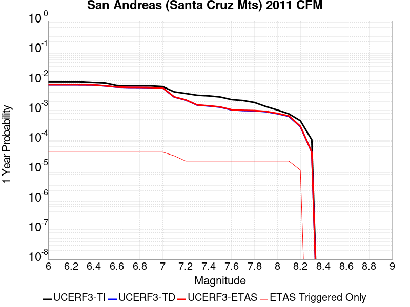 |  |

| Magnitude | 1 wk TI Prob | 1 wk TD Prob | 1 wk ETAS Prob | 1 wk ETAS/TD Gain | 1 wk ETAS Triggered Only | 1 mo TI Prob | 1 mo TD Prob | 1 mo ETAS Prob | 1 mo ETAS/TD Gain | 1 mo ETAS Triggered Only | 1 yr TI Prob | 1 yr TD Prob | 1 yr ETAS Prob | 1 yr ETAS/TD Gain | 1 yr ETAS Triggered Only | 10 yr TI Prob | 10 yr TD Prob | 10 yr ETAS Prob | 10 yr ETAS/TD Gain | 10 yr ETAS Triggered Only |
|-----|-----|-----|-----|-----|-----|-----|-----|-----|-----|-----|-----|-----|-----|-----|-----|-----|-----|-----|-----|-----|
| 6.0 | 1.7221631E-4 | 1.3793171E-4 | 1.5792895E-4 | 1.1449792 | 2.0E-5 | 7.378611E-4 | 5.9100403E-4 | 6.109922E-4 | 1.0338207 | 2.0E-5 | 0.008946515 | 0.007172124 | 0.007211837 | 1.0055372 | 4.0E-5 | 0.08594794 | 0.0705551 | 0.07060157 | 1.0006586 | 5.0E-5 |
| 6.1 | 1.7221631E-4 | 1.3793171E-4 | 1.5792895E-4 | 1.1449792 | 2.0E-5 | 7.378611E-4 | 5.9100403E-4 | 6.109922E-4 | 1.0338207 | 2.0E-5 | 0.008946515 | 0.007172124 | 0.007211837 | 1.0055372 | 4.0E-5 | 0.08594794 | 0.0705551 | 0.07060157 | 1.0006586 | 5.0E-5 |
| 6.2 | 1.7221631E-4 | 1.3793171E-4 | 1.5792895E-4 | 1.1449792 | 2.0E-5 | 7.378611E-4 | 5.9100403E-4 | 6.109922E-4 | 1.0338207 | 2.0E-5 | 0.008946515 | 0.007172124 | 0.007211837 | 1.0055372 | 4.0E-5 | 0.08594794 | 0.0705551 | 0.07060157 | 1.0006586 | 5.0E-5 |
| 6.3 | 1.716926E-4 | 1.3712609E-4 | 1.5712334E-4 | 1.1458312 | 2.0E-5 | 7.3561794E-4 | 5.875529E-4 | 6.075411E-4 | 1.0340195 | 2.0E-5 | 0.008919428 | 0.0071303817 | 0.0071700965 | 1.0055698 | 4.0E-5 | 0.08569809 | 0.070167266 | 0.07021376 | 1.0006626 | 5.0E-5 |
| 6.4 | 1.6392978E-4 | 1.3588481E-4 | 1.558821E-4 | 1.1471635 | 2.0E-5 | 7.02367E-4 | 5.822355E-4 | 6.0222385E-4 | 1.0343304 | 2.0E-5 | 0.008517839 | 0.007066063 | 0.0071057803 | 1.0056208 | 4.0E-5 | 0.08198654 | 0.06940135 | 0.06944788 | 1.0006704 | 5.0E-5 |
| 6.5 | 1.5742714E-4 | 1.2648388E-4 | 1.4648134E-4 | 1.1581029 | 2.0E-5 | 6.745133E-4 | 5.4196286E-4 | 5.61952E-4 | 1.0368829 | 2.0E-5 | 0.00818132 | 0.0065787593 | 0.006618496 | 1.0060402 | 4.0E-5 | 0.078865945 | 0.06486309 | 0.06490985 | 1.0007209 | 5.0E-5 |
| 6.6 | 1.3038084E-4 | 1.1588213E-4 | 1.3587982E-4 | 1.1725692 | 2.0E-5 | 5.5865536E-4 | 4.9654447E-4 | 5.1653455E-4 | 1.0402584 | 2.0E-5 | 0.006780438 | 0.0060289134 | 0.006068672 | 1.0065947 | 4.0E-5 | 0.0657725 | 0.05932738 | 0.05937441 | 1.0007927 | 5.0E-5 |
| 6.7 | 1.2867592E-4 | 1.1314701E-4 | 1.3314474E-4 | 1.1767412 | 2.0E-5 | 5.5135164E-4 | 4.8482692E-4 | 5.0481723E-4 | 1.0412319 | 2.0E-5 | 0.0066920654 | 0.00588703 | 0.005926795 | 1.0067546 | 4.0E-5 | 0.06494093 | 0.058038417 | 0.058085516 | 1.0008115 | 5.0E-5 |
| 6.8 | 1.2801298E-4 | 1.1252261E-4 | 1.3252036E-4 | 1.1777221 | 2.0E-5 | 5.485117E-4 | 4.8215193E-4 | 5.021423E-4 | 1.0414608 | 2.0E-5 | 0.0066577005 | 0.0058546383 | 0.005894404 | 1.0067922 | 4.0E-5 | 0.06461738 | 0.057752274 | 0.057799384 | 1.0008157 | 5.0E-5 |
| 6.9 | 1.269149E-4 | 1.1094465E-4 | 1.3094244E-4 | 1.18025 | 2.0E-5 | 5.4380763E-4 | 4.7539172E-4 | 4.9538224E-4 | 1.0420506 | 2.0E-5 | 0.006600777 | 0.005772772 | 0.0058125407 | 1.0068891 | 4.0E-5 | 0.06408122 | 0.0570241 | 0.057071246 | 1.0008268 | 5.0E-5 |
| 7.0 | 1.2030331E-4 | 1.0824504E-4 | 1.2824287E-4 | 1.184746 | 2.0E-5 | 5.154837E-4 | 4.638261E-4 | 4.838168E-4 | 1.0430996 | 2.0E-5 | 0.006257969 | 0.0056326967 | 0.005672471 | 1.0070614 | 4.0E-5 | 0.06084648 | 0.055696685 | 0.055743903 | 1.0008477 | 5.0E-5 |
| 7.1 | 8.049617E-5 | 5.3926604E-5 | 7.392553E-5 | 1.3708545 | 2.0E-5 | 3.4493793E-4 | 2.3109373E-4 | 2.510891E-4 | 1.086525 | 2.0E-5 | 0.0041915346 | 0.0028099709 | 0.0028398866 | 1.0106462 | 3.0E-5 | 0.041133516 | 0.029618956 | 0.029657772 | 1.0013105 | 4.0E-5 |
| 7.2 | 7.093979E-5 | 4.2937932E-5 | 5.2937503E-5 | 1.2328843 | 1.0E-5 | 3.0399222E-4 | 1.8400686E-4 | 1.9400501E-4 | 1.0543358 | 1.0E-5 | 0.0036948253 | 0.0022380045 | 0.0022579597 | 1.0089165 | 2.0E-5 | 0.03633994 | 0.023941692 | 0.023970973 | 1.0012231 | 3.0E-5 |
| 7.3 | 6.193693E-5 | 2.8894141E-5 | 3.8893853E-5 | 1.3460809 | 1.0E-5 | 2.6541698E-4 | 1.2382616E-4 | 1.3382493E-4 | 1.0807483 | 1.0E-5 | 0.0032266637 | 0.0015065427 | 0.0015265126 | 1.0132555 | 2.0E-5 | 0.031802133 | 0.016499156 | 0.01652866 | 1.0017883 | 3.0E-5 |
| 7.4 | 5.906492E-5 | 2.702346E-5 | 3.702319E-5 | 1.3700389 | 1.0E-5 | 2.5311083E-4 | 1.1580969E-4 | 1.2580854E-4 | 1.0863385 | 1.0E-5 | 0.0030772698 | 0.0014090725 | 0.0014290443 | 1.0141737 | 2.0E-5 | 0.030350044 | 0.015471023 | 0.015500559 | 1.0019091 | 3.0E-5 |
| 7.5 | 5.424296E-5 | 2.4678277E-5 | 3.467803E-5 | 1.4052047 | 1.0E-5 | 2.324491E-4 | 1.05759755E-4 | 1.157587E-4 | 1.0945439 | 1.0E-5 | 0.002826395 | 0.0012868657 | 0.00130684 | 1.0155216 | 2.0E-5 | 0.027907165 | 0.014163188 | 0.014192763 | 1.0020882 | 3.0E-5 |
| 7.6 | 4.43084E-5 | 1.990431E-5 | 2.9904111E-5 | 1.5023937 | 1.0E-5 | 1.8987931E-4 | 8.53014E-5 | 9.5300544E-5 | 1.1172214 | 1.0E-5 | 0.0023093296 | 0.0010380499 | 0.0010580292 | 1.0192469 | 2.0E-5 | 0.022854783 | 0.011412679 | 0.011442337 | 1.0025986 | 3.0E-5 |
| 7.7 | 4.118098E-5 | 1.8936442E-5 | 2.8936252E-5 | 1.5280724 | 1.0E-5 | 1.7647797E-4 | 8.115366E-5 | 9.115285E-5 | 1.123213 | 1.0E-5 | 0.002146502 | 9.875982E-4 | 0.0010075785 | 1.0202311 | 2.0E-5 | 0.021258866 | 0.010870468 | 0.010900142 | 1.0027298 | 3.0E-5 |
| 7.8 | 3.5408906E-5 | 1.856446E-5 | 2.8564275E-5 | 1.5386536 | 1.0E-5 | 1.5174363E-4 | 7.955955E-5 | 8.955875E-5 | 1.125682 | 1.0E-5 | 0.0018459131 | 9.682073E-4 | 9.88188E-4 | 1.0206367 | 2.0E-5 | 0.018306552 | 0.010652021 | 0.010681701 | 1.0027864 | 3.0E-5 |
| 7.9 | 2.5860836E-5 | 1.7315993E-5 | 2.731582E-5 | 1.5774908 | 1.0E-5 | 1.10827445E-4 | 7.420929E-5 | 8.420855E-5 | 1.134744 | 1.0E-5 | 0.001348489 | 9.031238E-4 | 9.2310575E-4 | 1.0221254 | 2.0E-5 | 0.013403354 | 0.009907599 | 0.009937301 | 1.002998 | 3.0E-5 |
| 8.0 | 1.9777332E-5 | 1.4839596E-5 | 2.4839448E-5 | 1.6738628 | 1.0E-5 | 8.4757245E-5 | 6.3596715E-5 | 7.3596086E-5 | 1.1572309 | 1.0E-5 | 0.0010314309 | 7.740152E-4 | 7.939997E-4 | 1.0258193 | 2.0E-5 | 0.010266567 | 0.008508967 | 0.008538713 | 1.0034957 | 3.0E-5 |
| 8.1 | 1.468494E-5 | 1.2107374E-5 | 2.2107253E-5 | 1.825933 | 1.0E-5 | 6.293394E-5 | 5.1887713E-5 | 6.188719E-5 | 1.1927139 | 1.0E-5 | 7.6595135E-4 | 6.3155E-4 | 6.515373E-4 | 1.0316482 | 2.0E-5 | 0.0076331664 | 0.006969149 | 0.00699894 | 1.0042747 | 3.0E-5 |
| 8.2 | 8.63836E-6 | 5.469061E-6 | 1.5469006E-5 | 2.8284576 | 1.0E-5 | 3.7021015E-5 | 2.3438623E-5 | 3.3438388E-5 | 1.4266362 | 1.0E-5 | 4.5063766E-4 | 2.8532793E-4 | 2.953251E-4 | 1.0350374 | 1.0E-5 | 0.004497249 | 0.00324569 | 0.0032556574 | 1.003071 | 1.0E-5 |
| 8.3 | 1.983087E-6 | 7.6599065E-7 | 7.6599065E-7 | 1.0 | 0.0 | 8.498917E-6 | 3.282813E-6 | 3.282813E-6 | 1.0 | 0.0 | 1.034694E-4 | 3.9967534E-5 | 3.9967534E-5 | 1.0 | 0.0 | 0.0010342124 | 4.719687E-4 | 4.719687E-4 | 1.0 | 0.0 |

## Santa Ynez River
*[(top)](#table-of-contents)*

| 1 Week | 1 Month | 1 Year | 10 Year |
|-----|-----|-----|-----|
|  |  | 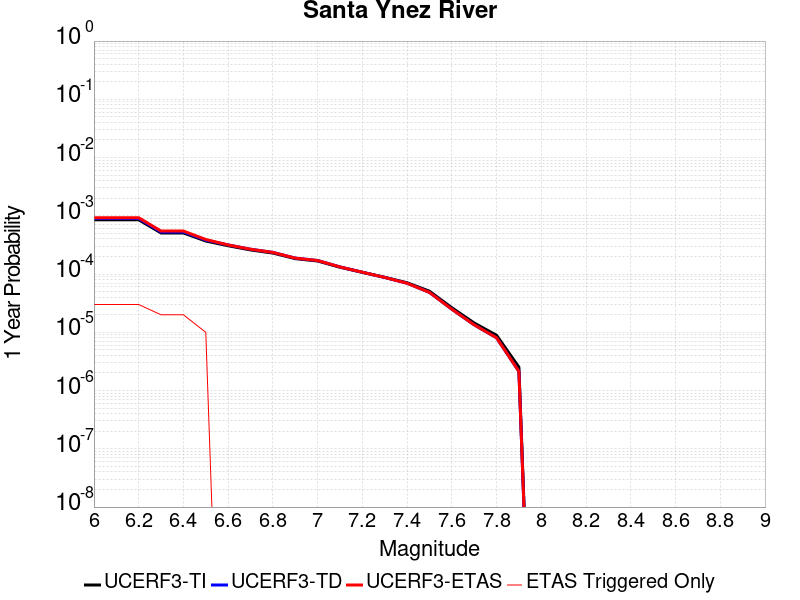 |  |

| Magnitude | 1 wk TI Prob | 1 wk TD Prob | 1 wk ETAS Prob | 1 wk ETAS/TD Gain | 1 wk ETAS Triggered Only | 1 mo TI Prob | 1 mo TD Prob | 1 mo ETAS Prob | 1 mo ETAS/TD Gain | 1 mo ETAS Triggered Only | 1 yr TI Prob | 1 yr TD Prob | 1 yr ETAS Prob | 1 yr ETAS/TD Gain | 1 yr ETAS Triggered Only | 10 yr TI Prob | 10 yr TD Prob | 10 yr ETAS Prob | 10 yr ETAS/TD Gain | 10 yr ETAS Triggered Only |
|-----|-----|-----|-----|-----|-----|-----|-----|-----|-----|-----|-----|-----|-----|-----|-----|-----|-----|-----|-----|-----|
| 6.0 | 1.6396456E-5 | 1.7209435E-5 | 1.7209435E-5 | 1.0 | 0.0 | 7.026863E-5 | 7.375284E-5 | 8.37521E-5 | 1.135578 | 1.0E-5 | 8.551848E-4 | 8.976064E-4 | 9.2757953E-4 | 1.0333922 | 3.0E-5 | 0.0085190125 | 0.008943358 | 0.008992911 | 1.0055407 | 5.0E-5 |
| 6.1 | 1.6396456E-5 | 1.7209435E-5 | 1.7209435E-5 | 1.0 | 0.0 | 7.026863E-5 | 7.375284E-5 | 8.37521E-5 | 1.135578 | 1.0E-5 | 8.551848E-4 | 8.976064E-4 | 9.2757953E-4 | 1.0333922 | 3.0E-5 | 0.0085190125 | 0.008943358 | 0.008992911 | 1.0055407 | 5.0E-5 |
| 6.2 | 1.6396456E-5 | 1.7209435E-5 | 1.7209435E-5 | 1.0 | 0.0 | 7.026863E-5 | 7.375284E-5 | 8.37521E-5 | 1.135578 | 1.0E-5 | 8.551848E-4 | 8.976064E-4 | 9.2757953E-4 | 1.0333922 | 3.0E-5 | 0.0085190125 | 0.008943358 | 0.008992911 | 1.0055407 | 5.0E-5 |
| 6.3 | 9.736976E-6 | 1.012233E-5 | 1.012233E-5 | 1.0 | 0.0 | 4.172923E-5 | 4.338072E-5 | 5.338029E-5 | 1.2305071 | 1.0E-5 | 5.0793495E-4 | 5.280373E-4 | 5.4802676E-4 | 1.0378561 | 2.0E-5 | 0.005067755 | 0.005268332 | 0.005298174 | 1.0056643 | 3.0E-5 |
| 6.4 | 9.736976E-6 | 1.012233E-5 | 1.012233E-5 | 1.0 | 0.0 | 4.172923E-5 | 4.338072E-5 | 5.338029E-5 | 1.2305071 | 1.0E-5 | 5.0793495E-4 | 5.280373E-4 | 5.4802676E-4 | 1.0378561 | 2.0E-5 | 0.005067755 | 0.005268332 | 0.005298174 | 1.0056643 | 3.0E-5 |
| 6.5 | 7.081964E-6 | 7.3298966E-6 | 7.3298966E-6 | 1.0 | 0.0 | 3.035092E-5 | 3.1413474E-5 | 4.1413157E-5 | 1.3183248 | 1.0E-5 | 3.694598E-4 | 3.8239348E-4 | 3.9238966E-4 | 1.026141 | 1.0E-5 | 0.0036884616 | 0.0038175168 | 0.0038374404 | 1.005219 | 2.0E-5 |
| 6.6 | 5.873247E-6 | 6.059743E-6 | 6.059743E-6 | 1.0 | 0.0 | 2.5170815E-5 | 2.5970074E-5 | 2.5970074E-5 | 1.0 | 0.0 | 3.064116E-4 | 3.1614062E-4 | 3.1614062E-4 | 1.0 | 0.0 | 0.0030598943 | 0.0031569963 | 0.0031669647 | 1.0031576 | 1.0E-5 |
| 6.7 | 4.973277E-6 | 5.115901E-6 | 5.115901E-6 | 1.0 | 0.0 | 2.1313872E-5 | 2.1925109E-5 | 2.1925109E-5 | 1.0 | 0.0 | 2.5946548E-4 | 2.66906E-4 | 2.66906E-4 | 1.0 | 0.0 | 0.0025916274 | 0.0026659032 | 0.0026758765 | 1.003741 | 1.0E-5 |
| 6.8 | 4.396492E-6 | 4.5109778E-6 | 4.5109778E-6 | 1.0 | 0.0 | 1.884197E-5 | 1.9332621E-5 | 1.9332621E-5 | 1.0 | 0.0 | 2.2937685E-4 | 2.3534958E-4 | 2.3534958E-4 | 1.0 | 0.0 | 0.0022914023 | 0.0023510386 | 0.0023610152 | 1.0042435 | 1.0E-5 |
| 6.9 | 3.5255632E-6 | 3.6013332E-6 | 3.6013332E-6 | 1.0 | 0.0 | 1.5109469E-5 | 1.5434196E-5 | 1.5434196E-5 | 1.0 | 0.0 | 1.8394225E-4 | 1.8789528E-4 | 1.8789528E-4 | 1.0 | 0.0 | 0.0018379007 | 0.0018773803 | 0.0018873615 | 1.0053166 | 1.0E-5 |
| 7.0 | 3.211603E-6 | 3.273654E-6 | 3.273654E-6 | 1.0 | 0.0 | 1.376394E-5 | 1.4029872E-5 | 1.4029872E-5 | 1.0 | 0.0 | 1.6756308E-4 | 1.7080043E-4 | 1.7080043E-4 | 1.0 | 0.0 | 0.0016743679 | 0.0017067058 | 0.0017166887 | 1.0058492 | 1.0E-5 |
| 7.1 | 2.5094619E-6 | 2.5409204E-6 | 2.5409204E-6 | 1.0 | 0.0 | 1.0754793E-5 | 1.0889614E-5 | 1.0889614E-5 | 1.0 | 0.0 | 1.3093173E-4 | 1.3257304E-4 | 1.3257304E-4 | 1.0 | 0.0 | 0.0013085462 | 0.0013249456 | 0.0013349323 | 1.0075375 | 1.0E-5 |
| 7.2 | 2.0515774E-6 | 2.0619375E-6 | 2.0619375E-6 | 1.0 | 0.0 | 8.792445E-6 | 8.836846E-6 | 8.836846E-6 | 1.0 | 0.0 | 1.0704277E-4 | 1.0758333E-4 | 1.0758333E-4 | 1.0 | 0.0 | 0.0010699122 | 0.0010753168 | 0.001085306 | 1.0092896 | 1.0E-5 |
| 7.3 | 1.6845745E-6 | 1.6773907E-6 | 1.6773907E-6 | 1.0 | 0.0 | 7.219585E-6 | 7.1887976E-6 | 7.1887976E-6 | 1.0 | 0.0 | 8.78949E-5 | 8.752012E-5 | 8.752012E-5 | 1.0 | 0.0 | 8.7860145E-4 | 8.7485946E-4 | 8.848507E-4 | 1.0114204 | 1.0E-5 |
| 7.4 | 1.3600285E-6 | 1.3333357E-6 | 1.3333357E-6 | 1.0 | 0.0 | 5.82868E-6 | 5.714284E-6 | 5.714284E-6 | 1.0 | 0.0 | 7.096187E-5 | 6.956921E-5 | 6.956921E-5 | 1.0 | 0.0 | 7.0939213E-4 | 6.954765E-4 | 7.054695E-4 | 1.0143687 | 1.0E-5 |
| 7.5 | 9.735342E-7 | 9.290103E-7 | 9.290103E-7 | 1.0 | 0.0 | 4.172283E-6 | 3.9814668E-6 | 3.9814668E-6 | 1.0 | 0.0 | 5.079636E-5 | 4.8473295E-5 | 4.8473295E-5 | 1.0 | 0.0 | 5.0784746E-4 | 4.8462892E-4 | 4.946241E-4 | 1.0206244 | 1.0E-5 |
| 7.6 | 5.067187E-7 | 4.77857E-7 | 4.77857E-7 | 1.0 | 0.0 | 2.1716498E-6 | 2.047957E-6 | 2.047957E-6 | 1.0 | 0.0 | 2.6439517E-5 | 2.4933597E-5 | 2.4933597E-5 | 1.0 | 0.0 | 2.643637E-4 | 2.4930874E-4 | 2.4930874E-4 | 1.0 | 0.0 |
| 7.7 | 2.769089E-7 | 2.5759124E-7 | 2.5759124E-7 | 1.0 | 0.0 | 1.1867519E-6 | 1.1039621E-6 | 1.1039621E-6 | 1.0 | 0.0 | 1.4448608E-5 | 1.34406555E-5 | 1.34406555E-5 | 1.0 | 0.0 | 1.444767E-4 | 1.3439846E-4 | 1.3439846E-4 | 1.0 | 0.0 |
| 7.8 | 1.7044663E-7 | 1.5449015E-7 | 1.5449015E-7 | 1.0 | 0.0 | 7.3048534E-7 | 6.621005E-7 | 6.621005E-7 | 1.0 | 0.0 | 8.893623E-6 | 8.061043E-6 | 8.061043E-6 | 1.0 | 0.0 | 8.893267E-5 | 8.060753E-5 | 8.060753E-5 | 1.0 | 0.0 |
| 7.9 | 4.8344287E-8 | 4.0910923E-8 | 4.0910923E-8 | 1.0 | 0.0 | 2.0718979E-7 | 1.7533252E-7 | 1.7533252E-7 | 1.0 | 0.0 | 2.5225327E-6 | 2.1346711E-6 | 2.1346711E-6 | 1.0 | 0.0 | 2.5225041E-5 | 2.1346512E-5 | 2.1346512E-5 | 1.0 | 0.0 |

## Raymond
*[(top)](#table-of-contents)*

| 1 Week | 1 Month | 1 Year | 10 Year |
|-----|-----|-----|-----|
| 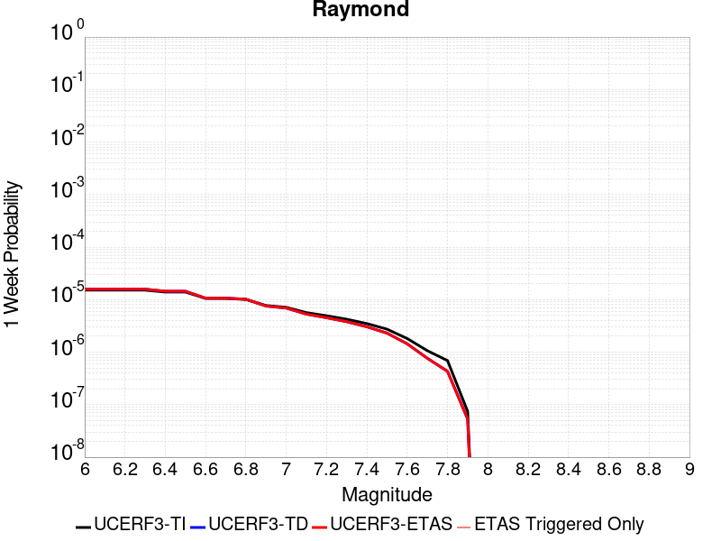 |  |  | 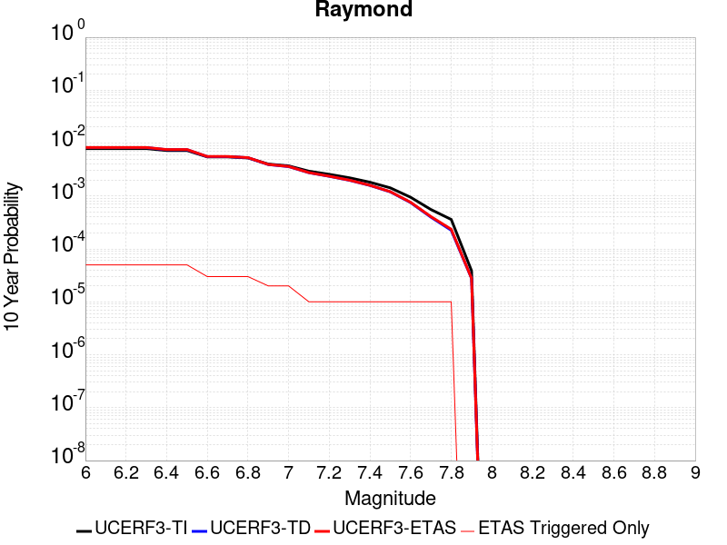 |

| Magnitude | 1 wk TI Prob | 1 wk TD Prob | 1 wk ETAS Prob | 1 wk ETAS/TD Gain | 1 wk ETAS Triggered Only | 1 mo TI Prob | 1 mo TD Prob | 1 mo ETAS Prob | 1 mo ETAS/TD Gain | 1 mo ETAS Triggered Only | 1 yr TI Prob | 1 yr TD Prob | 1 yr ETAS Prob | 1 yr ETAS/TD Gain | 1 yr ETAS Triggered Only | 10 yr TI Prob | 10 yr TD Prob | 10 yr ETAS Prob | 10 yr ETAS/TD Gain | 10 yr ETAS Triggered Only |
|-----|-----|-----|-----|-----|-----|-----|-----|-----|-----|-----|-----|-----|-----|-----|-----|-----|-----|-----|-----|-----|
| 6.0 | 1.5157413E-5 | 1.5810128E-5 | 1.5810128E-5 | 1.0 | 0.0 | 6.4958724E-5 | 6.7756075E-5 | 6.7756075E-5 | 1.0 | 0.0 | 7.905855E-4 | 8.2464307E-4 | 8.346348E-4 | 1.0121164 | 1.0E-5 | 0.007877788 | 0.008218348 | 0.008267937 | 1.0060339 | 5.0E-5 |
| 6.1 | 1.5157413E-5 | 1.5810128E-5 | 1.5810128E-5 | 1.0 | 0.0 | 6.4958724E-5 | 6.7756075E-5 | 6.7756075E-5 | 1.0 | 0.0 | 7.905855E-4 | 8.2464307E-4 | 8.346348E-4 | 1.0121164 | 1.0E-5 | 0.007877788 | 0.008218348 | 0.008267937 | 1.0060339 | 5.0E-5 |
| 6.2 | 1.5157413E-5 | 1.5810128E-5 | 1.5810128E-5 | 1.0 | 0.0 | 6.4958724E-5 | 6.7756075E-5 | 6.7756075E-5 | 1.0 | 0.0 | 7.905855E-4 | 8.2464307E-4 | 8.346348E-4 | 1.0121164 | 1.0E-5 | 0.007877788 | 0.008218348 | 0.008267937 | 1.0060339 | 5.0E-5 |
| 6.3 | 1.5157413E-5 | 1.5810128E-5 | 1.5810128E-5 | 1.0 | 0.0 | 6.4958724E-5 | 6.7756075E-5 | 6.7756075E-5 | 1.0 | 0.0 | 7.905855E-4 | 8.2464307E-4 | 8.346348E-4 | 1.0121164 | 1.0E-5 | 0.007877788 | 0.008218348 | 0.008267937 | 1.0060339 | 5.0E-5 |
| 6.4 | 1.3941944E-5 | 1.445469E-5 | 1.445469E-5 | 1.0 | 0.0 | 5.9749822E-5 | 6.1947336E-5 | 6.1947336E-5 | 1.0 | 0.0 | 7.2721124E-4 | 7.5397117E-4 | 7.639636E-4 | 1.0132531 | 1.0E-5 | 0.007248361 | 0.0075164647 | 0.007566089 | 1.006602 | 5.0E-5 |
| 6.5 | 1.3941944E-5 | 1.445469E-5 | 1.445469E-5 | 1.0 | 0.0 | 5.9749822E-5 | 6.1947336E-5 | 6.1947336E-5 | 1.0 | 0.0 | 7.2721124E-4 | 7.5397117E-4 | 7.639636E-4 | 1.0132531 | 1.0E-5 | 0.007248361 | 0.0075164647 | 0.007566089 | 1.006602 | 5.0E-5 |
| 6.6 | 1.0542609E-5 | 1.0671113E-5 | 1.0671113E-5 | 1.0 | 0.0 | 4.5181827E-5 | 4.573257E-5 | 4.573257E-5 | 1.0 | 0.0 | 5.499499E-4 | 5.5665727E-4 | 5.666517E-4 | 1.0179543 | 1.0E-5 | 0.005485909 | 0.00555319 | 0.0055830237 | 1.0053723 | 3.0E-5 |
| 6.7 | 1.0542609E-5 | 1.0671113E-5 | 1.0671113E-5 | 1.0 | 0.0 | 4.5181827E-5 | 4.573257E-5 | 4.573257E-5 | 1.0 | 0.0 | 5.499499E-4 | 5.5665727E-4 | 5.666517E-4 | 1.0179543 | 1.0E-5 | 0.005485909 | 0.00555319 | 0.0055830237 | 1.0053723 | 3.0E-5 |
| 6.8 | 1.0079132E-5 | 1.0176646E-5 | 1.0176646E-5 | 1.0 | 0.0 | 4.3195567E-5 | 4.3613498E-5 | 4.3613498E-5 | 1.0 | 0.0 | 5.257791E-4 | 5.3087034E-4 | 5.40865E-4 | 1.018827 | 1.0E-5 | 0.0052453685 | 0.005296571 | 0.005326412 | 1.0056341 | 3.0E-5 |
| 6.9 | 7.721598E-6 | 7.5489047E-6 | 7.5489047E-6 | 1.0 | 0.0 | 3.3092143E-5 | 3.2352054E-5 | 3.2352054E-5 | 1.0 | 0.0 | 4.0282236E-4 | 3.9381627E-4 | 3.9381627E-4 | 1.0 | 0.0 | 0.0040209293 | 0.0039313175 | 0.003951239 | 1.0050673 | 2.0E-5 |
| 7.0 | 7.137566E-6 | 6.9113057E-6 | 6.9113057E-6 | 1.0 | 0.0 | 3.058921E-5 | 2.961955E-5 | 2.961955E-5 | 1.0 | 0.0 | 3.7236E-4 | 3.6055944E-4 | 3.6055944E-4 | 1.0 | 0.0 | 0.0037173668 | 0.0035998628 | 0.0036197908 | 1.0055357 | 2.0E-5 |
| 7.1 | 5.654976E-6 | 5.29954E-6 | 5.29954E-6 | 1.0 | 0.0 | 2.4235387E-5 | 2.2712118E-5 | 2.2712118E-5 | 1.0 | 0.0 | 2.9502588E-4 | 2.7648517E-4 | 2.7648517E-4 | 1.0 | 0.0 | 0.0029463451 | 0.002761443 | 0.0027714153 | 1.0036113 | 1.0E-5 |
| 7.2 | 4.9358455E-6 | 4.5266574E-6 | 4.5266574E-6 | 1.0 | 0.0 | 2.1153453E-5 | 1.9399817E-5 | 1.9399817E-5 | 1.0 | 0.0 | 2.5751285E-4 | 2.3616731E-4 | 2.3616731E-4 | 1.0 | 0.0 | 0.0025721465 | 0.0023591854 | 0.002369162 | 1.0042287 | 1.0E-5 |
| 7.3 | 4.2368597E-6 | 3.8056164E-6 | 3.8056164E-6 | 1.0 | 0.0 | 1.8157843E-5 | 1.6309683E-5 | 1.6309683E-5 | 1.0 | 0.0 | 2.2104931E-4 | 1.9855241E-4 | 1.9855241E-4 | 1.0 | 0.0 | 0.0022082955 | 0.0019837688 | 0.001993749 | 1.0050309 | 1.0E-5 |
| 7.4 | 3.4999923E-6 | 3.043744E-6 | 3.043744E-6 | 1.0 | 0.0 | 1.49998805E-5 | 1.3044552E-5 | 1.3044552E-5 | 1.0 | 0.0 | 1.8260824E-4 | 1.5880594E-4 | 1.5880594E-4 | 1.0 | 0.0 | 0.0018245826 | 0.0015869403 | 0.0015969244 | 1.0062914 | 1.0E-5 |
| 7.5 | 2.738017E-6 | 2.3020468E-6 | 2.3020468E-6 | 1.0 | 0.0 | 1.1734306E-5 | 9.865878E-6 | 9.865878E-6 | 1.0 | 0.0 | 1.428558E-4 | 1.2011051E-4 | 1.2011051E-4 | 1.0 | 0.0 | 0.0014276401 | 0.0012004703 | 0.0012104583 | 1.0083201 | 1.0E-5 |
| 7.6 | 1.8186392E-6 | 1.442312E-6 | 1.442312E-6 | 1.0 | 0.0 | 7.794145E-6 | 6.181323E-6 | 6.181323E-6 | 1.0 | 0.0 | 9.488958E-5 | 7.5255055E-5 | 7.5255055E-5 | 1.0 | 0.0 | 9.4849075E-4 | 7.523072E-4 | 7.622997E-4 | 1.0132824 | 1.0E-5 |
| 7.7 | 1.0660348E-6 | 7.6438056E-7 | 7.6438056E-7 | 1.0 | 0.0 | 4.5687125E-6 | 3.2759126E-6 | 3.2759126E-6 | 1.0 | 0.0 | 5.5622655E-5 | 3.9883522E-5 | 3.9883522E-5 | 1.0 | 0.0 | 5.5608735E-4 | 3.9877277E-4 | 4.0876877E-4 | 1.025067 | 1.0E-5 |
| 7.8 | 6.913602E-7 | 4.3204133E-7 | 4.3204133E-7 | 1.0 | 0.0 | 2.962969E-6 | 1.8516045E-6 | 1.8516045E-6 | 1.0 | 0.0 | 3.607355E-5 | 2.2543056E-5 | 2.2543056E-5 | 1.0 | 0.0 | 3.6067693E-4 | 2.2541556E-4 | 2.354133E-4 | 1.0443525 | 1.0E-5 |
| 7.9 | 7.425201E-8 | 5.3222113E-8 | 5.3222113E-8 | 1.0 | 0.0 | 3.1822285E-7 | 2.2809476E-7 | 2.2809476E-7 | 1.0 | 0.0 | 3.874356E-6 | 2.7770516E-6 | 2.7770516E-6 | 1.0 | 0.0 | 3.8742884E-5 | 2.7770298E-5 | 2.7770298E-5 | 1.0 | 0.0 |

## Sierra Madre
*[(top)](#table-of-contents)*

| 1 Week | 1 Month | 1 Year | 10 Year |
|-----|-----|-----|-----|
|  |  |  |  |

| Magnitude | 1 wk TI Prob | 1 wk TD Prob | 1 wk ETAS Prob | 1 wk ETAS/TD Gain | 1 wk ETAS Triggered Only | 1 mo TI Prob | 1 mo TD Prob | 1 mo ETAS Prob | 1 mo ETAS/TD Gain | 1 mo ETAS Triggered Only | 1 yr TI Prob | 1 yr TD Prob | 1 yr ETAS Prob | 1 yr ETAS/TD Gain | 1 yr ETAS Triggered Only | 10 yr TI Prob | 10 yr TD Prob | 10 yr ETAS Prob | 10 yr ETAS/TD Gain | 10 yr ETAS Triggered Only |
|-----|-----|-----|-----|-----|-----|-----|-----|-----|-----|-----|-----|-----|-----|-----|-----|-----|-----|-----|-----|-----|
| 6.0 | 1.3379373E-5 | 1.10007395E-5 | 4.100041E-5 | 3.7270594 | 3.0E-5 | 5.7338908E-5 | 4.7145186E-5 | 7.714377E-5 | 1.6363022 | 3.0E-5 | 6.978776E-4 | 5.738429E-4 | 6.1382E-4 | 1.0696654 | 4.0E-5 | 0.0069569005 | 0.0057239756 | 0.0057736896 | 1.0086852 | 5.0E-5 |
| 6.1 | 1.3379373E-5 | 1.10007395E-5 | 4.100041E-5 | 3.7270594 | 3.0E-5 | 5.7338908E-5 | 4.7145186E-5 | 7.714377E-5 | 1.6363022 | 3.0E-5 | 6.978776E-4 | 5.738429E-4 | 6.1382E-4 | 1.0696654 | 4.0E-5 | 0.0069569005 | 0.0057239756 | 0.0057736896 | 1.0086852 | 5.0E-5 |
| 6.2 | 1.3379373E-5 | 1.10007395E-5 | 4.100041E-5 | 3.7270594 | 3.0E-5 | 5.7338908E-5 | 4.7145186E-5 | 7.714377E-5 | 1.6363022 | 3.0E-5 | 6.978776E-4 | 5.738429E-4 | 6.1382E-4 | 1.0696654 | 4.0E-5 | 0.0069569005 | 0.0057239756 | 0.0057736896 | 1.0086852 | 5.0E-5 |
| 6.3 | 1.3379373E-5 | 1.10007395E-5 | 4.100041E-5 | 3.7270594 | 3.0E-5 | 5.7338908E-5 | 4.7145186E-5 | 7.714377E-5 | 1.6363022 | 3.0E-5 | 6.978776E-4 | 5.738429E-4 | 6.1382E-4 | 1.0696654 | 4.0E-5 | 0.0069569005 | 0.0057239756 | 0.0057736896 | 1.0086852 | 5.0E-5 |
| 6.4 | 1.3379373E-5 | 1.10007395E-5 | 4.100041E-5 | 3.7270594 | 3.0E-5 | 5.7338908E-5 | 4.7145186E-5 | 7.714377E-5 | 1.6363022 | 3.0E-5 | 6.978776E-4 | 5.738429E-4 | 6.1382E-4 | 1.0696654 | 4.0E-5 | 0.0069569005 | 0.0057239756 | 0.0057736896 | 1.0086852 | 5.0E-5 |
| 6.5 | 1.26563245E-5 | 1.0230196E-5 | 4.022989E-5 | 3.9324653 | 3.0E-5 | 5.4240263E-5 | 4.3842967E-5 | 7.384165E-5 | 1.6842303 | 3.0E-5 | 6.601751E-4 | 5.336584E-4 | 5.736371E-4 | 1.0749143 | 4.0E-5 | 0.006582173 | 0.0053240913 | 0.005373825 | 1.0093412 | 5.0E-5 |
| 6.6 | 1.26563245E-5 | 1.0230196E-5 | 4.022989E-5 | 3.9324653 | 3.0E-5 | 5.4240263E-5 | 4.3842967E-5 | 7.384165E-5 | 1.6842303 | 3.0E-5 | 6.601751E-4 | 5.336584E-4 | 5.736371E-4 | 1.0749143 | 4.0E-5 | 0.006582173 | 0.0053240913 | 0.005373825 | 1.0093412 | 5.0E-5 |
| 6.7 | 1.2502474E-5 | 1.006634E-5 | 4.006604E-5 | 3.980199 | 3.0E-5 | 5.3580934E-5 | 4.314075E-5 | 7.3139454E-5 | 1.6953682 | 3.0E-5 | 6.521526E-4 | 5.251131E-4 | 5.650921E-4 | 1.0761341 | 4.0E-5 | 0.0065024206 | 0.0052390425 | 0.00528878 | 1.0094937 | 5.0E-5 |
| 6.8 | 1.2454966E-5 | 1.0018625E-5 | 4.0018323E-5 | 3.9943926 | 3.0E-5 | 5.3377335E-5 | 4.2936266E-5 | 7.293498E-5 | 1.69868 | 3.0E-5 | 6.4967526E-4 | 5.226247E-4 | 5.626038E-4 | 1.0764967 | 4.0E-5 | 0.006477792 | 0.0052142753 | 0.0052640145 | 1.009539 | 5.0E-5 |
| 6.9 | 1.2225574E-5 | 9.792602E-6 | 2.9792407E-5 | 3.0423381 | 2.0E-5 | 5.2394265E-5 | 4.1967625E-5 | 6.1966784E-5 | 1.4765378 | 2.0E-5 | 6.3771347E-4 | 5.108371E-4 | 5.4082175E-4 | 1.0586971 | 3.0E-5 | 0.006358865 | 0.0050969445 | 0.005136741 | 1.0078079 | 4.0E-5 |
| 7.0 | 1.182946E-5 | 9.399144E-6 | 2.9398956E-5 | 3.1278334 | 2.0E-5 | 5.06967E-5 | 4.0281426E-5 | 6.028062E-5 | 1.4964868 | 2.0E-5 | 6.1705755E-4 | 4.9031706E-4 | 5.2030233E-4 | 1.0611548 | 3.0E-5 | 0.006153469 | 0.004892664 | 0.0049324683 | 1.0081356 | 4.0E-5 |
| 7.1 | 1.14369095E-5 | 8.986159E-6 | 1.898607E-5 | 2.1128125 | 1.0E-5 | 4.9014405E-5 | 3.8511545E-5 | 4.8511163E-5 | 1.2596524 | 1.0E-5 | 5.9658696E-4 | 4.687782E-4 | 4.887688E-4 | 1.0426441 | 2.0E-5 | 0.005949879 | 0.004678199 | 0.0047080587 | 1.0063827 | 3.0E-5 |
| 7.2 | 1.0836419E-5 | 8.3995565E-6 | 1.8399473E-5 | 2.190529 | 1.0E-5 | 4.644097E-5 | 3.5997607E-5 | 4.599725E-5 | 1.2777863 | 1.0E-5 | 5.652721E-4 | 4.3818366E-4 | 4.581749E-4 | 1.045623 | 2.0E-5 | 0.0056383642 | 0.004373494 | 0.004403363 | 1.0068295 | 3.0E-5 |
| 7.3 | 1.0403439E-5 | 8.02082E-6 | 1.8020739E-5 | 2.2467453 | 1.0E-5 | 4.4585406E-5 | 3.4374494E-5 | 4.4374152E-5 | 1.2909033 | 1.0E-5 | 5.426921E-4 | 4.1843E-4 | 4.3842164E-4 | 1.0477778 | 2.0E-5 | 0.005413687 | 0.004176717 | 0.0042065918 | 1.0071527 | 3.0E-5 |
| 7.4 | 9.768864E-6 | 7.414448E-6 | 1.7414373E-5 | 2.348708 | 1.0E-5 | 4.186589E-5 | 3.1775824E-5 | 4.1775507E-5 | 1.3146946 | 1.0E-5 | 5.09598E-4 | 3.868029E-4 | 4.0679515E-4 | 1.0516859 | 2.0E-5 | 0.0050843097 | 0.0038615882 | 0.0038914725 | 1.0077388 | 3.0E-5 |
| 7.5 | 8.687089E-6 | 6.4501564E-6 | 6.4501564E-6 | 1.0 | 0.0 | 3.722985E-5 | 2.764324E-5 | 2.764324E-5 | 1.0 | 0.0 | 4.5317915E-4 | 3.3650533E-4 | 3.4650197E-4 | 1.0297072 | 1.0E-5 | 0.004522561 | 0.0033602451 | 0.003380178 | 1.005932 | 2.0E-5 |
| 7.6 | 6.3506063E-6 | 4.4303215E-6 | 4.4303215E-6 | 1.0 | 0.0 | 2.72166E-5 | 1.8986955E-5 | 1.8986955E-5 | 1.0 | 0.0 | 3.3131172E-4 | 2.3114192E-4 | 2.4113961E-4 | 1.0432534 | 1.0E-5 | 0.003308182 | 0.0023092402 | 0.002329194 | 1.0086409 | 2.0E-5 |
| 7.7 | 4.62223E-6 | 2.932967E-6 | 2.932967E-6 | 1.0 | 0.0 | 1.9809406E-5 | 1.2569798E-5 | 1.2569798E-5 | 1.0 | 0.0 | 2.4115283E-4 | 1.5302657E-4 | 1.5302657E-4 | 1.0 | 0.0 | 0.0024089129 | 0.001529413 | 0.0015393978 | 1.0065285 | 1.0E-5 |
| 7.8 | 3.2145008E-6 | 1.9494332E-6 | 1.9494332E-6 | 1.0 | 0.0 | 1.3776359E-5 | 8.3546865E-6 | 8.3546865E-6 | 1.0 | 0.0 | 1.6771426E-4 | 1.0171358E-4 | 1.0171358E-4 | 1.0 | 0.0 | 0.0016758774 | 0.0010168145 | 0.0010268043 | 1.0098246 | 1.0E-5 |
| 7.9 | 1.0391769E-6 | 5.6026335E-7 | 5.6026335E-7 | 1.0 | 0.0 | 4.4536077E-6 | 2.4011265E-6 | 2.4011265E-6 | 1.0 | 0.0 | 5.4221324E-5 | 2.9233326E-5 | 2.9233326E-5 | 1.0 | 0.0 | 5.4208096E-4 | 2.9229524E-4 | 2.9229524E-4 | 1.0 | 0.0 |
| 8.0 | 1.210983E-7 | 6.613821E-8 | 6.613821E-8 | 1.0 | 0.0 | 5.1899264E-7 | 2.8344945E-7 | 2.8344945E-7 | 1.0 | 0.0 | 6.3187167E-6 | 3.4509917E-6 | 3.4509917E-6 | 1.0 | 0.0 | 6.318537E-5 | 3.45094E-5 | 3.45094E-5 | 1.0 | 0.0 |

## Rinconada 2011 CFM
*[(top)](#table-of-contents)*

| 1 Week | 1 Month | 1 Year | 10 Year |
|-----|-----|-----|-----|
|  |  |  | 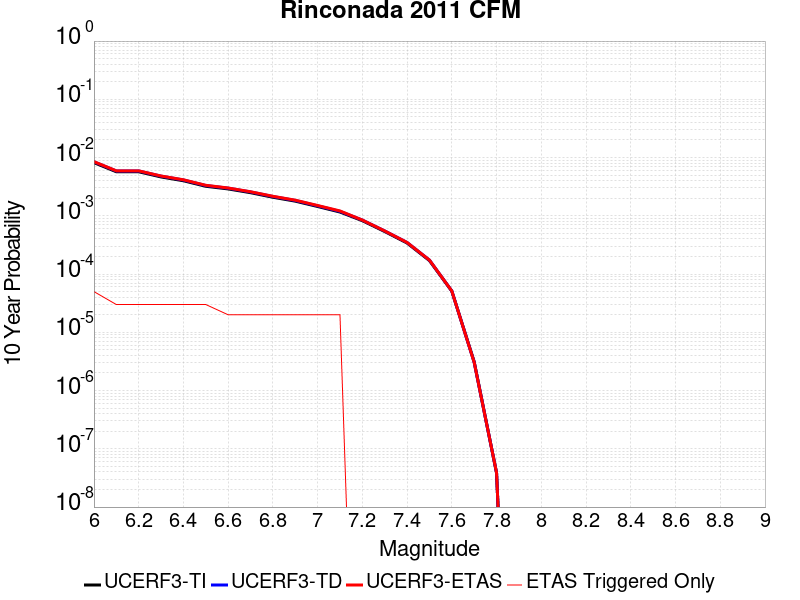 |

| Magnitude | 1 wk TI Prob | 1 wk TD Prob | 1 wk ETAS Prob | 1 wk ETAS/TD Gain | 1 wk ETAS Triggered Only | 1 mo TI Prob | 1 mo TD Prob | 1 mo ETAS Prob | 1 mo ETAS/TD Gain | 1 mo ETAS Triggered Only | 1 yr TI Prob | 1 yr TD Prob | 1 yr ETAS Prob | 1 yr ETAS/TD Gain | 1 yr ETAS Triggered Only | 10 yr TI Prob | 10 yr TD Prob | 10 yr ETAS Prob | 10 yr ETAS/TD Gain | 10 yr ETAS Triggered Only |
|-----|-----|-----|-----|-----|-----|-----|-----|-----|-----|-----|-----|-----|-----|-----|-----|-----|-----|-----|-----|-----|
| 6.0 | 1.5752368E-5 | 1.6274716E-5 | 1.6274716E-5 | 1.0 | 0.0 | 6.75084E-5 | 6.974694E-5 | 6.974694E-5 | 1.0 | 0.0 | 8.2160486E-4 | 8.488412E-4 | 8.788158E-4 | 1.0353123 | 3.0E-5 | 0.008185739 | 0.00845637 | 0.008505947 | 1.0058627 | 5.0E-5 |
| 6.1 | 1.0966133E-5 | 1.1323029E-5 | 1.1323029E-5 | 1.0 | 0.0 | 4.6996865E-5 | 4.852637E-5 | 4.852637E-5 | 1.0 | 0.0 | 5.720366E-4 | 5.906491E-4 | 6.106373E-4 | 1.033841 | 2.0E-5 | 0.0057056635 | 0.0058908886 | 0.005920712 | 1.0050626 | 3.0E-5 |
| 6.2 | 1.0966133E-5 | 1.1323029E-5 | 1.1323029E-5 | 1.0 | 0.0 | 4.6996865E-5 | 4.852637E-5 | 4.852637E-5 | 1.0 | 0.0 | 5.720366E-4 | 5.906491E-4 | 6.106373E-4 | 1.033841 | 2.0E-5 | 0.0057056635 | 0.0058908886 | 0.005920712 | 1.0050626 | 3.0E-5 |
| 6.3 | 8.926149E-6 | 9.212771E-6 | 9.212771E-6 | 1.0 | 0.0 | 3.8254362E-5 | 3.948271E-5 | 3.948271E-5 | 1.0 | 0.0 | 4.6564735E-4 | 4.805963E-4 | 5.005867E-4 | 1.041595 | 2.0E-5 | 0.0046467283 | 0.0047956146 | 0.0048254705 | 1.0062257 | 3.0E-5 |
| 6.4 | 7.676955E-6 | 7.920191E-6 | 7.920191E-6 | 1.0 | 0.0 | 3.290082E-5 | 3.3943234E-5 | 3.3943234E-5 | 1.0 | 0.0 | 4.0049385E-4 | 4.1318068E-4 | 4.3317242E-4 | 1.048385 | 2.0E-5 | 0.0039977287 | 0.004124151 | 0.0041540274 | 1.0072442 | 3.0E-5 |
| 6.5 | 6.1671026E-6 | 6.3589546E-6 | 6.3589546E-6 | 1.0 | 0.0 | 2.6430173E-5 | 2.725238E-5 | 2.725238E-5 | 1.0 | 0.0 | 3.2173982E-4 | 3.317473E-4 | 3.5174063E-4 | 1.0602669 | 2.0E-5 | 0.003212744 | 0.0033125326 | 0.0033424331 | 1.0090265 | 3.0E-5 |
| 6.6 | 5.553456E-6 | 5.7248126E-6 | 5.7248126E-6 | 1.0 | 0.0 | 2.3800309E-5 | 2.453468E-5 | 2.453468E-5 | 1.0 | 0.0 | 2.897302E-4 | 2.9866883E-4 | 3.1866287E-4 | 1.0669438 | 2.0E-5 | 0.0028935277 | 0.002982683 | 0.0030026236 | 1.0066854 | 2.0E-5 |
| 6.7 | 4.787857E-6 | 4.9333094E-6 | 4.9333094E-6 | 1.0 | 0.0 | 2.0519226E-5 | 2.1142583E-5 | 2.1142583E-5 | 1.0 | 0.0 | 2.4979294E-4 | 2.573806E-4 | 2.7737545E-4 | 1.077686 | 2.0E-5 | 0.0024951235 | 0.0025708308 | 0.0025907794 | 1.0077596 | 2.0E-5 |
| 6.8 | 3.9955166E-6 | 4.1134763E-6 | 4.1134763E-6 | 1.0 | 0.0 | 1.7123532E-5 | 1.7629065E-5 | 1.7629065E-5 | 1.0 | 0.0 | 2.0845905E-4 | 2.1461274E-4 | 2.3460845E-4 | 1.0931711 | 2.0E-5 | 0.002082636 | 0.0021440585 | 0.0021640155 | 1.0093081 | 2.0E-5 |
| 6.9 | 3.4250072E-6 | 3.5224464E-6 | 3.5224464E-6 | 1.0 | 0.0 | 1.46785205E-5 | 1.5096111E-5 | 1.5096111E-5 | 1.0 | 0.0 | 1.7869633E-4 | 1.8377967E-4 | 2.03776E-4 | 1.108806 | 2.0E-5 | 0.001785527 | 0.0018362794 | 0.0018562427 | 1.0108715 | 2.0E-5 |
| 7.0 | 2.7712713E-6 | 2.8467E-6 | 2.8467E-6 | 1.0 | 0.0 | 1.1876823E-5 | 1.2200086E-5 | 1.2200086E-5 | 1.0 | 0.0 | 1.4459073E-4 | 1.4852593E-4 | 1.6852297E-4 | 1.1346366 | 2.0E-5 | 0.0014449668 | 0.0014842682 | 0.0015042385 | 1.0134547 | 2.0E-5 |
| 7.1 | 2.227358E-6 | 2.2856984E-6 | 2.2856984E-6 | 1.0 | 0.0 | 9.545785E-6 | 9.795814E-6 | 9.795814E-6 | 1.0 | 0.0 | 1.16213734E-4 | 1.19257515E-4 | 1.3925513E-4 | 1.1676843 | 2.0E-5 | 0.0011615298 | 0.0011919362 | 0.0012119124 | 1.0167594 | 2.0E-5 |
| 7.2 | 1.581796E-6 | 1.6209011E-6 | 1.6209011E-6 | 1.0 | 0.0 | 6.779108E-6 | 6.9467005E-6 | 6.9467005E-6 | 1.0 | 0.0 | 8.253252E-5 | 8.457281E-5 | 8.457281E-5 | 1.0 | 0.0 | 8.250187E-4 | 8.454067E-4 | 8.454067E-4 | 1.0 | 0.0 |
| 7.3 | 1.0306567E-6 | 1.0546477E-6 | 1.0546477E-6 | 1.0 | 0.0 | 4.4170924E-6 | 4.519911E-6 | 4.519911E-6 | 1.0 | 0.0 | 5.3776774E-5 | 5.5028526E-5 | 5.5028526E-5 | 1.0 | 0.0 | 5.376376E-4 | 5.5014924E-4 | 5.5014924E-4 | 1.0 | 0.0 |
| 7.4 | 6.535541E-7 | 6.682742E-7 | 6.682742E-7 | 1.0 | 0.0 | 2.800943E-6 | 2.864029E-6 | 2.864029E-6 | 1.0 | 0.0 | 3.4100947E-5 | 3.4868997E-5 | 3.4868997E-5 | 1.0 | 0.0 | 3.4095717E-4 | 3.4863537E-4 | 3.4863537E-4 | 1.0 | 0.0 |
| 7.5 | 3.2656962E-7 | 3.3316687E-7 | 3.3316687E-7 | 1.0 | 0.0 | 1.3995833E-6 | 1.4278572E-6 | 1.4278572E-6 | 1.0 | 0.0 | 1.7039794E-5 | 1.7384024E-5 | 1.7384024E-5 | 1.0 | 0.0 | 1.7038487E-4 | 1.7382667E-4 | 1.7382667E-4 | 1.0 | 0.0 |
| 7.6 | 9.754343E-8 | 9.82099E-8 | 9.82099E-8 | 1.0 | 0.0 | 4.180432E-7 | 4.208995E-7 | 4.208995E-7 | 1.0 | 0.0 | 5.089664E-6 | 5.1244397E-6 | 5.1244397E-6 | 1.0 | 0.0 | 5.0895473E-5 | 5.1243223E-5 | 5.1243223E-5 | 1.0 | 0.0 |
| 7.7 | 6.0001453E-9 | 5.8490435E-9 | 5.8490435E-9 | 1.0 | 0.0 | 2.5714908E-8 | 2.506733E-8 | 2.506733E-8 | 1.0 | 0.0 | 3.1307894E-7 | 3.051947E-7 | 3.051947E-7 | 1.0 | 0.0 | 3.1307852E-6 | 3.051943E-6 | 3.051943E-6 | 1.0 | 0.0 |
| 7.8 | 7.400003E-11 | 7.4654505E-11 | 7.4654505E-11 | 1.0 | 0.0 | 3.171432E-10 | 3.1994773E-10 | 3.1994773E-10 | 1.0 | 0.0 | 3.861218E-9 | 3.895363E-9 | 3.895363E-9 | 1.0 | 0.0 | 3.861218E-8 | 3.895363E-8 | 3.895363E-8 | 1.0 | 0.0 |

## Oak Ridge (Onshore)
*[(top)](#table-of-contents)*

| 1 Week | 1 Month | 1 Year | 10 Year |
|-----|-----|-----|-----|
|  | 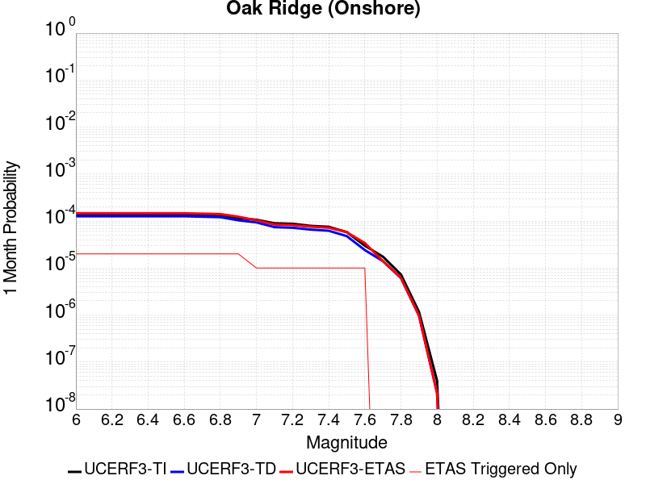 |  |  |

| Magnitude | 1 wk TI Prob | 1 wk TD Prob | 1 wk ETAS Prob | 1 wk ETAS/TD Gain | 1 wk ETAS Triggered Only | 1 mo TI Prob | 1 mo TD Prob | 1 mo ETAS Prob | 1 mo ETAS/TD Gain | 1 mo ETAS Triggered Only | 1 yr TI Prob | 1 yr TD Prob | 1 yr ETAS Prob | 1 yr ETAS/TD Gain | 1 yr ETAS Triggered Only | 10 yr TI Prob | 10 yr TD Prob | 10 yr ETAS Prob | 10 yr ETAS/TD Gain | 10 yr ETAS Triggered Only |
|-----|-----|-----|-----|-----|-----|-----|-----|-----|-----|-----|-----|-----|-----|-----|-----|-----|-----|-----|-----|-----|
| 6.0 | 3.155064E-5 | 2.9525974E-5 | 2.9525974E-5 | 1.0 | 0.0 | 1.3521002E-4 | 1.2653397E-4 | 1.4653144E-4 | 1.1580403 | 2.0E-5 | 0.001644939 | 0.0015395004 | 0.0015794388 | 1.0259424 | 4.0E-5 | 0.01632816 | 0.015292859 | 0.015332247 | 1.0025756 | 4.0E-5 |
| 6.1 | 3.155064E-5 | 2.9525974E-5 | 2.9525974E-5 | 1.0 | 0.0 | 1.3521002E-4 | 1.2653397E-4 | 1.4653144E-4 | 1.1580403 | 2.0E-5 | 0.001644939 | 0.0015395004 | 0.0015794388 | 1.0259424 | 4.0E-5 | 0.01632816 | 0.015292859 | 0.015332247 | 1.0025756 | 4.0E-5 |
| 6.2 | 3.155064E-5 | 2.9525974E-5 | 2.9525974E-5 | 1.0 | 0.0 | 1.3521002E-4 | 1.2653397E-4 | 1.4653144E-4 | 1.1580403 | 2.0E-5 | 0.001644939 | 0.0015395004 | 0.0015794388 | 1.0259424 | 4.0E-5 | 0.01632816 | 0.015292859 | 0.015332247 | 1.0025756 | 4.0E-5 |
| 6.3 | 3.155064E-5 | 2.9525974E-5 | 2.9525974E-5 | 1.0 | 0.0 | 1.3521002E-4 | 1.2653397E-4 | 1.4653144E-4 | 1.1580403 | 2.0E-5 | 0.001644939 | 0.0015395004 | 0.0015794388 | 1.0259424 | 4.0E-5 | 0.01632816 | 0.015292859 | 0.015332247 | 1.0025756 | 4.0E-5 |
| 6.4 | 3.155064E-5 | 2.9525974E-5 | 2.9525974E-5 | 1.0 | 0.0 | 1.3521002E-4 | 1.2653397E-4 | 1.4653144E-4 | 1.1580403 | 2.0E-5 | 0.001644939 | 0.0015395004 | 0.0015794388 | 1.0259424 | 4.0E-5 | 0.01632816 | 0.015292859 | 0.015332247 | 1.0025756 | 4.0E-5 |
| 6.5 | 3.155064E-5 | 2.9525974E-5 | 2.9525974E-5 | 1.0 | 0.0 | 1.3521002E-4 | 1.2653397E-4 | 1.4653144E-4 | 1.1580403 | 2.0E-5 | 0.001644939 | 0.0015395004 | 0.0015794388 | 1.0259424 | 4.0E-5 | 0.01632816 | 0.015292859 | 0.015332247 | 1.0025756 | 4.0E-5 |
| 6.6 | 3.155064E-5 | 2.9525974E-5 | 2.9525974E-5 | 1.0 | 0.0 | 1.3521002E-4 | 1.2653397E-4 | 1.4653144E-4 | 1.1580403 | 2.0E-5 | 0.001644939 | 0.0015395004 | 0.0015794388 | 1.0259424 | 4.0E-5 | 0.01632816 | 0.015292859 | 0.015332247 | 1.0025756 | 4.0E-5 |
| 6.7 | 3.098897E-5 | 2.8864175E-5 | 2.8864175E-5 | 1.0 | 0.0 | 1.328031E-4 | 1.2369796E-4 | 1.4369548E-4 | 1.1616641 | 2.0E-5 | 0.0016156785 | 0.0015050198 | 0.0015449596 | 1.0265378 | 4.0E-5 | 0.016039822 | 0.014952714 | 0.014992116 | 1.0026351 | 4.0E-5 |
| 6.8 | 3.0449872E-5 | 2.8239372E-5 | 2.8239372E-5 | 1.0 | 0.0 | 1.3049292E-4 | 1.2102048E-4 | 1.4101806E-4 | 1.1652412 | 2.0E-5 | 0.0015875935 | 0.0014724657 | 0.0015124067 | 1.0271254 | 4.0E-5 | 0.015762992 | 0.014631462 | 0.014670877 | 1.0026939 | 4.0E-5 |
| 6.9 | 2.697928E-5 | 2.4219773E-5 | 2.4219773E-5 | 1.0 | 0.0 | 1.15620365E-4 | 1.0379502E-4 | 1.2379294E-4 | 1.1926675 | 2.0E-5 | 0.0014067689 | 0.0012629933 | 0.0012929555 | 1.0237231 | 3.0E-5 | 0.0139789665 | 0.01256087 | 0.012590493 | 1.0023583 | 3.0E-5 |
| 7.0 | 2.4893961E-5 | 2.1862043E-5 | 2.1862043E-5 | 1.0 | 0.0 | 1.0668404E-4 | 9.3691204E-5 | 1.0369026E-4 | 1.1067237 | 1.0E-5 | 0.0012981043 | 0.0011401111 | 0.0011600883 | 1.0175221 | 2.0E-5 | 0.012905477 | 0.011344905 | 0.011364679 | 1.001743 | 2.0E-5 |
| 7.1 | 2.0945363E-5 | 1.7354487E-5 | 1.7354487E-5 | 1.0 | 0.0 | 8.976275E-5 | 7.437428E-5 | 8.437354E-5 | 1.1344451 | 1.0E-5 | 0.0010923136 | 9.051354E-4 | 9.251173E-4 | 1.0220761 | 2.0E-5 | 0.0108696 | 0.009015423 | 0.009035243 | 1.0021985 | 2.0E-5 |
| 7.2 | 2.0439404E-5 | 1.6809423E-5 | 1.6809423E-5 | 1.0 | 0.0 | 8.7594504E-5 | 7.203843E-5 | 8.20377E-5 | 1.1388048 | 1.0E-5 | 0.0010659413 | 8.767196E-4 | 8.9670205E-4 | 1.0227923 | 2.0E-5 | 0.010608427 | 0.008733526 | 0.008753352 | 1.00227 | 2.0E-5 |
| 7.3 | 1.8463334E-5 | 1.5381811E-5 | 1.5381811E-5 | 1.0 | 0.0 | 7.912617E-5 | 6.59204E-5 | 7.591974E-5 | 1.1516881 | 1.0E-5 | 9.6293533E-4 | 8.0228975E-4 | 8.2227367E-4 | 1.0249087 | 2.0E-5 | 0.009587734 | 0.007994797 | 0.008014637 | 1.0024816 | 2.0E-5 |
| 7.4 | 1.763139E-5 | 1.451684E-5 | 1.451684E-5 | 1.0 | 0.0 | 7.556091E-5 | 6.221356E-5 | 7.221294E-5 | 1.1607267 | 1.0E-5 | 9.1956573E-4 | 7.571909E-4 | 7.7717577E-4 | 1.0263934 | 2.0E-5 | 0.009157699 | 0.007546914 | 0.0075667626 | 1.0026301 | 2.0E-5 |
| 7.5 | 1.3594944E-5 | 1.1163356E-5 | 1.1163356E-5 | 1.0 | 0.0 | 5.8262744E-5 | 4.784209E-5 | 5.7841615E-5 | 1.209011 | 1.0E-5 | 7.0911803E-4 | 5.8232434E-4 | 6.023127E-4 | 1.0343251 | 2.0E-5 | 0.007068595 | 0.0058082556 | 0.0058281394 | 1.0034233 | 2.0E-5 |
| 7.6 | 6.9889534E-6 | 5.6367144E-6 | 5.6367144E-6 | 1.0 | 0.0 | 2.9952313E-5 | 2.4157125E-5 | 3.4156885E-5 | 1.4139465 | 1.0E-5 | 3.646084E-4 | 2.9407372E-4 | 3.1406785E-4 | 1.0679902 | 2.0E-5 | 0.0036401073 | 0.0029368899 | 0.0029568311 | 1.0067899 | 2.0E-5 |
| 7.7 | 4.0824193E-6 | 3.2832586E-6 | 3.2832586E-6 | 1.0 | 0.0 | 1.7495966E-5 | 1.4071033E-5 | 1.4071033E-5 | 1.0 | 0.0 | 2.1299256E-4 | 1.713015E-4 | 1.713015E-4 | 1.0 | 0.0 | 0.0021278851 | 0.0017117079 | 0.0017117079 | 1.0 | 0.0 |
| 7.8 | 1.7023609E-6 | 1.4370495E-6 | 1.4370495E-6 | 1.0 | 0.0 | 7.295812E-6 | 6.1587693E-6 | 6.1587693E-6 | 1.0 | 0.0 | 8.882289E-5 | 7.498047E-5 | 7.498047E-5 | 1.0 | 0.0 | 8.8787393E-4 | 7.495545E-4 | 7.495545E-4 | 1.0 | 0.0 |
| 7.9 | 2.721225E-7 | 2.2616497E-7 | 2.2616497E-7 | 1.0 | 0.0 | 1.1662388E-6 | 9.692781E-7 | 9.692781E-7 | 1.0 | 0.0 | 1.4198865E-5 | 1.1800899E-5 | 1.1800899E-5 | 1.0 | 0.0 | 1.4197957E-4 | 1.1800301E-4 | 1.1800301E-4 | 1.0 | 0.0 |
| 8.0 | 9.364255E-9 | 5.1206666E-9 | 5.1206666E-9 | 1.0 | 0.0 | 4.0132523E-8 | 2.1945715E-8 | 2.1945715E-8 | 1.0 | 0.0 | 4.8861335E-7 | 2.6718905E-7 | 2.6718905E-7 | 1.0 | 0.0 | 4.8861225E-6 | 2.6718876E-6 | 2.6718876E-6 | 1.0 | 0.0 |

## Kern Canyon (Lake Isabella) 2011
*[(top)](#table-of-contents)*

| 1 Week | 1 Month | 1 Year | 10 Year |
|-----|-----|-----|-----|
|  |  |  |  |

| Magnitude | 1 wk TI Prob | 1 wk TD Prob | 1 wk ETAS Prob | 1 wk ETAS/TD Gain | 1 wk ETAS Triggered Only | 1 mo TI Prob | 1 mo TD Prob | 1 mo ETAS Prob | 1 mo ETAS/TD Gain | 1 mo ETAS Triggered Only | 1 yr TI Prob | 1 yr TD Prob | 1 yr ETAS Prob | 1 yr ETAS/TD Gain | 1 yr ETAS Triggered Only | 10 yr TI Prob | 10 yr TD Prob | 10 yr ETAS Prob | 10 yr ETAS/TD Gain | 10 yr ETAS Triggered Only |
|-----|-----|-----|-----|-----|-----|-----|-----|-----|-----|-----|-----|-----|-----|-----|-----|-----|-----|-----|-----|-----|
| 6.0 | 4.2387383E-6 | 4.001639E-6 | 2.4001558E-5 | 5.9979324 | 2.0E-5 | 1.8165894E-5 | 1.7149778E-5 | 3.7149435E-5 | 2.1661758 | 2.0E-5 | 2.2114732E-4 | 2.087804E-4 | 2.4877206E-4 | 1.1915488 | 4.0E-5 | 0.0022092736 | 0.0020860266 | 0.002125943 | 1.0191352 | 4.0E-5 |
| 6.1 | 4.2387383E-6 | 4.001639E-6 | 2.4001558E-5 | 5.9979324 | 2.0E-5 | 1.8165894E-5 | 1.7149778E-5 | 3.7149435E-5 | 2.1661758 | 2.0E-5 | 2.2114732E-4 | 2.087804E-4 | 2.4877206E-4 | 1.1915488 | 4.0E-5 | 0.0022092736 | 0.0020860266 | 0.002125943 | 1.0191352 | 4.0E-5 |
| 6.2 | 4.2387383E-6 | 4.001639E-6 | 2.4001558E-5 | 5.9979324 | 2.0E-5 | 1.8165894E-5 | 1.7149778E-5 | 3.7149435E-5 | 2.1661758 | 2.0E-5 | 2.2114732E-4 | 2.087804E-4 | 2.4877206E-4 | 1.1915488 | 4.0E-5 | 0.0022092736 | 0.0020860266 | 0.002125943 | 1.0191352 | 4.0E-5 |
| 6.3 | 4.2387383E-6 | 4.001639E-6 | 2.4001558E-5 | 5.9979324 | 2.0E-5 | 1.8165894E-5 | 1.7149778E-5 | 3.7149435E-5 | 2.1661758 | 2.0E-5 | 2.2114732E-4 | 2.087804E-4 | 2.4877206E-4 | 1.1915488 | 4.0E-5 | 0.0022092736 | 0.0020860266 | 0.002125943 | 1.0191352 | 4.0E-5 |
| 6.4 | 4.2387383E-6 | 4.001639E-6 | 2.4001558E-5 | 5.9979324 | 2.0E-5 | 1.8165894E-5 | 1.7149778E-5 | 3.7149435E-5 | 2.1661758 | 2.0E-5 | 2.2114732E-4 | 2.087804E-4 | 2.4877206E-4 | 1.1915488 | 4.0E-5 | 0.0022092736 | 0.0020860266 | 0.002125943 | 1.0191352 | 4.0E-5 |
| 6.5 | 2.7857532E-6 | 2.517867E-6 | 2.2517817E-5 | 8.943212 | 2.0E-5 | 1.1938888E-5 | 1.0790815E-5 | 3.07906E-5 | 2.853408 | 2.0E-5 | 1.4534626E-4 | 1.3137059E-4 | 1.5136796E-4 | 1.1522211 | 2.0E-5 | 0.0014525123 | 0.001312962 | 0.0013329358 | 1.0152128 | 2.0E-5 |
| 6.6 | 2.2233348E-6 | 1.9441236E-6 | 2.1944084E-5 | 11.287392 | 2.0E-5 | 9.528543E-6 | 8.331932E-6 | 2.8331766E-5 | 3.4003837 | 2.0E-5 | 1.1600384E-4 | 1.01436635E-4 | 1.2143461E-4 | 1.1971474 | 2.0E-5 | 0.001159433 | 0.001013912 | 0.0010338917 | 1.0197055 | 2.0E-5 |
| 6.7 | 2.1635126E-6 | 1.8835036E-6 | 2.1883467E-5 | 11.618489 | 2.0E-5 | 9.272164E-6 | 8.072134E-6 | 2.8071972E-5 | 3.4776397 | 2.0E-5 | 1.1288274E-4 | 9.827388E-5 | 1.1827191E-4 | 1.2034929 | 2.0E-5 | 0.0011282542 | 9.823124E-4 | 0.0010022927 | 1.0203401 | 2.0E-5 |
| 6.8 | 1.8685711E-6 | 1.5831425E-6 | 2.1583111E-5 | 13.633081 | 2.0E-5 | 8.008137E-6 | 6.784879E-6 | 2.6784743E-5 | 3.9477112 | 2.0E-5 | 9.74947E-5 | 8.260282E-5 | 1.0260117E-4 | 1.2421025 | 2.0E-5 | 9.745194E-4 | 8.2572614E-4 | 8.457096E-4 | 1.0242012 | 2.0E-5 |
| 6.9 | 1.5815071E-6 | 1.3064928E-6 | 2.1306467E-5 | 16.30814 | 2.0E-5 | 6.77787E-6 | 5.599243E-6 | 2.559913E-5 | 4.5718913 | 2.0E-5 | 8.251744E-5 | 6.816868E-5 | 8.816732E-5 | 1.2933699 | 2.0E-5 | 8.248681E-4 | 6.8148033E-4 | 7.0146675E-4 | 1.0293279 | 2.0E-5 |
| 7.0 | 1.3772564E-6 | 1.1210718E-6 | 2.112105E-5 | 18.84005 | 2.0E-5 | 5.9025137E-6 | 4.8045845E-6 | 2.4804489E-5 | 5.1626706 | 2.0E-5 | 7.186073E-5 | 5.8494268E-5 | 7.8493096E-5 | 1.3418938 | 2.0E-5 | 7.18375E-4 | 5.847908E-4 | 6.0477905E-4 | 1.0341803 | 2.0E-5 |
| 7.1 | 1.0916998E-6 | 8.763777E-7 | 2.087636E-5 | 23.82119 | 2.0E-5 | 4.678705E-6 | 3.7558991E-6 | 2.3755823E-5 | 6.3249364 | 2.0E-5 | 5.6961744E-5 | 4.5727127E-5 | 6.572621E-5 | 1.4373572 | 2.0E-5 | 5.6947145E-4 | 4.571785E-4 | 4.7716938E-4 | 1.0437266 | 2.0E-5 |
| 7.2 | 7.6277024E-7 | 5.901454E-7 | 1.059014E-5 | 17.944965 | 1.0E-5 | 3.2690114E-6 | 2.5291922E-6 | 1.2529167E-5 | 4.953821 | 1.0E-5 | 3.9799485E-5 | 3.0792486E-5 | 4.079218E-5 | 1.3247446 | 1.0E-5 | 3.9792358E-4 | 3.0788282E-4 | 3.1787975E-4 | 1.0324699 | 1.0E-5 |
| 7.3 | 5.3265916E-7 | 4.3824414E-7 | 1.043824E-5 | 23.818321 | 1.0E-5 | 2.282823E-6 | 1.878188E-6 | 1.1878169E-5 | 6.3242707 | 1.0E-5 | 2.7793016E-5 | 2.2866701E-5 | 3.2866472E-5 | 1.4373071 | 1.0E-5 | 2.778954E-4 | 2.2864387E-4 | 2.3864159E-4 | 1.0437261 | 1.0E-5 |
| 7.4 | 3.4946007E-7 | 3.006571E-7 | 1.0300654E-5 | 34.26047 | 1.0E-5 | 1.497685E-6 | 1.2885298E-6 | 1.1288517E-5 | 8.760773 | 1.0E-5 | 1.8234163E-5 | 1.568774E-5 | 2.5687583E-5 | 1.6374304 | 1.0E-5 | 1.8232666E-4 | 1.5686655E-4 | 1.6686496E-4 | 1.0637385 | 1.0E-5 |
| 7.5 | 1.8317026E-7 | 1.4244812E-7 | 1.4244812E-7 | 1.0 | 0.0 | 7.850152E-7 | 6.104918E-7 | 6.104918E-7 | 1.0 | 0.0 | 9.557518E-6 | 7.432713E-6 | 7.432713E-6 | 1.0 | 0.0 | 9.5571064E-5 | 7.432472E-5 | 7.432472E-5 | 1.0 | 0.0 |
| 7.6 | 2.572245E-8 | 1.7352555E-8 | 1.7352555E-8 | 1.0 | 0.0 | 1.10239064E-7 | 7.436809E-8 | 7.436809E-8 | 1.0 | 0.0 | 1.3421597E-6 | 9.054312E-7 | 9.054312E-7 | 1.0 | 0.0 | 1.3421517E-5 | 9.05428E-6 | 9.05428E-6 | 1.0 | 0.0 |

## Sheephole
*[(top)](#table-of-contents)*

| 1 Week | 1 Month | 1 Year | 10 Year |
|-----|-----|-----|-----|
|  |  |  |  |

| Magnitude | 1 wk TI Prob | 1 wk TD Prob | 1 wk ETAS Prob | 1 wk ETAS/TD Gain | 1 wk ETAS Triggered Only | 1 mo TI Prob | 1 mo TD Prob | 1 mo ETAS Prob | 1 mo ETAS/TD Gain | 1 mo ETAS Triggered Only | 1 yr TI Prob | 1 yr TD Prob | 1 yr ETAS Prob | 1 yr ETAS/TD Gain | 1 yr ETAS Triggered Only | 10 yr TI Prob | 10 yr TD Prob | 10 yr ETAS Prob | 10 yr ETAS/TD Gain | 10 yr ETAS Triggered Only |
|-----|-----|-----|-----|-----|-----|-----|-----|-----|-----|-----|-----|-----|-----|-----|-----|-----|-----|-----|-----|-----|
| 6.0 | 4.5579695E-6 | 4.7412627E-6 | 4.7412627E-6 | 1.0 | 0.0 | 1.9534009E-5 | 2.031957E-5 | 2.031957E-5 | 1.0 | 0.0 | 2.3780059E-4 | 2.473682E-4 | 2.6736327E-4 | 1.0808312 | 2.0E-5 | 0.0023754628 | 0.002471473 | 0.0025113742 | 1.0161446 | 4.0E-5 |
| 6.1 | 4.5579695E-6 | 4.7412627E-6 | 4.7412627E-6 | 1.0 | 0.0 | 1.9534009E-5 | 2.031957E-5 | 2.031957E-5 | 1.0 | 0.0 | 2.3780059E-4 | 2.473682E-4 | 2.6736327E-4 | 1.0808312 | 2.0E-5 | 0.0023754628 | 0.002471473 | 0.0025113742 | 1.0161446 | 4.0E-5 |
| 6.2 | 2.6677674E-6 | 2.7873941E-6 | 2.7873941E-6 | 1.0 | 0.0 | 1.1433239E-5 | 1.1945926E-5 | 1.1945926E-5 | 1.0 | 0.0 | 1.3919079E-4 | 1.4543302E-4 | 1.6543012E-4 | 1.1375003 | 2.0E-5 | 0.0013910364 | 0.0014534844 | 0.0014934263 | 1.0274801 | 4.0E-5 |
| 6.3 | 2.6677674E-6 | 2.7873941E-6 | 2.7873941E-6 | 1.0 | 0.0 | 1.1433239E-5 | 1.1945926E-5 | 1.1945926E-5 | 1.0 | 0.0 | 1.3919079E-4 | 1.4543302E-4 | 1.6543012E-4 | 1.1375003 | 2.0E-5 | 0.0013910364 | 0.0014534844 | 0.0014934263 | 1.0274801 | 4.0E-5 |
| 6.4 | 2.2159759E-6 | 2.3228788E-6 | 2.3228788E-6 | 1.0 | 0.0 | 9.497005E-6 | 9.955161E-6 | 9.955161E-6 | 1.0 | 0.0 | 1.156199E-4 | 1.2119815E-4 | 1.4119573E-4 | 1.164999 | 2.0E-5 | 0.0011555976 | 0.0012113999 | 0.0012513514 | 1.0329796 | 4.0E-5 |
| 6.5 | 2.1986082E-6 | 2.304759E-6 | 2.304759E-6 | 1.0 | 0.0 | 9.4225725E-6 | 9.877506E-6 | 9.877506E-6 | 1.0 | 0.0 | 1.1471378E-4 | 1.2025281E-4 | 1.402504E-4 | 1.1662962 | 2.0E-5 | 0.0011465458 | 0.0012019566 | 0.0012419085 | 1.0332391 | 4.0E-5 |
| 6.6 | 1.5232331E-6 | 1.6018919E-6 | 1.6018919E-6 | 1.0 | 0.0 | 6.5281256E-6 | 6.865234E-6 | 6.865234E-6 | 1.0 | 0.0 | 7.947703E-5 | 8.35812E-5 | 1.03579536E-4 | 1.2392683 | 2.0E-5 | 7.9448614E-4 | 8.3551643E-4 | 8.6549134E-4 | 1.0358759 | 3.0E-5 |
| 6.7 | 1.3137362E-6 | 1.382819E-6 | 1.382819E-6 | 1.0 | 0.0 | 5.6302856E-6 | 5.926355E-6 | 5.926355E-6 | 1.0 | 0.0 | 6.854657E-5 | 7.215112E-5 | 9.2149676E-5 | 1.277176 | 2.0E-5 | 6.8525434E-4 | 7.212908E-4 | 7.512692E-4 | 1.0415621 | 3.0E-5 |
| 6.8 | 1.2275751E-6 | 1.2922847E-6 | 1.2922847E-6 | 1.0 | 0.0 | 5.2610258E-6 | 5.5383516E-6 | 5.5383516E-6 | 1.0 | 0.0 | 6.4051106E-5 | 6.7427485E-5 | 7.7426805E-5 | 1.1482974 | 1.0E-5 | 6.4032647E-4 | 6.740836E-4 | 6.940701E-4 | 1.0296499 | 2.0E-5 |
| 6.9 | 1.1837088E-6 | 1.246102E-6 | 1.246102E-6 | 1.0 | 0.0 | 5.0730278E-6 | 5.340427E-6 | 5.340427E-6 | 1.0 | 0.0 | 6.176237E-5 | 6.501789E-5 | 7.501724E-5 | 1.1537938 | 1.0E-5 | 6.17452E-4 | 6.5000186E-4 | 6.6998886E-4 | 1.0307492 | 2.0E-5 |
| 7.0 | 9.849371E-7 | 1.0366288E-6 | 1.0366288E-6 | 1.0 | 0.0 | 4.2211523E-6 | 4.442688E-6 | 4.442688E-6 | 1.0 | 0.0 | 5.1391315E-5 | 5.4088487E-5 | 6.4087944E-5 | 1.1848723 | 1.0E-5 | 5.137943E-4 | 5.407633E-4 | 5.6075247E-4 | 1.0369648 | 2.0E-5 |
| 7.1 | 8.1643645E-7 | 8.591669E-7 | 8.591669E-7 | 1.0 | 0.0 | 3.4990085E-6 | 3.682139E-6 | 3.682139E-6 | 1.0 | 0.0 | 4.2599597E-5 | 4.482921E-5 | 5.482876E-5 | 1.2230588 | 1.0E-5 | 4.259143E-4 | 4.4821028E-4 | 4.6820132E-4 | 1.0446019 | 2.0E-5 |
| 7.2 | 5.7295756E-7 | 6.029502E-7 | 6.029502E-7 | 1.0 | 0.0 | 2.45553E-6 | 2.58407E-6 | 2.58407E-6 | 1.0 | 0.0 | 2.9895667E-5 | 3.1460666E-5 | 3.1460666E-5 | 1.0 | 0.0 | 2.9891645E-4 | 3.145688E-4 | 3.2456568E-4 | 1.0317795 | 1.0E-5 |

## Calaveras (So) - Paicines extension 2011 CFM
*[(top)](#table-of-contents)*

| 1 Week | 1 Month | 1 Year | 10 Year |
|-----|-----|-----|-----|
|  | 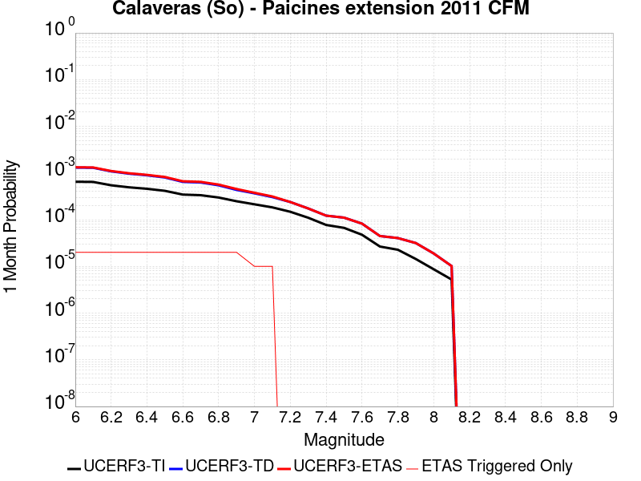 |  |  |

| Magnitude | 1 wk TI Prob | 1 wk TD Prob | 1 wk ETAS Prob | 1 wk ETAS/TD Gain | 1 wk ETAS Triggered Only | 1 mo TI Prob | 1 mo TD Prob | 1 mo ETAS Prob | 1 mo ETAS/TD Gain | 1 mo ETAS Triggered Only | 1 yr TI Prob | 1 yr TD Prob | 1 yr ETAS Prob | 1 yr ETAS/TD Gain | 1 yr ETAS Triggered Only | 10 yr TI Prob | 10 yr TD Prob | 10 yr ETAS Prob | 10 yr ETAS/TD Gain | 10 yr ETAS Triggered Only |
|-----|-----|-----|-----|-----|-----|-----|-----|-----|-----|-----|-----|-----|-----|-----|-----|-----|-----|-----|-----|-----|
| 6.0 | 1.5183659E-4 | 3.0533716E-4 | 3.2533106E-4 | 1.0654813 | 2.0E-5 | 6.5056595E-4 | 0.0013069661 | 0.00132694 | 1.0152826 | 2.0E-5 | 0.007891912 | 0.01569571 | 0.01572524 | 1.0018814 | 3.0E-5 | 0.076174594 | 0.13848671 | 0.13852118 | 1.0002488 | 4.0E-5 |
| 6.1 | 1.5024997E-4 | 3.0227835E-4 | 3.222723E-4 | 1.0661442 | 2.0E-5 | 6.437695E-4 | 0.00129387 | 0.0013138441 | 1.0154375 | 2.0E-5 | 0.0078097614 | 0.015539104 | 0.015568638 | 1.0019006 | 3.0E-5 | 0.075409345 | 0.13715632 | 0.13719083 | 1.0002517 | 4.0E-5 |
| 6.2 | 1.2743923E-4 | 2.5306802E-4 | 2.7306296E-4 | 1.0790101 | 2.0E-5 | 5.460538E-4 | 0.0010841049 | 0.0011040833 | 1.0184284 | 2.0E-5 | 0.0066279583 | 0.013046704 | 0.013076313 | 1.0022694 | 3.0E-5 | 0.064337276 | 0.11725405 | 0.11728936 | 1.0003011 | 4.0E-5 |
| 6.3 | 1.1525114E-4 | 2.2595265E-4 | 2.4594812E-4 | 1.0884941 | 2.0E-5 | 4.9383997E-4 | 9.6799526E-4 | 9.87976E-4 | 1.0206412 | 2.0E-5 | 0.0059959386 | 0.011667927 | 0.011697577 | 1.0025412 | 3.0E-5 | 0.058367174 | 0.10637007 | 0.10640582 | 1.000336 | 4.0E-5 |
| 6.4 | 1.07200925E-4 | 2.0836305E-4 | 2.2835888E-4 | 1.0959663 | 2.0E-5 | 4.5935164E-4 | 8.926636E-4 | 9.126457E-4 | 1.0223849 | 2.0E-5 | 0.0055782744 | 0.010772766 | 0.010802442 | 1.0027548 | 3.0E-5 | 0.0544031 | 0.09919256 | 0.09922859 | 1.0003632 | 4.0E-5 |
| 6.5 | 9.69631E-5 | 1.8729115E-4 | 2.072874E-4 | 1.1067656 | 2.0E-5 | 4.1548995E-4 | 8.024135E-4 | 8.223975E-4 | 1.0249048 | 2.0E-5 | 0.0050468626 | 0.009694662 | 0.009724371 | 1.0030645 | 3.0E-5 | 0.04933773 | 0.090084255 | 0.09012065 | 1.000404 | 4.0E-5 |
| 6.6 | 8.0552316E-5 | 1.5070537E-4 | 1.7070236E-4 | 1.1326892 | 2.0E-5 | 3.4517853E-4 | 6.456994E-4 | 6.6568644E-4 | 1.0309541 | 2.0E-5 | 0.0041944524 | 0.007826256 | 0.007856021 | 1.0038033 | 3.0E-5 | 0.04116161 | 0.074854024 | 0.07489103 | 1.0004944 | 4.0E-5 |
| 6.7 | 7.815757E-5 | 1.4610609E-4 | 1.6610317E-4 | 1.1368668 | 2.0E-5 | 3.34918E-4 | 6.260017E-4 | 6.4598914E-4 | 1.0319288 | 2.0E-5 | 0.004070005 | 0.0075890915 | 0.007618864 | 1.003923 | 3.0E-5 | 0.039962657 | 0.072703585 | 0.072740674 | 1.0005102 | 4.0E-5 |
| 6.8 | 6.965264E-5 | 1.2721405E-4 | 1.472115E-4 | 1.1571953 | 2.0E-5 | 2.9847719E-4 | 5.450839E-4 | 5.65073E-4 | 1.0366716 | 2.0E-5 | 0.0036279052 | 0.00661342 | 0.0066432212 | 1.0045062 | 3.0E-5 | 0.03569247 | 0.06379891 | 0.06383636 | 1.000587 | 4.0E-5 |
| 6.9 | 5.8000453E-5 | 1.01435086E-4 | 1.21433055E-4 | 1.1971505 | 2.0E-5 | 2.4854968E-4 | 4.3464993E-4 | 4.5464124E-4 | 1.045994 | 2.0E-5 | 0.0030218933 | 0.0052791284 | 0.0053089703 | 1.0056528 | 3.0E-5 | 0.029811295 | 0.051501602 | 0.051539544 | 1.0007367 | 4.0E-5 |
| 7.0 | 4.9865852E-5 | 8.567692E-5 | 9.567606E-5 | 1.1167076 | 1.0E-5 | 2.1369329E-4 | 3.671356E-4 | 3.7713192E-4 | 1.0272279 | 1.0E-5 | 0.0025986114 | 0.0044608037 | 0.0044807144 | 1.0044636 | 2.0E-5 | 0.025684336 | 0.043781694 | 0.04381038 | 1.0006552 | 3.0E-5 |
| 7.1 | 4.283875E-5 | 7.112159E-5 | 8.1120874E-5 | 1.1405942 | 1.0E-5 | 1.8358172E-4 | 3.047715E-4 | 3.1476846E-4 | 1.0328015 | 1.0E-5 | 0.0022328163 | 0.003704336 | 0.0037242621 | 1.0053791 | 2.0E-5 | 0.022105146 | 0.03673583 | 0.036764726 | 1.0007867 | 3.0E-5 |
| 7.2 | 3.450115E-5 | 5.5776054E-5 | 5.5776054E-5 | 1.0 | 0.0 | 1.478537E-4 | 2.390185E-4 | 2.390185E-4 | 1.0 | 0.0 | 0.0017986323 | 0.0029061958 | 0.0029161668 | 1.003431 | 1.0E-5 | 0.017841442 | 0.029079199 | 0.029098617 | 1.0006678 | 2.0E-5 |
| 7.3 | 2.5709045E-5 | 4.0588155E-5 | 4.0588155E-5 | 1.0 | 0.0 | 1.1017697E-4 | 1.7393773E-4 | 1.7393773E-4 | 1.0 | 0.0 | 0.0013405791 | 0.002115652 | 0.0021256309 | 1.0047166 | 1.0E-5 | 0.013325208 | 0.021297242 | 0.021316817 | 1.0009191 | 2.0E-5 |
| 7.4 | 1.8003093E-5 | 2.8509934E-5 | 2.8509934E-5 | 1.0 | 0.0 | 7.715383E-5 | 1.2217973E-4 | 1.2217973E-4 | 1.0 | 0.0 | 9.3894306E-4 | 0.0014865254 | 0.0014865254 | 1.0 | 0.0 | 0.009349857 | 0.015052196 | 0.015062045 | 1.0006543 | 1.0E-5 |
| 7.5 | 1.5595824E-5 | 2.5822499E-5 | 2.5822499E-5 | 1.0 | 0.0 | 6.683753E-5 | 1.1066317E-4 | 1.1066317E-4 | 1.0 | 0.0 | 8.134431E-4 | 0.0013464936 | 0.0013464936 | 1.0 | 0.0 | 0.008104719 | 0.01365213 | 0.013661994 | 1.0007225 | 1.0E-5 |
| 7.6 | 1.1110309E-5 | 1.9222098E-5 | 1.9222098E-5 | 1.0 | 0.0 | 4.761474E-5 | 8.2377825E-5 | 8.2377825E-5 | 1.0 | 0.0 | 5.795553E-4 | 0.0010024898 | 0.0010024898 | 1.0 | 0.0 | 0.0057804612 | 0.010203943 | 0.010213841 | 1.00097 | 1.0E-5 |
| 7.7 | 6.2140443E-6 | 1.0437076E-5 | 1.0437076E-5 | 1.0 | 0.0 | 2.6631347E-5 | 4.4729557E-5 | 4.4729557E-5 | 1.0 | 0.0 | 3.241884E-4 | 5.444464E-4 | 5.444464E-4 | 1.0 | 0.0 | 0.0032371588 | 0.005619835 | 0.005629779 | 1.0017694 | 1.0E-5 |
| 7.8 | 5.305533E-6 | 9.433038E-6 | 9.433038E-6 | 1.0 | 0.0 | 2.27378E-5 | 4.042668E-5 | 4.042668E-5 | 1.0 | 0.0 | 2.7679754E-4 | 4.920837E-4 | 4.920837E-4 | 1.0 | 0.0 | 0.0027645302 | 0.005074324 | 0.0050842734 | 1.0019608 | 1.0E-5 |
| 7.9 | 3.363505E-6 | 7.3848937E-6 | 7.3848937E-6 | 1.0 | 0.0 | 1.4414942E-5 | 3.164916E-5 | 3.164916E-5 | 1.0 | 0.0 | 1.7548777E-4 | 3.8526047E-4 | 3.8526047E-4 | 1.0 | 0.0 | 0.0017534926 | 0.003948527 | 0.003948527 | 1.0 | 0.0 |
| 8.0 | 2.0271132E-6 | 4.413104E-6 | 4.413104E-6 | 1.0 | 0.0 | 8.687599E-6 | 1.8913164E-5 | 1.8913164E-5 | 1.0 | 0.0 | 1.05766376E-4 | 2.302435E-4 | 2.302435E-4 | 1.0 | 0.0 | 0.0010571606 | 0.002351099 | 0.002351099 | 1.0 | 0.0 |
| 8.1 | 1.2206116E-6 | 2.3751331E-6 | 2.3751331E-6 | 1.0 | 0.0 | 5.2311816E-6 | 1.0179103E-5 | 1.0179103E-5 | 1.0 | 0.0 | 6.3687774E-5 | 1.2392356E-4 | 1.2392356E-4 | 1.0 | 0.0 | 6.366953E-4 | 0.0012705477 | 0.0012705477 | 1.0 | 0.0 |

## Newport-Inglewood alt 1
*[(top)](#table-of-contents)*

| 1 Week | 1 Month | 1 Year | 10 Year |
|-----|-----|-----|-----|
|  |  |  | 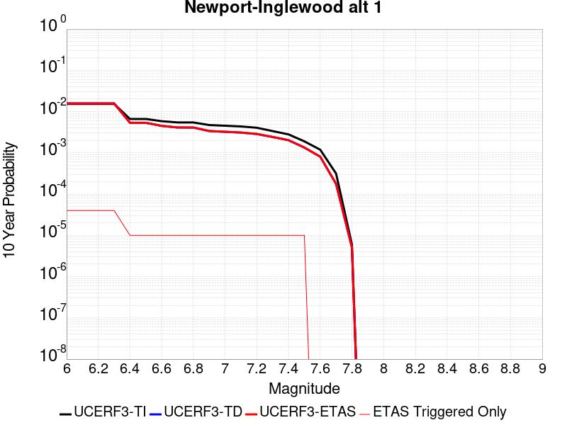 |

| Magnitude | 1 wk TI Prob | 1 wk TD Prob | 1 wk ETAS Prob | 1 wk ETAS/TD Gain | 1 wk ETAS Triggered Only | 1 mo TI Prob | 1 mo TD Prob | 1 mo ETAS Prob | 1 mo ETAS/TD Gain | 1 mo ETAS Triggered Only | 1 yr TI Prob | 1 yr TD Prob | 1 yr ETAS Prob | 1 yr ETAS/TD Gain | 1 yr ETAS Triggered Only | 10 yr TI Prob | 10 yr TD Prob | 10 yr ETAS Prob | 10 yr ETAS/TD Gain | 10 yr ETAS Triggered Only |
|-----|-----|-----|-----|-----|-----|-----|-----|-----|-----|-----|-----|-----|-----|-----|-----|-----|-----|-----|-----|-----|
| 6.0 | 2.9668912E-5 | 3.0404817E-5 | 5.0404207E-5 | 1.6577705 | 2.0E-5 | 1.2714628E-4 | 1.303026E-4 | 1.503E-4 | 1.1534688 | 2.0E-5 | 0.0015469068 | 0.0015857625 | 0.0016057307 | 1.0125922 | 2.0E-5 | 0.015361829 | 0.015792042 | 0.01583141 | 1.0024929 | 4.0E-5 |
| 6.1 | 2.9668912E-5 | 3.0404817E-5 | 5.0404207E-5 | 1.6577705 | 2.0E-5 | 1.2714628E-4 | 1.303026E-4 | 1.503E-4 | 1.1534688 | 2.0E-5 | 0.0015469068 | 0.0015857625 | 0.0016057307 | 1.0125922 | 2.0E-5 | 0.015361829 | 0.015792042 | 0.01583141 | 1.0024929 | 4.0E-5 |
| 6.2 | 2.9668912E-5 | 3.0404817E-5 | 5.0404207E-5 | 1.6577705 | 2.0E-5 | 1.2714628E-4 | 1.303026E-4 | 1.503E-4 | 1.1534688 | 2.0E-5 | 0.0015469068 | 0.0015857625 | 0.0016057307 | 1.0125922 | 2.0E-5 | 0.015361829 | 0.015792042 | 0.01583141 | 1.0024929 | 4.0E-5 |
| 6.3 | 2.9668912E-5 | 3.0404817E-5 | 5.0404207E-5 | 1.6577705 | 2.0E-5 | 1.2714628E-4 | 1.303026E-4 | 1.503E-4 | 1.1534688 | 2.0E-5 | 0.0015469068 | 0.0015857625 | 0.0016057307 | 1.0125922 | 2.0E-5 | 0.015361829 | 0.015792042 | 0.01583141 | 1.0024929 | 4.0E-5 |
| 6.4 | 1.275942E-5 | 1.0272503E-5 | 1.0272503E-5 | 1.0 | 0.0 | 5.4682085E-5 | 4.402429E-5 | 4.402429E-5 | 1.0 | 0.0 | 6.65551E-4 | 5.358681E-4 | 5.358681E-4 | 1.0 | 0.0 | 0.0066356123 | 0.005346184 | 0.0053561307 | 1.0018605 | 1.0E-5 |
| 6.5 | 1.275942E-5 | 1.0272503E-5 | 1.0272503E-5 | 1.0 | 0.0 | 5.4682085E-5 | 4.402429E-5 | 4.402429E-5 | 1.0 | 0.0 | 6.65551E-4 | 5.358681E-4 | 5.358681E-4 | 1.0 | 0.0 | 0.0066356123 | 0.005346184 | 0.0053561307 | 1.0018605 | 1.0E-5 |
| 6.6 | 1.1255358E-5 | 8.661884E-6 | 8.661884E-6 | 1.0 | 0.0 | 4.8236358E-5 | 3.712184E-5 | 3.712184E-5 | 1.0 | 0.0 | 5.871194E-4 | 4.518664E-4 | 4.518664E-4 | 1.0 | 0.0 | 0.005855706 | 0.004509653 | 0.004519608 | 1.0022075 | 1.0E-5 |
| 6.7 | 1.0504745E-5 | 7.8997955E-6 | 7.8997955E-6 | 1.0 | 0.0 | 4.5019555E-5 | 3.3855835E-5 | 3.3855835E-5 | 1.0 | 0.0 | 5.4797524E-4 | 4.1211807E-4 | 4.1211807E-4 | 1.0 | 0.0 | 0.0054662596 | 0.004113668 | 0.0041236267 | 1.0024209 | 1.0E-5 |
| 6.8 | 1.0476007E-5 | 7.881176E-6 | 7.881176E-6 | 1.0 | 0.0 | 4.4896402E-5 | 3.3776043E-5 | 3.3776043E-5 | 1.0 | 0.0 | 5.464766E-4 | 4.1114696E-4 | 4.1114696E-4 | 1.0 | 0.0 | 0.005451347 | 0.0041039926 | 0.0041139517 | 1.0024266 | 1.0E-5 |
| 6.9 | 9.076797E-6 | 6.4896312E-6 | 6.4896312E-6 | 1.0 | 0.0 | 3.889998E-5 | 2.781241E-5 | 2.781241E-5 | 1.0 | 0.0 | 4.7350433E-4 | 3.385638E-4 | 3.385638E-4 | 1.0 | 0.0 | 0.004724967 | 0.0033805177 | 0.0033904838 | 1.0029482 | 1.0E-5 |
| 7.0 | 8.73795E-6 | 6.2120125E-6 | 6.2120125E-6 | 1.0 | 0.0 | 3.7447822E-5 | 2.6622642E-5 | 2.6622642E-5 | 1.0 | 0.0 | 4.5583185E-4 | 3.2408274E-4 | 3.2408274E-4 | 1.0 | 0.0 | 0.0045489795 | 0.0032361327 | 0.0032461004 | 1.0030801 | 1.0E-5 |
| 7.1 | 8.391299E-6 | 5.95579E-6 | 5.95579E-6 | 1.0 | 0.0 | 3.5962214E-5 | 2.5524565E-5 | 2.5524565E-5 | 1.0 | 0.0 | 4.37752E-4 | 3.1071753E-4 | 3.1071753E-4 | 1.0 | 0.0 | 0.004368907 | 0.0031028606 | 0.0031128295 | 1.0032128 | 1.0E-5 |
| 7.2 | 7.796882E-6 | 5.4965344E-6 | 5.4965344E-6 | 1.0 | 0.0 | 3.341478E-5 | 2.3556364E-5 | 2.3556364E-5 | 1.0 | 0.0 | 4.06749E-4 | 2.867612E-4 | 2.867612E-4 | 1.0 | 0.0 | 0.0040600533 | 0.0028639357 | 0.002873907 | 1.0034817 | 1.0E-5 |
| 7.3 | 6.4738833E-6 | 4.6478162E-6 | 4.6478162E-6 | 1.0 | 0.0 | 2.774492E-5 | 1.9919062E-5 | 1.9919062E-5 | 1.0 | 0.0 | 3.3774204E-4 | 2.4248775E-4 | 2.4248775E-4 | 1.0 | 0.0 | 0.0033722918 | 0.0024222482 | 0.0024322239 | 1.0041184 | 1.0E-5 |
| 7.4 | 5.382145E-6 | 3.8857597E-6 | 3.8857597E-6 | 1.0 | 0.0 | 2.3066134E-5 | 1.665315E-5 | 1.665315E-5 | 1.0 | 0.0 | 2.8079396E-4 | 2.0273338E-4 | 2.0273338E-4 | 1.0 | 0.0 | 0.0028043943 | 0.0020254988 | 0.0020354786 | 1.004927 | 1.0E-5 |
| 7.5 | 3.648244E-6 | 2.5737843E-6 | 2.5737843E-6 | 1.0 | 0.0 | 1.5635238E-5 | 1.1030458E-5 | 1.1030458E-5 | 1.0 | 0.0 | 1.9034238E-4 | 1.3428765E-4 | 1.3428765E-4 | 1.0 | 0.0 | 0.0019017943 | 0.0013420755 | 0.0013520621 | 1.0074412 | 1.0E-5 |
| 7.6 | 2.2906888E-6 | 1.5479842E-6 | 1.5479842E-6 | 1.0 | 0.0 | 9.817201E-6 | 6.634202E-6 | 6.634202E-6 | 1.0 | 0.0 | 1.1951787E-4 | 8.076848E-5 | 8.076848E-5 | 1.0 | 0.0 | 0.0011945361 | 8.07398E-4 | 8.07398E-4 | 1.0 | 0.0 |
| 7.7 | 6.0479874E-7 | 3.397512E-7 | 3.397512E-7 | 1.0 | 0.0 | 2.5919921E-6 | 1.4560758E-6 | 1.4560758E-6 | 1.0 | 0.0 | 3.1557047E-5 | 1.7727592E-5 | 1.7727592E-5 | 1.0 | 0.0 | 3.1552566E-4 | 1.7726317E-4 | 1.7726317E-4 | 1.0 | 0.0 |
| 7.8 | 1.16056995E-8 | 9.782373E-9 | 9.782373E-9 | 1.0 | 0.0 | 4.9738713E-8 | 4.1924455E-8 | 4.1924455E-8 | 1.0 | 0.0 | 6.0556863E-7 | 5.1043025E-7 | 5.1043025E-7 | 1.0 | 0.0 | 6.05567E-6 | 5.1043025E-6 | 5.1043025E-6 | 1.0 | 0.0 |

## San Jacinto (Superstition Mtn)
*[(top)](#table-of-contents)*

| 1 Week | 1 Month | 1 Year | 10 Year |
|-----|-----|-----|-----|
|  |  |  |  |

| Magnitude | 1 wk TI Prob | 1 wk TD Prob | 1 wk ETAS Prob | 1 wk ETAS/TD Gain | 1 wk ETAS Triggered Only | 1 mo TI Prob | 1 mo TD Prob | 1 mo ETAS Prob | 1 mo ETAS/TD Gain | 1 mo ETAS Triggered Only | 1 yr TI Prob | 1 yr TD Prob | 1 yr ETAS Prob | 1 yr ETAS/TD Gain | 1 yr ETAS Triggered Only | 10 yr TI Prob | 10 yr TD Prob | 10 yr ETAS Prob | 10 yr ETAS/TD Gain | 10 yr ETAS Triggered Only |
|-----|-----|-----|-----|-----|-----|-----|-----|-----|-----|-----|-----|-----|-----|-----|-----|-----|-----|-----|-----|-----|
| 6.0 | 6.4193904E-5 | 9.599367E-5 | 1.0599271E-4 | 1.1041635 | 1.0E-5 | 2.7508775E-4 | 4.1134638E-4 | 4.3133815E-4 | 1.0486008 | 2.0E-5 | 0.0033440501 | 0.0049980893 | 0.0050179893 | 1.0039815 | 2.0E-5 | 0.03294174 | 0.048823986 | 0.048862033 | 1.0007793 | 4.0E-5 |
| 6.1 | 6.4193904E-5 | 9.599367E-5 | 1.0599271E-4 | 1.1041635 | 1.0E-5 | 2.7508775E-4 | 4.1134638E-4 | 4.3133815E-4 | 1.0486008 | 2.0E-5 | 0.0033440501 | 0.0049980893 | 0.0050179893 | 1.0039815 | 2.0E-5 | 0.03294174 | 0.048823986 | 0.048862033 | 1.0007793 | 4.0E-5 |
| 6.2 | 5.7023593E-5 | 8.3144434E-5 | 9.31436E-5 | 1.1202626 | 1.0E-5 | 2.4436394E-4 | 3.5629404E-4 | 3.762869E-4 | 1.0561134 | 2.0E-5 | 0.002971072 | 0.0043308944 | 0.004350808 | 1.004598 | 2.0E-5 | 0.029316625 | 0.04250403 | 0.04254233 | 1.0009011 | 4.0E-5 |
| 6.3 | 5.6940098E-5 | 8.298979E-5 | 9.2988965E-5 | 1.1204867 | 1.0E-5 | 2.4400617E-4 | 3.5563146E-4 | 3.7562437E-4 | 1.056218 | 2.0E-5 | 0.002966728 | 0.00432286 | 0.0043427735 | 1.0046066 | 2.0E-5 | 0.029274331 | 0.042427283 | 0.042465586 | 1.0009028 | 4.0E-5 |
| 6.4 | 5.4171585E-5 | 7.7483564E-5 | 8.748279E-5 | 1.1290497 | 1.0E-5 | 2.3214328E-4 | 3.3203943E-4 | 3.520328E-4 | 1.0602138 | 2.0E-5 | 0.0028226813 | 0.0040367353 | 0.0040566544 | 1.0049345 | 2.0E-5 | 0.02787096 | 0.03971653 | 0.039754942 | 1.0009671 | 4.0E-5 |
| 6.5 | 4.375144E-5 | 5.642133E-5 | 6.642076E-5 | 1.177228 | 1.0E-5 | 1.874927E-4 | 2.4178992E-4 | 2.6178508E-4 | 1.0826964 | 2.0E-5 | 0.0022803338 | 0.002940994 | 0.0029609352 | 1.0067804 | 2.0E-5 | 0.022570757 | 0.029236801 | 0.029275632 | 1.0013281 | 4.0E-5 |
| 6.6 | 2.772192E-5 | 2.5488358E-5 | 2.5488358E-5 | 1.0 | 0.0 | 1.1880282E-4 | 1.09231354E-4 | 1.09231354E-4 | 1.0 | 0.0 | 0.0014454646 | 0.0013290998 | 0.0013290998 | 1.0 | 0.0 | 0.014360986 | 0.01354049 | 0.01354049 | 1.0 | 0.0 |
| 6.7 | 2.7124124E-5 | 2.4699386E-5 | 2.4699386E-5 | 1.0 | 0.0 | 1.1624106E-4 | 1.05850326E-4 | 1.05850326E-4 | 1.0 | 0.0 | 0.0014143161 | 0.001287985 | 0.001287985 | 1.0 | 0.0 | 0.014053487 | 0.013133943 | 0.013133943 | 1.0 | 0.0 |
| 6.8 | 2.5475807E-5 | 2.216446E-5 | 2.216446E-5 | 1.0 | 0.0 | 1.0917746E-4 | 9.4987154E-5 | 9.4987154E-5 | 1.0 | 0.0 | 0.001328425 | 0.001155867 | 0.001155867 | 1.0 | 0.0 | 0.0132051185 | 0.011822182 | 0.011822182 | 1.0 | 0.0 |
| 6.9 | 2.1162023E-5 | 1.7626244E-5 | 1.7626244E-5 | 1.0 | 0.0 | 9.069123E-5 | 7.5538876E-5 | 7.5538876E-5 | 1.0 | 0.0 | 0.0011036064 | 9.193016E-4 | 9.193016E-4 | 1.0 | 0.0 | 0.010981417 | 0.00944688 | 0.00944688 | 1.0 | 0.0 |
| 7.0 | 1.8754288E-5 | 1.6161559E-5 | 1.6161559E-5 | 1.0 | 0.0 | 8.037304E-5 | 6.9261994E-5 | 6.9261994E-5 | 1.0 | 0.0 | 9.781026E-4 | 8.4294105E-4 | 8.4294105E-4 | 1.0 | 0.0 | 0.009738087 | 0.008670042 | 0.008670042 | 1.0 | 0.0 |
| 7.1 | 1.8678527E-5 | 1.6086702E-5 | 1.6086702E-5 | 1.0 | 0.0 | 8.0048376E-5 | 6.89412E-5 | 6.89412E-5 | 1.0 | 0.0 | 9.7415317E-4 | 8.3903834E-4 | 8.3903834E-4 | 1.0 | 0.0 | 0.009698939 | 0.008630998 | 0.008630998 | 1.0 | 0.0 |
| 7.2 | 1.7804578E-5 | 1.5381282E-5 | 1.5381282E-5 | 1.0 | 0.0 | 7.6303106E-5 | 6.5918124E-5 | 6.5918124E-5 | 1.0 | 0.0 | 9.285943E-4 | 8.022599E-4 | 8.022599E-4 | 1.0 | 0.0 | 0.009247236 | 0.008262311 | 0.008262311 | 1.0 | 0.0 |
| 7.3 | 1.6583685E-5 | 1.4530388E-5 | 1.4530388E-5 | 1.0 | 0.0 | 7.1070994E-5 | 6.227162E-5 | 6.227162E-5 | 1.0 | 0.0 | 8.649459E-4 | 7.5789524E-4 | 7.5789524E-4 | 1.0 | 0.0 | 0.00861587 | 0.007817623 | 0.007817623 | 1.0 | 0.0 |
| 7.4 | 1.6387552E-5 | 1.4395274E-5 | 1.4395274E-5 | 1.0 | 0.0 | 7.023047E-5 | 6.169258E-5 | 6.169258E-5 | 1.0 | 0.0 | 8.5472054E-4 | 7.5085036E-4 | 7.5085036E-4 | 1.0 | 0.0 | 0.008514405 | 0.0077470057 | 0.0077470057 | 1.0 | 0.0 |
| 7.5 | 1.5790754E-5 | 1.4035962E-5 | 1.4035962E-5 | 1.0 | 0.0 | 6.767291E-5 | 6.0152746E-5 | 6.0152746E-5 | 1.0 | 0.0 | 8.236062E-4 | 7.321156E-4 | 7.321156E-4 | 1.0 | 0.0 | 0.008205604 | 0.007557569 | 0.007557569 | 1.0 | 0.0 |
| 7.6 | 1.4248672E-5 | 1.3054932E-5 | 1.3054932E-5 | 1.0 | 0.0 | 6.106431E-5 | 5.594852E-5 | 5.594852E-5 | 1.0 | 0.0 | 7.432043E-4 | 6.8096205E-4 | 6.8096205E-4 | 1.0 | 0.0 | 0.007407237 | 0.0070401574 | 0.0070401574 | 1.0 | 0.0 |
| 7.7 | 1.15449975E-5 | 1.090368E-5 | 1.090368E-5 | 1.0 | 0.0 | 4.947762E-5 | 4.6729223E-5 | 4.6729223E-5 | 1.0 | 0.0 | 6.022235E-4 | 5.687805E-4 | 5.687805E-4 | 1.0 | 0.0 | 0.006005941 | 0.0059101824 | 0.0059101824 | 1.0 | 0.0 |
| 7.8 | 9.1391985E-6 | 9.514299E-6 | 9.514299E-6 | 1.0 | 0.0 | 3.9167408E-5 | 4.0774932E-5 | 4.0774932E-5 | 1.0 | 0.0 | 4.767588E-4 | 4.963223E-4 | 4.963223E-4 | 1.0 | 0.0 | 0.0047573727 | 0.0051766867 | 0.0051766867 | 1.0 | 0.0 |
| 7.9 | 6.973017E-6 | 7.3821784E-6 | 7.3821784E-6 | 1.0 | 0.0 | 2.9884017E-5 | 3.1637526E-5 | 3.1637526E-5 | 1.0 | 0.0 | 3.6377716E-4 | 3.8511935E-4 | 3.8511935E-4 | 1.0 | 0.0 | 0.0036318225 | 0.0040517948 | 0.0040517948 | 1.0 | 0.0 |
| 8.0 | 5.7638235E-6 | 6.259972E-6 | 6.259972E-6 | 1.0 | 0.0 | 2.4701867E-5 | 2.6828178E-5 | 2.6828178E-5 | 1.0 | 0.0 | 3.0070372E-4 | 3.2658462E-4 | 3.2658462E-4 | 1.0 | 0.0 | 0.0030029714 | 0.0034534496 | 0.0034534496 | 1.0 | 0.0 |
| 8.1 | 5.1124434E-6 | 5.4956718E-6 | 5.4956718E-6 | 1.0 | 0.0 | 2.1910288E-5 | 2.355267E-5 | 2.355267E-5 | 1.0 | 0.0 | 2.6672508E-4 | 2.867165E-4 | 2.867165E-4 | 1.0 | 0.0 | 0.0026640517 | 0.003040336 | 0.003040336 | 1.0 | 0.0 |
| 8.2 | 1.1075938E-6 | 5.336568E-7 | 5.336568E-7 | 1.0 | 0.0 | 4.7468216E-6 | 2.2870988E-6 | 2.2870988E-6 | 1.0 | 0.0 | 5.779102E-5 | 2.7845093E-5 | 2.7845093E-5 | 1.0 | 0.0 | 5.777599E-4 | 3.1346595E-4 | 3.1346595E-4 | 1.0 | 0.0 |
| 8.3 | 1.3584393E-8 | 4.473836E-9 | 4.473836E-9 | 1.0 | 0.0 | 5.8218827E-8 | 1.9173582E-8 | 1.9173582E-8 | 1.0 | 0.0 | 7.0881396E-7 | 2.3343837E-7 | 2.3343837E-7 | 1.0 | 0.0 | 7.0881174E-6 | 2.6163038E-6 | 2.6163038E-6 | 1.0 | 0.0 |

## North Frontal  (West)
*[(top)](#table-of-contents)*

| 1 Week | 1 Month | 1 Year | 10 Year |
|-----|-----|-----|-----|
|  |  |  |  |

| Magnitude | 1 wk TI Prob | 1 wk TD Prob | 1 wk ETAS Prob | 1 wk ETAS/TD Gain | 1 wk ETAS Triggered Only | 1 mo TI Prob | 1 mo TD Prob | 1 mo ETAS Prob | 1 mo ETAS/TD Gain | 1 mo ETAS Triggered Only | 1 yr TI Prob | 1 yr TD Prob | 1 yr ETAS Prob | 1 yr ETAS/TD Gain | 1 yr ETAS Triggered Only | 10 yr TI Prob | 10 yr TD Prob | 10 yr ETAS Prob | 10 yr ETAS/TD Gain | 10 yr ETAS Triggered Only |
|-----|-----|-----|-----|-----|-----|-----|-----|-----|-----|-----|-----|-----|-----|-----|-----|-----|-----|-----|-----|-----|
| 6.0 | 4.7316266E-6 | 4.8526726E-6 | 1.4852624E-5 | 3.0607102 | 1.0E-5 | 2.0278241E-5 | 2.0797012E-5 | 3.0796804E-5 | 1.4808283 | 1.0E-5 | 2.4685962E-4 | 2.5317568E-4 | 2.731706E-4 | 1.0789765 | 2.0E-5 | 0.0024658558 | 0.0025290183 | 0.0025689173 | 1.0157764 | 4.0E-5 |
| 6.1 | 4.7316266E-6 | 4.8526726E-6 | 1.4852624E-5 | 3.0607102 | 1.0E-5 | 2.0278241E-5 | 2.0797012E-5 | 3.0796804E-5 | 1.4808283 | 1.0E-5 | 2.4685962E-4 | 2.5317568E-4 | 2.731706E-4 | 1.0789765 | 2.0E-5 | 0.0024658558 | 0.0025290183 | 0.0025689173 | 1.0157764 | 4.0E-5 |
| 6.2 | 4.7316266E-6 | 4.8526726E-6 | 1.4852624E-5 | 3.0607102 | 1.0E-5 | 2.0278241E-5 | 2.0797012E-5 | 3.0796804E-5 | 1.4808283 | 1.0E-5 | 2.4685962E-4 | 2.5317568E-4 | 2.731706E-4 | 1.0789765 | 2.0E-5 | 0.0024658558 | 0.0025290183 | 0.0025689173 | 1.0157764 | 4.0E-5 |
| 6.3 | 4.7316266E-6 | 4.8526726E-6 | 1.4852624E-5 | 3.0607102 | 1.0E-5 | 2.0278241E-5 | 2.0797012E-5 | 3.0796804E-5 | 1.4808283 | 1.0E-5 | 2.4685962E-4 | 2.5317568E-4 | 2.731706E-4 | 1.0789765 | 2.0E-5 | 0.0024658558 | 0.0025290183 | 0.0025689173 | 1.0157764 | 4.0E-5 |
| 6.4 | 4.7316266E-6 | 4.8526726E-6 | 1.4852624E-5 | 3.0607102 | 1.0E-5 | 2.0278241E-5 | 2.0797012E-5 | 3.0796804E-5 | 1.4808283 | 1.0E-5 | 2.4685962E-4 | 2.5317568E-4 | 2.731706E-4 | 1.0789765 | 2.0E-5 | 0.0024658558 | 0.0025290183 | 0.0025689173 | 1.0157764 | 4.0E-5 |
| 6.5 | 4.7316266E-6 | 4.8526726E-6 | 1.4852624E-5 | 3.0607102 | 1.0E-5 | 2.0278241E-5 | 2.0797012E-5 | 3.0796804E-5 | 1.4808283 | 1.0E-5 | 2.4685962E-4 | 2.5317568E-4 | 2.731706E-4 | 1.0789765 | 2.0E-5 | 0.0024658558 | 0.0025290183 | 0.0025689173 | 1.0157764 | 4.0E-5 |
| 6.6 | 4.7316266E-6 | 4.8526726E-6 | 1.4852624E-5 | 3.0607102 | 1.0E-5 | 2.0278241E-5 | 2.0797012E-5 | 3.0796804E-5 | 1.4808283 | 1.0E-5 | 2.4685962E-4 | 2.5317568E-4 | 2.731706E-4 | 1.0789765 | 2.0E-5 | 0.0024658558 | 0.0025290183 | 0.0025689173 | 1.0157764 | 4.0E-5 |
| 6.7 | 3.5382777E-6 | 3.6308859E-6 | 3.6308859E-6 | 1.0 | 0.0 | 1.516396E-5 | 1.5560852E-5 | 1.5560852E-5 | 1.0 | 0.0 | 1.8460557E-4 | 1.8943768E-4 | 1.9943577E-4 | 1.0527778 | 1.0E-5 | 0.0018445229 | 0.0018928389 | 0.001922782 | 1.0158192 | 3.0E-5 |
| 6.8 | 3.5382777E-6 | 3.6308859E-6 | 3.6308859E-6 | 1.0 | 0.0 | 1.516396E-5 | 1.5560852E-5 | 1.5560852E-5 | 1.0 | 0.0 | 1.8460557E-4 | 1.8943768E-4 | 1.9943577E-4 | 1.0527778 | 1.0E-5 | 0.0018445229 | 0.0018928389 | 0.001922782 | 1.0158192 | 3.0E-5 |
| 6.9 | 3.0428037E-6 | 3.1227605E-6 | 3.1227605E-6 | 1.0 | 0.0 | 1.30405215E-5 | 1.33831945E-5 | 1.33831945E-5 | 1.0 | 0.0 | 1.5875678E-4 | 1.6292889E-4 | 1.7292726E-4 | 1.0613664 | 1.0E-5 | 0.0015864341 | 0.0016281615 | 0.0016581127 | 1.0183957 | 3.0E-5 |
| 7.0 | 2.538778E-6 | 2.6060904E-6 | 2.6060904E-6 | 1.0 | 0.0 | 1.0880432E-5 | 1.1168913E-5 | 1.1168913E-5 | 1.0 | 0.0 | 1.324612E-4 | 1.3597352E-4 | 1.4597215E-4 | 1.0735338 | 1.0E-5 | 0.0013238228 | 0.0013589499 | 0.0013889092 | 1.0220459 | 3.0E-5 |
| 7.1 | 2.2418935E-6 | 2.3012074E-6 | 2.3012074E-6 | 1.0 | 0.0 | 9.60808E-6 | 9.862282E-6 | 9.862282E-6 | 1.0 | 0.0 | 1.1697209E-4 | 1.2006712E-4 | 1.3006592E-4 | 1.0832767 | 1.0E-5 | 0.0011691054 | 0.0012000664 | 0.0012200424 | 1.0166458 | 2.0E-5 |
| 7.2 | 1.6526745E-6 | 1.6924851E-6 | 1.6924851E-6 | 1.0 | 0.0 | 7.082872E-6 | 7.253489E-6 | 7.253489E-6 | 1.0 | 0.0 | 8.623055E-5 | 8.8307905E-5 | 9.830702E-5 | 1.1132301 | 1.0E-5 | 8.61971E-4 | 8.827532E-4 | 9.027355E-4 | 1.0226364 | 2.0E-5 |
| 7.3 | 1.0246019E-6 | 1.0442261E-6 | 1.0442261E-6 | 1.0 | 0.0 | 4.391144E-6 | 4.4752474E-6 | 4.4752474E-6 | 1.0 | 0.0 | 5.3460866E-5 | 5.448489E-5 | 6.4484346E-5 | 1.1835271 | 1.0E-5 | 5.344801E-4 | 5.4472685E-4 | 5.6471594E-4 | 1.0366956 | 2.0E-5 |
| 7.4 | 8.9045164E-7 | 9.0565584E-7 | 9.0565584E-7 | 1.0 | 0.0 | 3.8162157E-6 | 3.8813773E-6 | 3.8813773E-6 | 1.0 | 0.0 | 4.646144E-5 | 4.7254853E-5 | 5.725438E-5 | 1.2116085 | 1.0E-5 | 4.6451724E-4 | 4.7245892E-4 | 4.824542E-4 | 1.0211558 | 1.0E-5 |
| 7.5 | 6.3357E-7 | 6.4027006E-7 | 6.4027006E-7 | 1.0 | 0.0 | 2.7152971E-6 | 2.744012E-6 | 2.744012E-6 | 1.0 | 0.0 | 3.305824E-5 | 3.34079E-5 | 4.3407566E-5 | 1.2993203 | 1.0E-5 | 3.3053322E-4 | 3.3403534E-4 | 3.44032E-4 | 1.0299269 | 1.0E-5 |
| 7.6 | 2.5087024E-7 | 2.4361097E-7 | 2.4361097E-7 | 1.0 | 0.0 | 1.0751578E-6 | 1.0440467E-6 | 1.0440467E-6 | 1.0 | 0.0 | 1.3089967E-5 | 1.2711216E-5 | 1.2711216E-5 | 1.0 | 0.0 | 1.3089196E-4 | 1.2710695E-4 | 1.2710695E-4 | 1.0 | 0.0 |
| 7.7 | 3.282987E-8 | 2.2874195E-8 | 2.2874195E-8 | 1.0 | 0.0 | 1.4069944E-7 | 9.803227E-8 | 9.803227E-8 | 1.0 | 0.0 | 1.7130144E-6 | 1.1935423E-6 | 1.1935423E-6 | 1.0 | 0.0 | 1.7130013E-5 | 1.1935367E-5 | 1.1935367E-5 | 1.0 | 0.0 |
| 7.8 | 8.77499E-9 | 5.6815956E-9 | 5.6815956E-9 | 1.0 | 0.0 | 3.7607098E-8 | 2.4349696E-8 | 2.4349696E-8 | 1.0 | 0.0 | 4.578663E-7 | 2.9645753E-7 | 2.9645753E-7 | 1.0 | 0.0 | 4.5786537E-6 | 2.9645726E-6 | 2.9645726E-6 | 1.0 | 0.0 |

## Fontana (Seismicity)
*[(top)](#table-of-contents)*

| 1 Week | 1 Month | 1 Year | 10 Year |
|-----|-----|-----|-----|
|  |  |  |  |

| Magnitude | 1 wk TI Prob | 1 wk TD Prob | 1 wk ETAS Prob | 1 wk ETAS/TD Gain | 1 wk ETAS Triggered Only | 1 mo TI Prob | 1 mo TD Prob | 1 mo ETAS Prob | 1 mo ETAS/TD Gain | 1 mo ETAS Triggered Only | 1 yr TI Prob | 1 yr TD Prob | 1 yr ETAS Prob | 1 yr ETAS/TD Gain | 1 yr ETAS Triggered Only | 10 yr TI Prob | 10 yr TD Prob | 10 yr ETAS Prob | 10 yr ETAS/TD Gain | 10 yr ETAS Triggered Only |
|-----|-----|-----|-----|-----|-----|-----|-----|-----|-----|-----|-----|-----|-----|-----|-----|-----|-----|-----|-----|-----|
| 6.0 | 7.1789214E-6 | 7.5520006E-6 | 1.7551925E-5 | 2.3241425 | 1.0E-5 | 3.076644E-5 | 3.2365548E-5 | 5.23649E-5 | 1.6179211 | 2.0E-5 | 3.7451705E-4 | 3.9402005E-4 | 4.1401217E-4 | 1.0507388 | 2.0E-5 | 0.003738865 | 0.003937214 | 0.003967096 | 1.0075896 | 3.0E-5 |
| 6.1 | 7.1789214E-6 | 7.5520006E-6 | 1.7551925E-5 | 2.3241425 | 1.0E-5 | 3.076644E-5 | 3.2365548E-5 | 5.23649E-5 | 1.6179211 | 2.0E-5 | 3.7451705E-4 | 3.9402005E-4 | 4.1401217E-4 | 1.0507388 | 2.0E-5 | 0.003738865 | 0.003937214 | 0.003967096 | 1.0075896 | 3.0E-5 |
| 6.2 | 7.1789214E-6 | 7.5520006E-6 | 1.7551925E-5 | 2.3241425 | 1.0E-5 | 3.076644E-5 | 3.2365548E-5 | 5.23649E-5 | 1.6179211 | 2.0E-5 | 3.7451705E-4 | 3.9402005E-4 | 4.1401217E-4 | 1.0507388 | 2.0E-5 | 0.003738865 | 0.003937214 | 0.003967096 | 1.0075896 | 3.0E-5 |
| 6.3 | 7.1789214E-6 | 7.5520006E-6 | 1.7551925E-5 | 2.3241425 | 1.0E-5 | 3.076644E-5 | 3.2365548E-5 | 5.23649E-5 | 1.6179211 | 2.0E-5 | 3.7451705E-4 | 3.9402005E-4 | 4.1401217E-4 | 1.0507388 | 2.0E-5 | 0.003738865 | 0.003937214 | 0.003967096 | 1.0075896 | 3.0E-5 |
| 6.4 | 7.1789214E-6 | 7.5520006E-6 | 1.7551925E-5 | 2.3241425 | 1.0E-5 | 3.076644E-5 | 3.2365548E-5 | 5.23649E-5 | 1.6179211 | 2.0E-5 | 3.7451705E-4 | 3.9402005E-4 | 4.1401217E-4 | 1.0507388 | 2.0E-5 | 0.003738865 | 0.003937214 | 0.003967096 | 1.0075896 | 3.0E-5 |
| 6.5 | 5.2611317E-6 | 5.532726E-6 | 5.532726E-6 | 1.0 | 0.0 | 2.2547512E-5 | 2.3711682E-5 | 3.3711443E-5 | 1.421723 | 1.0E-5 | 2.744814E-4 | 2.8868974E-4 | 2.9868685E-4 | 1.0346292 | 1.0E-5 | 0.002741426 | 0.0028868972 | 0.0029068396 | 1.0069078 | 2.0E-5 |
| 6.6 | 5.2611317E-6 | 5.532726E-6 | 5.532726E-6 | 1.0 | 0.0 | 2.2547512E-5 | 2.3711682E-5 | 3.3711443E-5 | 1.421723 | 1.0E-5 | 2.744814E-4 | 2.8868974E-4 | 2.9868685E-4 | 1.0346292 | 1.0E-5 | 0.002741426 | 0.0028868972 | 0.0029068396 | 1.0069078 | 2.0E-5 |

## Ventura-Pitas Point
*[(top)](#table-of-contents)*

| 1 Week | 1 Month | 1 Year | 10 Year |
|-----|-----|-----|-----|
|  |  | 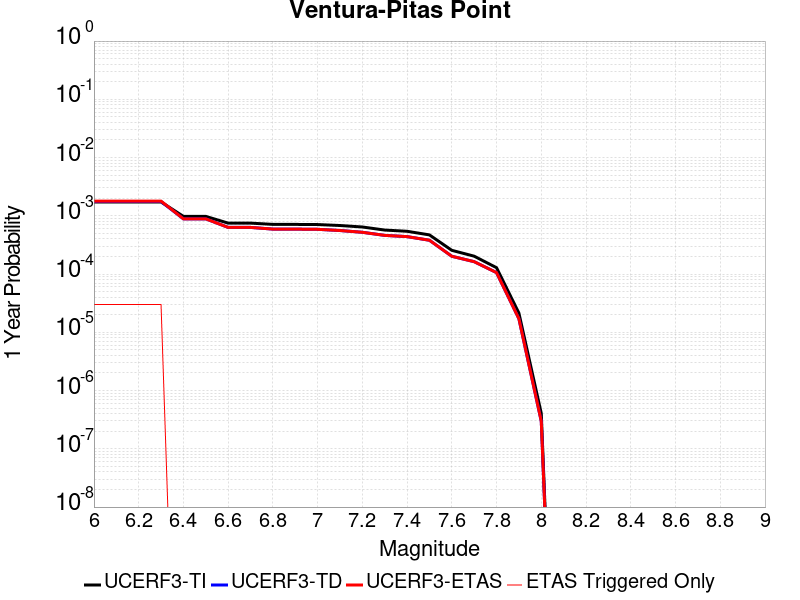 |  |

| Magnitude | 1 wk TI Prob | 1 wk TD Prob | 1 wk ETAS Prob | 1 wk ETAS/TD Gain | 1 wk ETAS Triggered Only | 1 mo TI Prob | 1 mo TD Prob | 1 mo ETAS Prob | 1 mo ETAS/TD Gain | 1 mo ETAS Triggered Only | 1 yr TI Prob | 1 yr TD Prob | 1 yr ETAS Prob | 1 yr ETAS/TD Gain | 1 yr ETAS Triggered Only | 10 yr TI Prob | 10 yr TD Prob | 10 yr ETAS Prob | 10 yr ETAS/TD Gain | 10 yr ETAS Triggered Only |
|-----|-----|-----|-----|-----|-----|-----|-----|-----|-----|-----|-----|-----|-----|-----|-----|-----|-----|-----|-----|-----|
| 6.0 | 3.3179622E-5 | 3.3735185E-5 | 5.3734508E-5 | 1.5928328 | 2.0E-5 | 1.4219063E-4 | 1.445728E-4 | 1.6456991E-4 | 1.1383187 | 2.0E-5 | 0.0017297962 | 0.0017590096 | 0.0017889568 | 1.017025 | 3.0E-5 | 0.017163932 | 0.0174764 | 0.017505877 | 1.0016866 | 3.0E-5 |
| 6.1 | 3.3179622E-5 | 3.3735185E-5 | 5.3734508E-5 | 1.5928328 | 2.0E-5 | 1.4219063E-4 | 1.445728E-4 | 1.6456991E-4 | 1.1383187 | 2.0E-5 | 0.0017297962 | 0.0017590096 | 0.0017889568 | 1.017025 | 3.0E-5 | 0.017163932 | 0.0174764 | 0.017505877 | 1.0016866 | 3.0E-5 |
| 6.2 | 3.3179622E-5 | 3.3735185E-5 | 5.3734508E-5 | 1.5928328 | 2.0E-5 | 1.4219063E-4 | 1.445728E-4 | 1.6456991E-4 | 1.1383187 | 2.0E-5 | 0.0017297962 | 0.0017590096 | 0.0017889568 | 1.017025 | 3.0E-5 | 0.017163932 | 0.0174764 | 0.017505877 | 1.0016866 | 3.0E-5 |
| 6.3 | 3.3179622E-5 | 3.3735185E-5 | 5.3734508E-5 | 1.5928328 | 2.0E-5 | 1.4219063E-4 | 1.445728E-4 | 1.6456991E-4 | 1.1383187 | 2.0E-5 | 0.0017297962 | 0.0017590096 | 0.0017889568 | 1.017025 | 3.0E-5 | 0.017163932 | 0.0174764 | 0.017505877 | 1.0016866 | 3.0E-5 |
| 6.4 | 1.8754668E-5 | 1.701961E-5 | 1.701961E-5 | 1.0 | 0.0 | 8.037467E-5 | 7.293928E-5 | 7.293928E-5 | 1.0 | 0.0 | 9.781223E-4 | 8.8769704E-4 | 8.8769704E-4 | 1.0 | 0.0 | 0.009738282 | 0.008843848 | 0.008843848 | 1.0 | 0.0 |
| 6.5 | 1.8754668E-5 | 1.701961E-5 | 1.701961E-5 | 1.0 | 0.0 | 8.037467E-5 | 7.293928E-5 | 7.293928E-5 | 1.0 | 0.0 | 9.781223E-4 | 8.8769704E-4 | 8.8769704E-4 | 1.0 | 0.0 | 0.009738282 | 0.008843848 | 0.008843848 | 1.0 | 0.0 |
| 6.6 | 1.4361558E-5 | 1.2122275E-5 | 1.2122275E-5 | 1.0 | 0.0 | 6.154808E-5 | 5.1951585E-5 | 5.1951585E-5 | 1.0 | 0.0 | 7.490902E-4 | 6.3232926E-4 | 6.3232926E-4 | 1.0 | 0.0 | 0.0074657016 | 0.0063055577 | 0.0063055577 | 1.0 | 0.0 |
| 6.7 | 1.4361558E-5 | 1.2122275E-5 | 1.2122275E-5 | 1.0 | 0.0 | 6.154808E-5 | 5.1951585E-5 | 5.1951585E-5 | 1.0 | 0.0 | 7.490902E-4 | 6.3232926E-4 | 6.3232926E-4 | 1.0 | 0.0 | 0.0074657016 | 0.0063055577 | 0.0063055577 | 1.0 | 0.0 |
| 6.8 | 1.3663846E-5 | 1.13444175E-5 | 1.13444175E-5 | 1.0 | 0.0 | 5.8558027E-5 | 4.861804E-5 | 4.861804E-5 | 1.0 | 0.0 | 7.127108E-4 | 5.917658E-4 | 5.917658E-4 | 1.0 | 0.0 | 0.007104293 | 0.005902116 | 0.005902116 | 1.0 | 0.0 |
| 6.9 | 1.3644157E-5 | 1.1322519E-5 | 1.1322519E-5 | 1.0 | 0.0 | 5.8473648E-5 | 4.8524187E-5 | 4.8524187E-5 | 1.0 | 0.0 | 7.116841E-4 | 5.9062376E-4 | 5.9062376E-4 | 1.0 | 0.0 | 0.007094092 | 0.0058907564 | 0.0058907564 | 1.0 | 0.0 |
| 7.0 | 1.3568845E-5 | 1.1242086E-5 | 1.1242086E-5 | 1.0 | 0.0 | 5.8150898E-5 | 4.817949E-5 | 4.817949E-5 | 1.0 | 0.0 | 7.077572E-4 | 5.864293E-4 | 5.864293E-4 | 1.0 | 0.0 | 0.007055073 | 0.0058490336 | 0.0058490336 | 1.0 | 0.0 |
| 7.1 | 1.306572E-5 | 1.072054E-5 | 1.072054E-5 | 1.0 | 0.0 | 5.599474E-5 | 4.5944373E-5 | 4.5944373E-5 | 1.0 | 0.0 | 6.815227E-4 | 5.5923103E-4 | 5.5923103E-4 | 1.0 | 0.0 | 0.0067943637 | 0.0055784425 | 0.0055784425 | 1.0 | 0.0 |
| 7.2 | 1.232604E-5 | 9.995143E-6 | 9.995143E-6 | 1.0 | 0.0 | 5.2824813E-5 | 4.2835632E-5 | 4.2835632E-5 | 1.0 | 0.0 | 6.429523E-4 | 5.214008E-4 | 5.214008E-4 | 1.0 | 0.0 | 0.0064109527 | 0.005201967 | 0.005201967 | 1.0 | 0.0 |
| 7.3 | 1.0917261E-5 | 8.84384E-6 | 8.84384E-6 | 1.0 | 0.0 | 4.678742E-5 | 3.790163E-5 | 3.790163E-5 | 1.0 | 0.0 | 5.69488E-4 | 4.6135622E-4 | 4.6135622E-4 | 1.0 | 0.0 | 0.0056803077 | 0.00460415 | 0.00460415 | 1.0 | 0.0 |
| 7.4 | 1.039959E-5 | 8.423562E-6 | 8.423562E-6 | 1.0 | 0.0 | 4.456891E-5 | 3.610049E-5 | 3.610049E-5 | 1.0 | 0.0 | 5.424914E-4 | 4.3943635E-4 | 4.3943635E-4 | 1.0 | 0.0 | 0.0054116896 | 0.004385836 | 0.004385836 | 1.0 | 0.0 |
| 7.5 | 9.015877E-6 | 7.2975445E-6 | 7.2975445E-6 | 1.0 | 0.0 | 3.86389E-5 | 3.1274823E-5 | 3.1274823E-5 | 1.0 | 0.0 | 4.7032707E-4 | 3.8070587E-4 | 3.8070587E-4 | 1.0 | 0.0 | 0.004693329 | 0.0038006818 | 0.0038006818 | 1.0 | 0.0 |
| 7.6 | 4.900162E-6 | 3.8741155E-6 | 3.8741155E-6 | 1.0 | 0.0 | 2.1000526E-5 | 1.6603248E-5 | 1.6603248E-5 | 1.0 | 0.0 | 2.556514E-4 | 2.0212591E-4 | 2.0212591E-4 | 1.0 | 0.0 | 0.0025535747 | 0.0020194345 | 0.0020194345 | 1.0 | 0.0 |
| 7.7 | 3.8850626E-6 | 3.1267302E-6 | 3.1267302E-6 | 1.0 | 0.0 | 1.6650163E-5 | 1.3400205E-5 | 1.3400205E-5 | 1.0 | 0.0 | 2.0269687E-4 | 1.6313537E-4 | 1.6313537E-4 | 1.0 | 0.0 | 0.002025121 | 0.0016301654 | 0.0016301654 | 1.0 | 0.0 |
| 7.8 | 2.4654719E-6 | 2.029875E-6 | 2.029875E-6 | 1.0 | 0.0 | 1.0566265E-5 | 8.699436E-6 | 8.699436E-6 | 1.0 | 0.0 | 1.2863669E-4 | 1.0591053E-4 | 1.0591053E-4 | 1.0 | 0.0 | 0.0012856225 | 0.0010586053 | 0.0010586053 | 1.0 | 0.0 |
| 7.9 | 4.095894E-7 | 3.2764765E-7 | 3.2764765E-7 | 1.0 | 0.0 | 1.7553821E-6 | 1.4042034E-6 | 1.4042034E-6 | 1.0 | 0.0 | 2.1371567E-5 | 1.7096047E-5 | 1.7096047E-5 | 1.0 | 0.0 | 2.1369511E-4 | 1.7094762E-4 | 1.7094762E-4 | 1.0 | 0.0 |
| 8.0 | 7.791402E-9 | 5.683497E-9 | 5.683497E-9 | 1.0 | 0.0 | 3.3391725E-8 | 2.4357844E-8 | 2.4357844E-8 | 1.0 | 0.0 | 4.0654416E-7 | 2.9655675E-7 | 2.9655675E-7 | 1.0 | 0.0 | 4.065434E-6 | 2.9655655E-6 | 2.9655655E-6 | 1.0 | 0.0 |

## Clamshell-Sawpit
*[(top)](#table-of-contents)*

| 1 Week | 1 Month | 1 Year | 10 Year |
|-----|-----|-----|-----|
|  |  |  |  |

| Magnitude | 1 wk TI Prob | 1 wk TD Prob | 1 wk ETAS Prob | 1 wk ETAS/TD Gain | 1 wk ETAS Triggered Only | 1 mo TI Prob | 1 mo TD Prob | 1 mo ETAS Prob | 1 mo ETAS/TD Gain | 1 mo ETAS Triggered Only | 1 yr TI Prob | 1 yr TD Prob | 1 yr ETAS Prob | 1 yr ETAS/TD Gain | 1 yr ETAS Triggered Only | 10 yr TI Prob | 10 yr TD Prob | 10 yr ETAS Prob | 10 yr ETAS/TD Gain | 10 yr ETAS Triggered Only |
|-----|-----|-----|-----|-----|-----|-----|-----|-----|-----|-----|-----|-----|-----|-----|-----|-----|-----|-----|-----|-----|
| 6.0 | 3.202998E-6 | 3.0127644E-6 | 1.3012735E-5 | 4.319201 | 1.0E-5 | 1.3727062E-5 | 1.2911788E-5 | 2.2911658E-5 | 1.774476 | 1.0E-5 | 1.6711417E-4 | 1.5719049E-4 | 1.7718734E-4 | 1.1272142 | 2.0E-5 | 0.0016698855 | 0.0015708724 | 0.0016008252 | 1.0190676 | 3.0E-5 |
| 6.1 | 3.202998E-6 | 3.0127644E-6 | 1.3012735E-5 | 4.319201 | 1.0E-5 | 1.3727062E-5 | 1.2911788E-5 | 2.2911658E-5 | 1.774476 | 1.0E-5 | 1.6711417E-4 | 1.5719049E-4 | 1.7718734E-4 | 1.1272142 | 2.0E-5 | 0.0016698855 | 0.0015708724 | 0.0016008252 | 1.0190676 | 3.0E-5 |
| 6.2 | 3.202998E-6 | 3.0127644E-6 | 1.3012735E-5 | 4.319201 | 1.0E-5 | 1.3727062E-5 | 1.2911788E-5 | 2.2911658E-5 | 1.774476 | 1.0E-5 | 1.6711417E-4 | 1.5719049E-4 | 1.7718734E-4 | 1.1272142 | 2.0E-5 | 0.0016698855 | 0.0015708724 | 0.0016008252 | 1.0190676 | 3.0E-5 |
| 6.3 | 3.202998E-6 | 3.0127644E-6 | 1.3012735E-5 | 4.319201 | 1.0E-5 | 1.3727062E-5 | 1.2911788E-5 | 2.2911658E-5 | 1.774476 | 1.0E-5 | 1.6711417E-4 | 1.5719049E-4 | 1.7718734E-4 | 1.1272142 | 2.0E-5 | 0.0016698855 | 0.0015708724 | 0.0016008252 | 1.0190676 | 3.0E-5 |
| 6.4 | 3.202998E-6 | 3.0127644E-6 | 1.3012735E-5 | 4.319201 | 1.0E-5 | 1.3727062E-5 | 1.2911788E-5 | 2.2911658E-5 | 1.774476 | 1.0E-5 | 1.6711417E-4 | 1.5719049E-4 | 1.7718734E-4 | 1.1272142 | 2.0E-5 | 0.0016698855 | 0.0015708724 | 0.0016008252 | 1.0190676 | 3.0E-5 |
| 6.5 | 2.5862723E-6 | 2.380775E-6 | 1.2380751E-5 | 5.200303 | 1.0E-5 | 1.1083977E-5 | 1.0203283E-5 | 2.020318E-5 | 1.9800668 | 1.0E-5 | 1.3493907E-4 | 1.2421819E-4 | 1.3421696E-4 | 1.0804935 | 1.0E-5 | 0.0013485716 | 0.0012415178 | 0.0012515055 | 1.0080446 | 1.0E-5 |
| 6.6 | 2.5862723E-6 | 2.380775E-6 | 1.2380751E-5 | 5.200303 | 1.0E-5 | 1.1083977E-5 | 1.0203283E-5 | 2.020318E-5 | 1.9800668 | 1.0E-5 | 1.3493907E-4 | 1.2421819E-4 | 1.3421696E-4 | 1.0804935 | 1.0E-5 | 0.0013485716 | 0.0012415178 | 0.0012515055 | 1.0080446 | 1.0E-5 |
| 6.7 | 2.5862723E-6 | 2.380775E-6 | 1.2380751E-5 | 5.200303 | 1.0E-5 | 1.1083977E-5 | 1.0203283E-5 | 2.020318E-5 | 1.9800668 | 1.0E-5 | 1.3493907E-4 | 1.2421819E-4 | 1.3421696E-4 | 1.0804935 | 1.0E-5 | 0.0013485716 | 0.0012415178 | 0.0012515055 | 1.0080446 | 1.0E-5 |
| 6.8 | 2.4098806E-6 | 2.1977307E-6 | 1.2197709E-5 | 5.550138 | 1.0E-5 | 1.0328019E-5 | 9.4188135E-6 | 1.941872E-5 | 2.0616949 | 1.0E-5 | 1.2573638E-4 | 1.1466829E-4 | 1.2466715E-4 | 1.087198 | 1.0E-5 | 0.0012566525 | 0.0011461178 | 0.0011561064 | 1.0087152 | 1.0E-5 |
| 6.9 | 2.0073985E-6 | 1.7784248E-6 | 1.7784248E-6 | 1.0 | 0.0 | 8.603109E-6 | 7.621799E-6 | 7.621799E-6 | 1.0 | 0.0 | 1.0473781E-4 | 9.279157E-5 | 9.279157E-5 | 1.0 | 0.0 | 0.0010468846 | 9.275401E-4 | 9.275401E-4 | 1.0 | 0.0 |
| 7.0 | 1.8166766E-6 | 1.5807095E-6 | 1.5807095E-6 | 1.0 | 0.0 | 7.785734E-6 | 6.7744522E-6 | 6.7744522E-6 | 1.0 | 0.0 | 9.478718E-5 | 8.247593E-5 | 8.247593E-5 | 1.0 | 0.0 | 9.4746763E-4 | 8.244633E-4 | 8.244633E-4 | 1.0 | 0.0 |
| 7.1 | 1.5471421E-6 | 1.3052961E-6 | 1.3052961E-6 | 1.0 | 0.0 | 6.6305925E-6 | 5.5941146E-6 | 5.5941146E-6 | 1.0 | 0.0 | 8.072447E-5 | 6.8106274E-5 | 6.8106274E-5 | 1.0 | 0.0 | 8.0695155E-4 | 6.808595E-4 | 6.808595E-4 | 1.0 | 0.0 |
| 7.2 | 1.3608037E-6 | 1.1153443E-6 | 1.1153443E-6 | 1.0 | 0.0 | 5.8320024E-6 | 4.7800386E-6 | 4.7800386E-6 | 1.0 | 0.0 | 7.1002316E-5 | 5.8195463E-5 | 5.8195463E-5 | 1.0 | 0.0 | 7.097964E-4 | 5.818069E-4 | 5.818069E-4 | 1.0 | 0.0 |
| 7.3 | 1.0749634E-6 | 8.384254E-7 | 8.384254E-7 | 1.0 | 0.0 | 4.6069777E-6 | 3.593247E-6 | 3.593247E-6 | 1.0 | 0.0 | 5.608851E-5 | 4.374693E-5 | 4.374693E-5 | 1.0 | 0.0 | 5.6074356E-4 | 4.37386E-4 | 4.37386E-4 | 1.0 | 0.0 |
| 7.4 | 8.416856E-7 | 6.200048E-7 | 6.200048E-7 | 1.0 | 0.0 | 3.607219E-6 | 2.6571608E-6 | 2.6571608E-6 | 1.0 | 0.0 | 4.3917007E-5 | 3.2350472E-5 | 3.2350472E-5 | 1.0 | 0.0 | 4.390833E-4 | 3.2345962E-4 | 3.2345962E-4 | 1.0 | 0.0 |
| 7.5 | 6.2779594E-7 | 4.496886E-7 | 4.496886E-7 | 1.0 | 0.0 | 2.6905511E-6 | 1.9272356E-6 | 1.9272356E-6 | 1.0 | 0.0 | 3.275697E-5 | 2.346386E-5 | 2.346386E-5 | 1.0 | 0.0 | 3.275214E-4 | 2.346157E-4 | 2.346157E-4 | 1.0 | 0.0 |
| 7.6 | 4.3822078E-7 | 3.0595405E-7 | 3.0595405E-7 | 1.0 | 0.0 | 1.8780877E-6 | 1.311231E-6 | 1.311231E-6 | 1.0 | 0.0 | 2.2865479E-5 | 1.5964137E-5 | 1.5964137E-5 | 1.0 | 0.0 | 2.2863125E-4 | 1.5963144E-4 | 1.5963144E-4 | 1.0 | 0.0 |
| 7.7 | 1.8704569E-7 | 1.12379205E-7 | 1.12379205E-7 | 1.0 | 0.0 | 8.0162414E-7 | 4.816251E-7 | 4.816251E-7 | 1.0 | 0.0 | 9.75973E-6 | 5.86377E-6 | 5.86377E-6 | 1.0 | 0.0 | 9.7593016E-5 | 5.863622E-5 | 5.863622E-5 | 1.0 | 0.0 |
| 7.8 | 3.5378733E-8 | 2.1838144E-8 | 2.1838144E-8 | 1.0 | 0.0 | 1.5162313E-7 | 9.359204E-8 | 9.359204E-8 | 1.0 | 0.0 | 1.84601E-6 | 1.1394826E-6 | 1.1394826E-6 | 1.0 | 0.0 | 1.8459947E-5 | 1.139477E-5 | 1.139477E-5 | 1.0 | 0.0 |
| 7.9 | 7.504945E-9 | 5.1920326E-9 | 5.1920326E-9 | 1.0 | 0.0 | 3.2164053E-8 | 2.225157E-8 | 2.225157E-8 | 1.0 | 0.0 | 3.9159727E-7 | 2.7091284E-7 | 2.7091284E-7 | 1.0 | 0.0 | 3.915966E-6 | 2.7091257E-6 | 2.7091257E-6 | 1.0 | 0.0 |
| 8.0 | 1.6554036E-10 | 1.4180768E-10 | 1.4180768E-10 | 1.0 | 0.0 | 7.0945894E-10 | 6.077475E-10 | 6.077475E-10 | 1.0 | 0.0 | 8.637662E-9 | 7.3993256E-9 | 7.3993256E-9 | 1.0 | 0.0 | 8.6376616E-8 | 7.3993256E-8 | 7.3993256E-8 | 1.0 | 0.0 |

## San Cayetano
*[(top)](#table-of-contents)*

| 1 Week | 1 Month | 1 Year | 10 Year |
|-----|-----|-----|-----|
|  |  | 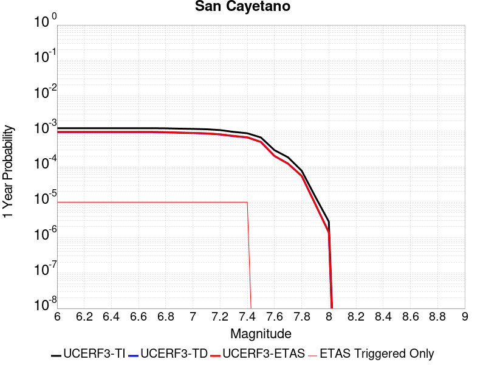 |  |

| Magnitude | 1 wk TI Prob | 1 wk TD Prob | 1 wk ETAS Prob | 1 wk ETAS/TD Gain | 1 wk ETAS Triggered Only | 1 mo TI Prob | 1 mo TD Prob | 1 mo ETAS Prob | 1 mo ETAS/TD Gain | 1 mo ETAS Triggered Only | 1 yr TI Prob | 1 yr TD Prob | 1 yr ETAS Prob | 1 yr ETAS/TD Gain | 1 yr ETAS Triggered Only | 10 yr TI Prob | 10 yr TD Prob | 10 yr ETAS Prob | 10 yr ETAS/TD Gain | 10 yr ETAS Triggered Only |
|-----|-----|-----|-----|-----|-----|-----|-----|-----|-----|-----|-----|-----|-----|-----|-----|-----|-----|-----|-----|-----|
| 6.0 | 2.3476267E-5 | 1.816928E-5 | 1.816928E-5 | 1.0 | 0.0 | 1.0060869E-4 | 7.786603E-5 | 7.786603E-5 | 1.0 | 0.0 | 0.0012242225 | 9.476103E-4 | 9.5760083E-4 | 1.0105429 | 1.0E-5 | 0.012175002 | 0.009436584 | 0.009466301 | 1.0031492 | 3.0E-5 |
| 6.1 | 2.3476267E-5 | 1.816928E-5 | 1.816928E-5 | 1.0 | 0.0 | 1.0060869E-4 | 7.786603E-5 | 7.786603E-5 | 1.0 | 0.0 | 0.0012242225 | 9.476103E-4 | 9.5760083E-4 | 1.0105429 | 1.0E-5 | 0.012175002 | 0.009436584 | 0.009466301 | 1.0031492 | 3.0E-5 |
| 6.2 | 2.3476267E-5 | 1.816928E-5 | 1.816928E-5 | 1.0 | 0.0 | 1.0060869E-4 | 7.786603E-5 | 7.786603E-5 | 1.0 | 0.0 | 0.0012242225 | 9.476103E-4 | 9.5760083E-4 | 1.0105429 | 1.0E-5 | 0.012175002 | 0.009436584 | 0.009466301 | 1.0031492 | 3.0E-5 |
| 6.3 | 2.3476267E-5 | 1.816928E-5 | 1.816928E-5 | 1.0 | 0.0 | 1.0060869E-4 | 7.786603E-5 | 7.786603E-5 | 1.0 | 0.0 | 0.0012242225 | 9.476103E-4 | 9.5760083E-4 | 1.0105429 | 1.0E-5 | 0.012175002 | 0.009436584 | 0.009466301 | 1.0031492 | 3.0E-5 |
| 6.4 | 2.3476267E-5 | 1.816928E-5 | 1.816928E-5 | 1.0 | 0.0 | 1.0060869E-4 | 7.786603E-5 | 7.786603E-5 | 1.0 | 0.0 | 0.0012242225 | 9.476103E-4 | 9.5760083E-4 | 1.0105429 | 1.0E-5 | 0.012175002 | 0.009436584 | 0.009466301 | 1.0031492 | 3.0E-5 |
| 6.5 | 2.3476267E-5 | 1.816928E-5 | 1.816928E-5 | 1.0 | 0.0 | 1.0060869E-4 | 7.786603E-5 | 7.786603E-5 | 1.0 | 0.0 | 0.0012242225 | 9.476103E-4 | 9.5760083E-4 | 1.0105429 | 1.0E-5 | 0.012175002 | 0.009436584 | 0.009466301 | 1.0031492 | 3.0E-5 |
| 6.6 | 2.3476267E-5 | 1.816928E-5 | 1.816928E-5 | 1.0 | 0.0 | 1.0060869E-4 | 7.786603E-5 | 7.786603E-5 | 1.0 | 0.0 | 0.0012242225 | 9.476103E-4 | 9.5760083E-4 | 1.0105429 | 1.0E-5 | 0.012175002 | 0.009436584 | 0.009466301 | 1.0031492 | 3.0E-5 |
| 6.7 | 2.3476267E-5 | 1.816928E-5 | 1.816928E-5 | 1.0 | 0.0 | 1.0060869E-4 | 7.786603E-5 | 7.786603E-5 | 1.0 | 0.0 | 0.0012242225 | 9.476103E-4 | 9.5760083E-4 | 1.0105429 | 1.0E-5 | 0.012175002 | 0.009436584 | 0.009466301 | 1.0031492 | 3.0E-5 |
| 6.8 | 2.3241924E-5 | 1.7936987E-5 | 1.7936987E-5 | 1.0 | 0.0 | 9.960445E-5 | 7.687056E-5 | 7.687056E-5 | 1.0 | 0.0 | 0.0012120095 | 9.3550084E-4 | 9.454915E-4 | 1.0106795 | 1.0E-5 | 0.012054204 | 0.009316482 | 0.009346203 | 1.00319 | 3.0E-5 |
| 6.9 | 2.2761007E-5 | 1.7432423E-5 | 1.7432423E-5 | 1.0 | 0.0 | 9.7543525E-5 | 7.470827E-5 | 7.470827E-5 | 1.0 | 0.0 | 0.0011869454 | 9.09197E-4 | 9.191879E-4 | 1.0109887 | 1.0E-5 | 0.011806256 | 0.009055603 | 0.009085331 | 1.0032829 | 3.0E-5 |
| 7.0 | 2.240283E-5 | 1.7066168E-5 | 1.7066168E-5 | 1.0 | 0.0 | 9.600859E-5 | 7.313869E-5 | 7.313869E-5 | 1.0 | 0.0 | 0.0011682777 | 8.9010317E-4 | 9.000943E-4 | 1.0112246 | 1.0E-5 | 0.011621549 | 0.008866196 | 0.008886018 | 1.0022358 | 2.0E-5 |
| 7.1 | 2.1871154E-5 | 1.6586018E-5 | 1.6586018E-5 | 1.0 | 0.0 | 9.373015E-5 | 7.108101E-5 | 7.108101E-5 | 1.0 | 0.0 | 0.0011405671 | 8.6507114E-4 | 8.750625E-4 | 1.0115497 | 1.0E-5 | 0.011347309 | 0.008617838 | 0.008637666 | 1.0023007 | 2.0E-5 |
| 7.2 | 2.0714133E-5 | 1.5564561E-5 | 1.5564561E-5 | 1.0 | 0.0 | 8.8771834E-5 | 6.670357E-5 | 6.670357E-5 | 1.0 | 0.0 | 0.0010802611 | 8.1181666E-4 | 8.218085E-4 | 1.012308 | 1.0E-5 | 0.010750249 | 0.008089285 | 0.008109123 | 1.0024524 | 2.0E-5 |
| 7.3 | 1.8408395E-5 | 1.3996864E-5 | 1.3996864E-5 | 1.0 | 0.0 | 7.8890735E-5 | 5.99852E-5 | 5.99852E-5 | 1.0 | 0.0 | 9.600714E-4 | 7.300781E-4 | 7.4007077E-4 | 1.0136871 | 1.0E-5 | 0.009559342 | 0.0072775153 | 0.0072973697 | 1.0027282 | 2.0E-5 |
| 7.4 | 1.6856795E-5 | 1.28500815E-5 | 1.28500815E-5 | 1.0 | 0.0 | 7.2241404E-5 | 5.5070628E-5 | 5.5070628E-5 | 1.0 | 0.0 | 8.7918417E-4 | 6.7028153E-4 | 6.802748E-4 | 1.0149091 | 1.0E-5 | 0.00875714 | 0.0066832784 | 0.006703145 | 1.0029726 | 2.0E-5 |
| 7.5 | 1.2822778E-5 | 9.577542E-6 | 9.577542E-6 | 1.0 | 0.0 | 5.495361E-5 | 4.1045972E-5 | 4.1045972E-5 | 1.0 | 0.0 | 6.688548E-4 | 4.996217E-4 | 4.996217E-4 | 1.0 | 0.0 | 0.006668452 | 0.0049851555 | 0.004995106 | 1.0019959 | 1.0E-5 |
| 7.6 | 5.6272684E-6 | 3.854903E-6 | 3.854903E-6 | 1.0 | 0.0 | 2.4116642E-5 | 1.652091E-5 | 1.652091E-5 | 1.0 | 0.0 | 2.9358055E-4 | 2.0112359E-4 | 2.0112359E-4 | 1.0 | 0.0 | 0.0029319301 | 0.0020094267 | 0.0020094267 | 1.0 | 0.0 |
| 7.7 | 3.5261346E-6 | 2.3407013E-6 | 2.3407013E-6 | 1.0 | 0.0 | 1.5111918E-5 | 1.0031539E-5 | 1.0031539E-5 | 1.0 | 0.0 | 1.8397206E-4 | 1.2212721E-4 | 1.2212721E-4 | 1.0 | 0.0 | 0.0018381984 | 0.0012206084 | 0.0012206084 | 1.0 | 0.0 |
| 7.8 | 1.4826929E-6 | 1.056428E-6 | 1.056428E-6 | 1.0 | 0.0 | 6.354383E-6 | 4.5275406E-6 | 4.5275406E-6 | 1.0 | 0.0 | 7.736187E-5 | 5.5121433E-5 | 5.5121433E-5 | 1.0 | 0.0 | 7.733494E-4 | 5.5107963E-4 | 5.5107963E-4 | 1.0 | 0.0 |
| 7.9 | 2.7568166E-7 | 1.6978244E-7 | 1.6978244E-7 | 1.0 | 0.0 | 1.1814923E-6 | 7.2763885E-7 | 7.2763885E-7 | 1.0 | 0.0 | 1.4384574E-5 | 8.858967E-6 | 8.858967E-6 | 1.0 | 0.0 | 1.4383643E-4 | 8.8586174E-5 | 8.8586174E-5 | 1.0 | 0.0 |
| 8.0 | 5.407832E-8 | 2.6887697E-8 | 2.6887697E-8 | 1.0 | 0.0 | 2.3176422E-7 | 1.15232986E-7 | 1.15232986E-7 | 1.0 | 0.0 | 2.8217257E-6 | 1.4029607E-6 | 1.4029607E-6 | 1.0 | 0.0 | 2.8216898E-5 | 1.4029522E-5 | 1.4029522E-5 | 1.0 | 0.0 |

## Concord 2011 CFM
*[(top)](#table-of-contents)*

| 1 Week | 1 Month | 1 Year | 10 Year |
|-----|-----|-----|-----|
|  |  |  |  |

| Magnitude | 1 wk TI Prob | 1 wk TD Prob | 1 wk ETAS Prob | 1 wk ETAS/TD Gain | 1 wk ETAS Triggered Only | 1 mo TI Prob | 1 mo TD Prob | 1 mo ETAS Prob | 1 mo ETAS/TD Gain | 1 mo ETAS Triggered Only | 1 yr TI Prob | 1 yr TD Prob | 1 yr ETAS Prob | 1 yr ETAS/TD Gain | 1 yr ETAS Triggered Only | 10 yr TI Prob | 10 yr TD Prob | 10 yr ETAS Prob | 10 yr ETAS/TD Gain | 10 yr ETAS Triggered Only |
|-----|-----|-----|-----|-----|-----|-----|-----|-----|-----|-----|-----|-----|-----|-----|-----|-----|-----|-----|-----|-----|
| 6.0 | 5.7865112E-5 | 9.759152E-5 | 1.2758859E-4 | 1.3073738 | 3.0E-5 | 2.4796976E-4 | 4.1818706E-4 | 4.481745E-4 | 1.0717082 | 3.0E-5 | 0.0030148525 | 0.005079467 | 0.0051093143 | 1.0058762 | 3.0E-5 | 0.029742775 | 0.049248982 | 0.049277503 | 1.0005791 | 3.0E-5 |
| 6.1 | 5.7865112E-5 | 9.759152E-5 | 1.2758859E-4 | 1.3073738 | 3.0E-5 | 2.4796976E-4 | 4.1818706E-4 | 4.481745E-4 | 1.0717082 | 3.0E-5 | 0.0030148525 | 0.005079467 | 0.0051093143 | 1.0058762 | 3.0E-5 | 0.029742775 | 0.049248982 | 0.049277503 | 1.0005791 | 3.0E-5 |
| 6.2 | 5.6789337E-5 | 9.5795076E-5 | 1.257922E-4 | 1.3131385 | 3.0E-5 | 2.4336016E-4 | 4.104905E-4 | 4.4047818E-4 | 1.0730534 | 3.0E-5 | 0.0029588845 | 0.0049861916 | 0.005016042 | 1.0059866 | 3.0E-5 | 0.029197963 | 0.04836556 | 0.048394106 | 1.0005903 | 3.0E-5 |
| 6.3 | 5.203322E-5 | 8.803056E-5 | 1.18027914E-4 | 1.3407607 | 3.0E-5 | 2.2298045E-4 | 3.7722368E-4 | 4.0721236E-4 | 1.0794984 | 3.0E-5 | 0.0027114071 | 0.0045838105 | 0.004613673 | 1.0065148 | 3.0E-5 | 0.026785625 | 0.04453672 | 0.044565383 | 1.0006436 | 3.0E-5 |
| 6.4 | 4.7120942E-5 | 7.897404E-5 | 1.0897167E-4 | 1.3798417 | 3.0E-5 | 2.0193127E-4 | 3.3842045E-4 | 3.6841028E-4 | 1.0886171 | 3.0E-5 | 0.0024557412 | 0.00411323 | 0.0041431063 | 1.0072635 | 3.0E-5 | 0.024287801 | 0.040065527 | 0.040094327 | 1.0007188 | 3.0E-5 |
| 6.5 | 2.9598437E-5 | 4.667486E-5 | 7.667346E-5 | 1.6427143 | 3.0E-5 | 1.2684427E-4 | 2.0002096E-4 | 2.3001496E-4 | 1.1499543 | 3.0E-5 | 0.001543235 | 0.0024327459 | 0.0024626728 | 1.0123018 | 3.0E-5 | 0.015325619 | 0.023909973 | 0.023939256 | 1.0012248 | 3.0E-5 |
| 6.6 | 2.0443718E-5 | 2.998433E-5 | 2.998433E-5 | 1.0 | 0.0 | 8.7613E-5 | 1.2849816E-4 | 1.2849816E-4 | 1.0 | 0.0 | 0.0010661662 | 0.0015633785 | 0.0015633785 | 1.0 | 0.0 | 0.010610655 | 0.015466996 | 0.015466996 | 1.0 | 0.0 |
| 6.7 | 1.798539E-5 | 2.5557381E-5 | 2.5557381E-5 | 1.0 | 0.0 | 7.7077966E-5 | 1.0952716E-4 | 1.0952716E-4 | 1.0 | 0.0 | 9.380202E-4 | 0.001332699 | 0.001332699 | 1.0 | 0.0 | 0.009340706 | 0.013217433 | 0.013217433 | 1.0 | 0.0 |
| 6.8 | 1.613555E-5 | 2.1959211E-5 | 2.1959211E-5 | 1.0 | 0.0 | 6.915052E-5 | 9.4107585E-5 | 9.4107585E-5 | 1.0 | 0.0 | 8.4158237E-4 | 0.0011451716 | 0.0011451716 | 1.0 | 0.0 | 0.008384023 | 0.0113782035 | 0.0113782035 | 1.0 | 0.0 |
| 6.9 | 1.2916435E-5 | 1.7081054E-5 | 1.7081054E-5 | 1.0 | 0.0 | 5.5354973E-5 | 7.32025E-5 | 7.32025E-5 | 1.0 | 0.0 | 6.7373837E-4 | 8.908818E-4 | 8.908818E-4 | 1.0 | 0.0 | 0.006716994 | 0.008867139 | 0.008867139 | 1.0 | 0.0 |
| 7.0 | 9.81129E-6 | 1.2630829E-5 | 1.2630829E-5 | 1.0 | 0.0 | 4.2047708E-5 | 5.413101E-5 | 5.413101E-5 | 1.0 | 0.0 | 5.118106E-4 | 6.588474E-4 | 6.588474E-4 | 1.0 | 0.0 | 0.005106334 | 0.006569153 | 0.006569153 | 1.0 | 0.0 |
| 7.1 | 8.0889195E-6 | 1.0418261E-5 | 1.0418261E-5 | 1.0 | 0.0 | 3.4666336E-5 | 4.4648932E-5 | 4.4648932E-5 | 1.0 | 0.0 | 4.219809E-4 | 5.434662E-4 | 5.434662E-4 | 1.0 | 0.0 | 0.004211805 | 0.0054215975 | 0.0054215975 | 1.0 | 0.0 |
| 7.2 | 6.267438E-6 | 8.115699E-6 | 8.115699E-6 | 1.0 | 0.0 | 2.6860173E-5 | 3.4781104E-5 | 3.4781104E-5 | 1.0 | 0.0 | 3.2697353E-4 | 4.233784E-4 | 4.233784E-4 | 1.0 | 0.0 | 0.0032649285 | 0.004225969 | 0.004225969 | 1.0 | 0.0 |
| 7.3 | 3.6761196E-6 | 4.8401653E-6 | 4.8401653E-6 | 1.0 | 0.0 | 1.5754704E-5 | 2.0743402E-5 | 2.0743402E-5 | 1.0 | 0.0 | 1.9179663E-4 | 2.5252186E-4 | 2.5252186E-4 | 1.0 | 0.0 | 0.0019163118 | 0.002522487 | 0.002522487 | 1.0 | 0.0 |
| 7.4 | 2.8044356E-6 | 3.7096036E-6 | 3.7096036E-6 | 1.0 | 0.0 | 1.2018954E-5 | 1.5898204E-5 | 1.5898204E-5 | 1.0 | 0.0 | 1.4632095E-4 | 1.9354356E-4 | 1.9354356E-4 | 1.0 | 0.0 | 0.0014622464 | 0.0019338481 | 0.0019338481 | 1.0 | 0.0 |
| 7.5 | 2.4578699E-6 | 3.2447442E-6 | 3.2447442E-6 | 1.0 | 0.0 | 1.0533685E-5 | 1.3905973E-5 | 1.3905973E-5 | 1.0 | 0.0 | 1.2824008E-4 | 1.6929218E-4 | 1.6929218E-4 | 1.0 | 0.0 | 0.0012816609 | 0.001691713 | 0.001691713 | 1.0 | 0.0 |
| 7.6 | 1.7713267E-6 | 2.3351192E-6 | 2.3351192E-6 | 1.0 | 0.0 | 7.591378E-6 | 1.0007616E-5 | 1.0007616E-5 | 1.0 | 0.0 | 9.2421105E-5 | 1.21836E-4 | 1.21836E-4 | 1.0 | 0.0 | 9.2382677E-4 | 0.0012177454 | 0.0012177454 | 1.0 | 0.0 |
| 7.7 | 5.1912366E-7 | 6.8290143E-7 | 6.8290143E-7 | 1.0 | 0.0 | 2.2248137E-6 | 2.9267171E-6 | 2.9267171E-6 | 1.0 | 0.0 | 2.708677E-5 | 3.5632213E-5 | 3.5632213E-5 | 1.0 | 0.0 | 2.708347E-4 | 3.5627294E-4 | 3.5627294E-4 | 1.0 | 0.0 |

## Eaton Roughs 2011 CFM
*[(top)](#table-of-contents)*

| 1 Week | 1 Month | 1 Year | 10 Year |
|-----|-----|-----|-----|
|  |  |  |  |

| Magnitude | 1 wk TI Prob | 1 wk TD Prob | 1 wk ETAS Prob | 1 wk ETAS/TD Gain | 1 wk ETAS Triggered Only | 1 mo TI Prob | 1 mo TD Prob | 1 mo ETAS Prob | 1 mo ETAS/TD Gain | 1 mo ETAS Triggered Only | 1 yr TI Prob | 1 yr TD Prob | 1 yr ETAS Prob | 1 yr ETAS/TD Gain | 1 yr ETAS Triggered Only | 10 yr TI Prob | 10 yr TD Prob | 10 yr ETAS Prob | 10 yr ETAS/TD Gain | 10 yr ETAS Triggered Only |
|-----|-----|-----|-----|-----|-----|-----|-----|-----|-----|-----|-----|-----|-----|-----|-----|-----|-----|-----|-----|-----|
| 6.0 | 6.8044945E-5 | 8.843646E-5 | 9.843558E-5 | 1.1130655 | 1.0E-5 | 2.9158857E-4 | 3.7896493E-4 | 3.8896114E-4 | 1.0263777 | 1.0E-5 | 0.0035443127 | 0.0046050907 | 0.0046249987 | 1.004323 | 2.0E-5 | 0.03488314 | 0.04516335 | 0.045191992 | 1.0006343 | 3.0E-5 |
| 6.1 | 6.8044945E-5 | 8.843646E-5 | 9.843558E-5 | 1.1130655 | 1.0E-5 | 2.9158857E-4 | 3.7896493E-4 | 3.8896114E-4 | 1.0263777 | 1.0E-5 | 0.0035443127 | 0.0046050907 | 0.0046249987 | 1.004323 | 2.0E-5 | 0.03488314 | 0.04516335 | 0.045191992 | 1.0006343 | 3.0E-5 |
| 6.2 | 6.8044945E-5 | 8.843646E-5 | 9.843558E-5 | 1.1130655 | 1.0E-5 | 2.9158857E-4 | 3.7896493E-4 | 3.8896114E-4 | 1.0263777 | 1.0E-5 | 0.0035443127 | 0.0046050907 | 0.0046249987 | 1.004323 | 2.0E-5 | 0.03488314 | 0.04516335 | 0.045191992 | 1.0006343 | 3.0E-5 |
| 6.3 | 6.8044945E-5 | 8.843646E-5 | 9.843558E-5 | 1.1130655 | 1.0E-5 | 2.9158857E-4 | 3.7896493E-4 | 3.8896114E-4 | 1.0263777 | 1.0E-5 | 0.0035443127 | 0.0046050907 | 0.0046249987 | 1.004323 | 2.0E-5 | 0.03488314 | 0.04516335 | 0.045191992 | 1.0006343 | 3.0E-5 |
| 6.4 | 4.5830013E-5 | 5.715427E-5 | 6.71537E-5 | 1.174955 | 1.0E-5 | 1.9639956E-4 | 2.4492692E-4 | 2.5492447E-4 | 1.0408185 | 1.0E-5 | 0.0023885423 | 0.0029784471 | 0.0029884172 | 1.0033474 | 1.0E-5 | 0.023630321 | 0.029421588 | 0.029431295 | 1.0003299 | 1.0E-5 |
| 6.5 | 4.5830013E-5 | 5.715427E-5 | 6.71537E-5 | 1.174955 | 1.0E-5 | 1.9639956E-4 | 2.4492692E-4 | 2.5492447E-4 | 1.0408185 | 1.0E-5 | 0.0023885423 | 0.0029784471 | 0.0029884172 | 1.0033474 | 1.0E-5 | 0.023630321 | 0.029421588 | 0.029431295 | 1.0003299 | 1.0E-5 |
| 6.6 | 3.222194E-5 | 3.8261504E-5 | 4.826112E-5 | 1.2613493 | 1.0E-5 | 1.3808672E-4 | 1.639682E-4 | 1.7396656E-4 | 1.0609775 | 1.0E-5 | 0.0016799092 | 0.001994599 | 0.002004579 | 1.0050036 | 1.0E-5 | 0.016672665 | 0.019776601 | 0.019786404 | 1.0004957 | 1.0E-5 |
| 6.7 | 2.4155654E-5 | 2.7786238E-5 | 3.7785958E-5 | 1.3598804 | 1.0E-5 | 1.0352012E-4 | 1.1907848E-4 | 1.2907729E-4 | 1.0839683 | 1.0E-5 | 0.0012596287 | 0.0014488247 | 0.0014588102 | 1.0068922 | 1.0E-5 | 0.012525126 | 0.014394943 | 0.014404799 | 1.0006847 | 1.0E-5 |
| 6.8 | 2.1814667E-5 | 2.4940868E-5 | 3.494062E-5 | 1.4009384 | 1.0E-5 | 9.348808E-5 | 1.06885076E-4 | 1.16884E-4 | 1.0935484 | 1.0E-5 | 0.001137623 | 0.0013005526 | 0.0013105397 | 1.007679 | 1.0E-5 | 0.011318169 | 0.012930038 | 0.0129399095 | 1.0007634 | 1.0E-5 |
| 6.9 | 2.0700467E-5 | 2.3628932E-5 | 3.3628698E-5 | 1.4232 | 1.0E-5 | 8.871327E-5 | 1.01262944E-4 | 1.1126193E-4 | 1.0987428 | 1.0E-5 | 0.0010795488 | 0.0012321823 | 0.00124217 | 1.0081056 | 1.0E-5 | 0.010743194 | 0.012254035 | 0.012263913 | 1.0008061 | 1.0E-5 |
| 7.0 | 2.0104066E-5 | 2.29365E-5 | 3.293627E-5 | 1.4359763 | 1.0E-5 | 8.615744E-5 | 9.82956E-5 | 1.0829462E-4 | 1.1017239 | 1.0E-5 | 0.0010484619 | 0.0011960949 | 0.001206083 | 1.0083505 | 1.0E-5 | 0.010435291 | 0.011897073 | 0.0119069535 | 1.0008305 | 1.0E-5 |
| 7.1 | 1.8225232E-5 | 2.0773046E-5 | 3.077284E-5 | 1.4813831 | 1.0E-5 | 7.81058E-5 | 8.902431E-5 | 9.9023426E-5 | 1.1123189 | 1.0E-5 | 9.5052324E-4 | 0.0010833336 | 0.0010933228 | 1.0092207 | 1.0E-5 | 0.009464677 | 0.010780825 | 0.010790718 | 1.0009176 | 1.0E-5 |
| 7.2 | 1.7526572E-5 | 1.9993488E-5 | 2.9993289E-5 | 1.5001528 | 1.0E-5 | 7.511172E-5 | 8.5683576E-5 | 9.568271E-5 | 1.1166985 | 1.0E-5 | 9.141015E-4 | 0.0010426997 | 0.0010526893 | 1.0095805 | 1.0E-5 | 0.009103506 | 0.010378351 | 0.010388248 | 1.0009536 | 1.0E-5 |
| 7.3 | 1.5727232E-5 | 1.8021507E-5 | 2.8021326E-5 | 1.5548825 | 1.0E-5 | 6.740067E-5 | 7.723275E-5 | 8.723197E-5 | 1.1294688 | 1.0E-5 | 8.2029426E-4 | 9.399043E-4 | 9.4989495E-4 | 1.0106294 | 1.0E-5 | 0.008172729 | 0.009359511 | 0.009369417 | 1.0010585 | 1.0E-5 |
| 7.4 | 1.4457361E-5 | 1.6598358E-5 | 1.6598358E-5 | 1.0 | 0.0 | 6.195865E-5 | 7.113389E-5 | 7.113389E-5 | 1.0 | 0.0 | 7.540854E-4 | 8.657119E-4 | 8.657119E-4 | 1.0 | 0.0 | 0.007515317 | 0.008623555 | 0.008623555 | 1.0 | 0.0 |
| 7.5 | 1.33280955E-5 | 1.5345435E-5 | 1.5345435E-5 | 1.0 | 0.0 | 5.711916E-5 | 6.57645E-5 | 6.57645E-5 | 1.0 | 0.0 | 6.9520384E-4 | 8.0038945E-4 | 8.0038945E-4 | 1.0 | 0.0 | 0.00693033 | 0.007975209 | 0.007975209 | 1.0 | 0.0 |
| 7.6 | 1.0699478E-5 | 1.2387815E-5 | 1.2387815E-5 | 1.0 | 0.0 | 4.5854096E-5 | 5.308956E-5 | 5.308956E-5 | 1.0 | 0.0 | 5.581306E-4 | 6.4617425E-4 | 6.4617425E-4 | 1.0 | 0.0 | 0.005567309 | 0.0064430353 | 0.0064430353 | 1.0 | 0.0 |
| 7.7 | 5.9390236E-6 | 6.852951E-6 | 6.852951E-6 | 1.0 | 0.0 | 2.545271E-5 | 2.9369461E-5 | 2.9369461E-5 | 1.0 | 0.0 | 3.0984267E-4 | 3.5751477E-4 | 3.5751477E-4 | 1.0 | 0.0 | 0.0030941102 | 0.0035694204 | 0.0035694204 | 1.0 | 0.0 |
| 7.8 | 2.1622036E-6 | 2.3296996E-6 | 2.3296996E-6 | 1.0 | 0.0 | 9.266554E-6 | 9.984388E-6 | 9.984388E-6 | 1.0 | 0.0 | 1.1281446E-4 | 1.21553225E-4 | 1.21553225E-4 | 1.0 | 0.0 | 0.001127572 | 0.001214873 | 0.001214873 | 1.0 | 0.0 |
| 7.9 | 4.9586197E-7 | 5.2189216E-7 | 5.2189216E-7 | 1.0 | 0.0 | 2.125121E-6 | 2.2366787E-6 | 2.2366787E-6 | 1.0 | 0.0 | 2.5873042E-5 | 2.7231245E-5 | 2.7231245E-5 | 1.0 | 0.0 | 2.5870028E-4 | 2.7228118E-4 | 2.7228118E-4 | 1.0 | 0.0 |

## Hat Creek-McArthur-Mayfield
*[(top)](#table-of-contents)*

| 1 Week | 1 Month | 1 Year | 10 Year |
|-----|-----|-----|-----|
|  |  |  |  |

| Magnitude | 1 wk TI Prob | 1 wk TD Prob | 1 wk ETAS Prob | 1 wk ETAS/TD Gain | 1 wk ETAS Triggered Only | 1 mo TI Prob | 1 mo TD Prob | 1 mo ETAS Prob | 1 mo ETAS/TD Gain | 1 mo ETAS Triggered Only | 1 yr TI Prob | 1 yr TD Prob | 1 yr ETAS Prob | 1 yr ETAS/TD Gain | 1 yr ETAS Triggered Only | 10 yr TI Prob | 10 yr TD Prob | 10 yr ETAS Prob | 10 yr ETAS/TD Gain | 10 yr ETAS Triggered Only |
|-----|-----|-----|-----|-----|-----|-----|-----|-----|-----|-----|-----|-----|-----|-----|-----|-----|-----|-----|-----|-----|
| 6.0 | 3.967457E-5 | 4.315831E-5 | 5.3157877E-5 | 1.231695 | 1.0E-5 | 1.7002279E-4 | 1.8495171E-4 | 1.9494987E-4 | 1.0540582 | 1.0E-5 | 0.002068062 | 0.002249576 | 0.0022595534 | 1.0044353 | 1.0E-5 | 0.02048922 | 0.022280399 | 0.022299953 | 1.0008776 | 2.0E-5 |
| 6.1 | 2.5044013E-5 | 2.7071164E-5 | 2.7071164E-5 | 1.0 | 0.0 | 1.0732707E-4 | 1.1601429E-4 | 1.1601429E-4 | 1.0 | 0.0 | 0.0013059238 | 0.0014115906 | 0.0014215765 | 1.0070742 | 1.0E-5 | 0.01298276 | 0.01402966 | 0.01404938 | 1.0014056 | 2.0E-5 |
| 6.2 | 2.5044013E-5 | 2.7071164E-5 | 2.7071164E-5 | 1.0 | 0.0 | 1.0732707E-4 | 1.1601429E-4 | 1.1601429E-4 | 1.0 | 0.0 | 0.0013059238 | 0.0014115906 | 0.0014215765 | 1.0070742 | 1.0E-5 | 0.01298276 | 0.01402966 | 0.01404938 | 1.0014056 | 2.0E-5 |
| 6.3 | 1.6624012E-5 | 1.7891072E-5 | 1.7891072E-5 | 1.0 | 0.0 | 7.124382E-5 | 7.6673816E-5 | 7.6673816E-5 | 1.0 | 0.0 | 8.670483E-4 | 9.331125E-4 | 9.4310316E-4 | 1.0107068 | 1.0E-5 | 0.008636732 | 0.009292879 | 0.009302787 | 1.0010661 | 1.0E-5 |
| 6.4 | 1.6624012E-5 | 1.7891072E-5 | 1.7891072E-5 | 1.0 | 0.0 | 7.124382E-5 | 7.6673816E-5 | 7.6673816E-5 | 1.0 | 0.0 | 8.670483E-4 | 9.331125E-4 | 9.4310316E-4 | 1.0107068 | 1.0E-5 | 0.008636732 | 0.009292879 | 0.009302787 | 1.0010661 | 1.0E-5 |
| 6.5 | 1.3394842E-5 | 1.4392137E-5 | 1.4392137E-5 | 1.0 | 0.0 | 5.7405203E-5 | 6.167916E-5 | 6.167916E-5 | 1.0 | 0.0 | 6.986842E-4 | 7.506906E-4 | 7.606831E-4 | 1.013311 | 1.0E-5 | 0.006964916 | 0.0074821403 | 0.007492066 | 1.0013266 | 1.0E-5 |
| 6.6 | 1.1137514E-5 | 1.1954546E-5 | 1.1954546E-5 | 1.0 | 0.0 | 4.7731326E-5 | 5.1232782E-5 | 5.1232782E-5 | 1.0 | 0.0 | 5.809739E-4 | 6.2358467E-4 | 6.335784E-4 | 1.0160263 | 1.0E-5 | 0.005794574 | 0.00621877 | 0.0062287077 | 1.001598 | 1.0E-5 |
| 6.7 | 7.0200663E-6 | 7.5242897E-6 | 7.5242897E-6 | 1.0 | 0.0 | 3.008565E-5 | 3.2246568E-5 | 3.2246568E-5 | 1.0 | 0.0 | 3.6623122E-4 | 3.925328E-4 | 3.925328E-4 | 1.0 | 0.0 | 0.0036562826 | 0.0039185574 | 0.0039185574 | 1.0 | 0.0 |
| 6.8 | 5.940172E-6 | 6.3654766E-6 | 6.3654766E-6 | 1.0 | 0.0 | 2.545763E-5 | 2.7280335E-5 | 2.7280335E-5 | 1.0 | 0.0 | 3.0990256E-4 | 3.3208873E-4 | 3.3208873E-4 | 1.0 | 0.0 | 0.0030947074 | 0.0033160534 | 0.0033160534 | 1.0 | 0.0 |
| 6.9 | 4.129831E-6 | 4.423547E-6 | 4.423547E-6 | 1.0 | 0.0 | 1.7699154E-5 | 1.8957926E-5 | 1.8957926E-5 | 1.0 | 0.0 | 2.154659E-4 | 2.3078908E-4 | 2.3078908E-4 | 1.0 | 0.0 | 0.002152571 | 0.0023055724 | 0.0023055724 | 1.0 | 0.0 |
| 7.0 | 2.6512955E-6 | 2.8374002E-6 | 2.8374002E-6 | 1.0 | 0.0 | 1.1362646E-5 | 1.2160232E-5 | 1.2160232E-5 | 1.0 | 0.0 | 1.3833142E-4 | 1.480412E-4 | 1.480412E-4 | 1.0 | 0.0 | 0.0013824535 | 0.0014794683 | 0.0014794683 | 1.0 | 0.0 |
| 7.1 | 1.2992575E-6 | 1.3909317E-6 | 1.3909317E-6 | 1.0 | 0.0 | 5.568235E-6 | 5.961124E-6 | 5.961124E-6 | 1.0 | 0.0 | 6.779115E-5 | 7.257448E-5 | 7.257448E-5 | 1.0 | 0.0 | 6.7770475E-4 | 7.2552945E-4 | 7.2552945E-4 | 1.0 | 0.0 |
| 7.2 | 4.968191E-7 | 5.3271475E-7 | 5.3271475E-7 | 1.0 | 0.0 | 2.1292228E-6 | 2.283062E-6 | 2.283062E-6 | 1.0 | 0.0 | 2.592298E-5 | 2.7796052E-5 | 2.7796052E-5 | 1.0 | 0.0 | 2.5919956E-4 | 2.7793812E-4 | 2.7793812E-4 | 1.0 | 0.0 |

## Almanor 2011 CFM
*[(top)](#table-of-contents)*

| 1 Week | 1 Month | 1 Year | 10 Year |
|-----|-----|-----|-----|
|  |  |  |  |

| Magnitude | 1 wk TI Prob | 1 wk TD Prob | 1 wk ETAS Prob | 1 wk ETAS/TD Gain | 1 wk ETAS Triggered Only | 1 mo TI Prob | 1 mo TD Prob | 1 mo ETAS Prob | 1 mo ETAS/TD Gain | 1 mo ETAS Triggered Only | 1 yr TI Prob | 1 yr TD Prob | 1 yr ETAS Prob | 1 yr ETAS/TD Gain | 1 yr ETAS Triggered Only | 10 yr TI Prob | 10 yr TD Prob | 10 yr ETAS Prob | 10 yr ETAS/TD Gain | 10 yr ETAS Triggered Only |
|-----|-----|-----|-----|-----|-----|-----|-----|-----|-----|-----|-----|-----|-----|-----|-----|-----|-----|-----|-----|-----|
| 6.0 | 6.1479834E-5 | 8.32787E-5 | 8.32787E-5 | 1.0 | 0.0 | 2.6345838E-4 | 3.5686578E-4 | 3.5686578E-4 | 1.0 | 0.0 | 0.0032028882 | 0.0043366123 | 0.004346569 | 1.002296 | 1.0E-5 | 0.031571172 | 0.04258577 | 0.04260492 | 1.0004497 | 2.0E-5 |
| 6.1 | 4.4387216E-5 | 5.9770442E-5 | 5.9770442E-5 | 1.0 | 0.0 | 1.9021705E-4 | 2.561381E-4 | 2.561381E-4 | 1.0 | 0.0 | 0.0023134327 | 0.003114426 | 0.003124395 | 1.0032009 | 1.0E-5 | 0.022894967 | 0.030755036 | 0.03077442 | 1.0006303 | 2.0E-5 |
| 6.2 | 4.4387216E-5 | 5.9770442E-5 | 5.9770442E-5 | 1.0 | 0.0 | 1.9021705E-4 | 2.561381E-4 | 2.561381E-4 | 1.0 | 0.0 | 0.0023134327 | 0.003114426 | 0.003124395 | 1.0032009 | 1.0E-5 | 0.022894967 | 0.030755036 | 0.03077442 | 1.0006303 | 2.0E-5 |
| 6.3 | 2.9523822E-5 | 3.954719E-5 | 3.954719E-5 | 1.0 | 0.0 | 1.2652454E-4 | 1.6947983E-4 | 1.6947983E-4 | 1.0 | 0.0 | 0.0015393476 | 0.0020618725 | 0.0020618725 | 1.0 | 0.0 | 0.015287281 | 0.020460794 | 0.020460794 | 1.0 | 0.0 |
| 6.4 | 2.0512744E-5 | 2.7431617E-5 | 2.7431617E-5 | 1.0 | 0.0 | 8.79088E-5 | 1.175612E-4 | 1.175612E-4 | 1.0 | 0.0 | 0.001069764 | 0.0014307408 | 0.0014307408 | 1.0 | 0.0 | 0.010646289 | 0.014244413 | 0.014244413 | 1.0 | 0.0 |
| 6.5 | 1.6750226E-5 | 2.23913E-5 | 2.23913E-5 | 1.0 | 0.0 | 7.178471E-5 | 9.596152E-5 | 9.596152E-5 | 1.0 | 0.0 | 8.7362836E-4 | 0.0011680633 | 0.0011680633 | 1.0 | 0.0 | 0.008702018 | 0.011649038 | 0.011649038 | 1.0 | 0.0 |
| 6.6 | 1.4745303E-5 | 1.9707952E-5 | 1.9707952E-5 | 1.0 | 0.0 | 6.319262E-5 | 8.446223E-5 | 8.446223E-5 | 1.0 | 0.0 | 7.690986E-4 | 0.0010281964 | 0.0010281964 | 1.0 | 0.0 | 0.0076644225 | 0.010264971 | 0.010264971 | 1.0 | 0.0 |
| 6.7 | 9.951145E-7 | 1.1616347E-6 | 1.1616347E-6 | 1.0 | 0.0 | 4.26477E-6 | 4.9784257E-6 | 4.9784257E-6 | 1.0 | 0.0 | 5.1922336E-5 | 6.0610826E-5 | 6.0610826E-5 | 1.0 | 0.0 | 5.1910203E-4 | 6.059602E-4 | 6.059602E-4 | 1.0 | 0.0 |
| 6.8 | 5.866312E-7 | 6.849384E-7 | 6.849384E-7 | 1.0 | 0.0 | 2.5141312E-6 | 2.9354478E-6 | 2.9354478E-6 | 1.0 | 0.0 | 3.0609117E-5 | 3.5738623E-5 | 3.5738623E-5 | 1.0 | 0.0 | 3.06049E-4 | 3.5734157E-4 | 3.5734157E-4 | 1.0 | 0.0 |

## Cerro Prieto
*[(top)](#table-of-contents)*

| 1 Week | 1 Month | 1 Year | 10 Year |
|-----|-----|-----|-----|
|  |  |  | 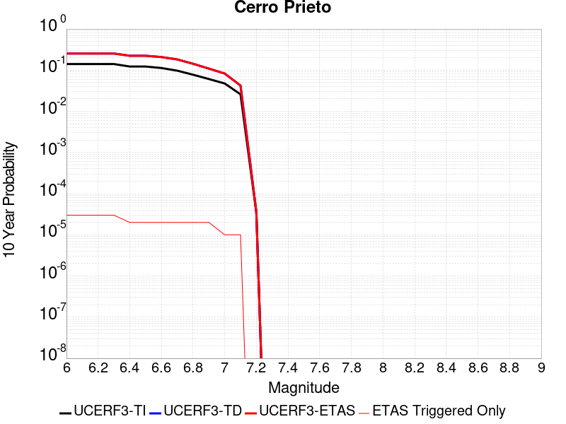 |

| Magnitude | 1 wk TI Prob | 1 wk TD Prob | 1 wk ETAS Prob | 1 wk ETAS/TD Gain | 1 wk ETAS Triggered Only | 1 mo TI Prob | 1 mo TD Prob | 1 mo ETAS Prob | 1 mo ETAS/TD Gain | 1 mo ETAS Triggered Only | 1 yr TI Prob | 1 yr TD Prob | 1 yr ETAS Prob | 1 yr ETAS/TD Gain | 1 yr ETAS Triggered Only | 10 yr TI Prob | 10 yr TD Prob | 10 yr ETAS Prob | 10 yr ETAS/TD Gain | 10 yr ETAS Triggered Only |
|-----|-----|-----|-----|-----|-----|-----|-----|-----|-----|-----|-----|-----|-----|-----|-----|-----|-----|-----|-----|-----|
| 6.0 | 2.9101528E-4 | 5.964804E-4 | 6.064744E-4 | 1.016755 | 1.0E-5 | 0.0012466122 | 0.002554082 | 0.0025640565 | 1.0039053 | 1.0E-5 | 0.015072231 | 0.03064807 | 0.030657765 | 1.0003163 | 1.0E-5 | 0.14089979 | 0.25397858 | 0.25400096 | 1.0000881 | 3.0E-5 |
| 6.1 | 2.9101528E-4 | 5.964804E-4 | 6.064744E-4 | 1.016755 | 1.0E-5 | 0.0012466122 | 0.002554082 | 0.0025640565 | 1.0039053 | 1.0E-5 | 0.015072231 | 0.03064807 | 0.030657765 | 1.0003163 | 1.0E-5 | 0.14089979 | 0.25397858 | 0.25400096 | 1.0000881 | 3.0E-5 |
| 6.2 | 2.9101528E-4 | 5.964804E-4 | 6.064744E-4 | 1.016755 | 1.0E-5 | 0.0012466122 | 0.002554082 | 0.0025640565 | 1.0039053 | 1.0E-5 | 0.015072231 | 0.03064807 | 0.030657765 | 1.0003163 | 1.0E-5 | 0.14089979 | 0.25397858 | 0.25400096 | 1.0000881 | 3.0E-5 |
| 6.3 | 2.9101528E-4 | 5.964804E-4 | 6.064744E-4 | 1.016755 | 1.0E-5 | 0.0012466122 | 0.002554082 | 0.0025640565 | 1.0039053 | 1.0E-5 | 0.015072231 | 0.03064807 | 0.030657765 | 1.0003163 | 1.0E-5 | 0.14089979 | 0.25397858 | 0.25400096 | 1.0000881 | 3.0E-5 |
| 6.4 | 2.508648E-4 | 5.1397446E-4 | 5.1397446E-4 | 1.0 | 0.0 | 0.0010746918 | 0.0022010866 | 0.0022010866 | 1.0 | 0.0 | 0.013006088 | 0.026471792 | 0.026471792 | 1.0 | 0.0 | 0.12270685 | 0.22440416 | 0.22441967 | 1.0000691 | 2.0E-5 |
| 6.5 | 2.508648E-4 | 5.1397446E-4 | 5.1397446E-4 | 1.0 | 0.0 | 0.0010746918 | 0.0022010866 | 0.0022010866 | 1.0 | 0.0 | 0.013006088 | 0.026471792 | 0.026471792 | 1.0 | 0.0 | 0.12270685 | 0.22440416 | 0.22441967 | 1.0000691 | 2.0E-5 |
| 6.6 | 2.294914E-4 | 4.7116808E-4 | 4.7116808E-4 | 1.0 | 0.0 | 9.831638E-4 | 0.0020179166 | 0.0020179166 | 1.0 | 0.0 | 0.011904482 | 0.02429866 | 0.02429866 | 1.0 | 0.0 | 0.11286586 | 0.20858558 | 0.2086014 | 1.0000759 | 2.0E-5 |
| 6.7 | 1.9621674E-4 | 4.0419117E-4 | 4.0419117E-4 | 1.0 | 0.0 | 8.4065786E-4 | 0.0017312564 | 0.0017312564 | 1.0 | 0.0 | 0.010187071 | 0.020884845 | 0.020884845 | 1.0 | 0.0 | 0.09732539 | 0.18290249 | 0.18291883 | 1.0000894 | 2.0E-5 |
| 6.8 | 1.5476145E-4 | 3.056516E-4 | 3.056516E-4 | 1.0 | 0.0 | 6.6309475E-4 | 0.00130938 | 0.00130938 | 1.0 | 0.0 | 0.008043335 | 0.015836509 | 0.015836509 | 1.0 | 0.0 | 0.07758363 | 0.14336355 | 0.14338069 | 1.0001194 | 2.0E-5 |
| 6.9 | 1.20509176E-4 | 2.2582515E-4 | 2.2582515E-4 | 1.0 | 0.0 | 5.1636563E-4 | 9.6752634E-4 | 9.6752634E-4 | 1.0 | 0.0 | 0.006268645 | 0.011726342 | 0.011726342 | 1.0 | 0.0 | 0.060947374 | 0.109451205 | 0.10946901 | 1.0001627 | 2.0E-5 |
| 7.0 | 9.3269155E-5 | 1.6716642E-4 | 1.6716642E-4 | 1.0 | 0.0 | 3.9966372E-4 | 7.162739E-4 | 7.162739E-4 | 1.0 | 0.0 | 0.0048550544 | 0.008693418 | 0.008693418 | 1.0 | 0.0 | 0.04750344 | 0.08315912 | 0.08316828 | 1.0001103 | 1.0E-5 |
| 7.1 | 5.029709E-5 | 8.1718936E-5 | 8.1718936E-5 | 1.0 | 0.0 | 2.1554115E-4 | 3.5019626E-4 | 3.5019626E-4 | 1.0 | 0.0 | 0.0026210553 | 0.0042587193 | 0.0042587193 | 1.0 | 0.0 | 0.025903556 | 0.042365108 | 0.042374685 | 1.000226 | 1.0E-5 |
| 7.2 | 6.5445185E-8 | 6.814903E-8 | 6.814903E-8 | 1.0 | 0.0 | 2.8047933E-7 | 2.9206726E-7 | 2.9206726E-7 | 1.0 | 0.0 | 3.4148304E-6 | 3.555919E-6 | 3.555919E-6 | 1.0 | 0.0 | 3.414778E-5 | 3.5559187E-5 | 3.5559187E-5 | 1.0 | 0.0 |

## San Jacinto (Borrego)
*[(top)](#table-of-contents)*

| 1 Week | 1 Month | 1 Year | 10 Year |
|-----|-----|-----|-----|
| 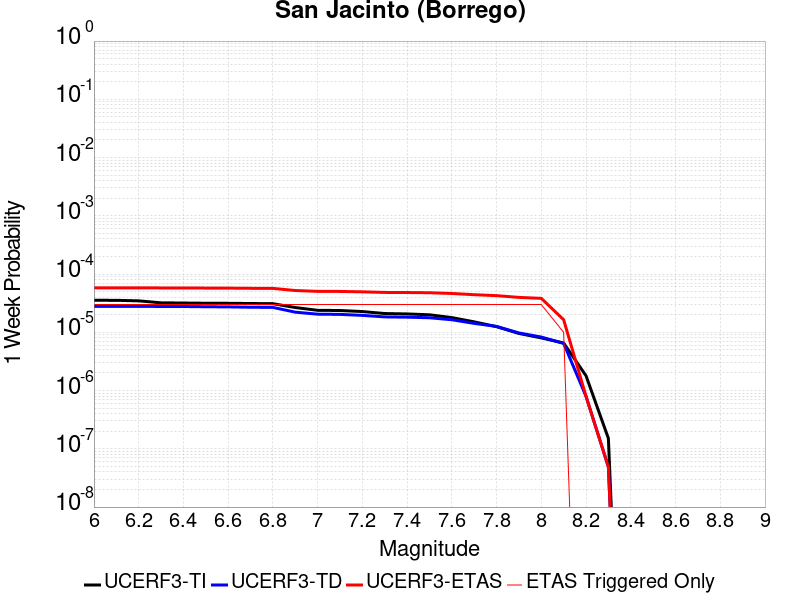 |  |  |  |

| Magnitude | 1 wk TI Prob | 1 wk TD Prob | 1 wk ETAS Prob | 1 wk ETAS/TD Gain | 1 wk ETAS Triggered Only | 1 mo TI Prob | 1 mo TD Prob | 1 mo ETAS Prob | 1 mo ETAS/TD Gain | 1 mo ETAS Triggered Only | 1 yr TI Prob | 1 yr TD Prob | 1 yr ETAS Prob | 1 yr ETAS/TD Gain | 1 yr ETAS Triggered Only | 10 yr TI Prob | 10 yr TD Prob | 10 yr ETAS Prob | 10 yr ETAS/TD Gain | 10 yr ETAS Triggered Only |
|-----|-----|-----|-----|-----|-----|-----|-----|-----|-----|-----|-----|-----|-----|-----|-----|-----|-----|-----|-----|-----|
| 6.0 | 3.543992E-5 | 2.7926513E-5 | 5.7925674E-5 | 2.074218 | 3.0E-5 | 1.5187653E-4 | 1.1967963E-4 | 1.4967604E-4 | 1.2506392 | 3.0E-5 | 0.0018475284 | 0.0014561379 | 0.0014860942 | 1.0205724 | 3.0E-5 | 0.018322436 | 0.014869647 | 0.014899202 | 1.0019876 | 3.0E-5 |
| 6.1 | 3.542281E-5 | 2.7926513E-5 | 5.7925674E-5 | 2.074218 | 3.0E-5 | 1.5180321E-4 | 1.1967963E-4 | 1.4967604E-4 | 1.2506392 | 3.0E-5 | 0.0018466372 | 0.0014561379 | 0.0014860942 | 1.0205724 | 3.0E-5 | 0.018313672 | 0.014869647 | 0.014899202 | 1.0019876 | 3.0E-5 |
| 6.2 | 3.4688688E-5 | 2.7926511E-5 | 5.7925674E-5 | 2.074218 | 3.0E-5 | 1.4865733E-4 | 1.1967963E-4 | 1.4967604E-4 | 1.2506392 | 3.0E-5 | 0.0018084005 | 0.0014561379 | 0.0014860941 | 1.0205724 | 3.0E-5 | 0.017937548 | 0.014869647 | 0.014899201 | 1.0019876 | 3.0E-5 |
| 6.3 | 3.2087122E-5 | 2.7771865E-5 | 5.777103E-5 | 2.0802 | 3.0E-5 | 1.3750899E-4 | 1.1901691E-4 | 1.4901334E-4 | 1.252035 | 3.0E-5 | 0.0016728862 | 0.00144808 | 0.0014780365 | 1.0206871 | 3.0E-5 | 0.016603488 | 0.014790683 | 0.0148202395 | 1.0019983 | 3.0E-5 |
| 6.4 | 3.1828724E-5 | 2.7738852E-5 | 5.773802E-5 | 2.0814855 | 3.0E-5 | 1.364017E-4 | 1.1887544E-4 | 1.4887187E-4 | 1.252335 | 3.0E-5 | 0.0016594254 | 0.0014463598 | 0.0014763165 | 1.0207118 | 3.0E-5 | 0.016470885 | 0.014773762 | 0.014803318 | 1.0020006 | 3.0E-5 |
| 6.5 | 3.1563577E-5 | 2.747857E-5 | 5.7477744E-5 | 2.0917299 | 3.0E-5 | 1.3526545E-4 | 1.1776006E-4 | 1.4775652E-4 | 1.2547253 | 3.0E-5 | 0.0016456128 | 0.0014327979 | 0.0014627549 | 1.020908 | 3.0E-5 | 0.0163348 | 0.014640348 | 0.014669908 | 1.0020192 | 3.0E-5 |
| 6.6 | 3.1467625E-5 | 2.7322796E-5 | 5.7321977E-5 | 2.0979543 | 3.0E-5 | 1.3485427E-4 | 1.1709251E-4 | 1.47089E-4 | 1.2561777 | 3.0E-5 | 0.0016406142 | 0.0014246812 | 0.0014546384 | 1.0210273 | 3.0E-5 | 0.016285548 | 0.014560594 | 0.014590157 | 1.0020304 | 3.0E-5 |
| 6.7 | 3.1223695E-5 | 2.6940816E-5 | 5.6940007E-5 | 2.113522 | 3.0E-5 | 1.3380898E-4 | 1.15455594E-4 | 1.4545213E-4 | 1.2598102 | 3.0E-5 | 0.0016279068 | 0.0014047775 | 0.0014347354 | 1.0213257 | 3.0E-5 | 0.01616033 | 0.014364966 | 0.014394535 | 1.0020584 | 3.0E-5 |
| 6.8 | 3.1015585E-5 | 2.6761822E-5 | 5.676102E-5 | 2.12097 | 3.0E-5 | 1.3291716E-4 | 1.1468855E-4 | 1.4468511E-4 | 1.261548 | 3.0E-5 | 0.001617065 | 0.0013954508 | 0.001425409 | 1.0214684 | 3.0E-5 | 0.016053487 | 0.014272246 | 0.014301818 | 1.002072 | 3.0E-5 |
| 6.9 | 2.6641965E-5 | 2.2184247E-5 | 5.2183583E-5 | 2.3522809 | 3.0E-5 | 1.1417485E-4 | 9.50719E-5 | 1.2506905E-4 | 1.3155206 | 3.0E-5 | 0.0013891924 | 0.0011568897 | 0.0011868549 | 1.0259016 | 3.0E-5 | 0.0138054015 | 0.011882438 | 0.011912082 | 1.0024947 | 3.0E-5 |
| 7.0 | 2.3854353E-5 | 2.0479023E-5 | 5.0478408E-5 | 2.4648836 | 3.0E-5 | 1.02228936E-4 | 8.77643E-5 | 1.1776167E-4 | 1.3417946 | 3.0E-5 | 0.0012439266 | 0.0010680092 | 0.0010979772 | 1.0280596 | 3.0E-5 | 0.012369866 | 0.0109828 | 0.011012471 | 1.0027015 | 3.0E-5 |
| 7.1 | 2.3672901E-5 | 2.031551E-5 | 5.0314902E-5 | 2.476674 | 3.0E-5 | 1.0145135E-4 | 8.7063585E-5 | 1.1706097E-4 | 1.3445457 | 3.0E-5 | 0.0012344702 | 0.0010594862 | 0.0010894544 | 1.0282856 | 3.0E-5 | 0.0122763505 | 0.010897976 | 0.010927649 | 1.0027229 | 3.0E-5 |
| 7.2 | 2.2717244E-5 | 1.9542893E-5 | 4.9542305E-5 | 2.535055 | 3.0E-5 | 9.735599E-5 | 8.375258E-5 | 1.13750066E-4 | 1.3581679 | 3.0E-5 | 0.0011846646 | 0.001019213 | 0.0010491824 | 1.0294045 | 3.0E-5 | 0.01178369 | 0.010495341 | 0.010525026 | 1.0028284 | 3.0E-5 |
| 7.3 | 2.1016205E-5 | 1.8384526E-5 | 4.8383972E-5 | 2.631777 | 3.0E-5 | 9.006634E-5 | 7.878846E-5 | 1.0878609E-4 | 1.3807365 | 3.0E-5 | 0.001096006 | 9.5882936E-4 | 9.888005E-4 | 1.0312581 | 3.0E-5 | 0.010906163 | 0.009890967 | 0.00992067 | 1.0030031 | 3.0E-5 |
| 7.4 | 2.0683625E-5 | 1.8187047E-5 | 4.8186503E-5 | 2.6494956 | 3.0E-5 | 8.86411E-5 | 7.794217E-5 | 1.0793983E-4 | 1.3848708 | 3.0E-5 | 0.001078671 | 9.485349E-4 | 9.785064E-4 | 1.0315977 | 3.0E-5 | 0.010734501 | 0.009787692 | 0.009817398 | 1.0030351 | 3.0E-5 |
| 7.5 | 1.9993966E-5 | 1.7782075E-5 | 4.778154E-5 | 2.6870623 | 3.0E-5 | 8.568561E-5 | 7.620667E-5 | 1.0620439E-4 | 1.3936363 | 3.0E-5 | 0.001042723 | 9.2742336E-4 | 9.5739553E-4 | 1.0323176 | 3.0E-5 | 0.010378438 | 0.009574614 | 0.009604327 | 1.0031033 | 3.0E-5 |
| 7.6 | 1.788966E-5 | 1.6435291E-5 | 4.6434798E-5 | 2.8253105 | 3.0E-5 | 7.666772E-5 | 7.043507E-5 | 1.0043295E-4 | 1.4258943 | 3.0E-5 | 9.3302975E-4 | 8.572113E-4 | 8.871856E-4 | 1.0349672 | 3.0E-5 | 0.00929122 | 0.008866487 | 0.0088962205 | 1.0033535 | 3.0E-5 |
| 7.7 | 1.5125781E-5 | 1.4237377E-5 | 4.423695E-5 | 3.1070995 | 3.0E-5 | 6.4823165E-5 | 6.1015908E-5 | 9.101408E-5 | 1.4916451 | 3.0E-5 | 7.889362E-4 | 7.426163E-4 | 7.72594E-4 | 1.0403677 | 3.0E-5 | 0.007861412 | 0.0077142045 | 0.007743973 | 1.0038589 | 3.0E-5 |
| 7.8 | 1.250089E-5 | 1.26304985E-5 | 4.263012E-5 | 3.375173 | 3.0E-5 | 5.3574146E-5 | 5.412959E-5 | 8.412796E-5 | 1.5541955 | 3.0E-5 | 6.5207E-4 | 6.588291E-4 | 6.888093E-4 | 1.0455053 | 3.0E-5 | 0.006501599 | 0.0068677636 | 0.0068975575 | 1.0043383 | 3.0E-5 |
| 7.9 | 9.561E-6 | 9.754616E-6 | 3.9754323E-5 | 4.075437 | 3.0E-5 | 4.0975072E-5 | 4.1804833E-5 | 7.180358E-5 | 1.7175903 | 3.0E-5 | 4.987573E-4 | 5.088555E-4 | 5.3884025E-4 | 1.0589259 | 3.0E-5 | 0.0049763937 | 0.0053523467 | 0.005382186 | 1.0055751 | 3.0E-5 |
| 8.0 | 8.01699E-6 | 8.293488E-6 | 3.8293238E-5 | 4.617266 | 3.0E-5 | 3.4358076E-5 | 3.554304E-5 | 6.554197E-5 | 1.8440171 | 3.0E-5 | 4.1822926E-4 | 4.3265108E-4 | 4.626381E-4 | 1.06931 | 3.0E-5 | 0.0041744304 | 0.004573375 | 0.004603238 | 1.0065297 | 3.0E-5 |
| 8.1 | 6.541947E-6 | 6.4622354E-6 | 1.646217E-5 | 2.5474422 | 1.0E-5 | 2.8036617E-5 | 2.7695003E-5 | 3.7694725E-5 | 1.361066 | 1.0E-5 | 3.4129233E-4 | 3.37135E-4 | 3.4713163E-4 | 1.0296518 | 1.0E-5 | 0.0034076865 | 0.0035806994 | 0.0035906637 | 1.0027827 | 1.0E-5 |
| 8.2 | 1.7968189E-6 | 7.9713476E-7 | 7.9713476E-7 | 1.0 | 0.0 | 7.70063E-6 | 3.4162877E-6 | 3.4162877E-6 | 1.0 | 0.0 | 9.3751136E-5 | 4.159253E-5 | 4.159253E-5 | 1.0 | 0.0 | 9.371159E-4 | 4.712058E-4 | 4.712058E-4 | 1.0 | 0.0 |
| 8.3 | 1.5167889E-7 | 4.897714E-8 | 4.897714E-8 | 1.0 | 0.0 | 6.500522E-7 | 2.09902E-7 | 2.09902E-7 | 1.0 | 0.0 | 7.9143565E-6 | 2.5555544E-6 | 2.5555544E-6 | 1.0 | 0.0 | 7.914075E-5 | 2.969505E-5 | 2.969505E-5 | 1.0 | 0.0 |

## North Frontal  (East)
*[(top)](#table-of-contents)*

| 1 Week | 1 Month | 1 Year | 10 Year |
|-----|-----|-----|-----|
|  |  |  |  |

| Magnitude | 1 wk TI Prob | 1 wk TD Prob | 1 wk ETAS Prob | 1 wk ETAS/TD Gain | 1 wk ETAS Triggered Only | 1 mo TI Prob | 1 mo TD Prob | 1 mo ETAS Prob | 1 mo ETAS/TD Gain | 1 mo ETAS Triggered Only | 1 yr TI Prob | 1 yr TD Prob | 1 yr ETAS Prob | 1 yr ETAS/TD Gain | 1 yr ETAS Triggered Only | 10 yr TI Prob | 10 yr TD Prob | 10 yr ETAS Prob | 10 yr ETAS/TD Gain | 10 yr ETAS Triggered Only |
|-----|-----|-----|-----|-----|-----|-----|-----|-----|-----|-----|-----|-----|-----|-----|-----|-----|-----|-----|-----|-----|
| 6.0 | 7.135738E-6 | 7.4771765E-6 | 7.4771765E-6 | 1.0 | 0.0 | 3.0581377E-5 | 3.204476E-5 | 3.204476E-5 | 1.0 | 0.0 | 3.7226462E-4 | 3.9009505E-4 | 4.1008726E-4 | 1.0512495 | 2.0E-5 | 0.0037164164 | 0.0038960609 | 0.0039259437 | 1.00767 | 3.0E-5 |
| 6.1 | 7.135738E-6 | 7.4771765E-6 | 7.4771765E-6 | 1.0 | 0.0 | 3.0581377E-5 | 3.204476E-5 | 3.204476E-5 | 1.0 | 0.0 | 3.7226462E-4 | 3.9009505E-4 | 4.1008726E-4 | 1.0512495 | 2.0E-5 | 0.0037164164 | 0.0038960609 | 0.0039259437 | 1.00767 | 3.0E-5 |
| 6.2 | 7.135738E-6 | 7.4771765E-6 | 7.4771765E-6 | 1.0 | 0.0 | 3.0581377E-5 | 3.204476E-5 | 3.204476E-5 | 1.0 | 0.0 | 3.7226462E-4 | 3.9009505E-4 | 4.1008726E-4 | 1.0512495 | 2.0E-5 | 0.0037164164 | 0.0038960609 | 0.0039259437 | 1.00767 | 3.0E-5 |
| 6.3 | 7.135738E-6 | 7.4771765E-6 | 7.4771765E-6 | 1.0 | 0.0 | 3.0581377E-5 | 3.204476E-5 | 3.204476E-5 | 1.0 | 0.0 | 3.7226462E-4 | 3.9009505E-4 | 4.1008726E-4 | 1.0512495 | 2.0E-5 | 0.0037164164 | 0.0038960609 | 0.0039259437 | 1.00767 | 3.0E-5 |
| 6.4 | 7.135738E-6 | 7.4771765E-6 | 7.4771765E-6 | 1.0 | 0.0 | 3.0581377E-5 | 3.204476E-5 | 3.204476E-5 | 1.0 | 0.0 | 3.7226462E-4 | 3.9009505E-4 | 4.1008726E-4 | 1.0512495 | 2.0E-5 | 0.0037164164 | 0.0038960609 | 0.0039259437 | 1.00767 | 3.0E-5 |
| 6.5 | 7.135738E-6 | 7.4771765E-6 | 7.4771765E-6 | 1.0 | 0.0 | 3.0581377E-5 | 3.204476E-5 | 3.204476E-5 | 1.0 | 0.0 | 3.7226462E-4 | 3.9009505E-4 | 4.1008726E-4 | 1.0512495 | 2.0E-5 | 0.0037164164 | 0.0038960609 | 0.0039259437 | 1.00767 | 3.0E-5 |
| 6.6 | 7.135738E-6 | 7.4771765E-6 | 7.4771765E-6 | 1.0 | 0.0 | 3.0581377E-5 | 3.204476E-5 | 3.204476E-5 | 1.0 | 0.0 | 3.7226462E-4 | 3.9009505E-4 | 4.1008726E-4 | 1.0512495 | 2.0E-5 | 0.0037164164 | 0.0038960609 | 0.0039259437 | 1.00767 | 3.0E-5 |
| 6.7 | 7.135738E-6 | 7.4771765E-6 | 7.4771765E-6 | 1.0 | 0.0 | 3.0581377E-5 | 3.204476E-5 | 3.204476E-5 | 1.0 | 0.0 | 3.7226462E-4 | 3.9009505E-4 | 4.1008726E-4 | 1.0512495 | 2.0E-5 | 0.0037164164 | 0.0038960609 | 0.0039259437 | 1.00767 | 3.0E-5 |
| 6.8 | 5.959142E-6 | 6.236683E-6 | 6.236683E-6 | 1.0 | 0.0 | 2.553893E-5 | 2.6728469E-5 | 2.6728469E-5 | 1.0 | 0.0 | 3.108921E-4 | 3.253886E-4 | 3.4538208E-4 | 1.061445 | 2.0E-5 | 0.0031045752 | 0.0032508948 | 0.0032807973 | 1.0091982 | 3.0E-5 |
| 6.9 | 2.2946929E-6 | 2.3824605E-6 | 2.3824605E-6 | 1.0 | 0.0 | 9.834361E-6 | 1.0210508E-5 | 1.0210508E-5 | 1.0 | 0.0 | 1.1972676E-4 | 1.2430632E-4 | 1.4430382E-4 | 1.1608728 | 2.0E-5 | 0.0011966228 | 0.0012424142 | 0.001272377 | 1.0241165 | 3.0E-5 |
| 7.0 | 2.2468673E-6 | 2.3321538E-6 | 2.3321538E-6 | 1.0 | 0.0 | 9.629396E-6 | 9.994909E-6 | 9.994909E-6 | 1.0 | 0.0 | 1.1723159E-4 | 1.21681696E-4 | 1.4167927E-4 | 1.1643432 | 2.0E-5 | 0.0011716976 | 0.0012161969 | 0.0012461605 | 1.0246371 | 3.0E-5 |
| 7.1 | 1.9921076E-6 | 2.0646032E-6 | 2.0646032E-6 | 1.0 | 0.0 | 8.537577E-6 | 8.848272E-6 | 8.848272E-6 | 1.0 | 0.0 | 1.0394004E-4 | 1.0772282E-4 | 1.2772066E-4 | 1.1856416 | 2.0E-5 | 0.0010389143 | 0.0010767487 | 0.0011067165 | 1.0278317 | 3.0E-5 |
| 7.2 | 1.4524545E-6 | 1.5045148E-6 | 1.5045148E-6 | 1.0 | 0.0 | 6.2247905E-6 | 6.447906E-6 | 6.447906E-6 | 1.0 | 0.0 | 7.5784184E-5 | 7.850068E-5 | 9.8499106E-5 | 1.2547549 | 2.0E-5 | 7.575835E-4 | 7.8475394E-4 | 8.1473036E-4 | 1.0381986 | 3.0E-5 |
| 7.3 | 8.9802575E-7 | 9.3087283E-7 | 9.3087283E-7 | 1.0 | 0.0 | 3.848676E-6 | 3.9894494E-6 | 3.9894494E-6 | 1.0 | 0.0 | 4.685662E-5 | 4.857058E-5 | 6.856961E-5 | 1.4117519 | 2.0E-5 | 4.6846745E-4 | 4.8561094E-4 | 5.1559636E-4 | 1.0617479 | 3.0E-5 |
| 7.4 | 7.776139E-7 | 8.0604747E-7 | 8.0604747E-7 | 1.0 | 0.0 | 3.3326266E-6 | 3.4544853E-6 | 3.4544853E-6 | 1.0 | 0.0 | 4.0573974E-5 | 4.2057654E-5 | 6.205682E-5 | 1.4755176 | 2.0E-5 | 4.0566566E-4 | 4.205077E-4 | 4.404993E-4 | 1.0475415 | 2.0E-5 |
| 7.5 | 5.244417E-7 | 5.441219E-7 | 5.441219E-7 | 1.0 | 0.0 | 2.2476054E-6 | 2.3319494E-6 | 2.3319494E-6 | 1.0 | 0.0 | 2.7364253E-5 | 2.839118E-5 | 4.839061E-5 | 1.7044241 | 2.0E-5 | 2.7360884E-4 | 2.8388205E-4 | 3.0387638E-4 | 1.0704318 | 2.0E-5 |
| 7.6 | 1.5489647E-7 | 1.6089504E-7 | 1.6089504E-7 | 1.0 | 0.0 | 6.6384183E-7 | 6.895501E-7 | 6.895501E-7 | 1.0 | 0.0 | 8.082245E-6 | 8.395261E-6 | 8.395261E-6 | 1.0 | 0.0 | 8.08195E-5 | 8.395143E-5 | 8.395143E-5 | 1.0 | 0.0 |

## Great Valley 08 (Quinto)
*[(top)](#table-of-contents)*

| 1 Week | 1 Month | 1 Year | 10 Year |
|-----|-----|-----|-----|
|  |  | 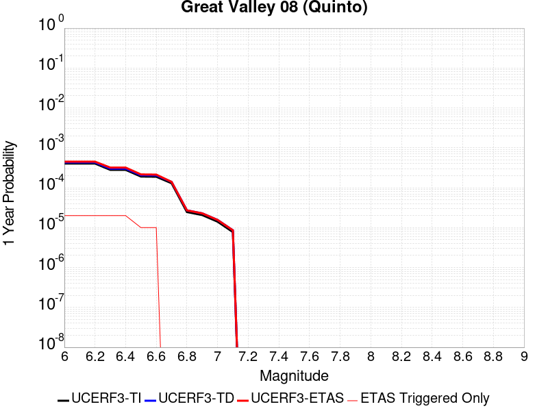 |  |

| Magnitude | 1 wk TI Prob | 1 wk TD Prob | 1 wk ETAS Prob | 1 wk ETAS/TD Gain | 1 wk ETAS Triggered Only | 1 mo TI Prob | 1 mo TD Prob | 1 mo ETAS Prob | 1 mo ETAS/TD Gain | 1 mo ETAS Triggered Only | 1 yr TI Prob | 1 yr TD Prob | 1 yr ETAS Prob | 1 yr ETAS/TD Gain | 1 yr ETAS Triggered Only | 10 yr TI Prob | 10 yr TD Prob | 10 yr ETAS Prob | 10 yr ETAS/TD Gain | 10 yr ETAS Triggered Only |
|-----|-----|-----|-----|-----|-----|-----|-----|-----|-----|-----|-----|-----|-----|-----|-----|-----|-----|-----|-----|-----|
| 6.0 | 7.737697E-6 | 8.253038E-6 | 8.253038E-6 | 1.0 | 0.0 | 3.3161137E-5 | 3.536979E-5 | 5.536908E-5 | 1.5654343 | 2.0E-5 | 4.0366207E-4 | 4.3056096E-4 | 4.5055235E-4 | 1.0464311 | 2.0E-5 | 0.004029296 | 0.0042991205 | 0.0043289918 | 1.0069481 | 3.0E-5 |
| 6.1 | 7.737697E-6 | 8.253038E-6 | 8.253038E-6 | 1.0 | 0.0 | 3.3161137E-5 | 3.536979E-5 | 5.536908E-5 | 1.5654343 | 2.0E-5 | 4.0366207E-4 | 4.3056096E-4 | 4.5055235E-4 | 1.0464311 | 2.0E-5 | 0.004029296 | 0.0042991205 | 0.0043289918 | 1.0069481 | 3.0E-5 |
| 6.2 | 7.737697E-6 | 8.253038E-6 | 8.253038E-6 | 1.0 | 0.0 | 3.3161137E-5 | 3.536979E-5 | 5.536908E-5 | 1.5654343 | 2.0E-5 | 4.0366207E-4 | 4.3056096E-4 | 4.5055235E-4 | 1.0464311 | 2.0E-5 | 0.004029296 | 0.0042991205 | 0.0043289918 | 1.0069481 | 3.0E-5 |
| 6.3 | 5.374012E-6 | 5.7505736E-6 | 5.7505736E-6 | 1.0 | 0.0 | 2.3031276E-5 | 2.4645145E-5 | 4.4644654E-5 | 1.8114989 | 2.0E-5 | 2.803697E-4 | 3.0002446E-4 | 3.2001847E-4 | 1.0666412 | 2.0E-5 | 0.0028001624 | 0.0029972875 | 0.0030271974 | 1.009979 | 3.0E-5 |
| 6.4 | 5.374012E-6 | 5.7505736E-6 | 5.7505736E-6 | 1.0 | 0.0 | 2.3031276E-5 | 2.4645145E-5 | 4.4644654E-5 | 1.8114989 | 2.0E-5 | 2.803697E-4 | 3.0002446E-4 | 3.2001847E-4 | 1.0666412 | 2.0E-5 | 0.0028001624 | 0.0029972875 | 0.0030271974 | 1.009979 | 3.0E-5 |
| 6.5 | 3.65427E-6 | 3.941324E-6 | 3.941324E-6 | 1.0 | 0.0 | 1.5661062E-5 | 1.689132E-5 | 2.689115E-5 | 1.5920101 | 1.0E-5 | 1.9065675E-4 | 2.0563944E-4 | 2.156374E-4 | 1.0486188 | 1.0E-5 | 0.0019049325 | 0.0020551833 | 0.0020651626 | 1.0048558 | 1.0E-5 |
| 6.6 | 3.6143538E-6 | 3.8985104E-6 | 3.8985104E-6 | 1.0 | 0.0 | 1.5489995E-5 | 1.6707834E-5 | 2.6707668E-5 | 1.5985116 | 1.0E-5 | 1.8857437E-4 | 2.0340596E-4 | 2.1340392E-4 | 1.0491527 | 1.0E-5 | 0.0018841444 | 0.0020328893 | 0.0020428689 | 1.0049092 | 1.0E-5 |
| 6.7 | 2.4821015E-6 | 2.6857067E-6 | 2.6857067E-6 | 1.0 | 0.0 | 1.0637535E-5 | 1.1510153E-5 | 1.1510153E-5 | 1.0 | 0.0 | 1.2950429E-4 | 1.4013276E-4 | 1.4013276E-4 | 1.0 | 0.0 | 0.0012942884 | 0.0014009989 | 0.0014009989 | 1.0 | 0.0 |
| 6.8 | 4.7110538E-7 | 5.193021E-7 | 5.193021E-7 | 1.0 | 0.0 | 2.0190216E-6 | 2.2255786E-6 | 2.2255786E-6 | 1.0 | 0.0 | 2.458131E-5 | 2.70961E-5 | 2.70961E-5 | 1.0 | 0.0 | 2.457859E-4 | 2.7092977E-4 | 2.7092977E-4 | 1.0 | 0.0 |
| 6.9 | 3.958685E-7 | 4.3703452E-7 | 4.3703452E-7 | 1.0 | 0.0 | 1.6965782E-6 | 1.8730038E-6 | 1.8730038E-6 | 1.0 | 0.0 | 2.0655643E-5 | 2.28036E-5 | 2.28036E-5 | 1.0 | 0.0 | 2.0653724E-4 | 2.2801422E-4 | 2.2801422E-4 | 1.0 | 0.0 |
| 7.0 | 2.70294E-7 | 2.9920008E-7 | 2.9920008E-7 | 1.0 | 0.0 | 1.1584025E-6 | 1.2822856E-6 | 1.2822856E-6 | 1.0 | 0.0 | 1.4103458E-5 | 1.5611728E-5 | 1.5611728E-5 | 1.0 | 0.0 | 1.4102564E-4 | 1.5610759E-4 | 1.5610759E-4 | 1.0 | 0.0 |
| 7.1 | 1.4828602E-7 | 1.6469107E-7 | 1.6469107E-7 | 1.0 | 0.0 | 6.3551136E-7 | 7.058187E-7 | 7.058187E-7 | 1.0 | 0.0 | 7.737323E-6 | 8.593317E-6 | 8.593317E-6 | 1.0 | 0.0 | 7.737054E-5 | 8.593065E-5 | 8.593065E-5 | 1.0 | 0.0 |

## Redondo Canyon alt 1
*[(top)](#table-of-contents)*

| 1 Week | 1 Month | 1 Year | 10 Year |
|-----|-----|-----|-----|
|  |  |  |  |

| Magnitude | 1 wk TI Prob | 1 wk TD Prob | 1 wk ETAS Prob | 1 wk ETAS/TD Gain | 1 wk ETAS Triggered Only | 1 mo TI Prob | 1 mo TD Prob | 1 mo ETAS Prob | 1 mo ETAS/TD Gain | 1 mo ETAS Triggered Only | 1 yr TI Prob | 1 yr TD Prob | 1 yr ETAS Prob | 1 yr ETAS/TD Gain | 1 yr ETAS Triggered Only | 10 yr TI Prob | 10 yr TD Prob | 10 yr ETAS Prob | 10 yr ETAS/TD Gain | 10 yr ETAS Triggered Only |
|-----|-----|-----|-----|-----|-----|-----|-----|-----|-----|-----|-----|-----|-----|-----|-----|-----|-----|-----|-----|-----|
| 6.0 | 1.0346246E-5 | 1.09813445E-5 | 2.0981235E-5 | 1.9106253 | 1.0E-5 | 4.43403E-5 | 4.7062502E-5 | 5.7062032E-5 | 1.2124734 | 1.0E-5 | 5.3970946E-4 | 5.729142E-4 | 5.829085E-4 | 1.0174446 | 1.0E-5 | 0.0053840056 | 0.005722111 | 0.0057519395 | 1.0052128 | 3.0E-5 |
| 6.1 | 1.0346246E-5 | 1.09813445E-5 | 2.0981235E-5 | 1.9106253 | 1.0E-5 | 4.43403E-5 | 4.7062502E-5 | 5.7062032E-5 | 1.2124734 | 1.0E-5 | 5.3970946E-4 | 5.729142E-4 | 5.829085E-4 | 1.0174446 | 1.0E-5 | 0.0053840056 | 0.005722111 | 0.0057519395 | 1.0052128 | 3.0E-5 |
| 6.2 | 1.0346246E-5 | 1.09813445E-5 | 2.0981235E-5 | 1.9106253 | 1.0E-5 | 4.43403E-5 | 4.7062502E-5 | 5.7062032E-5 | 1.2124734 | 1.0E-5 | 5.3970946E-4 | 5.729142E-4 | 5.829085E-4 | 1.0174446 | 1.0E-5 | 0.0053840056 | 0.005722111 | 0.0057519395 | 1.0052128 | 3.0E-5 |
| 6.3 | 3.2052794E-6 | 3.2361174E-6 | 3.2361174E-6 | 1.0 | 0.0 | 1.373684E-5 | 1.3869023E-5 | 1.3869023E-5 | 1.0 | 0.0 | 1.6723319E-4 | 1.6884625E-4 | 1.6884625E-4 | 1.0 | 0.0 | 0.001671074 | 0.0016875692 | 0.0016875692 | 1.0 | 0.0 |
| 6.4 | 3.2052794E-6 | 3.2361174E-6 | 3.2361174E-6 | 1.0 | 0.0 | 1.373684E-5 | 1.3869023E-5 | 1.3869023E-5 | 1.0 | 0.0 | 1.6723319E-4 | 1.6884625E-4 | 1.6884625E-4 | 1.0 | 0.0 | 0.001671074 | 0.0016875692 | 0.0016875692 | 1.0 | 0.0 |
| 6.5 | 3.2052794E-6 | 3.2361174E-6 | 3.2361174E-6 | 1.0 | 0.0 | 1.373684E-5 | 1.3869023E-5 | 1.3869023E-5 | 1.0 | 0.0 | 1.6723319E-4 | 1.6884625E-4 | 1.6884625E-4 | 1.0 | 0.0 | 0.001671074 | 0.0016875692 | 0.0016875692 | 1.0 | 0.0 |
| 6.6 | 1.948328E-6 | 1.8288681E-6 | 1.8288681E-6 | 1.0 | 0.0 | 8.349951E-6 | 7.837991E-6 | 7.837991E-6 | 1.0 | 0.0 | 1.016559E-4 | 9.542486E-5 | 9.542486E-5 | 1.0 | 0.0 | 0.0010160941 | 9.539858E-4 | 9.539858E-4 | 1.0 | 0.0 |
| 6.7 | 1.948328E-6 | 1.8288681E-6 | 1.8288681E-6 | 1.0 | 0.0 | 8.349951E-6 | 7.837991E-6 | 7.837991E-6 | 1.0 | 0.0 | 1.016559E-4 | 9.542486E-5 | 9.542486E-5 | 1.0 | 0.0 | 0.0010160941 | 9.539858E-4 | 9.539858E-4 | 1.0 | 0.0 |
| 6.8 | 1.1278219E-6 | 9.033076E-7 | 9.033076E-7 | 1.0 | 0.0 | 4.8335132E-6 | 3.871315E-6 | 3.871315E-6 | 1.0 | 0.0 | 5.8846435E-5 | 4.7132668E-5 | 4.7132668E-5 | 1.0 | 0.0 | 5.8830855E-4 | 4.7126875E-4 | 4.7126875E-4 | 1.0 | 0.0 |
| 6.9 | 1.1278219E-6 | 9.033076E-7 | 9.033076E-7 | 1.0 | 0.0 | 4.8335132E-6 | 3.871315E-6 | 3.871315E-6 | 1.0 | 0.0 | 5.8846435E-5 | 4.7132668E-5 | 4.7132668E-5 | 1.0 | 0.0 | 5.8830855E-4 | 4.7126875E-4 | 4.7126875E-4 | 1.0 | 0.0 |
| 7.0 | 1.1278219E-6 | 9.033076E-7 | 9.033076E-7 | 1.0 | 0.0 | 4.8335132E-6 | 3.871315E-6 | 3.871315E-6 | 1.0 | 0.0 | 5.8846435E-5 | 4.7132668E-5 | 4.7132668E-5 | 1.0 | 0.0 | 5.8830855E-4 | 4.7126875E-4 | 4.7126875E-4 | 1.0 | 0.0 |
| 7.1 | 1.0545139E-6 | 8.5692716E-7 | 8.5692716E-7 | 1.0 | 0.0 | 4.5193374E-6 | 3.6725423E-6 | 3.6725423E-6 | 1.0 | 0.0 | 5.5021545E-5 | 4.471271E-5 | 4.471271E-5 | 1.0 | 0.0 | 5.500792E-4 | 4.470789E-4 | 4.470789E-4 | 1.0 | 0.0 |
| 7.2 | 1.0545139E-6 | 8.5692716E-7 | 8.5692716E-7 | 1.0 | 0.0 | 4.5193374E-6 | 3.6725423E-6 | 3.6725423E-6 | 1.0 | 0.0 | 5.5021545E-5 | 4.471271E-5 | 4.471271E-5 | 1.0 | 0.0 | 5.500792E-4 | 4.470789E-4 | 4.470789E-4 | 1.0 | 0.0 |
| 7.3 | 9.505161E-8 | 5.8957607E-8 | 5.8957607E-8 | 1.0 | 0.0 | 4.0736398E-7 | 2.5267545E-7 | 2.5267545E-7 | 1.0 | 0.0 | 4.959645E-6 | 3.0763204E-6 | 3.0763204E-6 | 1.0 | 0.0 | 4.9595343E-5 | 3.0762894E-5 | 3.0762894E-5 | 1.0 | 0.0 |
| 7.4 | 3.9520785E-8 | 2.6987191E-8 | 2.6987191E-8 | 1.0 | 0.0 | 1.6937479E-7 | 1.1565938E-7 | 1.1565938E-7 | 1.0 | 0.0 | 2.062136E-6 | 1.4081523E-6 | 1.4081523E-6 | 1.0 | 0.0 | 2.062117E-5 | 1.4081461E-5 | 1.4081461E-5 | 1.0 | 0.0 |
| 7.5 | 5.6133214E-9 | 3.7368215E-9 | 3.7368215E-9 | 1.0 | 0.0 | 2.4057092E-8 | 1.601495E-8 | 1.601495E-8 | 1.0 | 0.0 | 2.9289507E-7 | 1.9498201E-7 | 1.9498201E-7 | 1.0 | 0.0 | 2.9289467E-6 | 1.9498186E-6 | 1.9498186E-6 | 1.0 | 0.0 |
| 7.6 | 4.1064334E-9 | 2.5957634E-9 | 2.5957634E-9 | 1.0 | 0.0 | 1.7599E-8 | 1.11247E-8 | 1.11247E-8 | 1.0 | 0.0 | 2.142678E-7 | 1.3544322E-7 | 1.3544322E-7 | 1.0 | 0.0 | 2.1426758E-6 | 1.3544316E-6 | 1.3544316E-6 | 1.0 | 0.0 |
| 7.7 | 1.361975E-9 | 6.360824E-10 | 6.360824E-10 | 1.0 | 0.0 | 5.8370353E-9 | 2.7260674E-9 | 2.7260674E-9 | 1.0 | 0.0 | 7.1065905E-8 | 3.318987E-8 | 3.318987E-8 | 1.0 | 0.0 | 7.106588E-7 | 3.318987E-7 | 3.318987E-7 | 1.0 | 0.0 |
| 7.8 | 1.361975E-9 | 6.360824E-10 | 6.360824E-10 | 1.0 | 0.0 | 5.8370353E-9 | 2.7260674E-9 | 2.7260674E-9 | 1.0 | 0.0 | 7.1065905E-8 | 3.318987E-8 | 3.318987E-8 | 1.0 | 0.0 | 7.106588E-7 | 3.318987E-7 | 3.318987E-7 | 1.0 | 0.0 |

## White Wolf
*[(top)](#table-of-contents)*

| 1 Week | 1 Month | 1 Year | 10 Year |
|-----|-----|-----|-----|
|  |  |  |  |

| Magnitude | 1 wk TI Prob | 1 wk TD Prob | 1 wk ETAS Prob | 1 wk ETAS/TD Gain | 1 wk ETAS Triggered Only | 1 mo TI Prob | 1 mo TD Prob | 1 mo ETAS Prob | 1 mo ETAS/TD Gain | 1 mo ETAS Triggered Only | 1 yr TI Prob | 1 yr TD Prob | 1 yr ETAS Prob | 1 yr ETAS/TD Gain | 1 yr ETAS Triggered Only | 10 yr TI Prob | 10 yr TD Prob | 10 yr ETAS Prob | 10 yr ETAS/TD Gain | 10 yr ETAS Triggered Only |
|-----|-----|-----|-----|-----|-----|-----|-----|-----|-----|-----|-----|-----|-----|-----|-----|-----|-----|-----|-----|-----|
| 6.0 | 2.0037822E-5 | 1.0469162E-6 | 1.0469162E-6 | 1.0 | 0.0 | 8.587355E-5 | 4.486776E-6 | 4.486776E-6 | 1.0 | 0.0 | 0.001045009 | 5.4625183E-5 | 6.462463E-5 | 1.1830558 | 1.0E-5 | 0.010401085 | 5.461226E-4 | 5.7610625E-4 | 1.0549027 | 3.0E-5 |
| 6.1 | 2.0037822E-5 | 1.0469162E-6 | 1.0469162E-6 | 1.0 | 0.0 | 8.587355E-5 | 4.486776E-6 | 4.486776E-6 | 1.0 | 0.0 | 0.001045009 | 5.4625183E-5 | 6.462463E-5 | 1.1830558 | 1.0E-5 | 0.010401085 | 5.461226E-4 | 5.7610625E-4 | 1.0549027 | 3.0E-5 |
| 6.2 | 2.0037822E-5 | 1.0469162E-6 | 1.0469162E-6 | 1.0 | 0.0 | 8.587355E-5 | 4.486776E-6 | 4.486776E-6 | 1.0 | 0.0 | 0.001045009 | 5.4625183E-5 | 6.462463E-5 | 1.1830558 | 1.0E-5 | 0.010401085 | 5.461226E-4 | 5.7610625E-4 | 1.0549027 | 3.0E-5 |
| 6.3 | 2.0037822E-5 | 1.0469162E-6 | 1.0469162E-6 | 1.0 | 0.0 | 8.587355E-5 | 4.486776E-6 | 4.486776E-6 | 1.0 | 0.0 | 0.001045009 | 5.4625183E-5 | 6.462463E-5 | 1.1830558 | 1.0E-5 | 0.010401085 | 5.461226E-4 | 5.7610625E-4 | 1.0549027 | 3.0E-5 |
| 6.4 | 1.132487E-5 | 1.0469162E-6 | 1.0469162E-6 | 1.0 | 0.0 | 4.8534253E-5 | 4.486776E-6 | 4.486776E-6 | 1.0 | 0.0 | 5.907443E-4 | 5.4625183E-5 | 6.462463E-5 | 1.1830558 | 1.0E-5 | 0.005891764 | 5.461226E-4 | 5.7610625E-4 | 1.0549027 | 3.0E-5 |
| 6.5 | 1.132487E-5 | 1.0469162E-6 | 1.0469162E-6 | 1.0 | 0.0 | 4.8534253E-5 | 4.486776E-6 | 4.486776E-6 | 1.0 | 0.0 | 5.907443E-4 | 5.4625183E-5 | 6.462463E-5 | 1.1830558 | 1.0E-5 | 0.005891764 | 5.461226E-4 | 5.7610625E-4 | 1.0549027 | 3.0E-5 |
| 6.6 | 9.347473E-6 | 1.0469162E-6 | 1.0469162E-6 | 1.0 | 0.0 | 4.0059982E-5 | 4.486776E-6 | 4.486776E-6 | 1.0 | 0.0 | 4.8762115E-4 | 5.4625183E-5 | 6.462463E-5 | 1.1830558 | 1.0E-5 | 0.0048655253 | 5.461226E-4 | 5.7610625E-4 | 1.0549027 | 3.0E-5 |
| 6.7 | 7.842647E-6 | 1.0048342E-6 | 1.0048342E-6 | 1.0 | 0.0 | 3.361091E-5 | 4.3064256E-6 | 4.3064256E-6 | 1.0 | 0.0 | 4.0913603E-4 | 5.2429517E-5 | 6.2429E-5 | 1.1907222 | 1.0E-5 | 0.004083836 | 5.2417646E-4 | 5.4416596E-4 | 1.038135 | 2.0E-5 |
| 6.8 | 6.26597E-6 | 9.734822E-7 | 9.734822E-7 | 1.0 | 0.0 | 2.685388E-5 | 4.17206E-6 | 4.17206E-6 | 1.0 | 0.0 | 3.2689696E-4 | 5.0793697E-5 | 6.079319E-5 | 1.1968648 | 1.0E-5 | 0.003264165 | 5.078258E-4 | 5.2781566E-4 | 1.0393636 | 2.0E-5 |
| 6.9 | 5.258436E-6 | 9.183254E-7 | 9.183254E-7 | 1.0 | 0.0 | 2.2535958E-5 | 3.9356746E-6 | 3.9356746E-6 | 1.0 | 0.0 | 2.7434074E-4 | 4.7915833E-5 | 5.7915353E-5 | 1.2086893 | 1.0E-5 | 0.0027400232 | 4.790598E-4 | 4.990502E-4 | 1.0417285 | 2.0E-5 |
| 7.0 | 4.675028E-6 | 8.6611794E-7 | 8.6611794E-7 | 1.0 | 0.0 | 2.003568E-5 | 3.7119291E-6 | 3.7119291E-6 | 1.0 | 0.0 | 2.4390711E-4 | 4.5191846E-5 | 5.5191394E-5 | 1.2212689 | 1.0E-5 | 0.0024363957 | 4.518313E-4 | 4.7182225E-4 | 1.0442443 | 2.0E-5 |
| 7.1 | 2.8270078E-6 | 6.8741696E-7 | 6.8741696E-7 | 1.0 | 0.0 | 1.2115692E-5 | 2.9460696E-6 | 2.9460696E-6 | 1.0 | 0.0 | 1.4749856E-4 | 3.5867848E-5 | 4.586749E-5 | 1.2787912 | 1.0E-5 | 0.001474007 | 3.586247E-4 | 3.7861752E-4 | 1.0557486 | 2.0E-5 |
| 7.2 | 1.6881406E-6 | 2.2706382E-7 | 2.2706382E-7 | 1.0 | 0.0 | 7.2348685E-6 | 9.731303E-7 | 9.731303E-7 | 1.0 | 0.0 | 8.808096E-5 | 1.1847799E-5 | 1.1847799E-5 | 1.0 | 0.0 | 8.8046055E-4 | 1.1847183E-4 | 1.1847183E-4 | 1.0 | 0.0 |
| 7.3 | 9.086107E-7 | 1.5266386E-7 | 1.5266386E-7 | 1.0 | 0.0 | 3.8940398E-6 | 6.5427355E-7 | 6.5427355E-7 | 1.0 | 0.0 | 4.7408903E-5 | 7.965752E-6 | 7.965752E-6 | 1.0 | 0.0 | 4.739879E-4 | 7.965475E-5 | 7.965475E-5 | 1.0 | 0.0 |
| 7.4 | 1.9717383E-7 | 9.003913E-8 | 9.003913E-8 | 1.0 | 0.0 | 8.450304E-7 | 3.8588192E-7 | 3.8588192E-7 | 1.0 | 0.0 | 1.0288197E-5 | 4.6981027E-6 | 4.6981027E-6 | 1.0 | 0.0 | 1.028772E-4 | 4.6980065E-5 | 4.6980065E-5 | 1.0 | 0.0 |
| 7.5 | 1.086975E-7 | 6.6597195E-8 | 6.6597195E-8 | 1.0 | 0.0 | 4.6584634E-7 | 2.8541652E-7 | 2.8541652E-7 | 1.0 | 0.0 | 5.6716644E-6 | 3.474941E-6 | 3.474941E-6 | 1.0 | 0.0 | 5.6715195E-5 | 3.474889E-5 | 3.474889E-5 | 1.0 | 0.0 |
| 7.6 | 2.4217808E-8 | 1.5820765E-8 | 1.5820765E-8 | 1.0 | 0.0 | 1.03790605E-7 | 6.780328E-8 | 6.780328E-8 | 1.0 | 0.0 | 1.2636499E-6 | 8.255046E-7 | 8.255046E-7 | 1.0 | 0.0 | 1.2636427E-5 | 8.2550205E-6 | 8.2550205E-6 | 1.0 | 0.0 |

## Hosgri (Extension)
*[(top)](#table-of-contents)*

| 1 Week | 1 Month | 1 Year | 10 Year |
|-----|-----|-----|-----|
|  |  | 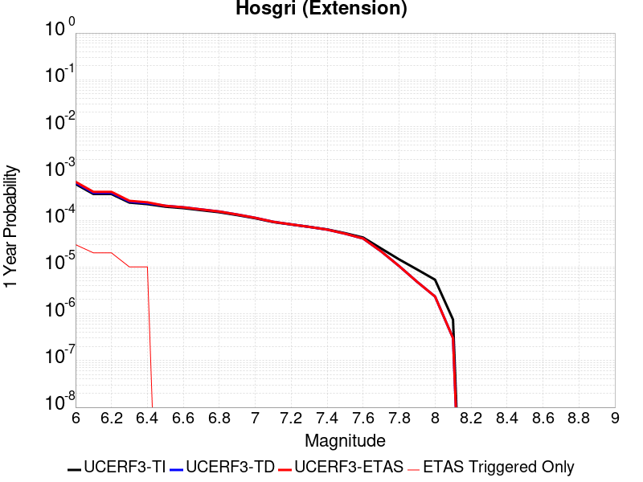 |  |

| Magnitude | 1 wk TI Prob | 1 wk TD Prob | 1 wk ETAS Prob | 1 wk ETAS/TD Gain | 1 wk ETAS Triggered Only | 1 mo TI Prob | 1 mo TD Prob | 1 mo ETAS Prob | 1 mo ETAS/TD Gain | 1 mo ETAS Triggered Only | 1 yr TI Prob | 1 yr TD Prob | 1 yr ETAS Prob | 1 yr ETAS/TD Gain | 1 yr ETAS Triggered Only | 10 yr TI Prob | 10 yr TD Prob | 10 yr ETAS Prob | 10 yr ETAS/TD Gain | 10 yr ETAS Triggered Only |
|-----|-----|-----|-----|-----|-----|-----|-----|-----|-----|-----|-----|-----|-----|-----|-----|-----|-----|-----|-----|-----|
| 6.0 | 1.1369135E-5 | 1.2083072E-5 | 1.2083072E-5 | 1.0 | 0.0 | 4.8723956E-5 | 5.1783692E-5 | 6.1783176E-5 | 1.1931009 | 1.0E-5 | 5.9305265E-4 | 6.3030684E-4 | 6.602879E-4 | 1.0475658 | 3.0E-5 | 0.005914725 | 0.0062874397 | 0.006317251 | 1.0047414 | 3.0E-5 |
| 6.1 | 6.934979E-6 | 7.324555E-6 | 7.324555E-6 | 1.0 | 0.0 | 2.9721E-5 | 3.1390595E-5 | 4.139028E-5 | 1.3185568 | 1.0E-5 | 3.617931E-4 | 3.8211764E-4 | 4.0211E-4 | 1.0523199 | 2.0E-5 | 0.0036120464 | 0.0038150186 | 0.0038349421 | 1.0052224 | 2.0E-5 |
| 6.2 | 6.934979E-6 | 7.324555E-6 | 7.324555E-6 | 1.0 | 0.0 | 2.9721E-5 | 3.1390595E-5 | 4.139028E-5 | 1.3185568 | 1.0E-5 | 3.617931E-4 | 3.8211764E-4 | 4.0211E-4 | 1.0523199 | 2.0E-5 | 0.0036120464 | 0.0038150186 | 0.0038349421 | 1.0052224 | 2.0E-5 |
| 6.3 | 4.5484676E-6 | 4.76933E-6 | 4.76933E-6 | 1.0 | 0.0 | 1.9493287E-5 | 2.043983E-5 | 3.0439625E-5 | 1.4892309 | 1.0E-5 | 2.3730492E-4 | 2.4882692E-4 | 2.5882444E-4 | 1.0401785 | 1.0E-5 | 0.0023705168 | 0.0024855258 | 0.002495501 | 1.0040133 | 1.0E-5 |
| 6.4 | 4.218095E-6 | 4.4168614E-6 | 4.4168614E-6 | 1.0 | 0.0 | 1.8077424E-5 | 1.8929271E-5 | 2.8929082E-5 | 1.5282724 | 1.0E-5 | 2.2007042E-4 | 2.3043984E-4 | 2.4043753E-4 | 1.0433853 | 1.0E-5 | 0.002198526 | 0.0023020422 | 0.0023120192 | 1.004334 | 1.0E-5 |
| 6.5 | 3.717374E-6 | 3.8838775E-6 | 3.8838775E-6 | 1.0 | 0.0 | 1.5931506E-5 | 1.6645085E-5 | 1.6645085E-5 | 1.0 | 0.0 | 1.9394881E-4 | 2.0263524E-4 | 2.0263524E-4 | 1.0 | 0.0 | 0.0019377962 | 0.0020245234 | 0.0020245234 | 1.0 | 0.0 |
| 6.6 | 3.4605036E-6 | 3.608306E-6 | 3.608306E-6 | 1.0 | 0.0 | 1.4830645E-5 | 1.5464078E-5 | 1.5464078E-5 | 1.0 | 0.0 | 1.8054814E-4 | 1.8825903E-4 | 1.8825903E-4 | 1.0 | 0.0 | 0.0018040152 | 0.0018810101 | 0.0018810101 | 1.0 | 0.0 |
| 6.7 | 3.123439E-6 | 3.2465687E-6 | 3.2465687E-6 | 1.0 | 0.0 | 1.33860985E-5 | 1.3913792E-5 | 1.3913792E-5 | 1.0 | 0.0 | 1.6296357E-4 | 1.6938736E-4 | 1.6938736E-4 | 1.0 | 0.0 | 0.001628441 | 0.0016925934 | 0.0016925934 | 1.0 | 0.0 |
| 6.8 | 2.8290783E-6 | 2.9305404E-6 | 2.9305404E-6 | 1.0 | 0.0 | 1.2124565E-5 | 1.2559399E-5 | 1.2559399E-5 | 1.0 | 0.0 | 1.4760658E-4 | 1.5290003E-4 | 1.5290003E-4 | 1.0 | 0.0 | 0.0014750857 | 0.001527957 | 0.001527957 | 1.0 | 0.0 |
| 6.9 | 2.454112E-6 | 2.5283196E-6 | 2.5283196E-6 | 1.0 | 0.0 | 1.0517581E-5 | 1.0835611E-5 | 1.0835611E-5 | 1.0 | 0.0 | 1.2804402E-4 | 1.3191563E-4 | 1.3191563E-4 | 1.0 | 0.0 | 0.0012797028 | 0.0013183793 | 0.0013183793 | 1.0 | 0.0 |
| 7.0 | 2.1008145E-6 | 2.1498704E-6 | 2.1498704E-6 | 1.0 | 0.0 | 9.003459E-6 | 9.213698E-6 | 9.213698E-6 | 1.0 | 0.0 | 1.096116E-4 | 1.1217103E-4 | 1.1217103E-4 | 1.0 | 0.0 | 0.0010955755 | 0.0011211479 | 0.0011211479 | 1.0 | 0.0 |
| 7.1 | 1.744384E-6 | 1.7686352E-6 | 1.7686352E-6 | 1.0 | 0.0 | 7.47591E-6 | 7.5798434E-6 | 7.5798434E-6 | 1.0 | 0.0 | 9.1015405E-5 | 9.22807E-5 | 9.22807E-5 | 1.0 | 0.0 | 9.097813E-4 | 9.2242553E-4 | 9.2242553E-4 | 1.0 | 0.0 |
| 7.2 | 1.5456587E-6 | 1.5562882E-6 | 1.5562882E-6 | 1.0 | 0.0 | 6.6242346E-6 | 6.66979E-6 | 6.66979E-6 | 1.0 | 0.0 | 8.064707E-5 | 8.120168E-5 | 8.120168E-5 | 1.0 | 0.0 | 8.0617814E-4 | 8.117213E-4 | 8.117213E-4 | 1.0 | 0.0 |
| 7.3 | 1.3775123E-6 | 1.3766082E-6 | 1.3766082E-6 | 1.0 | 0.0 | 5.9036106E-6 | 5.899736E-6 | 5.899736E-6 | 1.0 | 0.0 | 7.187409E-5 | 7.182693E-5 | 7.182693E-5 | 1.0 | 0.0 | 7.185085E-4 | 7.180382E-4 | 7.180382E-4 | 1.0 | 0.0 |
| 7.4 | 1.214491E-6 | 1.2023461E-6 | 1.2023461E-6 | 1.0 | 0.0 | 5.2049513E-6 | 5.1529014E-6 | 5.1529014E-6 | 1.0 | 0.0 | 6.336844E-5 | 6.2734776E-5 | 6.2734776E-5 | 1.0 | 0.0 | 6.335037E-4 | 6.271715E-4 | 6.271715E-4 | 1.0 | 0.0 |
| 7.5 | 1.0101123E-6 | 9.842246E-7 | 9.842246E-7 | 1.0 | 0.0 | 4.3290456E-6 | 4.2180986E-6 | 4.2180986E-6 | 1.0 | 0.0 | 5.2704854E-5 | 5.1354145E-5 | 5.1354145E-5 | 1.0 | 0.0 | 5.2692357E-4 | 5.1342335E-4 | 5.1342335E-4 | 1.0 | 0.0 |
| 7.6 | 8.1558215E-7 | 7.765966E-7 | 7.765966E-7 | 1.0 | 0.0 | 3.4953473E-6 | 3.328267E-6 | 3.328267E-6 | 1.0 | 0.0 | 4.255502E-5 | 4.0520903E-5 | 4.0520903E-5 | 1.0 | 0.0 | 4.2546875E-4 | 4.0513556E-4 | 4.0513556E-4 | 1.0 | 0.0 |
| 7.7 | 4.757816E-7 | 4.1308888E-7 | 4.1308888E-7 | 1.0 | 0.0 | 2.0390623E-6 | 1.7703798E-6 | 1.7703798E-6 | 1.0 | 0.0 | 2.4825302E-5 | 2.155416E-5 | 2.155416E-5 | 1.0 | 0.0 | 2.482253E-4 | 2.1552083E-4 | 2.1552083E-4 | 1.0 | 0.0 |
| 7.8 | 2.782787E-7 | 2.0047722E-7 | 2.0047722E-7 | 1.0 | 0.0 | 1.1926223E-6 | 8.5918776E-7 | 8.5918776E-7 | 1.0 | 0.0 | 1.452008E-5 | 1.04605615E-5 | 1.04605615E-5 | 1.0 | 0.0 | 1.4519131E-4 | 1.04600724E-4 | 1.04600724E-4 | 1.0 | 0.0 |
| 7.9 | 1.6948086E-7 | 9.244227E-8 | 9.244227E-8 | 1.0 | 0.0 | 7.2634634E-7 | 3.961811E-7 | 3.961811E-7 | 1.0 | 0.0 | 8.843231E-6 | 4.8234942E-6 | 4.8234942E-6 | 1.0 | 0.0 | 8.842879E-5 | 4.8233902E-5 | 4.8233902E-5 | 1.0 | 0.0 |
| 8.0 | 1.0225492E-7 | 4.4738776E-8 | 4.4738776E-8 | 1.0 | 0.0 | 4.382353E-7 | 1.917376E-7 | 1.917376E-7 | 1.0 | 0.0 | 5.335502E-6 | 2.3344028E-6 | 2.3344028E-6 | 1.0 | 0.0 | 5.335374E-5 | 2.3343786E-5 | 2.3343786E-5 | 1.0 | 0.0 |
| 8.1 | 1.43711345E-8 | 5.787707E-9 | 5.787707E-9 | 1.0 | 0.0 | 6.1590576E-8 | 2.480446E-8 | 2.480446E-8 | 1.0 | 0.0 | 7.4986497E-7 | 3.0199428E-7 | 3.0199428E-7 | 1.0 | 0.0 | 7.4986247E-6 | 3.0199392E-6 | 3.0199392E-6 | 1.0 | 0.0 |

## Oceanside alt1
*[(top)](#table-of-contents)*

| 1 Week | 1 Month | 1 Year | 10 Year |
|-----|-----|-----|-----|
|  |  |  | 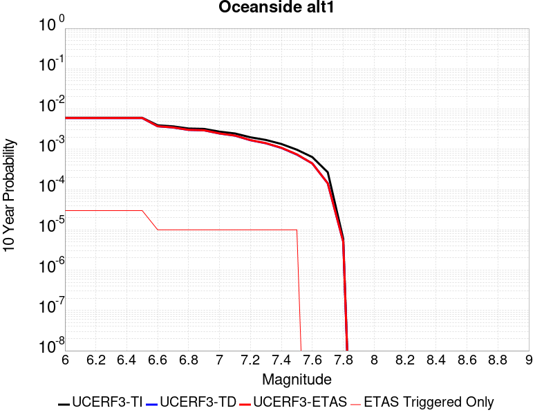 |

| Magnitude | 1 wk TI Prob | 1 wk TD Prob | 1 wk ETAS Prob | 1 wk ETAS/TD Gain | 1 wk ETAS Triggered Only | 1 mo TI Prob | 1 mo TD Prob | 1 mo ETAS Prob | 1 mo ETAS/TD Gain | 1 mo ETAS Triggered Only | 1 yr TI Prob | 1 yr TD Prob | 1 yr ETAS Prob | 1 yr ETAS/TD Gain | 1 yr ETAS Triggered Only | 10 yr TI Prob | 10 yr TD Prob | 10 yr ETAS Prob | 10 yr ETAS/TD Gain | 10 yr ETAS Triggered Only |
|-----|-----|-----|-----|-----|-----|-----|-----|-----|-----|-----|-----|-----|-----|-----|-----|-----|-----|-----|-----|-----|
| 6.0 | 1.1617542E-5 | 1.1423493E-5 | 1.1423493E-5 | 1.0 | 0.0 | 4.9788516E-5 | 4.8956997E-5 | 4.8956997E-5 | 1.0 | 0.0 | 6.060066E-4 | 5.9590454E-4 | 6.0589856E-4 | 1.0167712 | 1.0E-5 | 0.0060435664 | 0.005944664 | 0.005974486 | 1.0050166 | 3.0E-5 |
| 6.1 | 1.1617542E-5 | 1.1423493E-5 | 1.1423493E-5 | 1.0 | 0.0 | 4.9788516E-5 | 4.8956997E-5 | 4.8956997E-5 | 1.0 | 0.0 | 6.060066E-4 | 5.9590454E-4 | 6.0589856E-4 | 1.0167712 | 1.0E-5 | 0.0060435664 | 0.005944664 | 0.005974486 | 1.0050166 | 3.0E-5 |
| 6.2 | 1.1617542E-5 | 1.1423493E-5 | 1.1423493E-5 | 1.0 | 0.0 | 4.9788516E-5 | 4.8956997E-5 | 4.8956997E-5 | 1.0 | 0.0 | 6.060066E-4 | 5.9590454E-4 | 6.0589856E-4 | 1.0167712 | 1.0E-5 | 0.0060435664 | 0.005944664 | 0.005974486 | 1.0050166 | 3.0E-5 |
| 6.3 | 1.1617542E-5 | 1.1423493E-5 | 1.1423493E-5 | 1.0 | 0.0 | 4.9788516E-5 | 4.8956997E-5 | 4.8956997E-5 | 1.0 | 0.0 | 6.060066E-4 | 5.9590454E-4 | 6.0589856E-4 | 1.0167712 | 1.0E-5 | 0.0060435664 | 0.005944664 | 0.005974486 | 1.0050166 | 3.0E-5 |
| 6.4 | 1.1617542E-5 | 1.1423493E-5 | 1.1423493E-5 | 1.0 | 0.0 | 4.9788516E-5 | 4.8956997E-5 | 4.8956997E-5 | 1.0 | 0.0 | 6.060066E-4 | 5.9590454E-4 | 6.0589856E-4 | 1.0167712 | 1.0E-5 | 0.0060435664 | 0.005944664 | 0.005974486 | 1.0050166 | 3.0E-5 |
| 6.5 | 1.1617542E-5 | 1.1423493E-5 | 1.1423493E-5 | 1.0 | 0.0 | 4.9788516E-5 | 4.8956997E-5 | 4.8956997E-5 | 1.0 | 0.0 | 6.060066E-4 | 5.9590454E-4 | 6.0589856E-4 | 1.0167712 | 1.0E-5 | 0.0060435664 | 0.005944664 | 0.005974486 | 1.0050166 | 3.0E-5 |
| 6.6 | 7.561768E-6 | 7.1336153E-6 | 7.1336153E-6 | 1.0 | 0.0 | 3.2407173E-5 | 3.0572286E-5 | 3.0572286E-5 | 1.0 | 0.0 | 3.9448592E-4 | 3.7215507E-4 | 3.7215507E-4 | 1.0 | 0.0 | 0.0039378637 | 0.00371543 | 0.0037253927 | 1.0026815 | 1.0E-5 |
| 6.7 | 7.1042605E-6 | 6.6556854E-6 | 6.6556854E-6 | 1.0 | 0.0 | 3.0446476E-5 | 2.8524059E-5 | 2.8524059E-5 | 1.0 | 0.0 | 3.706228E-4 | 3.472259E-4 | 3.472259E-4 | 1.0 | 0.0 | 0.0037000529 | 0.003466917 | 0.0034768824 | 1.0028744 | 1.0E-5 |
| 6.8 | 6.285554E-6 | 5.799706E-6 | 5.799706E-6 | 1.0 | 0.0 | 2.693781E-5 | 2.4855648E-5 | 2.4855648E-5 | 1.0 | 0.0 | 3.2791847E-4 | 3.0257605E-4 | 3.0257605E-4 | 1.0 | 0.0 | 0.0032743502 | 0.0030216982 | 0.003031668 | 1.0032994 | 1.0E-5 |
| 6.9 | 6.148883E-6 | 5.6565445E-6 | 5.6565445E-6 | 1.0 | 0.0 | 2.635209E-5 | 2.424211E-5 | 2.424211E-5 | 1.0 | 0.0 | 3.2078946E-4 | 2.9510827E-4 | 2.9510827E-4 | 1.0 | 0.0 | 0.003203268 | 0.0029472208 | 0.0029571913 | 1.003383 | 1.0E-5 |
| 7.0 | 5.253857E-6 | 4.722404E-6 | 4.722404E-6 | 1.0 | 0.0 | 2.2516335E-5 | 2.0238718E-5 | 2.0238718E-5 | 1.0 | 0.0 | 2.7410188E-4 | 2.4637886E-4 | 2.4637886E-4 | 1.0 | 0.0 | 0.0027376404 | 0.0024610884 | 0.0024710638 | 1.0040532 | 1.0E-5 |
| 7.1 | 4.730754E-6 | 4.17851E-6 | 4.17851E-6 | 1.0 | 0.0 | 2.0274503E-5 | 1.7907778E-5 | 1.7907778E-5 | 1.0 | 0.0 | 2.468141E-4 | 2.1800565E-4 | 2.1800565E-4 | 1.0 | 0.0 | 0.0024654015 | 0.0021779444 | 0.0021879226 | 1.0045815 | 1.0E-5 |
| 7.2 | 3.7998386E-6 | 3.214026E-6 | 3.214026E-6 | 1.0 | 0.0 | 1.6284921E-5 | 1.37743245E-5 | 1.37743245E-5 | 1.0 | 0.0 | 1.9825088E-4 | 1.6768962E-4 | 1.6768962E-4 | 1.0 | 0.0 | 0.001980741 | 0.001675643 | 0.0016856263 | 1.0059578 | 1.0E-5 |
| 7.3 | 3.2656465E-6 | 2.698376E-6 | 2.698376E-6 | 1.0 | 0.0 | 1.3995553E-5 | 1.1564418E-5 | 1.1564418E-5 | 1.0 | 0.0 | 1.7038253E-4 | 1.407878E-4 | 1.407878E-4 | 1.0 | 0.0 | 0.0017025196 | 0.0014069972 | 0.0014169831 | 1.0070974 | 1.0E-5 |
| 7.4 | 2.593703E-6 | 2.0680277E-6 | 2.0680277E-6 | 1.0 | 0.0 | 1.1115822E-5 | 8.862946E-6 | 8.862946E-6 | 1.0 | 0.0 | 1.3532673E-4 | 1.0790111E-4 | 1.0790111E-4 | 1.0 | 0.0 | 0.0013524436 | 0.0010784961 | 0.0010884854 | 1.0092622 | 1.0E-5 |
| 7.5 | 1.8715585E-6 | 1.4137177E-6 | 1.4137177E-6 | 1.0 | 0.0 | 8.020941E-6 | 6.0587763E-6 | 6.0587763E-6 | 1.0 | 0.0 | 9.7650576E-5 | 7.376316E-5 | 7.376316E-5 | 1.0 | 0.0 | 9.7607676E-4 | 7.3739287E-4 | 7.473855E-4 | 1.0135512 | 1.0E-5 |
| 7.6 | 1.2246786E-6 | 8.5268175E-7 | 8.5268175E-7 | 1.0 | 0.0 | 5.248612E-6 | 3.6543456E-6 | 3.6543456E-6 | 1.0 | 0.0 | 6.389998E-5 | 4.4490793E-5 | 4.4490793E-5 | 1.0 | 0.0 | 6.3881604E-4 | 4.4482335E-4 | 4.4482335E-4 | 1.0 | 0.0 |
| 7.7 | 5.140719E-7 | 2.734703E-7 | 2.734703E-7 | 1.0 | 0.0 | 2.2031636E-6 | 1.1720151E-6 | 1.1720151E-6 | 1.0 | 0.0 | 2.6823185E-5 | 1.4269205E-5 | 1.4269205E-5 | 1.0 | 0.0 | 2.6819948E-4 | 1.4268424E-4 | 1.4268424E-4 | 1.0 | 0.0 |
| 7.8 | 1.16056995E-8 | 9.782373E-9 | 9.782373E-9 | 1.0 | 0.0 | 4.9738713E-8 | 4.1924455E-8 | 4.1924455E-8 | 1.0 | 0.0 | 6.0556863E-7 | 5.1043025E-7 | 5.1043025E-7 | 1.0 | 0.0 | 6.05567E-6 | 5.1043025E-6 | 5.1043025E-6 | 1.0 | 0.0 |

## San Juan
*[(top)](#table-of-contents)*

| 1 Week | 1 Month | 1 Year | 10 Year |
|-----|-----|-----|-----|
|  |  |  |  |

| Magnitude | 1 wk TI Prob | 1 wk TD Prob | 1 wk ETAS Prob | 1 wk ETAS/TD Gain | 1 wk ETAS Triggered Only | 1 mo TI Prob | 1 mo TD Prob | 1 mo ETAS Prob | 1 mo ETAS/TD Gain | 1 mo ETAS Triggered Only | 1 yr TI Prob | 1 yr TD Prob | 1 yr ETAS Prob | 1 yr ETAS/TD Gain | 1 yr ETAS Triggered Only | 10 yr TI Prob | 10 yr TD Prob | 10 yr ETAS Prob | 10 yr ETAS/TD Gain | 10 yr ETAS Triggered Only |
|-----|-----|-----|-----|-----|-----|-----|-----|-----|-----|-----|-----|-----|-----|-----|-----|-----|-----|-----|-----|-----|
| 6.0 | 8.682808E-6 | 8.7491635E-6 | 2.874899E-5 | 3.2859128 | 2.0E-5 | 3.72115E-5 | 3.74959E-5 | 5.7495152E-5 | 1.5333716 | 2.0E-5 | 4.5295584E-4 | 4.564218E-4 | 4.7641268E-4 | 1.0437992 | 2.0E-5 | 0.004520337 | 0.004555385 | 0.0045852484 | 1.0065556 | 3.0E-5 |
| 6.1 | 8.682808E-6 | 8.7491635E-6 | 2.874899E-5 | 3.2859128 | 2.0E-5 | 3.72115E-5 | 3.74959E-5 | 5.7495152E-5 | 1.5333716 | 2.0E-5 | 4.5295584E-4 | 4.564218E-4 | 4.7641268E-4 | 1.0437992 | 2.0E-5 | 0.004520337 | 0.004555385 | 0.0045852484 | 1.0065556 | 3.0E-5 |
| 6.2 | 8.682808E-6 | 8.7491635E-6 | 2.874899E-5 | 3.2859128 | 2.0E-5 | 3.72115E-5 | 3.74959E-5 | 5.7495152E-5 | 1.5333716 | 2.0E-5 | 4.5295584E-4 | 4.564218E-4 | 4.7641268E-4 | 1.0437992 | 2.0E-5 | 0.004520337 | 0.004555385 | 0.0045852484 | 1.0065556 | 3.0E-5 |
| 6.3 | 6.3054235E-6 | 6.2825848E-6 | 1.6282522E-5 | 2.5916915 | 1.0E-5 | 2.7022963E-5 | 2.6925094E-5 | 3.6924826E-5 | 1.3713907 | 1.0E-5 | 3.2895492E-4 | 3.2776513E-4 | 3.3776183E-4 | 1.0304997 | 1.0E-5 | 0.003284684 | 0.003273017 | 0.0032929515 | 1.0060905 | 2.0E-5 |
| 6.4 | 6.1490473E-6 | 6.1144656E-6 | 1.6114405E-5 | 2.6354558 | 1.0E-5 | 2.6352795E-5 | 2.6204598E-5 | 3.6204336E-5 | 1.3816024 | 1.0E-5 | 3.2079802E-4 | 3.1899565E-4 | 3.2899246E-4 | 1.0313383 | 1.0E-5 | 0.0032033534 | 0.0031855737 | 0.00320551 | 1.0062582 | 2.0E-5 |
| 6.5 | 5.204848E-6 | 5.137233E-6 | 1.5137182E-5 | 2.946563 | 1.0E-5 | 2.23063E-5 | 2.2016533E-5 | 3.2016313E-5 | 1.4541941 | 1.0E-5 | 2.7154534E-4 | 2.6801927E-4 | 2.780166E-4 | 1.0373007 | 1.0E-5 | 0.0027121378 | 0.0026771144 | 0.0026970608 | 1.0074507 | 2.0E-5 |
| 6.6 | 4.5179986E-6 | 4.4150297E-6 | 1.4414985E-5 | 3.2649803 | 1.0E-5 | 1.9362706E-5 | 1.8921424E-5 | 2.8921235E-5 | 1.5284915 | 1.0E-5 | 2.3571544E-4 | 2.3034477E-4 | 2.4034247E-4 | 1.0434031 | 1.0E-5 | 0.0023546559 | 0.0023011973 | 0.002321151 | 1.0086712 | 2.0E-5 |
| 6.7 | 3.9442616E-6 | 3.819828E-6 | 1.381979E-5 | 3.617909 | 1.0E-5 | 1.6903869E-5 | 1.6370592E-5 | 2.637043E-5 | 1.6108414 | 1.0E-5 | 2.0578515E-4 | 1.992944E-4 | 2.0929241E-4 | 1.050167 | 1.0E-5 | 0.002055947 | 0.0019912818 | 0.0020112419 | 1.0100238 | 2.0E-5 |
| 6.8 | 3.4536245E-6 | 3.3163353E-6 | 1.3316302E-5 | 4.0153666 | 1.0E-5 | 1.4801163E-5 | 1.4212792E-5 | 2.421265E-5 | 1.7035816 | 1.0E-5 | 1.8018926E-4 | 1.7302761E-4 | 1.8302588E-4 | 1.0577842 | 1.0E-5 | 0.0018004322 | 0.0017290477 | 0.0017390305 | 1.0057735 | 1.0E-5 |
| 6.9 | 3.059865E-6 | 2.9120315E-6 | 1.2912003E-5 | 4.4340186 | 1.0E-5 | 1.3113641E-5 | 1.2480078E-5 | 2.2479953E-5 | 1.801267 | 1.0E-5 | 1.596469E-4 | 1.5193493E-4 | 1.619334E-4 | 1.0658077 | 1.0E-5 | 0.0015953224 | 0.0015184252 | 0.00152841 | 1.0065758 | 1.0E-5 |
| 7.0 | 2.6504351E-6 | 2.4920002E-6 | 1.2491975E-5 | 5.0128307 | 1.0E-5 | 1.1358958E-5 | 1.0679961E-5 | 2.0679854E-5 | 1.936323 | 1.0E-5 | 1.3828653E-4 | 1.300213E-4 | 1.4002E-4 | 1.0769005 | 1.0E-5 | 0.0013820052 | 0.0012995641 | 0.0013095512 | 1.007685 | 1.0E-5 |
| 7.1 | 2.2039317E-6 | 2.0338296E-6 | 1.2033809E-5 | 5.916823 | 1.0E-5 | 9.445387E-6 | 8.716386E-6 | 1.8716299E-5 | 2.1472545 | 1.0E-5 | 1.1499152E-4 | 1.0611736E-4 | 1.161163E-4 | 1.0942253 | 1.0E-5 | 0.0011493203 | 0.0010607769 | 0.0010707662 | 1.009417 | 1.0E-5 |
| 7.2 | 1.0786707E-6 | 8.7701903E-7 | 8.7701903E-7 | 1.0 | 0.0 | 4.622866E-6 | 3.7586476E-6 | 3.7586476E-6 | 1.0 | 0.0 | 5.628194E-5 | 4.5760586E-5 | 4.5760586E-5 | 1.0 | 0.0 | 5.6267687E-4 | 4.5757066E-4 | 4.5757066E-4 | 1.0 | 0.0 |
| 7.3 | 6.846433E-7 | 4.868805E-7 | 4.868805E-7 | 1.0 | 0.0 | 2.9341822E-6 | 2.086629E-6 | 2.086629E-6 | 1.0 | 0.0 | 3.5723086E-5 | 2.5404412E-5 | 2.5404412E-5 | 1.0 | 0.0 | 3.571734E-4 | 2.540486E-4 | 2.540486E-4 | 1.0 | 0.0 |
| 7.4 | 5.23043E-7 | 3.2628162E-7 | 3.2628162E-7 | 1.0 | 0.0 | 2.2416111E-6 | 1.398349E-6 | 1.398349E-6 | 1.0 | 0.0 | 2.7291273E-5 | 1.7024766E-5 | 1.7024766E-5 | 1.0 | 0.0 | 2.7287923E-4 | 1.7026656E-4 | 1.7026656E-4 | 1.0 | 0.0 |
| 7.5 | 4.648444E-7 | 2.7234944E-7 | 2.7234944E-7 | 1.0 | 0.0 | 1.9921886E-6 | 1.1672114E-6 | 1.1672114E-6 | 1.0 | 0.0 | 2.4254627E-5 | 1.42107065E-5 | 1.42107065E-5 | 1.0 | 0.0 | 2.425198E-4 | 1.421276E-4 | 1.421276E-4 | 1.0 | 0.0 |
| 7.6 | 3.9906567E-7 | 2.2083314E-7 | 2.2083314E-7 | 1.0 | 0.0 | 1.7102802E-6 | 9.464274E-7 | 9.464274E-7 | 1.0 | 0.0 | 2.0822463E-5 | 1.1522693E-5 | 1.1522693E-5 | 1.0 | 0.0 | 2.0820512E-4 | 1.15245566E-4 | 1.15245566E-4 | 1.0 | 0.0 |
| 7.7 | 1.8784601E-7 | 5.3666906E-8 | 5.3666906E-8 | 1.0 | 0.0 | 8.0505407E-7 | 2.30001E-7 | 2.30001E-7 | 1.0 | 0.0 | 9.80149E-6 | 2.8002585E-6 | 2.8002585E-6 | 1.0 | 0.0 | 9.801057E-5 | 2.8011282E-5 | 2.8011282E-5 | 1.0 | 0.0 |
| 7.8 | 1.00154914E-7 | 1.2415832E-8 | 1.2415832E-8 | 1.0 | 0.0 | 4.2923529E-7 | 5.3210716E-8 | 5.3210716E-8 | 1.0 | 0.0 | 5.225927E-6 | 6.4784024E-7 | 6.4784024E-7 | 1.0 | 0.0 | 5.225804E-5 | 6.484273E-6 | 6.484273E-6 | 1.0 | 0.0 |
| 7.9 | 6.171429E-8 | 4.2966155E-9 | 4.2966155E-9 | 1.0 | 0.0 | 2.6448978E-7 | 1.8414067E-8 | 1.8414067E-8 | 1.0 | 0.0 | 3.2201583E-6 | 2.2419121E-7 | 2.2419121E-7 | 1.0 | 0.0 | 3.2201115E-5 | 2.2472002E-6 | 2.2472002E-6 | 1.0 | 0.0 |
| 8.0 | 1.3974572E-8 | 3.3788217E-10 | 3.3788217E-10 | 1.0 | 0.0 | 5.989102E-8 | 1.448067E-9 | 1.448067E-9 | 1.0 | 0.0 | 7.2917294E-7 | 1.763022E-8 | 1.763022E-8 | 1.0 | 0.0 | 7.2917055E-6 | 1.8060365E-7 | 1.8060365E-7 | 1.0 | 0.0 |
| 8.1 | 1.8403477E-9 | 1.1302803E-10 | 1.1302803E-10 | 1.0 | 0.0 | 7.887204E-9 | 4.844063E-10 | 4.844063E-10 | 1.0 | 0.0 | 9.602671E-8 | 5.8976446E-9 | 5.8976446E-9 | 1.0 | 0.0 | 9.602667E-7 | 6.021993E-8 | 6.021993E-8 | 1.0 | 0.0 |

## Santa Cruz Catalina Ridge alt1
*[(top)](#table-of-contents)*

| 1 Week | 1 Month | 1 Year | 10 Year |
|-----|-----|-----|-----|
|  |  |  |  |

| Magnitude | 1 wk TI Prob | 1 wk TD Prob | 1 wk ETAS Prob | 1 wk ETAS/TD Gain | 1 wk ETAS Triggered Only | 1 mo TI Prob | 1 mo TD Prob | 1 mo ETAS Prob | 1 mo ETAS/TD Gain | 1 mo ETAS Triggered Only | 1 yr TI Prob | 1 yr TD Prob | 1 yr ETAS Prob | 1 yr ETAS/TD Gain | 1 yr ETAS Triggered Only | 10 yr TI Prob | 10 yr TD Prob | 10 yr ETAS Prob | 10 yr ETAS/TD Gain | 10 yr ETAS Triggered Only |
|-----|-----|-----|-----|-----|-----|-----|-----|-----|-----|-----|-----|-----|-----|-----|-----|-----|-----|-----|-----|-----|
| 6.0 | 3.2833184E-5 | 3.65584E-5 | 4.6558034E-5 | 1.273525 | 1.0E-5 | 1.4070606E-4 | 1.5667039E-4 | 1.6666882E-4 | 1.0638182 | 1.0E-5 | 0.00171175 | 0.0019059596 | 0.0019259214 | 1.0104734 | 2.0E-5 | 0.016986247 | 0.018913029 | 0.018942462 | 1.0015562 | 3.0E-5 |
| 6.1 | 1.9835548E-5 | 2.1659505E-5 | 3.165929E-5 | 1.461681 | 1.0E-5 | 8.500672E-5 | 9.282326E-5 | 1.02822334E-4 | 1.1077216 | 1.0E-5 | 0.0010344655 | 0.0011295575 | 0.0011495348 | 1.017686 | 2.0E-5 | 0.010296632 | 0.011240295 | 0.011260071 | 1.0017593 | 2.0E-5 |
| 6.2 | 1.9835548E-5 | 2.1659505E-5 | 3.165929E-5 | 1.461681 | 1.0E-5 | 8.500672E-5 | 9.282326E-5 | 1.02822334E-4 | 1.1077216 | 1.0E-5 | 0.0010344655 | 0.0011295575 | 0.0011495348 | 1.017686 | 2.0E-5 | 0.010296632 | 0.011240295 | 0.011260071 | 1.0017593 | 2.0E-5 |
| 6.3 | 1.5728183E-5 | 1.703395E-5 | 2.7033779E-5 | 1.587053 | 1.0E-5 | 6.7404755E-5 | 7.300063E-5 | 8.29999E-5 | 1.1369752 | 1.0E-5 | 8.2034385E-4 | 8.884264E-4 | 9.084086E-4 | 1.0224917 | 2.0E-5 | 0.008173222 | 0.008849427 | 0.00886925 | 1.0022401 | 2.0E-5 |
| 6.4 | 1.5728183E-5 | 1.703395E-5 | 2.7033779E-5 | 1.587053 | 1.0E-5 | 6.7404755E-5 | 7.300063E-5 | 8.29999E-5 | 1.1369752 | 1.0E-5 | 8.2034385E-4 | 8.884264E-4 | 9.084086E-4 | 1.0224917 | 2.0E-5 | 0.008173222 | 0.008849427 | 0.00886925 | 1.0022401 | 2.0E-5 |
| 6.5 | 1.3707734E-5 | 1.4794522E-5 | 2.4794374E-5 | 1.6759158 | 1.0E-5 | 5.8746107E-5 | 6.3403575E-5 | 7.340294E-5 | 1.1577098 | 1.0E-5 | 7.1499916E-4 | 7.716686E-4 | 7.916532E-4 | 1.0258979 | 2.0E-5 | 0.0071270303 | 0.0076902895 | 0.007710136 | 1.0025806 | 2.0E-5 |
| 6.6 | 1.2539813E-5 | 1.3510219E-5 | 2.3510085E-5 | 1.7401705 | 1.0E-5 | 5.3740947E-5 | 5.789967E-5 | 6.789909E-5 | 1.1727026 | 1.0E-5 | 6.540996E-4 | 7.0470315E-4 | 7.2468905E-4 | 1.0283607 | 2.0E-5 | 0.0065217763 | 0.0070249885 | 0.007044848 | 1.0028269 | 2.0E-5 |
| 6.7 | 1.1504083E-5 | 1.2377375E-5 | 2.2377251E-5 | 1.8079158 | 1.0E-5 | 4.930228E-5 | 5.3044827E-5 | 6.3044296E-5 | 1.1885098 | 1.0E-5 | 6.0008996E-4 | 6.456314E-4 | 6.6561846E-4 | 1.0309575 | 2.0E-5 | 0.005984721 | 0.006437786 | 0.006457657 | 1.0030867 | 2.0E-5 |
| 6.8 | 1.012739E-5 | 1.0877071E-5 | 2.0876963E-5 | 1.9193552 | 1.0E-5 | 4.340238E-5 | 4.6615194E-5 | 5.661473E-5 | 1.2145123 | 1.0E-5 | 5.282958E-4 | 5.673937E-4 | 5.8738235E-4 | 1.0352288 | 2.0E-5 | 0.0052704164 | 0.0056596193 | 0.0056795063 | 1.0035138 | 2.0E-5 |
| 6.9 | 8.9607865E-6 | 9.609117E-6 | 9.609117E-6 | 1.0 | 0.0 | 3.8402806E-5 | 4.1181287E-5 | 4.1181287E-5 | 1.0 | 0.0 | 4.6745385E-4 | 5.012679E-4 | 5.012679E-4 | 1.0 | 0.0 | 0.0046647177 | 0.005001492 | 0.005001492 | 1.0 | 0.0 |
| 7.0 | 8.046829E-6 | 8.619746E-6 | 8.619746E-6 | 1.0 | 0.0 | 3.4485955E-5 | 3.694125E-5 | 3.694125E-5 | 1.0 | 0.0 | 4.1978562E-4 | 4.496677E-4 | 4.496677E-4 | 1.0 | 0.0 | 0.004189935 | 0.0044876686 | 0.0044876686 | 1.0 | 0.0 |
| 7.1 | 7.136131E-6 | 7.637656E-6 | 7.637656E-6 | 1.0 | 0.0 | 3.0583058E-5 | 3.2732405E-5 | 3.2732405E-5 | 1.0 | 0.0 | 3.7228514E-4 | 3.9844486E-4 | 3.9844486E-4 | 1.0 | 0.0 | 0.0037166206 | 0.003977381 | 0.003977381 | 1.0 | 0.0 |
| 7.2 | 6.362014E-6 | 6.8049585E-6 | 6.8049585E-6 | 1.0 | 0.0 | 2.726549E-5 | 2.9163786E-5 | 2.9163786E-5 | 1.0 | 0.0 | 3.3190678E-4 | 3.550119E-4 | 3.550119E-4 | 1.0 | 0.0 | 0.0033141149 | 0.003544516 | 0.003544516 | 1.0 | 0.0 |
| 7.3 | 5.004101E-6 | 5.351715E-6 | 5.351715E-6 | 1.0 | 0.0 | 2.1445969E-5 | 2.2935723E-5 | 2.2935723E-5 | 1.0 | 0.0 | 2.6107338E-4 | 2.792072E-4 | 2.792072E-4 | 1.0 | 0.0 | 0.002607669 | 0.0027886187 | 0.0027886187 | 1.0 | 0.0 |
| 7.4 | 3.4901443E-6 | 3.7320526E-6 | 3.7320526E-6 | 1.0 | 0.0 | 1.4957676E-5 | 1.5994416E-5 | 1.5994416E-5 | 1.0 | 0.0 | 1.8209449E-4 | 1.9471499E-4 | 1.9471499E-4 | 1.0 | 0.0 | 0.0018194534 | 0.0019454823 | 0.0019454823 | 1.0 | 0.0 |
| 7.5 | 1.1215045E-6 | 1.189387E-6 | 1.189387E-6 | 1.0 | 0.0 | 4.806439E-6 | 5.097363E-6 | 5.097363E-6 | 1.0 | 0.0 | 5.851682E-5 | 6.205866E-5 | 6.205866E-5 | 1.0 | 0.0 | 5.850142E-4 | 6.2041637E-4 | 6.2041637E-4 | 1.0 | 0.0 |
| 7.6 | 2.8599047E-7 | 2.9951994E-7 | 2.9951994E-7 | 1.0 | 0.0 | 1.2256729E-6 | 1.2836562E-6 | 1.2836562E-6 | 1.0 | 0.0 | 1.4922465E-5 | 1.5628404E-5 | 1.5628404E-5 | 1.0 | 0.0 | 1.4921463E-4 | 1.5627318E-4 | 1.5627318E-4 | 1.0 | 0.0 |
| 7.7 | 2.0781519E-7 | 2.1744323E-7 | 2.1744323E-7 | 1.0 | 0.0 | 8.906362E-7 | 9.3189925E-7 | 9.3189925E-7 | 1.0 | 0.0 | 1.08434415E-5 | 1.13458145E-5 | 1.13458145E-5 | 1.0 | 0.0 | 1.0842913E-4 | 1.1345245E-4 | 1.1345245E-4 | 1.0 | 0.0 |
| 7.8 | 3.614776E-8 | 3.764102E-8 | 3.764102E-8 | 1.0 | 0.0 | 1.5491896E-7 | 1.6131864E-7 | 1.6131864E-7 | 1.0 | 0.0 | 1.8861368E-6 | 1.9640527E-6 | 1.9640527E-6 | 1.0 | 0.0 | 1.8861208E-5 | 1.9640367E-5 | 1.9640367E-5 | 1.0 | 0.0 |

## San Luis Range 2011 CFM
*[(top)](#table-of-contents)*

| 1 Week | 1 Month | 1 Year | 10 Year |
|-----|-----|-----|-----|
|  | 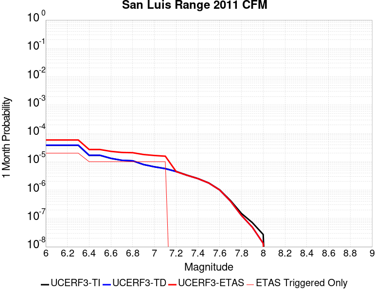 |  |  |

| Magnitude | 1 wk TI Prob | 1 wk TD Prob | 1 wk ETAS Prob | 1 wk ETAS/TD Gain | 1 wk ETAS Triggered Only | 1 mo TI Prob | 1 mo TD Prob | 1 mo ETAS Prob | 1 mo ETAS/TD Gain | 1 mo ETAS Triggered Only | 1 yr TI Prob | 1 yr TD Prob | 1 yr ETAS Prob | 1 yr ETAS/TD Gain | 1 yr ETAS Triggered Only | 10 yr TI Prob | 10 yr TD Prob | 10 yr ETAS Prob | 10 yr ETAS/TD Gain | 10 yr ETAS Triggered Only |
|-----|-----|-----|-----|-----|-----|-----|-----|-----|-----|-----|-----|-----|-----|-----|-----|-----|-----|-----|-----|-----|
| 6.0 | 8.8368415E-6 | 8.965454E-6 | 2.8965274E-5 | 3.230765 | 2.0E-5 | 3.787163E-5 | 3.842285E-5 | 5.8422083E-5 | 1.5205035 | 2.0E-5 | 4.609895E-4 | 4.677057E-4 | 4.8769635E-4 | 1.0427419 | 2.0E-5 | 0.0046003438 | 0.0046679964 | 0.004687903 | 1.0042645 | 2.0E-5 |
| 6.1 | 8.8368415E-6 | 8.965454E-6 | 2.8965274E-5 | 3.230765 | 2.0E-5 | 3.787163E-5 | 3.842285E-5 | 5.8422083E-5 | 1.5205035 | 2.0E-5 | 4.609895E-4 | 4.677057E-4 | 4.8769635E-4 | 1.0427419 | 2.0E-5 | 0.0046003438 | 0.0046679964 | 0.004687903 | 1.0042645 | 2.0E-5 |
| 6.2 | 8.8368415E-6 | 8.965454E-6 | 2.8965274E-5 | 3.230765 | 2.0E-5 | 3.787163E-5 | 3.842285E-5 | 5.8422083E-5 | 1.5205035 | 2.0E-5 | 4.609895E-4 | 4.677057E-4 | 4.8769635E-4 | 1.0427419 | 2.0E-5 | 0.0046003438 | 0.0046679964 | 0.004687903 | 1.0042645 | 2.0E-5 |
| 6.3 | 8.8368415E-6 | 8.965454E-6 | 2.8965274E-5 | 3.230765 | 2.0E-5 | 3.787163E-5 | 3.842285E-5 | 5.8422083E-5 | 1.5205035 | 2.0E-5 | 4.609895E-4 | 4.677057E-4 | 4.8769635E-4 | 1.0427419 | 2.0E-5 | 0.0046003438 | 0.0046679964 | 0.004687903 | 1.0042645 | 2.0E-5 |
| 6.4 | 3.9094193E-6 | 3.9412025E-6 | 1.3941163E-5 | 3.5372865 | 1.0E-5 | 1.6754546E-5 | 1.689076E-5 | 2.6890591E-5 | 1.5920297 | 1.0E-5 | 2.039675E-4 | 2.056259E-4 | 2.1562383E-4 | 1.048622 | 1.0E-5 | 0.0020378039 | 0.0020543851 | 0.0020643645 | 1.0048577 | 1.0E-5 |
| 6.5 | 3.9094193E-6 | 3.9412025E-6 | 1.3941163E-5 | 3.5372865 | 1.0E-5 | 1.6754546E-5 | 1.689076E-5 | 2.6890591E-5 | 1.5920297 | 1.0E-5 | 2.039675E-4 | 2.056259E-4 | 2.1562383E-4 | 1.048622 | 1.0E-5 | 0.0020378039 | 0.0020543851 | 0.0020643645 | 1.0048577 | 1.0E-5 |
| 6.6 | 3.0587726E-6 | 3.0753883E-6 | 1.3075358E-5 | 4.251612 | 1.0E-5 | 1.3108959E-5 | 1.318017E-5 | 2.3180037E-5 | 1.7587056 | 1.0E-5 | 1.595899E-4 | 1.6045687E-4 | 1.7045526E-4 | 1.062312 | 1.0E-5 | 0.0015947534 | 0.0016034221 | 0.001613406 | 1.0062267 | 1.0E-5 |
| 6.7 | 2.6160574E-6 | 2.6251273E-6 | 1.2625101E-5 | 4.809329 | 1.0E-5 | 1.1211626E-5 | 1.1250498E-5 | 2.1250386E-5 | 1.8888396 | 1.0E-5 | 1.3649299E-4 | 1.3696625E-4 | 1.4696489E-4 | 1.0730007 | 1.0E-5 | 0.0013640919 | 0.0013688246 | 0.0013788108 | 1.0072955 | 1.0E-5 |
| 6.8 | 2.5110312E-6 | 2.51814E-6 | 1.2518115E-5 | 4.9711747 | 1.0E-5 | 1.0761518E-5 | 1.0791985E-5 | 2.0791877E-5 | 1.9266036 | 1.0E-5 | 1.310136E-4 | 1.3138456E-4 | 1.4138324E-4 | 1.0761025 | 1.0E-5 | 0.0013093639 | 0.0013130746 | 0.0013230615 | 1.0076057 | 1.0E-5 |
| 6.9 | 1.8564405E-6 | 1.852487E-6 | 1.1852469E-5 | 6.3981385 | 1.0E-5 | 7.95615E-6 | 7.939206E-6 | 1.7939126E-5 | 2.2595618 | 1.0E-5 | 9.686181E-5 | 9.665557E-5 | 1.06654596E-4 | 1.1034502 | 1.0E-5 | 9.68196E-4 | 9.661373E-4 | 9.7612763E-4 | 1.0103405 | 1.0E-5 |
| 7.0 | 1.546127E-6 | 1.5369537E-6 | 1.15369385E-5 | 7.5063667 | 1.0E-5 | 6.626242E-6 | 6.586928E-6 | 1.6586862E-5 | 2.5181484 | 1.0E-5 | 8.06715E-5 | 8.0192905E-5 | 9.01921E-5 | 1.1246893 | 1.0E-5 | 8.0642226E-4 | 8.016404E-4 | 8.116324E-4 | 1.0124644 | 1.0E-5 |
| 7.1 | 1.3368208E-6 | 1.3235326E-6 | 1.1323519E-5 | 8.555528 | 1.0E-5 | 5.7292195E-6 | 5.67227E-6 | 1.5672214E-5 | 2.7629526 | 1.0E-5 | 6.975101E-5 | 6.905771E-5 | 7.905702E-5 | 1.1447965 | 1.0E-5 | 6.972912E-4 | 6.9036294E-4 | 7.0035603E-4 | 1.0144751 | 1.0E-5 |
| 7.2 | 1.0623363E-6 | 1.0454368E-6 | 1.0454368E-6 | 1.0 | 0.0 | 4.5528623E-6 | 4.4804356E-6 | 4.4804356E-6 | 1.0 | 0.0 | 5.5429686E-5 | 5.4547938E-5 | 5.4547938E-5 | 1.0 | 0.0 | 5.5415864E-4 | 5.4534577E-4 | 5.4534577E-4 | 1.0 | 0.0 |
| 7.3 | 7.831679E-7 | 7.7273904E-7 | 7.7273904E-7 | 1.0 | 0.0 | 3.3564295E-6 | 3.3117344E-6 | 3.3117344E-6 | 1.0 | 0.0 | 4.086376E-5 | 4.0319625E-5 | 4.0319625E-5 | 1.0 | 0.0 | 4.0856248E-4 | 4.031232E-4 | 4.031232E-4 | 1.0 | 0.0 |
| 7.4 | 5.9558846E-7 | 5.910636E-7 | 5.910636E-7 | 1.0 | 0.0 | 2.5525194E-6 | 2.5331274E-6 | 2.5331274E-6 | 1.0 | 0.0 | 3.107648E-5 | 3.084039E-5 | 3.084039E-5 | 1.0 | 0.0 | 3.1072134E-4 | 3.083612E-4 | 3.083612E-4 | 1.0 | 0.0 |
| 7.5 | 4.1616502E-7 | 4.119631E-7 | 4.119631E-7 | 1.0 | 0.0 | 1.7835631E-6 | 1.7655549E-6 | 1.7655549E-6 | 1.0 | 0.0 | 2.1714664E-5 | 2.149542E-5 | 2.149542E-5 | 1.0 | 0.0 | 2.1712543E-4 | 2.1493346E-4 | 2.1493346E-4 | 1.0 | 0.0 |
| 7.6 | 2.3816014E-7 | 2.3376548E-7 | 2.3376548E-7 | 1.0 | 0.0 | 1.0206859E-6 | 1.0018516E-6 | 1.0018516E-6 | 1.0 | 0.0 | 1.242678E-5 | 1.2197475E-5 | 1.2197475E-5 | 1.0 | 0.0 | 1.2426086E-4 | 1.2196808E-4 | 1.2196808E-4 | 1.0 | 0.0 |
| 7.7 | 9.918777E-8 | 9.3867584E-8 | 9.3867584E-8 | 1.0 | 0.0 | 4.2509038E-7 | 4.0228957E-7 | 4.0228957E-7 | 1.0 | 0.0 | 5.1754632E-6 | 4.8978645E-6 | 4.8978645E-6 | 1.0 | 0.0 | 5.1753424E-5 | 4.897757E-5 | 4.897757E-5 | 1.0 | 0.0 |
| 7.8 | 3.4982556E-8 | 2.968655E-8 | 2.968655E-8 | 1.0 | 0.0 | 1.4992524E-7 | 1.2722806E-7 | 1.2722806E-7 | 1.0 | 0.0 | 1.8253382E-6 | 1.5490006E-6 | 1.5490006E-6 | 1.0 | 0.0 | 1.8253233E-5 | 1.5489897E-5 | 1.5489897E-5 | 1.0 | 0.0 |
| 7.9 | 1.6624908E-8 | 1.1477036E-8 | 1.1477036E-8 | 1.0 | 0.0 | 7.12496E-8 | 4.91873E-8 | 4.91873E-8 | 1.0 | 0.0 | 8.6746354E-7 | 5.988552E-7 | 5.988552E-7 | 1.0 | 0.0 | 8.674601E-6 | 5.988536E-6 | 5.988536E-6 | 1.0 | 0.0 |
| 8.0 | 6.3352315E-9 | 3.0888412E-9 | 3.0888412E-9 | 1.0 | 0.0 | 2.715099E-8 | 1.3237893E-8 | 1.3237893E-8 | 1.0 | 0.0 | 3.3056327E-7 | 1.6117131E-7 | 1.6117131E-7 | 1.0 | 0.0 | 3.3056278E-6 | 1.611712E-6 | 1.611712E-6 | 1.0 | 0.0 |

## Hayward (So) 2011 CFM
*[(top)](#table-of-contents)*

| 1 Week | 1 Month | 1 Year | 10 Year |
|-----|-----|-----|-----|
|  |  |  |  |

| Magnitude | 1 wk TI Prob | 1 wk TD Prob | 1 wk ETAS Prob | 1 wk ETAS/TD Gain | 1 wk ETAS Triggered Only | 1 mo TI Prob | 1 mo TD Prob | 1 mo ETAS Prob | 1 mo ETAS/TD Gain | 1 mo ETAS Triggered Only | 1 yr TI Prob | 1 yr TD Prob | 1 yr ETAS Prob | 1 yr ETAS/TD Gain | 1 yr ETAS Triggered Only | 10 yr TI Prob | 10 yr TD Prob | 10 yr ETAS Prob | 10 yr ETAS/TD Gain | 10 yr ETAS Triggered Only |
|-----|-----|-----|-----|-----|-----|-----|-----|-----|-----|-----|-----|-----|-----|-----|-----|-----|-----|-----|-----|-----|
| 6.0 | 1.8091932E-4 | 3.570541E-4 | 3.570541E-4 | 1.0 | 0.0 | 7.751381E-4 | 0.0015293444 | 0.0015393291 | 1.0065287 | 1.0E-5 | 0.00939654 | 0.018463207 | 0.01848284 | 1.0010632 | 2.0E-5 | 0.090090066 | 0.16673161 | 0.16674827 | 1.0000999 | 2.0E-5 |
| 6.1 | 1.8091932E-4 | 3.570541E-4 | 3.570541E-4 | 1.0 | 0.0 | 7.751381E-4 | 0.0015293444 | 0.0015393291 | 1.0065287 | 1.0E-5 | 0.00939654 | 0.018463207 | 0.01848284 | 1.0010632 | 2.0E-5 | 0.090090066 | 0.16673161 | 0.16674827 | 1.0000999 | 2.0E-5 |
| 6.2 | 1.8091932E-4 | 3.570541E-4 | 3.570541E-4 | 1.0 | 0.0 | 7.751381E-4 | 0.0015293444 | 0.0015393291 | 1.0065287 | 1.0E-5 | 0.00939654 | 0.018463207 | 0.01848284 | 1.0010632 | 2.0E-5 | 0.090090066 | 0.16673161 | 0.16674827 | 1.0000999 | 2.0E-5 |
| 6.3 | 1.7322872E-4 | 3.426234E-4 | 3.426234E-4 | 1.0 | 0.0 | 7.4219756E-4 | 0.0014675693 | 0.0014775546 | 1.006804 | 1.0E-5 | 0.0089988755 | 0.017723544 | 0.01774319 | 1.0011084 | 2.0E-5 | 0.08643075 | 0.16066726 | 0.16068403 | 1.0001044 | 2.0E-5 |
| 6.4 | 1.6334097E-4 | 3.234411E-4 | 3.234411E-4 | 1.0 | 0.0 | 6.998449E-4 | 0.0013854484 | 0.0013954346 | 1.0072079 | 1.0E-5 | 0.008487372 | 0.016739385 | 0.016759051 | 1.0011748 | 2.0E-5 | 0.081704415 | 0.15255594 | 0.15257289 | 1.0001111 | 2.0E-5 |
| 6.5 | 1.5600289E-4 | 3.1018828E-4 | 3.1018828E-4 | 1.0 | 0.0 | 6.684125E-4 | 0.0013287093 | 0.001338696 | 1.0075161 | 1.0E-5 | 0.008107598 | 0.016058935 | 0.016078614 | 1.0012255 | 2.0E-5 | 0.078181036 | 0.14683272 | 0.14684978 | 1.0001162 | 2.0E-5 |
| 6.6 | 1.4046066E-4 | 2.8032906E-4 | 2.8032906E-4 | 1.0 | 0.0 | 6.018354E-4 | 0.0012008639 | 0.0012108518 | 1.0083174 | 1.0E-5 | 0.0073027555 | 0.014524006 | 0.014543716 | 1.0013571 | 2.0E-5 | 0.07067384 | 0.13391982 | 0.13393715 | 1.0001293 | 2.0E-5 |
| 6.7 | 1.14696966E-4 | 2.3271477E-4 | 2.3271477E-4 | 1.0 | 0.0 | 4.914658E-4 | 9.969729E-4 | 0.0010069628 | 1.0100204 | 1.0E-5 | 0.0059671924 | 0.012071652 | 0.012091411 | 1.0016367 | 2.0E-5 | 0.058094822 | 0.11274672 | 0.11276447 | 1.0001574 | 2.0E-5 |
| 6.8 | 9.3874296E-5 | 1.8861453E-4 | 1.8861453E-4 | 1.0 | 0.0 | 4.0225635E-4 | 8.0810126E-4 | 8.0810126E-4 | 1.0 | 0.0 | 0.0048864787 | 0.009794984 | 0.009794984 | 1.0 | 0.0 | 0.047804173 | 0.09259856 | 0.09259856 | 1.0 | 0.0 |
| 6.9 | 5.551852E-5 | 1.072948E-4 | 1.072948E-4 | 1.0 | 0.0 | 2.3791482E-4 | 4.5975443E-4 | 4.5975443E-4 | 1.0 | 0.0 | 0.0028927654 | 0.0055832625 | 0.0055832625 | 1.0 | 0.0 | 0.028553981 | 0.054245494 | 0.054245494 | 1.0 | 0.0 |
| 7.0 | 4.2662363E-5 | 8.2464416E-5 | 8.2464416E-5 | 1.0 | 0.0 | 1.8282588E-4 | 3.5337146E-4 | 3.5337146E-4 | 1.0 | 0.0 | 0.0022236328 | 0.0042938837 | 0.0042938837 | 1.0 | 0.0 | 0.022015138 | 0.042064495 | 0.042064495 | 1.0 | 0.0 |
| 7.1 | 3.305886E-5 | 6.3019055E-5 | 6.3019055E-5 | 1.0 | 0.0 | 1.4167312E-4 | 2.700538E-4 | 2.700538E-4 | 1.0 | 0.0 | 0.0017235056 | 0.0032829668 | 0.0032829668 | 1.0 | 0.0 | 0.017101998 | 0.032452874 | 0.032452874 | 1.0 | 0.0 |
| 7.2 | 2.9856887E-5 | 5.7013647E-5 | 5.7013647E-5 | 1.0 | 0.0 | 1.2795182E-4 | 2.4432142E-4 | 2.4432142E-4 | 1.0 | 0.0 | 0.0015567001 | 0.0029705726 | 0.0029705726 | 1.0 | 0.0 | 0.015458403 | 0.029453589 | 0.029453589 | 1.0 | 0.0 |
| 7.3 | 2.4559737E-5 | 4.599088E-5 | 4.599088E-5 | 1.0 | 0.0 | 1.0525176E-4 | 1.9708896E-4 | 1.9708896E-4 | 1.0 | 0.0 | 0.0012806869 | 0.0023969305 | 0.0023969305 | 1.0 | 0.0 | 0.012733313 | 0.023857482 | 0.023857482 | 1.0 | 0.0 |
| 7.4 | 1.9002231E-5 | 3.5049303E-5 | 3.5049303E-5 | 1.0 | 0.0 | 8.143559E-5 | 1.502027E-4 | 1.502027E-4 | 1.0 | 0.0 | 9.910273E-4 | 0.0018271938 | 0.0018271938 | 1.0 | 0.0 | 0.009866194 | 0.018258283 | 0.018258283 | 1.0 | 0.0 |
| 7.5 | 1.2783333E-5 | 2.3330069E-5 | 2.3330069E-5 | 1.0 | 0.0 | 5.4784563E-5 | 9.998221E-5 | 9.998221E-5 | 1.0 | 0.0 | 6.667979E-4 | 0.0012166094 | 0.0012166094 | 1.0 | 0.0 | 0.006648007 | 0.012209582 | 0.012209582 | 1.0 | 0.0 |
| 7.6 | 4.8149627E-6 | 8.887544E-6 | 8.887544E-6 | 1.0 | 0.0 | 2.063539E-5 | 3.8088925E-5 | 3.8088925E-5 | 1.0 | 0.0 | 2.5120692E-4 | 4.636352E-4 | 4.636352E-4 | 1.0 | 0.0 | 0.0025092314 | 0.0046812436 | 0.0046812436 | 1.0 | 0.0 |
| 7.7 | 6.0838227E-7 | 1.2056693E-6 | 1.2056693E-6 | 1.0 | 0.0 | 2.6073499E-6 | 5.1671436E-6 | 5.1671436E-6 | 1.0 | 0.0 | 3.174402E-5 | 6.290816E-5 | 6.290816E-5 | 1.0 | 0.0 | 3.1739488E-4 | 6.5293367E-4 | 6.5293367E-4 | 1.0 | 0.0 |
| 7.8 | 4.5542808E-7 | 9.792182E-7 | 9.792182E-7 | 1.0 | 0.0 | 1.9518332E-6 | 4.1966427E-6 | 4.1966427E-6 | 1.0 | 0.0 | 2.376331E-5 | 5.1092928E-5 | 5.1092928E-5 | 1.0 | 0.0 | 2.3760769E-4 | 5.321372E-4 | 5.321372E-4 | 1.0 | 0.0 |
| 7.9 | 3.3016747E-7 | 7.386335E-7 | 7.386335E-7 | 1.0 | 0.0 | 1.4150027E-6 | 3.1655684E-6 | 3.1655684E-6 | 1.0 | 0.0 | 1.7227521E-5 | 3.8540114E-5 | 3.8540114E-5 | 1.0 | 0.0 | 1.7226185E-4 | 3.9930744E-4 | 3.9930744E-4 | 1.0 | 0.0 |
| 8.0 | 2.347038E-7 | 5.4714894E-7 | 5.4714894E-7 | 1.0 | 0.0 | 1.0058731E-6 | 2.344922E-6 | 2.344922E-6 | 1.0 | 0.0 | 1.2246436E-5 | 2.8549053E-5 | 2.8549053E-5 | 1.0 | 0.0 | 1.2245761E-4 | 2.9355253E-4 | 2.9355253E-4 | 1.0 | 0.0 |
| 8.1 | 1.18822804E-7 | 2.6058973E-7 | 2.6058973E-7 | 1.0 | 0.0 | 5.092405E-7 | 1.1168127E-6 | 1.1168127E-6 | 1.0 | 0.0 | 6.1999854E-6 | 1.359711E-5 | 1.359711E-5 | 1.0 | 0.0 | 6.199812E-5 | 1.3917852E-4 | 1.3917852E-4 | 1.0 | 0.0 |

## Homestead Valley 2011
*[(top)](#table-of-contents)*

| 1 Week | 1 Month | 1 Year | 10 Year |
|-----|-----|-----|-----|
|  |  |  |  |

| Magnitude | 1 wk TI Prob | 1 wk TD Prob | 1 wk ETAS Prob | 1 wk ETAS/TD Gain | 1 wk ETAS Triggered Only | 1 mo TI Prob | 1 mo TD Prob | 1 mo ETAS Prob | 1 mo ETAS/TD Gain | 1 mo ETAS Triggered Only | 1 yr TI Prob | 1 yr TD Prob | 1 yr ETAS Prob | 1 yr ETAS/TD Gain | 1 yr ETAS Triggered Only | 10 yr TI Prob | 10 yr TD Prob | 10 yr ETAS Prob | 10 yr ETAS/TD Gain | 10 yr ETAS Triggered Only |
|-----|-----|-----|-----|-----|-----|-----|-----|-----|-----|-----|-----|-----|-----|-----|-----|-----|-----|-----|-----|-----|
| 6.0 | 1.539795E-5 | 6.286606E-6 | 1.6286544E-5 | 2.5906734 | 1.0E-5 | 6.5989545E-5 | 2.6942436E-5 | 4.6941896E-5 | 1.7423034 | 2.0E-5 | 8.0312655E-4 | 3.279954E-4 | 3.4798883E-4 | 1.0609565 | 2.0E-5 | 0.008002302 | 0.0032771337 | 0.0032970682 | 1.0060829 | 2.0E-5 |
| 6.1 | 1.539795E-5 | 6.286606E-6 | 1.6286544E-5 | 2.5906734 | 1.0E-5 | 6.5989545E-5 | 2.6942436E-5 | 4.6941896E-5 | 1.7423034 | 2.0E-5 | 8.0312655E-4 | 3.279954E-4 | 3.4798883E-4 | 1.0609565 | 2.0E-5 | 0.008002302 | 0.0032771337 | 0.0032970682 | 1.0060829 | 2.0E-5 |
| 6.2 | 1.539795E-5 | 6.286606E-6 | 1.6286544E-5 | 2.5906734 | 1.0E-5 | 6.5989545E-5 | 2.6942436E-5 | 4.6941896E-5 | 1.7423034 | 2.0E-5 | 8.0312655E-4 | 3.279954E-4 | 3.4798883E-4 | 1.0609565 | 2.0E-5 | 0.008002302 | 0.0032771337 | 0.0032970682 | 1.0060829 | 2.0E-5 |
| 6.3 | 1.539795E-5 | 6.286606E-6 | 1.6286544E-5 | 2.5906734 | 1.0E-5 | 6.5989545E-5 | 2.6942436E-5 | 4.6941896E-5 | 1.7423034 | 2.0E-5 | 8.0312655E-4 | 3.279954E-4 | 3.4798883E-4 | 1.0609565 | 2.0E-5 | 0.008002302 | 0.0032771337 | 0.0032970682 | 1.0060829 | 2.0E-5 |
| 6.4 | 1.539795E-5 | 6.286606E-6 | 1.6286544E-5 | 2.5906734 | 1.0E-5 | 6.5989545E-5 | 2.6942436E-5 | 4.6941896E-5 | 1.7423034 | 2.0E-5 | 8.0312655E-4 | 3.279954E-4 | 3.4798883E-4 | 1.0609565 | 2.0E-5 | 0.008002302 | 0.0032771337 | 0.0032970682 | 1.0060829 | 2.0E-5 |
| 6.5 | 1.0265258E-5 | 2.8788488E-6 | 1.287882E-5 | 4.4736004 | 1.0E-5 | 4.3993223E-5 | 1.2337905E-5 | 3.233766E-5 | 2.6210008 | 2.0E-5 | 5.3548586E-4 | 1.5021059E-4 | 1.7020758E-4 | 1.1331264 | 2.0E-5 | 0.005341973 | 0.0015017724 | 0.0015217424 | 1.0132976 | 2.0E-5 |
| 6.6 | 6.664671E-6 | 5.348204E-7 | 5.348204E-7 | 1.0 | 0.0 | 2.8562565E-5 | 2.2920863E-6 | 1.2292063E-5 | 5.362828 | 1.0E-5 | 3.476937E-4 | 2.7905911E-5 | 3.7905633E-5 | 1.358337 | 1.0E-5 | 0.003471502 | 2.790357E-4 | 2.890329E-4 | 1.0358278 | 1.0E-5 |
| 6.7 | 6.5954046E-6 | 5.348204E-7 | 5.348204E-7 | 1.0 | 0.0 | 2.8265715E-5 | 2.2920863E-6 | 1.2292063E-5 | 5.362828 | 1.0E-5 | 3.4408073E-4 | 2.7905911E-5 | 3.7905633E-5 | 1.358337 | 1.0E-5 | 0.0034354846 | 2.790357E-4 | 2.890329E-4 | 1.0358278 | 1.0E-5 |
| 6.8 | 4.648189E-6 | 2.3265572E-7 | 2.3265572E-7 | 1.0 | 0.0 | 1.9920659E-5 | 9.970956E-7 | 1.0997086E-5 | 11.029119 | 1.0E-5 | 2.4250703E-4 | 1.2139576E-5 | 2.2139455E-5 | 1.823742 | 1.0E-5 | 0.0024224254 | 1.2138961E-4 | 1.313884E-4 | 1.0823693 | 1.0E-5 |
| 6.9 | 4.1428534E-6 | 1.9344557E-7 | 1.9344557E-7 | 1.0 | 0.0 | 1.7754966E-5 | 8.290522E-7 | 1.0829044E-5 | 13.061956 | 1.0E-5 | 2.1614527E-4 | 1.0093667E-5 | 2.0093566E-5 | 1.9907103 | 1.0E-5 | 0.0021593515 | 1.0093238E-4 | 1.10931374E-4 | 1.0990663 | 1.0E-5 |
| 7.0 | 3.0673707E-6 | 1.5367603E-7 | 1.5367603E-7 | 1.0 | 0.0 | 1.3145808E-5 | 6.586114E-7 | 1.0658605E-5 | 16.18345 | 1.0E-5 | 1.6003846E-4 | 8.0185655E-6 | 1.8018485E-5 | 2.2470958 | 1.0E-5 | 0.0015992324 | 8.0182865E-5 | 9.018206E-5 | 1.124705 | 1.0E-5 |
| 7.1 | 2.340854E-6 | 1.468766E-7 | 1.468766E-7 | 1.0 | 0.0 | 1.0032193E-5 | 6.29471E-7 | 1.0629465E-5 | 16.886345 | 1.0E-5 | 1.221351E-4 | 7.663783E-6 | 1.7663706E-5 | 2.3048286 | 1.0E-5 | 0.00122068 | 7.663529E-5 | 8.663452E-5 | 1.1304781 | 1.0E-5 |
| 7.2 | 1.3754182E-6 | 1.3922634E-7 | 1.3922634E-7 | 1.0 | 0.0 | 5.8946357E-6 | 5.966842E-7 | 1.0596678E-5 | 17.759275 | 1.0E-5 | 7.176483E-5 | 7.2646067E-6 | 1.7264534E-5 | 2.376527 | 1.0E-5 | 7.174166E-4 | 7.264379E-5 | 8.2643055E-5 | 1.137648 | 1.0E-5 |
| 7.3 | 1.2573237E-6 | 1.3827146E-7 | 1.3827146E-7 | 1.0 | 0.0 | 5.388519E-6 | 5.9259185E-7 | 1.0592586E-5 | 17.875011 | 1.0E-5 | 6.560324E-5 | 7.2147827E-6 | 1.721471E-5 | 2.386033 | 1.0E-5 | 6.558388E-4 | 7.214558E-5 | 8.2144856E-5 | 1.1385987 | 1.0E-5 |
| 7.4 | 1.0994207E-6 | 1.3106106E-7 | 1.3106106E-7 | 1.0 | 0.0 | 4.7117946E-6 | 5.616901E-7 | 1.0561685E-5 | 18.8034 | 1.0E-5 | 5.736459E-5 | 6.8385566E-6 | 1.6838489E-5 | 2.462287 | 1.0E-5 | 5.734978E-4 | 6.838355E-5 | 7.838287E-5 | 1.146224 | 1.0E-5 |
| 7.5 | 5.5569126E-7 | 6.772991E-8 | 6.772991E-8 | 1.0 | 0.0 | 2.3815317E-6 | 2.90271E-7 | 2.90271E-7 | 1.0 | 0.0 | 2.8994764E-5 | 3.5340445E-6 | 3.5340445E-6 | 1.0 | 0.0 | 2.899098E-4 | 3.5339945E-5 | 3.5339945E-5 | 1.0 | 0.0 |

## Great Valley 05 Pittsburg - Kirby Hills alt1
*[(top)](#table-of-contents)*

| 1 Week | 1 Month | 1 Year | 10 Year |
|-----|-----|-----|-----|
|  |  |  |  |

| Magnitude | 1 wk TI Prob | 1 wk TD Prob | 1 wk ETAS Prob | 1 wk ETAS/TD Gain | 1 wk ETAS Triggered Only | 1 mo TI Prob | 1 mo TD Prob | 1 mo ETAS Prob | 1 mo ETAS/TD Gain | 1 mo ETAS Triggered Only | 1 yr TI Prob | 1 yr TD Prob | 1 yr ETAS Prob | 1 yr ETAS/TD Gain | 1 yr ETAS Triggered Only | 10 yr TI Prob | 10 yr TD Prob | 10 yr ETAS Prob | 10 yr ETAS/TD Gain | 10 yr ETAS Triggered Only |
|-----|-----|-----|-----|-----|-----|-----|-----|-----|-----|-----|-----|-----|-----|-----|-----|-----|-----|-----|-----|-----|
| 6.0 | 4.187212E-5 | 5.3442072E-5 | 5.3442072E-5 | 1.0 | 0.0 | 1.794396E-4 | 2.290231E-4 | 2.290231E-4 | 1.0 | 0.0 | 0.002182488 | 0.0027857882 | 0.0027957603 | 1.0035796 | 1.0E-5 | 0.021611776 | 0.02760304 | 0.027622487 | 1.0007045 | 2.0E-5 |
| 6.1 | 4.187212E-5 | 5.3442072E-5 | 5.3442072E-5 | 1.0 | 0.0 | 1.794396E-4 | 2.290231E-4 | 2.290231E-4 | 1.0 | 0.0 | 0.002182488 | 0.0027857882 | 0.0027957603 | 1.0035796 | 1.0E-5 | 0.021611776 | 0.02760304 | 0.027622487 | 1.0007045 | 2.0E-5 |
| 6.2 | 1.7353306E-5 | 2.2154374E-5 | 2.2154374E-5 | 1.0 | 0.0 | 7.436919E-5 | 9.494618E-5 | 9.494618E-5 | 1.0 | 0.0 | 9.050688E-4 | 0.0011557543 | 0.0011557543 | 1.0 | 0.0 | 0.009013915 | 0.011535114 | 0.011535114 | 1.0 | 0.0 |
| 6.3 | 1.7353306E-5 | 2.2154374E-5 | 2.2154374E-5 | 1.0 | 0.0 | 7.436919E-5 | 9.494618E-5 | 9.494618E-5 | 1.0 | 0.0 | 9.050688E-4 | 0.0011557543 | 0.0011557543 | 1.0 | 0.0 | 0.009013915 | 0.011535114 | 0.011535114 | 1.0 | 0.0 |
| 6.4 | 1.4028824E-5 | 1.7900597E-5 | 1.7900597E-5 | 1.0 | 0.0 | 6.0122147E-5 | 7.671684E-5 | 7.671684E-5 | 1.0 | 0.0 | 7.3174125E-4 | 9.340275E-4 | 9.340275E-4 | 1.0 | 0.0 | 0.0072933645 | 0.009338138 | 0.009338138 | 1.0 | 0.0 |

## Hayward (No) 2011 CFM
*[(top)](#table-of-contents)*

| 1 Week | 1 Month | 1 Year | 10 Year |
|-----|-----|-----|-----|
|  |  |  | 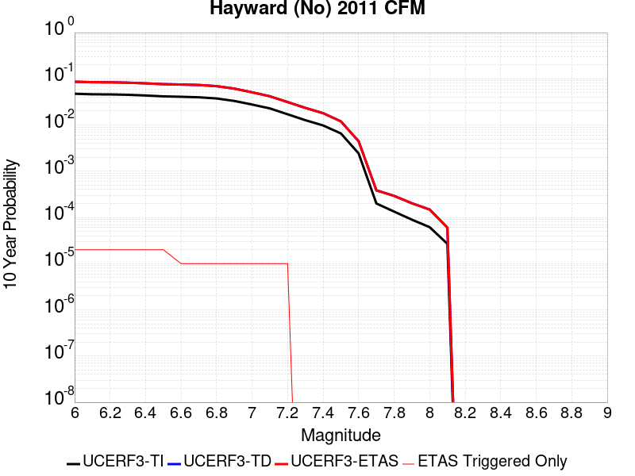 |

| Magnitude | 1 wk TI Prob | 1 wk TD Prob | 1 wk ETAS Prob | 1 wk ETAS/TD Gain | 1 wk ETAS Triggered Only | 1 mo TI Prob | 1 mo TD Prob | 1 mo ETAS Prob | 1 mo ETAS/TD Gain | 1 mo ETAS Triggered Only | 1 yr TI Prob | 1 yr TD Prob | 1 yr ETAS Prob | 1 yr ETAS/TD Gain | 1 yr ETAS Triggered Only | 10 yr TI Prob | 10 yr TD Prob | 10 yr ETAS Prob | 10 yr ETAS/TD Gain | 10 yr ETAS Triggered Only |
|-----|-----|-----|-----|-----|-----|-----|-----|-----|-----|-----|-----|-----|-----|-----|-----|-----|-----|-----|-----|-----|
| 6.0 | 9.3068506E-5 | 1.739599E-4 | 1.8395815E-4 | 1.0574745 | 1.0E-5 | 3.9880406E-4 | 7.453244E-4 | 7.653095E-4 | 1.026814 | 2.0E-5 | 0.0048446343 | 0.009036438 | 0.009056257 | 1.0021932 | 2.0E-5 | 0.047403704 | 0.08637534 | 0.08639361 | 1.0002116 | 2.0E-5 |
| 6.1 | 9.055486E-5 | 1.6947114E-4 | 1.7946944E-4 | 1.0589972 | 1.0E-5 | 3.880345E-4 | 7.261021E-4 | 7.460876E-4 | 1.0275244 | 2.0E-5 | 0.0047140904 | 0.008804537 | 0.0088243615 | 1.0022515 | 2.0E-5 | 0.046153355 | 0.08426854 | 0.08428685 | 1.0002173 | 2.0E-5 |
| 6.2 | 9.006742E-5 | 1.6867711E-4 | 1.7867543E-4 | 1.0592749 | 1.0E-5 | 3.859461E-4 | 7.22701E-4 | 7.4268656E-4 | 1.0276539 | 2.0E-5 | 0.0046887742 | 0.008763513 | 0.008783338 | 1.0022622 | 2.0E-5 | 0.0459107 | 0.083892785 | 0.083911106 | 1.0002184 | 2.0E-5 |
| 6.3 | 8.8336754E-5 | 1.6547246E-4 | 1.7547082E-4 | 1.060423 | 1.0E-5 | 3.7853114E-4 | 7.089758E-4 | 7.289616E-4 | 1.0281897 | 2.0E-5 | 0.004598882 | 0.008597788 | 0.008617616 | 1.0023062 | 2.0E-5 | 0.04504866 | 0.08238599 | 0.082404345 | 1.0002228 | 2.0E-5 |
| 6.4 | 8.526157E-5 | 1.5974249E-4 | 1.6974089E-4 | 1.0625907 | 1.0E-5 | 3.6535555E-4 | 6.8443175E-4 | 7.044181E-4 | 1.0292013 | 2.0E-5 | 0.0044391346 | 0.008301278 | 0.008321112 | 1.0023893 | 2.0E-5 | 0.043514993 | 0.079682834 | 0.079701245 | 1.000231 | 2.0E-5 |
| 6.5 | 8.152396E-5 | 1.530663E-4 | 1.6306477E-4 | 1.0653212 | 1.0E-5 | 3.493416E-4 | 6.558342E-4 | 6.758211E-4 | 1.0304755 | 2.0E-5 | 0.0042449418 | 0.007955698 | 0.007975539 | 1.002494 | 2.0E-5 | 0.04164765 | 0.07651369 | 0.07653216 | 1.0002414 | 2.0E-5 |
| 6.6 | 7.987405E-5 | 1.5010842E-4 | 1.5010842E-4 | 1.0 | 0.0 | 3.4227243E-4 | 6.4316386E-4 | 6.531574E-4 | 1.0155381 | 1.0E-5 | 0.0041592065 | 0.0078025614 | 0.0078124837 | 1.0012716 | 1.0E-5 | 0.04082218 | 0.07510622 | 0.075115465 | 1.0001231 | 1.0E-5 |
| 6.7 | 7.777665E-5 | 1.4650106E-4 | 1.4650106E-4 | 1.0 | 0.0 | 3.332859E-4 | 6.277113E-4 | 6.3770503E-4 | 1.0159209 | 1.0E-5 | 0.004050208 | 0.00761576 | 0.0076256837 | 1.0013031 | 1.0E-5 | 0.039771806 | 0.073382616 | 0.073391885 | 1.0001262 | 1.0E-5 |
| 6.8 | 7.3284005E-5 | 1.3800753E-4 | 1.3800753E-4 | 1.0 | 0.0 | 3.140365E-4 | 5.913274E-4 | 6.013215E-4 | 1.0169011 | 1.0E-5 | 0.0038166929 | 0.0071757827 | 0.007185711 | 1.0013835 | 1.0E-5 | 0.037518036 | 0.06929621 | 0.06930552 | 1.0001343 | 1.0E-5 |
| 6.9 | 6.458263E-5 | 1.2131439E-4 | 1.2131439E-4 | 1.0 | 0.0 | 2.7675333E-4 | 5.198157E-4 | 5.298105E-4 | 1.0192276 | 1.0E-5 | 0.0033642664 | 0.0063104923 | 0.0063204295 | 1.0015746 | 1.0E-5 | 0.033137884 | 0.061225023 | 0.06123441 | 1.0001533 | 1.0E-5 |
| 7.0 | 5.3853604E-5 | 1.00250414E-4 | 1.00250414E-4 | 1.0 | 0.0 | 2.3078074E-4 | 4.295742E-4 | 4.395699E-4 | 1.0232688 | 1.0E-5 | 0.0028061352 | 0.0052175885 | 0.005227536 | 1.0019066 | 1.0E-5 | 0.027709642 | 0.0509578 | 0.05096729 | 1.0001862 | 1.0E-5 |
| 7.1 | 4.4308683E-5 | 8.170626E-5 | 8.170626E-5 | 1.0 | 0.0 | 1.8988053E-4 | 3.501229E-4 | 3.6011942E-4 | 1.0285513 | 1.0E-5 | 0.0023093442 | 0.0042544557 | 0.0042644134 | 1.0023404 | 1.0E-5 | 0.022854926 | 0.04182473 | 0.041834313 | 1.0002291 | 1.0E-5 |
| 7.2 | 3.295973E-5 | 6.0771144E-5 | 6.0771144E-5 | 1.0 | 0.0 | 1.4124835E-4 | 2.604219E-4 | 2.704193E-4 | 1.0383892 | 1.0E-5 | 0.0017183421 | 0.0031660495 | 0.003176018 | 1.0031486 | 1.0E-5 | 0.017051157 | 0.031369876 | 0.031379562 | 1.0003088 | 1.0E-5 |
| 7.3 | 2.452256E-5 | 4.5180346E-5 | 4.5180346E-5 | 1.0 | 0.0 | 1.05092455E-4 | 1.9361576E-4 | 1.9361576E-4 | 1.0 | 0.0 | 0.0012787496 | 0.0023547374 | 0.0023547374 | 1.0 | 0.0 | 0.0127141625 | 0.02344111 | 0.02344111 | 1.0 | 0.0 |
| 7.4 | 1.8829967E-5 | 3.4602548E-5 | 3.4602548E-5 | 1.0 | 0.0 | 8.069736E-5 | 1.4828827E-4 | 1.4828827E-4 | 1.0 | 0.0 | 9.820475E-4 | 0.0018039243 | 0.0018039243 | 1.0 | 0.0 | 0.009777189 | 0.0180195 | 0.0180195 | 1.0 | 0.0 |
| 7.5 | 1.26374125E-5 | 2.2921116E-5 | 2.2921116E-5 | 1.0 | 0.0 | 5.4159216E-5 | 9.822969E-5 | 9.822969E-5 | 1.0 | 0.0 | 6.5918895E-4 | 0.0011952962 | 0.0011952962 | 1.0 | 0.0 | 0.00657237 | 0.011988836 | 0.011988836 | 1.0 | 0.0 |
| 7.6 | 4.666429E-6 | 8.4791645E-6 | 8.4791645E-6 | 1.0 | 0.0 | 1.9998828E-5 | 3.6338777E-5 | 3.6338777E-5 | 1.0 | 0.0 | 2.4345852E-4 | 4.4233602E-4 | 4.4233602E-4 | 1.0 | 0.0 | 0.0024319198 | 0.0044591012 | 0.0044591012 | 1.0 | 0.0 |
| 7.7 | 3.8399318E-7 | 7.133867E-7 | 7.133867E-7 | 1.0 | 0.0 | 1.6456839E-6 | 3.057368E-6 | 3.057368E-6 | 1.0 | 0.0 | 2.003602E-5 | 3.722282E-5 | 3.722282E-5 | 1.0 | 0.0 | 2.0034213E-4 | 3.8614936E-4 | 3.8614936E-4 | 1.0 | 0.0 |
| 7.8 | 2.5637698E-7 | 5.3662194E-7 | 5.3662194E-7 | 1.0 | 0.0 | 1.098758E-6 | 2.299806E-6 | 2.299806E-6 | 1.0 | 0.0 | 1.3377297E-5 | 2.7999782E-5 | 2.7999782E-5 | 1.0 | 0.0 | 1.3376492E-4 | 2.9244382E-4 | 2.9244382E-4 | 1.0 | 0.0 |
| 7.9 | 1.7141245E-7 | 3.7290573E-7 | 3.7290573E-7 | 1.0 | 0.0 | 7.3462456E-7 | 1.5981665E-6 | 1.5981665E-6 | 1.0 | 0.0 | 8.944017E-6 | 1.9457504E-5 | 1.9457504E-5 | 1.0 | 0.0 | 8.943657E-5 | 2.0245428E-4 | 2.0245428E-4 | 1.0 | 0.0 |
| 8.0 | 1.1808895E-7 | 2.7509762E-7 | 2.7509762E-7 | 1.0 | 0.0 | 5.060954E-7 | 1.1789892E-6 | 1.1789892E-6 | 1.0 | 0.0 | 6.161694E-6 | 1.43541E-5 | 1.43541E-5 | 1.0 | 0.0 | 6.161523E-5 | 1.4816441E-4 | 1.4816441E-4 | 1.0 | 0.0 |
| 8.1 | 5.138535E-8 | 1.1229867E-7 | 1.1229867E-7 | 1.0 | 0.0 | 2.2022292E-7 | 4.812799E-7 | 4.812799E-7 | 1.0 | 0.0 | 2.6812106E-6 | 5.8595674E-6 | 5.8595674E-6 | 1.0 | 0.0 | 2.6811784E-5 | 6.0158476E-5 | 6.0158476E-5 | 1.0 | 0.0 |

## Johnson Valley (No) 2011 rev
*[(top)](#table-of-contents)*

| 1 Week | 1 Month | 1 Year | 10 Year |
|-----|-----|-----|-----|
|  | 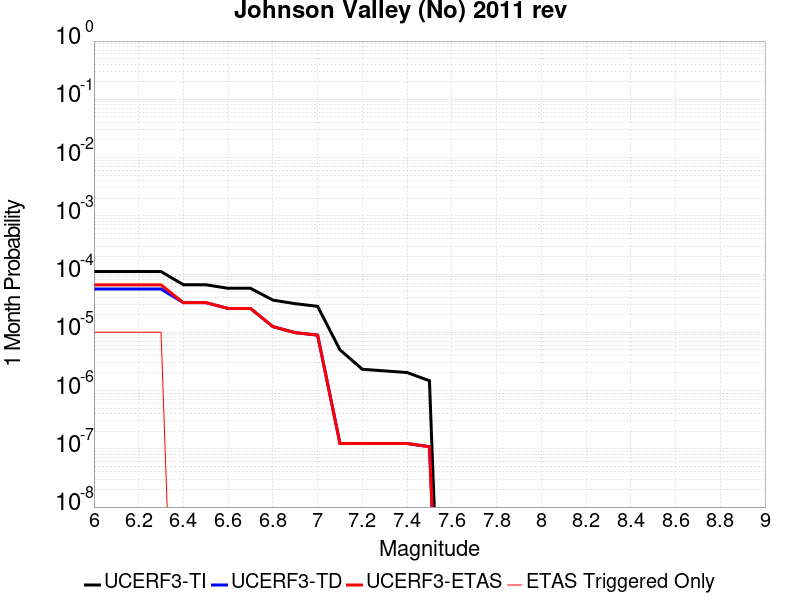 |  |  |

| Magnitude | 1 wk TI Prob | 1 wk TD Prob | 1 wk ETAS Prob | 1 wk ETAS/TD Gain | 1 wk ETAS Triggered Only | 1 mo TI Prob | 1 mo TD Prob | 1 mo ETAS Prob | 1 mo ETAS/TD Gain | 1 mo ETAS Triggered Only | 1 yr TI Prob | 1 yr TD Prob | 1 yr ETAS Prob | 1 yr ETAS/TD Gain | 1 yr ETAS Triggered Only | 10 yr TI Prob | 10 yr TD Prob | 10 yr ETAS Prob | 10 yr ETAS/TD Gain | 10 yr ETAS Triggered Only |
|-----|-----|-----|-----|-----|-----|-----|-----|-----|-----|-----|-----|-----|-----|-----|-----|-----|-----|-----|-----|-----|
| 6.0 | 2.577707E-5 | 1.2900938E-5 | 1.2900938E-5 | 1.0 | 0.0 | 1.1046848E-4 | 5.5288787E-5 | 6.528823E-5 | 1.1808585 | 1.0E-5 | 0.0013441239 | 6.7297276E-4 | 6.929593E-4 | 1.0296988 | 2.0E-5 | 0.013360229 | 0.006713257 | 0.0067331227 | 1.0029591 | 2.0E-5 |
| 6.1 | 2.577707E-5 | 1.2900938E-5 | 1.2900938E-5 | 1.0 | 0.0 | 1.1046848E-4 | 5.5288787E-5 | 6.528823E-5 | 1.1808585 | 1.0E-5 | 0.0013441239 | 6.7297276E-4 | 6.929593E-4 | 1.0296988 | 2.0E-5 | 0.013360229 | 0.006713257 | 0.0067331227 | 1.0029591 | 2.0E-5 |
| 6.2 | 2.577707E-5 | 1.2900938E-5 | 1.2900938E-5 | 1.0 | 0.0 | 1.1046848E-4 | 5.5288787E-5 | 6.528823E-5 | 1.1808585 | 1.0E-5 | 0.0013441239 | 6.7297276E-4 | 6.929593E-4 | 1.0296988 | 2.0E-5 | 0.013360229 | 0.006713257 | 0.0067331227 | 1.0029591 | 2.0E-5 |
| 6.3 | 2.577707E-5 | 1.2900938E-5 | 1.2900938E-5 | 1.0 | 0.0 | 1.1046848E-4 | 5.5288787E-5 | 6.528823E-5 | 1.1808585 | 1.0E-5 | 0.0013441239 | 6.7297276E-4 | 6.929593E-4 | 1.0296988 | 2.0E-5 | 0.013360229 | 0.006713257 | 0.0067331227 | 1.0029591 | 2.0E-5 |
| 6.4 | 1.5296591E-5 | 7.536742E-6 | 7.536742E-6 | 1.0 | 0.0 | 6.555518E-5 | 3.2300028E-5 | 3.2300028E-5 | 1.0 | 0.0 | 7.97842E-4 | 3.9320064E-4 | 4.031967E-4 | 1.0254223 | 1.0E-5 | 0.007949836 | 0.0039268904 | 0.0039368514 | 1.0025365 | 1.0E-5 |
| 6.5 | 1.5296591E-5 | 7.536742E-6 | 7.536742E-6 | 1.0 | 0.0 | 6.555518E-5 | 3.2300028E-5 | 3.2300028E-5 | 1.0 | 0.0 | 7.97842E-4 | 3.9320064E-4 | 4.031967E-4 | 1.0254223 | 1.0E-5 | 0.007949836 | 0.0039268904 | 0.0039368514 | 1.0025365 | 1.0E-5 |
| 6.6 | 1.3289383E-5 | 5.9917306E-6 | 5.9917306E-6 | 1.0 | 0.0 | 5.6953253E-5 | 2.5678688E-5 | 2.5678688E-5 | 1.0 | 0.0 | 6.9318525E-4 | 3.1261015E-4 | 3.2260703E-4 | 1.0319787 | 1.0E-5 | 0.0069102696 | 0.0031233684 | 0.003133337 | 1.0031917 | 1.0E-5 |
| 6.7 | 1.3289383E-5 | 5.9917306E-6 | 5.9917306E-6 | 1.0 | 0.0 | 5.6953253E-5 | 2.5678688E-5 | 2.5678688E-5 | 1.0 | 0.0 | 6.9318525E-4 | 3.1261015E-4 | 3.2260703E-4 | 1.0319787 | 1.0E-5 | 0.0069102696 | 0.0031233684 | 0.003133337 | 1.0031917 | 1.0E-5 |
| 6.8 | 8.330789E-6 | 2.9211888E-6 | 2.9211888E-6 | 1.0 | 0.0 | 3.570289E-5 | 1.2519352E-5 | 1.2519352E-5 | 1.0 | 0.0 | 4.34596E-4 | 1.5241816E-4 | 1.5241816E-4 | 1.0 | 0.0 | 0.0043374705 | 0.0015236961 | 0.0015236961 | 1.0 | 0.0 |
| 6.9 | 7.2359003E-6 | 2.3013247E-6 | 2.3013247E-6 | 1.0 | 0.0 | 3.1010633E-5 | 9.8628125E-6 | 9.8628125E-6 | 1.0 | 0.0 | 3.7748902E-4 | 1.2007845E-4 | 1.2007845E-4 | 1.0 | 0.0 | 0.0037684843 | 0.0012006586 | 0.0012006586 | 1.0 | 0.0 |
| 7.0 | 6.5149957E-6 | 2.088482E-6 | 2.088482E-6 | 1.0 | 0.0 | 2.792111E-5 | 8.950637E-6 | 8.950637E-6 | 1.0 | 0.0 | 3.398865E-4 | 1.0897385E-4 | 1.0897385E-4 | 1.0 | 0.0 | 0.003393671 | 0.0010897239 | 0.0010897239 | 1.0 | 0.0 |
| 7.1 | 1.1662233E-6 | 2.8802024E-8 | 2.8802024E-8 | 1.0 | 0.0 | 4.9980904E-6 | 1.2343725E-7 | 1.2343725E-7 | 1.0 | 0.0 | 6.0850052E-5 | 1.5028476E-6 | 1.5028476E-6 | 1.0 | 0.0 | 6.083339E-4 | 1.50283895E-5 | 1.50283895E-5 | 1.0 | 0.0 |
| 7.2 | 5.413881E-7 | 2.8802024E-8 | 2.8802024E-8 | 1.0 | 0.0 | 2.3202326E-6 | 1.2343725E-7 | 1.2343725E-7 | 1.0 | 0.0 | 2.8248465E-5 | 1.5028476E-6 | 1.5028476E-6 | 1.0 | 0.0 | 2.8244875E-4 | 1.50283895E-5 | 1.50283895E-5 | 1.0 | 0.0 |
| 7.3 | 5.076821E-7 | 2.8802024E-8 | 2.8802024E-8 | 1.0 | 0.0 | 2.1757785E-6 | 1.2343723E-7 | 1.2343723E-7 | 1.0 | 0.0 | 2.648978E-5 | 1.5028475E-6 | 1.5028475E-6 | 1.0 | 0.0 | 2.6486625E-4 | 1.50283895E-5 | 1.50283895E-5 | 1.0 | 0.0 |
| 7.4 | 4.7568687E-7 | 2.8783948E-8 | 2.8783948E-8 | 1.0 | 0.0 | 2.0386565E-6 | 1.2335977E-7 | 1.2335977E-7 | 1.0 | 0.0 | 2.482036E-5 | 1.5019043E-6 | 1.5019043E-6 | 1.0 | 0.0 | 2.4817587E-4 | 1.5018958E-5 | 1.5018958E-5 | 1.0 | 0.0 |
| 7.5 | 3.435626E-7 | 2.5357679E-8 | 2.5357679E-8 | 1.0 | 0.0 | 1.4724103E-6 | 1.0867576E-7 | 1.0867576E-7 | 1.0 | 0.0 | 1.7926448E-5 | 1.3231268E-6 | 1.3231268E-6 | 1.0 | 0.0 | 1.7925001E-4 | 1.3231205E-5 | 1.3231205E-5 | 1.0 | 0.0 |

## Great Valley 03a Dunnigan Hills
*[(top)](#table-of-contents)*

| 1 Week | 1 Month | 1 Year | 10 Year |
|-----|-----|-----|-----|
|  |  |  |  |

| Magnitude | 1 wk TI Prob | 1 wk TD Prob | 1 wk ETAS Prob | 1 wk ETAS/TD Gain | 1 wk ETAS Triggered Only | 1 mo TI Prob | 1 mo TD Prob | 1 mo ETAS Prob | 1 mo ETAS/TD Gain | 1 mo ETAS Triggered Only | 1 yr TI Prob | 1 yr TD Prob | 1 yr ETAS Prob | 1 yr ETAS/TD Gain | 1 yr ETAS Triggered Only | 10 yr TI Prob | 10 yr TD Prob | 10 yr ETAS Prob | 10 yr ETAS/TD Gain | 10 yr ETAS Triggered Only |
|-----|-----|-----|-----|-----|-----|-----|-----|-----|-----|-----|-----|-----|-----|-----|-----|-----|-----|-----|-----|-----|
| 6.0 | 1.6591328E-5 | 1.8107954E-5 | 2.8107774E-5 | 1.5522335 | 1.0E-5 | 7.110376E-5 | 7.7603596E-5 | 8.760282E-5 | 1.12885 | 1.0E-5 | 8.6534437E-4 | 9.444834E-4 | 9.54474E-4 | 1.0105778 | 1.0E-5 | 0.008619824 | 0.009411525 | 0.009431337 | 1.002105 | 2.0E-5 |
| 6.1 | 8.041125E-6 | 8.769726E-6 | 8.769726E-6 | 1.0 | 0.0 | 3.4461507E-5 | 3.7584115E-5 | 3.7584115E-5 | 1.0 | 0.0 | 4.194881E-4 | 4.5751085E-4 | 4.5751085E-4 | 1.0 | 0.0 | 0.004186971 | 0.004567687 | 0.004567687 | 1.0 | 0.0 |
| 6.2 | 3.2807004E-6 | 3.5795688E-6 | 3.5795688E-6 | 1.0 | 0.0 | 1.4060069E-5 | 1.5340942E-5 | 1.5340942E-5 | 1.0 | 0.0 | 1.7116789E-4 | 1.8676413E-4 | 1.8676413E-4 | 1.0 | 0.0 | 0.0017103611 | 0.0018664796 | 0.0018664796 | 1.0 | 0.0 |
| 6.3 | 1.9339366E-6 | 2.1103806E-6 | 2.1103806E-6 | 1.0 | 0.0 | 8.288273E-6 | 9.044474E-6 | 9.044474E-6 | 1.0 | 0.0 | 1.00905054E-4 | 1.1011375E-4 | 1.1011375E-4 | 1.0 | 0.0 | 0.0010085925 | 0.0011008718 | 0.0011008718 | 1.0 | 0.0 |
| 6.4 | 1.3142635E-6 | 1.4339867E-6 | 1.4339867E-6 | 1.0 | 0.0 | 5.6325457E-6 | 6.145657E-6 | 6.145657E-6 | 1.0 | 0.0 | 6.857408E-5 | 7.482337E-5 | 7.482337E-5 | 1.0 | 0.0 | 6.8552926E-4 | 7.4823375E-4 | 7.4823375E-4 | 1.0 | 0.0 |

## Honey Lake 2011 CFM
*[(top)](#table-of-contents)*

| 1 Week | 1 Month | 1 Year | 10 Year |
|-----|-----|-----|-----|
|  |  | 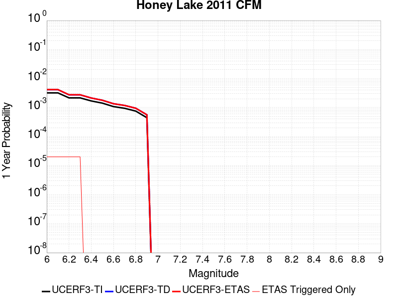 |  |

| Magnitude | 1 wk TI Prob | 1 wk TD Prob | 1 wk ETAS Prob | 1 wk ETAS/TD Gain | 1 wk ETAS Triggered Only | 1 mo TI Prob | 1 mo TD Prob | 1 mo ETAS Prob | 1 mo ETAS/TD Gain | 1 mo ETAS Triggered Only | 1 yr TI Prob | 1 yr TD Prob | 1 yr ETAS Prob | 1 yr ETAS/TD Gain | 1 yr ETAS Triggered Only | 10 yr TI Prob | 10 yr TD Prob | 10 yr ETAS Prob | 10 yr ETAS/TD Gain | 10 yr ETAS Triggered Only |
|-----|-----|-----|-----|-----|-----|-----|-----|-----|-----|-----|-----|-----|-----|-----|-----|-----|-----|-----|-----|-----|
| 6.0 | 6.155506E-5 | 7.954667E-5 | 9.9545075E-5 | 1.2514048 | 2.0E-5 | 2.6378073E-4 | 3.40873E-4 | 3.608662E-4 | 1.0586529 | 2.0E-5 | 0.0032068014 | 0.0041427943 | 0.0041627116 | 1.0048077 | 2.0E-5 | 0.03160919 | 0.040702924 | 0.04072211 | 1.0004714 | 2.0E-5 |
| 6.1 | 6.155506E-5 | 7.954667E-5 | 9.9545075E-5 | 1.2514048 | 2.0E-5 | 2.6378073E-4 | 3.40873E-4 | 3.608662E-4 | 1.0586529 | 2.0E-5 | 0.0032068014 | 0.0041427943 | 0.0041627116 | 1.0048077 | 2.0E-5 | 0.03160919 | 0.040702924 | 0.04072211 | 1.0004714 | 2.0E-5 |
| 6.2 | 4.1335024E-5 | 5.257629E-5 | 7.257524E-5 | 1.3803796 | 2.0E-5 | 1.7713808E-4 | 2.253086E-4 | 2.453041E-4 | 1.0887471 | 2.0E-5 | 0.0021545228 | 0.0027398595 | 0.0027598047 | 1.0072796 | 2.0E-5 | 0.021337535 | 0.027076708 | 0.027096167 | 1.0007186 | 2.0E-5 |
| 6.3 | 4.1335024E-5 | 5.257629E-5 | 7.257524E-5 | 1.3803796 | 2.0E-5 | 1.7713808E-4 | 2.253086E-4 | 2.453041E-4 | 1.0887471 | 2.0E-5 | 0.0021545228 | 0.0027398595 | 0.0027598047 | 1.0072796 | 2.0E-5 | 0.021337535 | 0.027076708 | 0.027096167 | 1.0007186 | 2.0E-5 |
| 6.4 | 3.2393702E-5 | 4.0887444E-5 | 4.0887444E-5 | 1.0 | 0.0 | 1.3882275E-4 | 1.7522085E-4 | 1.7522085E-4 | 1.0 | 0.0 | 0.0016888566 | 0.002131335 | 0.002131335 | 1.0 | 0.0 | 0.016760793 | 0.02111982 | 0.02111982 | 1.0 | 0.0 |
| 6.5 | 2.7205504E-5 | 3.4211684E-5 | 3.4211684E-5 | 1.0 | 0.0 | 1.1658981E-4 | 1.4661385E-4 | 1.4661385E-4 | 1.0 | 0.0 | 0.0014185566 | 0.0017836588 | 0.0017836588 | 1.0 | 0.0 | 0.014095354 | 0.017702932 | 0.017702932 | 1.0 | 0.0 |
| 6.6 | 2.069265E-5 | 2.5955307E-5 | 2.5955307E-5 | 1.0 | 0.0 | 8.867977E-5 | 1.1123277E-4 | 1.1123277E-4 | 1.0 | 0.0 | 0.0010791414 | 0.0013535038 | 0.0013535038 | 1.0 | 0.0 | 0.010739161 | 0.013461002 | 0.013461002 | 1.0 | 0.0 |
| 6.7 | 1.8060919E-5 | 2.2656828E-5 | 2.2656828E-5 | 1.0 | 0.0 | 7.7401644E-5 | 9.709754E-5 | 9.709754E-5 | 1.0 | 0.0 | 9.419576E-4 | 0.0011816026 | 0.0011816026 | 1.0 | 0.0 | 0.009379748 | 0.011761238 | 0.011761238 | 1.0 | 0.0 |
| 6.8 | 1.4474663E-5 | 1.818127E-5 | 1.818127E-5 | 1.0 | 0.0 | 6.203279E-5 | 7.791784E-5 | 7.791784E-5 | 1.0 | 0.0 | 7.5498753E-4 | 9.483136E-4 | 9.483136E-4 | 1.0 | 0.0 | 0.007524277 | 0.009450192 | 0.009450192 | 1.0 | 0.0 |
| 6.9 | 8.564552E-6 | 1.0802308E-5 | 1.0802308E-5 | 1.0 | 0.0 | 3.6704707E-5 | 4.6295158E-5 | 4.6295158E-5 | 1.0 | 0.0 | 4.4678818E-4 | 5.635644E-4 | 5.635644E-4 | 1.0 | 0.0 | 0.0044589094 | 0.0056278477 | 0.0056278477 | 1.0 | 0.0 |

## Monte Vista - Shannon 2011 CFM
*[(top)](#table-of-contents)*

| 1 Week | 1 Month | 1 Year | 10 Year |
|-----|-----|-----|-----|
|  |  |  |  |

| Magnitude | 1 wk TI Prob | 1 wk TD Prob | 1 wk ETAS Prob | 1 wk ETAS/TD Gain | 1 wk ETAS Triggered Only | 1 mo TI Prob | 1 mo TD Prob | 1 mo ETAS Prob | 1 mo ETAS/TD Gain | 1 mo ETAS Triggered Only | 1 yr TI Prob | 1 yr TD Prob | 1 yr ETAS Prob | 1 yr ETAS/TD Gain | 1 yr ETAS Triggered Only | 10 yr TI Prob | 10 yr TD Prob | 10 yr ETAS Prob | 10 yr ETAS/TD Gain | 10 yr ETAS Triggered Only |
|-----|-----|-----|-----|-----|-----|-----|-----|-----|-----|-----|-----|-----|-----|-----|-----|-----|-----|-----|-----|-----|
| 6.0 | 2.7907707E-5 | 2.7584209E-5 | 3.7583934E-5 | 1.3625163 | 1.0E-5 | 1.19598975E-4 | 1.1821338E-4 | 1.282122E-4 | 1.0845828 | 1.0E-5 | 0.0014551448 | 0.0014384214 | 0.001448407 | 1.006942 | 1.0E-5 | 0.014456532 | 0.014320195 | 0.014339909 | 1.0013766 | 2.0E-5 |
| 6.1 | 2.7907707E-5 | 2.7584209E-5 | 3.7583934E-5 | 1.3625163 | 1.0E-5 | 1.19598975E-4 | 1.1821338E-4 | 1.282122E-4 | 1.0845828 | 1.0E-5 | 0.0014551448 | 0.0014384214 | 0.001448407 | 1.006942 | 1.0E-5 | 0.014456532 | 0.014320195 | 0.014339909 | 1.0013766 | 2.0E-5 |
| 6.2 | 2.7907707E-5 | 2.7584209E-5 | 3.7583934E-5 | 1.3625163 | 1.0E-5 | 1.19598975E-4 | 1.1821338E-4 | 1.282122E-4 | 1.0845828 | 1.0E-5 | 0.0014551448 | 0.0014384214 | 0.001448407 | 1.006942 | 1.0E-5 | 0.014456532 | 0.014320195 | 0.014339909 | 1.0013766 | 2.0E-5 |
| 6.3 | 2.7907707E-5 | 2.7584209E-5 | 3.7583934E-5 | 1.3625163 | 1.0E-5 | 1.19598975E-4 | 1.1821338E-4 | 1.282122E-4 | 1.0845828 | 1.0E-5 | 0.0014551448 | 0.0014384214 | 0.001448407 | 1.006942 | 1.0E-5 | 0.014456532 | 0.014320195 | 0.014339909 | 1.0013766 | 2.0E-5 |
| 6.4 | 2.7907707E-5 | 2.7584209E-5 | 3.7583934E-5 | 1.3625163 | 1.0E-5 | 1.19598975E-4 | 1.1821338E-4 | 1.282122E-4 | 1.0845828 | 1.0E-5 | 0.0014551448 | 0.0014384214 | 0.001448407 | 1.006942 | 1.0E-5 | 0.014456532 | 0.014320195 | 0.014339909 | 1.0013766 | 2.0E-5 |
| 6.5 | 1.7990213E-5 | 1.6639884E-5 | 1.6639884E-5 | 1.0 | 0.0 | 7.709863E-5 | 7.131221E-5 | 7.131221E-5 | 1.0 | 0.0 | 9.382716E-4 | 8.679467E-4 | 8.679467E-4 | 1.0 | 0.0 | 0.0093431985 | 0.008668941 | 0.008678854 | 1.0011436 | 1.0E-5 |
| 6.6 | 9.650407E-6 | 7.4571435E-6 | 7.4571435E-6 | 1.0 | 0.0 | 4.135823E-5 | 3.195884E-5 | 3.195884E-5 | 1.0 | 0.0 | 5.0342013E-4 | 3.8903722E-4 | 3.8903722E-4 | 1.0 | 0.0 | 0.005022812 | 0.0039012418 | 0.0039012418 | 1.0 | 0.0 |
| 6.7 | 9.62828E-6 | 7.4350583E-6 | 7.4350583E-6 | 1.0 | 0.0 | 4.1263404E-5 | 3.186419E-5 | 3.186419E-5 | 1.0 | 0.0 | 5.022661E-4 | 3.878853E-4 | 3.878853E-4 | 1.0 | 0.0 | 0.0050113243 | 0.003889763 | 0.003889763 | 1.0 | 0.0 |
| 6.8 | 6.887523E-6 | 4.4615676E-6 | 4.4615676E-6 | 1.0 | 0.0 | 2.9517621E-5 | 1.9120876E-5 | 1.9120876E-5 | 1.0 | 0.0 | 3.5931775E-4 | 2.3277402E-4 | 2.3277402E-4 | 1.0 | 0.0 | 0.0035873733 | 0.0023424553 | 0.0023424553 | 1.0 | 0.0 |
| 6.9 | 6.2722347E-6 | 3.8034377E-6 | 3.8034377E-6 | 1.0 | 0.0 | 2.6880729E-5 | 1.6300357E-5 | 1.6300357E-5 | 1.0 | 0.0 | 3.2722374E-4 | 1.984408E-4 | 1.984408E-4 | 1.0 | 0.0 | 0.003267423 | 0.0019997752 | 0.0019997752 | 1.0 | 0.0 |
| 7.0 | 5.5320347E-6 | 3.0305885E-6 | 3.0305885E-6 | 1.0 | 0.0 | 2.3708504E-5 | 1.2988182E-5 | 1.2988182E-5 | 1.0 | 0.0 | 2.8861282E-4 | 1.5812147E-4 | 1.5812147E-4 | 1.0 | 0.0 | 0.0028823826 | 0.001597215 | 0.001597215 | 1.0 | 0.0 |
| 7.1 | 3.8794055E-6 | 1.2837862E-6 | 1.2837862E-6 | 1.0 | 0.0 | 1.6625918E-5 | 5.5019295E-6 | 5.5019295E-6 | 1.0 | 0.0 | 2.0240174E-4 | 6.698394E-5 | 6.698394E-5 | 1.0 | 0.0 | 0.002022175 | 6.865884E-4 | 6.865884E-4 | 1.0 | 0.0 |
| 7.2 | 3.4813652E-6 | 9.671046E-7 | 9.671046E-7 | 1.0 | 0.0 | 1.49200505E-5 | 4.1447274E-6 | 4.1447274E-6 | 1.0 | 0.0 | 1.8163648E-4 | 5.0460894E-5 | 5.0460894E-5 | 1.0 | 0.0 | 0.0018148809 | 5.214329E-4 | 5.214329E-4 | 1.0 | 0.0 |
| 7.3 | 3.1682148E-6 | 7.719097E-7 | 7.719097E-7 | 1.0 | 0.0 | 1.3577992E-5 | 3.30818E-6 | 3.30818E-6 | 1.0 | 0.0 | 1.6529951E-4 | 4.027635E-5 | 4.027635E-5 | 1.0 | 0.0 | 0.0016517661 | 4.1960424E-4 | 4.1960424E-4 | 1.0 | 0.0 |
| 7.4 | 2.9707667E-6 | 7.3457204E-7 | 7.3457204E-7 | 1.0 | 0.0 | 1.2731795E-5 | 3.148162E-6 | 3.148162E-6 | 1.0 | 0.0 | 1.5499859E-4 | 3.8328202E-5 | 3.8328202E-5 | 1.0 | 0.0 | 0.0015489052 | 3.9992164E-4 | 3.9992164E-4 | 1.0 | 0.0 |
| 7.5 | 2.3462758E-6 | 6.007889E-7 | 6.007889E-7 | 1.0 | 0.0 | 1.0055429E-5 | 2.574807E-6 | 2.574807E-6 | 1.0 | 0.0 | 1.2241797E-4 | 3.1347827E-5 | 3.1347827E-5 | 1.0 | 0.0 | 0.0012235056 | 3.2839534E-4 | 3.2839534E-4 | 1.0 | 0.0 |
| 7.6 | 2.112783E-6 | 5.251582E-7 | 5.251582E-7 | 1.0 | 0.0 | 9.054753E-6 | 2.250676E-6 | 2.250676E-6 | 1.0 | 0.0 | 1.1023604E-4 | 2.7401638E-5 | 2.7401638E-5 | 1.0 | 0.0 | 0.0011018137 | 2.885138E-4 | 2.885138E-4 | 1.0 | 0.0 |
| 7.7 | 1.7022471E-6 | 4.231601E-7 | 4.231601E-7 | 1.0 | 0.0 | 7.2953244E-6 | 1.8135419E-6 | 1.8135419E-6 | 1.0 | 0.0 | 8.881695E-5 | 2.207965E-5 | 2.207965E-5 | 1.0 | 0.0 | 8.878146E-4 | 2.3398738E-4 | 2.3398738E-4 | 1.0 | 0.0 |
| 7.8 | 7.230914E-7 | 3.7285864E-7 | 3.7285864E-7 | 1.0 | 0.0 | 3.0989595E-6 | 1.5979647E-6 | 1.5979647E-6 | 1.0 | 0.0 | 3.772918E-5 | 1.9455047E-5 | 1.9455047E-5 | 1.0 | 0.0 | 3.7722773E-4 | 2.0726922E-4 | 2.0726922E-4 | 1.0 | 0.0 |
| 7.9 | 4.3588446E-7 | 3.4305793E-7 | 3.4305793E-7 | 1.0 | 0.0 | 1.868075E-6 | 1.4702474E-6 | 1.4702474E-6 | 1.0 | 0.0 | 2.2743576E-5 | 1.7900116E-5 | 1.7900116E-5 | 1.0 | 0.0 | 2.2741247E-4 | 1.8995286E-4 | 1.8995286E-4 | 1.0 | 0.0 |
| 8.0 | 2.3317523E-7 | 3.1513588E-7 | 3.1513588E-7 | 1.0 | 0.0 | 9.99322E-7 | 1.3505817E-6 | 1.3505817E-6 | 1.0 | 0.0 | 1.2166677E-5 | 1.644321E-5 | 1.644321E-5 | 1.0 | 0.0 | 1.21660116E-4 | 1.7399415E-4 | 1.7399415E-4 | 1.0 | 0.0 |
| 8.1 | 1.4662456E-7 | 2.030774E-7 | 2.030774E-7 | 1.0 | 0.0 | 6.283908E-7 | 8.703314E-7 | 8.703314E-7 | 1.0 | 0.0 | 7.650631E-6 | 1.05962345E-5 | 1.05962345E-5 | 1.0 | 0.0 | 7.650368E-5 | 1.113227E-4 | 1.113227E-4 | 1.0 | 0.0 |
| 8.2 | 5.4931775E-9 | 5.07573E-9 | 5.07573E-9 | 1.0 | 0.0 | 2.3542189E-8 | 2.1753127E-8 | 2.1753127E-8 | 1.0 | 0.0 | 2.8662612E-7 | 2.6484432E-7 | 2.6484432E-7 | 1.0 | 0.0 | 2.8662573E-6 | 2.7539324E-6 | 2.7539324E-6 | 1.0 | 0.0 |

## San Andreas (Peninsula) 2011 CFM
*[(top)](#table-of-contents)*

| 1 Week | 1 Month | 1 Year | 10 Year |
|-----|-----|-----|-----|
|  |  |  |  |

| Magnitude | 1 wk TI Prob | 1 wk TD Prob | 1 wk ETAS Prob | 1 wk ETAS/TD Gain | 1 wk ETAS Triggered Only | 1 mo TI Prob | 1 mo TD Prob | 1 mo ETAS Prob | 1 mo ETAS/TD Gain | 1 mo ETAS Triggered Only | 1 yr TI Prob | 1 yr TD Prob | 1 yr ETAS Prob | 1 yr ETAS/TD Gain | 1 yr ETAS Triggered Only | 10 yr TI Prob | 10 yr TD Prob | 10 yr ETAS Prob | 10 yr ETAS/TD Gain | 10 yr ETAS Triggered Only |
|-----|-----|-----|-----|-----|-----|-----|-----|-----|-----|-----|-----|-----|-----|-----|-----|-----|-----|-----|-----|-----|
| 6.0 | 8.6200685E-5 | 2.52136E-5 | 3.5213347E-5 | 1.3966013 | 1.0E-5 | 3.6937918E-4 | 1.0805382E-4 | 1.1805274E-4 | 1.0925364 | 1.0E-5 | 0.0044879215 | 0.001314763 | 0.0013247498 | 1.0075959 | 1.0E-5 | 0.043983612 | 0.014774441 | 0.014794146 | 1.0013337 | 2.0E-5 |
| 6.1 | 8.6200685E-5 | 2.52136E-5 | 3.5213347E-5 | 1.3966013 | 1.0E-5 | 3.6937918E-4 | 1.0805382E-4 | 1.1805274E-4 | 1.0925364 | 1.0E-5 | 0.0044879215 | 0.001314763 | 0.0013247498 | 1.0075959 | 1.0E-5 | 0.043983612 | 0.014774441 | 0.014794146 | 1.0013337 | 2.0E-5 |
| 6.2 | 8.6200685E-5 | 2.52136E-5 | 3.5213347E-5 | 1.3966013 | 1.0E-5 | 3.6937918E-4 | 1.0805382E-4 | 1.1805274E-4 | 1.0925364 | 1.0E-5 | 0.0044879215 | 0.001314763 | 0.0013247498 | 1.0075959 | 1.0E-5 | 0.043983612 | 0.014774441 | 0.014794146 | 1.0013337 | 2.0E-5 |
| 6.3 | 8.551163E-5 | 2.490552E-5 | 3.490527E-5 | 1.4015074 | 1.0E-5 | 3.6642692E-4 | 1.06733576E-4 | 1.1673251E-4 | 1.0936812 | 1.0E-5 | 0.004452125 | 0.0012987083 | 0.0013086953 | 1.00769 | 1.0E-5 | 0.043639794 | 0.014601416 | 0.014621124 | 1.0013497 | 2.0E-5 |
| 6.4 | 8.551163E-5 | 2.490552E-5 | 3.490527E-5 | 1.4015074 | 1.0E-5 | 3.6642692E-4 | 1.06733576E-4 | 1.1673251E-4 | 1.0936812 | 1.0E-5 | 0.004452125 | 0.0012987083 | 0.0013086953 | 1.00769 | 1.0E-5 | 0.043639794 | 0.014601416 | 0.014621124 | 1.0013497 | 2.0E-5 |
| 6.5 | 8.511146E-5 | 2.4726973E-5 | 3.4726723E-5 | 1.4044067 | 1.0E-5 | 3.647124E-4 | 1.05968444E-4 | 1.1596738E-4 | 1.0943577 | 1.0E-5 | 0.004431336 | 0.0012894038 | 0.0012993909 | 1.0077455 | 1.0E-5 | 0.04344007 | 0.0145011945 | 0.014520904 | 1.0013592 | 2.0E-5 |
| 6.6 | 8.4985084E-5 | 2.4657606E-5 | 3.4657358E-5 | 1.4055444 | 1.0E-5 | 3.6417096E-4 | 1.05671184E-4 | 1.15670126E-4 | 1.0946232 | 1.0E-5 | 0.0044247704 | 0.001285789 | 0.0012957761 | 1.0077673 | 1.0E-5 | 0.043376986 | 0.014463263 | 0.014482973 | 1.0013628 | 2.0E-5 |
| 6.7 | 8.462618E-5 | 2.4486113E-5 | 3.4485867E-5 | 1.4083848 | 1.0E-5 | 3.6263323E-4 | 1.0493627E-4 | 1.1493522E-4 | 1.0952859 | 1.0E-5 | 0.004406125 | 0.0012768519 | 0.0012868391 | 1.0078218 | 1.0E-5 | 0.043197807 | 0.01436807 | 0.014387783 | 1.001372 | 2.0E-5 |
| 6.8 | 8.42337E-5 | 2.438192E-5 | 3.4381676E-5 | 1.41013 | 1.0E-5 | 3.6095164E-4 | 1.04489765E-4 | 1.1448872E-4 | 1.0956931 | 1.0E-5 | 0.004385734 | 0.0012714221 | 0.0012814094 | 1.0078552 | 1.0E-5 | 0.043001823 | 0.014308756 | 0.0143284695 | 1.0013777 | 2.0E-5 |
| 6.9 | 8.365989E-5 | 2.4186513E-5 | 3.4186272E-5 | 1.4134436 | 1.0E-5 | 3.5849313E-4 | 1.03652375E-4 | 1.1365134E-4 | 1.0964663 | 1.0E-5 | 0.004355922 | 0.0012612387 | 0.0012712261 | 1.0079187 | 1.0E-5 | 0.04271523 | 0.014201242 | 0.014220958 | 1.0013883 | 2.0E-5 |
| 7.0 | 8.30936E-5 | 2.3948E-5 | 3.394776E-5 | 1.4175614 | 1.0E-5 | 3.560668E-4 | 1.02630256E-4 | 1.12629226E-4 | 1.0974271 | 1.0E-5 | 0.004326499 | 0.0012488087 | 0.0012587962 | 1.0079976 | 1.0E-5 | 0.042432297 | 0.014072227 | 0.014091945 | 1.0014012 | 2.0E-5 |
| 7.1 | 8.041264E-5 | 2.3634402E-5 | 3.3634165E-5 | 1.423102 | 1.0E-5 | 3.4458007E-4 | 1.0128637E-4 | 1.1128536E-4 | 1.09872 | 1.0E-5 | 0.0041871946 | 0.0012324656 | 0.0012424532 | 1.0081038 | 1.0E-5 | 0.041091725 | 0.013895032 | 0.013914754 | 1.0014193 | 2.0E-5 |
| 7.2 | 7.8427016E-5 | 2.3058019E-5 | 3.3057786E-5 | 1.4336786 | 1.0E-5 | 3.3607247E-4 | 9.8816345E-5 | 1.0881535E-4 | 1.1011878 | 1.0E-5 | 0.004084008 | 0.0012024266 | 0.0012124146 | 1.0083065 | 1.0E-5 | 0.040097635 | 0.013579085 | 0.013598813 | 1.0014528 | 2.0E-5 |
| 7.3 | 7.721087E-5 | 2.2842805E-5 | 3.2842578E-5 | 1.4377646 | 1.0E-5 | 3.3086175E-4 | 9.7894066E-5 | 1.0789309E-4 | 1.1021413 | 1.0E-5 | 0.004020803 | 0.0011912102 | 0.0012011983 | 1.0083848 | 1.0E-5 | 0.03948827 | 0.013462781 | 0.013482512 | 1.0014656 | 2.0E-5 |
| 7.4 | 7.3536525E-5 | 2.0960428E-5 | 3.096022E-5 | 1.4770795 | 1.0E-5 | 3.1511846E-4 | 8.982732E-5 | 9.982642E-5 | 1.1113147 | 1.0E-5 | 0.0038298194 | 0.0010931002 | 0.0011030893 | 1.0091383 | 1.0E-5 | 0.037644852 | 0.012419564 | 0.012439315 | 1.0015904 | 2.0E-5 |
| 7.5 | 6.806207E-5 | 1.876674E-5 | 2.8766552E-5 | 1.5328476 | 1.0E-5 | 2.9166197E-4 | 8.042641E-5 | 9.042561E-5 | 1.1243273 | 1.0E-5 | 0.0035452035 | 9.787527E-4 | 9.887429E-4 | 1.010207 | 1.0E-5 | 0.034891766 | 0.01117254 | 0.011192316 | 1.0017701 | 2.0E-5 |
| 7.6 | 5.6731416E-5 | 1.4177827E-5 | 2.4177685E-5 | 1.7053167 | 1.0E-5 | 2.43112E-4 | 6.07607E-5 | 7.076009E-5 | 1.1645701 | 1.0E-5 | 0.0029558712 | 7.395106E-4 | 7.495032E-4 | 1.0135125 | 1.0E-5 | 0.02916862 | 0.008485565 | 0.008505396 | 1.002337 | 2.0E-5 |
| 7.7 | 4.946994E-5 | 1.3246218E-5 | 2.3246086E-5 | 1.7549225 | 1.0E-5 | 2.1199681E-4 | 5.6768273E-5 | 6.67677E-5 | 1.1761447 | 1.0E-5 | 0.002578006 | 6.9093466E-4 | 7.0092775E-4 | 1.0144632 | 1.0E-5 | 0.02548303 | 0.0079078935 | 0.007927735 | 1.0025091 | 2.0E-5 |
| 7.8 | 3.9718198E-5 | 1.2982541E-5 | 2.298241E-5 | 1.7702552 | 1.0E-5 | 1.7020974E-4 | 5.5638273E-5 | 6.5637716E-5 | 1.1797224 | 1.0E-5 | 0.0020703338 | 6.771856E-4 | 6.871788E-4 | 1.014757 | 1.0E-5 | 0.020511515 | 0.0077184658 | 0.007738312 | 1.0025712 | 2.0E-5 |
| 7.9 | 2.4115114E-5 | 1.218559E-5 | 2.2185468E-5 | 1.8206314 | 1.0E-5 | 1.0334639E-4 | 5.2222913E-5 | 6.222239E-5 | 1.1914768 | 1.0E-5 | 0.001257516 | 6.3562865E-4 | 6.4562226E-4 | 1.0157225 | 1.0E-5 | 0.012504238 | 0.007159044 | 0.0071789008 | 1.0027736 | 2.0E-5 |
| 8.0 | 1.7756569E-5 | 1.1410005E-5 | 2.140989E-5 | 1.8764138 | 1.0E-5 | 7.6097356E-5 | 4.8899106E-5 | 5.8898615E-5 | 1.2044927 | 1.0E-5 | 9.260915E-4 | 5.951841E-4 | 6.051782E-4 | 1.0167916 | 1.0E-5 | 0.009222416 | 0.006659493 | 0.00667936 | 1.0029832 | 2.0E-5 |
| 8.1 | 1.3159258E-5 | 9.746194E-6 | 1.9746098E-5 | 2.0260315 | 1.0E-5 | 5.6395602E-5 | 4.1768737E-5 | 5.176832E-5 | 1.2394035 | 1.0E-5 | 6.864001E-4 | 5.0841586E-4 | 5.1841076E-4 | 1.0196589 | 1.0E-5 | 0.0068428386 | 0.005689538 | 0.005709424 | 1.0034952 | 2.0E-5 |
| 8.2 | 8.635426E-6 | 5.466912E-6 | 1.5466858E-5 | 2.8291762 | 1.0E-5 | 3.700844E-5 | 2.3429413E-5 | 3.342918E-5 | 1.426804 | 1.0E-5 | 4.5048463E-4 | 2.8521585E-4 | 2.95213E-4 | 1.0350511 | 1.0E-5 | 0.004495725 | 0.0032445018 | 0.0032544693 | 1.0030721 | 1.0E-5 |
| 8.3 | 1.983087E-6 | 7.6599065E-7 | 7.6599065E-7 | 1.0 | 0.0 | 8.498917E-6 | 3.282813E-6 | 3.282813E-6 | 1.0 | 0.0 | 1.034694E-4 | 3.9967534E-5 | 3.9967534E-5 | 1.0 | 0.0 | 0.0010342124 | 4.719687E-4 | 4.719687E-4 | 1.0 | 0.0 |

## Bartlett Springs 2011 CFM
*[(top)](#table-of-contents)*

| 1 Week | 1 Month | 1 Year | 10 Year |
|-----|-----|-----|-----|
|  |  |  |  |

| Magnitude | 1 wk TI Prob | 1 wk TD Prob | 1 wk ETAS Prob | 1 wk ETAS/TD Gain | 1 wk ETAS Triggered Only | 1 mo TI Prob | 1 mo TD Prob | 1 mo ETAS Prob | 1 mo ETAS/TD Gain | 1 mo ETAS Triggered Only | 1 yr TI Prob | 1 yr TD Prob | 1 yr ETAS Prob | 1 yr ETAS/TD Gain | 1 yr ETAS Triggered Only | 10 yr TI Prob | 10 yr TD Prob | 10 yr ETAS Prob | 10 yr ETAS/TD Gain | 10 yr ETAS Triggered Only |
|-----|-----|-----|-----|-----|-----|-----|-----|-----|-----|-----|-----|-----|-----|-----|-----|-----|-----|-----|-----|-----|
| 6.0 | 6.2326144E-5 | 8.060613E-5 | 8.060613E-5 | 1.0 | 0.0 | 2.6708472E-4 | 3.454099E-4 | 3.454099E-4 | 1.0 | 0.0 | 0.003246908 | 0.0041973945 | 0.0042073526 | 1.0023724 | 1.0E-5 | 0.031998757 | 0.04119771 | 0.041216888 | 1.0004655 | 2.0E-5 |
| 6.1 | 6.227657E-5 | 8.054363E-5 | 8.054363E-5 | 1.0 | 0.0 | 2.668723E-4 | 3.4514212E-4 | 3.4514212E-4 | 1.0 | 0.0 | 0.0032443295 | 0.004194147 | 0.004204105 | 1.0023743 | 1.0E-5 | 0.031973712 | 0.041166443 | 0.04118562 | 1.0004659 | 2.0E-5 |
| 6.2 | 6.22452E-5 | 8.050423E-5 | 8.050423E-5 | 1.0 | 0.0 | 2.6673786E-4 | 3.4497332E-4 | 3.4497332E-4 | 1.0 | 0.0 | 0.0032426978 | 0.0041921 | 0.004202058 | 1.0023755 | 1.0E-5 | 0.03195787 | 0.041146737 | 0.041165914 | 1.0004661 | 2.0E-5 |
| 6.3 | 6.219006E-5 | 8.043407E-5 | 8.043407E-5 | 1.0 | 0.0 | 2.6650162E-4 | 3.4467268E-4 | 3.4467268E-4 | 1.0 | 0.0 | 0.00323983 | 0.0041884542 | 0.0041984124 | 1.0023775 | 1.0E-5 | 0.031930014 | 0.041111637 | 0.041130815 | 1.0004665 | 2.0E-5 |
| 6.4 | 5.2175856E-5 | 6.725342E-5 | 6.725342E-5 | 1.0 | 0.0 | 2.2359163E-4 | 2.8819745E-4 | 2.8819745E-4 | 1.0 | 0.0 | 0.0027188298 | 0.0035032115 | 0.0035131765 | 1.0028446 | 1.0E-5 | 0.026858058 | 0.034489222 | 0.03450853 | 1.0005599 | 2.0E-5 |
| 6.5 | 5.205166E-5 | 6.7096094E-5 | 6.7096094E-5 | 1.0 | 0.0 | 2.2305945E-4 | 2.8752335E-4 | 2.8752335E-4 | 1.0 | 0.0 | 0.0027123666 | 0.0034950306 | 0.0035049957 | 1.0028512 | 1.0E-5 | 0.026794989 | 0.034409966 | 0.03442928 | 1.0005612 | 2.0E-5 |
| 6.6 | 5.0085426E-5 | 6.449277E-5 | 6.449277E-5 | 1.0 | 0.0 | 2.1463417E-4 | 2.763686E-4 | 2.763686E-4 | 1.0 | 0.0 | 0.0026100394 | 0.0033596456 | 0.003369612 | 1.0029665 | 1.0E-5 | 0.025795965 | 0.033097573 | 0.03311691 | 1.0005842 | 2.0E-5 |
| 6.7 | 4.8930866E-5 | 6.3017396E-5 | 6.3017396E-5 | 1.0 | 0.0 | 2.0968684E-4 | 2.7004688E-4 | 2.7004688E-4 | 1.0 | 0.0 | 0.0025499484 | 0.0032829174 | 0.0032928847 | 1.003036 | 1.0E-5 | 0.025208864 | 0.03235294 | 0.032372292 | 1.0005982 | 2.0E-5 |
| 6.8 | 4.5679535E-5 | 5.8741858E-5 | 5.8741858E-5 | 1.0 | 0.0 | 1.9575475E-4 | 2.5172674E-4 | 2.5172674E-4 | 1.0 | 0.0 | 0.002380709 | 0.0030605064 | 0.003070476 | 1.0032574 | 1.0E-5 | 0.023553653 | 0.03019042 | 0.030209817 | 1.0006424 | 2.0E-5 |
| 6.9 | 4.1439176E-5 | 5.3220094E-5 | 5.3220094E-5 | 1.0 | 0.0 | 1.7758438E-4 | 2.2806633E-4 | 2.2806633E-4 | 1.0 | 0.0 | 0.002159946 | 0.0027731995 | 0.0027731995 | 1.0 | 0.0 | 0.021390721 | 0.027390772 | 0.0274005 | 1.0003551 | 1.0E-5 |
| 7.0 | 3.5920104E-5 | 4.600871E-5 | 4.600871E-5 | 1.0 | 0.0 | 1.5393422E-4 | 1.9716538E-4 | 1.9716538E-4 | 1.0 | 0.0 | 0.001872538 | 0.0023978627 | 0.0023978627 | 1.0 | 0.0 | 0.018568378 | 0.023723004 | 0.023732768 | 1.0004115 | 1.0E-5 |
| 7.1 | 3.338812E-5 | 4.2689582E-5 | 4.2689582E-5 | 1.0 | 0.0 | 1.430841E-4 | 1.829426E-4 | 1.829426E-4 | 1.0 | 0.0 | 0.0017406568 | 0.0022250658 | 0.0022250658 | 1.0 | 0.0 | 0.017270854 | 0.02203054 | 0.02204032 | 1.0004439 | 1.0E-5 |
| 7.2 | 2.8619615E-5 | 3.6401652E-5 | 3.6401652E-5 | 1.0 | 0.0 | 1.2264973E-4 | 1.5599781E-4 | 1.5599781E-4 | 1.0 | 0.0 | 0.0014922376 | 0.0018976285 | 0.0018976285 | 1.0 | 0.0 | 0.014822568 | 0.01881613 | 0.018825943 | 1.0005214 | 1.0E-5 |
| 7.3 | 2.6376783E-5 | 3.342276E-5 | 3.342276E-5 | 1.0 | 0.0 | 1.13038455E-4 | 1.4323258E-4 | 1.4323258E-4 | 1.0 | 0.0 | 0.0013753743 | 0.001742471 | 0.001742471 | 1.0 | 0.0 | 0.01366893 | 0.01728972 | 0.017299548 | 1.0005684 | 1.0E-5 |
| 7.4 | 2.3738676E-5 | 2.9978975E-5 | 2.9978975E-5 | 1.0 | 0.0 | 1.0173322E-4 | 1.2847505E-4 | 1.2847505E-4 | 1.0 | 0.0 | 0.0012378981 | 0.0015630693 | 0.0015630693 | 1.0 | 0.0 | 0.012310251 | 0.015522073 | 0.015531918 | 1.0006342 | 1.0E-5 |
| 7.5 | 2.1789481E-5 | 2.7439388E-5 | 2.7439388E-5 | 1.0 | 0.0 | 9.338015E-5 | 1.1759212E-4 | 1.1759212E-4 | 1.0 | 0.0 | 0.0011363103 | 0.0014307518 | 0.0014307518 | 1.0 | 0.0 | 0.011305175 | 0.014216576 | 0.014226433 | 1.0006934 | 1.0E-5 |
| 7.6 | 1.3895281E-5 | 1.7368426E-5 | 1.7368426E-5 | 1.0 | 0.0 | 5.9549846E-5 | 7.4434E-5 | 7.4434E-5 | 1.0 | 0.0 | 7.2477816E-4 | 9.0586004E-4 | 9.0586004E-4 | 1.0 | 0.0 | 0.0072241887 | 0.009022084 | 0.009022084 | 1.0 | 0.0 |
| 7.7 | 4.245981E-6 | 5.1624675E-6 | 5.1624675E-6 | 1.0 | 0.0 | 1.8196934E-5 | 2.2124674E-5 | 2.2124674E-5 | 1.0 | 0.0 | 2.2152514E-4 | 2.693348E-4 | 2.693348E-4 | 1.0 | 0.0 | 0.0022130446 | 0.0026901034 | 0.0026901034 | 1.0 | 0.0 |
| 7.8 | 6.145192E-7 | 7.047006E-7 | 7.047006E-7 | 1.0 | 0.0 | 2.633651E-6 | 3.020142E-6 | 3.020142E-6 | 1.0 | 0.0 | 3.206423E-5 | 3.676962E-5 | 3.676962E-5 | 1.0 | 0.0 | 3.2059604E-4 | 3.6763478E-4 | 3.6763478E-4 | 1.0 | 0.0 |

## San Jose
*[(top)](#table-of-contents)*

| 1 Week | 1 Month | 1 Year | 10 Year |
|-----|-----|-----|-----|
| 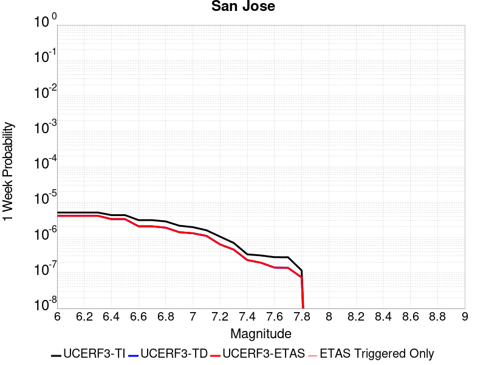 |  | 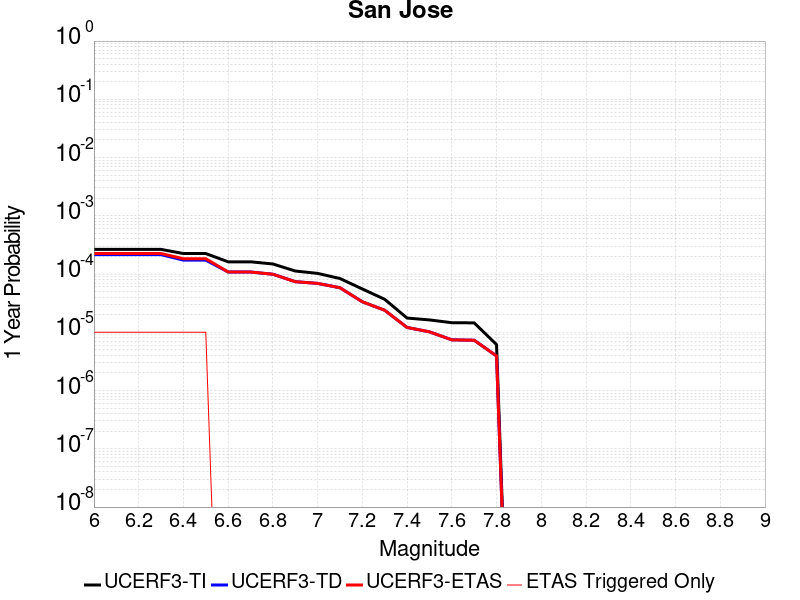 |  |

| Magnitude | 1 wk TI Prob | 1 wk TD Prob | 1 wk ETAS Prob | 1 wk ETAS/TD Gain | 1 wk ETAS Triggered Only | 1 mo TI Prob | 1 mo TD Prob | 1 mo ETAS Prob | 1 mo ETAS/TD Gain | 1 mo ETAS Triggered Only | 1 yr TI Prob | 1 yr TD Prob | 1 yr ETAS Prob | 1 yr ETAS/TD Gain | 1 yr ETAS Triggered Only | 10 yr TI Prob | 10 yr TD Prob | 10 yr ETAS Prob | 10 yr ETAS/TD Gain | 10 yr ETAS Triggered Only |
|-----|-----|-----|-----|-----|-----|-----|-----|-----|-----|-----|-----|-----|-----|-----|-----|-----|-----|-----|-----|-----|
| 6.0 | 5.0851277E-6 | 4.1256726E-6 | 4.1256726E-6 | 1.0 | 0.0 | 2.1793223E-5 | 1.768135E-5 | 1.768135E-5 | 1.0 | 0.0 | 2.653002E-4 | 2.152518E-4 | 2.2524965E-4 | 1.0464473 | 1.0E-5 | 0.0026498367 | 0.0021507242 | 0.002170681 | 1.0092793 | 2.0E-5 |
| 6.1 | 5.0851277E-6 | 4.1256726E-6 | 4.1256726E-6 | 1.0 | 0.0 | 2.1793223E-5 | 1.768135E-5 | 1.768135E-5 | 1.0 | 0.0 | 2.653002E-4 | 2.152518E-4 | 2.2524965E-4 | 1.0464473 | 1.0E-5 | 0.0026498367 | 0.0021507242 | 0.002170681 | 1.0092793 | 2.0E-5 |
| 6.2 | 5.0851277E-6 | 4.1256726E-6 | 4.1256726E-6 | 1.0 | 0.0 | 2.1793223E-5 | 1.768135E-5 | 1.768135E-5 | 1.0 | 0.0 | 2.653002E-4 | 2.152518E-4 | 2.2524965E-4 | 1.0464473 | 1.0E-5 | 0.0026498367 | 0.0021507242 | 0.002170681 | 1.0092793 | 2.0E-5 |
| 6.3 | 5.0851277E-6 | 4.1256726E-6 | 4.1256726E-6 | 1.0 | 0.0 | 2.1793223E-5 | 1.768135E-5 | 1.768135E-5 | 1.0 | 0.0 | 2.653002E-4 | 2.152518E-4 | 2.2524965E-4 | 1.0464473 | 1.0E-5 | 0.0026498367 | 0.0021507242 | 0.002170681 | 1.0092793 | 2.0E-5 |
| 6.4 | 4.3115124E-6 | 3.3237832E-6 | 3.3237832E-6 | 1.0 | 0.0 | 1.8477778E-5 | 1.424472E-5 | 1.424472E-5 | 1.0 | 0.0 | 2.2494372E-4 | 1.7341787E-4 | 1.8341614E-4 | 1.0576541 | 1.0E-5 | 0.0022471617 | 0.0017330751 | 0.0017530405 | 1.0115201 | 2.0E-5 |
| 6.5 | 4.3115124E-6 | 3.3237832E-6 | 3.3237832E-6 | 1.0 | 0.0 | 1.8477778E-5 | 1.424472E-5 | 1.424472E-5 | 1.0 | 0.0 | 2.2494372E-4 | 1.7341787E-4 | 1.8341614E-4 | 1.0576541 | 1.0E-5 | 0.0022471617 | 0.0017330751 | 0.0017530405 | 1.0115201 | 2.0E-5 |
| 6.6 | 3.110396E-6 | 2.0799866E-6 | 2.0799866E-6 | 1.0 | 0.0 | 1.33302E-5 | 8.9141995E-6 | 8.9141995E-6 | 1.0 | 0.0 | 1.622831E-4 | 1.0852526E-4 | 1.0852526E-4 | 1.0 | 0.0 | 0.0016216465 | 0.0010847825 | 0.0010947717 | 1.0092084 | 1.0E-5 |
| 6.7 | 3.110396E-6 | 2.0799866E-6 | 2.0799866E-6 | 1.0 | 0.0 | 1.33302E-5 | 8.9141995E-6 | 8.9141995E-6 | 1.0 | 0.0 | 1.622831E-4 | 1.0852526E-4 | 1.0852526E-4 | 1.0 | 0.0 | 0.0016216465 | 0.0010847825 | 0.0010947717 | 1.0092084 | 1.0E-5 |
| 6.8 | 2.856651E-6 | 1.902435E-6 | 1.902435E-6 | 1.0 | 0.0 | 1.2242733E-5 | 8.153269E-6 | 8.153269E-6 | 1.0 | 0.0 | 1.4904508E-4 | 9.926178E-5 | 9.926178E-5 | 1.0 | 0.0 | 0.0014894515 | 9.922314E-4 | 0.0010022215 | 1.0100683 | 1.0E-5 |
| 6.9 | 2.1618725E-6 | 1.4186642E-6 | 1.4186642E-6 | 1.0 | 0.0 | 9.265135E-6 | 6.0799757E-6 | 6.0799757E-6 | 1.0 | 0.0 | 1.12797185E-4 | 7.402128E-5 | 7.402128E-5 | 1.0 | 0.0 | 0.0011273995 | 7.4000744E-4 | 7.5E-4 | 1.0135034 | 1.0E-5 |
| 7.0 | 1.9684312E-6 | 1.3256331E-6 | 1.3256331E-6 | 1.0 | 0.0 | 8.436106E-6 | 5.681273E-6 | 5.681273E-6 | 1.0 | 0.0 | 1.02704755E-4 | 6.9167385E-5 | 6.9167385E-5 | 1.0 | 0.0 | 0.001026573 | 6.914992E-4 | 7.014923E-4 | 1.0144514 | 1.0E-5 |
| 7.1 | 1.6070337E-6 | 1.1155087E-6 | 1.1155087E-6 | 1.0 | 0.0 | 6.887269E-6 | 4.780743E-6 | 4.780743E-6 | 1.0 | 0.0 | 8.384928E-5 | 5.8204052E-5 | 5.8204052E-5 | 1.0 | 0.0 | 8.3817646E-4 | 5.819267E-4 | 5.919209E-4 | 1.0171742 | 1.0E-5 |
| 7.2 | 1.0631658E-6 | 6.4037624E-7 | 6.4037624E-7 | 1.0 | 0.0 | 4.556417E-6 | 2.7444669E-6 | 2.7444669E-6 | 1.0 | 0.0 | 5.5472963E-5 | 3.3413387E-5 | 3.3413387E-5 | 1.0 | 0.0 | 5.545912E-4 | 3.3411747E-4 | 3.3411747E-4 | 1.0 | 0.0 |
| 7.3 | 7.060711E-7 | 4.5824706E-7 | 4.5824706E-7 | 1.0 | 0.0 | 3.0260155E-6 | 1.9639147E-6 | 1.9639147E-6 | 1.0 | 0.0 | 3.6841117E-5 | 2.3910407E-5 | 2.3910407E-5 | 1.0 | 0.0 | 3.6835007E-4 | 2.3911172E-4 | 2.3911172E-4 | 1.0 | 0.0 |
| 7.4 | 3.3677085E-7 | 2.3233133E-7 | 2.3233133E-7 | 1.0 | 0.0 | 1.4433028E-6 | 9.957054E-7 | 9.957054E-7 | 1.0 | 0.0 | 1.757207E-5 | 1.21226485E-5 | 1.21226485E-5 | 1.0 | 0.0 | 1.7570681E-4 | 1.2125263E-4 | 1.2125263E-4 | 1.0 | 0.0 |
| 7.5 | 3.129161E-7 | 1.9530925E-7 | 1.9530925E-7 | 1.0 | 0.0 | 1.3410682E-6 | 8.370394E-7 | 8.370394E-7 | 1.0 | 0.0 | 1.6327383E-5 | 1.0190909E-5 | 1.0190909E-5 | 1.0 | 0.0 | 1.6326184E-4 | 1.0193714E-4 | 1.0193714E-4 | 1.0 | 0.0 |
| 7.6 | 2.8008668E-7 | 1.4242323E-7 | 1.4242323E-7 | 1.0 | 0.0 | 1.2003709E-6 | 6.1038514E-7 | 6.1038514E-7 | 1.0 | 0.0 | 1.46144175E-5 | 7.4314153E-6 | 7.4314153E-6 | 1.0 | 0.0 | 1.4613457E-4 | 7.434427E-5 | 7.434427E-5 | 1.0 | 0.0 |
| 7.7 | 2.7852005E-7 | 1.4016913E-7 | 1.4016913E-7 | 1.0 | 0.0 | 1.1936568E-6 | 6.007248E-7 | 6.007248E-7 | 1.0 | 0.0 | 1.4532674E-5 | 7.3138012E-6 | 7.3138012E-6 | 1.0 | 0.0 | 1.4531724E-4 | 7.316821E-5 | 7.316821E-5 | 1.0 | 0.0 |
| 7.8 | 1.1810797E-7 | 7.5190094E-8 | 7.5190094E-8 | 1.0 | 0.0 | 5.0617695E-7 | 3.222432E-7 | 3.222432E-7 | 1.0 | 0.0 | 6.1626865E-6 | 3.9233046E-6 | 3.9233046E-6 | 1.0 | 0.0 | 6.162516E-5 | 3.9250725E-5 | 3.9250725E-5 | 1.0 | 0.0 |

## Hosgri
*[(top)](#table-of-contents)*

| 1 Week | 1 Month | 1 Year | 10 Year |
|-----|-----|-----|-----|
|  |  |  |  |

| Magnitude | 1 wk TI Prob | 1 wk TD Prob | 1 wk ETAS Prob | 1 wk ETAS/TD Gain | 1 wk ETAS Triggered Only | 1 mo TI Prob | 1 mo TD Prob | 1 mo ETAS Prob | 1 mo ETAS/TD Gain | 1 mo ETAS Triggered Only | 1 yr TI Prob | 1 yr TD Prob | 1 yr ETAS Prob | 1 yr ETAS/TD Gain | 1 yr ETAS Triggered Only | 10 yr TI Prob | 10 yr TD Prob | 10 yr ETAS Prob | 10 yr ETAS/TD Gain | 10 yr ETAS Triggered Only |
|-----|-----|-----|-----|-----|-----|-----|-----|-----|-----|-----|-----|-----|-----|-----|-----|-----|-----|-----|-----|-----|
| 6.0 | 2.883978E-5 | 2.9128416E-5 | 2.9128416E-5 | 1.0 | 0.0 | 1.235932E-4 | 1.2483024E-4 | 1.34829E-4 | 1.0800987 | 1.0E-5 | 0.0015037085 | 0.001518776 | 0.0015287608 | 1.0065743 | 1.0E-5 | 0.01493574 | 0.01508774 | 0.015107438 | 1.0013056 | 2.0E-5 |
| 6.1 | 2.883978E-5 | 2.9128416E-5 | 2.9128416E-5 | 1.0 | 0.0 | 1.235932E-4 | 1.2483024E-4 | 1.34829E-4 | 1.0800987 | 1.0E-5 | 0.0015037085 | 0.001518776 | 0.0015287608 | 1.0065743 | 1.0E-5 | 0.01493574 | 0.01508774 | 0.015107438 | 1.0013056 | 2.0E-5 |
| 6.2 | 2.883978E-5 | 2.9128416E-5 | 2.9128416E-5 | 1.0 | 0.0 | 1.235932E-4 | 1.2483024E-4 | 1.34829E-4 | 1.0800987 | 1.0E-5 | 0.0015037085 | 0.001518776 | 0.0015287608 | 1.0065743 | 1.0E-5 | 0.01493574 | 0.01508774 | 0.015107438 | 1.0013056 | 2.0E-5 |
| 6.3 | 2.2914428E-5 | 2.2641969E-5 | 2.2641969E-5 | 1.0 | 0.0 | 9.8200995E-5 | 9.703343E-5 | 9.703343E-5 | 1.0 | 0.0 | 0.0011949413 | 0.0011807467 | 0.0011807467 | 1.0 | 0.0 | 0.011885363 | 0.011746133 | 0.011756015 | 1.0008414 | 1.0E-5 |
| 6.4 | 2.0195741E-5 | 1.969656E-5 | 1.969656E-5 | 1.0 | 0.0 | 8.65503E-5 | 8.4411105E-5 | 8.4411105E-5 | 1.0 | 0.0 | 0.0010532405 | 0.0010272227 | 0.0010272227 | 1.0 | 0.0 | 0.010482626 | 0.010225792 | 0.010225792 | 1.0 | 0.0 |
| 6.5 | 1.9924333E-5 | 1.940898E-5 | 1.940898E-5 | 1.0 | 0.0 | 8.53872E-5 | 8.3178704E-5 | 8.3178704E-5 | 1.0 | 0.0 | 0.0010390934 | 0.0010122322 | 0.0010122322 | 1.0 | 0.0 | 0.010342481 | 0.010077253 | 0.010077253 | 1.0 | 0.0 |
| 6.6 | 1.809694E-5 | 1.74583E-5 | 1.74583E-5 | 1.0 | 0.0 | 7.7556004E-5 | 7.4819145E-5 | 7.4819145E-5 | 1.0 | 0.0 | 9.438353E-4 | 9.105437E-4 | 9.105437E-4 | 1.0 | 0.0 | 0.009398366 | 0.009069073 | 0.009069073 | 1.0 | 0.0 |
| 6.7 | 1.675989E-5 | 1.6042764E-5 | 1.6042764E-5 | 1.0 | 0.0 | 7.182612E-5 | 6.87529E-5 | 6.87529E-5 | 1.0 | 0.0 | 8.7413215E-4 | 8.3674624E-4 | 8.3674624E-4 | 1.0 | 0.0 | 0.008707017 | 0.0083368635 | 0.0083368635 | 1.0 | 0.0 |
| 6.8 | 1.5401129E-5 | 1.4614083E-5 | 1.4614083E-5 | 1.0 | 0.0 | 6.6003166E-5 | 6.2630286E-5 | 6.2630286E-5 | 1.0 | 0.0 | 8.032922E-4 | 7.622578E-4 | 7.622578E-4 | 1.0 | 0.0 | 0.008003947 | 0.007597296 | 0.007597296 | 1.0 | 0.0 |
| 6.9 | 1.356559E-5 | 1.2689968E-5 | 1.2689968E-5 | 1.0 | 0.0 | 5.8136946E-5 | 5.4384444E-5 | 5.4384444E-5 | 1.0 | 0.0 | 7.0758746E-4 | 6.619299E-4 | 6.619299E-4 | 1.0 | 0.0 | 0.007053386 | 0.006600388 | 0.006600388 | 1.0 | 0.0 |
| 7.0 | 1.2030819E-5 | 1.1095962E-5 | 1.1095962E-5 | 1.0 | 0.0 | 5.155963E-5 | 4.7553254E-5 | 4.7553254E-5 | 1.0 | 0.0 | 6.275577E-4 | 5.7880714E-4 | 5.7880714E-4 | 1.0 | 0.0 | 0.006257884 | 0.005773757 | 0.005773757 | 1.0 | 0.0 |
| 7.1 | 1.0972698E-5 | 1.0022179E-5 | 1.0022179E-5 | 1.0 | 0.0 | 4.7025E-5 | 4.2951488E-5 | 4.2951488E-5 | 1.0 | 0.0 | 5.72379E-4 | 5.22809E-4 | 5.22809E-4 | 1.0 | 0.0 | 0.0057090693 | 0.005216542 | 0.005216542 | 1.0 | 0.0 |
| 7.2 | 9.961926E-6 | 9.034746E-6 | 9.034746E-6 | 1.0 | 0.0 | 4.2693267E-5 | 3.8719765E-5 | 3.8719765E-5 | 1.0 | 0.0 | 5.1966653E-4 | 4.713112E-4 | 4.713112E-4 | 1.0 | 0.0 | 0.00518453 | 0.0047038626 | 0.0047038626 | 1.0 | 0.0 |
| 7.3 | 8.700929E-6 | 7.8281E-6 | 7.8281E-6 | 1.0 | 0.0 | 3.7289166E-5 | 3.354857E-5 | 3.354857E-5 | 1.0 | 0.0 | 4.53901E-4 | 4.0837732E-4 | 4.0837732E-4 | 1.0 | 0.0 | 0.00452975 | 0.004077008 | 0.004077008 | 1.0 | 0.0 |
| 7.4 | 7.866285E-6 | 6.998739E-6 | 6.998739E-6 | 1.0 | 0.0 | 3.3712215E-5 | 2.9994251E-5 | 2.9994251E-5 | 1.0 | 0.0 | 4.103689E-4 | 3.6511885E-4 | 3.6511885E-4 | 1.0 | 0.0 | 0.004096119 | 0.0036459267 | 0.0036459267 | 1.0 | 0.0 |
| 7.5 | 6.8381305E-6 | 5.9596955E-6 | 5.9596955E-6 | 1.0 | 0.0 | 2.9305946E-5 | 2.5541302E-5 | 2.5541302E-5 | 1.0 | 0.0 | 3.5674145E-4 | 3.10921E-4 | 3.10921E-4 | 1.0 | 0.0 | 0.0035616932 | 0.0031055948 | 0.0031055948 | 1.0 | 0.0 |
| 7.6 | 5.503376E-6 | 4.5952443E-6 | 4.5952443E-6 | 1.0 | 0.0 | 2.3585684E-5 | 1.9693754E-5 | 1.9693754E-5 | 1.0 | 0.0 | 2.8711787E-4 | 2.397451E-4 | 2.397451E-4 | 1.0 | 0.0 | 0.002867472 | 0.0023955975 | 0.0023955975 | 1.0 | 0.0 |
| 7.7 | 3.6144982E-6 | 2.6522112E-6 | 2.6522112E-6 | 1.0 | 0.0 | 1.5490614E-5 | 1.1366569E-5 | 1.1366569E-5 | 1.0 | 0.0 | 1.8858191E-4 | 1.383792E-4 | 1.383792E-4 | 1.0 | 0.0 | 0.0018842196 | 0.0013836613 | 0.0013836613 | 1.0 | 0.0 |
| 7.8 | 1.9853494E-6 | 1.1361129E-6 | 1.1361129E-6 | 1.0 | 0.0 | 8.508612E-6 | 4.8690463E-6 | 4.8690463E-6 | 1.0 | 0.0 | 1.0358743E-4 | 5.9279027E-5 | 5.9279027E-5 | 1.0 | 0.0 | 0.0010353916 | 5.9336185E-4 | 5.9336185E-4 | 1.0 | 0.0 |
| 7.9 | 1.1818757E-6 | 5.2951856E-7 | 5.2951856E-7 | 1.0 | 0.0 | 5.0651715E-6 | 2.2693632E-6 | 2.2693632E-6 | 1.0 | 0.0 | 6.1666724E-5 | 2.7629147E-5 | 2.7629147E-5 | 1.0 | 0.0 | 6.1649614E-4 | 2.7694515E-4 | 2.7694515E-4 | 1.0 | 0.0 |
| 8.0 | 6.962958E-7 | 2.7139782E-7 | 2.7139782E-7 | 1.0 | 0.0 | 2.9841215E-6 | 1.163133E-6 | 1.163133E-6 | 1.0 | 0.0 | 3.6331072E-5 | 1.4161053E-5 | 1.4161053E-5 | 1.0 | 0.0 | 3.6325134E-4 | 1.4217179E-4 | 1.4217179E-4 | 1.0 | 0.0 |
| 8.1 | 1.5033264E-7 | 6.527624E-8 | 6.527624E-8 | 1.0 | 0.0 | 6.442826E-7 | 2.7975528E-7 | 2.7975528E-7 | 1.0 | 0.0 | 7.844113E-6 | 3.4060151E-6 | 3.4060151E-6 | 1.0 | 0.0 | 7.843835E-5 | 3.407693E-5 | 3.407693E-5 | 1.0 | 0.0 |

## Calaveras (Central) 2011 CFM
*[(top)](#table-of-contents)*

| 1 Week | 1 Month | 1 Year | 10 Year |
|-----|-----|-----|-----|
|  |  |  |  |

| Magnitude | 1 wk TI Prob | 1 wk TD Prob | 1 wk ETAS Prob | 1 wk ETAS/TD Gain | 1 wk ETAS Triggered Only | 1 mo TI Prob | 1 mo TD Prob | 1 mo ETAS Prob | 1 mo ETAS/TD Gain | 1 mo ETAS Triggered Only | 1 yr TI Prob | 1 yr TD Prob | 1 yr ETAS Prob | 1 yr ETAS/TD Gain | 1 yr ETAS Triggered Only | 10 yr TI Prob | 10 yr TD Prob | 10 yr ETAS Prob | 10 yr ETAS/TD Gain | 10 yr ETAS Triggered Only |
|-----|-----|-----|-----|-----|-----|-----|-----|-----|-----|-----|-----|-----|-----|-----|-----|-----|-----|-----|-----|-----|
| 6.0 | 1.5010907E-4 | 2.481574E-4 | 2.581549E-4 | 1.040287 | 1.0E-5 | 6.4316596E-4 | 0.0010621005 | 0.0010720899 | 1.0094053 | 1.0E-5 | 0.0078024664 | 0.012850073 | 0.012869816 | 1.0015364 | 2.0E-5 | 0.07534136 | 0.120401435 | 0.120419025 | 1.0001462 | 2.0E-5 |
| 6.1 | 1.4521465E-4 | 2.397987E-4 | 2.4979629E-4 | 1.0416917 | 1.0E-5 | 6.222001E-4 | 0.0010263061 | 0.0010362958 | 1.0097337 | 1.0E-5 | 0.0075490056 | 0.012419341 | 0.012439093 | 1.0015904 | 2.0E-5 | 0.07297657 | 0.11667323 | 0.1166909 | 1.0001514 | 2.0E-5 |
| 6.2 | 1.429998E-4 | 2.3911126E-4 | 2.4910888E-4 | 1.0418116 | 1.0E-5 | 6.127123E-4 | 0.0010233623 | 0.001033352 | 1.0097617 | 1.0E-5 | 0.007434286 | 0.01238394 | 0.012403692 | 1.001595 | 2.0E-5 | 0.07190444 | 0.1163272 | 0.11634487 | 1.0001519 | 2.0E-5 |
| 6.3 | 1.3536277E-4 | 2.3242626E-4 | 2.4242394E-4 | 1.0430144 | 1.0E-5 | 5.799972E-4 | 9.947343E-4 | 0.0010047244 | 1.0100429 | 1.0E-5 | 0.0070386264 | 0.012040132 | 0.012059892 | 1.0016412 | 2.0E-5 | 0.0681982 | 0.11323977 | 0.11325751 | 1.0001566 | 2.0E-5 |
| 6.4 | 1.2993296E-4 | 2.2666177E-4 | 2.366595E-4 | 1.0441086 | 1.0E-5 | 5.5673666E-4 | 9.700479E-4 | 9.800382E-4 | 1.0102987 | 1.0E-5 | 0.006757223 | 0.011742937 | 0.011762703 | 1.0016831 | 2.0E-5 | 0.06555412 | 0.11051771 | 0.1105355 | 1.0001609 | 2.0E-5 |
| 6.5 | 1.0498927E-4 | 1.7981697E-4 | 1.8981517E-4 | 1.0556021 | 1.0E-5 | 4.498764E-4 | 7.704157E-4 | 7.80408E-4 | 1.01297 | 1.0E-5 | 0.005463498 | 0.00933924 | 0.009359054 | 1.0021214 | 2.0E-5 | 0.053311124 | 0.089199215 | 0.08921743 | 1.0002042 | 2.0E-5 |
| 6.6 | 1.0157505E-4 | 1.7469203E-4 | 1.8469029E-4 | 1.0572336 | 1.0E-5 | 4.35249E-4 | 7.484645E-4 | 7.58457E-4 | 1.0133507 | 1.0E-5 | 0.0052862884 | 0.009074297 | 0.009094115 | 1.002184 | 2.0E-5 | 0.05162293 | 0.08677671 | 0.08679497 | 1.0002105 | 2.0E-5 |
| 6.7 | 9.660386E-5 | 1.6728524E-4 | 1.7728357E-4 | 1.0597681 | 1.0E-5 | 4.1395082E-4 | 7.1673887E-4 | 7.2673167E-4 | 1.0139421 | 1.0E-5 | 0.0050282106 | 0.008691208 | 0.008711034 | 1.0022812 | 2.0E-5 | 0.049159497 | 0.083266065 | 0.0832844 | 1.0002202 | 2.0E-5 |
| 6.8 | 9.089927E-5 | 1.5643016E-4 | 1.664286E-4 | 1.0639163 | 1.0E-5 | 3.8951015E-4 | 6.702439E-4 | 6.802372E-4 | 1.01491 | 1.0E-5 | 0.0047319788 | 0.008129478 | 0.008149317 | 1.0024402 | 2.0E-5 | 0.046324775 | 0.078159414 | 0.078177854 | 1.0002359 | 2.0E-5 |
| 6.9 | 7.353187E-5 | 1.2295354E-4 | 1.3295231E-4 | 1.0813215 | 1.0E-5 | 3.150985E-4 | 5.2683795E-4 | 5.3683267E-4 | 1.0189712 | 1.0E-5 | 0.0038295772 | 0.006395508 | 0.00641538 | 1.0031072 | 2.0E-5 | 0.037642512 | 0.062187865 | 0.06220662 | 1.0003016 | 2.0E-5 |
| 7.0 | 5.746064E-5 | 9.3887444E-5 | 1.0388651E-4 | 1.1065005 | 1.0E-5 | 2.4623662E-4 | 4.0231308E-4 | 4.1230905E-4 | 1.0248463 | 1.0E-5 | 0.0029938098 | 0.004887232 | 0.0049071345 | 1.0040723 | 2.0E-5 | 0.02953797 | 0.04798685 | 0.04800589 | 1.0003967 | 2.0E-5 |
| 7.1 | 4.9557195E-5 | 8.052461E-5 | 9.0523805E-5 | 1.1241757 | 1.0E-5 | 2.123707E-4 | 3.4506017E-4 | 3.5505672E-4 | 1.0289705 | 1.0E-5 | 0.0025825473 | 0.0041930773 | 0.0042129937 | 1.0047498 | 2.0E-5 | 0.0255274 | 0.041373078 | 0.04139225 | 1.0004634 | 2.0E-5 |
| 7.2 | 3.687595E-5 | 5.9524526E-5 | 5.9524526E-5 | 1.0 | 0.0 | 1.5803022E-4 | 2.5508032E-4 | 2.5508032E-4 | 1.0 | 0.0 | 0.0019223199 | 0.0031012094 | 0.0031111783 | 1.0032146 | 1.0E-5 | 0.01905776 | 0.030883716 | 0.030893408 | 1.0003138 | 1.0E-5 |
| 7.3 | 2.5846984E-5 | 4.247213E-5 | 4.247213E-5 | 1.0 | 0.0 | 1.1076809E-4 | 1.8201082E-4 | 1.8201082E-4 | 1.0 | 0.0 | 0.0013477671 | 0.002213747 | 0.002223725 | 1.0045072 | 1.0E-5 | 0.013396223 | 0.02217554 | 0.022185316 | 1.000441 | 1.0E-5 |
| 7.4 | 1.7747854E-5 | 2.9936204E-5 | 2.9936204E-5 | 1.0 | 0.0 | 7.6060016E-5 | 1.2829172E-4 | 1.2829172E-4 | 1.0 | 0.0 | 9.2563726E-4 | 0.0015608355 | 0.0015608355 | 1.0 | 0.0 | 0.009217911 | 0.015709236 | 0.015709236 | 1.0 | 0.0 |
| 7.5 | 1.4883479E-5 | 2.6243379E-5 | 2.6243379E-5 | 1.0 | 0.0 | 6.378478E-5 | 1.1246678E-4 | 1.1246678E-4 | 1.0 | 0.0 | 7.76303E-4 | 0.0013684258 | 0.0013684258 | 1.0 | 0.0 | 0.0077359667 | 0.013802425 | 0.013802425 | 1.0 | 0.0 |
| 7.6 | 8.166975E-6 | 1.4963478E-5 | 1.4963478E-5 | 1.0 | 0.0 | 3.5000852E-5 | 6.412763E-5 | 6.412763E-5 | 1.0 | 0.0 | 4.2605202E-4 | 7.804755E-4 | 7.804755E-4 | 1.0 | 0.0 | 0.004252361 | 0.00793984 | 0.00793984 | 1.0 | 0.0 |
| 7.7 | 3.3858064E-6 | 6.253914E-6 | 6.253914E-6 | 1.0 | 0.0 | 1.4510518E-5 | 2.6802214E-5 | 2.6802214E-5 | 1.0 | 0.0 | 1.7665124E-4 | 3.2626814E-4 | 3.2626814E-4 | 1.0 | 0.0 | 0.0017651088 | 0.0033882293 | 0.0033882293 | 1.0 | 0.0 |
| 7.8 | 2.7721615E-6 | 5.3663807E-6 | 5.3663807E-6 | 1.0 | 0.0 | 1.1880637E-5 | 2.2998573E-5 | 2.2998573E-5 | 1.0 | 0.0 | 1.4463716E-4 | 2.799717E-4 | 2.799717E-4 | 1.0 | 0.0 | 0.0014454306 | 0.0029074624 | 0.0029074624 | 1.0 | 0.0 |
| 7.9 | 1.9736292E-6 | 4.1284193E-6 | 4.1284193E-6 | 1.0 | 0.0 | 8.4583835E-6 | 1.7693106E-5 | 1.7693106E-5 | 1.0 | 0.0 | 1.0297595E-4 | 2.1539231E-4 | 2.1539231E-4 | 1.0 | 0.0 | 0.0010292825 | 0.0022236116 | 0.0022236116 | 1.0 | 0.0 |
| 8.0 | 1.1767289E-6 | 2.5544743E-6 | 2.5544743E-6 | 1.0 | 0.0 | 5.0431145E-6 | 1.0947701E-5 | 1.0947701E-5 | 1.0 | 0.0 | 6.139818E-5 | 1.3328013E-4 | 1.3328013E-4 | 1.0 | 0.0 | 6.1381224E-4 | 0.0013660848 | 0.0013660848 | 1.0 | 0.0 |
| 8.1 | 7.5112825E-7 | 1.5409794E-6 | 1.5409794E-6 | 1.0 | 0.0 | 3.2191172E-6 | 6.6041807E-6 | 6.6041807E-6 | 1.0 | 0.0 | 3.9192048E-5 | 8.0402955E-5 | 8.0402955E-5 | 1.0 | 0.0 | 3.9185135E-4 | 8.235564E-4 | 8.235564E-4 | 1.0 | 0.0 |

## Pitas Point (Lower)-Montalvo
*[(top)](#table-of-contents)*

| 1 Week | 1 Month | 1 Year | 10 Year |
|-----|-----|-----|-----|
|  |  |  |  |

| Magnitude | 1 wk TI Prob | 1 wk TD Prob | 1 wk ETAS Prob | 1 wk ETAS/TD Gain | 1 wk ETAS Triggered Only | 1 mo TI Prob | 1 mo TD Prob | 1 mo ETAS Prob | 1 mo ETAS/TD Gain | 1 mo ETAS Triggered Only | 1 yr TI Prob | 1 yr TD Prob | 1 yr ETAS Prob | 1 yr ETAS/TD Gain | 1 yr ETAS Triggered Only | 10 yr TI Prob | 10 yr TD Prob | 10 yr ETAS Prob | 10 yr ETAS/TD Gain | 10 yr ETAS Triggered Only |
|-----|-----|-----|-----|-----|-----|-----|-----|-----|-----|-----|-----|-----|-----|-----|-----|-----|-----|-----|-----|-----|
| 6.0 | 5.2543637E-6 | 4.8378706E-6 | 1.4837822E-5 | 3.0670152 | 1.0E-5 | 2.2518509E-5 | 2.0733567E-5 | 3.073336E-5 | 1.4822997 | 1.0E-5 | 2.7412834E-4 | 2.5240227E-4 | 2.723972E-4 | 1.0792186 | 2.0E-5 | 0.0027379042 | 0.0025211885 | 0.0025411379 | 1.0079128 | 2.0E-5 |
| 6.1 | 5.2543637E-6 | 4.8378706E-6 | 1.4837822E-5 | 3.0670152 | 1.0E-5 | 2.2518509E-5 | 2.0733567E-5 | 3.073336E-5 | 1.4822997 | 1.0E-5 | 2.7412834E-4 | 2.5240227E-4 | 2.723972E-4 | 1.0792186 | 2.0E-5 | 0.0027379042 | 0.0025211885 | 0.0025411379 | 1.0079128 | 2.0E-5 |
| 6.2 | 5.2543637E-6 | 4.8378706E-6 | 1.4837822E-5 | 3.0670152 | 1.0E-5 | 2.2518509E-5 | 2.0733567E-5 | 3.073336E-5 | 1.4822997 | 1.0E-5 | 2.7412834E-4 | 2.5240227E-4 | 2.723972E-4 | 1.0792186 | 2.0E-5 | 0.0027379042 | 0.0025211885 | 0.0025411379 | 1.0079128 | 2.0E-5 |
| 6.3 | 5.2543637E-6 | 4.8378706E-6 | 1.4837822E-5 | 3.0670152 | 1.0E-5 | 2.2518509E-5 | 2.0733567E-5 | 3.073336E-5 | 1.4822997 | 1.0E-5 | 2.7412834E-4 | 2.5240227E-4 | 2.723972E-4 | 1.0792186 | 2.0E-5 | 0.0027379042 | 0.0025211885 | 0.0025411379 | 1.0079128 | 2.0E-5 |
| 6.4 | 5.2543637E-6 | 4.8378706E-6 | 1.4837822E-5 | 3.0670152 | 1.0E-5 | 2.2518509E-5 | 2.0733567E-5 | 3.073336E-5 | 1.4822997 | 1.0E-5 | 2.7412834E-4 | 2.5240227E-4 | 2.723972E-4 | 1.0792186 | 2.0E-5 | 0.0027379042 | 0.0025211885 | 0.0025411379 | 1.0079128 | 2.0E-5 |
| 6.5 | 5.2543637E-6 | 4.8378706E-6 | 1.4837822E-5 | 3.0670152 | 1.0E-5 | 2.2518509E-5 | 2.0733567E-5 | 3.073336E-5 | 1.4822997 | 1.0E-5 | 2.7412834E-4 | 2.5240227E-4 | 2.723972E-4 | 1.0792186 | 2.0E-5 | 0.0027379042 | 0.0025211885 | 0.0025411379 | 1.0079128 | 2.0E-5 |
| 6.6 | 5.2543637E-6 | 4.8378706E-6 | 1.4837822E-5 | 3.0670152 | 1.0E-5 | 2.2518509E-5 | 2.0733567E-5 | 3.073336E-5 | 1.4822997 | 1.0E-5 | 2.7412834E-4 | 2.5240227E-4 | 2.723972E-4 | 1.0792186 | 2.0E-5 | 0.0027379042 | 0.0025211885 | 0.0025411379 | 1.0079128 | 2.0E-5 |
| 6.7 | 5.2543637E-6 | 4.8378706E-6 | 1.4837822E-5 | 3.0670152 | 1.0E-5 | 2.2518509E-5 | 2.0733567E-5 | 3.073336E-5 | 1.4822997 | 1.0E-5 | 2.7412834E-4 | 2.5240227E-4 | 2.723972E-4 | 1.0792186 | 2.0E-5 | 0.0027379042 | 0.0025211885 | 0.0025411379 | 1.0079128 | 2.0E-5 |
| 6.8 | 5.2543637E-6 | 4.8378706E-6 | 1.4837822E-5 | 3.0670152 | 1.0E-5 | 2.2518509E-5 | 2.0733567E-5 | 3.073336E-5 | 1.4822997 | 1.0E-5 | 2.7412834E-4 | 2.5240227E-4 | 2.723972E-4 | 1.0792186 | 2.0E-5 | 0.0027379042 | 0.0025211885 | 0.0025411379 | 1.0079128 | 2.0E-5 |
| 6.9 | 5.2543637E-6 | 4.8378706E-6 | 1.4837822E-5 | 3.0670152 | 1.0E-5 | 2.2518509E-5 | 2.0733567E-5 | 3.073336E-5 | 1.4822997 | 1.0E-5 | 2.7412834E-4 | 2.5240227E-4 | 2.723972E-4 | 1.0792186 | 2.0E-5 | 0.0027379042 | 0.0025211885 | 0.0025411379 | 1.0079128 | 2.0E-5 |
| 7.0 | 5.2543637E-6 | 4.8378706E-6 | 1.4837822E-5 | 3.0670152 | 1.0E-5 | 2.2518509E-5 | 2.0733567E-5 | 3.073336E-5 | 1.4822997 | 1.0E-5 | 2.7412834E-4 | 2.5240227E-4 | 2.723972E-4 | 1.0792186 | 2.0E-5 | 0.0027379042 | 0.0025211885 | 0.0025411379 | 1.0079128 | 2.0E-5 |
| 7.1 | 5.2543637E-6 | 4.8378706E-6 | 1.4837822E-5 | 3.0670152 | 1.0E-5 | 2.2518509E-5 | 2.0733567E-5 | 3.073336E-5 | 1.4822997 | 1.0E-5 | 2.7412834E-4 | 2.5240227E-4 | 2.723972E-4 | 1.0792186 | 2.0E-5 | 0.0027379042 | 0.0025211885 | 0.0025411379 | 1.0079128 | 2.0E-5 |
| 7.2 | 5.2458695E-6 | 4.8290244E-6 | 1.48289755E-5 | 3.0708017 | 1.0E-5 | 2.2482105E-5 | 2.0695656E-5 | 3.069545E-5 | 1.4831831 | 1.0E-5 | 2.7368523E-4 | 2.519408E-4 | 2.7193574E-4 | 1.0793637 | 2.0E-5 | 0.0027334841 | 0.0025165842 | 0.0025365339 | 1.0079273 | 2.0E-5 |
| 7.3 | 5.22665E-6 | 4.8089414E-6 | 1.4808894E-5 | 3.0794497 | 1.0E-5 | 2.2399736E-5 | 2.0609588E-5 | 3.0609383E-5 | 1.485201 | 1.0E-5 | 2.7268266E-4 | 2.5089315E-4 | 2.7088815E-4 | 1.0796952 | 2.0E-5 | 0.002723483 | 0.0025061315 | 0.0025260814 | 1.0079604 | 2.0E-5 |
| 7.4 | 5.210642E-6 | 4.792154E-6 | 1.4792106E-5 | 3.0867343 | 1.0E-5 | 2.233113E-5 | 2.0537642E-5 | 3.0537438E-5 | 1.4869008 | 1.0E-5 | 2.718476E-4 | 2.5001742E-4 | 2.7001242E-4 | 1.0799744 | 2.0E-5 | 0.002715153 | 0.0024973939 | 0.002517344 | 1.0079883 | 2.0E-5 |
| 7.5 | 5.1226016E-6 | 4.7000403E-6 | 1.4699994E-5 | 3.1276312 | 1.0E-5 | 2.1953823E-5 | 2.0142877E-5 | 3.0142675E-5 | 1.4964434 | 1.0E-5 | 2.67255E-4 | 2.4521223E-4 | 2.6520735E-4 | 1.081542 | 2.0E-5 | 0.0026693381 | 0.0024494485 | 0.0024693992 | 1.0081451 | 2.0E-5 |
| 7.6 | 4.8796987E-6 | 4.4449403E-6 | 1.4444896E-5 | 3.249739 | 1.0E-5 | 2.0912828E-5 | 1.9049607E-5 | 2.9049417E-5 | 1.5249352 | 1.0E-5 | 2.5458392E-4 | 2.3190459E-4 | 2.5189994E-4 | 1.0862224 | 2.0E-5 | 0.0025429246 | 0.0023166565 | 0.00233661 | 1.0086131 | 2.0E-5 |
| 7.7 | 4.0834398E-6 | 3.6091124E-6 | 1.3609077E-5 | 3.7707543 | 1.0E-5 | 1.7500339E-5 | 1.5467534E-5 | 2.546738E-5 | 1.6465055 | 1.0E-5 | 2.1304579E-4 | 1.8830119E-4 | 1.982993E-4 | 1.0530964 | 1.0E-5 | 0.0021284167 | 0.00188144 | 0.0018914213 | 1.005305 | 1.0E-5 |
| 7.8 | 2.5445438E-6 | 2.121228E-6 | 2.121228E-6 | 1.0 | 0.0 | 1.0905142E-5 | 9.090945E-6 | 9.090945E-6 | 1.0 | 0.0 | 1.3276201E-4 | 1.1067669E-4 | 1.1067669E-4 | 1.0 | 0.0 | 0.0013268272 | 0.0011062203 | 0.0011062203 | 1.0 | 0.0 |
| 7.9 | 4.1677114E-7 | 3.3293693E-7 | 3.3293693E-7 | 1.0 | 0.0 | 1.7861609E-6 | 1.4268718E-6 | 1.4268718E-6 | 1.0 | 0.0 | 2.1746291E-5 | 1.737203E-5 | 1.737203E-5 | 1.0 | 0.0 | 2.1744163E-4 | 1.7370703E-4 | 1.7370703E-4 | 1.0 | 0.0 |
| 8.0 | 7.791402E-9 | 5.683497E-9 | 5.683497E-9 | 1.0 | 0.0 | 3.3391725E-8 | 2.4357844E-8 | 2.4357844E-8 | 1.0 | 0.0 | 4.0654416E-7 | 2.9655675E-7 | 2.9655675E-7 | 1.0 | 0.0 | 4.065434E-6 | 2.9655655E-6 | 2.9655655E-6 | 1.0 | 0.0 |

## Puente Hills
*[(top)](#table-of-contents)*

| 1 Week | 1 Month | 1 Year | 10 Year |
|-----|-----|-----|-----|
|  |  |  |  |

| Magnitude | 1 wk TI Prob | 1 wk TD Prob | 1 wk ETAS Prob | 1 wk ETAS/TD Gain | 1 wk ETAS Triggered Only | 1 mo TI Prob | 1 mo TD Prob | 1 mo ETAS Prob | 1 mo ETAS/TD Gain | 1 mo ETAS Triggered Only | 1 yr TI Prob | 1 yr TD Prob | 1 yr ETAS Prob | 1 yr ETAS/TD Gain | 1 yr ETAS Triggered Only | 10 yr TI Prob | 10 yr TD Prob | 10 yr ETAS Prob | 10 yr ETAS/TD Gain | 10 yr ETAS Triggered Only |
|-----|-----|-----|-----|-----|-----|-----|-----|-----|-----|-----|-----|-----|-----|-----|-----|-----|-----|-----|-----|-----|
| 6.0 | 1.2101656E-5 | 8.098625E-6 | 8.098625E-6 | 1.0 | 0.0 | 5.1863204E-5 | 3.4707962E-5 | 3.4707962E-5 | 1.0 | 0.0 | 6.312516E-4 | 4.2249315E-4 | 4.2249315E-4 | 1.0 | 0.0 | 0.0062946146 | 0.0042174594 | 0.004237375 | 1.0047222 | 2.0E-5 |
| 6.1 | 1.2101656E-5 | 8.098625E-6 | 8.098625E-6 | 1.0 | 0.0 | 5.1863204E-5 | 3.4707962E-5 | 3.4707962E-5 | 1.0 | 0.0 | 6.312516E-4 | 4.2249315E-4 | 4.2249315E-4 | 1.0 | 0.0 | 0.0062946146 | 0.0042174594 | 0.004237375 | 1.0047222 | 2.0E-5 |
| 6.2 | 1.2101656E-5 | 8.098625E-6 | 8.098625E-6 | 1.0 | 0.0 | 5.1863204E-5 | 3.4707962E-5 | 3.4707962E-5 | 1.0 | 0.0 | 6.312516E-4 | 4.2249315E-4 | 4.2249315E-4 | 1.0 | 0.0 | 0.0062946146 | 0.0042174594 | 0.004237375 | 1.0047222 | 2.0E-5 |
| 6.3 | 1.2101656E-5 | 8.098625E-6 | 8.098625E-6 | 1.0 | 0.0 | 5.1863204E-5 | 3.4707962E-5 | 3.4707962E-5 | 1.0 | 0.0 | 6.312516E-4 | 4.2249315E-4 | 4.2249315E-4 | 1.0 | 0.0 | 0.0062946146 | 0.0042174594 | 0.004237375 | 1.0047222 | 2.0E-5 |
| 6.4 | 1.2101656E-5 | 8.098625E-6 | 8.098625E-6 | 1.0 | 0.0 | 5.1863204E-5 | 3.4707962E-5 | 3.4707962E-5 | 1.0 | 0.0 | 6.312516E-4 | 4.2249315E-4 | 4.2249315E-4 | 1.0 | 0.0 | 0.0062946146 | 0.0042174594 | 0.004237375 | 1.0047222 | 2.0E-5 |
| 6.5 | 1.2101656E-5 | 8.098625E-6 | 8.098625E-6 | 1.0 | 0.0 | 5.1863204E-5 | 3.4707962E-5 | 3.4707962E-5 | 1.0 | 0.0 | 6.312516E-4 | 4.2249315E-4 | 4.2249315E-4 | 1.0 | 0.0 | 0.0062946146 | 0.0042174594 | 0.004237375 | 1.0047222 | 2.0E-5 |
| 6.6 | 1.0222488E-5 | 6.3991847E-6 | 6.3991847E-6 | 1.0 | 0.0 | 4.3809923E-5 | 2.7424803E-5 | 2.7424803E-5 | 1.0 | 0.0 | 5.332553E-4 | 3.3384826E-4 | 3.3384826E-4 | 1.0 | 0.0 | 0.0053197746 | 0.0033337125 | 0.0033436792 | 1.0029896 | 1.0E-5 |
| 6.7 | 1.0222488E-5 | 6.3991847E-6 | 6.3991847E-6 | 1.0 | 0.0 | 4.3809923E-5 | 2.7424803E-5 | 2.7424803E-5 | 1.0 | 0.0 | 5.332553E-4 | 3.3384826E-4 | 3.3384826E-4 | 1.0 | 0.0 | 0.0053197746 | 0.0033337125 | 0.0033436792 | 1.0029896 | 1.0E-5 |
| 6.8 | 8.6367845E-6 | 5.0282533E-6 | 5.0282533E-6 | 1.0 | 0.0 | 3.7014266E-5 | 2.1549482E-5 | 2.1549482E-5 | 1.0 | 0.0 | 4.505555E-4 | 2.623339E-4 | 2.623339E-4 | 1.0 | 0.0 | 0.004496431 | 0.0026202986 | 0.0026202986 | 1.0 | 0.0 |
| 6.9 | 8.066481E-6 | 4.836117E-6 | 4.836117E-6 | 1.0 | 0.0 | 3.4570177E-5 | 2.0726053E-5 | 2.0726053E-5 | 1.0 | 0.0 | 4.2081063E-4 | 2.52311E-4 | 2.52311E-4 | 1.0 | 0.0 | 0.0042001465 | 0.0025202993 | 0.0025202993 | 1.0 | 0.0 |
| 7.0 | 7.393828E-6 | 4.417296E-6 | 4.417296E-6 | 1.0 | 0.0 | 3.168745E-5 | 1.8931134E-5 | 1.8931134E-5 | 1.0 | 0.0 | 3.857264E-4 | 2.3046264E-4 | 2.3046264E-4 | 1.0 | 0.0 | 0.0038505755 | 0.0023022818 | 0.0023022818 | 1.0 | 0.0 |
| 7.1 | 6.4660953E-6 | 3.8044495E-6 | 3.8044495E-6 | 1.0 | 0.0 | 2.7711543E-5 | 1.6304684E-5 | 1.6304684E-5 | 1.0 | 0.0 | 3.373358E-4 | 1.984918E-4 | 1.984918E-4 | 1.0 | 0.0 | 0.0033682417 | 0.001983181 | 0.001983181 | 1.0 | 0.0 |
| 7.2 | 5.143232E-6 | 2.7865456E-6 | 2.7865456E-6 | 1.0 | 0.0 | 2.2042237E-5 | 1.1942284E-5 | 1.1942284E-5 | 1.0 | 0.0 | 2.6833118E-4 | 1.453877E-4 | 1.453877E-4 | 1.0 | 0.0 | 0.002680074 | 0.0014529356 | 0.0014529356 | 1.0 | 0.0 |
| 7.3 | 3.928255E-6 | 2.0913774E-6 | 2.0913774E-6 | 1.0 | 0.0 | 1.683527E-5 | 8.963015E-6 | 8.963015E-6 | 1.0 | 0.0 | 2.0495013E-4 | 1.0911931E-4 | 1.0911931E-4 | 1.0 | 0.0 | 0.002047612 | 0.001090664 | 0.001090664 | 1.0 | 0.0 |
| 7.4 | 2.7894434E-6 | 1.3546753E-6 | 1.3546753E-6 | 1.0 | 0.0 | 1.1954703E-5 | 5.8057385E-6 | 5.8057385E-6 | 1.0 | 0.0 | 1.4553878E-4 | 7.068262E-5 | 7.068262E-5 | 1.0 | 0.0 | 0.001454435 | 7.066058E-4 | 7.066058E-4 | 1.0 | 0.0 |
| 7.5 | 2.041735E-6 | 8.787305E-7 | 8.787305E-7 | 1.0 | 0.0 | 8.750263E-6 | 3.7659825E-6 | 3.7659825E-6 | 1.0 | 0.0 | 1.06529245E-4 | 4.5849905E-5 | 4.5849905E-5 | 1.0 | 0.0 | 0.0010647819 | 4.5840783E-4 | 4.5840783E-4 | 1.0 | 0.0 |
| 7.6 | 1.6959062E-6 | 6.6986263E-7 | 6.6986263E-7 | 1.0 | 0.0 | 7.268149E-6 | 2.8708366E-6 | 2.8708366E-6 | 1.0 | 0.0 | 8.848612E-5 | 3.4951907E-5 | 3.4951907E-5 | 1.0 | 0.0 | 8.84509E-4 | 3.4946698E-4 | 3.4946698E-4 | 1.0 | 0.0 |
| 7.7 | 1.4767965E-6 | 5.407607E-7 | 5.407607E-7 | 1.0 | 0.0 | 6.3291122E-6 | 2.317544E-6 | 2.317544E-6 | 1.0 | 0.0 | 7.705422E-5 | 2.8215758E-5 | 2.8215758E-5 | 1.0 | 0.0 | 7.702751E-4 | 2.8212433E-4 | 2.8212433E-4 | 1.0 | 0.0 |
| 7.8 | 1.8432911E-7 | 7.28201E-8 | 7.28201E-8 | 1.0 | 0.0 | 7.8998164E-7 | 3.1208612E-7 | 3.1208612E-7 | 1.0 | 0.0 | 9.617985E-6 | 3.7996451E-6 | 3.7996451E-6 | 1.0 | 0.0 | 9.617568E-5 | 3.7996128E-5 | 3.7996128E-5 | 1.0 | 0.0 |

## Owens Valley Keough Hot Springs
*[(top)](#table-of-contents)*

| 1 Week | 1 Month | 1 Year | 10 Year |
|-----|-----|-----|-----|
|  |  |  | 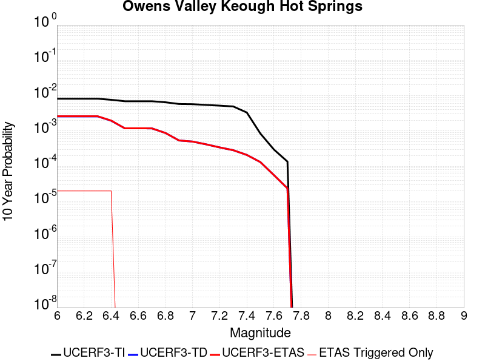 |

| Magnitude | 1 wk TI Prob | 1 wk TD Prob | 1 wk ETAS Prob | 1 wk ETAS/TD Gain | 1 wk ETAS Triggered Only | 1 mo TI Prob | 1 mo TD Prob | 1 mo ETAS Prob | 1 mo ETAS/TD Gain | 1 mo ETAS Triggered Only | 1 yr TI Prob | 1 yr TD Prob | 1 yr ETAS Prob | 1 yr ETAS/TD Gain | 1 yr ETAS Triggered Only | 10 yr TI Prob | 10 yr TD Prob | 10 yr ETAS Prob | 10 yr ETAS/TD Gain | 10 yr ETAS Triggered Only |
|-----|-----|-----|-----|-----|-----|-----|-----|-----|-----|-----|-----|-----|-----|-----|-----|-----|-----|-----|-----|-----|
| 6.0 | 1.5708529E-5 | 4.950656E-6 | 1.4950607E-5 | 3.0199244 | 1.0E-5 | 6.7320536E-5 | 2.1216953E-5 | 3.121674E-5 | 1.4713112 | 1.0E-5 | 8.193192E-4 | 2.582909E-4 | 2.6828834E-4 | 1.0387061 | 1.0E-5 | 0.008163051 | 0.0025805652 | 0.0026005134 | 1.0077302 | 2.0E-5 |
| 6.1 | 1.5708529E-5 | 4.950656E-6 | 1.4950607E-5 | 3.0199244 | 1.0E-5 | 6.7320536E-5 | 2.1216953E-5 | 3.121674E-5 | 1.4713112 | 1.0E-5 | 8.193192E-4 | 2.582909E-4 | 2.6828834E-4 | 1.0387061 | 1.0E-5 | 0.008163051 | 0.0025805652 | 0.0026005134 | 1.0077302 | 2.0E-5 |
| 6.2 | 1.5708529E-5 | 4.950656E-6 | 1.4950607E-5 | 3.0199244 | 1.0E-5 | 6.7320536E-5 | 2.1216953E-5 | 3.121674E-5 | 1.4713112 | 1.0E-5 | 8.193192E-4 | 2.582909E-4 | 2.6828834E-4 | 1.0387061 | 1.0E-5 | 0.008163051 | 0.0025805652 | 0.0026005134 | 1.0077302 | 2.0E-5 |
| 6.3 | 1.5708529E-5 | 4.950656E-6 | 1.4950607E-5 | 3.0199244 | 1.0E-5 | 6.7320536E-5 | 2.1216953E-5 | 3.121674E-5 | 1.4713112 | 1.0E-5 | 8.193192E-4 | 2.582909E-4 | 2.6828834E-4 | 1.0387061 | 1.0E-5 | 0.008163051 | 0.0025805652 | 0.0026005134 | 1.0077302 | 2.0E-5 |
| 6.4 | 1.4622509E-5 | 3.7265204E-6 | 1.3726483E-5 | 3.6834583 | 1.0E-5 | 6.266639E-5 | 1.5970723E-5 | 2.5970563E-5 | 1.6261357 | 1.0E-5 | 7.626962E-4 | 1.944295E-4 | 2.0442756E-4 | 1.0514225 | 1.0E-5 | 0.007600839 | 0.0019430731 | 0.0019630343 | 1.010273 | 2.0E-5 |
| 6.5 | 1.3335527E-5 | 2.2777172E-6 | 2.2777172E-6 | 1.0 | 0.0 | 5.7151006E-5 | 9.761612E-6 | 9.761612E-6 | 1.0 | 0.0 | 6.955913E-4 | 1.18841825E-4 | 1.18841825E-4 | 1.0 | 0.0 | 0.0069341804 | 0.0011880046 | 0.0011880046 | 1.0 | 0.0 |
| 6.6 | 1.3332855E-5 | 2.2748663E-6 | 2.2748663E-6 | 1.0 | 0.0 | 5.7139558E-5 | 9.749395E-6 | 9.749395E-6 | 1.0 | 0.0 | 6.9545204E-4 | 1.186931E-4 | 1.186931E-4 | 1.0 | 0.0 | 0.0069327964 | 0.0011865189 | 0.0011865189 | 1.0 | 0.0 |
| 6.7 | 1.3318214E-5 | 2.2640966E-6 | 2.2640966E-6 | 1.0 | 0.0 | 5.707681E-5 | 9.703239E-6 | 9.703239E-6 | 1.0 | 0.0 | 6.946886E-4 | 1.1813121E-4 | 1.1813121E-4 | 1.0 | 0.0 | 0.0069252094 | 0.001180906 | 0.001180906 | 1.0 | 0.0 |
| 6.8 | 1.2441338E-5 | 1.6777863E-6 | 1.6777863E-6 | 1.0 | 0.0 | 5.331893E-5 | 7.1904947E-6 | 7.1904947E-6 | 1.0 | 0.0 | 6.489646E-4 | 8.7541055E-5 | 8.7541055E-5 | 1.0 | 0.0 | 0.0064707273 | 8.752499E-4 | 8.752499E-4 | 1.0 | 0.0 |
| 6.9 | 1.1130476E-5 | 1.0303868E-6 | 1.0303868E-6 | 1.0 | 0.0 | 4.7701167E-5 | 4.415936E-6 | 4.415936E-6 | 1.0 | 0.0 | 5.806069E-4 | 5.3762706E-5 | 5.3762706E-5 | 1.0 | 0.0 | 0.0057909233 | 5.37651E-4 | 5.37651E-4 | 1.0 | 0.0 |
| 7.0 | 1.0986073E-5 | 9.579413E-7 | 9.579413E-7 | 1.0 | 0.0 | 4.7082318E-5 | 4.1054564E-6 | 4.1054564E-6 | 1.0 | 0.0 | 5.730765E-4 | 4.99828E-5 | 4.99828E-5 | 1.0 | 0.0 | 0.0057160086 | 4.9986853E-4 | 4.9986853E-4 | 1.0 | 0.0 |
| 7.1 | 1.0451338E-5 | 8.0002656E-7 | 8.0002656E-7 | 1.0 | 0.0 | 4.4790682E-5 | 3.4286807E-6 | 3.4286807E-6 | 1.0 | 0.0 | 5.451901E-4 | 4.1743395E-5 | 4.1743395E-5 | 1.0 | 0.0 | 0.005438545 | 4.1750458E-4 | 4.1750458E-4 | 1.0 | 0.0 |
| 7.2 | 9.989061E-6 | 6.544956E-7 | 6.544956E-7 | 1.0 | 0.0 | 4.280956E-5 | 2.804978E-6 | 2.804978E-6 | 1.0 | 0.0 | 5.2108173E-4 | 3.4150078E-5 | 3.4150078E-5 | 1.0 | 0.0 | 0.0051986156 | 3.415851E-4 | 3.415851E-4 | 1.0 | 0.0 |
| 7.3 | 9.465365E-6 | 5.4600474E-7 | 5.4600474E-7 | 1.0 | 0.0 | 4.056522E-5 | 2.3400182E-6 | 2.3400182E-6 | 1.0 | 0.0 | 4.937696E-4 | 2.8489352E-5 | 2.8489352E-5 | 1.0 | 0.0 | 0.0049267393 | 2.8498896E-4 | 2.8498896E-4 | 1.0 | 0.0 |
| 7.4 | 6.3824805E-6 | 4.016335E-7 | 4.016335E-7 | 1.0 | 0.0 | 2.73532E-5 | 1.7212853E-6 | 1.7212853E-6 | 1.0 | 0.0 | 3.3297433E-4 | 2.095645E-5 | 2.095645E-5 | 1.0 | 0.0 | 0.0033247585 | 2.0963654E-4 | 2.0963654E-4 | 1.0 | 0.0 |
| 7.5 | 1.6192645E-6 | 2.516124E-7 | 2.516124E-7 | 1.0 | 0.0 | 6.9396865E-6 | 1.0783383E-6 | 1.0783383E-6 | 1.0 | 0.0 | 8.448741E-5 | 1.31286915E-5 | 1.31286915E-5 | 1.0 | 0.0 | 8.4455294E-4 | 1.3127929E-4 | 1.3127929E-4 | 1.0 | 0.0 |
| 7.6 | 5.7062545E-7 | 1.07924045E-7 | 1.07924045E-7 | 1.0 | 0.0 | 2.4455355E-6 | 4.6253152E-7 | 4.6253152E-7 | 1.0 | 0.0 | 2.9773988E-5 | 5.6313074E-6 | 5.6313074E-6 | 1.0 | 0.0 | 2.977E-4 | 5.6311732E-5 | 5.6311732E-5 | 1.0 | 0.0 |
| 7.7 | 2.5988817E-7 | 4.5457977E-8 | 4.5457977E-8 | 1.0 | 0.0 | 1.113806E-6 | 1.9481989E-7 | 1.9481989E-7 | 1.0 | 0.0 | 1.3560503E-5 | 2.3719301E-6 | 2.3719301E-6 | 1.0 | 0.0 | 1.3559677E-4 | 2.371909E-5 | 2.371909E-5 | 1.0 | 0.0 |

## South Cuyama
*[(top)](#table-of-contents)*

| 1 Week | 1 Month | 1 Year | 10 Year |
|-----|-----|-----|-----|
|  |  |  | 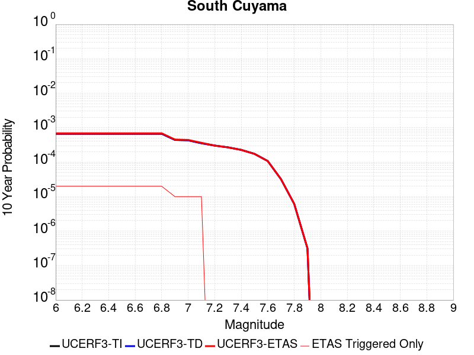 |

| Magnitude | 1 wk TI Prob | 1 wk TD Prob | 1 wk ETAS Prob | 1 wk ETAS/TD Gain | 1 wk ETAS Triggered Only | 1 mo TI Prob | 1 mo TD Prob | 1 mo ETAS Prob | 1 mo ETAS/TD Gain | 1 mo ETAS Triggered Only | 1 yr TI Prob | 1 yr TD Prob | 1 yr ETAS Prob | 1 yr ETAS/TD Gain | 1 yr ETAS Triggered Only | 10 yr TI Prob | 10 yr TD Prob | 10 yr ETAS Prob | 10 yr ETAS/TD Gain | 10 yr ETAS Triggered Only |
|-----|-----|-----|-----|-----|-----|-----|-----|-----|-----|-----|-----|-----|-----|-----|-----|-----|-----|-----|-----|-----|
| 6.0 | 1.2747308E-6 | 1.2818697E-6 | 2.1281845E-5 | 16.60219 | 2.0E-5 | 5.4631205E-6 | 5.4937163E-6 | 2.5493606E-5 | 4.640503 | 2.0E-5 | 6.6511464E-5 | 6.6884015E-5 | 8.6882676E-5 | 1.2990052 | 2.0E-5 | 6.649156E-4 | 6.686458E-4 | 6.886324E-4 | 1.0298913 | 2.0E-5 |
| 6.1 | 1.2747308E-6 | 1.2818697E-6 | 2.1281845E-5 | 16.60219 | 2.0E-5 | 5.4631205E-6 | 5.4937163E-6 | 2.5493606E-5 | 4.640503 | 2.0E-5 | 6.6511464E-5 | 6.6884015E-5 | 8.6882676E-5 | 1.2990052 | 2.0E-5 | 6.649156E-4 | 6.686458E-4 | 6.886324E-4 | 1.0298913 | 2.0E-5 |
| 6.2 | 1.2747308E-6 | 1.2818697E-6 | 2.1281845E-5 | 16.60219 | 2.0E-5 | 5.4631205E-6 | 5.4937163E-6 | 2.5493606E-5 | 4.640503 | 2.0E-5 | 6.6511464E-5 | 6.6884015E-5 | 8.6882676E-5 | 1.2990052 | 2.0E-5 | 6.649156E-4 | 6.686458E-4 | 6.886324E-4 | 1.0298913 | 2.0E-5 |
| 6.3 | 1.2747308E-6 | 1.2818697E-6 | 2.1281845E-5 | 16.60219 | 2.0E-5 | 5.4631205E-6 | 5.4937163E-6 | 2.5493606E-5 | 4.640503 | 2.0E-5 | 6.6511464E-5 | 6.6884015E-5 | 8.6882676E-5 | 1.2990052 | 2.0E-5 | 6.649156E-4 | 6.686458E-4 | 6.886324E-4 | 1.0298913 | 2.0E-5 |
| 6.4 | 1.2747308E-6 | 1.2818697E-6 | 2.1281845E-5 | 16.60219 | 2.0E-5 | 5.4631205E-6 | 5.4937163E-6 | 2.5493606E-5 | 4.640503 | 2.0E-5 | 6.6511464E-5 | 6.6884015E-5 | 8.6882676E-5 | 1.2990052 | 2.0E-5 | 6.649156E-4 | 6.686458E-4 | 6.886324E-4 | 1.0298913 | 2.0E-5 |
| 6.5 | 1.2747308E-6 | 1.2818697E-6 | 2.1281845E-5 | 16.60219 | 2.0E-5 | 5.4631205E-6 | 5.4937163E-6 | 2.5493606E-5 | 4.640503 | 2.0E-5 | 6.6511464E-5 | 6.6884015E-5 | 8.6882676E-5 | 1.2990052 | 2.0E-5 | 6.649156E-4 | 6.686458E-4 | 6.886324E-4 | 1.0298913 | 2.0E-5 |
| 6.6 | 1.2747308E-6 | 1.2818697E-6 | 2.1281845E-5 | 16.60219 | 2.0E-5 | 5.4631205E-6 | 5.4937163E-6 | 2.5493606E-5 | 4.640503 | 2.0E-5 | 6.6511464E-5 | 6.6884015E-5 | 8.6882676E-5 | 1.2990052 | 2.0E-5 | 6.649156E-4 | 6.686458E-4 | 6.886324E-4 | 1.0298913 | 2.0E-5 |
| 6.7 | 1.2747308E-6 | 1.2818697E-6 | 2.1281845E-5 | 16.60219 | 2.0E-5 | 5.4631205E-6 | 5.4937163E-6 | 2.5493606E-5 | 4.640503 | 2.0E-5 | 6.6511464E-5 | 6.6884015E-5 | 8.6882676E-5 | 1.2990052 | 2.0E-5 | 6.649156E-4 | 6.686458E-4 | 6.886324E-4 | 1.0298913 | 2.0E-5 |
| 6.8 | 1.2747308E-6 | 1.2818697E-6 | 2.1281845E-5 | 16.60219 | 2.0E-5 | 5.4631205E-6 | 5.4937163E-6 | 2.5493606E-5 | 4.640503 | 2.0E-5 | 6.6511464E-5 | 6.6884015E-5 | 8.6882676E-5 | 1.2990052 | 2.0E-5 | 6.649156E-4 | 6.686458E-4 | 6.886324E-4 | 1.0298913 | 2.0E-5 |
| 6.9 | 8.4566324E-7 | 8.507883E-7 | 1.085078E-5 | 12.753796 | 1.0E-5 | 3.624266E-6 | 3.6462304E-6 | 1.3646194E-5 | 3.7425485 | 1.0E-5 | 4.4124543E-5 | 4.439196E-5 | 5.4391516E-5 | 1.225256 | 1.0E-5 | 4.4115784E-4 | 4.4383196E-4 | 4.5382752E-4 | 1.022521 | 1.0E-5 |
| 7.0 | 8.2277904E-7 | 8.27782E-7 | 1.0827774E-5 | 13.080465 | 1.0E-5 | 3.526191E-6 | 3.5476323E-6 | 1.3547597E-5 | 3.8187714 | 1.0E-5 | 4.293053E-5 | 4.3191576E-5 | 5.3191146E-5 | 1.2315166 | 1.0E-5 | 4.292224E-4 | 4.3183283E-4 | 4.418285E-4 | 1.0231471 | 1.0E-5 |
| 7.1 | 6.7661887E-7 | 6.80913E-7 | 1.0680907E-5 | 15.686153 | 1.0E-5 | 2.899792E-6 | 2.9181954E-6 | 1.2918166E-5 | 4.4267654 | 1.0E-5 | 3.5304394E-5 | 3.5528454E-5 | 4.5528097E-5 | 1.2814546 | 1.0E-5 | 3.5298787E-4 | 3.552281E-4 | 3.6522458E-4 | 1.0281409 | 1.0E-5 |
| 7.2 | 5.783336E-7 | 5.8211907E-7 | 5.8211907E-7 | 1.0 | 0.0 | 2.4785702E-6 | 2.4947938E-6 | 2.4947938E-6 | 1.0 | 0.0 | 3.0176174E-5 | 3.0373692E-5 | 3.0373692E-5 | 1.0 | 0.0 | 3.0172078E-4 | 3.0369565E-4 | 3.0369565E-4 | 1.0 | 0.0 |
| 7.3 | 5.136759E-7 | 5.170938E-7 | 5.170938E-7 | 1.0 | 0.0 | 2.2014663E-6 | 2.2161144E-6 | 2.2161144E-6 | 1.0 | 0.0 | 2.6802521E-5 | 2.698086E-5 | 2.698086E-5 | 1.0 | 0.0 | 2.679929E-4 | 2.6977606E-4 | 2.6977606E-4 | 1.0 | 0.0 |
| 7.4 | 4.3370295E-7 | 4.3665364E-7 | 4.3665364E-7 | 1.0 | 0.0 | 1.8587256E-6 | 1.8713713E-6 | 1.8713713E-6 | 1.0 | 0.0 | 2.2629749E-5 | 2.278371E-5 | 2.278371E-5 | 1.0 | 0.0 | 2.2627445E-4 | 2.278139E-4 | 2.278139E-4 | 1.0 | 0.0 |
| 7.5 | 3.3242574E-7 | 3.3476465E-7 | 3.3476465E-7 | 1.0 | 0.0 | 1.4246809E-6 | 1.4347048E-6 | 1.4347048E-6 | 1.0 | 0.0 | 1.7345352E-5 | 1.7467393E-5 | 1.7467393E-5 | 1.0 | 0.0 | 1.7343998E-4 | 1.7466032E-4 | 1.7466032E-4 | 1.0 | 0.0 |
| 7.6 | 2.0627535E-7 | 2.07789E-7 | 2.07789E-7 | 1.0 | 0.0 | 8.840369E-7 | 8.90524E-7 | 8.90524E-7 | 1.0 | 0.0 | 1.0763096E-5 | 1.0842076E-5 | 1.0842076E-5 | 1.0 | 0.0 | 1.0762575E-4 | 1.0841556E-4 | 1.0841556E-4 | 1.0 | 0.0 |
| 7.7 | 6.15236E-8 | 6.1983044E-8 | 6.1983044E-8 | 1.0 | 0.0 | 2.6367252E-7 | 2.656416E-7 | 2.656416E-7 | 1.0 | 0.0 | 3.2102084E-6 | 3.2341818E-6 | 3.2341818E-6 | 1.0 | 0.0 | 3.210162E-5 | 3.234136E-5 | 3.234136E-5 | 1.0 | 0.0 |
| 7.8 | 1.1765573E-8 | 1.1873414E-8 | 1.1873414E-8 | 1.0 | 0.0 | 5.0423886E-8 | 5.0886058E-8 | 5.0886058E-8 | 1.0 | 0.0 | 6.1391063E-7 | 6.195376E-7 | 6.195376E-7 | 1.0 | 0.0 | 6.1390897E-6 | 6.19536E-6 | 6.19536E-6 | 1.0 | 0.0 |
| 7.9 | 6.0381755E-10 | 6.10058E-10 | 6.10058E-10 | 1.0 | 0.0 | 2.5877895E-9 | 2.614534E-9 | 2.614534E-9 | 1.0 | 0.0 | 3.1506335E-8 | 3.1831952E-8 | 3.1831952E-8 | 1.0 | 0.0 | 3.1506332E-7 | 3.183195E-7 | 3.183195E-7 | 1.0 | 0.0 |

## Mount Diablo Thrust South
*[(top)](#table-of-contents)*

| 1 Week | 1 Month | 1 Year | 10 Year |
|-----|-----|-----|-----|
|  |  |  |  |

| Magnitude | 1 wk TI Prob | 1 wk TD Prob | 1 wk ETAS Prob | 1 wk ETAS/TD Gain | 1 wk ETAS Triggered Only | 1 mo TI Prob | 1 mo TD Prob | 1 mo ETAS Prob | 1 mo ETAS/TD Gain | 1 mo ETAS Triggered Only | 1 yr TI Prob | 1 yr TD Prob | 1 yr ETAS Prob | 1 yr ETAS/TD Gain | 1 yr ETAS Triggered Only | 10 yr TI Prob | 10 yr TD Prob | 10 yr ETAS Prob | 10 yr ETAS/TD Gain | 10 yr ETAS Triggered Only |
|-----|-----|-----|-----|-----|-----|-----|-----|-----|-----|-----|-----|-----|-----|-----|-----|-----|-----|-----|-----|-----|
| 6.0 | 2.2377444E-5 | 2.695623E-5 | 4.695569E-5 | 1.7419235 | 2.0E-5 | 9.5899806E-5 | 1.1552271E-4 | 1.355204E-4 | 1.1731062 | 2.0E-5 | 0.0011669548 | 0.0014057803 | 0.0014257522 | 1.014207 | 2.0E-5 | 0.011608457 | 0.013988447 | 0.014008167 | 1.0014098 | 2.0E-5 |
| 6.1 | 2.2377444E-5 | 2.695623E-5 | 4.695569E-5 | 1.7419235 | 2.0E-5 | 9.5899806E-5 | 1.1552271E-4 | 1.355204E-4 | 1.1731062 | 2.0E-5 | 0.0011669548 | 0.0014057803 | 0.0014257522 | 1.014207 | 2.0E-5 | 0.011608457 | 0.013988447 | 0.014008167 | 1.0014098 | 2.0E-5 |
| 6.2 | 2.2377444E-5 | 2.695623E-5 | 4.695569E-5 | 1.7419235 | 2.0E-5 | 9.5899806E-5 | 1.1552271E-4 | 1.355204E-4 | 1.1731062 | 2.0E-5 | 0.0011669548 | 0.0014057803 | 0.0014257522 | 1.014207 | 2.0E-5 | 0.011608457 | 0.013988447 | 0.014008167 | 1.0014098 | 2.0E-5 |
| 6.3 | 2.2377444E-5 | 2.695623E-5 | 4.695569E-5 | 1.7419235 | 2.0E-5 | 9.5899806E-5 | 1.1552271E-4 | 1.355204E-4 | 1.1731062 | 2.0E-5 | 0.0011669548 | 0.0014057803 | 0.0014257522 | 1.014207 | 2.0E-5 | 0.011608457 | 0.013988447 | 0.014008167 | 1.0014098 | 2.0E-5 |
| 6.4 | 1.2228463E-5 | 1.4747655E-5 | 2.4747507E-5 | 1.6780639 | 1.0E-5 | 5.2406645E-5 | 6.320278E-5 | 7.320214E-5 | 1.1582109 | 1.0E-5 | 6.378641E-4 | 7.6923496E-4 | 7.7922724E-4 | 1.0129899 | 1.0E-5 | 0.0063603627 | 0.0076671084 | 0.0076770317 | 1.0012943 | 1.0E-5 |
| 6.5 | 1.2228463E-5 | 1.4747655E-5 | 2.4747507E-5 | 1.6780639 | 1.0E-5 | 5.2406645E-5 | 6.320278E-5 | 7.320214E-5 | 1.1582109 | 1.0E-5 | 6.378641E-4 | 7.6923496E-4 | 7.7922724E-4 | 1.0129899 | 1.0E-5 | 0.0063603627 | 0.0076671084 | 0.0076770317 | 1.0012943 | 1.0E-5 |
| 6.6 | 1.2068118E-5 | 1.4552453E-5 | 2.4552308E-5 | 1.6871594 | 1.0E-5 | 5.1719482E-5 | 6.2366234E-5 | 7.236561E-5 | 1.1603332 | 1.0E-5 | 6.2950276E-4 | 7.590571E-4 | 7.6904957E-4 | 1.0131643 | 1.0E-5 | 0.006277225 | 0.0075660287 | 0.007575953 | 1.0013117 | 1.0E-5 |
| 6.7 | 1.1499428E-5 | 1.3875117E-5 | 2.3874978E-5 | 1.7207047 | 1.0E-5 | 4.9282335E-5 | 5.94635E-5 | 6.9462905E-5 | 1.1681604 | 1.0E-5 | 5.9984723E-4 | 7.237403E-4 | 7.3373306E-4 | 1.013807 | 1.0E-5 | 0.0059823063 | 0.0072152023 | 0.0072251298 | 1.0013759 | 1.0E-5 |
| 6.8 | 8.82118E-6 | 1.0830408E-5 | 1.0830408E-5 | 1.0 | 0.0 | 3.780451E-5 | 4.641524E-5 | 4.641524E-5 | 1.0 | 0.0 | 4.601727E-4 | 5.6496455E-4 | 5.6496455E-4 | 1.0 | 0.0 | 0.0045922096 | 0.005635934 | 0.005635934 | 1.0 | 0.0 |
| 6.9 | 8.047112E-6 | 9.9393765E-6 | 9.9393765E-6 | 1.0 | 0.0 | 3.4487166E-5 | 4.259666E-5 | 4.259666E-5 | 1.0 | 0.0 | 4.1980037E-4 | 5.1849615E-4 | 5.1849615E-4 | 1.0 | 0.0 | 0.004190082 | 0.0051734787 | 0.0051734787 | 1.0 | 0.0 |
| 7.0 | 6.2574763E-6 | 7.748453E-6 | 7.748453E-6 | 1.0 | 0.0 | 2.681748E-5 | 3.3207252E-5 | 3.3207252E-5 | 1.0 | 0.0 | 3.264539E-4 | 4.0422694E-4 | 4.0422694E-4 | 1.0 | 0.0 | 0.0032597475 | 0.004035359 | 0.004035359 | 1.0 | 0.0 |
| 7.1 | 3.6485903E-6 | 4.512883E-6 | 4.512883E-6 | 1.0 | 0.0 | 1.5636722E-5 | 1.9340787E-5 | 1.9340787E-5 | 1.0 | 0.0 | 1.9036046E-4 | 2.3544904E-4 | 2.3544904E-4 | 1.0 | 0.0 | 0.0019019748 | 0.0023520947 | 0.0023520947 | 1.0 | 0.0 |
| 7.2 | 2.3034274E-6 | 2.9054847E-6 | 2.9054847E-6 | 1.0 | 0.0 | 9.871795E-6 | 1.2452019E-5 | 1.2452019E-5 | 1.0 | 0.0 | 1.2018247E-4 | 1.5159303E-4 | 1.5159303E-4 | 1.0 | 0.0 | 0.0012011749 | 0.0015149695 | 0.0015149695 | 1.0 | 0.0 |
| 7.3 | 1.224035E-6 | 1.567953E-6 | 1.567953E-6 | 1.0 | 0.0 | 5.245854E-6 | 6.7197816E-6 | 6.7197816E-6 | 1.0 | 0.0 | 6.38664E-5 | 8.181038E-5 | 8.181038E-5 | 1.0 | 0.0 | 6.384805E-4 | 8.1784575E-4 | 8.1784575E-4 | 1.0 | 0.0 |
| 7.4 | 5.1601154E-7 | 6.72323E-7 | 6.72323E-7 | 1.0 | 0.0 | 2.2114762E-6 | 2.8813813E-6 | 2.8813813E-6 | 1.0 | 0.0 | 2.6924388E-5 | 3.508027E-5 | 3.508027E-5 | 1.0 | 0.0 | 2.6921128E-4 | 3.507647E-4 | 3.507647E-4 | 1.0 | 0.0 |
| 7.5 | 3.552894E-7 | 4.6652323E-7 | 4.6652323E-7 | 1.0 | 0.0 | 1.5226678E-6 | 1.9993838E-6 | 1.9993838E-6 | 1.0 | 0.0 | 1.8538323E-5 | 2.434224E-5 | 2.434224E-5 | 1.0 | 0.0 | 1.8536777E-4 | 2.4340794E-4 | 2.4340794E-4 | 1.0 | 0.0 |
| 7.6 | 1.3124082E-7 | 1.7191535E-7 | 1.7191535E-7 | 1.0 | 0.0 | 5.6246057E-7 | 7.367799E-7 | 7.367799E-7 | 1.0 | 0.0 | 6.8479358E-6 | 8.970267E-6 | 8.970267E-6 | 1.0 | 0.0 | 6.8477246E-5 | 8.9703215E-5 | 8.9703215E-5 | 1.0 | 0.0 |
| 7.7 | 3.6193022E-8 | 4.733273E-8 | 4.733273E-8 | 1.0 | 0.0 | 1.5511293E-7 | 2.0285455E-7 | 2.0285455E-7 | 1.0 | 0.0 | 1.8884983E-6 | 2.4697524E-6 | 2.4697524E-6 | 1.0 | 0.0 | 1.8884823E-5 | 2.4697838E-5 | 2.4697838E-5 | 1.0 | 0.0 |

## Elsinore (Temecula) rev
*[(top)](#table-of-contents)*

| 1 Week | 1 Month | 1 Year | 10 Year |
|-----|-----|-----|-----|
|  |  |  |  |

| Magnitude | 1 wk TI Prob | 1 wk TD Prob | 1 wk ETAS Prob | 1 wk ETAS/TD Gain | 1 wk ETAS Triggered Only | 1 mo TI Prob | 1 mo TD Prob | 1 mo ETAS Prob | 1 mo ETAS/TD Gain | 1 mo ETAS Triggered Only | 1 yr TI Prob | 1 yr TD Prob | 1 yr ETAS Prob | 1 yr ETAS/TD Gain | 1 yr ETAS Triggered Only | 10 yr TI Prob | 10 yr TD Prob | 10 yr ETAS Prob | 10 yr ETAS/TD Gain | 10 yr ETAS Triggered Only |
|-----|-----|-----|-----|-----|-----|-----|-----|-----|-----|-----|-----|-----|-----|-----|-----|-----|-----|-----|-----|-----|
| 6.0 | 2.9514995E-5 | 2.2517117E-5 | 4.2516665E-5 | 1.8881932 | 2.0E-5 | 1.264867E-4 | 9.649849E-5 | 1.1649655E-4 | 1.2072371 | 2.0E-5 | 0.0015388876 | 0.0011742581 | 0.0011942346 | 1.017012 | 2.0E-5 | 0.015282745 | 0.011696897 | 0.011716664 | 1.0016899 | 2.0E-5 |
| 6.1 | 2.9514995E-5 | 2.2517117E-5 | 4.2516665E-5 | 1.8881932 | 2.0E-5 | 1.264867E-4 | 9.649849E-5 | 1.1649655E-4 | 1.2072371 | 2.0E-5 | 0.0015388876 | 0.0011742581 | 0.0011942346 | 1.017012 | 2.0E-5 | 0.015282745 | 0.011696897 | 0.011716664 | 1.0016899 | 2.0E-5 |
| 6.2 | 2.9514995E-5 | 2.2517117E-5 | 4.2516665E-5 | 1.8881932 | 2.0E-5 | 1.264867E-4 | 9.649849E-5 | 1.1649655E-4 | 1.2072371 | 2.0E-5 | 0.0015388876 | 0.0011742581 | 0.0011942346 | 1.017012 | 2.0E-5 | 0.015282745 | 0.011696897 | 0.011716664 | 1.0016899 | 2.0E-5 |
| 6.3 | 2.3223649E-5 | 1.8406454E-5 | 1.8406454E-5 | 1.0 | 0.0 | 9.952613E-5 | 7.888251E-5 | 7.888251E-5 | 1.0 | 0.0 | 0.001211057 | 9.599888E-4 | 9.599888E-4 | 1.0 | 0.0 | 0.012044783 | 0.009569948 | 0.009569948 | 1.0 | 0.0 |
| 6.4 | 2.3223649E-5 | 1.8406454E-5 | 1.8406454E-5 | 1.0 | 0.0 | 9.952613E-5 | 7.888251E-5 | 7.888251E-5 | 1.0 | 0.0 | 0.001211057 | 9.599888E-4 | 9.599888E-4 | 1.0 | 0.0 | 0.012044783 | 0.009569948 | 0.009569948 | 1.0 | 0.0 |
| 6.5 | 1.8338875E-5 | 1.4750118E-5 | 1.4750118E-5 | 1.0 | 0.0 | 7.8592806E-5 | 6.321331E-5 | 6.321331E-5 | 1.0 | 0.0 | 9.5644733E-4 | 7.69359E-4 | 7.69359E-4 | 1.0 | 0.0 | 0.009523412 | 0.0076739118 | 0.0076739118 | 1.0 | 0.0 |
| 6.6 | 1.8223333E-5 | 1.4612673E-5 | 1.4612673E-5 | 1.0 | 0.0 | 7.809766E-5 | 6.262429E-5 | 6.262429E-5 | 1.0 | 0.0 | 9.504242E-4 | 7.6219277E-4 | 7.6219277E-4 | 1.0 | 0.0 | 0.009463696 | 0.0076027405 | 0.0076027405 | 1.0 | 0.0 |
| 6.7 | 1.7512752E-5 | 1.402721E-5 | 1.402721E-5 | 1.0 | 0.0 | 7.505249E-5 | 6.011528E-5 | 6.011528E-5 | 1.0 | 0.0 | 9.13381E-4 | 7.3166634E-4 | 7.3166634E-4 | 1.0 | 0.0 | 0.00909636 | 0.00729892 | 0.00729892 | 1.0 | 0.0 |
| 6.8 | 1.7417142E-5 | 1.3951195E-5 | 1.3951195E-5 | 1.0 | 0.0 | 7.4642754E-5 | 5.9789512E-5 | 5.9789512E-5 | 1.0 | 0.0 | 9.083966E-4 | 7.277028E-4 | 7.277028E-4 | 1.0 | 0.0 | 0.009046922 | 0.0072594886 | 0.0072594886 | 1.0 | 0.0 |
| 6.9 | 1.6402591E-5 | 1.2988613E-5 | 1.2988613E-5 | 1.0 | 0.0 | 7.0294926E-5 | 5.5664343E-5 | 5.5664343E-5 | 1.0 | 0.0 | 8.5550465E-4 | 6.775103E-4 | 6.775103E-4 | 1.0 | 0.0 | 0.008522186 | 0.006760169 | 0.006760169 | 1.0 | 0.0 |
| 7.0 | 1.3912486E-5 | 1.0878233E-5 | 1.0878233E-5 | 1.0 | 0.0 | 5.9623577E-5 | 4.6620182E-5 | 4.6620182E-5 | 1.0 | 0.0 | 7.2567526E-4 | 5.674556E-4 | 5.674556E-4 | 1.0 | 0.0 | 0.0072331014 | 0.005663986 | 0.005663986 | 1.0 | 0.0 |
| 7.1 | 1.3405147E-5 | 1.03274215E-5 | 1.03274215E-5 | 1.0 | 0.0 | 5.7449364E-5 | 4.425964E-5 | 4.425964E-5 | 1.0 | 0.0 | 6.9922156E-4 | 5.3873047E-4 | 5.3873047E-4 | 1.0 | 0.0 | 0.0069702556 | 0.005377577 | 0.005377577 | 1.0 | 0.0 |
| 7.2 | 1.21402E-5 | 8.996737E-6 | 8.996737E-6 | 1.0 | 0.0 | 5.202839E-5 | 3.8556886E-5 | 3.8556886E-5 | 1.0 | 0.0 | 6.332616E-4 | 4.6933076E-4 | 4.6933076E-4 | 1.0 | 0.0 | 0.0063146 | 0.004684821 | 0.004684821 | 1.0 | 0.0 |
| 7.3 | 1.05047775E-5 | 7.571771E-6 | 7.571771E-6 | 1.0 | 0.0 | 4.5019697E-5 | 3.245005E-5 | 3.245005E-5 | 1.0 | 0.0 | 5.4797693E-4 | 3.950092E-4 | 3.950092E-4 | 1.0 | 0.0 | 0.005466277 | 0.00394346 | 0.00394346 | 1.0 | 0.0 |
| 7.4 | 9.624483E-6 | 6.7868696E-6 | 6.7868696E-6 | 1.0 | 0.0 | 4.124713E-5 | 2.9086266E-5 | 2.9086266E-5 | 1.0 | 0.0 | 5.0206814E-4 | 3.5406914E-4 | 3.5406914E-4 | 1.0 | 0.0 | 0.005009353 | 0.003535204 | 0.003535204 | 1.0 | 0.0 |
| 7.5 | 8.215151E-6 | 5.635538E-6 | 5.635538E-6 | 1.0 | 0.0 | 3.5207315E-5 | 2.4152088E-5 | 2.4152088E-5 | 1.0 | 0.0 | 4.2856473E-4 | 2.9401327E-4 | 2.9401327E-4 | 1.0 | 0.0 | 0.004277392 | 0.002936371 | 0.002936371 | 1.0 | 0.0 |
| 7.6 | 6.975058E-6 | 4.676045E-6 | 4.676045E-6 | 1.0 | 0.0 | 2.9892764E-5 | 2.0040046E-5 | 2.0040046E-5 | 1.0 | 0.0 | 3.6388362E-4 | 2.439614E-4 | 2.439614E-4 | 1.0 | 0.0 | 0.0036328835 | 0.002437052 | 0.002437052 | 1.0 | 0.0 |
| 7.7 | 4.159604E-6 | 2.3269924E-6 | 2.3269924E-6 | 1.0 | 0.0 | 1.7826753E-5 | 9.97279E-6 | 9.97279E-6 | 1.0 | 0.0 | 2.1701909E-4 | 1.21412704E-4 | 1.21412704E-4 | 1.0 | 0.0 | 0.0021680726 | 0.0012135367 | 0.0012135367 | 1.0 | 0.0 |
| 7.8 | 2.2692414E-7 | 9.3854695E-8 | 9.3854695E-8 | 1.0 | 0.0 | 9.725317E-7 | 4.0223435E-7 | 4.0223435E-7 | 1.0 | 0.0 | 1.1840509E-5 | 4.8971956E-6 | 4.8971956E-6 | 1.0 | 0.0 | 1.1839878E-4 | 4.8971204E-5 | 4.8971204E-5 | 1.0 | 0.0 |
| 7.9 | 6.676829E-9 | 3.439853E-9 | 3.439853E-9 | 1.0 | 0.0 | 2.861498E-8 | 1.4742227E-8 | 1.4742227E-8 | 1.0 | 0.0 | 3.4838732E-7 | 1.7948659E-7 | 1.7948659E-7 | 1.0 | 0.0 | 3.4838679E-6 | 1.7948646E-6 | 1.7948646E-6 | 1.0 | 0.0 |

## San Gorgonio Pass
*[(top)](#table-of-contents)*

| 1 Week | 1 Month | 1 Year | 10 Year |
|-----|-----|-----|-----|
|  |  |  |  |

| Magnitude | 1 wk TI Prob | 1 wk TD Prob | 1 wk ETAS Prob | 1 wk ETAS/TD Gain | 1 wk ETAS Triggered Only | 1 mo TI Prob | 1 mo TD Prob | 1 mo ETAS Prob | 1 mo ETAS/TD Gain | 1 mo ETAS Triggered Only | 1 yr TI Prob | 1 yr TD Prob | 1 yr ETAS Prob | 1 yr ETAS/TD Gain | 1 yr ETAS Triggered Only | 10 yr TI Prob | 10 yr TD Prob | 10 yr ETAS Prob | 10 yr ETAS/TD Gain | 10 yr ETAS Triggered Only |
|-----|-----|-----|-----|-----|-----|-----|-----|-----|-----|-----|-----|-----|-----|-----|-----|-----|-----|-----|-----|-----|
| 6.0 | 7.644328E-6 | 1.3314231E-5 | 2.3314098E-5 | 1.751066 | 1.0E-5 | 3.2760996E-5 | 5.705979E-5 | 6.705922E-5 | 1.1752448 | 1.0E-5 | 3.987921E-4 | 6.944901E-4 | 7.044832E-4 | 1.014389 | 1.0E-5 | 0.003980772 | 0.0069299806 | 0.006949842 | 1.002866 | 2.0E-5 |
| 6.1 | 7.644328E-6 | 1.3314231E-5 | 2.3314098E-5 | 1.751066 | 1.0E-5 | 3.2760996E-5 | 5.705979E-5 | 6.705922E-5 | 1.1752448 | 1.0E-5 | 3.987921E-4 | 6.944901E-4 | 7.044832E-4 | 1.014389 | 1.0E-5 | 0.003980772 | 0.0069299806 | 0.006949842 | 1.002866 | 2.0E-5 |
| 6.2 | 7.644328E-6 | 1.3314231E-5 | 2.3314098E-5 | 1.751066 | 1.0E-5 | 3.2760996E-5 | 5.705979E-5 | 6.705922E-5 | 1.1752448 | 1.0E-5 | 3.987921E-4 | 6.944901E-4 | 7.044832E-4 | 1.014389 | 1.0E-5 | 0.003980772 | 0.0069299806 | 0.006949842 | 1.002866 | 2.0E-5 |
| 6.3 | 7.644328E-6 | 1.3314231E-5 | 2.3314098E-5 | 1.751066 | 1.0E-5 | 3.2760996E-5 | 5.705979E-5 | 6.705922E-5 | 1.1752448 | 1.0E-5 | 3.987921E-4 | 6.944901E-4 | 7.044832E-4 | 1.014389 | 1.0E-5 | 0.003980772 | 0.0069299806 | 0.006949842 | 1.002866 | 2.0E-5 |
| 6.4 | 7.644328E-6 | 1.3314231E-5 | 2.3314098E-5 | 1.751066 | 1.0E-5 | 3.2760996E-5 | 5.705979E-5 | 6.705922E-5 | 1.1752448 | 1.0E-5 | 3.987921E-4 | 6.944901E-4 | 7.044832E-4 | 1.014389 | 1.0E-5 | 0.003980772 | 0.0069299806 | 0.006949842 | 1.002866 | 2.0E-5 |
| 6.5 | 7.644328E-6 | 1.3314231E-5 | 2.3314098E-5 | 1.751066 | 1.0E-5 | 3.2760996E-5 | 5.705979E-5 | 6.705922E-5 | 1.1752448 | 1.0E-5 | 3.987921E-4 | 6.944901E-4 | 7.044832E-4 | 1.014389 | 1.0E-5 | 0.003980772 | 0.0069299806 | 0.006949842 | 1.002866 | 2.0E-5 |
| 6.6 | 7.644328E-6 | 1.3314231E-5 | 2.3314098E-5 | 1.751066 | 1.0E-5 | 3.2760996E-5 | 5.705979E-5 | 6.705922E-5 | 1.1752448 | 1.0E-5 | 3.987921E-4 | 6.944901E-4 | 7.044832E-4 | 1.014389 | 1.0E-5 | 0.003980772 | 0.0069299806 | 0.006949842 | 1.002866 | 2.0E-5 |
| 6.7 | 6.987586E-6 | 1.2618505E-5 | 2.2618378E-5 | 1.7924769 | 1.0E-5 | 2.9946454E-5 | 5.4078235E-5 | 6.407769E-5 | 1.1849073 | 1.0E-5 | 3.645371E-4 | 6.582117E-4 | 6.6820515E-4 | 1.0151827 | 1.0E-5 | 0.0036393967 | 0.0065693567 | 0.0065892255 | 1.0030245 | 2.0E-5 |
| 6.8 | 6.987586E-6 | 1.2618505E-5 | 2.2618378E-5 | 1.7924769 | 1.0E-5 | 2.9946454E-5 | 5.4078235E-5 | 6.407769E-5 | 1.1849073 | 1.0E-5 | 3.645371E-4 | 6.582117E-4 | 6.6820515E-4 | 1.0151827 | 1.0E-5 | 0.0036393967 | 0.0065693567 | 0.0065892255 | 1.0030245 | 2.0E-5 |
| 6.9 | 5.504702E-6 | 1.1049368E-5 | 2.1049258E-5 | 1.905019 | 1.0E-5 | 2.3591367E-5 | 4.7353606E-5 | 5.7353132E-5 | 1.2111672 | 1.0E-5 | 2.8718702E-4 | 5.7638274E-4 | 5.8637693E-4 | 1.0173396 | 1.0E-5 | 0.0028681618 | 0.005755309 | 0.005775194 | 1.003455 | 2.0E-5 |
| 7.0 | 5.4825764E-6 | 1.102571E-5 | 2.1025598E-5 | 1.9069611 | 1.0E-5 | 2.3496545E-5 | 4.7252215E-5 | 5.7251742E-5 | 1.2116203 | 1.0E-5 | 2.8603288E-4 | 5.751489E-4 | 5.8514316E-4 | 1.0173768 | 1.0E-5 | 0.00285665 | 0.005743035 | 0.0057629202 | 1.0034624 | 2.0E-5 |
| 7.1 | 5.4692787E-6 | 1.101142E-5 | 2.101131E-5 | 1.9081382 | 1.0E-5 | 2.3439556E-5 | 4.7190973E-5 | 5.71905E-5 | 1.211895 | 1.0E-5 | 2.8533922E-4 | 5.744037E-4 | 5.8439793E-4 | 1.0173993 | 1.0E-5 | 0.0028497311 | 0.0057356213 | 0.0057555065 | 1.003467 | 2.0E-5 |
| 7.2 | 5.453661E-6 | 1.0994446E-5 | 2.0994336E-5 | 1.9095402 | 1.0E-5 | 2.3372622E-5 | 4.7118232E-5 | 5.7117762E-5 | 1.2122221 | 1.0E-5 | 2.8452452E-4 | 5.7351857E-4 | 5.835128E-4 | 1.0174263 | 1.0E-5 | 0.002841605 | 0.0057268157 | 0.005746701 | 1.0034723 | 2.0E-5 |
| 7.3 | 5.4422303E-6 | 1.0981369E-5 | 2.0981259E-5 | 1.9106232 | 1.0E-5 | 2.3323635E-5 | 4.706219E-5 | 5.706172E-5 | 1.2124748 | 1.0E-5 | 2.8392827E-4 | 5.728366E-4 | 5.8283086E-4 | 1.017447 | 1.0E-5 | 0.0028356577 | 0.005720031 | 0.0057399166 | 1.0034765 | 2.0E-5 |
| 7.4 | 5.398595E-6 | 1.0928734E-5 | 2.0928625E-5 | 1.915009 | 1.0E-5 | 2.313663E-5 | 4.683662E-5 | 5.683615E-5 | 1.2134981 | 1.0E-5 | 2.8165206E-4 | 5.700917E-4 | 5.80086E-4 | 1.017531 | 1.0E-5 | 0.0028129534 | 0.005692723 | 0.0057126097 | 1.0034933 | 2.0E-5 |
| 7.5 | 5.3578788E-6 | 1.0855281E-5 | 2.0855172E-5 | 1.9212006 | 1.0E-5 | 2.2962136E-5 | 4.6521833E-5 | 5.6521367E-5 | 1.2149428 | 1.0E-5 | 2.7952815E-4 | 5.662612E-4 | 5.762555E-4 | 1.0176497 | 1.0E-5 | 0.002791768 | 0.0056546377 | 0.0056745247 | 1.0035169 | 2.0E-5 |
| 7.6 | 4.8091474E-6 | 9.60368E-6 | 1.9603583E-5 | 2.0412576 | 1.0E-5 | 2.0610469E-5 | 4.1158008E-5 | 5.1157596E-5 | 1.242956 | 1.0E-5 | 2.5090357E-4 | 5.0098833E-4 | 5.1098334E-4 | 1.0199505 | 1.0E-5 | 0.0025062046 | 0.0050053033 | 0.0050252033 | 1.0039757 | 2.0E-5 |
| 7.7 | 1.5991155E-6 | 3.352866E-6 | 1.3352833E-5 | 3.982513 | 1.0E-5 | 6.853334E-6 | 1.4369349E-5 | 2.4369205E-5 | 1.6959158 | 1.0E-5 | 8.343615E-5 | 1.7493303E-4 | 1.8493128E-4 | 1.0571548 | 1.0E-5 | 8.340483E-4 | 0.0017534072 | 0.0017733722 | 1.0113864 | 2.0E-5 |
| 7.8 | 9.258398E-7 | 2.0579948E-6 | 2.0579948E-6 | 1.0 | 0.0 | 3.967879E-6 | 8.819949E-6 | 8.819949E-6 | 1.0 | 0.0 | 4.8307855E-5 | 1.073776E-4 | 1.073776E-4 | 1.0 | 0.0 | 4.8297356E-4 | 0.001078687 | 0.0010886762 | 1.0092605 | 1.0E-5 |
| 7.9 | 5.975575E-7 | 1.2291794E-6 | 1.2291794E-6 | 1.0 | 0.0 | 2.5609581E-6 | 5.2679006E-6 | 5.2679006E-6 | 1.0 | 0.0 | 3.117922E-5 | 6.4134816E-5 | 6.4134816E-5 | 1.0 | 0.0 | 3.1174847E-4 | 6.463092E-4 | 6.463092E-4 | 1.0 | 0.0 |
| 8.0 | 3.4413725E-7 | 6.7148494E-7 | 6.7148494E-7 | 1.0 | 0.0 | 1.4748731E-6 | 2.8777895E-6 | 2.8777895E-6 | 1.0 | 0.0 | 1.7956432E-5 | 3.503653E-5 | 3.503653E-5 | 1.0 | 0.0 | 1.7954981E-4 | 3.5373896E-4 | 3.5373896E-4 | 1.0 | 0.0 |
| 8.1 | 1.1787731E-8 | 9.634385E-9 | 9.634385E-9 | 1.0 | 0.0 | 5.0518846E-8 | 4.129022E-8 | 4.129022E-8 | 1.0 | 0.0 | 6.1506677E-7 | 5.027083E-7 | 5.027083E-7 | 1.0 | 0.0 | 6.1506507E-6 | 5.2424944E-6 | 5.2424944E-6 | 1.0 | 0.0 |

## Great Valley 10 (Panoche)
*[(top)](#table-of-contents)*

| 1 Week | 1 Month | 1 Year | 10 Year |
|-----|-----|-----|-----|
|  |  |  |  |

| Magnitude | 1 wk TI Prob | 1 wk TD Prob | 1 wk ETAS Prob | 1 wk ETAS/TD Gain | 1 wk ETAS Triggered Only | 1 mo TI Prob | 1 mo TD Prob | 1 mo ETAS Prob | 1 mo ETAS/TD Gain | 1 mo ETAS Triggered Only | 1 yr TI Prob | 1 yr TD Prob | 1 yr ETAS Prob | 1 yr ETAS/TD Gain | 1 yr ETAS Triggered Only | 10 yr TI Prob | 10 yr TD Prob | 10 yr ETAS Prob | 10 yr ETAS/TD Gain | 10 yr ETAS Triggered Only |
|-----|-----|-----|-----|-----|-----|-----|-----|-----|-----|-----|-----|-----|-----|-----|-----|-----|-----|-----|-----|-----|
| 6.0 | 1.6014626E-5 | 1.6575399E-5 | 1.6575399E-5 | 1.0 | 0.0 | 6.863231E-5 | 7.103552E-5 | 7.103552E-5 | 1.0 | 0.0 | 8.35278E-4 | 8.645185E-4 | 8.7450986E-4 | 1.0115571 | 1.0E-5 | 0.008321454 | 0.008612172 | 0.008632 | 1.0023023 | 2.0E-5 |
| 6.1 | 1.6014626E-5 | 1.6575399E-5 | 1.6575399E-5 | 1.0 | 0.0 | 6.863231E-5 | 7.103552E-5 | 7.103552E-5 | 1.0 | 0.0 | 8.35278E-4 | 8.645185E-4 | 8.7450986E-4 | 1.0115571 | 1.0E-5 | 0.008321454 | 0.008612172 | 0.008632 | 1.0023023 | 2.0E-5 |
| 6.2 | 1.56782E-5 | 1.6198446E-5 | 1.6198446E-5 | 1.0 | 0.0 | 6.719056E-5 | 6.94201E-5 | 6.94201E-5 | 1.0 | 0.0 | 8.17738E-4 | 8.4486604E-4 | 8.548576E-4 | 1.0118262 | 1.0E-5 | 0.008147354 | 0.008417147 | 0.008436979 | 1.002356 | 2.0E-5 |
| 6.3 | 1.5263338E-5 | 1.5723514E-5 | 1.5723514E-5 | 1.0 | 0.0 | 6.541267E-5 | 6.738478E-5 | 6.738478E-5 | 1.0 | 0.0 | 7.961082E-4 | 8.201049E-4 | 8.300967E-4 | 1.0121835 | 1.0E-5 | 0.007932622 | 0.008171377 | 0.008191213 | 1.0024276 | 2.0E-5 |
| 6.4 | 1.4720723E-5 | 1.5099376E-5 | 1.5099376E-5 | 1.0 | 0.0 | 6.308728E-5 | 6.471004E-5 | 6.471004E-5 | 1.0 | 0.0 | 7.67817E-4 | 7.8756385E-4 | 7.9755596E-4 | 1.0126873 | 1.0E-5 | 0.007651695 | 0.007848303 | 0.007868146 | 1.0025283 | 2.0E-5 |
| 6.5 | 1.408264E-5 | 1.4355969E-5 | 1.4355969E-5 | 1.0 | 0.0 | 6.0352773E-5 | 6.1524166E-5 | 6.1524166E-5 | 1.0 | 0.0 | 7.3454727E-4 | 7.488031E-4 | 7.587956E-4 | 1.0133446 | 1.0E-5 | 0.0073212404 | 0.0074633555 | 0.0074832067 | 1.0026598 | 2.0E-5 |
| 6.6 | 1.3197086E-5 | 1.3321889E-5 | 1.3321889E-5 | 1.0 | 0.0 | 5.6557717E-5 | 5.709259E-5 | 5.709259E-5 | 1.0 | 0.0 | 6.8837265E-4 | 6.9488434E-4 | 6.9488434E-4 | 1.0 | 0.0 | 0.006862442 | 0.0069276537 | 0.0069375844 | 1.0014335 | 1.0E-5 |
| 6.7 | 1.017583E-5 | 9.745382E-6 | 9.745382E-6 | 1.0 | 0.0 | 4.360997E-5 | 4.176527E-5 | 4.176527E-5 | 1.0 | 0.0 | 5.30822E-4 | 5.0837593E-4 | 5.0837593E-4 | 1.0 | 0.0 | 0.0052955584 | 0.005072382 | 0.005072382 | 1.0 | 0.0 |
| 6.8 | 8.557912E-6 | 7.872707E-6 | 7.872707E-6 | 1.0 | 0.0 | 3.667625E-5 | 3.373975E-5 | 3.373975E-5 | 1.0 | 0.0 | 4.4644187E-4 | 4.1070607E-4 | 4.1070607E-4 | 1.0 | 0.0 | 0.0044554602 | 0.004099677 | 0.004099677 | 1.0 | 0.0 |
| 6.9 | 6.14664E-6 | 5.092071E-6 | 5.092071E-6 | 1.0 | 0.0 | 2.6342475E-5 | 2.1822989E-5 | 2.1822989E-5 | 1.0 | 0.0 | 3.2067244E-4 | 2.6566387E-4 | 2.6566387E-4 | 1.0 | 0.0 | 0.003202101 | 0.002653601 | 0.002653601 | 1.0 | 0.0 |
| 7.0 | 3.2310581E-6 | 1.6951219E-6 | 1.6951219E-6 | 1.0 | 0.0 | 1.3847319E-5 | 7.264788E-6 | 7.264788E-6 | 1.0 | 0.0 | 1.6857806E-4 | 8.8445304E-5 | 8.8445304E-5 | 1.0 | 0.0 | 0.0016845023 | 8.841104E-4 | 8.841104E-4 | 1.0 | 0.0 |
| 7.1 | 2.544492E-6 | 9.1889206E-7 | 9.1889206E-7 | 1.0 | 0.0 | 1.090492E-5 | 3.938103E-6 | 3.938103E-6 | 1.0 | 0.0 | 1.327593E-4 | 4.79454E-5 | 4.79454E-5 | 1.0 | 0.0 | 0.0013268003 | 4.793553E-4 | 4.793553E-4 | 1.0 | 0.0 |
| 7.2 | 2.4479045E-6 | 8.841304E-7 | 8.841304E-7 | 1.0 | 0.0 | 1.0490977E-5 | 3.789125E-6 | 3.789125E-6 | 1.0 | 0.0 | 1.2772017E-4 | 4.6131667E-5 | 4.6131667E-5 | 1.0 | 0.0 | 0.0012764678 | 4.6122566E-4 | 4.6122566E-4 | 1.0 | 0.0 |
| 7.3 | 2.0559578E-6 | 7.892787E-7 | 7.892787E-7 | 1.0 | 0.0 | 8.811218E-6 | 3.3826188E-6 | 3.3826188E-6 | 1.0 | 0.0 | 1.072713E-4 | 4.1182655E-5 | 4.1182655E-5 | 1.0 | 0.0 | 0.0010721954 | 4.1175485E-4 | 4.1175485E-4 | 1.0 | 0.0 |
| 7.4 | 1.727687E-6 | 7.387757E-7 | 7.387757E-7 | 1.0 | 0.0 | 7.404352E-6 | 3.1661782E-6 | 3.1661782E-6 | 1.0 | 0.0 | 9.0144255E-5 | 3.8547583E-5 | 3.8547583E-5 | 1.0 | 0.0 | 9.0107694E-4 | 3.854136E-4 | 3.854136E-4 | 1.0 | 0.0 |
| 7.5 | 1.5002679E-6 | 6.546144E-7 | 6.546144E-7 | 1.0 | 0.0 | 6.4297037E-6 | 2.8054874E-6 | 2.8054874E-6 | 1.0 | 0.0 | 7.827883E-5 | 3.4156317E-5 | 3.4156317E-5 | 1.0 | 0.0 | 7.825126E-4 | 3.4151482E-4 | 3.4151482E-4 | 1.0 | 0.0 |

## Calaveras (No) 2011 CFM
*[(top)](#table-of-contents)*

| 1 Week | 1 Month | 1 Year | 10 Year |
|-----|-----|-----|-----|
|  |  |  |  |

| Magnitude | 1 wk TI Prob | 1 wk TD Prob | 1 wk ETAS Prob | 1 wk ETAS/TD Gain | 1 wk ETAS Triggered Only | 1 mo TI Prob | 1 mo TD Prob | 1 mo ETAS Prob | 1 mo ETAS/TD Gain | 1 mo ETAS Triggered Only | 1 yr TI Prob | 1 yr TD Prob | 1 yr ETAS Prob | 1 yr ETAS/TD Gain | 1 yr ETAS Triggered Only | 10 yr TI Prob | 10 yr TD Prob | 10 yr ETAS Prob | 10 yr ETAS/TD Gain | 10 yr ETAS Triggered Only |
|-----|-----|-----|-----|-----|-----|-----|-----|-----|-----|-----|-----|-----|-----|-----|-----|-----|-----|-----|-----|-----|
| 6.0 | 4.8694856E-5 | 6.747121E-5 | 6.747121E-5 | 1.0 | 0.0 | 2.0867554E-4 | 2.8913133E-4 | 2.8913133E-4 | 1.0 | 0.0 | 0.0025376645 | 0.003514627 | 0.003524592 | 1.0028353 | 1.0E-5 | 0.02508881 | 0.034771245 | 0.03479055 | 1.0005552 | 2.0E-5 |
| 6.1 | 4.8694856E-5 | 6.747121E-5 | 6.747121E-5 | 1.0 | 0.0 | 2.0867554E-4 | 2.8913133E-4 | 2.8913133E-4 | 1.0 | 0.0 | 0.0025376645 | 0.003514627 | 0.003524592 | 1.0028353 | 1.0E-5 | 0.02508881 | 0.034771245 | 0.03479055 | 1.0005552 | 2.0E-5 |
| 6.2 | 4.7541962E-5 | 6.580218E-5 | 6.580218E-5 | 1.0 | 0.0 | 2.0373536E-4 | 2.8197994E-4 | 2.8197994E-4 | 1.0 | 0.0 | 0.0024776561 | 0.003427859 | 0.0034378245 | 1.0029073 | 1.0E-5 | 0.024502134 | 0.033932675 | 0.033951998 | 1.0005693 | 2.0E-5 |
| 6.3 | 4.6717287E-5 | 6.4635555E-5 | 6.4635555E-5 | 1.0 | 0.0 | 2.0020158E-4 | 2.7698115E-4 | 2.7698115E-4 | 1.0 | 0.0 | 0.0024347296 | 0.0033672103 | 0.0033771766 | 1.0029598 | 1.0E-5 | 0.024082264 | 0.033345193 | 0.033364523 | 1.0005798 | 2.0E-5 |
| 6.4 | 4.6276386E-5 | 6.399742E-5 | 6.399742E-5 | 1.0 | 0.0 | 1.983123E-4 | 2.7424688E-4 | 2.7424688E-4 | 1.0 | 0.0 | 0.0024117786 | 0.0033340224 | 0.0033439891 | 1.0029894 | 1.0E-5 | 0.02385771 | 0.033024073 | 0.03304341 | 1.0005857 | 2.0E-5 |
| 6.5 | 4.5720994E-5 | 6.319881E-5 | 6.319881E-5 | 1.0 | 0.0 | 1.9593239E-4 | 2.70825E-4 | 2.70825E-4 | 1.0 | 0.0 | 0.002382867 | 0.0032924965 | 0.0033024636 | 1.0030272 | 1.0E-5 | 0.023574775 | 0.032622032 | 0.03264138 | 1.0005931 | 2.0E-5 |
| 6.6 | 4.549134E-5 | 6.28519E-5 | 6.28519E-5 | 1.0 | 0.0 | 1.949483E-4 | 2.6933852E-4 | 2.6933852E-4 | 1.0 | 0.0 | 0.0023709119 | 0.0032744533 | 0.0032844206 | 1.0030439 | 1.0E-5 | 0.023457756 | 0.032447387 | 0.03246674 | 1.0005964 | 2.0E-5 |
| 6.7 | 3.701047E-5 | 5.0359427E-5 | 5.0359427E-5 | 1.0 | 0.0 | 1.5860666E-4 | 2.1580851E-4 | 2.1580851E-4 | 1.0 | 0.0 | 0.0019293258 | 0.002624346 | 0.0026343197 | 1.0038005 | 1.0E-5 | 0.019126613 | 0.026125323 | 0.026135063 | 1.0003728 | 1.0E-5 |
| 6.8 | 3.5523568E-5 | 4.8341022E-5 | 4.8341022E-5 | 1.0 | 0.0 | 1.5223498E-4 | 2.071596E-4 | 2.071596E-4 | 1.0 | 0.0 | 0.0018518851 | 0.0025192937 | 0.0025292686 | 1.0039594 | 1.0E-5 | 0.018365284 | 0.025097553 | 0.025107302 | 1.0003885 | 1.0E-5 |
| 6.9 | 3.2946147E-5 | 4.466269E-5 | 4.466269E-5 | 1.0 | 0.0 | 1.4119013E-4 | 1.9139773E-4 | 1.9139773E-4 | 1.0 | 0.0 | 0.0017176344 | 0.0023278191 | 0.002337796 | 1.0042858 | 1.0E-5 | 0.017044188 | 0.023219598 | 0.023229366 | 1.0004207 | 1.0E-5 |
| 7.0 | 2.7682381E-5 | 3.702223E-5 | 3.702223E-5 | 1.0 | 0.0 | 1.1863338E-4 | 1.5865723E-4 | 1.5865723E-4 | 1.0 | 0.0 | 0.0014434044 | 0.0019299705 | 0.0019399511 | 1.0051714 | 1.0E-5 | 0.01434065 | 0.01931092 | 0.019320726 | 1.0005078 | 1.0E-5 |
| 7.1 | 2.471967E-5 | 3.328669E-5 | 3.328669E-5 | 1.0 | 0.0 | 1.05937135E-4 | 1.4264962E-4 | 1.4264962E-4 | 1.0 | 0.0 | 0.0012890215 | 0.0017354045 | 0.0017453871 | 1.0057523 | 1.0E-5 | 0.0128157 | 0.017385952 | 0.017395778 | 1.0005652 | 1.0E-5 |
| 7.2 | 1.9748062E-5 | 2.6774684E-5 | 2.6774684E-5 | 1.0 | 0.0 | 8.463181E-5 | 1.1474373E-4 | 1.1474373E-4 | 1.0 | 0.0 | 0.0010299052 | 0.0013961331 | 0.0014061191 | 1.0071527 | 1.0E-5 | 0.01025145 | 0.014030739 | 0.014040599 | 1.0007027 | 1.0E-5 |
| 7.3 | 1.1603734E-5 | 1.5783844E-5 | 1.5783844E-5 | 1.0 | 0.0 | 4.9729337E-5 | 6.764337E-5 | 6.764337E-5 | 1.0 | 0.0 | 6.052865E-4 | 8.232611E-4 | 8.3325285E-4 | 1.0121368 | 1.0E-5 | 0.0060364045 | 0.008308666 | 0.008318583 | 1.0011935 | 1.0E-5 |
| 7.4 | 4.885381E-6 | 6.0349853E-6 | 6.0349853E-6 | 1.0 | 0.0 | 2.0937177E-5 | 2.5863968E-5 | 2.5863968E-5 | 1.0 | 0.0 | 2.5488032E-4 | 3.148485E-4 | 3.148485E-4 | 1.0 | 0.0 | 0.0025458818 | 0.0032010598 | 0.0032010598 | 1.0 | 0.0 |
| 7.5 | 3.0571264E-6 | 4.155299E-6 | 4.155299E-6 | 1.0 | 0.0 | 1.3101904E-5 | 1.7808303E-5 | 1.7808303E-5 | 1.0 | 0.0 | 1.5950401E-4 | 2.1679462E-4 | 2.1679462E-4 | 1.0 | 0.0 | 0.0015938957 | 0.002221121 | 0.002221121 | 1.0 | 0.0 |
| 7.6 | 1.764948E-6 | 2.7955498E-6 | 2.7955498E-6 | 1.0 | 0.0 | 7.564041E-6 | 1.1980874E-5 | 1.1980874E-5 | 1.0 | 0.0 | 9.208831E-5 | 1.4585744E-4 | 1.4585744E-4 | 1.0 | 0.0 | 9.205016E-4 | 0.0015123509 | 0.0015123509 | 1.0 | 0.0 |
| 7.7 | 1.3173734E-6 | 2.058471E-6 | 2.058471E-6 | 1.0 | 0.0 | 5.645874E-6 | 8.8219895E-6 | 8.8219895E-6 | 1.0 | 0.0 | 6.873634E-5 | 1.0740245E-4 | 1.0740245E-4 | 1.0 | 0.0 | 6.8715087E-4 | 0.0011261401 | 0.0011261401 | 1.0 | 0.0 |
| 7.8 | 9.4429885E-7 | 1.5489635E-6 | 1.5489635E-6 | 1.0 | 0.0 | 4.0469886E-6 | 6.638398E-6 | 6.638398E-6 | 1.0 | 0.0 | 4.9270973E-5 | 8.081952E-5 | 8.081952E-5 | 1.0 | 0.0 | 4.926005E-4 | 8.5014524E-4 | 8.5014524E-4 | 1.0 | 0.0 |
| 7.9 | 6.388233E-7 | 1.1148749E-6 | 1.1148749E-6 | 1.0 | 0.0 | 2.7378112E-6 | 4.7780263E-6 | 4.7780263E-6 | 1.0 | 0.0 | 3.3332344E-5 | 5.817093E-5 | 5.817093E-5 | 1.0 | 0.0 | 3.3327343E-4 | 6.0963054E-4 | 6.0963054E-4 | 1.0 | 0.0 |
| 8.0 | 3.087986E-7 | 5.7543696E-7 | 5.7543696E-7 | 1.0 | 0.0 | 1.323422E-6 | 2.466156E-6 | 2.466156E-6 | 1.0 | 0.0 | 1.6112543E-5 | 3.002504E-5 | 3.002504E-5 | 1.0 | 0.0 | 1.6111376E-4 | 3.110302E-4 | 3.110302E-4 | 1.0 | 0.0 |
| 8.1 | 1.6725647E-7 | 2.7410047E-7 | 2.7410047E-7 | 1.0 | 0.0 | 7.168133E-7 | 1.1747159E-6 | 1.1747159E-6 | 1.0 | 0.0 | 8.7271665E-6 | 1.4302073E-5 | 1.4302073E-5 | 1.0 | 0.0 | 8.726824E-5 | 1.48486E-4 | 1.48486E-4 | 1.0 | 0.0 |

## La Panza 2011
*[(top)](#table-of-contents)*

| 1 Week | 1 Month | 1 Year | 10 Year |
|-----|-----|-----|-----|
|  |  |  | 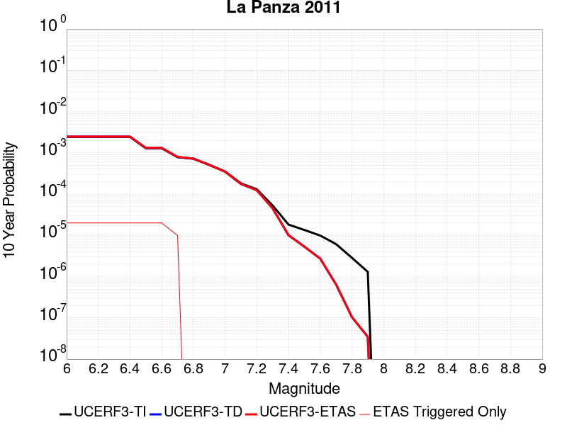 |

| Magnitude | 1 wk TI Prob | 1 wk TD Prob | 1 wk ETAS Prob | 1 wk ETAS/TD Gain | 1 wk ETAS Triggered Only | 1 mo TI Prob | 1 mo TD Prob | 1 mo ETAS Prob | 1 mo ETAS/TD Gain | 1 mo ETAS Triggered Only | 1 yr TI Prob | 1 yr TD Prob | 1 yr ETAS Prob | 1 yr ETAS/TD Gain | 1 yr ETAS Triggered Only | 10 yr TI Prob | 10 yr TD Prob | 10 yr ETAS Prob | 10 yr ETAS/TD Gain | 10 yr ETAS Triggered Only |
|-----|-----|-----|-----|-----|-----|-----|-----|-----|-----|-----|-----|-----|-----|-----|-----|-----|-----|-----|-----|-----|
| 6.0 | 4.6754544E-6 | 4.717587E-6 | 1.471754E-5 | 3.1197178 | 1.0E-5 | 2.0037509E-5 | 2.0218084E-5 | 3.0217881E-5 | 1.4945967 | 1.0E-5 | 2.4392935E-4 | 2.4612935E-4 | 2.561269E-4 | 1.040619 | 1.0E-5 | 0.0024366176 | 0.002458762 | 0.0024787127 | 1.0081142 | 2.0E-5 |
| 6.1 | 4.6754544E-6 | 4.717587E-6 | 1.471754E-5 | 3.1197178 | 1.0E-5 | 2.0037509E-5 | 2.0218084E-5 | 3.0217881E-5 | 1.4945967 | 1.0E-5 | 2.4392935E-4 | 2.4612935E-4 | 2.561269E-4 | 1.040619 | 1.0E-5 | 0.0024366176 | 0.002458762 | 0.0024787127 | 1.0081142 | 2.0E-5 |
| 6.2 | 4.6754544E-6 | 4.717587E-6 | 1.471754E-5 | 3.1197178 | 1.0E-5 | 2.0037509E-5 | 2.0218084E-5 | 3.0217881E-5 | 1.4945967 | 1.0E-5 | 2.4392935E-4 | 2.4612935E-4 | 2.561269E-4 | 1.040619 | 1.0E-5 | 0.0024366176 | 0.002458762 | 0.0024787127 | 1.0081142 | 2.0E-5 |
| 6.3 | 4.6754544E-6 | 4.717587E-6 | 1.471754E-5 | 3.1197178 | 1.0E-5 | 2.0037509E-5 | 2.0218084E-5 | 3.0217881E-5 | 1.4945967 | 1.0E-5 | 2.4392935E-4 | 2.4612935E-4 | 2.561269E-4 | 1.040619 | 1.0E-5 | 0.0024366176 | 0.002458762 | 0.0024787127 | 1.0081142 | 2.0E-5 |
| 6.4 | 4.6754544E-6 | 4.717587E-6 | 1.471754E-5 | 3.1197178 | 1.0E-5 | 2.0037509E-5 | 2.0218084E-5 | 3.0217881E-5 | 1.4945967 | 1.0E-5 | 2.4392935E-4 | 2.4612935E-4 | 2.561269E-4 | 1.040619 | 1.0E-5 | 0.0024366176 | 0.002458762 | 0.0024787127 | 1.0081142 | 2.0E-5 |
| 6.5 | 2.485343E-6 | 2.5005988E-6 | 1.2500574E-5 | 4.999032 | 1.0E-5 | 1.0651426E-5 | 1.0716811E-5 | 2.0716703E-5 | 1.9331034 | 1.0E-5 | 1.296734E-4 | 1.3046975E-4 | 1.4046844E-4 | 1.0766361 | 1.0E-5 | 0.0012959775 | 0.0013039699 | 0.0013239438 | 1.0153178 | 2.0E-5 |
| 6.6 | 2.485343E-6 | 2.5005988E-6 | 1.2500574E-5 | 4.999032 | 1.0E-5 | 1.0651426E-5 | 1.0716811E-5 | 2.0716703E-5 | 1.9331034 | 1.0E-5 | 1.296734E-4 | 1.3046975E-4 | 1.4046844E-4 | 1.0766361 | 1.0E-5 | 0.0012959775 | 0.0013039699 | 0.0013239438 | 1.0153178 | 2.0E-5 |
| 6.7 | 1.5108508E-6 | 1.5146375E-6 | 1.5146375E-6 | 1.0 | 0.0 | 6.4750584E-6 | 6.491288E-6 | 6.491288E-6 | 1.0 | 0.0 | 7.8830984E-5 | 7.902867E-5 | 7.902867E-5 | 1.0 | 0.0 | 7.880303E-4 | 7.900165E-4 | 8.000086E-4 | 1.012648 | 1.0E-5 |
| 6.8 | 1.3865837E-6 | 1.3885102E-6 | 1.3885102E-6 | 1.0 | 0.0 | 5.942488E-6 | 5.9507447E-6 | 5.9507447E-6 | 1.0 | 0.0 | 7.234739E-5 | 7.244801E-5 | 7.244801E-5 | 1.0 | 0.0 | 7.232384E-4 | 7.242537E-4 | 7.242537E-4 | 1.0 | 0.0 |
| 6.9 | 9.826583E-7 | 9.796287E-7 | 9.796287E-7 | 1.0 | 0.0 | 4.2113857E-6 | 4.198402E-6 | 4.198402E-6 | 1.0 | 0.0 | 5.1272415E-5 | 5.11144E-5 | 5.11144E-5 | 1.0 | 0.0 | 5.126059E-4 | 5.110318E-4 | 5.110318E-4 | 1.0 | 0.0 |
| 7.0 | 6.7797646E-7 | 6.7102144E-7 | 6.7102144E-7 | 1.0 | 0.0 | 2.9056102E-6 | 2.8758034E-6 | 2.8758034E-6 | 1.0 | 0.0 | 3.537523E-5 | 3.5012374E-5 | 3.5012374E-5 | 1.0 | 0.0 | 3.5369597E-4 | 3.5007167E-4 | 3.5007167E-4 | 1.0 | 0.0 |
| 7.1 | 3.4979826E-7 | 3.387388E-7 | 3.387388E-7 | 1.0 | 0.0 | 1.4991346E-6 | 1.4517369E-6 | 1.4517369E-6 | 1.0 | 0.0 | 1.825181E-5 | 1.7674765E-5 | 1.7674765E-5 | 1.0 | 0.0 | 1.825031E-4 | 1.7673477E-4 | 1.7673477E-4 | 1.0 | 0.0 |
| 7.2 | 2.5088332E-7 | 2.3831899E-7 | 2.3831899E-7 | 1.0 | 0.0 | 1.0752137E-6 | 1.0213668E-6 | 1.0213668E-6 | 1.0 | 0.0 | 1.3090649E-5 | 1.2435077E-5 | 1.2435077E-5 | 1.0 | 0.0 | 1.3089878E-4 | 1.2434467E-4 | 1.2434467E-4 | 1.0 | 0.0 |
| 7.3 | 1.0159086E-7 | 8.64462E-8 | 8.64462E-8 | 1.0 | 0.0 | 4.3538932E-7 | 3.7048366E-7 | 3.7048366E-7 | 1.0 | 0.0 | 5.300852E-6 | 4.5106294E-6 | 4.5106294E-6 | 1.0 | 0.0 | 5.3007258E-5 | 4.5105422E-5 | 4.5105422E-5 | 1.0 | 0.0 |
| 7.4 | 3.5006252E-8 | 1.9404325E-8 | 1.9404325E-8 | 1.0 | 0.0 | 1.5002678E-7 | 8.3161396E-8 | 8.3161396E-8 | 1.0 | 0.0 | 1.8265745E-6 | 1.0124895E-6 | 1.0124895E-6 | 1.0 | 0.0 | 1.8265595E-5 | 1.01248515E-5 | 1.01248515E-5 | 1.0 | 0.0 |
| 7.5 | 2.592274E-8 | 1.0239094E-8 | 1.0239094E-8 | 1.0 | 0.0 | 1.1109746E-7 | 4.388183E-8 | 4.388183E-8 | 1.0 | 0.0 | 1.3526106E-6 | 5.342612E-7 | 5.342612E-7 | 1.0 | 0.0 | 1.3526024E-5 | 5.3425997E-6 | 5.3425997E-6 | 1.0 | 0.0 |
| 7.6 | 1.9016717E-8 | 5.244801E-9 | 5.244801E-9 | 1.0 | 0.0 | 8.150022E-8 | 2.247772E-8 | 2.247772E-8 | 1.0 | 0.0 | 9.922647E-7 | 2.736662E-7 | 2.736662E-7 | 1.0 | 0.0 | 9.922603E-6 | 2.7366589E-6 | 2.7366589E-6 | 1.0 | 0.0 |
| 7.7 | 1.17738495E-8 | 1.2398075E-9 | 1.2398075E-9 | 1.0 | 0.0 | 5.0459356E-8 | 5.3134603E-9 | 5.3134603E-9 | 1.0 | 0.0 | 6.1434247E-7 | 6.469138E-8 | 6.469138E-8 | 1.0 | 0.0 | 6.143408E-6 | 6.469136E-7 | 6.469136E-7 | 1.0 | 0.0 |
| 7.8 | 5.489079E-9 | 2.0111768E-10 | 2.0111768E-10 | 1.0 | 0.0 | 2.3524624E-8 | 8.6193275E-10 | 8.6193275E-10 | 1.0 | 0.0 | 2.8641225E-7 | 1.04940305E-8 | 1.04940305E-8 | 1.0 | 0.0 | 2.8641189E-6 | 1.04940305E-7 | 1.04940305E-7 | 1.0 | 0.0 |
| 7.9 | 2.5081048E-9 | 6.683887E-11 | 6.683887E-11 | 1.0 | 0.0 | 1.0749021E-8 | 2.8645197E-10 | 2.8645197E-10 | 1.0 | 0.0 | 1.3086932E-7 | 3.487552E-9 | 3.487552E-9 | 1.0 | 0.0 | 1.3086925E-6 | 3.487552E-8 | 3.487552E-8 | 1.0 | 0.0 |

## Newport-Inglewood (Offshore)
*[(top)](#table-of-contents)*

| 1 Week | 1 Month | 1 Year | 10 Year |
|-----|-----|-----|-----|
|  |  |  |  |

| Magnitude | 1 wk TI Prob | 1 wk TD Prob | 1 wk ETAS Prob | 1 wk ETAS/TD Gain | 1 wk ETAS Triggered Only | 1 mo TI Prob | 1 mo TD Prob | 1 mo ETAS Prob | 1 mo ETAS/TD Gain | 1 mo ETAS Triggered Only | 1 yr TI Prob | 1 yr TD Prob | 1 yr ETAS Prob | 1 yr ETAS/TD Gain | 1 yr ETAS Triggered Only | 10 yr TI Prob | 10 yr TD Prob | 10 yr ETAS Prob | 10 yr ETAS/TD Gain | 10 yr ETAS Triggered Only |
|-----|-----|-----|-----|-----|-----|-----|-----|-----|-----|-----|-----|-----|-----|-----|-----|-----|-----|-----|-----|-----|
| 6.0 | 1.9626508E-5 | 1.8965357E-5 | 1.8965357E-5 | 1.0 | 0.0 | 8.411089E-5 | 8.1277634E-5 | 8.1277634E-5 | 1.0 | 0.0 | 0.001023569 | 9.891186E-4 | 9.891186E-4 | 1.0 | 0.0 | 0.010188672 | 0.009848503 | 0.009868307 | 1.0020108 | 2.0E-5 |
| 6.1 | 1.331886E-5 | 1.2218092E-5 | 1.2218092E-5 | 1.0 | 0.0 | 5.707958E-5 | 5.2362207E-5 | 5.2362207E-5 | 1.0 | 0.0 | 6.947222E-4 | 6.3732493E-4 | 6.3732493E-4 | 1.0 | 0.0 | 0.006925544 | 0.006355149 | 0.0063750218 | 1.0031271 | 2.0E-5 |
| 6.2 | 1.2250852E-5 | 1.1076029E-5 | 1.1076029E-5 | 1.0 | 0.0 | 5.2502597E-5 | 4.7467838E-5 | 4.7467838E-5 | 1.0 | 0.0 | 6.3903164E-4 | 5.777687E-4 | 5.777687E-4 | 1.0 | 0.0 | 0.006371971 | 0.0057627866 | 0.005772729 | 1.0017253 | 1.0E-5 |
| 6.3 | 1.2106258E-5 | 1.0918891E-5 | 1.0918891E-5 | 1.0 | 0.0 | 5.1882926E-5 | 4.6794412E-5 | 4.6794412E-5 | 1.0 | 0.0 | 6.3149154E-4 | 5.69574E-4 | 5.69574E-4 | 1.0 | 0.0 | 0.0062970007 | 0.005681259 | 0.0056912024 | 1.0017502 | 1.0E-5 |
| 6.4 | 1.1348758E-5 | 1.0109362E-5 | 1.0109362E-5 | 1.0 | 0.0 | 4.8636626E-5 | 4.3325123E-5 | 4.3325123E-5 | 1.0 | 0.0 | 5.919901E-4 | 5.273565E-4 | 5.273565E-4 | 1.0 | 0.0 | 0.005904155 | 0.0052611465 | 0.005271094 | 1.0018908 | 1.0E-5 |
| 6.5 | 1.100837E-5 | 9.7433895E-6 | 9.7433895E-6 | 1.0 | 0.0 | 4.7177873E-5 | 4.1756717E-5 | 4.1756717E-5 | 1.0 | 0.0 | 5.7423924E-4 | 5.082702E-4 | 5.082702E-4 | 1.0 | 0.0 | 0.005727576 | 0.0050711688 | 0.005081118 | 1.001962 | 1.0E-5 |
| 6.6 | 1.0634696E-5 | 9.345544E-6 | 9.345544E-6 | 1.0 | 0.0 | 4.557647E-5 | 4.0051716E-5 | 4.0051716E-5 | 1.0 | 0.0 | 5.5475225E-4 | 4.8752132E-4 | 4.8752132E-4 | 1.0 | 0.0 | 0.0055336943 | 0.0048646047 | 0.004874556 | 1.0020456 | 1.0E-5 |
| 6.7 | 9.9780855E-6 | 8.667911E-6 | 8.667911E-6 | 1.0 | 0.0 | 4.276252E-5 | 3.7147664E-5 | 3.7147664E-5 | 1.0 | 0.0 | 5.205093E-4 | 4.5217964E-4 | 4.5217964E-4 | 1.0 | 0.0 | 0.0051929182 | 0.004512675 | 0.0045226295 | 1.002206 | 1.0E-5 |
| 6.8 | 9.59546E-6 | 8.27295E-6 | 8.27295E-6 | 1.0 | 0.0 | 4.1122752E-5 | 3.5455025E-5 | 3.5455025E-5 | 1.0 | 0.0 | 5.0055445E-4 | 4.315801E-4 | 4.315801E-4 | 1.0 | 0.0 | 0.004994285 | 0.004307495 | 0.004307495 | 1.0 | 0.0 |
| 6.9 | 9.000614E-6 | 7.70684E-6 | 7.70684E-6 | 1.0 | 0.0 | 3.857349E-5 | 3.30289E-5 | 3.30289E-5 | 1.0 | 0.0 | 4.6953102E-4 | 4.0205332E-4 | 4.0205332E-4 | 1.0 | 0.0 | 0.004685402 | 0.0040133307 | 0.0040133307 | 1.0 | 0.0 |
| 7.0 | 7.4070194E-6 | 6.148904E-6 | 6.148904E-6 | 1.0 | 0.0 | 3.1743984E-5 | 2.635218E-5 | 2.635218E-5 | 1.0 | 0.0 | 3.8641447E-4 | 3.207907E-4 | 3.207907E-4 | 1.0 | 0.0 | 0.0038574322 | 0.0032032963 | 0.0032032963 | 1.0 | 0.0 |
| 7.1 | 6.299615E-6 | 5.0565927E-6 | 5.0565927E-6 | 1.0 | 0.0 | 2.699807E-5 | 2.1670932E-5 | 2.1670932E-5 | 1.0 | 0.0 | 3.2865192E-4 | 2.638118E-4 | 2.638118E-4 | 1.0 | 0.0 | 0.003281663 | 0.002635001 | 0.002635001 | 1.0 | 0.0 |
| 7.2 | 5.096653E-6 | 3.892769E-6 | 3.892769E-6 | 1.0 | 0.0 | 2.1842614E-5 | 1.668319E-5 | 1.668319E-5 | 1.0 | 0.0 | 2.6590136E-4 | 2.0309901E-4 | 2.0309901E-4 | 1.0 | 0.0 | 0.0026558342 | 0.0020291451 | 0.0020291451 | 1.0 | 0.0 |
| 7.3 | 3.9753018E-6 | 2.9099103E-6 | 2.9099103E-6 | 1.0 | 0.0 | 1.7036897E-5 | 1.2470985E-5 | 1.2470985E-5 | 1.0 | 0.0 | 2.0740448E-4 | 1.5182374E-4 | 1.5182374E-4 | 1.0 | 0.0 | 0.00207211 | 0.0015172083 | 0.0015172083 | 1.0 | 0.0 |
| 7.4 | 3.0568392E-6 | 2.1449955E-6 | 2.1449955E-6 | 1.0 | 0.0 | 1.3100675E-5 | 9.192806E-6 | 9.192806E-6 | 1.0 | 0.0 | 1.5948903E-4 | 1.1191672E-4 | 1.1191672E-4 | 1.0 | 0.0 | 0.0015937461 | 0.0011186098 | 0.0011186098 | 1.0 | 0.0 |
| 7.5 | 1.7279019E-6 | 1.1469883E-6 | 1.1469883E-6 | 1.0 | 0.0 | 7.405273E-6 | 4.915655E-6 | 4.915655E-6 | 1.0 | 0.0 | 9.015547E-5 | 5.9846494E-5 | 5.9846494E-5 | 1.0 | 0.0 | 9.01189E-4 | 5.9830764E-4 | 5.9830764E-4 | 1.0 | 0.0 |
| 7.6 | 1.1156416E-6 | 7.223012E-7 | 7.223012E-7 | 1.0 | 0.0 | 4.7813123E-6 | 3.095573E-6 | 3.095573E-6 | 1.0 | 0.0 | 5.821092E-5 | 3.7687976E-5 | 3.7687976E-5 | 1.0 | 0.0 | 5.8195676E-4 | 3.7681818E-4 | 3.7681818E-4 | 1.0 | 0.0 |
| 7.7 | 9.117973E-8 | 6.734145E-8 | 6.734145E-8 | 1.0 | 0.0 | 3.907702E-7 | 2.886062E-7 | 2.886062E-7 | 1.0 | 0.0 | 4.757617E-6 | 3.513775E-6 | 3.513775E-6 | 1.0 | 0.0 | 4.7575148E-5 | 3.5137225E-5 | 3.5137225E-5 | 1.0 | 0.0 |

## Simi-Santa Rosa
*[(top)](#table-of-contents)*

| 1 Week | 1 Month | 1 Year | 10 Year |
|-----|-----|-----|-----|
|  |  |  |  |

| Magnitude | 1 wk TI Prob | 1 wk TD Prob | 1 wk ETAS Prob | 1 wk ETAS/TD Gain | 1 wk ETAS Triggered Only | 1 mo TI Prob | 1 mo TD Prob | 1 mo ETAS Prob | 1 mo ETAS/TD Gain | 1 mo ETAS Triggered Only | 1 yr TI Prob | 1 yr TD Prob | 1 yr ETAS Prob | 1 yr ETAS/TD Gain | 1 yr ETAS Triggered Only | 10 yr TI Prob | 10 yr TD Prob | 10 yr ETAS Prob | 10 yr ETAS/TD Gain | 10 yr ETAS Triggered Only |
|-----|-----|-----|-----|-----|-----|-----|-----|-----|-----|-----|-----|-----|-----|-----|-----|-----|-----|-----|-----|-----|
| 6.0 | 2.198912E-5 | 2.2275442E-5 | 3.227522E-5 | 1.4489149 | 1.0E-5 | 9.4235686E-5 | 9.5462936E-5 | 1.1546103E-4 | 1.2094854 | 2.0E-5 | 0.0011467156 | 0.0011616853 | 0.0011816622 | 1.0171964 | 2.0E-5 | 0.011408163 | 0.011560575 | 0.011580344 | 1.00171 | 2.0E-5 |
| 6.1 | 2.198912E-5 | 2.2275442E-5 | 3.227522E-5 | 1.4489149 | 1.0E-5 | 9.4235686E-5 | 9.5462936E-5 | 1.1546103E-4 | 1.2094854 | 2.0E-5 | 0.0011467156 | 0.0011616853 | 0.0011816622 | 1.0171964 | 2.0E-5 | 0.011408163 | 0.011560575 | 0.011580344 | 1.00171 | 2.0E-5 |
| 6.2 | 1.69983E-5 | 1.6668559E-5 | 2.6668393E-5 | 1.5999218 | 1.0E-5 | 7.284782E-5 | 7.143489E-5 | 9.143346E-5 | 1.2799553 | 2.0E-5 | 8.865613E-4 | 8.6940196E-4 | 8.8938454E-4 | 1.0229843 | 2.0E-5 | 0.008830327 | 0.008662928 | 0.008682754 | 1.0022887 | 2.0E-5 |
| 6.3 | 1.69983E-5 | 1.6668559E-5 | 2.6668393E-5 | 1.5999218 | 1.0E-5 | 7.284782E-5 | 7.143489E-5 | 9.143346E-5 | 1.2799553 | 2.0E-5 | 8.865613E-4 | 8.6940196E-4 | 8.8938454E-4 | 1.0229843 | 2.0E-5 | 0.008830327 | 0.008662928 | 0.008682754 | 1.0022887 | 2.0E-5 |
| 6.4 | 1.4666188E-5 | 1.4052543E-5 | 2.4052402E-5 | 1.711605 | 1.0E-5 | 6.285358E-5 | 6.0223934E-5 | 8.022273E-5 | 1.3320739 | 2.0E-5 | 7.6497364E-4 | 7.3300465E-4 | 7.5298996E-4 | 1.027265 | 2.0E-5 | 0.0076234564 | 0.007308344 | 0.007328198 | 1.0027165 | 2.0E-5 |
| 6.5 | 1.4666188E-5 | 1.4052543E-5 | 2.4052402E-5 | 1.711605 | 1.0E-5 | 6.285358E-5 | 6.0223934E-5 | 8.022273E-5 | 1.3320739 | 2.0E-5 | 7.6497364E-4 | 7.3300465E-4 | 7.5298996E-4 | 1.027265 | 2.0E-5 | 0.0076234564 | 0.007308344 | 0.007328198 | 1.0027165 | 2.0E-5 |
| 6.6 | 1.4377586E-5 | 1.3729583E-5 | 2.3729444E-5 | 1.7283443 | 1.0E-5 | 6.1616774E-5 | 5.883988E-5 | 7.8838704E-5 | 1.3398855 | 2.0E-5 | 7.4992597E-4 | 7.1616494E-4 | 7.361506E-4 | 1.0279065 | 2.0E-5 | 0.007474003 | 0.0071410383 | 0.0071608955 | 1.0027807 | 2.0E-5 |
| 6.7 | 1.3881404E-5 | 1.320755E-5 | 2.3207418E-5 | 1.7571326 | 1.0E-5 | 5.9490372E-5 | 5.66027E-5 | 7.6601566E-5 | 1.35332 | 2.0E-5 | 7.240546E-4 | 6.8894465E-4 | 7.089309E-4 | 1.0290099 | 2.0E-5 | 0.007217 | 0.006870538 | 0.006890401 | 1.002891 | 2.0E-5 |
| 6.8 | 1.0176516E-5 | 9.154151E-6 | 9.154151E-6 | 1.0 | 0.0 | 4.3612912E-5 | 3.9231574E-5 | 4.9231185E-5 | 1.2548867 | 1.0E-5 | 5.308578E-4 | 4.7755634E-4 | 4.8755156E-4 | 1.0209299 | 1.0E-5 | 0.0052959146 | 0.004766934 | 0.0047768867 | 1.0020878 | 1.0E-5 |
| 6.9 | 9.699797E-6 | 8.774719E-6 | 8.774719E-6 | 1.0 | 0.0 | 4.15699E-5 | 3.7605492E-5 | 4.7605117E-5 | 1.2659086 | 1.0E-5 | 5.05996E-4 | 4.577671E-4 | 4.6776255E-4 | 1.0218352 | 1.0E-5 | 0.005048454 | 0.0045698597 | 0.004579814 | 1.0021782 | 1.0E-5 |
| 7.0 | 7.4049476E-6 | 6.559333E-6 | 6.559333E-6 | 1.0 | 0.0 | 3.1735104E-5 | 2.8111197E-5 | 2.8111197E-5 | 1.0 | 0.0 | 3.8630638E-4 | 3.422127E-4 | 3.422127E-4 | 1.0 | 0.0 | 0.0038563553 | 0.0034180996 | 0.0034180996 | 1.0 | 0.0 |
| 7.1 | 3.873439E-6 | 2.7595095E-6 | 2.7595095E-6 | 1.0 | 0.0 | 1.6600346E-5 | 1.1826417E-5 | 1.1826417E-5 | 1.0 | 0.0 | 2.0209046E-4 | 1.4397735E-4 | 1.4397735E-4 | 1.0 | 0.0 | 0.0020190678 | 0.0014388643 | 0.0014388643 | 1.0 | 0.0 |
| 7.2 | 3.417706E-6 | 2.3676484E-6 | 2.3676484E-6 | 1.0 | 0.0 | 1.4647229E-5 | 1.0147027E-5 | 1.0147027E-5 | 1.0 | 0.0 | 1.7831543E-4 | 1.2353327E-4 | 1.2353327E-4 | 1.0 | 0.0 | 0.0017817242 | 0.0012346683 | 0.0012346683 | 1.0 | 0.0 |
| 7.3 | 1.90225E-6 | 1.4073753E-6 | 1.4073753E-6 | 1.0 | 0.0 | 8.152474E-6 | 6.0315947E-6 | 6.0315947E-6 | 1.0 | 0.0 | 9.9251854E-5 | 7.343221E-5 | 7.343221E-5 | 1.0 | 0.0 | 9.920754E-4 | 7.340817E-4 | 7.340817E-4 | 1.0 | 0.0 |
| 7.4 | 1.5170556E-6 | 1.1024773E-6 | 1.1024773E-6 | 1.0 | 0.0 | 6.5016507E-6 | 4.724894E-6 | 4.724894E-6 | 1.0 | 0.0 | 7.915472E-5 | 5.7524077E-5 | 5.7524077E-5 | 1.0 | 0.0 | 7.9126534E-4 | 5.7509297E-4 | 5.7509297E-4 | 1.0 | 0.0 |
| 7.5 | 1.178732E-6 | 8.535102E-7 | 8.535102E-7 | 1.0 | 0.0 | 5.0516987E-6 | 3.6578958E-6 | 3.6578958E-6 | 1.0 | 0.0 | 6.1502695E-5 | 4.453398E-5 | 4.453398E-5 | 1.0 | 0.0 | 6.148568E-4 | 4.452515E-4 | 4.452515E-4 | 1.0 | 0.0 |
| 7.6 | 6.8722386E-7 | 4.793198E-7 | 4.793198E-7 | 1.0 | 0.0 | 2.9452417E-6 | 2.054226E-6 | 2.054226E-6 | 1.0 | 0.0 | 3.5857727E-5 | 2.5009915E-5 | 2.5009915E-5 | 1.0 | 0.0 | 3.5851944E-4 | 2.5007114E-4 | 2.5007114E-4 | 1.0 | 0.0 |
| 7.7 | 5.5126515E-7 | 3.6731157E-7 | 3.6731157E-7 | 1.0 | 0.0 | 2.3625628E-6 | 1.5741915E-6 | 1.5741915E-6 | 1.0 | 0.0 | 2.8763823E-5 | 1.9165615E-5 | 1.9165615E-5 | 1.0 | 0.0 | 2.87601E-4 | 1.9163972E-4 | 1.9163972E-4 | 1.0 | 0.0 |
| 7.8 | 3.3860243E-7 | 2.0075942E-7 | 2.0075942E-7 | 1.0 | 0.0 | 1.4511525E-6 | 8.6039717E-7 | 8.6039717E-7 | 1.0 | 0.0 | 1.7667637E-5 | 1.0475286E-5 | 1.0475286E-5 | 1.0 | 0.0 | 1.7666233E-4 | 1.04747975E-4 | 1.04747975E-4 | 1.0 | 0.0 |
| 7.9 | 2.7955386E-7 | 1.4649108E-7 | 1.4649108E-7 | 1.0 | 0.0 | 1.1980875E-6 | 6.278188E-7 | 6.278188E-7 | 1.0 | 0.0 | 1.4586617E-5 | 7.643667E-6 | 7.643667E-6 | 1.0 | 0.0 | 1.458566E-4 | 7.643409E-5 | 7.643409E-5 | 1.0 | 0.0 |
| 8.0 | 5.6259015E-8 | 3.3355324E-8 | 3.3355324E-8 | 1.0 | 0.0 | 2.4111003E-7 | 1.4295138E-7 | 1.4295138E-7 | 1.0 | 0.0 | 2.9355108E-6 | 1.7404317E-6 | 1.7404317E-6 | 1.0 | 0.0 | 2.935472E-5 | 1.7404194E-5 | 1.7404194E-5 | 1.0 | 0.0 |

## San Andreas (Offshore) 2011 CFM
*[(top)](#table-of-contents)*

| 1 Week | 1 Month | 1 Year | 10 Year |
|-----|-----|-----|-----|
|  |  | 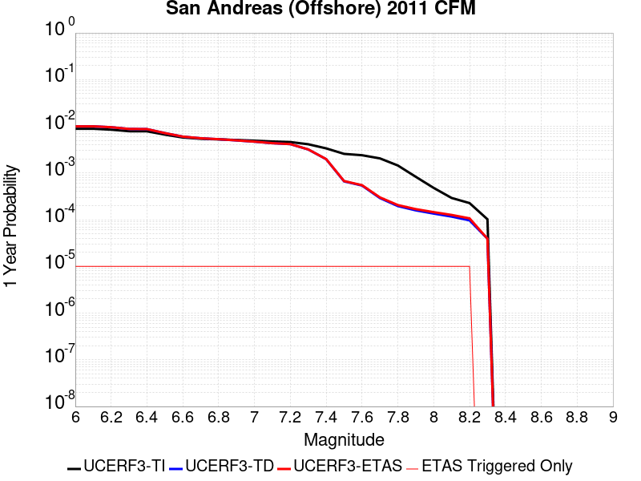 |  |

| Magnitude | 1 wk TI Prob | 1 wk TD Prob | 1 wk ETAS Prob | 1 wk ETAS/TD Gain | 1 wk ETAS Triggered Only | 1 mo TI Prob | 1 mo TD Prob | 1 mo ETAS Prob | 1 mo ETAS/TD Gain | 1 mo ETAS Triggered Only | 1 yr TI Prob | 1 yr TD Prob | 1 yr ETAS Prob | 1 yr ETAS/TD Gain | 1 yr ETAS Triggered Only | 10 yr TI Prob | 10 yr TD Prob | 10 yr ETAS Prob | 10 yr ETAS/TD Gain | 10 yr ETAS Triggered Only |
|-----|-----|-----|-----|-----|-----|-----|-----|-----|-----|-----|-----|-----|-----|-----|-----|-----|-----|-----|-----|-----|
| 6.0 | 1.7072787E-4 | 1.9226041E-4 | 2.022585E-4 | 1.0520028 | 1.0E-5 | 7.3148566E-4 | 8.237154E-4 | 8.337072E-4 | 1.0121301 | 1.0E-5 | 0.008869528 | 0.0099831335 | 0.009993034 | 1.0009917 | 1.0E-5 | 0.085237645 | 0.09682738 | 0.09684545 | 1.0001866 | 2.0E-5 |
| 6.1 | 1.7072787E-4 | 1.9226041E-4 | 2.022585E-4 | 1.0520028 | 1.0E-5 | 7.3148566E-4 | 8.237154E-4 | 8.337072E-4 | 1.0121301 | 1.0E-5 | 0.008869528 | 0.0099831335 | 0.009993034 | 1.0009917 | 1.0E-5 | 0.085237645 | 0.09682738 | 0.09684545 | 1.0001866 | 2.0E-5 |
| 6.2 | 1.6312556E-4 | 1.8407789E-4 | 1.9407604E-4 | 1.0543149 | 1.0E-5 | 6.989222E-4 | 7.8866904E-4 | 7.986612E-4 | 1.0126696 | 1.0E-5 | 0.008476226 | 0.009560268 | 0.009570173 | 1.001036 | 1.0E-5 | 0.08160117 | 0.09284818 | 0.092866324 | 1.0001954 | 2.0E-5 |
| 6.3 | 1.5103363E-4 | 1.6880741E-4 | 1.7880571E-4 | 1.0592291 | 1.0E-5 | 6.471264E-4 | 7.232619E-4 | 7.3325465E-4 | 1.0138162 | 1.0E-5 | 0.007850339 | 0.008770605 | 0.008780517 | 1.0011302 | 1.0E-5 | 0.075787395 | 0.085489064 | 0.085507356 | 1.000214 | 2.0E-5 |
| 6.4 | 1.5047993E-4 | 1.676667E-4 | 1.7766502E-4 | 1.0596322 | 1.0E-5 | 6.4475456E-4 | 7.1837584E-4 | 7.2836864E-4 | 1.0139103 | 1.0E-5 | 0.007821669 | 0.008711592 | 0.008721505 | 1.0011379 | 1.0E-5 | 0.0755203 | 0.08496926 | 0.084987566 | 1.0002154 | 2.0E-5 |
| 6.5 | 1.2760791E-4 | 1.3735025E-4 | 1.4734887E-4 | 1.0727966 | 1.0E-5 | 5.467764E-4 | 5.885125E-4 | 5.985066E-4 | 1.016982 | 1.0E-5 | 0.0066367025 | 0.0071418737 | 0.007151802 | 1.0013902 | 1.0E-5 | 0.064419635 | 0.07025001 | 0.07025931 | 1.0001323 | 1.0E-5 |
| 6.6 | 1.1063525E-4 | 1.15566356E-4 | 1.255652E-4 | 1.0865204 | 1.0E-5 | 4.740649E-4 | 4.9519143E-4 | 5.051865E-4 | 1.0201842 | 1.0E-5 | 0.0057564764 | 0.006012491 | 0.006022431 | 1.0016532 | 1.0E-5 | 0.05609626 | 0.05948894 | 0.059498347 | 1.0001581 | 1.0E-5 |
| 6.7 | 1.0391049E-4 | 1.0645922E-4 | 1.1645816E-4 | 1.0939227 | 1.0E-5 | 4.4525467E-4 | 4.5617504E-4 | 4.661705E-4 | 1.0219114 | 1.0E-5 | 0.0054075094 | 0.005539975 | 0.00554992 | 1.001795 | 1.0E-5 | 0.052778035 | 0.05498876 | 0.05499821 | 1.0001719 | 1.0E-5 |
| 6.8 | 1.0096706E-4 | 1.01582686E-4 | 1.1158167E-4 | 1.098432 | 1.0E-5 | 4.3264418E-4 | 4.3528268E-4 | 4.452783E-4 | 1.0229635 | 1.0E-5 | 0.0052547283 | 0.005286866 | 0.005296813 | 1.0018815 | 1.0E-5 | 0.051321987 | 0.052687574 | 0.052697048 | 1.0001798 | 1.0E-5 |
| 6.9 | 9.800265E-5 | 9.588748E-5 | 1.05886524E-4 | 1.1042789 | 1.0E-5 | 4.1994374E-4 | 4.1088252E-4 | 4.208784E-4 | 1.0243279 | 1.0E-5 | 0.0051008356 | 0.0049911886 | 0.005001139 | 1.0019935 | 1.0E-5 | 0.049853306 | 0.05001504 | 0.05002454 | 1.0001899 | 1.0E-5 |
| 7.0 | 9.4642375E-5 | 9.002143E-5 | 1.0002053E-4 | 1.1110747 | 1.0E-5 | 4.0554712E-4 | 3.8574997E-4 | 3.957461E-4 | 1.0259135 | 1.0E-5 | 0.004926363 | 0.0046865544 | 0.0046965075 | 1.0021237 | 1.0E-5 | 0.048185747 | 0.047196057 | 0.047205586 | 1.000202 | 1.0E-5 |
| 7.1 | 9.0996844E-5 | 8.354169E-5 | 9.354085E-5 | 1.1196908 | 1.0E-5 | 3.8992817E-4 | 3.5798753E-4 | 3.6798394E-4 | 1.027924 | 1.0E-5 | 0.004737046 | 0.004349944 | 0.004359901 | 1.0022889 | 1.0E-5 | 0.04637333 | 0.044047635 | 0.044057194 | 1.0002171 | 1.0E-5 |
| 7.2 | 8.848287E-5 | 7.9818135E-5 | 8.981734E-5 | 1.1252748 | 1.0E-5 | 3.791572E-4 | 3.4203375E-4 | 3.5203033E-4 | 1.0292269 | 1.0E-5 | 0.004606472 | 0.0041564633 | 0.004166422 | 1.0023959 | 1.0E-5 | 0.045121472 | 0.042191572 | 0.04220115 | 1.000227 | 1.0E-5 |
| 7.3 | 7.9280784E-5 | 6.1276216E-5 | 7.12756E-5 | 1.1631855 | 1.0E-5 | 3.3973053E-4 | 2.625865E-4 | 2.7258386E-4 | 1.0380727 | 1.0E-5 | 0.004128377 | 0.0031924061 | 0.0032023743 | 1.0031224 | 1.0E-5 | 0.040525194 | 0.032904375 | 0.032914046 | 1.000294 | 1.0E-5 |
| 7.4 | 6.468038E-5 | 3.7933212E-5 | 4.7932834E-5 | 1.2636112 | 1.0E-5 | 2.771722E-4 | 1.625611E-4 | 1.7255948E-4 | 1.0615053 | 1.0E-5 | 0.0033693502 | 0.0019774425 | 0.0019874228 | 1.0050471 | 1.0E-5 | 0.0331872 | 0.02082181 | 0.020831602 | 1.0004703 | 1.0E-5 |
| 7.5 | 4.930574E-5 | 1.2703362E-5 | 2.2703234E-5 | 1.7871832 | 1.0E-5 | 2.1129321E-4 | 5.444185E-5 | 6.444131E-5 | 1.1836722 | 1.0E-5 | 0.0025694598 | 6.6262955E-4 | 6.7262293E-4 | 1.0150814 | 1.0E-5 | 0.02539953 | 0.007481418 | 0.0074913437 | 1.0013267 | 1.0E-5 |
| 7.6 | 4.612566E-5 | 1.0336213E-5 | 2.0336109E-5 | 1.9674623 | 1.0E-5 | 1.9766642E-4 | 4.429731E-5 | 5.4296866E-5 | 1.2257373 | 1.0E-5 | 0.0024039324 | 5.391877E-4 | 5.491823E-4 | 1.0185364 | 1.0E-5 | 0.023780935 | 0.006172099 | 0.0061820373 | 1.0016102 | 1.0E-5 |
| 7.7 | 3.9435414E-5 | 5.574925E-6 | 1.557487E-5 | 2.793736 | 1.0E-5 | 1.6899795E-4 | 2.3892318E-5 | 3.389208E-5 | 1.4185345 | 1.0E-5 | 0.0020556084 | 2.9085035E-4 | 3.0084743E-4 | 1.034372 | 1.0E-5 | 0.020366974 | 0.0035420412 | 0.0035520056 | 1.0028132 | 1.0E-5 |
| 7.8 | 2.7787428E-5 | 3.7553348E-6 | 1.3755297E-5 | 3.6628683 | 1.0E-5 | 1.1908354E-4 | 1.6094193E-5 | 2.6094032E-5 | 1.6213322 | 1.0E-5 | 0.0014488777 | 1.9592921E-4 | 2.0592725E-4 | 1.0510288 | 1.0E-5 | 0.014394675 | 0.0023877125 | 0.0023976886 | 1.0041782 | 1.0E-5 |
| 7.9 | 1.590671E-5 | 3.04085E-6 | 1.304082E-5 | 4.288544 | 1.0E-5 | 6.816983E-5 | 1.303215E-5 | 2.3032018E-5 | 1.7673231 | 1.0E-5 | 8.2965166E-4 | 1.586549E-4 | 1.686533E-4 | 1.0630199 | 1.0E-5 | 0.008265611 | 0.001904262 | 0.0019142429 | 1.0052414 | 1.0E-5 |
| 8.0 | 9.193638E-6 | 2.5920847E-6 | 1.2592059E-5 | 4.8578887 | 1.0E-5 | 3.940071E-5 | 1.1108887E-5 | 2.1108775E-5 | 1.9001702 | 1.0E-5 | 4.7959806E-4 | 1.3524233E-4 | 1.4524098E-4 | 1.0739313 | 1.0E-5 | 0.0047856434 | 0.0016115032 | 0.0016214871 | 1.0061954 | 1.0E-5 |
| 8.1 | 5.601576E-6 | 2.2343472E-6 | 1.22343245E-5 | 5.47557 | 1.0E-5 | 2.4006533E-5 | 9.575739E-6 | 1.9575642E-5 | 2.0442958 | 1.0E-5 | 2.9224035E-4 | 1.16578405E-4 | 1.2657724E-4 | 1.0857692 | 1.0E-5 | 0.0029185633 | 0.0014020674 | 0.0014120534 | 1.0071223 | 1.0E-5 |
| 8.2 | 4.3508785E-6 | 1.857566E-6 | 1.1857547E-5 | 6.383379 | 1.0E-5 | 1.864649E-5 | 7.960973E-6 | 1.7960894E-5 | 2.2561178 | 1.0E-5 | 2.2699735E-4 | 9.692056E-5 | 1.0691959E-4 | 1.1031673 | 1.0E-5 | 0.0022676561 | 0.0011594221 | 0.0011694105 | 1.008615 | 1.0E-5 |
| 8.3 | 1.9573292E-6 | 7.514906E-7 | 7.514906E-7 | 1.0 | 0.0 | 8.388526E-6 | 3.22067E-6 | 3.22067E-6 | 1.0 | 0.0 | 1.0212552E-4 | 3.921097E-5 | 3.921097E-5 | 1.0 | 0.0 | 0.001020786 | 4.640846E-4 | 4.640846E-4 | 1.0 | 0.0 |

## Pitas Point (Lower West)
*[(top)](#table-of-contents)*

| 1 Week | 1 Month | 1 Year | 10 Year |
|-----|-----|-----|-----|
|  |  |  |  |

| Magnitude | 1 wk TI Prob | 1 wk TD Prob | 1 wk ETAS Prob | 1 wk ETAS/TD Gain | 1 wk ETAS Triggered Only | 1 mo TI Prob | 1 mo TD Prob | 1 mo ETAS Prob | 1 mo ETAS/TD Gain | 1 mo ETAS Triggered Only | 1 yr TI Prob | 1 yr TD Prob | 1 yr ETAS Prob | 1 yr ETAS/TD Gain | 1 yr ETAS Triggered Only | 10 yr TI Prob | 10 yr TD Prob | 10 yr ETAS Prob | 10 yr ETAS/TD Gain | 10 yr ETAS Triggered Only |
|-----|-----|-----|-----|-----|-----|-----|-----|-----|-----|-----|-----|-----|-----|-----|-----|-----|-----|-----|-----|-----|
| 6.0 | 8.151497E-6 | 7.855762E-6 | 1.7855684E-5 | 2.2729409 | 1.0E-5 | 3.493452E-5 | 3.3667122E-5 | 4.3666787E-5 | 1.2970157 | 1.0E-5 | 4.252448E-4 | 4.0982084E-4 | 4.2981267E-4 | 1.0487818 | 2.0E-5 | 0.0042443196 | 0.0040907315 | 0.0041106497 | 1.0048691 | 2.0E-5 |
| 6.1 | 8.151497E-6 | 7.855762E-6 | 1.7855684E-5 | 2.2729409 | 1.0E-5 | 3.493452E-5 | 3.3667122E-5 | 4.3666787E-5 | 1.2970157 | 1.0E-5 | 4.252448E-4 | 4.0982084E-4 | 4.2981267E-4 | 1.0487818 | 2.0E-5 | 0.0042443196 | 0.0040907315 | 0.0041106497 | 1.0048691 | 2.0E-5 |
| 6.2 | 8.151497E-6 | 7.855762E-6 | 1.7855684E-5 | 2.2729409 | 1.0E-5 | 3.493452E-5 | 3.3667122E-5 | 4.3666787E-5 | 1.2970157 | 1.0E-5 | 4.252448E-4 | 4.0982084E-4 | 4.2981267E-4 | 1.0487818 | 2.0E-5 | 0.0042443196 | 0.0040907315 | 0.0041106497 | 1.0048691 | 2.0E-5 |
| 6.3 | 8.151497E-6 | 7.855762E-6 | 1.7855684E-5 | 2.2729409 | 1.0E-5 | 3.493452E-5 | 3.3667122E-5 | 4.3666787E-5 | 1.2970157 | 1.0E-5 | 4.252448E-4 | 4.0982084E-4 | 4.2981267E-4 | 1.0487818 | 2.0E-5 | 0.0042443196 | 0.0040907315 | 0.0041106497 | 1.0048691 | 2.0E-5 |
| 6.4 | 8.151497E-6 | 7.855762E-6 | 1.7855684E-5 | 2.2729409 | 1.0E-5 | 3.493452E-5 | 3.3667122E-5 | 4.3666787E-5 | 1.2970157 | 1.0E-5 | 4.252448E-4 | 4.0982084E-4 | 4.2981267E-4 | 1.0487818 | 2.0E-5 | 0.0042443196 | 0.0040907315 | 0.0041106497 | 1.0048691 | 2.0E-5 |
| 6.5 | 8.151497E-6 | 7.855762E-6 | 1.7855684E-5 | 2.2729409 | 1.0E-5 | 3.493452E-5 | 3.3667122E-5 | 4.3666787E-5 | 1.2970157 | 1.0E-5 | 4.252448E-4 | 4.0982084E-4 | 4.2981267E-4 | 1.0487818 | 2.0E-5 | 0.0042443196 | 0.0040907315 | 0.0041106497 | 1.0048691 | 2.0E-5 |
| 6.6 | 8.151497E-6 | 7.855762E-6 | 1.7855684E-5 | 2.2729409 | 1.0E-5 | 3.493452E-5 | 3.3667122E-5 | 4.3666787E-5 | 1.2970157 | 1.0E-5 | 4.252448E-4 | 4.0982084E-4 | 4.2981267E-4 | 1.0487818 | 2.0E-5 | 0.0042443196 | 0.0040907315 | 0.0041106497 | 1.0048691 | 2.0E-5 |
| 6.7 | 8.151497E-6 | 7.855762E-6 | 1.7855684E-5 | 2.2729409 | 1.0E-5 | 3.493452E-5 | 3.3667122E-5 | 4.3666787E-5 | 1.2970157 | 1.0E-5 | 4.252448E-4 | 4.0982084E-4 | 4.2981267E-4 | 1.0487818 | 2.0E-5 | 0.0042443196 | 0.0040907315 | 0.0041106497 | 1.0048691 | 2.0E-5 |
| 6.8 | 8.151497E-6 | 7.855762E-6 | 1.7855684E-5 | 2.2729409 | 1.0E-5 | 3.493452E-5 | 3.3667122E-5 | 4.3666787E-5 | 1.2970157 | 1.0E-5 | 4.252448E-4 | 4.0982084E-4 | 4.2981267E-4 | 1.0487818 | 2.0E-5 | 0.0042443196 | 0.0040907315 | 0.0041106497 | 1.0048691 | 2.0E-5 |
| 6.9 | 8.151497E-6 | 7.855762E-6 | 1.7855684E-5 | 2.2729409 | 1.0E-5 | 3.493452E-5 | 3.3667122E-5 | 4.3666787E-5 | 1.2970157 | 1.0E-5 | 4.252448E-4 | 4.0982084E-4 | 4.2981267E-4 | 1.0487818 | 2.0E-5 | 0.0042443196 | 0.0040907315 | 0.0041106497 | 1.0048691 | 2.0E-5 |
| 7.0 | 8.103535E-6 | 7.805192E-6 | 1.7805114E-5 | 2.2811885 | 1.0E-5 | 3.4728975E-5 | 3.3450397E-5 | 4.3450065E-5 | 1.2989401 | 1.0E-5 | 4.2274324E-4 | 4.0718322E-4 | 4.2717508E-4 | 1.0490979 | 2.0E-5 | 0.0042193993 | 0.004064452 | 0.0040843706 | 1.0049007 | 2.0E-5 |
| 7.1 | 7.853298E-6 | 7.540883E-6 | 1.7540808E-5 | 2.3260946 | 1.0E-5 | 3.3656554E-5 | 3.2317676E-5 | 4.231735E-5 | 1.3094182 | 1.0E-5 | 4.096915E-4 | 3.9339735E-4 | 4.1338947E-4 | 1.0508192 | 2.0E-5 | 0.00408937 | 0.0039270855 | 0.003947007 | 1.0050728 | 2.0E-5 |
| 7.2 | 7.771102E-6 | 7.453165E-6 | 1.745309E-5 | 2.341702 | 1.0E-5 | 3.33043E-5 | 3.194175E-5 | 4.194143E-5 | 1.3130599 | 1.0E-5 | 4.0540437E-4 | 3.8882208E-4 | 4.0881432E-4 | 1.0514174 | 2.0E-5 | 0.0040466557 | 0.0038814936 | 0.003901416 | 1.0051327 | 2.0E-5 |
| 7.3 | 7.3945344E-6 | 7.0492697E-6 | 1.7049199E-5 | 2.4185767 | 1.0E-5 | 3.1690477E-5 | 3.021081E-5 | 4.0210507E-5 | 1.3309973 | 1.0E-5 | 3.8576324E-4 | 3.6775516E-4 | 3.877478E-4 | 1.054364 | 2.0E-5 | 0.0038509427 | 0.0036715334 | 0.00369146 | 1.0054274 | 2.0E-5 |
| 7.4 | 6.964645E-6 | 6.5901186E-6 | 1.6590053E-5 | 2.5174134 | 1.0E-5 | 2.9848137E-5 | 2.8243063E-5 | 3.824278E-5 | 1.3540592 | 1.0E-5 | 3.6334046E-4 | 3.4380553E-4 | 3.6379864E-4 | 1.0581524 | 2.0E-5 | 0.0036274698 | 0.0034327896 | 0.0034527208 | 1.0058062 | 2.0E-5 |
| 7.5 | 6.6525035E-6 | 6.259157E-6 | 1.6259095E-5 | 2.597649 | 1.0E-5 | 2.851042E-5 | 2.6824686E-5 | 3.682442E-5 | 1.3727809 | 1.0E-5 | 3.4705905E-4 | 3.265421E-4 | 3.4653555E-4 | 1.0612278 | 2.0E-5 | 0.0034651754 | 0.0032606742 | 0.003280609 | 1.0061136 | 2.0E-5 |
| 7.6 | 5.613338E-6 | 5.151386E-6 | 1.5151335E-5 | 2.941215 | 1.0E-5 | 2.405694E-5 | 2.2077185E-5 | 3.2076965E-5 | 1.4529463 | 1.0E-5 | 2.928539E-4 | 2.6875688E-4 | 2.887515E-4 | 1.0743967 | 2.0E-5 | 0.0029246826 | 0.0026843501 | 0.0027042963 | 1.0074306 | 2.0E-5 |
| 7.7 | 4.494704E-6 | 3.996911E-6 | 1.3996871E-5 | 3.5019221 | 1.0E-5 | 1.9262876E-5 | 1.7129507E-5 | 2.7129336E-5 | 1.5837779 | 1.0E-5 | 2.3450027E-4 | 2.0853203E-4 | 2.1852994E-4 | 1.0479443 | 1.0E-5 | 0.0023425296 | 0.0020833875 | 0.0020933668 | 1.0047898 | 1.0E-5 |
| 7.8 | 2.6075882E-6 | 2.1836374E-6 | 2.1836374E-6 | 1.0 | 0.0 | 1.117533E-5 | 9.358413E-6 | 9.358413E-6 | 1.0 | 0.0 | 1.3605114E-4 | 1.1393277E-4 | 1.1393277E-4 | 1.0 | 0.0 | 0.0013596788 | 0.0011387484 | 0.0011387484 | 1.0 | 0.0 |
| 7.9 | 4.045984E-7 | 3.242375E-7 | 3.242375E-7 | 1.0 | 0.0 | 1.733992E-6 | 1.3895885E-6 | 1.3895885E-6 | 1.0 | 0.0 | 2.1111147E-5 | 1.6918111E-5 | 1.6918111E-5 | 1.0 | 0.0 | 2.1109142E-4 | 1.6916855E-4 | 1.6916855E-4 | 1.0 | 0.0 |
| 8.0 | 7.791402E-9 | 5.683497E-9 | 5.683497E-9 | 1.0 | 0.0 | 3.3391725E-8 | 2.4357844E-8 | 2.4357844E-8 | 1.0 | 0.0 | 4.0654416E-7 | 2.9655675E-7 | 2.9655675E-7 | 1.0 | 0.0 | 4.065434E-6 | 2.9655655E-6 | 2.9655655E-6 | 1.0 | 0.0 |

## Gillem - Big Crack 2011 CFM
*[(top)](#table-of-contents)*

| 1 Week | 1 Month | 1 Year | 10 Year |
|-----|-----|-----|-----|
|  |  |  |  |

| Magnitude | 1 wk TI Prob | 1 wk TD Prob | 1 wk ETAS Prob | 1 wk ETAS/TD Gain | 1 wk ETAS Triggered Only | 1 mo TI Prob | 1 mo TD Prob | 1 mo ETAS Prob | 1 mo ETAS/TD Gain | 1 mo ETAS Triggered Only | 1 yr TI Prob | 1 yr TD Prob | 1 yr ETAS Prob | 1 yr ETAS/TD Gain | 1 yr ETAS Triggered Only | 10 yr TI Prob | 10 yr TD Prob | 10 yr ETAS Prob | 10 yr ETAS/TD Gain | 10 yr ETAS Triggered Only |
|-----|-----|-----|-----|-----|-----|-----|-----|-----|-----|-----|-----|-----|-----|-----|-----|-----|-----|-----|-----|-----|
| 6.0 | 2.196852E-5 | 2.3604485E-5 | 3.360425E-5 | 1.4236383 | 1.0E-5 | 9.4147406E-5 | 1.01158665E-4 | 1.1115765E-4 | 1.0988446 | 1.0E-5 | 0.0011456419 | 0.0012309998 | 0.0012409874 | 1.0081135 | 1.0E-5 | 0.011397537 | 0.012250669 | 0.0122704245 | 1.0016125 | 2.0E-5 |
| 6.1 | 9.992795E-6 | 1.071189E-5 | 2.0711783E-5 | 1.9335321 | 1.0E-5 | 4.2825563E-5 | 4.5907396E-5 | 5.5906938E-5 | 1.2178198 | 1.0E-5 | 5.2127644E-4 | 5.587975E-4 | 5.6879193E-4 | 1.0178856 | 1.0E-5 | 0.0052005537 | 0.0055757347 | 0.005585679 | 1.0017835 | 1.0E-5 |
| 6.2 | 9.992795E-6 | 1.071189E-5 | 2.0711783E-5 | 1.9335321 | 1.0E-5 | 4.2825563E-5 | 4.5907396E-5 | 5.5906938E-5 | 1.2178198 | 1.0E-5 | 5.2127644E-4 | 5.587975E-4 | 5.6879193E-4 | 1.0178856 | 1.0E-5 | 0.0052005537 | 0.0055757347 | 0.005585679 | 1.0017835 | 1.0E-5 |
| 6.3 | 4.6127884E-6 | 4.942657E-6 | 4.942657E-6 | 1.0 | 0.0 | 1.9768944E-5 | 2.1182668E-5 | 2.1182668E-5 | 1.0 | 0.0 | 2.406603E-4 | 2.5787292E-4 | 2.5787292E-4 | 1.0 | 0.0 | 0.0024039985 | 0.0025761751 | 0.0025761751 | 1.0 | 0.0 |
| 6.4 | 4.6127884E-6 | 4.942657E-6 | 4.942657E-6 | 1.0 | 0.0 | 1.9768944E-5 | 2.1182668E-5 | 2.1182668E-5 | 1.0 | 0.0 | 2.406603E-4 | 2.5787292E-4 | 2.5787292E-4 | 1.0 | 0.0 | 0.0024039985 | 0.0025761751 | 0.0025761751 | 1.0 | 0.0 |
| 6.5 | 2.716712E-6 | 2.9111113E-6 | 2.9111113E-6 | 1.0 | 0.0 | 1.1643E-5 | 1.24761455E-5 | 1.24761455E-5 | 1.0 | 0.0 | 1.417443E-4 | 1.5188892E-4 | 1.5188892E-4 | 1.0 | 0.0 | 0.0014165393 | 0.001518089 | 0.001518089 | 1.0 | 0.0 |
| 6.6 | 1.3818255E-6 | 1.4820689E-6 | 1.4820689E-6 | 1.0 | 0.0 | 5.922096E-6 | 6.3517155E-6 | 6.3517155E-6 | 1.0 | 0.0 | 7.209913E-5 | 7.7330624E-5 | 7.7330624E-5 | 1.0 | 0.0 | 7.2075747E-4 | 7.7315804E-4 | 7.7315804E-4 | 1.0 | 0.0 |

## Hayward (So) extension 2011 CFM
*[(top)](#table-of-contents)*

| 1 Week | 1 Month | 1 Year | 10 Year |
|-----|-----|-----|-----|
|  |  | 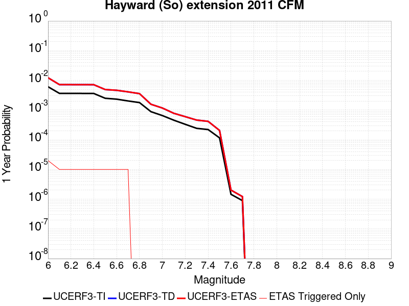 | 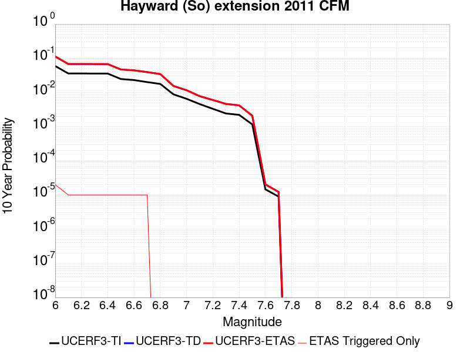 |

| Magnitude | 1 wk TI Prob | 1 wk TD Prob | 1 wk ETAS Prob | 1 wk ETAS/TD Gain | 1 wk ETAS Triggered Only | 1 mo TI Prob | 1 mo TD Prob | 1 mo ETAS Prob | 1 mo ETAS/TD Gain | 1 mo ETAS Triggered Only | 1 yr TI Prob | 1 yr TD Prob | 1 yr ETAS Prob | 1 yr ETAS/TD Gain | 1 yr ETAS Triggered Only | 10 yr TI Prob | 10 yr TD Prob | 10 yr ETAS Prob | 10 yr ETAS/TD Gain | 10 yr ETAS Triggered Only |
|-----|-----|-----|-----|-----|-----|-----|-----|-----|-----|-----|-----|-----|-----|-----|-----|-----|-----|-----|-----|-----|
| 6.0 | 1.1721256E-4 | 2.3697627E-4 | 2.3697627E-4 | 1.0 | 0.0 | 5.022428E-4 | 0.0010129517 | 0.0010229415 | 1.0098622 | 1.0E-5 | 0.0060976758 | 0.012248711 | 0.012268466 | 1.0016128 | 2.0E-5 | 0.0593305 | 0.112843215 | 0.112860955 | 1.0001572 | 2.0E-5 |
| 6.1 | 6.99169E-5 | 1.3822885E-4 | 1.3822885E-4 | 1.0 | 0.0 | 2.9960944E-4 | 5.9128006E-4 | 5.9128006E-4 | 1.0 | 0.0 | 0.0036416445 | 0.0071720886 | 0.007182017 | 1.0013843 | 1.0E-5 | 0.035825435 | 0.067803554 | 0.067812875 | 1.0001374 | 1.0E-5 |
| 6.2 | 6.99169E-5 | 1.3822885E-4 | 1.3822885E-4 | 1.0 | 0.0 | 2.9960944E-4 | 5.9128006E-4 | 5.9128006E-4 | 1.0 | 0.0 | 0.0036416445 | 0.0071720886 | 0.007182017 | 1.0013843 | 1.0E-5 | 0.035825435 | 0.067803554 | 0.067812875 | 1.0001374 | 1.0E-5 |
| 6.3 | 6.970908E-5 | 1.379104E-4 | 1.379104E-4 | 1.0 | 0.0 | 2.9871898E-4 | 5.899159E-4 | 5.899159E-4 | 1.0 | 0.0 | 0.0036308395 | 0.007155625 | 0.0071655535 | 1.0013875 | 1.0E-5 | 0.035720866 | 0.067652516 | 0.06766184 | 1.0001378 | 1.0E-5 |
| 6.4 | 6.9517155E-5 | 1.375792E-4 | 1.375792E-4 | 1.0 | 0.0 | 2.9789665E-4 | 5.884971E-4 | 5.884971E-4 | 1.0 | 0.0 | 0.0036208609 | 0.0071385372 | 0.007148466 | 1.0013908 | 1.0E-5 | 0.03562429 | 0.06749655 | 0.06750588 | 1.0001382 | 1.0E-5 |
| 6.5 | 4.786248E-5 | 9.41498E-5 | 9.41498E-5 | 1.0 | 0.0 | 2.0510878E-4 | 4.034394E-4 | 4.034394E-4 | 1.0 | 0.0 | 0.0024943394 | 0.004901227 | 0.0049111783 | 1.0020303 | 1.0E-5 | 0.02466527 | 0.046901822 | 0.04691135 | 1.0002033 | 1.0E-5 |
| 6.6 | 4.4662214E-5 | 8.881654E-5 | 8.881654E-5 | 1.0 | 0.0 | 1.9139545E-4 | 3.805894E-4 | 3.805894E-4 | 1.0 | 0.0 | 0.0023277493 | 0.0046242937 | 0.004634247 | 1.0021524 | 1.0E-5 | 0.02303517 | 0.044293344 | 0.044302903 | 1.0002158 | 1.0E-5 |
| 6.7 | 3.884542E-5 | 7.8648096E-5 | 7.8648096E-5 | 1.0 | 0.0 | 1.6646975E-4 | 3.370222E-4 | 3.370222E-4 | 1.0 | 0.0 | 0.002024885 | 0.0040959697 | 0.004105929 | 1.0024314 | 1.0E-5 | 0.020065336 | 0.039333146 | 0.039342754 | 1.0002443 | 1.0E-5 |
| 6.8 | 3.4221863E-5 | 6.855653E-5 | 6.855653E-5 | 1.0 | 0.0 | 1.4665688E-4 | 2.93783E-4 | 2.93783E-4 | 1.0 | 0.0 | 0.0017840851 | 0.0035713627 | 0.0035713627 | 1.0 | 0.0 | 0.017698295 | 0.034421004 | 0.034421004 | 1.0 | 0.0 |
| 6.9 | 1.6927712E-5 | 3.0061563E-5 | 3.0061563E-5 | 1.0 | 0.0 | 7.2545314E-5 | 1.2882923E-4 | 1.2882923E-4 | 1.0 | 0.0 | 8.828813E-4 | 0.0015674243 | 0.0015674243 | 1.0 | 0.0 | 0.008793819 | 0.01546327 | 0.01546327 | 1.0 | 0.0 |
| 7.0 | 1.2509653E-5 | 2.2462571E-5 | 2.2462571E-5 | 1.0 | 0.0 | 5.3611697E-5 | 9.6264856E-5 | 9.6264856E-5 | 1.0 | 0.0 | 6.525269E-4 | 0.0011714385 | 0.0011714385 | 1.0 | 0.0 | 0.0065061417 | 0.01158231 | 0.01158231 | 1.0 | 0.0 |
| 7.1 | 8.751583E-6 | 1.4925648E-5 | 1.4925648E-5 | 1.0 | 0.0 | 3.750624E-5 | 6.3965526E-5 | 6.3965526E-5 | 1.0 | 0.0 | 4.5654282E-4 | 7.785079E-4 | 7.785079E-4 | 1.0 | 0.0 | 0.0045560603 | 0.007763496 | 0.007763496 | 1.0 | 0.0 |
| 7.2 | 6.354379E-6 | 1.1498636E-5 | 1.1498636E-5 | 1.0 | 0.0 | 2.7232769E-5 | 4.9278966E-5 | 4.9278966E-5 | 1.0 | 0.0 | 3.3150852E-4 | 5.99811E-4 | 5.99811E-4 | 1.0 | 0.0 | 0.0033101442 | 0.0060003046 | 0.0060003046 | 1.0 | 0.0 |
| 7.3 | 4.645554E-6 | 8.818172E-6 | 8.818172E-6 | 1.0 | 0.0 | 1.9909365E-5 | 3.779164E-5 | 3.779164E-5 | 1.0 | 0.0 | 2.4236954E-4 | 4.6002E-4 | 4.6002E-4 | 1.0 | 0.0 | 0.0024210536 | 0.004610708 | 0.004610708 | 1.0 | 0.0 |
| 7.4 | 4.23437E-6 | 7.992532E-6 | 7.992532E-6 | 1.0 | 0.0 | 1.8147173E-5 | 3.425328E-5 | 3.425328E-5 | 1.0 | 0.0 | 2.2091944E-4 | 4.1695772E-4 | 4.1695772E-4 | 1.0 | 0.0 | 0.0022069993 | 0.004181972 | 0.004181972 | 1.0 | 0.0 |
| 7.5 | 2.2187417E-6 | 3.9522306E-6 | 3.9522306E-6 | 1.0 | 0.0 | 9.508858E-6 | 1.6938036E-5 | 1.6938036E-5 | 1.0 | 0.0 | 1.157642E-4 | 2.0620368E-4 | 2.0620368E-4 | 1.0 | 0.0 | 0.0011570391 | 0.0020734754 | 0.0020734754 | 1.0 | 0.0 |
| 7.6 | 2.7952495E-8 | 3.878529E-8 | 3.878529E-8 | 1.0 | 0.0 | 1.1979641E-7 | 1.6622266E-7 | 1.6622266E-7 | 1.0 | 0.0 | 1.4585203E-6 | 2.0237592E-6 | 2.0237592E-6 | 1.0 | 0.0 | 1.4585107E-5 | 2.0328182E-5 | 2.0328182E-5 | 1.0 | 0.0 |
| 7.7 | 1.7192724E-8 | 2.3436517E-8 | 2.3436517E-8 | 1.0 | 0.0 | 7.36831E-8 | 1.0044221E-7 | 1.0044221E-7 | 1.0 | 0.0 | 8.9709135E-7 | 1.2228833E-6 | 1.2228833E-6 | 1.0 | 0.0 | 8.970877E-6 | 1.2296933E-5 | 1.2296933E-5 | 1.0 | 0.0 |

## San Joaquin Hills
*[(top)](#table-of-contents)*

| 1 Week | 1 Month | 1 Year | 10 Year |
|-----|-----|-----|-----|
|  |  |  |  |

| Magnitude | 1 wk TI Prob | 1 wk TD Prob | 1 wk ETAS Prob | 1 wk ETAS/TD Gain | 1 wk ETAS Triggered Only | 1 mo TI Prob | 1 mo TD Prob | 1 mo ETAS Prob | 1 mo ETAS/TD Gain | 1 mo ETAS Triggered Only | 1 yr TI Prob | 1 yr TD Prob | 1 yr ETAS Prob | 1 yr ETAS/TD Gain | 1 yr ETAS Triggered Only | 10 yr TI Prob | 10 yr TD Prob | 10 yr ETAS Prob | 10 yr ETAS/TD Gain | 10 yr ETAS Triggered Only |
|-----|-----|-----|-----|-----|-----|-----|-----|-----|-----|-----|-----|-----|-----|-----|-----|-----|-----|-----|-----|-----|
| 6.0 | 3.4525704E-6 | 2.8139818E-6 | 2.8139818E-6 | 1.0 | 0.0 | 1.4796647E-5 | 1.2059867E-5 | 1.2059867E-5 | 1.0 | 0.0 | 1.8013427E-4 | 1.4681912E-4 | 1.4681912E-4 | 1.0 | 0.0 | 0.0017998833 | 0.0014672345 | 0.0014772197 | 1.0068055 | 1.0E-5 |
| 6.1 | 3.4525704E-6 | 2.8139818E-6 | 2.8139818E-6 | 1.0 | 0.0 | 1.4796647E-5 | 1.2059867E-5 | 1.2059867E-5 | 1.0 | 0.0 | 1.8013427E-4 | 1.4681912E-4 | 1.4681912E-4 | 1.0 | 0.0 | 0.0017998833 | 0.0014672345 | 0.0014772197 | 1.0068055 | 1.0E-5 |
| 6.2 | 3.4525704E-6 | 2.8139818E-6 | 2.8139818E-6 | 1.0 | 0.0 | 1.4796647E-5 | 1.2059867E-5 | 1.2059867E-5 | 1.0 | 0.0 | 1.8013427E-4 | 1.4681912E-4 | 1.4681912E-4 | 1.0 | 0.0 | 0.0017998833 | 0.0014672345 | 0.0014772197 | 1.0068055 | 1.0E-5 |
| 6.3 | 3.4525704E-6 | 2.8139818E-6 | 2.8139818E-6 | 1.0 | 0.0 | 1.4796647E-5 | 1.2059867E-5 | 1.2059867E-5 | 1.0 | 0.0 | 1.8013427E-4 | 1.4681912E-4 | 1.4681912E-4 | 1.0 | 0.0 | 0.0017998833 | 0.0014672345 | 0.0014772197 | 1.0068055 | 1.0E-5 |
| 6.4 | 3.4525704E-6 | 2.8139818E-6 | 2.8139818E-6 | 1.0 | 0.0 | 1.4796647E-5 | 1.2059867E-5 | 1.2059867E-5 | 1.0 | 0.0 | 1.8013427E-4 | 1.4681912E-4 | 1.4681912E-4 | 1.0 | 0.0 | 0.0017998833 | 0.0014672345 | 0.0014772197 | 1.0068055 | 1.0E-5 |
| 6.5 | 3.4525704E-6 | 2.8139818E-6 | 2.8139818E-6 | 1.0 | 0.0 | 1.4796647E-5 | 1.2059867E-5 | 1.2059867E-5 | 1.0 | 0.0 | 1.8013427E-4 | 1.4681912E-4 | 1.4681912E-4 | 1.0 | 0.0 | 0.0017998833 | 0.0014672345 | 0.0014772197 | 1.0068055 | 1.0E-5 |
| 6.6 | 3.4525704E-6 | 2.8139818E-6 | 2.8139818E-6 | 1.0 | 0.0 | 1.4796647E-5 | 1.2059867E-5 | 1.2059867E-5 | 1.0 | 0.0 | 1.8013427E-4 | 1.4681912E-4 | 1.4681912E-4 | 1.0 | 0.0 | 0.0017998833 | 0.0014672345 | 0.0014772197 | 1.0068055 | 1.0E-5 |
| 6.7 | 3.4525704E-6 | 2.8139818E-6 | 2.8139818E-6 | 1.0 | 0.0 | 1.4796647E-5 | 1.2059867E-5 | 1.2059867E-5 | 1.0 | 0.0 | 1.8013427E-4 | 1.4681912E-4 | 1.4681912E-4 | 1.0 | 0.0 | 0.0017998833 | 0.0014672345 | 0.0014772197 | 1.0068055 | 1.0E-5 |
| 6.8 | 3.388654E-6 | 2.7484202E-6 | 2.7484202E-6 | 1.0 | 0.0 | 1.4522722E-5 | 1.1778891E-5 | 1.1778891E-5 | 1.0 | 0.0 | 1.767998E-4 | 1.4339869E-4 | 1.4339869E-4 | 1.0 | 0.0 | 0.001766592 | 0.0014330745 | 0.0014430601 | 1.006968 | 1.0E-5 |
| 6.9 | 3.2694352E-6 | 2.6283346E-6 | 2.6283346E-6 | 1.0 | 0.0 | 1.401179E-5 | 1.1264243E-5 | 1.1264243E-5 | 1.0 | 0.0 | 1.7058018E-4 | 1.3713364E-4 | 1.3713364E-4 | 1.0 | 0.0 | 0.0017044931 | 0.0013705015 | 0.0013804878 | 1.0072865 | 1.0E-5 |
| 7.0 | 3.246912E-6 | 2.6069915E-6 | 2.6069915E-6 | 1.0 | 0.0 | 1.39152635E-5 | 1.1172774E-5 | 1.1172774E-5 | 1.0 | 0.0 | 1.6940516E-4 | 1.3602014E-4 | 1.3602014E-4 | 1.0 | 0.0 | 0.0016927607 | 0.0013593802 | 0.0013693665 | 1.0073463 | 1.0E-5 |
| 7.1 | 3.1864927E-6 | 2.5523198E-6 | 2.5523198E-6 | 1.0 | 0.0 | 1.3656326E-5 | 1.0938467E-5 | 1.0938467E-5 | 1.0 | 0.0 | 1.6625308E-4 | 1.3316782E-4 | 1.3316782E-4 | 1.0 | 0.0 | 0.0016612876 | 0.0013308912 | 0.0013408778 | 1.0075037 | 1.0E-5 |
| 7.2 | 3.0220644E-6 | 2.3991677E-6 | 2.3991677E-6 | 1.0 | 0.0 | 1.295164E-5 | 1.0282108E-5 | 1.0282108E-5 | 1.0 | 0.0 | 1.576748E-4 | 1.2517757E-4 | 1.2517757E-4 | 1.0 | 0.0 | 0.0015756298 | 0.0012510809 | 0.0012610684 | 1.0079831 | 1.0E-5 |
| 7.3 | 2.787619E-6 | 2.2173858E-6 | 2.2173858E-6 | 1.0 | 0.0 | 1.1946884E-5 | 9.503048E-6 | 9.503048E-6 | 1.0 | 0.0 | 1.454436E-4 | 1.1569356E-4 | 1.1569356E-4 | 1.0 | 0.0 | 0.0014534845 | 0.0011563431 | 0.0011663316 | 1.0086379 | 1.0E-5 |
| 7.4 | 2.4593792E-6 | 1.9226306E-6 | 1.9226306E-6 | 1.0 | 0.0 | 1.0540153E-5 | 8.23982E-6 | 8.23982E-6 | 1.0 | 0.0 | 1.2831882E-4 | 1.0031529E-4 | 1.0031529E-4 | 1.0 | 0.0 | 0.0012824474 | 0.0010027088 | 0.0010126987 | 1.009963 | 1.0E-5 |
| 7.5 | 1.926764E-6 | 1.4383021E-6 | 1.4383021E-6 | 1.0 | 0.0 | 8.257534E-6 | 6.1641376E-6 | 6.1641376E-6 | 1.0 | 0.0 | 1.00530844E-4 | 7.504586E-5 | 7.504586E-5 | 1.0 | 0.0 | 0.0010048538 | 7.502115E-4 | 7.60204E-4 | 1.0133196 | 1.0E-5 |
| 7.6 | 1.1609359E-6 | 8.14558E-7 | 8.14558E-7 | 1.0 | 0.0 | 4.97543E-6 | 3.4909585E-6 | 3.4909585E-6 | 1.0 | 0.0 | 6.0574173E-5 | 4.2501633E-5 | 4.2501633E-5 | 1.0 | 0.0 | 6.055767E-4 | 4.249394E-4 | 4.249394E-4 | 1.0 | 0.0 |
| 7.7 | 5.1168536E-7 | 2.7155914E-7 | 2.7155914E-7 | 1.0 | 0.0 | 2.1929354E-6 | 1.1638244E-6 | 1.1638244E-6 | 1.0 | 0.0 | 2.669866E-5 | 1.41694845E-5 | 1.41694845E-5 | 1.0 | 0.0 | 2.6695454E-4 | 1.4168715E-4 | 1.4168715E-4 | 1.0 | 0.0 |
| 7.8 | 1.16056995E-8 | 9.782373E-9 | 9.782373E-9 | 1.0 | 0.0 | 4.9738713E-8 | 4.1924455E-8 | 4.1924455E-8 | 1.0 | 0.0 | 6.0556863E-7 | 5.1043025E-7 | 5.1043025E-7 | 1.0 | 0.0 | 6.05567E-6 | 5.1043025E-6 | 5.1043025E-6 | 1.0 | 0.0 |

## Great Valley 04b Gordon Valley
*[(top)](#table-of-contents)*

| 1 Week | 1 Month | 1 Year | 10 Year |
|-----|-----|-----|-----|
|  |  |  |  |

| Magnitude | 1 wk TI Prob | 1 wk TD Prob | 1 wk ETAS Prob | 1 wk ETAS/TD Gain | 1 wk ETAS Triggered Only | 1 mo TI Prob | 1 mo TD Prob | 1 mo ETAS Prob | 1 mo ETAS/TD Gain | 1 mo ETAS Triggered Only | 1 yr TI Prob | 1 yr TD Prob | 1 yr ETAS Prob | 1 yr ETAS/TD Gain | 1 yr ETAS Triggered Only | 10 yr TI Prob | 10 yr TD Prob | 10 yr ETAS Prob | 10 yr ETAS/TD Gain | 10 yr ETAS Triggered Only |
|-----|-----|-----|-----|-----|-----|-----|-----|-----|-----|-----|-----|-----|-----|-----|-----|-----|-----|-----|-----|-----|
| 6.0 | 2.1181217E-5 | 2.3981953E-5 | 3.3981712E-5 | 1.4169703 | 1.0E-5 | 9.077348E-5 | 1.0277669E-4 | 1.1277566E-4 | 1.0972884 | 1.0E-5 | 0.0011046068 | 0.0012507546 | 0.0012607421 | 1.0079851 | 1.0E-5 | 0.010991322 | 0.012453599 | 0.012463475 | 1.000793 | 1.0E-5 |
| 6.1 | 2.1181217E-5 | 2.3981953E-5 | 3.3981712E-5 | 1.4169703 | 1.0E-5 | 9.077348E-5 | 1.0277669E-4 | 1.1277566E-4 | 1.0972884 | 1.0E-5 | 0.0011046068 | 0.0012507546 | 0.0012607421 | 1.0079851 | 1.0E-5 | 0.010991322 | 0.012453599 | 0.012463475 | 1.000793 | 1.0E-5 |
| 6.2 | 2.1181217E-5 | 2.3981953E-5 | 3.3981712E-5 | 1.4169703 | 1.0E-5 | 9.077348E-5 | 1.0277669E-4 | 1.1277566E-4 | 1.0972884 | 1.0E-5 | 0.0011046068 | 0.0012507546 | 0.0012607421 | 1.0079851 | 1.0E-5 | 0.010991322 | 0.012453599 | 0.012463475 | 1.000793 | 1.0E-5 |
| 6.3 | 2.1181217E-5 | 2.3981953E-5 | 3.3981712E-5 | 1.4169703 | 1.0E-5 | 9.077348E-5 | 1.0277669E-4 | 1.1277566E-4 | 1.0972884 | 1.0E-5 | 0.0011046068 | 0.0012507546 | 0.0012607421 | 1.0079851 | 1.0E-5 | 0.010991322 | 0.012453599 | 0.012463475 | 1.000793 | 1.0E-5 |
| 6.4 | 1.0988268E-5 | 1.2254499E-5 | 2.2254377E-5 | 1.8160169 | 1.0E-5 | 4.7091726E-5 | 5.2518313E-5 | 6.2517785E-5 | 1.1903998 | 1.0E-5 | 5.731909E-4 | 6.392388E-4 | 6.492324E-4 | 1.0156336 | 1.0E-5 | 0.005717147 | 0.0063755875 | 0.006385524 | 1.0015585 | 1.0E-5 |
| 6.5 | 1.0988268E-5 | 1.2254499E-5 | 2.2254377E-5 | 1.8160169 | 1.0E-5 | 4.7091726E-5 | 5.2518313E-5 | 6.2517785E-5 | 1.1903998 | 1.0E-5 | 5.731909E-4 | 6.392388E-4 | 6.492324E-4 | 1.0156336 | 1.0E-5 | 0.005717147 | 0.0063755875 | 0.006385524 | 1.0015585 | 1.0E-5 |
| 6.6 | 1.0517822E-5 | 1.1724062E-5 | 2.1723945E-5 | 1.8529367 | 1.0E-5 | 4.5075605E-5 | 5.02451E-5 | 6.0244598E-5 | 1.1990144 | 1.0E-5 | 5.4865726E-4 | 6.11578E-4 | 6.215719E-4 | 1.0163411 | 1.0E-5 | 0.0054730466 | 0.0061005033 | 0.0061104423 | 1.0016292 | 1.0E-5 |
| 6.7 | 7.789219E-6 | 8.6776445E-6 | 8.6776445E-6 | 1.0 | 0.0 | 3.3381937E-5 | 3.7189402E-5 | 3.7189402E-5 | 1.0 | 0.0 | 4.063493E-4 | 4.526921E-4 | 4.526921E-4 | 1.0 | 0.0 | 0.004056071 | 0.0045182165 | 0.0045182165 | 1.0 | 0.0 |
| 6.8 | 7.5850853E-6 | 8.452389E-6 | 8.452389E-6 | 1.0 | 0.0 | 3.2507105E-5 | 3.622405E-5 | 3.622405E-5 | 1.0 | 0.0 | 3.957021E-4 | 4.409437E-4 | 4.409437E-4 | 1.0 | 0.0 | 0.0039499826 | 0.0044012 | 0.0044012 | 1.0 | 0.0 |
| 6.9 | 6.604105E-6 | 7.3585493E-6 | 7.3585493E-6 | 1.0 | 0.0 | 2.8303E-5 | 3.153628E-5 | 3.153628E-5 | 1.0 | 0.0 | 3.4453452E-4 | 3.8389044E-4 | 3.8389044E-4 | 1.0 | 0.0 | 0.0034400085 | 0.0038326595 | 0.0038326595 | 1.0 | 0.0 |
| 7.0 | 5.3701115E-6 | 5.9884183E-6 | 5.9884183E-6 | 1.0 | 0.0 | 2.301456E-5 | 2.5664414E-5 | 2.5664414E-5 | 1.0 | 0.0 | 2.8016625E-4 | 3.1242234E-4 | 3.1242234E-4 | 1.0 | 0.0 | 0.0027981328 | 0.00312012 | 0.00312012 | 1.0 | 0.0 |
| 7.1 | 4.4685607E-6 | 4.986478E-6 | 4.986478E-6 | 1.0 | 0.0 | 1.9150835E-5 | 2.1370459E-5 | 2.1370459E-5 | 1.0 | 0.0 | 2.3313647E-4 | 2.6015675E-4 | 2.6015675E-4 | 1.0 | 0.0 | 0.0023289204 | 0.0025987667 | 0.0025987667 | 1.0 | 0.0 |
| 7.2 | 2.833378E-6 | 3.164419E-6 | 3.164419E-6 | 1.0 | 0.0 | 1.2142991E-5 | 1.3561736E-5 | 1.3561736E-5 | 1.0 | 0.0 | 1.4783088E-4 | 1.6510337E-4 | 1.6510337E-4 | 1.0 | 0.0 | 0.0014773258 | 0.0016499789 | 0.0016499789 | 1.0 | 0.0 |
| 7.3 | 7.0087293E-7 | 7.7728157E-7 | 7.7728157E-7 | 1.0 | 0.0 | 3.0037377E-6 | 3.3312049E-6 | 3.3312049E-6 | 1.0 | 0.0 | 3.656989E-5 | 4.0557123E-5 | 4.0557123E-5 | 1.0 | 0.0 | 3.6563876E-4 | 4.055422E-4 | 4.055422E-4 | 1.0 | 0.0 |
| 7.4 | 3.112171E-8 | 3.2068368E-8 | 3.2068368E-8 | 1.0 | 0.0 | 1.3337875E-7 | 1.3743585E-7 | 1.3743585E-7 | 1.0 | 0.0 | 1.6238852E-6 | 1.6732803E-6 | 1.6732803E-6 | 1.0 | 0.0 | 1.6238733E-5 | 1.6732685E-5 | 1.6732685E-5 | 1.0 | 0.0 |

## Point Reyes 2011 CFM
*[(top)](#table-of-contents)*

| 1 Week | 1 Month | 1 Year | 10 Year |
|-----|-----|-----|-----|
|  |  |  |  |

| Magnitude | 1 wk TI Prob | 1 wk TD Prob | 1 wk ETAS Prob | 1 wk ETAS/TD Gain | 1 wk ETAS Triggered Only | 1 mo TI Prob | 1 mo TD Prob | 1 mo ETAS Prob | 1 mo ETAS/TD Gain | 1 mo ETAS Triggered Only | 1 yr TI Prob | 1 yr TD Prob | 1 yr ETAS Prob | 1 yr ETAS/TD Gain | 1 yr ETAS Triggered Only | 10 yr TI Prob | 10 yr TD Prob | 10 yr ETAS Prob | 10 yr ETAS/TD Gain | 10 yr ETAS Triggered Only |
|-----|-----|-----|-----|-----|-----|-----|-----|-----|-----|-----|-----|-----|-----|-----|-----|-----|-----|-----|-----|-----|
| 6.0 | 8.8644965E-6 | 8.967163E-6 | 1.8967074E-5 | 2.1151698 | 1.0E-5 | 3.7990147E-5 | 3.843017E-5 | 4.8429785E-5 | 1.2602022 | 1.0E-5 | 4.624319E-4 | 4.6779314E-4 | 4.7778848E-4 | 1.021367 | 1.0E-5 | 0.0046147075 | 0.004668713 | 0.004678666 | 1.0021319 | 1.0E-5 |
| 6.1 | 4.526405E-6 | 4.5392185E-6 | 4.5392185E-6 | 1.0 | 0.0 | 1.9398734E-5 | 1.9453653E-5 | 1.9453653E-5 | 1.0 | 0.0 | 2.36154E-4 | 2.3682354E-4 | 2.3682354E-4 | 1.0 | 0.0 | 0.002359032 | 0.0023658178 | 0.0023658178 | 1.0 | 0.0 |
| 6.2 | 4.526405E-6 | 4.5392185E-6 | 4.5392185E-6 | 1.0 | 0.0 | 1.9398734E-5 | 1.9453653E-5 | 1.9453653E-5 | 1.0 | 0.0 | 2.36154E-4 | 2.3682354E-4 | 2.3682354E-4 | 1.0 | 0.0 | 0.002359032 | 0.0023658178 | 0.0023658178 | 1.0 | 0.0 |
| 6.3 | 2.6842322E-6 | 2.660676E-6 | 2.660676E-6 | 1.0 | 0.0 | 1.1503801E-5 | 1.1402849E-5 | 1.1402849E-5 | 1.0 | 0.0 | 1.4004979E-4 | 1.3882104E-4 | 1.3882104E-4 | 1.0 | 0.0 | 0.0013996155 | 0.0013873649 | 0.0013873649 | 1.0 | 0.0 |
| 6.4 | 2.6842322E-6 | 2.660676E-6 | 2.660676E-6 | 1.0 | 0.0 | 1.1503801E-5 | 1.1402849E-5 | 1.1402849E-5 | 1.0 | 0.0 | 1.4004979E-4 | 1.3882104E-4 | 1.3882104E-4 | 1.0 | 0.0 | 0.0013996155 | 0.0013873649 | 0.0013873649 | 1.0 | 0.0 |
| 6.5 | 1.9281833E-6 | 1.8906262E-6 | 1.8906262E-6 | 1.0 | 0.0 | 8.263617E-6 | 8.102659E-6 | 8.102659E-6 | 1.0 | 0.0 | 1.0060489E-4 | 9.86455E-5 | 9.86455E-5 | 1.0 | 0.0 | 0.0010055936 | 9.860279E-4 | 9.860279E-4 | 1.0 | 0.0 |
| 6.6 | 1.4726726E-6 | 1.4269577E-6 | 1.4269577E-6 | 1.0 | 0.0 | 6.3114385E-6 | 6.1155188E-6 | 6.1155188E-6 | 1.0 | 0.0 | 7.683905E-5 | 7.445395E-5 | 7.445395E-5 | 1.0 | 0.0 | 7.6812494E-4 | 7.4429717E-4 | 7.4429717E-4 | 1.0 | 0.0 |
| 6.7 | 8.572307E-7 | 8.007212E-7 | 8.007212E-7 | 1.0 | 0.0 | 3.6738406E-6 | 3.431658E-6 | 3.431658E-6 | 1.0 | 0.0 | 4.472809E-5 | 4.1779647E-5 | 4.1779647E-5 | 1.0 | 0.0 | 4.471909E-4 | 4.1772184E-4 | 4.1772184E-4 | 1.0 | 0.0 |
| 6.8 | 6.6745434E-7 | 6.0773E-7 | 6.0773E-7 | 1.0 | 0.0 | 2.8605155E-6 | 2.6045543E-6 | 2.6045543E-6 | 1.0 | 0.0 | 3.482622E-5 | 3.171E-5 | 3.171E-5 | 1.0 | 0.0 | 3.4820763E-4 | 3.1705803E-4 | 3.1705803E-4 | 1.0 | 0.0 |
| 6.9 | 4.291521E-7 | 3.6535937E-7 | 3.6535937E-7 | 1.0 | 0.0 | 1.839222E-6 | 1.565825E-6 | 1.565825E-6 | 1.0 | 0.0 | 2.2392298E-5 | 1.9063755E-5 | 1.9063755E-5 | 1.0 | 0.0 | 2.2390042E-4 | 1.9062385E-4 | 1.9062385E-4 | 1.0 | 0.0 |
| 7.0 | 2.6812808E-7 | 2.0187414E-7 | 2.0187414E-7 | 1.0 | 0.0 | 1.1491198E-6 | 8.651746E-7 | 8.651746E-7 | 1.0 | 0.0 | 1.3990444E-5 | 1.0533451E-5 | 1.0533451E-5 | 1.0 | 0.0 | 1.3989564E-4 | 1.0533186E-4 | 1.0533186E-4 | 1.0 | 0.0 |
| 7.1 | 1.9451231E-7 | 1.2725499E-7 | 1.2725499E-7 | 1.0 | 0.0 | 8.336239E-7 | 5.453784E-7 | 5.453784E-7 | 1.0 | 0.0 | 1.0149324E-5 | 6.6399616E-6 | 6.6399616E-6 | 1.0 | 0.0 | 1.014886E-4 | 6.639991E-5 | 6.639991E-5 | 1.0 | 0.0 |
| 7.2 | 1.6715143E-7 | 1.00428394E-7 | 1.00428394E-7 | 1.0 | 0.0 | 7.1636305E-7 | 4.3040734E-7 | 4.3040734E-7 | 1.0 | 0.0 | 8.721685E-6 | 5.2401965E-6 | 5.2401965E-6 | 1.0 | 0.0 | 8.721343E-5 | 5.2402997E-5 | 5.2402997E-5 | 1.0 | 0.0 |
| 7.3 | 1.5503173E-7 | 9.0131024E-8 | 9.0131024E-8 | 1.0 | 0.0 | 6.644215E-7 | 3.8627576E-7 | 3.8627576E-7 | 1.0 | 0.0 | 8.089301E-6 | 4.702897E-6 | 4.702897E-6 | 1.0 | 0.0 | 8.089007E-5 | 4.7030244E-5 | 4.7030244E-5 | 1.0 | 0.0 |
| 7.4 | 1.4251614E-7 | 8.097624E-8 | 8.097624E-8 | 1.0 | 0.0 | 6.1078333E-7 | 3.47041E-7 | 3.47041E-7 | 1.0 | 0.0 | 7.4362615E-6 | 4.225216E-6 | 4.225216E-6 | 1.0 | 0.0 | 7.436013E-5 | 4.2253625E-5 | 4.2253625E-5 | 1.0 | 0.0 |
| 7.5 | 1.2710186E-7 | 7.0296394E-8 | 7.0296394E-8 | 1.0 | 0.0 | 5.447221E-7 | 3.0127023E-7 | 3.0127023E-7 | 1.0 | 0.0 | 6.6319717E-6 | 3.667959E-6 | 3.667959E-6 | 1.0 | 0.0 | 6.6317734E-5 | 3.6681253E-5 | 3.6681253E-5 | 1.0 | 0.0 |
| 7.6 | 1.0144708E-7 | 5.4952274E-8 | 5.4952274E-8 | 1.0 | 0.0 | 4.347731E-7 | 2.3550973E-7 | 2.3550973E-7 | 1.0 | 0.0 | 5.2933497E-6 | 2.8673273E-6 | 2.8673273E-6 | 1.0 | 0.0 | 5.293224E-5 | 2.8675171E-5 | 2.8675171E-5 | 1.0 | 0.0 |
| 7.7 | 7.090527E-8 | 3.98231E-8 | 3.98231E-8 | 1.0 | 0.0 | 3.038797E-7 | 1.7067042E-7 | 1.7067042E-7 | 1.0 | 0.0 | 3.699729E-6 | 2.0779103E-6 | 2.0779103E-6 | 1.0 | 0.0 | 3.6996673E-5 | 2.0781177E-5 | 2.0781177E-5 | 1.0 | 0.0 |
| 7.8 | 3.8712045E-8 | 2.7440025E-8 | 2.7440025E-8 | 1.0 | 0.0 | 1.6590876E-7 | 1.176001E-7 | 1.176001E-7 | 1.0 | 0.0 | 2.0199373E-6 | 1.4317802E-6 | 1.4317802E-6 | 1.0 | 0.0 | 2.0199188E-5 | 1.4319979E-5 | 1.4319979E-5 | 1.0 | 0.0 |
| 7.9 | 1.7068782E-8 | 1.1833354E-8 | 1.1833354E-8 | 1.0 | 0.0 | 7.315192E-8 | 5.0714362E-8 | 5.0714362E-8 | 1.0 | 0.0 | 8.906242E-7 | 6.174472E-7 | 6.174472E-7 | 1.0 | 0.0 | 8.906207E-6 | 6.1767228E-6 | 6.1767228E-6 | 1.0 | 0.0 |
| 8.0 | 1.0172592E-8 | 7.0280843E-9 | 7.0280843E-9 | 1.0 | 0.0 | 4.359682E-8 | 3.0120354E-8 | 3.0120354E-8 | 1.0 | 0.0 | 5.3079117E-7 | 3.6671526E-7 | 3.6671526E-7 | 1.0 | 0.0 | 5.307899E-6 | 3.6694146E-6 | 3.6694146E-6 | 1.0 | 0.0 |
| 8.1 | 3.7861243E-9 | 3.5452439E-9 | 3.5452439E-9 | 1.0 | 0.0 | 1.6226247E-8 | 1.5193901E-8 | 1.5193901E-8 | 1.0 | 0.0 | 1.9755454E-7 | 1.8498575E-7 | 1.8498575E-7 | 1.0 | 0.0 | 1.9755437E-6 | 1.8518531E-6 | 1.8518531E-6 | 1.0 | 0.0 |

## Burnt Mtn
*[(top)](#table-of-contents)*

| 1 Week | 1 Month | 1 Year | 10 Year |
|-----|-----|-----|-----|
|  |  |  |  |

| Magnitude | 1 wk TI Prob | 1 wk TD Prob | 1 wk ETAS Prob | 1 wk ETAS/TD Gain | 1 wk ETAS Triggered Only | 1 mo TI Prob | 1 mo TD Prob | 1 mo ETAS Prob | 1 mo ETAS/TD Gain | 1 mo ETAS Triggered Only | 1 yr TI Prob | 1 yr TD Prob | 1 yr ETAS Prob | 1 yr ETAS/TD Gain | 1 yr ETAS Triggered Only | 10 yr TI Prob | 10 yr TD Prob | 10 yr ETAS Prob | 10 yr ETAS/TD Gain | 10 yr ETAS Triggered Only |
|-----|-----|-----|-----|-----|-----|-----|-----|-----|-----|-----|-----|-----|-----|-----|-----|-----|-----|-----|-----|-----|
| 6.0 | 1.5673151E-5 | 1.1749407E-5 | 1.1749407E-5 | 1.0 | 0.0 | 6.716892E-5 | 5.0354356E-5 | 6.0353854E-5 | 1.1985825 | 1.0E-5 | 8.1747473E-4 | 6.1302073E-4 | 6.2301464E-4 | 1.0163027 | 1.0E-5 | 0.008144741 | 0.006125938 | 0.0061358768 | 1.0016224 | 1.0E-5 |
| 6.1 | 1.5673151E-5 | 1.1749407E-5 | 1.1749407E-5 | 1.0 | 0.0 | 6.716892E-5 | 5.0354356E-5 | 6.0353854E-5 | 1.1985825 | 1.0E-5 | 8.1747473E-4 | 6.1302073E-4 | 6.2301464E-4 | 1.0163027 | 1.0E-5 | 0.008144741 | 0.006125938 | 0.0061358768 | 1.0016224 | 1.0E-5 |
| 6.2 | 1.5673151E-5 | 1.1749407E-5 | 1.1749407E-5 | 1.0 | 0.0 | 6.716892E-5 | 5.0354356E-5 | 6.0353854E-5 | 1.1985825 | 1.0E-5 | 8.1747473E-4 | 6.1302073E-4 | 6.2301464E-4 | 1.0163027 | 1.0E-5 | 0.008144741 | 0.006125938 | 0.0061358768 | 1.0016224 | 1.0E-5 |
| 6.3 | 1.5673151E-5 | 1.1749407E-5 | 1.1749407E-5 | 1.0 | 0.0 | 6.716892E-5 | 5.0354356E-5 | 6.0353854E-5 | 1.1985825 | 1.0E-5 | 8.1747473E-4 | 6.1302073E-4 | 6.2301464E-4 | 1.0163027 | 1.0E-5 | 0.008144741 | 0.006125938 | 0.0061358768 | 1.0016224 | 1.0E-5 |
| 6.4 | 1.5673151E-5 | 1.1749407E-5 | 1.1749407E-5 | 1.0 | 0.0 | 6.716892E-5 | 5.0354356E-5 | 6.0353854E-5 | 1.1985825 | 1.0E-5 | 8.1747473E-4 | 6.1302073E-4 | 6.2301464E-4 | 1.0163027 | 1.0E-5 | 0.008144741 | 0.006125938 | 0.0061358768 | 1.0016224 | 1.0E-5 |
| 6.5 | 1.36191375E-5 | 1.0078299E-5 | 1.0078299E-5 | 1.0 | 0.0 | 5.8366426E-5 | 4.3192707E-5 | 5.3192278E-5 | 1.2315105 | 1.0E-5 | 7.103795E-4 | 5.2587123E-4 | 5.3586595E-4 | 1.019006 | 1.0E-5 | 0.0070811296 | 0.0052587125 | 0.0052686594 | 1.0018916 | 1.0E-5 |

## San Andreas (North Coast) 2011 CFM
*[(top)](#table-of-contents)*

| 1 Week | 1 Month | 1 Year | 10 Year |
|-----|-----|-----|-----|
|  | 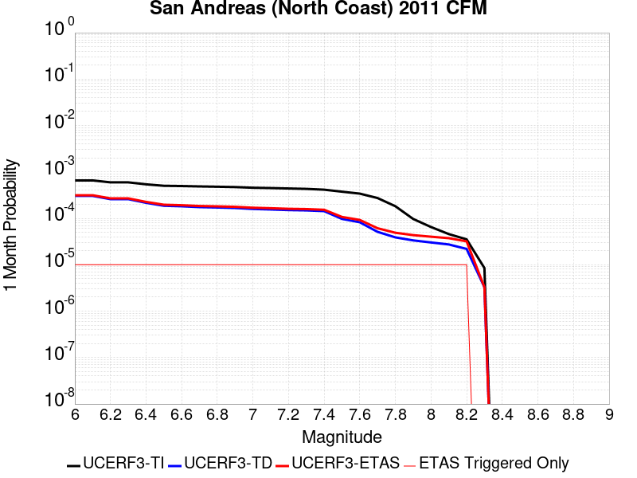 |  |  |

| Magnitude | 1 wk TI Prob | 1 wk TD Prob | 1 wk ETAS Prob | 1 wk ETAS/TD Gain | 1 wk ETAS Triggered Only | 1 mo TI Prob | 1 mo TD Prob | 1 mo ETAS Prob | 1 mo ETAS/TD Gain | 1 mo ETAS Triggered Only | 1 yr TI Prob | 1 yr TD Prob | 1 yr ETAS Prob | 1 yr ETAS/TD Gain | 1 yr ETAS Triggered Only | 10 yr TI Prob | 10 yr TD Prob | 10 yr ETAS Prob | 10 yr ETAS/TD Gain | 10 yr ETAS Triggered Only |
|-----|-----|-----|-----|-----|-----|-----|-----|-----|-----|-----|-----|-----|-----|-----|-----|-----|-----|-----|-----|-----|
| 6.0 | 1.5333705E-4 | 7.1106435E-5 | 8.1105725E-5 | 1.1406243 | 1.0E-5 | 6.5699324E-4 | 3.0470645E-4 | 3.147034E-4 | 1.0328084 | 1.0E-5 | 0.007969595 | 0.0037035241 | 0.0037134872 | 1.0026901 | 1.0E-5 | 0.0768977 | 0.03935284 | 0.03936245 | 1.0002441 | 1.0E-5 |
| 6.1 | 1.5333705E-4 | 7.1106435E-5 | 8.1105725E-5 | 1.1406243 | 1.0E-5 | 6.5699324E-4 | 3.0470645E-4 | 3.147034E-4 | 1.0328084 | 1.0E-5 | 0.007969595 | 0.0037035241 | 0.0037134872 | 1.0026901 | 1.0E-5 | 0.0768977 | 0.03935284 | 0.03936245 | 1.0002441 | 1.0E-5 |
| 6.2 | 1.3912938E-4 | 6.050204E-5 | 7.050143E-5 | 1.1652737 | 1.0E-5 | 5.961325E-4 | 2.5926883E-4 | 2.6926622E-4 | 1.03856 | 1.0E-5 | 0.007233787 | 0.003152056 | 0.0031620245 | 1.0031625 | 1.0E-5 | 0.07002798 | 0.03369227 | 0.033701934 | 1.0002868 | 1.0E-5 |
| 6.3 | 1.3912938E-4 | 6.050204E-5 | 7.050143E-5 | 1.1652737 | 1.0E-5 | 5.961325E-4 | 2.5926883E-4 | 2.6926622E-4 | 1.03856 | 1.0E-5 | 0.007233787 | 0.003152056 | 0.0031620245 | 1.0031625 | 1.0E-5 | 0.07002798 | 0.03369227 | 0.033701934 | 1.0002868 | 1.0E-5 |
| 6.4 | 1.2623647E-4 | 5.0442024E-5 | 6.0441518E-5 | 1.1982374 | 1.0E-5 | 5.4090127E-4 | 2.161623E-4 | 2.2616013E-4 | 1.0462515 | 1.0E-5 | 0.0065656058 | 0.0026286195 | 0.0026385933 | 1.0037943 | 1.0E-5 | 0.06374981 | 0.028303223 | 0.02831294 | 1.0003433 | 1.0E-5 |
| 6.5 | 1.1736096E-4 | 4.3523814E-5 | 5.3523378E-5 | 1.2297493 | 1.0E-5 | 5.028786E-4 | 1.8651738E-4 | 1.9651551E-4 | 1.0536044 | 1.0E-5 | 0.006105373 | 0.0022685004 | 0.0022784777 | 1.0043982 | 1.0E-5 | 0.05940335 | 0.024579322 | 0.024589075 | 1.0003968 | 1.0E-5 |
| 6.6 | 1.1586959E-4 | 4.2423668E-5 | 5.2423246E-5 | 1.2357075 | 1.0E-5 | 4.964894E-4 | 1.8180315E-4 | 1.9180133E-4 | 1.0549946 | 1.0E-5 | 0.006028018 | 0.0022112224 | 0.0022212004 | 1.0045124 | 1.0E-5 | 0.058671024 | 0.023984991 | 0.023994751 | 1.000407 | 1.0E-5 |
| 6.7 | 1.13693764E-4 | 4.073593E-5 | 5.073552E-5 | 1.2454735 | 1.0E-5 | 4.87168E-4 | 1.7457096E-4 | 1.8456922E-4 | 1.0572733 | 1.0E-5 | 0.005915152 | 0.0021233456 | 0.0021333243 | 1.0046996 | 1.0E-5 | 0.057601593 | 0.023076393 | 0.023086162 | 1.0004233 | 1.0E-5 |
| 6.8 | 1.1204889E-4 | 3.9953447E-5 | 4.995305E-5 | 1.2502813 | 1.0E-5 | 4.8012115E-4 | 1.7121792E-4 | 1.8121621E-4 | 1.0583951 | 1.0E-5 | 0.005829819 | 0.002082601 | 0.0020925803 | 1.0047917 | 1.0E-5 | 0.05679232 | 0.022636656 | 0.022646429 | 1.0004318 | 1.0E-5 |
| 6.9 | 1.1005794E-4 | 3.900957E-5 | 4.900918E-5 | 1.2563374 | 1.0E-5 | 4.7159163E-4 | 1.6717325E-4 | 1.7717158E-4 | 1.0598081 | 1.0E-5 | 0.0057265228 | 0.0020334502 | 0.0020434298 | 1.0049077 | 1.0E-5 | 0.055811852 | 0.022102542 | 0.022112321 | 1.0004424 | 1.0E-5 |
| 7.0 | 1.0647948E-4 | 3.7166337E-5 | 4.7165966E-5 | 1.2690507 | 1.0E-5 | 4.562608E-4 | 1.5927466E-4 | 1.6927307E-4 | 1.0627747 | 1.0E-5 | 0.0055408357 | 0.0019374598 | 0.0019474404 | 1.0051514 | 1.0E-5 | 0.054047033 | 0.021062272 | 0.021072062 | 1.0004648 | 1.0E-5 |
| 7.1 | 1.04795035E-4 | 3.6215948E-5 | 4.6215588E-5 | 1.2761115 | 1.0E-5 | 4.4904428E-4 | 1.5520205E-4 | 1.652005E-4 | 1.0644221 | 1.0E-5 | 0.0054534175 | 0.0018879628 | 0.001897944 | 1.0052867 | 1.0E-5 | 0.053215165 | 0.020530313 | 0.020540107 | 1.0004771 | 1.0E-5 |
| 7.2 | 1.02724036E-4 | 3.5124547E-5 | 4.5124194E-5 | 1.2846912 | 1.0E-5 | 4.401716E-4 | 1.5052517E-4 | 1.6052366E-4 | 1.066424 | 1.0E-5 | 0.0053459285 | 0.0018311188 | 0.0018411005 | 1.0054511 | 1.0E-5 | 0.052191395 | 0.019919246 | 0.019929048 | 1.000492 | 1.0E-5 |
| 7.3 | 1.00650694E-4 | 3.4592013E-5 | 4.4591667E-5 | 1.2890741 | 1.0E-5 | 4.312888E-4 | 1.4824314E-4 | 1.5824166E-4 | 1.0674467 | 1.0E-5 | 0.005238306 | 0.0018033815 | 0.0018133634 | 1.0055351 | 1.0E-5 | 0.051165357 | 0.019596443 | 0.019606246 | 1.0005003 | 1.0E-5 |
| 7.4 | 9.672919E-5 | 3.338123E-5 | 4.3380896E-5 | 1.2995596 | 1.0E-5 | 4.144878E-4 | 1.4305465E-4 | 1.5305322E-4 | 1.0698934 | 1.0E-5 | 0.005034718 | 0.0017403142 | 0.0017502968 | 1.0057361 | 1.0E-5 | 0.049221683 | 0.018869769 | 0.01887958 | 1.00052 | 1.0E-5 |
| 7.5 | 8.7600405E-5 | 2.2700917E-5 | 3.270069E-5 | 1.4405009 | 1.0E-5 | 3.753763E-4 | 9.728602E-5 | 1.0728505E-4 | 1.1027797 | 1.0E-5 | 0.0045606326 | 0.0011838155 | 0.0011938037 | 1.0084373 | 1.0E-5 | 0.04468165 | 0.013130207 | 0.013140076 | 1.0007516 | 1.0E-5 |
| 7.6 | 7.9562284E-5 | 1.9226305E-5 | 2.9226114E-5 | 1.5201107 | 1.0E-5 | 3.4093665E-4 | 8.239586E-5 | 9.2395036E-5 | 1.1213553 | 1.0E-5 | 0.0041430052 | 0.0010027094 | 0.0010126993 | 1.009963 | 1.0E-5 | 0.040666126 | 0.011221658 | 0.011231546 | 1.0008811 | 1.0E-5 |
| 7.7 | 6.3866544E-5 | 1.1941707E-5 | 2.1941587E-5 | 1.8373913 | 1.0E-5 | 2.7368503E-4 | 5.117774E-5 | 6.117723E-5 | 1.1953875 | 1.0E-5 | 0.0033270244 | 6.2291115E-4 | 6.329049E-4 | 1.0160437 | 1.0E-5 | 0.032776527 | 0.007210334 | 0.0072202617 | 1.0013769 | 1.0E-5 |
| 7.8 | 4.2543215E-5 | 9.076524E-6 | 1.9076433E-5 | 2.1017332 | 1.0E-5 | 1.8231533E-4 | 3.8898812E-5 | 4.8898422E-5 | 1.2570673 | 1.0E-5 | 0.0022174292 | 4.7349022E-4 | 4.8348546E-4 | 1.0211098 | 1.0E-5 | 0.021954332 | 0.005490525 | 0.0055004703 | 1.0018113 | 1.0E-5 |
| 7.9 | 2.2636612E-5 | 7.81435E-6 | 1.7814273E-5 | 2.279687 | 1.0E-5 | 9.7010445E-5 | 3.3489643E-5 | 4.3489308E-5 | 1.2985898 | 1.0E-5 | 0.0011804621 | 4.076602E-4 | 4.1765612E-4 | 1.0245203 | 1.0E-5 | 0.011742111 | 0.0046832846 | 0.0046932376 | 1.0021253 | 1.0E-5 |
| 8.0 | 1.5167874E-5 | 7.0494675E-6 | 1.7049397E-5 | 2.418537 | 1.0E-5 | 6.500356E-5 | 3.0211655E-5 | 4.021135E-5 | 1.330988 | 1.0E-5 | 7.9113094E-4 | 3.677649E-4 | 3.7776123E-4 | 1.0271813 | 1.0E-5 | 0.007883203 | 0.004215588 | 0.0042255456 | 1.0023621 | 1.0E-5 |
| 8.1 | 1.0681047E-5 | 6.386992E-6 | 1.6386928E-5 | 2.5656722 | 1.0E-5 | 4.5775112E-5 | 2.7372536E-5 | 3.737226E-5 | 1.3653197 | 1.0E-5 | 5.5716943E-4 | 3.3320975E-4 | 3.4320643E-4 | 1.0300012 | 1.0E-5 | 0.0055577457 | 0.003817393 | 0.0038273546 | 1.0026096 | 1.0E-5 |
| 8.2 | 8.226114E-6 | 5.1150587E-6 | 1.5115007E-5 | 2.9550018 | 1.0E-5 | 3.52543E-5 | 2.1921496E-5 | 3.1921278E-5 | 1.4561633 | 1.0E-5 | 4.2913653E-4 | 2.668616E-4 | 2.7685892E-4 | 1.0374626 | 1.0E-5 | 0.004283088 | 0.0030450926 | 0.0030550621 | 1.003274 | 1.0E-5 |
| 8.3 | 1.983087E-6 | 7.6599065E-7 | 7.6599065E-7 | 1.0 | 0.0 | 8.498917E-6 | 3.282813E-6 | 3.282813E-6 | 1.0 | 0.0 | 1.034694E-4 | 3.9967534E-5 | 3.9967534E-5 | 1.0 | 0.0 | 0.0010342124 | 4.719687E-4 | 4.719687E-4 | 1.0 | 0.0 |

## Keddie Ridge 2011 CFM
*[(top)](#table-of-contents)*

| 1 Week | 1 Month | 1 Year | 10 Year |
|-----|-----|-----|-----|
|  |  |  |  |

| Magnitude | 1 wk TI Prob | 1 wk TD Prob | 1 wk ETAS Prob | 1 wk ETAS/TD Gain | 1 wk ETAS Triggered Only | 1 mo TI Prob | 1 mo TD Prob | 1 mo ETAS Prob | 1 mo ETAS/TD Gain | 1 mo ETAS Triggered Only | 1 yr TI Prob | 1 yr TD Prob | 1 yr ETAS Prob | 1 yr ETAS/TD Gain | 1 yr ETAS Triggered Only | 10 yr TI Prob | 10 yr TD Prob | 10 yr ETAS Prob | 10 yr ETAS/TD Gain | 10 yr ETAS Triggered Only |
|-----|-----|-----|-----|-----|-----|-----|-----|-----|-----|-----|-----|-----|-----|-----|-----|-----|-----|-----|-----|-----|
| 6.0 | 2.2591947E-5 | 2.5189187E-5 | 2.5189187E-5 | 1.0 | 0.0 | 9.6819036E-5 | 1.07949636E-4 | 1.07949636E-4 | 1.0 | 0.0 | 0.0011781343 | 0.0013135736 | 0.0013135736 | 1.0 | 0.0 | 0.011719079 | 0.013066036 | 0.013075906 | 1.0007553 | 1.0E-5 |
| 6.1 | 2.2591947E-5 | 2.5189187E-5 | 2.5189187E-5 | 1.0 | 0.0 | 9.6819036E-5 | 1.07949636E-4 | 1.07949636E-4 | 1.0 | 0.0 | 0.0011781343 | 0.0013135736 | 0.0013135736 | 1.0 | 0.0 | 0.011719079 | 0.013066036 | 0.013075906 | 1.0007553 | 1.0E-5 |
| 6.2 | 1.3775145E-5 | 1.5322817E-5 | 1.5322817E-5 | 1.0 | 0.0 | 5.9035E-5 | 6.566771E-5 | 6.566771E-5 | 1.0 | 0.0 | 7.185141E-4 | 7.9923525E-4 | 7.9923525E-4 | 1.0 | 0.0 | 0.0071619535 | 0.007966028 | 0.007975947 | 1.0012454 | 1.0E-5 |
| 6.3 | 9.705435E-6 | 1.0768351E-5 | 1.0768351E-5 | 1.0 | 0.0 | 4.1594063E-5 | 4.614933E-5 | 4.614933E-5 | 1.0 | 0.0 | 5.0629E-4 | 5.6173565E-4 | 5.6173565E-4 | 1.0 | 0.0 | 0.005051381 | 0.0056043873 | 0.0056043873 | 1.0 | 0.0 |
| 6.4 | 7.2549733E-6 | 8.027269E-6 | 8.027269E-6 | 1.0 | 0.0 | 3.109237E-5 | 3.4402172E-5 | 3.4402172E-5 | 1.0 | 0.0 | 3.7848388E-4 | 4.187739E-4 | 4.187739E-4 | 1.0 | 0.0 | 0.003778399 | 0.0041806344 | 0.0041806344 | 1.0 | 0.0 |
| 6.5 | 5.983293E-6 | 6.613024E-6 | 6.613024E-6 | 1.0 | 0.0 | 2.5642432E-5 | 2.8341263E-5 | 2.8341263E-5 | 1.0 | 0.0 | 3.1215188E-4 | 3.4500696E-4 | 3.4500696E-4 | 1.0 | 0.0 | 0.0031171376 | 0.0034453757 | 0.0034453757 | 1.0 | 0.0 |
| 6.6 | 4.0336154E-6 | 4.4578046E-6 | 4.4578046E-6 | 1.0 | 0.0 | 1.728681E-5 | 1.9104758E-5 | 1.9104758E-5 | 1.0 | 0.0 | 2.1044657E-4 | 2.3257964E-4 | 2.3257964E-4 | 1.0 | 0.0 | 0.002102474 | 0.0023237579 | 0.0023237579 | 1.0 | 0.0 |
| 6.7 | 1.5832104E-6 | 1.7816087E-6 | 1.7816087E-6 | 1.0 | 0.0 | 6.7851697E-6 | 7.635445E-6 | 7.635445E-6 | 1.0 | 0.0 | 8.260631E-5 | 9.295785E-5 | 9.295785E-5 | 1.0 | 0.0 | 8.2575605E-4 | 9.2921633E-4 | 9.2921633E-4 | 1.0 | 0.0 |
| 6.8 | 7.5177275E-7 | 8.5902946E-7 | 8.5902946E-7 | 1.0 | 0.0 | 3.221879E-6 | 3.6815507E-6 | 3.6815507E-6 | 1.0 | 0.0 | 3.9225673E-5 | 4.4822125E-5 | 4.4822125E-5 | 1.0 | 0.0 | 3.921875E-4 | 4.481474E-4 | 4.481474E-4 | 1.0 | 0.0 |

## Bennett Valley 2011 CFM
*[(top)](#table-of-contents)*

| 1 Week | 1 Month | 1 Year | 10 Year |
|-----|-----|-----|-----|
|  |  |  | 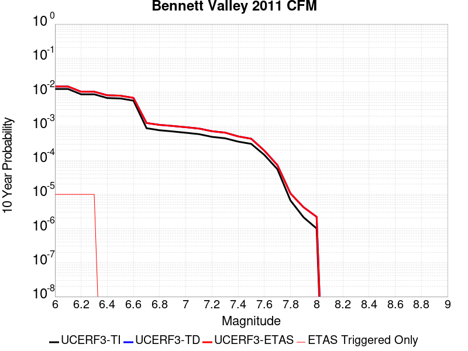 |

| Magnitude | 1 wk TI Prob | 1 wk TD Prob | 1 wk ETAS Prob | 1 wk ETAS/TD Gain | 1 wk ETAS Triggered Only | 1 mo TI Prob | 1 mo TD Prob | 1 mo ETAS Prob | 1 mo ETAS/TD Gain | 1 mo ETAS Triggered Only | 1 yr TI Prob | 1 yr TD Prob | 1 yr ETAS Prob | 1 yr ETAS/TD Gain | 1 yr ETAS Triggered Only | 10 yr TI Prob | 10 yr TD Prob | 10 yr ETAS Prob | 10 yr ETAS/TD Gain | 10 yr ETAS Triggered Only |
|-----|-----|-----|-----|-----|-----|-----|-----|-----|-----|-----|-----|-----|-----|-----|-----|-----|-----|-----|-----|-----|
| 6.0 | 2.3893934E-5 | 2.8238892E-5 | 2.8238892E-5 | 1.0 | 0.0 | 1.0239855E-4 | 1.2101925E-4 | 1.3101804E-4 | 1.0826215 | 1.0E-5 | 0.0012459893 | 0.0014725985 | 0.0014825837 | 1.0067807 | 1.0E-5 | 0.012390262 | 0.014651061 | 0.014660914 | 1.0006726 | 1.0E-5 |
| 6.1 | 2.3893934E-5 | 2.8238892E-5 | 2.8238892E-5 | 1.0 | 0.0 | 1.0239855E-4 | 1.2101925E-4 | 1.3101804E-4 | 1.0826215 | 1.0E-5 | 0.0012459893 | 0.0014725985 | 0.0014825837 | 1.0067807 | 1.0E-5 | 0.012390262 | 0.014651061 | 0.014660914 | 1.0006726 | 1.0E-5 |
| 6.2 | 1.6657146E-5 | 1.9853778E-5 | 1.9853778E-5 | 1.0 | 0.0 | 7.138582E-5 | 8.508564E-5 | 9.508479E-5 | 1.1175187 | 1.0E-5 | 8.6877577E-4 | 0.0010355669 | 0.0010455565 | 1.0096465 | 1.0E-5 | 0.008653872 | 0.010325688 | 0.010335585 | 1.0009584 | 1.0E-5 |
| 6.3 | 1.6657146E-5 | 1.9853778E-5 | 1.9853778E-5 | 1.0 | 0.0 | 7.138582E-5 | 8.508564E-5 | 9.508479E-5 | 1.1175187 | 1.0E-5 | 8.6877577E-4 | 0.0010355669 | 0.0010455565 | 1.0096465 | 1.0E-5 | 0.008653872 | 0.010325688 | 0.010335585 | 1.0009584 | 1.0E-5 |
| 6.4 | 1.29418495E-5 | 1.5567497E-5 | 1.5567497E-5 | 1.0 | 0.0 | 5.546389E-5 | 6.671687E-5 | 6.671687E-5 | 1.0 | 0.0 | 6.7506364E-4 | 8.121055E-4 | 8.121055E-4 | 1.0 | 0.0 | 0.0067301663 | 0.008108527 | 0.008108527 | 1.0 | 0.0 |
| 6.5 | 1.2582504E-5 | 1.5134528E-5 | 1.5134528E-5 | 1.0 | 0.0 | 5.39239E-5 | 6.4861386E-5 | 6.4861386E-5 | 1.0 | 0.0 | 6.563257E-4 | 7.895315E-4 | 7.895315E-4 | 1.0 | 0.0 | 0.006543907 | 0.007884431 | 0.007884431 | 1.0 | 0.0 |
| 6.6 | 1.0846706E-5 | 1.3036779E-5 | 1.3036779E-5 | 1.0 | 0.0 | 4.6485053E-5 | 5.5871435E-5 | 5.5871435E-5 | 1.0 | 0.0 | 5.6580856E-4 | 6.801508E-4 | 6.801508E-4 | 1.0 | 0.0 | 0.005643701 | 0.0067976876 | 0.0067976876 | 1.0 | 0.0 |
| 6.7 | 1.6803231E-6 | 2.377857E-6 | 2.377857E-6 | 1.0 | 0.0 | 7.2013645E-6 | 1.0190777E-5 | 1.0190777E-5 | 1.0 | 0.0 | 8.7673085E-5 | 1.2406579E-4 | 1.2406579E-4 | 1.0 | 0.0 | 8.76385E-4 | 0.0012444059 | 0.0012444059 | 1.0 | 0.0 |
| 6.8 | 1.4609833E-6 | 2.0939308E-6 | 2.0939308E-6 | 1.0 | 0.0 | 6.261342E-6 | 8.973958E-6 | 8.973958E-6 | 1.0 | 0.0 | 7.6229175E-5 | 1.09252534E-4 | 1.09252534E-4 | 1.0 | 0.0 | 7.620303E-4 | 0.0010963855 | 0.0010963855 | 1.0 | 0.0 |
| 6.9 | 1.3492396E-6 | 1.945872E-6 | 1.945872E-6 | 1.0 | 0.0 | 5.7824427E-6 | 8.339425E-6 | 8.339425E-6 | 1.0 | 0.0 | 7.0398964E-5 | 1.0152783E-4 | 1.0152783E-4 | 1.0 | 0.0 | 7.037667E-4 | 0.001019182 | 0.001019182 | 1.0 | 0.0 |
| 7.0 | 1.2347921E-6 | 1.7888614E-6 | 1.7888614E-6 | 1.0 | 0.0 | 5.291955E-6 | 7.6665265E-6 | 7.6665265E-6 | 1.0 | 0.0 | 6.442765E-5 | 9.333601E-5 | 9.333601E-5 | 1.0 | 0.0 | 6.440897E-4 | 9.373206E-4 | 9.373206E-4 | 1.0 | 0.0 |
| 7.1 | 1.1262973E-6 | 1.6358822E-6 | 1.6358822E-6 | 1.0 | 0.0 | 4.8269794E-6 | 7.010905E-6 | 7.010905E-6 | 1.0 | 0.0 | 5.876689E-5 | 8.535448E-5 | 8.535448E-5 | 1.0 | 0.0 | 5.875135E-4 | 8.575462E-4 | 8.575462E-4 | 1.0 | 0.0 |
| 7.2 | 9.351744E-7 | 1.3611456E-6 | 1.3611456E-6 | 1.0 | 0.0 | 4.007884E-6 | 5.8334676E-6 | 5.8334676E-6 | 1.0 | 0.0 | 4.8794896E-5 | 7.102018E-5 | 7.102018E-5 | 1.0 | 0.0 | 4.878418E-4 | 7.1425125E-4 | 7.1425125E-4 | 1.0 | 0.0 |
| 7.3 | 8.5039534E-7 | 1.2386469E-6 | 1.2386469E-6 | 1.0 | 0.0 | 3.6445463E-6 | 5.308476E-6 | 5.308476E-6 | 1.0 | 0.0 | 4.437145E-5 | 6.4628795E-5 | 6.4628795E-5 | 1.0 | 0.0 | 4.436259E-4 | 6.50087E-4 | 6.50087E-4 | 1.0 | 0.0 |
| 7.4 | 6.7875015E-7 | 9.600462E-7 | 9.600462E-7 | 1.0 | 0.0 | 2.908926E-6 | 4.114477E-6 | 4.114477E-6 | 1.0 | 0.0 | 3.54156E-5 | 5.0092618E-5 | 5.0092618E-5 | 1.0 | 0.0 | 3.5409955E-4 | 5.0410116E-4 | 5.0410116E-4 | 1.0 | 0.0 |
| 7.5 | 5.826867E-7 | 8.188238E-7 | 8.188238E-7 | 1.0 | 0.0 | 2.4972264E-6 | 3.5092403E-6 | 3.5092403E-6 | 1.0 | 0.0 | 3.0403306E-5 | 4.2724172E-5 | 4.2724172E-5 | 1.0 | 0.0 | 3.0399146E-4 | 4.3002292E-4 | 4.3002292E-4 | 1.0 | 0.0 |
| 7.6 | 2.7734902E-7 | 3.682212E-7 | 3.682212E-7 | 1.0 | 0.0 | 1.1886381E-6 | 1.5780898E-6 | 1.5780898E-6 | 1.0 | 0.0 | 1.4471572E-5 | 1.9213076E-5 | 1.9213076E-5 | 1.0 | 0.0 | 1.447063E-4 | 1.9312318E-4 | 1.9312318E-4 | 1.0 | 0.0 |
| 7.7 | 1.0530888E-7 | 1.3748802E-7 | 1.3748802E-7 | 1.0 | 0.0 | 4.513237E-7 | 5.892342E-7 | 5.892342E-7 | 1.0 | 0.0 | 5.4948523E-6 | 7.1739028E-6 | 7.1739028E-6 | 1.0 | 0.0 | 5.4947162E-5 | 7.256238E-5 | 7.256238E-5 | 1.0 | 0.0 |
| 7.8 | 1.2714258E-8 | 1.9632653E-8 | 1.9632653E-8 | 1.0 | 0.0 | 5.448968E-8 | 8.413994E-8 | 8.413994E-8 | 1.0 | 0.0 | 6.6341164E-7 | 1.0244033E-6 | 1.0244033E-6 | 1.0 | 0.0 | 6.6340967E-6 | 1.0658104E-5 | 1.0658104E-5 | 1.0 | 0.0 |
| 7.9 | 4.075888E-9 | 7.559692E-9 | 7.559692E-9 | 1.0 | 0.0 | 1.7468091E-8 | 3.239868E-8 | 3.239868E-8 | 1.0 | 0.0 | 2.12674E-7 | 3.9445388E-7 | 3.9445388E-7 | 1.0 | 0.0 | 2.1267379E-6 | 4.194808E-6 | 4.194808E-6 | 1.0 | 0.0 |
| 8.0 | 1.9126138E-9 | 3.995532E-9 | 3.995532E-9 | 1.0 | 0.0 | 8.196917E-9 | 1.7123707E-8 | 1.7123707E-8 | 1.0 | 0.0 | 9.9797454E-8 | 2.0848113E-7 | 2.0848113E-7 | 1.0 | 0.0 | 9.979741E-7 | 2.197992E-6 | 2.197992E-6 | 1.0 | 0.0 |

## Santa Susana alt 1
*[(top)](#table-of-contents)*

| 1 Week | 1 Month | 1 Year | 10 Year |
|-----|-----|-----|-----|
|  |  | 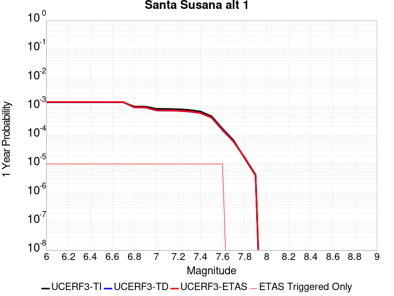 |  |

| Magnitude | 1 wk TI Prob | 1 wk TD Prob | 1 wk ETAS Prob | 1 wk ETAS/TD Gain | 1 wk ETAS Triggered Only | 1 mo TI Prob | 1 mo TD Prob | 1 mo ETAS Prob | 1 mo ETAS/TD Gain | 1 mo ETAS Triggered Only | 1 yr TI Prob | 1 yr TD Prob | 1 yr ETAS Prob | 1 yr ETAS/TD Gain | 1 yr ETAS Triggered Only | 10 yr TI Prob | 10 yr TD Prob | 10 yr ETAS Prob | 10 yr ETAS/TD Gain | 10 yr ETAS Triggered Only |
|-----|-----|-----|-----|-----|-----|-----|-----|-----|-----|-----|-----|-----|-----|-----|-----|-----|-----|-----|-----|-----|
| 6.0 | 2.674877E-5 | 2.7198023E-5 | 2.7198023E-5 | 1.0 | 0.0 | 1.1463255E-4 | 1.1655839E-4 | 1.1655839E-4 | 1.0 | 0.0 | 0.0013947578 | 0.0014182882 | 0.001428274 | 1.0070407 | 1.0E-5 | 0.013860362 | 0.014104128 | 0.014113987 | 1.000699 | 1.0E-5 |
| 6.1 | 2.674877E-5 | 2.7198023E-5 | 2.7198023E-5 | 1.0 | 0.0 | 1.1463255E-4 | 1.1655839E-4 | 1.1655839E-4 | 1.0 | 0.0 | 0.0013947578 | 0.0014182882 | 0.001428274 | 1.0070407 | 1.0E-5 | 0.013860362 | 0.014104128 | 0.014113987 | 1.000699 | 1.0E-5 |
| 6.2 | 2.674877E-5 | 2.7198023E-5 | 2.7198023E-5 | 1.0 | 0.0 | 1.1463255E-4 | 1.1655839E-4 | 1.1655839E-4 | 1.0 | 0.0 | 0.0013947578 | 0.0014182882 | 0.001428274 | 1.0070407 | 1.0E-5 | 0.013860362 | 0.014104128 | 0.014113987 | 1.000699 | 1.0E-5 |
| 6.3 | 2.674877E-5 | 2.7198023E-5 | 2.7198023E-5 | 1.0 | 0.0 | 1.1463255E-4 | 1.1655839E-4 | 1.1655839E-4 | 1.0 | 0.0 | 0.0013947578 | 0.0014182882 | 0.001428274 | 1.0070407 | 1.0E-5 | 0.013860362 | 0.014104128 | 0.014113987 | 1.000699 | 1.0E-5 |
| 6.4 | 2.674877E-5 | 2.7198023E-5 | 2.7198023E-5 | 1.0 | 0.0 | 1.1463255E-4 | 1.1655839E-4 | 1.1655839E-4 | 1.0 | 0.0 | 0.0013947578 | 0.0014182882 | 0.001428274 | 1.0070407 | 1.0E-5 | 0.013860362 | 0.014104128 | 0.014113987 | 1.000699 | 1.0E-5 |
| 6.5 | 2.674877E-5 | 2.7198023E-5 | 2.7198023E-5 | 1.0 | 0.0 | 1.1463255E-4 | 1.1655839E-4 | 1.1655839E-4 | 1.0 | 0.0 | 0.0013947578 | 0.0014182882 | 0.001428274 | 1.0070407 | 1.0E-5 | 0.013860362 | 0.014104128 | 0.014113987 | 1.000699 | 1.0E-5 |
| 6.6 | 2.6647976E-5 | 2.7074359E-5 | 2.7074359E-5 | 1.0 | 0.0 | 1.14200615E-4 | 1.1602845E-4 | 1.1602845E-4 | 1.0 | 0.0 | 0.0013895056 | 0.0014118447 | 0.0014218307 | 1.0070729 | 1.0E-5 | 0.013808494 | 0.014040513 | 0.014050373 | 1.0007023 | 1.0E-5 |
| 6.7 | 2.6647976E-5 | 2.7074359E-5 | 2.7074359E-5 | 1.0 | 0.0 | 1.14200615E-4 | 1.1602845E-4 | 1.1602845E-4 | 1.0 | 0.0 | 0.0013895056 | 0.0014118447 | 0.0014218307 | 1.0070729 | 1.0E-5 | 0.013808494 | 0.014040513 | 0.014050373 | 1.0007023 | 1.0E-5 |
| 6.8 | 1.9073179E-5 | 1.7637283E-5 | 1.7637283E-5 | 1.0 | 0.0 | 8.1739636E-5 | 7.558627E-5 | 7.558627E-5 | 1.0 | 0.0 | 9.947256E-4 | 9.198925E-4 | 9.298833E-4 | 1.0108608 | 1.0E-5 | 0.009902848 | 0.009163101 | 0.00917301 | 1.0010813 | 1.0E-5 |
| 6.9 | 1.9041876E-5 | 1.7619415E-5 | 1.7619415E-5 | 1.0 | 0.0 | 8.160549E-5 | 7.55097E-5 | 7.55097E-5 | 1.0 | 0.0 | 9.930939E-4 | 9.1896096E-4 | 9.289518E-4 | 1.0108719 | 1.0E-5 | 0.0098866755 | 0.0091538625 | 0.009163771 | 1.0010824 | 1.0E-5 |
| 7.0 | 1.5917482E-5 | 1.3863864E-5 | 1.3863864E-5 | 1.0 | 0.0 | 6.8215995E-5 | 5.9415237E-5 | 5.9415237E-5 | 1.0 | 0.0 | 8.302132E-4 | 7.231451E-4 | 7.3313783E-4 | 1.0138185 | 1.0E-5 | 0.008271185 | 0.0072088144 | 0.0072187423 | 1.0013772 | 1.0E-5 |
| 7.1 | 1.577788E-5 | 1.3743872E-5 | 1.3743872E-5 | 1.0 | 0.0 | 6.761774E-5 | 5.8901005E-5 | 5.8901005E-5 | 1.0 | 0.0 | 8.2293496E-4 | 7.1688846E-4 | 7.2688126E-4 | 1.0139391 | 1.0E-5 | 0.008198941 | 0.007146652 | 0.0071565807 | 1.0013893 | 1.0E-5 |
| 7.2 | 1.5416446E-5 | 1.3469944E-5 | 1.3469944E-5 | 1.0 | 0.0 | 6.606882E-5 | 5.772708E-5 | 5.772708E-5 | 1.0 | 0.0 | 8.0409093E-4 | 7.026052E-4 | 7.1259815E-4 | 1.0142227 | 1.0E-5 | 0.008011877 | 0.0070047234 | 0.007014653 | 1.0014176 | 1.0E-5 |
| 7.3 | 1.4534083E-5 | 1.2717879E-5 | 1.2717879E-5 | 1.0 | 0.0 | 6.228744E-5 | 5.4504082E-5 | 5.4504082E-5 | 1.0 | 0.0 | 7.580857E-4 | 6.633896E-4 | 6.7338295E-4 | 1.0150641 | 1.0E-5 | 0.007555048 | 0.0066149444 | 0.0066248784 | 1.0015017 | 1.0E-5 |
| 7.4 | 1.2858995E-5 | 1.1229652E-5 | 1.1229652E-5 | 1.0 | 0.0 | 5.5108816E-5 | 4.8126214E-5 | 4.8126214E-5 | 1.0 | 0.0 | 6.7074323E-4 | 5.857831E-4 | 5.9577724E-4 | 1.0170611 | 1.0E-5 | 0.0066872234 | 0.005843165 | 0.0058531063 | 1.0017014 | 1.0E-5 |
| 7.5 | 8.827668E-6 | 7.805457E-6 | 7.805457E-6 | 1.0 | 0.0 | 3.7832317E-5 | 3.3451546E-5 | 3.3451546E-5 | 1.0 | 0.0 | 4.605111E-4 | 4.071989E-4 | 4.1719482E-4 | 1.024548 | 1.0E-5 | 0.0045955796 | 0.0040647765 | 0.004074736 | 1.0024501 | 1.0E-5 |
| 7.6 | 3.2533426E-6 | 2.871988E-6 | 2.871988E-6 | 1.0 | 0.0 | 1.3942822E-5 | 1.2308465E-5 | 1.2308465E-5 | 1.0 | 0.0 | 1.6974064E-4 | 1.4984563E-4 | 1.5984412E-4 | 1.0667254 | 1.0E-5 | 0.0016961104 | 0.0014974826 | 0.0015074677 | 1.0066679 | 1.0E-5 |
| 7.7 | 1.2751709E-6 | 1.1491089E-6 | 1.1491089E-6 | 1.0 | 0.0 | 5.4650063E-6 | 4.9247437E-6 | 4.9247437E-6 | 1.0 | 0.0 | 6.653442E-5 | 5.9957198E-5 | 5.9957198E-5 | 1.0 | 0.0 | 6.6514505E-4 | 5.994191E-4 | 5.994191E-4 | 1.0 | 0.0 |
| 7.8 | 3.067544E-7 | 3.2400436E-7 | 3.2400436E-7 | 1.0 | 0.0 | 1.3146611E-6 | 1.3885895E-6 | 1.3885895E-6 | 1.0 | 0.0 | 1.600588E-5 | 1.6905957E-5 | 1.6905957E-5 | 1.0 | 0.0 | 1.6004729E-4 | 1.6904772E-4 | 1.6904772E-4 | 1.0 | 0.0 |
| 7.9 | 7.622999E-8 | 8.087964E-8 | 8.087964E-8 | 1.0 | 0.0 | 3.2669993E-7 | 3.4662696E-7 | 3.4662696E-7 | 1.0 | 0.0 | 3.977564E-6 | 4.2201773E-6 | 4.2201773E-6 | 1.0 | 0.0 | 3.977493E-5 | 4.220118E-5 | 4.220118E-5 | 1.0 | 0.0 |

## Skinner Flat 2011 CFM
*[(top)](#table-of-contents)*

| 1 Week | 1 Month | 1 Year | 10 Year |
|-----|-----|-----|-----|
|  |  | 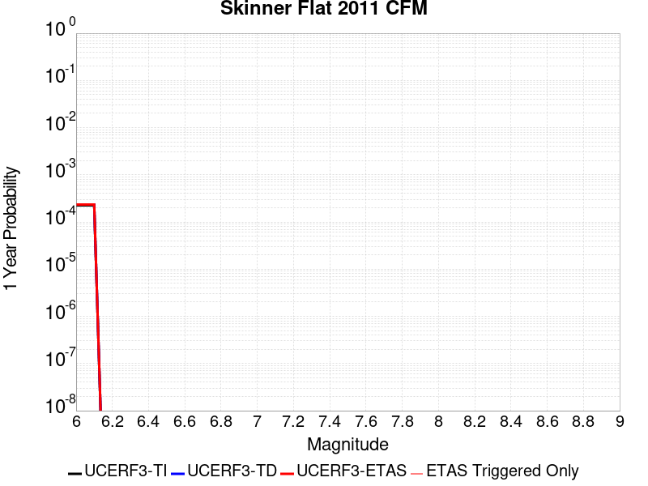 |  |

| Magnitude | 1 wk TI Prob | 1 wk TD Prob | 1 wk ETAS Prob | 1 wk ETAS/TD Gain | 1 wk ETAS Triggered Only | 1 mo TI Prob | 1 mo TD Prob | 1 mo ETAS Prob | 1 mo ETAS/TD Gain | 1 mo ETAS Triggered Only | 1 yr TI Prob | 1 yr TD Prob | 1 yr ETAS Prob | 1 yr ETAS/TD Gain | 1 yr ETAS Triggered Only | 10 yr TI Prob | 10 yr TD Prob | 10 yr ETAS Prob | 10 yr ETAS/TD Gain | 10 yr ETAS Triggered Only |
|-----|-----|-----|-----|-----|-----|-----|-----|-----|-----|-----|-----|-----|-----|-----|-----|-----|-----|-----|-----|-----|
| 6.0 | 4.3279074E-6 | 4.484953E-6 | 4.484953E-6 | 1.0 | 0.0 | 1.8548042E-5 | 1.9221226E-5 | 1.9221226E-5 | 1.0 | 0.0 | 2.2579901E-4 | 2.3401844E-4 | 2.3401844E-4 | 1.0 | 0.0 | 0.002255697 | 0.0023401843 | 0.002350161 | 1.0042632 | 1.0E-5 |
| 6.1 | 4.3279074E-6 | 4.484953E-6 | 4.484953E-6 | 1.0 | 0.0 | 1.8548042E-5 | 1.9221226E-5 | 1.9221226E-5 | 1.0 | 0.0 | 2.2579901E-4 | 2.3401844E-4 | 2.3401844E-4 | 1.0 | 0.0 | 0.002255697 | 0.0023401843 | 0.0023401843 | 1.0 | 0.0 |

## Elsinore (Coyote Mountains)
*[(top)](#table-of-contents)*

| 1 Week | 1 Month | 1 Year | 10 Year |
|-----|-----|-----|-----|
|  |  |  |  |

| Magnitude | 1 wk TI Prob | 1 wk TD Prob | 1 wk ETAS Prob | 1 wk ETAS/TD Gain | 1 wk ETAS Triggered Only | 1 mo TI Prob | 1 mo TD Prob | 1 mo ETAS Prob | 1 mo ETAS/TD Gain | 1 mo ETAS Triggered Only | 1 yr TI Prob | 1 yr TD Prob | 1 yr ETAS Prob | 1 yr ETAS/TD Gain | 1 yr ETAS Triggered Only | 10 yr TI Prob | 10 yr TD Prob | 10 yr ETAS Prob | 10 yr ETAS/TD Gain | 10 yr ETAS Triggered Only |
|-----|-----|-----|-----|-----|-----|-----|-----|-----|-----|-----|-----|-----|-----|-----|-----|-----|-----|-----|-----|-----|
| 6.0 | 4.20513E-5 | 4.8631882E-5 | 5.8631398E-5 | 1.2056165 | 1.0E-5 | 1.8020741E-4 | 2.0840895E-4 | 2.1840687E-4 | 1.0479726 | 1.0E-5 | 0.0021918174 | 0.002535 | 0.0025449747 | 1.0039347 | 1.0E-5 | 0.021703249 | 0.025111282 | 0.025121031 | 1.0003883 | 1.0E-5 |
| 6.1 | 4.20513E-5 | 4.8631882E-5 | 5.8631398E-5 | 1.2056165 | 1.0E-5 | 1.8020741E-4 | 2.0840895E-4 | 2.1840687E-4 | 1.0479726 | 1.0E-5 | 0.0021918174 | 0.002535 | 0.0025449747 | 1.0039347 | 1.0E-5 | 0.021703249 | 0.025111282 | 0.025121031 | 1.0003883 | 1.0E-5 |
| 6.2 | 2.3413893E-5 | 2.469566E-5 | 3.4695415E-5 | 1.4049194 | 1.0E-5 | 1.0034139E-4 | 1.0583479E-4 | 1.1583373E-4 | 1.0944769 | 1.0E-5 | 0.0012209718 | 0.0012878707 | 0.0012978577 | 1.0077548 | 1.0E-5 | 0.012142851 | 0.01281264 | 0.012822512 | 1.0007704 | 1.0E-5 |
| 6.3 | 2.3413893E-5 | 2.469566E-5 | 3.4695415E-5 | 1.4049194 | 1.0E-5 | 1.0034139E-4 | 1.0583479E-4 | 1.1583373E-4 | 1.0944769 | 1.0E-5 | 0.0012209718 | 0.0012878707 | 0.0012978577 | 1.0077548 | 1.0E-5 | 0.012142851 | 0.01281264 | 0.012822512 | 1.0007704 | 1.0E-5 |
| 6.4 | 1.6894814E-5 | 1.6568361E-5 | 2.6568196E-5 | 1.60355 | 1.0E-5 | 7.240433E-5 | 7.1005554E-5 | 8.100484E-5 | 1.1408241 | 1.0E-5 | 8.811662E-4 | 8.6418656E-4 | 8.741779E-4 | 1.0115616 | 1.0E-5 | 0.0087768035 | 0.00861194 | 0.008621854 | 1.0011512 | 1.0E-5 |
| 6.5 | 1.6894814E-5 | 1.6568361E-5 | 2.6568196E-5 | 1.60355 | 1.0E-5 | 7.240433E-5 | 7.1005554E-5 | 8.100484E-5 | 1.1408241 | 1.0E-5 | 8.811662E-4 | 8.6418656E-4 | 8.741779E-4 | 1.0115616 | 1.0E-5 | 0.0087768035 | 0.00861194 | 0.008621854 | 1.0011512 | 1.0E-5 |
| 6.6 | 1.1910969E-5 | 1.0530774E-5 | 2.0530668E-5 | 1.9495878 | 1.0E-5 | 5.1046012E-5 | 4.5131183E-5 | 5.513073E-5 | 1.2215663 | 1.0E-5 | 6.21308E-4 | 5.4934516E-4 | 5.5933965E-4 | 1.0181935 | 1.0E-5 | 0.0061957375 | 0.005481174 | 0.0054911193 | 1.0018145 | 1.0E-5 |
| 6.7 | 9.1486E-6 | 7.2028593E-6 | 7.2028593E-6 | 1.0 | 0.0 | 3.9207694E-5 | 3.0869054E-5 | 3.0869054E-5 | 1.0 | 0.0 | 4.7724912E-4 | 3.757697E-4 | 3.757697E-4 | 1.0 | 0.0 | 0.0047622547 | 0.0037517229 | 0.0037517229 | 1.0 | 0.0 |
| 6.8 | 7.90441E-6 | 5.7290276E-6 | 5.7290276E-6 | 1.0 | 0.0 | 3.3875604E-5 | 2.4552752E-5 | 2.4552752E-5 | 1.0 | 0.0 | 4.1235742E-4 | 2.9889002E-4 | 2.9889002E-4 | 1.0 | 0.0 | 0.0041159308 | 0.002985009 | 0.002985009 | 1.0 | 0.0 |
| 6.9 | 7.77015E-6 | 5.582982E-6 | 5.582982E-6 | 1.0 | 0.0 | 3.3300217E-5 | 2.3926852E-5 | 2.3926852E-5 | 1.0 | 0.0 | 4.0535472E-4 | 2.9127175E-4 | 2.9127175E-4 | 1.0 | 0.0 | 0.004046161 | 0.002909027 | 0.002909027 | 1.0 | 0.0 |
| 7.0 | 7.675798E-6 | 5.47984E-6 | 5.47984E-6 | 1.0 | 0.0 | 3.289586E-5 | 2.3484827E-5 | 2.3484827E-5 | 1.0 | 0.0 | 4.004335E-4 | 2.858915E-4 | 2.858915E-4 | 1.0 | 0.0 | 0.003997127 | 0.0028553635 | 0.0028553635 | 1.0 | 0.0 |
| 7.1 | 7.447814E-6 | 5.238714E-6 | 5.238714E-6 | 1.0 | 0.0 | 3.191881E-5 | 2.2451446E-5 | 2.2451446E-5 | 1.0 | 0.0 | 3.8854225E-4 | 2.7331332E-4 | 2.7331332E-4 | 1.0 | 0.0 | 0.003878636 | 0.0027298962 | 0.0027298962 | 1.0 | 0.0 |
| 7.2 | 7.128185E-6 | 4.905372E-6 | 4.905372E-6 | 1.0 | 0.0 | 3.0549007E-5 | 2.102286E-5 | 2.102286E-5 | 1.0 | 0.0 | 3.7187067E-4 | 2.5592445E-4 | 2.5592445E-4 | 1.0 | 0.0 | 0.00371249 | 0.0025564157 | 0.0025564157 | 1.0 | 0.0 |
| 7.3 | 7.0913875E-6 | 4.874047E-6 | 4.874047E-6 | 1.0 | 0.0 | 3.0391306E-5 | 2.0888614E-5 | 2.0888614E-5 | 1.0 | 0.0 | 3.6995133E-4 | 2.5429038E-4 | 2.5429038E-4 | 1.0 | 0.0 | 0.0036933604 | 0.0025401122 | 0.0025401122 | 1.0 | 0.0 |
| 7.4 | 7.051521E-6 | 4.837899E-6 | 4.837899E-6 | 1.0 | 0.0 | 3.0220453E-5 | 2.0733693E-5 | 2.0733693E-5 | 1.0 | 0.0 | 3.6787192E-4 | 2.5240466E-4 | 2.5240466E-4 | 1.0 | 0.0 | 0.0036726352 | 0.0025212981 | 0.0025212981 | 1.0 | 0.0 |
| 7.5 | 6.910666E-6 | 4.733448E-6 | 4.733448E-6 | 1.0 | 0.0 | 2.9616802E-5 | 2.0286056E-5 | 2.0286056E-5 | 1.0 | 0.0 | 3.605249E-4 | 2.4695593E-4 | 2.4695593E-4 | 1.0 | 0.0 | 0.0035994058 | 0.0024669329 | 0.0024669329 | 1.0 | 0.0 |
| 7.6 | 6.341753E-6 | 4.3065565E-6 | 4.3065565E-6 | 1.0 | 0.0 | 2.7178658E-5 | 1.8456547E-5 | 1.8456547E-5 | 1.0 | 0.0 | 3.3084993E-4 | 2.2468645E-4 | 2.2468645E-4 | 1.0 | 0.0 | 0.0033035777 | 0.002244708 | 0.002244708 | 1.0 | 0.0 |
| 7.7 | 3.9205916E-6 | 2.2439415E-6 | 2.2439415E-6 | 1.0 | 0.0 | 1.6802427E-5 | 9.616861E-6 | 9.616861E-6 | 1.0 | 0.0 | 2.0455034E-4 | 1.1707973E-4 | 1.1707973E-4 | 1.0 | 0.0 | 0.0020436216 | 0.0011702535 | 0.0011702535 | 1.0 | 0.0 |
| 7.8 | 2.0846227E-7 | 8.486417E-8 | 8.486417E-8 | 1.0 | 0.0 | 8.9340944E-7 | 3.6370355E-7 | 3.6370355E-7 | 1.0 | 0.0 | 1.0877206E-5 | 4.428085E-6 | 4.428085E-6 | 1.0 | 0.0 | 1.0876673E-4 | 4.4280296E-5 | 4.4280296E-5 | 1.0 | 0.0 |
| 7.9 | 4.4969806E-9 | 2.2691855E-9 | 2.2691855E-9 | 1.0 | 0.0 | 1.9272775E-8 | 9.72508E-9 | 9.72508E-9 | 1.0 | 0.0 | 2.3464601E-7 | 1.18402845E-7 | 1.18402845E-7 | 1.0 | 0.0 | 2.3464577E-6 | 1.184028E-6 | 1.184028E-6 | 1.0 | 0.0 |

## San Luis Range - Pecho 2011 CFM
*[(top)](#table-of-contents)*

| 1 Week | 1 Month | 1 Year | 10 Year |
|-----|-----|-----|-----|
|  |  |  |  |

| Magnitude | 1 wk TI Prob | 1 wk TD Prob | 1 wk ETAS Prob | 1 wk ETAS/TD Gain | 1 wk ETAS Triggered Only | 1 mo TI Prob | 1 mo TD Prob | 1 mo ETAS Prob | 1 mo ETAS/TD Gain | 1 mo ETAS Triggered Only | 1 yr TI Prob | 1 yr TD Prob | 1 yr ETAS Prob | 1 yr ETAS/TD Gain | 1 yr ETAS Triggered Only | 10 yr TI Prob | 10 yr TD Prob | 10 yr ETAS Prob | 10 yr ETAS/TD Gain | 10 yr ETAS Triggered Only |
|-----|-----|-----|-----|-----|-----|-----|-----|-----|-----|-----|-----|-----|-----|-----|-----|-----|-----|-----|-----|-----|
| 6.0 | 1.687423E-6 | 1.6921945E-6 | 1.6921945E-6 | 1.0 | 0.0 | 7.231793E-6 | 7.252243E-6 | 7.252243E-6 | 1.0 | 0.0 | 8.804352E-5 | 8.829273E-5 | 9.829184E-5 | 1.1132497 | 1.0E-5 | 8.8008645E-4 | 8.826004E-4 | 8.9259155E-4 | 1.0113201 | 1.0E-5 |
| 6.1 | 1.687423E-6 | 1.6921945E-6 | 1.6921945E-6 | 1.0 | 0.0 | 7.231793E-6 | 7.252243E-6 | 7.252243E-6 | 1.0 | 0.0 | 8.804352E-5 | 8.829273E-5 | 9.829184E-5 | 1.1132497 | 1.0E-5 | 8.8008645E-4 | 8.826004E-4 | 8.9259155E-4 | 1.0113201 | 1.0E-5 |
| 6.2 | 1.0765672E-6 | 1.0770541E-6 | 1.0770541E-6 | 1.0 | 0.0 | 4.613851E-6 | 4.6159385E-6 | 4.6159385E-6 | 1.0 | 0.0 | 5.617219E-5 | 5.6197663E-5 | 5.6197663E-5 | 1.0 | 0.0 | 5.6157995E-4 | 5.618408E-4 | 5.618408E-4 | 1.0 | 0.0 |
| 6.3 | 8.523104E-7 | 8.513022E-7 | 8.513022E-7 | 1.0 | 0.0 | 3.6527538E-6 | 3.6484332E-6 | 3.6484332E-6 | 1.0 | 0.0 | 4.447137E-5 | 4.44188E-5 | 4.44188E-5 | 1.0 | 0.0 | 4.4462472E-4 | 4.4410242E-4 | 4.4410242E-4 | 1.0 | 0.0 |
| 6.4 | 8.523104E-7 | 8.513022E-7 | 8.513022E-7 | 1.0 | 0.0 | 3.6527538E-6 | 3.6484332E-6 | 3.6484332E-6 | 1.0 | 0.0 | 4.447137E-5 | 4.44188E-5 | 4.44188E-5 | 1.0 | 0.0 | 4.4462472E-4 | 4.4410242E-4 | 4.4410242E-4 | 1.0 | 0.0 |
| 6.5 | 7.0029404E-7 | 6.976439E-7 | 6.976439E-7 | 1.0 | 0.0 | 3.0012568E-6 | 2.989899E-6 | 2.989899E-6 | 1.0 | 0.0 | 3.6539688E-5 | 3.640143E-5 | 3.640143E-5 | 1.0 | 0.0 | 3.653368E-4 | 3.6395635E-4 | 3.6395635E-4 | 1.0 | 0.0 |
| 6.6 | 5.583906E-7 | 5.54283E-7 | 5.54283E-7 | 1.0 | 0.0 | 2.3931002E-6 | 2.3754965E-6 | 2.3754965E-6 | 1.0 | 0.0 | 2.9135606E-5 | 2.8921293E-5 | 2.8921293E-5 | 1.0 | 0.0 | 2.9131788E-4 | 2.8917604E-4 | 2.8917604E-4 | 1.0 | 0.0 |
| 6.7 | 4.73441E-7 | 4.6830664E-7 | 4.6830664E-7 | 1.0 | 0.0 | 2.0290313E-6 | 2.007027E-6 | 2.007027E-6 | 1.0 | 0.0 | 2.4703175E-5 | 2.4435283E-5 | 2.4435283E-5 | 1.0 | 0.0 | 2.470043E-4 | 2.4432642E-4 | 2.4432642E-4 | 1.0 | 0.0 |
| 6.8 | 4.1466086E-7 | 4.0877956E-7 | 4.0877956E-7 | 1.0 | 0.0 | 1.7771167E-6 | 1.7519112E-6 | 1.7519112E-6 | 1.0 | 0.0 | 2.1636182E-5 | 2.1329313E-5 | 2.1329313E-5 | 1.0 | 0.0 | 2.1634075E-4 | 2.13273E-4 | 2.13273E-4 | 1.0 | 0.0 |
| 6.9 | 3.2056641E-7 | 3.1329304E-7 | 3.1329304E-7 | 1.0 | 0.0 | 1.3738553E-6 | 1.3426838E-6 | 1.3426838E-6 | 1.0 | 0.0 | 1.6726559E-5 | 1.6347054E-5 | 1.6347054E-5 | 1.0 | 0.0 | 1.67253E-4 | 1.6345867E-4 | 1.6345867E-4 | 1.0 | 0.0 |
| 7.0 | 2.6315942E-7 | 2.548968E-7 | 2.548968E-7 | 1.0 | 0.0 | 1.1278256E-6 | 1.0924143E-6 | 1.0924143E-6 | 1.0 | 0.0 | 1.3731191E-5 | 1.3300064E-5 | 1.3300064E-5 | 1.0 | 0.0 | 1.3730342E-4 | 1.3299276E-4 | 1.3299276E-4 | 1.0 | 0.0 |
| 7.1 | 2.1832436E-7 | 2.0917318E-7 | 2.0917318E-7 | 1.0 | 0.0 | 9.356755E-7 | 8.964562E-7 | 8.964562E-7 | 1.0 | 0.0 | 1.13917895E-5 | 1.0914299E-5 | 1.0914299E-5 | 1.0 | 0.0 | 1.1391206E-4 | 1.0913769E-4 | 1.0913769E-4 | 1.0 | 0.0 |
| 7.2 | 1.7393015E-7 | 1.6376598E-7 | 1.6376598E-7 | 1.0 | 0.0 | 7.454147E-7 | 7.0185393E-7 | 7.0185393E-7 | 1.0 | 0.0 | 9.075386E-6 | 8.545038E-6 | 8.545038E-6 | 1.0 | 0.0 | 9.075015E-5 | 8.544713E-5 | 8.544713E-5 | 1.0 | 0.0 |
| 7.3 | 1.3744894E-7 | 1.2638625E-7 | 1.2638625E-7 | 1.0 | 0.0 | 5.890667E-7 | 5.4165525E-7 | 5.4165525E-7 | 1.0 | 0.0 | 7.1718637E-6 | 6.5946324E-6 | 6.5946324E-6 | 1.0 | 0.0 | 7.171632E-5 | 6.594438E-5 | 6.594438E-5 | 1.0 | 0.0 |
| 7.4 | 1.0915278E-7 | 9.72754E-8 | 9.72754E-8 | 1.0 | 0.0 | 4.6779755E-7 | 4.1689447E-7 | 4.1689447E-7 | 1.0 | 0.0 | 5.6954204E-6 | 5.0756785E-6 | 5.0756785E-6 | 1.0 | 0.0 | 5.6952744E-5 | 5.0755632E-5 | 5.0755632E-5 | 1.0 | 0.0 |
| 7.5 | 9.490291E-8 | 8.257137E-8 | 8.257137E-8 | 1.0 | 0.0 | 4.0672668E-7 | 3.5387725E-7 | 3.5387725E-7 | 1.0 | 0.0 | 4.9518862E-6 | 4.308447E-6 | 4.308447E-6 | 1.0 | 0.0 | 4.951776E-5 | 4.308364E-5 | 4.308364E-5 | 1.0 | 0.0 |
| 7.6 | 7.256678E-8 | 5.9425346E-8 | 5.9425346E-8 | 1.0 | 0.0 | 3.1100043E-7 | 2.5468003E-7 | 2.5468003E-7 | 1.0 | 0.0 | 3.7864236E-6 | 3.1007248E-6 | 3.1007248E-6 | 1.0 | 0.0 | 3.7863592E-5 | 3.100682E-5 | 3.100682E-5 | 1.0 | 0.0 |
| 7.7 | 5.446273E-8 | 4.0579426E-8 | 4.0579426E-8 | 1.0 | 0.0 | 2.3341168E-7 | 1.739118E-7 | 1.739118E-7 | 1.0 | 0.0 | 2.8417835E-6 | 2.1173742E-6 | 2.1173742E-6 | 1.0 | 0.0 | 2.8417471E-5 | 2.117354E-5 | 2.117354E-5 | 1.0 | 0.0 |
| 7.8 | 3.5850867E-8 | 2.1520547E-8 | 2.1520547E-8 | 1.0 | 0.0 | 1.5364655E-7 | 9.2230906E-8 | 9.2230906E-8 | 1.0 | 0.0 | 1.8706452E-6 | 1.1229107E-6 | 1.1229107E-6 | 1.0 | 0.0 | 1.8706294E-5 | 1.1229051E-5 | 1.1229051E-5 | 1.0 | 0.0 |
| 7.9 | 2.45879E-8 | 1.1394765E-8 | 1.1394765E-8 | 1.0 | 0.0 | 1.0537671E-7 | 4.88347E-8 | 4.88347E-8 | 1.0 | 0.0 | 1.2829606E-6 | 5.945623E-7 | 5.945623E-7 | 1.0 | 0.0 | 1.2829532E-5 | 5.9456074E-6 | 5.9456074E-6 | 1.0 | 0.0 |
| 8.0 | 1.8151761E-8 | 7.4411712E-9 | 7.4411712E-9 | 1.0 | 0.0 | 7.779326E-8 | 3.1890732E-8 | 3.1890732E-8 | 1.0 | 0.0 | 9.4713255E-7 | 3.882696E-7 | 3.882696E-7 | 1.0 | 0.0 | 9.471285E-6 | 3.8826893E-6 | 3.8826893E-6 | 1.0 | 0.0 |
| 8.1 | 9.559205E-9 | 4.1004897E-9 | 4.1004897E-9 | 1.0 | 0.0 | 4.096802E-8 | 1.7573525E-8 | 1.7573525E-8 | 1.0 | 0.0 | 4.9878554E-7 | 2.1395765E-7 | 2.1395765E-7 | 1.0 | 0.0 | 4.987844E-6 | 2.1395745E-6 | 2.1395745E-6 | 1.0 | 0.0 |

## Elsinore (Stepovers Combined)
*[(top)](#table-of-contents)*

| 1 Week | 1 Month | 1 Year | 10 Year |
|-----|-----|-----|-----|
|  |  |  |  |

| Magnitude | 1 wk TI Prob | 1 wk TD Prob | 1 wk ETAS Prob | 1 wk ETAS/TD Gain | 1 wk ETAS Triggered Only | 1 mo TI Prob | 1 mo TD Prob | 1 mo ETAS Prob | 1 mo ETAS/TD Gain | 1 mo ETAS Triggered Only | 1 yr TI Prob | 1 yr TD Prob | 1 yr ETAS Prob | 1 yr ETAS/TD Gain | 1 yr ETAS Triggered Only | 10 yr TI Prob | 10 yr TD Prob | 10 yr ETAS Prob | 10 yr ETAS/TD Gain | 10 yr ETAS Triggered Only |
|-----|-----|-----|-----|-----|-----|-----|-----|-----|-----|-----|-----|-----|-----|-----|-----|-----|-----|-----|-----|-----|
| 6.0 | 2.144392E-5 | 1.9760193E-5 | 2.9759995E-5 | 1.506058 | 1.0E-5 | 9.189928E-5 | 8.468392E-5 | 9.468307E-5 | 1.1180762 | 1.0E-5 | 0.0011182994 | 0.0010305607 | 0.0010405504 | 1.0096935 | 1.0E-5 | 0.011126885 | 0.010264917 | 0.010274814 | 1.0009642 | 1.0E-5 |
| 6.1 | 2.144392E-5 | 1.9760193E-5 | 2.9759995E-5 | 1.506058 | 1.0E-5 | 9.189928E-5 | 8.468392E-5 | 9.468307E-5 | 1.1180762 | 1.0E-5 | 0.0011182994 | 0.0010305607 | 0.0010405504 | 1.0096935 | 1.0E-5 | 0.011126885 | 0.010264917 | 0.010274814 | 1.0009642 | 1.0E-5 |
| 6.2 | 2.144392E-5 | 1.9760193E-5 | 2.9759995E-5 | 1.506058 | 1.0E-5 | 9.189928E-5 | 8.468392E-5 | 9.468307E-5 | 1.1180762 | 1.0E-5 | 0.0011182994 | 0.0010305607 | 0.0010405504 | 1.0096935 | 1.0E-5 | 0.011126885 | 0.010264917 | 0.010274814 | 1.0009642 | 1.0E-5 |
| 6.3 | 1.9751555E-5 | 1.7741453E-5 | 2.7741275E-5 | 1.5636417 | 1.0E-5 | 8.4646774E-5 | 7.603267E-5 | 8.603191E-5 | 1.1315124 | 1.0E-5 | 0.0010300872 | 9.253213E-4 | 9.3531207E-4 | 1.010797 | 1.0E-5 | 0.010253254 | 0.009221276 | 0.009231185 | 1.0010744 | 1.0E-5 |
| 6.4 | 1.9751555E-5 | 1.7741453E-5 | 2.7741275E-5 | 1.5636417 | 1.0E-5 | 8.4646774E-5 | 7.603267E-5 | 8.603191E-5 | 1.1315124 | 1.0E-5 | 0.0010300872 | 9.253213E-4 | 9.3531207E-4 | 1.010797 | 1.0E-5 | 0.010253254 | 0.009221276 | 0.009231185 | 1.0010744 | 1.0E-5 |
| 6.5 | 1.9751555E-5 | 1.7741453E-5 | 2.7741275E-5 | 1.5636417 | 1.0E-5 | 8.4646774E-5 | 7.603267E-5 | 8.603191E-5 | 1.1315124 | 1.0E-5 | 0.0010300872 | 9.253213E-4 | 9.3531207E-4 | 1.010797 | 1.0E-5 | 0.010253254 | 0.009221276 | 0.009231185 | 1.0010744 | 1.0E-5 |
| 6.6 | 1.9188685E-5 | 1.7003393E-5 | 2.7003223E-5 | 1.588108 | 1.0E-5 | 8.2234634E-5 | 7.286974E-5 | 8.286901E-5 | 1.1372212 | 1.0E-5 | 0.0010007467 | 8.868442E-4 | 8.968353E-4 | 1.011266 | 1.0E-5 | 0.00996252 | 0.0088398475 | 0.008849759 | 1.0011213 | 1.0E-5 |
| 6.7 | 1.7608272E-5 | 1.4732616E-5 | 2.473247E-5 | 1.678756 | 1.0E-5 | 7.546184E-5 | 6.3138315E-5 | 7.313768E-5 | 1.1583724 | 1.0E-5 | 9.183606E-4 | 7.684476E-4 | 7.784399E-4 | 1.0130032 | 1.0E-5 | 0.009145746 | 0.00766491 | 0.0076748333 | 1.0012946 | 1.0E-5 |
| 6.8 | 1.697165E-5 | 1.3783365E-5 | 1.3783365E-5 | 1.0 | 0.0 | 7.273361E-5 | 5.9070277E-5 | 5.9070277E-5 | 1.0 | 0.0 | 8.8517193E-4 | 7.18952E-4 | 7.18952E-4 | 1.0 | 0.0 | 0.008816543 | 0.007172675 | 0.007172675 | 1.0 | 0.0 |
| 6.9 | 1.600365E-5 | 1.2846671E-5 | 1.2846671E-5 | 1.0 | 0.0 | 6.858527E-5 | 5.5056043E-5 | 5.5056043E-5 | 1.0 | 0.0 | 8.347058E-4 | 6.7010894E-4 | 6.7010894E-4 | 1.0 | 0.0 | 0.008315775 | 0.0066867657 | 0.0066867657 | 1.0 | 0.0 |
| 7.0 | 1.3314581E-5 | 1.0447548E-5 | 1.0447548E-5 | 1.0 | 0.0 | 5.7061243E-5 | 4.4774453E-5 | 4.4774453E-5 | 1.0 | 0.0 | 6.944992E-4 | 5.449953E-4 | 5.449953E-4 | 1.0 | 0.0 | 0.006923327 | 0.0054405155 | 0.0054405155 | 1.0 | 0.0 |
| 7.1 | 1.2865345E-5 | 9.937536E-6 | 9.937536E-6 | 1.0 | 0.0 | 5.5136024E-5 | 4.258876E-5 | 4.258876E-5 | 1.0 | 0.0 | 6.710743E-4 | 5.183973E-4 | 5.183973E-4 | 1.0 | 0.0 | 0.0066905143 | 0.0051752133 | 0.0051752133 | 1.0 | 0.0 |
| 7.2 | 1.1650051E-5 | 8.633809E-6 | 8.633809E-6 | 1.0 | 0.0 | 4.9927836E-5 | 3.7001522E-5 | 3.7001522E-5 | 1.0 | 0.0 | 6.0770183E-4 | 4.504022E-4 | 4.504022E-4 | 1.0 | 0.0 | 0.0060604266 | 0.0044963174 | 0.0044963174 | 1.0 | 0.0 |
| 7.3 | 1.0008533E-5 | 7.2010425E-6 | 7.2010425E-6 | 1.0 | 0.0 | 4.2893007E-5 | 3.0861254E-5 | 3.0861254E-5 | 1.0 | 0.0 | 5.220972E-4 | 3.7567242E-4 | 3.7567242E-4 | 1.0 | 0.0 | 0.005208723 | 0.003750761 | 0.003750761 | 1.0 | 0.0 |
| 7.4 | 9.116759E-6 | 6.410068E-6 | 6.410068E-6 | 1.0 | 0.0 | 3.907124E-5 | 2.747144E-5 | 2.747144E-5 | 1.0 | 0.0 | 4.7558855E-4 | 3.3441483E-4 | 3.3441483E-4 | 1.0 | 0.0 | 0.00474572 | 0.0033392678 | 0.0033392678 | 1.0 | 0.0 |
| 7.5 | 7.870524E-6 | 5.3825365E-6 | 5.3825365E-6 | 1.0 | 0.0 | 3.3730383E-5 | 2.3067816E-5 | 2.3067816E-5 | 1.0 | 0.0 | 4.1059E-4 | 2.8081573E-4 | 2.8081573E-4 | 1.0 | 0.0 | 0.0040983222 | 0.0028047354 | 0.0028047354 | 1.0 | 0.0 |
| 7.6 | 6.9774537E-6 | 4.6776067E-6 | 4.6776067E-6 | 1.0 | 0.0 | 2.990303E-5 | 2.0046738E-5 | 2.0046738E-5 | 1.0 | 0.0 | 3.640086E-4 | 2.4404288E-4 | 2.4404288E-4 | 1.0 | 0.0 | 0.003634129 | 0.0024378651 | 0.0024378651 | 1.0 | 0.0 |
| 7.7 | 4.1616954E-6 | 2.32834E-6 | 2.32834E-6 | 1.0 | 0.0 | 1.7835715E-5 | 9.978567E-6 | 9.978567E-6 | 1.0 | 0.0 | 2.171282E-4 | 1.2148302E-4 | 1.2148302E-4 | 1.0 | 0.0 | 0.0021691616 | 0.0012142392 | 0.0012142392 | 1.0 | 0.0 |
| 7.8 | 2.2692414E-7 | 9.3854695E-8 | 9.3854695E-8 | 1.0 | 0.0 | 9.725317E-7 | 4.0223435E-7 | 4.0223435E-7 | 1.0 | 0.0 | 1.1840509E-5 | 4.8971956E-6 | 4.8971956E-6 | 1.0 | 0.0 | 1.1839878E-4 | 4.8971204E-5 | 4.8971204E-5 | 1.0 | 0.0 |
| 7.9 | 6.676829E-9 | 3.439853E-9 | 3.439853E-9 | 1.0 | 0.0 | 2.861498E-8 | 1.4742227E-8 | 1.4742227E-8 | 1.0 | 0.0 | 3.4838732E-7 | 1.7948659E-7 | 1.7948659E-7 | 1.0 | 0.0 | 3.4838679E-6 | 1.7948646E-6 | 1.7948646E-6 | 1.0 | 0.0 |

## Ortigalita (South)
*[(top)](#table-of-contents)*

| 1 Week | 1 Month | 1 Year | 10 Year |
|-----|-----|-----|-----|
|  |  |  | 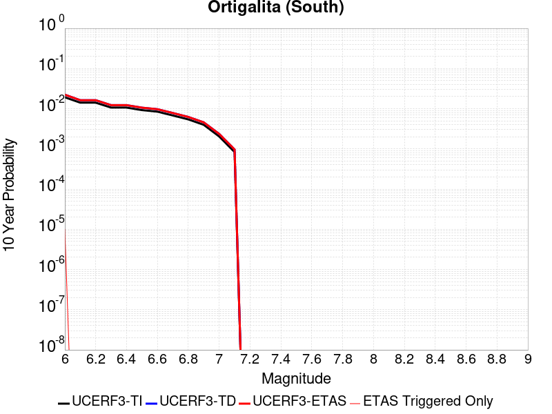 |

| Magnitude | 1 wk TI Prob | 1 wk TD Prob | 1 wk ETAS Prob | 1 wk ETAS/TD Gain | 1 wk ETAS Triggered Only | 1 mo TI Prob | 1 mo TD Prob | 1 mo ETAS Prob | 1 mo ETAS/TD Gain | 1 mo ETAS Triggered Only | 1 yr TI Prob | 1 yr TD Prob | 1 yr ETAS Prob | 1 yr ETAS/TD Gain | 1 yr ETAS Triggered Only | 10 yr TI Prob | 10 yr TD Prob | 10 yr ETAS Prob | 10 yr ETAS/TD Gain | 10 yr ETAS Triggered Only |
|-----|-----|-----|-----|-----|-----|-----|-----|-----|-----|-----|-----|-----|-----|-----|-----|-----|-----|-----|-----|-----|
| 6.0 | 3.72394E-5 | 4.325562E-5 | 4.325562E-5 | 1.0 | 0.0 | 1.5958765E-4 | 1.8536893E-4 | 1.8536893E-4 | 1.0 | 0.0 | 0.0019412481 | 0.0022546875 | 0.0022546875 | 1.0 | 0.0 | 0.019243775 | 0.022334497 | 0.022344273 | 1.0004377 | 1.0E-5 |
| 6.1 | 2.7299884E-5 | 3.149204E-5 | 3.149204E-5 | 1.0 | 0.0 | 1.16994255E-4 | 1.3495922E-4 | 1.3495922E-4 | 1.0 | 0.0 | 0.0014234743 | 0.0016419457 | 0.0016419457 | 1.0 | 0.0 | 0.014143906 | 0.01630407 | 0.01630407 | 1.0 | 0.0 |
| 6.2 | 2.7299884E-5 | 3.149204E-5 | 3.149204E-5 | 1.0 | 0.0 | 1.16994255E-4 | 1.3495922E-4 | 1.3495922E-4 | 1.0 | 0.0 | 0.0014234743 | 0.0016419457 | 0.0016419457 | 1.0 | 0.0 | 0.014143906 | 0.01630407 | 0.01630407 | 1.0 | 0.0 |
| 6.3 | 2.0546433E-5 | 2.363145E-5 | 2.363145E-5 | 1.0 | 0.0 | 8.805317E-5 | 1.0127382E-4 | 1.0127382E-4 | 1.0 | 0.0 | 0.00107152 | 0.0012323303 | 0.0012323303 | 1.0 | 0.0 | 0.010663681 | 0.01225703 | 0.01225703 | 1.0 | 0.0 |
| 6.4 | 2.0546433E-5 | 2.363145E-5 | 2.363145E-5 | 1.0 | 0.0 | 8.805317E-5 | 1.0127382E-4 | 1.0127382E-4 | 1.0 | 0.0 | 0.00107152 | 0.0012323303 | 0.0012323303 | 1.0 | 0.0 | 0.010663681 | 0.01225703 | 0.01225703 | 1.0 | 0.0 |
| 6.5 | 1.7779594E-5 | 2.0446974E-5 | 2.0446974E-5 | 1.0 | 0.0 | 7.619603E-5 | 8.762702E-5 | 8.762702E-5 | 1.0 | 0.0 | 9.272918E-4 | 0.0010663504 | 0.0010663504 | 1.0 | 0.0 | 0.009234319 | 0.010613803 | 0.010613803 | 1.0 | 0.0 |
| 6.6 | 1.6272212E-5 | 1.8714967E-5 | 1.8714967E-5 | 1.0 | 0.0 | 6.973618E-5 | 8.0204605E-5 | 8.0204605E-5 | 1.0 | 0.0 | 8.487073E-4 | 9.760658E-4 | 9.760658E-4 | 1.0 | 0.0 | 0.008454733 | 0.009719091 | 0.009719091 | 1.0 | 0.0 |
| 6.7 | 1.3051484E-5 | 1.5038758E-5 | 1.5038758E-5 | 1.0 | 0.0 | 5.593373E-5 | 6.445028E-5 | 6.445028E-5 | 1.0 | 0.0 | 6.807804E-4 | 7.844092E-4 | 7.844092E-4 | 1.0 | 0.0 | 0.006786986 | 0.007817388 | 0.007817388 | 1.0 | 0.0 |
| 6.8 | 1.04277415E-5 | 1.1987235E-5 | 1.1987235E-5 | 1.0 | 0.0 | 4.4689557E-5 | 5.1372896E-5 | 5.1372896E-5 | 1.0 | 0.0 | 5.439595E-4 | 6.2529295E-4 | 6.2529295E-4 | 1.0 | 0.0 | 0.0054262993 | 0.00623609 | 0.00623609 | 1.0 | 0.0 |
| 6.9 | 7.639968E-6 | 8.791503E-6 | 8.791503E-6 | 1.0 | 0.0 | 3.274231E-5 | 3.767736E-5 | 3.767736E-5 | 1.0 | 0.0 | 3.9856473E-4 | 4.586312E-4 | 4.586312E-4 | 1.0 | 0.0 | 0.003978506 | 0.004577433 | 0.004577433 | 1.0 | 0.0 |
| 7.0 | 3.919831E-6 | 4.5334014E-6 | 4.5334014E-6 | 1.0 | 0.0 | 1.679917E-5 | 1.942873E-5 | 1.942873E-5 | 1.0 | 0.0 | 2.045107E-4 | 2.3652123E-4 | 2.3652123E-4 | 1.0 | 0.0 | 0.0020432258 | 0.0023629034 | 0.0023629034 | 1.0 | 0.0 |
| 7.1 | 1.6017933E-6 | 1.8570418E-6 | 1.8570418E-6 | 1.0 | 0.0 | 6.8648105E-6 | 7.958732E-6 | 7.958732E-6 | 1.0 | 0.0 | 8.357586E-5 | 9.689432E-5 | 9.689432E-5 | 1.0 | 0.0 | 8.3544437E-4 | 9.686254E-4 | 9.686254E-4 | 1.0 | 0.0 |

## Robinson Creek
*[(top)](#table-of-contents)*

| 1 Week | 1 Month | 1 Year | 10 Year |
|-----|-----|-----|-----|
|  |  |  |  |

| Magnitude | 1 wk TI Prob | 1 wk TD Prob | 1 wk ETAS Prob | 1 wk ETAS/TD Gain | 1 wk ETAS Triggered Only | 1 mo TI Prob | 1 mo TD Prob | 1 mo ETAS Prob | 1 mo ETAS/TD Gain | 1 mo ETAS Triggered Only | 1 yr TI Prob | 1 yr TD Prob | 1 yr ETAS Prob | 1 yr ETAS/TD Gain | 1 yr ETAS Triggered Only | 10 yr TI Prob | 10 yr TD Prob | 10 yr ETAS Prob | 10 yr ETAS/TD Gain | 10 yr ETAS Triggered Only |
|-----|-----|-----|-----|-----|-----|-----|-----|-----|-----|-----|-----|-----|-----|-----|-----|-----|-----|-----|-----|-----|
| 6.0 | 1.3705327E-5 | 1.5285013E-5 | 2.528486E-5 | 1.6542256 | 1.0E-5 | 5.8735794E-5 | 6.55072E-5 | 7.550655E-5 | 1.152645 | 1.0E-5 | 7.1487366E-4 | 7.9755014E-4 | 8.075422E-4 | 1.0125284 | 1.0E-5 | 0.0071257832 | 0.007975501 | 0.007985421 | 1.0012438 | 1.0E-5 |
| 6.1 | 1.3705327E-5 | 1.5285013E-5 | 2.528486E-5 | 1.6542256 | 1.0E-5 | 5.8735794E-5 | 6.55072E-5 | 7.550655E-5 | 1.152645 | 1.0E-5 | 7.1487366E-4 | 7.9755014E-4 | 8.075422E-4 | 1.0125284 | 1.0E-5 | 0.0071257832 | 0.007975501 | 0.007985421 | 1.0012438 | 1.0E-5 |
| 6.2 | 1.3705327E-5 | 1.5285013E-5 | 2.528486E-5 | 1.6542256 | 1.0E-5 | 5.8735794E-5 | 6.55072E-5 | 7.550655E-5 | 1.152645 | 1.0E-5 | 7.1487366E-4 | 7.9755014E-4 | 8.075422E-4 | 1.0125284 | 1.0E-5 | 0.0071257832 | 0.007975501 | 0.007985421 | 1.0012438 | 1.0E-5 |
| 6.3 | 1.3705327E-5 | 1.5285013E-5 | 2.528486E-5 | 1.6542256 | 1.0E-5 | 5.8735794E-5 | 6.55072E-5 | 7.550655E-5 | 1.152645 | 1.0E-5 | 7.1487366E-4 | 7.9755014E-4 | 8.075422E-4 | 1.0125284 | 1.0E-5 | 0.0071257832 | 0.007975501 | 0.007985421 | 1.0012438 | 1.0E-5 |
| 6.4 | 1.3705327E-5 | 1.5285013E-5 | 2.528486E-5 | 1.6542256 | 1.0E-5 | 5.8735794E-5 | 6.55072E-5 | 7.550655E-5 | 1.152645 | 1.0E-5 | 7.1487366E-4 | 7.9755014E-4 | 8.075422E-4 | 1.0125284 | 1.0E-5 | 0.0071257832 | 0.007975501 | 0.007985421 | 1.0012438 | 1.0E-5 |

## Monterey Bay-Tularcitos
*[(top)](#table-of-contents)*

| 1 Week | 1 Month | 1 Year | 10 Year |
|-----|-----|-----|-----|
|  | 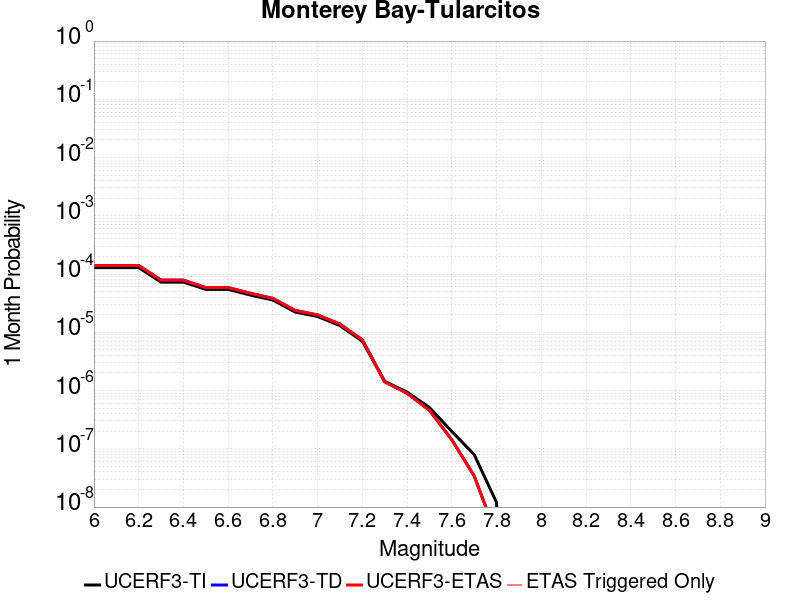 |  |  |

| Magnitude | 1 wk TI Prob | 1 wk TD Prob | 1 wk ETAS Prob | 1 wk ETAS/TD Gain | 1 wk ETAS Triggered Only | 1 mo TI Prob | 1 mo TD Prob | 1 mo ETAS Prob | 1 mo ETAS/TD Gain | 1 mo ETAS Triggered Only | 1 yr TI Prob | 1 yr TD Prob | 1 yr ETAS Prob | 1 yr ETAS/TD Gain | 1 yr ETAS Triggered Only | 10 yr TI Prob | 10 yr TD Prob | 10 yr ETAS Prob | 10 yr ETAS/TD Gain | 10 yr ETAS Triggered Only |
|-----|-----|-----|-----|-----|-----|-----|-----|-----|-----|-----|-----|-----|-----|-----|-----|-----|-----|-----|-----|-----|
| 6.0 | 3.0131365E-5 | 3.279877E-5 | 3.279877E-5 | 1.0 | 0.0 | 1.2912804E-4 | 1.4055918E-4 | 1.4055918E-4 | 1.0 | 0.0 | 0.001571 | 0.0017100703 | 0.0017200531 | 1.0058377 | 1.0E-5 | 0.015599402 | 0.016979916 | 0.016989747 | 1.0005789 | 1.0E-5 |
| 6.1 | 3.0131365E-5 | 3.279877E-5 | 3.279877E-5 | 1.0 | 0.0 | 1.2912804E-4 | 1.4055918E-4 | 1.4055918E-4 | 1.0 | 0.0 | 0.001571 | 0.0017100703 | 0.0017200531 | 1.0058377 | 1.0E-5 | 0.015599402 | 0.016979916 | 0.016989747 | 1.0005789 | 1.0E-5 |
| 6.2 | 3.0131365E-5 | 3.279877E-5 | 3.279877E-5 | 1.0 | 0.0 | 1.2912804E-4 | 1.4055918E-4 | 1.4055918E-4 | 1.0 | 0.0 | 0.001571 | 0.0017100703 | 0.0017200531 | 1.0058377 | 1.0E-5 | 0.015599402 | 0.016979916 | 0.016989747 | 1.0005789 | 1.0E-5 |
| 6.3 | 1.6998249E-5 | 1.8330798E-5 | 1.8330798E-5 | 1.0 | 0.0 | 7.28476E-5 | 7.85583E-5 | 7.85583E-5 | 1.0 | 0.0 | 8.865586E-4 | 9.5604634E-4 | 9.5604634E-4 | 1.0 | 0.0 | 0.0088303005 | 0.009521258 | 0.009521258 | 1.0 | 0.0 |
| 6.4 | 1.6998249E-5 | 1.8330798E-5 | 1.8330798E-5 | 1.0 | 0.0 | 7.28476E-5 | 7.85583E-5 | 7.85583E-5 | 1.0 | 0.0 | 8.865586E-4 | 9.5604634E-4 | 9.5604634E-4 | 1.0 | 0.0 | 0.0088303005 | 0.009521258 | 0.009521258 | 1.0 | 0.0 |
| 6.5 | 1.27470785E-5 | 1.3693312E-5 | 1.3693312E-5 | 1.0 | 0.0 | 5.4629192E-5 | 5.8684363E-5 | 5.8684363E-5 | 1.0 | 0.0 | 6.649074E-4 | 7.1425823E-4 | 7.1425823E-4 | 1.0 | 0.0 | 0.0066292146 | 0.007120678 | 0.007120678 | 1.0 | 0.0 |
| 6.6 | 1.2739422E-5 | 1.36854E-5 | 1.36854E-5 | 1.0 | 0.0 | 5.4596385E-5 | 5.8650454E-5 | 5.8650454E-5 | 1.0 | 0.0 | 6.645082E-4 | 7.1384566E-4 | 7.1384566E-4 | 1.0 | 0.0 | 0.0066252467 | 0.007116579 | 0.007116579 | 1.0 | 0.0 |
| 6.7 | 1.0160109E-5 | 1.0885755E-5 | 1.0885755E-5 | 1.0 | 0.0 | 4.35426E-5 | 4.665244E-5 | 4.665244E-5 | 1.0 | 0.0 | 5.300022E-4 | 5.6785246E-4 | 5.6785246E-4 | 1.0 | 0.0 | 0.005287399 | 0.0056647263 | 0.0056647263 | 1.0 | 0.0 |
| 6.8 | 8.349859E-6 | 8.932587E-6 | 8.932587E-6 | 1.0 | 0.0 | 3.578462E-5 | 3.8281985E-5 | 3.8281985E-5 | 1.0 | 0.0 | 4.3559066E-4 | 4.6598914E-4 | 4.6598914E-4 | 1.0 | 0.0 | 0.004347378 | 0.004650685 | 0.004650685 | 1.0 | 0.0 |
| 6.9 | 5.193639E-6 | 5.53643E-6 | 5.53643E-6 | 1.0 | 0.0 | 2.2258262E-5 | 2.372736E-5 | 2.372736E-5 | 1.0 | 0.0 | 2.7096065E-4 | 2.8884556E-4 | 2.8884556E-4 | 1.0 | 0.0 | 0.0027063051 | 0.0028850222 | 0.0028850222 | 1.0 | 0.0 |
| 7.0 | 4.359381E-6 | 4.643366E-6 | 4.643366E-6 | 1.0 | 0.0 | 1.8682927E-5 | 1.9900004E-5 | 1.9900004E-5 | 1.0 | 0.0 | 2.274409E-4 | 2.422586E-4 | 2.422586E-4 | 1.0 | 0.0 | 0.0022720827 | 0.002420238 | 0.002420238 | 1.0 | 0.0 |
| 7.1 | 3.0398533E-6 | 3.2310427E-6 | 3.2310427E-6 | 1.0 | 0.0 | 1.3027877E-5 | 1.3847267E-5 | 1.3847267E-5 | 1.0 | 0.0 | 1.5860285E-4 | 1.6858005E-4 | 1.6858005E-4 | 1.0 | 0.0 | 0.001584897 | 0.0016847793 | 0.0016847793 | 1.0 | 0.0 |
| 7.2 | 1.642335E-6 | 1.7333153E-6 | 1.7333153E-6 | 1.0 | 0.0 | 7.0385595E-6 | 7.428485E-6 | 7.428485E-6 | 1.0 | 0.0 | 8.569109E-5 | 9.044012E-5 | 9.044012E-5 | 1.0 | 0.0 | 8.5658056E-4 | 9.042358E-4 | 9.042358E-4 | 1.0 | 0.0 |
| 7.3 | 3.356842E-7 | 3.2952389E-7 | 3.2952389E-7 | 1.0 | 0.0 | 1.4386458E-6 | 1.4122444E-6 | 1.4122444E-6 | 1.0 | 0.0 | 1.7515373E-5 | 1.7193941E-5 | 1.7193941E-5 | 1.0 | 0.0 | 1.7513991E-4 | 1.719262E-4 | 1.719262E-4 | 1.0 | 0.0 |
| 7.4 | 2.1973483E-7 | 2.1006413E-7 | 2.1006413E-7 | 1.0 | 0.0 | 9.417204E-7 | 9.0027453E-7 | 9.0027453E-7 | 1.0 | 0.0 | 1.1465385E-5 | 1.0960787E-5 | 1.0960787E-5 | 1.0 | 0.0 | 1.1464794E-4 | 1.096025E-4 | 1.096025E-4 | 1.0 | 0.0 |
| 7.5 | 1.1944135E-7 | 1.0696043E-7 | 1.0696043E-7 | 1.0 | 0.0 | 5.118914E-7 | 4.5840173E-7 | 4.5840173E-7 | 1.0 | 0.0 | 6.23226E-6 | 5.581027E-6 | 5.581027E-6 | 1.0 | 0.0 | 6.2320854E-5 | 5.5808883E-5 | 5.5808883E-5 | 1.0 | 0.0 |
| 7.6 | 4.636058E-8 | 3.336489E-8 | 3.336489E-8 | 1.0 | 0.0 | 1.9868818E-7 | 1.4299238E-7 | 1.4299238E-7 | 1.0 | 0.0 | 2.419026E-6 | 1.7409308E-6 | 1.7409308E-6 | 1.0 | 0.0 | 2.4189996E-5 | 1.7409173E-5 | 1.7409173E-5 | 1.0 | 0.0 |
| 7.7 | 1.8588572E-8 | 8.003744E-9 | 8.003744E-9 | 1.0 | 0.0 | 7.9665305E-8 | 3.430176E-8 | 3.430176E-8 | 1.0 | 0.0 | 9.699246E-7 | 4.1762385E-7 | 4.1762385E-7 | 1.0 | 0.0 | 9.699204E-6 | 4.176231E-6 | 4.176231E-6 | 1.0 | 0.0 |
| 7.8 | 2.7960154E-9 | 7.6099427E-10 | 7.6099427E-10 | 1.0 | 0.0 | 1.1982923E-8 | 3.2614043E-9 | 3.2614043E-9 | 1.0 | 0.0 | 1.4589209E-7 | 3.9707597E-8 | 3.9707597E-8 | 1.0 | 0.0 | 1.4589199E-6 | 3.9707595E-7 | 3.9707595E-7 | 1.0 | 0.0 |

## West Napa 2011 CFM
*[(top)](#table-of-contents)*

| 1 Week | 1 Month | 1 Year | 10 Year |
|-----|-----|-----|-----|
|  |  | 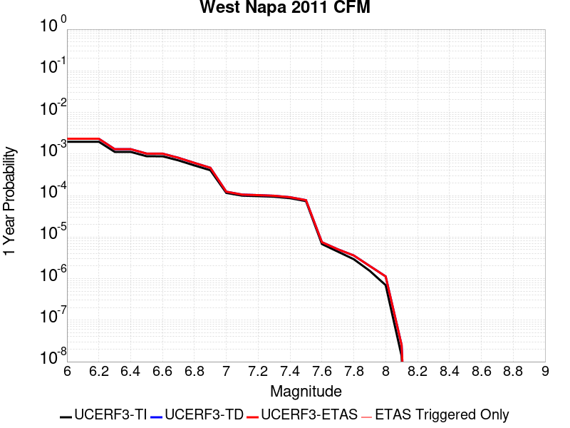 |  |

| Magnitude | 1 wk TI Prob | 1 wk TD Prob | 1 wk ETAS Prob | 1 wk ETAS/TD Gain | 1 wk ETAS Triggered Only | 1 mo TI Prob | 1 mo TD Prob | 1 mo ETAS Prob | 1 mo ETAS/TD Gain | 1 mo ETAS Triggered Only | 1 yr TI Prob | 1 yr TD Prob | 1 yr ETAS Prob | 1 yr ETAS/TD Gain | 1 yr ETAS Triggered Only | 10 yr TI Prob | 10 yr TD Prob | 10 yr ETAS Prob | 10 yr ETAS/TD Gain | 10 yr ETAS Triggered Only |
|-----|-----|-----|-----|-----|-----|-----|-----|-----|-----|-----|-----|-----|-----|-----|-----|-----|-----|-----|-----|-----|
| 6.0 | 3.773104E-5 | 4.452845E-5 | 4.452845E-5 | 1.0 | 0.0 | 1.6169442E-4 | 1.9082405E-4 | 1.9082405E-4 | 1.0 | 0.0 | 0.001966852 | 0.0023211248 | 0.0023211248 | 1.0 | 0.0 | 0.019495348 | 0.023002245 | 0.023012016 | 1.0004247 | 1.0E-5 |
| 6.1 | 3.773104E-5 | 4.452845E-5 | 4.452845E-5 | 1.0 | 0.0 | 1.6169442E-4 | 1.9082405E-4 | 1.9082405E-4 | 1.0 | 0.0 | 0.001966852 | 0.0023211248 | 0.0023211248 | 1.0 | 0.0 | 0.019495348 | 0.023002245 | 0.023012016 | 1.0004247 | 1.0E-5 |
| 6.2 | 3.773104E-5 | 4.452845E-5 | 4.452845E-5 | 1.0 | 0.0 | 1.6169442E-4 | 1.9082405E-4 | 1.9082405E-4 | 1.0 | 0.0 | 0.001966852 | 0.0023211248 | 0.0023211248 | 1.0 | 0.0 | 0.019495348 | 0.023002245 | 0.023012016 | 1.0004247 | 1.0E-5 |
| 6.3 | 2.147964E-5 | 2.4987039E-5 | 2.4987039E-5 | 1.0 | 0.0 | 9.2052345E-5 | 1.0708343E-4 | 1.0708343E-4 | 1.0 | 0.0 | 0.001120161 | 0.0013030528 | 0.0013030528 | 1.0 | 0.0 | 0.011145315 | 0.0129647385 | 0.0129647385 | 1.0 | 0.0 |
| 6.4 | 2.147964E-5 | 2.4987039E-5 | 2.4987039E-5 | 1.0 | 0.0 | 9.2052345E-5 | 1.0708343E-4 | 1.0708343E-4 | 1.0 | 0.0 | 0.001120161 | 0.0013030528 | 0.0013030528 | 1.0 | 0.0 | 0.011145315 | 0.0129647385 | 0.0129647385 | 1.0 | 0.0 |
| 6.5 | 1.688201E-5 | 1.9547346E-5 | 1.9547346E-5 | 1.0 | 0.0 | 7.234947E-5 | 8.377206E-5 | 8.377206E-5 | 1.0 | 0.0 | 8.804988E-4 | 0.0010195201 | 0.0010195201 | 1.0 | 0.0 | 0.008770182 | 0.010157098 | 0.010157098 | 1.0 | 0.0 |
| 6.6 | 1.6846381E-5 | 1.9507039E-5 | 1.9507039E-5 | 1.0 | 0.0 | 7.219678E-5 | 8.359933E-5 | 8.359933E-5 | 1.0 | 0.0 | 8.7864127E-4 | 0.001017419 | 0.001017419 | 1.0 | 0.0 | 0.008751754 | 0.010136279 | 0.010136279 | 1.0 | 0.0 |
| 6.7 | 1.3396501E-5 | 1.5467655E-5 | 1.5467655E-5 | 1.0 | 0.0 | 5.7412315E-5 | 6.628862E-5 | 6.628862E-5 | 1.0 | 0.0 | 6.9877075E-4 | 8.0682867E-4 | 8.0682867E-4 | 1.0 | 0.0 | 0.0069657755 | 0.008046719 | 0.008046719 | 1.0 | 0.0 |
| 6.8 | 1.0139058E-5 | 1.1672149E-5 | 1.1672149E-5 | 1.0 | 0.0 | 4.3452383E-5 | 5.0022853E-5 | 5.0022853E-5 | 1.0 | 0.0 | 5.289043E-4 | 6.0891354E-4 | 6.0891354E-4 | 1.0 | 0.0 | 0.005276473 | 0.006079373 | 0.006079373 | 1.0 | 0.0 |
| 6.9 | 7.761281E-6 | 8.890694E-6 | 8.890694E-6 | 1.0 | 0.0 | 3.326221E-5 | 3.8102706E-5 | 3.8102706E-5 | 1.0 | 0.0 | 4.0489217E-4 | 4.6385307E-4 | 4.6385307E-4 | 1.0 | 0.0 | 0.0040415525 | 0.004635363 | 0.004635363 | 1.0 | 0.0 |
| 7.0 | 2.2109202E-6 | 2.3666025E-6 | 2.3666025E-6 | 1.0 | 0.0 | 9.475338E-6 | 1.0142544E-5 | 1.0142544E-5 | 1.0 | 0.0 | 1.1535613E-4 | 1.2347854E-4 | 1.2347854E-4 | 1.0 | 0.0 | 0.0011529627 | 0.0012355851 | 0.0012355851 | 1.0 | 0.0 |
| 7.1 | 1.9008926E-6 | 2.0132914E-6 | 2.0132914E-6 | 1.0 | 0.0 | 8.146657E-6 | 8.6283635E-6 | 8.6283635E-6 | 1.0 | 0.0 | 9.918104E-5 | 1.05045285E-4 | 1.05045285E-4 | 1.0 | 0.0 | 9.913679E-4 | 0.001051437 | 0.001051437 | 1.0 | 0.0 |
| 7.2 | 1.8495944E-6 | 1.9560982E-6 | 1.9560982E-6 | 1.0 | 0.0 | 7.926808E-6 | 8.383251E-6 | 8.383251E-6 | 1.0 | 0.0 | 9.650462E-5 | 1.0206133E-4 | 1.0206133E-4 | 1.0 | 0.0 | 9.6462725E-4 | 0.0010216252 | 0.0010216252 | 1.0 | 0.0 |
| 7.3 | 1.7883189E-6 | 1.8880608E-6 | 1.8880608E-6 | 1.0 | 0.0 | 7.664201E-6 | 8.091664E-6 | 8.091664E-6 | 1.0 | 0.0 | 9.330765E-5 | 9.8511584E-5 | 9.8511584E-5 | 1.0 | 0.0 | 9.3268487E-4 | 9.861597E-4 | 9.861597E-4 | 1.0 | 0.0 |
| 7.4 | 1.6520572E-6 | 1.741484E-6 | 1.741484E-6 | 1.0 | 0.0 | 7.0802257E-6 | 7.463482E-6 | 7.463482E-6 | 1.0 | 0.0 | 8.6198335E-5 | 9.086413E-5 | 9.086413E-5 | 1.0 | 0.0 | 8.616491E-4 | 9.0974604E-4 | 9.0974604E-4 | 1.0 | 0.0 |
| 7.5 | 1.4040345E-6 | 1.4800074E-6 | 1.4800074E-6 | 1.0 | 0.0 | 6.0172765E-6 | 6.3428733E-6 | 6.3428733E-6 | 1.0 | 0.0 | 7.325788E-5 | 7.7221775E-5 | 7.7221775E-5 | 1.0 | 0.0 | 7.3233736E-4 | 7.7339396E-4 | 7.7339396E-4 | 1.0 | 0.0 |
| 7.6 | 1.3013842E-7 | 1.4415936E-7 | 1.4415936E-7 | 1.0 | 0.0 | 5.57736E-7 | 6.1782566E-7 | 6.1782566E-7 | 1.0 | 0.0 | 6.790414E-6 | 7.5220014E-6 | 7.5220014E-6 | 1.0 | 0.0 | 6.790207E-5 | 7.614869E-5 | 7.614869E-5 | 1.0 | 0.0 |
| 7.7 | 8.541512E-8 | 9.716316E-8 | 9.716316E-8 | 1.0 | 0.0 | 3.6606474E-7 | 4.1641349E-7 | 4.1641349E-7 | 1.0 | 0.0 | 4.456829E-6 | 5.0698222E-6 | 5.0698222E-6 | 1.0 | 0.0 | 4.4567398E-5 | 5.160297E-5 | 5.160297E-5 | 1.0 | 0.0 |
| 7.8 | 5.6074793E-8 | 6.89534E-8 | 6.89534E-8 | 1.0 | 0.0 | 2.403205E-7 | 2.9551452E-7 | 2.9551452E-7 | 1.0 | 0.0 | 2.9258983E-6 | 3.5978833E-6 | 3.5978833E-6 | 1.0 | 0.0 | 2.9258597E-5 | 3.681433E-5 | 3.681433E-5 | 1.0 | 0.0 |
| 7.9 | 2.9475839E-8 | 3.8566046E-8 | 3.8566046E-8 | 1.0 | 0.0 | 1.2632502E-7 | 1.6528305E-7 | 1.6528305E-7 | 1.0 | 0.0 | 1.538006E-6 | 2.0123193E-6 | 2.0123193E-6 | 1.0 | 0.0 | 1.5379954E-5 | 2.0665891E-5 | 2.0665891E-5 | 1.0 | 0.0 |
| 8.0 | 1.3337122E-8 | 2.163124E-8 | 2.163124E-8 | 1.0 | 0.0 | 5.7159088E-8 | 9.270532E-8 | 9.270532E-8 | 1.0 | 0.0 | 6.959117E-7 | 1.1286867E-6 | 1.1286867E-6 | 1.0 | 0.0 | 6.959095E-6 | 1.1645628E-5 | 1.1645628E-5 | 1.0 | 0.0 |
| 8.1 | 2.6589986E-10 | 4.8615456E-10 | 4.8615456E-10 | 1.0 | 0.0 | 1.1395708E-9 | 2.0835205E-9 | 2.0835205E-9 | 1.0 | 0.0 | 1.3874274E-8 | 2.536686E-8 | 2.536686E-8 | 1.0 | 0.0 | 1.3874273E-7 | 2.6035906E-7 | 2.6035906E-7 | 1.0 | 0.0 |

## Hartley Springs 2011 CFM
*[(top)](#table-of-contents)*

| 1 Week | 1 Month | 1 Year | 10 Year |
|-----|-----|-----|-----|
|  |  |  |  |

| Magnitude | 1 wk TI Prob | 1 wk TD Prob | 1 wk ETAS Prob | 1 wk ETAS/TD Gain | 1 wk ETAS Triggered Only | 1 mo TI Prob | 1 mo TD Prob | 1 mo ETAS Prob | 1 mo ETAS/TD Gain | 1 mo ETAS Triggered Only | 1 yr TI Prob | 1 yr TD Prob | 1 yr ETAS Prob | 1 yr ETAS/TD Gain | 1 yr ETAS Triggered Only | 10 yr TI Prob | 10 yr TD Prob | 10 yr ETAS Prob | 10 yr ETAS/TD Gain | 10 yr ETAS Triggered Only |
|-----|-----|-----|-----|-----|-----|-----|-----|-----|-----|-----|-----|-----|-----|-----|-----|-----|-----|-----|-----|-----|
| 6.0 | 1.4352418E-5 | 1.4434182E-5 | 2.4434037E-5 | 1.6927899 | 1.0E-5 | 6.1508916E-5 | 6.1860235E-5 | 7.185962E-5 | 1.1616447 | 1.0E-5 | 7.486137E-4 | 7.5305253E-4 | 7.63045E-4 | 1.0132693 | 1.0E-5 | 0.007460968 | 0.0075211283 | 0.0075310534 | 1.0013196 | 1.0E-5 |
| 6.1 | 1.4352418E-5 | 1.4434182E-5 | 2.4434037E-5 | 1.6927899 | 1.0E-5 | 6.1508916E-5 | 6.1860235E-5 | 7.185962E-5 | 1.1616447 | 1.0E-5 | 7.486137E-4 | 7.5305253E-4 | 7.63045E-4 | 1.0132693 | 1.0E-5 | 0.007460968 | 0.0075211283 | 0.0075310534 | 1.0013196 | 1.0E-5 |
| 6.2 | 1.4352418E-5 | 1.4434182E-5 | 2.4434037E-5 | 1.6927899 | 1.0E-5 | 6.1508916E-5 | 6.1860235E-5 | 7.185962E-5 | 1.1616447 | 1.0E-5 | 7.486137E-4 | 7.5305253E-4 | 7.63045E-4 | 1.0132693 | 1.0E-5 | 0.007460968 | 0.0075211283 | 0.0075310534 | 1.0013196 | 1.0E-5 |
| 6.3 | 1.4352418E-5 | 1.4434182E-5 | 2.4434037E-5 | 1.6927899 | 1.0E-5 | 6.1508916E-5 | 6.1860235E-5 | 7.185962E-5 | 1.1616447 | 1.0E-5 | 7.486137E-4 | 7.5305253E-4 | 7.63045E-4 | 1.0132693 | 1.0E-5 | 0.007460968 | 0.0075211283 | 0.0075310534 | 1.0013196 | 1.0E-5 |
| 6.4 | 1.4352418E-5 | 1.4434182E-5 | 2.4434037E-5 | 1.6927899 | 1.0E-5 | 6.1508916E-5 | 6.1860235E-5 | 7.185962E-5 | 1.1616447 | 1.0E-5 | 7.486137E-4 | 7.5305253E-4 | 7.63045E-4 | 1.0132693 | 1.0E-5 | 0.007460968 | 0.0075211283 | 0.0075310534 | 1.0013196 | 1.0E-5 |
| 6.5 | 1.2279858E-5 | 1.2133106E-5 | 2.2132985E-5 | 1.8241813 | 1.0E-5 | 5.26269E-5 | 5.1998883E-5 | 6.199836E-5 | 1.1923019 | 1.0E-5 | 6.4054417E-4 | 6.3306064E-4 | 6.430543E-4 | 1.0157863 | 1.0E-5 | 0.0063870098 | 0.006328085 | 0.0063380217 | 1.0015702 | 1.0E-5 |
| 6.6 | 1.2279858E-5 | 1.2133106E-5 | 2.2132985E-5 | 1.8241813 | 1.0E-5 | 5.26269E-5 | 5.1998883E-5 | 6.199836E-5 | 1.1923019 | 1.0E-5 | 6.4054417E-4 | 6.3306064E-4 | 6.430543E-4 | 1.0157863 | 1.0E-5 | 0.0063870098 | 0.006328085 | 0.0063380217 | 1.0015702 | 1.0E-5 |
| 6.7 | 2.1282601E-6 | 8.8948315E-7 | 8.8948315E-7 | 1.0 | 0.0 | 9.121083E-6 | 3.8120663E-6 | 3.8120663E-6 | 1.0 | 0.0 | 1.11043526E-4 | 4.641118E-5 | 4.641118E-5 | 1.0 | 0.0 | 0.0011098806 | 4.6404017E-4 | 4.6404017E-4 | 1.0 | 0.0 |
| 6.8 | 2.00516E-6 | 8.517597E-7 | 8.517597E-7 | 1.0 | 0.0 | 8.593515E-6 | 3.650395E-6 | 3.650395E-6 | 1.0 | 0.0 | 1.04621024E-4 | 4.444291E-5 | 4.444291E-5 | 1.0 | 0.0 | 0.0010457177 | 4.4436535E-4 | 4.4436535E-4 | 1.0 | 0.0 |
| 6.9 | 2.00516E-6 | 8.517597E-7 | 8.517597E-7 | 1.0 | 0.0 | 8.593515E-6 | 3.650395E-6 | 3.650395E-6 | 1.0 | 0.0 | 1.04621024E-4 | 4.444291E-5 | 4.444291E-5 | 1.0 | 0.0 | 0.0010457177 | 4.4436535E-4 | 4.4436535E-4 | 1.0 | 0.0 |
| 7.0 | 1.8366732E-6 | 8.237307E-7 | 8.237307E-7 | 1.0 | 0.0 | 7.871433E-6 | 3.5302712E-6 | 3.5302712E-6 | 1.0 | 0.0 | 9.583048E-5 | 4.298046E-5 | 4.298046E-5 | 1.0 | 0.0 | 9.5789164E-4 | 4.2974652E-4 | 4.2974652E-4 | 1.0 | 0.0 |
| 7.1 | 1.5097997E-6 | 7.1902616E-7 | 7.1902616E-7 | 1.0 | 0.0 | 6.470554E-6 | 3.0815384E-6 | 3.0815384E-6 | 1.0 | 0.0 | 7.877615E-5 | 3.7517326E-5 | 3.7517326E-5 | 1.0 | 0.0 | 7.874823E-4 | 3.7513362E-4 | 3.7513362E-4 | 1.0 | 0.0 |
| 7.2 | 1.3490993E-6 | 6.405254E-7 | 6.405254E-7 | 1.0 | 0.0 | 5.7818415E-6 | 2.7451074E-6 | 2.7451074E-6 | 1.0 | 0.0 | 7.0391645E-5 | 3.3421402E-5 | 3.3421402E-5 | 1.0 | 0.0 | 7.0369354E-4 | 3.341867E-4 | 3.341867E-4 | 1.0 | 0.0 |
| 7.3 | 7.900015E-7 | 4.0889498E-7 | 4.0889498E-7 | 1.0 | 0.0 | 3.3857161E-6 | 1.752407E-6 | 1.752407E-6 | 1.0 | 0.0 | 4.1220315E-5 | 2.1335554E-5 | 2.1335554E-5 | 1.0 | 0.0 | 4.121267E-4 | 2.1335555E-4 | 2.1335555E-4 | 1.0 | 0.0 |

## San Gregorio (North) 2011 CFM
*[(top)](#table-of-contents)*

| 1 Week | 1 Month | 1 Year | 10 Year |
|-----|-----|-----|-----|
|  | 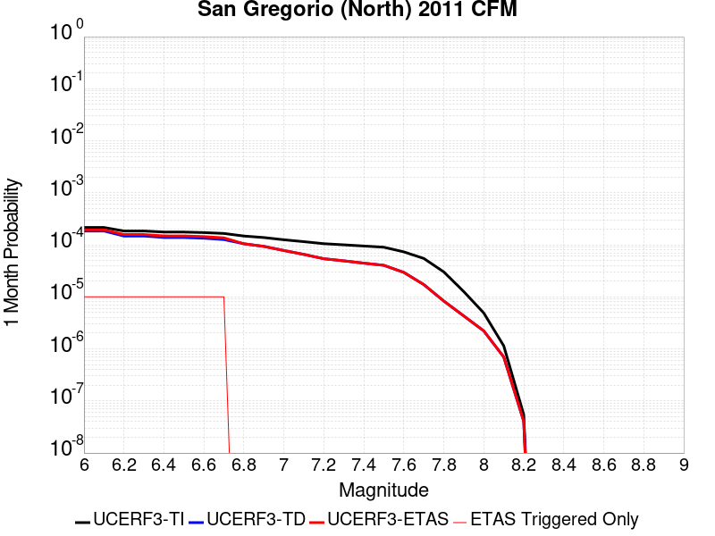 |  | 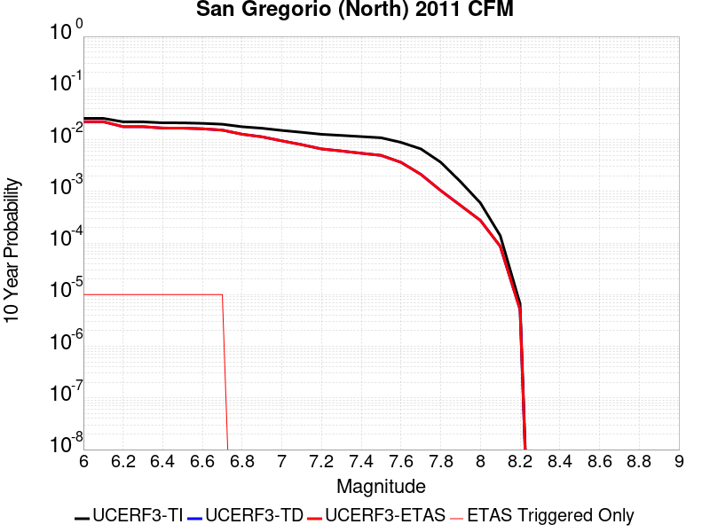 |

| Magnitude | 1 wk TI Prob | 1 wk TD Prob | 1 wk ETAS Prob | 1 wk ETAS/TD Gain | 1 wk ETAS Triggered Only | 1 mo TI Prob | 1 mo TD Prob | 1 mo ETAS Prob | 1 mo ETAS/TD Gain | 1 mo ETAS Triggered Only | 1 yr TI Prob | 1 yr TD Prob | 1 yr ETAS Prob | 1 yr ETAS/TD Gain | 1 yr ETAS Triggered Only | 10 yr TI Prob | 10 yr TD Prob | 10 yr ETAS Prob | 10 yr ETAS/TD Gain | 10 yr ETAS Triggered Only |
|-----|-----|-----|-----|-----|-----|-----|-----|-----|-----|-----|-----|-----|-----|-----|-----|-----|-----|-----|-----|-----|
| 6.0 | 5.0283932E-5 | 4.3057815E-5 | 4.3057815E-5 | 1.0 | 0.0 | 2.1548476E-4 | 1.8452053E-4 | 1.9451868E-4 | 1.0541846 | 1.0E-5 | 0.0026203706 | 0.002244237 | 0.0022542146 | 1.0044459 | 1.0E-5 | 0.02589687 | 0.022293162 | 0.022302939 | 1.0004386 | 1.0E-5 |
| 6.1 | 5.0283932E-5 | 4.3057815E-5 | 4.3057815E-5 | 1.0 | 0.0 | 2.1548476E-4 | 1.8452053E-4 | 1.9451868E-4 | 1.0541846 | 1.0E-5 | 0.0026203706 | 0.002244237 | 0.0022542146 | 1.0044459 | 1.0E-5 | 0.02589687 | 0.022293162 | 0.022302939 | 1.0004386 | 1.0E-5 |
| 6.2 | 4.2998647E-5 | 3.4441564E-5 | 3.4441564E-5 | 1.0 | 0.0 | 1.842669E-4 | 1.475984E-4 | 1.5759692E-4 | 1.0677414 | 1.0E-5 | 0.0022411412 | 0.00179554 | 0.001805522 | 1.0055593 | 1.0E-5 | 0.022186736 | 0.017886506 | 0.017896328 | 1.0005491 | 1.0E-5 |
| 6.3 | 4.2998647E-5 | 3.4441564E-5 | 3.4441564E-5 | 1.0 | 0.0 | 1.842669E-4 | 1.475984E-4 | 1.5759692E-4 | 1.0677414 | 1.0E-5 | 0.0022411412 | 0.00179554 | 0.001805522 | 1.0055593 | 1.0E-5 | 0.022186736 | 0.017886506 | 0.017896328 | 1.0005491 | 1.0E-5 |
| 6.4 | 4.1101295E-5 | 3.2326872E-5 | 3.2326872E-5 | 1.0 | 0.0 | 1.7613651E-4 | 1.3853642E-4 | 1.4853504E-4 | 1.0721732 | 1.0E-5 | 0.0021423528 | 0.0016853869 | 0.00169537 | 1.0059234 | 1.0E-5 | 0.02121817 | 0.016801886 | 0.016811717 | 1.0005852 | 1.0E-5 |
| 6.5 | 4.1032585E-5 | 3.2244905E-5 | 3.2244905E-5 | 1.0 | 0.0 | 1.7584208E-4 | 1.3818518E-4 | 1.481838E-4 | 1.0723567 | 1.0E-5 | 0.0021387753 | 0.0016811171 | 0.0016911003 | 1.0059384 | 1.0E-5 | 0.021183075 | 0.016759839 | 0.016769672 | 1.0005866 | 1.0E-5 |
| 6.6 | 4.011629E-5 | 3.1266558E-5 | 3.1266558E-5 | 1.0 | 0.0 | 1.7191563E-4 | 1.339927E-4 | 1.4399135E-4 | 1.074621 | 1.0E-5 | 0.0020910634 | 0.0016301516 | 0.0016401353 | 1.0061244 | 1.0E-5 | 0.020714961 | 0.01625741 | 0.016267247 | 1.0006051 | 1.0E-5 |
| 6.7 | 3.8583938E-5 | 2.9453593E-5 | 2.9453593E-5 | 1.0 | 0.0 | 1.6534925E-4 | 1.2622366E-4 | 1.362224E-4 | 1.0792145 | 1.0E-5 | 0.0020112682 | 0.0015357039 | 0.0015456886 | 1.0065017 | 1.0E-5 | 0.019931622 | 0.015325955 | 0.015335802 | 1.0006425 | 1.0E-5 |
| 6.8 | 3.44341E-5 | 2.4450854E-5 | 2.4450854E-5 | 1.0 | 0.0 | 1.4756636E-4 | 1.0478523E-4 | 1.0478523E-4 | 1.0 | 0.0 | 0.0017951399 | 0.0012750238 | 0.0012750238 | 1.0 | 0.0 | 0.017807078 | 0.012751131 | 0.012751131 | 1.0 | 0.0 |
| 6.9 | 3.221199E-5 | 2.1778029E-5 | 2.1778029E-5 | 1.0 | 0.0 | 1.3804408E-4 | 9.333112E-5 | 9.333112E-5 | 1.0 | 0.0 | 0.0016793909 | 0.0011357224 | 0.0011357224 | 1.0 | 0.0 | 0.01666756 | 0.011372583 | 0.011372583 | 1.0 | 0.0 |
| 7.0 | 2.9186718E-5 | 1.8146875E-5 | 1.8146875E-5 | 1.0 | 0.0 | 1.2507994E-4 | 7.7770026E-5 | 7.7770026E-5 | 1.0 | 0.0 | 0.0015217843 | 9.464431E-4 | 9.464431E-4 | 1.0 | 0.0 | 0.015114053 | 0.009496798 | 0.009496798 | 1.0 | 0.0 |
| 7.1 | 2.6840138E-5 | 1.5284508E-5 | 1.5284508E-5 | 1.0 | 0.0 | 1.1502409E-4 | 6.55034E-5 | 6.55034E-5 | 1.0 | 0.0 | 0.0013995186 | 7.9721404E-4 | 7.9721404E-4 | 1.0 | 0.0 | 0.013907375 | 0.008015723 | 0.008015723 | 1.0 | 0.0 |
| 7.2 | 2.453002E-5 | 1.2606672E-5 | 1.2606672E-5 | 1.0 | 0.0 | 1.05124425E-4 | 5.4027478E-5 | 5.4027478E-5 | 1.0 | 0.0 | 0.0012791384 | 6.575866E-4 | 6.575866E-4 | 1.0 | 0.0 | 0.012718005 | 0.00662763 | 0.00662763 | 1.0 | 0.0 |
| 7.3 | 2.3330727E-5 | 1.1488677E-5 | 1.1488677E-5 | 1.0 | 0.0 | 9.9985E-5 | 4.923626E-5 | 4.923626E-5 | 1.0 | 0.0 | 0.0012166376 | 5.9928704E-4 | 5.9928704E-4 | 1.0 | 0.0 | 0.012099981 | 0.006046564 | 0.006046564 | 1.0 | 0.0 |
| 7.4 | 2.2136466E-5 | 1.0368981E-5 | 1.0368981E-5 | 1.0 | 0.0 | 9.486712E-5 | 4.4437733E-5 | 4.4437733E-5 | 1.0 | 0.0 | 0.0011543952 | 5.4089533E-4 | 5.4089533E-4 | 1.0 | 0.0 | 0.011484168 | 0.005464249 | 0.005464249 | 1.0 | 0.0 |
| 7.5 | 2.0994974E-5 | 9.427217E-6 | 9.427217E-6 | 1.0 | 0.0 | 8.997535E-5 | 4.0401734E-5 | 4.0401734E-5 | 1.0 | 0.0 | 0.0010948994 | 4.9178035E-4 | 4.9178035E-4 | 1.0 | 0.0 | 0.010895205 | 0.004973358 | 0.004973358 | 1.0 | 0.0 |
| 7.6 | 1.7091823E-5 | 6.893766E-6 | 6.893766E-6 | 1.0 | 0.0 | 7.3248615E-5 | 2.9544377E-5 | 2.9544377E-5 | 1.0 | 0.0 | 8.9143694E-4 | 3.596435E-4 | 3.596435E-4 | 1.0 | 0.0 | 0.008878695 | 0.0036482841 | 0.0036482841 | 1.0 | 0.0 |
| 7.7 | 1.2772179E-5 | 4.0208706E-6 | 4.0208706E-6 | 1.0 | 0.0 | 5.473676E-5 | 1.7232189E-5 | 1.7232189E-5 | 1.0 | 0.0 | 6.6621625E-4 | 2.0978172E-4 | 2.0978172E-4 | 1.0 | 0.0 | 0.006642225 | 0.002136922 | 0.002136922 | 1.0 | 0.0 |
| 7.8 | 7.041923E-6 | 1.940626E-6 | 1.940626E-6 | 1.0 | 0.0 | 3.017932E-5 | 8.316942E-6 | 8.316942E-6 | 1.0 | 0.0 | 3.6737128E-4 | 1.0125406E-4 | 1.0125406E-4 | 1.0 | 0.0 | 0.0036676454 | 0.0010379003 | 0.0010379003 | 1.0 | 0.0 |
| 7.9 | 2.946768E-6 | 1.0033551E-6 | 1.0033551E-6 | 1.0 | 0.0 | 1.2628945E-5 | 4.300086E-6 | 4.300086E-6 | 1.0 | 0.0 | 1.5374656E-4 | 5.235229E-5 | 5.235229E-5 | 1.0 | 0.0 | 0.0015364023 | 5.3400313E-4 | 5.3400313E-4 | 1.0 | 0.0 |
| 8.0 | 1.1433375E-6 | 5.18146E-7 | 5.18146E-7 | 1.0 | 0.0 | 4.9000087E-6 | 2.2206239E-6 | 2.2206239E-6 | 1.0 | 0.0 | 5.965597E-5 | 2.703576E-5 | 2.703576E-5 | 1.0 | 0.0 | 5.963996E-4 | 2.7398416E-4 | 2.7398416E-4 | 1.0 | 0.0 |
| 8.1 | 2.6675295E-7 | 1.62899E-7 | 1.62899E-7 | 1.0 | 0.0 | 1.1432264E-6 | 6.9813836E-7 | 6.9813836E-7 | 1.0 | 0.0 | 1.3918692E-5 | 8.499802E-6 | 8.499802E-6 | 1.0 | 0.0 | 1.391782E-4 | 8.63795E-5 | 8.63795E-5 | 1.0 | 0.0 |
| 8.2 | 1.2704569E-8 | 9.431393E-9 | 9.431393E-9 | 1.0 | 0.0 | 5.444815E-8 | 4.042026E-8 | 4.042026E-8 | 1.0 | 0.0 | 6.629061E-7 | 4.9211656E-7 | 4.9211656E-7 | 1.0 | 0.0 | 6.629041E-6 | 5.1121438E-6 | 5.1121438E-6 | 1.0 | 0.0 |

## Sisar
*[(top)](#table-of-contents)*

| 1 Week | 1 Month | 1 Year | 10 Year |
|-----|-----|-----|-----|
|  |  |  | 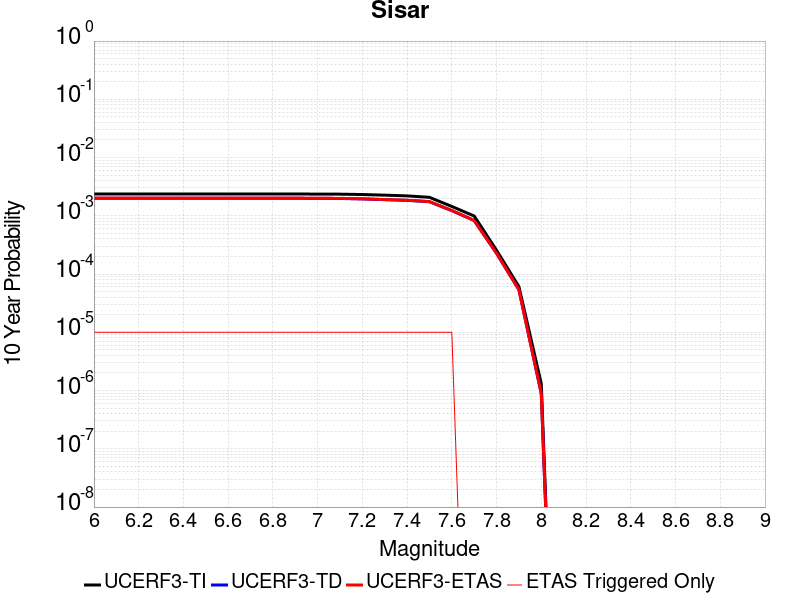 |

| Magnitude | 1 wk TI Prob | 1 wk TD Prob | 1 wk ETAS Prob | 1 wk ETAS/TD Gain | 1 wk ETAS Triggered Only | 1 mo TI Prob | 1 mo TD Prob | 1 mo ETAS Prob | 1 mo ETAS/TD Gain | 1 mo ETAS Triggered Only | 1 yr TI Prob | 1 yr TD Prob | 1 yr ETAS Prob | 1 yr ETAS/TD Gain | 1 yr ETAS Triggered Only | 10 yr TI Prob | 10 yr TD Prob | 10 yr ETAS Prob | 10 yr ETAS/TD Gain | 10 yr ETAS Triggered Only |
|-----|-----|-----|-----|-----|-----|-----|-----|-----|-----|-----|-----|-----|-----|-----|-----|-----|-----|-----|-----|-----|
| 6.0 | 4.544193E-6 | 3.839576E-6 | 3.839576E-6 | 1.0 | 0.0 | 1.9474966E-5 | 1.6455224E-5 | 2.645506E-5 | 1.6076998 | 1.0E-5 | 2.3708193E-4 | 2.0032428E-4 | 2.1032228E-4 | 1.0499091 | 1.0E-5 | 0.0023682916 | 0.002001471 | 0.0020114507 | 1.0049863 | 1.0E-5 |
| 6.1 | 4.544193E-6 | 3.839576E-6 | 3.839576E-6 | 1.0 | 0.0 | 1.9474966E-5 | 1.6455224E-5 | 2.645506E-5 | 1.6076998 | 1.0E-5 | 2.3708193E-4 | 2.0032428E-4 | 2.1032228E-4 | 1.0499091 | 1.0E-5 | 0.0023682916 | 0.002001471 | 0.0020114507 | 1.0049863 | 1.0E-5 |
| 6.2 | 4.544193E-6 | 3.839576E-6 | 3.839576E-6 | 1.0 | 0.0 | 1.9474966E-5 | 1.6455224E-5 | 2.645506E-5 | 1.6076998 | 1.0E-5 | 2.3708193E-4 | 2.0032428E-4 | 2.1032228E-4 | 1.0499091 | 1.0E-5 | 0.0023682916 | 0.002001471 | 0.0020114507 | 1.0049863 | 1.0E-5 |
| 6.3 | 4.544193E-6 | 3.839576E-6 | 3.839576E-6 | 1.0 | 0.0 | 1.9474966E-5 | 1.6455224E-5 | 2.645506E-5 | 1.6076998 | 1.0E-5 | 2.3708193E-4 | 2.0032428E-4 | 2.1032228E-4 | 1.0499091 | 1.0E-5 | 0.0023682916 | 0.002001471 | 0.0020114507 | 1.0049863 | 1.0E-5 |
| 6.4 | 4.544193E-6 | 3.839576E-6 | 3.839576E-6 | 1.0 | 0.0 | 1.9474966E-5 | 1.6455224E-5 | 2.645506E-5 | 1.6076998 | 1.0E-5 | 2.3708193E-4 | 2.0032428E-4 | 2.1032228E-4 | 1.0499091 | 1.0E-5 | 0.0023682916 | 0.002001471 | 0.0020114507 | 1.0049863 | 1.0E-5 |
| 6.5 | 4.544193E-6 | 3.839576E-6 | 3.839576E-6 | 1.0 | 0.0 | 1.9474966E-5 | 1.6455224E-5 | 2.645506E-5 | 1.6076998 | 1.0E-5 | 2.3708193E-4 | 2.0032428E-4 | 2.1032228E-4 | 1.0499091 | 1.0E-5 | 0.0023682916 | 0.002001471 | 0.0020114507 | 1.0049863 | 1.0E-5 |
| 6.6 | 4.544193E-6 | 3.839576E-6 | 3.839576E-6 | 1.0 | 0.0 | 1.9474966E-5 | 1.6455224E-5 | 2.645506E-5 | 1.6076998 | 1.0E-5 | 2.3708193E-4 | 2.0032428E-4 | 2.1032228E-4 | 1.0499091 | 1.0E-5 | 0.0023682916 | 0.002001471 | 0.0020114507 | 1.0049863 | 1.0E-5 |
| 6.7 | 4.544193E-6 | 3.839576E-6 | 3.839576E-6 | 1.0 | 0.0 | 1.9474966E-5 | 1.6455224E-5 | 2.645506E-5 | 1.6076998 | 1.0E-5 | 2.3708193E-4 | 2.0032428E-4 | 2.1032228E-4 | 1.0499091 | 1.0E-5 | 0.0023682916 | 0.002001471 | 0.0020114507 | 1.0049863 | 1.0E-5 |
| 6.8 | 4.544193E-6 | 3.839576E-6 | 3.839576E-6 | 1.0 | 0.0 | 1.9474966E-5 | 1.6455224E-5 | 2.645506E-5 | 1.6076998 | 1.0E-5 | 2.3708193E-4 | 2.0032428E-4 | 2.1032228E-4 | 1.0499091 | 1.0E-5 | 0.0023682916 | 0.002001471 | 0.0020114507 | 1.0049863 | 1.0E-5 |
| 6.9 | 4.542225E-6 | 3.8375383E-6 | 3.8375383E-6 | 1.0 | 0.0 | 1.9466532E-5 | 1.6446491E-5 | 2.6446325E-5 | 1.6080225 | 1.0E-5 | 2.3697925E-4 | 2.0021795E-4 | 2.1021595E-4 | 1.0499356 | 1.0E-5 | 0.002367267 | 0.0020004094 | 0.0020103895 | 1.004989 | 1.0E-5 |
| 7.0 | 4.5278484E-6 | 3.822602E-6 | 3.822602E-6 | 1.0 | 0.0 | 1.940492E-5 | 1.638248E-5 | 2.6382317E-5 | 1.6103982 | 1.0E-5 | 2.3622929E-4 | 1.9943877E-4 | 2.0943678E-4 | 1.0501307 | 1.0E-5 | 0.0023597833 | 0.0019926317 | 0.0020026118 | 1.0050085 | 1.0E-5 |
| 7.1 | 4.5132488E-6 | 3.8073897E-6 | 3.8073897E-6 | 1.0 | 0.0 | 1.9342351E-5 | 1.6317284E-5 | 2.631712E-5 | 1.6128371 | 1.0E-5 | 2.3546767E-4 | 1.9864515E-4 | 2.0864318E-4 | 1.050331 | 1.0E-5 | 0.0023521832 | 0.0019847096 | 0.00199469 | 1.0050285 | 1.0E-5 |
| 7.2 | 4.448859E-6 | 3.7398502E-6 | 3.7398502E-6 | 1.0 | 0.0 | 1.9066398E-5 | 1.6027832E-5 | 2.6027672E-5 | 1.6239047 | 1.0E-5 | 2.3210866E-4 | 1.9512173E-4 | 2.0511977E-4 | 1.0512401 | 1.0E-5 | 0.0023186638 | 0.0019495375 | 0.001959518 | 1.0051194 | 1.0E-5 |
| 7.3 | 4.3424366E-6 | 3.6336846E-6 | 3.6336846E-6 | 1.0 | 0.0 | 1.861031E-5 | 1.5572843E-5 | 2.5572686E-5 | 1.6421335 | 1.0E-5 | 2.2655698E-4 | 1.895832E-4 | 1.995813E-4 | 1.0527372 | 1.0E-5 | 0.0022632615 | 0.0018942481 | 0.0019042292 | 1.0052692 | 1.0E-5 |
| 7.4 | 4.218641E-6 | 3.5330384E-6 | 3.5330384E-6 | 1.0 | 0.0 | 1.8079765E-5 | 1.5141507E-5 | 2.5141357E-5 | 1.6604263 | 1.0E-5 | 2.2009891E-4 | 1.8433259E-4 | 1.9433074E-4 | 1.0542397 | 1.0E-5 | 0.0021988105 | 0.0018418302 | 0.0018518118 | 1.0054194 | 1.0E-5 |
| 7.5 | 3.983779E-6 | 3.3478068E-6 | 3.3478068E-6 | 1.0 | 0.0 | 1.7073227E-5 | 1.4347666E-5 | 2.4347522E-5 | 1.6969675 | 1.0E-5 | 2.0784672E-4 | 1.7466917E-4 | 1.8466743E-4 | 1.0572411 | 1.0E-5 | 0.0020765243 | 0.0017453518 | 0.0017553343 | 1.0057195 | 1.0E-5 |
| 7.6 | 2.777393E-6 | 2.35225E-6 | 2.35225E-6 | 1.0 | 0.0 | 1.1903058E-5 | 1.0081033E-5 | 2.0080932E-5 | 1.9919518 | 1.0E-5 | 1.449101E-4 | 1.2272975E-4 | 1.3272851E-4 | 1.0814699 | 1.0E-5 | 0.0014481564 | 0.0012266274 | 0.0012366151 | 1.0081425 | 1.0E-5 |
| 7.7 | 1.9028433E-6 | 1.593867E-6 | 1.593867E-6 | 1.0 | 0.0 | 8.155017E-6 | 6.8308404E-6 | 6.8308404E-6 | 1.0 | 0.0 | 9.928281E-5 | 8.3162355E-5 | 8.3162355E-5 | 1.0 | 0.0 | 9.923846E-4 | 8.313171E-4 | 8.313171E-4 | 1.0 | 0.0 |
| 7.8 | 4.9095956E-7 | 4.3583708E-7 | 4.3583708E-7 | 1.0 | 0.0 | 2.1041105E-6 | 1.8678718E-6 | 1.8678718E-6 | 1.0 | 0.0 | 2.5617246E-5 | 2.2741104E-5 | 2.2741104E-5 | 1.0 | 0.0 | 2.5614293E-4 | 2.2738794E-4 | 2.2738794E-4 | 1.0 | 0.0 |
| 7.9 | 1.16657894E-7 | 1.0335569E-7 | 1.0335569E-7 | 1.0 | 0.0 | 4.999623E-7 | 4.4295288E-7 | 4.4295288E-7 | 1.0 | 0.0 | 6.087024E-6 | 5.3929384E-6 | 5.3929384E-6 | 1.0 | 0.0 | 6.0868573E-5 | 5.3928103E-5 | 5.3928103E-5 | 1.0 | 0.0 |
| 8.0 | 2.5100346E-9 | 1.7067566E-9 | 1.7067566E-9 | 1.0 | 0.0 | 1.0757291E-8 | 7.3146724E-9 | 7.3146724E-9 | 1.0 | 0.0 | 1.3097001E-7 | 8.905613E-8 | 8.905613E-8 | 1.0 | 0.0 | 1.3096993E-6 | 8.9056095E-7 | 8.9056095E-7 | 1.0 | 0.0 |

## Elmore Ranch
*[(top)](#table-of-contents)*

| 1 Week | 1 Month | 1 Year | 10 Year |
|-----|-----|-----|-----|
|  |  |  |  |

| Magnitude | 1 wk TI Prob | 1 wk TD Prob | 1 wk ETAS Prob | 1 wk ETAS/TD Gain | 1 wk ETAS Triggered Only | 1 mo TI Prob | 1 mo TD Prob | 1 mo ETAS Prob | 1 mo ETAS/TD Gain | 1 mo ETAS Triggered Only | 1 yr TI Prob | 1 yr TD Prob | 1 yr ETAS Prob | 1 yr ETAS/TD Gain | 1 yr ETAS Triggered Only | 10 yr TI Prob | 10 yr TD Prob | 10 yr ETAS Prob | 10 yr ETAS/TD Gain | 10 yr ETAS Triggered Only |
|-----|-----|-----|-----|-----|-----|-----|-----|-----|-----|-----|-----|-----|-----|-----|-----|-----|-----|-----|-----|-----|
| 6.0 | 9.102099E-5 | 8.952015E-5 | 8.952015E-5 | 1.0 | 0.0 | 3.9003167E-4 | 3.8361453E-4 | 3.8361453E-4 | 1.0 | 0.0 | 0.0047383 | 0.004662009 | 0.004662009 | 1.0 | 0.0 | 0.046385348 | 0.045870975 | 0.045880515 | 1.000208 | 1.0E-5 |
| 6.1 | 3.8306698E-5 | 4.1498504E-5 | 4.1498504E-5 | 1.0 | 0.0 | 1.6416123E-4 | 1.7784268E-4 | 1.7784268E-4 | 1.0 | 0.0 | 0.0019968306 | 0.0021631396 | 0.0021631396 | 1.0 | 0.0 | 0.019789828 | 0.021628205 | 0.021637987 | 1.0004524 | 1.0E-5 |
| 6.2 | 3.8306698E-5 | 4.1498504E-5 | 4.1498504E-5 | 1.0 | 0.0 | 1.6416123E-4 | 1.7784268E-4 | 1.7784268E-4 | 1.0 | 0.0 | 0.0019968306 | 0.0021631396 | 0.0021631396 | 1.0 | 0.0 | 0.019789828 | 0.021628205 | 0.021637987 | 1.0004524 | 1.0E-5 |
| 6.3 | 3.3197924E-5 | 3.6554302E-5 | 3.6554302E-5 | 1.0 | 0.0 | 1.4226905E-4 | 1.5665586E-4 | 1.5665586E-4 | 1.0 | 0.0 | 0.0017307495 | 0.001905917 | 0.001905917 | 1.0 | 0.0 | 0.017173318 | 0.01908996 | 0.019099768 | 1.0005138 | 1.0E-5 |
| 6.4 | 2.5148964E-5 | 2.7420487E-5 | 2.7420487E-5 | 1.0 | 0.0 | 1.0777682E-4 | 1.17514726E-4 | 1.17514726E-4 | 1.0 | 0.0 | 0.0013113929 | 0.0014304507 | 0.0014304507 | 1.0 | 0.0 | 0.01303681 | 0.014387194 | 0.01439705 | 1.0006851 | 1.0E-5 |
| 6.5 | 2.5148964E-5 | 2.7420487E-5 | 2.7420487E-5 | 1.0 | 0.0 | 1.0777682E-4 | 1.17514726E-4 | 1.17514726E-4 | 1.0 | 0.0 | 0.0013113929 | 0.0014304507 | 0.0014304507 | 1.0 | 0.0 | 0.01303681 | 0.014387194 | 0.01439705 | 1.0006851 | 1.0E-5 |

## Fickle Hill (alt1)
*[(top)](#table-of-contents)*

| 1 Week | 1 Month | 1 Year | 10 Year |
|-----|-----|-----|-----|
|  | 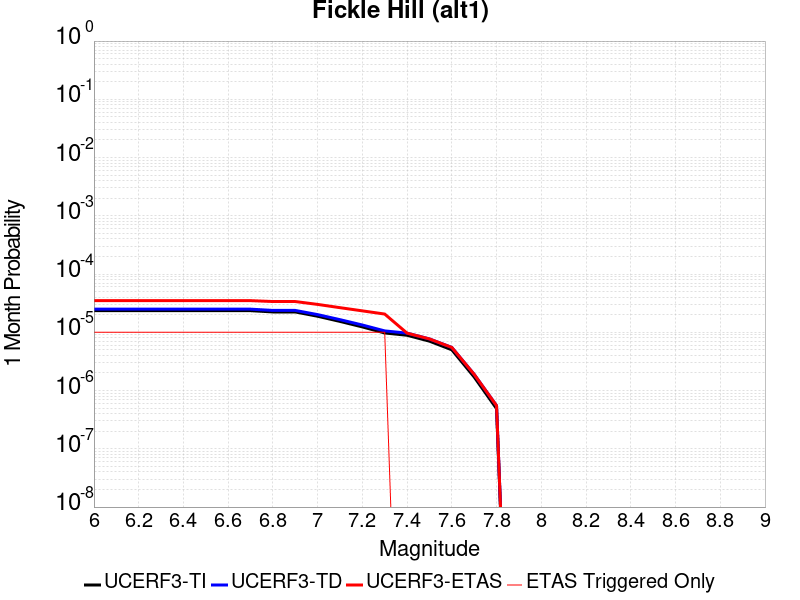 | 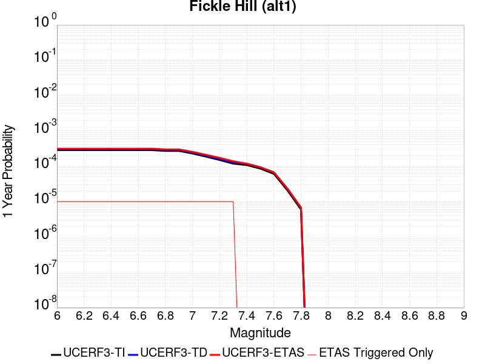 |  |

| Magnitude | 1 wk TI Prob | 1 wk TD Prob | 1 wk ETAS Prob | 1 wk ETAS/TD Gain | 1 wk ETAS Triggered Only | 1 mo TI Prob | 1 mo TD Prob | 1 mo ETAS Prob | 1 mo ETAS/TD Gain | 1 mo ETAS Triggered Only | 1 yr TI Prob | 1 yr TD Prob | 1 yr ETAS Prob | 1 yr ETAS/TD Gain | 1 yr ETAS Triggered Only | 10 yr TI Prob | 10 yr TD Prob | 10 yr ETAS Prob | 10 yr ETAS/TD Gain | 10 yr ETAS Triggered Only |
|-----|-----|-----|-----|-----|-----|-----|-----|-----|-----|-----|-----|-----|-----|-----|-----|-----|-----|-----|-----|-----|
| 6.0 | 5.491893E-6 | 5.826998E-6 | 1.582694E-5 | 2.7161396 | 1.0E-5 | 2.3536471E-5 | 2.4972622E-5 | 3.497237E-5 | 1.4004285 | 1.0E-5 | 2.8651886E-4 | 3.040015E-4 | 3.1399846E-4 | 1.0328846 | 1.0E-5 | 0.0028614972 | 0.0030360806 | 0.0030460502 | 1.0032837 | 1.0E-5 |
| 6.1 | 5.491893E-6 | 5.826998E-6 | 1.582694E-5 | 2.7161396 | 1.0E-5 | 2.3536471E-5 | 2.4972622E-5 | 3.497237E-5 | 1.4004285 | 1.0E-5 | 2.8651886E-4 | 3.040015E-4 | 3.1399846E-4 | 1.0328846 | 1.0E-5 | 0.0028614972 | 0.0030360806 | 0.0030460502 | 1.0032837 | 1.0E-5 |
| 6.2 | 5.491893E-6 | 5.826998E-6 | 1.582694E-5 | 2.7161396 | 1.0E-5 | 2.3536471E-5 | 2.4972622E-5 | 3.497237E-5 | 1.4004285 | 1.0E-5 | 2.8651886E-4 | 3.040015E-4 | 3.1399846E-4 | 1.0328846 | 1.0E-5 | 0.0028614972 | 0.0030360806 | 0.0030460502 | 1.0032837 | 1.0E-5 |
| 6.3 | 5.491893E-6 | 5.826998E-6 | 1.582694E-5 | 2.7161396 | 1.0E-5 | 2.3536471E-5 | 2.4972622E-5 | 3.497237E-5 | 1.4004285 | 1.0E-5 | 2.8651886E-4 | 3.040015E-4 | 3.1399846E-4 | 1.0328846 | 1.0E-5 | 0.0028614972 | 0.0030360806 | 0.0030460502 | 1.0032837 | 1.0E-5 |
| 6.4 | 5.491893E-6 | 5.826998E-6 | 1.582694E-5 | 2.7161396 | 1.0E-5 | 2.3536471E-5 | 2.4972622E-5 | 3.497237E-5 | 1.4004285 | 1.0E-5 | 2.8651886E-4 | 3.040015E-4 | 3.1399846E-4 | 1.0328846 | 1.0E-5 | 0.0028614972 | 0.0030360806 | 0.0030460502 | 1.0032837 | 1.0E-5 |
| 6.5 | 5.491893E-6 | 5.826998E-6 | 1.582694E-5 | 2.7161396 | 1.0E-5 | 2.3536471E-5 | 2.4972622E-5 | 3.497237E-5 | 1.4004285 | 1.0E-5 | 2.8651886E-4 | 3.040015E-4 | 3.1399846E-4 | 1.0328846 | 1.0E-5 | 0.0028614972 | 0.0030360806 | 0.0030460502 | 1.0032837 | 1.0E-5 |
| 6.6 | 5.491893E-6 | 5.826998E-6 | 1.582694E-5 | 2.7161396 | 1.0E-5 | 2.3536471E-5 | 2.4972622E-5 | 3.497237E-5 | 1.4004285 | 1.0E-5 | 2.8651886E-4 | 3.040015E-4 | 3.1399846E-4 | 1.0328846 | 1.0E-5 | 0.0028614972 | 0.0030360806 | 0.0030460502 | 1.0032837 | 1.0E-5 |
| 6.7 | 5.491893E-6 | 5.826998E-6 | 1.582694E-5 | 2.7161396 | 1.0E-5 | 2.3536471E-5 | 2.4972622E-5 | 3.497237E-5 | 1.4004285 | 1.0E-5 | 2.8651886E-4 | 3.040015E-4 | 3.1399846E-4 | 1.0328846 | 1.0E-5 | 0.0028614972 | 0.0030360806 | 0.0030460502 | 1.0032837 | 1.0E-5 |
| 6.8 | 5.2207747E-6 | 5.5457263E-6 | 1.5545671E-5 | 2.8031802 | 1.0E-5 | 2.2374557E-5 | 2.3767194E-5 | 3.3766955E-5 | 1.420738 | 1.0E-5 | 2.7237617E-4 | 2.8932936E-4 | 2.9932646E-4 | 1.0345527 | 1.0E-5 | 0.0027204256 | 0.002889745 | 0.0028997161 | 1.0034505 | 1.0E-5 |
| 6.9 | 5.2186956E-6 | 5.5435466E-6 | 1.5543492E-5 | 2.8038893 | 1.0E-5 | 2.2365646E-5 | 2.3757853E-5 | 3.3757617E-5 | 1.4209034 | 1.0E-5 | 2.722677E-4 | 2.8921568E-4 | 2.9921278E-4 | 1.0345663 | 1.0E-5 | 0.0027193436 | 0.0028886108 | 0.002898582 | 1.0034518 | 1.0E-5 |
| 7.0 | 4.403045E-6 | 4.69848E-6 | 1.4698433E-5 | 3.1283379 | 1.0E-5 | 1.8870056E-5 | 2.0136196E-5 | 3.0135994E-5 | 1.4966081 | 1.0E-5 | 2.297187E-4 | 2.4513193E-4 | 2.5512947E-4 | 1.0407844 | 1.0E-5 | 0.0022948137 | 0.0024487455 | 0.0024587212 | 1.0040737 | 1.0E-5 |
| 7.1 | 3.5911396E-6 | 3.8479548E-6 | 1.3847916E-5 | 3.598773 | 1.0E-5 | 1.5390508E-5 | 1.6491134E-5 | 2.649097E-5 | 1.6063764 | 1.0E-5 | 1.8736332E-4 | 2.0076182E-4 | 2.107598E-4 | 1.0498003 | 1.0E-5 | 0.0018720542 | 0.002005878 | 0.0020158577 | 1.0049753 | 1.0E-5 |
| 7.2 | 2.888171E-6 | 3.114158E-6 | 1.3114127E-5 | 4.2111306 | 1.0E-5 | 1.2377816E-5 | 1.3346325E-5 | 2.3346192E-5 | 1.74926 | 1.0E-5 | 1.5068949E-4 | 1.6247964E-4 | 1.7247802E-4 | 1.0615362 | 1.0E-5 | 0.0015058735 | 0.0016236332 | 0.001633617 | 1.006149 | 1.0E-5 |
| 7.3 | 2.275019E-6 | 2.4675212E-6 | 1.2467496E-5 | 5.0526404 | 1.0E-5 | 9.750045E-6 | 1.0575049E-5 | 2.0574942E-5 | 1.9456122 | 1.0E-5 | 1.1870033E-4 | 1.2874375E-4 | 1.3874246E-4 | 1.0776637 | 1.0E-5 | 0.0011863695 | 0.0012867056 | 0.0012966926 | 1.0077618 | 1.0E-5 |
| 7.4 | 2.076662E-6 | 2.2576116E-6 | 2.2576116E-6 | 1.0 | 0.0 | 8.8999495E-6 | 9.675444E-6 | 9.675444E-6 | 1.0 | 0.0 | 1.08351494E-4 | 1.1779229E-4 | 1.1779229E-4 | 1.0 | 0.0 | 0.0010829868 | 0.0011773116 | 0.0011773116 | 1.0 | 0.0 |
| 7.5 | 1.6450799E-6 | 1.7954102E-6 | 1.7954102E-6 | 1.0 | 0.0 | 7.0503233E-6 | 7.694593E-6 | 7.694593E-6 | 1.0 | 0.0 | 8.5834305E-5 | 9.367772E-5 | 9.367772E-5 | 1.0 | 0.0 | 8.580116E-4 | 9.3639E-4 | 9.3639E-4 | 1.0 | 0.0 |
| 7.6 | 1.168891E-6 | 1.282952E-6 | 1.282952E-6 | 1.0 | 0.0 | 5.009523E-6 | 5.4983543E-6 | 5.4983543E-6 | 1.0 | 0.0 | 6.098924E-5 | 6.694047E-5 | 6.694047E-5 | 1.0 | 0.0 | 6.09725E-4 | 6.6920865E-4 | 6.6920865E-4 | 1.0 | 0.0 |
| 7.7 | 3.9871026E-7 | 4.4271442E-7 | 4.4271442E-7 | 1.0 | 0.0 | 1.708757E-6 | 1.8973462E-6 | 1.8973462E-6 | 1.0 | 0.0 | 2.0803918E-5 | 2.3099954E-5 | 2.3099954E-5 | 1.0 | 0.0 | 2.0801972E-4 | 2.3097637E-4 | 2.3097637E-4 | 1.0 | 0.0 |
| 7.8 | 1.14295965E-7 | 1.2853816E-7 | 1.2853816E-7 | 1.0 | 0.0 | 4.8983975E-7 | 5.5087776E-7 | 5.5087776E-7 | 1.0 | 0.0 | 5.9637828E-6 | 6.7069177E-6 | 6.7069177E-6 | 1.0 | 0.0 | 5.9636226E-5 | 6.70673E-5 | 6.70673E-5 | 1.0 | 0.0 |

## Clayton
*[(top)](#table-of-contents)*

| 1 Week | 1 Month | 1 Year | 10 Year |
|-----|-----|-----|-----|
|  |  | 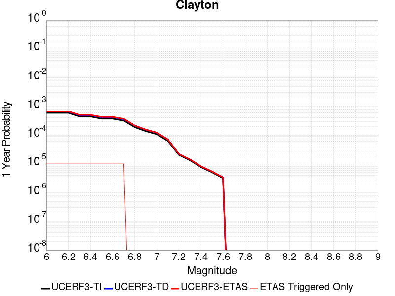 | 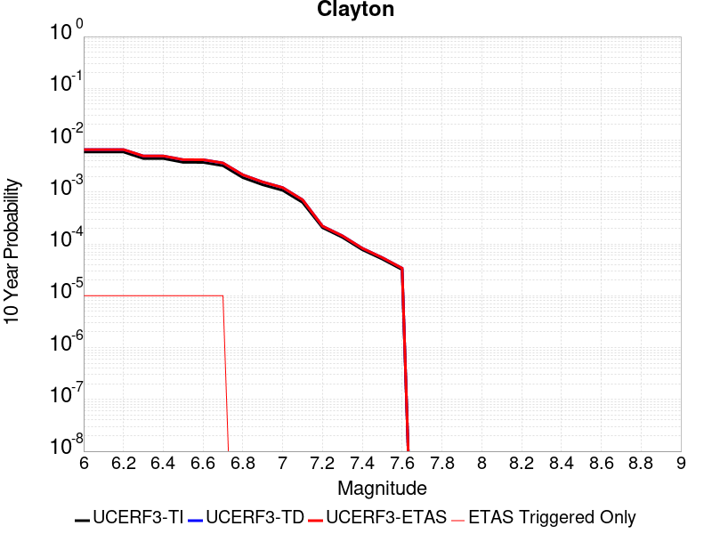 |

| Magnitude | 1 wk TI Prob | 1 wk TD Prob | 1 wk ETAS Prob | 1 wk ETAS/TD Gain | 1 wk ETAS Triggered Only | 1 mo TI Prob | 1 mo TD Prob | 1 mo ETAS Prob | 1 mo ETAS/TD Gain | 1 mo ETAS Triggered Only | 1 yr TI Prob | 1 yr TD Prob | 1 yr ETAS Prob | 1 yr ETAS/TD Gain | 1 yr ETAS Triggered Only | 10 yr TI Prob | 10 yr TD Prob | 10 yr ETAS Prob | 10 yr ETAS/TD Gain | 10 yr ETAS Triggered Only |
|-----|-----|-----|-----|-----|-----|-----|-----|-----|-----|-----|-----|-----|-----|-----|-----|-----|-----|-----|-----|-----|
| 6.0 | 1.1413061E-5 | 1.2667059E-5 | 2.2666933E-5 | 1.7894392 | 1.0E-5 | 4.89122E-5 | 5.4286393E-5 | 6.428585E-5 | 1.1841983 | 1.0E-5 | 5.953433E-4 | 6.607586E-4 | 6.70752E-4 | 1.0151241 | 1.0E-5 | 0.005937509 | 0.0065901424 | 0.0066000763 | 1.0015074 | 1.0E-5 |
| 6.1 | 1.1413061E-5 | 1.2667059E-5 | 2.2666933E-5 | 1.7894392 | 1.0E-5 | 4.89122E-5 | 5.4286393E-5 | 6.428585E-5 | 1.1841983 | 1.0E-5 | 5.953433E-4 | 6.607586E-4 | 6.70752E-4 | 1.0151241 | 1.0E-5 | 0.005937509 | 0.0065901424 | 0.0066000763 | 1.0015074 | 1.0E-5 |
| 6.2 | 1.1413061E-5 | 1.2667059E-5 | 2.2666933E-5 | 1.7894392 | 1.0E-5 | 4.89122E-5 | 5.4286393E-5 | 6.428585E-5 | 1.1841983 | 1.0E-5 | 5.953433E-4 | 6.607586E-4 | 6.70752E-4 | 1.0151241 | 1.0E-5 | 0.005937509 | 0.0065901424 | 0.0066000763 | 1.0015074 | 1.0E-5 |
| 6.3 | 8.538689E-6 | 9.532753E-6 | 1.9532657E-5 | 2.0490048 | 1.0E-5 | 3.659387E-5 | 4.0854076E-5 | 5.085367E-5 | 1.2447636 | 1.0E-5 | 4.4543925E-4 | 4.9729564E-4 | 5.0729065E-4 | 1.0200988 | 1.0E-5 | 0.0044454746 | 0.0049628937 | 0.004972844 | 1.002005 | 1.0E-5 |
| 6.4 | 8.538689E-6 | 9.532753E-6 | 1.9532657E-5 | 2.0490048 | 1.0E-5 | 3.659387E-5 | 4.0854076E-5 | 5.085367E-5 | 1.2447636 | 1.0E-5 | 4.4543925E-4 | 4.9729564E-4 | 5.0729065E-4 | 1.0200988 | 1.0E-5 | 0.0044454746 | 0.0049628937 | 0.004972844 | 1.002005 | 1.0E-5 |
| 6.5 | 7.197462E-6 | 8.080952E-6 | 1.8080871E-5 | 2.237468 | 1.0E-5 | 3.08459E-5 | 3.4632238E-5 | 4.463189E-5 | 1.2887383 | 1.0E-5 | 3.7548412E-4 | 4.2157414E-4 | 4.315699E-4 | 1.0237106 | 1.0E-5 | 0.003748503 | 0.004208556 | 0.0042185136 | 1.0023661 | 1.0E-5 |
| 6.6 | 7.1760483E-6 | 8.056968E-6 | 1.8056888E-5 | 2.2411516 | 1.0E-5 | 3.075413E-5 | 3.4529454E-5 | 4.4529108E-5 | 1.2895979 | 1.0E-5 | 3.743672E-4 | 4.203232E-4 | 4.30319E-4 | 1.0237812 | 1.0E-5 | 0.0037373714 | 0.004196094 | 0.004206052 | 1.0023732 | 1.0E-5 |
| 6.7 | 6.202582E-6 | 6.9766934E-6 | 1.6976624E-5 | 2.4333336 | 1.0E-5 | 2.6582224E-5 | 2.9899817E-5 | 3.9899518E-5 | 1.3344402 | 1.0E-5 | 3.235905E-4 | 3.6397713E-4 | 3.7397348E-4 | 1.0274643 | 1.0E-5 | 0.0032311971 | 0.0036345655 | 0.0036445293 | 1.0027413 | 1.0E-5 |
| 6.8 | 3.6417277E-6 | 4.1212957E-6 | 4.1212957E-6 | 1.0 | 0.0 | 1.5607311E-5 | 1.766258E-5 | 1.766258E-5 | 1.0 | 0.0 | 1.9000245E-4 | 2.1502146E-4 | 2.1502146E-4 | 1.0 | 0.0 | 0.0018984007 | 0.0021482105 | 0.0021482105 | 1.0 | 0.0 |
| 6.9 | 2.6498485E-6 | 2.9995201E-6 | 2.9995201E-6 | 1.0 | 0.0 | 1.1356444E-5 | 1.2855025E-5 | 1.2855025E-5 | 1.0 | 0.0 | 1.3825593E-4 | 1.5649908E-4 | 1.5649908E-4 | 1.0 | 0.0 | 0.0013816995 | 0.0015639283 | 0.0015639283 | 1.0 | 0.0 |
| 7.0 | 2.070442E-6 | 2.3407233E-6 | 2.3407233E-6 | 1.0 | 0.0 | 8.873292E-6 | 1.0031635E-5 | 1.0031635E-5 | 1.0 | 0.0 | 1.0802698E-4 | 1.2212861E-4 | 1.2212861E-4 | 1.0 | 0.0 | 0.0010797448 | 0.0012206447 | 0.0012206447 | 1.0 | 0.0 |
| 7.1 | 1.2111691E-6 | 1.3588725E-6 | 1.3588725E-6 | 1.0 | 0.0 | 5.190714E-6 | 5.8237274E-6 | 5.8237274E-6 | 1.0 | 0.0 | 6.319511E-5 | 7.090174E-5 | 7.090174E-5 | 1.0 | 0.0 | 6.3177146E-4 | 7.0880755E-4 | 7.0880755E-4 | 1.0 | 0.0 |
| 7.2 | 3.9541607E-7 | 4.2227694E-7 | 4.2227694E-7 | 1.0 | 0.0 | 1.6946392E-6 | 1.8097571E-6 | 1.8097571E-6 | 1.0 | 0.0 | 2.0632036E-5 | 2.2033571E-5 | 2.2033571E-5 | 1.0 | 0.0 | 2.063012E-4 | 2.2031402E-4 | 2.2031402E-4 | 1.0 | 0.0 |
| 7.3 | 2.5685637E-7 | 2.745679E-7 | 2.745679E-7 | 1.0 | 0.0 | 1.1008126E-6 | 1.176719E-6 | 1.176719E-6 | 1.0 | 0.0 | 1.3402311E-5 | 1.4326461E-5 | 1.4326461E-5 | 1.0 | 0.0 | 1.3401502E-4 | 1.4325544E-4 | 1.4325544E-4 | 1.0 | 0.0 |
| 7.4 | 1.482299E-7 | 1.5807963E-7 | 1.5807963E-7 | 1.0 | 0.0 | 6.3527085E-7 | 6.7748397E-7 | 6.7748397E-7 | 1.0 | 0.0 | 7.734395E-6 | 8.248337E-6 | 8.248337E-6 | 1.0 | 0.0 | 7.734126E-5 | 8.248033E-5 | 8.248033E-5 | 1.0 | 0.0 |
| 7.5 | 9.7969505E-8 | 1.04382096E-7 | 1.04382096E-7 | 1.0 | 0.0 | 4.1986925E-7 | 4.4735177E-7 | 4.4735177E-7 | 1.0 | 0.0 | 5.111896E-6 | 5.446494E-6 | 5.446494E-6 | 1.0 | 0.0 | 5.1117782E-5 | 5.4463624E-5 | 5.4463624E-5 | 1.0 | 0.0 |
| 7.6 | 6.125415E-8 | 6.5231326E-8 | 6.5231326E-8 | 1.0 | 0.0 | 2.6251774E-7 | 2.7956278E-7 | 2.7956278E-7 | 1.0 | 0.0 | 3.196149E-6 | 3.4036718E-6 | 3.4036718E-6 | 1.0 | 0.0 | 3.196103E-5 | 3.403621E-5 | 3.403621E-5 | 1.0 | 0.0 |

## Garberville - Briceland 2011 CFM
*[(top)](#table-of-contents)*

| 1 Week | 1 Month | 1 Year | 10 Year |
|-----|-----|-----|-----|
|  |  |  |  |

| Magnitude | 1 wk TI Prob | 1 wk TD Prob | 1 wk ETAS Prob | 1 wk ETAS/TD Gain | 1 wk ETAS Triggered Only | 1 mo TI Prob | 1 mo TD Prob | 1 mo ETAS Prob | 1 mo ETAS/TD Gain | 1 mo ETAS Triggered Only | 1 yr TI Prob | 1 yr TD Prob | 1 yr ETAS Prob | 1 yr ETAS/TD Gain | 1 yr ETAS Triggered Only | 10 yr TI Prob | 10 yr TD Prob | 10 yr ETAS Prob | 10 yr ETAS/TD Gain | 10 yr ETAS Triggered Only |
|-----|-----|-----|-----|-----|-----|-----|-----|-----|-----|-----|-----|-----|-----|-----|-----|-----|-----|-----|-----|-----|
| 6.0 | 4.8399295E-5 | 6.452381E-5 | 7.452317E-5 | 1.1549716 | 1.0E-5 | 2.0740906E-4 | 2.7650563E-4 | 2.8650285E-4 | 1.0361556 | 1.0E-5 | 0.002522281 | 0.003362017 | 0.0033719833 | 1.0029644 | 1.0E-5 | 0.024938442 | 0.03317861 | 0.03318828 | 1.0002913 | 1.0E-5 |
| 6.1 | 4.8399295E-5 | 6.452381E-5 | 7.452317E-5 | 1.1549716 | 1.0E-5 | 2.0740906E-4 | 2.7650563E-4 | 2.8650285E-4 | 1.0361556 | 1.0E-5 | 0.002522281 | 0.003362017 | 0.0033719833 | 1.0029644 | 1.0E-5 | 0.024938442 | 0.03317861 | 0.03318828 | 1.0002913 | 1.0E-5 |
| 6.2 | 4.8399295E-5 | 6.452381E-5 | 7.452317E-5 | 1.1549716 | 1.0E-5 | 2.0740906E-4 | 2.7650563E-4 | 2.8650285E-4 | 1.0361556 | 1.0E-5 | 0.002522281 | 0.003362017 | 0.0033719833 | 1.0029644 | 1.0E-5 | 0.024938442 | 0.03317861 | 0.03318828 | 1.0002913 | 1.0E-5 |
| 6.3 | 4.8399295E-5 | 6.452381E-5 | 7.452317E-5 | 1.1549716 | 1.0E-5 | 2.0740906E-4 | 2.7650563E-4 | 2.8650285E-4 | 1.0361556 | 1.0E-5 | 0.002522281 | 0.003362017 | 0.0033719833 | 1.0029644 | 1.0E-5 | 0.024938442 | 0.03317861 | 0.03318828 | 1.0002913 | 1.0E-5 |
| 6.4 | 4.8399295E-5 | 6.452381E-5 | 7.452317E-5 | 1.1549716 | 1.0E-5 | 2.0740906E-4 | 2.7650563E-4 | 2.8650285E-4 | 1.0361556 | 1.0E-5 | 0.002522281 | 0.003362017 | 0.0033719833 | 1.0029644 | 1.0E-5 | 0.024938442 | 0.03317861 | 0.03318828 | 1.0002913 | 1.0E-5 |
| 6.5 | 4.8399295E-5 | 6.452381E-5 | 7.452317E-5 | 1.1549716 | 1.0E-5 | 2.0740906E-4 | 2.7650563E-4 | 2.8650285E-4 | 1.0361556 | 1.0E-5 | 0.002522281 | 0.003362017 | 0.0033719833 | 1.0029644 | 1.0E-5 | 0.024938442 | 0.03317861 | 0.03318828 | 1.0002913 | 1.0E-5 |
| 6.6 | 4.8399295E-5 | 6.452381E-5 | 7.452317E-5 | 1.1549716 | 1.0E-5 | 2.0740906E-4 | 2.7650563E-4 | 2.8650285E-4 | 1.0361556 | 1.0E-5 | 0.002522281 | 0.003362017 | 0.0033719833 | 1.0029644 | 1.0E-5 | 0.024938442 | 0.03317861 | 0.03318828 | 1.0002913 | 1.0E-5 |
| 6.7 | 3.495179E-5 | 4.6308873E-5 | 5.6308407E-5 | 1.2159313 | 1.0E-5 | 1.4978478E-4 | 1.9845461E-4 | 2.0845262E-4 | 1.0503794 | 1.0E-5 | 0.0018221042 | 0.002414053 | 0.002424029 | 1.0041324 | 1.0E-5 | 0.018072363 | 0.023930617 | 0.023940377 | 1.0004079 | 1.0E-5 |
| 6.8 | 2.7517597E-5 | 3.6241618E-5 | 4.6241257E-5 | 1.2759159 | 1.0E-5 | 1.1792722E-4 | 1.5531474E-4 | 1.6531319E-4 | 1.0643754 | 1.0E-5 | 0.0014348183 | 0.0018897996 | 0.0018997807 | 1.0052816 | 1.0E-5 | 0.014255894 | 0.018783508 | 0.01879332 | 1.0005224 | 1.0E-5 |
| 6.9 | 2.74461E-5 | 3.6159345E-5 | 4.6158984E-5 | 1.2765437 | 1.0E-5 | 1.1762084E-4 | 1.5496218E-4 | 1.6496063E-4 | 1.0645219 | 1.0E-5 | 0.001431093 | 0.0018855145 | 0.0018954957 | 1.0052936 | 1.0E-5 | 0.014219119 | 0.018741382 | 0.018751195 | 1.0005236 | 1.0E-5 |
| 7.0 | 1.9023773E-5 | 2.4707579E-5 | 3.4707333E-5 | 1.4047241 | 1.0E-5 | 8.152791E-5 | 1.0588763E-4 | 1.1588657E-4 | 1.0944297 | 1.0E-5 | 9.921503E-4 | 0.0012888284 | 0.0012988156 | 1.007749 | 1.0E-5 | 0.009877323 | 0.012852574 | 0.012862446 | 1.0007681 | 1.0E-5 |
| 7.1 | 5.566844E-6 | 6.512147E-6 | 6.512147E-6 | 1.0 | 0.0 | 2.3857683E-5 | 2.7908927E-5 | 2.7908927E-5 | 1.0 | 0.0 | 2.9042858E-4 | 3.3974246E-4 | 3.3974246E-4 | 1.0 | 0.0 | 0.002900493 | 0.0033926512 | 0.0033926512 | 1.0 | 0.0 |
| 7.2 | 4.011353E-6 | 4.6746213E-6 | 4.6746213E-6 | 1.0 | 0.0 | 1.7191402E-5 | 2.0033956E-5 | 2.0033956E-5 | 1.0 | 0.0 | 2.0928521E-4 | 2.4388955E-4 | 2.4388955E-4 | 1.0 | 0.0 | 0.0020908823 | 0.0024365564 | 0.0024365564 | 1.0 | 0.0 |
| 7.3 | 2.0974871E-6 | 2.4395908E-6 | 2.4395908E-6 | 1.0 | 0.0 | 8.989199E-6 | 1.0455362E-5 | 1.0455362E-5 | 1.0 | 0.0 | 1.09438006E-4 | 1.272891E-4 | 1.272891E-4 | 1.0 | 0.0 | 0.0010938413 | 0.0012724071 | 0.0012724071 | 1.0 | 0.0 |

## Emerson-Copper Mtn 2011
*[(top)](#table-of-contents)*

| 1 Week | 1 Month | 1 Year | 10 Year |
|-----|-----|-----|-----|
|  |  |  |  |

| Magnitude | 1 wk TI Prob | 1 wk TD Prob | 1 wk ETAS Prob | 1 wk ETAS/TD Gain | 1 wk ETAS Triggered Only | 1 mo TI Prob | 1 mo TD Prob | 1 mo ETAS Prob | 1 mo ETAS/TD Gain | 1 mo ETAS Triggered Only | 1 yr TI Prob | 1 yr TD Prob | 1 yr ETAS Prob | 1 yr ETAS/TD Gain | 1 yr ETAS Triggered Only | 10 yr TI Prob | 10 yr TD Prob | 10 yr ETAS Prob | 10 yr ETAS/TD Gain | 10 yr ETAS Triggered Only |
|-----|-----|-----|-----|-----|-----|-----|-----|-----|-----|-----|-----|-----|-----|-----|-----|-----|-----|-----|-----|-----|
| 6.0 | 2.1364202E-5 | 9.968114E-6 | 9.968114E-6 | 1.0 | 0.0 | 9.1557646E-5 | 4.2719836E-5 | 5.271941E-5 | 1.2340733 | 1.0E-5 | 0.0011141442 | 5.199986E-4 | 5.299934E-4 | 1.0192208 | 1.0E-5 | 0.011085749 | 0.005188688 | 0.005198636 | 1.0019172 | 1.0E-5 |
| 6.1 | 2.1364202E-5 | 9.968114E-6 | 9.968114E-6 | 1.0 | 0.0 | 9.1557646E-5 | 4.2719836E-5 | 5.271941E-5 | 1.2340733 | 1.0E-5 | 0.0011141442 | 5.199986E-4 | 5.299934E-4 | 1.0192208 | 1.0E-5 | 0.011085749 | 0.005188688 | 0.005198636 | 1.0019172 | 1.0E-5 |
| 6.2 | 2.1364202E-5 | 9.968114E-6 | 9.968114E-6 | 1.0 | 0.0 | 9.1557646E-5 | 4.2719836E-5 | 5.271941E-5 | 1.2340733 | 1.0E-5 | 0.0011141442 | 5.199986E-4 | 5.299934E-4 | 1.0192208 | 1.0E-5 | 0.011085749 | 0.005188688 | 0.005198636 | 1.0019172 | 1.0E-5 |
| 6.3 | 1.7751237E-5 | 8.089227E-6 | 8.089227E-6 | 1.0 | 0.0 | 7.607452E-5 | 3.466769E-5 | 4.4667344E-5 | 1.2884431 | 1.0E-5 | 9.258136E-4 | 4.2200365E-4 | 4.3199942E-4 | 1.0236865 | 1.0E-5 | 0.00921966 | 0.0042126453 | 0.004222603 | 1.0023638 | 1.0E-5 |
| 6.4 | 1.7751237E-5 | 8.089227E-6 | 8.089227E-6 | 1.0 | 0.0 | 7.607452E-5 | 3.466769E-5 | 4.4667344E-5 | 1.2884431 | 1.0E-5 | 9.258136E-4 | 4.2200365E-4 | 4.3199942E-4 | 1.0236865 | 1.0E-5 | 0.00921966 | 0.0042126453 | 0.004222603 | 1.0023638 | 1.0E-5 |
| 6.5 | 1.5886664E-5 | 6.603819E-6 | 6.603819E-6 | 1.0 | 0.0 | 6.808392E-5 | 2.8301802E-5 | 3.8301518E-5 | 1.3533244 | 1.0E-5 | 8.286065E-4 | 3.4452465E-4 | 3.545212E-4 | 1.0290155 | 1.0E-5 | 0.008255237 | 0.0034403696 | 0.003450335 | 1.0028967 | 1.0E-5 |
| 6.6 | 1.5886664E-5 | 6.603819E-6 | 6.603819E-6 | 1.0 | 0.0 | 6.808392E-5 | 2.8301802E-5 | 3.8301518E-5 | 1.3533244 | 1.0E-5 | 8.286065E-4 | 3.4452465E-4 | 3.545212E-4 | 1.0290155 | 1.0E-5 | 0.008255237 | 0.0034403696 | 0.003450335 | 1.0028967 | 1.0E-5 |
| 6.7 | 1.428471E-5 | 5.470403E-6 | 5.470403E-6 | 1.0 | 0.0 | 6.121875E-5 | 2.3444394E-5 | 3.344416E-5 | 1.4265312 | 1.0E-5 | 7.450834E-4 | 2.8540206E-4 | 2.953992E-4 | 1.0350283 | 1.0E-5 | 0.007425902 | 0.0028507432 | 0.0028607147 | 1.0034978 | 1.0E-5 |
| 6.8 | 1.3490684E-5 | 5.073699E-6 | 5.073699E-6 | 1.0 | 0.0 | 5.7815934E-5 | 2.1744265E-5 | 3.1744046E-5 | 1.4598814 | 1.0E-5 | 7.0368167E-4 | 2.6470813E-4 | 2.7470547E-4 | 1.0377674 | 1.0E-5 | 0.007014576 | 0.002644309 | 0.0026542826 | 1.0037717 | 1.0E-5 |
| 6.9 | 1.2235421E-5 | 4.289677E-6 | 4.289677E-6 | 1.0 | 0.0 | 5.2436466E-5 | 1.838422E-5 | 2.8384036E-5 | 1.5439347 | 1.0E-5 | 6.38227E-4 | 2.238085E-4 | 2.3380626E-4 | 1.044671 | 1.0E-5 | 0.0063639707 | 0.0022361854 | 0.002246163 | 1.0044619 | 1.0E-5 |
| 7.0 | 1.1009851E-5 | 3.7189886E-6 | 3.7189886E-6 | 1.0 | 0.0 | 4.7184225E-5 | 1.5938444E-5 | 2.5938285E-5 | 1.6274039 | 1.0E-5 | 5.743165E-4 | 1.9403672E-4 | 2.0403478E-4 | 1.0515267 | 1.0E-5 | 0.005728345 | 0.0019390108 | 0.0019489914 | 1.0051472 | 1.0E-5 |
| 7.1 | 9.726373E-6 | 3.2117953E-6 | 3.2117953E-6 | 1.0 | 0.0 | 4.168379E-5 | 1.3764783E-5 | 2.3764645E-5 | 1.7264817 | 1.0E-5 | 5.07382E-4 | 1.6757673E-4 | 1.7757504E-4 | 1.0596641 | 1.0E-5 | 0.0050622504 | 0.0016748349 | 0.0016848181 | 1.0059607 | 1.0E-5 |
| 7.2 | 3.9335127E-6 | 1.1524792E-6 | 1.1524792E-6 | 1.0 | 0.0 | 1.6857803E-5 | 4.9391874E-6 | 1.4939138E-5 | 3.0246146 | 1.0E-5 | 2.0522442E-4 | 6.0133007E-5 | 7.01324E-5 | 1.166288 | 1.0E-5 | 0.00205035 | 6.011733E-4 | 6.111673E-4 | 1.0166241 | 1.0E-5 |
| 7.3 | 2.661632E-6 | 6.911505E-7 | 6.911505E-7 | 1.0 | 0.0 | 1.14069435E-5 | 2.9620703E-6 | 1.296204E-5 | 4.376007 | 1.0E-5 | 1.3887069E-4 | 3.6062618E-5 | 4.6062258E-5 | 1.2772855 | 1.0E-5 | 0.0013878393 | 3.605687E-4 | 3.705651E-4 | 1.0277239 | 1.0E-5 |
| 7.4 | 2.0893426E-6 | 5.4618386E-7 | 5.4618386E-7 | 1.0 | 0.0 | 8.954295E-6 | 2.3407858E-6 | 1.2340763E-5 | 5.2720594 | 1.0E-5 | 1.0901308E-4 | 2.84987E-5 | 3.8498416E-5 | 1.3508832 | 1.0E-5 | 0.0010895962 | 2.84951E-4 | 2.9494814E-4 | 1.0350838 | 1.0E-5 |
| 7.5 | 1.1681728E-6 | 3.6030585E-7 | 3.6030585E-7 | 1.0 | 0.0 | 5.0064455E-6 | 1.544167E-6 | 1.544167E-6 | 1.0 | 0.0 | 6.0951766E-5 | 1.8800076E-5 | 1.8800076E-5 | 1.0 | 0.0 | 6.093505E-4 | 1.8798532E-4 | 1.8798532E-4 | 1.0 | 0.0 |
| 7.6 | 1.3154387E-7 | 7.1197384E-8 | 7.1197384E-8 | 1.0 | 0.0 | 5.6375933E-7 | 3.051316E-7 | 3.051316E-7 | 1.0 | 0.0 | 6.863748E-6 | 3.7149728E-6 | 3.7149728E-6 | 1.0 | 0.0 | 6.863536E-5 | 3.7149264E-5 | 3.7149264E-5 | 1.0 | 0.0 |

## Malibu Coast alt 1
*[(top)](#table-of-contents)*

| 1 Week | 1 Month | 1 Year | 10 Year |
|-----|-----|-----|-----|
|  |  |  |  |

| Magnitude | 1 wk TI Prob | 1 wk TD Prob | 1 wk ETAS Prob | 1 wk ETAS/TD Gain | 1 wk ETAS Triggered Only | 1 mo TI Prob | 1 mo TD Prob | 1 mo ETAS Prob | 1 mo ETAS/TD Gain | 1 mo ETAS Triggered Only | 1 yr TI Prob | 1 yr TD Prob | 1 yr ETAS Prob | 1 yr ETAS/TD Gain | 1 yr ETAS Triggered Only | 10 yr TI Prob | 10 yr TD Prob | 10 yr ETAS Prob | 10 yr ETAS/TD Gain | 10 yr ETAS Triggered Only |
|-----|-----|-----|-----|-----|-----|-----|-----|-----|-----|-----|-----|-----|-----|-----|-----|-----|-----|-----|-----|-----|
| 6.0 | 1.6572556E-5 | 1.7598066E-5 | 2.7597891E-5 | 1.5682342 | 1.0E-5 | 7.102331E-5 | 7.541821E-5 | 8.541746E-5 | 1.132584 | 1.0E-5 | 8.6436566E-4 | 9.178488E-4 | 9.278396E-4 | 1.010885 | 1.0E-5 | 0.0086101135 | 0.009142512 | 0.009152421 | 1.0010837 | 1.0E-5 |
| 6.1 | 1.6572556E-5 | 1.7598066E-5 | 2.7597891E-5 | 1.5682342 | 1.0E-5 | 7.102331E-5 | 7.541821E-5 | 8.541746E-5 | 1.132584 | 1.0E-5 | 8.6436566E-4 | 9.178488E-4 | 9.278396E-4 | 1.010885 | 1.0E-5 | 0.0086101135 | 0.009142512 | 0.009152421 | 1.0010837 | 1.0E-5 |
| 6.2 | 1.1085717E-5 | 1.1557147E-5 | 1.1557147E-5 | 1.0 | 0.0 | 4.750935E-5 | 4.952971E-5 | 4.952971E-5 | 1.0 | 0.0 | 5.782728E-4 | 6.028609E-4 | 6.028609E-4 | 1.0 | 0.0 | 0.0057677035 | 0.0060126255 | 0.0060126255 | 1.0 | 0.0 |
| 6.3 | 1.0208568E-5 | 1.0592237E-5 | 1.0592237E-5 | 1.0 | 0.0 | 4.375027E-5 | 4.539453E-5 | 4.539453E-5 | 1.0 | 0.0 | 5.325294E-4 | 5.5254117E-4 | 5.5254117E-4 | 1.0 | 0.0 | 0.0053125503 | 0.0055119814 | 0.0055119814 | 1.0 | 0.0 |
| 6.4 | 9.0682315E-6 | 9.342637E-6 | 9.342637E-6 | 1.0 | 0.0 | 3.8863272E-5 | 4.003927E-5 | 4.003927E-5 | 1.0 | 0.0 | 4.730576E-4 | 4.8737114E-4 | 4.8737114E-4 | 1.0 | 0.0 | 0.0047205184 | 0.004863236 | 0.004863236 | 1.0 | 0.0 |
| 6.5 | 7.605796E-6 | 7.748587E-6 | 7.748587E-6 | 1.0 | 0.0 | 3.259586E-5 | 3.3207816E-5 | 3.3207816E-5 | 1.0 | 0.0 | 3.9678233E-4 | 4.0423148E-4 | 4.0423148E-4 | 1.0 | 0.0 | 0.0039607463 | 0.0040351 | 0.0040351 | 1.0 | 0.0 |
| 6.6 | 5.889873E-6 | 5.8795385E-6 | 5.8795385E-6 | 1.0 | 0.0 | 2.5242069E-5 | 2.519778E-5 | 2.519778E-5 | 1.0 | 0.0 | 3.0727885E-4 | 3.0673988E-4 | 3.0673988E-4 | 1.0 | 0.0 | 0.003068543 | 0.0030631777 | 0.0030631777 | 1.0 | 0.0 |
| 6.7 | 5.66586E-6 | 5.641641E-6 | 5.641641E-6 | 1.0 | 0.0 | 2.428203E-5 | 2.417824E-5 | 2.417824E-5 | 1.0 | 0.0 | 2.955936E-4 | 2.9433038E-4 | 2.9433038E-4 | 1.0 | 0.0 | 0.0029520073 | 0.0029394177 | 0.0029394177 | 1.0 | 0.0 |
| 6.8 | 5.521556E-6 | 5.489427E-6 | 5.489427E-6 | 1.0 | 0.0 | 2.3663597E-5 | 2.3525903E-5 | 2.3525903E-5 | 1.0 | 0.0 | 2.880662E-4 | 2.8639034E-4 | 2.8639034E-4 | 1.0 | 0.0 | 0.0028769306 | 0.002860224 | 0.002860224 | 1.0 | 0.0 |
| 6.9 | 5.29752E-6 | 5.2499317E-6 | 5.2499317E-6 | 1.0 | 0.0 | 2.270346E-5 | 2.2499513E-5 | 2.2499513E-5 | 1.0 | 0.0 | 2.7637955E-4 | 2.7389723E-4 | 2.7389723E-4 | 1.0 | 0.0 | 0.0027603607 | 0.0027356069 | 0.0027356069 | 1.0 | 0.0 |
| 7.0 | 5.106743E-6 | 5.0476788E-6 | 5.0476788E-6 | 1.0 | 0.0 | 2.1885859E-5 | 2.163273E-5 | 2.163273E-5 | 1.0 | 0.0 | 2.6642776E-4 | 2.6334674E-4 | 2.6334674E-4 | 1.0 | 0.0 | 0.0026610855 | 0.0026303562 | 0.0026303562 | 1.0 | 0.0 |
| 7.1 | 4.8469647E-6 | 4.770373E-6 | 4.770373E-6 | 1.0 | 0.0 | 2.0772539E-5 | 2.0444295E-5 | 2.0444295E-5 | 1.0 | 0.0 | 2.528763E-4 | 2.4888094E-4 | 2.4888094E-4 | 1.0 | 0.0 | 0.0025258875 | 0.00248603 | 0.00248603 | 1.0 | 0.0 |
| 7.2 | 4.545514E-6 | 4.4481935E-6 | 4.4481935E-6 | 1.0 | 0.0 | 1.9480629E-5 | 1.9063547E-5 | 1.9063547E-5 | 1.0 | 0.0 | 2.3715083E-4 | 2.3207403E-4 | 2.3207403E-4 | 1.0 | 0.0 | 0.0023689792 | 0.0023183243 | 0.0023183243 | 1.0 | 0.0 |
| 7.3 | 3.794097E-6 | 3.6519348E-6 | 3.6519348E-6 | 1.0 | 0.0 | 1.6260314E-5 | 1.5651056E-5 | 1.5651056E-5 | 1.0 | 0.0 | 1.9795135E-4 | 1.9053498E-4 | 1.9053498E-4 | 1.0 | 0.0 | 0.001977751 | 0.0019037209 | 0.0019037209 | 1.0 | 0.0 |
| 7.4 | 2.808217E-6 | 2.719077E-6 | 2.719077E-6 | 1.0 | 0.0 | 1.203516E-5 | 1.1653135E-5 | 1.1653135E-5 | 1.0 | 0.0 | 1.4651821E-4 | 1.418677E-4 | 1.418677E-4 | 1.0 | 0.0 | 0.0014642165 | 0.001417774 | 0.001417774 | 1.0 | 0.0 |
| 7.5 | 1.83809E-6 | 1.8190691E-6 | 1.8190691E-6 | 1.0 | 0.0 | 7.877505E-6 | 7.795988E-6 | 7.795988E-6 | 1.0 | 0.0 | 9.59044E-5 | 9.491203E-5 | 9.491203E-5 | 1.0 | 0.0 | 9.5863023E-4 | 9.48717E-4 | 9.48717E-4 | 1.0 | 0.0 |
| 7.6 | 1.1292672E-6 | 1.1001447E-6 | 1.1001447E-6 | 1.0 | 0.0 | 4.839708E-6 | 4.714897E-6 | 4.714897E-6 | 1.0 | 0.0 | 5.8921847E-5 | 5.7402376E-5 | 5.7402376E-5 | 1.0 | 0.0 | 5.890623E-4 | 5.738771E-4 | 5.738771E-4 | 1.0 | 0.0 |
| 7.7 | 5.065272E-7 | 4.609151E-7 | 4.609151E-7 | 1.0 | 0.0 | 2.170829E-6 | 1.975349E-6 | 1.975349E-6 | 1.0 | 0.0 | 2.6429525E-5 | 2.404962E-5 | 2.404962E-5 | 1.0 | 0.0 | 2.642638E-4 | 2.4047129E-4 | 2.4047129E-4 | 1.0 | 0.0 |
| 7.8 | 8.952991E-8 | 6.707874E-8 | 6.707874E-8 | 1.0 | 0.0 | 3.8369956E-7 | 2.8748025E-7 | 2.8748025E-7 | 1.0 | 0.0 | 4.671532E-6 | 3.5000667E-6 | 3.5000667E-6 | 1.0 | 0.0 | 4.671434E-5 | 3.5000136E-5 | 3.5000136E-5 | 1.0 | 0.0 |
| 7.9 | 8.007447E-10 | 6.1608785E-10 | 6.1608785E-10 | 1.0 | 0.0 | 3.4317629E-9 | 2.6403764E-9 | 2.6403764E-9 | 1.0 | 0.0 | 4.1781714E-8 | 3.2146584E-8 | 3.2146584E-8 | 1.0 | 0.0 | 4.1781706E-7 | 3.214658E-7 | 3.214658E-7 | 1.0 | 0.0 |

## Rodgers Creek - Healdsburg 2011 CFM
*[(top)](#table-of-contents)*

| 1 Week | 1 Month | 1 Year | 10 Year |
|-----|-----|-----|-----|
|  |  |  |  |

| Magnitude | 1 wk TI Prob | 1 wk TD Prob | 1 wk ETAS Prob | 1 wk ETAS/TD Gain | 1 wk ETAS Triggered Only | 1 mo TI Prob | 1 mo TD Prob | 1 mo ETAS Prob | 1 mo ETAS/TD Gain | 1 mo ETAS Triggered Only | 1 yr TI Prob | 1 yr TD Prob | 1 yr ETAS Prob | 1 yr ETAS/TD Gain | 1 yr ETAS Triggered Only | 10 yr TI Prob | 10 yr TD Prob | 10 yr ETAS Prob | 10 yr ETAS/TD Gain | 10 yr ETAS Triggered Only |
|-----|-----|-----|-----|-----|-----|-----|-----|-----|-----|-----|-----|-----|-----|-----|-----|-----|-----|-----|-----|-----|
| 6.0 | 7.390182E-5 | 1.3136698E-4 | 1.3136698E-4 | 1.0 | 0.0 | 3.1668364E-4 | 5.6287815E-4 | 5.728725E-4 | 1.0177559 | 1.0E-5 | 0.0038488081 | 0.0068315 | 0.0068414323 | 1.0014538 | 1.0E-5 | 0.037828278 | 0.06619178 | 0.06620111 | 1.000141 | 1.0E-5 |
| 6.1 | 7.318768E-5 | 1.3034661E-4 | 1.3034661E-4 | 1.0 | 0.0 | 3.1362378E-4 | 5.585081E-4 | 5.685025E-4 | 1.0178949 | 1.0E-5 | 0.0038116854 | 0.0067786723 | 0.0067886044 | 1.0014652 | 1.0E-5 | 0.037469655 | 0.06569639 | 0.06570573 | 1.0001422 | 1.0E-5 |
| 6.2 | 7.1379836E-5 | 1.2727521E-4 | 1.2727521E-4 | 1.0 | 0.0 | 3.058777E-4 | 5.453505E-4 | 5.5534503E-4 | 1.0183269 | 1.0E-5 | 0.003717703 | 0.0066194604 | 0.0066293944 | 1.0015007 | 1.0E-5 | 0.0365612 | 0.06421462 | 0.064223975 | 1.0001457 | 1.0E-5 |
| 6.3 | 6.9255926E-5 | 1.2382054E-4 | 1.2382054E-4 | 1.0 | 0.0 | 2.9677735E-4 | 5.3055194E-4 | 5.4054667E-4 | 1.0188383 | 1.0E-5 | 0.0036072785 | 0.006440372 | 0.006450308 | 1.0015427 | 1.0E-5 | 0.035492823 | 0.06254096 | 0.062550336 | 1.0001498 | 1.0E-5 |
| 6.4 | 6.6757144E-5 | 1.1958744E-4 | 1.1958744E-4 | 1.0 | 0.0 | 2.8607066E-4 | 5.1241735E-4 | 5.2241224E-4 | 1.0195054 | 1.0E-5 | 0.0034773487 | 0.0062209065 | 0.006230844 | 1.0015975 | 1.0E-5 | 0.034234364 | 0.060490217 | 0.060499612 | 1.0001553 | 1.0E-5 |
| 6.5 | 6.5735134E-5 | 1.1808043E-4 | 1.1808043E-4 | 1.0 | 0.0 | 2.8169158E-4 | 5.0596124E-4 | 5.159562E-4 | 1.0197544 | 1.0E-5 | 0.003424202 | 0.0061427657 | 0.0061527044 | 1.0016179 | 1.0E-5 | 0.03371918 | 0.059755135 | 0.059764538 | 1.0001574 | 1.0E-5 |
| 6.6 | 6.289601E-5 | 1.1343802E-4 | 1.1343802E-4 | 1.0 | 0.0 | 2.6952647E-4 | 4.8607276E-4 | 4.960679E-4 | 1.020563 | 1.0E-5 | 0.0032765474 | 0.005901959 | 0.0059118997 | 1.0016843 | 1.0E-5 | 0.032286562 | 0.057494484 | 0.05750391 | 1.0001639 | 1.0E-5 |
| 6.7 | 6.115274E-5 | 1.1060895E-4 | 1.1060895E-4 | 1.0 | 0.0 | 2.6205686E-4 | 4.7395262E-4 | 4.8394786E-4 | 1.0210892 | 1.0E-5 | 0.0031858748 | 0.0057551847 | 0.005765127 | 1.0017276 | 1.0E-5 | 0.031405866 | 0.05611298 | 0.05612242 | 1.0001682 | 1.0E-5 |
| 6.8 | 5.9232367E-5 | 1.0728244E-4 | 1.0728244E-4 | 1.0 | 0.0 | 2.538283E-4 | 4.597012E-4 | 4.6969662E-4 | 1.0217433 | 1.0E-5 | 0.0030859804 | 0.0055825757 | 0.00559252 | 1.0017813 | 1.0E-5 | 0.030434765 | 0.054479737 | 0.05448919 | 1.0001736 | 1.0E-5 |
| 6.9 | 5.4030377E-5 | 9.8224424E-5 | 9.8224424E-5 | 1.0 | 0.0 | 2.315382E-4 | 4.2089424E-4 | 4.3089004E-4 | 1.023749 | 1.0E-5 | 0.0028153337 | 0.005112413 | 0.0051223617 | 1.001946 | 1.0E-5 | 0.027799325 | 0.05001516 | 0.05002466 | 1.0001899 | 1.0E-5 |
| 7.0 | 4.8260714E-5 | 8.740524E-5 | 8.740524E-5 | 1.0 | 0.0 | 2.0681522E-4 | 3.745404E-4 | 3.8453666E-4 | 1.0266894 | 1.0E-5 | 0.0025150678 | 0.004550549 | 0.0045605036 | 1.0021875 | 1.0E-5 | 0.024867928 | 0.044667665 | 0.044677217 | 1.0002139 | 1.0E-5 |
| 7.1 | 4.0294493E-5 | 7.389041E-5 | 7.389041E-5 | 1.0 | 0.0 | 1.7267925E-4 | 3.1663495E-4 | 3.266318E-4 | 1.0315721 | 1.0E-5 | 0.0021003427 | 0.0038482544 | 0.0038582159 | 1.0025886 | 1.0E-5 | 0.02080602 | 0.037923392 | 0.03793301 | 1.0002537 | 1.0E-5 |
| 7.2 | 3.096388E-5 | 5.697752E-5 | 5.697752E-5 | 1.0 | 0.0 | 1.326956E-4 | 2.4416664E-4 | 2.541642E-4 | 1.0409456 | 1.0E-5 | 0.0016143717 | 0.0029686983 | 0.0029786685 | 1.0033585 | 1.0E-5 | 0.01602694 | 0.029436996 | 0.0294467 | 1.0003297 | 1.0E-5 |
| 7.3 | 2.3615226E-5 | 4.3628002E-5 | 4.3628002E-5 | 1.0 | 0.0 | 1.0120418E-4 | 1.8696384E-4 | 1.8696384E-4 | 1.0 | 0.0 | 0.0012314644 | 0.002273922 | 0.002273922 | 1.0 | 0.0 | 0.0122466255 | 0.022636993 | 0.022636993 | 1.0 | 0.0 |
| 7.4 | 1.8251132E-5 | 3.3541033E-5 | 3.3541033E-5 | 1.0 | 0.0 | 7.821679E-5 | 1.4373941E-4 | 1.4373941E-4 | 1.0 | 0.0 | 9.518733E-4 | 0.0017486324 | 0.0017486324 | 1.0 | 0.0 | 0.009478063 | 0.017465532 | 0.017465532 | 1.0 | 0.0 |
| 7.5 | 1.2411432E-5 | 2.246003E-5 | 2.246003E-5 | 1.0 | 0.0 | 5.3190768E-5 | 9.625375E-5 | 9.625375E-5 | 1.0 | 0.0 | 6.4740516E-4 | 0.0011712653 | 0.0011712653 | 1.0 | 0.0 | 0.006455223 | 0.011743283 | 0.011743283 | 1.0 | 0.0 |
| 7.6 | 4.4771446E-6 | 8.083989E-6 | 8.083989E-6 | 1.0 | 0.0 | 1.918762E-5 | 3.4645214E-5 | 3.4645214E-5 | 1.0 | 0.0 | 2.3358424E-4 | 4.2172507E-4 | 4.2172507E-4 | 1.0 | 0.0 | 0.0023333887 | 0.004246066 | 0.004246066 | 1.0 | 0.0 |
| 7.7 | 2.157941E-7 | 3.5349316E-7 | 3.5349316E-7 | 1.0 | 0.0 | 9.248315E-7 | 1.5149698E-6 | 1.5149698E-6 | 1.0 | 0.0 | 1.1259765E-5 | 1.8444602E-5 | 1.8444602E-5 | 1.0 | 0.0 | 1.1259195E-4 | 1.9069147E-4 | 1.9069147E-4 | 1.0 | 0.0 |
| 7.8 | 9.9623286E-8 | 1.989979E-7 | 1.989979E-7 | 1.0 | 0.0 | 4.269569E-7 | 8.528478E-7 | 8.528478E-7 | 1.0 | 0.0 | 5.1981874E-6 | 1.0383373E-5 | 1.0383373E-5 | 1.0 | 0.0 | 5.198066E-5 | 1.09018714E-4 | 1.09018714E-4 | 1.0 | 0.0 |
| 7.9 | 5.6745257E-8 | 1.1773924E-7 | 1.1773924E-7 | 1.0 | 0.0 | 2.4319394E-7 | 5.0459664E-7 | 5.0459664E-7 | 1.0 | 0.0 | 2.960882E-6 | 6.1434466E-6 | 6.1434466E-6 | 1.0 | 0.0 | 2.9608427E-5 | 6.470911E-5 | 6.470911E-5 | 1.0 | 0.0 |
| 8.0 | 2.8614323E-8 | 6.57845E-8 | 6.57845E-8 | 1.0 | 0.0 | 1.2263281E-7 | 2.8193355E-7 | 2.8193355E-7 | 1.0 | 0.0 | 1.4930534E-6 | 3.4325356E-6 | 3.4325356E-6 | 1.0 | 0.0 | 1.4930434E-5 | 3.582588E-5 | 3.582588E-5 | 1.0 | 0.0 |
| 8.1 | 3.5045191E-9 | 8.965783E-9 | 8.965783E-9 | 1.0 | 0.0 | 1.5019367E-8 | 3.8424783E-8 | 3.8424783E-8 | 1.0 | 0.0 | 1.8286079E-7 | 4.6782165E-7 | 4.6782165E-7 | 1.0 | 0.0 | 1.8286064E-6 | 4.8327956E-6 | 4.8327956E-6 | 1.0 | 0.0 |

## Malibu Coast (Extension) alt 1
*[(top)](#table-of-contents)*

| 1 Week | 1 Month | 1 Year | 10 Year |
|-----|-----|-----|-----|
|  |  |  |  |

| Magnitude | 1 wk TI Prob | 1 wk TD Prob | 1 wk ETAS Prob | 1 wk ETAS/TD Gain | 1 wk ETAS Triggered Only | 1 mo TI Prob | 1 mo TD Prob | 1 mo ETAS Prob | 1 mo ETAS/TD Gain | 1 mo ETAS Triggered Only | 1 yr TI Prob | 1 yr TD Prob | 1 yr ETAS Prob | 1 yr ETAS/TD Gain | 1 yr ETAS Triggered Only | 10 yr TI Prob | 10 yr TD Prob | 10 yr ETAS Prob | 10 yr ETAS/TD Gain | 10 yr ETAS Triggered Only |
|-----|-----|-----|-----|-----|-----|-----|-----|-----|-----|-----|-----|-----|-----|-----|-----|-----|-----|-----|-----|-----|
| 6.0 | 8.930738E-6 | 9.329276E-6 | 1.9329182E-5 | 2.0718846 | 1.0E-5 | 3.827403E-5 | 3.998201E-5 | 4.998161E-5 | 1.2501025 | 1.0E-5 | 4.6588664E-4 | 4.8667393E-4 | 4.966691E-4 | 1.0205376 | 1.0E-5 | 0.0046491115 | 0.004856264 | 0.0048662154 | 1.0020492 | 1.0E-5 |
| 6.1 | 7.199952E-6 | 7.5302964E-6 | 1.7530221E-5 | 2.327959 | 1.0E-5 | 3.0856572E-5 | 3.2272303E-5 | 4.2271982E-5 | 1.3098532 | 1.0E-5 | 3.75614E-4 | 3.9284505E-4 | 4.0284113E-4 | 1.0254453 | 1.0E-5 | 0.0037497976 | 0.003921572 | 0.003931533 | 1.00254 | 1.0E-5 |
| 6.2 | 6.3721413E-6 | 6.6667917E-6 | 1.6666725E-5 | 2.4999619 | 1.0E-5 | 2.7308892E-5 | 2.8571652E-5 | 3.857137E-5 | 1.3499873 | 1.0E-5 | 3.3243504E-4 | 3.4780471E-4 | 3.5780124E-4 | 1.0287417 | 1.0E-5 | 0.0033193815 | 0.0034726437 | 0.003482609 | 1.0028696 | 1.0E-5 |
| 6.3 | 6.016345E-6 | 6.295158E-6 | 1.6295095E-5 | 2.5885124 | 1.0E-5 | 2.578408E-5 | 2.6978973E-5 | 3.69787E-5 | 1.3706491 | 1.0E-5 | 3.1387596E-4 | 3.2841982E-4 | 3.3841652E-4 | 1.0304388 | 1.0E-5 | 0.00313433 | 0.0032793807 | 0.003289348 | 1.0030394 | 1.0E-5 |
| 6.4 | 5.8104883E-6 | 6.0795446E-6 | 1.6079484E-5 | 2.64485 | 1.0E-5 | 2.4901856E-5 | 2.6054933E-5 | 3.6054673E-5 | 1.3837944 | 1.0E-5 | 3.031379E-4 | 3.1717293E-4 | 3.2716978E-4 | 1.0315186 | 1.0E-5 | 0.0030272473 | 0.0031672374 | 0.0031772056 | 1.0031474 | 1.0E-5 |
| 6.5 | 5.476925E-6 | 5.7275133E-6 | 1.5727455E-5 | 2.7459486 | 1.0E-5 | 2.3472323E-5 | 2.4546256E-5 | 3.454601E-5 | 1.4073842 | 1.0E-5 | 2.8573806E-4 | 2.9880996E-4 | 3.0880698E-4 | 1.0334561 | 1.0E-5 | 0.0028537093 | 0.002984114 | 0.002994084 | 1.0033411 | 1.0E-5 |
| 6.6 | 5.222387E-6 | 5.45858E-6 | 1.5458525E-5 | 2.8319683 | 1.0E-5 | 2.2381464E-5 | 2.3393704E-5 | 3.339347E-5 | 1.4274554 | 1.0E-5 | 2.7246025E-4 | 2.8478142E-4 | 2.9477855E-4 | 1.0351046 | 1.0E-5 | 0.0027212645 | 0.0028441956 | 0.002854167 | 1.003506 | 1.0E-5 |
| 6.7 | 5.0337076E-6 | 5.259103E-6 | 1.5259051E-5 | 2.901455 | 1.0E-5 | 2.1572854E-5 | 2.253882E-5 | 3.2538595E-5 | 1.443669 | 1.0E-5 | 2.6261783E-4 | 2.7437587E-4 | 2.8437312E-4 | 1.0364363 | 1.0E-5 | 0.002623077 | 0.002740401 | 0.0027503737 | 1.0036391 | 1.0E-5 |
| 6.8 | 4.5675624E-6 | 4.7587164E-6 | 4.7587164E-6 | 1.0 | 0.0 | 1.9575122E-5 | 2.039434E-5 | 2.039434E-5 | 1.0 | 0.0 | 2.3830103E-4 | 2.48273E-4 | 2.48273E-4 | 1.0 | 0.0 | 0.0023804565 | 0.002479976 | 0.002479976 | 1.0 | 0.0 |
| 6.9 | 4.2802412E-6 | 4.4520207E-6 | 4.4520207E-6 | 1.0 | 0.0 | 1.8343762E-5 | 1.907995E-5 | 1.907995E-5 | 1.0 | 0.0 | 2.2331243E-4 | 2.3227377E-4 | 2.3227377E-4 | 1.0 | 0.0 | 0.0022308815 | 0.0023203269 | 0.0023203269 | 1.0 | 0.0 |
| 7.0 | 3.9794063E-6 | 4.130099E-6 | 4.130099E-6 | 1.0 | 0.0 | 1.7054486E-5 | 1.7700306E-5 | 1.7700306E-5 | 1.0 | 0.0 | 2.0761859E-4 | 2.1548003E-4 | 2.1548003E-4 | 1.0 | 0.0 | 0.0020742472 | 0.0021527244 | 0.0021527244 | 1.0 | 0.0 |
| 7.1 | 3.7730424E-6 | 3.911217E-6 | 3.911217E-6 | 1.0 | 0.0 | 1.6170083E-5 | 1.6762251E-5 | 1.6762251E-5 | 1.0 | 0.0 | 1.9685295E-4 | 2.0406142E-4 | 2.0406142E-4 | 1.0 | 0.0 | 0.0019667868 | 0.0020387534 | 0.0020387534 | 1.0 | 0.0 |
| 7.2 | 3.424985E-6 | 3.541337E-6 | 3.541337E-6 | 1.0 | 0.0 | 1.4678424E-5 | 1.5177071E-5 | 1.5177071E-5 | 1.0 | 0.0 | 1.7869516E-4 | 1.8476529E-4 | 1.8476529E-4 | 1.0 | 0.0 | 0.0017855153 | 0.0018461287 | 0.0018461287 | 1.0 | 0.0 |
| 7.3 | 2.6966375E-6 | 2.7596534E-6 | 2.7596534E-6 | 1.0 | 0.0 | 1.15569665E-5 | 1.1827032E-5 | 1.1827032E-5 | 1.0 | 0.0 | 1.4069698E-4 | 1.4398464E-4 | 1.4398464E-4 | 1.0 | 0.0 | 0.0014060794 | 0.0014389176 | 0.0014389176 | 1.0 | 0.0 |
| 7.4 | 2.215957E-6 | 2.249378E-6 | 2.249378E-6 | 1.0 | 0.0 | 9.496924E-6 | 9.640156E-6 | 9.640156E-6 | 1.0 | 0.0 | 1.1561892E-4 | 1.17362615E-4 | 1.17362615E-4 | 1.0 | 0.0 | 0.0011555878 | 0.0011730101 | 0.0011730101 | 1.0 | 0.0 |
| 7.5 | 1.2040218E-6 | 1.2219067E-6 | 1.2219067E-6 | 1.0 | 0.0 | 5.160083E-6 | 5.2367322E-6 | 5.2367322E-6 | 1.0 | 0.0 | 6.2822204E-5 | 6.375537E-5 | 6.375537E-5 | 1.0 | 0.0 | 6.280445E-4 | 6.3737266E-4 | 6.3737266E-4 | 1.0 | 0.0 |
| 7.6 | 6.6157446E-7 | 6.678975E-7 | 6.678975E-7 | 1.0 | 0.0 | 2.835316E-6 | 2.8624147E-6 | 2.8624147E-6 | 1.0 | 0.0 | 3.4519428E-5 | 3.484936E-5 | 3.484936E-5 | 1.0 | 0.0 | 3.4514067E-4 | 3.4844046E-4 | 3.4844046E-4 | 1.0 | 0.0 |
| 7.7 | 2.6012302E-7 | 2.4357593E-7 | 2.4357593E-7 | 1.0 | 0.0 | 1.1148124E-6 | 1.0438964E-6 | 1.0438964E-6 | 1.0 | 0.0 | 1.3572758E-5 | 1.2709375E-5 | 1.2709375E-5 | 1.0 | 0.0 | 1.3571928E-4 | 1.2708755E-4 | 1.2708755E-4 | 1.0 | 0.0 |
| 7.8 | 2.8323132E-8 | 2.0266649E-8 | 2.0266649E-8 | 1.0 | 0.0 | 1.2138484E-7 | 8.685707E-8 | 8.685707E-8 | 1.0 | 0.0 | 1.4778595E-6 | 1.0574844E-6 | 1.0574844E-6 | 1.0 | 0.0 | 1.4778497E-5 | 1.0574801E-5 | 1.0574801E-5 | 1.0 | 0.0 |

## Santa Monica alt 1
*[(top)](#table-of-contents)*

| 1 Week | 1 Month | 1 Year | 10 Year |
|-----|-----|-----|-----|
|  |  |  |  |

| Magnitude | 1 wk TI Prob | 1 wk TD Prob | 1 wk ETAS Prob | 1 wk ETAS/TD Gain | 1 wk ETAS Triggered Only | 1 mo TI Prob | 1 mo TD Prob | 1 mo ETAS Prob | 1 mo ETAS/TD Gain | 1 mo ETAS Triggered Only | 1 yr TI Prob | 1 yr TD Prob | 1 yr ETAS Prob | 1 yr ETAS/TD Gain | 1 yr ETAS Triggered Only | 10 yr TI Prob | 10 yr TD Prob | 10 yr ETAS Prob | 10 yr ETAS/TD Gain | 10 yr ETAS Triggered Only |
|-----|-----|-----|-----|-----|-----|-----|-----|-----|-----|-----|-----|-----|-----|-----|-----|-----|-----|-----|-----|-----|
| 6.0 | 1.1066008E-5 | 1.148031E-5 | 1.148031E-5 | 1.0 | 0.0 | 4.742488E-5 | 4.920048E-5 | 4.920048E-5 | 1.0 | 0.0 | 5.7724497E-4 | 5.9886515E-4 | 5.9886515E-4 | 1.0 | 0.0 | 0.005757478 | 0.0059739 | 0.00598384 | 1.0016639 | 1.0E-5 |
| 6.1 | 1.1066008E-5 | 1.148031E-5 | 1.148031E-5 | 1.0 | 0.0 | 4.742488E-5 | 4.920048E-5 | 4.920048E-5 | 1.0 | 0.0 | 5.7724497E-4 | 5.9886515E-4 | 5.9886515E-4 | 1.0 | 0.0 | 0.005757478 | 0.0059739 | 0.00598384 | 1.0016639 | 1.0E-5 |
| 6.2 | 1.1066008E-5 | 1.148031E-5 | 1.148031E-5 | 1.0 | 0.0 | 4.742488E-5 | 4.920048E-5 | 4.920048E-5 | 1.0 | 0.0 | 5.7724497E-4 | 5.9886515E-4 | 5.9886515E-4 | 1.0 | 0.0 | 0.005757478 | 0.0059739 | 0.00598384 | 1.0016639 | 1.0E-5 |
| 6.3 | 1.1066008E-5 | 1.148031E-5 | 1.148031E-5 | 1.0 | 0.0 | 4.742488E-5 | 4.920048E-5 | 4.920048E-5 | 1.0 | 0.0 | 5.7724497E-4 | 5.9886515E-4 | 5.9886515E-4 | 1.0 | 0.0 | 0.005757478 | 0.0059739 | 0.00598384 | 1.0016639 | 1.0E-5 |
| 6.4 | 1.1066008E-5 | 1.148031E-5 | 1.148031E-5 | 1.0 | 0.0 | 4.742488E-5 | 4.920048E-5 | 4.920048E-5 | 1.0 | 0.0 | 5.7724497E-4 | 5.9886515E-4 | 5.9886515E-4 | 1.0 | 0.0 | 0.005757478 | 0.0059739 | 0.00598384 | 1.0016639 | 1.0E-5 |
| 6.5 | 8.183544E-6 | 8.335432E-6 | 8.335432E-6 | 1.0 | 0.0 | 3.5071862E-5 | 3.57228E-5 | 3.57228E-5 | 1.0 | 0.0 | 4.2691626E-4 | 4.3483984E-4 | 4.3483984E-4 | 1.0 | 0.0 | 0.0042609703 | 0.0043400554 | 0.004350012 | 1.0022941 | 1.0E-5 |
| 6.6 | 8.1543285E-6 | 8.303646E-6 | 8.303646E-6 | 1.0 | 0.0 | 3.4946657E-5 | 3.5586578E-5 | 3.5586578E-5 | 1.0 | 0.0 | 4.2539247E-4 | 4.3318202E-4 | 4.3318202E-4 | 1.0 | 0.0 | 0.0042457907 | 0.004323542 | 0.0043334984 | 1.0023029 | 1.0E-5 |
| 6.7 | 8.110878E-6 | 8.257042E-6 | 8.257042E-6 | 1.0 | 0.0 | 3.4760444E-5 | 3.5386853E-5 | 3.5386853E-5 | 1.0 | 0.0 | 4.231262E-4 | 4.3075136E-4 | 4.3075136E-4 | 1.0 | 0.0 | 0.0042232145 | 0.0042993296 | 0.0043092864 | 1.002316 | 1.0E-5 |
| 6.8 | 7.644036E-6 | 7.75106E-6 | 7.75106E-6 | 1.0 | 0.0 | 3.275974E-5 | 3.3218414E-5 | 3.3218414E-5 | 1.0 | 0.0 | 3.9877684E-4 | 4.0436056E-4 | 4.0436056E-4 | 1.0 | 0.0 | 0.00398062 | 0.0040363944 | 0.004046354 | 1.0024675 | 1.0E-5 |
| 6.9 | 7.3698293E-6 | 7.455719E-6 | 7.455719E-6 | 1.0 | 0.0 | 3.15846E-5 | 3.19527E-5 | 3.19527E-5 | 1.0 | 0.0 | 3.8447464E-4 | 3.8895605E-4 | 3.8895605E-4 | 1.0 | 0.0 | 0.0038381014 | 0.0038828964 | 0.0038928576 | 1.0025654 | 1.0E-5 |
| 7.0 | 7.209872E-6 | 7.2856255E-6 | 7.2856255E-6 | 1.0 | 0.0 | 3.0899086E-5 | 3.1223743E-5 | 3.1223743E-5 | 1.0 | 0.0 | 3.7613141E-4 | 3.8008415E-4 | 3.8008415E-4 | 1.0 | 0.0 | 0.0037549543 | 0.0037944836 | 0.0038044457 | 1.0026253 | 1.0E-5 |
| 7.1 | 5.603456E-6 | 5.5238925E-6 | 5.5238925E-6 | 1.0 | 0.0 | 2.4014591E-5 | 2.3673612E-5 | 2.3673612E-5 | 1.0 | 0.0 | 2.923384E-4 | 2.881885E-4 | 2.881885E-4 | 1.0 | 0.0 | 0.0029195412 | 0.0028781896 | 0.0028781896 | 1.0 | 0.0 |
| 7.2 | 4.7483613E-6 | 4.5911324E-6 | 4.5911324E-6 | 1.0 | 0.0 | 2.0349962E-5 | 1.9676136E-5 | 1.9676136E-5 | 1.0 | 0.0 | 2.4773262E-4 | 2.3953074E-4 | 2.3953074E-4 | 1.0 | 0.0 | 0.0024745662 | 0.0023927398 | 0.0023927398 | 1.0 | 0.0 |
| 7.3 | 3.829015E-6 | 3.6342253E-6 | 3.6342253E-6 | 1.0 | 0.0 | 1.6409962E-5 | 1.5575159E-5 | 1.5575159E-5 | 1.0 | 0.0 | 1.9977297E-4 | 1.8961114E-4 | 1.8961114E-4 | 1.0 | 0.0 | 0.0019959346 | 0.0018945024 | 0.0018945024 | 1.0 | 0.0 |
| 7.4 | 2.610755E-6 | 2.4995716E-6 | 2.4995716E-6 | 1.0 | 0.0 | 1.1188902E-5 | 1.0712406E-5 | 1.0712406E-5 | 1.0 | 0.0 | 1.3621636E-4 | 1.3041578E-4 | 1.3041578E-4 | 1.0 | 0.0 | 0.001361329 | 0.0013033969 | 0.0013033969 | 1.0 | 0.0 |
| 7.5 | 1.792146E-6 | 1.7584184E-6 | 1.7584184E-6 | 1.0 | 0.0 | 7.680603E-6 | 7.536057E-6 | 7.536057E-6 | 1.0 | 0.0 | 9.3507326E-5 | 9.1747665E-5 | 9.1747665E-5 | 1.0 | 0.0 | 9.3467993E-4 | 9.1710105E-4 | 9.1710105E-4 | 1.0 | 0.0 |
| 7.6 | 1.1473018E-6 | 1.1029152E-6 | 1.1029152E-6 | 1.0 | 0.0 | 4.9169985E-6 | 4.726771E-6 | 4.726771E-6 | 1.0 | 0.0 | 5.986281E-5 | 5.7546935E-5 | 5.7546935E-5 | 1.0 | 0.0 | 5.984669E-4 | 5.7532196E-4 | 5.7532196E-4 | 1.0 | 0.0 |
| 7.7 | 5.330919E-7 | 4.7452556E-7 | 4.7452556E-7 | 1.0 | 0.0 | 2.2846775E-6 | 2.0336795E-6 | 2.0336795E-6 | 1.0 | 0.0 | 2.7815593E-5 | 2.4759778E-5 | 2.4759778E-5 | 1.0 | 0.0 | 2.7812112E-4 | 2.4757133E-4 | 2.4757133E-4 | 1.0 | 0.0 |
| 7.8 | 1.1668574E-7 | 8.2966224E-8 | 8.2966224E-8 | 1.0 | 0.0 | 5.000816E-7 | 3.5556948E-7 | 3.5556948E-7 | 1.0 | 0.0 | 6.0884768E-6 | 4.32905E-6 | 4.32905E-6 | 1.0 | 0.0 | 6.08831E-5 | 4.3289692E-5 | 4.3289692E-5 | 1.0 | 0.0 |
| 7.9 | 8.007447E-10 | 6.1608785E-10 | 6.1608785E-10 | 1.0 | 0.0 | 3.4317629E-9 | 2.6403764E-9 | 2.6403764E-9 | 1.0 | 0.0 | 4.1781714E-8 | 3.2146584E-8 | 3.2146584E-8 | 1.0 | 0.0 | 4.1781706E-7 | 3.214658E-7 | 3.214658E-7 | 1.0 | 0.0 |

## Mad River (alt1)
*[(top)](#table-of-contents)*

| 1 Week | 1 Month | 1 Year | 10 Year |
|-----|-----|-----|-----|
|  |  |  |  |

| Magnitude | 1 wk TI Prob | 1 wk TD Prob | 1 wk ETAS Prob | 1 wk ETAS/TD Gain | 1 wk ETAS Triggered Only | 1 mo TI Prob | 1 mo TD Prob | 1 mo ETAS Prob | 1 mo ETAS/TD Gain | 1 mo ETAS Triggered Only | 1 yr TI Prob | 1 yr TD Prob | 1 yr ETAS Prob | 1 yr ETAS/TD Gain | 1 yr ETAS Triggered Only | 10 yr TI Prob | 10 yr TD Prob | 10 yr ETAS Prob | 10 yr ETAS/TD Gain | 10 yr ETAS Triggered Only |
|-----|-----|-----|-----|-----|-----|-----|-----|-----|-----|-----|-----|-----|-----|-----|-----|-----|-----|-----|-----|-----|
| 6.0 | 1.1255216E-5 | 1.2039658E-5 | 2.2039538E-5 | 1.8305783 | 1.0E-5 | 4.8235746E-5 | 5.1597595E-5 | 6.159708E-5 | 1.1937975 | 1.0E-5 | 5.87112E-4 | 6.280341E-4 | 6.380278E-4 | 1.0159127 | 1.0E-5 | 0.0058556325 | 0.006264031 | 0.0062739686 | 1.0015864 | 1.0E-5 |
| 6.1 | 1.1255216E-5 | 1.2039658E-5 | 2.2039538E-5 | 1.8305783 | 1.0E-5 | 4.8235746E-5 | 5.1597595E-5 | 6.159708E-5 | 1.1937975 | 1.0E-5 | 5.87112E-4 | 6.280341E-4 | 6.380278E-4 | 1.0159127 | 1.0E-5 | 0.0058556325 | 0.006264031 | 0.0062739686 | 1.0015864 | 1.0E-5 |
| 6.2 | 1.1255216E-5 | 1.2039658E-5 | 2.2039538E-5 | 1.8305783 | 1.0E-5 | 4.8235746E-5 | 5.1597595E-5 | 6.159708E-5 | 1.1937975 | 1.0E-5 | 5.87112E-4 | 6.280341E-4 | 6.380278E-4 | 1.0159127 | 1.0E-5 | 0.0058556325 | 0.006264031 | 0.0062739686 | 1.0015864 | 1.0E-5 |
| 6.3 | 1.1255216E-5 | 1.2039658E-5 | 2.2039538E-5 | 1.8305783 | 1.0E-5 | 4.8235746E-5 | 5.1597595E-5 | 6.159708E-5 | 1.1937975 | 1.0E-5 | 5.87112E-4 | 6.280341E-4 | 6.380278E-4 | 1.0159127 | 1.0E-5 | 0.0058556325 | 0.006264031 | 0.0062739686 | 1.0015864 | 1.0E-5 |
| 6.4 | 1.1255216E-5 | 1.2039658E-5 | 2.2039538E-5 | 1.8305783 | 1.0E-5 | 4.8235746E-5 | 5.1597595E-5 | 6.159708E-5 | 1.1937975 | 1.0E-5 | 5.87112E-4 | 6.280341E-4 | 6.380278E-4 | 1.0159127 | 1.0E-5 | 0.0058556325 | 0.006264031 | 0.0062739686 | 1.0015864 | 1.0E-5 |
| 6.5 | 1.1255216E-5 | 1.2039658E-5 | 2.2039538E-5 | 1.8305783 | 1.0E-5 | 4.8235746E-5 | 5.1597595E-5 | 6.159708E-5 | 1.1937975 | 1.0E-5 | 5.87112E-4 | 6.280341E-4 | 6.380278E-4 | 1.0159127 | 1.0E-5 | 0.0058556325 | 0.006264031 | 0.0062739686 | 1.0015864 | 1.0E-5 |
| 6.6 | 1.1255216E-5 | 1.2039658E-5 | 2.2039538E-5 | 1.8305783 | 1.0E-5 | 4.8235746E-5 | 5.1597595E-5 | 6.159708E-5 | 1.1937975 | 1.0E-5 | 5.87112E-4 | 6.280341E-4 | 6.380278E-4 | 1.0159127 | 1.0E-5 | 0.0058556325 | 0.006264031 | 0.0062739686 | 1.0015864 | 1.0E-5 |
| 6.7 | 7.0564884E-6 | 7.6054325E-6 | 1.7605356E-5 | 2.3148396 | 1.0E-5 | 3.0241743E-5 | 3.2594315E-5 | 4.259399E-5 | 1.306792 | 1.0E-5 | 3.68131E-4 | 3.967657E-4 | 4.0676177E-4 | 1.0251938 | 1.0E-5 | 0.0036752177 | 0.0039607957 | 0.003970756 | 1.0025147 | 1.0E-5 |
| 6.8 | 7.0564884E-6 | 7.6054325E-6 | 1.7605356E-5 | 2.3148396 | 1.0E-5 | 3.0241743E-5 | 3.2594315E-5 | 4.259399E-5 | 1.306792 | 1.0E-5 | 3.68131E-4 | 3.967657E-4 | 4.0676177E-4 | 1.0251938 | 1.0E-5 | 0.0036752177 | 0.0039607957 | 0.003970756 | 1.0025147 | 1.0E-5 |
| 6.9 | 6.727494E-6 | 7.2572843E-6 | 1.725721E-5 | 2.3779159 | 1.0E-5 | 2.8831799E-5 | 3.110229E-5 | 4.110198E-5 | 1.3215097 | 1.0E-5 | 3.509706E-4 | 3.786067E-4 | 3.8860293E-4 | 1.0264026 | 1.0E-5 | 0.003504168 | 0.0037798323 | 0.0037897944 | 1.0026356 | 1.0E-5 |
| 7.0 | 6.7021124E-6 | 7.2301245E-6 | 1.7230052E-5 | 2.3830922 | 1.0E-5 | 2.8723021E-5 | 3.098589E-5 | 4.0985582E-5 | 1.3227175 | 1.0E-5 | 3.4964667E-4 | 3.7719007E-4 | 3.871863E-4 | 1.0265018 | 1.0E-5 | 0.0034909705 | 0.003765714 | 0.0037756762 | 1.0026455 | 1.0E-5 |
| 7.1 | 5.2784667E-6 | 5.7322395E-6 | 1.5732183E-5 | 2.7445087 | 1.0E-5 | 2.2621804E-5 | 2.4566516E-5 | 3.456627E-5 | 1.4070481 | 1.0E-5 | 2.7538565E-4 | 2.990572E-4 | 3.090542E-4 | 1.0334284 | 1.0E-5 | 0.0027504463 | 0.0029866395 | 0.0029966098 | 1.0033382 | 1.0E-5 |
| 7.2 | 4.4085446E-6 | 4.819547E-6 | 1.4819499E-5 | 3.0748737 | 1.0E-5 | 1.8893625E-5 | 2.0655041E-5 | 3.0654835E-5 | 1.4841334 | 1.0E-5 | 2.3000561E-4 | 2.514465E-4 | 2.61444E-4 | 1.0397599 | 1.0E-5 | 0.0022976769 | 0.0025116608 | 0.0025216355 | 1.0039715 | 1.0E-5 |
| 7.3 | 3.4060627E-6 | 3.7531752E-6 | 1.3753138E-5 | 3.6644006 | 1.0E-5 | 1.459733E-5 | 1.6084938E-5 | 2.6084777E-5 | 1.6216896 | 1.0E-5 | 1.77708E-4 | 1.9581676E-4 | 2.058148E-4 | 1.0510582 | 1.0E-5 | 0.0017756595 | 0.0019564657 | 0.001966446 | 1.0051012 | 1.0E-5 |
| 7.4 | 3.0570902E-6 | 3.3802967E-6 | 3.3802967E-6 | 1.0 | 0.0 | 1.310175E-5 | 1.4486906E-5 | 1.4486906E-5 | 1.0 | 0.0 | 1.5950213E-4 | 1.7636403E-4 | 1.7636403E-4 | 1.0 | 0.0 | 0.0015938769 | 0.0017622622 | 0.0017622622 | 1.0 | 0.0 |
| 7.5 | 2.674048E-6 | 2.9692678E-6 | 2.9692678E-6 | 1.0 | 0.0 | 1.1460155E-5 | 1.27253725E-5 | 1.27253725E-5 | 1.0 | 0.0 | 1.3951845E-4 | 1.5492059E-4 | 1.5492059E-4 | 1.0 | 0.0 | 0.0013943089 | 0.0015481455 | 0.0015481455 | 1.0 | 0.0 |
| 7.6 | 1.8806261E-6 | 2.1046062E-6 | 2.1046062E-6 | 1.0 | 0.0 | 8.059801E-6 | 9.01971E-6 | 9.01971E-6 | 1.0 | 0.0 | 9.812366E-5 | 1.0980956E-4 | 1.0980956E-4 | 1.0 | 0.0 | 9.808034E-4 | 0.0010975654 | 0.0010975654 | 1.0 | 0.0 |
| 7.7 | 6.461283E-7 | 7.3407836E-7 | 7.3407836E-7 | 1.0 | 0.0 | 2.7691183E-6 | 3.1460463E-6 | 3.1460463E-6 | 1.0 | 0.0 | 3.371349E-5 | 3.8302456E-5 | 3.8302456E-5 | 1.0 | 0.0 | 3.370838E-4 | 3.8296005E-4 | 3.8296005E-4 | 1.0 | 0.0 |
| 7.8 | 3.0785324E-7 | 3.5290012E-7 | 3.5290012E-7 | 1.0 | 0.0 | 1.3193703E-6 | 1.5124282E-6 | 1.5124282E-6 | 1.0 | 0.0 | 1.6063215E-5 | 1.8413664E-5 | 1.8413664E-5 | 1.0 | 0.0 | 1.6062055E-4 | 1.8412202E-4 | 1.8412202E-4 | 1.0 | 0.0 |

## Channel Islands Western Deep Ramp
*[(top)](#table-of-contents)*

| 1 Week | 1 Month | 1 Year | 10 Year |
|-----|-----|-----|-----|
|  |  |  |  |

| Magnitude | 1 wk TI Prob | 1 wk TD Prob | 1 wk ETAS Prob | 1 wk ETAS/TD Gain | 1 wk ETAS Triggered Only | 1 mo TI Prob | 1 mo TD Prob | 1 mo ETAS Prob | 1 mo ETAS/TD Gain | 1 mo ETAS Triggered Only | 1 yr TI Prob | 1 yr TD Prob | 1 yr ETAS Prob | 1 yr ETAS/TD Gain | 1 yr ETAS Triggered Only | 10 yr TI Prob | 10 yr TD Prob | 10 yr ETAS Prob | 10 yr ETAS/TD Gain | 10 yr ETAS Triggered Only |
|-----|-----|-----|-----|-----|-----|-----|-----|-----|-----|-----|-----|-----|-----|-----|-----|-----|-----|-----|-----|-----|
| 6.0 | 6.0213506E-6 | 6.2548684E-6 | 6.2548684E-6 | 1.0 | 0.0 | 2.5805533E-5 | 2.6806329E-5 | 3.680606E-5 | 1.3730363 | 1.0E-5 | 3.1413708E-4 | 3.2632265E-4 | 3.3631938E-4 | 1.0306345 | 1.0E-5 | 0.0031369338 | 0.0032588763 | 0.0032688437 | 1.0030586 | 1.0E-5 |
| 6.1 | 6.0213506E-6 | 6.2548684E-6 | 6.2548684E-6 | 1.0 | 0.0 | 2.5805533E-5 | 2.6806329E-5 | 3.680606E-5 | 1.3730363 | 1.0E-5 | 3.1413708E-4 | 3.2632265E-4 | 3.3631938E-4 | 1.0306345 | 1.0E-5 | 0.0031369338 | 0.0032588763 | 0.0032688437 | 1.0030586 | 1.0E-5 |
| 6.2 | 6.0213506E-6 | 6.2548684E-6 | 6.2548684E-6 | 1.0 | 0.0 | 2.5805533E-5 | 2.6806329E-5 | 3.680606E-5 | 1.3730363 | 1.0E-5 | 3.1413708E-4 | 3.2632265E-4 | 3.3631938E-4 | 1.0306345 | 1.0E-5 | 0.0031369338 | 0.0032588763 | 0.0032688437 | 1.0030586 | 1.0E-5 |
| 6.3 | 6.0213506E-6 | 6.2548684E-6 | 6.2548684E-6 | 1.0 | 0.0 | 2.5805533E-5 | 2.6806329E-5 | 3.680606E-5 | 1.3730363 | 1.0E-5 | 3.1413708E-4 | 3.2632265E-4 | 3.3631938E-4 | 1.0306345 | 1.0E-5 | 0.0031369338 | 0.0032588763 | 0.0032688437 | 1.0030586 | 1.0E-5 |
| 6.4 | 6.0213506E-6 | 6.2548684E-6 | 6.2548684E-6 | 1.0 | 0.0 | 2.5805533E-5 | 2.6806329E-5 | 3.680606E-5 | 1.3730363 | 1.0E-5 | 3.1413708E-4 | 3.2632265E-4 | 3.3631938E-4 | 1.0306345 | 1.0E-5 | 0.0031369338 | 0.0032588763 | 0.0032688437 | 1.0030586 | 1.0E-5 |
| 6.5 | 6.0213506E-6 | 6.2548684E-6 | 6.2548684E-6 | 1.0 | 0.0 | 2.5805533E-5 | 2.6806329E-5 | 3.680606E-5 | 1.3730363 | 1.0E-5 | 3.1413708E-4 | 3.2632265E-4 | 3.3631938E-4 | 1.0306345 | 1.0E-5 | 0.0031369338 | 0.0032588763 | 0.0032688437 | 1.0030586 | 1.0E-5 |
| 6.6 | 6.0213506E-6 | 6.2548684E-6 | 6.2548684E-6 | 1.0 | 0.0 | 2.5805533E-5 | 2.6806329E-5 | 3.680606E-5 | 1.3730363 | 1.0E-5 | 3.1413708E-4 | 3.2632265E-4 | 3.3631938E-4 | 1.0306345 | 1.0E-5 | 0.0031369338 | 0.0032588763 | 0.0032688437 | 1.0030586 | 1.0E-5 |
| 6.7 | 5.313309E-6 | 5.5252403E-6 | 5.5252403E-6 | 1.0 | 0.0 | 2.2771126E-5 | 2.367941E-5 | 3.3679175E-5 | 1.4222978 | 1.0E-5 | 2.772032E-4 | 2.8826276E-4 | 2.982599E-4 | 1.0346806 | 1.0E-5 | 0.0027685766 | 0.0028792918 | 0.002889263 | 1.003463 | 1.0E-5 |
| 6.8 | 5.313309E-6 | 5.5252403E-6 | 5.5252403E-6 | 1.0 | 0.0 | 2.2771126E-5 | 2.367941E-5 | 3.3679175E-5 | 1.4222978 | 1.0E-5 | 2.772032E-4 | 2.8826276E-4 | 2.982599E-4 | 1.0346806 | 1.0E-5 | 0.0027685766 | 0.0028792918 | 0.002889263 | 1.003463 | 1.0E-5 |
| 6.9 | 4.744377E-6 | 4.9394303E-6 | 4.9394303E-6 | 1.0 | 0.0 | 2.0332885E-5 | 2.1168837E-5 | 3.1168624E-5 | 1.4723825 | 1.0E-5 | 2.4752476E-4 | 2.5770385E-4 | 2.6770125E-4 | 1.0387943 | 1.0E-5 | 0.0024724922 | 0.0025744175 | 0.0025843917 | 1.0038744 | 1.0E-5 |
| 7.0 | 4.722209E-6 | 4.9164732E-6 | 4.9164732E-6 | 1.0 | 0.0 | 2.0237881E-5 | 2.107045E-5 | 3.1070238E-5 | 1.4745883 | 1.0E-5 | 2.4636835E-4 | 2.5650626E-4 | 2.665037E-4 | 1.0389754 | 1.0E-5 | 0.002460954 | 0.0025624693 | 0.0025724438 | 1.0038925 | 1.0E-5 |
| 7.1 | 4.611174E-6 | 4.801409E-6 | 4.801409E-6 | 1.0 | 0.0 | 1.9762025E-5 | 2.0577325E-5 | 3.057712E-5 | 1.4859618 | 1.0E-5 | 2.4057609E-4 | 2.5050386E-4 | 2.6050137E-4 | 1.0399096 | 1.0E-5 | 0.002403158 | 0.002502582 | 0.002512557 | 1.0039859 | 1.0E-5 |
| 7.2 | 4.043994E-6 | 4.2120264E-6 | 4.2120264E-6 | 1.0 | 0.0 | 1.7331287E-5 | 1.8051438E-5 | 2.8051258E-5 | 1.5539625 | 1.0E-5 | 2.10988E-4 | 2.1975765E-4 | 2.2975546E-4 | 1.0454947 | 1.0E-5 | 0.002107878 | 0.0021957543 | 0.0022057323 | 1.0045443 | 1.0E-5 |
| 7.3 | 2.1233036E-6 | 2.2297875E-6 | 2.2297875E-6 | 1.0 | 0.0 | 9.099841E-6 | 9.556197E-6 | 9.556197E-6 | 1.0 | 0.0 | 1.1078493E-4 | 1.1634055E-4 | 1.1634055E-4 | 1.0 | 0.0 | 0.0011072971 | 0.001162802 | 0.001162802 | 1.0 | 0.0 |
| 7.4 | 1.9051884E-6 | 2.0014973E-6 | 2.0014973E-6 | 1.0 | 0.0 | 8.165067E-6 | 8.577817E-6 | 8.577817E-6 | 1.0 | 0.0 | 9.940516E-5 | 1.0442998E-4 | 1.0442998E-4 | 1.0 | 0.0 | 9.93607E-4 | 0.0010438144 | 0.0010438144 | 1.0 | 0.0 |
| 7.5 | 1.2408497E-6 | 1.3038839E-6 | 1.3038839E-6 | 1.0 | 0.0 | 5.317916E-6 | 5.588062E-6 | 5.588062E-6 | 1.0 | 0.0 | 6.4743705E-5 | 6.8032554E-5 | 6.8032554E-5 | 1.0 | 0.0 | 6.4724847E-4 | 6.8011944E-4 | 6.8011944E-4 | 1.0 | 0.0 |
| 7.6 | 6.5440025E-7 | 6.886718E-7 | 6.886718E-7 | 1.0 | 0.0 | 2.8045695E-6 | 2.9514472E-6 | 2.9514472E-6 | 1.0 | 0.0 | 3.4145098E-5 | 3.593329E-5 | 3.593329E-5 | 1.0 | 0.0 | 3.4139853E-4 | 3.5927625E-4 | 3.5927625E-4 | 1.0 | 0.0 |
| 7.7 | 3.985963E-7 | 4.1930787E-7 | 4.1930787E-7 | 1.0 | 0.0 | 1.7082689E-6 | 1.7970326E-6 | 1.7970326E-6 | 1.0 | 0.0 | 2.0797976E-5 | 2.1878664E-5 | 2.1878664E-5 | 1.0 | 0.0 | 2.0796029E-4 | 2.1876628E-4 | 2.1876628E-4 | 1.0 | 0.0 |
| 7.8 | 3.706329E-8 | 3.8591796E-8 | 3.8591796E-8 | 1.0 | 0.0 | 1.5884267E-7 | 1.653934E-7 | 1.653934E-7 | 1.0 | 0.0 | 1.9339077E-6 | 2.0136629E-6 | 2.0136629E-6 | 1.0 | 0.0 | 1.933891E-5 | 2.0136458E-5 | 2.0136458E-5 | 1.0 | 0.0 |

## Greenville (So) 2011 CFM
*[(top)](#table-of-contents)*

| 1 Week | 1 Month | 1 Year | 10 Year |
|-----|-----|-----|-----|
|  |  |  |  |

| Magnitude | 1 wk TI Prob | 1 wk TD Prob | 1 wk ETAS Prob | 1 wk ETAS/TD Gain | 1 wk ETAS Triggered Only | 1 mo TI Prob | 1 mo TD Prob | 1 mo ETAS Prob | 1 mo ETAS/TD Gain | 1 mo ETAS Triggered Only | 1 yr TI Prob | 1 yr TD Prob | 1 yr ETAS Prob | 1 yr ETAS/TD Gain | 1 yr ETAS Triggered Only | 10 yr TI Prob | 10 yr TD Prob | 10 yr ETAS Prob | 10 yr ETAS/TD Gain | 10 yr ETAS Triggered Only |
|-----|-----|-----|-----|-----|-----|-----|-----|-----|-----|-----|-----|-----|-----|-----|-----|-----|-----|-----|-----|-----|
| 6.0 | 4.279693E-5 | 5.5040087E-5 | 5.5040087E-5 | 1.0 | 0.0 | 1.8340252E-4 | 2.3586681E-4 | 2.3586681E-4 | 1.0 | 0.0 | 0.0022306389 | 0.0028682416 | 0.0028782128 | 1.0034765 | 1.0E-5 | 0.022083808 | 0.028338138 | 0.028347854 | 1.0003428 | 1.0E-5 |
| 6.1 | 3.4037297E-5 | 4.3192387E-5 | 4.3192387E-5 | 1.0 | 0.0 | 1.4586597E-4 | 1.8509831E-4 | 1.8509831E-4 | 1.0 | 0.0 | 0.0017744715 | 0.0022514379 | 0.0022514379 | 1.0 | 0.0 | 0.01760369 | 0.022302566 | 0.022302566 | 1.0 | 0.0 |
| 6.2 | 3.4037297E-5 | 4.3192387E-5 | 4.3192387E-5 | 1.0 | 0.0 | 1.4586597E-4 | 1.8509831E-4 | 1.8509831E-4 | 1.0 | 0.0 | 0.0017744715 | 0.0022514379 | 0.0022514379 | 1.0 | 0.0 | 0.01760369 | 0.022302566 | 0.022302566 | 1.0 | 0.0 |
| 6.3 | 2.5956324E-5 | 3.2428903E-5 | 3.2428903E-5 | 1.0 | 0.0 | 1.11236644E-4 | 1.3897405E-4 | 1.3897405E-4 | 1.0 | 0.0 | 0.0013534647 | 0.0016907708 | 0.0016907708 | 1.0 | 0.0 | 0.013452509 | 0.016785882 | 0.016785882 | 1.0 | 0.0 |
| 6.4 | 2.1145053E-5 | 2.6197677E-5 | 2.6197677E-5 | 1.0 | 0.0 | 9.061851E-5 | 1.1227112E-4 | 1.1227112E-4 | 1.0 | 0.0 | 0.0011027219 | 0.0013660751 | 0.0013660751 | 1.0 | 0.0 | 0.01097266 | 0.01358018 | 0.01358018 | 1.0 | 0.0 |
| 6.5 | 2.0030959E-5 | 2.479578E-5 | 2.479578E-5 | 1.0 | 0.0 | 8.584414E-5 | 1.06263484E-4 | 1.06263484E-4 | 1.0 | 0.0 | 0.0010446513 | 0.0012930221 | 0.0012930221 | 1.0 | 0.0 | 0.010397541 | 0.012858339 | 0.012858339 | 1.0 | 0.0 |
| 6.6 | 1.8395405E-5 | 2.2754466E-5 | 2.2754466E-5 | 1.0 | 0.0 | 7.8835066E-5 | 9.751565E-5 | 9.751565E-5 | 1.0 | 0.0 | 9.5939427E-4 | 0.0011866348 | 0.0011866348 | 1.0 | 0.0 | 0.009552629 | 0.011806041 | 0.011806041 | 1.0 | 0.0 |
| 6.7 | 1.7883482E-5 | 2.212551E-5 | 2.212551E-5 | 1.0 | 0.0 | 7.664124E-5 | 9.482033E-5 | 9.482033E-5 | 1.0 | 0.0 | 9.3270757E-4 | 0.0011538545 | 0.0011538545 | 1.0 | 0.0 | 0.009288026 | 0.011481688 | 0.011481688 | 1.0 | 0.0 |
| 6.8 | 1.3373564E-5 | 1.6505966E-5 | 1.6505966E-5 | 1.0 | 0.0 | 5.7314013E-5 | 7.073802E-5 | 7.073802E-5 | 1.0 | 0.0 | 6.975747E-4 | 8.609098E-4 | 8.609098E-4 | 1.0 | 0.0 | 0.0069538904 | 0.008577357 | 0.008577357 | 1.0 | 0.0 |
| 6.9 | 1.06692905E-5 | 1.3152582E-5 | 1.3152582E-5 | 1.0 | 0.0 | 4.5724726E-5 | 5.6367055E-5 | 5.6367055E-5 | 1.0 | 0.0 | 5.5655633E-4 | 6.86064E-4 | 6.86064E-4 | 1.0 | 0.0 | 0.005551645 | 0.006840693 | 0.006840693 | 1.0 | 0.0 |
| 7.0 | 8.157512E-6 | 1.0062639E-5 | 1.0062639E-5 | 1.0 | 0.0 | 3.4960296E-5 | 4.3124903E-5 | 4.3124903E-5 | 1.0 | 0.0 | 4.2555845E-4 | 5.2492286E-4 | 5.2492286E-4 | 1.0 | 0.0 | 0.004247444 | 0.0052373074 | 0.0052373074 | 1.0 | 0.0 |
| 7.1 | 6.1467113E-6 | 7.6274314E-6 | 7.6274314E-6 | 1.0 | 0.0 | 2.6342783E-5 | 3.268859E-5 | 3.268859E-5 | 1.0 | 0.0 | 3.206762E-4 | 3.9791173E-4 | 3.9791173E-4 | 1.0 | 0.0 | 0.0032021382 | 0.0039721807 | 0.0039721807 | 1.0 | 0.0 |
| 7.2 | 4.713467E-6 | 5.9141557E-6 | 5.9141557E-6 | 1.0 | 0.0 | 2.0200418E-5 | 2.5346139E-5 | 2.5346139E-5 | 1.0 | 0.0 | 2.4591232E-4 | 3.0854615E-4 | 3.0854615E-4 | 1.0 | 0.0 | 0.0024564038 | 0.0030813308 | 0.0030813308 | 1.0 | 0.0 |
| 7.3 | 2.3266216E-6 | 2.954009E-6 | 2.954009E-6 | 1.0 | 0.0 | 9.971197E-6 | 1.2659978E-5 | 1.2659978E-5 | 1.0 | 0.0 | 1.2139256E-4 | 1.5412449E-4 | 1.5412449E-4 | 1.0 | 0.0 | 0.0012132627 | 0.0015402455 | 0.0015402455 | 1.0 | 0.0 |
| 7.4 | 1.3314E-6 | 1.7179472E-6 | 1.7179472E-6 | 1.0 | 0.0 | 5.7059874E-6 | 7.36261E-6 | 7.36261E-6 | 1.0 | 0.0 | 6.946818E-5 | 8.963614E-5 | 8.963614E-5 | 1.0 | 0.0 | 6.9446466E-4 | 8.9603866E-4 | 8.9603866E-4 | 1.0 | 0.0 |
| 7.5 | 1.0362941E-6 | 1.3468821E-6 | 1.3468821E-6 | 1.0 | 0.0 | 4.4412527E-6 | 5.772339E-6 | 5.772339E-6 | 1.0 | 0.0 | 5.407091E-5 | 7.027601E-5 | 7.027601E-5 | 1.0 | 0.0 | 5.405776E-4 | 7.025681E-4 | 7.025681E-4 | 1.0 | 0.0 |
| 7.6 | 7.764784E-7 | 1.0088593E-6 | 1.0088593E-6 | 1.0 | 0.0 | 3.3277602E-6 | 4.323676E-6 | 4.323676E-6 | 1.0 | 0.0 | 4.0514726E-5 | 5.263952E-5 | 5.263952E-5 | 1.0 | 0.0 | 4.050734E-4 | 5.262919E-4 | 5.262919E-4 | 1.0 | 0.0 |
| 7.7 | 1.6927763E-7 | 2.2139248E-7 | 2.2139248E-7 | 1.0 | 0.0 | 7.2547533E-7 | 9.4882455E-7 | 9.4882455E-7 | 1.0 | 0.0 | 8.832627E-6 | 1.15518815E-5 | 1.15518815E-5 | 1.0 | 0.0 | 8.8322755E-5 | 1.15515526E-4 | 1.15515526E-4 | 1.0 | 0.0 |

## East Huasna 2011 CFM
*[(top)](#table-of-contents)*

| 1 Week | 1 Month | 1 Year | 10 Year |
|-----|-----|-----|-----|
|  |  |  |  |

| Magnitude | 1 wk TI Prob | 1 wk TD Prob | 1 wk ETAS Prob | 1 wk ETAS/TD Gain | 1 wk ETAS Triggered Only | 1 mo TI Prob | 1 mo TD Prob | 1 mo ETAS Prob | 1 mo ETAS/TD Gain | 1 mo ETAS Triggered Only | 1 yr TI Prob | 1 yr TD Prob | 1 yr ETAS Prob | 1 yr ETAS/TD Gain | 1 yr ETAS Triggered Only | 10 yr TI Prob | 10 yr TD Prob | 10 yr ETAS Prob | 10 yr ETAS/TD Gain | 10 yr ETAS Triggered Only |
|-----|-----|-----|-----|-----|-----|-----|-----|-----|-----|-----|-----|-----|-----|-----|-----|-----|-----|-----|-----|-----|
| 6.0 | 1.4658423E-6 | 1.4715657E-6 | 1.4715657E-6 | 1.0 | 0.0 | 6.282166E-6 | 6.3066955E-6 | 6.3066955E-6 | 1.0 | 0.0 | 7.6482684E-5 | 7.678138E-5 | 8.6780616E-5 | 1.13023 | 1.0E-5 | 7.645637E-4 | 7.6755555E-4 | 7.775479E-4 | 1.0130184 | 1.0E-5 |
| 6.1 | 1.4658423E-6 | 1.4715657E-6 | 1.4715657E-6 | 1.0 | 0.0 | 6.282166E-6 | 6.3066955E-6 | 6.3066955E-6 | 1.0 | 0.0 | 7.6482684E-5 | 7.678138E-5 | 8.6780616E-5 | 1.13023 | 1.0E-5 | 7.645637E-4 | 7.6755555E-4 | 7.775479E-4 | 1.0130184 | 1.0E-5 |
| 6.2 | 1.4658423E-6 | 1.4715657E-6 | 1.4715657E-6 | 1.0 | 0.0 | 6.282166E-6 | 6.3066955E-6 | 6.3066955E-6 | 1.0 | 0.0 | 7.6482684E-5 | 7.678138E-5 | 8.6780616E-5 | 1.13023 | 1.0E-5 | 7.645637E-4 | 7.6755555E-4 | 7.775479E-4 | 1.0130184 | 1.0E-5 |
| 6.3 | 1.4658423E-6 | 1.4715657E-6 | 1.4715657E-6 | 1.0 | 0.0 | 6.282166E-6 | 6.3066955E-6 | 6.3066955E-6 | 1.0 | 0.0 | 7.6482684E-5 | 7.678138E-5 | 8.6780616E-5 | 1.13023 | 1.0E-5 | 7.645637E-4 | 7.6755555E-4 | 7.775479E-4 | 1.0130184 | 1.0E-5 |
| 6.4 | 1.0488257E-6 | 1.0527513E-6 | 1.0527513E-6 | 1.0 | 0.0 | 4.4949593E-6 | 4.5117836E-6 | 4.5117836E-6 | 1.0 | 0.0 | 5.472476E-5 | 5.49296E-5 | 6.4929045E-5 | 1.1820412 | 1.0E-5 | 5.4711284E-4 | 5.491621E-4 | 5.5915664E-4 | 1.0181996 | 1.0E-5 |
| 6.5 | 1.0488257E-6 | 1.0527513E-6 | 1.0527513E-6 | 1.0 | 0.0 | 4.4949593E-6 | 4.5117836E-6 | 4.5117836E-6 | 1.0 | 0.0 | 5.472476E-5 | 5.49296E-5 | 6.4929045E-5 | 1.1820412 | 1.0E-5 | 5.4711284E-4 | 5.491621E-4 | 5.5915664E-4 | 1.0181996 | 1.0E-5 |
| 6.6 | 8.463064E-7 | 8.49363E-7 | 8.49363E-7 | 1.0 | 0.0 | 3.6270226E-6 | 3.6401223E-6 | 3.6401223E-6 | 1.0 | 0.0 | 4.4158103E-5 | 4.4317596E-5 | 5.431715E-5 | 1.225634 | 1.0E-5 | 4.414933E-4 | 4.4308844E-4 | 4.53084E-4 | 1.0225588 | 1.0E-5 |
| 6.7 | 7.876149E-7 | 7.902531E-7 | 7.902531E-7 | 1.0 | 0.0 | 3.375488E-6 | 3.3867946E-6 | 3.3867946E-6 | 1.0 | 0.0 | 4.109579E-5 | 4.1233452E-5 | 5.1233037E-5 | 1.2425115 | 1.0E-5 | 4.108819E-4 | 4.1225864E-4 | 4.222545E-4 | 1.0242466 | 1.0E-5 |
| 6.8 | 6.9940785E-7 | 7.0165754E-7 | 7.0165754E-7 | 1.0 | 0.0 | 2.9974588E-6 | 3.0071003E-6 | 3.0071003E-6 | 1.0 | 0.0 | 3.649345E-5 | 3.6610836E-5 | 4.661047E-5 | 1.2731332 | 1.0E-5 | 3.6487455E-4 | 3.660485E-4 | 3.7604486E-4 | 1.0273088 | 1.0E-5 |
| 6.9 | 5.899658E-7 | 5.9155974E-7 | 5.9155974E-7 | 1.0 | 0.0 | 2.5284223E-6 | 2.5352535E-6 | 2.5352535E-6 | 1.0 | 0.0 | 3.0783107E-5 | 3.086628E-5 | 4.086597E-5 | 1.3239682 | 1.0E-5 | 3.0778843E-4 | 3.086202E-4 | 3.186171E-4 | 1.0323923 | 1.0E-5 |
| 7.0 | 4.793814E-7 | 4.8032706E-7 | 4.8032706E-7 | 1.0 | 0.0 | 2.05449E-6 | 2.058543E-6 | 2.058543E-6 | 1.0 | 0.0 | 2.501313E-5 | 2.5062474E-5 | 3.5062225E-5 | 1.3989929 | 1.0E-5 | 2.5010316E-4 | 2.5059667E-4 | 2.6059416E-4 | 1.0398948 | 1.0E-5 |
| 7.1 | 4.1256908E-7 | 4.129939E-7 | 4.129939E-7 | 1.0 | 0.0 | 1.768152E-6 | 1.7699726E-6 | 1.7699726E-6 | 1.0 | 0.0 | 2.1527037E-5 | 2.1549205E-5 | 3.154899E-5 | 1.4640442 | 1.0E-5 | 2.1524953E-4 | 2.154713E-4 | 2.2546915E-4 | 1.0464 | 1.0E-5 |
| 7.2 | 2.822599E-7 | 2.8161398E-7 | 2.8161398E-7 | 1.0 | 0.0 | 1.2096847E-6 | 1.2069165E-6 | 1.2069165E-6 | 1.0 | 0.0 | 1.47278115E-5 | 1.469411E-5 | 1.469411E-5 | 1.0 | 0.0 | 1.4726835E-4 | 1.4693146E-4 | 1.4693146E-4 | 1.0 | 0.0 |
| 7.3 | 1.5261652E-7 | 1.5075E-7 | 1.5075E-7 | 1.0 | 0.0 | 6.540707E-7 | 6.4607127E-7 | 6.4607127E-7 | 1.0 | 0.0 | 7.963281E-6 | 7.8658895E-6 | 7.8658895E-6 | 1.0 | 0.0 | 7.962996E-5 | 7.865613E-5 | 7.865613E-5 | 1.0 | 0.0 |
| 7.4 | 7.976414E-8 | 8.057865E-8 | 8.057865E-8 | 1.0 | 0.0 | 3.418463E-7 | 3.45337E-7 | 3.45337E-7 | 1.0 | 0.0 | 4.1619705E-6 | 4.2044703E-6 | 4.2044703E-6 | 1.0 | 0.0 | 4.161893E-5 | 4.2043914E-5 | 4.2043914E-5 | 1.0 | 0.0 |
| 7.5 | 4.2715055E-8 | 4.3202512E-8 | 4.3202512E-8 | 1.0 | 0.0 | 1.830645E-7 | 1.8515361E-7 | 1.8515361E-7 | 1.0 | 0.0 | 2.228808E-6 | 2.2542429E-6 | 2.2542429E-6 | 1.0 | 0.0 | 2.2287857E-5 | 2.2542203E-5 | 2.2542203E-5 | 1.0 | 0.0 |
| 7.6 | 2.1807532E-8 | 2.2057476E-8 | 2.2057476E-8 | 1.0 | 0.0 | 9.346085E-8 | 9.4532034E-8 | 9.4532034E-8 | 1.0 | 0.0 | 1.1378852E-6 | 1.1509269E-6 | 1.1509269E-6 | 1.0 | 0.0 | 1.1378794E-5 | 1.1509211E-5 | 1.1509211E-5 | 1.0 | 0.0 |
| 7.7 | 4.7196043E-9 | 4.767283E-9 | 4.767283E-9 | 1.0 | 0.0 | 2.0226874E-8 | 2.0431212E-8 | 2.0431212E-8 | 1.0 | 0.0 | 2.4626218E-7 | 2.4874998E-7 | 2.4874998E-7 | 1.0 | 0.0 | 2.462619E-6 | 2.487497E-6 | 2.487497E-6 | 1.0 | 0.0 |
| 7.8 | 7.400003E-11 | 7.4654505E-11 | 7.4654505E-11 | 1.0 | 0.0 | 3.171432E-10 | 3.1994773E-10 | 3.1994773E-10 | 1.0 | 0.0 | 3.861218E-9 | 3.895363E-9 | 3.895363E-9 | 1.0 | 0.0 | 3.861218E-8 | 3.895363E-8 | 3.895363E-8 | 1.0 | 0.0 |

## Sargent 2011 CFM
*[(top)](#table-of-contents)*

| 1 Week | 1 Month | 1 Year | 10 Year |
|-----|-----|-----|-----|
|  |  |  | 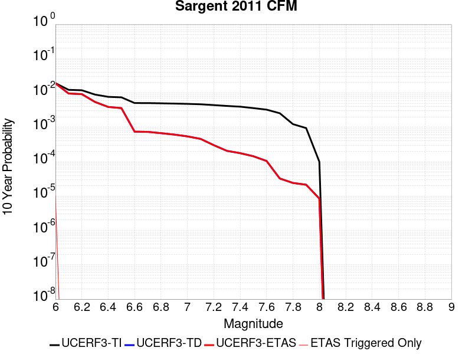 |

| Magnitude | 1 wk TI Prob | 1 wk TD Prob | 1 wk ETAS Prob | 1 wk ETAS/TD Gain | 1 wk ETAS Triggered Only | 1 mo TI Prob | 1 mo TD Prob | 1 mo ETAS Prob | 1 mo ETAS/TD Gain | 1 mo ETAS Triggered Only | 1 yr TI Prob | 1 yr TD Prob | 1 yr ETAS Prob | 1 yr ETAS/TD Gain | 1 yr ETAS Triggered Only | 10 yr TI Prob | 10 yr TD Prob | 10 yr ETAS Prob | 10 yr ETAS/TD Gain | 10 yr ETAS Triggered Only |
|-----|-----|-----|-----|-----|-----|-----|-----|-----|-----|-----|-----|-----|-----|-----|-----|-----|-----|-----|-----|-----|
| 6.0 | 3.7327867E-5 | 3.664913E-5 | 3.664913E-5 | 1.0 | 0.0 | 1.5996677E-4 | 1.5706103E-4 | 1.6705946E-4 | 1.0636595 | 1.0E-5 | 0.0019458556 | 0.0019110236 | 0.0019210045 | 1.0052228 | 1.0E-5 | 0.01928905 | 0.019018095 | 0.019027904 | 1.0005158 | 1.0E-5 |
| 6.1 | 2.3771476E-5 | 1.8479273E-5 | 1.8479273E-5 | 1.0 | 0.0 | 1.01873775E-4 | 7.919498E-5 | 7.919498E-5 | 1.0 | 0.0 | 0.0012396075 | 9.638493E-4 | 9.638493E-4 | 1.0 | 0.0 | 0.012327154 | 0.009636091 | 0.009636091 | 1.0 | 0.0 |
| 6.2 | 2.3112721E-5 | 1.7710632E-5 | 1.7710632E-5 | 1.0 | 0.0 | 9.9050754E-5 | 7.590099E-5 | 7.590099E-5 | 1.0 | 0.0 | 0.0012052758 | 9.237792E-4 | 9.237792E-4 | 1.0 | 0.0 | 0.011987597 | 0.009238743 | 0.009238743 | 1.0 | 0.0 |
| 6.3 | 1.728509E-5 | 1.0458927E-5 | 1.0458927E-5 | 1.0 | 0.0 | 7.407686E-5 | 4.482347E-5 | 4.482347E-5 | 1.0 | 0.0 | 9.015125E-4 | 5.456343E-4 | 5.456343E-4 | 1.0 | 0.0 | 0.008978641 | 0.0054791216 | 0.0054791216 | 1.0 | 0.0 |
| 6.4 | 1.48395575E-5 | 7.4559816E-6 | 7.4559816E-6 | 1.0 | 0.0 | 6.3596555E-5 | 3.195403E-5 | 3.195403E-5 | 1.0 | 0.0 | 7.7401294E-4 | 3.8900663E-4 | 3.8900663E-4 | 1.0 | 0.0 | 0.0077132257 | 0.003918666 | 0.003918666 | 1.0 | 0.0 |
| 6.5 | 1.4358964E-5 | 6.894759E-6 | 6.894759E-6 | 1.0 | 0.0 | 6.1536964E-5 | 2.9548846E-5 | 2.9548846E-5 | 1.0 | 0.0 | 7.48955E-4 | 3.5973339E-4 | 3.5973339E-4 | 1.0 | 0.0 | 0.0074643586 | 0.0036269152 | 0.0036269152 | 1.0 | 0.0 |
| 6.6 | 9.772591E-6 | 1.3736154E-6 | 1.3736154E-6 | 1.0 | 0.0 | 4.188186E-5 | 5.88691E-6 | 5.88691E-6 | 1.0 | 0.0 | 5.097923E-4 | 7.16708E-5 | 7.16708E-5 | 1.0 | 0.0 | 0.005086244 | 7.483097E-4 | 7.483097E-4 | 1.0 | 0.0 |
| 6.7 | 9.752745E-6 | 1.3523068E-6 | 1.3523068E-6 | 1.0 | 0.0 | 4.179681E-5 | 5.795587E-6 | 5.795587E-6 | 1.0 | 0.0 | 5.0875737E-4 | 7.055902E-5 | 7.055902E-5 | 1.0 | 0.0 | 0.005075942 | 7.371994E-4 | 7.371994E-4 | 1.0 | 0.0 |
| 6.8 | 9.608213E-6 | 1.2361709E-6 | 1.2361709E-6 | 1.0 | 0.0 | 4.1177405E-5 | 5.2978644E-6 | 5.2978644E-6 | 1.0 | 0.0 | 5.012196E-4 | 6.449961E-5 | 6.449961E-5 | 1.0 | 0.0 | 0.005000906 | 6.7634037E-4 | 6.7634037E-4 | 1.0 | 0.0 |
| 6.9 | 9.427164E-6 | 1.12094E-6 | 1.12094E-6 | 1.0 | 0.0 | 4.04015E-5 | 4.80402E-6 | 4.80402E-6 | 1.0 | 0.0 | 4.9177726E-4 | 5.8487396E-5 | 5.8487396E-5 | 1.0 | 0.0 | 0.004906904 | 6.1557174E-4 | 6.1557174E-4 | 1.0 | 0.0 |
| 7.0 | 9.247601E-6 | 9.873988E-7 | 9.873988E-7 | 1.0 | 0.0 | 3.9631974E-5 | 4.2317024E-6 | 4.2317024E-6 | 1.0 | 0.0 | 4.8241246E-4 | 5.1519775E-5 | 5.1519775E-5 | 1.0 | 0.0 | 0.0048136655 | 5.4542476E-4 | 5.4542476E-4 | 1.0 | 0.0 |
| 7.1 | 8.995454E-6 | 8.2711284E-7 | 8.2711284E-7 | 1.0 | 0.0 | 3.8551374E-5 | 3.5447645E-6 | 3.5447645E-6 | 1.0 | 0.0 | 4.6926187E-4 | 4.3156666E-5 | 4.3156666E-5 | 1.0 | 0.0 | 0.004682722 | 4.609069E-4 | 4.609069E-4 | 1.0 | 0.0 |
| 7.2 | 8.520861E-6 | 5.2766507E-7 | 5.2766507E-7 | 1.0 | 0.0 | 3.6517464E-5 | 2.2614197E-6 | 2.2614197E-6 | 1.0 | 0.0 | 4.445094E-4 | 2.7532446E-5 | 2.7532446E-5 | 1.0 | 0.0 | 0.004436213 | 3.0297207E-4 | 3.0297207E-4 | 1.0 | 0.0 |
| 7.3 | 8.043592E-6 | 3.456507E-7 | 3.456507E-7 | 1.0 | 0.0 | 3.4472083E-5 | 1.4813593E-6 | 1.4813593E-6 | 1.0 | 0.0 | 4.196168E-4 | 1.8035402E-5 | 1.8035402E-5 | 1.0 | 0.0 | 0.004188253 | 2.0669671E-4 | 2.0669671E-4 | 1.0 | 0.0 |
| 7.4 | 7.662316E-6 | 2.928958E-7 | 2.928958E-7 | 1.0 | 0.0 | 3.2838085E-5 | 1.2552671E-6 | 1.2552671E-6 | 1.0 | 0.0 | 3.9973034E-4 | 1.528277E-5 | 1.528277E-5 | 1.0 | 0.0 | 0.0039901207 | 1.7736501E-4 | 1.7736501E-4 | 1.0 | 0.0 |
| 7.5 | 6.961638E-6 | 2.3574503E-7 | 2.3574503E-7 | 1.0 | 0.0 | 2.9835252E-5 | 1.0103355E-6 | 1.0103355E-6 | 1.0 | 0.0 | 3.6318362E-4 | 1.2300766E-5 | 1.2300766E-5 | 1.0 | 0.0 | 0.0036259065 | 1.4409334E-4 | 1.4409334E-4 | 1.0 | 0.0 |
| 7.6 | 6.282332E-6 | 1.6892966E-7 | 1.6892966E-7 | 1.0 | 0.0 | 2.6924003E-5 | 7.2398404E-7 | 7.2398404E-7 | 1.0 | 0.0 | 3.2775043E-4 | 8.814471E-6 | 8.814471E-6 | 1.0 | 0.0 | 0.0032726745 | 1.05050465E-4 | 1.05050465E-4 | 1.0 | 0.0 |
| 7.7 | 4.934408E-6 | 5.001089E-8 | 5.001089E-8 | 1.0 | 0.0 | 2.114729E-5 | 2.1433237E-7 | 2.1433237E-7 | 1.0 | 0.0 | 2.5743784E-4 | 2.6094935E-6 | 2.6094935E-6 | 1.0 | 0.0 | 0.0025713982 | 3.2545366E-5 | 3.2545366E-5 | 1.0 | 0.0 |
| 7.8 | 2.373212E-6 | 3.5172643E-8 | 3.5172643E-8 | 1.0 | 0.0 | 1.0170869E-5 | 1.507399E-7 | 1.507399E-7 | 1.0 | 0.0 | 1.238233E-4 | 1.8352566E-6 | 1.8352566E-6 | 1.0 | 0.0 | 0.0012375432 | 2.4125171E-5 | 2.4125171E-5 | 1.0 | 0.0 |
| 7.9 | 1.8227792E-6 | 3.0619603E-8 | 3.0619603E-8 | 1.0 | 0.0 | 7.811887E-6 | 1.3122687E-7 | 1.3122687E-7 | 1.0 | 0.0 | 9.510558E-5 | 1.5976858E-6 | 1.5976858E-6 | 1.0 | 0.0 | 9.5064886E-4 | 2.1410624E-5 | 2.1410624E-5 | 1.0 | 0.0 |
| 8.0 | 1.9095137E-7 | 1.326461E-8 | 1.326461E-8 | 1.0 | 0.0 | 8.1836276E-7 | 5.684833E-8 | 5.684833E-8 | 1.0 | 0.0 | 9.963521E-6 | 6.921282E-7 | 6.921282E-7 | 1.0 | 0.0 | 9.963074E-5 | 8.463319E-6 | 8.463319E-6 | 1.0 | 0.0 |

## Pittville 2011 CFM
*[(top)](#table-of-contents)*

| 1 Week | 1 Month | 1 Year | 10 Year |
|-----|-----|-----|-----|
|  |  |  |  |

| Magnitude | 1 wk TI Prob | 1 wk TD Prob | 1 wk ETAS Prob | 1 wk ETAS/TD Gain | 1 wk ETAS Triggered Only | 1 mo TI Prob | 1 mo TD Prob | 1 mo ETAS Prob | 1 mo ETAS/TD Gain | 1 mo ETAS Triggered Only | 1 yr TI Prob | 1 yr TD Prob | 1 yr ETAS Prob | 1 yr ETAS/TD Gain | 1 yr ETAS Triggered Only | 10 yr TI Prob | 10 yr TD Prob | 10 yr ETAS Prob | 10 yr ETAS/TD Gain | 10 yr ETAS Triggered Only |
|-----|-----|-----|-----|-----|-----|-----|-----|-----|-----|-----|-----|-----|-----|-----|-----|-----|-----|-----|-----|-----|
| 6.0 | 2.5031832E-5 | 2.7056969E-5 | 2.7056969E-5 | 1.0 | 0.0 | 1.0727487E-4 | 1.1595384E-4 | 1.1595384E-4 | 1.0 | 0.0 | 0.001305289 | 0.0014109211 | 0.0014109211 | 1.0 | 0.0 | 0.012976485 | 0.014029415 | 0.014039275 | 1.0007027 | 1.0E-5 |
| 6.1 | 1.2540113E-5 | 1.3513067E-5 | 1.3513067E-5 | 1.0 | 0.0 | 5.3742235E-5 | 5.7911984E-5 | 5.7911984E-5 | 1.0 | 0.0 | 6.541153E-4 | 7.048728E-4 | 7.048728E-4 | 1.0 | 0.0 | 0.0065219323 | 0.0070286044 | 0.007038534 | 1.0014127 | 1.0E-5 |
| 6.2 | 6.603218E-6 | 7.107189E-6 | 7.107189E-6 | 1.0 | 0.0 | 2.8299199E-5 | 3.0459063E-5 | 3.0459063E-5 | 1.0 | 0.0 | 3.4448825E-4 | 3.7078248E-4 | 3.7078248E-4 | 1.0 | 0.0 | 0.0034395473 | 0.0037022792 | 0.0037122422 | 1.002691 | 1.0E-5 |
| 6.3 | 6.603218E-6 | 7.107189E-6 | 7.107189E-6 | 1.0 | 0.0 | 2.8299199E-5 | 3.0459063E-5 | 3.0459063E-5 | 1.0 | 0.0 | 3.4448825E-4 | 3.7078248E-4 | 3.7078248E-4 | 1.0 | 0.0 | 0.0034395473 | 0.0037022792 | 0.0037122422 | 1.002691 | 1.0E-5 |
| 6.4 | 3.9389015E-6 | 4.239175E-6 | 4.239175E-6 | 1.0 | 0.0 | 1.6880897E-5 | 1.8167784E-5 | 1.8167784E-5 | 1.0 | 0.0 | 2.0550552E-4 | 2.2117342E-4 | 2.2117342E-4 | 1.0 | 0.0 | 0.0020531558 | 0.002209838 | 0.002209838 | 1.0 | 0.0 |
| 6.5 | 2.4533072E-6 | 2.6412686E-6 | 2.6412686E-6 | 1.0 | 0.0 | 1.0514132E-5 | 1.1319685E-5 | 1.1319685E-5 | 1.0 | 0.0 | 1.2800204E-4 | 1.3781038E-4 | 1.3781038E-4 | 1.0 | 0.0 | 0.0012792832 | 0.0013774394 | 0.0013774394 | 1.0 | 0.0 |
| 6.6 | 1.3482367E-6 | 1.452993E-6 | 1.452993E-6 | 1.0 | 0.0 | 5.778144E-6 | 6.2271047E-6 | 6.2271047E-6 | 1.0 | 0.0 | 7.0346636E-5 | 7.58135E-5 | 7.58135E-5 | 1.0 | 0.0 | 7.032437E-4 | 7.5798744E-4 | 7.5798744E-4 | 1.0 | 0.0 |

## Santa Susana East (connector)
*[(top)](#table-of-contents)*

| 1 Week | 1 Month | 1 Year | 10 Year |
|-----|-----|-----|-----|
| 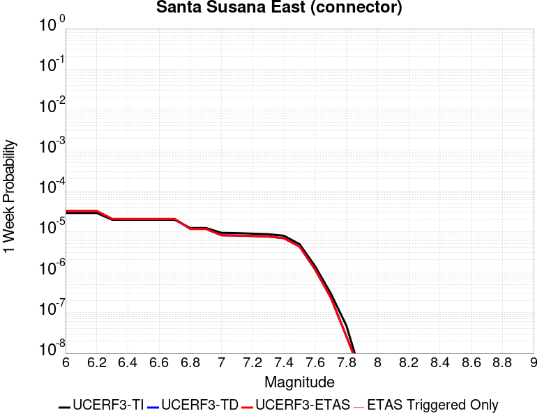 |  |  |  |

| Magnitude | 1 wk TI Prob | 1 wk TD Prob | 1 wk ETAS Prob | 1 wk ETAS/TD Gain | 1 wk ETAS Triggered Only | 1 mo TI Prob | 1 mo TD Prob | 1 mo ETAS Prob | 1 mo ETAS/TD Gain | 1 mo ETAS Triggered Only | 1 yr TI Prob | 1 yr TD Prob | 1 yr ETAS Prob | 1 yr ETAS/TD Gain | 1 yr ETAS Triggered Only | 10 yr TI Prob | 10 yr TD Prob | 10 yr ETAS Prob | 10 yr ETAS/TD Gain | 10 yr ETAS Triggered Only |
|-----|-----|-----|-----|-----|-----|-----|-----|-----|-----|-----|-----|-----|-----|-----|-----|-----|-----|-----|-----|-----|
| 6.0 | 2.858397E-5 | 3.202091E-5 | 3.202091E-5 | 1.0 | 0.0 | 1.2249697E-4 | 1.3722685E-4 | 1.3722685E-4 | 1.0 | 0.0 | 0.0014903803 | 0.0016697381 | 0.0016797214 | 1.005979 | 1.0E-5 | 0.014804244 | 0.016599052 | 0.016608886 | 1.0005925 | 1.0E-5 |
| 6.1 | 2.858397E-5 | 3.202091E-5 | 3.202091E-5 | 1.0 | 0.0 | 1.2249697E-4 | 1.3722685E-4 | 1.3722685E-4 | 1.0 | 0.0 | 0.0014903803 | 0.0016697381 | 0.0016797214 | 1.005979 | 1.0E-5 | 0.014804244 | 0.016599052 | 0.016608886 | 1.0005925 | 1.0E-5 |
| 6.2 | 2.858397E-5 | 3.202091E-5 | 3.202091E-5 | 1.0 | 0.0 | 1.2249697E-4 | 1.3722685E-4 | 1.3722685E-4 | 1.0 | 0.0 | 0.0014903803 | 0.0016697381 | 0.0016797214 | 1.005979 | 1.0E-5 | 0.014804244 | 0.016599052 | 0.016608886 | 1.0005925 | 1.0E-5 |
| 6.3 | 1.943582E-5 | 2.036718E-5 | 2.036718E-5 | 1.0 | 0.0 | 8.329371E-5 | 8.7285625E-5 | 8.7285625E-5 | 1.0 | 0.0 | 0.001013629 | 0.0010622967 | 0.001072286 | 1.0094036 | 1.0E-5 | 0.010090181 | 0.010583619 | 0.010593513 | 1.0009348 | 1.0E-5 |
| 6.4 | 1.943582E-5 | 2.036718E-5 | 2.036718E-5 | 1.0 | 0.0 | 8.329371E-5 | 8.7285625E-5 | 8.7285625E-5 | 1.0 | 0.0 | 0.001013629 | 0.0010622967 | 0.001072286 | 1.0094036 | 1.0E-5 | 0.010090181 | 0.010583619 | 0.010593513 | 1.0009348 | 1.0E-5 |
| 6.5 | 1.943582E-5 | 2.036718E-5 | 2.036718E-5 | 1.0 | 0.0 | 8.329371E-5 | 8.7285625E-5 | 8.7285625E-5 | 1.0 | 0.0 | 0.001013629 | 0.0010622967 | 0.001072286 | 1.0094036 | 1.0E-5 | 0.010090181 | 0.010583619 | 0.010593513 | 1.0009348 | 1.0E-5 |
| 6.6 | 1.943582E-5 | 2.036718E-5 | 2.036718E-5 | 1.0 | 0.0 | 8.329371E-5 | 8.7285625E-5 | 8.7285625E-5 | 1.0 | 0.0 | 0.001013629 | 0.0010622967 | 0.001072286 | 1.0094036 | 1.0E-5 | 0.010090181 | 0.010583619 | 0.010593513 | 1.0009348 | 1.0E-5 |
| 6.7 | 1.9404439E-5 | 2.03546E-5 | 2.03546E-5 | 1.0 | 0.0 | 8.3159226E-5 | 8.723172E-5 | 8.723172E-5 | 1.0 | 0.0 | 0.0010119933 | 0.0010616409 | 0.0010716304 | 1.0094094 | 1.0E-5 | 0.010073971 | 0.010577125 | 0.010587019 | 1.0009354 | 1.0E-5 |
| 6.8 | 1.2217526E-5 | 1.1592998E-5 | 1.1592998E-5 | 1.0 | 0.0 | 5.2359774E-5 | 4.9683425E-5 | 4.9683425E-5 | 1.0 | 0.0 | 6.372938E-4 | 6.0474465E-4 | 6.147386E-4 | 1.0165259 | 1.0E-5 | 0.0063546924 | 0.006033037 | 0.0060429764 | 1.0016476 | 1.0E-5 |
| 6.9 | 1.2217526E-5 | 1.1592998E-5 | 1.1592998E-5 | 1.0 | 0.0 | 5.2359774E-5 | 4.9683425E-5 | 4.9683425E-5 | 1.0 | 0.0 | 6.372938E-4 | 6.0474465E-4 | 6.147386E-4 | 1.0165259 | 1.0E-5 | 0.0063546924 | 0.006033037 | 0.0060429764 | 1.0016476 | 1.0E-5 |
| 7.0 | 9.276017E-6 | 8.059113E-6 | 8.059113E-6 | 1.0 | 0.0 | 3.9753755E-5 | 3.4538618E-5 | 3.4538618E-5 | 1.0 | 0.0 | 4.8389446E-4 | 4.2042998E-4 | 4.3042577E-4 | 1.0237752 | 1.0E-5 | 0.0048284214 | 0.0041970722 | 0.0042070304 | 1.0023726 | 1.0E-5 |
| 7.1 | 9.130355E-6 | 7.942286E-6 | 7.942286E-6 | 1.0 | 0.0 | 3.9129503E-5 | 3.4037945E-5 | 3.4037945E-5 | 1.0 | 0.0 | 4.7629757E-4 | 4.1433662E-4 | 4.2433248E-4 | 1.024125 | 1.0E-5 | 0.00475278 | 0.004136367 | 0.0041463254 | 1.0024076 | 1.0E-5 |
| 7.2 | 8.851015E-6 | 7.741445E-6 | 7.741445E-6 | 1.0 | 0.0 | 3.7932372E-5 | 3.317722E-5 | 3.317722E-5 | 1.0 | 0.0 | 4.6172875E-4 | 4.038612E-4 | 4.1385717E-4 | 1.024751 | 1.0E-5 | 0.0046077054 | 0.0040319953 | 0.0040419553 | 1.0024701 | 1.0E-5 |
| 7.3 | 8.573006E-6 | 7.550166E-6 | 7.550166E-6 | 1.0 | 0.0 | 3.6740938E-5 | 3.2357475E-5 | 3.2357475E-5 | 1.0 | 0.0 | 4.472291E-4 | 3.9388443E-4 | 4.038805E-4 | 1.0253781 | 1.0E-5 | 0.004463301 | 0.0039325804 | 0.0039425413 | 1.0025328 | 1.0E-5 |
| 7.4 | 7.852282E-6 | 6.817687E-6 | 6.817687E-6 | 1.0 | 0.0 | 3.36522E-5 | 2.9218349E-5 | 2.9218349E-5 | 1.0 | 0.0 | 4.096385E-4 | 3.5567835E-4 | 3.656748E-4 | 1.0281053 | 1.0E-5 | 0.0040888423 | 0.0035517553 | 0.0035617198 | 1.0028055 | 1.0E-5 |
| 7.5 | 4.8869324E-6 | 4.279055E-6 | 4.279055E-6 | 1.0 | 0.0 | 2.0943828E-5 | 1.8338687E-5 | 1.8338687E-5 | 1.0 | 0.0 | 2.5496128E-4 | 2.232523E-4 | 2.3325007E-4 | 1.0447824 | 1.0E-5 | 0.0025466895 | 0.0022304445 | 0.0022404222 | 1.0044734 | 1.0E-5 |
| 7.6 | 1.3894544E-6 | 1.1568179E-6 | 1.1568179E-6 | 1.0 | 0.0 | 5.954791E-6 | 4.957783E-6 | 4.957783E-6 | 1.0 | 0.0 | 7.249717E-5 | 6.0359558E-5 | 7.0358954E-5 | 1.1656638 | 1.0E-5 | 7.247352E-4 | 6.0345343E-4 | 6.134474E-4 | 1.0165613 | 1.0E-5 |
| 7.7 | 2.9924632E-7 | 2.371928E-7 | 2.371928E-7 | 1.0 | 0.0 | 1.2824837E-6 | 1.0165402E-6 | 1.0165402E-6 | 1.0 | 0.0 | 1.5614127E-5 | 1.2376314E-5 | 1.2376314E-5 | 1.0 | 0.0 | 1.5613029E-4 | 1.2375697E-4 | 1.2375697E-4 | 1.0 | 0.0 |
| 7.8 | 4.8188564E-8 | 2.6323061E-8 | 2.6323061E-8 | 1.0 | 0.0 | 2.065224E-7 | 1.1281311E-7 | 1.1281311E-7 | 1.0 | 0.0 | 2.5144072E-6 | 1.3734989E-6 | 1.3734989E-6 | 1.0 | 0.0 | 2.5143789E-5 | 1.3734912E-5 | 1.3734912E-5 | 1.0 | 0.0 |
| 7.9 | 2.6127251E-9 | 2.7681102E-9 | 2.7681102E-9 | 1.0 | 0.0 | 1.1197393E-8 | 1.186333E-8 | 1.186333E-8 | 1.0 | 0.0 | 1.3632825E-7 | 1.4443603E-7 | 1.4443603E-7 | 1.0 | 0.0 | 1.3632817E-6 | 1.4443604E-6 | 1.4443604E-6 | 1.0 | 0.0 |

## South Klamath Lake West
*[(top)](#table-of-contents)*

| 1 Week | 1 Month | 1 Year | 10 Year |
|-----|-----|-----|-----|
|  |  |  |  |

| Magnitude | 1 wk TI Prob | 1 wk TD Prob | 1 wk ETAS Prob | 1 wk ETAS/TD Gain | 1 wk ETAS Triggered Only | 1 mo TI Prob | 1 mo TD Prob | 1 mo ETAS Prob | 1 mo ETAS/TD Gain | 1 mo ETAS Triggered Only | 1 yr TI Prob | 1 yr TD Prob | 1 yr ETAS Prob | 1 yr ETAS/TD Gain | 1 yr ETAS Triggered Only | 10 yr TI Prob | 10 yr TD Prob | 10 yr ETAS Prob | 10 yr ETAS/TD Gain | 10 yr ETAS Triggered Only |
|-----|-----|-----|-----|-----|-----|-----|-----|-----|-----|-----|-----|-----|-----|-----|-----|-----|-----|-----|-----|-----|
| 6.0 | 2.174025E-5 | 2.3042025E-5 | 3.3041793E-5 | 1.4339796 | 1.0E-5 | 9.3169176E-5 | 9.874817E-5 | 1.0874718E-4 | 1.1012577 | 1.0E-5 | 0.0011337444 | 0.0012016617 | 0.0012116497 | 1.0083119 | 1.0E-5 | 0.011279777 | 0.0119582405 | 0.011968121 | 1.0008262 | 1.0E-5 |
| 6.1 | 2.174025E-5 | 2.3042025E-5 | 3.3041793E-5 | 1.4339796 | 1.0E-5 | 9.3169176E-5 | 9.874817E-5 | 1.0874718E-4 | 1.1012577 | 1.0E-5 | 0.0011337444 | 0.0012016617 | 0.0012116497 | 1.0083119 | 1.0E-5 | 0.011279777 | 0.0119582405 | 0.011968121 | 1.0008262 | 1.0E-5 |
| 6.2 | 9.834929E-6 | 1.0393841E-5 | 1.0393841E-5 | 1.0 | 0.0 | 4.2149015E-5 | 4.4544326E-5 | 4.4544326E-5 | 1.0 | 0.0 | 5.1304343E-4 | 5.422012E-4 | 5.422012E-4 | 1.0 | 0.0 | 0.0051186057 | 0.0054096854 | 0.0054096854 | 1.0 | 0.0 |
| 6.3 | 9.834929E-6 | 1.0393841E-5 | 1.0393841E-5 | 1.0 | 0.0 | 4.2149015E-5 | 4.4544326E-5 | 4.4544326E-5 | 1.0 | 0.0 | 5.1304343E-4 | 5.422012E-4 | 5.422012E-4 | 1.0 | 0.0 | 0.0051186057 | 0.0054096854 | 0.0054096854 | 1.0 | 0.0 |
| 6.4 | 6.066321E-6 | 6.40043E-6 | 6.40043E-6 | 1.0 | 0.0 | 2.5998259E-5 | 2.743014E-5 | 2.743014E-5 | 1.0 | 0.0 | 3.1648282E-4 | 3.3391351E-4 | 3.3391351E-4 | 1.0 | 0.0 | 0.0031603249 | 0.0033343881 | 0.0033343881 | 1.0 | 0.0 |
| 6.5 | 6.066321E-6 | 6.40043E-6 | 6.40043E-6 | 1.0 | 0.0 | 2.5998259E-5 | 2.743014E-5 | 2.743014E-5 | 1.0 | 0.0 | 3.1648282E-4 | 3.3391351E-4 | 3.3391351E-4 | 1.0 | 0.0 | 0.0031603249 | 0.0033343881 | 0.0033343881 | 1.0 | 0.0 |
| 6.6 | 4.2321803E-6 | 4.461291E-6 | 4.461291E-6 | 1.0 | 0.0 | 1.8137789E-5 | 1.9119685E-5 | 1.9119685E-5 | 1.0 | 0.0 | 2.208052E-4 | 2.3275832E-4 | 2.3275832E-4 | 1.0 | 0.0 | 0.0022058594 | 0.0023252473 | 0.0023252473 | 1.0 | 0.0 |
| 6.7 | 3.186646E-6 | 3.360305E-6 | 3.360305E-6 | 1.0 | 0.0 | 1.3656982E-5 | 1.4401232E-5 | 1.4401232E-5 | 1.0 | 0.0 | 1.6626107E-4 | 1.7532158E-4 | 1.7532158E-4 | 1.0 | 0.0 | 0.0016613674 | 0.0017518997 | 0.0017518997 | 1.0 | 0.0 |
| 6.8 | 2.380121E-6 | 2.510907E-6 | 2.510907E-6 | 1.0 | 0.0 | 1.0200479E-5 | 1.07609885E-5 | 1.07609885E-5 | 1.0 | 0.0 | 1.2418375E-4 | 1.3100762E-4 | 1.3100762E-4 | 1.0 | 0.0 | 0.0012411437 | 0.0013093497 | 0.0013093497 | 1.0 | 0.0 |
| 6.9 | 8.928287E-7 | 9.4302504E-7 | 9.4302504E-7 | 1.0 | 0.0 | 3.826403E-6 | 4.0415307E-6 | 4.0415307E-6 | 1.0 | 0.0 | 4.658546E-5 | 4.9204747E-5 | 4.9204747E-5 | 1.0 | 0.0 | 4.6575698E-4 | 4.9196015E-4 | 4.9196015E-4 | 1.0 | 0.0 |

## Anaheim
*[(top)](#table-of-contents)*

| 1 Week | 1 Month | 1 Year | 10 Year |
|-----|-----|-----|-----|
|  |  |  |  |

| Magnitude | 1 wk TI Prob | 1 wk TD Prob | 1 wk ETAS Prob | 1 wk ETAS/TD Gain | 1 wk ETAS Triggered Only | 1 mo TI Prob | 1 mo TD Prob | 1 mo ETAS Prob | 1 mo ETAS/TD Gain | 1 mo ETAS Triggered Only | 1 yr TI Prob | 1 yr TD Prob | 1 yr ETAS Prob | 1 yr ETAS/TD Gain | 1 yr ETAS Triggered Only | 10 yr TI Prob | 10 yr TD Prob | 10 yr ETAS Prob | 10 yr ETAS/TD Gain | 10 yr ETAS Triggered Only |
|-----|-----|-----|-----|-----|-----|-----|-----|-----|-----|-----|-----|-----|-----|-----|-----|-----|-----|-----|-----|-----|
| 6.0 | 2.9254998E-6 | 2.5122863E-6 | 2.5122863E-6 | 1.0 | 0.0 | 1.25377965E-5 | 1.0766909E-5 | 1.0766909E-5 | 1.0 | 0.0 | 1.5263697E-4 | 1.3108159E-4 | 1.4108028E-4 | 1.0762783 | 1.0E-5 | 0.0015253217 | 0.0013102728 | 0.0013202598 | 1.007622 | 1.0E-5 |
| 6.1 | 1.6729715E-6 | 1.2337348E-6 | 1.2337348E-6 | 1.0 | 0.0 | 7.1698582E-6 | 5.287426E-6 | 5.287426E-6 | 1.0 | 0.0 | 8.7289525E-5 | 6.437293E-5 | 6.437293E-5 | 1.0 | 0.0 | 8.7255245E-4 | 6.435838E-4 | 6.435838E-4 | 1.0 | 0.0 |
| 6.2 | 1.6729715E-6 | 1.2337348E-6 | 1.2337348E-6 | 1.0 | 0.0 | 7.1698582E-6 | 5.287426E-6 | 5.287426E-6 | 1.0 | 0.0 | 8.7289525E-5 | 6.437293E-5 | 6.437293E-5 | 1.0 | 0.0 | 8.7255245E-4 | 6.435838E-4 | 6.435838E-4 | 1.0 | 0.0 |
| 6.3 | 1.1444064E-6 | 6.9596666E-7 | 6.9596666E-7 | 1.0 | 0.0 | 4.9045893E-6 | 2.9827113E-6 | 2.9827113E-6 | 1.0 | 0.0 | 5.971174E-5 | 3.631396E-5 | 3.631396E-5 | 1.0 | 0.0 | 5.96957E-4 | 3.6308577E-4 | 3.6308577E-4 | 1.0 | 0.0 |
| 6.4 | 1.1444064E-6 | 6.9596666E-7 | 6.9596666E-7 | 1.0 | 0.0 | 4.9045893E-6 | 2.9827113E-6 | 2.9827113E-6 | 1.0 | 0.0 | 5.971174E-5 | 3.631396E-5 | 3.631396E-5 | 1.0 | 0.0 | 5.96957E-4 | 3.6308577E-4 | 3.6308577E-4 | 1.0 | 0.0 |
| 6.5 | 1.1385318E-6 | 6.9003505E-7 | 6.9003505E-7 | 1.0 | 0.0 | 4.879413E-6 | 2.95729E-6 | 2.95729E-6 | 1.0 | 0.0 | 5.9405233E-5 | 3.6004465E-5 | 3.6004465E-5 | 1.0 | 0.0 | 5.938936E-4 | 3.5999183E-4 | 3.5999183E-4 | 1.0 | 0.0 |
| 6.6 | 1.1165511E-6 | 6.678222E-7 | 6.678222E-7 | 1.0 | 0.0 | 4.78521E-6 | 2.862092E-6 | 2.862092E-6 | 1.0 | 0.0 | 5.8258374E-5 | 3.484547E-5 | 3.484547E-5 | 1.0 | 0.0 | 5.8243104E-4 | 3.484055E-4 | 3.484055E-4 | 1.0 | 0.0 |
| 6.7 | 1.1098243E-6 | 6.610416E-7 | 6.610416E-7 | 1.0 | 0.0 | 4.7563813E-6 | 2.8330326E-6 | 2.8330326E-6 | 1.0 | 0.0 | 5.7907404E-5 | 3.449168E-5 | 3.449168E-5 | 1.0 | 0.0 | 5.7892315E-4 | 3.4486872E-4 | 3.4486872E-4 | 1.0 | 0.0 |
| 6.8 | 1.1077587E-6 | 6.589619E-7 | 6.589619E-7 | 1.0 | 0.0 | 4.7475287E-6 | 2.8241195E-6 | 2.8241195E-6 | 1.0 | 0.0 | 5.779963E-5 | 3.438317E-5 | 3.438317E-5 | 1.0 | 0.0 | 5.77846E-4 | 3.4378393E-4 | 3.4378393E-4 | 1.0 | 0.0 |
| 6.9 | 1.1024468E-6 | 6.5361957E-7 | 6.5361957E-7 | 1.0 | 0.0 | 4.7247636E-6 | 2.8012241E-6 | 2.8012241E-6 | 1.0 | 0.0 | 5.752248E-5 | 3.4104425E-5 | 3.4104425E-5 | 1.0 | 0.0 | 5.750759E-4 | 3.4099736E-4 | 3.4099736E-4 | 1.0 | 0.0 |
| 7.0 | 1.0993066E-6 | 6.510303E-7 | 6.510303E-7 | 1.0 | 0.0 | 4.7113053E-6 | 2.7901272E-6 | 2.7901272E-6 | 1.0 | 0.0 | 5.7358633E-5 | 3.3969325E-5 | 3.3969325E-5 | 1.0 | 0.0 | 5.734383E-4 | 3.3964674E-4 | 3.3964674E-4 | 1.0 | 0.0 |
| 7.1 | 8.334877E-7 | 4.4049145E-7 | 4.4049145E-7 | 1.0 | 0.0 | 3.5720855E-6 | 1.8878193E-6 | 1.8878193E-6 | 1.0 | 0.0 | 4.348927E-5 | 2.298398E-5 | 2.298398E-5 | 1.0 | 0.0 | 4.3480762E-4 | 2.2981827E-4 | 2.2981827E-4 | 1.0 | 0.0 |
| 7.2 | 7.794411E-7 | 3.997645E-7 | 3.997645E-7 | 1.0 | 0.0 | 3.3404576E-6 | 1.7132754E-6 | 1.7132754E-6 | 1.0 | 0.0 | 4.0669314E-5 | 2.0858948E-5 | 2.0858948E-5 | 1.0 | 0.0 | 4.066187E-4 | 2.0857195E-4 | 2.0857195E-4 | 1.0 | 0.0 |
| 7.3 | 5.01704E-7 | 2.5573388E-7 | 2.5573388E-7 | 1.0 | 0.0 | 2.150158E-6 | 1.0960019E-6 | 1.0960019E-6 | 1.0 | 0.0 | 2.617786E-5 | 1.3343754E-5 | 1.3343754E-5 | 1.0 | 0.0 | 2.6174777E-4 | 1.3343077E-4 | 1.3343077E-4 | 1.0 | 0.0 |
| 7.4 | 2.4008182E-7 | 1.2367859E-7 | 1.2367859E-7 | 1.0 | 0.0 | 1.0289217E-6 | 5.30051E-7 | 5.30051E-7 | 1.0 | 0.0 | 1.252705E-5 | 6.4533597E-6 | 6.4533597E-6 | 1.0 | 0.0 | 1.2526344E-4 | 6.453248E-5 | 6.453248E-5 | 1.0 | 0.0 |
| 7.5 | 2.0263876E-8 | 1.6120866E-8 | 1.6120866E-8 | 1.0 | 0.0 | 8.684518E-8 | 6.908943E-8 | 6.908943E-8 | 1.0 | 0.0 | 1.0573395E-6 | 8.4116357E-7 | 8.4116357E-7 | 1.0 | 0.0 | 1.0573345E-5 | 8.411613E-6 | 8.411613E-6 | 1.0 | 0.0 |
| 7.6 | 1.4871431E-9 | 1.508418E-9 | 1.508418E-9 | 1.0 | 0.0 | 6.37347E-9 | 6.4646484E-9 | 6.4646484E-9 | 1.0 | 0.0 | 7.7596994E-8 | 7.870709E-8 | 7.870709E-8 | 1.0 | 0.0 | 7.759697E-7 | 7.8707063E-7 | 7.8707063E-7 | 1.0 | 0.0 |
| 7.7 | 1.5093293E-10 | 1.5333512E-10 | 1.5333512E-10 | 1.0 | 0.0 | 6.4685546E-10 | 6.571509E-10 | 6.571509E-10 | 1.0 | 0.0 | 7.875465E-9 | 8.0008125E-9 | 8.0008125E-9 | 1.0 | 0.0 | 7.8754645E-8 | 8.000812E-8 | 8.000812E-8 | 1.0 | 0.0 |

## Butano 2011 CFM
*[(top)](#table-of-contents)*

| 1 Week | 1 Month | 1 Year | 10 Year |
|-----|-----|-----|-----|
|  |  | 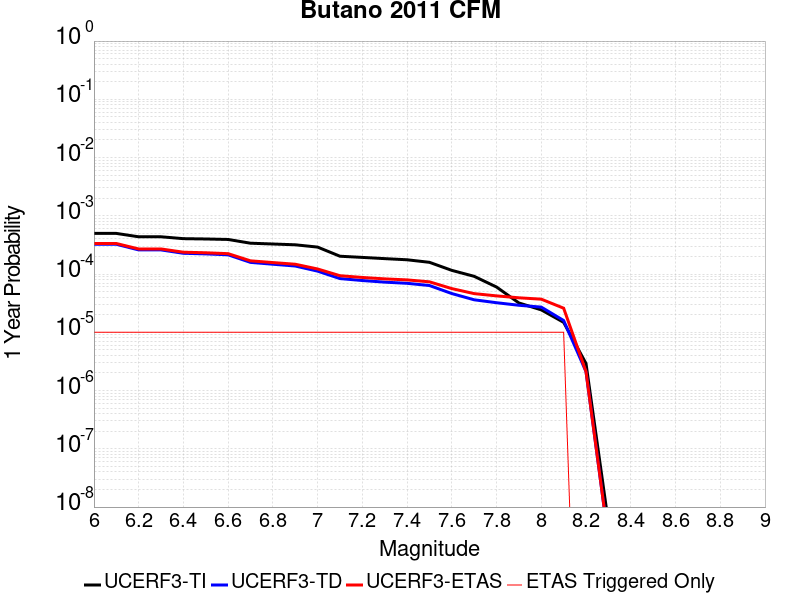 |  |

| Magnitude | 1 wk TI Prob | 1 wk TD Prob | 1 wk ETAS Prob | 1 wk ETAS/TD Gain | 1 wk ETAS Triggered Only | 1 mo TI Prob | 1 mo TD Prob | 1 mo ETAS Prob | 1 mo ETAS/TD Gain | 1 mo ETAS Triggered Only | 1 yr TI Prob | 1 yr TD Prob | 1 yr ETAS Prob | 1 yr ETAS/TD Gain | 1 yr ETAS Triggered Only | 10 yr TI Prob | 10 yr TD Prob | 10 yr ETAS Prob | 10 yr ETAS/TD Gain | 10 yr ETAS Triggered Only |
|-----|-----|-----|-----|-----|-----|-----|-----|-----|-----|-----|-----|-----|-----|-----|-----|-----|-----|-----|-----|-----|
| 6.0 | 9.561135E-6 | 6.2256954E-6 | 6.2256954E-6 | 1.0 | 0.0 | 4.097565E-5 | 2.6681291E-5 | 2.6681291E-5 | 1.0 | 0.0 | 4.9876433E-4 | 3.247985E-4 | 3.3479524E-4 | 1.0307783 | 1.0E-5 | 0.004976464 | 0.003260905 | 0.0032708722 | 1.0030566 | 1.0E-5 |
| 6.1 | 9.561135E-6 | 6.2256954E-6 | 6.2256954E-6 | 1.0 | 0.0 | 4.097565E-5 | 2.6681291E-5 | 2.6681291E-5 | 1.0 | 0.0 | 4.9876433E-4 | 3.247985E-4 | 3.3479524E-4 | 1.0307783 | 1.0E-5 | 0.004976464 | 0.003260905 | 0.0032708722 | 1.0030566 | 1.0E-5 |
| 6.2 | 8.364741E-6 | 4.9787805E-6 | 4.9787805E-6 | 1.0 | 0.0 | 3.5848396E-5 | 2.1337464E-5 | 2.1337464E-5 | 1.0 | 0.0 | 4.3636683E-4 | 2.5975425E-4 | 2.6975165E-4 | 1.0384879 | 1.0E-5 | 0.0043551093 | 0.0026121214 | 0.0026220952 | 1.0038183 | 1.0E-5 |
| 6.3 | 8.364741E-6 | 4.9787805E-6 | 4.9787805E-6 | 1.0 | 0.0 | 3.5848396E-5 | 2.1337464E-5 | 2.1337464E-5 | 1.0 | 0.0 | 4.3636683E-4 | 2.5975425E-4 | 2.6975165E-4 | 1.0384879 | 1.0E-5 | 0.0043551093 | 0.0026121214 | 0.0026220952 | 1.0038183 | 1.0E-5 |
| 6.4 | 7.768282E-6 | 4.3567284E-6 | 4.3567284E-6 | 1.0 | 0.0 | 3.329221E-5 | 1.8671566E-5 | 1.8671566E-5 | 1.0 | 0.0 | 4.0525728E-4 | 2.2730397E-4 | 2.3730169E-4 | 1.0439839 | 1.0E-5 | 0.0040451903 | 0.0022883145 | 0.0022982918 | 1.0043601 | 1.0E-5 |
| 6.5 | 7.673437E-6 | 4.2562915E-6 | 4.2562915E-6 | 1.0 | 0.0 | 3.2885746E-5 | 1.8241128E-5 | 1.8241128E-5 | 1.0 | 0.0 | 4.0031038E-4 | 2.2206445E-4 | 2.3206224E-4 | 1.045022 | 1.0E-5 | 0.0039959005 | 0.002236025 | 0.0022460027 | 1.0044622 | 1.0E-5 |
| 6.6 | 7.5244197E-6 | 4.101255E-6 | 4.101255E-6 | 1.0 | 0.0 | 3.2247113E-5 | 1.7576695E-5 | 1.7576695E-5 | 1.0 | 0.0 | 3.9253788E-4 | 2.1397659E-4 | 2.2397445E-4 | 1.0467241 | 1.0E-5 | 0.003918452 | 0.0021553051 | 0.0021652835 | 1.0046297 | 1.0E-5 |
| 6.7 | 6.4921405E-6 | 3.0413205E-6 | 3.0413205E-6 | 1.0 | 0.0 | 2.7823162E-5 | 1.3034165E-5 | 1.3034165E-5 | 1.0 | 0.0 | 3.3869434E-4 | 1.586795E-4 | 1.6867791E-4 | 1.0630101 | 1.0E-5 | 0.003381786 | 0.0016031476 | 0.0016131316 | 1.0062277 | 1.0E-5 |
| 6.8 | 6.2890294E-6 | 2.8280872E-6 | 2.8280872E-6 | 1.0 | 0.0 | 2.6952705E-5 | 1.2120317E-5 | 1.2120317E-5 | 1.0 | 0.0 | 3.2809976E-4 | 1.4755495E-4 | 1.5755347E-4 | 1.0677614 | 1.0E-5 | 0.0032761577 | 0.0014920565 | 0.0015020416 | 1.0066922 | 1.0E-5 |
| 6.9 | 6.0965517E-6 | 2.6346027E-6 | 2.6346027E-6 | 1.0 | 0.0 | 2.6127816E-5 | 1.1291106E-5 | 1.1291106E-5 | 1.0 | 0.0 | 3.1805973E-4 | 1.374606E-4 | 1.4745923E-4 | 1.0727382 | 1.0E-5 | 0.0031760489 | 0.001391243 | 0.0014012291 | 1.0071778 | 1.0E-5 |
| 7.0 | 5.566252E-6 | 2.1520116E-6 | 2.1520116E-6 | 1.0 | 0.0 | 2.3855147E-5 | 9.222874E-6 | 9.222874E-6 | 1.0 | 0.0 | 2.9039773E-4 | 1.1228274E-4 | 1.2228162E-4 | 1.0890509 | 1.0E-5 | 0.0029001853 | 0.0011397449 | 0.0011497336 | 1.0087639 | 1.0E-5 |
| 7.1 | 3.878588E-6 | 1.6034423E-6 | 1.6034423E-6 | 1.0 | 0.0 | 1.6622414E-5 | 6.8718773E-6 | 6.8718773E-6 | 1.0 | 0.0 | 2.023591E-4 | 8.36619E-5 | 9.366106E-5 | 1.1195188 | 1.0E-5 | 0.0020217493 | 8.533922E-4 | 8.633837E-4 | 1.0117079 | 1.0E-5 |
| 7.2 | 3.7038085E-6 | 1.4845051E-6 | 1.4845051E-6 | 1.0 | 0.0 | 1.587337E-5 | 6.362149E-6 | 6.362149E-6 | 1.0 | 0.0 | 1.9324113E-4 | 7.745641E-5 | 8.7455635E-5 | 1.1290948 | 1.0E-5 | 0.0019307317 | 7.913504E-4 | 8.013424E-4 | 1.0126266 | 1.0E-5 |
| 7.3 | 3.5277278E-6 | 1.3926247E-6 | 1.3926247E-6 | 1.0 | 0.0 | 1.5118746E-5 | 5.9683775E-6 | 5.9683775E-6 | 1.0 | 0.0 | 1.8405518E-4 | 7.266257E-5 | 8.266185E-5 | 1.1376125 | 1.0E-5 | 0.0018390282 | 7.433578E-4 | 7.533504E-4 | 1.0134425 | 1.0E-5 |
| 7.4 | 3.3711294E-6 | 1.3298818E-6 | 1.3298818E-6 | 1.0 | 0.0 | 1.4447617E-5 | 5.699481E-6 | 5.699481E-6 | 1.0 | 0.0 | 1.7588554E-4 | 6.9388974E-5 | 7.938828E-5 | 1.1441051 | 1.0E-5 | 0.0017574639 | 7.10591E-4 | 7.2058383E-4 | 1.0140628 | 1.0E-5 |
| 7.5 | 3.0496426E-6 | 1.2188874E-6 | 1.2188874E-6 | 1.0 | 0.0 | 1.3069831E-5 | 5.223793E-6 | 5.223793E-6 | 1.0 | 0.0 | 1.5911358E-4 | 6.359782E-5 | 7.3597184E-5 | 1.1572281 | 1.0E-5 | 0.001589997 | 6.526465E-4 | 6.6263997E-4 | 1.0153122 | 1.0E-5 |
| 7.6 | 2.2179781E-6 | 8.870908E-7 | 8.870908E-7 | 1.0 | 0.0 | 9.505586E-6 | 3.801812E-6 | 3.801812E-6 | 1.0 | 0.0 | 1.1572436E-4 | 4.6286077E-5 | 5.6285615E-5 | 1.2160376 | 1.0E-5 | 0.0011566412 | 4.7951055E-4 | 4.8950576E-4 | 1.0208446 | 1.0E-5 |
| 7.7 | 1.7519328E-6 | 6.9309675E-7 | 6.9309675E-7 | 1.0 | 0.0 | 7.508262E-6 | 2.9704113E-6 | 2.9704113E-6 | 1.0 | 0.0 | 9.140925E-5 | 3.6164158E-5 | 4.6163794E-5 | 1.2765069 | 1.0E-5 | 9.137166E-4 | 3.7759746E-4 | 3.875937E-4 | 1.0264733 | 1.0E-5 |
| 7.8 | 1.1478974E-6 | 6.174061E-7 | 6.174061E-7 | 1.0 | 0.0 | 4.9195505E-6 | 2.6460236E-6 | 2.6460236E-6 | 1.0 | 0.0 | 5.9893882E-5 | 3.221486E-5 | 4.221454E-5 | 1.3104057 | 1.0E-5 | 5.9877743E-4 | 3.377777E-4 | 3.477743E-4 | 1.0295953 | 1.0E-5 |
| 7.9 | 6.1154634E-7 | 5.581767E-7 | 5.581767E-7 | 1.0 | 0.0 | 2.6209104E-6 | 2.3921834E-6 | 2.3921834E-6 | 1.0 | 0.0 | 3.1909116E-5 | 2.9124443E-5 | 3.9124152E-5 | 1.3433442 | 1.0E-5 | 3.1904536E-4 | 3.0563958E-4 | 3.156365E-4 | 1.0327083 | 1.0E-5 |
| 8.0 | 4.6520046E-7 | 5.189283E-7 | 5.189283E-7 | 1.0 | 0.0 | 1.9937147E-6 | 2.2239765E-6 | 2.2239765E-6 | 1.0 | 0.0 | 2.4273206E-5 | 2.7076578E-5 | 3.707631E-5 | 1.3693129 | 1.0E-5 | 2.4270554E-4 | 2.8419052E-4 | 2.941877E-4 | 1.0351777 | 1.0E-5 |
| 8.1 | 2.8425194E-7 | 3.0570487E-7 | 3.0570487E-7 | 1.0 | 0.0 | 1.218222E-6 | 1.3101632E-6 | 1.3101632E-6 | 1.0 | 0.0 | 1.4831752E-5 | 1.5951118E-5 | 2.595096E-5 | 1.6269053 | 1.0E-5 | 1.4830762E-4 | 1.6740595E-4 | 1.7740426E-4 | 1.059725 | 1.0E-5 |
| 8.2 | 5.585778E-8 | 4.0522167E-8 | 4.0522167E-8 | 1.0 | 0.0 | 2.3939046E-7 | 1.7366644E-7 | 1.7366644E-7 | 1.0 | 0.0 | 2.914575E-6 | 2.1143867E-6 | 2.1143867E-6 | 1.0 | 0.0 | 2.9145367E-5 | 2.2976306E-5 | 2.2976306E-5 | 1.0 | 0.0 |
| 8.3 | 1.0371215E-10 | 5.356804E-11 | 5.356804E-11 | 1.0 | 0.0 | 4.4448079E-10 | 2.2957702E-10 | 2.2957702E-10 | 1.0 | 0.0 | 5.4115543E-9 | 2.795101E-9 | 2.795101E-9 | 1.0 | 0.0 | 5.4115542E-8 | 3.2150194E-8 | 3.2150194E-8 | 1.0 | 0.0 |

## Los Osos 2011
*[(top)](#table-of-contents)*

| 1 Week | 1 Month | 1 Year | 10 Year |
|-----|-----|-----|-----|
|  |  | 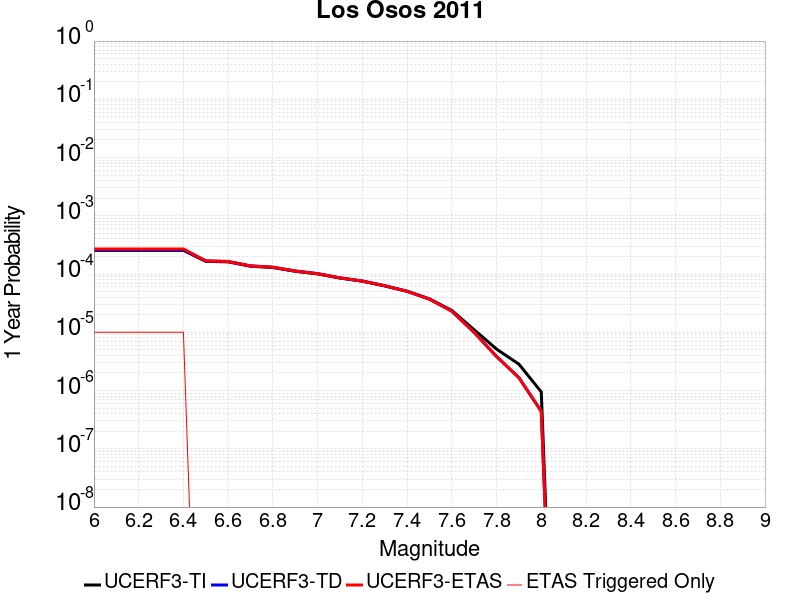 |  |

| Magnitude | 1 wk TI Prob | 1 wk TD Prob | 1 wk ETAS Prob | 1 wk ETAS/TD Gain | 1 wk ETAS Triggered Only | 1 mo TI Prob | 1 mo TD Prob | 1 mo ETAS Prob | 1 mo ETAS/TD Gain | 1 mo ETAS Triggered Only | 1 yr TI Prob | 1 yr TD Prob | 1 yr ETAS Prob | 1 yr ETAS/TD Gain | 1 yr ETAS Triggered Only | 10 yr TI Prob | 10 yr TD Prob | 10 yr ETAS Prob | 10 yr ETAS/TD Gain | 10 yr ETAS Triggered Only |
|-----|-----|-----|-----|-----|-----|-----|-----|-----|-----|-----|-----|-----|-----|-----|-----|-----|-----|-----|-----|-----|
| 6.0 | 4.8871775E-6 | 4.9814835E-6 | 1.4981433E-5 | 3.007424 | 1.0E-5 | 2.0944879E-5 | 2.1349055E-5 | 3.134884E-5 | 1.4683948 | 1.0E-5 | 2.5497406E-4 | 2.5989654E-4 | 2.6989394E-4 | 1.0384668 | 1.0E-5 | 0.002546817 | 0.0025962002 | 0.0026061744 | 1.0038418 | 1.0E-5 |
| 6.1 | 4.8871775E-6 | 4.9814835E-6 | 1.4981433E-5 | 3.007424 | 1.0E-5 | 2.0944879E-5 | 2.1349055E-5 | 3.134884E-5 | 1.4683948 | 1.0E-5 | 2.5497406E-4 | 2.5989654E-4 | 2.6989394E-4 | 1.0384668 | 1.0E-5 | 0.002546817 | 0.0025962002 | 0.0026061744 | 1.0038418 | 1.0E-5 |
| 6.2 | 4.8871775E-6 | 4.9814835E-6 | 1.4981433E-5 | 3.007424 | 1.0E-5 | 2.0944879E-5 | 2.1349055E-5 | 3.134884E-5 | 1.4683948 | 1.0E-5 | 2.5497406E-4 | 2.5989654E-4 | 2.6989394E-4 | 1.0384668 | 1.0E-5 | 0.002546817 | 0.0025962002 | 0.0026061744 | 1.0038418 | 1.0E-5 |
| 6.3 | 4.8871775E-6 | 4.9814835E-6 | 1.4981433E-5 | 3.007424 | 1.0E-5 | 2.0944879E-5 | 2.1349055E-5 | 3.134884E-5 | 1.4683948 | 1.0E-5 | 2.5497406E-4 | 2.5989654E-4 | 2.6989394E-4 | 1.0384668 | 1.0E-5 | 0.002546817 | 0.0025962002 | 0.0026061744 | 1.0038418 | 1.0E-5 |
| 6.4 | 4.8871775E-6 | 4.9814835E-6 | 1.4981433E-5 | 3.007424 | 1.0E-5 | 2.0944879E-5 | 2.1349055E-5 | 3.134884E-5 | 1.4683948 | 1.0E-5 | 2.5497406E-4 | 2.5989654E-4 | 2.6989394E-4 | 1.0384668 | 1.0E-5 | 0.002546817 | 0.0025962002 | 0.0026061744 | 1.0038418 | 1.0E-5 |
| 6.5 | 3.1724062E-6 | 3.223395E-6 | 3.223395E-6 | 1.0 | 0.0 | 1.3595956E-5 | 1.3814477E-5 | 1.3814477E-5 | 1.0 | 0.0 | 1.6551818E-4 | 1.681784E-4 | 1.681784E-4 | 1.0 | 0.0 | 0.0016539496 | 0.0016805249 | 0.0016805249 | 1.0 | 0.0 |
| 6.6 | 3.1022591E-6 | 3.1511045E-6 | 3.1511045E-6 | 1.0 | 0.0 | 1.3295328E-5 | 1.3504664E-5 | 1.3504664E-5 | 1.0 | 0.0 | 1.618586E-4 | 1.64407E-4 | 1.64407E-4 | 1.0 | 0.0 | 0.0016174077 | 0.0016428665 | 0.0016428665 | 1.0 | 0.0 |
| 6.7 | 2.611518E-6 | 2.6491832E-6 | 2.6491832E-6 | 1.0 | 0.0 | 1.1192172E-5 | 1.1353593E-5 | 1.1353593E-5 | 1.0 | 0.0 | 1.3625617E-4 | 1.3822126E-4 | 1.3822126E-4 | 1.0 | 0.0 | 0.0013617266 | 0.0013813575 | 0.0013813575 | 1.0 | 0.0 |
| 6.8 | 2.4780884E-6 | 2.5121592E-6 | 2.5121592E-6 | 1.0 | 0.0 | 1.0620336E-5 | 1.0766353E-5 | 1.0766353E-5 | 1.0 | 0.0 | 1.2929492E-4 | 1.3107249E-4 | 1.3107249E-4 | 1.0 | 0.0 | 0.0012921972 | 0.001309956 | 0.001309956 | 1.0 | 0.0 |
| 6.9 | 2.1376322E-6 | 2.1635055E-6 | 2.1635055E-6 | 1.0 | 0.0 | 9.161248E-6 | 9.272134E-6 | 9.272134E-6 | 1.0 | 0.0 | 1.1153249E-4 | 1.128824E-4 | 1.128824E-4 | 1.0 | 0.0 | 0.0011147653 | 0.0011282525 | 0.0011282525 | 1.0 | 0.0 |
| 7.0 | 1.9282882E-6 | 1.9494585E-6 | 1.9494585E-6 | 1.0 | 0.0 | 8.264066E-6 | 8.354796E-6 | 8.354796E-6 | 1.0 | 0.0 | 1.0061036E-4 | 1.017149E-4 | 1.017149E-4 | 1.0 | 0.0 | 0.0010056482 | 0.0010166848 | 0.0010166848 | 1.0 | 0.0 |
| 7.1 | 1.6353226E-6 | 1.6501118E-6 | 1.6501118E-6 | 1.0 | 0.0 | 7.0085066E-6 | 7.0718884E-6 | 7.0718884E-6 | 1.0 | 0.0 | 8.532523E-5 | 8.609685E-5 | 8.609685E-5 | 1.0 | 0.0 | 8.529247E-4 | 8.6063566E-4 | 8.6063566E-4 | 1.0 | 0.0 |
| 7.2 | 1.4446276E-6 | 1.4553341E-6 | 1.4553341E-6 | 1.0 | 0.0 | 6.191247E-6 | 6.237131E-6 | 6.237131E-6 | 1.0 | 0.0 | 7.537582E-5 | 7.593443E-5 | 7.593443E-5 | 1.0 | 0.0 | 7.535026E-4 | 7.590854E-4 | 7.590854E-4 | 1.0 | 0.0 |
| 7.3 | 1.2014582E-6 | 1.2069073E-6 | 1.2069073E-6 | 1.0 | 0.0 | 5.149096E-6 | 5.1724496E-6 | 5.1724496E-6 | 1.0 | 0.0 | 6.268844E-5 | 6.297276E-5 | 6.297276E-5 | 1.0 | 0.0 | 6.267076E-4 | 6.295495E-4 | 6.295495E-4 | 1.0 | 0.0 |
| 7.4 | 9.707733E-7 | 9.709773E-7 | 9.709773E-7 | 1.0 | 0.0 | 4.16045E-6 | 4.161325E-6 | 4.161325E-6 | 1.0 | 0.0 | 5.0652303E-5 | 5.066295E-5 | 5.066295E-5 | 1.0 | 0.0 | 5.064076E-4 | 5.065143E-4 | 5.065143E-4 | 1.0 | 0.0 |
| 7.5 | 7.174908E-7 | 7.1149134E-7 | 7.1149134E-7 | 1.0 | 0.0 | 3.074957E-6 | 3.0492452E-6 | 3.0492452E-6 | 1.0 | 0.0 | 3.743696E-5 | 3.712393E-5 | 3.712393E-5 | 1.0 | 0.0 | 3.7430652E-4 | 3.7117745E-4 | 3.7117745E-4 | 1.0 | 0.0 |
| 7.6 | 4.5535776E-7 | 4.420792E-7 | 4.420792E-7 | 1.0 | 0.0 | 1.9515319E-6 | 1.8946238E-6 | 1.8946238E-6 | 1.0 | 0.0 | 2.3759641E-5 | 2.3066801E-5 | 2.3066801E-5 | 1.0 | 0.0 | 2.37571E-4 | 2.3064416E-4 | 2.3064416E-4 | 1.0 | 0.0 |
| 7.7 | 2.1173553E-7 | 1.9060796E-7 | 1.9060796E-7 | 1.0 | 0.0 | 9.0743765E-7 | 8.1689103E-7 | 8.1689103E-7 | 1.0 | 0.0 | 1.1047998E-5 | 9.945603E-6 | 9.945603E-6 | 1.0 | 0.0 | 1.1047449E-4 | 9.945161E-5 | 9.945161E-5 | 1.0 | 0.0 |
| 7.8 | 9.873608E-8 | 7.3675665E-8 | 7.3675665E-8 | 1.0 | 0.0 | 4.2315455E-7 | 3.157528E-7 | 3.157528E-7 | 1.0 | 0.0 | 5.1518946E-6 | 3.8442836E-6 | 3.8442836E-6 | 1.0 | 0.0 | 5.1517753E-5 | 3.8442176E-5 | 3.8442176E-5 | 1.0 | 0.0 |
| 7.9 | 5.4399106E-8 | 3.1880155E-8 | 3.1880155E-8 | 1.0 | 0.0 | 2.33139E-7 | 1.3662923E-7 | 1.3662923E-7 | 1.0 | 0.0 | 2.8384638E-6 | 1.6634596E-6 | 1.6634596E-6 | 1.0 | 0.0 | 2.8384275E-5 | 1.6634473E-5 | 1.6634473E-5 | 1.0 | 0.0 |
| 8.0 | 1.817203E-8 | 8.420727E-9 | 8.420727E-9 | 1.0 | 0.0 | 7.7880124E-8 | 3.608883E-8 | 3.608883E-8 | 1.0 | 0.0 | 9.481901E-7 | 4.393814E-7 | 4.393814E-7 | 1.0 | 0.0 | 9.481861E-6 | 4.3938057E-6 | 4.3938057E-6 | 1.0 | 0.0 |

## Franklin 2011 CFM
*[(top)](#table-of-contents)*

| 1 Week | 1 Month | 1 Year | 10 Year |
|-----|-----|-----|-----|
|  |  |  | 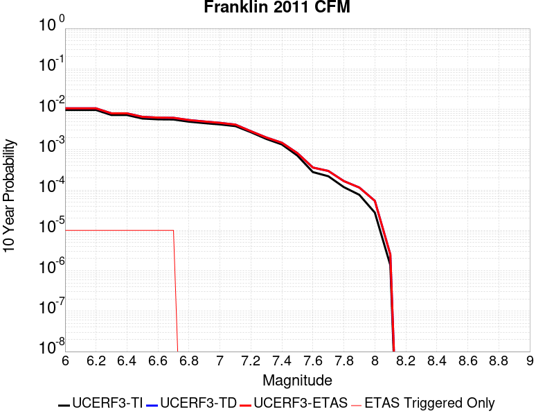 |

| Magnitude | 1 wk TI Prob | 1 wk TD Prob | 1 wk ETAS Prob | 1 wk ETAS/TD Gain | 1 wk ETAS Triggered Only | 1 mo TI Prob | 1 mo TD Prob | 1 mo ETAS Prob | 1 mo ETAS/TD Gain | 1 mo ETAS Triggered Only | 1 yr TI Prob | 1 yr TD Prob | 1 yr ETAS Prob | 1 yr ETAS/TD Gain | 1 yr ETAS Triggered Only | 10 yr TI Prob | 10 yr TD Prob | 10 yr ETAS Prob | 10 yr ETAS/TD Gain | 10 yr ETAS Triggered Only |
|-----|-----|-----|-----|-----|-----|-----|-----|-----|-----|-----|-----|-----|-----|-----|-----|-----|-----|-----|-----|-----|
| 6.0 | 1.845602E-5 | 2.021262E-5 | 3.0212417E-5 | 1.4947304 | 1.0E-5 | 7.9094825E-5 | 8.66228E-5 | 9.662194E-5 | 1.1154331 | 1.0E-5 | 9.6255407E-4 | 0.0010541513 | 0.0010641408 | 1.0094763 | 1.0E-5 | 0.009583955 | 0.0105088325 | 0.010518727 | 1.0009416 | 1.0E-5 |
| 6.1 | 1.845602E-5 | 2.021262E-5 | 3.0212417E-5 | 1.4947304 | 1.0E-5 | 7.9094825E-5 | 8.66228E-5 | 9.662194E-5 | 1.1154331 | 1.0E-5 | 9.6255407E-4 | 0.0010541513 | 0.0010641408 | 1.0094763 | 1.0E-5 | 0.009583955 | 0.0105088325 | 0.010518727 | 1.0009416 | 1.0E-5 |
| 6.2 | 1.845602E-5 | 2.021262E-5 | 3.0212417E-5 | 1.4947304 | 1.0E-5 | 7.9094825E-5 | 8.66228E-5 | 9.662194E-5 | 1.1154331 | 1.0E-5 | 9.6255407E-4 | 0.0010541513 | 0.0010641408 | 1.0094763 | 1.0E-5 | 0.009583955 | 0.0105088325 | 0.010518727 | 1.0009416 | 1.0E-5 |
| 6.3 | 1.3813506E-5 | 1.5154827E-5 | 2.5154675E-5 | 1.6598457 | 1.0E-5 | 5.9199396E-5 | 6.4947686E-5 | 7.4947035E-5 | 1.1539601 | 1.0E-5 | 7.205143E-4 | 7.9045893E-4 | 8.0045103E-4 | 1.0126408 | 1.0E-5 | 0.007181826 | 0.007891679 | 0.007901601 | 1.0012572 | 1.0E-5 |
| 6.4 | 1.3813506E-5 | 1.5154827E-5 | 2.5154675E-5 | 1.6598457 | 1.0E-5 | 5.9199396E-5 | 6.4947686E-5 | 7.4947035E-5 | 1.1539601 | 1.0E-5 | 7.205143E-4 | 7.9045893E-4 | 8.0045103E-4 | 1.0126408 | 1.0E-5 | 0.007181826 | 0.007891679 | 0.007901601 | 1.0012572 | 1.0E-5 |
| 6.5 | 1.1308949E-5 | 1.24178005E-5 | 2.2417677E-5 | 1.8052856 | 1.0E-5 | 4.8466023E-5 | 5.3218067E-5 | 6.3217536E-5 | 1.1878961 | 1.0E-5 | 5.899141E-4 | 6.4773945E-4 | 6.5773295E-4 | 1.0154283 | 1.0E-5 | 0.0058835056 | 0.006473166 | 0.0064831013 | 1.0015348 | 1.0E-5 |
| 6.6 | 1.0813164E-5 | 1.1876023E-5 | 2.1875905E-5 | 1.8420228 | 1.0E-5 | 4.6341313E-5 | 5.089626E-5 | 6.089575E-5 | 1.1964681 | 1.0E-5 | 5.640594E-4 | 6.1948766E-4 | 6.2948145E-4 | 1.0161324 | 1.0E-5 | 0.005626298 | 0.006192243 | 0.0062021813 | 1.0016049 | 1.0E-5 |
| 6.7 | 1.0706348E-5 | 1.1757787E-5 | 2.1757669E-5 | 1.8504902 | 1.0E-5 | 4.5883542E-5 | 5.0389554E-5 | 6.0389048E-5 | 1.1984439 | 1.0E-5 | 5.5848894E-4 | 6.13322E-4 | 6.2331586E-4 | 1.0162946 | 1.0E-5 | 0.005570874 | 0.0061309286 | 0.0061408672 | 1.0016211 | 1.0E-5 |
| 6.8 | 9.443655E-6 | 1.0349109E-5 | 1.0349109E-5 | 1.0 | 0.0 | 4.0472176E-5 | 4.435258E-5 | 4.435258E-5 | 1.0 | 0.0 | 4.9263734E-4 | 5.398602E-4 | 5.398602E-4 | 1.0 | 0.0 | 0.0049154665 | 0.005400073 | 0.005400073 | 1.0 | 0.0 |
| 6.9 | 8.7001645E-6 | 9.522179E-6 | 9.522179E-6 | 1.0 | 0.0 | 3.728589E-5 | 4.0808707E-5 | 4.0808707E-5 | 1.0 | 0.0 | 4.538611E-4 | 4.96734E-4 | 4.96734E-4 | 1.0 | 0.0 | 0.0045293528 | 0.0049708076 | 0.0049708076 | 1.0 | 0.0 |
| 7.0 | 8.074731E-6 | 8.815796E-6 | 8.815796E-6 | 1.0 | 0.0 | 3.460553E-5 | 3.7781443E-5 | 3.7781443E-5 | 1.0 | 0.0 | 4.212409E-4 | 4.5989305E-4 | 4.5989305E-4 | 1.0 | 0.0 | 0.004204433 | 0.0046039694 | 0.0046039694 | 1.0 | 0.0 |
| 7.1 | 7.3370957E-6 | 7.96167E-6 | 7.96167E-6 | 1.0 | 0.0 | 3.1444317E-5 | 3.4121003E-5 | 3.4121003E-5 | 1.0 | 0.0 | 3.8276732E-4 | 4.1534504E-4 | 4.1534504E-4 | 1.0 | 0.0 | 0.0038210868 | 0.0041600848 | 0.0041600848 | 1.0 | 0.0 |
| 7.2 | 5.1750103E-6 | 5.45711E-6 | 5.45711E-6 | 1.0 | 0.0 | 2.2178427E-5 | 2.3387407E-5 | 2.3387407E-5 | 1.0 | 0.0 | 2.699889E-4 | 2.847048E-4 | 2.847048E-4 | 1.0 | 0.0 | 0.002696611 | 0.0028573172 | 0.0028573172 | 1.0 | 0.0 |
| 7.3 | 3.5221371E-6 | 3.7960522E-6 | 3.7960522E-6 | 1.0 | 0.0 | 1.5094786E-5 | 1.6268694E-5 | 1.6268694E-5 | 1.0 | 0.0 | 1.8376352E-4 | 1.9805344E-4 | 1.9805344E-4 | 1.0 | 0.0 | 0.0018361164 | 0.001992203 | 0.001992203 | 1.0 | 0.0 |
| 7.4 | 2.5749775E-6 | 2.818195E-6 | 2.818195E-6 | 1.0 | 0.0 | 1.1035571E-5 | 1.2077923E-5 | 1.2077923E-5 | 1.0 | 0.0 | 1.343498E-4 | 1.4703887E-4 | 1.4703887E-4 | 1.0 | 0.0 | 0.001342686 | 0.0014816395 | 0.0014816395 | 1.0 | 0.0 |
| 7.5 | 1.3642131E-6 | 1.5497415E-6 | 1.5497415E-6 | 1.0 | 0.0 | 5.8466144E-6 | 6.6417324E-6 | 6.6417324E-6 | 1.0 | 0.0 | 7.1180206E-5 | 8.086011E-5 | 8.086011E-5 | 1.0 | 0.0 | 7.115741E-4 | 8.1911724E-4 | 8.1911724E-4 | 1.0 | 0.0 |
| 7.6 | 5.329124E-7 | 6.70109E-7 | 6.70109E-7 | 1.0 | 0.0 | 2.2839083E-6 | 2.8718923E-6 | 2.8718923E-6 | 1.0 | 0.0 | 2.7806227E-5 | 3.4964734E-5 | 3.4964734E-5 | 1.0 | 0.0 | 2.780275E-4 | 3.5998525E-4 | 3.5998525E-4 | 1.0 | 0.0 |
| 7.7 | 4.199127E-7 | 5.486773E-7 | 5.486773E-7 | 1.0 | 0.0 | 1.7996247E-6 | 2.351472E-6 | 2.351472E-6 | 1.0 | 0.0 | 2.191021E-5 | 2.8628798E-5 | 2.8628798E-5 | 1.0 | 0.0 | 2.190805E-4 | 2.9645552E-4 | 2.9645552E-4 | 1.0 | 0.0 |
| 7.8 | 2.2586491E-7 | 3.066155E-7 | 3.066155E-7 | 1.0 | 0.0 | 9.67992E-7 | 1.3140657E-6 | 1.3140657E-6 | 1.0 | 0.0 | 1.178524E-5 | 1.5998634E-5 | 1.5998634E-5 | 1.0 | 0.0 | 1.17846146E-4 | 1.6628981E-4 | 1.6628981E-4 | 1.0 | 0.0 |
| 7.9 | 1.4568845E-7 | 2.1202585E-7 | 2.1202585E-7 | 1.0 | 0.0 | 6.243789E-7 | 9.086819E-7 | 9.086819E-7 | 1.0 | 0.0 | 7.601787E-6 | 1.1063146E-5 | 1.1063146E-5 | 1.0 | 0.0 | 7.601527E-5 | 1.1508061E-4 | 1.1508061E-4 | 1.0 | 0.0 |
| 8.0 | 5.2868224E-8 | 9.996793E-8 | 9.996793E-8 | 1.0 | 0.0 | 2.2657808E-7 | 4.2843388E-7 | 4.2843388E-7 | 1.0 | 0.0 | 2.7585847E-6 | 5.21617E-6 | 5.21617E-6 | 1.0 | 0.0 | 2.7585504E-5 | 5.4014814E-5 | 5.4014814E-5 | 1.0 | 0.0 |
| 8.1 | 2.654434E-9 | 4.7226045E-9 | 4.7226045E-9 | 1.0 | 0.0 | 1.1376145E-8 | 2.0239735E-8 | 2.0239735E-8 | 1.0 | 0.0 | 1.3850456E-7 | 2.4641872E-7 | 2.4641872E-7 | 1.0 | 0.0 | 1.3850448E-6 | 2.5336271E-6 | 2.5336271E-6 | 1.0 | 0.0 |

## Hollywood
*[(top)](#table-of-contents)*

| 1 Week | 1 Month | 1 Year | 10 Year |
|-----|-----|-----|-----|
|  |  |  |  |

| Magnitude | 1 wk TI Prob | 1 wk TD Prob | 1 wk ETAS Prob | 1 wk ETAS/TD Gain | 1 wk ETAS Triggered Only | 1 mo TI Prob | 1 mo TD Prob | 1 mo ETAS Prob | 1 mo ETAS/TD Gain | 1 mo ETAS Triggered Only | 1 yr TI Prob | 1 yr TD Prob | 1 yr ETAS Prob | 1 yr ETAS/TD Gain | 1 yr ETAS Triggered Only | 10 yr TI Prob | 10 yr TD Prob | 10 yr ETAS Prob | 10 yr ETAS/TD Gain | 10 yr ETAS Triggered Only |
|-----|-----|-----|-----|-----|-----|-----|-----|-----|-----|-----|-----|-----|-----|-----|-----|-----|-----|-----|-----|-----|
| 6.0 | 1.24487615E-5 | 1.2593226E-5 | 1.2593226E-5 | 1.0 | 0.0 | 5.3350745E-5 | 5.3969878E-5 | 5.3969878E-5 | 1.0 | 0.0 | 6.4935174E-4 | 6.568898E-4 | 6.568898E-4 | 1.0 | 0.0 | 0.0064745755 | 0.006549969 | 0.0065599033 | 1.0015167 | 1.0E-5 |
| 6.1 | 1.24487615E-5 | 1.2593226E-5 | 1.2593226E-5 | 1.0 | 0.0 | 5.3350745E-5 | 5.3969878E-5 | 5.3969878E-5 | 1.0 | 0.0 | 6.4935174E-4 | 6.568898E-4 | 6.568898E-4 | 1.0 | 0.0 | 0.0064745755 | 0.006549969 | 0.0065599033 | 1.0015167 | 1.0E-5 |
| 6.2 | 1.24487615E-5 | 1.2593226E-5 | 1.2593226E-5 | 1.0 | 0.0 | 5.3350745E-5 | 5.3969878E-5 | 5.3969878E-5 | 1.0 | 0.0 | 6.4935174E-4 | 6.568898E-4 | 6.568898E-4 | 1.0 | 0.0 | 0.0064745755 | 0.006549969 | 0.0065599033 | 1.0015167 | 1.0E-5 |
| 6.3 | 1.24487615E-5 | 1.2593226E-5 | 1.2593226E-5 | 1.0 | 0.0 | 5.3350745E-5 | 5.3969878E-5 | 5.3969878E-5 | 1.0 | 0.0 | 6.4935174E-4 | 6.568898E-4 | 6.568898E-4 | 1.0 | 0.0 | 0.0064745755 | 0.006549969 | 0.0065599033 | 1.0015167 | 1.0E-5 |
| 6.4 | 1.2431024E-5 | 1.2573839E-5 | 1.2573839E-5 | 1.0 | 0.0 | 5.327473E-5 | 5.3886797E-5 | 5.3886797E-5 | 1.0 | 0.0 | 6.4842677E-4 | 6.558789E-4 | 6.558789E-4 | 1.0 | 0.0 | 0.0064653796 | 0.0065399194 | 0.006549854 | 1.0015191 | 1.0E-5 |
| 6.5 | 1.1242222E-5 | 1.13178E-5 | 1.13178E-5 | 1.0 | 0.0 | 4.8180063E-5 | 4.850397E-5 | 4.850397E-5 | 1.0 | 0.0 | 5.864344E-4 | 5.9037853E-4 | 5.9037853E-4 | 1.0 | 0.0 | 0.0058488925 | 0.005888388 | 0.005898329 | 1.0016882 | 1.0E-5 |
| 6.6 | 1.1234066E-5 | 1.13089145E-5 | 1.13089145E-5 | 1.0 | 0.0 | 4.8145106E-5 | 4.846589E-5 | 4.846589E-5 | 1.0 | 0.0 | 5.86009E-4 | 5.8991514E-4 | 5.8991514E-4 | 1.0 | 0.0 | 0.005844661 | 0.0058837784 | 0.00589372 | 1.0016896 | 1.0E-5 |
| 6.7 | 1.12294E-5 | 1.1303658E-5 | 1.1303658E-5 | 1.0 | 0.0 | 4.812511E-5 | 4.8443362E-5 | 4.8443362E-5 | 1.0 | 0.0 | 5.857657E-4 | 5.89641E-4 | 5.89641E-4 | 1.0 | 0.0 | 0.0058422405 | 0.005881052 | 0.005890993 | 1.0016904 | 1.0E-5 |
| 6.8 | 1.0252819E-5 | 1.0218445E-5 | 1.0218445E-5 | 1.0 | 0.0 | 4.3939912E-5 | 4.379261E-5 | 4.379261E-5 | 1.0 | 0.0 | 5.3483713E-4 | 5.330467E-4 | 5.330467E-4 | 1.0 | 0.0 | 0.005335517 | 0.005317908 | 0.0053278543 | 1.0018704 | 1.0E-5 |
| 6.9 | 9.252289E-6 | 9.110306E-6 | 9.110306E-6 | 1.0 | 0.0 | 3.9652066E-5 | 3.9043593E-5 | 3.9043593E-5 | 1.0 | 0.0 | 4.8265693E-4 | 4.752537E-4 | 4.752537E-4 | 1.0 | 0.0 | 0.0048161 | 0.004742547 | 0.0047524995 | 1.0020986 | 1.0E-5 |
| 7.0 | 8.474604E-6 | 8.258257E-6 | 8.258257E-6 | 1.0 | 0.0 | 3.6319227E-5 | 3.539206E-5 | 3.539206E-5 | 1.0 | 0.0 | 4.4209688E-4 | 4.3081454E-4 | 4.3081454E-4 | 1.0 | 0.0 | 0.004412184 | 0.004299944 | 0.004309901 | 1.0023156 | 1.0E-5 |
| 7.1 | 6.643643E-6 | 6.2683675E-6 | 6.2683675E-6 | 1.0 | 0.0 | 2.8472443E-5 | 2.6864158E-5 | 2.6864158E-5 | 1.0 | 0.0 | 3.4659685E-4 | 3.2702246E-4 | 3.2702246E-4 | 1.0 | 0.0 | 0.0034605677 | 0.0032654584 | 0.0032654584 | 1.0 | 0.0 |
| 7.2 | 5.549002E-6 | 5.108709E-6 | 5.108709E-6 | 1.0 | 0.0 | 2.378122E-5 | 2.1894284E-5 | 2.1894284E-5 | 1.0 | 0.0 | 2.8949787E-4 | 2.6653046E-4 | 2.6653046E-4 | 1.0 | 0.0 | 0.0028912104 | 0.0026621243 | 0.0026621243 | 1.0 | 0.0 |
| 7.3 | 4.3059727E-6 | 3.9598885E-6 | 3.9598885E-6 | 1.0 | 0.0 | 1.8454039E-5 | 1.6970842E-5 | 1.6970842E-5 | 1.0 | 0.0 | 2.2465475E-4 | 2.066005E-4 | 2.066005E-4 | 1.0 | 0.0 | 0.0022442779 | 0.0020640944 | 0.0020640944 | 1.0 | 0.0 |
| 7.4 | 2.8550733E-6 | 2.7012966E-6 | 2.7012966E-6 | 1.0 | 0.0 | 1.2235971E-5 | 1.1576934E-5 | 1.1576934E-5 | 1.0 | 0.0 | 1.4896276E-4 | 1.409401E-4 | 1.409401E-4 | 1.0 | 0.0 | 0.0014886294 | 0.0014085122 | 0.0014085122 | 1.0 | 0.0 |
| 7.5 | 1.9927045E-6 | 1.8976367E-6 | 1.8976367E-6 | 1.0 | 0.0 | 8.540134E-6 | 8.132703E-6 | 8.132703E-6 | 1.0 | 0.0 | 1.0397117E-4 | 9.90112E-5 | 9.90112E-5 | 1.0 | 0.0 | 0.0010392254 | 9.896745E-4 | 9.896745E-4 | 1.0 | 0.0 |
| 7.6 | 1.345084E-6 | 1.2216007E-6 | 1.2216007E-6 | 1.0 | 0.0 | 5.764633E-6 | 5.235421E-6 | 5.235421E-6 | 1.0 | 0.0 | 7.018215E-5 | 6.3739404E-5 | 6.3739404E-5 | 1.0 | 0.0 | 7.0159987E-4 | 6.3721323E-4 | 6.3721323E-4 | 1.0 | 0.0 |
| 7.7 | 7.6835164E-7 | 6.277697E-7 | 6.277697E-7 | 1.0 | 0.0 | 3.2929315E-6 | 2.6904388E-6 | 2.6904388E-6 | 1.0 | 0.0 | 4.00907E-5 | 3.2755615E-5 | 3.2755615E-5 | 1.0 | 0.0 | 4.0083472E-4 | 3.2750933E-4 | 3.2750933E-4 | 1.0 | 0.0 |
| 7.8 | 3.6562128E-7 | 2.453479E-7 | 2.453479E-7 | 1.0 | 0.0 | 1.5669474E-6 | 1.0514907E-6 | 1.0514907E-6 | 1.0 | 0.0 | 1.9077417E-5 | 1.2801827E-5 | 1.2801827E-5 | 1.0 | 0.0 | 1.907578E-4 | 1.2801126E-4 | 1.2801126E-4 | 1.0 | 0.0 |
| 7.9 | 7.5024424E-8 | 5.3816795E-8 | 5.3816795E-8 | 1.0 | 0.0 | 3.215332E-7 | 2.306434E-7 | 2.306434E-7 | 1.0 | 0.0 | 3.91466E-6 | 2.808081E-6 | 2.808081E-6 | 1.0 | 0.0 | 3.9145907E-5 | 2.8080585E-5 | 2.8080585E-5 | 1.0 | 0.0 |

## Laguna Salada
*[(top)](#table-of-contents)*

| 1 Week | 1 Month | 1 Year | 10 Year |
|-----|-----|-----|-----|
|  |  |  |  |

| Magnitude | 1 wk TI Prob | 1 wk TD Prob | 1 wk ETAS Prob | 1 wk ETAS/TD Gain | 1 wk ETAS Triggered Only | 1 mo TI Prob | 1 mo TD Prob | 1 mo ETAS Prob | 1 mo ETAS/TD Gain | 1 mo ETAS Triggered Only | 1 yr TI Prob | 1 yr TD Prob | 1 yr ETAS Prob | 1 yr ETAS/TD Gain | 1 yr ETAS Triggered Only | 10 yr TI Prob | 10 yr TD Prob | 10 yr ETAS Prob | 10 yr ETAS/TD Gain | 10 yr ETAS Triggered Only |
|-----|-----|-----|-----|-----|-----|-----|-----|-----|-----|-----|-----|-----|-----|-----|-----|-----|-----|-----|-----|-----|
| 6.0 | 4.6465593E-5 | 4.634639E-5 | 5.634593E-5 | 1.2157565 | 1.0E-5 | 1.9912305E-4 | 1.9861311E-4 | 2.0861112E-4 | 1.0503391 | 1.0E-5 | 0.0024216278 | 0.002415429 | 0.002425405 | 1.00413 | 1.0E-5 | 0.02395408 | 0.023975259 | 0.023985019 | 1.0004071 | 1.0E-5 |
| 6.1 | 3.982297E-5 | 3.7246125E-5 | 3.7246125E-5 | 1.0 | 0.0 | 1.706587E-4 | 1.5961716E-4 | 1.5961716E-4 | 1.0 | 0.0 | 0.0020757897 | 0.0019417295 | 0.0019417295 | 1.0 | 0.0 | 0.020565065 | 0.019331863 | 0.019331863 | 1.0 | 0.0 |
| 6.2 | 3.6067784E-5 | 3.2602693E-5 | 3.2602693E-5 | 1.0 | 0.0 | 1.5456705E-4 | 1.3971896E-4 | 1.3971896E-4 | 1.0 | 0.0 | 0.0018802295 | 0.0016998611 | 0.0016998611 | 1.0 | 0.0 | 0.018644003 | 0.016949628 | 0.016949628 | 1.0 | 0.0 |
| 6.3 | 3.2859112E-5 | 2.8849448E-5 | 2.8849448E-5 | 1.0 | 0.0 | 1.4081717E-4 | 1.2363521E-4 | 1.2363521E-4 | 1.0 | 0.0 | 0.0017131006 | 0.0015043203 | 0.0015043203 | 1.0 | 0.0 | 0.016999546 | 0.015018767 | 0.015018767 | 1.0 | 0.0 |
| 6.4 | 2.9132116E-5 | 2.4852965E-5 | 2.4852965E-5 | 1.0 | 0.0 | 1.2484594E-4 | 1.0650887E-4 | 1.0650887E-4 | 1.0 | 0.0 | 0.0015189396 | 0.001296065 | 0.001296065 | 1.0 | 0.0 | 0.015085992 | 0.012956262 | 0.012956262 | 1.0 | 0.0 |
| 6.5 | 2.7075037E-5 | 2.2825836E-5 | 2.2825836E-5 | 1.0 | 0.0 | 1.1603071E-4 | 9.7821845E-5 | 9.7821845E-5 | 1.0 | 0.0 | 0.0014117584 | 0.0011904186 | 0.0011904186 | 1.0 | 0.0 | 0.014028233 | 0.011907749 | 0.011907749 | 1.0 | 0.0 |
| 6.6 | 2.2367465E-5 | 1.8573526E-5 | 1.8573526E-5 | 1.0 | 0.0 | 9.5857045E-5 | 7.959886E-5 | 7.959886E-5 | 1.0 | 0.0 | 0.0011664346 | 9.6876756E-4 | 9.6876756E-4 | 1.0 | 0.0 | 0.011603311 | 0.009702191 | 0.009702191 | 1.0 | 0.0 |
| 6.7 | 1.9458053E-5 | 1.5914242E-5 | 1.5914242E-5 | 1.0 | 0.0 | 8.338899E-5 | 6.8202564E-5 | 6.8202564E-5 | 1.0 | 0.0 | 0.001014788 | 8.3013024E-4 | 8.3013024E-4 | 1.0 | 0.0 | 0.010101665 | 0.0083209425 | 0.0083209425 | 1.0 | 0.0 |
| 6.8 | 1.0767866E-5 | 9.18435E-6 | 9.18435E-6 | 1.0 | 0.0 | 4.614718E-5 | 3.9361294E-5 | 3.9361294E-5 | 1.0 | 0.0 | 5.6169706E-4 | 4.7918706E-4 | 4.7918706E-4 | 1.0 | 0.0 | 0.0056027942 | 0.0048096925 | 0.0048096925 | 1.0 | 0.0 |
| 6.9 | 2.1384765E-6 | 1.7913675E-6 | 1.7913675E-6 | 1.0 | 0.0 | 9.164866E-6 | 7.677269E-6 | 7.677269E-6 | 1.0 | 0.0 | 1.1157654E-4 | 9.346713E-5 | 9.346713E-5 | 1.0 | 0.0 | 0.0011152053 | 9.343165E-4 | 9.343165E-4 | 1.0 | 0.0 |
| 7.0 | 2.0952946E-6 | 1.7493046E-6 | 1.7493046E-6 | 1.0 | 0.0 | 8.979802E-6 | 7.4970003E-6 | 7.4970003E-6 | 1.0 | 0.0 | 1.0932361E-4 | 9.1272545E-5 | 9.1272545E-5 | 1.0 | 0.0 | 0.0010926984 | 9.123888E-4 | 9.123888E-4 | 1.0 | 0.0 |
| 7.1 | 1.7887576E-6 | 1.4500254E-6 | 1.4500254E-6 | 1.0 | 0.0 | 7.666081E-6 | 6.2143813E-6 | 6.2143813E-6 | 1.0 | 0.0 | 9.333054E-5 | 7.565777E-5 | 7.565777E-5 | 1.0 | 0.0 | 9.329135E-4 | 7.563506E-4 | 7.563506E-4 | 1.0 | 0.0 |
| 7.2 | 9.723109E-7 | 7.135619E-7 | 7.135619E-7 | 1.0 | 0.0 | 4.16704E-6 | 3.0581198E-6 | 3.0581198E-6 | 1.0 | 0.0 | 5.073253E-5 | 3.7232137E-5 | 3.7232137E-5 | 1.0 | 0.0 | 5.072095E-4 | 3.7227524E-4 | 3.7227524E-4 | 1.0 | 0.0 |

## Earthquake Valley (No  Extension)
*[(top)](#table-of-contents)*

| 1 Week | 1 Month | 1 Year | 10 Year |
|-----|-----|-----|-----|
|  |  |  |  |

| Magnitude | 1 wk TI Prob | 1 wk TD Prob | 1 wk ETAS Prob | 1 wk ETAS/TD Gain | 1 wk ETAS Triggered Only | 1 mo TI Prob | 1 mo TD Prob | 1 mo ETAS Prob | 1 mo ETAS/TD Gain | 1 mo ETAS Triggered Only | 1 yr TI Prob | 1 yr TD Prob | 1 yr ETAS Prob | 1 yr ETAS/TD Gain | 1 yr ETAS Triggered Only | 10 yr TI Prob | 10 yr TD Prob | 10 yr ETAS Prob | 10 yr ETAS/TD Gain | 10 yr ETAS Triggered Only |
|-----|-----|-----|-----|-----|-----|-----|-----|-----|-----|-----|-----|-----|-----|-----|-----|-----|-----|-----|-----|-----|
| 6.0 | 2.1859703E-5 | 2.5198362E-5 | 2.5198362E-5 | 1.0 | 0.0 | 9.3681076E-5 | 1.07989326E-4 | 1.17988246E-4 | 1.0925918 | 1.0E-5 | 0.0011399703 | 0.001314122 | 0.0013241089 | 1.0075996 | 1.0E-5 | 0.011341401 | 0.013077871 | 0.01308774 | 1.0007546 | 1.0E-5 |
| 6.1 | 2.1859703E-5 | 2.5198362E-5 | 2.5198362E-5 | 1.0 | 0.0 | 9.3681076E-5 | 1.07989326E-4 | 1.17988246E-4 | 1.0925918 | 1.0E-5 | 0.0011399703 | 0.001314122 | 0.0013241089 | 1.0075996 | 1.0E-5 | 0.011341401 | 0.013077871 | 0.01308774 | 1.0007546 | 1.0E-5 |
| 6.2 | 2.1859703E-5 | 2.5198362E-5 | 2.5198362E-5 | 1.0 | 0.0 | 9.3681076E-5 | 1.07989326E-4 | 1.17988246E-4 | 1.0925918 | 1.0E-5 | 0.0011399703 | 0.001314122 | 0.0013241089 | 1.0075996 | 1.0E-5 | 0.011341401 | 0.013077871 | 0.01308774 | 1.0007546 | 1.0E-5 |
| 6.3 | 2.1859703E-5 | 2.5198362E-5 | 2.5198362E-5 | 1.0 | 0.0 | 9.3681076E-5 | 1.07989326E-4 | 1.17988246E-4 | 1.0925918 | 1.0E-5 | 0.0011399703 | 0.001314122 | 0.0013241089 | 1.0075996 | 1.0E-5 | 0.011341401 | 0.013077871 | 0.01308774 | 1.0007546 | 1.0E-5 |
| 6.4 | 2.1859703E-5 | 2.5198362E-5 | 2.5198362E-5 | 1.0 | 0.0 | 9.3681076E-5 | 1.07989326E-4 | 1.17988246E-4 | 1.0925918 | 1.0E-5 | 0.0011399703 | 0.001314122 | 0.0013241089 | 1.0075996 | 1.0E-5 | 0.011341401 | 0.013077871 | 0.01308774 | 1.0007546 | 1.0E-5 |
| 6.5 | 2.1859703E-5 | 2.5198362E-5 | 2.5198362E-5 | 1.0 | 0.0 | 9.3681076E-5 | 1.07989326E-4 | 1.17988246E-4 | 1.0925918 | 1.0E-5 | 0.0011399703 | 0.001314122 | 0.0013241089 | 1.0075996 | 1.0E-5 | 0.011341401 | 0.013077871 | 0.01308774 | 1.0007546 | 1.0E-5 |
| 6.6 | 1.597E-5 | 1.8356275E-5 | 1.8356275E-5 | 1.0 | 0.0 | 6.8441055E-5 | 7.866787E-5 | 8.866709E-5 | 1.1271067 | 1.0E-5 | 8.329513E-4 | 9.574478E-4 | 9.674382E-4 | 1.0104344 | 1.0E-5 | 0.008298361 | 0.009541836 | 0.00955174 | 1.0010381 | 1.0E-5 |
| 6.7 | 1.597E-5 | 1.8356275E-5 | 1.8356275E-5 | 1.0 | 0.0 | 6.8441055E-5 | 7.866787E-5 | 8.866709E-5 | 1.1271067 | 1.0E-5 | 8.329513E-4 | 9.574478E-4 | 9.674382E-4 | 1.0104344 | 1.0E-5 | 0.008298361 | 0.009541836 | 0.00955174 | 1.0010381 | 1.0E-5 |
| 6.8 | 1.5315149E-5 | 1.7602091E-5 | 1.7602091E-5 | 1.0 | 0.0 | 6.5634704E-5 | 7.543584E-5 | 7.543584E-5 | 1.0 | 0.0 | 7.988095E-4 | 9.181311E-4 | 9.181311E-4 | 1.0 | 0.0 | 0.007959441 | 0.009151919 | 0.009151919 | 1.0 | 0.0 |
| 6.9 | 1.3634728E-5 | 1.5675821E-5 | 1.5675821E-5 | 1.0 | 0.0 | 5.8433237E-5 | 6.718082E-5 | 6.718082E-5 | 1.0 | 0.0 | 7.1119244E-4 | 8.177017E-4 | 8.177017E-4 | 1.0 | 0.0 | 0.007089207 | 0.008155 | 0.008155 | 1.0 | 0.0 |
| 7.0 | 1.3496271E-5 | 1.5517853E-5 | 1.5517853E-5 | 1.0 | 0.0 | 5.783988E-5 | 6.650385E-5 | 6.650385E-5 | 1.0 | 0.0 | 7.03973E-4 | 8.094657E-4 | 8.094657E-4 | 1.0 | 0.0 | 0.007017471 | 0.0080732405 | 0.0080732405 | 1.0 | 0.0 |
| 7.1 | 8.242798E-6 | 9.4726E-6 | 9.4726E-6 | 1.0 | 0.0 | 3.53258E-5 | 4.0596606E-5 | 4.0596606E-5 | 1.0 | 0.0 | 4.300067E-4 | 4.9421866E-4 | 4.9421866E-4 | 1.0 | 0.0 | 0.004291756 | 0.0049377717 | 0.0049377717 | 1.0 | 0.0 |
| 7.2 | 2.6506527E-7 | 2.2560312E-7 | 2.2560312E-7 | 1.0 | 0.0 | 1.1359936E-6 | 9.668702E-7 | 9.668702E-7 | 1.0 | 0.0 | 1.3830633E-5 | 1.17715845E-5 | 1.17715845E-5 | 1.0 | 0.0 | 1.3829772E-4 | 1.1771003E-4 | 1.1771003E-4 | 1.0 | 0.0 |
| 7.3 | 2.5810488E-7 | 2.1955442E-7 | 2.1955442E-7 | 1.0 | 0.0 | 1.1061633E-6 | 9.409472E-7 | 9.409472E-7 | 1.0 | 0.0 | 1.3467455E-5 | 1.1455976E-5 | 1.1455976E-5 | 1.0 | 0.0 | 1.3466639E-4 | 1.1455427E-4 | 1.1455427E-4 | 1.0 | 0.0 |
| 7.4 | 2.2676066E-7 | 1.9110601E-7 | 1.9110601E-7 | 1.0 | 0.0 | 9.71831E-7 | 8.190255E-7 | 8.190255E-7 | 1.0 | 0.0 | 1.1831979E-5 | 9.9715935E-6 | 9.9715935E-6 | 1.0 | 0.0 | 1.1831349E-4 | 9.9711855E-5 | 9.9711855E-5 | 1.0 | 0.0 |
| 7.5 | 1.5553917E-7 | 1.3112096E-7 | 1.3112096E-7 | 1.0 | 0.0 | 6.6659624E-7 | 5.619469E-7 | 5.619469E-7 | 1.0 | 0.0 | 8.115779E-6 | 6.8416834E-6 | 6.8416834E-6 | 1.0 | 0.0 | 8.115482E-5 | 6.841495E-5 | 6.841495E-5 | 1.0 | 0.0 |
| 7.6 | 1.3448629E-7 | 1.1288419E-7 | 1.1288419E-7 | 1.0 | 0.0 | 5.7636964E-7 | 4.837893E-7 | 4.837893E-7 | 1.0 | 0.0 | 7.017278E-6 | 5.890121E-6 | 5.890121E-6 | 1.0 | 0.0 | 7.0170565E-5 | 5.889986E-5 | 5.889986E-5 | 1.0 | 0.0 |
| 7.7 | 2.9719402E-8 | 1.458206E-8 | 1.458206E-8 | 1.0 | 0.0 | 1.2736886E-7 | 6.249454E-8 | 6.249454E-8 | 1.0 | 0.0 | 1.5507147E-6 | 7.608708E-7 | 7.608708E-7 | 1.0 | 0.0 | 1.550704E-5 | 7.6086876E-6 | 7.6086876E-6 | 1.0 | 0.0 |
| 7.8 | 7.4390196E-9 | 3.2502152E-9 | 3.2502152E-9 | 1.0 | 0.0 | 3.1881513E-8 | 1.3929493E-8 | 1.3929493E-8 | 1.0 | 0.0 | 3.8815733E-7 | 1.6959156E-7 | 1.6959156E-7 | 1.0 | 0.0 | 3.8815665E-6 | 1.6959145E-6 | 1.6959145E-6 | 1.0 | 0.0 |
| 7.9 | 1.5373532E-9 | 8.440161E-10 | 8.440161E-10 | 1.0 | 0.0 | 6.5886567E-9 | 3.6172119E-9 | 3.6172119E-9 | 1.0 | 0.0 | 8.021689E-8 | 4.4039556E-8 | 4.4039556E-8 | 1.0 | 0.0 | 8.0216864E-7 | 4.4039552E-7 | 4.4039552E-7 | 1.0 | 0.0 |

## Hector Mine
*[(top)](#table-of-contents)*

| 1 Week | 1 Month | 1 Year | 10 Year |
|-----|-----|-----|-----|
|  |  |  |  |

| Magnitude | 1 wk TI Prob | 1 wk TD Prob | 1 wk ETAS Prob | 1 wk ETAS/TD Gain | 1 wk ETAS Triggered Only | 1 mo TI Prob | 1 mo TD Prob | 1 mo ETAS Prob | 1 mo ETAS/TD Gain | 1 mo ETAS Triggered Only | 1 yr TI Prob | 1 yr TD Prob | 1 yr ETAS Prob | 1 yr ETAS/TD Gain | 1 yr ETAS Triggered Only | 10 yr TI Prob | 10 yr TD Prob | 10 yr ETAS Prob | 10 yr ETAS/TD Gain | 10 yr ETAS Triggered Only |
|-----|-----|-----|-----|-----|-----|-----|-----|-----|-----|-----|-----|-----|-----|-----|-----|-----|-----|-----|-----|-----|
| 6.0 | 1.8760093E-5 | 2.7963818E-6 | 1.2796354E-5 | 4.57604 | 1.0E-5 | 8.039792E-5 | 1.1984461E-5 | 2.198434E-5 | 1.8344039 | 1.0E-5 | 9.78405E-4 | 1.4590504E-4 | 1.5590357E-4 | 1.0685277 | 1.0E-5 | 0.009741086 | 0.0014584847 | 0.0014684701 | 1.0068464 | 1.0E-5 |
| 6.1 | 1.8760093E-5 | 2.7963818E-6 | 1.2796354E-5 | 4.57604 | 1.0E-5 | 8.039792E-5 | 1.1984461E-5 | 2.198434E-5 | 1.8344039 | 1.0E-5 | 9.78405E-4 | 1.4590504E-4 | 1.5590357E-4 | 1.0685277 | 1.0E-5 | 0.009741086 | 0.0014584847 | 0.0014684701 | 1.0068464 | 1.0E-5 |
| 6.2 | 1.8760093E-5 | 2.7963818E-6 | 1.2796354E-5 | 4.57604 | 1.0E-5 | 8.039792E-5 | 1.1984461E-5 | 2.198434E-5 | 1.8344039 | 1.0E-5 | 9.78405E-4 | 1.4590504E-4 | 1.5590357E-4 | 1.0685277 | 1.0E-5 | 0.009741086 | 0.0014584847 | 0.0014684701 | 1.0068464 | 1.0E-5 |
| 6.3 | 1.8760093E-5 | 2.7963818E-6 | 1.2796354E-5 | 4.57604 | 1.0E-5 | 8.039792E-5 | 1.1984461E-5 | 2.198434E-5 | 1.8344039 | 1.0E-5 | 9.78405E-4 | 1.4590504E-4 | 1.5590357E-4 | 1.0685277 | 1.0E-5 | 0.009741086 | 0.0014584847 | 0.0014684701 | 1.0068464 | 1.0E-5 |
| 6.4 | 1.0888055E-5 | 2.7963818E-6 | 1.2796354E-5 | 4.57604 | 1.0E-5 | 4.666226E-5 | 1.1984461E-5 | 2.198434E-5 | 1.8344039 | 1.0E-5 | 5.679649E-4 | 1.4590504E-4 | 1.5590357E-4 | 1.0685277 | 1.0E-5 | 0.0056651547 | 0.0014584847 | 0.0014684701 | 1.0068464 | 1.0E-5 |
| 6.5 | 1.0888055E-5 | 2.7963818E-6 | 1.2796354E-5 | 4.57604 | 1.0E-5 | 4.666226E-5 | 1.1984461E-5 | 2.198434E-5 | 1.8344039 | 1.0E-5 | 5.679649E-4 | 1.4590504E-4 | 1.5590357E-4 | 1.0685277 | 1.0E-5 | 0.0056651547 | 0.0014584847 | 0.0014684701 | 1.0068464 | 1.0E-5 |
| 6.6 | 1.0730738E-5 | 2.7963818E-6 | 1.2796354E-5 | 4.57604 | 1.0E-5 | 4.5988065E-5 | 1.1984461E-5 | 2.198434E-5 | 1.8344039 | 1.0E-5 | 5.5976084E-4 | 1.4590504E-4 | 1.5590357E-4 | 1.0685277 | 1.0E-5 | 0.0055835294 | 0.0014584847 | 0.0014684701 | 1.0068464 | 1.0E-5 |
| 6.7 | 7.881326E-6 | 2.7710626E-6 | 1.2771035E-5 | 4.608714 | 1.0E-5 | 3.3776672E-5 | 1.1875951E-5 | 2.1875832E-5 | 1.8420279 | 1.0E-5 | 4.111534E-4 | 1.445841E-4 | 1.5458265E-4 | 1.0691539 | 1.0E-5 | 0.0041039353 | 0.0014452925 | 0.001455278 | 1.006909 | 1.0E-5 |
| 6.8 | 7.5683483E-6 | 2.7328138E-6 | 1.2732787E-5 | 4.659222 | 1.0E-5 | 3.2435375E-5 | 1.1712029E-5 | 2.1711912E-5 | 1.853813 | 1.0E-5 | 3.9482914E-4 | 1.4258861E-4 | 1.5258719E-4 | 1.0701219 | 1.0E-5 | 0.0039412836 | 0.0014253634 | 0.001435349 | 1.0070058 | 1.0E-5 |
| 6.9 | 6.473048E-6 | 2.5138945E-6 | 1.25138695E-5 | 4.9778814 | 1.0E-5 | 2.7741338E-5 | 1.07738115E-5 | 2.0773705E-5 | 1.9281666 | 1.0E-5 | 3.3769844E-4 | 1.3116724E-4 | 1.4116592E-4 | 1.0762285 | 1.0E-5 | 0.0033718573 | 0.0013112876 | 0.0013212746 | 1.007616 | 1.0E-5 |
| 7.0 | 4.9959954E-6 | 1.8565124E-6 | 1.1856494E-5 | 6.386434 | 1.0E-5 | 2.1411232E-5 | 7.956478E-6 | 1.7956398E-5 | 2.2568276 | 1.0E-5 | 2.6065056E-4 | 9.686937E-5 | 1.0686841E-4 | 1.1032218 | 1.0E-5 | 0.0026034506 | 9.6862105E-4 | 9.786114E-4 | 1.010314 | 1.0E-5 |
| 7.1 | 1.2997541E-6 | 1.5602147E-7 | 1.5602147E-7 | 1.0 | 0.0 | 5.5703626E-6 | 6.686633E-7 | 6.686633E-7 | 1.0 | 0.0 | 6.7817055E-5 | 8.140949E-6 | 8.140949E-6 | 1.0 | 0.0 | 6.779636E-4 | 8.1406906E-5 | 8.1406906E-5 | 1.0 | 0.0 |
| 7.2 | 8.392699E-7 | 9.727592E-8 | 9.727592E-8 | 1.0 | 0.0 | 3.596866E-6 | 4.1689677E-7 | 4.1689677E-7 | 1.0 | 0.0 | 4.3790962E-5 | 5.0757085E-6 | 5.0757085E-6 | 1.0 | 0.0 | 4.3782333E-4 | 5.0756116E-5 | 5.0756116E-5 | 1.0 | 0.0 |
| 7.3 | 3.13015E-7 | 4.829262E-8 | 4.829262E-8 | 1.0 | 0.0 | 1.3414921E-6 | 2.0696835E-7 | 2.0696835E-7 | 1.0 | 0.0 | 1.6332544E-5 | 2.5198376E-6 | 2.5198376E-6 | 1.0 | 0.0 | 1.6331344E-4 | 2.5198176E-5 | 2.5198176E-5 | 1.0 | 0.0 |

## Rocky Ledge 2011 CFM
*[(top)](#table-of-contents)*

| 1 Week | 1 Month | 1 Year | 10 Year |
|-----|-----|-----|-----|
|  |  |  | 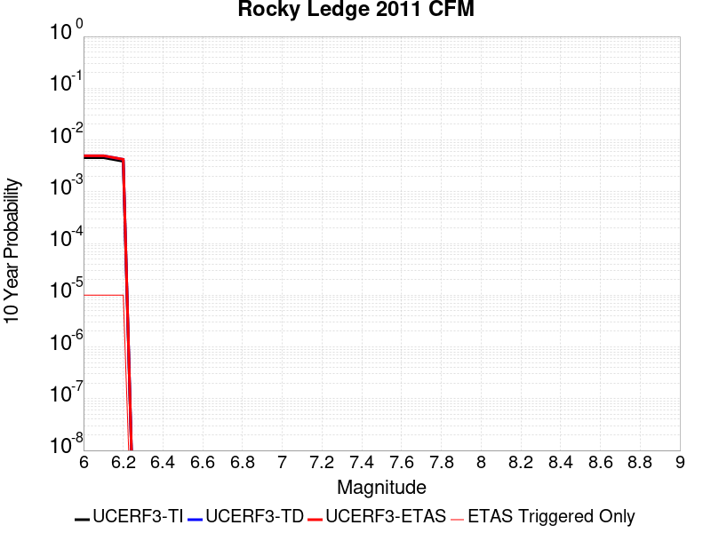 |

| Magnitude | 1 wk TI Prob | 1 wk TD Prob | 1 wk ETAS Prob | 1 wk ETAS/TD Gain | 1 wk ETAS Triggered Only | 1 mo TI Prob | 1 mo TD Prob | 1 mo ETAS Prob | 1 mo ETAS/TD Gain | 1 mo ETAS Triggered Only | 1 yr TI Prob | 1 yr TD Prob | 1 yr ETAS Prob | 1 yr ETAS/TD Gain | 1 yr ETAS Triggered Only | 10 yr TI Prob | 10 yr TD Prob | 10 yr ETAS Prob | 10 yr ETAS/TD Gain | 10 yr ETAS Triggered Only |
|-----|-----|-----|-----|-----|-----|-----|-----|-----|-----|-----|-----|-----|-----|-----|-----|-----|-----|-----|-----|-----|
| 6.0 | 8.7550525E-6 | 9.486605E-6 | 9.486605E-6 | 1.0 | 0.0 | 3.7521113E-5 | 4.0656712E-5 | 4.0656712E-5 | 1.0 | 0.0 | 4.567238E-4 | 4.949655E-4 | 4.949655E-4 | 1.0 | 0.0 | 0.0045578624 | 0.0049467194 | 0.0049566696 | 1.0020115 | 1.0E-5 |
| 6.1 | 8.7550525E-6 | 9.486605E-6 | 9.486605E-6 | 1.0 | 0.0 | 3.7521113E-5 | 4.0656712E-5 | 4.0656712E-5 | 1.0 | 0.0 | 4.567238E-4 | 4.949655E-4 | 4.949655E-4 | 1.0 | 0.0 | 0.0045578624 | 0.0049467194 | 0.0049566696 | 1.0020115 | 1.0E-5 |
| 6.2 | 7.442295E-6 | 8.06304E-6 | 8.06304E-6 | 1.0 | 0.0 | 3.189516E-5 | 3.4555887E-5 | 3.4555887E-5 | 1.0 | 0.0 | 3.8825438E-4 | 4.2071793E-4 | 4.2071793E-4 | 1.0 | 0.0 | 0.0038757676 | 0.004207179 | 0.004217137 | 1.0023669 | 1.0E-5 |

## Superstition Hills
*[(top)](#table-of-contents)*

| 1 Week | 1 Month | 1 Year | 10 Year |
|-----|-----|-----|-----|
|  |  |  |  |

| Magnitude | 1 wk TI Prob | 1 wk TD Prob | 1 wk ETAS Prob | 1 wk ETAS/TD Gain | 1 wk ETAS Triggered Only | 1 mo TI Prob | 1 mo TD Prob | 1 mo ETAS Prob | 1 mo ETAS/TD Gain | 1 mo ETAS Triggered Only | 1 yr TI Prob | 1 yr TD Prob | 1 yr ETAS Prob | 1 yr ETAS/TD Gain | 1 yr ETAS Triggered Only | 10 yr TI Prob | 10 yr TD Prob | 10 yr ETAS Prob | 10 yr ETAS/TD Gain | 10 yr ETAS Triggered Only |
|-----|-----|-----|-----|-----|-----|-----|-----|-----|-----|-----|-----|-----|-----|-----|-----|-----|-----|-----|-----|-----|
| 6.0 | 6.6865185E-5 | 1.41376995E-5 | 1.41376995E-5 | 1.0 | 0.0 | 2.8653358E-4 | 6.0588824E-5 | 6.0588824E-5 | 1.0 | 0.0 | 0.0034829667 | 7.374355E-4 | 7.374355E-4 | 1.0 | 0.0 | 0.03428881 | 0.0075204074 | 0.007530332 | 1.0013198 | 1.0E-5 |
| 6.1 | 6.544851E-5 | 1.41376995E-5 | 1.41376995E-5 | 1.0 | 0.0 | 2.8046346E-4 | 6.0588824E-5 | 6.0588824E-5 | 1.0 | 0.0 | 0.0034092965 | 7.374355E-4 | 7.374355E-4 | 1.0 | 0.0 | 0.033574644 | 0.007520407 | 0.0075303316 | 1.0013198 | 1.0E-5 |
| 6.2 | 6.544851E-5 | 1.41376995E-5 | 1.41376995E-5 | 1.0 | 0.0 | 2.8046346E-4 | 6.0588824E-5 | 6.0588824E-5 | 1.0 | 0.0 | 0.0034092965 | 7.374355E-4 | 7.374355E-4 | 1.0 | 0.0 | 0.033574644 | 0.007520407 | 0.0075303316 | 1.0013198 | 1.0E-5 |
| 6.3 | 5.2402065E-5 | 1.4137698E-5 | 1.4137698E-5 | 1.0 | 0.0 | 2.2456095E-4 | 6.058882E-5 | 6.058882E-5 | 1.0 | 0.0 | 0.0027306017 | 7.374354E-4 | 7.374354E-4 | 1.0 | 0.0 | 0.02697292 | 0.007520402 | 0.0075303265 | 1.0013198 | 1.0E-5 |
| 6.4 | 4.542238E-5 | 1.4137698E-5 | 1.4137698E-5 | 1.0 | 0.0 | 1.9465282E-4 | 6.0588816E-5 | 6.0588816E-5 | 1.0 | 0.0 | 0.0023673223 | 7.3743536E-4 | 7.3743536E-4 | 1.0 | 0.0 | 0.023422617 | 0.0075203986 | 0.007530323 | 1.0013198 | 1.0E-5 |
| 6.5 | 2.9672969E-5 | 1.4137696E-5 | 1.4137696E-5 | 1.0 | 0.0 | 1.2716366E-4 | 6.058881E-5 | 6.058881E-5 | 1.0 | 0.0 | 0.0015471181 | 7.374353E-4 | 7.374353E-4 | 1.0 | 0.0 | 0.015363912 | 0.007520392 | 0.007530317 | 1.0013198 | 1.0E-5 |
| 6.6 | 2.6056105E-5 | 1.3803458E-5 | 1.3803458E-5 | 1.0 | 0.0 | 1.1166424E-4 | 5.9156428E-5 | 5.9156428E-5 | 1.0 | 0.0 | 0.0013586642 | 7.200076E-4 | 7.200076E-4 | 1.0 | 0.0 | 0.013503874 | 0.0073448285 | 0.0073448285 | 1.0 | 0.0 |
| 6.7 | 1.4611248E-5 | 1.3383359E-5 | 1.3383359E-5 | 1.0 | 0.0 | 6.261813E-5 | 5.7356083E-5 | 5.7356083E-5 | 1.0 | 0.0 | 7.6210906E-4 | 6.981025E-4 | 6.981025E-4 | 1.0 | 0.0 | 0.0075950073 | 0.00712602 | 0.00712602 | 1.0 | 0.0 |
| 6.8 | 1.30607E-5 | 1.09787925E-5 | 1.09787925E-5 | 1.0 | 0.0 | 5.597323E-5 | 4.705117E-5 | 4.705117E-5 | 1.0 | 0.0 | 6.8126095E-4 | 5.7270617E-4 | 5.7270617E-4 | 1.0 | 0.0 | 0.006791762 | 0.00587438 | 0.00587438 | 1.0 | 0.0 |
| 6.9 | 1.0443096E-5 | 8.195349E-6 | 8.195349E-6 | 1.0 | 0.0 | 4.4755358E-5 | 3.5122466E-5 | 3.5122466E-5 | 1.0 | 0.0 | 5.447602E-4 | 4.2753448E-4 | 4.2753448E-4 | 1.0 | 0.0 | 0.005434267 | 0.0044094524 | 0.0044094524 | 1.0 | 0.0 |
| 7.0 | 8.045912E-6 | 6.739692E-6 | 6.739692E-6 | 1.0 | 0.0 | 3.4482026E-5 | 2.888408E-5 | 2.888408E-5 | 1.0 | 0.0 | 4.197378E-4 | 3.5160795E-4 | 3.5160795E-4 | 1.0 | 0.0 | 0.0041894587 | 0.0036334093 | 0.0036334093 | 1.0 | 0.0 |
| 7.1 | 8.045912E-6 | 6.739692E-6 | 6.739692E-6 | 1.0 | 0.0 | 3.4482026E-5 | 2.888408E-5 | 2.888408E-5 | 1.0 | 0.0 | 4.197378E-4 | 3.5160795E-4 | 3.5160795E-4 | 1.0 | 0.0 | 0.0041894587 | 0.0036334093 | 0.0036334093 | 1.0 | 0.0 |
| 7.2 | 7.375506E-6 | 6.2466297E-6 | 6.2466297E-6 | 1.0 | 0.0 | 3.1608928E-5 | 2.6771E-5 | 2.6771E-5 | 1.0 | 0.0 | 3.8477074E-4 | 3.2588904E-4 | 3.2588904E-4 | 1.0 | 0.0 | 0.003841052 | 0.003373887 | 0.003373887 | 1.0 | 0.0 |
| 7.3 | 6.6063913E-6 | 5.7990574E-6 | 5.7990574E-6 | 1.0 | 0.0 | 2.8312797E-5 | 2.485287E-5 | 2.485287E-5 | 1.0 | 0.0 | 3.446538E-4 | 3.025424E-4 | 3.025424E-4 | 1.0 | 0.0 | 0.0034411973 | 0.003138153 | 0.003138153 | 1.0 | 0.0 |
| 7.4 | 6.4313126E-6 | 5.680481E-6 | 5.680481E-6 | 1.0 | 0.0 | 2.7562477E-5 | 2.4344696E-5 | 2.4344696E-5 | 1.0 | 0.0 | 3.355215E-4 | 2.9635706E-4 | 2.9635706E-4 | 1.0 | 0.0 | 0.0033501536 | 0.0030759154 | 0.0030759154 | 1.0 | 0.0 |
| 7.5 | 6.0742927E-6 | 5.4763104E-6 | 5.4763104E-6 | 1.0 | 0.0 | 2.6032423E-5 | 2.3469694E-5 | 2.3469694E-5 | 1.0 | 0.0 | 3.1689866E-4 | 2.8570674E-4 | 2.8570674E-4 | 1.0 | 0.0 | 0.0031644711 | 0.002967756 | 0.002967756 | 1.0 | 0.0 |
| 7.6 | 5.6987187E-6 | 5.294521E-6 | 5.294521E-6 | 1.0 | 0.0 | 2.4422852E-5 | 2.269061E-5 | 2.269061E-5 | 1.0 | 0.0 | 2.9730765E-4 | 2.7622381E-4 | 2.7622381E-4 | 1.0 | 0.0 | 0.002969102 | 0.0028710118 | 0.0028710118 | 1.0 | 0.0 |
| 7.7 | 5.1658035E-6 | 4.925535E-6 | 4.925535E-6 | 1.0 | 0.0 | 2.2138971E-5 | 2.1109268E-5 | 2.1109268E-5 | 1.0 | 0.0 | 2.6950863E-4 | 2.5697565E-4 | 2.5697565E-4 | 1.0 | 0.0 | 0.00269182 | 0.0026760625 | 0.0026760625 | 1.0 | 0.0 |
| 7.8 | 3.6864697E-6 | 4.1964995E-6 | 4.1964995E-6 | 1.0 | 0.0 | 1.579906E-5 | 1.7984876E-5 | 1.7984876E-5 | 1.0 | 0.0 | 1.9233658E-4 | 2.1894433E-4 | 2.1894433E-4 | 1.0 | 0.0 | 0.0019217018 | 0.0022892624 | 0.0022892624 | 1.0 | 0.0 |
| 7.9 | 3.0265903E-6 | 3.5637288E-6 | 3.5637288E-6 | 1.0 | 0.0 | 1.2971037E-5 | 1.5273037E-5 | 1.5273037E-5 | 1.0 | 0.0 | 1.5791094E-4 | 1.859338E-4 | 1.859338E-4 | 1.0 | 0.0 | 0.0015779877 | 0.0019534735 | 0.0019534735 | 1.0 | 0.0 |
| 8.0 | 2.5271493E-6 | 3.0867361E-6 | 3.0867361E-6 | 1.0 | 0.0 | 1.0830595E-5 | 1.3228804E-5 | 1.3228804E-5 | 1.0 | 0.0 | 1.3185451E-4 | 1.610492E-4 | 1.610492E-4 | 1.0 | 0.0 | 0.0013177631 | 0.0016973554 | 0.0016973554 | 1.0 | 0.0 |
| 8.1 | 2.3749135E-6 | 2.917377E-6 | 2.917377E-6 | 1.0 | 0.0 | 1.0178161E-5 | 1.25029865E-5 | 1.25029865E-5 | 1.0 | 0.0 | 1.2391206E-4 | 1.5221364E-4 | 1.5221364E-4 | 1.0 | 0.0 | 0.0012384299 | 0.001604949 | 0.001604949 | 1.0 | 0.0 |
| 8.2 | 1.7186406E-9 | 1.1440594E-9 | 1.1440594E-9 | 1.0 | 0.0 | 7.3656024E-9 | 4.9031117E-9 | 4.9031117E-9 | 1.0 | 0.0 | 8.9676206E-8 | 5.969538E-8 | 5.969538E-8 | 1.0 | 0.0 | 8.9676166E-7 | 6.389059E-7 | 6.389059E-7 | 1.0 | 0.0 |

## Big Lagoon - Bald Mtn 2011 CFM
*[(top)](#table-of-contents)*

| 1 Week | 1 Month | 1 Year | 10 Year |
|-----|-----|-----|-----|
|  |  | 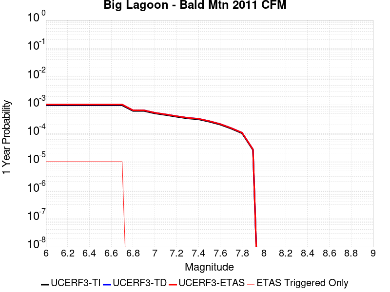 |  |

| Magnitude | 1 wk TI Prob | 1 wk TD Prob | 1 wk ETAS Prob | 1 wk ETAS/TD Gain | 1 wk ETAS Triggered Only | 1 mo TI Prob | 1 mo TD Prob | 1 mo ETAS Prob | 1 mo ETAS/TD Gain | 1 mo ETAS Triggered Only | 1 yr TI Prob | 1 yr TD Prob | 1 yr ETAS Prob | 1 yr ETAS/TD Gain | 1 yr ETAS Triggered Only | 10 yr TI Prob | 10 yr TD Prob | 10 yr ETAS Prob | 10 yr ETAS/TD Gain | 10 yr ETAS Triggered Only |
|-----|-----|-----|-----|-----|-----|-----|-----|-----|-----|-----|-----|-----|-----|-----|-----|-----|-----|-----|-----|-----|
| 6.0 | 1.8699735E-5 | 1.985018E-5 | 1.985018E-5 | 1.0 | 0.0 | 8.013926E-5 | 8.5069645E-5 | 8.5069645E-5 | 1.0 | 0.0 | 9.752587E-4 | 0.0010352687 | 0.0010452583 | 1.0096493 | 1.0E-5 | 0.009709897 | 0.010308274 | 0.010318171 | 1.0009601 | 1.0E-5 |
| 6.1 | 1.8699735E-5 | 1.985018E-5 | 1.985018E-5 | 1.0 | 0.0 | 8.013926E-5 | 8.5069645E-5 | 8.5069645E-5 | 1.0 | 0.0 | 9.752587E-4 | 0.0010352687 | 0.0010452583 | 1.0096493 | 1.0E-5 | 0.009709897 | 0.010308274 | 0.010318171 | 1.0009601 | 1.0E-5 |
| 6.2 | 1.8699735E-5 | 1.985018E-5 | 1.985018E-5 | 1.0 | 0.0 | 8.013926E-5 | 8.5069645E-5 | 8.5069645E-5 | 1.0 | 0.0 | 9.752587E-4 | 0.0010352687 | 0.0010452583 | 1.0096493 | 1.0E-5 | 0.009709897 | 0.010308274 | 0.010318171 | 1.0009601 | 1.0E-5 |
| 6.3 | 1.8699735E-5 | 1.985018E-5 | 1.985018E-5 | 1.0 | 0.0 | 8.013926E-5 | 8.5069645E-5 | 8.5069645E-5 | 1.0 | 0.0 | 9.752587E-4 | 0.0010352687 | 0.0010452583 | 1.0096493 | 1.0E-5 | 0.009709897 | 0.010308274 | 0.010318171 | 1.0009601 | 1.0E-5 |
| 6.4 | 1.8699735E-5 | 1.985018E-5 | 1.985018E-5 | 1.0 | 0.0 | 8.013926E-5 | 8.5069645E-5 | 8.5069645E-5 | 1.0 | 0.0 | 9.752587E-4 | 0.0010352687 | 0.0010452583 | 1.0096493 | 1.0E-5 | 0.009709897 | 0.010308274 | 0.010318171 | 1.0009601 | 1.0E-5 |
| 6.5 | 1.8699735E-5 | 1.985018E-5 | 1.985018E-5 | 1.0 | 0.0 | 8.013926E-5 | 8.5069645E-5 | 8.5069645E-5 | 1.0 | 0.0 | 9.752587E-4 | 0.0010352687 | 0.0010452583 | 1.0096493 | 1.0E-5 | 0.009709897 | 0.010308274 | 0.010318171 | 1.0009601 | 1.0E-5 |
| 6.6 | 1.8699735E-5 | 1.985018E-5 | 1.985018E-5 | 1.0 | 0.0 | 8.013926E-5 | 8.5069645E-5 | 8.5069645E-5 | 1.0 | 0.0 | 9.752587E-4 | 0.0010352687 | 0.0010452583 | 1.0096493 | 1.0E-5 | 0.009709897 | 0.010308274 | 0.010318171 | 1.0009601 | 1.0E-5 |
| 6.7 | 1.8699735E-5 | 1.985018E-5 | 1.985018E-5 | 1.0 | 0.0 | 8.013926E-5 | 8.5069645E-5 | 8.5069645E-5 | 1.0 | 0.0 | 9.752587E-4 | 0.0010352687 | 0.0010452583 | 1.0096493 | 1.0E-5 | 0.009709897 | 0.010308274 | 0.010318171 | 1.0009601 | 1.0E-5 |
| 6.8 | 1.18505095E-5 | 1.2499804E-5 | 1.2499804E-5 | 1.0 | 0.0 | 5.078691E-5 | 5.3569514E-5 | 5.3569514E-5 | 1.0 | 0.0 | 6.181552E-4 | 6.520185E-4 | 6.520185E-4 | 1.0 | 0.0 | 0.006164385 | 0.0065015587 | 0.0065015587 | 1.0 | 0.0 |
| 6.9 | 1.18505095E-5 | 1.2499804E-5 | 1.2499804E-5 | 1.0 | 0.0 | 5.078691E-5 | 5.3569514E-5 | 5.3569514E-5 | 1.0 | 0.0 | 6.181552E-4 | 6.520185E-4 | 6.520185E-4 | 1.0 | 0.0 | 0.006164385 | 0.0065015587 | 0.0065015587 | 1.0 | 0.0 |
| 7.0 | 9.719786E-6 | 1.0235487E-5 | 1.0235487E-5 | 1.0 | 0.0 | 4.1655563E-5 | 4.386565E-5 | 4.386565E-5 | 1.0 | 0.0 | 5.0703844E-4 | 5.3393573E-4 | 5.3393573E-4 | 1.0 | 0.0 | 0.005058831 | 0.0053267754 | 0.0053267754 | 1.0 | 0.0 |
| 7.1 | 8.523418E-6 | 8.969463E-6 | 8.969463E-6 | 1.0 | 0.0 | 3.652842E-5 | 3.844E-5 | 3.844E-5 | 1.0 | 0.0 | 4.4464276E-4 | 4.6790804E-4 | 4.6790804E-4 | 1.0 | 0.0 | 0.0044375416 | 0.004669392 | 0.004669392 | 1.0 | 0.0 |
| 7.2 | 7.378894E-6 | 7.761112E-6 | 7.761112E-6 | 1.0 | 0.0 | 3.162345E-5 | 3.326149E-5 | 3.326149E-5 | 1.0 | 0.0 | 3.8494746E-4 | 4.048843E-4 | 4.048843E-4 | 1.0 | 0.0 | 0.0038428132 | 0.0040415623 | 0.0040415623 | 1.0 | 0.0 |
| 7.3 | 6.4640294E-6 | 6.7924434E-6 | 6.7924434E-6 | 1.0 | 0.0 | 2.7702688E-5 | 2.9110151E-5 | 2.9110151E-5 | 1.0 | 0.0 | 3.3722803E-4 | 3.5435913E-4 | 3.5435913E-4 | 1.0 | 0.0 | 0.0033671674 | 0.0035380109 | 0.0035380109 | 1.0 | 0.0 |
| 7.4 | 5.9959093E-6 | 6.2988E-6 | 6.2988E-6 | 1.0 | 0.0 | 2.5696501E-5 | 2.6994581E-5 | 2.6994581E-5 | 1.0 | 0.0 | 3.1280998E-4 | 3.2861007E-4 | 3.2861007E-4 | 1.0 | 0.0 | 0.0031237002 | 0.0032813034 | 0.0032813034 | 1.0 | 0.0 |
| 7.5 | 4.929265E-6 | 5.176396E-6 | 5.176396E-6 | 1.0 | 0.0 | 2.112525E-5 | 2.2184367E-5 | 2.2184367E-5 | 1.0 | 0.0 | 2.5716957E-4 | 2.700616E-4 | 2.700616E-4 | 1.0 | 0.0 | 0.0025687215 | 0.002697375 | 0.002697375 | 1.0 | 0.0 |
| 7.6 | 3.8982403E-6 | 4.0889267E-6 | 4.0889267E-6 | 1.0 | 0.0 | 1.6706637E-5 | 1.7523857E-5 | 1.7523857E-5 | 1.0 | 0.0 | 2.0338432E-4 | 2.1333233E-4 | 2.1333233E-4 | 1.0 | 0.0 | 0.0020319829 | 0.002131303 | 0.002131303 | 1.0 | 0.0 |
| 7.7 | 2.820968E-6 | 2.9572116E-6 | 2.9572116E-6 | 1.0 | 0.0 | 1.2089806E-5 | 1.2673704E-5 | 1.2673704E-5 | 1.0 | 0.0 | 1.4718344E-4 | 1.5429159E-4 | 1.5429159E-4 | 1.0 | 0.0 | 0.00147086 | 0.0015418624 | 0.0015418624 | 1.0 | 0.0 |
| 7.8 | 1.9314455E-6 | 2.0260186E-6 | 2.0260186E-6 | 1.0 | 0.0 | 8.277597E-6 | 8.682909E-6 | 8.682909E-6 | 1.0 | 0.0 | 1.0077508E-4 | 1.0570941E-4 | 1.0570941E-4 | 1.0 | 0.0 | 0.0010072939 | 0.0010566041 | 0.0010566041 | 1.0 | 0.0 |
| 7.9 | 4.9586197E-7 | 5.2189216E-7 | 5.2189216E-7 | 1.0 | 0.0 | 2.125121E-6 | 2.2366787E-6 | 2.2366787E-6 | 1.0 | 0.0 | 2.5873042E-5 | 2.7231245E-5 | 2.7231245E-5 | 1.0 | 0.0 | 2.5870028E-4 | 2.7228118E-4 | 2.7228118E-4 | 1.0 | 0.0 |

## Sierra Madre (San Fernando)
*[(top)](#table-of-contents)*

| 1 Week | 1 Month | 1 Year | 10 Year |
|-----|-----|-----|-----|
|  |  |  |  |

| Magnitude | 1 wk TI Prob | 1 wk TD Prob | 1 wk ETAS Prob | 1 wk ETAS/TD Gain | 1 wk ETAS Triggered Only | 1 mo TI Prob | 1 mo TD Prob | 1 mo ETAS Prob | 1 mo ETAS/TD Gain | 1 mo ETAS Triggered Only | 1 yr TI Prob | 1 yr TD Prob | 1 yr ETAS Prob | 1 yr ETAS/TD Gain | 1 yr ETAS Triggered Only | 10 yr TI Prob | 10 yr TD Prob | 10 yr ETAS Prob | 10 yr ETAS/TD Gain | 10 yr ETAS Triggered Only |
|-----|-----|-----|-----|-----|-----|-----|-----|-----|-----|-----|-----|-----|-----|-----|-----|-----|-----|-----|-----|-----|
| 6.0 | 1.0346413E-5 | 6.2872605E-6 | 6.2872605E-6 | 1.0 | 0.0 | 4.4341014E-5 | 2.694513E-5 | 2.694513E-5 | 1.0 | 0.0 | 5.3971814E-4 | 3.280087E-4 | 3.380054E-4 | 1.030477 | 1.0E-5 | 0.0053840918 | 0.0032753581 | 0.0032853254 | 1.003043 | 1.0E-5 |
| 6.1 | 1.0346413E-5 | 6.2872605E-6 | 6.2872605E-6 | 1.0 | 0.0 | 4.4341014E-5 | 2.694513E-5 | 2.694513E-5 | 1.0 | 0.0 | 5.3971814E-4 | 3.280087E-4 | 3.380054E-4 | 1.030477 | 1.0E-5 | 0.0053840918 | 0.0032753581 | 0.0032853254 | 1.003043 | 1.0E-5 |
| 6.2 | 1.0346413E-5 | 6.2872605E-6 | 6.2872605E-6 | 1.0 | 0.0 | 4.4341014E-5 | 2.694513E-5 | 2.694513E-5 | 1.0 | 0.0 | 5.3971814E-4 | 3.280087E-4 | 3.380054E-4 | 1.030477 | 1.0E-5 | 0.0053840918 | 0.0032753581 | 0.0032853254 | 1.003043 | 1.0E-5 |
| 6.3 | 1.0346413E-5 | 6.2872605E-6 | 6.2872605E-6 | 1.0 | 0.0 | 4.4341014E-5 | 2.694513E-5 | 2.694513E-5 | 1.0 | 0.0 | 5.3971814E-4 | 3.280087E-4 | 3.380054E-4 | 1.030477 | 1.0E-5 | 0.0053840918 | 0.0032753581 | 0.0032853254 | 1.003043 | 1.0E-5 |
| 6.4 | 1.0249558E-5 | 6.2872605E-6 | 6.2872605E-6 | 1.0 | 0.0 | 4.392594E-5 | 2.694513E-5 | 2.694513E-5 | 1.0 | 0.0 | 5.3466705E-4 | 3.280087E-4 | 3.380054E-4 | 1.030477 | 1.0E-5 | 0.0053338245 | 0.0032753581 | 0.0032853254 | 1.003043 | 1.0E-5 |
| 6.5 | 1.0249558E-5 | 6.2872605E-6 | 6.2872605E-6 | 1.0 | 0.0 | 4.392594E-5 | 2.694513E-5 | 2.694513E-5 | 1.0 | 0.0 | 5.3466705E-4 | 3.280087E-4 | 3.380054E-4 | 1.030477 | 1.0E-5 | 0.0053338245 | 0.0032753581 | 0.0032853254 | 1.003043 | 1.0E-5 |
| 6.6 | 9.9035515E-6 | 6.2872605E-6 | 6.2872605E-6 | 1.0 | 0.0 | 4.2443102E-5 | 2.694513E-5 | 2.694513E-5 | 1.0 | 0.0 | 5.166222E-4 | 3.280087E-4 | 3.380054E-4 | 1.030477 | 1.0E-5 | 0.0051542283 | 0.0032753581 | 0.0032853254 | 1.003043 | 1.0E-5 |
| 6.7 | 9.87217E-6 | 6.2746817E-6 | 6.2746817E-6 | 1.0 | 0.0 | 4.2308613E-5 | 2.689122E-5 | 2.689122E-5 | 1.0 | 0.0 | 5.149856E-4 | 3.2735255E-4 | 3.3734928E-4 | 1.0305381 | 1.0E-5 | 0.005137938 | 0.0032688158 | 0.0032787833 | 1.0030493 | 1.0E-5 |
| 6.8 | 9.4359175E-6 | 6.1786586E-6 | 6.1786586E-6 | 1.0 | 0.0 | 4.043902E-5 | 2.6479704E-5 | 2.6479704E-5 | 1.0 | 0.0 | 4.9223384E-4 | 3.2234378E-4 | 3.3234057E-4 | 1.0310128 | 1.0E-5 | 0.0049114493 | 0.0032188739 | 0.0032288418 | 1.0030967 | 1.0E-5 |
| 6.9 | 8.700447E-6 | 6.039922E-6 | 6.039922E-6 | 1.0 | 0.0 | 3.72871E-5 | 2.5885129E-5 | 2.5885129E-5 | 1.0 | 0.0 | 4.5387587E-4 | 3.1510694E-4 | 3.2510379E-4 | 1.0317253 | 1.0E-5 | 0.0045295 | 0.003146711 | 0.0031566794 | 1.0031679 | 1.0E-5 |
| 7.0 | 8.648878E-6 | 6.0148373E-6 | 6.0148373E-6 | 1.0 | 0.0 | 3.7066096E-5 | 2.5777625E-5 | 2.5777625E-5 | 1.0 | 0.0 | 4.5118626E-4 | 3.1379846E-4 | 3.2379534E-4 | 1.0318576 | 1.0E-5 | 0.004502713 | 0.003133663 | 0.0031436319 | 1.0031811 | 1.0E-5 |
| 7.1 | 8.505786E-6 | 5.9244676E-6 | 5.9244676E-6 | 1.0 | 0.0 | 3.645286E-5 | 2.5390334E-5 | 2.5390334E-5 | 1.0 | 0.0 | 4.437232E-4 | 3.0908454E-4 | 3.1908145E-4 | 1.0323436 | 1.0E-5 | 0.0044283825 | 0.0030866556 | 0.0030966247 | 1.0032297 | 1.0E-5 |
| 7.2 | 8.139752E-6 | 5.6987624E-6 | 5.6987624E-6 | 1.0 | 0.0 | 3.4884186E-5 | 2.4423045E-5 | 2.4423045E-5 | 1.0 | 0.0 | 4.246322E-4 | 2.9731105E-4 | 3.0730807E-4 | 1.0336248 | 1.0E-5 | 0.004238217 | 0.0029692391 | 0.0029792094 | 1.0033579 | 1.0E-5 |
| 7.3 | 7.8816E-6 | 5.552077E-6 | 5.552077E-6 | 1.0 | 0.0 | 3.3777847E-5 | 2.3794404E-5 | 2.3794404E-5 | 1.0 | 0.0 | 4.111677E-4 | 2.896594E-4 | 2.996565E-4 | 1.0345134 | 1.0E-5 | 0.004104078 | 0.0028929242 | 0.0029028952 | 1.0034467 | 1.0E-5 |
| 7.4 | 7.5810603E-6 | 5.3563126E-6 | 5.3563126E-6 | 1.0 | 0.0 | 3.2489854E-5 | 2.2955428E-5 | 2.2955428E-5 | 1.0 | 0.0 | 3.9549218E-4 | 2.7944756E-4 | 2.8944475E-4 | 1.035775 | 1.0E-5 | 0.0039478904 | 0.0027910667 | 0.0028010388 | 1.0035728 | 1.0E-5 |
| 7.5 | 6.349153E-6 | 4.407576E-6 | 4.407576E-6 | 1.0 | 0.0 | 2.7210372E-5 | 1.888948E-5 | 1.888948E-5 | 1.0 | 0.0 | 3.312359E-4 | 2.2995596E-4 | 2.3995366E-4 | 1.0434766 | 1.0E-5 | 0.0033074263 | 0.0022972622 | 0.0023072392 | 1.004343 | 1.0E-5 |
| 7.6 | 4.430576E-6 | 2.8905868E-6 | 2.8905868E-6 | 1.0 | 0.0 | 1.8988047E-5 | 1.2388171E-5 | 1.2388171E-5 | 1.0 | 0.0 | 2.3115493E-4 | 1.5081577E-4 | 1.6081426E-4 | 1.0662961 | 1.0E-5 | 0.0023091463 | 0.0015071568 | 0.0015171417 | 1.006625 | 1.0E-5 |
| 7.7 | 3.005066E-6 | 1.7510115E-6 | 1.7510115E-6 | 1.0 | 0.0 | 1.2878791E-5 | 7.504313E-6 | 7.504313E-6 | 1.0 | 0.0 | 1.56788E-4 | 9.1361195E-5 | 9.1361195E-5 | 1.0 | 0.0 | 0.0015667742 | 9.132375E-4 | 9.132375E-4 | 1.0 | 0.0 |
| 7.8 | 1.8459098E-6 | 1.0582091E-6 | 1.0582091E-6 | 1.0 | 0.0 | 7.911018E-6 | 4.535174E-6 | 4.535174E-6 | 1.0 | 0.0 | 9.631238E-5 | 5.5214347E-5 | 5.5214347E-5 | 1.0 | 0.0 | 9.627065E-4 | 5.5200676E-4 | 5.5200676E-4 | 1.0 | 0.0 |
| 7.9 | 9.839262E-7 | 5.23421E-7 | 5.23421E-7 | 1.0 | 0.0 | 4.2168194E-6 | 2.2432312E-6 | 2.2432312E-6 | 1.0 | 0.0 | 5.1338568E-5 | 2.7310998E-5 | 2.7310998E-5 | 1.0 | 0.0 | 5.132671E-4 | 2.730767E-4 | 2.730767E-4 | 1.0 | 0.0 |
| 8.0 | 1.210983E-7 | 6.613821E-8 | 6.613821E-8 | 1.0 | 0.0 | 5.1899264E-7 | 2.8344945E-7 | 2.8344945E-7 | 1.0 | 0.0 | 6.3187167E-6 | 3.4509917E-6 | 3.4509917E-6 | 1.0 | 0.0 | 6.318537E-5 | 3.45094E-5 | 3.45094E-5 | 1.0 | 0.0 |

