# Parent Section Magnitude-Probability Distributions

Only fault sections with at least one triggered aftershock are plotted. Sections are sorted by total supraseismogenic trigger rate (decreasing)

## Table Of Contents

* [Tank Canyon](#tank-canyon)
* [Garlock (Central)](#garlock-central)
* [Little Lake](#little-lake)
* [Owl Lake](#owl-lake)
* [Airport Lake](#airport-lake)
* [Panamint Valley](#panamint-valley)
* [Garlock (East)](#garlock-east)
* [Blackwater](#blackwater)
* [Hunter Mountain-Saline Valley](#hunter-mountain-saline-valley)
* [Gravel Hills-Harper Lk](#gravel-hills-harper-lk)
* [Ash Hill](#ash-hill)
* [Garlock (West)](#garlock-west)
* [McLean Lake](#mclean-lake)
* [Goldstone Lake](#goldstone-lake)
* [So Sierra Nevada](#so-sierra-nevada)
* [Lenwood-Lockhart-Old Woman Springs](#lenwood-lockhart-old-woman-springs)
* [Coyote Canyon](#coyote-canyon)
* [San Andreas (Mojave S)](#san-andreas-mojave-s)
* [Death Valley (So)](#death-valley-so)
* [San Andreas (Mojave N)](#san-andreas-mojave-n)
* [Nelson Lake](#nelson-lake)
* [Towne Pass](#towne-pass)
* [Bicycle Lake](#bicycle-lake)
* [San Andreas (San Bernardino N)](#san-andreas-san-bernardino-n)
* [Paradise](#paradise)
* [Helendale-So Lockhart](#helendale-so-lockhart)
* [Garlic Springs](#garlic-springs)
* [San Andreas (San Bernardino S)](#san-andreas-san-bernardino-s)
* [San Andreas (Big Bend)](#san-andreas-big-bend)
* [Death Valley (Black Mtns Frontal)](#death-valley-black-mtns-frontal)
* [Coyote Lake](#coyote-lake)
* [Red Pass](#red-pass)
* [San Andreas (Parkfield)](#san-andreas-parkfield)
* [Elsinore (Glen Ivy) rev](#elsinore-glen-ivy-rev)
* [San Andreas (San Gorgonio Pass-Garnet HIll)](#san-andreas-san-gorgonio-pass-garnet-hill)
* [Baker](#baker)
* [San Andreas (Carrizo) rev](#san-andreas-carrizo-rev)
* [Deep Springs](#deep-springs)
* [Ludlow](#ludlow)
* [Calico-Hidalgo](#calico-hidalgo)
* [Santa Rosa Island](#santa-rosa-island)
* [Cleghorn Lake](#cleghorn-lake)
* [San Andreas (North Branch Mill Creek)](#san-andreas-north-branch-mill-creek)
* [San Andreas (Creeping Section) 2011 CFM](#san-andreas-creeping-section-2011-cfm)
* [Cleghorn Pass](#cleghorn-pass)
* [Cady](#cady)
* [San Andreas (Cholame) rev](#san-andreas-cholame-rev)
* [Scodie Lineament](#scodie-lineament)
* [San Andreas (Coachella) rev](#san-andreas-coachella-rev)
* [San Jacinto (Clark) rev](#san-jacinto-clark-rev)
* [Lost Hills](#lost-hills)
* [Blue Cut](#blue-cut)
* [Manix-Afton Hills](#manix-afton-hills)
* [San Jacinto (San Jacinto Valley) rev](#san-jacinto-san-jacinto-valley-rev)
* [San Jacinto (Stepovers Combined)](#san-jacinto-stepovers-combined)
* [Sierra Nevada  (No Extension)](#sierra-nevada--no-extension)
* [San Jacinto (San Bernardino)](#san-jacinto-san-bernardino)
* [Brawley (Seismic Zone) alt 1](#brawley-seismic-zone-alt-1)
* [Cleghorn](#cleghorn)
* [Death Valley (Fish Lake Valley)](#death-valley-fish-lake-valley)
* [Death Valley (No)](#death-valley-no)
* [White Wolf (Extension)](#white-wolf-extension)
* [San Jacinto (Anza) rev](#san-jacinto-anza-rev)
* [Mono Lake 2011 CFM](#mono-lake-2011-cfm)
* [Imperial](#imperial)
* [Red Mountain](#red-mountain)
* [Owens Valley](#owens-valley)
* [San Pedro Basin](#san-pedro-basin)
* [Mission Ridge-Arroyo Parida-Santa Ana](#mission-ridge-arroyo-parida-santa-ana)
* [Lake Isabella (Seismicity)](#lake-isabella-seismicity)
* [Santa Cruz Island](#santa-cruz-island)
* [Independence rev 2011](#independence-rev-2011)
* [Bullion Mountains](#bullion-mountains)
* [Kern Canyon (North Kern) 2011](#kern-canyon-north-kern-2011)
* [San Jacinto (Superstition Mtn)](#san-jacinto-superstition-mtn)
* [Santa Ynez (West)](#santa-ynez-west)
* [Pinto Mtn](#pinto-mtn)
* [Camp Rock 2011](#camp-rock-2011)
* [Tin Mountain](#tin-mountain)
* [Whittier alt 1](#whittier-alt-1)
* [North Frontal  (West)](#north-frontal--west)
* [North Frontal  (East)](#north-frontal--east)
* [Elysian Park (Upper)](#elysian-park-upper)
* [Palos Verdes](#palos-verdes)
* [Ortigalita (North)](#ortigalita-north)
* [Great Valley 07 (Orestimba)](#great-valley-07-orestimba)
* [Big Pine (East)](#big-pine-east)
* [Chino alt 1](#chino-alt-1)
* [San Diego Trough north alt1](#san-diego-trough-north-alt1)
* [Concord 2011 CFM](#concord-2011-cfm)
* [Pleito](#pleito)
* [Kern Canyon (Lake Isabella) 2011](#kern-canyon-lake-isabella-2011)
* [Mission Creek](#mission-creek)
* [Green Valley 2011 CFM](#green-valley-2011-cfm)
* [Kern Canyon (South Kern) 2011](#kern-canyon-south-kern-2011)
* [Oceanic - West Huasna](#oceanic---west-huasna)
* [Elsinore (Temecula) rev](#elsinore-temecula-rev)
* [Great Valley 09 (Laguna Seca)](#great-valley-09-laguna-seca)
* [Big Pine (Central)](#big-pine-central)
* [Dry Mountain](#dry-mountain)
* [Hunting Creek - Bartlett Springs connector 2011](#hunting-creek---bartlett-springs-connector-2011)
* [San Diego Trough south](#san-diego-trough-south)
* [Sierra Madre](#sierra-madre)
* [Clamshell-Sawpit](#clamshell-sawpit)
* [Fontana (Seismicity)](#fontana-seismicity)
* [Pitas Point (Lower)-Montalvo](#pitas-point-lower-montalvo)
* [South Cuyama](#south-cuyama)
* [Emerson-Copper Mtn 2011](#emerson-copper-mtn-2011)
* [Hunting Creek - Berryessa 2011 CFM](#hunting-creek---berryessa-2011-cfm)
* [Santa Ynez (East)](#santa-ynez-east)
* [Simi-Santa Rosa](#simi-santa-rosa)
* [Pine Mtn](#pine-mtn)
* [San Jacinto (Lytle Creek connector)](#san-jacinto-lytle-creek-connector)
* [Santa Susana East (connector)](#santa-susana-east-connector)
* [Superstition Hills](#superstition-hills)
* [Pisgah-Bullion Mtn-Mesquite Lk](#pisgah-bullion-mtn-mesquite-lk)
* [Homestead Valley 2011](#homestead-valley-2011)
* [Santa Susana alt 1](#santa-susana-alt-1)
* [Santa Cruz Catalina Ridge alt1](#santa-cruz-catalina-ridge-alt1)
* [Hosgri (Extension)](#hosgri-extension)
* [Cerro Prieto](#cerro-prieto)
* [Hartley Springs 2011 CFM](#hartley-springs-2011-cfm)
* [Laguna Salada](#laguna-salada)
* [Hosgri](#hosgri)
* [San Andreas (Santa Cruz Mts) 2011 CFM](#san-andreas-santa-cruz-mts-2011-cfm)
* [Newport-Inglewood alt 1](#newport-inglewood-alt-1)
* [Calaveras (So) - Paicines extension 2011 CFM](#calaveras-so---paicines-extension-2011-cfm)
* [Coronado Bank alt1](#coronado-bank-alt1)
* [Pitas Point (Lower West)](#pitas-point-lower-west)
* [Channel Islands Thrust](#channel-islands-thrust)
* [San Luis Range 2011 CFM](#san-luis-range-2011-cfm)
* [Eaton Roughs 2011 CFM](#eaton-roughs-2011-cfm)
* [San Clemente](#san-clemente)
* [Bartlett Springs 2011 CFM](#bartlett-springs-2011-cfm)
* [Cucamonga](#cucamonga)
* [Calaveras (So) 2011 CFM](#calaveras-so-2011-cfm)
* [Redondo Canyon alt 1](#redondo-canyon-alt-1)
* [Santa Ynez River](#santa-ynez-river)
* [Rose Canyon](#rose-canyon)
* [San Gabriel](#san-gabriel)
* [Calaveras (Central) 2011 CFM](#calaveras-central-2011-cfm)
* [Oak Ridge (Onshore)](#oak-ridge-onshore)
* [Newport-Inglewood (Offshore)](#newport-inglewood-offshore)
* [Sierra Madre (San Fernando)](#sierra-madre-san-fernando)
* [Great Valley 03a Dunnigan Hills](#great-valley-03a-dunnigan-hills)
* [Elsinore (Coyote Mountains)](#elsinore-coyote-mountains)
* [White Wolf](#white-wolf)
* [Los Osos 2011](#los-osos-2011)
* [Great Valley 04b Gordon Valley](#great-valley-04b-gordon-valley)

## Tank Canyon
*[(top)](#table-of-contents)*

| 1 Week | 1 Month | 1 Year | 10 Year |
|-----|-----|-----|-----|
|  |  |  |  |

| Magnitude | 1 wk TI Prob | 1 wk TD Prob | 1 wk ETAS Prob | 1 wk ETAS/TD Gain | 1 wk ETAS Triggered Only | 1 mo TI Prob | 1 mo TD Prob | 1 mo ETAS Prob | 1 mo ETAS/TD Gain | 1 mo ETAS Triggered Only | 1 yr TI Prob | 1 yr TD Prob | 1 yr ETAS Prob | 1 yr ETAS/TD Gain | 1 yr ETAS Triggered Only | 10 yr TI Prob | 10 yr TD Prob | 10 yr ETAS Prob | 10 yr ETAS/TD Gain | 10 yr ETAS Triggered Only |
|-----|-----|-----|-----|-----|-----|-----|-----|-----|-----|-----|-----|-----|-----|-----|-----|-----|-----|-----|-----|-----|
| 6.0 | 4.8284557E-5 | 5.7964822E-5 | 0.033082 | 570.72546 | 0.03302595 | 2.0691741E-4 | 2.4840087E-4 | 0.046516124 | 187.26233 | 0.046279218 | 0.0025163088 | 0.0030207601 | 0.07460314 | 24.696812 | 0.07179927 | 0.02488006 | 0.029863637 | 0.12257064 | 4.1043444 | 0.0955608 |
| 6.1 | 1.7796336E-5 | 2.0873314E-5 | 0.01091492 | 522.9126 | 0.010894274 | 7.626778E-5 | 8.945422E-5 | 0.015357228 | 171.67696 | 0.01526914 | 9.281647E-4 | 0.0010885983 | 0.026709402 | 24.535591 | 0.025648724 | 0.009242975 | 0.010836744 | 0.04609279 | 4.25338 | 0.03564229 |
| 6.2 | 1.7796336E-5 | 2.0873314E-5 | 0.01091492 | 522.9126 | 0.010894274 | 7.626778E-5 | 8.945422E-5 | 0.015357228 | 171.67696 | 0.01526914 | 9.281647E-4 | 0.0010885983 | 0.026709402 | 24.535591 | 0.025648724 | 0.009242975 | 0.010836744 | 0.04609279 | 4.25338 | 0.03564229 |
| 6.3 | 1.3515912E-5 | 1.5759564E-5 | 0.00803622 | 509.92657 | 0.008020587 | 5.792405E-5 | 6.753938E-5 | 0.01113263 | 164.83168 | 0.011065837 | 7.049971E-4 | 8.2200574E-4 | 0.019378474 | 23.574621 | 0.018571734 | 0.007027647 | 0.0081922645 | 0.03350325 | 4.08962 | 0.02552005 |
| 6.4 | 1.0870146E-5 | 1.2618021E-5 | 0.00593148 | 470.08005 | 0.0059189363 | 4.658551E-5 | 5.4076212E-5 | 0.00837445 | 154.86383 | 0.008320823 | 5.67031E-4 | 6.581969E-4 | 0.014459958 | 21.969046 | 0.013810852 | 0.005655863 | 0.0065644905 | 0.025440404 | 3.8754575 | 0.019000644 |
| 6.5 | 7.964826E-6 | 9.196094E-6 | 0.0035262129 | 383.4468 | 0.0035170491 | 3.4134522E-5 | 3.9411298E-5 | 0.0052289986 | 132.67766 | 0.005189792 | 4.1550855E-4 | 4.7973756E-4 | 0.008753699 | 18.24685 | 0.008277933 | 0.0041473247 | 0.004788321 | 0.016185341 | 3.3801703 | 0.011451855 |
| 6.6 | 6.6317E-6 | 7.6122988E-6 | 0.0027526054 | 361.59976 | 0.002745014 | 2.8421264E-5 | 3.2623782E-5 | 0.0039784526 | 121.94946 | 0.0039459574 | 3.4597394E-4 | 3.9713128E-4 | 0.006828203 | 17.193817 | 0.0064336266 | 0.0034543579 | 0.003965368 | 0.012851287 | 3.2408814 | 0.008921295 |
| 6.7 | 4.793663E-6 | 5.4307857E-6 | 0.0013779303 | 253.72577 | 0.001372507 | 2.0544108E-5 | 2.3274613E-5 | 0.0019104278 | 82.08205 | 0.0018871971 | 2.500958E-4 | 2.8333595E-4 | 0.0034134802 | 12.047467 | 0.0031310315 | 0.0024981452 | 0.0028304397 | 0.0073640007 | 2.601716 | 0.0045464295 |
| 6.8 | 4.382823E-6 | 4.9692567E-6 | 0.0012059069 | 242.6735 | 0.0012009436 | 1.8783392E-5 | 2.1296666E-5 | 0.0016940039 | 79.54315 | 0.0016727429 | 2.286638E-4 | 2.5926033E-4 | 0.003089322 | 11.915908 | 0.0028307957 | 0.0022842865 | 0.002590253 | 0.006568769 | 2.5359566 | 0.0039888485 |
| 6.9 | 2.729601E-6 | 3.0735416E-6 | 6.893249E-4 | 224.27707 | 6.862535E-4 | 1.1698237E-5 | 1.3172262E-5 | 8.709778E-4 | 66.122116 | 8.5781683E-4 | 1.4241673E-4 | 1.6036171E-4 | 0.0014039967 | 8.755186 | 0.0012438344 | 0.001423255 | 0.0016026258 | 0.0034867984 | 2.1756785 | 0.0018871971 |
| 7.0 | 1.8987357E-6 | 2.126939E-6 | 2.5947145E-4 | 121.9929 | 2.5734506E-4 | 8.137413E-6 | 9.115425E-6 | 3.5223903E-4 | 38.642086 | 3.4312674E-4 | 9.90685E-5 | 1.1097535E-4 | 7.113805E-4 | 6.410257 | 6.004718E-4 | 9.902435E-4 | 0.0011092679 | 0.0019661332 | 1.7724601 | 8.5781683E-4 |
| 7.1 | 1.4928986E-6 | 1.6641272E-6 | 1.3033644E-4 | 78.321205 | 1.2867253E-4 | 6.398121E-6 | 7.1319573E-6 | 1.786941E-4 | 25.055408 | 1.7156337E-4 | 7.789434E-5 | 8.682871E-5 | 4.2992565E-4 | 4.9514227 | 3.4312674E-4 | 7.786704E-4 | 8.6800574E-4 | 0.0014251027 | 1.6418126 | 5.5758096E-4 |
| 7.2 | 1.069082E-6 | 1.1828573E-6 | 1.1828573E-6 | 1.0 | 0.0 | 4.581772E-6 | 5.0693816E-6 | 4.7960006E-5 | 9.460722 | 4.2890842E-5 | 5.5781646E-5 | 6.171851E-5 | 2.3327129E-4 | 3.7796004 | 1.7156337E-4 | 5.576765E-4 | 6.170659E-4 | 7.885234E-4 | 1.2778593 | 1.7156337E-4 |
| 7.3 | 8.776551E-7 | 9.770005E-7 | 9.770005E-7 | 1.0 | 0.0 | 3.7613736E-6 | 4.1871413E-6 | 4.7077803E-5 | 11.243424 | 4.2890842E-5 | 4.579376E-5 | 5.097777E-5 | 1.7964374E-4 | 3.5239623 | 1.2867253E-4 | 4.5784327E-4 | 5.097118E-4 | 6.383187E-4 | 1.252313 | 1.2867253E-4 |
| 7.4 | 7.55721E-7 | 8.510244E-7 | 8.510244E-7 | 1.0 | 0.0 | 3.2388E-6 | 3.6472454E-6 | 4.653793E-5 | 12.7597475 | 4.2890842E-5 | 3.9431678E-5 | 4.4404827E-5 | 1.7307165E-4 | 3.8975863 | 1.2867253E-4 | 3.942468E-4 | 4.440104E-4 | 5.726258E-4 | 1.2896675 | 1.2867253E-4 |
| 7.5 | 5.587665E-7 | 6.305619E-7 | 6.305619E-7 | 1.0 | 0.0 | 2.3947114E-6 | 2.702408E-6 | 4.5593137E-5 | 16.8713 | 4.2890842E-5 | 2.915522E-5 | 3.290182E-5 | 1.6157012E-4 | 4.910674 | 1.2867253E-4 | 2.9151395E-4 | 3.290182E-4 | 4.576484E-4 | 1.3909516 | 1.2867253E-4 |

## Garlock (Central)
*[(top)](#table-of-contents)*

| 1 Week | 1 Month | 1 Year | 10 Year |
|-----|-----|-----|-----|
|  |  |  |  |

| Magnitude | 1 wk TI Prob | 1 wk TD Prob | 1 wk ETAS Prob | 1 wk ETAS/TD Gain | 1 wk ETAS Triggered Only | 1 mo TI Prob | 1 mo TD Prob | 1 mo ETAS Prob | 1 mo ETAS/TD Gain | 1 mo ETAS Triggered Only | 1 yr TI Prob | 1 yr TD Prob | 1 yr ETAS Prob | 1 yr ETAS/TD Gain | 1 yr ETAS Triggered Only | 10 yr TI Prob | 10 yr TD Prob | 10 yr ETAS Prob | 10 yr ETAS/TD Gain | 10 yr ETAS Triggered Only |
|-----|-----|-----|-----|-----|-----|-----|-----|-----|-----|-----|-----|-----|-----|-----|-----|-----|-----|-----|-----|-----|
| 6.0 | 5.5131142E-5 | 7.024681E-5 | 0.041628554 | 592.6042 | 0.041561227 | 2.3625491E-4 | 3.010234E-4 | 0.053598292 | 178.05359 | 0.05331332 | 0.0028726095 | 0.0036588663 | 0.079767965 | 21.801277 | 0.07638859 | 0.028357591 | 0.036079824 | 0.13129355 | 3.6389742 | 0.098777615 |
| 6.1 | 5.5131142E-5 | 7.024681E-5 | 0.041628554 | 592.6042 | 0.041561227 | 2.3625491E-4 | 3.010234E-4 | 0.053598292 | 178.05359 | 0.05331332 | 0.0028726095 | 0.0036588663 | 0.079767965 | 21.801277 | 0.07638859 | 0.028357591 | 0.036079824 | 0.13129355 | 3.6389742 | 0.098777615 |
| 6.2 | 4.216245E-5 | 5.1661493E-5 | 0.027457494 | 531.4886 | 0.02740725 | 1.806837E-4 | 2.2138779E-4 | 0.035727143 | 161.37811 | 0.035513617 | 0.0021976046 | 0.0026920962 | 0.053509243 | 19.876423 | 0.05095432 | 0.021759989 | 0.026689773 | 0.09118749 | 3.4165704 | 0.06626635 |
| 6.3 | 4.216245E-5 | 5.1661493E-5 | 0.027457494 | 531.4886 | 0.02740725 | 1.806837E-4 | 2.2138779E-4 | 0.035727143 | 161.37811 | 0.035513617 | 0.0021976046 | 0.0026920962 | 0.053509243 | 19.876423 | 0.05095432 | 0.021759989 | 0.026689773 | 0.09118749 | 3.4165704 | 0.06626635 |
| 6.4 | 3.6858168E-5 | 4.411054E-5 | 0.02217481 | 502.71 | 0.022131674 | 1.5795401E-4 | 1.8903162E-4 | 0.028663168 | 151.6316 | 0.02847952 | 0.0019213937 | 0.002299056 | 0.04350798 | 18.92428 | 0.04130388 | 0.019048655 | 0.02284894 | 0.07548895 | 3.303827 | 0.053870898 |
| 6.5 | 3.39199E-5 | 4.0018083E-5 | 0.020197907 | 504.7195 | 0.020158697 | 1.453629E-4 | 1.7149492E-4 | 0.026116004 | 152.28442 | 0.02594896 | 0.0017683565 | 0.002085973 | 0.039751183 | 19.056421 | 0.03774394 | 0.017543508 | 0.020759864 | 0.06864036 | 3.3063974 | 0.04889556 |
| 6.6 | 3.3571985E-5 | 3.9472274E-5 | 0.020111594 | 509.51193 | 0.020072915 | 1.4387199E-4 | 1.6915603E-4 | 0.025942191 | 153.3625 | 0.025777396 | 0.0017502342 | 0.0020575512 | 0.039509818 | 19.20235 | 0.037529487 | 0.017365133 | 0.020481179 | 0.06812323 | 3.326138 | 0.048638217 |
| 6.7 | 3.2580007E-5 | 3.8088703E-5 | 0.019209566 | 504.33762 | 0.019172207 | 1.3962112E-4 | 1.632272E-4 | 0.02452125 | 150.22772 | 0.024361998 | 0.0016985617 | 0.0019855013 | 0.037471414 | 18.87252 | 0.03555651 | 0.016856372 | 0.019773813 | 0.065137915 | 3.2941504 | 0.046279218 |
| 6.8 | 3.2185937E-5 | 3.7515918E-5 | 0.018994557 | 506.30658 | 0.018957753 | 1.3793244E-4 | 1.6077272E-4 | 0.024218667 | 150.63916 | 0.024061764 | 0.0016780337 | 0.001955672 | 0.036971767 | 18.904892 | 0.03508471 | 0.016654192 | 0.019480614 | 0.0641854 | 3.2948346 | 0.045592967 |
| 6.9 | 3.165394E-5 | 3.6720503E-5 | 0.018393327 | 500.90073 | 0.01835728 | 1.3565269E-4 | 1.5736422E-4 | 0.023400543 | 148.70308 | 0.023246836 | 0.0016503202 | 0.001914247 | 0.035861578 | 18.734037 | 0.034012437 | 0.01638118 | 0.019073246 | 0.062492352 | 3.2764401 | 0.044263348 |
| 7.0 | 3.0903822E-5 | 3.5625766E-5 | 0.017834691 | 500.61215 | 0.0177997 | 1.3243823E-4 | 1.5267303E-4 | 0.022752697 | 149.02892 | 0.022603475 | 0.0016112428 | 0.0018572307 | 0.034950275 | 18.81849 | 0.03315462 | 0.015996104 | 0.018512413 | 0.06065134 | 3.2762525 | 0.042933732 |
| 7.1 | 3.0069863E-5 | 3.4392073E-5 | 0.017275918 | 502.3227 | 0.017242119 | 1.2886449E-4 | 1.4738638E-4 | 0.021932723 | 148.81105 | 0.021788549 | 0.0015677959 | 0.0017929734 | 0.033774987 | 18.837418 | 0.03203946 | 0.01556781 | 0.017880075 | 0.058824554 | 3.2899501 | 0.0416899 |
| 7.2 | 2.7957109E-5 | 3.128145E-5 | 0.014956828 | 478.13724 | 0.014926014 | 1.1981068E-4 | 1.340566E-4 | 0.018917728 | 141.11748 | 0.01878619 | 0.0014577188 | 0.0016309366 | 0.029250411 | 17.934732 | 0.027664594 | 0.014481937 | 0.016283695 | 0.051978484 | 3.1920571 | 0.036285654 |
| 7.3 | 2.4519275E-5 | 2.6714795E-5 | 0.01070625 | 400.76105 | 0.01067982 | 1.0507837E-4 | 1.1448703E-4 | 0.013537784 | 118.24731 | 0.013424834 | 0.0012785783 | 0.001393003 | 0.021095308 | 15.143762 | 0.019729787 | 0.012712469 | 0.013928054 | 0.03921954 | 2.8158667 | 0.025648724 |
| 7.4 | 2.3225532E-5 | 2.51994E-5 | 0.009889845 | 392.4635 | 0.009864894 | 9.95342E-5 | 1.0799304E-4 | 0.012587881 | 116.56196 | 0.012481235 | 0.0012111551 | 0.0013140367 | 0.01960436 | 14.9191885 | 0.01831439 | 0.012045753 | 0.013145725 | 0.036552563 | 2.7805665 | 0.023718636 |
| 7.5 | 2.097765E-5 | 2.2483688E-5 | 0.007571102 | 336.73755 | 0.0075487886 | 8.9901114E-5 | 9.635517E-5 | 0.009531432 | 98.91977 | 0.009435985 | 0.0010939965 | 0.0011725046 | 0.015138525 | 12.91127 | 0.013982415 | 0.010886264 | 0.011740365 | 0.030051675 | 2.559688 | 0.018528843 |
| 7.6 | 1.511254E-5 | 1.5991332E-5 | 0.004305007 | 269.20877 | 0.004289084 | 6.476642E-5 | 6.853253E-5 | 0.0053866324 | 78.59965 | 0.0053184647 | 7.882459E-4 | 8.3407195E-4 | 0.008633695 | 10.351259 | 0.0078061335 | 0.007854558 | 0.008383559 | 0.018718656 | 2.2327816 | 0.010422475 |
| 7.7 | 9.934069E-6 | 1.0678794E-5 | 0.0015118422 | 141.57426 | 0.0015011795 | 4.2573887E-5 | 4.5765457E-5 | 0.0018470985 | 40.3601 | 0.0018014153 | 5.182138E-4 | 5.570524E-4 | 0.0030433354 | 5.4632845 | 0.0024876688 | 0.00517007 | 0.005627684 | 0.008655796 | 1.5380744 | 0.0030452497 |
| 7.8 | 6.7562896E-6 | 8.428449E-6 | 8.233476E-4 | 97.68673 | 8.14926E-4 | 2.8955206E-5 | 3.6121426E-5 | 0.0010654645 | 29.496746 | 0.0010293802 | 3.5247262E-4 | 4.3968976E-4 | 0.0020259533 | 4.607688 | 0.0015869612 | 0.0035191406 | 0.004446654 | 0.00636816 | 1.4321239 | 0.0019300879 |
| 7.9 | 3.975453E-6 | 5.37103E-6 | 2.6271472E-4 | 48.91328 | 2.5734506E-4 | 1.7037546E-5 | 2.3018498E-5 | 4.090272E-4 | 17.769499 | 3.8601758E-4 | 2.0741238E-4 | 2.8021427E-4 | 9.233966E-4 | 3.2953234 | 6.4336264E-4 | 0.002072189 | 0.0028336283 | 0.003774553 | 1.3320565 | 9.4359857E-4 |
| 8.0 | 1.6729537E-6 | 2.0775144E-6 | 4.4968267E-5 | 21.645226 | 4.2890842E-5 | 7.169782E-6 | 8.903603E-6 | 5.1794064E-5 | 5.817203 | 4.2890842E-5 | 8.7288594E-5 | 1.0839601E-4 | 2.7994078E-4 | 2.5825746 | 1.7156337E-4 | 8.7254314E-4 | 0.0010969337 | 0.0013968403 | 1.2734045 | 3.002359E-4 |
| 8.1 | 3.6733252E-7 | 3.1489964E-7 | 3.1489964E-7 | 1.0 | 0.0 | 1.5742813E-6 | 1.3495693E-6 | 1.3495693E-6 | 1.0 | 0.0 | 1.9166706E-5 | 1.6430899E-5 | 5.9321035E-5 | 3.6103342 | 4.2890842E-5 | 1.9165053E-4 | 1.6638759E-4 | 2.092713E-4 | 1.2577338 | 4.2890842E-5 |

## Little Lake
*[(top)](#table-of-contents)*

| 1 Week | 1 Month | 1 Year | 10 Year |
|-----|-----|-----|-----|
|  |  |  |  |

| Magnitude | 1 wk TI Prob | 1 wk TD Prob | 1 wk ETAS Prob | 1 wk ETAS/TD Gain | 1 wk ETAS Triggered Only | 1 mo TI Prob | 1 mo TD Prob | 1 mo ETAS Prob | 1 mo ETAS/TD Gain | 1 mo ETAS Triggered Only | 1 yr TI Prob | 1 yr TD Prob | 1 yr ETAS Prob | 1 yr ETAS/TD Gain | 1 yr ETAS Triggered Only | 10 yr TI Prob | 10 yr TD Prob | 10 yr ETAS Prob | 10 yr ETAS/TD Gain | 10 yr ETAS Triggered Only |
|-----|-----|-----|-----|-----|-----|-----|-----|-----|-----|-----|-----|-----|-----|-----|-----|-----|-----|-----|-----|-----|
| 6.0 | 2.8424427E-5 | 3.120572E-5 | 0.0213044 | 682.7081 | 0.021273859 | 1.2181328E-4 | 1.337327E-4 | 0.027194235 | 203.34769 | 0.027064122 | 0.0014820677 | 0.0016271127 | 0.039181177 | 24.080187 | 0.03761527 | 0.014722223 | 0.016165402 | 0.06351099 | 3.9288225 | 0.048123527 |
| 6.1 | 2.8424427E-5 | 3.120572E-5 | 0.0213044 | 682.7081 | 0.021273859 | 1.2181328E-4 | 1.337327E-4 | 0.027194235 | 203.34769 | 0.027064122 | 0.0014820677 | 0.0016271127 | 0.039181177 | 24.080187 | 0.03761527 | 0.014722223 | 0.016165402 | 0.06351099 | 3.9288225 | 0.048123527 |
| 6.2 | 2.8424427E-5 | 3.120572E-5 | 0.0213044 | 682.7081 | 0.021273859 | 1.2181328E-4 | 1.337327E-4 | 0.027194235 | 203.34769 | 0.027064122 | 0.0014820677 | 0.0016271127 | 0.039181177 | 24.080187 | 0.03761527 | 0.014722223 | 0.016165402 | 0.06351099 | 3.9288225 | 0.048123527 |
| 6.3 | 1.48860645E-5 | 1.6081389E-5 | 0.012325555 | 766.4484 | 0.012309672 | 6.379586E-5 | 6.8918576E-5 | 0.015980324 | 231.87253 | 0.015912503 | 7.7643775E-4 | 8.3878887E-4 | 0.022737626 | 27.107685 | 0.02191722 | 0.007737305 | 0.008359048 | 0.03579239 | 4.281874 | 0.027664594 |
| 6.4 | 1.48860645E-5 | 1.6081389E-5 | 0.012325555 | 766.4484 | 0.012309672 | 6.379586E-5 | 6.8918576E-5 | 0.015980324 | 231.87253 | 0.015912503 | 7.7643775E-4 | 8.3878887E-4 | 0.022737626 | 27.107685 | 0.02191722 | 0.007737305 | 0.008359048 | 0.03579239 | 4.281874 | 0.027664594 |
| 6.5 | 1.2797581E-5 | 1.3765565E-5 | 0.011293902 | 820.4459 | 0.011280292 | 5.4845623E-5 | 5.899409E-5 | 0.01489835 | 252.53972 | 0.014840231 | 6.675408E-4 | 7.18042E-4 | 0.021248003 | 29.591587 | 0.020544713 | 0.006655392 | 0.00715977 | 0.032837775 | 4.5864286 | 0.025863178 |
| 6.6 | 9.661896E-6 | 1.0289038E-5 | 0.010132424 | 984.77856 | 0.010122239 | 4.1407468E-5 | 4.409522E-5 | 0.0132110035 | 299.60168 | 0.013167488 | 5.040193E-4 | 5.367433E-4 | 0.018669832 | 34.78354 | 0.018142827 | 0.005028777 | 0.0053560743 | 0.0277105 | 5.1736584 | 0.022474801 |
| 6.7 | 7.767871E-6 | 8.199687E-6 | 0.009058094 | 1104.6877 | 0.009049968 | 3.329045E-5 | 3.5141118E-5 | 0.011786819 | 335.41388 | 0.011752091 | 4.0523586E-4 | 4.2777284E-4 | 0.01671932 | 39.084576 | 0.01629852 | 0.004044977 | 0.004270846 | 0.024343448 | 5.699912 | 0.020158697 |
| 6.8 | 6.4235196E-6 | 6.7357446E-6 | 0.007383911 | 1096.2279 | 0.007377225 | 2.752908E-5 | 2.8867229E-5 | 0.009378801 | 324.8944 | 0.009350204 | 3.35115E-4 | 3.5141467E-4 | 0.01317127 | 37.480705 | 0.012824362 | 0.003346101 | 0.00350985 | 0.019238282 | 5.481226 | 0.01578383 |
| 6.9 | 3.1283696E-6 | 3.1121804E-6 | 0.0042492924 | 1365.3746 | 0.0042461934 | 1.3407229E-5 | 1.3337856E-5 | 0.00516017 | 386.88153 | 0.005146901 | 1.6322079E-4 | 1.6237781E-4 | 0.007281102 | 44.840496 | 0.00711988 | 0.0016310095 | 0.00162274 | 0.010144168 | 6.2512584 | 0.008535278 |
| 7.0 | 2.290603E-6 | 2.2286815E-6 | 0.0024470012 | 1097.9591 | 0.002444778 | 9.816834E-6 | 9.551463E-6 | 0.0030118818 | 315.33197 | 0.003002359 | 1.19513395E-4 | 1.162839E-4 | 0.0043619834 | 37.5115 | 0.0042461934 | 0.0011944914 | 0.0011623327 | 0.0062604104 | 5.3860745 | 0.0051040105 |
| 7.1 | 1.293693E-6 | 1.1776827E-6 | 0.0011592291 | 984.3305 | 0.0011580527 | 5.5443866E-6 | 5.0472063E-6 | 0.0013775473 | 272.93265 | 0.001372507 | 6.750081E-5 | 6.14487E-5 | 0.001991418 | 32.407814 | 0.0019300879 | 6.7480316E-4 | 6.143856E-4 | 0.0028862036 | 4.697707 | 0.0022732147 |
| 7.2 | 4.715842E-7 | 3.0917857E-7 | 3.0917857E-7 | 1.0 | 0.0 | 2.0210737E-6 | 1.3250503E-6 | 1.3250503E-6 | 1.0 | 0.0 | 2.4606294E-5 | 1.6132375E-5 | 5.9022525E-5 | 3.6586385 | 4.2890842E-5 | 2.460357E-4 | 1.6131258E-4 | 2.041965E-4 | 1.2658436 | 4.2890842E-5 |
| 7.3 | 3.9430947E-7 | 2.3097488E-7 | 2.3097488E-7 | 1.0 | 0.0 | 1.6898966E-6 | 9.89892E-7 | 9.89892E-7 | 1.0 | 0.0 | 2.0574296E-5 | 1.2051869E-5 | 5.4942193E-5 | 4.558811 | 4.2890842E-5 | 2.0572392E-4 | 1.20512224E-4 | 1.633979E-4 | 1.3558617 | 4.2890842E-5 |
| 7.4 | 3.547123E-7 | 1.9679135E-7 | 1.9679135E-7 | 1.0 | 0.0 | 1.5201948E-6 | 8.4339126E-7 | 8.4339126E-7 | 1.0 | 0.0 | 1.8508214E-5 | 1.0268241E-5 | 5.3158645E-5 | 5.176996 | 4.2890842E-5 | 1.8506673E-4 | 1.02677724E-4 | 1.4556416E-4 | 1.41768 | 4.2890842E-5 |
| 7.5 | 2.6354266E-7 | 1.4423138E-7 | 1.4423138E-7 | 1.0 | 0.0 | 1.129468E-6 | 6.181344E-7 | 6.181344E-7 | 1.0 | 0.0 | 1.3751187E-5 | 7.5257603E-6 | 5.041628E-5 | 6.699161 | 4.2890842E-5 | 1.3750336E-4 | 7.5255106E-5 | 1.1814272E-4 | 1.5698965 | 4.2890842E-5 |
| 7.6 | 1.269913E-7 | 7.572556E-8 | 7.572556E-8 | 1.0 | 0.0 | 5.4424834E-7 | 3.245381E-7 | 3.245381E-7 | 1.0 | 0.0 | 6.6262032E-6 | 3.9512443E-6 | 3.9512443E-6 | 1.0 | 0.0 | 6.626006E-5 | 3.9511775E-5 | 3.9511775E-5 | 1.0 | 0.0 |

## Owl Lake
*[(top)](#table-of-contents)*

| 1 Week | 1 Month | 1 Year | 10 Year |
|-----|-----|-----|-----|
|  |  |  |  |

| Magnitude | 1 wk TI Prob | 1 wk TD Prob | 1 wk ETAS Prob | 1 wk ETAS/TD Gain | 1 wk ETAS Triggered Only | 1 mo TI Prob | 1 mo TD Prob | 1 mo ETAS Prob | 1 mo ETAS/TD Gain | 1 mo ETAS Triggered Only | 1 yr TI Prob | 1 yr TD Prob | 1 yr ETAS Prob | 1 yr ETAS/TD Gain | 1 yr ETAS Triggered Only | 10 yr TI Prob | 10 yr TD Prob | 10 yr ETAS Prob | 10 yr ETAS/TD Gain | 10 yr ETAS Triggered Only |
|-----|-----|-----|-----|-----|-----|-----|-----|-----|-----|-----|-----|-----|-----|-----|-----|-----|-----|-----|-----|-----|
| 6.0 | 5.0320643E-5 | 6.635816E-5 | 0.011517453 | 173.565 | 0.011451855 | 2.1564208E-4 | 2.843674E-4 | 0.015763558 | 55.43378 | 0.0154835945 | 0.0026222812 | 0.0034577388 | 0.027650015 | 7.9965596 | 0.024276217 | 0.02591553 | 0.034140717 | 0.067571916 | 1.9792179 | 0.03461291 |
| 6.1 | 5.0320643E-5 | 6.635816E-5 | 0.011517453 | 173.565 | 0.011451855 | 2.1564208E-4 | 2.843674E-4 | 0.015763558 | 55.43378 | 0.0154835945 | 0.0026222812 | 0.0034577388 | 0.027650015 | 7.9965596 | 0.024276217 | 0.02591553 | 0.034140717 | 0.067571916 | 1.9792179 | 0.03461291 |
| 6.2 | 2.4125871E-5 | 3.0981035E-5 | 0.008866221 | 286.1822 | 0.008835514 | 1.0339249E-4 | 1.3277028E-4 | 0.012097727 | 91.11773 | 0.011966545 | 0.0012580766 | 0.001615439 | 0.019771779 | 12.239261 | 0.018185718 | 0.012509781 | 0.016070465 | 0.040758383 | 2.5362291 | 0.025091143 |
| 6.3 | 1.7433485E-5 | 2.2355514E-5 | 0.008042764 | 359.76645 | 0.008020587 | 7.471279E-5 | 9.580672E-5 | 0.010989037 | 114.700066 | 0.010894274 | 9.0924866E-4 | 0.0011659743 | 0.017274128 | 14.815187 | 0.016126957 | 0.009055373 | 0.011628896 | 0.03346081 | 2.8773851 | 0.022088785 |
| 6.4 | 1.7433485E-5 | 2.2355514E-5 | 0.008042764 | 359.76645 | 0.008020587 | 7.471279E-5 | 9.580672E-5 | 0.010989037 | 114.700066 | 0.010894274 | 9.0924866E-4 | 0.0011659743 | 0.017274128 | 14.815187 | 0.016126957 | 0.009055373 | 0.011628896 | 0.03346081 | 2.8773851 | 0.022088785 |
| 6.5 | 1.5182742E-5 | 1.9429144E-5 | 0.007610961 | 391.72906 | 0.007591679 | 6.506727E-5 | 8.326596E-5 | 0.010247549 | 123.07009 | 0.01016513 | 7.919061E-4 | 0.0010134429 | 0.016095718 | 15.882216 | 0.015097577 | 0.0078909 | 0.010118429 | 0.030455261 | 3.0098805 | 0.020544713 |
| 6.6 | 6.7271576E-6 | 8.547361E-6 | 0.0062276665 | 728.60693 | 0.0062191724 | 2.8830356E-5 | 3.6631063E-5 | 0.007842478 | 214.09366 | 0.0078061335 | 3.5095305E-4 | 4.458976E-4 | 0.011549672 | 25.902073 | 0.011108728 | 0.0035039932 | 0.004467813 | 0.018942846 | 4.239848 | 0.014539996 |
| 6.7 | 6.682835E-6 | 8.479807E-6 | 0.0062275995 | 734.40344 | 0.0062191724 | 2.8640408E-5 | 3.6341557E-5 | 0.0078421915 | 215.79129 | 0.0078061335 | 3.4864116E-4 | 4.4237426E-4 | 0.011546188 | 26.100496 | 0.011108728 | 0.003480947 | 0.0044327388 | 0.018908283 | 4.2655983 | 0.014539996 |
| 6.8 | 6.5774975E-6 | 8.32628E-6 | 0.0062274467 | 747.9266 | 0.0062191724 | 2.8188972E-5 | 3.5683603E-5 | 0.007798649 | 218.54994 | 0.0077632423 | 3.4314668E-4 | 4.343669E-4 | 0.011495397 | 26.464718 | 0.011065837 | 0.0034261728 | 0.004352885 | 0.018744182 | 4.3061514 | 0.014454214 |
| 6.9 | 6.363419E-6 | 7.999454E-6 | 0.0062271217 | 778.4433 | 0.0062191724 | 2.727151E-5 | 3.428296E-5 | 0.0077972594 | 227.43835 | 0.0077632423 | 3.3198006E-4 | 4.1732067E-4 | 0.011435667 | 27.40259 | 0.011022947 | 0.0033148455 | 0.0041828766 | 0.018491207 | 4.4206915 | 0.014368433 |
| 7.0 | 6.1342453E-6 | 7.6316555E-6 | 0.0062267566 | 815.9116 | 0.0062191724 | 2.6289357E-5 | 3.2706717E-5 | 0.007795695 | 238.35152 | 0.0077632423 | 3.2002592E-4 | 3.9813702E-4 | 0.011416695 | 28.675291 | 0.011022947 | 0.0031956544 | 0.003991571 | 0.018259931 | 4.574623 | 0.014325541 |
| 7.1 | 5.842926E-6 | 7.142211E-6 | 0.006054708 | 847.7358 | 0.006047609 | 2.504087E-5 | 3.0609146E-5 | 0.007622056 | 249.01236 | 0.007591679 | 3.0482994E-4 | 3.7260808E-4 | 0.011219948 | 30.11193 | 0.010851383 | 0.0030441214 | 0.0037370329 | 0.017795386 | 4.7619023 | 0.014111088 |
| 7.2 | 4.77173E-6 | 5.358483E-6 | 0.0042086383 | 785.416 | 0.004203303 | 2.045011E-5 | 2.2964748E-5 | 0.0052555273 | 228.85194 | 0.005232683 | 2.4895166E-4 | 2.79564E-4 | 0.007568969 | 27.07419 | 0.007291443 | 0.0024867293 | 0.002808645 | 0.012603061 | 4.487239 | 0.009822003 |
| 7.3 | 3.0494948E-6 | 2.710463E-6 | 0.0012465415 | 459.89987 | 0.0012438344 | 1.3069198E-5 | 1.1616219E-5 | 0.0015556687 | 133.92212 | 0.0015440703 | 1.5910587E-4 | 1.4141845E-4 | 0.002157003 | 15.252627 | 0.0020158696 | 0.0015899199 | 0.0014232415 | 0.0040358594 | 2.8356814 | 0.0026163415 |
| 7.4 | 2.7263884E-6 | 2.3056762E-6 | 0.0010745743 | 466.056 | 0.001072271 | 1.1684469E-5 | 9.881433E-6 | 0.0013394845 | 135.5557 | 0.0013296162 | 1.4224913E-4 | 1.20299905E-4 | 0.0018786129 | 15.616079 | 0.0017585246 | 0.0014215811 | 0.0012112238 | 0.0033531685 | 2.7684135 | 0.002144542 |
| 7.5 | 2.6090431E-6 | 2.1656133E-6 | 9.886528E-4 | 456.5233 | 9.864894E-4 | 1.1181565E-5 | 9.281167E-6 | 0.0011673232 | 125.773315 | 0.0011580527 | 1.3612706E-4 | 1.1299244E-4 | 0.0016568883 | 14.663709 | 0.0015440703 | 0.001360437 | 0.0011379806 | 0.00302303 | 2.6564865 | 0.0018871971 |
| 7.6 | 2.3008756E-6 | 1.8727933E-6 | 7.7390653E-4 | 413.23648 | 7.7203516E-4 | 9.860858E-6 | 8.0262325E-6 | 8.658362E-4 | 107.875786 | 8.5781683E-4 | 1.20049335E-4 | 9.7715085E-5 | 0.001212768 | 12.411267 | 0.0011151619 | 0.001199845 | 9.849932E-4 | 0.0023561483 | 2.3920453 | 0.001372507 |
| 7.7 | 1.7184348E-6 | 1.3419171E-6 | 6.447037E-4 | 480.4348 | 6.4336264E-4 | 7.3646997E-6 | 5.7510606E-6 | 6.920006E-4 | 120.32573 | 6.862535E-4 | 8.966153E-5 | 7.0016955E-5 | 8.848859E-4 | 12.638165 | 8.14926E-4 | 8.962536E-4 | 7.078345E-4 | 0.0015650442 | 2.2110312 | 8.5781683E-4 |
| 7.8 | 8.4612907E-7 | 8.4058576E-7 | 2.1529463E-4 | 256.1245 | 2.1445421E-4 | 3.6262625E-6 | 3.6025056E-6 | 2.6094663E-4 | 72.43476 | 2.5734506E-4 | 4.4148852E-5 | 4.3859643E-5 | 3.8697134E-4 | 8.8229475 | 3.4312674E-4 | 4.414008E-4 | 4.4398365E-4 | 8.2982983E-4 | 1.869055 | 3.8601758E-4 |
| 7.9 | 2.716738E-7 | 3.768106E-7 | 4.326764E-5 | 114.825966 | 4.2890842E-5 | 1.1643157E-6 | 1.6149015E-6 | 4.4505676E-5 | 27.559374 | 4.2890842E-5 | 1.4175452E-5 | 1.966126E-5 | 6.255126E-5 | 3.1814473 | 4.2890842E-5 | 1.4174548E-4 | 1.9836679E-4 | 2.8413144E-4 | 1.432354 | 8.5781685E-5 |
| 8.0 | 2.1995428E-8 | 3.384878E-8 | 3.384878E-8 | 1.0 | 0.0 | 9.426611E-8 | 1.4506621E-7 | 1.4506621E-7 | 1.0 | 0.0 | 1.1476893E-6 | 1.7661803E-6 | 1.7661803E-6 | 1.0 | 0.0 | 1.14768345E-5 | 1.7963059E-5 | 1.7963059E-5 | 1.0 | 0.0 |

## Airport Lake
*[(top)](#table-of-contents)*

| 1 Week | 1 Month | 1 Year | 10 Year |
|-----|-----|-----|-----|
|  |  |  |  |

| Magnitude | 1 wk TI Prob | 1 wk TD Prob | 1 wk ETAS Prob | 1 wk ETAS/TD Gain | 1 wk ETAS Triggered Only | 1 mo TI Prob | 1 mo TD Prob | 1 mo ETAS Prob | 1 mo ETAS/TD Gain | 1 mo ETAS Triggered Only | 1 yr TI Prob | 1 yr TD Prob | 1 yr ETAS Prob | 1 yr ETAS/TD Gain | 1 yr ETAS Triggered Only | 10 yr TI Prob | 10 yr TD Prob | 10 yr ETAS Prob | 10 yr ETAS/TD Gain | 10 yr ETAS Triggered Only |
|-----|-----|-----|-----|-----|-----|-----|-----|-----|-----|-----|-----|-----|-----|-----|-----|-----|-----|-----|-----|-----|
| 6.0 | 1.2387061E-5 | 1.3103157E-5 | 0.014595798 | 1113.9147 | 0.014582886 | 5.3086325E-5 | 5.615534E-5 | 0.018498182 | 329.41092 | 0.018443063 | 6.461343E-4 | 6.8350515E-4 | 0.025971806 | 37.997967 | 0.025305597 | 0.0064425888 | 0.0068168393 | 0.03701915 | 5.4305444 | 0.030409608 |
| 6.1 | 1.2387061E-5 | 1.3103157E-5 | 0.014595798 | 1113.9147 | 0.014582886 | 5.3086325E-5 | 5.615534E-5 | 0.018498182 | 329.41092 | 0.018443063 | 6.461343E-4 | 6.8350515E-4 | 0.025971806 | 37.997967 | 0.025305597 | 0.0064425888 | 0.0068168393 | 0.03701915 | 5.4305444 | 0.030409608 |
| 6.2 | 1.2387061E-5 | 1.3103157E-5 | 0.014595798 | 1113.9147 | 0.014582886 | 5.3086325E-5 | 5.615534E-5 | 0.018498182 | 329.41092 | 0.018443063 | 6.461343E-4 | 6.8350515E-4 | 0.025971806 | 37.997967 | 0.025305597 | 0.0064425888 | 0.0068168393 | 0.03701915 | 5.4305444 | 0.030409608 |
| 6.3 | 1.2387061E-5 | 1.3103157E-5 | 0.014595798 | 1113.9147 | 0.014582886 | 5.3086325E-5 | 5.615534E-5 | 0.018498182 | 329.41092 | 0.018443063 | 6.461343E-4 | 6.8350515E-4 | 0.025971806 | 37.997967 | 0.025305597 | 0.0064425888 | 0.0068168393 | 0.03701915 | 5.4305444 | 0.030409608 |
| 6.4 | 1.2387061E-5 | 1.3103157E-5 | 0.014595798 | 1113.9147 | 0.014582886 | 5.3086325E-5 | 5.615534E-5 | 0.018498182 | 329.41092 | 0.018443063 | 6.461343E-4 | 6.8350515E-4 | 0.025971806 | 37.997967 | 0.025305597 | 0.0064425888 | 0.0068168393 | 0.03701915 | 5.4305444 | 0.030409608 |
| 6.5 | 6.9922594E-6 | 7.384925E-6 | 0.010815797 | 1464.5778 | 0.010808492 | 2.996648E-5 | 3.1649324E-5 | 0.0140994005 | 445.4882 | 0.0140681965 | 3.6478083E-4 | 3.8526783E-4 | 0.019592963 | 50.85543 | 0.019215098 | 0.003641826 | 0.0038465366 | 0.026875775 | 6.9870067 | 0.023118164 |
| 6.6 | 6.9922594E-6 | 7.384925E-6 | 0.010815797 | 1464.5778 | 0.010808492 | 2.996648E-5 | 3.1649324E-5 | 0.0140994005 | 445.4882 | 0.0140681965 | 3.6478083E-4 | 3.8526783E-4 | 0.019592963 | 50.85543 | 0.019215098 | 0.003641826 | 0.0038465366 | 0.026875775 | 6.9870067 | 0.023118164 |
| 6.7 | 5.477277E-6 | 5.7860684E-6 | 0.009613279 | 1661.4528 | 0.009607549 | 2.3473833E-5 | 2.4797222E-5 | 0.012419944 | 500.86026 | 0.012395454 | 2.8575645E-4 | 3.0186825E-4 | 0.01719576 | 56.96445 | 0.016898992 | 0.0028538927 | 0.003014966 | 0.023198407 | 7.694418 | 0.020244477 |
| 6.8 | 3.9950432E-6 | 4.2190873E-6 | 0.007638757 | 1810.5237 | 0.00763457 | 1.7121502E-5 | 1.8081691E-5 | 0.009496787 | 525.2156 | 0.009478876 | 2.0843433E-4 | 2.2012512E-4 | 0.012955901 | 58.856987 | 0.01273858 | 0.0020823893 | 0.0021993418 | 0.01730651 | 7.86895 | 0.015140467 |
| 6.9 | 2.95695E-6 | 3.1230243E-6 | 0.005621806 | 1800.116 | 0.0056187003 | 1.2672582E-5 | 1.3384334E-5 | 0.0068329372 | 510.51752 | 0.006819644 | 1.5427776E-4 | 1.6294434E-4 | 0.009597392 | 58.89982 | 0.009435985 | 0.001541707 | 0.0016284712 | 0.012719109 | 7.81046 | 0.011108728 |
| 7.0 | 1.456072E-6 | 1.540812E-6 | 0.0024034244 | 1559.8427 | 0.0024018872 | 6.2402937E-6 | 6.603469E-6 | 0.002880271 | 436.17545 | 0.0028736864 | 7.597293E-5 | 8.039528E-5 | 0.0041118106 | 51.144924 | 0.004031739 | 7.594696E-4 | 8.0376083E-4 | 0.0056465305 | 7.025138 | 0.004846665 |
| 7.1 | 6.995192E-7 | 7.4089746E-7 | 0.001115902 | 1506.149 | 0.0011151619 | 2.997936E-6 | 3.1752747E-6 | 0.0012898964 | 406.23145 | 0.0012867253 | 3.649926E-5 | 3.865897E-5 | 0.0018400047 | 47.595802 | 0.0018014153 | 3.6493264E-4 | 3.865897E-4 | 0.0024874285 | 6.4342856 | 0.0021016514 |

## Panamint Valley
*[(top)](#table-of-contents)*

| 1 Week | 1 Month | 1 Year | 10 Year |
|-----|-----|-----|-----|
|  |  |  |  |

| Magnitude | 1 wk TI Prob | 1 wk TD Prob | 1 wk ETAS Prob | 1 wk ETAS/TD Gain | 1 wk ETAS Triggered Only | 1 mo TI Prob | 1 mo TD Prob | 1 mo ETAS Prob | 1 mo ETAS/TD Gain | 1 mo ETAS Triggered Only | 1 yr TI Prob | 1 yr TD Prob | 1 yr ETAS Prob | 1 yr ETAS/TD Gain | 1 yr ETAS Triggered Only | 10 yr TI Prob | 10 yr TD Prob | 10 yr ETAS Prob | 10 yr ETAS/TD Gain | 10 yr ETAS Triggered Only |
|-----|-----|-----|-----|-----|-----|-----|-----|-----|-----|-----|-----|-----|-----|-----|-----|-----|-----|-----|-----|-----|
| 6.0 | 3.0211835E-5 | 3.3984514E-5 | 0.008912087 | 262.23965 | 0.008878404 | 1.2947287E-4 | 1.4563995E-4 | 0.011724481 | 80.5032 | 0.011580528 | 0.0015751923 | 0.0017717537 | 0.020738732 | 11.705201 | 0.019000644 | 0.015640736 | 0.017583137 | 0.044677027 | 2.540902 | 0.027578812 |
| 6.1 | 3.0211835E-5 | 3.3984514E-5 | 0.008912087 | 262.23965 | 0.008878404 | 1.2947287E-4 | 1.4563995E-4 | 0.011724481 | 80.5032 | 0.011580528 | 0.0015751923 | 0.0017717537 | 0.020738732 | 11.705201 | 0.019000644 | 0.015640736 | 0.017583137 | 0.044677027 | 2.540902 | 0.027578812 |
| 6.2 | 3.0211835E-5 | 3.3984514E-5 | 0.008912087 | 262.23965 | 0.008878404 | 1.2947287E-4 | 1.4563995E-4 | 0.011724481 | 80.5032 | 0.011580528 | 0.0015751923 | 0.0017717537 | 0.020738732 | 11.705201 | 0.019000644 | 0.015640736 | 0.017583137 | 0.044677027 | 2.540902 | 0.027578812 |
| 6.3 | 2.8573924E-5 | 3.210268E-5 | 0.008438438 | 262.85776 | 0.008406606 | 1.2245393E-4 | 1.3757581E-4 | 0.010901696 | 79.24137 | 0.010765602 | 0.001489857 | 0.0016737265 | 0.01927236 | 11.51464 | 0.017628137 | 0.01479908 | 0.016617801 | 0.041966833 | 2.5254145 | 0.025777396 |
| 6.4 | 2.8573924E-5 | 3.210268E-5 | 0.008438438 | 262.85776 | 0.008406606 | 1.2245393E-4 | 1.3757581E-4 | 0.010901696 | 79.24137 | 0.010765602 | 0.001489857 | 0.0016737265 | 0.01927236 | 11.51464 | 0.017628137 | 0.01479908 | 0.016617801 | 0.041966833 | 2.5254145 | 0.025777396 |
| 6.5 | 2.7468774E-5 | 3.0828433E-5 | 0.008351396 | 270.8991 | 0.008320823 | 1.1771801E-4 | 1.3211532E-4 | 0.010724754 | 81.177216 | 0.010594038 | 0.0014322745 | 0.0016073446 | 0.018907392 | 11.7631235 | 0.017327901 | 0.014230782 | 0.015963677 | 0.04065427 | 2.5466735 | 0.025091143 |
| 6.6 | 2.6135967E-5 | 2.925248E-5 | 0.007878047 | 269.3121 | 0.007849025 | 1.1200648E-4 | 1.253619E-4 | 0.01007479 | 80.36565 | 0.009950675 | 0.0013628257 | 0.0015252391 | 0.017927377 | 11.753815 | 0.016427193 | 0.013544982 | 0.015154043 | 0.03885117 | 2.5637496 | 0.024061764 |
| 6.7 | 2.4498746E-5 | 2.7341335E-5 | 0.0077045923 | 281.79285 | 0.007677461 | 1.04990395E-4 | 1.1717203E-4 | 0.009809366 | 83.71765 | 0.00969333 | 0.0012775084 | 0.0014256609 | 0.017315477 | 12.145579 | 0.015912503 | 0.012701893 | 0.014171274 | 0.03704639 | 2.6141891 | 0.023203947 |
| 6.8 | 2.2244329E-5 | 2.4935423E-5 | 0.0074019763 | 296.84583 | 0.007377225 | 9.532935E-5 | 1.0686185E-4 | 0.00941318 | 88.08738 | 0.009307313 | 0.0011600169 | 0.0013002884 | 0.01624973 | 12.49702 | 0.014968904 | 0.011539802 | 0.0129325185 | 0.033677235 | 2.604074 | 0.021016512 |
| 6.9 | 1.9902658E-5 | 2.2290267E-5 | 0.0067988923 | 305.0162 | 0.0067767533 | 8.529431E-5 | 9.552632E-5 | 0.008544215 | 89.44357 | 0.008449496 | 0.0010379635 | 0.0011624309 | 0.0142717725 | 12.277523 | 0.013124598 | 0.010331288 | 0.011568608 | 0.029883098 | 2.5831199 | 0.018528843 |
| 7.0 | 1.8353881E-5 | 2.0566185E-5 | 0.00632539 | 307.56262 | 0.0063049537 | 7.865712E-5 | 8.813792E-5 | 0.007893584 | 89.55945 | 0.0078061335 | 9.5722964E-4 | 0.0010725686 | 0.013369038 | 12.464506 | 0.012309672 | 0.009531168 | 0.010678849 | 0.027567111 | 2.5814683 | 0.017070556 |
| 7.1 | 1.7667631E-5 | 1.9772613E-5 | 0.0061959317 | 313.35928 | 0.0061762813 | 7.571623E-5 | 8.473711E-5 | 0.0077186604 | 91.089485 | 0.00763457 | 9.2145515E-4 | 0.0010312037 | 0.013028256 | 12.6340275 | 0.012009436 | 0.009176437 | 0.010269073 | 0.026782276 | 2.608052 | 0.016684538 |
| 7.2 | 1.6381597E-5 | 1.8158249E-5 | 0.0056796465 | 312.786 | 0.0056615914 | 7.020495E-5 | 7.781885E-5 | 0.007068482 | 90.83252 | 0.0069912076 | 8.544101E-4 | 9.4704994E-4 | 0.012002408 | 12.673469 | 0.011065837 | 0.008511325 | 0.009434792 | 0.024474898 | 2.594111 | 0.015183358 |
| 7.3 | 1.4520491E-5 | 1.5966476E-5 | 0.0048625544 | 304.54776 | 0.004846665 | 6.222919E-5 | 6.842605E-5 | 0.006029845 | 88.12207 | 0.005961827 | 7.57377E-4 | 8.327849E-4 | 0.009918071 | 11.909523 | 0.009092859 | 0.0075480095 | 0.00829975 | 0.020805 | 2.5067017 | 0.012609907 |
| 7.4 | 1.2852287E-5 | 1.4145411E-5 | 0.004689181 | 331.4984 | 0.004675102 | 5.5080065E-5 | 6.062187E-5 | 0.0058076466 | 95.80118 | 0.0057473728 | 6.7039346E-4 | 7.378371E-4 | 0.009609691 | 13.024136 | 0.008878404 | 0.0066837464 | 0.0073567946 | 0.019618481 | 2.666716 | 0.0123525625 |
| 7.5 | 1.1637851E-5 | 1.2836797E-5 | 0.004687879 | 365.19067 | 0.004675102 | 4.987555E-5 | 5.5013777E-5 | 0.0057162936 | 103.906586 | 0.0056615914 | 6.070656E-4 | 6.6960254E-4 | 0.009327752 | 13.930281 | 0.0086639505 | 0.006054099 | 0.0066787465 | 0.018693183 | 2.798906 | 0.012095218 |
| 7.6 | 3.0068115E-6 | 3.3330316E-6 | 0.00227654 | 683.02386 | 0.0022732147 | 1.2886271E-5 | 1.4284384E-5 | 0.002716369 | 190.16353 | 0.002702123 | 1.5687906E-4 | 1.7390578E-4 | 0.0042478275 | 24.426027 | 0.00407463 | 0.0015676835 | 0.0017391363 | 0.0073052486 | 4.200504 | 0.0055758096 |

## Garlock (East)
*[(top)](#table-of-contents)*

| 1 Week | 1 Month | 1 Year | 10 Year |
|-----|-----|-----|-----|
|  |  |  |  |

| Magnitude | 1 wk TI Prob | 1 wk TD Prob | 1 wk ETAS Prob | 1 wk ETAS/TD Gain | 1 wk ETAS Triggered Only | 1 mo TI Prob | 1 mo TD Prob | 1 mo ETAS Prob | 1 mo ETAS/TD Gain | 1 mo ETAS Triggered Only | 1 yr TI Prob | 1 yr TD Prob | 1 yr ETAS Prob | 1 yr ETAS/TD Gain | 1 yr ETAS Triggered Only | 10 yr TI Prob | 10 yr TD Prob | 10 yr ETAS Prob | 10 yr ETAS/TD Gain | 10 yr ETAS Triggered Only |
|-----|-----|-----|-----|-----|-----|-----|-----|-----|-----|-----|-----|-----|-----|-----|-----|-----|-----|-----|-----|-----|
| 6.0 | 4.5092507E-5 | 6.290325E-5 | 0.007654105 | 121.680595 | 0.007591679 | 1.9323928E-4 | 2.6956003E-4 | 0.010346191 | 38.38177 | 0.010079348 | 0.0023501497 | 0.0032774 | 0.019394252 | 5.9175725 | 0.016169848 | 0.023254504 | 0.032351844 | 0.055012617 | 1.7004476 | 0.0234184 |
| 6.1 | 4.5092507E-5 | 6.290325E-5 | 0.007654105 | 121.680595 | 0.007591679 | 1.9323928E-4 | 2.6956003E-4 | 0.010346191 | 38.38177 | 0.010079348 | 0.0023501497 | 0.0032774 | 0.019394252 | 5.9175725 | 0.016169848 | 0.023254504 | 0.032351844 | 0.055012617 | 1.7004476 | 0.0234184 |
| 6.2 | 2.6674514E-5 | 3.4509674E-5 | 0.0059103523 | 171.26653 | 0.0058760457 | 1.1431433E-4 | 1.4789042E-4 | 0.007867101 | 53.195473 | 0.0077203517 | 0.0013908884 | 0.0017991117 | 0.013829755 | 7.6869907 | 0.012052326 | 0.01382215 | 0.017890299 | 0.034107853 | 1.9064999 | 0.016512975 |
| 6.3 | 2.6674514E-5 | 3.4509674E-5 | 0.0059103523 | 171.26653 | 0.0058760457 | 1.1431433E-4 | 1.4789042E-4 | 0.007867101 | 53.195473 | 0.0077203517 | 0.0013908884 | 0.0017991117 | 0.013829755 | 7.6869907 | 0.012052326 | 0.01382215 | 0.017890299 | 0.034107853 | 1.9064999 | 0.016512975 |
| 6.4 | 2.5312667E-5 | 3.233893E-5 | 0.005779526 | 178.71729 | 0.0057473728 | 1.0847834E-4 | 1.3858822E-4 | 0.007729215 | 55.771084 | 0.007591679 | 0.0013199237 | 0.0016860351 | 0.013503948 | 8.009293 | 0.011837873 | 0.013121112 | 0.016778335 | 0.032761224 | 1.9525907 | 0.01625563 |
| 6.5 | 2.5312667E-5 | 3.233893E-5 | 0.005779526 | 178.71729 | 0.0057473728 | 1.0847834E-4 | 1.3858822E-4 | 0.007729215 | 55.771084 | 0.007591679 | 0.0013199237 | 0.0016860351 | 0.013503948 | 8.009293 | 0.011837873 | 0.013121112 | 0.016778335 | 0.032761224 | 1.9525907 | 0.01625563 |
| 6.6 | 2.246556E-5 | 2.8133776E-5 | 0.0056466763 | 200.70807 | 0.0056187003 | 9.627742E-5 | 1.20567885E-4 | 0.007539789 | 62.535633 | 0.0074201156 | 0.0011715472 | 0.0014669491 | 0.012730693 | 8.678347 | 0.011280292 | 0.011653901 | 0.01461866 | 0.02970685 | 2.0321186 | 0.015312031 |
| 6.7 | 2.2241198E-5 | 2.7803519E-5 | 0.0056034583 | 201.53773 | 0.0055758096 | 9.531594E-5 | 1.1915263E-4 | 0.0074954988 | 62.9067 | 0.007377225 | 0.0011598538 | 0.0014497414 | 0.012670851 | 8.740077 | 0.011237401 | 0.011538187 | 0.014448853 | 0.029497372 | 2.0415027 | 0.01526914 |
| 6.8 | 1.9528685E-5 | 2.389819E-5 | 0.0052993456 | 221.74673 | 0.0052755736 | 8.369167E-5 | 1.0241691E-4 | 0.0070929085 | 69.25525 | 0.0069912076 | 0.0010184698 | 0.0012462323 | 0.0118270675 | 9.49026 | 0.010594038 | 0.010138147 | 0.012436427 | 0.026372023 | 2.1205466 | 0.014111088 |
| 6.9 | 1.3318621E-5 | 1.5198884E-5 | 0.0049046804 | 322.70004 | 0.004889556 | 5.7078556E-5 | 6.513648E-5 | 0.006627008 | 101.74034 | 0.006562299 | 6.9470983E-4 | 7.927538E-4 | 0.010692684 | 13.488026 | 0.009907785 | 0.0069254204 | 0.007939888 | 0.020407123 | 2.570203 | 0.012567017 |
| 7.0 | 1.1760853E-5 | 1.31077895E-5 | 0.0048168194 | 367.47763 | 0.0048037744 | 5.0402683E-5 | 5.6175057E-5 | 0.006403663 | 113.994774 | 0.006347845 | 6.134799E-4 | 6.8372174E-4 | 0.010284701 | 15.0422325 | 0.009607549 | 0.0061178906 | 0.00685652 | 0.01882621 | 2.7457383 | 0.012052326 |
| 7.1 | 1.0064758E-5 | 1.0902931E-5 | 0.0046430635 | 425.85464 | 0.004632211 | 4.3133965E-5 | 4.672603E-5 | 0.00617983 | 132.2567 | 0.0061333906 | 5.2502943E-4 | 5.687444E-4 | 0.009785031 | 17.204618 | 0.009221531 | 0.005237907 | 0.0057129986 | 0.017184721 | 3.0080037 | 0.011537637 |
| 7.2 | 9.768808E-6 | 1.0498807E-5 | 0.004599771 | 438.1232 | 0.00458932 | 4.186565E-5 | 4.499413E-5 | 0.006092331 | 135.40279 | 0.006047609 | 5.095951E-4 | 5.4766936E-4 | 0.009635548 | 17.593733 | 0.009092859 | 0.0050842804 | 0.0055032647 | 0.016849441 | 3.0617175 | 0.011408964 |
| 7.3 | 9.344516E-6 | 9.944468E-6 | 0.0042560957 | 427.9863 | 0.0042461934 | 4.004731E-5 | 4.261847E-5 | 0.0055753016 | 130.81891 | 0.0055329185 | 4.8746695E-4 | 5.1875977E-4 | 0.008878135 | 17.114155 | 0.008363714 | 0.0048639905 | 0.0052149445 | 0.01571107 | 3.0127008 | 0.010551147 |
| 7.4 | 9.023491E-6 | 9.490661E-6 | 0.003783849 | 398.69183 | 0.0037743943 | 3.867153E-5 | 4.0673647E-5 | 0.005015809 | 123.318405 | 0.0049753375 | 4.7072413E-4 | 4.950925E-4 | 0.007911535 | 15.979913 | 0.0074201156 | 0.004697283 | 0.0049783974 | 0.014239375 | 2.8602326 | 0.009307313 |
| 7.5 | 7.081253E-6 | 7.087672E-6 | 0.0015940376 | 224.90285 | 0.0015869612 | 3.0347876E-5 | 3.0375388E-5 | 0.0022606314 | 74.423134 | 0.0022303239 | 3.6942272E-4 | 3.6975832E-4 | 0.003756882 | 10.160372 | 0.0033883767 | 0.003688092 | 0.0037243143 | 0.008168349 | 2.1932492 | 0.0044606477 |
| 7.6 | 6.116396E-6 | 5.959245E-6 | 7.779898E-4 | 130.55174 | 7.7203516E-4 | 2.6212863E-5 | 2.5539372E-5 | 0.0012264523 | 48.022022 | 0.0012009436 | 3.1909486E-4 | 3.1089774E-4 | 0.0021546306 | 6.9303513 | 0.0018443062 | 0.0031863707 | 0.0031357552 | 0.005701136 | 1.8181063 | 0.0025734506 |
| 7.7 | 4.797145E-6 | 4.757281E-6 | 3.9077303E-4 | 82.1421 | 3.8601758E-4 | 2.055903E-5 | 2.0388188E-5 | 6.2084774E-4 | 30.451344 | 6.004718E-4 | 2.5027743E-4 | 2.4819805E-4 | 0.0011915624 | 4.8008533 | 9.4359857E-4 | 0.0024999576 | 0.0025093474 | 0.0038356269 | 1.5285357 | 0.0013296162 |
| 7.8 | 3.4028885E-6 | 3.978462E-6 | 2.613225E-4 | 65.6843 | 2.5734506E-4 | 1.4583726E-5 | 1.7050439E-5 | 4.0306145E-4 | 23.639359 | 3.8601758E-4 | 1.775424E-4 | 2.0756939E-4 | 8.507985E-4 | 4.0988626 | 6.4336264E-4 | 0.0017740062 | 0.0021012232 | 0.0029572374 | 1.4073886 | 8.5781683E-4 |
| 7.9 | 2.5928412E-6 | 3.3724489E-6 | 1.3204454E-4 | 39.153904 | 1.2867253E-4 | 1.1112129E-5 | 1.4453272E-5 | 2.7179462E-4 | 18.805058 | 2.5734506E-4 | 1.3528178E-4 | 1.7595445E-4 | 6.476707E-4 | 3.6808999 | 4.7179929E-4 | 0.0013519945 | 0.0017812408 | 0.0024234576 | 1.3605446 | 6.4336264E-4 |
| 8.0 | 1.3743648E-6 | 1.6734747E-6 | 4.4564247E-5 | 26.62977 | 4.2890842E-5 | 5.8901214E-6 | 7.1720146E-6 | 5.006255E-5 | 6.980263 | 4.2890842E-5 | 7.1709874E-5 | 8.731581E-5 | 2.588642E-4 | 2.9646888 | 1.7156337E-4 | 7.1686733E-4 | 8.837234E-4 | 0.001140841 | 1.2909482 | 2.5734506E-4 |
| 8.1 | 3.6733252E-7 | 3.1489964E-7 | 3.1489964E-7 | 1.0 | 0.0 | 1.5742813E-6 | 1.3495693E-6 | 1.3495693E-6 | 1.0 | 0.0 | 1.9166706E-5 | 1.6430899E-5 | 5.9321035E-5 | 3.6103342 | 4.2890842E-5 | 1.9165053E-4 | 1.6638759E-4 | 2.092713E-4 | 1.2577338 | 4.2890842E-5 |

## Blackwater
*[(top)](#table-of-contents)*

| 1 Week | 1 Month | 1 Year | 10 Year |
|-----|-----|-----|-----|
|  |  |  | 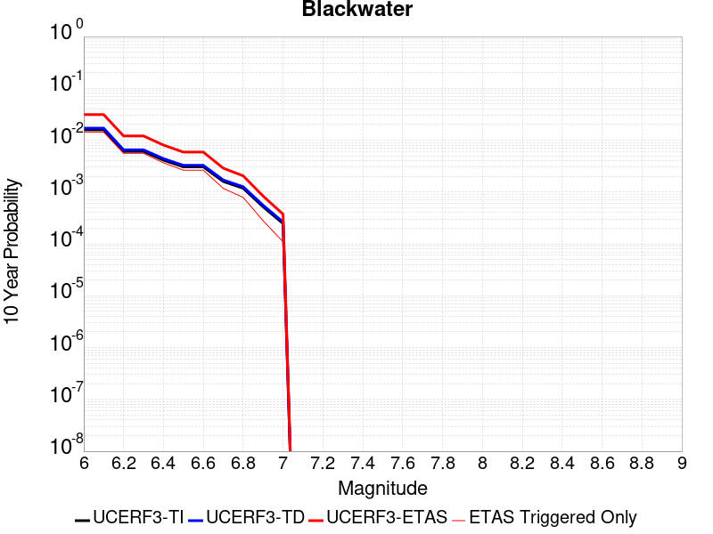 |

| Magnitude | 1 wk TI Prob | 1 wk TD Prob | 1 wk ETAS Prob | 1 wk ETAS/TD Gain | 1 wk ETAS Triggered Only | 1 mo TI Prob | 1 mo TD Prob | 1 mo ETAS Prob | 1 mo ETAS/TD Gain | 1 mo ETAS Triggered Only | 1 yr TI Prob | 1 yr TD Prob | 1 yr ETAS Prob | 1 yr ETAS/TD Gain | 1 yr ETAS Triggered Only | 10 yr TI Prob | 10 yr TD Prob | 10 yr ETAS Prob | 10 yr ETAS/TD Gain | 10 yr ETAS Triggered Only |
|-----|-----|-----|-----|-----|-----|-----|-----|-----|-----|-----|-----|-----|-----|-----|-----|-----|-----|-----|-----|-----|
| 6.0 | 3.0708583E-5 | 3.3095846E-5 | 0.004322038 | 130.59155 | 0.004289084 | 1.3160157E-4 | 1.4183241E-4 | 0.0067032008 | 47.261417 | 0.006562299 | 0.0016010714 | 0.0017255784 | 0.012215702 | 7.0791926 | 0.010508256 | 0.015895851 | 0.017135633 | 0.031763725 | 1.853665 | 0.014883122 |
| 6.1 | 3.0708583E-5 | 3.3095846E-5 | 0.004322038 | 130.59155 | 0.004289084 | 1.3160157E-4 | 1.4183241E-4 | 0.0067032008 | 47.261417 | 0.006562299 | 0.0016010714 | 0.0017255784 | 0.012215702 | 7.0791926 | 0.010508256 | 0.015895851 | 0.017135633 | 0.031763725 | 1.853665 | 0.014883122 |
| 6.2 | 1.1707779E-5 | 1.2545122E-5 | 0.0013421446 | 106.985374 | 0.0013296162 | 5.017523E-5 | 5.3763757E-5 | 0.0021124135 | 39.29066 | 0.0020587605 | 6.107122E-4 | 6.5438676E-4 | 0.0043405853 | 6.633058 | 0.0036886125 | 0.006090366 | 0.0065255696 | 0.012064993 | 1.8488798 | 0.0055758096 |
| 6.3 | 1.1707779E-5 | 1.2545122E-5 | 0.0013421446 | 106.985374 | 0.0013296162 | 5.017523E-5 | 5.3763757E-5 | 0.0021124135 | 39.29066 | 0.0020587605 | 6.107122E-4 | 6.5438676E-4 | 0.0043405853 | 6.633058 | 0.0036886125 | 0.006090366 | 0.0065255696 | 0.012064993 | 1.8488798 | 0.0055758096 |
| 6.4 | 7.929244E-6 | 8.480098E-6 | 9.949611E-4 | 117.328964 | 9.864894E-4 | 3.3982033E-5 | 3.6342793E-5 | 0.0014516892 | 39.944347 | 0.0014153979 | 4.136527E-4 | 4.423877E-4 | 0.0030575716 | 6.9115205 | 0.0026163415 | 0.0041288356 | 0.0044154758 | 0.008514816 | 1.9284028 | 0.004117521 |
| 6.5 | 5.8832115E-6 | 6.285991E-6 | 6.9253513E-4 | 110.1712 | 6.862535E-4 | 2.521352E-5 | 2.6939697E-5 | 9.276231E-4 | 34.433315 | 9.007077E-4 | 3.0693135E-4 | 3.27944E-4 | 0.0017857545 | 5.445303 | 0.0014582886 | 0.0030650778 | 0.0032748538 | 0.005839877 | 1.7832481 | 0.0025734506 |
| 6.6 | 5.8832115E-6 | 6.285991E-6 | 6.9253513E-4 | 110.1712 | 6.862535E-4 | 2.521352E-5 | 2.6939697E-5 | 9.276231E-4 | 34.433315 | 9.007077E-4 | 3.0693135E-4 | 3.27944E-4 | 0.0017857545 | 5.445303 | 0.0014582886 | 0.0030650778 | 0.0032748538 | 0.005839877 | 1.7832481 | 0.0025734506 |
| 6.7 | 3.0715053E-6 | 3.2814662E-6 | 3.8929778E-4 | 118.635315 | 3.8601758E-4 | 1.3163528E-5 | 1.4063357E-5 | 5.716365E-4 | 40.64723 | 5.5758096E-4 | 1.6025416E-4 | 1.7120909E-4 | 0.0010717625 | 6.259963 | 9.007077E-4 | 0.0016013865 | 0.0017108864 | 0.0031238627 | 1.8258737 | 0.0014153979 |
| 6.8 | 2.2722281E-6 | 2.4287538E-6 | 3.4555467E-4 | 142.27654 | 3.4312674E-4 | 9.738084E-6 | 1.0408908E-5 | 5.2509364E-4 | 50.446568 | 5.146901E-4 | 1.1855473E-4 | 1.26722E-4 | 7.700031E-4 | 6.0763173 | 6.4336264E-4 | 0.001184915 | 0.0012665876 | 0.0022518274 | 1.7778696 | 9.864894E-4 |
| 6.9 | 9.952399E-7 | 1.0653489E-6 | 1.7262854E-4 | 162.03944 | 1.7156337E-4 | 4.265307E-6 | 4.5657757E-6 | 2.1901901E-4 | 47.969727 | 2.1445421E-4 | 5.1928873E-5 | 5.5587418E-5 | 3.1291816E-4 | 5.6292987 | 2.5734506E-4 | 5.191674E-4 | 5.557858E-4 | 8.987218E-4 | 1.6170292 | 3.4312674E-4 |
| 7.0 | 4.7385504E-7 | 5.0755597E-7 | 8.62892E-5 | 170.00923 | 8.5781685E-5 | 2.0308057E-6 | 2.1752398E-6 | 8.795674E-5 | 40.43542 | 8.5781685E-5 | 2.4724779E-5 | 2.6483543E-5 | 1.12262955E-4 | 4.2389703 | 8.5781685E-5 | 2.4722028E-4 | 2.6483546E-4 | 3.505944E-4 | 1.3238199 | 8.5781685E-5 |

## Hunter Mountain-Saline Valley
*[(top)](#table-of-contents)*

| 1 Week | 1 Month | 1 Year | 10 Year |
|-----|-----|-----|-----|
|  |  |  |  |

| Magnitude | 1 wk TI Prob | 1 wk TD Prob | 1 wk ETAS Prob | 1 wk ETAS/TD Gain | 1 wk ETAS Triggered Only | 1 mo TI Prob | 1 mo TD Prob | 1 mo ETAS Prob | 1 mo ETAS/TD Gain | 1 mo ETAS Triggered Only | 1 yr TI Prob | 1 yr TD Prob | 1 yr ETAS Prob | 1 yr ETAS/TD Gain | 1 yr ETAS Triggered Only | 10 yr TI Prob | 10 yr TD Prob | 10 yr ETAS Prob | 10 yr ETAS/TD Gain | 10 yr ETAS Triggered Only |
|-----|-----|-----|-----|-----|-----|-----|-----|-----|-----|-----|-----|-----|-----|-----|-----|-----|-----|-----|-----|-----|
| 6.0 | 4.5103672E-5 | 5.4570177E-5 | 0.0048580826 | 89.0245 | 0.0048037744 | 1.9328714E-4 | 2.3385242E-4 | 0.0061942856 | 26.48801 | 0.005961827 | 0.002350731 | 0.0028435152 | 0.012124362 | 4.263864 | 0.009307313 | 0.023260195 | 0.028091887 | 0.04063936 | 1.4466583 | 0.0129101435 |
| 6.1 | 4.5103672E-5 | 5.4570177E-5 | 0.0048580826 | 89.0245 | 0.0048037744 | 1.9328714E-4 | 2.3385242E-4 | 0.0061942856 | 26.48801 | 0.005961827 | 0.002350731 | 0.0028435152 | 0.012124362 | 4.263864 | 0.009307313 | 0.023260195 | 0.028091887 | 0.04063936 | 1.4466583 | 0.0129101435 |
| 6.2 | 3.9363465E-5 | 4.706337E-5 | 0.0048506116 | 103.065544 | 0.0048037744 | 1.6868966E-4 | 2.0168544E-4 | 0.00616231 | 30.554066 | 0.005961827 | 0.002051862 | 0.0024528175 | 0.011737301 | 4.785232 | 0.009307313 | 0.020330196 | 0.024273481 | 0.036870252 | 1.5189519 | 0.0129101435 |
| 6.3 | 3.9363465E-5 | 4.706337E-5 | 0.0048506116 | 103.065544 | 0.0048037744 | 1.6868966E-4 | 2.0168544E-4 | 0.00616231 | 30.554066 | 0.005961827 | 0.002051862 | 0.0024528175 | 0.011737301 | 4.785232 | 0.009307313 | 0.020330196 | 0.024273481 | 0.036870252 | 1.5189519 | 0.0129101435 |
| 6.4 | 3.2311684E-5 | 3.795099E-5 | 0.004798654 | 126.44344 | 0.0047608837 | 1.384713E-4 | 1.6263737E-4 | 0.006080611 | 37.38754 | 0.0059189363 | 0.0016845843 | 0.0019783843 | 0.011138866 | 5.630284 | 0.00917864 | 0.016718714 | 0.019616475 | 0.032147218 | 1.6387868 | 0.012781471 |
| 6.5 | 3.2311684E-5 | 3.795099E-5 | 0.004798654 | 126.44344 | 0.0047608837 | 1.384713E-4 | 1.6263737E-4 | 0.006080611 | 37.38754 | 0.0059189363 | 0.0016845843 | 0.0019783843 | 0.011138866 | 5.630284 | 0.00917864 | 0.016718714 | 0.019616475 | 0.032147218 | 1.6387868 | 0.012781471 |
| 6.6 | 2.9305844E-5 | 3.418183E-5 | 0.0047520134 | 139.0216 | 0.0047179926 | 1.2559042E-4 | 1.4648569E-4 | 0.0060216705 | 41.107567 | 0.0058760457 | 0.0015279909 | 0.001782067 | 0.010901536 | 6.117355 | 0.009135749 | 0.015175272 | 0.01768569 | 0.030198982 | 1.7075375 | 0.01273858 |
| 6.7 | 2.7826512E-5 | 3.2344276E-5 | 0.0047501842 | 146.86322 | 0.0047179926 | 1.19251024E-4 | 1.386113E-4 | 0.005970957 | 43.07699 | 0.0058331545 | 0.0014509142 | 0.0016863465 | 0.0107638715 | 6.3829536 | 0.009092859 | 0.014414776 | 0.016743187 | 0.029226309 | 1.7455643 | 0.01269569 |
| 6.8 | 2.3389874E-5 | 2.6866714E-5 | 0.0047447328 | 176.60265 | 0.0047179926 | 1.0023846E-4 | 1.15138246E-4 | 0.005947621 | 51.65635 | 0.0058331545 | 0.00121972 | 0.001400954 | 0.010438243 | 7.450811 | 0.009049968 | 0.01213047 | 0.013927434 | 0.026361719 | 1.8927908 | 0.012609907 |
| 6.9 | 2.069209E-5 | 2.3570032E-5 | 0.0046985615 | 199.34474 | 0.004675102 | 8.867737E-5 | 1.01010715E-4 | 0.00589069 | 58.317474 | 0.005790264 | 0.0010791123 | 0.0012291478 | 0.0102251535 | 8.318897 | 0.009007077 | 0.010738871 | 0.012228523 | 0.024557132 | 2.0081844 | 0.012481235 |
| 7.0 | 1.7462342E-5 | 1.9633546E-5 | 0.0046946434 | 239.11339 | 0.004675102 | 7.483646E-5 | 8.414118E-5 | 0.0058739176 | 69.81026 | 0.005790264 | 9.1075303E-4 | 0.0010239601 | 0.00993612 | 9.703621 | 0.008921295 | 0.009070295 | 0.0101960525 | 0.022465121 | 2.2033155 | 0.012395454 |
| 7.1 | 1.4807709E-5 | 1.6441749E-5 | 0.0046914667 | 285.33865 | 0.004675102 | 6.3460066E-5 | 7.046283E-5 | 0.0058603184 | 83.16894 | 0.005790264 | 7.723524E-4 | 8.575638E-4 | 0.009771208 | 11.394148 | 0.008921295 | 0.007696735 | 0.008545532 | 0.020835059 | 2.4381232 | 0.012395454 |
| 7.2 | 1.4180048E-5 | 1.5698337E-5 | 0.0046907268 | 298.80408 | 0.004675102 | 6.077022E-5 | 6.727694E-5 | 0.005857151 | 87.06031 | 0.005790264 | 7.396263E-4 | 8.188051E-4 | 0.00968994 | 11.834244 | 0.008878404 | 0.0073716943 | 0.008160833 | 0.020412588 | 2.5012872 | 0.0123525625 |
| 7.3 | 1.3730402E-5 | 1.5172075E-5 | 0.004690203 | 309.1339 | 0.004675102 | 5.8843252E-5 | 6.502165E-5 | 0.005854909 | 90.04553 | 0.005790264 | 7.161811E-4 | 7.9136714E-4 | 0.0096627455 | 12.210193 | 0.008878404 | 0.007138774 | 0.007888422 | 0.020143542 | 2.5535579 | 0.0123525625 |
| 7.4 | 1.2810095E-5 | 1.4109277E-5 | 0.0046891454 | 332.34482 | 0.004675102 | 5.489925E-5 | 6.0467017E-5 | 0.0058074924 | 96.04397 | 0.0057473728 | 6.681934E-4 | 7.359531E-4 | 0.009564964 | 12.996704 | 0.008835514 | 0.006661878 | 0.007338053 | 0.019557396 | 2.6652024 | 0.012309672 |
| 7.5 | 1.1595659E-5 | 1.2800664E-5 | 0.004687843 | 366.21872 | 0.004675102 | 4.9694736E-5 | 5.4858923E-5 | 0.0057161395 | 104.19708 | 0.0056615914 | 6.0486543E-4 | 6.6771836E-4 | 0.009283021 | 13.902599 | 0.008621059 | 0.006032217 | 0.0066599925 | 0.01863205 | 2.7976084 | 0.012052326 |
| 7.6 | 2.997694E-6 | 3.3251579E-6 | 0.0022765324 | 684.63885 | 0.0022732147 | 1.28471975E-5 | 1.425064E-5 | 0.0027163352 | 190.61145 | 0.002702123 | 1.564034E-4 | 1.73495E-4 | 0.004204535 | 24.234327 | 0.004031739 | 0.0015629337 | 0.001735031 | 0.00725835 | 4.183412 | 0.0055329185 |

## Gravel Hills-Harper Lk
*[(top)](#table-of-contents)*

| 1 Week | 1 Month | 1 Year | 10 Year |
|-----|-----|-----|-----|
|  | 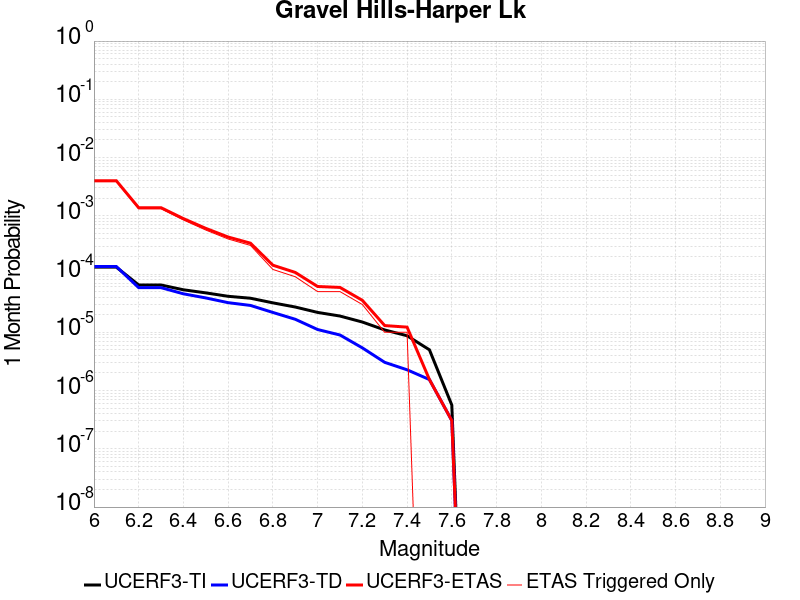 |  |  |

| Magnitude | 1 wk TI Prob | 1 wk TD Prob | 1 wk ETAS Prob | 1 wk ETAS/TD Gain | 1 wk ETAS Triggered Only | 1 mo TI Prob | 1 mo TD Prob | 1 mo ETAS Prob | 1 mo ETAS/TD Gain | 1 mo ETAS Triggered Only | 1 yr TI Prob | 1 yr TD Prob | 1 yr ETAS Prob | 1 yr ETAS/TD Gain | 1 yr ETAS Triggered Only | 10 yr TI Prob | 10 yr TD Prob | 10 yr ETAS Prob | 10 yr ETAS/TD Gain | 10 yr ETAS Triggered Only |
|-----|-----|-----|-----|-----|-----|-----|-----|-----|-----|-----|-----|-----|-----|-----|-----|-----|-----|-----|-----|-----|
| 6.0 | 3.0679566E-5 | 3.1464646E-5 | 0.0023903868 | 75.97056 | 0.0023589963 | 1.3147724E-4 | 1.3484273E-4 | 0.0038229579 | 28.351233 | 0.0036886125 | 0.0015995599 | 0.0016406906 | 0.0074214544 | 4.523372 | 0.005790264 | 0.015880952 | 0.01630734 | 0.024914386 | 1.5278021 | 0.008749732 |
| 6.1 | 3.0679566E-5 | 3.1464646E-5 | 0.0023903868 | 75.97056 | 0.0023589963 | 1.3147724E-4 | 1.3484273E-4 | 0.0038229579 | 28.351233 | 0.0036886125 | 0.0015995599 | 0.0016406906 | 0.0074214544 | 4.523372 | 0.005790264 | 0.015880952 | 0.01630734 | 0.024914386 | 1.5278021 | 0.008749732 |
| 6.2 | 1.514536E-5 | 1.3635206E-5 | 8.285501E-4 | 60.765495 | 8.14926E-4 | 6.490707E-5 | 5.843536E-5 | 0.0011735321 | 20.08257 | 0.0011151619 | 7.8995706E-4 | 7.1123015E-4 | 0.0023827832 | 3.3502283 | 0.0016727429 | 0.007871548 | 0.0070907404 | 0.009518183 | 1.3423398 | 0.002444778 |
| 6.3 | 1.514536E-5 | 1.3635206E-5 | 8.285501E-4 | 60.765495 | 8.14926E-4 | 6.490707E-5 | 5.843536E-5 | 0.0011735321 | 20.08257 | 0.0011151619 | 7.8995706E-4 | 7.1123015E-4 | 0.0023827832 | 3.3502283 | 0.0016727429 | 0.007871548 | 0.0070907404 | 0.009518183 | 1.3423398 | 0.002444778 |
| 6.4 | 1.2532521E-5 | 1.06896905E-5 | 5.253743E-4 | 49.147755 | 5.146901E-4 | 5.37097E-5 | 4.581219E-5 | 7.7492313E-4 | 16.915216 | 7.291443E-4 | 6.537194E-4 | 5.576265E-4 | 0.0015864327 | 2.8449738 | 0.0010293802 | 0.0065179965 | 0.005562863 | 0.0070983437 | 1.2760235 | 0.0015440703 |
| 6.5 | 1.1094058E-5 | 9.083664E-6 | 3.5220728E-4 | 38.773705 | 3.4312674E-4 | 4.7545094E-5 | 3.892943E-5 | 5.1071035E-4 | 13.1188755 | 4.7179929E-4 | 5.787078E-4 | 4.7386673E-4 | 0.0011169246 | 2.3570435 | 6.4336264E-4 | 0.0057720304 | 0.0047289706 | 0.0057107946 | 1.2076191 | 9.864894E-4 |
| 6.6 | 9.688328E-6 | 7.5316952E-6 | 3.5065584E-4 | 46.55736 | 3.4312674E-4 | 4.1520743E-5 | 3.227831E-5 | 5.0406234E-4 | 15.616133 | 4.7179929E-4 | 5.053978E-4 | 3.9292008E-4 | 9.93156E-4 | 2.5276284 | 6.004718E-4 | 0.0050424994 | 0.0039225104 | 0.0047769626 | 1.2178329 | 8.5781683E-4 |
| 6.7 | 8.974824E-6 | 6.749413E-6 | 2.2120218E-4 | 32.773544 | 2.1445421E-4 | 3.8462964E-5 | 2.8925748E-5 | 3.2915297E-4 | 11.379238 | 3.002359E-4 | 4.6818596E-4 | 3.5211627E-4 | 7.3799794E-4 | 2.0958927 | 3.8601758E-4 | 0.004672008 | 0.0035158044 | 0.004114165 | 1.1701916 | 6.004718E-4 |
| 6.8 | 7.4780046E-6 | 5.1161933E-6 | 9.089744E-5 | 17.766617 | 8.5781685E-5 | 3.20482E-5 | 2.1926366E-5 | 1.9348598E-4 | 8.824352 | 1.7156337E-4 | 3.9011694E-4 | 2.669222E-4 | 4.3843978E-4 | 1.6425751 | 1.7156337E-4 | 0.0038943281 | 0.0026661542 | 0.0029655895 | 1.1123098 | 3.002359E-4 |
| 6.9 | 6.3409307E-6 | 3.9074966E-6 | 4.6798174E-5 | 11.976509 | 4.2890842E-5 | 2.7175134E-5 | 1.6746313E-5 | 1.0252656E-4 | 6.1223364 | 8.5781685E-5 | 3.3080703E-4 | 2.0386827E-4 | 2.8963247E-4 | 1.4206843 | 8.5781685E-5 | 0.0033031502 | 0.0020369107 | 0.0022081246 | 1.0840557 | 1.7156337E-4 |
| 7.0 | 5.1239335E-6 | 2.6058565E-6 | 4.549659E-5 | 17.45936 | 4.2890842E-5 | 2.195953E-5 | 1.116791E-5 | 9.6948635E-5 | 8.681001 | 8.5781685E-5 | 2.6732447E-4 | 1.3596108E-4 | 2.217311E-4 | 1.6308424 | 8.5781685E-5 | 0.0026700313 | 0.0013588042 | 0.0014873019 | 1.0945667 | 1.2867253E-4 |
| 7.1 | 4.438899E-6 | 2.0984728E-6 | 4.4989225E-5 | 21.439032 | 4.2890842E-5 | 1.9023713E-5 | 8.993425E-6 | 9.477434E-5 | 10.538181 | 8.5781685E-5 | 2.315891E-4 | 1.0948967E-4 | 1.9526196E-4 | 1.7833825 | 8.5781685E-5 | 0.002313479 | 0.0010943791 | 0.0012229108 | 1.1174471 | 1.2867253E-4 |
| 7.2 | 3.50367E-6 | 1.2615716E-6 | 4.415236E-5 | 34.997902 | 4.2890842E-5 | 1.5015643E-5 | 5.4067245E-6 | 9.118795E-5 | 16.865654 | 8.5781685E-5 | 1.8280011E-4 | 6.582497E-5 | 1.5160101E-4 | 2.3030927 | 8.5781685E-5 | 0.0018264982 | 6.580629E-4 | 7.866508E-4 | 1.1954036 | 1.2867253E-4 |
| 7.3 | 2.561638E-6 | 7.1191585E-7 | 7.1191585E-7 | 1.0 | 0.0 | 1.0978401E-5 | 3.0510646E-6 | 4.5941775E-5 | 15.057622 | 4.2890842E-5 | 1.3365384E-4 | 3.71461E-5 | 8.0035345E-5 | 2.15461 | 4.2890842E-5 | 0.0013357349 | 3.7140088E-4 | 4.142758E-4 | 1.1154411 | 4.2890842E-5 |
| 7.4 | 2.0368864E-6 | 5.304837E-7 | 5.304837E-7 | 1.0 | 0.0 | 8.729483E-6 | 2.2734996E-6 | 4.5164245E-5 | 19.865517 | 4.2890842E-5 | 1.06276275E-4 | 2.7679513E-5 | 7.056917E-5 | 2.549509 | 4.2890842E-5 | 0.0010622547 | 2.767612E-4 | 3.1964015E-4 | 1.1549313 | 4.2890842E-5 |
| 7.5 | 1.1681728E-6 | 3.6030585E-7 | 3.6030585E-7 | 1.0 | 0.0 | 5.0064455E-6 | 1.544167E-6 | 1.544167E-6 | 1.0 | 0.0 | 6.0951766E-5 | 1.8800076E-5 | 1.8800076E-5 | 1.0 | 0.0 | 6.093505E-4 | 1.8798532E-4 | 1.8798532E-4 | 1.0 | 0.0 |
| 7.6 | 1.3154387E-7 | 7.1197384E-8 | 7.1197384E-8 | 1.0 | 0.0 | 5.6375933E-7 | 3.051316E-7 | 3.051316E-7 | 1.0 | 0.0 | 6.863748E-6 | 3.7149728E-6 | 3.7149728E-6 | 1.0 | 0.0 | 6.863536E-5 | 3.7149264E-5 | 3.7149264E-5 | 1.0 | 0.0 |

## Ash Hill
*[(top)](#table-of-contents)*

| 1 Week | 1 Month | 1 Year | 10 Year |
|-----|-----|-----|-----|
|  |  |  |  |

| Magnitude | 1 wk TI Prob | 1 wk TD Prob | 1 wk ETAS Prob | 1 wk ETAS/TD Gain | 1 wk ETAS Triggered Only | 1 mo TI Prob | 1 mo TD Prob | 1 mo ETAS Prob | 1 mo ETAS/TD Gain | 1 mo ETAS Triggered Only | 1 yr TI Prob | 1 yr TD Prob | 1 yr ETAS Prob | 1 yr ETAS/TD Gain | 1 yr ETAS Triggered Only | 10 yr TI Prob | 10 yr TD Prob | 10 yr ETAS Prob | 10 yr ETAS/TD Gain | 10 yr ETAS Triggered Only |
|-----|-----|-----|-----|-----|-----|-----|-----|-----|-----|-----|-----|-----|-----|-----|-----|-----|-----|-----|-----|-----|
| 6.0 | 2.1545662E-5 | 2.3194447E-5 | 0.0019961274 | 86.06058 | 0.0019729787 | 9.2335285E-5 | 9.940143E-5 | 0.0030156889 | 30.338484 | 0.0029165773 | 0.0011236023 | 0.0012096206 | 0.006264618 | 5.178994 | 0.0050611193 | 0.011179381 | 0.012038348 | 0.020386126 | 1.6934322 | 0.008449496 |
| 6.1 | 2.1545662E-5 | 2.3194447E-5 | 0.0019961274 | 86.06058 | 0.0019729787 | 9.2335285E-5 | 9.940143E-5 | 0.0030156889 | 30.338484 | 0.0029165773 | 0.0011236023 | 0.0012096206 | 0.006264618 | 5.178994 | 0.0050611193 | 0.011179381 | 0.012038348 | 0.020386126 | 1.6934322 | 0.008449496 |
| 6.2 | 2.1545662E-5 | 2.3194447E-5 | 0.0019961274 | 86.06058 | 0.0019729787 | 9.2335285E-5 | 9.940143E-5 | 0.0030156889 | 30.338484 | 0.0029165773 | 0.0011236023 | 0.0012096206 | 0.006264618 | 5.178994 | 0.0050611193 | 0.011179381 | 0.012038348 | 0.020386126 | 1.6934322 | 0.008449496 |
| 6.3 | 1.0025529E-5 | 1.0746934E-5 | 8.256642E-4 | 76.82788 | 8.14926E-4 | 4.2965847E-5 | 4.605755E-5 | 0.001204057 | 26.142445 | 0.0011580527 | 5.229836E-4 | 5.6061964E-4 | 0.002618226 | 4.6702356 | 0.0020587605 | 0.005217545 | 0.0055933665 | 0.008877489 | 1.5871459 | 0.0033025949 |
| 6.4 | 1.0025529E-5 | 1.0746934E-5 | 8.256642E-4 | 76.82788 | 8.14926E-4 | 4.2965847E-5 | 4.605755E-5 | 0.001204057 | 26.142445 | 0.0011580527 | 5.229836E-4 | 5.6061964E-4 | 0.002618226 | 4.6702356 | 0.0020587605 | 0.005217545 | 0.0055933665 | 0.008877489 | 1.5871459 | 0.0033025949 |
| 6.5 | 6.9617327E-6 | 7.456634E-6 | 6.0792395E-4 | 81.52793 | 6.004718E-4 | 2.9835655E-5 | 3.195666E-5 | 9.3263556E-4 | 29.184387 | 9.007077E-4 | 3.6318856E-4 | 3.8901155E-4 | 0.0018038588 | 4.6370316 | 0.0014153979 | 0.0036259557 | 0.0038841602 | 0.0061485455 | 1.5829793 | 0.0022732147 |
| 6.6 | 4.9919777E-6 | 5.3466883E-6 | 4.342528E-4 | 81.219025 | 4.2890842E-4 | 2.1394015E-5 | 2.2914215E-5 | 6.662621E-4 | 29.076366 | 6.4336264E-4 | 2.60441E-4 | 2.7895154E-4 | 0.0013080447 | 4.689146 | 0.0010293802 | 0.0026013597 | 0.0027866727 | 0.0043692114 | 1.5678955 | 0.0015869612 |
| 6.7 | 3.6630722E-6 | 3.924624E-6 | 3.0415936E-4 | 77.50026 | 3.002359E-4 | 1.5698786E-5 | 1.681974E-5 | 4.8861105E-4 | 29.04986 | 4.7179929E-4 | 1.9111596E-4 | 2.0476682E-4 | 0.0010195259 | 4.9789605 | 8.14926E-4 | 0.0019095168 | 0.0020463446 | 0.0032876336 | 1.6065885 | 0.0012438344 |
| 6.8 | 2.5599613E-6 | 2.744925E-6 | 1.7430783E-4 | 63.50185 | 1.7156337E-4 | 1.0971216E-5 | 1.1763939E-5 | 2.2621563E-4 | 19.229582 | 2.1445421E-4 | 1.3356637E-4 | 1.4322149E-4 | 4.862991E-4 | 3.3954337 | 3.4312674E-4 | 0.0013348613 | 0.0014317769 | 0.0021170478 | 1.4786158 | 6.862535E-4 |
| 6.9 | 1.7684905E-6 | 1.8968707E-6 | 1.3056915E-4 | 68.83398 | 1.2867253E-4 | 7.579223E-6 | 8.129446E-6 | 1.3680093E-4 | 16.82783 | 1.2867253E-4 | 9.2273134E-5 | 9.8976E-5 | 3.5629558E-4 | 3.599818 | 2.5734506E-4 | 9.223483E-4 | 9.8976E-4 | 0.0015039408 | 1.5195004 | 5.146901E-4 |

## Garlock (West)
*[(top)](#table-of-contents)*

| 1 Week | 1 Month | 1 Year | 10 Year |
|-----|-----|-----|-----|
|  |  |  |  |

| Magnitude | 1 wk TI Prob | 1 wk TD Prob | 1 wk ETAS Prob | 1 wk ETAS/TD Gain | 1 wk ETAS Triggered Only | 1 mo TI Prob | 1 mo TD Prob | 1 mo ETAS Prob | 1 mo ETAS/TD Gain | 1 mo ETAS Triggered Only | 1 yr TI Prob | 1 yr TD Prob | 1 yr ETAS Prob | 1 yr ETAS/TD Gain | 1 yr ETAS Triggered Only | 10 yr TI Prob | 10 yr TD Prob | 10 yr ETAS Prob | 10 yr ETAS/TD Gain | 10 yr ETAS Triggered Only |
|-----|-----|-----|-----|-----|-----|-----|-----|-----|-----|-----|-----|-----|-----|-----|-----|-----|-----|-----|-----|-----|
| 6.0 | 2.5181727E-5 | 2.51973E-5 | 0.0036279373 | 143.98119 | 0.0036028307 | 1.0791722E-4 | 1.0798398E-4 | 0.005039898 | 46.67265 | 0.004932447 | 0.0013131002 | 0.0013139155 | 0.008638613 | 6.57471 | 0.0073343343 | 0.013053683 | 0.013141977 | 0.022030683 | 1.6763599 | 0.009007077 |
| 6.1 | 2.5077732E-5 | 2.5098372E-5 | 0.0036278388 | 144.54478 | 0.0036028307 | 1.0747157E-4 | 1.0756004E-4 | 0.0050394763 | 46.852684 | 0.004932447 | 0.001307681 | 0.0013087603 | 0.008633495 | 6.596698 | 0.0073343343 | 0.013000126 | 0.013091032 | 0.021980198 | 1.6790271 | 0.009007077 |
| 6.2 | 2.494612E-5 | 2.498005E-5 | 0.0036277208 | 145.22472 | 0.0036028307 | 1.0690756E-4 | 1.0705298E-4 | 0.005038972 | 47.069885 | 0.004932447 | 0.0013008224 | 0.0013025942 | 0.008627375 | 6.623225 | 0.0073343343 | 0.012932341 | 0.013030097 | 0.021919811 | 1.6822447 | 0.009007077 |
| 6.3 | 2.4733758E-5 | 2.479942E-5 | 0.0036275408 | 146.27524 | 0.0036028307 | 1.0599751E-4 | 1.06278916E-4 | 0.005038202 | 47.405468 | 0.004932447 | 0.0012897556 | 0.0012931811 | 0.008618031 | 6.66421 | 0.0073343343 | 0.012822957 | 0.012937066 | 0.021827618 | 1.6872154 | 0.009007077 |
| 6.4 | 2.3237335E-5 | 2.317873E-5 | 0.0035401464 | 152.73254 | 0.0035170491 | 9.958477E-5 | 9.933365E-5 | 0.004859744 | 48.923443 | 0.0047608837 | 0.0012117702 | 0.001208719 | 0.008362832 | 6.918756 | 0.0071627707 | 0.012051838 | 0.012101916 | 0.020830503 | 1.7212566 | 0.008835514 |
| 6.5 | 2.2732203E-5 | 2.2993298E-5 | 0.0035399615 | 153.95624 | 0.0035170491 | 9.742009E-5 | 9.8539E-5 | 0.0048589534 | 49.30995 | 0.0047608837 | 0.0011854442 | 0.0011990548 | 0.008353237 | 6.966518 | 0.0071627707 | 0.011791403 | 0.012006322 | 0.020735754 | 1.7270696 | 0.008835514 |
| 6.6 | 2.1319436E-5 | 2.17735E-5 | 0.003538746 | 162.52538 | 0.0035170491 | 9.136581E-5 | 9.331167E-5 | 0.004810864 | 51.55694 | 0.0047179926 | 0.001111811 | 0.0011354799 | 0.008247275 | 7.2632513 | 0.00711988 | 0.011062649 | 0.011377227 | 0.020069813 | 1.7640339 | 0.008792623 |
| 6.7 | 1.970802E-5 | 2.0393396E-5 | 0.0035373708 | 173.45668 | 0.0035170491 | 8.446021E-5 | 8.739735E-5 | 0.0048049777 | 54.97853 | 0.0047179926 | 0.001027818 | 0.001063545 | 0.008175853 | 7.6873593 | 0.00711988 | 0.010230771 | 0.010664964 | 0.019363815 | 1.8156474 | 0.008792623 |
| 6.8 | 1.8744462E-5 | 1.9901045E-5 | 0.0035368802 | 177.72334 | 0.0035170491 | 8.033094E-5 | 8.5287415E-5 | 0.0048028775 | 56.31403 | 0.0047179926 | 9.775903E-4 | 0.0010378812 | 0.008150372 | 7.852894 | 0.00711988 | 0.009733009 | 0.01041075 | 0.019111836 | 1.8357788 | 0.008792623 |
| 6.9 | 1.7559682E-5 | 1.8953415E-5 | 0.003535936 | 186.55931 | 0.0035170491 | 7.5253614E-5 | 8.12264E-5 | 0.004798836 | 59.079758 | 0.0047179926 | 9.158276E-4 | 9.884841E-4 | 0.008101326 | 8.195706 | 0.00711988 | 0.0091206245 | 0.009921231 | 0.018626621 | 1.8774505 | 0.008792623 |
| 7.0 | 1.6794445E-5 | 1.8216237E-5 | 0.0035352013 | 194.0687 | 0.0035170491 | 7.197421E-5 | 7.8067256E-5 | 0.0047956915 | 61.430256 | 0.0047179926 | 8.759337E-4 | 9.5005584E-4 | 0.008020321 | 8.441948 | 0.007076989 | 0.008724891 | 0.009540141 | 0.018121436 | 1.8994936 | 0.0086639505 |
| 7.1 | 1.6337795E-5 | 1.7717046E-5 | 0.0034918138 | 197.08781 | 0.0034741582 | 7.0017246E-5 | 7.5927994E-5 | 0.004707787 | 62.003315 | 0.004632211 | 8.521265E-4 | 9.240326E-4 | 0.007823077 | 8.466235 | 0.006905426 | 0.008488664 | 0.009281996 | 0.017695557 | 1.9064387 | 0.008492387 |
| 7.2 | 1.5780008E-5 | 1.7165687E-5 | 0.0034912643 | 203.38623 | 0.0034741582 | 6.762685E-5 | 7.356516E-5 | 0.0047054356 | 63.962826 | 0.004632211 | 8.2304585E-4 | 8.9528906E-4 | 0.0077945325 | 8.706162 | 0.006905426 | 0.008200042 | 0.008996838 | 0.01741282 | 1.9354378 | 0.008492387 |
| 7.3 | 1.5058865E-5 | 1.6618762E-5 | 0.003447829 | 207.46606 | 0.0034312673 | 6.45364E-5 | 7.122133E-5 | 0.0046602148 | 65.43285 | 0.00458932 | 7.854473E-4 | 8.667759E-4 | 0.007680509 | 8.861009 | 0.006819644 | 0.00782677 | 0.008713539 | 0.017046893 | 1.9563686 | 0.008406606 |
| 7.4 | 1.4887923E-5 | 1.6454731E-5 | 0.0034047756 | 206.91772 | 0.0033883767 | 6.380382E-5 | 7.051838E-5 | 0.004616627 | 65.467 | 0.0045464295 | 7.7653467E-4 | 8.582243E-4 | 0.0075863074 | 8.83954 | 0.006733862 | 0.0077382675 | 0.008628399 | 0.016877428 | 1.9560323 | 0.008320823 |
| 7.5 | 1.4509299E-5 | 1.6046748E-5 | 0.0031899181 | 198.78908 | 0.0031739224 | 6.218123E-5 | 6.876997E-5 | 0.0042288955 | 61.493343 | 0.0041604117 | 7.567935E-4 | 8.36954E-4 | 0.006965211 | 8.322096 | 0.0061333906 | 0.0075422134 | 0.008416704 | 0.016029546 | 1.904492 | 0.007677461 |
| 7.6 | 1.2756717E-5 | 1.4050848E-5 | 0.0020727825 | 147.52008 | 0.0020587605 | 5.4670498E-5 | 6.0216535E-5 | 0.0027192887 | 45.158504 | 0.0026592324 | 6.6541E-4 | 7.328904E-4 | 0.0045473776 | 6.2047176 | 0.003817285 | 0.006634211 | 0.0073816874 | 0.012277725 | 1.663268 | 0.004932447 |
| 7.7 | 1.0328985E-5 | 1.1460557E-5 | 0.0015126228 | 131.9851 | 0.0015011795 | 4.4266326E-5 | 4.911575E-5 | 0.0018504427 | 37.675137 | 0.0018014153 | 5.388092E-4 | 5.978206E-4 | 0.0030840023 | 5.158742 | 0.0024876688 | 0.0053750467 | 0.006038511 | 0.009065372 | 1.5012594 | 0.0030452497 |
| 7.8 | 7.0306583E-6 | 8.899601E-6 | 8.238184E-4 | 92.56801 | 8.14926E-4 | 3.0131043E-5 | 3.814059E-5 | 0.0010674816 | 27.988071 | 0.0010293802 | 3.667837E-4 | 4.642629E-4 | 0.0020504873 | 4.4166512 | 0.0015869612 | 0.003661789 | 0.0046952725 | 0.006616298 | 1.4091403 | 0.0019300879 |
| 7.9 | 4.060633E-6 | 5.4653938E-6 | 2.6280904E-4 | 48.08602 | 2.5734506E-4 | 1.7402595E-5 | 2.3422906E-5 | 4.0943146E-4 | 17.47996 | 3.8601758E-4 | 2.11856E-4 | 2.851367E-4 | 9.2831586E-4 | 3.2556872 | 6.4336264E-4 | 0.0021165414 | 0.002884201 | 0.003825078 | 1.3262175 | 9.4359857E-4 |
| 8.0 | 1.6729537E-6 | 2.0775144E-6 | 4.4968267E-5 | 21.645226 | 4.2890842E-5 | 7.169782E-6 | 8.903603E-6 | 5.1794064E-5 | 5.817203 | 4.2890842E-5 | 8.7288594E-5 | 1.0839601E-4 | 2.7994078E-4 | 2.5825746 | 1.7156337E-4 | 8.7254314E-4 | 0.0010969337 | 0.0013968403 | 1.2734045 | 3.002359E-4 |
| 8.1 | 3.6733252E-7 | 3.1489964E-7 | 3.1489964E-7 | 1.0 | 0.0 | 1.5742813E-6 | 1.3495693E-6 | 1.3495693E-6 | 1.0 | 0.0 | 1.9166706E-5 | 1.6430899E-5 | 5.9321035E-5 | 3.6103342 | 4.2890842E-5 | 1.9165053E-4 | 1.6638759E-4 | 2.092713E-4 | 1.2577338 | 4.2890842E-5 |

## McLean Lake
*[(top)](#table-of-contents)*

| 1 Week | 1 Month | 1 Year | 10 Year |
|-----|-----|-----|-----|
|  | 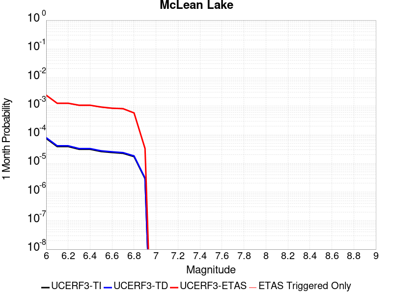 |  |  |

| Magnitude | 1 wk TI Prob | 1 wk TD Prob | 1 wk ETAS Prob | 1 wk ETAS/TD Gain | 1 wk ETAS Triggered Only | 1 mo TI Prob | 1 mo TD Prob | 1 mo ETAS Prob | 1 mo ETAS/TD Gain | 1 mo ETAS Triggered Only | 1 yr TI Prob | 1 yr TD Prob | 1 yr ETAS Prob | 1 yr ETAS/TD Gain | 1 yr ETAS Triggered Only | 10 yr TI Prob | 10 yr TD Prob | 10 yr ETAS Prob | 10 yr ETAS/TD Gain | 10 yr ETAS Triggered Only |
|-----|-----|-----|-----|-----|-----|-----|-----|-----|-----|-----|-----|-----|-----|-----|-----|-----|-----|-----|-----|-----|
| 6.0 | 1.7360222E-5 | 1.8501627E-5 | 0.001219423 | 65.90896 | 0.0012009436 | 7.439883E-5 | 7.9290556E-5 | 0.0018805631 | 23.717367 | 0.0018014153 | 9.0542925E-4 | 9.6498354E-4 | 0.004307241 | 4.463538 | 0.0033454858 | 0.009017491 | 0.0096127745 | 0.01619695 | 1.68494 | 0.0066480804 |
| 6.1 | 9.062689E-6 | 9.592193E-6 | 4.384965E-4 | 45.713894 | 4.2890842E-4 | 3.8839516E-5 | 4.1108804E-5 | 7.7022315E-4 | 18.73621 | 7.291443E-4 | 4.727685E-4 | 5.003936E-4 | 0.0021294302 | 4.25551 | 0.001629852 | 0.0047176396 | 0.004993552 | 0.008493038 | 1.7008011 | 0.0035170491 |
| 6.2 | 9.062689E-6 | 9.592193E-6 | 4.384965E-4 | 45.713894 | 4.2890842E-4 | 3.8839516E-5 | 4.1108804E-5 | 7.7022315E-4 | 18.73621 | 7.291443E-4 | 4.727685E-4 | 5.003936E-4 | 0.0021294302 | 4.25551 | 0.001629852 | 0.0047176396 | 0.004993552 | 0.008493038 | 1.7008011 | 0.0035170491 |
| 6.3 | 7.2575485E-6 | 7.66771E-6 | 3.079013E-4 | 40.15558 | 3.002359E-4 | 3.110341E-5 | 3.2861237E-5 | 6.333133E-4 | 19.27235 | 6.004718E-4 | 3.786182E-4 | 4.0001926E-4 | 0.0016862298 | 4.2153716 | 0.0012867253 | 0.0037797375 | 0.0039936965 | 0.0068559065 | 1.7166818 | 0.0028736864 |
| 6.4 | 7.2575485E-6 | 7.66771E-6 | 3.079013E-4 | 40.15558 | 3.002359E-4 | 3.110341E-5 | 3.2861237E-5 | 6.333133E-4 | 19.27235 | 6.004718E-4 | 3.786182E-4 | 4.0001926E-4 | 0.0016862298 | 4.2153716 | 0.0012867253 | 0.0037797375 | 0.0039936965 | 0.0068559065 | 1.7166818 | 0.0028736864 |
| 6.5 | 6.06582E-6 | 6.4038773E-6 | 3.0663784E-4 | 47.883156 | 3.002359E-4 | 2.5996113E-5 | 2.7444936E-5 | 5.8501057E-4 | 21.315794 | 5.5758096E-4 | 3.164567E-4 | 3.3409733E-4 | 0.0014488867 | 4.33672 | 0.0011151619 | 0.0031600643 | 0.0033365893 | 0.00577321 | 1.7302729 | 0.002444778 |
| 6.6 | 5.598744E-6 | 5.910262E-6 | 3.061444E-4 | 51.798782 | 3.002359E-4 | 2.3994397E-5 | 2.5329486E-5 | 5.8289635E-4 | 23.01256 | 5.5758096E-4 | 2.9209262E-4 | 3.0834923E-4 | 0.0013802897 | 4.476384 | 0.001072271 | 0.0029170897 | 0.003079843 | 0.0052605392 | 1.7080543 | 0.002187433 |
| 6.7 | 5.246996E-6 | 5.539162E-6 | 3.057734E-4 | 55.202103 | 3.002359E-4 | 2.2486933E-5 | 2.3739085E-5 | 5.813068E-4 | 24.48733 | 5.5758096E-4 | 2.73744E-4 | 2.8899137E-4 | 0.0013609526 | 4.709319 | 0.001072271 | 0.0027340704 | 0.0028867796 | 0.005025131 | 1.7407393 | 0.002144542 |
| 6.8 | 4.02324E-6 | 4.2469046E-6 | 2.6159087E-4 | 61.595657 | 2.5734506E-4 | 1.7242342E-5 | 1.8200926E-5 | 4.042115E-4 | 22.208292 | 3.8601758E-4 | 2.099053E-4 | 2.2157968E-4 | 9.505625E-4 | 4.289935 | 7.291443E-4 | 0.0020970714 | 0.002214172 | 0.0038404153 | 1.7344701 | 0.001629852 |
| 6.9 | 6.835972E-7 | 7.1399285E-7 | 7.1399285E-7 | 1.0 | 0.0 | 2.9296991E-6 | 3.0599674E-6 | 4.5950677E-5 | 15.016722 | 4.2890842E-5 | 3.56685E-5 | 3.7254784E-5 | 1.2303327E-4 | 3.3024824 | 8.5781685E-5 | 3.5662777E-4 | 3.7251666E-4 | 7.155156E-4 | 1.9207613 | 3.4312674E-4 |

## Goldstone Lake
*[(top)](#table-of-contents)*

| 1 Week | 1 Month | 1 Year | 10 Year |
|-----|-----|-----|-----|
| 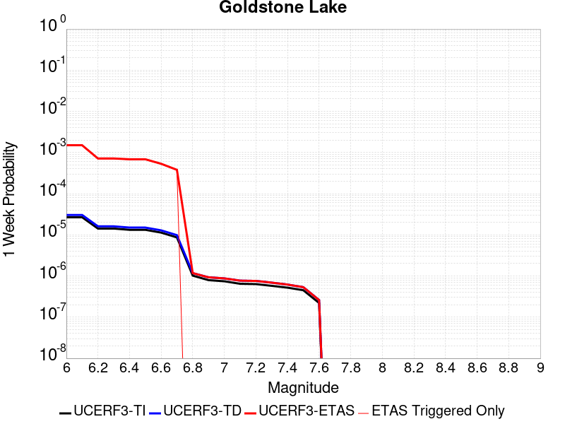 |  |  |  |

| Magnitude | 1 wk TI Prob | 1 wk TD Prob | 1 wk ETAS Prob | 1 wk ETAS/TD Gain | 1 wk ETAS Triggered Only | 1 mo TI Prob | 1 mo TD Prob | 1 mo ETAS Prob | 1 mo ETAS/TD Gain | 1 mo ETAS Triggered Only | 1 yr TI Prob | 1 yr TD Prob | 1 yr ETAS Prob | 1 yr ETAS/TD Gain | 1 yr ETAS Triggered Only | 10 yr TI Prob | 10 yr TD Prob | 10 yr ETAS Prob | 10 yr ETAS/TD Gain | 10 yr ETAS Triggered Only |
|-----|-----|-----|-----|-----|-----|-----|-----|-----|-----|-----|-----|-----|-----|-----|-----|-----|-----|-----|-----|-----|
| 6.0 | 2.671352E-5 | 3.037609E-5 | 0.0011455042 | 37.710716 | 0.0011151619 | 1.1448149E-4 | 1.3017785E-4 | 0.0016311619 | 12.530257 | 0.0015011795 | 0.001392921 | 0.0015839594 | 0.004624386 | 2.9195101 | 0.0030452497 | 0.013842222 | 0.015746197 | 0.021107562 | 1.3404864 | 0.005447137 |
| 6.1 | 2.671352E-5 | 3.037609E-5 | 0.0011455042 | 37.710716 | 0.0011151619 | 1.1448149E-4 | 1.3017785E-4 | 0.0016311619 | 12.530257 | 0.0015011795 | 0.001392921 | 0.0015839594 | 0.004624386 | 2.9195101 | 0.0030452497 | 0.013842222 | 0.015746197 | 0.021107562 | 1.3404864 | 0.005447137 |
| 6.2 | 1.4197047E-5 | 1.6096245E-5 | 5.736682E-4 | 35.63988 | 5.5758096E-4 | 6.0843064E-5 | 6.8982634E-5 | 7.5518875E-4 | 10.947519 | 6.862535E-4 | 7.4051257E-4 | 8.3963864E-4 | 0.0020395739 | 2.429109 | 0.0012009436 | 0.007380498 | 0.0083743585 | 0.0108411955 | 1.2945702 | 0.0024876688 |
| 6.3 | 1.4197047E-5 | 1.6096245E-5 | 5.736682E-4 | 35.63988 | 5.5758096E-4 | 6.0843064E-5 | 6.8982634E-5 | 7.5518875E-4 | 10.947519 | 6.862535E-4 | 7.4051257E-4 | 8.3963864E-4 | 0.0020395739 | 2.429109 | 0.0012009436 | 0.007380498 | 0.0083743585 | 0.0108411955 | 1.2945702 | 0.0024876688 |
| 6.4 | 1.3238931E-5 | 1.500846E-5 | 5.296908E-4 | 35.29282 | 5.146901E-4 | 5.6737044E-5 | 6.4320935E-5 | 7.076422E-4 | 11.0017395 | 6.4336264E-4 | 6.9055456E-4 | 7.82924E-4 | 0.0018972128 | 2.42324 | 0.0011151619 | 0.006884126 | 0.0078112837 | 0.010024185 | 1.2832956 | 0.0022303239 |
| 6.5 | 1.3238931E-5 | 1.500846E-5 | 5.296908E-4 | 35.29282 | 5.146901E-4 | 5.6737044E-5 | 6.4320935E-5 | 7.076422E-4 | 11.0017395 | 6.4336264E-4 | 6.9055456E-4 | 7.82924E-4 | 0.0018972128 | 2.42324 | 0.0011151619 | 0.006884126 | 0.0078112837 | 0.010024185 | 1.2832956 | 0.0022303239 |
| 6.6 | 1.1328278E-5 | 1.2855166E-5 | 3.988678E-4 | 31.027822 | 3.8601758E-4 | 4.8548856E-5 | 5.5092944E-5 | 5.697547E-4 | 10.341701 | 5.146901E-4 | 5.90922E-4 | 6.7064585E-4 | 0.0015707494 | 2.3421445 | 9.007077E-4 | 0.0058935313 | 0.0066956086 | 0.008527566 | 1.2736058 | 0.0018443062 |
| 6.7 | 8.651175E-6 | 9.824565E-6 | 1.8138625E-4 | 18.462523 | 1.7156337E-4 | 3.707594E-5 | 4.2105108E-5 | 2.9943933E-4 | 7.1117105 | 2.5734506E-4 | 4.5130608E-4 | 5.1259965E-4 | 0.0010270259 | 2.0035634 | 5.146901E-4 | 0.0045039062 | 0.005123051 | 0.0064031845 | 1.2498771 | 0.0012867253 |
| 6.8 | 1.0215377E-6 | 1.1754702E-6 | 1.1754702E-6 | 1.0 | 0.0 | 4.378012E-6 | 5.0377203E-6 | 5.0377203E-6 | 1.0 | 0.0 | 5.3300988E-5 | 6.1332634E-5 | 6.1332634E-5 | 1.0 | 0.0 | 5.3288206E-4 | 6.1316835E-4 | 7.41762E-4 | 1.2097199 | 1.2867253E-4 |
| 6.9 | 7.9360774E-7 | 9.2833966E-7 | 9.2833966E-7 | 1.0 | 0.0 | 3.4011714E-6 | 3.9785928E-6 | 3.9785928E-6 | 1.0 | 0.0 | 4.1408475E-5 | 4.843836E-5 | 4.843836E-5 | 1.0 | 0.0 | 4.140076E-4 | 4.8428503E-4 | 5.700252E-4 | 1.1770447 | 8.5781685E-5 |
| 7.0 | 7.4382757E-7 | 8.7473285E-7 | 8.7473285E-7 | 1.0 | 0.0 | 3.1878285E-6 | 3.74885E-6 | 3.74885E-6 | 1.0 | 0.0 | 3.8811122E-5 | 4.564136E-5 | 4.564136E-5 | 1.0 | 0.0 | 3.8804344E-4 | 4.5632652E-4 | 5.42069E-4 | 1.1878973 | 8.5781685E-5 |
| 7.1 | 6.4709513E-7 | 7.7113E-7 | 7.7113E-7 | 1.0 | 0.0 | 2.773262E-6 | 3.3048389E-6 | 3.3048389E-6 | 1.0 | 0.0 | 3.376394E-5 | 4.0235733E-5 | 4.0235733E-5 | 1.0 | 0.0 | 3.375881E-4 | 4.0229043E-4 | 4.880376E-4 | 1.2131474 | 8.5781685E-5 |
| 7.2 | 6.356704E-7 | 7.5883594E-7 | 7.5883594E-7 | 1.0 | 0.0 | 2.7242988E-6 | 3.2521505E-6 | 3.2521505E-6 | 1.0 | 0.0 | 3.3167835E-5 | 3.959427E-5 | 3.959427E-5 | 1.0 | 0.0 | 3.3162883E-4 | 3.958781E-4 | 4.8162584E-4 | 1.2166014 | 8.5781685E-5 |
| 7.3 | 5.7695723E-7 | 6.8965653E-7 | 6.8965653E-7 | 1.0 | 0.0 | 2.4726714E-6 | 2.9556677E-6 | 2.9556677E-6 | 1.0 | 0.0 | 3.0104358E-5 | 3.5984718E-5 | 3.5984718E-5 | 1.0 | 0.0 | 3.0100282E-4 | 3.5979465E-4 | 4.4554548E-4 | 1.2383326 | 8.5781685E-5 |
| 7.4 | 5.209647E-7 | 6.193514E-7 | 6.193514E-7 | 1.0 | 0.0 | 2.232704E-6 | 2.6543607E-6 | 2.6543607E-6 | 1.0 | 0.0 | 2.718283E-5 | 3.2316417E-5 | 3.2316417E-5 | 1.0 | 0.0 | 2.7179506E-4 | 3.2312275E-4 | 3.6599973E-4 | 1.1326957 | 4.2890842E-5 |
| 7.5 | 4.512955E-7 | 5.348885E-7 | 5.348885E-7 | 1.0 | 0.0 | 1.934122E-6 | 2.2923775E-6 | 2.2923775E-6 | 1.0 | 0.0 | 2.3547682E-5 | 2.7909393E-5 | 2.7909393E-5 | 1.0 | 0.0 | 2.3545188E-4 | 2.7906417E-4 | 3.2194305E-4 | 1.1536523 | 4.2890842E-5 |
| 7.6 | 2.21172E-7 | 2.603961E-7 | 2.603961E-7 | 1.0 | 0.0 | 9.478797E-7 | 1.1159829E-6 | 1.1159829E-6 | 1.0 | 0.0 | 1.1540374E-5 | 1.3587036E-5 | 1.3587036E-5 | 1.0 | 0.0 | 1.1539775E-4 | 1.3586486E-4 | 1.7874988E-4 | 1.3156446 | 4.2890842E-5 |

## So Sierra Nevada
*[(top)](#table-of-contents)*

| 1 Week | 1 Month | 1 Year | 10 Year |
|-----|-----|-----|-----|
|  |  |  |  |

| Magnitude | 1 wk TI Prob | 1 wk TD Prob | 1 wk ETAS Prob | 1 wk ETAS/TD Gain | 1 wk ETAS Triggered Only | 1 mo TI Prob | 1 mo TD Prob | 1 mo ETAS Prob | 1 mo ETAS/TD Gain | 1 mo ETAS Triggered Only | 1 yr TI Prob | 1 yr TD Prob | 1 yr ETAS Prob | 1 yr ETAS/TD Gain | 1 yr ETAS Triggered Only | 10 yr TI Prob | 10 yr TD Prob | 10 yr ETAS Prob | 10 yr ETAS/TD Gain | 10 yr ETAS Triggered Only |
|-----|-----|-----|-----|-----|-----|-----|-----|-----|-----|-----|-----|-----|-----|-----|-----|-----|-----|-----|-----|-----|
| 6.0 | 1.15488665E-5 | 1.1079643E-5 | 0.0012977907 | 117.132904 | 0.0012867253 | 4.9494203E-5 | 4.748339E-5 | 0.0021061462 | 44.35543 | 0.0020587605 | 6.024253E-4 | 5.7796965E-4 | 0.0043930486 | 7.6008286 | 0.003817285 | 0.006007948 | 0.005765934 | 0.010797871 | 1.8727012 | 0.0050611193 |
| 6.1 | 1.15488665E-5 | 1.1079643E-5 | 0.0012977907 | 117.132904 | 0.0012867253 | 4.9494203E-5 | 4.748339E-5 | 0.0021061462 | 44.35543 | 0.0020587605 | 6.024253E-4 | 5.7796965E-4 | 0.0043930486 | 7.6008286 | 0.003817285 | 0.006007948 | 0.005765934 | 0.010797871 | 1.8727012 | 0.0050611193 |
| 6.2 | 1.15488665E-5 | 1.1079643E-5 | 0.0012977907 | 117.132904 | 0.0012867253 | 4.9494203E-5 | 4.748339E-5 | 0.0021061462 | 44.35543 | 0.0020587605 | 6.024253E-4 | 5.7796965E-4 | 0.0043930486 | 7.6008286 | 0.003817285 | 0.006007948 | 0.005765934 | 0.010797871 | 1.8727012 | 0.0050611193 |
| 6.3 | 1.15488665E-5 | 1.1079643E-5 | 0.0012977907 | 117.132904 | 0.0012867253 | 4.9494203E-5 | 4.748339E-5 | 0.0021061462 | 44.35543 | 0.0020587605 | 6.024253E-4 | 5.7796965E-4 | 0.0043930486 | 7.6008286 | 0.003817285 | 0.006007948 | 0.005765934 | 0.010797871 | 1.8727012 | 0.0050611193 |
| 6.4 | 1.15488665E-5 | 1.1079643E-5 | 0.0012977907 | 117.132904 | 0.0012867253 | 4.9494203E-5 | 4.748339E-5 | 0.0021061462 | 44.35543 | 0.0020587605 | 6.024253E-4 | 5.7796965E-4 | 0.0043930486 | 7.6008286 | 0.003817285 | 0.006007948 | 0.005765934 | 0.010797871 | 1.8727012 | 0.0050611193 |
| 6.5 | 1.15488665E-5 | 1.1079643E-5 | 0.0012977907 | 117.132904 | 0.0012867253 | 4.9494203E-5 | 4.748339E-5 | 0.0021061462 | 44.35543 | 0.0020587605 | 6.024253E-4 | 5.7796965E-4 | 0.0043930486 | 7.6008286 | 0.003817285 | 0.006007948 | 0.005765934 | 0.010797871 | 1.8727012 | 0.0050611193 |
| 6.6 | 7.587044E-6 | 6.935635E-6 | 5.216222E-4 | 75.209 | 5.146901E-4 | 3.2515498E-5 | 2.9723828E-5 | 9.3040476E-4 | 31.301645 | 9.007077E-4 | 3.9580427E-4 | 3.6183043E-4 | 0.0019910927 | 5.502834 | 0.001629852 | 0.003951 | 0.0036127048 | 0.005792235 | 1.603296 | 0.002187433 |
| 6.7 | 7.587044E-6 | 6.935635E-6 | 5.216222E-4 | 75.209 | 5.146901E-4 | 3.2515498E-5 | 2.9723828E-5 | 9.3040476E-4 | 31.301645 | 9.007077E-4 | 3.9580427E-4 | 3.6183043E-4 | 0.0019910927 | 5.502834 | 0.001629852 | 0.003951 | 0.0036127048 | 0.005792235 | 1.603296 | 0.002187433 |
| 6.8 | 5.9026956E-6 | 5.1793927E-6 | 3.4830437E-4 | 67.24811 | 3.4312674E-4 | 2.5297022E-5 | 2.2197215E-5 | 6.655456E-4 | 29.983292 | 6.4336264E-4 | 3.0794772E-4 | 2.7021873E-4 | 0.0013850793 | 5.1257706 | 0.0011151619 | 0.0030752132 | 0.002699018 | 0.004153371 | 1.5388452 | 0.0014582886 |
| 6.9 | 5.0118915E-6 | 4.2524252E-6 | 1.7581506E-4 | 41.344658 | 1.7156337E-4 | 2.1479358E-5 | 1.8224557E-5 | 4.0423512E-4 | 22.180792 | 3.8601758E-4 | 2.614798E-4 | 2.2186211E-4 | 9.93726E-4 | 4.4790254 | 7.7203516E-4 | 0.0026117235 | 0.0022164788 | 0.0032435774 | 1.463392 | 0.0010293802 |
| 7.0 | 4.4924795E-6 | 3.7139177E-6 | 1.3238596E-4 | 35.64591 | 1.2867253E-4 | 1.925334E-5 | 1.5916696E-5 | 3.5903798E-4 | 22.557318 | 3.4312674E-4 | 2.3438422E-4 | 1.9376918E-4 | 7.941246E-4 | 4.098302 | 6.004718E-4 | 0.0023413717 | 0.0019360651 | 0.0027494135 | 1.4201038 | 8.14926E-4 |
| 7.1 | 3.9118436E-6 | 3.1119775E-6 | 8.8893394E-5 | 28.564922 | 8.5781685E-5 | 1.6764936E-5 | 1.3336982E-5 | 2.706786E-4 | 20.295341 | 2.5734506E-4 | 2.0409399E-4 | 1.6236622E-4 | 5.91205E-4 | 3.6411822 | 4.2890842E-4 | 0.0020390663 | 0.001622532 | 0.0022648508 | 1.3958743 | 6.4336264E-4 |
| 7.2 | 3.4200818E-6 | 2.6054543E-6 | 4.5496185E-5 | 17.4619 | 4.2890842E-5 | 1.4657411E-5 | 1.11661875E-5 | 1.8272764E-4 | 16.364372 | 1.7156337E-4 | 1.7843937E-4 | 1.3594035E-4 | 4.3613545E-4 | 3.2082853 | 3.002359E-4 | 0.0017829615 | 0.0013586218 | 0.0017441149 | 1.2837384 | 3.8601758E-4 |
| 7.3 | 2.6593618E-6 | 1.8284203E-6 | 4.4719185E-5 | 24.457827 | 4.2890842E-5 | 1.13972155E-5 | 7.836065E-6 | 1.3650759E-4 | 17.420425 | 1.2867253E-4 | 1.3875226E-4 | 9.540021E-5 | 3.0983397E-4 | 3.2477283 | 2.1445421E-4 | 0.0013866565 | 9.5362146E-4 | 0.0012107211 | 1.2696035 | 2.5734506E-4 |
| 7.4 | 2.2577992E-6 | 1.436438E-6 | 1.436438E-6 | 1.0 | 0.0 | 9.676246E-6 | 6.15615E-6 | 9.1937305E-5 | 14.934222 | 8.5781685E-5 | 1.1780193E-4 | 7.49488E-5 | 2.4649932E-4 | 3.2889028 | 1.7156337E-4 | 0.001177395 | 7.492603E-4 | 9.6355384E-4 | 1.2860068 | 2.1445421E-4 |
| 7.5 | 1.489319E-6 | 7.353936E-7 | 7.353936E-7 | 1.0 | 0.0 | 6.3827797E-6 | 3.1516831E-6 | 4.604239E-5 | 14.608826 | 4.2890842E-5 | 7.770758E-5 | 3.8371072E-5 | 1.2414946E-4 | 3.2354965 | 8.5781685E-5 | 7.7680405E-4 | 3.836449E-4 | 4.6939365E-4 | 1.2235107 | 8.5781685E-5 |
| 7.6 | 1.0680322E-6 | 4.6596554E-7 | 4.6596554E-7 | 1.0 | 0.0 | 4.577273E-6 | 1.9969937E-6 | 1.9969937E-6 | 1.0 | 0.0 | 5.5726876E-5 | 2.4313129E-5 | 2.4313129E-5 | 1.0 | 0.0 | 5.5712904E-4 | 2.4310495E-4 | 2.4310495E-4 | 1.0 | 0.0 |
| 7.7 | 5.509146E-7 | 1.5580486E-7 | 1.5580486E-7 | 1.0 | 0.0 | 2.3610605E-6 | 6.677349E-7 | 6.677349E-7 | 1.0 | 0.0 | 2.8745531E-5 | 8.129644E-6 | 8.129644E-6 | 1.0 | 0.0 | 2.8741814E-4 | 8.1293576E-5 | 8.1293576E-5 | 1.0 | 0.0 |

## Lenwood-Lockhart-Old Woman Springs
*[(top)](#table-of-contents)*

| 1 Week | 1 Month | 1 Year | 10 Year |
|-----|-----|-----|-----|
| 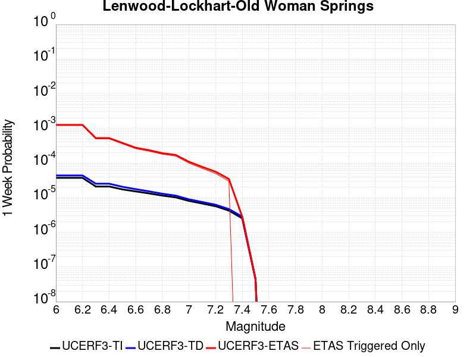 |  |  |  |

| Magnitude | 1 wk TI Prob | 1 wk TD Prob | 1 wk ETAS Prob | 1 wk ETAS/TD Gain | 1 wk ETAS Triggered Only | 1 mo TI Prob | 1 mo TD Prob | 1 mo ETAS Prob | 1 mo ETAS/TD Gain | 1 mo ETAS Triggered Only | 1 yr TI Prob | 1 yr TD Prob | 1 yr ETAS Prob | 1 yr ETAS/TD Gain | 1 yr ETAS Triggered Only | 10 yr TI Prob | 10 yr TD Prob | 10 yr ETAS Prob | 10 yr ETAS/TD Gain | 10 yr ETAS Triggered Only |
|-----|-----|-----|-----|-----|-----|-----|-----|-----|-----|-----|-----|-----|-----|-----|-----|-----|-----|-----|-----|-----|
| 6.0 | 3.744542E-5 | 4.396252E-5 | 0.0013306312 | 30.2674 | 0.0012867253 | 1.604705E-4 | 1.8839816E-4 | 0.0022896535 | 12.153269 | 0.0021016514 | 0.0019519776 | 0.0022915069 | 0.005286986 | 2.3072093 | 0.003002359 | 0.019349206 | 0.022696787 | 0.02709811 | 1.1939183 | 0.0045035384 |
| 6.1 | 3.744542E-5 | 4.396252E-5 | 0.0013306312 | 30.2674 | 0.0012867253 | 1.604705E-4 | 1.8839816E-4 | 0.0022896535 | 12.153269 | 0.0021016514 | 0.0019519776 | 0.0022915069 | 0.005286986 | 2.3072093 | 0.003002359 | 0.019349206 | 0.022696787 | 0.02709811 | 1.1939183 | 0.0045035384 |
| 6.2 | 3.744542E-5 | 4.396252E-5 | 0.0013306312 | 30.2674 | 0.0012867253 | 1.604705E-4 | 1.8839816E-4 | 0.0022896535 | 12.153269 | 0.0021016514 | 0.0019519776 | 0.0022915069 | 0.005286986 | 2.3072093 | 0.003002359 | 0.019349206 | 0.022696787 | 0.02709811 | 1.1939183 | 0.0045035384 |
| 6.3 | 2.1079984E-5 | 2.5353434E-5 | 4.9714075E-4 | 19.60842 | 4.7179929E-4 | 9.0339665E-5 | 1.0865316E-4 | 9.234906E-4 | 8.499436 | 8.14926E-4 | 0.0010993304 | 0.0013220694 | 0.0026499277 | 2.0043786 | 0.0013296162 | 0.010939079 | 0.0131442575 | 0.015218284 | 1.1577896 | 0.0021016514 |
| 6.4 | 2.1079984E-5 | 2.5353434E-5 | 4.9714075E-4 | 19.60842 | 4.7179929E-4 | 9.0339665E-5 | 1.0865316E-4 | 9.234906E-4 | 8.499436 | 8.14926E-4 | 0.0010993304 | 0.0013220694 | 0.0026499277 | 2.0043786 | 0.0013296162 | 0.010939079 | 0.0131442575 | 0.015218284 | 1.1577896 | 0.0021016514 |
| 6.5 | 1.7397282E-5 | 2.066241E-5 | 3.6378205E-4 | 17.605984 | 3.4312674E-4 | 7.455765E-5 | 8.8550245E-5 | 6.8896887E-4 | 7.7805414 | 6.004718E-4 | 9.073613E-4 | 0.0010775778 | 0.001977315 | 1.8349626 | 9.007077E-4 | 0.009036654 | 0.010724821 | 0.012082608 | 1.1266023 | 0.001372507 |
| 6.6 | 1.52050325E-5 | 1.7679693E-5 | 2.750202E-4 | 15.555711 | 2.5734506E-4 | 6.51628E-5 | 7.576796E-5 | 5.904191E-4 | 7.792464 | 5.146901E-4 | 7.9306826E-4 | 9.220924E-4 | 0.001607713 | 1.7435488 | 6.862535E-4 | 0.007902439 | 0.009183526 | 0.0101609565 | 1.1064329 | 9.864894E-4 |
| 6.7 | 1.332523E-5 | 1.5264002E-5 | 2.2971495E-4 | 15.049457 | 2.1445421E-4 | 5.7106878E-5 | 6.5415545E-5 | 5.3718395E-4 | 8.21187 | 4.7179929E-4 | 6.950544E-4 | 7.961491E-4 | 0.0014389995 | 1.8074498 | 6.4336264E-4 | 0.006928845 | 0.007933599 | 0.008827161 | 1.1126301 | 9.007077E-4 |
| 6.8 | 1.1525329E-5 | 1.3030979E-5 | 2.274824E-4 | 17.457047 | 2.1445421E-4 | 4.9393333E-5 | 5.584588E-5 | 4.8473035E-4 | 8.679787 | 4.2890842E-4 | 6.011979E-4 | 6.797157E-4 | 0.0012797794 | 1.8828156 | 6.004718E-4 | 0.00599574 | 0.006776819 | 0.0075862226 | 1.1194371 | 8.14926E-4 |
| 6.9 | 1.0253909E-5 | 1.15144385E-5 | 2.2596619E-4 | 19.624594 | 2.1445421E-4 | 4.3944583E-5 | 4.9346683E-5 | 4.7823394E-4 | 9.691309 | 4.2890842E-4 | 5.3489394E-4 | 6.0063385E-4 | 0.001200745 | 1.9991298 | 6.004718E-4 | 0.0053360825 | 0.0059904843 | 0.006715261 | 1.1209879 | 7.291443E-4 |
| 7.0 | 8.104563E-6 | 8.991279E-6 | 1.3766265E-4 | 15.310686 | 1.2867253E-4 | 3.4733377E-5 | 3.8533497E-5 | 2.9586864E-4 | 7.6782193 | 2.5734506E-4 | 4.2279682E-4 | 4.6904673E-4 | 8.120125E-4 | 1.7311975 | 3.4312674E-4 | 0.0042199334 | 0.0046808156 | 0.0051077167 | 1.0912023 | 4.2890842E-4 |
| 7.1 | 6.7986157E-6 | 7.515816E-6 | 1.3618737E-4 | 18.120106 | 1.2867253E-4 | 2.91366E-5 | 3.2210253E-5 | 2.8954702E-4 | 8.989281 | 2.5734506E-4 | 3.5468035E-4 | 3.920914E-4 | 7.350836E-4 | 1.8747761 | 3.4312674E-4 | 0.003541148 | 0.003914213 | 0.004298719 | 1.0982335 | 3.8601758E-4 |
| 7.2 | 5.6893327E-6 | 6.2800136E-6 | 1.3495174E-4 | 21.489082 | 1.2867253E-4 | 2.4382627E-5 | 2.6914078E-5 | 2.8425222E-4 | 10.561469 | 2.5734506E-4 | 2.9681803E-4 | 3.2763163E-4 | 6.2776916E-4 | 1.9160823 | 3.002359E-4 | 0.002964219 | 0.0032716845 | 0.0036136888 | 1.1045346 | 3.4312674E-4 |
| 7.3 | 4.253348E-6 | 4.7069107E-6 | 9.048819E-5 | 19.22454 | 8.5781685E-5 | 1.8228506E-5 | 2.0172329E-5 | 2.3462222E-4 | 11.630895 | 2.1445421E-4 | 2.2190946E-4 | 2.4557224E-4 | 5.028541E-4 | 2.047683 | 2.5734506E-4 | 0.00221688 | 0.0024531898 | 0.0027526892 | 1.1220857 | 3.002359E-4 |
| 7.4 | 2.5448119E-6 | 2.852045E-6 | 2.852045E-6 | 1.0 | 0.0 | 1.0906291E-5 | 1.2223002E-5 | 9.800364E-5 | 8.017968 | 8.5781685E-5 | 1.3277601E-4 | 1.4880655E-4 | 2.774599E-4 | 1.8645681 | 1.2867253E-4 | 0.001326967 | 0.0014872311 | 0.0016157123 | 1.0863895 | 1.2867253E-4 |
| 7.5 | 4.3706837E-8 | 4.562909E-8 | 4.562909E-8 | 1.0 | 0.0 | 1.8731501E-7 | 1.9555324E-7 | 1.9555324E-7 | 1.0 | 0.0 | 2.2805577E-6 | 2.3808586E-6 | 4.5271598E-5 | 19.01482 | 4.2890842E-5 | 2.2805343E-5 | 2.3808387E-5 | 6.669821E-5 | 2.8014586 | 4.2890842E-5 |

## Coyote Canyon
*[(top)](#table-of-contents)*

| 1 Week | 1 Month | 1 Year | 10 Year |
|-----|-----|-----|-----|
|  |  |  |  |

| Magnitude | 1 wk TI Prob | 1 wk TD Prob | 1 wk ETAS Prob | 1 wk ETAS/TD Gain | 1 wk ETAS Triggered Only | 1 mo TI Prob | 1 mo TD Prob | 1 mo ETAS Prob | 1 mo ETAS/TD Gain | 1 mo ETAS Triggered Only | 1 yr TI Prob | 1 yr TD Prob | 1 yr ETAS Prob | 1 yr ETAS/TD Gain | 1 yr ETAS Triggered Only | 10 yr TI Prob | 10 yr TD Prob | 10 yr ETAS Prob | 10 yr ETAS/TD Gain | 10 yr ETAS Triggered Only |
|-----|-----|-----|-----|-----|-----|-----|-----|-----|-----|-----|-----|-----|-----|-----|-----|-----|-----|-----|-----|-----|
| 6.0 | 3.5090034E-5 | 4.0364324E-5 | 4.6925544E-4 | 11.6255 | 4.2890842E-4 | 1.503772E-4 | 1.7297994E-4 | 0.0010306484 | 5.958196 | 8.5781683E-4 | 0.0018293047 | 0.0021042528 | 0.0041586813 | 1.976322 | 0.0020587605 | 0.018143194 | 0.020869201 | 0.024522832 | 1.1750728 | 0.0037315034 |
| 6.1 | 3.5090034E-5 | 4.0364324E-5 | 4.6925544E-4 | 11.6255 | 4.2890842E-4 | 1.503772E-4 | 1.7297994E-4 | 0.0010306484 | 5.958196 | 8.5781683E-4 | 0.0018293047 | 0.0021042528 | 0.0041586813 | 1.976322 | 0.0020587605 | 0.018143194 | 0.020869201 | 0.024522832 | 1.1750728 | 0.0037315034 |
| 6.2 | 1.841879E-5 | 2.1059794E-5 | 1.9261955E-4 | 9.1463175 | 1.7156337E-4 | 7.8935285E-5 | 9.0253714E-5 | 3.9046252E-4 | 4.326277 | 3.002359E-4 | 9.606133E-4 | 0.001098387 | 0.0020409492 | 1.858133 | 9.4359857E-4 | 0.0095647145 | 0.010939667 | 0.012424424 | 1.1357223 | 0.0015011795 |
| 6.3 | 1.841879E-5 | 2.1059794E-5 | 1.9261955E-4 | 9.1463175 | 1.7156337E-4 | 7.8935285E-5 | 9.0253714E-5 | 3.9046252E-4 | 4.326277 | 3.002359E-4 | 9.606133E-4 | 0.001098387 | 0.0020409492 | 1.858133 | 9.4359857E-4 | 0.0095647145 | 0.010939667 | 0.012424424 | 1.1357223 | 0.0015011795 |
| 6.4 | 1.712201E-5 | 1.9565212E-5 | 1.9112523E-4 | 9.768625 | 1.7156337E-4 | 7.337798E-5 | 8.3848776E-5 | 3.840595E-4 | 4.580383 | 3.002359E-4 | 8.930107E-4 | 0.0010204813 | 0.0019202699 | 1.8817296 | 9.007077E-4 | 0.008894307 | 0.010167871 | 0.011611331 | 1.141963 | 0.0014582886 |
| 6.5 | 1.4744935E-5 | 1.6836972E-5 | 1.8839745E-4 | 11.189509 | 1.7156337E-4 | 6.3191044E-5 | 7.215698E-5 | 3.7237123E-4 | 5.160571 | 3.002359E-4 | 7.6907943E-4 | 8.7825063E-4 | 0.0017353141 | 1.9758757 | 8.5781683E-4 | 0.007664232 | 0.008756994 | 0.010074967 | 1.1505052 | 0.0013296162 |
| 6.6 | 1.2017839E-5 | 1.37240895E-5 | 1.4239486E-4 | 10.375541 | 1.2867253E-4 | 5.150401E-5 | 5.88167E-5 | 2.732583E-4 | 4.645931 | 2.1445421E-4 | 6.268809E-4 | 7.159466E-4 | 0.0014017088 | 1.9578398 | 6.862535E-4 | 0.0062511545 | 0.0071450938 | 0.008294872 | 1.1609186 | 0.0011580527 |
| 6.7 | 1.00956095E-5 | 1.1533517E-5 | 1.4020456E-4 | 12.156272 | 1.2867253E-4 | 4.326618E-5 | 4.942891E-5 | 2.209838E-4 | 4.47074 | 1.7156337E-4 | 5.266384E-4 | 6.017178E-4 | 0.0012018282 | 1.9973288 | 6.004718E-4 | 0.005253921 | 0.0060094125 | 0.00707524 | 1.1773597 | 0.001072271 |

## San Andreas (Mojave S)
*[(top)](#table-of-contents)*

| 1 Week | 1 Month | 1 Year | 10 Year |
|-----|-----|-----|-----|
|  |  |  |  |

| Magnitude | 1 wk TI Prob | 1 wk TD Prob | 1 wk ETAS Prob | 1 wk ETAS/TD Gain | 1 wk ETAS Triggered Only | 1 mo TI Prob | 1 mo TD Prob | 1 mo ETAS Prob | 1 mo ETAS/TD Gain | 1 mo ETAS Triggered Only | 1 yr TI Prob | 1 yr TD Prob | 1 yr ETAS Prob | 1 yr ETAS/TD Gain | 1 yr ETAS Triggered Only | 10 yr TI Prob | 10 yr TD Prob | 10 yr ETAS Prob | 10 yr ETAS/TD Gain | 10 yr ETAS Triggered Only |
|-----|-----|-----|-----|-----|-----|-----|-----|-----|-----|-----|-----|-----|-----|-----|-----|-----|-----|-----|-----|-----|
| 6.0 | 3.1064058E-4 | 6.7460834E-4 | 0.0023462228 | 3.4779036 | 0.0016727429 | 0.0013306376 | 0.0028881032 | 0.004855384 | 1.681167 | 0.0019729787 | 0.016080605 | 0.03462235 | 0.03731373 | 1.0777354 | 0.0027879048 | 0.1496549 | 0.28660452 | 0.28920537 | 1.0090747 | 0.0036457216 |
| 6.1 | 3.1064058E-4 | 6.7460834E-4 | 0.0023462228 | 3.4779036 | 0.0016727429 | 0.0013306376 | 0.0028881032 | 0.004855384 | 1.681167 | 0.0019729787 | 0.016080605 | 0.03462235 | 0.03731373 | 1.0777354 | 0.0027879048 | 0.1496549 | 0.28660452 | 0.28920537 | 1.0090747 | 0.0036457216 |
| 6.2 | 3.1064058E-4 | 6.7460834E-4 | 0.0023462228 | 3.4779036 | 0.0016727429 | 0.0013306376 | 0.0028881032 | 0.004855384 | 1.681167 | 0.0019729787 | 0.016080605 | 0.03462235 | 0.03731373 | 1.0777354 | 0.0027879048 | 0.1496549 | 0.28660452 | 0.28920537 | 1.0090747 | 0.0036457216 |
| 6.3 | 3.1064058E-4 | 6.7460834E-4 | 0.0023462228 | 3.4779036 | 0.0016727429 | 0.0013306376 | 0.0028881032 | 0.004855384 | 1.681167 | 0.0019729787 | 0.016080605 | 0.03462235 | 0.03731373 | 1.0777354 | 0.0027879048 | 0.1496549 | 0.28660452 | 0.28920537 | 1.0090747 | 0.0036457216 |
| 6.4 | 1.9872203E-4 | 4.3179357E-4 | 0.0017608355 | 4.077957 | 0.0013296162 | 8.5138786E-4 | 0.0018492596 | 0.0034760977 | 1.8797239 | 0.001629852 | 0.010316478 | 0.02228844 | 0.024594858 | 1.1034805 | 0.0023589963 | 0.098504856 | 0.19699748 | 0.1995117 | 1.0127628 | 0.0031310315 |
| 6.5 | 1.291105E-4 | 2.875267E-4 | 0.001573882 | 5.473864 | 0.0012867253 | 5.5321335E-4 | 0.0012316781 | 0.0028166845 | 2.2868676 | 0.0015869612 | 0.006714592 | 0.0148934 | 0.017090507 | 1.1475222 | 0.0022303239 | 0.065152965 | 0.13803436 | 0.14043744 | 1.0174093 | 0.0027879048 |
| 6.6 | 1.291105E-4 | 2.875267E-4 | 0.001573882 | 5.473864 | 0.0012867253 | 5.5321335E-4 | 0.0012316781 | 0.0028166845 | 2.2868676 | 0.0015869612 | 0.006714592 | 0.0148934 | 0.017090507 | 1.1475222 | 0.0022303239 | 0.065152965 | 0.13803436 | 0.14043744 | 1.0174093 | 0.0027879048 |
| 6.7 | 1.08001186E-4 | 2.4333889E-4 | 0.0015297511 | 6.2865047 | 0.0012867253 | 4.6278012E-4 | 0.0010424647 | 0.0025849254 | 2.4796288 | 0.0015440703 | 0.0056198016 | 0.012618446 | 0.014778277 | 1.1711646 | 0.002187433 | 0.054797906 | 0.119176775 | 0.12155687 | 1.0199711 | 0.002702123 |
| 6.8 | 1.0624356E-4 | 2.3851555E-4 | 0.001524934 | 6.393436 | 0.0012867253 | 4.5525006E-4 | 0.0010218095 | 0.0025643022 | 2.5095696 | 0.0015440703 | 0.0055285925 | 0.012369843 | 0.014530218 | 1.1746485 | 0.002187433 | 0.053930566 | 0.11712591 | 0.11951155 | 1.0203681 | 0.002702123 |
| 6.9 | 1.0393785E-4 | 2.3221898E-4 | 0.0015186454 | 6.539713 | 0.0012867253 | 4.4537184E-4 | 9.948451E-4 | 0.0025373793 | 2.550527 | 0.0015440703 | 0.0054089287 | 0.012045221 | 0.014206306 | 1.1794143 | 0.002187433 | 0.05279156 | 0.11442335 | 0.11681629 | 1.020913 | 0.002702123 |
| 7.0 | 1.0155622E-4 | 2.2591476E-4 | 0.0015123494 | 6.6943364 | 0.0012867253 | 4.3516833E-4 | 9.6784724E-4 | 0.002510423 | 2.5938218 | 0.0015440703 | 0.005285311 | 0.0117200995 | 0.013881896 | 1.184452 | 0.002187433 | 0.05161361 | 0.111683756 | 0.114084095 | 1.0214922 | 0.002702123 |
| 7.1 | 9.885595E-5 | 2.1879886E-4 | 0.0015052427 | 6.8795724 | 0.0012867253 | 4.2359953E-4 | 9.3737274E-4 | 0.0024799956 | 2.6456878 | 0.0015440703 | 0.0051451353 | 0.011352993 | 0.013515592 | 1.1904871 | 0.002187433 | 0.05027629 | 0.1085682 | 0.11097696 | 1.0221866 | 0.002702123 |
| 7.2 | 9.6411415E-5 | 2.124288E-4 | 0.0014988808 | 7.0559206 | 0.0012867253 | 4.1312634E-4 | 9.1009185E-4 | 0.002452757 | 2.6950653 | 0.0015440703 | 0.005018219 | 0.011024255 | 0.013187574 | 1.1962326 | 0.002187433 | 0.049064007 | 0.105758004 | 0.108174354 | 1.0228479 | 0.002702123 |
| 7.3 | 9.1180635E-5 | 1.9471257E-4 | 0.0014383048 | 7.3868103 | 0.0012438344 | 3.907156E-4 | 8.342157E-4 | 0.0023341428 | 2.798009 | 0.0015011795 | 0.004746591 | 0.01010939 | 0.012232251 | 1.2099892 | 0.002144542 | 0.046464786 | 0.09795115 | 0.10034991 | 1.0244893 | 0.0026592324 |
| 7.4 | 8.887388E-5 | 1.8719878E-4 | 0.0014308004 | 7.643214 | 0.0012438344 | 3.8083247E-4 | 8.020339E-4 | 0.0023020094 | 2.8702147 | 0.0015011795 | 0.0046267817 | 0.00972114 | 0.011844835 | 1.2184615 | 0.002144542 | 0.045316286 | 0.09458615 | 0.096993856 | 1.0254551 | 0.0026592324 |
| 7.5 | 8.6750515E-5 | 1.8051457E-4 | 0.0013812414 | 7.651689 | 0.0012009436 | 3.7173493E-4 | 7.7340455E-4 | 0.0022305653 | 2.8840861 | 0.0014582886 | 0.004516484 | 0.009375632 | 0.011457579 | 1.2220594 | 0.0021016514 | 0.04425787 | 0.091549896 | 0.09392671 | 1.025962 | 0.0026163415 |
| 7.6 | 8.453092E-5 | 1.7439072E-4 | 0.0013751249 | 7.8853097 | 0.0012009436 | 3.6222505E-4 | 7.471748E-4 | 0.002204374 | 2.9502788 | 0.0014582886 | 0.0044011753 | 0.009058985 | 0.011141597 | 1.2298946 | 0.0021016514 | 0.04315024 | 0.08870898 | 0.09109323 | 1.0268772 | 0.0026163415 |
| 7.7 | 8.259102E-5 | 1.6961215E-4 | 0.0013703521 | 8.079328 | 0.0012009436 | 3.539135E-4 | 7.2670676E-4 | 0.0021839356 | 3.0052502 | 0.0014582886 | 0.004300386 | 0.008811831 | 0.010894963 | 1.2364017 | 0.0021016514 | 0.042181134 | 0.08645982 | 0.088849954 | 1.0276444 | 0.0026163415 |
| 7.8 | 7.444844E-5 | 1.5283503E-4 | 0.0010105207 | 6.6118402 | 8.5781683E-4 | 3.1902574E-4 | 6.548429E-4 | 0.0017692745 | 2.7018306 | 0.0011151619 | 0.0038772223 | 0.007943616 | 0.009645621 | 1.2142608 | 0.0017156337 | 0.03810269 | 0.078290746 | 0.08022786 | 1.0247425 | 0.0021016514 |
| 7.9 | 5.2586525E-5 | 1.00064186E-4 | 3.5738348E-4 | 3.5715425 | 2.5734506E-4 | 2.2535135E-4 | 4.2877605E-4 | 8.575006E-4 | 1.9998798 | 4.2890842E-4 | 0.0027402006 | 0.005207864 | 0.0058905436 | 1.1310863 | 6.862535E-4 | 0.027066574 | 0.052200034 | 0.05317568 | 1.0186906 | 0.0010293802 |
| 8.0 | 3.379877E-5 | 5.4074168E-5 | 9.696269E-5 | 1.7931426 | 4.2890842E-5 | 1.4484383E-4 | 2.3172585E-4 | 3.1748766E-4 | 1.3701003 | 8.5781685E-5 | 0.0017620471 | 0.002817614 | 0.003031464 | 1.0758976 | 2.1445421E-4 | 0.017481409 | 0.028834904 | 0.029168135 | 1.0115566 | 3.4312674E-4 |
| 8.1 | 1.8668277E-5 | 1.9309397E-5 | 1.9309397E-5 | 1.0 | 0.0 | 8.000444E-5 | 8.275194E-5 | 8.275194E-5 | 1.0 | 0.0 | 9.736188E-4 | 0.0010070398 | 0.0010498874 | 1.0425481 | 4.2890842E-5 | 0.009693642 | 0.010798888 | 0.010841316 | 1.0039289 | 4.2890842E-5 |
| 8.2 | 8.541571E-6 | 5.460819E-6 | 5.460819E-6 | 1.0 | 0.0 | 3.660622E-5 | 2.3403301E-5 | 2.3403301E-5 | 1.0 | 0.0 | 4.455896E-4 | 2.84898E-4 | 2.84898E-4 | 1.0 | 0.0 | 0.0044469717 | 0.0032408056 | 0.0032408056 | 1.0 | 0.0 |
| 8.3 | 1.983087E-6 | 7.6599065E-7 | 7.6599065E-7 | 1.0 | 0.0 | 8.498917E-6 | 3.282813E-6 | 3.282813E-6 | 1.0 | 0.0 | 1.034694E-4 | 3.9967534E-5 | 3.9967534E-5 | 1.0 | 0.0 | 0.0010342124 | 4.719687E-4 | 4.719687E-4 | 1.0 | 0.0 |

## Death Valley (So)
*[(top)](#table-of-contents)*

| 1 Week | 1 Month | 1 Year | 10 Year |
|-----|-----|-----|-----|
|  |  |  | 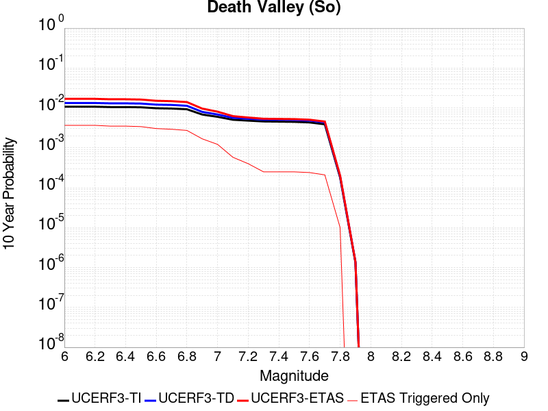 |

| Magnitude | 1 wk TI Prob | 1 wk TD Prob | 1 wk ETAS Prob | 1 wk ETAS/TD Gain | 1 wk ETAS Triggered Only | 1 mo TI Prob | 1 mo TD Prob | 1 mo ETAS Prob | 1 mo ETAS/TD Gain | 1 mo ETAS Triggered Only | 1 yr TI Prob | 1 yr TD Prob | 1 yr ETAS Prob | 1 yr ETAS/TD Gain | 1 yr ETAS Triggered Only | 10 yr TI Prob | 10 yr TD Prob | 10 yr ETAS Prob | 10 yr ETAS/TD Gain | 10 yr ETAS Triggered Only |
|-----|-----|-----|-----|-----|-----|-----|-----|-----|-----|-----|-----|-----|-----|-----|-----|-----|-----|-----|-----|-----|
| 6.0 | 2.0684236E-5 | 2.5617775E-5 | 7.547434E-4 | 29.461708 | 7.291443E-4 | 8.864371E-5 | 1.0978594E-4 | 0.001096167 | 9.984585 | 9.864894E-4 | 0.0010787029 | 0.0013358411 | 0.0032205172 | 2.4108534 | 0.0018871971 | 0.010734817 | 0.013281397 | 0.016836377 | 1.2676661 | 0.0036028307 |
| 6.1 | 2.0684236E-5 | 2.5617775E-5 | 7.547434E-4 | 29.461708 | 7.291443E-4 | 8.864371E-5 | 1.0978594E-4 | 0.001096167 | 9.984585 | 9.864894E-4 | 0.0010787029 | 0.0013358411 | 0.0032205172 | 2.4108534 | 0.0018871971 | 0.010734817 | 0.013281397 | 0.016836377 | 1.2676661 | 0.0036028307 |
| 6.2 | 2.0684236E-5 | 2.5617775E-5 | 7.547434E-4 | 29.461708 | 7.291443E-4 | 8.864371E-5 | 1.0978594E-4 | 0.001096167 | 9.984585 | 9.864894E-4 | 0.0010787029 | 0.0013358411 | 0.0032205172 | 2.4108534 | 0.0018871971 | 0.010734817 | 0.013281397 | 0.016836377 | 1.2676661 | 0.0036028307 |
| 6.3 | 2.0240292E-5 | 2.511786E-5 | 7.1135414E-4 | 28.320648 | 6.862535E-4 | 8.6741224E-5 | 1.07643624E-4 | 0.0010511406 | 9.765005 | 9.4359857E-4 | 0.0010555626 | 0.00130979 | 0.0031516806 | 2.4062488 | 0.0018443062 | 0.010505628 | 0.013023956 | 0.016368203 | 1.2567766 | 0.0033883767 |
| 6.4 | 2.0240292E-5 | 2.511786E-5 | 7.1135414E-4 | 28.320648 | 6.862535E-4 | 8.6741224E-5 | 1.07643624E-4 | 0.0010511406 | 9.765005 | 9.4359857E-4 | 0.0010555626 | 0.00130979 | 0.0031516806 | 2.4062488 | 0.0018443062 | 0.010505628 | 0.013023956 | 0.016368203 | 1.2567766 | 0.0033883767 |
| 6.5 | 1.9962767E-5 | 2.4807114E-5 | 6.681538E-4 | 26.93396 | 6.4336264E-4 | 8.55519E-5 | 1.0631196E-4 | 0.0010069238 | 9.471407 | 9.007077E-4 | 0.0010410968 | 0.0012935963 | 0.0030926813 | 2.3907623 | 0.0018014153 | 0.010362327 | 0.012863902 | 0.016039334 | 1.2468483 | 0.0032168133 |
| 6.6 | 1.8937297E-5 | 2.3310964E-5 | 6.666586E-4 | 28.5985 | 6.4336264E-4 | 8.115732E-5 | 9.990039E-5 | 0.0010005181 | 10.015157 | 9.007077E-4 | 9.876423E-4 | 0.0012156231 | 0.0029291713 | 2.4096048 | 0.0017156337 | 0.009832645 | 0.012092789 | 0.014974097 | 1.2382666 | 0.0029165773 |
| 6.7 | 1.8621096E-5 | 2.2911607E-5 | 6.2336965E-4 | 27.207592 | 6.004718E-4 | 7.980225E-5 | 9.818898E-5 | 9.559216E-4 | 9.735528 | 8.5781683E-4 | 9.711593E-4 | 0.0011948098 | 0.0028227144 | 2.3624802 | 0.001629852 | 0.009669261 | 0.011886904 | 0.01468405 | 1.2353133 | 0.0028307957 |
| 6.8 | 1.7830353E-5 | 2.1805688E-5 | 5.793745E-4 | 26.56988 | 5.5758096E-4 | 7.641356E-5 | 9.344968E-5 | 8.654127E-4 | 9.260735 | 7.7203516E-4 | 9.29938E-4 | 0.00113717 | 0.0025938004 | 2.2809258 | 0.0014582886 | 0.009260561 | 0.011316354 | 0.013860683 | 1.2248363 | 0.0025734506 |
| 6.9 | 1.3135183E-5 | 1.5303925E-5 | 3.5842543E-4 | 23.42049 | 3.4312674E-4 | 5.6292425E-5 | 6.558664E-5 | 6.23131E-4 | 9.500884 | 5.5758096E-4 | 6.8514474E-4 | 7.982312E-4 | 0.0018696464 | 2.3422365 | 0.001072271 | 0.006830362 | 0.007954649 | 0.009656635 | 1.2139612 | 0.0017156337 |
| 7.0 | 1.1507512E-5 | 1.3154199E-5 | 2.2760559E-4 | 17.302885 | 2.1445421E-4 | 4.9316975E-5 | 5.6373956E-5 | 3.5659294E-4 | 6.325491 | 3.002359E-4 | 6.002687E-4 | 6.8614254E-4 | 0.0014147866 | 2.0619426 | 7.291443E-4 | 0.0059864987 | 0.0068409415 | 0.007991072 | 1.1681246 | 0.0011580527 |
| 7.1 | 9.715903E-6 | 1.0865278E-5 | 5.3755655E-5 | 4.9474716 | 4.2890842E-5 | 4.1638916E-5 | 4.656467E-5 | 1.3234236E-4 | 2.8421197 | 8.5781685E-5 | 5.068359E-4 | 5.667817E-4 | 7.8111433E-4 | 1.3781574 | 2.1445421E-4 | 0.0050568148 | 0.0056538144 | 0.0061229463 | 1.0829761 | 4.7179929E-4 |
| 7.2 | 9.233269E-6 | 1.02863105E-5 | 5.317671E-5 | 5.1696587 | 4.2890842E-5 | 3.9570554E-5 | 4.4083466E-5 | 1.2986136E-4 | 2.9458067 | 8.5781685E-5 | 4.81665E-4 | 5.3658825E-4 | 7.509274E-4 | 1.399448 | 2.1445421E-4 | 0.0048062233 | 0.0053533576 | 0.00577997 | 1.0796906 | 4.2890842E-4 |
| 7.3 | 8.8041315E-6 | 9.808164E-6 | 9.808164E-6 | 1.0 | 0.0 | 3.7731446E-5 | 4.2034335E-5 | 8.492338E-5 | 2.0203335 | 4.2890842E-5 | 4.592835E-4 | 5.1165203E-4 | 5.973898E-4 | 1.1675705 | 8.5781685E-5 | 0.0045833546 | 0.005105167 | 0.0053185266 | 1.0417929 | 2.1445421E-4 |
| 7.4 | 8.708749E-6 | 9.707175E-6 | 9.707175E-6 | 1.0 | 0.0 | 3.7322676E-5 | 4.160154E-5 | 8.4490595E-5 | 2.0309489 | 4.2890842E-5 | 4.5430884E-4 | 5.0638523E-4 | 5.921235E-4 | 1.1693143 | 8.5781685E-5 | 0.004533812 | 0.0050527398 | 0.0052661104 | 1.0422287 | 2.1445421E-4 |
| 7.5 | 8.612678E-6 | 9.604817E-6 | 9.604817E-6 | 1.0 | 0.0 | 3.6910955E-5 | 4.1162875E-5 | 8.405196E-5 | 2.041936 | 4.2890842E-5 | 4.492982E-4 | 5.01047E-4 | 5.8678567E-4 | 1.1711191 | 8.5781685E-5 | 0.004483909 | 0.0049995985 | 0.005212981 | 1.0426798 | 2.1445421E-4 |
| 7.6 | 8.319024E-6 | 9.283916E-6 | 9.283916E-6 | 1.0 | 0.0 | 3.5652476E-5 | 3.978763E-5 | 8.2676765E-5 | 2.0779514 | 4.2890842E-5 | 4.3398244E-4 | 4.8431093E-4 | 5.700511E-4 | 1.1770353 | 8.5781685E-5 | 0.0043313587 | 0.0048329784 | 0.005046396 | 1.0441587 | 2.1445421E-4 |
| 7.7 | 7.4718328E-6 | 8.34517E-6 | 8.34517E-6 | 1.0 | 0.0 | 3.2021748E-5 | 3.5764548E-5 | 7.865386E-5 | 2.199213 | 4.2890842E-5 | 3.8979502E-4 | 4.353504E-4 | 5.210947E-4 | 1.1969547 | 8.5781685E-5 | 0.00389112 | 0.0043453807 | 0.004558903 | 1.0491378 | 2.1445421E-4 |
| 7.8 | 3.4586725E-7 | 3.6482615E-7 | 3.6482615E-7 | 1.0 | 0.0 | 1.4822873E-6 | 1.5635396E-6 | 1.5635396E-6 | 1.0 | 0.0 | 1.80467E-5 | 1.9035933E-5 | 1.9035933E-5 | 1.0 | 0.0 | 1.8045233E-4 | 1.9034347E-4 | 1.9034347E-4 | 1.0 | 0.0 |
| 7.9 | 2.5591178E-9 | 2.6696718E-9 | 2.6696718E-9 | 1.0 | 0.0 | 1.0967647E-8 | 1.14414505E-8 | 1.14414505E-8 | 1.0 | 0.0 | 1.335311E-7 | 1.3929966E-7 | 1.3929966E-7 | 1.0 | 0.0 | 1.3353102E-6 | 1.3929966E-6 | 1.3929966E-6 | 1.0 | 0.0 |

## San Andreas (Mojave N)
*[(top)](#table-of-contents)*

| 1 Week | 1 Month | 1 Year | 10 Year |
|-----|-----|-----|-----|
| 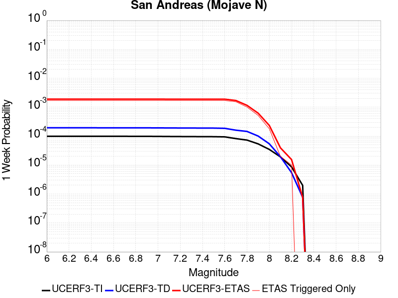 |  |  |  |

| Magnitude | 1 wk TI Prob | 1 wk TD Prob | 1 wk ETAS Prob | 1 wk ETAS/TD Gain | 1 wk ETAS Triggered Only | 1 mo TI Prob | 1 mo TD Prob | 1 mo ETAS Prob | 1 mo ETAS/TD Gain | 1 mo ETAS Triggered Only | 1 yr TI Prob | 1 yr TD Prob | 1 yr ETAS Prob | 1 yr ETAS/TD Gain | 1 yr ETAS Triggered Only | 10 yr TI Prob | 10 yr TD Prob | 10 yr ETAS Prob | 10 yr ETAS/TD Gain | 10 yr ETAS Triggered Only |
|-----|-----|-----|-----|-----|-----|-----|-----|-----|-----|-----|-----|-----|-----|-----|-----|-----|-----|-----|-----|-----|
| 6.0 | 9.877682E-5 | 1.9400702E-4 | 0.0017806604 | 9.178329 | 0.0015869612 | 4.2326056E-4 | 8.311939E-4 | 0.0027596776 | 3.320137 | 0.0019300879 | 0.0051410277 | 0.010072956 | 0.0127478605 | 1.2655531 | 0.002702123 | 0.05023708 | 0.09831428 | 0.101330854 | 1.030683 | 0.0033454858 |
| 6.1 | 9.877682E-5 | 1.9400702E-4 | 0.0017806604 | 9.178329 | 0.0015869612 | 4.2326056E-4 | 8.311939E-4 | 0.0027596776 | 3.320137 | 0.0019300879 | 0.0051410277 | 0.010072956 | 0.0127478605 | 1.2655531 | 0.002702123 | 0.05023708 | 0.09831428 | 0.101330854 | 1.030683 | 0.0033454858 |
| 6.2 | 9.877682E-5 | 1.9400702E-4 | 0.0017806604 | 9.178329 | 0.0015869612 | 4.2326056E-4 | 8.311939E-4 | 0.0027596776 | 3.320137 | 0.0019300879 | 0.0051410277 | 0.010072956 | 0.0127478605 | 1.2655531 | 0.002702123 | 0.05023708 | 0.09831428 | 0.101330854 | 1.030683 | 0.0033454858 |
| 6.3 | 9.877682E-5 | 1.9400702E-4 | 0.0017806604 | 9.178329 | 0.0015869612 | 4.2326056E-4 | 8.311939E-4 | 0.0027596776 | 3.320137 | 0.0019300879 | 0.0051410277 | 0.010072956 | 0.0127478605 | 1.2655531 | 0.002702123 | 0.05023708 | 0.09831428 | 0.101330854 | 1.030683 | 0.0033454858 |
| 6.4 | 9.877682E-5 | 1.9400702E-4 | 0.0017806604 | 9.178329 | 0.0015869612 | 4.2326056E-4 | 8.311939E-4 | 0.0027596776 | 3.320137 | 0.0019300879 | 0.0051410277 | 0.010072956 | 0.0127478605 | 1.2655531 | 0.002702123 | 0.05023708 | 0.09831428 | 0.101330854 | 1.030683 | 0.0033454858 |
| 6.5 | 9.861474E-5 | 1.9374468E-4 | 0.0017803984 | 9.189405 | 0.0015869612 | 4.2256617E-4 | 8.300703E-4 | 0.002758556 | 3.32328 | 0.0019300879 | 0.0051326132 | 0.010059402 | 0.012734344 | 1.2659146 | 0.002702123 | 0.050156746 | 0.098192066 | 0.10120905 | 1.0307254 | 0.0033454858 |
| 6.6 | 9.861474E-5 | 1.9374468E-4 | 0.0017803984 | 9.189405 | 0.0015869612 | 4.2256617E-4 | 8.300703E-4 | 0.002758556 | 3.32328 | 0.0019300879 | 0.0051326132 | 0.010059402 | 0.012734344 | 1.2659146 | 0.002702123 | 0.050156746 | 0.098192066 | 0.10120905 | 1.0307254 | 0.0033454858 |
| 6.7 | 9.8552715E-5 | 1.9364421E-4 | 0.0017802981 | 9.193655 | 0.0015869612 | 4.223004E-4 | 8.2964E-4 | 0.0027581267 | 3.324486 | 0.0019300879 | 0.0051293927 | 0.010054212 | 0.012729168 | 1.2660532 | 0.002702123 | 0.050125998 | 0.098145254 | 0.1011624 | 1.0307416 | 0.0033454858 |
| 6.8 | 9.8464974E-5 | 1.9349584E-4 | 0.00178015 | 9.199939 | 0.0015869612 | 4.219245E-4 | 8.290045E-4 | 0.0027574925 | 3.3262694 | 0.0019300879 | 0.0051248376 | 0.010046546 | 0.012721523 | 1.2662582 | 0.002702123 | 0.05008251 | 0.09807528 | 0.10109266 | 1.0307659 | 0.0033454858 |
| 6.9 | 9.825824E-5 | 1.9317595E-4 | 0.0017798305 | 9.213521 | 0.0015869612 | 4.2103877E-4 | 8.276344E-4 | 0.0027561248 | 3.3301237 | 0.0019300879 | 0.0051141046 | 0.010030019 | 0.01270504 | 1.2667015 | 0.002702123 | 0.049980022 | 0.09792438 | 0.10094226 | 1.0308185 | 0.0033454858 |
| 7.0 | 9.781462E-5 | 1.924896E-4 | 0.0017791453 | 9.242812 | 0.0015869612 | 4.1913814E-4 | 8.246948E-4 | 0.002753191 | 3.3384361 | 0.0019300879 | 0.005091073 | 0.009994558 | 0.012669675 | 1.2676573 | 0.002702123 | 0.04976007 | 0.09760077 | 0.10061973 | 1.0309317 | 0.0033454858 |
| 7.1 | 9.7121134E-5 | 1.9150671E-4 | 0.001778164 | 9.285126 | 0.0015869612 | 4.1616702E-4 | 8.204851E-4 | 0.0027489895 | 3.350444 | 0.0019300879 | 0.005055068 | 0.009943774 | 0.012619028 | 1.2690381 | 0.002702123 | 0.04941613 | 0.09713728 | 0.1001578 | 1.0310953 | 0.0033454858 |
| 7.2 | 9.663819E-5 | 1.9081456E-4 | 0.0017774729 | 9.315185 | 0.0015869612 | 4.1409794E-4 | 8.175206E-4 | 0.0027460307 | 3.3589742 | 0.0019300879 | 0.0050299936 | 0.00990801 | 0.012583361 | 1.2700189 | 0.002702123 | 0.049176537 | 0.09681055 | 0.099832155 | 1.0312115 | 0.0033454858 |
| 7.3 | 9.6277574E-5 | 1.9033969E-4 | 0.0017769989 | 9.335934 | 0.0015869612 | 4.125529E-4 | 8.154867E-4 | 0.0027440006 | 3.3648624 | 0.0019300879 | 0.0050112694 | 0.009883473 | 0.01255889 | 1.270696 | 0.002702123 | 0.04899759 | 0.09658401 | 0.09960637 | 1.0312926 | 0.0033454858 |
| 7.4 | 9.593308E-5 | 1.897375E-4 | 0.0017763976 | 9.362395 | 0.0015869612 | 4.1107697E-4 | 8.129075E-4 | 0.0027414265 | 3.372372 | 0.0019300879 | 0.0049933824 | 0.009852355 | 0.012527856 | 1.2715595 | 0.002702123 | 0.04882661 | 0.09630218 | 0.09932549 | 1.031394 | 0.0033454858 |
| 7.5 | 9.561707E-5 | 1.8919831E-4 | 0.0017758593 | 9.386231 | 0.0015869612 | 4.0972308E-4 | 8.1059814E-4 | 0.0027391214 | 3.3791363 | 0.0019300879 | 0.0049769743 | 0.009824493 | 0.012500069 | 1.2723373 | 0.002702123 | 0.048669744 | 0.09604836 | 0.09907252 | 1.0314858 | 0.0033454858 |
| 7.6 | 9.418194E-5 | 1.8572104E-4 | 0.0017723875 | 9.543278 | 0.0015869612 | 4.0357444E-4 | 7.957047E-4 | 0.0027242568 | 3.4237032 | 0.0019300879 | 0.004902454 | 0.009644784 | 0.012320846 | 1.277462 | 0.002702123 | 0.047957025 | 0.094430685 | 0.097460255 | 1.0320824 | 0.0033454858 |
| 7.7 | 8.202141E-5 | 1.6021315E-4 | 0.0016611521 | 10.368388 | 0.0015011795 | 3.51473E-4 | 6.8644714E-4 | 0.0025294875 | 3.6848974 | 0.0018443062 | 0.00427079 | 0.008325525 | 0.01087755 | 1.3065302 | 0.0025734506 | 0.04189639 | 0.08223219 | 0.085145116 | 1.0354232 | 0.0031739224 |
| 7.8 | 7.2859846E-5 | 1.4516473E-4 | 0.001002857 | 6.9084077 | 8.5781683E-4 | 3.1221908E-4 | 6.219862E-4 | 0.0017364545 | 2.7917893 | 0.0011151619 | 0.003794643 | 0.0075464295 | 0.009249116 | 1.2256281 | 0.0017156337 | 0.037304975 | 0.07472468 | 0.07666929 | 1.0260236 | 0.0021016514 |
| 7.9 | 5.3874453E-5 | 1.0045676E-4 | 3.5777598E-4 | 3.5614922 | 2.5734506E-4 | 2.3087008E-4 | 4.3045796E-4 | 8.5918175E-4 | 1.9959713 | 4.2890842E-4 | 0.0028072202 | 0.0052282433 | 0.005910909 | 1.1305727 | 6.862535E-4 | 0.02772022 | 0.05242443 | 0.053399846 | 1.0186062 | 0.0010293802 |
| 8.0 | 3.468538E-5 | 5.4260272E-5 | 9.714879E-5 | 1.7904221 | 4.2890842E-5 | 1.4864317E-4 | 2.325233E-4 | 3.1828505E-4 | 1.3688307 | 8.5781685E-5 | 0.0018082283 | 0.002827298 | 0.0030411456 | 1.0756369 | 2.1445421E-4 | 0.017935853 | 0.028947512 | 0.029280705 | 1.0115103 | 3.4312674E-4 |
| 8.1 | 1.9152367E-5 | 1.940263E-5 | 1.940263E-5 | 1.0 | 0.0 | 8.207899E-5 | 8.3151484E-5 | 8.3151484E-5 | 1.0 | 0.0 | 9.988535E-4 | 0.0010118998 | 0.0010547473 | 1.0423436 | 4.2890842E-5 | 0.009943757 | 0.01085625 | 0.010898676 | 1.0039079 | 4.2890842E-5 |
| 8.2 | 8.643924E-6 | 5.4748625E-6 | 5.4748625E-6 | 1.0 | 0.0 | 3.704486E-5 | 2.3463486E-5 | 2.3463486E-5 | 1.0 | 0.0 | 4.5092785E-4 | 2.8563058E-4 | 2.8563058E-4 | 1.0 | 0.0 | 0.0045001395 | 0.0032487072 | 0.0032487072 | 1.0 | 0.0 |
| 8.3 | 1.983087E-6 | 7.6599065E-7 | 7.6599065E-7 | 1.0 | 0.0 | 8.498917E-6 | 3.282813E-6 | 3.282813E-6 | 1.0 | 0.0 | 1.034694E-4 | 3.9967534E-5 | 3.9967534E-5 | 1.0 | 0.0 | 0.0010342124 | 4.719687E-4 | 4.719687E-4 | 1.0 | 0.0 |

## Nelson Lake
*[(top)](#table-of-contents)*

| 1 Week | 1 Month | 1 Year | 10 Year |
|-----|-----|-----|-----|
|  | 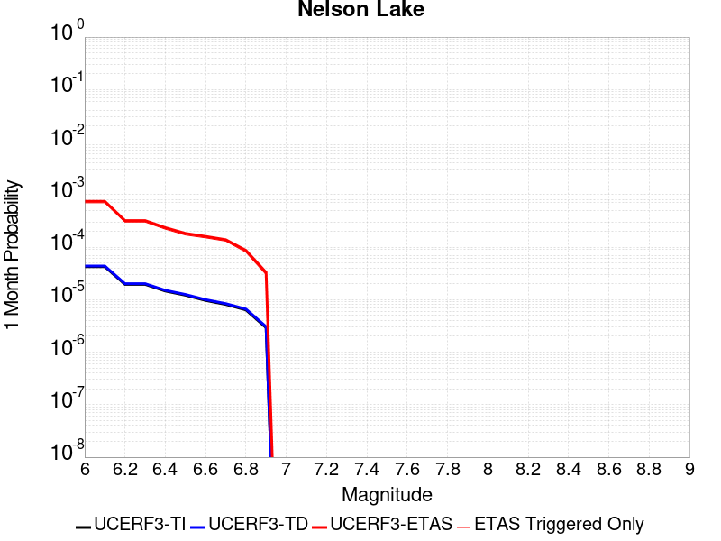 |  |  |

| Magnitude | 1 wk TI Prob | 1 wk TD Prob | 1 wk ETAS Prob | 1 wk ETAS/TD Gain | 1 wk ETAS Triggered Only | 1 mo TI Prob | 1 mo TD Prob | 1 mo ETAS Prob | 1 mo ETAS/TD Gain | 1 mo ETAS Triggered Only | 1 yr TI Prob | 1 yr TD Prob | 1 yr ETAS Prob | 1 yr ETAS/TD Gain | 1 yr ETAS Triggered Only | 10 yr TI Prob | 10 yr TD Prob | 10 yr ETAS Prob | 10 yr ETAS/TD Gain | 10 yr ETAS Triggered Only |
|-----|-----|-----|-----|-----|-----|-----|-----|-----|-----|-----|-----|-----|-----|-----|-----|-----|-----|-----|-----|-----|
| 6.0 | 9.913453E-6 | 1.0192255E-5 | 2.2464429E-4 | 22.040684 | 2.1445421E-4 | 4.2485535E-5 | 4.3680422E-5 | 6.01237E-4 | 13.764451 | 5.5758096E-4 | 5.1713863E-4 | 5.316897E-4 | 0.0019034669 | 3.5800335 | 0.001372507 | 0.0051593683 | 0.005305204 | 0.007779675 | 1.4664234 | 0.0024876688 |
| 6.1 | 9.913453E-6 | 1.0192255E-5 | 2.2464429E-4 | 22.040684 | 2.1445421E-4 | 4.2485535E-5 | 4.3680422E-5 | 6.01237E-4 | 13.764451 | 5.5758096E-4 | 5.1713863E-4 | 5.316897E-4 | 0.0019034669 | 3.5800335 | 0.001372507 | 0.0051593683 | 0.005305204 | 0.007779675 | 1.4664234 | 0.0024876688 |
| 6.2 | 4.5596407E-6 | 4.696313E-6 | 4.696313E-6 | 1.0 | 0.0 | 1.954117E-5 | 2.0126909E-5 | 3.6324674E-4 | 18.047817 | 3.4312674E-4 | 2.3788778E-4 | 2.4501883E-4 | 9.311042E-4 | 3.8001332 | 6.862535E-4 | 0.0023763329 | 0.0024476128 | 0.0037311886 | 1.5244195 | 0.0012867253 |
| 6.3 | 4.5596407E-6 | 4.696313E-6 | 4.696313E-6 | 1.0 | 0.0 | 1.954117E-5 | 2.0126909E-5 | 3.6324674E-4 | 18.047817 | 3.4312674E-4 | 2.3788778E-4 | 2.4501883E-4 | 9.311042E-4 | 3.8001332 | 6.862535E-4 | 0.0023763329 | 0.0024476128 | 0.0037311886 | 1.5244195 | 0.0012867253 |
| 6.4 | 3.4025713E-6 | 3.5098972E-6 | 3.5098972E-6 | 1.0 | 0.0 | 1.4582367E-5 | 1.5042335E-5 | 3.152737E-4 | 20.959095 | 3.002359E-4 | 1.7752586E-4 | 1.8312587E-4 | 7.406047E-4 | 4.0442386 | 5.5758096E-4 | 0.001773841 | 0.0018298327 | 0.002814517 | 1.538128 | 9.864894E-4 |
| 6.5 | 2.8352947E-6 | 2.927856E-6 | 2.927856E-6 | 1.0 | 0.0 | 1.2151207E-5 | 1.2547898E-5 | 2.2699941E-4 | 18.090633 | 2.1445421E-4 | 1.479309E-4 | 1.5276071E-4 | 5.816036E-4 | 3.8072855 | 4.2890842E-4 | 0.0014783246 | 0.0015266308 | 0.002383138 | 1.5610441 | 8.5781683E-4 |
| 6.6 | 2.251518E-6 | 2.3290677E-6 | 2.3290677E-6 | 1.0 | 0.0 | 9.649328E-6 | 9.981683E-6 | 1.8154334E-4 | 18.187647 | 1.7156337E-4 | 1.1747423E-4 | 1.2152085E-4 | 4.2172027E-4 | 3.4703531 | 3.002359E-4 | 0.0011741214 | 0.0012146058 | 0.0018571869 | 1.5290451 | 6.4336264E-4 |
| 6.7 | 1.8911853E-6 | 1.9591396E-6 | 1.9591396E-6 | 1.0 | 0.0 | 8.105055E-6 | 8.39629E-6 | 1.3706773E-4 | 16.324799 | 1.2867253E-4 | 9.867457E-5 | 1.0222061E-4 | 3.5953935E-4 | 3.5172884 | 2.5734506E-4 | 9.863076E-4 | 0.0010217935 | 0.0016216517 | 1.5870641 | 6.004718E-4 |
| 6.8 | 1.4874814E-6 | 1.5438305E-6 | 1.5438305E-6 | 1.0 | 0.0 | 6.374905E-6 | 6.6164025E-6 | 9.2397524E-5 | 13.964918 | 8.5781685E-5 | 7.76117E-5 | 8.055224E-5 | 2.9498918E-4 | 3.6620853 | 2.1445421E-4 | 7.75846E-4 | 8.0528157E-4 | 0.0013195572 | 1.6386284 | 5.146901E-4 |
| 6.9 | 6.835972E-7 | 7.1399285E-7 | 7.1399285E-7 | 1.0 | 0.0 | 2.9296991E-6 | 3.0599674E-6 | 4.5950677E-5 | 15.016722 | 4.2890842E-5 | 3.56685E-5 | 3.7254784E-5 | 1.2303327E-4 | 3.3024824 | 8.5781685E-5 | 3.5662777E-4 | 3.7251666E-4 | 7.155156E-4 | 1.9207613 | 3.4312674E-4 |

## Towne Pass
*[(top)](#table-of-contents)*

| 1 Week | 1 Month | 1 Year | 10 Year |
|-----|-----|-----|-----|
|  |  |  | 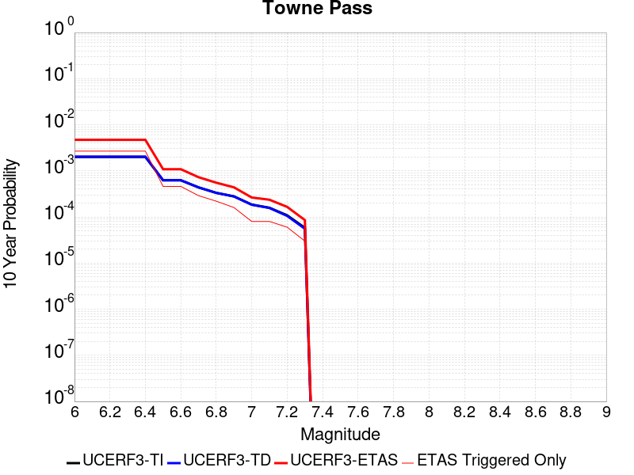 |

| Magnitude | 1 wk TI Prob | 1 wk TD Prob | 1 wk ETAS Prob | 1 wk ETAS/TD Gain | 1 wk ETAS Triggered Only | 1 mo TI Prob | 1 mo TD Prob | 1 mo ETAS Prob | 1 mo ETAS/TD Gain | 1 mo ETAS Triggered Only | 1 yr TI Prob | 1 yr TD Prob | 1 yr ETAS Prob | 1 yr ETAS/TD Gain | 1 yr ETAS Triggered Only | 10 yr TI Prob | 10 yr TD Prob | 10 yr ETAS Prob | 10 yr ETAS/TD Gain | 10 yr ETAS Triggered Only |
|-----|-----|-----|-----|-----|-----|-----|-----|-----|-----|-----|-----|-----|-----|-----|-----|-----|-----|-----|-----|-----|
| 6.0 | 3.849728E-6 | 3.8945414E-6 | 4.328013E-4 | 111.13023 | 4.2890842E-4 | 1.649873E-5 | 1.669081E-5 | 7.4582297E-4 | 44.68465 | 7.291443E-4 | 2.0085352E-4 | 2.0319603E-4 | 0.0016611883 | 8.1753 | 0.0014582886 | 0.0020067208 | 0.0020305314 | 0.0046415604 | 2.2858844 | 0.0026163415 |
| 6.1 | 3.849728E-6 | 3.8945414E-6 | 4.328013E-4 | 111.13023 | 4.2890842E-4 | 1.649873E-5 | 1.669081E-5 | 7.4582297E-4 | 44.68465 | 7.291443E-4 | 2.0085352E-4 | 2.0319603E-4 | 0.0016611883 | 8.1753 | 0.0014582886 | 0.0020067208 | 0.0020305314 | 0.0046415604 | 2.2858844 | 0.0026163415 |
| 6.2 | 3.849728E-6 | 3.8945414E-6 | 4.328013E-4 | 111.13023 | 4.2890842E-4 | 1.649873E-5 | 1.669081E-5 | 7.4582297E-4 | 44.68465 | 7.291443E-4 | 2.0085352E-4 | 2.0319603E-4 | 0.0016611883 | 8.1753 | 0.0014582886 | 0.0020067208 | 0.0020305314 | 0.0046415604 | 2.2858844 | 0.0026163415 |
| 6.3 | 3.849728E-6 | 3.8945414E-6 | 4.328013E-4 | 111.13023 | 4.2890842E-4 | 1.649873E-5 | 1.669081E-5 | 7.4582297E-4 | 44.68465 | 7.291443E-4 | 2.0085352E-4 | 2.0319603E-4 | 0.0016611883 | 8.1753 | 0.0014582886 | 0.0020067208 | 0.0020305314 | 0.0046415604 | 2.2858844 | 0.0026163415 |
| 6.4 | 3.849728E-6 | 3.8945414E-6 | 4.328013E-4 | 111.13023 | 4.2890842E-4 | 1.649873E-5 | 1.669081E-5 | 7.4582297E-4 | 44.68465 | 7.291443E-4 | 2.0085352E-4 | 2.0319603E-4 | 0.0016611883 | 8.1753 | 0.0014582886 | 0.0020067208 | 0.0020305314 | 0.0046415604 | 2.2858844 | 0.0026163415 |
| 6.5 | 1.1953545E-6 | 1.203052E-6 | 4.4093842E-5 | 36.65165 | 4.2890842E-5 | 5.1229376E-6 | 5.1559277E-6 | 9.0937174E-5 | 17.637402 | 8.5781685E-5 | 6.236998E-5 | 6.277173E-5 | 2.7721247E-4 | 4.4161997 | 2.1445421E-4 | 6.235248E-4 | 6.275517E-4 | 0.001013327 | 1.6147307 | 3.8601758E-4 |
| 6.6 | 1.1953545E-6 | 1.203052E-6 | 4.4093842E-5 | 36.65165 | 4.2890842E-5 | 5.1229376E-6 | 5.1559277E-6 | 9.0937174E-5 | 17.637402 | 8.5781685E-5 | 6.236998E-5 | 6.277173E-5 | 2.7721247E-4 | 4.4161997 | 2.1445421E-4 | 6.235248E-4 | 6.275517E-4 | 0.001013327 | 1.6147307 | 3.8601758E-4 |
| 6.7 | 8.375951E-7 | 8.4106705E-7 | 8.4106705E-7 | 1.0 | 0.0 | 3.5896885E-6 | 3.6045683E-6 | 3.6045683E-6 | 1.0 | 0.0 | 4.370358E-5 | 4.3884793E-5 | 8.6773754E-5 | 1.977308 | 4.2890842E-5 | 4.3694986E-4 | 4.38767E-4 | 6.102551E-4 | 1.3908409 | 1.7156337E-4 |
| 6.8 | 6.38041E-7 | 6.392156E-7 | 6.392156E-7 | 1.0 | 0.0 | 2.7344586E-6 | 2.7394929E-6 | 2.7394929E-6 | 1.0 | 0.0 | 3.3291526E-5 | 3.3352855E-5 | 7.6242264E-5 | 2.2859292 | 4.2890842E-5 | 3.3286537E-4 | 3.334823E-4 | 4.6211193E-4 | 1.3857164 | 1.2867253E-4 |
| 6.9 | 5.3460053E-7 | 5.345333E-7 | 5.345333E-7 | 1.0 | 0.0 | 2.2911431E-6 | 2.2908553E-6 | 2.2908553E-6 | 1.0 | 0.0 | 2.789431E-5 | 2.789084E-5 | 7.078049E-5 | 2.5377684 | 4.2890842E-5 | 2.789081E-4 | 2.7887672E-4 | 3.217556E-4 | 1.1537557 | 4.2890842E-5 |
| 7.0 | 3.557783E-7 | 3.5324226E-7 | 3.5324226E-7 | 1.0 | 0.0 | 1.5247632E-6 | 1.5138945E-6 | 1.5138945E-6 | 1.0 | 0.0 | 1.8563835E-5 | 1.843152E-5 | 1.843152E-5 | 1.0 | 0.0 | 1.8562283E-4 | 1.8430075E-4 | 1.8430075E-4 | 1.0 | 0.0 |
| 7.1 | 3.037942E-7 | 3.0002218E-7 | 3.0002218E-7 | 1.0 | 0.0 | 1.3019744E-6 | 1.2858087E-6 | 1.2858087E-6 | 1.0 | 0.0 | 1.5851423E-5 | 1.5654618E-5 | 1.5654618E-5 | 1.0 | 0.0 | 1.5850292E-4 | 1.5653588E-4 | 1.5653588E-4 | 1.0 | 0.0 |
| 7.2 | 2.0808248E-7 | 2.0217689E-7 | 2.0217689E-7 | 1.0 | 0.0 | 8.917818E-7 | 8.6647213E-7 | 8.6647213E-7 | 1.0 | 0.0 | 1.0857389E-5 | 1.0549252E-5 | 1.0549252E-5 | 1.0 | 0.0 | 1.0856859E-4 | 1.0548797E-4 | 1.0548797E-4 | 1.0 | 0.0 |
| 7.3 | 1.1162073E-7 | 1.0636894E-7 | 1.0636894E-7 | 1.0 | 0.0 | 4.7837443E-7 | 4.558668E-7 | 4.558668E-7 | 1.0 | 0.0 | 5.8241935E-6 | 5.550166E-6 | 5.550166E-6 | 1.0 | 0.0 | 5.8240406E-5 | 5.5500474E-5 | 5.5500474E-5 | 1.0 | 0.0 |

## Bicycle Lake
*[(top)](#table-of-contents)*

| 1 Week | 1 Month | 1 Year | 10 Year |
|-----|-----|-----|-----|
|  |  |  |  |

| Magnitude | 1 wk TI Prob | 1 wk TD Prob | 1 wk ETAS Prob | 1 wk ETAS/TD Gain | 1 wk ETAS Triggered Only | 1 mo TI Prob | 1 mo TD Prob | 1 mo ETAS Prob | 1 mo ETAS/TD Gain | 1 mo ETAS Triggered Only | 1 yr TI Prob | 1 yr TD Prob | 1 yr ETAS Prob | 1 yr ETAS/TD Gain | 1 yr ETAS Triggered Only | 10 yr TI Prob | 10 yr TD Prob | 10 yr ETAS Prob | 10 yr ETAS/TD Gain | 10 yr ETAS Triggered Only |
|-----|-----|-----|-----|-----|-----|-----|-----|-----|-----|-----|-----|-----|-----|-----|-----|-----|-----|-----|-----|-----|
| 6.0 | 1.9621975E-5 | 2.2097078E-5 | 2.3654655E-4 | 10.70488 | 2.1445421E-4 | 8.4091465E-5 | 9.4699084E-5 | 3.9490656E-4 | 4.1701202 | 3.002359E-4 | 0.0010233327 | 0.0011524865 | 0.0020093147 | 1.7434605 | 8.5781683E-4 | 0.01018633 | 0.011478408 | 0.013089552 | 1.140363 | 0.001629852 |
| 6.1 | 1.9621975E-5 | 2.2097078E-5 | 2.3654655E-4 | 10.70488 | 2.1445421E-4 | 8.4091465E-5 | 9.4699084E-5 | 3.9490656E-4 | 4.1701202 | 3.002359E-4 | 0.0010233327 | 0.0011524865 | 0.0020093147 | 1.7434605 | 8.5781683E-4 | 0.01018633 | 0.011478408 | 0.013089552 | 1.140363 | 0.001629852 |
| 6.2 | 9.9971285E-6 | 1.1255639E-5 | 9.703636E-5 | 8.621133 | 8.5781685E-5 | 4.2844134E-5 | 4.8237856E-5 | 1.7690418E-4 | 3.6673307 | 1.2867253E-4 | 5.2150246E-4 | 5.871896E-4 | 0.0010158463 | 1.7300138 | 4.2890842E-4 | 0.0052028033 | 0.005861487 | 0.006756915 | 1.1527647 | 9.007077E-4 |
| 6.3 | 9.589428E-6 | 1.0798346E-5 | 9.6579104E-5 | 8.943879 | 8.5781685E-5 | 4.10969E-5 | 4.62781E-5 | 1.7494467E-4 | 3.7802908 | 1.2867253E-4 | 5.002399E-4 | 5.6334207E-4 | 9.4914215E-4 | 1.6848418 | 3.8601758E-4 | 0.0049911533 | 0.0056242296 | 0.006477222 | 1.1516639 | 8.5781683E-4 |
| 6.4 | 9.589428E-6 | 1.0798346E-5 | 9.6579104E-5 | 8.943879 | 8.5781685E-5 | 4.10969E-5 | 4.62781E-5 | 1.7494467E-4 | 3.7802908 | 1.2867253E-4 | 5.002399E-4 | 5.6334207E-4 | 9.4914215E-4 | 1.6848418 | 3.8601758E-4 | 0.0049911533 | 0.0056242296 | 0.006477222 | 1.1516639 | 8.5781683E-4 |
| 6.5 | 5.557707E-6 | 6.2856016E-6 | 9.2066744E-5 | 14.647245 | 8.5781685E-5 | 2.3818526E-5 | 2.6938165E-5 | 1.5560722E-4 | 5.7764597 | 1.2867253E-4 | 2.8995197E-4 | 3.2794967E-4 | 5.8521033E-4 | 1.7844516 | 2.5734506E-4 | 0.0028957394 | 0.0032772934 | 0.0037475466 | 1.1434883 | 4.7179929E-4 |
| 6.6 | 4.8742945E-6 | 5.5132896E-6 | 4.8403897E-5 | 8.779494 | 4.2890842E-5 | 2.0889667E-5 | 2.3628318E-5 | 1.0940798E-4 | 4.630375 | 8.5781685E-5 | 2.54302E-4 | 2.87663E-4 | 5.020555E-4 | 1.7452906 | 2.1445421E-4 | 0.002540112 | 0.0028754752 | 0.0033031504 | 1.148732 | 4.2890842E-4 |
| 6.7 | 3.991108E-6 | 4.5159104E-6 | 4.740656E-5 | 10.497675 | 4.2890842E-5 | 1.7104636E-5 | 1.9353902E-5 | 6.224391E-5 | 3.2160914 | 4.2890842E-5 | 2.0822904E-4 | 2.3563375E-4 | 4.0715668E-4 | 1.7279218 | 1.7156337E-4 | 0.0020803404 | 0.0023563374 | 0.0027414456 | 1.163435 | 3.8601758E-4 |

## San Andreas (San Bernardino N)
*[(top)](#table-of-contents)*

| 1 Week | 1 Month | 1 Year | 10 Year |
|-----|-----|-----|-----|
|  |  |  |  |

| Magnitude | 1 wk TI Prob | 1 wk TD Prob | 1 wk ETAS Prob | 1 wk ETAS/TD Gain | 1 wk ETAS Triggered Only | 1 mo TI Prob | 1 mo TD Prob | 1 mo ETAS Prob | 1 mo ETAS/TD Gain | 1 mo ETAS Triggered Only | 1 yr TI Prob | 1 yr TD Prob | 1 yr ETAS Prob | 1 yr ETAS/TD Gain | 1 yr ETAS Triggered Only | 10 yr TI Prob | 10 yr TD Prob | 10 yr ETAS Prob | 10 yr ETAS/TD Gain | 10 yr ETAS Triggered Only |
|-----|-----|-----|-----|-----|-----|-----|-----|-----|-----|-----|-----|-----|-----|-----|-----|-----|-----|-----|-----|-----|
| 6.0 | 1.4273766E-4 | 3.1606483E-4 | 8.305923E-4 | 2.6279173 | 5.146901E-4 | 6.115894E-4 | 0.0013538664 | 0.0020391908 | 1.5061979 | 6.862535E-4 | 0.0074207084 | 0.016360244 | 0.017457161 | 1.0670477 | 0.0011151619 | 0.07177748 | 0.15026689 | 0.15154248 | 1.0084889 | 0.0015011795 |
| 6.1 | 1.4273766E-4 | 3.1606483E-4 | 8.305923E-4 | 2.6279173 | 5.146901E-4 | 6.115894E-4 | 0.0013538664 | 0.0020391908 | 1.5061979 | 6.862535E-4 | 0.0074207084 | 0.016360244 | 0.017457161 | 1.0670477 | 0.0011151619 | 0.07177748 | 0.15026689 | 0.15154248 | 1.0084889 | 0.0015011795 |
| 6.2 | 1.4273766E-4 | 3.1606483E-4 | 8.305923E-4 | 2.6279173 | 5.146901E-4 | 6.115894E-4 | 0.0013538664 | 0.0020391908 | 1.5061979 | 6.862535E-4 | 0.0074207084 | 0.016360244 | 0.017457161 | 1.0670477 | 0.0011151619 | 0.07177748 | 0.15026689 | 0.15154248 | 1.0084889 | 0.0015011795 |
| 6.3 | 1.3730655E-4 | 3.0511338E-4 | 8.1964646E-4 | 2.6863668 | 5.146901E-4 | 5.883239E-4 | 0.0013069791 | 0.0019923358 | 1.5243821 | 6.862535E-4 | 0.0071393442 | 0.015797773 | 0.016895317 | 1.0694747 | 0.0011151619 | 0.06914291 | 0.14556676 | 0.14684942 | 1.0088115 | 0.0015011795 |
| 6.4 | 1.3730655E-4 | 3.0511338E-4 | 8.1964646E-4 | 2.6863668 | 5.146901E-4 | 5.883239E-4 | 0.0013069791 | 0.0019923358 | 1.5243821 | 6.862535E-4 | 0.0071393442 | 0.015797773 | 0.016895317 | 1.0694747 | 0.0011151619 | 0.06914291 | 0.14556676 | 0.14684942 | 1.0088115 | 0.0015011795 |
| 6.5 | 1.2942807E-4 | 2.8925808E-4 | 8.037993E-4 | 2.778831 | 5.146901E-4 | 5.545738E-4 | 0.0012390936 | 0.0019244968 | 1.5531487 | 6.862535E-4 | 0.0067310524 | 0.01498286 | 0.016081315 | 1.0733141 | 0.0011151619 | 0.06530788 | 0.13870941 | 0.13996543 | 1.009055 | 0.0014582886 |
| 6.6 | 1.1125901E-4 | 2.536472E-4 | 7.682068E-4 | 3.028643 | 5.146901E-4 | 4.767372E-4 | 0.0010866089 | 0.0017721166 | 1.6308689 | 6.862535E-4 | 0.005788839 | 0.013149847 | 0.014250345 | 1.083689 | 0.0011151619 | 0.056403454 | 0.122999296 | 0.12427821 | 1.0103978 | 0.0014582886 |
| 6.7 | 1.02209575E-4 | 2.3499702E-4 | 7.495662E-4 | 3.189684 | 5.146901E-4 | 4.3796748E-4 | 0.0010067427 | 0.0016923053 | 1.680971 | 6.862535E-4 | 0.0053192247 | 0.012188629 | 0.013290199 | 1.0903769 | 0.0011151619 | 0.051936906 | 0.114790924 | 0.11608181 | 1.0112456 | 0.0014582886 |
| 6.8 | 9.610582E-5 | 2.2025521E-4 | 6.9195055E-4 | 3.1415856 | 4.7179929E-4 | 4.1181705E-4 | 9.436101E-4 | 0.0015863656 | 1.6811664 | 6.4336264E-4 | 0.0050023515 | 0.011428202 | 0.012488218 | 1.0927545 | 0.001072271 | 0.048912346 | 0.1081929 | 0.10945516 | 1.0116668 | 0.0014153979 |
| 6.9 | 9.3877505E-5 | 2.1481077E-4 | 6.865087E-4 | 3.1958764 | 4.7179929E-4 | 4.0227012E-4 | 9.2029345E-4 | 0.001563064 | 1.6984409 | 6.4336264E-4 | 0.0048866454 | 0.011147255 | 0.012207573 | 1.0951192 | 0.001072271 | 0.04780577 | 0.10578323 | 0.1070489 | 1.0119648 | 0.0014153979 |
| 7.0 | 9.1019785E-5 | 2.0808022E-4 | 6.797813E-4 | 3.2669194 | 4.7179929E-4 | 3.900265E-4 | 8.914682E-4 | 0.0015342573 | 1.7210455 | 6.4336264E-4 | 0.0047382377 | 0.010799837 | 0.011860528 | 1.0982136 | 0.001072271 | 0.046384744 | 0.102753714 | 0.10402367 | 1.0123593 | 0.0014153979 |
| 7.1 | 8.771155E-5 | 1.9982594E-4 | 6.7153096E-4 | 3.3605793 | 4.7179929E-4 | 3.758525E-4 | 8.5611636E-4 | 0.0014989282 | 1.7508464 | 6.4336264E-4 | 0.0045664064 | 0.0103736 | 0.011434747 | 1.1022931 | 0.001072271 | 0.044737056 | 0.09906527 | 0.10034045 | 1.0128721 | 0.0014153979 |
| 7.2 | 8.0830236E-5 | 1.8388197E-4 | 6.555945E-4 | 3.5653005 | 4.7179929E-4 | 3.4636928E-4 | 7.8782777E-4 | 0.0014306835 | 1.8159852 | 6.4336264E-4 | 0.0042088944 | 0.009549725 | 0.010611756 | 1.1112107 | 0.001072271 | 0.041300658 | 0.09179615 | 0.09308162 | 1.0140035 | 0.0014153979 |
| 7.3 | 7.7668235E-5 | 1.7331762E-4 | 6.450351E-4 | 3.7216938 | 4.7179929E-4 | 3.328214E-4 | 7.425784E-4 | 0.0013854633 | 1.8657467 | 6.4336264E-4 | 0.0040445733 | 0.009003494 | 0.010066111 | 1.1180227 | 0.001072271 | 0.03971748 | 0.08706327 | 0.08835544 | 1.0148417 | 0.0014153979 |
| 7.4 | 7.520177E-5 | 1.6551897E-4 | 6.372402E-4 | 3.8499522 | 4.7179929E-4 | 3.2225347E-4 | 7.0917426E-4 | 0.0013520806 | 1.9065562 | 6.4336264E-4 | 0.0039163795 | 0.008600081 | 0.009663131 | 1.1236092 | 0.001072271 | 0.038480744 | 0.08351955 | 0.08481673 | 1.0155315 | 0.0014153979 |
| 7.5 | 7.274697E-5 | 1.5839566E-4 | 5.8723614E-4 | 3.7074006 | 4.2890842E-4 | 3.1173544E-4 | 6.78662E-4 | 0.0012787263 | 1.8841872 | 6.004718E-4 | 0.003788775 | 0.008231463 | 0.009252369 | 1.124025 | 0.0010293802 | 0.03724827 | 0.08023631 | 0.08149869 | 1.0157334 | 0.001372507 |
| 7.6 | 7.1185845E-5 | 1.540943E-4 | 5.829366E-4 | 3.7829864 | 4.2890842E-4 | 3.0504653E-4 | 6.6023704E-4 | 0.0012603124 | 1.9088786 | 6.004718E-4 | 0.0037076178 | 0.008008812 | 0.009029947 | 1.1275016 | 0.0010293802 | 0.036463667 | 0.07822598 | 0.079491116 | 1.0161729 | 0.001372507 |
| 7.7 | 6.709961E-5 | 1.4318313E-4 | 5.7203014E-4 | 3.9950945 | 4.2890842E-4 | 2.8753807E-4 | 6.1349774E-4 | 0.0012136011 | 1.9781673 | 6.004718E-4 | 0.003495157 | 0.0074437927 | 0.00846551 | 1.1372577 | 0.0010293802 | 0.034406938 | 0.07305469 | 0.07432693 | 1.0174149 | 0.001372507 |
| 7.8 | 6.300812E-5 | 1.3202413E-4 | 5.608759E-4 | 4.2482834 | 4.2890842E-4 | 2.7000686E-4 | 5.65695E-4 | 0.0011658272 | 2.0608757 | 6.004718E-4 | 0.0032823787 | 0.006865616 | 0.007887929 | 1.1489033 | 0.0010293802 | 0.032343175 | 0.06771354 | 0.06899311 | 1.0188968 | 0.001372507 |
| 7.9 | 4.983037E-5 | 9.723488E-5 | 3.545549E-4 | 3.646376 | 2.5734506E-4 | 2.1354125E-4 | 4.1665437E-4 | 8.453841E-4 | 2.0289817 | 4.2890842E-4 | 0.0025967648 | 0.0050609782 | 0.0057437588 | 1.1349107 | 6.862535E-4 | 0.025666296 | 0.05064886 | 0.051626105 | 1.0192945 | 0.0010293802 |
| 8.0 | 3.2211527E-5 | 5.3304586E-5 | 9.6193144E-5 | 1.8045942 | 4.2890842E-5 | 1.380421E-4 | 2.2842824E-4 | 3.141903E-4 | 1.3754444 | 8.5781685E-5 | 0.0016793669 | 0.0027775685 | 0.0029914272 | 1.0769949 | 2.1445421E-4 | 0.016667323 | 0.028361378 | 0.028694773 | 1.0117552 | 3.4312674E-4 |
| 8.1 | 1.743376E-5 | 1.8824427E-5 | 1.8824427E-5 | 1.0 | 0.0 | 7.471398E-5 | 8.067362E-5 | 8.067362E-5 | 1.0 | 0.0 | 9.0926304E-4 | 9.817594E-4 | 0.0010246082 | 1.0436448 | 4.2890842E-5 | 0.009055517 | 0.010484105 | 0.010526546 | 1.0040481 | 4.2890842E-5 |
| 8.2 | 7.831616E-6 | 5.1551065E-6 | 5.1551065E-6 | 1.0 | 0.0 | 3.3563636E-5 | 2.2093127E-5 | 2.2093127E-5 | 1.0 | 0.0 | 4.0856065E-4 | 2.6895068E-4 | 2.6895068E-4 | 1.0 | 0.0 | 0.004078103 | 0.0030418145 | 0.0030418145 | 1.0 | 0.0 |
| 8.3 | 1.983087E-6 | 7.6599065E-7 | 7.6599065E-7 | 1.0 | 0.0 | 8.498917E-6 | 3.282813E-6 | 3.282813E-6 | 1.0 | 0.0 | 1.034694E-4 | 3.9967534E-5 | 3.9967534E-5 | 1.0 | 0.0 | 0.0010342124 | 4.719687E-4 | 4.719687E-4 | 1.0 | 0.0 |

## Paradise
*[(top)](#table-of-contents)*

| 1 Week | 1 Month | 1 Year | 10 Year |
|-----|-----|-----|-----|
|  |  |  |  |

| Magnitude | 1 wk TI Prob | 1 wk TD Prob | 1 wk ETAS Prob | 1 wk ETAS/TD Gain | 1 wk ETAS Triggered Only | 1 mo TI Prob | 1 mo TD Prob | 1 mo ETAS Prob | 1 mo ETAS/TD Gain | 1 mo ETAS Triggered Only | 1 yr TI Prob | 1 yr TD Prob | 1 yr ETAS Prob | 1 yr ETAS/TD Gain | 1 yr ETAS Triggered Only | 10 yr TI Prob | 10 yr TD Prob | 10 yr ETAS Prob | 10 yr ETAS/TD Gain | 10 yr ETAS Triggered Only |
|-----|-----|-----|-----|-----|-----|-----|-----|-----|-----|-----|-----|-----|-----|-----|-----|-----|-----|-----|-----|-----|
| 6.0 | 1.4851273E-5 | 1.6694692E-5 | 4.0270583E-4 | 24.12179 | 3.8601758E-4 | 6.364676E-5 | 7.154685E-5 | 5.004246E-4 | 6.9943624 | 4.2890842E-4 | 7.7462377E-4 | 8.707584E-4 | 0.0018135352 | 2.082708 | 9.4359857E-4 | 0.0077192914 | 0.008675844 | 0.010291556 | 1.186231 | 0.001629852 |
| 6.1 | 1.4851273E-5 | 1.6694692E-5 | 4.0270583E-4 | 24.12179 | 3.8601758E-4 | 6.364676E-5 | 7.154685E-5 | 5.004246E-4 | 6.9943624 | 4.2890842E-4 | 7.7462377E-4 | 8.707584E-4 | 0.0018135352 | 2.082708 | 9.4359857E-4 | 0.0077192914 | 0.008675844 | 0.010291556 | 1.186231 | 0.001629852 |
| 6.2 | 1.4851273E-5 | 1.6694692E-5 | 4.0270583E-4 | 24.12179 | 3.8601758E-4 | 6.364676E-5 | 7.154685E-5 | 5.004246E-4 | 6.9943624 | 4.2890842E-4 | 7.7462377E-4 | 8.707584E-4 | 0.0018135352 | 2.082708 | 9.4359857E-4 | 0.0077192914 | 0.008675844 | 0.010291556 | 1.186231 | 0.001629852 |
| 6.3 | 1.0426831E-5 | 1.188862E-5 | 9.766928E-5 | 8.215359 | 8.5781685E-5 | 4.4685654E-5 | 5.0950268E-5 | 1.7961624E-4 | 3.5253248 | 1.2867253E-4 | 5.43912E-4 | 6.201489E-4 | 9.6306286E-4 | 1.5529542 | 3.4312674E-4 | 0.0054258266 | 0.0061847917 | 0.0068241754 | 1.10338 | 6.4336264E-4 |
| 6.4 | 1.0426831E-5 | 1.188862E-5 | 9.766928E-5 | 8.215359 | 8.5781685E-5 | 4.4685654E-5 | 5.0950268E-5 | 1.7961624E-4 | 3.5253248 | 1.2867253E-4 | 5.43912E-4 | 6.201489E-4 | 9.6306286E-4 | 1.5529542 | 3.4312674E-4 | 0.0054258266 | 0.0061847917 | 0.0068241754 | 1.10338 | 6.4336264E-4 |
| 6.5 | 9.25027E-6 | 1.06199595E-5 | 5.3510346E-5 | 5.038658 | 4.2890842E-5 | 3.964341E-5 | 4.551335E-5 | 8.840224E-5 | 1.9423366 | 4.2890842E-5 | 4.8255164E-4 | 5.53989E-4 | 7.683244E-4 | 1.3868947 | 2.1445421E-4 | 0.0048150513 | 0.0055265795 | 0.005995771 | 1.0848973 | 4.7179929E-4 |
| 6.6 | 7.904275E-6 | 9.159525E-6 | 9.159525E-6 | 1.0 | 0.0 | 3.3875025E-5 | 3.9254537E-5 | 3.9254537E-5 | 1.0 | 0.0 | 4.1235037E-4 | 4.7782314E-4 | 6.4930454E-4 | 1.3588805 | 1.7156337E-4 | 0.0041158604 | 0.0047683544 | 0.005109845 | 1.071616 | 3.4312674E-4 |
| 6.7 | 7.2061953E-6 | 8.407248E-6 | 8.407248E-6 | 1.0 | 0.0 | 3.088333E-5 | 3.6030586E-5 | 3.6030586E-5 | 1.0 | 0.0 | 3.7593965E-4 | 4.3858777E-4 | 6.100759E-4 | 1.3910007 | 1.7156337E-4 | 0.003753043 | 0.004377591 | 0.0047192154 | 1.0780394 | 3.4312674E-4 |
| 6.8 | 6.6948724E-6 | 7.842166E-6 | 7.842166E-6 | 1.0 | 0.0 | 2.8691995E-5 | 3.360887E-5 | 3.360887E-5 | 1.0 | 0.0 | 3.4926904E-4 | 4.0911473E-4 | 5.377346E-4 | 1.3143859 | 1.2867253E-4 | 0.003487206 | 0.0040839734 | 0.004382983 | 1.0732154 | 3.002359E-4 |
| 6.9 | 6.0421025E-6 | 7.130621E-6 | 7.130621E-6 | 1.0 | 0.0 | 2.5894467E-5 | 3.0559466E-5 | 3.0559466E-5 | 1.0 | 0.0 | 3.1521954E-4 | 3.7200135E-4 | 4.5775113E-4 | 1.2305093 | 8.5781685E-5 | 0.0031477278 | 0.0037141247 | 0.0038850508 | 1.0460206 | 1.7156337E-4 |
| 7.0 | 4.134091E-6 | 5.0803087E-6 | 5.0803087E-6 | 1.0 | 0.0 | 1.7717413E-5 | 2.177258E-5 | 2.177258E-5 | 1.0 | 0.0 | 2.1568815E-4 | 2.6505045E-4 | 3.0792993E-4 | 1.1617786 | 4.2890842E-5 | 0.0021547892 | 0.0026474963 | 0.0027758284 | 1.0484729 | 1.2867253E-4 |
| 7.1 | 3.7674888E-6 | 4.6318696E-6 | 4.6318696E-6 | 1.0 | 0.0 | 1.6146281E-5 | 1.9850726E-5 | 1.9850726E-5 | 1.0 | 0.0 | 1.9656324E-4 | 2.4165731E-4 | 2.845378E-4 | 1.1774434 | 4.2890842E-5 | 0.0019638946 | 0.002414096 | 0.0025424578 | 1.0531719 | 1.2867253E-4 |
| 7.2 | 3.4065345E-6 | 4.156723E-6 | 4.156723E-6 | 1.0 | 0.0 | 1.4599351E-5 | 1.7814415E-5 | 1.7814415E-5 | 1.0 | 0.0 | 1.777326E-4 | 2.1687041E-4 | 2.5975195E-4 | 1.1977289 | 4.2890842E-5 | 0.0017759053 | 0.002166736 | 0.0022951297 | 1.0592568 | 1.2867253E-4 |
| 7.3 | 2.9934936E-6 | 3.6293168E-6 | 3.6293168E-6 | 1.0 | 0.0 | 1.2829195E-5 | 1.555413E-5 | 1.555413E-5 | 1.0 | 0.0 | 1.5618425E-4 | 1.8935655E-4 | 2.3223927E-4 | 1.2264655 | 4.2890842E-5 | 0.0015607453 | 0.0018920974 | 0.0020205264 | 1.0678766 | 1.2867253E-4 |
| 7.4 | 2.4049796E-6 | 2.8889842E-6 | 2.8889842E-6 | 1.0 | 0.0 | 1.0307015E-5 | 1.238131E-5 | 1.238131E-5 | 1.0 | 0.0 | 1.2548068E-4 | 1.5073347E-4 | 1.9361785E-4 | 1.2845047 | 4.2890842E-5 | 0.0012540985 | 0.0015064536 | 0.0015921061 | 1.056857 | 8.5781685E-5 |
| 7.5 | 1.2710091E-6 | 1.5134682E-6 | 1.5134682E-6 | 1.0 | 0.0 | 5.44717E-6 | 6.4862834E-6 | 6.4862834E-6 | 1.0 | 0.0 | 6.631728E-5 | 7.8968886E-5 | 1.2185634E-4 | 1.5430931 | 4.2890842E-5 | 6.6297496E-4 | 7.8953087E-4 | 8.7524485E-4 | 1.1085632 | 8.5781685E-5 |
| 7.6 | 2.21172E-7 | 2.603961E-7 | 2.603961E-7 | 1.0 | 0.0 | 9.478797E-7 | 1.1159829E-6 | 1.1159829E-6 | 1.0 | 0.0 | 1.1540374E-5 | 1.3587036E-5 | 1.3587036E-5 | 1.0 | 0.0 | 1.1539775E-4 | 1.3586486E-4 | 1.7874988E-4 | 1.3156446 | 4.2890842E-5 |

## Helendale-So Lockhart
*[(top)](#table-of-contents)*

| 1 Week | 1 Month | 1 Year | 10 Year |
|-----|-----|-----|-----|
|  |  |  |  |

| Magnitude | 1 wk TI Prob | 1 wk TD Prob | 1 wk ETAS Prob | 1 wk ETAS/TD Gain | 1 wk ETAS Triggered Only | 1 mo TI Prob | 1 mo TD Prob | 1 mo ETAS Prob | 1 mo ETAS/TD Gain | 1 mo ETAS Triggered Only | 1 yr TI Prob | 1 yr TD Prob | 1 yr ETAS Prob | 1 yr ETAS/TD Gain | 1 yr ETAS Triggered Only | 10 yr TI Prob | 10 yr TD Prob | 10 yr ETAS Prob | 10 yr ETAS/TD Gain | 10 yr ETAS Triggered Only |
|-----|-----|-----|-----|-----|-----|-----|-----|-----|-----|-----|-----|-----|-----|-----|-----|-----|-----|-----|-----|-----|
| 6.0 | 1.7296055E-5 | 1.8103729E-5 | 4.0411434E-4 | 22.322159 | 3.8601758E-4 | 7.412385E-5 | 7.7585224E-5 | 8.0667296E-4 | 10.39725 | 7.291443E-4 | 9.0208417E-4 | 9.4421144E-4 | 0.0019726197 | 2.0891716 | 0.0010293802 | 0.008984311 | 0.009404116 | 0.010848691 | 1.153611 | 0.0014582886 |
| 6.1 | 1.7296055E-5 | 1.8103729E-5 | 4.0411434E-4 | 22.322159 | 3.8601758E-4 | 7.412385E-5 | 7.7585224E-5 | 8.0667296E-4 | 10.39725 | 7.291443E-4 | 9.0208417E-4 | 9.4421144E-4 | 0.0019726197 | 2.0891716 | 0.0010293802 | 0.008984311 | 0.009404116 | 0.010848691 | 1.153611 | 0.0014582886 |
| 6.2 | 1.7296055E-5 | 1.8103729E-5 | 4.0411434E-4 | 22.322159 | 3.8601758E-4 | 7.412385E-5 | 7.7585224E-5 | 8.0667296E-4 | 10.39725 | 7.291443E-4 | 9.0208417E-4 | 9.4421144E-4 | 0.0019726197 | 2.0891716 | 0.0010293802 | 0.008984311 | 0.009404116 | 0.010848691 | 1.153611 | 0.0014582886 |
| 6.3 | 1.0669118E-5 | 1.1135425E-5 | 3.5425834E-4 | 31.813637 | 3.4312674E-4 | 4.5723988E-5 | 4.772239E-5 | 6.052767E-4 | 12.683287 | 5.5758096E-4 | 5.5654737E-4 | 5.80868E-4 | 0.0012667229 | 2.1807413 | 6.862535E-4 | 0.0055515557 | 0.0057937936 | 0.0067745675 | 1.16928 | 9.864894E-4 |
| 6.4 | 1.0669118E-5 | 1.1135425E-5 | 3.5425834E-4 | 31.813637 | 3.4312674E-4 | 4.5723988E-5 | 4.772239E-5 | 6.052767E-4 | 12.683287 | 5.5758096E-4 | 5.5654737E-4 | 5.80868E-4 | 0.0012667229 | 2.1807413 | 6.862535E-4 | 0.0055515557 | 0.0057937936 | 0.0067745675 | 1.16928 | 9.864894E-4 |
| 6.5 | 8.790038E-6 | 9.170197E-6 | 2.6651288E-4 | 29.06294 | 2.5734506E-4 | 3.767105E-5 | 3.930026E-5 | 5.11081E-4 | 13.004519 | 4.7179929E-4 | 4.585485E-4 | 4.7837716E-4 | 0.0010785618 | 2.2546263 | 6.004718E-4 | 0.0045760344 | 0.004773638 | 0.0055846744 | 1.1698989 | 8.14926E-4 |
| 6.6 | 7.396949E-6 | 7.715537E-6 | 2.2216809E-4 | 28.794897 | 2.1445421E-4 | 3.1700827E-5 | 3.3066175E-5 | 3.7618156E-4 | 11.376629 | 3.4312674E-4 | 3.858892E-4 | 4.025073E-4 | 8.312431E-4 | 2.0651627 | 4.2890842E-4 | 0.003852198 | 0.00401789 | 0.0046586674 | 1.1594812 | 6.4336264E-4 |
| 6.7 | 6.4600285E-6 | 6.738031E-6 | 2.211908E-4 | 32.827217 | 2.1445421E-4 | 2.7685543E-5 | 2.887696E-5 | 3.7199378E-4 | 12.882028 | 3.4312674E-4 | 3.3701936E-4 | 3.5152107E-4 | 7.802787E-4 | 2.219721 | 4.2890842E-4 | 0.0033650869 | 0.003509732 | 0.0041080965 | 1.1704872 | 6.004718E-4 |
| 6.8 | 5.600104E-6 | 5.836009E-6 | 2.2028897E-4 | 37.746506 | 2.1445421E-4 | 2.4000226E-5 | 2.5011232E-5 | 3.252396E-4 | 13.003742 | 3.002359E-4 | 2.9216358E-4 | 3.044698E-4 | 6.9036987E-4 | 2.2674494 | 3.8601758E-4 | 0.0029177975 | 0.003040588 | 0.0035964737 | 1.1828218 | 5.5758096E-4 |
| 6.9 | 4.839122E-6 | 5.0395092E-6 | 2.1949265E-4 | 43.554367 | 2.1445421E-4 | 2.0738931E-5 | 2.159772E-5 | 3.2182713E-4 | 14.900977 | 3.002359E-4 | 2.5246723E-4 | 2.6292098E-4 | 6.488371E-4 | 2.4678025 | 3.8601758E-4 | 0.002521806 | 0.002626147 | 0.0031394851 | 1.1954721 | 5.146901E-4 |
| 7.0 | 3.6937633E-6 | 3.845208E-6 | 1.7540791E-4 | 45.61728 | 1.7156337E-4 | 1.5830317E-5 | 1.647936E-5 | 2.738202E-4 | 16.615946 | 2.5734506E-4 | 1.9271708E-4 | 2.0061806E-4 | 5.0079374E-4 | 2.4962544 | 3.002359E-4 | 0.0019255003 | 0.002004401 | 0.0023896447 | 1.192199 | 3.8601758E-4 |
| 7.1 | 2.7858857E-6 | 2.8978538E-6 | 1.3157E-4 | 45.40257 | 1.2867253E-4 | 1.1939455E-5 | 1.2419316E-5 | 2.2687086E-4 | 18.267582 | 2.1445421E-4 | 1.4535317E-4 | 1.511949E-4 | 4.0850104E-4 | 2.7018178 | 2.5734506E-4 | 0.0014525814 | 0.0015109418 | 0.001810724 | 1.1984075 | 3.002359E-4 |
| 7.2 | 2.1672065E-6 | 2.2540128E-6 | 4.514476E-5 | 20.028618 | 4.2890842E-5 | 9.2879945E-6 | 9.66002E-6 | 1.383313E-4 | 14.319982 | 1.2867253E-4 | 1.1307546E-4 | 1.1760458E-4 | 2.8914778E-4 | 2.458644 | 1.7156337E-4 | 0.0011301794 | 0.0011754417 | 0.0013896438 | 1.1822312 | 2.1445421E-4 |
| 7.3 | 1.4823496E-6 | 1.5422102E-6 | 4.4432985E-5 | 28.81124 | 4.2890842E-5 | 6.3529114E-6 | 6.6094562E-6 | 1.3528114E-4 | 20.467815 | 1.2867253E-4 | 7.734395E-5 | 8.046731E-5 | 2.5201688E-4 | 3.131916 | 1.7156337E-4 | 7.731704E-4 | 8.0439687E-4 | 9.758223E-4 | 1.2131104 | 1.7156337E-4 |
| 7.4 | 4.2321457E-7 | 4.4108765E-7 | 4.4108765E-7 | 1.0 | 0.0 | 1.8137755E-6 | 1.8903745E-6 | 4.4781136E-5 | 23.689028 | 4.2890842E-5 | 2.2082493E-5 | 2.3015113E-5 | 1.08794826E-4 | 4.7271037 | 8.5781685E-5 | 2.2080299E-4 | 2.3013182E-4 | 3.1589376E-4 | 1.3726645 | 8.5781685E-5 |
| 7.5 | 5.6942316E-8 | 5.9415648E-8 | 5.9415648E-8 | 1.0 | 0.0 | 2.440385E-7 | 2.5463845E-7 | 2.5463845E-7 | 1.0 | 0.0 | 2.9711643E-6 | 3.1002196E-6 | 4.5990928E-5 | 14.834732 | 4.2890842E-5 | 2.9711247E-5 | 3.1001844E-5 | 7.389136E-5 | 2.3834505 | 4.2890842E-5 |

## Garlic Springs
*[(top)](#table-of-contents)*

| 1 Week | 1 Month | 1 Year | 10 Year |
|-----|-----|-----|-----|
|  |  |  |  |

| Magnitude | 1 wk TI Prob | 1 wk TD Prob | 1 wk ETAS Prob | 1 wk ETAS/TD Gain | 1 wk ETAS Triggered Only | 1 mo TI Prob | 1 mo TD Prob | 1 mo ETAS Prob | 1 mo ETAS/TD Gain | 1 mo ETAS Triggered Only | 1 yr TI Prob | 1 yr TD Prob | 1 yr ETAS Prob | 1 yr ETAS/TD Gain | 1 yr ETAS Triggered Only | 10 yr TI Prob | 10 yr TD Prob | 10 yr ETAS Prob | 10 yr ETAS/TD Gain | 10 yr ETAS Triggered Only |
|-----|-----|-----|-----|-----|-----|-----|-----|-----|-----|-----|-----|-----|-----|-----|-----|-----|-----|-----|-----|-----|
| 6.0 | 1.6760017E-5 | 1.8776833E-5 | 2.7611706E-4 | 14.705199 | 2.5734506E-4 | 7.182667E-5 | 8.0470316E-5 | 4.6645684E-4 | 5.7966323 | 3.8601758E-4 | 8.7413884E-4 | 9.794032E-4 | 0.0014935891 | 1.5249994 | 5.146901E-4 | 0.008707083 | 0.009762413 | 0.010654327 | 1.0913621 | 9.007077E-4 |
| 6.1 | 9.852767E-6 | 1.09735865E-5 | 9.675433E-5 | 8.817019 | 8.5781685E-5 | 4.222546E-5 | 4.702921E-5 | 1.7569569E-4 | 3.7358842 | 1.2867253E-4 | 5.139737E-4 | 5.7250116E-4 | 7.439663E-4 | 1.2995018 | 1.7156337E-4 | 0.005127866 | 0.005717221 | 0.006101032 | 1.0671324 | 3.8601758E-4 |
| 6.2 | 9.852767E-6 | 1.09735865E-5 | 9.675433E-5 | 8.817019 | 8.5781685E-5 | 4.222546E-5 | 4.702921E-5 | 1.7569569E-4 | 3.7358842 | 1.2867253E-4 | 5.139737E-4 | 5.7250116E-4 | 7.439663E-4 | 1.2995018 | 1.7156337E-4 | 0.005127866 | 0.005717221 | 0.006101032 | 1.0671324 | 3.8601758E-4 |
| 6.3 | 4.3167724E-6 | 4.7780286E-6 | 4.7780286E-6 | 1.0 | 0.0 | 1.8500323E-5 | 2.0477235E-5 | 2.0477235E-5 | 1.0 | 0.0 | 2.2521814E-4 | 2.4930484E-4 | 2.92185E-4 | 1.1719989 | 4.2890842E-5 | 0.0022499003 | 0.00249251 | 0.0026636457 | 1.06866 | 1.7156337E-4 |
| 6.4 | 4.3167724E-6 | 4.7780286E-6 | 4.7780286E-6 | 1.0 | 0.0 | 1.8500323E-5 | 2.0477235E-5 | 2.0477235E-5 | 1.0 | 0.0 | 2.2521814E-4 | 2.4930484E-4 | 2.92185E-4 | 1.1719989 | 4.2890842E-5 | 0.0022499003 | 0.00249251 | 0.0026636457 | 1.06866 | 1.7156337E-4 |
| 6.5 | 4.3167724E-6 | 4.7780286E-6 | 4.7780286E-6 | 1.0 | 0.0 | 1.8500323E-5 | 2.0477235E-5 | 2.0477235E-5 | 1.0 | 0.0 | 2.2521814E-4 | 2.4930484E-4 | 2.92185E-4 | 1.1719989 | 4.2890842E-5 | 0.0022499003 | 0.00249251 | 0.0026636457 | 1.06866 | 1.7156337E-4 |
| 6.6 | 4.301311E-6 | 4.760897E-6 | 4.760897E-6 | 1.0 | 0.0 | 1.8434059E-5 | 2.0403815E-5 | 2.0403815E-5 | 1.0 | 0.0 | 2.2441156E-4 | 2.4841115E-4 | 2.9129133E-4 | 1.1726178 | 4.2890842E-5 | 0.0022418506 | 0.002483593 | 0.0026547303 | 1.0689071 | 1.7156337E-4 |
| 6.7 | 3.8599724E-6 | 4.27106E-6 | 4.27106E-6 | 1.0 | 0.0 | 1.6542634E-5 | 1.8304541E-5 | 1.8304541E-5 | 1.0 | 0.0 | 2.0138794E-4 | 2.228578E-4 | 2.6573907E-4 | 1.1924155 | 4.2890842E-5 | 0.0020120554 | 0.002228578 | 0.0023997591 | 1.0768118 | 1.7156337E-4 |

## San Andreas (San Bernardino S)
*[(top)](#table-of-contents)*

| 1 Week | 1 Month | 1 Year | 10 Year |
|-----|-----|-----|-----|
|  |  |  | 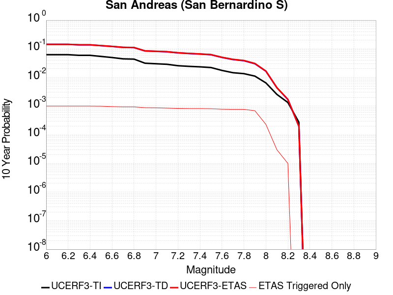 |

| Magnitude | 1 wk TI Prob | 1 wk TD Prob | 1 wk ETAS Prob | 1 wk ETAS/TD Gain | 1 wk ETAS Triggered Only | 1 mo TI Prob | 1 mo TD Prob | 1 mo ETAS Prob | 1 mo ETAS/TD Gain | 1 mo ETAS Triggered Only | 1 yr TI Prob | 1 yr TD Prob | 1 yr ETAS Prob | 1 yr ETAS/TD Gain | 1 yr ETAS Triggered Only | 10 yr TI Prob | 10 yr TD Prob | 10 yr ETAS Prob | 10 yr ETAS/TD Gain | 10 yr ETAS Triggered Only |
|-----|-----|-----|-----|-----|-----|-----|-----|-----|-----|-----|-----|-----|-----|-----|-----|-----|-----|-----|-----|-----|
| 6.0 | 1.2336002E-4 | 3.0004102E-4 | 5.5730884E-4 | 1.8574423 | 2.5734506E-4 | 5.2857865E-4 | 0.0012852824 | 0.0016708039 | 1.2999507 | 3.8601758E-4 | 0.006416472 | 0.015540994 | 0.016174357 | 1.0407544 | 6.4336264E-4 | 0.06234337 | 0.14283717 | 0.14357246 | 1.0051477 | 8.5781683E-4 |
| 6.1 | 1.2336002E-4 | 3.0004102E-4 | 5.5730884E-4 | 1.8574423 | 2.5734506E-4 | 5.2857865E-4 | 0.0012852824 | 0.0016708039 | 1.2999507 | 3.8601758E-4 | 0.006416472 | 0.015540994 | 0.016174357 | 1.0407544 | 6.4336264E-4 | 0.06234337 | 0.14283717 | 0.14357246 | 1.0051477 | 8.5781683E-4 |
| 6.2 | 1.2336002E-4 | 3.0004102E-4 | 5.5730884E-4 | 1.8574423 | 2.5734506E-4 | 5.2857865E-4 | 0.0012852824 | 0.0016708039 | 1.2999507 | 3.8601758E-4 | 0.006416472 | 0.015540994 | 0.016174357 | 1.0407544 | 6.4336264E-4 | 0.06234337 | 0.14283717 | 0.14357246 | 1.0051477 | 8.5781683E-4 |
| 6.3 | 1.1712257E-4 | 2.8792414E-4 | 5.4519513E-4 | 1.8935373 | 2.5734506E-4 | 5.018573E-4 | 0.0012334028 | 0.0016189442 | 1.3125836 | 3.8601758E-4 | 0.006093008 | 0.014918125 | 0.01555189 | 1.0424829 | 6.4336264E-4 | 0.059286322 | 0.13754563 | 0.13828546 | 1.0053787 | 8.5781683E-4 |
| 6.4 | 1.1712257E-4 | 2.8792414E-4 | 5.4519513E-4 | 1.8935373 | 2.5734506E-4 | 5.018573E-4 | 0.0012334028 | 0.0016189442 | 1.3125836 | 3.8601758E-4 | 0.006093008 | 0.014918125 | 0.01555189 | 1.0424829 | 6.4336264E-4 | 0.059286322 | 0.13754563 | 0.13828546 | 1.0053787 | 8.5781683E-4 |
| 6.5 | 1.0689076E-4 | 2.680528E-4 | 5.2532885E-4 | 1.9597963 | 2.5734506E-4 | 4.5802278E-4 | 0.0011483167 | 0.001533891 | 1.3357735 | 3.8601758E-4 | 0.0055621783 | 0.01389575 | 0.014530173 | 1.0456558 | 6.4336264E-4 | 0.05425003 | 0.12879294 | 0.12954028 | 1.0058026 | 8.5781683E-4 |
| 6.6 | 9.7648895E-5 | 2.50501E-4 | 5.0778163E-4 | 2.027064 | 2.5734506E-4 | 4.1842813E-4 | 0.0010731576 | 0.0014587609 | 1.3593166 | 3.8601758E-4 | 0.005082469 | 0.012991785 | 0.0135844555 | 1.0456189 | 6.004718E-4 | 0.049677886 | 0.12095292 | 0.12163157 | 1.005611 | 7.7203516E-4 |
| 6.7 | 8.757013E-5 | 2.3120902E-4 | 4.884946E-4 | 2.1127834 | 2.5734506E-4 | 3.7524657E-4 | 9.905418E-4 | 0.0013761771 | 1.3893175 | 3.8601758E-4 | 0.00455906 | 0.011997245 | 0.012590513 | 1.0494503 | 6.004718E-4 | 0.04466656 | 0.11226123 | 0.11294659 | 1.0061051 | 7.7203516E-4 |
| 6.8 | 8.562978E-5 | 2.2680782E-4 | 4.8409452E-4 | 2.134382 | 2.5734506E-4 | 3.6693315E-4 | 9.7169366E-4 | 0.0013573362 | 1.3968766 | 3.8601758E-4 | 0.004458263 | 0.011770263 | 0.012363668 | 1.0504155 | 6.004718E-4 | 0.043698758 | 0.11027153 | 0.110958435 | 1.0062292 | 7.7203516E-4 |
| 6.9 | 6.124075E-5 | 1.7065753E-4 | 4.2795867E-4 | 2.5077047 | 2.5734506E-4 | 2.6243398E-4 | 7.311852E-4 | 0.0011169205 | 1.5275481 | 3.8601758E-4 | 0.0031904527 | 0.008866051 | 0.009461199 | 1.0671266 | 6.004718E-4 | 0.031450346 | 0.08418263 | 0.084811114 | 1.0074657 | 6.862535E-4 |
| 7.0 | 5.8598747E-5 | 1.649477E-4 | 4.222503E-4 | 2.559904 | 2.5734506E-4 | 2.5111332E-4 | 7.06728E-4 | 0.0010924728 | 1.5458179 | 3.8601758E-4 | 0.0030530186 | 0.008570663 | 0.009165988 | 1.0694609 | 6.004718E-4 | 0.03011414 | 0.081500374 | 0.08213069 | 1.007734 | 6.862535E-4 |
| 7.1 | 5.613814E-5 | 1.5913323E-4 | 4.1643734E-4 | 2.61691 | 2.5734506E-4 | 2.4056983E-4 | 6.818221E-4 | 0.0010675765 | 1.5657699 | 3.8601758E-4 | 0.0029250039 | 0.008269769 | 0.0088652745 | 1.07201 | 6.004718E-4 | 0.028868021 | 0.07879931 | 0.07943149 | 1.0080227 | 6.862535E-4 |
| 7.2 | 4.991222E-5 | 1.4519796E-4 | 4.0250566E-4 | 2.7721164 | 2.5734506E-4 | 2.1389198E-4 | 6.2212895E-4 | 0.0010079064 | 1.6200924 | 3.8601758E-4 | 0.002601025 | 0.007548217 | 0.008144156 | 1.078951 | 6.004718E-4 | 0.025707912 | 0.07225321 | 0.07288988 | 1.0088116 | 6.862535E-4 |
| 7.3 | 4.7410045E-5 | 1.3714004E-4 | 3.944498E-4 | 2.8762555 | 2.5734506E-4 | 2.0317009E-4 | 5.8761094E-4 | 9.734017E-4 | 1.6565411 | 3.8601758E-4 | 0.0024707897 | 0.0071307817 | 0.0077269715 | 1.0836079 | 6.004718E-4 | 0.024434982 | 0.06853558 | 0.069174804 | 1.0093268 | 6.862535E-4 |
| 7.4 | 4.5556746E-5 | 1.3121912E-4 | 3.885304E-4 | 2.9609284 | 2.5734506E-4 | 1.952286E-4 | 5.622468E-4 | 9.480473E-4 | 1.6861765 | 3.8601758E-4 | 0.002374317 | 0.0068239477 | 0.007420322 | 1.0873944 | 6.004718E-4 | 0.023491086 | 0.065788016 | 0.06642912 | 1.009745 | 6.862535E-4 |
| 7.5 | 4.3084514E-5 | 1.2357246E-4 | 3.380002E-4 | 2.7352386 | 2.1445421E-4 | 1.8463485E-4 | 5.2948913E-4 | 8.724342E-4 | 1.6476905 | 3.4312674E-4 | 0.0022456115 | 0.0064275465 | 0.0069815437 | 1.086191 | 5.5758096E-4 | 0.022230545 | 0.062188786 | 0.06279214 | 1.009702 | 6.4336264E-4 |
| 7.6 | 3.408608E-5 | 9.83552E-5 | 2.699017E-4 | 2.7441528 | 1.7156337E-4 | 1.4607502E-4 | 4.214543E-4 | 7.2156364E-4 | 1.7120805 | 3.002359E-4 | 0.0017770125 | 0.0051191594 | 0.005588543 | 1.0916916 | 4.7179929E-4 | 0.017628696 | 0.050020292 | 0.050549984 | 1.0105895 | 5.5758096E-4 |
| 7.7 | 2.8315713E-5 | 8.248679E-5 | 2.5403601E-4 | 3.0797174 | 1.7156337E-4 | 1.2134742E-4 | 3.5346695E-4 | 6.535967E-4 | 1.8491027 | 3.002359E-4 | 0.0014764034 | 0.0042949775 | 0.0047647506 | 1.1093773 | 4.7179929E-4 | 0.01466633 | 0.0422714 | 0.042805415 | 1.012633 | 5.5758096E-4 |
| 7.8 | 2.6222975E-5 | 7.463088E-5 | 2.4618144E-4 | 3.298654 | 1.7156337E-4 | 1.1237934E-4 | 3.1980744E-4 | 6.199473E-4 | 1.9385018 | 3.002359E-4 | 0.0013673597 | 0.0038867102 | 0.004356676 | 1.120916 | 4.7179929E-4 | 0.013589768 | 0.03843674 | 0.038972892 | 1.0139489 | 5.5758096E-4 |
| 7.9 | 2.1469694E-5 | 5.787864E-5 | 2.2943209E-4 | 3.96402 | 1.7156337E-4 | 9.200973E-5 | 2.4802773E-4 | 5.4818916E-4 | 2.210193 | 3.002359E-4 | 0.0011196428 | 0.0030155594 | 0.0034004129 | 1.1276226 | 3.8601758E-4 | 0.011140184 | 0.030152109 | 0.030609682 | 1.0151755 | 4.7179929E-4 |
| 8.0 | 1.2420249E-5 | 3.131896E-5 | 3.131896E-5 | 1.0 | 0.0 | 5.322855E-5 | 1.342172E-4 | 1.342172E-4 | 1.0 | 0.0 | 6.478649E-4 | 0.0016328706 | 0.0016756915 | 1.0262243 | 4.2890842E-5 | 0.0064597935 | 0.016522504 | 0.016606867 | 1.005106 | 8.5781685E-5 |
| 8.1 | 4.9197724E-6 | 7.822348E-6 | 7.822348E-6 | 1.0 | 0.0 | 2.1084568E-5 | 3.352392E-5 | 3.352392E-5 | 1.0 | 0.0 | 2.566744E-4 | 4.0807744E-4 | 4.0807744E-4 | 1.0 | 0.0 | 0.002563781 | 0.0043843705 | 0.0043843705 | 1.0 | 0.0 |
| 8.2 | 2.5634774E-6 | 2.9067196E-6 | 2.9067196E-6 | 1.0 | 0.0 | 1.0986286E-5 | 1.2457311E-5 | 1.2457311E-5 | 1.0 | 0.0 | 1.3374983E-4 | 1.5165724E-4 | 1.5165724E-4 | 1.0 | 0.0 | 0.0013366934 | 0.0017049741 | 0.0017049741 | 1.0 | 0.0 |
| 8.3 | 5.2850464E-7 | 3.2088764E-7 | 3.2088764E-7 | 1.0 | 0.0 | 2.2650179E-6 | 1.375232E-6 | 1.375232E-6 | 1.0 | 0.0 | 2.7576245E-5 | 1.6743334E-5 | 1.6743334E-5 | 1.0 | 0.0 | 2.7572823E-4 | 1.9870348E-4 | 1.9870348E-4 | 1.0 | 0.0 |

## San Andreas (Big Bend)
*[(top)](#table-of-contents)*

| 1 Week | 1 Month | 1 Year | 10 Year |
|-----|-----|-----|-----|
| 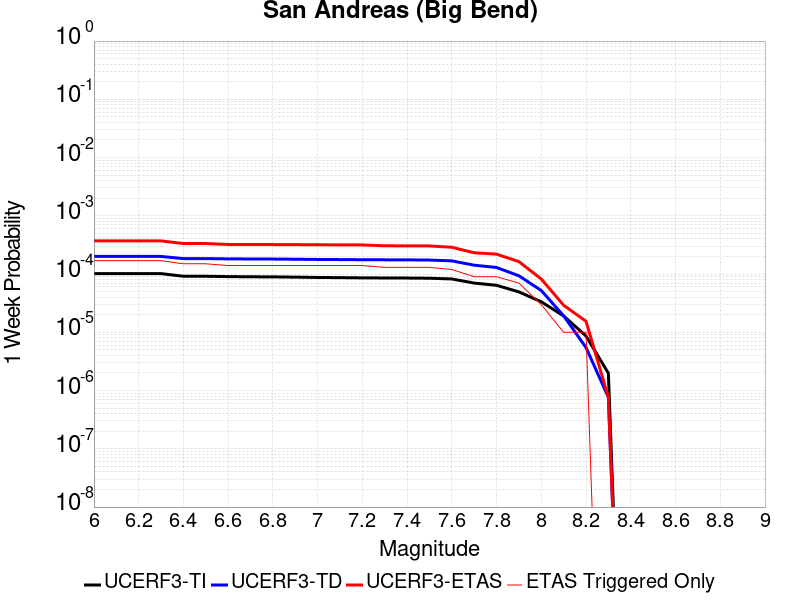 | 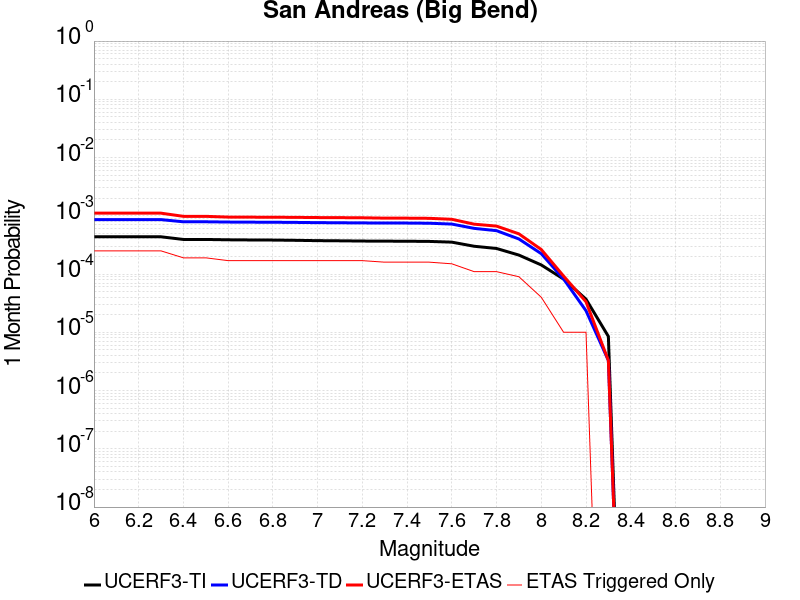 |  | 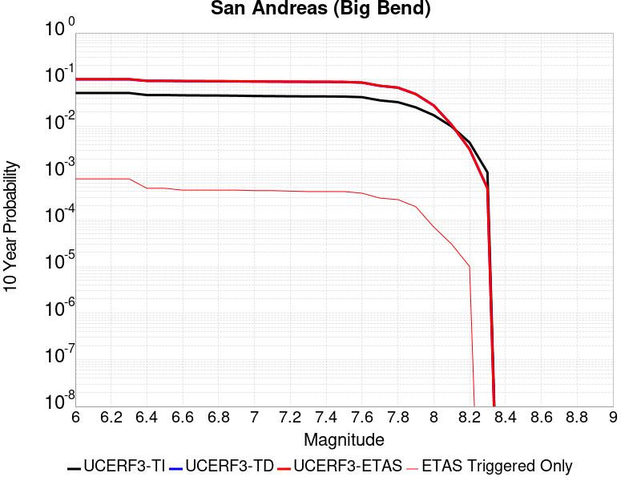 |

| Magnitude | 1 wk TI Prob | 1 wk TD Prob | 1 wk ETAS Prob | 1 wk ETAS/TD Gain | 1 wk ETAS Triggered Only | 1 mo TI Prob | 1 mo TD Prob | 1 mo ETAS Prob | 1 mo ETAS/TD Gain | 1 mo ETAS Triggered Only | 1 yr TI Prob | 1 yr TD Prob | 1 yr ETAS Prob | 1 yr ETAS/TD Gain | 1 yr ETAS Triggered Only | 10 yr TI Prob | 10 yr TD Prob | 10 yr ETAS Prob | 10 yr ETAS/TD Gain | 10 yr ETAS Triggered Only |
|-----|-----|-----|-----|-----|-----|-----|-----|-----|-----|-----|-----|-----|-----|-----|-----|-----|-----|-----|-----|-----|
| 6.0 | 1.0179969E-4 | 2.0072258E-4 | 3.7225152E-4 | 1.8545572 | 1.7156337E-4 | 4.362114E-4 | 8.599571E-4 | 0.0012456427 | 1.4484941 | 3.8601758E-4 | 0.0052979486 | 0.010419999 | 0.011056658 | 1.0610996 | 6.4336264E-4 | 0.051734097 | 0.10144902 | 0.10218128 | 1.0072179 | 8.14926E-4 |
| 6.1 | 1.0179969E-4 | 2.0072258E-4 | 3.7225152E-4 | 1.8545572 | 1.7156337E-4 | 4.362114E-4 | 8.599571E-4 | 0.0012456427 | 1.4484941 | 3.8601758E-4 | 0.0052979486 | 0.010419999 | 0.011056658 | 1.0610996 | 6.4336264E-4 | 0.051734097 | 0.10144902 | 0.10218128 | 1.0072179 | 8.14926E-4 |
| 6.2 | 1.0179969E-4 | 2.0072258E-4 | 3.7225152E-4 | 1.8545572 | 1.7156337E-4 | 4.362114E-4 | 8.599571E-4 | 0.0012456427 | 1.4484941 | 3.8601758E-4 | 0.0052979486 | 0.010419999 | 0.011056658 | 1.0610996 | 6.4336264E-4 | 0.051734097 | 0.10144902 | 0.10218128 | 1.0072179 | 8.14926E-4 |
| 6.3 | 1.0179969E-4 | 2.0072258E-4 | 3.7225152E-4 | 1.8545572 | 1.7156337E-4 | 4.362114E-4 | 8.599571E-4 | 0.0012456427 | 1.4484941 | 3.8601758E-4 | 0.0052979486 | 0.010419999 | 0.011056658 | 1.0610996 | 6.4336264E-4 | 0.051734097 | 0.10144902 | 0.10218128 | 1.0072179 | 8.14926E-4 |
| 6.4 | 9.1639464E-5 | 1.8429532E-4 | 2.700612E-4 | 1.465372 | 8.5781685E-5 | 3.9268145E-4 | 7.895982E-4 | 9.610261E-4 | 1.2171078 | 1.7156337E-4 | 0.0047704205 | 0.009571102 | 0.009868464 | 1.0310688 | 3.002359E-4 | 0.046693064 | 0.09377527 | 0.09416396 | 1.0041449 | 4.2890842E-4 |
| 6.5 | 9.1639464E-5 | 1.8429532E-4 | 2.700612E-4 | 1.465372 | 8.5781685E-5 | 3.9268145E-4 | 7.895982E-4 | 9.610261E-4 | 1.2171078 | 1.7156337E-4 | 0.0047704205 | 0.009571102 | 0.009868464 | 1.0310688 | 3.002359E-4 | 0.046693064 | 0.09377527 | 0.09416396 | 1.0041449 | 4.2890842E-4 |
| 6.6 | 9.042622E-5 | 1.823659E-4 | 2.6813193E-4 | 1.4702965 | 8.5781685E-5 | 3.8748336E-4 | 7.8133424E-4 | 9.527636E-4 | 1.2194059 | 1.7156337E-4 | 0.0047074095 | 0.009471365 | 0.009683788 | 1.0224279 | 2.1445421E-4 | 0.046089325 | 0.092869274 | 0.09318054 | 1.0033516 | 3.4312674E-4 |
| 6.7 | 8.9836685E-5 | 1.8150927E-4 | 2.6727538E-4 | 1.4725164 | 8.5781685E-5 | 3.8495753E-4 | 7.776651E-4 | 9.4909506E-4 | 1.2204418 | 1.7156337E-4 | 0.00467679 | 0.00942708 | 0.009639513 | 1.0225343 | 2.1445421E-4 | 0.045795817 | 0.09246355 | 0.09277495 | 1.0033678 | 3.4312674E-4 |
| 6.8 | 8.9471854E-5 | 1.8097709E-4 | 2.6674324E-4 | 1.4739062 | 8.5781685E-5 | 3.8339442E-4 | 7.7538576E-4 | 9.468161E-4 | 1.2210904 | 1.7156337E-4 | 0.004657841 | 0.009399569 | 0.009612007 | 1.0226009 | 2.1445421E-4 | 0.04561414 | 0.092210755 | 0.09252224 | 1.003378 | 3.4312674E-4 |
| 6.9 | 8.858234E-5 | 1.7979681E-4 | 2.6556308E-4 | 1.4770176 | 8.5781685E-5 | 3.7958333E-4 | 7.703304E-4 | 9.4176165E-4 | 1.2225424 | 1.7156337E-4 | 0.004611638 | 0.009338548 | 0.009551001 | 1.0227499 | 2.1445421E-4 | 0.04517103 | 0.09165087 | 0.09196255 | 1.0034007 | 3.4312674E-4 |
| 7.0 | 8.7433385E-5 | 1.7818481E-4 | 2.6395122E-4 | 1.481334 | 8.5781685E-5 | 3.746607E-4 | 7.634259E-4 | 9.348583E-4 | 1.2245567 | 1.7156337E-4 | 0.004551957 | 0.009255203 | 0.009467673 | 1.0229567 | 2.1445421E-4 | 0.044598386 | 0.09088532 | 0.09119726 | 1.0034323 | 3.4312674E-4 |
| 7.1 | 8.684964E-5 | 1.7730435E-4 | 2.6307083E-4 | 1.4837246 | 8.5781685E-5 | 3.7215967E-4 | 7.596547E-4 | 9.310877E-4 | 1.2256724 | 1.7156337E-4 | 0.0045216335 | 0.009209678 | 0.009422157 | 1.0230713 | 2.1445421E-4 | 0.04430731 | 0.09046686 | 0.09077895 | 1.0034497 | 3.4312674E-4 |
| 7.2 | 8.606521E-5 | 1.762105E-4 | 2.6197708E-4 | 1.486728 | 8.5781685E-5 | 3.6879873E-4 | 7.549695E-4 | 9.264033E-4 | 1.2270739 | 1.7156337E-4 | 0.0044808835 | 0.0091531165 | 0.009365607 | 1.0232152 | 2.1445421E-4 | 0.043916024 | 0.089947365 | 0.0902206 | 1.0030377 | 3.002359E-4 |
| 7.3 | 8.568266E-5 | 1.7563057E-4 | 2.613972E-4 | 1.4883354 | 8.5781685E-5 | 3.6715972E-4 | 7.524855E-4 | 9.239198E-4 | 1.227824 | 1.7156337E-4 | 0.0044610105 | 0.009123127 | 0.009335625 | 1.0232922 | 2.1445421E-4 | 0.043725148 | 0.08966853 | 0.089941844 | 1.0030481 | 3.002359E-4 |
| 7.4 | 8.5432206E-5 | 1.7525644E-4 | 2.610231E-4 | 1.489378 | 8.5781685E-5 | 3.6608664E-4 | 7.50883E-4 | 9.2231756E-4 | 1.2283106 | 1.7156337E-4 | 0.004447999 | 0.009103781 | 0.009316282 | 1.0233421 | 2.1445421E-4 | 0.043600157 | 0.08948871 | 0.08976208 | 1.0030547 | 3.002359E-4 |
| 7.5 | 8.4791965E-5 | 1.7394972E-4 | 2.597165E-4 | 1.4930549 | 8.5781685E-5 | 3.633435E-4 | 7.4528606E-4 | 9.1672153E-4 | 1.2300265 | 1.7156337E-4 | 0.0044147377 | 0.009036204 | 0.0092487205 | 1.0235183 | 2.1445421E-4 | 0.043280575 | 0.088866346 | 0.0891399 | 1.0030782 | 3.002359E-4 |
| 7.6 | 8.241105E-5 | 1.6840403E-4 | 2.5417126E-4 | 1.5092944 | 8.5781685E-5 | 3.531424E-4 | 7.215321E-4 | 8.929717E-4 | 1.237605 | 1.7156337E-4 | 0.0042910352 | 0.008749358 | 0.008961936 | 1.0242964 | 2.1445421E-4 | 0.042091176 | 0.086243294 | 0.08651764 | 1.003181 | 3.002359E-4 |
| 7.7 | 7.00432E-5 | 1.42045E-4 | 1.8492976E-4 | 1.3019096 | 4.2890842E-5 | 3.001506E-4 | 6.0862233E-4 | 6.943518E-4 | 1.1408583 | 8.5781685E-5 | 0.0036482112 | 0.0073848404 | 0.0075125624 | 1.0172952 | 1.2867253E-4 | 0.035888977 | 0.07351733 | 0.07367628 | 1.0021621 | 1.7156337E-4 |
| 7.8 | 6.415362E-5 | 1.2968935E-4 | 1.7257463E-4 | 1.330677 | 4.2890842E-5 | 2.749151E-4 | 5.556931E-4 | 6.414271E-4 | 1.154283 | 8.5781685E-5 | 0.0033419547 | 0.0067446055 | 0.0068724104 | 1.0189492 | 1.2867253E-4 | 0.03292141 | 0.06725231 | 0.06741233 | 1.0023795 | 1.7156337E-4 |
| 7.9 | 4.939911E-5 | 9.3411545E-5 | 9.3411545E-5 | 1.0 | 0.0 | 2.116933E-4 | 4.0027377E-4 | 4.4314744E-4 | 1.1071109 | 4.2890842E-5 | 0.0025743195 | 0.004862453 | 0.004905135 | 1.008778 | 4.2890842E-5 | 0.025447013 | 0.048914436 | 0.048996024 | 1.001668 | 8.5781685E-5 |
| 8.0 | 3.344983E-5 | 5.222685E-5 | 5.222685E-5 | 1.0 | 0.0 | 1.4334853E-4 | 2.2381016E-4 | 2.666914E-4 | 1.1915965 | 4.2890842E-5 | 0.0017438711 | 0.0027214854 | 0.0027642597 | 1.0157171 | 4.2890842E-5 | 0.017302496 | 0.027922187 | 0.02796388 | 1.0014932 | 4.2890842E-5 |
| 8.1 | 1.9104898E-5 | 1.9173063E-5 | 1.9173063E-5 | 1.0 | 0.0 | 8.1875565E-5 | 8.216769E-5 | 8.216769E-5 | 1.0 | 0.0 | 9.963791E-4 | 9.999331E-4 | 9.999331E-4 | 1.0 | 0.0 | 0.009919235 | 0.010749801 | 0.010749801 | 1.0 | 0.0 |
| 8.2 | 8.643924E-6 | 5.4748625E-6 | 5.4748625E-6 | 1.0 | 0.0 | 3.704486E-5 | 2.3463486E-5 | 2.3463486E-5 | 1.0 | 0.0 | 4.5092785E-4 | 2.8563058E-4 | 2.8563058E-4 | 1.0 | 0.0 | 0.0045001395 | 0.0032487072 | 0.0032487072 | 1.0 | 0.0 |
| 8.3 | 1.983087E-6 | 7.6599065E-7 | 7.6599065E-7 | 1.0 | 0.0 | 8.498917E-6 | 3.282813E-6 | 3.282813E-6 | 1.0 | 0.0 | 1.034694E-4 | 3.9967534E-5 | 3.9967534E-5 | 1.0 | 0.0 | 0.0010342124 | 4.719687E-4 | 4.719687E-4 | 1.0 | 0.0 |

## Death Valley (Black Mtns Frontal)
*[(top)](#table-of-contents)*

| 1 Week | 1 Month | 1 Year | 10 Year |
|-----|-----|-----|-----|
|  |  |  |  |

| Magnitude | 1 wk TI Prob | 1 wk TD Prob | 1 wk ETAS Prob | 1 wk ETAS/TD Gain | 1 wk ETAS Triggered Only | 1 mo TI Prob | 1 mo TD Prob | 1 mo ETAS Prob | 1 mo ETAS/TD Gain | 1 mo ETAS Triggered Only | 1 yr TI Prob | 1 yr TD Prob | 1 yr ETAS Prob | 1 yr ETAS/TD Gain | 1 yr ETAS Triggered Only | 10 yr TI Prob | 10 yr TD Prob | 10 yr ETAS Prob | 10 yr ETAS/TD Gain | 10 yr ETAS Triggered Only |
|-----|-----|-----|-----|-----|-----|-----|-----|-----|-----|-----|-----|-----|-----|-----|-----|-----|-----|-----|-----|-----|
| 6.0 | 1.6707214E-5 | 1.867027E-5 | 2.3312047E-4 | 12.486188 | 2.1445421E-4 | 7.160038E-5 | 8.001302E-5 | 3.802249E-4 | 4.7520375 | 3.002359E-4 | 8.71386E-4 | 9.737309E-4 | 0.0014450707 | 1.4840556 | 4.7179929E-4 | 0.00867977 | 0.009695496 | 0.010502522 | 1.083237 | 8.14926E-4 |
| 6.1 | 1.6707214E-5 | 1.867027E-5 | 2.3312047E-4 | 12.486188 | 2.1445421E-4 | 7.160038E-5 | 8.001302E-5 | 3.802249E-4 | 4.7520375 | 3.002359E-4 | 8.71386E-4 | 9.737309E-4 | 0.0014450707 | 1.4840556 | 4.7179929E-4 | 0.00867977 | 0.009695496 | 0.010502522 | 1.083237 | 8.14926E-4 |
| 6.2 | 1.6707214E-5 | 1.867027E-5 | 2.3312047E-4 | 12.486188 | 2.1445421E-4 | 7.160038E-5 | 8.001302E-5 | 3.802249E-4 | 4.7520375 | 3.002359E-4 | 8.71386E-4 | 9.737309E-4 | 0.0014450707 | 1.4840556 | 4.7179929E-4 | 0.00867977 | 0.009695496 | 0.010502522 | 1.083237 | 8.14926E-4 |
| 6.3 | 1.6707214E-5 | 1.867027E-5 | 2.3312047E-4 | 12.486188 | 2.1445421E-4 | 7.160038E-5 | 8.001302E-5 | 3.802249E-4 | 4.7520375 | 3.002359E-4 | 8.71386E-4 | 9.737309E-4 | 0.0014450707 | 1.4840556 | 4.7179929E-4 | 0.00867977 | 0.009695496 | 0.010502522 | 1.083237 | 8.14926E-4 |
| 6.4 | 1.5515609E-5 | 1.7338214E-5 | 1.460085E-4 | 8.421197 | 1.2867253E-4 | 6.649377E-5 | 7.4304546E-5 | 2.8874283E-4 | 3.8859375 | 2.1445421E-4 | 8.0926094E-4 | 9.042885E-4 | 0.0012042529 | 1.3317132 | 3.002359E-4 | 0.008063202 | 0.009006773 | 0.009601836 | 1.0660684 | 6.004718E-4 |
| 6.5 | 1.5515609E-5 | 1.7338214E-5 | 1.460085E-4 | 8.421197 | 1.2867253E-4 | 6.649377E-5 | 7.4304546E-5 | 2.8874283E-4 | 3.8859375 | 2.1445421E-4 | 8.0926094E-4 | 9.042885E-4 | 0.0012042529 | 1.3317132 | 3.002359E-4 | 0.008063202 | 0.009006773 | 0.009601836 | 1.0660684 | 6.004718E-4 |
| 6.6 | 1.5041828E-5 | 1.6809145E-5 | 1.4547951E-4 | 8.654783 | 1.2867253E-4 | 6.4463384E-5 | 7.203723E-5 | 2.4358825E-4 | 3.3814213 | 1.7156337E-4 | 7.8455906E-4 | 8.767063E-4 | 0.0011338257 | 1.2932788 | 2.5734506E-4 | 0.00781795 | 0.008733132 | 0.009285844 | 1.063289 | 5.5758096E-4 |
| 6.7 | 1.4634985E-5 | 1.6356016E-5 | 1.021363E-4 | 6.2445707 | 8.5781685E-5 | 6.271985E-5 | 7.009536E-5 | 1.9875888E-4 | 2.8355496 | 1.2867253E-4 | 7.6334673E-4 | 8.5308263E-4 | 0.0010244997 | 1.2009383 | 1.7156337E-4 | 0.007607299 | 0.008498715 | 0.0089665055 | 1.0550424 | 4.7179929E-4 |
| 6.8 | 1.4209158E-5 | 1.5882048E-5 | 1.5882048E-5 | 1.0 | 0.0 | 6.089497E-5 | 6.8064175E-5 | 1.10952096E-4 | 1.6301101 | 4.2890842E-5 | 7.4114406E-4 | 8.2837185E-4 | 9.140825E-4 | 1.1034688 | 8.5781685E-5 | 0.007386771 | 0.008253456 | 0.008593751 | 1.0412306 | 3.4312674E-4 |
| 6.9 | 1.3780098E-5 | 1.5404594E-5 | 1.5404594E-5 | 1.0 | 0.0 | 5.9056227E-5 | 6.6018045E-5 | 1.0890605E-4 | 1.6496408 | 4.2890842E-5 | 7.1877235E-4 | 8.0347876E-4 | 8.891915E-4 | 1.106677 | 8.5781685E-5 | 0.0071645193 | 0.008006332 | 0.008304165 | 1.0371996 | 3.002359E-4 |
| 7.0 | 1.3585064E-5 | 1.5188155E-5 | 1.5188155E-5 | 1.0 | 0.0 | 5.8220405E-5 | 6.50905E-5 | 1.0797855E-4 | 1.6588987 | 4.2890842E-5 | 7.086029E-4 | 7.9219416E-4 | 8.779079E-4 | 1.1081979 | 8.5781685E-5 | 0.007063476 | 0.007894293 | 0.008192159 | 1.0377318 | 3.002359E-4 |
| 7.1 | 1.3398601E-5 | 1.49813395E-5 | 1.49813395E-5 | 1.0 | 0.0 | 5.742131E-5 | 6.420419E-5 | 1.0709228E-4 | 1.6679952 | 4.2890842E-5 | 6.9888023E-4 | 7.8141113E-4 | 8.671258E-4 | 1.1096921 | 8.5781685E-5 | 0.0069668638 | 0.007787224 | 0.008085122 | 1.0382547 | 3.002359E-4 |
| 7.2 | 1.3126312E-5 | 1.4679561E-5 | 1.4679561E-5 | 1.0 | 0.0 | 5.6254412E-5 | 6.291092E-5 | 1.0579906E-4 | 1.6817281 | 4.2890842E-5 | 6.846822E-4 | 7.6567667E-4 | 8.513927E-4 | 1.111948 | 8.5781685E-5 | 0.006825765 | 0.00763097 | 0.007886351 | 1.0334665 | 2.5734506E-4 |
| 7.3 | 1.2922429E-5 | 1.4453788E-5 | 1.4453788E-5 | 1.0 | 0.0 | 5.5380664E-5 | 6.194336E-5 | 1.0483155E-4 | 1.6923774 | 4.2890842E-5 | 6.74051E-4 | 7.53905E-4 | 8.39622E-4 | 1.1136974 | 8.5781685E-5 | 0.006720101 | 0.007514055 | 0.0077268975 | 1.0283259 | 2.1445421E-4 |
| 7.4 | 1.2768878E-5 | 1.4283772E-5 | 1.4283772E-5 | 1.0 | 0.0 | 5.4722615E-5 | 6.1214756E-5 | 1.04102975E-4 | 1.700619 | 4.2890842E-5 | 6.660441E-4 | 7.4504025E-4 | 8.30758E-4 | 1.1150512 | 8.5781685E-5 | 0.0066405144 | 0.0074260035 | 0.007638865 | 1.0286644 | 2.1445421E-4 |
| 7.5 | 1.2521929E-5 | 1.40120155E-5 | 1.40120155E-5 | 1.0 | 0.0 | 5.366431E-5 | 6.005014E-5 | 1.0293841E-4 | 1.7142076 | 4.2890842E-5 | 6.531671E-4 | 7.3087064E-4 | 8.165896E-4 | 1.1172833 | 8.5781685E-5 | 0.006512506 | 0.0072852457 | 0.0074981377 | 1.0292224 | 2.1445421E-4 |
| 7.6 | 1.1301089E-5 | 1.2648149E-5 | 1.2648149E-5 | 1.0 | 0.0 | 4.8432343E-5 | 5.4205255E-5 | 9.7093776E-5 | 1.7912244 | 4.2890842E-5 | 5.895042E-4 | 6.5975444E-4 | 7.4547954E-4 | 1.1299348 | 8.5781685E-5 | 0.0058794282 | 0.00657851 | 0.006791554 | 1.0323848 | 2.1445421E-4 |
| 7.7 | 9.189108E-6 | 1.0283358E-5 | 1.0283358E-5 | 1.0 | 0.0 | 3.93813E-5 | 4.407082E-5 | 8.695977E-5 | 1.9731826 | 4.2890842E-5 | 4.7936183E-4 | 5.3643517E-4 | 6.2217086E-4 | 1.1598248 | 8.5781685E-5 | 0.004783291 | 0.005351914 | 0.0055652205 | 1.0398561 | 2.1445421E-4 |
| 7.8 | 3.4586725E-7 | 3.6482615E-7 | 3.6482615E-7 | 1.0 | 0.0 | 1.4822873E-6 | 1.5635396E-6 | 1.5635396E-6 | 1.0 | 0.0 | 1.80467E-5 | 1.9035933E-5 | 1.9035933E-5 | 1.0 | 0.0 | 1.8045233E-4 | 1.9034347E-4 | 1.9034347E-4 | 1.0 | 0.0 |
| 7.9 | 2.5591178E-9 | 2.6696718E-9 | 2.6696718E-9 | 1.0 | 0.0 | 1.0967647E-8 | 1.14414505E-8 | 1.14414505E-8 | 1.0 | 0.0 | 1.335311E-7 | 1.3929966E-7 | 1.3929966E-7 | 1.0 | 0.0 | 1.3353102E-6 | 1.3929966E-6 | 1.3929966E-6 | 1.0 | 0.0 |

## Coyote Lake
*[(top)](#table-of-contents)*

| 1 Week | 1 Month | 1 Year | 10 Year |
|-----|-----|-----|-----|
|  |  |  |  |

| Magnitude | 1 wk TI Prob | 1 wk TD Prob | 1 wk ETAS Prob | 1 wk ETAS/TD Gain | 1 wk ETAS Triggered Only | 1 mo TI Prob | 1 mo TD Prob | 1 mo ETAS Prob | 1 mo ETAS/TD Gain | 1 mo ETAS Triggered Only | 1 yr TI Prob | 1 yr TD Prob | 1 yr ETAS Prob | 1 yr ETAS/TD Gain | 1 yr ETAS Triggered Only | 10 yr TI Prob | 10 yr TD Prob | 10 yr ETAS Prob | 10 yr ETAS/TD Gain | 10 yr ETAS Triggered Only |
|-----|-----|-----|-----|-----|-----|-----|-----|-----|-----|-----|-----|-----|-----|-----|-----|-----|-----|-----|-----|-----|
| 6.0 | 1.980352E-5 | 2.1706745E-5 | 1.07486565E-4 | 4.951759 | 8.5781685E-5 | 8.486947E-5 | 9.302599E-5 | 2.2168655E-4 | 2.3830602 | 1.2867253E-4 | 0.0010327959 | 0.0011320751 | 0.0013462865 | 1.1892202 | 2.1445421E-4 | 0.010280091 | 0.011270258 | 0.011821555 | 1.0489161 | 5.5758096E-4 |
| 6.1 | 1.980352E-5 | 2.1706745E-5 | 1.07486565E-4 | 4.951759 | 8.5781685E-5 | 8.486947E-5 | 9.302599E-5 | 2.2168655E-4 | 2.3830602 | 1.2867253E-4 | 0.0010327959 | 0.0011320751 | 0.0013462865 | 1.1892202 | 2.1445421E-4 | 0.010280091 | 0.011270258 | 0.011821555 | 1.0489161 | 5.5758096E-4 |
| 6.2 | 1.980352E-5 | 2.1706745E-5 | 1.07486565E-4 | 4.951759 | 8.5781685E-5 | 8.486947E-5 | 9.302599E-5 | 2.2168655E-4 | 2.3830602 | 1.2867253E-4 | 0.0010327959 | 0.0011320751 | 0.0013462865 | 1.1892202 | 2.1445421E-4 | 0.010280091 | 0.011270258 | 0.011821555 | 1.0489161 | 5.5758096E-4 |
| 6.3 | 1.5344787E-5 | 1.682067E-5 | 1.0260091E-4 | 6.099693 | 8.5781685E-5 | 6.576172E-5 | 7.2086936E-5 | 1.5786244E-4 | 2.1898897 | 8.5781685E-5 | 8.003548E-4 | 8.773662E-4 | 0.0010059259 | 1.1465291 | 1.2867253E-4 | 0.007974784 | 0.00874507 | 0.009085195 | 1.0388935 | 3.4312674E-4 |
| 6.4 | 1.5344787E-5 | 1.682067E-5 | 1.0260091E-4 | 6.099693 | 8.5781685E-5 | 6.576172E-5 | 7.2086936E-5 | 1.5786244E-4 | 2.1898897 | 8.5781685E-5 | 8.003548E-4 | 8.773662E-4 | 0.0010059259 | 1.1465291 | 1.2867253E-4 | 0.007974784 | 0.00874507 | 0.009085195 | 1.0388935 | 3.4312674E-4 |
| 6.5 | 1.4189697E-5 | 1.5557987E-5 | 1.0133834E-4 | 6.5135894 | 8.5781685E-5 | 6.081157E-5 | 6.6675726E-5 | 1.5245168E-4 | 2.2864647 | 8.5781685E-5 | 7.401293E-4 | 8.115349E-4 | 9.4010297E-4 | 1.1584258 | 1.2867253E-4 | 0.0073766913 | 0.008091656 | 0.008432006 | 1.0420619 | 3.4312674E-4 |
| 6.6 | 1.3469301E-5 | 1.4771577E-5 | 1.00551995E-4 | 6.8071265 | 8.5781685E-5 | 5.7724297E-5 | 6.330556E-5 | 1.4908181E-4 | 2.3549562 | 8.5781685E-5 | 7.025667E-4 | 7.7053264E-4 | 8.9910603E-4 | 1.166863 | 1.2867253E-4 | 0.0070034964 | 0.0076845144 | 0.0080250045 | 1.0443085 | 3.4312674E-4 |
| 6.7 | 1.3027966E-5 | 1.4281745E-5 | 1.0006221E-4 | 7.006301 | 8.5781685E-5 | 5.5832945E-5 | 6.120638E-5 | 1.4698281E-4 | 2.4014297 | 8.5781685E-5 | 6.7955407E-4 | 7.4499263E-4 | 8.735693E-4 | 1.1725879 | 1.2867253E-4 | 0.006774798 | 0.0074308286 | 0.007771406 | 1.045833 | 3.4312674E-4 |
| 6.8 | 5.695434E-6 | 6.2244176E-6 | 4.9114995E-5 | 7.890697 | 4.2890842E-5 | 2.4408775E-5 | 2.6675973E-5 | 6.956567E-5 | 2.6078026 | 4.2890842E-5 | 2.971363E-4 | 3.2476155E-4 | 3.6763845E-4 | 1.1320258 | 4.2890842E-5 | 0.0029673933 | 0.0032458105 | 0.0033740653 | 1.039514 | 1.2867253E-4 |
| 6.9 | 4.385688E-6 | 4.7930553E-6 | 4.7683694E-5 | 9.948496 | 4.2890842E-5 | 1.879567E-5 | 2.0541665E-5 | 6.343163E-5 | 3.0879495 | 4.2890842E-5 | 2.2881327E-4 | 2.5009477E-4 | 2.929749E-4 | 1.1714555 | 4.2890842E-5 | 0.002285778 | 0.0025009478 | 0.0026292985 | 1.0513208 | 1.2867253E-4 |

## Red Pass
*[(top)](#table-of-contents)*

| 1 Week | 1 Month | 1 Year | 10 Year |
|-----|-----|-----|-----|
|  |  |  |  |

| Magnitude | 1 wk TI Prob | 1 wk TD Prob | 1 wk ETAS Prob | 1 wk ETAS/TD Gain | 1 wk ETAS Triggered Only | 1 mo TI Prob | 1 mo TD Prob | 1 mo ETAS Prob | 1 mo ETAS/TD Gain | 1 mo ETAS Triggered Only | 1 yr TI Prob | 1 yr TD Prob | 1 yr ETAS Prob | 1 yr ETAS/TD Gain | 1 yr ETAS Triggered Only | 10 yr TI Prob | 10 yr TD Prob | 10 yr ETAS Prob | 10 yr ETAS/TD Gain | 10 yr ETAS Triggered Only |
|-----|-----|-----|-----|-----|-----|-----|-----|-----|-----|-----|-----|-----|-----|-----|-----|-----|-----|-----|-----|-----|
| 6.0 | 8.258278E-6 | 8.551265E-6 | 9.4332216E-5 | 11.031376 | 8.5781685E-5 | 3.539214E-5 | 3.6647863E-5 | 2.939835E-4 | 8.021845 | 2.5734506E-4 | 4.308141E-4 | 4.4611428E-4 | 7.462162E-4 | 1.672702 | 3.002359E-4 | 0.0042997985 | 0.004453945 | 0.004880943 | 1.0958697 | 4.2890842E-4 |
| 6.1 | 3.649988E-6 | 3.7753161E-6 | 3.7753161E-6 | 1.0 | 0.0 | 1.5642712E-5 | 1.6179853E-5 | 1.0196015E-4 | 6.3016734 | 8.5781685E-5 | 1.9043336E-4 | 1.9697666E-4 | 3.2562384E-4 | 1.6531087 | 1.2867253E-4 | 0.0019027026 | 0.001968488 | 0.00218252 | 1.1087291 | 2.1445421E-4 |
| 6.2 | 3.649988E-6 | 3.7753161E-6 | 3.7753161E-6 | 1.0 | 0.0 | 1.5642712E-5 | 1.6179853E-5 | 1.0196015E-4 | 6.3016734 | 8.5781685E-5 | 1.9043336E-4 | 1.9697666E-4 | 3.2562384E-4 | 1.6531087 | 1.2867253E-4 | 0.0019027026 | 0.001968488 | 0.00218252 | 1.1087291 | 2.1445421E-4 |
| 6.3 | 1.3924937E-6 | 1.4411166E-6 | 1.4411166E-6 | 1.0 | 0.0 | 5.9678164E-6 | 6.1762075E-6 | 6.1762075E-6 | 1.0 | 0.0 | 7.265574E-5 | 7.519415E-5 | 7.519415E-5 | 1.0 | 0.0 | 7.263199E-4 | 7.518258E-4 | 7.946844E-4 | 1.057006 | 4.2890842E-5 |
| 6.4 | 1.3924937E-6 | 1.4411166E-6 | 1.4411166E-6 | 1.0 | 0.0 | 5.9678164E-6 | 6.1762075E-6 | 6.1762075E-6 | 1.0 | 0.0 | 7.265574E-5 | 7.519415E-5 | 7.519415E-5 | 1.0 | 0.0 | 7.263199E-4 | 7.518258E-4 | 7.946844E-4 | 1.057006 | 4.2890842E-5 |
| 6.5 | 9.876812E-7 | 1.0221912E-6 | 1.0221912E-6 | 1.0 | 0.0 | 4.2329125E-6 | 4.3808195E-6 | 4.3808195E-6 | 1.0 | 0.0 | 5.153449E-5 | 5.3336476E-5 | 5.3336476E-5 | 1.0 | 0.0 | 5.1522546E-4 | 5.333648E-4 | 5.333648E-4 | 1.0 | 0.0 |

## San Andreas (Parkfield)
*[(top)](#table-of-contents)*

| 1 Week | 1 Month | 1 Year | 10 Year |
|-----|-----|-----|-----|
|  | 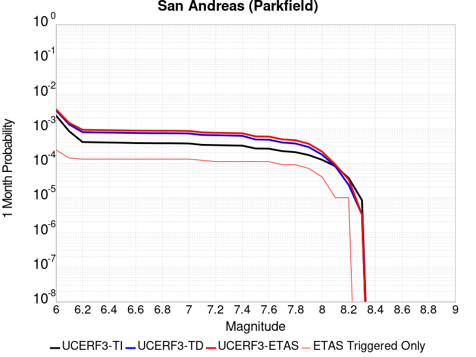 |  |  |

| Magnitude | 1 wk TI Prob | 1 wk TD Prob | 1 wk ETAS Prob | 1 wk ETAS/TD Gain | 1 wk ETAS Triggered Only | 1 mo TI Prob | 1 mo TD Prob | 1 mo ETAS Prob | 1 mo ETAS/TD Gain | 1 mo ETAS Triggered Only | 1 yr TI Prob | 1 yr TD Prob | 1 yr ETAS Prob | 1 yr ETAS/TD Gain | 1 yr ETAS Triggered Only | 10 yr TI Prob | 10 yr TD Prob | 10 yr ETAS Prob | 10 yr ETAS/TD Gain | 10 yr ETAS Triggered Only |
|-----|-----|-----|-----|-----|-----|-----|-----|-----|-----|-----|-----|-----|-----|-----|-----|-----|-----|-----|-----|-----|
| 6.0 | 5.556969E-4 | 7.7782426E-4 | 9.921116E-4 | 1.2754959 | 2.1445421E-4 | 0.0023793848 | 0.0033298214 | 0.0036718056 | 1.1027035 | 3.4312674E-4 | 0.028586963 | 0.040191233 | 0.040561736 | 1.0092185 | 3.8601758E-4 | 0.25176284 | 0.33716413 | 0.3375053 | 1.0010118 | 5.146901E-4 |
| 6.1 | 1.925858E-4 | 3.0276453E-4 | 4.313981E-4 | 1.4248635 | 1.2867253E-4 | 8.2510663E-4 | 0.0012970108 | 0.0015111868 | 1.1651305 | 2.1445421E-4 | 0.0099994885 | 0.015778083 | 0.015989155 | 1.0133774 | 2.1445421E-4 | 0.095613256 | 0.1497237 | 0.1499425 | 1.0014615 | 2.5734506E-4 |
| 6.2 | 9.4306815E-5 | 1.8242796E-4 | 3.1107702E-4 | 1.7052047 | 1.2867253E-4 | 4.0410945E-4 | 7.816011E-4 | 9.958877E-4 | 1.2741636 | 2.1445421E-4 | 0.0049089384 | 0.009474681 | 0.009687103 | 1.02242 | 2.1445421E-4 | 0.048019063 | 0.09185409 | 0.0920878 | 1.0025443 | 2.5734506E-4 |
| 6.3 | 9.283051E-5 | 1.7939322E-4 | 3.0804265E-4 | 1.7171366 | 1.2867253E-4 | 3.9778434E-4 | 7.686027E-4 | 9.828921E-4 | 1.2788038 | 2.1445421E-4 | 0.0048322747 | 0.009317789 | 0.009530245 | 1.0228012 | 2.1445421E-4 | 0.047285385 | 0.09050704 | 0.09074109 | 1.002586 | 2.5734506E-4 |
| 6.4 | 9.138826E-5 | 1.770153E-4 | 3.0566505E-4 | 1.726772 | 1.2867253E-4 | 3.916052E-4 | 7.5841765E-4 | 9.727092E-4 | 1.2825508 | 2.1445421E-4 | 0.0047573745 | 0.00919484 | 0.009407322 | 1.0231088 | 2.1445421E-4 | 0.046568092 | 0.08940927 | 0.08964361 | 1.0026209 | 2.5734506E-4 |
| 6.5 | 9.000255E-5 | 1.7459576E-4 | 3.0324582E-4 | 1.7368453 | 1.2867253E-4 | 3.8566816E-4 | 7.480541E-4 | 9.623479E-4 | 1.2864683 | 2.1445421E-4 | 0.0046854047 | 0.009069731 | 0.009282241 | 1.0234306 | 2.1445421E-4 | 0.045878403 | 0.088295065 | 0.08852969 | 1.0026573 | 2.5734506E-4 |
| 6.6 | 8.8109264E-5 | 1.7140752E-4 | 3.00058E-4 | 1.7505533 | 1.2867253E-4 | 3.7755648E-4 | 7.3439797E-4 | 9.486947E-4 | 1.2917992 | 2.1445421E-4 | 0.0045870654 | 0.008904854 | 0.009117398 | 1.0238684 | 2.1445421E-4 | 0.04493529 | 0.0868267 | 0.087061696 | 1.0027065 | 2.5734506E-4 |
| 6.7 | 8.738073E-5 | 1.7007832E-4 | 2.9872896E-4 | 1.75642 | 1.2867253E-4 | 3.7443507E-4 | 7.287046E-4 | 9.430026E-4 | 1.2940806 | 2.1445421E-4 | 0.0045492216 | 0.008836143 | 0.009048702 | 1.0240557 | 2.1445421E-4 | 0.04457213 | 0.08622707 | 0.08646222 | 1.0027272 | 2.5734506E-4 |
| 6.8 | 8.710195E-5 | 1.6953335E-4 | 2.9818405E-4 | 1.758852 | 1.2867253E-4 | 3.7324068E-4 | 7.263703E-4 | 9.4066875E-4 | 1.2950264 | 2.1445421E-4 | 0.0045347405 | 0.008807961 | 0.009020526 | 1.0241333 | 2.1445421E-4 | 0.04443313 | 0.08597467 | 0.086209886 | 1.002736 | 2.5734506E-4 |
| 6.9 | 8.6801556E-5 | 1.689429E-4 | 2.9759368E-4 | 1.7615045 | 1.2867253E-4 | 3.7195362E-4 | 7.2384125E-4 | 9.381402E-4 | 1.2960579 | 2.1445421E-4 | 0.0045191357 | 0.008777418 | 0.00898999 | 1.0242181 | 2.1445421E-4 | 0.044283327 | 0.085700735 | 0.085936025 | 1.0027455 | 2.5734506E-4 |
| 7.0 | 8.5571606E-5 | 1.6647128E-4 | 2.951224E-4 | 1.7728126 | 1.2867253E-4 | 3.6668387E-4 | 7.132544E-4 | 9.2755567E-4 | 1.3004556 | 2.1445421E-4 | 0.004455241 | 0.008649553 | 0.008862153 | 1.0245792 | 2.1445421E-4 | 0.043669727 | 0.08454914 | 0.084784724 | 1.0027864 | 2.5734506E-4 |
| 7.1 | 7.82589E-5 | 1.5128135E-4 | 2.799344E-4 | 1.8504225 | 1.2867253E-4 | 3.3535215E-4 | 6.481883E-4 | 8.625035E-4 | 1.3306372 | 2.1445421E-4 | 0.0040752706 | 0.007863307 | 0.0080760745 | 1.0270584 | 2.1445421E-4 | 0.040013418 | 0.07746111 | 0.07769852 | 1.0030649 | 2.5734506E-4 |
| 7.2 | 7.690929E-5 | 1.4865391E-4 | 2.3442284E-4 | 1.5769706 | 8.5781685E-5 | 3.2956956E-4 | 6.369334E-4 | 8.083875E-4 | 1.2691869 | 1.7156337E-4 | 0.004005129 | 0.007727258 | 0.007897495 | 1.0220308 | 1.7156337E-4 | 0.0393371 | 0.07623427 | 0.07643238 | 1.0025986 | 2.1445421E-4 |
| 7.3 | 7.5543794E-5 | 1.4561978E-4 | 2.3138897E-4 | 1.5889941 | 8.5781685E-5 | 3.2371894E-4 | 6.2393624E-4 | 7.9539255E-4 | 1.2747978 | 1.7156337E-4 | 0.003934157 | 0.007570127 | 0.007740392 | 1.0224917 | 1.7156337E-4 | 0.038652334 | 0.074797355 | 0.07499576 | 1.0026526 | 2.1445421E-4 |
| 7.4 | 7.4214564E-5 | 1.4262961E-4 | 2.2839906E-4 | 1.6013439 | 8.5781685E-5 | 3.1802364E-4 | 6.111273E-4 | 7.825858E-4 | 1.2805611 | 1.7156337E-4 | 0.003865065 | 0.00741525 | 0.007585541 | 1.022965 | 1.7156337E-4 | 0.03798529 | 0.07337123 | 0.07356995 | 1.0027084 | 2.1445421E-4 |
| 7.5 | 6.149578E-5 | 1.11907226E-4 | 1.9767931E-4 | 1.7664571 | 8.5781685E-5 | 2.6352672E-4 | 4.7951436E-4 | 6.5099547E-4 | 1.3576142 | 1.7156337E-4 | 0.0032037178 | 0.0058224914 | 0.0059930556 | 1.029294 | 1.7156337E-4 | 0.03157923 | 0.058557566 | 0.058759462 | 1.0034478 | 2.1445421E-4 |
| 7.6 | 6.0643448E-5 | 1.10193796E-4 | 1.9596603E-4 | 1.7783762 | 8.5781685E-5 | 2.598746E-4 | 4.7217376E-4 | 6.436561E-4 | 1.3631763 | 1.7156337E-4 | 0.0031593828 | 0.0057335934 | 0.0059041735 | 1.029751 | 1.7156337E-4 | 0.031148417 | 0.057718582 | 0.057920657 | 1.003501 | 2.1445421E-4 |
| 7.7 | 5.1652263E-5 | 9.174698E-5 | 1.3463388E-4 | 1.4674476 | 4.2890842E-5 | 2.2134806E-4 | 3.931421E-4 | 4.7889008E-4 | 1.2181094 | 8.5781685E-5 | 0.002691582 | 0.0047760103 | 0.0048613823 | 1.0178752 | 8.5781685E-5 | 0.026592141 | 0.04853623 | 0.048617847 | 1.0016816 | 8.5781685E-5 |
| 7.8 | 4.8090482E-5 | 8.559635E-5 | 1.2848353E-4 | 1.5010397 | 4.2890842E-5 | 2.060858E-4 | 3.6678996E-4 | 4.5254017E-4 | 1.2337856 | 8.5781685E-5 | 0.0025062072 | 0.0044565317 | 0.004541931 | 1.0191628 | 8.5781685E-5 | 0.024781305 | 0.04530245 | 0.045384344 | 1.0018078 | 8.5781685E-5 |
| 7.9 | 3.970278E-5 | 6.750426E-5 | 6.750426E-5 | 1.0 | 0.0 | 1.7014367E-4 | 2.892719E-4 | 3.3215035E-4 | 1.1482289 | 4.2890842E-5 | 0.002069531 | 0.0035162016 | 0.0035589417 | 1.0121552 | 4.2890842E-5 | 0.020503636 | 0.035881363 | 0.035922714 | 1.0011525 | 4.2890842E-5 |
| 8.0 | 2.8982335E-5 | 4.069796E-5 | 4.069796E-5 | 1.0 | 0.0 | 1.2420409E-4 | 1.7440817E-4 | 2.1729153E-4 | 1.2458793 | 4.2890842E-5 | 0.0015111357 | 0.0021213528 | 0.0021641527 | 1.0201757 | 4.2890842E-5 | 0.015009012 | 0.022010697 | 0.022052644 | 1.0019058 | 4.2890842E-5 |
| 8.1 | 1.8836186E-5 | 1.8681134E-5 | 1.8681134E-5 | 1.0 | 0.0 | 8.0724014E-5 | 8.005955E-5 | 8.005955E-5 | 1.0 | 0.0 | 9.823717E-4 | 9.742898E-4 | 9.742898E-4 | 1.0 | 0.0 | 0.009780403 | 0.010488115 | 0.010488115 | 1.0 | 0.0 |
| 8.2 | 8.643924E-6 | 5.4748625E-6 | 5.4748625E-6 | 1.0 | 0.0 | 3.704486E-5 | 2.3463486E-5 | 2.3463486E-5 | 1.0 | 0.0 | 4.5092785E-4 | 2.8563058E-4 | 2.8563058E-4 | 1.0 | 0.0 | 0.0045001395 | 0.0032487072 | 0.0032487072 | 1.0 | 0.0 |
| 8.3 | 1.983087E-6 | 7.6599065E-7 | 7.6599065E-7 | 1.0 | 0.0 | 8.498917E-6 | 3.282813E-6 | 3.282813E-6 | 1.0 | 0.0 | 1.034694E-4 | 3.9967534E-5 | 3.9967534E-5 | 1.0 | 0.0 | 0.0010342124 | 4.719687E-4 | 4.719687E-4 | 1.0 | 0.0 |

## Elsinore (Glen Ivy) rev
*[(top)](#table-of-contents)*

| 1 Week | 1 Month | 1 Year | 10 Year |
|-----|-----|-----|-----|
| 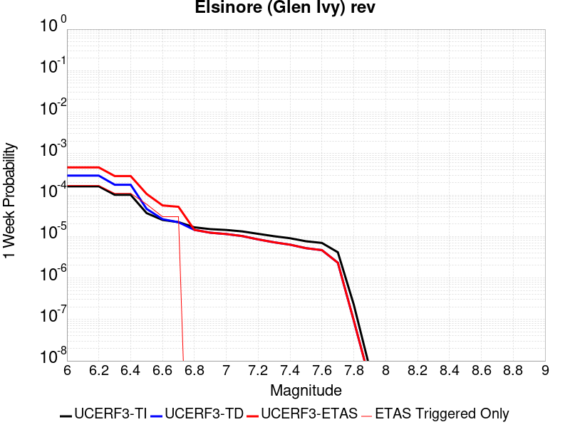 |  |  |  |

| Magnitude | 1 wk TI Prob | 1 wk TD Prob | 1 wk ETAS Prob | 1 wk ETAS/TD Gain | 1 wk ETAS Triggered Only | 1 mo TI Prob | 1 mo TD Prob | 1 mo ETAS Prob | 1 mo ETAS/TD Gain | 1 mo ETAS Triggered Only | 1 yr TI Prob | 1 yr TD Prob | 1 yr ETAS Prob | 1 yr ETAS/TD Gain | 1 yr ETAS Triggered Only | 10 yr TI Prob | 10 yr TD Prob | 10 yr ETAS Prob | 10 yr ETAS/TD Gain | 10 yr ETAS Triggered Only |
|-----|-----|-----|-----|-----|-----|-----|-----|-----|-----|-----|-----|-----|-----|-----|-----|-----|-----|-----|-----|-----|
| 6.0 | 1.6204086E-4 | 2.9360707E-4 | 4.6512007E-4 | 1.5841583 | 1.7156337E-4 | 6.94276E-4 | 0.0012578638 | 0.0015148852 | 1.2043316 | 2.5734506E-4 | 0.008420097 | 0.015234485 | 0.015572384 | 1.02218 | 3.4312674E-4 | 0.081081145 | 0.13969168 | 0.14002377 | 1.0023774 | 3.8601758E-4 |
| 6.1 | 1.6204086E-4 | 2.9360707E-4 | 4.6512007E-4 | 1.5841583 | 1.7156337E-4 | 6.94276E-4 | 0.0012578638 | 0.0015148852 | 1.2043316 | 2.5734506E-4 | 0.008420097 | 0.015234485 | 0.015572384 | 1.02218 | 3.4312674E-4 | 0.081081145 | 0.13969168 | 0.14002377 | 1.0023774 | 3.8601758E-4 |
| 6.2 | 1.6204086E-4 | 2.9360707E-4 | 4.6512007E-4 | 1.5841583 | 1.7156337E-4 | 6.94276E-4 | 0.0012578638 | 0.0015148852 | 1.2043316 | 2.5734506E-4 | 0.008420097 | 0.015234485 | 0.015572384 | 1.02218 | 3.4312674E-4 | 0.081081145 | 0.13969168 | 0.14002377 | 1.0023774 | 3.8601758E-4 |
| 6.3 | 1.0111737E-4 | 1.7703383E-4 | 2.628003E-4 | 1.4844639 | 8.5781685E-5 | 4.332882E-4 | 7.5861247E-4 | 9.300457E-4 | 1.2259827 | 1.7156337E-4 | 0.005262531 | 0.009217682 | 0.009472655 | 1.0276613 | 2.5734506E-4 | 0.0513964 | 0.0870191 | 0.08729321 | 1.00315 | 3.002359E-4 |
| 6.4 | 1.0111737E-4 | 1.7703383E-4 | 2.628003E-4 | 1.4844639 | 8.5781685E-5 | 4.332882E-4 | 7.5861247E-4 | 9.300457E-4 | 1.2259827 | 1.7156337E-4 | 0.005262531 | 0.009217682 | 0.009472655 | 1.0276613 | 2.5734506E-4 | 0.0513964 | 0.0870191 | 0.08729321 | 1.00315 | 3.002359E-4 |
| 6.5 | 3.6624708E-5 | 4.6391084E-5 | 4.6391084E-5 | 1.0 | 0.0 | 1.569536E-4 | 1.9880582E-4 | 1.9880582E-4 | 1.0 | 0.0 | 0.001909235 | 0.0024181372 | 0.0024181372 | 1.0 | 0.0 | 0.01892915 | 0.023739954 | 0.023739954 | 1.0 | 0.0 |
| 6.6 | 2.5051324E-5 | 2.614772E-5 | 2.614772E-5 | 1.0 | 0.0 | 1.073584E-4 | 1.12057096E-4 | 1.12057096E-4 | 1.0 | 0.0 | 0.0013063047 | 0.0013634858 | 0.0013634858 | 1.0 | 0.0 | 0.012986525 | 0.013564618 | 0.013564618 | 1.0 | 0.0 |
| 6.7 | 2.2189772E-5 | 2.2072849E-5 | 2.2072849E-5 | 1.0 | 0.0 | 9.509556E-5 | 9.4594696E-5 | 9.4594696E-5 | 1.0 | 0.0 | 0.0011571734 | 0.0011511183 | 0.0011511183 | 1.0 | 0.0 | 0.011511663 | 0.011465415 | 0.011465415 | 1.0 | 0.0 |
| 6.8 | 1.6654378E-5 | 1.4437705E-5 | 1.4437705E-5 | 1.0 | 0.0 | 7.137396E-5 | 6.187444E-5 | 6.187444E-5 | 1.0 | 0.0 | 8.686314E-4 | 7.530661E-4 | 7.530661E-4 | 1.0 | 0.0 | 0.008652439 | 0.00751048 | 0.00751048 | 1.0 | 0.0 |
| 6.9 | 1.5042909E-5 | 1.2332022E-5 | 1.2332022E-5 | 1.0 | 0.0 | 6.446802E-5 | 5.285047E-5 | 5.285047E-5 | 1.0 | 0.0 | 7.8461546E-4 | 6.4326765E-4 | 6.4326765E-4 | 1.0 | 0.0 | 0.007818509 | 0.00641828 | 0.00641828 | 1.0 | 0.0 |
| 7.0 | 1.4361385E-5 | 1.1451324E-5 | 1.1451324E-5 | 1.0 | 0.0 | 6.154734E-5 | 4.9076196E-5 | 4.9076196E-5 | 1.0 | 0.0 | 7.490812E-4 | 5.973418E-4 | 5.973418E-4 | 1.0 | 0.0 | 0.007465612 | 0.0059613534 | 0.0059613534 | 1.0 | 0.0 |
| 7.1 | 1.3265571E-5 | 1.0244926E-5 | 1.0244926E-5 | 1.0 | 0.0 | 5.6851208E-5 | 4.39061E-5 | 4.39061E-5 | 1.0 | 0.0 | 6.919436E-4 | 5.344282E-4 | 5.344282E-4 | 1.0 | 0.0 | 0.006897931 | 0.0053347866 | 0.0053347866 | 1.0 | 0.0 |
| 7.2 | 1.1596403E-5 | 8.505067E-6 | 8.505067E-6 | 1.0 | 0.0 | 4.9697923E-5 | 3.6449786E-5 | 3.6449786E-5 | 1.0 | 0.0 | 6.049042E-4 | 4.436875E-4 | 4.436875E-4 | 1.0 | 0.0 | 0.006032603 | 0.0044294316 | 0.0044294316 | 1.0 | 0.0 |
| 7.3 | 1.0150827E-5 | 7.2387597E-6 | 7.2387597E-6 | 1.0 | 0.0 | 4.3502816E-5 | 3.1022897E-5 | 3.1022897E-5 | 1.0 | 0.0 | 5.2951806E-4 | 3.7763975E-4 | 3.7763975E-4 | 1.0 | 0.0 | 0.005282581 | 0.0037703665 | 0.0037703665 | 1.0 | 0.0 |
| 7.4 | 9.080705E-6 | 6.352519E-6 | 6.352519E-6 | 1.0 | 0.0 | 3.8916725E-5 | 2.7224805E-5 | 2.7224805E-5 | 1.0 | 0.0 | 4.7370812E-4 | 3.3141294E-4 | 3.3141294E-4 | 1.0 | 0.0 | 0.004726996 | 0.0033093381 | 0.0033093381 | 1.0 | 0.0 |
| 7.5 | 7.671649E-6 | 5.2256332E-6 | 5.2256332E-6 | 1.0 | 0.0 | 3.287808E-5 | 2.2395385E-5 | 2.2395385E-5 | 1.0 | 0.0 | 4.0021708E-4 | 2.7263095E-4 | 2.7263095E-4 | 1.0 | 0.0 | 0.0039949706 | 0.00272309 | 0.00272309 | 1.0 | 0.0 |
| 7.6 | 6.990086E-6 | 4.687545E-6 | 4.687545E-6 | 1.0 | 0.0 | 2.9957167E-5 | 2.008933E-5 | 2.008933E-5 | 1.0 | 0.0 | 3.6466747E-4 | 2.445613E-4 | 2.445613E-4 | 1.0 | 0.0 | 0.0036406964 | 0.002443038 | 0.002443038 | 1.0 | 0.0 |
| 7.7 | 4.163505E-6 | 2.3295343E-6 | 2.3295343E-6 | 1.0 | 0.0 | 1.7843471E-5 | 9.983683E-6 | 9.983683E-6 | 1.0 | 0.0 | 2.172226E-4 | 1.21545316E-4 | 1.21545316E-4 | 1.0 | 0.0 | 0.0021701038 | 0.0012148614 | 0.0012148614 | 1.0 | 0.0 |
| 7.8 | 2.2692414E-7 | 9.3854695E-8 | 9.3854695E-8 | 1.0 | 0.0 | 9.725317E-7 | 4.0223435E-7 | 4.0223435E-7 | 1.0 | 0.0 | 1.1840509E-5 | 4.8971956E-6 | 4.8971956E-6 | 1.0 | 0.0 | 1.1839878E-4 | 4.8971204E-5 | 4.8971204E-5 | 1.0 | 0.0 |
| 7.9 | 6.676829E-9 | 3.439853E-9 | 3.439853E-9 | 1.0 | 0.0 | 2.861498E-8 | 1.4742227E-8 | 1.4742227E-8 | 1.0 | 0.0 | 3.4838732E-7 | 1.7948659E-7 | 1.7948659E-7 | 1.0 | 0.0 | 3.4838679E-6 | 1.7948646E-6 | 1.7948646E-6 | 1.0 | 0.0 |

## San Andreas (San Gorgonio Pass-Garnet HIll)
*[(top)](#table-of-contents)*

| 1 Week | 1 Month | 1 Year | 10 Year |
|-----|-----|-----|-----|
|  |  |  |  |

| Magnitude | 1 wk TI Prob | 1 wk TD Prob | 1 wk ETAS Prob | 1 wk ETAS/TD Gain | 1 wk ETAS Triggered Only | 1 mo TI Prob | 1 mo TD Prob | 1 mo ETAS Prob | 1 mo ETAS/TD Gain | 1 mo ETAS Triggered Only | 1 yr TI Prob | 1 yr TD Prob | 1 yr ETAS Prob | 1 yr ETAS/TD Gain | 1 yr ETAS Triggered Only | 10 yr TI Prob | 10 yr TD Prob | 10 yr ETAS Prob | 10 yr ETAS/TD Gain | 10 yr ETAS Triggered Only |
|-----|-----|-----|-----|-----|-----|-----|-----|-----|-----|-----|-----|-----|-----|-----|-----|-----|-----|-----|-----|-----|
| 6.0 | 8.31567E-5 | 2.3382473E-4 | 4.482288E-4 | 1.9169436 | 2.1445421E-4 | 3.5633717E-4 | 0.0010017233 | 0.0012588106 | 1.256645 | 2.5734506E-4 | 0.004329778 | 0.012127888 | 0.0124668535 | 1.0279492 | 3.4312674E-4 | 0.042463828 | 0.11257892 | 0.11295954 | 1.0033809 | 4.2890842E-4 |
| 6.1 | 8.31567E-5 | 2.3382473E-4 | 4.482288E-4 | 1.9169436 | 2.1445421E-4 | 3.5633717E-4 | 0.0010017233 | 0.0012588106 | 1.256645 | 2.5734506E-4 | 0.004329778 | 0.012127888 | 0.0124668535 | 1.0279492 | 3.4312674E-4 | 0.042463828 | 0.11257892 | 0.11295954 | 1.0033809 | 4.2890842E-4 |
| 6.2 | 8.31567E-5 | 2.3382473E-4 | 4.482288E-4 | 1.9169436 | 2.1445421E-4 | 3.5633717E-4 | 0.0010017233 | 0.0012588106 | 1.256645 | 2.5734506E-4 | 0.004329778 | 0.012127888 | 0.0124668535 | 1.0279492 | 3.4312674E-4 | 0.042463828 | 0.11257892 | 0.11295954 | 1.0033809 | 4.2890842E-4 |
| 6.3 | 8.31567E-5 | 2.3382473E-4 | 4.482288E-4 | 1.9169436 | 2.1445421E-4 | 3.5633717E-4 | 0.0010017233 | 0.0012588106 | 1.256645 | 2.5734506E-4 | 0.004329778 | 0.012127888 | 0.0124668535 | 1.0279492 | 3.4312674E-4 | 0.042463828 | 0.11257892 | 0.11295954 | 1.0033809 | 4.2890842E-4 |
| 6.4 | 8.059055E-5 | 2.2940808E-4 | 4.438131E-4 | 1.934601 | 2.1445421E-4 | 3.4534236E-4 | 9.828096E-4 | 0.0012399016 | 1.2615889 | 2.5734506E-4 | 0.0041964394 | 0.011900152 | 0.012239195 | 1.0284907 | 3.4312674E-4 | 0.041180745 | 0.11056015 | 0.11094163 | 1.0034505 | 4.2890842E-4 |
| 6.5 | 8.059055E-5 | 2.2940808E-4 | 4.438131E-4 | 1.934601 | 2.1445421E-4 | 3.4534236E-4 | 9.828096E-4 | 0.0012399016 | 1.2615889 | 2.5734506E-4 | 0.0041964394 | 0.011900152 | 0.012239195 | 1.0284907 | 3.4312674E-4 | 0.041180745 | 0.11056015 | 0.11094163 | 1.0034505 | 4.2890842E-4 |
| 6.6 | 7.619237E-5 | 2.218517E-4 | 4.3625833E-4 | 1.9664413 | 2.1445421E-4 | 3.2649786E-4 | 9.5044886E-4 | 0.0012075494 | 1.2705042 | 2.5734506E-4 | 0.0039678677 | 0.01151087 | 0.011850047 | 1.0294658 | 3.4312674E-4 | 0.03897764 | 0.10709683 | 0.1074798 | 1.0035759 | 4.2890842E-4 |
| 6.7 | 7.440636E-5 | 2.1860997E-4 | 4.330173E-4 | 1.9807756 | 2.1445421E-4 | 3.188454E-4 | 9.3656575E-4 | 0.0011936697 | 1.2745179 | 2.5734506E-4 | 0.0038750346 | 0.011343609 | 0.011682843 | 1.0299053 | 3.4312674E-4 | 0.038081564 | 0.105605274 | 0.10598889 | 1.0036325 | 4.2890842E-4 |
| 6.8 | 7.3735864E-5 | 2.1708169E-4 | 4.3148934E-4 | 1.987682 | 2.1445421E-4 | 3.1597257E-4 | 9.3002064E-4 | 0.0011871264 | 1.2764516 | 2.5734506E-4 | 0.0038401815 | 0.011264749 | 0.01160401 | 1.030117 | 3.4312674E-4 | 0.03774495 | 0.10490683 | 0.10529074 | 1.0036596 | 4.2890842E-4 |
| 6.9 | 7.27575E-5 | 2.1477141E-4 | 4.2917958E-4 | 1.9983087 | 2.1445421E-4 | 3.117806E-4 | 9.201265E-4 | 0.0011772348 | 1.279427 | 2.5734506E-4 | 0.003789323 | 0.011145527 | 0.011484829 | 1.030443 | 3.4312674E-4 | 0.037253562 | 0.103854746 | 0.104239106 | 1.003701 | 4.2890842E-4 |
| 7.0 | 7.102591E-5 | 2.1061185E-4 | 4.250209E-4 | 2.0180295 | 2.1445421E-4 | 3.0436125E-4 | 9.023122E-4 | 0.001159425 | 1.2849488 | 2.5734506E-4 | 0.003699303 | 0.010930831 | 0.011270207 | 1.0310476 | 3.4312674E-4 | 0.03638325 | 0.10195695 | 0.10234213 | 1.0037779 | 4.2890842E-4 |
| 7.1 | 7.028513E-5 | 2.0896831E-4 | 4.233777E-4 | 2.026038 | 2.1445421E-4 | 3.0118722E-4 | 8.9527335E-4 | 0.001152388 | 1.2871913 | 2.5734506E-4 | 0.0036607897 | 0.010845989 | 0.011185395 | 1.0312932 | 3.4312674E-4 | 0.036010686 | 0.101199985 | 0.101585485 | 1.0038093 | 4.2890842E-4 |
| 7.2 | 6.8498244E-5 | 2.0504706E-4 | 4.194573E-4 | 2.0456636 | 2.1445421E-4 | 2.9353087E-4 | 8.784794E-4 | 0.0011355984 | 1.2926865 | 2.5734506E-4 | 0.003567883 | 0.010643536 | 0.010983011 | 1.0318949 | 3.4312674E-4 | 0.035111405 | 0.09939202 | 0.099778295 | 1.0038865 | 4.2890842E-4 |
| 7.3 | 6.622592E-5 | 1.9732013E-4 | 4.1173203E-4 | 2.0866196 | 2.1445421E-4 | 2.8379448E-4 | 8.453858E-4 | 0.0011025133 | 1.304154 | 2.5734506E-4 | 0.0034497243 | 0.0102444785 | 0.010584091 | 1.0331507 | 3.4312674E-4 | 0.033966612 | 0.095888525 | 0.096276306 | 1.004044 | 4.2890842E-4 |
| 7.4 | 5.1050705E-5 | 1.4689034E-4 | 3.6131305E-4 | 2.4597468 | 2.1445421E-4 | 2.1877038E-4 | 6.29379E-4 | 8.865621E-4 | 1.4086299 | 2.5734506E-4 | 0.002660276 | 0.0076359594 | 0.007976466 | 1.0445925 | 3.4312674E-4 | 0.02628654 | 0.07286301 | 0.07326067 | 1.0054576 | 4.2890842E-4 |
| 7.5 | 3.9302922E-5 | 1.1129847E-4 | 2.8284275E-4 | 2.5412996 | 1.7156337E-4 | 1.6843023E-4 | 4.7690657E-4 | 6.912585E-4 | 1.4494631 | 2.1445421E-4 | 0.0020487092 | 0.005790949 | 0.006089446 | 1.0515455 | 3.002359E-4 | 0.020299247 | 0.05600951 | 0.05637391 | 1.006506 | 3.8601758E-4 |
| 7.6 | 2.9851626E-5 | 8.4949745E-5 | 1.7072415E-4 | 2.0097075 | 8.5781685E-5 | 1.2792926E-4 | 3.6401965E-4 | 4.926453E-4 | 1.3533483 | 1.2867253E-4 | 0.0015564259 | 0.0044229585 | 0.004593763 | 1.0386177 | 1.7156337E-4 | 0.0154556995 | 0.04319374 | 0.043439966 | 1.0057006 | 2.5734506E-4 |
| 7.7 | 2.1135214E-5 | 6.3529005E-5 | 1.4930524E-4 | 2.3501902 | 8.5781685E-5 | 9.0576345E-5 | 2.7223877E-4 | 4.0087628E-4 | 1.4725173 | 1.2867253E-4 | 0.0011022091 | 0.0033094748 | 0.0034804705 | 1.0516685 | 1.7156337E-4 | 0.010967582 | 0.032582592 | 0.032831553 | 1.0076408 | 2.5734506E-4 |
| 7.8 | 1.883379E-5 | 5.564028E-5 | 1.4141719E-4 | 2.5416334 | 8.5781685E-5 | 8.0713755E-5 | 2.3843657E-4 | 3.670784E-4 | 1.5395223 | 1.2867253E-4 | 9.822468E-4 | 0.0028991038 | 0.0030701698 | 1.0590065 | 1.7156337E-4 | 0.0097791655 | 0.028695205 | 0.028945167 | 1.0087109 | 2.5734506E-4 |
| 7.9 | 1.5156185E-5 | 4.1658426E-5 | 1.2743653E-4 | 3.059082 | 8.5781685E-5 | 6.495346E-5 | 1.785239E-4 | 3.0717347E-4 | 1.7206293 | 1.2867253E-4 | 7.9052144E-4 | 0.0021713632 | 0.0022997563 | 1.0591302 | 1.2867253E-4 | 0.007877152 | 0.021759422 | 0.02196921 | 1.0096413 | 2.1445421E-4 |
| 8.0 | 1.1405907E-5 | 2.9974231E-5 | 2.9974231E-5 | 1.0 | 0.0 | 4.8881542E-5 | 1.2845467E-4 | 1.2845467E-4 | 1.0 | 0.0 | 5.9497025E-4 | 0.0015628147 | 0.0015628147 | 1.0 | 0.0 | 0.005933798 | 0.015772851 | 0.015815064 | 1.0026764 | 4.2890842E-5 |
| 8.1 | 4.3511436E-6 | 7.369219E-6 | 7.369219E-6 | 1.0 | 0.0 | 1.8647626E-5 | 3.1581985E-5 | 3.1581985E-5 | 1.0 | 0.0 | 2.2701119E-4 | 3.8444297E-4 | 3.8444297E-4 | 1.0 | 0.0 | 0.0022677942 | 0.0041163345 | 0.0041163345 | 1.0 | 0.0 |
| 8.2 | 2.3042528E-6 | 2.7329415E-6 | 2.7329415E-6 | 1.0 | 0.0 | 9.875332E-6 | 1.1712554E-5 | 1.1712554E-5 | 1.0 | 0.0 | 1.2022553E-4 | 1.4259106E-4 | 1.4259106E-4 | 1.0 | 0.0 | 0.0012016051 | 0.0015979785 | 0.0015979785 | 1.0 | 0.0 |
| 8.3 | 5.202968E-7 | 3.1598344E-7 | 3.1598344E-7 | 1.0 | 0.0 | 2.2298414E-6 | 1.3542141E-6 | 1.3542141E-6 | 1.0 | 0.0 | 2.714798E-5 | 1.6487444E-5 | 1.6487444E-5 | 1.0 | 0.0 | 2.7144665E-4 | 1.9563142E-4 | 1.9563142E-4 | 1.0 | 0.0 |

## Baker
*[(top)](#table-of-contents)*

| 1 Week | 1 Month | 1 Year | 10 Year |
|-----|-----|-----|-----|
|  |  |  |  |

| Magnitude | 1 wk TI Prob | 1 wk TD Prob | 1 wk ETAS Prob | 1 wk ETAS/TD Gain | 1 wk ETAS Triggered Only | 1 mo TI Prob | 1 mo TD Prob | 1 mo ETAS Prob | 1 mo ETAS/TD Gain | 1 mo ETAS Triggered Only | 1 yr TI Prob | 1 yr TD Prob | 1 yr ETAS Prob | 1 yr ETAS/TD Gain | 1 yr ETAS Triggered Only | 10 yr TI Prob | 10 yr TD Prob | 10 yr ETAS Prob | 10 yr ETAS/TD Gain | 10 yr ETAS Triggered Only |
|-----|-----|-----|-----|-----|-----|-----|-----|-----|-----|-----|-----|-----|-----|-----|-----|-----|-----|-----|-----|-----|
| 6.0 | 5.695525E-6 | 5.8348373E-6 | 1.773972E-4 | 30.403112 | 1.7156337E-4 | 2.4409164E-5 | 2.5006228E-5 | 2.3945508E-4 | 9.575818 | 2.1445421E-4 | 2.9714106E-4 | 3.044123E-4 | 5.61679E-4 | 1.8451259 | 2.5734506E-4 | 0.0029674405 | 0.0030403486 | 0.0034251928 | 1.1265789 | 3.8601758E-4 |
| 6.1 | 5.695525E-6 | 5.8348373E-6 | 1.773972E-4 | 30.403112 | 1.7156337E-4 | 2.4409164E-5 | 2.5006228E-5 | 2.3945508E-4 | 9.575818 | 2.1445421E-4 | 2.9714106E-4 | 3.044123E-4 | 5.61679E-4 | 1.8451259 | 2.5734506E-4 | 0.0029674405 | 0.0030403486 | 0.0034251928 | 1.1265789 | 3.8601758E-4 |
| 6.2 | 5.695525E-6 | 5.8348373E-6 | 1.773972E-4 | 30.403112 | 1.7156337E-4 | 2.4409164E-5 | 2.5006228E-5 | 2.3945508E-4 | 9.575818 | 2.1445421E-4 | 2.9714106E-4 | 3.044123E-4 | 5.61679E-4 | 1.8451259 | 2.5734506E-4 | 0.0029674405 | 0.0030403486 | 0.0034251928 | 1.1265789 | 3.8601758E-4 |
| 6.3 | 3.2995713E-6 | 3.383667E-6 | 8.916506E-5 | 26.351606 | 8.5781685E-5 | 1.4140943E-5 | 1.4501353E-5 | 1.00281795E-4 | 6.915341 | 8.5781685E-5 | 1.7215237E-4 | 1.7654014E-4 | 3.0518995E-4 | 1.7287284 | 1.2867253E-4 | 0.0017201907 | 0.001764046 | 0.0018924916 | 1.072813 | 1.2867253E-4 |
| 6.4 | 3.2995713E-6 | 3.383667E-6 | 8.916506E-5 | 26.351606 | 8.5781685E-5 | 1.4140943E-5 | 1.4501353E-5 | 1.00281795E-4 | 6.915341 | 8.5781685E-5 | 1.7215237E-4 | 1.7654014E-4 | 3.0518995E-4 | 1.7287284 | 1.2867253E-4 | 0.0017201907 | 0.001764046 | 0.0018924916 | 1.072813 | 1.2867253E-4 |
| 6.5 | 2.782202E-6 | 2.8558404E-6 | 8.863728E-5 | 31.037197 | 8.5781685E-5 | 1.1923668E-5 | 1.223926E-5 | 9.80199E-5 | 8.008645 | 8.5781685E-5 | 1.4516099E-4 | 1.4900314E-4 | 2.7765648E-4 | 1.8634272 | 1.2867253E-4 | 0.001450662 | 0.0014890651 | 0.001617546 | 1.086283 | 1.2867253E-4 |
| 6.6 | 2.3163404E-6 | 2.38092E-6 | 8.81624E-5 | 37.028713 | 8.5781685E-5 | 9.927136E-6 | 1.0203904E-5 | 9.598472E-5 | 9.406666 | 8.5781685E-5 | 1.20856166E-4 | 1.2422565E-4 | 2.528822E-4 | 2.0356681 | 1.2867253E-4 | 0.0012079047 | 0.0012415823 | 0.0013700951 | 1.1035073 | 1.2867253E-4 |
| 6.7 | 2.037056E-6 | 2.0965003E-6 | 8.7878005E-5 | 41.916523 | 8.5781685E-5 | 8.7302105E-6 | 8.984972E-6 | 9.4765885E-5 | 10.547154 | 8.5781685E-5 | 1.0628513E-4 | 1.093867E-4 | 2.3804516E-4 | 2.17618 | 1.2867253E-4 | 0.0010623431 | 0.0010933448 | 0.0012218766 | 1.1175584 | 1.2867253E-4 |
| 6.8 | 1.8356744E-6 | 1.8915287E-6 | 8.7673056E-5 | 46.35037 | 8.5781685E-5 | 7.867153E-6 | 8.106527E-6 | 9.388752E-5 | 11.581718 | 8.5781685E-5 | 9.577837E-5 | 9.869264E-5 | 2.2735247E-4 | 2.3036416 | 1.2867253E-4 | 9.57371E-4 | 9.86502E-4 | 0.0011150476 | 1.1303045 | 1.2867253E-4 |
| 6.9 | 1.6310546E-6 | 1.6832072E-6 | 8.7464745E-5 | 51.96315 | 8.5781685E-5 | 6.9902153E-6 | 7.213726E-6 | 9.299479E-5 | 12.891368 | 8.5781685E-5 | 8.510255E-5 | 8.782368E-5 | 2.1648491E-4 | 2.4649947 | 1.2867253E-4 | 8.5069967E-4 | 8.7790104E-4 | 0.0010064606 | 1.1464397 | 1.2867253E-4 |
| 7.0 | 1.2058036E-6 | 1.2508665E-6 | 4.4141656E-5 | 35.28886 | 4.2890842E-5 | 5.1677193E-6 | 5.3608455E-6 | 4.825146E-5 | 9.000717 | 4.2890842E-5 | 6.291517E-5 | 6.5266366E-5 | 1.5104245E-4 | 2.3142464 | 8.5781685E-5 | 6.289736E-4 | 6.524743E-4 | 7.3820003E-4 | 1.1313856 | 8.5781685E-5 |
| 7.1 | 1.052382E-6 | 1.0951609E-6 | 4.3985958E-5 | 40.163925 | 4.2890842E-5 | 4.5102006E-6 | 4.693538E-6 | 4.758418E-5 | 10.138232 | 4.2890842E-5 | 5.491031E-5 | 5.7142337E-5 | 1.0003073E-4 | 1.7505537 | 4.2890842E-5 | 5.4896745E-4 | 5.7127734E-4 | 6.141437E-4 | 1.0750359 | 4.2890842E-5 |
| 7.2 | 1.0067454E-6 | 1.0487711E-6 | 4.393957E-5 | 41.896244 | 4.2890842E-5 | 4.3146156E-6 | 4.4947255E-6 | 4.7385376E-5 | 10.54244 | 4.2890842E-5 | 5.252918E-5 | 5.4721917E-5 | 9.761041E-5 | 1.7837535 | 4.2890842E-5 | 5.251676E-4 | 5.470853E-4 | 5.8995263E-4 | 1.0783559 | 4.2890842E-5 |
| 7.3 | 9.3596316E-7 | 9.767723E-7 | 9.767723E-7 | 1.0 | 0.0 | 4.0112645E-6 | 4.1861604E-6 | 4.1861604E-6 | 1.0 | 0.0 | 4.8836053E-5 | 5.096532E-5 | 5.096532E-5 | 1.0 | 0.0 | 4.8825322E-4 | 5.095371E-4 | 5.095371E-4 | 1.0 | 0.0 |
| 7.4 | 8.8117395E-7 | 9.2076635E-7 | 9.2076635E-7 | 1.0 | 0.0 | 3.7764542E-6 | 3.9461356E-6 | 3.9461356E-6 | 1.0 | 0.0 | 4.5977362E-5 | 4.8043148E-5 | 4.8043148E-5 | 1.0 | 0.0 | 4.596785E-4 | 4.8032837E-4 | 4.8032837E-4 | 1.0 | 0.0 |
| 7.5 | 8.292386E-7 | 8.6745956E-7 | 8.6745956E-7 | 1.0 | 0.0 | 3.5538749E-6 | 3.7176785E-6 | 3.7176785E-6 | 1.0 | 0.0 | 4.326757E-5 | 4.5261804E-5 | 4.5261804E-5 | 1.0 | 0.0 | 4.3259145E-4 | 4.5252658E-4 | 4.5252658E-4 | 1.0 | 0.0 |
| 7.6 | 7.553842E-7 | 7.9144706E-7 | 7.9144706E-7 | 1.0 | 0.0 | 3.2373566E-6 | 3.3919116E-6 | 3.3919116E-6 | 1.0 | 0.0 | 3.9414106E-5 | 4.129575E-5 | 4.129575E-5 | 1.0 | 0.0 | 3.9407116E-4 | 4.1288146E-4 | 4.1288146E-4 | 1.0 | 0.0 |
| 7.7 | 6.5285366E-7 | 6.852797E-7 | 6.852797E-7 | 1.0 | 0.0 | 2.797941E-6 | 2.9369096E-6 | 2.9369096E-6 | 1.0 | 0.0 | 3.40644E-5 | 3.5756293E-5 | 3.5756293E-5 | 1.0 | 0.0 | 3.405918E-4 | 3.5750607E-4 | 3.5750607E-4 | 1.0 | 0.0 |
| 7.8 | 3.4586725E-7 | 3.6482615E-7 | 3.6482615E-7 | 1.0 | 0.0 | 1.4822873E-6 | 1.5635396E-6 | 1.5635396E-6 | 1.0 | 0.0 | 1.80467E-5 | 1.9035933E-5 | 1.9035933E-5 | 1.0 | 0.0 | 1.8045233E-4 | 1.9034347E-4 | 1.9034347E-4 | 1.0 | 0.0 |
| 7.9 | 2.5591178E-9 | 2.6696718E-9 | 2.6696718E-9 | 1.0 | 0.0 | 1.0967647E-8 | 1.14414505E-8 | 1.14414505E-8 | 1.0 | 0.0 | 1.335311E-7 | 1.3929966E-7 | 1.3929966E-7 | 1.0 | 0.0 | 1.3353102E-6 | 1.3929966E-6 | 1.3929966E-6 | 1.0 | 0.0 |

## San Andreas (Carrizo) rev
*[(top)](#table-of-contents)*

| 1 Week | 1 Month | 1 Year | 10 Year |
|-----|-----|-----|-----|
|  |  | 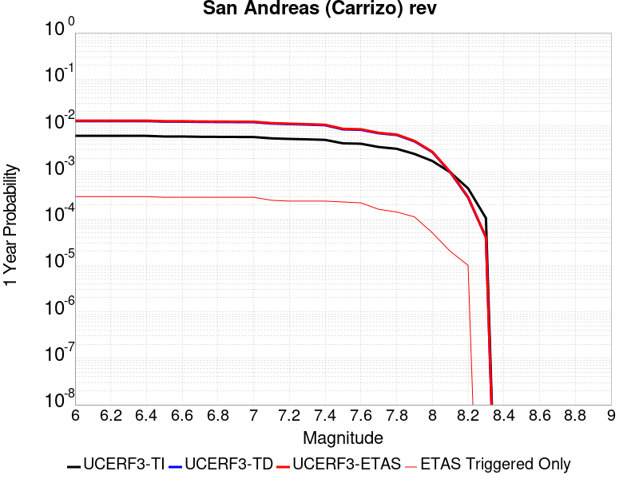 |  |

| Magnitude | 1 wk TI Prob | 1 wk TD Prob | 1 wk ETAS Prob | 1 wk ETAS/TD Gain | 1 wk ETAS Triggered Only | 1 mo TI Prob | 1 mo TD Prob | 1 mo ETAS Prob | 1 mo ETAS/TD Gain | 1 mo ETAS Triggered Only | 1 yr TI Prob | 1 yr TD Prob | 1 yr ETAS Prob | 1 yr ETAS/TD Gain | 1 yr ETAS Triggered Only | 10 yr TI Prob | 10 yr TD Prob | 10 yr ETAS Prob | 10 yr ETAS/TD Gain | 10 yr ETAS Triggered Only |
|-----|-----|-----|-----|-----|-----|-----|-----|-----|-----|-----|-----|-----|-----|-----|-----|-----|-----|-----|-----|-----|
| 6.0 | 1.1674632E-4 | 2.432302E-4 | 3.2899104E-4 | 1.3525912 | 8.5781685E-5 | 5.002454E-4 | 0.0010420004 | 0.0012133849 | 1.1644765 | 1.7156337E-4 | 0.006073493 | 0.012613042 | 0.0128247915 | 1.0167881 | 2.1445421E-4 | 0.0591016 | 0.12061418 | 0.12091592 | 1.0025017 | 3.4312674E-4 |
| 6.1 | 1.1674632E-4 | 2.432302E-4 | 3.2899104E-4 | 1.3525912 | 8.5781685E-5 | 5.002454E-4 | 0.0010420004 | 0.0012133849 | 1.1644765 | 1.7156337E-4 | 0.006073493 | 0.012613042 | 0.0128247915 | 1.0167881 | 2.1445421E-4 | 0.0591016 | 0.12061418 | 0.12091592 | 1.0025017 | 3.4312674E-4 |
| 6.2 | 1.1674632E-4 | 2.432302E-4 | 3.2899104E-4 | 1.3525912 | 8.5781685E-5 | 5.002454E-4 | 0.0010420004 | 0.0012133849 | 1.1644765 | 1.7156337E-4 | 0.006073493 | 0.012613042 | 0.0128247915 | 1.0167881 | 2.1445421E-4 | 0.0591016 | 0.12061418 | 0.12091592 | 1.0025017 | 3.4312674E-4 |
| 6.3 | 1.1674632E-4 | 2.432302E-4 | 3.2899104E-4 | 1.3525912 | 8.5781685E-5 | 5.002454E-4 | 0.0010420004 | 0.0012133849 | 1.1644765 | 1.7156337E-4 | 0.006073493 | 0.012613042 | 0.0128247915 | 1.0167881 | 2.1445421E-4 | 0.0591016 | 0.12061418 | 0.12091592 | 1.0025017 | 3.4312674E-4 |
| 6.4 | 1.1674632E-4 | 2.432302E-4 | 3.2899104E-4 | 1.3525912 | 8.5781685E-5 | 5.002454E-4 | 0.0010420004 | 0.0012133849 | 1.1644765 | 1.7156337E-4 | 0.006073493 | 0.012613042 | 0.0128247915 | 1.0167881 | 2.1445421E-4 | 0.0591016 | 0.12061418 | 0.12091592 | 1.0025017 | 3.4312674E-4 |
| 6.5 | 1.13136164E-4 | 2.3643032E-4 | 3.221917E-4 | 1.3627343 | 8.5781685E-5 | 4.847792E-4 | 0.0010128808 | 0.0011842705 | 1.1692101 | 1.7156337E-4 | 0.0058862255 | 0.012262545 | 0.012474368 | 1.0172741 | 2.1445421E-4 | 0.057327334 | 0.117585555 | 0.11788833 | 1.0025749 | 3.4312674E-4 |
| 6.6 | 1.13136164E-4 | 2.3643032E-4 | 3.221917E-4 | 1.3627343 | 8.5781685E-5 | 4.847792E-4 | 0.0010128808 | 0.0011842705 | 1.1692101 | 1.7156337E-4 | 0.0058862255 | 0.012262545 | 0.012474368 | 1.0172741 | 2.1445421E-4 | 0.057327334 | 0.117585555 | 0.11788833 | 1.0025749 | 3.4312674E-4 |
| 6.7 | 1.1149675E-4 | 2.3334254E-4 | 3.191042E-4 | 1.3675355 | 8.5781685E-5 | 4.777557E-4 | 9.996577E-4 | 0.0011710495 | 1.1714506 | 1.7156337E-4 | 0.0058011734 | 0.012103349 | 0.012315208 | 1.0175041 | 2.1445421E-4 | 0.05652051 | 0.1162071 | 0.116510354 | 1.0026096 | 3.4312674E-4 |
| 6.8 | 1.1103589E-4 | 2.3236412E-4 | 3.1812588E-4 | 1.3690834 | 8.5781685E-5 | 4.7578133E-4 | 9.954676E-4 | 0.0011668602 | 1.1721729 | 1.7156337E-4 | 0.005777263 | 0.012052901 | 0.01226477 | 1.0175782 | 2.1445421E-4 | 0.056293584 | 0.1157674 | 0.1160708 | 1.0026208 | 3.4312674E-4 |
| 6.9 | 1.1053259E-4 | 2.3128795E-4 | 3.170498E-4 | 1.3708012 | 8.5781685E-5 | 4.7362508E-4 | 9.90859E-4 | 0.0011622524 | 1.1729746 | 1.7156337E-4 | 0.0057511497 | 0.01199741 | 0.012209292 | 1.0176606 | 2.1445421E-4 | 0.05604569 | 0.11528359 | 0.11558717 | 1.0026332 | 3.4312674E-4 |
| 7.0 | 1.1005377E-4 | 2.3029637E-4 | 3.1605831E-4 | 1.3723981 | 8.5781685E-5 | 4.7157376E-4 | 9.866126E-4 | 0.0011580067 | 1.1737198 | 1.7156337E-4 | 0.0057263062 | 0.011946279 | 0.012158171 | 1.0177372 | 2.1445421E-4 | 0.055809796 | 0.11483591 | 0.11513963 | 1.0026449 | 3.4312674E-4 |
| 7.1 | 1.0308142E-4 | 2.1539345E-4 | 3.0115666E-4 | 1.39817 | 8.5781685E-5 | 4.417027E-4 | 9.227892E-4 | 0.0010941942 | 1.1857467 | 1.7156337E-4 | 0.0053644776 | 0.011177397 | 0.011347043 | 1.0151776 | 1.7156337E-4 | 0.052368138 | 0.108092256 | 0.10836004 | 1.0024774 | 3.002359E-4 |
| 7.2 | 1.0027479E-4 | 2.094724E-4 | 2.9523612E-4 | 1.4094273 | 8.5781685E-5 | 4.296783E-4 | 8.9743105E-4 | 0.0010688405 | 1.1910001 | 1.7156337E-4 | 0.0052187922 | 0.010871782 | 0.01104148 | 1.015609 | 1.7156337E-4 | 0.050979212 | 0.10539625 | 0.10566484 | 1.0025485 | 3.002359E-4 |
| 7.3 | 9.816942E-5 | 2.0422463E-4 | 2.8998882E-4 | 1.4199501 | 8.5781685E-5 | 4.2065824E-4 | 8.7495585E-4 | 0.0010463691 | 1.1959108 | 1.7156337E-4 | 0.005109493 | 0.010600842 | 0.010770586 | 1.0160124 | 1.7156337E-4 | 0.049935985 | 0.102979995 | 0.10324932 | 1.0026152 | 3.002359E-4 |
| 7.4 | 9.5634205E-5 | 1.9791997E-4 | 2.8368467E-4 | 1.4333303 | 8.5781685E-5 | 4.0979648E-4 | 8.479536E-4 | 0.0010193716 | 1.2021548 | 1.7156337E-4 | 0.0049778637 | 0.010275229 | 0.0104450295 | 1.0165253 | 1.7156337E-4 | 0.048678253 | 0.10006632 | 0.100336514 | 1.0027001 | 3.002359E-4 |
| 7.5 | 8.052417E-5 | 1.611261E-4 | 2.4689396E-4 | 1.5323027 | 8.5781685E-5 | 3.4505792E-4 | 6.903579E-4 | 8.618028E-4 | 1.2483422 | 1.7156337E-4 | 0.0041929903 | 0.008372796 | 0.008542922 | 1.020319 | 1.7156337E-4 | 0.04114753 | 0.08281049 | 0.083046526 | 1.0028503 | 2.5734506E-4 |
| 7.6 | 7.897024E-5 | 1.5765853E-4 | 2.434267E-4 | 1.5440122 | 8.5781685E-5 | 3.384E-4 | 6.755046E-4 | 8.4695214E-4 | 1.2538065 | 1.7156337E-4 | 0.0041122385 | 0.008193332 | 0.00836349 | 1.0207678 | 1.7156337E-4 | 0.040369697 | 0.08115171 | 0.08138817 | 1.0029138 | 2.5734506E-4 |
| 7.7 | 6.707427E-5 | 1.3276102E-4 | 1.7564617E-4 | 1.3230251 | 4.2890842E-5 | 2.8742946E-4 | 5.688518E-4 | 6.5458467E-4 | 1.1507121 | 8.5781685E-5 | 0.003493839 | 0.00690381 | 0.0069889994 | 1.0123395 | 8.5781685E-5 | 0.034394164 | 0.069048055 | 0.069167845 | 1.0017349 | 1.2867253E-4 |
| 7.8 | 6.147705E-5 | 1.2197486E-4 | 1.6486047E-4 | 1.3515939 | 4.2890842E-5 | 2.6344648E-4 | 5.226447E-4 | 6.083816E-4 | 1.1640443 | 8.5781685E-5 | 0.0032027436 | 0.006344659 | 0.006429896 | 1.0134345 | 8.5781685E-5 | 0.031569764 | 0.06351457 | 0.063635066 | 1.0018972 | 1.2867253E-4 |
| 7.9 | 4.7636717E-5 | 8.87977E-5 | 8.87977E-5 | 1.0 | 0.0 | 2.0414138E-4 | 3.8050607E-4 | 4.233806E-4 | 1.1126776 | 4.2890842E-5 | 0.0024825884 | 0.0046228287 | 0.0046655214 | 1.0092351 | 4.2890842E-5 | 0.024550365 | 0.046628095 | 0.046709877 | 1.0017539 | 8.5781685E-5 |
| 8.0 | 3.3554235E-5 | 5.2136907E-5 | 5.2136907E-5 | 1.0 | 0.0 | 1.4379594E-4 | 2.2342477E-4 | 2.6630601E-4 | 1.1919271 | 4.2890842E-5 | 0.0017493097 | 0.002716805 | 0.0027595793 | 1.0157443 | 4.2890842E-5 | 0.017356034 | 0.027880952 | 0.027922647 | 1.0014955 | 4.2890842E-5 |
| 8.1 | 1.9175432E-5 | 1.9184976E-5 | 1.9184976E-5 | 1.0 | 0.0 | 8.217783E-5 | 8.2218736E-5 | 8.2218736E-5 | 1.0 | 0.0 | 0.0010000558 | 0.0010005541 | 0.0010005541 | 1.0 | 0.0 | 0.009955673 | 0.0107580265 | 0.0107580265 | 1.0 | 0.0 |
| 8.2 | 8.643924E-6 | 5.4748625E-6 | 5.4748625E-6 | 1.0 | 0.0 | 3.704486E-5 | 2.3463486E-5 | 2.3463486E-5 | 1.0 | 0.0 | 4.5092785E-4 | 2.8563058E-4 | 2.8563058E-4 | 1.0 | 0.0 | 0.0045001395 | 0.0032487072 | 0.0032487072 | 1.0 | 0.0 |
| 8.3 | 1.983087E-6 | 7.6599065E-7 | 7.6599065E-7 | 1.0 | 0.0 | 8.498917E-6 | 3.282813E-6 | 3.282813E-6 | 1.0 | 0.0 | 1.034694E-4 | 3.9967534E-5 | 3.9967534E-5 | 1.0 | 0.0 | 0.0010342124 | 4.719687E-4 | 4.719687E-4 | 1.0 | 0.0 |

## Deep Springs
*[(top)](#table-of-contents)*

| 1 Week | 1 Month | 1 Year | 10 Year |
|-----|-----|-----|-----|
|  |  |  |  |

| Magnitude | 1 wk TI Prob | 1 wk TD Prob | 1 wk ETAS Prob | 1 wk ETAS/TD Gain | 1 wk ETAS Triggered Only | 1 mo TI Prob | 1 mo TD Prob | 1 mo ETAS Prob | 1 mo ETAS/TD Gain | 1 mo ETAS Triggered Only | 1 yr TI Prob | 1 yr TD Prob | 1 yr ETAS Prob | 1 yr ETAS/TD Gain | 1 yr ETAS Triggered Only | 10 yr TI Prob | 10 yr TD Prob | 10 yr ETAS Prob | 10 yr ETAS/TD Gain | 10 yr ETAS Triggered Only |
|-----|-----|-----|-----|-----|-----|-----|-----|-----|-----|-----|-----|-----|-----|-----|-----|-----|-----|-----|-----|-----|
| 6.0 | 1.9810619E-5 | 2.311252E-5 | 1.0889222E-4 | 4.7113957 | 8.5781685E-5 | 8.489989E-5 | 9.905276E-5 | 2.2771255E-4 | 2.2989016 | 1.2867253E-4 | 0.001033166 | 0.0012058079 | 0.0013771644 | 1.1421093 | 1.7156337E-4 | 0.010283757 | 0.012042425 | 0.01238142 | 1.0281501 | 3.4312674E-4 |
| 6.1 | 1.9810619E-5 | 2.311252E-5 | 1.0889222E-4 | 4.7113957 | 8.5781685E-5 | 8.489989E-5 | 9.905276E-5 | 2.2771255E-4 | 2.2989016 | 1.2867253E-4 | 0.001033166 | 0.0012058079 | 0.0013771644 | 1.1421093 | 1.7156337E-4 | 0.010283757 | 0.012042425 | 0.01238142 | 1.0281501 | 3.4312674E-4 |
| 6.2 | 1.9810619E-5 | 2.311252E-5 | 1.0889222E-4 | 4.7113957 | 8.5781685E-5 | 8.489989E-5 | 9.905276E-5 | 2.2771255E-4 | 2.2989016 | 1.2867253E-4 | 0.001033166 | 0.0012058079 | 0.0013771644 | 1.1421093 | 1.7156337E-4 | 0.010283757 | 0.012042425 | 0.01238142 | 1.0281501 | 3.4312674E-4 |
| 6.3 | 1.9810619E-5 | 2.311252E-5 | 1.0889222E-4 | 4.7113957 | 8.5781685E-5 | 8.489989E-5 | 9.905276E-5 | 2.2771255E-4 | 2.2989016 | 1.2867253E-4 | 0.001033166 | 0.0012058079 | 0.0013771644 | 1.1421093 | 1.7156337E-4 | 0.010283757 | 0.012042425 | 0.01238142 | 1.0281501 | 3.4312674E-4 |
| 6.4 | 1.9810619E-5 | 2.311252E-5 | 1.0889222E-4 | 4.7113957 | 8.5781685E-5 | 8.489989E-5 | 9.905276E-5 | 2.2771255E-4 | 2.2989016 | 1.2867253E-4 | 0.001033166 | 0.0012058079 | 0.0013771644 | 1.1421093 | 1.7156337E-4 | 0.010283757 | 0.012042425 | 0.01238142 | 1.0281501 | 3.4312674E-4 |
| 6.5 | 1.7190405E-5 | 2.0050555E-5 | 1.0583052E-4 | 5.278184 | 8.5781685E-5 | 7.367108E-5 | 8.593095E-5 | 2.1459242E-4 | 2.4972658 | 1.2867253E-4 | 8.9657627E-4 | 0.0010462094 | 0.0012175932 | 1.1638142 | 1.7156337E-4 | 0.008929676 | 0.010462056 | 0.010801593 | 1.0324541 | 3.4312674E-4 |
| 6.6 | 1.7190405E-5 | 2.0050555E-5 | 1.0583052E-4 | 5.278184 | 8.5781685E-5 | 7.367108E-5 | 8.593095E-5 | 2.1459242E-4 | 2.4972658 | 1.2867253E-4 | 8.9657627E-4 | 0.0010462094 | 0.0012175932 | 1.1638142 | 1.7156337E-4 | 0.008929676 | 0.010462056 | 0.010801593 | 1.0324541 | 3.4312674E-4 |

## Ludlow
*[(top)](#table-of-contents)*

| 1 Week | 1 Month | 1 Year | 10 Year |
|-----|-----|-----|-----|
|  | 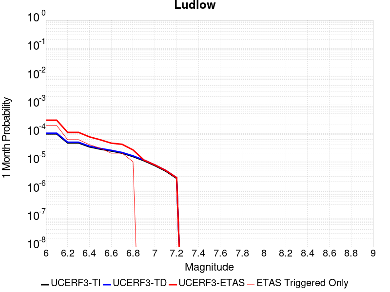 |  |  |

| Magnitude | 1 wk TI Prob | 1 wk TD Prob | 1 wk ETAS Prob | 1 wk ETAS/TD Gain | 1 wk ETAS Triggered Only | 1 mo TI Prob | 1 mo TD Prob | 1 mo ETAS Prob | 1 mo ETAS/TD Gain | 1 mo ETAS Triggered Only | 1 yr TI Prob | 1 yr TD Prob | 1 yr ETAS Prob | 1 yr ETAS/TD Gain | 1 yr ETAS Triggered Only | 10 yr TI Prob | 10 yr TD Prob | 10 yr ETAS Prob | 10 yr ETAS/TD Gain | 10 yr ETAS Triggered Only |
|-----|-----|-----|-----|-----|-----|-----|-----|-----|-----|-----|-----|-----|-----|-----|-----|-----|-----|-----|-----|-----|
| 6.0 | 2.2407607E-5 | 2.3657254E-5 | 1.9521656E-4 | 8.251869 | 1.7156337E-4 | 9.602906E-5 | 1.0138454E-4 | 3.1581701E-4 | 3.1150413 | 2.1445421E-4 | 0.0011685267 | 0.001233702 | 0.0014907295 | 1.2083385 | 2.5734506E-4 | 0.011624013 | 0.012273042 | 0.012611957 | 1.0276146 | 3.4312674E-4 |
| 6.1 | 2.2407607E-5 | 2.3657254E-5 | 1.9521656E-4 | 8.251869 | 1.7156337E-4 | 9.602906E-5 | 1.0138454E-4 | 3.1581701E-4 | 3.1150413 | 2.1445421E-4 | 0.0011685267 | 0.001233702 | 0.0014907295 | 1.2083385 | 2.5734506E-4 | 0.011624013 | 0.012273042 | 0.012611957 | 1.0276146 | 3.4312674E-4 |
| 6.2 | 1.0781252E-5 | 1.1365663E-5 | 5.425602E-5 | 4.773678 | 4.2890842E-5 | 4.620455E-5 | 4.8709102E-5 | 9.159785E-5 | 1.8805081 | 4.2890842E-5 | 5.623952E-4 | 5.9287593E-4 | 6.786068E-4 | 1.1446016 | 8.5781685E-5 | 0.00560974 | 0.0059133614 | 0.006041273 | 1.021631 | 1.2867253E-4 |
| 6.3 | 1.0781252E-5 | 1.1365663E-5 | 5.425602E-5 | 4.773678 | 4.2890842E-5 | 4.620455E-5 | 4.8709102E-5 | 9.159785E-5 | 1.8805081 | 4.2890842E-5 | 5.623952E-4 | 5.9287593E-4 | 6.786068E-4 | 1.1446016 | 8.5781685E-5 | 0.00560974 | 0.0059133614 | 0.006041273 | 1.021631 | 1.2867253E-4 |
| 6.4 | 7.814439E-6 | 8.237729E-6 | 8.237729E-6 | 1.0 | 0.0 | 3.3490025E-5 | 3.530408E-5 | 3.530408E-5 | 1.0 | 0.0 | 4.0766477E-4 | 4.2974384E-4 | 4.7261623E-4 | 1.0997627 | 4.2890842E-5 | 0.0040691774 | 0.0042892746 | 0.0043746885 | 1.0199133 | 8.5781685E-5 |
| 6.5 | 6.4986366E-6 | 6.85092E-6 | 6.85092E-6 | 1.0 | 0.0 | 2.7851002E-5 | 2.9360759E-5 | 2.9360759E-5 | 1.0 | 0.0 | 3.390332E-4 | 3.5740953E-4 | 4.0028503E-4 | 1.1199619 | 4.2890842E-5 | 0.003385164 | 0.0035684432 | 0.0036111812 | 1.0119766 | 4.2890842E-5 |
| 6.6 | 5.582177E-6 | 5.8860055E-6 | 5.8860055E-6 | 1.0 | 0.0 | 2.3923398E-5 | 2.5225498E-5 | 2.5225498E-5 | 1.0 | 0.0 | 2.9122844E-4 | 3.0707786E-4 | 3.4995555E-4 | 1.1396313 | 4.2890842E-5 | 0.0029084706 | 0.003066609 | 0.0031093683 | 1.0139436 | 4.2890842E-5 |
| 6.7 | 4.6858763E-6 | 4.940427E-6 | 4.940427E-6 | 1.0 | 0.0 | 2.0082172E-5 | 2.1173091E-5 | 2.1173091E-5 | 1.0 | 0.0 | 2.4447302E-4 | 2.5775246E-4 | 2.5775246E-4 | 1.0 | 0.0 | 0.0024420423 | 0.0025745912 | 0.0025745912 | 1.0 | 0.0 |
| 6.8 | 3.5584908E-6 | 3.7520183E-6 | 3.7520183E-6 | 1.0 | 0.0 | 1.5250586E-5 | 1.6079981E-5 | 1.6079981E-5 | 1.0 | 0.0 | 1.8566006E-4 | 1.957566E-4 | 1.957566E-4 | 1.0 | 0.0 | 0.0018550502 | 0.0019558826 | 0.0019558826 | 1.0 | 0.0 |
| 6.9 | 2.532834E-6 | 2.6710034E-6 | 2.6710034E-6 | 1.0 | 0.0 | 1.0854958E-5 | 1.1447109E-5 | 1.1447109E-5 | 1.0 | 0.0 | 1.3215111E-4 | 1.3935992E-4 | 1.3935992E-4 | 1.0 | 0.0 | 0.0013207254 | 0.0013927529 | 0.0013927529 | 1.0 | 0.0 |
| 7.0 | 1.7083285E-6 | 1.8019439E-6 | 1.8019439E-6 | 1.0 | 0.0 | 7.3213873E-6 | 7.722595E-6 | 7.722595E-6 | 1.0 | 0.0 | 8.913424E-5 | 9.40187E-5 | 9.40187E-5 | 1.0 | 0.0 | 8.9098496E-4 | 9.3980576E-4 | 9.3980576E-4 | 1.0 | 0.0 |
| 7.1 | 1.0905424E-6 | 1.1497619E-6 | 1.1497619E-6 | 1.0 | 0.0 | 4.6737446E-6 | 4.9275427E-6 | 4.9275427E-6 | 1.0 | 0.0 | 5.6901354E-5 | 5.999128E-5 | 5.999128E-5 | 1.0 | 0.0 | 5.6886784E-4 | 5.997606E-4 | 5.997606E-4 | 1.0 | 0.0 |
| 7.2 | 6.06668E-7 | 6.387277E-7 | 6.387277E-7 | 1.0 | 0.0 | 2.600003E-6 | 2.7374022E-6 | 2.7374022E-6 | 1.0 | 0.0 | 3.1654577E-5 | 3.3327433E-5 | 3.3327433E-5 | 1.0 | 0.0 | 3.1650066E-4 | 3.3323118E-4 | 3.3323118E-4 | 1.0 | 0.0 |

## Calico-Hidalgo
*[(top)](#table-of-contents)*

| 1 Week | 1 Month | 1 Year | 10 Year |
|-----|-----|-----|-----|
|  |  |  |  |

| Magnitude | 1 wk TI Prob | 1 wk TD Prob | 1 wk ETAS Prob | 1 wk ETAS/TD Gain | 1 wk ETAS Triggered Only | 1 mo TI Prob | 1 mo TD Prob | 1 mo ETAS Prob | 1 mo ETAS/TD Gain | 1 mo ETAS Triggered Only | 1 yr TI Prob | 1 yr TD Prob | 1 yr ETAS Prob | 1 yr ETAS/TD Gain | 1 yr ETAS Triggered Only | 10 yr TI Prob | 10 yr TD Prob | 10 yr ETAS Prob | 10 yr ETAS/TD Gain | 10 yr ETAS Triggered Only |
|-----|-----|-----|-----|-----|-----|-----|-----|-----|-----|-----|-----|-----|-----|-----|-----|-----|-----|-----|-----|-----|
| 6.0 | 4.0906612E-5 | 5.0703686E-5 | 1.3648102E-4 | 2.6917377 | 8.5781685E-5 | 1.7530227E-4 | 2.172857E-4 | 3.4593028E-4 | 1.5920526 | 1.2867253E-4 | 0.0021322158 | 0.002642648 | 0.0028565356 | 1.0809368 | 2.1445421E-4 | 0.02111873 | 0.026152607 | 0.02648676 | 1.0127771 | 3.4312674E-4 |
| 6.1 | 4.0906612E-5 | 5.0703686E-5 | 1.3648102E-4 | 2.6917377 | 8.5781685E-5 | 1.7530227E-4 | 2.172857E-4 | 3.4593028E-4 | 1.5920526 | 1.2867253E-4 | 0.0021322158 | 0.002642648 | 0.0028565356 | 1.0809368 | 2.1445421E-4 | 0.02111873 | 0.026152607 | 0.02648676 | 1.0127771 | 3.4312674E-4 |
| 6.2 | 4.0906612E-5 | 5.0703686E-5 | 1.3648102E-4 | 2.6917377 | 8.5781685E-5 | 1.7530227E-4 | 2.172857E-4 | 3.4593028E-4 | 1.5920526 | 1.2867253E-4 | 0.0021322158 | 0.002642648 | 0.0028565356 | 1.0809368 | 2.1445421E-4 | 0.02111873 | 0.026152607 | 0.02648676 | 1.0127771 | 3.4312674E-4 |
| 6.3 | 2.4242801E-5 | 3.0090669E-5 | 7.298022E-5 | 2.425344 | 4.2890842E-5 | 1.0389358E-4 | 1.2895382E-4 | 2.1472445E-4 | 1.6651267 | 8.5781685E-5 | 0.0012641704 | 0.0015689151 | 0.0016973858 | 1.081885 | 1.2867253E-4 | 0.01257003 | 0.01558206 | 0.015793173 | 1.0135485 | 2.1445421E-4 |
| 6.4 | 2.4242801E-5 | 3.0090669E-5 | 7.298022E-5 | 2.425344 | 4.2890842E-5 | 1.0389358E-4 | 1.2895382E-4 | 2.1472445E-4 | 1.6651267 | 8.5781685E-5 | 0.0012641704 | 0.0015689151 | 0.0016973858 | 1.081885 | 1.2867253E-4 | 0.01257003 | 0.01558206 | 0.015793173 | 1.0135485 | 2.1445421E-4 |
| 6.5 | 2.0286952E-5 | 2.5315738E-5 | 6.8205496E-5 | 2.6941934 | 4.2890842E-5 | 8.694118E-5 | 1.0849161E-4 | 1.9426398E-4 | 1.79059 | 8.5781685E-5 | 0.0010579949 | 0.001320102 | 0.0014486047 | 1.097343 | 1.2867253E-4 | 0.010529719 | 0.013124538 | 0.013336177 | 1.0161254 | 2.1445421E-4 |
| 6.6 | 2.0269223E-5 | 2.5296687E-5 | 6.818645E-5 | 2.6954694 | 4.2890842E-5 | 8.6865206E-5 | 1.08409964E-4 | 1.9418236E-4 | 1.7911854 | 8.5781685E-5 | 0.0010570707 | 0.0013191093 | 0.0014476121 | 1.0974163 | 1.2867253E-4 | 0.010520565 | 0.013114728 | 0.013326369 | 1.0161377 | 2.1445421E-4 |
| 6.7 | 1.799852E-5 | 2.25406E-5 | 6.5430475E-5 | 2.9027832 | 4.2890842E-5 | 7.713423E-5 | 9.659908E-5 | 1.8237247E-4 | 1.8879318 | 8.5781685E-5 | 9.3870464E-4 | 0.0011754738 | 0.001303995 | 1.1093358 | 1.2867253E-4 | 0.009347493 | 0.011694173 | 0.01190612 | 1.0181241 | 2.1445421E-4 |
| 6.8 | 1.7458793E-5 | 2.184212E-5 | 6.473203E-5 | 2.9636328 | 4.2890842E-5 | 7.4821255E-5 | 9.3605806E-5 | 1.7937947E-4 | 1.9163283 | 8.5781685E-5 | 9.10568E-4 | 0.0011390693 | 0.0012675953 | 1.1128342 | 1.2867253E-4 | 0.009068459 | 0.011333893 | 0.011545917 | 1.018707 | 2.1445421E-4 |
| 6.9 | 1.542884E-5 | 1.9025927E-5 | 6.1915955E-5 | 3.2542937 | 4.2890842E-5 | 6.612192E-5 | 8.153721E-5 | 1.673119E-4 | 2.0519698 | 8.5781685E-5 | 8.04737E-4 | 9.922766E-4 | 0.0011208215 | 1.1295453 | 1.2867253E-4 | 0.008018291 | 0.009879857 | 0.010092193 | 1.0214918 | 2.1445421E-4 |
| 7.0 | 1.468253E-5 | 1.8030598E-5 | 6.092067E-5 | 3.378738 | 4.2890842E-5 | 6.292361E-5 | 7.7271776E-5 | 1.6304683E-4 | 2.1100438 | 8.5781685E-5 | 7.658257E-4 | 9.4039086E-4 | 0.0010689424 | 1.1367002 | 1.2867253E-4 | 0.0076319184 | 0.009365481 | 0.009577927 | 1.0226839 | 2.1445421E-4 |
| 7.1 | 1.3139281E-5 | 1.6200942E-5 | 5.909109E-5 | 3.6473858 | 4.2890842E-5 | 5.6309986E-5 | 6.943083E-5 | 1.5520657E-4 | 2.2354126 | 8.5781685E-5 | 6.853584E-4 | 8.4500515E-4 | 9.7356894E-4 | 1.1521456 | 1.2867253E-4 | 0.0068324856 | 0.0084192185 | 0.008631867 | 1.0252576 | 2.1445421E-4 |
| 7.2 | 1.1127404E-5 | 1.3866597E-5 | 5.6756846E-5 | 4.0930624 | 4.2890842E-5 | 4.7688E-5 | 5.942698E-5 | 1.0231527E-4 | 1.7216973 | 4.2890842E-5 | 5.8044674E-4 | 7.232942E-4 | 8.0901384E-4 | 1.1185129 | 8.5781685E-5 | 0.0057893298 | 0.0072105085 | 0.007380835 | 1.0236219 | 1.7156337E-4 |
| 7.3 | 9.808154E-6 | 1.2176215E-5 | 5.5066535E-5 | 4.5224676 | 4.2890842E-5 | 4.2034266E-5 | 5.2182797E-5 | 9.50714E-5 | 1.8218917 | 4.2890842E-5 | 5.11647E-4 | 6.3515105E-4 | 7.2087825E-4 | 1.1349714 | 8.5781685E-5 | 0.0051047057 | 0.006334433 | 0.0065049096 | 1.0269127 | 1.7156337E-4 |
| 7.4 | 7.942452E-6 | 9.792144E-6 | 9.792144E-6 | 1.0 | 0.0 | 3.4038632E-5 | 4.1965708E-5 | 4.1965708E-5 | 1.0 | 0.0 | 4.1434157E-4 | 5.1082217E-4 | 5.536911E-4 | 1.0839214 | 4.2890842E-5 | 0.0041356985 | 0.005097421 | 0.0051827654 | 1.0167427 | 8.5781685E-5 |
| 7.5 | 4.7121216E-6 | 5.772836E-6 | 5.772836E-6 | 1.0 | 0.0 | 2.019465E-5 | 2.4740535E-5 | 2.4740535E-5 | 1.0 | 0.0 | 2.4584212E-4 | 3.0118204E-4 | 3.4405998E-4 | 1.1423655 | 4.2890842E-5 | 0.0024557032 | 0.0030084911 | 0.0030940147 | 1.0284274 | 8.5781685E-5 |
| 7.6 | 2.21172E-7 | 2.603961E-7 | 2.603961E-7 | 1.0 | 0.0 | 9.478797E-7 | 1.1159829E-6 | 1.1159829E-6 | 1.0 | 0.0 | 1.1540374E-5 | 1.3587036E-5 | 1.3587036E-5 | 1.0 | 0.0 | 1.1539775E-4 | 1.3586486E-4 | 1.7874988E-4 | 1.3156446 | 4.2890842E-5 |

## Santa Rosa Island
*[(top)](#table-of-contents)*

| 1 Week | 1 Month | 1 Year | 10 Year |
|-----|-----|-----|-----|
|  |  |  |  |

| Magnitude | 1 wk TI Prob | 1 wk TD Prob | 1 wk ETAS Prob | 1 wk ETAS/TD Gain | 1 wk ETAS Triggered Only | 1 mo TI Prob | 1 mo TD Prob | 1 mo ETAS Prob | 1 mo ETAS/TD Gain | 1 mo ETAS Triggered Only | 1 yr TI Prob | 1 yr TD Prob | 1 yr ETAS Prob | 1 yr ETAS/TD Gain | 1 yr ETAS Triggered Only | 10 yr TI Prob | 10 yr TD Prob | 10 yr ETAS Prob | 10 yr ETAS/TD Gain | 10 yr ETAS Triggered Only |
|-----|-----|-----|-----|-----|-----|-----|-----|-----|-----|-----|-----|-----|-----|-----|-----|-----|-----|-----|-----|-----|
| 6.0 | 4.1143165E-5 | 4.7091133E-5 | 8.9979956E-5 | 1.9107622 | 4.2890842E-5 | 1.7631594E-4 | 2.0180465E-4 | 2.4468685E-4 | 1.2124935 | 4.2890842E-5 | 0.002144533 | 0.0024544 | 0.0025827568 | 1.0522965 | 1.2867253E-4 | 0.021239553 | 0.024293551 | 0.024502795 | 1.0086131 | 2.1445421E-4 |
| 6.1 | 2.1061249E-5 | 2.3864959E-5 | 6.675478E-5 | 2.797188 | 4.2890842E-5 | 9.0259375E-5 | 1.0227455E-4 | 1.4516102E-4 | 1.4193268 | 4.2890842E-5 | 0.0010983539 | 0.0012445104 | 0.0013301853 | 1.0688423 | 8.5781685E-5 | 0.01092941 | 0.012378449 | 0.012505528 | 1.0102662 | 1.2867253E-4 |
| 6.2 | 2.1061249E-5 | 2.3864959E-5 | 6.675478E-5 | 2.797188 | 4.2890842E-5 | 9.0259375E-5 | 1.0227455E-4 | 1.4516102E-4 | 1.4193268 | 4.2890842E-5 | 0.0010983539 | 0.0012445104 | 0.0013301853 | 1.0688423 | 8.5781685E-5 | 0.01092941 | 0.012378449 | 0.012505528 | 1.0102662 | 1.2867253E-4 |
| 6.3 | 1.5158236E-5 | 1.7074419E-5 | 5.996453E-5 | 3.5119514 | 4.2890842E-5 | 6.496225E-5 | 7.3174095E-5 | 1.16061805E-4 | 1.586105 | 4.2890842E-5 | 7.906284E-4 | 8.905424E-4 | 9.762477E-4 | 1.0962394 | 8.5781685E-5 | 0.007878214 | 0.008870989 | 0.00895601 | 1.0095842 | 8.5781685E-5 |
| 6.4 | 1.2341918E-5 | 1.3852917E-5 | 5.6743163E-5 | 4.096117 | 4.2890842E-5 | 5.2892858E-5 | 5.9368336E-5 | 1.02256636E-4 | 1.7224103 | 4.2890842E-5 | 6.437803E-4 | 7.225779E-4 | 8.082976E-4 | 1.1186304 | 8.5781685E-5 | 0.006419184 | 0.007203121 | 0.007288285 | 1.0118232 | 8.5781685E-5 |
| 6.5 | 9.061158E-6 | 1.0117031E-5 | 5.300744E-5 | 5.2394266 | 4.2890842E-5 | 3.883296E-5 | 4.3358013E-5 | 8.6247E-5 | 1.9891824 | 4.2890842E-5 | 4.726887E-4 | 5.277613E-4 | 6.134977E-4 | 1.162453 | 8.5781685E-5 | 0.004716845 | 0.0052656173 | 0.0053509474 | 1.0162051 | 8.5781685E-5 |
| 6.6 | 7.5461685E-6 | 8.400733E-6 | 5.1291216E-5 | 6.105564 | 4.2890842E-5 | 3.2340322E-5 | 3.600267E-5 | 7.889197E-5 | 2.191281 | 4.2890842E-5 | 3.936723E-4 | 4.3824865E-4 | 5.2399276E-4 | 1.1956517 | 8.5781685E-5 | 0.003929756 | 0.0043742736 | 0.00445968 | 1.0195247 | 8.5781685E-5 |
| 6.7 | 5.5023775E-6 | 6.087381E-6 | 4.8977963E-5 | 8.045819 | 4.2890842E-5 | 2.3581404E-5 | 2.6088532E-5 | 6.8978254E-5 | 2.6440067 | 4.2890842E-5 | 2.8706578E-4 | 3.1758484E-4 | 4.0333928E-4 | 1.2700206 | 8.5781685E-5 | 0.0028669522 | 0.0031716314 | 0.003257141 | 1.0269607 | 8.5781685E-5 |
| 6.8 | 3.7351679E-6 | 4.0831405E-6 | 4.0831405E-6 | 1.0 | 0.0 | 1.6007763E-5 | 1.749907E-5 | 1.749907E-5 | 1.0 | 0.0 | 1.948771E-4 | 2.1303284E-4 | 2.5591455E-4 | 1.2012916 | 4.2890842E-5 | 0.0019470629 | 0.0021285315 | 0.0021713309 | 1.0201075 | 4.2890842E-5 |
| 6.9 | 2.456366E-6 | 2.6292705E-6 | 2.6292705E-6 | 1.0 | 0.0 | 1.0527241E-5 | 1.1268254E-5 | 1.1268254E-5 | 1.0 | 0.0 | 1.2816161E-4 | 1.3718237E-4 | 1.3718237E-4 | 1.0 | 0.0 | 0.0012808773 | 0.0013709799 | 0.0013709799 | 1.0 | 0.0 |
| 7.0 | 2.3245157E-6 | 2.4827782E-6 | 2.4827782E-6 | 1.0 | 0.0 | 9.962172E-6 | 1.0640435E-5 | 1.0640435E-5 | 1.0 | 0.0 | 1.2128269E-4 | 1.2953962E-4 | 1.2953962E-4 | 1.0 | 0.0 | 0.0012121652 | 0.0012946434 | 0.0012946434 | 1.0 | 0.0 |
| 7.1 | 2.2248344E-6 | 2.37325E-6 | 2.37325E-6 | 1.0 | 0.0 | 9.53497E-6 | 1.0171032E-5 | 1.0171032E-5 | 1.0 | 0.0 | 1.1608207E-4 | 1.2382529E-4 | 1.2382529E-4 | 1.0 | 0.0 | 0.0011602144 | 0.001237565 | 0.001237565 | 1.0 | 0.0 |
| 7.2 | 2.1350402E-6 | 2.276154E-6 | 2.276154E-6 | 1.0 | 0.0 | 9.150141E-6 | 9.754909E-6 | 9.754909E-6 | 1.0 | 0.0 | 1.1139726E-4 | 1.1875956E-4 | 1.1875956E-4 | 1.0 | 0.0 | 0.0011134144 | 0.0011869629 | 0.0011869629 | 1.0 | 0.0 |
| 7.3 | 1.9793572E-6 | 2.108719E-6 | 2.108719E-6 | 1.0 | 0.0 | 8.482932E-6 | 9.037336E-6 | 9.037336E-6 | 1.0 | 0.0 | 1.032748E-4 | 1.10024026E-4 | 1.10024026E-4 | 1.0 | 0.0 | 0.0010322682 | 0.0010996973 | 0.0010996973 | 1.0 | 0.0 |
| 7.4 | 1.6951194E-6 | 1.8045733E-6 | 1.8045733E-6 | 1.0 | 0.0 | 7.264777E-6 | 7.733863E-6 | 7.733863E-6 | 1.0 | 0.0 | 8.844508E-5 | 9.415573E-5 | 9.415573E-5 | 1.0 | 0.0 | 8.840988E-4 | 9.4116E-4 | 9.4116E-4 | 1.0 | 0.0 |
| 7.5 | 8.987207E-7 | 9.5122147E-7 | 9.5122147E-7 | 1.0 | 0.0 | 3.8516546E-6 | 4.076657E-6 | 4.076657E-6 | 1.0 | 0.0 | 4.6892885E-5 | 4.963218E-5 | 4.963218E-5 | 1.0 | 0.0 | 4.688299E-4 | 4.9621216E-4 | 4.9621216E-4 | 1.0 | 0.0 |
| 7.6 | 3.8783037E-7 | 4.052932E-7 | 4.052932E-7 | 1.0 | 0.0 | 1.6621291E-6 | 1.7369698E-6 | 1.7369698E-6 | 1.0 | 0.0 | 2.0236233E-5 | 2.1147409E-5 | 2.1147409E-5 | 1.0 | 0.0 | 2.023439E-4 | 2.1145462E-4 | 2.1145462E-4 | 1.0 | 0.0 |
| 7.7 | 6.181804E-8 | 6.339035E-8 | 6.339035E-8 | 1.0 | 0.0 | 2.6493444E-7 | 2.7167292E-7 | 2.7167292E-7 | 1.0 | 0.0 | 3.225572E-6 | 3.3076128E-6 | 3.3076128E-6 | 1.0 | 0.0 | 3.225525E-5 | 3.307564E-5 | 3.307564E-5 | 1.0 | 0.0 |
| 7.8 | 1.3704449E-9 | 1.3964153E-9 | 1.3964153E-9 | 1.0 | 0.0 | 5.873335E-9 | 5.984637E-9 | 5.984637E-9 | 1.0 | 0.0 | 7.1507856E-8 | 7.286295E-8 | 7.286295E-8 | 1.0 | 0.0 | 7.1507833E-7 | 7.286294E-7 | 7.286294E-7 | 1.0 | 0.0 |

## Cleghorn Lake
*[(top)](#table-of-contents)*

| 1 Week | 1 Month | 1 Year | 10 Year |
|-----|-----|-----|-----|
|  | 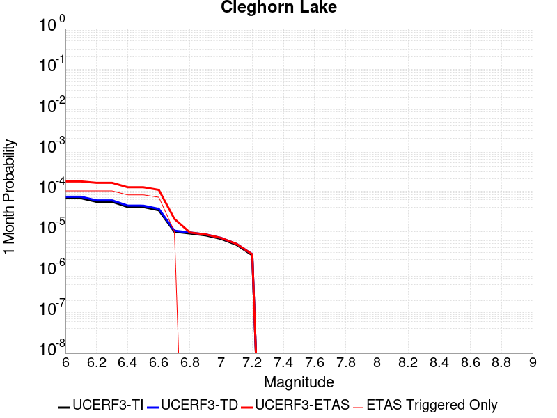 |  |  |

| Magnitude | 1 wk TI Prob | 1 wk TD Prob | 1 wk ETAS Prob | 1 wk ETAS/TD Gain | 1 wk ETAS Triggered Only | 1 mo TI Prob | 1 mo TD Prob | 1 mo ETAS Prob | 1 mo ETAS/TD Gain | 1 mo ETAS Triggered Only | 1 yr TI Prob | 1 yr TD Prob | 1 yr ETAS Prob | 1 yr ETAS/TD Gain | 1 yr ETAS Triggered Only | 10 yr TI Prob | 10 yr TD Prob | 10 yr ETAS Prob | 10 yr ETAS/TD Gain | 10 yr ETAS Triggered Only |
|-----|-----|-----|-----|-----|-----|-----|-----|-----|-----|-----|-----|-----|-----|-----|-----|-----|-----|-----|-----|-----|
| 6.0 | 1.5467183E-5 | 1.6794203E-5 | 5.9684327E-5 | 3.5538645 | 4.2890842E-5 | 6.6286244E-5 | 7.197348E-5 | 2.0063674E-4 | 2.7876482 | 1.2867253E-4 | 8.067362E-4 | 8.759797E-4 | 0.0010473928 | 1.1956816 | 1.7156337E-4 | 0.008038137 | 0.008730696 | 0.00902831 | 1.0340883 | 3.002359E-4 |
| 6.1 | 1.5467183E-5 | 1.6794203E-5 | 5.9684327E-5 | 3.5538645 | 4.2890842E-5 | 6.6286244E-5 | 7.197348E-5 | 2.0063674E-4 | 2.7876482 | 1.2867253E-4 | 8.067362E-4 | 8.759797E-4 | 0.0010473928 | 1.1956816 | 1.7156337E-4 | 0.008038137 | 0.008730696 | 0.00902831 | 1.0340883 | 3.002359E-4 |
| 6.2 | 1.2624631E-5 | 1.3681544E-5 | 5.65718E-5 | 4.1348987 | 4.2890842E-5 | 5.410444E-5 | 5.863415E-5 | 1.8729913E-4 | 3.1943696 | 1.2867253E-4 | 6.585225E-4 | 7.1368564E-4 | 8.8512653E-4 | 1.2402191 | 1.7156337E-4 | 0.0065657445 | 0.0071187317 | 0.0073316596 | 1.0299109 | 2.1445421E-4 |
| 6.3 | 1.2624631E-5 | 1.3681544E-5 | 5.65718E-5 | 4.1348987 | 4.2890842E-5 | 5.410444E-5 | 5.863415E-5 | 1.8729913E-4 | 3.1943696 | 1.2867253E-4 | 6.585225E-4 | 7.1368564E-4 | 8.8512653E-4 | 1.2402191 | 1.7156337E-4 | 0.0065657445 | 0.0071187317 | 0.0073316596 | 1.0299109 | 2.1445421E-4 |
| 6.4 | 9.417684E-6 | 1.0170118E-5 | 5.3060525E-5 | 5.217297 | 4.2890842E-5 | 4.036088E-5 | 4.3585722E-5 | 1.2936367E-4 | 2.9680285 | 8.5781685E-5 | 4.912829E-4 | 5.3056807E-4 | 6.163042E-4 | 1.1615932 | 8.5781685E-5 | 0.004901982 | 0.005297049 | 0.00542504 | 1.0241627 | 1.2867253E-4 |
| 6.5 | 9.368219E-6 | 1.0117545E-5 | 5.3007952E-5 | 5.2392116 | 4.2890842E-5 | 4.014889E-5 | 4.3360415E-5 | 1.2913838E-4 | 2.9782553 | 8.5781685E-5 | 4.8870314E-4 | 5.2782625E-4 | 6.1356265E-4 | 1.162433 | 8.5781685E-5 | 0.004876298 | 0.0052697617 | 0.0053550913 | 1.0161923 | 8.5781685E-5 |
| 6.6 | 7.803798E-6 | 8.441831E-6 | 5.133231E-5 | 6.0807085 | 4.2890842E-5 | 3.3444423E-5 | 3.6179E-5 | 1.2195758E-4 | 3.3709495 | 8.5781685E-5 | 4.0710976E-4 | 4.4043022E-4 | 5.261741E-4 | 1.1946821 | 8.5781685E-5 | 0.0040636472 | 0.0043994905 | 0.0044848947 | 1.0194123 | 8.5781685E-5 |
| 6.7 | 2.3108669E-6 | 2.4438336E-6 | 2.4438336E-6 | 1.0 | 0.0 | 9.903678E-6 | 1.0473532E-5 | 1.0473532E-5 | 1.0 | 0.0 | 1.205706E-4 | 1.2750797E-4 | 1.2750797E-4 | 1.0 | 0.0 | 0.001205052 | 0.0012743667 | 0.0012743667 | 1.0 | 0.0 |
| 6.8 | 2.0882828E-6 | 2.2062823E-6 | 2.2062823E-6 | 1.0 | 0.0 | 8.949753E-6 | 9.455462E-6 | 9.455462E-6 | 1.0 | 0.0 | 1.08957785E-4 | 1.1511434E-4 | 1.1511434E-4 | 1.0 | 0.0 | 0.0010890438 | 0.0011505639 | 0.0011505639 | 1.0 | 0.0 |
| 6.9 | 1.876935E-6 | 1.981051E-6 | 1.981051E-6 | 1.0 | 0.0 | 8.043982E-6 | 8.490192E-6 | 8.490192E-6 | 1.0 | 0.0 | 9.7931086E-5 | 1.03363345E-4 | 1.03363345E-4 | 1.0 | 0.0 | 9.788794E-4 | 0.0010331686 | 0.0010331686 | 1.0 | 0.0 |
| 7.0 | 1.5357559E-6 | 1.6202807E-6 | 1.6202807E-6 | 1.0 | 0.0 | 6.5817944E-6 | 6.9440425E-6 | 6.9440425E-6 | 1.0 | 0.0 | 8.01304E-5 | 8.454057E-5 | 8.454057E-5 | 1.0 | 0.0 | 8.010151E-4 | 8.450965E-4 | 8.450965E-4 | 1.0 | 0.0 |
| 7.1 | 1.0905424E-6 | 1.1497619E-6 | 1.1497619E-6 | 1.0 | 0.0 | 4.6737446E-6 | 4.9275427E-6 | 4.9275427E-6 | 1.0 | 0.0 | 5.6901354E-5 | 5.999128E-5 | 5.999128E-5 | 1.0 | 0.0 | 5.6886784E-4 | 5.997606E-4 | 5.997606E-4 | 1.0 | 0.0 |
| 7.2 | 6.06668E-7 | 6.387277E-7 | 6.387277E-7 | 1.0 | 0.0 | 2.600003E-6 | 2.7374022E-6 | 2.7374022E-6 | 1.0 | 0.0 | 3.1654577E-5 | 3.3327433E-5 | 3.3327433E-5 | 1.0 | 0.0 | 3.1650066E-4 | 3.3323118E-4 | 3.3323118E-4 | 1.0 | 0.0 |

## San Andreas (North Branch Mill Creek)
*[(top)](#table-of-contents)*

| 1 Week | 1 Month | 1 Year | 10 Year |
|-----|-----|-----|-----|
|  |  |  |  |

| Magnitude | 1 wk TI Prob | 1 wk TD Prob | 1 wk ETAS Prob | 1 wk ETAS/TD Gain | 1 wk ETAS Triggered Only | 1 mo TI Prob | 1 mo TD Prob | 1 mo ETAS Prob | 1 mo ETAS/TD Gain | 1 mo ETAS Triggered Only | 1 yr TI Prob | 1 yr TD Prob | 1 yr ETAS Prob | 1 yr ETAS/TD Gain | 1 yr ETAS Triggered Only | 10 yr TI Prob | 10 yr TD Prob | 10 yr ETAS Prob | 10 yr ETAS/TD Gain | 10 yr ETAS Triggered Only |
|-----|-----|-----|-----|-----|-----|-----|-----|-----|-----|-----|-----|-----|-----|-----|-----|-----|-----|-----|-----|-----|
| 6.0 | 1.3461156E-5 | 2.3499893E-5 | 1.5216939E-4 | 6.475323 | 1.2867253E-4 | 5.7689394E-5 | 1.00709956E-4 | 2.2936953E-4 | 2.277526 | 1.2867253E-4 | 7.02142E-4 | 0.0012254574 | 0.0013968105 | 1.1398278 | 1.7156337E-4 | 0.0069992766 | 0.01222957 | 0.012526134 | 1.0242498 | 3.002359E-4 |
| 6.1 | 1.3461156E-5 | 2.3499893E-5 | 1.5216939E-4 | 6.475323 | 1.2867253E-4 | 5.7689394E-5 | 1.00709956E-4 | 2.2936953E-4 | 2.277526 | 1.2867253E-4 | 7.02142E-4 | 0.0012254574 | 0.0013968105 | 1.1398278 | 1.7156337E-4 | 0.0069992766 | 0.01222957 | 0.012526134 | 1.0242498 | 3.002359E-4 |
| 6.2 | 1.3461156E-5 | 2.3499893E-5 | 1.5216939E-4 | 6.475323 | 1.2867253E-4 | 5.7689394E-5 | 1.00709956E-4 | 2.2936953E-4 | 2.277526 | 1.2867253E-4 | 7.02142E-4 | 0.0012254574 | 0.0013968105 | 1.1398278 | 1.7156337E-4 | 0.0069992766 | 0.01222957 | 0.012526134 | 1.0242498 | 3.002359E-4 |
| 6.3 | 1.3461156E-5 | 2.3499893E-5 | 1.5216939E-4 | 6.475323 | 1.2867253E-4 | 5.7689394E-5 | 1.00709956E-4 | 2.2936953E-4 | 2.277526 | 1.2867253E-4 | 7.02142E-4 | 0.0012254574 | 0.0013968105 | 1.1398278 | 1.7156337E-4 | 0.0069992766 | 0.01222957 | 0.012526134 | 1.0242498 | 3.002359E-4 |
| 6.4 | 1.3461156E-5 | 2.3499893E-5 | 1.5216939E-4 | 6.475323 | 1.2867253E-4 | 5.7689394E-5 | 1.00709956E-4 | 2.2936953E-4 | 2.277526 | 1.2867253E-4 | 7.02142E-4 | 0.0012254574 | 0.0013968105 | 1.1398278 | 1.7156337E-4 | 0.0069992766 | 0.01222957 | 0.012526134 | 1.0242498 | 3.002359E-4 |
| 6.5 | 1.3450706E-5 | 2.3488852E-5 | 1.5215836E-4 | 6.4778967 | 1.2867253E-4 | 5.764461E-5 | 1.0066265E-4 | 2.2932222E-4 | 2.2781262 | 1.2867253E-4 | 7.0159714E-4 | 0.001224882 | 0.0013962352 | 1.1398937 | 1.7156337E-4 | 0.006993862 | 0.01222388 | 0.0125204455 | 1.0242612 | 3.002359E-4 |
| 6.6 | 1.3074523E-5 | 2.3103135E-5 | 1.5177269E-4 | 6.5693545 | 1.2867253E-4 | 5.6032466E-5 | 9.9009696E-5 | 2.2766949E-4 | 2.2994666 | 1.2867253E-4 | 6.8198174E-4 | 0.0012047797 | 0.0013761364 | 1.1422307 | 1.7156337E-4 | 0.006798926 | 0.012025044 | 0.012321671 | 1.0246673 | 3.002359E-4 |
| 6.7 | 1.3050216E-5 | 2.3078432E-5 | 1.51748E-4 | 6.5753164 | 1.2867253E-4 | 5.59283E-5 | 9.890384E-5 | 2.2756364E-4 | 2.3008575 | 1.2867253E-4 | 6.8071426E-4 | 0.0012034923 | 0.0013748491 | 1.1423831 | 1.7156337E-4 | 0.0067863287 | 0.012012309 | 0.012308938 | 1.0246937 | 3.002359E-4 |
| 6.8 | 1.29049395E-5 | 2.292684E-5 | 1.5159642E-4 | 6.6121807 | 1.2867253E-4 | 5.530571E-5 | 9.825421E-5 | 2.269141E-4 | 2.3094592 | 1.2867253E-4 | 6.73139E-4 | 0.0011955918 | 0.00136695 | 1.1433251 | 1.7156337E-4 | 0.0067110364 | 0.011934154 | 0.012230807 | 1.0248575 | 3.002359E-4 |
| 6.9 | 1.2867369E-5 | 2.2886245E-5 | 1.5155583E-4 | 6.622136 | 1.2867253E-4 | 5.51447E-5 | 9.8080236E-5 | 2.2674014E-4 | 2.3117821 | 1.2867253E-4 | 6.711799E-4 | 0.0011934759 | 0.0013648346 | 1.1435795 | 1.7156337E-4 | 0.006691564 | 0.011913223 | 0.012209883 | 1.0249016 | 3.002359E-4 |
| 7.0 | 1.2495996E-5 | 2.2286325E-5 | 1.5095598E-4 | 6.7734804 | 1.2867253E-4 | 5.3553173E-5 | 9.550934E-5 | 2.2416958E-4 | 2.347096 | 1.2867253E-4 | 6.518148E-4 | 0.0011622087 | 0.0013335728 | 1.1474468 | 1.7156337E-4 | 0.0064990623 | 0.0116038285 | 0.0119005805 | 1.0255736 | 3.002359E-4 |
| 7.1 | 1.2452067E-5 | 2.2231397E-5 | 1.5090106E-4 | 6.787745 | 1.2867253E-4 | 5.3364907E-5 | 9.527396E-5 | 2.2393423E-4 | 2.3504243 | 1.2867253E-4 | 6.4952404E-4 | 0.0011593461 | 0.0013307105 | 1.1478113 | 1.7156337E-4 | 0.0064762887 | 0.0115755 | 0.01187226 | 1.0256369 | 3.002359E-4 |
| 7.2 | 1.2002777E-5 | 2.1609963E-5 | 1.5027971E-4 | 6.9541864 | 1.2867253E-4 | 5.143946E-5 | 9.2610855E-5 | 2.2127148E-4 | 2.3892605 | 1.2867253E-4 | 6.2609545E-4 | 0.0011269567 | 0.0012983266 | 1.1520644 | 1.7156337E-4 | 0.006243344 | 0.011254923 | 0.01155178 | 1.0263758 | 3.002359E-4 |
| 7.3 | 1.1923425E-5 | 2.1479793E-5 | 1.5014956E-4 | 6.99027 | 1.2867253E-4 | 5.109939E-5 | 9.205302E-5 | 2.207137E-4 | 2.3976803 | 1.2867253E-4 | 6.219575E-4 | 0.001120172 | 0.0012915431 | 1.1529865 | 1.7156337E-4 | 0.0062021962 | 0.011187789 | 0.011484666 | 1.0265357 | 3.002359E-4 |
| 7.4 | 1.16105175E-5 | 2.0853771E-5 | 1.4952362E-4 | 7.1700993 | 1.2867253E-4 | 4.975841E-5 | 8.937026E-5 | 2.1803129E-4 | 2.4396403 | 1.2867253E-4 | 6.0564023E-4 | 0.0010875424 | 0.0012589191 | 1.1575817 | 1.7156337E-4 | 0.006039923 | 0.010865397 | 0.01116237 | 1.0273321 | 3.002359E-4 |
| 7.5 | 1.1037265E-5 | 1.9553907E-5 | 1.4822392E-4 | 7.5802712 | 1.2867253E-4 | 4.7301706E-5 | 8.379978E-5 | 2.1246153E-4 | 2.535347 | 1.2867253E-4 | 5.757461E-4 | 0.0010197869 | 0.0011911754 | 1.1680629 | 1.7156337E-4 | 0.005742567 | 0.010194898 | 0.010492072 | 1.0291494 | 3.002359E-4 |
| 7.6 | 1.0720915E-5 | 1.899582E-5 | 1.4766591E-4 | 7.7736 | 1.2867253E-4 | 4.5945973E-5 | 8.140812E-5 | 2.1007018E-4 | 2.5804572 | 1.2867253E-4 | 5.592486E-4 | 9.906954E-4 | 0.0011620888 | 1.1730031 | 1.7156337E-4 | 0.005578433 | 0.009906623 | 0.010203884 | 1.0300064 | 3.002359E-4 |
| 7.7 | 9.276279E-6 | 1.6441649E-5 | 1.4511206E-4 | 8.825883 | 1.2867253E-4 | 3.9754876E-5 | 7.0462316E-5 | 1.9912577E-4 | 2.8259897 | 1.2867253E-4 | 4.839081E-4 | 8.575427E-4 | 0.0010289589 | 1.1998924 | 1.7156337E-4 | 0.0048285574 | 0.008586041 | 0.008883699 | 1.0346677 | 3.002359E-4 |
| 7.8 | 5.8346777E-6 | 1.1155013E-5 | 1.3982611E-4 | 12.5348215 | 1.2867253E-4 | 2.5005522E-5 | 4.7806327E-5 | 1.764727E-4 | 3.691409 | 1.2867253E-4 | 3.043997E-4 | 5.818867E-4 | 7.533502E-4 | 1.2946683 | 1.7156337E-4 | 0.0030398308 | 0.0058469265 | 0.006145407 | 1.0510491 | 3.002359E-4 |
| 7.9 | 4.690204E-6 | 8.509093E-6 | 9.429005E-5 | 11.081092 | 8.5781685E-5 | 2.0100719E-5 | 3.6467034E-5 | 1.2224559E-4 | 3.352222 | 8.5781685E-5 | 2.4469878E-4 | 4.4389578E-4 | 5.7251117E-4 | 1.2897424 | 1.2867253E-4 | 0.002444295 | 0.0044707474 | 0.0047269417 | 1.0573046 | 2.5734506E-4 |
| 8.0 | 2.9570454E-6 | 4.846947E-6 | 4.7737583E-5 | 9.849001 | 4.2890842E-5 | 1.267299E-5 | 2.0772464E-5 | 6.366242E-5 | 3.0647504 | 4.2890842E-5 | 1.5428272E-4 | 2.5287544E-4 | 2.9575542E-4 | 1.1695696 | 4.2890842E-5 | 0.0015417566 | 0.002549644 | 0.0026352073 | 1.0335588 | 8.5781685E-5 |
| 8.1 | 1.6376824E-6 | 2.1968929E-6 | 2.1968929E-6 | 1.0 | 0.0 | 7.01862E-6 | 9.41522E-6 | 9.41522E-6 | 1.0 | 0.0 | 8.544835E-5 | 1.14624294E-4 | 1.14624294E-4 | 1.0 | 0.0 | 8.54155E-4 | 0.0011606582 | 0.0011606582 | 1.0 | 0.0 |
| 8.2 | 6.9631557E-7 | 4.5360213E-7 | 4.5360213E-7 | 1.0 | 0.0 | 2.984206E-6 | 1.9440076E-6 | 1.9440076E-6 | 1.0 | 0.0 | 3.63321E-5 | 2.3668037E-5 | 2.3668037E-5 | 1.0 | 0.0 | 3.6326164E-4 | 2.451564E-4 | 2.451564E-4 | 1.0 | 0.0 |
| 8.3 | 1.7876137E-7 | 8.360375E-8 | 8.360375E-8 | 1.0 | 0.0 | 7.661199E-7 | 3.5830175E-7 | 3.5830175E-7 | 1.0 | 0.0 | 9.32747E-6 | 4.3623154E-6 | 4.3623154E-6 | 1.0 | 0.0 | 9.3270784E-5 | 4.5817014E-5 | 4.5817014E-5 | 1.0 | 0.0 |

## San Andreas (Creeping Section) 2011 CFM
*[(top)](#table-of-contents)*

| 1 Week | 1 Month | 1 Year | 10 Year |
|-----|-----|-----|-----|
|  |  |  |  |

| Magnitude | 1 wk TI Prob | 1 wk TD Prob | 1 wk ETAS Prob | 1 wk ETAS/TD Gain | 1 wk ETAS Triggered Only | 1 mo TI Prob | 1 mo TD Prob | 1 mo ETAS Prob | 1 mo ETAS/TD Gain | 1 mo ETAS Triggered Only | 1 yr TI Prob | 1 yr TD Prob | 1 yr ETAS Prob | 1 yr ETAS/TD Gain | 1 yr ETAS Triggered Only | 10 yr TI Prob | 10 yr TD Prob | 10 yr ETAS Prob | 10 yr ETAS/TD Gain | 10 yr ETAS Triggered Only |
|-----|-----|-----|-----|-----|-----|-----|-----|-----|-----|-----|-----|-----|-----|-----|-----|-----|-----|-----|-----|-----|
| 6.0 | 5.986481E-4 | 0.001228691 | 0.0013143673 | 1.0697297 | 8.5781685E-5 | 0.0025631124 | 0.005246795 | 0.005460124 | 1.040659 | 2.1445421E-4 | 0.030762846 | 0.061203245 | 0.061404575 | 1.0032895 | 2.1445421E-4 | 0.26835477 | 0.425928 | 0.42610037 | 1.0004047 | 3.002359E-4 |
| 6.1 | 5.015945E-4 | 0.0010230356 | 0.0010658825 | 1.0418822 | 4.2890842E-5 | 0.00214792 | 0.004369436 | 0.0045402492 | 1.0390929 | 1.7156337E-4 | 0.025839351 | 0.051246606 | 0.05140938 | 1.0031762 | 1.7156337E-4 | 0.23032776 | 0.37284943 | 0.37298393 | 1.0003607 | 2.1445421E-4 |
| 6.2 | 4.073338E-4 | 8.1157376E-4 | 8.544298E-4 | 1.0528061 | 4.2890842E-5 | 0.0017445484 | 0.0034683137 | 0.0035965398 | 1.0369707 | 1.2867253E-4 | 0.021034058 | 0.04093177 | 0.041055173 | 1.0030149 | 1.2867253E-4 | 0.19150782 | 0.31302592 | 0.31314376 | 1.0003765 | 1.7156337E-4 |
| 6.3 | 3.464099E-4 | 6.7455834E-4 | 7.1742025E-4 | 1.0635407 | 4.2890842E-5 | 0.0014837692 | 0.0028832308 | 0.0030115324 | 1.0444993 | 1.2867253E-4 | 0.017915873 | 0.034187846 | 0.03431212 | 1.003635 | 1.2867253E-4 | 0.16538359 | 0.27130842 | 0.27143344 | 1.0004607 | 1.7156337E-4 |
| 6.4 | 2.935057E-4 | 5.5516965E-4 | 5.980367E-4 | 1.0772142 | 4.2890842E-5 | 0.0012572751 | 0.0023727308 | 0.002501098 | 1.054101 | 1.2867253E-4 | 0.015200248 | 0.02826279 | 0.028387826 | 1.0044241 | 1.2867253E-4 | 0.14201577 | 0.23297668 | 0.23310827 | 1.0005648 | 1.7156337E-4 |
| 6.5 | 2.3409708E-4 | 4.2132285E-4 | 4.6419562E-4 | 1.1017575 | 4.2890842E-5 | 0.0010028875 | 0.0018017791 | 0.0019302199 | 1.0712855 | 1.2867253E-4 | 0.012141965 | 0.021586355 | 0.02171225 | 1.0058322 | 1.2867253E-4 | 0.11499573 | 0.1868149 | 0.18695442 | 1.0007468 | 1.7156337E-4 |
| 6.6 | 1.5842178E-4 | 2.5068692E-4 | 2.9356702E-4 | 1.1710504 | 4.2890842E-5 | 6.7877385E-4 | 0.0010739256 | 0.0011596152 | 1.079791 | 8.5781685E-5 | 0.0082328 | 0.012995283 | 0.01307995 | 1.0065151 | 8.5781685E-5 | 0.07934396 | 0.12313759 | 0.123250425 | 1.0009162 | 1.2867253E-4 |
| 6.7 | 1.5616413E-4 | 2.4605254E-4 | 2.8893285E-4 | 1.1742729 | 4.2890842E-5 | 6.691031E-4 | 0.0010540807 | 0.0011397719 | 1.0812948 | 8.5781685E-5 | 0.0081159435 | 0.012757154 | 0.012841841 | 1.0066384 | 8.5781685E-5 | 0.0782586 | 0.12116472 | 0.1212778 | 1.0009333 | 1.2867253E-4 |
| 6.8 | 1.5538467E-4 | 2.442914E-4 | 2.8717177E-4 | 1.1755296 | 4.2890842E-5 | 6.6576427E-4 | 0.001046539 | 0.001132231 | 1.0818813 | 8.5781685E-5 | 0.008075596 | 0.012666538 | 0.012751233 | 1.0066866 | 8.5781685E-5 | 0.07788358 | 0.12039561 | 0.12050879 | 1.0009401 | 1.2867253E-4 |
| 6.9 | 1.5153569E-4 | 2.3538464E-4 | 2.782654E-4 | 1.1821731 | 4.2890842E-5 | 6.49277E-4 | 0.0010084033 | 0.0010940984 | 1.0849811 | 8.5781685E-5 | 0.007876333 | 0.012208726 | 0.012293461 | 1.0069405 | 8.5781685E-5 | 0.07602952 | 0.11646574 | 0.11657943 | 1.0009761 | 1.2867253E-4 |
| 7.0 | 1.4588932E-4 | 2.2395732E-4 | 2.6683856E-4 | 1.1914706 | 4.2890842E-5 | 6.250901E-4 | 9.59466E-4 | 0.0010451654 | 1.0893198 | 8.5781685E-5 | 0.0075839474 | 0.011619428 | 0.011704213 | 1.0072968 | 8.5781685E-5 | 0.073302895 | 0.11131206 | 0.11142641 | 1.0010273 | 1.2867253E-4 |
| 7.1 | 1.1565079E-4 | 1.6281323E-4 | 2.0569708E-4 | 1.2633929 | 4.2890842E-5 | 4.955521E-4 | 6.9758523E-4 | 7.8330707E-4 | 1.1228837 | 8.5781685E-5 | 0.006016669 | 0.008460228 | 0.008545284 | 1.0100536 | 8.5781685E-5 | 0.058563538 | 0.08366478 | 0.083782695 | 1.0014093 | 1.2867253E-4 |
| 7.2 | 1.0393792E-4 | 1.4615392E-4 | 1.4615392E-4 | 1.0 | 0.0 | 4.4537216E-4 | 6.262243E-4 | 6.6908833E-4 | 1.0684483 | 4.2890842E-5 | 0.005408933 | 0.0075977976 | 0.0076403627 | 1.0056022 | 4.2890842E-5 | 0.052791595 | 0.07561503 | 0.07569433 | 1.0010487 | 8.5781685E-5 |
| 7.3 | 9.332884E-5 | 1.2780601E-4 | 1.2780601E-4 | 1.0 | 0.0 | 3.999194E-4 | 5.4762565E-4 | 5.9049303E-4 | 1.0782785 | 4.2890842E-5 | 0.0048581534 | 0.0066470946 | 0.0066897003 | 1.0064096 | 4.2890842E-5 | 0.047533102 | 0.06647954 | 0.06655962 | 1.0012046 | 8.5781685E-5 |
| 7.4 | 8.670252E-5 | 1.1702972E-4 | 1.1702972E-4 | 1.0 | 0.0 | 3.715293E-4 | 5.014601E-4 | 5.4432946E-4 | 1.085489 | 4.2890842E-5 | 0.004513991 | 0.0060883067 | 0.0061309366 | 1.0070019 | 4.2890842E-5 | 0.044233937 | 0.061148684 | 0.061229218 | 1.001317 | 8.5781685E-5 |
| 7.5 | 7.3036405E-5 | 9.005699E-5 | 9.005699E-5 | 1.0 | 0.0 | 3.129756E-4 | 3.859015E-4 | 4.287758E-4 | 1.1111016 | 4.2890842E-5 | 0.0038038217 | 0.0046882504 | 0.0047309403 | 1.0091057 | 4.2890842E-5 | 0.03739367 | 0.047875606 | 0.047957283 | 1.001706 | 8.5781685E-5 |
| 7.6 | 6.3935775E-5 | 8.280209E-5 | 8.280209E-5 | 1.0 | 0.0 | 2.7398168E-4 | 3.5481792E-4 | 3.9769354E-4 | 1.1208384 | 4.2890842E-5 | 0.0033306254 | 0.00431137 | 0.004354076 | 1.0099055 | 4.2890842E-5 | 0.032811474 | 0.043990135 | 0.044072144 | 1.0018642 | 8.5781685E-5 |
| 7.7 | 5.5050095E-5 | 6.661729E-5 | 6.661729E-5 | 1.0 | 0.0 | 2.3590765E-4 | 2.8547147E-4 | 3.2835006E-4 | 1.1502028 | 4.2890842E-5 | 0.0028683927 | 0.0034700802 | 0.003512822 | 1.0123173 | 4.2890842E-5 | 0.0283165 | 0.03579509 | 0.035836443 | 1.0011554 | 4.2890842E-5 |
| 7.8 | 5.027131E-5 | 6.1627725E-5 | 6.1627725E-5 | 1.0 | 0.0 | 2.1543067E-4 | 2.640921E-4 | 3.069716E-4 | 1.1623658 | 4.2890842E-5 | 0.0026197135 | 0.003210584 | 0.003253337 | 1.0133163 | 4.2890842E-5 | 0.025890453 | 0.03312572 | 0.03316719 | 1.0012519 | 4.2890842E-5 |
| 7.9 | 3.7271806E-5 | 5.0224386E-5 | 5.0224386E-5 | 1.0 | 0.0 | 1.5972654E-4 | 2.1522962E-4 | 2.5811122E-4 | 1.1992365 | 4.2890842E-5 | 0.0019429359 | 0.0026172737 | 0.0026600522 | 1.0163447 | 4.2890842E-5 | 0.019260362 | 0.027066687 | 0.027108418 | 1.0015417 | 4.2890842E-5 |
| 8.0 | 2.7310243E-5 | 3.1428404E-5 | 3.1428404E-5 | 1.0 | 0.0 | 1.17038646E-4 | 1.3468621E-4 | 1.7757127E-4 | 1.3184073 | 4.2890842E-5 | 0.0014240141 | 0.0016385721 | 0.0016813927 | 1.0261328 | 4.2890842E-5 | 0.014149235 | 0.01721387 | 0.017256021 | 1.0024488 | 4.2890842E-5 |
| 8.1 | 1.7940547E-5 | 1.7400796E-5 | 1.7400796E-5 | 1.0 | 0.0 | 7.688579E-5 | 7.457271E-5 | 7.457271E-5 | 1.0 | 0.0 | 9.3568244E-4 | 9.075451E-4 | 9.075451E-4 | 1.0 | 0.0 | 0.009317525 | 0.009799073 | 0.009799073 | 1.0 | 0.0 |
| 8.2 | 8.643924E-6 | 5.4748625E-6 | 5.4748625E-6 | 1.0 | 0.0 | 3.704486E-5 | 2.3463486E-5 | 2.3463486E-5 | 1.0 | 0.0 | 4.5092785E-4 | 2.8563058E-4 | 2.8563058E-4 | 1.0 | 0.0 | 0.0045001395 | 0.0032487072 | 0.0032487072 | 1.0 | 0.0 |
| 8.3 | 1.983087E-6 | 7.6599065E-7 | 7.6599065E-7 | 1.0 | 0.0 | 8.498917E-6 | 3.282813E-6 | 3.282813E-6 | 1.0 | 0.0 | 1.034694E-4 | 3.9967534E-5 | 3.9967534E-5 | 1.0 | 0.0 | 0.0010342124 | 4.719687E-4 | 4.719687E-4 | 1.0 | 0.0 |

## Cleghorn Pass
*[(top)](#table-of-contents)*

| 1 Week | 1 Month | 1 Year | 10 Year |
|-----|-----|-----|-----|
|  |  |  | 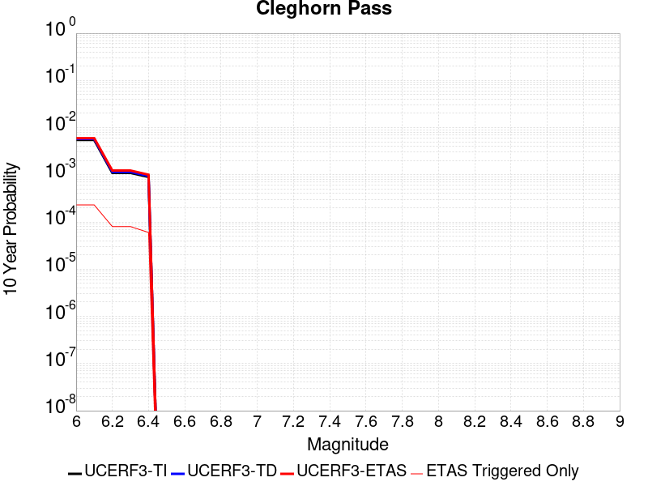 |

| Magnitude | 1 wk TI Prob | 1 wk TD Prob | 1 wk ETAS Prob | 1 wk ETAS/TD Gain | 1 wk ETAS Triggered Only | 1 mo TI Prob | 1 mo TD Prob | 1 mo ETAS Prob | 1 mo ETAS/TD Gain | 1 mo ETAS Triggered Only | 1 yr TI Prob | 1 yr TD Prob | 1 yr ETAS Prob | 1 yr ETAS/TD Gain | 1 yr ETAS Triggered Only | 10 yr TI Prob | 10 yr TD Prob | 10 yr ETAS Prob | 10 yr ETAS/TD Gain | 10 yr ETAS Triggered Only |
|-----|-----|-----|-----|-----|-----|-----|-----|-----|-----|-----|-----|-----|-----|-----|-----|-----|-----|-----|-----|-----|
| 6.0 | 1.0522846E-5 | 1.1040642E-5 | 5.393101E-5 | 4.8847713 | 4.2890842E-5 | 4.509713E-5 | 4.7316473E-5 | 1.330941E-4 | 2.812849 | 8.5781685E-5 | 5.4891926E-4 | 5.759784E-4 | 7.47443E-4 | 1.2976927 | 1.7156337E-4 | 0.0054756533 | 0.005750022 | 0.006005887 | 1.0444982 | 2.5734506E-4 |
| 6.1 | 1.0522846E-5 | 1.1040642E-5 | 5.393101E-5 | 4.8847713 | 4.2890842E-5 | 4.509713E-5 | 4.7316473E-5 | 1.330941E-4 | 2.812849 | 8.5781685E-5 | 5.4891926E-4 | 5.759784E-4 | 7.47443E-4 | 1.2976927 | 1.7156337E-4 | 0.0054756533 | 0.005750022 | 0.006005887 | 1.0444982 | 2.5734506E-4 |
| 6.2 | 2.1045846E-6 | 2.2082024E-6 | 4.509895E-5 | 20.423376 | 4.2890842E-5 | 9.019617E-6 | 9.463714E-6 | 5.235415E-5 | 5.5320935 | 4.2890842E-5 | 1.098083E-4 | 1.1521882E-4 | 2.0099063E-4 | 1.7444253 | 8.5781685E-5 | 0.0010975406 | 0.0011520023 | 0.0012805265 | 1.1115661 | 1.2867253E-4 |
| 6.3 | 2.1045846E-6 | 2.2082024E-6 | 4.509895E-5 | 20.423376 | 4.2890842E-5 | 9.019617E-6 | 9.463714E-6 | 5.235415E-5 | 5.5320935 | 4.2890842E-5 | 1.098083E-4 | 1.1521882E-4 | 2.0099063E-4 | 1.7444253 | 8.5781685E-5 | 0.0010975406 | 0.0011520023 | 0.0012805265 | 1.1115661 | 1.2867253E-4 |
| 6.4 | 1.7259927E-6 | 1.810877E-6 | 4.4701643E-5 | 24.685078 | 4.2890842E-5 | 7.3970905E-6 | 7.760902E-6 | 5.065141E-5 | 6.5264854 | 4.2890842E-5 | 9.005586E-5 | 9.4488976E-5 | 1.8026256E-4 | 1.9077628 | 8.5781685E-5 | 9.001937E-4 | 9.448898E-4 | 0.0010734408 | 1.1360486 | 1.2867253E-4 |

## Cady
*[(top)](#table-of-contents)*

| 1 Week | 1 Month | 1 Year | 10 Year |
|-----|-----|-----|-----|
|  |  |  |  |

| Magnitude | 1 wk TI Prob | 1 wk TD Prob | 1 wk ETAS Prob | 1 wk ETAS/TD Gain | 1 wk ETAS Triggered Only | 1 mo TI Prob | 1 mo TD Prob | 1 mo ETAS Prob | 1 mo ETAS/TD Gain | 1 mo ETAS Triggered Only | 1 yr TI Prob | 1 yr TD Prob | 1 yr ETAS Prob | 1 yr ETAS/TD Gain | 1 yr ETAS Triggered Only | 10 yr TI Prob | 10 yr TD Prob | 10 yr ETAS Prob | 10 yr ETAS/TD Gain | 10 yr ETAS Triggered Only |
|-----|-----|-----|-----|-----|-----|-----|-----|-----|-----|-----|-----|-----|-----|-----|-----|-----|-----|-----|-----|-----|
| 6.0 | 1.9892565E-5 | 2.1858728E-5 | 2.1858728E-5 | 1.0 | 0.0 | 8.525106E-5 | 9.3677416E-5 | 1.3656424E-4 | 1.4578139 | 4.2890842E-5 | 0.0010374374 | 0.0011400167 | 0.0013113845 | 1.1503204 | 1.7156337E-4 | 0.010326075 | 0.011350701 | 0.011605125 | 1.0224148 | 2.5734506E-4 |
| 6.1 | 1.9892565E-5 | 2.1858728E-5 | 2.1858728E-5 | 1.0 | 0.0 | 8.525106E-5 | 9.3677416E-5 | 1.3656424E-4 | 1.4578139 | 4.2890842E-5 | 0.0010374374 | 0.0011400167 | 0.0013113845 | 1.1503204 | 1.7156337E-4 | 0.010326075 | 0.011350701 | 0.011605125 | 1.0224148 | 2.5734506E-4 |
| 6.2 | 1.9892565E-5 | 2.1858728E-5 | 2.1858728E-5 | 1.0 | 0.0 | 8.525106E-5 | 9.3677416E-5 | 1.3656424E-4 | 1.4578139 | 4.2890842E-5 | 0.0010374374 | 0.0011400167 | 0.0013113845 | 1.1503204 | 1.7156337E-4 | 0.010326075 | 0.011350701 | 0.011605125 | 1.0224148 | 2.5734506E-4 |
| 6.3 | 1.1117327E-5 | 1.2176583E-5 | 1.2176583E-5 | 1.0 | 0.0 | 4.764482E-5 | 5.2184492E-5 | 5.2184492E-5 | 1.0 | 0.0 | 5.7992124E-4 | 6.351925E-4 | 6.780561E-4 | 1.0674813 | 4.2890842E-5 | 0.0057841022 | 0.0063368753 | 0.0064647323 | 1.0201766 | 1.2867253E-4 |
| 6.4 | 1.1117327E-5 | 1.2176583E-5 | 1.2176583E-5 | 1.0 | 0.0 | 4.764482E-5 | 5.2184492E-5 | 5.2184492E-5 | 1.0 | 0.0 | 5.7992124E-4 | 6.351925E-4 | 6.780561E-4 | 1.0674813 | 4.2890842E-5 | 0.0057841022 | 0.0063368753 | 0.0064647323 | 1.0201766 | 1.2867253E-4 |
| 6.5 | 6.103093E-6 | 6.672021E-6 | 6.672021E-6 | 1.0 | 0.0 | 2.615585E-5 | 2.8594131E-5 | 2.8594131E-5 | 1.0 | 0.0 | 3.1840094E-4 | 3.480905E-4 | 3.480905E-4 | 1.0 | 0.0 | 0.0031794512 | 0.0034766865 | 0.00356217 | 1.0245876 | 8.5781685E-5 |
| 6.6 | 5.817237E-6 | 6.3656585E-6 | 6.3656585E-6 | 1.0 | 0.0 | 2.4930776E-5 | 2.728118E-5 | 2.728118E-5 | 1.0 | 0.0 | 3.034899E-4 | 3.3211018E-4 | 3.3211018E-4 | 1.0 | 0.0 | 0.0030307577 | 0.0033173605 | 0.0034028576 | 1.0257727 | 8.5781685E-5 |
| 6.7 | 4.8846314E-6 | 5.3405684E-6 | 5.3405684E-6 | 1.0 | 0.0 | 2.0933967E-5 | 2.2888014E-5 | 2.2888014E-5 | 1.0 | 0.0 | 2.5484123E-4 | 2.7863772E-4 | 2.7863772E-4 | 1.0 | 0.0 | 0.0025454918 | 0.0027840391 | 0.0028268106 | 1.0153631 | 4.2890842E-5 |
| 6.8 | 1.7788773E-6 | 1.9399079E-6 | 1.9399079E-6 | 1.0 | 0.0 | 7.6237375E-6 | 8.313874E-6 | 8.313874E-6 | 1.0 | 0.0 | 9.281505E-5 | 1.01218284E-4 | 1.01218284E-4 | 1.0 | 0.0 | 9.2776294E-4 | 0.0010118765 | 0.0010547239 | 1.0423446 | 4.2890842E-5 |
| 6.9 | 7.5455404E-7 | 8.297092E-7 | 8.297092E-7 | 1.0 | 0.0 | 3.233799E-6 | 3.5558937E-6 | 3.5558937E-6 | 1.0 | 0.0 | 3.937079E-5 | 4.3292483E-5 | 4.3292483E-5 | 1.0 | 0.0 | 3.9363815E-4 | 4.3287344E-4 | 4.3287344E-4 | 1.0 | 0.0 |
| 7.0 | 6.8578805E-7 | 7.541816E-7 | 7.541816E-7 | 1.0 | 0.0 | 2.9390883E-6 | 3.2322048E-6 | 3.2322048E-6 | 1.0 | 0.0 | 3.578281E-5 | 3.9351715E-5 | 3.9351715E-5 | 1.0 | 0.0 | 3.577705E-4 | 3.9347992E-4 | 3.9347992E-4 | 1.0 | 0.0 |

## San Andreas (Cholame) rev
*[(top)](#table-of-contents)*

| 1 Week | 1 Month | 1 Year | 10 Year |
|-----|-----|-----|-----|
|  |  |  |  |

| Magnitude | 1 wk TI Prob | 1 wk TD Prob | 1 wk ETAS Prob | 1 wk ETAS/TD Gain | 1 wk ETAS Triggered Only | 1 mo TI Prob | 1 mo TD Prob | 1 mo ETAS Prob | 1 mo ETAS/TD Gain | 1 mo ETAS Triggered Only | 1 yr TI Prob | 1 yr TD Prob | 1 yr ETAS Prob | 1 yr ETAS/TD Gain | 1 yr ETAS Triggered Only | 10 yr TI Prob | 10 yr TD Prob | 10 yr ETAS Prob | 10 yr ETAS/TD Gain | 10 yr ETAS Triggered Only |
|-----|-----|-----|-----|-----|-----|-----|-----|-----|-----|-----|-----|-----|-----|-----|-----|-----|-----|-----|-----|-----|
| 6.0 | 1.2302514E-4 | 2.5204287E-4 | 3.3780295E-4 | 1.3402598 | 8.5781685E-5 | 5.27144E-4 | 0.0010797381 | 0.0012511163 | 1.1587219 | 1.7156337E-4 | 0.0063991086 | 0.0130670825 | 0.013278735 | 1.0161973 | 2.1445421E-4 | 0.06217949 | 0.12439073 | 0.124653615 | 1.0021135 | 3.002359E-4 |
| 6.1 | 1.2302514E-4 | 2.5204287E-4 | 3.3780295E-4 | 1.3402598 | 8.5781685E-5 | 5.27144E-4 | 0.0010797381 | 0.0012511163 | 1.1587219 | 1.7156337E-4 | 0.0063991086 | 0.0130670825 | 0.013278735 | 1.0161973 | 2.1445421E-4 | 0.06217949 | 0.12439073 | 0.124653615 | 1.0021135 | 3.002359E-4 |
| 6.2 | 1.2203569E-4 | 2.5021084E-4 | 3.3597107E-4 | 1.3427519 | 8.5781685E-5 | 5.2290526E-4 | 0.0010718931 | 0.0012432726 | 1.1598848 | 1.7156337E-4 | 0.006347804 | 0.01297271 | 0.013184382 | 1.0163168 | 2.1445421E-4 | 0.061695136 | 0.12357691 | 0.12384004 | 1.0021293 | 3.002359E-4 |
| 6.3 | 1.2142645E-4 | 2.4907055E-4 | 3.3483087E-4 | 1.3443214 | 8.5781685E-5 | 5.202953E-4 | 0.0010670102 | 0.0012383906 | 1.1606174 | 1.7156337E-4 | 0.006316212 | 0.012913967 | 0.0131256515 | 1.0163919 | 2.1445421E-4 | 0.06139677 | 0.12307103 | 0.12333432 | 1.0021393 | 3.002359E-4 |
| 6.4 | 1.1865206E-4 | 2.44126E-4 | 3.2988674E-4 | 1.351297 | 8.5781685E-5 | 5.0840975E-4 | 0.0010458364 | 0.0012172203 | 1.1638726 | 1.7156337E-4 | 0.006172335 | 0.012659196 | 0.012870936 | 1.0167261 | 2.1445421E-4 | 0.060036868 | 0.1208638 | 0.121127754 | 1.0021838 | 3.002359E-4 |
| 6.5 | 1.17443946E-4 | 2.4205919E-4 | 3.278201E-4 | 1.3542973 | 8.5781685E-5 | 5.032341E-4 | 0.0010369857 | 0.0012083711 | 1.1652727 | 1.7156337E-4 | 0.006109677 | 0.012552682 | 0.012764445 | 1.0168699 | 2.1445421E-4 | 0.059444077 | 0.11993805 | 0.12020228 | 1.002203 | 3.002359E-4 |
| 6.6 | 1.13579066E-4 | 2.3514954E-4 | 3.2091106E-4 | 1.3647106 | 8.5781685E-5 | 4.866766E-4 | 0.001007396 | 0.0011787865 | 1.1701323 | 1.7156337E-4 | 0.0059092017 | 0.012196515 | 0.012408353 | 1.0173688 | 2.1445421E-4 | 0.057545185 | 0.11685214 | 0.1171173 | 1.0022691 | 3.002359E-4 |
| 6.7 | 1.1271412E-4 | 2.3359268E-4 | 3.1935432E-4 | 1.3671418 | 8.5781685E-5 | 4.829711E-4 | 0.0010007289 | 0.0011721206 | 1.1712668 | 1.7156337E-4 | 0.005864331 | 0.012116249 | 0.012328104 | 1.0174853 | 2.1445421E-4 | 0.057119697 | 0.116155714 | 0.11642107 | 1.0022845 | 3.002359E-4 |
| 6.8 | 1.1217975E-4 | 2.3247694E-4 | 3.182387E-4 | 1.3689042 | 8.5781685E-5 | 4.8068175E-4 | 9.959509E-4 | 0.0011673433 | 1.1720893 | 1.7156337E-4 | 0.005836608 | 0.012058721 | 0.012270589 | 1.0175697 | 2.1445421E-4 | 0.056856725 | 0.11565396 | 0.11591948 | 1.0022957 | 3.002359E-4 |
| 6.9 | 1.1146753E-4 | 2.3096445E-4 | 3.1672633E-4 | 1.3713206 | 8.5781685E-5 | 4.7763053E-4 | 9.894737E-4 | 0.0011608673 | 1.1732169 | 1.7156337E-4 | 0.0057996577 | 0.011980731 | 0.012192616 | 1.0176854 | 2.1445421E-4 | 0.056506127 | 0.11497439 | 0.115240104 | 1.0023111 | 3.002359E-4 |
| 7.0 | 1.0965793E-4 | 2.2719789E-4 | 3.129601E-4 | 1.377478 | 8.5781685E-5 | 4.698779E-4 | 9.733434E-4 | 0.0011447398 | 1.1760904 | 1.7156337E-4 | 0.005705768 | 0.011786487 | 0.011998413 | 1.0179805 | 2.1445421E-4 | 0.055614736 | 0.11327597 | 0.11354219 | 1.0023502 | 3.002359E-4 |
| 7.1 | 9.927982E-5 | 2.0538924E-4 | 2.911533E-4 | 1.4175684 | 8.5781685E-5 | 4.2541555E-4 | 8.7994366E-4 | 0.0010513561 | 1.1947993 | 1.7156337E-4 | 0.0051671406 | 0.010660981 | 0.010830715 | 1.0159211 | 1.7156337E-4 | 0.05048634 | 0.1033706 | 0.103601344 | 1.0022322 | 2.5734506E-4 |
| 7.2 | 9.696786E-5 | 2.0043184E-4 | 2.8619633E-4 | 1.4278985 | 8.5781685E-5 | 4.1551032E-4 | 8.5871184E-4 | 0.0010301279 | 1.19962 | 1.7156337E-4 | 0.00504711 | 0.010404981 | 0.010574759 | 1.016317 | 1.7156337E-4 | 0.04934009 | 0.1011086 | 0.10133993 | 1.0022879 | 2.5734506E-4 |
| 7.3 | 9.4727984E-5 | 1.9472468E-4 | 2.8048968E-4 | 1.4404423 | 8.5781685E-5 | 4.0591392E-4 | 8.3426846E-4 | 0.0010056887 | 1.2054737 | 1.7156337E-4 | 0.0049308087 | 0.010110183 | 0.010280011 | 1.0167978 | 1.7156337E-4 | 0.048228268 | 0.09847952 | 0.09871152 | 1.0023558 | 2.5734506E-4 |
| 7.4 | 9.220358E-5 | 1.8843076E-4 | 2.7419627E-4 | 1.4551567 | 8.5781685E-5 | 3.9509835E-4 | 8.073114E-4 | 9.787362E-4 | 1.2123405 | 1.7156337E-4 | 0.004799717 | 0.009784967 | 0.009954851 | 1.0173618 | 1.7156337E-4 | 0.046973653 | 0.095557496 | 0.09579025 | 1.0024358 | 2.5734506E-4 |
| 7.5 | 7.71631E-5 | 1.5177966E-4 | 2.3754833E-4 | 1.5650867 | 8.5781685E-5 | 3.306571E-4 | 6.503223E-4 | 8.2177407E-4 | 1.2636412 | 1.7156337E-4 | 0.0040183207 | 0.007889002 | 0.008059211 | 1.0215756 | 1.7156337E-4 | 0.03946433 | 0.07828531 | 0.07848297 | 1.002525 | 2.1445421E-4 |
| 7.6 | 7.5634416E-5 | 1.483744E-4 | 2.3414336E-4 | 1.5780576 | 8.5781685E-5 | 3.241072E-4 | 6.3573546E-4 | 8.071898E-4 | 1.2696944 | 1.7156337E-4 | 0.0039388672 | 0.0077126776 | 0.007882917 | 1.0220728 | 1.7156337E-4 | 0.038697794 | 0.07664872 | 0.07684673 | 1.0025834 | 2.1445421E-4 |
| 7.7 | 6.3783E-5 | 1.235872E-4 | 1.6647275E-4 | 1.3470063 | 4.2890842E-5 | 2.7332708E-4 | 5.29552E-4 | 6.152882E-4 | 1.1619034 | 8.5781685E-5 | 0.0033226798 | 0.0064282627 | 0.0065134927 | 1.0132587 | 8.5781685E-5 | 0.032734364 | 0.06454029 | 0.06462054 | 1.0012434 | 8.5781685E-5 |
| 7.8 | 5.863422E-5 | 1.1416107E-4 | 1.5704702E-4 | 1.3756617 | 4.2890842E-5 | 2.512653E-4 | 4.8917E-4 | 5.749098E-4 | 1.1752759 | 8.5781685E-5 | 0.003054864 | 0.0059394026 | 0.006024675 | 1.0143571 | 8.5781685E-5 | 0.030132094 | 0.059659187 | 0.05973985 | 1.0013521 | 8.5781685E-5 |
| 7.9 | 4.595283E-5 | 8.426331E-5 | 8.426331E-5 | 1.0 | 0.0 | 1.9692584E-4 | 3.610785E-4 | 4.0395386E-4 | 1.1187425 | 4.2890842E-5 | 0.0023949358 | 0.0043872762 | 0.004429979 | 1.0097333 | 4.2890842E-5 | 0.023692891 | 0.044362005 | 0.044402994 | 1.000924 | 4.2890842E-5 |
| 8.0 | 3.2950178E-5 | 5.0772942E-5 | 5.0772942E-5 | 1.0 | 0.0 | 1.412074E-4 | 2.1758018E-4 | 2.604617E-4 | 1.1970837 | 4.2890842E-5 | 0.0017178444 | 0.0026458222 | 0.0026885998 | 1.0161679 | 4.2890842E-5 | 0.017046256 | 0.027180137 | 0.027221862 | 1.0015352 | 4.2890842E-5 |
| 8.1 | 1.9177472E-5 | 1.9185145E-5 | 1.9185145E-5 | 1.0 | 0.0 | 8.218658E-5 | 8.221946E-5 | 8.221946E-5 | 1.0 | 0.0 | 0.0010001622 | 0.0010005629 | 0.0010005629 | 1.0 | 0.0 | 0.009956728 | 0.010758142 | 0.010758142 | 1.0 | 0.0 |
| 8.2 | 8.643924E-6 | 5.4748625E-6 | 5.4748625E-6 | 1.0 | 0.0 | 3.704486E-5 | 2.3463486E-5 | 2.3463486E-5 | 1.0 | 0.0 | 4.5092785E-4 | 2.8563058E-4 | 2.8563058E-4 | 1.0 | 0.0 | 0.0045001395 | 0.0032487072 | 0.0032487072 | 1.0 | 0.0 |
| 8.3 | 1.983087E-6 | 7.6599065E-7 | 7.6599065E-7 | 1.0 | 0.0 | 8.498917E-6 | 3.282813E-6 | 3.282813E-6 | 1.0 | 0.0 | 1.034694E-4 | 3.9967534E-5 | 3.9967534E-5 | 1.0 | 0.0 | 0.0010342124 | 4.719687E-4 | 4.719687E-4 | 1.0 | 0.0 |

## Scodie Lineament
*[(top)](#table-of-contents)*

| 1 Week | 1 Month | 1 Year | 10 Year |
|-----|-----|-----|-----|
|  |  |  |  |

| Magnitude | 1 wk TI Prob | 1 wk TD Prob | 1 wk ETAS Prob | 1 wk ETAS/TD Gain | 1 wk ETAS Triggered Only | 1 mo TI Prob | 1 mo TD Prob | 1 mo ETAS Prob | 1 mo ETAS/TD Gain | 1 mo ETAS Triggered Only | 1 yr TI Prob | 1 yr TD Prob | 1 yr ETAS Prob | 1 yr ETAS/TD Gain | 1 yr ETAS Triggered Only | 10 yr TI Prob | 10 yr TD Prob | 10 yr ETAS Prob | 10 yr ETAS/TD Gain | 10 yr ETAS Triggered Only |
|-----|-----|-----|-----|-----|-----|-----|-----|-----|-----|-----|-----|-----|-----|-----|-----|-----|-----|-----|-----|-----|
| 6.0 | 3.2919327E-6 | 3.0133422E-6 | 8.879477E-5 | 29.467203 | 8.5781685E-5 | 1.4108206E-5 | 1.2914278E-5 | 1.8447543E-4 | 14.284611 | 1.7156337E-4 | 1.7175387E-4 | 1.5722317E-4 | 3.2875958E-4 | 2.0910378 | 1.7156337E-4 | 0.0017162118 | 0.0015714309 | 0.001871195 | 1.1907587 | 3.002359E-4 |
| 6.1 | 1.8663811E-6 | 1.5490499E-6 | 1.5490499E-6 | 1.0 | 0.0 | 7.998751E-6 | 6.6387715E-6 | 6.6387715E-6 | 1.0 | 0.0 | 9.738045E-5 | 8.082454E-5 | 8.082454E-5 | 1.0 | 0.0 | 9.7337784E-4 | 8.080003E-4 | 8.937126E-4 | 1.1060796 | 8.5781685E-5 |
| 6.2 | 1.8663811E-6 | 1.5490499E-6 | 1.5490499E-6 | 1.0 | 0.0 | 7.998751E-6 | 6.6387715E-6 | 6.6387715E-6 | 1.0 | 0.0 | 9.738045E-5 | 8.082454E-5 | 8.082454E-5 | 1.0 | 0.0 | 9.7337784E-4 | 8.080003E-4 | 8.937126E-4 | 1.1060796 | 8.5781685E-5 |
| 6.3 | 1.8663811E-6 | 1.5490499E-6 | 1.5490499E-6 | 1.0 | 0.0 | 7.998751E-6 | 6.6387715E-6 | 6.6387715E-6 | 1.0 | 0.0 | 9.738045E-5 | 8.082454E-5 | 8.082454E-5 | 1.0 | 0.0 | 9.7337784E-4 | 8.080003E-4 | 8.937126E-4 | 1.1060796 | 8.5781685E-5 |
| 6.4 | 1.8663811E-6 | 1.5490499E-6 | 1.5490499E-6 | 1.0 | 0.0 | 7.998751E-6 | 6.6387715E-6 | 6.6387715E-6 | 1.0 | 0.0 | 9.738045E-5 | 8.082454E-5 | 8.082454E-5 | 1.0 | 0.0 | 9.7337784E-4 | 8.080003E-4 | 8.937126E-4 | 1.1060796 | 8.5781685E-5 |
| 6.5 | 1.8106311E-6 | 1.4909839E-6 | 1.4909839E-6 | 1.0 | 0.0 | 7.759824E-6 | 6.3899183E-6 | 6.3899183E-6 | 1.0 | 0.0 | 9.447177E-5 | 7.7794975E-5 | 7.7794975E-5 | 1.0 | 0.0 | 9.4431615E-4 | 7.7772606E-4 | 8.6344103E-4 | 1.1102123 | 8.5781685E-5 |
| 6.6 | 1.2414679E-6 | 8.997558E-7 | 8.997558E-7 | 1.0 | 0.0 | 5.320566E-6 | 3.856091E-6 | 3.856091E-6 | 1.0 | 0.0 | 6.477596E-5 | 4.6946985E-5 | 4.6946985E-5 | 1.0 | 0.0 | 6.475708E-4 | 4.693793E-4 | 5.1225E-4 | 1.0913349 | 4.2890842E-5 |
| 6.7 | 1.1062215E-6 | 7.594311E-7 | 7.594311E-7 | 1.0 | 0.0 | 4.7409408E-6 | 3.2547011E-6 | 3.2547011E-6 | 1.0 | 0.0 | 5.7719422E-5 | 3.9625334E-5 | 3.9625334E-5 | 1.0 | 0.0 | 5.770443E-4 | 3.961897E-4 | 4.3906353E-4 | 1.1082155 | 4.2890842E-5 |
| 6.8 | 1.0006736E-6 | 6.500397E-7 | 6.500397E-7 | 1.0 | 0.0 | 4.288594E-6 | 2.7858816E-6 | 2.7858816E-6 | 1.0 | 0.0 | 5.221238E-5 | 3.3917644E-5 | 3.3917644E-5 | 1.0 | 0.0 | 5.220012E-4 | 3.3913075E-4 | 3.8200704E-4 | 1.12643 | 4.2890842E-5 |
| 6.9 | 9.167364E-7 | 5.631625E-7 | 5.631625E-7 | 1.0 | 0.0 | 3.9288643E-6 | 2.4135516E-6 | 2.4135516E-6 | 1.0 | 0.0 | 4.7832873E-5 | 2.9384651E-5 | 2.9384651E-5 | 1.0 | 0.0 | 4.782258E-4 | 2.9381333E-4 | 3.3669156E-4 | 1.145937 | 4.2890842E-5 |
| 7.0 | 7.6987664E-7 | 4.113383E-7 | 4.113383E-7 | 1.0 | 0.0 | 3.2994672E-6 | 1.7628774E-6 | 1.7628774E-6 | 1.0 | 0.0 | 4.0170275E-5 | 2.1462862E-5 | 2.1462862E-5 | 1.0 | 0.0 | 4.0163012E-4 | 2.1461173E-4 | 2.5749338E-4 | 1.1998103 | 4.2890842E-5 |
| 7.1 | 7.1038727E-7 | 3.5211494E-7 | 3.5211494E-7 | 1.0 | 0.0 | 3.0445133E-6 | 1.5090633E-6 | 1.5090633E-6 | 1.0 | 0.0 | 3.706632E-5 | 1.8372726E-5 | 1.8372726E-5 | 1.0 | 0.0 | 3.7060137E-4 | 1.8371557E-4 | 2.2659852E-4 | 1.2334204 | 4.2890842E-5 |
| 7.2 | 2.0799602E-7 | 3.1186854E-8 | 3.1186854E-8 | 1.0 | 0.0 | 8.914113E-7 | 1.3365793E-7 | 1.3365793E-7 | 1.0 | 0.0 | 1.0852878E-5 | 1.6272843E-6 | 1.6272843E-6 | 1.0 | 0.0 | 1.08523476E-4 | 1.627273E-5 | 1.627273E-5 | 1.0 | 0.0 |
| 7.3 | 1.5048182E-7 | 1.5945696E-8 | 1.5945696E-8 | 1.0 | 0.0 | 6.449219E-7 | 6.83387E-8 | 6.83387E-8 | 1.0 | 0.0 | 7.851896E-6 | 8.320234E-7 | 8.320234E-7 | 1.0 | 0.0 | 7.851618E-5 | 8.320206E-6 | 8.320206E-6 | 1.0 | 0.0 |
| 7.4 | 5.9334678E-8 | 4.8683537E-9 | 4.8683537E-9 | 1.0 | 0.0 | 2.5429145E-7 | 2.0864372E-8 | 2.0864372E-8 | 1.0 | 0.0 | 3.095994E-6 | 2.5402372E-7 | 2.5402372E-7 | 1.0 | 0.0 | 3.095951E-5 | 2.5402353E-6 | 2.5402353E-6 | 1.0 | 0.0 |

## San Andreas (Coachella) rev
*[(top)](#table-of-contents)*

| 1 Week | 1 Month | 1 Year | 10 Year |
|-----|-----|-----|-----|
|  | 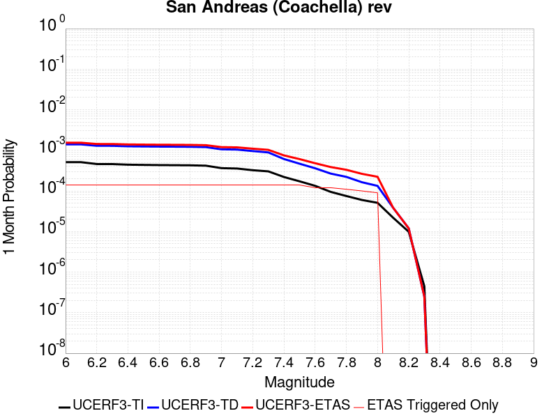 |  |  |

| Magnitude | 1 wk TI Prob | 1 wk TD Prob | 1 wk ETAS Prob | 1 wk ETAS/TD Gain | 1 wk ETAS Triggered Only | 1 mo TI Prob | 1 mo TD Prob | 1 mo ETAS Prob | 1 mo ETAS/TD Gain | 1 mo ETAS Triggered Only | 1 yr TI Prob | 1 yr TD Prob | 1 yr ETAS Prob | 1 yr ETAS/TD Gain | 1 yr ETAS Triggered Only | 10 yr TI Prob | 10 yr TD Prob | 10 yr ETAS Prob | 10 yr ETAS/TD Gain | 10 yr ETAS Triggered Only |
|-----|-----|-----|-----|-----|-----|-----|-----|-----|-----|-----|-----|-----|-----|-----|-----|-----|-----|-----|-----|-----|
| 6.0 | 1.1925945E-4 | 3.2729402E-4 | 4.5592443E-4 | 1.3930118 | 1.2867253E-4 | 5.110118E-4 | 0.0014019393 | 0.0015304314 | 1.0916531 | 1.2867253E-4 | 0.0062038354 | 0.016936364 | 0.017147185 | 1.012448 | 2.1445421E-4 | 0.060334753 | 0.15265316 | 0.15287122 | 1.0014285 | 2.5734506E-4 |
| 6.1 | 1.1925945E-4 | 3.2729402E-4 | 4.5592443E-4 | 1.3930118 | 1.2867253E-4 | 5.110118E-4 | 0.0014019393 | 0.0015304314 | 1.0916531 | 1.2867253E-4 | 0.0062038354 | 0.016936364 | 0.017147185 | 1.012448 | 2.1445421E-4 | 0.060334753 | 0.15265316 | 0.15287122 | 1.0014285 | 2.5734506E-4 |
| 6.2 | 1.07432395E-4 | 3.0230157E-4 | 4.3093518E-4 | 1.4255142 | 1.2867253E-4 | 4.603433E-4 | 0.0012949388 | 0.0014234447 | 1.0992371 | 1.2867253E-4 | 0.005590286 | 0.015653009 | 0.015864106 | 1.013486 | 2.1445421E-4 | 0.05451731 | 0.14182423 | 0.14204508 | 1.0015572 | 2.5734506E-4 |
| 6.3 | 1.0718766E-4 | 3.0175463E-4 | 4.3038832E-4 | 1.4262857 | 1.2867253E-4 | 4.592948E-4 | 0.0012925972 | 0.0014211034 | 1.0994171 | 1.2867253E-4 | 0.005577586 | 0.015624908 | 0.015836012 | 1.0135107 | 2.1445421E-4 | 0.054396555 | 0.14159249 | 0.1418134 | 1.0015602 | 2.5734506E-4 |
| 6.4 | 1.0355944E-4 | 2.9383553E-4 | 4.2247024E-4 | 1.437778 | 1.2867253E-4 | 4.4375064E-4 | 0.0012586913 | 0.0013872018 | 1.1020986 | 1.2867253E-4 | 0.0053892885 | 0.015217941 | 0.015429133 | 1.0138777 | 2.1445421E-4 | 0.052604496 | 0.13815255 | 0.13837434 | 1.0016054 | 2.5734506E-4 |
| 6.5 | 1.0227914E-4 | 2.9102986E-4 | 4.1966495E-4 | 1.4419996 | 1.2867253E-4 | 4.382655E-4 | 0.0012466786 | 0.0013751907 | 1.1030836 | 1.2867253E-4 | 0.0053228354 | 0.01507372 | 0.0152849415 | 1.0140126 | 2.1445421E-4 | 0.051971316 | 0.13693172 | 0.13715383 | 1.0016221 | 2.5734506E-4 |
| 6.6 | 1.0116757E-4 | 2.8868738E-4 | 4.1732276E-4 | 1.4455872 | 1.2867253E-4 | 4.3350324E-4 | 0.0012366489 | 0.0013651623 | 1.1039207 | 1.2867253E-4 | 0.0052651367 | 0.01495329 | 0.015164538 | 1.0141271 | 2.1445421E-4 | 0.051421247 | 0.1359099 | 0.13613227 | 1.0016361 | 2.5734506E-4 |
| 6.7 | 1.0050676E-4 | 2.8727303E-4 | 4.1590858E-4 | 1.4477816 | 1.2867253E-4 | 4.3067214E-4 | 0.0012305931 | 0.0013591072 | 1.1044327 | 1.2867253E-4 | 0.005230834 | 0.014880571 | 0.015091833 | 1.0141972 | 2.1445421E-4 | 0.051094085 | 0.13529462 | 0.13551715 | 1.0016447 | 2.5734506E-4 |
| 6.8 | 9.976819E-5 | 2.853096E-4 | 4.139454E-4 | 1.450864 | 1.2867253E-4 | 4.2750788E-4 | 0.0012221863 | 0.0013507016 | 1.1051519 | 1.2867253E-4 | 0.0051924936 | 0.0147796115 | 0.014990896 | 1.0142957 | 2.1445421E-4 | 0.050728295 | 0.13444631 | 0.13466905 | 1.0016568 | 2.5734506E-4 |
| 6.9 | 9.77719E-5 | 2.8027873E-4 | 4.089152E-4 | 1.4589591 | 1.2867253E-4 | 4.1895514E-4 | 0.0012006456 | 0.0013291636 | 1.1070408 | 1.2867253E-4 | 0.0050888555 | 0.014520878 | 0.014732217 | 1.0145543 | 2.1445421E-4 | 0.049738888 | 0.1322748 | 0.13249812 | 1.0016882 | 2.5734506E-4 |
| 7.0 | 8.500761E-5 | 2.4762485E-4 | 3.7626553E-4 | 1.5194982 | 1.2867253E-4 | 3.6426744E-4 | 0.001060821 | 0.001189357 | 1.1211666 | 1.2867253E-4 | 0.0044259406 | 0.012839786 | 0.013051487 | 1.0164878 | 2.1445421E-4 | 0.04338823 | 0.11813272 | 0.11835966 | 1.001921 | 2.5734506E-4 |
| 7.1 | 8.319876E-5 | 2.4365232E-4 | 3.722935E-4 | 1.5279702 | 1.2867253E-4 | 3.5651738E-4 | 0.0010438096 | 0.0011723478 | 1.1231433 | 1.2867253E-4 | 0.004331963 | 0.012635092 | 0.012846837 | 1.0167584 | 2.1445421E-4 | 0.042484846 | 0.116353 | 0.116580404 | 1.0019544 | 2.5734506E-4 |
| 7.2 | 7.563917E-5 | 2.2413683E-4 | 3.5278054E-4 | 1.5739516 | 1.2867253E-4 | 3.2412758E-4 | 9.602359E-4 | 0.0010887849 | 1.1338723 | 1.2867253E-4 | 0.0039391145 | 0.011628893 | 0.011840854 | 1.0182271 | 2.1445421E-4 | 0.03870018 | 0.10775925 | 0.107988864 | 1.0021307 | 2.5734506E-4 |
| 7.3 | 7.082985E-5 | 2.0729867E-4 | 3.3594453E-4 | 1.6205821 | 1.2867253E-4 | 3.0352117E-4 | 8.881233E-4 | 0.0010166815 | 1.1447527 | 1.2867253E-4 | 0.0036891096 | 0.010759917 | 0.010972064 | 1.0197164 | 2.1445421E-4 | 0.03628465 | 0.100282 | 0.10051354 | 1.0023088 | 2.5734506E-4 |
| 7.4 | 5.146215E-5 | 1.4273795E-4 | 2.713921E-4 | 1.9013312 | 1.2867253E-4 | 2.2053342E-4 | 6.115915E-4 | 7.401853E-4 | 1.210261 | 1.2867253E-4 | 0.0026816884 | 0.0074208933 | 0.007633756 | 1.0286843 | 2.1445421E-4 | 0.02649557 | 0.070849575 | 0.07108869 | 1.0033749 | 2.5734506E-4 |
| 7.5 | 4.0285166E-5 | 1.09416E-4 | 2.3807446E-4 | 2.175865 | 1.2867253E-4 | 1.7263928E-4 | 4.6884175E-4 | 5.9745397E-4 | 1.274319 | 1.2867253E-4 | 0.002099857 | 0.0056932783 | 0.0059065116 | 1.0374535 | 2.1445421E-4 | 0.020801254 | 0.055011146 | 0.055254336 | 1.0044208 | 2.5734506E-4 |
| 7.6 | 3.1168736E-5 | 8.4389096E-5 | 1.2727632E-4 | 1.5082082 | 4.2890842E-5 | 1.3357346E-4 | 3.6161754E-4 | 4.044929E-4 | 1.1185654 | 4.2890842E-5 | 0.0016250437 | 0.0043938323 | 0.004479237 | 1.0194374 | 8.5781685E-5 | 0.016132116 | 0.04281005 | 0.042933214 | 1.002877 | 1.2867253E-4 |
| 7.7 | 2.2100989E-5 | 6.238755E-5 | 1.0527572E-4 | 1.6874475 | 4.2890842E-5 | 9.4715084E-5 | 2.6734784E-4 | 3.1022725E-4 | 1.160388 | 4.2890842E-5 | 0.001152546 | 0.0032501083 | 0.0033356112 | 1.0263077 | 8.5781685E-5 | 0.011465867 | 0.0319002 | 0.032024767 | 1.0039049 | 1.2867253E-4 |
| 7.8 | 1.7484861E-5 | 5.179572E-5 | 9.468434E-5 | 1.828034 | 4.2890842E-5 | 7.493296E-5 | 2.2196278E-4 | 2.648441E-4 | 1.1931915 | 4.2890842E-5 | 9.1192697E-4 | 0.0026990508 | 0.002784601 | 1.0316964 | 8.5781685E-5 | 0.009081938 | 0.026640115 | 0.026765361 | 1.0047014 | 1.2867253E-4 |
| 7.9 | 1.3967285E-5 | 3.822255E-5 | 8.111176E-5 | 2.1220915 | 4.2890842E-5 | 5.985842E-5 | 1.6380067E-4 | 2.0668448E-4 | 1.2618049 | 4.2890842E-5 | 7.2853256E-4 | 0.00199245 | 0.0020352555 | 1.0214838 | 4.2890842E-5 | 0.0072614877 | 0.019909438 | 0.01999351 | 1.0042229 | 8.5781685E-5 |
| 8.0 | 1.1887396E-5 | 3.106521E-5 | 7.395472E-5 | 2.3806283 | 4.2890842E-5 | 5.094499E-5 | 1.3312983E-4 | 1.7601496E-4 | 1.3221302 | 4.2890842E-5 | 6.200787E-4 | 0.0016196516 | 0.001662473 | 1.0264386 | 4.2890842E-5 | 0.006183513 | 0.016279267 | 0.01632146 | 1.0025918 | 4.2890842E-5 |
| 8.1 | 5.100864E-6 | 8.973418E-6 | 8.973418E-6 | 1.0 | 0.0 | 2.1860664E-5 | 3.8456936E-5 | 3.8456936E-5 | 1.0 | 0.0 | 2.6612106E-4 | 4.6811273E-4 | 4.6811273E-4 | 1.0 | 0.0 | 0.002658026 | 0.004917731 | 0.004917731 | 1.0 | 0.0 |
| 8.2 | 2.3004484E-6 | 2.7864487E-6 | 2.7864487E-6 | 1.0 | 0.0 | 9.859027E-6 | 1.1941868E-5 | 1.1941868E-5 | 1.0 | 0.0 | 1.2002704E-4 | 1.4538258E-4 | 1.4538258E-4 | 1.0 | 0.0 | 0.0011996223 | 0.0015973912 | 0.0015973912 | 1.0 | 0.0 |
| 8.3 | 1.0424446E-7 | 5.8161504E-8 | 5.8161504E-8 | 1.0 | 0.0 | 4.4676187E-7 | 2.4926356E-7 | 2.4926356E-7 | 1.0 | 0.0 | 5.439312E-6 | 3.03478E-6 | 3.03478E-6 | 1.0 | 0.0 | 5.4391792E-5 | 3.190716E-5 | 3.190716E-5 | 1.0 | 0.0 |

## San Jacinto (Clark) rev
*[(top)](#table-of-contents)*

| 1 Week | 1 Month | 1 Year | 10 Year |
|-----|-----|-----|-----|
|  |  | 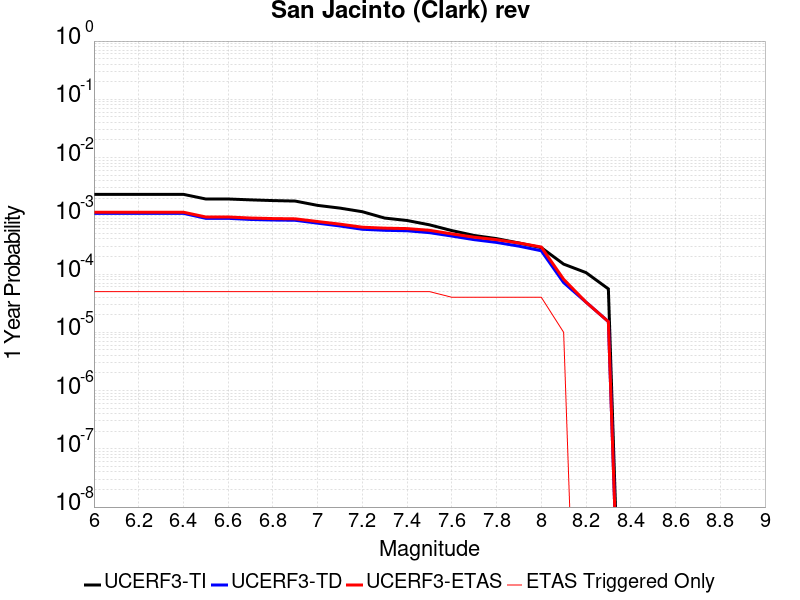 | 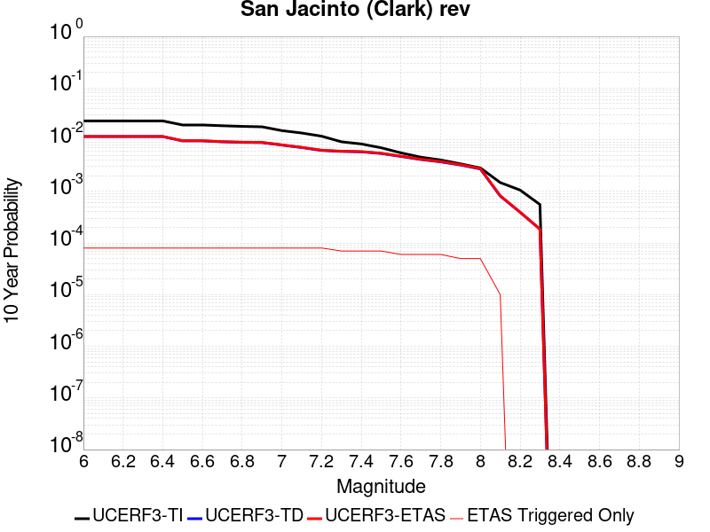 |

| Magnitude | 1 wk TI Prob | 1 wk TD Prob | 1 wk ETAS Prob | 1 wk ETAS/TD Gain | 1 wk ETAS Triggered Only | 1 mo TI Prob | 1 mo TD Prob | 1 mo ETAS Prob | 1 mo ETAS/TD Gain | 1 mo ETAS Triggered Only | 1 yr TI Prob | 1 yr TD Prob | 1 yr ETAS Prob | 1 yr ETAS/TD Gain | 1 yr ETAS Triggered Only | 10 yr TI Prob | 10 yr TD Prob | 10 yr ETAS Prob | 10 yr ETAS/TD Gain | 10 yr ETAS Triggered Only |
|-----|-----|-----|-----|-----|-----|-----|-----|-----|-----|-----|-----|-----|-----|-----|-----|-----|-----|-----|-----|-----|
| 6.0 | 4.482615E-5 | 2.1154196E-5 | 2.1154196E-5 | 1.0 | 0.0 | 1.9209793E-4 | 9.065773E-5 | 1.3354469E-4 | 1.4730644 | 4.2890842E-5 | 0.0023362834 | 0.0011032083 | 0.0012745823 | 1.1553415 | 1.7156337E-4 | 0.02311874 | 0.011503847 | 0.011715834 | 1.0184275 | 2.1445421E-4 |
| 6.1 | 4.482615E-5 | 2.1154196E-5 | 2.1154196E-5 | 1.0 | 0.0 | 1.9209793E-4 | 9.065773E-5 | 1.3354469E-4 | 1.4730644 | 4.2890842E-5 | 0.0023362834 | 0.0011032083 | 0.0012745823 | 1.1553415 | 1.7156337E-4 | 0.02311874 | 0.011503847 | 0.011715834 | 1.0184275 | 2.1445421E-4 |
| 6.2 | 4.482615E-5 | 2.1154196E-5 | 2.1154196E-5 | 1.0 | 0.0 | 1.9209793E-4 | 9.065773E-5 | 1.3354469E-4 | 1.4730644 | 4.2890842E-5 | 0.0023362834 | 0.0011032083 | 0.0012745823 | 1.1553415 | 1.7156337E-4 | 0.02311874 | 0.011503847 | 0.011715834 | 1.0184275 | 2.1445421E-4 |
| 6.3 | 4.482615E-5 | 2.1154196E-5 | 2.1154196E-5 | 1.0 | 0.0 | 1.9209793E-4 | 9.065773E-5 | 1.3354469E-4 | 1.4730644 | 4.2890842E-5 | 0.0023362834 | 0.0011032083 | 0.0012745823 | 1.1553415 | 1.7156337E-4 | 0.02311874 | 0.011503847 | 0.011715834 | 1.0184275 | 2.1445421E-4 |
| 6.4 | 4.482615E-5 | 2.1154196E-5 | 2.1154196E-5 | 1.0 | 0.0 | 1.9209793E-4 | 9.065773E-5 | 1.3354469E-4 | 1.4730644 | 4.2890842E-5 | 0.0023362834 | 0.0011032083 | 0.0012745823 | 1.1553415 | 1.7156337E-4 | 0.02311874 | 0.011503847 | 0.011715834 | 1.0184275 | 2.1445421E-4 |
| 6.5 | 3.7294863E-5 | 1.7356087E-5 | 1.7356087E-5 | 1.0 | 0.0 | 1.5982533E-4 | 7.438113E-5 | 1.1726879E-4 | 1.5765932 | 4.2890842E-5 | 0.0019441366 | 9.052186E-4 | 0.0010766266 | 1.1893555 | 1.7156337E-4 | 0.01927216 | 0.0094941035 | 0.009706521 | 1.0223737 | 2.1445421E-4 |
| 6.6 | 3.7294863E-5 | 1.7356087E-5 | 1.7356087E-5 | 1.0 | 0.0 | 1.5982533E-4 | 7.438113E-5 | 1.1726879E-4 | 1.5765932 | 4.2890842E-5 | 0.0019441366 | 9.052186E-4 | 0.0010766266 | 1.1893555 | 1.7156337E-4 | 0.01927216 | 0.0094941035 | 0.009706521 | 1.0223737 | 2.1445421E-4 |
| 6.7 | 3.6039248E-5 | 1.6604314E-5 | 1.6604314E-5 | 1.0 | 0.0 | 1.5444479E-4 | 7.1159426E-5 | 1.14047216E-4 | 1.6027001 | 4.2890842E-5 | 0.0018787434 | 8.6602574E-4 | 0.0010374405 | 1.1979327 | 1.7156337E-4 | 0.01862939 | 0.009096047 | 0.0093085505 | 1.0233622 | 2.1445421E-4 |
| 6.8 | 3.5031844E-5 | 1.6232942E-5 | 1.6232942E-5 | 1.0 | 0.0 | 1.5012783E-4 | 6.956792E-5 | 1.12455775E-4 | 1.616489 | 4.2890842E-5 | 0.0018262739 | 8.4666436E-4 | 0.0010180825 | 1.2024629 | 1.7156337E-4 | 0.01811338 | 0.008895969 | 0.009108515 | 1.0238924 | 2.1445421E-4 |
| 6.9 | 3.435112E-5 | 1.6063195E-5 | 1.6063195E-5 | 1.0 | 0.0 | 1.4721078E-4 | 6.884047E-5 | 1.1172836E-4 | 1.6230041 | 4.2890842E-5 | 0.0017908178 | 8.3781447E-4 | 0.0010092341 | 1.2046033 | 1.7156337E-4 | 0.017764548 | 0.008804181 | 0.009016747 | 1.0241438 | 2.1445421E-4 |
| 7.0 | 2.8959772E-5 | 1.4336745E-5 | 1.4336745E-5 | 1.0 | 0.0 | 1.241074E-4 | 6.144176E-5 | 1.0432997E-4 | 1.6980302 | 4.2890842E-5 | 0.0015099603 | 7.477995E-4 | 9.192346E-4 | 1.2292527 | 1.7156337E-4 | 0.014997416 | 0.007868037 | 0.008080803 | 1.0270419 | 2.1445421E-4 |
| 7.1 | 2.6002877E-5 | 1.2829002E-5 | 1.2829002E-5 | 1.0 | 0.0 | 1.11436144E-4 | 5.498029E-5 | 9.7868775E-5 | 1.7800702 | 4.2890842E-5 | 0.0013558907 | 6.691816E-4 | 8.4063015E-4 | 1.2562064 | 1.7156337E-4 | 0.013476475 | 0.0070465137 | 0.007259457 | 1.0302197 | 2.1445421E-4 |
| 7.2 | 2.2544838E-5 | 1.1262543E-5 | 1.1262543E-5 | 1.0 | 0.0 | 9.661716E-5 | 4.8267157E-5 | 9.115593E-5 | 1.8885705 | 4.2890842E-5 | 0.001175679 | 5.874956E-4 | 7.589582E-4 | 1.2918533 | 1.7156337E-4 | 0.011694785 | 0.0061927503 | 0.006405876 | 1.0344155 | 2.1445421E-4 |
| 7.3 | 1.75334E-5 | 1.0811715E-5 | 1.0811715E-5 | 1.0 | 0.0 | 7.514098E-5 | 4.6335106E-5 | 8.922396E-5 | 1.9256234 | 4.2890842E-5 | 9.144575E-4 | 5.6398526E-4 | 7.354519E-4 | 1.3040267 | 1.7156337E-4 | 0.009107036 | 0.0059337732 | 0.0061469553 | 1.0359268 | 2.1445421E-4 |
| 7.4 | 1.5924552E-5 | 1.0611516E-5 | 1.0611516E-5 | 1.0 | 0.0 | 6.82463E-5 | 4.547714E-5 | 8.836603E-5 | 1.9430869 | 4.2890842E-5 | 8.305819E-4 | 5.535449E-4 | 7.250133E-4 | 1.3097643 | 1.7156337E-4 | 0.008274844 | 0.0058210334 | 0.006034239 | 1.0366268 | 2.1445421E-4 |
| 7.5 | 1.3428931E-5 | 9.8519E-6 | 9.8519E-6 | 1.0 | 0.0 | 5.7551293E-5 | 4.2221753E-5 | 8.511078E-5 | 2.0158043 | 4.2890842E-5 | 7.004617E-4 | 5.1392964E-4 | 6.8540487E-4 | 1.333655 | 1.7156337E-4 | 0.006982579 | 0.0054066023 | 0.005619897 | 1.0394508 | 2.1445421E-4 |
| 7.6 | 1.0688787E-5 | 8.614839E-6 | 8.614839E-6 | 1.0 | 0.0 | 4.5808283E-5 | 3.692022E-5 | 7.9809484E-5 | 2.161674 | 4.2890842E-5 | 5.5757316E-4 | 4.4941145E-4 | 5.7802617E-4 | 1.2861848 | 1.2867253E-4 | 0.005561762 | 0.0047416524 | 0.004912402 | 1.0360106 | 1.7156337E-4 |
| 7.7 | 8.81236E-6 | 7.4680274E-6 | 7.4680274E-6 | 1.0 | 0.0 | 3.776671E-5 | 3.2005442E-5 | 7.489491E-5 | 2.340068 | 4.2890842E-5 | 4.597127E-4 | 3.8959677E-4 | 5.182192E-4 | 1.3301424 | 1.2867253E-4 | 0.0045876284 | 0.0041346536 | 0.0043055075 | 1.0413225 | 1.7156337E-4 |
| 7.8 | 7.780431E-6 | 6.696579E-6 | 6.696579E-6 | 1.0 | 0.0 | 3.3344273E-5 | 2.8699309E-5 | 7.158892E-5 | 2.4944475 | 4.2890842E-5 | 4.0589093E-4 | 3.4935825E-4 | 4.7798583E-4 | 1.3681824 | 1.2867253E-4 | 0.0040515037 | 0.0037227906 | 0.0038937153 | 1.0459131 | 1.7156337E-4 |
| 7.9 | 6.5437994E-6 | 5.780382E-6 | 5.780382E-6 | 1.0 | 0.0 | 2.8044553E-5 | 2.477283E-5 | 6.766261E-5 | 2.7313235 | 4.2890842E-5 | 3.4138895E-4 | 3.0156763E-4 | 4.3020135E-4 | 1.4265501 | 1.2867253E-4 | 0.0034086495 | 0.0032344845 | 0.003405493 | 1.0528704 | 1.7156337E-4 |
| 8.0 | 5.4488164E-6 | 4.8133406E-6 | 4.8133406E-6 | 1.0 | 0.0 | 2.3351862E-5 | 2.062844E-5 | 6.35184E-5 | 3.0791662 | 4.2890842E-5 | 2.8427184E-4 | 2.5112246E-4 | 3.7976267E-4 | 1.5122609 | 1.2867253E-4 | 0.0028390845 | 0.002710839 | 0.0028819374 | 1.0631163 | 1.7156337E-4 |
| 8.1 | 2.8397242E-6 | 1.3670389E-6 | 1.3670389E-6 | 1.0 | 0.0 | 1.217019E-5 | 5.858725E-6 | 5.858725E-6 | 1.0 | 0.0 | 1.4816198E-4 | 7.132765E-5 | 1.14215436E-4 | 1.6012784 | 4.2890842E-5 | 0.0014806325 | 8.115382E-4 | 8.543942E-4 | 1.0528084 | 4.2890842E-5 |
| 8.2 | 2.030244E-6 | 6.318974E-7 | 6.318974E-7 | 1.0 | 0.0 | 8.701017E-6 | 2.708129E-6 | 2.708129E-6 | 1.0 | 0.0 | 1.05929736E-4 | 3.2970976E-5 | 3.2970976E-5 | 1.0 | 0.0 | 0.0010587925 | 3.9486602E-4 | 3.9486602E-4 | 1.0 | 0.0 |
| 8.3 | 1.0659804E-6 | 2.9250086E-7 | 2.9250086E-7 | 1.0 | 0.0 | 4.568479E-6 | 1.2535745E-6 | 1.2535745E-6 | 1.0 | 0.0 | 5.5619817E-5 | 1.5262167E-5 | 1.5262167E-5 | 1.0 | 0.0 | 5.5605895E-4 | 1.8566217E-4 | 1.8566217E-4 | 1.0 | 0.0 |

## Lost Hills
*[(top)](#table-of-contents)*

| 1 Week | 1 Month | 1 Year | 10 Year |
|-----|-----|-----|-----|
|  |  | 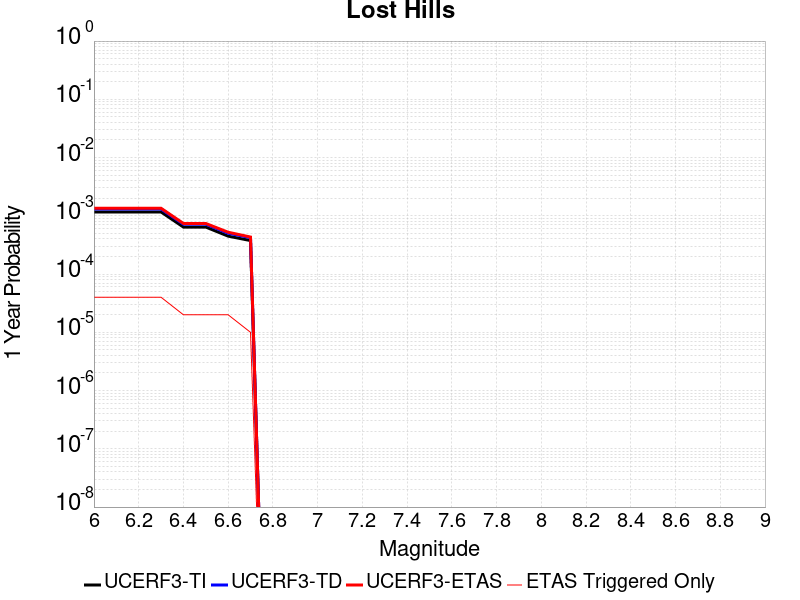 |  |

| Magnitude | 1 wk TI Prob | 1 wk TD Prob | 1 wk ETAS Prob | 1 wk ETAS/TD Gain | 1 wk ETAS Triggered Only | 1 mo TI Prob | 1 mo TD Prob | 1 mo ETAS Prob | 1 mo ETAS/TD Gain | 1 mo ETAS Triggered Only | 1 yr TI Prob | 1 yr TD Prob | 1 yr ETAS Prob | 1 yr ETAS/TD Gain | 1 yr ETAS Triggered Only | 10 yr TI Prob | 10 yr TD Prob | 10 yr ETAS Prob | 10 yr ETAS/TD Gain | 10 yr ETAS Triggered Only |
|-----|-----|-----|-----|-----|-----|-----|-----|-----|-----|-----|-----|-----|-----|-----|-----|-----|-----|-----|-----|-----|
| 6.0 | 2.233523E-5 | 2.5106583E-5 | 1.1088612E-4 | 4.416615 | 8.5781685E-5 | 9.571891E-5 | 1.0759615E-4 | 1.933686E-4 | 1.7971703 | 8.5781685E-5 | 0.0011647546 | 0.001309364 | 0.0014807028 | 1.1308564 | 1.7156337E-4 | 0.011586686 | 0.013033091 | 0.01324475 | 1.0162401 | 2.1445421E-4 |
| 6.1 | 2.233523E-5 | 2.5106583E-5 | 1.1088612E-4 | 4.416615 | 8.5781685E-5 | 9.571891E-5 | 1.0759615E-4 | 1.933686E-4 | 1.7971703 | 8.5781685E-5 | 0.0011647546 | 0.001309364 | 0.0014807028 | 1.1308564 | 1.7156337E-4 | 0.011586686 | 0.013033091 | 0.01324475 | 1.0162401 | 2.1445421E-4 |
| 6.2 | 2.233523E-5 | 2.5106583E-5 | 1.1088612E-4 | 4.416615 | 8.5781685E-5 | 9.571891E-5 | 1.0759615E-4 | 1.933686E-4 | 1.7971703 | 8.5781685E-5 | 0.0011647546 | 0.001309364 | 0.0014807028 | 1.1308564 | 1.7156337E-4 | 0.011586686 | 0.013033091 | 0.01324475 | 1.0162401 | 2.1445421E-4 |
| 6.3 | 2.233523E-5 | 2.5106583E-5 | 1.1088612E-4 | 4.416615 | 8.5781685E-5 | 9.571891E-5 | 1.0759615E-4 | 1.933686E-4 | 1.7971703 | 8.5781685E-5 | 0.0011647546 | 0.001309364 | 0.0014807028 | 1.1308564 | 1.7156337E-4 | 0.011586686 | 0.013033091 | 0.01324475 | 1.0162401 | 2.1445421E-4 |
| 6.4 | 1.2288092E-5 | 1.3781108E-5 | 5.667136E-5 | 4.11225 | 4.2890842E-5 | 5.2662188E-5 | 5.906108E-5 | 1.0194939E-4 | 1.7261688 | 4.2890842E-5 | 6.409735E-4 | 7.189252E-4 | 8.0464524E-4 | 1.1192336 | 8.5781685E-5 | 0.006391279 | 0.0071752006 | 0.00730295 | 1.0178043 | 1.2867253E-4 |
| 6.5 | 1.2288092E-5 | 1.3781108E-5 | 5.667136E-5 | 4.11225 | 4.2890842E-5 | 5.2662188E-5 | 5.906108E-5 | 1.0194939E-4 | 1.7261688 | 4.2890842E-5 | 6.409735E-4 | 7.189252E-4 | 8.0464524E-4 | 1.1192336 | 8.5781685E-5 | 0.006391279 | 0.0071752006 | 0.00730295 | 1.0178043 | 1.2867253E-4 |
| 6.6 | 8.58281E-6 | 9.63377E-6 | 5.25242E-5 | 5.452092 | 4.2890842E-5 | 3.6782953E-5 | 4.12874E-5 | 8.417647E-5 | 2.0387933 | 4.2890842E-5 | 4.4774043E-4 | 5.026414E-4 | 5.8838E-4 | 1.170576 | 8.5781685E-5 | 0.0044683935 | 0.005023205 | 0.005108556 | 1.0169913 | 8.5781685E-5 |
| 6.7 | 7.205685E-6 | 8.088302E-6 | 5.0978797E-5 | 6.3027816 | 4.2890842E-5 | 3.088114E-5 | 3.466415E-5 | 7.755351E-5 | 2.2372828 | 4.2890842E-5 | 3.7591302E-4 | 4.2203604E-4 | 4.6490878E-4 | 1.1015855 | 4.2890842E-5 | 0.0037527776 | 0.0042203604 | 0.00426307 | 1.0101199 | 4.2890842E-5 |

## Blue Cut
*[(top)](#table-of-contents)*

| 1 Week | 1 Month | 1 Year | 10 Year |
|-----|-----|-----|-----|
|  |  |  |  |

| Magnitude | 1 wk TI Prob | 1 wk TD Prob | 1 wk ETAS Prob | 1 wk ETAS/TD Gain | 1 wk ETAS Triggered Only | 1 mo TI Prob | 1 mo TD Prob | 1 mo ETAS Prob | 1 mo ETAS/TD Gain | 1 mo ETAS Triggered Only | 1 yr TI Prob | 1 yr TD Prob | 1 yr ETAS Prob | 1 yr ETAS/TD Gain | 1 yr ETAS Triggered Only | 10 yr TI Prob | 10 yr TD Prob | 10 yr ETAS Prob | 10 yr ETAS/TD Gain | 10 yr ETAS Triggered Only |
|-----|-----|-----|-----|-----|-----|-----|-----|-----|-----|-----|-----|-----|-----|-----|-----|-----|-----|-----|-----|-----|
| 6.0 | 2.1227985E-5 | 2.2719574E-5 | 1.0849931E-4 | 4.775587 | 8.5781685E-5 | 9.097391E-5 | 9.73663E-5 | 2.260263E-4 | 2.3214018 | 1.2867253E-4 | 0.0011070445 | 0.0011848481 | 0.0013133682 | 1.1084696 | 1.2867253E-4 | 0.011015458 | 0.011791152 | 0.012003077 | 1.0179733 | 2.1445421E-4 |
| 6.1 | 2.1227985E-5 | 2.2719574E-5 | 1.0849931E-4 | 4.775587 | 8.5781685E-5 | 9.097391E-5 | 9.73663E-5 | 2.260263E-4 | 2.3214018 | 1.2867253E-4 | 0.0011070445 | 0.0011848481 | 0.0013133682 | 1.1084696 | 1.2867253E-4 | 0.011015458 | 0.011791152 | 0.012003077 | 1.0179733 | 2.1445421E-4 |
| 6.2 | 2.1227985E-5 | 2.2719574E-5 | 1.0849931E-4 | 4.775587 | 8.5781685E-5 | 9.097391E-5 | 9.73663E-5 | 2.260263E-4 | 2.3214018 | 1.2867253E-4 | 0.0011070445 | 0.0011848481 | 0.0013133682 | 1.1084696 | 1.2867253E-4 | 0.011015458 | 0.011791152 | 0.012003077 | 1.0179733 | 2.1445421E-4 |
| 6.3 | 1.1613981E-5 | 1.2353542E-5 | 5.5243854E-5 | 4.4719043 | 4.2890842E-5 | 4.9773254E-5 | 5.2942745E-5 | 1.3871989E-4 | 2.6201868 | 8.5781685E-5 | 6.0582085E-4 | 6.443998E-4 | 7.3012616E-4 | 1.1330329 | 8.5781685E-5 | 0.0060417196 | 0.0064265593 | 0.0065544047 | 1.0198933 | 1.2867253E-4 |
| 6.4 | 1.1613981E-5 | 1.2353542E-5 | 5.5243854E-5 | 4.4719043 | 4.2890842E-5 | 4.9773254E-5 | 5.2942745E-5 | 1.3871989E-4 | 2.6201868 | 8.5781685E-5 | 6.0582085E-4 | 6.443998E-4 | 7.3012616E-4 | 1.1330329 | 8.5781685E-5 | 0.0060417196 | 0.0064265593 | 0.0065544047 | 1.0198933 | 1.2867253E-4 |
| 6.5 | 8.931326E-6 | 9.4816E-6 | 5.2372037E-5 | 5.5235443 | 4.2890842E-5 | 3.8276554E-5 | 4.0634844E-5 | 1.2641304E-4 | 3.1109517 | 8.5781685E-5 | 4.6591737E-4 | 4.946261E-4 | 5.8036536E-4 | 1.1733415 | 8.5781685E-5 | 0.0046494175 | 0.004936161 | 0.0050641983 | 1.0259386 | 1.2867253E-4 |
| 6.6 | 7.345353E-6 | 7.79028E-6 | 7.79028E-6 | 1.0 | 0.0 | 3.1479703E-5 | 3.338653E-5 | 7.627594E-5 | 2.2846322 | 4.2890842E-5 | 3.83198E-4 | 4.064132E-4 | 4.492866E-4 | 1.1054922 | 4.2890842E-5 | 0.0038253788 | 0.0040574907 | 0.004142924 | 1.0210558 | 8.5781685E-5 |
| 6.7 | 6.2775666E-6 | 6.655149E-6 | 6.655149E-6 | 1.0 | 0.0 | 2.690358E-5 | 2.8521798E-5 | 2.8521798E-5 | 1.0 | 0.0 | 3.2750185E-4 | 3.472051E-4 | 3.472051E-4 | 1.0 | 0.0 | 0.0032701963 | 0.003467367 | 0.0035101091 | 1.012327 | 4.2890842E-5 |
| 6.8 | 5.5234095E-6 | 5.8551113E-6 | 5.8551113E-6 | 1.0 | 0.0 | 2.367154E-5 | 2.5093133E-5 | 2.5093133E-5 | 1.0 | 0.0 | 2.8816288E-4 | 3.0547334E-4 | 3.0547334E-4 | 1.0 | 0.0 | 0.002877895 | 0.0030512505 | 0.0030940105 | 1.0140139 | 4.2890842E-5 |
| 6.9 | 4.7780054E-6 | 5.0654203E-6 | 5.0654203E-6 | 1.0 | 0.0 | 2.0477004E-5 | 2.1708804E-5 | 2.1708804E-5 | 1.0 | 0.0 | 2.4927902E-4 | 2.642797E-4 | 2.642797E-4 | 1.0 | 0.0 | 0.0024899957 | 0.002640346 | 0.0026831238 | 1.0162015 | 4.2890842E-5 |
| 7.0 | 3.883171E-6 | 4.118487E-6 | 4.118487E-6 | 1.0 | 0.0 | 1.6642054E-5 | 1.7650578E-5 | 1.7650578E-5 | 1.0 | 0.0 | 2.0259817E-4 | 2.1488148E-4 | 2.1488148E-4 | 1.0 | 0.0 | 0.0020241356 | 0.0021474129 | 0.0021902116 | 1.0199304 | 4.2890842E-5 |
| 7.1 | 2.8358215E-6 | 3.0097158E-6 | 3.0097158E-6 | 1.0 | 0.0 | 1.2153464E-5 | 1.2898756E-5 | 1.2898756E-5 | 1.0 | 0.0 | 1.4795837E-4 | 1.5703762E-4 | 1.5703762E-4 | 1.0 | 0.0 | 0.001478599 | 0.0015699116 | 0.0016127351 | 1.0272777 | 4.2890842E-5 |

## Manix-Afton Hills
*[(top)](#table-of-contents)*

| 1 Week | 1 Month | 1 Year | 10 Year |
|-----|-----|-----|-----|
|  |  |  |  |

| Magnitude | 1 wk TI Prob | 1 wk TD Prob | 1 wk ETAS Prob | 1 wk ETAS/TD Gain | 1 wk ETAS Triggered Only | 1 mo TI Prob | 1 mo TD Prob | 1 mo ETAS Prob | 1 mo ETAS/TD Gain | 1 mo ETAS Triggered Only | 1 yr TI Prob | 1 yr TD Prob | 1 yr ETAS Prob | 1 yr ETAS/TD Gain | 1 yr ETAS Triggered Only | 10 yr TI Prob | 10 yr TD Prob | 10 yr ETAS Prob | 10 yr ETAS/TD Gain | 10 yr ETAS Triggered Only |
|-----|-----|-----|-----|-----|-----|-----|-----|-----|-----|-----|-----|-----|-----|-----|-----|-----|-----|-----|-----|-----|
| 6.0 | 1.3783202E-5 | 1.47110895E-5 | 1.0049151E-4 | 6.831004 | 8.5781685E-5 | 5.906953E-5 | 6.30461E-5 | 1.9171053E-4 | 3.040799 | 1.2867253E-4 | 7.189342E-4 | 7.6733343E-4 | 8.9590723E-4 | 1.1675593 | 1.2867253E-4 | 0.0071661277 | 0.007648596 | 0.007818847 | 1.0222591 | 1.7156337E-4 |
| 6.1 | 1.3783202E-5 | 1.47110895E-5 | 1.0049151E-4 | 6.831004 | 8.5781685E-5 | 5.906953E-5 | 6.30461E-5 | 1.9171053E-4 | 3.040799 | 1.2867253E-4 | 7.189342E-4 | 7.6733343E-4 | 8.9590723E-4 | 1.1675593 | 1.2867253E-4 | 0.0071661277 | 0.007648596 | 0.007818847 | 1.0222591 | 1.7156337E-4 |
| 6.2 | 1.3783202E-5 | 1.47110895E-5 | 1.0049151E-4 | 6.831004 | 8.5781685E-5 | 5.906953E-5 | 6.30461E-5 | 1.9171053E-4 | 3.040799 | 1.2867253E-4 | 7.189342E-4 | 7.6733343E-4 | 8.9590723E-4 | 1.1675593 | 1.2867253E-4 | 0.0071661277 | 0.007648596 | 0.007818847 | 1.0222591 | 1.7156337E-4 |
| 6.3 | 1.10494875E-5 | 1.1793136E-5 | 9.757381E-5 | 8.27378 | 8.5781685E-5 | 4.7354086E-5 | 5.054109E-5 | 1.7920711E-4 | 3.5457706 | 1.2867253E-4 | 5.763835E-4 | 6.151744E-4 | 7.4376777E-4 | 1.2090356 | 1.2867253E-4 | 0.005748908 | 0.0061357557 | 0.0063062664 | 1.0277897 | 1.7156337E-4 |
| 6.4 | 1.10494875E-5 | 1.1793136E-5 | 9.757381E-5 | 8.27378 | 8.5781685E-5 | 4.7354086E-5 | 5.054109E-5 | 1.7920711E-4 | 3.5457706 | 1.2867253E-4 | 5.763835E-4 | 6.151744E-4 | 7.4376777E-4 | 1.2090356 | 1.2867253E-4 | 0.005748908 | 0.0061357557 | 0.0063062664 | 1.0277897 | 1.7156337E-4 |
| 6.5 | 9.788949E-6 | 1.045432E-5 | 5.3344713E-5 | 5.1026483 | 4.2890842E-5 | 4.1951964E-5 | 4.480351E-5 | 1.3058135E-4 | 2.914534 | 8.5781685E-5 | 5.1064545E-4 | 5.453555E-4 | 6.310904E-4 | 1.1572092 | 8.5781685E-5 | 0.0050947363 | 0.0054410985 | 0.005569071 | 1.0235196 | 1.2867253E-4 |
| 6.6 | 8.810006E-6 | 9.4136285E-6 | 5.230407E-5 | 5.556207 | 4.2890842E-5 | 3.775662E-5 | 4.0343548E-5 | 1.2612177E-4 | 3.1261945 | 8.5781685E-5 | 4.5958988E-4 | 4.9108086E-4 | 5.7682046E-4 | 1.1745936 | 8.5781685E-5 | 0.0045864056 | 0.004900839 | 0.005028881 | 1.0261265 | 1.2867253E-4 |
| 6.7 | 8.80128E-6 | 9.404108E-6 | 5.229455E-5 | 5.5608196 | 4.2890842E-5 | 3.7719226E-5 | 4.0302748E-5 | 1.2608098E-4 | 3.128347 | 8.5781685E-5 | 4.591348E-4 | 4.9058435E-4 | 5.7632395E-4 | 1.1747704 | 8.5781685E-5 | 0.004581874 | 0.0048958957 | 0.0050239386 | 1.0261531 | 1.2867253E-4 |
| 6.8 | 6.8994877E-6 | 7.380076E-6 | 7.380076E-6 | 1.0 | 0.0 | 2.9568899E-5 | 3.162856E-5 | 7.4518044E-5 | 2.3560367 | 4.2890842E-5 | 3.5994186E-4 | 3.8501783E-4 | 4.2789217E-4 | 1.1113567 | 4.2890842E-5 | 0.003593594 | 0.0038443129 | 0.003929765 | 1.0222281 | 8.5781685E-5 |
| 6.9 | 4.9328037E-6 | 5.2709615E-6 | 5.2709615E-6 | 1.0 | 0.0 | 2.1140417E-5 | 2.2589675E-5 | 6.547955E-5 | 2.8986495 | 4.2890842E-5 | 2.5735417E-4 | 2.7500073E-4 | 3.1787978E-4 | 1.1559234 | 4.2890842E-5 | 0.0025705635 | 0.0027472095 | 0.0027899824 | 1.0155696 | 4.2890842E-5 |
| 7.0 | 3.347973E-6 | 3.59003E-6 | 3.59003E-6 | 1.0 | 0.0 | 1.4348378E-5 | 1.5385775E-5 | 5.8275957E-5 | 3.7876518 | 4.2890842E-5 | 1.746775E-4 | 1.8730981E-4 | 2.3019263E-4 | 1.2289405 | 4.2890842E-5 | 0.0017454025 | 0.0018719219 | 0.0019147325 | 1.0228698 | 4.2890842E-5 |
| 7.1 | 1.2073567E-6 | 1.293482E-6 | 1.293482E-6 | 1.0 | 0.0 | 5.1743755E-6 | 5.543492E-6 | 4.8434096E-5 | 8.73711 | 4.2890842E-5 | 6.29962E-5 | 6.749156E-5 | 1.1037951E-4 | 1.6354564 | 4.2890842E-5 | 6.297835E-4 | 6.7487074E-4 | 7.1773265E-4 | 1.0635113 | 4.2890842E-5 |

## San Jacinto (San Jacinto Valley) rev
*[(top)](#table-of-contents)*

| 1 Week | 1 Month | 1 Year | 10 Year |
|-----|-----|-----|-----|
|  |  |  |  |

| Magnitude | 1 wk TI Prob | 1 wk TD Prob | 1 wk ETAS Prob | 1 wk ETAS/TD Gain | 1 wk ETAS Triggered Only | 1 mo TI Prob | 1 mo TD Prob | 1 mo ETAS Prob | 1 mo ETAS/TD Gain | 1 mo ETAS Triggered Only | 1 yr TI Prob | 1 yr TD Prob | 1 yr ETAS Prob | 1 yr ETAS/TD Gain | 1 yr ETAS Triggered Only | 10 yr TI Prob | 10 yr TD Prob | 10 yr ETAS Prob | 10 yr ETAS/TD Gain | 10 yr ETAS Triggered Only |
|-----|-----|-----|-----|-----|-----|-----|-----|-----|-----|-----|-----|-----|-----|-----|-----|-----|-----|-----|-----|-----|
| 6.0 | 3.652694E-5 | 3.4402394E-5 | 3.4402394E-5 | 1.0 | 0.0 | 1.5653463E-4 | 1.474305E-4 | 1.9031503E-4 | 1.2908796 | 4.2890842E-5 | 0.0019041431 | 0.00179349 | 0.0019647456 | 1.0954874 | 1.7156337E-4 | 0.018879099 | 0.018526595 | 0.018737076 | 1.011361 | 2.1445421E-4 |
| 6.1 | 3.652694E-5 | 3.4402394E-5 | 3.4402394E-5 | 1.0 | 0.0 | 1.5653463E-4 | 1.474305E-4 | 1.9031503E-4 | 1.2908796 | 4.2890842E-5 | 0.0019041431 | 0.00179349 | 0.0019647456 | 1.0954874 | 1.7156337E-4 | 0.018879099 | 0.018526595 | 0.018737076 | 1.011361 | 2.1445421E-4 |
| 6.2 | 3.652694E-5 | 3.4402394E-5 | 3.4402394E-5 | 1.0 | 0.0 | 1.5653463E-4 | 1.474305E-4 | 1.9031503E-4 | 1.2908796 | 4.2890842E-5 | 0.0019041431 | 0.00179349 | 0.0019647456 | 1.0954874 | 1.7156337E-4 | 0.018879099 | 0.018526595 | 0.018737076 | 1.011361 | 2.1445421E-4 |
| 6.3 | 3.652694E-5 | 3.4402394E-5 | 3.4402394E-5 | 1.0 | 0.0 | 1.5653463E-4 | 1.474305E-4 | 1.9031503E-4 | 1.2908796 | 4.2890842E-5 | 0.0019041431 | 0.00179349 | 0.0019647456 | 1.0954874 | 1.7156337E-4 | 0.018879099 | 0.018526595 | 0.018737076 | 1.011361 | 2.1445421E-4 |
| 6.4 | 3.646941E-5 | 3.432397E-5 | 3.432397E-5 | 1.0 | 0.0 | 1.5628811E-4 | 1.4709444E-4 | 1.8997898E-4 | 1.2915442 | 4.2890842E-5 | 0.0019011468 | 0.0017894056 | 0.001960662 | 1.0957057 | 1.7156337E-4 | 0.018849645 | 0.018486476 | 0.018696966 | 1.0113862 | 2.1445421E-4 |
| 6.5 | 3.646941E-5 | 3.432397E-5 | 3.432397E-5 | 1.0 | 0.0 | 1.5628811E-4 | 1.4709444E-4 | 1.8997898E-4 | 1.2915442 | 4.2890842E-5 | 0.0019011468 | 0.0017894056 | 0.001960662 | 1.0957057 | 1.7156337E-4 | 0.018849645 | 0.018486476 | 0.018696966 | 1.0113862 | 2.1445421E-4 |
| 6.6 | 3.6442503E-5 | 3.4287354E-5 | 3.4287354E-5 | 1.0 | 0.0 | 1.561728E-4 | 1.4693754E-4 | 1.8982208E-4 | 1.2918556 | 4.2890842E-5 | 0.0018997455 | 0.0017874985 | 0.001958755 | 1.095808 | 1.7156337E-4 | 0.018835869 | 0.018467745 | 0.018678239 | 1.011398 | 2.1445421E-4 |
| 6.7 | 3.6432113E-5 | 3.4272925E-5 | 3.4272925E-5 | 1.0 | 0.0 | 1.5612828E-4 | 1.4687571E-4 | 1.8976026E-4 | 1.2919785 | 4.2890842E-5 | 0.0018992044 | 0.0017867472 | 0.001958004 | 1.0958483 | 1.7156337E-4 | 0.018830549 | 0.018460369 | 0.018670864 | 1.0114026 | 2.1445421E-4 |
| 6.8 | 3.6409598E-5 | 3.424198E-5 | 3.424198E-5 | 1.0 | 0.0 | 1.560318E-4 | 1.4674311E-4 | 1.8962765E-4 | 1.2922423 | 4.2890842E-5 | 0.0018980318 | 0.0017851355 | 0.0019563925 | 1.0959351 | 1.7156337E-4 | 0.018819023 | 0.018444523 | 0.018655023 | 1.0114125 | 2.1445421E-4 |
| 6.9 | 3.638078E-5 | 3.4202407E-5 | 3.4202407E-5 | 1.0 | 0.0 | 1.5590832E-4 | 1.4657351E-4 | 1.8945808E-4 | 1.2925805 | 4.2890842E-5 | 0.0018965311 | 0.001783074 | 0.0019543315 | 1.0960462 | 1.7156337E-4 | 0.018804269 | 0.018424258 | 0.01863476 | 1.0114254 | 2.1445421E-4 |
| 7.0 | 3.6294874E-5 | 3.408442E-5 | 3.408442E-5 | 1.0 | 0.0 | 1.5554018E-4 | 1.4606792E-4 | 1.889525E-4 | 1.2935934 | 4.2890842E-5 | 0.0018920569 | 0.001776929 | 0.0019481875 | 1.0963789 | 1.7156337E-4 | 0.018760284 | 0.018363839 | 0.018574355 | 1.0114636 | 2.1445421E-4 |
| 7.1 | 3.6260717E-5 | 3.4040702E-5 | 3.4040702E-5 | 1.0 | 0.0 | 1.5539382E-4 | 1.4588058E-4 | 1.8876517E-4 | 1.2939705 | 4.2890842E-5 | 0.001890278 | 0.0017746518 | 0.0019459107 | 1.0965028 | 1.7156337E-4 | 0.018742796 | 0.018341439 | 0.01855196 | 1.0114778 | 2.1445421E-4 |
| 7.2 | 3.6210204E-5 | 3.397492E-5 | 3.397492E-5 | 1.0 | 0.0 | 1.5517735E-4 | 1.455987E-4 | 1.8848329E-4 | 1.2945397 | 4.2890842E-5 | 0.001887647 | 0.0017712255 | 0.001942485 | 1.0966898 | 1.7156337E-4 | 0.01871693 | 0.01830772 | 0.018518247 | 1.0114994 | 2.1445421E-4 |
| 7.3 | 3.6119454E-5 | 3.386321E-5 | 3.386321E-5 | 1.0 | 0.0 | 1.5478847E-4 | 1.4511998E-4 | 1.8800459E-4 | 1.2955115 | 4.2890842E-5 | 0.0018829206 | 0.0017654065 | 0.001936667 | 1.0970091 | 1.7156337E-4 | 0.018670462 | 0.018250274 | 0.018460814 | 1.0115362 | 2.1445421E-4 |
| 7.4 | 3.607848E-5 | 3.381071E-5 | 3.381071E-5 | 1.0 | 0.0 | 1.5461289E-4 | 1.44895E-4 | 1.8777963E-4 | 1.2959703 | 4.2890842E-5 | 0.0018807866 | 0.0017626719 | 0.0019339329 | 1.0971599 | 1.7156337E-4 | 0.018649481 | 0.018223269 | 0.018433815 | 1.0115536 | 2.1445421E-4 |
| 7.5 | 3.5856774E-5 | 3.3620483E-5 | 3.3620483E-5 | 1.0 | 0.0 | 1.5366284E-4 | 1.4407984E-4 | 1.8696449E-4 | 1.2976451 | 4.2890842E-5 | 0.0018692396 | 0.0017527633 | 0.001924026 | 1.0977101 | 1.7156337E-4 | 0.018535944 | 0.018124366 | 0.018334934 | 1.0116179 | 2.1445421E-4 |
| 7.6 | 3.286655E-5 | 3.2143445E-5 | 3.2143445E-5 | 1.0 | 0.0 | 1.4084904E-4 | 1.3775036E-4 | 1.806353E-4 | 1.3113235 | 4.2890842E-5 | 0.001713488 | 0.0016758227 | 0.0018042795 | 1.076653 | 1.2867253E-4 | 0.017003361 | 0.017344031 | 0.01751262 | 1.0097202 | 1.7156337E-4 |
| 7.7 | 2.8882527E-5 | 2.9236293E-5 | 2.9236293E-5 | 1.0 | 0.0 | 1.237764E-4 | 1.2529238E-4 | 1.6817785E-4 | 1.3422831 | 4.2890842E-5 | 0.0015059357 | 0.0015243685 | 0.001652845 | 1.0842817 | 1.2867253E-4 | 0.014957713 | 0.015830461 | 0.015999308 | 1.010666 | 1.7156337E-4 |
| 7.8 | 2.4950225E-5 | 2.6527203E-5 | 2.6527203E-5 | 1.0 | 0.0 | 1.0692515E-4 | 1.1368306E-4 | 1.5656903E-4 | 1.3772415 | 4.2890842E-5 | 0.0013010362 | 0.0013832134 | 0.0015117079 | 1.0928956 | 1.2867253E-4 | 0.012934455 | 0.014411755 | 0.014580846 | 1.0117328 | 1.7156337E-4 |
| 7.9 | 1.9881603E-5 | 2.1507445E-5 | 2.1507445E-5 | 1.0 | 0.0 | 8.520408E-5 | 9.217151E-5 | 1.350584E-4 | 1.4652944 | 4.2890842E-5 | 0.001036866 | 0.0011216112 | 0.0012501394 | 1.1145924 | 1.2867253E-4 | 0.010320415 | 0.011777027 | 0.011946569 | 1.0143961 | 1.7156337E-4 |
| 8.0 | 1.563292E-5 | 1.5937347E-5 | 1.5937347E-5 | 1.0 | 0.0 | 6.6996516E-5 | 6.8301124E-5 | 1.1118904E-4 | 1.627924 | 4.2890842E-5 | 8.153773E-4 | 8.3124964E-4 | 9.598152E-4 | 1.1546655 | 1.2867253E-4 | 0.00812392 | 0.008810506 | 0.008980558 | 1.019301 | 1.7156337E-4 |
| 8.1 | 1.0045313E-5 | 8.301802E-6 | 8.301802E-6 | 1.0 | 0.0 | 4.305063E-5 | 3.5578672E-5 | 3.5578672E-5 | 1.0 | 0.0 | 5.2401534E-4 | 4.3308473E-4 | 4.75957E-4 | 1.0989928 | 4.2890842E-5 | 0.0052278144 | 0.0046591135 | 0.004701805 | 1.0091629 | 4.2890842E-5 |
| 8.2 | 4.1554413E-6 | 1.5655598E-6 | 1.5655598E-6 | 1.0 | 0.0 | 1.7808914E-5 | 6.709525E-6 | 6.709525E-6 | 1.0 | 0.0 | 2.1680194E-4 | 8.168544E-5 | 8.168544E-5 | 1.0 | 0.0 | 0.0021659054 | 9.482903E-4 | 9.482903E-4 | 1.0 | 0.0 |
| 8.3 | 1.2758221E-6 | 3.6149942E-7 | 3.6149942E-7 | 1.0 | 0.0 | 5.4677976E-6 | 1.5492824E-6 | 1.5492824E-6 | 1.0 | 0.0 | 6.65684E-5 | 1.8862354E-5 | 1.8862354E-5 | 1.0 | 0.0 | 6.6548464E-4 | 2.2751294E-4 | 2.2751294E-4 | 1.0 | 0.0 |

## San Jacinto (Stepovers Combined)
*[(top)](#table-of-contents)*

| 1 Week | 1 Month | 1 Year | 10 Year |
|-----|-----|-----|-----|
|  |  |  |  |

| Magnitude | 1 wk TI Prob | 1 wk TD Prob | 1 wk ETAS Prob | 1 wk ETAS/TD Gain | 1 wk ETAS Triggered Only | 1 mo TI Prob | 1 mo TD Prob | 1 mo ETAS Prob | 1 mo ETAS/TD Gain | 1 mo ETAS Triggered Only | 1 yr TI Prob | 1 yr TD Prob | 1 yr ETAS Prob | 1 yr ETAS/TD Gain | 1 yr ETAS Triggered Only | 10 yr TI Prob | 10 yr TD Prob | 10 yr ETAS Prob | 10 yr ETAS/TD Gain | 10 yr ETAS Triggered Only |
|-----|-----|-----|-----|-----|-----|-----|-----|-----|-----|-----|-----|-----|-----|-----|-----|-----|-----|-----|-----|-----|
| 6.0 | 4.0667746E-5 | 3.5272755E-5 | 3.5272755E-5 | 1.0 | 0.0 | 1.742787E-4 | 1.5116022E-4 | 1.9404457E-4 | 1.2837014 | 4.2890842E-5 | 0.0021197782 | 0.0018388226 | 0.0020100705 | 1.0931292 | 1.7156337E-4 | 0.020996714 | 0.018986892 | 0.019197274 | 1.0110804 | 2.1445421E-4 |
| 6.1 | 4.0667746E-5 | 3.5272755E-5 | 3.5272755E-5 | 1.0 | 0.0 | 1.742787E-4 | 1.5116022E-4 | 1.9404457E-4 | 1.2837014 | 4.2890842E-5 | 0.0021197782 | 0.0018388226 | 0.0020100705 | 1.0931292 | 1.7156337E-4 | 0.020996714 | 0.018986892 | 0.019197274 | 1.0110804 | 2.1445421E-4 |
| 6.2 | 4.0667746E-5 | 3.5272755E-5 | 3.5272755E-5 | 1.0 | 0.0 | 1.742787E-4 | 1.5116022E-4 | 1.9404457E-4 | 1.2837014 | 4.2890842E-5 | 0.0021197782 | 0.0018388226 | 0.0020100705 | 1.0931292 | 1.7156337E-4 | 0.020996714 | 0.018986892 | 0.019197274 | 1.0110804 | 2.1445421E-4 |
| 6.3 | 4.0667746E-5 | 3.5272755E-5 | 3.5272755E-5 | 1.0 | 0.0 | 1.742787E-4 | 1.5116022E-4 | 1.9404457E-4 | 1.2837014 | 4.2890842E-5 | 0.0021197782 | 0.0018388226 | 0.0020100705 | 1.0931292 | 1.7156337E-4 | 0.020996714 | 0.018986892 | 0.019197274 | 1.0110804 | 2.1445421E-4 |
| 6.4 | 4.0577226E-5 | 3.5144654E-5 | 3.5144654E-5 | 1.0 | 0.0 | 1.738908E-4 | 1.5061127E-4 | 1.9349565E-4 | 1.2847356 | 4.2890842E-5 | 0.0021150648 | 0.0018321523 | 0.0020034013 | 1.0934688 | 1.7156337E-4 | 0.020950472 | 0.018921461 | 0.019131856 | 1.0111195 | 2.1445421E-4 |
| 6.5 | 4.0577226E-5 | 3.5144654E-5 | 3.5144654E-5 | 1.0 | 0.0 | 1.738908E-4 | 1.5061127E-4 | 1.9349565E-4 | 1.2847356 | 4.2890842E-5 | 0.0021150648 | 0.0018321523 | 0.0020034013 | 1.0934688 | 1.7156337E-4 | 0.020950472 | 0.018921461 | 0.019131856 | 1.0111195 | 2.1445421E-4 |
| 6.6 | 4.053861E-5 | 3.509E-5 | 3.509E-5 | 1.0 | 0.0 | 1.7372532E-4 | 1.5037706E-4 | 1.9326147E-4 | 1.285179 | 4.2890842E-5 | 0.0021130538 | 0.0018293057 | 0.0020005552 | 1.0936145 | 1.7156337E-4 | 0.020930743 | 0.018893538 | 0.01910394 | 1.0111362 | 2.1445421E-4 |
| 6.7 | 4.0516545E-5 | 3.5059067E-5 | 3.5059067E-5 | 1.0 | 0.0 | 1.7363077E-4 | 1.5024451E-4 | 1.9312892E-4 | 1.2854307 | 4.2890842E-5 | 0.002111905 | 0.001827695 | 0.001998945 | 1.0936972 | 1.7156337E-4 | 0.020919468 | 0.018877735 | 0.019088142 | 1.0111457 | 2.1445421E-4 |
| 6.8 | 4.049434E-5 | 3.5030633E-5 | 3.5030633E-5 | 1.0 | 0.0 | 1.7353562E-4 | 1.5012265E-4 | 1.9300706E-4 | 1.2856624 | 4.2890842E-5 | 0.0021107488 | 0.0018262138 | 0.0019974639 | 1.0937732 | 1.7156337E-4 | 0.020908125 | 0.018863149 | 0.019073557 | 1.0111545 | 2.1445421E-4 |
| 6.9 | 4.046386E-5 | 3.499319E-5 | 3.499319E-5 | 1.0 | 0.0 | 1.73405E-4 | 1.4996222E-4 | 1.9284662E-4 | 1.2859681 | 4.2890842E-5 | 0.0021091616 | 0.0018242638 | 0.0019955141 | 1.0938737 | 1.7156337E-4 | 0.020892553 | 0.01884392 | 0.019054335 | 1.0111661 | 2.1445421E-4 |
| 7.0 | 4.036382E-5 | 3.487376E-5 | 3.487376E-5 | 1.0 | 0.0 | 1.7297632E-4 | 1.4945042E-4 | 1.9233485E-4 | 1.2869476 | 4.2890842E-5 | 0.0021039525 | 0.0018180435 | 0.001989295 | 1.0941955 | 1.7156337E-4 | 0.02084144 | 0.018782536 | 0.018992962 | 1.0112033 | 2.1445421E-4 |
| 7.1 | 4.0343282E-5 | 3.4852223E-5 | 3.4852223E-5 | 1.0 | 0.0 | 1.7288832E-4 | 1.4935812E-4 | 1.9224256E-4 | 1.2871249 | 4.2890842E-5 | 0.002102883 | 0.0018169218 | 0.0019881735 | 1.0942538 | 1.7156337E-4 | 0.020830948 | 0.018771412 | 0.01898184 | 1.0112101 | 2.1445421E-4 |
| 7.2 | 4.0257353E-5 | 3.4756722E-5 | 3.4756722E-5 | 1.0 | 0.0 | 1.725201E-4 | 1.489489E-4 | 1.9183334E-4 | 1.2879139 | 4.2890842E-5 | 0.0020984085 | 0.0018119477 | 0.0019832002 | 1.0945129 | 1.7156337E-4 | 0.020787042 | 0.018722152 | 0.01893259 | 1.0112401 | 2.1445421E-4 |
| 7.3 | 3.9940667E-5 | 3.4584376E-5 | 3.4584376E-5 | 1.0 | 0.0 | 1.7116306E-4 | 1.4821035E-4 | 1.9109485E-4 | 1.2893487 | 4.2890842E-5 | 0.0020819185 | 0.0018029709 | 0.001974225 | 1.0949844 | 1.7156337E-4 | 0.020625217 | 0.018630784 | 0.018841242 | 1.0112963 | 2.1445421E-4 |
| 7.4 | 3.9721202E-5 | 3.4469766E-5 | 3.4469766E-5 | 1.0 | 0.0 | 1.7022261E-4 | 1.4771923E-4 | 1.9060374E-4 | 1.290311 | 4.2890842E-5 | 0.0020704903 | 0.0017970012 | 0.0019682562 | 1.0953004 | 1.7156337E-4 | 0.020513052 | 0.018569905 | 0.018780379 | 1.0113341 | 2.1445421E-4 |
| 7.5 | 3.7036873E-5 | 3.3537188E-5 | 3.3537188E-5 | 1.0 | 0.0 | 1.5871979E-4 | 1.437229E-4 | 1.8660758E-4 | 1.2983844 | 4.2890842E-5 | 0.0019307006 | 0.0017484248 | 0.0019196882 | 1.097953 | 1.7156337E-4 | 0.019140124 | 0.018071463 | 0.018282043 | 1.0116526 | 2.1445421E-4 |
| 7.6 | 3.2940967E-5 | 3.1317984E-5 | 3.1317984E-5 | 1.0 | 0.0 | 1.4116794E-4 | 1.3421304E-4 | 1.7709813E-4 | 1.3195299 | 4.2890842E-5 | 0.0017173645 | 0.0016328214 | 0.0017612837 | 1.0786752 | 1.2867253E-4 | 0.01704153 | 0.016904354 | 0.017073017 | 1.0099775 | 1.7156337E-4 |
| 7.7 | 2.8236149E-5 | 2.7883889E-5 | 2.7883889E-5 | 1.0 | 0.0 | 1.2100645E-4 | 1.19496915E-4 | 1.6238264E-4 | 1.3588855 | 4.2890842E-5 | 0.0014722579 | 0.001453905 | 0.0015823905 | 1.0883727 | 1.2867253E-4 | 0.014625421 | 0.015115095 | 0.015284065 | 1.0111789 | 1.7156337E-4 |
| 7.8 | 2.4329287E-5 | 2.5207537E-5 | 2.5207537E-5 | 1.0 | 0.0 | 1.042642E-4 | 1.0802783E-4 | 1.5091404E-4 | 1.3969922 | 4.2890842E-5 | 0.0012686774 | 0.0013144462 | 0.0014429495 | 1.0977623 | 1.2867253E-4 | 0.012614589 | 0.013712396 | 0.013881607 | 1.01234 | 1.7156337E-4 |
| 7.9 | 1.9370926E-5 | 2.0421452E-5 | 2.0421452E-5 | 1.0 | 0.0 | 8.301561E-5 | 8.7517576E-5 | 1.3040466E-4 | 1.4900397 | 4.2890842E-5 | 0.0010102465 | 0.0010650064 | 0.0011935419 | 1.1206899 | 1.2867253E-4 | 0.0100566605 | 0.011199483 | 0.011369124 | 1.0151473 | 1.7156337E-4 |
| 8.0 | 1.5583017E-5 | 1.588647E-5 | 1.588647E-5 | 1.0 | 0.0 | 6.6782646E-5 | 6.808309E-5 | 1.10971014E-4 | 1.629935 | 4.2890842E-5 | 8.127754E-4 | 8.285971E-4 | 9.57163E-4 | 1.1551609 | 1.2867253E-4 | 0.008098091 | 0.008781809 | 0.008951866 | 1.0193647 | 1.7156337E-4 |
| 8.1 | 1.0024873E-5 | 8.292404E-6 | 8.292404E-6 | 1.0 | 0.0 | 4.2963035E-5 | 3.5538393E-5 | 3.5538393E-5 | 1.0 | 0.0 | 5.229494E-4 | 4.3259456E-4 | 4.7546683E-4 | 1.099105 | 4.2890842E-5 | 0.0052172043 | 0.0046534105 | 0.004696102 | 1.0091742 | 4.2890842E-5 |
| 8.2 | 4.142796E-6 | 1.5610041E-6 | 1.5610041E-6 | 1.0 | 0.0 | 1.775472E-5 | 6.69E-6 | 6.69E-6 | 1.0 | 0.0 | 2.1614227E-4 | 8.144774E-5 | 8.144774E-5 | 1.0 | 0.0 | 0.0021593217 | 9.454649E-4 | 9.454649E-4 | 1.0 | 0.0 |
| 8.3 | 1.2750878E-6 | 3.612133E-7 | 3.612133E-7 | 1.0 | 0.0 | 5.4646503E-6 | 1.548056E-6 | 1.548056E-6 | 1.0 | 0.0 | 6.653009E-5 | 1.8847424E-5 | 1.8847424E-5 | 1.0 | 0.0 | 6.6510175E-4 | 2.2734253E-4 | 2.2734253E-4 | 1.0 | 0.0 |

## Sierra Nevada  (No Extension)
*[(top)](#table-of-contents)*

| 1 Week | 1 Month | 1 Year | 10 Year |
|-----|-----|-----|-----|
|  | 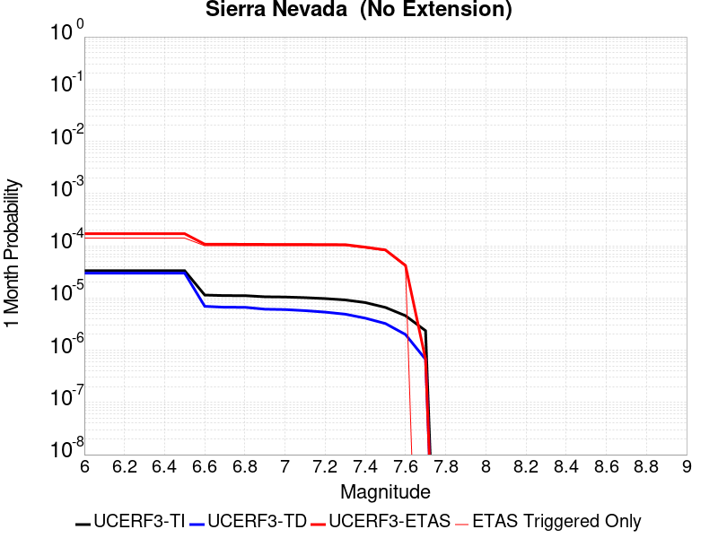 | 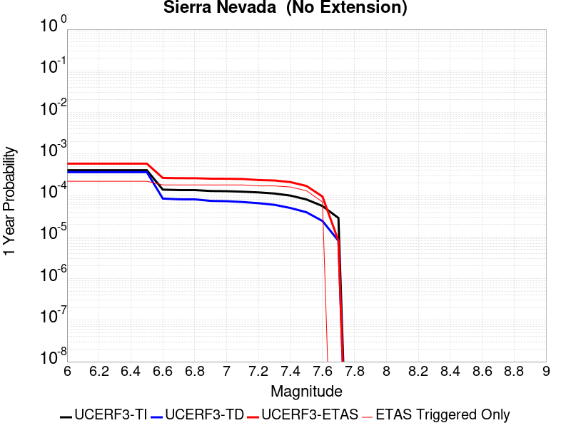 |  |

| Magnitude | 1 wk TI Prob | 1 wk TD Prob | 1 wk ETAS Prob | 1 wk ETAS/TD Gain | 1 wk ETAS Triggered Only | 1 mo TI Prob | 1 mo TD Prob | 1 mo ETAS Prob | 1 mo ETAS/TD Gain | 1 mo ETAS Triggered Only | 1 yr TI Prob | 1 yr TD Prob | 1 yr ETAS Prob | 1 yr ETAS/TD Gain | 1 yr ETAS Triggered Only | 10 yr TI Prob | 10 yr TD Prob | 10 yr ETAS Prob | 10 yr ETAS/TD Gain | 10 yr ETAS Triggered Only |
|-----|-----|-----|-----|-----|-----|-----|-----|-----|-----|-----|-----|-----|-----|-----|-----|-----|-----|-----|-----|-----|
| 6.0 | 7.7690465E-6 | 6.976322E-6 | 6.976322E-6 | 1.0 | 0.0 | 3.329549E-5 | 2.9898381E-5 | 1.156775E-4 | 3.8690224 | 8.5781685E-5 | 4.0529718E-4 | 3.6398784E-4 | 5.3548877E-4 | 1.4711721 | 1.7156337E-4 | 0.004045588 | 0.0036374326 | 0.0038511069 | 1.0587431 | 2.1445421E-4 |
| 6.1 | 7.7690465E-6 | 6.976322E-6 | 6.976322E-6 | 1.0 | 0.0 | 3.329549E-5 | 2.9898381E-5 | 1.156775E-4 | 3.8690224 | 8.5781685E-5 | 4.0529718E-4 | 3.6398784E-4 | 5.3548877E-4 | 1.4711721 | 1.7156337E-4 | 0.004045588 | 0.0036374326 | 0.0038511069 | 1.0587431 | 2.1445421E-4 |
| 6.2 | 7.7690465E-6 | 6.976322E-6 | 6.976322E-6 | 1.0 | 0.0 | 3.329549E-5 | 2.9898381E-5 | 1.156775E-4 | 3.8690224 | 8.5781685E-5 | 4.0529718E-4 | 3.6398784E-4 | 5.3548877E-4 | 1.4711721 | 1.7156337E-4 | 0.004045588 | 0.0036374326 | 0.0038511069 | 1.0587431 | 2.1445421E-4 |
| 6.3 | 7.7690465E-6 | 6.976322E-6 | 6.976322E-6 | 1.0 | 0.0 | 3.329549E-5 | 2.9898381E-5 | 1.156775E-4 | 3.8690224 | 8.5781685E-5 | 4.0529718E-4 | 3.6398784E-4 | 5.3548877E-4 | 1.4711721 | 1.7156337E-4 | 0.004045588 | 0.0036374326 | 0.0038511069 | 1.0587431 | 2.1445421E-4 |
| 6.4 | 7.7690465E-6 | 6.976322E-6 | 6.976322E-6 | 1.0 | 0.0 | 3.329549E-5 | 2.9898381E-5 | 1.156775E-4 | 3.8690224 | 8.5781685E-5 | 4.0529718E-4 | 3.6398784E-4 | 5.3548877E-4 | 1.4711721 | 1.7156337E-4 | 0.004045588 | 0.0036374326 | 0.0038511069 | 1.0587431 | 2.1445421E-4 |
| 6.5 | 7.7690465E-6 | 6.976322E-6 | 6.976322E-6 | 1.0 | 0.0 | 3.329549E-5 | 2.9898381E-5 | 1.156775E-4 | 3.8690224 | 8.5781685E-5 | 4.0529718E-4 | 3.6398784E-4 | 5.3548877E-4 | 1.4711721 | 1.7156337E-4 | 0.004045588 | 0.0036374326 | 0.0038511069 | 1.0587431 | 2.1445421E-4 |
| 6.6 | 2.653E-6 | 1.614854E-6 | 1.614854E-6 | 1.0 | 0.0 | 1.136995E-5 | 6.9207845E-6 | 4.981133E-5 | 7.197353 | 4.2890842E-5 | 1.3842035E-4 | 8.425733E-5 | 2.1291901E-4 | 2.5270088 | 1.2867253E-4 | 0.0013833415 | 8.422573E-4 | 0.0010136762 | 1.2035232 | 1.7156337E-4 |
| 6.7 | 2.5902466E-6 | 1.5501876E-6 | 1.5501876E-6 | 1.0 | 0.0 | 1.11010095E-5 | 6.643644E-6 | 4.9534203E-5 | 7.4558783 | 4.2890842E-5 | 1.351464E-4 | 8.0883394E-5 | 2.0954551E-4 | 2.590711 | 1.2867253E-4 | 0.0013506424 | 8.0854254E-4 | 9.799672E-4 | 1.2120168 | 1.7156337E-4 |
| 6.8 | 2.5853892E-6 | 1.5469877E-6 | 1.5469877E-6 | 1.0 | 0.0 | 1.1080193E-5 | 6.629931E-6 | 4.9520488E-5 | 7.4692316 | 4.2890842E-5 | 1.34893E-4 | 8.071645E-5 | 2.0937859E-4 | 2.5940015 | 1.2867253E-4 | 0.0013481114 | 8.068743E-4 | 9.782992E-4 | 1.2124556 | 1.7156337E-4 |
| 6.9 | 2.458257E-6 | 1.4220619E-6 | 1.4220619E-6 | 1.0 | 0.0 | 1.0535345E-5 | 6.094537E-6 | 4.898512E-5 | 8.037545 | 4.2890842E-5 | 1.2826028E-4 | 7.4198484E-5 | 2.0286147E-4 | 2.7340379 | 1.2867253E-4 | 0.0012818627 | 7.4173906E-4 | 9.131752E-4 | 1.2311273 | 1.7156337E-4 |
| 7.0 | 2.4341468E-6 | 1.3990258E-6 | 1.3990258E-6 | 1.0 | 0.0 | 1.0432016E-5 | 5.9958115E-6 | 4.8886395E-5 | 8.153425 | 4.2890842E-5 | 1.270024E-4 | 7.2996576E-5 | 2.0165971E-4 | 2.7625914 | 1.2867253E-4 | 0.0012692984 | 7.297279E-4 | 9.0116606E-4 | 1.2349343 | 1.7156337E-4 |
| 7.1 | 2.3652476E-6 | 1.3339754E-6 | 1.3339754E-6 | 1.0 | 0.0 | 1.0136736E-5 | 5.717025E-6 | 4.8607624E-5 | 8.502258 | 4.2890842E-5 | 1.2340778E-4 | 6.9602575E-5 | 1.9826615E-4 | 2.8485463 | 1.2867253E-4 | 0.0012333926 | 6.9580943E-4 | 8.6725346E-4 | 1.246395 | 1.7156337E-4 |
| 7.2 | 2.272158E-6 | 1.2502821E-6 | 1.2502821E-6 | 1.0 | 0.0 | 9.737784E-6 | 5.3583412E-6 | 4.8248956E-5 | 9.004457 | 4.2890842E-5 | 1.1855107E-4 | 6.5235865E-5 | 1.5101195E-4 | 2.3148608 | 8.5781685E-5 | 0.0011848784 | 6.5216864E-4 | 7.807573E-4 | 1.1971709 | 1.2867253E-4 |
| 7.3 | 2.1382127E-6 | 1.1419703E-6 | 1.1419703E-6 | 1.0 | 0.0 | 9.163737E-6 | 4.8941492E-6 | 4.7784783E-5 | 9.763655 | 4.2890842E-5 | 1.1156279E-4 | 5.958465E-5 | 1.4536122E-4 | 2.439575 | 8.5781685E-5 | 0.001115068 | 5.956879E-4 | 7.242838E-4 | 1.2158779 | 1.2867253E-4 |
| 7.4 | 1.9048055E-6 | 9.575242E-7 | 9.575242E-7 | 1.0 | 0.0 | 8.163426E-6 | 4.1036687E-6 | 4.6994337E-5 | 11.451785 | 4.2890842E-5 | 9.9385186E-5 | 4.996103E-5 | 1.3573843E-4 | 2.716886 | 8.5781685E-5 | 9.934074E-4 | 4.994987E-4 | 6.2810694E-4 | 1.2574747 | 1.2867253E-4 |
| 7.5 | 1.5373403E-6 | 7.560042E-7 | 7.560042E-7 | 1.0 | 0.0 | 6.5885843E-6 | 3.2400142E-6 | 4.6130717E-5 | 14.237814 | 4.2890842E-5 | 8.021306E-5 | 3.9446462E-5 | 1.2522476E-4 | 3.1745498 | 8.5781685E-5 | 8.0184115E-4 | 3.943951E-4 | 4.8014295E-4 | 1.2174162 | 8.5781685E-5 |
| 7.6 | 1.0680322E-6 | 4.6596554E-7 | 4.6596554E-7 | 1.0 | 0.0 | 4.577273E-6 | 1.9969937E-6 | 1.9969937E-6 | 1.0 | 0.0 | 5.5726876E-5 | 2.4313129E-5 | 2.4313129E-5 | 1.0 | 0.0 | 5.5712904E-4 | 2.4310495E-4 | 2.4310495E-4 | 1.0 | 0.0 |
| 7.7 | 5.509146E-7 | 1.5580486E-7 | 1.5580486E-7 | 1.0 | 0.0 | 2.3610605E-6 | 6.677349E-7 | 6.677349E-7 | 1.0 | 0.0 | 2.8745531E-5 | 8.129644E-6 | 8.129644E-6 | 1.0 | 0.0 | 2.8741814E-4 | 8.1293576E-5 | 8.1293576E-5 | 1.0 | 0.0 |

## San Jacinto (San Bernardino)
*[(top)](#table-of-contents)*

| 1 Week | 1 Month | 1 Year | 10 Year |
|-----|-----|-----|-----|
|  | 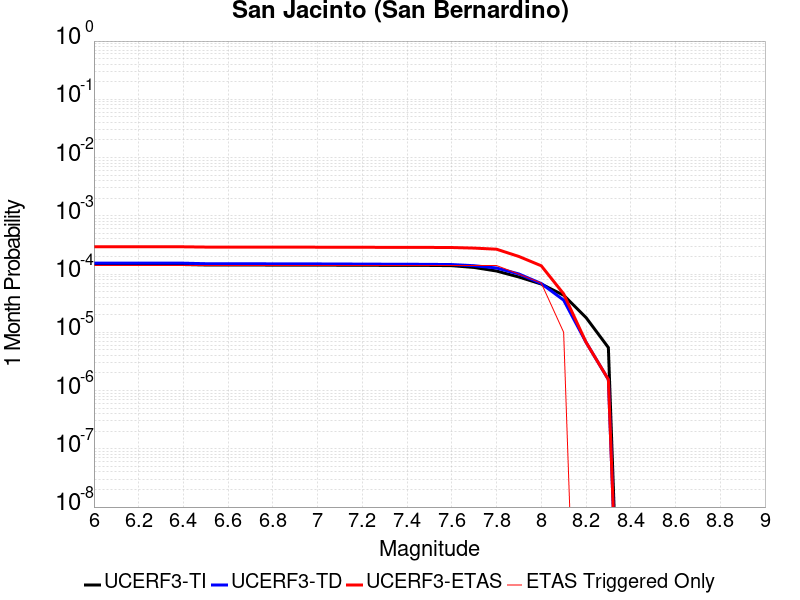 |  |  |

| Magnitude | 1 wk TI Prob | 1 wk TD Prob | 1 wk ETAS Prob | 1 wk ETAS/TD Gain | 1 wk ETAS Triggered Only | 1 mo TI Prob | 1 mo TD Prob | 1 mo ETAS Prob | 1 mo ETAS/TD Gain | 1 mo ETAS Triggered Only | 1 yr TI Prob | 1 yr TD Prob | 1 yr ETAS Prob | 1 yr ETAS/TD Gain | 1 yr ETAS Triggered Only | 10 yr TI Prob | 10 yr TD Prob | 10 yr ETAS Prob | 10 yr ETAS/TD Gain | 10 yr ETAS Triggered Only |
|-----|-----|-----|-----|-----|-----|-----|-----|-----|-----|-----|-----|-----|-----|-----|-----|-----|-----|-----|-----|-----|
| 6.0 | 3.409352E-5 | 3.5986508E-5 | 3.5986508E-5 | 1.0 | 0.0 | 1.461069E-4 | 1.542188E-4 | 1.9710301E-4 | 1.2780739 | 4.2890842E-5 | 0.0017774 | 0.0018759987 | 0.0020472403 | 1.0912802 | 1.7156337E-4 | 0.01763251 | 0.019349935 | 0.01956024 | 1.0108684 | 2.1445421E-4 |
| 6.1 | 3.409352E-5 | 3.5986508E-5 | 3.5986508E-5 | 1.0 | 0.0 | 1.461069E-4 | 1.542188E-4 | 1.9710301E-4 | 1.2780739 | 4.2890842E-5 | 0.0017774 | 0.0018759987 | 0.0020472403 | 1.0912802 | 1.7156337E-4 | 0.01763251 | 0.019349935 | 0.01956024 | 1.0108684 | 2.1445421E-4 |
| 6.2 | 3.409352E-5 | 3.5986508E-5 | 3.5986508E-5 | 1.0 | 0.0 | 1.461069E-4 | 1.542188E-4 | 1.9710301E-4 | 1.2780739 | 4.2890842E-5 | 0.0017774 | 0.0018759987 | 0.0020472403 | 1.0912802 | 1.7156337E-4 | 0.01763251 | 0.019349935 | 0.01956024 | 1.0108684 | 2.1445421E-4 |
| 6.3 | 3.409352E-5 | 3.5986508E-5 | 3.5986508E-5 | 1.0 | 0.0 | 1.461069E-4 | 1.542188E-4 | 1.9710301E-4 | 1.2780739 | 4.2890842E-5 | 0.0017774 | 0.0018759987 | 0.0020472403 | 1.0912802 | 1.7156337E-4 | 0.01763251 | 0.019349935 | 0.01956024 | 1.0108684 | 2.1445421E-4 |
| 6.4 | 3.400795E-5 | 3.5879173E-5 | 3.5879173E-5 | 1.0 | 0.0 | 1.4574021E-4 | 1.5375883E-4 | 1.9664307E-4 | 1.2789059 | 4.2890842E-5 | 0.0017729428 | 0.0018704084 | 0.002041651 | 1.0915536 | 1.7156337E-4 | 0.017588645 | 0.019295016 | 0.019505333 | 1.0109 | 2.1445421E-4 |
| 6.5 | 3.341482E-5 | 3.5139812E-5 | 3.5139812E-5 | 1.0 | 0.0 | 1.4319851E-4 | 1.5059051E-4 | 1.9347489E-4 | 1.2847748 | 4.2890842E-5 | 0.0017420477 | 0.0018318989 | 0.0019603358 | 1.0701113 | 1.2867253E-4 | 0.017284546 | 0.018916558 | 0.019084876 | 1.0088979 | 1.7156337E-4 |
| 6.6 | 3.3364955E-5 | 3.5077028E-5 | 3.5077028E-5 | 1.0 | 0.0 | 1.4298483E-4 | 1.5032147E-4 | 1.9320587E-4 | 1.2852845 | 4.2890842E-5 | 0.0017394501 | 0.001828629 | 0.0019570664 | 1.0702369 | 1.2867253E-4 | 0.017258976 | 0.018884424 | 0.019052748 | 1.0089134 | 1.7156337E-4 |
| 6.7 | 3.335922E-5 | 3.5066805E-5 | 3.5066805E-5 | 1.0 | 0.0 | 1.4296026E-4 | 1.5027766E-4 | 1.9316205E-4 | 1.2853677 | 4.2890842E-5 | 0.0017391514 | 0.0018280965 | 0.0019565336 | 1.0702574 | 1.2867253E-4 | 0.017256035 | 0.018879214 | 0.01904754 | 1.0089159 | 1.7156337E-4 |
| 6.8 | 3.327683E-5 | 3.496087E-5 | 3.496087E-5 | 1.0 | 0.0 | 1.4260718E-4 | 1.498237E-4 | 1.9270812E-4 | 1.2862325 | 4.2890842E-5 | 0.0017348597 | 0.0018225788 | 0.0019510168 | 1.0704705 | 1.2867253E-4 | 0.017213784 | 0.018824987 | 0.01899332 | 1.008942 | 1.7156337E-4 |
| 6.9 | 3.3235785E-5 | 3.4901823E-5 | 3.4901823E-5 | 1.0 | 0.0 | 1.4243131E-4 | 1.4957068E-4 | 1.924551E-4 | 1.2867168 | 4.2890842E-5 | 0.0017327217 | 0.0018195034 | 0.0019479418 | 1.0705898 | 1.2867253E-4 | 0.017192734 | 0.018794855 | 0.018963194 | 1.0089567 | 1.7156337E-4 |
| 7.0 | 3.3197095E-5 | 3.4841752E-5 | 3.4841752E-5 | 1.0 | 0.0 | 1.422655E-4 | 1.4931326E-4 | 1.9219771E-4 | 1.2872112 | 4.2890842E-5 | 0.0017307063 | 0.0018163746 | 0.0019448134 | 1.0707116 | 1.2867253E-4 | 0.017172894 | 0.018764233 | 0.018932577 | 1.0089716 | 1.7156337E-4 |
| 7.1 | 3.3129716E-5 | 3.4721965E-5 | 3.4721965E-5 | 1.0 | 0.0 | 1.4197677E-4 | 1.4879994E-4 | 1.916844E-4 | 1.2882022 | 4.2890842E-5 | 0.0017271966 | 0.0018101353 | 0.001938575 | 1.0709558 | 1.2867253E-4 | 0.017138338 | 0.018703312 | 0.018871667 | 1.0090014 | 1.7156337E-4 |
| 7.2 | 3.3034008E-5 | 3.458941E-5 | 3.458941E-5 | 1.0 | 0.0 | 1.4156665E-4 | 1.4823192E-4 | 1.9111641E-4 | 1.2893066 | 4.2890842E-5 | 0.0017222111 | 0.0018032312 | 0.0019316716 | 1.071228 | 1.2867253E-4 | 0.017089253 | 0.018635705 | 0.018804071 | 1.0090346 | 1.7156337E-4 |
| 7.3 | 3.2956614E-5 | 3.445717E-5 | 3.445717E-5 | 1.0 | 0.0 | 1.4123498E-4 | 1.4766524E-4 | 1.9054975E-4 | 1.2904171 | 4.2890842E-5 | 0.0017181796 | 0.0017963431 | 0.0019247845 | 1.0715016 | 1.2867253E-4 | 0.017049557 | 0.018568452 | 0.01873683 | 1.0090679 | 1.7156337E-4 |
| 7.4 | 3.2915937E-5 | 3.4378863E-5 | 3.4378863E-5 | 1.0 | 0.0 | 1.4106068E-4 | 1.4732967E-4 | 1.902142E-4 | 1.2910787 | 4.2890842E-5 | 0.0017160608 | 0.0017922645 | 0.0019207064 | 1.0716646 | 1.2867253E-4 | 0.017028693 | 0.018528719 | 0.018697103 | 1.0090878 | 1.7156337E-4 |
| 7.5 | 3.281791E-5 | 3.4243778E-5 | 3.4243778E-5 | 1.0 | 0.0 | 1.406406E-4 | 1.4675081E-4 | 1.8963535E-4 | 1.292227 | 4.2890842E-5 | 0.0017109542 | 0.0017852283 | 0.0019136711 | 1.0719476 | 1.2867253E-4 | 0.016978411 | 0.018459605 | 0.018628001 | 1.0091224 | 1.7156337E-4 |
| 7.6 | 3.2521442E-5 | 3.396873E-5 | 3.396873E-5 | 1.0 | 0.0 | 1.3937015E-4 | 1.4557215E-4 | 1.8845676E-4 | 1.2945935 | 4.2890842E-5 | 0.0016955109 | 0.0017709016 | 0.0018993462 | 1.0725306 | 1.2867253E-4 | 0.016826328 | 0.018317232 | 0.018485654 | 1.0091946 | 1.7156337E-4 |
| 7.7 | 3.0287873E-5 | 3.245276E-5 | 3.245276E-5 | 1.0 | 0.0 | 1.297987E-4 | 1.3907586E-4 | 1.8196074E-4 | 1.308356 | 4.2890842E-5 | 0.0015791537 | 0.0016919347 | 0.0018203894 | 1.0759219 | 1.2867253E-4 | 0.01567979 | 0.01752809 | 0.017696647 | 1.0096164 | 1.7156337E-4 |
| 7.8 | 2.6316151E-5 | 2.9663592E-5 | 2.9663592E-5 | 1.0 | 0.0 | 1.1277862E-4 | 1.2712348E-4 | 1.7000888E-4 | 1.3373523 | 4.2890842E-5 | 0.0013722149 | 0.0015466306 | 0.0016751041 | 1.0830667 | 1.2867253E-4 | 0.013637724 | 0.016069634 | 0.01623844 | 1.0105047 | 1.7156337E-4 |
| 7.9 | 2.0761147E-5 | 2.34181E-5 | 2.34181E-5 | 1.0 | 0.0 | 8.897331E-5 | 1.0035944E-4 | 1.4324597E-4 | 1.4273294 | 4.2890842E-5 | 0.0010827117 | 0.0012211921 | 0.0013497075 | 1.1052376 | 1.2867253E-4 | 0.010774517 | 0.012793174 | 0.0129625425 | 1.013239 | 1.7156337E-4 |
| 8.0 | 1.5738568E-5 | 1.6033575E-5 | 1.6033575E-5 | 1.0 | 0.0 | 6.744926E-5 | 6.871352E-5 | 1.1160141E-4 | 1.6241552 | 4.2890842E-5 | 8.2088535E-4 | 8.3626667E-4 | 9.6483156E-4 | 1.1537367 | 1.2867253E-4 | 0.008178596 | 0.008865921 | 0.009035963 | 1.0191793 | 1.7156337E-4 |
| 8.1 | 1.0105832E-5 | 8.3304985E-6 | 8.3304985E-6 | 1.0 | 0.0 | 4.3309992E-5 | 3.570165E-5 | 3.570165E-5 | 1.0 | 0.0 | 5.2717153E-4 | 4.345814E-4 | 4.774536E-4 | 1.0986518 | 4.2890842E-5 | 0.005259227 | 0.004677232 | 0.0047199223 | 1.0091273 | 4.2890842E-5 |
| 8.2 | 4.189207E-6 | 1.5784357E-6 | 1.5784357E-6 | 1.0 | 0.0 | 1.7953622E-5 | 6.7647065E-6 | 6.7647065E-6 | 1.0 | 0.0 | 2.1856341E-4 | 8.235722E-5 | 8.235722E-5 | 1.0 | 0.0 | 0.0021834858 | 9.565867E-4 | 9.565867E-4 | 1.0 | 0.0 |
| 8.3 | 1.2758221E-6 | 3.6149942E-7 | 3.6149942E-7 | 1.0 | 0.0 | 5.4677976E-6 | 1.5492824E-6 | 1.5492824E-6 | 1.0 | 0.0 | 6.65684E-5 | 1.8862354E-5 | 1.8862354E-5 | 1.0 | 0.0 | 6.6548464E-4 | 2.2751294E-4 | 2.2751294E-4 | 1.0 | 0.0 |

## Brawley (Seismic Zone) alt 1
*[(top)](#table-of-contents)*

| 1 Week | 1 Month | 1 Year | 10 Year |
|-----|-----|-----|-----|
| 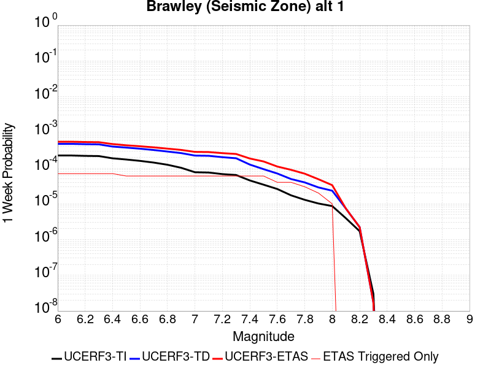 |  |  |  |

| Magnitude | 1 wk TI Prob | 1 wk TD Prob | 1 wk ETAS Prob | 1 wk ETAS/TD Gain | 1 wk ETAS Triggered Only | 1 mo TI Prob | 1 mo TD Prob | 1 mo ETAS Prob | 1 mo ETAS/TD Gain | 1 mo ETAS Triggered Only | 1 yr TI Prob | 1 yr TD Prob | 1 yr ETAS Prob | 1 yr ETAS/TD Gain | 1 yr ETAS Triggered Only | 10 yr TI Prob | 10 yr TD Prob | 10 yr ETAS Prob | 10 yr ETAS/TD Gain | 10 yr ETAS Triggered Only |
|-----|-----|-----|-----|-----|-----|-----|-----|-----|-----|-----|-----|-----|-----|-----|-----|-----|-----|-----|-----|-----|
| 6.0 | 2.2521618E-4 | 4.7632487E-4 | 5.620657E-4 | 1.180005 | 8.5781685E-5 | 9.6485513E-4 | 0.0020398323 | 0.002125439 | 1.0419675 | 8.5781685E-5 | 0.011683988 | 0.024546238 | 0.024713589 | 1.0068178 | 1.7156337E-4 | 0.11088423 | 0.21350002 | 0.21366869 | 1.00079 | 2.1445421E-4 |
| 6.1 | 2.2521618E-4 | 4.7632487E-4 | 5.620657E-4 | 1.180005 | 8.5781685E-5 | 9.6485513E-4 | 0.0020398323 | 0.002125439 | 1.0419675 | 8.5781685E-5 | 0.011683988 | 0.024546238 | 0.024713589 | 1.0068178 | 1.7156337E-4 | 0.11088423 | 0.21350002 | 0.21366869 | 1.00079 | 2.1445421E-4 |
| 6.2 | 2.198148E-4 | 4.6717093E-4 | 5.5291253E-4 | 1.1835337 | 8.5781685E-5 | 9.417233E-4 | 0.0020006616 | 0.0020862715 | 1.0427909 | 8.5781685E-5 | 0.011405343 | 0.024080504 | 0.024247935 | 1.006953 | 1.7156337E-4 | 0.10837428 | 0.20993657 | 0.210106 | 1.000807 | 2.1445421E-4 |
| 6.3 | 2.1704129E-4 | 4.615278E-4 | 5.472699E-4 | 1.1857789 | 8.5781685E-5 | 9.298453E-4 | 0.0019765133 | 0.0020621256 | 1.0433147 | 8.5781685E-5 | 0.011262234 | 0.02379366 | 0.023961142 | 1.007039 | 1.7156337E-4 | 0.107082725 | 0.20782755 | 0.20799743 | 1.0008174 | 2.1445421E-4 |
| 6.4 | 1.876142E-4 | 4.00449E-4 | 4.8619634E-4 | 1.214128 | 8.5781685E-5 | 8.038131E-4 | 0.0017150956 | 0.0018007301 | 1.0499299 | 8.5781685E-5 | 0.00974259 | 0.020680401 | 0.020848416 | 1.0081244 | 1.7156337E-4 | 0.093263686 | 0.18457815 | 0.18475303 | 1.0009474 | 2.1445421E-4 |
| 6.5 | 1.7390939E-4 | 3.7477075E-4 | 4.605203E-4 | 1.2288053 | 8.5781685E-5 | 7.45113E-4 | 0.0016051838 | 0.0016908279 | 1.0533546 | 8.5781685E-5 | 0.009034078 | 0.019368723 | 0.019536963 | 1.0086862 | 1.7156337E-4 | 0.086755216 | 0.17440031 | 0.17457737 | 1.0010152 | 2.1445421E-4 |
| 6.6 | 1.591791E-4 | 3.4891962E-4 | 4.3467138E-4 | 1.2457637 | 8.5781685E-5 | 6.8201777E-4 | 0.0014945229 | 0.0015801764 | 1.0573115 | 8.5781685E-5 | 0.008271996 | 0.018045569 | 0.018214038 | 1.0093356 | 1.7156337E-4 | 0.07970774 | 0.16380852 | 0.16398785 | 1.0010947 | 2.1445421E-4 |
| 6.7 | 1.4268003E-4 | 3.20582E-4 | 4.0633618E-4 | 1.2674953 | 8.5781685E-5 | 6.1134255E-4 | 0.0013732077 | 0.0014588715 | 1.0623823 | 8.5781685E-5 | 0.007417723 | 0.016592601 | 0.016761318 | 1.0101682 | 1.7156337E-4 | 0.07174956 | 0.15193306 | 0.15211494 | 1.0011971 | 2.1445421E-4 |
| 6.8 | 1.239713E-4 | 2.9053655E-4 | 3.7629332E-4 | 1.2951669 | 8.5781685E-5 | 5.3119735E-4 | 0.0012445687 | 0.0013302437 | 1.0688391 | 8.5781685E-5 | 0.0064481674 | 0.015048777 | 0.015217759 | 1.0112289 | 1.7156337E-4 | 0.06264243 | 0.13837762 | 0.13856241 | 1.0013353 | 2.1445421E-4 |
| 6.9 | 1.0180238E-4 | 2.625439E-4 | 3.4830306E-4 | 1.3266469 | 8.5781685E-5 | 4.3622297E-4 | 0.0011247073 | 0.0012103925 | 1.0761845 | 8.5781685E-5 | 0.005298089 | 0.013608336 | 0.013777564 | 1.0124357 | 1.7156337E-4 | 0.05173543 | 0.124961674 | 0.12514932 | 1.0015017 | 2.1445421E-4 |
| 7.0 | 7.6619996E-5 | 2.23993E-4 | 3.0975547E-4 | 1.3828801 | 8.5781685E-5 | 3.283301E-4 | 9.5962E-4 | 0.0010453194 | 1.0893055 | 8.5781685E-5 | 0.0039900932 | 0.011621496 | 0.011791065 | 1.014591 | 1.7156337E-4 | 0.039192066 | 0.107266866 | 0.107458316 | 1.0017848 | 2.1445421E-4 |
| 7.1 | 7.5127435E-5 | 2.2082464E-4 | 3.0658738E-4 | 1.3883749 | 8.5781685E-5 | 3.2193496E-4 | 9.4605127E-4 | 0.0010317517 | 1.0905876 | 8.5781685E-5 | 0.0039125155 | 0.011458045 | 0.011627642 | 1.0148016 | 1.7156337E-4 | 0.038443442 | 0.10583085 | 0.106022604 | 1.001812 | 2.1445421E-4 |
| 7.2 | 6.788582E-5 | 2.0210193E-4 | 2.8786628E-4 | 1.4243618 | 8.5781685E-5 | 2.9090676E-4 | 8.6586666E-4 | 9.5157407E-4 | 1.0989845 | 8.5781685E-5 | 0.0035360386 | 0.0104916105 | 0.010661374 | 1.0161809 | 1.7156337E-4 | 0.034803 | 0.09750131 | 0.09769486 | 1.0019851 | 2.1445421E-4 |
| 7.3 | 6.399602E-5 | 1.8841137E-4 | 2.7417688E-4 | 1.4552035 | 8.5781685E-5 | 2.7423984E-4 | 8.072303E-4 | 8.929428E-4 | 1.1061809 | 8.5781685E-5 | 0.0033337586 | 0.009784332 | 0.009954216 | 1.017363 | 1.7156337E-4 | 0.03284188 | 0.09139617 | 0.091591015 | 1.0021319 | 2.1445421E-4 |
| 7.4 | 4.506759E-5 | 1.2529209E-4 | 2.1106303E-4 | 1.6845678 | 8.5781685E-5 | 1.9313251E-4 | 5.368565E-4 | 6.225921E-4 | 1.1596993 | 8.5781685E-5 | 0.0023488526 | 0.0065168133 | 0.006687259 | 1.0261548 | 1.7156337E-4 | 0.023241805 | 0.062363707 | 0.06256478 | 1.0032243 | 2.1445421E-4 |
| 7.5 | 3.43289E-5 | 9.33541E-5 | 1.7912778E-4 | 1.9187993 | 8.5781685E-5 | 1.4711556E-4 | 4.00028E-4 | 4.8577535E-4 | 1.2143534 | 8.5781685E-5 | 0.0017896603 | 0.0048595266 | 0.005030256 | 1.035133 | 1.7156337E-4 | 0.01775316 | 0.04705519 | 0.047259554 | 1.004343 | 2.1445421E-4 |
| 7.6 | 2.5980507E-5 | 7.053101E-5 | 7.053101E-5 | 1.0 | 0.0 | 1.1134028E-4 | 3.0224086E-4 | 3.0224086E-4 | 1.0 | 0.0 | 0.001354725 | 0.003673598 | 0.0037163312 | 1.0116326 | 4.2890842E-5 | 0.013464959 | 0.035840835 | 0.03592354 | 1.0023077 | 8.5781685E-5 |
| 7.7 | 1.7292105E-5 | 4.9407296E-5 | 4.9407296E-5 | 1.0 | 0.0 | 7.4106916E-5 | 2.117284E-4 | 2.117284E-4 | 1.0 | 0.0 | 9.018782E-4 | 0.0025747516 | 0.0026175322 | 1.0166154 | 4.2890842E-5 | 0.008982267 | 0.025290398 | 0.02537401 | 1.003306 | 8.5781685E-5 |
| 7.8 | 1.2927471E-5 | 3.9693266E-5 | 3.9693266E-5 | 1.0 | 0.0 | 5.5402274E-5 | 1.7010293E-4 | 1.7010293E-4 | 1.0 | 0.0 | 6.743139E-4 | 0.0020690386 | 0.0021118408 | 1.020687 | 4.2890842E-5 | 0.0067227143 | 0.020431727 | 0.020515757 | 1.0041127 | 8.5781685E-5 |
| 7.9 | 1.0200774E-5 | 2.874569E-5 | 2.874569E-5 | 1.0 | 0.0 | 4.371687E-5 | 1.2319001E-4 | 1.2319001E-4 | 1.0 | 0.0 | 5.321229E-4 | 0.0014988075 | 0.0014988075 | 1.0 | 0.0 | 0.005308505 | 0.014991644 | 0.015033891 | 1.0028181 | 4.2890842E-5 |
| 8.0 | 8.650396E-6 | 2.3277367E-5 | 2.3277367E-5 | 1.0 | 0.0 | 3.70726E-5 | 9.975634E-5 | 9.975634E-5 | 1.0 | 0.0 | 4.5126543E-4 | 0.0012138576 | 0.0012138576 | 1.0 | 0.0 | 0.0045035016 | 0.012211097 | 0.012211097 | 1.0 | 0.0 |
| 8.1 | 3.9368224E-6 | 7.3279825E-6 | 7.3279825E-6 | 1.0 | 0.0 | 1.6871985E-5 | 3.140526E-5 | 3.140526E-5 | 1.0 | 0.0 | 2.0539707E-4 | 3.8229208E-4 | 3.8229208E-4 | 1.0 | 0.0 | 0.0020520731 | 0.004001185 | 0.004001185 | 1.0 | 0.0 |
| 8.2 | 1.7101195E-6 | 2.217876E-6 | 2.217876E-6 | 1.0 | 0.0 | 7.329063E-6 | 9.505149E-6 | 9.505149E-6 | 1.0 | 0.0 | 8.922769E-5 | 1.1571907E-4 | 1.1571907E-4 | 1.0 | 0.0 | 8.9191867E-4 | 0.0012666774 | 0.0012666774 | 1.0 | 0.0 |
| 8.3 | 3.0346666E-8 | 1.721586E-8 | 1.721586E-8 | 1.0 | 0.0 | 1.3005713E-7 | 7.378226E-8 | 7.378226E-8 | 1.0 | 0.0 | 1.5834444E-6 | 8.9829894E-7 | 8.9829894E-7 | 1.0 | 0.0 | 1.5834332E-5 | 9.367729E-6 | 9.367729E-6 | 1.0 | 0.0 |

## Cleghorn
*[(top)](#table-of-contents)*

| 1 Week | 1 Month | 1 Year | 10 Year |
|-----|-----|-----|-----|
|  |  |  | 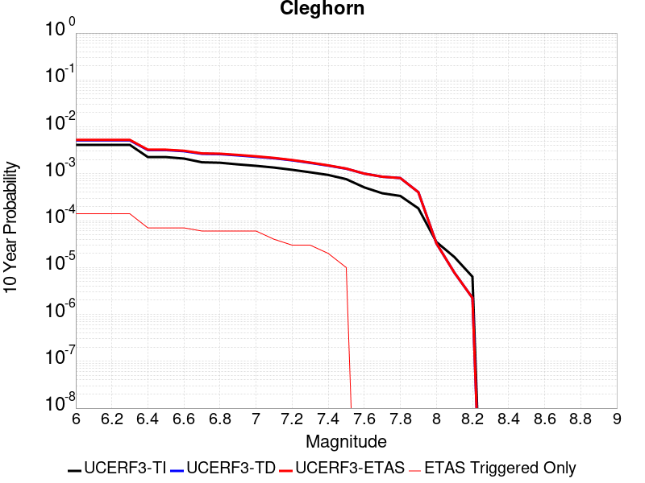 |

| Magnitude | 1 wk TI Prob | 1 wk TD Prob | 1 wk ETAS Prob | 1 wk ETAS/TD Gain | 1 wk ETAS Triggered Only | 1 mo TI Prob | 1 mo TD Prob | 1 mo ETAS Prob | 1 mo ETAS/TD Gain | 1 mo ETAS Triggered Only | 1 yr TI Prob | 1 yr TD Prob | 1 yr ETAS Prob | 1 yr ETAS/TD Gain | 1 yr ETAS Triggered Only | 10 yr TI Prob | 10 yr TD Prob | 10 yr ETAS Prob | 10 yr ETAS/TD Gain | 10 yr ETAS Triggered Only |
|-----|-----|-----|-----|-----|-----|-----|-----|-----|-----|-----|-----|-----|-----|-----|-----|-----|-----|-----|-----|-----|
| 6.0 | 7.9267165E-6 | 9.831582E-6 | 5.2722004E-5 | 5.3625145 | 4.2890842E-5 | 3.39712E-5 | 4.2134732E-5 | 8.502377E-5 | 2.0179021 | 4.2890842E-5 | 4.1352084E-4 | 5.128803E-4 | 5.9861795E-4 | 1.167169 | 8.5781685E-5 | 0.004127522 | 0.0051320773 | 0.0053454307 | 1.0415726 | 2.1445421E-4 |
| 6.1 | 7.9267165E-6 | 9.831582E-6 | 5.2722004E-5 | 5.3625145 | 4.2890842E-5 | 3.39712E-5 | 4.2134732E-5 | 8.502377E-5 | 2.0179021 | 4.2890842E-5 | 4.1352084E-4 | 5.128803E-4 | 5.9861795E-4 | 1.167169 | 8.5781685E-5 | 0.004127522 | 0.0051320773 | 0.0053454307 | 1.0415726 | 2.1445421E-4 |
| 6.2 | 7.9267165E-6 | 9.831582E-6 | 5.2722004E-5 | 5.3625145 | 4.2890842E-5 | 3.39712E-5 | 4.2134732E-5 | 8.502377E-5 | 2.0179021 | 4.2890842E-5 | 4.1352084E-4 | 5.128803E-4 | 5.9861795E-4 | 1.167169 | 8.5781685E-5 | 0.004127522 | 0.0051320773 | 0.0053454307 | 1.0415726 | 2.1445421E-4 |
| 6.3 | 7.9267165E-6 | 9.831582E-6 | 5.2722004E-5 | 5.3625145 | 4.2890842E-5 | 3.39712E-5 | 4.2134732E-5 | 8.502377E-5 | 2.0179021 | 4.2890842E-5 | 4.1352084E-4 | 5.128803E-4 | 5.9861795E-4 | 1.167169 | 8.5781685E-5 | 0.004127522 | 0.0051320773 | 0.0053454307 | 1.0415726 | 2.1445421E-4 |
| 6.4 | 4.3445207E-6 | 6.0914435E-6 | 6.0914435E-6 | 1.0 | 0.0 | 1.8619241E-5 | 2.610593E-5 | 2.610593E-5 | 1.0 | 0.0 | 2.2666567E-4 | 3.1779436E-4 | 3.6067158E-4 | 1.1349212 | 4.2890842E-5 | 0.0022643462 | 0.0031875873 | 0.0033158497 | 1.040238 | 1.2867253E-4 |
| 6.5 | 4.3445207E-6 | 6.0914435E-6 | 6.0914435E-6 | 1.0 | 0.0 | 1.8619241E-5 | 2.610593E-5 | 2.610593E-5 | 1.0 | 0.0 | 2.2666567E-4 | 3.1779436E-4 | 3.6067158E-4 | 1.1349212 | 4.2890842E-5 | 0.0022643462 | 0.0031875873 | 0.0033158497 | 1.040238 | 1.2867253E-4 |
| 6.6 | 4.040109E-6 | 5.773851E-6 | 5.773851E-6 | 1.0 | 0.0 | 1.7314638E-5 | 2.4744846E-5 | 2.4744846E-5 | 1.0 | 0.0 | 2.1078532E-4 | 3.012278E-4 | 3.4410573E-4 | 1.1423439 | 4.2890842E-5 | 0.002105855 | 0.003022377 | 0.0031506605 | 1.0424446 | 1.2867253E-4 |
| 6.7 | 3.3632055E-6 | 5.067348E-6 | 5.067348E-6 | 1.0 | 0.0 | 1.4413658E-5 | 2.1717027E-5 | 2.1717027E-5 | 1.0 | 0.0 | 1.7547216E-4 | 2.6437303E-4 | 3.0725254E-4 | 1.1621932 | 4.2890842E-5 | 0.0017533366 | 0.0026547113 | 0.0027830421 | 1.0483408 | 1.2867253E-4 |
| 6.8 | 3.2902772E-6 | 4.9892556E-6 | 4.9892556E-6 | 1.0 | 0.0 | 1.4101111E-5 | 2.1382351E-5 | 2.1382351E-5 | 1.0 | 0.0 | 1.716675E-4 | 2.6029933E-4 | 3.0317903E-4 | 1.1647322 | 4.2890842E-5 | 0.0017153495 | 0.0026140702 | 0.0027424062 | 1.0490944 | 1.2867253E-4 |
| 6.9 | 3.031547E-6 | 4.6910186E-6 | 4.6910186E-6 | 1.0 | 0.0 | 1.299228E-5 | 2.0104211E-5 | 2.0104211E-5 | 1.0 | 0.0 | 1.5816953E-4 | 2.4474156E-4 | 2.876219E-4 | 1.1752067 | 4.2890842E-5 | 0.00158057 | 0.0024588439 | 0.0025872 | 1.0522019 | 1.2867253E-4 |
| 7.0 | 2.8259715E-6 | 4.3705895E-6 | 4.3705895E-6 | 1.0 | 0.0 | 1.211125E-5 | 1.8730963E-5 | 1.8730963E-5 | 1.0 | 0.0 | 1.4744449E-4 | 2.2802586E-4 | 2.7090692E-4 | 1.1880535 | 4.2890842E-5 | 0.001473467 | 0.0022920412 | 0.0024204187 | 1.0560101 | 1.2867253E-4 |
| 7.1 | 2.5962665E-6 | 4.0658106E-6 | 4.0658106E-6 | 1.0 | 0.0 | 1.1126809E-5 | 1.7424789E-5 | 1.7424789E-5 | 1.0 | 0.0 | 1.3546048E-4 | 2.1212637E-4 | 2.550081E-4 | 1.2021519 | 4.2890842E-5 | 0.0013537793 | 0.002133366 | 0.0022189647 | 1.0401238 | 8.5781685E-5 |
| 7.2 | 2.3247253E-6 | 3.6763672E-6 | 3.6763672E-6 | 1.0 | 0.0 | 9.96307E-6 | 1.5755764E-5 | 1.5755764E-5 | 1.0 | 0.0 | 1.21293626E-4 | 1.9180974E-4 | 2.3469236E-4 | 1.2235686 | 4.2890842E-5 | 0.0012122744 | 0.0019305905 | 0.0020162065 | 1.044347 | 8.5781685E-5 |
| 7.3 | 2.056928E-6 | 3.2350938E-6 | 3.2350938E-6 | 1.0 | 0.0 | 8.815376E-6 | 1.3864615E-5 | 1.3864615E-5 | 1.0 | 0.0 | 1.0732192E-4 | 1.6878877E-4 | 2.1167236E-4 | 1.2540667 | 4.2890842E-5 | 0.001072701 | 0.0017008206 | 0.0017864564 | 1.0503497 | 8.5781685E-5 |
| 7.4 | 1.8055999E-6 | 2.8255042E-6 | 2.8255042E-6 | 1.0 | 0.0 | 7.738263E-6 | 1.2109249E-5 | 1.2109249E-5 | 1.0 | 0.0 | 9.4209274E-5 | 1.4742027E-4 | 1.9030478E-4 | 1.2908998 | 4.2890842E-5 | 9.4169343E-4 | 0.0014875771 | 0.0015304042 | 1.0287898 | 4.2890842E-5 |
| 7.5 | 1.4683443E-6 | 2.4247483E-6 | 2.4247483E-6 | 1.0 | 0.0 | 6.292889E-6 | 1.0391738E-5 | 1.0391738E-5 | 1.0 | 0.0 | 7.661323E-5 | 1.2651215E-4 | 1.6939758E-4 | 1.3389826 | 4.2890842E-5 | 7.658682E-4 | 0.0012787961 | 0.0013216322 | 1.0334971 | 4.2890842E-5 |
| 7.6 | 9.804088E-7 | 1.900266E-6 | 1.900266E-6 | 1.0 | 0.0 | 4.201745E-6 | 8.143972E-6 | 8.143972E-6 | 1.0 | 0.0 | 5.1155046E-5 | 9.91484E-5 | 9.91484E-5 | 1.0 | 0.0 | 5.114327E-4 | 0.001005471 | 0.001005471 | 1.0 | 0.0 |
| 7.7 | 7.3434086E-7 | 1.6284146E-6 | 1.6284146E-6 | 1.0 | 0.0 | 3.1471714E-6 | 6.978901E-6 | 6.978901E-6 | 1.0 | 0.0 | 3.831614E-5 | 8.4964835E-5 | 8.4964835E-5 | 1.0 | 0.0 | 3.8309532E-4 | 8.6378685E-4 | 8.6378685E-4 | 1.0 | 0.0 |
| 7.8 | 6.434184E-7 | 1.5220047E-6 | 1.5220047E-6 | 1.0 | 0.0 | 2.7575045E-6 | 6.5228614E-6 | 6.5228614E-6 | 1.0 | 0.0 | 3.35721E-5 | 7.941297E-5 | 7.941297E-5 | 1.0 | 0.0 | 3.3567028E-4 | 8.079678E-4 | 8.079678E-4 | 1.0 | 0.0 |
| 7.9 | 3.4943926E-7 | 7.574459E-7 | 7.574459E-7 | 1.0 | 0.0 | 1.497596E-6 | 3.2461926E-6 | 3.2461926E-6 | 1.0 | 0.0 | 1.8233079E-5 | 3.952169E-5 | 3.952169E-5 | 1.0 | 0.0 | 1.8231584E-4 | 4.040099E-4 | 4.040099E-4 | 1.0 | 0.0 |
| 8.0 | 6.717524E-8 | 5.838828E-8 | 5.838828E-8 | 1.0 | 0.0 | 2.8789387E-7 | 2.5023547E-7 | 2.5023547E-7 | 1.0 | 0.0 | 3.505102E-6 | 3.0466126E-6 | 3.0466126E-6 | 1.0 | 0.0 | 3.5050467E-5 | 3.273506E-5 | 3.273506E-5 | 1.0 | 0.0 |
| 8.1 | 3.1984914E-8 | 1.2956093E-8 | 1.2956093E-8 | 1.0 | 0.0 | 1.370782E-7 | 5.552611E-8 | 5.552611E-8 | 1.0 | 0.0 | 1.6689258E-6 | 6.760302E-7 | 6.760302E-7 | 1.0 | 0.0 | 1.6689133E-5 | 7.74454E-6 | 7.74454E-6 | 1.0 | 0.0 |
| 8.2 | 1.21887656E-8 | 3.6495305E-9 | 3.6495305E-9 | 1.0 | 0.0 | 5.2237567E-8 | 1.5640845E-8 | 1.5640845E-8 | 1.0 | 0.0 | 6.359922E-7 | 1.9042727E-7 | 1.9042727E-7 | 1.0 | 0.0 | 6.3599036E-6 | 2.2470974E-6 | 2.2470974E-6 | 1.0 | 0.0 |

## Death Valley (Fish Lake Valley)
*[(top)](#table-of-contents)*

| 1 Week | 1 Month | 1 Year | 10 Year |
|-----|-----|-----|-----|
|  |  |  |  |

| Magnitude | 1 wk TI Prob | 1 wk TD Prob | 1 wk ETAS Prob | 1 wk ETAS/TD Gain | 1 wk ETAS Triggered Only | 1 mo TI Prob | 1 mo TD Prob | 1 mo ETAS Prob | 1 mo ETAS/TD Gain | 1 mo ETAS Triggered Only | 1 yr TI Prob | 1 yr TD Prob | 1 yr ETAS Prob | 1 yr ETAS/TD Gain | 1 yr ETAS Triggered Only | 10 yr TI Prob | 10 yr TD Prob | 10 yr ETAS Prob | 10 yr ETAS/TD Gain | 10 yr ETAS Triggered Only |
|-----|-----|-----|-----|-----|-----|-----|-----|-----|-----|-----|-----|-----|-----|-----|-----|-----|-----|-----|-----|-----|
| 6.0 | 3.872328E-5 | 4.7267473E-5 | 4.7267473E-5 | 1.0 | 0.0 | 1.6594635E-4 | 2.0256084E-4 | 2.45443E-4 | 1.2117001 | 4.2890842E-5 | 0.0020185246 | 0.002463534 | 0.0025491044 | 1.0347348 | 8.5781685E-5 | 0.02000288 | 0.024388181 | 0.024597405 | 1.0085789 | 2.1445421E-4 |
| 6.1 | 3.872328E-5 | 4.7267473E-5 | 4.7267473E-5 | 1.0 | 0.0 | 1.6594635E-4 | 2.0256084E-4 | 2.45443E-4 | 1.2117001 | 4.2890842E-5 | 0.0020185246 | 0.002463534 | 0.0025491044 | 1.0347348 | 8.5781685E-5 | 0.02000288 | 0.024388181 | 0.024597405 | 1.0085789 | 2.1445421E-4 |
| 6.2 | 3.872328E-5 | 4.7267473E-5 | 4.7267473E-5 | 1.0 | 0.0 | 1.6594635E-4 | 2.0256084E-4 | 2.45443E-4 | 1.2117001 | 4.2890842E-5 | 0.0020185246 | 0.002463534 | 0.0025491044 | 1.0347348 | 8.5781685E-5 | 0.02000288 | 0.024388181 | 0.024597405 | 1.0085789 | 2.1445421E-4 |
| 6.3 | 2.8356371E-5 | 3.3609853E-5 | 3.3609853E-5 | 1.0 | 0.0 | 1.2152165E-4 | 1.4403471E-4 | 1.8691938E-4 | 1.2977384 | 4.2890842E-5 | 0.0014785219 | 0.0017522911 | 0.0018379225 | 1.0488682 | 8.5781685E-5 | 0.014687235 | 0.017391782 | 0.017602507 | 1.0121163 | 2.1445421E-4 |
| 6.4 | 2.8356371E-5 | 3.3609853E-5 | 3.3609853E-5 | 1.0 | 0.0 | 1.2152165E-4 | 1.4403471E-4 | 1.8691938E-4 | 1.2977384 | 4.2890842E-5 | 0.0014785219 | 0.0017522911 | 0.0018379225 | 1.0488682 | 8.5781685E-5 | 0.014687235 | 0.017391782 | 0.017602507 | 1.0121163 | 2.1445421E-4 |
| 6.5 | 2.4448687E-5 | 2.8607552E-5 | 2.8607552E-5 | 1.0 | 0.0 | 1.0477588E-4 | 1.2259831E-4 | 1.654839E-4 | 1.3498056 | 4.2890842E-5 | 0.0012748998 | 0.0014916632 | 0.0015773168 | 1.0574217 | 8.5781685E-5 | 0.012676105 | 0.014821377 | 0.015032652 | 1.0142548 | 2.1445421E-4 |
| 6.6 | 2.1298161E-5 | 2.4660083E-5 | 2.4660083E-5 | 1.0 | 0.0 | 9.127464E-5 | 1.0568198E-4 | 1.4856829E-4 | 1.4058053 | 4.2890842E-5 | 0.0011107022 | 0.0012859525 | 0.001371624 | 1.066621 | 8.5781685E-5 | 0.011051672 | 0.012788526 | 0.013000237 | 1.0165548 | 2.1445421E-4 |
| 6.7 | 1.8959729E-5 | 2.1781025E-5 | 2.1781025E-5 | 1.0 | 0.0 | 8.125345E-5 | 9.334405E-5 | 1.362309E-4 | 1.459449 | 4.2890842E-5 | 9.888117E-4 | 0.001135897 | 0.0012215812 | 1.0754331 | 8.5781685E-5 | 0.009844234 | 0.01130357 | 0.0115156 | 1.0187578 | 2.1445421E-4 |
| 6.8 | 1.6691629E-5 | 1.9018353E-5 | 1.9018353E-5 | 1.0 | 0.0 | 7.153359E-5 | 8.150477E-5 | 1.2439211E-4 | 1.5261943 | 4.2890842E-5 | 8.7057345E-4 | 9.918857E-4 | 0.0010775822 | 1.0863976 | 8.5781685E-5 | 0.008671708 | 0.009876343 | 0.010088679 | 1.0214995 | 2.1445421E-4 |
| 6.9 | 1.450505E-5 | 1.638954E-5 | 1.638954E-5 | 1.0 | 0.0 | 6.216302E-5 | 7.0239046E-5 | 1.1312687E-4 | 1.6105982 | 4.2890842E-5 | 7.5657194E-4 | 8.5483363E-4 | 9.4054197E-4 | 1.1002632 | 8.5781685E-5 | 0.007540013 | 0.008516385 | 0.008729014 | 1.024967 | 2.1445421E-4 |
| 7.0 | 1.2940855E-5 | 1.4537972E-5 | 1.4537972E-5 | 1.0 | 0.0 | 5.545963E-5 | 6.230414E-5 | 1.0519231E-4 | 1.688368 | 4.2890842E-5 | 6.750118E-4 | 7.5829466E-4 | 8.440113E-4 | 1.1130387 | 8.5781685E-5 | 0.006729651 | 0.0075576897 | 0.0077705234 | 1.0281612 | 2.1445421E-4 |
| 7.1 | 1.2544658E-5 | 1.4078208E-5 | 1.4078208E-5 | 1.0 | 0.0 | 5.3761712E-5 | 6.0333812E-5 | 1.0322207E-4 | 1.7108494 | 4.2890842E-5 | 6.5435225E-4 | 7.343222E-4 | 8.200409E-4 | 1.1167318 | 8.5781685E-5 | 0.006524288 | 0.007319551 | 0.0075324355 | 1.0290843 | 2.1445421E-4 |
| 7.2 | 1.2489416E-5 | 1.4015674E-5 | 1.4015674E-5 | 1.0 | 0.0 | 5.3524967E-5 | 6.0065824E-5 | 1.0295409E-4 | 1.7140211 | 4.2890842E-5 | 6.514716E-4 | 7.310616E-4 | 8.167806E-4 | 1.1172527 | 8.5781685E-5 | 0.006495651 | 0.0072871596 | 0.007500051 | 1.0292146 | 2.1445421E-4 |
| 7.3 | 1.2368307E-5 | 1.3879812E-5 | 1.3879812E-5 | 1.0 | 0.0 | 5.3005948E-5 | 5.9483587E-5 | 1.0237188E-4 | 1.7210106 | 4.2890842E-5 | 6.451563E-4 | 7.2397763E-4 | 8.096972E-4 | 1.1184009 | 8.5781685E-5 | 0.0064328653 | 0.007216782 | 0.0074296882 | 1.0295016 | 2.1445421E-4 |
| 7.4 | 1.2161707E-5 | 1.36478675E-5 | 1.36478675E-5 | 1.0 | 0.0 | 5.212056E-5 | 5.8489582E-5 | 1.0137792E-4 | 1.7332644 | 4.2890842E-5 | 6.3438306E-4 | 7.118836E-4 | 7.976042E-4 | 1.1204138 | 8.5781685E-5 | 0.006325751 | 0.0070966207 | 0.0073095527 | 1.0300047 | 2.1445421E-4 |
| 7.5 | 1.1707948E-5 | 1.3145515E-5 | 1.3145515E-5 | 1.0 | 0.0 | 5.0175953E-5 | 5.6336736E-5 | 9.9225166E-5 | 1.761287 | 4.2890842E-5 | 6.10721E-4 | 6.856895E-4 | 7.7141233E-4 | 1.125017 | 8.5781685E-5 | 0.0060904534 | 0.006836321 | 0.0070493096 | 1.0311553 | 2.1445421E-4 |
| 7.6 | 1.0319538E-5 | 1.1579622E-5 | 1.1579622E-5 | 1.0 | 0.0 | 4.4225842E-5 | 4.9626036E-5 | 9.2514754E-5 | 1.8642381 | 4.2890842E-5 | 5.383166E-4 | 6.040347E-4 | 6.8976457E-4 | 1.1419287 | 8.5781685E-5 | 0.0053701443 | 0.0060244603 | 0.006237623 | 1.0353827 | 2.1445421E-4 |
| 7.7 | 8.937764E-6 | 1.0022779E-5 | 1.0022779E-5 | 1.0 | 0.0 | 3.830414E-5 | 4.295409E-5 | 8.584309E-5 | 1.9984847 | 4.2890842E-5 | 4.6625308E-4 | 5.228456E-4 | 6.085824E-4 | 1.1639812 | 8.5781685E-5 | 0.0046527605 | 0.005216664 | 0.00543 | 1.040895 | 2.1445421E-4 |
| 7.8 | 3.108007E-7 | 3.284654E-7 | 3.284654E-7 | 1.0 | 0.0 | 1.3320023E-6 | 1.407708E-6 | 1.407708E-6 | 1.0 | 0.0 | 1.6217007E-5 | 1.7138715E-5 | 1.7138715E-5 | 1.0 | 0.0 | 1.6215823E-4 | 1.7137431E-4 | 1.7137431E-4 | 1.0 | 0.0 |
| 7.9 | 2.5591178E-9 | 2.6696718E-9 | 2.6696718E-9 | 1.0 | 0.0 | 1.0967647E-8 | 1.14414505E-8 | 1.14414505E-8 | 1.0 | 0.0 | 1.335311E-7 | 1.3929966E-7 | 1.3929966E-7 | 1.0 | 0.0 | 1.3353102E-6 | 1.3929966E-6 | 1.3929966E-6 | 1.0 | 0.0 |

## Death Valley (No)
*[(top)](#table-of-contents)*

| 1 Week | 1 Month | 1 Year | 10 Year |
|-----|-----|-----|-----|
|  |  |  |  |

| Magnitude | 1 wk TI Prob | 1 wk TD Prob | 1 wk ETAS Prob | 1 wk ETAS/TD Gain | 1 wk ETAS Triggered Only | 1 mo TI Prob | 1 mo TD Prob | 1 mo ETAS Prob | 1 mo ETAS/TD Gain | 1 mo ETAS Triggered Only | 1 yr TI Prob | 1 yr TD Prob | 1 yr ETAS Prob | 1 yr ETAS/TD Gain | 1 yr ETAS Triggered Only | 10 yr TI Prob | 10 yr TD Prob | 10 yr ETAS Prob | 10 yr ETAS/TD Gain | 10 yr ETAS Triggered Only |
|-----|-----|-----|-----|-----|-----|-----|-----|-----|-----|-----|-----|-----|-----|-----|-----|-----|-----|-----|-----|-----|
| 6.0 | 2.0074807E-5 | 2.2500084E-5 | 2.2500084E-5 | 1.0 | 0.0 | 8.603206E-5 | 9.642541E-5 | 1.3931212E-4 | 1.4447657 | 4.2890842E-5 | 0.001046937 | 0.0011733545 | 0.0012590355 | 1.0730222 | 8.5781685E-5 | 0.010420183 | 0.011672506 | 0.011884457 | 1.0181582 | 2.1445421E-4 |
| 6.1 | 2.0074807E-5 | 2.2500084E-5 | 2.2500084E-5 | 1.0 | 0.0 | 8.603206E-5 | 9.642541E-5 | 1.3931212E-4 | 1.4447657 | 4.2890842E-5 | 0.001046937 | 0.0011733545 | 0.0012590355 | 1.0730222 | 8.5781685E-5 | 0.010420183 | 0.011672506 | 0.011884457 | 1.0181582 | 2.1445421E-4 |
| 6.2 | 2.0074807E-5 | 2.2500084E-5 | 2.2500084E-5 | 1.0 | 0.0 | 8.603206E-5 | 9.642541E-5 | 1.3931212E-4 | 1.4447657 | 4.2890842E-5 | 0.001046937 | 0.0011733545 | 0.0012590355 | 1.0730222 | 8.5781685E-5 | 0.010420183 | 0.011672506 | 0.011884457 | 1.0181582 | 2.1445421E-4 |
| 6.3 | 1.9050609E-5 | 2.1336948E-5 | 2.1336948E-5 | 1.0 | 0.0 | 8.164292E-5 | 9.1440896E-5 | 1.3432781E-4 | 1.4690125 | 4.2890842E-5 | 9.935491E-4 | 0.001112731 | 0.0011984173 | 1.0770054 | 8.5781685E-5 | 0.009891188 | 0.011072419 | 0.0112844985 | 1.0191538 | 2.1445421E-4 |
| 6.4 | 1.9050609E-5 | 2.1336948E-5 | 2.1336948E-5 | 1.0 | 0.0 | 8.164292E-5 | 9.1440896E-5 | 1.3432781E-4 | 1.4690125 | 4.2890842E-5 | 9.935491E-4 | 0.001112731 | 0.0011984173 | 1.0770054 | 8.5781685E-5 | 0.009891188 | 0.011072419 | 0.0112844985 | 1.0191538 | 2.1445421E-4 |
| 6.5 | 1.8367004E-5 | 2.0561009E-5 | 2.0561009E-5 | 1.0 | 0.0 | 7.8713354E-5 | 8.811567E-5 | 1.3100273E-4 | 1.4867133 | 4.2890842E-5 | 9.5791375E-4 | 0.0010722869 | 0.0011579766 | 1.079913 | 8.5781685E-5 | 0.009537951 | 0.0106719155 | 0.010884081 | 1.0198808 | 2.1445421E-4 |
| 6.6 | 1.779439E-5 | 1.9910927E-5 | 1.9910927E-5 | 1.0 | 0.0 | 7.625944E-5 | 8.53298E-5 | 1.2821698E-4 | 1.5026051 | 4.2890842E-5 | 9.280632E-4 | 0.0010384015 | 0.0011240941 | 1.0825236 | 8.5781685E-5 | 0.009241969 | 0.010336253 | 0.01054849 | 1.0205333 | 2.1445421E-4 |
| 6.7 | 1.7025437E-5 | 1.9043426E-5 | 1.9043426E-5 | 1.0 | 0.0 | 7.296412E-5 | 8.161216E-5 | 1.2449951E-4 | 1.5255018 | 4.2890842E-5 | 8.87976E-4 | 9.931813E-4 | 0.0010788778 | 1.0862849 | 8.5781685E-5 | 0.008844362 | 0.009888145 | 0.010100479 | 1.0214735 | 2.1445421E-4 |
| 6.8 | 1.6545107E-5 | 1.8512545E-5 | 1.8512545E-5 | 1.0 | 0.0 | 7.090568E-5 | 7.93371E-5 | 1.2222455E-4 | 1.5405723 | 4.2890842E-5 | 8.629347E-4 | 9.655073E-4 | 0.0010512061 | 1.0887605 | 8.5781685E-5 | 0.008595915 | 0.009613829 | 0.0098262215 | 1.0220923 | 2.1445421E-4 |
| 6.9 | 1.615478E-5 | 1.8087594E-5 | 1.8087594E-5 | 1.0 | 0.0 | 6.9232934E-5 | 7.751599E-5 | 1.2040351E-4 | 1.5532732 | 4.2890842E-5 | 8.4258494E-4 | 9.433546E-4 | 0.0010290554 | 1.0908468 | 8.5781685E-5 | 0.008393973 | 0.009394196 | 0.009606635 | 1.0226139 | 2.1445421E-4 |
| 7.0 | 1.5894311E-5 | 1.780555E-5 | 1.780555E-5 | 1.0 | 0.0 | 6.81167E-5 | 7.6307304E-5 | 1.1919487E-4 | 1.5620376 | 4.2890842E-5 | 8.2900526E-4 | 9.286515E-4 | 0.0010143535 | 1.0922866 | 8.5781685E-5 | 0.008259195 | 0.009248397 | 0.009460868 | 1.0229738 | 2.1445421E-4 |
| 7.1 | 1.5602263E-5 | 1.7483504E-5 | 1.7483504E-5 | 1.0 | 0.0 | 6.6865134E-5 | 7.492718E-5 | 1.1781481E-4 | 1.5723908 | 4.2890842E-5 | 8.137789E-4 | 9.118627E-4 | 9.975662E-4 | 1.0939872 | 8.5781685E-5 | 0.008108052 | 0.009081894 | 0.0092944 | 1.0233989 | 2.1445421E-4 |
| 7.2 | 1.5323829E-5 | 1.717063E-5 | 1.717063E-5 | 1.0 | 0.0 | 6.56719E-5 | 7.358637E-5 | 1.1647406E-4 | 1.582821 | 4.2890842E-5 | 7.99262E-4 | 8.9555193E-4 | 9.812567E-4 | 1.0957006 | 8.5781685E-5 | 0.007963934 | 0.008920107 | 0.009132648 | 1.0238272 | 2.1445421E-4 |
| 7.3 | 1.4556212E-5 | 1.6302456E-5 | 1.6302456E-5 | 1.0 | 0.0 | 6.238227E-5 | 6.9865826E-5 | 1.12753674E-4 | 1.6138601 | 4.2890842E-5 | 7.592395E-4 | 8.5029035E-4 | 9.359991E-4 | 1.1007994 | 8.5781685E-5 | 0.0075665074 | 0.008471014 | 0.008683652 | 1.0251018 | 2.1445421E-4 |
| 7.4 | 1.411725E-5 | 1.580796E-5 | 1.580796E-5 | 1.0 | 0.0 | 6.0501097E-5 | 6.7746674E-5 | 1.1063461E-4 | 1.6330633 | 4.2890842E-5 | 7.363519E-4 | 8.245094E-4 | 9.102204E-4 | 1.1039538 | 8.5781685E-5 | 0.0073391674 | 0.008215138 | 0.00842783 | 1.0258904 | 2.1445421E-4 |
| 7.5 | 1.3503312E-5 | 1.5126289E-5 | 1.5126289E-5 | 1.0 | 0.0 | 5.7870053E-5 | 6.482538E-5 | 1.0771344E-4 | 1.6615938 | 4.2890842E-5 | 7.043401E-4 | 7.8896893E-4 | 8.7468297E-4 | 1.1086406 | 8.5781685E-5 | 0.007021119 | 0.007862304 | 0.008075072 | 1.0270618 | 2.1445421E-4 |
| 7.6 | 1.1279839E-5 | 1.2626327E-5 | 1.2626327E-5 | 1.0 | 0.0 | 4.834127E-5 | 5.4111737E-5 | 9.700026E-5 | 1.7925918 | 4.2890842E-5 | 5.88396E-4 | 6.5861654E-4 | 7.4434176E-4 | 1.1301595 | 8.5781685E-5 | 0.005868405 | 0.006567199 | 0.0067802444 | 1.0324409 | 2.1445421E-4 |
| 7.7 | 9.189108E-6 | 1.0283358E-5 | 1.0283358E-5 | 1.0 | 0.0 | 3.93813E-5 | 4.407082E-5 | 8.695977E-5 | 1.9731826 | 4.2890842E-5 | 4.7936183E-4 | 5.3643517E-4 | 6.2217086E-4 | 1.1598248 | 8.5781685E-5 | 0.004783291 | 0.005351914 | 0.0055652205 | 1.0398561 | 2.1445421E-4 |
| 7.8 | 3.4586725E-7 | 3.6482615E-7 | 3.6482615E-7 | 1.0 | 0.0 | 1.4822873E-6 | 1.5635396E-6 | 1.5635396E-6 | 1.0 | 0.0 | 1.80467E-5 | 1.9035933E-5 | 1.9035933E-5 | 1.0 | 0.0 | 1.8045233E-4 | 1.9034347E-4 | 1.9034347E-4 | 1.0 | 0.0 |
| 7.9 | 2.5591178E-9 | 2.6696718E-9 | 2.6696718E-9 | 1.0 | 0.0 | 1.0967647E-8 | 1.14414505E-8 | 1.14414505E-8 | 1.0 | 0.0 | 1.335311E-7 | 1.3929966E-7 | 1.3929966E-7 | 1.0 | 0.0 | 1.3353102E-6 | 1.3929966E-6 | 1.3929966E-6 | 1.0 | 0.0 |

## White Wolf (Extension)
*[(top)](#table-of-contents)*

| 1 Week | 1 Month | 1 Year | 10 Year |
|-----|-----|-----|-----|
|  |  |  |  |

| Magnitude | 1 wk TI Prob | 1 wk TD Prob | 1 wk ETAS Prob | 1 wk ETAS/TD Gain | 1 wk ETAS Triggered Only | 1 mo TI Prob | 1 mo TD Prob | 1 mo ETAS Prob | 1 mo ETAS/TD Gain | 1 mo ETAS Triggered Only | 1 yr TI Prob | 1 yr TD Prob | 1 yr ETAS Prob | 1 yr ETAS/TD Gain | 1 yr ETAS Triggered Only | 10 yr TI Prob | 10 yr TD Prob | 10 yr ETAS Prob | 10 yr ETAS/TD Gain | 10 yr ETAS Triggered Only |
|-----|-----|-----|-----|-----|-----|-----|-----|-----|-----|-----|-----|-----|-----|-----|-----|-----|-----|-----|-----|-----|
| 6.0 | 8.222555E-6 | 6.0666657E-6 | 4.895725E-5 | 8.069878 | 4.2890842E-5 | 3.5239045E-5 | 2.5999774E-5 | 1.5466896E-4 | 5.948858 | 1.2867253E-4 | 4.289509E-4 | 3.1650788E-4 | 4.4513968E-4 | 1.4064095 | 1.2867253E-4 | 0.0042812387 | 0.003161223 | 0.0033749994 | 1.0676246 | 2.1445421E-4 |
| 6.1 | 8.222555E-6 | 6.0666657E-6 | 4.895725E-5 | 8.069878 | 4.2890842E-5 | 3.5239045E-5 | 2.5999774E-5 | 1.5466896E-4 | 5.948858 | 1.2867253E-4 | 4.289509E-4 | 3.1650788E-4 | 4.4513968E-4 | 1.4064095 | 1.2867253E-4 | 0.0042812387 | 0.003161223 | 0.0033749994 | 1.0676246 | 2.1445421E-4 |
| 6.2 | 8.222555E-6 | 6.0666657E-6 | 4.895725E-5 | 8.069878 | 4.2890842E-5 | 3.5239045E-5 | 2.5999774E-5 | 1.5466896E-4 | 5.948858 | 1.2867253E-4 | 4.289509E-4 | 3.1650788E-4 | 4.4513968E-4 | 1.4064095 | 1.2867253E-4 | 0.0042812387 | 0.003161223 | 0.0033749994 | 1.0676246 | 2.1445421E-4 |
| 6.3 | 8.222555E-6 | 6.0666657E-6 | 4.895725E-5 | 8.069878 | 4.2890842E-5 | 3.5239045E-5 | 2.5999774E-5 | 1.5466896E-4 | 5.948858 | 1.2867253E-4 | 4.289509E-4 | 3.1650788E-4 | 4.4513968E-4 | 1.4064095 | 1.2867253E-4 | 0.0042812387 | 0.003161223 | 0.0033749994 | 1.0676246 | 2.1445421E-4 |
| 6.4 | 5.821773E-6 | 3.5571766E-6 | 3.5571766E-6 | 1.0 | 0.0 | 2.4950215E-5 | 1.5244959E-5 | 5.813515E-5 | 3.8134015 | 4.2890842E-5 | 3.0372653E-4 | 1.8559267E-4 | 2.2847555E-4 | 1.2310592 | 4.2890842E-5 | 0.0030331176 | 0.001854485 | 0.001982919 | 1.0692558 | 1.2867253E-4 |
| 6.5 | 5.766023E-6 | 3.4991106E-6 | 3.4991106E-6 | 1.0 | 0.0 | 2.4711293E-5 | 1.4996108E-5 | 5.7886307E-5 | 3.8600886 | 4.2890842E-5 | 3.0081844E-4 | 1.8256342E-4 | 2.2544643E-4 | 1.2348938 | 4.2890842E-5 | 0.0030041158 | 0.0018242426 | 0.0019526804 | 1.0704061 | 1.2867253E-4 |
| 6.6 | 4.643576E-6 | 2.332624E-6 | 2.332624E-6 | 1.0 | 0.0 | 1.9900888E-5 | 9.996925E-6 | 5.288734E-5 | 5.290361 | 4.2890842E-5 | 2.4226638E-4 | 1.2170619E-4 | 1.6459181E-4 | 1.3523701 | 4.2890842E-5 | 0.0024200242 | 0.0012164378 | 0.0013021152 | 1.070433 | 8.5781685E-5 |
| 6.7 | 3.9529173E-6 | 1.6483477E-6 | 1.6483477E-6 | 1.0 | 0.0 | 1.6940963E-5 | 7.0643296E-6 | 7.0643296E-6 | 1.0 | 0.0 | 2.0623671E-4 | 8.6005006E-5 | 8.6005006E-5 | 1.0 | 0.0 | 0.002060454 | 8.597357E-4 | 9.025897E-4 | 1.0498455 | 4.2890842E-5 |
| 6.8 | 3.4377522E-6 | 1.2245237E-6 | 1.2245237E-6 | 1.0 | 0.0 | 1.473314E-5 | 5.2479486E-6 | 5.2479486E-6 | 1.0 | 0.0 | 1.7936122E-4 | 6.3891996E-5 | 6.3891996E-5 | 1.0 | 0.0 | 0.0017921652 | 6.387454E-4 | 6.816088E-4 | 1.0671057 | 4.2890842E-5 |
| 6.9 | 3.1367306E-6 | 1.0033783E-6 | 1.0033783E-6 | 1.0 | 0.0 | 1.3443062E-5 | 4.3001864E-6 | 4.3001864E-6 | 1.0 | 0.0 | 1.63657E-4 | 5.235359E-5 | 5.235359E-5 | 1.0 | 0.0 | 0.0016353652 | 5.2342017E-4 | 5.662886E-4 | 1.0819005 | 4.2890842E-5 |
| 7.0 | 2.8298145E-6 | 7.4286646E-7 | 7.4286646E-7 | 1.0 | 0.0 | 1.2127721E-5 | 3.1837099E-6 | 3.1837099E-6 | 1.0 | 0.0 | 1.47645E-4 | 3.8761027E-5 | 3.8761027E-5 | 1.0 | 0.0 | 0.0014754693 | 3.8754768E-4 | 4.304219E-4 | 1.1106296 | 4.2890842E-5 |
| 7.1 | 2.4091064E-6 | 5.4227525E-7 | 5.4227525E-7 | 1.0 | 0.0 | 1.03247E-5 | 2.3240348E-6 | 2.3240348E-6 | 1.0 | 0.0 | 1.2569598E-4 | 2.8294799E-5 | 2.8294799E-5 | 1.0 | 0.0 | 0.001256249 | 2.8291598E-4 | 3.257947E-4 | 1.1515598 | 4.2890842E-5 |
| 7.2 | 1.3875518E-6 | 1.0743063E-7 | 1.0743063E-7 | 1.0 | 0.0 | 5.9466374E-6 | 4.6041689E-7 | 4.6041689E-7 | 1.0 | 0.0 | 7.23979E-5 | 5.6055624E-6 | 5.6055624E-6 | 1.0 | 0.0 | 7.2374323E-4 | 5.6054323E-5 | 5.6054323E-5 | 1.0 | 0.0 |
| 7.3 | 7.056077E-7 | 5.002034E-8 | 5.002034E-8 | 1.0 | 0.0 | 3.0240296E-6 | 2.1437286E-7 | 2.1437286E-7 | 1.0 | 0.0 | 3.681694E-5 | 2.609987E-6 | 2.609987E-6 | 1.0 | 0.0 | 3.681084E-4 | 2.609961E-5 | 2.609961E-5 | 1.0 | 0.0 |
| 7.4 | 5.9334678E-8 | 4.8683537E-9 | 4.8683537E-9 | 1.0 | 0.0 | 2.5429145E-7 | 2.0864372E-8 | 2.0864372E-8 | 1.0 | 0.0 | 3.095994E-6 | 2.5402372E-7 | 2.5402372E-7 | 1.0 | 0.0 | 3.095951E-5 | 2.5402353E-6 | 2.5402353E-6 | 1.0 | 0.0 |

## San Jacinto (Anza) rev
*[(top)](#table-of-contents)*

| 1 Week | 1 Month | 1 Year | 10 Year |
|-----|-----|-----|-----|
|  |  |  |  |

| Magnitude | 1 wk TI Prob | 1 wk TD Prob | 1 wk ETAS Prob | 1 wk ETAS/TD Gain | 1 wk ETAS Triggered Only | 1 mo TI Prob | 1 mo TD Prob | 1 mo ETAS Prob | 1 mo ETAS/TD Gain | 1 mo ETAS Triggered Only | 1 yr TI Prob | 1 yr TD Prob | 1 yr ETAS Prob | 1 yr ETAS/TD Gain | 1 yr ETAS Triggered Only | 10 yr TI Prob | 10 yr TD Prob | 10 yr ETAS Prob | 10 yr ETAS/TD Gain | 10 yr ETAS Triggered Only |
|-----|-----|-----|-----|-----|-----|-----|-----|-----|-----|-----|-----|-----|-----|-----|-----|-----|-----|-----|-----|-----|
| 6.0 | 6.3015636E-5 | 4.3302647E-5 | 4.3302647E-5 | 1.0 | 0.0 | 2.7003905E-4 | 1.8556965E-4 | 2.2845253E-4 | 1.2310878 | 4.2890842E-5 | 0.0032827691 | 0.0022569813 | 0.0024281575 | 1.075843 | 1.7156337E-4 | 0.032346968 | 0.023296192 | 0.02350565 | 1.0089911 | 2.1445421E-4 |
| 6.1 | 6.3015636E-5 | 4.3302647E-5 | 4.3302647E-5 | 1.0 | 0.0 | 2.7003905E-4 | 1.8556965E-4 | 2.2845253E-4 | 1.2310878 | 4.2890842E-5 | 0.0032827691 | 0.0022569813 | 0.0024281575 | 1.075843 | 1.7156337E-4 | 0.032346968 | 0.023296192 | 0.02350565 | 1.0089911 | 2.1445421E-4 |
| 6.2 | 6.3015636E-5 | 4.3302647E-5 | 4.3302647E-5 | 1.0 | 0.0 | 2.7003905E-4 | 1.8556965E-4 | 2.2845253E-4 | 1.2310878 | 4.2890842E-5 | 0.0032827691 | 0.0022569813 | 0.0024281575 | 1.075843 | 1.7156337E-4 | 0.032346968 | 0.023296192 | 0.02350565 | 1.0089911 | 2.1445421E-4 |
| 6.3 | 6.3015636E-5 | 4.3302647E-5 | 4.3302647E-5 | 1.0 | 0.0 | 2.7003905E-4 | 1.8556965E-4 | 2.2845253E-4 | 1.2310878 | 4.2890842E-5 | 0.0032827691 | 0.0022569813 | 0.0024281575 | 1.075843 | 1.7156337E-4 | 0.032346968 | 0.023296192 | 0.02350565 | 1.0089911 | 2.1445421E-4 |
| 6.4 | 6.3015636E-5 | 4.3302647E-5 | 4.3302647E-5 | 1.0 | 0.0 | 2.7003905E-4 | 1.8556965E-4 | 2.2845253E-4 | 1.2310878 | 4.2890842E-5 | 0.0032827691 | 0.0022569813 | 0.0024281575 | 1.075843 | 1.7156337E-4 | 0.032346968 | 0.023296192 | 0.02350565 | 1.0089911 | 2.1445421E-4 |
| 6.5 | 5.811017E-5 | 4.0082516E-5 | 4.0082516E-5 | 1.0 | 0.0 | 2.4901982E-4 | 1.7177092E-4 | 2.146544E-4 | 1.249655 | 4.2890842E-5 | 0.0030276014 | 0.002089311 | 0.0022605157 | 1.0819433 | 1.7156337E-4 | 0.02986684 | 0.021593736 | 0.02180356 | 1.0097169 | 2.1445421E-4 |
| 6.6 | 5.811017E-5 | 4.0082516E-5 | 4.0082516E-5 | 1.0 | 0.0 | 2.4901982E-4 | 1.7177092E-4 | 2.146544E-4 | 1.249655 | 4.2890842E-5 | 0.0030276014 | 0.002089311 | 0.0022605157 | 1.0819433 | 1.7156337E-4 | 0.02986684 | 0.021593736 | 0.02180356 | 1.0097169 | 2.1445421E-4 |
| 6.7 | 5.712442E-5 | 3.9505223E-5 | 3.9505223E-5 | 1.0 | 0.0 | 2.4479596E-4 | 1.6929714E-4 | 2.1218072E-4 | 1.2533036 | 4.2890842E-5 | 0.0029763177 | 0.0020592497 | 0.0022304598 | 1.0831419 | 1.7156337E-4 | 0.029367693 | 0.021285562 | 0.021495452 | 1.0098606 | 2.1445421E-4 |
| 6.8 | 5.6967532E-5 | 3.9361643E-5 | 3.9361643E-5 | 1.0 | 0.0 | 2.4412372E-4 | 1.6868189E-4 | 2.115655E-4 | 1.2542278 | 4.2890842E-5 | 0.0029681553 | 0.002051773 | 0.0022229843 | 1.0834455 | 1.7156337E-4 | 0.029288229 | 0.021210281 | 0.021420186 | 1.0098964 | 2.1445421E-4 |
| 6.9 | 5.6211324E-5 | 3.9066435E-5 | 3.9066435E-5 | 1.0 | 0.0 | 2.4088343E-4 | 1.6741687E-4 | 2.1030052E-4 | 1.2561489 | 4.2890842E-5 | 0.0029288116 | 0.0020364004 | 0.0022076142 | 1.0840768 | 1.7156337E-4 | 0.028905109 | 0.021049714 | 0.021259654 | 1.0099735 | 2.1445421E-4 |
| 7.0 | 5.4383527E-5 | 3.792697E-5 | 3.792697E-5 | 1.0 | 0.0 | 2.3305144E-4 | 1.6253405E-4 | 2.0541792E-4 | 1.2638454 | 4.2890842E-5 | 0.0028337094 | 0.001977061 | 0.002148285 | 1.0866054 | 1.7156337E-4 | 0.027978465 | 0.020440677 | 0.020650746 | 1.010277 | 2.1445421E-4 |
| 7.1 | 5.1393665E-5 | 3.6389913E-5 | 3.6389913E-5 | 1.0 | 0.0 | 2.2023996E-4 | 1.5594746E-4 | 1.9883162E-4 | 1.274991 | 4.2890842E-5 | 0.0026781242 | 0.0018970112 | 0.002068249 | 1.0902672 | 1.7156337E-4 | 0.026460782 | 0.019614287 | 0.019824535 | 1.0107191 | 2.1445421E-4 |
| 7.2 | 4.785222E-5 | 3.4741795E-5 | 3.4741795E-5 | 1.0 | 0.0 | 2.0506482E-4 | 1.4888494E-4 | 1.9176939E-4 | 1.2880375 | 4.2890842E-5 | 0.0024938055 | 0.0018111705 | 0.0019824232 | 1.0945536 | 1.7156337E-4 | 0.024660049 | 0.018728992 | 0.01893943 | 1.011236 | 2.1445421E-4 |
| 7.3 | 4.2143256E-5 | 3.383628E-5 | 3.383628E-5 | 1.0 | 0.0 | 1.8060145E-4 | 1.4500458E-4 | 1.878892E-4 | 1.2957467 | 4.2890842E-5 | 0.002196605 | 0.0017640047 | 0.0019352654 | 1.0970863 | 1.7156337E-4 | 0.02175019 | 0.01823724 | 0.018447785 | 1.0115447 | 2.1445421E-4 |
| 7.4 | 4.0264713E-5 | 3.347446E-5 | 3.347446E-5 | 1.0 | 0.0 | 1.7255165E-4 | 1.4345412E-4 | 1.863388E-4 | 1.2989436 | 4.2890842E-5 | 0.002098792 | 0.0017451581 | 0.001916422 | 1.0981367 | 1.7156337E-4 | 0.020790804 | 0.018041821 | 0.018252406 | 1.011672 | 2.1445421E-4 |
| 7.5 | 3.694492E-5 | 3.218847E-5 | 3.218847E-5 | 1.0 | 0.0 | 1.5832575E-4 | 1.379433E-4 | 1.8082822E-4 | 1.310888 | 4.2890842E-5 | 0.0019259118 | 0.001678169 | 0.0018494445 | 1.1020609 | 1.7156337E-4 | 0.01909306 | 0.01735827 | 0.017569002 | 1.0121402 | 2.1445421E-4 |
| 7.6 | 3.200565E-5 | 2.9504106E-5 | 2.9504106E-5 | 1.0 | 0.0 | 1.3715986E-4 | 1.2644005E-4 | 1.6932547E-4 | 1.3391759 | 4.2890842E-5 | 0.001668642 | 0.0015383229 | 0.0016667974 | 1.083516 | 1.2867253E-4 | 0.01656168 | 0.0159463 | 0.016115127 | 1.0105872 | 1.7156337E-4 |
| 7.7 | 2.731642E-5 | 2.6092788E-5 | 2.6092788E-5 | 1.0 | 0.0 | 1.1706512E-4 | 1.1182144E-4 | 1.547075E-4 | 1.3835225 | 4.2890842E-5 | 0.001424336 | 0.0013605768 | 0.0014890743 | 1.0944433 | 1.2867253E-4 | 0.014152412 | 0.014167004 | 0.014336137 | 1.0119385 | 1.7156337E-4 |
| 7.8 | 2.3466424E-5 | 2.3504817E-5 | 2.3504817E-5 | 1.0 | 0.0 | 1.0056651E-4 | 1.0073105E-4 | 1.4361757E-4 | 1.4257528 | 4.2890842E-5 | 0.0012237094 | 0.0012257113 | 0.0013542261 | 1.1048492 | 1.2867253E-4 | 0.012169928 | 0.012808893 | 0.012978259 | 1.0132226 | 1.7156337E-4 |
| 7.9 | 1.8611925E-5 | 1.8908117E-5 | 1.8908117E-5 | 1.0 | 0.0 | 7.9762955E-5 | 8.1032274E-5 | 1.2391964E-4 | 1.5292628 | 4.2890842E-5 | 9.7068126E-4 | 9.861222E-4 | 0.0011146677 | 1.1303546 | 1.2867253E-4 | 0.0096645225 | 0.010393824 | 0.0105636045 | 1.0163348 | 1.7156337E-4 |
| 8.0 | 1.5460775E-5 | 1.5740965E-5 | 1.5740965E-5 | 1.0 | 0.0 | 6.6258784E-5 | 6.7459536E-5 | 1.10347486E-4 | 1.6357582 | 4.2890842E-5 | 8.0640207E-4 | 8.21011E-4 | 9.4957795E-4 | 1.1565958 | 1.2867253E-4 | 0.008034821 | 0.0087028835 | 0.008872954 | 1.0195419 | 1.7156337E-4 |
| 8.1 | 9.983884E-6 | 8.269952E-6 | 8.269952E-6 | 1.0 | 0.0 | 4.2787375E-5 | 3.544217E-5 | 3.544217E-5 | 1.0 | 0.0 | 5.2081177E-4 | 4.314235E-4 | 4.7429584E-4 | 1.0993742 | 4.2890842E-5 | 0.0051959283 | 0.004640022 | 0.0046827137 | 1.0092008 | 4.2890842E-5 |
| 8.2 | 4.1226E-6 | 1.5529788E-6 | 1.5529788E-6 | 1.0 | 0.0 | 1.7668166E-5 | 6.6556063E-6 | 6.6556063E-6 | 1.0 | 0.0 | 2.1508869E-4 | 8.102902E-5 | 8.102902E-5 | 1.0 | 0.0 | 0.0021488064 | 9.4050163E-4 | 9.4050163E-4 | 1.0 | 0.0 |
| 8.3 | 1.2750878E-6 | 3.612133E-7 | 3.612133E-7 | 1.0 | 0.0 | 5.4646503E-6 | 1.548056E-6 | 1.548056E-6 | 1.0 | 0.0 | 6.653009E-5 | 1.8847424E-5 | 1.8847424E-5 | 1.0 | 0.0 | 6.6510175E-4 | 2.2734253E-4 | 2.2734253E-4 | 1.0 | 0.0 |

## Mono Lake 2011 CFM
*[(top)](#table-of-contents)*

| 1 Week | 1 Month | 1 Year | 10 Year |
|-----|-----|-----|-----|
|  |  |  |  |

| Magnitude | 1 wk TI Prob | 1 wk TD Prob | 1 wk ETAS Prob | 1 wk ETAS/TD Gain | 1 wk ETAS Triggered Only | 1 mo TI Prob | 1 mo TD Prob | 1 mo ETAS Prob | 1 mo ETAS/TD Gain | 1 mo ETAS Triggered Only | 1 yr TI Prob | 1 yr TD Prob | 1 yr ETAS Prob | 1 yr ETAS/TD Gain | 1 yr ETAS Triggered Only | 10 yr TI Prob | 10 yr TD Prob | 10 yr ETAS Prob | 10 yr ETAS/TD Gain | 10 yr ETAS Triggered Only |
|-----|-----|-----|-----|-----|-----|-----|-----|-----|-----|-----|-----|-----|-----|-----|-----|-----|-----|-----|-----|-----|
| 6.0 | 2.0341662E-5 | 2.3828166E-5 | 1.5249763E-4 | 6.3998895 | 1.2867253E-4 | 8.717564E-5 | 1.0211971E-4 | 2.7366556E-4 | 2.6798506 | 1.7156337E-4 | 0.0010608466 | 0.0012431298 | 0.0014144799 | 1.1378376 | 1.7156337E-4 | 0.010557966 | 0.012413835 | 0.012625627 | 1.017061 | 2.1445421E-4 |
| 6.1 | 2.0341662E-5 | 2.3828166E-5 | 1.5249763E-4 | 6.3998895 | 1.2867253E-4 | 8.717564E-5 | 1.0211971E-4 | 2.7366556E-4 | 2.6798506 | 1.7156337E-4 | 0.0010608466 | 0.0012431298 | 0.0014144799 | 1.1378376 | 1.7156337E-4 | 0.010557966 | 0.012413835 | 0.012625627 | 1.017061 | 2.1445421E-4 |
| 6.2 | 2.0341662E-5 | 2.3828166E-5 | 1.5249763E-4 | 6.3998895 | 1.2867253E-4 | 8.717564E-5 | 1.0211971E-4 | 2.7366556E-4 | 2.6798506 | 1.7156337E-4 | 0.0010608466 | 0.0012431298 | 0.0014144799 | 1.1378376 | 1.7156337E-4 | 0.010557966 | 0.012413835 | 0.012625627 | 1.017061 | 2.1445421E-4 |
| 6.3 | 2.0341662E-5 | 2.3828166E-5 | 1.5249763E-4 | 6.3998895 | 1.2867253E-4 | 8.717564E-5 | 1.0211971E-4 | 2.7366556E-4 | 2.6798506 | 1.7156337E-4 | 0.0010608466 | 0.0012431298 | 0.0014144799 | 1.1378376 | 1.7156337E-4 | 0.010557966 | 0.012413835 | 0.012625627 | 1.017061 | 2.1445421E-4 |
| 6.4 | 1.749821E-5 | 2.0490985E-5 | 1.4916087E-4 | 7.279341 | 1.2867253E-4 | 7.499018E-5 | 8.781851E-5 | 2.5936682E-4 | 2.9534414 | 1.7156337E-4 | 9.1262296E-4 | 0.0010691903 | 0.0012405703 | 1.1602894 | 1.7156337E-4 | 0.009088841 | 0.010691865 | 0.010904026 | 1.0198432 | 2.1445421E-4 |
| 6.5 | 1.749821E-5 | 2.0490985E-5 | 1.4916087E-4 | 7.279341 | 1.2867253E-4 | 7.499018E-5 | 8.781851E-5 | 2.5936682E-4 | 2.9534414 | 1.7156337E-4 | 9.1262296E-4 | 0.0010691903 | 0.0012405703 | 1.1602894 | 1.7156337E-4 | 0.009088841 | 0.010691865 | 0.010904026 | 1.0198432 | 2.1445421E-4 |

## Imperial
*[(top)](#table-of-contents)*

| 1 Week | 1 Month | 1 Year | 10 Year |
|-----|-----|-----|-----|
|  |  |  |  |

| Magnitude | 1 wk TI Prob | 1 wk TD Prob | 1 wk ETAS Prob | 1 wk ETAS/TD Gain | 1 wk ETAS Triggered Only | 1 mo TI Prob | 1 mo TD Prob | 1 mo ETAS Prob | 1 mo ETAS/TD Gain | 1 mo ETAS Triggered Only | 1 yr TI Prob | 1 yr TD Prob | 1 yr ETAS Prob | 1 yr ETAS/TD Gain | 1 yr ETAS Triggered Only | 10 yr TI Prob | 10 yr TD Prob | 10 yr ETAS Prob | 10 yr ETAS/TD Gain | 10 yr ETAS Triggered Only |
|-----|-----|-----|-----|-----|-----|-----|-----|-----|-----|-----|-----|-----|-----|-----|-----|-----|-----|-----|-----|-----|
| 6.0 | 2.7496446E-4 | 5.0552754E-4 | 5.9126585E-4 | 1.1696017 | 8.5781685E-5 | 0.0011778869 | 0.002164787 | 0.002250383 | 1.0395402 | 8.5781685E-5 | 0.0142467655 | 0.026038699 | 0.026164021 | 1.004813 | 1.2867253E-4 | 0.13367249 | 0.2280438 | 0.22817622 | 1.0005808 | 1.7156337E-4 |
| 6.1 | 2.5356023E-4 | 4.8656776E-4 | 5.7230773E-4 | 1.1762137 | 8.5781685E-5 | 0.001086234 | 0.0020836622 | 0.0021692652 | 1.041083 | 8.5781685E-5 | 0.013144928 | 0.025071215 | 0.02519666 | 1.0050036 | 1.2867253E-4 | 0.123940155 | 0.21947981 | 0.21961372 | 1.0006101 | 1.7156337E-4 |
| 6.2 | 2.4820742E-4 | 4.7752203E-4 | 5.632627E-4 | 1.1795534 | 8.5781685E-5 | 0.0010633124 | 0.0020449557 | 0.002130562 | 1.0418621 | 8.5781685E-5 | 0.01286919 | 0.024611235 | 0.024736742 | 1.0050995 | 1.2867253E-4 | 0.12148927 | 0.21598552 | 0.21612003 | 1.0006227 | 1.7156337E-4 |
| 6.3 | 2.3205351E-4 | 4.5890483E-4 | 5.4464716E-4 | 1.1868411 | 8.5781685E-5 | 9.94136E-4 | 0.0019652895 | 0.0020509025 | 1.0435627 | 8.5781685E-5 | 0.012036599 | 0.02366133 | 0.023786958 | 1.0053095 | 1.2867253E-4 | 0.11405133 | 0.20793462 | 0.2080705 | 1.0006535 | 1.7156337E-4 |
| 6.4 | 2.0304754E-4 | 3.987652E-4 | 4.8451268E-4 | 1.2150325 | 8.5781685E-5 | 8.6991355E-4 | 0.0017078889 | 0.0017935241 | 1.050141 | 8.5781685E-5 | 0.010539869 | 0.020595672 | 0.020721693 | 1.0061189 | 1.2867253E-4 | 0.100537635 | 0.1850669 | 0.18520671 | 1.0007554 | 1.7156337E-4 |
| 6.5 | 1.854992E-4 | 3.6988858E-4 | 4.5563854E-4 | 1.2318264 | 8.5781685E-5 | 7.9475436E-4 | 0.0015842861 | 0.0016699318 | 1.0540595 | 8.5781685E-5 | 0.009633281 | 0.01911948 | 0.019245693 | 1.0066012 | 1.2867253E-4 | 0.0922623 | 0.173298 | 0.17343983 | 1.0008184 | 1.7156337E-4 |
| 6.6 | 1.6586106E-4 | 3.403506E-4 | 4.261031E-4 | 1.2519534 | 8.5781685E-5 | 7.106394E-4 | 0.0014578402 | 0.0015434969 | 1.0587559 | 8.5781685E-5 | 0.008617763 | 0.01760642 | 0.017732827 | 1.0071796 | 1.2867253E-4 | 0.08291132 | 0.16077545 | 0.16091943 | 1.0008955 | 1.7156337E-4 |
| 6.7 | 1.4224656E-4 | 3.076692E-4 | 3.9342447E-4 | 1.2787256 | 8.5781685E-5 | 6.094856E-4 | 0.001317924 | 0.0014035926 | 1.0650027 | 8.5781685E-5 | 0.0073952693 | 0.015929576 | 0.0160562 | 1.0079489 | 1.2867253E-4 | 0.07153955 | 0.14648417 | 0.1466306 | 1.0009997 | 1.7156337E-4 |
| 6.8 | 1.2317259E-4 | 2.779122E-4 | 3.6367003E-4 | 1.308579 | 8.5781685E-5 | 5.2777573E-4 | 0.0011905148 | 0.0012761942 | 1.0719686 | 8.5781685E-5 | 0.0064067547 | 0.0143995695 | 0.01452639 | 1.0088072 | 1.2867253E-4 | 0.06225166 | 0.13293684 | 0.1330856 | 1.001119 | 1.7156337E-4 |
| 6.9 | 9.859898E-5 | 2.5014306E-4 | 3.3590329E-4 | 1.3428447 | 8.5781685E-5 | 4.2249862E-4 | 0.0010716055 | 0.0011572952 | 1.0799639 | 8.5781685E-5 | 0.0051317946 | 0.012969712 | 0.013096715 | 1.0097923 | 1.2867253E-4 | 0.05014893 | 0.11940631 | 0.11955739 | 1.0012653 | 1.7156337E-4 |
| 7.0 | 7.3191884E-5 | 2.1266776E-4 | 2.984312E-4 | 1.4032743 | 8.5781685E-5 | 3.136418E-4 | 9.1111806E-4 | 9.968216E-4 | 1.0940641 | 8.5781685E-5 | 0.003811904 | 0.011037128 | 0.01116438 | 1.0115294 | 1.2867253E-4 | 0.037471764 | 0.10206493 | 0.10221898 | 1.0015093 | 1.7156337E-4 |
| 7.1 | 7.1760296E-5 | 2.0968143E-4 | 2.9544512E-4 | 1.4090191 | 8.5781685E-5 | 3.0750787E-4 | 8.983284E-4 | 9.84033E-4 | 1.0954045 | 8.5781685E-5 | 0.003737482 | 0.010882978 | 0.01101025 | 1.0116947 | 1.2867253E-4 | 0.03675245 | 0.10070146 | 0.100855745 | 1.0015321 | 1.7156337E-4 |
| 7.2 | 6.46614E-5 | 1.9136685E-4 | 2.7713212E-4 | 1.448172 | 8.5781685E-5 | 2.7709085E-4 | 8.1988896E-4 | 9.0560026E-4 | 1.1045402 | 8.5781685E-5 | 0.0033683628 | 0.0099370815 | 0.010064475 | 1.01282 | 1.2867253E-4 | 0.033177625 | 0.09250898 | 0.092664674 | 1.001683 | 1.7156337E-4 |
| 7.3 | 6.088115E-5 | 1.78084E-4 | 2.638504E-4 | 1.4816065 | 8.5781685E-5 | 2.6089314E-4 | 7.6299673E-4 | 8.48713E-4 | 1.1123415 | 8.5781685E-5 | 0.0031717476 | 0.009250494 | 0.009377976 | 1.0137811 | 1.2867253E-4 | 0.031268585 | 0.08655989 | 0.08671661 | 1.0018104 | 1.7156337E-4 |
| 7.4 | 4.199346E-5 | 1.1510366E-4 | 2.0087548E-4 | 1.7451701 | 8.5781685E-5 | 1.7995955E-4 | 4.9320905E-4 | 5.789484E-4 | 1.1738398 | 8.5781685E-5 | 0.0021888057 | 0.0059884563 | 0.006116358 | 1.0213581 | 1.2867253E-4 | 0.02167372 | 0.057439793 | 0.057601504 | 1.0028152 | 1.7156337E-4 |
| 7.5 | 3.130448E-5 | 8.33328E-5 | 1.6910734E-4 | 2.029301 | 8.5781685E-5 | 1.3415517E-4 | 3.57092E-4 | 4.4284307E-4 | 1.2401371 | 8.5781685E-5 | 0.0016321153 | 0.004338988 | 0.0044671022 | 1.0295262 | 1.2867253E-4 | 0.016201803 | 0.04213201 | 0.042296343 | 1.0039005 | 1.7156337E-4 |
| 7.6 | 2.3074248E-5 | 6.0844646E-5 | 6.0844646E-5 | 1.0 | 0.0 | 9.888588E-5 | 2.6073685E-4 | 2.6073685E-4 | 1.0 | 0.0 | 0.0012032706 | 0.0031698733 | 0.0031698733 | 1.0 | 0.0 | 0.011967761 | 0.031026395 | 0.031067954 | 1.0013396 | 4.2890842E-5 |
| 7.7 | 1.45864815E-5 | 4.0124698E-5 | 4.0124698E-5 | 1.0 | 0.0 | 6.2511994E-5 | 1.7195169E-4 | 1.7195169E-4 | 1.0 | 0.0 | 7.608177E-4 | 0.0020915072 | 0.0020915072 | 1.0 | 0.0 | 0.007582182 | 0.020627763 | 0.02066977 | 1.0020363 | 4.2890842E-5 |
| 7.8 | 1.0352979E-5 | 3.0960902E-5 | 3.0960902E-5 | 1.0 | 0.0 | 4.4369157E-5 | 1.3268284E-4 | 1.3268284E-4 | 1.0 | 0.0 | 5.400606E-4 | 0.0016142189 | 0.0016142189 | 1.0 | 0.0 | 0.0053875 | 0.016016833 | 0.016059037 | 1.002635 | 4.2890842E-5 |
| 7.9 | 8.137906E-6 | 2.2149103E-5 | 2.2149103E-5 | 1.0 | 0.0 | 3.4876273E-5 | 9.492128E-5 | 9.492128E-5 | 1.0 | 0.0 | 4.2453592E-4 | 0.0011550548 | 0.0011550548 | 1.0 | 0.0 | 0.004237258 | 0.011617903 | 0.011660296 | 1.0036489 | 4.2890842E-5 |
| 8.0 | 6.93792E-6 | 1.8008766E-5 | 1.8008766E-5 | 1.0 | 0.0 | 2.9733603E-5 | 7.717814E-5 | 7.717814E-5 | 1.0 | 0.0 | 3.6194647E-4 | 9.3923963E-4 | 9.3923963E-4 | 1.0 | 0.0 | 0.0036135751 | 0.00950155 | 0.00950155 | 1.0 | 0.0 |
| 8.1 | 3.4286315E-6 | 6.379872E-6 | 6.379872E-6 | 1.0 | 0.0 | 1.4694053E-5 | 2.7342023E-5 | 2.7342023E-5 | 1.0 | 0.0 | 1.7888541E-4 | 3.328384E-4 | 3.328384E-4 | 1.0 | 0.0 | 0.0017874148 | 0.003486031 | 0.003486031 | 1.0 | 0.0 |
| 8.2 | 1.4906886E-6 | 1.9366646E-6 | 1.9366646E-6 | 1.0 | 0.0 | 6.3886496E-6 | 8.299965E-6 | 8.299965E-6 | 1.0 | 0.0 | 7.7779034E-5 | 1.0104742E-4 | 1.0104742E-4 | 1.0 | 0.0 | 7.775182E-4 | 0.0011075331 | 0.0011075331 | 1.0 | 0.0 |
| 8.3 | 2.5758007E-8 | 1.4500102E-8 | 1.4500102E-8 | 1.0 | 0.0 | 1.10391454E-7 | 6.214329E-8 | 6.214329E-8 | 1.0 | 0.0 | 1.3440151E-6 | 7.565946E-7 | 7.565946E-7 | 1.0 | 0.0 | 1.344007E-5 | 7.887763E-6 | 7.887763E-6 | 1.0 | 0.0 |

## Red Mountain
*[(top)](#table-of-contents)*

| 1 Week | 1 Month | 1 Year | 10 Year |
|-----|-----|-----|-----|
|  |  | 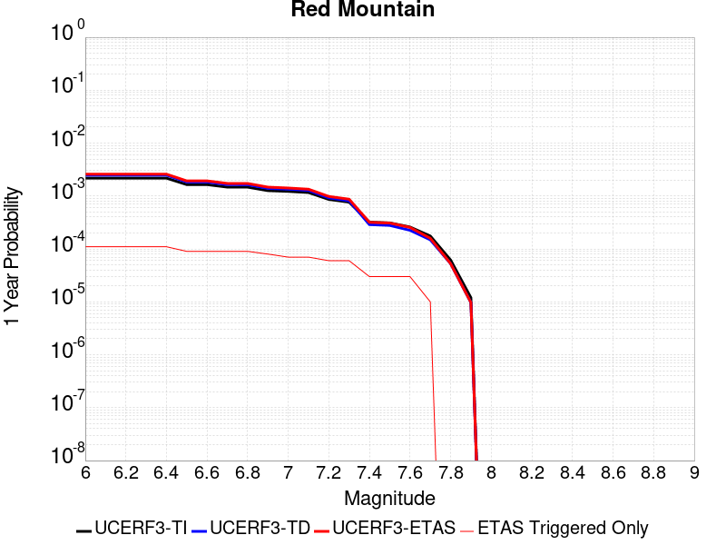 |  |

| Magnitude | 1 wk TI Prob | 1 wk TD Prob | 1 wk ETAS Prob | 1 wk ETAS/TD Gain | 1 wk ETAS Triggered Only | 1 mo TI Prob | 1 mo TD Prob | 1 mo ETAS Prob | 1 mo ETAS/TD Gain | 1 mo ETAS Triggered Only | 1 yr TI Prob | 1 yr TD Prob | 1 yr ETAS Prob | 1 yr ETAS/TD Gain | 1 yr ETAS Triggered Only | 10 yr TI Prob | 10 yr TD Prob | 10 yr ETAS Prob | 10 yr ETAS/TD Gain | 10 yr ETAS Triggered Only |
|-----|-----|-----|-----|-----|-----|-----|-----|-----|-----|-----|-----|-----|-----|-----|-----|-----|-----|-----|-----|-----|
| 6.0 | 4.1810763E-5 | 4.7589947E-5 | 1.3336755E-4 | 2.802431 | 8.5781685E-5 | 1.7917668E-4 | 2.039419E-4 | 2.897061E-4 | 1.4205325 | 8.5781685E-5 | 0.0021792934 | 0.0024803306 | 0.0025658996 | 1.034499 | 8.5781685E-5 | 0.021580452 | 0.024544092 | 0.024669606 | 1.0051138 | 1.2867253E-4 |
| 6.1 | 4.1810763E-5 | 4.7589947E-5 | 1.3336755E-4 | 2.802431 | 8.5781685E-5 | 1.7917668E-4 | 2.039419E-4 | 2.897061E-4 | 1.4205325 | 8.5781685E-5 | 0.0021792934 | 0.0024803306 | 0.0025658996 | 1.034499 | 8.5781685E-5 | 0.021580452 | 0.024544092 | 0.024669606 | 1.0051138 | 1.2867253E-4 |
| 6.2 | 4.1810763E-5 | 4.7589947E-5 | 1.3336755E-4 | 2.802431 | 8.5781685E-5 | 1.7917668E-4 | 2.039419E-4 | 2.897061E-4 | 1.4205325 | 8.5781685E-5 | 0.0021792934 | 0.0024803306 | 0.0025658996 | 1.034499 | 8.5781685E-5 | 0.021580452 | 0.024544092 | 0.024669606 | 1.0051138 | 1.2867253E-4 |
| 6.3 | 4.1810763E-5 | 4.7589947E-5 | 1.3336755E-4 | 2.802431 | 8.5781685E-5 | 1.7917668E-4 | 2.039419E-4 | 2.897061E-4 | 1.4205325 | 8.5781685E-5 | 0.0021792934 | 0.0024803306 | 0.0025658996 | 1.034499 | 8.5781685E-5 | 0.021580452 | 0.024544092 | 0.024669606 | 1.0051138 | 1.2867253E-4 |
| 6.4 | 4.1810763E-5 | 4.7589947E-5 | 1.3336755E-4 | 2.802431 | 8.5781685E-5 | 1.7917668E-4 | 2.039419E-4 | 2.897061E-4 | 1.4205325 | 8.5781685E-5 | 0.0021792934 | 0.0024803306 | 0.0025658996 | 1.034499 | 8.5781685E-5 | 0.021580452 | 0.024544092 | 0.024669606 | 1.0051138 | 1.2867253E-4 |
| 6.5 | 3.154503E-5 | 3.5359728E-5 | 1.2113838E-4 | 3.4258854 | 8.5781685E-5 | 1.3518598E-4 | 1.5153342E-4 | 2.373021E-4 | 1.5660051 | 8.5781685E-5 | 0.0016446467 | 0.0018434501 | 0.0019290737 | 1.0464474 | 8.5781685E-5 | 0.01632528 | 0.018291233 | 0.018417552 | 1.006906 | 1.2867253E-4 |
| 6.6 | 3.1535834E-5 | 3.534911E-5 | 1.2112776E-4 | 3.4266143 | 8.5781685E-5 | 1.3514658E-4 | 1.5148791E-4 | 2.372566E-4 | 1.5661751 | 8.5781685E-5 | 0.0016441676 | 0.001842897 | 0.0019285207 | 1.0464615 | 8.5781685E-5 | 0.01632056 | 0.018285794 | 0.018412115 | 1.006908 | 1.2867253E-4 |
| 6.7 | 2.8267326E-5 | 3.146934E-5 | 1.17248324E-4 | 3.7257955 | 8.5781685E-5 | 1.2114006E-4 | 1.348621E-4 | 2.2063222E-4 | 1.6359838 | 8.5781685E-5 | 0.0014738824 | 0.0016407946 | 0.0017264355 | 1.0521948 | 8.5781685E-5 | 0.014641452 | 0.016295563 | 0.01642214 | 1.0077674 | 1.2867253E-4 |
| 6.8 | 2.8212884E-5 | 3.1407224E-5 | 1.1718622E-4 | 3.7311866 | 8.5781685E-5 | 1.20906756E-4 | 1.3459593E-4 | 2.2036607E-4 | 1.6372417 | 8.5781685E-5 | 0.0014710457 | 0.0016375587 | 0.0017232 | 1.0522981 | 8.5781685E-5 | 0.014613459 | 0.01626368 | 0.01639026 | 1.0077829 | 1.2867253E-4 |
| 6.9 | 2.4227871E-5 | 2.6706979E-5 | 6.9596674E-5 | 2.605936 | 4.2890842E-5 | 1.03829596E-4 | 1.14453884E-4 | 1.5733982E-4 | 1.3747005 | 4.2890842E-5 | 0.0012633923 | 0.0013926612 | 0.0014354923 | 1.0307549 | 4.2890842E-5 | 0.012562336 | 0.013847026 | 0.01393162 | 1.0061091 | 8.5781685E-5 |
| 7.0 | 2.348524E-5 | 2.5835763E-5 | 6.8725494E-5 | 2.6600916 | 4.2890842E-5 | 1.0064714E-4 | 1.1072042E-4 | 1.5360652E-4 | 1.3873367 | 4.2890842E-5 | 0.0012246901 | 0.0013472632 | 0.0013900963 | 1.0317926 | 4.2890842E-5 | 0.012179627 | 0.01339859 | 0.013483222 | 1.0063165 | 8.5781685E-5 |
| 7.1 | 2.2311642E-5 | 2.4462828E-5 | 6.735262E-5 | 2.753264 | 4.2890842E-5 | 9.561782E-5 | 1.048369E-4 | 1.4772326E-4 | 1.4090768 | 4.2890842E-5 | 0.0011635252 | 0.0012757168 | 0.0013185529 | 1.033578 | 4.2890842E-5 | 0.01157452 | 0.012691451 | 0.012776145 | 1.0066732 | 8.5781685E-5 |
| 7.2 | 1.6533986E-5 | 1.7670347E-5 | 6.0560433E-5 | 3.4272351 | 4.2890842E-5 | 7.085802E-5 | 7.572822E-5 | 1.1861581E-4 | 1.5663357 | 4.2890842E-5 | 8.623549E-4 | 9.216645E-4 | 9.6451584E-4 | 1.0464934 | 4.2890842E-5 | 0.008590161 | 0.009184699 | 0.009269693 | 1.0092539 | 8.5781685E-5 |
| 7.3 | 1.4703092E-5 | 1.555952E-5 | 5.8449696E-5 | 3.756523 | 4.2890842E-5 | 6.301173E-5 | 6.66823E-5 | 1.0957029E-4 | 1.6431689 | 4.2890842E-5 | 7.668978E-4 | 8.1161625E-4 | 8.544723E-4 | 1.0528033 | 4.2890842E-5 | 0.0076425658 | 0.008092596 | 0.008177684 | 1.0105143 | 8.5781685E-5 |
| 7.4 | 6.1331984E-6 | 5.528872E-6 | 4.841948E-5 | 8.757569 | 4.2890842E-5 | 2.6284872E-5 | 2.3694953E-5 | 6.658478E-5 | 2.810083 | 4.2890842E-5 | 3.199713E-4 | 2.8844838E-4 | 3.3132685E-4 | 1.1486522 | 4.2890842E-5 | 0.0031951098 | 0.0028807942 | 0.0029235615 | 1.0148456 | 4.2890842E-5 |
| 7.5 | 5.954766E-6 | 5.3385015E-6 | 4.8229114E-5 | 9.0342045 | 4.2890842E-5 | 2.5520176E-5 | 2.2879094E-5 | 6.576896E-5 | 2.8746312 | 4.2890842E-5 | 3.1066386E-4 | 2.785179E-4 | 3.213968E-4 | 1.1539538 | 4.2890842E-5 | 0.003102299 | 0.0027817423 | 0.002824514 | 1.0153759 | 4.2890842E-5 |
| 7.6 | 4.9726646E-6 | 4.315295E-6 | 4.720595E-5 | 10.9392185 | 4.2890842E-5 | 2.1311245E-5 | 1.8493993E-5 | 6.138404E-5 | 3.3191342 | 4.2890842E-5 | 2.5943352E-4 | 2.2514143E-4 | 2.6802262E-4 | 1.1904633 | 4.2890842E-5 | 0.0025913084 | 0.002249168 | 0.0022919623 | 1.0190268 | 4.2890842E-5 |
| 7.7 | 3.3613894E-6 | 2.8526642E-6 | 4.5743385E-5 | 16.03532 | 4.2890842E-5 | 1.4405875E-5 | 1.2225649E-5 | 5.511597E-5 | 4.5082245 | 4.2890842E-5 | 1.7537741E-4 | 1.4883737E-4 | 1.9172183E-4 | 1.2881297 | 4.2890842E-5 | 0.0017523908 | 0.0014874031 | 0.0015302302 | 1.0287932 | 4.2890842E-5 |
| 7.8 | 1.1828961E-6 | 1.0122756E-6 | 1.0122756E-6 | 1.0 | 0.0 | 5.069545E-6 | 4.338317E-6 | 4.338317E-6 | 1.0 | 0.0 | 6.171996E-5 | 5.281776E-5 | 5.281776E-5 | 1.0 | 0.0 | 6.170282E-4 | 5.2805495E-4 | 5.2805495E-4 | 1.0 | 0.0 |
| 7.9 | 2.2967266E-7 | 1.8618952E-7 | 1.8618952E-7 | 1.0 | 0.0 | 9.843111E-7 | 7.9795484E-7 | 7.9795484E-7 | 1.0 | 0.0 | 1.19839215E-5 | 9.7150605E-6 | 9.7150605E-6 | 1.0 | 0.0 | 1.1983275E-4 | 9.714664E-5 | 9.714664E-5 | 1.0 | 0.0 |

## Owens Valley
*[(top)](#table-of-contents)*

| 1 Week | 1 Month | 1 Year | 10 Year |
|-----|-----|-----|-----|
|  |  |  | 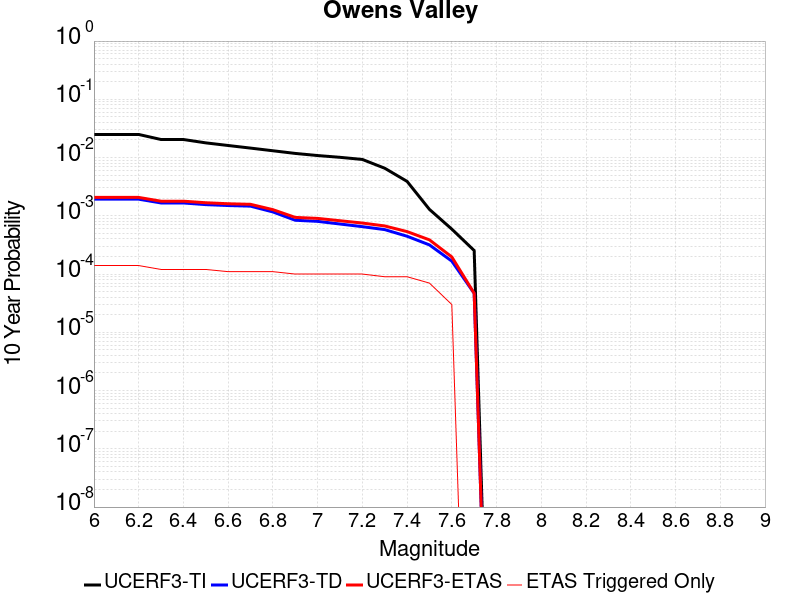 |

| Magnitude | 1 wk TI Prob | 1 wk TD Prob | 1 wk ETAS Prob | 1 wk ETAS/TD Gain | 1 wk ETAS Triggered Only | 1 mo TI Prob | 1 mo TD Prob | 1 mo ETAS Prob | 1 mo ETAS/TD Gain | 1 mo ETAS Triggered Only | 1 yr TI Prob | 1 yr TD Prob | 1 yr ETAS Prob | 1 yr ETAS/TD Gain | 1 yr ETAS Triggered Only | 10 yr TI Prob | 10 yr TD Prob | 10 yr ETAS Prob | 10 yr ETAS/TD Gain | 10 yr ETAS Triggered Only |
|-----|-----|-----|-----|-----|-----|-----|-----|-----|-----|-----|-----|-----|-----|-----|-----|-----|-----|-----|-----|-----|
| 6.0 | 4.83821E-5 | 3.626567E-6 | 8.940794E-5 | 24.653603 | 8.5781685E-5 | 2.0733538E-4 | 1.5542342E-5 | 1.4421287E-4 | 9.278708 | 1.2867253E-4 | 0.002521386 | 1.8921259E-4 | 3.607435E-4 | 1.9065512 | 1.7156337E-4 | 0.024929691 | 0.001925011 | 0.0020962441 | 1.0889517 | 1.7156337E-4 |
| 6.1 | 4.83821E-5 | 3.626567E-6 | 8.940794E-5 | 24.653603 | 8.5781685E-5 | 2.0733538E-4 | 1.5542342E-5 | 1.4421287E-4 | 9.278708 | 1.2867253E-4 | 0.002521386 | 1.8921259E-4 | 3.607435E-4 | 1.9065512 | 1.7156337E-4 | 0.024929691 | 0.001925011 | 0.0020962441 | 1.0889517 | 1.7156337E-4 |
| 6.2 | 4.83821E-5 | 3.626567E-6 | 8.940794E-5 | 24.653603 | 8.5781685E-5 | 2.0733538E-4 | 1.5542342E-5 | 1.4421287E-4 | 9.278708 | 1.2867253E-4 | 0.002521386 | 1.8921259E-4 | 3.607435E-4 | 1.9065512 | 1.7156337E-4 | 0.024929691 | 0.001925011 | 0.0020962441 | 1.0889517 | 1.7156337E-4 |
| 6.3 | 3.953008E-5 | 3.1553948E-6 | 4.60461E-5 | 14.592818 | 4.2890842E-5 | 1.6940363E-4 | 1.3523055E-5 | 9.930358E-5 | 7.3432803 | 8.5781685E-5 | 0.002060538 | 1.6463149E-4 | 2.9328282E-4 | 1.7814504 | 1.2867253E-4 | 0.020415364 | 0.0016592 | 0.0017876589 | 1.0774223 | 1.2867253E-4 |
| 6.4 | 3.953008E-5 | 3.1553948E-6 | 4.60461E-5 | 14.592818 | 4.2890842E-5 | 1.6940363E-4 | 1.3523055E-5 | 9.930358E-5 | 7.3432803 | 8.5781685E-5 | 0.002060538 | 1.6463149E-4 | 2.9328282E-4 | 1.7814504 | 1.2867253E-4 | 0.020415364 | 0.0016592 | 0.0017876589 | 1.0774223 | 1.2867253E-4 |
| 6.5 | 3.457342E-5 | 2.9715961E-6 | 4.586231E-5 | 15.433561 | 4.2890842E-5 | 1.4816338E-4 | 1.2735354E-5 | 9.851595E-5 | 7.7356267 | 8.5781685E-5 | 0.0018023965 | 1.550426E-4 | 2.8369518E-4 | 1.8297886 | 1.2867253E-4 | 0.017878477 | 0.001555719 | 0.0016841913 | 1.0825807 | 1.2867253E-4 |
| 6.6 | 3.1127765E-5 | 2.8744932E-6 | 4.5765213E-5 | 15.921141 | 4.2890842E-5 | 1.3339789E-4 | 1.2319203E-5 | 9.809983E-5 | 7.963164 | 8.5781685E-5 | 0.0016229092 | 1.4997667E-4 | 2.786299E-4 | 1.8578217 | 1.2867253E-4 | 0.016111081 | 0.0015012559 | 0.0016297352 | 1.0855813 | 1.2867253E-4 |
| 6.7 | 2.806885E-5 | 2.8104134E-6 | 4.5701137E-5 | 16.261356 | 4.2890842E-5 | 1.2028952E-4 | 1.20445775E-5 | 9.782523E-5 | 8.121931 | 8.5781685E-5 | 0.001463541 | 1.4663354E-4 | 2.752872E-4 | 1.8773822 | 1.2867253E-4 | 0.014539397 | 0.0014657511 | 0.001594235 | 1.0876575 | 1.2867253E-4 |
| 6.8 | 2.524524E-5 | 2.2353688E-6 | 4.5126115E-5 | 20.187325 | 4.2890842E-5 | 1.0818939E-4 | 9.580118E-6 | 9.5360985E-5 | 9.954051 | 8.5781685E-5 | 0.0013164099 | 1.16632E-4 | 2.4528953E-4 | 2.1031065 | 1.2867253E-4 | 0.01308639 | 0.0011659812 | 0.0012945037 | 1.1102269 | 1.2867253E-4 |
| 6.9 | 2.2704568E-5 | 1.6081682E-6 | 1.6081682E-6 | 1.0 | 0.0 | 9.730166E-5 | 6.8921313E-6 | 4.978268E-5 | 7.223118 | 4.2890842E-5 | 0.0011840039 | 8.390849E-5 | 1.6968297E-4 | 2.0222385 | 8.5781685E-5 | 0.011777153 | 8.3897985E-4 | 9.246895E-4 | 1.1021595 | 8.5781685E-5 |
| 7.0 | 2.0871712E-5 | 1.5395453E-6 | 1.5395453E-6 | 1.0 | 0.0 | 8.944713E-5 | 6.598035E-6 | 4.9488594E-5 | 7.5005054 | 4.2890842E-5 | 0.0010884746 | 8.032813E-5 | 1.6610292E-4 | 2.0678053 | 8.5781685E-5 | 0.010831586 | 8.0316263E-4 | 8.888754E-4 | 1.1067191 | 8.5781685E-5 |
| 7.1 | 1.944928E-5 | 1.3864178E-6 | 1.3864178E-6 | 1.0 | 0.0 | 8.335139E-5 | 5.941777E-6 | 4.8832364E-5 | 8.218478 | 4.2890842E-5 | 0.0010143308 | 7.233874E-5 | 1.5811423E-4 | 2.1857474 | 8.5781685E-5 | 0.010097133 | 7.2330976E-4 | 8.090294E-4 | 1.1185102 | 8.5781685E-5 |
| 7.2 | 1.7876306E-5 | 1.2489141E-6 | 1.2489141E-6 | 1.0 | 0.0 | 7.6610486E-5 | 5.352478E-6 | 4.824309E-5 | 9.013226 | 4.2890842E-5 | 9.3233347E-4 | 6.516448E-5 | 1.5094057E-4 | 2.3163013 | 8.5781685E-5 | 0.009284316 | 6.5159105E-4 | 7.3731685E-4 | 1.1315638 | 8.5781685E-5 |
| 7.3 | 1.2618672E-5 | 1.1115209E-6 | 1.1115209E-6 | 1.0 | 0.0 | 5.40789E-5 | 4.763652E-6 | 4.7654292E-5 | 10.00373 | 4.2890842E-5 | 6.582117E-4 | 5.799593E-5 | 1.4377265E-4 | 2.4790125 | 8.5781685E-5 | 0.0065626553 | 5.7994033E-4 | 6.656723E-4 | 1.1478289 | 8.5781685E-5 |
| 7.4 | 7.4874442E-6 | 8.5486437E-7 | 8.5486437E-7 | 1.0 | 0.0 | 3.208865E-5 | 3.6636993E-6 | 4.6554385E-5 | 12.706934 | 4.2890842E-5 | 3.906093E-4 | 4.4604632E-5 | 1.303825E-4 | 2.9230707 | 8.5781685E-5 | 0.003899234 | 4.4604883E-4 | 5.3179223E-4 | 1.1922288 | 8.5781685E-5 |
| 7.5 | 2.4734156E-6 | 6.068616E-7 | 6.068616E-7 | 1.0 | 0.0 | 1.060031E-5 | 2.6008327E-6 | 4.5491564E-5 | 17.491154 | 4.2890842E-5 | 1.2905113E-4 | 3.166468E-5 | 1.1744365E-4 | 3.7089794 | 8.5781685E-5 | 0.0012897621 | 3.1660203E-4 | 4.0235656E-4 | 1.270859 | 8.5781685E-5 |
| 7.6 | 1.1328841E-6 | 3.196531E-7 | 3.196531E-7 | 1.0 | 0.0 | 4.8552088E-6 | 1.3699412E-6 | 1.3699412E-6 | 1.0 | 0.0 | 5.9110564E-5 | 1.6678909E-5 | 1.6678909E-5 | 1.0 | 0.0 | 5.9094845E-4 | 1.6677675E-4 | 1.6677675E-4 | 1.0 | 0.0 |
| 7.7 | 4.8613185E-7 | 8.964689E-8 | 8.964689E-8 | 1.0 | 0.0 | 2.0834207E-6 | 3.8420092E-7 | 3.8420092E-7 | 1.0 | 0.0 | 2.536535E-5 | 4.6776368E-6 | 4.6776368E-6 | 1.0 | 0.0 | 2.5362454E-4 | 4.677545E-5 | 4.677545E-5 | 1.0 | 0.0 |

## San Pedro Basin
*[(top)](#table-of-contents)*

| 1 Week | 1 Month | 1 Year | 10 Year |
|-----|-----|-----|-----|
|  |  |  |  |

| Magnitude | 1 wk TI Prob | 1 wk TD Prob | 1 wk ETAS Prob | 1 wk ETAS/TD Gain | 1 wk ETAS Triggered Only | 1 mo TI Prob | 1 mo TD Prob | 1 mo ETAS Prob | 1 mo ETAS/TD Gain | 1 mo ETAS Triggered Only | 1 yr TI Prob | 1 yr TD Prob | 1 yr ETAS Prob | 1 yr ETAS/TD Gain | 1 yr ETAS Triggered Only | 10 yr TI Prob | 10 yr TD Prob | 10 yr ETAS Prob | 10 yr ETAS/TD Gain | 10 yr ETAS Triggered Only |
|-----|-----|-----|-----|-----|-----|-----|-----|-----|-----|-----|-----|-----|-----|-----|-----|-----|-----|-----|-----|-----|
| 6.0 | 5.3449043E-5 | 6.336954E-5 | 2.3492203E-4 | 3.7071762 | 1.7156337E-4 | 2.2904722E-4 | 2.715589E-4 | 4.430757E-4 | 1.6316006 | 1.7156337E-4 | 0.0027850836 | 0.0033018254 | 0.0034728223 | 1.0517886 | 1.7156337E-4 | 0.027504366 | 0.03258945 | 0.032755423 | 1.0050929 | 1.7156337E-4 |
| 6.1 | 5.3449043E-5 | 6.336954E-5 | 2.3492203E-4 | 3.7071762 | 1.7156337E-4 | 2.2904722E-4 | 2.715589E-4 | 4.430757E-4 | 1.6316006 | 1.7156337E-4 | 0.0027850836 | 0.0033018254 | 0.0034728223 | 1.0517886 | 1.7156337E-4 | 0.027504366 | 0.03258945 | 0.032755423 | 1.0050929 | 1.7156337E-4 |
| 6.2 | 2.3189454E-5 | 2.6642796E-5 | 6.95325E-5 | 2.6098049 | 4.2890842E-5 | 9.9379584E-5 | 1.14178685E-4 | 1.5706463E-4 | 1.3756038 | 4.2890842E-5 | 0.0012092749 | 0.0013892864 | 0.0014321177 | 1.0308297 | 4.2890842E-5 | 0.012027155 | 0.013810883 | 0.013853182 | 1.0030627 | 4.2890842E-5 |
| 6.3 | 2.3189454E-5 | 2.6642796E-5 | 6.95325E-5 | 2.6098049 | 4.2890842E-5 | 9.9379584E-5 | 1.14178685E-4 | 1.5706463E-4 | 1.3756038 | 4.2890842E-5 | 0.0012092749 | 0.0013892864 | 0.0014321177 | 1.0308297 | 4.2890842E-5 | 0.012027155 | 0.013810883 | 0.013853182 | 1.0030627 | 4.2890842E-5 |
| 6.4 | 1.966056E-5 | 2.2463413E-5 | 2.2463413E-5 | 1.0 | 0.0 | 8.425682E-5 | 9.626844E-5 | 9.626844E-5 | 1.0 | 0.0 | 0.001025344 | 0.0011714783 | 0.0011714783 | 1.0 | 0.0 | 0.010206259 | 0.011657117 | 0.011657117 | 1.0 | 0.0 |
| 6.5 | 1.7342953E-5 | 1.9745148E-5 | 1.9745148E-5 | 1.0 | 0.0 | 7.4324824E-5 | 8.4619525E-5 | 8.4619525E-5 | 1.0 | 0.0 | 9.04529E-4 | 0.0010297928 | 0.0010297928 | 1.0 | 0.0 | 0.009008561 | 0.010253931 | 0.010253931 | 1.0 | 0.0 |
| 6.6 | 1.439804E-5 | 1.6322716E-5 | 1.6322716E-5 | 1.0 | 0.0 | 6.170443E-5 | 6.99528E-5 | 6.99528E-5 | 1.0 | 0.0 | 7.509924E-4 | 8.513747E-4 | 8.513747E-4 | 1.0 | 0.0 | 0.0074845953 | 0.008484332 | 0.008484332 | 1.0 | 0.0 |
| 6.7 | 1.2634884E-5 | 1.4285297E-5 | 1.4285297E-5 | 1.0 | 0.0 | 5.414838E-5 | 6.1221435E-5 | 6.1221435E-5 | 1.0 | 0.0 | 6.590571E-4 | 7.4514654E-4 | 7.4514654E-4 | 1.0 | 0.0 | 0.006571059 | 0.007429501 | 0.007429501 | 1.0 | 0.0 |
| 6.8 | 1.146091E-5 | 1.2933192E-5 | 1.2933192E-5 | 1.0 | 0.0 | 4.911726E-5 | 5.5426954E-5 | 5.5426954E-5 | 1.0 | 0.0 | 5.9783855E-4 | 6.7464396E-4 | 6.7464396E-4 | 1.0 | 0.0 | 0.0059623276 | 0.006728899 | 0.006728899 | 1.0 | 0.0 |
| 6.9 | 9.109035E-6 | 1.0235011E-5 | 1.0235011E-5 | 1.0 | 0.0 | 3.9038136E-5 | 4.3863754E-5 | 4.3863754E-5 | 1.0 | 0.0 | 4.7518566E-4 | 5.3393835E-4 | 5.3393835E-4 | 1.0 | 0.0 | 0.0047417083 | 0.005329309 | 0.005329309 | 1.0 | 0.0 |
| 7.0 | 5.9351028E-6 | 6.583964E-6 | 6.583964E-6 | 1.0 | 0.0 | 2.5435906E-5 | 2.8216817E-5 | 2.8216817E-5 | 1.0 | 0.0 | 3.0963816E-4 | 3.435092E-4 | 3.435092E-4 | 1.0 | 0.0 | 0.0030920706 | 0.0034320992 | 0.0034320992 | 1.0 | 0.0 |
| 7.1 | 2.1557585E-6 | 2.209648E-6 | 2.209648E-6 | 1.0 | 0.0 | 9.238933E-6 | 9.469887E-6 | 9.469887E-6 | 1.0 | 0.0 | 1.1247819E-4 | 1.1528993E-4 | 1.1528993E-4 | 1.0 | 0.0 | 0.0011242128 | 0.0011523166 | 0.0011523166 | 1.0 | 0.0 |
| 7.2 | 2.1251979E-6 | 2.1779945E-6 | 2.1779945E-6 | 1.0 | 0.0 | 9.107958E-6 | 9.334229E-6 | 9.334229E-6 | 1.0 | 0.0 | 1.1088375E-4 | 1.1363847E-4 | 1.1363847E-4 | 1.0 | 0.0 | 0.0011082845 | 0.0011358189 | 0.0011358189 | 1.0 | 0.0 |
| 7.3 | 1.7145798E-6 | 1.7442874E-6 | 1.7442874E-6 | 1.0 | 0.0 | 7.3481783E-6 | 7.4754967E-6 | 7.4754967E-6 | 1.0 | 0.0 | 8.94604E-5 | 9.1010465E-5 | 9.1010465E-5 | 1.0 | 0.0 | 8.9424395E-4 | 9.0974104E-4 | 9.0974104E-4 | 1.0 | 0.0 |
| 7.4 | 1.4467993E-6 | 1.4641868E-6 | 1.4641868E-6 | 1.0 | 0.0 | 6.200554E-6 | 6.2750714E-6 | 6.2750714E-6 | 1.0 | 0.0 | 7.548913E-5 | 7.639639E-5 | 7.639639E-5 | 1.0 | 0.0 | 7.546349E-4 | 7.6370855E-4 | 7.6370855E-4 | 1.0 | 0.0 |
| 7.5 | 1.2803735E-6 | 1.2931497E-6 | 1.2931497E-6 | 1.0 | 0.0 | 5.487303E-6 | 5.5420587E-6 | 5.5420587E-6 | 1.0 | 0.0 | 6.680587E-5 | 6.7472545E-5 | 6.7472545E-5 | 1.0 | 0.0 | 6.678579E-4 | 6.7452766E-4 | 6.7452766E-4 | 1.0 | 0.0 |
| 7.6 | 6.755009E-7 | 6.769465E-7 | 6.769465E-7 | 1.0 | 0.0 | 2.8950008E-6 | 2.9011965E-6 | 2.9011965E-6 | 1.0 | 0.0 | 3.5246063E-5 | 3.5321555E-5 | 3.5321555E-5 | 1.0 | 0.0 | 3.5240475E-4 | 3.5316512E-4 | 3.5316512E-4 | 1.0 | 0.0 |
| 7.7 | 6.211885E-8 | 4.569953E-8 | 4.569953E-8 | 1.0 | 0.0 | 2.6622362E-7 | 1.9585512E-7 | 1.9585512E-7 | 1.0 | 0.0 | 3.2412677E-6 | 2.3845337E-6 | 2.3845337E-6 | 1.0 | 0.0 | 3.2412205E-5 | 2.3845101E-5 | 2.3845101E-5 | 1.0 | 0.0 |
| 7.8 | 2.6580573E-9 | 1.5138163E-9 | 1.5138163E-9 | 1.0 | 0.0 | 1.1391674E-8 | 6.487784E-9 | 6.487784E-9 | 1.0 | 0.0 | 1.3869362E-7 | 7.898877E-8 | 7.898877E-8 | 1.0 | 0.0 | 1.3869354E-6 | 7.898877E-7 | 7.898877E-7 | 1.0 | 0.0 |

## Mission Ridge-Arroyo Parida-Santa Ana
*[(top)](#table-of-contents)*

| 1 Week | 1 Month | 1 Year | 10 Year |
|-----|-----|-----|-----|
|  |  |  |  |

| Magnitude | 1 wk TI Prob | 1 wk TD Prob | 1 wk ETAS Prob | 1 wk ETAS/TD Gain | 1 wk ETAS Triggered Only | 1 mo TI Prob | 1 mo TD Prob | 1 mo ETAS Prob | 1 mo ETAS/TD Gain | 1 mo ETAS Triggered Only | 1 yr TI Prob | 1 yr TD Prob | 1 yr ETAS Prob | 1 yr ETAS/TD Gain | 1 yr ETAS Triggered Only | 10 yr TI Prob | 10 yr TD Prob | 10 yr ETAS Prob | 10 yr ETAS/TD Gain | 10 yr ETAS Triggered Only |
|-----|-----|-----|-----|-----|-----|-----|-----|-----|-----|-----|-----|-----|-----|-----|-----|-----|-----|-----|-----|-----|
| 6.0 | 4.169034E-5 | 4.7138263E-5 | 9.002708E-5 | 1.9098516 | 4.2890842E-5 | 1.7866064E-4 | 2.0201034E-4 | 2.4489252E-4 | 1.2122772 | 4.2890842E-5 | 0.0021730233 | 0.00245745 | 0.0025430208 | 1.034821 | 8.5781685E-5 | 0.021518968 | 0.024384614 | 0.024510149 | 1.0051482 | 1.2867253E-4 |
| 6.1 | 1.73813E-5 | 1.6854226E-5 | 1.6854226E-5 | 1.0 | 0.0 | 7.4489166E-5 | 7.223046E-5 | 7.223046E-5 | 1.0 | 0.0 | 9.065282E-4 | 8.790618E-4 | 9.2191494E-4 | 1.0487487 | 4.2890842E-5 | 0.009028391 | 0.008756988 | 0.008842018 | 1.0097101 | 8.5781685E-5 |
| 6.2 | 1.4622182E-5 | 1.367329E-5 | 1.367329E-5 | 1.0 | 0.0 | 6.2664985E-5 | 5.8598518E-5 | 5.8598518E-5 | 1.0 | 0.0 | 7.6267915E-4 | 7.132073E-4 | 7.132073E-4 | 1.0 | 0.0 | 0.007600669 | 0.007109627 | 0.0071522132 | 1.0059899 | 4.2890842E-5 |
| 6.3 | 1.3552434E-5 | 1.2482201E-5 | 1.2482201E-5 | 1.0 | 0.0 | 5.8080568E-5 | 5.3494066E-5 | 5.3494066E-5 | 1.0 | 0.0 | 7.069015E-4 | 6.510988E-4 | 6.510988E-4 | 1.0 | 0.0 | 0.00704657 | 0.006492275 | 0.0065348875 | 1.0065635 | 4.2890842E-5 |
| 6.4 | 1.30977305E-5 | 1.1979156E-5 | 1.1979156E-5 | 1.0 | 0.0 | 5.613192E-5 | 5.1338247E-5 | 5.1338247E-5 | 1.0 | 0.0 | 6.831918E-4 | 6.248669E-4 | 6.248669E-4 | 1.0 | 0.0 | 0.006810953 | 0.0062314444 | 0.006274068 | 1.0068401 | 4.2890842E-5 |
| 6.5 | 1.225205E-5 | 1.1048803E-5 | 1.1048803E-5 | 1.0 | 0.0 | 5.2507727E-5 | 4.7351168E-5 | 4.7351168E-5 | 1.0 | 0.0 | 6.3909404E-4 | 5.7635066E-4 | 5.7635066E-4 | 1.0 | 0.0 | 0.006372592 | 0.005748869 | 0.0057915132 | 1.0074178 | 4.2890842E-5 |
| 6.6 | 1.1352241E-5 | 1.0063535E-5 | 1.0063535E-5 | 1.0 | 0.0 | 4.8651553E-5 | 4.3128734E-5 | 4.3128734E-5 | 1.0 | 0.0 | 5.921717E-4 | 5.2496797E-4 | 5.2496797E-4 | 1.0 | 0.0 | 0.0059059616 | 0.0052375244 | 0.0052375244 | 1.0 | 0.0 |
| 6.7 | 1.0864116E-5 | 9.517027E-6 | 9.517027E-6 | 1.0 | 0.0 | 4.6559664E-5 | 4.0786632E-5 | 4.0786632E-5 | 1.0 | 0.0 | 5.667165E-4 | 4.964661E-4 | 4.964661E-4 | 1.0 | 0.0 | 0.005652734 | 0.004953804 | 0.004953804 | 1.0 | 0.0 |
| 6.8 | 1.0666365E-5 | 9.299779E-6 | 9.299779E-6 | 1.0 | 0.0 | 4.571219E-5 | 3.9855597E-5 | 3.9855597E-5 | 1.0 | 0.0 | 5.564038E-4 | 4.8513585E-4 | 4.8513585E-4 | 1.0 | 0.0 | 0.005550127 | 0.0048410003 | 0.0048410003 | 1.0 | 0.0 |
| 6.9 | 1.0038665E-5 | 8.592046E-6 | 8.592046E-6 | 1.0 | 0.0 | 4.302214E-5 | 3.682254E-5 | 3.682254E-5 | 1.0 | 0.0 | 5.236687E-4 | 4.4822405E-4 | 4.4822405E-4 | 1.0 | 0.0 | 0.005224364 | 0.004473411 | 0.004473411 | 1.0 | 0.0 |
| 7.0 | 9.5379955E-6 | 8.025073E-6 | 8.025073E-6 | 1.0 | 0.0 | 4.0876483E-5 | 3.4392728E-5 | 3.4392728E-5 | 1.0 | 0.0 | 4.975576E-4 | 4.1865272E-4 | 4.1865272E-4 | 1.0 | 0.0 | 0.00496445 | 0.0041788397 | 0.0041788397 | 1.0 | 0.0 |
| 7.1 | 9.207389E-6 | 7.652375E-6 | 7.652375E-6 | 1.0 | 0.0 | 3.945964E-5 | 3.279549E-5 | 3.279549E-5 | 1.0 | 0.0 | 4.803152E-4 | 3.9921363E-4 | 3.9921363E-4 | 1.0 | 0.0 | 0.004792784 | 0.003985161 | 0.003985161 | 1.0 | 0.0 |
| 7.2 | 7.638091E-6 | 5.9311183E-6 | 5.9311183E-6 | 1.0 | 0.0 | 3.2734264E-5 | 2.541883E-5 | 2.541883E-5 | 1.0 | 0.0 | 3.984668E-4 | 3.0943064E-4 | 3.0943064E-4 | 1.0 | 0.0 | 0.0039775306 | 0.0030900547 | 0.0030900547 | 1.0 | 0.0 |
| 7.3 | 7.2500147E-6 | 5.5961527E-6 | 5.5961527E-6 | 1.0 | 0.0 | 3.1071122E-5 | 2.3983293E-5 | 2.3983293E-5 | 1.0 | 0.0 | 3.7822526E-4 | 2.9195778E-4 | 2.9195778E-4 | 1.0 | 0.0 | 0.0037758215 | 0.0029157975 | 0.0029157975 | 1.0 | 0.0 |
| 7.4 | 6.3899715E-6 | 4.9184964E-6 | 4.9184964E-6 | 1.0 | 0.0 | 2.7385306E-5 | 2.10791E-5 | 2.10791E-5 | 1.0 | 0.0 | 3.3336508E-4 | 2.5660804E-4 | 2.5660804E-4 | 1.0 | 0.0 | 0.0033286542 | 0.0025631618 | 0.0025631618 | 1.0 | 0.0 |
| 7.5 | 5.379025E-6 | 4.0838527E-6 | 4.0838527E-6 | 1.0 | 0.0 | 2.305276E-5 | 1.7502109E-5 | 1.7502109E-5 | 1.0 | 0.0 | 2.806312E-4 | 2.1306744E-4 | 2.1306744E-4 | 1.0 | 0.0 | 0.0028027708 | 0.002128643 | 0.002128643 | 1.0 | 0.0 |
| 7.6 | 4.1270696E-6 | 3.0883439E-6 | 3.0883439E-6 | 1.0 | 0.0 | 1.768732E-5 | 1.3235693E-5 | 1.3235693E-5 | 1.0 | 0.0 | 2.1532185E-4 | 1.6113273E-4 | 1.6113273E-4 | 1.0 | 0.0 | 0.0021511333 | 0.001610167 | 0.001610167 | 1.0 | 0.0 |
| 7.7 | 2.5406805E-6 | 1.8282013E-6 | 1.8282013E-6 | 1.0 | 0.0 | 1.0888585E-5 | 7.835125E-6 | 7.835125E-6 | 1.0 | 0.0 | 1.3256045E-4 | 9.538854E-5 | 9.538854E-5 | 1.0 | 0.0 | 0.0013248142 | 9.534821E-4 | 9.534821E-4 | 1.0 | 0.0 |
| 7.8 | 4.8608285E-7 | 3.5098864E-7 | 3.5098864E-7 | 1.0 | 0.0 | 2.0832106E-6 | 1.5042363E-6 | 1.5042363E-6 | 1.0 | 0.0 | 2.5362791E-5 | 1.8313924E-5 | 1.8313924E-5 | 1.0 | 0.0 | 2.5359896E-4 | 1.8312426E-4 | 1.8312426E-4 | 1.0 | 0.0 |
| 7.9 | 2.0472514E-8 | 1.2688783E-8 | 1.2688783E-8 | 1.0 | 0.0 | 8.7739345E-8 | 5.43805E-8 | 5.43805E-8 | 1.0 | 0.0 | 1.068226E-6 | 6.6208236E-7 | 6.6208236E-7 | 1.0 | 0.0 | 1.0682209E-5 | 6.620805E-6 | 6.620805E-6 | 1.0 | 0.0 |
| 8.0 | 4.443582E-9 | 2.0321211E-9 | 2.0321211E-9 | 1.0 | 0.0 | 1.9043922E-8 | 8.70909E-9 | 8.70909E-9 | 1.0 | 0.0 | 2.3185973E-7 | 1.0603316E-7 | 1.0603316E-7 | 1.0 | 0.0 | 2.3185949E-6 | 1.0603312E-6 | 1.0603312E-6 | 1.0 | 0.0 |

## Lake Isabella (Seismicity)
*[(top)](#table-of-contents)*

| 1 Week | 1 Month | 1 Year | 10 Year |
|-----|-----|-----|-----|
|  |  |  |  |

| Magnitude | 1 wk TI Prob | 1 wk TD Prob | 1 wk ETAS Prob | 1 wk ETAS/TD Gain | 1 wk ETAS Triggered Only | 1 mo TI Prob | 1 mo TD Prob | 1 mo ETAS Prob | 1 mo ETAS/TD Gain | 1 mo ETAS Triggered Only | 1 yr TI Prob | 1 yr TD Prob | 1 yr ETAS Prob | 1 yr ETAS/TD Gain | 1 yr ETAS Triggered Only | 10 yr TI Prob | 10 yr TD Prob | 10 yr ETAS Prob | 10 yr ETAS/TD Gain | 10 yr ETAS Triggered Only |
|-----|-----|-----|-----|-----|-----|-----|-----|-----|-----|-----|-----|-----|-----|-----|-----|-----|-----|-----|-----|-----|
| 6.0 | 9.431637E-6 | 9.741651E-6 | 9.741651E-6 | 1.0 | 0.0 | 4.0420677E-5 | 4.1749343E-5 | 4.1749343E-5 | 1.0 | 0.0 | 4.920106E-4 | 5.0819275E-4 | 5.9393083E-4 | 1.1687118 | 8.5781685E-5 | 0.004909227 | 0.005071599 | 0.0052422923 | 1.0336567 | 1.7156337E-4 |
| 6.1 | 9.431637E-6 | 9.741651E-6 | 9.741651E-6 | 1.0 | 0.0 | 4.0420677E-5 | 4.1749343E-5 | 4.1749343E-5 | 1.0 | 0.0 | 4.920106E-4 | 5.0819275E-4 | 5.9393083E-4 | 1.1687118 | 8.5781685E-5 | 0.004909227 | 0.005071599 | 0.0052422923 | 1.0336567 | 1.7156337E-4 |
| 6.2 | 9.431637E-6 | 9.741651E-6 | 9.741651E-6 | 1.0 | 0.0 | 4.0420677E-5 | 4.1749343E-5 | 4.1749343E-5 | 1.0 | 0.0 | 4.920106E-4 | 5.0819275E-4 | 5.9393083E-4 | 1.1687118 | 8.5781685E-5 | 0.004909227 | 0.005071599 | 0.0052422923 | 1.0336567 | 1.7156337E-4 |
| 6.3 | 9.431637E-6 | 9.741651E-6 | 9.741651E-6 | 1.0 | 0.0 | 4.0420677E-5 | 4.1749343E-5 | 4.1749343E-5 | 1.0 | 0.0 | 4.920106E-4 | 5.0819275E-4 | 5.9393083E-4 | 1.1687118 | 8.5781685E-5 | 0.004909227 | 0.005071599 | 0.0052422923 | 1.0336567 | 1.7156337E-4 |
| 6.4 | 5.144063E-6 | 5.3000763E-6 | 5.3000763E-6 | 1.0 | 0.0 | 2.2045799E-5 | 2.2714434E-5 | 2.2714434E-5 | 1.0 | 0.0 | 2.6837454E-4 | 2.765166E-4 | 3.1939556E-4 | 1.1550684 | 4.2890842E-5 | 0.0026805066 | 0.0027620657 | 0.0028048381 | 1.0154856 | 4.2890842E-5 |
| 6.5 | 5.144063E-6 | 5.3000763E-6 | 5.3000763E-6 | 1.0 | 0.0 | 2.2045799E-5 | 2.2714434E-5 | 2.2714434E-5 | 1.0 | 0.0 | 2.6837454E-4 | 2.765166E-4 | 3.1939556E-4 | 1.1550684 | 4.2890842E-5 | 0.0026805066 | 0.0027620657 | 0.0028048381 | 1.0154856 | 4.2890842E-5 |
| 6.6 | 3.4009804E-6 | 3.498786E-6 | 3.498786E-6 | 1.0 | 0.0 | 1.4575549E-5 | 1.4994721E-5 | 1.4994721E-5 | 1.0 | 0.0 | 1.7744285E-4 | 1.8254704E-4 | 2.2543005E-4 | 1.2349149 | 4.2890842E-5 | 0.0017730123 | 0.0018241286 | 0.0018669412 | 1.0234702 | 4.2890842E-5 |
| 6.7 | 3.3880428E-6 | 3.4856528E-6 | 3.4856528E-6 | 1.0 | 0.0 | 1.4520103E-5 | 1.4938435E-5 | 1.4938435E-5 | 1.0 | 0.0 | 1.767679E-4 | 1.8186188E-4 | 2.2474492E-4 | 1.2358 | 4.2890842E-5 | 0.0017662736 | 0.0018172882 | 0.0018601011 | 1.0235586 | 4.2890842E-5 |
| 6.8 | 2.6582E-6 | 2.7337003E-6 | 2.7337003E-6 | 1.0 | 0.0 | 1.1392236E-5 | 1.1715813E-5 | 1.1715813E-5 | 1.0 | 0.0 | 1.3869164E-4 | 1.4263204E-4 | 1.4263204E-4 | 1.0 | 0.0 | 0.0013860512 | 0.0014255369 | 0.0014255369 | 1.0 | 0.0 |
| 6.9 | 2.406011E-6 | 2.4743288E-6 | 2.4743288E-6 | 1.0 | 0.0 | 1.0311434E-5 | 1.0604231E-5 | 1.0604231E-5 | 1.0 | 0.0 | 1.2553448E-4 | 1.2910018E-4 | 1.2910018E-4 | 1.0 | 0.0 | 0.0012546359 | 0.0012903814 | 0.0012903814 | 1.0 | 0.0 |
| 7.0 | 1.6953097E-6 | 1.7429371E-6 | 1.7429371E-6 | 1.0 | 0.0 | 7.265593E-6 | 7.469715E-6 | 7.469715E-6 | 1.0 | 0.0 | 8.8455E-5 | 9.094104E-5 | 9.094104E-5 | 1.0 | 0.0 | 8.84198E-4 | 9.09141E-4 | 9.09141E-4 | 1.0 | 0.0 |
| 7.1 | 3.5013824E-7 | 3.5714822E-7 | 3.5714822E-7 | 1.0 | 0.0 | 1.5005916E-6 | 1.5306344E-6 | 1.5306344E-6 | 1.0 | 0.0 | 1.826955E-5 | 1.8635317E-5 | 1.8635317E-5 | 1.0 | 0.0 | 1.8268047E-4 | 1.863378E-4 | 1.863378E-4 | 1.0 | 0.0 |
| 7.2 | 2.2321095E-7 | 2.2750574E-7 | 2.2750574E-7 | 1.0 | 0.0 | 9.56618E-7 | 9.750242E-7 | 9.750242E-7 | 1.0 | 0.0 | 1.1646762E-5 | 1.1870856E-5 | 1.1870856E-5 | 1.0 | 0.0 | 1.1646151E-4 | 1.1870232E-4 | 1.1870232E-4 | 1.0 | 0.0 |
| 7.3 | 1.5760406E-7 | 1.6060922E-7 | 1.6060922E-7 | 1.0 | 0.0 | 6.7544585E-7 | 6.8832503E-7 | 6.8832503E-7 | 1.0 | 0.0 | 8.223522E-6 | 8.380326E-6 | 8.380326E-6 | 1.0 | 0.0 | 8.2232174E-5 | 8.3800165E-5 | 8.3800165E-5 | 1.0 | 0.0 |
| 7.4 | 1.1216497E-7 | 1.1431706E-7 | 1.1431706E-7 | 1.0 | 0.0 | 4.8070694E-7 | 4.899302E-7 | 4.899302E-7 | 1.0 | 0.0 | 5.852591E-6 | 5.964884E-6 | 5.964884E-6 | 1.0 | 0.0 | 5.8524372E-5 | 5.9647282E-5 | 5.9647282E-5 | 1.0 | 0.0 |
| 7.5 | 4.885185E-8 | 4.9787737E-8 | 4.9787737E-8 | 1.0 | 0.0 | 2.0936506E-7 | 2.13376E-7 | 2.13376E-7 | 1.0 | 0.0 | 2.5490165E-6 | 2.59785E-6 | 2.59785E-6 | 1.0 | 0.0 | 2.5489873E-5 | 2.5978214E-5 | 2.5978214E-5 | 1.0 | 0.0 |
| 7.6 | 1.504641E-9 | 1.5317903E-9 | 1.5317903E-9 | 1.0 | 0.0 | 6.4484613E-9 | 6.5648154E-9 | 6.5648154E-9 | 1.0 | 0.0 | 7.851001E-8 | 7.992663E-8 | 7.992663E-8 | 1.0 | 0.0 | 7.8509987E-7 | 7.992663E-7 | 7.992663E-7 | 1.0 | 0.0 |

## Santa Cruz Island
*[(top)](#table-of-contents)*

| 1 Week | 1 Month | 1 Year | 10 Year |
|-----|-----|-----|-----|
|  |  |  |  |

| Magnitude | 1 wk TI Prob | 1 wk TD Prob | 1 wk ETAS Prob | 1 wk ETAS/TD Gain | 1 wk ETAS Triggered Only | 1 mo TI Prob | 1 mo TD Prob | 1 mo ETAS Prob | 1 mo ETAS/TD Gain | 1 mo ETAS Triggered Only | 1 yr TI Prob | 1 yr TD Prob | 1 yr ETAS Prob | 1 yr ETAS/TD Gain | 1 yr ETAS Triggered Only | 10 yr TI Prob | 10 yr TD Prob | 10 yr ETAS Prob | 10 yr ETAS/TD Gain | 10 yr ETAS Triggered Only |
|-----|-----|-----|-----|-----|-----|-----|-----|-----|-----|-----|-----|-----|-----|-----|-----|-----|-----|-----|-----|-----|
| 6.0 | 2.9164563E-5 | 3.1599742E-5 | 7.448923E-5 | 2.3572733 | 4.2890842E-5 | 1.2498499E-4 | 1.3542121E-4 | 1.7830625E-4 | 1.3166789 | 4.2890842E-5 | 0.0015206301 | 0.0016476426 | 0.0017332829 | 1.0519775 | 8.5781685E-5 | 0.015102667 | 0.016368 | 0.016494565 | 1.0077325 | 1.2867253E-4 |
| 6.1 | 2.9164563E-5 | 3.1599742E-5 | 7.448923E-5 | 2.3572733 | 4.2890842E-5 | 1.2498499E-4 | 1.3542121E-4 | 1.7830625E-4 | 1.3166789 | 4.2890842E-5 | 0.0015206301 | 0.0016476426 | 0.0017332829 | 1.0519775 | 8.5781685E-5 | 0.015102667 | 0.016368 | 0.016494565 | 1.0077325 | 1.2867253E-4 |
| 6.2 | 2.9164563E-5 | 3.1599742E-5 | 7.448923E-5 | 2.3572733 | 4.2890842E-5 | 1.2498499E-4 | 1.3542121E-4 | 1.7830625E-4 | 1.3166789 | 4.2890842E-5 | 0.0015206301 | 0.0016476426 | 0.0017332829 | 1.0519775 | 8.5781685E-5 | 0.015102667 | 0.016368 | 0.016494565 | 1.0077325 | 1.2867253E-4 |
| 6.3 | 1.6635553E-5 | 1.780436E-5 | 1.780436E-5 | 1.0 | 0.0 | 7.1293274E-5 | 7.630226E-5 | 7.630226E-5 | 1.0 | 0.0 | 8.6765E-4 | 9.2860236E-4 | 9.2860236E-4 | 1.0 | 0.0 | 0.008642701 | 0.009249094 | 0.009249094 | 1.0 | 0.0 |
| 6.4 | 1.6635553E-5 | 1.780436E-5 | 1.780436E-5 | 1.0 | 0.0 | 7.1293274E-5 | 7.630226E-5 | 7.630226E-5 | 1.0 | 0.0 | 8.6765E-4 | 9.2860236E-4 | 9.2860236E-4 | 1.0 | 0.0 | 0.008642701 | 0.009249094 | 0.009249094 | 1.0 | 0.0 |
| 6.5 | 1.2238748E-5 | 1.3042995E-5 | 1.3042995E-5 | 1.0 | 0.0 | 5.2450723E-5 | 5.5897377E-5 | 5.5897377E-5 | 1.0 | 0.0 | 6.3840044E-4 | 6.8034173E-4 | 6.8034173E-4 | 1.0 | 0.0 | 0.0063656955 | 0.0067829876 | 0.0067829876 | 1.0 | 0.0 |
| 6.6 | 1.0489767E-5 | 1.1156636E-5 | 1.1156636E-5 | 1.0 | 0.0 | 4.495537E-5 | 4.781329E-5 | 4.781329E-5 | 1.0 | 0.0 | 5.4719415E-4 | 5.819735E-4 | 5.819735E-4 | 1.0 | 0.0 | 0.005458487 | 0.0058047357 | 0.0058047357 | 1.0 | 0.0 |
| 6.7 | 8.699222E-6 | 9.236782E-6 | 9.236782E-6 | 1.0 | 0.0 | 3.7281847E-5 | 3.958561E-5 | 3.958561E-5 | 1.0 | 0.0 | 4.5381195E-4 | 4.8184878E-4 | 4.8184878E-4 | 1.0 | 0.0 | 0.0045288634 | 0.004808108 | 0.004808108 | 1.0 | 0.0 |
| 6.8 | 8.307732E-6 | 8.8169045E-6 | 8.8169045E-6 | 1.0 | 0.0 | 3.560408E-5 | 3.7786187E-5 | 3.7786187E-5 | 1.0 | 0.0 | 4.3339343E-4 | 4.5995016E-4 | 4.5995016E-4 | 1.0 | 0.0 | 0.004325492 | 0.0045900354 | 0.0045900354 | 1.0 | 0.0 |
| 6.9 | 8.073121E-6 | 8.564939E-6 | 8.564939E-6 | 1.0 | 0.0 | 3.459863E-5 | 3.6706366E-5 | 3.6706366E-5 | 1.0 | 0.0 | 4.2115687E-4 | 4.468088E-4 | 4.468088E-4 | 1.0 | 0.0 | 0.004203596 | 0.004459156 | 0.004459156 | 1.0 | 0.0 |
| 7.0 | 7.617019E-6 | 8.074664E-6 | 8.074664E-6 | 1.0 | 0.0 | 3.264396E-5 | 3.4605247E-5 | 3.4605247E-5 | 1.0 | 0.0 | 3.9736772E-4 | 4.212378E-4 | 4.212378E-4 | 1.0 | 0.0 | 0.003966579 | 0.0042044413 | 0.0042044413 | 1.0 | 0.0 |
| 7.1 | 7.1224836E-6 | 7.545788E-6 | 7.545788E-6 | 1.0 | 0.0 | 3.052457E-5 | 3.2338692E-5 | 3.2338692E-5 | 1.0 | 0.0 | 3.715733E-4 | 3.936528E-4 | 3.936528E-4 | 1.0 | 0.0 | 0.003709526 | 0.003929598 | 0.003929598 | 1.0 | 0.0 |
| 7.2 | 6.441115E-6 | 6.8273835E-6 | 6.8273835E-6 | 1.0 | 0.0 | 2.7604487E-5 | 2.9259887E-5 | 2.9259887E-5 | 1.0 | 0.0 | 3.360328E-4 | 3.5618112E-4 | 3.5618112E-4 | 1.0 | 0.0 | 0.0033552512 | 0.003556131 | 0.003556131 | 1.0 | 0.0 |
| 7.3 | 5.494274E-6 | 5.8199944E-6 | 5.8199944E-6 | 1.0 | 0.0 | 2.3546674E-5 | 2.4942596E-5 | 2.4942596E-5 | 1.0 | 0.0 | 2.8664304E-4 | 3.0363398E-4 | 3.0363398E-4 | 1.0 | 0.0 | 0.002862736 | 0.0030322142 | 0.0030322142 | 1.0 | 0.0 |
| 7.4 | 4.0802624E-6 | 4.312256E-6 | 4.312256E-6 | 1.0 | 0.0 | 1.7486722E-5 | 1.8480967E-5 | 1.8480967E-5 | 1.0 | 0.0 | 2.1288003E-4 | 2.2498262E-4 | 2.2498262E-4 | 1.0 | 0.0 | 0.0021267622 | 0.0022475575 | 0.0022475575 | 1.0 | 0.0 |
| 7.5 | 2.3584746E-6 | 2.4753094E-6 | 2.4753094E-6 | 1.0 | 0.0 | 1.0107709E-5 | 1.0608426E-5 | 1.0608426E-5 | 1.0 | 0.0 | 1.2305441E-4 | 1.2915E-4 | 1.2915E-4 | 1.0 | 0.0 | 0.0012298629 | 0.0012907543 | 0.0012907543 | 1.0 | 0.0 |
| 7.6 | 9.4981914E-7 | 9.86093E-7 | 9.86093E-7 | 1.0 | 0.0 | 4.0706473E-6 | 4.2261063E-6 | 4.2261063E-6 | 1.0 | 0.0 | 4.9559E-5 | 5.145164E-5 | 5.145164E-5 | 1.0 | 0.0 | 4.954795E-4 | 5.1439856E-4 | 5.1439856E-4 | 1.0 | 0.0 |
| 7.7 | 2.6013532E-7 | 2.6416603E-7 | 2.6416603E-7 | 1.0 | 0.0 | 1.1148652E-6 | 1.1321397E-6 | 1.1321397E-6 | 1.0 | 0.0 | 1.3573399E-5 | 1.3783714E-5 | 1.3783714E-5 | 1.0 | 0.0 | 1.357257E-4 | 1.3782867E-4 | 1.3782867E-4 | 1.0 | 0.0 |
| 7.8 | 4.1522263E-8 | 3.965679E-8 | 3.965679E-8 | 1.0 | 0.0 | 1.7795254E-7 | 1.6995766E-7 | 1.6995766E-7 | 1.0 | 0.0 | 2.16657E-6 | 2.0692328E-6 | 2.0692328E-6 | 1.0 | 0.0 | 2.1665488E-5 | 2.0692156E-5 | 2.0692156E-5 | 1.0 | 0.0 |
| 7.9 | 7.7242046E-10 | 5.9468175E-10 | 5.9468175E-10 | 1.0 | 0.0 | 3.3103735E-9 | 2.5486364E-9 | 2.5486364E-9 | 1.0 | 0.0 | 4.0303796E-8 | 3.1029646E-8 | 3.1029646E-8 | 1.0 | 0.0 | 4.030379E-7 | 3.1029643E-7 | 3.1029643E-7 | 1.0 | 0.0 |

## Independence rev 2011
*[(top)](#table-of-contents)*

| 1 Week | 1 Month | 1 Year | 10 Year |
|-----|-----|-----|-----|
|  |  |  |  |

| Magnitude | 1 wk TI Prob | 1 wk TD Prob | 1 wk ETAS Prob | 1 wk ETAS/TD Gain | 1 wk ETAS Triggered Only | 1 mo TI Prob | 1 mo TD Prob | 1 mo ETAS Prob | 1 mo ETAS/TD Gain | 1 mo ETAS Triggered Only | 1 yr TI Prob | 1 yr TD Prob | 1 yr ETAS Prob | 1 yr ETAS/TD Gain | 1 yr ETAS Triggered Only | 10 yr TI Prob | 10 yr TD Prob | 10 yr ETAS Prob | 10 yr ETAS/TD Gain | 10 yr ETAS Triggered Only |
|-----|-----|-----|-----|-----|-----|-----|-----|-----|-----|-----|-----|-----|-----|-----|-----|-----|-----|-----|-----|-----|
| 6.0 | 4.422171E-6 | 4.326227E-6 | 4.7216883E-5 | 10.914103 | 4.2890842E-5 | 1.8952025E-5 | 1.8540857E-5 | 1.04320956E-4 | 5.626544 | 8.5781685E-5 | 2.3071647E-4 | 2.2571455E-4 | 3.1147688E-4 | 1.3799592 | 8.5781685E-5 | 0.0023047708 | 0.0022551466 | 0.002383529 | 1.0569286 | 1.2867253E-4 |
| 6.1 | 4.422171E-6 | 4.326227E-6 | 4.7216883E-5 | 10.914103 | 4.2890842E-5 | 1.8952025E-5 | 1.8540857E-5 | 1.04320956E-4 | 5.626544 | 8.5781685E-5 | 2.3071647E-4 | 2.2571455E-4 | 3.1147688E-4 | 1.3799592 | 8.5781685E-5 | 0.0023047708 | 0.0022551466 | 0.002383529 | 1.0569286 | 1.2867253E-4 |
| 6.2 | 4.422171E-6 | 4.326227E-6 | 4.7216883E-5 | 10.914103 | 4.2890842E-5 | 1.8952025E-5 | 1.8540857E-5 | 1.04320956E-4 | 5.626544 | 8.5781685E-5 | 2.3071647E-4 | 2.2571455E-4 | 3.1147688E-4 | 1.3799592 | 8.5781685E-5 | 0.0023047708 | 0.0022551466 | 0.002383529 | 1.0569286 | 1.2867253E-4 |
| 6.3 | 4.422171E-6 | 4.326227E-6 | 4.7216883E-5 | 10.914103 | 4.2890842E-5 | 1.8952025E-5 | 1.8540857E-5 | 1.04320956E-4 | 5.626544 | 8.5781685E-5 | 2.3071647E-4 | 2.2571455E-4 | 3.1147688E-4 | 1.3799592 | 8.5781685E-5 | 0.0023047708 | 0.0022551466 | 0.002383529 | 1.0569286 | 1.2867253E-4 |
| 6.4 | 4.422171E-6 | 4.326227E-6 | 4.7216883E-5 | 10.914103 | 4.2890842E-5 | 1.8952025E-5 | 1.8540857E-5 | 1.04320956E-4 | 5.626544 | 8.5781685E-5 | 2.3071647E-4 | 2.2571455E-4 | 3.1147688E-4 | 1.3799592 | 8.5781685E-5 | 0.0023047708 | 0.0022551466 | 0.002383529 | 1.0569286 | 1.2867253E-4 |
| 6.5 | 4.422171E-6 | 4.326227E-6 | 4.7216883E-5 | 10.914103 | 4.2890842E-5 | 1.8952025E-5 | 1.8540857E-5 | 1.04320956E-4 | 5.626544 | 8.5781685E-5 | 2.3071647E-4 | 2.2571455E-4 | 3.1147688E-4 | 1.3799592 | 8.5781685E-5 | 0.0023047708 | 0.0022551466 | 0.002383529 | 1.0569286 | 1.2867253E-4 |
| 6.6 | 2.663744E-6 | 2.5319862E-6 | 4.542272E-5 | 17.939562 | 4.2890842E-5 | 1.1415996E-5 | 1.0851327E-5 | 9.663208E-5 | 8.905093 | 8.5781685E-5 | 1.3898089E-4 | 1.3210738E-4 | 2.1787774E-4 | 1.6492472 | 8.5781685E-5 | 0.0013889399 | 0.0013203367 | 0.0014488394 | 1.0973257 | 1.2867253E-4 |
| 6.7 | 2.663744E-6 | 2.5319862E-6 | 4.542272E-5 | 17.939562 | 4.2890842E-5 | 1.1415996E-5 | 1.0851327E-5 | 9.663208E-5 | 8.905093 | 8.5781685E-5 | 1.3898089E-4 | 1.3210738E-4 | 2.1787774E-4 | 1.6492472 | 8.5781685E-5 | 0.0013889399 | 0.0013203367 | 0.0014488394 | 1.0973257 | 1.2867253E-4 |
| 6.8 | 1.9716529E-6 | 1.8322585E-6 | 4.4723023E-5 | 24.408688 | 4.2890842E-5 | 8.449913E-6 | 7.852514E-6 | 9.363353E-5 | 11.92402 | 8.5781685E-5 | 1.0287284E-4 | 9.5600284E-5 | 1.8137378E-4 | 1.8972095 | 8.5781685E-5 | 0.0010282523 | 9.556045E-4 | 0.001084154 | 1.1345217 | 1.2867253E-4 |
| 6.9 | 1.8788617E-6 | 1.7429993E-6 | 1.7429993E-6 | 1.0 | 0.0 | 8.0522395E-6 | 7.4699765E-6 | 5.0360497E-5 | 6.741721 | 4.2890842E-5 | 9.80316E-5 | 9.0943286E-5 | 1.3383022E-4 | 1.471579 | 4.2890842E-5 | 9.798837E-4 | 9.0907275E-4 | 9.947765E-4 | 1.094276 | 8.5781685E-5 |
| 7.0 | 1.5045488E-6 | 1.3849503E-6 | 1.3849503E-6 | 1.0 | 0.0 | 6.44805E-6 | 5.9354884E-6 | 4.8826078E-5 | 8.226126 | 4.2890842E-5 | 7.8502184E-5 | 7.226223E-5 | 1.1514997E-4 | 1.5935016 | 4.2890842E-5 | 7.8474457E-4 | 7.2239246E-4 | 8.0811215E-4 | 1.1186609 | 8.5781685E-5 |
| 7.1 | 1.272341E-6 | 1.1625096E-6 | 1.1625096E-6 | 1.0 | 0.0 | 5.4528787E-6 | 4.982175E-6 | 4.7872803E-5 | 9.608816 | 4.2890842E-5 | 6.6386776E-5 | 6.0656326E-5 | 1.0354457E-4 | 1.7070695 | 4.2890842E-5 | 6.636695E-4 | 6.064009E-4 | 6.921306E-4 | 1.1413746 | 8.5781685E-5 |
| 7.2 | 1.0416892E-6 | 9.4098806E-7 | 9.4098806E-7 | 1.0 | 0.0 | 4.464375E-6 | 4.0328E-6 | 4.692347E-5 | 11.635457 | 4.2890842E-5 | 5.4352407E-5 | 4.909825E-5 | 9.1986985E-5 | 1.8735288 | 4.2890842E-5 | 5.4339116E-4 | 4.9087586E-4 | 5.7661545E-4 | 1.1746665 | 8.5781685E-5 |
| 7.3 | 7.9450155E-7 | 7.235002E-7 | 7.235002E-7 | 1.0 | 0.0 | 3.4050022E-6 | 3.1007114E-6 | 4.5991423E-5 | 14.832539 | 4.2890842E-5 | 4.1455114E-5 | 3.775052E-5 | 8.0639744E-5 | 2.1361227 | 4.2890842E-5 | 4.144738E-4 | 3.7744216E-4 | 4.6319148E-4 | 1.2271852 | 8.5781685E-5 |
| 7.4 | 5.3893444E-7 | 5.019512E-7 | 5.019512E-7 | 1.0 | 0.0 | 2.309717E-6 | 2.1512178E-6 | 4.504197E-5 | 20.937893 | 4.2890842E-5 | 2.8120441E-5 | 2.6190766E-5 | 6.908049E-5 | 2.6375895 | 4.2890842E-5 | 2.8116882E-4 | 2.6187726E-4 | 3.4763647E-4 | 1.3274786 | 8.5781685E-5 |
| 7.5 | 3.8852085E-7 | 3.682554E-7 | 3.682554E-7 | 1.0 | 0.0 | 1.6650882E-6 | 1.5782365E-6 | 4.4469012E-5 | 28.176394 | 4.2890842E-5 | 2.027226E-5 | 1.9214862E-5 | 6.210488E-5 | 3.2321274 | 4.2890842E-5 | 2.0270412E-4 | 1.9213221E-4 | 2.3501481E-4 | 1.2231932 | 4.2890842E-5 |
| 7.6 | 2.414929E-7 | 2.345755E-7 | 2.345755E-7 | 1.0 | 0.0 | 1.0349692E-6 | 1.0053232E-6 | 1.0053232E-6 | 1.0 | 0.0 | 1.2600677E-5 | 1.2239742E-5 | 1.2239742E-5 | 1.0 | 0.0 | 1.2599962E-4 | 1.223908E-4 | 1.223908E-4 | 1.0 | 0.0 |
| 7.7 | 6.8298014E-8 | 6.85897E-8 | 6.85897E-8 | 1.0 | 0.0 | 2.9270575E-7 | 2.9395582E-7 | 2.9395582E-7 | 1.0 | 0.0 | 3.5636867E-6 | 3.5789067E-6 | 3.5789067E-6 | 1.0 | 0.0 | 3.5636294E-5 | 3.5788536E-5 | 3.5788536E-5 | 1.0 | 0.0 |

## Bullion Mountains
*[(top)](#table-of-contents)*

| 1 Week | 1 Month | 1 Year | 10 Year |
|-----|-----|-----|-----|
|  |  |  |  |

| Magnitude | 1 wk TI Prob | 1 wk TD Prob | 1 wk ETAS Prob | 1 wk ETAS/TD Gain | 1 wk ETAS Triggered Only | 1 mo TI Prob | 1 mo TD Prob | 1 mo ETAS Prob | 1 mo ETAS/TD Gain | 1 mo ETAS Triggered Only | 1 yr TI Prob | 1 yr TD Prob | 1 yr ETAS Prob | 1 yr ETAS/TD Gain | 1 yr ETAS Triggered Only | 10 yr TI Prob | 10 yr TD Prob | 10 yr ETAS Prob | 10 yr ETAS/TD Gain | 10 yr ETAS Triggered Only |
|-----|-----|-----|-----|-----|-----|-----|-----|-----|-----|-----|-----|-----|-----|-----|-----|-----|-----|-----|-----|-----|
| 6.0 | 1.6420427E-5 | 1.4692089E-5 | 1.4692089E-5 | 1.0 | 0.0 | 7.037136E-5 | 6.296479E-5 | 1.0585294E-4 | 1.6811448 | 4.2890842E-5 | 8.5643446E-4 | 7.663651E-4 | 8.5208105E-4 | 1.1118474 | 8.5781685E-5 | 0.008531413 | 0.007641016 | 0.0077687055 | 1.016711 | 1.2867253E-4 |
| 6.1 | 1.6420427E-5 | 1.4692089E-5 | 1.4692089E-5 | 1.0 | 0.0 | 7.037136E-5 | 6.296479E-5 | 1.0585294E-4 | 1.6811448 | 4.2890842E-5 | 8.5643446E-4 | 7.663651E-4 | 8.5208105E-4 | 1.1118474 | 8.5781685E-5 | 0.008531413 | 0.007641016 | 0.0077687055 | 1.016711 | 1.2867253E-4 |
| 6.2 | 1.6420427E-5 | 1.4692089E-5 | 1.4692089E-5 | 1.0 | 0.0 | 7.037136E-5 | 6.296479E-5 | 1.0585294E-4 | 1.6811448 | 4.2890842E-5 | 8.5643446E-4 | 7.663651E-4 | 8.5208105E-4 | 1.1118474 | 8.5781685E-5 | 0.008531413 | 0.007641016 | 0.0077687055 | 1.016711 | 1.2867253E-4 |
| 6.3 | 1.2046778E-5 | 9.862335E-6 | 9.862335E-6 | 1.0 | 0.0 | 5.1628023E-5 | 4.2266598E-5 | 8.5155625E-5 | 2.0147264 | 4.2890842E-5 | 6.283899E-4 | 5.144975E-4 | 6.00235E-4 | 1.1666433 | 8.5781685E-5 | 0.0062661595 | 0.005135345 | 0.005220686 | 1.0166184 | 8.5781685E-5 |
| 6.4 | 1.2046778E-5 | 9.862335E-6 | 9.862335E-6 | 1.0 | 0.0 | 5.1628023E-5 | 4.2266598E-5 | 8.5155625E-5 | 2.0147264 | 4.2890842E-5 | 6.283899E-4 | 5.144975E-4 | 6.00235E-4 | 1.1666433 | 8.5781685E-5 | 0.0062661595 | 0.005135345 | 0.005220686 | 1.0166184 | 8.5781685E-5 |
| 6.5 | 1.0244343E-5 | 7.879458E-6 | 7.879458E-6 | 1.0 | 0.0 | 4.390359E-5 | 3.3768785E-5 | 7.665818E-5 | 2.2700899 | 4.2890842E-5 | 5.343951E-4 | 4.110781E-4 | 4.968245E-4 | 1.2085891 | 8.5781685E-5 | 0.005331118 | 0.004105208 | 0.0041906377 | 1.02081 | 8.5781685E-5 |
| 6.6 | 9.605408E-6 | 7.1774966E-6 | 7.1774966E-6 | 1.0 | 0.0 | 4.1165385E-5 | 3.076045E-5 | 7.364997E-5 | 2.3943074 | 4.2890842E-5 | 5.010733E-4 | 3.744645E-4 | 4.6021404E-4 | 1.2289925 | 8.5781685E-5 | 0.00499945 | 0.003740332 | 0.0038257928 | 1.0228485 | 8.5781685E-5 |
| 6.7 | 8.60418E-6 | 6.1240044E-6 | 6.1240044E-6 | 1.0 | 0.0 | 3.687454E-5 | 2.624558E-5 | 6.91353E-5 | 2.634169 | 4.2890842E-5 | 4.48855E-4 | 3.1951256E-4 | 4.0526685E-4 | 1.2683909 | 8.5781685E-5 | 0.004479495 | 0.0031924439 | 0.0032779516 | 1.0267844 | 8.5781685E-5 |
| 6.8 | 5.187994E-6 | 2.5631666E-6 | 2.5631666E-6 | 1.0 | 0.0 | 2.223407E-5 | 1.0984976E-5 | 1.0984976E-5 | 1.0 | 0.0 | 2.7066618E-4 | 1.3373788E-4 | 1.3373788E-4 | 1.0 | 0.0 | 0.0027033675 | 0.0013369655 | 0.0013369655 | 1.0 | 0.0 |
| 6.9 | 4.5302368E-6 | 2.3443165E-6 | 2.3443165E-6 | 1.0 | 0.0 | 1.9415156E-5 | 1.0047055E-5 | 1.0047055E-5 | 1.0 | 0.0 | 2.3635388E-4 | 1.2232E-4 | 1.2232E-4 | 1.0 | 0.0 | 0.0023610266 | 0.0012229157 | 0.0012229157 | 1.0 | 0.0 |
| 7.0 | 3.431668E-6 | 1.6882402E-6 | 1.6882402E-6 | 1.0 | 0.0 | 1.4707065E-5 | 7.235315E-6 | 7.235315E-6 | 1.0 | 0.0 | 1.7904381E-4 | 8.808996E-5 | 8.808996E-5 | 1.0 | 0.0 | 0.0017889962 | 8.808996E-4 | 8.808996E-4 | 1.0 | 0.0 |

## Kern Canyon (North Kern) 2011
*[(top)](#table-of-contents)*

| 1 Week | 1 Month | 1 Year | 10 Year |
|-----|-----|-----|-----|
|  |  | 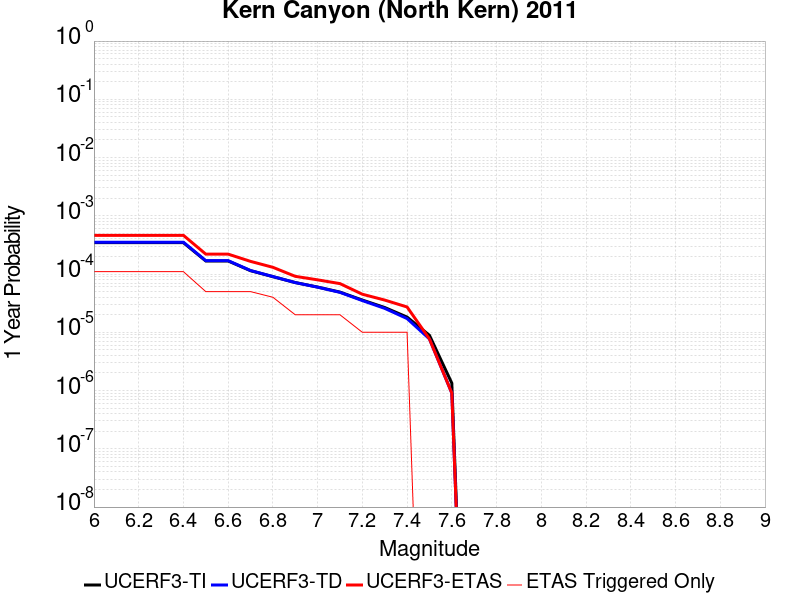 |  |

| Magnitude | 1 wk TI Prob | 1 wk TD Prob | 1 wk ETAS Prob | 1 wk ETAS/TD Gain | 1 wk ETAS Triggered Only | 1 mo TI Prob | 1 mo TD Prob | 1 mo ETAS Prob | 1 mo ETAS/TD Gain | 1 mo ETAS Triggered Only | 1 yr TI Prob | 1 yr TD Prob | 1 yr ETAS Prob | 1 yr ETAS/TD Gain | 1 yr ETAS Triggered Only | 10 yr TI Prob | 10 yr TD Prob | 10 yr ETAS Prob | 10 yr ETAS/TD Gain | 10 yr ETAS Triggered Only |
|-----|-----|-----|-----|-----|-----|-----|-----|-----|-----|-----|-----|-----|-----|-----|-----|-----|-----|-----|-----|-----|
| 6.0 | 6.6264497E-6 | 6.75733E-6 | 4.9647882E-5 | 7.3472633 | 4.2890842E-5 | 2.8398761E-5 | 2.895971E-5 | 7.184931E-5 | 2.4810092 | 4.2890842E-5 | 3.4570007E-4 | 3.5253543E-4 | 4.3828686E-4 | 1.243242 | 8.5781685E-5 | 0.0034516277 | 0.0035205502 | 0.0036487698 | 1.0364203 | 1.2867253E-4 |
| 6.1 | 6.6264497E-6 | 6.75733E-6 | 4.9647882E-5 | 7.3472633 | 4.2890842E-5 | 2.8398761E-5 | 2.895971E-5 | 7.184931E-5 | 2.4810092 | 4.2890842E-5 | 3.4570007E-4 | 3.5253543E-4 | 4.3828686E-4 | 1.243242 | 8.5781685E-5 | 0.0034516277 | 0.0035205502 | 0.0036487698 | 1.0364203 | 1.2867253E-4 |
| 6.2 | 6.6264497E-6 | 6.75733E-6 | 4.9647882E-5 | 7.3472633 | 4.2890842E-5 | 2.8398761E-5 | 2.895971E-5 | 7.184931E-5 | 2.4810092 | 4.2890842E-5 | 3.4570007E-4 | 3.5253543E-4 | 4.3828686E-4 | 1.243242 | 8.5781685E-5 | 0.0034516277 | 0.0035205502 | 0.0036487698 | 1.0364203 | 1.2867253E-4 |
| 6.3 | 6.6264497E-6 | 6.75733E-6 | 4.9647882E-5 | 7.3472633 | 4.2890842E-5 | 2.8398761E-5 | 2.895971E-5 | 7.184931E-5 | 2.4810092 | 4.2890842E-5 | 3.4570007E-4 | 3.5253543E-4 | 4.3828686E-4 | 1.243242 | 8.5781685E-5 | 0.0034516277 | 0.0035205502 | 0.0036487698 | 1.0364203 | 1.2867253E-4 |
| 6.4 | 6.6264497E-6 | 6.75733E-6 | 4.9647882E-5 | 7.3472633 | 4.2890842E-5 | 2.8398761E-5 | 2.895971E-5 | 7.184931E-5 | 2.4810092 | 4.2890842E-5 | 3.4570007E-4 | 3.5253543E-4 | 4.3828686E-4 | 1.243242 | 8.5781685E-5 | 0.0034516277 | 0.0035205502 | 0.0036487698 | 1.0364203 | 1.2867253E-4 |
| 6.5 | 3.2162225E-6 | 3.2570915E-6 | 4.6147794E-5 | 14.1684065 | 4.2890842E-5 | 1.3783738E-5 | 1.3958893E-5 | 5.6849138E-5 | 4.072611 | 4.2890842E-5 | 1.6780409E-4 | 1.6993708E-4 | 2.1282063E-4 | 1.2523496 | 4.2890842E-5 | 0.0016767744 | 0.001698151 | 0.001783787 | 1.050429 | 8.5781685E-5 |
| 6.6 | 3.2162225E-6 | 3.2570915E-6 | 4.6147794E-5 | 14.1684065 | 4.2890842E-5 | 1.3783738E-5 | 1.3958893E-5 | 5.6849138E-5 | 4.072611 | 4.2890842E-5 | 1.6780409E-4 | 1.6993708E-4 | 2.1282063E-4 | 1.2523496 | 4.2890842E-5 | 0.0016767744 | 0.001698151 | 0.001783787 | 1.050429 | 8.5781685E-5 |
| 6.7 | 2.1908265E-6 | 2.2071222E-6 | 4.509787E-5 | 20.432884 | 4.2890842E-5 | 9.389223E-6 | 9.459061E-6 | 5.23495E-5 | 5.5343227 | 4.2890842E-5 | 1.1430779E-4 | 1.1515819E-4 | 1.5804409E-4 | 1.3724086 | 4.2890842E-5 | 0.0011424901 | 0.0011510046 | 0.001193846 | 1.037221 | 4.2890842E-5 |
| 6.8 | 1.7303895E-6 | 1.7365529E-6 | 4.4627322E-5 | 25.698797 | 4.2890842E-5 | 7.415934E-6 | 7.4423488E-6 | 5.0332874E-5 | 6.763036 | 4.2890842E-5 | 9.028525E-5 | 9.0606925E-5 | 1.3349389E-4 | 1.4733298 | 4.2890842E-5 | 9.024858E-4 | 9.057096E-4 | 9.485616E-4 | 1.0473132 | 4.2890842E-5 |
| 6.9 | 1.3700314E-6 | 1.3688622E-6 | 4.4259647E-5 | 32.333164 | 4.2890842E-5 | 5.87155E-6 | 5.8665396E-6 | 4.875713E-5 | 8.311055 | 4.2890842E-5 | 7.148377E-5 | 7.142282E-5 | 1.14310606E-4 | 1.6004772 | 4.2890842E-5 | 7.146078E-4 | 7.140032E-4 | 7.5686345E-4 | 1.0600281 | 4.2890842E-5 |
| 7.0 | 1.1467797E-6 | 1.1413804E-6 | 4.4032175E-5 | 38.578 | 4.2890842E-5 | 4.9147607E-6 | 4.8916213E-6 | 4.7782254E-5 | 9.768184 | 4.2890842E-5 | 5.983557E-5 | 5.9553895E-5 | 1.0244218E-4 | 1.7201593 | 4.2890842E-5 | 5.981946E-4 | 5.953825E-4 | 6.382478E-4 | 1.0719962 | 4.2890842E-5 |
| 7.1 | 9.3952065E-7 | 9.3026904E-7 | 4.3821074E-5 | 47.105804 | 4.2890842E-5 | 4.026511E-6 | 3.9868614E-6 | 4.6877532E-5 | 11.758004 | 4.2890842E-5 | 4.9021666E-5 | 4.8538972E-5 | 9.142773E-5 | 1.8835943 | 4.2890842E-5 | 4.901085E-4 | 4.8528548E-4 | 5.2815553E-4 | 1.0883398 | 4.2890842E-5 |
| 7.2 | 6.858055E-7 | 6.7193E-7 | 4.3562744E-5 | 64.83226 | 4.2890842E-5 | 2.939163E-6 | 2.879697E-6 | 4.5770415E-5 | 15.894177 | 4.2890842E-5 | 3.5783723E-5 | 3.5059755E-5 | 7.7949095E-5 | 2.2233212 | 4.2890842E-5 | 3.5777962E-4 | 3.5054312E-4 | 3.9341894E-4 | 1.1223125 | 4.2890842E-5 |
| 7.3 | 5.1101983E-7 | 4.9393E-7 | 4.3384753E-5 | 87.83584 | 4.2890842E-5 | 2.1900833E-6 | 2.116841E-6 | 4.5007593E-5 | 21.261679 | 4.2890842E-5 | 2.6663936E-5 | 2.5772239E-5 | 6.8661975E-5 | 2.6641836 | 4.2890842E-5 | 2.6660739E-4 | 2.57693E-4 | 3.0057278E-4 | 1.1663988 | 4.2890842E-5 |
| 7.4 | 3.4999414E-7 | 3.2995905E-7 | 4.322079E-5 | 130.98834 | 4.2890842E-5 | 1.499974E-6 | 1.4141094E-6 | 4.4304892E-5 | 31.330595 | 4.2890842E-5 | 1.8262032E-5 | 1.721665E-5 | 6.0106755E-5 | 3.4911993 | 4.2890842E-5 | 1.826053E-4 | 1.7215339E-4 | 2.1503685E-4 | 1.2491003 | 4.2890842E-5 |
| 7.5 | 1.7021522E-7 | 1.4750044E-7 | 1.4750044E-7 | 1.0 | 0.0 | 7.2949354E-7 | 6.321446E-7 | 6.321446E-7 | 1.0 | 0.0 | 8.881548E-6 | 7.696334E-6 | 7.696334E-6 | 1.0 | 0.0 | 8.8811925E-5 | 7.696076E-5 | 7.696076E-5 | 1.0 | 0.0 |
| 7.6 | 2.572245E-8 | 1.7352555E-8 | 1.7352555E-8 | 1.0 | 0.0 | 1.10239064E-7 | 7.436809E-8 | 7.436809E-8 | 1.0 | 0.0 | 1.3421597E-6 | 9.054312E-7 | 9.054312E-7 | 1.0 | 0.0 | 1.3421517E-5 | 9.05428E-6 | 9.05428E-6 | 1.0 | 0.0 |

## San Jacinto (Superstition Mtn)
*[(top)](#table-of-contents)*

| 1 Week | 1 Month | 1 Year | 10 Year |
|-----|-----|-----|-----|
|  |  |  |  |

| Magnitude | 1 wk TI Prob | 1 wk TD Prob | 1 wk ETAS Prob | 1 wk ETAS/TD Gain | 1 wk ETAS Triggered Only | 1 mo TI Prob | 1 mo TD Prob | 1 mo ETAS Prob | 1 mo ETAS/TD Gain | 1 mo ETAS Triggered Only | 1 yr TI Prob | 1 yr TD Prob | 1 yr ETAS Prob | 1 yr ETAS/TD Gain | 1 yr ETAS Triggered Only | 10 yr TI Prob | 10 yr TD Prob | 10 yr ETAS Prob | 10 yr ETAS/TD Gain | 10 yr ETAS Triggered Only |
|-----|-----|-----|-----|-----|-----|-----|-----|-----|-----|-----|-----|-----|-----|-----|-----|-----|-----|-----|-----|-----|
| 6.0 | 6.4193904E-5 | 9.599367E-5 | 9.599367E-5 | 1.0 | 0.0 | 2.7508775E-4 | 4.1134638E-4 | 4.5421955E-4 | 1.1042265 | 4.2890842E-5 | 0.0033440501 | 0.0049980893 | 0.0050407657 | 1.0085386 | 4.2890842E-5 | 0.03294174 | 0.048823986 | 0.048946373 | 1.0025067 | 1.2867253E-4 |
| 6.1 | 6.4193904E-5 | 9.599367E-5 | 9.599367E-5 | 1.0 | 0.0 | 2.7508775E-4 | 4.1134638E-4 | 4.5421955E-4 | 1.1042265 | 4.2890842E-5 | 0.0033440501 | 0.0049980893 | 0.0050407657 | 1.0085386 | 4.2890842E-5 | 0.03294174 | 0.048823986 | 0.048946373 | 1.0025067 | 1.2867253E-4 |
| 6.2 | 5.7023593E-5 | 8.3144434E-5 | 8.3144434E-5 | 1.0 | 0.0 | 2.4436394E-4 | 3.5629404E-4 | 3.991696E-4 | 1.1203376 | 4.2890842E-5 | 0.002971072 | 0.0043308944 | 0.0043735993 | 1.0098605 | 4.2890842E-5 | 0.029316625 | 0.04250403 | 0.042627234 | 1.0028986 | 1.2867253E-4 |
| 6.3 | 5.6940098E-5 | 8.298979E-5 | 8.298979E-5 | 1.0 | 0.0 | 2.4400617E-4 | 3.5563146E-4 | 3.9850705E-4 | 1.1205618 | 4.2890842E-5 | 0.002966728 | 0.00432286 | 0.0043655653 | 1.009879 | 4.2890842E-5 | 0.029274331 | 0.042427283 | 0.042550497 | 1.002904 | 1.2867253E-4 |
| 6.4 | 5.4171585E-5 | 7.7483564E-5 | 7.7483564E-5 | 1.0 | 0.0 | 2.3214328E-4 | 3.3203943E-4 | 3.7491604E-4 | 1.1291311 | 4.2890842E-5 | 0.0028226813 | 0.0040367353 | 0.0040794527 | 1.0105822 | 4.2890842E-5 | 0.02787096 | 0.03971653 | 0.039840095 | 1.0031111 | 1.2867253E-4 |
| 6.5 | 4.375144E-5 | 5.642133E-5 | 5.642133E-5 | 1.0 | 0.0 | 1.874927E-4 | 2.4178992E-4 | 2.846704E-4 | 1.177346 | 4.2890842E-5 | 0.0022803338 | 0.002940994 | 0.0029837587 | 1.0145409 | 4.2890842E-5 | 0.022570757 | 0.029236801 | 0.029361712 | 1.0042723 | 1.2867253E-4 |
| 6.6 | 2.772192E-5 | 2.5488358E-5 | 2.5488358E-5 | 1.0 | 0.0 | 1.1880282E-4 | 1.09231354E-4 | 1.09231354E-4 | 1.0 | 0.0 | 0.0014454646 | 0.0013290998 | 0.0013290998 | 1.0 | 0.0 | 0.014360986 | 0.01354049 | 0.01354049 | 1.0 | 0.0 |
| 6.7 | 2.7124124E-5 | 2.4699386E-5 | 2.4699386E-5 | 1.0 | 0.0 | 1.1624106E-4 | 1.05850326E-4 | 1.05850326E-4 | 1.0 | 0.0 | 0.0014143161 | 0.001287985 | 0.001287985 | 1.0 | 0.0 | 0.014053487 | 0.013133943 | 0.013133943 | 1.0 | 0.0 |
| 6.8 | 2.5475807E-5 | 2.216446E-5 | 2.216446E-5 | 1.0 | 0.0 | 1.0917746E-4 | 9.4987154E-5 | 9.4987154E-5 | 1.0 | 0.0 | 0.001328425 | 0.001155867 | 0.001155867 | 1.0 | 0.0 | 0.0132051185 | 0.011822182 | 0.011822182 | 1.0 | 0.0 |
| 6.9 | 2.1162023E-5 | 1.7626244E-5 | 1.7626244E-5 | 1.0 | 0.0 | 9.069123E-5 | 7.5538876E-5 | 7.5538876E-5 | 1.0 | 0.0 | 0.0011036064 | 9.193016E-4 | 9.193016E-4 | 1.0 | 0.0 | 0.010981417 | 0.00944688 | 0.00944688 | 1.0 | 0.0 |
| 7.0 | 1.8754288E-5 | 1.6161559E-5 | 1.6161559E-5 | 1.0 | 0.0 | 8.037304E-5 | 6.9261994E-5 | 6.9261994E-5 | 1.0 | 0.0 | 9.781026E-4 | 8.4294105E-4 | 8.4294105E-4 | 1.0 | 0.0 | 0.009738087 | 0.008670042 | 0.008670042 | 1.0 | 0.0 |
| 7.1 | 1.8678527E-5 | 1.6086702E-5 | 1.6086702E-5 | 1.0 | 0.0 | 8.0048376E-5 | 6.89412E-5 | 6.89412E-5 | 1.0 | 0.0 | 9.7415317E-4 | 8.3903834E-4 | 8.3903834E-4 | 1.0 | 0.0 | 0.009698939 | 0.008630998 | 0.008630998 | 1.0 | 0.0 |
| 7.2 | 1.7804578E-5 | 1.5381282E-5 | 1.5381282E-5 | 1.0 | 0.0 | 7.6303106E-5 | 6.5918124E-5 | 6.5918124E-5 | 1.0 | 0.0 | 9.285943E-4 | 8.022599E-4 | 8.022599E-4 | 1.0 | 0.0 | 0.009247236 | 0.008262311 | 0.008262311 | 1.0 | 0.0 |
| 7.3 | 1.6583685E-5 | 1.4530388E-5 | 1.4530388E-5 | 1.0 | 0.0 | 7.1070994E-5 | 6.227162E-5 | 6.227162E-5 | 1.0 | 0.0 | 8.649459E-4 | 7.5789524E-4 | 7.5789524E-4 | 1.0 | 0.0 | 0.00861587 | 0.007817623 | 0.007817623 | 1.0 | 0.0 |
| 7.4 | 1.6387552E-5 | 1.4395274E-5 | 1.4395274E-5 | 1.0 | 0.0 | 7.023047E-5 | 6.169258E-5 | 6.169258E-5 | 1.0 | 0.0 | 8.5472054E-4 | 7.5085036E-4 | 7.5085036E-4 | 1.0 | 0.0 | 0.008514405 | 0.0077470057 | 0.0077470057 | 1.0 | 0.0 |
| 7.5 | 1.5790754E-5 | 1.4035962E-5 | 1.4035962E-5 | 1.0 | 0.0 | 6.767291E-5 | 6.0152746E-5 | 6.0152746E-5 | 1.0 | 0.0 | 8.236062E-4 | 7.321156E-4 | 7.321156E-4 | 1.0 | 0.0 | 0.008205604 | 0.007557569 | 0.007557569 | 1.0 | 0.0 |
| 7.6 | 1.4248672E-5 | 1.3054932E-5 | 1.3054932E-5 | 1.0 | 0.0 | 6.106431E-5 | 5.594852E-5 | 5.594852E-5 | 1.0 | 0.0 | 7.432043E-4 | 6.8096205E-4 | 6.8096205E-4 | 1.0 | 0.0 | 0.007407237 | 0.0070401574 | 0.0070401574 | 1.0 | 0.0 |
| 7.7 | 1.15449975E-5 | 1.090368E-5 | 1.090368E-5 | 1.0 | 0.0 | 4.947762E-5 | 4.6729223E-5 | 4.6729223E-5 | 1.0 | 0.0 | 6.022235E-4 | 5.687805E-4 | 5.687805E-4 | 1.0 | 0.0 | 0.006005941 | 0.0059101824 | 0.0059101824 | 1.0 | 0.0 |
| 7.8 | 9.1391985E-6 | 9.514299E-6 | 9.514299E-6 | 1.0 | 0.0 | 3.9167408E-5 | 4.0774932E-5 | 4.0774932E-5 | 1.0 | 0.0 | 4.767588E-4 | 4.963223E-4 | 4.963223E-4 | 1.0 | 0.0 | 0.0047573727 | 0.0051766867 | 0.0051766867 | 1.0 | 0.0 |
| 7.9 | 6.973017E-6 | 7.3821784E-6 | 7.3821784E-6 | 1.0 | 0.0 | 2.9884017E-5 | 3.1637526E-5 | 3.1637526E-5 | 1.0 | 0.0 | 3.6377716E-4 | 3.8511935E-4 | 3.8511935E-4 | 1.0 | 0.0 | 0.0036318225 | 0.0040517948 | 0.0040517948 | 1.0 | 0.0 |
| 8.0 | 5.7638235E-6 | 6.259972E-6 | 6.259972E-6 | 1.0 | 0.0 | 2.4701867E-5 | 2.6828178E-5 | 2.6828178E-5 | 1.0 | 0.0 | 3.0070372E-4 | 3.2658462E-4 | 3.2658462E-4 | 1.0 | 0.0 | 0.0030029714 | 0.0034534496 | 0.0034534496 | 1.0 | 0.0 |
| 8.1 | 5.1124434E-6 | 5.4956718E-6 | 5.4956718E-6 | 1.0 | 0.0 | 2.1910288E-5 | 2.355267E-5 | 2.355267E-5 | 1.0 | 0.0 | 2.6672508E-4 | 2.867165E-4 | 2.867165E-4 | 1.0 | 0.0 | 0.0026640517 | 0.003040336 | 0.003040336 | 1.0 | 0.0 |
| 8.2 | 1.1075938E-6 | 5.336568E-7 | 5.336568E-7 | 1.0 | 0.0 | 4.7468216E-6 | 2.2870988E-6 | 2.2870988E-6 | 1.0 | 0.0 | 5.779102E-5 | 2.7845093E-5 | 2.7845093E-5 | 1.0 | 0.0 | 5.777599E-4 | 3.1346595E-4 | 3.1346595E-4 | 1.0 | 0.0 |
| 8.3 | 1.3584393E-8 | 4.473836E-9 | 4.473836E-9 | 1.0 | 0.0 | 5.8218827E-8 | 1.9173582E-8 | 1.9173582E-8 | 1.0 | 0.0 | 7.0881396E-7 | 2.3343837E-7 | 2.3343837E-7 | 1.0 | 0.0 | 7.0881174E-6 | 2.6163038E-6 | 2.6163038E-6 | 1.0 | 0.0 |

## Santa Ynez (West)
*[(top)](#table-of-contents)*

| 1 Week | 1 Month | 1 Year | 10 Year |
|-----|-----|-----|-----|
|  |  | 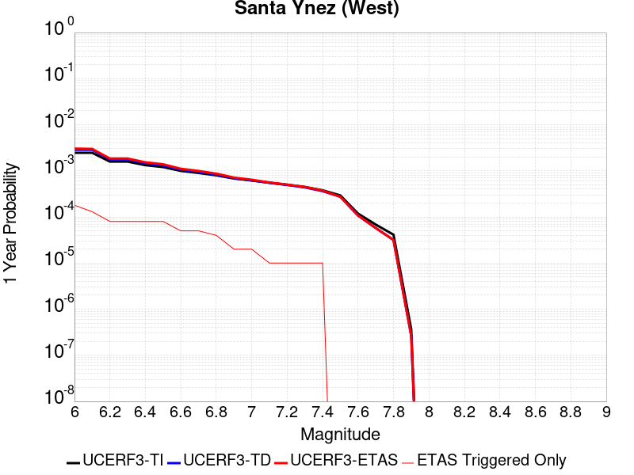 |  |

| Magnitude | 1 wk TI Prob | 1 wk TD Prob | 1 wk ETAS Prob | 1 wk ETAS/TD Gain | 1 wk ETAS Triggered Only | 1 mo TI Prob | 1 mo TD Prob | 1 mo ETAS Prob | 1 mo ETAS/TD Gain | 1 mo ETAS Triggered Only | 1 yr TI Prob | 1 yr TD Prob | 1 yr ETAS Prob | 1 yr ETAS/TD Gain | 1 yr ETAS Triggered Only | 10 yr TI Prob | 10 yr TD Prob | 10 yr ETAS Prob | 10 yr ETAS/TD Gain | 10 yr ETAS Triggered Only |
|-----|-----|-----|-----|-----|-----|-----|-----|-----|-----|-----|-----|-----|-----|-----|-----|-----|-----|-----|-----|-----|
| 6.0 | 4.7352758E-5 | 5.4972126E-5 | 5.4972126E-5 | 1.0 | 0.0 | 2.0292461E-4 | 2.3557522E-4 | 2.7845596E-4 | 1.1820257 | 4.2890842E-5 | 0.0024678076 | 0.0028645284 | 0.0029500644 | 1.0298604 | 8.5781685E-5 | 0.024405818 | 0.028304417 | 0.028429449 | 1.0044173 | 1.2867253E-4 |
| 6.1 | 4.7352758E-5 | 5.4972126E-5 | 5.4972126E-5 | 1.0 | 0.0 | 2.0292461E-4 | 2.3557522E-4 | 2.3557522E-4 | 1.0 | 0.0 | 0.0024678076 | 0.0028645284 | 0.0028645284 | 1.0 | 0.0 | 0.024405818 | 0.028304417 | 0.028346093 | 1.0014725 | 4.2890842E-5 |
| 6.2 | 3.0415853E-5 | 3.392511E-5 | 3.392511E-5 | 1.0 | 0.0 | 1.3034715E-4 | 1.4538545E-4 | 1.4538545E-4 | 1.0 | 0.0 | 0.0015858212 | 0.0017686661 | 0.0017686661 | 1.0 | 0.0 | 0.015745522 | 0.017549807 | 0.017591946 | 1.0024011 | 4.2890842E-5 |
| 6.3 | 3.0415853E-5 | 3.392511E-5 | 3.392511E-5 | 1.0 | 0.0 | 1.3034715E-4 | 1.4538545E-4 | 1.4538545E-4 | 1.0 | 0.0 | 0.0015858212 | 0.0017686661 | 0.0017686661 | 1.0 | 0.0 | 0.015745522 | 0.017549807 | 0.017591946 | 1.0024011 | 4.2890842E-5 |
| 6.4 | 2.5452082E-5 | 2.7912422E-5 | 2.7912422E-5 | 1.0 | 0.0 | 1.09075794E-4 | 1.196193E-4 | 1.196193E-4 | 1.0 | 0.0 | 0.0013271887 | 0.0014554089 | 0.0014554089 | 1.0 | 0.0 | 0.013192902 | 0.014460951 | 0.014503222 | 1.0029231 | 4.2890842E-5 |
| 6.5 | 2.3143784E-5 | 2.5128256E-5 | 2.5128256E-5 | 1.0 | 0.0 | 9.9183875E-5 | 1.0768817E-4 | 1.0768817E-4 | 1.0 | 0.0 | 0.0012068948 | 0.0013103267 | 0.0013103267 | 1.0 | 0.0 | 0.012003611 | 0.01302768 | 0.013070012 | 1.0032494 | 4.2890842E-5 |
| 6.6 | 1.9118515E-5 | 2.035434E-5 | 2.035434E-5 | 1.0 | 0.0 | 8.193392E-5 | 8.7230015E-5 | 8.7230015E-5 | 1.0 | 0.0 | 9.97089E-4 | 0.001061516 | 0.001061516 | 1.0 | 0.0 | 0.00992627 | 0.010565365 | 0.010565365 | 1.0 | 0.0 |
| 6.7 | 1.722807E-5 | 1.8146347E-5 | 1.8146347E-5 | 1.0 | 0.0 | 7.3832496E-5 | 7.776777E-5 | 7.776777E-5 | 1.0 | 0.0 | 8.985399E-4 | 9.464169E-4 | 9.464169E-4 | 1.0 | 0.0 | 0.008949154 | 0.0094245095 | 0.0094245095 | 1.0 | 0.0 |
| 6.8 | 1.5317364E-5 | 1.5926486E-5 | 1.5926486E-5 | 1.0 | 0.0 | 6.56442E-5 | 6.82546E-5 | 6.82546E-5 | 1.0 | 0.0 | 7.98925E-4 | 8.306873E-4 | 8.306873E-4 | 1.0 | 0.0 | 0.007960589 | 0.00827631 | 0.00827631 | 1.0 | 0.0 |
| 6.9 | 1.3071226E-5 | 1.3329624E-5 | 1.3329624E-5 | 1.0 | 0.0 | 5.6018336E-5 | 5.7125722E-5 | 5.7125722E-5 | 1.0 | 0.0 | 6.8180985E-4 | 6.9528597E-4 | 6.9528597E-4 | 1.0 | 0.0 | 0.0067972173 | 0.006931367 | 0.006931367 | 1.0 | 0.0 |
| 7.0 | 1.1836986E-5 | 1.19327815E-5 | 1.19327815E-5 | 1.0 | 0.0 | 5.0728955E-5 | 5.11395E-5 | 5.11395E-5 | 1.0 | 0.0 | 6.1745E-4 | 6.2244723E-4 | 6.2244723E-4 | 1.0 | 0.0 | 0.006157372 | 0.006207231 | 0.006207231 | 1.0 | 0.0 |
| 7.1 | 1.0597169E-5 | 1.0542201E-5 | 1.0542201E-5 | 1.0 | 0.0 | 4.541565E-5 | 4.5180084E-5 | 4.5180084E-5 | 1.0 | 0.0 | 5.5279525E-4 | 5.4992986E-4 | 5.4992986E-4 | 1.0 | 0.0 | 0.0055142213 | 0.005485821 | 0.005485821 | 1.0 | 0.0 |
| 7.2 | 9.59113E-6 | 9.459144E-6 | 9.459144E-6 | 1.0 | 0.0 | 4.11042E-5 | 4.0538565E-5 | 4.0538565E-5 | 1.0 | 0.0 | 5.0032866E-4 | 4.934463E-4 | 4.934463E-4 | 1.0 | 0.0 | 0.004992037 | 0.0049236254 | 0.0049236254 | 1.0 | 0.0 |
| 7.3 | 8.586084E-6 | 8.379583E-6 | 8.379583E-6 | 1.0 | 0.0 | 3.679698E-5 | 3.5912013E-5 | 3.5912013E-5 | 1.0 | 0.0 | 4.4791115E-4 | 4.3714207E-4 | 4.3714207E-4 | 1.0 | 0.0 | 0.004470094 | 0.004362933 | 0.004362933 | 1.0 | 0.0 |
| 7.4 | 7.2622997E-6 | 6.9515427E-6 | 6.9515427E-6 | 1.0 | 0.0 | 3.112377E-5 | 2.979199E-5 | 2.979199E-5 | 1.0 | 0.0 | 3.78866E-4 | 3.626581E-4 | 3.626581E-4 | 1.0 | 0.0 | 0.0037822074 | 0.0036207628 | 0.0036207628 | 1.0 | 0.0 |
| 7.5 | 5.627296E-6 | 5.251588E-6 | 5.251588E-6 | 1.0 | 0.0 | 2.411676E-5 | 2.2506614E-5 | 2.2506614E-5 | 1.0 | 0.0 | 2.9358198E-4 | 2.739843E-4 | 2.739843E-4 | 1.0 | 0.0 | 0.0029319443 | 0.002736537 | 0.002736537 | 1.0 | 0.0 |
| 7.6 | 2.265244E-6 | 2.0608625E-6 | 2.0608625E-6 | 1.0 | 0.0 | 9.708152E-6 | 8.832238E-6 | 8.832238E-6 | 1.0 | 0.0 | 1.18190335E-4 | 1.0752728E-4 | 1.0752728E-4 | 1.0 | 0.0 | 0.001181275 | 0.0010747612 | 0.0010747612 | 1.0 | 0.0 |
| 7.7 | 1.3099874E-6 | 1.1016252E-6 | 1.1016252E-6 | 1.0 | 0.0 | 5.61422E-6 | 4.7212425E-6 | 4.7212425E-6 | 1.0 | 0.0 | 6.8350986E-5 | 5.7479636E-5 | 5.7479636E-5 | 1.0 | 0.0 | 6.832996E-4 | 5.7465007E-4 | 5.7465007E-4 | 1.0 | 0.0 |
| 7.8 | 7.903951E-7 | 6.0711415E-7 | 6.0711415E-7 | 1.0 | 0.0 | 3.3874032E-6 | 2.6019152E-6 | 2.6019152E-6 | 1.0 | 0.0 | 4.1240855E-5 | 3.167787E-5 | 3.167787E-5 | 1.0 | 0.0 | 4.12332E-4 | 3.167349E-4 | 3.167349E-4 | 1.0 | 0.0 |
| 7.9 | 7.0753297E-9 | 5.0899476E-9 | 5.0899476E-9 | 1.0 | 0.0 | 3.032284E-8 | 2.181406E-8 | 2.181406E-8 | 1.0 | 0.0 | 3.6918053E-7 | 2.6558615E-7 | 2.6558615E-7 | 1.0 | 0.0 | 3.691799E-6 | 2.6558594E-6 | 2.6558594E-6 | 1.0 | 0.0 |

## Pinto Mtn
*[(top)](#table-of-contents)*

| 1 Week | 1 Month | 1 Year | 10 Year |
|-----|-----|-----|-----|
|  |  |  |  |

| Magnitude | 1 wk TI Prob | 1 wk TD Prob | 1 wk ETAS Prob | 1 wk ETAS/TD Gain | 1 wk ETAS Triggered Only | 1 mo TI Prob | 1 mo TD Prob | 1 mo ETAS Prob | 1 mo ETAS/TD Gain | 1 mo ETAS Triggered Only | 1 yr TI Prob | 1 yr TD Prob | 1 yr ETAS Prob | 1 yr ETAS/TD Gain | 1 yr ETAS Triggered Only | 10 yr TI Prob | 10 yr TD Prob | 10 yr ETAS Prob | 10 yr ETAS/TD Gain | 10 yr ETAS Triggered Only |
|-----|-----|-----|-----|-----|-----|-----|-----|-----|-----|-----|-----|-----|-----|-----|-----|-----|-----|-----|-----|-----|
| 6.0 | 4.4194956E-5 | 4.785362E-5 | 1.336312E-4 | 2.7924993 | 8.5781685E-5 | 1.893932E-4 | 2.0507174E-4 | 2.9083583E-4 | 1.418215 | 8.5781685E-5 | 0.0023034236 | 0.0024940541 | 0.002579622 | 1.0343087 | 8.5781685E-5 | 0.022796938 | 0.024678145 | 0.024803642 | 1.0050853 | 1.2867253E-4 |
| 6.1 | 4.4194956E-5 | 4.785362E-5 | 1.336312E-4 | 2.7924993 | 8.5781685E-5 | 1.893932E-4 | 2.0507174E-4 | 2.9083583E-4 | 1.418215 | 8.5781685E-5 | 0.0023034236 | 0.0024940541 | 0.002579622 | 1.0343087 | 8.5781685E-5 | 0.022796938 | 0.024678145 | 0.024803642 | 1.0050853 | 1.2867253E-4 |
| 6.2 | 4.4194956E-5 | 4.785362E-5 | 1.336312E-4 | 2.7924993 | 8.5781685E-5 | 1.893932E-4 | 2.0507174E-4 | 2.9083583E-4 | 1.418215 | 8.5781685E-5 | 0.0023034236 | 0.0024940541 | 0.002579622 | 1.0343087 | 8.5781685E-5 | 0.022796938 | 0.024678145 | 0.024803642 | 1.0050853 | 1.2867253E-4 |
| 6.3 | 4.4194956E-5 | 4.785362E-5 | 1.336312E-4 | 2.7924993 | 8.5781685E-5 | 1.893932E-4 | 2.0507174E-4 | 2.9083583E-4 | 1.418215 | 8.5781685E-5 | 0.0023034236 | 0.0024940541 | 0.002579622 | 1.0343087 | 8.5781685E-5 | 0.022796938 | 0.024678145 | 0.024803642 | 1.0050853 | 1.2867253E-4 |
| 6.4 | 3.729929E-5 | 3.9603186E-5 | 1.2538147E-4 | 3.165944 | 8.5781685E-5 | 1.5984432E-4 | 1.6971743E-4 | 2.5548454E-4 | 1.5053525 | 8.5781685E-5 | 0.0019443673 | 0.002064445 | 0.0021500497 | 1.0414661 | 8.5781685E-5 | 0.019274427 | 0.02046269 | 0.02058873 | 1.0061594 | 1.2867253E-4 |
| 6.5 | 3.729929E-5 | 3.9603186E-5 | 1.2538147E-4 | 3.165944 | 8.5781685E-5 | 1.5984432E-4 | 1.6971743E-4 | 2.5548454E-4 | 1.5053525 | 8.5781685E-5 | 0.0019443673 | 0.002064445 | 0.0021500497 | 1.0414661 | 8.5781685E-5 | 0.019274427 | 0.02046269 | 0.02058873 | 1.0061594 | 1.2867253E-4 |
| 6.6 | 3.0204548E-5 | 3.1205298E-5 | 1.1698431E-4 | 3.7488604 | 8.5781685E-5 | 1.2944164E-4 | 1.3373033E-4 | 2.1950055E-4 | 1.641367 | 8.5781685E-5 | 0.0015748127 | 0.0016269855 | 0.0017126276 | 1.0526385 | 8.5781685E-5 | 0.015636992 | 0.01615461 | 0.016281202 | 1.0078363 | 1.2867253E-4 |
| 6.7 | 2.9857754E-5 | 3.081468E-5 | 1.1659372E-4 | 3.783707 | 8.5781685E-5 | 1.2795553E-4 | 1.3205643E-4 | 2.1782679E-4 | 1.6494977 | 8.5781685E-5 | 0.0015567453 | 0.001606636 | 0.0016922798 | 1.0533063 | 8.5781685E-5 | 0.015458848 | 0.01595405 | 0.016080668 | 1.0079365 | 1.2867253E-4 |
| 6.8 | 2.4819734E-5 | 2.5009364E-5 | 1.10788904E-4 | 4.429897 | 8.5781685E-5 | 1.0636595E-4 | 1.07178705E-4 | 1.929512E-4 | 1.8002756 | 8.5781685E-5 | 0.0012942362 | 0.0013041412 | 0.001389811 | 1.0656906 | 8.5781685E-5 | 0.012867244 | 0.0129672475 | 0.013094251 | 1.0097942 | 1.2867253E-4 |
| 6.9 | 2.331124E-5 | 2.3337643E-5 | 1.09117325E-4 | 4.6755934 | 8.5781685E-5 | 9.990149E-5 | 1.00014746E-4 | 1.8578785E-4 | 1.8576046 | 8.5781685E-5 | 0.001215622 | 0.0012170197 | 0.001302697 | 1.0703993 | 8.5781685E-5 | 0.012089936 | 0.012105742 | 0.012232856 | 1.0105004 | 1.2867253E-4 |
| 7.0 | 2.1818534E-5 | 2.1760772E-5 | 6.465068E-5 | 2.9709737 | 4.2890842E-5 | 9.3504656E-5 | 9.325723E-5 | 1.3614408E-4 | 1.4598769 | 4.2890842E-5 | 0.0011378246 | 0.0011348352 | 0.0011776774 | 1.0377519 | 4.2890842E-5 | 0.011320163 | 0.011292503 | 0.011377317 | 1.0075105 | 8.5781685E-5 |
| 7.1 | 2.066081E-5 | 2.0540418E-5 | 6.343038E-5 | 3.0880764 | 4.2890842E-5 | 8.854332E-5 | 8.8027504E-5 | 1.3091457E-4 | 1.4872007 | 4.2890842E-5 | 0.0010774818 | 0.0010712275 | 0.0011140724 | 1.039996 | 4.2890842E-5 | 0.010722724 | 0.010662688 | 0.010747556 | 1.0079592 | 8.5781685E-5 |
| 7.2 | 1.8990233E-5 | 1.9053701E-5 | 6.194373E-5 | 3.2510076 | 4.2890842E-5 | 8.138417E-5 | 8.1656275E-5 | 1.2454361E-4 | 1.5252179 | 4.2890842E-5 | 9.904018E-4 | 9.937311E-4 | 0.0010365793 | 1.0431185 | 4.2890842E-5 | 0.009859995 | 0.009894874 | 0.009979807 | 1.0085835 | 8.5781685E-5 |
| 7.3 | 1.3335872E-5 | 1.4906372E-5 | 5.7796577E-5 | 3.8773067 | 4.2890842E-5 | 5.7152483E-5 | 6.388296E-5 | 1.0677106E-4 | 1.6713544 | 4.2890842E-5 | 6.956093E-4 | 7.775102E-4 | 8.203677E-4 | 1.0551214 | 4.2890842E-5 | 0.006934359 | 0.0077491994 | 0.007834316 | 1.010984 | 8.5781685E-5 |
| 7.4 | 9.414066E-6 | 1.186061E-5 | 1.186061E-5 | 1.0 | 0.0 | 4.0345374E-5 | 5.0830247E-5 | 5.0830247E-5 | 1.0 | 0.0 | 4.910942E-4 | 6.1869196E-4 | 6.1869196E-4 | 1.0 | 0.0 | 0.0049001034 | 0.006170644 | 0.00621327 | 1.0069079 | 4.2890842E-5 |
| 7.5 | 7.2101157E-6 | 9.157893E-6 | 9.157893E-6 | 1.0 | 0.0 | 3.090013E-5 | 3.924757E-5 | 3.924757E-5 | 1.0 | 0.0 | 3.7614413E-4 | 4.7774217E-4 | 4.7774217E-4 | 1.0 | 0.0 | 0.0037550807 | 0.004767927 | 0.004810613 | 1.0089529 | 4.2890842E-5 |
| 7.6 | 3.296375E-6 | 4.5453176E-6 | 4.5453176E-6 | 1.0 | 0.0 | 1.4127245E-5 | 1.9479796E-5 | 1.9479796E-5 | 1.0 | 0.0 | 1.7198564E-4 | 2.3714209E-4 | 2.3714209E-4 | 1.0 | 0.0 | 0.0017185259 | 0.0023690276 | 0.002411817 | 1.018062 | 4.2890842E-5 |
| 7.7 | 2.5741092E-6 | 3.584251E-6 | 3.584251E-6 | 1.0 | 0.0 | 1.103185E-5 | 1.5360993E-5 | 1.5360993E-5 | 1.0 | 0.0 | 1.3430449E-4 | 1.8700535E-4 | 1.8700535E-4 | 1.0 | 0.0 | 0.0013422335 | 0.0018686098 | 0.0018686098 | 1.0 | 0.0 |

## Camp Rock 2011
*[(top)](#table-of-contents)*

| 1 Week | 1 Month | 1 Year | 10 Year |
|-----|-----|-----|-----|
|  |  |  | 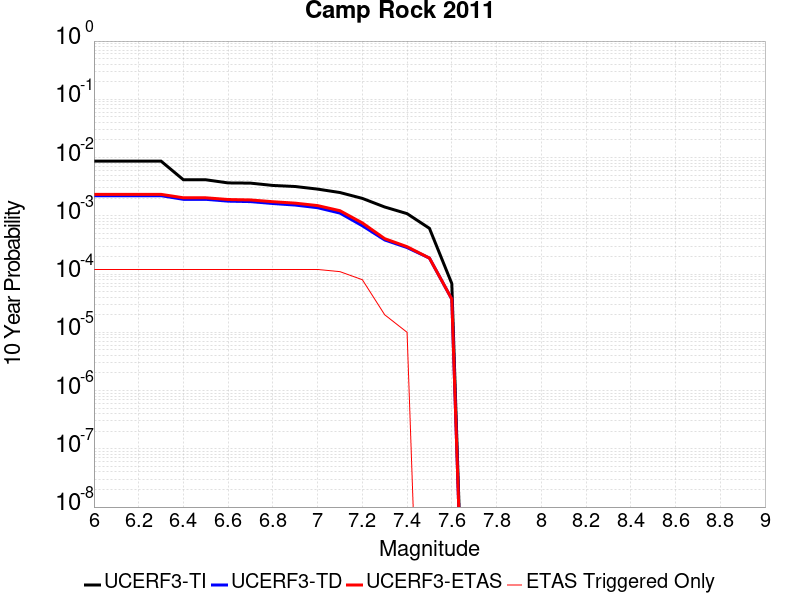 |

| Magnitude | 1 wk TI Prob | 1 wk TD Prob | 1 wk ETAS Prob | 1 wk ETAS/TD Gain | 1 wk ETAS Triggered Only | 1 mo TI Prob | 1 mo TD Prob | 1 mo ETAS Prob | 1 mo ETAS/TD Gain | 1 mo ETAS Triggered Only | 1 yr TI Prob | 1 yr TD Prob | 1 yr ETAS Prob | 1 yr ETAS/TD Gain | 1 yr ETAS Triggered Only | 10 yr TI Prob | 10 yr TD Prob | 10 yr ETAS Prob | 10 yr ETAS/TD Gain | 10 yr ETAS Triggered Only |
|-----|-----|-----|-----|-----|-----|-----|-----|-----|-----|-----|-----|-----|-----|-----|-----|-----|-----|-----|-----|-----|
| 6.0 | 1.6710783E-5 | 4.25026E-6 | 4.7140922E-5 | 11.091302 | 4.2890842E-5 | 7.161568E-5 | 1.8215276E-5 | 1.039954E-4 | 5.709241 | 8.5781685E-5 | 8.7157206E-4 | 2.2174895E-4 | 3.0751163E-4 | 1.3867557 | 8.5781685E-5 | 0.008681616 | 0.0022153298 | 0.0023437173 | 1.0579541 | 1.2867253E-4 |
| 6.1 | 1.6710783E-5 | 4.25026E-6 | 4.7140922E-5 | 11.091302 | 4.2890842E-5 | 7.161568E-5 | 1.8215276E-5 | 1.039954E-4 | 5.709241 | 8.5781685E-5 | 8.7157206E-4 | 2.2174895E-4 | 3.0751163E-4 | 1.3867557 | 8.5781685E-5 | 0.008681616 | 0.0022153298 | 0.0023437173 | 1.0579541 | 1.2867253E-4 |
| 6.2 | 1.6710783E-5 | 4.25026E-6 | 4.7140922E-5 | 11.091302 | 4.2890842E-5 | 7.161568E-5 | 1.8215276E-5 | 1.039954E-4 | 5.709241 | 8.5781685E-5 | 8.7157206E-4 | 2.2174895E-4 | 3.0751163E-4 | 1.3867557 | 8.5781685E-5 | 0.008681616 | 0.0022153298 | 0.0023437173 | 1.0579541 | 1.2867253E-4 |
| 6.3 | 1.6710783E-5 | 4.25026E-6 | 4.7140922E-5 | 11.091302 | 4.2890842E-5 | 7.161568E-5 | 1.8215276E-5 | 1.039954E-4 | 5.709241 | 8.5781685E-5 | 8.7157206E-4 | 2.2174895E-4 | 3.0751163E-4 | 1.3867557 | 8.5781685E-5 | 0.008681616 | 0.0022153298 | 0.0023437173 | 1.0579541 | 1.2867253E-4 |
| 6.4 | 7.982846E-6 | 3.6820884E-6 | 4.657277E-5 | 12.648467 | 4.2890842E-5 | 3.421175E-5 | 1.5780286E-5 | 1.0156062E-4 | 6.4359174 | 8.5781685E-5 | 4.1644843E-4 | 1.9210839E-4 | 2.778736E-4 | 1.4464418 | 8.5781685E-5 | 0.0041566887 | 0.001919458 | 0.0020478836 | 1.0669072 | 1.2867253E-4 |
| 6.5 | 7.982846E-6 | 3.6820884E-6 | 4.657277E-5 | 12.648467 | 4.2890842E-5 | 3.421175E-5 | 1.5780286E-5 | 1.0156062E-4 | 6.4359174 | 8.5781685E-5 | 4.1644843E-4 | 1.9210839E-4 | 2.778736E-4 | 1.4464418 | 8.5781685E-5 | 0.0041566887 | 0.001919458 | 0.0020478836 | 1.0669072 | 1.2867253E-4 |
| 6.6 | 7.048869E-6 | 3.4243571E-6 | 4.6315054E-5 | 13.525182 | 4.2890842E-5 | 3.0209088E-5 | 1.4675736E-5 | 1.0045616E-4 | 6.8450513 | 8.5781685E-5 | 3.677336E-4 | 1.7866275E-4 | 2.644291E-4 | 1.4800462 | 8.5781685E-5 | 0.0036712566 | 0.0017852228 | 0.0019136656 | 1.0719478 | 1.2867253E-4 |
| 6.7 | 6.987307E-6 | 3.3623348E-6 | 4.6253033E-5 | 13.756225 | 4.2890842E-5 | 2.9945259E-5 | 1.4409929E-5 | 1.0019038E-4 | 6.9528713 | 8.5781685E-5 | 3.6452254E-4 | 1.7542706E-4 | 2.611937E-4 | 1.488902 | 8.5781685E-5 | 0.0036392517 | 0.001752917 | 0.0018813639 | 1.0732762 | 1.2867253E-4 |
| 6.8 | 6.3737602E-6 | 3.1179077E-6 | 4.6008616E-5 | 14.7562475 | 4.2890842E-5 | 2.731583E-5 | 1.3362394E-5 | 9.914293E-5 | 7.4195485 | 8.5781685E-5 | 3.3251947E-4 | 1.626753E-4 | 2.4844302E-4 | 1.5272326 | 8.5781685E-5 | 0.0033202237 | 0.0016255907 | 0.0017540541 | 1.0790256 | 1.2867253E-4 |
| 6.9 | 6.112211E-6 | 2.9331156E-6 | 4.5823832E-5 | 15.622921 | 4.2890842E-5 | 2.6194928E-5 | 1.2570436E-5 | 9.835105E-5 | 7.823996 | 8.5781685E-5 | 3.1887658E-4 | 1.5303459E-4 | 2.3880316E-4 | 1.5604521 | 8.5781685E-5 | 0.003184194 | 0.0015293199 | 0.0016577956 | 1.0840085 | 1.2867253E-4 |
| 7.0 | 5.5140117E-6 | 2.641923E-6 | 4.553265E-5 | 17.234663 | 4.2890842E-5 | 2.3631264E-5 | 1.132248E-5 | 9.710319E-5 | 8.576142 | 8.5781685E-5 | 2.8767265E-4 | 1.3784273E-4 | 2.2361259E-4 | 1.6222299 | 8.5781685E-5 | 0.0028730053 | 0.0013775975 | 0.0015060927 | 1.093275 | 1.2867253E-4 |
| 7.1 | 4.8151105E-6 | 2.1342705E-6 | 4.5025023E-5 | 21.096212 | 4.2890842E-5 | 2.0636026E-5 | 9.146843E-6 | 9.4927746E-5 | 10.378199 | 8.5781685E-5 | 2.5121463E-4 | 1.1135734E-4 | 1.9712947E-4 | 1.7702423 | 8.5781685E-5 | 0.0025093083 | 0.0011130372 | 0.0012415666 | 1.1154763 | 1.2867253E-4 |
| 7.2 | 3.818335E-6 | 1.2937425E-6 | 4.418453E-5 | 34.152493 | 4.2890842E-5 | 1.6364189E-5 | 5.5445994E-6 | 9.132581E-5 | 16.471128 | 8.5781685E-5 | 1.9921579E-4 | 6.750349E-5 | 1.5327938E-4 | 2.2706883 | 8.5781685E-5 | 0.0019903728 | 6.748381E-4 | 8.0342375E-4 | 1.190543 | 1.2867253E-4 |
| 7.3 | 2.7166698E-6 | 7.3835776E-7 | 7.3835776E-7 | 1.0 | 0.0 | 1.1642818E-5 | 3.1643867E-6 | 4.6055095E-5 | 14.554193 | 4.2890842E-5 | 1.4174209E-4 | 3.8525748E-5 | 8.141494E-5 | 2.1132605 | 4.2890842E-5 | 0.0014165172 | 3.851927E-4 | 4.28067E-4 | 1.1113062 | 4.2890842E-5 |
| 7.4 | 2.0893426E-6 | 5.4618386E-7 | 5.4618386E-7 | 1.0 | 0.0 | 8.954295E-6 | 2.3407858E-6 | 4.523153E-5 | 19.323223 | 4.2890842E-5 | 1.0901308E-4 | 2.84987E-5 | 7.138832E-5 | 2.5049677 | 4.2890842E-5 | 0.0010895962 | 2.84951E-4 | 3.2782962E-4 | 1.1504772 | 4.2890842E-5 |
| 7.5 | 1.1681728E-6 | 3.6030585E-7 | 3.6030585E-7 | 1.0 | 0.0 | 5.0064455E-6 | 1.544167E-6 | 1.544167E-6 | 1.0 | 0.0 | 6.0951766E-5 | 1.8800076E-5 | 1.8800076E-5 | 1.0 | 0.0 | 6.093505E-4 | 1.8798532E-4 | 1.8798532E-4 | 1.0 | 0.0 |
| 7.6 | 1.3154387E-7 | 7.1197384E-8 | 7.1197384E-8 | 1.0 | 0.0 | 5.6375933E-7 | 3.051316E-7 | 3.051316E-7 | 1.0 | 0.0 | 6.863748E-6 | 3.7149728E-6 | 3.7149728E-6 | 1.0 | 0.0 | 6.863536E-5 | 3.7149264E-5 | 3.7149264E-5 | 1.0 | 0.0 |

## Tin Mountain
*[(top)](#table-of-contents)*

| 1 Week | 1 Month | 1 Year | 10 Year |
|-----|-----|-----|-----|
|  |  |  |  |

| Magnitude | 1 wk TI Prob | 1 wk TD Prob | 1 wk ETAS Prob | 1 wk ETAS/TD Gain | 1 wk ETAS Triggered Only | 1 mo TI Prob | 1 mo TD Prob | 1 mo ETAS Prob | 1 mo ETAS/TD Gain | 1 mo ETAS Triggered Only | 1 yr TI Prob | 1 yr TD Prob | 1 yr ETAS Prob | 1 yr ETAS/TD Gain | 1 yr ETAS Triggered Only | 10 yr TI Prob | 10 yr TD Prob | 10 yr ETAS Prob | 10 yr ETAS/TD Gain | 10 yr ETAS Triggered Only |
|-----|-----|-----|-----|-----|-----|-----|-----|-----|-----|-----|-----|-----|-----|-----|-----|-----|-----|-----|-----|-----|
| 6.0 | 4.083776E-6 | 4.1815365E-6 | 1.3285353E-4 | 31.77146 | 1.2867253E-4 | 1.750178E-5 | 1.792077E-5 | 1.4659099E-4 | 8.17995 | 1.2867253E-4 | 2.1306332E-4 | 2.1816725E-4 | 3.468117E-4 | 1.5896598 | 1.2867253E-4 | 0.0021285915 | 0.0021798965 | 0.0023082884 | 1.0588982 | 1.2867253E-4 |
| 6.1 | 4.083776E-6 | 4.1815365E-6 | 1.3285353E-4 | 31.77146 | 1.2867253E-4 | 1.750178E-5 | 1.792077E-5 | 1.4659099E-4 | 8.17995 | 1.2867253E-4 | 2.1306332E-4 | 2.1816725E-4 | 3.468117E-4 | 1.5896598 | 1.2867253E-4 | 0.0021285915 | 0.0021798965 | 0.0023082884 | 1.0588982 | 1.2867253E-4 |
| 6.2 | 4.083776E-6 | 4.1815365E-6 | 1.3285353E-4 | 31.77146 | 1.2867253E-4 | 1.750178E-5 | 1.792077E-5 | 1.4659099E-4 | 8.17995 | 1.2867253E-4 | 2.1306332E-4 | 2.1816725E-4 | 3.468117E-4 | 1.5896598 | 1.2867253E-4 | 0.0021285915 | 0.0021798965 | 0.0023082884 | 1.0588982 | 1.2867253E-4 |
| 6.3 | 4.083776E-6 | 4.1815365E-6 | 1.3285353E-4 | 31.77146 | 1.2867253E-4 | 1.750178E-5 | 1.792077E-5 | 1.4659099E-4 | 8.17995 | 1.2867253E-4 | 2.1306332E-4 | 2.1816725E-4 | 3.468117E-4 | 1.5896598 | 1.2867253E-4 | 0.0021285915 | 0.0021798965 | 0.0023082884 | 1.0588982 | 1.2867253E-4 |
| 6.4 | 4.083776E-6 | 4.1815365E-6 | 1.3285353E-4 | 31.77146 | 1.2867253E-4 | 1.750178E-5 | 1.792077E-5 | 1.4659099E-4 | 8.17995 | 1.2867253E-4 | 2.1306332E-4 | 2.1816725E-4 | 3.468117E-4 | 1.5896598 | 1.2867253E-4 | 0.0021285915 | 0.0021798965 | 0.0023082884 | 1.0588982 | 1.2867253E-4 |
| 6.5 | 2.3143427E-6 | 2.3731573E-6 | 8.815464E-5 | 37.146564 | 8.5781685E-5 | 9.9185745E-6 | 1.0170638E-5 | 9.595145E-5 | 9.434162 | 8.5781685E-5 | 1.2075195E-4 | 1.2382126E-4 | 2.0959233E-4 | 1.6927006 | 8.5781685E-5 | 0.0012068636 | 0.0012375986 | 0.0013232741 | 1.0692272 | 8.5781685E-5 |
| 6.6 | 2.3143427E-6 | 2.3731573E-6 | 8.815464E-5 | 37.146564 | 8.5781685E-5 | 9.9185745E-6 | 1.0170638E-5 | 9.595145E-5 | 9.434162 | 8.5781685E-5 | 1.2075195E-4 | 1.2382126E-4 | 2.0959233E-4 | 1.6927006 | 8.5781685E-5 | 0.0012068636 | 0.0012375986 | 0.0013232741 | 1.0692272 | 8.5781685E-5 |
| 6.7 | 1.7029532E-6 | 1.7497915E-6 | 4.4640557E-5 | 25.51193 | 4.2890842E-5 | 7.2983503E-6 | 7.499088E-6 | 5.0389608E-5 | 6.719432 | 4.2890842E-5 | 8.885379E-5 | 9.1298105E-5 | 1.3418503E-4 | 1.4697461 | 4.2890842E-5 | 8.881827E-4 | 9.1265864E-4 | 9.555103E-4 | 1.0469526 | 4.2890842E-5 |
| 6.8 | 1.2914646E-6 | 1.3299378E-6 | 1.3299378E-6 | 1.0 | 0.0 | 5.534837E-6 | 5.6997237E-6 | 5.6997237E-6 | 1.0 | 0.0 | 6.738455E-5 | 6.939237E-5 | 6.939237E-5 | 1.0 | 0.0 | 6.736412E-4 | 6.9375033E-4 | 6.9375033E-4 | 1.0 | 0.0 |
| 6.9 | 5.8708974E-7 | 6.1169936E-7 | 6.1169936E-7 | 1.0 | 0.0 | 2.5160964E-6 | 2.6215664E-6 | 2.6215664E-6 | 1.0 | 0.0 | 3.0633044E-5 | 3.1917145E-5 | 3.1917145E-5 | 1.0 | 0.0 | 3.0628822E-4 | 3.191297E-4 | 3.191297E-4 | 1.0 | 0.0 |
| 7.0 | 4.6248786E-7 | 4.832015E-7 | 4.832015E-7 | 1.0 | 0.0 | 1.9820893E-6 | 2.0708624E-6 | 2.0708624E-6 | 1.0 | 0.0 | 2.413167E-5 | 2.5212494E-5 | 2.5212494E-5 | 1.0 | 0.0 | 2.412905E-4 | 2.5210003E-4 | 2.5210003E-4 | 1.0 | 0.0 |
| 7.1 | 3.804606E-7 | 3.987147E-7 | 3.987147E-7 | 1.0 | 0.0 | 1.6305444E-6 | 1.7087764E-6 | 1.7087764E-6 | 1.0 | 0.0 | 1.9851697E-5 | 2.0804187E-5 | 2.0804187E-5 | 1.0 | 0.0 | 1.9849923E-4 | 2.0802575E-4 | 2.0802575E-4 | 1.0 | 0.0 |
| 7.2 | 3.5864858E-7 | 3.7616863E-7 | 3.7616863E-7 | 1.0 | 0.0 | 1.5370645E-6 | 1.6121504E-6 | 1.6121504E-6 | 1.0 | 0.0 | 1.87136E-5 | 1.9627789E-5 | 1.9627789E-5 | 1.0 | 0.0 | 1.8712023E-4 | 1.9626386E-4 | 1.9626386E-4 | 1.0 | 0.0 |
| 7.3 | 3.342063E-7 | 3.506347E-7 | 3.506347E-7 | 1.0 | 0.0 | 1.4323119E-6 | 1.5027196E-6 | 1.5027196E-6 | 1.0 | 0.0 | 1.7438259E-5 | 1.829549E-5 | 1.829549E-5 | 1.0 | 0.0 | 1.743689E-4 | 1.8294314E-4 | 1.8294314E-4 | 1.0 | 0.0 |
| 7.4 | 2.971242E-7 | 3.1165817E-7 | 3.1165817E-7 | 1.0 | 0.0 | 1.2733886E-6 | 1.3356774E-6 | 1.3356774E-6 | 1.0 | 0.0 | 1.5503398E-5 | 1.6261785E-5 | 1.6261785E-5 | 1.0 | 0.0 | 1.5502315E-4 | 1.6260923E-4 | 1.6260923E-4 | 1.0 | 0.0 |
| 7.5 | 1.4326713E-7 | 1.5012525E-7 | 1.5012525E-7 | 1.0 | 0.0 | 6.140018E-7 | 6.433939E-7 | 6.433939E-7 | 1.0 | 0.0 | 7.4754466E-6 | 7.8333205E-6 | 7.8333205E-6 | 1.0 | 0.0 | 7.475195E-5 | 7.833321E-5 | 7.833321E-5 | 1.0 | 0.0 |

## Whittier alt 1
*[(top)](#table-of-contents)*

| 1 Week | 1 Month | 1 Year | 10 Year |
|-----|-----|-----|-----|
| 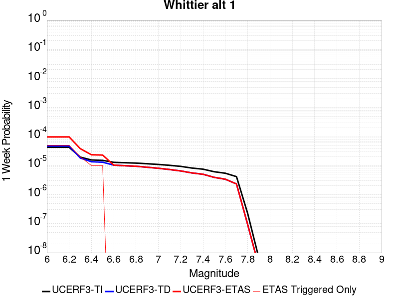 |  |  |  |

| Magnitude | 1 wk TI Prob | 1 wk TD Prob | 1 wk ETAS Prob | 1 wk ETAS/TD Gain | 1 wk ETAS Triggered Only | 1 mo TI Prob | 1 mo TD Prob | 1 mo ETAS Prob | 1 mo ETAS/TD Gain | 1 mo ETAS Triggered Only | 1 yr TI Prob | 1 yr TD Prob | 1 yr ETAS Prob | 1 yr ETAS/TD Gain | 1 yr ETAS Triggered Only | 10 yr TI Prob | 10 yr TD Prob | 10 yr ETAS Prob | 10 yr ETAS/TD Gain | 10 yr ETAS Triggered Only |
|-----|-----|-----|-----|-----|-----|-----|-----|-----|-----|-----|-----|-----|-----|-----|-----|-----|-----|-----|-----|-----|
| 6.0 | 4.2554693E-5 | 4.725218E-5 | 1.3302981E-4 | 2.815316 | 8.5781685E-5 | 1.8236451E-4 | 2.0249544E-4 | 2.8825976E-4 | 1.423537 | 8.5781685E-5 | 0.002218027 | 0.0024629154 | 0.0025484858 | 1.0347435 | 8.5781685E-5 | 0.02196019 | 0.024390234 | 0.024515769 | 1.0051469 | 1.2867253E-4 |
| 6.1 | 4.2554693E-5 | 4.725218E-5 | 1.3302981E-4 | 2.815316 | 8.5781685E-5 | 1.8236451E-4 | 2.0249544E-4 | 2.8825976E-4 | 1.423537 | 8.5781685E-5 | 0.002218027 | 0.0024629154 | 0.0025484858 | 1.0347435 | 8.5781685E-5 | 0.02196019 | 0.024390234 | 0.024515769 | 1.0051469 | 1.2867253E-4 |
| 6.2 | 4.2554693E-5 | 4.725218E-5 | 1.3302981E-4 | 2.815316 | 8.5781685E-5 | 1.8236451E-4 | 2.0249544E-4 | 2.8825976E-4 | 1.423537 | 8.5781685E-5 | 0.002218027 | 0.0024629154 | 0.0025484858 | 1.0347435 | 8.5781685E-5 | 0.02196019 | 0.024390234 | 0.024515769 | 1.0051469 | 1.2867253E-4 |
| 6.3 | 1.9617712E-5 | 1.8268593E-5 | 1.8268593E-5 | 1.0 | 0.0 | 8.40732E-5 | 7.829172E-5 | 7.829172E-5 | 1.0 | 0.0 | 0.0010231105 | 9.52804E-4 | 9.52804E-4 | 1.0 | 0.0 | 0.01018413 | 0.009490474 | 0.009532958 | 1.0044764 | 4.2890842E-5 |
| 6.4 | 1.5611336E-5 | 1.3604271E-5 | 1.3604271E-5 | 1.0 | 0.0 | 6.690401E-5 | 5.8302747E-5 | 5.8302747E-5 | 1.0 | 0.0 | 8.142519E-4 | 7.0961076E-4 | 7.0961076E-4 | 1.0 | 0.0 | 0.008112748 | 0.0070754145 | 0.0070754145 | 1.0 | 0.0 |
| 6.5 | 1.5150166E-5 | 1.3100925E-5 | 1.3100925E-5 | 1.0 | 0.0 | 6.492767E-5 | 5.6145647E-5 | 5.6145647E-5 | 1.0 | 0.0 | 7.9020765E-4 | 6.8336475E-4 | 6.8336475E-4 | 1.0 | 0.0 | 0.007874036 | 0.0068145846 | 0.0068145846 | 1.0 | 0.0 |
| 6.6 | 1.295588E-5 | 1.0380725E-5 | 1.0380725E-5 | 1.0 | 0.0 | 5.552402E-5 | 4.4488075E-5 | 4.4488075E-5 | 1.0 | 0.0 | 6.7579525E-4 | 5.4150965E-4 | 5.4150965E-4 | 1.0 | 0.0 | 0.006737438 | 0.0054033357 | 0.0054033357 | 1.0 | 0.0 |
| 6.7 | 1.2542085E-5 | 9.899369E-6 | 9.899369E-6 | 1.0 | 0.0 | 5.3750682E-5 | 4.242519E-5 | 4.242519E-5 | 1.0 | 0.0 | 6.542181E-4 | 5.164061E-4 | 5.164061E-4 | 1.0 | 0.0 | 0.006522954 | 0.0051534795 | 0.0051534795 | 1.0 | 0.0 |
| 6.8 | 1.2195878E-5 | 9.495415E-6 | 9.495415E-6 | 1.0 | 0.0 | 5.2267E-5 | 4.069401E-5 | 4.069401E-5 | 1.0 | 0.0 | 6.36165E-4 | 4.9533875E-4 | 4.9533875E-4 | 1.0 | 0.0 | 0.0063434686 | 0.004943688 | 0.004943688 | 1.0 | 0.0 |
| 6.9 | 1.1580298E-5 | 8.772933E-6 | 8.772933E-6 | 1.0 | 0.0 | 4.9628903E-5 | 3.7597754E-5 | 3.7597754E-5 | 1.0 | 0.0 | 6.040644E-4 | 4.5765814E-4 | 4.5765814E-4 | 1.0 | 0.0 | 0.00602425 | 0.0045684157 | 0.0045684157 | 1.0 | 0.0 |
| 7.0 | 1.0964795E-5 | 8.083994E-6 | 8.083994E-6 | 1.0 | 0.0 | 4.6991136E-5 | 3.4645236E-5 | 3.4645236E-5 | 1.0 | 0.0 | 5.7196687E-4 | 4.2172565E-4 | 4.2172565E-4 | 1.0 | 0.0 | 0.0057049696 | 0.004210462 | 0.004210462 | 1.0 | 0.0 |
| 7.1 | 1.0230601E-5 | 7.3266697E-6 | 7.3266697E-6 | 1.0 | 0.0 | 4.3844695E-5 | 3.1399642E-5 | 3.1399642E-5 | 1.0 | 0.0 | 5.336784E-4 | 3.8222488E-4 | 3.8222488E-4 | 1.0 | 0.0 | 0.005323986 | 0.0038168381 | 0.0038168381 | 1.0 | 0.0 |
| 7.2 | 9.40865E-6 | 6.543289E-6 | 6.543289E-6 | 1.0 | 0.0 | 4.032216E-5 | 2.8042374E-5 | 2.8042374E-5 | 1.0 | 0.0 | 4.908117E-4 | 3.4136363E-4 | 3.4136363E-4 | 1.0 | 0.0 | 0.0048972913 | 0.003409485 | 0.003409485 | 1.0 | 0.0 |
| 7.3 | 8.237384E-6 | 5.5977525E-6 | 5.5977525E-6 | 1.0 | 0.0 | 3.5302593E-5 | 2.3990153E-5 | 2.3990153E-5 | 1.0 | 0.0 | 4.2972428E-4 | 2.92042E-4 | 2.92042E-4 | 1.0 | 0.0 | 0.0042889426 | 0.002916903 | 0.002916903 | 1.0 | 0.0 |
| 7.4 | 7.5316966E-6 | 5.027819E-6 | 5.027819E-6 | 1.0 | 0.0 | 3.2278298E-5 | 2.1547625E-5 | 2.1547625E-5 | 1.0 | 0.0 | 3.9291743E-4 | 2.6231175E-4 | 2.6231175E-4 | 1.0 | 0.0 | 0.0039222343 | 0.0026201333 | 0.0026201333 | 1.0 | 0.0 |
| 7.5 | 6.149649E-6 | 3.933841E-6 | 3.933841E-6 | 1.0 | 0.0 | 2.6355372E-5 | 1.6859214E-5 | 1.6859214E-5 | 1.0 | 0.0 | 3.208294E-4 | 2.052425E-4 | 2.052425E-4 | 1.0 | 0.0 | 0.003203666 | 0.0020506186 | 0.0020506186 | 1.0 | 0.0 |
| 7.6 | 5.457711E-6 | 3.3953788E-6 | 3.3953788E-6 | 1.0 | 0.0 | 2.338998E-5 | 1.4551547E-5 | 1.4551547E-5 | 1.0 | 0.0 | 2.8473578E-4 | 1.771515E-4 | 1.771515E-4 | 1.0 | 0.0 | 0.0028437122 | 0.0017701836 | 0.0017701836 | 1.0 | 0.0 |
| 7.7 | 4.1676276E-6 | 2.3331952E-6 | 2.3331952E-6 | 1.0 | 0.0 | 1.7861139E-5 | 9.999374E-6 | 9.999374E-6 | 1.0 | 0.0 | 2.1743766E-4 | 1.2173632E-4 | 1.2173632E-4 | 1.0 | 0.0 | 0.0021722503 | 0.0012167693 | 0.0012167693 | 1.0 | 0.0 |
| 7.8 | 2.2692414E-7 | 9.3854695E-8 | 9.3854695E-8 | 1.0 | 0.0 | 9.725317E-7 | 4.0223435E-7 | 4.0223435E-7 | 1.0 | 0.0 | 1.1840509E-5 | 4.8971956E-6 | 4.8971956E-6 | 1.0 | 0.0 | 1.1839878E-4 | 4.8971204E-5 | 4.8971204E-5 | 1.0 | 0.0 |
| 7.9 | 6.676829E-9 | 3.439853E-9 | 3.439853E-9 | 1.0 | 0.0 | 2.861498E-8 | 1.4742227E-8 | 1.4742227E-8 | 1.0 | 0.0 | 3.4838732E-7 | 1.7948659E-7 | 1.7948659E-7 | 1.0 | 0.0 | 3.4838679E-6 | 1.7948646E-6 | 1.7948646E-6 | 1.0 | 0.0 |

## North Frontal  (West)
*[(top)](#table-of-contents)*

| 1 Week | 1 Month | 1 Year | 10 Year |
|-----|-----|-----|-----|
|  |  |  |  |

| Magnitude | 1 wk TI Prob | 1 wk TD Prob | 1 wk ETAS Prob | 1 wk ETAS/TD Gain | 1 wk ETAS Triggered Only | 1 mo TI Prob | 1 mo TD Prob | 1 mo ETAS Prob | 1 mo ETAS/TD Gain | 1 mo ETAS Triggered Only | 1 yr TI Prob | 1 yr TD Prob | 1 yr ETAS Prob | 1 yr ETAS/TD Gain | 1 yr ETAS Triggered Only | 10 yr TI Prob | 10 yr TD Prob | 10 yr ETAS Prob | 10 yr ETAS/TD Gain | 10 yr ETAS Triggered Only |
|-----|-----|-----|-----|-----|-----|-----|-----|-----|-----|-----|-----|-----|-----|-----|-----|-----|-----|-----|-----|-----|
| 6.0 | 4.7316266E-6 | 4.8526726E-6 | 4.8526726E-6 | 1.0 | 0.0 | 2.0278241E-5 | 2.0797012E-5 | 2.0797012E-5 | 1.0 | 0.0 | 2.4685962E-4 | 2.5317568E-4 | 2.9605566E-4 | 1.1693685 | 4.2890842E-5 | 0.0024658558 | 0.0025290183 | 0.0026573655 | 1.0507498 | 1.2867253E-4 |
| 6.1 | 4.7316266E-6 | 4.8526726E-6 | 4.8526726E-6 | 1.0 | 0.0 | 2.0278241E-5 | 2.0797012E-5 | 2.0797012E-5 | 1.0 | 0.0 | 2.4685962E-4 | 2.5317568E-4 | 2.9605566E-4 | 1.1693685 | 4.2890842E-5 | 0.0024658558 | 0.0025290183 | 0.0026573655 | 1.0507498 | 1.2867253E-4 |
| 6.2 | 4.7316266E-6 | 4.8526726E-6 | 4.8526726E-6 | 1.0 | 0.0 | 2.0278241E-5 | 2.0797012E-5 | 2.0797012E-5 | 1.0 | 0.0 | 2.4685962E-4 | 2.5317568E-4 | 2.9605566E-4 | 1.1693685 | 4.2890842E-5 | 0.0024658558 | 0.0025290183 | 0.0026573655 | 1.0507498 | 1.2867253E-4 |
| 6.3 | 4.7316266E-6 | 4.8526726E-6 | 4.8526726E-6 | 1.0 | 0.0 | 2.0278241E-5 | 2.0797012E-5 | 2.0797012E-5 | 1.0 | 0.0 | 2.4685962E-4 | 2.5317568E-4 | 2.9605566E-4 | 1.1693685 | 4.2890842E-5 | 0.0024658558 | 0.0025290183 | 0.0026573655 | 1.0507498 | 1.2867253E-4 |
| 6.4 | 4.7316266E-6 | 4.8526726E-6 | 4.8526726E-6 | 1.0 | 0.0 | 2.0278241E-5 | 2.0797012E-5 | 2.0797012E-5 | 1.0 | 0.0 | 2.4685962E-4 | 2.5317568E-4 | 2.9605566E-4 | 1.1693685 | 4.2890842E-5 | 0.0024658558 | 0.0025290183 | 0.0026573655 | 1.0507498 | 1.2867253E-4 |
| 6.5 | 4.7316266E-6 | 4.8526726E-6 | 4.8526726E-6 | 1.0 | 0.0 | 2.0278241E-5 | 2.0797012E-5 | 2.0797012E-5 | 1.0 | 0.0 | 2.4685962E-4 | 2.5317568E-4 | 2.9605566E-4 | 1.1693685 | 4.2890842E-5 | 0.0024658558 | 0.0025290183 | 0.0026573655 | 1.0507498 | 1.2867253E-4 |
| 6.6 | 4.7316266E-6 | 4.8526726E-6 | 4.8526726E-6 | 1.0 | 0.0 | 2.0278241E-5 | 2.0797012E-5 | 2.0797012E-5 | 1.0 | 0.0 | 2.4685962E-4 | 2.5317568E-4 | 2.9605566E-4 | 1.1693685 | 4.2890842E-5 | 0.0024658558 | 0.0025290183 | 0.0026573655 | 1.0507498 | 1.2867253E-4 |
| 6.7 | 3.5382777E-6 | 3.6308859E-6 | 3.6308859E-6 | 1.0 | 0.0 | 1.516396E-5 | 1.5560852E-5 | 1.5560852E-5 | 1.0 | 0.0 | 1.8460557E-4 | 1.8943768E-4 | 2.323204E-4 | 1.2263684 | 4.2890842E-5 | 0.0018445229 | 0.0018928389 | 0.0020212678 | 1.0678499 | 1.2867253E-4 |
| 6.8 | 3.5382777E-6 | 3.6308859E-6 | 3.6308859E-6 | 1.0 | 0.0 | 1.516396E-5 | 1.5560852E-5 | 1.5560852E-5 | 1.0 | 0.0 | 1.8460557E-4 | 1.8943768E-4 | 2.323204E-4 | 1.2263684 | 4.2890842E-5 | 0.0018445229 | 0.0018928389 | 0.0020212678 | 1.0678499 | 1.2867253E-4 |
| 6.9 | 3.0428037E-6 | 3.1227605E-6 | 3.1227605E-6 | 1.0 | 0.0 | 1.30405215E-5 | 1.33831945E-5 | 1.33831945E-5 | 1.0 | 0.0 | 1.5875678E-4 | 1.6292889E-4 | 2.0581274E-4 | 1.263206 | 4.2890842E-5 | 0.0015864341 | 0.0016281615 | 0.0017566246 | 1.0789007 | 1.2867253E-4 |
| 7.0 | 2.538778E-6 | 2.6060904E-6 | 2.6060904E-6 | 1.0 | 0.0 | 1.0880432E-5 | 1.1168913E-5 | 1.1168913E-5 | 1.0 | 0.0 | 1.324612E-4 | 1.3597352E-4 | 1.7885852E-4 | 1.3153924 | 4.2890842E-5 | 0.0013238228 | 0.0013589499 | 0.0014874475 | 1.0945566 | 1.2867253E-4 |
| 7.1 | 2.2418935E-6 | 2.3012074E-6 | 2.3012074E-6 | 1.0 | 0.0 | 9.60808E-6 | 9.862282E-6 | 9.862282E-6 | 1.0 | 0.0 | 1.1697209E-4 | 1.2006712E-4 | 1.6295281E-4 | 1.357181 | 4.2890842E-5 | 0.0011691054 | 0.0012000664 | 0.0012857452 | 1.071395 | 8.5781685E-5 |
| 7.2 | 1.6526745E-6 | 1.6924851E-6 | 1.6924851E-6 | 1.0 | 0.0 | 7.082872E-6 | 7.253489E-6 | 7.253489E-6 | 1.0 | 0.0 | 8.623055E-5 | 8.8307905E-5 | 1.3119496E-4 | 1.4856536 | 4.2890842E-5 | 8.61971E-4 | 8.827532E-4 | 9.684591E-4 | 1.0970894 | 8.5781685E-5 |
| 7.3 | 1.0246019E-6 | 1.0442261E-6 | 1.0442261E-6 | 1.0 | 0.0 | 4.391144E-6 | 4.4752474E-6 | 4.4752474E-6 | 1.0 | 0.0 | 5.3460866E-5 | 5.448489E-5 | 9.73734E-5 | 1.7871633 | 4.2890842E-5 | 5.344801E-4 | 5.4472685E-4 | 6.304618E-4 | 1.1573907 | 8.5781685E-5 |
| 7.4 | 8.9045164E-7 | 9.0565584E-7 | 9.0565584E-7 | 1.0 | 0.0 | 3.8162157E-6 | 3.8813773E-6 | 3.8813773E-6 | 1.0 | 0.0 | 4.646144E-5 | 4.7254853E-5 | 9.0143665E-5 | 1.9076066 | 4.2890842E-5 | 4.6451724E-4 | 4.7245892E-4 | 5.153295E-4 | 1.0907393 | 4.2890842E-5 |
| 7.5 | 6.3357E-7 | 6.4027006E-7 | 6.4027006E-7 | 1.0 | 0.0 | 2.7152971E-6 | 2.744012E-6 | 2.744012E-6 | 1.0 | 0.0 | 3.305824E-5 | 3.34079E-5 | 7.629731E-5 | 2.2838104 | 4.2890842E-5 | 3.3053322E-4 | 3.3403534E-4 | 3.7691186E-4 | 1.1283592 | 4.2890842E-5 |
| 7.6 | 2.5087024E-7 | 2.4361097E-7 | 2.4361097E-7 | 1.0 | 0.0 | 1.0751578E-6 | 1.0440467E-6 | 1.0440467E-6 | 1.0 | 0.0 | 1.3089967E-5 | 1.2711216E-5 | 1.2711216E-5 | 1.0 | 0.0 | 1.3089196E-4 | 1.2710695E-4 | 1.2710695E-4 | 1.0 | 0.0 |
| 7.7 | 3.282987E-8 | 2.2874195E-8 | 2.2874195E-8 | 1.0 | 0.0 | 1.4069944E-7 | 9.803227E-8 | 9.803227E-8 | 1.0 | 0.0 | 1.7130144E-6 | 1.1935423E-6 | 1.1935423E-6 | 1.0 | 0.0 | 1.7130013E-5 | 1.1935367E-5 | 1.1935367E-5 | 1.0 | 0.0 |
| 7.8 | 8.77499E-9 | 5.6815956E-9 | 5.6815956E-9 | 1.0 | 0.0 | 3.7607098E-8 | 2.4349696E-8 | 2.4349696E-8 | 1.0 | 0.0 | 4.578663E-7 | 2.9645753E-7 | 2.9645753E-7 | 1.0 | 0.0 | 4.5786537E-6 | 2.9645726E-6 | 2.9645726E-6 | 1.0 | 0.0 |

## North Frontal  (East)
*[(top)](#table-of-contents)*

| 1 Week | 1 Month | 1 Year | 10 Year |
|-----|-----|-----|-----|
|  |  |  |  |

| Magnitude | 1 wk TI Prob | 1 wk TD Prob | 1 wk ETAS Prob | 1 wk ETAS/TD Gain | 1 wk ETAS Triggered Only | 1 mo TI Prob | 1 mo TD Prob | 1 mo ETAS Prob | 1 mo ETAS/TD Gain | 1 mo ETAS Triggered Only | 1 yr TI Prob | 1 yr TD Prob | 1 yr ETAS Prob | 1 yr ETAS/TD Gain | 1 yr ETAS Triggered Only | 10 yr TI Prob | 10 yr TD Prob | 10 yr ETAS Prob | 10 yr ETAS/TD Gain | 10 yr ETAS Triggered Only |
|-----|-----|-----|-----|-----|-----|-----|-----|-----|-----|-----|-----|-----|-----|-----|-----|-----|-----|-----|-----|-----|
| 6.0 | 7.135738E-6 | 7.4771765E-6 | 7.4771765E-6 | 1.0 | 0.0 | 3.0581377E-5 | 3.204476E-5 | 3.204476E-5 | 1.0 | 0.0 | 3.7226462E-4 | 3.9009505E-4 | 4.758433E-4 | 1.2198137 | 8.5781685E-5 | 0.0037164164 | 0.0038960609 | 0.004024232 | 1.0328976 | 1.2867253E-4 |
| 6.1 | 7.135738E-6 | 7.4771765E-6 | 7.4771765E-6 | 1.0 | 0.0 | 3.0581377E-5 | 3.204476E-5 | 3.204476E-5 | 1.0 | 0.0 | 3.7226462E-4 | 3.9009505E-4 | 4.758433E-4 | 1.2198137 | 8.5781685E-5 | 0.0037164164 | 0.0038960609 | 0.004024232 | 1.0328976 | 1.2867253E-4 |
| 6.2 | 7.135738E-6 | 7.4771765E-6 | 7.4771765E-6 | 1.0 | 0.0 | 3.0581377E-5 | 3.204476E-5 | 3.204476E-5 | 1.0 | 0.0 | 3.7226462E-4 | 3.9009505E-4 | 4.758433E-4 | 1.2198137 | 8.5781685E-5 | 0.0037164164 | 0.0038960609 | 0.004024232 | 1.0328976 | 1.2867253E-4 |
| 6.3 | 7.135738E-6 | 7.4771765E-6 | 7.4771765E-6 | 1.0 | 0.0 | 3.0581377E-5 | 3.204476E-5 | 3.204476E-5 | 1.0 | 0.0 | 3.7226462E-4 | 3.9009505E-4 | 4.758433E-4 | 1.2198137 | 8.5781685E-5 | 0.0037164164 | 0.0038960609 | 0.004024232 | 1.0328976 | 1.2867253E-4 |
| 6.4 | 7.135738E-6 | 7.4771765E-6 | 7.4771765E-6 | 1.0 | 0.0 | 3.0581377E-5 | 3.204476E-5 | 3.204476E-5 | 1.0 | 0.0 | 3.7226462E-4 | 3.9009505E-4 | 4.758433E-4 | 1.2198137 | 8.5781685E-5 | 0.0037164164 | 0.0038960609 | 0.004024232 | 1.0328976 | 1.2867253E-4 |
| 6.5 | 7.135738E-6 | 7.4771765E-6 | 7.4771765E-6 | 1.0 | 0.0 | 3.0581377E-5 | 3.204476E-5 | 3.204476E-5 | 1.0 | 0.0 | 3.7226462E-4 | 3.9009505E-4 | 4.758433E-4 | 1.2198137 | 8.5781685E-5 | 0.0037164164 | 0.0038960609 | 0.004024232 | 1.0328976 | 1.2867253E-4 |
| 6.6 | 7.135738E-6 | 7.4771765E-6 | 7.4771765E-6 | 1.0 | 0.0 | 3.0581377E-5 | 3.204476E-5 | 3.204476E-5 | 1.0 | 0.0 | 3.7226462E-4 | 3.9009505E-4 | 4.758433E-4 | 1.2198137 | 8.5781685E-5 | 0.0037164164 | 0.0038960609 | 0.004024232 | 1.0328976 | 1.2867253E-4 |
| 6.7 | 7.135738E-6 | 7.4771765E-6 | 7.4771765E-6 | 1.0 | 0.0 | 3.0581377E-5 | 3.204476E-5 | 3.204476E-5 | 1.0 | 0.0 | 3.7226462E-4 | 3.9009505E-4 | 4.758433E-4 | 1.2198137 | 8.5781685E-5 | 0.0037164164 | 0.0038960609 | 0.004024232 | 1.0328976 | 1.2867253E-4 |
| 6.8 | 5.959142E-6 | 6.236683E-6 | 6.236683E-6 | 1.0 | 0.0 | 2.553893E-5 | 2.6728469E-5 | 2.6728469E-5 | 1.0 | 0.0 | 3.108921E-4 | 3.253886E-4 | 4.1114236E-4 | 1.2635427 | 8.5781685E-5 | 0.0031045752 | 0.0032508948 | 0.003379149 | 1.039452 | 1.2867253E-4 |
| 6.9 | 2.2946929E-6 | 2.3824605E-6 | 2.3824605E-6 | 1.0 | 0.0 | 9.834361E-6 | 1.0210508E-5 | 1.0210508E-5 | 1.0 | 0.0 | 1.1972676E-4 | 1.2430632E-4 | 2.1007733E-4 | 1.6899973 | 8.5781685E-5 | 0.0011966228 | 0.0012424142 | 0.001370927 | 1.1034379 | 1.2867253E-4 |
| 7.0 | 2.2468673E-6 | 2.3321538E-6 | 2.3321538E-6 | 1.0 | 0.0 | 9.629396E-6 | 9.994909E-6 | 9.994909E-6 | 1.0 | 0.0 | 1.1723159E-4 | 1.21681696E-4 | 2.0745295E-4 | 1.7048821 | 8.5781685E-5 | 0.0011716976 | 0.0012161969 | 0.001344713 | 1.1056705 | 1.2867253E-4 |
| 7.1 | 1.9921076E-6 | 2.0646032E-6 | 2.0646032E-6 | 1.0 | 0.0 | 8.537577E-6 | 8.848272E-6 | 8.848272E-6 | 1.0 | 0.0 | 1.0394004E-4 | 1.0772282E-4 | 1.9349526E-4 | 1.7962328 | 8.5781685E-5 | 0.0010389143 | 0.0010767487 | 0.0012052828 | 1.1193722 | 1.2867253E-4 |
| 7.2 | 1.4524545E-6 | 1.5045148E-6 | 1.5045148E-6 | 1.0 | 0.0 | 6.2247905E-6 | 6.447906E-6 | 6.447906E-6 | 1.0 | 0.0 | 7.5784184E-5 | 7.850068E-5 | 1.6427563E-4 | 2.0926652 | 8.5781685E-5 | 7.575835E-4 | 7.8475394E-4 | 9.1332546E-4 | 1.1638367 | 1.2867253E-4 |
| 7.3 | 8.9802575E-7 | 9.3087283E-7 | 9.3087283E-7 | 1.0 | 0.0 | 3.848676E-6 | 3.9894494E-6 | 3.9894494E-6 | 1.0 | 0.0 | 4.685662E-5 | 4.857058E-5 | 1.343481E-4 | 2.7660387 | 8.5781685E-5 | 4.6846745E-4 | 4.8561094E-4 | 6.14221E-4 | 1.2648418 | 1.2867253E-4 |
| 7.4 | 7.776139E-7 | 8.0604747E-7 | 8.0604747E-7 | 1.0 | 0.0 | 3.3326266E-6 | 3.4544853E-6 | 3.4544853E-6 | 1.0 | 0.0 | 4.0573974E-5 | 4.2057654E-5 | 1.2783574E-4 | 3.0395355 | 8.5781685E-5 | 4.0566566E-4 | 4.205077E-4 | 5.0625333E-4 | 1.2039098 | 8.5781685E-5 |
| 7.5 | 5.244417E-7 | 5.441219E-7 | 5.441219E-7 | 1.0 | 0.0 | 2.2476054E-6 | 2.3319494E-6 | 2.3319494E-6 | 1.0 | 0.0 | 2.7364253E-5 | 2.839118E-5 | 1.1417043E-4 | 4.021334 | 8.5781685E-5 | 2.7360884E-4 | 2.8388205E-4 | 3.6963937E-4 | 1.3020879 | 8.5781685E-5 |
| 7.6 | 1.5489647E-7 | 1.6089504E-7 | 1.6089504E-7 | 1.0 | 0.0 | 6.6384183E-7 | 6.895501E-7 | 6.895501E-7 | 1.0 | 0.0 | 8.082245E-6 | 8.395261E-6 | 8.395261E-6 | 1.0 | 0.0 | 8.08195E-5 | 8.395143E-5 | 8.395143E-5 | 1.0 | 0.0 |

## Elysian Park (Upper)
*[(top)](#table-of-contents)*

| 1 Week | 1 Month | 1 Year | 10 Year |
|-----|-----|-----|-----|
|  |  |  |  |

| Magnitude | 1 wk TI Prob | 1 wk TD Prob | 1 wk ETAS Prob | 1 wk ETAS/TD Gain | 1 wk ETAS Triggered Only | 1 mo TI Prob | 1 mo TD Prob | 1 mo ETAS Prob | 1 mo ETAS/TD Gain | 1 mo ETAS Triggered Only | 1 yr TI Prob | 1 yr TD Prob | 1 yr ETAS Prob | 1 yr ETAS/TD Gain | 1 yr ETAS Triggered Only | 10 yr TI Prob | 10 yr TD Prob | 10 yr ETAS Prob | 10 yr ETAS/TD Gain | 10 yr ETAS Triggered Only |
|-----|-----|-----|-----|-----|-----|-----|-----|-----|-----|-----|-----|-----|-----|-----|-----|-----|-----|-----|-----|-----|
| 6.0 | 3.1876025E-5 | 3.7035516E-5 | 1.2281402E-4 | 3.316115 | 8.5781685E-5 | 1.3660437E-4 | 1.587167E-4 | 2.4448478E-4 | 1.5403847 | 8.5781685E-5 | 0.0016618895 | 0.0019311075 | 0.0020595314 | 1.0665028 | 1.2867253E-4 | 0.016495159 | 0.019189782 | 0.019315986 | 1.0065765 | 1.2867253E-4 |
| 6.1 | 3.1876025E-5 | 3.7035516E-5 | 1.2281402E-4 | 3.316115 | 8.5781685E-5 | 1.3660437E-4 | 1.587167E-4 | 2.4448478E-4 | 1.5403847 | 8.5781685E-5 | 0.0016618895 | 0.0019311075 | 0.0020595314 | 1.0665028 | 1.2867253E-4 | 0.016495159 | 0.019189782 | 0.019315986 | 1.0065765 | 1.2867253E-4 |
| 6.2 | 3.1876025E-5 | 3.7035516E-5 | 1.2281402E-4 | 3.316115 | 8.5781685E-5 | 1.3660437E-4 | 1.587167E-4 | 2.4448478E-4 | 1.5403847 | 8.5781685E-5 | 0.0016618895 | 0.0019311075 | 0.0020595314 | 1.0665028 | 1.2867253E-4 | 0.016495159 | 0.019189782 | 0.019315986 | 1.0065765 | 1.2867253E-4 |
| 6.3 | 3.1876025E-5 | 3.7035516E-5 | 1.2281402E-4 | 3.316115 | 8.5781685E-5 | 1.3660437E-4 | 1.587167E-4 | 2.4448478E-4 | 1.5403847 | 8.5781685E-5 | 0.0016618895 | 0.0019311075 | 0.0020595314 | 1.0665028 | 1.2867253E-4 | 0.016495159 | 0.019189782 | 0.019315986 | 1.0065765 | 1.2867253E-4 |
| 6.4 | 1.9273462E-5 | 2.1202266E-5 | 2.1202266E-5 | 1.0 | 0.0 | 8.259794E-5 | 9.086466E-5 | 9.086466E-5 | 1.0 | 0.0 | 0.001005166 | 0.0011058892 | 0.0011058892 | 1.0 | 0.0 | 0.010006315 | 0.011020724 | 0.011020724 | 1.0 | 0.0 |
| 6.5 | 1.9273462E-5 | 2.1202266E-5 | 2.1202266E-5 | 1.0 | 0.0 | 8.259794E-5 | 9.086466E-5 | 9.086466E-5 | 1.0 | 0.0 | 0.001005166 | 0.0011058892 | 0.0011058892 | 1.0 | 0.0 | 0.010006315 | 0.011020724 | 0.011020724 | 1.0 | 0.0 |
| 6.6 | 9.813258E-6 | 9.665599E-6 | 9.665599E-6 | 1.0 | 0.0 | 4.205614E-5 | 4.1423376E-5 | 4.1423376E-5 | 1.0 | 0.0 | 5.119132E-4 | 5.0422014E-4 | 5.0422014E-4 | 1.0 | 0.0 | 0.005107356 | 0.0050314846 | 0.0050314846 | 1.0 | 0.0 |
| 6.7 | 9.801478E-6 | 9.653168E-6 | 9.653168E-6 | 1.0 | 0.0 | 4.2005657E-5 | 4.1370105E-5 | 4.1370105E-5 | 1.0 | 0.0 | 5.112989E-4 | 5.035719E-4 | 5.035719E-4 | 1.0 | 0.0 | 0.0051012407 | 0.0050250315 | 0.0050250315 | 1.0 | 0.0 |
| 6.8 | 8.102489E-6 | 7.773004E-6 | 7.773004E-6 | 1.0 | 0.0 | 3.4724493E-5 | 3.3312477E-5 | 3.3312477E-5 | 1.0 | 0.0 | 4.2268867E-4 | 4.055089E-4 | 4.055089E-4 | 1.0 | 0.0 | 0.004218856 | 0.0040481836 | 0.0040481836 | 1.0 | 0.0 |
| 6.9 | 6.08275E-6 | 5.4814514E-6 | 5.4814514E-6 | 1.0 | 0.0 | 2.6068668E-5 | 2.3491726E-5 | 2.3491726E-5 | 1.0 | 0.0 | 3.173398E-4 | 2.85975E-4 | 2.85975E-4 | 1.0 | 0.0 | 0.0031688702 | 0.0028561477 | 0.0028561477 | 1.0 | 0.0 |
| 7.0 | 5.5995934E-6 | 4.98278E-6 | 4.98278E-6 | 1.0 | 0.0 | 2.3998036E-5 | 2.13546E-5 | 2.13546E-5 | 1.0 | 0.0 | 2.9213692E-4 | 2.599619E-4 | 2.599619E-4 | 1.0 | 0.0 | 0.0029175316 | 0.0025966454 | 0.0025966454 | 1.0 | 0.0 |
| 7.1 | 4.709881E-6 | 4.0874015E-6 | 4.0874015E-6 | 1.0 | 0.0 | 2.0185047E-5 | 1.7517319E-5 | 1.7517319E-5 | 1.0 | 0.0 | 2.4572524E-4 | 2.132529E-4 | 2.132529E-4 | 1.0 | 0.0 | 0.002454537 | 0.002130524 | 0.002130524 | 1.0 | 0.0 |
| 7.2 | 3.6063436E-6 | 2.9779544E-6 | 2.9779544E-6 | 1.0 | 0.0 | 1.5455667E-5 | 1.27626E-5 | 1.27626E-5 | 1.0 | 0.0 | 1.881565E-4 | 1.5537368E-4 | 1.5537368E-4 | 1.0 | 0.0 | 0.0018799726 | 0.0015526618 | 0.0015526618 | 1.0 | 0.0 |
| 7.3 | 2.471135E-6 | 2.0954615E-6 | 2.0954615E-6 | 1.0 | 0.0 | 1.0590536E-5 | 8.980519E-6 | 8.980519E-6 | 1.0 | 0.0 | 1.2893214E-4 | 1.093324E-4 | 1.093324E-4 | 1.0 | 0.0 | 0.0012885736 | 0.0010927934 | 0.0010927934 | 1.0 | 0.0 |
| 7.4 | 1.163943E-6 | 1.0275091E-6 | 1.0275091E-6 | 1.0 | 0.0 | 4.988318E-6 | 4.4036033E-6 | 4.4036033E-6 | 1.0 | 0.0 | 6.0731076E-5 | 5.3612584E-5 | 5.3612584E-5 | 1.0 | 0.0 | 6.071448E-4 | 5.359995E-4 | 5.359995E-4 | 1.0 | 0.0 |
| 7.5 | 4.99459E-7 | 4.917604E-7 | 4.917604E-7 | 1.0 | 0.0 | 2.140537E-6 | 2.1075427E-6 | 2.1075427E-6 | 1.0 | 0.0 | 2.6060725E-5 | 2.5659048E-5 | 2.5659048E-5 | 1.0 | 0.0 | 2.605767E-4 | 2.5656243E-4 | 2.5656243E-4 | 1.0 | 0.0 |
| 7.6 | 2.4667852E-7 | 2.4778336E-7 | 2.4778336E-7 | 1.0 | 0.0 | 1.0571932E-6 | 1.0619283E-6 | 1.0619283E-6 | 1.0 | 0.0 | 1.2871251E-5 | 1.2928905E-5 | 1.2928905E-5 | 1.0 | 0.0 | 1.2870505E-4 | 1.2928189E-4 | 1.2928189E-4 | 1.0 | 0.0 |
| 7.7 | 8.2312795E-8 | 7.3864456E-8 | 7.3864456E-8 | 1.0 | 0.0 | 3.527691E-7 | 3.165619E-7 | 3.165619E-7 | 1.0 | 0.0 | 4.294955E-6 | 3.8541357E-6 | 3.8541357E-6 | 1.0 | 0.0 | 4.2948723E-5 | 3.8540802E-5 | 3.8540802E-5 | 1.0 | 0.0 |
| 7.8 | 2.7819295E-8 | 1.7566023E-8 | 1.7566023E-8 | 1.0 | 0.0 | 1.1922555E-7 | 7.5282955E-8 | 7.5282955E-8 | 1.0 | 0.0 | 1.45157E-6 | 9.165697E-7 | 9.165697E-7 | 1.0 | 0.0 | 1.45156055E-5 | 9.165675E-6 | 9.165675E-6 | 1.0 | 0.0 |

## Palos Verdes
*[(top)](#table-of-contents)*

| 1 Week | 1 Month | 1 Year | 10 Year |
|-----|-----|-----|-----|
|  |  |  |  |

| Magnitude | 1 wk TI Prob | 1 wk TD Prob | 1 wk ETAS Prob | 1 wk ETAS/TD Gain | 1 wk ETAS Triggered Only | 1 mo TI Prob | 1 mo TD Prob | 1 mo ETAS Prob | 1 mo ETAS/TD Gain | 1 mo ETAS Triggered Only | 1 yr TI Prob | 1 yr TD Prob | 1 yr ETAS Prob | 1 yr ETAS/TD Gain | 1 yr ETAS Triggered Only | 10 yr TI Prob | 10 yr TD Prob | 10 yr ETAS Prob | 10 yr ETAS/TD Gain | 10 yr ETAS Triggered Only |
|-----|-----|-----|-----|-----|-----|-----|-----|-----|-----|-----|-----|-----|-----|-----|-----|-----|-----|-----|-----|-----|
| 6.0 | 6.126063E-5 | 7.622612E-5 | 1.6200126E-4 | 2.1252723 | 8.5781685E-5 | 2.6251914E-4 | 3.2664582E-4 | 4.1239947E-4 | 1.262528 | 8.5781685E-5 | 0.0031914865 | 0.003970174 | 0.0040983357 | 1.0322812 | 1.2867253E-4 | 0.031460393 | 0.039048895 | 0.039172545 | 1.0031664 | 1.2867253E-4 |
| 6.1 | 6.126063E-5 | 7.622612E-5 | 1.6200126E-4 | 2.1252723 | 8.5781685E-5 | 2.6251914E-4 | 3.2664582E-4 | 4.1239947E-4 | 1.262528 | 8.5781685E-5 | 0.0031914865 | 0.003970174 | 0.0040983357 | 1.0322812 | 1.2867253E-4 | 0.031460393 | 0.039048895 | 0.039172545 | 1.0031664 | 1.2867253E-4 |
| 6.2 | 6.126063E-5 | 7.622612E-5 | 1.6200126E-4 | 2.1252723 | 8.5781685E-5 | 2.6251914E-4 | 3.2664582E-4 | 4.1239947E-4 | 1.262528 | 8.5781685E-5 | 0.0031914865 | 0.003970174 | 0.0040983357 | 1.0322812 | 1.2867253E-4 | 0.031460393 | 0.039048895 | 0.039172545 | 1.0031664 | 1.2867253E-4 |
| 6.3 | 4.0838047E-5 | 4.9749437E-5 | 1.3552685E-4 | 2.7241888 | 8.5781685E-5 | 1.7500846E-4 | 2.1319572E-4 | 2.9895912E-4 | 1.4022754 | 8.5781685E-5 | 0.0021286458 | 0.0025927818 | 0.0027211208 | 1.0494986 | 1.2867253E-4 | 0.021083709 | 0.025646681 | 0.025772054 | 1.0048884 | 1.2867253E-4 |
| 6.4 | 4.0838047E-5 | 4.9749437E-5 | 1.3552685E-4 | 2.7241888 | 8.5781685E-5 | 1.7500846E-4 | 2.1319572E-4 | 2.9895912E-4 | 1.4022754 | 8.5781685E-5 | 0.0021286458 | 0.0025927818 | 0.0027211208 | 1.0494986 | 1.2867253E-4 | 0.021083709 | 0.025646681 | 0.025772054 | 1.0048884 | 1.2867253E-4 |
| 6.5 | 3.0512005E-5 | 3.656162E-5 | 1.2234018E-4 | 3.3461363 | 8.5781685E-5 | 1.3075917E-4 | 1.5668393E-4 | 2.4245218E-4 | 1.5473965 | 8.5781685E-5 | 0.0015908304 | 0.0019060767 | 0.002034504 | 1.0673778 | 1.2867253E-4 | 0.015794903 | 0.018909154 | 0.019035393 | 1.0066761 | 1.2867253E-4 |
| 6.6 | 2.9255087E-5 | 3.515442E-5 | 1.2093309E-4 | 3.4400537 | 8.5781685E-5 | 1.2537291E-4 | 1.5065377E-4 | 2.3642252E-4 | 1.5693104 | 8.5781685E-5 | 0.0015253464 | 0.0018327828 | 0.0019612196 | 1.0700774 | 1.2867253E-4 | 0.015149189 | 0.018188225 | 0.018314557 | 1.0069458 | 1.2867253E-4 |
| 6.7 | 2.287198E-5 | 2.7248278E-5 | 1.1302763E-4 | 4.148065 | 8.5781685E-5 | 9.801909E-5 | 1.16773626E-4 | 2.025453E-4 | 1.7345123 | 8.5781685E-5 | 0.001192729 | 0.0014208833 | 0.001549373 | 1.0904294 | 1.2867253E-4 | 0.011863477 | 0.014127217 | 0.014254072 | 1.0089794 | 1.2867253E-4 |
| 6.8 | 2.1325764E-5 | 2.5431877E-5 | 1.1121138E-4 | 4.372913 | 8.5781685E-5 | 9.139293E-5 | 1.0898971E-4 | 1.9476205E-4 | 1.7869765 | 8.5781685E-5 | 0.001112141 | 0.0013262323 | 0.0014547341 | 1.0968925 | 1.2867253E-4 | 0.011065915 | 0.013192211 | 0.013319186 | 1.009625 | 1.2867253E-4 |
| 6.9 | 1.9009392E-5 | 2.2613547E-5 | 2.2613547E-5 | 1.0 | 0.0 | 8.1466285E-5 | 9.6912096E-5 | 9.6912096E-5 | 1.0 | 0.0 | 9.914007E-4 | 0.0011793535 | 0.0012221937 | 1.0363252 | 4.2890842E-5 | 0.009869894 | 0.011739632 | 0.011782019 | 1.0036106 | 4.2890842E-5 |
| 7.0 | 1.7098473E-5 | 2.0319356E-5 | 2.0319356E-5 | 1.0 | 0.0 | 7.3277115E-5 | 8.708052E-5 | 8.708052E-5 | 1.0 | 0.0 | 8.917837E-4 | 0.001059775 | 0.0011026204 | 1.0404288 | 4.2890842E-5 | 0.008882134 | 0.010555646 | 0.010598085 | 1.0040205 | 4.2890842E-5 |
| 7.1 | 1.5982785E-5 | 1.899476E-5 | 1.899476E-5 | 1.0 | 0.0 | 6.849585E-5 | 8.1404054E-5 | 8.1404054E-5 | 1.0 | 0.0 | 8.336179E-4 | 9.907284E-4 | 0.0010335768 | 1.0432494 | 4.2890842E-5 | 0.008304977 | 0.009871479 | 0.0099139465 | 1.004302 | 4.2890842E-5 |
| 7.2 | 1.4468002E-5 | 1.7197237E-5 | 1.7197237E-5 | 1.0 | 0.0 | 6.200425E-5 | 7.370083E-5 | 7.370083E-5 | 1.0 | 0.0 | 7.546402E-4 | 8.970222E-4 | 9.3987456E-4 | 1.0477718 | 4.2890842E-5 | 0.007520827 | 0.008942284 | 0.008984791 | 1.0047535 | 4.2890842E-5 |
| 7.3 | 5.288233E-6 | 6.2036747E-6 | 6.2036747E-6 | 1.0 | 0.0 | 2.2663658E-5 | 2.6587102E-5 | 2.6587102E-5 | 1.0 | 0.0 | 2.7589512E-4 | 3.236848E-4 | 3.236848E-4 | 1.0 | 0.0 | 0.0027555283 | 0.0032355562 | 0.0032355562 | 1.0 | 0.0 |
| 7.4 | 8.279556E-7 | 8.408347E-7 | 8.408347E-7 | 1.0 | 0.0 | 3.5483763E-6 | 3.6035726E-6 | 3.6035726E-6 | 1.0 | 0.0 | 4.3200624E-5 | 4.3872686E-5 | 4.3872686E-5 | 1.0 | 0.0 | 4.3192226E-4 | 4.3864746E-4 | 4.3864746E-4 | 1.0 | 0.0 |
| 7.5 | 6.559831E-7 | 6.667229E-7 | 6.667229E-7 | 1.0 | 0.0 | 2.8113532E-6 | 2.857381E-6 | 2.857381E-6 | 1.0 | 0.0 | 3.4227687E-5 | 3.4788125E-5 | 3.4788125E-5 | 1.0 | 0.0 | 3.4222414E-4 | 3.4783344E-4 | 3.4783344E-4 | 1.0 | 0.0 |
| 7.6 | 3.5018968E-7 | 3.5620027E-7 | 3.5620027E-7 | 1.0 | 0.0 | 1.500812E-6 | 1.526572E-6 | 1.526572E-6 | 1.0 | 0.0 | 1.8272232E-5 | 1.8585903E-5 | 1.8585903E-5 | 1.0 | 0.0 | 1.8270731E-4 | 1.8584808E-4 | 1.8584808E-4 | 1.0 | 0.0 |
| 7.7 | 1.1986104E-7 | 1.2198376E-7 | 1.2198376E-7 | 1.0 | 0.0 | 5.1369005E-7 | 5.2278745E-7 | 5.2278745E-7 | 1.0 | 0.0 | 6.2541585E-6 | 6.364919E-6 | 6.364919E-6 | 1.0 | 0.0 | 6.2539824E-5 | 6.364741E-5 | 6.364741E-5 | 1.0 | 0.0 |
| 7.8 | 3.0445005E-8 | 3.1027582E-8 | 3.1027582E-8 | 1.0 | 0.0 | 1.3047858E-7 | 1.3297536E-7 | 1.3297536E-7 | 1.0 | 0.0 | 1.5885756E-6 | 1.6189739E-6 | 1.6189739E-6 | 1.0 | 0.0 | 1.5885644E-5 | 1.6189642E-5 | 1.6189642E-5 | 1.0 | 0.0 |

## Ortigalita (North)
*[(top)](#table-of-contents)*

| 1 Week | 1 Month | 1 Year | 10 Year |
|-----|-----|-----|-----|
|  |  |  |  |

| Magnitude | 1 wk TI Prob | 1 wk TD Prob | 1 wk ETAS Prob | 1 wk ETAS/TD Gain | 1 wk ETAS Triggered Only | 1 mo TI Prob | 1 mo TD Prob | 1 mo ETAS Prob | 1 mo ETAS/TD Gain | 1 mo ETAS Triggered Only | 1 yr TI Prob | 1 yr TD Prob | 1 yr ETAS Prob | 1 yr ETAS/TD Gain | 1 yr ETAS Triggered Only | 10 yr TI Prob | 10 yr TD Prob | 10 yr ETAS Prob | 10 yr ETAS/TD Gain | 10 yr ETAS Triggered Only |
|-----|-----|-----|-----|-----|-----|-----|-----|-----|-----|-----|-----|-----|-----|-----|-----|-----|-----|-----|-----|-----|
| 6.0 | 7.711876E-5 | 1.05064966E-4 | 1.479513E-4 | 1.4081887 | 4.2890842E-5 | 3.3046713E-4 | 4.502116E-4 | 4.9308315E-4 | 1.0952253 | 4.2890842E-5 | 0.004016016 | 0.0054681194 | 0.0055534323 | 1.0156019 | 8.5781685E-5 | 0.039442103 | 0.053454787 | 0.053535983 | 1.001519 | 8.5781685E-5 |
| 6.1 | 4.607858E-5 | 6.0239203E-5 | 6.0239203E-5 | 1.0 | 0.0 | 1.9746469E-4 | 2.5814527E-4 | 2.5814527E-4 | 1.0 | 0.0 | 0.0024014818 | 0.0031387596 | 0.0031387596 | 1.0 | 0.0 | 0.023756953 | 0.030975068 | 0.030975068 | 1.0 | 0.0 |
| 6.2 | 4.607858E-5 | 6.0239203E-5 | 6.0239203E-5 | 1.0 | 0.0 | 1.9746469E-4 | 2.5814527E-4 | 2.5814527E-4 | 1.0 | 0.0 | 0.0024014818 | 0.0031387596 | 0.0031387596 | 1.0 | 0.0 | 0.023756953 | 0.030975068 | 0.030975068 | 1.0 | 0.0 |
| 6.3 | 3.327423E-5 | 4.2475127E-5 | 4.2475127E-5 | 1.0 | 0.0 | 1.4259605E-4 | 1.8202531E-4 | 1.8202531E-4 | 1.0 | 0.0 | 0.0017347244 | 0.002214197 | 0.002214197 | 1.0 | 0.0 | 0.017212452 | 0.021945644 | 0.021945644 | 1.0 | 0.0 |
| 6.4 | 2.7732503E-5 | 3.4998593E-5 | 3.4998593E-5 | 1.0 | 0.0 | 1.1884817E-4 | 1.4998685E-4 | 1.4998685E-4 | 1.0 | 0.0 | 0.001446016 | 0.0018248095 | 0.0018248095 | 1.0 | 0.0 | 0.014366428 | 0.018121224 | 0.018121224 | 1.0 | 0.0 |
| 6.5 | 2.7689714E-5 | 3.4948407E-5 | 3.4948407E-5 | 1.0 | 0.0 | 1.186648E-4 | 1.497718E-4 | 1.497718E-4 | 1.0 | 0.0 | 0.0014437864 | 0.0018221956 | 0.0018221956 | 1.0 | 0.0 | 0.014344421 | 0.01809551 | 0.01809551 | 1.0 | 0.0 |
| 6.6 | 2.2976905E-5 | 2.8718265E-5 | 2.8718265E-5 | 1.0 | 0.0 | 9.846873E-5 | 1.230739E-4 | 1.230739E-4 | 1.0 | 0.0 | 0.0011981975 | 0.0014976363 | 0.0014976363 | 1.0 | 0.0 | 0.011917574 | 0.014898697 | 0.014898697 | 1.0 | 0.0 |
| 6.7 | 1.9871539E-5 | 2.4904411E-5 | 2.4904411E-5 | 1.0 | 0.0 | 8.516096E-5 | 1.0673023E-4 | 1.0673023E-4 | 1.0 | 0.0 | 0.0010363415 | 0.0012989145 | 0.0012989145 | 1.0 | 0.0 | 0.010315218 | 0.012936919 | 0.012936919 | 1.0 | 0.0 |
| 6.8 | 6.5640475E-6 | 7.6054926E-6 | 7.6054926E-6 | 1.0 | 0.0 | 2.813133E-5 | 3.2594577E-5 | 3.2594577E-5 | 1.0 | 0.0 | 3.424451E-4 | 3.9676955E-4 | 3.9676955E-4 | 1.0 | 0.0 | 0.0034191788 | 0.003960899 | 0.003960899 | 1.0 | 0.0 |
| 6.9 | 5.6219683E-6 | 6.5018376E-6 | 6.5018376E-6 | 1.0 | 0.0 | 2.4093928E-5 | 2.7864735E-5 | 2.7864735E-5 | 1.0 | 0.0 | 2.933041E-4 | 3.3920293E-4 | 3.3920293E-4 | 1.0 | 0.0 | 0.0029291727 | 0.003387109 | 0.003387109 | 1.0 | 0.0 |
| 7.0 | 3.875591E-6 | 4.4847548E-6 | 4.4847548E-6 | 1.0 | 0.0 | 1.6609569E-5 | 1.9220248E-5 | 1.9220248E-5 | 1.0 | 0.0 | 2.0220275E-4 | 2.339835E-4 | 2.339835E-4 | 1.0 | 0.0 | 0.0020201886 | 0.0023375798 | 0.0023375798 | 1.0 | 0.0 |
| 7.1 | 1.6017933E-6 | 1.8570418E-6 | 1.8570418E-6 | 1.0 | 0.0 | 6.8648105E-6 | 7.958732E-6 | 7.958732E-6 | 1.0 | 0.0 | 8.357586E-5 | 9.689432E-5 | 9.689432E-5 | 1.0 | 0.0 | 8.3544437E-4 | 9.686254E-4 | 9.686254E-4 | 1.0 | 0.0 |

## Great Valley 07 (Orestimba)
*[(top)](#table-of-contents)*

| 1 Week | 1 Month | 1 Year | 10 Year |
|-----|-----|-----|-----|
|  | 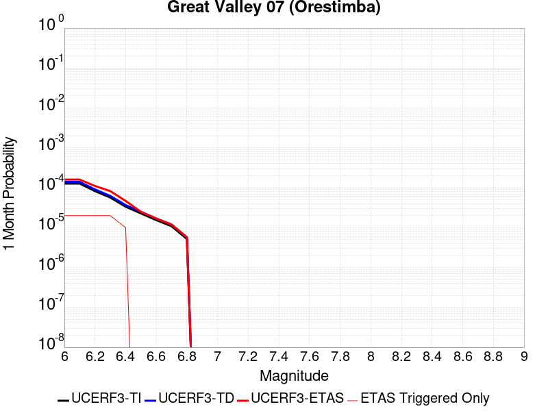 |  |  |

| Magnitude | 1 wk TI Prob | 1 wk TD Prob | 1 wk ETAS Prob | 1 wk ETAS/TD Gain | 1 wk ETAS Triggered Only | 1 mo TI Prob | 1 mo TD Prob | 1 mo ETAS Prob | 1 mo ETAS/TD Gain | 1 mo ETAS Triggered Only | 1 yr TI Prob | 1 yr TD Prob | 1 yr ETAS Prob | 1 yr ETAS/TD Gain | 1 yr ETAS Triggered Only | 10 yr TI Prob | 10 yr TD Prob | 10 yr ETAS Prob | 10 yr ETAS/TD Gain | 10 yr ETAS Triggered Only |
|-----|-----|-----|-----|-----|-----|-----|-----|-----|-----|-----|-----|-----|-----|-----|-----|-----|-----|-----|-----|-----|
| 6.0 | 2.9687902E-5 | 3.27575E-5 | 3.27575E-5 | 1.0 | 0.0 | 1.2722766E-4 | 1.4038214E-4 | 1.4038214E-4 | 1.0 | 0.0 | 0.0015478961 | 0.0017078844 | 0.0017078844 | 1.0 | 0.0 | 0.015371585 | 0.016955135 | 0.0169973 | 1.0024868 | 4.2890842E-5 |
| 6.1 | 2.9687902E-5 | 3.27575E-5 | 3.27575E-5 | 1.0 | 0.0 | 1.2722766E-4 | 1.4038214E-4 | 1.4038214E-4 | 1.0 | 0.0 | 0.0015478961 | 0.0017078844 | 0.0017078844 | 1.0 | 0.0 | 0.015371585 | 0.016955135 | 0.0169973 | 1.0024868 | 4.2890842E-5 |
| 6.2 | 1.9231524E-5 | 2.1159167E-5 | 2.1159167E-5 | 1.0 | 0.0 | 8.2418206E-5 | 9.067912E-5 | 9.067912E-5 | 1.0 | 0.0 | 0.0010029797 | 0.0011034822 | 0.0011034822 | 1.0 | 0.0 | 0.00998465 | 0.01098244 | 0.01102486 | 1.0038625 | 4.2890842E-5 |
| 6.3 | 1.324766E-5 | 1.4548534E-5 | 1.4548534E-5 | 1.0 | 0.0 | 5.6774446E-5 | 6.234942E-5 | 6.234942E-5 | 1.0 | 0.0 | 6.910097E-4 | 7.5884897E-4 | 7.5884897E-4 | 1.0 | 0.0 | 0.006888649 | 0.0075635235 | 0.00760609 | 1.0056279 | 4.2890842E-5 |
| 6.4 | 7.818645E-6 | 8.57284E-6 | 8.57284E-6 | 1.0 | 0.0 | 3.3508048E-5 | 3.6740246E-5 | 3.6740246E-5 | 1.0 | 0.0 | 4.078841E-4 | 4.4722404E-4 | 4.4722404E-4 | 1.0 | 0.0 | 0.004071363 | 0.0044635804 | 0.0045062797 | 1.0095662 | 4.2890842E-5 |
| 6.5 | 5.3076565E-6 | 5.8178007E-6 | 5.8178007E-6 | 1.0 | 0.0 | 2.27469E-5 | 2.4933206E-5 | 2.4933206E-5 | 1.0 | 0.0 | 2.7690834E-4 | 3.035216E-4 | 3.035216E-4 | 1.0 | 0.0 | 0.0027656353 | 0.00303128 | 0.0030740406 | 1.0141065 | 4.2890842E-5 |
| 6.6 | 3.6003578E-6 | 3.9484953E-6 | 3.9484953E-6 | 1.0 | 0.0 | 1.5430012E-5 | 1.6922022E-5 | 1.6922022E-5 | 1.0 | 0.0 | 1.8784421E-4 | 2.0600771E-4 | 2.0600771E-4 | 1.0 | 0.0 | 0.0018768552 | 0.0020583214 | 0.002101124 | 1.0207949 | 4.2890842E-5 |
| 6.7 | 2.5361826E-6 | 2.7834678E-6 | 2.7834678E-6 | 1.0 | 0.0 | 1.0869308E-5 | 1.1929101E-5 | 1.1929101E-5 | 1.0 | 0.0 | 1.3232579E-4 | 1.4522845E-4 | 1.4522845E-4 | 1.0 | 0.0 | 0.0013224703 | 0.0014514653 | 0.0014514653 | 1.0 | 0.0 |
| 6.8 | 1.2115831E-6 | 1.3313797E-6 | 1.3313797E-6 | 1.0 | 0.0 | 5.1924885E-6 | 5.7059065E-6 | 5.7059065E-6 | 1.0 | 0.0 | 6.3216714E-5 | 6.9468166E-5 | 6.9468166E-5 | 1.0 | 0.0 | 6.3198735E-4 | 6.945596E-4 | 6.945596E-4 | 1.0 | 0.0 |

## Big Pine (East)
*[(top)](#table-of-contents)*

| 1 Week | 1 Month | 1 Year | 10 Year |
|-----|-----|-----|-----|
|  | 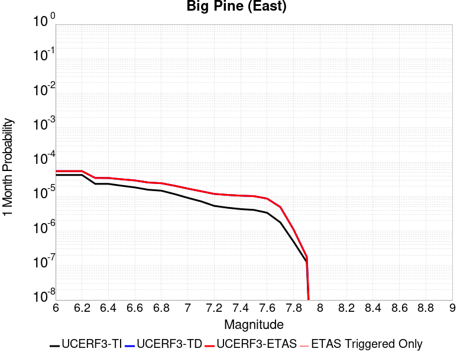 |  | 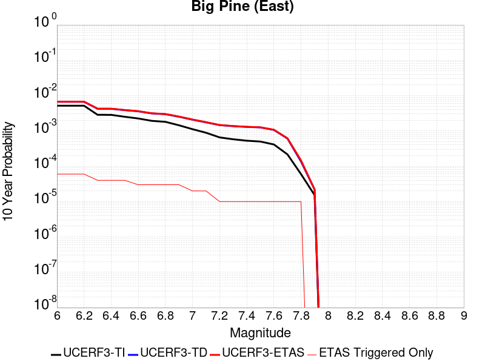 |

| Magnitude | 1 wk TI Prob | 1 wk TD Prob | 1 wk ETAS Prob | 1 wk ETAS/TD Gain | 1 wk ETAS Triggered Only | 1 mo TI Prob | 1 mo TD Prob | 1 mo ETAS Prob | 1 mo ETAS/TD Gain | 1 mo ETAS Triggered Only | 1 yr TI Prob | 1 yr TD Prob | 1 yr ETAS Prob | 1 yr ETAS/TD Gain | 1 yr ETAS Triggered Only | 10 yr TI Prob | 10 yr TD Prob | 10 yr ETAS Prob | 10 yr ETAS/TD Gain | 10 yr ETAS Triggered Only |
|-----|-----|-----|-----|-----|-----|-----|-----|-----|-----|-----|-----|-----|-----|-----|-----|-----|-----|-----|-----|-----|
| 6.0 | 9.916913E-6 | 1.2816984E-5 | 1.2816984E-5 | 1.0 | 0.0 | 4.250036E-5 | 5.49289E-5 | 5.49289E-5 | 1.0 | 0.0 | 5.173191E-4 | 6.685763E-4 | 6.685763E-4 | 1.0 | 0.0 | 0.0051611643 | 0.006670441 | 0.0067556505 | 1.0127742 | 8.5781685E-5 |
| 6.1 | 9.916913E-6 | 1.2816984E-5 | 1.2816984E-5 | 1.0 | 0.0 | 4.250036E-5 | 5.49289E-5 | 5.49289E-5 | 1.0 | 0.0 | 5.173191E-4 | 6.685763E-4 | 6.685763E-4 | 1.0 | 0.0 | 0.0051611643 | 0.006670441 | 0.0067556505 | 1.0127742 | 8.5781685E-5 |
| 6.2 | 9.916913E-6 | 1.2816984E-5 | 1.2816984E-5 | 1.0 | 0.0 | 4.250036E-5 | 5.49289E-5 | 5.49289E-5 | 1.0 | 0.0 | 5.173191E-4 | 6.685763E-4 | 6.685763E-4 | 1.0 | 0.0 | 0.0051611643 | 0.006670441 | 0.0067556505 | 1.0127742 | 8.5781685E-5 |
| 6.3 | 5.479711E-6 | 8.112951E-6 | 8.112951E-6 | 1.0 | 0.0 | 2.3484265E-5 | 3.4769346E-5 | 3.4769346E-5 | 1.0 | 0.0 | 2.858834E-4 | 4.2323777E-4 | 4.2323777E-4 | 1.0 | 0.0 | 0.0028551589 | 0.004227244 | 0.0042699534 | 1.0101033 | 4.2890842E-5 |
| 6.4 | 5.465009E-6 | 8.097245E-6 | 8.097245E-6 | 1.0 | 0.0 | 2.3421257E-5 | 3.4702036E-5 | 3.4702036E-5 | 1.0 | 0.0 | 2.851165E-4 | 4.2241855E-4 | 4.2241855E-4 | 1.0 | 0.0 | 0.0028475097 | 0.0042190826 | 0.0042617926 | 1.010123 | 4.2890842E-5 |
| 6.5 | 4.826767E-6 | 7.422301E-6 | 7.422301E-6 | 1.0 | 0.0 | 2.068598E-5 | 3.180949E-5 | 3.180949E-5 | 1.0 | 0.0 | 2.518227E-4 | 3.872145E-4 | 3.872145E-4 | 1.0 | 0.0 | 0.0025153751 | 0.003868283 | 0.0039110077 | 1.011045 | 4.2890842E-5 |
| 6.6 | 4.3146847E-6 | 6.8822374E-6 | 6.8822374E-6 | 1.0 | 0.0 | 1.8491375E-5 | 2.9494982E-5 | 2.9494982E-5 | 1.0 | 0.0 | 2.2510924E-4 | 3.590447E-4 | 3.590447E-4 | 1.0 | 0.0 | 0.0022488134 | 0.0035874986 | 0.0036302356 | 1.0119127 | 4.2890842E-5 |
| 6.7 | 3.6968106E-6 | 5.9954727E-6 | 5.9954727E-6 | 1.0 | 0.0 | 1.5843378E-5 | 2.5694639E-5 | 2.5694639E-5 | 1.0 | 0.0 | 1.9287605E-4 | 3.1278885E-4 | 3.1278885E-4 | 1.0 | 0.0 | 0.0019270873 | 0.0031262483 | 0.003169005 | 1.0136766 | 4.2890842E-5 |
| 6.8 | 3.4671132E-6 | 5.702177E-6 | 5.702177E-6 | 1.0 | 0.0 | 1.4858972E-5 | 2.4437682E-5 | 2.4437682E-5 | 1.0 | 0.0 | 1.8089297E-4 | 2.974896E-4 | 2.974896E-4 | 1.0 | 0.0 | 0.0018074579 | 0.002973667 | 0.0030164304 | 1.0143807 | 4.2890842E-5 |
| 6.9 | 2.7686972E-6 | 4.825223E-6 | 4.825223E-6 | 1.0 | 0.0 | 1.1865792E-5 | 2.0679368E-5 | 2.0679368E-5 | 1.0 | 0.0 | 1.4445644E-4 | 2.5174298E-4 | 2.5174298E-4 | 1.0 | 0.0 | 0.0014436257 | 0.0025172636 | 0.0025600465 | 1.0169958 | 4.2890842E-5 |
| 7.0 | 2.1472624E-6 | 3.9850406E-6 | 3.9850406E-6 | 1.0 | 0.0 | 9.20252E-6 | 1.7078637E-5 | 1.7078637E-5 | 1.0 | 0.0 | 1.12034926E-4 | 2.079131E-4 | 2.079131E-4 | 1.0 | 0.0 | 0.0011197845 | 0.0020798394 | 0.0021226408 | 1.0205793 | 4.2890842E-5 |
| 7.1 | 1.7018335E-6 | 3.344876E-6 | 3.344876E-6 | 1.0 | 0.0 | 7.293552E-6 | 1.4335106E-5 | 1.4335106E-5 | 1.0 | 0.0 | 8.879537E-5 | 1.7451629E-4 | 1.7451629E-4 | 1.0 | 0.0 | 8.87599E-4 | 0.0017464145 | 0.0017892304 | 1.0245165 | 4.2890842E-5 |
| 7.2 | 1.25603E-6 | 2.794484E-6 | 2.794484E-6 | 1.0 | 0.0 | 5.3829745E-6 | 1.1976307E-5 | 1.1976307E-5 | 1.0 | 0.0 | 6.553574E-5 | 1.4580201E-4 | 1.4580201E-4 | 1.0 | 0.0 | 6.551642E-4 | 0.001459661 | 0.001459661 | 1.0 | 0.0 |
| 7.3 | 1.112297E-6 | 2.610332E-6 | 2.610332E-6 | 1.0 | 0.0 | 4.7669787E-6 | 1.118709E-5 | 1.118709E-5 | 1.0 | 0.0 | 5.803642E-5 | 1.3619453E-4 | 1.3619453E-4 | 1.0 | 0.0 | 5.802127E-4 | 0.0013635408 | 0.0013635408 | 1.0 | 0.0 |
| 7.4 | 1.0137181E-6 | 2.4834917E-6 | 2.4834917E-6 | 1.0 | 0.0 | 4.3444993E-6 | 1.0643494E-5 | 1.0643494E-5 | 1.0 | 0.0 | 5.2892992E-5 | 1.2957705E-4 | 1.2957705E-4 | 1.0 | 0.0 | 5.288041E-4 | 0.0012972289 | 0.0012972289 | 1.0 | 0.0 |
| 7.5 | 9.598608E-7 | 2.4071483E-6 | 2.4071483E-6 | 1.0 | 0.0 | 4.1136827E-6 | 1.031631E-5 | 1.031631E-5 | 1.0 | 0.0 | 5.0082934E-5 | 1.2559404E-4 | 1.2559404E-4 | 1.0 | 0.0 | 5.007165E-4 | 0.0012572526 | 0.0012572526 | 1.0 | 0.0 |
| 7.6 | 7.929459E-7 | 2.0448588E-6 | 2.0448588E-6 | 1.0 | 0.0 | 3.3983351E-6 | 8.763653E-6 | 8.763653E-6 | 1.0 | 0.0 | 4.1373947E-5 | 1.06692416E-4 | 1.06692416E-4 | 1.0 | 0.0 | 4.1366243E-4 | 0.0010685222 | 0.0010685222 | 1.0 | 0.0 |
| 7.7 | 4.155788E-7 | 1.1605589E-6 | 1.1605589E-6 | 1.0 | 0.0 | 1.7810507E-6 | 4.9738146E-6 | 4.9738146E-6 | 1.0 | 0.0 | 2.1684076E-5 | 6.0554554E-5 | 6.0554554E-5 | 1.0 | 0.0 | 2.1681961E-4 | 6.0857297E-4 | 6.0857297E-4 | 1.0 | 0.0 |
| 7.8 | 1.14666925E-7 | 2.592015E-7 | 2.592015E-7 | 1.0 | 0.0 | 4.914296E-7 | 1.1108631E-6 | 1.1108631E-6 | 1.0 | 0.0 | 5.9831386E-6 | 1.3524678E-5 | 1.3524678E-5 | 1.0 | 0.0 | 5.9829777E-5 | 1.3634123E-4 | 1.3634123E-4 | 1.0 | 0.0 |
| 7.9 | 2.9231824E-8 | 4.1463963E-8 | 4.1463963E-8 | 1.0 | 0.0 | 1.2527924E-7 | 1.7770269E-7 | 1.7770269E-7 | 1.0 | 0.0 | 1.5252737E-6 | 2.1635283E-6 | 2.1635283E-6 | 1.0 | 0.0 | 1.5252632E-5 | 2.1967755E-5 | 2.1967755E-5 | 1.0 | 0.0 |

## Chino alt 1
*[(top)](#table-of-contents)*

| 1 Week | 1 Month | 1 Year | 10 Year |
|-----|-----|-----|-----|
|  |  |  |  |

| Magnitude | 1 wk TI Prob | 1 wk TD Prob | 1 wk ETAS Prob | 1 wk ETAS/TD Gain | 1 wk ETAS Triggered Only | 1 mo TI Prob | 1 mo TD Prob | 1 mo ETAS Prob | 1 mo ETAS/TD Gain | 1 mo ETAS Triggered Only | 1 yr TI Prob | 1 yr TD Prob | 1 yr ETAS Prob | 1 yr ETAS/TD Gain | 1 yr ETAS Triggered Only | 10 yr TI Prob | 10 yr TD Prob | 10 yr ETAS Prob | 10 yr ETAS/TD Gain | 10 yr ETAS Triggered Only |
|-----|-----|-----|-----|-----|-----|-----|-----|-----|-----|-----|-----|-----|-----|-----|-----|-----|-----|-----|-----|-----|
| 6.0 | 3.939946E-5 | 4.8948554E-5 | 9.18373E-5 | 1.8762004 | 4.2890842E-5 | 1.6884391E-4 | 2.097656E-4 | 2.5264744E-4 | 1.2044275 | 4.2890842E-5 | 0.0020537362 | 0.0025513945 | 0.002594176 | 1.0167679 | 4.2890842E-5 | 0.020348595 | 0.025277847 | 0.02536146 | 1.0033078 | 8.5781685E-5 |
| 6.1 | 2.1505624E-5 | 2.6879026E-5 | 6.9768714E-5 | 2.5956564 | 4.2890842E-5 | 9.2163704E-5 | 1.1519137E-4 | 1.5807727E-4 | 1.3723013 | 4.2890842E-5 | 0.0011215154 | 0.001401664 | 0.0014444947 | 1.030557 | 4.2890842E-5 | 0.011158722 | 0.013945141 | 0.014029726 | 1.0060656 | 8.5781685E-5 |
| 6.2 | 2.1505624E-5 | 2.6879026E-5 | 6.9768714E-5 | 2.5956564 | 4.2890842E-5 | 9.2163704E-5 | 1.1519137E-4 | 1.5807727E-4 | 1.3723013 | 4.2890842E-5 | 0.0011215154 | 0.001401664 | 0.0014444947 | 1.030557 | 4.2890842E-5 | 0.011158722 | 0.013945141 | 0.014029726 | 1.0060656 | 8.5781685E-5 |
| 6.3 | 1.4290785E-5 | 1.8165128E-5 | 1.8165128E-5 | 1.0 | 0.0 | 6.1244784E-5 | 7.784848E-5 | 7.784848E-5 | 1.0 | 0.0 | 7.454001E-4 | 9.4743853E-4 | 9.4743853E-4 | 1.0 | 0.0 | 0.007429048 | 0.0094444575 | 0.0094444575 | 1.0 | 0.0 |
| 6.4 | 1.4290785E-5 | 1.8165128E-5 | 1.8165128E-5 | 1.0 | 0.0 | 6.1244784E-5 | 7.784848E-5 | 7.784848E-5 | 1.0 | 0.0 | 7.454001E-4 | 9.4743853E-4 | 9.4743853E-4 | 1.0 | 0.0 | 0.007429048 | 0.0094444575 | 0.0094444575 | 1.0 | 0.0 |
| 6.5 | 1.3017944E-5 | 1.6652088E-5 | 1.6652088E-5 | 1.0 | 0.0 | 5.5789995E-5 | 7.136439E-5 | 7.136439E-5 | 1.0 | 0.0 | 6.790315E-4 | 8.685589E-4 | 8.685589E-4 | 1.0 | 0.0 | 0.0067696036 | 0.008661949 | 0.008661949 | 1.0 | 0.0 |
| 6.6 | 9.470016E-6 | 1.2039424E-5 | 1.2039424E-5 | 1.0 | 0.0 | 4.058515E-5 | 5.1596704E-5 | 5.1596704E-5 | 1.0 | 0.0 | 4.940122E-4 | 6.280428E-4 | 6.280428E-4 | 1.0 | 0.0 | 0.004929154 | 0.0062718987 | 0.0062718987 | 1.0 | 0.0 |
| 6.7 | 8.314155E-6 | 1.0407736E-5 | 1.0407736E-5 | 1.0 | 0.0 | 3.5631605E-5 | 4.4604003E-5 | 4.4604003E-5 | 1.0 | 0.0 | 4.3372845E-4 | 5.429507E-4 | 5.429507E-4 | 1.0 | 0.0 | 0.004328829 | 0.005425775 | 0.005425775 | 1.0 | 0.0 |
| 6.8 | 3.4856364E-6 | 3.8133708E-6 | 3.8133708E-6 | 1.0 | 0.0 | 1.4938357E-5 | 1.6342927E-5 | 1.6342927E-5 | 1.0 | 0.0 | 1.8185932E-4 | 1.9895904E-4 | 1.9895904E-4 | 1.0 | 0.0 | 0.0018171056 | 0.0019894864 | 0.0019894864 | 1.0 | 0.0 |
| 6.9 | 2.2645952E-6 | 2.1529022E-6 | 2.1529022E-6 | 1.0 | 0.0 | 9.705372E-6 | 9.226692E-6 | 9.226692E-6 | 1.0 | 0.0 | 1.18156495E-4 | 1.123294E-4 | 1.123294E-4 | 1.0 | 0.0 | 0.0011809369 | 0.0011233423 | 0.0011233423 | 1.0 | 0.0 |
| 7.0 | 1.7864003E-6 | 1.5430785E-6 | 1.5430785E-6 | 1.0 | 0.0 | 7.655979E-6 | 6.613177E-6 | 6.613177E-6 | 1.0 | 0.0 | 9.3207556E-5 | 8.051251E-5 | 8.051251E-5 | 1.0 | 0.0 | 9.316847E-4 | 8.0528046E-4 | 8.0528046E-4 | 1.0 | 0.0 |
| 7.1 | 1.7315456E-6 | 1.4733511E-6 | 1.4733511E-6 | 1.0 | 0.0 | 7.420889E-6 | 6.3143466E-6 | 6.3143466E-6 | 1.0 | 0.0 | 9.034557E-5 | 7.6874516E-5 | 7.6874516E-5 | 1.0 | 0.0 | 9.0308854E-4 | 7.6891703E-4 | 7.6891703E-4 | 1.0 | 0.0 |
| 7.2 | 1.6008337E-6 | 1.3574215E-6 | 1.3574215E-6 | 1.0 | 0.0 | 6.860698E-6 | 5.817508E-6 | 5.817508E-6 | 1.0 | 0.0 | 8.352579E-5 | 7.082591E-5 | 7.082591E-5 | 1.0 | 0.0 | 8.34944E-4 | 7.0845755E-4 | 7.0845755E-4 | 1.0 | 0.0 |
| 7.3 | 1.3320939E-6 | 1.121782E-6 | 1.121782E-6 | 1.0 | 0.0 | 5.7089615E-6 | 4.807629E-6 | 4.807629E-6 | 1.0 | 0.0 | 6.9504385E-5 | 5.8531357E-5 | 5.8531357E-5 | 1.0 | 0.0 | 6.9482654E-4 | 5.8530393E-4 | 5.8530393E-4 | 1.0 | 0.0 |
| 7.4 | 1.114294E-6 | 9.237111E-7 | 9.237111E-7 | 1.0 | 0.0 | 4.775537E-6 | 3.958756E-6 | 3.958756E-6 | 1.0 | 0.0 | 5.8140613E-5 | 4.8196827E-5 | 4.8196827E-5 | 1.0 | 0.0 | 5.81254E-4 | 4.8188053E-4 | 4.8188053E-4 | 1.0 | 0.0 |
| 7.5 | 9.354081E-7 | 7.6234323E-7 | 7.6234323E-7 | 1.0 | 0.0 | 4.0088858E-6 | 3.2671815E-6 | 3.2671815E-6 | 1.0 | 0.0 | 4.8807087E-5 | 3.9777242E-5 | 3.9777242E-5 | 1.0 | 0.0 | 4.879637E-4 | 3.977046E-4 | 3.977046E-4 | 1.0 | 0.0 |
| 7.6 | 8.521771E-7 | 6.88071E-7 | 6.88071E-7 | 1.0 | 0.0 | 3.6521824E-6 | 2.9488726E-6 | 2.9488726E-6 | 1.0 | 0.0 | 4.4464414E-5 | 3.5901965E-5 | 3.5901965E-5 | 1.0 | 0.0 | 4.4455516E-4 | 3.589648E-4 | 3.589648E-4 | 1.0 | 0.0 |
| 7.7 | 2.1803626E-7 | 1.418649E-7 | 1.418649E-7 | 1.0 | 0.0 | 9.344408E-7 | 6.079923E-7 | 6.079923E-7 | 1.0 | 0.0 | 1.1376757E-5 | 7.4022914E-6 | 7.4022914E-6 | 1.0 | 0.0 | 1.13761744E-4 | 7.402141E-5 | 7.402141E-5 | 1.0 | 0.0 |

## San Diego Trough north alt1
*[(top)](#table-of-contents)*

| 1 Week | 1 Month | 1 Year | 10 Year |
|-----|-----|-----|-----|
|  | 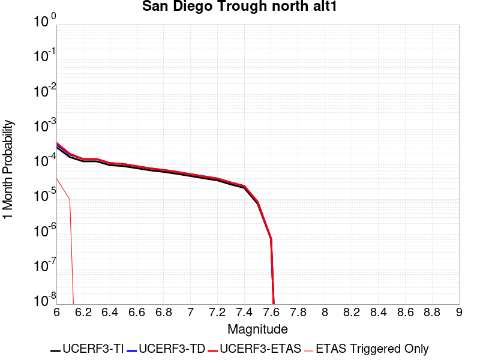 |  |  |

| Magnitude | 1 wk TI Prob | 1 wk TD Prob | 1 wk ETAS Prob | 1 wk ETAS/TD Gain | 1 wk ETAS Triggered Only | 1 mo TI Prob | 1 mo TD Prob | 1 mo ETAS Prob | 1 mo ETAS/TD Gain | 1 mo ETAS Triggered Only | 1 yr TI Prob | 1 yr TD Prob | 1 yr ETAS Prob | 1 yr ETAS/TD Gain | 1 yr ETAS Triggered Only | 10 yr TI Prob | 10 yr TD Prob | 10 yr ETAS Prob | 10 yr ETAS/TD Gain | 10 yr ETAS Triggered Only |
|-----|-----|-----|-----|-----|-----|-----|-----|-----|-----|-----|-----|-----|-----|-----|-----|-----|-----|-----|-----|-----|
| 6.0 | 7.329252E-5 | 8.821093E-5 | 8.821093E-5 | 1.0 | 0.0 | 3.14073E-4 | 3.7799572E-4 | 4.2087035E-4 | 1.1134262 | 4.2890842E-5 | 0.0038171355 | 0.004593027 | 0.004635721 | 1.0092953 | 4.2890842E-5 | 0.03752231 | 0.045044992 | 0.045126908 | 1.0018185 | 8.5781685E-5 |
| 6.1 | 3.7940346E-5 | 4.4885E-5 | 4.4885E-5 | 1.0 | 0.0 | 1.6259136E-4 | 1.9235066E-4 | 1.9235066E-4 | 1.0 | 0.0 | 0.0019777524 | 0.0023394432 | 0.0023394432 | 1.0 | 0.0 | 0.019602431 | 0.023156688 | 0.023198584 | 1.0018094 | 4.2890842E-5 |
| 6.2 | 2.8645263E-5 | 3.329678E-5 | 3.329678E-5 | 1.0 | 0.0 | 1.2275964E-4 | 1.4269284E-4 | 1.4269284E-4 | 1.0 | 0.0 | 0.0014935739 | 0.0017359189 | 0.0017359189 | 1.0 | 0.0 | 0.0148357535 | 0.017226247 | 0.017268399 | 1.002447 | 4.2890842E-5 |
| 6.3 | 2.8645263E-5 | 3.329678E-5 | 3.329678E-5 | 1.0 | 0.0 | 1.2275964E-4 | 1.4269284E-4 | 1.4269284E-4 | 1.0 | 0.0 | 0.0014935739 | 0.0017359189 | 0.0017359189 | 1.0 | 0.0 | 0.0148357535 | 0.017226247 | 0.017268399 | 1.002447 | 4.2890842E-5 |
| 6.4 | 2.2204576E-5 | 2.5448318E-5 | 2.5448318E-5 | 1.0 | 0.0 | 9.5159E-5 | 1.0905972E-4 | 1.0905972E-4 | 1.0 | 0.0 | 0.001157945 | 0.0013270034 | 0.0013270034 | 1.0 | 0.0 | 0.011519298 | 0.013191955 | 0.01323428 | 1.0032084 | 4.2890842E-5 |
| 6.5 | 2.1004838E-5 | 2.4024694E-5 | 2.4024694E-5 | 1.0 | 0.0 | 9.0017624E-5 | 1.0295896E-4 | 1.0295896E-4 | 1.0 | 0.0 | 0.0010954136 | 0.0012528138 | 0.0012528138 | 1.0 | 0.0 | 0.010900296 | 0.012458589 | 0.0125009455 | 1.0033997 | 4.2890842E-5 |
| 6.6 | 1.820557E-5 | 2.0704787E-5 | 2.0704787E-5 | 1.0 | 0.0 | 7.802154E-5 | 8.873181E-5 | 8.873181E-5 | 1.0 | 0.0 | 9.4949827E-4 | 0.0010797799 | 0.0010797799 | 1.0 | 0.0 | 0.009454516 | 0.010746004 | 0.010788434 | 1.0039485 | 4.2890842E-5 |
| 6.7 | 1.5884485E-5 | 1.7983646E-5 | 1.7983646E-5 | 1.0 | 0.0 | 6.807459E-5 | 7.707051E-5 | 7.707051E-5 | 1.0 | 0.0 | 8.284929E-4 | 9.3793223E-4 | 9.3793223E-4 | 1.0 | 0.0 | 0.008254109 | 0.009340104 | 0.009340104 | 1.0 | 0.0 |
| 6.8 | 1.4331171E-5 | 1.6201066E-5 | 1.6201066E-5 | 1.0 | 0.0 | 6.141786E-5 | 6.94313E-5 | 6.94313E-5 | 1.0 | 0.0 | 7.4750587E-4 | 8.450002E-4 | 8.450002E-4 | 1.0 | 0.0 | 0.0074499645 | 0.008418139 | 0.008418139 | 1.0 | 0.0 |
| 6.9 | 1.2574203E-5 | 1.4205835E-5 | 1.4205835E-5 | 1.0 | 0.0 | 5.3888325E-5 | 6.0880735E-5 | 6.0880735E-5 | 1.0 | 0.0 | 6.558929E-4 | 7.409723E-4 | 7.409723E-4 | 1.0 | 0.0 | 0.0065396037 | 0.007385203 | 0.007385203 | 1.0 | 0.0 |
| 7.0 | 1.0883844E-5 | 1.2289262E-5 | 1.2289262E-5 | 1.0 | 0.0 | 4.664421E-5 | 5.2667205E-5 | 5.2667205E-5 | 1.0 | 0.0 | 5.677453E-4 | 6.4103556E-4 | 6.4103556E-4 | 1.0 | 0.0 | 0.00566297 | 0.006391993 | 0.006391993 | 1.0 | 0.0 |
| 7.1 | 9.393088E-6 | 1.060702E-5 | 1.060702E-5 | 1.0 | 0.0 | 4.025547E-5 | 4.545787E-5 | 4.545787E-5 | 1.0 | 0.0 | 4.900001E-4 | 5.533098E-4 | 5.533098E-4 | 1.0 | 0.0 | 0.0048892107 | 0.005519418 | 0.005519418 | 1.0 | 0.0 |
| 7.2 | 8.190791E-6 | 9.258625E-6 | 9.258625E-6 | 1.0 | 0.0 | 3.510292E-5 | 3.9679224E-5 | 3.9679224E-5 | 1.0 | 0.0 | 4.2729423E-4 | 4.8298817E-4 | 4.8298817E-4 | 1.0 | 0.0 | 0.0042647356 | 0.004819465 | 0.004819465 | 1.0 | 0.0 |
| 7.3 | 6.268162E-6 | 7.089716E-6 | 7.089716E-6 | 1.0 | 0.0 | 2.6863276E-5 | 3.0384144E-5 | 3.0384144E-5 | 1.0 | 0.0 | 3.2701128E-4 | 3.6986457E-4 | 3.6986457E-4 | 1.0 | 0.0 | 0.003265305 | 0.003692536 | 0.003692536 | 1.0 | 0.0 |
| 7.4 | 4.985186E-6 | 5.6426816E-6 | 5.6426816E-6 | 1.0 | 0.0 | 2.1364907E-5 | 2.4182698E-5 | 2.4182698E-5 | 1.0 | 0.0 | 2.600867E-4 | 2.9438498E-4 | 2.9438498E-4 | 1.0 | 0.0 | 0.002597825 | 0.0029399914 | 0.0029399914 | 1.0 | 0.0 |
| 7.5 | 1.7489613E-6 | 1.969678E-6 | 1.969678E-6 | 1.0 | 0.0 | 7.495527E-6 | 8.4414505E-6 | 8.4414505E-6 | 1.0 | 0.0 | 9.125422E-5 | 1.02770035E-4 | 1.02770035E-4 | 1.0 | 0.0 | 9.1216754E-4 | 0.0010272472 | 0.0010272472 | 1.0 | 0.0 |
| 7.6 | 1.6988751E-7 | 1.7533823E-7 | 1.7533823E-7 | 1.0 | 0.0 | 7.2808916E-7 | 7.5144936E-7 | 7.5144936E-7 | 1.0 | 0.0 | 8.864449E-6 | 9.14886E-6 | 9.14886E-6 | 1.0 | 0.0 | 8.8640954E-5 | 9.1485024E-5 | 9.1485024E-5 | 1.0 | 0.0 |

## Concord 2011 CFM
*[(top)](#table-of-contents)*

| 1 Week | 1 Month | 1 Year | 10 Year |
|-----|-----|-----|-----|
| 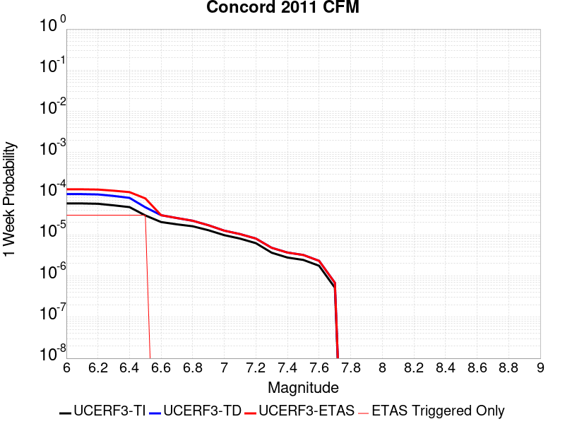 |  |  |  |

| Magnitude | 1 wk TI Prob | 1 wk TD Prob | 1 wk ETAS Prob | 1 wk ETAS/TD Gain | 1 wk ETAS Triggered Only | 1 mo TI Prob | 1 mo TD Prob | 1 mo ETAS Prob | 1 mo ETAS/TD Gain | 1 mo ETAS Triggered Only | 1 yr TI Prob | 1 yr TD Prob | 1 yr ETAS Prob | 1 yr ETAS/TD Gain | 1 yr ETAS Triggered Only | 10 yr TI Prob | 10 yr TD Prob | 10 yr ETAS Prob | 10 yr ETAS/TD Gain | 10 yr ETAS Triggered Only |
|-----|-----|-----|-----|-----|-----|-----|-----|-----|-----|-----|-----|-----|-----|-----|-----|-----|-----|-----|-----|-----|
| 6.0 | 5.7865112E-5 | 9.759152E-5 | 1.8336483E-4 | 1.8789014 | 8.5781685E-5 | 2.4796976E-4 | 4.1818706E-4 | 5.039329E-4 | 1.2050418 | 8.5781685E-5 | 0.0030148525 | 0.005079467 | 0.005164813 | 1.0168022 | 8.5781685E-5 | 0.029742775 | 0.049248982 | 0.049330536 | 1.001656 | 8.5781685E-5 |
| 6.1 | 5.7865112E-5 | 9.759152E-5 | 1.8336483E-4 | 1.8789014 | 8.5781685E-5 | 2.4796976E-4 | 4.1818706E-4 | 5.039329E-4 | 1.2050418 | 8.5781685E-5 | 0.0030148525 | 0.005079467 | 0.005164813 | 1.0168022 | 8.5781685E-5 | 0.029742775 | 0.049248982 | 0.049330536 | 1.001656 | 8.5781685E-5 |
| 6.2 | 5.6789337E-5 | 9.5795076E-5 | 1.8156854E-4 | 1.8953849 | 8.5781685E-5 | 2.4336016E-4 | 4.104905E-4 | 4.9623696E-4 | 1.2088878 | 8.5781685E-5 | 0.0029588845 | 0.0049861916 | 0.0050715455 | 1.0171181 | 8.5781685E-5 | 0.029197963 | 0.04836556 | 0.04844719 | 1.0016879 | 8.5781685E-5 |
| 6.3 | 5.203322E-5 | 8.803056E-5 | 1.7380468E-4 | 1.9743677 | 8.5781685E-5 | 2.2298045E-4 | 3.7722368E-4 | 4.62973E-4 | 1.227317 | 8.5781685E-5 | 0.0027114071 | 0.0045838105 | 0.0046691988 | 1.0186282 | 8.5781685E-5 | 0.026785625 | 0.04453672 | 0.04461868 | 1.0018404 | 8.5781685E-5 |
| 6.4 | 4.7120942E-5 | 7.897404E-5 | 1.6474894E-4 | 2.0861154 | 8.5781685E-5 | 2.0193127E-4 | 3.3842045E-4 | 4.241731E-4 | 1.2533909 | 8.5781685E-5 | 0.0024557412 | 0.00411323 | 0.0041986587 | 1.0207692 | 8.5781685E-5 | 0.024287801 | 0.040065527 | 0.040147875 | 1.0020553 | 8.5781685E-5 |
| 6.5 | 2.9598437E-5 | 4.667486E-5 | 1.3245254E-4 | 2.8377705 | 8.5781685E-5 | 1.2684427E-4 | 2.0002096E-4 | 2.857855E-4 | 1.4287777 | 8.5781685E-5 | 0.001543235 | 0.0024327459 | 0.0025183188 | 1.0351754 | 8.5781685E-5 | 0.015325619 | 0.023909973 | 0.023993704 | 1.0035019 | 8.5781685E-5 |
| 6.6 | 2.0443718E-5 | 2.998433E-5 | 2.998433E-5 | 1.0 | 0.0 | 8.7613E-5 | 1.2849816E-4 | 1.2849816E-4 | 1.0 | 0.0 | 0.0010661662 | 0.0015633785 | 0.0015633785 | 1.0 | 0.0 | 0.010610655 | 0.015466996 | 0.015466996 | 1.0 | 0.0 |
| 6.7 | 1.798539E-5 | 2.5557381E-5 | 2.5557381E-5 | 1.0 | 0.0 | 7.7077966E-5 | 1.0952716E-4 | 1.0952716E-4 | 1.0 | 0.0 | 9.380202E-4 | 0.001332699 | 0.001332699 | 1.0 | 0.0 | 0.009340706 | 0.013217433 | 0.013217433 | 1.0 | 0.0 |
| 6.8 | 1.613555E-5 | 2.1959211E-5 | 2.1959211E-5 | 1.0 | 0.0 | 6.915052E-5 | 9.4107585E-5 | 9.4107585E-5 | 1.0 | 0.0 | 8.4158237E-4 | 0.0011451716 | 0.0011451716 | 1.0 | 0.0 | 0.008384023 | 0.0113782035 | 0.0113782035 | 1.0 | 0.0 |
| 6.9 | 1.2916435E-5 | 1.7081054E-5 | 1.7081054E-5 | 1.0 | 0.0 | 5.5354973E-5 | 7.32025E-5 | 7.32025E-5 | 1.0 | 0.0 | 6.7373837E-4 | 8.908818E-4 | 8.908818E-4 | 1.0 | 0.0 | 0.006716994 | 0.008867139 | 0.008867139 | 1.0 | 0.0 |
| 7.0 | 9.81129E-6 | 1.2630829E-5 | 1.2630829E-5 | 1.0 | 0.0 | 4.2047708E-5 | 5.413101E-5 | 5.413101E-5 | 1.0 | 0.0 | 5.118106E-4 | 6.588474E-4 | 6.588474E-4 | 1.0 | 0.0 | 0.005106334 | 0.006569153 | 0.006569153 | 1.0 | 0.0 |
| 7.1 | 8.0889195E-6 | 1.0418261E-5 | 1.0418261E-5 | 1.0 | 0.0 | 3.4666336E-5 | 4.4648932E-5 | 4.4648932E-5 | 1.0 | 0.0 | 4.219809E-4 | 5.434662E-4 | 5.434662E-4 | 1.0 | 0.0 | 0.004211805 | 0.0054215975 | 0.0054215975 | 1.0 | 0.0 |
| 7.2 | 6.267438E-6 | 8.115699E-6 | 8.115699E-6 | 1.0 | 0.0 | 2.6860173E-5 | 3.4781104E-5 | 3.4781104E-5 | 1.0 | 0.0 | 3.2697353E-4 | 4.233784E-4 | 4.233784E-4 | 1.0 | 0.0 | 0.0032649285 | 0.004225969 | 0.004225969 | 1.0 | 0.0 |
| 7.3 | 3.6761196E-6 | 4.8401653E-6 | 4.8401653E-6 | 1.0 | 0.0 | 1.5754704E-5 | 2.0743402E-5 | 2.0743402E-5 | 1.0 | 0.0 | 1.9179663E-4 | 2.5252186E-4 | 2.5252186E-4 | 1.0 | 0.0 | 0.0019163118 | 0.002522487 | 0.002522487 | 1.0 | 0.0 |
| 7.4 | 2.8044356E-6 | 3.7096036E-6 | 3.7096036E-6 | 1.0 | 0.0 | 1.2018954E-5 | 1.5898204E-5 | 1.5898204E-5 | 1.0 | 0.0 | 1.4632095E-4 | 1.9354356E-4 | 1.9354356E-4 | 1.0 | 0.0 | 0.0014622464 | 0.0019338481 | 0.0019338481 | 1.0 | 0.0 |
| 7.5 | 2.4578699E-6 | 3.2447442E-6 | 3.2447442E-6 | 1.0 | 0.0 | 1.0533685E-5 | 1.3905973E-5 | 1.3905973E-5 | 1.0 | 0.0 | 1.2824008E-4 | 1.6929218E-4 | 1.6929218E-4 | 1.0 | 0.0 | 0.0012816609 | 0.001691713 | 0.001691713 | 1.0 | 0.0 |
| 7.6 | 1.7713267E-6 | 2.3351192E-6 | 2.3351192E-6 | 1.0 | 0.0 | 7.591378E-6 | 1.0007616E-5 | 1.0007616E-5 | 1.0 | 0.0 | 9.2421105E-5 | 1.21836E-4 | 1.21836E-4 | 1.0 | 0.0 | 9.2382677E-4 | 0.0012177454 | 0.0012177454 | 1.0 | 0.0 |
| 7.7 | 5.1912366E-7 | 6.8290143E-7 | 6.8290143E-7 | 1.0 | 0.0 | 2.2248137E-6 | 2.9267171E-6 | 2.9267171E-6 | 1.0 | 0.0 | 2.708677E-5 | 3.5632213E-5 | 3.5632213E-5 | 1.0 | 0.0 | 2.708347E-4 | 3.5627294E-4 | 3.5627294E-4 | 1.0 | 0.0 |

## Pleito
*[(top)](#table-of-contents)*

| 1 Week | 1 Month | 1 Year | 10 Year |
|-----|-----|-----|-----|
|  |  |  |  |

| Magnitude | 1 wk TI Prob | 1 wk TD Prob | 1 wk ETAS Prob | 1 wk ETAS/TD Gain | 1 wk ETAS Triggered Only | 1 mo TI Prob | 1 mo TD Prob | 1 mo ETAS Prob | 1 mo ETAS/TD Gain | 1 mo ETAS Triggered Only | 1 yr TI Prob | 1 yr TD Prob | 1 yr ETAS Prob | 1 yr ETAS/TD Gain | 1 yr ETAS Triggered Only | 10 yr TI Prob | 10 yr TD Prob | 10 yr ETAS Prob | 10 yr ETAS/TD Gain | 10 yr ETAS Triggered Only |
|-----|-----|-----|-----|-----|-----|-----|-----|-----|-----|-----|-----|-----|-----|-----|-----|-----|-----|-----|-----|-----|
| 6.0 | 1.6763008E-5 | 2.4763838E-5 | 2.4763838E-5 | 1.0 | 0.0 | 7.183948E-5 | 1.0612683E-4 | 1.0612683E-4 | 1.0 | 0.0 | 8.742947E-4 | 0.0012914003 | 0.0012914003 | 1.0 | 0.0 | 0.00870863 | 0.0129538905 | 0.013038561 | 1.0065362 | 8.5781685E-5 |
| 6.1 | 1.6763008E-5 | 2.4763838E-5 | 2.4763838E-5 | 1.0 | 0.0 | 7.183948E-5 | 1.0612683E-4 | 1.0612683E-4 | 1.0 | 0.0 | 8.742947E-4 | 0.0012914003 | 0.0012914003 | 1.0 | 0.0 | 0.00870863 | 0.0129538905 | 0.013038561 | 1.0065362 | 8.5781685E-5 |
| 6.2 | 1.6763008E-5 | 2.4763838E-5 | 2.4763838E-5 | 1.0 | 0.0 | 7.183948E-5 | 1.0612683E-4 | 1.0612683E-4 | 1.0 | 0.0 | 8.742947E-4 | 0.0012914003 | 0.0012914003 | 1.0 | 0.0 | 0.00870863 | 0.0129538905 | 0.013038561 | 1.0065362 | 8.5781685E-5 |
| 6.3 | 1.6763008E-5 | 2.4763838E-5 | 2.4763838E-5 | 1.0 | 0.0 | 7.183948E-5 | 1.0612683E-4 | 1.0612683E-4 | 1.0 | 0.0 | 8.742947E-4 | 0.0012914003 | 0.0012914003 | 1.0 | 0.0 | 0.00870863 | 0.0129538905 | 0.013038561 | 1.0065362 | 8.5781685E-5 |
| 6.4 | 1.6763008E-5 | 2.4763838E-5 | 2.4763838E-5 | 1.0 | 0.0 | 7.183948E-5 | 1.0612683E-4 | 1.0612683E-4 | 1.0 | 0.0 | 8.742947E-4 | 0.0012914003 | 0.0012914003 | 1.0 | 0.0 | 0.00870863 | 0.0129538905 | 0.013038561 | 1.0065362 | 8.5781685E-5 |
| 6.5 | 1.6763008E-5 | 2.4763838E-5 | 2.4763838E-5 | 1.0 | 0.0 | 7.183948E-5 | 1.0612683E-4 | 1.0612683E-4 | 1.0 | 0.0 | 8.742947E-4 | 0.0012914003 | 0.0012914003 | 1.0 | 0.0 | 0.00870863 | 0.0129538905 | 0.013038561 | 1.0065362 | 8.5781685E-5 |
| 6.6 | 9.910213E-6 | 1.7214623E-5 | 1.7214623E-5 | 1.0 | 0.0 | 4.247165E-5 | 7.377489E-5 | 7.377489E-5 | 1.0 | 0.0 | 5.169696E-4 | 8.978429E-4 | 8.978429E-4 | 1.0 | 0.0 | 0.0051576863 | 0.009050702 | 0.009050702 | 1.0 | 0.0 |
| 6.7 | 9.910213E-6 | 1.7214623E-5 | 1.7214623E-5 | 1.0 | 0.0 | 4.247165E-5 | 7.377489E-5 | 7.377489E-5 | 1.0 | 0.0 | 5.169696E-4 | 8.978429E-4 | 8.978429E-4 | 1.0 | 0.0 | 0.0051576863 | 0.009050702 | 0.009050702 | 1.0 | 0.0 |
| 6.8 | 8.300162E-6 | 1.5474232E-5 | 1.5474232E-5 | 1.0 | 0.0 | 3.557164E-5 | 6.631646E-5 | 6.631646E-5 | 1.0 | 0.0 | 4.3299864E-4 | 8.071053E-4 | 8.071053E-4 | 1.0 | 0.0 | 0.004321559 | 0.008150139 | 0.008150139 | 1.0 | 0.0 |
| 6.9 | 8.183114E-6 | 1.5345448E-5 | 1.5345448E-5 | 1.0 | 0.0 | 3.5070017E-5 | 6.576455E-5 | 6.576455E-5 | 1.0 | 0.0 | 4.2689382E-4 | 8.003907E-4 | 8.003907E-4 | 1.0 | 0.0 | 0.0042607468 | 0.008083483 | 0.008083483 | 1.0 | 0.0 |
| 7.0 | 7.1748823E-6 | 1.413244E-5 | 1.413244E-5 | 1.0 | 0.0 | 3.0749135E-5 | 6.0566195E-5 | 6.0566195E-5 | 1.0 | 0.0 | 3.743064E-4 | 7.371445E-4 | 7.371445E-4 | 1.0 | 0.0 | 0.0037367654 | 0.007454939 | 0.007454939 | 1.0 | 0.0 |
| 7.1 | 7.1671807E-6 | 1.412281E-5 | 1.412281E-5 | 1.0 | 0.0 | 3.0716128E-5 | 6.052493E-5 | 6.052493E-5 | 1.0 | 0.0 | 3.7390468E-4 | 7.366424E-4 | 7.366424E-4 | 1.0 | 0.0 | 0.0037327618 | 0.0074499524 | 0.0074499524 | 1.0 | 0.0 |
| 7.2 | 7.0649667E-6 | 1.39701015E-5 | 1.39701015E-5 | 1.0 | 0.0 | 3.0278077E-5 | 5.9870494E-5 | 5.9870494E-5 | 1.0 | 0.0 | 3.6857324E-4 | 7.2868E-4 | 7.2868E-4 | 1.0 | 0.0 | 0.0036796255 | 0.0073707094 | 0.0073707094 | 1.0 | 0.0 |
| 7.3 | 7.02082E-6 | 1.3913556E-5 | 1.3913556E-5 | 1.0 | 0.0 | 3.008888E-5 | 5.9628168E-5 | 5.9628168E-5 | 1.0 | 0.0 | 3.6627054E-4 | 7.2573166E-4 | 7.2573166E-4 | 1.0 | 0.0 | 0.0036566744 | 0.007341209 | 0.007341209 | 1.0 | 0.0 |
| 7.4 | 6.987146E-6 | 1.3873118E-5 | 1.3873118E-5 | 1.0 | 0.0 | 2.9944567E-5 | 5.945487E-5 | 5.945487E-5 | 1.0 | 0.0 | 3.6451413E-4 | 7.2362315E-4 | 7.2362315E-4 | 1.0 | 0.0 | 0.0036391679 | 0.007320144 | 0.007320144 | 1.0 | 0.0 |
| 7.5 | 6.9494554E-6 | 1.3830024E-5 | 1.3830024E-5 | 1.0 | 0.0 | 2.9783041E-5 | 5.9270187E-5 | 5.9270187E-5 | 1.0 | 0.0 | 3.625482E-4 | 7.2137616E-4 | 7.2137616E-4 | 1.0 | 0.0 | 0.0036195726 | 0.0072977724 | 0.0072977724 | 1.0 | 0.0 |
| 7.6 | 6.92694E-6 | 1.3789138E-5 | 1.3789138E-5 | 1.0 | 0.0 | 2.9686547E-5 | 5.909497E-5 | 5.909497E-5 | 1.0 | 0.0 | 3.6137376E-4 | 7.1924424E-4 | 7.1924424E-4 | 1.0 | 0.0 | 0.0036078666 | 0.0072765257 | 0.0072765257 | 1.0 | 0.0 |
| 7.7 | 6.395867E-6 | 1.2668219E-5 | 1.2668219E-5 | 1.0 | 0.0 | 2.741057E-5 | 5.429124E-5 | 5.429124E-5 | 1.0 | 0.0 | 3.336726E-4 | 6.6079566E-4 | 6.6079566E-4 | 1.0 | 0.0 | 0.0033317201 | 0.0066951844 | 0.0066951844 | 1.0 | 0.0 |
| 7.8 | 5.8664327E-6 | 1.153586E-5 | 1.153586E-5 | 1.0 | 0.0 | 2.5141611E-5 | 4.9438466E-5 | 4.9438466E-5 | 1.0 | 0.0 | 3.060561E-4 | 6.017473E-4 | 6.017473E-4 | 1.0 | 0.0 | 0.0030563495 | 0.0061006667 | 0.0061006667 | 1.0 | 0.0 |
| 7.9 | 3.7167474E-6 | 7.1140853E-6 | 7.1140853E-6 | 1.0 | 0.0 | 1.592882E-5 | 3.0488582E-5 | 3.0488582E-5 | 1.0 | 0.0 | 1.9391612E-4 | 3.7113542E-4 | 3.7113542E-4 | 1.0 | 0.0 | 0.0019374699 | 0.0037674906 | 0.0037674906 | 1.0 | 0.0 |
| 8.0 | 1.0903841E-6 | 1.2879392E-6 | 1.2879392E-6 | 1.0 | 0.0 | 4.6730665E-6 | 5.5197274E-6 | 5.5197274E-6 | 1.0 | 0.0 | 5.68931E-5 | 6.720063E-5 | 6.720063E-5 | 1.0 | 0.0 | 5.6878536E-4 | 6.941948E-4 | 6.941948E-4 | 1.0 | 0.0 |
| 8.1 | 2.6894583E-7 | 1.1060341E-7 | 1.1060341E-7 | 1.0 | 0.0 | 1.1526245E-6 | 4.740145E-7 | 4.740145E-7 | 1.0 | 0.0 | 1.4033113E-5 | 5.7711113E-6 | 5.7711113E-6 | 1.0 | 0.0 | 1.4032227E-4 | 6.456908E-5 | 6.456908E-5 | 1.0 | 0.0 |
| 8.2 | 5.2967013E-9 | 2.4578228E-9 | 2.4578228E-9 | 1.0 | 0.0 | 2.2700148E-8 | 1.0533527E-8 | 1.0533527E-8 | 1.0 | 0.0 | 2.7637427E-7 | 1.2824569E-7 | 1.2824569E-7 | 1.0 | 0.0 | 2.7637393E-6 | 1.4592787E-6 | 1.4592787E-6 | 1.0 | 0.0 |

## Kern Canyon (Lake Isabella) 2011
*[(top)](#table-of-contents)*

| 1 Week | 1 Month | 1 Year | 10 Year |
|-----|-----|-----|-----|
| 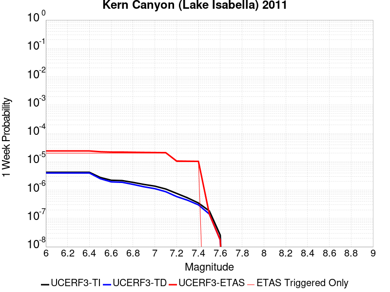 |  |  |  |

| Magnitude | 1 wk TI Prob | 1 wk TD Prob | 1 wk ETAS Prob | 1 wk ETAS/TD Gain | 1 wk ETAS Triggered Only | 1 mo TI Prob | 1 mo TD Prob | 1 mo ETAS Prob | 1 mo ETAS/TD Gain | 1 mo ETAS Triggered Only | 1 yr TI Prob | 1 yr TD Prob | 1 yr ETAS Prob | 1 yr ETAS/TD Gain | 1 yr ETAS Triggered Only | 10 yr TI Prob | 10 yr TD Prob | 10 yr ETAS Prob | 10 yr ETAS/TD Gain | 10 yr ETAS Triggered Only |
|-----|-----|-----|-----|-----|-----|-----|-----|-----|-----|-----|-----|-----|-----|-----|-----|-----|-----|-----|-----|-----|
| 6.0 | 4.2387383E-6 | 4.001639E-6 | 4.689231E-5 | 11.718277 | 4.2890842E-5 | 1.8165894E-5 | 1.7149778E-5 | 6.0039885E-5 | 3.5009134 | 4.2890842E-5 | 2.2114732E-4 | 2.087804E-4 | 2.9454418E-4 | 1.4107846 | 8.5781685E-5 | 0.0022092736 | 0.0020860266 | 0.0021716293 | 1.0410362 | 8.5781685E-5 |
| 6.1 | 4.2387383E-6 | 4.001639E-6 | 4.689231E-5 | 11.718277 | 4.2890842E-5 | 1.8165894E-5 | 1.7149778E-5 | 6.0039885E-5 | 3.5009134 | 4.2890842E-5 | 2.2114732E-4 | 2.087804E-4 | 2.9454418E-4 | 1.4107846 | 8.5781685E-5 | 0.0022092736 | 0.0020860266 | 0.0021716293 | 1.0410362 | 8.5781685E-5 |
| 6.2 | 4.2387383E-6 | 4.001639E-6 | 4.689231E-5 | 11.718277 | 4.2890842E-5 | 1.8165894E-5 | 1.7149778E-5 | 6.0039885E-5 | 3.5009134 | 4.2890842E-5 | 2.2114732E-4 | 2.087804E-4 | 2.9454418E-4 | 1.4107846 | 8.5781685E-5 | 0.0022092736 | 0.0020860266 | 0.0021716293 | 1.0410362 | 8.5781685E-5 |
| 6.3 | 4.2387383E-6 | 4.001639E-6 | 4.689231E-5 | 11.718277 | 4.2890842E-5 | 1.8165894E-5 | 1.7149778E-5 | 6.0039885E-5 | 3.5009134 | 4.2890842E-5 | 2.2114732E-4 | 2.087804E-4 | 2.9454418E-4 | 1.4107846 | 8.5781685E-5 | 0.0022092736 | 0.0020860266 | 0.0021716293 | 1.0410362 | 8.5781685E-5 |
| 6.4 | 4.2387383E-6 | 4.001639E-6 | 4.689231E-5 | 11.718277 | 4.2890842E-5 | 1.8165894E-5 | 1.7149778E-5 | 6.0039885E-5 | 3.5009134 | 4.2890842E-5 | 2.2114732E-4 | 2.087804E-4 | 2.9454418E-4 | 1.4107846 | 8.5781685E-5 | 0.0022092736 | 0.0020860266 | 0.0021716293 | 1.0410362 | 8.5781685E-5 |
| 6.5 | 2.7857532E-6 | 2.517867E-6 | 4.54086E-5 | 18.034552 | 4.2890842E-5 | 1.1938888E-5 | 1.0790815E-5 | 5.3681197E-5 | 4.974712 | 4.2890842E-5 | 1.4534626E-4 | 1.3137059E-4 | 1.742558E-4 | 1.3264445 | 4.2890842E-5 | 0.0014525123 | 0.001312962 | 0.0013557966 | 1.0326244 | 4.2890842E-5 |
| 6.6 | 2.2233348E-6 | 1.9441236E-6 | 4.4834884E-5 | 23.061745 | 4.2890842E-5 | 9.528543E-6 | 8.331932E-6 | 5.1222418E-5 | 6.1477237 | 4.2890842E-5 | 1.1600384E-4 | 1.01436635E-4 | 1.4432313E-4 | 1.422791 | 4.2890842E-5 | 0.001159433 | 0.001013912 | 0.0010567594 | 1.0422595 | 4.2890842E-5 |
| 6.7 | 2.1635126E-6 | 1.8835036E-6 | 4.4774264E-5 | 23.771797 | 4.2890842E-5 | 9.272164E-6 | 8.072134E-6 | 5.096263E-5 | 6.3134027 | 4.2890842E-5 | 1.1288274E-4 | 9.827388E-5 | 1.411605E-4 | 1.4363991 | 4.2890842E-5 | 0.0011282542 | 9.823124E-4 | 0.001025161 | 1.0436202 | 4.2890842E-5 |
| 6.8 | 1.8685711E-6 | 1.5831425E-6 | 4.4473916E-5 | 28.092175 | 4.2890842E-5 | 8.008137E-6 | 6.784879E-6 | 4.967543E-5 | 7.321491 | 4.2890842E-5 | 9.74947E-5 | 8.260282E-5 | 1.2549013E-4 | 1.519199 | 4.2890842E-5 | 9.745194E-4 | 8.2572614E-4 | 8.685815E-4 | 1.0519003 | 4.2890842E-5 |
| 6.9 | 1.5815071E-6 | 1.3064928E-6 | 4.419728E-5 | 33.82895 | 4.2890842E-5 | 6.77787E-6 | 5.599243E-6 | 4.8489845E-5 | 8.660071 | 4.2890842E-5 | 8.251744E-5 | 6.816868E-5 | 1.110566E-4 | 1.6291441 | 4.2890842E-5 | 8.248681E-4 | 6.8148033E-4 | 7.2434195E-4 | 1.0628948 | 4.2890842E-5 |
| 7.0 | 1.3772564E-6 | 1.1210718E-6 | 4.4011867E-5 | 39.25874 | 4.2890842E-5 | 5.9025137E-6 | 4.8045845E-6 | 4.7695223E-5 | 9.927023 | 4.2890842E-5 | 7.186073E-5 | 5.8494268E-5 | 1.01382604E-4 | 1.7332058 | 4.2890842E-5 | 7.18375E-4 | 5.847908E-4 | 6.276565E-4 | 1.0733011 | 4.2890842E-5 |
| 7.1 | 1.0916998E-6 | 8.763777E-7 | 4.3767184E-5 | 49.941006 | 4.2890842E-5 | 4.678705E-6 | 3.7558991E-6 | 4.6646583E-5 | 12.419551 | 4.2890842E-5 | 5.6961744E-5 | 4.5727127E-5 | 8.8616005E-5 | 1.9379308 | 4.2890842E-5 | 5.6947145E-4 | 4.571785E-4 | 5.0004973E-4 | 1.0937735 | 4.2890842E-5 |
| 7.2 | 7.6277024E-7 | 5.901454E-7 | 4.3480963E-5 | 73.67838 | 4.2890842E-5 | 3.2690114E-6 | 2.5291922E-6 | 4.5419925E-5 | 17.958273 | 4.2890842E-5 | 3.9799485E-5 | 3.0792486E-5 | 7.368201E-5 | 2.3928566 | 4.2890842E-5 | 3.9792358E-4 | 3.0788282E-4 | 3.5076044E-4 | 1.1392661 | 4.2890842E-5 |
| 7.3 | 5.3265916E-7 | 4.3824414E-7 | 4.332907E-5 | 98.8697 | 4.2890842E-5 | 2.282823E-6 | 1.878188E-6 | 4.476895E-5 | 23.836246 | 4.2890842E-5 | 2.7793016E-5 | 2.2866701E-5 | 6.575656E-5 | 2.875647 | 4.2890842E-5 | 2.778954E-4 | 2.2864387E-4 | 2.715249E-4 | 1.1875451 | 4.2890842E-5 |
| 7.4 | 3.4946007E-7 | 3.006571E-7 | 4.319149E-5 | 143.65697 | 4.2890842E-5 | 1.497685E-6 | 1.2885298E-6 | 4.4179316E-5 | 34.28661 | 4.2890842E-5 | 1.8234163E-5 | 1.568774E-5 | 5.857791E-5 | 3.733993 | 4.2890842E-5 | 1.8232666E-4 | 1.5686655E-4 | 1.9975065E-4 | 1.2733796 | 4.2890842E-5 |
| 7.5 | 1.8317026E-7 | 1.4244812E-7 | 1.4244812E-7 | 1.0 | 0.0 | 7.850152E-7 | 6.104918E-7 | 6.104918E-7 | 1.0 | 0.0 | 9.557518E-6 | 7.432713E-6 | 7.432713E-6 | 1.0 | 0.0 | 9.5571064E-5 | 7.432472E-5 | 7.432472E-5 | 1.0 | 0.0 |
| 7.6 | 2.572245E-8 | 1.7352555E-8 | 1.7352555E-8 | 1.0 | 0.0 | 1.10239064E-7 | 7.436809E-8 | 7.436809E-8 | 1.0 | 0.0 | 1.3421597E-6 | 9.054312E-7 | 9.054312E-7 | 1.0 | 0.0 | 1.3421517E-5 | 9.05428E-6 | 9.05428E-6 | 1.0 | 0.0 |

## Mission Creek
*[(top)](#table-of-contents)*

| 1 Week | 1 Month | 1 Year | 10 Year |
|-----|-----|-----|-----|
|  |  |  |  |

| Magnitude | 1 wk TI Prob | 1 wk TD Prob | 1 wk ETAS Prob | 1 wk ETAS/TD Gain | 1 wk ETAS Triggered Only | 1 mo TI Prob | 1 mo TD Prob | 1 mo ETAS Prob | 1 mo ETAS/TD Gain | 1 mo ETAS Triggered Only | 1 yr TI Prob | 1 yr TD Prob | 1 yr ETAS Prob | 1 yr ETAS/TD Gain | 1 yr ETAS Triggered Only | 10 yr TI Prob | 10 yr TD Prob | 10 yr ETAS Prob | 10 yr ETAS/TD Gain | 10 yr ETAS Triggered Only |
|-----|-----|-----|-----|-----|-----|-----|-----|-----|-----|-----|-----|-----|-----|-----|-----|-----|-----|-----|-----|-----|
| 6.0 | 1.1549387E-5 | 1.632237E-5 | 5.9212514E-5 | 3.6276908 | 4.2890842E-5 | 4.9496433E-5 | 6.9951224E-5 | 1.12839065E-4 | 1.6131107 | 4.2890842E-5 | 6.0245243E-4 | 8.513384E-4 | 9.3704707E-4 | 1.1006752 | 8.5781685E-5 | 0.006008218 | 0.008509998 | 0.008595049 | 1.0099943 | 8.5781685E-5 |
| 6.1 | 1.1549387E-5 | 1.632237E-5 | 5.9212514E-5 | 3.6276908 | 4.2890842E-5 | 4.9496433E-5 | 6.9951224E-5 | 1.12839065E-4 | 1.6131107 | 4.2890842E-5 | 6.0245243E-4 | 8.513384E-4 | 9.3704707E-4 | 1.1006752 | 8.5781685E-5 | 0.006008218 | 0.008509998 | 0.008595049 | 1.0099943 | 8.5781685E-5 |
| 6.2 | 1.1549387E-5 | 1.632237E-5 | 5.9212514E-5 | 3.6276908 | 4.2890842E-5 | 4.9496433E-5 | 6.9951224E-5 | 1.12839065E-4 | 1.6131107 | 4.2890842E-5 | 6.0245243E-4 | 8.513384E-4 | 9.3704707E-4 | 1.1006752 | 8.5781685E-5 | 0.006008218 | 0.008509998 | 0.008595049 | 1.0099943 | 8.5781685E-5 |
| 6.3 | 1.1549387E-5 | 1.632237E-5 | 5.9212514E-5 | 3.6276908 | 4.2890842E-5 | 4.9496433E-5 | 6.9951224E-5 | 1.12839065E-4 | 1.6131107 | 4.2890842E-5 | 6.0245243E-4 | 8.513384E-4 | 9.3704707E-4 | 1.1006752 | 8.5781685E-5 | 0.006008218 | 0.008509998 | 0.008595049 | 1.0099943 | 8.5781685E-5 |
| 6.4 | 1.1549387E-5 | 1.632237E-5 | 5.9212514E-5 | 3.6276908 | 4.2890842E-5 | 4.9496433E-5 | 6.9951224E-5 | 1.12839065E-4 | 1.6131107 | 4.2890842E-5 | 6.0245243E-4 | 8.513384E-4 | 9.3704707E-4 | 1.1006752 | 8.5781685E-5 | 0.006008218 | 0.008509998 | 0.008595049 | 1.0099943 | 8.5781685E-5 |
| 6.5 | 1.1549387E-5 | 1.632237E-5 | 5.9212514E-5 | 3.6276908 | 4.2890842E-5 | 4.9496433E-5 | 6.9951224E-5 | 1.12839065E-4 | 1.6131107 | 4.2890842E-5 | 6.0245243E-4 | 8.513384E-4 | 9.3704707E-4 | 1.1006752 | 8.5781685E-5 | 0.006008218 | 0.008509998 | 0.008595049 | 1.0099943 | 8.5781685E-5 |
| 6.6 | 9.202681E-6 | 1.3845646E-5 | 1.3845646E-5 | 1.0 | 0.0 | 3.9439463E-5 | 5.9337188E-5 | 5.9337188E-5 | 1.0 | 0.0 | 4.800697E-4 | 7.221998E-4 | 7.6505967E-4 | 1.0593463 | 4.2890842E-5 | 0.004790339 | 0.0072271815 | 0.0072697625 | 1.0058918 | 4.2890842E-5 |
| 6.7 | 9.019164E-6 | 1.3651316E-5 | 1.3651316E-5 | 1.0 | 0.0 | 3.8652986E-5 | 5.8504378E-5 | 5.8504378E-5 | 1.0 | 0.0 | 4.7049852E-4 | 7.12067E-4 | 7.5492734E-4 | 1.0601914 | 4.2890842E-5 | 0.004695036 | 0.007126506 | 0.007169091 | 1.0059756 | 4.2890842E-5 |
| 6.8 | 8.673558E-6 | 1.3273427E-5 | 1.3273427E-5 | 1.0 | 0.0 | 3.717186E-5 | 5.6884925E-5 | 5.6884925E-5 | 1.0 | 0.0 | 4.524734E-4 | 6.923627E-4 | 7.352239E-4 | 1.0619056 | 4.2890842E-5 | 0.0045155324 | 0.006930694 | 0.0069732876 | 1.0061456 | 4.2890842E-5 |
| 6.9 | 7.002255E-6 | 1.1477657E-5 | 1.1477657E-5 | 1.0 | 0.0 | 3.000932E-5 | 4.9189068E-5 | 4.9189068E-5 | 1.0 | 0.0 | 3.653022E-4 | 5.9871917E-4 | 6.4158434E-4 | 1.0715947 | 4.2890842E-5 | 0.0036470229 | 0.005999517 | 0.006042151 | 1.0071062 | 4.2890842E-5 |
| 7.0 | 5.84644E-6 | 9.67498E-6 | 9.67498E-6 | 1.0 | 0.0 | 2.5055931E-5 | 4.1463565E-5 | 4.1463565E-5 | 1.0 | 0.0 | 3.0501327E-4 | 5.047066E-4 | 5.4757576E-4 | 1.0849389 | 4.2890842E-5 | 0.0030459496 | 0.0050638523 | 0.005106526 | 1.0084271 | 4.2890842E-5 |
| 7.1 | 5.54703E-6 | 9.329456E-6 | 9.329456E-6 | 1.0 | 0.0 | 2.377277E-5 | 3.9982795E-5 | 3.9982795E-5 | 1.0 | 0.0 | 2.8939504E-4 | 4.8668624E-4 | 5.2955624E-4 | 1.0880854 | 4.2890842E-5 | 0.0028901845 | 0.004884446 | 0.0049271276 | 1.0087382 | 4.2890842E-5 |
| 7.2 | 4.384709E-6 | 7.68157E-6 | 7.68157E-6 | 1.0 | 0.0 | 1.8791474E-5 | 3.2920623E-5 | 3.2920623E-5 | 1.0 | 0.0 | 2.2876218E-4 | 4.0073853E-4 | 4.4361217E-4 | 1.1069866 | 4.2890842E-5 | 0.0022852682 | 0.004028366 | 0.004071084 | 1.0106043 | 4.2890842E-5 |
| 7.3 | 3.7888456E-6 | 6.915452E-6 | 6.915452E-6 | 1.0 | 0.0 | 1.623781E-5 | 2.9637333E-5 | 2.9637333E-5 | 1.0 | 0.0 | 1.9767738E-4 | 3.6077813E-4 | 4.036535E-4 | 1.1188414 | 4.2890842E-5 | 0.0019750162 | 0.0036301152 | 0.0036728503 | 1.0117724 | 4.2890842E-5 |
| 7.4 | 2.1982462E-6 | 5.0237763E-6 | 5.0237763E-6 | 1.0 | 0.0 | 9.421021E-6 | 2.1530293E-5 | 2.1530293E-5 | 1.0 | 0.0 | 1.1469489E-4 | 2.621E-4 | 3.049796E-4 | 1.1636002 | 4.2890842E-5 | 0.0011463572 | 0.0026458844 | 0.002688662 | 1.0161675 | 4.2890842E-5 |
| 7.5 | 2.051923E-6 | 4.615016E-6 | 4.615016E-6 | 1.0 | 0.0 | 8.793926E-6 | 1.9778492E-5 | 1.9778492E-5 | 1.0 | 0.0 | 1.0706078E-4 | 2.4077666E-4 | 2.8365717E-4 | 1.1780925 | 4.2890842E-5 | 0.0010700922 | 0.0024335422 | 0.0024763285 | 1.0175819 | 4.2890842E-5 |
| 7.6 | 1.8733427E-6 | 4.1233748E-6 | 4.1233748E-6 | 1.0 | 0.0 | 8.028587E-6 | 1.7671488E-5 | 1.7671488E-5 | 1.0 | 0.0 | 9.774366E-5 | 2.151292E-4 | 2.580108E-4 | 1.1993296 | 4.2890842E-5 | 9.770069E-4 | 0.0021780801 | 0.0022208777 | 1.0196491 | 4.2890842E-5 |
| 7.7 | 1.8411953E-6 | 4.0430496E-6 | 4.0430496E-6 | 1.0 | 0.0 | 7.890813E-6 | 1.732724E-5 | 1.732724E-5 | 1.0 | 0.0 | 9.606641E-5 | 2.1093882E-4 | 2.5382062E-4 | 1.2032902 | 4.2890842E-5 | 9.6024893E-4 | 0.0021363653 | 0.0021791644 | 1.0200337 | 4.2890842E-5 |
| 7.8 | 1.7194251E-6 | 3.7104276E-6 | 3.7104276E-6 | 1.0 | 0.0 | 7.368944E-6 | 1.5901736E-5 | 1.5901736E-5 | 1.0 | 0.0 | 8.97132E-5 | 1.9358651E-4 | 2.3646904E-4 | 1.2215161 | 4.2890842E-5 | 8.967699E-4 | 0.0019623525 | 0.0020051592 | 1.021814 | 4.2890842E-5 |
| 7.9 | 1.4035052E-6 | 2.9500632E-6 | 2.9500632E-6 | 1.0 | 0.0 | 6.0150082E-6 | 1.2643067E-5 | 1.2643067E-5 | 1.0 | 0.0 | 7.3230265E-5 | 1.5391852E-4 | 1.9680276E-4 | 1.2786165 | 4.2890842E-5 | 7.3206134E-4 | 0.0015631086 | 0.0016059325 | 1.0273966 | 4.2890842E-5 |
| 8.0 | 3.9318823E-7 | 5.528522E-7 | 5.528522E-7 | 1.0 | 0.0 | 1.6850913E-6 | 2.3693647E-6 | 2.3693647E-6 | 1.0 | 0.0 | 2.0515794E-5 | 2.8846638E-5 | 7.173624E-5 | 2.4868147 | 4.2890842E-5 | 2.0513899E-4 | 2.9899E-4 | 3.41868E-4 | 1.1434095 | 4.2890842E-5 |
| 8.1 | 1.596793E-7 | 1.1380002E-7 | 1.1380002E-7 | 1.0 | 0.0 | 6.8433974E-7 | 4.877143E-7 | 4.877143E-7 | 1.0 | 0.0 | 8.331805E-6 | 5.937906E-6 | 5.937906E-6 | 1.0 | 0.0 | 8.331492E-5 | 6.549966E-5 | 6.549966E-5 | 1.0 | 0.0 |
| 8.2 | 4.9003038E-8 | 2.5444924E-8 | 2.5444924E-8 | 1.0 | 0.0 | 2.10013E-7 | 1.0904967E-7 | 1.0904967E-7 | 1.0 | 0.0 | 2.5569052E-6 | 1.327679E-6 | 1.327679E-6 | 1.0 | 0.0 | 2.556876E-5 | 1.495635E-5 | 1.495635E-5 | 1.0 | 0.0 |

## Green Valley 2011 CFM
*[(top)](#table-of-contents)*

| 1 Week | 1 Month | 1 Year | 10 Year |
|-----|-----|-----|-----|
|  |  |  |  |

| Magnitude | 1 wk TI Prob | 1 wk TD Prob | 1 wk ETAS Prob | 1 wk ETAS/TD Gain | 1 wk ETAS Triggered Only | 1 mo TI Prob | 1 mo TD Prob | 1 mo ETAS Prob | 1 mo ETAS/TD Gain | 1 mo ETAS Triggered Only | 1 yr TI Prob | 1 yr TD Prob | 1 yr ETAS Prob | 1 yr ETAS/TD Gain | 1 yr ETAS Triggered Only | 10 yr TI Prob | 10 yr TD Prob | 10 yr ETAS Prob | 10 yr ETAS/TD Gain | 10 yr ETAS Triggered Only |
|-----|-----|-----|-----|-----|-----|-----|-----|-----|-----|-----|-----|-----|-----|-----|-----|-----|-----|-----|-----|-----|
| 6.0 | 9.9629346E-5 | 1.7305532E-4 | 2.5882217E-4 | 1.4956036 | 8.5781685E-5 | 4.2691303E-4 | 7.4143766E-4 | 8.271557E-4 | 1.1156106 | 8.5781685E-5 | 0.0051852856 | 0.008986705 | 0.009071716 | 1.0094596 | 8.5781685E-5 | 0.050659515 | 0.085522056 | 0.0856005 | 1.0009172 | 8.5781685E-5 |
| 6.1 | 9.88615E-5 | 1.7152846E-4 | 2.5729544E-4 | 1.500016 | 8.5781685E-5 | 4.2362334E-4 | 7.348976E-4 | 8.206163E-4 | 1.1166402 | 8.5781685E-5 | 0.0051454236 | 0.0089077335 | 0.008992751 | 1.0095443 | 8.5781685E-5 | 0.050279044 | 0.084809676 | 0.08488818 | 1.0009257 | 8.5781685E-5 |
| 6.2 | 9.696895E-5 | 1.6791887E-4 | 2.5368616E-4 | 1.5107661 | 8.5781685E-5 | 4.15515E-4 | 7.194366E-4 | 8.051566E-4 | 1.1191487 | 8.5781685E-5 | 0.0050471667 | 0.008721114 | 0.008806148 | 1.0097504 | 8.5781685E-5 | 0.04934063 | 0.0831186 | 0.08319726 | 1.0009463 | 8.5781685E-5 |
| 6.3 | 9.275224E-5 | 1.5971228E-4 | 2.4548025E-4 | 1.5370157 | 8.5781685E-5 | 3.9744904E-4 | 6.842841E-4 | 7.700071E-4 | 1.125274 | 8.5781685E-5 | 0.0048282105 | 0.008296439 | 0.008381509 | 1.0102538 | 8.5781685E-5 | 0.047246475 | 0.07925707 | 0.079336055 | 1.0009966 | 8.5781685E-5 |
| 6.4 | 8.391499E-5 | 1.4367796E-4 | 2.2944732E-4 | 1.5969555 | 8.5781685E-5 | 3.595861E-4 | 6.156248E-4 | 7.0135365E-4 | 1.139255 | 8.5781685E-5 | 0.004369175 | 0.0074670846 | 0.0075522256 | 1.0114022 | 8.5781685E-5 | 0.04284265 | 0.071630865 | 0.0717105 | 1.0011117 | 8.5781685E-5 |
| 6.5 | 5.9519385E-5 | 9.9340905E-5 | 1.8511407E-4 | 1.8634224 | 8.5781685E-5 | 2.5505814E-4 | 4.2568138E-4 | 5.114266E-4 | 1.2014304 | 8.5781685E-5 | 0.0031009112 | 0.005168295 | 0.0052536335 | 1.0165119 | 8.5781685E-5 | 0.030579966 | 0.050145864 | 0.050227344 | 1.0016248 | 8.5781685E-5 |
| 6.6 | 4.5361558E-5 | 7.402609E-5 | 7.402609E-5 | 1.0 | 0.0 | 1.9439218E-4 | 3.1721895E-4 | 3.1721895E-4 | 1.0 | 0.0 | 0.0023641558 | 0.0038539418 | 0.0038539418 | 1.0 | 0.0 | 0.023391623 | 0.037665963 | 0.037665963 | 1.0 | 0.0 |
| 6.7 | 3.8808106E-5 | 6.2651976E-5 | 6.2651976E-5 | 1.0 | 0.0 | 1.6630985E-4 | 2.6848342E-4 | 2.6848342E-4 | 1.0 | 0.0 | 0.0020229418 | 0.0032626586 | 0.0032626586 | 1.0 | 0.0 | 0.020046256 | 0.032005914 | 0.032005914 | 1.0 | 0.0 |
| 6.8 | 2.2284667E-5 | 3.1285235E-5 | 3.1285235E-5 | 1.0 | 0.0 | 9.550222E-5 | 1.3407279E-4 | 1.3407279E-4 | 1.0 | 0.0 | 0.0011621192 | 0.0016311078 | 0.0016311078 | 1.0 | 0.0 | 0.011560607 | 0.016165998 | 0.016165998 | 1.0 | 0.0 |
| 6.9 | 1.8050168E-5 | 2.4448054E-5 | 2.4448054E-5 | 1.0 | 0.0 | 7.735557E-5 | 1.047732E-4 | 1.047732E-4 | 1.0 | 0.0 | 9.4139716E-4 | 0.0012748708 | 0.0012748708 | 1.0 | 0.0 | 0.009374191 | 0.012667833 | 0.012667833 | 1.0 | 0.0 |
| 7.0 | 1.4763166E-5 | 1.9582854E-5 | 1.9582854E-5 | 1.0 | 0.0 | 6.326917E-5 | 8.3923835E-5 | 8.3923835E-5 | 1.0 | 0.0 | 7.7002996E-4 | 0.0010212966 | 0.0010212966 | 1.0 | 0.0 | 0.007673672 | 0.010165343 | 0.010165343 | 1.0 | 0.0 |
| 7.1 | 1.2399713E-5 | 1.6303715E-5 | 1.6303715E-5 | 1.0 | 0.0 | 5.3140546E-5 | 6.98712E-5 | 6.98712E-5 | 1.0 | 0.0 | 6.467941E-4 | 8.503518E-4 | 8.503518E-4 | 1.0 | 0.0 | 0.006449148 | 0.008471259 | 0.008471259 | 1.0 | 0.0 |
| 7.2 | 1.0584195E-5 | 1.3921742E-5 | 1.3921742E-5 | 1.0 | 0.0 | 4.5360044E-5 | 5.9663253E-5 | 5.9663253E-5 | 1.0 | 0.0 | 5.521186E-4 | 7.261596E-4 | 7.261596E-4 | 1.0 | 0.0 | 0.0055074887 | 0.007238285 | 0.007238285 | 1.0 | 0.0 |
| 7.3 | 7.998173E-6 | 1.054402E-5 | 1.054402E-5 | 1.0 | 0.0 | 3.4277433E-5 | 4.518788E-5 | 4.518788E-5 | 1.0 | 0.0 | 4.1724785E-4 | 5.500247E-4 | 5.500247E-4 | 1.0 | 0.0 | 0.004164653 | 0.0054868995 | 0.0054868995 | 1.0 | 0.0 |
| 7.4 | 6.7571127E-6 | 8.932697E-6 | 8.932697E-6 | 1.0 | 0.0 | 2.8958733E-5 | 3.828243E-5 | 3.828243E-5 | 1.0 | 0.0 | 3.5251552E-4 | 4.6598984E-4 | 4.6598984E-4 | 1.0 | 0.0 | 0.0035195686 | 0.0046503306 | 0.0046503306 | 1.0 | 0.0 |
| 7.5 | 5.69878E-6 | 7.516314E-6 | 7.516314E-6 | 1.0 | 0.0 | 2.4423114E-5 | 3.221238E-5 | 3.221238E-5 | 1.0 | 0.0 | 2.9731085E-4 | 3.9211605E-4 | 3.9211605E-4 | 1.0 | 0.0 | 0.002969134 | 0.0039143935 | 0.0039143935 | 1.0 | 0.0 |
| 7.6 | 4.503664E-6 | 5.9356807E-6 | 5.9356807E-6 | 1.0 | 0.0 | 1.9301275E-5 | 2.5438389E-5 | 2.5438389E-5 | 1.0 | 0.0 | 2.3496768E-4 | 3.096692E-4 | 3.096692E-4 | 1.0 | 0.0 | 0.002347194 | 0.003092502 | 0.003092502 | 1.0 | 0.0 |
| 7.7 | 1.0873546E-6 | 1.4106979E-6 | 1.4106979E-6 | 1.0 | 0.0 | 4.6600826E-6 | 6.045834E-6 | 6.045834E-6 | 1.0 | 0.0 | 5.6735033E-5 | 7.360557E-5 | 7.360557E-5 | 1.0 | 0.0 | 5.672055E-4 | 7.35814E-4 | 7.35814E-4 | 1.0 | 0.0 |
| 7.8 | 4.9373917E-8 | 6.1777136E-8 | 6.1777136E-8 | 1.0 | 0.0 | 2.1160248E-7 | 2.6475914E-7 | 2.6475914E-7 | 1.0 | 0.0 | 2.5762572E-6 | 3.223439E-6 | 3.223439E-6 | 1.0 | 0.0 | 2.5762274E-5 | 3.2232296E-5 | 3.2232296E-5 | 1.0 | 0.0 |

## Kern Canyon (South Kern) 2011
*[(top)](#table-of-contents)*

| 1 Week | 1 Month | 1 Year | 10 Year |
|-----|-----|-----|-----|
|  |  |  |  |

| Magnitude | 1 wk TI Prob | 1 wk TD Prob | 1 wk ETAS Prob | 1 wk ETAS/TD Gain | 1 wk ETAS Triggered Only | 1 mo TI Prob | 1 mo TD Prob | 1 mo ETAS Prob | 1 mo ETAS/TD Gain | 1 mo ETAS Triggered Only | 1 yr TI Prob | 1 yr TD Prob | 1 yr ETAS Prob | 1 yr ETAS/TD Gain | 1 yr ETAS Triggered Only | 10 yr TI Prob | 10 yr TD Prob | 10 yr ETAS Prob | 10 yr ETAS/TD Gain | 10 yr ETAS Triggered Only |
|-----|-----|-----|-----|-----|-----|-----|-----|-----|-----|-----|-----|-----|-----|-----|-----|-----|-----|-----|-----|-----|
| 6.0 | 4.105075E-6 | 4.1137264E-6 | 4.7004392E-5 | 11.426232 | 4.2890842E-5 | 1.7593058E-5 | 1.763014E-5 | 6.0520226E-5 | 3.4327705 | 4.2890842E-5 | 2.1417443E-4 | 2.1462646E-4 | 3.0038974E-4 | 1.3995932 | 8.5781685E-5 | 0.0021396813 | 0.0021442557 | 0.0022298535 | 1.0399196 | 8.5781685E-5 |
| 6.1 | 4.105075E-6 | 4.1137264E-6 | 4.7004392E-5 | 11.426232 | 4.2890842E-5 | 1.7593058E-5 | 1.763014E-5 | 6.0520226E-5 | 3.4327705 | 4.2890842E-5 | 2.1417443E-4 | 2.1462646E-4 | 3.0038974E-4 | 1.3995932 | 8.5781685E-5 | 0.0021396813 | 0.0021442557 | 0.0022298535 | 1.0399196 | 8.5781685E-5 |
| 6.2 | 4.105075E-6 | 4.1137264E-6 | 4.7004392E-5 | 11.426232 | 4.2890842E-5 | 1.7593058E-5 | 1.763014E-5 | 6.0520226E-5 | 3.4327705 | 4.2890842E-5 | 2.1417443E-4 | 2.1462646E-4 | 3.0038974E-4 | 1.3995932 | 8.5781685E-5 | 0.0021396813 | 0.0021442557 | 0.0022298535 | 1.0399196 | 8.5781685E-5 |
| 6.3 | 4.105075E-6 | 4.1137264E-6 | 4.7004392E-5 | 11.426232 | 4.2890842E-5 | 1.7593058E-5 | 1.763014E-5 | 6.0520226E-5 | 3.4327705 | 4.2890842E-5 | 2.1417443E-4 | 2.1462646E-4 | 3.0038974E-4 | 1.3995932 | 8.5781685E-5 | 0.0021396813 | 0.0021442557 | 0.0022298535 | 1.0399196 | 8.5781685E-5 |
| 6.4 | 4.105075E-6 | 4.1137264E-6 | 4.7004392E-5 | 11.426232 | 4.2890842E-5 | 1.7593058E-5 | 1.763014E-5 | 6.0520226E-5 | 3.4327705 | 4.2890842E-5 | 2.1417443E-4 | 2.1462646E-4 | 3.0038974E-4 | 1.3995932 | 8.5781685E-5 | 0.0021396813 | 0.0021442557 | 0.0022298535 | 1.0399196 | 8.5781685E-5 |
| 6.5 | 2.9849807E-6 | 2.9731548E-6 | 4.586387E-5 | 15.425995 | 4.2890842E-5 | 1.2792712E-5 | 1.274203E-5 | 5.5632325E-5 | 4.366049 | 4.2890842E-5 | 1.5574014E-4 | 1.5512333E-4 | 1.9800752E-4 | 1.2764522 | 4.2890842E-5 | 0.0015563103 | 0.0015501656 | 0.00159299 | 1.0276257 | 4.2890842E-5 |
| 6.6 | 2.9849807E-6 | 2.9731548E-6 | 4.586387E-5 | 15.425995 | 4.2890842E-5 | 1.2792712E-5 | 1.274203E-5 | 5.5632325E-5 | 4.366049 | 4.2890842E-5 | 1.5574014E-4 | 1.5512333E-4 | 1.9800752E-4 | 1.2764522 | 4.2890842E-5 | 0.0015563103 | 0.0015501656 | 0.00159299 | 1.0276257 | 4.2890842E-5 |
| 6.7 | 2.6756725E-6 | 2.6582206E-6 | 4.554895E-5 | 17.135126 | 4.2890842E-5 | 1.1467117E-5 | 1.1392325E-5 | 5.428268E-5 | 4.7648463 | 4.2890842E-5 | 1.396032E-4 | 1.3869285E-4 | 1.8157774E-4 | 1.3092077 | 4.2890842E-5 | 0.0013951553 | 0.0013860738 | 0.0014289052 | 1.0309012 | 4.2890842E-5 |
| 6.8 | 2.3283721E-6 | 2.3047787E-6 | 4.5195524E-5 | 19.609484 | 4.2890842E-5 | 9.9787E-6 | 9.877586E-6 | 5.2768006E-5 | 5.3421965 | 4.2890842E-5 | 1.214839E-4 | 1.20253055E-4 | 1.6313874E-4 | 1.3566287 | 4.2890842E-5 | 0.001214175 | 0.0012018873 | 0.0012447266 | 1.0356433 | 4.2890842E-5 |
| 6.9 | 2.0972677E-6 | 2.0696411E-6 | 4.4960394E-5 | 21.723764 | 4.2890842E-5 | 8.988259E-6 | 8.869861E-6 | 5.1760322E-5 | 5.8355284 | 4.2890842E-5 | 1.0942656E-4 | 1.0798526E-4 | 1.5087148E-4 | 1.3971487 | 4.2890842E-5 | 0.0010937268 | 0.0010793337 | 0.0011221783 | 1.0396954 | 4.2890842E-5 |
| 7.0 | 1.7132242E-6 | 1.6787036E-6 | 4.4569475E-5 | 26.549938 | 4.2890842E-5 | 7.3423685E-6 | 7.194424E-6 | 5.008496E-5 | 6.9616356 | 4.2890842E-5 | 8.938967E-5 | 8.758863E-5 | 1.3047572E-4 | 1.4896421 | 4.2890842E-5 | 8.935372E-4 | 8.7554497E-4 | 9.1839826E-4 | 1.0489447 | 4.2890842E-5 |
| 7.1 | 1.4215541E-6 | 1.3815752E-6 | 4.4272358E-5 | 32.04484 | 4.2890842E-5 | 6.0923603E-6 | 5.9210233E-6 | 4.8811613E-5 | 8.24378 | 4.2890842E-5 | 7.417196E-5 | 7.20861E-5 | 1.1497385E-4 | 1.5949517 | 4.2890842E-5 | 7.414721E-4 | 7.206299E-4 | 7.634898E-4 | 1.0594757 | 4.2890842E-5 |
| 7.2 | 9.097853E-7 | 8.6037755E-7 | 4.3751184E-5 | 50.851143 | 4.2890842E-5 | 3.899074E-6 | 3.6873273E-6 | 4.657801E-5 | 12.631917 | 4.2890842E-5 | 4.7470192E-5 | 4.4892295E-5 | 8.778121E-5 | 1.9553736 | 4.2890842E-5 | 4.7460053E-4 | 4.4883334E-4 | 4.9170497E-4 | 1.0955179 | 4.2890842E-5 |
| 7.3 | 6.144169E-7 | 5.628206E-7 | 4.3453638E-5 | 77.20691 | 4.2890842E-5 | 2.6332125E-6 | 2.4120861E-6 | 4.5302826E-5 | 18.781595 | 4.2890842E-5 | 3.205889E-5 | 2.9366758E-5 | 7.225634E-5 | 2.4604807 | 4.2890842E-5 | 3.2054266E-4 | 2.936293E-4 | 3.3650754E-4 | 1.1460285 | 4.2890842E-5 |
| 7.4 | 4.049844E-7 | 3.5728314E-7 | 4.324811E-5 | 121.047165 | 4.2890842E-5 | 1.7356463E-6 | 1.5312125E-6 | 4.442199E-5 | 29.010988 | 4.2890842E-5 | 2.1131287E-5 | 1.8642357E-5 | 6.15324E-5 | 3.3006773 | 4.2890842E-5 | 2.1129279E-4 | 1.8640817E-4 | 2.2929102E-4 | 1.2300481 | 4.2890842E-5 |
| 7.5 | 1.9871162E-7 | 1.583044E-7 | 1.583044E-7 | 1.0 | 0.0 | 8.5162094E-7 | 6.7844724E-7 | 6.7844724E-7 | 1.0 | 0.0 | 1.0368436E-5 | 8.260065E-6 | 8.260065E-6 | 1.0 | 0.0 | 1.0367952E-4 | 8.259767E-5 | 8.259767E-5 | 1.0 | 0.0 |
| 7.6 | 2.572245E-8 | 1.7352555E-8 | 1.7352555E-8 | 1.0 | 0.0 | 1.10239064E-7 | 7.436809E-8 | 7.436809E-8 | 1.0 | 0.0 | 1.3421597E-6 | 9.054312E-7 | 9.054312E-7 | 1.0 | 0.0 | 1.3421517E-5 | 9.05428E-6 | 9.05428E-6 | 1.0 | 0.0 |

## Oceanic - West Huasna
*[(top)](#table-of-contents)*

| 1 Week | 1 Month | 1 Year | 10 Year |
|-----|-----|-----|-----|
|  |  |  | 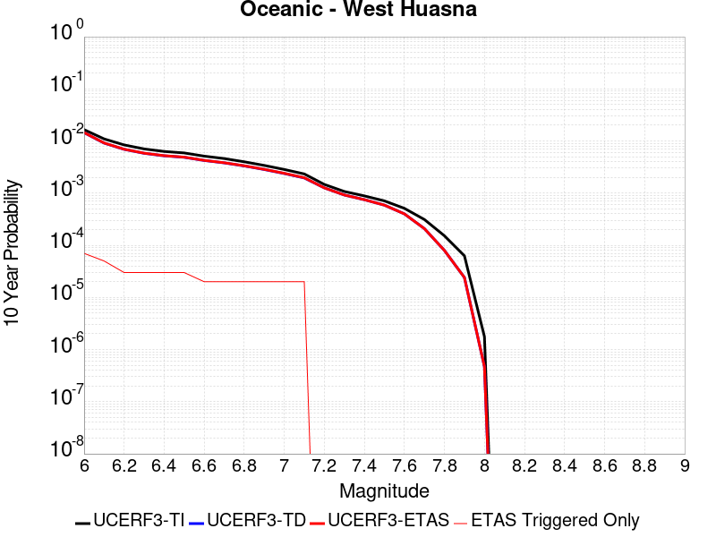 |

| Magnitude | 1 wk TI Prob | 1 wk TD Prob | 1 wk ETAS Prob | 1 wk ETAS/TD Gain | 1 wk ETAS Triggered Only | 1 mo TI Prob | 1 mo TD Prob | 1 mo ETAS Prob | 1 mo ETAS/TD Gain | 1 mo ETAS Triggered Only | 1 yr TI Prob | 1 yr TD Prob | 1 yr ETAS Prob | 1 yr ETAS/TD Gain | 1 yr ETAS Triggered Only | 10 yr TI Prob | 10 yr TD Prob | 10 yr ETAS Prob | 10 yr ETAS/TD Gain | 10 yr ETAS Triggered Only |
|-----|-----|-----|-----|-----|-----|-----|-----|-----|-----|-----|-----|-----|-----|-----|-----|-----|-----|-----|-----|-----|
| 6.0 | 3.195567E-5 | 2.7926868E-5 | 1.13706155E-4 | 4.0715685 | 8.5781685E-5 | 1.3694567E-4 | 1.1968133E-4 | 2.0545274E-4 | 1.716665 | 8.5781685E-5 | 0.0016660384 | 0.0014561893 | 0.0015418462 | 1.0588225 | 8.5781685E-5 | 0.016536033 | 0.014471028 | 0.014555568 | 1.0058421 | 8.5781685E-5 |
| 6.1 | 2.1156782E-5 | 1.7573486E-5 | 1.0335366E-4 | 5.881227 | 8.5781685E-5 | 9.066878E-5 | 7.531282E-5 | 1.6108804E-4 | 2.1389194 | 8.5781685E-5 | 0.0011033333 | 9.165572E-4 | 0.0010022603 | 1.0935054 | 8.5781685E-5 | 0.010978713 | 0.009128777 | 0.009213776 | 1.0093111 | 8.5781685E-5 |
| 6.2 | 1.6195117E-5 | 1.3327152E-5 | 5.6217425E-5 | 4.218262 | 4.2890842E-5 | 6.9405796E-5 | 5.7115132E-5 | 1.00003526E-4 | 1.7509112 | 4.2890842E-5 | 8.44688E-4 | 6.9515745E-4 | 7.380185E-4 | 1.0616566 | 4.2890842E-5 | 0.008414844 | 0.006930123 | 0.006972717 | 1.0061462 | 4.2890842E-5 |
| 6.3 | 1.3559345E-5 | 1.1179142E-5 | 5.4069507E-5 | 4.8366413 | 4.2890842E-5 | 5.811018E-5 | 4.7909736E-5 | 9.079852E-5 | 1.8951998 | 4.2890842E-5 | 7.072618E-4 | 5.831459E-4 | 6.2601175E-4 | 1.0735079 | 4.2890842E-5 | 0.0070501505 | 0.0058162753 | 0.0058589163 | 1.0073314 | 4.2890842E-5 |
| 6.4 | 1.2120619E-5 | 1.0000977E-5 | 5.289139E-5 | 5.288622 | 4.2890842E-5 | 5.1944477E-5 | 4.2860633E-5 | 8.5749634E-5 | 2.000662 | 4.2890842E-5 | 6.322405E-4 | 5.2170374E-4 | 5.645722E-4 | 1.0821701 | 4.2890842E-5 | 0.006304447 | 0.0052048573 | 0.005247525 | 1.0081977 | 4.2890842E-5 |
| 6.5 | 1.13511915E-5 | 9.3674735E-6 | 5.2257914E-5 | 5.578656 | 4.2890842E-5 | 4.8647056E-5 | 4.01457E-5 | 8.303482E-5 | 2.0683367 | 4.2890842E-5 | 5.9211696E-4 | 4.886647E-4 | 5.315346E-4 | 1.0877286 | 4.2890842E-5 | 0.0059054173 | 0.0048759608 | 0.0049186423 | 1.0087535 | 4.2890842E-5 |
| 6.6 | 9.850605E-6 | 8.135418E-6 | 8.135418E-6 | 1.0 | 0.0 | 4.2216197E-5 | 3.4865614E-5 | 3.4865614E-5 | 1.0 | 0.0 | 5.1386096E-4 | 4.2440637E-4 | 4.2440637E-4 | 1.0 | 0.0 | 0.0051267436 | 0.004235991 | 0.004235991 | 1.0 | 0.0 |
| 6.7 | 8.8558645E-6 | 7.318433E-6 | 7.318433E-6 | 1.0 | 0.0 | 3.7953152E-5 | 3.1364336E-5 | 3.1364336E-5 | 1.0 | 0.0 | 4.6198163E-4 | 3.8179406E-4 | 3.8179406E-4 | 1.0 | 0.0 | 0.004610224 | 0.0038114067 | 0.0038114067 | 1.0 | 0.0 |
| 6.8 | 7.67136E-6 | 6.391756E-6 | 6.391756E-6 | 1.0 | 0.0 | 3.2876844E-5 | 2.7392953E-5 | 2.7392953E-5 | 1.0 | 0.0 | 4.0020206E-4 | 3.3345833E-4 | 3.3345833E-4 | 1.0 | 0.0 | 0.003994821 | 0.0033296007 | 0.0033296007 | 1.0 | 0.0 |
| 6.9 | 6.534529E-6 | 5.4583297E-6 | 5.4583297E-6 | 1.0 | 0.0 | 2.8004823E-5 | 2.3392633E-5 | 2.3392633E-5 | 1.0 | 0.0 | 3.4090536E-4 | 2.847682E-4 | 2.847682E-4 | 1.0 | 0.0 | 0.0034038287 | 0.0028440498 | 0.0028440498 | 1.0 | 0.0 |
| 7.0 | 5.460525E-6 | 4.5699517E-6 | 4.5699517E-6 | 1.0 | 0.0 | 2.3402039E-5 | 1.958536E-5 | 1.958536E-5 | 1.0 | 0.0 | 2.8488258E-4 | 2.3842578E-4 | 2.3842578E-4 | 1.0 | 0.0 | 0.0028451765 | 0.0023817138 | 0.0023817138 | 1.0 | 0.0 |
| 7.1 | 4.4825083E-6 | 3.7524428E-6 | 3.7524428E-6 | 1.0 | 0.0 | 1.9210609E-5 | 1.60818E-5 | 1.60818E-5 | 1.0 | 0.0 | 2.3386406E-4 | 1.9577841E-4 | 1.9577841E-4 | 1.0 | 0.0 | 0.002336181 | 0.0019560715 | 0.0019560715 | 1.0 | 0.0 |
| 7.2 | 2.821708E-6 | 2.4249334E-6 | 2.4249334E-6 | 1.0 | 0.0 | 1.2092979E-5 | 1.039253E-5 | 1.039253E-5 | 1.0 | 0.0 | 1.4722206E-4 | 1.2652173E-4 | 1.2652173E-4 | 1.0 | 0.0 | 0.0014712457 | 0.0012644994 | 0.0012644994 | 1.0 | 0.0 |
| 7.3 | 2.0644757E-6 | 1.7687412E-6 | 1.7687412E-6 | 1.0 | 0.0 | 8.847723E-6 | 7.5802973E-6 | 7.5802973E-6 | 1.0 | 0.0 | 1.0771569E-4 | 9.228622E-5 | 9.228622E-5 | 1.0 | 0.0 | 0.001076635 | 9.2248066E-4 | 9.2248066E-4 | 1.0 | 0.0 |
| 7.4 | 1.6980367E-6 | 1.4379892E-6 | 1.4379892E-6 | 1.0 | 0.0 | 7.27728E-6 | 6.162796E-6 | 6.162796E-6 | 1.0 | 0.0 | 8.8597284E-5 | 7.5029464E-5 | 7.5029464E-5 | 1.0 | 0.0 | 8.8561967E-4 | 7.500429E-4 | 7.500429E-4 | 1.0 | 0.0 |
| 7.5 | 1.3637683E-6 | 1.1302635E-6 | 1.1302635E-6 | 1.0 | 0.0 | 5.844708E-6 | 4.8439774E-6 | 4.8439774E-6 | 1.0 | 0.0 | 7.1156996E-5 | 5.897383E-5 | 5.897383E-5 | 1.0 | 0.0 | 7.1134215E-4 | 5.895833E-4 | 5.895833E-4 | 1.0 | 0.0 |
| 7.6 | 9.802994E-7 | 7.677247E-7 | 7.677247E-7 | 1.0 | 0.0 | 4.2012766E-6 | 3.2902446E-6 | 3.2902446E-6 | 1.0 | 0.0 | 5.1149345E-5 | 4.0057992E-5 | 4.0057992E-5 | 1.0 | 0.0 | 5.113757E-4 | 4.0050913E-4 | 4.0050913E-4 | 1.0 | 0.0 |
| 7.7 | 5.986191E-7 | 4.0050548E-7 | 4.0050548E-7 | 1.0 | 0.0 | 2.5655079E-6 | 1.7164509E-6 | 1.7164509E-6 | 1.0 | 0.0 | 3.1234613E-5 | 2.089759E-5 | 2.089759E-5 | 1.0 | 0.0 | 3.123022E-4 | 2.089576E-4 | 2.089576E-4 | 1.0 | 0.0 |
| 7.8 | 2.9189815E-7 | 1.5285792E-7 | 1.5285792E-7 | 1.0 | 0.0 | 1.2509914E-6 | 6.5510517E-7 | 6.5510517E-7 | 1.0 | 0.0 | 1.5230714E-5 | 7.9758765E-6 | 7.9758765E-6 | 1.0 | 0.0 | 1.522967E-4 | 7.9757214E-5 | 7.9757214E-5 | 1.0 | 0.0 |
| 7.9 | 1.2057845E-7 | 4.621248E-8 | 4.621248E-8 | 1.0 | 0.0 | 5.1676466E-7 | 1.9805347E-7 | 1.9805347E-7 | 1.0 | 0.0 | 6.2915915E-6 | 2.4112983E-6 | 2.4112983E-6 | 1.0 | 0.0 | 6.2914136E-5 | 2.4114026E-5 | 2.4114026E-5 | 1.0 | 0.0 |
| 8.0 | 3.3806387E-9 | 9.011393E-10 | 9.011393E-10 | 1.0 | 0.0 | 1.4488451E-8 | 3.8620254E-9 | 3.8620254E-9 | 1.0 | 0.0 | 1.7639688E-7 | 4.702016E-8 | 4.702016E-8 | 1.0 | 0.0 | 1.7639674E-6 | 4.7129527E-7 | 4.7129527E-7 | 1.0 | 0.0 |

## Elsinore (Temecula) rev
*[(top)](#table-of-contents)*

| 1 Week | 1 Month | 1 Year | 10 Year |
|-----|-----|-----|-----|
|  |  |  |  |

| Magnitude | 1 wk TI Prob | 1 wk TD Prob | 1 wk ETAS Prob | 1 wk ETAS/TD Gain | 1 wk ETAS Triggered Only | 1 mo TI Prob | 1 mo TD Prob | 1 mo ETAS Prob | 1 mo ETAS/TD Gain | 1 mo ETAS Triggered Only | 1 yr TI Prob | 1 yr TD Prob | 1 yr ETAS Prob | 1 yr ETAS/TD Gain | 1 yr ETAS Triggered Only | 10 yr TI Prob | 10 yr TD Prob | 10 yr ETAS Prob | 10 yr ETAS/TD Gain | 10 yr ETAS Triggered Only |
|-----|-----|-----|-----|-----|-----|-----|-----|-----|-----|-----|-----|-----|-----|-----|-----|-----|-----|-----|-----|-----|
| 6.0 | 2.9514995E-5 | 2.2517117E-5 | 1.08296874E-4 | 4.8095355 | 8.5781685E-5 | 1.264867E-4 | 9.649849E-5 | 1.8227189E-4 | 1.8888576 | 8.5781685E-5 | 0.0015388876 | 0.0011742581 | 0.0012599389 | 1.072966 | 8.5781685E-5 | 0.015282745 | 0.011696897 | 0.011781676 | 1.0072479 | 8.5781685E-5 |
| 6.1 | 2.9514995E-5 | 2.2517117E-5 | 1.08296874E-4 | 4.8095355 | 8.5781685E-5 | 1.264867E-4 | 9.649849E-5 | 1.8227189E-4 | 1.8888576 | 8.5781685E-5 | 0.0015388876 | 0.0011742581 | 0.0012599389 | 1.072966 | 8.5781685E-5 | 0.015282745 | 0.011696897 | 0.011781676 | 1.0072479 | 8.5781685E-5 |
| 6.2 | 2.9514995E-5 | 2.2517117E-5 | 1.08296874E-4 | 4.8095355 | 8.5781685E-5 | 1.264867E-4 | 9.649849E-5 | 1.8227189E-4 | 1.8888576 | 8.5781685E-5 | 0.0015388876 | 0.0011742581 | 0.0012599389 | 1.072966 | 8.5781685E-5 | 0.015282745 | 0.011696897 | 0.011781676 | 1.0072479 | 8.5781685E-5 |
| 6.3 | 2.3223649E-5 | 1.8406454E-5 | 1.8406454E-5 | 1.0 | 0.0 | 9.952613E-5 | 7.888251E-5 | 7.888251E-5 | 1.0 | 0.0 | 0.001211057 | 9.599888E-4 | 9.599888E-4 | 1.0 | 0.0 | 0.012044783 | 0.009569948 | 0.009569948 | 1.0 | 0.0 |
| 6.4 | 2.3223649E-5 | 1.8406454E-5 | 1.8406454E-5 | 1.0 | 0.0 | 9.952613E-5 | 7.888251E-5 | 7.888251E-5 | 1.0 | 0.0 | 0.001211057 | 9.599888E-4 | 9.599888E-4 | 1.0 | 0.0 | 0.012044783 | 0.009569948 | 0.009569948 | 1.0 | 0.0 |
| 6.5 | 1.8338875E-5 | 1.4750118E-5 | 1.4750118E-5 | 1.0 | 0.0 | 7.8592806E-5 | 6.321331E-5 | 6.321331E-5 | 1.0 | 0.0 | 9.5644733E-4 | 7.69359E-4 | 7.69359E-4 | 1.0 | 0.0 | 0.009523412 | 0.0076739118 | 0.0076739118 | 1.0 | 0.0 |
| 6.6 | 1.8223333E-5 | 1.4612673E-5 | 1.4612673E-5 | 1.0 | 0.0 | 7.809766E-5 | 6.262429E-5 | 6.262429E-5 | 1.0 | 0.0 | 9.504242E-4 | 7.6219277E-4 | 7.6219277E-4 | 1.0 | 0.0 | 0.009463696 | 0.0076027405 | 0.0076027405 | 1.0 | 0.0 |
| 6.7 | 1.7512752E-5 | 1.402721E-5 | 1.402721E-5 | 1.0 | 0.0 | 7.505249E-5 | 6.011528E-5 | 6.011528E-5 | 1.0 | 0.0 | 9.13381E-4 | 7.3166634E-4 | 7.3166634E-4 | 1.0 | 0.0 | 0.00909636 | 0.00729892 | 0.00729892 | 1.0 | 0.0 |
| 6.8 | 1.7417142E-5 | 1.3951195E-5 | 1.3951195E-5 | 1.0 | 0.0 | 7.4642754E-5 | 5.9789512E-5 | 5.9789512E-5 | 1.0 | 0.0 | 9.083966E-4 | 7.277028E-4 | 7.277028E-4 | 1.0 | 0.0 | 0.009046922 | 0.0072594886 | 0.0072594886 | 1.0 | 0.0 |
| 6.9 | 1.6402591E-5 | 1.2988613E-5 | 1.2988613E-5 | 1.0 | 0.0 | 7.0294926E-5 | 5.5664343E-5 | 5.5664343E-5 | 1.0 | 0.0 | 8.5550465E-4 | 6.775103E-4 | 6.775103E-4 | 1.0 | 0.0 | 0.008522186 | 0.006760169 | 0.006760169 | 1.0 | 0.0 |
| 7.0 | 1.3912486E-5 | 1.0878233E-5 | 1.0878233E-5 | 1.0 | 0.0 | 5.9623577E-5 | 4.6620182E-5 | 4.6620182E-5 | 1.0 | 0.0 | 7.2567526E-4 | 5.674556E-4 | 5.674556E-4 | 1.0 | 0.0 | 0.0072331014 | 0.005663986 | 0.005663986 | 1.0 | 0.0 |
| 7.1 | 1.3405147E-5 | 1.03274215E-5 | 1.03274215E-5 | 1.0 | 0.0 | 5.7449364E-5 | 4.425964E-5 | 4.425964E-5 | 1.0 | 0.0 | 6.9922156E-4 | 5.3873047E-4 | 5.3873047E-4 | 1.0 | 0.0 | 0.0069702556 | 0.005377577 | 0.005377577 | 1.0 | 0.0 |
| 7.2 | 1.21402E-5 | 8.996737E-6 | 8.996737E-6 | 1.0 | 0.0 | 5.202839E-5 | 3.8556886E-5 | 3.8556886E-5 | 1.0 | 0.0 | 6.332616E-4 | 4.6933076E-4 | 4.6933076E-4 | 1.0 | 0.0 | 0.0063146 | 0.004684821 | 0.004684821 | 1.0 | 0.0 |
| 7.3 | 1.05047775E-5 | 7.571771E-6 | 7.571771E-6 | 1.0 | 0.0 | 4.5019697E-5 | 3.245005E-5 | 3.245005E-5 | 1.0 | 0.0 | 5.4797693E-4 | 3.950092E-4 | 3.950092E-4 | 1.0 | 0.0 | 0.005466277 | 0.00394346 | 0.00394346 | 1.0 | 0.0 |
| 7.4 | 9.624483E-6 | 6.7868696E-6 | 6.7868696E-6 | 1.0 | 0.0 | 4.124713E-5 | 2.9086266E-5 | 2.9086266E-5 | 1.0 | 0.0 | 5.0206814E-4 | 3.5406914E-4 | 3.5406914E-4 | 1.0 | 0.0 | 0.005009353 | 0.003535204 | 0.003535204 | 1.0 | 0.0 |
| 7.5 | 8.215151E-6 | 5.635538E-6 | 5.635538E-6 | 1.0 | 0.0 | 3.5207315E-5 | 2.4152088E-5 | 2.4152088E-5 | 1.0 | 0.0 | 4.2856473E-4 | 2.9401327E-4 | 2.9401327E-4 | 1.0 | 0.0 | 0.004277392 | 0.002936371 | 0.002936371 | 1.0 | 0.0 |
| 7.6 | 6.975058E-6 | 4.676045E-6 | 4.676045E-6 | 1.0 | 0.0 | 2.9892764E-5 | 2.0040046E-5 | 2.0040046E-5 | 1.0 | 0.0 | 3.6388362E-4 | 2.439614E-4 | 2.439614E-4 | 1.0 | 0.0 | 0.0036328835 | 0.002437052 | 0.002437052 | 1.0 | 0.0 |
| 7.7 | 4.159604E-6 | 2.3269924E-6 | 2.3269924E-6 | 1.0 | 0.0 | 1.7826753E-5 | 9.97279E-6 | 9.97279E-6 | 1.0 | 0.0 | 2.1701909E-4 | 1.21412704E-4 | 1.21412704E-4 | 1.0 | 0.0 | 0.0021680726 | 0.0012135367 | 0.0012135367 | 1.0 | 0.0 |
| 7.8 | 2.2692414E-7 | 9.3854695E-8 | 9.3854695E-8 | 1.0 | 0.0 | 9.725317E-7 | 4.0223435E-7 | 4.0223435E-7 | 1.0 | 0.0 | 1.1840509E-5 | 4.8971956E-6 | 4.8971956E-6 | 1.0 | 0.0 | 1.1839878E-4 | 4.8971204E-5 | 4.8971204E-5 | 1.0 | 0.0 |
| 7.9 | 6.676829E-9 | 3.439853E-9 | 3.439853E-9 | 1.0 | 0.0 | 2.861498E-8 | 1.4742227E-8 | 1.4742227E-8 | 1.0 | 0.0 | 3.4838732E-7 | 1.7948659E-7 | 1.7948659E-7 | 1.0 | 0.0 | 3.4838679E-6 | 1.7948646E-6 | 1.7948646E-6 | 1.0 | 0.0 |

## Great Valley 09 (Laguna Seca)
*[(top)](#table-of-contents)*

| 1 Week | 1 Month | 1 Year | 10 Year |
|-----|-----|-----|-----|
| 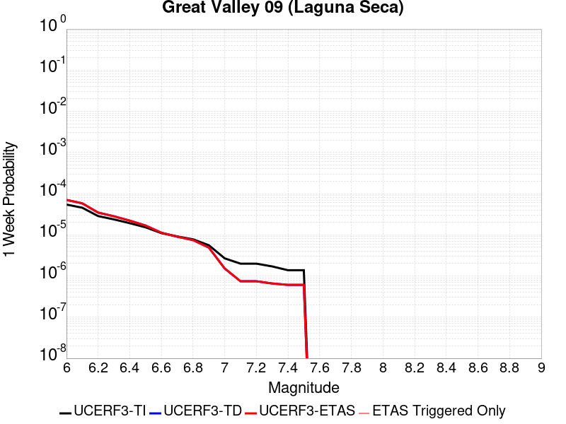 |  | 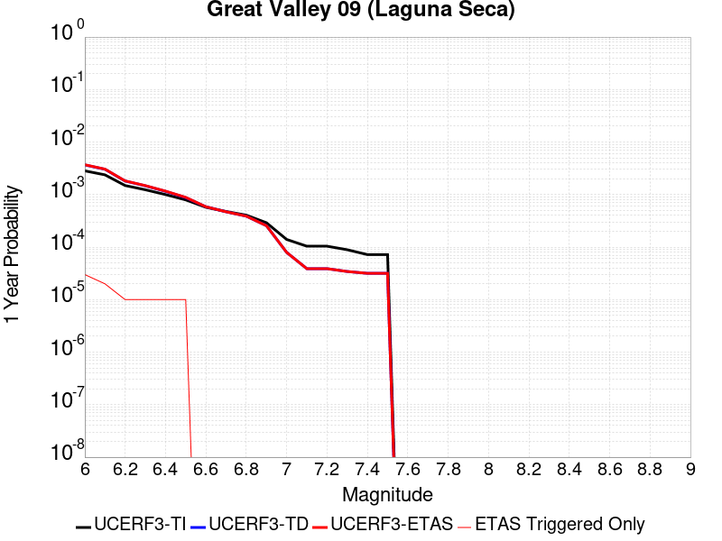 |  |

| Magnitude | 1 wk TI Prob | 1 wk TD Prob | 1 wk ETAS Prob | 1 wk ETAS/TD Gain | 1 wk ETAS Triggered Only | 1 mo TI Prob | 1 mo TD Prob | 1 mo ETAS Prob | 1 mo ETAS/TD Gain | 1 mo ETAS Triggered Only | 1 yr TI Prob | 1 yr TD Prob | 1 yr ETAS Prob | 1 yr ETAS/TD Gain | 1 yr ETAS Triggered Only | 10 yr TI Prob | 10 yr TD Prob | 10 yr ETAS Prob | 10 yr ETAS/TD Gain | 10 yr ETAS Triggered Only |
|-----|-----|-----|-----|-----|-----|-----|-----|-----|-----|-----|-----|-----|-----|-----|-----|-----|-----|-----|-----|-----|
| 6.0 | 5.4353277E-5 | 7.05022E-5 | 7.05022E-5 | 1.0 | 0.0 | 2.3292181E-4 | 3.0211566E-4 | 3.0211566E-4 | 1.0 | 0.0 | 0.0028321352 | 0.0036721937 | 0.0037149272 | 1.011637 | 4.2890842E-5 | 0.02796312 | 0.03611547 | 0.036198154 | 1.0022894 | 8.5781685E-5 |
| 6.1 | 4.5578287E-5 | 5.822118E-5 | 5.822118E-5 | 1.0 | 0.0 | 1.953209E-4 | 2.4949326E-4 | 2.4949326E-4 | 1.0 | 0.0 | 0.0023754383 | 0.003033432 | 0.003033432 | 1.0 | 0.0 | 0.023502063 | 0.029919548 | 0.029961154 | 1.0013907 | 4.2890842E-5 |
| 6.2 | 2.8536782E-5 | 3.4737273E-5 | 3.4737273E-5 | 1.0 | 0.0 | 1.2229476E-4 | 1.4886224E-4 | 1.4886224E-4 | 1.0 | 0.0 | 0.0014879217 | 0.001810813 | 0.001810813 | 1.0 | 0.0 | 0.014779986 | 0.017958116 | 0.018000238 | 1.0023454 | 4.2890842E-5 |
| 6.3 | 2.3698774E-5 | 2.8213295E-5 | 2.8213295E-5 | 1.0 | 0.0 | 1.01562226E-4 | 1.20905075E-4 | 1.20905075E-4 | 1.0 | 0.0 | 0.0012358186 | 0.0014710218 | 0.0014710218 | 1.0 | 0.0 | 0.012289686 | 0.014611342 | 0.014611342 | 1.0 | 0.0 |
| 6.4 | 1.9191197E-5 | 2.2123184E-5 | 2.2123184E-5 | 1.0 | 0.0 | 8.2245395E-5 | 9.4806666E-5 | 9.4806666E-5 | 1.0 | 0.0 | 0.0010008777 | 0.0011536429 | 0.0011536429 | 1.0 | 0.0 | 0.009963818 | 0.011476948 | 0.011476948 | 1.0 | 0.0 |
| 6.5 | 1.5203241E-5 | 1.6802203E-5 | 1.6802203E-5 | 1.0 | 0.0 | 6.5155116E-5 | 7.200386E-5 | 7.200386E-5 | 1.0 | 0.0 | 7.9297484E-4 | 8.7626575E-4 | 8.7626575E-4 | 1.0 | 0.0 | 0.007901512 | 0.0087295165 | 0.0087295165 | 1.0 | 0.0 |
| 6.6 | 1.0984925E-5 | 1.1242595E-5 | 1.1242595E-5 | 1.0 | 0.0 | 4.70774E-5 | 4.8181686E-5 | 4.8181686E-5 | 1.0 | 0.0 | 5.730166E-4 | 5.8645656E-4 | 5.8645656E-4 | 1.0 | 0.0 | 0.005715413 | 0.0058494853 | 0.0058494853 | 1.0 | 0.0 |
| 6.7 | 9.134616E-6 | 9.019894E-6 | 9.019894E-6 | 1.0 | 0.0 | 3.9147766E-5 | 3.865613E-5 | 3.865613E-5 | 1.0 | 0.0 | 4.7651984E-4 | 4.7053912E-4 | 4.7053912E-4 | 1.0 | 0.0 | 0.004754993 | 0.0046956735 | 0.0046956735 | 1.0 | 0.0 |
| 6.8 | 7.785589E-6 | 7.4519444E-6 | 7.4519444E-6 | 1.0 | 0.0 | 3.3366385E-5 | 3.1936524E-5 | 3.1936524E-5 | 1.0 | 0.0 | 4.0616E-4 | 3.8875983E-4 | 3.8875983E-4 | 1.0 | 0.0 | 0.0040541845 | 0.0038810016 | 0.0038810016 | 1.0 | 0.0 |
| 6.9 | 5.579095E-6 | 4.898492E-6 | 4.898492E-6 | 1.0 | 0.0 | 2.3910188E-5 | 2.0993377E-5 | 2.0993377E-5 | 1.0 | 0.0 | 2.9106764E-4 | 2.5556577E-4 | 2.5556577E-4 | 1.0 | 0.0 | 0.002906867 | 0.002552856 | 0.002552856 | 1.0 | 0.0 |
| 7.0 | 2.6816688E-6 | 1.5216126E-6 | 1.5216126E-6 | 1.0 | 0.0 | 1.1492816E-5 | 6.521181E-6 | 6.521181E-6 | 1.0 | 0.0 | 1.3991605E-4 | 7.939258E-5 | 7.939258E-5 | 1.0 | 0.0 | 0.0013982799 | 7.9365086E-4 | 7.9365086E-4 | 1.0 | 0.0 |
| 7.1 | 1.9951021E-6 | 7.453827E-7 | 7.453827E-7 | 1.0 | 0.0 | 8.55041E-6 | 3.1944935E-6 | 3.1944935E-6 | 1.0 | 0.0 | 1.0409627E-4 | 3.8892307E-5 | 3.8892307E-5 | 1.0 | 0.0 | 0.0010404752 | 3.8885913E-4 | 3.8885913E-4 | 1.0 | 0.0 |
| 7.2 | 1.9951021E-6 | 7.453827E-7 | 7.453827E-7 | 1.0 | 0.0 | 8.55041E-6 | 3.1944935E-6 | 3.1944935E-6 | 1.0 | 0.0 | 1.0409627E-4 | 3.8892307E-5 | 3.8892307E-5 | 1.0 | 0.0 | 0.0010404752 | 3.8885913E-4 | 3.8885913E-4 | 1.0 | 0.0 |
| 7.3 | 1.7087556E-6 | 6.578881E-7 | 6.578881E-7 | 1.0 | 0.0 | 7.3232177E-6 | 2.8195177E-6 | 2.8195177E-6 | 1.0 | 0.0 | 8.915652E-5 | 3.4327128E-5 | 3.4327128E-5 | 1.0 | 0.0 | 8.9120766E-4 | 3.432223E-4 | 3.432223E-4 | 1.0 | 0.0 |
| 7.4 | 1.3804846E-6 | 6.073852E-7 | 6.073852E-7 | 1.0 | 0.0 | 5.916349E-6 | 2.6030768E-6 | 2.6030768E-6 | 1.0 | 0.0 | 7.2029165E-5 | 3.169204E-5 | 3.169204E-5 | 1.0 | 0.0 | 7.200583E-4 | 3.1687922E-4 | 3.1687922E-4 | 1.0 | 0.0 |
| 7.5 | 1.3804846E-6 | 6.073852E-7 | 6.073852E-7 | 1.0 | 0.0 | 5.916349E-6 | 2.6030768E-6 | 2.6030768E-6 | 1.0 | 0.0 | 7.2029165E-5 | 3.169204E-5 | 3.169204E-5 | 1.0 | 0.0 | 7.200583E-4 | 3.1687922E-4 | 3.1687922E-4 | 1.0 | 0.0 |

## Big Pine (Central)
*[(top)](#table-of-contents)*

| 1 Week | 1 Month | 1 Year | 10 Year |
|-----|-----|-----|-----|
|  |  |  | 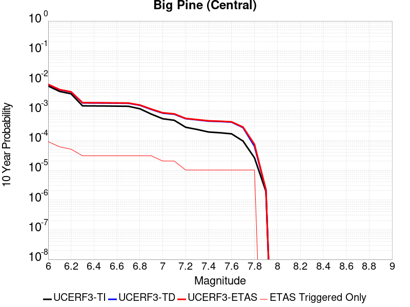 |

| Magnitude | 1 wk TI Prob | 1 wk TD Prob | 1 wk ETAS Prob | 1 wk ETAS/TD Gain | 1 wk ETAS Triggered Only | 1 mo TI Prob | 1 mo TD Prob | 1 mo ETAS Prob | 1 mo ETAS/TD Gain | 1 mo ETAS Triggered Only | 1 yr TI Prob | 1 yr TD Prob | 1 yr ETAS Prob | 1 yr ETAS/TD Gain | 1 yr ETAS Triggered Only | 10 yr TI Prob | 10 yr TD Prob | 10 yr ETAS Prob | 10 yr ETAS/TD Gain | 10 yr ETAS Triggered Only |
|-----|-----|-----|-----|-----|-----|-----|-----|-----|-----|-----|-----|-----|-----|-----|-----|-----|-----|-----|-----|-----|
| 6.0 | 1.2706755E-5 | 1.4250529E-5 | 1.4250529E-5 | 1.0 | 0.0 | 5.4456385E-5 | 6.107247E-5 | 6.107247E-5 | 1.0 | 0.0 | 6.628048E-4 | 7.433402E-4 | 7.433402E-4 | 1.0 | 0.0 | 0.006608314 | 0.0074135666 | 0.0074561397 | 1.0057425 | 4.2890842E-5 |
| 6.1 | 8.342579E-6 | 9.510762E-6 | 9.510762E-6 | 1.0 | 0.0 | 3.5753423E-5 | 4.0759893E-5 | 4.0759893E-5 | 1.0 | 0.0 | 4.3521097E-4 | 4.961604E-4 | 4.961604E-4 | 1.0 | 0.0 | 0.0043435963 | 0.0049540824 | 0.0049967607 | 1.0086148 | 4.2890842E-5 |
| 6.2 | 6.923899E-6 | 7.967147E-6 | 7.967147E-6 | 1.0 | 0.0 | 2.9673516E-5 | 3.4144578E-5 | 3.4144578E-5 | 1.0 | 0.0 | 3.6121515E-4 | 4.156502E-4 | 4.156502E-4 | 1.0 | 0.0 | 0.003606286 | 0.0041520367 | 0.0041947495 | 1.0102872 | 4.2890842E-5 |
| 6.3 | 2.728396E-6 | 3.4242908E-6 | 3.4242908E-6 | 1.0 | 0.0 | 1.1693074E-5 | 1.4675454E-5 | 1.4675454E-5 | 1.0 | 0.0 | 1.4235388E-4 | 1.7865987E-4 | 1.7865987E-4 | 1.0 | 0.0 | 0.0014226272 | 0.0017866704 | 0.0018294846 | 1.0239631 | 4.2890842E-5 |
| 6.4 | 2.7136944E-6 | 3.408584E-6 | 3.408584E-6 | 1.0 | 0.0 | 1.1630066E-5 | 1.4608141E-5 | 1.4608141E-5 | 1.0 | 0.0 | 1.4158686E-4 | 1.7784047E-4 | 1.7784047E-4 | 1.0 | 0.0 | 0.0014149669 | 0.0017784894 | 0.001821304 | 1.0240736 | 4.2890842E-5 |
| 6.5 | 2.6971882E-6 | 3.3909291E-6 | 3.3909291E-6 | 1.0 | 0.0 | 1.1559327E-5 | 1.45324775E-5 | 1.45324775E-5 | 1.0 | 0.0 | 1.4072572E-4 | 1.7691942E-4 | 1.7691942E-4 | 1.0 | 0.0 | 0.0014063664 | 0.0017692937 | 0.0018121087 | 1.0241989 | 4.2890842E-5 |
| 6.6 | 2.669092E-6 | 3.3609497E-6 | 3.3609497E-6 | 1.0 | 0.0 | 1.1438916E-5 | 1.4403995E-5 | 1.4403995E-5 | 1.0 | 0.0 | 1.3925991E-4 | 1.753554E-4 | 1.753554E-4 | 1.0 | 0.0 | 0.0013917267 | 0.0017536782 | 0.0017964939 | 1.0244148 | 4.2890842E-5 |
| 6.7 | 2.6408059E-6 | 3.3309752E-6 | 3.3309752E-6 | 1.0 | 0.0 | 1.1317691E-5 | 1.4275535E-5 | 1.4275535E-5 | 1.0 | 0.0 | 1.3778417E-4 | 1.7379165E-4 | 1.7379165E-4 | 1.0 | 0.0 | 0.0013769877 | 0.0017380653 | 0.0017808815 | 1.0246345 | 4.2890842E-5 |
| 6.8 | 2.1786943E-6 | 2.8544325E-6 | 2.8544325E-6 | 1.0 | 0.0 | 9.337228E-6 | 1.2233229E-5 | 1.2233229E-5 | 1.0 | 0.0 | 1.1367482E-4 | 1.4893012E-4 | 1.4893012E-4 | 1.0 | 0.0 | 0.0011361669 | 0.0014897975 | 0.0015326245 | 1.0287468 | 4.2890842E-5 |
| 6.9 | 1.4411696E-6 | 2.068499E-6 | 2.068499E-6 | 1.0 | 0.0 | 6.1764263E-6 | 8.864968E-6 | 8.864968E-6 | 1.0 | 0.0 | 7.51954E-5 | 1.079259E-4 | 1.079259E-4 | 1.0 | 0.0 | 7.5169955E-4 | 0.0010801847 | 0.0011230292 | 1.039664 | 4.2890842E-5 |
| 7.0 | 1.0073411E-6 | 1.554261E-6 | 1.554261E-6 | 1.0 | 0.0 | 4.317169E-6 | 6.6611024E-6 | 6.6611024E-6 | 1.0 | 0.0 | 5.2560266E-5 | 8.1096056E-5 | 8.1096056E-5 | 1.0 | 0.0 | 5.2547833E-4 | 8.1210316E-4 | 8.549592E-4 | 1.0527717 | 4.2890842E-5 |
| 7.1 | 8.947104E-7 | 1.4302494E-6 | 1.4302494E-6 | 1.0 | 0.0 | 3.834468E-6 | 6.129627E-6 | 6.129627E-6 | 1.0 | 0.0 | 4.6683643E-5 | 7.46258E-5 | 7.46258E-5 | 1.0 | 0.0 | 4.6673836E-4 | 7.474457E-4 | 7.903045E-4 | 1.0573404 | 4.2890842E-5 |
| 7.2 | 5.215166E-7 | 1.0111678E-6 | 1.0111678E-6 | 1.0 | 0.0 | 2.2350691E-6 | 4.3335694E-6 | 4.3335694E-6 | 1.0 | 0.0 | 2.7211627E-5 | 5.2759973E-5 | 5.2759973E-5 | 1.0 | 0.0 | 2.7208295E-4 | 5.2890263E-4 | 5.2890263E-4 | 1.0 | 0.0 |
| 7.3 | 4.4024807E-7 | 9.219589E-7 | 9.219589E-7 | 1.0 | 0.0 | 1.8867761E-6 | 3.9512465E-6 | 3.9512465E-6 | 1.0 | 0.0 | 2.2971257E-5 | 4.810541E-5 | 4.810541E-5 | 1.0 | 0.0 | 2.2968883E-4 | 4.8237795E-4 | 4.8237795E-4 | 1.0 | 0.0 |
| 7.4 | 3.6130905E-7 | 8.358523E-7 | 8.358523E-7 | 1.0 | 0.0 | 1.5484665E-6 | 3.5822195E-6 | 3.5822195E-6 | 1.0 | 0.0 | 1.8852415E-5 | 4.3612687E-5 | 4.3612687E-5 | 1.0 | 0.0 | 1.8850817E-4 | 4.374597E-4 | 4.374597E-4 | 1.0 | 0.0 |
| 7.5 | 3.408184E-7 | 8.108147E-7 | 8.108147E-7 | 1.0 | 0.0 | 1.4606494E-6 | 3.4749157E-6 | 3.4749157E-6 | 1.0 | 0.0 | 1.7783263E-5 | 4.2306317E-5 | 4.2306317E-5 | 1.0 | 0.0 | 1.778184E-4 | 4.2437963E-4 | 4.2437963E-4 | 1.0 | 0.0 |
| 7.6 | 3.1428627E-7 | 7.7316E-7 | 7.7316E-7 | 1.0 | 0.0 | 1.3469405E-6 | 3.3135389E-6 | 3.3135389E-6 | 1.0 | 0.0 | 1.6398877E-5 | 4.0341627E-5 | 4.0341627E-5 | 1.0 | 0.0 | 1.6397667E-4 | 4.0471106E-4 | 4.0471106E-4 | 1.0 | 0.0 |
| 7.7 | 1.7972785E-7 | 5.077752E-7 | 5.077752E-7 | 1.0 | 0.0 | 7.70262E-7 | 2.1761778E-6 | 2.1761778E-6 | 1.0 | 0.0 | 9.377899E-6 | 2.6494654E-5 | 2.6494654E-5 | 1.0 | 0.0 | 9.377503E-5 | 2.662899E-4 | 2.662899E-4 | 1.0 | 0.0 |
| 7.8 | 4.9230927E-8 | 1.198079E-7 | 1.198079E-7 | 1.0 | 0.0 | 2.1098968E-7 | 5.134623E-7 | 5.134623E-7 | 1.0 | 0.0 | 2.5687964E-6 | 6.2513873E-6 | 6.2513873E-6 | 1.0 | 0.0 | 2.5687666E-5 | 6.295415E-5 | 6.295415E-5 | 1.0 | 0.0 |
| 7.9 | 3.6805972E-9 | 4.105293E-9 | 4.105293E-9 | 1.0 | 0.0 | 1.5773987E-8 | 1.7594115E-8 | 1.7594115E-8 | 1.0 | 0.0 | 1.9204828E-7 | 2.1420831E-7 | 2.1420831E-7 | 1.0 | 0.0 | 1.920481E-6 | 2.1900614E-6 | 2.1900614E-6 | 1.0 | 0.0 |

## Dry Mountain
*[(top)](#table-of-contents)*

| 1 Week | 1 Month | 1 Year | 10 Year |
|-----|-----|-----|-----|
|  |  |  |  |

| Magnitude | 1 wk TI Prob | 1 wk TD Prob | 1 wk ETAS Prob | 1 wk ETAS/TD Gain | 1 wk ETAS Triggered Only | 1 mo TI Prob | 1 mo TD Prob | 1 mo ETAS Prob | 1 mo ETAS/TD Gain | 1 mo ETAS Triggered Only | 1 yr TI Prob | 1 yr TD Prob | 1 yr ETAS Prob | 1 yr ETAS/TD Gain | 1 yr ETAS Triggered Only | 10 yr TI Prob | 10 yr TD Prob | 10 yr ETAS Prob | 10 yr ETAS/TD Gain | 10 yr ETAS Triggered Only |
|-----|-----|-----|-----|-----|-----|-----|-----|-----|-----|-----|-----|-----|-----|-----|-----|-----|-----|-----|-----|-----|
| 6.0 | 6.222801E-6 | 6.439381E-6 | 4.932995E-5 | 7.660666 | 4.2890842E-5 | 2.6668875E-5 | 2.7597147E-5 | 7.048681E-5 | 2.554134 | 4.2890842E-5 | 3.2464517E-4 | 3.3595937E-4 | 4.2171223E-4 | 1.2552477 | 8.5781685E-5 | 0.0032417132 | 0.0033560768 | 0.0034415706 | 1.0254743 | 8.5781685E-5 |
| 6.1 | 6.222801E-6 | 6.439381E-6 | 4.932995E-5 | 7.660666 | 4.2890842E-5 | 2.6668875E-5 | 2.7597147E-5 | 7.048681E-5 | 2.554134 | 4.2890842E-5 | 3.2464517E-4 | 3.3595937E-4 | 4.2171223E-4 | 1.2552477 | 8.5781685E-5 | 0.0032417132 | 0.0033560768 | 0.0034415706 | 1.0254743 | 8.5781685E-5 |
| 6.2 | 6.222801E-6 | 6.439381E-6 | 4.932995E-5 | 7.660666 | 4.2890842E-5 | 2.6668875E-5 | 2.7597147E-5 | 7.048681E-5 | 2.554134 | 4.2890842E-5 | 3.2464517E-4 | 3.3595937E-4 | 4.2171223E-4 | 1.2552477 | 8.5781685E-5 | 0.0032417132 | 0.0033560768 | 0.0034415706 | 1.0254743 | 8.5781685E-5 |
| 6.3 | 6.222801E-6 | 6.439381E-6 | 4.932995E-5 | 7.660666 | 4.2890842E-5 | 2.6668875E-5 | 2.7597147E-5 | 7.048681E-5 | 2.554134 | 4.2890842E-5 | 3.2464517E-4 | 3.3595937E-4 | 4.2171223E-4 | 1.2552477 | 8.5781685E-5 | 0.0032417132 | 0.0033560768 | 0.0034415706 | 1.0254743 | 8.5781685E-5 |
| 6.4 | 6.222801E-6 | 6.439381E-6 | 4.932995E-5 | 7.660666 | 4.2890842E-5 | 2.6668875E-5 | 2.7597147E-5 | 7.048681E-5 | 2.554134 | 4.2890842E-5 | 3.2464517E-4 | 3.3595937E-4 | 4.2171223E-4 | 1.2552477 | 8.5781685E-5 | 0.0032417132 | 0.0033560768 | 0.0034415706 | 1.0254743 | 8.5781685E-5 |
| 6.5 | 2.8528623E-6 | 2.9521684E-6 | 4.5842884E-5 | 15.528546 | 4.2890842E-5 | 1.22264955E-5 | 1.2652138E-5 | 5.5542438E-5 | 4.3899646 | 4.2890842E-5 | 1.4884741E-4 | 1.540376E-4 | 1.9692183E-4 | 1.2784011 | 4.2890842E-5 | 0.0014874774 | 0.0015401616 | 0.0015829864 | 1.0278053 | 4.2890842E-5 |
| 6.6 | 2.8528623E-6 | 2.9521684E-6 | 4.5842884E-5 | 15.528546 | 4.2890842E-5 | 1.22264955E-5 | 1.2652138E-5 | 5.5542438E-5 | 4.3899646 | 4.2890842E-5 | 1.4884741E-4 | 1.540376E-4 | 1.9692183E-4 | 1.2784011 | 4.2890842E-5 | 0.0014874774 | 0.0015401616 | 0.0015829864 | 1.0278053 | 4.2890842E-5 |
| 6.7 | 2.541E-6 | 2.6293578E-6 | 4.5520086E-5 | 17.312244 | 4.2890842E-5 | 1.0889954E-5 | 1.1268677E-5 | 5.4159034E-5 | 4.8061576 | 4.2890842E-5 | 1.3257713E-4 | 1.3719614E-4 | 1.800811E-4 | 1.3125814 | 4.2890842E-5 | 0.0013249806 | 0.0013719613 | 0.0014147934 | 1.0312195 | 4.2890842E-5 |

## Hunting Creek - Bartlett Springs connector 2011
*[(top)](#table-of-contents)*

| 1 Week | 1 Month | 1 Year | 10 Year |
|-----|-----|-----|-----|
|  |  |  |  |

| Magnitude | 1 wk TI Prob | 1 wk TD Prob | 1 wk ETAS Prob | 1 wk ETAS/TD Gain | 1 wk ETAS Triggered Only | 1 mo TI Prob | 1 mo TD Prob | 1 mo ETAS Prob | 1 mo ETAS/TD Gain | 1 mo ETAS Triggered Only | 1 yr TI Prob | 1 yr TD Prob | 1 yr ETAS Prob | 1 yr ETAS/TD Gain | 1 yr ETAS Triggered Only | 10 yr TI Prob | 10 yr TD Prob | 10 yr ETAS Prob | 10 yr ETAS/TD Gain | 10 yr ETAS Triggered Only |
|-----|-----|-----|-----|-----|-----|-----|-----|-----|-----|-----|-----|-----|-----|-----|-----|-----|-----|-----|-----|-----|
| 6.0 | 4.940016E-5 | 6.786822E-5 | 6.786822E-5 | 1.0 | 0.0 | 2.1169778E-4 | 2.9083234E-4 | 3.337107E-4 | 1.1474333 | 4.2890842E-5 | 0.002574374 | 0.003535177 | 0.0035779164 | 1.0120897 | 4.2890842E-5 | 0.025447546 | 0.034773834 | 0.034815233 | 1.0011905 | 4.2890842E-5 |
| 6.1 | 4.940016E-5 | 6.786822E-5 | 6.786822E-5 | 1.0 | 0.0 | 2.1169778E-4 | 2.9083234E-4 | 3.337107E-4 | 1.1474333 | 4.2890842E-5 | 0.002574374 | 0.003535177 | 0.0035779164 | 1.0120897 | 4.2890842E-5 | 0.025447546 | 0.034773834 | 0.034815233 | 1.0011905 | 4.2890842E-5 |
| 6.2 | 4.472471E-5 | 6.1002804E-5 | 6.1002804E-5 | 1.0 | 0.0 | 1.9166325E-4 | 2.6141506E-4 | 3.042947E-4 | 1.1640289 | 4.2890842E-5 | 0.0023310026 | 0.003178107 | 0.0032208615 | 1.0134529 | 4.2890842E-5 | 0.02306703 | 0.031316914 | 0.03135846 | 1.0013267 | 4.2890842E-5 |
| 6.3 | 4.472471E-5 | 6.1002804E-5 | 6.1002804E-5 | 1.0 | 0.0 | 1.9166325E-4 | 2.6141506E-4 | 3.042947E-4 | 1.1640289 | 4.2890842E-5 | 0.0023310026 | 0.003178107 | 0.0032208615 | 1.0134529 | 4.2890842E-5 | 0.02306703 | 0.031316914 | 0.03135846 | 1.0013267 | 4.2890842E-5 |
| 6.4 | 4.0001003E-5 | 5.4103755E-5 | 5.4103755E-5 | 1.0 | 0.0 | 1.714216E-4 | 2.31853E-4 | 2.747339E-4 | 1.1849487 | 4.2890842E-5 | 0.0020850603 | 0.0028191248 | 0.0028618947 | 1.0151714 | 4.2890842E-5 | 0.02065605 | 0.027828315 | 0.027870012 | 1.0014983 | 4.2890842E-5 |
| 6.5 | 3.8033053E-5 | 5.1266547E-5 | 5.1266547E-5 | 1.0 | 0.0 | 1.6298861E-4 | 2.1969559E-4 | 2.1969559E-4 | 1.0 | 0.0 | 0.0019825802 | 0.0026714746 | 0.0026714746 | 1.0 | 0.0 | 0.019649856 | 0.026390454 | 0.026390454 | 1.0 | 0.0 |
| 6.6 | 3.653754E-5 | 4.913017E-5 | 4.913017E-5 | 1.0 | 0.0 | 1.5658008E-4 | 2.1054115E-4 | 2.1054115E-4 | 1.0 | 0.0 | 0.0019046954 | 0.0025602852 | 0.0025602852 | 1.0 | 0.0 | 0.018884527 | 0.025306415 | 0.025306415 | 1.0 | 0.0 |
| 6.7 | 3.372024E-5 | 4.514011E-5 | 4.514011E-5 | 1.0 | 0.0 | 1.4450731E-4 | 1.9344354E-4 | 1.9344354E-4 | 1.0 | 0.0 | 0.0017579567 | 0.002352639 | 0.002352639 | 1.0 | 0.0 | 0.017441148 | 0.023278099 | 0.023278099 | 1.0 | 0.0 |
| 6.8 | 2.9650024E-5 | 3.9411374E-5 | 3.9411374E-5 | 1.0 | 0.0 | 1.2706534E-4 | 1.6889503E-4 | 1.6889503E-4 | 1.0 | 0.0 | 0.0015459227 | 0.0020543463 | 0.0020543463 | 1.0 | 0.0 | 0.015352124 | 0.020351216 | 0.020351216 | 1.0 | 0.0 |
| 6.9 | 2.860775E-5 | 3.7812544E-5 | 3.7812544E-5 | 1.0 | 0.0 | 1.2259888E-4 | 1.6204377E-4 | 1.6204377E-4 | 1.0 | 0.0 | 0.0014916194 | 0.001971107 | 0.001971107 | 1.0 | 0.0 | 0.014816469 | 0.01953584 | 0.01953584 | 1.0 | 0.0 |
| 7.0 | 2.6696067E-5 | 3.506726E-5 | 3.506726E-5 | 1.0 | 0.0 | 1.144067E-4 | 1.5027967E-4 | 1.5027967E-4 | 1.0 | 0.0 | 0.0013920115 | 0.0018281302 | 0.0018281302 | 1.0 | 0.0 | 0.013833242 | 0.018131364 | 0.018131364 | 1.0 | 0.0 |
| 7.1 | 2.456087E-5 | 3.2013093E-5 | 3.2013093E-5 | 1.0 | 0.0 | 1.0525662E-4 | 1.371918E-4 | 1.371918E-4 | 1.0 | 0.0 | 0.001280746 | 0.0016690396 | 0.0016690396 | 1.0 | 0.0 | 0.012733897 | 0.016566366 | 0.016566366 | 1.0 | 0.0 |
| 7.2 | 2.295761E-5 | 2.9822932E-5 | 2.9822932E-5 | 1.0 | 0.0 | 9.8386045E-5 | 1.2780636E-4 | 1.2780636E-4 | 1.0 | 0.0 | 0.0011971919 | 0.001554941 | 0.001554941 | 1.0 | 0.0 | 0.011907627 | 0.015442089 | 0.015442089 | 1.0 | 0.0 |
| 7.3 | 2.1256936E-5 | 2.7541912E-5 | 2.7541912E-5 | 1.0 | 0.0 | 9.109797E-5 | 1.1803147E-4 | 1.1803147E-4 | 1.0 | 0.0 | 0.0011085535 | 0.0014360948 | 0.0014360948 | 1.0 | 0.0 | 0.011030397 | 0.014269472 | 0.014269472 | 1.0 | 0.0 |
| 7.4 | 1.8784336E-5 | 2.4306766E-5 | 2.4306766E-5 | 1.0 | 0.0 | 8.050181E-5 | 1.0416774E-4 | 1.0416774E-4 | 1.0 | 0.0 | 9.796688E-4 | 0.001267512 | 0.001267512 | 1.0 | 0.0 | 0.009753612 | 0.012603902 | 0.012603902 | 1.0 | 0.0 |
| 7.5 | 1.7248298E-5 | 2.2268887E-5 | 2.2268887E-5 | 1.0 | 0.0 | 7.391918E-5 | 9.543464E-5 | 9.543464E-5 | 1.0 | 0.0 | 8.9959445E-4 | 0.0011613049 | 0.0011613049 | 1.0 | 0.0 | 0.008959615 | 0.01155334 | 0.01155334 | 1.0 | 0.0 |
| 7.6 | 1.0653709E-5 | 1.3722118E-5 | 1.3722118E-5 | 1.0 | 0.0 | 4.5657955E-5 | 5.8807767E-5 | 5.8807767E-5 | 1.0 | 0.0 | 5.557438E-4 | 7.157521E-4 | 7.157521E-4 | 1.0 | 0.0 | 0.0055435603 | 0.0071348166 | 0.0071348166 | 1.0 | 0.0 |
| 7.7 | 3.286316E-6 | 4.0903437E-6 | 4.0903437E-6 | 1.0 | 0.0 | 1.4084137E-5 | 1.7529928E-5 | 1.7529928E-5 | 1.0 | 0.0 | 1.7146087E-4 | 2.1340612E-4 | 2.1340612E-4 | 1.0 | 0.0 | 0.0017132863 | 0.0021320276 | 0.0021320276 | 1.0 | 0.0 |
| 7.8 | 5.1855085E-7 | 5.9720696E-7 | 5.9720696E-7 | 1.0 | 0.0 | 2.222359E-6 | 2.5594559E-6 | 2.5594559E-6 | 1.0 | 0.0 | 2.7056883E-5 | 3.116094E-5 | 3.116094E-5 | 1.0 | 0.0 | 2.705359E-4 | 3.1156495E-4 | 3.1156495E-4 | 1.0 | 0.0 |

## San Diego Trough south
*[(top)](#table-of-contents)*

| 1 Week | 1 Month | 1 Year | 10 Year |
|-----|-----|-----|-----|
|  |  |  |  |

| Magnitude | 1 wk TI Prob | 1 wk TD Prob | 1 wk ETAS Prob | 1 wk ETAS/TD Gain | 1 wk ETAS Triggered Only | 1 mo TI Prob | 1 mo TD Prob | 1 mo ETAS Prob | 1 mo ETAS/TD Gain | 1 mo ETAS Triggered Only | 1 yr TI Prob | 1 yr TD Prob | 1 yr ETAS Prob | 1 yr ETAS/TD Gain | 1 yr ETAS Triggered Only | 10 yr TI Prob | 10 yr TD Prob | 10 yr ETAS Prob | 10 yr ETAS/TD Gain | 10 yr ETAS Triggered Only |
|-----|-----|-----|-----|-----|-----|-----|-----|-----|-----|-----|-----|-----|-----|-----|-----|-----|-----|-----|-----|-----|
| 6.0 | 8.279495E-5 | 1.04241306E-4 | 1.4712768E-4 | 1.4114144 | 4.2890842E-5 | 3.5478722E-4 | 4.4667677E-4 | 4.895485E-4 | 1.0959792 | 4.2890842E-5 | 0.004310982 | 0.0054256152 | 0.0054682735 | 1.0078623 | 4.2890842E-5 | 0.042283054 | 0.05299221 | 0.053032827 | 1.0007665 | 4.2890842E-5 |
| 6.1 | 4.6961468E-5 | 5.772944E-5 | 1.00617806E-4 | 1.7429202 | 4.2890842E-5 | 2.0124791E-4 | 2.473894E-4 | 2.9026964E-4 | 1.1733309 | 4.2890842E-5 | 0.00244744 | 0.0030079768 | 0.0030507385 | 1.0142162 | 4.2890842E-5 | 0.024206603 | 0.029679462 | 0.02972108 | 1.0014023 | 4.2890842E-5 |
| 6.2 | 3.5079658E-5 | 4.214154E-5 | 4.214154E-5 | 1.0 | 0.0 | 1.5033272E-4 | 1.8059435E-4 | 1.8059435E-4 | 1.0 | 0.0 | 0.0018287642 | 0.0021965632 | 0.0021965632 | 1.0 | 0.0 | 0.018137876 | 0.021751117 | 0.021751117 | 1.0 | 0.0 |
| 6.3 | 3.5079658E-5 | 4.214154E-5 | 4.214154E-5 | 1.0 | 0.0 | 1.5033272E-4 | 1.8059435E-4 | 1.8059435E-4 | 1.0 | 0.0 | 0.0018287642 | 0.0021965632 | 0.0021965632 | 1.0 | 0.0 | 0.018137876 | 0.021751117 | 0.021751117 | 1.0 | 0.0 |
| 6.4 | 2.7196904E-5 | 3.2087162E-5 | 3.2087162E-5 | 1.0 | 0.0 | 1.16552954E-4 | 1.3750927E-4 | 1.3750927E-4 | 1.0 | 0.0 | 0.0014181085 | 0.0016729041 | 0.0016729041 | 1.0 | 0.0 | 0.014090929 | 0.016604643 | 0.016604643 | 1.0 | 0.0 |
| 6.5 | 2.5584688E-5 | 3.010164E-5 | 3.010164E-5 | 1.0 | 0.0 | 1.0964406E-4 | 1.2900073E-4 | 1.2900073E-4 | 1.0 | 0.0 | 0.0013340989 | 0.0015694655 | 0.0015694655 | 1.0 | 0.0 | 0.013261181 | 0.015585314 | 0.015585314 | 1.0 | 0.0 |
| 6.6 | 2.2034688E-5 | 2.5742738E-5 | 2.5742738E-5 | 1.0 | 0.0 | 9.443096E-5 | 1.1032141E-4 | 1.1032141E-4 | 1.0 | 0.0 | 0.0011490905 | 0.0013423424 | 0.0013423424 | 1.0 | 0.0 | 0.011431668 | 0.013343317 | 0.013343317 | 1.0 | 0.0 |
| 6.7 | 1.9394853E-5 | 2.254176E-5 | 2.254176E-5 | 1.0 | 0.0 | 8.311815E-5 | 9.6603995E-5 | 9.6603995E-5 | 1.0 | 0.0 | 0.0010114936 | 0.0011755243 | 0.0011755243 | 1.0 | 0.0 | 0.01006902 | 0.011693766 | 0.011693766 | 1.0 | 0.0 |
| 6.8 | 1.7615313E-5 | 2.0403182E-5 | 2.0403182E-5 | 1.0 | 0.0 | 7.549201E-5 | 8.74393E-5 | 8.74393E-5 | 1.0 | 0.0 | 9.1872766E-4 | 0.0010640579 | 0.0010640579 | 1.0 | 0.0 | 0.009149387 | 0.010590198 | 0.010590198 | 1.0 | 0.0 |
| 6.9 | 1.5621423E-5 | 1.8026114E-5 | 1.8026114E-5 | 1.0 | 0.0 | 6.6947236E-5 | 7.725251E-5 | 7.725251E-5 | 1.0 | 0.0 | 8.147778E-4 | 9.40147E-4 | 9.40147E-4 | 1.0 | 0.0 | 0.008117969 | 0.009362142 | 0.009362142 | 1.0 | 0.0 |
| 7.0 | 1.3444376E-5 | 1.544809E-5 | 1.544809E-5 | 1.0 | 0.0 | 5.7617483E-5 | 6.620443E-5 | 6.620443E-5 | 1.0 | 0.0 | 7.0126704E-4 | 8.057436E-4 | 8.057436E-4 | 1.0 | 0.0 | 0.006990582 | 0.008028555 | 0.008028555 | 1.0 | 0.0 |
| 7.1 | 1.2268361E-5 | 1.407303E-5 | 1.407303E-5 | 1.0 | 0.0 | 5.2577634E-5 | 6.0311606E-5 | 6.0311606E-5 | 1.0 | 0.0 | 6.399447E-4 | 7.3404907E-4 | 7.3404907E-4 | 1.0 | 0.0 | 0.0063810493 | 0.0073165493 | 0.0073165493 | 1.0 | 0.0 |
| 7.2 | 1.0922655E-5 | 1.2513563E-5 | 1.2513563E-5 | 1.0 | 0.0 | 4.681054E-5 | 5.3628468E-5 | 5.3628468E-5 | 1.0 | 0.0 | 5.697693E-4 | 6.5273355E-4 | 6.5273355E-4 | 1.0 | 0.0 | 0.0056831064 | 0.0065084435 | 0.0065084435 | 1.0 | 0.0 |
| 7.3 | 6.1106753E-6 | 6.928925E-6 | 6.928925E-6 | 1.0 | 0.0 | 2.6188345E-5 | 2.9695057E-5 | 2.9695057E-5 | 1.0 | 0.0 | 3.1879646E-4 | 3.6147775E-4 | 3.6147775E-4 | 1.0 | 0.0 | 0.0031833951 | 0.003608943 | 0.003608943 | 1.0 | 0.0 |
| 7.4 | 4.933187E-6 | 5.5895525E-6 | 5.5895525E-6 | 1.0 | 0.0 | 2.114206E-5 | 2.3955008E-5 | 2.3955008E-5 | 1.0 | 0.0 | 2.5737417E-4 | 2.9161357E-4 | 2.9161357E-4 | 1.0 | 0.0 | 0.002570763 | 0.0029123505 | 0.0029123505 | 1.0 | 0.0 |
| 7.5 | 1.7489613E-6 | 1.969678E-6 | 1.969678E-6 | 1.0 | 0.0 | 7.495527E-6 | 8.4414505E-6 | 8.4414505E-6 | 1.0 | 0.0 | 9.125422E-5 | 1.02770035E-4 | 1.02770035E-4 | 1.0 | 0.0 | 9.1216754E-4 | 0.0010272472 | 0.0010272472 | 1.0 | 0.0 |
| 7.6 | 1.6988751E-7 | 1.7533823E-7 | 1.7533823E-7 | 1.0 | 0.0 | 7.2808916E-7 | 7.5144936E-7 | 7.5144936E-7 | 1.0 | 0.0 | 8.864449E-6 | 9.14886E-6 | 9.14886E-6 | 1.0 | 0.0 | 8.8640954E-5 | 9.1485024E-5 | 9.1485024E-5 | 1.0 | 0.0 |

## Sierra Madre
*[(top)](#table-of-contents)*

| 1 Week | 1 Month | 1 Year | 10 Year |
|-----|-----|-----|-----|
|  |  |  |  |

| Magnitude | 1 wk TI Prob | 1 wk TD Prob | 1 wk ETAS Prob | 1 wk ETAS/TD Gain | 1 wk ETAS Triggered Only | 1 mo TI Prob | 1 mo TD Prob | 1 mo ETAS Prob | 1 mo ETAS/TD Gain | 1 mo ETAS Triggered Only | 1 yr TI Prob | 1 yr TD Prob | 1 yr ETAS Prob | 1 yr ETAS/TD Gain | 1 yr ETAS Triggered Only | 10 yr TI Prob | 10 yr TD Prob | 10 yr ETAS Prob | 10 yr ETAS/TD Gain | 10 yr ETAS Triggered Only |
|-----|-----|-----|-----|-----|-----|-----|-----|-----|-----|-----|-----|-----|-----|-----|-----|-----|-----|-----|-----|-----|
| 6.0 | 1.3379373E-5 | 1.10007395E-5 | 1.10007395E-5 | 1.0 | 0.0 | 5.7338908E-5 | 4.7145186E-5 | 4.7145186E-5 | 1.0 | 0.0 | 6.978776E-4 | 5.738429E-4 | 6.167092E-4 | 1.0747002 | 4.2890842E-5 | 0.0069569005 | 0.0057239756 | 0.005766621 | 1.0074503 | 4.2890842E-5 |
| 6.1 | 1.3379373E-5 | 1.10007395E-5 | 1.10007395E-5 | 1.0 | 0.0 | 5.7338908E-5 | 4.7145186E-5 | 4.7145186E-5 | 1.0 | 0.0 | 6.978776E-4 | 5.738429E-4 | 6.167092E-4 | 1.0747002 | 4.2890842E-5 | 0.0069569005 | 0.0057239756 | 0.005766621 | 1.0074503 | 4.2890842E-5 |
| 6.2 | 1.3379373E-5 | 1.10007395E-5 | 1.10007395E-5 | 1.0 | 0.0 | 5.7338908E-5 | 4.7145186E-5 | 4.7145186E-5 | 1.0 | 0.0 | 6.978776E-4 | 5.738429E-4 | 6.167092E-4 | 1.0747002 | 4.2890842E-5 | 0.0069569005 | 0.0057239756 | 0.005766621 | 1.0074503 | 4.2890842E-5 |
| 6.3 | 1.3379373E-5 | 1.10007395E-5 | 1.10007395E-5 | 1.0 | 0.0 | 5.7338908E-5 | 4.7145186E-5 | 4.7145186E-5 | 1.0 | 0.0 | 6.978776E-4 | 5.738429E-4 | 6.167092E-4 | 1.0747002 | 4.2890842E-5 | 0.0069569005 | 0.0057239756 | 0.005766621 | 1.0074503 | 4.2890842E-5 |
| 6.4 | 1.3379373E-5 | 1.10007395E-5 | 1.10007395E-5 | 1.0 | 0.0 | 5.7338908E-5 | 4.7145186E-5 | 4.7145186E-5 | 1.0 | 0.0 | 6.978776E-4 | 5.738429E-4 | 6.167092E-4 | 1.0747002 | 4.2890842E-5 | 0.0069569005 | 0.0057239756 | 0.005766621 | 1.0074503 | 4.2890842E-5 |
| 6.5 | 1.26563245E-5 | 1.0230196E-5 | 1.0230196E-5 | 1.0 | 0.0 | 5.4240263E-5 | 4.3842967E-5 | 4.3842967E-5 | 1.0 | 0.0 | 6.601751E-4 | 5.336584E-4 | 5.765264E-4 | 1.0803285 | 4.2890842E-5 | 0.006582173 | 0.0053240913 | 0.005366754 | 1.0080131 | 4.2890842E-5 |
| 6.6 | 1.26563245E-5 | 1.0230196E-5 | 1.0230196E-5 | 1.0 | 0.0 | 5.4240263E-5 | 4.3842967E-5 | 4.3842967E-5 | 1.0 | 0.0 | 6.601751E-4 | 5.336584E-4 | 5.765264E-4 | 1.0803285 | 4.2890842E-5 | 0.006582173 | 0.0053240913 | 0.005366754 | 1.0080131 | 4.2890842E-5 |
| 6.7 | 1.2502474E-5 | 1.006634E-5 | 1.006634E-5 | 1.0 | 0.0 | 5.3580934E-5 | 4.314075E-5 | 4.314075E-5 | 1.0 | 0.0 | 6.521526E-4 | 5.251131E-4 | 5.6798145E-4 | 1.0816363 | 4.2890842E-5 | 0.0065024206 | 0.0052390425 | 0.0052817087 | 1.0081439 | 4.2890842E-5 |
| 6.8 | 1.2454966E-5 | 1.0018625E-5 | 1.0018625E-5 | 1.0 | 0.0 | 5.3377335E-5 | 4.2936266E-5 | 4.2936266E-5 | 1.0 | 0.0 | 6.4967526E-4 | 5.226247E-4 | 5.6549313E-4 | 1.0820253 | 4.2890842E-5 | 0.006477792 | 0.0052142753 | 0.0052569425 | 1.0081828 | 4.2890842E-5 |
| 6.9 | 1.2225574E-5 | 9.792602E-6 | 9.792602E-6 | 1.0 | 0.0 | 5.2394265E-5 | 4.1967625E-5 | 4.1967625E-5 | 1.0 | 0.0 | 6.3771347E-4 | 5.108371E-4 | 5.53706E-4 | 1.0839189 | 4.2890842E-5 | 0.006358865 | 0.0050969445 | 0.005139617 | 1.0083721 | 4.2890842E-5 |
| 7.0 | 1.182946E-5 | 9.399144E-6 | 9.399144E-6 | 1.0 | 0.0 | 5.06967E-5 | 4.0281426E-5 | 4.0281426E-5 | 1.0 | 0.0 | 6.1705755E-4 | 4.9031706E-4 | 5.3318683E-4 | 1.0874329 | 4.2890842E-5 | 0.006153469 | 0.004892664 | 0.004935345 | 1.0087235 | 4.2890842E-5 |
| 7.1 | 1.14369095E-5 | 8.986159E-6 | 8.986159E-6 | 1.0 | 0.0 | 4.9014405E-5 | 3.8511545E-5 | 3.8511545E-5 | 1.0 | 0.0 | 5.9658696E-4 | 4.687782E-4 | 5.1164895E-4 | 1.0914521 | 4.2890842E-5 | 0.005949879 | 0.004678199 | 0.0047208895 | 1.0091254 | 4.2890842E-5 |
| 7.2 | 1.0836419E-5 | 8.3995565E-6 | 8.3995565E-6 | 1.0 | 0.0 | 4.644097E-5 | 3.5997607E-5 | 3.5997607E-5 | 1.0 | 0.0 | 5.652721E-4 | 4.3818366E-4 | 4.8105573E-4 | 1.0978403 | 4.2890842E-5 | 0.0056383642 | 0.004373494 | 0.0044161975 | 1.0097641 | 4.2890842E-5 |
| 7.3 | 1.0403439E-5 | 8.02082E-6 | 8.02082E-6 | 1.0 | 0.0 | 4.4585406E-5 | 3.4374494E-5 | 3.4374494E-5 | 1.0 | 0.0 | 5.426921E-4 | 4.1843E-4 | 4.613029E-4 | 1.1024613 | 4.2890842E-5 | 0.005413687 | 0.004176717 | 0.0042194286 | 1.0102261 | 4.2890842E-5 |
| 7.4 | 9.768864E-6 | 7.414448E-6 | 7.414448E-6 | 1.0 | 0.0 | 4.186589E-5 | 3.1775824E-5 | 3.1775824E-5 | 1.0 | 0.0 | 5.09598E-4 | 3.868029E-4 | 4.2967714E-4 | 1.1108426 | 4.2890842E-5 | 0.0050843097 | 0.0038615882 | 0.0039043135 | 1.0110642 | 4.2890842E-5 |
| 7.5 | 8.687089E-6 | 6.4501564E-6 | 6.4501564E-6 | 1.0 | 0.0 | 3.722985E-5 | 2.764324E-5 | 2.764324E-5 | 1.0 | 0.0 | 4.5317915E-4 | 3.3650533E-4 | 3.7938173E-4 | 1.1274167 | 4.2890842E-5 | 0.004522561 | 0.0033602451 | 0.003402992 | 1.0127213 | 4.2890842E-5 |
| 7.6 | 6.3506063E-6 | 4.4303215E-6 | 4.4303215E-6 | 1.0 | 0.0 | 2.72166E-5 | 1.8986955E-5 | 1.8986955E-5 | 1.0 | 0.0 | 3.3131172E-4 | 2.3114192E-4 | 2.7402287E-4 | 1.1855178 | 4.2890842E-5 | 0.003308182 | 0.0023092402 | 0.0023520319 | 1.0185307 | 4.2890842E-5 |
| 7.7 | 4.62223E-6 | 2.932967E-6 | 2.932967E-6 | 1.0 | 0.0 | 1.9809406E-5 | 1.2569798E-5 | 1.2569798E-5 | 1.0 | 0.0 | 2.4115283E-4 | 1.5302657E-4 | 1.5302657E-4 | 1.0 | 0.0 | 0.0024089129 | 0.001529413 | 0.001529413 | 1.0 | 0.0 |
| 7.8 | 3.2145008E-6 | 1.9494332E-6 | 1.9494332E-6 | 1.0 | 0.0 | 1.3776359E-5 | 8.3546865E-6 | 8.3546865E-6 | 1.0 | 0.0 | 1.6771426E-4 | 1.0171358E-4 | 1.0171358E-4 | 1.0 | 0.0 | 0.0016758774 | 0.0010168145 | 0.0010168145 | 1.0 | 0.0 |
| 7.9 | 1.0391769E-6 | 5.6026335E-7 | 5.6026335E-7 | 1.0 | 0.0 | 4.4536077E-6 | 2.4011265E-6 | 2.4011265E-6 | 1.0 | 0.0 | 5.4221324E-5 | 2.9233326E-5 | 2.9233326E-5 | 1.0 | 0.0 | 5.4208096E-4 | 2.9229524E-4 | 2.9229524E-4 | 1.0 | 0.0 |
| 8.0 | 1.210983E-7 | 6.613821E-8 | 6.613821E-8 | 1.0 | 0.0 | 5.1899264E-7 | 2.8344945E-7 | 2.8344945E-7 | 1.0 | 0.0 | 6.3187167E-6 | 3.4509917E-6 | 3.4509917E-6 | 1.0 | 0.0 | 6.318537E-5 | 3.45094E-5 | 3.45094E-5 | 1.0 | 0.0 |

## Clamshell-Sawpit
*[(top)](#table-of-contents)*

| 1 Week | 1 Month | 1 Year | 10 Year |
|-----|-----|-----|-----|
|  |  |  | 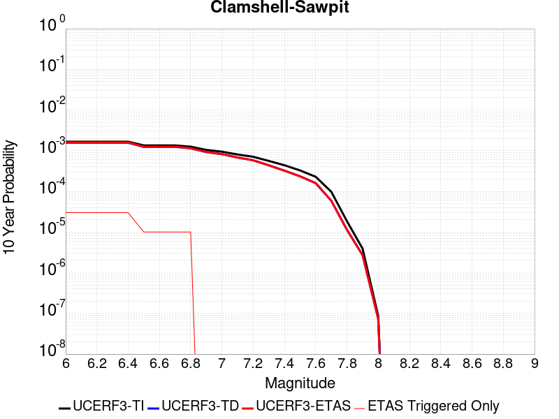 |

| Magnitude | 1 wk TI Prob | 1 wk TD Prob | 1 wk ETAS Prob | 1 wk ETAS/TD Gain | 1 wk ETAS Triggered Only | 1 mo TI Prob | 1 mo TD Prob | 1 mo ETAS Prob | 1 mo ETAS/TD Gain | 1 mo ETAS Triggered Only | 1 yr TI Prob | 1 yr TD Prob | 1 yr ETAS Prob | 1 yr ETAS/TD Gain | 1 yr ETAS Triggered Only | 10 yr TI Prob | 10 yr TD Prob | 10 yr ETAS Prob | 10 yr ETAS/TD Gain | 10 yr ETAS Triggered Only |
|-----|-----|-----|-----|-----|-----|-----|-----|-----|-----|-----|-----|-----|-----|-----|-----|-----|-----|-----|-----|-----|
| 6.0 | 3.202998E-6 | 3.0127644E-6 | 3.0127644E-6 | 1.0 | 0.0 | 1.3727062E-5 | 1.2911788E-5 | 1.2911788E-5 | 1.0 | 0.0 | 1.6711417E-4 | 1.5719049E-4 | 2.0007459E-4 | 1.2728162 | 4.2890842E-5 | 0.0016698855 | 0.0015708724 | 0.0016136958 | 1.0272609 | 4.2890842E-5 |
| 6.1 | 3.202998E-6 | 3.0127644E-6 | 3.0127644E-6 | 1.0 | 0.0 | 1.3727062E-5 | 1.2911788E-5 | 1.2911788E-5 | 1.0 | 0.0 | 1.6711417E-4 | 1.5719049E-4 | 2.0007459E-4 | 1.2728162 | 4.2890842E-5 | 0.0016698855 | 0.0015708724 | 0.0016136958 | 1.0272609 | 4.2890842E-5 |
| 6.2 | 3.202998E-6 | 3.0127644E-6 | 3.0127644E-6 | 1.0 | 0.0 | 1.3727062E-5 | 1.2911788E-5 | 1.2911788E-5 | 1.0 | 0.0 | 1.6711417E-4 | 1.5719049E-4 | 2.0007459E-4 | 1.2728162 | 4.2890842E-5 | 0.0016698855 | 0.0015708724 | 0.0016136958 | 1.0272609 | 4.2890842E-5 |
| 6.3 | 3.202998E-6 | 3.0127644E-6 | 3.0127644E-6 | 1.0 | 0.0 | 1.3727062E-5 | 1.2911788E-5 | 1.2911788E-5 | 1.0 | 0.0 | 1.6711417E-4 | 1.5719049E-4 | 2.0007459E-4 | 1.2728162 | 4.2890842E-5 | 0.0016698855 | 0.0015708724 | 0.0016136958 | 1.0272609 | 4.2890842E-5 |
| 6.4 | 3.202998E-6 | 3.0127644E-6 | 3.0127644E-6 | 1.0 | 0.0 | 1.3727062E-5 | 1.2911788E-5 | 1.2911788E-5 | 1.0 | 0.0 | 1.6711417E-4 | 1.5719049E-4 | 2.0007459E-4 | 1.2728162 | 4.2890842E-5 | 0.0016698855 | 0.0015708724 | 0.0016136958 | 1.0272609 | 4.2890842E-5 |
| 6.5 | 2.5862723E-6 | 2.380775E-6 | 2.380775E-6 | 1.0 | 0.0 | 1.1083977E-5 | 1.0203283E-5 | 1.0203283E-5 | 1.0 | 0.0 | 1.3493907E-4 | 1.2421819E-4 | 1.2421819E-4 | 1.0 | 0.0 | 0.0013485716 | 0.0012415178 | 0.0012415178 | 1.0 | 0.0 |
| 6.6 | 2.5862723E-6 | 2.380775E-6 | 2.380775E-6 | 1.0 | 0.0 | 1.1083977E-5 | 1.0203283E-5 | 1.0203283E-5 | 1.0 | 0.0 | 1.3493907E-4 | 1.2421819E-4 | 1.2421819E-4 | 1.0 | 0.0 | 0.0013485716 | 0.0012415178 | 0.0012415178 | 1.0 | 0.0 |
| 6.7 | 2.5862723E-6 | 2.380775E-6 | 2.380775E-6 | 1.0 | 0.0 | 1.1083977E-5 | 1.0203283E-5 | 1.0203283E-5 | 1.0 | 0.0 | 1.3493907E-4 | 1.2421819E-4 | 1.2421819E-4 | 1.0 | 0.0 | 0.0013485716 | 0.0012415178 | 0.0012415178 | 1.0 | 0.0 |
| 6.8 | 2.4098806E-6 | 2.1977307E-6 | 2.1977307E-6 | 1.0 | 0.0 | 1.0328019E-5 | 9.4188135E-6 | 9.4188135E-6 | 1.0 | 0.0 | 1.2573638E-4 | 1.1466829E-4 | 1.1466829E-4 | 1.0 | 0.0 | 0.0012566525 | 0.0011461178 | 0.0011461178 | 1.0 | 0.0 |
| 6.9 | 2.0073985E-6 | 1.7784248E-6 | 1.7784248E-6 | 1.0 | 0.0 | 8.603109E-6 | 7.621799E-6 | 7.621799E-6 | 1.0 | 0.0 | 1.0473781E-4 | 9.279157E-5 | 9.279157E-5 | 1.0 | 0.0 | 0.0010468846 | 9.275401E-4 | 9.275401E-4 | 1.0 | 0.0 |
| 7.0 | 1.8166766E-6 | 1.5807095E-6 | 1.5807095E-6 | 1.0 | 0.0 | 7.785734E-6 | 6.7744522E-6 | 6.7744522E-6 | 1.0 | 0.0 | 9.478718E-5 | 8.247593E-5 | 8.247593E-5 | 1.0 | 0.0 | 9.4746763E-4 | 8.244633E-4 | 8.244633E-4 | 1.0 | 0.0 |
| 7.1 | 1.5471421E-6 | 1.3052961E-6 | 1.3052961E-6 | 1.0 | 0.0 | 6.6305925E-6 | 5.5941146E-6 | 5.5941146E-6 | 1.0 | 0.0 | 8.072447E-5 | 6.8106274E-5 | 6.8106274E-5 | 1.0 | 0.0 | 8.0695155E-4 | 6.808595E-4 | 6.808595E-4 | 1.0 | 0.0 |
| 7.2 | 1.3608037E-6 | 1.1153443E-6 | 1.1153443E-6 | 1.0 | 0.0 | 5.8320024E-6 | 4.7800386E-6 | 4.7800386E-6 | 1.0 | 0.0 | 7.1002316E-5 | 5.8195463E-5 | 5.8195463E-5 | 1.0 | 0.0 | 7.097964E-4 | 5.818069E-4 | 5.818069E-4 | 1.0 | 0.0 |
| 7.3 | 1.0749634E-6 | 8.384254E-7 | 8.384254E-7 | 1.0 | 0.0 | 4.6069777E-6 | 3.593247E-6 | 3.593247E-6 | 1.0 | 0.0 | 5.608851E-5 | 4.374693E-5 | 4.374693E-5 | 1.0 | 0.0 | 5.6074356E-4 | 4.37386E-4 | 4.37386E-4 | 1.0 | 0.0 |
| 7.4 | 8.416856E-7 | 6.200048E-7 | 6.200048E-7 | 1.0 | 0.0 | 3.607219E-6 | 2.6571608E-6 | 2.6571608E-6 | 1.0 | 0.0 | 4.3917007E-5 | 3.2350472E-5 | 3.2350472E-5 | 1.0 | 0.0 | 4.390833E-4 | 3.2345962E-4 | 3.2345962E-4 | 1.0 | 0.0 |
| 7.5 | 6.2779594E-7 | 4.496886E-7 | 4.496886E-7 | 1.0 | 0.0 | 2.6905511E-6 | 1.9272356E-6 | 1.9272356E-6 | 1.0 | 0.0 | 3.275697E-5 | 2.346386E-5 | 2.346386E-5 | 1.0 | 0.0 | 3.275214E-4 | 2.346157E-4 | 2.346157E-4 | 1.0 | 0.0 |
| 7.6 | 4.3822078E-7 | 3.0595405E-7 | 3.0595405E-7 | 1.0 | 0.0 | 1.8780877E-6 | 1.311231E-6 | 1.311231E-6 | 1.0 | 0.0 | 2.2865479E-5 | 1.5964137E-5 | 1.5964137E-5 | 1.0 | 0.0 | 2.2863125E-4 | 1.5963144E-4 | 1.5963144E-4 | 1.0 | 0.0 |
| 7.7 | 1.8704569E-7 | 1.12379205E-7 | 1.12379205E-7 | 1.0 | 0.0 | 8.0162414E-7 | 4.816251E-7 | 4.816251E-7 | 1.0 | 0.0 | 9.75973E-6 | 5.86377E-6 | 5.86377E-6 | 1.0 | 0.0 | 9.7593016E-5 | 5.863622E-5 | 5.863622E-5 | 1.0 | 0.0 |
| 7.8 | 3.5378733E-8 | 2.1838144E-8 | 2.1838144E-8 | 1.0 | 0.0 | 1.5162313E-7 | 9.359204E-8 | 9.359204E-8 | 1.0 | 0.0 | 1.84601E-6 | 1.1394826E-6 | 1.1394826E-6 | 1.0 | 0.0 | 1.8459947E-5 | 1.139477E-5 | 1.139477E-5 | 1.0 | 0.0 |
| 7.9 | 7.504945E-9 | 5.1920326E-9 | 5.1920326E-9 | 1.0 | 0.0 | 3.2164053E-8 | 2.225157E-8 | 2.225157E-8 | 1.0 | 0.0 | 3.9159727E-7 | 2.7091284E-7 | 2.7091284E-7 | 1.0 | 0.0 | 3.915966E-6 | 2.7091257E-6 | 2.7091257E-6 | 1.0 | 0.0 |
| 8.0 | 1.6554036E-10 | 1.4180768E-10 | 1.4180768E-10 | 1.0 | 0.0 | 7.0945894E-10 | 6.077475E-10 | 6.077475E-10 | 1.0 | 0.0 | 8.637662E-9 | 7.3993256E-9 | 7.3993256E-9 | 1.0 | 0.0 | 8.6376616E-8 | 7.3993256E-8 | 7.3993256E-8 | 1.0 | 0.0 |

## Fontana (Seismicity)
*[(top)](#table-of-contents)*

| 1 Week | 1 Month | 1 Year | 10 Year |
|-----|-----|-----|-----|
|  |  |  |  |

| Magnitude | 1 wk TI Prob | 1 wk TD Prob | 1 wk ETAS Prob | 1 wk ETAS/TD Gain | 1 wk ETAS Triggered Only | 1 mo TI Prob | 1 mo TD Prob | 1 mo ETAS Prob | 1 mo ETAS/TD Gain | 1 mo ETAS Triggered Only | 1 yr TI Prob | 1 yr TD Prob | 1 yr ETAS Prob | 1 yr ETAS/TD Gain | 1 yr ETAS Triggered Only | 10 yr TI Prob | 10 yr TD Prob | 10 yr ETAS Prob | 10 yr ETAS/TD Gain | 10 yr ETAS Triggered Only |
|-----|-----|-----|-----|-----|-----|-----|-----|-----|-----|-----|-----|-----|-----|-----|-----|-----|-----|-----|-----|-----|
| 6.0 | 7.1789214E-6 | 7.5520006E-6 | 7.5520006E-6 | 1.0 | 0.0 | 3.076644E-5 | 3.2365548E-5 | 3.2365548E-5 | 1.0 | 0.0 | 3.7451705E-4 | 3.9402005E-4 | 3.9402005E-4 | 1.0 | 0.0 | 0.003738865 | 0.003937214 | 0.0039799362 | 1.0108508 | 4.2890842E-5 |
| 6.1 | 7.1789214E-6 | 7.5520006E-6 | 7.5520006E-6 | 1.0 | 0.0 | 3.076644E-5 | 3.2365548E-5 | 3.2365548E-5 | 1.0 | 0.0 | 3.7451705E-4 | 3.9402005E-4 | 3.9402005E-4 | 1.0 | 0.0 | 0.003738865 | 0.003937214 | 0.0039799362 | 1.0108508 | 4.2890842E-5 |
| 6.2 | 7.1789214E-6 | 7.5520006E-6 | 7.5520006E-6 | 1.0 | 0.0 | 3.076644E-5 | 3.2365548E-5 | 3.2365548E-5 | 1.0 | 0.0 | 3.7451705E-4 | 3.9402005E-4 | 3.9402005E-4 | 1.0 | 0.0 | 0.003738865 | 0.003937214 | 0.0039799362 | 1.0108508 | 4.2890842E-5 |
| 6.3 | 7.1789214E-6 | 7.5520006E-6 | 7.5520006E-6 | 1.0 | 0.0 | 3.076644E-5 | 3.2365548E-5 | 3.2365548E-5 | 1.0 | 0.0 | 3.7451705E-4 | 3.9402005E-4 | 3.9402005E-4 | 1.0 | 0.0 | 0.003738865 | 0.003937214 | 0.0039799362 | 1.0108508 | 4.2890842E-5 |
| 6.4 | 7.1789214E-6 | 7.5520006E-6 | 7.5520006E-6 | 1.0 | 0.0 | 3.076644E-5 | 3.2365548E-5 | 3.2365548E-5 | 1.0 | 0.0 | 3.7451705E-4 | 3.9402005E-4 | 3.9402005E-4 | 1.0 | 0.0 | 0.003738865 | 0.003937214 | 0.0039799362 | 1.0108508 | 4.2890842E-5 |
| 6.5 | 5.2611317E-6 | 5.532726E-6 | 5.532726E-6 | 1.0 | 0.0 | 2.2547512E-5 | 2.3711682E-5 | 2.3711682E-5 | 1.0 | 0.0 | 2.744814E-4 | 2.8868974E-4 | 2.8868974E-4 | 1.0 | 0.0 | 0.002741426 | 0.0028868972 | 0.0029296642 | 1.0148141 | 4.2890842E-5 |
| 6.6 | 5.2611317E-6 | 5.532726E-6 | 5.532726E-6 | 1.0 | 0.0 | 2.2547512E-5 | 2.3711682E-5 | 2.3711682E-5 | 1.0 | 0.0 | 2.744814E-4 | 2.8868974E-4 | 2.8868974E-4 | 1.0 | 0.0 | 0.002741426 | 0.0028868972 | 0.0029296642 | 1.0148141 | 4.2890842E-5 |

## Pitas Point (Lower)-Montalvo
*[(top)](#table-of-contents)*

| 1 Week | 1 Month | 1 Year | 10 Year |
|-----|-----|-----|-----|
|  |  |  |  |

| Magnitude | 1 wk TI Prob | 1 wk TD Prob | 1 wk ETAS Prob | 1 wk ETAS/TD Gain | 1 wk ETAS Triggered Only | 1 mo TI Prob | 1 mo TD Prob | 1 mo ETAS Prob | 1 mo ETAS/TD Gain | 1 mo ETAS Triggered Only | 1 yr TI Prob | 1 yr TD Prob | 1 yr ETAS Prob | 1 yr ETAS/TD Gain | 1 yr ETAS Triggered Only | 10 yr TI Prob | 10 yr TD Prob | 10 yr ETAS Prob | 10 yr ETAS/TD Gain | 10 yr ETAS Triggered Only |
|-----|-----|-----|-----|-----|-----|-----|-----|-----|-----|-----|-----|-----|-----|-----|-----|-----|-----|-----|-----|-----|
| 6.0 | 5.2543637E-6 | 4.8378706E-6 | 4.7728507E-5 | 9.8656025 | 4.2890842E-5 | 2.2518509E-5 | 2.0733567E-5 | 6.362352E-5 | 3.068624 | 4.2890842E-5 | 2.7412834E-4 | 2.5240227E-4 | 2.9528228E-4 | 1.1698877 | 4.2890842E-5 | 0.0027379042 | 0.0025211885 | 0.002563971 | 1.0169692 | 4.2890842E-5 |
| 6.1 | 5.2543637E-6 | 4.8378706E-6 | 4.7728507E-5 | 9.8656025 | 4.2890842E-5 | 2.2518509E-5 | 2.0733567E-5 | 6.362352E-5 | 3.068624 | 4.2890842E-5 | 2.7412834E-4 | 2.5240227E-4 | 2.9528228E-4 | 1.1698877 | 4.2890842E-5 | 0.0027379042 | 0.0025211885 | 0.002563971 | 1.0169692 | 4.2890842E-5 |
| 6.2 | 5.2543637E-6 | 4.8378706E-6 | 4.7728507E-5 | 9.8656025 | 4.2890842E-5 | 2.2518509E-5 | 2.0733567E-5 | 6.362352E-5 | 3.068624 | 4.2890842E-5 | 2.7412834E-4 | 2.5240227E-4 | 2.9528228E-4 | 1.1698877 | 4.2890842E-5 | 0.0027379042 | 0.0025211885 | 0.002563971 | 1.0169692 | 4.2890842E-5 |
| 6.3 | 5.2543637E-6 | 4.8378706E-6 | 4.7728507E-5 | 9.8656025 | 4.2890842E-5 | 2.2518509E-5 | 2.0733567E-5 | 6.362352E-5 | 3.068624 | 4.2890842E-5 | 2.7412834E-4 | 2.5240227E-4 | 2.9528228E-4 | 1.1698877 | 4.2890842E-5 | 0.0027379042 | 0.0025211885 | 0.002563971 | 1.0169692 | 4.2890842E-5 |
| 6.4 | 5.2543637E-6 | 4.8378706E-6 | 4.7728507E-5 | 9.8656025 | 4.2890842E-5 | 2.2518509E-5 | 2.0733567E-5 | 6.362352E-5 | 3.068624 | 4.2890842E-5 | 2.7412834E-4 | 2.5240227E-4 | 2.9528228E-4 | 1.1698877 | 4.2890842E-5 | 0.0027379042 | 0.0025211885 | 0.002563971 | 1.0169692 | 4.2890842E-5 |
| 6.5 | 5.2543637E-6 | 4.8378706E-6 | 4.7728507E-5 | 9.8656025 | 4.2890842E-5 | 2.2518509E-5 | 2.0733567E-5 | 6.362352E-5 | 3.068624 | 4.2890842E-5 | 2.7412834E-4 | 2.5240227E-4 | 2.9528228E-4 | 1.1698877 | 4.2890842E-5 | 0.0027379042 | 0.0025211885 | 0.002563971 | 1.0169692 | 4.2890842E-5 |
| 6.6 | 5.2543637E-6 | 4.8378706E-6 | 4.7728507E-5 | 9.8656025 | 4.2890842E-5 | 2.2518509E-5 | 2.0733567E-5 | 6.362352E-5 | 3.068624 | 4.2890842E-5 | 2.7412834E-4 | 2.5240227E-4 | 2.9528228E-4 | 1.1698877 | 4.2890842E-5 | 0.0027379042 | 0.0025211885 | 0.002563971 | 1.0169692 | 4.2890842E-5 |
| 6.7 | 5.2543637E-6 | 4.8378706E-6 | 4.7728507E-5 | 9.8656025 | 4.2890842E-5 | 2.2518509E-5 | 2.0733567E-5 | 6.362352E-5 | 3.068624 | 4.2890842E-5 | 2.7412834E-4 | 2.5240227E-4 | 2.9528228E-4 | 1.1698877 | 4.2890842E-5 | 0.0027379042 | 0.0025211885 | 0.002563971 | 1.0169692 | 4.2890842E-5 |
| 6.8 | 5.2543637E-6 | 4.8378706E-6 | 4.7728507E-5 | 9.8656025 | 4.2890842E-5 | 2.2518509E-5 | 2.0733567E-5 | 6.362352E-5 | 3.068624 | 4.2890842E-5 | 2.7412834E-4 | 2.5240227E-4 | 2.9528228E-4 | 1.1698877 | 4.2890842E-5 | 0.0027379042 | 0.0025211885 | 0.002563971 | 1.0169692 | 4.2890842E-5 |
| 6.9 | 5.2543637E-6 | 4.8378706E-6 | 4.7728507E-5 | 9.8656025 | 4.2890842E-5 | 2.2518509E-5 | 2.0733567E-5 | 6.362352E-5 | 3.068624 | 4.2890842E-5 | 2.7412834E-4 | 2.5240227E-4 | 2.9528228E-4 | 1.1698877 | 4.2890842E-5 | 0.0027379042 | 0.0025211885 | 0.002563971 | 1.0169692 | 4.2890842E-5 |
| 7.0 | 5.2543637E-6 | 4.8378706E-6 | 4.7728507E-5 | 9.8656025 | 4.2890842E-5 | 2.2518509E-5 | 2.0733567E-5 | 6.362352E-5 | 3.068624 | 4.2890842E-5 | 2.7412834E-4 | 2.5240227E-4 | 2.9528228E-4 | 1.1698877 | 4.2890842E-5 | 0.0027379042 | 0.0025211885 | 0.002563971 | 1.0169692 | 4.2890842E-5 |
| 7.1 | 5.2543637E-6 | 4.8378706E-6 | 4.7728507E-5 | 9.8656025 | 4.2890842E-5 | 2.2518509E-5 | 2.0733567E-5 | 6.362352E-5 | 3.068624 | 4.2890842E-5 | 2.7412834E-4 | 2.5240227E-4 | 2.9528228E-4 | 1.1698877 | 4.2890842E-5 | 0.0027379042 | 0.0025211885 | 0.002563971 | 1.0169692 | 4.2890842E-5 |
| 7.2 | 5.2458695E-6 | 4.8290244E-6 | 4.771966E-5 | 9.881844 | 4.2890842E-5 | 2.2482105E-5 | 2.0695656E-5 | 6.358561E-5 | 3.0724134 | 4.2890842E-5 | 2.7368523E-4 | 2.519408E-4 | 2.948208E-4 | 1.1701989 | 4.2890842E-5 | 0.0027334841 | 0.0025165842 | 0.002559367 | 1.0170004 | 4.2890842E-5 |
| 7.3 | 5.22665E-6 | 4.8089414E-6 | 4.7699577E-5 | 9.918935 | 4.2890842E-5 | 2.2399736E-5 | 2.0609588E-5 | 6.3499545E-5 | 3.0810683 | 4.2890842E-5 | 2.7268266E-4 | 2.5089315E-4 | 2.9377325E-4 | 1.1709098 | 4.2890842E-5 | 0.002723483 | 0.0025061315 | 0.0025489149 | 1.0170715 | 4.2890842E-5 |
| 7.4 | 5.210642E-6 | 4.792154E-6 | 4.768279E-5 | 9.950179 | 4.2890842E-5 | 2.233113E-5 | 2.0537642E-5 | 6.342761E-5 | 3.0883586 | 4.2890842E-5 | 2.718476E-4 | 2.5001742E-4 | 2.9289754E-4 | 1.1715086 | 4.2890842E-5 | 0.002715153 | 0.0024973939 | 0.0025401777 | 1.0171313 | 4.2890842E-5 |
| 7.5 | 5.1226016E-6 | 4.7000403E-6 | 4.759068E-5 | 10.125589 | 4.2890842E-5 | 2.1953823E-5 | 2.0142877E-5 | 6.303286E-5 | 3.1292877 | 4.2890842E-5 | 2.67255E-4 | 2.4521223E-4 | 2.8809256E-4 | 1.1748703 | 4.2890842E-5 | 0.0026693381 | 0.0024494485 | 0.002492234 | 1.0174675 | 4.2890842E-5 |
| 7.6 | 4.8796987E-6 | 4.4449403E-6 | 4.7335594E-5 | 10.64932 | 4.2890842E-5 | 2.0912828E-5 | 1.9049607E-5 | 6.193963E-5 | 3.2514913 | 4.2890842E-5 | 2.5458392E-4 | 2.3190459E-4 | 2.7478547E-4 | 1.1849076 | 4.2890842E-5 | 0.0025429246 | 0.0023166565 | 0.002359448 | 1.0184712 | 4.2890842E-5 |
| 7.7 | 4.0834398E-6 | 3.6091124E-6 | 4.64998E-5 | 12.883999 | 4.2890842E-5 | 1.7500339E-5 | 1.5467534E-5 | 5.8357713E-5 | 3.7729166 | 4.2890842E-5 | 2.1304579E-4 | 1.8830119E-4 | 2.3118395E-4 | 1.2277349 | 4.2890842E-5 | 0.0021284167 | 0.00188144 | 0.0019242503 | 1.022754 | 4.2890842E-5 |
| 7.8 | 2.5445438E-6 | 2.121228E-6 | 2.121228E-6 | 1.0 | 0.0 | 1.0905142E-5 | 9.090945E-6 | 9.090945E-6 | 1.0 | 0.0 | 1.3276201E-4 | 1.1067669E-4 | 1.1067669E-4 | 1.0 | 0.0 | 0.0013268272 | 0.0011062203 | 0.0011062203 | 1.0 | 0.0 |
| 7.9 | 4.1677114E-7 | 3.3293693E-7 | 3.3293693E-7 | 1.0 | 0.0 | 1.7861609E-6 | 1.4268718E-6 | 1.4268718E-6 | 1.0 | 0.0 | 2.1746291E-5 | 1.737203E-5 | 1.737203E-5 | 1.0 | 0.0 | 2.1744163E-4 | 1.7370703E-4 | 1.7370703E-4 | 1.0 | 0.0 |
| 8.0 | 7.791402E-9 | 5.683497E-9 | 5.683497E-9 | 1.0 | 0.0 | 3.3391725E-8 | 2.4357844E-8 | 2.4357844E-8 | 1.0 | 0.0 | 4.0654416E-7 | 2.9655675E-7 | 2.9655675E-7 | 1.0 | 0.0 | 4.065434E-6 | 2.9655655E-6 | 2.9655655E-6 | 1.0 | 0.0 |

## South Cuyama
*[(top)](#table-of-contents)*

| 1 Week | 1 Month | 1 Year | 10 Year |
|-----|-----|-----|-----|
|  |  |  |  |

| Magnitude | 1 wk TI Prob | 1 wk TD Prob | 1 wk ETAS Prob | 1 wk ETAS/TD Gain | 1 wk ETAS Triggered Only | 1 mo TI Prob | 1 mo TD Prob | 1 mo ETAS Prob | 1 mo ETAS/TD Gain | 1 mo ETAS Triggered Only | 1 yr TI Prob | 1 yr TD Prob | 1 yr ETAS Prob | 1 yr ETAS/TD Gain | 1 yr ETAS Triggered Only | 10 yr TI Prob | 10 yr TD Prob | 10 yr ETAS Prob | 10 yr ETAS/TD Gain | 10 yr ETAS Triggered Only |
|-----|-----|-----|-----|-----|-----|-----|-----|-----|-----|-----|-----|-----|-----|-----|-----|-----|-----|-----|-----|-----|
| 6.0 | 1.2747308E-6 | 1.2818697E-6 | 4.417266E-5 | 34.459553 | 4.2890842E-5 | 5.4631205E-6 | 5.4937163E-6 | 4.8384325E-5 | 8.807212 | 4.2890842E-5 | 6.6511464E-5 | 6.6884015E-5 | 1.0977199E-4 | 1.641229 | 4.2890842E-5 | 6.649156E-4 | 6.686458E-4 | 7.11508E-4 | 1.0641029 | 4.2890842E-5 |
| 6.1 | 1.2747308E-6 | 1.2818697E-6 | 4.417266E-5 | 34.459553 | 4.2890842E-5 | 5.4631205E-6 | 5.4937163E-6 | 4.8384325E-5 | 8.807212 | 4.2890842E-5 | 6.6511464E-5 | 6.6884015E-5 | 1.0977199E-4 | 1.641229 | 4.2890842E-5 | 6.649156E-4 | 6.686458E-4 | 7.11508E-4 | 1.0641029 | 4.2890842E-5 |
| 6.2 | 1.2747308E-6 | 1.2818697E-6 | 4.417266E-5 | 34.459553 | 4.2890842E-5 | 5.4631205E-6 | 5.4937163E-6 | 4.8384325E-5 | 8.807212 | 4.2890842E-5 | 6.6511464E-5 | 6.6884015E-5 | 1.0977199E-4 | 1.641229 | 4.2890842E-5 | 6.649156E-4 | 6.686458E-4 | 7.11508E-4 | 1.0641029 | 4.2890842E-5 |
| 6.3 | 1.2747308E-6 | 1.2818697E-6 | 4.417266E-5 | 34.459553 | 4.2890842E-5 | 5.4631205E-6 | 5.4937163E-6 | 4.8384325E-5 | 8.807212 | 4.2890842E-5 | 6.6511464E-5 | 6.6884015E-5 | 1.0977199E-4 | 1.641229 | 4.2890842E-5 | 6.649156E-4 | 6.686458E-4 | 7.11508E-4 | 1.0641029 | 4.2890842E-5 |
| 6.4 | 1.2747308E-6 | 1.2818697E-6 | 4.417266E-5 | 34.459553 | 4.2890842E-5 | 5.4631205E-6 | 5.4937163E-6 | 4.8384325E-5 | 8.807212 | 4.2890842E-5 | 6.6511464E-5 | 6.6884015E-5 | 1.0977199E-4 | 1.641229 | 4.2890842E-5 | 6.649156E-4 | 6.686458E-4 | 7.11508E-4 | 1.0641029 | 4.2890842E-5 |
| 6.5 | 1.2747308E-6 | 1.2818697E-6 | 4.417266E-5 | 34.459553 | 4.2890842E-5 | 5.4631205E-6 | 5.4937163E-6 | 4.8384325E-5 | 8.807212 | 4.2890842E-5 | 6.6511464E-5 | 6.6884015E-5 | 1.0977199E-4 | 1.641229 | 4.2890842E-5 | 6.649156E-4 | 6.686458E-4 | 7.11508E-4 | 1.0641029 | 4.2890842E-5 |
| 6.6 | 1.2747308E-6 | 1.2818697E-6 | 4.417266E-5 | 34.459553 | 4.2890842E-5 | 5.4631205E-6 | 5.4937163E-6 | 4.8384325E-5 | 8.807212 | 4.2890842E-5 | 6.6511464E-5 | 6.6884015E-5 | 1.0977199E-4 | 1.641229 | 4.2890842E-5 | 6.649156E-4 | 6.686458E-4 | 7.11508E-4 | 1.0641029 | 4.2890842E-5 |
| 6.7 | 1.2747308E-6 | 1.2818697E-6 | 4.417266E-5 | 34.459553 | 4.2890842E-5 | 5.4631205E-6 | 5.4937163E-6 | 4.8384325E-5 | 8.807212 | 4.2890842E-5 | 6.6511464E-5 | 6.6884015E-5 | 1.0977199E-4 | 1.641229 | 4.2890842E-5 | 6.649156E-4 | 6.686458E-4 | 7.11508E-4 | 1.0641029 | 4.2890842E-5 |
| 6.8 | 1.2747308E-6 | 1.2818697E-6 | 4.417266E-5 | 34.459553 | 4.2890842E-5 | 5.4631205E-6 | 5.4937163E-6 | 4.8384325E-5 | 8.807212 | 4.2890842E-5 | 6.6511464E-5 | 6.6884015E-5 | 1.0977199E-4 | 1.641229 | 4.2890842E-5 | 6.649156E-4 | 6.686458E-4 | 7.11508E-4 | 1.0641029 | 4.2890842E-5 |
| 6.9 | 8.4566324E-7 | 8.507883E-7 | 4.3741595E-5 | 51.41302 | 4.2890842E-5 | 3.624266E-6 | 3.6462304E-6 | 4.6536916E-5 | 12.763021 | 4.2890842E-5 | 4.4124543E-5 | 4.439196E-5 | 8.72809E-5 | 1.966142 | 4.2890842E-5 | 4.4115784E-4 | 4.4383196E-4 | 4.8670376E-4 | 1.0965947 | 4.2890842E-5 |
| 7.0 | 8.2277904E-7 | 8.27782E-7 | 4.3718588E-5 | 52.814133 | 4.2890842E-5 | 3.526191E-6 | 3.5476323E-6 | 4.6438323E-5 | 13.089948 | 4.2890842E-5 | 4.293053E-5 | 4.3191576E-5 | 8.608057E-5 | 1.9929943 | 4.2890842E-5 | 4.292224E-4 | 4.3183283E-4 | 4.7470516E-4 | 1.0992799 | 4.2890842E-5 |
| 7.1 | 6.7661887E-7 | 6.80913E-7 | 4.3571727E-5 | 63.99015 | 4.2890842E-5 | 2.899792E-6 | 2.9181954E-6 | 4.5808913E-5 | 15.697685 | 4.2890842E-5 | 3.5304394E-5 | 3.5528454E-5 | 7.841777E-5 | 2.2071822 | 4.2890842E-5 | 3.5298787E-4 | 3.552281E-4 | 3.9810373E-4 | 1.1206988 | 4.2890842E-5 |
| 7.2 | 5.783336E-7 | 5.8211907E-7 | 5.8211907E-7 | 1.0 | 0.0 | 2.4785702E-6 | 2.4947938E-6 | 2.4947938E-6 | 1.0 | 0.0 | 3.0176174E-5 | 3.0373692E-5 | 3.0373692E-5 | 1.0 | 0.0 | 3.0172078E-4 | 3.0369565E-4 | 3.0369565E-4 | 1.0 | 0.0 |
| 7.3 | 5.136759E-7 | 5.170938E-7 | 5.170938E-7 | 1.0 | 0.0 | 2.2014663E-6 | 2.2161144E-6 | 2.2161144E-6 | 1.0 | 0.0 | 2.6802521E-5 | 2.698086E-5 | 2.698086E-5 | 1.0 | 0.0 | 2.679929E-4 | 2.6977606E-4 | 2.6977606E-4 | 1.0 | 0.0 |
| 7.4 | 4.3370295E-7 | 4.3665364E-7 | 4.3665364E-7 | 1.0 | 0.0 | 1.8587256E-6 | 1.8713713E-6 | 1.8713713E-6 | 1.0 | 0.0 | 2.2629749E-5 | 2.278371E-5 | 2.278371E-5 | 1.0 | 0.0 | 2.2627445E-4 | 2.278139E-4 | 2.278139E-4 | 1.0 | 0.0 |
| 7.5 | 3.3242574E-7 | 3.3476465E-7 | 3.3476465E-7 | 1.0 | 0.0 | 1.4246809E-6 | 1.4347048E-6 | 1.4347048E-6 | 1.0 | 0.0 | 1.7345352E-5 | 1.7467393E-5 | 1.7467393E-5 | 1.0 | 0.0 | 1.7343998E-4 | 1.7466032E-4 | 1.7466032E-4 | 1.0 | 0.0 |
| 7.6 | 2.0627535E-7 | 2.07789E-7 | 2.07789E-7 | 1.0 | 0.0 | 8.840369E-7 | 8.90524E-7 | 8.90524E-7 | 1.0 | 0.0 | 1.0763096E-5 | 1.0842076E-5 | 1.0842076E-5 | 1.0 | 0.0 | 1.0762575E-4 | 1.0841556E-4 | 1.0841556E-4 | 1.0 | 0.0 |
| 7.7 | 6.15236E-8 | 6.1983044E-8 | 6.1983044E-8 | 1.0 | 0.0 | 2.6367252E-7 | 2.656416E-7 | 2.656416E-7 | 1.0 | 0.0 | 3.2102084E-6 | 3.2341818E-6 | 3.2341818E-6 | 1.0 | 0.0 | 3.210162E-5 | 3.234136E-5 | 3.234136E-5 | 1.0 | 0.0 |
| 7.8 | 1.1765573E-8 | 1.1873414E-8 | 1.1873414E-8 | 1.0 | 0.0 | 5.0423886E-8 | 5.0886058E-8 | 5.0886058E-8 | 1.0 | 0.0 | 6.1391063E-7 | 6.195376E-7 | 6.195376E-7 | 1.0 | 0.0 | 6.1390897E-6 | 6.19536E-6 | 6.19536E-6 | 1.0 | 0.0 |
| 7.9 | 6.0381755E-10 | 6.10058E-10 | 6.10058E-10 | 1.0 | 0.0 | 2.5877895E-9 | 2.614534E-9 | 2.614534E-9 | 1.0 | 0.0 | 3.1506335E-8 | 3.1831952E-8 | 3.1831952E-8 | 1.0 | 0.0 | 3.1506332E-7 | 3.183195E-7 | 3.183195E-7 | 1.0 | 0.0 |

## Emerson-Copper Mtn 2011
*[(top)](#table-of-contents)*

| 1 Week | 1 Month | 1 Year | 10 Year |
|-----|-----|-----|-----|
|  |  |  |  |

| Magnitude | 1 wk TI Prob | 1 wk TD Prob | 1 wk ETAS Prob | 1 wk ETAS/TD Gain | 1 wk ETAS Triggered Only | 1 mo TI Prob | 1 mo TD Prob | 1 mo ETAS Prob | 1 mo ETAS/TD Gain | 1 mo ETAS Triggered Only | 1 yr TI Prob | 1 yr TD Prob | 1 yr ETAS Prob | 1 yr ETAS/TD Gain | 1 yr ETAS Triggered Only | 10 yr TI Prob | 10 yr TD Prob | 10 yr ETAS Prob | 10 yr ETAS/TD Gain | 10 yr ETAS Triggered Only |
|-----|-----|-----|-----|-----|-----|-----|-----|-----|-----|-----|-----|-----|-----|-----|-----|-----|-----|-----|-----|-----|
| 6.0 | 2.1364202E-5 | 9.968114E-6 | 9.968114E-6 | 1.0 | 0.0 | 9.1557646E-5 | 4.2719836E-5 | 8.5608845E-5 | 2.0039601 | 4.2890842E-5 | 0.0011141442 | 5.199986E-4 | 5.6286715E-4 | 1.0824398 | 4.2890842E-5 | 0.011085749 | 0.005188688 | 0.0052313562 | 1.0082233 | 4.2890842E-5 |
| 6.1 | 2.1364202E-5 | 9.968114E-6 | 9.968114E-6 | 1.0 | 0.0 | 9.1557646E-5 | 4.2719836E-5 | 8.5608845E-5 | 2.0039601 | 4.2890842E-5 | 0.0011141442 | 5.199986E-4 | 5.6286715E-4 | 1.0824398 | 4.2890842E-5 | 0.011085749 | 0.005188688 | 0.0052313562 | 1.0082233 | 4.2890842E-5 |
| 6.2 | 2.1364202E-5 | 9.968114E-6 | 9.968114E-6 | 1.0 | 0.0 | 9.1557646E-5 | 4.2719836E-5 | 8.5608845E-5 | 2.0039601 | 4.2890842E-5 | 0.0011141442 | 5.199986E-4 | 5.6286715E-4 | 1.0824398 | 4.2890842E-5 | 0.011085749 | 0.005188688 | 0.0052313562 | 1.0082233 | 4.2890842E-5 |
| 6.3 | 1.7751237E-5 | 8.089227E-6 | 8.089227E-6 | 1.0 | 0.0 | 7.607452E-5 | 3.466769E-5 | 7.7557044E-5 | 2.2371564 | 4.2890842E-5 | 9.258136E-4 | 4.2200365E-4 | 4.648764E-4 | 1.1015933 | 4.2890842E-5 | 0.00921966 | 0.0042126453 | 0.0042553553 | 1.0101385 | 4.2890842E-5 |
| 6.4 | 1.7751237E-5 | 8.089227E-6 | 8.089227E-6 | 1.0 | 0.0 | 7.607452E-5 | 3.466769E-5 | 7.7557044E-5 | 2.2371564 | 4.2890842E-5 | 9.258136E-4 | 4.2200365E-4 | 4.648764E-4 | 1.1015933 | 4.2890842E-5 | 0.00921966 | 0.0042126453 | 0.0042553553 | 1.0101385 | 4.2890842E-5 |
| 6.5 | 1.5886664E-5 | 6.603819E-6 | 6.603819E-6 | 1.0 | 0.0 | 6.808392E-5 | 2.8301802E-5 | 7.119143E-5 | 2.515438 | 4.2890842E-5 | 8.286065E-4 | 3.4452465E-4 | 3.874007E-4 | 1.12445 | 4.2890842E-5 | 0.008255237 | 0.0034403696 | 0.003483113 | 1.012424 | 4.2890842E-5 |
| 6.6 | 1.5886664E-5 | 6.603819E-6 | 6.603819E-6 | 1.0 | 0.0 | 6.808392E-5 | 2.8301802E-5 | 7.119143E-5 | 2.515438 | 4.2890842E-5 | 8.286065E-4 | 3.4452465E-4 | 3.874007E-4 | 1.12445 | 4.2890842E-5 | 0.008255237 | 0.0034403696 | 0.003483113 | 1.012424 | 4.2890842E-5 |
| 6.7 | 1.428471E-5 | 5.470403E-6 | 5.470403E-6 | 1.0 | 0.0 | 6.121875E-5 | 2.3444394E-5 | 6.633423E-5 | 2.8294282 | 4.2890842E-5 | 7.450834E-4 | 2.8540206E-4 | 3.2828064E-4 | 1.1502392 | 4.2890842E-5 | 0.007425902 | 0.0028507432 | 0.002893512 | 1.0150026 | 4.2890842E-5 |
| 6.8 | 1.3490684E-5 | 5.073699E-6 | 5.073699E-6 | 1.0 | 0.0 | 5.7815934E-5 | 2.1744265E-5 | 6.463417E-5 | 2.97247 | 4.2890842E-5 | 7.0368167E-4 | 2.6470813E-4 | 3.0758762E-4 | 1.1619878 | 4.2890842E-5 | 0.007014576 | 0.002644309 | 0.0026870866 | 1.0161772 | 4.2890842E-5 |
| 6.9 | 1.2235421E-5 | 4.289677E-6 | 4.289677E-6 | 1.0 | 0.0 | 5.2436466E-5 | 1.838422E-5 | 6.127427E-5 | 3.3329818 | 4.2890842E-5 | 6.38227E-4 | 2.238085E-4 | 2.6668975E-4 | 1.1915979 | 4.2890842E-5 | 0.0063639707 | 0.0022361854 | 0.0022789803 | 1.0191375 | 4.2890842E-5 |
| 7.0 | 1.1009851E-5 | 3.7189886E-6 | 3.7189886E-6 | 1.0 | 0.0 | 4.7184225E-5 | 1.5938444E-5 | 5.8828602E-5 | 3.6909878 | 4.2890842E-5 | 5.743165E-4 | 1.9403672E-4 | 2.3691924E-4 | 1.2210021 | 4.2890842E-5 | 0.005728345 | 0.0019390108 | 0.0019818186 | 1.0220771 | 4.2890842E-5 |
| 7.1 | 9.726373E-6 | 3.2117953E-6 | 3.2117953E-6 | 1.0 | 0.0 | 4.168379E-5 | 1.3764783E-5 | 5.6655037E-5 | 4.115941 | 4.2890842E-5 | 5.07382E-4 | 1.6757673E-4 | 2.1046038E-4 | 1.2559046 | 4.2890842E-5 | 0.0050622504 | 0.0016748349 | 0.0017176538 | 1.0255661 | 4.2890842E-5 |
| 7.2 | 3.9335127E-6 | 1.1524792E-6 | 1.1524792E-6 | 1.0 | 0.0 | 1.6857803E-5 | 4.9391874E-6 | 4.7829817E-5 | 9.683743 | 4.2890842E-5 | 2.0522442E-4 | 6.0133007E-5 | 1.0302127E-4 | 1.7132233 | 4.2890842E-5 | 0.00205035 | 6.011733E-4 | 6.440384E-4 | 1.0713023 | 4.2890842E-5 |
| 7.3 | 2.661632E-6 | 6.911505E-7 | 6.911505E-7 | 1.0 | 0.0 | 1.14069435E-5 | 2.9620703E-6 | 4.5852787E-5 | 15.4799795 | 4.2890842E-5 | 1.3887069E-4 | 3.6062618E-5 | 7.895192E-5 | 2.1893005 | 4.2890842E-5 | 0.0013878393 | 3.605687E-4 | 4.0344408E-4 | 1.1189104 | 4.2890842E-5 |
| 7.4 | 2.0893426E-6 | 5.4618386E-7 | 5.4618386E-7 | 1.0 | 0.0 | 8.954295E-6 | 2.3407858E-6 | 4.523153E-5 | 19.323223 | 4.2890842E-5 | 1.0901308E-4 | 2.84987E-5 | 7.138832E-5 | 2.5049677 | 4.2890842E-5 | 0.0010895962 | 2.84951E-4 | 3.2782962E-4 | 1.1504772 | 4.2890842E-5 |
| 7.5 | 1.1681728E-6 | 3.6030585E-7 | 3.6030585E-7 | 1.0 | 0.0 | 5.0064455E-6 | 1.544167E-6 | 1.544167E-6 | 1.0 | 0.0 | 6.0951766E-5 | 1.8800076E-5 | 1.8800076E-5 | 1.0 | 0.0 | 6.093505E-4 | 1.8798532E-4 | 1.8798532E-4 | 1.0 | 0.0 |
| 7.6 | 1.3154387E-7 | 7.1197384E-8 | 7.1197384E-8 | 1.0 | 0.0 | 5.6375933E-7 | 3.051316E-7 | 3.051316E-7 | 1.0 | 0.0 | 6.863748E-6 | 3.7149728E-6 | 3.7149728E-6 | 1.0 | 0.0 | 6.863536E-5 | 3.7149264E-5 | 3.7149264E-5 | 1.0 | 0.0 |

## Hunting Creek - Berryessa 2011 CFM
*[(top)](#table-of-contents)*

| 1 Week | 1 Month | 1 Year | 10 Year |
|-----|-----|-----|-----|
| 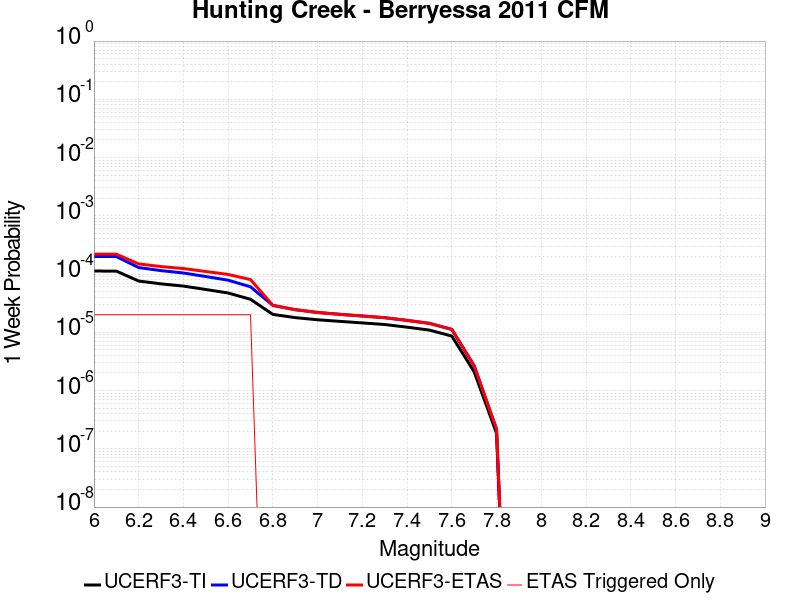 | 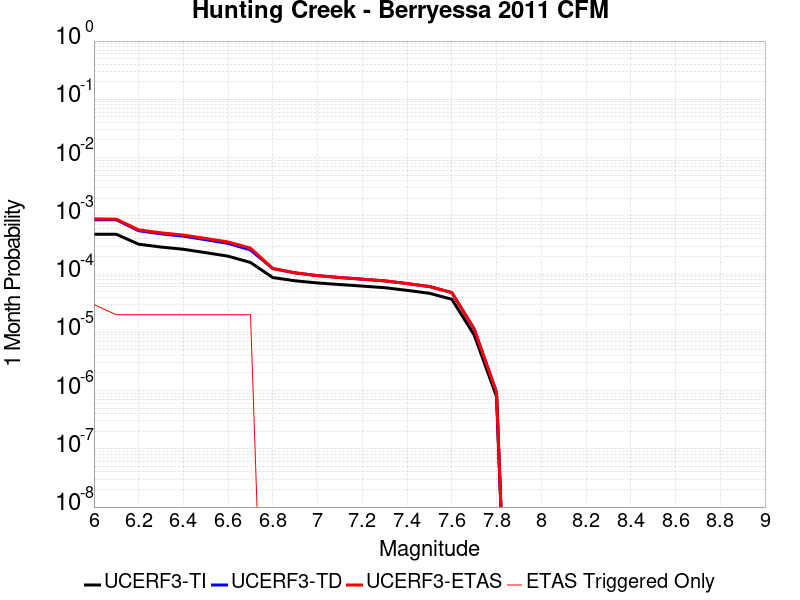 | 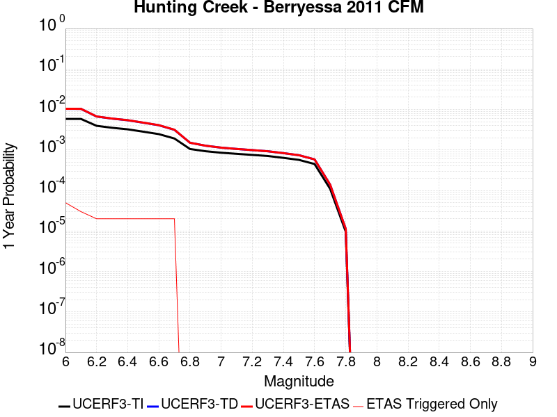 |  |

| Magnitude | 1 wk TI Prob | 1 wk TD Prob | 1 wk ETAS Prob | 1 wk ETAS/TD Gain | 1 wk ETAS Triggered Only | 1 mo TI Prob | 1 mo TD Prob | 1 mo ETAS Prob | 1 mo ETAS/TD Gain | 1 mo ETAS Triggered Only | 1 yr TI Prob | 1 yr TD Prob | 1 yr ETAS Prob | 1 yr ETAS/TD Gain | 1 yr ETAS Triggered Only | 10 yr TI Prob | 10 yr TD Prob | 10 yr ETAS Prob | 10 yr ETAS/TD Gain | 10 yr ETAS Triggered Only |
|-----|-----|-----|-----|-----|-----|-----|-----|-----|-----|-----|-----|-----|-----|-----|-----|-----|-----|-----|-----|-----|
| 6.0 | 1.1270982E-4 | 2.0012174E-4 | 2.0012174E-4 | 1.0 | 0.0 | 4.8295266E-4 | 8.5739547E-4 | 9.002496E-4 | 1.0499817 | 4.2890842E-5 | 0.0058641075 | 0.010386313 | 0.010428758 | 1.0040866 | 4.2890842E-5 | 0.057117578 | 0.09803703 | 0.09807571 | 1.0003946 | 4.2890842E-5 |
| 6.1 | 1.1239393E-4 | 1.9960315E-4 | 1.9960315E-4 | 1.0 | 0.0 | 4.8159933E-4 | 8.551744E-4 | 8.551744E-4 | 1.0 | 0.0 | 0.0058477195 | 0.010359551 | 0.010359551 | 1.0 | 0.0 | 0.056962132 | 0.09779551 | 0.09779551 | 1.0 | 0.0 |
| 6.2 | 7.596265E-5 | 1.2940196E-4 | 1.2940196E-4 | 1.0 | 0.0 | 3.2551357E-4 | 5.5444165E-4 | 5.5444165E-4 | 1.0 | 0.0 | 0.0039559277 | 0.0067210156 | 0.0067210156 | 1.0 | 0.0 | 0.038862433 | 0.0645915 | 0.0645915 | 1.0 | 0.0 |
| 6.3 | 6.78794E-5 | 1.145119E-4 | 1.145119E-4 | 1.0 | 0.0 | 2.9087928E-4 | 4.906513E-4 | 4.906513E-4 | 1.0 | 0.0 | 0.003535705 | 0.005952679 | 0.005952679 | 1.0 | 0.0 | 0.034799766 | 0.057465393 | 0.057465393 | 1.0 | 0.0 |
| 6.4 | 6.2165134E-5 | 1.0436625E-4 | 1.0436625E-4 | 1.0 | 0.0 | 2.6639478E-4 | 4.4721062E-4 | 4.4721062E-4 | 1.0 | 0.0 | 0.0032385332 | 0.005427573 | 0.005427573 | 1.0 | 0.0 | 0.03191742 | 0.052550517 | 0.052550517 | 1.0 | 0.0 |
| 6.5 | 5.4368087E-5 | 9.071415E-5 | 9.071415E-5 | 1.0 | 0.0 | 2.3298527E-4 | 3.8872007E-4 | 3.8872007E-4 | 1.0 | 0.0 | 0.0028329059 | 0.0047198683 | 0.0047198683 | 1.0 | 0.0 | 0.027970633 | 0.045880128 | 0.045880128 | 1.0 | 0.0 |
| 6.6 | 4.729947E-5 | 7.847572E-5 | 7.847572E-5 | 1.0 | 0.0 | 2.0269625E-4 | 3.362842E-4 | 3.362842E-4 | 1.0 | 0.0 | 0.002465034 | 0.0040849647 | 0.0040849647 | 1.0 | 0.0 | 0.02437869 | 0.03985155 | 0.03985155 | 1.0 | 0.0 |
| 6.7 | 3.6875328E-5 | 6.0451803E-5 | 6.0451803E-5 | 1.0 | 0.0 | 1.5802756E-4 | 2.59056E-4 | 2.59056E-4 | 1.0 | 0.0 | 0.0019222875 | 0.0031482063 | 0.0031482063 | 1.0 | 0.0 | 0.019057442 | 0.03089237 | 0.03089237 | 1.0 | 0.0 |
| 6.8 | 2.0292036E-5 | 2.8976308E-5 | 2.8976308E-5 | 1.0 | 0.0 | 8.6962966E-5 | 1.2417832E-4 | 1.2417832E-4 | 1.0 | 0.0 | 0.0010582599 | 0.0015108072 | 0.0015108072 | 1.0 | 0.0 | 0.010532344 | 0.014978523 | 0.014978523 | 1.0 | 0.0 |
| 6.9 | 1.7871042E-5 | 2.4472254E-5 | 2.4472254E-5 | 1.0 | 0.0 | 7.658793E-5 | 1.048769E-4 | 1.048769E-4 | 1.0 | 0.0 | 9.320591E-4 | 0.0012761299 | 0.0012761299 | 1.0 | 0.0 | 0.009281595 | 0.012679775 | 0.012679775 | 1.0 | 0.0 |
| 7.0 | 1.6415532E-5 | 2.1906277E-5 | 2.1906277E-5 | 1.0 | 0.0 | 7.035038E-5 | 9.3880684E-5 | 9.3880684E-5 | 1.0 | 0.0 | 8.561793E-4 | 0.0011424015 | 0.0011424015 | 1.0 | 0.0 | 0.008528882 | 0.01136452 | 0.01136452 | 1.0 | 0.0 |
| 7.1 | 1.5409885E-5 | 2.0346342E-5 | 2.0346342E-5 | 1.0 | 0.0 | 6.6040695E-5 | 8.7195716E-5 | 8.7195716E-5 | 1.0 | 0.0 | 8.0374884E-4 | 0.0010610938 | 0.0010610938 | 1.0 | 0.0 | 0.00800848 | 0.010560595 | 0.010560595 | 1.0 | 0.0 |
| 7.2 | 1.4497423E-5 | 1.9054964E-5 | 1.9054964E-5 | 1.0 | 0.0 | 6.213033E-5 | 8.166159E-5 | 8.166159E-5 | 1.0 | 0.0 | 7.5617427E-4 | 9.937795E-4 | 9.937795E-4 | 1.0 | 0.0 | 0.0075360634 | 0.009893929 | 0.009893929 | 1.0 | 0.0 |
| 7.3 | 1.3615175E-5 | 1.7826127E-5 | 1.7826127E-5 | 1.0 | 0.0 | 5.8349444E-5 | 7.639547E-5 | 7.639547E-5 | 1.0 | 0.0 | 7.101729E-4 | 9.297209E-4 | 9.297209E-4 | 1.0 | 0.0 | 0.0070790765 | 0.009258823 | 0.009258823 | 1.0 | 0.0 |
| 7.4 | 1.2252825E-5 | 1.602625E-5 | 1.602625E-5 | 1.0 | 0.0 | 5.251105E-5 | 6.868213E-5 | 6.868213E-5 | 1.0 | 0.0 | 6.391345E-4 | 8.35887E-4 | 8.35887E-4 | 1.0 | 0.0 | 0.0063729943 | 0.008327872 | 0.008327872 | 1.0 | 0.0 |
| 7.5 | 1.0913301E-5 | 1.4241117E-5 | 1.4241117E-5 | 1.0 | 0.0 | 4.6770452E-5 | 6.1031948E-5 | 6.1031948E-5 | 1.0 | 0.0 | 5.6928146E-4 | 7.4281334E-4 | 7.4281334E-4 | 1.0 | 0.0 | 0.0056782532 | 0.0074036797 | 0.0074036797 | 1.0 | 0.0 |
| 7.6 | 8.623192E-6 | 1.12346415E-5 | 1.12346415E-5 | 1.0 | 0.0 | 3.6956015E-5 | 4.814759E-5 | 4.814759E-5 | 1.0 | 0.0 | 4.4984656E-4 | 5.8604183E-4 | 5.8604183E-4 | 1.0 | 0.0 | 0.00448937 | 0.0058452785 | 0.0058452785 | 1.0 | 0.0 |
| 7.7 | 2.0993634E-6 | 2.662584E-6 | 2.662584E-6 | 1.0 | 0.0 | 8.997241E-6 | 1.1411025E-5 | 1.1411025E-5 | 1.0 | 0.0 | 1.09535904E-4 | 1.3892044E-4 | 1.3892044E-4 | 1.0 | 0.0 | 0.0010948193 | 0.0013883426 | 0.0013883426 | 1.0 | 0.0 |
| 7.8 | 1.8428308E-7 | 2.167437E-7 | 2.167437E-7 | 1.0 | 0.0 | 7.897844E-7 | 9.289013E-7 | 9.289013E-7 | 1.0 | 0.0 | 9.615583E-6 | 1.1309318E-5 | 1.1309318E-5 | 1.0 | 0.0 | 9.615166E-5 | 1.13086026E-4 | 1.13086026E-4 | 1.0 | 0.0 |

## Santa Ynez (East)
*[(top)](#table-of-contents)*

| 1 Week | 1 Month | 1 Year | 10 Year |
|-----|-----|-----|-----|
|  |  |  |  |

| Magnitude | 1 wk TI Prob | 1 wk TD Prob | 1 wk ETAS Prob | 1 wk ETAS/TD Gain | 1 wk ETAS Triggered Only | 1 mo TI Prob | 1 mo TD Prob | 1 mo ETAS Prob | 1 mo ETAS/TD Gain | 1 mo ETAS Triggered Only | 1 yr TI Prob | 1 yr TD Prob | 1 yr ETAS Prob | 1 yr ETAS/TD Gain | 1 yr ETAS Triggered Only | 10 yr TI Prob | 10 yr TD Prob | 10 yr ETAS Prob | 10 yr ETAS/TD Gain | 10 yr ETAS Triggered Only |
|-----|-----|-----|-----|-----|-----|-----|-----|-----|-----|-----|-----|-----|-----|-----|-----|-----|-----|-----|-----|-----|
| 6.0 | 3.2269712E-5 | 3.67505E-5 | 3.67505E-5 | 1.0 | 0.0 | 1.3829143E-4 | 1.5749598E-4 | 1.5749598E-4 | 1.0 | 0.0 | 0.0016823979 | 0.0019164166 | 0.0019164166 | 1.0 | 0.0 | 0.016697178 | 0.019056441 | 0.019098515 | 1.0022079 | 4.2890842E-5 |
| 6.1 | 3.2269712E-5 | 3.67505E-5 | 3.67505E-5 | 1.0 | 0.0 | 1.3829143E-4 | 1.5749598E-4 | 1.5749598E-4 | 1.0 | 0.0 | 0.0016823979 | 0.0019164166 | 0.0019164166 | 1.0 | 0.0 | 0.016697178 | 0.019056441 | 0.019098515 | 1.0022079 | 4.2890842E-5 |
| 6.2 | 3.2269712E-5 | 3.67505E-5 | 3.67505E-5 | 1.0 | 0.0 | 1.3829143E-4 | 1.5749598E-4 | 1.5749598E-4 | 1.0 | 0.0 | 0.0016823979 | 0.0019164166 | 0.0019164166 | 1.0 | 0.0 | 0.016697178 | 0.019056441 | 0.019098515 | 1.0022079 | 4.2890842E-5 |
| 6.3 | 3.2269712E-5 | 3.67505E-5 | 3.67505E-5 | 1.0 | 0.0 | 1.3829143E-4 | 1.5749598E-4 | 1.5749598E-4 | 1.0 | 0.0 | 0.0016823979 | 0.0019164166 | 0.0019164166 | 1.0 | 0.0 | 0.016697178 | 0.019056441 | 0.019098515 | 1.0022079 | 4.2890842E-5 |
| 6.4 | 1.4404779E-5 | 1.4849382E-5 | 1.4849382E-5 | 1.0 | 0.0 | 6.1733306E-5 | 6.363868E-5 | 6.363868E-5 | 1.0 | 0.0 | 7.513438E-4 | 7.745306E-4 | 7.745306E-4 | 1.0 | 0.0 | 0.0074880854 | 0.007718862 | 0.007718862 | 1.0 | 0.0 |
| 6.5 | 1.4404779E-5 | 1.4849382E-5 | 1.4849382E-5 | 1.0 | 0.0 | 6.1733306E-5 | 6.363868E-5 | 6.363868E-5 | 1.0 | 0.0 | 7.513438E-4 | 7.745306E-4 | 7.745306E-4 | 1.0 | 0.0 | 0.0074880854 | 0.007718862 | 0.007718862 | 1.0 | 0.0 |
| 6.6 | 1.280208E-5 | 1.3011947E-5 | 1.3011947E-5 | 1.0 | 0.0 | 5.4864904E-5 | 5.5764307E-5 | 5.5764307E-5 | 1.0 | 0.0 | 6.6777546E-4 | 6.787207E-4 | 6.787207E-4 | 1.0 | 0.0 | 0.006657724 | 0.0067666885 | 0.0067666885 | 1.0 | 0.0 |
| 6.7 | 1.2457027E-5 | 1.2628468E-5 | 1.2628468E-5 | 1.0 | 0.0 | 5.3386164E-5 | 5.412089E-5 | 5.412089E-5 | 1.0 | 0.0 | 6.497827E-4 | 6.587243E-4 | 6.587243E-4 | 1.0 | 0.0 | 0.00647886 | 0.006567915 | 0.006567915 | 1.0 | 0.0 |
| 6.8 | 1.2095134E-5 | 1.2230915E-5 | 1.2230915E-5 | 1.0 | 0.0 | 5.1835254E-5 | 5.241716E-5 | 5.241716E-5 | 1.0 | 0.0 | 6.309115E-4 | 6.379937E-4 | 6.379937E-4 | 1.0 | 0.0 | 0.0062912325 | 0.006361809 | 0.006361809 | 1.0 | 0.0 |
| 6.9 | 1.1104036E-5 | 1.1157347E-5 | 1.1157347E-5 | 1.0 | 0.0 | 4.758786E-5 | 4.781633E-5 | 4.781633E-5 | 1.0 | 0.0 | 5.7922816E-4 | 5.820096E-4 | 5.820096E-4 | 1.0 | 0.0 | 0.005777207 | 0.0058049993 | 0.0058049993 | 1.0 | 0.0 |
| 7.0 | 1.0577444E-5 | 1.058168E-5 | 1.058168E-5 | 1.0 | 0.0 | 4.5331115E-5 | 4.5349276E-5 | 4.5349276E-5 | 1.0 | 0.0 | 5.5176654E-4 | 5.519888E-4 | 5.519888E-4 | 1.0 | 0.0 | 0.0055039856 | 0.0055063153 | 0.0055063153 | 1.0 | 0.0 |
| 7.1 | 1.0021775E-5 | 9.980988E-6 | 9.980988E-6 | 1.0 | 0.0 | 4.294976E-5 | 4.2774966E-5 | 4.2774966E-5 | 1.0 | 0.0 | 5.2278786E-4 | 5.2066194E-4 | 5.2066194E-4 | 1.0 | 0.0 | 0.0052155964 | 0.0051945536 | 0.0051945536 | 1.0 | 0.0 |
| 7.2 | 8.874109E-6 | 8.748793E-6 | 8.748793E-6 | 1.0 | 0.0 | 3.8031343E-5 | 3.7494297E-5 | 3.7494297E-5 | 1.0 | 0.0 | 4.629332E-4 | 4.5639853E-4 | 4.5639853E-4 | 1.0 | 0.0 | 0.0046197 | 0.0045547304 | 0.0045547304 | 1.0 | 0.0 |
| 7.3 | 7.5504267E-6 | 7.5051175E-6 | 7.5051175E-6 | 1.0 | 0.0 | 3.235857E-5 | 3.21644E-5 | 3.21644E-5 | 1.0 | 0.0 | 3.9389438E-4 | 3.915322E-4 | 3.915322E-4 | 1.0 | 0.0 | 0.0039319694 | 0.003908531 | 0.003908531 | 1.0 | 0.0 |
| 7.4 | 6.309394E-6 | 6.1831556E-6 | 6.1831556E-6 | 1.0 | 0.0 | 2.703998E-5 | 2.6498974E-5 | 2.6498974E-5 | 1.0 | 0.0 | 3.2916202E-4 | 3.225782E-4 | 3.225782E-4 | 1.0 | 0.0 | 0.003286749 | 0.003221197 | 0.003221197 | 1.0 | 0.0 |
| 7.5 | 4.6103073E-6 | 4.4408903E-6 | 4.4408903E-6 | 1.0 | 0.0 | 1.975831E-5 | 1.9032252E-5 | 1.9032252E-5 | 1.0 | 0.0 | 2.4053088E-4 | 2.3169373E-4 | 2.3169373E-4 | 1.0 | 0.0 | 0.002402707 | 0.002314591 | 0.002314591 | 1.0 | 0.0 |
| 7.6 | 1.2858658E-6 | 1.3008173E-6 | 1.3008173E-6 | 1.0 | 0.0 | 5.5108417E-6 | 5.5749197E-6 | 5.5749197E-6 | 1.0 | 0.0 | 6.7092435E-5 | 6.78726E-5 | 6.78726E-5 | 1.0 | 0.0 | 6.707218E-4 | 6.785256E-4 | 6.785256E-4 | 1.0 | 0.0 |
| 7.7 | 5.3302307E-7 | 5.612138E-7 | 5.612138E-7 | 1.0 | 0.0 | 2.2843826E-6 | 2.4052001E-6 | 2.4052001E-6 | 1.0 | 0.0 | 2.7812002E-5 | 2.9282954E-5 | 2.9282954E-5 | 1.0 | 0.0 | 2.7808524E-4 | 2.9279452E-4 | 2.9279452E-4 | 1.0 | 0.0 |
| 7.8 | 4.613933E-8 | 4.80301E-8 | 4.80301E-8 | 1.0 | 0.0 | 1.9773998E-7 | 2.0584326E-7 | 2.0584326E-7 | 1.0 | 0.0 | 2.4074816E-6 | 2.5061388E-6 | 2.5061388E-6 | 1.0 | 0.0 | 2.4074554E-5 | 2.5061116E-5 | 2.5061116E-5 | 1.0 | 0.0 |

## Simi-Santa Rosa
*[(top)](#table-of-contents)*

| 1 Week | 1 Month | 1 Year | 10 Year |
|-----|-----|-----|-----|
| 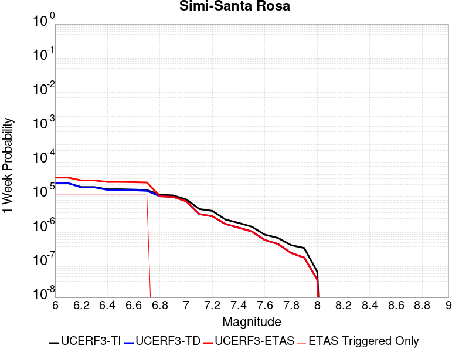 |  |  |  |

| Magnitude | 1 wk TI Prob | 1 wk TD Prob | 1 wk ETAS Prob | 1 wk ETAS/TD Gain | 1 wk ETAS Triggered Only | 1 mo TI Prob | 1 mo TD Prob | 1 mo ETAS Prob | 1 mo ETAS/TD Gain | 1 mo ETAS Triggered Only | 1 yr TI Prob | 1 yr TD Prob | 1 yr ETAS Prob | 1 yr ETAS/TD Gain | 1 yr ETAS Triggered Only | 10 yr TI Prob | 10 yr TD Prob | 10 yr ETAS Prob | 10 yr ETAS/TD Gain | 10 yr ETAS Triggered Only |
|-----|-----|-----|-----|-----|-----|-----|-----|-----|-----|-----|-----|-----|-----|-----|-----|-----|-----|-----|-----|-----|
| 6.0 | 2.198912E-5 | 2.2275442E-5 | 6.516533E-5 | 2.9254336 | 4.2890842E-5 | 9.4235686E-5 | 9.5462936E-5 | 1.3834969E-4 | 1.4492502 | 4.2890842E-5 | 0.0011467156 | 0.0011616853 | 0.0012045264 | 1.0368783 | 4.2890842E-5 | 0.011408163 | 0.011560575 | 0.01160297 | 1.0036672 | 4.2890842E-5 |
| 6.1 | 2.198912E-5 | 2.2275442E-5 | 6.516533E-5 | 2.9254336 | 4.2890842E-5 | 9.4235686E-5 | 9.5462936E-5 | 1.3834969E-4 | 1.4492502 | 4.2890842E-5 | 0.0011467156 | 0.0011616853 | 0.0012045264 | 1.0368783 | 4.2890842E-5 | 0.011408163 | 0.011560575 | 0.01160297 | 1.0036672 | 4.2890842E-5 |
| 6.2 | 1.69983E-5 | 1.6668559E-5 | 5.9558686E-5 | 3.5731156 | 4.2890842E-5 | 7.284782E-5 | 7.143489E-5 | 1.1432267E-4 | 1.6003758 | 4.2890842E-5 | 8.865613E-4 | 8.6940196E-4 | 9.122555E-4 | 1.0492909 | 4.2890842E-5 | 0.008830327 | 0.008662928 | 0.0087054465 | 1.0049082 | 4.2890842E-5 |
| 6.3 | 1.69983E-5 | 1.6668559E-5 | 5.9558686E-5 | 3.5731156 | 4.2890842E-5 | 7.284782E-5 | 7.143489E-5 | 1.1432267E-4 | 1.6003758 | 4.2890842E-5 | 8.865613E-4 | 8.6940196E-4 | 9.122555E-4 | 1.0492909 | 4.2890842E-5 | 0.008830327 | 0.008662928 | 0.0087054465 | 1.0049082 | 4.2890842E-5 |
| 6.4 | 1.4666188E-5 | 1.4052543E-5 | 5.6942783E-5 | 4.0521336 | 4.2890842E-5 | 6.285358E-5 | 6.0223934E-5 | 1.03112194E-4 | 1.7121464 | 4.2890842E-5 | 7.6497364E-4 | 7.3300465E-4 | 7.7586406E-4 | 1.0584708 | 4.2890842E-5 | 0.0076234564 | 0.007308344 | 0.0073509216 | 1.0058259 | 4.2890842E-5 |
| 6.5 | 1.4666188E-5 | 1.4052543E-5 | 5.6942783E-5 | 4.0521336 | 4.2890842E-5 | 6.285358E-5 | 6.0223934E-5 | 1.03112194E-4 | 1.7121464 | 4.2890842E-5 | 7.6497364E-4 | 7.3300465E-4 | 7.7586406E-4 | 1.0584708 | 4.2890842E-5 | 0.0076234564 | 0.007308344 | 0.0073509216 | 1.0058259 | 4.2890842E-5 |
| 6.6 | 1.4377586E-5 | 1.3729583E-5 | 5.6619836E-5 | 4.12393 | 4.2890842E-5 | 6.1616774E-5 | 5.883988E-5 | 1.017282E-4 | 1.7288988 | 4.2890842E-5 | 7.4992597E-4 | 7.1616494E-4 | 7.5902505E-4 | 1.0598468 | 4.2890842E-5 | 0.007474003 | 0.0071410383 | 0.007183623 | 1.0059633 | 4.2890842E-5 |
| 6.7 | 1.3881404E-5 | 1.320755E-5 | 5.6097826E-5 | 4.247406 | 4.2890842E-5 | 5.9490372E-5 | 5.66027E-5 | 9.949112E-5 | 1.7577097 | 4.2890842E-5 | 7.240546E-4 | 6.8894465E-4 | 7.31806E-4 | 1.062213 | 4.2890842E-5 | 0.007217 | 0.006870538 | 0.0069131344 | 1.0061998 | 4.2890842E-5 |
| 6.8 | 1.0176516E-5 | 9.154151E-6 | 9.154151E-6 | 1.0 | 0.0 | 4.3612912E-5 | 3.9231574E-5 | 3.9231574E-5 | 1.0 | 0.0 | 5.308578E-4 | 4.7755634E-4 | 4.7755634E-4 | 1.0 | 0.0 | 0.0052959146 | 0.004766934 | 0.004766934 | 1.0 | 0.0 |
| 6.9 | 9.699797E-6 | 8.774719E-6 | 8.774719E-6 | 1.0 | 0.0 | 4.15699E-5 | 3.7605492E-5 | 3.7605492E-5 | 1.0 | 0.0 | 5.05996E-4 | 4.577671E-4 | 4.577671E-4 | 1.0 | 0.0 | 0.005048454 | 0.0045698597 | 0.0045698597 | 1.0 | 0.0 |
| 7.0 | 7.4049476E-6 | 6.559333E-6 | 6.559333E-6 | 1.0 | 0.0 | 3.1735104E-5 | 2.8111197E-5 | 2.8111197E-5 | 1.0 | 0.0 | 3.8630638E-4 | 3.422127E-4 | 3.422127E-4 | 1.0 | 0.0 | 0.0038563553 | 0.0034180996 | 0.0034180996 | 1.0 | 0.0 |
| 7.1 | 3.873439E-6 | 2.7595095E-6 | 2.7595095E-6 | 1.0 | 0.0 | 1.6600346E-5 | 1.1826417E-5 | 1.1826417E-5 | 1.0 | 0.0 | 2.0209046E-4 | 1.4397735E-4 | 1.4397735E-4 | 1.0 | 0.0 | 0.0020190678 | 0.0014388643 | 0.0014388643 | 1.0 | 0.0 |
| 7.2 | 3.417706E-6 | 2.3676484E-6 | 2.3676484E-6 | 1.0 | 0.0 | 1.4647229E-5 | 1.0147027E-5 | 1.0147027E-5 | 1.0 | 0.0 | 1.7831543E-4 | 1.2353327E-4 | 1.2353327E-4 | 1.0 | 0.0 | 0.0017817242 | 0.0012346683 | 0.0012346683 | 1.0 | 0.0 |
| 7.3 | 1.90225E-6 | 1.4073753E-6 | 1.4073753E-6 | 1.0 | 0.0 | 8.152474E-6 | 6.0315947E-6 | 6.0315947E-6 | 1.0 | 0.0 | 9.9251854E-5 | 7.343221E-5 | 7.343221E-5 | 1.0 | 0.0 | 9.920754E-4 | 7.340817E-4 | 7.340817E-4 | 1.0 | 0.0 |
| 7.4 | 1.5170556E-6 | 1.1024773E-6 | 1.1024773E-6 | 1.0 | 0.0 | 6.5016507E-6 | 4.724894E-6 | 4.724894E-6 | 1.0 | 0.0 | 7.915472E-5 | 5.7524077E-5 | 5.7524077E-5 | 1.0 | 0.0 | 7.9126534E-4 | 5.7509297E-4 | 5.7509297E-4 | 1.0 | 0.0 |
| 7.5 | 1.178732E-6 | 8.535102E-7 | 8.535102E-7 | 1.0 | 0.0 | 5.0516987E-6 | 3.6578958E-6 | 3.6578958E-6 | 1.0 | 0.0 | 6.1502695E-5 | 4.453398E-5 | 4.453398E-5 | 1.0 | 0.0 | 6.148568E-4 | 4.452515E-4 | 4.452515E-4 | 1.0 | 0.0 |
| 7.6 | 6.8722386E-7 | 4.793198E-7 | 4.793198E-7 | 1.0 | 0.0 | 2.9452417E-6 | 2.054226E-6 | 2.054226E-6 | 1.0 | 0.0 | 3.5857727E-5 | 2.5009915E-5 | 2.5009915E-5 | 1.0 | 0.0 | 3.5851944E-4 | 2.5007114E-4 | 2.5007114E-4 | 1.0 | 0.0 |
| 7.7 | 5.5126515E-7 | 3.6731157E-7 | 3.6731157E-7 | 1.0 | 0.0 | 2.3625628E-6 | 1.5741915E-6 | 1.5741915E-6 | 1.0 | 0.0 | 2.8763823E-5 | 1.9165615E-5 | 1.9165615E-5 | 1.0 | 0.0 | 2.87601E-4 | 1.9163972E-4 | 1.9163972E-4 | 1.0 | 0.0 |
| 7.8 | 3.3860243E-7 | 2.0075942E-7 | 2.0075942E-7 | 1.0 | 0.0 | 1.4511525E-6 | 8.6039717E-7 | 8.6039717E-7 | 1.0 | 0.0 | 1.7667637E-5 | 1.0475286E-5 | 1.0475286E-5 | 1.0 | 0.0 | 1.7666233E-4 | 1.04747975E-4 | 1.04747975E-4 | 1.0 | 0.0 |
| 7.9 | 2.7955386E-7 | 1.4649108E-7 | 1.4649108E-7 | 1.0 | 0.0 | 1.1980875E-6 | 6.278188E-7 | 6.278188E-7 | 1.0 | 0.0 | 1.4586617E-5 | 7.643667E-6 | 7.643667E-6 | 1.0 | 0.0 | 1.458566E-4 | 7.643409E-5 | 7.643409E-5 | 1.0 | 0.0 |
| 8.0 | 5.6259015E-8 | 3.3355324E-8 | 3.3355324E-8 | 1.0 | 0.0 | 2.4111003E-7 | 1.4295138E-7 | 1.4295138E-7 | 1.0 | 0.0 | 2.9355108E-6 | 1.7404317E-6 | 1.7404317E-6 | 1.0 | 0.0 | 2.935472E-5 | 1.7404194E-5 | 1.7404194E-5 | 1.0 | 0.0 |

## Pine Mtn
*[(top)](#table-of-contents)*

| 1 Week | 1 Month | 1 Year | 10 Year |
|-----|-----|-----|-----|
|  |  |  |  |

| Magnitude | 1 wk TI Prob | 1 wk TD Prob | 1 wk ETAS Prob | 1 wk ETAS/TD Gain | 1 wk ETAS Triggered Only | 1 mo TI Prob | 1 mo TD Prob | 1 mo ETAS Prob | 1 mo ETAS/TD Gain | 1 mo ETAS Triggered Only | 1 yr TI Prob | 1 yr TD Prob | 1 yr ETAS Prob | 1 yr ETAS/TD Gain | 1 yr ETAS Triggered Only | 10 yr TI Prob | 10 yr TD Prob | 10 yr ETAS Prob | 10 yr ETAS/TD Gain | 10 yr ETAS Triggered Only |
|-----|-----|-----|-----|-----|-----|-----|-----|-----|-----|-----|-----|-----|-----|-----|-----|-----|-----|-----|-----|-----|
| 6.0 | 6.894797E-6 | 7.225461E-6 | 7.225461E-6 | 1.0 | 0.0 | 2.9548795E-5 | 3.096591E-5 | 3.096591E-5 | 1.0 | 0.0 | 3.596972E-4 | 3.7694772E-4 | 3.7694772E-4 | 1.0 | 0.0 | 0.0035911554 | 0.003763381 | 0.0038061105 | 1.011354 | 4.2890842E-5 |
| 6.1 | 6.894797E-6 | 7.225461E-6 | 7.225461E-6 | 1.0 | 0.0 | 2.9548795E-5 | 3.096591E-5 | 3.096591E-5 | 1.0 | 0.0 | 3.596972E-4 | 3.7694772E-4 | 3.7694772E-4 | 1.0 | 0.0 | 0.0035911554 | 0.003763381 | 0.0038061105 | 1.011354 | 4.2890842E-5 |
| 6.2 | 6.894797E-6 | 7.225461E-6 | 7.225461E-6 | 1.0 | 0.0 | 2.9548795E-5 | 3.096591E-5 | 3.096591E-5 | 1.0 | 0.0 | 3.596972E-4 | 3.7694772E-4 | 3.7694772E-4 | 1.0 | 0.0 | 0.0035911554 | 0.003763381 | 0.0038061105 | 1.011354 | 4.2890842E-5 |
| 6.3 | 6.894797E-6 | 7.225461E-6 | 7.225461E-6 | 1.0 | 0.0 | 2.9548795E-5 | 3.096591E-5 | 3.096591E-5 | 1.0 | 0.0 | 3.596972E-4 | 3.7694772E-4 | 3.7694772E-4 | 1.0 | 0.0 | 0.0035911554 | 0.003763381 | 0.0038061105 | 1.011354 | 4.2890842E-5 |
| 6.4 | 6.894797E-6 | 7.225461E-6 | 7.225461E-6 | 1.0 | 0.0 | 2.9548795E-5 | 3.096591E-5 | 3.096591E-5 | 1.0 | 0.0 | 3.596972E-4 | 3.7694772E-4 | 3.7694772E-4 | 1.0 | 0.0 | 0.0035911554 | 0.003763381 | 0.0038061105 | 1.011354 | 4.2890842E-5 |
| 6.5 | 6.894797E-6 | 7.225461E-6 | 7.225461E-6 | 1.0 | 0.0 | 2.9548795E-5 | 3.096591E-5 | 3.096591E-5 | 1.0 | 0.0 | 3.596972E-4 | 3.7694772E-4 | 3.7694772E-4 | 1.0 | 0.0 | 0.0035911554 | 0.003763381 | 0.0038061105 | 1.011354 | 4.2890842E-5 |
| 6.6 | 6.894797E-6 | 7.225461E-6 | 7.225461E-6 | 1.0 | 0.0 | 2.9548795E-5 | 3.096591E-5 | 3.096591E-5 | 1.0 | 0.0 | 3.596972E-4 | 3.7694772E-4 | 3.7694772E-4 | 1.0 | 0.0 | 0.0035911554 | 0.003763381 | 0.0038061105 | 1.011354 | 4.2890842E-5 |
| 6.7 | 6.0867933E-6 | 6.3971133E-6 | 6.3971133E-6 | 1.0 | 0.0 | 2.6085996E-5 | 2.7415923E-5 | 2.7415923E-5 | 1.0 | 0.0 | 3.1755073E-4 | 3.3373994E-4 | 3.3373994E-4 | 1.0 | 0.0 | 0.0031709734 | 0.0033326065 | 0.0033753542 | 1.0128272 | 4.2890842E-5 |
| 6.8 | 5.6530425E-6 | 5.9505956E-6 | 5.9505956E-6 | 1.0 | 0.0 | 2.42271E-5 | 2.5502315E-5 | 2.5502315E-5 | 1.0 | 0.0 | 2.94925E-4 | 3.104485E-4 | 3.104485E-4 | 1.0 | 0.0 | 0.002945339 | 0.0031003528 | 0.0031431108 | 1.0137913 | 4.2890842E-5 |
| 6.9 | 4.6015225E-6 | 4.863834E-6 | 4.863834E-6 | 1.0 | 0.0 | 1.9720663E-5 | 2.0844845E-5 | 2.0844845E-5 | 1.0 | 0.0 | 2.4007261E-4 | 2.5375787E-4 | 2.5375787E-4 | 1.0 | 0.0 | 0.0023981342 | 0.0025348254 | 0.0025776075 | 1.0168778 | 4.2890842E-5 |
| 7.0 | 4.4875965E-6 | 4.747473E-6 | 4.747473E-6 | 1.0 | 0.0 | 1.9232413E-5 | 2.0346162E-5 | 2.0346162E-5 | 1.0 | 0.0 | 2.3412947E-4 | 2.4768783E-4 | 2.4768783E-4 | 1.0 | 0.0 | 0.0023388295 | 0.0024742614 | 0.0025170462 | 1.0172919 | 4.2890842E-5 |
| 7.1 | 3.203907E-6 | 3.4294096E-6 | 3.4294096E-6 | 1.0 | 0.0 | 1.3730958E-5 | 1.4697391E-5 | 1.4697391E-5 | 1.0 | 0.0 | 1.6716159E-4 | 1.789267E-4 | 1.789267E-4 | 1.0 | 0.0 | 0.0016703589 | 0.0017878925 | 0.0018307067 | 1.0239468 | 4.2890842E-5 |
| 7.2 | 2.2060601E-6 | 2.3784817E-6 | 2.3784817E-6 | 1.0 | 0.0 | 9.4545085E-6 | 1.0193455E-5 | 1.0193455E-5 | 1.0 | 0.0 | 1.15102564E-4 | 1.240987E-4 | 1.240987E-4 | 1.0 | 0.0 | 0.0011504296 | 0.0012403389 | 0.0012403389 | 1.0 | 0.0 |
| 7.3 | 1.3765207E-6 | 1.5216481E-6 | 1.5216481E-6 | 1.0 | 0.0 | 5.899361E-6 | 6.521333E-6 | 6.521333E-6 | 1.0 | 0.0 | 7.182235E-5 | 7.939443E-5 | 7.939443E-5 | 1.0 | 0.0 | 7.1799144E-4 | 7.936697E-4 | 7.936697E-4 | 1.0 | 0.0 |
| 7.4 | 1.1245983E-6 | 1.2587075E-6 | 1.2587075E-6 | 1.0 | 0.0 | 4.819698E-6 | 5.39445E-6 | 5.39445E-6 | 1.0 | 0.0 | 5.8678244E-5 | 6.567554E-5 | 6.567554E-5 | 1.0 | 0.0 | 5.866275E-4 | 6.5656955E-4 | 6.5656955E-4 | 1.0 | 0.0 |
| 7.5 | 8.031682E-7 | 9.276951E-7 | 9.276951E-7 | 1.0 | 0.0 | 3.4421448E-6 | 3.9758306E-6 | 3.9758306E-6 | 1.0 | 0.0 | 4.1907308E-5 | 4.840473E-5 | 4.840473E-5 | 1.0 | 0.0 | 4.1899405E-4 | 4.8394862E-4 | 4.8394862E-4 | 1.0 | 0.0 |
| 7.6 | 4.8953444E-7 | 6.003009E-7 | 6.003009E-7 | 1.0 | 0.0 | 2.098003E-6 | 2.5727159E-6 | 2.5727159E-6 | 1.0 | 0.0 | 2.5542888E-5 | 3.1322415E-5 | 3.1322415E-5 | 1.0 | 0.0 | 2.5539953E-4 | 3.1318486E-4 | 3.1318486E-4 | 1.0 | 0.0 |
| 7.7 | 6.634529E-8 | 6.788826E-8 | 6.788826E-8 | 1.0 | 0.0 | 2.843369E-7 | 2.9094966E-7 | 2.9094966E-7 | 1.0 | 0.0 | 3.4617963E-6 | 3.5423066E-6 | 3.5423066E-6 | 1.0 | 0.0 | 3.4617424E-5 | 3.542255E-5 | 3.542255E-5 | 1.0 | 0.0 |
| 7.8 | 9.235578E-9 | 9.488566E-9 | 9.488566E-9 | 1.0 | 0.0 | 3.9581046E-8 | 4.0665284E-8 | 4.0665284E-8 | 1.0 | 0.0 | 4.818991E-7 | 4.950997E-7 | 4.950997E-7 | 1.0 | 0.0 | 4.8189804E-6 | 4.950988E-6 | 4.950988E-6 | 1.0 | 0.0 |

## San Jacinto (Lytle Creek connector)
*[(top)](#table-of-contents)*

| 1 Week | 1 Month | 1 Year | 10 Year |
|-----|-----|-----|-----|
|  |  | 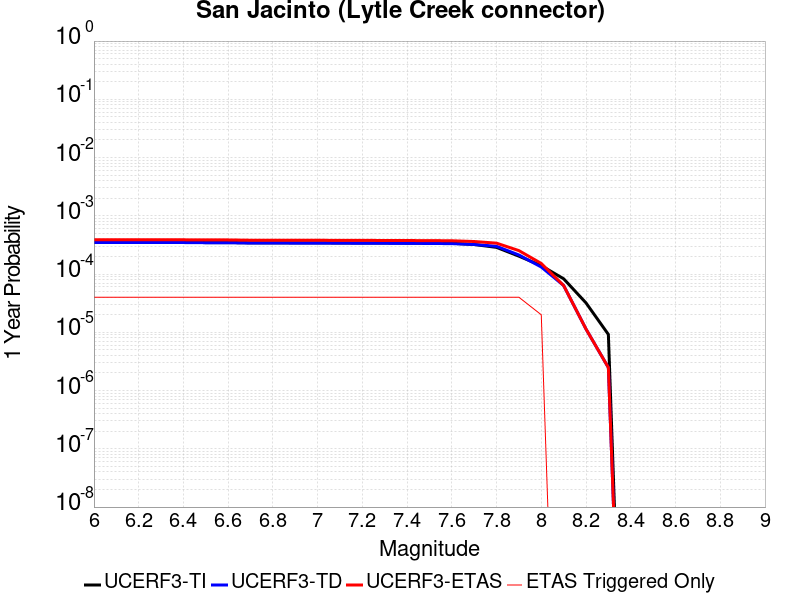 |  |

| Magnitude | 1 wk TI Prob | 1 wk TD Prob | 1 wk ETAS Prob | 1 wk ETAS/TD Gain | 1 wk ETAS Triggered Only | 1 mo TI Prob | 1 mo TD Prob | 1 mo ETAS Prob | 1 mo ETAS/TD Gain | 1 mo ETAS Triggered Only | 1 yr TI Prob | 1 yr TD Prob | 1 yr ETAS Prob | 1 yr ETAS/TD Gain | 1 yr ETAS Triggered Only | 10 yr TI Prob | 10 yr TD Prob | 10 yr ETAS Prob | 10 yr ETAS/TD Gain | 10 yr ETAS Triggered Only |
|-----|-----|-----|-----|-----|-----|-----|-----|-----|-----|-----|-----|-----|-----|-----|-----|-----|-----|-----|-----|-----|
| 6.0 | 6.693995E-6 | 6.660216E-6 | 6.660216E-6 | 1.0 | 0.0 | 2.8688235E-5 | 2.854347E-5 | 2.854347E-5 | 1.0 | 0.0 | 3.492233E-4 | 3.4746144E-4 | 3.4746144E-4 | 1.0 | 0.0 | 0.00348675 | 0.0035493854 | 0.003592124 | 1.0120411 | 4.2890842E-5 |
| 6.1 | 6.693995E-6 | 6.660216E-6 | 6.660216E-6 | 1.0 | 0.0 | 2.8688235E-5 | 2.854347E-5 | 2.854347E-5 | 1.0 | 0.0 | 3.492233E-4 | 3.4746144E-4 | 3.4746144E-4 | 1.0 | 0.0 | 0.00348675 | 0.0035493854 | 0.003592124 | 1.0120411 | 4.2890842E-5 |
| 6.2 | 6.693995E-6 | 6.660216E-6 | 6.660216E-6 | 1.0 | 0.0 | 2.8688235E-5 | 2.854347E-5 | 2.854347E-5 | 1.0 | 0.0 | 3.492233E-4 | 3.4746144E-4 | 3.4746144E-4 | 1.0 | 0.0 | 0.00348675 | 0.0035493854 | 0.003592124 | 1.0120411 | 4.2890842E-5 |
| 6.3 | 6.693995E-6 | 6.660216E-6 | 6.660216E-6 | 1.0 | 0.0 | 2.8688235E-5 | 2.854347E-5 | 2.854347E-5 | 1.0 | 0.0 | 3.492233E-4 | 3.4746144E-4 | 3.4746144E-4 | 1.0 | 0.0 | 0.00348675 | 0.0035493854 | 0.003592124 | 1.0120411 | 4.2890842E-5 |
| 6.4 | 6.693995E-6 | 6.660216E-6 | 6.660216E-6 | 1.0 | 0.0 | 2.8688235E-5 | 2.854347E-5 | 2.854347E-5 | 1.0 | 0.0 | 3.492233E-4 | 3.4746144E-4 | 3.4746144E-4 | 1.0 | 0.0 | 0.00348675 | 0.0035493854 | 0.003592124 | 1.0120411 | 4.2890842E-5 |
| 6.5 | 6.6561875E-6 | 6.6204343E-6 | 6.6204343E-6 | 1.0 | 0.0 | 2.8526205E-5 | 2.837298E-5 | 2.837298E-5 | 1.0 | 0.0 | 3.472512E-4 | 3.4538636E-4 | 3.4538636E-4 | 1.0 | 0.0 | 0.0034670907 | 0.003528701 | 0.0035714402 | 1.012112 | 4.2890842E-5 |
| 6.6 | 6.6561875E-6 | 6.6204343E-6 | 6.6204343E-6 | 1.0 | 0.0 | 2.8526205E-5 | 2.837298E-5 | 2.837298E-5 | 1.0 | 0.0 | 3.472512E-4 | 3.4538636E-4 | 3.4538636E-4 | 1.0 | 0.0 | 0.0034670907 | 0.003528701 | 0.0035714402 | 1.012112 | 4.2890842E-5 |
| 6.7 | 6.5802237E-6 | 6.539611E-6 | 6.539611E-6 | 1.0 | 0.0 | 2.8200653E-5 | 2.8026603E-5 | 2.8026603E-5 | 1.0 | 0.0 | 3.4328885E-4 | 3.4117055E-4 | 3.4117055E-4 | 1.0 | 0.0 | 0.0034275902 | 0.0034866752 | 0.0035294166 | 1.0122584 | 4.2890842E-5 |
| 6.8 | 6.575632E-6 | 6.5341005E-6 | 6.5341005E-6 | 1.0 | 0.0 | 2.8180975E-5 | 2.8002989E-5 | 2.8002989E-5 | 1.0 | 0.0 | 3.4304935E-4 | 3.4088313E-4 | 3.4088313E-4 | 1.0 | 0.0 | 0.0034252026 | 0.00348381 | 0.0035265514 | 1.0122685 | 4.2890842E-5 |
| 6.9 | 6.570433E-6 | 6.525495E-6 | 6.525495E-6 | 1.0 | 0.0 | 2.8158694E-5 | 2.7966107E-5 | 2.7966107E-5 | 1.0 | 0.0 | 3.4277816E-4 | 3.4043423E-4 | 3.4043423E-4 | 1.0 | 0.0 | 0.0034224992 | 0.0034793352 | 0.0035220769 | 1.0122844 | 4.2890842E-5 |
| 7.0 | 6.5643826E-6 | 6.515616E-6 | 6.515616E-6 | 1.0 | 0.0 | 2.8132765E-5 | 2.792377E-5 | 2.792377E-5 | 1.0 | 0.0 | 3.424626E-4 | 3.3991894E-4 | 3.3991894E-4 | 1.0 | 0.0 | 0.0034193532 | 0.0034741985 | 0.0035169402 | 1.0123026 | 4.2890842E-5 |
| 7.1 | 6.557402E-6 | 6.5043278E-6 | 6.5043278E-6 | 1.0 | 0.0 | 2.8102848E-5 | 2.7875392E-5 | 2.7875392E-5 | 1.0 | 0.0 | 3.4209844E-4 | 3.3933012E-4 | 3.3933012E-4 | 1.0 | 0.0 | 0.0034157229 | 0.0034683298 | 0.003511072 | 1.0123235 | 4.2890842E-5 |
| 7.2 | 6.546394E-6 | 6.4862943E-6 | 6.4862943E-6 | 1.0 | 0.0 | 2.8055672E-5 | 2.7798109E-5 | 2.7798109E-5 | 1.0 | 0.0 | 3.4152428E-4 | 3.3838948E-4 | 3.3838948E-4 | 1.0 | 0.0 | 0.0034099987 | 0.0034589572 | 0.0035016995 | 1.012357 | 4.2890842E-5 |
| 7.3 | 6.5364216E-6 | 6.4670803E-6 | 6.4670803E-6 | 1.0 | 0.0 | 2.8012933E-5 | 2.7715765E-5 | 2.7715765E-5 | 1.0 | 0.0 | 3.4100408E-4 | 3.3738726E-4 | 3.3738726E-4 | 1.0 | 0.0 | 0.003404813 | 0.0034489788 | 0.0034917216 | 1.0123929 | 4.2890842E-5 |
| 7.4 | 6.5269523E-6 | 6.4481674E-6 | 6.4481674E-6 | 1.0 | 0.0 | 2.7972354E-5 | 2.7634711E-5 | 2.7634711E-5 | 1.0 | 0.0 | 3.4051016E-4 | 3.3640073E-4 | 3.3640073E-4 | 1.0 | 0.0 | 0.0033998888 | 0.003439161 | 0.0034819043 | 1.0124284 | 4.2890842E-5 |
| 7.5 | 6.5111835E-6 | 6.424442E-6 | 6.424442E-6 | 1.0 | 0.0 | 2.7904773E-5 | 2.7533031E-5 | 2.7533031E-5 | 1.0 | 0.0 | 3.3968766E-4 | 3.3516317E-4 | 3.3516317E-4 | 1.0 | 0.0 | 0.0033916887 | 0.003426834 | 0.003469578 | 1.0124732 | 4.2890842E-5 |
| 7.6 | 6.4768806E-6 | 6.383551E-6 | 6.383551E-6 | 1.0 | 0.0 | 2.7757764E-5 | 2.735779E-5 | 2.735779E-5 | 1.0 | 0.0 | 3.3789838E-4 | 3.3303024E-4 | 3.3303024E-4 | 1.0 | 0.0 | 0.0033738504 | 0.0034055663 | 0.003448311 | 1.0125514 | 4.2890842E-5 |
| 7.7 | 6.1655364E-6 | 6.1760365E-6 | 6.1760365E-6 | 1.0 | 0.0 | 2.642346E-5 | 2.646846E-5 | 2.646846E-5 | 1.0 | 0.0 | 3.2165812E-4 | 3.2220592E-4 | 3.2220592E-4 | 1.0 | 0.0 | 0.0032119295 | 0.0032971818 | 0.0033399311 | 1.0129654 | 4.2890842E-5 |
| 7.8 | 5.5043524E-6 | 5.737097E-6 | 5.737097E-6 | 1.0 | 0.0 | 2.3589868E-5 | 2.4587327E-5 | 2.4587327E-5 | 1.0 | 0.0 | 2.871688E-4 | 2.9930964E-4 | 2.9930964E-4 | 1.0 | 0.0 | 0.0028679797 | 0.0030672832 | 0.0031100425 | 1.0139405 | 4.2890842E-5 |
| 7.9 | 3.889249E-6 | 4.076761E-6 | 4.076761E-6 | 1.0 | 0.0 | 1.6668104E-5 | 1.7471715E-5 | 1.7471715E-5 | 1.0 | 0.0 | 2.0291525E-4 | 2.1269741E-4 | 2.1269741E-4 | 1.0 | 0.0 | 0.0020273007 | 0.0021943315 | 0.002237128 | 1.0195034 | 4.2890842E-5 |
| 8.0 | 2.668535E-6 | 2.5315155E-6 | 2.5315155E-6 | 1.0 | 0.0 | 1.1436528E-5 | 1.0849307E-5 | 1.0849307E-5 | 1.0 | 0.0 | 1.3923083E-4 | 1.3208234E-4 | 1.3208234E-4 | 1.0 | 0.0 | 0.0013914363 | 0.0013757964 | 0.0014186281 | 1.0311323 | 4.2890842E-5 |
| 8.1 | 1.5911459E-6 | 1.218661E-6 | 1.218661E-6 | 1.0 | 0.0 | 6.8191785E-6 | 5.2228224E-6 | 5.2228224E-6 | 1.0 | 0.0 | 8.3020335E-5 | 6.3586034E-5 | 6.3586034E-5 | 1.0 | 0.0 | 8.298933E-4 | 6.6932244E-4 | 6.6932244E-4 | 1.0 | 0.0 |
| 8.2 | 6.1294963E-7 | 2.1812275E-7 | 2.1812275E-7 | 1.0 | 0.0 | 2.6269242E-6 | 9.3481145E-7 | 9.3481145E-7 | 1.0 | 0.0 | 3.1982334E-5 | 1.138127E-5 | 1.138127E-5 | 1.0 | 0.0 | 3.1977732E-4 | 1.2784546E-4 | 1.2784546E-4 | 1.0 | 0.0 |
| 8.3 | 1.762871E-7 | 4.7546838E-8 | 4.7546838E-8 | 1.0 | 0.0 | 7.5551594E-7 | 2.0377215E-7 | 2.0377215E-7 | 1.0 | 0.0 | 9.1983675E-6 | 2.480923E-6 | 2.480923E-6 | 1.0 | 0.0 | 9.197987E-5 | 2.868753E-5 | 2.868753E-5 | 1.0 | 0.0 |

## Santa Susana East (connector)
*[(top)](#table-of-contents)*

| 1 Week | 1 Month | 1 Year | 10 Year |
|-----|-----|-----|-----|
|  |  |  |  |

| Magnitude | 1 wk TI Prob | 1 wk TD Prob | 1 wk ETAS Prob | 1 wk ETAS/TD Gain | 1 wk ETAS Triggered Only | 1 mo TI Prob | 1 mo TD Prob | 1 mo ETAS Prob | 1 mo ETAS/TD Gain | 1 mo ETAS Triggered Only | 1 yr TI Prob | 1 yr TD Prob | 1 yr ETAS Prob | 1 yr ETAS/TD Gain | 1 yr ETAS Triggered Only | 10 yr TI Prob | 10 yr TD Prob | 10 yr ETAS Prob | 10 yr ETAS/TD Gain | 10 yr ETAS Triggered Only |
|-----|-----|-----|-----|-----|-----|-----|-----|-----|-----|-----|-----|-----|-----|-----|-----|-----|-----|-----|-----|-----|
| 6.0 | 2.858397E-5 | 3.202091E-5 | 3.202091E-5 | 1.0 | 0.0 | 1.2249697E-4 | 1.3722685E-4 | 1.3722685E-4 | 1.0 | 0.0 | 0.0014903803 | 0.0016697381 | 0.0017125573 | 1.0256443 | 4.2890842E-5 | 0.014804244 | 0.016599052 | 0.016641231 | 1.0025411 | 4.2890842E-5 |
| 6.1 | 2.858397E-5 | 3.202091E-5 | 3.202091E-5 | 1.0 | 0.0 | 1.2249697E-4 | 1.3722685E-4 | 1.3722685E-4 | 1.0 | 0.0 | 0.0014903803 | 0.0016697381 | 0.0017125573 | 1.0256443 | 4.2890842E-5 | 0.014804244 | 0.016599052 | 0.016641231 | 1.0025411 | 4.2890842E-5 |
| 6.2 | 2.858397E-5 | 3.202091E-5 | 3.202091E-5 | 1.0 | 0.0 | 1.2249697E-4 | 1.3722685E-4 | 1.3722685E-4 | 1.0 | 0.0 | 0.0014903803 | 0.0016697381 | 0.0017125573 | 1.0256443 | 4.2890842E-5 | 0.014804244 | 0.016599052 | 0.016641231 | 1.0025411 | 4.2890842E-5 |
| 6.3 | 1.943582E-5 | 2.036718E-5 | 2.036718E-5 | 1.0 | 0.0 | 8.329371E-5 | 8.7285625E-5 | 8.7285625E-5 | 1.0 | 0.0 | 0.001013629 | 0.0010622967 | 0.001105142 | 1.0403327 | 4.2890842E-5 | 0.010090181 | 0.010583619 | 0.010626055 | 1.0040097 | 4.2890842E-5 |
| 6.4 | 1.943582E-5 | 2.036718E-5 | 2.036718E-5 | 1.0 | 0.0 | 8.329371E-5 | 8.7285625E-5 | 8.7285625E-5 | 1.0 | 0.0 | 0.001013629 | 0.0010622967 | 0.001105142 | 1.0403327 | 4.2890842E-5 | 0.010090181 | 0.010583619 | 0.010626055 | 1.0040097 | 4.2890842E-5 |
| 6.5 | 1.943582E-5 | 2.036718E-5 | 2.036718E-5 | 1.0 | 0.0 | 8.329371E-5 | 8.7285625E-5 | 8.7285625E-5 | 1.0 | 0.0 | 0.001013629 | 0.0010622967 | 0.001105142 | 1.0403327 | 4.2890842E-5 | 0.010090181 | 0.010583619 | 0.010626055 | 1.0040097 | 4.2890842E-5 |
| 6.6 | 1.943582E-5 | 2.036718E-5 | 2.036718E-5 | 1.0 | 0.0 | 8.329371E-5 | 8.7285625E-5 | 8.7285625E-5 | 1.0 | 0.0 | 0.001013629 | 0.0010622967 | 0.001105142 | 1.0403327 | 4.2890842E-5 | 0.010090181 | 0.010583619 | 0.010626055 | 1.0040097 | 4.2890842E-5 |
| 6.7 | 1.9404439E-5 | 2.03546E-5 | 2.03546E-5 | 1.0 | 0.0 | 8.3159226E-5 | 8.723172E-5 | 8.723172E-5 | 1.0 | 0.0 | 0.0010119933 | 0.0010616409 | 0.0011044863 | 1.0403576 | 4.2890842E-5 | 0.010073971 | 0.010577125 | 0.010619561 | 1.0040121 | 4.2890842E-5 |
| 6.8 | 1.2217526E-5 | 1.1592998E-5 | 1.1592998E-5 | 1.0 | 0.0 | 5.2359774E-5 | 4.9683425E-5 | 4.9683425E-5 | 1.0 | 0.0 | 6.372938E-4 | 6.0474465E-4 | 6.4760953E-4 | 1.070881 | 4.2890842E-5 | 0.0063546924 | 0.006033037 | 0.0060756686 | 1.0070665 | 4.2890842E-5 |
| 6.9 | 1.2217526E-5 | 1.1592998E-5 | 1.1592998E-5 | 1.0 | 0.0 | 5.2359774E-5 | 4.9683425E-5 | 4.9683425E-5 | 1.0 | 0.0 | 6.372938E-4 | 6.0474465E-4 | 6.4760953E-4 | 1.070881 | 4.2890842E-5 | 0.0063546924 | 0.006033037 | 0.0060756686 | 1.0070665 | 4.2890842E-5 |
| 7.0 | 9.276017E-6 | 8.059113E-6 | 8.059113E-6 | 1.0 | 0.0 | 3.9753755E-5 | 3.4538618E-5 | 3.4538618E-5 | 1.0 | 0.0 | 4.8389446E-4 | 4.2042998E-4 | 4.633028E-4 | 1.1019738 | 4.2890842E-5 | 0.0048284214 | 0.0041970722 | 0.004239783 | 1.0101763 | 4.2890842E-5 |
| 7.1 | 9.130355E-6 | 7.942286E-6 | 7.942286E-6 | 1.0 | 0.0 | 3.9129503E-5 | 3.4037945E-5 | 3.4037945E-5 | 1.0 | 0.0 | 4.7629757E-4 | 4.1433662E-4 | 4.5720968E-4 | 1.103474 | 4.2890842E-5 | 0.00475278 | 0.004136367 | 0.00417908 | 1.0103263 | 4.2890842E-5 |
| 7.2 | 8.851015E-6 | 7.741445E-6 | 7.741445E-6 | 1.0 | 0.0 | 3.7932372E-5 | 3.317722E-5 | 3.317722E-5 | 1.0 | 0.0 | 4.6172875E-4 | 4.038612E-4 | 4.4673472E-4 | 1.1061591 | 4.2890842E-5 | 0.0046077054 | 0.0040319953 | 0.004074713 | 1.0105947 | 4.2890842E-5 |
| 7.3 | 8.573006E-6 | 7.550166E-6 | 7.550166E-6 | 1.0 | 0.0 | 3.6740938E-5 | 3.2357475E-5 | 3.2357475E-5 | 1.0 | 0.0 | 4.472291E-4 | 3.9388443E-4 | 4.367584E-4 | 1.108849 | 4.2890842E-5 | 0.004463301 | 0.0039325804 | 0.003975303 | 1.0108637 | 4.2890842E-5 |
| 7.4 | 7.852282E-6 | 6.817687E-6 | 6.817687E-6 | 1.0 | 0.0 | 3.36522E-5 | 2.9218349E-5 | 2.9218349E-5 | 1.0 | 0.0 | 4.096385E-4 | 3.5567835E-4 | 3.9855394E-4 | 1.120546 | 4.2890842E-5 | 0.0040888423 | 0.0035517553 | 0.0035944937 | 1.0120331 | 4.2890842E-5 |
| 7.5 | 4.8869324E-6 | 4.279055E-6 | 4.279055E-6 | 1.0 | 0.0 | 2.0943828E-5 | 1.8338687E-5 | 1.8338687E-5 | 1.0 | 0.0 | 2.5496128E-4 | 2.232523E-4 | 2.6613357E-4 | 1.1920754 | 4.2890842E-5 | 0.0025466895 | 0.0022304445 | 0.0022732397 | 1.0191869 | 4.2890842E-5 |
| 7.6 | 1.3894544E-6 | 1.1568179E-6 | 1.1568179E-6 | 1.0 | 0.0 | 5.954791E-6 | 4.957783E-6 | 4.957783E-6 | 1.0 | 0.0 | 7.249717E-5 | 6.0359558E-5 | 1.0324781E-4 | 1.7105463 | 4.2890842E-5 | 7.247352E-4 | 6.0345343E-4 | 6.463184E-4 | 1.0710328 | 4.2890842E-5 |
| 7.7 | 2.9924632E-7 | 2.371928E-7 | 2.371928E-7 | 1.0 | 0.0 | 1.2824837E-6 | 1.0165402E-6 | 1.0165402E-6 | 1.0 | 0.0 | 1.5614127E-5 | 1.2376314E-5 | 1.2376314E-5 | 1.0 | 0.0 | 1.5613029E-4 | 1.2375697E-4 | 1.2375697E-4 | 1.0 | 0.0 |
| 7.8 | 4.8188564E-8 | 2.6323061E-8 | 2.6323061E-8 | 1.0 | 0.0 | 2.065224E-7 | 1.1281311E-7 | 1.1281311E-7 | 1.0 | 0.0 | 2.5144072E-6 | 1.3734989E-6 | 1.3734989E-6 | 1.0 | 0.0 | 2.5143789E-5 | 1.3734912E-5 | 1.3734912E-5 | 1.0 | 0.0 |
| 7.9 | 2.6127251E-9 | 2.7681102E-9 | 2.7681102E-9 | 1.0 | 0.0 | 1.1197393E-8 | 1.186333E-8 | 1.186333E-8 | 1.0 | 0.0 | 1.3632825E-7 | 1.4443603E-7 | 1.4443603E-7 | 1.0 | 0.0 | 1.3632817E-6 | 1.4443604E-6 | 1.4443604E-6 | 1.0 | 0.0 |

## Superstition Hills
*[(top)](#table-of-contents)*

| 1 Week | 1 Month | 1 Year | 10 Year |
|-----|-----|-----|-----|
|  |  |  |  |

| Magnitude | 1 wk TI Prob | 1 wk TD Prob | 1 wk ETAS Prob | 1 wk ETAS/TD Gain | 1 wk ETAS Triggered Only | 1 mo TI Prob | 1 mo TD Prob | 1 mo ETAS Prob | 1 mo ETAS/TD Gain | 1 mo ETAS Triggered Only | 1 yr TI Prob | 1 yr TD Prob | 1 yr ETAS Prob | 1 yr ETAS/TD Gain | 1 yr ETAS Triggered Only | 10 yr TI Prob | 10 yr TD Prob | 10 yr ETAS Prob | 10 yr ETAS/TD Gain | 10 yr ETAS Triggered Only |
|-----|-----|-----|-----|-----|-----|-----|-----|-----|-----|-----|-----|-----|-----|-----|-----|-----|-----|-----|-----|-----|
| 6.0 | 6.6865185E-5 | 1.41376995E-5 | 1.41376995E-5 | 1.0 | 0.0 | 2.8653358E-4 | 6.0588824E-5 | 6.0588824E-5 | 1.0 | 0.0 | 0.0034829667 | 7.374355E-4 | 7.374355E-4 | 1.0 | 0.0 | 0.03428881 | 0.0075204074 | 0.007562976 | 1.0056604 | 4.2890842E-5 |
| 6.1 | 6.544851E-5 | 1.41376995E-5 | 1.41376995E-5 | 1.0 | 0.0 | 2.8046346E-4 | 6.0588824E-5 | 6.0588824E-5 | 1.0 | 0.0 | 0.0034092965 | 7.374355E-4 | 7.374355E-4 | 1.0 | 0.0 | 0.033574644 | 0.007520407 | 0.0075629754 | 1.0056604 | 4.2890842E-5 |
| 6.2 | 6.544851E-5 | 1.41376995E-5 | 1.41376995E-5 | 1.0 | 0.0 | 2.8046346E-4 | 6.0588824E-5 | 6.0588824E-5 | 1.0 | 0.0 | 0.0034092965 | 7.374355E-4 | 7.374355E-4 | 1.0 | 0.0 | 0.033574644 | 0.007520407 | 0.0075629754 | 1.0056604 | 4.2890842E-5 |
| 6.3 | 5.2402065E-5 | 1.4137698E-5 | 1.4137698E-5 | 1.0 | 0.0 | 2.2456095E-4 | 6.058882E-5 | 6.058882E-5 | 1.0 | 0.0 | 0.0027306017 | 7.374354E-4 | 7.374354E-4 | 1.0 | 0.0 | 0.02697292 | 0.007520402 | 0.00756297 | 1.0056604 | 4.2890842E-5 |
| 6.4 | 4.542238E-5 | 1.4137698E-5 | 1.4137698E-5 | 1.0 | 0.0 | 1.9465282E-4 | 6.0588816E-5 | 6.0588816E-5 | 1.0 | 0.0 | 0.0023673223 | 7.3743536E-4 | 7.3743536E-4 | 1.0 | 0.0 | 0.023422617 | 0.0075203986 | 0.007562967 | 1.0056604 | 4.2890842E-5 |
| 6.5 | 2.9672969E-5 | 1.4137696E-5 | 1.4137696E-5 | 1.0 | 0.0 | 1.2716366E-4 | 6.058881E-5 | 6.058881E-5 | 1.0 | 0.0 | 0.0015471181 | 7.374353E-4 | 7.374353E-4 | 1.0 | 0.0 | 0.015363912 | 0.007520392 | 0.0075629605 | 1.0056604 | 4.2890842E-5 |
| 6.6 | 2.6056105E-5 | 1.3803458E-5 | 1.3803458E-5 | 1.0 | 0.0 | 1.1166424E-4 | 5.9156428E-5 | 5.9156428E-5 | 1.0 | 0.0 | 0.0013586642 | 7.200076E-4 | 7.200076E-4 | 1.0 | 0.0 | 0.013503874 | 0.0073448285 | 0.0073448285 | 1.0 | 0.0 |
| 6.7 | 1.4611248E-5 | 1.3383359E-5 | 1.3383359E-5 | 1.0 | 0.0 | 6.261813E-5 | 5.7356083E-5 | 5.7356083E-5 | 1.0 | 0.0 | 7.6210906E-4 | 6.981025E-4 | 6.981025E-4 | 1.0 | 0.0 | 0.0075950073 | 0.00712602 | 0.00712602 | 1.0 | 0.0 |
| 6.8 | 1.30607E-5 | 1.09787925E-5 | 1.09787925E-5 | 1.0 | 0.0 | 5.597323E-5 | 4.705117E-5 | 4.705117E-5 | 1.0 | 0.0 | 6.8126095E-4 | 5.7270617E-4 | 5.7270617E-4 | 1.0 | 0.0 | 0.006791762 | 0.00587438 | 0.00587438 | 1.0 | 0.0 |
| 6.9 | 1.0443096E-5 | 8.195349E-6 | 8.195349E-6 | 1.0 | 0.0 | 4.4755358E-5 | 3.5122466E-5 | 3.5122466E-5 | 1.0 | 0.0 | 5.447602E-4 | 4.2753448E-4 | 4.2753448E-4 | 1.0 | 0.0 | 0.005434267 | 0.0044094524 | 0.0044094524 | 1.0 | 0.0 |
| 7.0 | 8.045912E-6 | 6.739692E-6 | 6.739692E-6 | 1.0 | 0.0 | 3.4482026E-5 | 2.888408E-5 | 2.888408E-5 | 1.0 | 0.0 | 4.197378E-4 | 3.5160795E-4 | 3.5160795E-4 | 1.0 | 0.0 | 0.0041894587 | 0.0036334093 | 0.0036334093 | 1.0 | 0.0 |
| 7.1 | 8.045912E-6 | 6.739692E-6 | 6.739692E-6 | 1.0 | 0.0 | 3.4482026E-5 | 2.888408E-5 | 2.888408E-5 | 1.0 | 0.0 | 4.197378E-4 | 3.5160795E-4 | 3.5160795E-4 | 1.0 | 0.0 | 0.0041894587 | 0.0036334093 | 0.0036334093 | 1.0 | 0.0 |
| 7.2 | 7.375506E-6 | 6.2466297E-6 | 6.2466297E-6 | 1.0 | 0.0 | 3.1608928E-5 | 2.6771E-5 | 2.6771E-5 | 1.0 | 0.0 | 3.8477074E-4 | 3.2588904E-4 | 3.2588904E-4 | 1.0 | 0.0 | 0.003841052 | 0.003373887 | 0.003373887 | 1.0 | 0.0 |
| 7.3 | 6.6063913E-6 | 5.7990574E-6 | 5.7990574E-6 | 1.0 | 0.0 | 2.8312797E-5 | 2.485287E-5 | 2.485287E-5 | 1.0 | 0.0 | 3.446538E-4 | 3.025424E-4 | 3.025424E-4 | 1.0 | 0.0 | 0.0034411973 | 0.003138153 | 0.003138153 | 1.0 | 0.0 |
| 7.4 | 6.4313126E-6 | 5.680481E-6 | 5.680481E-6 | 1.0 | 0.0 | 2.7562477E-5 | 2.4344696E-5 | 2.4344696E-5 | 1.0 | 0.0 | 3.355215E-4 | 2.9635706E-4 | 2.9635706E-4 | 1.0 | 0.0 | 0.0033501536 | 0.0030759154 | 0.0030759154 | 1.0 | 0.0 |
| 7.5 | 6.0742927E-6 | 5.4763104E-6 | 5.4763104E-6 | 1.0 | 0.0 | 2.6032423E-5 | 2.3469694E-5 | 2.3469694E-5 | 1.0 | 0.0 | 3.1689866E-4 | 2.8570674E-4 | 2.8570674E-4 | 1.0 | 0.0 | 0.0031644711 | 0.002967756 | 0.002967756 | 1.0 | 0.0 |
| 7.6 | 5.6987187E-6 | 5.294521E-6 | 5.294521E-6 | 1.0 | 0.0 | 2.4422852E-5 | 2.269061E-5 | 2.269061E-5 | 1.0 | 0.0 | 2.9730765E-4 | 2.7622381E-4 | 2.7622381E-4 | 1.0 | 0.0 | 0.002969102 | 0.0028710118 | 0.0028710118 | 1.0 | 0.0 |
| 7.7 | 5.1658035E-6 | 4.925535E-6 | 4.925535E-6 | 1.0 | 0.0 | 2.2138971E-5 | 2.1109268E-5 | 2.1109268E-5 | 1.0 | 0.0 | 2.6950863E-4 | 2.5697565E-4 | 2.5697565E-4 | 1.0 | 0.0 | 0.00269182 | 0.0026760625 | 0.0026760625 | 1.0 | 0.0 |
| 7.8 | 3.6864697E-6 | 4.1964995E-6 | 4.1964995E-6 | 1.0 | 0.0 | 1.579906E-5 | 1.7984876E-5 | 1.7984876E-5 | 1.0 | 0.0 | 1.9233658E-4 | 2.1894433E-4 | 2.1894433E-4 | 1.0 | 0.0 | 0.0019217018 | 0.0022892624 | 0.0022892624 | 1.0 | 0.0 |
| 7.9 | 3.0265903E-6 | 3.5637288E-6 | 3.5637288E-6 | 1.0 | 0.0 | 1.2971037E-5 | 1.5273037E-5 | 1.5273037E-5 | 1.0 | 0.0 | 1.5791094E-4 | 1.859338E-4 | 1.859338E-4 | 1.0 | 0.0 | 0.0015779877 | 0.0019534735 | 0.0019534735 | 1.0 | 0.0 |
| 8.0 | 2.5271493E-6 | 3.0867361E-6 | 3.0867361E-6 | 1.0 | 0.0 | 1.0830595E-5 | 1.3228804E-5 | 1.3228804E-5 | 1.0 | 0.0 | 1.3185451E-4 | 1.610492E-4 | 1.610492E-4 | 1.0 | 0.0 | 0.0013177631 | 0.0016973554 | 0.0016973554 | 1.0 | 0.0 |
| 8.1 | 2.3749135E-6 | 2.917377E-6 | 2.917377E-6 | 1.0 | 0.0 | 1.0178161E-5 | 1.25029865E-5 | 1.25029865E-5 | 1.0 | 0.0 | 1.2391206E-4 | 1.5221364E-4 | 1.5221364E-4 | 1.0 | 0.0 | 0.0012384299 | 0.001604949 | 0.001604949 | 1.0 | 0.0 |
| 8.2 | 1.7186406E-9 | 1.1440594E-9 | 1.1440594E-9 | 1.0 | 0.0 | 7.3656024E-9 | 4.9031117E-9 | 4.9031117E-9 | 1.0 | 0.0 | 8.9676206E-8 | 5.969538E-8 | 5.969538E-8 | 1.0 | 0.0 | 8.9676166E-7 | 6.389059E-7 | 6.389059E-7 | 1.0 | 0.0 |

## Pisgah-Bullion Mtn-Mesquite Lk
*[(top)](#table-of-contents)*

| 1 Week | 1 Month | 1 Year | 10 Year |
|-----|-----|-----|-----|
|  |  | 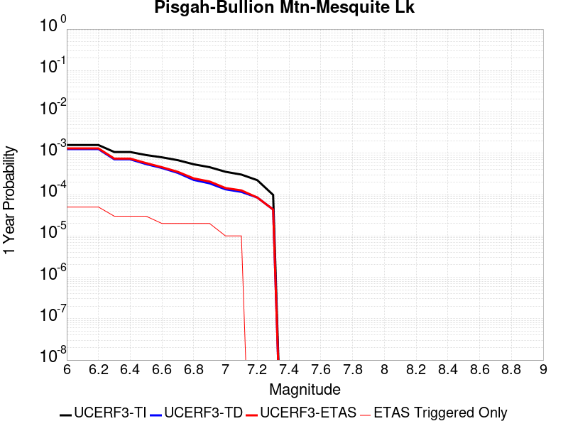 |  |

| Magnitude | 1 wk TI Prob | 1 wk TD Prob | 1 wk ETAS Prob | 1 wk ETAS/TD Gain | 1 wk ETAS Triggered Only | 1 mo TI Prob | 1 mo TD Prob | 1 mo ETAS Prob | 1 mo ETAS/TD Gain | 1 mo ETAS Triggered Only | 1 yr TI Prob | 1 yr TD Prob | 1 yr ETAS Prob | 1 yr ETAS/TD Gain | 1 yr ETAS Triggered Only | 10 yr TI Prob | 10 yr TD Prob | 10 yr ETAS Prob | 10 yr ETAS/TD Gain | 10 yr ETAS Triggered Only |
|-----|-----|-----|-----|-----|-----|-----|-----|-----|-----|-----|-----|-----|-----|-----|-----|-----|-----|-----|-----|-----|
| 6.0 | 3.0240792E-5 | 2.4091114E-5 | 6.698092E-5 | 2.7803166 | 4.2890842E-5 | 1.2959696E-4 | 1.03244114E-4 | 1.4613054E-4 | 1.4153885 | 4.2890842E-5 | 0.0015767008 | 0.0012563728 | 0.0012992097 | 1.0340958 | 4.2890842E-5 | 0.015655609 | 0.012502721 | 0.012545075 | 1.0033876 | 4.2890842E-5 |
| 6.1 | 3.0240792E-5 | 2.4091114E-5 | 6.698092E-5 | 2.7803166 | 4.2890842E-5 | 1.2959696E-4 | 1.03244114E-4 | 1.4613054E-4 | 1.4153885 | 4.2890842E-5 | 0.0015767008 | 0.0012563728 | 0.0012992097 | 1.0340958 | 4.2890842E-5 | 0.015655609 | 0.012502721 | 0.012545075 | 1.0033876 | 4.2890842E-5 |
| 6.2 | 3.0240792E-5 | 2.4091114E-5 | 6.698092E-5 | 2.7803166 | 4.2890842E-5 | 1.2959696E-4 | 1.03244114E-4 | 1.4613054E-4 | 1.4153885 | 4.2890842E-5 | 0.0015767008 | 0.0012563728 | 0.0012992097 | 1.0340958 | 4.2890842E-5 | 0.015655609 | 0.012502721 | 0.012545075 | 1.0033876 | 4.2890842E-5 |
| 6.3 | 2.0498217E-5 | 1.36380695E-5 | 5.6528326E-5 | 4.144892 | 4.2890842E-5 | 8.784654E-5 | 5.844765E-5 | 1.0133599E-4 | 1.7337906 | 4.2890842E-5 | 0.0010690069 | 7.1138405E-4 | 7.542444E-4 | 1.0602492 | 4.2890842E-5 | 0.01063879 | 0.0070926943 | 0.007135281 | 1.0060043 | 4.2890842E-5 |
| 6.4 | 2.0498217E-5 | 1.36380695E-5 | 5.6528326E-5 | 4.144892 | 4.2890842E-5 | 8.784654E-5 | 5.844765E-5 | 1.0133599E-4 | 1.7337906 | 4.2890842E-5 | 0.0010690069 | 7.1138405E-4 | 7.542444E-4 | 1.0602492 | 4.2890842E-5 | 0.01063879 | 0.0070926943 | 0.007135281 | 1.0060043 | 4.2890842E-5 |
| 6.5 | 1.7316182E-5 | 1.0477042E-5 | 5.3367436E-5 | 5.09375 | 4.2890842E-5 | 7.42101E-5 | 4.4900895E-5 | 8.778981E-5 | 1.9551907 | 4.2890842E-5 | 9.0313336E-4 | 5.465413E-4 | 5.894087E-4 | 1.078434 | 4.2890842E-5 | 0.008994718 | 0.0054529672 | 0.005495624 | 1.0078228 | 4.2890842E-5 |
| 6.6 | 1.5251077E-5 | 8.414273E-6 | 5.1304756E-5 | 6.0973487 | 4.2890842E-5 | 6.536012E-5 | 3.6060712E-5 | 7.8950005E-5 | 2.1893635 | 4.2890842E-5 | 7.9546886E-4 | 4.3895794E-4 | 4.8182998E-4 | 1.0976677 | 4.2890842E-5 | 0.007926274 | 0.0043816264 | 0.0044243294 | 1.009746 | 4.2890842E-5 |
| 6.7 | 1.2997425E-5 | 6.4114965E-6 | 4.9302063E-5 | 7.689635 | 4.2890842E-5 | 5.570206E-5 | 2.7477578E-5 | 7.036724E-5 | 2.5608969 | 4.2890842E-5 | 6.7796157E-4 | 3.3449283E-4 | 3.7736932E-4 | 1.1281836 | 4.2890842E-5 | 0.0067589693 | 0.0033403537 | 0.0033831012 | 1.0127974 | 4.2890842E-5 |
| 6.8 | 1.035386E-5 | 4.3332193E-6 | 4.7223875E-5 | 10.898104 | 4.2890842E-5 | 4.437293E-5 | 1.8570812E-5 | 6.146086E-5 | 3.3095405 | 4.2890842E-5 | 5.401065E-4 | 2.2607706E-4 | 2.6895822E-4 | 1.1896749 | 4.2890842E-5 | 0.0053879567 | 0.0022585576 | 0.0023013514 | 1.0189475 | 4.2890842E-5 |
| 6.9 | 8.816252E-6 | 3.580638E-6 | 4.6471327E-5 | 12.978505 | 4.2890842E-5 | 3.778339E-5 | 1.5345504E-5 | 5.8235688E-5 | 3.7949677 | 4.2890842E-5 | 4.5991567E-4 | 1.8681608E-4 | 2.2969891E-4 | 1.2295457 | 4.2890842E-5 | 0.00458965 | 0.0018666488 | 0.0019094596 | 1.0229346 | 4.2890842E-5 |
| 7.0 | 6.8232207E-6 | 2.5675843E-6 | 2.5675843E-6 | 1.0 | 0.0 | 2.9242048E-5 | 1.1003888E-5 | 1.1003888E-5 | 1.0 | 0.0 | 3.5596377E-4 | 1.3396442E-4 | 1.3396442E-4 | 1.0 | 0.0 | 0.0035539411 | 0.0013388677 | 0.0013388677 | 1.0 | 0.0 |
| 7.1 | 5.837013E-6 | 2.22738E-6 | 2.22738E-6 | 1.0 | 0.0 | 2.501553E-5 | 9.545881E-6 | 9.545881E-6 | 1.0 | 0.0 | 3.045215E-4 | 1.16215204E-4 | 1.16215204E-4 | 1.0 | 0.0 | 0.0030410455 | 0.0011615733 | 0.0011615733 | 1.0 | 0.0 |
| 7.2 | 4.278052E-6 | 1.6275711E-6 | 1.6275711E-6 | 1.0 | 0.0 | 1.833438E-5 | 6.9752873E-6 | 6.9752873E-6 | 1.0 | 0.0 | 2.231982E-4 | 8.492105E-5 | 8.492105E-5 | 1.0 | 0.0 | 0.0022297418 | 8.489092E-4 | 8.489092E-4 | 1.0 | 0.0 |
| 7.3 | 1.8803692E-6 | 8.344926E-7 | 8.344926E-7 | 1.0 | 0.0 | 8.0587E-6 | 3.5763926E-6 | 3.5763926E-6 | 1.0 | 0.0 | 9.811026E-5 | 4.354186E-5 | 4.354186E-5 | 1.0 | 0.0 | 9.806695E-4 | 4.3534773E-4 | 4.3534773E-4 | 1.0 | 0.0 |

## Homestead Valley 2011
*[(top)](#table-of-contents)*

| 1 Week | 1 Month | 1 Year | 10 Year |
|-----|-----|-----|-----|
|  |  | 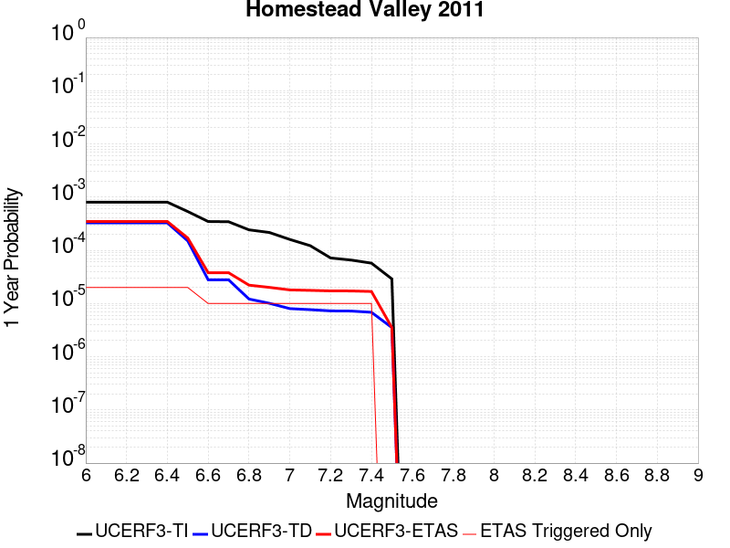 |  |

| Magnitude | 1 wk TI Prob | 1 wk TD Prob | 1 wk ETAS Prob | 1 wk ETAS/TD Gain | 1 wk ETAS Triggered Only | 1 mo TI Prob | 1 mo TD Prob | 1 mo ETAS Prob | 1 mo ETAS/TD Gain | 1 mo ETAS Triggered Only | 1 yr TI Prob | 1 yr TD Prob | 1 yr ETAS Prob | 1 yr ETAS/TD Gain | 1 yr ETAS Triggered Only | 10 yr TI Prob | 10 yr TD Prob | 10 yr ETAS Prob | 10 yr ETAS/TD Gain | 10 yr ETAS Triggered Only |
|-----|-----|-----|-----|-----|-----|-----|-----|-----|-----|-----|-----|-----|-----|-----|-----|-----|-----|-----|-----|-----|
| 6.0 | 1.539795E-5 | 6.286606E-6 | 6.286606E-6 | 1.0 | 0.0 | 6.5989545E-5 | 2.6942436E-5 | 6.9832124E-5 | 2.5919008 | 4.2890842E-5 | 8.0312655E-4 | 3.279954E-4 | 3.7087215E-4 | 1.1307237 | 4.2890842E-5 | 0.008002302 | 0.0032771337 | 0.003319884 | 1.0130451 | 4.2890842E-5 |
| 6.1 | 1.539795E-5 | 6.286606E-6 | 6.286606E-6 | 1.0 | 0.0 | 6.5989545E-5 | 2.6942436E-5 | 6.9832124E-5 | 2.5919008 | 4.2890842E-5 | 8.0312655E-4 | 3.279954E-4 | 3.7087215E-4 | 1.1307237 | 4.2890842E-5 | 0.008002302 | 0.0032771337 | 0.003319884 | 1.0130451 | 4.2890842E-5 |
| 6.2 | 1.539795E-5 | 6.286606E-6 | 6.286606E-6 | 1.0 | 0.0 | 6.5989545E-5 | 2.6942436E-5 | 6.9832124E-5 | 2.5919008 | 4.2890842E-5 | 8.0312655E-4 | 3.279954E-4 | 3.7087215E-4 | 1.1307237 | 4.2890842E-5 | 0.008002302 | 0.0032771337 | 0.003319884 | 1.0130451 | 4.2890842E-5 |
| 6.3 | 1.539795E-5 | 6.286606E-6 | 6.286606E-6 | 1.0 | 0.0 | 6.5989545E-5 | 2.6942436E-5 | 6.9832124E-5 | 2.5919008 | 4.2890842E-5 | 8.0312655E-4 | 3.279954E-4 | 3.7087215E-4 | 1.1307237 | 4.2890842E-5 | 0.008002302 | 0.0032771337 | 0.003319884 | 1.0130451 | 4.2890842E-5 |
| 6.4 | 1.539795E-5 | 6.286606E-6 | 6.286606E-6 | 1.0 | 0.0 | 6.5989545E-5 | 2.6942436E-5 | 6.9832124E-5 | 2.5919008 | 4.2890842E-5 | 8.0312655E-4 | 3.279954E-4 | 3.7087215E-4 | 1.1307237 | 4.2890842E-5 | 0.008002302 | 0.0032771337 | 0.003319884 | 1.0130451 | 4.2890842E-5 |
| 6.5 | 1.0265258E-5 | 2.8788488E-6 | 2.8788488E-6 | 1.0 | 0.0 | 4.3993223E-5 | 1.2337905E-5 | 5.5228218E-5 | 4.4763045 | 4.2890842E-5 | 5.3548586E-4 | 1.5021059E-4 | 1.93095E-4 | 1.2854952 | 4.2890842E-5 | 0.005341973 | 0.0015017724 | 0.001544599 | 1.0285172 | 4.2890842E-5 |
| 6.6 | 6.664671E-6 | 5.348204E-7 | 5.348204E-7 | 1.0 | 0.0 | 2.8562565E-5 | 2.2920863E-6 | 4.518283E-5 | 19.712536 | 4.2890842E-5 | 3.476937E-4 | 2.7905911E-5 | 7.0795555E-5 | 2.5369377 | 4.2890842E-5 | 0.003471502 | 2.790357E-4 | 3.219146E-4 | 1.153668 | 4.2890842E-5 |
| 6.7 | 6.5954046E-6 | 5.348204E-7 | 5.348204E-7 | 1.0 | 0.0 | 2.8265715E-5 | 2.2920863E-6 | 4.518283E-5 | 19.712536 | 4.2890842E-5 | 3.4408073E-4 | 2.7905911E-5 | 7.0795555E-5 | 2.5369377 | 4.2890842E-5 | 0.0034354846 | 2.790357E-4 | 3.219146E-4 | 1.153668 | 4.2890842E-5 |
| 6.8 | 4.648189E-6 | 2.3265572E-7 | 2.3265572E-7 | 1.0 | 0.0 | 1.9920659E-5 | 9.970956E-7 | 4.3887896E-5 | 44.015736 | 4.2890842E-5 | 2.4250703E-4 | 1.2139576E-5 | 5.5029897E-5 | 4.5330987 | 4.2890842E-5 | 0.0024224254 | 1.2138961E-4 | 1.6427525E-4 | 1.3532891 | 4.2890842E-5 |
| 6.9 | 4.1428534E-6 | 1.9344557E-7 | 1.9344557E-7 | 1.0 | 0.0 | 1.7754966E-5 | 8.290522E-7 | 4.3719858E-5 | 52.73475 | 4.2890842E-5 | 2.1614527E-4 | 1.0093667E-5 | 5.2984076E-5 | 5.24924 | 4.2890842E-5 | 0.0021593515 | 1.0093238E-4 | 1.4381889E-4 | 1.4249034 | 4.2890842E-5 |
| 7.0 | 3.0673707E-6 | 1.5367603E-7 | 1.5367603E-7 | 1.0 | 0.0 | 1.3145808E-5 | 6.586114E-7 | 4.3549426E-5 | 66.1231 | 4.2890842E-5 | 1.6003846E-4 | 8.0185655E-6 | 5.0909064E-5 | 6.3488994 | 4.2890842E-5 | 0.0015992324 | 8.0182865E-5 | 1.2307026E-4 | 1.5348699 | 4.2890842E-5 |
| 7.1 | 2.340854E-6 | 1.468766E-7 | 1.468766E-7 | 1.0 | 0.0 | 1.0032193E-5 | 6.29471E-7 | 4.3520286E-5 | 69.13788 | 4.2890842E-5 | 1.221351E-4 | 7.663783E-6 | 5.0554296E-5 | 6.5965195 | 4.2890842E-5 | 0.00122068 | 7.663529E-5 | 1.1952285E-4 | 1.559632 | 4.2890842E-5 |
| 7.2 | 1.3754182E-6 | 1.3922634E-7 | 1.3922634E-7 | 1.0 | 0.0 | 5.8946357E-6 | 5.966842E-7 | 4.34875E-5 | 72.88194 | 4.2890842E-5 | 7.176483E-5 | 7.2646067E-6 | 5.0155137E-5 | 6.9040403 | 4.2890842E-5 | 7.174166E-4 | 7.264379E-5 | 1.1553151E-4 | 1.590384 | 4.2890842E-5 |
| 7.3 | 1.2573237E-6 | 1.3827146E-7 | 1.3827146E-7 | 1.0 | 0.0 | 5.388519E-6 | 5.9259185E-7 | 4.348341E-5 | 73.37835 | 4.2890842E-5 | 6.560324E-5 | 7.2147827E-6 | 5.0105315E-5 | 6.944813 | 4.2890842E-5 | 6.558388E-4 | 7.214558E-5 | 1.1503333E-4 | 1.5944612 | 4.2890842E-5 |
| 7.4 | 1.0994207E-6 | 1.3106106E-7 | 1.3106106E-7 | 1.0 | 0.0 | 4.7117946E-6 | 5.616901E-7 | 4.345251E-5 | 77.36029 | 4.2890842E-5 | 5.736459E-5 | 6.8385566E-6 | 4.9729108E-5 | 7.2718716 | 4.2890842E-5 | 5.734978E-4 | 6.838355E-5 | 1.1127147E-4 | 1.627167 | 4.2890842E-5 |
| 7.5 | 5.5569126E-7 | 6.772991E-8 | 6.772991E-8 | 1.0 | 0.0 | 2.3815317E-6 | 2.90271E-7 | 2.90271E-7 | 1.0 | 0.0 | 2.8994764E-5 | 3.5340445E-6 | 3.5340445E-6 | 1.0 | 0.0 | 2.899098E-4 | 3.5339945E-5 | 3.5339945E-5 | 1.0 | 0.0 |

## Santa Susana alt 1
*[(top)](#table-of-contents)*

| 1 Week | 1 Month | 1 Year | 10 Year |
|-----|-----|-----|-----|
|  |  |  |  |

| Magnitude | 1 wk TI Prob | 1 wk TD Prob | 1 wk ETAS Prob | 1 wk ETAS/TD Gain | 1 wk ETAS Triggered Only | 1 mo TI Prob | 1 mo TD Prob | 1 mo ETAS Prob | 1 mo ETAS/TD Gain | 1 mo ETAS Triggered Only | 1 yr TI Prob | 1 yr TD Prob | 1 yr ETAS Prob | 1 yr ETAS/TD Gain | 1 yr ETAS Triggered Only | 10 yr TI Prob | 10 yr TD Prob | 10 yr ETAS Prob | 10 yr ETAS/TD Gain | 10 yr ETAS Triggered Only |
|-----|-----|-----|-----|-----|-----|-----|-----|-----|-----|-----|-----|-----|-----|-----|-----|-----|-----|-----|-----|-----|
| 6.0 | 2.674877E-5 | 2.7198023E-5 | 2.7198023E-5 | 1.0 | 0.0 | 1.1463255E-4 | 1.1655839E-4 | 1.1655839E-4 | 1.0 | 0.0 | 0.0013947578 | 0.0014182882 | 0.0014611182 | 1.0301983 | 4.2890842E-5 | 0.013860362 | 0.014104128 | 0.014146414 | 1.0029981 | 4.2890842E-5 |
| 6.1 | 2.674877E-5 | 2.7198023E-5 | 2.7198023E-5 | 1.0 | 0.0 | 1.1463255E-4 | 1.1655839E-4 | 1.1655839E-4 | 1.0 | 0.0 | 0.0013947578 | 0.0014182882 | 0.0014611182 | 1.0301983 | 4.2890842E-5 | 0.013860362 | 0.014104128 | 0.014146414 | 1.0029981 | 4.2890842E-5 |
| 6.2 | 2.674877E-5 | 2.7198023E-5 | 2.7198023E-5 | 1.0 | 0.0 | 1.1463255E-4 | 1.1655839E-4 | 1.1655839E-4 | 1.0 | 0.0 | 0.0013947578 | 0.0014182882 | 0.0014611182 | 1.0301983 | 4.2890842E-5 | 0.013860362 | 0.014104128 | 0.014146414 | 1.0029981 | 4.2890842E-5 |
| 6.3 | 2.674877E-5 | 2.7198023E-5 | 2.7198023E-5 | 1.0 | 0.0 | 1.1463255E-4 | 1.1655839E-4 | 1.1655839E-4 | 1.0 | 0.0 | 0.0013947578 | 0.0014182882 | 0.0014611182 | 1.0301983 | 4.2890842E-5 | 0.013860362 | 0.014104128 | 0.014146414 | 1.0029981 | 4.2890842E-5 |
| 6.4 | 2.674877E-5 | 2.7198023E-5 | 2.7198023E-5 | 1.0 | 0.0 | 1.1463255E-4 | 1.1655839E-4 | 1.1655839E-4 | 1.0 | 0.0 | 0.0013947578 | 0.0014182882 | 0.0014611182 | 1.0301983 | 4.2890842E-5 | 0.013860362 | 0.014104128 | 0.014146414 | 1.0029981 | 4.2890842E-5 |
| 6.5 | 2.674877E-5 | 2.7198023E-5 | 2.7198023E-5 | 1.0 | 0.0 | 1.1463255E-4 | 1.1655839E-4 | 1.1655839E-4 | 1.0 | 0.0 | 0.0013947578 | 0.0014182882 | 0.0014611182 | 1.0301983 | 4.2890842E-5 | 0.013860362 | 0.014104128 | 0.014146414 | 1.0029981 | 4.2890842E-5 |
| 6.6 | 2.6647976E-5 | 2.7074359E-5 | 2.7074359E-5 | 1.0 | 0.0 | 1.14200615E-4 | 1.1602845E-4 | 1.1602845E-4 | 1.0 | 0.0 | 0.0013895056 | 0.0014118447 | 0.0014546751 | 1.0303364 | 4.2890842E-5 | 0.013808494 | 0.014040513 | 0.0140828015 | 1.003012 | 4.2890842E-5 |
| 6.7 | 2.6647976E-5 | 2.7074359E-5 | 2.7074359E-5 | 1.0 | 0.0 | 1.14200615E-4 | 1.1602845E-4 | 1.1602845E-4 | 1.0 | 0.0 | 0.0013895056 | 0.0014118447 | 0.0014546751 | 1.0303364 | 4.2890842E-5 | 0.013808494 | 0.014040513 | 0.0140828015 | 1.003012 | 4.2890842E-5 |
| 6.8 | 1.9073179E-5 | 1.7637283E-5 | 1.7637283E-5 | 1.0 | 0.0 | 8.1739636E-5 | 7.558627E-5 | 7.558627E-5 | 1.0 | 0.0 | 9.947256E-4 | 9.198925E-4 | 9.627439E-4 | 1.046583 | 4.2890842E-5 | 0.009902848 | 0.009163101 | 0.009205599 | 1.004638 | 4.2890842E-5 |
| 6.9 | 1.9041876E-5 | 1.7619415E-5 | 1.7619415E-5 | 1.0 | 0.0 | 8.160549E-5 | 7.55097E-5 | 7.55097E-5 | 1.0 | 0.0 | 9.930939E-4 | 9.1896096E-4 | 9.618124E-4 | 1.0466303 | 4.2890842E-5 | 0.0098866755 | 0.0091538625 | 0.009196361 | 1.0046426 | 4.2890842E-5 |
| 7.0 | 1.5917482E-5 | 1.3863864E-5 | 1.3863864E-5 | 1.0 | 0.0 | 6.8215995E-5 | 5.9415237E-5 | 5.9415237E-5 | 1.0 | 0.0 | 8.302132E-4 | 7.231451E-4 | 7.660049E-4 | 1.0592686 | 4.2890842E-5 | 0.008271185 | 0.0072088144 | 0.007251396 | 1.0059069 | 4.2890842E-5 |
| 7.1 | 1.577788E-5 | 1.3743872E-5 | 1.3743872E-5 | 1.0 | 0.0 | 6.761774E-5 | 5.8901005E-5 | 5.8901005E-5 | 1.0 | 0.0 | 8.2293496E-4 | 7.1688846E-4 | 7.597485E-4 | 1.0597863 | 4.2890842E-5 | 0.008198941 | 0.007146652 | 0.007189236 | 1.0059587 | 4.2890842E-5 |
| 7.2 | 1.5416446E-5 | 1.3469944E-5 | 1.3469944E-5 | 1.0 | 0.0 | 6.606882E-5 | 5.772708E-5 | 5.772708E-5 | 1.0 | 0.0 | 8.0409093E-4 | 7.026052E-4 | 7.454659E-4 | 1.0610025 | 4.2890842E-5 | 0.008011877 | 0.0070047234 | 0.0070473137 | 1.0060803 | 4.2890842E-5 |
| 7.3 | 1.4534083E-5 | 1.2717879E-5 | 1.2717879E-5 | 1.0 | 0.0 | 6.228744E-5 | 5.4504082E-5 | 5.4504082E-5 | 1.0 | 0.0 | 7.580857E-4 | 6.633896E-4 | 7.06252E-4 | 1.0646112 | 4.2890842E-5 | 0.007555048 | 0.0066149444 | 0.0066575515 | 1.006441 | 4.2890842E-5 |
| 7.4 | 1.2858995E-5 | 1.1229652E-5 | 1.1229652E-5 | 1.0 | 0.0 | 5.5108816E-5 | 4.8126214E-5 | 4.8126214E-5 | 1.0 | 0.0 | 6.7074323E-4 | 5.857831E-4 | 6.286488E-4 | 1.0731767 | 4.2890842E-5 | 0.0066872234 | 0.005843165 | 0.005885805 | 1.0072974 | 4.2890842E-5 |
| 7.5 | 8.827668E-6 | 7.805457E-6 | 7.805457E-6 | 1.0 | 0.0 | 3.7832317E-5 | 3.3451546E-5 | 3.3451546E-5 | 1.0 | 0.0 | 4.605111E-4 | 4.071989E-4 | 4.500723E-4 | 1.1052885 | 4.2890842E-5 | 0.0045955796 | 0.0040647765 | 0.004107493 | 1.0105089 | 4.2890842E-5 |
| 7.6 | 3.2533426E-6 | 2.871988E-6 | 2.871988E-6 | 1.0 | 0.0 | 1.3942822E-5 | 1.2308465E-5 | 1.2308465E-5 | 1.0 | 0.0 | 1.6974064E-4 | 1.4984563E-4 | 1.9273003E-4 | 1.2861906 | 4.2890842E-5 | 0.0016961104 | 0.0014974826 | 0.0015403093 | 1.028599 | 4.2890842E-5 |
| 7.7 | 1.2751709E-6 | 1.1491089E-6 | 1.1491089E-6 | 1.0 | 0.0 | 5.4650063E-6 | 4.9247437E-6 | 4.9247437E-6 | 1.0 | 0.0 | 6.653442E-5 | 5.9957198E-5 | 5.9957198E-5 | 1.0 | 0.0 | 6.6514505E-4 | 5.994191E-4 | 5.994191E-4 | 1.0 | 0.0 |
| 7.8 | 3.067544E-7 | 3.2400436E-7 | 3.2400436E-7 | 1.0 | 0.0 | 1.3146611E-6 | 1.3885895E-6 | 1.3885895E-6 | 1.0 | 0.0 | 1.600588E-5 | 1.6905957E-5 | 1.6905957E-5 | 1.0 | 0.0 | 1.6004729E-4 | 1.6904772E-4 | 1.6904772E-4 | 1.0 | 0.0 |
| 7.9 | 7.622999E-8 | 8.087964E-8 | 8.087964E-8 | 1.0 | 0.0 | 3.2669993E-7 | 3.4662696E-7 | 3.4662696E-7 | 1.0 | 0.0 | 3.977564E-6 | 4.2201773E-6 | 4.2201773E-6 | 1.0 | 0.0 | 3.977493E-5 | 4.220118E-5 | 4.220118E-5 | 1.0 | 0.0 |

## Santa Cruz Catalina Ridge alt1
*[(top)](#table-of-contents)*

| 1 Week | 1 Month | 1 Year | 10 Year |
|-----|-----|-----|-----|
|  | 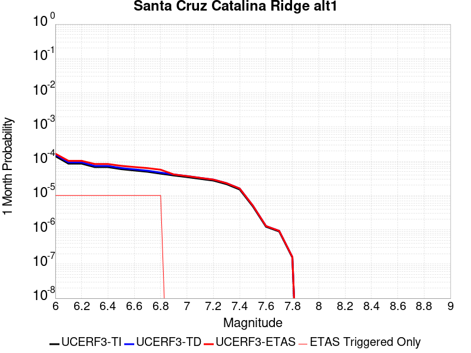 |  |  |

| Magnitude | 1 wk TI Prob | 1 wk TD Prob | 1 wk ETAS Prob | 1 wk ETAS/TD Gain | 1 wk ETAS Triggered Only | 1 mo TI Prob | 1 mo TD Prob | 1 mo ETAS Prob | 1 mo ETAS/TD Gain | 1 mo ETAS Triggered Only | 1 yr TI Prob | 1 yr TD Prob | 1 yr ETAS Prob | 1 yr ETAS/TD Gain | 1 yr ETAS Triggered Only | 10 yr TI Prob | 10 yr TD Prob | 10 yr ETAS Prob | 10 yr ETAS/TD Gain | 10 yr ETAS Triggered Only |
|-----|-----|-----|-----|-----|-----|-----|-----|-----|-----|-----|-----|-----|-----|-----|-----|-----|-----|-----|-----|-----|
| 6.0 | 3.2833184E-5 | 3.65584E-5 | 3.65584E-5 | 1.0 | 0.0 | 1.4070606E-4 | 1.5667039E-4 | 1.5667039E-4 | 1.0 | 0.0 | 0.00171175 | 0.0019059596 | 0.0019487686 | 1.0224607 | 4.2890842E-5 | 0.016986247 | 0.018913029 | 0.01895511 | 1.0022249 | 4.2890842E-5 |
| 6.1 | 1.9835548E-5 | 2.1659505E-5 | 2.1659505E-5 | 1.0 | 0.0 | 8.500672E-5 | 9.282326E-5 | 9.282326E-5 | 1.0 | 0.0 | 0.0010344655 | 0.0011295575 | 0.0011723998 | 1.0379285 | 4.2890842E-5 | 0.010296632 | 0.011240295 | 0.011282704 | 1.003773 | 4.2890842E-5 |
| 6.2 | 1.9835548E-5 | 2.1659505E-5 | 2.1659505E-5 | 1.0 | 0.0 | 8.500672E-5 | 9.282326E-5 | 9.282326E-5 | 1.0 | 0.0 | 0.0010344655 | 0.0011295575 | 0.0011723998 | 1.0379285 | 4.2890842E-5 | 0.010296632 | 0.011240295 | 0.011282704 | 1.003773 | 4.2890842E-5 |
| 6.3 | 1.5728183E-5 | 1.703395E-5 | 1.703395E-5 | 1.0 | 0.0 | 6.7404755E-5 | 7.300063E-5 | 7.300063E-5 | 1.0 | 0.0 | 8.2034385E-4 | 8.884264E-4 | 9.312791E-4 | 1.0482345 | 4.2890842E-5 | 0.008173222 | 0.008849427 | 0.008891938 | 1.0048039 | 4.2890842E-5 |
| 6.4 | 1.5728183E-5 | 1.703395E-5 | 1.703395E-5 | 1.0 | 0.0 | 6.7404755E-5 | 7.300063E-5 | 7.300063E-5 | 1.0 | 0.0 | 8.2034385E-4 | 8.884264E-4 | 9.312791E-4 | 1.0482345 | 4.2890842E-5 | 0.008173222 | 0.008849427 | 0.008891938 | 1.0048039 | 4.2890842E-5 |
| 6.5 | 1.3707734E-5 | 1.4794522E-5 | 1.4794522E-5 | 1.0 | 0.0 | 5.8746107E-5 | 6.3403575E-5 | 6.3403575E-5 | 1.0 | 0.0 | 7.1499916E-4 | 7.716686E-4 | 8.1452634E-4 | 1.055539 | 4.2890842E-5 | 0.0071270303 | 0.0076902895 | 0.0077328505 | 1.0055344 | 4.2890842E-5 |
| 6.6 | 1.2539813E-5 | 1.3510219E-5 | 1.3510219E-5 | 1.0 | 0.0 | 5.3740947E-5 | 5.789967E-5 | 5.789967E-5 | 1.0 | 0.0 | 6.540996E-4 | 7.0470315E-4 | 7.475638E-4 | 1.0608208 | 4.2890842E-5 | 0.0065217763 | 0.0070249885 | 0.007067578 | 1.0060626 | 4.2890842E-5 |
| 6.7 | 1.1504083E-5 | 1.2377375E-5 | 1.2377375E-5 | 1.0 | 0.0 | 4.930228E-5 | 5.3044827E-5 | 5.3044827E-5 | 1.0 | 0.0 | 6.0008996E-4 | 6.456314E-4 | 6.8849453E-4 | 1.0663896 | 4.2890842E-5 | 0.005984721 | 0.006437786 | 0.0064804005 | 1.0066195 | 4.2890842E-5 |
| 6.8 | 1.012739E-5 | 1.0877071E-5 | 1.0877071E-5 | 1.0 | 0.0 | 4.340238E-5 | 4.6615194E-5 | 4.6615194E-5 | 1.0 | 0.0 | 5.282958E-4 | 5.673937E-4 | 6.1026023E-4 | 1.0755498 | 4.2890842E-5 | 0.0052704164 | 0.0056596193 | 0.005702268 | 1.0075355 | 4.2890842E-5 |
| 6.9 | 8.9607865E-6 | 9.609117E-6 | 9.609117E-6 | 1.0 | 0.0 | 3.8402806E-5 | 4.1181287E-5 | 4.1181287E-5 | 1.0 | 0.0 | 4.6745385E-4 | 5.012679E-4 | 5.012679E-4 | 1.0 | 0.0 | 0.0046647177 | 0.005001492 | 0.005001492 | 1.0 | 0.0 |
| 7.0 | 8.046829E-6 | 8.619746E-6 | 8.619746E-6 | 1.0 | 0.0 | 3.4485955E-5 | 3.694125E-5 | 3.694125E-5 | 1.0 | 0.0 | 4.1978562E-4 | 4.496677E-4 | 4.496677E-4 | 1.0 | 0.0 | 0.004189935 | 0.0044876686 | 0.0044876686 | 1.0 | 0.0 |
| 7.1 | 7.136131E-6 | 7.637656E-6 | 7.637656E-6 | 1.0 | 0.0 | 3.0583058E-5 | 3.2732405E-5 | 3.2732405E-5 | 1.0 | 0.0 | 3.7228514E-4 | 3.9844486E-4 | 3.9844486E-4 | 1.0 | 0.0 | 0.0037166206 | 0.003977381 | 0.003977381 | 1.0 | 0.0 |
| 7.2 | 6.362014E-6 | 6.8049585E-6 | 6.8049585E-6 | 1.0 | 0.0 | 2.726549E-5 | 2.9163786E-5 | 2.9163786E-5 | 1.0 | 0.0 | 3.3190678E-4 | 3.550119E-4 | 3.550119E-4 | 1.0 | 0.0 | 0.0033141149 | 0.003544516 | 0.003544516 | 1.0 | 0.0 |
| 7.3 | 5.004101E-6 | 5.351715E-6 | 5.351715E-6 | 1.0 | 0.0 | 2.1445969E-5 | 2.2935723E-5 | 2.2935723E-5 | 1.0 | 0.0 | 2.6107338E-4 | 2.792072E-4 | 2.792072E-4 | 1.0 | 0.0 | 0.002607669 | 0.0027886187 | 0.0027886187 | 1.0 | 0.0 |
| 7.4 | 3.4901443E-6 | 3.7320526E-6 | 3.7320526E-6 | 1.0 | 0.0 | 1.4957676E-5 | 1.5994416E-5 | 1.5994416E-5 | 1.0 | 0.0 | 1.8209449E-4 | 1.9471499E-4 | 1.9471499E-4 | 1.0 | 0.0 | 0.0018194534 | 0.0019454823 | 0.0019454823 | 1.0 | 0.0 |
| 7.5 | 1.1215045E-6 | 1.189387E-6 | 1.189387E-6 | 1.0 | 0.0 | 4.806439E-6 | 5.097363E-6 | 5.097363E-6 | 1.0 | 0.0 | 5.851682E-5 | 6.205866E-5 | 6.205866E-5 | 1.0 | 0.0 | 5.850142E-4 | 6.2041637E-4 | 6.2041637E-4 | 1.0 | 0.0 |
| 7.6 | 2.8599047E-7 | 2.9951994E-7 | 2.9951994E-7 | 1.0 | 0.0 | 1.2256729E-6 | 1.2836562E-6 | 1.2836562E-6 | 1.0 | 0.0 | 1.4922465E-5 | 1.5628404E-5 | 1.5628404E-5 | 1.0 | 0.0 | 1.4921463E-4 | 1.5627318E-4 | 1.5627318E-4 | 1.0 | 0.0 |
| 7.7 | 2.0781519E-7 | 2.1744323E-7 | 2.1744323E-7 | 1.0 | 0.0 | 8.906362E-7 | 9.3189925E-7 | 9.3189925E-7 | 1.0 | 0.0 | 1.08434415E-5 | 1.13458145E-5 | 1.13458145E-5 | 1.0 | 0.0 | 1.0842913E-4 | 1.1345245E-4 | 1.1345245E-4 | 1.0 | 0.0 |
| 7.8 | 3.614776E-8 | 3.764102E-8 | 3.764102E-8 | 1.0 | 0.0 | 1.5491896E-7 | 1.6131864E-7 | 1.6131864E-7 | 1.0 | 0.0 | 1.8861368E-6 | 1.9640527E-6 | 1.9640527E-6 | 1.0 | 0.0 | 1.8861208E-5 | 1.9640367E-5 | 1.9640367E-5 | 1.0 | 0.0 |

## Hosgri (Extension)
*[(top)](#table-of-contents)*

| 1 Week | 1 Month | 1 Year | 10 Year |
|-----|-----|-----|-----|
|  |  |  |  |

| Magnitude | 1 wk TI Prob | 1 wk TD Prob | 1 wk ETAS Prob | 1 wk ETAS/TD Gain | 1 wk ETAS Triggered Only | 1 mo TI Prob | 1 mo TD Prob | 1 mo ETAS Prob | 1 mo ETAS/TD Gain | 1 mo ETAS Triggered Only | 1 yr TI Prob | 1 yr TD Prob | 1 yr ETAS Prob | 1 yr ETAS/TD Gain | 1 yr ETAS Triggered Only | 10 yr TI Prob | 10 yr TD Prob | 10 yr ETAS Prob | 10 yr ETAS/TD Gain | 10 yr ETAS Triggered Only |
|-----|-----|-----|-----|-----|-----|-----|-----|-----|-----|-----|-----|-----|-----|-----|-----|-----|-----|-----|-----|-----|
| 6.0 | 1.1369135E-5 | 1.2083072E-5 | 1.2083072E-5 | 1.0 | 0.0 | 4.8723956E-5 | 5.1783692E-5 | 9.4672316E-5 | 1.8282263 | 4.2890842E-5 | 5.9305265E-4 | 6.3030684E-4 | 6.731706E-4 | 1.0680047 | 4.2890842E-5 | 0.005914725 | 0.0062874397 | 0.006330061 | 1.0067788 | 4.2890842E-5 |
| 6.1 | 6.934979E-6 | 7.324555E-6 | 7.324555E-6 | 1.0 | 0.0 | 2.9721E-5 | 3.1390595E-5 | 7.428009E-5 | 2.3663168 | 4.2890842E-5 | 3.617931E-4 | 3.8211764E-4 | 4.249921E-4 | 1.1122023 | 4.2890842E-5 | 0.0036120464 | 0.0038150186 | 0.0038577458 | 1.0111997 | 4.2890842E-5 |
| 6.2 | 6.934979E-6 | 7.324555E-6 | 7.324555E-6 | 1.0 | 0.0 | 2.9721E-5 | 3.1390595E-5 | 7.428009E-5 | 2.3663168 | 4.2890842E-5 | 3.617931E-4 | 3.8211764E-4 | 4.249921E-4 | 1.1122023 | 4.2890842E-5 | 0.0036120464 | 0.0038150186 | 0.0038577458 | 1.0111997 | 4.2890842E-5 |
| 6.3 | 4.5484676E-6 | 4.76933E-6 | 4.76933E-6 | 1.0 | 0.0 | 1.9493287E-5 | 2.043983E-5 | 6.33298E-5 | 3.0983524 | 4.2890842E-5 | 2.3730492E-4 | 2.4882692E-4 | 2.9170708E-4 | 1.1723293 | 4.2890842E-5 | 0.0023705168 | 0.0024855258 | 0.00252831 | 1.0172133 | 4.2890842E-5 |
| 6.4 | 4.218095E-6 | 4.4168614E-6 | 4.4168614E-6 | 1.0 | 0.0 | 1.8077424E-5 | 1.8929271E-5 | 6.18193E-5 | 3.2658048 | 4.2890842E-5 | 2.2007042E-4 | 2.3043984E-4 | 2.733208E-4 | 1.1860831 | 4.2890842E-5 | 0.002198526 | 0.0023020422 | 0.0023448344 | 1.0185888 | 4.2890842E-5 |
| 6.5 | 3.717374E-6 | 3.8838775E-6 | 3.8838775E-6 | 1.0 | 0.0 | 1.5931506E-5 | 1.6645085E-5 | 1.6645085E-5 | 1.0 | 0.0 | 1.9394881E-4 | 2.0263524E-4 | 2.0263524E-4 | 1.0 | 0.0 | 0.0019377962 | 0.0020245234 | 0.0020245234 | 1.0 | 0.0 |
| 6.6 | 3.4605036E-6 | 3.608306E-6 | 3.608306E-6 | 1.0 | 0.0 | 1.4830645E-5 | 1.5464078E-5 | 1.5464078E-5 | 1.0 | 0.0 | 1.8054814E-4 | 1.8825903E-4 | 1.8825903E-4 | 1.0 | 0.0 | 0.0018040152 | 0.0018810101 | 0.0018810101 | 1.0 | 0.0 |
| 6.7 | 3.123439E-6 | 3.2465687E-6 | 3.2465687E-6 | 1.0 | 0.0 | 1.33860985E-5 | 1.3913792E-5 | 1.3913792E-5 | 1.0 | 0.0 | 1.6296357E-4 | 1.6938736E-4 | 1.6938736E-4 | 1.0 | 0.0 | 0.001628441 | 0.0016925934 | 0.0016925934 | 1.0 | 0.0 |
| 6.8 | 2.8290783E-6 | 2.9305404E-6 | 2.9305404E-6 | 1.0 | 0.0 | 1.2124565E-5 | 1.2559399E-5 | 1.2559399E-5 | 1.0 | 0.0 | 1.4760658E-4 | 1.5290003E-4 | 1.5290003E-4 | 1.0 | 0.0 | 0.0014750857 | 0.001527957 | 0.001527957 | 1.0 | 0.0 |
| 6.9 | 2.454112E-6 | 2.5283196E-6 | 2.5283196E-6 | 1.0 | 0.0 | 1.0517581E-5 | 1.0835611E-5 | 1.0835611E-5 | 1.0 | 0.0 | 1.2804402E-4 | 1.3191563E-4 | 1.3191563E-4 | 1.0 | 0.0 | 0.0012797028 | 0.0013183793 | 0.0013183793 | 1.0 | 0.0 |
| 7.0 | 2.1008145E-6 | 2.1498704E-6 | 2.1498704E-6 | 1.0 | 0.0 | 9.003459E-6 | 9.213698E-6 | 9.213698E-6 | 1.0 | 0.0 | 1.096116E-4 | 1.1217103E-4 | 1.1217103E-4 | 1.0 | 0.0 | 0.0010955755 | 0.0011211479 | 0.0011211479 | 1.0 | 0.0 |
| 7.1 | 1.744384E-6 | 1.7686352E-6 | 1.7686352E-6 | 1.0 | 0.0 | 7.47591E-6 | 7.5798434E-6 | 7.5798434E-6 | 1.0 | 0.0 | 9.1015405E-5 | 9.22807E-5 | 9.22807E-5 | 1.0 | 0.0 | 9.097813E-4 | 9.2242553E-4 | 9.2242553E-4 | 1.0 | 0.0 |
| 7.2 | 1.5456587E-6 | 1.5562882E-6 | 1.5562882E-6 | 1.0 | 0.0 | 6.6242346E-6 | 6.66979E-6 | 6.66979E-6 | 1.0 | 0.0 | 8.064707E-5 | 8.120168E-5 | 8.120168E-5 | 1.0 | 0.0 | 8.0617814E-4 | 8.117213E-4 | 8.117213E-4 | 1.0 | 0.0 |
| 7.3 | 1.3775123E-6 | 1.3766082E-6 | 1.3766082E-6 | 1.0 | 0.0 | 5.9036106E-6 | 5.899736E-6 | 5.899736E-6 | 1.0 | 0.0 | 7.187409E-5 | 7.182693E-5 | 7.182693E-5 | 1.0 | 0.0 | 7.185085E-4 | 7.180382E-4 | 7.180382E-4 | 1.0 | 0.0 |
| 7.4 | 1.214491E-6 | 1.2023461E-6 | 1.2023461E-6 | 1.0 | 0.0 | 5.2049513E-6 | 5.1529014E-6 | 5.1529014E-6 | 1.0 | 0.0 | 6.336844E-5 | 6.2734776E-5 | 6.2734776E-5 | 1.0 | 0.0 | 6.335037E-4 | 6.271715E-4 | 6.271715E-4 | 1.0 | 0.0 |
| 7.5 | 1.0101123E-6 | 9.842246E-7 | 9.842246E-7 | 1.0 | 0.0 | 4.3290456E-6 | 4.2180986E-6 | 4.2180986E-6 | 1.0 | 0.0 | 5.2704854E-5 | 5.1354145E-5 | 5.1354145E-5 | 1.0 | 0.0 | 5.2692357E-4 | 5.1342335E-4 | 5.1342335E-4 | 1.0 | 0.0 |
| 7.6 | 8.1558215E-7 | 7.765966E-7 | 7.765966E-7 | 1.0 | 0.0 | 3.4953473E-6 | 3.328267E-6 | 3.328267E-6 | 1.0 | 0.0 | 4.255502E-5 | 4.0520903E-5 | 4.0520903E-5 | 1.0 | 0.0 | 4.2546875E-4 | 4.0513556E-4 | 4.0513556E-4 | 1.0 | 0.0 |
| 7.7 | 4.757816E-7 | 4.1308888E-7 | 4.1308888E-7 | 1.0 | 0.0 | 2.0390623E-6 | 1.7703798E-6 | 1.7703798E-6 | 1.0 | 0.0 | 2.4825302E-5 | 2.155416E-5 | 2.155416E-5 | 1.0 | 0.0 | 2.482253E-4 | 2.1552083E-4 | 2.1552083E-4 | 1.0 | 0.0 |
| 7.8 | 2.782787E-7 | 2.0047722E-7 | 2.0047722E-7 | 1.0 | 0.0 | 1.1926223E-6 | 8.5918776E-7 | 8.5918776E-7 | 1.0 | 0.0 | 1.452008E-5 | 1.04605615E-5 | 1.04605615E-5 | 1.0 | 0.0 | 1.4519131E-4 | 1.04600724E-4 | 1.04600724E-4 | 1.0 | 0.0 |
| 7.9 | 1.6948086E-7 | 9.244227E-8 | 9.244227E-8 | 1.0 | 0.0 | 7.2634634E-7 | 3.961811E-7 | 3.961811E-7 | 1.0 | 0.0 | 8.843231E-6 | 4.8234942E-6 | 4.8234942E-6 | 1.0 | 0.0 | 8.842879E-5 | 4.8233902E-5 | 4.8233902E-5 | 1.0 | 0.0 |
| 8.0 | 1.0225492E-7 | 4.4738776E-8 | 4.4738776E-8 | 1.0 | 0.0 | 4.382353E-7 | 1.917376E-7 | 1.917376E-7 | 1.0 | 0.0 | 5.335502E-6 | 2.3344028E-6 | 2.3344028E-6 | 1.0 | 0.0 | 5.335374E-5 | 2.3343786E-5 | 2.3343786E-5 | 1.0 | 0.0 |
| 8.1 | 1.43711345E-8 | 5.787707E-9 | 5.787707E-9 | 1.0 | 0.0 | 6.1590576E-8 | 2.480446E-8 | 2.480446E-8 | 1.0 | 0.0 | 7.4986497E-7 | 3.0199428E-7 | 3.0199428E-7 | 1.0 | 0.0 | 7.4986247E-6 | 3.0199392E-6 | 3.0199392E-6 | 1.0 | 0.0 |

## Cerro Prieto
*[(top)](#table-of-contents)*

| 1 Week | 1 Month | 1 Year | 10 Year |
|-----|-----|-----|-----|
|  | 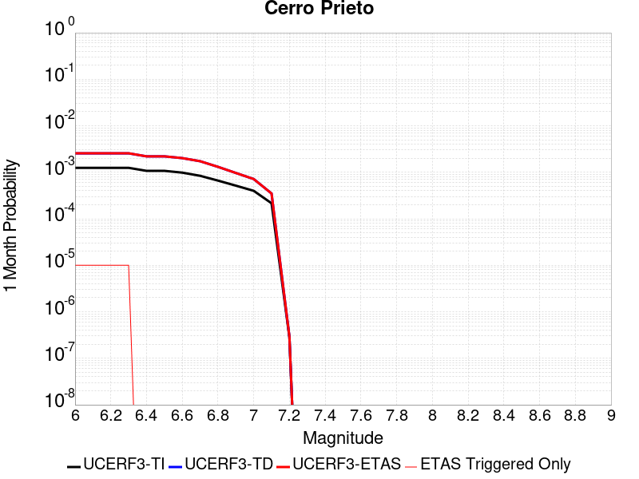 |  |  |

| Magnitude | 1 wk TI Prob | 1 wk TD Prob | 1 wk ETAS Prob | 1 wk ETAS/TD Gain | 1 wk ETAS Triggered Only | 1 mo TI Prob | 1 mo TD Prob | 1 mo ETAS Prob | 1 mo ETAS/TD Gain | 1 mo ETAS Triggered Only | 1 yr TI Prob | 1 yr TD Prob | 1 yr ETAS Prob | 1 yr ETAS/TD Gain | 1 yr ETAS Triggered Only | 10 yr TI Prob | 10 yr TD Prob | 10 yr ETAS Prob | 10 yr ETAS/TD Gain | 10 yr ETAS Triggered Only |
|-----|-----|-----|-----|-----|-----|-----|-----|-----|-----|-----|-----|-----|-----|-----|-----|-----|-----|-----|-----|-----|
| 6.0 | 2.9101528E-4 | 5.964804E-4 | 5.964804E-4 | 1.0 | 0.0 | 0.0012466122 | 0.002554082 | 0.002554082 | 1.0 | 0.0 | 0.015072231 | 0.03064807 | 0.03064807 | 1.0 | 0.0 | 0.14089979 | 0.25397858 | 0.25401056 | 1.000126 | 4.2890842E-5 |
| 6.1 | 2.9101528E-4 | 5.964804E-4 | 5.964804E-4 | 1.0 | 0.0 | 0.0012466122 | 0.002554082 | 0.002554082 | 1.0 | 0.0 | 0.015072231 | 0.03064807 | 0.03064807 | 1.0 | 0.0 | 0.14089979 | 0.25397858 | 0.25401056 | 1.000126 | 4.2890842E-5 |
| 6.2 | 2.9101528E-4 | 5.964804E-4 | 5.964804E-4 | 1.0 | 0.0 | 0.0012466122 | 0.002554082 | 0.002554082 | 1.0 | 0.0 | 0.015072231 | 0.03064807 | 0.03064807 | 1.0 | 0.0 | 0.14089979 | 0.25397858 | 0.25401056 | 1.000126 | 4.2890842E-5 |
| 6.3 | 2.9101528E-4 | 5.964804E-4 | 5.964804E-4 | 1.0 | 0.0 | 0.0012466122 | 0.002554082 | 0.002554082 | 1.0 | 0.0 | 0.015072231 | 0.03064807 | 0.03064807 | 1.0 | 0.0 | 0.14089979 | 0.25397858 | 0.25401056 | 1.000126 | 4.2890842E-5 |
| 6.4 | 2.508648E-4 | 5.1397446E-4 | 5.1397446E-4 | 1.0 | 0.0 | 0.0010746918 | 0.0022010866 | 0.0022010866 | 1.0 | 0.0 | 0.013006088 | 0.026471792 | 0.026471792 | 1.0 | 0.0 | 0.12270685 | 0.22440416 | 0.22443742 | 1.0001483 | 4.2890842E-5 |
| 6.5 | 2.508648E-4 | 5.1397446E-4 | 5.1397446E-4 | 1.0 | 0.0 | 0.0010746918 | 0.0022010866 | 0.0022010866 | 1.0 | 0.0 | 0.013006088 | 0.026471792 | 0.026471792 | 1.0 | 0.0 | 0.12270685 | 0.22440416 | 0.22443742 | 1.0001483 | 4.2890842E-5 |
| 6.6 | 2.294914E-4 | 4.7116808E-4 | 4.7116808E-4 | 1.0 | 0.0 | 9.831638E-4 | 0.0020179166 | 0.0020179166 | 1.0 | 0.0 | 0.011904482 | 0.02429866 | 0.02429866 | 1.0 | 0.0 | 0.11286586 | 0.20858558 | 0.20861952 | 1.0001627 | 4.2890842E-5 |
| 6.7 | 1.9621674E-4 | 4.0419117E-4 | 4.0419117E-4 | 1.0 | 0.0 | 8.4065786E-4 | 0.0017312564 | 0.0017312564 | 1.0 | 0.0 | 0.010187071 | 0.020884845 | 0.020884845 | 1.0 | 0.0 | 0.09732539 | 0.18290249 | 0.18293753 | 1.0001916 | 4.2890842E-5 |
| 6.8 | 1.5476145E-4 | 3.056516E-4 | 3.056516E-4 | 1.0 | 0.0 | 6.6309475E-4 | 0.00130938 | 0.00130938 | 1.0 | 0.0 | 0.008043335 | 0.015836509 | 0.015836509 | 1.0 | 0.0 | 0.07758363 | 0.14336355 | 0.1434003 | 1.0002563 | 4.2890842E-5 |
| 6.9 | 1.20509176E-4 | 2.2582515E-4 | 2.2582515E-4 | 1.0 | 0.0 | 5.1636563E-4 | 9.6752634E-4 | 9.6752634E-4 | 1.0 | 0.0 | 0.006268645 | 0.011726342 | 0.011726342 | 1.0 | 0.0 | 0.060947374 | 0.109451205 | 0.109489396 | 1.0003489 | 4.2890842E-5 |
| 7.0 | 9.3269155E-5 | 1.6716642E-4 | 1.6716642E-4 | 1.0 | 0.0 | 3.9966372E-4 | 7.162739E-4 | 7.162739E-4 | 1.0 | 0.0 | 0.0048550544 | 0.008693418 | 0.008693418 | 1.0 | 0.0 | 0.04750344 | 0.08315912 | 0.08319844 | 1.0004729 | 4.2890842E-5 |
| 7.1 | 5.029709E-5 | 8.1718936E-5 | 8.1718936E-5 | 1.0 | 0.0 | 2.1554115E-4 | 3.5019626E-4 | 3.5019626E-4 | 1.0 | 0.0 | 0.0026210553 | 0.0042587193 | 0.0042587193 | 1.0 | 0.0 | 0.025903556 | 0.042365108 | 0.042406183 | 1.0009695 | 4.2890842E-5 |
| 7.2 | 6.5445185E-8 | 6.814903E-8 | 6.814903E-8 | 1.0 | 0.0 | 2.8047933E-7 | 2.9206726E-7 | 2.9206726E-7 | 1.0 | 0.0 | 3.4148304E-6 | 3.555919E-6 | 3.555919E-6 | 1.0 | 0.0 | 3.414778E-5 | 3.5559187E-5 | 3.5559187E-5 | 1.0 | 0.0 |

## Hartley Springs 2011 CFM
*[(top)](#table-of-contents)*

| 1 Week | 1 Month | 1 Year | 10 Year |
|-----|-----|-----|-----|
|  |  |  |  |

| Magnitude | 1 wk TI Prob | 1 wk TD Prob | 1 wk ETAS Prob | 1 wk ETAS/TD Gain | 1 wk ETAS Triggered Only | 1 mo TI Prob | 1 mo TD Prob | 1 mo ETAS Prob | 1 mo ETAS/TD Gain | 1 mo ETAS Triggered Only | 1 yr TI Prob | 1 yr TD Prob | 1 yr ETAS Prob | 1 yr ETAS/TD Gain | 1 yr ETAS Triggered Only | 10 yr TI Prob | 10 yr TD Prob | 10 yr ETAS Prob | 10 yr ETAS/TD Gain | 10 yr ETAS Triggered Only |
|-----|-----|-----|-----|-----|-----|-----|-----|-----|-----|-----|-----|-----|-----|-----|-----|-----|-----|-----|-----|-----|
| 6.0 | 1.4352418E-5 | 1.4434182E-5 | 5.7324407E-5 | 3.9714344 | 4.2890842E-5 | 6.1508916E-5 | 6.1860235E-5 | 1.04748426E-4 | 1.6933079 | 4.2890842E-5 | 7.486137E-4 | 7.5305253E-4 | 7.9591107E-4 | 1.0569131 | 4.2890842E-5 | 0.007460968 | 0.0075211283 | 0.0075636967 | 1.0056598 | 4.2890842E-5 |
| 6.1 | 1.4352418E-5 | 1.4434182E-5 | 5.7324407E-5 | 3.9714344 | 4.2890842E-5 | 6.1508916E-5 | 6.1860235E-5 | 1.04748426E-4 | 1.6933079 | 4.2890842E-5 | 7.486137E-4 | 7.5305253E-4 | 7.9591107E-4 | 1.0569131 | 4.2890842E-5 | 0.007460968 | 0.0075211283 | 0.0075636967 | 1.0056598 | 4.2890842E-5 |
| 6.2 | 1.4352418E-5 | 1.4434182E-5 | 5.7324407E-5 | 3.9714344 | 4.2890842E-5 | 6.1508916E-5 | 6.1860235E-5 | 1.04748426E-4 | 1.6933079 | 4.2890842E-5 | 7.486137E-4 | 7.5305253E-4 | 7.9591107E-4 | 1.0569131 | 4.2890842E-5 | 0.007460968 | 0.0075211283 | 0.0075636967 | 1.0056598 | 4.2890842E-5 |
| 6.3 | 1.4352418E-5 | 1.4434182E-5 | 5.7324407E-5 | 3.9714344 | 4.2890842E-5 | 6.1508916E-5 | 6.1860235E-5 | 1.04748426E-4 | 1.6933079 | 4.2890842E-5 | 7.486137E-4 | 7.5305253E-4 | 7.9591107E-4 | 1.0569131 | 4.2890842E-5 | 0.007460968 | 0.0075211283 | 0.0075636967 | 1.0056598 | 4.2890842E-5 |
| 6.4 | 1.4352418E-5 | 1.4434182E-5 | 5.7324407E-5 | 3.9714344 | 4.2890842E-5 | 6.1508916E-5 | 6.1860235E-5 | 1.04748426E-4 | 1.6933079 | 4.2890842E-5 | 7.486137E-4 | 7.5305253E-4 | 7.9591107E-4 | 1.0569131 | 4.2890842E-5 | 0.007460968 | 0.0075211283 | 0.0075636967 | 1.0056598 | 4.2890842E-5 |
| 6.5 | 1.2279858E-5 | 1.2133106E-5 | 5.502343E-5 | 4.5349827 | 4.2890842E-5 | 5.26269E-5 | 5.1998883E-5 | 9.4887495E-5 | 1.8247987 | 4.2890842E-5 | 6.4054417E-4 | 6.3306064E-4 | 6.7592436E-4 | 1.0677086 | 4.2890842E-5 | 0.0063870098 | 0.006328085 | 0.006370704 | 1.006735 | 4.2890842E-5 |
| 6.6 | 1.2279858E-5 | 1.2133106E-5 | 5.502343E-5 | 4.5349827 | 4.2890842E-5 | 5.26269E-5 | 5.1998883E-5 | 9.4887495E-5 | 1.8247987 | 4.2890842E-5 | 6.4054417E-4 | 6.3306064E-4 | 6.7592436E-4 | 1.0677086 | 4.2890842E-5 | 0.0063870098 | 0.006328085 | 0.006370704 | 1.006735 | 4.2890842E-5 |
| 6.7 | 2.1282601E-6 | 8.8948315E-7 | 8.8948315E-7 | 1.0 | 0.0 | 9.121083E-6 | 3.8120663E-6 | 3.8120663E-6 | 1.0 | 0.0 | 1.11043526E-4 | 4.641118E-5 | 4.641118E-5 | 1.0 | 0.0 | 0.0011098806 | 4.6404017E-4 | 4.6404017E-4 | 1.0 | 0.0 |
| 6.8 | 2.00516E-6 | 8.517597E-7 | 8.517597E-7 | 1.0 | 0.0 | 8.593515E-6 | 3.650395E-6 | 3.650395E-6 | 1.0 | 0.0 | 1.04621024E-4 | 4.444291E-5 | 4.444291E-5 | 1.0 | 0.0 | 0.0010457177 | 4.4436535E-4 | 4.4436535E-4 | 1.0 | 0.0 |
| 6.9 | 2.00516E-6 | 8.517597E-7 | 8.517597E-7 | 1.0 | 0.0 | 8.593515E-6 | 3.650395E-6 | 3.650395E-6 | 1.0 | 0.0 | 1.04621024E-4 | 4.444291E-5 | 4.444291E-5 | 1.0 | 0.0 | 0.0010457177 | 4.4436535E-4 | 4.4436535E-4 | 1.0 | 0.0 |
| 7.0 | 1.8366732E-6 | 8.237307E-7 | 8.237307E-7 | 1.0 | 0.0 | 7.871433E-6 | 3.5302712E-6 | 3.5302712E-6 | 1.0 | 0.0 | 9.583048E-5 | 4.298046E-5 | 4.298046E-5 | 1.0 | 0.0 | 9.5789164E-4 | 4.2974652E-4 | 4.2974652E-4 | 1.0 | 0.0 |
| 7.1 | 1.5097997E-6 | 7.1902616E-7 | 7.1902616E-7 | 1.0 | 0.0 | 6.470554E-6 | 3.0815384E-6 | 3.0815384E-6 | 1.0 | 0.0 | 7.877615E-5 | 3.7517326E-5 | 3.7517326E-5 | 1.0 | 0.0 | 7.874823E-4 | 3.7513362E-4 | 3.7513362E-4 | 1.0 | 0.0 |
| 7.2 | 1.3490993E-6 | 6.405254E-7 | 6.405254E-7 | 1.0 | 0.0 | 5.7818415E-6 | 2.7451074E-6 | 2.7451074E-6 | 1.0 | 0.0 | 7.0391645E-5 | 3.3421402E-5 | 3.3421402E-5 | 1.0 | 0.0 | 7.0369354E-4 | 3.341867E-4 | 3.341867E-4 | 1.0 | 0.0 |
| 7.3 | 7.900015E-7 | 4.0889498E-7 | 4.0889498E-7 | 1.0 | 0.0 | 3.3857161E-6 | 1.752407E-6 | 1.752407E-6 | 1.0 | 0.0 | 4.1220315E-5 | 2.1335554E-5 | 2.1335554E-5 | 1.0 | 0.0 | 4.121267E-4 | 2.1335555E-4 | 2.1335555E-4 | 1.0 | 0.0 |

## Laguna Salada
*[(top)](#table-of-contents)*

| 1 Week | 1 Month | 1 Year | 10 Year |
|-----|-----|-----|-----|
|  |  |  |  |

| Magnitude | 1 wk TI Prob | 1 wk TD Prob | 1 wk ETAS Prob | 1 wk ETAS/TD Gain | 1 wk ETAS Triggered Only | 1 mo TI Prob | 1 mo TD Prob | 1 mo ETAS Prob | 1 mo ETAS/TD Gain | 1 mo ETAS Triggered Only | 1 yr TI Prob | 1 yr TD Prob | 1 yr ETAS Prob | 1 yr ETAS/TD Gain | 1 yr ETAS Triggered Only | 10 yr TI Prob | 10 yr TD Prob | 10 yr ETAS Prob | 10 yr ETAS/TD Gain | 10 yr ETAS Triggered Only |
|-----|-----|-----|-----|-----|-----|-----|-----|-----|-----|-----|-----|-----|-----|-----|-----|-----|-----|-----|-----|-----|
| 6.0 | 4.6465593E-5 | 4.634639E-5 | 8.923525E-5 | 1.9253979 | 4.2890842E-5 | 1.9912305E-4 | 1.9861311E-4 | 2.4149544E-4 | 1.2159089 | 4.2890842E-5 | 0.0024216278 | 0.002415429 | 0.0024582164 | 1.0177141 | 4.2890842E-5 | 0.02395408 | 0.023975259 | 0.024017122 | 1.001746 | 4.2890842E-5 |
| 6.1 | 3.982297E-5 | 3.7246125E-5 | 3.7246125E-5 | 1.0 | 0.0 | 1.706587E-4 | 1.5961716E-4 | 1.5961716E-4 | 1.0 | 0.0 | 0.0020757897 | 0.0019417295 | 0.0019417295 | 1.0 | 0.0 | 0.020565065 | 0.019331863 | 0.019331863 | 1.0 | 0.0 |
| 6.2 | 3.6067784E-5 | 3.2602693E-5 | 3.2602693E-5 | 1.0 | 0.0 | 1.5456705E-4 | 1.3971896E-4 | 1.3971896E-4 | 1.0 | 0.0 | 0.0018802295 | 0.0016998611 | 0.0016998611 | 1.0 | 0.0 | 0.018644003 | 0.016949628 | 0.016949628 | 1.0 | 0.0 |
| 6.3 | 3.2859112E-5 | 2.8849448E-5 | 2.8849448E-5 | 1.0 | 0.0 | 1.4081717E-4 | 1.2363521E-4 | 1.2363521E-4 | 1.0 | 0.0 | 0.0017131006 | 0.0015043203 | 0.0015043203 | 1.0 | 0.0 | 0.016999546 | 0.015018767 | 0.015018767 | 1.0 | 0.0 |
| 6.4 | 2.9132116E-5 | 2.4852965E-5 | 2.4852965E-5 | 1.0 | 0.0 | 1.2484594E-4 | 1.0650887E-4 | 1.0650887E-4 | 1.0 | 0.0 | 0.0015189396 | 0.001296065 | 0.001296065 | 1.0 | 0.0 | 0.015085992 | 0.012956262 | 0.012956262 | 1.0 | 0.0 |
| 6.5 | 2.7075037E-5 | 2.2825836E-5 | 2.2825836E-5 | 1.0 | 0.0 | 1.1603071E-4 | 9.7821845E-5 | 9.7821845E-5 | 1.0 | 0.0 | 0.0014117584 | 0.0011904186 | 0.0011904186 | 1.0 | 0.0 | 0.014028233 | 0.011907749 | 0.011907749 | 1.0 | 0.0 |
| 6.6 | 2.2367465E-5 | 1.8573526E-5 | 1.8573526E-5 | 1.0 | 0.0 | 9.5857045E-5 | 7.959886E-5 | 7.959886E-5 | 1.0 | 0.0 | 0.0011664346 | 9.6876756E-4 | 9.6876756E-4 | 1.0 | 0.0 | 0.011603311 | 0.009702191 | 0.009702191 | 1.0 | 0.0 |
| 6.7 | 1.9458053E-5 | 1.5914242E-5 | 1.5914242E-5 | 1.0 | 0.0 | 8.338899E-5 | 6.8202564E-5 | 6.8202564E-5 | 1.0 | 0.0 | 0.001014788 | 8.3013024E-4 | 8.3013024E-4 | 1.0 | 0.0 | 0.010101665 | 0.0083209425 | 0.0083209425 | 1.0 | 0.0 |
| 6.8 | 1.0767866E-5 | 9.18435E-6 | 9.18435E-6 | 1.0 | 0.0 | 4.614718E-5 | 3.9361294E-5 | 3.9361294E-5 | 1.0 | 0.0 | 5.6169706E-4 | 4.7918706E-4 | 4.7918706E-4 | 1.0 | 0.0 | 0.0056027942 | 0.0048096925 | 0.0048096925 | 1.0 | 0.0 |
| 6.9 | 2.1384765E-6 | 1.7913675E-6 | 1.7913675E-6 | 1.0 | 0.0 | 9.164866E-6 | 7.677269E-6 | 7.677269E-6 | 1.0 | 0.0 | 1.1157654E-4 | 9.346713E-5 | 9.346713E-5 | 1.0 | 0.0 | 0.0011152053 | 9.343165E-4 | 9.343165E-4 | 1.0 | 0.0 |
| 7.0 | 2.0952946E-6 | 1.7493046E-6 | 1.7493046E-6 | 1.0 | 0.0 | 8.979802E-6 | 7.4970003E-6 | 7.4970003E-6 | 1.0 | 0.0 | 1.0932361E-4 | 9.1272545E-5 | 9.1272545E-5 | 1.0 | 0.0 | 0.0010926984 | 9.123888E-4 | 9.123888E-4 | 1.0 | 0.0 |
| 7.1 | 1.7887576E-6 | 1.4500254E-6 | 1.4500254E-6 | 1.0 | 0.0 | 7.666081E-6 | 6.2143813E-6 | 6.2143813E-6 | 1.0 | 0.0 | 9.333054E-5 | 7.565777E-5 | 7.565777E-5 | 1.0 | 0.0 | 9.329135E-4 | 7.563506E-4 | 7.563506E-4 | 1.0 | 0.0 |
| 7.2 | 9.723109E-7 | 7.135619E-7 | 7.135619E-7 | 1.0 | 0.0 | 4.16704E-6 | 3.0581198E-6 | 3.0581198E-6 | 1.0 | 0.0 | 5.073253E-5 | 3.7232137E-5 | 3.7232137E-5 | 1.0 | 0.0 | 5.072095E-4 | 3.7227524E-4 | 3.7227524E-4 | 1.0 | 0.0 |

## Hosgri
*[(top)](#table-of-contents)*

| 1 Week | 1 Month | 1 Year | 10 Year |
|-----|-----|-----|-----|
|  |  |  |  |

| Magnitude | 1 wk TI Prob | 1 wk TD Prob | 1 wk ETAS Prob | 1 wk ETAS/TD Gain | 1 wk ETAS Triggered Only | 1 mo TI Prob | 1 mo TD Prob | 1 mo ETAS Prob | 1 mo ETAS/TD Gain | 1 mo ETAS Triggered Only | 1 yr TI Prob | 1 yr TD Prob | 1 yr ETAS Prob | 1 yr ETAS/TD Gain | 1 yr ETAS Triggered Only | 10 yr TI Prob | 10 yr TD Prob | 10 yr ETAS Prob | 10 yr ETAS/TD Gain | 10 yr ETAS Triggered Only |
|-----|-----|-----|-----|-----|-----|-----|-----|-----|-----|-----|-----|-----|-----|-----|-----|-----|-----|-----|-----|-----|
| 6.0 | 2.883978E-5 | 2.9128416E-5 | 2.9128416E-5 | 1.0 | 0.0 | 1.235932E-4 | 1.2483024E-4 | 1.2483024E-4 | 1.0 | 0.0 | 0.0015037085 | 0.001518776 | 0.001518776 | 1.0 | 0.0 | 0.01493574 | 0.01508774 | 0.015129983 | 1.0027999 | 4.2890842E-5 |
| 6.1 | 2.883978E-5 | 2.9128416E-5 | 2.9128416E-5 | 1.0 | 0.0 | 1.235932E-4 | 1.2483024E-4 | 1.2483024E-4 | 1.0 | 0.0 | 0.0015037085 | 0.001518776 | 0.001518776 | 1.0 | 0.0 | 0.01493574 | 0.01508774 | 0.015129983 | 1.0027999 | 4.2890842E-5 |
| 6.2 | 2.883978E-5 | 2.9128416E-5 | 2.9128416E-5 | 1.0 | 0.0 | 1.235932E-4 | 1.2483024E-4 | 1.2483024E-4 | 1.0 | 0.0 | 0.0015037085 | 0.001518776 | 0.001518776 | 1.0 | 0.0 | 0.01493574 | 0.01508774 | 0.015129983 | 1.0027999 | 4.2890842E-5 |
| 6.3 | 2.2914428E-5 | 2.2641969E-5 | 2.2641969E-5 | 1.0 | 0.0 | 9.8200995E-5 | 9.703343E-5 | 9.703343E-5 | 1.0 | 0.0 | 0.0011949413 | 0.0011807467 | 0.0011807467 | 1.0 | 0.0 | 0.011885363 | 0.011746133 | 0.01178852 | 1.0036086 | 4.2890842E-5 |
| 6.4 | 2.0195741E-5 | 1.969656E-5 | 1.969656E-5 | 1.0 | 0.0 | 8.65503E-5 | 8.4411105E-5 | 8.4411105E-5 | 1.0 | 0.0 | 0.0010532405 | 0.0010272227 | 0.0010272227 | 1.0 | 0.0 | 0.010482626 | 0.010225792 | 0.010225792 | 1.0 | 0.0 |
| 6.5 | 1.9924333E-5 | 1.940898E-5 | 1.940898E-5 | 1.0 | 0.0 | 8.53872E-5 | 8.3178704E-5 | 8.3178704E-5 | 1.0 | 0.0 | 0.0010390934 | 0.0010122322 | 0.0010122322 | 1.0 | 0.0 | 0.010342481 | 0.010077253 | 0.010077253 | 1.0 | 0.0 |
| 6.6 | 1.809694E-5 | 1.74583E-5 | 1.74583E-5 | 1.0 | 0.0 | 7.7556004E-5 | 7.4819145E-5 | 7.4819145E-5 | 1.0 | 0.0 | 9.438353E-4 | 9.105437E-4 | 9.105437E-4 | 1.0 | 0.0 | 0.009398366 | 0.009069073 | 0.009069073 | 1.0 | 0.0 |
| 6.7 | 1.675989E-5 | 1.6042764E-5 | 1.6042764E-5 | 1.0 | 0.0 | 7.182612E-5 | 6.87529E-5 | 6.87529E-5 | 1.0 | 0.0 | 8.7413215E-4 | 8.3674624E-4 | 8.3674624E-4 | 1.0 | 0.0 | 0.008707017 | 0.0083368635 | 0.0083368635 | 1.0 | 0.0 |
| 6.8 | 1.5401129E-5 | 1.4614083E-5 | 1.4614083E-5 | 1.0 | 0.0 | 6.6003166E-5 | 6.2630286E-5 | 6.2630286E-5 | 1.0 | 0.0 | 8.032922E-4 | 7.622578E-4 | 7.622578E-4 | 1.0 | 0.0 | 0.008003947 | 0.007597296 | 0.007597296 | 1.0 | 0.0 |
| 6.9 | 1.356559E-5 | 1.2689968E-5 | 1.2689968E-5 | 1.0 | 0.0 | 5.8136946E-5 | 5.4384444E-5 | 5.4384444E-5 | 1.0 | 0.0 | 7.0758746E-4 | 6.619299E-4 | 6.619299E-4 | 1.0 | 0.0 | 0.007053386 | 0.006600388 | 0.006600388 | 1.0 | 0.0 |
| 7.0 | 1.2030819E-5 | 1.1095962E-5 | 1.1095962E-5 | 1.0 | 0.0 | 5.155963E-5 | 4.7553254E-5 | 4.7553254E-5 | 1.0 | 0.0 | 6.275577E-4 | 5.7880714E-4 | 5.7880714E-4 | 1.0 | 0.0 | 0.006257884 | 0.005773757 | 0.005773757 | 1.0 | 0.0 |
| 7.1 | 1.0972698E-5 | 1.0022179E-5 | 1.0022179E-5 | 1.0 | 0.0 | 4.7025E-5 | 4.2951488E-5 | 4.2951488E-5 | 1.0 | 0.0 | 5.72379E-4 | 5.22809E-4 | 5.22809E-4 | 1.0 | 0.0 | 0.0057090693 | 0.005216542 | 0.005216542 | 1.0 | 0.0 |
| 7.2 | 9.961926E-6 | 9.034746E-6 | 9.034746E-6 | 1.0 | 0.0 | 4.2693267E-5 | 3.8719765E-5 | 3.8719765E-5 | 1.0 | 0.0 | 5.1966653E-4 | 4.713112E-4 | 4.713112E-4 | 1.0 | 0.0 | 0.00518453 | 0.0047038626 | 0.0047038626 | 1.0 | 0.0 |
| 7.3 | 8.700929E-6 | 7.8281E-6 | 7.8281E-6 | 1.0 | 0.0 | 3.7289166E-5 | 3.354857E-5 | 3.354857E-5 | 1.0 | 0.0 | 4.53901E-4 | 4.0837732E-4 | 4.0837732E-4 | 1.0 | 0.0 | 0.00452975 | 0.004077008 | 0.004077008 | 1.0 | 0.0 |
| 7.4 | 7.866285E-6 | 6.998739E-6 | 6.998739E-6 | 1.0 | 0.0 | 3.3712215E-5 | 2.9994251E-5 | 2.9994251E-5 | 1.0 | 0.0 | 4.103689E-4 | 3.6511885E-4 | 3.6511885E-4 | 1.0 | 0.0 | 0.004096119 | 0.0036459267 | 0.0036459267 | 1.0 | 0.0 |
| 7.5 | 6.8381305E-6 | 5.9596955E-6 | 5.9596955E-6 | 1.0 | 0.0 | 2.9305946E-5 | 2.5541302E-5 | 2.5541302E-5 | 1.0 | 0.0 | 3.5674145E-4 | 3.10921E-4 | 3.10921E-4 | 1.0 | 0.0 | 0.0035616932 | 0.0031055948 | 0.0031055948 | 1.0 | 0.0 |
| 7.6 | 5.503376E-6 | 4.5952443E-6 | 4.5952443E-6 | 1.0 | 0.0 | 2.3585684E-5 | 1.9693754E-5 | 1.9693754E-5 | 1.0 | 0.0 | 2.8711787E-4 | 2.397451E-4 | 2.397451E-4 | 1.0 | 0.0 | 0.002867472 | 0.0023955975 | 0.0023955975 | 1.0 | 0.0 |
| 7.7 | 3.6144982E-6 | 2.6522112E-6 | 2.6522112E-6 | 1.0 | 0.0 | 1.5490614E-5 | 1.1366569E-5 | 1.1366569E-5 | 1.0 | 0.0 | 1.8858191E-4 | 1.383792E-4 | 1.383792E-4 | 1.0 | 0.0 | 0.0018842196 | 0.0013836613 | 0.0013836613 | 1.0 | 0.0 |
| 7.8 | 1.9853494E-6 | 1.1361129E-6 | 1.1361129E-6 | 1.0 | 0.0 | 8.508612E-6 | 4.8690463E-6 | 4.8690463E-6 | 1.0 | 0.0 | 1.0358743E-4 | 5.9279027E-5 | 5.9279027E-5 | 1.0 | 0.0 | 0.0010353916 | 5.9336185E-4 | 5.9336185E-4 | 1.0 | 0.0 |
| 7.9 | 1.1818757E-6 | 5.2951856E-7 | 5.2951856E-7 | 1.0 | 0.0 | 5.0651715E-6 | 2.2693632E-6 | 2.2693632E-6 | 1.0 | 0.0 | 6.1666724E-5 | 2.7629147E-5 | 2.7629147E-5 | 1.0 | 0.0 | 6.1649614E-4 | 2.7694515E-4 | 2.7694515E-4 | 1.0 | 0.0 |
| 8.0 | 6.962958E-7 | 2.7139782E-7 | 2.7139782E-7 | 1.0 | 0.0 | 2.9841215E-6 | 1.163133E-6 | 1.163133E-6 | 1.0 | 0.0 | 3.6331072E-5 | 1.4161053E-5 | 1.4161053E-5 | 1.0 | 0.0 | 3.6325134E-4 | 1.4217179E-4 | 1.4217179E-4 | 1.0 | 0.0 |
| 8.1 | 1.5033264E-7 | 6.527624E-8 | 6.527624E-8 | 1.0 | 0.0 | 6.442826E-7 | 2.7975528E-7 | 2.7975528E-7 | 1.0 | 0.0 | 7.844113E-6 | 3.4060151E-6 | 3.4060151E-6 | 1.0 | 0.0 | 7.843835E-5 | 3.407693E-5 | 3.407693E-5 | 1.0 | 0.0 |

## San Andreas (Santa Cruz Mts) 2011 CFM
*[(top)](#table-of-contents)*

| 1 Week | 1 Month | 1 Year | 10 Year |
|-----|-----|-----|-----|
|  |  |  |  |

| Magnitude | 1 wk TI Prob | 1 wk TD Prob | 1 wk ETAS Prob | 1 wk ETAS/TD Gain | 1 wk ETAS Triggered Only | 1 mo TI Prob | 1 mo TD Prob | 1 mo ETAS Prob | 1 mo ETAS/TD Gain | 1 mo ETAS Triggered Only | 1 yr TI Prob | 1 yr TD Prob | 1 yr ETAS Prob | 1 yr ETAS/TD Gain | 1 yr ETAS Triggered Only | 10 yr TI Prob | 10 yr TD Prob | 10 yr ETAS Prob | 10 yr ETAS/TD Gain | 10 yr ETAS Triggered Only |
|-----|-----|-----|-----|-----|-----|-----|-----|-----|-----|-----|-----|-----|-----|-----|-----|-----|-----|-----|-----|-----|
| 6.0 | 1.7221631E-4 | 1.3793171E-4 | 1.8081663E-4 | 1.3109142 | 4.2890842E-5 | 7.378611E-4 | 5.9100403E-4 | 6.338695E-4 | 1.0725299 | 4.2890842E-5 | 0.008946515 | 0.007172124 | 0.0072147073 | 1.0059373 | 4.2890842E-5 | 0.08594794 | 0.0705551 | 0.07059496 | 1.000565 | 4.2890842E-5 |
| 6.1 | 1.7221631E-4 | 1.3793171E-4 | 1.8081663E-4 | 1.3109142 | 4.2890842E-5 | 7.378611E-4 | 5.9100403E-4 | 6.338695E-4 | 1.0725299 | 4.2890842E-5 | 0.008946515 | 0.007172124 | 0.0072147073 | 1.0059373 | 4.2890842E-5 | 0.08594794 | 0.0705551 | 0.07059496 | 1.000565 | 4.2890842E-5 |
| 6.2 | 1.7221631E-4 | 1.3793171E-4 | 1.8081663E-4 | 1.3109142 | 4.2890842E-5 | 7.378611E-4 | 5.9100403E-4 | 6.338695E-4 | 1.0725299 | 4.2890842E-5 | 0.008946515 | 0.007172124 | 0.0072147073 | 1.0059373 | 4.2890842E-5 | 0.08594794 | 0.0705551 | 0.07059496 | 1.000565 | 4.2890842E-5 |
| 6.3 | 1.716926E-4 | 1.3712609E-4 | 1.8001105E-4 | 1.312741 | 4.2890842E-5 | 7.3561794E-4 | 5.875529E-4 | 6.3041854E-4 | 1.0729562 | 4.2890842E-5 | 0.008919428 | 0.0071303817 | 0.0071729664 | 1.0059724 | 4.2890842E-5 | 0.08569809 | 0.070167266 | 0.07020715 | 1.0005684 | 4.2890842E-5 |
| 6.4 | 1.6392978E-4 | 1.3588481E-4 | 1.7876983E-4 | 1.3155982 | 4.2890842E-5 | 7.02367E-4 | 5.822355E-4 | 6.251014E-4 | 1.073623 | 4.2890842E-5 | 0.008517839 | 0.007066063 | 0.0071086506 | 1.0060271 | 4.2890842E-5 | 0.08198654 | 0.06940135 | 0.06944127 | 1.0005751 | 4.2890842E-5 |
| 6.5 | 1.5742714E-4 | 1.2648388E-4 | 1.6936929E-4 | 1.3390584 | 4.2890842E-5 | 6.745133E-4 | 5.4196286E-4 | 5.848305E-4 | 1.0790969 | 4.2890842E-5 | 0.00818132 | 0.0065787593 | 0.0066213678 | 1.0064768 | 4.2890842E-5 | 0.078865945 | 0.06486309 | 0.06490321 | 1.0006183 | 4.2890842E-5 |
| 6.6 | 1.3038084E-4 | 1.1588213E-4 | 1.58768E-4 | 1.3700818 | 4.2890842E-5 | 5.5865536E-4 | 4.9654447E-4 | 5.39414E-4 | 1.0863358 | 4.2890842E-5 | 0.006780438 | 0.0060289134 | 0.0060715456 | 1.0070713 | 4.2890842E-5 | 0.0657725 | 0.05932738 | 0.059367724 | 1.0006801 | 4.2890842E-5 |
| 6.7 | 1.2867592E-4 | 1.1314701E-4 | 1.56033E-4 | 1.3790289 | 4.2890842E-5 | 5.5135164E-4 | 4.8482692E-4 | 5.27697E-4 | 1.0884234 | 4.2890842E-5 | 0.0066920654 | 0.00588703 | 0.005929669 | 1.0072428 | 4.2890842E-5 | 0.06494093 | 0.058038417 | 0.058078818 | 1.0006961 | 4.2890842E-5 |
| 6.8 | 1.2801298E-4 | 1.1252261E-4 | 1.5540863E-4 | 1.3811325 | 4.2890842E-5 | 5.485117E-4 | 4.8215193E-4 | 5.250221E-4 | 1.0889143 | 4.2890842E-5 | 0.0066577005 | 0.0058546383 | 0.005897278 | 1.0072831 | 4.2890842E-5 | 0.06461738 | 0.057752274 | 0.057792686 | 1.0006998 | 4.2890842E-5 |
| 6.9 | 1.269149E-4 | 1.1094465E-4 | 1.5383074E-4 | 1.3865539 | 4.2890842E-5 | 5.4380763E-4 | 4.7539172E-4 | 5.1826215E-4 | 1.0901792 | 4.2890842E-5 | 0.006600777 | 0.005772772 | 0.005815415 | 1.0073869 | 4.2890842E-5 | 0.06408122 | 0.0570241 | 0.057064544 | 1.0007093 | 4.2890842E-5 |
| 7.0 | 1.2030331E-4 | 1.0824504E-4 | 1.5113124E-4 | 1.3961955 | 4.2890842E-5 | 5.154837E-4 | 4.638261E-4 | 5.0669705E-4 | 1.0924289 | 4.2890842E-5 | 0.006257969 | 0.0056326967 | 0.0056753457 | 1.0075717 | 4.2890842E-5 | 0.06084648 | 0.055696685 | 0.05573719 | 1.0007272 | 4.2890842E-5 |
| 7.1 | 8.049617E-5 | 5.3926604E-5 | 9.681513E-5 | 1.795313 | 4.2890842E-5 | 3.4493793E-4 | 2.3109373E-4 | 2.7397467E-4 | 1.1855564 | 4.2890842E-5 | 0.0041915346 | 0.0028099709 | 0.0028527412 | 1.0152209 | 4.2890842E-5 | 0.041133516 | 0.029618956 | 0.029660577 | 1.0014052 | 4.2890842E-5 |
| 7.2 | 7.093979E-5 | 4.2937932E-5 | 4.2937932E-5 | 1.0 | 0.0 | 3.0399222E-4 | 1.8400686E-4 | 1.8400686E-4 | 1.0 | 0.0 | 0.0036948253 | 0.0022380045 | 0.0022380045 | 1.0 | 0.0 | 0.03633994 | 0.023941692 | 0.023941692 | 1.0 | 0.0 |
| 7.3 | 6.193693E-5 | 2.8894141E-5 | 2.8894141E-5 | 1.0 | 0.0 | 2.6541698E-4 | 1.2382616E-4 | 1.2382616E-4 | 1.0 | 0.0 | 0.0032266637 | 0.0015065427 | 0.0015065427 | 1.0 | 0.0 | 0.031802133 | 0.016499156 | 0.016499156 | 1.0 | 0.0 |
| 7.4 | 5.906492E-5 | 2.702346E-5 | 2.702346E-5 | 1.0 | 0.0 | 2.5311083E-4 | 1.1580969E-4 | 1.1580969E-4 | 1.0 | 0.0 | 0.0030772698 | 0.0014090725 | 0.0014090725 | 1.0 | 0.0 | 0.030350044 | 0.015471023 | 0.015471023 | 1.0 | 0.0 |
| 7.5 | 5.424296E-5 | 2.4678277E-5 | 2.4678277E-5 | 1.0 | 0.0 | 2.324491E-4 | 1.05759755E-4 | 1.05759755E-4 | 1.0 | 0.0 | 0.002826395 | 0.0012868657 | 0.0012868657 | 1.0 | 0.0 | 0.027907165 | 0.014163188 | 0.014163188 | 1.0 | 0.0 |
| 7.6 | 4.43084E-5 | 1.990431E-5 | 1.990431E-5 | 1.0 | 0.0 | 1.8987931E-4 | 8.53014E-5 | 8.53014E-5 | 1.0 | 0.0 | 0.0023093296 | 0.0010380499 | 0.0010380499 | 1.0 | 0.0 | 0.022854783 | 0.011412679 | 0.011412679 | 1.0 | 0.0 |
| 7.7 | 4.118098E-5 | 1.8936442E-5 | 1.8936442E-5 | 1.0 | 0.0 | 1.7647797E-4 | 8.115366E-5 | 8.115366E-5 | 1.0 | 0.0 | 0.002146502 | 9.875982E-4 | 9.875982E-4 | 1.0 | 0.0 | 0.021258866 | 0.010870468 | 0.010870468 | 1.0 | 0.0 |
| 7.8 | 3.5408906E-5 | 1.856446E-5 | 1.856446E-5 | 1.0 | 0.0 | 1.5174363E-4 | 7.955955E-5 | 7.955955E-5 | 1.0 | 0.0 | 0.0018459131 | 9.682073E-4 | 9.682073E-4 | 1.0 | 0.0 | 0.018306552 | 0.010652021 | 0.010652021 | 1.0 | 0.0 |
| 7.9 | 2.5860836E-5 | 1.7315993E-5 | 1.7315993E-5 | 1.0 | 0.0 | 1.10827445E-4 | 7.420929E-5 | 7.420929E-5 | 1.0 | 0.0 | 0.001348489 | 9.031238E-4 | 9.031238E-4 | 1.0 | 0.0 | 0.013403354 | 0.009907599 | 0.009907599 | 1.0 | 0.0 |
| 8.0 | 1.9777332E-5 | 1.4839596E-5 | 1.4839596E-5 | 1.0 | 0.0 | 8.4757245E-5 | 6.3596715E-5 | 6.3596715E-5 | 1.0 | 0.0 | 0.0010314309 | 7.740152E-4 | 7.740152E-4 | 1.0 | 0.0 | 0.010266567 | 0.008508967 | 0.008508967 | 1.0 | 0.0 |
| 8.1 | 1.468494E-5 | 1.2107374E-5 | 1.2107374E-5 | 1.0 | 0.0 | 6.293394E-5 | 5.1887713E-5 | 5.1887713E-5 | 1.0 | 0.0 | 7.6595135E-4 | 6.3155E-4 | 6.3155E-4 | 1.0 | 0.0 | 0.0076331664 | 0.006969149 | 0.006969149 | 1.0 | 0.0 |
| 8.2 | 8.63836E-6 | 5.469061E-6 | 5.469061E-6 | 1.0 | 0.0 | 3.7021015E-5 | 2.3438623E-5 | 2.3438623E-5 | 1.0 | 0.0 | 4.5063766E-4 | 2.8532793E-4 | 2.8532793E-4 | 1.0 | 0.0 | 0.004497249 | 0.00324569 | 0.00324569 | 1.0 | 0.0 |
| 8.3 | 1.983087E-6 | 7.6599065E-7 | 7.6599065E-7 | 1.0 | 0.0 | 8.498917E-6 | 3.282813E-6 | 3.282813E-6 | 1.0 | 0.0 | 1.034694E-4 | 3.9967534E-5 | 3.9967534E-5 | 1.0 | 0.0 | 0.0010342124 | 4.719687E-4 | 4.719687E-4 | 1.0 | 0.0 |

## Newport-Inglewood alt 1
*[(top)](#table-of-contents)*

| 1 Week | 1 Month | 1 Year | 10 Year |
|-----|-----|-----|-----|
|  |  |  |  |

| Magnitude | 1 wk TI Prob | 1 wk TD Prob | 1 wk ETAS Prob | 1 wk ETAS/TD Gain | 1 wk ETAS Triggered Only | 1 mo TI Prob | 1 mo TD Prob | 1 mo ETAS Prob | 1 mo ETAS/TD Gain | 1 mo ETAS Triggered Only | 1 yr TI Prob | 1 yr TD Prob | 1 yr ETAS Prob | 1 yr ETAS/TD Gain | 1 yr ETAS Triggered Only | 10 yr TI Prob | 10 yr TD Prob | 10 yr ETAS Prob | 10 yr ETAS/TD Gain | 10 yr ETAS Triggered Only |
|-----|-----|-----|-----|-----|-----|-----|-----|-----|-----|-----|-----|-----|-----|-----|-----|-----|-----|-----|-----|-----|
| 6.0 | 2.9668912E-5 | 3.0404817E-5 | 3.0404817E-5 | 1.0 | 0.0 | 1.2714628E-4 | 1.303026E-4 | 1.303026E-4 | 1.0 | 0.0 | 0.0015469068 | 0.0015857625 | 0.0015857625 | 1.0 | 0.0 | 0.015361829 | 0.015792042 | 0.015834257 | 1.002673 | 4.2890842E-5 |
| 6.1 | 2.9668912E-5 | 3.0404817E-5 | 3.0404817E-5 | 1.0 | 0.0 | 1.2714628E-4 | 1.303026E-4 | 1.303026E-4 | 1.0 | 0.0 | 0.0015469068 | 0.0015857625 | 0.0015857625 | 1.0 | 0.0 | 0.015361829 | 0.015792042 | 0.015834257 | 1.002673 | 4.2890842E-5 |
| 6.2 | 2.9668912E-5 | 3.0404817E-5 | 3.0404817E-5 | 1.0 | 0.0 | 1.2714628E-4 | 1.303026E-4 | 1.303026E-4 | 1.0 | 0.0 | 0.0015469068 | 0.0015857625 | 0.0015857625 | 1.0 | 0.0 | 0.015361829 | 0.015792042 | 0.015834257 | 1.002673 | 4.2890842E-5 |
| 6.3 | 2.9668912E-5 | 3.0404817E-5 | 3.0404817E-5 | 1.0 | 0.0 | 1.2714628E-4 | 1.303026E-4 | 1.303026E-4 | 1.0 | 0.0 | 0.0015469068 | 0.0015857625 | 0.0015857625 | 1.0 | 0.0 | 0.015361829 | 0.015792042 | 0.015834257 | 1.002673 | 4.2890842E-5 |
| 6.4 | 1.275942E-5 | 1.0272503E-5 | 1.0272503E-5 | 1.0 | 0.0 | 5.4682085E-5 | 4.402429E-5 | 4.402429E-5 | 1.0 | 0.0 | 6.65551E-4 | 5.358681E-4 | 5.358681E-4 | 1.0 | 0.0 | 0.0066356123 | 0.005346184 | 0.005346184 | 1.0 | 0.0 |
| 6.5 | 1.275942E-5 | 1.0272503E-5 | 1.0272503E-5 | 1.0 | 0.0 | 5.4682085E-5 | 4.402429E-5 | 4.402429E-5 | 1.0 | 0.0 | 6.65551E-4 | 5.358681E-4 | 5.358681E-4 | 1.0 | 0.0 | 0.0066356123 | 0.005346184 | 0.005346184 | 1.0 | 0.0 |
| 6.6 | 1.1255358E-5 | 8.661884E-6 | 8.661884E-6 | 1.0 | 0.0 | 4.8236358E-5 | 3.712184E-5 | 3.712184E-5 | 1.0 | 0.0 | 5.871194E-4 | 4.518664E-4 | 4.518664E-4 | 1.0 | 0.0 | 0.005855706 | 0.004509653 | 0.004509653 | 1.0 | 0.0 |
| 6.7 | 1.0504745E-5 | 7.8997955E-6 | 7.8997955E-6 | 1.0 | 0.0 | 4.5019555E-5 | 3.3855835E-5 | 3.3855835E-5 | 1.0 | 0.0 | 5.4797524E-4 | 4.1211807E-4 | 4.1211807E-4 | 1.0 | 0.0 | 0.0054662596 | 0.004113668 | 0.004113668 | 1.0 | 0.0 |
| 6.8 | 1.0476007E-5 | 7.881176E-6 | 7.881176E-6 | 1.0 | 0.0 | 4.4896402E-5 | 3.3776043E-5 | 3.3776043E-5 | 1.0 | 0.0 | 5.464766E-4 | 4.1114696E-4 | 4.1114696E-4 | 1.0 | 0.0 | 0.005451347 | 0.0041039926 | 0.0041039926 | 1.0 | 0.0 |
| 6.9 | 9.076797E-6 | 6.4896312E-6 | 6.4896312E-6 | 1.0 | 0.0 | 3.889998E-5 | 2.781241E-5 | 2.781241E-5 | 1.0 | 0.0 | 4.7350433E-4 | 3.385638E-4 | 3.385638E-4 | 1.0 | 0.0 | 0.004724967 | 0.0033805177 | 0.0033805177 | 1.0 | 0.0 |
| 7.0 | 8.73795E-6 | 6.2120125E-6 | 6.2120125E-6 | 1.0 | 0.0 | 3.7447822E-5 | 2.6622642E-5 | 2.6622642E-5 | 1.0 | 0.0 | 4.5583185E-4 | 3.2408274E-4 | 3.2408274E-4 | 1.0 | 0.0 | 0.0045489795 | 0.0032361327 | 0.0032361327 | 1.0 | 0.0 |
| 7.1 | 8.391299E-6 | 5.95579E-6 | 5.95579E-6 | 1.0 | 0.0 | 3.5962214E-5 | 2.5524565E-5 | 2.5524565E-5 | 1.0 | 0.0 | 4.37752E-4 | 3.1071753E-4 | 3.1071753E-4 | 1.0 | 0.0 | 0.004368907 | 0.0031028606 | 0.0031028606 | 1.0 | 0.0 |
| 7.2 | 7.796882E-6 | 5.4965344E-6 | 5.4965344E-6 | 1.0 | 0.0 | 3.341478E-5 | 2.3556364E-5 | 2.3556364E-5 | 1.0 | 0.0 | 4.06749E-4 | 2.867612E-4 | 2.867612E-4 | 1.0 | 0.0 | 0.0040600533 | 0.0028639357 | 0.0028639357 | 1.0 | 0.0 |
| 7.3 | 6.4738833E-6 | 4.6478162E-6 | 4.6478162E-6 | 1.0 | 0.0 | 2.774492E-5 | 1.9919062E-5 | 1.9919062E-5 | 1.0 | 0.0 | 3.3774204E-4 | 2.4248775E-4 | 2.4248775E-4 | 1.0 | 0.0 | 0.0033722918 | 0.0024222482 | 0.0024222482 | 1.0 | 0.0 |
| 7.4 | 5.382145E-6 | 3.8857597E-6 | 3.8857597E-6 | 1.0 | 0.0 | 2.3066134E-5 | 1.665315E-5 | 1.665315E-5 | 1.0 | 0.0 | 2.8079396E-4 | 2.0273338E-4 | 2.0273338E-4 | 1.0 | 0.0 | 0.0028043943 | 0.0020254988 | 0.0020254988 | 1.0 | 0.0 |
| 7.5 | 3.648244E-6 | 2.5737843E-6 | 2.5737843E-6 | 1.0 | 0.0 | 1.5635238E-5 | 1.1030458E-5 | 1.1030458E-5 | 1.0 | 0.0 | 1.9034238E-4 | 1.3428765E-4 | 1.3428765E-4 | 1.0 | 0.0 | 0.0019017943 | 0.0013420755 | 0.0013420755 | 1.0 | 0.0 |
| 7.6 | 2.2906888E-6 | 1.5479842E-6 | 1.5479842E-6 | 1.0 | 0.0 | 9.817201E-6 | 6.634202E-6 | 6.634202E-6 | 1.0 | 0.0 | 1.1951787E-4 | 8.076848E-5 | 8.076848E-5 | 1.0 | 0.0 | 0.0011945361 | 8.07398E-4 | 8.07398E-4 | 1.0 | 0.0 |
| 7.7 | 6.0479874E-7 | 3.397512E-7 | 3.397512E-7 | 1.0 | 0.0 | 2.5919921E-6 | 1.4560758E-6 | 1.4560758E-6 | 1.0 | 0.0 | 3.1557047E-5 | 1.7727592E-5 | 1.7727592E-5 | 1.0 | 0.0 | 3.1552566E-4 | 1.7726317E-4 | 1.7726317E-4 | 1.0 | 0.0 |
| 7.8 | 1.16056995E-8 | 9.782373E-9 | 9.782373E-9 | 1.0 | 0.0 | 4.9738713E-8 | 4.1924455E-8 | 4.1924455E-8 | 1.0 | 0.0 | 6.0556863E-7 | 5.1043025E-7 | 5.1043025E-7 | 1.0 | 0.0 | 6.05567E-6 | 5.1043025E-6 | 5.1043025E-6 | 1.0 | 0.0 |

## Calaveras (So) - Paicines extension 2011 CFM
*[(top)](#table-of-contents)*

| 1 Week | 1 Month | 1 Year | 10 Year |
|-----|-----|-----|-----|
|  |  |  |  |

| Magnitude | 1 wk TI Prob | 1 wk TD Prob | 1 wk ETAS Prob | 1 wk ETAS/TD Gain | 1 wk ETAS Triggered Only | 1 mo TI Prob | 1 mo TD Prob | 1 mo ETAS Prob | 1 mo ETAS/TD Gain | 1 mo ETAS Triggered Only | 1 yr TI Prob | 1 yr TD Prob | 1 yr ETAS Prob | 1 yr ETAS/TD Gain | 1 yr ETAS Triggered Only | 10 yr TI Prob | 10 yr TD Prob | 10 yr ETAS Prob | 10 yr ETAS/TD Gain | 10 yr ETAS Triggered Only |
|-----|-----|-----|-----|-----|-----|-----|-----|-----|-----|-----|-----|-----|-----|-----|-----|-----|-----|-----|-----|-----|
| 6.0 | 1.5183659E-4 | 3.0533716E-4 | 3.482149E-4 | 1.1404276 | 4.2890842E-5 | 6.5056595E-4 | 0.0013069661 | 0.0013498008 | 1.0327742 | 4.2890842E-5 | 0.007891912 | 0.01569571 | 0.015737928 | 1.0026897 | 4.2890842E-5 | 0.076174594 | 0.13848671 | 0.13852367 | 1.0002668 | 4.2890842E-5 |
| 6.1 | 1.5024997E-4 | 3.0227835E-4 | 3.4515624E-4 | 1.141849 | 4.2890842E-5 | 6.437695E-4 | 0.00129387 | 0.0013367054 | 1.0331063 | 4.2890842E-5 | 0.0078097614 | 0.015539104 | 0.015581328 | 1.0027173 | 4.2890842E-5 | 0.075409345 | 0.13715632 | 0.13719334 | 1.0002698 | 4.2890842E-5 |
| 6.2 | 1.2743923E-4 | 2.5306802E-4 | 2.95948E-4 | 1.1694405 | 4.2890842E-5 | 5.460538E-4 | 0.0010841049 | 0.0011269492 | 1.0395205 | 4.2890842E-5 | 0.0066279583 | 0.013046704 | 0.013089036 | 1.0032446 | 4.2890842E-5 | 0.064337276 | 0.11725405 | 0.117291905 | 1.0003229 | 4.2890842E-5 |
| 6.3 | 1.1525114E-4 | 2.2595265E-4 | 2.688338E-4 | 1.1897794 | 4.2890842E-5 | 4.9383997E-4 | 9.6799526E-4 | 0.0010108446 | 1.0442661 | 4.2890842E-5 | 0.0059959386 | 0.011667927 | 0.011710317 | 1.003633 | 4.2890842E-5 | 0.058367174 | 0.10637007 | 0.1064084 | 1.0003604 | 4.2890842E-5 |
| 6.4 | 1.07200925E-4 | 2.0836305E-4 | 2.5124496E-4 | 1.2058038 | 4.2890842E-5 | 4.5935164E-4 | 8.926636E-4 | 9.3551615E-4 | 1.0480052 | 4.2890842E-5 | 0.0055782744 | 0.010772766 | 0.010815194 | 1.0039386 | 4.2890842E-5 | 0.0544031 | 0.09919256 | 0.0992312 | 1.0003895 | 4.2890842E-5 |
| 6.5 | 9.69631E-5 | 1.8729115E-4 | 2.3017396E-4 | 1.2289634 | 4.2890842E-5 | 4.1548995E-4 | 8.024135E-4 | 8.4526994E-4 | 1.0534095 | 4.2890842E-5 | 0.0050468626 | 0.009694662 | 0.009737138 | 1.0043813 | 4.2890842E-5 | 0.04933773 | 0.090084255 | 0.09012328 | 1.0004332 | 4.2890842E-5 |
| 6.6 | 8.0552316E-5 | 1.5070537E-4 | 1.9358975E-4 | 1.2845577 | 4.2890842E-5 | 3.4517853E-4 | 6.456994E-4 | 6.885625E-4 | 1.0663825 | 4.2890842E-5 | 0.0041944524 | 0.007826256 | 0.0078688115 | 1.0054375 | 4.2890842E-5 | 0.04116161 | 0.074854024 | 0.074893706 | 1.0005301 | 4.2890842E-5 |
| 6.7 | 7.815757E-5 | 1.4610609E-4 | 1.8899067E-4 | 1.2935168 | 4.2890842E-5 | 3.34918E-4 | 6.260017E-4 | 6.688657E-4 | 1.0684726 | 4.2890842E-5 | 0.004070005 | 0.0075890915 | 0.007631657 | 1.0056088 | 4.2890842E-5 | 0.039962657 | 0.072703585 | 0.072743356 | 1.000547 | 4.2890842E-5 |
| 6.8 | 6.965264E-5 | 1.2721405E-4 | 1.7009943E-4 | 1.3371121 | 4.2890842E-5 | 2.9847719E-4 | 5.450839E-4 | 5.8795133E-4 | 1.0786438 | 4.2890842E-5 | 0.0036279052 | 0.00661342 | 0.006656027 | 1.0064425 | 4.2890842E-5 | 0.03569247 | 0.06379891 | 0.06383906 | 1.0006294 | 4.2890842E-5 |
| 6.9 | 5.8000453E-5 | 1.01435086E-4 | 1.4432157E-4 | 1.4227974 | 4.2890842E-5 | 2.4854968E-4 | 4.3464993E-4 | 4.7752212E-4 | 1.0986362 | 4.2890842E-5 | 0.0030218933 | 0.0052791284 | 0.0053217933 | 1.0080817 | 4.2890842E-5 | 0.029811295 | 0.051501602 | 0.051542286 | 1.0007899 | 4.2890842E-5 |
| 7.0 | 4.9865852E-5 | 8.567692E-5 | 1.2856409E-4 | 1.5005685 | 4.2890842E-5 | 2.1369329E-4 | 3.671356E-4 | 4.100107E-4 | 1.1167828 | 4.2890842E-5 | 0.0025986114 | 0.0044608037 | 0.0045035034 | 1.0095721 | 4.2890842E-5 | 0.025684336 | 0.043781694 | 0.043822706 | 1.0009367 | 4.2890842E-5 |
| 7.1 | 4.283875E-5 | 7.112159E-5 | 1.1400938E-4 | 1.6030208 | 4.2890842E-5 | 1.8358172E-4 | 3.047715E-4 | 3.4764927E-4 | 1.1406883 | 4.2890842E-5 | 0.0022328163 | 0.003704336 | 0.003747068 | 1.0115356 | 4.2890842E-5 | 0.022105146 | 0.03673583 | 0.036777142 | 1.0011246 | 4.2890842E-5 |
| 7.2 | 3.450115E-5 | 5.5776054E-5 | 5.5776054E-5 | 1.0 | 0.0 | 1.478537E-4 | 2.390185E-4 | 2.390185E-4 | 1.0 | 0.0 | 0.0017986323 | 0.0029061958 | 0.0029061958 | 1.0 | 0.0 | 0.017841442 | 0.029079199 | 0.029079199 | 1.0 | 0.0 |
| 7.3 | 2.5709045E-5 | 4.0588155E-5 | 4.0588155E-5 | 1.0 | 0.0 | 1.1017697E-4 | 1.7393773E-4 | 1.7393773E-4 | 1.0 | 0.0 | 0.0013405791 | 0.002115652 | 0.002115652 | 1.0 | 0.0 | 0.013325208 | 0.021297242 | 0.021297242 | 1.0 | 0.0 |
| 7.4 | 1.8003093E-5 | 2.8509934E-5 | 2.8509934E-5 | 1.0 | 0.0 | 7.715383E-5 | 1.2217973E-4 | 1.2217973E-4 | 1.0 | 0.0 | 9.3894306E-4 | 0.0014865254 | 0.0014865254 | 1.0 | 0.0 | 0.009349857 | 0.015052196 | 0.015052196 | 1.0 | 0.0 |
| 7.5 | 1.5595824E-5 | 2.5822499E-5 | 2.5822499E-5 | 1.0 | 0.0 | 6.683753E-5 | 1.1066317E-4 | 1.1066317E-4 | 1.0 | 0.0 | 8.134431E-4 | 0.0013464936 | 0.0013464936 | 1.0 | 0.0 | 0.008104719 | 0.01365213 | 0.01365213 | 1.0 | 0.0 |
| 7.6 | 1.1110309E-5 | 1.9222098E-5 | 1.9222098E-5 | 1.0 | 0.0 | 4.761474E-5 | 8.2377825E-5 | 8.2377825E-5 | 1.0 | 0.0 | 5.795553E-4 | 0.0010024898 | 0.0010024898 | 1.0 | 0.0 | 0.0057804612 | 0.010203943 | 0.010203943 | 1.0 | 0.0 |
| 7.7 | 6.2140443E-6 | 1.0437076E-5 | 1.0437076E-5 | 1.0 | 0.0 | 2.6631347E-5 | 4.4729557E-5 | 4.4729557E-5 | 1.0 | 0.0 | 3.241884E-4 | 5.444464E-4 | 5.444464E-4 | 1.0 | 0.0 | 0.0032371588 | 0.005619835 | 0.005619835 | 1.0 | 0.0 |
| 7.8 | 5.305533E-6 | 9.433038E-6 | 9.433038E-6 | 1.0 | 0.0 | 2.27378E-5 | 4.042668E-5 | 4.042668E-5 | 1.0 | 0.0 | 2.7679754E-4 | 4.920837E-4 | 4.920837E-4 | 1.0 | 0.0 | 0.0027645302 | 0.005074324 | 0.005074324 | 1.0 | 0.0 |
| 7.9 | 3.363505E-6 | 7.3848937E-6 | 7.3848937E-6 | 1.0 | 0.0 | 1.4414942E-5 | 3.164916E-5 | 3.164916E-5 | 1.0 | 0.0 | 1.7548777E-4 | 3.8526047E-4 | 3.8526047E-4 | 1.0 | 0.0 | 0.0017534926 | 0.003948527 | 0.003948527 | 1.0 | 0.0 |
| 8.0 | 2.0271132E-6 | 4.413104E-6 | 4.413104E-6 | 1.0 | 0.0 | 8.687599E-6 | 1.8913164E-5 | 1.8913164E-5 | 1.0 | 0.0 | 1.05766376E-4 | 2.302435E-4 | 2.302435E-4 | 1.0 | 0.0 | 0.0010571606 | 0.002351099 | 0.002351099 | 1.0 | 0.0 |
| 8.1 | 1.2206116E-6 | 2.3751331E-6 | 2.3751331E-6 | 1.0 | 0.0 | 5.2311816E-6 | 1.0179103E-5 | 1.0179103E-5 | 1.0 | 0.0 | 6.3687774E-5 | 1.2392356E-4 | 1.2392356E-4 | 1.0 | 0.0 | 6.366953E-4 | 0.0012705477 | 0.0012705477 | 1.0 | 0.0 |

## Coronado Bank alt1
*[(top)](#table-of-contents)*

| 1 Week | 1 Month | 1 Year | 10 Year |
|-----|-----|-----|-----|
|  |  | 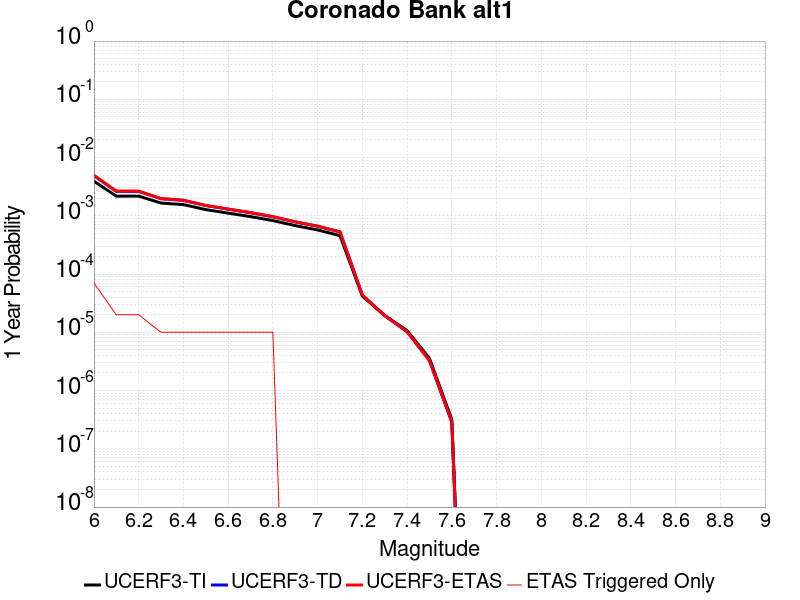 |  |

| Magnitude | 1 wk TI Prob | 1 wk TD Prob | 1 wk ETAS Prob | 1 wk ETAS/TD Gain | 1 wk ETAS Triggered Only | 1 mo TI Prob | 1 mo TD Prob | 1 mo ETAS Prob | 1 mo ETAS/TD Gain | 1 mo ETAS Triggered Only | 1 yr TI Prob | 1 yr TD Prob | 1 yr ETAS Prob | 1 yr ETAS/TD Gain | 1 yr ETAS Triggered Only | 10 yr TI Prob | 10 yr TD Prob | 10 yr ETAS Prob | 10 yr ETAS/TD Gain | 10 yr ETAS Triggered Only |
|-----|-----|-----|-----|-----|-----|-----|-----|-----|-----|-----|-----|-----|-----|-----|-----|-----|-----|-----|-----|-----|
| 6.0 | 7.533492E-5 | 9.394913E-5 | 1.3683594E-4 | 1.4564897 | 4.2890842E-5 | 3.22824E-4 | 4.0258127E-4 | 4.4545485E-4 | 1.1064967 | 4.2890842E-5 | 0.0039233007 | 0.0048909658 | 0.0049336464 | 1.0087265 | 4.2890842E-5 | 0.03854755 | 0.04790356 | 0.047944397 | 1.0008525 | 4.2890842E-5 |
| 6.1 | 4.1807285E-5 | 5.049283E-5 | 9.338151E-5 | 1.8494014 | 4.2890842E-5 | 1.7916178E-4 | 2.1638049E-4 | 2.5926204E-4 | 1.1981766 | 4.2890842E-5 | 0.0021791123 | 0.0026313474 | 0.0026741254 | 1.016257 | 4.2890842E-5 | 0.021578677 | 0.026011046 | 0.026052821 | 1.0016061 | 4.2890842E-5 |
| 6.2 | 4.1807285E-5 | 5.049283E-5 | 9.338151E-5 | 1.8494014 | 4.2890842E-5 | 1.7916178E-4 | 2.1638049E-4 | 2.5926204E-4 | 1.1981766 | 4.2890842E-5 | 0.0021791123 | 0.0026313474 | 0.0026741254 | 1.016257 | 4.2890842E-5 | 0.021578677 | 0.026011046 | 0.026052821 | 1.0016061 | 4.2890842E-5 |
| 6.3 | 3.1793104E-5 | 3.7711117E-5 | 3.7711117E-5 | 1.0 | 0.0 | 1.3624904E-4 | 1.6160926E-4 | 1.6160926E-4 | 1.0 | 0.0 | 0.0016575698 | 0.001965848 | 0.001965848 | 1.0 | 0.0 | 0.016452603 | 0.019488465 | 0.019488465 | 1.0 | 0.0 |
| 6.4 | 2.9878007E-5 | 3.5335794E-5 | 3.5335794E-5 | 1.0 | 0.0 | 1.2804232E-4 | 1.5143053E-4 | 1.5143053E-4 | 1.0 | 0.0 | 0.0015578003 | 0.0018421387 | 0.0018421387 | 1.0 | 0.0 | 0.015469253 | 0.01827244 | 0.01827244 | 1.0 | 0.0 |
| 6.5 | 2.4512565E-5 | 2.8764043E-5 | 2.8764043E-5 | 1.0 | 0.0 | 1.0504962E-4 | 1.2326881E-4 | 1.2326881E-4 | 1.0 | 0.0 | 0.0012782287 | 0.0014997921 | 0.0014997921 | 1.0 | 0.0 | 0.012709012 | 0.014899683 | 0.014899683 | 1.0 | 0.0 |
| 6.6 | 2.1317413E-5 | 2.490667E-5 | 2.490667E-5 | 1.0 | 0.0 | 9.135714E-5 | 1.0673863E-4 | 1.0673863E-4 | 1.0 | 0.0 | 0.0011117056 | 0.0012987906 | 0.0012987906 | 1.0 | 0.0 | 0.011061605 | 0.012914404 | 0.012914404 | 1.0 | 0.0 |
| 6.7 | 1.8585655E-5 | 2.163488E-5 | 2.163488E-5 | 1.0 | 0.0 | 7.9650374E-5 | 9.271773E-5 | 9.271773E-5 | 1.0 | 0.0 | 9.6931186E-4 | 0.0011282742 | 0.0011282742 | 1.0 | 0.0 | 0.0096509475 | 0.011227623 | 0.011227623 | 1.0 | 0.0 |
| 6.8 | 1.5862879E-5 | 1.8419474E-5 | 1.8419474E-5 | 1.0 | 0.0 | 6.798199E-5 | 7.893833E-5 | 7.893833E-5 | 1.0 | 0.0 | 8.273665E-4 | 9.6066965E-4 | 9.6066965E-4 | 1.0 | 0.0 | 0.008242928 | 0.00956715 | 0.00956715 | 1.0 | 0.0 |
| 6.9 | 1.3021509E-5 | 1.5095265E-5 | 1.5095265E-5 | 1.0 | 0.0 | 5.5805274E-5 | 6.469249E-5 | 6.469249E-5 | 1.0 | 0.0 | 6.792174E-4 | 7.8736455E-4 | 7.8736455E-4 | 1.0 | 0.0 | 0.006771452 | 0.007847573 | 0.007847573 | 1.0 | 0.0 |
| 7.0 | 1.0974371E-5 | 1.2720104E-5 | 1.2720104E-5 | 1.0 | 0.0 | 4.7032172E-5 | 5.451369E-5 | 5.451369E-5 | 1.0 | 0.0 | 5.7246623E-4 | 6.6351966E-4 | 6.6351966E-4 | 1.0 | 0.0 | 0.0057099373 | 0.006617135 | 0.006617135 | 1.0 | 0.0 |
| 7.1 | 8.766221E-6 | 1.01638325E-5 | 1.01638325E-5 | 1.0 | 0.0 | 3.7568978E-5 | 4.355865E-5 | 4.355865E-5 | 1.0 | 0.0 | 4.573063E-4 | 5.3021475E-4 | 5.3021475E-4 | 1.0 | 0.0 | 0.0045636636 | 0.0052911965 | 0.0052911965 | 1.0 | 0.0 |
| 7.2 | 8.026024E-7 | 8.331765E-7 | 8.331765E-7 | 1.0 | 0.0 | 3.43972E-6 | 3.5707515E-6 | 3.5707515E-6 | 1.0 | 0.0 | 4.1877785E-5 | 4.3473043E-5 | 4.3473043E-5 | 1.0 | 0.0 | 4.1869894E-4 | 4.3464647E-4 | 4.3464647E-4 | 1.0 | 0.0 |
| 7.3 | 3.7293114E-7 | 3.7000953E-7 | 3.7000953E-7 | 1.0 | 0.0 | 1.5982754E-6 | 1.5857541E-6 | 1.5857541E-6 | 1.0 | 0.0 | 1.9458828E-5 | 1.9306386E-5 | 1.9306386E-5 | 1.0 | 0.0 | 1.9457124E-4 | 1.9304715E-4 | 1.9304715E-4 | 1.0 | 0.0 |
| 7.4 | 2.0557036E-7 | 1.9674363E-7 | 1.9674363E-7 | 1.0 | 0.0 | 8.810155E-7 | 8.431867E-7 | 8.431867E-7 | 1.0 | 0.0 | 1.0726311E-5 | 1.026575E-5 | 1.026575E-5 | 1.0 | 0.0 | 1.0725793E-4 | 1.0265279E-4 | 1.0265279E-4 | 1.0 | 0.0 |
| 7.5 | 6.845446E-8 | 6.279369E-8 | 6.279369E-8 | 1.0 | 0.0 | 2.9337625E-7 | 2.691158E-7 | 2.691158E-7 | 1.0 | 0.0 | 3.5718497E-6 | 3.2764797E-6 | 3.2764797E-6 | 1.0 | 0.0 | 3.5717923E-5 | 3.2764325E-5 | 3.2764325E-5 | 1.0 | 0.0 |
| 7.6 | 6.0975145E-9 | 5.53185E-9 | 5.53185E-9 | 1.0 | 0.0 | 2.6132206E-8 | 2.370793E-8 | 2.370793E-8 | 1.0 | 0.0 | 3.1815955E-7 | 2.88644E-7 | 2.88644E-7 | 1.0 | 0.0 | 3.181591E-6 | 2.8864374E-6 | 2.8864374E-6 | 1.0 | 0.0 |

## Pitas Point (Lower West)
*[(top)](#table-of-contents)*

| 1 Week | 1 Month | 1 Year | 10 Year |
|-----|-----|-----|-----|
|  |  | 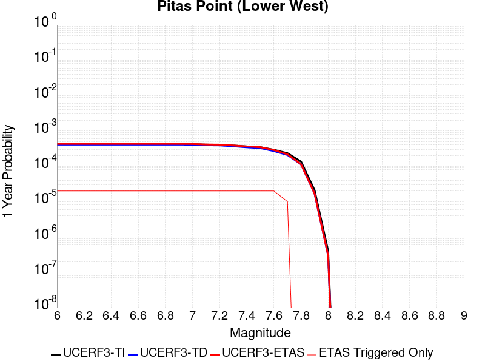 |  |

| Magnitude | 1 wk TI Prob | 1 wk TD Prob | 1 wk ETAS Prob | 1 wk ETAS/TD Gain | 1 wk ETAS Triggered Only | 1 mo TI Prob | 1 mo TD Prob | 1 mo ETAS Prob | 1 mo ETAS/TD Gain | 1 mo ETAS Triggered Only | 1 yr TI Prob | 1 yr TD Prob | 1 yr ETAS Prob | 1 yr ETAS/TD Gain | 1 yr ETAS Triggered Only | 10 yr TI Prob | 10 yr TD Prob | 10 yr ETAS Prob | 10 yr ETAS/TD Gain | 10 yr ETAS Triggered Only |
|-----|-----|-----|-----|-----|-----|-----|-----|-----|-----|-----|-----|-----|-----|-----|-----|-----|-----|-----|-----|-----|
| 6.0 | 8.151497E-6 | 7.855762E-6 | 5.074627E-5 | 6.459751 | 4.2890842E-5 | 3.493452E-5 | 3.3667122E-5 | 7.655652E-5 | 2.2739253 | 4.2890842E-5 | 4.252448E-4 | 4.0982084E-4 | 4.5269413E-4 | 1.1046146 | 4.2890842E-5 | 0.0042443196 | 0.0040907315 | 0.004133447 | 1.010442 | 4.2890842E-5 |
| 6.1 | 8.151497E-6 | 7.855762E-6 | 5.074627E-5 | 6.459751 | 4.2890842E-5 | 3.493452E-5 | 3.3667122E-5 | 7.655652E-5 | 2.2739253 | 4.2890842E-5 | 4.252448E-4 | 4.0982084E-4 | 4.5269413E-4 | 1.1046146 | 4.2890842E-5 | 0.0042443196 | 0.0040907315 | 0.004133447 | 1.010442 | 4.2890842E-5 |
| 6.2 | 8.151497E-6 | 7.855762E-6 | 5.074627E-5 | 6.459751 | 4.2890842E-5 | 3.493452E-5 | 3.3667122E-5 | 7.655652E-5 | 2.2739253 | 4.2890842E-5 | 4.252448E-4 | 4.0982084E-4 | 4.5269413E-4 | 1.1046146 | 4.2890842E-5 | 0.0042443196 | 0.0040907315 | 0.004133447 | 1.010442 | 4.2890842E-5 |
| 6.3 | 8.151497E-6 | 7.855762E-6 | 5.074627E-5 | 6.459751 | 4.2890842E-5 | 3.493452E-5 | 3.3667122E-5 | 7.655652E-5 | 2.2739253 | 4.2890842E-5 | 4.252448E-4 | 4.0982084E-4 | 4.5269413E-4 | 1.1046146 | 4.2890842E-5 | 0.0042443196 | 0.0040907315 | 0.004133447 | 1.010442 | 4.2890842E-5 |
| 6.4 | 8.151497E-6 | 7.855762E-6 | 5.074627E-5 | 6.459751 | 4.2890842E-5 | 3.493452E-5 | 3.3667122E-5 | 7.655652E-5 | 2.2739253 | 4.2890842E-5 | 4.252448E-4 | 4.0982084E-4 | 4.5269413E-4 | 1.1046146 | 4.2890842E-5 | 0.0042443196 | 0.0040907315 | 0.004133447 | 1.010442 | 4.2890842E-5 |
| 6.5 | 8.151497E-6 | 7.855762E-6 | 5.074627E-5 | 6.459751 | 4.2890842E-5 | 3.493452E-5 | 3.3667122E-5 | 7.655652E-5 | 2.2739253 | 4.2890842E-5 | 4.252448E-4 | 4.0982084E-4 | 4.5269413E-4 | 1.1046146 | 4.2890842E-5 | 0.0042443196 | 0.0040907315 | 0.004133447 | 1.010442 | 4.2890842E-5 |
| 6.6 | 8.151497E-6 | 7.855762E-6 | 5.074627E-5 | 6.459751 | 4.2890842E-5 | 3.493452E-5 | 3.3667122E-5 | 7.655652E-5 | 2.2739253 | 4.2890842E-5 | 4.252448E-4 | 4.0982084E-4 | 4.5269413E-4 | 1.1046146 | 4.2890842E-5 | 0.0042443196 | 0.0040907315 | 0.004133447 | 1.010442 | 4.2890842E-5 |
| 6.7 | 8.151497E-6 | 7.855762E-6 | 5.074627E-5 | 6.459751 | 4.2890842E-5 | 3.493452E-5 | 3.3667122E-5 | 7.655652E-5 | 2.2739253 | 4.2890842E-5 | 4.252448E-4 | 4.0982084E-4 | 4.5269413E-4 | 1.1046146 | 4.2890842E-5 | 0.0042443196 | 0.0040907315 | 0.004133447 | 1.010442 | 4.2890842E-5 |
| 6.8 | 8.151497E-6 | 7.855762E-6 | 5.074627E-5 | 6.459751 | 4.2890842E-5 | 3.493452E-5 | 3.3667122E-5 | 7.655652E-5 | 2.2739253 | 4.2890842E-5 | 4.252448E-4 | 4.0982084E-4 | 4.5269413E-4 | 1.1046146 | 4.2890842E-5 | 0.0042443196 | 0.0040907315 | 0.004133447 | 1.010442 | 4.2890842E-5 |
| 6.9 | 8.151497E-6 | 7.855762E-6 | 5.074627E-5 | 6.459751 | 4.2890842E-5 | 3.493452E-5 | 3.3667122E-5 | 7.655652E-5 | 2.2739253 | 4.2890842E-5 | 4.252448E-4 | 4.0982084E-4 | 4.5269413E-4 | 1.1046146 | 4.2890842E-5 | 0.0042443196 | 0.0040907315 | 0.004133447 | 1.010442 | 4.2890842E-5 |
| 7.0 | 8.103535E-6 | 7.805192E-6 | 5.06957E-5 | 6.4951253 | 4.2890842E-5 | 3.4728975E-5 | 3.3450397E-5 | 7.6339806E-5 | 2.2821794 | 4.2890842E-5 | 4.2274324E-4 | 4.0718322E-4 | 4.500566E-4 | 1.1052926 | 4.2890842E-5 | 0.0042193993 | 0.004064452 | 0.0041071684 | 1.0105097 | 4.2890842E-5 |
| 7.1 | 7.853298E-6 | 7.540883E-6 | 5.04314E-5 | 6.6877317 | 4.2890842E-5 | 3.3656554E-5 | 3.2317676E-5 | 7.520713E-5 | 2.3271208 | 4.2890842E-5 | 4.096915E-4 | 3.9339735E-4 | 4.362713E-4 | 1.1089839 | 4.2890842E-5 | 0.00408937 | 0.0039270855 | 0.003969808 | 1.0108789 | 4.2890842E-5 |
| 7.2 | 7.771102E-6 | 7.453165E-6 | 5.034369E-5 | 6.7546725 | 4.2890842E-5 | 3.33043E-5 | 3.194175E-5 | 7.483122E-5 | 2.3427403 | 4.2890842E-5 | 4.0540437E-4 | 3.8882208E-4 | 4.3169624E-4 | 1.1102668 | 4.2890842E-5 | 0.0040466557 | 0.0038814936 | 0.003924218 | 1.0110072 | 4.2890842E-5 |
| 7.3 | 7.3945344E-6 | 7.0492697E-6 | 4.993981E-5 | 7.084395 | 4.2890842E-5 | 3.1690477E-5 | 3.021081E-5 | 7.310035E-5 | 2.4196756 | 4.2890842E-5 | 3.8576324E-4 | 3.6775516E-4 | 4.1063022E-4 | 1.116586 | 4.2890842E-5 | 0.0038509427 | 0.0036715334 | 0.0037142667 | 1.0116391 | 4.2890842E-5 |
| 7.4 | 6.964645E-6 | 6.5901186E-6 | 4.9480677E-5 | 7.5083137 | 4.2890842E-5 | 2.9848137E-5 | 2.8243063E-5 | 7.1132694E-5 | 2.51859 | 4.2890842E-5 | 3.6334046E-4 | 3.4380553E-4 | 3.866816E-4 | 1.1247103 | 4.2890842E-5 | 0.0036274698 | 0.0034327896 | 0.003475533 | 1.0124515 | 4.2890842E-5 |
| 7.5 | 6.6525035E-6 | 6.259157E-6 | 4.914973E-5 | 7.8524523 | 4.2890842E-5 | 2.851042E-5 | 2.6824686E-5 | 6.971438E-5 | 2.5988889 | 4.2890842E-5 | 3.4705905E-4 | 3.265421E-4 | 3.6941894E-4 | 1.1313057 | 4.2890842E-5 | 0.0034651754 | 0.0032606742 | 0.0033034252 | 1.0131111 | 4.2890842E-5 |
| 7.6 | 5.613338E-6 | 5.151386E-6 | 4.804201E-5 | 9.326035 | 4.2890842E-5 | 2.405694E-5 | 2.2077185E-5 | 6.4967084E-5 | 2.942725 | 4.2890842E-5 | 2.928539E-4 | 2.6875688E-4 | 3.116362E-4 | 1.1595469 | 4.2890842E-5 | 0.0029246826 | 0.0026843501 | 0.0027271258 | 1.0159352 | 4.2890842E-5 |
| 7.7 | 4.494704E-6 | 3.996911E-6 | 4.6887584E-5 | 11.730955 | 4.2890842E-5 | 1.9262876E-5 | 1.7129507E-5 | 6.0019614E-5 | 3.5038729 | 4.2890842E-5 | 2.3450027E-4 | 2.0853203E-4 | 2.5141393E-4 | 1.205637 | 4.2890842E-5 | 0.0023425296 | 0.0020833875 | 0.002126189 | 1.0205442 | 4.2890842E-5 |
| 7.8 | 2.6075882E-6 | 2.1836374E-6 | 2.1836374E-6 | 1.0 | 0.0 | 1.117533E-5 | 9.358413E-6 | 9.358413E-6 | 1.0 | 0.0 | 1.3605114E-4 | 1.1393277E-4 | 1.1393277E-4 | 1.0 | 0.0 | 0.0013596788 | 0.0011387484 | 0.0011387484 | 1.0 | 0.0 |
| 7.9 | 4.045984E-7 | 3.242375E-7 | 3.242375E-7 | 1.0 | 0.0 | 1.733992E-6 | 1.3895885E-6 | 1.3895885E-6 | 1.0 | 0.0 | 2.1111147E-5 | 1.6918111E-5 | 1.6918111E-5 | 1.0 | 0.0 | 2.1109142E-4 | 1.6916855E-4 | 1.6916855E-4 | 1.0 | 0.0 |
| 8.0 | 7.791402E-9 | 5.683497E-9 | 5.683497E-9 | 1.0 | 0.0 | 3.3391725E-8 | 2.4357844E-8 | 2.4357844E-8 | 1.0 | 0.0 | 4.0654416E-7 | 2.9655675E-7 | 2.9655675E-7 | 1.0 | 0.0 | 4.065434E-6 | 2.9655655E-6 | 2.9655655E-6 | 1.0 | 0.0 |

## Channel Islands Thrust
*[(top)](#table-of-contents)*

| 1 Week | 1 Month | 1 Year | 10 Year |
|-----|-----|-----|-----|
|  |  |  |  |

| Magnitude | 1 wk TI Prob | 1 wk TD Prob | 1 wk ETAS Prob | 1 wk ETAS/TD Gain | 1 wk ETAS Triggered Only | 1 mo TI Prob | 1 mo TD Prob | 1 mo ETAS Prob | 1 mo ETAS/TD Gain | 1 mo ETAS Triggered Only | 1 yr TI Prob | 1 yr TD Prob | 1 yr ETAS Prob | 1 yr ETAS/TD Gain | 1 yr ETAS Triggered Only | 10 yr TI Prob | 10 yr TD Prob | 10 yr ETAS Prob | 10 yr ETAS/TD Gain | 10 yr ETAS Triggered Only |
|-----|-----|-----|-----|-----|-----|-----|-----|-----|-----|-----|-----|-----|-----|-----|-----|-----|-----|-----|-----|-----|
| 6.0 | 2.2156251E-5 | 2.4092022E-5 | 2.4092022E-5 | 1.0 | 0.0 | 9.495191E-5 | 1.03248036E-4 | 1.03248036E-4 | 1.0 | 0.0 | 0.0011554264 | 0.0012564264 | 0.0012564264 | 1.0 | 0.0 | 0.011494373 | 0.0125038205 | 0.012546175 | 1.0033873 | 4.2890842E-5 |
| 6.1 | 2.2156251E-5 | 2.4092022E-5 | 2.4092022E-5 | 1.0 | 0.0 | 9.495191E-5 | 1.03248036E-4 | 1.03248036E-4 | 1.0 | 0.0 | 0.0011554264 | 0.0012564264 | 0.0012564264 | 1.0 | 0.0 | 0.011494373 | 0.0125038205 | 0.012546175 | 1.0033873 | 4.2890842E-5 |
| 6.2 | 2.2156251E-5 | 2.4092022E-5 | 2.4092022E-5 | 1.0 | 0.0 | 9.495191E-5 | 1.03248036E-4 | 1.03248036E-4 | 1.0 | 0.0 | 0.0011554264 | 0.0012564264 | 0.0012564264 | 1.0 | 0.0 | 0.011494373 | 0.0125038205 | 0.012546175 | 1.0033873 | 4.2890842E-5 |
| 6.3 | 2.2156251E-5 | 2.4092022E-5 | 2.4092022E-5 | 1.0 | 0.0 | 9.495191E-5 | 1.03248036E-4 | 1.03248036E-4 | 1.0 | 0.0 | 0.0011554264 | 0.0012564264 | 0.0012564264 | 1.0 | 0.0 | 0.011494373 | 0.0125038205 | 0.012546175 | 1.0033873 | 4.2890842E-5 |
| 6.4 | 2.2156251E-5 | 2.4092022E-5 | 2.4092022E-5 | 1.0 | 0.0 | 9.495191E-5 | 1.03248036E-4 | 1.03248036E-4 | 1.0 | 0.0 | 0.0011554264 | 0.0012564264 | 0.0012564264 | 1.0 | 0.0 | 0.011494373 | 0.0125038205 | 0.012546175 | 1.0033873 | 4.2890842E-5 |
| 6.5 | 2.2156251E-5 | 2.4092022E-5 | 2.4092022E-5 | 1.0 | 0.0 | 9.495191E-5 | 1.03248036E-4 | 1.03248036E-4 | 1.0 | 0.0 | 0.0011554264 | 0.0012564264 | 0.0012564264 | 1.0 | 0.0 | 0.011494373 | 0.0125038205 | 0.012546175 | 1.0033873 | 4.2890842E-5 |
| 6.6 | 2.2156251E-5 | 2.4092022E-5 | 2.4092022E-5 | 1.0 | 0.0 | 9.495191E-5 | 1.03248036E-4 | 1.03248036E-4 | 1.0 | 0.0 | 0.0011554264 | 0.0012564264 | 0.0012564264 | 1.0 | 0.0 | 0.011494373 | 0.0125038205 | 0.012546175 | 1.0033873 | 4.2890842E-5 |
| 6.7 | 1.0601296E-5 | 1.1379544E-5 | 1.1379544E-5 | 1.0 | 0.0 | 4.5433335E-5 | 4.876859E-5 | 4.876859E-5 | 1.0 | 0.0 | 5.5301044E-4 | 5.936007E-4 | 5.936007E-4 | 1.0 | 0.0 | 0.005516363 | 0.005920653 | 0.005920653 | 1.0 | 0.0 |
| 6.8 | 1.0246747E-5 | 1.0996669E-5 | 1.0996669E-5 | 1.0 | 0.0 | 4.391389E-5 | 4.7127756E-5 | 4.7127756E-5 | 1.0 | 0.0 | 5.345204E-4 | 5.7363417E-4 | 5.7363417E-4 | 1.0 | 0.0 | 0.0053323656 | 0.005722025 | 0.005722025 | 1.0 | 0.0 |
| 6.9 | 9.049551E-6 | 9.699645E-6 | 9.699645E-6 | 1.0 | 0.0 | 3.878322E-5 | 4.1569267E-5 | 4.1569267E-5 | 1.0 | 0.0 | 4.7208337E-4 | 5.059924E-4 | 5.059924E-4 | 1.0 | 0.0 | 0.0047108172 | 0.0050488203 | 0.0050488203 | 1.0 | 0.0 |
| 7.0 | 8.6542195E-6 | 9.274603E-6 | 9.274603E-6 | 1.0 | 0.0 | 3.7088983E-5 | 3.9747716E-5 | 3.9747716E-5 | 1.0 | 0.0 | 4.5146482E-4 | 4.8382508E-4 | 4.8382508E-4 | 1.0 | 0.0 | 0.004505487 | 0.004828129 | 0.004828129 | 1.0 | 0.0 |
| 7.1 | 8.391028E-6 | 8.992924E-6 | 8.992924E-6 | 1.0 | 0.0 | 3.5961057E-5 | 3.854056E-5 | 3.854056E-5 | 1.0 | 0.0 | 4.3773788E-4 | 4.6913436E-4 | 4.6913436E-4 | 1.0 | 0.0 | 0.004368766 | 0.0046818503 | 0.0046818503 | 1.0 | 0.0 |
| 7.2 | 5.965188E-6 | 6.3716952E-6 | 6.3716952E-6 | 1.0 | 0.0 | 2.556484E-5 | 2.7306982E-5 | 2.7306982E-5 | 1.0 | 0.0 | 3.1120746E-4 | 3.3241234E-4 | 3.3241234E-4 | 1.0 | 0.0 | 0.00310772 | 0.0033192092 | 0.0033192092 | 1.0 | 0.0 |
| 7.3 | 4.877518E-6 | 5.2060063E-6 | 5.2060063E-6 | 1.0 | 0.0 | 2.0903482E-5 | 2.2311267E-5 | 2.2311267E-5 | 1.0 | 0.0 | 2.5447016E-4 | 2.716063E-4 | 2.716063E-4 | 1.0 | 0.0 | 0.0025417898 | 0.0027127895 | 0.0027127895 | 1.0 | 0.0 |
| 7.4 | 3.8829853E-6 | 4.141863E-6 | 4.141863E-6 | 1.0 | 0.0 | 1.664126E-5 | 1.7750723E-5 | 1.7750723E-5 | 1.0 | 0.0 | 2.0258849E-4 | 2.1609402E-4 | 2.1609402E-4 | 1.0 | 0.0 | 0.002024039 | 0.0021588807 | 0.0021588807 | 1.0 | 0.0 |
| 7.5 | 1.3489616E-6 | 1.4277903E-6 | 1.4277903E-6 | 1.0 | 0.0 | 5.7812517E-6 | 6.119087E-6 | 6.119087E-6 | 1.0 | 0.0 | 7.038446E-5 | 7.449738E-5 | 7.449738E-5 | 1.0 | 0.0 | 7.036218E-4 | 7.44728E-4 | 7.44728E-4 | 1.0 | 0.0 |
| 7.6 | 6.058192E-7 | 6.353778E-7 | 6.353778E-7 | 1.0 | 0.0 | 2.5963652E-6 | 2.7230449E-6 | 2.7230449E-6 | 1.0 | 0.0 | 3.161029E-5 | 3.3152584E-5 | 3.3152584E-5 | 1.0 | 0.0 | 3.1605794E-4 | 3.31478E-4 | 3.31478E-4 | 1.0 | 0.0 |
| 7.7 | 2.2170494E-7 | 2.2607902E-7 | 2.2607902E-7 | 1.0 | 0.0 | 9.5016367E-7 | 9.689098E-7 | 9.689098E-7 | 1.0 | 0.0 | 1.1568181E-5 | 1.1796425E-5 | 1.1796425E-5 | 1.0 | 0.0 | 1.1567579E-4 | 1.1795909E-4 | 1.1795909E-4 | 1.0 | 0.0 |
| 7.8 | 2.1613102E-8 | 1.5466682E-8 | 1.5466682E-8 | 1.0 | 0.0 | 9.262757E-8 | 6.628578E-8 | 6.628578E-8 | 1.0 | 0.0 | 1.1277401E-6 | 8.070291E-7 | 8.070291E-7 | 1.0 | 0.0 | 1.1277344E-5 | 8.070269E-6 | 8.070269E-6 | 1.0 | 0.0 |

## San Luis Range 2011 CFM
*[(top)](#table-of-contents)*

| 1 Week | 1 Month | 1 Year | 10 Year |
|-----|-----|-----|-----|
|  |  |  |  |

| Magnitude | 1 wk TI Prob | 1 wk TD Prob | 1 wk ETAS Prob | 1 wk ETAS/TD Gain | 1 wk ETAS Triggered Only | 1 mo TI Prob | 1 mo TD Prob | 1 mo ETAS Prob | 1 mo ETAS/TD Gain | 1 mo ETAS Triggered Only | 1 yr TI Prob | 1 yr TD Prob | 1 yr ETAS Prob | 1 yr ETAS/TD Gain | 1 yr ETAS Triggered Only | 10 yr TI Prob | 10 yr TD Prob | 10 yr ETAS Prob | 10 yr ETAS/TD Gain | 10 yr ETAS Triggered Only |
|-----|-----|-----|-----|-----|-----|-----|-----|-----|-----|-----|-----|-----|-----|-----|-----|-----|-----|-----|-----|-----|
| 6.0 | 8.8368415E-6 | 8.965454E-6 | 5.1855914E-5 | 5.7839694 | 4.2890842E-5 | 3.787163E-5 | 3.842285E-5 | 8.131205E-5 | 2.116242 | 4.2890842E-5 | 4.609895E-4 | 4.677057E-4 | 5.105765E-4 | 1.0916619 | 4.2890842E-5 | 0.0046003438 | 0.0046679964 | 0.004710687 | 1.0091454 | 4.2890842E-5 |
| 6.1 | 8.8368415E-6 | 8.965454E-6 | 5.1855914E-5 | 5.7839694 | 4.2890842E-5 | 3.787163E-5 | 3.842285E-5 | 8.131205E-5 | 2.116242 | 4.2890842E-5 | 4.609895E-4 | 4.677057E-4 | 5.105765E-4 | 1.0916619 | 4.2890842E-5 | 0.0046003438 | 0.0046679964 | 0.004710687 | 1.0091454 | 4.2890842E-5 |
| 6.2 | 8.8368415E-6 | 8.965454E-6 | 5.1855914E-5 | 5.7839694 | 4.2890842E-5 | 3.787163E-5 | 3.842285E-5 | 8.131205E-5 | 2.116242 | 4.2890842E-5 | 4.609895E-4 | 4.677057E-4 | 5.105765E-4 | 1.0916619 | 4.2890842E-5 | 0.0046003438 | 0.0046679964 | 0.004710687 | 1.0091454 | 4.2890842E-5 |
| 6.3 | 8.8368415E-6 | 8.965454E-6 | 5.1855914E-5 | 5.7839694 | 4.2890842E-5 | 3.787163E-5 | 3.842285E-5 | 8.131205E-5 | 2.116242 | 4.2890842E-5 | 4.609895E-4 | 4.677057E-4 | 5.105765E-4 | 1.0916619 | 4.2890842E-5 | 0.0046003438 | 0.0046679964 | 0.004710687 | 1.0091454 | 4.2890842E-5 |
| 6.4 | 3.9094193E-6 | 3.9412025E-6 | 4.6831876E-5 | 11.882636 | 4.2890842E-5 | 1.6754546E-5 | 1.689076E-5 | 5.978088E-5 | 3.539265 | 4.2890842E-5 | 2.039675E-4 | 2.056259E-4 | 2.4850792E-4 | 1.2085439 | 4.2890842E-5 | 0.0020378039 | 0.0020543851 | 0.0020971878 | 1.0208348 | 4.2890842E-5 |
| 6.5 | 3.9094193E-6 | 3.9412025E-6 | 4.6831876E-5 | 11.882636 | 4.2890842E-5 | 1.6754546E-5 | 1.689076E-5 | 5.978088E-5 | 3.539265 | 4.2890842E-5 | 2.039675E-4 | 2.056259E-4 | 2.4850792E-4 | 1.2085439 | 4.2890842E-5 | 0.0020378039 | 0.0020543851 | 0.0020971878 | 1.0208348 | 4.2890842E-5 |
| 6.6 | 3.0587726E-6 | 3.0753883E-6 | 4.59661E-5 | 14.946438 | 4.2890842E-5 | 1.3108959E-5 | 1.318017E-5 | 5.6070447E-5 | 4.2541523 | 4.2890842E-5 | 1.595899E-4 | 1.6045687E-4 | 2.0334082E-4 | 1.2672616 | 4.2890842E-5 | 0.0015947534 | 0.0016034221 | 0.0016462442 | 1.0267067 | 4.2890842E-5 |
| 6.7 | 2.6160574E-6 | 2.6251273E-6 | 4.551586E-5 | 17.338533 | 4.2890842E-5 | 1.1211626E-5 | 1.1250498E-5 | 5.414086E-5 | 4.812308 | 4.2890842E-5 | 1.3649299E-4 | 1.3696625E-4 | 1.7985122E-4 | 1.3131061 | 4.2890842E-5 | 0.0013640919 | 0.0013688246 | 0.0014116567 | 1.0312911 | 4.2890842E-5 |
| 6.8 | 2.5110312E-6 | 2.51814E-6 | 4.5408877E-5 | 18.032703 | 4.2890842E-5 | 1.0761518E-5 | 1.0791985E-5 | 5.3682365E-5 | 4.974281 | 4.2890842E-5 | 1.310136E-4 | 1.3138456E-4 | 1.7426976E-4 | 1.3264098 | 4.2890842E-5 | 0.0013093639 | 0.0013130746 | 0.0013559092 | 1.0326215 | 4.2890842E-5 |
| 6.9 | 1.8564405E-6 | 1.852487E-6 | 4.474325E-5 | 24.15307 | 4.2890842E-5 | 7.95615E-6 | 7.939206E-6 | 5.082971E-5 | 6.4023666 | 4.2890842E-5 | 9.686181E-5 | 9.665557E-5 | 1.3954226E-4 | 1.4437064 | 4.2890842E-5 | 9.68196E-4 | 9.661373E-4 | 0.0010089867 | 1.0443512 | 4.2890842E-5 |
| 7.0 | 1.546127E-6 | 1.5369537E-6 | 4.4427732E-5 | 28.906355 | 4.2890842E-5 | 6.626242E-6 | 6.586928E-6 | 4.9477487E-5 | 7.5114665 | 4.2890842E-5 | 8.06715E-5 | 8.0192905E-5 | 1.230803E-4 | 1.5348029 | 4.2890842E-5 | 8.0642226E-4 | 8.016404E-4 | 8.444968E-4 | 1.053461 | 4.2890842E-5 |
| 7.1 | 1.3368208E-6 | 1.3235326E-6 | 4.4214317E-5 | 33.406292 | 4.2890842E-5 | 5.7292195E-6 | 5.67227E-6 | 4.856287E-5 | 8.561452 | 4.2890842E-5 | 6.975101E-5 | 6.905771E-5 | 1.11945585E-4 | 1.621044 | 4.2890842E-5 | 6.972912E-4 | 6.9036294E-4 | 7.3322415E-4 | 1.062085 | 4.2890842E-5 |
| 7.2 | 1.0623363E-6 | 1.0454368E-6 | 1.0454368E-6 | 1.0 | 0.0 | 4.5528623E-6 | 4.4804356E-6 | 4.4804356E-6 | 1.0 | 0.0 | 5.5429686E-5 | 5.4547938E-5 | 5.4547938E-5 | 1.0 | 0.0 | 5.5415864E-4 | 5.4534577E-4 | 5.4534577E-4 | 1.0 | 0.0 |
| 7.3 | 7.831679E-7 | 7.7273904E-7 | 7.7273904E-7 | 1.0 | 0.0 | 3.3564295E-6 | 3.3117344E-6 | 3.3117344E-6 | 1.0 | 0.0 | 4.086376E-5 | 4.0319625E-5 | 4.0319625E-5 | 1.0 | 0.0 | 4.0856248E-4 | 4.031232E-4 | 4.031232E-4 | 1.0 | 0.0 |
| 7.4 | 5.9558846E-7 | 5.910636E-7 | 5.910636E-7 | 1.0 | 0.0 | 2.5525194E-6 | 2.5331274E-6 | 2.5331274E-6 | 1.0 | 0.0 | 3.107648E-5 | 3.084039E-5 | 3.084039E-5 | 1.0 | 0.0 | 3.1072134E-4 | 3.083612E-4 | 3.083612E-4 | 1.0 | 0.0 |
| 7.5 | 4.1616502E-7 | 4.119631E-7 | 4.119631E-7 | 1.0 | 0.0 | 1.7835631E-6 | 1.7655549E-6 | 1.7655549E-6 | 1.0 | 0.0 | 2.1714664E-5 | 2.149542E-5 | 2.149542E-5 | 1.0 | 0.0 | 2.1712543E-4 | 2.1493346E-4 | 2.1493346E-4 | 1.0 | 0.0 |
| 7.6 | 2.3816014E-7 | 2.3376548E-7 | 2.3376548E-7 | 1.0 | 0.0 | 1.0206859E-6 | 1.0018516E-6 | 1.0018516E-6 | 1.0 | 0.0 | 1.242678E-5 | 1.2197475E-5 | 1.2197475E-5 | 1.0 | 0.0 | 1.2426086E-4 | 1.2196808E-4 | 1.2196808E-4 | 1.0 | 0.0 |
| 7.7 | 9.918777E-8 | 9.3867584E-8 | 9.3867584E-8 | 1.0 | 0.0 | 4.2509038E-7 | 4.0228957E-7 | 4.0228957E-7 | 1.0 | 0.0 | 5.1754632E-6 | 4.8978645E-6 | 4.8978645E-6 | 1.0 | 0.0 | 5.1753424E-5 | 4.897757E-5 | 4.897757E-5 | 1.0 | 0.0 |
| 7.8 | 3.4982556E-8 | 2.968655E-8 | 2.968655E-8 | 1.0 | 0.0 | 1.4992524E-7 | 1.2722806E-7 | 1.2722806E-7 | 1.0 | 0.0 | 1.8253382E-6 | 1.5490006E-6 | 1.5490006E-6 | 1.0 | 0.0 | 1.8253233E-5 | 1.5489897E-5 | 1.5489897E-5 | 1.0 | 0.0 |
| 7.9 | 1.6624908E-8 | 1.1477036E-8 | 1.1477036E-8 | 1.0 | 0.0 | 7.12496E-8 | 4.91873E-8 | 4.91873E-8 | 1.0 | 0.0 | 8.6746354E-7 | 5.988552E-7 | 5.988552E-7 | 1.0 | 0.0 | 8.674601E-6 | 5.988536E-6 | 5.988536E-6 | 1.0 | 0.0 |
| 8.0 | 6.3352315E-9 | 3.0888412E-9 | 3.0888412E-9 | 1.0 | 0.0 | 2.715099E-8 | 1.3237893E-8 | 1.3237893E-8 | 1.0 | 0.0 | 3.3056327E-7 | 1.6117131E-7 | 1.6117131E-7 | 1.0 | 0.0 | 3.3056278E-6 | 1.611712E-6 | 1.611712E-6 | 1.0 | 0.0 |

## Eaton Roughs 2011 CFM
*[(top)](#table-of-contents)*

| 1 Week | 1 Month | 1 Year | 10 Year |
|-----|-----|-----|-----|
|  |  |  | 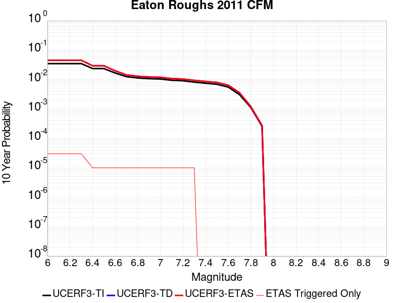 |

| Magnitude | 1 wk TI Prob | 1 wk TD Prob | 1 wk ETAS Prob | 1 wk ETAS/TD Gain | 1 wk ETAS Triggered Only | 1 mo TI Prob | 1 mo TD Prob | 1 mo ETAS Prob | 1 mo ETAS/TD Gain | 1 mo ETAS Triggered Only | 1 yr TI Prob | 1 yr TD Prob | 1 yr ETAS Prob | 1 yr ETAS/TD Gain | 1 yr ETAS Triggered Only | 10 yr TI Prob | 10 yr TD Prob | 10 yr ETAS Prob | 10 yr ETAS/TD Gain | 10 yr ETAS Triggered Only |
|-----|-----|-----|-----|-----|-----|-----|-----|-----|-----|-----|-----|-----|-----|-----|-----|-----|-----|-----|-----|-----|
| 6.0 | 6.8044945E-5 | 8.843646E-5 | 8.843646E-5 | 1.0 | 0.0 | 2.9158857E-4 | 3.7896493E-4 | 3.7896493E-4 | 1.0 | 0.0 | 0.0035443127 | 0.0046050907 | 0.004647784 | 1.0092709 | 4.2890842E-5 | 0.03488314 | 0.04516335 | 0.0452043 | 1.0009068 | 4.2890842E-5 |
| 6.1 | 6.8044945E-5 | 8.843646E-5 | 8.843646E-5 | 1.0 | 0.0 | 2.9158857E-4 | 3.7896493E-4 | 3.7896493E-4 | 1.0 | 0.0 | 0.0035443127 | 0.0046050907 | 0.004647784 | 1.0092709 | 4.2890842E-5 | 0.03488314 | 0.04516335 | 0.0452043 | 1.0009068 | 4.2890842E-5 |
| 6.2 | 6.8044945E-5 | 8.843646E-5 | 8.843646E-5 | 1.0 | 0.0 | 2.9158857E-4 | 3.7896493E-4 | 3.7896493E-4 | 1.0 | 0.0 | 0.0035443127 | 0.0046050907 | 0.004647784 | 1.0092709 | 4.2890842E-5 | 0.03488314 | 0.04516335 | 0.0452043 | 1.0009068 | 4.2890842E-5 |
| 6.3 | 6.8044945E-5 | 8.843646E-5 | 8.843646E-5 | 1.0 | 0.0 | 2.9158857E-4 | 3.7896493E-4 | 3.7896493E-4 | 1.0 | 0.0 | 0.0035443127 | 0.0046050907 | 0.004647784 | 1.0092709 | 4.2890842E-5 | 0.03488314 | 0.04516335 | 0.0452043 | 1.0009068 | 4.2890842E-5 |
| 6.4 | 4.5830013E-5 | 5.715427E-5 | 5.715427E-5 | 1.0 | 0.0 | 1.9639956E-4 | 2.4492692E-4 | 2.4492692E-4 | 1.0 | 0.0 | 0.0023885423 | 0.0029784471 | 0.0029784471 | 1.0 | 0.0 | 0.023630321 | 0.029421588 | 0.029421588 | 1.0 | 0.0 |
| 6.5 | 4.5830013E-5 | 5.715427E-5 | 5.715427E-5 | 1.0 | 0.0 | 1.9639956E-4 | 2.4492692E-4 | 2.4492692E-4 | 1.0 | 0.0 | 0.0023885423 | 0.0029784471 | 0.0029784471 | 1.0 | 0.0 | 0.023630321 | 0.029421588 | 0.029421588 | 1.0 | 0.0 |
| 6.6 | 3.222194E-5 | 3.8261504E-5 | 3.8261504E-5 | 1.0 | 0.0 | 1.3808672E-4 | 1.639682E-4 | 1.639682E-4 | 1.0 | 0.0 | 0.0016799092 | 0.001994599 | 0.001994599 | 1.0 | 0.0 | 0.016672665 | 0.019776601 | 0.019776601 | 1.0 | 0.0 |
| 6.7 | 2.4155654E-5 | 2.7786238E-5 | 2.7786238E-5 | 1.0 | 0.0 | 1.0352012E-4 | 1.1907848E-4 | 1.1907848E-4 | 1.0 | 0.0 | 0.0012596287 | 0.0014488247 | 0.0014488247 | 1.0 | 0.0 | 0.012525126 | 0.014394943 | 0.014394943 | 1.0 | 0.0 |
| 6.8 | 2.1814667E-5 | 2.4940868E-5 | 2.4940868E-5 | 1.0 | 0.0 | 9.348808E-5 | 1.06885076E-4 | 1.06885076E-4 | 1.0 | 0.0 | 0.001137623 | 0.0013005526 | 0.0013005526 | 1.0 | 0.0 | 0.011318169 | 0.012930038 | 0.012930038 | 1.0 | 0.0 |
| 6.9 | 2.0700467E-5 | 2.3628932E-5 | 2.3628932E-5 | 1.0 | 0.0 | 8.871327E-5 | 1.01262944E-4 | 1.01262944E-4 | 1.0 | 0.0 | 0.0010795488 | 0.0012321823 | 0.0012321823 | 1.0 | 0.0 | 0.010743194 | 0.012254035 | 0.012254035 | 1.0 | 0.0 |
| 7.0 | 2.0104066E-5 | 2.29365E-5 | 2.29365E-5 | 1.0 | 0.0 | 8.615744E-5 | 9.82956E-5 | 9.82956E-5 | 1.0 | 0.0 | 0.0010484619 | 0.0011960949 | 0.0011960949 | 1.0 | 0.0 | 0.010435291 | 0.011897073 | 0.011897073 | 1.0 | 0.0 |
| 7.1 | 1.8225232E-5 | 2.0773046E-5 | 2.0773046E-5 | 1.0 | 0.0 | 7.81058E-5 | 8.902431E-5 | 8.902431E-5 | 1.0 | 0.0 | 9.5052324E-4 | 0.0010833336 | 0.0010833336 | 1.0 | 0.0 | 0.009464677 | 0.010780825 | 0.010780825 | 1.0 | 0.0 |
| 7.2 | 1.7526572E-5 | 1.9993488E-5 | 1.9993488E-5 | 1.0 | 0.0 | 7.511172E-5 | 8.5683576E-5 | 8.5683576E-5 | 1.0 | 0.0 | 9.141015E-4 | 0.0010426997 | 0.0010426997 | 1.0 | 0.0 | 0.009103506 | 0.010378351 | 0.010378351 | 1.0 | 0.0 |
| 7.3 | 1.5727232E-5 | 1.8021507E-5 | 1.8021507E-5 | 1.0 | 0.0 | 6.740067E-5 | 7.723275E-5 | 7.723275E-5 | 1.0 | 0.0 | 8.2029426E-4 | 9.399043E-4 | 9.399043E-4 | 1.0 | 0.0 | 0.008172729 | 0.009359511 | 0.009359511 | 1.0 | 0.0 |
| 7.4 | 1.4457361E-5 | 1.6598358E-5 | 1.6598358E-5 | 1.0 | 0.0 | 6.195865E-5 | 7.113389E-5 | 7.113389E-5 | 1.0 | 0.0 | 7.540854E-4 | 8.657119E-4 | 8.657119E-4 | 1.0 | 0.0 | 0.007515317 | 0.008623555 | 0.008623555 | 1.0 | 0.0 |
| 7.5 | 1.33280955E-5 | 1.5345435E-5 | 1.5345435E-5 | 1.0 | 0.0 | 5.711916E-5 | 6.57645E-5 | 6.57645E-5 | 1.0 | 0.0 | 6.9520384E-4 | 8.0038945E-4 | 8.0038945E-4 | 1.0 | 0.0 | 0.00693033 | 0.007975209 | 0.007975209 | 1.0 | 0.0 |
| 7.6 | 1.0699478E-5 | 1.2387815E-5 | 1.2387815E-5 | 1.0 | 0.0 | 4.5854096E-5 | 5.308956E-5 | 5.308956E-5 | 1.0 | 0.0 | 5.581306E-4 | 6.4617425E-4 | 6.4617425E-4 | 1.0 | 0.0 | 0.005567309 | 0.0064430353 | 0.0064430353 | 1.0 | 0.0 |
| 7.7 | 5.9390236E-6 | 6.852951E-6 | 6.852951E-6 | 1.0 | 0.0 | 2.545271E-5 | 2.9369461E-5 | 2.9369461E-5 | 1.0 | 0.0 | 3.0984267E-4 | 3.5751477E-4 | 3.5751477E-4 | 1.0 | 0.0 | 0.0030941102 | 0.0035694204 | 0.0035694204 | 1.0 | 0.0 |
| 7.8 | 2.1622036E-6 | 2.3296996E-6 | 2.3296996E-6 | 1.0 | 0.0 | 9.266554E-6 | 9.984388E-6 | 9.984388E-6 | 1.0 | 0.0 | 1.1281446E-4 | 1.21553225E-4 | 1.21553225E-4 | 1.0 | 0.0 | 0.001127572 | 0.001214873 | 0.001214873 | 1.0 | 0.0 |
| 7.9 | 4.9586197E-7 | 5.2189216E-7 | 5.2189216E-7 | 1.0 | 0.0 | 2.125121E-6 | 2.2366787E-6 | 2.2366787E-6 | 1.0 | 0.0 | 2.5873042E-5 | 2.7231245E-5 | 2.7231245E-5 | 1.0 | 0.0 | 2.5870028E-4 | 2.7228118E-4 | 2.7228118E-4 | 1.0 | 0.0 |

## San Clemente
*[(top)](#table-of-contents)*

| 1 Week | 1 Month | 1 Year | 10 Year |
|-----|-----|-----|-----|
|  |  |  |  |

| Magnitude | 1 wk TI Prob | 1 wk TD Prob | 1 wk ETAS Prob | 1 wk ETAS/TD Gain | 1 wk ETAS Triggered Only | 1 mo TI Prob | 1 mo TD Prob | 1 mo ETAS Prob | 1 mo ETAS/TD Gain | 1 mo ETAS Triggered Only | 1 yr TI Prob | 1 yr TD Prob | 1 yr ETAS Prob | 1 yr ETAS/TD Gain | 1 yr ETAS Triggered Only | 10 yr TI Prob | 10 yr TD Prob | 10 yr ETAS Prob | 10 yr ETAS/TD Gain | 10 yr ETAS Triggered Only |
|-----|-----|-----|-----|-----|-----|-----|-----|-----|-----|-----|-----|-----|-----|-----|-----|-----|-----|-----|-----|-----|
| 6.0 | 6.681379E-5 | 8.163422E-5 | 8.163422E-5 | 1.0 | 0.0 | 2.8631336E-4 | 3.498173E-4 | 3.498173E-4 | 1.0 | 0.0 | 0.003480294 | 0.0042512873 | 0.004293996 | 1.010046 | 4.2890842E-5 | 0.03426291 | 0.041755714 | 0.041796815 | 1.0009843 | 4.2890842E-5 |
| 6.1 | 6.681379E-5 | 8.163422E-5 | 8.163422E-5 | 1.0 | 0.0 | 2.8631336E-4 | 3.498173E-4 | 3.498173E-4 | 1.0 | 0.0 | 0.003480294 | 0.0042512873 | 0.0042512873 | 1.0 | 0.0 | 0.03426291 | 0.041755714 | 0.041755714 | 1.0 | 0.0 |
| 6.2 | 3.9400576E-5 | 4.6451984E-5 | 4.6451984E-5 | 1.0 | 0.0 | 1.6884868E-4 | 1.9906509E-4 | 1.9906509E-4 | 1.0 | 0.0 | 0.0020537945 | 0.002420985 | 0.002420985 | 1.0 | 0.0 | 0.020349167 | 0.02395286 | 0.02395286 | 1.0 | 0.0 |
| 6.3 | 3.2590255E-5 | 3.7929087E-5 | 3.7929087E-5 | 1.0 | 0.0 | 1.3966505E-4 | 1.6254328E-4 | 1.6254328E-4 | 1.0 | 0.0 | 0.0016990956 | 0.0019771985 | 0.0019771985 | 1.0 | 0.0 | 0.01686163 | 0.019599866 | 0.019599866 | 1.0 | 0.0 |
| 6.4 | 2.9454652E-5 | 3.4097775E-5 | 3.4097775E-5 | 1.0 | 0.0 | 1.2622811E-4 | 1.4612528E-4 | 1.4612528E-4 | 1.0 | 0.0 | 0.0015357438 | 0.0017776482 | 0.0017776482 | 1.0 | 0.0 | 0.015251739 | 0.017637458 | 0.017637458 | 1.0 | 0.0 |
| 6.5 | 2.790836E-5 | 3.2247463E-5 | 3.2247463E-5 | 1.0 | 0.0 | 1.1960178E-4 | 1.3819622E-4 | 1.3819622E-4 | 1.0 | 0.0 | 0.001455179 | 0.0016812651 | 0.0016812651 | 1.0 | 0.0 | 0.014456868 | 0.016688475 | 0.016688475 | 1.0 | 0.0 |
| 6.6 | 2.2492153E-5 | 2.5762707E-5 | 2.5762707E-5 | 1.0 | 0.0 | 9.639138E-5 | 1.1040701E-4 | 1.1040701E-4 | 1.0 | 0.0 | 0.0011729331 | 0.0013433908 | 0.0013433908 | 1.0 | 0.0 | 0.011667615 | 0.013354415 | 0.013354415 | 1.0 | 0.0 |
| 6.7 | 1.9862755E-5 | 2.2666423E-5 | 2.2666423E-5 | 1.0 | 0.0 | 8.512331E-5 | 9.713826E-5 | 9.713826E-5 | 1.0 | 0.0 | 0.0010358836 | 0.0011820279 | 0.0011820279 | 1.0 | 0.0 | 0.010310682 | 0.011758701 | 0.011758701 | 1.0 | 0.0 |
| 6.8 | 1.6697575E-5 | 1.897771E-5 | 1.897771E-5 | 1.0 | 0.0 | 7.155907E-5 | 8.133056E-5 | 8.133056E-5 | 1.0 | 0.0 | 8.7088346E-4 | 9.897591E-4 | 9.897591E-4 | 1.0 | 0.0 | 0.008674784 | 0.0098545365 | 0.0098545365 | 1.0 | 0.0 |
| 6.9 | 1.5218415E-5 | 1.72694E-5 | 1.72694E-5 | 1.0 | 0.0 | 6.522015E-5 | 7.4009666E-5 | 7.4009666E-5 | 1.0 | 0.0 | 7.93766E-4 | 9.00704E-4 | 9.00704E-4 | 1.0 | 0.0 | 0.007909367 | 0.008971481 | 0.008971481 | 1.0 | 0.0 |
| 7.0 | 1.2392958E-5 | 1.4033016E-5 | 1.4033016E-5 | 1.0 | 0.0 | 5.3111595E-5 | 6.014015E-5 | 6.014015E-5 | 1.0 | 0.0 | 6.4644177E-4 | 7.319679E-4 | 7.319679E-4 | 1.0 | 0.0 | 0.0064456454 | 0.0072963564 | 0.0072963564 | 1.0 | 0.0 |
| 7.1 | 1.0934128E-5 | 1.2375138E-5 | 1.2375138E-5 | 1.0 | 0.0 | 4.6859706E-5 | 5.303527E-5 | 5.303527E-5 | 1.0 | 0.0 | 5.7036756E-4 | 6.455204E-4 | 6.455204E-4 | 1.0 | 0.0 | 0.0056890585 | 0.0064371997 | 0.0064371997 | 1.0 | 0.0 |
| 7.2 | 9.5798805E-6 | 1.0844935E-5 | 1.0844935E-5 | 1.0 | 0.0 | 4.1055984E-5 | 4.6477508E-5 | 4.6477508E-5 | 1.0 | 0.0 | 4.9974193E-4 | 5.657239E-4 | 5.657239E-4 | 1.0 | 0.0 | 0.0049861963 | 0.0056435615 | 0.0056435615 | 1.0 | 0.0 |
| 7.3 | 8.0167365E-6 | 9.083918E-6 | 9.083918E-6 | 1.0 | 0.0 | 3.4356988E-5 | 3.8930535E-5 | 3.8930535E-5 | 1.0 | 0.0 | 4.1821605E-4 | 4.7388324E-4 | 4.7388324E-4 | 1.0 | 0.0 | 0.0041742986 | 0.0047294297 | 0.0047294297 | 1.0 | 0.0 |
| 7.4 | 2.9581017E-6 | 3.3623792E-6 | 3.3623792E-6 | 1.0 | 0.0 | 1.2677518E-5 | 1.4410146E-5 | 1.4410146E-5 | 1.0 | 0.0 | 1.5433785E-4 | 1.7543444E-4 | 1.7543444E-4 | 1.0 | 0.0 | 0.001542307 | 0.0017534546 | 0.0017534546 | 1.0 | 0.0 |

## Bartlett Springs 2011 CFM
*[(top)](#table-of-contents)*

| 1 Week | 1 Month | 1 Year | 10 Year |
|-----|-----|-----|-----|
|  |  |  |  |

| Magnitude | 1 wk TI Prob | 1 wk TD Prob | 1 wk ETAS Prob | 1 wk ETAS/TD Gain | 1 wk ETAS Triggered Only | 1 mo TI Prob | 1 mo TD Prob | 1 mo ETAS Prob | 1 mo ETAS/TD Gain | 1 mo ETAS Triggered Only | 1 yr TI Prob | 1 yr TD Prob | 1 yr ETAS Prob | 1 yr ETAS/TD Gain | 1 yr ETAS Triggered Only | 10 yr TI Prob | 10 yr TD Prob | 10 yr ETAS Prob | 10 yr ETAS/TD Gain | 10 yr ETAS Triggered Only |
|-----|-----|-----|-----|-----|-----|-----|-----|-----|-----|-----|-----|-----|-----|-----|-----|-----|-----|-----|-----|-----|
| 6.0 | 6.2326144E-5 | 8.060613E-5 | 8.060613E-5 | 1.0 | 0.0 | 2.6708472E-4 | 3.454099E-4 | 3.454099E-4 | 1.0 | 0.0 | 0.003246908 | 0.0041973945 | 0.0042401054 | 1.0101756 | 4.2890842E-5 | 0.031998757 | 0.04119771 | 0.041238833 | 1.0009983 | 4.2890842E-5 |
| 6.1 | 6.227657E-5 | 8.054363E-5 | 8.054363E-5 | 1.0 | 0.0 | 2.668723E-4 | 3.4514212E-4 | 3.4514212E-4 | 1.0 | 0.0 | 0.0032443295 | 0.004194147 | 0.004236858 | 1.0101835 | 4.2890842E-5 | 0.031973712 | 0.041166443 | 0.04120757 | 1.000999 | 4.2890842E-5 |
| 6.2 | 6.22452E-5 | 8.050423E-5 | 8.050423E-5 | 1.0 | 0.0 | 2.6673786E-4 | 3.4497332E-4 | 3.4497332E-4 | 1.0 | 0.0 | 0.0032426978 | 0.0041921 | 0.004234811 | 1.0101885 | 4.2890842E-5 | 0.03195787 | 0.041146737 | 0.041187864 | 1.0009995 | 4.2890842E-5 |
| 6.3 | 6.219006E-5 | 8.043407E-5 | 8.043407E-5 | 1.0 | 0.0 | 2.6650162E-4 | 3.4467268E-4 | 3.4467268E-4 | 1.0 | 0.0 | 0.00323983 | 0.0041884542 | 0.004231165 | 1.0101974 | 4.2890842E-5 | 0.031930014 | 0.041111637 | 0.041152764 | 1.0010004 | 4.2890842E-5 |
| 6.4 | 5.2175856E-5 | 6.725342E-5 | 6.725342E-5 | 1.0 | 0.0 | 2.2359163E-4 | 2.8819745E-4 | 2.8819745E-4 | 1.0 | 0.0 | 0.0027188298 | 0.0035032115 | 0.003545952 | 1.0122004 | 4.2890842E-5 | 0.026858058 | 0.034489222 | 0.034530632 | 1.0012007 | 4.2890842E-5 |
| 6.5 | 5.205166E-5 | 6.7096094E-5 | 6.7096094E-5 | 1.0 | 0.0 | 2.2305945E-4 | 2.8752335E-4 | 2.8752335E-4 | 1.0 | 0.0 | 0.0027123666 | 0.0034950306 | 0.0035377715 | 1.0122291 | 4.2890842E-5 | 0.026794989 | 0.034409966 | 0.03445138 | 1.0012035 | 4.2890842E-5 |
| 6.6 | 5.0085426E-5 | 6.449277E-5 | 6.449277E-5 | 1.0 | 0.0 | 2.1463417E-4 | 2.763686E-4 | 2.763686E-4 | 1.0 | 0.0 | 0.0026100394 | 0.0033596456 | 0.0034023921 | 1.0127236 | 4.2890842E-5 | 0.025795965 | 0.033097573 | 0.033139043 | 1.001253 | 4.2890842E-5 |
| 6.7 | 4.8930866E-5 | 6.3017396E-5 | 6.3017396E-5 | 1.0 | 0.0 | 2.0968684E-4 | 2.7004688E-4 | 2.7004688E-4 | 1.0 | 0.0 | 0.0025499484 | 0.0032829174 | 0.0033256675 | 1.013022 | 4.2890842E-5 | 0.025208864 | 0.03235294 | 0.032394443 | 1.0012828 | 4.2890842E-5 |
| 6.8 | 4.5679535E-5 | 5.8741858E-5 | 5.8741858E-5 | 1.0 | 0.0 | 1.9575475E-4 | 2.5172674E-4 | 2.5172674E-4 | 1.0 | 0.0 | 0.002380709 | 0.0030605064 | 0.003103266 | 1.0139714 | 4.2890842E-5 | 0.023553653 | 0.03019042 | 0.030232016 | 1.0013778 | 4.2890842E-5 |
| 6.9 | 4.1439176E-5 | 5.3220094E-5 | 5.3220094E-5 | 1.0 | 0.0 | 1.7758438E-4 | 2.2806633E-4 | 2.2806633E-4 | 1.0 | 0.0 | 0.002159946 | 0.0027731995 | 0.0027731995 | 1.0 | 0.0 | 0.021390721 | 0.027390772 | 0.027390772 | 1.0 | 0.0 |
| 7.0 | 3.5920104E-5 | 4.600871E-5 | 4.600871E-5 | 1.0 | 0.0 | 1.5393422E-4 | 1.9716538E-4 | 1.9716538E-4 | 1.0 | 0.0 | 0.001872538 | 0.0023978627 | 0.0023978627 | 1.0 | 0.0 | 0.018568378 | 0.023723004 | 0.023723004 | 1.0 | 0.0 |
| 7.1 | 3.338812E-5 | 4.2689582E-5 | 4.2689582E-5 | 1.0 | 0.0 | 1.430841E-4 | 1.829426E-4 | 1.829426E-4 | 1.0 | 0.0 | 0.0017406568 | 0.0022250658 | 0.0022250658 | 1.0 | 0.0 | 0.017270854 | 0.02203054 | 0.02203054 | 1.0 | 0.0 |
| 7.2 | 2.8619615E-5 | 3.6401652E-5 | 3.6401652E-5 | 1.0 | 0.0 | 1.2264973E-4 | 1.5599781E-4 | 1.5599781E-4 | 1.0 | 0.0 | 0.0014922376 | 0.0018976285 | 0.0018976285 | 1.0 | 0.0 | 0.014822568 | 0.01881613 | 0.01881613 | 1.0 | 0.0 |
| 7.3 | 2.6376783E-5 | 3.342276E-5 | 3.342276E-5 | 1.0 | 0.0 | 1.13038455E-4 | 1.4323258E-4 | 1.4323258E-4 | 1.0 | 0.0 | 0.0013753743 | 0.001742471 | 0.001742471 | 1.0 | 0.0 | 0.01366893 | 0.01728972 | 0.01728972 | 1.0 | 0.0 |
| 7.4 | 2.3738676E-5 | 2.9978975E-5 | 2.9978975E-5 | 1.0 | 0.0 | 1.0173322E-4 | 1.2847505E-4 | 1.2847505E-4 | 1.0 | 0.0 | 0.0012378981 | 0.0015630693 | 0.0015630693 | 1.0 | 0.0 | 0.012310251 | 0.015522073 | 0.015522073 | 1.0 | 0.0 |
| 7.5 | 2.1789481E-5 | 2.7439388E-5 | 2.7439388E-5 | 1.0 | 0.0 | 9.338015E-5 | 1.1759212E-4 | 1.1759212E-4 | 1.0 | 0.0 | 0.0011363103 | 0.0014307518 | 0.0014307518 | 1.0 | 0.0 | 0.011305175 | 0.014216576 | 0.014216576 | 1.0 | 0.0 |
| 7.6 | 1.3895281E-5 | 1.7368426E-5 | 1.7368426E-5 | 1.0 | 0.0 | 5.9549846E-5 | 7.4434E-5 | 7.4434E-5 | 1.0 | 0.0 | 7.2477816E-4 | 9.0586004E-4 | 9.0586004E-4 | 1.0 | 0.0 | 0.0072241887 | 0.009022084 | 0.009022084 | 1.0 | 0.0 |
| 7.7 | 4.245981E-6 | 5.1624675E-6 | 5.1624675E-6 | 1.0 | 0.0 | 1.8196934E-5 | 2.2124674E-5 | 2.2124674E-5 | 1.0 | 0.0 | 2.2152514E-4 | 2.693348E-4 | 2.693348E-4 | 1.0 | 0.0 | 0.0022130446 | 0.0026901034 | 0.0026901034 | 1.0 | 0.0 |
| 7.8 | 6.145192E-7 | 7.047006E-7 | 7.047006E-7 | 1.0 | 0.0 | 2.633651E-6 | 3.020142E-6 | 3.020142E-6 | 1.0 | 0.0 | 3.206423E-5 | 3.676962E-5 | 3.676962E-5 | 1.0 | 0.0 | 3.2059604E-4 | 3.6763478E-4 | 3.6763478E-4 | 1.0 | 0.0 |

## Cucamonga
*[(top)](#table-of-contents)*

| 1 Week | 1 Month | 1 Year | 10 Year |
|-----|-----|-----|-----|
| 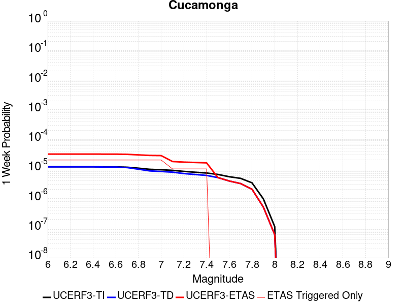 |  | 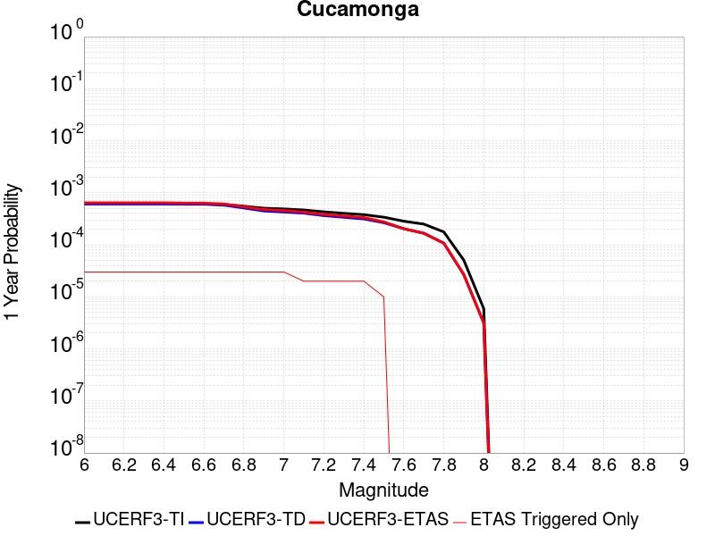 |  |

| Magnitude | 1 wk TI Prob | 1 wk TD Prob | 1 wk ETAS Prob | 1 wk ETAS/TD Gain | 1 wk ETAS Triggered Only | 1 mo TI Prob | 1 mo TD Prob | 1 mo ETAS Prob | 1 mo ETAS/TD Gain | 1 mo ETAS Triggered Only | 1 yr TI Prob | 1 yr TD Prob | 1 yr ETAS Prob | 1 yr ETAS/TD Gain | 1 yr ETAS Triggered Only | 10 yr TI Prob | 10 yr TD Prob | 10 yr ETAS Prob | 10 yr ETAS/TD Gain | 10 yr ETAS Triggered Only |
|-----|-----|-----|-----|-----|-----|-----|-----|-----|-----|-----|-----|-----|-----|-----|-----|-----|-----|-----|-----|-----|
| 6.0 | 1.1848348E-5 | 1.1737008E-5 | 1.1737008E-5 | 1.0 | 0.0 | 5.0777642E-5 | 5.030051E-5 | 5.030051E-5 | 1.0 | 0.0 | 6.180424E-4 | 6.1223935E-4 | 6.551039E-4 | 1.0700128 | 4.2890842E-5 | 0.0061632637 | 0.0061067017 | 0.0061493306 | 1.0069807 | 4.2890842E-5 |
| 6.1 | 1.1848348E-5 | 1.1737008E-5 | 1.1737008E-5 | 1.0 | 0.0 | 5.0777642E-5 | 5.030051E-5 | 5.030051E-5 | 1.0 | 0.0 | 6.180424E-4 | 6.1223935E-4 | 6.551039E-4 | 1.0700128 | 4.2890842E-5 | 0.0061632637 | 0.0061067017 | 0.0061493306 | 1.0069807 | 4.2890842E-5 |
| 6.2 | 1.1848348E-5 | 1.1737008E-5 | 1.1737008E-5 | 1.0 | 0.0 | 5.0777642E-5 | 5.030051E-5 | 5.030051E-5 | 1.0 | 0.0 | 6.180424E-4 | 6.1223935E-4 | 6.551039E-4 | 1.0700128 | 4.2890842E-5 | 0.0061632637 | 0.0061067017 | 0.0061493306 | 1.0069807 | 4.2890842E-5 |
| 6.3 | 1.1848348E-5 | 1.1737008E-5 | 1.1737008E-5 | 1.0 | 0.0 | 5.0777642E-5 | 5.030051E-5 | 5.030051E-5 | 1.0 | 0.0 | 6.180424E-4 | 6.1223935E-4 | 6.551039E-4 | 1.0700128 | 4.2890842E-5 | 0.0061632637 | 0.0061067017 | 0.0061493306 | 1.0069807 | 4.2890842E-5 |
| 6.4 | 1.1848348E-5 | 1.1737008E-5 | 1.1737008E-5 | 1.0 | 0.0 | 5.0777642E-5 | 5.030051E-5 | 5.030051E-5 | 1.0 | 0.0 | 6.180424E-4 | 6.1223935E-4 | 6.551039E-4 | 1.0700128 | 4.2890842E-5 | 0.0061632637 | 0.0061067017 | 0.0061493306 | 1.0069807 | 4.2890842E-5 |
| 6.5 | 1.16988695E-5 | 1.15760395E-5 | 1.15760395E-5 | 1.0 | 0.0 | 5.013705E-5 | 4.9610666E-5 | 4.9610666E-5 | 1.0 | 0.0 | 6.102476E-4 | 6.0384517E-4 | 6.467101E-4 | 1.0709866 | 4.2890842E-5 | 0.006085745 | 0.006023216 | 0.0060658487 | 1.007078 | 4.2890842E-5 |
| 6.6 | 1.16988695E-5 | 1.15760395E-5 | 1.15760395E-5 | 1.0 | 0.0 | 5.013705E-5 | 4.9610666E-5 | 4.9610666E-5 | 1.0 | 0.0 | 6.102476E-4 | 6.0384517E-4 | 6.467101E-4 | 1.0709866 | 4.2890842E-5 | 0.006085745 | 0.006023216 | 0.0060658487 | 1.007078 | 4.2890842E-5 |
| 6.7 | 1.1397107E-5 | 1.11149475E-5 | 1.11149475E-5 | 1.0 | 0.0 | 4.884383E-5 | 4.7634636E-5 | 4.7634636E-5 | 1.0 | 0.0 | 5.9451134E-4 | 5.797998E-4 | 6.226658E-4 | 1.0739324 | 4.2890842E-5 | 0.005929234 | 0.0057840226 | 0.0058266656 | 1.0073725 | 4.2890842E-5 |
| 6.8 | 1.058387E-5 | 9.784992E-6 | 9.784992E-6 | 1.0 | 0.0 | 4.5358654E-5 | 4.193501E-5 | 4.193501E-5 | 1.0 | 0.0 | 5.521017E-4 | 5.1044027E-4 | 5.533092E-4 | 1.0839843 | 4.2890842E-5 | 0.00550732 | 0.0050936877 | 0.00513636 | 1.0083776 | 4.2890842E-5 |
| 6.9 | 9.690046E-6 | 8.57948E-6 | 8.57948E-6 | 1.0 | 0.0 | 4.1528107E-5 | 3.6768684E-5 | 3.6768684E-5 | 1.0 | 0.0 | 5.054874E-4 | 4.475672E-4 | 4.9043883E-4 | 1.0957881 | 4.2890842E-5 | 0.005043391 | 0.004467594 | 0.0045102932 | 1.0095575 | 4.2890842E-5 |
| 7.0 | 9.381461E-6 | 8.187101E-6 | 8.187101E-6 | 1.0 | 0.0 | 4.020564E-5 | 3.5087105E-5 | 3.5087105E-5 | 1.0 | 0.0 | 4.893937E-4 | 4.2710215E-4 | 4.6997468E-4 | 1.1003801 | 4.2890842E-5 | 0.0048831734 | 0.0042637475 | 0.0043064556 | 1.0100166 | 4.2890842E-5 |
| 7.1 | 8.946492E-6 | 7.781886E-6 | 7.781886E-6 | 1.0 | 0.0 | 3.8341543E-5 | 3.3350516E-5 | 3.3350516E-5 | 1.0 | 0.0 | 4.667083E-4 | 4.0596718E-4 | 4.488406E-4 | 1.1056081 | 4.2890842E-5 | 0.0046572937 | 0.004053192 | 0.004095909 | 1.010539 | 4.2890842E-5 |
| 7.2 | 8.251016E-6 | 6.9752796E-6 | 6.9752796E-6 | 1.0 | 0.0 | 3.5361016E-5 | 2.9893714E-5 | 2.9893714E-5 | 1.0 | 0.0 | 4.3043532E-4 | 3.6389544E-4 | 4.0677068E-4 | 1.117823 | 4.2890842E-5 | 0.0042960253 | 0.0036339292 | 0.003676664 | 1.01176 | 4.2890842E-5 |
| 7.3 | 7.717881E-6 | 6.4863502E-6 | 6.4863502E-6 | 1.0 | 0.0 | 3.3076216E-5 | 2.7798349E-5 | 2.7798349E-5 | 1.0 | 0.0 | 4.026285E-4 | 3.3839257E-4 | 3.8126888E-4 | 1.1267059 | 4.2890842E-5 | 0.004018998 | 0.00337971 | 0.0034224559 | 1.0126477 | 4.2890842E-5 |
| 7.4 | 7.275623E-6 | 6.031997E-6 | 6.031997E-6 | 1.0 | 0.0 | 3.118087E-5 | 2.585116E-5 | 2.585116E-5 | 1.0 | 0.0 | 3.7956095E-4 | 3.1469265E-4 | 3.5757E-4 | 1.1362514 | 4.2890842E-5 | 0.0037891332 | 0.0031434062 | 0.0031861623 | 1.0136018 | 4.2890842E-5 |
| 7.5 | 6.5109502E-6 | 5.1006014E-6 | 5.1006014E-6 | 1.0 | 0.0 | 2.7903774E-5 | 2.1859538E-5 | 2.1859538E-5 | 1.0 | 0.0 | 3.3967546E-4 | 2.661075E-4 | 3.0898693E-4 | 1.1611358 | 4.2890842E-5 | 0.0033915674 | 0.002658813 | 0.0027015898 | 1.0160887 | 4.2890842E-5 |
| 7.6 | 5.4495326E-6 | 3.90857E-6 | 3.90857E-6 | 1.0 | 0.0 | 2.335493E-5 | 1.6750908E-5 | 1.6750908E-5 | 1.0 | 0.0 | 2.8430918E-4 | 2.0392328E-4 | 2.0392328E-4 | 1.0 | 0.0 | 0.0028394572 | 0.002038282 | 0.002038282 | 1.0 | 0.0 |
| 7.7 | 4.7997164E-6 | 3.2002547E-6 | 3.2002547E-6 | 1.0 | 0.0 | 2.057005E-5 | 1.3715306E-5 | 1.3715306E-5 | 1.0 | 0.0 | 2.504116E-4 | 1.6697108E-4 | 1.6697108E-4 | 1.0 | 0.0 | 0.002501296 | 0.0016693877 | 0.0016693877 | 1.0 | 0.0 |
| 7.8 | 3.3941733E-6 | 2.0641899E-6 | 2.0641899E-6 | 1.0 | 0.0 | 1.4546376E-5 | 8.846498E-6 | 8.846498E-6 | 1.0 | 0.0 | 1.7708774E-4 | 1.07700806E-4 | 1.07700806E-4 | 1.0 | 0.0 | 0.0017694668 | 0.001076723 | 0.001076723 | 1.0 | 0.0 |
| 7.9 | 9.750552E-7 | 5.155946E-7 | 5.155946E-7 | 1.0 | 0.0 | 4.178801E-6 | 2.2096892E-6 | 2.2096892E-6 | 1.0 | 0.0 | 5.0875715E-5 | 2.690264E-5 | 2.690264E-5 | 1.0 | 0.0 | 5.086407E-4 | 2.6899425E-4 | 2.6899425E-4 | 1.0 | 0.0 |
| 8.0 | 1.133857E-7 | 6.053707E-8 | 6.053707E-8 | 1.0 | 0.0 | 4.8593864E-7 | 2.5944456E-7 | 2.5944456E-7 | 1.0 | 0.0 | 5.9162867E-6 | 3.158733E-6 | 3.158733E-6 | 1.0 | 0.0 | 5.916129E-5 | 3.1586897E-5 | 3.1586897E-5 | 1.0 | 0.0 |

## Calaveras (So) 2011 CFM
*[(top)](#table-of-contents)*

| 1 Week | 1 Month | 1 Year | 10 Year |
|-----|-----|-----|-----|
|  |  |  |  |

| Magnitude | 1 wk TI Prob | 1 wk TD Prob | 1 wk ETAS Prob | 1 wk ETAS/TD Gain | 1 wk ETAS Triggered Only | 1 mo TI Prob | 1 mo TD Prob | 1 mo ETAS Prob | 1 mo ETAS/TD Gain | 1 mo ETAS Triggered Only | 1 yr TI Prob | 1 yr TD Prob | 1 yr ETAS Prob | 1 yr ETAS/TD Gain | 1 yr ETAS Triggered Only | 10 yr TI Prob | 10 yr TD Prob | 10 yr ETAS Prob | 10 yr ETAS/TD Gain | 10 yr ETAS Triggered Only |
|-----|-----|-----|-----|-----|-----|-----|-----|-----|-----|-----|-----|-----|-----|-----|-----|-----|-----|-----|-----|-----|
| 6.0 | 1.5950744E-4 | 3.071188E-4 | 3.4999647E-4 | 1.1396127 | 4.2890842E-5 | 6.834242E-4 | 0.0013155643 | 0.0013583987 | 1.0325598 | 4.2890842E-5 | 0.00828899 | 0.01585904 | 0.01590125 | 1.0026616 | 4.2890842E-5 | 0.079865426 | 0.14440064 | 0.14443734 | 1.0002542 | 4.2890842E-5 |
| 6.1 | 1.3584697E-4 | 2.6036944E-4 | 3.032491E-4 | 1.1646879 | 4.2890842E-5 | 5.8207137E-4 | 0.0011153965 | 0.0011582394 | 1.0384105 | 4.2890842E-5 | 0.007063716 | 0.013462106 | 0.0135044195 | 1.0031432 | 4.2890842E-5 | 0.06843361 | 0.12402854 | 0.124066114 | 1.0003029 | 4.2890842E-5 |
| 6.2 | 1.14676266E-4 | 2.1726108E-4 | 2.601426E-4 | 1.1973733 | 4.2890842E-5 | 4.9137714E-4 | 9.307893E-4 | 9.7364024E-4 | 1.0460372 | 4.2890842E-5 | 0.0059661185 | 0.011245592 | 0.011288 | 1.0037711 | 4.2890842E-5 | 0.058084648 | 0.105019294 | 0.10505768 | 1.0003655 | 4.2890842E-5 |
| 6.3 | 8.691518E-5 | 1.5987165E-4 | 2.0275563E-4 | 1.2682401 | 4.2890842E-5 | 3.7244044E-4 | 6.8496726E-4 | 7.278287E-4 | 1.0625745 | 4.2890842E-5 | 0.004525038 | 0.008300893 | 0.008343428 | 1.0051241 | 4.2890842E-5 | 0.044339992 | 0.0793347 | 0.07937419 | 1.0004977 | 4.2890842E-5 |
| 6.4 | 8.50982E-5 | 1.5693568E-4 | 1.998198E-4 | 1.2732592 | 4.2890842E-5 | 3.646556E-4 | 6.7239115E-4 | 7.152531E-4 | 1.0637456 | 4.2890842E-5 | 0.0044306475 | 0.008148931 | 0.008191472 | 1.0052205 | 4.2890842E-5 | 0.04343345 | 0.077940844 | 0.07798039 | 1.0005074 | 4.2890842E-5 |
| 6.5 | 8.4062965E-5 | 1.5518135E-4 | 1.9806554E-4 | 1.2763488 | 4.2890842E-5 | 3.602201E-4 | 6.648764E-4 | 7.0773874E-4 | 1.0644666 | 4.2890842E-5 | 0.004376863 | 0.008058134 | 0.008100678 | 1.0052798 | 4.2890842E-5 | 0.042916555 | 0.077112116 | 0.0771517 | 1.0005133 | 4.2890842E-5 |
| 6.6 | 8.194716E-5 | 1.5154095E-4 | 1.9442529E-4 | 1.2829884 | 4.2890842E-5 | 3.5115483E-4 | 6.492825E-4 | 6.921455E-4 | 1.066016 | 4.2890842E-5 | 0.0042669317 | 0.007869979 | 0.007912532 | 1.0054071 | 4.2890842E-5 | 0.04185927 | 0.07539739 | 0.07543705 | 1.000526 | 4.2890842E-5 |
| 6.7 | 8.012326E-5 | 1.4821833E-4 | 1.9110281E-4 | 1.2893332 | 4.2890842E-5 | 3.433402E-4 | 6.350497E-4 | 6.779133E-4 | 1.0674964 | 4.2890842E-5 | 0.004172157 | 0.007698474 | 0.007741035 | 1.0055285 | 4.2890842E-5 | 0.040946912 | 0.073839515 | 0.07387924 | 1.000538 | 4.2890842E-5 |
| 6.8 | 7.119773E-5 | 1.2880519E-4 | 1.716905E-4 | 1.3329471 | 4.2890842E-5 | 3.0509746E-4 | 5.519001E-4 | 5.947673E-4 | 1.077672 | 4.2890842E-5 | 0.0037082357 | 0.0066958875 | 0.0067384914 | 1.0063627 | 4.2890842E-5 | 0.036469642 | 0.06468402 | 0.06472413 | 1.0006202 | 4.2890842E-5 |
| 6.9 | 5.7343088E-5 | 9.9189E-5 | 1.4207559E-4 | 1.4323725 | 4.2890842E-5 | 2.4573295E-4 | 4.2502693E-4 | 4.6789952E-4 | 1.1008704 | 4.2890842E-5 | 0.0029876942 | 0.0051625078 | 0.0052051772 | 1.0082653 | 4.2890842E-5 | 0.02947844 | 0.050509132 | 0.050549857 | 1.0008063 | 4.2890842E-5 |
| 7.0 | 4.8746577E-5 | 8.284751E-5 | 1.257348E-4 | 1.5176654 | 4.2890842E-5 | 2.0889717E-4 | 3.550128E-4 | 3.978884E-4 | 1.120772 | 4.2890842E-5 | 0.0025403565 | 0.004313781 | 0.0043564867 | 1.0098999 | 4.2890842E-5 | 0.025115121 | 0.04248505 | 0.04252612 | 1.0009667 | 4.2890842E-5 |
| 7.1 | 4.2998014E-5 | 7.264914E-5 | 1.15536866E-4 | 1.5903405 | 4.2890842E-5 | 1.8426418E-4 | 3.1131663E-4 | 3.541941E-4 | 1.1377295 | 4.2890842E-5 | 0.002241108 | 0.0037837527 | 0.0038264813 | 1.0112927 | 4.2890842E-5 | 0.022186412 | 0.037423246 | 0.03746453 | 1.0011032 | 4.2890842E-5 |
| 7.2 | 3.221292E-5 | 5.390566E-5 | 5.390566E-5 | 1.0 | 0.0 | 1.3804805E-4 | 2.3100396E-4 | 2.3100396E-4 | 1.0 | 0.0 | 0.0016794393 | 0.0028088738 | 0.0028088738 | 1.0 | 0.0 | 0.016668037 | 0.028035998 | 0.028035998 | 1.0 | 0.0 |
| 7.3 | 2.3756531E-5 | 3.9471706E-5 | 3.9471706E-5 | 1.0 | 0.0 | 1.0180973E-4 | 1.6915359E-4 | 1.6915359E-4 | 1.0 | 0.0 | 0.0012388286 | 0.0020575167 | 0.0020575167 | 1.0 | 0.0 | 0.012319452 | 0.02064345 | 0.02064345 | 1.0 | 0.0 |
| 7.4 | 1.5997684E-5 | 2.734085E-5 | 2.734085E-5 | 1.0 | 0.0 | 6.8559704E-5 | 1.1716982E-4 | 1.1716982E-4 | 1.0 | 0.0 | 8.343947E-4 | 0.0014256114 | 0.0014256114 | 1.0 | 0.0 | 0.008312687 | 0.014376549 | 0.014376549 | 1.0 | 0.0 |
| 7.5 | 1.3814293E-5 | 2.4782603E-5 | 2.4782603E-5 | 1.0 | 0.0 | 5.9202768E-5 | 1.0620684E-4 | 1.0620684E-4 | 1.0 | 0.0 | 7.205553E-4 | 0.0012923037 | 0.0012923037 | 1.0 | 0.0 | 0.007182234 | 0.013055766 | 0.013055766 | 1.0 | 0.0 |
| 7.6 | 8.817309E-6 | 1.6429829E-5 | 1.6429829E-5 | 1.0 | 0.0 | 3.7787922E-5 | 7.041166E-5 | 7.041166E-5 | 1.0 | 0.0 | 4.5997082E-4 | 8.5692614E-4 | 8.5692614E-4 | 1.0 | 0.0 | 0.004590199 | 0.008719863 | 0.008719863 | 1.0 | 0.0 |
| 7.7 | 4.0352206E-6 | 7.706877E-6 | 7.706877E-6 | 1.0 | 0.0 | 1.7293689E-5 | 3.3029053E-5 | 3.3029053E-5 | 1.0 | 0.0 | 2.1053031E-4 | 4.020546E-4 | 4.020546E-4 | 1.0 | 0.0 | 0.0021033096 | 0.0041649863 | 0.0041649863 | 1.0 | 0.0 |
| 7.8 | 3.413169E-6 | 6.7868646E-6 | 6.7868646E-6 | 1.0 | 0.0 | 1.4627784E-5 | 2.9086239E-5 | 2.9086239E-5 | 1.0 | 0.0 | 1.7807873E-4 | 3.5406748E-4 | 3.5406748E-4 | 1.0 | 0.0 | 0.0017793609 | 0.0036663096 | 0.0036663096 | 1.0 | 0.0 |
| 7.9 | 2.4740732E-6 | 5.278809E-6 | 5.278809E-6 | 1.0 | 0.0 | 1.06031275E-5 | 2.2623271E-5 | 2.2623271E-5 | 1.0 | 0.0 | 1.2908543E-4 | 2.7540355E-4 | 2.7540355E-4 | 1.0 | 0.0 | 0.0012901047 | 0.002834638 | 0.002834638 | 1.0 | 0.0 |
| 8.0 | 1.5231818E-6 | 3.2887135E-6 | 3.2887135E-6 | 1.0 | 0.0 | 6.527906E-6 | 1.409441E-5 | 1.409441E-5 | 1.0 | 0.0 | 7.9474354E-5 | 1.7158597E-4 | 1.7158597E-4 | 1.0 | 0.0 | 7.944594E-4 | 0.001756374 | 0.001756374 | 1.0 | 0.0 |
| 8.1 | 1.0104524E-6 | 2.0456548E-6 | 2.0456548E-6 | 1.0 | 0.0 | 4.330503E-6 | 8.767062E-6 | 8.767062E-6 | 1.0 | 0.0 | 5.2722597E-5 | 1.06733794E-4 | 1.06733794E-4 | 1.0 | 0.0 | 5.271009E-4 | 0.0010929212 | 0.0010929212 | 1.0 | 0.0 |

## Redondo Canyon alt 1
*[(top)](#table-of-contents)*

| 1 Week | 1 Month | 1 Year | 10 Year |
|-----|-----|-----|-----|
|  |  |  | 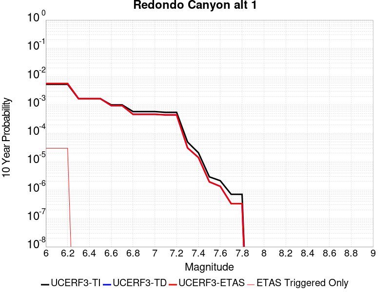 |

| Magnitude | 1 wk TI Prob | 1 wk TD Prob | 1 wk ETAS Prob | 1 wk ETAS/TD Gain | 1 wk ETAS Triggered Only | 1 mo TI Prob | 1 mo TD Prob | 1 mo ETAS Prob | 1 mo ETAS/TD Gain | 1 mo ETAS Triggered Only | 1 yr TI Prob | 1 yr TD Prob | 1 yr ETAS Prob | 1 yr ETAS/TD Gain | 1 yr ETAS Triggered Only | 10 yr TI Prob | 10 yr TD Prob | 10 yr ETAS Prob | 10 yr ETAS/TD Gain | 10 yr ETAS Triggered Only |
|-----|-----|-----|-----|-----|-----|-----|-----|-----|-----|-----|-----|-----|-----|-----|-----|-----|-----|-----|-----|-----|
| 6.0 | 1.0346246E-5 | 1.09813445E-5 | 5.3871718E-5 | 4.905749 | 4.2890842E-5 | 4.43403E-5 | 4.7062502E-5 | 8.9951325E-5 | 1.9113163 | 4.2890842E-5 | 5.3970946E-4 | 5.729142E-4 | 6.157805E-4 | 1.0748215 | 4.2890842E-5 | 0.0053840056 | 0.005722111 | 0.005764757 | 1.0074527 | 4.2890842E-5 |
| 6.1 | 1.0346246E-5 | 1.09813445E-5 | 5.3871718E-5 | 4.905749 | 4.2890842E-5 | 4.43403E-5 | 4.7062502E-5 | 8.9951325E-5 | 1.9113163 | 4.2890842E-5 | 5.3970946E-4 | 5.729142E-4 | 6.157805E-4 | 1.0748215 | 4.2890842E-5 | 0.0053840056 | 0.005722111 | 0.005764757 | 1.0074527 | 4.2890842E-5 |
| 6.2 | 1.0346246E-5 | 1.09813445E-5 | 5.3871718E-5 | 4.905749 | 4.2890842E-5 | 4.43403E-5 | 4.7062502E-5 | 8.9951325E-5 | 1.9113163 | 4.2890842E-5 | 5.3970946E-4 | 5.729142E-4 | 6.157805E-4 | 1.0748215 | 4.2890842E-5 | 0.0053840056 | 0.005722111 | 0.005764757 | 1.0074527 | 4.2890842E-5 |
| 6.3 | 3.2052794E-6 | 3.2361174E-6 | 3.2361174E-6 | 1.0 | 0.0 | 1.373684E-5 | 1.3869023E-5 | 1.3869023E-5 | 1.0 | 0.0 | 1.6723319E-4 | 1.6884625E-4 | 1.6884625E-4 | 1.0 | 0.0 | 0.001671074 | 0.0016875692 | 0.0016875692 | 1.0 | 0.0 |
| 6.4 | 3.2052794E-6 | 3.2361174E-6 | 3.2361174E-6 | 1.0 | 0.0 | 1.373684E-5 | 1.3869023E-5 | 1.3869023E-5 | 1.0 | 0.0 | 1.6723319E-4 | 1.6884625E-4 | 1.6884625E-4 | 1.0 | 0.0 | 0.001671074 | 0.0016875692 | 0.0016875692 | 1.0 | 0.0 |
| 6.5 | 3.2052794E-6 | 3.2361174E-6 | 3.2361174E-6 | 1.0 | 0.0 | 1.373684E-5 | 1.3869023E-5 | 1.3869023E-5 | 1.0 | 0.0 | 1.6723319E-4 | 1.6884625E-4 | 1.6884625E-4 | 1.0 | 0.0 | 0.001671074 | 0.0016875692 | 0.0016875692 | 1.0 | 0.0 |
| 6.6 | 1.948328E-6 | 1.8288681E-6 | 1.8288681E-6 | 1.0 | 0.0 | 8.349951E-6 | 7.837991E-6 | 7.837991E-6 | 1.0 | 0.0 | 1.016559E-4 | 9.542486E-5 | 9.542486E-5 | 1.0 | 0.0 | 0.0010160941 | 9.539858E-4 | 9.539858E-4 | 1.0 | 0.0 |
| 6.7 | 1.948328E-6 | 1.8288681E-6 | 1.8288681E-6 | 1.0 | 0.0 | 8.349951E-6 | 7.837991E-6 | 7.837991E-6 | 1.0 | 0.0 | 1.016559E-4 | 9.542486E-5 | 9.542486E-5 | 1.0 | 0.0 | 0.0010160941 | 9.539858E-4 | 9.539858E-4 | 1.0 | 0.0 |
| 6.8 | 1.1278219E-6 | 9.033076E-7 | 9.033076E-7 | 1.0 | 0.0 | 4.8335132E-6 | 3.871315E-6 | 3.871315E-6 | 1.0 | 0.0 | 5.8846435E-5 | 4.7132668E-5 | 4.7132668E-5 | 1.0 | 0.0 | 5.8830855E-4 | 4.7126875E-4 | 4.7126875E-4 | 1.0 | 0.0 |
| 6.9 | 1.1278219E-6 | 9.033076E-7 | 9.033076E-7 | 1.0 | 0.0 | 4.8335132E-6 | 3.871315E-6 | 3.871315E-6 | 1.0 | 0.0 | 5.8846435E-5 | 4.7132668E-5 | 4.7132668E-5 | 1.0 | 0.0 | 5.8830855E-4 | 4.7126875E-4 | 4.7126875E-4 | 1.0 | 0.0 |
| 7.0 | 1.1278219E-6 | 9.033076E-7 | 9.033076E-7 | 1.0 | 0.0 | 4.8335132E-6 | 3.871315E-6 | 3.871315E-6 | 1.0 | 0.0 | 5.8846435E-5 | 4.7132668E-5 | 4.7132668E-5 | 1.0 | 0.0 | 5.8830855E-4 | 4.7126875E-4 | 4.7126875E-4 | 1.0 | 0.0 |
| 7.1 | 1.0545139E-6 | 8.5692716E-7 | 8.5692716E-7 | 1.0 | 0.0 | 4.5193374E-6 | 3.6725423E-6 | 3.6725423E-6 | 1.0 | 0.0 | 5.5021545E-5 | 4.471271E-5 | 4.471271E-5 | 1.0 | 0.0 | 5.500792E-4 | 4.470789E-4 | 4.470789E-4 | 1.0 | 0.0 |
| 7.2 | 1.0545139E-6 | 8.5692716E-7 | 8.5692716E-7 | 1.0 | 0.0 | 4.5193374E-6 | 3.6725423E-6 | 3.6725423E-6 | 1.0 | 0.0 | 5.5021545E-5 | 4.471271E-5 | 4.471271E-5 | 1.0 | 0.0 | 5.500792E-4 | 4.470789E-4 | 4.470789E-4 | 1.0 | 0.0 |
| 7.3 | 9.505161E-8 | 5.8957607E-8 | 5.8957607E-8 | 1.0 | 0.0 | 4.0736398E-7 | 2.5267545E-7 | 2.5267545E-7 | 1.0 | 0.0 | 4.959645E-6 | 3.0763204E-6 | 3.0763204E-6 | 1.0 | 0.0 | 4.9595343E-5 | 3.0762894E-5 | 3.0762894E-5 | 1.0 | 0.0 |
| 7.4 | 3.9520785E-8 | 2.6987191E-8 | 2.6987191E-8 | 1.0 | 0.0 | 1.6937479E-7 | 1.1565938E-7 | 1.1565938E-7 | 1.0 | 0.0 | 2.062136E-6 | 1.4081523E-6 | 1.4081523E-6 | 1.0 | 0.0 | 2.062117E-5 | 1.4081461E-5 | 1.4081461E-5 | 1.0 | 0.0 |
| 7.5 | 5.6133214E-9 | 3.7368215E-9 | 3.7368215E-9 | 1.0 | 0.0 | 2.4057092E-8 | 1.601495E-8 | 1.601495E-8 | 1.0 | 0.0 | 2.9289507E-7 | 1.9498201E-7 | 1.9498201E-7 | 1.0 | 0.0 | 2.9289467E-6 | 1.9498186E-6 | 1.9498186E-6 | 1.0 | 0.0 |
| 7.6 | 4.1064334E-9 | 2.5957634E-9 | 2.5957634E-9 | 1.0 | 0.0 | 1.7599E-8 | 1.11247E-8 | 1.11247E-8 | 1.0 | 0.0 | 2.142678E-7 | 1.3544322E-7 | 1.3544322E-7 | 1.0 | 0.0 | 2.1426758E-6 | 1.3544316E-6 | 1.3544316E-6 | 1.0 | 0.0 |
| 7.7 | 1.361975E-9 | 6.360824E-10 | 6.360824E-10 | 1.0 | 0.0 | 5.8370353E-9 | 2.7260674E-9 | 2.7260674E-9 | 1.0 | 0.0 | 7.1065905E-8 | 3.318987E-8 | 3.318987E-8 | 1.0 | 0.0 | 7.106588E-7 | 3.318987E-7 | 3.318987E-7 | 1.0 | 0.0 |
| 7.8 | 1.361975E-9 | 6.360824E-10 | 6.360824E-10 | 1.0 | 0.0 | 5.8370353E-9 | 2.7260674E-9 | 2.7260674E-9 | 1.0 | 0.0 | 7.1065905E-8 | 3.318987E-8 | 3.318987E-8 | 1.0 | 0.0 | 7.106588E-7 | 3.318987E-7 | 3.318987E-7 | 1.0 | 0.0 |

## Santa Ynez River
*[(top)](#table-of-contents)*

| 1 Week | 1 Month | 1 Year | 10 Year |
|-----|-----|-----|-----|
|  |  |  |  |

| Magnitude | 1 wk TI Prob | 1 wk TD Prob | 1 wk ETAS Prob | 1 wk ETAS/TD Gain | 1 wk ETAS Triggered Only | 1 mo TI Prob | 1 mo TD Prob | 1 mo ETAS Prob | 1 mo ETAS/TD Gain | 1 mo ETAS Triggered Only | 1 yr TI Prob | 1 yr TD Prob | 1 yr ETAS Prob | 1 yr ETAS/TD Gain | 1 yr ETAS Triggered Only | 10 yr TI Prob | 10 yr TD Prob | 10 yr ETAS Prob | 10 yr ETAS/TD Gain | 10 yr ETAS Triggered Only |
|-----|-----|-----|-----|-----|-----|-----|-----|-----|-----|-----|-----|-----|-----|-----|-----|-----|-----|-----|-----|-----|
| 6.0 | 1.6396456E-5 | 1.7209435E-5 | 1.7209435E-5 | 1.0 | 0.0 | 7.026863E-5 | 7.375284E-5 | 7.375284E-5 | 1.0 | 0.0 | 8.551848E-4 | 8.976064E-4 | 8.976064E-4 | 1.0 | 0.0 | 0.0085190125 | 0.008943358 | 0.008985865 | 1.004753 | 4.2890842E-5 |
| 6.1 | 1.6396456E-5 | 1.7209435E-5 | 1.7209435E-5 | 1.0 | 0.0 | 7.026863E-5 | 7.375284E-5 | 7.375284E-5 | 1.0 | 0.0 | 8.551848E-4 | 8.976064E-4 | 8.976064E-4 | 1.0 | 0.0 | 0.0085190125 | 0.008943358 | 0.008985865 | 1.004753 | 4.2890842E-5 |
| 6.2 | 1.6396456E-5 | 1.7209435E-5 | 1.7209435E-5 | 1.0 | 0.0 | 7.026863E-5 | 7.375284E-5 | 7.375284E-5 | 1.0 | 0.0 | 8.551848E-4 | 8.976064E-4 | 8.976064E-4 | 1.0 | 0.0 | 0.0085190125 | 0.008943358 | 0.008985865 | 1.004753 | 4.2890842E-5 |
| 6.3 | 9.736976E-6 | 1.012233E-5 | 1.012233E-5 | 1.0 | 0.0 | 4.172923E-5 | 4.338072E-5 | 4.338072E-5 | 1.0 | 0.0 | 5.0793495E-4 | 5.280373E-4 | 5.280373E-4 | 1.0 | 0.0 | 0.005067755 | 0.005268332 | 0.005268332 | 1.0 | 0.0 |
| 6.4 | 9.736976E-6 | 1.012233E-5 | 1.012233E-5 | 1.0 | 0.0 | 4.172923E-5 | 4.338072E-5 | 4.338072E-5 | 1.0 | 0.0 | 5.0793495E-4 | 5.280373E-4 | 5.280373E-4 | 1.0 | 0.0 | 0.005067755 | 0.005268332 | 0.005268332 | 1.0 | 0.0 |
| 6.5 | 7.081964E-6 | 7.3298966E-6 | 7.3298966E-6 | 1.0 | 0.0 | 3.035092E-5 | 3.1413474E-5 | 3.1413474E-5 | 1.0 | 0.0 | 3.694598E-4 | 3.8239348E-4 | 3.8239348E-4 | 1.0 | 0.0 | 0.0036884616 | 0.0038175168 | 0.0038175168 | 1.0 | 0.0 |
| 6.6 | 5.873247E-6 | 6.059743E-6 | 6.059743E-6 | 1.0 | 0.0 | 2.5170815E-5 | 2.5970074E-5 | 2.5970074E-5 | 1.0 | 0.0 | 3.064116E-4 | 3.1614062E-4 | 3.1614062E-4 | 1.0 | 0.0 | 0.0030598943 | 0.0031569963 | 0.0031569963 | 1.0 | 0.0 |
| 6.7 | 4.973277E-6 | 5.115901E-6 | 5.115901E-6 | 1.0 | 0.0 | 2.1313872E-5 | 2.1925109E-5 | 2.1925109E-5 | 1.0 | 0.0 | 2.5946548E-4 | 2.66906E-4 | 2.66906E-4 | 1.0 | 0.0 | 0.0025916274 | 0.0026659032 | 0.0026659032 | 1.0 | 0.0 |
| 6.8 | 4.396492E-6 | 4.5109778E-6 | 4.5109778E-6 | 1.0 | 0.0 | 1.884197E-5 | 1.9332621E-5 | 1.9332621E-5 | 1.0 | 0.0 | 2.2937685E-4 | 2.3534958E-4 | 2.3534958E-4 | 1.0 | 0.0 | 0.0022914023 | 0.0023510386 | 0.0023510386 | 1.0 | 0.0 |
| 6.9 | 3.5255632E-6 | 3.6013332E-6 | 3.6013332E-6 | 1.0 | 0.0 | 1.5109469E-5 | 1.5434196E-5 | 1.5434196E-5 | 1.0 | 0.0 | 1.8394225E-4 | 1.8789528E-4 | 1.8789528E-4 | 1.0 | 0.0 | 0.0018379007 | 0.0018773803 | 0.0018773803 | 1.0 | 0.0 |
| 7.0 | 3.211603E-6 | 3.273654E-6 | 3.273654E-6 | 1.0 | 0.0 | 1.376394E-5 | 1.4029872E-5 | 1.4029872E-5 | 1.0 | 0.0 | 1.6756308E-4 | 1.7080043E-4 | 1.7080043E-4 | 1.0 | 0.0 | 0.0016743679 | 0.0017067058 | 0.0017067058 | 1.0 | 0.0 |
| 7.1 | 2.5094619E-6 | 2.5409204E-6 | 2.5409204E-6 | 1.0 | 0.0 | 1.0754793E-5 | 1.0889614E-5 | 1.0889614E-5 | 1.0 | 0.0 | 1.3093173E-4 | 1.3257304E-4 | 1.3257304E-4 | 1.0 | 0.0 | 0.0013085462 | 0.0013249456 | 0.0013249456 | 1.0 | 0.0 |
| 7.2 | 2.0515774E-6 | 2.0619375E-6 | 2.0619375E-6 | 1.0 | 0.0 | 8.792445E-6 | 8.836846E-6 | 8.836846E-6 | 1.0 | 0.0 | 1.0704277E-4 | 1.0758333E-4 | 1.0758333E-4 | 1.0 | 0.0 | 0.0010699122 | 0.0010753168 | 0.0010753168 | 1.0 | 0.0 |
| 7.3 | 1.6845745E-6 | 1.6773907E-6 | 1.6773907E-6 | 1.0 | 0.0 | 7.219585E-6 | 7.1887976E-6 | 7.1887976E-6 | 1.0 | 0.0 | 8.78949E-5 | 8.752012E-5 | 8.752012E-5 | 1.0 | 0.0 | 8.7860145E-4 | 8.7485946E-4 | 8.7485946E-4 | 1.0 | 0.0 |
| 7.4 | 1.3600285E-6 | 1.3333357E-6 | 1.3333357E-6 | 1.0 | 0.0 | 5.82868E-6 | 5.714284E-6 | 5.714284E-6 | 1.0 | 0.0 | 7.096187E-5 | 6.956921E-5 | 6.956921E-5 | 1.0 | 0.0 | 7.0939213E-4 | 6.954765E-4 | 6.954765E-4 | 1.0 | 0.0 |
| 7.5 | 9.735342E-7 | 9.290103E-7 | 9.290103E-7 | 1.0 | 0.0 | 4.172283E-6 | 3.9814668E-6 | 3.9814668E-6 | 1.0 | 0.0 | 5.079636E-5 | 4.8473295E-5 | 4.8473295E-5 | 1.0 | 0.0 | 5.0784746E-4 | 4.8462892E-4 | 4.8462892E-4 | 1.0 | 0.0 |
| 7.6 | 5.067187E-7 | 4.77857E-7 | 4.77857E-7 | 1.0 | 0.0 | 2.1716498E-6 | 2.047957E-6 | 2.047957E-6 | 1.0 | 0.0 | 2.6439517E-5 | 2.4933597E-5 | 2.4933597E-5 | 1.0 | 0.0 | 2.643637E-4 | 2.4930874E-4 | 2.4930874E-4 | 1.0 | 0.0 |
| 7.7 | 2.769089E-7 | 2.5759124E-7 | 2.5759124E-7 | 1.0 | 0.0 | 1.1867519E-6 | 1.1039621E-6 | 1.1039621E-6 | 1.0 | 0.0 | 1.4448608E-5 | 1.34406555E-5 | 1.34406555E-5 | 1.0 | 0.0 | 1.444767E-4 | 1.3439846E-4 | 1.3439846E-4 | 1.0 | 0.0 |
| 7.8 | 1.7044663E-7 | 1.5449015E-7 | 1.5449015E-7 | 1.0 | 0.0 | 7.3048534E-7 | 6.621005E-7 | 6.621005E-7 | 1.0 | 0.0 | 8.893623E-6 | 8.061043E-6 | 8.061043E-6 | 1.0 | 0.0 | 8.893267E-5 | 8.060753E-5 | 8.060753E-5 | 1.0 | 0.0 |
| 7.9 | 4.8344287E-8 | 4.0910923E-8 | 4.0910923E-8 | 1.0 | 0.0 | 2.0718979E-7 | 1.7533252E-7 | 1.7533252E-7 | 1.0 | 0.0 | 2.5225327E-6 | 2.1346711E-6 | 2.1346711E-6 | 1.0 | 0.0 | 2.5225041E-5 | 2.1346512E-5 | 2.1346512E-5 | 1.0 | 0.0 |

## Rose Canyon
*[(top)](#table-of-contents)*

| 1 Week | 1 Month | 1 Year | 10 Year |
|-----|-----|-----|-----|
|  |  |  |  |

| Magnitude | 1 wk TI Prob | 1 wk TD Prob | 1 wk ETAS Prob | 1 wk ETAS/TD Gain | 1 wk ETAS Triggered Only | 1 mo TI Prob | 1 mo TD Prob | 1 mo ETAS Prob | 1 mo ETAS/TD Gain | 1 mo ETAS Triggered Only | 1 yr TI Prob | 1 yr TD Prob | 1 yr ETAS Prob | 1 yr ETAS/TD Gain | 1 yr ETAS Triggered Only | 10 yr TI Prob | 10 yr TD Prob | 10 yr ETAS Prob | 10 yr ETAS/TD Gain | 10 yr ETAS Triggered Only |
|-----|-----|-----|-----|-----|-----|-----|-----|-----|-----|-----|-----|-----|-----|-----|-----|-----|-----|-----|-----|-----|
| 6.0 | 4.5923203E-5 | 4.9714225E-5 | 9.260294E-5 | 1.862705 | 4.2890842E-5 | 1.9679888E-4 | 2.1304491E-4 | 2.5592663E-4 | 1.2012801 | 4.2890842E-5 | 0.0023933933 | 0.0025909345 | 0.0026337141 | 1.0165113 | 4.2890842E-5 | 0.023677798 | 0.02563999 | 0.025681783 | 1.00163 | 4.2890842E-5 |
| 6.1 | 4.5923203E-5 | 4.9714225E-5 | 4.9714225E-5 | 1.0 | 0.0 | 1.9679888E-4 | 2.1304491E-4 | 2.1304491E-4 | 1.0 | 0.0 | 0.0023933933 | 0.0025909345 | 0.0025909345 | 1.0 | 0.0 | 0.023677798 | 0.02563999 | 0.02563999 | 1.0 | 0.0 |
| 6.2 | 2.8844734E-5 | 2.9668723E-5 | 2.9668723E-5 | 1.0 | 0.0 | 1.2361443E-4 | 1.2714567E-4 | 1.2714567E-4 | 1.0 | 0.0 | 0.0015039665 | 0.0015468939 | 0.0015468939 | 1.0 | 0.0 | 0.0149382865 | 0.015374276 | 0.015374276 | 1.0 | 0.0 |
| 6.3 | 2.3171577E-5 | 2.3161238E-5 | 2.3161238E-5 | 1.0 | 0.0 | 9.9302975E-5 | 9.9258745E-5 | 9.9258745E-5 | 1.0 | 0.0 | 0.0012083431 | 0.0012078186 | 0.0012078186 | 1.0 | 0.0 | 0.012017938 | 0.012022437 | 0.012022437 | 1.0 | 0.0 |
| 6.4 | 2.0066604E-5 | 1.9667024E-5 | 1.9667024E-5 | 1.0 | 0.0 | 8.599689E-5 | 8.4284584E-5 | 8.4284584E-5 | 1.0 | 0.0 | 0.0010465092 | 0.0010256917 | 0.0010256917 | 1.0 | 0.0 | 0.010415946 | 0.010217559 | 0.010217559 | 1.0 | 0.0 |
| 6.5 | 1.776989E-5 | 1.7113807E-5 | 1.7113807E-5 | 1.0 | 0.0 | 7.615444E-5 | 7.334287E-5 | 7.334287E-5 | 1.0 | 0.0 | 9.267859E-4 | 8.925905E-4 | 8.925905E-4 | 1.0 | 0.0 | 0.009229303 | 0.008896211 | 0.008896211 | 1.0 | 0.0 |
| 6.6 | 1.5227364E-5 | 1.433926E-5 | 1.433926E-5 | 1.0 | 0.0 | 6.52585E-5 | 6.1452556E-5 | 6.1452556E-5 | 1.0 | 0.0 | 7.942326E-4 | 7.479332E-4 | 7.479332E-4 | 1.0 | 0.0 | 0.007914 | 0.007458359 | 0.007458359 | 1.0 | 0.0 |
| 6.7 | 1.2703898E-5 | 1.1673274E-5 | 1.1673274E-5 | 1.0 | 0.0 | 5.4444143E-5 | 5.0027378E-5 | 5.0027378E-5 | 1.0 | 0.0 | 6.626558E-4 | 6.089174E-4 | 6.089174E-4 | 1.0 | 0.0 | 0.006606833 | 0.0060750856 | 0.0060750856 | 1.0 | 0.0 |
| 6.8 | 1.1554917E-5 | 1.0609337E-5 | 1.0609337E-5 | 1.0 | 0.0 | 4.9520135E-5 | 4.546782E-5 | 4.546782E-5 | 1.0 | 0.0 | 6.0274085E-4 | 5.5343413E-4 | 5.5343413E-4 | 1.0 | 0.0 | 0.0060110865 | 0.0055225673 | 0.0055225673 | 1.0 | 0.0 |
| 6.9 | 8.732078E-6 | 7.881357E-6 | 7.881357E-6 | 1.0 | 0.0 | 3.7422655E-5 | 3.3776825E-5 | 3.3776825E-5 | 1.0 | 0.0 | 4.5552556E-4 | 4.111582E-4 | 4.111582E-4 | 1.0 | 0.0 | 0.0045459294 | 0.0041048084 | 0.0041048084 | 1.0 | 0.0 |
| 7.0 | 5.9337494E-6 | 5.1074853E-6 | 5.1074853E-6 | 1.0 | 0.0 | 2.5430107E-5 | 2.188904E-5 | 2.188904E-5 | 1.0 | 0.0 | 3.0956755E-4 | 2.664666E-4 | 2.664666E-4 | 1.0 | 0.0 | 0.0030913667 | 0.0026614866 | 0.0026614866 | 1.0 | 0.0 |
| 7.1 | 5.013409E-6 | 4.1773833E-6 | 4.1773833E-6 | 1.0 | 0.0 | 2.1485863E-5 | 1.7902948E-5 | 1.7902948E-5 | 1.0 | 0.0 | 2.6155898E-4 | 2.179467E-4 | 2.179467E-4 | 1.0 | 0.0 | 0.0026125133 | 0.0021773411 | 0.0021773411 | 1.0 | 0.0 |
| 7.2 | 4.120763E-6 | 3.2821383E-6 | 3.2821383E-6 | 1.0 | 0.0 | 1.7660293E-5 | 1.4066231E-5 | 1.4066231E-5 | 1.0 | 0.0 | 2.1499286E-4 | 1.7124301E-4 | 1.7124301E-4 | 1.0 | 0.0 | 0.0021478499 | 0.00171112 | 0.00171112 | 1.0 | 0.0 |
| 7.3 | 3.2081239E-6 | 2.4405372E-6 | 2.4405372E-6 | 1.0 | 0.0 | 1.374903E-5 | 1.0459404E-5 | 1.0459404E-5 | 1.0 | 0.0 | 1.6738157E-4 | 1.2733586E-4 | 1.2733586E-4 | 1.0 | 0.0 | 0.0016725556 | 0.001272636 | 0.001272636 | 1.0 | 0.0 |
| 7.4 | 2.4194755E-6 | 1.7680634E-6 | 1.7680634E-6 | 1.0 | 0.0 | 1.0369139E-5 | 7.577393E-6 | 7.577393E-6 | 1.0 | 0.0 | 1.2623696E-4 | 9.2250906E-5 | 9.2250906E-5 | 1.0 | 0.0 | 0.0012616527 | 9.2213147E-4 | 9.2213147E-4 | 1.0 | 0.0 |
| 7.5 | 1.3842889E-6 | 9.3786275E-7 | 9.3786275E-7 | 1.0 | 0.0 | 5.9326535E-6 | 4.019406E-6 | 4.019406E-6 | 1.0 | 0.0 | 7.222766E-5 | 4.8935202E-5 | 4.8935202E-5 | 1.0 | 0.0 | 7.220419E-4 | 4.892478E-4 | 4.892478E-4 | 1.0 | 0.0 |
| 7.6 | 1.0021575E-6 | 6.411463E-7 | 6.411463E-7 | 1.0 | 0.0 | 4.2949537E-6 | 2.7477672E-6 | 2.7477672E-6 | 1.0 | 0.0 | 5.2289808E-5 | 3.3453573E-5 | 3.3453573E-5 | 1.0 | 0.0 | 5.2277505E-4 | 3.344875E-4 | 3.344875E-4 | 1.0 | 0.0 |
| 7.7 | 8.7620116E-8 | 6.4492404E-8 | 6.4492404E-8 | 1.0 | 0.0 | 3.7551473E-7 | 2.76396E-7 | 2.76396E-7 | 1.0 | 0.0 | 4.5718825E-6 | 3.3651165E-6 | 3.3651165E-6 | 1.0 | 0.0 | 4.5717883E-5 | 3.3650686E-5 | 3.3650686E-5 | 1.0 | 0.0 |

## San Gabriel
*[(top)](#table-of-contents)*

| 1 Week | 1 Month | 1 Year | 10 Year |
|-----|-----|-----|-----|
|  | 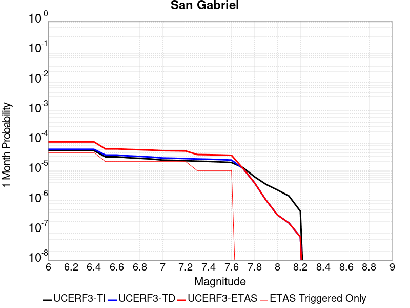 | 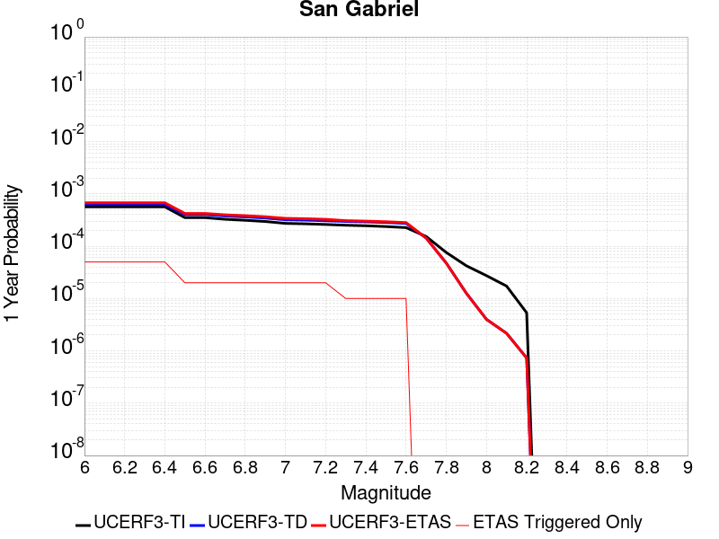 | 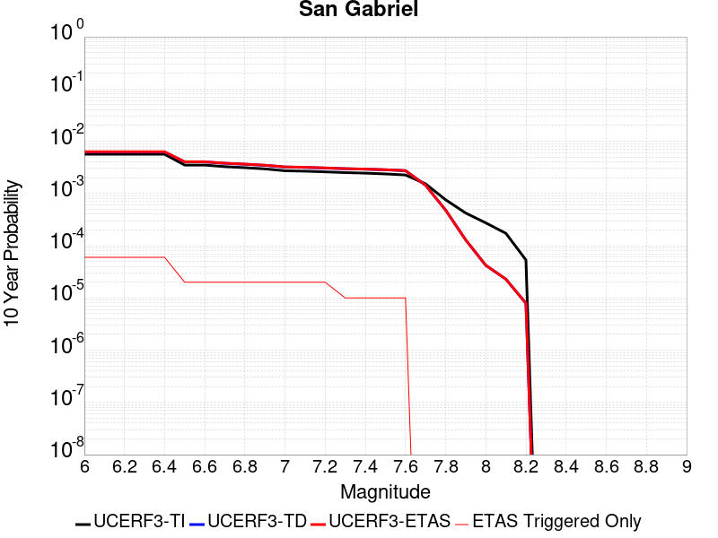 |

| Magnitude | 1 wk TI Prob | 1 wk TD Prob | 1 wk ETAS Prob | 1 wk ETAS/TD Gain | 1 wk ETAS Triggered Only | 1 mo TI Prob | 1 mo TD Prob | 1 mo ETAS Prob | 1 mo ETAS/TD Gain | 1 mo ETAS Triggered Only | 1 yr TI Prob | 1 yr TD Prob | 1 yr ETAS Prob | 1 yr ETAS/TD Gain | 1 yr ETAS Triggered Only | 10 yr TI Prob | 10 yr TD Prob | 10 yr ETAS Prob | 10 yr ETAS/TD Gain | 10 yr ETAS Triggered Only |
|-----|-----|-----|-----|-----|-----|-----|-----|-----|-----|-----|-----|-----|-----|-----|-----|-----|-----|-----|-----|-----|
| 6.0 | 1.083775E-5 | 1.19851875E-5 | 1.19851875E-5 | 1.0 | 0.0 | 4.6446676E-5 | 5.1364143E-5 | 5.1364143E-5 | 1.0 | 0.0 | 5.653415E-4 | 6.251903E-4 | 6.6805433E-4 | 1.0685616 | 4.2890842E-5 | 0.0056390543 | 0.006246409 | 0.006289032 | 1.0068235 | 4.2890842E-5 |
| 6.1 | 1.083775E-5 | 1.19851875E-5 | 1.19851875E-5 | 1.0 | 0.0 | 4.6446676E-5 | 5.1364143E-5 | 5.1364143E-5 | 1.0 | 0.0 | 5.653415E-4 | 6.251903E-4 | 6.6805433E-4 | 1.0685616 | 4.2890842E-5 | 0.0056390543 | 0.006246409 | 0.006289032 | 1.0068235 | 4.2890842E-5 |
| 6.2 | 1.083775E-5 | 1.19851875E-5 | 1.19851875E-5 | 1.0 | 0.0 | 4.6446676E-5 | 5.1364143E-5 | 5.1364143E-5 | 1.0 | 0.0 | 5.653415E-4 | 6.251903E-4 | 6.6805433E-4 | 1.0685616 | 4.2890842E-5 | 0.0056390543 | 0.006246409 | 0.006289032 | 1.0068235 | 4.2890842E-5 |
| 6.3 | 1.083775E-5 | 1.19851875E-5 | 1.19851875E-5 | 1.0 | 0.0 | 4.6446676E-5 | 5.1364143E-5 | 5.1364143E-5 | 1.0 | 0.0 | 5.653415E-4 | 6.251903E-4 | 6.6805433E-4 | 1.0685616 | 4.2890842E-5 | 0.0056390543 | 0.006246409 | 0.006289032 | 1.0068235 | 4.2890842E-5 |
| 6.4 | 1.083775E-5 | 1.19851875E-5 | 1.19851875E-5 | 1.0 | 0.0 | 4.6446676E-5 | 5.1364143E-5 | 5.1364143E-5 | 1.0 | 0.0 | 5.653415E-4 | 6.251903E-4 | 6.6805433E-4 | 1.0685616 | 4.2890842E-5 | 0.0056390543 | 0.006246409 | 0.006289032 | 1.0068235 | 4.2890842E-5 |
| 6.5 | 6.7317824E-6 | 7.716944E-6 | 7.716944E-6 | 1.0 | 0.0 | 2.8850178E-5 | 3.3072207E-5 | 3.3072207E-5 | 1.0 | 0.0 | 3.511943E-4 | 4.0258077E-4 | 4.0258077E-4 | 1.0 | 0.0 | 0.003506398 | 0.0040296097 | 0.0040296097 | 1.0 | 0.0 |
| 6.6 | 6.7317824E-6 | 7.716944E-6 | 7.716944E-6 | 1.0 | 0.0 | 2.8850178E-5 | 3.3072207E-5 | 3.3072207E-5 | 1.0 | 0.0 | 3.511943E-4 | 4.0258077E-4 | 4.0258077E-4 | 1.0 | 0.0 | 0.003506398 | 0.0040296097 | 0.0040296097 | 1.0 | 0.0 |
| 6.7 | 6.274881E-6 | 7.2458647E-6 | 7.2458647E-6 | 1.0 | 0.0 | 2.6892068E-5 | 3.1053343E-5 | 3.1053343E-5 | 1.0 | 0.0 | 3.2736175E-4 | 3.780098E-4 | 3.780098E-4 | 1.0 | 0.0 | 0.0032687993 | 0.0037847564 | 0.0037847564 | 1.0 | 0.0 |
| 6.8 | 5.996209E-6 | 6.958585E-6 | 6.958585E-6 | 1.0 | 0.0 | 2.5697784E-5 | 2.9822171E-5 | 2.9822171E-5 | 1.0 | 0.0 | 3.128256E-4 | 3.6302538E-4 | 3.6302538E-4 | 1.0 | 0.0 | 0.003123856 | 0.0036354093 | 0.0036354093 | 1.0 | 0.0 |
| 6.9 | 5.686331E-6 | 6.6236316E-6 | 6.6236316E-6 | 1.0 | 0.0 | 2.4369761E-5 | 2.8386688E-5 | 2.8386688E-5 | 1.0 | 0.0 | 2.9666146E-4 | 3.4555403E-4 | 3.4555403E-4 | 1.0 | 0.0 | 0.0029626573 | 0.0034612515 | 0.0034612515 | 1.0 | 0.0 |
| 7.0 | 5.2329838E-6 | 6.147514E-6 | 6.147514E-6 | 1.0 | 0.0 | 2.242688E-5 | 2.6346226E-5 | 2.6346226E-5 | 1.0 | 0.0 | 2.7301308E-4 | 3.2071886E-4 | 3.2071886E-4 | 1.0 | 0.0 | 0.002726779 | 0.0032136322 | 0.0032136322 | 1.0 | 0.0 |
| 7.1 | 5.135671E-6 | 6.03764E-6 | 6.03764E-6 | 1.0 | 0.0 | 2.2009834E-5 | 2.5875348E-5 | 2.5875348E-5 | 1.0 | 0.0 | 2.6793676E-4 | 3.1498758E-4 | 3.1498758E-4 | 1.0 | 0.0 | 0.0026761394 | 0.0031564834 | 0.0031564834 | 1.0 | 0.0 |
| 7.2 | 4.989062E-6 | 5.87102E-6 | 5.87102E-6 | 1.0 | 0.0 | 2.1381518E-5 | 2.5161276E-5 | 2.5161276E-5 | 1.0 | 0.0 | 2.6028889E-4 | 3.0629625E-4 | 3.0629625E-4 | 1.0 | 0.0 | 0.0025998424 | 0.003069813 | 0.003069813 | 1.0 | 0.0 |
| 7.3 | 4.8219395E-6 | 5.702574E-6 | 5.702574E-6 | 1.0 | 0.0 | 2.0665291E-5 | 2.443938E-5 | 2.443938E-5 | 1.0 | 0.0 | 2.5157086E-4 | 2.9750957E-4 | 2.9750957E-4 | 1.0 | 0.0 | 0.0025128627 | 0.0029821852 | 0.0029821852 | 1.0 | 0.0 |
| 7.4 | 4.7118383E-6 | 5.5911332E-6 | 5.5911332E-6 | 1.0 | 0.0 | 2.0193436E-5 | 2.3961782E-5 | 2.3961782E-5 | 1.0 | 0.0 | 2.4582737E-4 | 2.916964E-4 | 2.916964E-4 | 1.0 | 0.0 | 0.002455556 | 0.0029242067 | 0.0029242067 | 1.0 | 0.0 |
| 7.5 | 4.5506545E-6 | 5.4365014E-6 | 5.4365014E-6 | 1.0 | 0.0 | 1.9502659E-5 | 2.3299088E-5 | 2.3299088E-5 | 1.0 | 0.0 | 2.37419E-4 | 2.8363022E-4 | 2.8363022E-4 | 1.0 | 0.0 | 0.002371655 | 0.002843753 | 0.002843753 | 1.0 | 0.0 |
| 7.6 | 4.343636E-6 | 5.2293817E-6 | 5.2293817E-6 | 1.0 | 0.0 | 1.861545E-5 | 2.2411448E-5 | 2.2411448E-5 | 1.0 | 0.0 | 2.2661954E-4 | 2.7282597E-4 | 2.7282597E-4 | 1.0 | 0.0 | 0.0022638857 | 0.0027359722 | 0.0027359722 | 1.0 | 0.0 |
| 7.7 | 2.936235E-6 | 2.7440458E-6 | 2.7440458E-6 | 1.0 | 0.0 | 1.2583803E-5 | 1.1760143E-5 | 1.1760143E-5 | 1.0 | 0.0 | 1.5319703E-4 | 1.4317037E-4 | 1.4317037E-4 | 1.0 | 0.0 | 0.0015309147 | 0.0014380751 | 0.0014380751 | 1.0 | 0.0 |
| 7.8 | 1.4541639E-6 | 9.1237047E-7 | 9.1237047E-7 | 1.0 | 0.0 | 6.232116E-6 | 3.9101533E-6 | 3.9101533E-6 | 1.0 | 0.0 | 7.587337E-5 | 4.7605077E-5 | 4.7605077E-5 | 1.0 | 0.0 | 7.584747E-4 | 4.8085177E-4 | 4.8085177E-4 | 1.0 | 0.0 |
| 7.9 | 8.098958E-7 | 2.41753E-7 | 2.41753E-7 | 1.0 | 0.0 | 3.4709774E-6 | 1.0360839E-6 | 1.0360839E-6 | 1.0 | 0.0 | 4.225833E-5 | 1.2614248E-5 | 1.2614248E-5 | 1.0 | 0.0 | 4.2250296E-4 | 1.2921814E-4 | 1.2921814E-4 | 1.0 | 0.0 |
| 8.0 | 5.2473234E-7 | 7.6792055E-8 | 7.6792055E-8 | 1.0 | 0.0 | 2.248851E-6 | 3.2910876E-7 | 3.2910876E-7 | 1.0 | 0.0 | 2.7379416E-5 | 4.0068917E-6 | 4.0068917E-6 | 1.0 | 0.0 | 2.7376044E-4 | 4.21918E-5 | 4.21918E-5 | 1.0 | 0.0 |
| 8.1 | 3.3162388E-7 | 4.1496126E-8 | 4.1496126E-8 | 1.0 | 0.0 | 1.4212444E-6 | 1.7784053E-7 | 1.7784053E-7 | 1.0 | 0.0 | 1.7303513E-5 | 2.1652063E-6 | 2.1652063E-6 | 1.0 | 0.0 | 1.7302166E-4 | 2.2965523E-5 | 2.2965523E-5 | 1.0 | 0.0 |
| 8.2 | 1.0235345E-7 | 1.4043474E-8 | 1.4043474E-8 | 1.0 | 0.0 | 4.3865757E-7 | 6.0186316E-8 | 6.0186316E-8 | 1.0 | 0.0 | 5.340643E-6 | 7.327681E-7 | 7.327681E-7 | 1.0 | 0.0 | 5.3405143E-5 | 7.9273705E-6 | 7.9273705E-6 | 1.0 | 0.0 |

## Calaveras (Central) 2011 CFM
*[(top)](#table-of-contents)*

| 1 Week | 1 Month | 1 Year | 10 Year |
|-----|-----|-----|-----|
|  |  |  |  |

| Magnitude | 1 wk TI Prob | 1 wk TD Prob | 1 wk ETAS Prob | 1 wk ETAS/TD Gain | 1 wk ETAS Triggered Only | 1 mo TI Prob | 1 mo TD Prob | 1 mo ETAS Prob | 1 mo ETAS/TD Gain | 1 mo ETAS Triggered Only | 1 yr TI Prob | 1 yr TD Prob | 1 yr ETAS Prob | 1 yr ETAS/TD Gain | 1 yr ETAS Triggered Only | 10 yr TI Prob | 10 yr TD Prob | 10 yr ETAS Prob | 10 yr ETAS/TD Gain | 10 yr ETAS Triggered Only |
|-----|-----|-----|-----|-----|-----|-----|-----|-----|-----|-----|-----|-----|-----|-----|-----|-----|-----|-----|-----|-----|
| 6.0 | 1.5010907E-4 | 2.481574E-4 | 2.9103758E-4 | 1.1727943 | 4.2890842E-5 | 6.4316596E-4 | 0.0010621005 | 0.0011049458 | 1.0403402 | 4.2890842E-5 | 0.0078024664 | 0.012850073 | 0.012892413 | 1.003295 | 4.2890842E-5 | 0.07534136 | 0.120401435 | 0.12043916 | 1.0003133 | 4.2890842E-5 |
| 6.1 | 1.4521465E-4 | 2.397987E-4 | 2.8267925E-4 | 1.178819 | 4.2890842E-5 | 6.222001E-4 | 0.0010263061 | 0.0010691528 | 1.0417485 | 4.2890842E-5 | 0.0075490056 | 0.012419341 | 0.0124617 | 1.0034107 | 4.2890842E-5 | 0.07297657 | 0.11667323 | 0.11671112 | 1.0003247 | 4.2890842E-5 |
| 6.2 | 1.429998E-4 | 2.3911126E-4 | 2.8199184E-4 | 1.1793332 | 4.2890842E-5 | 6.127123E-4 | 0.0010233623 | 0.0010662092 | 1.0418688 | 4.2890842E-5 | 0.007434286 | 0.01238394 | 0.0124263 | 1.0034206 | 4.2890842E-5 | 0.07190444 | 0.1163272 | 0.1163651 | 1.0003258 | 4.2890842E-5 |
| 6.3 | 1.3536277E-4 | 2.3242626E-4 | 2.7530713E-4 | 1.1844923 | 4.2890842E-5 | 5.799972E-4 | 9.947343E-4 | 0.0010375825 | 1.043075 | 4.2890842E-5 | 0.0070386264 | 0.012040132 | 0.012082506 | 1.0035194 | 4.2890842E-5 | 0.0681982 | 0.11323977 | 0.11327781 | 1.0003358 | 4.2890842E-5 |
| 6.4 | 1.2993296E-4 | 2.2666177E-4 | 2.6954288E-4 | 1.1891855 | 4.2890842E-5 | 5.5673666E-4 | 9.700479E-4 | 0.0010128971 | 1.0441723 | 4.2890842E-5 | 0.006757223 | 0.011742937 | 0.011785325 | 1.0036095 | 4.2890842E-5 | 0.06555412 | 0.11051771 | 0.110555865 | 1.0003452 | 4.2890842E-5 |
| 6.5 | 1.0498927E-4 | 1.7981697E-4 | 2.227001E-4 | 1.2384821 | 4.2890842E-5 | 4.498764E-4 | 7.704157E-4 | 8.132735E-4 | 1.0556295 | 4.2890842E-5 | 0.005463498 | 0.00933924 | 0.009381731 | 1.0045496 | 4.2890842E-5 | 0.053311124 | 0.089199215 | 0.08923828 | 1.000438 | 4.2890842E-5 |
| 6.6 | 1.0157505E-4 | 1.7469203E-4 | 2.1757539E-4 | 1.2454797 | 4.2890842E-5 | 4.35249E-4 | 7.484645E-4 | 7.913232E-4 | 1.0572622 | 4.2890842E-5 | 0.0052862884 | 0.009074297 | 0.009116799 | 1.0046837 | 4.2890842E-5 | 0.05162293 | 0.08677671 | 0.08681588 | 1.0004513 | 4.2890842E-5 |
| 6.7 | 9.660386E-5 | 1.6728524E-4 | 2.101689E-4 | 1.2563506 | 4.2890842E-5 | 4.1395082E-4 | 7.1673887E-4 | 7.59599E-4 | 1.0597987 | 4.2890842E-5 | 0.0050282106 | 0.008691208 | 0.008733726 | 1.0048921 | 4.2890842E-5 | 0.049159497 | 0.083266065 | 0.08330538 | 1.0004722 | 4.2890842E-5 |
| 6.8 | 9.089927E-5 | 1.5643016E-4 | 1.993143E-4 | 1.2741424 | 4.2890842E-5 | 3.8951015E-4 | 6.702439E-4 | 7.13106E-4 | 1.06395 | 4.2890842E-5 | 0.0047319788 | 0.008129478 | 0.008172021 | 1.005233 | 4.2890842E-5 | 0.046324775 | 0.078159414 | 0.078198954 | 1.0005059 | 4.2890842E-5 |
| 6.9 | 7.353187E-5 | 1.2295354E-4 | 1.6583911E-4 | 1.3487949 | 4.2890842E-5 | 3.150985E-4 | 5.2683795E-4 | 5.6970614E-4 | 1.0813689 | 4.2890842E-5 | 0.0038295772 | 0.006395508 | 0.0064381245 | 1.0066636 | 4.2890842E-5 | 0.037642512 | 0.062187865 | 0.062228087 | 1.0006468 | 4.2890842E-5 |
| 7.0 | 5.746064E-5 | 9.3887444E-5 | 1.3677427E-4 | 1.4567897 | 4.2890842E-5 | 2.4623662E-4 | 4.0231308E-4 | 4.4518668E-4 | 1.1065677 | 4.2890842E-5 | 0.0029938098 | 0.004887232 | 0.004929913 | 1.0087332 | 4.2890842E-5 | 0.02953797 | 0.04798685 | 0.048027683 | 1.0008509 | 4.2890842E-5 |
| 7.1 | 4.9557195E-5 | 8.052461E-5 | 1.23412E-4 | 1.5325998 | 4.2890842E-5 | 2.123707E-4 | 3.4506017E-4 | 3.8793622E-4 | 1.1242567 | 4.2890842E-5 | 0.0025825473 | 0.0041930773 | 0.0042357887 | 1.0101861 | 4.2890842E-5 | 0.0255274 | 0.041373078 | 0.041414194 | 1.0009938 | 4.2890842E-5 |
| 7.2 | 3.687595E-5 | 5.9524526E-5 | 5.9524526E-5 | 1.0 | 0.0 | 1.5803022E-4 | 2.5508032E-4 | 2.5508032E-4 | 1.0 | 0.0 | 0.0019223199 | 0.0031012094 | 0.0031012094 | 1.0 | 0.0 | 0.01905776 | 0.030883716 | 0.030883716 | 1.0 | 0.0 |
| 7.3 | 2.5846984E-5 | 4.247213E-5 | 4.247213E-5 | 1.0 | 0.0 | 1.1076809E-4 | 1.8201082E-4 | 1.8201082E-4 | 1.0 | 0.0 | 0.0013477671 | 0.002213747 | 0.002213747 | 1.0 | 0.0 | 0.013396223 | 0.02217554 | 0.02217554 | 1.0 | 0.0 |
| 7.4 | 1.7747854E-5 | 2.9936204E-5 | 2.9936204E-5 | 1.0 | 0.0 | 7.6060016E-5 | 1.2829172E-4 | 1.2829172E-4 | 1.0 | 0.0 | 9.2563726E-4 | 0.0015608355 | 0.0015608355 | 1.0 | 0.0 | 0.009217911 | 0.015709236 | 0.015709236 | 1.0 | 0.0 |
| 7.5 | 1.4883479E-5 | 2.6243379E-5 | 2.6243379E-5 | 1.0 | 0.0 | 6.378478E-5 | 1.1246678E-4 | 1.1246678E-4 | 1.0 | 0.0 | 7.76303E-4 | 0.0013684258 | 0.0013684258 | 1.0 | 0.0 | 0.0077359667 | 0.013802425 | 0.013802425 | 1.0 | 0.0 |
| 7.6 | 8.166975E-6 | 1.4963478E-5 | 1.4963478E-5 | 1.0 | 0.0 | 3.5000852E-5 | 6.412763E-5 | 6.412763E-5 | 1.0 | 0.0 | 4.2605202E-4 | 7.804755E-4 | 7.804755E-4 | 1.0 | 0.0 | 0.004252361 | 0.00793984 | 0.00793984 | 1.0 | 0.0 |
| 7.7 | 3.3858064E-6 | 6.253914E-6 | 6.253914E-6 | 1.0 | 0.0 | 1.4510518E-5 | 2.6802214E-5 | 2.6802214E-5 | 1.0 | 0.0 | 1.7665124E-4 | 3.2626814E-4 | 3.2626814E-4 | 1.0 | 0.0 | 0.0017651088 | 0.0033882293 | 0.0033882293 | 1.0 | 0.0 |
| 7.8 | 2.7721615E-6 | 5.3663807E-6 | 5.3663807E-6 | 1.0 | 0.0 | 1.1880637E-5 | 2.2998573E-5 | 2.2998573E-5 | 1.0 | 0.0 | 1.4463716E-4 | 2.799717E-4 | 2.799717E-4 | 1.0 | 0.0 | 0.0014454306 | 0.0029074624 | 0.0029074624 | 1.0 | 0.0 |
| 7.9 | 1.9736292E-6 | 4.1284193E-6 | 4.1284193E-6 | 1.0 | 0.0 | 8.4583835E-6 | 1.7693106E-5 | 1.7693106E-5 | 1.0 | 0.0 | 1.0297595E-4 | 2.1539231E-4 | 2.1539231E-4 | 1.0 | 0.0 | 0.0010292825 | 0.0022236116 | 0.0022236116 | 1.0 | 0.0 |
| 8.0 | 1.1767289E-6 | 2.5544743E-6 | 2.5544743E-6 | 1.0 | 0.0 | 5.0431145E-6 | 1.0947701E-5 | 1.0947701E-5 | 1.0 | 0.0 | 6.139818E-5 | 1.3328013E-4 | 1.3328013E-4 | 1.0 | 0.0 | 6.1381224E-4 | 0.0013660848 | 0.0013660848 | 1.0 | 0.0 |
| 8.1 | 7.5112825E-7 | 1.5409794E-6 | 1.5409794E-6 | 1.0 | 0.0 | 3.2191172E-6 | 6.6041807E-6 | 6.6041807E-6 | 1.0 | 0.0 | 3.9192048E-5 | 8.0402955E-5 | 8.0402955E-5 | 1.0 | 0.0 | 3.9185135E-4 | 8.235564E-4 | 8.235564E-4 | 1.0 | 0.0 |

## Oak Ridge (Onshore)
*[(top)](#table-of-contents)*

| 1 Week | 1 Month | 1 Year | 10 Year |
|-----|-----|-----|-----|
|  |  |  |  |

| Magnitude | 1 wk TI Prob | 1 wk TD Prob | 1 wk ETAS Prob | 1 wk ETAS/TD Gain | 1 wk ETAS Triggered Only | 1 mo TI Prob | 1 mo TD Prob | 1 mo ETAS Prob | 1 mo ETAS/TD Gain | 1 mo ETAS Triggered Only | 1 yr TI Prob | 1 yr TD Prob | 1 yr ETAS Prob | 1 yr ETAS/TD Gain | 1 yr ETAS Triggered Only | 10 yr TI Prob | 10 yr TD Prob | 10 yr ETAS Prob | 10 yr ETAS/TD Gain | 10 yr ETAS Triggered Only |
|-----|-----|-----|-----|-----|-----|-----|-----|-----|-----|-----|-----|-----|-----|-----|-----|-----|-----|-----|-----|-----|
| 6.0 | 3.155064E-5 | 2.9525974E-5 | 2.9525974E-5 | 1.0 | 0.0 | 1.3521002E-4 | 1.2653397E-4 | 1.2653397E-4 | 1.0 | 0.0 | 0.001644939 | 0.0015395004 | 0.0015823252 | 1.0278174 | 4.2890842E-5 | 0.01632816 | 0.015292859 | 0.015335094 | 1.0027617 | 4.2890842E-5 |
| 6.1 | 3.155064E-5 | 2.9525974E-5 | 2.9525974E-5 | 1.0 | 0.0 | 1.3521002E-4 | 1.2653397E-4 | 1.2653397E-4 | 1.0 | 0.0 | 0.001644939 | 0.0015395004 | 0.0015823252 | 1.0278174 | 4.2890842E-5 | 0.01632816 | 0.015292859 | 0.015335094 | 1.0027617 | 4.2890842E-5 |
| 6.2 | 3.155064E-5 | 2.9525974E-5 | 2.9525974E-5 | 1.0 | 0.0 | 1.3521002E-4 | 1.2653397E-4 | 1.2653397E-4 | 1.0 | 0.0 | 0.001644939 | 0.0015395004 | 0.0015823252 | 1.0278174 | 4.2890842E-5 | 0.01632816 | 0.015292859 | 0.015335094 | 1.0027617 | 4.2890842E-5 |
| 6.3 | 3.155064E-5 | 2.9525974E-5 | 2.9525974E-5 | 1.0 | 0.0 | 1.3521002E-4 | 1.2653397E-4 | 1.2653397E-4 | 1.0 | 0.0 | 0.001644939 | 0.0015395004 | 0.0015823252 | 1.0278174 | 4.2890842E-5 | 0.01632816 | 0.015292859 | 0.015335094 | 1.0027617 | 4.2890842E-5 |
| 6.4 | 3.155064E-5 | 2.9525974E-5 | 2.9525974E-5 | 1.0 | 0.0 | 1.3521002E-4 | 1.2653397E-4 | 1.2653397E-4 | 1.0 | 0.0 | 0.001644939 | 0.0015395004 | 0.0015823252 | 1.0278174 | 4.2890842E-5 | 0.01632816 | 0.015292859 | 0.015335094 | 1.0027617 | 4.2890842E-5 |
| 6.5 | 3.155064E-5 | 2.9525974E-5 | 2.9525974E-5 | 1.0 | 0.0 | 1.3521002E-4 | 1.2653397E-4 | 1.2653397E-4 | 1.0 | 0.0 | 0.001644939 | 0.0015395004 | 0.0015823252 | 1.0278174 | 4.2890842E-5 | 0.01632816 | 0.015292859 | 0.015335094 | 1.0027617 | 4.2890842E-5 |
| 6.6 | 3.155064E-5 | 2.9525974E-5 | 2.9525974E-5 | 1.0 | 0.0 | 1.3521002E-4 | 1.2653397E-4 | 1.2653397E-4 | 1.0 | 0.0 | 0.001644939 | 0.0015395004 | 0.0015823252 | 1.0278174 | 4.2890842E-5 | 0.01632816 | 0.015292859 | 0.015335094 | 1.0027617 | 4.2890842E-5 |
| 6.7 | 3.098897E-5 | 2.8864175E-5 | 2.8864175E-5 | 1.0 | 0.0 | 1.328031E-4 | 1.2369796E-4 | 1.2369796E-4 | 1.0 | 0.0 | 0.0016156785 | 0.0015050198 | 0.0015478461 | 1.0284556 | 4.2890842E-5 | 0.016039822 | 0.014952714 | 0.014994963 | 1.0028255 | 4.2890842E-5 |
| 6.8 | 3.0449872E-5 | 2.8239372E-5 | 2.8239372E-5 | 1.0 | 0.0 | 1.3049292E-4 | 1.2102048E-4 | 1.2102048E-4 | 1.0 | 0.0 | 0.0015875935 | 0.0014724657 | 0.0015152934 | 1.0290856 | 4.2890842E-5 | 0.015762992 | 0.014631462 | 0.014673725 | 1.0028886 | 4.2890842E-5 |
| 6.9 | 2.697928E-5 | 2.4219773E-5 | 2.4219773E-5 | 1.0 | 0.0 | 1.15620365E-4 | 1.0379502E-4 | 1.0379502E-4 | 1.0 | 0.0 | 0.0014067689 | 0.0012629933 | 0.00130583 | 1.0339168 | 4.2890842E-5 | 0.0139789665 | 0.01256087 | 0.012603221 | 1.0033717 | 4.2890842E-5 |
| 7.0 | 2.4893961E-5 | 2.1862043E-5 | 2.1862043E-5 | 1.0 | 0.0 | 1.0668404E-4 | 9.3691204E-5 | 9.3691204E-5 | 1.0 | 0.0 | 0.0012981043 | 0.0011401111 | 0.0011829531 | 1.037577 | 4.2890842E-5 | 0.012905477 | 0.011344905 | 0.01138731 | 1.0037377 | 4.2890842E-5 |
| 7.1 | 2.0945363E-5 | 1.7354487E-5 | 1.7354487E-5 | 1.0 | 0.0 | 8.976275E-5 | 7.437428E-5 | 7.437428E-5 | 1.0 | 0.0 | 0.0010923136 | 9.051354E-4 | 9.479874E-4 | 1.0473433 | 4.2890842E-5 | 0.0108696 | 0.009015423 | 0.009057927 | 1.0047146 | 4.2890842E-5 |
| 7.2 | 2.0439404E-5 | 1.6809423E-5 | 1.6809423E-5 | 1.0 | 0.0 | 8.7594504E-5 | 7.203843E-5 | 7.203843E-5 | 1.0 | 0.0 | 0.0010659413 | 8.767196E-4 | 9.1957283E-4 | 1.048879 | 4.2890842E-5 | 0.010608427 | 0.008733526 | 0.008776043 | 1.0048681 | 4.2890842E-5 |
| 7.3 | 1.8463334E-5 | 1.5381811E-5 | 1.5381811E-5 | 1.0 | 0.0 | 7.912617E-5 | 6.59204E-5 | 6.59204E-5 | 1.0 | 0.0 | 9.6293533E-4 | 8.0228975E-4 | 8.451462E-4 | 1.0534177 | 4.2890842E-5 | 0.009587734 | 0.007994797 | 0.008037345 | 1.005322 | 4.2890842E-5 |
| 7.4 | 1.763139E-5 | 1.451684E-5 | 1.451684E-5 | 1.0 | 0.0 | 7.556091E-5 | 6.221356E-5 | 6.221356E-5 | 1.0 | 0.0 | 9.1956573E-4 | 7.571909E-4 | 8.000493E-4 | 1.0566018 | 4.2890842E-5 | 0.009157699 | 0.007546914 | 0.007589481 | 1.0056404 | 4.2890842E-5 |
| 7.5 | 1.3594944E-5 | 1.1163356E-5 | 1.1163356E-5 | 1.0 | 0.0 | 5.8262744E-5 | 4.784209E-5 | 4.784209E-5 | 1.0 | 0.0 | 7.0911803E-4 | 5.8232434E-4 | 6.251902E-4 | 1.0736116 | 4.2890842E-5 | 0.007068595 | 0.0058082556 | 0.005850897 | 1.0073416 | 4.2890842E-5 |
| 7.6 | 6.9889534E-6 | 5.6367144E-6 | 5.6367144E-6 | 1.0 | 0.0 | 2.9952313E-5 | 2.4157125E-5 | 2.4157125E-5 | 1.0 | 0.0 | 3.646084E-4 | 2.9407372E-4 | 3.3695195E-4 | 1.1458077 | 4.2890842E-5 | 0.0036401073 | 0.0029368899 | 0.0029796548 | 1.0145613 | 4.2890842E-5 |
| 7.7 | 4.0824193E-6 | 3.2832586E-6 | 3.2832586E-6 | 1.0 | 0.0 | 1.7495966E-5 | 1.4071033E-5 | 1.4071033E-5 | 1.0 | 0.0 | 2.1299256E-4 | 1.713015E-4 | 1.713015E-4 | 1.0 | 0.0 | 0.0021278851 | 0.0017117079 | 0.0017117079 | 1.0 | 0.0 |
| 7.8 | 1.7023609E-6 | 1.4370495E-6 | 1.4370495E-6 | 1.0 | 0.0 | 7.295812E-6 | 6.1587693E-6 | 6.1587693E-6 | 1.0 | 0.0 | 8.882289E-5 | 7.498047E-5 | 7.498047E-5 | 1.0 | 0.0 | 8.8787393E-4 | 7.495545E-4 | 7.495545E-4 | 1.0 | 0.0 |
| 7.9 | 2.721225E-7 | 2.2616497E-7 | 2.2616497E-7 | 1.0 | 0.0 | 1.1662388E-6 | 9.692781E-7 | 9.692781E-7 | 1.0 | 0.0 | 1.4198865E-5 | 1.1800899E-5 | 1.1800899E-5 | 1.0 | 0.0 | 1.4197957E-4 | 1.1800301E-4 | 1.1800301E-4 | 1.0 | 0.0 |
| 8.0 | 9.364255E-9 | 5.1206666E-9 | 5.1206666E-9 | 1.0 | 0.0 | 4.0132523E-8 | 2.1945715E-8 | 2.1945715E-8 | 1.0 | 0.0 | 4.8861335E-7 | 2.6718905E-7 | 2.6718905E-7 | 1.0 | 0.0 | 4.8861225E-6 | 2.6718876E-6 | 2.6718876E-6 | 1.0 | 0.0 |

## Newport-Inglewood (Offshore)
*[(top)](#table-of-contents)*

| 1 Week | 1 Month | 1 Year | 10 Year |
|-----|-----|-----|-----|
|  |  |  |  |

| Magnitude | 1 wk TI Prob | 1 wk TD Prob | 1 wk ETAS Prob | 1 wk ETAS/TD Gain | 1 wk ETAS Triggered Only | 1 mo TI Prob | 1 mo TD Prob | 1 mo ETAS Prob | 1 mo ETAS/TD Gain | 1 mo ETAS Triggered Only | 1 yr TI Prob | 1 yr TD Prob | 1 yr ETAS Prob | 1 yr ETAS/TD Gain | 1 yr ETAS Triggered Only | 10 yr TI Prob | 10 yr TD Prob | 10 yr ETAS Prob | 10 yr ETAS/TD Gain | 10 yr ETAS Triggered Only |
|-----|-----|-----|-----|-----|-----|-----|-----|-----|-----|-----|-----|-----|-----|-----|-----|-----|-----|-----|-----|-----|
| 6.0 | 1.9626508E-5 | 1.8965357E-5 | 1.8965357E-5 | 1.0 | 0.0 | 8.411089E-5 | 8.1277634E-5 | 8.1277634E-5 | 1.0 | 0.0 | 0.001023569 | 9.891186E-4 | 9.891186E-4 | 1.0 | 0.0 | 0.010188672 | 0.009848503 | 0.009890972 | 1.0043122 | 4.2890842E-5 |
| 6.1 | 1.331886E-5 | 1.2218092E-5 | 1.2218092E-5 | 1.0 | 0.0 | 5.707958E-5 | 5.2362207E-5 | 5.2362207E-5 | 1.0 | 0.0 | 6.947222E-4 | 6.3732493E-4 | 6.3732493E-4 | 1.0 | 0.0 | 0.006925544 | 0.006355149 | 0.0063977675 | 1.0067061 | 4.2890842E-5 |
| 6.2 | 1.2250852E-5 | 1.1076029E-5 | 1.1076029E-5 | 1.0 | 0.0 | 5.2502597E-5 | 4.7467838E-5 | 4.7467838E-5 | 1.0 | 0.0 | 6.3903164E-4 | 5.777687E-4 | 5.777687E-4 | 1.0 | 0.0 | 0.006371971 | 0.0057627866 | 0.0058054305 | 1.0073998 | 4.2890842E-5 |
| 6.3 | 1.2106258E-5 | 1.0918891E-5 | 1.0918891E-5 | 1.0 | 0.0 | 5.1882926E-5 | 4.6794412E-5 | 4.6794412E-5 | 1.0 | 0.0 | 6.3149154E-4 | 5.69574E-4 | 5.69574E-4 | 1.0 | 0.0 | 0.0062970007 | 0.005681259 | 0.005723906 | 1.0075066 | 4.2890842E-5 |
| 6.4 | 1.1348758E-5 | 1.0109362E-5 | 1.0109362E-5 | 1.0 | 0.0 | 4.8636626E-5 | 4.3325123E-5 | 4.3325123E-5 | 1.0 | 0.0 | 5.919901E-4 | 5.273565E-4 | 5.273565E-4 | 1.0 | 0.0 | 0.005904155 | 0.0052611465 | 0.0053038117 | 1.0081095 | 4.2890842E-5 |
| 6.5 | 1.100837E-5 | 9.7433895E-6 | 9.7433895E-6 | 1.0 | 0.0 | 4.7177873E-5 | 4.1756717E-5 | 4.1756717E-5 | 1.0 | 0.0 | 5.7423924E-4 | 5.082702E-4 | 5.082702E-4 | 1.0 | 0.0 | 0.005727576 | 0.0050711688 | 0.005113842 | 1.0084149 | 4.2890842E-5 |
| 6.6 | 1.0634696E-5 | 9.345544E-6 | 9.345544E-6 | 1.0 | 0.0 | 4.557647E-5 | 4.0051716E-5 | 4.0051716E-5 | 1.0 | 0.0 | 5.5475225E-4 | 4.8752132E-4 | 4.8752132E-4 | 1.0 | 0.0 | 0.0055336943 | 0.0048646047 | 0.0049072867 | 1.008774 | 4.2890842E-5 |
| 6.7 | 9.9780855E-6 | 8.667911E-6 | 8.667911E-6 | 1.0 | 0.0 | 4.276252E-5 | 3.7147664E-5 | 3.7147664E-5 | 1.0 | 0.0 | 5.205093E-4 | 4.5217964E-4 | 4.5217964E-4 | 1.0 | 0.0 | 0.0051929182 | 0.004512675 | 0.004555372 | 1.0094616 | 4.2890842E-5 |
| 6.8 | 9.59546E-6 | 8.27295E-6 | 8.27295E-6 | 1.0 | 0.0 | 4.1122752E-5 | 3.5455025E-5 | 3.5455025E-5 | 1.0 | 0.0 | 5.0055445E-4 | 4.315801E-4 | 4.315801E-4 | 1.0 | 0.0 | 0.004994285 | 0.004307495 | 0.004307495 | 1.0 | 0.0 |
| 6.9 | 9.000614E-6 | 7.70684E-6 | 7.70684E-6 | 1.0 | 0.0 | 3.857349E-5 | 3.30289E-5 | 3.30289E-5 | 1.0 | 0.0 | 4.6953102E-4 | 4.0205332E-4 | 4.0205332E-4 | 1.0 | 0.0 | 0.004685402 | 0.0040133307 | 0.0040133307 | 1.0 | 0.0 |
| 7.0 | 7.4070194E-6 | 6.148904E-6 | 6.148904E-6 | 1.0 | 0.0 | 3.1743984E-5 | 2.635218E-5 | 2.635218E-5 | 1.0 | 0.0 | 3.8641447E-4 | 3.207907E-4 | 3.207907E-4 | 1.0 | 0.0 | 0.0038574322 | 0.0032032963 | 0.0032032963 | 1.0 | 0.0 |
| 7.1 | 6.299615E-6 | 5.0565927E-6 | 5.0565927E-6 | 1.0 | 0.0 | 2.699807E-5 | 2.1670932E-5 | 2.1670932E-5 | 1.0 | 0.0 | 3.2865192E-4 | 2.638118E-4 | 2.638118E-4 | 1.0 | 0.0 | 0.003281663 | 0.002635001 | 0.002635001 | 1.0 | 0.0 |
| 7.2 | 5.096653E-6 | 3.892769E-6 | 3.892769E-6 | 1.0 | 0.0 | 2.1842614E-5 | 1.668319E-5 | 1.668319E-5 | 1.0 | 0.0 | 2.6590136E-4 | 2.0309901E-4 | 2.0309901E-4 | 1.0 | 0.0 | 0.0026558342 | 0.0020291451 | 0.0020291451 | 1.0 | 0.0 |
| 7.3 | 3.9753018E-6 | 2.9099103E-6 | 2.9099103E-6 | 1.0 | 0.0 | 1.7036897E-5 | 1.2470985E-5 | 1.2470985E-5 | 1.0 | 0.0 | 2.0740448E-4 | 1.5182374E-4 | 1.5182374E-4 | 1.0 | 0.0 | 0.00207211 | 0.0015172083 | 0.0015172083 | 1.0 | 0.0 |
| 7.4 | 3.0568392E-6 | 2.1449955E-6 | 2.1449955E-6 | 1.0 | 0.0 | 1.3100675E-5 | 9.192806E-6 | 9.192806E-6 | 1.0 | 0.0 | 1.5948903E-4 | 1.1191672E-4 | 1.1191672E-4 | 1.0 | 0.0 | 0.0015937461 | 0.0011186098 | 0.0011186098 | 1.0 | 0.0 |
| 7.5 | 1.7279019E-6 | 1.1469883E-6 | 1.1469883E-6 | 1.0 | 0.0 | 7.405273E-6 | 4.915655E-6 | 4.915655E-6 | 1.0 | 0.0 | 9.015547E-5 | 5.9846494E-5 | 5.9846494E-5 | 1.0 | 0.0 | 9.01189E-4 | 5.9830764E-4 | 5.9830764E-4 | 1.0 | 0.0 |
| 7.6 | 1.1156416E-6 | 7.223012E-7 | 7.223012E-7 | 1.0 | 0.0 | 4.7813123E-6 | 3.095573E-6 | 3.095573E-6 | 1.0 | 0.0 | 5.821092E-5 | 3.7687976E-5 | 3.7687976E-5 | 1.0 | 0.0 | 5.8195676E-4 | 3.7681818E-4 | 3.7681818E-4 | 1.0 | 0.0 |
| 7.7 | 9.117973E-8 | 6.734145E-8 | 6.734145E-8 | 1.0 | 0.0 | 3.907702E-7 | 2.886062E-7 | 2.886062E-7 | 1.0 | 0.0 | 4.757617E-6 | 3.513775E-6 | 3.513775E-6 | 1.0 | 0.0 | 4.7575148E-5 | 3.5137225E-5 | 3.5137225E-5 | 1.0 | 0.0 |

## Sierra Madre (San Fernando)
*[(top)](#table-of-contents)*

| 1 Week | 1 Month | 1 Year | 10 Year |
|-----|-----|-----|-----|
|  | 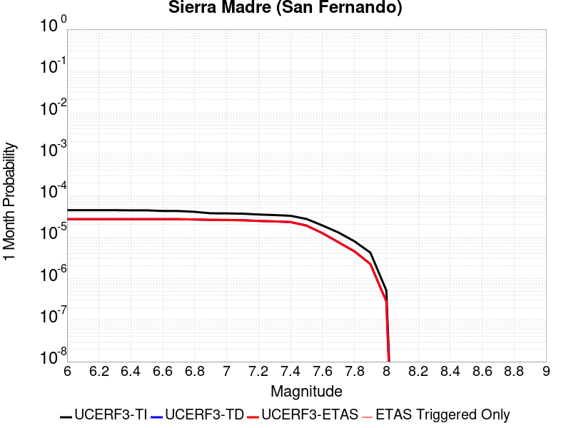 |  |  |

| Magnitude | 1 wk TI Prob | 1 wk TD Prob | 1 wk ETAS Prob | 1 wk ETAS/TD Gain | 1 wk ETAS Triggered Only | 1 mo TI Prob | 1 mo TD Prob | 1 mo ETAS Prob | 1 mo ETAS/TD Gain | 1 mo ETAS Triggered Only | 1 yr TI Prob | 1 yr TD Prob | 1 yr ETAS Prob | 1 yr ETAS/TD Gain | 1 yr ETAS Triggered Only | 10 yr TI Prob | 10 yr TD Prob | 10 yr ETAS Prob | 10 yr ETAS/TD Gain | 10 yr ETAS Triggered Only |
|-----|-----|-----|-----|-----|-----|-----|-----|-----|-----|-----|-----|-----|-----|-----|-----|-----|-----|-----|-----|-----|
| 6.0 | 1.0346413E-5 | 6.2872605E-6 | 6.2872605E-6 | 1.0 | 0.0 | 4.4341014E-5 | 2.694513E-5 | 2.694513E-5 | 1.0 | 0.0 | 5.3971814E-4 | 3.280087E-4 | 3.7088548E-4 | 1.1307184 | 4.2890842E-5 | 0.0053840918 | 0.0032753581 | 0.0033181084 | 1.0130521 | 4.2890842E-5 |
| 6.1 | 1.0346413E-5 | 6.2872605E-6 | 6.2872605E-6 | 1.0 | 0.0 | 4.4341014E-5 | 2.694513E-5 | 2.694513E-5 | 1.0 | 0.0 | 5.3971814E-4 | 3.280087E-4 | 3.7088548E-4 | 1.1307184 | 4.2890842E-5 | 0.0053840918 | 0.0032753581 | 0.0033181084 | 1.0130521 | 4.2890842E-5 |
| 6.2 | 1.0346413E-5 | 6.2872605E-6 | 6.2872605E-6 | 1.0 | 0.0 | 4.4341014E-5 | 2.694513E-5 | 2.694513E-5 | 1.0 | 0.0 | 5.3971814E-4 | 3.280087E-4 | 3.7088548E-4 | 1.1307184 | 4.2890842E-5 | 0.0053840918 | 0.0032753581 | 0.0033181084 | 1.0130521 | 4.2890842E-5 |
| 6.3 | 1.0346413E-5 | 6.2872605E-6 | 6.2872605E-6 | 1.0 | 0.0 | 4.4341014E-5 | 2.694513E-5 | 2.694513E-5 | 1.0 | 0.0 | 5.3971814E-4 | 3.280087E-4 | 3.7088548E-4 | 1.1307184 | 4.2890842E-5 | 0.0053840918 | 0.0032753581 | 0.0033181084 | 1.0130521 | 4.2890842E-5 |
| 6.4 | 1.0249558E-5 | 6.2872605E-6 | 6.2872605E-6 | 1.0 | 0.0 | 4.392594E-5 | 2.694513E-5 | 2.694513E-5 | 1.0 | 0.0 | 5.3466705E-4 | 3.280087E-4 | 3.7088548E-4 | 1.1307184 | 4.2890842E-5 | 0.0053338245 | 0.0032753581 | 0.0033181084 | 1.0130521 | 4.2890842E-5 |
| 6.5 | 1.0249558E-5 | 6.2872605E-6 | 6.2872605E-6 | 1.0 | 0.0 | 4.392594E-5 | 2.694513E-5 | 2.694513E-5 | 1.0 | 0.0 | 5.3466705E-4 | 3.280087E-4 | 3.7088548E-4 | 1.1307184 | 4.2890842E-5 | 0.0053338245 | 0.0032753581 | 0.0033181084 | 1.0130521 | 4.2890842E-5 |
| 6.6 | 9.9035515E-6 | 6.2872605E-6 | 6.2872605E-6 | 1.0 | 0.0 | 4.2443102E-5 | 2.694513E-5 | 2.694513E-5 | 1.0 | 0.0 | 5.166222E-4 | 3.280087E-4 | 3.7088548E-4 | 1.1307184 | 4.2890842E-5 | 0.0051542283 | 0.0032753581 | 0.0033181084 | 1.0130521 | 4.2890842E-5 |
| 6.7 | 9.87217E-6 | 6.2746817E-6 | 6.2746817E-6 | 1.0 | 0.0 | 4.2308613E-5 | 2.689122E-5 | 2.689122E-5 | 1.0 | 0.0 | 5.149856E-4 | 3.2735255E-4 | 3.7022933E-4 | 1.1309805 | 4.2890842E-5 | 0.005137938 | 0.0032688158 | 0.0033115665 | 1.0130783 | 4.2890842E-5 |
| 6.8 | 9.4359175E-6 | 6.1786586E-6 | 6.1786586E-6 | 1.0 | 0.0 | 4.043902E-5 | 2.6479704E-5 | 2.6479704E-5 | 1.0 | 0.0 | 4.9223384E-4 | 3.2234378E-4 | 3.652208E-4 | 1.1330165 | 4.2890842E-5 | 0.0049114493 | 0.0032188739 | 0.0032616267 | 1.013282 | 4.2890842E-5 |
| 6.9 | 8.700447E-6 | 6.039922E-6 | 6.039922E-6 | 1.0 | 0.0 | 3.72871E-5 | 2.5885129E-5 | 2.5885129E-5 | 1.0 | 0.0 | 4.5387587E-4 | 3.1510694E-4 | 3.5798427E-4 | 1.1360723 | 4.2890842E-5 | 0.0045295 | 0.003146711 | 0.003189467 | 1.0135875 | 4.2890842E-5 |
| 7.0 | 8.648878E-6 | 6.0148373E-6 | 6.0148373E-6 | 1.0 | 0.0 | 3.7066096E-5 | 2.5777625E-5 | 2.5777625E-5 | 1.0 | 0.0 | 4.5118626E-4 | 3.1379846E-4 | 3.5667585E-4 | 1.1366398 | 4.2890842E-5 | 0.004502713 | 0.003133663 | 0.0031764195 | 1.0136442 | 4.2890842E-5 |
| 7.1 | 8.505786E-6 | 5.9244676E-6 | 5.9244676E-6 | 1.0 | 0.0 | 3.645286E-5 | 2.5390334E-5 | 2.5390334E-5 | 1.0 | 0.0 | 4.437232E-4 | 3.0908454E-4 | 3.5196214E-4 | 1.1387244 | 4.2890842E-5 | 0.0044283825 | 0.0030866556 | 0.003129414 | 1.0138527 | 4.2890842E-5 |
| 7.2 | 8.139752E-6 | 5.6987624E-6 | 5.6987624E-6 | 1.0 | 0.0 | 3.4884186E-5 | 2.4423045E-5 | 2.4423045E-5 | 1.0 | 0.0 | 4.246322E-4 | 2.9731105E-4 | 3.4018914E-4 | 1.1442196 | 4.2890842E-5 | 0.004238217 | 0.0029692391 | 0.0030120024 | 1.0144022 | 4.2890842E-5 |
| 7.3 | 7.8816E-6 | 5.552077E-6 | 5.552077E-6 | 1.0 | 0.0 | 3.3777847E-5 | 2.3794404E-5 | 2.3794404E-5 | 1.0 | 0.0 | 4.111677E-4 | 2.896594E-4 | 3.3253783E-4 | 1.1480305 | 4.2890842E-5 | 0.004104078 | 0.0028929242 | 0.002935691 | 1.0147833 | 4.2890842E-5 |
| 7.4 | 7.5810603E-6 | 5.3563126E-6 | 5.3563126E-6 | 1.0 | 0.0 | 3.2489854E-5 | 2.2955428E-5 | 2.2955428E-5 | 1.0 | 0.0 | 3.9549218E-4 | 2.7944756E-4 | 3.223264E-4 | 1.1534415 | 4.2890842E-5 | 0.0039478904 | 0.0027910667 | 0.0028338376 | 1.0153244 | 4.2890842E-5 |
| 7.5 | 6.349153E-6 | 4.407576E-6 | 4.407576E-6 | 1.0 | 0.0 | 2.7210372E-5 | 1.888948E-5 | 1.888948E-5 | 1.0 | 0.0 | 3.312359E-4 | 2.2995596E-4 | 2.7283694E-4 | 1.1864748 | 4.2890842E-5 | 0.0033074263 | 0.0022972622 | 0.0023400544 | 1.0186275 | 4.2890842E-5 |
| 7.6 | 4.430576E-6 | 2.8905868E-6 | 2.8905868E-6 | 1.0 | 0.0 | 1.8988047E-5 | 1.2388171E-5 | 1.2388171E-5 | 1.0 | 0.0 | 2.3115493E-4 | 1.5081577E-4 | 1.9370015E-4 | 1.2843494 | 4.2890842E-5 | 0.0023091463 | 0.0015071568 | 0.0015499829 | 1.0284152 | 4.2890842E-5 |
| 7.7 | 3.005066E-6 | 1.7510115E-6 | 1.7510115E-6 | 1.0 | 0.0 | 1.2878791E-5 | 7.504313E-6 | 7.504313E-6 | 1.0 | 0.0 | 1.56788E-4 | 9.1361195E-5 | 9.1361195E-5 | 1.0 | 0.0 | 0.0015667742 | 9.132375E-4 | 9.132375E-4 | 1.0 | 0.0 |
| 7.8 | 1.8459098E-6 | 1.0582091E-6 | 1.0582091E-6 | 1.0 | 0.0 | 7.911018E-6 | 4.535174E-6 | 4.535174E-6 | 1.0 | 0.0 | 9.631238E-5 | 5.5214347E-5 | 5.5214347E-5 | 1.0 | 0.0 | 9.627065E-4 | 5.5200676E-4 | 5.5200676E-4 | 1.0 | 0.0 |
| 7.9 | 9.839262E-7 | 5.23421E-7 | 5.23421E-7 | 1.0 | 0.0 | 4.2168194E-6 | 2.2432312E-6 | 2.2432312E-6 | 1.0 | 0.0 | 5.1338568E-5 | 2.7310998E-5 | 2.7310998E-5 | 1.0 | 0.0 | 5.132671E-4 | 2.730767E-4 | 2.730767E-4 | 1.0 | 0.0 |
| 8.0 | 1.210983E-7 | 6.613821E-8 | 6.613821E-8 | 1.0 | 0.0 | 5.1899264E-7 | 2.8344945E-7 | 2.8344945E-7 | 1.0 | 0.0 | 6.3187167E-6 | 3.4509917E-6 | 3.4509917E-6 | 1.0 | 0.0 | 6.318537E-5 | 3.45094E-5 | 3.45094E-5 | 1.0 | 0.0 |

## Great Valley 03a Dunnigan Hills
*[(top)](#table-of-contents)*

| 1 Week | 1 Month | 1 Year | 10 Year |
|-----|-----|-----|-----|
|  |  |  |  |

| Magnitude | 1 wk TI Prob | 1 wk TD Prob | 1 wk ETAS Prob | 1 wk ETAS/TD Gain | 1 wk ETAS Triggered Only | 1 mo TI Prob | 1 mo TD Prob | 1 mo ETAS Prob | 1 mo ETAS/TD Gain | 1 mo ETAS Triggered Only | 1 yr TI Prob | 1 yr TD Prob | 1 yr ETAS Prob | 1 yr ETAS/TD Gain | 1 yr ETAS Triggered Only | 10 yr TI Prob | 10 yr TD Prob | 10 yr ETAS Prob | 10 yr ETAS/TD Gain | 10 yr ETAS Triggered Only |
|-----|-----|-----|-----|-----|-----|-----|-----|-----|-----|-----|-----|-----|-----|-----|-----|-----|-----|-----|-----|-----|
| 6.0 | 1.6591328E-5 | 1.8107954E-5 | 6.099802E-5 | 3.368576 | 4.2890842E-5 | 7.110376E-5 | 7.7603596E-5 | 1.2049111E-4 | 1.5526485 | 4.2890842E-5 | 8.6534437E-4 | 9.444834E-4 | 9.873337E-4 | 1.045369 | 4.2890842E-5 | 0.008619824 | 0.009411525 | 0.009454012 | 1.0045143 | 4.2890842E-5 |
| 6.1 | 8.041125E-6 | 8.769726E-6 | 8.769726E-6 | 1.0 | 0.0 | 3.4461507E-5 | 3.7584115E-5 | 3.7584115E-5 | 1.0 | 0.0 | 4.194881E-4 | 4.5751085E-4 | 4.5751085E-4 | 1.0 | 0.0 | 0.004186971 | 0.004567687 | 0.004567687 | 1.0 | 0.0 |
| 6.2 | 3.2807004E-6 | 3.5795688E-6 | 3.5795688E-6 | 1.0 | 0.0 | 1.4060069E-5 | 1.5340942E-5 | 1.5340942E-5 | 1.0 | 0.0 | 1.7116789E-4 | 1.8676413E-4 | 1.8676413E-4 | 1.0 | 0.0 | 0.0017103611 | 0.0018664796 | 0.0018664796 | 1.0 | 0.0 |
| 6.3 | 1.9339366E-6 | 2.1103806E-6 | 2.1103806E-6 | 1.0 | 0.0 | 8.288273E-6 | 9.044474E-6 | 9.044474E-6 | 1.0 | 0.0 | 1.00905054E-4 | 1.1011375E-4 | 1.1011375E-4 | 1.0 | 0.0 | 0.0010085925 | 0.0011008718 | 0.0011008718 | 1.0 | 0.0 |
| 6.4 | 1.3142635E-6 | 1.4339867E-6 | 1.4339867E-6 | 1.0 | 0.0 | 5.6325457E-6 | 6.145657E-6 | 6.145657E-6 | 1.0 | 0.0 | 6.857408E-5 | 7.482337E-5 | 7.482337E-5 | 1.0 | 0.0 | 6.8552926E-4 | 7.4823375E-4 | 7.4823375E-4 | 1.0 | 0.0 |

## Elsinore (Coyote Mountains)
*[(top)](#table-of-contents)*

| 1 Week | 1 Month | 1 Year | 10 Year |
|-----|-----|-----|-----|
|  |  |  |  |

| Magnitude | 1 wk TI Prob | 1 wk TD Prob | 1 wk ETAS Prob | 1 wk ETAS/TD Gain | 1 wk ETAS Triggered Only | 1 mo TI Prob | 1 mo TD Prob | 1 mo ETAS Prob | 1 mo ETAS/TD Gain | 1 mo ETAS Triggered Only | 1 yr TI Prob | 1 yr TD Prob | 1 yr ETAS Prob | 1 yr ETAS/TD Gain | 1 yr ETAS Triggered Only | 10 yr TI Prob | 10 yr TD Prob | 10 yr ETAS Prob | 10 yr ETAS/TD Gain | 10 yr ETAS Triggered Only |
|-----|-----|-----|-----|-----|-----|-----|-----|-----|-----|-----|-----|-----|-----|-----|-----|-----|-----|-----|-----|-----|
| 6.0 | 4.20513E-5 | 4.8631882E-5 | 9.152064E-5 | 1.8819062 | 4.2890842E-5 | 1.8020741E-4 | 2.0840895E-4 | 2.5129085E-4 | 1.2057585 | 4.2890842E-5 | 0.0021918174 | 0.002535 | 0.0025777821 | 1.0168766 | 4.2890842E-5 | 0.021703249 | 0.025111282 | 0.025153097 | 1.0016651 | 4.2890842E-5 |
| 6.1 | 4.20513E-5 | 4.8631882E-5 | 9.152064E-5 | 1.8819062 | 4.2890842E-5 | 1.8020741E-4 | 2.0840895E-4 | 2.5129085E-4 | 1.2057585 | 4.2890842E-5 | 0.0021918174 | 0.002535 | 0.0025777821 | 1.0168766 | 4.2890842E-5 | 0.021703249 | 0.025111282 | 0.025153097 | 1.0016651 | 4.2890842E-5 |
| 6.2 | 2.3413893E-5 | 2.469566E-5 | 6.7585446E-5 | 2.7367337 | 4.2890842E-5 | 1.0034139E-4 | 1.0583479E-4 | 1.487211E-4 | 1.4052193 | 4.2890842E-5 | 0.0012209718 | 0.0012878707 | 0.0013307063 | 1.0332608 | 4.2890842E-5 | 0.012142851 | 0.01281264 | 0.012854981 | 1.0033046 | 4.2890842E-5 |
| 6.3 | 2.3413893E-5 | 2.469566E-5 | 6.7585446E-5 | 2.7367337 | 4.2890842E-5 | 1.0034139E-4 | 1.0583479E-4 | 1.487211E-4 | 1.4052193 | 4.2890842E-5 | 0.0012209718 | 0.0012878707 | 0.0013307063 | 1.0332608 | 4.2890842E-5 | 0.012142851 | 0.01281264 | 0.012854981 | 1.0033046 | 4.2890842E-5 |
| 6.4 | 1.6894814E-5 | 1.6568361E-5 | 5.9458493E-5 | 3.5886767 | 4.2890842E-5 | 7.240433E-5 | 7.1005554E-5 | 1.1389335E-4 | 1.6040063 | 4.2890842E-5 | 8.811662E-4 | 8.6418656E-4 | 9.070403E-4 | 1.0495886 | 4.2890842E-5 | 0.0087768035 | 0.00861194 | 0.008654462 | 1.0049375 | 4.2890842E-5 |
| 6.5 | 1.6894814E-5 | 1.6568361E-5 | 5.9458493E-5 | 3.5886767 | 4.2890842E-5 | 7.240433E-5 | 7.1005554E-5 | 1.1389335E-4 | 1.6040063 | 4.2890842E-5 | 8.811662E-4 | 8.6418656E-4 | 9.070403E-4 | 1.0495886 | 4.2890842E-5 | 0.0087768035 | 0.00861194 | 0.008654462 | 1.0049375 | 4.2890842E-5 |
| 6.6 | 1.1910969E-5 | 1.0530774E-5 | 5.3421165E-5 | 5.0728626 | 4.2890842E-5 | 5.1046012E-5 | 4.5131183E-5 | 8.802009E-5 | 1.9503165 | 4.2890842E-5 | 6.21308E-4 | 5.4934516E-4 | 5.922124E-4 | 1.0780334 | 4.2890842E-5 | 0.0061957375 | 0.005481174 | 0.00552383 | 1.0077822 | 4.2890842E-5 |
| 6.7 | 9.1486E-6 | 7.2028593E-6 | 7.2028593E-6 | 1.0 | 0.0 | 3.9207694E-5 | 3.0869054E-5 | 3.0869054E-5 | 1.0 | 0.0 | 4.7724912E-4 | 3.757697E-4 | 3.757697E-4 | 1.0 | 0.0 | 0.0047622547 | 0.0037517229 | 0.0037517229 | 1.0 | 0.0 |
| 6.8 | 7.90441E-6 | 5.7290276E-6 | 5.7290276E-6 | 1.0 | 0.0 | 3.3875604E-5 | 2.4552752E-5 | 2.4552752E-5 | 1.0 | 0.0 | 4.1235742E-4 | 2.9889002E-4 | 2.9889002E-4 | 1.0 | 0.0 | 0.0041159308 | 0.002985009 | 0.002985009 | 1.0 | 0.0 |
| 6.9 | 7.77015E-6 | 5.582982E-6 | 5.582982E-6 | 1.0 | 0.0 | 3.3300217E-5 | 2.3926852E-5 | 2.3926852E-5 | 1.0 | 0.0 | 4.0535472E-4 | 2.9127175E-4 | 2.9127175E-4 | 1.0 | 0.0 | 0.004046161 | 0.002909027 | 0.002909027 | 1.0 | 0.0 |
| 7.0 | 7.675798E-6 | 5.47984E-6 | 5.47984E-6 | 1.0 | 0.0 | 3.289586E-5 | 2.3484827E-5 | 2.3484827E-5 | 1.0 | 0.0 | 4.004335E-4 | 2.858915E-4 | 2.858915E-4 | 1.0 | 0.0 | 0.003997127 | 0.0028553635 | 0.0028553635 | 1.0 | 0.0 |
| 7.1 | 7.447814E-6 | 5.238714E-6 | 5.238714E-6 | 1.0 | 0.0 | 3.191881E-5 | 2.2451446E-5 | 2.2451446E-5 | 1.0 | 0.0 | 3.8854225E-4 | 2.7331332E-4 | 2.7331332E-4 | 1.0 | 0.0 | 0.003878636 | 0.0027298962 | 0.0027298962 | 1.0 | 0.0 |
| 7.2 | 7.128185E-6 | 4.905372E-6 | 4.905372E-6 | 1.0 | 0.0 | 3.0549007E-5 | 2.102286E-5 | 2.102286E-5 | 1.0 | 0.0 | 3.7187067E-4 | 2.5592445E-4 | 2.5592445E-4 | 1.0 | 0.0 | 0.00371249 | 0.0025564157 | 0.0025564157 | 1.0 | 0.0 |
| 7.3 | 7.0913875E-6 | 4.874047E-6 | 4.874047E-6 | 1.0 | 0.0 | 3.0391306E-5 | 2.0888614E-5 | 2.0888614E-5 | 1.0 | 0.0 | 3.6995133E-4 | 2.5429038E-4 | 2.5429038E-4 | 1.0 | 0.0 | 0.0036933604 | 0.0025401122 | 0.0025401122 | 1.0 | 0.0 |
| 7.4 | 7.051521E-6 | 4.837899E-6 | 4.837899E-6 | 1.0 | 0.0 | 3.0220453E-5 | 2.0733693E-5 | 2.0733693E-5 | 1.0 | 0.0 | 3.6787192E-4 | 2.5240466E-4 | 2.5240466E-4 | 1.0 | 0.0 | 0.0036726352 | 0.0025212981 | 0.0025212981 | 1.0 | 0.0 |
| 7.5 | 6.910666E-6 | 4.733448E-6 | 4.733448E-6 | 1.0 | 0.0 | 2.9616802E-5 | 2.0286056E-5 | 2.0286056E-5 | 1.0 | 0.0 | 3.605249E-4 | 2.4695593E-4 | 2.4695593E-4 | 1.0 | 0.0 | 0.0035994058 | 0.0024669329 | 0.0024669329 | 1.0 | 0.0 |
| 7.6 | 6.341753E-6 | 4.3065565E-6 | 4.3065565E-6 | 1.0 | 0.0 | 2.7178658E-5 | 1.8456547E-5 | 1.8456547E-5 | 1.0 | 0.0 | 3.3084993E-4 | 2.2468645E-4 | 2.2468645E-4 | 1.0 | 0.0 | 0.0033035777 | 0.002244708 | 0.002244708 | 1.0 | 0.0 |
| 7.7 | 3.9205916E-6 | 2.2439415E-6 | 2.2439415E-6 | 1.0 | 0.0 | 1.6802427E-5 | 9.616861E-6 | 9.616861E-6 | 1.0 | 0.0 | 2.0455034E-4 | 1.1707973E-4 | 1.1707973E-4 | 1.0 | 0.0 | 0.0020436216 | 0.0011702535 | 0.0011702535 | 1.0 | 0.0 |
| 7.8 | 2.0846227E-7 | 8.486417E-8 | 8.486417E-8 | 1.0 | 0.0 | 8.9340944E-7 | 3.6370355E-7 | 3.6370355E-7 | 1.0 | 0.0 | 1.0877206E-5 | 4.428085E-6 | 4.428085E-6 | 1.0 | 0.0 | 1.0876673E-4 | 4.4280296E-5 | 4.4280296E-5 | 1.0 | 0.0 |
| 7.9 | 4.4969806E-9 | 2.2691855E-9 | 2.2691855E-9 | 1.0 | 0.0 | 1.9272775E-8 | 9.72508E-9 | 9.72508E-9 | 1.0 | 0.0 | 2.3464601E-7 | 1.18402845E-7 | 1.18402845E-7 | 1.0 | 0.0 | 2.3464577E-6 | 1.184028E-6 | 1.184028E-6 | 1.0 | 0.0 |

## White Wolf
*[(top)](#table-of-contents)*

| 1 Week | 1 Month | 1 Year | 10 Year |
|-----|-----|-----|-----|
|  |  |  | 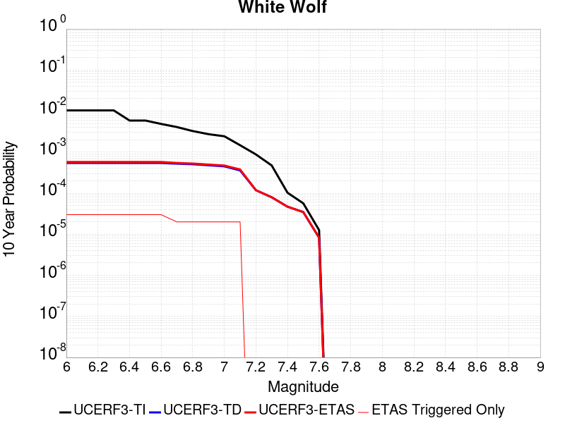 |

| Magnitude | 1 wk TI Prob | 1 wk TD Prob | 1 wk ETAS Prob | 1 wk ETAS/TD Gain | 1 wk ETAS Triggered Only | 1 mo TI Prob | 1 mo TD Prob | 1 mo ETAS Prob | 1 mo ETAS/TD Gain | 1 mo ETAS Triggered Only | 1 yr TI Prob | 1 yr TD Prob | 1 yr ETAS Prob | 1 yr ETAS/TD Gain | 1 yr ETAS Triggered Only | 10 yr TI Prob | 10 yr TD Prob | 10 yr ETAS Prob | 10 yr ETAS/TD Gain | 10 yr ETAS Triggered Only |
|-----|-----|-----|-----|-----|-----|-----|-----|-----|-----|-----|-----|-----|-----|-----|-----|-----|-----|-----|-----|-----|
| 6.0 | 2.0037822E-5 | 1.0469162E-6 | 1.0469162E-6 | 1.0 | 0.0 | 8.587355E-5 | 4.486776E-6 | 4.486776E-6 | 1.0 | 0.0 | 0.001045009 | 5.4625183E-5 | 5.4625183E-5 | 1.0 | 0.0 | 0.010401085 | 5.461226E-4 | 5.8899005E-4 | 1.0784941 | 4.2890842E-5 |
| 6.1 | 2.0037822E-5 | 1.0469162E-6 | 1.0469162E-6 | 1.0 | 0.0 | 8.587355E-5 | 4.486776E-6 | 4.486776E-6 | 1.0 | 0.0 | 0.001045009 | 5.4625183E-5 | 5.4625183E-5 | 1.0 | 0.0 | 0.010401085 | 5.461226E-4 | 5.8899005E-4 | 1.0784941 | 4.2890842E-5 |
| 6.2 | 2.0037822E-5 | 1.0469162E-6 | 1.0469162E-6 | 1.0 | 0.0 | 8.587355E-5 | 4.486776E-6 | 4.486776E-6 | 1.0 | 0.0 | 0.001045009 | 5.4625183E-5 | 5.4625183E-5 | 1.0 | 0.0 | 0.010401085 | 5.461226E-4 | 5.8899005E-4 | 1.0784941 | 4.2890842E-5 |
| 6.3 | 2.0037822E-5 | 1.0469162E-6 | 1.0469162E-6 | 1.0 | 0.0 | 8.587355E-5 | 4.486776E-6 | 4.486776E-6 | 1.0 | 0.0 | 0.001045009 | 5.4625183E-5 | 5.4625183E-5 | 1.0 | 0.0 | 0.010401085 | 5.461226E-4 | 5.8899005E-4 | 1.0784941 | 4.2890842E-5 |
| 6.4 | 1.132487E-5 | 1.0469162E-6 | 1.0469162E-6 | 1.0 | 0.0 | 4.8534253E-5 | 4.486776E-6 | 4.486776E-6 | 1.0 | 0.0 | 5.907443E-4 | 5.4625183E-5 | 5.4625183E-5 | 1.0 | 0.0 | 0.005891764 | 5.461226E-4 | 5.8899005E-4 | 1.0784941 | 4.2890842E-5 |
| 6.5 | 1.132487E-5 | 1.0469162E-6 | 1.0469162E-6 | 1.0 | 0.0 | 4.8534253E-5 | 4.486776E-6 | 4.486776E-6 | 1.0 | 0.0 | 5.907443E-4 | 5.4625183E-5 | 5.4625183E-5 | 1.0 | 0.0 | 0.005891764 | 5.461226E-4 | 5.8899005E-4 | 1.0784941 | 4.2890842E-5 |
| 6.6 | 9.347473E-6 | 1.0469162E-6 | 1.0469162E-6 | 1.0 | 0.0 | 4.0059982E-5 | 4.486776E-6 | 4.486776E-6 | 1.0 | 0.0 | 4.8762115E-4 | 5.4625183E-5 | 5.4625183E-5 | 1.0 | 0.0 | 0.0048655253 | 5.461226E-4 | 5.8899005E-4 | 1.0784941 | 4.2890842E-5 |
| 6.7 | 7.842647E-6 | 1.0048342E-6 | 1.0048342E-6 | 1.0 | 0.0 | 3.361091E-5 | 4.3064256E-6 | 4.3064256E-6 | 1.0 | 0.0 | 4.0913603E-4 | 5.2429517E-5 | 5.2429517E-5 | 1.0 | 0.0 | 0.004083836 | 5.2417646E-4 | 5.6704483E-4 | 1.0817823 | 4.2890842E-5 |
| 6.8 | 6.26597E-6 | 9.734822E-7 | 9.734822E-7 | 1.0 | 0.0 | 2.685388E-5 | 4.17206E-6 | 4.17206E-6 | 1.0 | 0.0 | 3.2689696E-4 | 5.0793697E-5 | 5.0793697E-5 | 1.0 | 0.0 | 0.003264165 | 5.078258E-4 | 5.506949E-4 | 1.0844169 | 4.2890842E-5 |
| 6.9 | 5.258436E-6 | 9.183254E-7 | 9.183254E-7 | 1.0 | 0.0 | 2.2535958E-5 | 3.9356746E-6 | 3.9356746E-6 | 1.0 | 0.0 | 2.7434074E-4 | 4.7915833E-5 | 4.7915833E-5 | 1.0 | 0.0 | 0.0027400232 | 4.790598E-4 | 5.219301E-4 | 1.0894884 | 4.2890842E-5 |
| 7.0 | 4.675028E-6 | 8.6611794E-7 | 8.6611794E-7 | 1.0 | 0.0 | 2.003568E-5 | 3.7119291E-6 | 3.7119291E-6 | 1.0 | 0.0 | 2.4390711E-4 | 4.5191846E-5 | 4.5191846E-5 | 1.0 | 0.0 | 0.0024363957 | 4.518313E-4 | 4.947027E-4 | 1.0948838 | 4.2890842E-5 |
| 7.1 | 2.8270078E-6 | 6.8741696E-7 | 6.8741696E-7 | 1.0 | 0.0 | 1.2115692E-5 | 2.9460696E-6 | 2.9460696E-6 | 1.0 | 0.0 | 1.4749856E-4 | 3.5867848E-5 | 3.5867848E-5 | 1.0 | 0.0 | 0.001474007 | 3.586247E-4 | 4.0150015E-4 | 1.1195552 | 4.2890842E-5 |
| 7.2 | 1.6881406E-6 | 2.2706382E-7 | 2.2706382E-7 | 1.0 | 0.0 | 7.2348685E-6 | 9.731303E-7 | 9.731303E-7 | 1.0 | 0.0 | 8.808096E-5 | 1.1847799E-5 | 1.1847799E-5 | 1.0 | 0.0 | 8.8046055E-4 | 1.1847183E-4 | 1.1847183E-4 | 1.0 | 0.0 |
| 7.3 | 9.086107E-7 | 1.5266386E-7 | 1.5266386E-7 | 1.0 | 0.0 | 3.8940398E-6 | 6.5427355E-7 | 6.5427355E-7 | 1.0 | 0.0 | 4.7408903E-5 | 7.965752E-6 | 7.965752E-6 | 1.0 | 0.0 | 4.739879E-4 | 7.965475E-5 | 7.965475E-5 | 1.0 | 0.0 |
| 7.4 | 1.9717383E-7 | 9.003913E-8 | 9.003913E-8 | 1.0 | 0.0 | 8.450304E-7 | 3.8588192E-7 | 3.8588192E-7 | 1.0 | 0.0 | 1.0288197E-5 | 4.6981027E-6 | 4.6981027E-6 | 1.0 | 0.0 | 1.028772E-4 | 4.6980065E-5 | 4.6980065E-5 | 1.0 | 0.0 |
| 7.5 | 1.086975E-7 | 6.6597195E-8 | 6.6597195E-8 | 1.0 | 0.0 | 4.6584634E-7 | 2.8541652E-7 | 2.8541652E-7 | 1.0 | 0.0 | 5.6716644E-6 | 3.474941E-6 | 3.474941E-6 | 1.0 | 0.0 | 5.6715195E-5 | 3.474889E-5 | 3.474889E-5 | 1.0 | 0.0 |
| 7.6 | 2.4217808E-8 | 1.5820765E-8 | 1.5820765E-8 | 1.0 | 0.0 | 1.03790605E-7 | 6.780328E-8 | 6.780328E-8 | 1.0 | 0.0 | 1.2636499E-6 | 8.255046E-7 | 8.255046E-7 | 1.0 | 0.0 | 1.2636427E-5 | 8.2550205E-6 | 8.2550205E-6 | 1.0 | 0.0 |

## Los Osos 2011
*[(top)](#table-of-contents)*

| 1 Week | 1 Month | 1 Year | 10 Year |
|-----|-----|-----|-----|
|  |  |  |  |

| Magnitude | 1 wk TI Prob | 1 wk TD Prob | 1 wk ETAS Prob | 1 wk ETAS/TD Gain | 1 wk ETAS Triggered Only | 1 mo TI Prob | 1 mo TD Prob | 1 mo ETAS Prob | 1 mo ETAS/TD Gain | 1 mo ETAS Triggered Only | 1 yr TI Prob | 1 yr TD Prob | 1 yr ETAS Prob | 1 yr ETAS/TD Gain | 1 yr ETAS Triggered Only | 10 yr TI Prob | 10 yr TD Prob | 10 yr ETAS Prob | 10 yr ETAS/TD Gain | 10 yr ETAS Triggered Only |
|-----|-----|-----|-----|-----|-----|-----|-----|-----|-----|-----|-----|-----|-----|-----|-----|-----|-----|-----|-----|-----|
| 6.0 | 4.8871775E-6 | 4.9814835E-6 | 4.7872112E-5 | 9.610011 | 4.2890842E-5 | 2.0944879E-5 | 2.1349055E-5 | 6.4238986E-5 | 3.0089848 | 4.2890842E-5 | 2.5497406E-4 | 2.5989654E-4 | 3.0277623E-4 | 1.1649876 | 4.2890842E-5 | 0.002546817 | 0.0025962002 | 0.0026389798 | 1.0164777 | 4.2890842E-5 |
| 6.1 | 4.8871775E-6 | 4.9814835E-6 | 4.7872112E-5 | 9.610011 | 4.2890842E-5 | 2.0944879E-5 | 2.1349055E-5 | 6.4238986E-5 | 3.0089848 | 4.2890842E-5 | 2.5497406E-4 | 2.5989654E-4 | 3.0277623E-4 | 1.1649876 | 4.2890842E-5 | 0.002546817 | 0.0025962002 | 0.0026389798 | 1.0164777 | 4.2890842E-5 |
| 6.2 | 4.8871775E-6 | 4.9814835E-6 | 4.7872112E-5 | 9.610011 | 4.2890842E-5 | 2.0944879E-5 | 2.1349055E-5 | 6.4238986E-5 | 3.0089848 | 4.2890842E-5 | 2.5497406E-4 | 2.5989654E-4 | 3.0277623E-4 | 1.1649876 | 4.2890842E-5 | 0.002546817 | 0.0025962002 | 0.0026389798 | 1.0164777 | 4.2890842E-5 |
| 6.3 | 4.8871775E-6 | 4.9814835E-6 | 4.7872112E-5 | 9.610011 | 4.2890842E-5 | 2.0944879E-5 | 2.1349055E-5 | 6.4238986E-5 | 3.0089848 | 4.2890842E-5 | 2.5497406E-4 | 2.5989654E-4 | 3.0277623E-4 | 1.1649876 | 4.2890842E-5 | 0.002546817 | 0.0025962002 | 0.0026389798 | 1.0164777 | 4.2890842E-5 |
| 6.4 | 4.8871775E-6 | 4.9814835E-6 | 4.7872112E-5 | 9.610011 | 4.2890842E-5 | 2.0944879E-5 | 2.1349055E-5 | 6.4238986E-5 | 3.0089848 | 4.2890842E-5 | 2.5497406E-4 | 2.5989654E-4 | 3.0277623E-4 | 1.1649876 | 4.2890842E-5 | 0.002546817 | 0.0025962002 | 0.0026389798 | 1.0164777 | 4.2890842E-5 |
| 6.5 | 3.1724062E-6 | 3.223395E-6 | 3.223395E-6 | 1.0 | 0.0 | 1.3595956E-5 | 1.3814477E-5 | 1.3814477E-5 | 1.0 | 0.0 | 1.6551818E-4 | 1.681784E-4 | 1.681784E-4 | 1.0 | 0.0 | 0.0016539496 | 0.0016805249 | 0.0016805249 | 1.0 | 0.0 |
| 6.6 | 3.1022591E-6 | 3.1511045E-6 | 3.1511045E-6 | 1.0 | 0.0 | 1.3295328E-5 | 1.3504664E-5 | 1.3504664E-5 | 1.0 | 0.0 | 1.618586E-4 | 1.64407E-4 | 1.64407E-4 | 1.0 | 0.0 | 0.0016174077 | 0.0016428665 | 0.0016428665 | 1.0 | 0.0 |
| 6.7 | 2.611518E-6 | 2.6491832E-6 | 2.6491832E-6 | 1.0 | 0.0 | 1.1192172E-5 | 1.1353593E-5 | 1.1353593E-5 | 1.0 | 0.0 | 1.3625617E-4 | 1.3822126E-4 | 1.3822126E-4 | 1.0 | 0.0 | 0.0013617266 | 0.0013813575 | 0.0013813575 | 1.0 | 0.0 |
| 6.8 | 2.4780884E-6 | 2.5121592E-6 | 2.5121592E-6 | 1.0 | 0.0 | 1.0620336E-5 | 1.0766353E-5 | 1.0766353E-5 | 1.0 | 0.0 | 1.2929492E-4 | 1.3107249E-4 | 1.3107249E-4 | 1.0 | 0.0 | 0.0012921972 | 0.001309956 | 0.001309956 | 1.0 | 0.0 |
| 6.9 | 2.1376322E-6 | 2.1635055E-6 | 2.1635055E-6 | 1.0 | 0.0 | 9.161248E-6 | 9.272134E-6 | 9.272134E-6 | 1.0 | 0.0 | 1.1153249E-4 | 1.128824E-4 | 1.128824E-4 | 1.0 | 0.0 | 0.0011147653 | 0.0011282525 | 0.0011282525 | 1.0 | 0.0 |
| 7.0 | 1.9282882E-6 | 1.9494585E-6 | 1.9494585E-6 | 1.0 | 0.0 | 8.264066E-6 | 8.354796E-6 | 8.354796E-6 | 1.0 | 0.0 | 1.0061036E-4 | 1.017149E-4 | 1.017149E-4 | 1.0 | 0.0 | 0.0010056482 | 0.0010166848 | 0.0010166848 | 1.0 | 0.0 |
| 7.1 | 1.6353226E-6 | 1.6501118E-6 | 1.6501118E-6 | 1.0 | 0.0 | 7.0085066E-6 | 7.0718884E-6 | 7.0718884E-6 | 1.0 | 0.0 | 8.532523E-5 | 8.609685E-5 | 8.609685E-5 | 1.0 | 0.0 | 8.529247E-4 | 8.6063566E-4 | 8.6063566E-4 | 1.0 | 0.0 |
| 7.2 | 1.4446276E-6 | 1.4553341E-6 | 1.4553341E-6 | 1.0 | 0.0 | 6.191247E-6 | 6.237131E-6 | 6.237131E-6 | 1.0 | 0.0 | 7.537582E-5 | 7.593443E-5 | 7.593443E-5 | 1.0 | 0.0 | 7.535026E-4 | 7.590854E-4 | 7.590854E-4 | 1.0 | 0.0 |
| 7.3 | 1.2014582E-6 | 1.2069073E-6 | 1.2069073E-6 | 1.0 | 0.0 | 5.149096E-6 | 5.1724496E-6 | 5.1724496E-6 | 1.0 | 0.0 | 6.268844E-5 | 6.297276E-5 | 6.297276E-5 | 1.0 | 0.0 | 6.267076E-4 | 6.295495E-4 | 6.295495E-4 | 1.0 | 0.0 |
| 7.4 | 9.707733E-7 | 9.709773E-7 | 9.709773E-7 | 1.0 | 0.0 | 4.16045E-6 | 4.161325E-6 | 4.161325E-6 | 1.0 | 0.0 | 5.0652303E-5 | 5.066295E-5 | 5.066295E-5 | 1.0 | 0.0 | 5.064076E-4 | 5.065143E-4 | 5.065143E-4 | 1.0 | 0.0 |
| 7.5 | 7.174908E-7 | 7.1149134E-7 | 7.1149134E-7 | 1.0 | 0.0 | 3.074957E-6 | 3.0492452E-6 | 3.0492452E-6 | 1.0 | 0.0 | 3.743696E-5 | 3.712393E-5 | 3.712393E-5 | 1.0 | 0.0 | 3.7430652E-4 | 3.7117745E-4 | 3.7117745E-4 | 1.0 | 0.0 |
| 7.6 | 4.5535776E-7 | 4.420792E-7 | 4.420792E-7 | 1.0 | 0.0 | 1.9515319E-6 | 1.8946238E-6 | 1.8946238E-6 | 1.0 | 0.0 | 2.3759641E-5 | 2.3066801E-5 | 2.3066801E-5 | 1.0 | 0.0 | 2.37571E-4 | 2.3064416E-4 | 2.3064416E-4 | 1.0 | 0.0 |
| 7.7 | 2.1173553E-7 | 1.9060796E-7 | 1.9060796E-7 | 1.0 | 0.0 | 9.0743765E-7 | 8.1689103E-7 | 8.1689103E-7 | 1.0 | 0.0 | 1.1047998E-5 | 9.945603E-6 | 9.945603E-6 | 1.0 | 0.0 | 1.1047449E-4 | 9.945161E-5 | 9.945161E-5 | 1.0 | 0.0 |
| 7.8 | 9.873608E-8 | 7.3675665E-8 | 7.3675665E-8 | 1.0 | 0.0 | 4.2315455E-7 | 3.157528E-7 | 3.157528E-7 | 1.0 | 0.0 | 5.1518946E-6 | 3.8442836E-6 | 3.8442836E-6 | 1.0 | 0.0 | 5.1517753E-5 | 3.8442176E-5 | 3.8442176E-5 | 1.0 | 0.0 |
| 7.9 | 5.4399106E-8 | 3.1880155E-8 | 3.1880155E-8 | 1.0 | 0.0 | 2.33139E-7 | 1.3662923E-7 | 1.3662923E-7 | 1.0 | 0.0 | 2.8384638E-6 | 1.6634596E-6 | 1.6634596E-6 | 1.0 | 0.0 | 2.8384275E-5 | 1.6634473E-5 | 1.6634473E-5 | 1.0 | 0.0 |
| 8.0 | 1.817203E-8 | 8.420727E-9 | 8.420727E-9 | 1.0 | 0.0 | 7.7880124E-8 | 3.608883E-8 | 3.608883E-8 | 1.0 | 0.0 | 9.481901E-7 | 4.393814E-7 | 4.393814E-7 | 1.0 | 0.0 | 9.481861E-6 | 4.3938057E-6 | 4.3938057E-6 | 1.0 | 0.0 |

## Great Valley 04b Gordon Valley
*[(top)](#table-of-contents)*

| 1 Week | 1 Month | 1 Year | 10 Year |
|-----|-----|-----|-----|
|  |  |  |  |

| Magnitude | 1 wk TI Prob | 1 wk TD Prob | 1 wk ETAS Prob | 1 wk ETAS/TD Gain | 1 wk ETAS Triggered Only | 1 mo TI Prob | 1 mo TD Prob | 1 mo ETAS Prob | 1 mo ETAS/TD Gain | 1 mo ETAS Triggered Only | 1 yr TI Prob | 1 yr TD Prob | 1 yr ETAS Prob | 1 yr ETAS/TD Gain | 1 yr ETAS Triggered Only | 10 yr TI Prob | 10 yr TD Prob | 10 yr ETAS Prob | 10 yr ETAS/TD Gain | 10 yr ETAS Triggered Only |
|-----|-----|-----|-----|-----|-----|-----|-----|-----|-----|-----|-----|-----|-----|-----|-----|-----|-----|-----|-----|-----|
| 6.0 | 2.1181217E-5 | 2.3981953E-5 | 6.687177E-5 | 2.7884204 | 4.2890842E-5 | 9.077348E-5 | 1.0277669E-4 | 1.4566313E-4 | 1.4172778 | 4.2890842E-5 | 0.0011046068 | 0.0012507546 | 0.0012935918 | 1.0342491 | 4.2890842E-5 | 0.010991322 | 0.012453599 | 0.012495955 | 1.0034012 | 4.2890842E-5 |
| 6.1 | 2.1181217E-5 | 2.3981953E-5 | 6.687177E-5 | 2.7884204 | 4.2890842E-5 | 9.077348E-5 | 1.0277669E-4 | 1.4566313E-4 | 1.4172778 | 4.2890842E-5 | 0.0011046068 | 0.0012507546 | 0.0012935918 | 1.0342491 | 4.2890842E-5 | 0.010991322 | 0.012453599 | 0.012495955 | 1.0034012 | 4.2890842E-5 |
| 6.2 | 2.1181217E-5 | 2.3981953E-5 | 6.687177E-5 | 2.7884204 | 4.2890842E-5 | 9.077348E-5 | 1.0277669E-4 | 1.4566313E-4 | 1.4172778 | 4.2890842E-5 | 0.0011046068 | 0.0012507546 | 0.0012935918 | 1.0342491 | 4.2890842E-5 | 0.010991322 | 0.012453599 | 0.012495955 | 1.0034012 | 4.2890842E-5 |
| 6.3 | 2.1181217E-5 | 2.3981953E-5 | 6.687177E-5 | 2.7884204 | 4.2890842E-5 | 9.077348E-5 | 1.0277669E-4 | 1.4566313E-4 | 1.4172778 | 4.2890842E-5 | 0.0011046068 | 0.0012507546 | 0.0012935918 | 1.0342491 | 4.2890842E-5 | 0.010991322 | 0.012453599 | 0.012495955 | 1.0034012 | 4.2890842E-5 |
| 6.4 | 1.0988268E-5 | 1.2254499E-5 | 5.5144817E-5 | 4.499965 | 4.2890842E-5 | 4.7091726E-5 | 5.2518313E-5 | 9.5406904E-5 | 1.8166407 | 4.2890842E-5 | 5.731909E-4 | 6.392388E-4 | 6.821022E-4 | 1.0670539 | 4.2890842E-5 | 0.005717147 | 0.0063755875 | 0.006418205 | 1.0066844 | 4.2890842E-5 |
| 6.5 | 1.0988268E-5 | 1.2254499E-5 | 5.5144817E-5 | 4.499965 | 4.2890842E-5 | 4.7091726E-5 | 5.2518313E-5 | 9.5406904E-5 | 1.8166407 | 4.2890842E-5 | 5.731909E-4 | 6.392388E-4 | 6.821022E-4 | 1.0670539 | 4.2890842E-5 | 0.005717147 | 0.0063755875 | 0.006418205 | 1.0066844 | 4.2890842E-5 |
| 6.6 | 1.0517822E-5 | 1.1724062E-5 | 5.46144E-5 | 4.6583176 | 4.2890842E-5 | 4.5075605E-5 | 5.02451E-5 | 9.3133785E-5 | 1.8535894 | 4.2890842E-5 | 5.4865726E-4 | 6.11578E-4 | 6.5444264E-4 | 1.0700885 | 4.2890842E-5 | 0.0054730466 | 0.0061005033 | 0.006143132 | 1.0069878 | 4.2890842E-5 |
| 6.7 | 7.789219E-6 | 8.6776445E-6 | 8.6776445E-6 | 1.0 | 0.0 | 3.3381937E-5 | 3.7189402E-5 | 3.7189402E-5 | 1.0 | 0.0 | 4.063493E-4 | 4.526921E-4 | 4.526921E-4 | 1.0 | 0.0 | 0.004056071 | 0.0045182165 | 0.0045182165 | 1.0 | 0.0 |
| 6.8 | 7.5850853E-6 | 8.452389E-6 | 8.452389E-6 | 1.0 | 0.0 | 3.2507105E-5 | 3.622405E-5 | 3.622405E-5 | 1.0 | 0.0 | 3.957021E-4 | 4.409437E-4 | 4.409437E-4 | 1.0 | 0.0 | 0.0039499826 | 0.0044012 | 0.0044012 | 1.0 | 0.0 |
| 6.9 | 6.604105E-6 | 7.3585493E-6 | 7.3585493E-6 | 1.0 | 0.0 | 2.8303E-5 | 3.153628E-5 | 3.153628E-5 | 1.0 | 0.0 | 3.4453452E-4 | 3.8389044E-4 | 3.8389044E-4 | 1.0 | 0.0 | 0.0034400085 | 0.0038326595 | 0.0038326595 | 1.0 | 0.0 |
| 7.0 | 5.3701115E-6 | 5.9884183E-6 | 5.9884183E-6 | 1.0 | 0.0 | 2.301456E-5 | 2.5664414E-5 | 2.5664414E-5 | 1.0 | 0.0 | 2.8016625E-4 | 3.1242234E-4 | 3.1242234E-4 | 1.0 | 0.0 | 0.0027981328 | 0.00312012 | 0.00312012 | 1.0 | 0.0 |
| 7.1 | 4.4685607E-6 | 4.986478E-6 | 4.986478E-6 | 1.0 | 0.0 | 1.9150835E-5 | 2.1370459E-5 | 2.1370459E-5 | 1.0 | 0.0 | 2.3313647E-4 | 2.6015675E-4 | 2.6015675E-4 | 1.0 | 0.0 | 0.0023289204 | 0.0025987667 | 0.0025987667 | 1.0 | 0.0 |
| 7.2 | 2.833378E-6 | 3.164419E-6 | 3.164419E-6 | 1.0 | 0.0 | 1.2142991E-5 | 1.3561736E-5 | 1.3561736E-5 | 1.0 | 0.0 | 1.4783088E-4 | 1.6510337E-4 | 1.6510337E-4 | 1.0 | 0.0 | 0.0014773258 | 0.0016499789 | 0.0016499789 | 1.0 | 0.0 |
| 7.3 | 7.0087293E-7 | 7.7728157E-7 | 7.7728157E-7 | 1.0 | 0.0 | 3.0037377E-6 | 3.3312049E-6 | 3.3312049E-6 | 1.0 | 0.0 | 3.656989E-5 | 4.0557123E-5 | 4.0557123E-5 | 1.0 | 0.0 | 3.6563876E-4 | 4.055422E-4 | 4.055422E-4 | 1.0 | 0.0 |
| 7.4 | 3.112171E-8 | 3.2068368E-8 | 3.2068368E-8 | 1.0 | 0.0 | 1.3337875E-7 | 1.3743585E-7 | 1.3743585E-7 | 1.0 | 0.0 | 1.6238852E-6 | 1.6732803E-6 | 1.6732803E-6 | 1.0 | 0.0 | 1.6238733E-5 | 1.6732685E-5 | 1.6732685E-5 | 1.0 | 0.0 |

