# Parent Section Magnitude-Probability Distributions

Only fault sections with at least one triggered aftershock are plotted. Sections are sorted by total supraseismogenic trigger rate (decreasing)

## Table Of Contents

* [Tank Canyon](#tank-canyon)
* [Garlock (Central)](#garlock-central)
* [Little Lake](#little-lake)
* [Owl Lake](#owl-lake)
* [Airport Lake](#airport-lake)
* [Panamint Valley](#panamint-valley)
* [Garlock (East)](#garlock-east)
* [Blackwater](#blackwater)
* [Hunter Mountain-Saline Valley](#hunter-mountain-saline-valley)
* [Gravel Hills-Harper Lk](#gravel-hills-harper-lk)
* [Garlock (West)](#garlock-west)
* [Ash Hill](#ash-hill)
* [McLean Lake](#mclean-lake)
* [Goldstone Lake](#goldstone-lake)
* [So Sierra Nevada](#so-sierra-nevada)
* [Lenwood-Lockhart-Old Woman Springs](#lenwood-lockhart-old-woman-springs)
* [Coyote Canyon](#coyote-canyon)
* [San Andreas (Mojave S)](#san-andreas-mojave-s)
* [San Andreas (Mojave N)](#san-andreas-mojave-n)
* [Death Valley (So)](#death-valley-so)
* [Nelson Lake](#nelson-lake)
* [Towne Pass](#towne-pass)
* [Paradise](#paradise)
* [San Andreas (San Bernardino N)](#san-andreas-san-bernardino-n)
* [Helendale-So Lockhart](#helendale-so-lockhart)
* [Bicycle Lake](#bicycle-lake)
* [Death Valley (Black Mtns Frontal)](#death-valley-black-mtns-frontal)
* [San Andreas (Big Bend)](#san-andreas-big-bend)
* [San Andreas (San Bernardino S)](#san-andreas-san-bernardino-s)
* [Garlic Springs](#garlic-springs)
* [Coyote Lake](#coyote-lake)
* [San Andreas (Parkfield)](#san-andreas-parkfield)
* [Cleghorn Pass](#cleghorn-pass)
* [Calico-Hidalgo](#calico-hidalgo)
* [Cleghorn Lake](#cleghorn-lake)
* [San Andreas (San Gorgonio Pass-Garnet HIll)](#san-andreas-san-gorgonio-pass-garnet-hill)
* [Blue Cut](#blue-cut)
* [San Andreas (North Branch Mill Creek)](#san-andreas-north-branch-mill-creek)
* [San Andreas (Carrizo) rev](#san-andreas-carrizo-rev)
* [Scodie Lineament](#scodie-lineament)
* [Red Pass](#red-pass)
* [Deep Springs](#deep-springs)
* [San Andreas (Creeping Section) 2011 CFM](#san-andreas-creeping-section-2011-cfm)
* [San Jacinto (San Bernardino)](#san-jacinto-san-bernardino)
* [Death Valley (No)](#death-valley-no)
* [Death Valley (Fish Lake Valley)](#death-valley-fish-lake-valley)
* [Santa Rosa Island](#santa-rosa-island)
* [Red Mountain](#red-mountain)
* [Ludlow](#ludlow)
* [Lost Hills](#lost-hills)
* [San Andreas (Coachella) rev](#san-andreas-coachella-rev)
* [San Andreas (Cholame) rev](#san-andreas-cholame-rev)
* [Elsinore (Glen Ivy) rev](#elsinore-glen-ivy-rev)
* [Mono Lake 2011 CFM](#mono-lake-2011-cfm)
* [San Jacinto (Anza) rev](#san-jacinto-anza-rev)
* [Manix-Afton Hills](#manix-afton-hills)
* [San Jacinto (San Jacinto Valley) rev](#san-jacinto-san-jacinto-valley-rev)
* [San Jacinto (Stepovers Combined)](#san-jacinto-stepovers-combined)
* [Brawley (Seismic Zone) alt 1](#brawley-seismic-zone-alt-1)
* [Imperial](#imperial)
* [San Jacinto (Clark) rev](#san-jacinto-clark-rev)
* [Mission Ridge-Arroyo Parida-Santa Ana](#mission-ridge-arroyo-parida-santa-ana)
* [Santa Cruz Island](#santa-cruz-island)
* [Lake Isabella (Seismicity)](#lake-isabella-seismicity)
* [Sierra Nevada  (No Extension)](#sierra-nevada--no-extension)
* [Santa Ynez (West)](#santa-ynez-west)
* [Ortigalita (North)](#ortigalita-north)
* [White Wolf (Extension)](#white-wolf-extension)
* [Oceanic - West Huasna](#oceanic---west-huasna)
* [Elsinore (Temecula) rev](#elsinore-temecula-rev)
* [Baker](#baker)
* [North Frontal  (East)](#north-frontal--east)
* [Big Pine (Central)](#big-pine-central)
* [Kern Canyon (North Kern) 2011](#kern-canyon-north-kern-2011)
* [Whittier alt 1](#whittier-alt-1)
* [Great Valley 07 (Orestimba)](#great-valley-07-orestimba)
* [Big Pine (East)](#big-pine-east)
* [Cleghorn](#cleghorn)
* [Elysian Park (Upper)](#elysian-park-upper)
* [Kern Canyon (South Kern) 2011](#kern-canyon-south-kern-2011)
* [Owens Valley](#owens-valley)
* [North Frontal  (West)](#north-frontal--west)
* [Palos Verdes](#palos-verdes)
* [Camp Rock 2011](#camp-rock-2011)
* [Pinto Mtn](#pinto-mtn)
* [Cady](#cady)
* [Tin Mountain](#tin-mountain)
* [Mission Creek](#mission-creek)
* [Pine Mtn](#pine-mtn)
* [San Clemente](#san-clemente)
* [Dry Mountain](#dry-mountain)
* [Rose Canyon](#rose-canyon)
* [Chino alt 1](#chino-alt-1)
* [Hosgri (Extension)](#hosgri-extension)
* [Santa Ynez River](#santa-ynez-river)
* [Fontana (Seismicity)](#fontana-seismicity)
* [Los Osos 2011](#los-osos-2011)
* [Laguna Salada](#laguna-salada)
* [Newport-Inglewood (Offshore)](#newport-inglewood-offshore)
* [Green Valley 2011 CFM](#green-valley-2011-cfm)
* [San Andreas (Santa Cruz Mts) 2011 CFM](#san-andreas-santa-cruz-mts-2011-cfm)
* [San Luis Range 2011 CFM](#san-luis-range-2011-cfm)
* [Independence rev 2011](#independence-rev-2011)
* [Hartley Springs 2011 CFM](#hartley-springs-2011-cfm)
* [San Diego Trough north alt1](#san-diego-trough-north-alt1)
* [South Cuyama](#south-cuyama)
* [Pitas Point (Lower West)](#pitas-point-lower-west)
* [Pitas Point (Lower)-Montalvo](#pitas-point-lower-montalvo)
* [San Jacinto (Superstition Mtn)](#san-jacinto-superstition-mtn)
* [San Jacinto (Lytle Creek connector)](#san-jacinto-lytle-creek-connector)
* [Simi-Santa Rosa](#simi-santa-rosa)
* [Kern Canyon (Lake Isabella) 2011](#kern-canyon-lake-isabella-2011)
* [Pleito](#pleito)
* [Clamshell-Sawpit](#clamshell-sawpit)
* [Channel Islands Thrust](#channel-islands-thrust)
* [San Diego Trough south](#san-diego-trough-south)
* [Bullion Mountains](#bullion-mountains)
* [Concord 2011 CFM](#concord-2011-cfm)

## Tank Canyon
*[(top)](#table-of-contents)*

| 1 Week | 1 Month | 1 Year | 10 Year |
|-----|-----|-----|-----|
|  |  |  |  |

| Magnitude | 1 wk TI Prob | 1 wk TD Prob | 1 wk ETAS Prob | 1 wk ETAS/TD Gain | 1 wk ETAS Triggered Only | 1 mo TI Prob | 1 mo TD Prob | 1 mo ETAS Prob | 1 mo ETAS/TD Gain | 1 mo ETAS Triggered Only | 1 yr TI Prob | 1 yr TD Prob | 1 yr ETAS Prob | 1 yr ETAS/TD Gain | 1 yr ETAS Triggered Only | 10 yr TI Prob | 10 yr TD Prob | 10 yr ETAS Prob | 10 yr ETAS/TD Gain | 10 yr ETAS Triggered Only |
|-----|-----|-----|-----|-----|-----|-----|-----|-----|-----|-----|-----|-----|-----|-----|-----|-----|-----|-----|-----|-----|
| 6.0 | 4.8284557E-5 | 5.7964822E-5 | 0.03387545 | 584.4139 | 0.033819444 | 2.0691741E-4 | 2.4840087E-4 | 0.047181185 | 189.9397 | 0.046944443 | 0.0025163088 | 0.0030207601 | 0.074747875 | 24.744724 | 0.071944445 | 0.02488006 | 0.029863637 | 0.12243082 | 4.099662 | 0.095416665 |
| 6.1 | 1.7796336E-5 | 2.0873314E-5 | 0.011409525 | 546.60815 | 0.011388889 | 7.626778E-5 | 8.945422E-5 | 0.015643619 | 174.8785 | 0.015555556 | 9.281647E-4 | 0.0010885983 | 0.026546964 | 24.386375 | 0.025486112 | 0.009242975 | 0.010836744 | 0.0459383 | 4.239124 | 0.03548611 |
| 6.2 | 1.7796336E-5 | 2.0873314E-5 | 0.011409525 | 546.60815 | 0.011388889 | 7.626778E-5 | 8.945422E-5 | 0.015643619 | 174.8785 | 0.015555556 | 9.281647E-4 | 0.0010885983 | 0.026546964 | 24.386375 | 0.025486112 | 0.009242975 | 0.010836744 | 0.0459383 | 4.239124 | 0.03548611 |
| 6.3 | 1.3515912E-5 | 1.5759564E-5 | 0.008557292 | 542.99036 | 0.008541667 | 5.792405E-5 | 6.753938E-5 | 0.011594539 | 171.67079 | 0.011527778 | 7.049971E-4 | 8.2200574E-4 | 0.019279044 | 23.453661 | 0.018472223 | 0.007027647 | 0.0081922645 | 0.03353846 | 4.0939183 | 0.025555555 |
| 6.4 | 1.0870146E-5 | 1.2618021E-5 | 0.0064708698 | 512.82764 | 0.006458333 | 4.658551E-5 | 5.4076212E-5 | 0.008873044 | 164.08405 | 0.008819444 | 5.67031E-4 | 6.581969E-4 | 0.014329748 | 21.771217 | 0.013680556 | 0.005655863 | 0.0065644905 | 0.025674326 | 3.911092 | 0.019236112 |
| 6.5 | 7.964826E-6 | 9.196094E-6 | 0.0038980492 | 423.88095 | 0.003888889 | 3.4134522E-5 | 3.9411298E-5 | 0.005733631 | 145.48192 | 0.0056944443 | 4.1550855E-4 | 4.7973756E-4 | 0.009156128 | 19.085703 | 0.008680556 | 0.0041473247 | 0.004788321 | 0.016813796 | 3.5114179 | 0.012083333 |
| 6.6 | 6.6317E-6 | 7.6122988E-6 | 0.0029937008 | 393.27158 | 0.0029861112 | 2.8421264E-5 | 3.2623782E-5 | 0.004268597 | 130.8431 | 0.004236111 | 3.4597394E-4 | 3.9713128E-4 | 0.0069917333 | 17.605598 | 0.0065972223 | 0.0034543579 | 0.003965368 | 0.013164855 | 3.3199577 | 0.009236111 |
| 6.7 | 4.793663E-6 | 5.4307857E-6 | 0.0014637562 | 269.52936 | 0.0014583333 | 2.0544108E-5 | 2.3274613E-5 | 0.0020371166 | 87.52526 | 0.002013889 | 2.500958E-4 | 2.8333595E-4 | 0.0034768754 | 12.271212 | 0.0031944443 | 0.0024981452 | 0.0028304397 | 0.007470048 | 2.6391828 | 0.0046527777 |
| 6.8 | 4.382823E-6 | 4.9692567E-6 | 0.0013244072 | 266.52017 | 0.0013194444 | 1.8783392E-5 | 2.1296666E-5 | 0.0018268138 | 85.779335 | 0.0018055555 | 2.286638E-4 | 2.5926033E-4 | 0.0032445972 | 12.514824 | 0.0029861112 | 0.0022842865 | 0.002590253 | 0.006746127 | 2.6044278 | 0.004166667 |
| 6.9 | 2.729601E-6 | 3.0735416E-6 | 6.280716E-4 | 204.34784 | 6.25E-4 | 1.1698237E-5 | 1.3172262E-5 | 7.770511E-4 | 58.99147 | 7.638889E-4 | 1.4241673E-4 | 1.6036171E-4 | 0.0013407279 | 8.360649 | 0.0011805556 | 0.001423255 | 0.0016026258 | 0.0034052879 | 2.1248176 | 0.0018055555 |
| 7.0 | 1.8987357E-6 | 2.126939E-6 | 2.1045982E-4 | 98.94963 | 2.0833334E-4 | 8.137413E-6 | 9.115425E-6 | 2.1744685E-4 | 23.854824 | 2.0833334E-4 | 9.90685E-5 | 1.1097535E-4 | 5.970325E-4 | 5.379866 | 4.8611112E-4 | 9.902435E-4 | 0.0011092679 | 0.0018723095 | 1.6878785 | 7.638889E-4 |
| 7.1 | 1.4928986E-6 | 1.6641272E-6 | 1.4055279E-4 | 84.460365 | 1.3888889E-4 | 6.398121E-6 | 7.1319573E-6 | 1.4601985E-4 | 20.474022 | 1.3888889E-4 | 7.789434E-5 | 8.682871E-5 | 5.034592E-4 | 5.798303 | 4.1666668E-4 | 7.786704E-4 | 8.6800574E-4 | 0.0015618474 | 1.7993515 | 6.9444446E-4 |
| 7.2 | 1.069082E-6 | 1.1828573E-6 | 1.1828573E-6 | 1.0 | 0.0 | 4.581772E-6 | 5.0693816E-6 | 5.0693816E-6 | 1.0 | 0.0 | 5.5781646E-5 | 6.171851E-5 | 2.70039E-4 | 4.3753324 | 2.0833334E-4 | 5.576765E-4 | 6.170659E-4 | 8.2527066E-4 | 1.3374109 | 2.0833334E-4 |
| 7.3 | 8.776551E-7 | 9.770005E-7 | 9.770005E-7 | 1.0 | 0.0 | 3.7613736E-6 | 4.1871413E-6 | 4.1871413E-6 | 1.0 | 0.0 | 4.579376E-5 | 5.097777E-5 | 1.8985958E-4 | 3.7243602 | 1.3888889E-4 | 4.5784327E-4 | 5.097118E-4 | 6.4852985E-4 | 1.2723463 | 1.3888889E-4 |
| 7.4 | 7.55721E-7 | 8.510244E-7 | 8.510244E-7 | 1.0 | 0.0 | 3.2388E-6 | 3.6472454E-6 | 3.6472454E-6 | 1.0 | 0.0 | 3.9431678E-5 | 4.4404827E-5 | 1.8328754E-4 | 4.1276493 | 1.3888889E-4 | 3.942468E-4 | 4.440104E-4 | 5.828376E-4 | 1.3126667 | 1.3888889E-4 |
| 7.5 | 5.587665E-7 | 6.305619E-7 | 6.305619E-7 | 1.0 | 0.0 | 2.3947114E-6 | 2.702408E-6 | 2.702408E-6 | 1.0 | 0.0 | 2.915522E-5 | 3.290182E-5 | 1.7178613E-4 | 5.2211747 | 1.3888889E-4 | 2.9151395E-4 | 3.290182E-4 | 4.678614E-4 | 1.4219924 | 1.3888889E-4 |

## Garlock (Central)
*[(top)](#table-of-contents)*

| 1 Week | 1 Month | 1 Year | 10 Year |
|-----|-----|-----|-----|
|  |  |  |  |

| Magnitude | 1 wk TI Prob | 1 wk TD Prob | 1 wk ETAS Prob | 1 wk ETAS/TD Gain | 1 wk ETAS Triggered Only | 1 mo TI Prob | 1 mo TD Prob | 1 mo ETAS Prob | 1 mo ETAS/TD Gain | 1 mo ETAS Triggered Only | 1 yr TI Prob | 1 yr TD Prob | 1 yr ETAS Prob | 1 yr ETAS/TD Gain | 1 yr ETAS Triggered Only | 10 yr TI Prob | 10 yr TD Prob | 10 yr ETAS Prob | 10 yr ETAS/TD Gain | 10 yr ETAS Triggered Only |
|-----|-----|-----|-----|-----|-----|-----|-----|-----|-----|-----|-----|-----|-----|-----|-----|-----|-----|-----|-----|-----|
| 6.0 | 5.5131142E-5 | 7.024681E-5 | 0.04090071 | 582.243 | 0.04083333 | 2.3625491E-4 | 3.010234E-4 | 0.052854642 | 175.58318 | 0.052569445 | 0.0028726095 | 0.0036588663 | 0.07734659 | 21.139498 | 0.07395833 | 0.028357591 | 0.036079824 | 0.12858939 | 3.5640247 | 0.095972225 |
| 6.1 | 5.5131142E-5 | 7.024681E-5 | 0.04090071 | 582.243 | 0.04083333 | 2.3625491E-4 | 3.010234E-4 | 0.052854642 | 175.58318 | 0.052569445 | 0.0028726095 | 0.0036588663 | 0.07734659 | 21.139498 | 0.07395833 | 0.028357591 | 0.036079824 | 0.12858939 | 3.5640247 | 0.095972225 |
| 6.2 | 4.216245E-5 | 5.1661493E-5 | 0.027341919 | 529.2514 | 0.027291667 | 1.806837E-4 | 2.2138779E-4 | 0.035699643 | 161.25389 | 0.03548611 | 0.0021976046 | 0.0026920962 | 0.052211203 | 19.394257 | 0.049652778 | 0.021759989 | 0.026689773 | 0.09002253 | 3.3729222 | 0.065069444 |
| 6.3 | 4.216245E-5 | 5.1661493E-5 | 0.027341919 | 529.2514 | 0.027291667 | 1.806837E-4 | 2.2138779E-4 | 0.035699643 | 161.25389 | 0.03548611 | 0.0021976046 | 0.0026920962 | 0.052211203 | 19.394257 | 0.049652778 | 0.021759989 | 0.026689773 | 0.09002253 | 3.3729222 | 0.065069444 |
| 6.4 | 3.6858168E-5 | 4.411054E-5 | 0.021432055 | 485.87152 | 0.021388888 | 1.5795401E-4 | 1.8903162E-4 | 0.027753264 | 146.8181 | 0.027569445 | 0.0019213937 | 0.002299056 | 0.041375678 | 17.99681 | 0.039166667 | 0.019048655 | 0.02284894 | 0.073402934 | 3.2125313 | 0.051736113 |
| 6.5 | 3.39199E-5 | 4.0018083E-5 | 0.01976145 | 493.81302 | 0.019722221 | 1.453629E-4 | 1.7149492E-4 | 0.02551437 | 148.77625 | 0.025347222 | 0.0017683565 | 0.002085973 | 0.03770596 | 18.075958 | 0.035694443 | 0.017543508 | 0.020759864 | 0.06625373 | 3.1914337 | 0.046458334 |
| 6.6 | 3.3571985E-5 | 3.9472274E-5 | 0.019622033 | 497.10928 | 0.019583333 | 1.4387199E-4 | 1.6915603E-4 | 0.025373226 | 149.99893 | 0.025208334 | 0.0017502342 | 0.0020575512 | 0.037539948 | 18.244965 | 0.035555556 | 0.017365133 | 0.020481179 | 0.06585195 | 3.215242 | 0.046319444 |
| 6.7 | 3.2580007E-5 | 3.8088703E-5 | 0.019065142 | 500.54587 | 0.019027777 | 1.3962112E-4 | 1.632272E-4 | 0.024464816 | 149.88197 | 0.024305556 | 0.0016985617 | 0.0019855013 | 0.036015023 | 18.139008 | 0.03409722 | 0.016856372 | 0.019773813 | 0.06313521 | 3.1928697 | 0.044236112 |
| 6.8 | 3.2185937E-5 | 3.7515918E-5 | 0.018786812 | 500.76907 | 0.01875 | 1.3793244E-4 | 1.6077272E-4 | 0.024045821 | 149.56406 | 0.02388889 | 0.0016780337 | 0.001955672 | 0.03550105 | 18.152864 | 0.03361111 | 0.016654192 | 0.019480614 | 0.062174063 | 3.1915863 | 0.043541666 |
| 6.9 | 3.165394E-5 | 3.6720503E-5 | 0.018091613 | 492.68423 | 0.018055556 | 1.3565269E-4 | 1.5736422E-4 | 0.023278724 | 147.92896 | 0.023125 | 0.0016503202 | 0.001914247 | 0.034421347 | 17.981663 | 0.032569446 | 0.01638118 | 0.019073246 | 0.060558274 | 3.1750376 | 0.042291667 |
| 7.0 | 3.0903822E-5 | 3.5625766E-5 | 0.017396118 | 488.3016 | 0.017361112 | 1.3243823E-4 | 1.5267303E-4 | 0.022440936 | 146.98691 | 0.022291666 | 0.0016112428 | 0.0018572307 | 0.033326454 | 17.944166 | 0.031527776 | 0.015996104 | 0.018512413 | 0.058521666 | 3.161212 | 0.04076389 |
| 7.1 | 3.0069863E-5 | 3.4392073E-5 | 0.016631043 | 483.57202 | 0.016597223 | 1.2886449E-4 | 1.4738638E-4 | 0.021394255 | 145.15761 | 0.02125 | 0.0015677959 | 0.0017929734 | 0.032016464 | 17.85663 | 0.030277777 | 0.01556781 | 0.017880075 | 0.056551047 | 3.162797 | 0.039375 |
| 7.2 | 2.7957109E-5 | 3.128145E-5 | 0.014544716 | 464.96292 | 0.014513889 | 1.1981068E-4 | 1.340566E-4 | 0.018464932 | 137.73984 | 0.018333333 | 0.0014577188 | 0.0016309366 | 0.028046118 | 17.196327 | 0.026458334 | 0.014481937 | 0.016283695 | 0.050303884 | 3.0892181 | 0.034583334 |
| 7.3 | 2.4519275E-5 | 2.6714795E-5 | 0.0104431035 | 390.91086 | 0.010416667 | 1.0507837E-4 | 1.1448703E-4 | 0.013099112 | 114.41567 | 0.012986111 | 0.0012785783 | 0.001393003 | 0.019700797 | 14.142681 | 0.018333333 | 0.012712469 | 0.013928054 | 0.03734726 | 2.6814415 | 0.02375 |
| 7.4 | 2.3225532E-5 | 2.51994E-5 | 0.009608291 | 381.29047 | 0.0095833335 | 9.95342E-5 | 1.0799304E-4 | 0.012120585 | 112.23487 | 0.012013889 | 0.0012111551 | 0.0013140367 | 0.018097509 | 13.772454 | 0.016805556 | 0.012045753 | 0.013145725 | 0.0345961 | 2.6317375 | 0.021736111 |
| 7.5 | 2.097765E-5 | 2.2483688E-5 | 0.0075223153 | 334.56766 | 0.0075 | 8.9901114E-5 | 9.635517E-5 | 0.0093315765 | 96.84562 | 0.009236111 | 0.0010939965 | 0.0011725046 | 0.014004664 | 11.944228 | 0.012847222 | 0.010886264 | 0.011740365 | 0.028485876 | 2.4263194 | 0.016944444 |
| 7.6 | 1.511254E-5 | 1.5991332E-5 | 0.0043909214 | 274.58133 | 0.004375 | 6.476642E-5 | 6.853253E-5 | 0.0056237075 | 82.05895 | 0.0055555557 | 7.882459E-4 | 8.3407195E-4 | 0.008327817 | 9.98453 | 0.0075 | 0.007854558 | 0.008383559 | 0.018299723 | 2.1828108 | 0.01 |
| 7.7 | 9.934069E-6 | 1.0678794E-5 | 0.0017467714 | 163.57385 | 0.0017361111 | 4.2573887E-5 | 4.5765457E-5 | 0.0020595621 | 45.00255 | 0.002013889 | 5.182138E-4 | 5.570524E-4 | 0.002986254 | 5.3608136 | 0.0024305556 | 0.00517007 | 0.005627684 | 0.008735097 | 1.5521656 | 0.003125 |
| 7.8 | 6.7562896E-6 | 8.428449E-6 | 9.111986E-4 | 108.10988 | 9.0277777E-4 | 2.8955206E-5 | 3.6121426E-5 | 0.0011471924 | 31.759335 | 0.0011111111 | 3.5247262E-4 | 4.3968976E-4 | 0.0018279679 | 4.157404 | 0.0013888889 | 0.0035191406 | 0.004446654 | 0.006313317 | 1.4197904 | 0.001875 |
| 7.9 | 3.975453E-6 | 5.37103E-6 | 2.1370324E-4 | 39.788128 | 2.0833334E-4 | 1.7037546E-5 | 2.3018498E-5 | 3.7023274E-4 | 16.084139 | 3.4722223E-4 | 2.0741238E-4 | 2.8021427E-4 | 8.3561416E-4 | 2.9820542 | 5.5555557E-4 | 0.002072189 | 0.0028336283 | 0.0038030955 | 1.3421293 | 9.7222225E-4 |
| 8.0 | 1.6729537E-6 | 2.0775144E-6 | 7.152181E-5 | 34.42663 | 6.9444446E-5 | 7.169782E-6 | 8.903603E-6 | 7.834743E-5 | 8.79952 | 6.9444446E-5 | 8.7288594E-5 | 1.0839601E-4 | 2.4726984E-4 | 2.281171 | 1.3888889E-4 | 8.7254314E-4 | 0.0010969337 | 0.0014437751 | 1.3161917 | 3.4722223E-4 |
| 8.1 | 3.6733252E-7 | 3.1489964E-7 | 3.1489964E-7 | 1.0 | 0.0 | 1.5742813E-6 | 1.3495693E-6 | 1.3495693E-6 | 1.0 | 0.0 | 1.9166706E-5 | 1.6430899E-5 | 1.6430899E-5 | 1.0 | 0.0 | 1.9165053E-4 | 1.6638759E-4 | 1.6638759E-4 | 1.0 | 0.0 |

## Little Lake
*[(top)](#table-of-contents)*

| 1 Week | 1 Month | 1 Year | 10 Year |
|-----|-----|-----|-----|
|  | 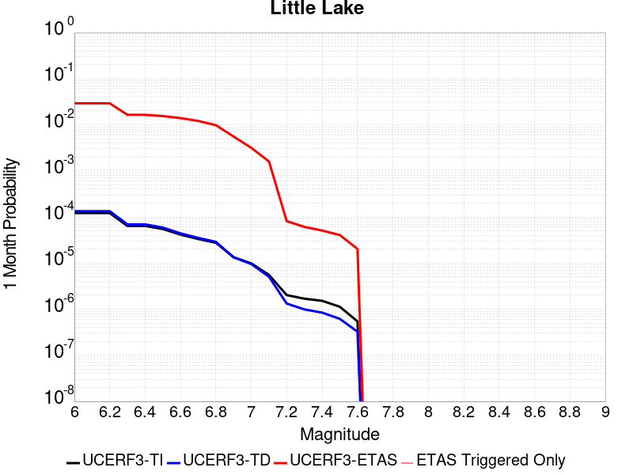 |  |  |

| Magnitude | 1 wk TI Prob | 1 wk TD Prob | 1 wk ETAS Prob | 1 wk ETAS/TD Gain | 1 wk ETAS Triggered Only | 1 mo TI Prob | 1 mo TD Prob | 1 mo ETAS Prob | 1 mo ETAS/TD Gain | 1 mo ETAS Triggered Only | 1 yr TI Prob | 1 yr TD Prob | 1 yr ETAS Prob | 1 yr ETAS/TD Gain | 1 yr ETAS Triggered Only | 10 yr TI Prob | 10 yr TD Prob | 10 yr ETAS Prob | 10 yr ETAS/TD Gain | 10 yr ETAS Triggered Only |
|-----|-----|-----|-----|-----|-----|-----|-----|-----|-----|-----|-----|-----|-----|-----|-----|-----|-----|-----|-----|-----|
| 6.0 | 2.8424427E-5 | 3.120572E-5 | 0.020933332 | 670.8171 | 0.020902777 | 1.2181328E-4 | 1.337327E-4 | 0.026796833 | 200.37607 | 0.026666667 | 0.0014820677 | 0.0016271127 | 0.038026124 | 23.370308 | 0.036458332 | 0.014722223 | 0.016165402 | 0.062692575 | 3.878195 | 0.047291666 |
| 6.1 | 2.8424427E-5 | 3.120572E-5 | 0.020933332 | 670.8171 | 0.020902777 | 1.2181328E-4 | 1.337327E-4 | 0.026796833 | 200.37607 | 0.026666667 | 0.0014820677 | 0.0016271127 | 0.038026124 | 23.370308 | 0.036458332 | 0.014722223 | 0.016165402 | 0.062692575 | 3.878195 | 0.047291666 |
| 6.2 | 2.8424427E-5 | 3.120572E-5 | 0.020933332 | 670.8171 | 0.020902777 | 1.2181328E-4 | 1.337327E-4 | 0.026796833 | 200.37607 | 0.026666667 | 0.0014820677 | 0.0016271127 | 0.038026124 | 23.370308 | 0.036458332 | 0.014722223 | 0.016165402 | 0.062692575 | 3.878195 | 0.047291666 |
| 6.3 | 1.48860645E-5 | 1.6081389E-5 | 0.011543673 | 717.8281 | 0.011527778 | 6.379586E-5 | 6.8918576E-5 | 0.015345643 | 222.66338 | 0.015277778 | 7.7643775E-4 | 8.3878887E-4 | 0.021654647 | 25.816565 | 0.020833334 | 0.007737305 | 0.008359048 | 0.034251895 | 4.0975833 | 0.026111111 |
| 6.4 | 1.48860645E-5 | 1.6081389E-5 | 0.011543673 | 717.8281 | 0.011527778 | 6.379586E-5 | 6.8918576E-5 | 0.015345643 | 222.66338 | 0.015277778 | 7.7643775E-4 | 8.3878887E-4 | 0.021654647 | 25.816565 | 0.020833334 | 0.007737305 | 0.008359048 | 0.034251895 | 4.0975833 | 0.026111111 |
| 6.5 | 1.2797581E-5 | 1.3765565E-5 | 0.010569176 | 767.7982 | 0.010555555 | 5.4845623E-5 | 5.899409E-5 | 0.014294266 | 242.29996 | 0.014236111 | 6.675408E-4 | 7.18042E-4 | 0.020148525 | 28.06037 | 0.019444445 | 0.006655392 | 0.00715977 | 0.031291302 | 4.3704343 | 0.024305556 |
| 6.6 | 9.661896E-6 | 1.0289038E-5 | 0.00952408 | 925.65314 | 0.0095138885 | 4.1407468E-5 | 4.409522E-5 | 0.012821309 | 290.76416 | 0.012777777 | 5.040193E-4 | 5.367433E-4 | 0.017957943 | 33.457226 | 0.017430555 | 0.005028777 | 0.0053560743 | 0.026492259 | 4.946208 | 0.02125 |
| 6.7 | 7.767871E-6 | 8.199687E-6 | 0.008410908 | 1025.7598 | 0.008402778 | 3.329045E-5 | 3.5141118E-5 | 0.01142363 | 325.07874 | 0.011388889 | 4.0523586E-4 | 4.2777284E-4 | 0.016115503 | 37.67304 | 0.015694445 | 0.004044977 | 0.004270846 | 0.023355655 | 5.468625 | 0.019166667 |
| 6.8 | 6.4235196E-6 | 6.7357446E-6 | 0.0066733574 | 990.7379 | 0.006666667 | 2.752908E-5 | 2.8867229E-5 | 0.008917499 | 308.91428 | 0.008888889 | 3.35115E-4 | 3.5141467E-4 | 0.012361081 | 35.1752 | 0.012013889 | 0.003346101 | 0.00350985 | 0.018041998 | 5.14039 | 0.014583333 |
| 6.9 | 3.1283696E-6 | 3.1121804E-6 | 0.003961433 | 1272.8802 | 0.0039583333 | 1.3407229E-5 | 1.3337856E-5 | 0.004874384 | 365.45483 | 0.0048611113 | 1.6322079E-4 | 1.6237781E-4 | 0.0067585288 | 41.622242 | 0.0065972223 | 0.0016310095 | 0.00162274 | 0.009249233 | 5.699763 | 0.007638889 |
| 7.0 | 2.290603E-6 | 2.2286815E-6 | 0.0020161131 | 904.6214 | 0.002013889 | 9.816834E-6 | 9.551463E-6 | 0.0025789714 | 270.008 | 0.0025694445 | 1.19513395E-4 | 1.162839E-4 | 0.0040047206 | 34.439167 | 0.003888889 | 0.0011944914 | 0.0011623327 | 0.0056016115 | 4.819284 | 0.0044444446 |
| 7.1 | 1.293693E-6 | 1.1776827E-6 | 0.0010428431 | 885.5043 | 0.0010416667 | 5.5443866E-6 | 5.0472063E-6 | 0.0011161527 | 221.14268 | 0.0011111111 | 6.750081E-5 | 6.14487E-5 | 0.0017280129 | 28.12123 | 0.0016666667 | 6.7480316E-4 | 6.143856E-4 | 0.0025576353 | 4.1629157 | 0.0019444445 |
| 7.2 | 4.715842E-7 | 3.0917857E-7 | 3.0917857E-7 | 1.0 | 0.0 | 2.0210737E-6 | 1.3250503E-6 | 1.3250503E-6 | 1.0 | 0.0 | 2.4606294E-5 | 1.6132375E-5 | 8.5575695E-5 | 5.304594 | 6.9444446E-5 | 2.460357E-4 | 1.6131258E-4 | 2.3074582E-4 | 1.4304267 | 6.9444446E-5 |
| 7.3 | 3.9430947E-7 | 2.3097488E-7 | 2.3097488E-7 | 1.0 | 0.0 | 1.6898966E-6 | 9.89892E-7 | 9.89892E-7 | 1.0 | 0.0 | 2.0574296E-5 | 1.2051869E-5 | 8.149548E-5 | 6.7620616 | 6.9444446E-5 | 2.0572392E-4 | 1.20512224E-4 | 1.899483E-4 | 1.5761745 | 6.9444446E-5 |
| 7.4 | 3.547123E-7 | 1.9679135E-7 | 1.9679135E-7 | 1.0 | 0.0 | 1.5201948E-6 | 8.4339126E-7 | 8.4339126E-7 | 1.0 | 0.0 | 1.8508214E-5 | 1.0268241E-5 | 7.971197E-5 | 7.762963 | 6.9444446E-5 | 1.8506673E-4 | 1.02677724E-4 | 1.7211505E-4 | 1.6762646 | 6.9444446E-5 |
| 7.5 | 2.6354266E-7 | 1.4423138E-7 | 1.4423138E-7 | 1.0 | 0.0 | 1.129468E-6 | 6.181344E-7 | 6.181344E-7 | 1.0 | 0.0 | 1.3751187E-5 | 7.5257603E-6 | 7.6969685E-5 | 10.227496 | 6.9444446E-5 | 1.3750336E-4 | 7.5255106E-5 | 1.4469432E-4 | 1.9227177 | 6.9444446E-5 |
| 7.6 | 1.269913E-7 | 7.572556E-8 | 7.572556E-8 | 1.0 | 0.0 | 5.4424834E-7 | 3.245381E-7 | 3.245381E-7 | 1.0 | 0.0 | 6.6262032E-6 | 3.9512443E-6 | 3.9512443E-6 | 1.0 | 0.0 | 6.626006E-5 | 3.9511775E-5 | 3.9511775E-5 | 1.0 | 0.0 |

## Owl Lake
*[(top)](#table-of-contents)*

| 1 Week | 1 Month | 1 Year | 10 Year |
|-----|-----|-----|-----|
|  |  |  |  |

| Magnitude | 1 wk TI Prob | 1 wk TD Prob | 1 wk ETAS Prob | 1 wk ETAS/TD Gain | 1 wk ETAS Triggered Only | 1 mo TI Prob | 1 mo TD Prob | 1 mo ETAS Prob | 1 mo ETAS/TD Gain | 1 mo ETAS Triggered Only | 1 yr TI Prob | 1 yr TD Prob | 1 yr ETAS Prob | 1 yr ETAS/TD Gain | 1 yr ETAS Triggered Only | 10 yr TI Prob | 10 yr TD Prob | 10 yr ETAS Prob | 10 yr ETAS/TD Gain | 10 yr ETAS Triggered Only |
|-----|-----|-----|-----|-----|-----|-----|-----|-----|-----|-----|-----|-----|-----|-----|-----|-----|-----|-----|-----|-----|
| 6.0 | 5.0320643E-5 | 6.635816E-5 | 0.011176732 | 168.43042 | 0.011111111 | 2.1564208E-4 | 2.843674E-4 | 0.0155578 | 54.710217 | 0.015277778 | 0.0026222812 | 0.0034577388 | 0.026641186 | 7.7048006 | 0.023263888 | 0.02591553 | 0.034140717 | 0.0661348 | 1.9371241 | 0.033125 |
| 6.1 | 5.0320643E-5 | 6.635816E-5 | 0.011176732 | 168.43042 | 0.011111111 | 2.1564208E-4 | 2.843674E-4 | 0.0155578 | 54.710217 | 0.015277778 | 0.0026222812 | 0.0034577388 | 0.026641186 | 7.7048006 | 0.023263888 | 0.02591553 | 0.034140717 | 0.0661348 | 1.9371241 | 0.033125 |
| 6.2 | 2.4125871E-5 | 3.0981035E-5 | 0.008850153 | 285.66354 | 0.008819444 | 1.0339249E-4 | 1.3277028E-4 | 0.012075629 | 90.951294 | 0.011944445 | 0.0012580766 | 0.001615439 | 0.018948505 | 11.729631 | 0.017361112 | 0.012509781 | 0.016070465 | 0.039780434 | 2.4753754 | 0.024097223 |
| 6.3 | 1.7433485E-5 | 2.2355514E-5 | 0.00828606 | 370.64948 | 0.008263889 | 7.471279E-5 | 9.580672E-5 | 0.011205853 | 116.96313 | 0.011111111 | 9.0924866E-4 | 0.0011659743 | 0.016980845 | 14.563654 | 0.015833333 | 0.009055373 | 0.011628896 | 0.033043604 | 2.8415082 | 0.021666666 |
| 6.4 | 1.7433485E-5 | 2.2355514E-5 | 0.00828606 | 370.64948 | 0.008263889 | 7.471279E-5 | 9.580672E-5 | 0.011205853 | 116.96313 | 0.011111111 | 9.0924866E-4 | 0.0011659743 | 0.016980845 | 14.563654 | 0.015833333 | 0.009055373 | 0.011628896 | 0.033043604 | 2.8415082 | 0.021666666 |
| 6.5 | 1.5182742E-5 | 1.9429144E-5 | 0.007935942 | 408.45554 | 0.007916667 | 6.506727E-5 | 8.326596E-5 | 0.010499065 | 126.09073 | 0.010416667 | 7.919061E-4 | 0.0010134429 | 0.015928866 | 15.717578 | 0.014930556 | 0.0078909 | 0.010118429 | 0.029984802 | 2.9633853 | 0.020069445 |
| 6.6 | 6.7271576E-6 | 8.547361E-6 | 0.006327938 | 740.3382 | 0.0063194446 | 2.8830356E-5 | 3.6631063E-5 | 0.0078835655 | 215.2153 | 0.0078472225 | 3.5095305E-4 | 4.458976E-4 | 0.011413228 | 25.596073 | 0.010972222 | 0.0035039932 | 0.004467813 | 0.018640319 | 4.1721354 | 0.014236111 |
| 6.7 | 6.682835E-6 | 8.479807E-6 | 0.006327871 | 746.22815 | 0.0063194446 | 2.8640408E-5 | 3.6341557E-5 | 0.007883279 | 216.92188 | 0.0078472225 | 3.4864116E-4 | 4.4237426E-4 | 0.011409743 | 25.792057 | 0.010972222 | 0.003480947 | 0.0044327388 | 0.018605744 | 4.197347 | 0.014236111 |
| 6.8 | 6.5774975E-6 | 8.32628E-6 | 0.006327718 | 759.96936 | 0.0063194446 | 2.8188972E-5 | 3.5683603E-5 | 0.007813184 | 218.95726 | 0.007777778 | 3.4314668E-4 | 4.343669E-4 | 0.0113324085 | 26.089485 | 0.010902777 | 0.0034261728 | 0.004352885 | 0.018388743 | 4.224496 | 0.014097222 |
| 6.9 | 6.363419E-6 | 7.999454E-6 | 0.0063273935 | 790.9781 | 0.0063194446 | 2.727151E-5 | 3.428296E-5 | 0.007811794 | 227.86232 | 0.007777778 | 3.3198006E-4 | 4.1732067E-4 | 0.011246133 | 26.948421 | 0.010833333 | 0.0033148455 | 0.0041828766 | 0.018151978 | 4.339592 | 0.014027778 |
| 7.0 | 6.1342453E-6 | 7.6316555E-6 | 0.006327028 | 829.0505 | 0.0063194446 | 2.6289357E-5 | 3.2706717E-5 | 0.00781023 | 238.79591 | 0.007777778 | 3.2002592E-4 | 3.9813702E-4 | 0.011227157 | 28.19923 | 0.010833333 | 0.0031956544 | 0.003991571 | 0.017894188 | 4.482994 | 0.013958333 |
| 7.1 | 5.842926E-6 | 7.142211E-6 | 0.0060487655 | 846.9038 | 0.0060416665 | 2.504087E-5 | 3.0609146E-5 | 0.0075303796 | 246.01729 | 0.0075 | 3.0482994E-4 | 3.7260808E-4 | 0.01092423 | 29.318289 | 0.010555555 | 0.0030441214 | 0.0037370329 | 0.017366463 | 4.647126 | 0.013680556 |
| 7.2 | 4.77173E-6 | 5.358483E-6 | 0.004241447 | 791.5387 | 0.004236111 | 2.045011E-5 | 2.2964748E-5 | 0.0051617357 | 224.76778 | 0.005138889 | 2.4895166E-4 | 2.79564E-4 | 0.0076386174 | 27.323322 | 0.007361111 | 0.0024867293 | 0.002808645 | 0.0126420595 | 4.501124 | 0.009861111 |
| 7.3 | 3.0494948E-6 | 2.710463E-6 | 0.0015304841 | 564.65784 | 0.0015277778 | 1.3069198E-5 | 1.1616219E-5 | 0.0016782635 | 144.47589 | 0.0016666667 | 1.5910587E-4 | 1.4141845E-4 | 0.0022938917 | 16.220598 | 0.0021527777 | 0.0015899199 | 0.0014232415 | 0.00412772 | 2.900225 | 0.0027083333 |
| 7.4 | 2.7263884E-6 | 2.3056762E-6 | 0.0013217471 | 573.2579 | 0.0013194444 | 1.1684469E-5 | 9.881433E-6 | 0.0014682004 | 148.58173 | 0.0014583333 | 1.4224913E-4 | 1.20299905E-4 | 0.0019950743 | 16.584171 | 0.001875 | 0.0014215811 | 0.0012112238 | 0.0033613942 | 2.775205 | 0.0021527777 |
| 7.5 | 2.6090431E-6 | 2.1656133E-6 | 0.0011827187 | 546.1357 | 0.0011805556 | 1.1181565E-5 | 9.281167E-6 | 0.0012592695 | 135.68008 | 0.00125 | 1.3612706E-4 | 1.1299244E-4 | 0.0017100342 | 15.134058 | 0.0015972222 | 0.001360437 | 0.0011379806 | 0.003010847 | 2.6457806 | 0.001875 |
| 7.6 | 2.3008756E-6 | 1.8727933E-6 | 9.0464886E-4 | 483.04788 | 9.0277777E-4 | 9.860858E-6 | 8.0262325E-6 | 9.802406E-4 | 122.1296 | 9.7222225E-4 | 1.20049335E-4 | 9.7715085E-5 | 0.0013475929 | 13.791042 | 0.00125 | 0.001199845 | 9.849932E-4 | 0.00244189 | 2.4790933 | 0.0014583333 |
| 7.7 | 1.7184348E-6 | 1.3419171E-6 | 7.652298E-4 | 570.25116 | 7.638889E-4 | 7.3646997E-6 | 5.7510606E-6 | 7.6963555E-4 | 133.82497 | 7.638889E-4 | 8.966153E-5 | 7.0016955E-5 | 9.032919E-4 | 12.901046 | 8.3333335E-4 | 8.962536E-4 | 7.078345E-4 | 0.0016099733 | 2.2745051 | 9.0277777E-4 |
| 7.8 | 8.4612907E-7 | 8.4058576E-7 | 2.7861813E-4 | 331.45712 | 2.7777778E-4 | 3.6262625E-6 | 3.6025056E-6 | 2.813793E-4 | 78.10655 | 2.7777778E-4 | 4.4148852E-5 | 4.3859643E-5 | 3.2162524E-4 | 7.3330564 | 2.7777778E-4 | 4.414008E-4 | 4.4398365E-4 | 7.910517E-4 | 1.7817136 | 3.4722223E-4 |
| 7.9 | 2.716738E-7 | 3.768106E-7 | 3.768106E-7 | 1.0 | 0.0 | 1.1643157E-6 | 1.6149015E-6 | 1.6149015E-6 | 1.0 | 0.0 | 1.4175452E-5 | 1.966126E-5 | 1.966126E-5 | 1.0 | 0.0 | 1.4174548E-4 | 1.9836679E-4 | 2.6779744E-4 | 1.3500116 | 6.9444446E-5 |
| 8.0 | 2.1995428E-8 | 3.384878E-8 | 3.384878E-8 | 1.0 | 0.0 | 9.426611E-8 | 1.4506621E-7 | 1.4506621E-7 | 1.0 | 0.0 | 1.1476893E-6 | 1.7661803E-6 | 1.7661803E-6 | 1.0 | 0.0 | 1.14768345E-5 | 1.7963059E-5 | 1.7963059E-5 | 1.0 | 0.0 |

## Airport Lake
*[(top)](#table-of-contents)*

| 1 Week | 1 Month | 1 Year | 10 Year |
|-----|-----|-----|-----|
|  |  |  | 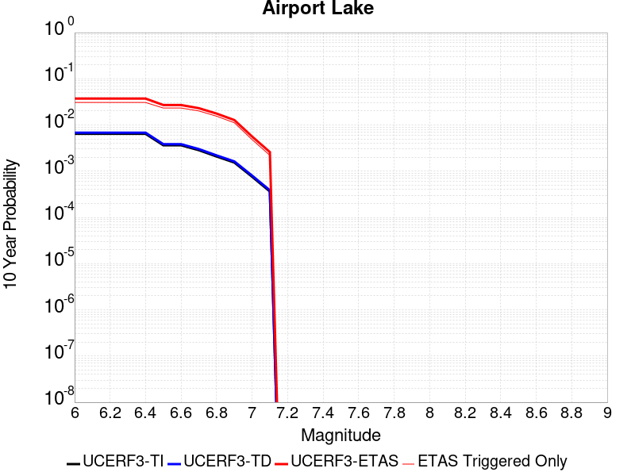 |

| Magnitude | 1 wk TI Prob | 1 wk TD Prob | 1 wk ETAS Prob | 1 wk ETAS/TD Gain | 1 wk ETAS Triggered Only | 1 mo TI Prob | 1 mo TD Prob | 1 mo ETAS Prob | 1 mo ETAS/TD Gain | 1 mo ETAS Triggered Only | 1 yr TI Prob | 1 yr TD Prob | 1 yr ETAS Prob | 1 yr ETAS/TD Gain | 1 yr ETAS Triggered Only | 10 yr TI Prob | 10 yr TD Prob | 10 yr ETAS Prob | 10 yr ETAS/TD Gain | 10 yr ETAS Triggered Only |
|-----|-----|-----|-----|-----|-----|-----|-----|-----|-----|-----|-----|-----|-----|-----|-----|-----|-----|-----|-----|-----|
| 6.0 | 1.2387061E-5 | 1.3103157E-5 | 0.014179585 | 1082.1503 | 0.014166667 | 5.3086325E-5 | 5.615534E-5 | 0.01838846 | 327.457 | 0.018333333 | 6.461343E-4 | 6.8350515E-4 | 0.025735814 | 37.6527 | 0.025069445 | 0.0064425888 | 0.0068168393 | 0.036612336 | 5.370867 | 0.03 |
| 6.1 | 1.2387061E-5 | 1.3103157E-5 | 0.014179585 | 1082.1503 | 0.014166667 | 5.3086325E-5 | 5.615534E-5 | 0.01838846 | 327.457 | 0.018333333 | 6.461343E-4 | 6.8350515E-4 | 0.025735814 | 37.6527 | 0.025069445 | 0.0064425888 | 0.0068168393 | 0.036612336 | 5.370867 | 0.03 |
| 6.2 | 1.2387061E-5 | 1.3103157E-5 | 0.014179585 | 1082.1503 | 0.014166667 | 5.3086325E-5 | 5.615534E-5 | 0.01838846 | 327.457 | 0.018333333 | 6.461343E-4 | 6.8350515E-4 | 0.025735814 | 37.6527 | 0.025069445 | 0.0064425888 | 0.0068168393 | 0.036612336 | 5.370867 | 0.03 |
| 6.3 | 1.2387061E-5 | 1.3103157E-5 | 0.014179585 | 1082.1503 | 0.014166667 | 5.3086325E-5 | 5.615534E-5 | 0.01838846 | 327.457 | 0.018333333 | 6.461343E-4 | 6.8350515E-4 | 0.025735814 | 37.6527 | 0.025069445 | 0.0064425888 | 0.0068168393 | 0.036612336 | 5.370867 | 0.03 |
| 6.4 | 1.2387061E-5 | 1.3103157E-5 | 0.014179585 | 1082.1503 | 0.014166667 | 5.3086325E-5 | 5.615534E-5 | 0.01838846 | 327.457 | 0.018333333 | 6.461343E-4 | 6.8350515E-4 | 0.025735814 | 37.6527 | 0.025069445 | 0.0064425888 | 0.0068168393 | 0.036612336 | 5.370867 | 0.03 |
| 6.5 | 6.9922594E-6 | 7.384925E-6 | 0.010493418 | 1420.9242 | 0.010486111 | 2.996648E-5 | 3.1649324E-5 | 0.014128425 | 446.40524 | 0.014097222 | 3.6478083E-4 | 3.8526783E-4 | 0.019336296 | 50.18923 | 0.018958334 | 0.003641826 | 0.0038465366 | 0.02646752 | 6.880871 | 0.022708334 |
| 6.6 | 6.9922594E-6 | 7.384925E-6 | 0.010493418 | 1420.9242 | 0.010486111 | 2.996648E-5 | 3.1649324E-5 | 0.014128425 | 446.40524 | 0.014097222 | 3.6478083E-4 | 3.8526783E-4 | 0.019336296 | 50.18923 | 0.018958334 | 0.003641826 | 0.0038465366 | 0.02646752 | 6.880871 | 0.022708334 |
| 6.7 | 5.477277E-6 | 5.7860684E-6 | 0.009241844 | 1597.2579 | 0.009236111 | 2.3473833E-5 | 2.4797222E-5 | 0.012455044 | 502.2758 | 0.012430555 | 2.8575645E-4 | 3.0186825E-4 | 0.016963504 | 56.195057 | 0.016666668 | 0.0028538927 | 0.003014966 | 0.022746962 | 7.544683 | 0.019791666 |
| 6.8 | 3.9950432E-6 | 4.2190873E-6 | 0.0070180786 | 1663.4116 | 0.007013889 | 1.7121502E-5 | 1.8081691E-5 | 0.009184582 | 507.94928 | 0.009166666 | 2.0843433E-4 | 2.2012512E-4 | 0.01216194 | 55.250126 | 0.011944445 | 0.0020823893 | 0.0021993418 | 0.016196268 | 7.3641434 | 0.014027778 |
| 6.9 | 2.95695E-6 | 3.1230243E-6 | 0.0054197726 | 1735.4244 | 0.0054166666 | 1.2672582E-5 | 1.3384334E-5 | 0.006749405 | 504.27652 | 0.006736111 | 1.5427776E-4 | 1.6294434E-4 | 0.009189251 | 56.395027 | 0.009027778 | 0.001541707 | 0.0016284712 | 0.011958843 | 7.3436017 | 0.010347222 |
| 7.0 | 1.456072E-6 | 1.540812E-6 | 0.0019459822 | 1262.9589 | 0.0019444445 | 6.2402937E-6 | 6.603469E-6 | 0.002506587 | 379.5864 | 0.0025 | 7.597293E-5 | 8.039528E-5 | 0.003830094 | 47.64078 | 0.00375 | 7.594696E-4 | 8.0376083E-4 | 0.005105856 | 6.3524566 | 0.0043055555 |
| 7.1 | 6.995192E-7 | 7.4089746E-7 | 9.729624E-4 | 1313.2214 | 9.7222225E-4 | 2.997936E-6 | 3.1752747E-6 | 0.0010448387 | 329.05457 | 0.0010416667 | 3.649926E-5 | 3.865897E-5 | 0.0015663777 | 40.517834 | 0.0015277778 | 3.6493264E-4 | 3.865897E-4 | 0.0021914472 | 5.6686645 | 0.0018055555 |

## Panamint Valley
*[(top)](#table-of-contents)*

| 1 Week | 1 Month | 1 Year | 10 Year |
|-----|-----|-----|-----|
|  |  |  |  |

| Magnitude | 1 wk TI Prob | 1 wk TD Prob | 1 wk ETAS Prob | 1 wk ETAS/TD Gain | 1 wk ETAS Triggered Only | 1 mo TI Prob | 1 mo TD Prob | 1 mo ETAS Prob | 1 mo ETAS/TD Gain | 1 mo ETAS Triggered Only | 1 yr TI Prob | 1 yr TD Prob | 1 yr ETAS Prob | 1 yr ETAS/TD Gain | 1 yr ETAS Triggered Only | 10 yr TI Prob | 10 yr TD Prob | 10 yr ETAS Prob | 10 yr ETAS/TD Gain | 10 yr ETAS Triggered Only |
|-----|-----|-----|-----|-----|-----|-----|-----|-----|-----|-----|-----|-----|-----|-----|-----|-----|-----|-----|-----|-----|
| 6.0 | 3.0211835E-5 | 3.3984514E-5 | 0.008575361 | 252.33144 | 0.008541667 | 1.2947287E-4 | 1.4563995E-4 | 0.011602305 | 79.6643 | 0.011458334 | 0.0015751923 | 0.0017717537 | 0.019656677 | 11.094475 | 0.017916666 | 0.015640736 | 0.017583137 | 0.043235134 | 2.4588976 | 0.026111111 |
| 6.1 | 3.0211835E-5 | 3.3984514E-5 | 0.008575361 | 252.33144 | 0.008541667 | 1.2947287E-4 | 1.4563995E-4 | 0.011602305 | 79.6643 | 0.011458334 | 0.0015751923 | 0.0017717537 | 0.019656677 | 11.094475 | 0.017916666 | 0.015640736 | 0.017583137 | 0.043235134 | 2.4588976 | 0.026111111 |
| 6.2 | 3.0211835E-5 | 3.3984514E-5 | 0.008575361 | 252.33144 | 0.008541667 | 1.2947287E-4 | 1.4563995E-4 | 0.011602305 | 79.6643 | 0.011458334 | 0.0015751923 | 0.0017717537 | 0.019656677 | 11.094475 | 0.017916666 | 0.015640736 | 0.017583137 | 0.043235134 | 2.4588976 | 0.026111111 |
| 6.3 | 2.8573924E-5 | 3.210268E-5 | 0.008087399 | 251.92288 | 0.008055556 | 1.2245393E-4 | 1.3757581E-4 | 0.010761114 | 78.21952 | 0.010625 | 0.001489857 | 0.0016737265 | 0.018381827 | 10.982574 | 0.01673611 | 0.01479908 | 0.016617801 | 0.040656034 | 2.446535 | 0.024444444 |
| 6.4 | 2.8573924E-5 | 3.210268E-5 | 0.008087399 | 251.92288 | 0.008055556 | 1.2245393E-4 | 1.3757581E-4 | 0.010761114 | 78.21952 | 0.010625 | 0.001489857 | 0.0016737265 | 0.018381827 | 10.982574 | 0.01673611 | 0.01479908 | 0.016617801 | 0.040656034 | 2.446535 | 0.024444444 |
| 6.5 | 2.7468774E-5 | 3.0828433E-5 | 0.008016693 | 260.04218 | 0.007986112 | 1.1771801E-4 | 1.3211532E-4 | 0.010547406 | 79.83484 | 0.010416667 | 0.0014322745 | 0.0016073446 | 0.017900558 | 11.136727 | 0.016319444 | 0.014230782 | 0.015963677 | 0.03933454 | 2.4640026 | 0.02375 |
| 6.6 | 2.6135967E-5 | 2.925248E-5 | 0.0073901485 | 252.63322 | 0.007361111 | 1.1200648E-4 | 1.253619E-4 | 0.009707494 | 77.43576 | 0.0095833335 | 0.0013628257 | 0.0015252391 | 0.016779715 | 11.001368 | 0.015277778 | 0.013544982 | 0.015154043 | 0.03738147 | 2.4667654 | 0.022569444 |
| 6.7 | 2.4498746E-5 | 2.7341335E-5 | 0.0071799234 | 262.60324 | 0.0071527776 | 1.04990395E-4 | 1.1717203E-4 | 0.009421637 | 80.408585 | 0.009305555 | 0.0012775084 | 0.0014256609 | 0.016265586 | 11.409154 | 0.0148611115 | 0.012701893 | 0.014171274 | 0.035736278 | 2.5217404 | 0.021875 |
| 6.8 | 2.2244329E-5 | 2.4935423E-5 | 0.006830321 | 273.9204 | 0.0068055554 | 9.532935E-5 | 1.0686185E-4 | 0.008925363 | 83.52245 | 0.008819444 | 0.0011600169 | 0.0013002884 | 0.015171118 | 11.667503 | 0.013888889 | 0.011539802 | 0.0129325185 | 0.032331135 | 2.4999876 | 0.019652778 |
| 6.9 | 1.9902658E-5 | 2.2290267E-5 | 0.0061332653 | 275.15442 | 0.006111111 | 8.529431E-5 | 9.552632E-5 | 0.007941999 | 83.13938 | 0.0078472225 | 0.0010379635 | 0.0011624309 | 0.012954263 | 11.1441145 | 0.011805556 | 0.010331288 | 0.011568608 | 0.028248386 | 2.441814 | 0.016875 |
| 7.0 | 1.8353881E-5 | 2.0566185E-5 | 0.0057148933 | 277.87814 | 0.0056944443 | 7.865712E-5 | 8.813792E-5 | 0.0073097236 | 82.93506 | 0.007222222 | 9.5722964E-4 | 0.0010725686 | 0.012033022 | 11.2188835 | 0.010972222 | 0.009531168 | 0.010678849 | 0.025930883 | 2.428247 | 0.015416667 |
| 7.1 | 1.7667631E-5 | 1.9772613E-5 | 0.0056446614 | 285.4788 | 0.005625 | 7.571623E-5 | 8.473711E-5 | 0.0072369087 | 85.40424 | 0.0071527776 | 9.2145515E-4 | 0.0010312037 | 0.011853365 | 11.494689 | 0.010833333 | 0.009176437 | 0.010269073 | 0.02532123 | 2.4657757 | 0.015208334 |
| 7.2 | 1.6381597E-5 | 1.8158249E-5 | 0.00529584 | 291.64926 | 0.0052777776 | 7.020495E-5 | 7.781885E-5 | 0.0066745277 | 85.770065 | 0.0065972223 | 8.544101E-4 | 9.4704994E-4 | 0.010868201 | 11.475847 | 0.009930556 | 0.008511325 | 0.009434792 | 0.023055064 | 2.4436219 | 0.01375 |
| 7.3 | 1.4520491E-5 | 1.5966476E-5 | 0.0045992266 | 288.0552 | 0.004583333 | 6.222919E-5 | 6.842605E-5 | 0.0056236014 | 82.1851 | 0.0055555557 | 7.57377E-4 | 8.327849E-4 | 0.008742859 | 10.498339 | 0.007916667 | 0.0075480095 | 0.00829975 | 0.01938751 | 2.3359149 | 0.011180555 |
| 7.4 | 1.2852287E-5 | 1.4145411E-5 | 0.004458527 | 315.19247 | 0.0044444446 | 5.5080065E-5 | 6.062187E-5 | 0.00540752 | 89.20081 | 0.005347222 | 6.7039346E-4 | 7.378371E-4 | 0.008440483 | 11.439493 | 0.0077083334 | 0.0066837464 | 0.0073567946 | 0.018248295 | 2.4804685 | 0.010972222 |
| 7.5 | 1.1637851E-5 | 1.2836797E-5 | 0.004457224 | 347.22244 | 0.0044444446 | 4.987555E-5 | 5.5013777E-5 | 0.005332501 | 96.93029 | 0.0052777776 | 6.070656E-4 | 6.6960254E-4 | 0.008164581 | 12.193174 | 0.0075 | 0.006054099 | 0.0066787465 | 0.017301766 | 2.5905707 | 0.010694444 |
| 7.6 | 3.0068115E-6 | 3.3330316E-6 | 0.0022255478 | 667.7248 | 0.0022222223 | 1.2886271E-5 | 1.4284384E-5 | 0.0026531357 | 185.73679 | 0.0026388888 | 1.5687906E-4 | 1.7390578E-4 | 0.0038538212 | 22.160398 | 0.0036805556 | 0.0015676835 | 0.0017391363 | 0.0067997645 | 3.9098513 | 0.0050694444 |

## Garlock (East)
*[(top)](#table-of-contents)*

| 1 Week | 1 Month | 1 Year | 10 Year |
|-----|-----|-----|-----|
|  |  |  |  |

| Magnitude | 1 wk TI Prob | 1 wk TD Prob | 1 wk ETAS Prob | 1 wk ETAS/TD Gain | 1 wk ETAS Triggered Only | 1 mo TI Prob | 1 mo TD Prob | 1 mo ETAS Prob | 1 mo ETAS/TD Gain | 1 mo ETAS Triggered Only | 1 yr TI Prob | 1 yr TD Prob | 1 yr ETAS Prob | 1 yr ETAS/TD Gain | 1 yr ETAS Triggered Only | 10 yr TI Prob | 10 yr TD Prob | 10 yr ETAS Prob | 10 yr ETAS/TD Gain | 10 yr ETAS Triggered Only |
|-----|-----|-----|-----|-----|-----|-----|-----|-----|-----|-----|-----|-----|-----|-----|-----|-----|-----|-----|-----|-----|
| 6.0 | 4.5092507E-5 | 6.290325E-5 | 0.0076318714 | 121.32714 | 0.0075694444 | 1.9323928E-4 | 2.6956003E-4 | 0.01033629 | 38.345043 | 0.010069445 | 0.0023501497 | 0.0032774 | 0.019197274 | 5.857471 | 0.015972223 | 0.023254504 | 0.032351844 | 0.05432552 | 1.6792094 | 0.022708334 |
| 6.1 | 4.5092507E-5 | 6.290325E-5 | 0.0076318714 | 121.32714 | 0.0075694444 | 1.9323928E-4 | 2.6956003E-4 | 0.01033629 | 38.345043 | 0.010069445 | 0.0023501497 | 0.0032774 | 0.019197274 | 5.857471 | 0.015972223 | 0.023254504 | 0.032351844 | 0.05432552 | 1.6792094 | 0.022708334 |
| 6.2 | 2.6674514E-5 | 3.4509674E-5 | 0.0057287575 | 166.0044 | 0.0056944443 | 1.1431433E-4 | 1.4789042E-4 | 0.007716215 | 52.175224 | 0.0075694444 | 0.0013908884 | 0.0017991117 | 0.013583428 | 7.5500746 | 0.011805556 | 0.01382215 | 0.017890299 | 0.033235762 | 1.8577534 | 0.015625 |
| 6.3 | 2.6674514E-5 | 3.4509674E-5 | 0.0057287575 | 166.0044 | 0.0056944443 | 1.1431433E-4 | 1.4789042E-4 | 0.007716215 | 52.175224 | 0.0075694444 | 0.0013908884 | 0.0017991117 | 0.013583428 | 7.5500746 | 0.011805556 | 0.01382215 | 0.017890299 | 0.033235762 | 1.8577534 | 0.015625 |
| 6.4 | 2.5312667E-5 | 3.233893E-5 | 0.0055877147 | 172.78601 | 0.0055555557 | 1.0847834E-4 | 1.3858822E-4 | 0.007568114 | 54.60864 | 0.0074305558 | 0.0013199237 | 0.0016860351 | 0.013263704 | 7.866802 | 0.011597223 | 0.013121112 | 0.016778335 | 0.031936336 | 1.903427 | 0.015416667 |
| 6.5 | 2.5312667E-5 | 3.233893E-5 | 0.0055877147 | 172.78601 | 0.0055555557 | 1.0847834E-4 | 1.3858822E-4 | 0.007568114 | 54.60864 | 0.0074305558 | 0.0013199237 | 0.0016860351 | 0.013263704 | 7.866802 | 0.011597223 | 0.013121112 | 0.016778335 | 0.031936336 | 1.903427 | 0.015416667 |
| 6.6 | 2.246556E-5 | 2.8133776E-5 | 0.0055140904 | 195.99539 | 0.005486111 | 9.627742E-5 | 1.20567885E-4 | 0.0074807913 | 62.0463 | 0.007361111 | 0.0011715472 | 0.0014669491 | 0.012631103 | 8.610457 | 0.011180555 | 0.011653901 | 0.01461866 | 0.029057235 | 1.987681 | 0.014652777 |
| 6.7 | 2.2241198E-5 | 2.7803519E-5 | 0.0054443195 | 195.81404 | 0.0054166666 | 9.531594E-5 | 1.1915263E-4 | 0.0074099503 | 62.18873 | 0.0072916667 | 0.0011598538 | 0.0014497414 | 0.012544745 | 8.653091 | 0.011111111 | 0.011538187 | 0.014448853 | 0.028821474 | 1.9947239 | 0.014583333 |
| 6.8 | 1.9528685E-5 | 2.389819E-5 | 0.005232107 | 218.93318 | 0.0052083335 | 8.369167E-5 | 1.0241691E-4 | 0.0071155876 | 69.476685 | 0.007013889 | 0.0010184698 | 0.0012462323 | 0.011719275 | 9.403765 | 0.010486111 | 0.010138147 | 0.012436427 | 0.025672523 | 2.0643005 | 0.013402778 |
| 6.9 | 1.3318621E-5 | 1.5198884E-5 | 0.004876236 | 320.82855 | 0.0048611113 | 5.7078556E-5 | 6.513648E-5 | 0.006661929 | 102.27646 | 0.0065972223 | 6.9470983E-4 | 7.927538E-4 | 0.010715437 | 13.5167265 | 0.009930556 | 0.0069254204 | 0.007939888 | 0.020065067 | 2.5271223 | 0.012222222 |
| 7.0 | 1.1760853E-5 | 1.31077895E-5 | 0.004735268 | 361.25604 | 0.004722222 | 5.0402683E-5 | 5.6175057E-5 | 0.006444705 | 114.72538 | 0.0063888887 | 6.134799E-4 | 6.8372174E-4 | 0.010260503 | 15.00684 | 0.0095833335 | 0.0061178906 | 0.00685652 | 0.018443193 | 2.6898768 | 0.011666667 |
| 7.1 | 1.0064758E-5 | 1.0902931E-5 | 0.0045941863 | 421.3717 | 0.004583333 | 4.3133965E-5 | 4.672603E-5 | 0.0062269927 | 133.26604 | 0.0061805556 | 5.2502943E-4 | 5.687444E-4 | 0.009660793 | 16.986176 | 0.009097222 | 0.005237907 | 0.0057129986 | 0.016829679 | 2.9458575 | 0.011180555 |
| 7.2 | 9.768808E-6 | 1.0498807E-5 | 0.0045243404 | 430.9385 | 0.004513889 | 4.186565E-5 | 4.499413E-5 | 0.006086389 | 135.27074 | 0.0060416665 | 5.095951E-4 | 5.4766936E-4 | 0.009501097 | 17.348236 | 0.008958333 | 0.0050842804 | 0.0055032647 | 0.016484166 | 2.9953432 | 0.011041666 |
| 7.3 | 9.344516E-6 | 9.944468E-6 | 0.0039682384 | 399.03983 | 0.0039583333 | 4.004731E-5 | 4.261847E-5 | 0.0053896126 | 126.46191 | 0.005347222 | 4.8746695E-4 | 5.1875977E-4 | 0.0085701365 | 16.520433 | 0.008055556 | 0.0048639905 | 0.0052149445 | 0.015162795 | 2.9075658 | 0.01 |
| 7.4 | 9.023491E-6 | 9.490661E-6 | 0.0034816798 | 366.85327 | 0.0034722222 | 3.867153E-5 | 4.0673647E-5 | 0.004762704 | 117.09557 | 0.004722222 | 4.7072413E-4 | 4.950925E-4 | 0.007505509 | 15.159812 | 0.007013889 | 0.004697283 | 0.0049783974 | 0.013684836 | 2.7488437 | 0.00875 |
| 7.5 | 7.081253E-6 | 7.087672E-6 | 0.0016042986 | 226.35057 | 0.0015972222 | 3.0347876E-5 | 3.0375388E-5 | 0.0023219725 | 76.44256 | 0.0022916666 | 3.6942272E-4 | 3.6975832E-4 | 0.0038406968 | 10.387046 | 0.0034722222 | 0.003688092 | 0.0037243143 | 0.00808302 | 2.170338 | 0.004375 |
| 7.6 | 6.116396E-6 | 5.959245E-6 | 8.392876E-4 | 140.83792 | 8.3333335E-4 | 2.6212863E-5 | 2.5539372E-5 | 0.0014143928 | 55.38088 | 0.0013888889 | 3.1909486E-4 | 3.1089774E-4 | 0.0023241604 | 7.475643 | 0.002013889 | 0.0031863707 | 0.0031357552 | 0.005835596 | 1.8609858 | 0.0027083333 |
| 7.7 | 4.797145E-6 | 4.757281E-6 | 4.908661E-4 | 103.18207 | 4.8611112E-4 | 2.055903E-5 | 2.0388188E-5 | 7.148185E-4 | 35.06042 | 6.9444446E-4 | 2.5027743E-4 | 2.4819805E-4 | 0.0012896062 | 5.1958756 | 0.0010416667 | 0.0024999576 | 0.0025093474 | 0.0039640213 | 1.5797021 | 0.0014583333 |
| 7.8 | 3.4028885E-6 | 3.978462E-6 | 2.8175514E-4 | 70.82012 | 2.7777778E-4 | 1.4583726E-5 | 1.7050439E-5 | 4.3371E-4 | 25.436882 | 4.1666668E-4 | 1.775424E-4 | 2.0756939E-4 | 9.018697E-4 | 4.344907 | 6.9444446E-4 | 0.0017740062 | 0.0021012232 | 0.0030714024 | 1.4617213 | 9.7222225E-4 |
| 7.9 | 2.5928412E-6 | 3.3724489E-6 | 1.4226088E-4 | 42.183254 | 1.3888889E-4 | 1.1112129E-5 | 1.4453272E-5 | 2.9222702E-4 | 20.218744 | 2.7777778E-4 | 1.3528178E-4 | 1.7595445E-4 | 6.6198E-4 | 3.762224 | 4.8611112E-4 | 0.0013519945 | 0.0017812408 | 0.0024744482 | 1.3891711 | 6.9444446E-4 |
| 8.0 | 1.3743648E-6 | 1.6734747E-6 | 7.11178E-5 | 42.49709 | 6.9444446E-5 | 5.8901214E-6 | 7.1720146E-6 | 7.6615965E-5 | 10.682628 | 6.9444446E-5 | 7.1709874E-5 | 8.731581E-5 | 2.2619257E-4 | 2.590511 | 1.3888889E-4 | 7.1686733E-4 | 8.837234E-4 | 0.0011612556 | 1.3140489 | 2.7777778E-4 |
| 8.1 | 3.6733252E-7 | 3.1489964E-7 | 3.1489964E-7 | 1.0 | 0.0 | 1.5742813E-6 | 1.3495693E-6 | 1.3495693E-6 | 1.0 | 0.0 | 1.9166706E-5 | 1.6430899E-5 | 1.6430899E-5 | 1.0 | 0.0 | 1.9165053E-4 | 1.6638759E-4 | 1.6638759E-4 | 1.0 | 0.0 |

## Blackwater
*[(top)](#table-of-contents)*

| 1 Week | 1 Month | 1 Year | 10 Year |
|-----|-----|-----|-----|
|  |  |  |  |

| Magnitude | 1 wk TI Prob | 1 wk TD Prob | 1 wk ETAS Prob | 1 wk ETAS/TD Gain | 1 wk ETAS Triggered Only | 1 mo TI Prob | 1 mo TD Prob | 1 mo ETAS Prob | 1 mo ETAS/TD Gain | 1 mo ETAS Triggered Only | 1 yr TI Prob | 1 yr TD Prob | 1 yr ETAS Prob | 1 yr ETAS/TD Gain | 1 yr ETAS Triggered Only | 10 yr TI Prob | 10 yr TD Prob | 10 yr ETAS Prob | 10 yr ETAS/TD Gain | 10 yr ETAS Triggered Only |
|-----|-----|-----|-----|-----|-----|-----|-----|-----|-----|-----|-----|-----|-----|-----|-----|-----|-----|-----|-----|-----|
| 6.0 | 3.0708583E-5 | 3.3095846E-5 | 0.004407951 | 133.18744 | 0.004375 | 1.3160157E-4 | 1.4183241E-4 | 0.0070158574 | 49.465828 | 0.006875 | 0.0016010714 | 0.0017255784 | 0.012540218 | 7.2672544 | 0.010833333 | 0.015895851 | 0.017135633 | 0.032083362 | 1.8723185 | 0.015208334 |
| 6.1 | 3.0708583E-5 | 3.3095846E-5 | 0.004407951 | 133.18744 | 0.004375 | 1.3160157E-4 | 1.4183241E-4 | 0.0070158574 | 49.465828 | 0.006875 | 0.0016010714 | 0.0017255784 | 0.012540218 | 7.2672544 | 0.010833333 | 0.015895851 | 0.017135633 | 0.032083362 | 1.8723185 | 0.015208334 |
| 6.2 | 1.1707779E-5 | 1.2545122E-5 | 0.001331973 | 106.174576 | 0.0013194444 | 5.017523E-5 | 5.3763757E-5 | 0.002136985 | 39.74769 | 0.0020833334 | 6.107122E-4 | 6.5438676E-4 | 0.0043325336 | 6.6207542 | 0.0036805556 | 0.006090366 | 0.0065255696 | 0.011768906 | 1.8035065 | 0.0052777776 |
| 6.3 | 1.1707779E-5 | 1.2545122E-5 | 0.001331973 | 106.174576 | 0.0013194444 | 5.017523E-5 | 5.3763757E-5 | 0.002136985 | 39.74769 | 0.0020833334 | 6.107122E-4 | 6.5438676E-4 | 0.0043325336 | 6.6207542 | 0.0036805556 | 0.006090366 | 0.0065255696 | 0.011768906 | 1.8035065 | 0.0052777776 |
| 6.4 | 7.929244E-6 | 8.480098E-6 | 9.806941E-4 | 115.64655 | 9.7222225E-4 | 3.3982033E-5 | 3.6342793E-5 | 0.0014946231 | 41.12571 | 0.0014583333 | 4.136527E-4 | 4.423877E-4 | 0.0030801091 | 6.9624653 | 0.0026388888 | 0.0041288356 | 0.0044154758 | 0.00807978 | 1.8298775 | 0.0036805556 |
| 6.5 | 5.8832115E-6 | 6.285991E-6 | 7.0072606E-4 | 111.47424 | 6.9444446E-4 | 2.521352E-5 | 2.6939697E-5 | 9.991358E-4 | 37.08786 | 9.7222225E-4 | 3.0693135E-4 | 3.27944E-4 | 0.0019246424 | 5.8688145 | 0.0015972222 | 0.0030650778 | 0.0032748538 | 0.0056282324 | 1.718621 | 0.002361111 |
| 6.6 | 5.8832115E-6 | 6.285991E-6 | 7.0072606E-4 | 111.47424 | 6.9444446E-4 | 2.521352E-5 | 2.6939697E-5 | 9.991358E-4 | 37.08786 | 9.7222225E-4 | 3.0693135E-4 | 3.27944E-4 | 0.0019246424 | 5.8688145 | 0.0015972222 | 0.0030650778 | 0.0032748538 | 0.0056282324 | 1.718621 | 0.002361111 |
| 6.7 | 3.0715053E-6 | 3.2814662E-6 | 2.1161411E-4 | 64.48767 | 2.0833334E-4 | 1.3163528E-5 | 1.4063357E-5 | 4.3072418E-4 | 30.627407 | 4.1666668E-4 | 1.6025416E-4 | 1.7120909E-4 | 9.349672E-4 | 5.460967 | 7.638889E-4 | 0.0016013865 | 0.0017108864 | 0.0028200964 | 1.6483248 | 0.0011111111 |
| 6.8 | 2.2722281E-6 | 2.4287538E-6 | 2.1076159E-4 | 86.77767 | 2.0833334E-4 | 9.738084E-6 | 1.0408908E-5 | 4.2707124E-4 | 41.0294 | 4.1666668E-4 | 1.1855473E-4 | 1.26722E-4 | 6.822072E-4 | 5.3834944 | 5.5555557E-4 | 0.001184915 | 0.0012665876 | 0.002029509 | 1.6023439 | 7.638889E-4 |
| 6.9 | 9.952399E-7 | 1.0653489E-6 | 7.050972E-5 | 66.18463 | 6.9444446E-5 | 4.265307E-6 | 4.5657757E-6 | 7.4009906E-5 | 16.209711 | 6.9444446E-5 | 5.1928873E-5 | 5.5587418E-5 | 1.9446858E-4 | 3.498428 | 1.3888889E-4 | 5.191674E-4 | 5.557858E-4 | 8.3340914E-4 | 1.4995152 | 2.7777778E-4 |
| 7.0 | 4.7385504E-7 | 5.0755597E-7 | 5.0755597E-7 | 1.0 | 0.0 | 2.0308057E-6 | 2.1752398E-6 | 2.1752398E-6 | 1.0 | 0.0 | 2.4724779E-5 | 2.6483543E-5 | 2.6483543E-5 | 1.0 | 0.0 | 2.4722028E-4 | 2.6483546E-4 | 2.6483546E-4 | 1.0 | 0.0 |

## Hunter Mountain-Saline Valley
*[(top)](#table-of-contents)*

| 1 Week | 1 Month | 1 Year | 10 Year |
|-----|-----|-----|-----|
|  |  | 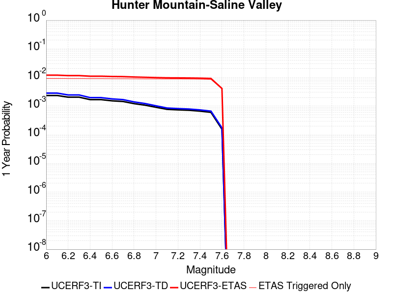 | 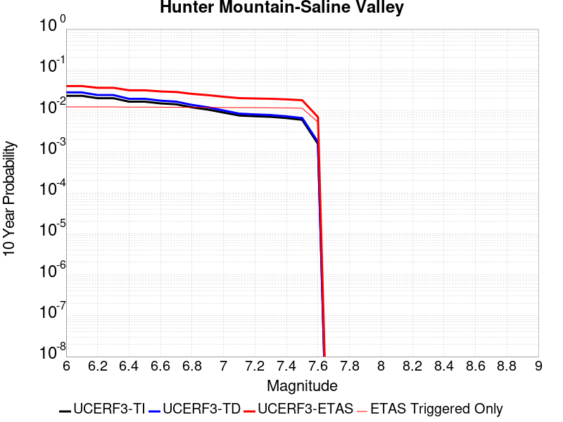 |

| Magnitude | 1 wk TI Prob | 1 wk TD Prob | 1 wk ETAS Prob | 1 wk ETAS/TD Gain | 1 wk ETAS Triggered Only | 1 mo TI Prob | 1 mo TD Prob | 1 mo ETAS Prob | 1 mo ETAS/TD Gain | 1 mo ETAS Triggered Only | 1 yr TI Prob | 1 yr TD Prob | 1 yr ETAS Prob | 1 yr ETAS/TD Gain | 1 yr ETAS Triggered Only | 10 yr TI Prob | 10 yr TD Prob | 10 yr ETAS Prob | 10 yr ETAS/TD Gain | 10 yr ETAS Triggered Only |
|-----|-----|-----|-----|-----|-----|-----|-----|-----|-----|-----|-----|-----|-----|-----|-----|-----|-----|-----|-----|-----|
| 6.0 | 4.5103672E-5 | 5.4570177E-5 | 0.0046376535 | 84.98513 | 0.004583333 | 1.9328714E-4 | 2.3385242E-4 | 0.005857537 | 25.048006 | 0.005625 | 0.002350731 | 0.0028435152 | 0.010945411 | 3.8492537 | 0.008125 | 0.023260195 | 0.028091887 | 0.039228335 | 1.3964293 | 0.011458334 |
| 6.1 | 4.5103672E-5 | 5.4570177E-5 | 0.0046376535 | 84.98513 | 0.004583333 | 1.9328714E-4 | 2.3385242E-4 | 0.005857537 | 25.048006 | 0.005625 | 0.002350731 | 0.0028435152 | 0.010945411 | 3.8492537 | 0.008125 | 0.023260195 | 0.028091887 | 0.039228335 | 1.3964293 | 0.011458334 |
| 6.2 | 3.9363465E-5 | 4.706337E-5 | 0.004630181 | 98.38184 | 0.004583333 | 1.6868966E-4 | 2.0168544E-4 | 0.0058255508 | 28.88434 | 0.005625 | 0.002051862 | 0.0024528175 | 0.010557888 | 4.3043923 | 0.008125 | 0.020330196 | 0.024273481 | 0.03545368 | 1.4605932 | 0.011458334 |
| 6.3 | 3.9363465E-5 | 4.706337E-5 | 0.004630181 | 98.38184 | 0.004583333 | 1.6868966E-4 | 2.0168544E-4 | 0.0058255508 | 28.88434 | 0.005625 | 0.002051862 | 0.0024528175 | 0.010557888 | 4.3043923 | 0.008125 | 0.020330196 | 0.024273481 | 0.03545368 | 1.4605932 | 0.011458334 |
| 6.4 | 3.2311684E-5 | 3.795099E-5 | 0.0045516687 | 119.93544 | 0.004513889 | 1.384713E-4 | 1.6263737E-4 | 0.005717289 | 35.153603 | 0.0055555557 | 0.0016845843 | 0.0019783843 | 0.010018003 | 5.0637293 | 0.008055556 | 0.016718714 | 0.019616475 | 0.030781953 | 1.5691888 | 0.011388889 |
| 6.5 | 3.2311684E-5 | 3.795099E-5 | 0.0045516687 | 119.93544 | 0.004513889 | 1.384713E-4 | 1.6263737E-4 | 0.005717289 | 35.153603 | 0.0055555557 | 0.0016845843 | 0.0019783843 | 0.010018003 | 5.0637293 | 0.008055556 | 0.016718714 | 0.019616475 | 0.030781953 | 1.5691888 | 0.011388889 |
| 6.6 | 2.9305844E-5 | 3.418183E-5 | 0.0045479164 | 133.05069 | 0.004513889 | 1.2559042E-4 | 1.4648569E-4 | 0.0057012276 | 38.92003 | 0.0055555557 | 0.0015279909 | 0.001782067 | 0.009823267 | 5.512288 | 0.008055556 | 0.015175272 | 0.01768569 | 0.02887316 | 1.6325717 | 0.011388889 |
| 6.7 | 2.7826512E-5 | 3.2344276E-5 | 0.0045460872 | 140.55307 | 0.004513889 | 1.19251024E-4 | 1.386113E-4 | 0.005623962 | 40.57362 | 0.005486111 | 0.0014509142 | 0.0016863465 | 0.00965899 | 5.7277613 | 0.007986112 | 0.014414776 | 0.016743187 | 0.027873106 | 1.6647433 | 0.0113194445 |
| 6.8 | 2.3389874E-5 | 2.6866714E-5 | 0.0045406343 | 169.00594 | 0.004513889 | 1.0023846E-4 | 1.15138246E-4 | 0.0056006177 | 48.642548 | 0.005486111 | 0.00121972 | 0.001400954 | 0.009375877 | 6.6924944 | 0.007986112 | 0.01213047 | 0.013927434 | 0.02502075 | 1.7965083 | 0.01125 |
| 6.9 | 2.069209E-5 | 2.3570032E-5 | 0.0044679097 | 189.55891 | 0.0044444446 | 8.867737E-5 | 1.01010715E-4 | 0.0055171303 | 54.61926 | 0.0054166666 | 0.0010791123 | 0.0012291478 | 0.009136084 | 7.4328604 | 0.007916667 | 0.010738871 | 0.012228523 | 0.023272358 | 1.9031208 | 0.011180555 |
| 7.0 | 1.7462342E-5 | 1.9633546E-5 | 0.0044639907 | 227.3655 | 0.0044444446 | 7.483646E-5 | 8.414118E-5 | 0.005500352 | 65.370514 | 0.0054166666 | 9.1075303E-4 | 0.0010239601 | 0.008863147 | 8.655754 | 0.0078472225 | 0.009070295 | 0.0101960525 | 0.021193875 | 2.0786352 | 0.011111111 |
| 7.1 | 1.4807709E-5 | 1.6441749E-5 | 0.004460813 | 271.31012 | 0.0044444446 | 6.3460066E-5 | 7.046283E-5 | 0.0054867477 | 77.86726 | 0.0054166666 | 7.723524E-4 | 8.575638E-4 | 0.008698056 | 10.142752 | 0.0078472225 | 0.007696735 | 0.008545532 | 0.019561693 | 2.2891135 | 0.011111111 |
| 7.2 | 1.4180048E-5 | 1.5698337E-5 | 0.004460073 | 284.11118 | 0.0044444446 | 6.077022E-5 | 6.727694E-5 | 0.0054835794 | 81.50756 | 0.0054166666 | 7.396263E-4 | 8.188051E-4 | 0.008590215 | 10.4911585 | 0.007777778 | 0.0073716943 | 0.008160833 | 0.019112391 | 2.3419657 | 0.011041666 |
| 7.3 | 1.3730402E-5 | 1.5172075E-5 | 0.004459549 | 293.9314 | 0.0044444446 | 5.8843252E-5 | 6.502165E-5 | 0.0054813363 | 84.30017 | 0.0054166666 | 7.161811E-4 | 7.9136714E-4 | 0.0085629895 | 10.820502 | 0.007777778 | 0.007138774 | 0.007888422 | 0.018842988 | 2.388689 | 0.011041666 |
| 7.4 | 1.2810095E-5 | 1.4109277E-5 | 0.004458491 | 315.99713 | 0.0044444446 | 5.489925E-5 | 6.0467017E-5 | 0.005407366 | 89.426704 | 0.005347222 | 6.681934E-4 | 7.359531E-4 | 0.008438613 | 11.466238 | 0.0077083334 | 0.006661878 | 0.007338053 | 0.01822976 | 2.4842775 | 0.010972222 |
| 7.5 | 1.1595659E-5 | 1.2800664E-5 | 0.0044571883 | 348.19977 | 0.0044444446 | 4.9694736E-5 | 5.4858923E-5 | 0.005332347 | 97.20109 | 0.0052777776 | 6.0486543E-4 | 6.6771836E-4 | 0.008162711 | 12.22478 | 0.0075 | 0.006032217 | 0.0066599925 | 0.017283212 | 2.59508 | 0.010694444 |
| 7.6 | 2.997694E-6 | 3.3251579E-6 | 0.0022255399 | 669.3035 | 0.0022222223 | 1.28471975E-5 | 1.425064E-5 | 0.002653102 | 186.17422 | 0.0026388888 | 1.564034E-4 | 1.73495E-4 | 0.003853412 | 22.210506 | 0.0036805556 | 0.0015629337 | 0.001735031 | 0.0067956797 | 3.9167483 | 0.0050694444 |

## Gravel Hills-Harper Lk
*[(top)](#table-of-contents)*

| 1 Week | 1 Month | 1 Year | 10 Year |
|-----|-----|-----|-----|
|  |  |  |  |

| Magnitude | 1 wk TI Prob | 1 wk TD Prob | 1 wk ETAS Prob | 1 wk ETAS/TD Gain | 1 wk ETAS Triggered Only | 1 mo TI Prob | 1 mo TD Prob | 1 mo ETAS Prob | 1 mo ETAS/TD Gain | 1 mo ETAS Triggered Only | 1 yr TI Prob | 1 yr TD Prob | 1 yr ETAS Prob | 1 yr ETAS/TD Gain | 1 yr ETAS Triggered Only | 10 yr TI Prob | 10 yr TD Prob | 10 yr ETAS Prob | 10 yr ETAS/TD Gain | 10 yr ETAS Triggered Only |
|-----|-----|-----|-----|-----|-----|-----|-----|-----|-----|-----|-----|-----|-----|-----|-----|-----|-----|-----|-----|-----|
| 6.0 | 3.0679566E-5 | 3.1464646E-5 | 0.002253617 | 71.62378 | 0.0022222223 | 1.3147724E-4 | 1.3484273E-4 | 0.0036065967 | 26.746689 | 0.0034722222 | 0.0015995599 | 0.0016406906 | 0.0073951227 | 4.5073233 | 0.005763889 | 0.015880952 | 0.01630734 | 0.025051273 | 1.5361964 | 0.008888889 |
| 6.1 | 3.0679566E-5 | 3.1464646E-5 | 0.002253617 | 71.62378 | 0.0022222223 | 1.3147724E-4 | 1.3484273E-4 | 0.0036065967 | 26.746689 | 0.0034722222 | 0.0015995599 | 0.0016406906 | 0.0073951227 | 4.5073233 | 0.005763889 | 0.015880952 | 0.01630734 | 0.025051273 | 1.5361964 | 0.008888889 |
| 6.2 | 1.514536E-5 | 1.3635206E-5 | 0.0010552877 | 77.394325 | 0.0010416667 | 6.490707E-5 | 5.843536E-5 | 0.0013083623 | 22.389908 | 0.00125 | 7.8995706E-4 | 7.1123015E-4 | 0.0025848965 | 3.6344025 | 0.001875 | 0.007871548 | 0.0070907404 | 0.009504061 | 1.3403482 | 0.0024305556 |
| 6.3 | 1.514536E-5 | 1.3635206E-5 | 0.0010552877 | 77.394325 | 0.0010416667 | 6.490707E-5 | 5.843536E-5 | 0.0013083623 | 22.389908 | 0.00125 | 7.8995706E-4 | 7.1123015E-4 | 0.0025848965 | 3.6344025 | 0.001875 | 0.007871548 | 0.0070907404 | 0.009504061 | 1.3403482 | 0.0024305556 |
| 6.4 | 1.2532521E-5 | 1.06896905E-5 | 6.35683E-4 | 59.466923 | 6.25E-4 | 5.37097E-5 | 4.581219E-5 | 8.0966606E-4 | 17.673595 | 7.638889E-4 | 6.537194E-4 | 5.576265E-4 | 0.0017375237 | 3.1159275 | 0.0011805556 | 0.0065179965 | 0.005562863 | 0.0071512 | 1.2855251 | 0.0015972222 |
| 6.5 | 1.1094058E-5 | 9.083664E-6 | 4.951904E-4 | 54.51439 | 4.8611112E-4 | 4.7545094E-5 | 3.892943E-5 | 5.944634E-4 | 15.270283 | 5.5555557E-4 | 5.787078E-4 | 4.7386673E-4 | 0.0013068052 | 2.7577484 | 8.3333335E-4 | 0.0057720304 | 0.0047289706 | 0.005834827 | 1.2338473 | 0.0011111111 |
| 6.6 | 9.688328E-6 | 7.5316952E-6 | 4.9363915E-4 | 65.54157 | 4.8611112E-4 | 4.1520743E-5 | 3.227831E-5 | 5.8781594E-4 | 18.210865 | 5.5555557E-4 | 5.053978E-4 | 3.9292008E-4 | 0.0011565088 | 2.9433692 | 7.638889E-4 | 0.0050424994 | 0.0039225104 | 0.0049600913 | 1.2645196 | 0.0010416667 |
| 6.7 | 8.974824E-6 | 6.749413E-6 | 3.5396928E-4 | 52.444454 | 3.4722223E-4 | 3.8462964E-5 | 2.8925748E-5 | 3.7613793E-4 | 13.003568 | 3.4722223E-4 | 4.6818596E-4 | 3.5211627E-4 | 8.380562E-4 | 2.3800554 | 4.8611112E-4 | 0.004672008 | 0.0035158044 | 0.0042770077 | 1.216509 | 7.638889E-4 |
| 6.8 | 7.4780046E-6 | 5.1161933E-6 | 1.4400437E-4 | 28.146782 | 1.3888889E-4 | 3.20482E-5 | 2.1926366E-5 | 1.6081221E-4 | 7.334193 | 1.3888889E-4 | 3.9011694E-4 | 2.669222E-4 | 4.0577402E-4 | 1.5201958 | 1.3888889E-4 | 0.0038943281 | 0.0026661542 | 0.0029431912 | 1.1039089 | 2.7777778E-4 |
| 6.9 | 6.3409307E-6 | 3.9074966E-6 | 7.335167E-5 | 18.772036 | 6.9444446E-5 | 2.7175134E-5 | 1.6746313E-5 | 8.61896E-5 | 5.1467805 | 6.9444446E-5 | 3.3080703E-4 | 2.0386827E-4 | 2.7329856E-4 | 1.3405645 | 6.9444446E-5 | 0.0033031502 | 0.0020369107 | 0.0021755167 | 1.0680472 | 1.3888889E-4 |
| 7.0 | 5.1239335E-6 | 2.6058565E-6 | 7.205012E-5 | 27.649305 | 6.9444446E-5 | 2.195953E-5 | 1.116791E-5 | 8.061158E-5 | 7.218144 | 6.9444446E-5 | 2.6732447E-4 | 1.3596108E-4 | 2.0539608E-4 | 1.5106977 | 6.9444446E-5 | 0.0026700313 | 0.0013588042 | 0.0014975043 | 1.1020752 | 1.3888889E-4 |
| 7.1 | 4.438899E-6 | 2.0984728E-6 | 7.1542774E-5 | 34.09278 | 6.9444446E-5 | 1.9023713E-5 | 8.993425E-6 | 7.8437246E-5 | 8.7216215 | 6.9444446E-5 | 2.315891E-4 | 1.0948967E-4 | 1.7892651E-4 | 1.6341863 | 6.9444446E-5 | 0.002313479 | 0.0010943791 | 0.001233116 | 1.1267723 | 1.3888889E-4 |
| 7.2 | 3.50367E-6 | 1.2615716E-6 | 7.070593E-5 | 56.04591 | 6.9444446E-5 | 1.5015643E-5 | 5.4067245E-6 | 7.4850795E-5 | 13.844018 | 6.9444446E-5 | 1.8280011E-4 | 6.582497E-5 | 1.3526484E-4 | 2.0549169 | 6.9444446E-5 | 0.0018264982 | 6.580629E-4 | 7.9686043E-4 | 1.2109183 | 1.3888889E-4 |
| 7.3 | 2.561638E-6 | 7.1191585E-7 | 7.1191585E-7 | 1.0 | 0.0 | 1.0978401E-5 | 3.0510646E-6 | 3.0510646E-6 | 1.0 | 0.0 | 1.3365384E-4 | 3.71461E-5 | 3.71461E-5 | 1.0 | 0.0 | 0.0013357349 | 3.7140088E-4 | 3.7140088E-4 | 1.0 | 0.0 |
| 7.4 | 2.0368864E-6 | 5.304837E-7 | 5.304837E-7 | 1.0 | 0.0 | 8.729483E-6 | 2.2734996E-6 | 2.2734996E-6 | 1.0 | 0.0 | 1.06276275E-4 | 2.7679513E-5 | 2.7679513E-5 | 1.0 | 0.0 | 0.0010622547 | 2.767612E-4 | 2.767612E-4 | 1.0 | 0.0 |
| 7.5 | 1.1681728E-6 | 3.6030585E-7 | 3.6030585E-7 | 1.0 | 0.0 | 5.0064455E-6 | 1.544167E-6 | 1.544167E-6 | 1.0 | 0.0 | 6.0951766E-5 | 1.8800076E-5 | 1.8800076E-5 | 1.0 | 0.0 | 6.093505E-4 | 1.8798532E-4 | 1.8798532E-4 | 1.0 | 0.0 |
| 7.6 | 1.3154387E-7 | 7.1197384E-8 | 7.1197384E-8 | 1.0 | 0.0 | 5.6375933E-7 | 3.051316E-7 | 3.051316E-7 | 1.0 | 0.0 | 6.863748E-6 | 3.7149728E-6 | 3.7149728E-6 | 1.0 | 0.0 | 6.863536E-5 | 3.7149264E-5 | 3.7149264E-5 | 1.0 | 0.0 |

## Garlock (West)
*[(top)](#table-of-contents)*

| 1 Week | 1 Month | 1 Year | 10 Year |
|-----|-----|-----|-----|
|  |  |  |  |

| Magnitude | 1 wk TI Prob | 1 wk TD Prob | 1 wk ETAS Prob | 1 wk ETAS/TD Gain | 1 wk ETAS Triggered Only | 1 mo TI Prob | 1 mo TD Prob | 1 mo ETAS Prob | 1 mo ETAS/TD Gain | 1 mo ETAS Triggered Only | 1 yr TI Prob | 1 yr TD Prob | 1 yr ETAS Prob | 1 yr ETAS/TD Gain | 1 yr ETAS Triggered Only | 10 yr TI Prob | 10 yr TD Prob | 10 yr ETAS Prob | 10 yr ETAS/TD Gain | 10 yr ETAS Triggered Only |
|-----|-----|-----|-----|-----|-----|-----|-----|-----|-----|-----|-----|-----|-----|-----|-----|-----|-----|-----|-----|-----|
| 6.0 | 2.5181727E-5 | 2.51973E-5 | 0.0039139884 | 155.33363 | 0.003888889 | 1.0791722E-4 | 1.0798398E-4 | 0.0053851916 | 49.870285 | 0.0052777776 | 0.0013131002 | 0.0013139155 | 0.008942768 | 6.806197 | 0.007638889 | 0.013053683 | 0.013141977 | 0.022188175 | 1.6883439 | 0.009166666 |
| 6.1 | 2.5077732E-5 | 2.5098372E-5 | 0.0039138896 | 155.94197 | 0.003888889 | 1.0747157E-4 | 1.0756004E-4 | 0.00538477 | 50.062927 | 0.0052777776 | 0.001307681 | 0.0013087603 | 0.008937651 | 6.8290977 | 0.007638889 | 0.013000126 | 0.013091032 | 0.022137698 | 1.6910583 | 0.009166666 |
| 6.2 | 2.494612E-5 | 2.498005E-5 | 0.003913772 | 156.6759 | 0.003888889 | 1.0690756E-4 | 1.0705298E-4 | 0.005384266 | 50.295334 | 0.0052777776 | 0.0013008224 | 0.0013025942 | 0.0089315325 | 6.8567266 | 0.007638889 | 0.012932341 | 0.013030097 | 0.02207732 | 1.6943328 | 0.009166666 |
| 6.3 | 2.4733758E-5 | 2.479942E-5 | 0.003913592 | 157.80981 | 0.003888889 | 1.0599751E-4 | 1.06278916E-4 | 0.0053834957 | 50.65441 | 0.0052777776 | 0.0012897556 | 0.0012931811 | 0.008922191 | 6.8994136 | 0.007638889 | 0.012822957 | 0.012937066 | 0.021985143 | 1.6993917 | 0.009166666 |
| 6.4 | 2.3237335E-5 | 2.317873E-5 | 0.0038425347 | 165.77847 | 0.0038194444 | 9.958477E-5 | 9.933365E-5 | 0.0051682745 | 52.02944 | 0.0050694444 | 0.0012117702 | 0.001208719 | 0.008630293 | 7.140033 | 0.0074305558 | 0.012051838 | 0.012101916 | 0.020951835 | 1.7312826 | 0.008958333 |
| 6.5 | 2.2732203E-5 | 2.2993298E-5 | 0.0038423499 | 167.10739 | 0.0038194444 | 9.742009E-5 | 9.8539E-5 | 0.005167484 | 52.441 | 0.0050694444 | 0.0011854442 | 0.0011990548 | 0.008620701 | 7.18958 | 0.0074305558 | 0.011791403 | 0.012006322 | 0.0208571 | 1.7371763 | 0.008958333 |
| 6.6 | 2.1319436E-5 | 2.17735E-5 | 0.0038411347 | 176.4133 | 0.0038194444 | 9.136581E-5 | 9.331167E-5 | 0.0050928453 | 54.578865 | 0.005 | 0.001111811 | 0.0011354799 | 0.008488232 | 7.4754586 | 0.007361111 | 0.011062649 | 0.011377227 | 0.020164983 | 1.772399 | 0.008888889 |
| 6.7 | 1.970802E-5 | 2.0393396E-5 | 0.0038397599 | 188.28448 | 0.0038194444 | 8.446021E-5 | 8.739735E-5 | 0.0050869603 | 58.20497 | 0.005 | 0.001027818 | 0.001063545 | 0.008416827 | 7.913936 | 0.007361111 | 0.010230771 | 0.010664964 | 0.019459054 | 1.8245775 | 0.008888889 |
| 6.8 | 1.8744462E-5 | 1.9901045E-5 | 0.0038392695 | 192.91798 | 0.0038194444 | 8.033094E-5 | 8.5287415E-5 | 0.005084861 | 59.620296 | 0.005 | 9.775903E-4 | 0.0010378812 | 0.008391352 | 8.085079 | 0.007361111 | 0.009733009 | 0.01041075 | 0.0192071 | 1.8449293 | 0.008888889 |
| 6.9 | 1.7559682E-5 | 1.8953415E-5 | 0.0038383254 | 202.51367 | 0.0038194444 | 7.5253614E-5 | 8.12264E-5 | 0.00508082 | 62.551342 | 0.005 | 9.158276E-4 | 9.884841E-4 | 0.008342319 | 8.439507 | 0.007361111 | 0.0091206245 | 0.009921231 | 0.01872193 | 1.8870573 | 0.008888889 |
| 7.0 | 1.6794445E-5 | 1.8216237E-5 | 0.003837591 | 210.6687 | 0.0038194444 | 7.197421E-5 | 7.8067256E-5 | 0.005077677 | 65.042336 | 0.005 | 8.759337E-4 | 9.5005584E-4 | 0.008234795 | 8.667696 | 0.0072916667 | 0.008724891 | 0.009540141 | 0.018137882 | 1.9012176 | 0.008680556 |
| 7.1 | 1.6337795E-5 | 1.7717046E-5 | 0.0037676506 | 212.65683 | 0.00375 | 7.0017246E-5 | 7.5927994E-5 | 0.00493667 | 65.017784 | 0.0048611113 | 8.521265E-4 | 9.240326E-4 | 0.008070201 | 8.733676 | 0.0071527776 | 0.008488664 | 0.009281996 | 0.01774438 | 1.9116986 | 0.008541667 |
| 7.2 | 1.5780008E-5 | 1.7165687E-5 | 0.0037671013 | 219.45532 | 0.00375 | 6.762685E-5 | 7.356516E-5 | 0.004934319 | 67.07413 | 0.0048611113 | 8.2304585E-4 | 8.9528906E-4 | 0.008041663 | 8.982197 | 0.0071527776 | 0.008200042 | 0.008996838 | 0.017461658 | 1.940866 | 0.008541667 |
| 7.3 | 1.5058865E-5 | 1.6618762E-5 | 0.0036971131 | 222.46622 | 0.0036805556 | 6.45364E-5 | 7.122133E-5 | 0.004862547 | 68.27374 | 0.0047916668 | 7.854473E-4 | 8.667759E-4 | 0.007874586 | 9.084915 | 0.007013889 | 0.00782677 | 0.008713539 | 0.017043099 | 1.9559331 | 0.008402778 |
| 7.4 | 1.4887923E-5 | 1.6454731E-5 | 0.0036969497 | 224.67397 | 0.0036805556 | 6.380382E-5 | 7.051838E-5 | 0.004861847 | 68.9444 | 0.0047916668 | 7.7653467E-4 | 8.582243E-4 | 0.007796709 | 9.084699 | 0.0069444445 | 0.0077382675 | 0.008628399 | 0.01688983 | 1.9574696 | 0.008333334 |
| 7.5 | 1.4509299E-5 | 1.6046748E-5 | 0.00341877 | 213.05063 | 0.0034027777 | 6.218123E-5 | 6.876997E-5 | 0.004443469 | 64.61351 | 0.004375 | 7.567935E-4 | 8.36954E-4 | 0.0070123365 | 8.378402 | 0.0061805556 | 0.0075422134 | 0.008416704 | 0.015922438 | 1.8917664 | 0.0075694444 |
| 7.6 | 1.2756717E-5 | 1.4050848E-5 | 0.002236242 | 159.1535 | 0.0022222223 | 5.4670498E-5 | 6.0216535E-5 | 0.0030461478 | 50.586567 | 0.0029861112 | 6.6541E-4 | 7.328904E-4 | 0.0046189292 | 6.3023467 | 0.003888889 | 0.006634211 | 0.0073816874 | 0.012344779 | 1.6723518 | 0.005 |
| 7.7 | 1.0328985E-5 | 1.1460557E-5 | 0.0017475517 | 152.48402 | 0.0017361111 | 4.4266326E-5 | 4.911575E-5 | 0.0020629058 | 42.0009 | 0.002013889 | 5.388092E-4 | 5.978206E-4 | 0.0030269232 | 5.0632634 | 0.0024305556 | 0.0053750467 | 0.006038511 | 0.0091446405 | 1.5143867 | 0.003125 |
| 7.8 | 7.0306583E-6 | 8.899601E-6 | 9.1166934E-4 | 102.43935 | 9.0277777E-4 | 3.0131043E-5 | 3.814059E-5 | 0.0011492093 | 30.130875 | 0.0011111111 | 3.667837E-4 | 4.642629E-4 | 0.001852507 | 3.990211 | 0.0013888889 | 0.003661789 | 0.0046952725 | 0.006561469 | 1.3974628 | 0.001875 |
| 7.9 | 4.060633E-6 | 5.4653938E-6 | 2.1379758E-4 | 39.118423 | 2.0833334E-4 | 1.7402595E-5 | 2.3422906E-5 | 3.70637E-4 | 15.823697 | 3.4722223E-4 | 2.11856E-4 | 2.851367E-4 | 8.405338E-4 | 2.9478278 | 5.5555557E-4 | 0.0021165414 | 0.002884201 | 0.003853619 | 1.3361132 | 9.7222225E-4 |
| 8.0 | 1.6729537E-6 | 2.0775144E-6 | 7.152181E-5 | 34.42663 | 6.9444446E-5 | 7.169782E-6 | 8.903603E-6 | 7.834743E-5 | 8.79952 | 6.9444446E-5 | 8.7288594E-5 | 1.0839601E-4 | 2.4726984E-4 | 2.281171 | 1.3888889E-4 | 8.7254314E-4 | 0.0010969337 | 0.0014437751 | 1.3161917 | 3.4722223E-4 |
| 8.1 | 3.6733252E-7 | 3.1489964E-7 | 3.1489964E-7 | 1.0 | 0.0 | 1.5742813E-6 | 1.3495693E-6 | 1.3495693E-6 | 1.0 | 0.0 | 1.9166706E-5 | 1.6430899E-5 | 1.6430899E-5 | 1.0 | 0.0 | 1.9165053E-4 | 1.6638759E-4 | 1.6638759E-4 | 1.0 | 0.0 |

## Ash Hill
*[(top)](#table-of-contents)*

| 1 Week | 1 Month | 1 Year | 10 Year |
|-----|-----|-----|-----|
|  | 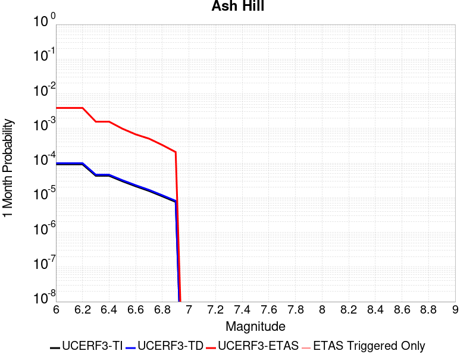 |  |  |

| Magnitude | 1 wk TI Prob | 1 wk TD Prob | 1 wk ETAS Prob | 1 wk ETAS/TD Gain | 1 wk ETAS Triggered Only | 1 mo TI Prob | 1 mo TD Prob | 1 mo ETAS Prob | 1 mo ETAS/TD Gain | 1 mo ETAS Triggered Only | 1 yr TI Prob | 1 yr TD Prob | 1 yr ETAS Prob | 1 yr ETAS/TD Gain | 1 yr ETAS Triggered Only | 10 yr TI Prob | 10 yr TD Prob | 10 yr ETAS Prob | 10 yr ETAS/TD Gain | 10 yr ETAS Triggered Only |
|-----|-----|-----|-----|-----|-----|-----|-----|-----|-----|-----|-----|-----|-----|-----|-----|-----|-----|-----|-----|-----|
| 6.0 | 2.1545662E-5 | 2.3194447E-5 | 0.0021064794 | 90.81827 | 0.0020833334 | 9.2335285E-5 | 9.940143E-5 | 0.0029463407 | 29.640825 | 0.0028472221 | 0.0011236023 | 0.0012096206 | 0.005926131 | 4.899165 | 0.004722222 | 0.011179381 | 0.012038348 | 0.020202754 | 1.6781998 | 0.008263889 |
| 6.1 | 2.1545662E-5 | 2.3194447E-5 | 0.0021064794 | 90.81827 | 0.0020833334 | 9.2335285E-5 | 9.940143E-5 | 0.0029463407 | 29.640825 | 0.0028472221 | 0.0011236023 | 0.0012096206 | 0.005926131 | 4.899165 | 0.004722222 | 0.011179381 | 0.012038348 | 0.020202754 | 1.6781998 | 0.008263889 |
| 6.2 | 2.1545662E-5 | 2.3194447E-5 | 0.0021064794 | 90.81827 | 0.0020833334 | 9.2335285E-5 | 9.940143E-5 | 0.0029463407 | 29.640825 | 0.0028472221 | 0.0011236023 | 0.0012096206 | 0.005926131 | 4.899165 | 0.004722222 | 0.011179381 | 0.012038348 | 0.020202754 | 1.6781998 | 0.008263889 |
| 6.3 | 1.0025529E-5 | 1.0746934E-5 | 9.829587E-4 | 91.4641 | 9.7222225E-4 | 4.2965847E-5 | 4.605755E-5 | 0.0014348825 | 31.15412 | 0.0013888889 | 5.229836E-4 | 5.6061964E-4 | 0.002642785 | 4.7140427 | 0.0020833334 | 0.005217545 | 0.0055933665 | 0.008769943 | 1.5679185 | 0.0031944443 |
| 6.4 | 1.0025529E-5 | 1.0746934E-5 | 9.829587E-4 | 91.4641 | 9.7222225E-4 | 4.2965847E-5 | 4.605755E-5 | 0.0014348825 | 31.15412 | 0.0013888889 | 5.229836E-4 | 5.6061964E-4 | 0.002642785 | 4.7140427 | 0.0020833334 | 0.005217545 | 0.0055933665 | 0.008769943 | 1.5679185 | 0.0031944443 |
| 6.5 | 6.9617327E-6 | 7.456634E-6 | 7.018959E-4 | 94.130394 | 6.9444446E-4 | 2.9835655E-5 | 3.195666E-5 | 0.00107359 | 33.59519 | 0.0010416667 | 3.6318856E-4 | 3.8901155E-4 | 0.0018467776 | 4.7473593 | 0.0014583333 | 0.0036259557 | 0.0038841602 | 0.0061669257 | 1.5877115 | 0.0022916666 |
| 6.6 | 4.9919777E-6 | 5.3466883E-6 | 5.6089927E-4 | 104.90592 | 5.5555557E-4 | 2.1394015E-5 | 2.2914215E-5 | 7.867856E-4 | 34.336136 | 7.638889E-4 | 2.60441E-4 | 2.7895154E-4 | 0.0013897527 | 4.9820576 | 0.0011111111 | 0.0026013597 | 0.0027866727 | 0.004379444 | 1.5715674 | 0.0015972222 |
| 6.7 | 3.6630722E-6 | 3.924624E-6 | 3.5114549E-4 | 89.4724 | 3.4722223E-4 | 1.5698786E-5 | 1.681974E-5 | 5.029227E-4 | 29.900742 | 4.8611112E-4 | 1.9111596E-4 | 2.0476682E-4 | 0.0010379296 | 5.068836 | 8.3333335E-4 | 0.0019095168 | 0.0020463446 | 0.0032244842 | 1.5757289 | 0.0011805556 |
| 6.8 | 2.5599613E-6 | 2.744925E-6 | 2.8052193E-4 | 102.19657 | 2.7777778E-4 | 1.0971216E-5 | 1.1763939E-5 | 2.8953844E-4 | 24.612371 | 2.7777778E-4 | 1.3356637E-4 | 1.4322149E-4 | 6.29263E-4 | 4.3936353 | 4.8611112E-4 | 0.0013348613 | 0.0014317769 | 0.002194572 | 1.5327612 | 7.638889E-4 |
| 6.9 | 1.7684905E-6 | 1.8968707E-6 | 2.102298E-4 | 110.8298 | 2.0833334E-4 | 7.579223E-6 | 8.129446E-6 | 2.1646109E-4 | 26.626795 | 2.0833334E-4 | 9.2273134E-5 | 9.8976E-5 | 5.156014E-4 | 5.2093577 | 4.1666668E-4 | 9.223483E-4 | 9.8976E-4 | 0.0016141414 | 1.6308411 | 6.25E-4 |

## McLean Lake
*[(top)](#table-of-contents)*

| 1 Week | 1 Month | 1 Year | 10 Year |
|-----|-----|-----|-----|
|  |  |  |  |

| Magnitude | 1 wk TI Prob | 1 wk TD Prob | 1 wk ETAS Prob | 1 wk ETAS/TD Gain | 1 wk ETAS Triggered Only | 1 mo TI Prob | 1 mo TD Prob | 1 mo ETAS Prob | 1 mo ETAS/TD Gain | 1 mo ETAS Triggered Only | 1 yr TI Prob | 1 yr TD Prob | 1 yr ETAS Prob | 1 yr ETAS/TD Gain | 1 yr ETAS Triggered Only | 10 yr TI Prob | 10 yr TD Prob | 10 yr ETAS Prob | 10 yr ETAS/TD Gain | 10 yr ETAS Triggered Only |
|-----|-----|-----|-----|-----|-----|-----|-----|-----|-----|-----|-----|-----|-----|-----|-----|-----|-----|-----|-----|-----|
| 6.0 | 1.7360222E-5 | 1.8501627E-5 | 0.0011295922 | 61.053665 | 0.0011111111 | 7.439883E-5 | 7.9290556E-5 | 0.001815264 | 22.893824 | 0.0017361111 | 9.0542925E-4 | 9.6498354E-4 | 0.0041563455 | 4.307167 | 0.0031944443 | 0.009017491 | 0.0096127745 | 0.015733918 | 1.6367718 | 0.0061805556 |
| 6.1 | 9.062689E-6 | 9.592193E-6 | 4.9569865E-4 | 51.6773 | 4.8611112E-4 | 3.8839516E-5 | 4.1108804E-5 | 8.049663E-4 | 19.58136 | 7.638889E-4 | 4.727685E-4 | 5.003936E-4 | 0.0019579972 | 3.912914 | 0.0014583333 | 0.0047176396 | 0.004993552 | 0.008102947 | 1.6226821 | 0.003125 |
| 6.2 | 9.062689E-6 | 9.592193E-6 | 4.9569865E-4 | 51.6773 | 4.8611112E-4 | 3.8839516E-5 | 4.1108804E-5 | 8.049663E-4 | 19.58136 | 7.638889E-4 | 4.727685E-4 | 5.003936E-4 | 0.0019579972 | 3.912914 | 0.0014583333 | 0.0047176396 | 0.004993552 | 0.008102947 | 1.6226821 | 0.003125 |
| 6.3 | 7.2575485E-6 | 7.66771E-6 | 3.5488728E-4 | 46.283348 | 3.4722223E-4 | 3.110341E-5 | 3.2861237E-5 | 6.578407E-4 | 20.018744 | 6.25E-4 | 3.786182E-4 | 4.0001926E-4 | 0.0014412692 | 3.6029997 | 0.0010416667 | 0.0037797375 | 0.0039936965 | 0.0064145452 | 1.6061673 | 0.0024305556 |
| 6.4 | 7.2575485E-6 | 7.66771E-6 | 3.5488728E-4 | 46.283348 | 3.4722223E-4 | 3.110341E-5 | 3.2861237E-5 | 6.578407E-4 | 20.018744 | 6.25E-4 | 3.786182E-4 | 4.0001926E-4 | 0.0014412692 | 3.6029997 | 0.0010416667 | 0.0037797375 | 0.0039936965 | 0.0064145452 | 1.6061673 | 0.0024305556 |
| 6.5 | 6.06582E-6 | 6.4038773E-6 | 3.5362388E-4 | 55.22028 | 3.4722223E-4 | 2.5996113E-5 | 2.7444936E-5 | 5.8298523E-4 | 21.241997 | 5.5555557E-4 | 3.164567E-4 | 3.3409733E-4 | 0.0012365734 | 3.7012372 | 9.0277777E-4 | 0.0031600643 | 0.0033365893 | 0.005412971 | 1.6223068 | 0.0020833334 |
| 6.6 | 5.598744E-6 | 5.910262E-6 | 3.5313042E-4 | 59.74869 | 3.4722223E-4 | 2.3994397E-5 | 2.5329486E-5 | 5.8087095E-4 | 22.9326 | 5.5555557E-4 | 2.9209262E-4 | 3.0834923E-4 | 0.0011414256 | 3.70173 | 8.3333335E-4 | 0.0029170897 | 0.003079843 | 0.004810607 | 1.561965 | 0.0017361111 |
| 6.7 | 5.246996E-6 | 5.539162E-6 | 3.5275947E-4 | 63.684624 | 3.4722223E-4 | 2.2486933E-5 | 2.3739085E-5 | 5.792815E-4 | 24.402012 | 5.5555557E-4 | 2.73744E-4 | 2.8899137E-4 | 0.0011220839 | 3.882759 | 8.3333335E-4 | 0.0027340704 | 0.0028867796 | 0.004617879 | 1.5996646 | 0.0017361111 |
| 6.8 | 4.02324E-6 | 4.2469046E-6 | 3.5146766E-4 | 82.75855 | 3.4722223E-4 | 1.7242342E-5 | 1.8200926E-5 | 5.043032E-4 | 27.707558 | 4.8611112E-4 | 2.099053E-4 | 2.2157968E-4 | 9.1587025E-4 | 4.1333675 | 6.9444446E-4 | 0.0020970714 | 0.002214172 | 0.0035999855 | 1.6258835 | 0.0013888889 |
| 6.9 | 6.835972E-7 | 7.1399285E-7 | 7.1399285E-7 | 1.0 | 0.0 | 2.9296991E-6 | 3.0599674E-6 | 3.0599674E-6 | 1.0 | 0.0 | 3.56685E-5 | 3.7254784E-5 | 1.0669664E-4 | 2.8639715 | 6.9444446E-5 | 3.5662777E-4 | 3.7251666E-4 | 5.807724E-4 | 1.5590508 | 2.0833334E-4 |

## Goldstone Lake
*[(top)](#table-of-contents)*

| 1 Week | 1 Month | 1 Year | 10 Year |
|-----|-----|-----|-----|
|  |  |  |  |

| Magnitude | 1 wk TI Prob | 1 wk TD Prob | 1 wk ETAS Prob | 1 wk ETAS/TD Gain | 1 wk ETAS Triggered Only | 1 mo TI Prob | 1 mo TD Prob | 1 mo ETAS Prob | 1 mo ETAS/TD Gain | 1 mo ETAS Triggered Only | 1 yr TI Prob | 1 yr TD Prob | 1 yr ETAS Prob | 1 yr ETAS/TD Gain | 1 yr ETAS Triggered Only | 10 yr TI Prob | 10 yr TD Prob | 10 yr ETAS Prob | 10 yr ETAS/TD Gain | 10 yr ETAS Triggered Only |
|-----|-----|-----|-----|-----|-----|-----|-----|-----|-----|-----|-----|-----|-----|-----|-----|-----|-----|-----|-----|-----|
| 6.0 | 2.671352E-5 | 3.037609E-5 | 0.0013497805 | 44.435623 | 0.0013194444 | 1.1448149E-4 | 1.3017785E-4 | 0.0019354983 | 14.868108 | 0.0018055555 | 0.001392921 | 0.0015839594 | 0.0045653405 | 2.8822334 | 0.0029861112 | 0.013842222 | 0.015746197 | 0.021350974 | 1.3559449 | 0.0056944443 |
| 6.1 | 2.671352E-5 | 3.037609E-5 | 0.0013497805 | 44.435623 | 0.0013194444 | 1.1448149E-4 | 1.3017785E-4 | 0.0019354983 | 14.868108 | 0.0018055555 | 0.001392921 | 0.0015839594 | 0.0045653405 | 2.8822334 | 0.0029861112 | 0.013842222 | 0.015746197 | 0.021350974 | 1.3559449 | 0.0056944443 |
| 6.2 | 1.4197047E-5 | 1.6096245E-5 | 5.716429E-4 | 35.514053 | 5.5555557E-4 | 6.0843064E-5 | 6.8982634E-5 | 7.6337915E-4 | 11.066251 | 6.9444446E-4 | 7.4051257E-4 | 8.3963864E-4 | 0.002019203 | 2.4048476 | 0.0011805556 | 0.007380498 | 0.0083743585 | 0.010991149 | 1.3124764 | 0.0026388888 |
| 6.3 | 1.4197047E-5 | 1.6096245E-5 | 5.716429E-4 | 35.514053 | 5.5555557E-4 | 6.0843064E-5 | 6.8982634E-5 | 7.6337915E-4 | 11.066251 | 6.9444446E-4 | 7.4051257E-4 | 8.3963864E-4 | 0.002019203 | 2.4048476 | 0.0011805556 | 0.007380498 | 0.0083743585 | 0.010991149 | 1.3124764 | 0.0026388888 |
| 6.4 | 1.3238931E-5 | 1.500846E-5 | 5.0111226E-4 | 33.388657 | 4.8611112E-4 | 5.6737044E-5 | 6.4320935E-5 | 6.8928074E-4 | 10.716273 | 6.25E-4 | 6.9055456E-4 | 7.82924E-4 | 0.0018931652 | 2.41807 | 0.0011111111 | 0.006884126 | 0.0078112837 | 0.010085049 | 1.2910874 | 0.0022916666 |
| 6.5 | 1.3238931E-5 | 1.500846E-5 | 5.0111226E-4 | 33.388657 | 4.8611112E-4 | 5.6737044E-5 | 6.4320935E-5 | 6.8928074E-4 | 10.716273 | 6.25E-4 | 6.9055456E-4 | 7.82924E-4 | 0.0018931652 | 2.41807 | 0.0011111111 | 0.006884126 | 0.0078112837 | 0.010085049 | 1.2910874 | 0.0022916666 |
| 6.6 | 1.1328278E-5 | 1.2855166E-5 | 3.600729E-4 | 28.00998 | 3.4722223E-4 | 4.8548856E-5 | 5.5092944E-5 | 5.411773E-4 | 9.822988 | 4.8611112E-4 | 5.90922E-4 | 6.7064585E-4 | 0.0015034203 | 2.24175 | 8.3333335E-4 | 0.0058935313 | 0.0066956086 | 0.008489075 | 1.2678571 | 0.0018055555 |
| 6.7 | 8.651175E-6 | 9.824565E-6 | 1.4871209E-4 | 15.136762 | 1.3888889E-4 | 3.707594E-5 | 4.2105108E-5 | 2.5042967E-4 | 5.9477267 | 2.0833334E-4 | 4.5130608E-4 | 5.1259965E-4 | 9.290527E-4 | 1.8124335 | 4.1666668E-4 | 0.0045039062 | 0.005123051 | 0.0062975585 | 1.2292594 | 0.0011805556 |
| 6.8 | 1.0215377E-6 | 1.1754702E-6 | 1.1754702E-6 | 1.0 | 0.0 | 4.378012E-6 | 5.0377203E-6 | 5.0377203E-6 | 1.0 | 0.0 | 5.3300988E-5 | 6.1332634E-5 | 6.1332634E-5 | 1.0 | 0.0 | 5.3288206E-4 | 6.1316835E-4 | 7.519721E-4 | 1.2263713 | 1.3888889E-4 |
| 6.9 | 7.9360774E-7 | 9.2833966E-7 | 9.2833966E-7 | 1.0 | 0.0 | 3.4011714E-6 | 3.9785928E-6 | 3.9785928E-6 | 1.0 | 0.0 | 4.1408475E-5 | 4.843836E-5 | 4.843836E-5 | 1.0 | 0.0 | 4.140076E-4 | 4.8428503E-4 | 6.2310667E-4 | 1.2866527 | 1.3888889E-4 |
| 7.0 | 7.4382757E-7 | 8.7473285E-7 | 8.7473285E-7 | 1.0 | 0.0 | 3.1878285E-6 | 3.74885E-6 | 3.74885E-6 | 1.0 | 0.0 | 3.8811122E-5 | 4.564136E-5 | 4.564136E-5 | 1.0 | 0.0 | 3.8804344E-4 | 4.5632652E-4 | 5.95152E-4 | 1.304224 | 1.3888889E-4 |
| 7.1 | 6.4709513E-7 | 7.7113E-7 | 7.7113E-7 | 1.0 | 0.0 | 2.773262E-6 | 3.3048389E-6 | 3.3048389E-6 | 1.0 | 0.0 | 3.376394E-5 | 4.0235733E-5 | 4.0235733E-5 | 1.0 | 0.0 | 3.375881E-4 | 4.0229043E-4 | 5.4112345E-4 | 1.3451065 | 1.3888889E-4 |
| 7.2 | 6.356704E-7 | 7.5883594E-7 | 7.5883594E-7 | 1.0 | 0.0 | 2.7242988E-6 | 3.2521505E-6 | 3.2521505E-6 | 1.0 | 0.0 | 3.3167835E-5 | 3.959427E-5 | 3.959427E-5 | 1.0 | 0.0 | 3.3162883E-4 | 3.958781E-4 | 5.34712E-4 | 1.3506986 | 1.3888889E-4 |
| 7.3 | 5.7695723E-7 | 6.8965653E-7 | 6.8965653E-7 | 1.0 | 0.0 | 2.4726714E-6 | 2.9556677E-6 | 2.9556677E-6 | 1.0 | 0.0 | 3.0104358E-5 | 3.5984718E-5 | 3.5984718E-5 | 1.0 | 0.0 | 3.0100282E-4 | 3.5979465E-4 | 4.986336E-4 | 1.3858838 | 1.3888889E-4 |
| 7.4 | 5.209647E-7 | 6.193514E-7 | 6.193514E-7 | 1.0 | 0.0 | 2.232704E-6 | 2.6543607E-6 | 2.6543607E-6 | 1.0 | 0.0 | 2.718283E-5 | 3.2316417E-5 | 3.2316417E-5 | 1.0 | 0.0 | 2.7179506E-4 | 3.2312275E-4 | 3.9254475E-4 | 1.2148472 | 6.9444446E-5 |
| 7.5 | 4.512955E-7 | 5.348885E-7 | 5.348885E-7 | 1.0 | 0.0 | 1.934122E-6 | 2.2923775E-6 | 2.2923775E-6 | 1.0 | 0.0 | 2.3547682E-5 | 2.7909393E-5 | 2.7909393E-5 | 1.0 | 0.0 | 2.3545188E-4 | 2.7906417E-4 | 3.4848927E-4 | 1.2487781 | 6.9444446E-5 |
| 7.6 | 2.21172E-7 | 2.603961E-7 | 2.603961E-7 | 1.0 | 0.0 | 9.478797E-7 | 1.1159829E-6 | 1.1159829E-6 | 1.0 | 0.0 | 1.1540374E-5 | 1.3587036E-5 | 1.3587036E-5 | 1.0 | 0.0 | 1.1539775E-4 | 1.3586486E-4 | 2.0529988E-4 | 1.5110594 | 6.9444446E-5 |

## So Sierra Nevada
*[(top)](#table-of-contents)*

| 1 Week | 1 Month | 1 Year | 10 Year |
|-----|-----|-----|-----|
|  |  |  |  |

| Magnitude | 1 wk TI Prob | 1 wk TD Prob | 1 wk ETAS Prob | 1 wk ETAS/TD Gain | 1 wk ETAS Triggered Only | 1 mo TI Prob | 1 mo TD Prob | 1 mo ETAS Prob | 1 mo ETAS/TD Gain | 1 mo ETAS Triggered Only | 1 yr TI Prob | 1 yr TD Prob | 1 yr ETAS Prob | 1 yr ETAS/TD Gain | 1 yr ETAS Triggered Only | 10 yr TI Prob | 10 yr TD Prob | 10 yr ETAS Prob | 10 yr ETAS/TD Gain | 10 yr ETAS Triggered Only |
|-----|-----|-----|-----|-----|-----|-----|-----|-----|-----|-----|-----|-----|-----|-----|-----|-----|-----|-----|-----|-----|
| 6.0 | 1.15488665E-5 | 1.1079643E-5 | 0.0014693969 | 132.62132 | 0.0014583333 | 4.9494203E-5 | 4.748339E-5 | 0.002200159 | 46.33534 | 0.0021527777 | 6.024253E-4 | 5.7796965E-4 | 0.0043952065 | 7.6045628 | 0.0038194444 | 0.006007948 | 0.005765934 | 0.010737104 | 1.8621622 | 0.005 |
| 6.1 | 1.15488665E-5 | 1.1079643E-5 | 0.0014693969 | 132.62132 | 0.0014583333 | 4.9494203E-5 | 4.748339E-5 | 0.002200159 | 46.33534 | 0.0021527777 | 6.024253E-4 | 5.7796965E-4 | 0.0043952065 | 7.6045628 | 0.0038194444 | 0.006007948 | 0.005765934 | 0.010737104 | 1.8621622 | 0.005 |
| 6.2 | 1.15488665E-5 | 1.1079643E-5 | 0.0014693969 | 132.62132 | 0.0014583333 | 4.9494203E-5 | 4.748339E-5 | 0.002200159 | 46.33534 | 0.0021527777 | 6.024253E-4 | 5.7796965E-4 | 0.0043952065 | 7.6045628 | 0.0038194444 | 0.006007948 | 0.005765934 | 0.010737104 | 1.8621622 | 0.005 |
| 6.3 | 1.15488665E-5 | 1.1079643E-5 | 0.0014693969 | 132.62132 | 0.0014583333 | 4.9494203E-5 | 4.748339E-5 | 0.002200159 | 46.33534 | 0.0021527777 | 6.024253E-4 | 5.7796965E-4 | 0.0043952065 | 7.6045628 | 0.0038194444 | 0.006007948 | 0.005765934 | 0.010737104 | 1.8621622 | 0.005 |
| 6.4 | 1.15488665E-5 | 1.1079643E-5 | 0.0014693969 | 132.62132 | 0.0014583333 | 4.9494203E-5 | 4.748339E-5 | 0.002200159 | 46.33534 | 0.0021527777 | 6.024253E-4 | 5.7796965E-4 | 0.0043952065 | 7.6045628 | 0.0038194444 | 0.006007948 | 0.005765934 | 0.010737104 | 1.8621622 | 0.005 |
| 6.5 | 1.15488665E-5 | 1.1079643E-5 | 0.0014693969 | 132.62132 | 0.0014583333 | 4.9494203E-5 | 4.748339E-5 | 0.002200159 | 46.33534 | 0.0021527777 | 6.024253E-4 | 5.7796965E-4 | 0.0043952065 | 7.6045628 | 0.0038194444 | 0.006007948 | 0.005765934 | 0.010737104 | 1.8621622 | 0.005 |
| 6.6 | 7.587044E-6 | 6.935635E-6 | 5.6248734E-4 | 81.10106 | 5.5555557E-4 | 3.2515498E-5 | 2.9723828E-5 | 7.9359004E-4 | 26.698782 | 7.638889E-4 | 3.9580427E-4 | 3.6183043E-4 | 0.0018890555 | 5.2208304 | 0.0015277778 | 0.003951 | 0.0036127048 | 0.005480931 | 1.5171267 | 0.001875 |
| 6.7 | 7.587044E-6 | 6.935635E-6 | 5.6248734E-4 | 81.10106 | 5.5555557E-4 | 3.2515498E-5 | 2.9723828E-5 | 7.9359004E-4 | 26.698782 | 7.638889E-4 | 3.9580427E-4 | 3.6183043E-4 | 0.0018890555 | 5.2208304 | 0.0015277778 | 0.003951 | 0.0036127048 | 0.005480931 | 1.5171267 | 0.001875 |
| 6.8 | 5.9026956E-6 | 5.1793927E-6 | 3.523998E-4 | 68.038826 | 3.4722223E-4 | 2.5297022E-5 | 2.2197215E-5 | 5.082975E-4 | 22.899158 | 4.8611112E-4 | 3.0794772E-4 | 2.7021873E-4 | 0.0012421783 | 4.5969357 | 9.7222225E-4 | 0.0030752132 | 0.002699018 | 0.0038071303 | 1.4105612 | 0.0011111111 |
| 6.9 | 5.0118915E-6 | 4.2524252E-6 | 1.4314073E-4 | 33.66096 | 1.3888889E-4 | 2.1479358E-5 | 1.8224557E-5 | 2.265541E-4 | 12.431254 | 2.0833334E-4 | 2.614798E-4 | 2.2186211E-4 | 8.4672344E-4 | 3.81644 | 6.25E-4 | 0.0026117235 | 0.0022164788 | 0.0029786746 | 1.3438768 | 7.638889E-4 |
| 7.0 | 4.4924795E-6 | 3.7139177E-6 | 1.426023E-4 | 38.39673 | 1.3888889E-4 | 1.925334E-5 | 1.5916696E-5 | 2.2424672E-4 | 14.088773 | 2.0833334E-4 | 2.3438422E-4 | 1.9376918E-4 | 6.797861E-4 | 3.5082262 | 4.8611112E-4 | 0.0023413717 | 0.0019360651 | 0.002559855 | 1.3221947 | 6.25E-4 |
| 7.1 | 3.9118436E-6 | 3.1119775E-6 | 7.2556206E-5 | 23.315144 | 6.9444446E-5 | 1.6764936E-5 | 1.3336982E-5 | 1.5222402E-4 | 11.413678 | 1.3888889E-4 | 2.0409399E-4 | 1.6236622E-4 | 5.0953205E-4 | 3.1381655 | 3.4722223E-4 | 0.0020390663 | 0.001622532 | 0.0021078545 | 1.2991142 | 4.8611112E-4 |
| 7.2 | 3.4200818E-6 | 2.6054543E-6 | 2.6054543E-6 | 1.0 | 0.0 | 1.4657411E-5 | 1.11661875E-5 | 8.0609854E-5 | 7.219103 | 6.9444446E-5 | 1.7843937E-4 | 1.3594035E-4 | 3.4424537E-4 | 2.5323265 | 2.0833334E-4 | 0.0017829615 | 0.0013586218 | 0.0016360221 | 1.2041777 | 2.7777778E-4 |
| 7.3 | 2.6593618E-6 | 1.8284203E-6 | 1.8284203E-6 | 1.0 | 0.0 | 1.13972155E-5 | 7.836065E-6 | 7.727997E-5 | 9.862088 | 6.9444446E-5 | 1.3875226E-4 | 9.540021E-5 | 2.3427585E-4 | 2.4557164 | 1.3888889E-4 | 0.0013866565 | 9.5362146E-4 | 0.0011617561 | 1.2182571 | 2.0833334E-4 |
| 7.4 | 2.2577992E-6 | 1.436438E-6 | 1.436438E-6 | 1.0 | 0.0 | 9.676246E-6 | 6.15615E-6 | 7.560017E-5 | 12.28043 | 6.9444446E-5 | 1.1780193E-4 | 7.49488E-5 | 2.1382728E-4 | 2.852978 | 1.3888889E-4 | 0.001177395 | 7.492603E-4 | 9.574375E-4 | 1.2778437 | 2.0833334E-4 |
| 7.5 | 1.489319E-6 | 7.353936E-7 | 7.353936E-7 | 1.0 | 0.0 | 6.3827797E-6 | 3.1516831E-6 | 3.1516831E-6 | 1.0 | 0.0 | 7.770758E-5 | 3.8371072E-5 | 1.0781285E-4 | 2.8097432 | 6.9444446E-5 | 7.7680405E-4 | 3.836449E-4 | 4.5306268E-4 | 1.1809429 | 6.9444446E-5 |
| 7.6 | 1.0680322E-6 | 4.6596554E-7 | 4.6596554E-7 | 1.0 | 0.0 | 4.577273E-6 | 1.9969937E-6 | 1.9969937E-6 | 1.0 | 0.0 | 5.5726876E-5 | 2.4313129E-5 | 2.4313129E-5 | 1.0 | 0.0 | 5.5712904E-4 | 2.4310495E-4 | 2.4310495E-4 | 1.0 | 0.0 |
| 7.7 | 5.509146E-7 | 1.5580486E-7 | 1.5580486E-7 | 1.0 | 0.0 | 2.3610605E-6 | 6.677349E-7 | 6.677349E-7 | 1.0 | 0.0 | 2.8745531E-5 | 8.129644E-6 | 8.129644E-6 | 1.0 | 0.0 | 2.8741814E-4 | 8.1293576E-5 | 8.1293576E-5 | 1.0 | 0.0 |

## Lenwood-Lockhart-Old Woman Springs
*[(top)](#table-of-contents)*

| 1 Week | 1 Month | 1 Year | 10 Year |
|-----|-----|-----|-----|
|  |  |  |  |

| Magnitude | 1 wk TI Prob | 1 wk TD Prob | 1 wk ETAS Prob | 1 wk ETAS/TD Gain | 1 wk ETAS Triggered Only | 1 mo TI Prob | 1 mo TD Prob | 1 mo ETAS Prob | 1 mo ETAS/TD Gain | 1 mo ETAS Triggered Only | 1 yr TI Prob | 1 yr TD Prob | 1 yr ETAS Prob | 1 yr ETAS/TD Gain | 1 yr ETAS Triggered Only | 10 yr TI Prob | 10 yr TD Prob | 10 yr ETAS Prob | 10 yr ETAS/TD Gain | 10 yr ETAS Triggered Only |
|-----|-----|-----|-----|-----|-----|-----|-----|-----|-----|-----|-----|-----|-----|-----|-----|-----|-----|-----|-----|-----|
| 6.0 | 3.744542E-5 | 4.396252E-5 | 0.0014327903 | 32.59118 | 0.0013888889 | 1.604705E-4 | 1.8839816E-4 | 0.0023407703 | 12.424592 | 0.0021527777 | 0.0019519776 | 0.0022915069 | 0.005409346 | 2.3606064 | 0.003125 | 0.019349206 | 0.022696787 | 0.027108226 | 1.194364 | 0.004513889 |
| 6.1 | 3.744542E-5 | 4.396252E-5 | 0.0014327903 | 32.59118 | 0.0013888889 | 1.604705E-4 | 1.8839816E-4 | 0.0023407703 | 12.424592 | 0.0021527777 | 0.0019519776 | 0.0022915069 | 0.005409346 | 2.3606064 | 0.003125 | 0.019349206 | 0.022696787 | 0.027108226 | 1.194364 | 0.004513889 |
| 6.2 | 3.744542E-5 | 4.396252E-5 | 0.0014327903 | 32.59118 | 0.0013888889 | 1.604705E-4 | 1.8839816E-4 | 0.0023407703 | 12.424592 | 0.0021527777 | 0.0019519776 | 0.0022915069 | 0.005409346 | 2.3606064 | 0.003125 | 0.019349206 | 0.022696787 | 0.027108226 | 1.194364 | 0.004513889 |
| 6.3 | 2.1079984E-5 | 2.5353434E-5 | 5.114522E-4 | 20.172897 | 4.8611112E-4 | 9.0339665E-5 | 1.0865316E-4 | 0.0010113328 | 9.3079 | 9.0277777E-4 | 0.0010993304 | 0.0013220694 | 0.0028478275 | 2.154068 | 0.0015277778 | 0.010939079 | 0.0131442575 | 0.015474333 | 1.1772695 | 0.002361111 |
| 6.4 | 2.1079984E-5 | 2.5353434E-5 | 5.114522E-4 | 20.172897 | 4.8611112E-4 | 9.0339665E-5 | 1.0865316E-4 | 0.0010113328 | 9.3079 | 9.0277777E-4 | 0.0010993304 | 0.0013220694 | 0.0028478275 | 2.154068 | 0.0015277778 | 0.010939079 | 0.0131442575 | 0.015474333 | 1.1772695 | 0.002361111 |
| 6.5 | 1.7397282E-5 | 2.066241E-5 | 5.0676346E-4 | 24.525866 | 4.8611112E-4 | 7.455765E-5 | 8.8550245E-5 | 8.523715E-4 | 9.625852 | 7.638889E-4 | 9.073613E-4 | 0.0010775778 | 0.0021874916 | 2.030008 | 0.0011111111 | 0.009036654 | 0.010724821 | 0.012304913 | 1.1473304 | 0.0015972222 |
| 6.6 | 1.52050325E-5 | 1.7679693E-5 | 3.6489576E-4 | 20.63926 | 3.4722223E-4 | 6.51628E-5 | 7.576796E-5 | 7.007206E-4 | 9.248244 | 6.25E-4 | 7.9306826E-4 | 9.220924E-4 | 0.0017546574 | 1.9029083 | 8.3333335E-4 | 0.007902439 | 0.009183526 | 0.010284433 | 1.1198785 | 0.0011111111 |
| 6.7 | 1.332523E-5 | 1.5264002E-5 | 2.9303753E-4 | 19.197948 | 2.7777778E-4 | 5.7106878E-5 | 6.5415545E-5 | 6.2093476E-4 | 9.492159 | 5.5555557E-4 | 6.950544E-4 | 7.961491E-4 | 0.0015594298 | 1.9587158 | 7.638889E-4 | 0.006928845 | 0.007933599 | 0.008967001 | 1.1302564 | 0.0010416667 |
| 6.8 | 1.1525329E-5 | 1.3030979E-5 | 2.9080512E-4 | 22.316446 | 2.7777778E-4 | 4.9393333E-5 | 5.584588E-5 | 6.1137043E-4 | 10.947457 | 5.5555557E-4 | 6.011979E-4 | 6.797157E-4 | 0.0014430854 | 2.123072 | 7.638889E-4 | 0.00599574 | 0.006776819 | 0.0078114267 | 1.1526686 | 0.0010416667 |
| 6.9 | 1.0253909E-5 | 1.15144385E-5 | 2.8928902E-4 | 25.124022 | 2.7777778E-4 | 4.3944583E-5 | 4.9346683E-5 | 6.048748E-4 | 12.25766 | 5.5555557E-4 | 5.3489394E-4 | 6.0063385E-4 | 0.0013640639 | 2.2710407 | 7.638889E-4 | 0.0053360825 | 0.0059904843 | 0.006887854 | 1.1497992 | 9.0277777E-4 |
| 7.0 | 8.104563E-6 | 8.991279E-6 | 1.4787892E-4 | 16.446928 | 1.3888889E-4 | 3.4733377E-5 | 3.8533497E-5 | 3.1630057E-4 | 8.208458 | 2.7777778E-4 | 4.2279682E-4 | 4.6904673E-4 | 8.161061E-4 | 1.7399249 | 3.4722223E-4 | 0.0042199334 | 0.0046808156 | 0.005164651 | 1.1033657 | 4.8611112E-4 |
| 7.1 | 6.7986157E-6 | 7.515816E-6 | 1.4640366E-4 | 19.47941 | 1.3888889E-4 | 2.91366E-5 | 3.2210253E-5 | 3.0997908E-4 | 9.623615 | 2.7777778E-4 | 3.5468035E-4 | 3.920914E-4 | 7.391775E-4 | 1.8852173 | 3.4722223E-4 | 0.003541148 | 0.003914213 | 0.0043292483 | 1.106033 | 4.1666668E-4 |
| 7.2 | 5.6893327E-6 | 6.2800136E-6 | 1.4516803E-4 | 23.115877 | 1.3888889E-4 | 2.4382627E-5 | 2.6914078E-5 | 3.046844E-4 | 11.320632 | 2.7777778E-4 | 2.9681803E-4 | 3.2763163E-4 | 6.7474006E-4 | 2.0594473 | 3.4722223E-4 | 0.002964219 | 0.0032716845 | 0.003686988 | 1.1269387 | 4.1666668E-4 |
| 7.3 | 4.253348E-6 | 4.7069107E-6 | 7.415103E-5 | 15.753652 | 6.9444446E-5 | 1.8228506E-5 | 2.0172329E-5 | 2.2850146E-4 | 11.327471 | 2.0833334E-4 | 2.2190946E-4 | 2.4557224E-4 | 5.232818E-4 | 2.130867 | 2.7777778E-4 | 0.00221688 | 0.0024531898 | 0.00279956 | 1.1411918 | 3.4722223E-4 |
| 7.4 | 2.5448119E-6 | 2.852045E-6 | 2.852045E-6 | 1.0 | 0.0 | 1.0906291E-5 | 1.2223002E-5 | 8.16666E-5 | 6.681386 | 6.9444446E-5 | 1.3277601E-4 | 1.4880655E-4 | 2.8767477E-4 | 1.9332131 | 1.3888889E-4 | 0.001326967 | 0.0014872311 | 0.0016259134 | 1.0932487 | 1.3888889E-4 |
| 7.5 | 4.3706837E-8 | 4.562909E-8 | 4.562909E-8 | 1.0 | 0.0 | 1.8731501E-7 | 1.9555324E-7 | 1.9555324E-7 | 1.0 | 0.0 | 2.2805577E-6 | 2.3808586E-6 | 7.182514E-5 | 30.167746 | 6.9444446E-5 | 2.2805343E-5 | 2.3808387E-5 | 9.3251176E-5 | 3.9167366 | 6.9444446E-5 |

## Coyote Canyon
*[(top)](#table-of-contents)*

| 1 Week | 1 Month | 1 Year | 10 Year |
|-----|-----|-----|-----|
|  |  |  |  |

| Magnitude | 1 wk TI Prob | 1 wk TD Prob | 1 wk ETAS Prob | 1 wk ETAS/TD Gain | 1 wk ETAS Triggered Only | 1 mo TI Prob | 1 mo TD Prob | 1 mo ETAS Prob | 1 mo ETAS/TD Gain | 1 mo ETAS Triggered Only | 1 yr TI Prob | 1 yr TD Prob | 1 yr ETAS Prob | 1 yr ETAS/TD Gain | 1 yr ETAS Triggered Only | 10 yr TI Prob | 10 yr TD Prob | 10 yr ETAS Prob | 10 yr ETAS/TD Gain | 10 yr ETAS Triggered Only |
|-----|-----|-----|-----|-----|-----|-----|-----|-----|-----|-----|-----|-----|-----|-----|-----|-----|-----|-----|-----|-----|
| 6.0 | 3.5090034E-5 | 4.0364324E-5 | 5.264558E-4 | 13.042603 | 4.8611112E-4 | 1.503772E-4 | 1.7297994E-4 | 0.0012144664 | 7.020851 | 0.0010416667 | 0.0018293047 | 0.0021042528 | 0.004391097 | 2.0867727 | 0.0022916666 | 0.018143194 | 0.020869201 | 0.024812924 | 1.1889733 | 0.004027778 |
| 6.1 | 3.5090034E-5 | 4.0364324E-5 | 5.264558E-4 | 13.042603 | 4.8611112E-4 | 1.503772E-4 | 1.7297994E-4 | 0.0012144664 | 7.020851 | 0.0010416667 | 0.0018293047 | 0.0021042528 | 0.004391097 | 2.0867727 | 0.0022916666 | 0.018143194 | 0.020869201 | 0.024812924 | 1.1889733 | 0.004027778 |
| 6.2 | 1.841879E-5 | 2.1059794E-5 | 2.9883173E-4 | 14.18968 | 2.7777778E-4 | 7.8935285E-5 | 9.0253714E-5 | 5.068828E-4 | 5.6161985 | 4.1666668E-4 | 9.606133E-4 | 0.001098387 | 0.0020695413 | 1.8841641 | 9.7222225E-4 | 0.0095647145 | 0.010939667 | 0.012450731 | 1.1381271 | 0.0015277778 |
| 6.3 | 1.841879E-5 | 2.1059794E-5 | 2.9883173E-4 | 14.18968 | 2.7777778E-4 | 7.8935285E-5 | 9.0253714E-5 | 5.068828E-4 | 5.6161985 | 4.1666668E-4 | 9.606133E-4 | 0.001098387 | 0.0020695413 | 1.8841641 | 9.7222225E-4 | 0.0095647145 | 0.010939667 | 0.012450731 | 1.1381271 | 0.0015277778 |
| 6.4 | 1.712201E-5 | 1.9565212E-5 | 2.9733757E-4 | 15.197257 | 2.7777778E-4 | 7.337798E-5 | 8.3848776E-5 | 5.004805E-4 | 5.968847 | 4.1666668E-4 | 8.930107E-4 | 0.0010204813 | 0.0019917113 | 1.9517373 | 9.7222225E-4 | 0.008894307 | 0.010167871 | 0.011680114 | 1.1487277 | 0.0015277778 |
| 6.5 | 1.4744935E-5 | 1.6836972E-5 | 2.9461007E-4 | 17.497807 | 2.7777778E-4 | 6.3191044E-5 | 7.215698E-5 | 4.887936E-4 | 6.77403 | 4.1666668E-4 | 7.6907943E-4 | 8.7825063E-4 | 0.0017802356 | 2.0270245 | 9.0277777E-4 | 0.007664232 | 0.008756994 | 0.010133721 | 1.1572145 | 0.0013888889 |
| 6.6 | 1.2017839E-5 | 1.37240895E-5 | 2.2205456E-4 | 16.179913 | 2.0833334E-4 | 5.150401E-5 | 5.88167E-5 | 4.060185E-4 | 6.903116 | 3.4722223E-4 | 6.268809E-4 | 7.159466E-4 | 0.0015486833 | 2.163127 | 8.3333335E-4 | 0.0062511545 | 0.0071450938 | 0.008386162 | 1.1736952 | 0.00125 |
| 6.7 | 1.00956095E-5 | 1.1533517E-5 | 2.1986445E-4 | 19.06309 | 2.0833334E-4 | 4.326618E-5 | 4.942891E-5 | 3.2719295E-4 | 6.6194654 | 2.7777778E-4 | 5.266384E-4 | 6.017178E-4 | 0.0012957443 | 2.1534088 | 6.9444446E-4 | 0.005253921 | 0.0060094125 | 0.0071138465 | 1.183784 | 0.0011111111 |

## San Andreas (Mojave S)
*[(top)](#table-of-contents)*

| 1 Week | 1 Month | 1 Year | 10 Year |
|-----|-----|-----|-----|
|  |  |  |  |

| Magnitude | 1 wk TI Prob | 1 wk TD Prob | 1 wk ETAS Prob | 1 wk ETAS/TD Gain | 1 wk ETAS Triggered Only | 1 mo TI Prob | 1 mo TD Prob | 1 mo ETAS Prob | 1 mo ETAS/TD Gain | 1 mo ETAS Triggered Only | 1 yr TI Prob | 1 yr TD Prob | 1 yr ETAS Prob | 1 yr ETAS/TD Gain | 1 yr ETAS Triggered Only | 10 yr TI Prob | 10 yr TD Prob | 10 yr ETAS Prob | 10 yr ETAS/TD Gain | 10 yr ETAS Triggered Only |
|-----|-----|-----|-----|-----|-----|-----|-----|-----|-----|-----|-----|-----|-----|-----|-----|-----|-----|-----|-----|-----|
| 6.0 | 3.1064058E-4 | 6.7460834E-4 | 0.0024789458 | 3.6746447 | 0.0018055555 | 0.0013306376 | 0.0028881032 | 0.00496542 | 1.7192667 | 0.0020833334 | 0.016080605 | 0.03462235 | 0.037236914 | 1.0755167 | 0.0027083333 | 0.1496549 | 0.28660452 | 0.28937885 | 1.0096799 | 0.003888889 |
| 6.1 | 3.1064058E-4 | 6.7460834E-4 | 0.0024789458 | 3.6746447 | 0.0018055555 | 0.0013306376 | 0.0028881032 | 0.00496542 | 1.7192667 | 0.0020833334 | 0.016080605 | 0.03462235 | 0.037236914 | 1.0755167 | 0.0027083333 | 0.1496549 | 0.28660452 | 0.28937885 | 1.0096799 | 0.003888889 |
| 6.2 | 3.1064058E-4 | 6.7460834E-4 | 0.0024789458 | 3.6746447 | 0.0018055555 | 0.0013306376 | 0.0028881032 | 0.00496542 | 1.7192667 | 0.0020833334 | 0.016080605 | 0.03462235 | 0.037236914 | 1.0755167 | 0.0027083333 | 0.1496549 | 0.28660452 | 0.28937885 | 1.0096799 | 0.003888889 |
| 6.3 | 3.1064058E-4 | 6.7460834E-4 | 0.0024789458 | 3.6746447 | 0.0018055555 | 0.0013306376 | 0.0028881032 | 0.00496542 | 1.7192667 | 0.0020833334 | 0.016080605 | 0.03462235 | 0.037236914 | 1.0755167 | 0.0027083333 | 0.1496549 | 0.28660452 | 0.28937885 | 1.0096799 | 0.003888889 |
| 6.4 | 1.9872203E-4 | 4.3179357E-4 | 0.0019589115 | 4.5366855 | 0.0015277778 | 8.5138786E-4 | 0.0018492596 | 0.0036514762 | 1.9745612 | 0.0018055555 | 0.010316478 | 0.02228844 | 0.024529029 | 1.1005269 | 0.0022916666 | 0.098504856 | 0.19699748 | 0.19967414 | 1.0135874 | 0.0033333334 |
| 6.5 | 1.291105E-4 | 2.875267E-4 | 0.0018148652 | 6.3119884 | 0.0015277778 | 5.5321335E-4 | 0.0012316781 | 0.0030350098 | 2.4641259 | 0.0018055555 | 0.006714592 | 0.0148934 | 0.017014116 | 1.142393 | 0.0021527777 | 0.065152965 | 0.13803436 | 0.14054842 | 1.0182134 | 0.0029166667 |
| 6.6 | 1.291105E-4 | 2.875267E-4 | 0.0018148652 | 6.3119884 | 0.0015277778 | 5.5321335E-4 | 0.0012316781 | 0.0030350098 | 2.4641259 | 0.0018055555 | 0.006714592 | 0.0148934 | 0.017014116 | 1.142393 | 0.0021527777 | 0.065152965 | 0.13803436 | 0.14054842 | 1.0182134 | 0.0029166667 |
| 6.7 | 1.08001186E-4 | 2.4333889E-4 | 0.0017707449 | 7.276868 | 0.0015277778 | 4.6278012E-4 | 0.0010424647 | 0.002846138 | 2.7302008 | 0.0018055555 | 0.0056198016 | 0.012618446 | 0.014744059 | 1.1684529 | 0.0021527777 | 0.054797906 | 0.119176775 | 0.12168467 | 1.0210435 | 0.0028472221 |
| 6.8 | 1.0624356E-4 | 2.3851555E-4 | 0.0017659289 | 7.4038315 | 0.0015277778 | 4.5525006E-4 | 0.0010218095 | 0.0028255202 | 2.765212 | 0.0018055555 | 0.0055285925 | 0.012369843 | 0.014495991 | 1.1718816 | 0.0021527777 | 0.053930566 | 0.11712591 | 0.11963965 | 1.0214618 | 0.0028472221 |
| 6.9 | 1.0393785E-4 | 2.3221898E-4 | 0.001759642 | 7.5775113 | 0.0015277778 | 4.4537184E-4 | 9.948451E-4 | 0.0027986043 | 2.8131056 | 0.0018055555 | 0.0054089287 | 0.012045221 | 0.014172068 | 1.1765718 | 0.0021527777 | 0.05279156 | 0.11442335 | 0.11694479 | 1.022036 | 0.0028472221 |
| 7.0 | 1.0155622E-4 | 2.2591476E-4 | 0.0017533473 | 7.7611017 | 0.0015277778 | 4.3516833E-4 | 9.6784724E-4 | 0.0027716553 | 2.863732 | 0.0018055555 | 0.005285311 | 0.0117200995 | 0.013847647 | 1.1815298 | 0.0021527777 | 0.05161361 | 0.111683756 | 0.11421299 | 1.0226464 | 0.0028472221 |
| 7.1 | 9.885595E-5 | 2.1879886E-4 | 0.0017462424 | 7.9810395 | 0.0015277778 | 4.2359953E-4 | 9.3737274E-4 | 0.0027412358 | 2.9243817 | 0.0018055555 | 0.0051451353 | 0.011352993 | 0.01348133 | 1.1874692 | 0.0021527777 | 0.05027629 | 0.1085682 | 0.11110631 | 1.023378 | 0.0028472221 |
| 7.2 | 9.6411415E-5 | 2.124288E-4 | 0.001739882 | 8.190424 | 0.0015277778 | 4.1312634E-4 | 9.1009185E-4 | 0.0027140041 | 2.9821212 | 0.0018055555 | 0.005018219 | 0.011024255 | 0.013153301 | 1.1931237 | 0.0021527777 | 0.049064007 | 0.105758004 | 0.108304106 | 1.0240748 | 0.0028472221 |
| 7.3 | 9.1180635E-5 | 1.9471257E-4 | 0.001652762 | 8.488214 | 0.0014583333 | 3.907156E-4 | 8.342157E-4 | 0.0025688785 | 3.0793936 | 0.0017361111 | 0.004746591 | 0.01010939 | 0.0121716615 | 1.2039957 | 0.0020833334 | 0.046464786 | 0.09795115 | 0.10045684 | 1.025581 | 0.0027777778 |
| 7.4 | 8.887388E-5 | 1.8719878E-4 | 0.0016452591 | 8.788835 | 0.0014583333 | 3.8083247E-4 | 8.020339E-4 | 0.0025367525 | 3.1628995 | 0.0017361111 | 0.0046267817 | 0.00972114 | 0.011784221 | 1.2122263 | 0.0020833334 | 0.045316286 | 0.09458615 | 0.09710118 | 1.0265899 | 0.0027777778 |
| 7.5 | 8.6750515E-5 | 1.8051457E-4 | 0.0015691527 | 8.692665 | 0.0013888889 | 3.7173493E-4 | 7.7340455E-4 | 0.0024387822 | 3.1533072 | 0.0016666667 | 0.004516484 | 0.009375632 | 0.011370639 | 1.2127864 | 0.002013889 | 0.04425787 | 0.091549896 | 0.09401028 | 1.0268748 | 0.0027083333 |
| 7.6 | 8.453092E-5 | 1.7439072E-4 | 0.0015630374 | 8.962848 | 0.0013888889 | 3.6222505E-4 | 7.471748E-4 | 0.0024125963 | 3.2289581 | 0.0016666667 | 0.0044011753 | 0.009058985 | 0.011054629 | 1.2202946 | 0.002013889 | 0.04315024 | 0.08870898 | 0.09117706 | 1.0278223 | 0.0027083333 |
| 7.7 | 8.259102E-5 | 1.6961215E-4 | 0.0015582654 | 9.187228 | 0.0013888889 | 3.539135E-4 | 7.2670676E-4 | 0.0023921623 | 3.2917848 | 0.0016666667 | 0.004300386 | 0.008811831 | 0.010807973 | 1.2265298 | 0.002013889 | 0.042181134 | 0.08645982 | 0.088934 | 1.0286164 | 0.0027083333 |
| 7.8 | 7.444844E-5 | 1.5283503E-4 | 0.0011249087 | 7.3602805 | 9.7222225E-4 | 3.1902574E-4 | 6.548429E-4 | 0.0019040243 | 2.907605 | 0.00125 | 0.0038772223 | 0.007943616 | 0.009459258 | 1.1908 | 0.0015277778 | 0.03810269 | 0.078290746 | 0.08021098 | 1.0245268 | 0.0020833334 |
| 7.9 | 5.2586525E-5 | 1.00064186E-4 | 3.0837668E-4 | 3.0817885 | 2.0833334E-4 | 2.2535135E-4 | 4.2877605E-4 | 8.4526406E-4 | 1.9713416 | 4.1666668E-4 | 0.0027402006 | 0.005207864 | 0.005829609 | 1.1193858 | 6.25E-4 | 0.027066574 | 0.052200034 | 0.053253144 | 1.0201745 | 0.0011111111 |
| 8.0 | 3.379877E-5 | 5.4074168E-5 | 1.2351485E-4 | 2.284175 | 6.9444446E-5 | 1.4484383E-4 | 2.3172585E-4 | 3.7058257E-4 | 1.5992284 | 1.3888889E-4 | 0.0017620471 | 0.002817614 | 0.0030253604 | 1.0737313 | 2.0833334E-4 | 0.017481409 | 0.028834904 | 0.029239556 | 1.0140334 | 4.1666668E-4 |
| 8.1 | 1.8668277E-5 | 1.9309397E-5 | 1.9309397E-5 | 1.0 | 0.0 | 8.000444E-5 | 8.275194E-5 | 8.275194E-5 | 1.0 | 0.0 | 9.736188E-4 | 0.0010070398 | 0.0010070398 | 1.0 | 0.0 | 0.009693642 | 0.010798888 | 0.010798888 | 1.0 | 0.0 |
| 8.2 | 8.541571E-6 | 5.460819E-6 | 5.460819E-6 | 1.0 | 0.0 | 3.660622E-5 | 2.3403301E-5 | 2.3403301E-5 | 1.0 | 0.0 | 4.455896E-4 | 2.84898E-4 | 2.84898E-4 | 1.0 | 0.0 | 0.0044469717 | 0.0032408056 | 0.0032408056 | 1.0 | 0.0 |
| 8.3 | 1.983087E-6 | 7.6599065E-7 | 7.6599065E-7 | 1.0 | 0.0 | 8.498917E-6 | 3.282813E-6 | 3.282813E-6 | 1.0 | 0.0 | 1.034694E-4 | 3.9967534E-5 | 3.9967534E-5 | 1.0 | 0.0 | 0.0010342124 | 4.719687E-4 | 4.719687E-4 | 1.0 | 0.0 |

## San Andreas (Mojave N)
*[(top)](#table-of-contents)*

| 1 Week | 1 Month | 1 Year | 10 Year |
|-----|-----|-----|-----|
|  |  | 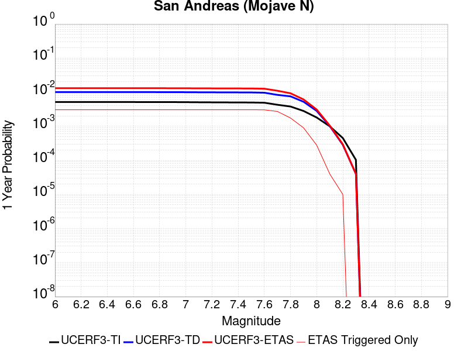 |  |

| Magnitude | 1 wk TI Prob | 1 wk TD Prob | 1 wk ETAS Prob | 1 wk ETAS/TD Gain | 1 wk ETAS Triggered Only | 1 mo TI Prob | 1 mo TD Prob | 1 mo ETAS Prob | 1 mo ETAS/TD Gain | 1 mo ETAS Triggered Only | 1 yr TI Prob | 1 yr TD Prob | 1 yr ETAS Prob | 1 yr ETAS/TD Gain | 1 yr ETAS Triggered Only | 10 yr TI Prob | 10 yr TD Prob | 10 yr ETAS Prob | 10 yr ETAS/TD Gain | 10 yr ETAS Triggered Only |
|-----|-----|-----|-----|-----|-----|-----|-----|-----|-----|-----|-----|-----|-----|-----|-----|-----|-----|-----|-----|-----|
| 6.0 | 9.877682E-5 | 1.9400702E-4 | 0.0019992122 | 10.304845 | 0.0018055555 | 4.2326056E-4 | 8.311939E-4 | 0.0029821822 | 3.5878298 | 0.0021527777 | 0.0051410277 | 0.010072956 | 0.0126852635 | 1.2593387 | 0.0026388888 | 0.05023708 | 0.09831428 | 0.10138251 | 1.0312084 | 0.0034027777 |
| 6.1 | 9.877682E-5 | 1.9400702E-4 | 0.0019992122 | 10.304845 | 0.0018055555 | 4.2326056E-4 | 8.311939E-4 | 0.0029821822 | 3.5878298 | 0.0021527777 | 0.0051410277 | 0.010072956 | 0.0126852635 | 1.2593387 | 0.0026388888 | 0.05023708 | 0.09831428 | 0.10138251 | 1.0312084 | 0.0034027777 |
| 6.2 | 9.877682E-5 | 1.9400702E-4 | 0.0019992122 | 10.304845 | 0.0018055555 | 4.2326056E-4 | 8.311939E-4 | 0.0029821822 | 3.5878298 | 0.0021527777 | 0.0051410277 | 0.010072956 | 0.0126852635 | 1.2593387 | 0.0026388888 | 0.05023708 | 0.09831428 | 0.10138251 | 1.0312084 | 0.0034027777 |
| 6.3 | 9.877682E-5 | 1.9400702E-4 | 0.0019992122 | 10.304845 | 0.0018055555 | 4.2326056E-4 | 8.311939E-4 | 0.0029821822 | 3.5878298 | 0.0021527777 | 0.0051410277 | 0.010072956 | 0.0126852635 | 1.2593387 | 0.0026388888 | 0.05023708 | 0.09831428 | 0.10138251 | 1.0312084 | 0.0034027777 |
| 6.4 | 9.877682E-5 | 1.9400702E-4 | 0.0019992122 | 10.304845 | 0.0018055555 | 4.2326056E-4 | 8.311939E-4 | 0.0029821822 | 3.5878298 | 0.0021527777 | 0.0051410277 | 0.010072956 | 0.0126852635 | 1.2593387 | 0.0026388888 | 0.05023708 | 0.09831428 | 0.10138251 | 1.0312084 | 0.0034027777 |
| 6.5 | 9.861474E-5 | 1.9374468E-4 | 0.0019989505 | 10.317447 | 0.0018055555 | 4.2256617E-4 | 8.300703E-4 | 0.002981061 | 3.5913358 | 0.0021527777 | 0.0051326132 | 0.010059402 | 0.012671746 | 1.2596917 | 0.0026388888 | 0.050156746 | 0.098192066 | 0.10126072 | 1.0312515 | 0.0034027777 |
| 6.6 | 9.861474E-5 | 1.9374468E-4 | 0.0019989505 | 10.317447 | 0.0018055555 | 4.2256617E-4 | 8.300703E-4 | 0.002981061 | 3.5913358 | 0.0021527777 | 0.0051326132 | 0.010059402 | 0.012671746 | 1.2596917 | 0.0026388888 | 0.050156746 | 0.098192066 | 0.10126072 | 1.0312515 | 0.0034027777 |
| 6.7 | 9.8552715E-5 | 1.9364421E-4 | 0.0019988501 | 10.322282 | 0.0018055555 | 4.223004E-4 | 8.2964E-4 | 0.0029806318 | 3.592681 | 0.0021527777 | 0.0051293927 | 0.010054212 | 0.012666569 | 1.2598271 | 0.0026388888 | 0.050125998 | 0.098145254 | 0.101214066 | 1.031268 | 0.0034027777 |
| 6.8 | 9.8464974E-5 | 1.9349584E-4 | 0.001998702 | 10.329432 | 0.0018055555 | 4.219245E-4 | 8.290045E-4 | 0.0029799975 | 3.5946698 | 0.0021527777 | 0.0051248376 | 0.010046546 | 0.012658924 | 1.2600274 | 0.0026388888 | 0.05008251 | 0.09807528 | 0.10114433 | 1.0312928 | 0.0034027777 |
| 6.9 | 9.825824E-5 | 1.9317595E-4 | 0.0019983826 | 10.344884 | 0.0018055555 | 4.2103877E-4 | 8.276344E-4 | 0.0029786304 | 3.598969 | 0.0021527777 | 0.0051141046 | 0.010030019 | 0.012642439 | 1.2604603 | 0.0026388888 | 0.049980022 | 0.09792438 | 0.100993946 | 1.0313462 | 0.0034027777 |
| 7.0 | 9.781462E-5 | 1.924896E-4 | 0.0019976976 | 10.37821 | 0.0018055555 | 4.1913814E-4 | 8.246948E-4 | 0.0029756972 | 3.6082406 | 0.0021527777 | 0.005091073 | 0.009994558 | 0.0126070725 | 1.2613937 | 0.0026388888 | 0.04976007 | 0.09760077 | 0.10067144 | 1.0314615 | 0.0034027777 |
| 7.1 | 9.7121134E-5 | 1.9150671E-4 | 0.0019967165 | 10.4263525 | 0.0018055555 | 4.1616702E-4 | 8.204851E-4 | 0.0029714967 | 3.6216338 | 0.0021527777 | 0.005055068 | 0.009943774 | 0.0125564225 | 1.2627422 | 0.0026388888 | 0.04941613 | 0.09713728 | 0.10020953 | 1.0316278 | 0.0034027777 |
| 7.2 | 9.663819E-5 | 1.9081456E-4 | 0.0019960257 | 10.460551 | 0.0018055555 | 4.1409794E-4 | 8.175206E-4 | 0.0029685386 | 3.631148 | 0.0021527777 | 0.0050299936 | 0.00990801 | 0.012520753 | 1.2637 | 0.0026388888 | 0.049176537 | 0.09681055 | 0.0998839 | 1.031746 | 0.0034027777 |
| 7.3 | 9.6277574E-5 | 1.9033969E-4 | 0.0019955516 | 10.4841585 | 0.0018055555 | 4.125529E-4 | 8.154867E-4 | 0.002966509 | 3.6377158 | 0.0021527777 | 0.0050112694 | 0.009883473 | 0.0124962805 | 1.2643613 | 0.0026388888 | 0.04899759 | 0.09658401 | 0.09965813 | 1.0318285 | 0.0034027777 |
| 7.4 | 9.593308E-5 | 1.897375E-4 | 0.0019949505 | 10.514265 | 0.0018055555 | 4.1107697E-4 | 8.129075E-4 | 0.0029639353 | 3.6460917 | 0.0021527777 | 0.0049933824 | 0.009852355 | 0.012465245 | 1.2652045 | 0.0026388888 | 0.04882661 | 0.09630218 | 0.09937727 | 1.0319316 | 0.0034027777 |
| 7.5 | 9.561707E-5 | 1.8919831E-4 | 0.0019944122 | 10.541385 | 0.0018055555 | 4.0972308E-4 | 8.1059814E-4 | 0.002961631 | 3.6536365 | 0.0021527777 | 0.0049769743 | 0.009824493 | 0.012437456 | 1.2659642 | 0.0026388888 | 0.048669744 | 0.09604836 | 0.09912431 | 1.032025 | 0.0034027777 |
| 7.6 | 9.418194E-5 | 1.8572104E-4 | 0.0019909414 | 10.720063 | 0.0018055555 | 4.0357444E-4 | 7.957047E-4 | 0.0029467696 | 3.7033455 | 0.0021527777 | 0.004902454 | 0.009644784 | 0.012258221 | 1.270969 | 0.0026388888 | 0.047957025 | 0.094430685 | 0.09751213 | 1.0326319 | 0.0034027777 |
| 7.7 | 8.202141E-5 | 1.6021315E-4 | 0.0018960461 | 11.834522 | 0.0017361111 | 3.51473E-4 | 6.8644714E-4 | 0.0027683503 | 4.0328674 | 0.0020833334 | 0.00427079 | 0.008325525 | 0.010804711 | 1.2977813 | 0.0025 | 0.04189639 | 0.08223219 | 0.08522768 | 1.0364273 | 0.0032638889 |
| 7.8 | 7.2859846E-5 | 1.4516473E-4 | 0.0011172458 | 7.6964006 | 9.7222225E-4 | 3.1221908E-4 | 6.219862E-4 | 0.0018712088 | 3.008441 | 0.00125 | 0.003794643 | 0.0075464295 | 0.009062679 | 1.2009226 | 0.0015277778 | 0.037304975 | 0.07472468 | 0.07665234 | 1.0257968 | 0.0020833334 |
| 7.9 | 5.3874453E-5 | 1.0045676E-4 | 3.0876917E-4 | 3.0736525 | 2.0833334E-4 | 2.3087008E-4 | 4.3045796E-4 | 8.469453E-4 | 1.9675447 | 4.1666668E-4 | 0.0028072202 | 0.0052282433 | 0.0058499756 | 1.1189181 | 6.25E-4 | 0.02772022 | 0.05242443 | 0.05347729 | 1.0200834 | 0.0011111111 |
| 8.0 | 3.468538E-5 | 5.4260272E-5 | 1.2370094E-4 | 2.2797701 | 6.9444446E-5 | 1.4864317E-4 | 2.325233E-4 | 3.713799E-4 | 1.5971729 | 1.3888889E-4 | 0.0018082283 | 0.002827298 | 0.0030350422 | 1.0734781 | 2.0833334E-4 | 0.017935853 | 0.028947512 | 0.029352117 | 1.0139772 | 4.1666668E-4 |
| 8.1 | 1.9152367E-5 | 1.940263E-5 | 1.940263E-5 | 1.0 | 0.0 | 8.207899E-5 | 8.3151484E-5 | 8.3151484E-5 | 1.0 | 0.0 | 9.988535E-4 | 0.0010118998 | 0.0010118998 | 1.0 | 0.0 | 0.009943757 | 0.01085625 | 0.01085625 | 1.0 | 0.0 |
| 8.2 | 8.643924E-6 | 5.4748625E-6 | 5.4748625E-6 | 1.0 | 0.0 | 3.704486E-5 | 2.3463486E-5 | 2.3463486E-5 | 1.0 | 0.0 | 4.5092785E-4 | 2.8563058E-4 | 2.8563058E-4 | 1.0 | 0.0 | 0.0045001395 | 0.0032487072 | 0.0032487072 | 1.0 | 0.0 |
| 8.3 | 1.983087E-6 | 7.6599065E-7 | 7.6599065E-7 | 1.0 | 0.0 | 8.498917E-6 | 3.282813E-6 | 3.282813E-6 | 1.0 | 0.0 | 1.034694E-4 | 3.9967534E-5 | 3.9967534E-5 | 1.0 | 0.0 | 0.0010342124 | 4.719687E-4 | 4.719687E-4 | 1.0 | 0.0 |

## Death Valley (So)
*[(top)](#table-of-contents)*

| 1 Week | 1 Month | 1 Year | 10 Year |
|-----|-----|-----|-----|
| 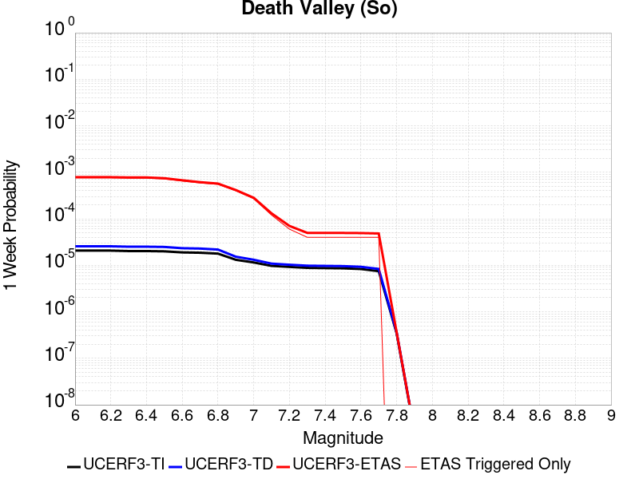 |  |  |  |

| Magnitude | 1 wk TI Prob | 1 wk TD Prob | 1 wk ETAS Prob | 1 wk ETAS/TD Gain | 1 wk ETAS Triggered Only | 1 mo TI Prob | 1 mo TD Prob | 1 mo ETAS Prob | 1 mo ETAS/TD Gain | 1 mo ETAS Triggered Only | 1 yr TI Prob | 1 yr TD Prob | 1 yr ETAS Prob | 1 yr ETAS/TD Gain | 1 yr ETAS Triggered Only | 10 yr TI Prob | 10 yr TD Prob | 10 yr ETAS Prob | 10 yr ETAS/TD Gain | 10 yr ETAS Triggered Only |
|-----|-----|-----|-----|-----|-----|-----|-----|-----|-----|-----|-----|-----|-----|-----|-----|-----|-----|-----|-----|-----|
| 6.0 | 2.0684236E-5 | 2.5617775E-5 | 6.5060175E-4 | 25.396496 | 6.25E-4 | 8.864371E-5 | 1.0978594E-4 | 0.0010124646 | 9.22217 | 9.0277777E-4 | 0.0010787029 | 0.0013358411 | 0.0031389848 | 2.349819 | 0.0018055555 | 0.010734817 | 0.013281397 | 0.016433414 | 1.2373258 | 0.0031944443 |
| 6.1 | 2.0684236E-5 | 2.5617775E-5 | 6.5060175E-4 | 25.396496 | 6.25E-4 | 8.864371E-5 | 1.0978594E-4 | 0.0010124646 | 9.22217 | 9.0277777E-4 | 0.0010787029 | 0.0013358411 | 0.0031389848 | 2.349819 | 0.0018055555 | 0.010734817 | 0.013281397 | 0.016433414 | 1.2373258 | 0.0031944443 |
| 6.2 | 2.0684236E-5 | 2.5617775E-5 | 6.5060175E-4 | 25.396496 | 6.25E-4 | 8.864371E-5 | 1.0978594E-4 | 0.0010124646 | 9.22217 | 9.0277777E-4 | 0.0010787029 | 0.0013358411 | 0.0031389848 | 2.349819 | 0.0018055555 | 0.010734817 | 0.013281397 | 0.016433414 | 1.2373258 | 0.0031944443 |
| 6.3 | 2.0240292E-5 | 2.511786E-5 | 6.5010216E-4 | 25.882067 | 6.25E-4 | 8.6741224E-5 | 1.07643624E-4 | 0.0010103242 | 9.385825 | 9.0277777E-4 | 0.0010555626 | 0.00130979 | 0.0031129806 | 2.376702 | 0.0018055555 | 0.010505628 | 0.013023956 | 0.016039716 | 1.2315549 | 0.0030555555 |
| 6.4 | 2.0240292E-5 | 2.511786E-5 | 6.5010216E-4 | 25.882067 | 6.25E-4 | 8.6741224E-5 | 1.07643624E-4 | 0.0010103242 | 9.385825 | 9.0277777E-4 | 0.0010555626 | 0.00130979 | 0.0031129806 | 2.376702 | 0.0018055555 | 0.010505628 | 0.013023956 | 0.016039716 | 1.2315549 | 0.0030555555 |
| 6.5 | 1.9962767E-5 | 2.4807114E-5 | 5.803489E-4 | 23.394455 | 5.5555557E-4 | 8.55519E-5 | 1.0631196E-4 | 9.395567E-4 | 8.837732 | 8.3333335E-4 | 0.0010410968 | 0.0012935963 | 0.0030274617 | 2.340345 | 0.0017361111 | 0.010362327 | 0.012863902 | 0.015674498 | 1.218487 | 0.0028472221 |
| 6.6 | 1.8937297E-5 | 2.3310964E-5 | 5.788536E-4 | 24.831816 | 5.5555557E-4 | 8.115732E-5 | 9.990039E-5 | 9.3315047E-4 | 9.340809 | 8.3333335E-4 | 9.876423E-4 | 0.0012156231 | 0.0028802638 | 2.3693724 | 0.0016666667 | 0.009832645 | 0.012092789 | 0.0146997655 | 1.2155812 | 0.0026388888 |
| 6.7 | 1.8621096E-5 | 2.2911607E-5 | 5.0901156E-4 | 22.21632 | 4.8611112E-4 | 7.980225E-5 | 9.818898E-5 | 8.620029E-4 | 8.779018 | 7.638889E-4 | 9.711593E-4 | 0.0011948098 | 0.0027207623 | 2.2771509 | 0.0015277778 | 0.009669261 | 0.011886904 | 0.014357187 | 1.2078155 | 0.0025 |
| 6.8 | 1.7830353E-5 | 2.1805688E-5 | 5.079062E-4 | 23.292372 | 4.8611112E-4 | 7.641356E-5 | 9.344968E-5 | 7.878292E-4 | 8.430518 | 6.9444446E-4 | 9.29938E-4 | 0.00113717 | 0.002593845 | 2.2809649 | 0.0014583333 | 0.009260561 | 0.011316354 | 0.013719405 | 1.212352 | 0.0024305556 |
| 6.9 | 1.3135183E-5 | 1.5303925E-5 | 2.9307746E-4 | 19.150476 | 2.7777778E-4 | 5.6292425E-5 | 6.558664E-5 | 5.5166584E-4 | 8.411254 | 4.8611112E-4 | 6.8514474E-4 | 7.982312E-4 | 0.0018390664 | 2.303927 | 0.0010416667 | 0.006830362 | 0.007954649 | 0.0095391655 | 1.1991938 | 0.0015972222 |
| 7.0 | 1.1507512E-5 | 1.3154199E-5 | 1.5204126E-4 | 11.558382 | 1.3888889E-4 | 4.9316975E-5 | 5.6373956E-5 | 3.3413607E-4 | 5.9271355 | 2.7777778E-4 | 6.002687E-4 | 6.8614254E-4 | 0.0013801105 | 2.011405 | 6.9444446E-4 | 0.0059864987 | 0.0068409415 | 0.007875483 | 1.1512278 | 0.0010416667 |
| 7.1 | 9.715903E-6 | 1.0865278E-5 | 1.0865278E-5 | 1.0 | 0.0 | 4.1638916E-5 | 4.656467E-5 | 1.1600588E-4 | 2.4912853 | 6.9444446E-5 | 5.068359E-4 | 5.667817E-4 | 8.44402E-4 | 1.4898188 | 2.7777778E-4 | 0.0050568148 | 0.0056538144 | 0.0062062293 | 1.0977066 | 5.5555557E-4 |
| 7.2 | 9.233269E-6 | 1.02863105E-5 | 1.02863105E-5 | 1.0 | 0.0 | 3.9570554E-5 | 4.4083466E-5 | 1.13524846E-4 | 2.575225 | 6.9444446E-5 | 4.81665E-4 | 5.3658825E-4 | 8.1421697E-4 | 1.5173962 | 2.7777778E-4 | 0.0048062233 | 0.0053533576 | 0.0058368663 | 1.0903188 | 4.8611112E-4 |
| 7.3 | 8.8041315E-6 | 9.808164E-6 | 9.808164E-6 | 1.0 | 0.0 | 3.7731446E-5 | 4.2034335E-5 | 1.1147586E-4 | 2.652019 | 6.9444446E-5 | 4.592835E-4 | 5.1165203E-4 | 6.5046985E-4 | 1.271313 | 1.3888889E-4 | 0.0045833546 | 0.005105167 | 0.005381527 | 1.0541333 | 2.7777778E-4 |
| 7.4 | 8.708749E-6 | 9.707175E-6 | 9.707175E-6 | 1.0 | 0.0 | 3.7322676E-5 | 4.160154E-5 | 1.110431E-4 | 2.6692064 | 6.9444446E-5 | 4.5430884E-4 | 5.0638523E-4 | 6.452038E-4 | 1.2741363 | 1.3888889E-4 | 0.004533812 | 0.0050527398 | 0.005329114 | 1.0546979 | 2.7777778E-4 |
| 7.5 | 8.612678E-6 | 9.604817E-6 | 9.604817E-6 | 1.0 | 0.0 | 3.6910955E-5 | 4.1162875E-5 | 1.10604466E-4 | 2.6869955 | 6.9444446E-5 | 4.492982E-4 | 5.01047E-4 | 6.398663E-4 | 1.2770585 | 1.3888889E-4 | 0.004483909 | 0.0049995985 | 0.0052759876 | 1.0552822 | 2.7777778E-4 |
| 7.6 | 8.319024E-6 | 9.283916E-6 | 9.283916E-6 | 1.0 | 0.0 | 3.5652476E-5 | 3.978763E-5 | 1.0922931E-4 | 2.7453084 | 6.9444446E-5 | 4.3398244E-4 | 4.8431093E-4 | 6.2313257E-4 | 1.2866374 | 1.3888889E-4 | 0.0043313587 | 0.0048329784 | 0.0051094135 | 1.0571977 | 2.7777778E-4 |
| 7.7 | 7.4718328E-6 | 8.34517E-6 | 8.34517E-6 | 1.0 | 0.0 | 3.2021748E-5 | 3.5764548E-5 | 1.05206505E-4 | 2.9416425 | 6.9444446E-5 | 3.8979502E-4 | 4.353504E-4 | 5.741788E-4 | 1.3188889 | 1.3888889E-4 | 0.00389112 | 0.0043453807 | 0.0046219514 | 1.063647 | 2.7777778E-4 |
| 7.8 | 3.4586725E-7 | 3.6482615E-7 | 3.6482615E-7 | 1.0 | 0.0 | 1.4822873E-6 | 1.5635396E-6 | 1.5635396E-6 | 1.0 | 0.0 | 1.80467E-5 | 1.9035933E-5 | 1.9035933E-5 | 1.0 | 0.0 | 1.8045233E-4 | 1.9034347E-4 | 1.9034347E-4 | 1.0 | 0.0 |
| 7.9 | 2.5591178E-9 | 2.6696718E-9 | 2.6696718E-9 | 1.0 | 0.0 | 1.0967647E-8 | 1.14414505E-8 | 1.14414505E-8 | 1.0 | 0.0 | 1.335311E-7 | 1.3929966E-7 | 1.3929966E-7 | 1.0 | 0.0 | 1.3353102E-6 | 1.3929966E-6 | 1.3929966E-6 | 1.0 | 0.0 |

## Nelson Lake
*[(top)](#table-of-contents)*

| 1 Week | 1 Month | 1 Year | 10 Year |
|-----|-----|-----|-----|
|  |  |  |  |

| Magnitude | 1 wk TI Prob | 1 wk TD Prob | 1 wk ETAS Prob | 1 wk ETAS/TD Gain | 1 wk ETAS Triggered Only | 1 mo TI Prob | 1 mo TD Prob | 1 mo ETAS Prob | 1 mo ETAS/TD Gain | 1 mo ETAS Triggered Only | 1 yr TI Prob | 1 yr TD Prob | 1 yr ETAS Prob | 1 yr ETAS/TD Gain | 1 yr ETAS Triggered Only | 10 yr TI Prob | 10 yr TD Prob | 10 yr ETAS Prob | 10 yr ETAS/TD Gain | 10 yr ETAS Triggered Only |
|-----|-----|-----|-----|-----|-----|-----|-----|-----|-----|-----|-----|-----|-----|-----|-----|-----|-----|-----|-----|-----|
| 6.0 | 9.913453E-6 | 1.0192255E-5 | 3.5741093E-4 | 35.066914 | 3.4722223E-4 | 4.2485535E-5 | 4.3680422E-5 | 8.0753595E-4 | 18.487366 | 7.638889E-4 | 5.1713863E-4 | 5.316897E-4 | 0.0019198401 | 3.6108282 | 0.0013888889 | 0.0051593683 | 0.005305204 | 0.007791941 | 1.4687355 | 0.0025 |
| 6.1 | 9.913453E-6 | 1.0192255E-5 | 3.5741093E-4 | 35.066914 | 3.4722223E-4 | 4.2485535E-5 | 4.3680422E-5 | 8.0753595E-4 | 18.487366 | 7.638889E-4 | 5.1713863E-4 | 5.316897E-4 | 0.0019198401 | 3.6108282 | 0.0013888889 | 0.0051593683 | 0.005305204 | 0.007791941 | 1.4687355 | 0.0025 |
| 6.2 | 4.5596407E-6 | 4.696313E-6 | 4.696313E-6 | 1.0 | 0.0 | 1.954117E-5 | 2.0126909E-5 | 4.367852E-4 | 21.701555 | 4.1666668E-4 | 2.3788778E-4 | 2.4501883E-4 | 8.698657E-4 | 3.5501995 | 6.25E-4 | 0.0023763329 | 0.0024476128 | 0.0036945534 | 1.5094516 | 0.00125 |
| 6.3 | 4.5596407E-6 | 4.696313E-6 | 4.696313E-6 | 1.0 | 0.0 | 1.954117E-5 | 2.0126909E-5 | 4.367852E-4 | 21.701555 | 4.1666668E-4 | 2.3788778E-4 | 2.4501883E-4 | 8.698657E-4 | 3.5501995 | 6.25E-4 | 0.0023763329 | 0.0024476128 | 0.0036945534 | 1.5094516 | 0.00125 |
| 6.4 | 3.4025713E-6 | 3.5098972E-6 | 3.5098972E-6 | 1.0 | 0.0 | 1.4582367E-5 | 1.5042335E-5 | 3.6225934E-4 | 24.082653 | 3.4722223E-4 | 1.7752586E-4 | 1.8312587E-4 | 7.385797E-4 | 4.03318 | 5.5555557E-4 | 0.001773841 | 0.0018298327 | 0.0028002758 | 1.5303453 | 9.7222225E-4 |
| 6.5 | 2.8352947E-6 | 2.927856E-6 | 2.927856E-6 | 1.0 | 0.0 | 1.2151207E-5 | 1.2547898E-5 | 2.2087862E-4 | 17.602837 | 2.0833334E-4 | 1.479309E-4 | 1.5276071E-4 | 5.693637E-4 | 3.727161 | 4.1666668E-4 | 0.0014783246 | 0.0015266308 | 0.002358692 | 1.545031 | 8.3333335E-4 |
| 6.6 | 2.251518E-6 | 2.3290677E-6 | 2.3290677E-6 | 1.0 | 0.0 | 9.649328E-6 | 9.981683E-6 | 1.4886919E-4 | 14.914236 | 1.3888889E-4 | 1.1747423E-4 | 1.2152085E-4 | 4.6870086E-4 | 3.8569586 | 3.4722223E-4 | 0.0011741214 | 0.0012146058 | 0.0018388466 | 1.5139452 | 6.25E-4 |
| 6.7 | 1.8911853E-6 | 1.9591396E-6 | 1.9591396E-6 | 1.0 | 0.0 | 8.105055E-6 | 8.39629E-6 | 7.784015E-5 | 9.270781 | 6.9444446E-5 | 9.867457E-5 | 1.0222061E-4 | 3.7997E-4 | 3.7171564 | 2.7777778E-4 | 9.863076E-4 | 0.0010217935 | 0.0015767813 | 1.5431508 | 5.5555557E-4 |
| 6.8 | 1.4874814E-6 | 1.5438305E-6 | 1.5438305E-6 | 1.0 | 0.0 | 6.374905E-6 | 6.6164025E-6 | 7.606039E-5 | 11.495731 | 6.9444446E-5 | 7.76117E-5 | 8.055224E-5 | 3.5830765E-4 | 4.4481397 | 2.7777778E-4 | 7.75846E-4 | 8.0528157E-4 | 0.0012910012 | 1.6031675 | 4.8611112E-4 |
| 6.9 | 6.835972E-7 | 7.1399285E-7 | 7.1399285E-7 | 1.0 | 0.0 | 2.9296991E-6 | 3.0599674E-6 | 3.0599674E-6 | 1.0 | 0.0 | 3.56685E-5 | 3.7254784E-5 | 1.0669664E-4 | 2.8639715 | 6.9444446E-5 | 3.5662777E-4 | 3.7251666E-4 | 5.807724E-4 | 1.5590508 | 2.0833334E-4 |

## Towne Pass
*[(top)](#table-of-contents)*

| 1 Week | 1 Month | 1 Year | 10 Year |
|-----|-----|-----|-----|
|  |  | 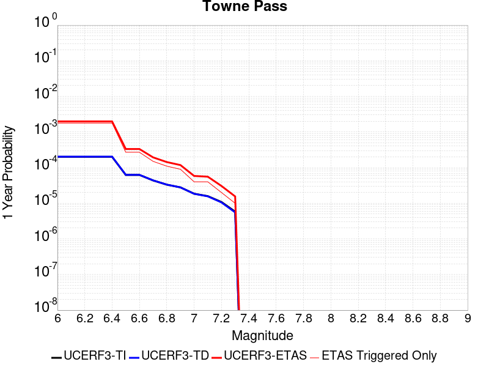 |  |

| Magnitude | 1 wk TI Prob | 1 wk TD Prob | 1 wk ETAS Prob | 1 wk ETAS/TD Gain | 1 wk ETAS Triggered Only | 1 mo TI Prob | 1 mo TD Prob | 1 mo ETAS Prob | 1 mo ETAS/TD Gain | 1 mo ETAS Triggered Only | 1 yr TI Prob | 1 yr TD Prob | 1 yr ETAS Prob | 1 yr ETAS/TD Gain | 1 yr ETAS Triggered Only | 10 yr TI Prob | 10 yr TD Prob | 10 yr ETAS Prob | 10 yr ETAS/TD Gain | 10 yr ETAS Triggered Only |
|-----|-----|-----|-----|-----|-----|-----|-----|-----|-----|-----|-----|-----|-----|-----|-----|-----|-----|-----|-----|-----|
| 6.0 | 3.849728E-6 | 3.8945414E-6 | 3.5111542E-4 | 90.15578 | 3.4722223E-4 | 1.649873E-5 | 1.669081E-5 | 7.8056694E-4 | 46.766273 | 7.638889E-4 | 2.0085352E-4 | 2.0319603E-4 | 0.0015918027 | 7.833828 | 0.0013888889 | 0.0020067208 | 0.0020305314 | 0.004178938 | 2.0580513 | 0.0021527777 |
| 6.1 | 3.849728E-6 | 3.8945414E-6 | 3.5111542E-4 | 90.15578 | 3.4722223E-4 | 1.649873E-5 | 1.669081E-5 | 7.8056694E-4 | 46.766273 | 7.638889E-4 | 2.0085352E-4 | 2.0319603E-4 | 0.0015918027 | 7.833828 | 0.0013888889 | 0.0020067208 | 0.0020305314 | 0.004178938 | 2.0580513 | 0.0021527777 |
| 6.2 | 3.849728E-6 | 3.8945414E-6 | 3.5111542E-4 | 90.15578 | 3.4722223E-4 | 1.649873E-5 | 1.669081E-5 | 7.8056694E-4 | 46.766273 | 7.638889E-4 | 2.0085352E-4 | 2.0319603E-4 | 0.0015918027 | 7.833828 | 0.0013888889 | 0.0020067208 | 0.0020305314 | 0.004178938 | 2.0580513 | 0.0021527777 |
| 6.3 | 3.849728E-6 | 3.8945414E-6 | 3.5111542E-4 | 90.15578 | 3.4722223E-4 | 1.649873E-5 | 1.669081E-5 | 7.8056694E-4 | 46.766273 | 7.638889E-4 | 2.0085352E-4 | 2.0319603E-4 | 0.0015918027 | 7.833828 | 0.0013888889 | 0.0020067208 | 0.0020305314 | 0.004178938 | 2.0580513 | 0.0021527777 |
| 6.4 | 3.849728E-6 | 3.8945414E-6 | 3.5111542E-4 | 90.15578 | 3.4722223E-4 | 1.649873E-5 | 1.669081E-5 | 7.8056694E-4 | 46.766273 | 7.638889E-4 | 2.0085352E-4 | 2.0319603E-4 | 0.0015918027 | 7.833828 | 0.0013888889 | 0.0020067208 | 0.0020305314 | 0.004178938 | 2.0580513 | 0.0021527777 |
| 6.5 | 1.1953545E-6 | 1.203052E-6 | 7.064741E-5 | 58.723488 | 6.9444446E-5 | 5.1229376E-6 | 5.1559277E-6 | 1.440441E-4 | 27.937572 | 1.3888889E-4 | 6.236998E-5 | 6.277173E-5 | 2.71092E-4 | 4.3186955 | 2.0833334E-4 | 6.235248E-4 | 6.275517E-4 | 0.001043957 | 1.6635393 | 4.1666668E-4 |
| 6.6 | 1.1953545E-6 | 1.203052E-6 | 7.064741E-5 | 58.723488 | 6.9444446E-5 | 5.1229376E-6 | 5.1559277E-6 | 1.440441E-4 | 27.937572 | 1.3888889E-4 | 6.236998E-5 | 6.277173E-5 | 2.71092E-4 | 4.3186955 | 2.0833334E-4 | 6.235248E-4 | 6.275517E-4 | 0.001043957 | 1.6635393 | 4.1666668E-4 |
| 6.7 | 8.375951E-7 | 8.4106705E-7 | 8.4106705E-7 | 1.0 | 0.0 | 3.5896885E-6 | 3.6045683E-6 | 3.6045683E-6 | 1.0 | 0.0 | 4.370358E-5 | 4.3884793E-5 | 4.3884793E-5 | 1.0 | 0.0 | 4.3694986E-4 | 4.38767E-4 | 5.7759497E-4 | 1.3164047 | 1.3888889E-4 |
| 6.8 | 6.38041E-7 | 6.392156E-7 | 6.392156E-7 | 1.0 | 0.0 | 2.7344586E-6 | 2.7394929E-6 | 2.7394929E-6 | 1.0 | 0.0 | 3.3291526E-5 | 3.3352855E-5 | 3.3352855E-5 | 1.0 | 0.0 | 3.3286537E-4 | 3.334823E-4 | 4.029036E-4 | 1.2081708 | 6.9444446E-5 |
| 6.9 | 5.3460053E-7 | 5.345333E-7 | 5.345333E-7 | 1.0 | 0.0 | 2.2911431E-6 | 2.2908553E-6 | 2.2908553E-6 | 1.0 | 0.0 | 2.789431E-5 | 2.789084E-5 | 2.789084E-5 | 1.0 | 0.0 | 2.789081E-4 | 2.7887672E-4 | 2.7887672E-4 | 1.0 | 0.0 |
| 7.0 | 3.557783E-7 | 3.5324226E-7 | 3.5324226E-7 | 1.0 | 0.0 | 1.5247632E-6 | 1.5138945E-6 | 1.5138945E-6 | 1.0 | 0.0 | 1.8563835E-5 | 1.843152E-5 | 1.843152E-5 | 1.0 | 0.0 | 1.8562283E-4 | 1.8430075E-4 | 1.8430075E-4 | 1.0 | 0.0 |
| 7.1 | 3.037942E-7 | 3.0002218E-7 | 3.0002218E-7 | 1.0 | 0.0 | 1.3019744E-6 | 1.2858087E-6 | 1.2858087E-6 | 1.0 | 0.0 | 1.5851423E-5 | 1.5654618E-5 | 1.5654618E-5 | 1.0 | 0.0 | 1.5850292E-4 | 1.5653588E-4 | 1.5653588E-4 | 1.0 | 0.0 |
| 7.2 | 2.0808248E-7 | 2.0217689E-7 | 2.0217689E-7 | 1.0 | 0.0 | 8.917818E-7 | 8.6647213E-7 | 8.6647213E-7 | 1.0 | 0.0 | 1.0857389E-5 | 1.0549252E-5 | 1.0549252E-5 | 1.0 | 0.0 | 1.0856859E-4 | 1.0548797E-4 | 1.0548797E-4 | 1.0 | 0.0 |
| 7.3 | 1.1162073E-7 | 1.0636894E-7 | 1.0636894E-7 | 1.0 | 0.0 | 4.7837443E-7 | 4.558668E-7 | 4.558668E-7 | 1.0 | 0.0 | 5.8241935E-6 | 5.550166E-6 | 5.550166E-6 | 1.0 | 0.0 | 5.8240406E-5 | 5.5500474E-5 | 5.5500474E-5 | 1.0 | 0.0 |

## Paradise
*[(top)](#table-of-contents)*

| 1 Week | 1 Month | 1 Year | 10 Year |
|-----|-----|-----|-----|
| 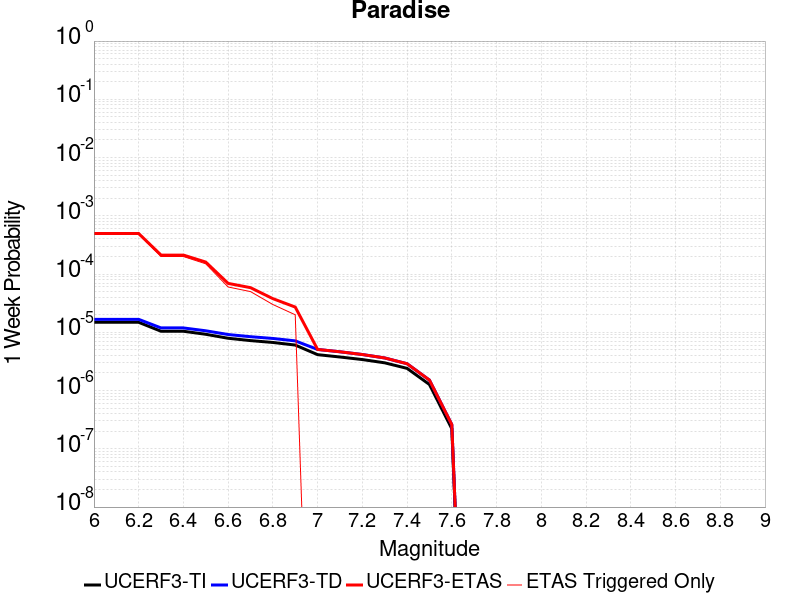 |  |  |  |

| Magnitude | 1 wk TI Prob | 1 wk TD Prob | 1 wk ETAS Prob | 1 wk ETAS/TD Gain | 1 wk ETAS Triggered Only | 1 mo TI Prob | 1 mo TD Prob | 1 mo ETAS Prob | 1 mo ETAS/TD Gain | 1 mo ETAS Triggered Only | 1 yr TI Prob | 1 yr TD Prob | 1 yr ETAS Prob | 1 yr ETAS/TD Gain | 1 yr ETAS Triggered Only | 10 yr TI Prob | 10 yr TD Prob | 10 yr ETAS Prob | 10 yr ETAS/TD Gain | 10 yr ETAS Triggered Only |
|-----|-----|-----|-----|-----|-----|-----|-----|-----|-----|-----|-----|-----|-----|-----|-----|-----|-----|-----|-----|-----|
| 6.0 | 1.4851273E-5 | 1.6694692E-5 | 4.333544E-4 | 25.957617 | 4.1666668E-4 | 6.364676E-5 | 7.154685E-5 | 5.5762316E-4 | 7.793819 | 4.8611112E-4 | 7.7462377E-4 | 8.707584E-4 | 0.00177275 | 2.0358691 | 9.0277777E-4 | 0.0077192914 | 0.008675844 | 0.010465736 | 1.2063074 | 0.0018055555 |
| 6.1 | 1.4851273E-5 | 1.6694692E-5 | 4.333544E-4 | 25.957617 | 4.1666668E-4 | 6.364676E-5 | 7.154685E-5 | 5.5762316E-4 | 7.793819 | 4.8611112E-4 | 7.7462377E-4 | 8.707584E-4 | 0.00177275 | 2.0358691 | 9.0277777E-4 | 0.0077192914 | 0.008675844 | 0.010465736 | 1.2063074 | 0.0018055555 |
| 6.2 | 1.4851273E-5 | 1.6694692E-5 | 4.333544E-4 | 25.957617 | 4.1666668E-4 | 6.364676E-5 | 7.154685E-5 | 5.5762316E-4 | 7.793819 | 4.8611112E-4 | 7.7462377E-4 | 8.707584E-4 | 0.00177275 | 2.0358691 | 9.0277777E-4 | 0.0077192914 | 0.008675844 | 0.010465736 | 1.2063074 | 0.0018055555 |
| 6.3 | 1.0426831E-5 | 1.188862E-5 | 1.188862E-5 | 1.0 | 0.0 | 4.4685654E-5 | 5.0950268E-5 | 1.20391174E-4 | 2.3629155 | 6.9444446E-5 | 5.43912E-4 | 6.201489E-4 | 8.977544E-4 | 1.4476433 | 2.7777778E-4 | 0.0054258266 | 0.0061847917 | 0.006805926 | 1.1004293 | 6.25E-4 |
| 6.4 | 1.0426831E-5 | 1.188862E-5 | 1.188862E-5 | 1.0 | 0.0 | 4.4685654E-5 | 5.0950268E-5 | 1.20391174E-4 | 2.3629155 | 6.9444446E-5 | 5.43912E-4 | 6.201489E-4 | 8.977544E-4 | 1.4476433 | 2.7777778E-4 | 0.0054258266 | 0.0061847917 | 0.006805926 | 1.1004293 | 6.25E-4 |
| 6.5 | 9.25027E-6 | 1.06199595E-5 | 1.06199595E-5 | 1.0 | 0.0 | 3.964341E-5 | 4.551335E-5 | 4.551335E-5 | 1.0 | 0.0 | 4.8255164E-4 | 5.53989E-4 | 7.622069E-4 | 1.3758521 | 2.0833334E-4 | 0.0048150513 | 0.0055265795 | 0.0060790647 | 1.0999688 | 5.5555557E-4 |
| 6.6 | 7.904275E-6 | 9.159525E-6 | 9.159525E-6 | 1.0 | 0.0 | 3.3875025E-5 | 3.9254537E-5 | 3.9254537E-5 | 1.0 | 0.0 | 4.1235037E-4 | 4.7782314E-4 | 6.860569E-4 | 1.4357967 | 2.0833334E-4 | 0.0041158604 | 0.0047683544 | 0.005183034 | 1.086965 | 4.1666668E-4 |
| 6.7 | 7.2061953E-6 | 8.407248E-6 | 8.407248E-6 | 1.0 | 0.0 | 3.088333E-5 | 3.6030586E-5 | 3.6030586E-5 | 1.0 | 0.0 | 3.7593965E-4 | 4.3858777E-4 | 6.468297E-4 | 1.4748011 | 2.0833334E-4 | 0.003753043 | 0.004377591 | 0.0047924337 | 1.0947651 | 4.1666668E-4 |
| 6.8 | 6.6948724E-6 | 7.842166E-6 | 7.842166E-6 | 1.0 | 0.0 | 2.8691995E-5 | 3.360887E-5 | 3.360887E-5 | 1.0 | 0.0 | 3.4926904E-4 | 4.0911473E-4 | 5.479468E-4 | 1.3393475 | 1.3888889E-4 | 0.003487206 | 0.0040839734 | 0.004429777 | 1.0846735 | 3.4722223E-4 |
| 6.9 | 6.0421025E-6 | 7.130621E-6 | 7.130621E-6 | 1.0 | 0.0 | 2.5894467E-5 | 3.0559466E-5 | 3.0559466E-5 | 1.0 | 0.0 | 3.1521954E-4 | 3.7200135E-4 | 5.108386E-4 | 1.373217 | 1.3888889E-4 | 0.0031477278 | 0.0037141247 | 0.003990871 | 1.0745118 | 2.7777778E-4 |
| 7.0 | 4.134091E-6 | 5.0803087E-6 | 5.0803087E-6 | 1.0 | 0.0 | 1.7717413E-5 | 2.177258E-5 | 2.177258E-5 | 1.0 | 0.0 | 2.1568815E-4 | 2.6505045E-4 | 3.344765E-4 | 1.2619352 | 6.9444446E-5 | 0.0021547892 | 0.0026474963 | 0.002855278 | 1.0784824 | 2.0833334E-4 |
| 7.1 | 3.7674888E-6 | 4.6318696E-6 | 4.6318696E-6 | 1.0 | 0.0 | 1.6146281E-5 | 1.9850726E-5 | 1.9850726E-5 | 1.0 | 0.0 | 1.9656324E-4 | 2.4165731E-4 | 3.1108496E-4 | 1.287298 | 6.9444446E-5 | 0.0019638946 | 0.002414096 | 0.0026219264 | 1.0860903 | 2.0833334E-4 |
| 7.2 | 3.4065345E-6 | 4.156723E-6 | 4.156723E-6 | 1.0 | 0.0 | 1.4599351E-5 | 1.7814415E-5 | 1.7814415E-5 | 1.0 | 0.0 | 1.777326E-4 | 2.1687041E-4 | 2.862998E-4 | 1.3201423 | 6.9444446E-5 | 0.0017759053 | 0.002166736 | 0.0023746178 | 1.0959425 | 2.0833334E-4 |
| 7.3 | 2.9934936E-6 | 3.6293168E-6 | 3.6293168E-6 | 1.0 | 0.0 | 1.2829195E-5 | 1.555413E-5 | 1.555413E-5 | 1.0 | 0.0 | 1.5618425E-4 | 1.8935655E-4 | 2.5878786E-4 | 1.3666697 | 6.9444446E-5 | 0.0015607453 | 0.0018920974 | 0.0021000365 | 1.1098988 | 2.0833334E-4 |
| 7.4 | 2.4049796E-6 | 2.8889842E-6 | 2.8889842E-6 | 1.0 | 0.0 | 1.0307015E-5 | 1.238131E-5 | 1.238131E-5 | 1.0 | 0.0 | 1.2548068E-4 | 1.5073347E-4 | 2.2016744E-4 | 1.4606408 | 6.9444446E-5 | 0.0012540985 | 0.0015064536 | 0.0016451334 | 1.092057 | 1.3888889E-4 |
| 7.5 | 1.2710091E-6 | 1.5134682E-6 | 1.5134682E-6 | 1.0 | 0.0 | 5.44717E-6 | 6.4862834E-6 | 6.4862834E-6 | 1.0 | 0.0 | 6.631728E-5 | 7.8968886E-5 | 1.4840785E-4 | 1.8793205 | 6.9444446E-5 | 6.6297496E-4 | 7.8953087E-4 | 9.283101E-4 | 1.1757743 | 1.3888889E-4 |
| 7.6 | 2.21172E-7 | 2.603961E-7 | 2.603961E-7 | 1.0 | 0.0 | 9.478797E-7 | 1.1159829E-6 | 1.1159829E-6 | 1.0 | 0.0 | 1.1540374E-5 | 1.3587036E-5 | 1.3587036E-5 | 1.0 | 0.0 | 1.1539775E-4 | 1.3586486E-4 | 2.0529988E-4 | 1.5110594 | 6.9444446E-5 |

## San Andreas (San Bernardino N)
*[(top)](#table-of-contents)*

| 1 Week | 1 Month | 1 Year | 10 Year |
|-----|-----|-----|-----|
| 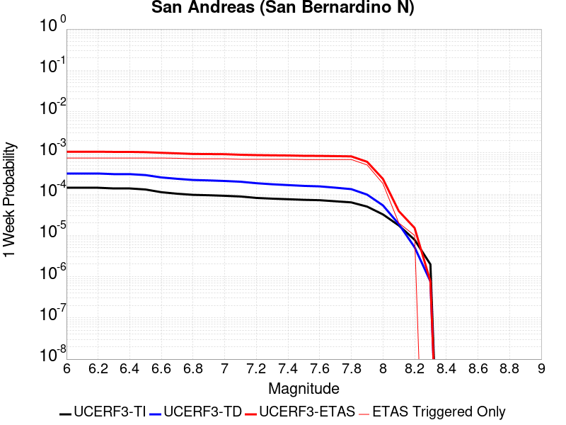 | 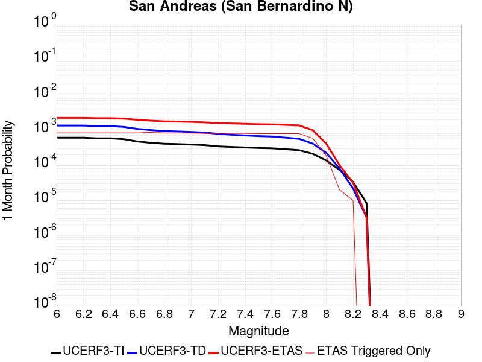 |  |  |

| Magnitude | 1 wk TI Prob | 1 wk TD Prob | 1 wk ETAS Prob | 1 wk ETAS/TD Gain | 1 wk ETAS Triggered Only | 1 mo TI Prob | 1 mo TD Prob | 1 mo ETAS Prob | 1 mo ETAS/TD Gain | 1 mo ETAS Triggered Only | 1 yr TI Prob | 1 yr TD Prob | 1 yr ETAS Prob | 1 yr ETAS/TD Gain | 1 yr ETAS Triggered Only | 10 yr TI Prob | 10 yr TD Prob | 10 yr ETAS Prob | 10 yr ETAS/TD Gain | 10 yr ETAS Triggered Only |
|-----|-----|-----|-----|-----|-----|-----|-----|-----|-----|-----|-----|-----|-----|-----|-----|-----|-----|-----|-----|-----|
| 6.0 | 1.4273766E-4 | 3.1606483E-4 | 8.020223E-4 | 2.5375247 | 4.8611112E-4 | 6.115894E-4 | 0.0013538664 | 0.0020473707 | 1.5122398 | 6.9444446E-4 | 0.0074207084 | 0.016360244 | 0.01724825 | 1.0542784 | 9.0277777E-4 | 0.07177748 | 0.15026689 | 0.15150608 | 1.0082467 | 0.0014583333 |
| 6.1 | 1.4273766E-4 | 3.1606483E-4 | 8.020223E-4 | 2.5375247 | 4.8611112E-4 | 6.115894E-4 | 0.0013538664 | 0.0020473707 | 1.5122398 | 6.9444446E-4 | 0.0074207084 | 0.016360244 | 0.01724825 | 1.0542784 | 9.0277777E-4 | 0.07177748 | 0.15026689 | 0.15150608 | 1.0082467 | 0.0014583333 |
| 6.2 | 1.4273766E-4 | 3.1606483E-4 | 8.020223E-4 | 2.5375247 | 4.8611112E-4 | 6.115894E-4 | 0.0013538664 | 0.0020473707 | 1.5122398 | 6.9444446E-4 | 0.0074207084 | 0.016360244 | 0.01724825 | 1.0542784 | 9.0277777E-4 | 0.07177748 | 0.15026689 | 0.15150608 | 1.0082467 | 0.0014583333 |
| 6.3 | 1.3730655E-4 | 3.0511338E-4 | 7.9107616E-4 | 2.5927286 | 4.8611112E-4 | 5.883239E-4 | 0.0013069791 | 0.002000516 | 1.5306411 | 6.9444446E-4 | 0.0071393442 | 0.015797773 | 0.016686289 | 1.0562431 | 9.0277777E-4 | 0.06914291 | 0.14556676 | 0.14681281 | 1.00856 | 0.0014583333 |
| 6.4 | 1.3730655E-4 | 3.0511338E-4 | 7.9107616E-4 | 2.5927286 | 4.8611112E-4 | 5.883239E-4 | 0.0013069791 | 0.002000516 | 1.5306411 | 6.9444446E-4 | 0.0071393442 | 0.015797773 | 0.016686289 | 1.0562431 | 9.0277777E-4 | 0.06914291 | 0.14556676 | 0.14681281 | 1.00856 | 0.0014583333 |
| 6.5 | 1.2942807E-4 | 2.8925808E-4 | 7.7522855E-4 | 2.6800585 | 4.8611112E-4 | 5.545738E-4 | 0.0012390936 | 0.0019326776 | 1.559751 | 6.9444446E-4 | 0.0067310524 | 0.01498286 | 0.015872112 | 1.0593512 | 9.0277777E-4 | 0.06530788 | 0.13870941 | 0.13990566 | 1.0086241 | 0.0013888889 |
| 6.6 | 1.1125901E-4 | 2.536472E-4 | 7.39635E-4 | 2.9159992 | 4.8611112E-4 | 4.767372E-4 | 0.0010866089 | 0.0017802987 | 1.6383989 | 6.9444446E-4 | 0.005788839 | 0.013149847 | 0.014040753 | 1.0677503 | 9.0277777E-4 | 0.056403454 | 0.122999296 | 0.12421735 | 1.009903 | 0.0013888889 |
| 6.7 | 1.02209575E-4 | 2.3499702E-4 | 7.209939E-4 | 3.068098 | 4.8611112E-4 | 4.3796748E-4 | 0.0010067427 | 0.001700488 | 1.689099 | 6.9444446E-4 | 0.0053192247 | 0.012188629 | 0.013080404 | 1.0731645 | 9.0277777E-4 | 0.051936906 | 0.114790924 | 0.11602038 | 1.0107104 | 0.0013888889 |
| 6.8 | 9.610582E-5 | 2.2025521E-4 | 6.368301E-4 | 2.8913283 | 4.1666668E-4 | 4.1181705E-4 | 9.436101E-4 | 0.0015680203 | 1.6617248 | 6.25E-4 | 0.0050023515 | 0.011428202 | 0.012252011 | 1.0720857 | 8.3333335E-4 | 0.048912346 | 0.1081929 | 0.10936959 | 1.0108758 | 0.0013194444 |
| 6.9 | 9.3877505E-5 | 2.1481077E-4 | 6.313879E-4 | 2.939275 | 4.1666668E-4 | 4.0227012E-4 | 9.2029345E-4 | 0.0015447183 | 1.6785063 | 6.25E-4 | 0.0048866454 | 0.011147255 | 0.0119713 | 1.0739235 | 8.3333335E-4 | 0.04780577 | 0.10578323 | 0.1069631 | 1.0111537 | 0.0013194444 |
| 7.0 | 9.1019785E-5 | 2.0808022E-4 | 6.2466017E-4 | 3.002016 | 4.1666668E-4 | 3.900265E-4 | 8.914682E-4 | 0.0015159111 | 1.7004656 | 6.25E-4 | 0.0047382377 | 0.010799837 | 0.0116241705 | 1.0763283 | 8.3333335E-4 | 0.046384744 | 0.102753714 | 0.10393758 | 1.0115215 | 0.0013194444 |
| 7.1 | 8.771155E-5 | 1.9982594E-4 | 6.1640935E-4 | 3.0847313 | 4.1666668E-4 | 3.758525E-4 | 8.5611636E-4 | 0.0014805814 | 1.7294159 | 6.25E-4 | 0.0045664064 | 0.0103736 | 0.011198288 | 1.0794988 | 8.3333335E-4 | 0.044737056 | 0.09906527 | 0.100254 | 1.0119995 | 0.0013194444 |
| 7.2 | 8.0830236E-5 | 1.8388197E-4 | 6.0047203E-4 | 3.2655296 | 4.1666668E-4 | 3.4636928E-4 | 7.8782777E-4 | 0.0014123353 | 1.7926956 | 6.25E-4 | 0.0042088944 | 0.009549725 | 0.0103751 | 1.0864292 | 8.3333335E-4 | 0.041300658 | 0.09179615 | 0.092994474 | 1.0130541 | 0.0013194444 |
| 7.3 | 7.7668235E-5 | 1.7331762E-4 | 5.8991206E-4 | 3.4036474 | 4.1666668E-4 | 3.328214E-4 | 7.425784E-4 | 0.0013671144 | 1.8410369 | 6.25E-4 | 0.0040445733 | 0.009003494 | 0.009829325 | 1.0917233 | 8.3333335E-4 | 0.03971748 | 0.08706327 | 0.08826783 | 1.0138355 | 0.0013194444 |
| 7.4 | 7.520177E-5 | 1.6551897E-4 | 5.8211666E-4 | 3.516918 | 4.1666668E-4 | 3.2225347E-4 | 7.0917426E-4 | 0.001333731 | 1.8806816 | 6.25E-4 | 0.0039163795 | 0.008600081 | 0.009426248 | 1.0960649 | 8.3333335E-4 | 0.038480744 | 0.08351955 | 0.08472879 | 1.0144786 | 0.0013194444 |
| 7.5 | 7.274697E-5 | 1.5839566E-4 | 5.055629E-4 | 3.1917725 | 3.4722223E-4 | 3.1173544E-4 | 6.78662E-4 | 0.0012338405 | 1.8180487 | 5.5555557E-4 | 0.003788775 | 0.008231463 | 0.008989064 | 1.0920372 | 7.638889E-4 | 0.03724827 | 0.08023631 | 0.081386015 | 1.014329 | 0.00125 |
| 7.6 | 7.1185845E-5 | 1.540943E-4 | 5.01263E-4 | 3.2529626 | 3.4722223E-4 | 3.0504653E-4 | 6.6023704E-4 | 0.0012154258 | 1.840893 | 5.5555557E-4 | 0.0037076178 | 0.008008812 | 0.008766582 | 1.0946171 | 7.638889E-4 | 0.036463667 | 0.07822598 | 0.079378195 | 1.0147294 | 0.00125 |
| 7.7 | 6.709961E-5 | 1.4318313E-4 | 4.9035565E-4 | 3.4246745 | 3.4722223E-4 | 2.8753807E-4 | 6.1349774E-4 | 0.0011687124 | 1.9049989 | 5.5555557E-4 | 0.003495157 | 0.0074437927 | 0.008201995 | 1.1018571 | 7.638889E-4 | 0.034406938 | 0.07305469 | 0.07421338 | 1.0158604 | 0.00125 |
| 7.8 | 6.300812E-5 | 1.3202413E-4 | 4.792005E-4 | 3.6296434 | 3.4722223E-4 | 2.7000686E-4 | 5.65695E-4 | 0.0011209362 | 1.9815205 | 5.5555557E-4 | 0.0032823787 | 0.006865616 | 0.00762426 | 1.1104991 | 7.638889E-4 | 0.032343175 | 0.06771354 | 0.0688789 | 1.0172101 | 0.00125 |
| 7.9 | 4.983037E-5 | 9.723488E-5 | 3.0554796E-4 | 3.1423697 | 2.0833334E-4 | 2.1354125E-4 | 4.1665437E-4 | 8.3314744E-4 | 1.9996128 | 4.1666668E-4 | 0.0025967648 | 0.0050609782 | 0.005682815 | 1.1228689 | 6.25E-4 | 0.025666296 | 0.05064886 | 0.051703695 | 1.0208265 | 0.0011111111 |
| 8.0 | 3.2211527E-5 | 5.3304586E-5 | 1.2274533E-4 | 2.302716 | 6.9444446E-5 | 1.380421E-4 | 2.2842824E-4 | 3.672854E-4 | 1.607881 | 1.3888889E-4 | 0.0016793669 | 0.0027775685 | 0.0029853233 | 1.0747973 | 2.0833334E-4 | 0.016667323 | 0.028361378 | 0.028766228 | 1.0142747 | 4.1666668E-4 |
| 8.1 | 1.743376E-5 | 1.8824427E-5 | 1.8824427E-5 | 1.0 | 0.0 | 7.471398E-5 | 8.067362E-5 | 8.067362E-5 | 1.0 | 0.0 | 9.0926304E-4 | 9.817594E-4 | 9.817594E-4 | 1.0 | 0.0 | 0.009055517 | 0.010484105 | 0.010484105 | 1.0 | 0.0 |
| 8.2 | 7.831616E-6 | 5.1551065E-6 | 5.1551065E-6 | 1.0 | 0.0 | 3.3563636E-5 | 2.2093127E-5 | 2.2093127E-5 | 1.0 | 0.0 | 4.0856065E-4 | 2.6895068E-4 | 2.6895068E-4 | 1.0 | 0.0 | 0.004078103 | 0.0030418145 | 0.0030418145 | 1.0 | 0.0 |
| 8.3 | 1.983087E-6 | 7.6599065E-7 | 7.6599065E-7 | 1.0 | 0.0 | 8.498917E-6 | 3.282813E-6 | 3.282813E-6 | 1.0 | 0.0 | 1.034694E-4 | 3.9967534E-5 | 3.9967534E-5 | 1.0 | 0.0 | 0.0010342124 | 4.719687E-4 | 4.719687E-4 | 1.0 | 0.0 |

## Helendale-So Lockhart
*[(top)](#table-of-contents)*

| 1 Week | 1 Month | 1 Year | 10 Year |
|-----|-----|-----|-----|
|  |  | 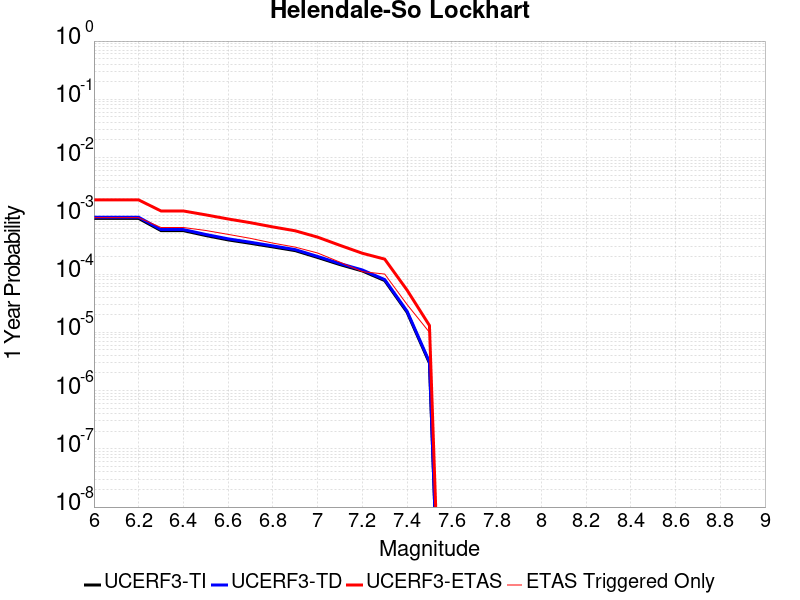 |  |

| Magnitude | 1 wk TI Prob | 1 wk TD Prob | 1 wk ETAS Prob | 1 wk ETAS/TD Gain | 1 wk ETAS Triggered Only | 1 mo TI Prob | 1 mo TD Prob | 1 mo ETAS Prob | 1 mo ETAS/TD Gain | 1 mo ETAS Triggered Only | 1 yr TI Prob | 1 yr TD Prob | 1 yr ETAS Prob | 1 yr ETAS/TD Gain | 1 yr ETAS Triggered Only | 10 yr TI Prob | 10 yr TD Prob | 10 yr ETAS Prob | 10 yr ETAS/TD Gain | 10 yr ETAS Triggered Only |
|-----|-----|-----|-----|-----|-----|-----|-----|-----|-----|-----|-----|-----|-----|-----|-----|-----|-----|-----|-----|-----|
| 6.0 | 1.7296055E-5 | 1.8103729E-5 | 3.6531966E-4 | 20.179249 | 3.4722223E-4 | 7.412385E-5 | 7.7585224E-5 | 7.025367E-4 | 9.055033 | 6.25E-4 | 9.0208417E-4 | 9.4421144E-4 | 0.0019155156 | 2.0286937 | 9.7222225E-4 | 0.008984311 | 0.009404116 | 0.010848735 | 1.1536156 | 0.0014583333 |
| 6.1 | 1.7296055E-5 | 1.8103729E-5 | 3.6531966E-4 | 20.179249 | 3.4722223E-4 | 7.412385E-5 | 7.7585224E-5 | 7.025367E-4 | 9.055033 | 6.25E-4 | 9.0208417E-4 | 9.4421144E-4 | 0.0019155156 | 2.0286937 | 9.7222225E-4 | 0.008984311 | 0.009404116 | 0.010848735 | 1.1536156 | 0.0014583333 |
| 6.2 | 1.7296055E-5 | 1.8103729E-5 | 3.6531966E-4 | 20.179249 | 3.4722223E-4 | 7.412385E-5 | 7.7585224E-5 | 7.025367E-4 | 9.055033 | 6.25E-4 | 9.0208417E-4 | 9.4421144E-4 | 0.0019155156 | 2.0286937 | 9.7222225E-4 | 0.008984311 | 0.009404116 | 0.010848735 | 1.1536156 | 0.0014583333 |
| 6.3 | 1.0669118E-5 | 1.1135425E-5 | 3.5835378E-4 | 32.18142 | 3.4722223E-4 | 4.5723988E-5 | 4.772239E-5 | 5.338103E-4 | 11.185741 | 4.8611112E-4 | 5.5654737E-4 | 5.80868E-4 | 0.0011361009 | 1.9558675 | 5.5555557E-4 | 0.0055515557 | 0.0057937936 | 0.006691341 | 1.1549153 | 9.0277777E-4 |
| 6.4 | 1.0669118E-5 | 1.1135425E-5 | 3.5835378E-4 | 32.18142 | 3.4722223E-4 | 4.5723988E-5 | 4.772239E-5 | 5.338103E-4 | 11.185741 | 4.8611112E-4 | 5.5654737E-4 | 5.80868E-4 | 0.0011361009 | 1.9558675 | 5.5555557E-4 | 0.0055515557 | 0.0057937936 | 0.006691341 | 1.1549153 | 9.0277777E-4 |
| 6.5 | 8.790038E-6 | 9.170197E-6 | 2.8694543E-4 | 31.291086 | 2.7777778E-4 | 3.767105E-5 | 3.930026E-5 | 4.5595056E-4 | 11.601718 | 4.1666668E-4 | 4.585485E-4 | 4.7837716E-4 | 9.642557E-4 | 2.015681 | 4.8611112E-4 | 0.0045760344 | 0.004773638 | 0.0055338806 | 1.1592585 | 7.638889E-4 |
| 6.6 | 7.396949E-6 | 7.715537E-6 | 2.8549117E-4 | 37.002113 | 2.7777778E-4 | 3.1700827E-5 | 3.3066175E-5 | 3.802769E-4 | 11.500482 | 3.4722223E-4 | 3.858892E-4 | 4.025073E-4 | 8.1900624E-4 | 2.0347612 | 4.1666668E-4 | 0.003852198 | 0.00401789 | 0.004709544 | 1.1721437 | 6.9444446E-4 |
| 6.7 | 6.4600285E-6 | 6.738031E-6 | 2.8451392E-4 | 42.225086 | 2.7777778E-4 | 2.7685543E-5 | 2.887696E-5 | 3.7608916E-4 | 13.023849 | 3.4722223E-4 | 3.3701936E-4 | 3.5152107E-4 | 7.6804124E-4 | 2.1849082 | 4.1666668E-4 | 0.0033650869 | 0.003509732 | 0.0041325386 | 1.1774513 | 6.25E-4 |
| 6.8 | 5.600104E-6 | 5.836009E-6 | 2.8361217E-4 | 48.596935 | 2.7777778E-4 | 2.4000226E-5 | 2.5011232E-5 | 3.7222478E-4 | 14.882304 | 3.4722223E-4 | 2.9216358E-4 | 3.044698E-4 | 7.210096E-4 | 2.3680825 | 4.1666668E-4 | 0.0029177975 | 0.003040588 | 0.0036636877 | 1.2049273 | 6.25E-4 |
| 6.9 | 4.839122E-6 | 5.0395092E-6 | 2.828159E-4 | 56.119728 | 2.7777778E-4 | 2.0738931E-5 | 2.159772E-5 | 3.6881244E-4 | 17.076452 | 3.4722223E-4 | 2.5246723E-4 | 2.6292098E-4 | 6.794781E-4 | 2.5843434 | 4.1666668E-4 | 0.002521806 | 0.002626147 | 0.0031802433 | 1.2109922 | 5.5555557E-4 |
| 7.0 | 3.6937633E-6 | 3.845208E-6 | 2.1217774E-4 | 55.179783 | 2.0833334E-4 | 1.5830317E-5 | 1.647936E-5 | 2.9425256E-4 | 17.855824 | 2.7777778E-4 | 1.9271708E-4 | 2.0061806E-4 | 5.4777064E-4 | 2.7304153 | 3.4722223E-4 | 0.0019255003 | 0.002004401 | 0.0024895377 | 1.2420357 | 4.8611112E-4 |
| 7.1 | 2.7858857E-6 | 2.8978538E-6 | 1.4178634E-4 | 48.92805 | 1.3888889E-4 | 1.1939455E-5 | 1.2419316E-5 | 2.2075007E-4 | 17.774736 | 2.0833334E-4 | 1.4535317E-4 | 1.511949E-4 | 4.2893068E-4 | 2.8369389 | 2.7777778E-4 | 0.0014525814 | 0.0015109418 | 0.0018576393 | 1.229458 | 3.4722223E-4 |
| 7.2 | 2.1672065E-6 | 2.2540128E-6 | 2.2540128E-6 | 1.0 | 0.0 | 9.2879945E-6 | 9.66002E-6 | 7.91038E-5 | 8.188782 | 6.9444446E-5 | 1.1307546E-4 | 1.1760458E-4 | 2.5647713E-4 | 2.180843 | 1.3888889E-4 | 0.0011301794 | 0.0011754417 | 0.0013835301 | 1.17703 | 2.0833334E-4 |
| 7.3 | 1.4823496E-6 | 1.5422102E-6 | 1.5422102E-6 | 1.0 | 0.0 | 6.3529114E-6 | 6.6094562E-6 | 7.605344E-5 | 11.506762 | 6.9444446E-5 | 7.734395E-5 | 8.046731E-5 | 2.1934502E-4 | 2.7258897 | 1.3888889E-4 | 7.731704E-4 | 8.0439687E-4 | 9.4317406E-4 | 1.1725233 | 1.3888889E-4 |
| 7.4 | 4.2321457E-7 | 4.4108765E-7 | 4.4108765E-7 | 1.0 | 0.0 | 1.8137755E-6 | 1.8903745E-6 | 1.8903745E-6 | 1.0 | 0.0 | 2.2082493E-5 | 2.3015113E-5 | 9.245796E-5 | 4.0172715 | 6.9444446E-5 | 2.2080299E-4 | 2.3013182E-4 | 2.9956028E-4 | 1.30169 | 6.9444446E-5 |
| 7.5 | 5.6942316E-8 | 5.9415648E-8 | 5.9415648E-8 | 1.0 | 0.0 | 2.440385E-7 | 2.5463845E-7 | 2.5463845E-7 | 1.0 | 0.0 | 2.9711643E-6 | 3.1002196E-6 | 7.254445E-5 | 23.399776 | 6.9444446E-5 | 2.9711247E-5 | 3.1001844E-5 | 1.0044414E-4 | 3.239941 | 6.9444446E-5 |

## Bicycle Lake
*[(top)](#table-of-contents)*

| 1 Week | 1 Month | 1 Year | 10 Year |
|-----|-----|-----|-----|
|  |  |  |  |

| Magnitude | 1 wk TI Prob | 1 wk TD Prob | 1 wk ETAS Prob | 1 wk ETAS/TD Gain | 1 wk ETAS Triggered Only | 1 mo TI Prob | 1 mo TD Prob | 1 mo ETAS Prob | 1 mo ETAS/TD Gain | 1 mo ETAS Triggered Only | 1 yr TI Prob | 1 yr TD Prob | 1 yr ETAS Prob | 1 yr ETAS/TD Gain | 1 yr ETAS Triggered Only | 10 yr TI Prob | 10 yr TD Prob | 10 yr ETAS Prob | 10 yr ETAS/TD Gain | 10 yr ETAS Triggered Only |
|-----|-----|-----|-----|-----|-----|-----|-----|-----|-----|-----|-----|-----|-----|-----|-----|-----|-----|-----|-----|-----|
| 6.0 | 1.9621975E-5 | 2.2097078E-5 | 2.9986873E-4 | 13.570515 | 2.7777778E-4 | 8.4091465E-5 | 9.4699084E-5 | 5.113263E-4 | 5.399485 | 4.1666668E-4 | 0.0010233327 | 0.0011524865 | 0.0019848596 | 1.7222409 | 8.3333335E-4 | 0.01018633 | 0.011478408 | 0.012851355 | 1.1196113 | 0.0013888889 |
| 6.1 | 1.9621975E-5 | 2.2097078E-5 | 2.9986873E-4 | 13.570515 | 2.7777778E-4 | 8.4091465E-5 | 9.4699084E-5 | 5.113263E-4 | 5.399485 | 4.1666668E-4 | 0.0010233327 | 0.0011524865 | 0.0019848596 | 1.7222409 | 8.3333335E-4 | 0.01018633 | 0.011478408 | 0.012851355 | 1.1196113 | 0.0013888889 |
| 6.2 | 9.9971285E-6 | 1.1255639E-5 | 1.5014297E-4 | 13.3393545 | 1.3888889E-4 | 4.2844134E-5 | 4.8237856E-5 | 2.5656115E-4 | 5.318668 | 2.0833334E-4 | 5.2150246E-4 | 5.871896E-4 | 9.34208E-4 | 1.5909817 | 3.4722223E-4 | 0.0052028033 | 0.005861487 | 0.0066899355 | 1.1413376 | 8.3333335E-4 |
| 6.3 | 9.589428E-6 | 1.0798346E-5 | 1.4968573E-4 | 13.861913 | 1.3888889E-4 | 4.10969E-5 | 4.62781E-5 | 2.546018E-4 | 5.501561 | 2.0833334E-4 | 5.002399E-4 | 5.6334207E-4 | 9.103687E-4 | 1.616014 | 3.4722223E-4 | 0.0049911533 | 0.0056242296 | 0.006452876 | 1.147335 | 8.3333335E-4 |
| 6.4 | 9.589428E-6 | 1.0798346E-5 | 1.4968573E-4 | 13.861913 | 1.3888889E-4 | 4.10969E-5 | 4.62781E-5 | 2.546018E-4 | 5.501561 | 2.0833334E-4 | 5.002399E-4 | 5.6334207E-4 | 9.103687E-4 | 1.616014 | 3.4722223E-4 | 0.0049911533 | 0.0056242296 | 0.006452876 | 1.147335 | 8.3333335E-4 |
| 6.5 | 5.557707E-6 | 6.2856016E-6 | 1.4517362E-4 | 23.096218 | 1.3888889E-4 | 2.3818526E-5 | 2.6938165E-5 | 2.3526589E-4 | 8.733553 | 2.0833334E-4 | 2.8995197E-4 | 3.2794967E-4 | 6.056364E-4 | 1.8467356 | 2.7777778E-4 | 0.0028957394 | 0.0032772934 | 0.0036925946 | 1.1267208 | 4.1666668E-4 |
| 6.6 | 4.8742945E-6 | 5.5132896E-6 | 7.495735E-5 | 13.5957575 | 6.9444446E-5 | 2.0889667E-5 | 2.3628318E-5 | 1.6251393E-4 | 6.87793 | 1.3888889E-4 | 2.54302E-4 | 2.87663E-4 | 4.959364E-4 | 1.7240187 | 2.0833334E-4 | 0.002540112 | 0.0028754752 | 0.003221699 | 1.1204058 | 3.4722223E-4 |
| 6.7 | 3.991108E-6 | 4.5159104E-6 | 7.3960044E-5 | 16.377659 | 6.9444446E-5 | 1.7104636E-5 | 1.9353902E-5 | 8.8797E-5 | 4.5880675 | 6.9444446E-5 | 2.0822904E-4 | 2.3563375E-4 | 3.744899E-4 | 1.5892881 | 1.3888889E-4 | 0.0020803404 | 0.0023563374 | 0.0026334608 | 1.1176076 | 2.7777778E-4 |

## Death Valley (Black Mtns Frontal)
*[(top)](#table-of-contents)*

| 1 Week | 1 Month | 1 Year | 10 Year |
|-----|-----|-----|-----|
|  |  | 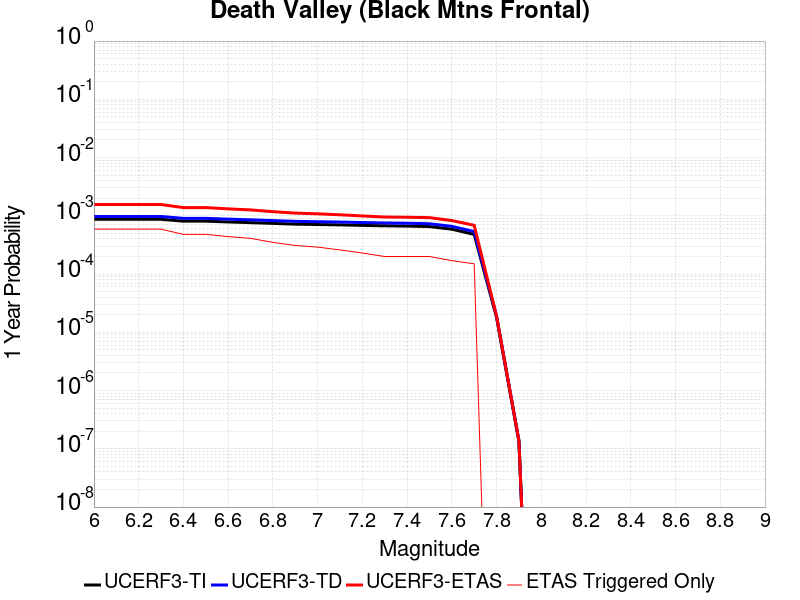 |  |

| Magnitude | 1 wk TI Prob | 1 wk TD Prob | 1 wk ETAS Prob | 1 wk ETAS/TD Gain | 1 wk ETAS Triggered Only | 1 mo TI Prob | 1 mo TD Prob | 1 mo ETAS Prob | 1 mo ETAS/TD Gain | 1 mo ETAS Triggered Only | 1 yr TI Prob | 1 yr TD Prob | 1 yr ETAS Prob | 1 yr ETAS/TD Gain | 1 yr ETAS Triggered Only | 10 yr TI Prob | 10 yr TD Prob | 10 yr ETAS Prob | 10 yr ETAS/TD Gain | 10 yr ETAS Triggered Only |
|-----|-----|-----|-----|-----|-----|-----|-----|-----|-----|-----|-----|-----|-----|-----|-----|-----|-----|-----|-----|-----|
| 6.0 | 1.6707214E-5 | 1.867027E-5 | 2.9644286E-4 | 15.877804 | 2.7777778E-4 | 7.160038E-5 | 8.001302E-5 | 4.9664633E-4 | 6.207069 | 4.1666668E-4 | 8.71386E-4 | 9.737309E-4 | 0.0015981223 | 1.6412362 | 6.25E-4 | 0.00867977 | 0.009695496 | 0.010658293 | 1.0993035 | 9.7222225E-4 |
| 6.1 | 1.6707214E-5 | 1.867027E-5 | 2.9644286E-4 | 15.877804 | 2.7777778E-4 | 7.160038E-5 | 8.001302E-5 | 4.9664633E-4 | 6.207069 | 4.1666668E-4 | 8.71386E-4 | 9.737309E-4 | 0.0015981223 | 1.6412362 | 6.25E-4 | 0.00867977 | 0.009695496 | 0.010658293 | 1.0993035 | 9.7222225E-4 |
| 6.2 | 1.6707214E-5 | 1.867027E-5 | 2.9644286E-4 | 15.877804 | 2.7777778E-4 | 7.160038E-5 | 8.001302E-5 | 4.9664633E-4 | 6.207069 | 4.1666668E-4 | 8.71386E-4 | 9.737309E-4 | 0.0015981223 | 1.6412362 | 6.25E-4 | 0.00867977 | 0.009695496 | 0.010658293 | 1.0993035 | 9.7222225E-4 |
| 6.3 | 1.6707214E-5 | 1.867027E-5 | 2.9644286E-4 | 15.877804 | 2.7777778E-4 | 7.160038E-5 | 8.001302E-5 | 4.9664633E-4 | 6.207069 | 4.1666668E-4 | 8.71386E-4 | 9.737309E-4 | 0.0015981223 | 1.6412362 | 6.25E-4 | 0.00867977 | 0.009695496 | 0.010658293 | 1.0993035 | 9.7222225E-4 |
| 6.4 | 1.5515609E-5 | 1.7338214E-5 | 2.2566793E-4 | 13.015639 | 2.0833334E-4 | 6.649377E-5 | 7.4304546E-5 | 4.2150097E-4 | 5.6726136 | 3.4722223E-4 | 8.0926094E-4 | 9.042885E-4 | 0.0013899601 | 1.5370759 | 4.8611112E-4 | 0.008063202 | 0.009006773 | 0.0098326 | 1.0916896 | 8.3333335E-4 |
| 6.5 | 1.5515609E-5 | 1.7338214E-5 | 2.2566793E-4 | 13.015639 | 2.0833334E-4 | 6.649377E-5 | 7.4304546E-5 | 4.2150097E-4 | 5.6726136 | 3.4722223E-4 | 8.0926094E-4 | 9.042885E-4 | 0.0013899601 | 1.5370759 | 4.8611112E-4 | 0.008063202 | 0.009006773 | 0.0098326 | 1.0916896 | 8.3333335E-4 |
| 6.6 | 1.5041828E-5 | 1.6809145E-5 | 2.2513898E-4 | 13.393839 | 2.0833334E-4 | 6.4463384E-5 | 7.203723E-5 | 3.49795E-4 | 4.855753 | 2.7777778E-4 | 7.8455906E-4 | 8.767063E-4 | 0.0012930078 | 1.474847 | 4.1666668E-4 | 0.00781795 | 0.008733132 | 0.00949035 | 1.0867063 | 7.638889E-4 |
| 6.7 | 1.4634985E-5 | 1.6356016E-5 | 1.5524264E-4 | 9.491469 | 1.3888889E-4 | 6.271985E-5 | 7.009536E-5 | 2.7841408E-4 | 3.9719331 | 2.0833334E-4 | 7.6334673E-4 | 8.5308263E-4 | 0.0011306235 | 1.3253387 | 2.7777778E-4 | 0.007607299 | 0.008498715 | 0.009118404 | 1.0729156 | 6.25E-4 |
| 6.8 | 1.4209158E-5 | 1.5882048E-5 | 1.5882048E-5 | 1.0 | 0.0 | 6.089497E-5 | 6.8064175E-5 | 1.375039E-4 | 2.0202096 | 6.9444446E-5 | 7.4114406E-4 | 8.2837185E-4 | 9.671457E-4 | 1.167526 | 1.3888889E-4 | 0.007386771 | 0.008253456 | 0.008666684 | 1.0500672 | 4.1666668E-4 |
| 6.9 | 1.3780098E-5 | 1.5404594E-5 | 1.5404594E-5 | 1.0 | 0.0 | 5.9056227E-5 | 6.6018045E-5 | 1.354579E-4 | 2.0518315 | 6.9444446E-5 | 7.1877235E-4 | 8.0347876E-4 | 9.4225607E-4 | 1.1727206 | 1.3888889E-4 | 0.0071645193 | 0.008006332 | 0.008350775 | 1.0430212 | 3.4722223E-4 |
| 7.0 | 1.3585064E-5 | 1.5188155E-5 | 1.5188155E-5 | 1.0 | 0.0 | 5.8220405E-5 | 6.50905E-5 | 1.3453042E-4 | 2.066821 | 6.9444446E-5 | 7.086029E-4 | 7.9219416E-4 | 9.3097304E-4 | 1.1751829 | 1.3888889E-4 | 0.007063476 | 0.007894293 | 0.008238775 | 1.0436367 | 3.4722223E-4 |
| 7.1 | 1.3398601E-5 | 1.49813395E-5 | 1.49813395E-5 | 1.0 | 0.0 | 5.742131E-5 | 6.420419E-5 | 1.3364418E-4 | 2.0815492 | 6.9444446E-5 | 6.9888023E-4 | 7.8141113E-4 | 9.2019147E-4 | 1.1776022 | 1.3888889E-4 | 0.0069668638 | 0.007787224 | 0.0081317425 | 1.0442414 | 3.4722223E-4 |
| 7.2 | 1.3126312E-5 | 1.4679561E-5 | 1.4679561E-5 | 1.0 | 0.0 | 5.6254412E-5 | 6.291092E-5 | 1.32351E-4 | 2.103784 | 6.9444446E-5 | 6.846822E-4 | 7.6567667E-4 | 9.044592E-4 | 1.1812547 | 1.3888889E-4 | 0.006825765 | 0.00763097 | 0.007906628 | 1.0361236 | 2.7777778E-4 |
| 7.3 | 1.2922429E-5 | 1.4453788E-5 | 1.4453788E-5 | 1.0 | 0.0 | 5.5380664E-5 | 6.194336E-5 | 1.3138351E-4 | 2.1210263 | 6.9444446E-5 | 6.74051E-4 | 7.53905E-4 | 8.9268916E-4 | 1.1840872 | 1.3888889E-4 | 0.006720101 | 0.007514055 | 0.0077897455 | 1.03669 | 2.7777778E-4 |
| 7.4 | 1.2768878E-5 | 1.4283772E-5 | 1.4283772E-5 | 1.0 | 0.0 | 5.4722615E-5 | 6.1214756E-5 | 1.3065495E-4 | 2.13437 | 6.9444446E-5 | 6.660441E-4 | 7.4504025E-4 | 8.8382565E-4 | 1.186279 | 1.3888889E-4 | 0.0066405144 | 0.0074260035 | 0.0077017187 | 1.0371283 | 2.7777778E-4 |
| 7.5 | 1.2521929E-5 | 1.40120155E-5 | 1.40120155E-5 | 1.0 | 0.0 | 5.366431E-5 | 6.005014E-5 | 1.2949042E-4 | 2.1563716 | 6.9444446E-5 | 6.531671E-4 | 7.3087064E-4 | 8.69658E-4 | 1.1898932 | 1.3888889E-4 | 0.006512506 | 0.0072852457 | 0.007561 | 1.0378511 | 2.7777778E-4 |
| 7.6 | 1.1301089E-5 | 1.2648149E-5 | 1.2648149E-5 | 1.0 | 0.0 | 4.8432343E-5 | 5.4205255E-5 | 1.2364594E-4 | 2.281069 | 6.9444446E-5 | 5.895042E-4 | 6.5975444E-4 | 7.985517E-4 | 1.2103771 | 1.3888889E-4 | 0.0058794282 | 0.00657851 | 0.0068544606 | 1.0419472 | 2.7777778E-4 |
| 7.7 | 9.189108E-6 | 1.0283358E-5 | 1.0283358E-5 | 1.0 | 0.0 | 3.93813E-5 | 4.407082E-5 | 1.135122E-4 | 2.5756772 | 6.9444446E-5 | 4.7936183E-4 | 5.3643517E-4 | 6.7524955E-4 | 1.258772 | 1.3888889E-4 | 0.004783291 | 0.005351914 | 0.005628205 | 1.0516248 | 2.7777778E-4 |
| 7.8 | 3.4586725E-7 | 3.6482615E-7 | 3.6482615E-7 | 1.0 | 0.0 | 1.4822873E-6 | 1.5635396E-6 | 1.5635396E-6 | 1.0 | 0.0 | 1.80467E-5 | 1.9035933E-5 | 1.9035933E-5 | 1.0 | 0.0 | 1.8045233E-4 | 1.9034347E-4 | 1.9034347E-4 | 1.0 | 0.0 |
| 7.9 | 2.5591178E-9 | 2.6696718E-9 | 2.6696718E-9 | 1.0 | 0.0 | 1.0967647E-8 | 1.14414505E-8 | 1.14414505E-8 | 1.0 | 0.0 | 1.335311E-7 | 1.3929966E-7 | 1.3929966E-7 | 1.0 | 0.0 | 1.3353102E-6 | 1.3929966E-6 | 1.3929966E-6 | 1.0 | 0.0 |

## San Andreas (Big Bend)
*[(top)](#table-of-contents)*

| 1 Week | 1 Month | 1 Year | 10 Year |
|-----|-----|-----|-----|
|  |  |  |  |

| Magnitude | 1 wk TI Prob | 1 wk TD Prob | 1 wk ETAS Prob | 1 wk ETAS/TD Gain | 1 wk ETAS Triggered Only | 1 mo TI Prob | 1 mo TD Prob | 1 mo ETAS Prob | 1 mo ETAS/TD Gain | 1 mo ETAS Triggered Only | 1 yr TI Prob | 1 yr TD Prob | 1 yr ETAS Prob | 1 yr ETAS/TD Gain | 1 yr ETAS Triggered Only | 10 yr TI Prob | 10 yr TD Prob | 10 yr ETAS Prob | 10 yr ETAS/TD Gain | 10 yr ETAS Triggered Only |
|-----|-----|-----|-----|-----|-----|-----|-----|-----|-----|-----|-----|-----|-----|-----|-----|-----|-----|-----|-----|-----|
| 6.0 | 1.0179969E-4 | 2.0072258E-4 | 4.0901412E-4 | 2.0377083 | 2.0833334E-4 | 4.362114E-4 | 8.599571E-4 | 0.0013456502 | 1.5647876 | 4.8611112E-4 | 0.0052979486 | 0.010419999 | 0.011175928 | 1.072546 | 7.638889E-4 | 0.051734097 | 0.10144902 | 0.102322616 | 1.0086111 | 9.7222225E-4 |
| 6.1 | 1.0179969E-4 | 2.0072258E-4 | 4.0901412E-4 | 2.0377083 | 2.0833334E-4 | 4.362114E-4 | 8.599571E-4 | 0.0013456502 | 1.5647876 | 4.8611112E-4 | 0.0052979486 | 0.010419999 | 0.011175928 | 1.072546 | 7.638889E-4 | 0.051734097 | 0.10144902 | 0.102322616 | 1.0086111 | 9.7222225E-4 |
| 6.2 | 1.0179969E-4 | 2.0072258E-4 | 4.0901412E-4 | 2.0377083 | 2.0833334E-4 | 4.362114E-4 | 8.599571E-4 | 0.0013456502 | 1.5647876 | 4.8611112E-4 | 0.0052979486 | 0.010419999 | 0.011175928 | 1.072546 | 7.638889E-4 | 0.051734097 | 0.10144902 | 0.102322616 | 1.0086111 | 9.7222225E-4 |
| 6.3 | 1.0179969E-4 | 2.0072258E-4 | 4.0901412E-4 | 2.0377083 | 2.0833334E-4 | 4.362114E-4 | 8.599571E-4 | 0.0013456502 | 1.5647876 | 4.8611112E-4 | 0.0052979486 | 0.010419999 | 0.011175928 | 1.072546 | 7.638889E-4 | 0.051734097 | 0.10144902 | 0.102322616 | 1.0086111 | 9.7222225E-4 |
| 6.4 | 9.1639464E-5 | 1.8429532E-4 | 3.231586E-4 | 1.7534825 | 1.3888889E-4 | 3.9268145E-4 | 7.895982E-4 | 9.977671E-4 | 1.263639 | 2.0833334E-4 | 0.0047704205 | 0.009571102 | 0.009846222 | 1.0287448 | 2.7777778E-4 | 0.046693064 | 0.09377527 | 0.09415287 | 1.0040265 | 4.1666668E-4 |
| 6.5 | 9.1639464E-5 | 1.8429532E-4 | 3.231586E-4 | 1.7534825 | 1.3888889E-4 | 3.9268145E-4 | 7.895982E-4 | 9.977671E-4 | 1.263639 | 2.0833334E-4 | 0.0047704205 | 0.009571102 | 0.009846222 | 1.0287448 | 2.7777778E-4 | 0.046693064 | 0.09377527 | 0.09415287 | 1.0040265 | 4.1666668E-4 |
| 6.6 | 9.042622E-5 | 1.823659E-4 | 3.2122945E-4 | 1.7614558 | 1.3888889E-4 | 3.8748336E-4 | 7.8133424E-4 | 9.895049E-4 | 1.2664295 | 2.0833334E-4 | 0.0047074095 | 0.009471365 | 0.009677725 | 1.0217878 | 2.0833334E-4 | 0.046089325 | 0.092869274 | 0.093184255 | 1.0033916 | 3.4722223E-4 |
| 6.7 | 8.9836685E-5 | 1.8150927E-4 | 3.2037293E-4 | 1.76505 | 1.3888889E-4 | 3.8495753E-4 | 7.776651E-4 | 9.858365E-4 | 1.2676876 | 2.0833334E-4 | 0.00467679 | 0.00942708 | 0.00963345 | 1.0218911 | 2.0833334E-4 | 0.045795817 | 0.09246355 | 0.09277867 | 1.003408 | 3.4722223E-4 |
| 6.8 | 8.9471854E-5 | 1.8097709E-4 | 3.1984085E-4 | 1.7673001 | 1.3888889E-4 | 3.8339442E-4 | 7.7538576E-4 | 9.835575E-4 | 1.2684752 | 2.0833334E-4 | 0.004657841 | 0.009399569 | 0.009605943 | 1.0219558 | 2.0833334E-4 | 0.04561414 | 0.092210755 | 0.09252596 | 1.0034183 | 3.4722223E-4 |
| 6.9 | 8.858234E-5 | 1.7979681E-4 | 3.1866072E-4 | 1.772338 | 1.3888889E-4 | 3.7958333E-4 | 7.703304E-4 | 9.785033E-4 | 1.2702384 | 2.0833334E-4 | 0.004611638 | 0.009338548 | 0.009544937 | 1.0221007 | 2.0833334E-4 | 0.04517103 | 0.09165087 | 0.09196627 | 1.0034413 | 3.4722223E-4 |
| 7.0 | 8.7433385E-5 | 1.7818481E-4 | 3.1704895E-4 | 1.7793264 | 1.3888889E-4 | 3.746607E-4 | 7.634259E-4 | 9.716002E-4 | 1.2726843 | 2.0833334E-4 | 0.004551957 | 0.009255203 | 0.009461609 | 1.0223016 | 2.0833334E-4 | 0.044598386 | 0.09088532 | 0.09120098 | 1.0034732 | 3.4722223E-4 |
| 7.1 | 8.684964E-5 | 1.7730435E-4 | 3.1616862E-4 | 1.7831972 | 1.3888889E-4 | 3.7215967E-4 | 7.596547E-4 | 9.678298E-4 | 1.274039 | 2.0833334E-4 | 0.0045216335 | 0.009209678 | 0.009416092 | 1.0224128 | 2.0833334E-4 | 0.04430731 | 0.09046686 | 0.09078267 | 1.0034909 | 3.4722223E-4 |
| 7.2 | 8.606521E-5 | 1.762105E-4 | 3.1507493E-4 | 1.7880598 | 1.3888889E-4 | 3.6879873E-4 | 7.549695E-4 | 9.631455E-4 | 1.275741 | 2.0833334E-4 | 0.0044808835 | 0.0091531165 | 0.009359542 | 1.0225526 | 2.0833334E-4 | 0.043916024 | 0.089947365 | 0.09020016 | 1.0028105 | 2.7777778E-4 |
| 7.3 | 8.568266E-5 | 1.7563057E-4 | 3.1449506E-4 | 1.7906624 | 1.3888889E-4 | 3.6715972E-4 | 7.524855E-4 | 9.6066203E-4 | 1.276652 | 2.0833334E-4 | 0.0044610105 | 0.009123127 | 0.009329559 | 1.0226274 | 2.0833334E-4 | 0.043725148 | 0.08966853 | 0.0899214 | 1.00282 | 2.7777778E-4 |
| 7.4 | 8.5432206E-5 | 1.7525644E-4 | 3.14121E-4 | 1.7923506 | 1.3888889E-4 | 3.6608664E-4 | 7.50883E-4 | 9.590599E-4 | 1.2772428 | 2.0833334E-4 | 0.004447999 | 0.009103781 | 0.009310217 | 1.022676 | 2.0833334E-4 | 0.043600157 | 0.08948871 | 0.089741625 | 1.0028263 | 2.7777778E-4 |
| 7.5 | 8.4791965E-5 | 1.7394972E-4 | 3.1281446E-4 | 1.7983038 | 1.3888889E-4 | 3.633435E-4 | 7.4528606E-4 | 9.534641E-4 | 1.2793264 | 2.0833334E-4 | 0.0044147377 | 0.009036204 | 0.009242655 | 1.022847 | 2.0833334E-4 | 0.043280575 | 0.088866346 | 0.089119434 | 1.002848 | 2.7777778E-4 |
| 7.6 | 8.241105E-5 | 1.6840403E-4 | 3.0726954E-4 | 1.8245972 | 1.3888889E-4 | 3.531424E-4 | 7.215321E-4 | 9.297151E-4 | 1.2885292 | 2.0833334E-4 | 0.0042910352 | 0.008749358 | 0.008955869 | 1.023603 | 2.0833334E-4 | 0.042091176 | 0.086243294 | 0.08649711 | 1.002943 | 2.7777778E-4 |
| 7.7 | 7.00432E-5 | 1.42045E-4 | 2.1147958E-4 | 1.488821 | 6.9444446E-5 | 3.001506E-4 | 6.0862233E-4 | 7.474267E-4 | 1.2280632 | 1.3888889E-4 | 0.0036482112 | 0.0073848404 | 0.0075227036 | 1.0186684 | 1.3888889E-4 | 0.035888977 | 0.07351733 | 0.073710345 | 1.0026255 | 2.0833334E-4 |
| 7.8 | 6.415362E-5 | 1.2968935E-4 | 1.9912478E-4 | 1.5353982 | 6.9444446E-5 | 2.749151E-4 | 5.556931E-4 | 6.945048E-4 | 1.2497993 | 1.3888889E-4 | 0.0033419547 | 0.0067446055 | 0.0068825576 | 1.0204537 | 1.3888889E-4 | 0.03292141 | 0.06725231 | 0.06744663 | 1.0028894 | 2.0833334E-4 |
| 7.9 | 4.939911E-5 | 9.3411545E-5 | 9.3411545E-5 | 1.0 | 0.0 | 2.116933E-4 | 4.0027377E-4 | 4.6969042E-4 | 1.1734229 | 6.9444446E-5 | 0.0025743195 | 0.004862453 | 0.0049315593 | 1.0142124 | 6.9444446E-5 | 0.025447013 | 0.048914436 | 0.04904653 | 1.0027006 | 1.3888889E-4 |
| 8.0 | 3.344983E-5 | 5.222685E-5 | 5.222685E-5 | 1.0 | 0.0 | 1.4334853E-4 | 2.2381016E-4 | 2.9323908E-4 | 1.3102133 | 6.9444446E-5 | 0.0017438711 | 0.0027214854 | 0.002790741 | 1.0254476 | 6.9444446E-5 | 0.017302496 | 0.027922187 | 0.027989693 | 1.0024177 | 6.9444446E-5 |
| 8.1 | 1.9104898E-5 | 1.9173063E-5 | 1.9173063E-5 | 1.0 | 0.0 | 8.1875565E-5 | 8.216769E-5 | 8.216769E-5 | 1.0 | 0.0 | 9.963791E-4 | 9.999331E-4 | 9.999331E-4 | 1.0 | 0.0 | 0.009919235 | 0.010749801 | 0.010749801 | 1.0 | 0.0 |
| 8.2 | 8.643924E-6 | 5.4748625E-6 | 5.4748625E-6 | 1.0 | 0.0 | 3.704486E-5 | 2.3463486E-5 | 2.3463486E-5 | 1.0 | 0.0 | 4.5092785E-4 | 2.8563058E-4 | 2.8563058E-4 | 1.0 | 0.0 | 0.0045001395 | 0.0032487072 | 0.0032487072 | 1.0 | 0.0 |
| 8.3 | 1.983087E-6 | 7.6599065E-7 | 7.6599065E-7 | 1.0 | 0.0 | 8.498917E-6 | 3.282813E-6 | 3.282813E-6 | 1.0 | 0.0 | 1.034694E-4 | 3.9967534E-5 | 3.9967534E-5 | 1.0 | 0.0 | 0.0010342124 | 4.719687E-4 | 4.719687E-4 | 1.0 | 0.0 |

## San Andreas (San Bernardino S)
*[(top)](#table-of-contents)*

| 1 Week | 1 Month | 1 Year | 10 Year |
|-----|-----|-----|-----|
|  |  |  |  |

| Magnitude | 1 wk TI Prob | 1 wk TD Prob | 1 wk ETAS Prob | 1 wk ETAS/TD Gain | 1 wk ETAS Triggered Only | 1 mo TI Prob | 1 mo TD Prob | 1 mo ETAS Prob | 1 mo ETAS/TD Gain | 1 mo ETAS Triggered Only | 1 yr TI Prob | 1 yr TD Prob | 1 yr ETAS Prob | 1 yr ETAS/TD Gain | 1 yr ETAS Triggered Only | 10 yr TI Prob | 10 yr TD Prob | 10 yr ETAS Prob | 10 yr ETAS/TD Gain | 10 yr ETAS Triggered Only |
|-----|-----|-----|-----|-----|-----|-----|-----|-----|-----|-----|-----|-----|-----|-----|-----|-----|-----|-----|-----|-----|
| 6.0 | 1.2336002E-4 | 3.0004102E-4 | 5.777355E-4 | 1.9255216 | 2.7777778E-4 | 5.2857865E-4 | 0.0012852824 | 0.0017014137 | 1.3237662 | 4.1666668E-4 | 0.006416472 | 0.015540994 | 0.016087916 | 1.0351923 | 5.5555557E-4 | 0.06234337 | 0.14283717 | 0.143611 | 1.0054176 | 9.0277777E-4 |
| 6.1 | 1.2336002E-4 | 3.0004102E-4 | 5.777355E-4 | 1.9255216 | 2.7777778E-4 | 5.2857865E-4 | 0.0012852824 | 0.0017014137 | 1.3237662 | 4.1666668E-4 | 0.006416472 | 0.015540994 | 0.016087916 | 1.0351923 | 5.5555557E-4 | 0.06234337 | 0.14283717 | 0.143611 | 1.0054176 | 9.0277777E-4 |
| 6.2 | 1.2336002E-4 | 3.0004102E-4 | 5.777355E-4 | 1.9255216 | 2.7777778E-4 | 5.2857865E-4 | 0.0012852824 | 0.0017014137 | 1.3237662 | 4.1666668E-4 | 0.006416472 | 0.015540994 | 0.016087916 | 1.0351923 | 5.5555557E-4 | 0.06234337 | 0.14283717 | 0.143611 | 1.0054176 | 9.0277777E-4 |
| 6.3 | 1.1712257E-4 | 2.8792414E-4 | 5.6562194E-4 | 1.9644825 | 2.7777778E-4 | 5.018573E-4 | 0.0012334028 | 0.0016495555 | 1.3374021 | 4.1666668E-4 | 0.006093008 | 0.014918125 | 0.015465393 | 1.0366848 | 5.5555557E-4 | 0.059286322 | 0.13754563 | 0.13832423 | 1.0056607 | 9.0277777E-4 |
| 6.4 | 1.1712257E-4 | 2.8792414E-4 | 5.6562194E-4 | 1.9644825 | 2.7777778E-4 | 5.018573E-4 | 0.0012334028 | 0.0016495555 | 1.3374021 | 4.1666668E-4 | 0.006093008 | 0.014918125 | 0.015465393 | 1.0366848 | 5.5555557E-4 | 0.059286322 | 0.13754563 | 0.13832423 | 1.0056607 | 9.0277777E-4 |
| 6.5 | 1.0689076E-4 | 2.680528E-4 | 5.4575613E-4 | 2.0360024 | 2.7777778E-4 | 4.5802278E-4 | 0.0011483167 | 0.0015645049 | 1.3624333 | 4.1666668E-4 | 0.0055621783 | 0.01389575 | 0.014443586 | 1.0394247 | 5.5555557E-4 | 0.05425003 | 0.12879294 | 0.12957945 | 1.0061067 | 9.0277777E-4 |
| 6.6 | 9.7648895E-5 | 2.50501E-4 | 5.282092E-4 | 2.108611 | 2.7777778E-4 | 4.1842813E-4 | 0.0010731576 | 0.0014893772 | 1.3878456 | 4.1666668E-4 | 0.005082469 | 0.012991785 | 0.013471581 | 1.0369307 | 4.8611112E-4 | 0.049677886 | 0.12095292 | 0.12162441 | 1.0055517 | 7.638889E-4 |
| 6.7 | 8.757013E-5 | 2.3120902E-4 | 5.0892256E-4 | 2.2011364 | 2.7777778E-4 | 3.7524657E-4 | 9.905418E-4 | 0.0014067957 | 1.4202286 | 4.1666668E-4 | 0.00455906 | 0.011997245 | 0.012477525 | 1.0400325 | 4.8611112E-4 | 0.04466656 | 0.11226123 | 0.112939365 | 1.0060407 | 7.638889E-4 |
| 6.8 | 8.562978E-5 | 2.2680782E-4 | 5.045226E-4 | 2.2244496 | 2.7777778E-4 | 3.6693315E-4 | 9.7169366E-4 | 0.0013879555 | 1.4283879 | 4.1666668E-4 | 0.004458263 | 0.011770263 | 0.012250653 | 1.0408138 | 4.8611112E-4 | 0.043698758 | 0.11027153 | 0.110951185 | 1.0061635 | 7.638889E-4 |
| 6.9 | 6.124075E-5 | 1.7065753E-4 | 4.483879E-4 | 2.6274135 | 2.7777778E-4 | 2.6243398E-4 | 7.311852E-4 | 0.0011475473 | 1.5694344 | 4.1666668E-4 | 0.0031904527 | 0.008866051 | 0.009347852 | 1.0543423 | 4.8611112E-4 | 0.031450346 | 0.08418263 | 0.08475502 | 1.0067993 | 6.25E-4 |
| 7.0 | 5.8598747E-5 | 1.649477E-4 | 4.4267968E-4 | 2.6837575 | 2.7777778E-4 | 2.5111332E-4 | 7.06728E-4 | 0.0011231003 | 1.5891547 | 4.1666668E-4 | 0.0030530186 | 0.008570663 | 0.009052608 | 1.056232 | 4.8611112E-4 | 0.03011414 | 0.081500374 | 0.08207443 | 1.0070437 | 6.25E-4 |
| 7.1 | 5.613814E-5 | 1.5913323E-4 | 4.368668E-4 | 2.7452896 | 2.7777778E-4 | 2.4056983E-4 | 6.818221E-4 | 0.0010982046 | 1.610691 | 4.1666668E-4 | 0.0029250039 | 0.008269769 | 0.00875186 | 1.0582956 | 4.8611112E-4 | 0.028868021 | 0.07879931 | 0.07937506 | 1.0073066 | 6.25E-4 |
| 7.2 | 4.991222E-5 | 1.4519796E-4 | 4.229354E-4 | 2.9128191 | 2.7777778E-4 | 2.1389198E-4 | 6.2212895E-4 | 0.0010385364 | 1.6693265 | 4.1666668E-4 | 0.002601025 | 0.007548217 | 0.008030659 | 1.0639147 | 4.8611112E-4 | 0.025707912 | 0.07225321 | 0.072833054 | 1.0080252 | 6.25E-4 |
| 7.3 | 4.7410045E-5 | 1.3714004E-4 | 4.1487973E-4 | 3.0252268 | 2.7777778E-4 | 2.0317009E-4 | 5.8761094E-4 | 0.0010040328 | 1.7086693 | 4.1666668E-4 | 0.0024707897 | 0.0071307817 | 0.007613426 | 1.0676847 | 4.8611112E-4 | 0.024434982 | 0.06853558 | 0.06911775 | 1.0084944 | 6.25E-4 |
| 7.4 | 4.5556746E-5 | 1.3121912E-4 | 4.0896045E-4 | 3.1166224 | 2.7777778E-4 | 1.952286E-4 | 5.622468E-4 | 9.786792E-4 | 1.7406577 | 4.1666668E-4 | 0.002374317 | 0.0068239477 | 0.0073067416 | 1.07075 | 4.8611112E-4 | 0.023491086 | 0.065788016 | 0.066371895 | 1.0088753 | 6.25E-4 |
| 7.5 | 4.3084514E-5 | 1.2357246E-4 | 3.3188006E-4 | 2.6857119 | 2.0833334E-4 | 1.8463485E-4 | 5.2948913E-4 | 8.7652745E-4 | 1.6554211 | 3.4722223E-4 | 0.0022456115 | 0.0064275465 | 0.006841535 | 1.0644085 | 4.1666668E-4 | 0.022230545 | 0.062188786 | 0.06270979 | 1.0083778 | 5.5555557E-4 |
| 7.6 | 3.408608E-5 | 9.83552E-5 | 2.3723043E-4 | 2.4119766 | 1.3888889E-4 | 1.4607502E-4 | 4.214543E-4 | 6.99115E-4 | 1.6588157 | 2.7777778E-4 | 0.0017770125 | 0.0051191594 | 0.005464604 | 1.0674808 | 3.4722223E-4 | 0.017628696 | 0.050020292 | 0.050482087 | 1.0092322 | 4.8611112E-4 |
| 7.7 | 2.8315713E-5 | 8.248679E-5 | 2.2136423E-4 | 2.6836324 | 1.3888889E-4 | 1.2134742E-4 | 3.5346695E-4 | 6.3114654E-4 | 1.7855885 | 2.7777778E-4 | 0.0014764034 | 0.0042949775 | 0.004640708 | 1.0804965 | 3.4722223E-4 | 0.01466633 | 0.0422714 | 0.042736966 | 1.0110136 | 4.8611112E-4 |
| 7.8 | 2.6222975E-5 | 7.463088E-5 | 2.135094E-4 | 2.860872 | 1.3888889E-4 | 1.1237934E-4 | 3.1980744E-4 | 5.974964E-4 | 1.8683004 | 2.7777778E-4 | 0.0013673597 | 0.0038867102 | 0.0042325826 | 1.0889885 | 3.4722223E-4 | 0.013589768 | 0.03843674 | 0.038904168 | 1.0121609 | 4.8611112E-4 |
| 7.9 | 2.1469694E-5 | 5.787864E-5 | 1.9675949E-4 | 3.3995183 | 1.3888889E-4 | 9.200973E-5 | 2.4802773E-4 | 5.257366E-4 | 2.1196687 | 2.7777778E-4 | 0.0011196428 | 0.0030155594 | 0.0033617346 | 1.1147963 | 3.4722223E-4 | 0.011140184 | 0.030152109 | 0.030623563 | 1.0156358 | 4.8611112E-4 |
| 8.0 | 1.2420249E-5 | 3.131896E-5 | 3.131896E-5 | 1.0 | 0.0 | 5.322855E-5 | 1.342172E-4 | 1.342172E-4 | 1.0 | 0.0 | 6.478649E-4 | 0.0016328706 | 0.0016328706 | 1.0 | 0.0 | 0.0064597935 | 0.016522504 | 0.0165908 | 1.0041336 | 6.9444446E-5 |
| 8.1 | 4.9197724E-6 | 7.822348E-6 | 7.822348E-6 | 1.0 | 0.0 | 2.1084568E-5 | 3.352392E-5 | 3.352392E-5 | 1.0 | 0.0 | 2.566744E-4 | 4.0807744E-4 | 4.0807744E-4 | 1.0 | 0.0 | 0.002563781 | 0.0043843705 | 0.0043843705 | 1.0 | 0.0 |
| 8.2 | 2.5634774E-6 | 2.9067196E-6 | 2.9067196E-6 | 1.0 | 0.0 | 1.0986286E-5 | 1.2457311E-5 | 1.2457311E-5 | 1.0 | 0.0 | 1.3374983E-4 | 1.5165724E-4 | 1.5165724E-4 | 1.0 | 0.0 | 0.0013366934 | 0.0017049741 | 0.0017049741 | 1.0 | 0.0 |
| 8.3 | 5.2850464E-7 | 3.2088764E-7 | 3.2088764E-7 | 1.0 | 0.0 | 2.2650179E-6 | 1.375232E-6 | 1.375232E-6 | 1.0 | 0.0 | 2.7576245E-5 | 1.6743334E-5 | 1.6743334E-5 | 1.0 | 0.0 | 2.7572823E-4 | 1.9870348E-4 | 1.9870348E-4 | 1.0 | 0.0 |

## Garlic Springs
*[(top)](#table-of-contents)*

| 1 Week | 1 Month | 1 Year | 10 Year |
|-----|-----|-----|-----|
|  |  |  |  |

| Magnitude | 1 wk TI Prob | 1 wk TD Prob | 1 wk ETAS Prob | 1 wk ETAS/TD Gain | 1 wk ETAS Triggered Only | 1 mo TI Prob | 1 mo TD Prob | 1 mo ETAS Prob | 1 mo ETAS/TD Gain | 1 mo ETAS Triggered Only | 1 yr TI Prob | 1 yr TD Prob | 1 yr ETAS Prob | 1 yr ETAS/TD Gain | 1 yr ETAS Triggered Only | 10 yr TI Prob | 10 yr TD Prob | 10 yr ETAS Prob | 10 yr ETAS/TD Gain | 10 yr ETAS Triggered Only |
|-----|-----|-----|-----|-----|-----|-----|-----|-----|-----|-----|-----|-----|-----|-----|-----|-----|-----|-----|-----|-----|
| 6.0 | 1.6760017E-5 | 1.8776833E-5 | 1.5766312E-4 | 8.396683 | 1.3888889E-4 | 7.182667E-5 | 8.0470316E-5 | 4.276646E-4 | 5.3145633 | 3.4722223E-4 | 8.7413884E-4 | 9.794032E-4 | 0.0013956617 | 1.4250125 | 4.1666668E-4 | 0.008707083 | 0.009762413 | 0.010587611 | 1.0845281 | 8.3333335E-4 |
| 6.1 | 9.852767E-6 | 1.09735865E-5 | 8.041727E-5 | 7.3282576 | 6.9444446E-5 | 4.222546E-5 | 4.702921E-5 | 1.8591157E-4 | 3.9531083 | 1.3888889E-4 | 5.139737E-4 | 5.7250116E-4 | 7.8071526E-4 | 1.3636919 | 2.0833334E-4 | 0.005127866 | 0.005717221 | 0.006131506 | 1.0724626 | 4.1666668E-4 |
| 6.2 | 9.852767E-6 | 1.09735865E-5 | 8.041727E-5 | 7.3282576 | 6.9444446E-5 | 4.222546E-5 | 4.702921E-5 | 1.8591157E-4 | 3.9531083 | 1.3888889E-4 | 5.139737E-4 | 5.7250116E-4 | 7.8071526E-4 | 1.3636919 | 2.0833334E-4 | 0.005127866 | 0.005717221 | 0.006131506 | 1.0724626 | 4.1666668E-4 |
| 6.3 | 4.3167724E-6 | 4.7780286E-6 | 4.7780286E-6 | 1.0 | 0.0 | 1.8500323E-5 | 2.0477235E-5 | 2.0477235E-5 | 1.0 | 0.0 | 2.2521814E-4 | 2.4930484E-4 | 3.1873197E-4 | 1.2784829 | 6.9444446E-5 | 0.0022499003 | 0.00249251 | 0.002700324 | 1.0833755 | 2.0833334E-4 |
| 6.4 | 4.3167724E-6 | 4.7780286E-6 | 4.7780286E-6 | 1.0 | 0.0 | 1.8500323E-5 | 2.0477235E-5 | 2.0477235E-5 | 1.0 | 0.0 | 2.2521814E-4 | 2.4930484E-4 | 3.1873197E-4 | 1.2784829 | 6.9444446E-5 | 0.0022499003 | 0.00249251 | 0.002700324 | 1.0833755 | 2.0833334E-4 |
| 6.5 | 4.3167724E-6 | 4.7780286E-6 | 4.7780286E-6 | 1.0 | 0.0 | 1.8500323E-5 | 2.0477235E-5 | 2.0477235E-5 | 1.0 | 0.0 | 2.2521814E-4 | 2.4930484E-4 | 3.1873197E-4 | 1.2784829 | 6.9444446E-5 | 0.0022499003 | 0.00249251 | 0.002700324 | 1.0833755 | 2.0833334E-4 |
| 6.6 | 4.301311E-6 | 4.760897E-6 | 4.760897E-6 | 1.0 | 0.0 | 1.8434059E-5 | 2.0403815E-5 | 2.0403815E-5 | 1.0 | 0.0 | 2.2441156E-4 | 2.4841115E-4 | 3.1783836E-4 | 1.279485 | 6.9444446E-5 | 0.0022418506 | 0.002483593 | 0.002691409 | 1.0836755 | 2.0833334E-4 |
| 6.7 | 3.8599724E-6 | 4.27106E-6 | 4.27106E-6 | 1.0 | 0.0 | 1.6542634E-5 | 1.8304541E-5 | 1.8304541E-5 | 1.0 | 0.0 | 2.0138794E-4 | 2.228578E-4 | 2.9228677E-4 | 1.3115393 | 6.9444446E-5 | 0.0020120554 | 0.002228578 | 0.002436447 | 1.0932744 | 2.0833334E-4 |

## Coyote Lake
*[(top)](#table-of-contents)*

| 1 Week | 1 Month | 1 Year | 10 Year |
|-----|-----|-----|-----|
|  |  |  |  |

| Magnitude | 1 wk TI Prob | 1 wk TD Prob | 1 wk ETAS Prob | 1 wk ETAS/TD Gain | 1 wk ETAS Triggered Only | 1 mo TI Prob | 1 mo TD Prob | 1 mo ETAS Prob | 1 mo ETAS/TD Gain | 1 mo ETAS Triggered Only | 1 yr TI Prob | 1 yr TD Prob | 1 yr ETAS Prob | 1 yr ETAS/TD Gain | 1 yr ETAS Triggered Only | 10 yr TI Prob | 10 yr TD Prob | 10 yr ETAS Prob | 10 yr ETAS/TD Gain | 10 yr ETAS Triggered Only |
|-----|-----|-----|-----|-----|-----|-----|-----|-----|-----|-----|-----|-----|-----|-----|-----|-----|-----|-----|-----|-----|
| 6.0 | 1.980352E-5 | 2.1706745E-5 | 1.6059262E-4 | 7.398282 | 1.3888889E-4 | 8.486947E-5 | 9.302599E-5 | 3.0133995E-4 | 3.239309 | 2.0833334E-4 | 0.0010327959 | 0.0011320751 | 0.0014095383 | 1.2450926 | 2.7777778E-4 | 0.010280091 | 0.011270258 | 0.011956876 | 1.060923 | 6.9444446E-4 |
| 6.1 | 1.980352E-5 | 2.1706745E-5 | 1.6059262E-4 | 7.398282 | 1.3888889E-4 | 8.486947E-5 | 9.302599E-5 | 3.0133995E-4 | 3.239309 | 2.0833334E-4 | 0.0010327959 | 0.0011320751 | 0.0014095383 | 1.2450926 | 2.7777778E-4 | 0.010280091 | 0.011270258 | 0.011956876 | 1.060923 | 6.9444446E-4 |
| 6.2 | 1.980352E-5 | 2.1706745E-5 | 1.6059262E-4 | 7.398282 | 1.3888889E-4 | 8.486947E-5 | 9.302599E-5 | 3.0133995E-4 | 3.239309 | 2.0833334E-4 | 0.0010327959 | 0.0011320751 | 0.0014095383 | 1.2450926 | 2.7777778E-4 | 0.010280091 | 0.011270258 | 0.011956876 | 1.060923 | 6.9444446E-4 |
| 6.3 | 1.5344787E-5 | 1.682067E-5 | 1.5570722E-4 | 9.256898 | 1.3888889E-4 | 6.576172E-5 | 7.2086936E-5 | 2.1096581E-4 | 2.926547 | 1.3888889E-4 | 8.003548E-4 | 8.773662E-4 | 0.0010855168 | 1.2372447 | 2.0833334E-4 | 0.007974784 | 0.00874507 | 0.009226929 | 1.0551008 | 4.8611112E-4 |
| 6.4 | 1.5344787E-5 | 1.682067E-5 | 1.5570722E-4 | 9.256898 | 1.3888889E-4 | 6.576172E-5 | 7.2086936E-5 | 2.1096581E-4 | 2.926547 | 1.3888889E-4 | 8.003548E-4 | 8.773662E-4 | 0.0010855168 | 1.2372447 | 2.0833334E-4 | 0.007974784 | 0.00874507 | 0.009226929 | 1.0551008 | 4.8611112E-4 |
| 6.5 | 1.4189697E-5 | 1.5557987E-5 | 1.5444472E-4 | 9.927037 | 1.3888889E-4 | 6.081157E-5 | 6.6675726E-5 | 2.0555535E-4 | 3.0829115 | 1.3888889E-4 | 7.401293E-4 | 8.115349E-4 | 0.0010196991 | 1.2565069 | 2.0833334E-4 | 0.0073766913 | 0.008091656 | 0.008573834 | 1.0595895 | 4.8611112E-4 |
| 6.6 | 1.3469301E-5 | 1.4771577E-5 | 1.5365842E-4 | 10.402303 | 1.3888889E-4 | 5.7724297E-5 | 6.330556E-5 | 2.0218566E-4 | 3.1938057 | 1.3888889E-4 | 7.025667E-4 | 7.7053264E-4 | 9.787055E-4 | 1.2701674 | 2.0833334E-4 | 0.0070034964 | 0.0076845144 | 0.00816689 | 1.0627724 | 4.8611112E-4 |
| 6.7 | 1.3027966E-5 | 1.4281745E-5 | 1.5316866E-4 | 10.724786 | 1.3888889E-4 | 5.5832945E-5 | 6.120638E-5 | 2.0008677E-4 | 3.2690508 | 1.3888889E-4 | 6.7955407E-4 | 7.4499263E-4 | 9.5317076E-4 | 1.2794365 | 2.0833334E-4 | 0.006774798 | 0.0074308286 | 0.007913328 | 1.064932 | 4.8611112E-4 |
| 6.8 | 5.695434E-6 | 6.2244176E-6 | 7.566843E-5 | 12.156708 | 6.9444446E-5 | 2.4408775E-5 | 2.6675973E-5 | 9.6118565E-5 | 3.6031888 | 6.9444446E-5 | 2.971363E-4 | 3.2476155E-4 | 3.9418344E-4 | 1.2137626 | 6.9444446E-5 | 0.0029673933 | 0.0032458105 | 0.0034534675 | 1.063977 | 2.0833334E-4 |
| 6.9 | 4.385688E-6 | 4.7930553E-6 | 7.423717E-5 | 15.488485 | 6.9444446E-5 | 1.879567E-5 | 2.0541665E-5 | 8.9984685E-5 | 4.3805933 | 6.9444446E-5 | 2.2881327E-4 | 2.5009477E-4 | 3.1952185E-4 | 1.277603 | 6.9444446E-5 | 0.002285778 | 0.0025009478 | 0.00270876 | 1.0830934 | 2.0833334E-4 |

## San Andreas (Parkfield)
*[(top)](#table-of-contents)*

| 1 Week | 1 Month | 1 Year | 10 Year |
|-----|-----|-----|-----|
|  |  |  |  |

| Magnitude | 1 wk TI Prob | 1 wk TD Prob | 1 wk ETAS Prob | 1 wk ETAS/TD Gain | 1 wk ETAS Triggered Only | 1 mo TI Prob | 1 mo TD Prob | 1 mo ETAS Prob | 1 mo ETAS/TD Gain | 1 mo ETAS Triggered Only | 1 yr TI Prob | 1 yr TD Prob | 1 yr ETAS Prob | 1 yr ETAS/TD Gain | 1 yr ETAS Triggered Only | 10 yr TI Prob | 10 yr TD Prob | 10 yr ETAS Prob | 10 yr ETAS/TD Gain | 10 yr ETAS Triggered Only |
|-----|-----|-----|-----|-----|-----|-----|-----|-----|-----|-----|-----|-----|-----|-----|-----|-----|-----|-----|-----|-----|
| 6.0 | 5.556969E-4 | 7.7782426E-4 | 0.0011247764 | 1.4460547 | 3.4722223E-4 | 0.0023793848 | 0.0033298214 | 0.0038143138 | 1.145501 | 4.8611112E-4 | 0.028586963 | 0.040191233 | 0.040657807 | 1.0116088 | 4.8611112E-4 | 0.25176284 | 0.33716413 | 0.33757842 | 1.0012287 | 6.25E-4 |
| 6.1 | 1.925858E-4 | 3.0276453E-4 | 5.110348E-4 | 1.6878952 | 2.0833334E-4 | 8.2510663E-4 | 0.0012970108 | 0.0015744283 | 1.2138898 | 2.7777778E-4 | 0.0099994885 | 0.015778083 | 0.016051479 | 1.0173275 | 2.7777778E-4 | 0.095613256 | 0.1497237 | 0.14995988 | 1.0015775 | 2.7777778E-4 |
| 6.2 | 9.4306815E-5 | 1.8242796E-4 | 3.907233E-4 | 2.141795 | 2.0833334E-4 | 4.0410945E-4 | 7.816011E-4 | 0.0010591617 | 1.355118 | 2.7777778E-4 | 0.0049089384 | 0.009474681 | 0.009749826 | 1.0290401 | 2.7777778E-4 | 0.048019063 | 0.09185409 | 0.09210635 | 1.0027463 | 2.7777778E-4 |
| 6.3 | 9.283051E-5 | 1.7939322E-4 | 3.876892E-4 | 2.161114 | 2.0833334E-4 | 3.9778434E-4 | 7.686027E-4 | 0.001046167 | 1.3611284 | 2.7777778E-4 | 0.0048322747 | 0.009317789 | 0.009592978 | 1.0295337 | 2.7777778E-4 | 0.047285385 | 0.09050704 | 0.09075967 | 1.0027914 | 2.7777778E-4 |
| 6.4 | 9.138826E-5 | 1.770153E-4 | 3.8531175E-4 | 2.1767144 | 2.0833334E-4 | 3.916052E-4 | 7.5841765E-4 | 0.0010359847 | 1.3659818 | 2.7777778E-4 | 0.0047573745 | 0.00919484 | 0.009470063 | 1.0299324 | 2.7777778E-4 | 0.046568092 | 0.08940927 | 0.08966222 | 1.0028291 | 2.7777778E-4 |
| 6.5 | 9.000255E-5 | 1.7459576E-4 | 3.8289273E-4 | 2.1930242 | 2.0833334E-4 | 3.8566816E-4 | 7.480541E-4 | 0.0010256241 | 1.371056 | 2.7777778E-4 | 0.0046854047 | 0.009069731 | 0.00934499 | 1.0303491 | 2.7777778E-4 | 0.045878403 | 0.088295065 | 0.08854832 | 1.0028683 | 2.7777778E-4 |
| 6.6 | 8.8109264E-5 | 1.7140752E-4 | 3.7970513E-4 | 2.2152188 | 2.0833334E-4 | 3.7755648E-4 | 7.3439797E-4 | 0.0010119717 | 1.3779609 | 2.7777778E-4 | 0.0045870654 | 0.008904854 | 0.009180158 | 1.0309162 | 2.7777778E-4 | 0.04493529 | 0.0868267 | 0.08708035 | 1.0029215 | 2.7777778E-4 |
| 6.7 | 8.738073E-5 | 1.7007832E-4 | 3.7837622E-4 | 2.2247176 | 2.0833334E-4 | 3.7443507E-4 | 7.287046E-4 | 0.00100628 | 1.3809161 | 2.7777778E-4 | 0.0045492216 | 0.008836143 | 0.009111466 | 1.0311588 | 2.7777778E-4 | 0.04457213 | 0.08622707 | 0.08648089 | 1.0029436 | 2.7777778E-4 |
| 6.8 | 8.710195E-5 | 1.6953335E-4 | 3.7783137E-4 | 2.228655 | 2.0833334E-4 | 3.7324068E-4 | 7.263703E-4 | 0.0010039463 | 1.3821412 | 2.7777778E-4 | 0.0045347405 | 0.008807961 | 0.0090832915 | 1.0312593 | 2.7777778E-4 | 0.04443313 | 0.08597467 | 0.086228564 | 1.0029532 | 2.7777778E-4 |
| 6.9 | 8.6801556E-5 | 1.689429E-4 | 3.7724103E-4 | 2.23295 | 2.0833334E-4 | 3.7195362E-4 | 7.2384125E-4 | 0.001001418 | 1.3834773 | 2.7777778E-4 | 0.0045191357 | 0.008777418 | 0.009052758 | 1.0313691 | 2.7777778E-4 | 0.044283327 | 0.085700735 | 0.0859547 | 1.0029634 | 2.7777778E-4 |
| 7.0 | 8.5571606E-5 | 1.6647128E-4 | 3.7476994E-4 | 2.2512589 | 2.0833334E-4 | 3.6668387E-4 | 7.132544E-4 | 9.908341E-4 | 1.3891734 | 2.7777778E-4 | 0.004455241 | 0.008649553 | 0.0089249285 | 1.0318369 | 2.7777778E-4 | 0.043669727 | 0.08454914 | 0.08480343 | 1.0030077 | 2.7777778E-4 |
| 7.1 | 7.82589E-5 | 1.5128135E-4 | 3.5958318E-4 | 2.3769166 | 2.0833334E-4 | 3.3535215E-4 | 6.481883E-4 | 9.2578604E-4 | 1.4282671 | 2.7777778E-4 | 0.0040752706 | 0.007863307 | 0.008138901 | 1.035048 | 2.7777778E-4 | 0.040013418 | 0.07746111 | 0.07771737 | 1.0033083 | 2.7777778E-4 |
| 7.2 | 7.690929E-5 | 1.4865391E-4 | 2.8752215E-4 | 1.9341714 | 1.3888889E-4 | 3.2956956E-4 | 6.369334E-4 | 8.45134E-4 | 1.3268797 | 2.0833334E-4 | 0.004005129 | 0.007727258 | 0.007933982 | 1.0267525 | 2.0833334E-4 | 0.0393371 | 0.07623427 | 0.07642672 | 1.0025245 | 2.0833334E-4 |
| 7.3 | 7.5543794E-5 | 1.4561978E-4 | 2.8448846E-4 | 1.9536388 | 1.3888889E-4 | 3.2371894E-4 | 6.2393624E-4 | 8.321396E-4 | 1.3336933 | 2.0833334E-4 | 0.003934157 | 0.007570127 | 0.0077768834 | 1.0273122 | 2.0833334E-4 | 0.038652334 | 0.074797355 | 0.0749901 | 1.002577 | 2.0833334E-4 |
| 7.4 | 7.4214564E-5 | 1.4262961E-4 | 2.8149868E-4 | 1.9736342 | 1.3888889E-4 | 3.1802364E-4 | 6.111273E-4 | 8.193333E-4 | 1.3406917 | 2.0833334E-4 | 0.003865065 | 0.00741525 | 0.0076220385 | 1.0278869 | 2.0833334E-4 | 0.03798529 | 0.07337123 | 0.07356428 | 1.0026311 | 2.0833334E-4 |
| 7.5 | 6.149578E-5 | 1.11907226E-4 | 2.5078058E-4 | 2.2409685 | 1.3888889E-4 | 2.6352672E-4 | 4.7951436E-4 | 6.877478E-4 | 1.434259 | 2.0833334E-4 | 0.0032037178 | 0.0058224914 | 0.0060296115 | 1.0355724 | 2.0833334E-4 | 0.03157923 | 0.058557566 | 0.0587537 | 1.0033494 | 2.0833334E-4 |
| 7.6 | 6.0643448E-5 | 1.10193796E-4 | 2.4906738E-4 | 2.2602668 | 1.3888889E-4 | 2.598746E-4 | 4.7217376E-4 | 6.8040873E-4 | 1.4410135 | 2.0833334E-4 | 0.0031593828 | 0.0057335934 | 0.0059407325 | 1.0361272 | 2.0833334E-4 | 0.031148417 | 0.057718582 | 0.05791489 | 1.0034012 | 2.0833334E-4 |
| 7.7 | 5.1652263E-5 | 9.174698E-5 | 1.6118506E-4 | 1.7568431 | 6.9444446E-5 | 2.2134806E-4 | 3.931421E-4 | 5.319764E-4 | 1.3531402 | 1.3888889E-4 | 0.002691582 | 0.0047760103 | 0.004914236 | 1.0289416 | 1.3888889E-4 | 0.026592141 | 0.04853623 | 0.048668377 | 1.0027226 | 1.3888889E-4 |
| 7.8 | 4.8090482E-5 | 8.559635E-5 | 1.5503485E-4 | 1.811232 | 6.9444446E-5 | 2.060858E-4 | 3.6678996E-4 | 5.056279E-4 | 1.3785217 | 1.3888889E-4 | 0.0025062072 | 0.0044565317 | 0.004594802 | 1.0310264 | 1.3888889E-4 | 0.024781305 | 0.04530245 | 0.045435045 | 1.002927 | 1.3888889E-4 |
| 7.9 | 3.970278E-5 | 6.750426E-5 | 6.750426E-5 | 1.0 | 0.0 | 1.7014367E-4 | 2.892719E-4 | 3.5869627E-4 | 1.2399969 | 6.9444446E-5 | 0.002069531 | 0.0035162016 | 0.003585402 | 1.0196804 | 6.9444446E-5 | 0.020503636 | 0.035881363 | 0.035948314 | 1.001866 | 6.9444446E-5 |
| 8.0 | 2.8982335E-5 | 4.069796E-5 | 4.069796E-5 | 1.0 | 0.0 | 1.2420409E-4 | 1.7440817E-4 | 2.438405E-4 | 1.3981025 | 6.9444446E-5 | 0.0015111357 | 0.0021213528 | 0.00219065 | 1.0326664 | 6.9444446E-5 | 0.015009012 | 0.022010697 | 0.022078613 | 1.0030856 | 6.9444446E-5 |
| 8.1 | 1.8836186E-5 | 1.8681134E-5 | 1.8681134E-5 | 1.0 | 0.0 | 8.0724014E-5 | 8.005955E-5 | 8.005955E-5 | 1.0 | 0.0 | 9.823717E-4 | 9.742898E-4 | 9.742898E-4 | 1.0 | 0.0 | 0.009780403 | 0.010488115 | 0.010488115 | 1.0 | 0.0 |
| 8.2 | 8.643924E-6 | 5.4748625E-6 | 5.4748625E-6 | 1.0 | 0.0 | 3.704486E-5 | 2.3463486E-5 | 2.3463486E-5 | 1.0 | 0.0 | 4.5092785E-4 | 2.8563058E-4 | 2.8563058E-4 | 1.0 | 0.0 | 0.0045001395 | 0.0032487072 | 0.0032487072 | 1.0 | 0.0 |
| 8.3 | 1.983087E-6 | 7.6599065E-7 | 7.6599065E-7 | 1.0 | 0.0 | 8.498917E-6 | 3.282813E-6 | 3.282813E-6 | 1.0 | 0.0 | 1.034694E-4 | 3.9967534E-5 | 3.9967534E-5 | 1.0 | 0.0 | 0.0010342124 | 4.719687E-4 | 4.719687E-4 | 1.0 | 0.0 |

## Cleghorn Pass
*[(top)](#table-of-contents)*

| 1 Week | 1 Month | 1 Year | 10 Year |
|-----|-----|-----|-----|
|  |  |  |  |

| Magnitude | 1 wk TI Prob | 1 wk TD Prob | 1 wk ETAS Prob | 1 wk ETAS/TD Gain | 1 wk ETAS Triggered Only | 1 mo TI Prob | 1 mo TD Prob | 1 mo ETAS Prob | 1 mo ETAS/TD Gain | 1 mo ETAS Triggered Only | 1 yr TI Prob | 1 yr TD Prob | 1 yr ETAS Prob | 1 yr ETAS/TD Gain | 1 yr ETAS Triggered Only | 10 yr TI Prob | 10 yr TD Prob | 10 yr ETAS Prob | 10 yr ETAS/TD Gain | 10 yr ETAS Triggered Only |
|-----|-----|-----|-----|-----|-----|-----|-----|-----|-----|-----|-----|-----|-----|-----|-----|-----|-----|-----|-----|-----|
| 6.0 | 1.0522846E-5 | 1.1040642E-5 | 8.048432E-5 | 7.2898226 | 6.9444446E-5 | 4.509713E-5 | 4.7316473E-5 | 1.861988E-4 | 3.935179 | 1.3888889E-4 | 5.4891926E-4 | 5.759784E-4 | 8.5359626E-4 | 1.4819933 | 2.7777778E-4 | 0.0054756533 | 0.005750022 | 0.006164293 | 1.0720469 | 4.1666668E-4 |
| 6.1 | 1.0522846E-5 | 1.1040642E-5 | 8.048432E-5 | 7.2898226 | 6.9444446E-5 | 4.509713E-5 | 4.7316473E-5 | 1.861988E-4 | 3.935179 | 1.3888889E-4 | 5.4891926E-4 | 5.759784E-4 | 8.5359626E-4 | 1.4819933 | 2.7777778E-4 | 0.0054756533 | 0.005750022 | 0.006164293 | 1.0720469 | 4.1666668E-4 |
| 6.2 | 2.1045846E-6 | 2.2082024E-6 | 7.1652496E-5 | 32.448334 | 6.9444446E-5 | 9.019617E-6 | 9.463714E-6 | 7.89075E-5 | 8.3379 | 6.9444446E-5 | 1.098083E-4 | 1.1521882E-4 | 2.5409172E-4 | 2.205297 | 1.3888889E-4 | 0.0010975406 | 0.0011520023 | 0.0013600956 | 1.1806362 | 2.0833334E-4 |
| 6.3 | 2.1045846E-6 | 2.2082024E-6 | 7.1652496E-5 | 32.448334 | 6.9444446E-5 | 9.019617E-6 | 9.463714E-6 | 7.89075E-5 | 8.3379 | 6.9444446E-5 | 1.098083E-4 | 1.1521882E-4 | 2.5409172E-4 | 2.205297 | 1.3888889E-4 | 0.0010975406 | 0.0011520023 | 0.0013600956 | 1.1806362 | 2.0833334E-4 |
| 6.4 | 1.7259927E-6 | 1.810877E-6 | 7.12552E-5 | 39.348446 | 6.9444446E-5 | 7.3970905E-6 | 7.760902E-6 | 7.720481E-5 | 9.947917 | 6.9444446E-5 | 9.005586E-5 | 9.4488976E-5 | 2.3336474E-4 | 2.4697561 | 1.3888889E-4 | 9.001937E-4 | 9.448898E-4 | 0.0011530262 | 1.2202759 | 2.0833334E-4 |

## Calico-Hidalgo
*[(top)](#table-of-contents)*

| 1 Week | 1 Month | 1 Year | 10 Year |
|-----|-----|-----|-----|
|  |  |  |  |

| Magnitude | 1 wk TI Prob | 1 wk TD Prob | 1 wk ETAS Prob | 1 wk ETAS/TD Gain | 1 wk ETAS Triggered Only | 1 mo TI Prob | 1 mo TD Prob | 1 mo ETAS Prob | 1 mo ETAS/TD Gain | 1 mo ETAS Triggered Only | 1 yr TI Prob | 1 yr TD Prob | 1 yr ETAS Prob | 1 yr ETAS/TD Gain | 1 yr ETAS Triggered Only | 10 yr TI Prob | 10 yr TD Prob | 10 yr ETAS Prob | 10 yr ETAS/TD Gain | 10 yr ETAS Triggered Only |
|-----|-----|-----|-----|-----|-----|-----|-----|-----|-----|-----|-----|-----|-----|-----|-----|-----|-----|-----|-----|-----|
| 6.0 | 4.0906612E-5 | 5.0703686E-5 | 1.8958554E-4 | 3.7390878 | 1.3888889E-4 | 1.7530227E-4 | 2.172857E-4 | 3.5614442E-4 | 1.6390605 | 1.3888889E-4 | 0.0021322158 | 0.002642648 | 0.0029196918 | 1.1048356 | 2.7777778E-4 | 0.02111873 | 0.026152607 | 0.026626006 | 1.0181013 | 4.8611112E-4 |
| 6.1 | 4.0906612E-5 | 5.0703686E-5 | 1.8958554E-4 | 3.7390878 | 1.3888889E-4 | 1.7530227E-4 | 2.172857E-4 | 3.5614442E-4 | 1.6390605 | 1.3888889E-4 | 0.0021322158 | 0.002642648 | 0.0029196918 | 1.1048356 | 2.7777778E-4 | 0.02111873 | 0.026152607 | 0.026626006 | 1.0181013 | 4.8611112E-4 |
| 6.2 | 4.0906612E-5 | 5.0703686E-5 | 1.8958554E-4 | 3.7390878 | 1.3888889E-4 | 1.7530227E-4 | 2.172857E-4 | 3.5614442E-4 | 1.6390605 | 1.3888889E-4 | 0.0021322158 | 0.002642648 | 0.0029196918 | 1.1048356 | 2.7777778E-4 | 0.02111873 | 0.026152607 | 0.026626006 | 1.0181013 | 4.8611112E-4 |
| 6.3 | 2.4242801E-5 | 3.0090669E-5 | 9.953302E-5 | 3.3077705 | 6.9444446E-5 | 1.0389358E-4 | 1.2895382E-4 | 1.9838932E-4 | 1.5384524 | 6.9444446E-5 | 0.0012641704 | 0.0015689151 | 0.0017075861 | 1.0883865 | 1.3888889E-4 | 0.01257003 | 0.01558206 | 0.01585551 | 1.017549 | 2.7777778E-4 |
| 6.4 | 2.4242801E-5 | 3.0090669E-5 | 9.953302E-5 | 3.3077705 | 6.9444446E-5 | 1.0389358E-4 | 1.2895382E-4 | 1.9838932E-4 | 1.5384524 | 6.9444446E-5 | 0.0012641704 | 0.0015689151 | 0.0017075861 | 1.0883865 | 1.3888889E-4 | 0.01257003 | 0.01558206 | 0.01585551 | 1.017549 | 2.7777778E-4 |
| 6.5 | 2.0286952E-5 | 2.5315738E-5 | 9.475843E-5 | 3.743064 | 6.9444446E-5 | 8.694118E-5 | 1.0849161E-4 | 1.7792851E-4 | 1.6400211 | 6.9444446E-5 | 0.0010579949 | 0.001320102 | 0.0014588076 | 1.1050718 | 1.3888889E-4 | 0.010529719 | 0.013124538 | 0.01339867 | 1.020887 | 2.7777778E-4 |
| 6.6 | 2.0269223E-5 | 2.5296687E-5 | 9.473938E-5 | 3.7451296 | 6.9444446E-5 | 8.6865206E-5 | 1.08409964E-4 | 1.7784689E-4 | 1.640503 | 6.9444446E-5 | 0.0010570707 | 0.0013191093 | 0.001457815 | 1.105151 | 1.3888889E-4 | 0.010520565 | 0.013114728 | 0.013388863 | 1.0209029 | 2.7777778E-4 |
| 6.7 | 1.799852E-5 | 2.25406E-5 | 9.198348E-5 | 4.080791 | 6.9444446E-5 | 7.713423E-5 | 9.659908E-5 | 1.6603681E-4 | 1.718824 | 6.9444446E-5 | 9.3870464E-4 | 0.0011754738 | 0.0013141994 | 1.1180167 | 1.3888889E-4 | 0.009347493 | 0.011694173 | 0.011968703 | 1.0234758 | 2.7777778E-4 |
| 6.8 | 1.7458793E-5 | 2.184212E-5 | 9.1285045E-5 | 4.1793127 | 6.9444446E-5 | 7.4821255E-5 | 9.3605806E-5 | 1.6304375E-4 | 1.7418123 | 6.9444446E-5 | 9.10568E-4 | 0.0011390693 | 0.0012778001 | 1.121793 | 1.3888889E-4 | 0.009068459 | 0.011333893 | 0.011608522 | 1.0242308 | 2.7777778E-4 |
| 6.9 | 1.542884E-5 | 1.9025927E-5 | 8.846905E-5 | 4.6499205 | 6.9444446E-5 | 6.612192E-5 | 8.153721E-5 | 1.5097599E-4 | 1.8516208 | 6.9444446E-5 | 8.04737E-4 | 9.922766E-4 | 0.0011310277 | 1.1398311 | 1.3888889E-4 | 0.008018291 | 0.009879857 | 0.010154891 | 1.0278378 | 2.7777778E-4 |
| 7.0 | 1.468253E-5 | 1.8030598E-5 | 8.747379E-5 | 4.851408 | 6.9444446E-5 | 6.292361E-5 | 7.7271776E-5 | 1.4671085E-4 | 1.8986344 | 6.9444446E-5 | 7.658257E-4 | 9.4039086E-4 | 0.0010791492 | 1.1475538 | 1.3888889E-4 | 0.0076319184 | 0.009365481 | 0.009640657 | 1.029382 | 2.7777778E-4 |
| 7.1 | 1.3139281E-5 | 1.6200942E-5 | 8.5644264E-5 | 5.286375 | 6.9444446E-5 | 5.6309986E-5 | 6.943083E-5 | 1.3887045E-4 | 2.0001266 | 6.9444446E-5 | 6.853584E-4 | 8.4500515E-4 | 9.837766E-4 | 1.1642257 | 1.3888889E-4 | 0.0068324856 | 0.0084192185 | 0.008694658 | 1.0327156 | 2.7777778E-4 |
| 7.2 | 1.1127404E-5 | 1.3866597E-5 | 8.331008E-5 | 6.0079684 | 6.9444446E-5 | 4.7688E-5 | 5.942698E-5 | 1.288673E-4 | 2.168498 | 6.9444446E-5 | 5.8044674E-4 | 7.232942E-4 | 8.6208264E-4 | 1.1918838 | 1.3888889E-4 | 0.0057893298 | 0.0072105085 | 0.0074862833 | 1.0382463 | 2.7777778E-4 |
| 7.3 | 9.808154E-6 | 1.2176215E-5 | 8.1619815E-5 | 6.703217 | 6.9444446E-5 | 4.2034266E-5 | 5.2182797E-5 | 1.2162362E-4 | 2.3307226 | 6.9444446E-5 | 5.11647E-4 | 6.3515105E-4 | 7.739517E-4 | 1.2185317 | 1.3888889E-4 | 0.0051047057 | 0.006334433 | 0.0066104513 | 1.0435742 | 2.7777778E-4 |
| 7.4 | 7.942452E-6 | 9.792144E-6 | 9.792144E-6 | 1.0 | 0.0 | 3.4038632E-5 | 4.1965708E-5 | 4.1965708E-5 | 1.0 | 0.0 | 4.1434157E-4 | 5.1082217E-4 | 5.8023114E-4 | 1.135877 | 6.9444446E-5 | 0.0041356985 | 0.005097421 | 0.005235602 | 1.027108 | 1.3888889E-4 |
| 7.5 | 4.7121216E-6 | 5.772836E-6 | 5.772836E-6 | 1.0 | 0.0 | 2.019465E-5 | 2.4740535E-5 | 2.4740535E-5 | 1.0 | 0.0 | 2.4584212E-4 | 3.0118204E-4 | 3.706056E-4 | 1.2305036 | 6.9444446E-5 | 0.0024557032 | 0.0030084911 | 0.003146962 | 1.0460267 | 1.3888889E-4 |
| 7.6 | 2.21172E-7 | 2.603961E-7 | 2.603961E-7 | 1.0 | 0.0 | 9.478797E-7 | 1.1159829E-6 | 1.1159829E-6 | 1.0 | 0.0 | 1.1540374E-5 | 1.3587036E-5 | 1.3587036E-5 | 1.0 | 0.0 | 1.1539775E-4 | 1.3586486E-4 | 2.0529988E-4 | 1.5110594 | 6.9444446E-5 |

## Cleghorn Lake
*[(top)](#table-of-contents)*

| 1 Week | 1 Month | 1 Year | 10 Year |
|-----|-----|-----|-----|
|  |  |  |  |

| Magnitude | 1 wk TI Prob | 1 wk TD Prob | 1 wk ETAS Prob | 1 wk ETAS/TD Gain | 1 wk ETAS Triggered Only | 1 mo TI Prob | 1 mo TD Prob | 1 mo ETAS Prob | 1 mo ETAS/TD Gain | 1 mo ETAS Triggered Only | 1 yr TI Prob | 1 yr TD Prob | 1 yr ETAS Prob | 1 yr ETAS/TD Gain | 1 yr ETAS Triggered Only | 10 yr TI Prob | 10 yr TD Prob | 10 yr ETAS Prob | 10 yr ETAS/TD Gain | 10 yr ETAS Triggered Only |
|-----|-----|-----|-----|-----|-----|-----|-----|-----|-----|-----|-----|-----|-----|-----|-----|-----|-----|-----|-----|-----|
| 6.0 | 1.5467183E-5 | 1.6794203E-5 | 1.6794203E-5 | 1.0 | 0.0 | 6.6286244E-5 | 7.197348E-5 | 2.1085238E-4 | 2.9295843 | 1.3888889E-4 | 8.067362E-4 | 8.759797E-4 | 0.0010841306 | 1.2376206 | 2.0833334E-4 | 0.008038137 | 0.008730696 | 0.009143724 | 1.0473077 | 4.1666668E-4 |
| 6.1 | 1.5467183E-5 | 1.6794203E-5 | 1.6794203E-5 | 1.0 | 0.0 | 6.6286244E-5 | 7.197348E-5 | 2.1085238E-4 | 2.9295843 | 1.3888889E-4 | 8.067362E-4 | 8.759797E-4 | 0.0010841306 | 1.2376206 | 2.0833334E-4 | 0.008038137 | 0.008730696 | 0.009143724 | 1.0473077 | 4.1666668E-4 |
| 6.2 | 1.2624631E-5 | 1.3681544E-5 | 1.3681544E-5 | 1.0 | 0.0 | 5.410444E-5 | 5.863415E-5 | 1.9751489E-4 | 3.3685985 | 1.3888889E-4 | 6.585225E-4 | 7.1368564E-4 | 9.218703E-4 | 1.2917036 | 2.0833334E-4 | 0.0065657445 | 0.0071187317 | 0.007394532 | 1.0387429 | 2.7777778E-4 |
| 6.3 | 1.2624631E-5 | 1.3681544E-5 | 1.3681544E-5 | 1.0 | 0.0 | 5.410444E-5 | 5.863415E-5 | 1.9751489E-4 | 3.3685985 | 1.3888889E-4 | 6.585225E-4 | 7.1368564E-4 | 9.218703E-4 | 1.2917036 | 2.0833334E-4 | 0.0065657445 | 0.0071187317 | 0.007394532 | 1.0387429 | 2.7777778E-4 |
| 6.4 | 9.417684E-6 | 1.0170118E-5 | 1.0170118E-5 | 1.0 | 0.0 | 4.036088E-5 | 4.3585722E-5 | 1.1302714E-4 | 2.5932148 | 6.9444446E-5 | 4.912829E-4 | 5.3056807E-4 | 5.9997564E-4 | 1.1308175 | 6.9444446E-5 | 0.004901982 | 0.005297049 | 0.0054352023 | 1.0260812 | 1.3888889E-4 |
| 6.5 | 9.368219E-6 | 1.0117545E-5 | 1.0117545E-5 | 1.0 | 0.0 | 4.014889E-5 | 4.3360415E-5 | 1.1280185E-4 | 2.6014938 | 6.9444446E-5 | 4.8870314E-4 | 5.2782625E-4 | 5.9723406E-4 | 1.1314974 | 6.9444446E-5 | 0.004876298 | 0.0052697617 | 0.00533884 | 1.0131085 | 6.9444446E-5 |
| 6.6 | 7.803798E-6 | 8.441831E-6 | 8.441831E-6 | 1.0 | 0.0 | 3.3444423E-5 | 3.6179E-5 | 1.0562093E-4 | 2.919399 | 6.9444446E-5 | 4.0710976E-4 | 4.4043022E-4 | 5.0984405E-4 | 1.1576047 | 6.9444446E-5 | 0.0040636472 | 0.0043994905 | 0.004468629 | 1.0157152 | 6.9444446E-5 |
| 6.7 | 2.3108669E-6 | 2.4438336E-6 | 2.4438336E-6 | 1.0 | 0.0 | 9.903678E-6 | 1.0473532E-5 | 1.0473532E-5 | 1.0 | 0.0 | 1.205706E-4 | 1.2750797E-4 | 1.2750797E-4 | 1.0 | 0.0 | 0.001205052 | 0.0012743667 | 0.0012743667 | 1.0 | 0.0 |
| 6.8 | 2.0882828E-6 | 2.2062823E-6 | 2.2062823E-6 | 1.0 | 0.0 | 8.949753E-6 | 9.455462E-6 | 9.455462E-6 | 1.0 | 0.0 | 1.08957785E-4 | 1.1511434E-4 | 1.1511434E-4 | 1.0 | 0.0 | 0.0010890438 | 0.0011505639 | 0.0011505639 | 1.0 | 0.0 |
| 6.9 | 1.876935E-6 | 1.981051E-6 | 1.981051E-6 | 1.0 | 0.0 | 8.043982E-6 | 8.490192E-6 | 8.490192E-6 | 1.0 | 0.0 | 9.7931086E-5 | 1.03363345E-4 | 1.03363345E-4 | 1.0 | 0.0 | 9.788794E-4 | 0.0010331686 | 0.0010331686 | 1.0 | 0.0 |
| 7.0 | 1.5357559E-6 | 1.6202807E-6 | 1.6202807E-6 | 1.0 | 0.0 | 6.5817944E-6 | 6.9440425E-6 | 6.9440425E-6 | 1.0 | 0.0 | 8.01304E-5 | 8.454057E-5 | 8.454057E-5 | 1.0 | 0.0 | 8.010151E-4 | 8.450965E-4 | 8.450965E-4 | 1.0 | 0.0 |
| 7.1 | 1.0905424E-6 | 1.1497619E-6 | 1.1497619E-6 | 1.0 | 0.0 | 4.6737446E-6 | 4.9275427E-6 | 4.9275427E-6 | 1.0 | 0.0 | 5.6901354E-5 | 5.999128E-5 | 5.999128E-5 | 1.0 | 0.0 | 5.6886784E-4 | 5.997606E-4 | 5.997606E-4 | 1.0 | 0.0 |
| 7.2 | 6.06668E-7 | 6.387277E-7 | 6.387277E-7 | 1.0 | 0.0 | 2.600003E-6 | 2.7374022E-6 | 2.7374022E-6 | 1.0 | 0.0 | 3.1654577E-5 | 3.3327433E-5 | 3.3327433E-5 | 1.0 | 0.0 | 3.1650066E-4 | 3.3323118E-4 | 3.3323118E-4 | 1.0 | 0.0 |

## San Andreas (San Gorgonio Pass-Garnet HIll)
*[(top)](#table-of-contents)*

| 1 Week | 1 Month | 1 Year | 10 Year |
|-----|-----|-----|-----|
|  |  |  |  |

| Magnitude | 1 wk TI Prob | 1 wk TD Prob | 1 wk ETAS Prob | 1 wk ETAS/TD Gain | 1 wk ETAS Triggered Only | 1 mo TI Prob | 1 mo TD Prob | 1 mo ETAS Prob | 1 mo ETAS/TD Gain | 1 mo ETAS Triggered Only | 1 yr TI Prob | 1 yr TD Prob | 1 yr ETAS Prob | 1 yr ETAS/TD Gain | 1 yr ETAS Triggered Only | 10 yr TI Prob | 10 yr TD Prob | 10 yr ETAS Prob | 10 yr ETAS/TD Gain | 10 yr ETAS Triggered Only |
|-----|-----|-----|-----|-----|-----|-----|-----|-----|-----|-----|-----|-----|-----|-----|-----|-----|-----|-----|-----|-----|
| 6.0 | 8.31567E-5 | 2.3382473E-4 | 5.1153754E-4 | 2.1876965 | 2.7777778E-4 | 3.5633717E-4 | 0.0010017233 | 0.0012792229 | 1.2770221 | 2.7777778E-4 | 0.004329778 | 0.012127888 | 0.012402298 | 1.0226263 | 2.7777778E-4 | 0.042463828 | 0.11257892 | 0.11294868 | 1.0032845 | 4.1666668E-4 |
| 6.1 | 8.31567E-5 | 2.3382473E-4 | 5.1153754E-4 | 2.1876965 | 2.7777778E-4 | 3.5633717E-4 | 0.0010017233 | 0.0012792229 | 1.2770221 | 2.7777778E-4 | 0.004329778 | 0.012127888 | 0.012402298 | 1.0226263 | 2.7777778E-4 | 0.042463828 | 0.11257892 | 0.11294868 | 1.0032845 | 4.1666668E-4 |
| 6.2 | 8.31567E-5 | 2.3382473E-4 | 5.1153754E-4 | 2.1876965 | 2.7777778E-4 | 3.5633717E-4 | 0.0010017233 | 0.0012792229 | 1.2770221 | 2.7777778E-4 | 0.004329778 | 0.012127888 | 0.012402298 | 1.0226263 | 2.7777778E-4 | 0.042463828 | 0.11257892 | 0.11294868 | 1.0032845 | 4.1666668E-4 |
| 6.3 | 8.31567E-5 | 2.3382473E-4 | 5.1153754E-4 | 2.1876965 | 2.7777778E-4 | 3.5633717E-4 | 0.0010017233 | 0.0012792229 | 1.2770221 | 2.7777778E-4 | 0.004329778 | 0.012127888 | 0.012402298 | 1.0226263 | 2.7777778E-4 | 0.042463828 | 0.11257892 | 0.11294868 | 1.0032845 | 4.1666668E-4 |
| 6.4 | 8.059055E-5 | 2.2940808E-4 | 5.0712214E-4 | 2.210568 | 2.7777778E-4 | 3.4534236E-4 | 9.828096E-4 | 0.0012603143 | 1.2823586 | 2.7777778E-4 | 0.0041964394 | 0.011900152 | 0.012174624 | 1.0230646 | 2.7777778E-4 | 0.041180745 | 0.11056015 | 0.11093075 | 1.003352 | 4.1666668E-4 |
| 6.5 | 8.059055E-5 | 2.2940808E-4 | 5.0712214E-4 | 2.210568 | 2.7777778E-4 | 3.4534236E-4 | 9.828096E-4 | 0.0012603143 | 1.2823586 | 2.7777778E-4 | 0.0041964394 | 0.011900152 | 0.012174624 | 1.0230646 | 2.7777778E-4 | 0.041180745 | 0.11056015 | 0.11093075 | 1.003352 | 4.1666668E-4 |
| 6.6 | 7.619237E-5 | 2.218517E-4 | 4.9956783E-4 | 2.2518098 | 2.7777778E-4 | 3.2649786E-4 | 9.5044886E-4 | 0.0012279627 | 1.2919818 | 2.7777778E-4 | 0.0039678677 | 0.01151087 | 0.01178545 | 1.023854 | 2.7777778E-4 | 0.03897764 | 0.10709683 | 0.10746887 | 1.0034739 | 4.1666668E-4 |
| 6.7 | 7.440636E-5 | 2.1860997E-4 | 4.96327E-4 | 2.270377 | 2.7777778E-4 | 3.188454E-4 | 9.3656575E-4 | 0.0012140834 | 1.2963141 | 2.7777778E-4 | 0.0038750346 | 0.011343609 | 0.011618235 | 1.0242099 | 2.7777778E-4 | 0.038081564 | 0.105605274 | 0.10597794 | 1.0035288 | 4.1666668E-4 |
| 6.8 | 7.3735864E-5 | 2.1708169E-4 | 4.9479917E-4 | 2.2793224 | 2.7777778E-4 | 3.1597257E-4 | 9.3002064E-4 | 0.00120754 | 1.2984014 | 2.7777778E-4 | 0.0038401815 | 0.011264749 | 0.011539398 | 1.0243813 | 2.7777778E-4 | 0.03774495 | 0.10490683 | 0.10527978 | 1.003555 | 4.1666668E-4 |
| 6.9 | 7.27575E-5 | 2.1477141E-4 | 4.9248955E-4 | 2.293087 | 2.7777778E-4 | 3.117806E-4 | 9.201265E-4 | 0.0011976487 | 1.3016131 | 2.7777778E-4 | 0.003789323 | 0.011145527 | 0.011420208 | 1.024645 | 2.7777778E-4 | 0.037253562 | 0.103854746 | 0.10422814 | 1.0035954 | 4.1666668E-4 |
| 7.0 | 7.102591E-5 | 2.1061185E-4 | 4.8833113E-4 | 2.318631 | 2.7777778E-4 | 3.0436125E-4 | 9.023122E-4 | 0.0011798394 | 1.3075733 | 2.7777778E-4 | 0.003699303 | 0.010930831 | 0.011205573 | 1.0251346 | 2.7777778E-4 | 0.03638325 | 0.10195695 | 0.10233113 | 1.00367 | 4.1666668E-4 |
| 7.1 | 7.028513E-5 | 2.0896831E-4 | 4.8668805E-4 | 2.329004 | 2.7777778E-4 | 3.0118722E-4 | 8.9527335E-4 | 0.0011728024 | 1.3099937 | 2.7777778E-4 | 0.0036607897 | 0.010845989 | 0.011120754 | 1.0253333 | 2.7777778E-4 | 0.036010686 | 0.101199985 | 0.10157449 | 1.0037006 | 4.1666668E-4 |
| 7.2 | 6.8498244E-5 | 2.0504706E-4 | 4.8276788E-4 | 2.3544247 | 2.7777778E-4 | 2.9353087E-4 | 8.784794E-4 | 0.0011560131 | 1.3159251 | 2.7777778E-4 | 0.003567883 | 0.010643536 | 0.010918357 | 1.0258205 | 2.7777778E-4 | 0.035111405 | 0.09939202 | 0.099767275 | 1.0037755 | 4.1666668E-4 |
| 7.3 | 6.622592E-5 | 1.9732013E-4 | 4.7504308E-4 | 2.407474 | 2.7777778E-4 | 2.8379448E-4 | 8.453858E-4 | 0.0011229287 | 1.3283033 | 2.7777778E-4 | 0.0034497243 | 0.0102444785 | 0.010519411 | 1.0268371 | 2.7777778E-4 | 0.033966612 | 0.095888525 | 0.09626524 | 1.0039287 | 4.1666668E-4 |
| 7.4 | 5.1050705E-5 | 1.4689034E-4 | 4.246273E-4 | 2.8907778 | 2.7777778E-4 | 2.1877038E-4 | 6.29379E-4 | 9.0698194E-4 | 1.4410744 | 2.7777778E-4 | 0.002660276 | 0.0076359594 | 0.007911616 | 1.0360998 | 2.7777778E-4 | 0.02628654 | 0.07286301 | 0.073249325 | 1.0053018 | 4.1666668E-4 |
| 7.5 | 3.9302922E-5 | 1.1129847E-4 | 3.196086E-4 | 2.8716354 | 2.0833334E-4 | 1.6843023E-4 | 4.7690657E-4 | 6.8514055E-4 | 1.4366348 | 2.0833334E-4 | 0.0020487092 | 0.005790949 | 0.0059980755 | 1.0357673 | 2.0833334E-4 | 0.020299247 | 0.05600951 | 0.056337286 | 1.0058521 | 3.4722223E-4 |
| 7.6 | 2.9851626E-5 | 8.4949745E-5 | 1.5438828E-4 | 1.8174074 | 6.9444446E-5 | 1.2792926E-4 | 3.6401965E-4 | 4.334388E-4 | 1.1907017 | 6.9444446E-5 | 0.0015564259 | 0.0044229585 | 0.0044920957 | 1.0156314 | 6.9444446E-5 | 0.0154556995 | 0.04319374 | 0.04339307 | 1.004615 | 2.0833334E-4 |
| 7.7 | 2.1135214E-5 | 6.3529005E-5 | 1.3296903E-4 | 2.0930445 | 6.9444446E-5 | 9.0576345E-5 | 2.7223877E-4 | 3.416643E-4 | 1.255017 | 6.9444446E-5 | 0.0011022091 | 0.0033094748 | 0.0033786895 | 1.0209141 | 6.9444446E-5 | 0.010967582 | 0.032582592 | 0.032784138 | 1.0061857 | 2.0833334E-4 |
| 7.8 | 1.883379E-5 | 5.564028E-5 | 1.2508086E-4 | 2.248027 | 6.9444446E-5 | 8.0713755E-5 | 2.3843657E-4 | 3.0786445E-4 | 1.2911797 | 6.9444446E-5 | 9.822468E-4 | 0.0028991038 | 0.002968347 | 1.0238843 | 6.9444446E-5 | 0.0097791655 | 0.028695205 | 0.028897561 | 1.0070518 | 2.0833334E-4 |
| 7.9 | 1.5156185E-5 | 4.1658426E-5 | 1.1109998E-4 | 2.6669269 | 6.9444446E-5 | 6.495346E-5 | 1.785239E-4 | 2.4795593E-4 | 1.3889229 | 6.9444446E-5 | 7.9052144E-4 | 0.0021713632 | 0.0022406569 | 1.0319126 | 6.9444446E-5 | 0.007877152 | 0.021759422 | 0.021963224 | 1.009366 | 2.0833334E-4 |
| 8.0 | 1.1405907E-5 | 2.9974231E-5 | 2.9974231E-5 | 1.0 | 0.0 | 4.8881542E-5 | 1.2845467E-4 | 1.2845467E-4 | 1.0 | 0.0 | 5.9497025E-4 | 0.0015628147 | 0.0015628147 | 1.0 | 0.0 | 0.005933798 | 0.015772851 | 0.0158412 | 1.0043334 | 6.9444446E-5 |
| 8.1 | 4.3511436E-6 | 7.369219E-6 | 7.369219E-6 | 1.0 | 0.0 | 1.8647626E-5 | 3.1581985E-5 | 3.1581985E-5 | 1.0 | 0.0 | 2.2701119E-4 | 3.8444297E-4 | 3.8444297E-4 | 1.0 | 0.0 | 0.0022677942 | 0.0041163345 | 0.0041163345 | 1.0 | 0.0 |
| 8.2 | 2.3042528E-6 | 2.7329415E-6 | 2.7329415E-6 | 1.0 | 0.0 | 9.875332E-6 | 1.1712554E-5 | 1.1712554E-5 | 1.0 | 0.0 | 1.2022553E-4 | 1.4259106E-4 | 1.4259106E-4 | 1.0 | 0.0 | 0.0012016051 | 0.0015979785 | 0.0015979785 | 1.0 | 0.0 |
| 8.3 | 5.202968E-7 | 3.1598344E-7 | 3.1598344E-7 | 1.0 | 0.0 | 2.2298414E-6 | 1.3542141E-6 | 1.3542141E-6 | 1.0 | 0.0 | 2.714798E-5 | 1.6487444E-5 | 1.6487444E-5 | 1.0 | 0.0 | 2.7144665E-4 | 1.9563142E-4 | 1.9563142E-4 | 1.0 | 0.0 |

## Blue Cut
*[(top)](#table-of-contents)*

| 1 Week | 1 Month | 1 Year | 10 Year |
|-----|-----|-----|-----|
|  |  |  |  |

| Magnitude | 1 wk TI Prob | 1 wk TD Prob | 1 wk ETAS Prob | 1 wk ETAS/TD Gain | 1 wk ETAS Triggered Only | 1 mo TI Prob | 1 mo TD Prob | 1 mo ETAS Prob | 1 mo ETAS/TD Gain | 1 mo ETAS Triggered Only | 1 yr TI Prob | 1 yr TD Prob | 1 yr ETAS Prob | 1 yr ETAS/TD Gain | 1 yr ETAS Triggered Only | 10 yr TI Prob | 10 yr TD Prob | 10 yr ETAS Prob | 10 yr ETAS/TD Gain | 10 yr ETAS Triggered Only |
|-----|-----|-----|-----|-----|-----|-----|-----|-----|-----|-----|-----|-----|-----|-----|-----|-----|-----|-----|-----|-----|
| 6.0 | 2.1227985E-5 | 2.2719574E-5 | 1.616053E-4 | 7.113043 | 1.3888889E-4 | 9.097391E-5 | 9.73663E-5 | 3.0567934E-4 | 3.139478 | 2.0833334E-4 | 0.0011070445 | 0.0011848481 | 0.0013929346 | 1.1756229 | 2.0833334E-4 | 0.011015458 | 0.011791152 | 0.01213428 | 1.0291004 | 3.4722223E-4 |
| 6.1 | 2.1227985E-5 | 2.2719574E-5 | 1.616053E-4 | 7.113043 | 1.3888889E-4 | 9.097391E-5 | 9.73663E-5 | 3.0567934E-4 | 3.139478 | 2.0833334E-4 | 0.0011070445 | 0.0011848481 | 0.0013929346 | 1.1756229 | 2.0833334E-4 | 0.011015458 | 0.011791152 | 0.01213428 | 1.0291004 | 3.4722223E-4 |
| 6.2 | 2.1227985E-5 | 2.2719574E-5 | 1.616053E-4 | 7.113043 | 1.3888889E-4 | 9.097391E-5 | 9.73663E-5 | 3.0567934E-4 | 3.139478 | 2.0833334E-4 | 0.0011070445 | 0.0011848481 | 0.0013929346 | 1.1756229 | 2.0833334E-4 | 0.011015458 | 0.011791152 | 0.01213428 | 1.0291004 | 3.4722223E-4 |
| 6.3 | 1.1613981E-5 | 1.2353542E-5 | 8.179713E-5 | 6.6213503 | 6.9444446E-5 | 4.9773254E-5 | 5.2942745E-5 | 1.9182428E-4 | 3.62324 | 1.3888889E-4 | 6.0582085E-4 | 6.443998E-4 | 7.8319915E-4 | 1.2153933 | 1.3888889E-4 | 0.0060417196 | 0.0064265593 | 0.0066335537 | 1.0322093 | 2.0833334E-4 |
| 6.4 | 1.1613981E-5 | 1.2353542E-5 | 8.179713E-5 | 6.6213503 | 6.9444446E-5 | 4.9773254E-5 | 5.2942745E-5 | 1.9182428E-4 | 3.62324 | 1.3888889E-4 | 6.0582085E-4 | 6.443998E-4 | 7.8319915E-4 | 1.2153933 | 1.3888889E-4 | 0.0060417196 | 0.0064265593 | 0.0066335537 | 1.0322093 | 2.0833334E-4 |
| 6.5 | 8.931326E-6 | 9.4816E-6 | 7.892538E-5 | 8.324058 | 6.9444446E-5 | 3.8276554E-5 | 4.0634844E-5 | 1.7951809E-4 | 4.417836 | 1.3888889E-4 | 4.6591737E-4 | 4.946261E-4 | 6.3344627E-4 | 1.2806568 | 1.3888889E-4 | 0.0046494175 | 0.004936161 | 0.005143466 | 1.0419972 | 2.0833334E-4 |
| 6.6 | 7.345353E-6 | 7.79028E-6 | 7.79028E-6 | 1.0 | 0.0 | 3.1479703E-5 | 3.338653E-5 | 1.0282866E-4 | 3.0799444 | 6.9444446E-5 | 3.83198E-4 | 4.064132E-4 | 4.758294E-4 | 1.1708021 | 6.9444446E-5 | 0.0038253788 | 0.0040574907 | 0.0041958163 | 1.0340914 | 1.3888889E-4 |
| 6.7 | 6.2775666E-6 | 6.655149E-6 | 6.655149E-6 | 1.0 | 0.0 | 2.690358E-5 | 2.8521798E-5 | 2.8521798E-5 | 1.0 | 0.0 | 3.2750185E-4 | 3.472051E-4 | 3.472051E-4 | 1.0 | 0.0 | 0.0032701963 | 0.003467367 | 0.0035365708 | 1.0199586 | 6.9444446E-5 |
| 6.8 | 5.5234095E-6 | 5.8551113E-6 | 5.8551113E-6 | 1.0 | 0.0 | 2.367154E-5 | 2.5093133E-5 | 2.5093133E-5 | 1.0 | 0.0 | 2.8816288E-4 | 3.0547334E-4 | 3.0547334E-4 | 1.0 | 0.0 | 0.002877895 | 0.0030512505 | 0.0031204831 | 1.0226899 | 6.9444446E-5 |
| 6.9 | 4.7780054E-6 | 5.0654203E-6 | 5.0654203E-6 | 1.0 | 0.0 | 2.0477004E-5 | 2.1708804E-5 | 2.1708804E-5 | 1.0 | 0.0 | 2.4927902E-4 | 2.642797E-4 | 2.642797E-4 | 1.0 | 0.0 | 0.0024899957 | 0.002640346 | 0.0027096071 | 1.0262318 | 6.9444446E-5 |
| 7.0 | 3.883171E-6 | 4.118487E-6 | 4.118487E-6 | 1.0 | 0.0 | 1.6642054E-5 | 1.7650578E-5 | 1.7650578E-5 | 1.0 | 0.0 | 2.0259817E-4 | 2.1488148E-4 | 2.1488148E-4 | 1.0 | 0.0 | 0.0020241356 | 0.0021474129 | 0.0022167081 | 1.0322692 | 6.9444446E-5 |
| 7.1 | 2.8358215E-6 | 3.0097158E-6 | 3.0097158E-6 | 1.0 | 0.0 | 1.2153464E-5 | 1.2898756E-5 | 1.2898756E-5 | 1.0 | 0.0 | 1.4795837E-4 | 1.5703762E-4 | 1.5703762E-4 | 1.0 | 0.0 | 0.001478599 | 0.0015699116 | 0.001639247 | 1.0441651 | 6.9444446E-5 |

## San Andreas (North Branch Mill Creek)
*[(top)](#table-of-contents)*

| 1 Week | 1 Month | 1 Year | 10 Year |
|-----|-----|-----|-----|
|  |  |  | 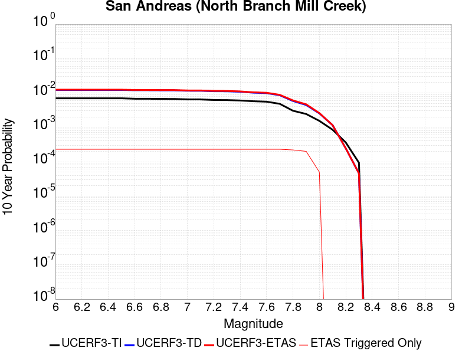 |

| Magnitude | 1 wk TI Prob | 1 wk TD Prob | 1 wk ETAS Prob | 1 wk ETAS/TD Gain | 1 wk ETAS Triggered Only | 1 mo TI Prob | 1 mo TD Prob | 1 mo ETAS Prob | 1 mo ETAS/TD Gain | 1 mo ETAS Triggered Only | 1 yr TI Prob | 1 yr TD Prob | 1 yr ETAS Prob | 1 yr ETAS/TD Gain | 1 yr ETAS Triggered Only | 10 yr TI Prob | 10 yr TD Prob | 10 yr ETAS Prob | 10 yr ETAS/TD Gain | 10 yr ETAS Triggered Only |
|-----|-----|-----|-----|-----|-----|-----|-----|-----|-----|-----|-----|-----|-----|-----|-----|-----|-----|-----|-----|-----|
| 6.0 | 1.3461156E-5 | 2.3499893E-5 | 1.6238552E-4 | 6.9100537 | 1.3888889E-4 | 5.7689394E-5 | 1.00709956E-4 | 2.3958486E-4 | 2.378959 | 1.3888889E-4 | 7.02142E-4 | 0.0012254574 | 0.001364176 | 1.1131974 | 1.3888889E-4 | 0.0069992766 | 0.01222957 | 0.012572546 | 1.0280448 | 3.4722223E-4 |
| 6.1 | 1.3461156E-5 | 2.3499893E-5 | 1.6238552E-4 | 6.9100537 | 1.3888889E-4 | 5.7689394E-5 | 1.00709956E-4 | 2.3958486E-4 | 2.378959 | 1.3888889E-4 | 7.02142E-4 | 0.0012254574 | 0.001364176 | 1.1131974 | 1.3888889E-4 | 0.0069992766 | 0.01222957 | 0.012572546 | 1.0280448 | 3.4722223E-4 |
| 6.2 | 1.3461156E-5 | 2.3499893E-5 | 1.6238552E-4 | 6.9100537 | 1.3888889E-4 | 5.7689394E-5 | 1.00709956E-4 | 2.3958486E-4 | 2.378959 | 1.3888889E-4 | 7.02142E-4 | 0.0012254574 | 0.001364176 | 1.1131974 | 1.3888889E-4 | 0.0069992766 | 0.01222957 | 0.012572546 | 1.0280448 | 3.4722223E-4 |
| 6.3 | 1.3461156E-5 | 2.3499893E-5 | 1.6238552E-4 | 6.9100537 | 1.3888889E-4 | 5.7689394E-5 | 1.00709956E-4 | 2.3958486E-4 | 2.378959 | 1.3888889E-4 | 7.02142E-4 | 0.0012254574 | 0.001364176 | 1.1131974 | 1.3888889E-4 | 0.0069992766 | 0.01222957 | 0.012572546 | 1.0280448 | 3.4722223E-4 |
| 6.4 | 1.3461156E-5 | 2.3499893E-5 | 1.6238552E-4 | 6.9100537 | 1.3888889E-4 | 5.7689394E-5 | 1.00709956E-4 | 2.3958486E-4 | 2.378959 | 1.3888889E-4 | 7.02142E-4 | 0.0012254574 | 0.001364176 | 1.1131974 | 1.3888889E-4 | 0.0069992766 | 0.01222957 | 0.012572546 | 1.0280448 | 3.4722223E-4 |
| 6.5 | 1.3450706E-5 | 2.3488852E-5 | 1.6237448E-4 | 6.9128313 | 1.3888889E-4 | 5.764461E-5 | 1.0066265E-4 | 2.3953755E-4 | 2.3796072 | 1.3888889E-4 | 7.0159714E-4 | 0.001224882 | 0.0013636007 | 1.1132507 | 1.3888889E-4 | 0.006993862 | 0.01222388 | 0.012566857 | 1.028058 | 3.4722223E-4 |
| 6.6 | 1.3074523E-5 | 2.3103135E-5 | 1.6198882E-4 | 7.011551 | 1.3888889E-4 | 5.6032466E-5 | 9.9009696E-5 | 2.3788484E-4 | 2.4026418 | 1.3888889E-4 | 6.8198174E-4 | 0.0012047797 | 0.0013435013 | 1.1151427 | 1.3888889E-4 | 0.006798926 | 0.012025044 | 0.012368091 | 1.0285277 | 3.4722223E-4 |
| 6.7 | 1.3050216E-5 | 2.3078432E-5 | 1.6196411E-4 | 7.0179863 | 1.3888889E-4 | 5.59283E-5 | 9.890384E-5 | 2.37779E-4 | 2.4041433 | 1.3888889E-4 | 6.8071426E-4 | 0.0012034923 | 0.001342214 | 1.115266 | 1.3888889E-4 | 0.0067863287 | 0.012012309 | 0.01235536 | 1.0285583 | 3.4722223E-4 |
| 6.8 | 1.29049395E-5 | 2.292684E-5 | 1.6181254E-4 | 7.0577774 | 1.3888889E-4 | 5.530571E-5 | 9.825421E-5 | 2.3712945E-4 | 2.4134278 | 1.3888889E-4 | 6.73139E-4 | 0.0011955918 | 0.0013343146 | 1.1160285 | 1.3888889E-4 | 0.0067110364 | 0.011934154 | 0.0122772325 | 1.0287476 | 3.4722223E-4 |
| 6.9 | 1.2867369E-5 | 2.2886245E-5 | 1.6177195E-4 | 7.0685234 | 1.3888889E-4 | 5.51447E-5 | 9.8080236E-5 | 2.369555E-4 | 2.4159353 | 1.3888889E-4 | 6.711799E-4 | 0.0011934759 | 0.0013321991 | 1.1162345 | 1.3888889E-4 | 0.006691564 | 0.011913223 | 0.012256309 | 1.0287987 | 3.4722223E-4 |
| 7.0 | 1.2495996E-5 | 2.2286325E-5 | 1.6117212E-4 | 7.231884 | 1.3888889E-4 | 5.3553173E-5 | 9.550934E-5 | 2.3438496E-4 | 2.4540527 | 1.3888889E-4 | 6.518148E-4 | 0.0011622087 | 0.0013009362 | 1.1193653 | 1.3888889E-4 | 0.0064990623 | 0.0116038285 | 0.011947022 | 1.0295758 | 3.4722223E-4 |
| 7.1 | 1.2452067E-5 | 2.2231397E-5 | 1.611172E-4 | 7.2472816 | 1.3888889E-4 | 5.3364907E-5 | 9.527396E-5 | 2.3414961E-4 | 2.4576454 | 1.3888889E-4 | 6.4952404E-4 | 0.0011593461 | 0.0012980739 | 1.1196605 | 1.3888889E-4 | 0.0064762887 | 0.0115755 | 0.011918703 | 1.0296491 | 3.4722223E-4 |
| 7.2 | 1.2002777E-5 | 2.1609963E-5 | 1.6049585E-4 | 7.4269376 | 1.3888889E-4 | 5.143946E-5 | 9.2610855E-5 | 2.3148688E-4 | 2.4995654 | 1.3888889E-4 | 6.2609545E-4 | 0.0011269567 | 0.0012656889 | 1.1231035 | 1.3888889E-4 | 0.006243344 | 0.011254923 | 0.011598237 | 1.0305035 | 3.4722223E-4 |
| 7.3 | 1.1923425E-5 | 2.1479793E-5 | 1.603657E-4 | 7.4658866 | 1.3888889E-4 | 5.109939E-5 | 9.205302E-5 | 2.3092913E-4 | 2.5086534 | 1.3888889E-4 | 6.219575E-4 | 0.001120172 | 0.0012589053 | 1.12385 | 1.3888889E-4 | 0.0062021962 | 0.011187789 | 0.011531127 | 1.0306886 | 3.4722223E-4 |
| 7.4 | 1.16105175E-5 | 2.0853771E-5 | 1.5973976E-4 | 7.6599936 | 1.3888889E-4 | 4.975841E-5 | 8.937026E-5 | 2.2824673E-4 | 2.553945 | 1.3888889E-4 | 6.0564023E-4 | 0.0010875424 | 0.0012262802 | 1.12757 | 1.3888889E-4 | 0.006039923 | 0.010865397 | 0.011208846 | 1.0316095 | 3.4722223E-4 |
| 7.5 | 1.1037265E-5 | 1.9553907E-5 | 1.5844007E-4 | 8.102733 | 1.3888889E-4 | 4.7301706E-5 | 8.379978E-5 | 2.2267703E-4 | 2.657251 | 1.3888889E-4 | 5.757461E-4 | 0.0010197869 | 0.0011585342 | 1.1360551 | 1.3888889E-4 | 0.005742567 | 0.010194898 | 0.01053858 | 1.0337112 | 3.4722223E-4 |
| 7.6 | 1.0720915E-5 | 1.899582E-5 | 1.5788207E-4 | 8.311412 | 1.3888889E-4 | 4.5945973E-5 | 8.140812E-5 | 2.202857E-4 | 2.7059426 | 1.3888889E-4 | 5.592486E-4 | 9.906954E-4 | 0.0011294467 | 1.1400545 | 1.3888889E-4 | 0.005578433 | 0.009906623 | 0.0102504045 | 1.0347023 | 3.4722223E-4 |
| 7.7 | 9.276279E-6 | 1.6441649E-5 | 1.5532825E-4 | 9.447244 | 1.3888889E-4 | 3.9754876E-5 | 7.0462316E-5 | 2.0934142E-4 | 2.97097 | 1.3888889E-4 | 4.839081E-4 | 8.575427E-4 | 9.963125E-4 | 1.1618226 | 1.3888889E-4 | 0.0048285574 | 0.008586041 | 0.008930282 | 1.0400931 | 3.4722223E-4 |
| 7.8 | 5.8346777E-6 | 1.1155013E-5 | 1.5004235E-4 | 13.450665 | 1.3888889E-4 | 2.5005522E-5 | 4.7806327E-5 | 1.8668857E-4 | 3.905102 | 1.3888889E-4 | 3.043997E-4 | 5.818867E-4 | 7.206948E-4 | 1.2385483 | 1.3888889E-4 | 0.0030398308 | 0.0058469265 | 0.0061921184 | 1.0590382 | 3.4722223E-4 |
| 7.9 | 4.690204E-6 | 8.509093E-6 | 7.7952944E-5 | 9.161134 | 6.9444446E-5 | 2.0100719E-5 | 3.6467034E-5 | 1.0590895E-4 | 2.904238 | 6.9444446E-5 | 2.4469878E-4 | 4.4389578E-4 | 5.133094E-4 | 1.1563737 | 6.9444446E-5 | 0.002444295 | 0.0044707474 | 0.004747283 | 1.0618545 | 2.7777778E-4 |
| 8.0 | 2.9570454E-6 | 4.846947E-6 | 7.4291056E-5 | 15.327393 | 6.9444446E-5 | 1.267299E-5 | 2.0772464E-5 | 9.0215464E-5 | 4.3430314 | 6.9444446E-5 | 1.5428272E-4 | 2.5287544E-4 | 3.223023E-4 | 1.2745497 | 6.9444446E-5 | 0.0015417566 | 0.002549644 | 0.002688179 | 1.054335 | 1.3888889E-4 |
| 8.1 | 1.6376824E-6 | 2.1968929E-6 | 2.1968929E-6 | 1.0 | 0.0 | 7.01862E-6 | 9.41522E-6 | 9.41522E-6 | 1.0 | 0.0 | 8.544835E-5 | 1.14624294E-4 | 1.14624294E-4 | 1.0 | 0.0 | 8.54155E-4 | 0.0011606582 | 0.0011606582 | 1.0 | 0.0 |
| 8.2 | 6.9631557E-7 | 4.5360213E-7 | 4.5360213E-7 | 1.0 | 0.0 | 2.984206E-6 | 1.9440076E-6 | 1.9440076E-6 | 1.0 | 0.0 | 3.63321E-5 | 2.3668037E-5 | 2.3668037E-5 | 1.0 | 0.0 | 3.6326164E-4 | 2.451564E-4 | 2.451564E-4 | 1.0 | 0.0 |
| 8.3 | 1.7876137E-7 | 8.360375E-8 | 8.360375E-8 | 1.0 | 0.0 | 7.661199E-7 | 3.5830175E-7 | 3.5830175E-7 | 1.0 | 0.0 | 9.32747E-6 | 4.3623154E-6 | 4.3623154E-6 | 1.0 | 0.0 | 9.3270784E-5 | 4.5817014E-5 | 4.5817014E-5 | 1.0 | 0.0 |

## San Andreas (Carrizo) rev
*[(top)](#table-of-contents)*

| 1 Week | 1 Month | 1 Year | 10 Year |
|-----|-----|-----|-----|
|  |  |  |  |

| Magnitude | 1 wk TI Prob | 1 wk TD Prob | 1 wk ETAS Prob | 1 wk ETAS/TD Gain | 1 wk ETAS Triggered Only | 1 mo TI Prob | 1 mo TD Prob | 1 mo ETAS Prob | 1 mo ETAS/TD Gain | 1 mo ETAS Triggered Only | 1 yr TI Prob | 1 yr TD Prob | 1 yr ETAS Prob | 1 yr ETAS/TD Gain | 1 yr ETAS Triggered Only | 10 yr TI Prob | 10 yr TD Prob | 10 yr ETAS Prob | 10 yr ETAS/TD Gain | 10 yr ETAS Triggered Only |
|-----|-----|-----|-----|-----|-----|-----|-----|-----|-----|-----|-----|-----|-----|-----|-----|-----|-----|-----|-----|-----|
| 6.0 | 1.1674632E-4 | 2.432302E-4 | 3.820853E-4 | 1.5708793 | 1.3888889E-4 | 5.002454E-4 | 0.0010420004 | 0.0012501166 | 1.1997277 | 2.0833334E-4 | 0.006073493 | 0.012613042 | 0.012818748 | 1.0163089 | 2.0833334E-4 | 0.0591016 | 0.12061418 | 0.12091952 | 1.0025315 | 3.4722223E-4 |
| 6.1 | 1.1674632E-4 | 2.432302E-4 | 3.820853E-4 | 1.5708793 | 1.3888889E-4 | 5.002454E-4 | 0.0010420004 | 0.0012501166 | 1.1997277 | 2.0833334E-4 | 0.006073493 | 0.012613042 | 0.012818748 | 1.0163089 | 2.0833334E-4 | 0.0591016 | 0.12061418 | 0.12091952 | 1.0025315 | 3.4722223E-4 |
| 6.2 | 1.1674632E-4 | 2.432302E-4 | 3.820853E-4 | 1.5708793 | 1.3888889E-4 | 5.002454E-4 | 0.0010420004 | 0.0012501166 | 1.1997277 | 2.0833334E-4 | 0.006073493 | 0.012613042 | 0.012818748 | 1.0163089 | 2.0833334E-4 | 0.0591016 | 0.12061418 | 0.12091952 | 1.0025315 | 3.4722223E-4 |
| 6.3 | 1.1674632E-4 | 2.432302E-4 | 3.820853E-4 | 1.5708793 | 1.3888889E-4 | 5.002454E-4 | 0.0010420004 | 0.0012501166 | 1.1997277 | 2.0833334E-4 | 0.006073493 | 0.012613042 | 0.012818748 | 1.0163089 | 2.0833334E-4 | 0.0591016 | 0.12061418 | 0.12091952 | 1.0025315 | 3.4722223E-4 |
| 6.4 | 1.1674632E-4 | 2.432302E-4 | 3.820853E-4 | 1.5708793 | 1.3888889E-4 | 5.002454E-4 | 0.0010420004 | 0.0012501166 | 1.1997277 | 2.0833334E-4 | 0.006073493 | 0.012613042 | 0.012818748 | 1.0163089 | 2.0833334E-4 | 0.0591016 | 0.12061418 | 0.12091952 | 1.0025315 | 3.4722223E-4 |
| 6.5 | 1.13136164E-4 | 2.3643032E-4 | 3.7528638E-4 | 1.5873022 | 1.3888889E-4 | 4.847792E-4 | 0.0010128808 | 0.0012210031 | 1.2054756 | 2.0833334E-4 | 0.0058862255 | 0.012262545 | 0.012468323 | 1.0167811 | 2.0833334E-4 | 0.057327334 | 0.117585555 | 0.117891945 | 1.0026057 | 3.4722223E-4 |
| 6.6 | 1.13136164E-4 | 2.3643032E-4 | 3.7528638E-4 | 1.5873022 | 1.3888889E-4 | 4.847792E-4 | 0.0010128808 | 0.0012210031 | 1.2054756 | 2.0833334E-4 | 0.0058862255 | 0.012262545 | 0.012468323 | 1.0167811 | 2.0833334E-4 | 0.057327334 | 0.117585555 | 0.117891945 | 1.0026057 | 3.4722223E-4 |
| 6.7 | 1.1149675E-4 | 2.3334254E-4 | 3.7219902E-4 | 1.5950757 | 1.3888889E-4 | 4.777557E-4 | 9.996577E-4 | 0.0012077828 | 1.2081963 | 2.0833334E-4 | 0.0058011734 | 0.012103349 | 0.012309161 | 1.0170045 | 2.0833334E-4 | 0.05652051 | 0.1162071 | 0.116513975 | 1.0026407 | 3.4722223E-4 |
| 6.8 | 1.1103589E-4 | 2.3236412E-4 | 3.7122075E-4 | 1.597582 | 1.3888889E-4 | 4.7578133E-4 | 9.954676E-4 | 0.0012035937 | 1.2090735 | 2.0833334E-4 | 0.005777263 | 0.012052901 | 0.012258723 | 1.0170766 | 2.0833334E-4 | 0.056293584 | 0.1157674 | 0.11607442 | 1.002652 | 3.4722223E-4 |
| 6.9 | 1.1053259E-4 | 2.3128795E-4 | 3.7014473E-4 | 1.6003631 | 1.3888889E-4 | 4.7362508E-4 | 9.90859E-4 | 0.001198986 | 1.2100469 | 2.0833334E-4 | 0.0057511497 | 0.01199741 | 0.0122032445 | 1.0171565 | 2.0833334E-4 | 0.05604569 | 0.11528359 | 0.11559079 | 1.0026647 | 3.4722223E-4 |
| 7.0 | 1.1005377E-4 | 2.3029637E-4 | 3.6915328E-4 | 1.6029487 | 1.3888889E-4 | 4.7157376E-4 | 9.866126E-4 | 0.0011947404 | 1.2109519 | 2.0833334E-4 | 0.0057263062 | 0.011946279 | 0.012152123 | 1.0172309 | 2.0833334E-4 | 0.055809796 | 0.11483591 | 0.11514326 | 1.0026764 | 3.4722223E-4 |
| 7.1 | 1.0308142E-4 | 2.1539345E-4 | 3.542524E-4 | 1.644676 | 1.3888889E-4 | 4.417027E-4 | 9.227892E-4 | 0.0011309303 | 1.2255565 | 2.0833334E-4 | 0.0053644776 | 0.011177397 | 0.011383402 | 1.0184305 | 2.0833334E-4 | 0.052368138 | 0.108092256 | 0.10840195 | 1.0028651 | 3.4722223E-4 |
| 7.2 | 1.0027479E-4 | 2.094724E-4 | 3.483322E-4 | 1.6629026 | 1.3888889E-4 | 4.296783E-4 | 8.9743105E-4 | 0.0011055775 | 1.2319357 | 2.0833334E-4 | 0.0052187922 | 0.010871782 | 0.011077851 | 1.0189544 | 2.0833334E-4 | 0.050979212 | 0.10539625 | 0.10570687 | 1.0029472 | 3.4722223E-4 |
| 7.3 | 9.816942E-5 | 2.0422463E-4 | 3.4308515E-4 | 1.6799401 | 1.3888889E-4 | 4.2065824E-4 | 8.7495585E-4 | 0.001083107 | 1.237899 | 2.0833334E-4 | 0.005109493 | 0.010600842 | 0.010806967 | 1.0194442 | 2.0833334E-4 | 0.049935985 | 0.102979995 | 0.10329147 | 1.0030246 | 3.4722223E-4 |
| 7.4 | 9.5634205E-5 | 1.9791997E-4 | 3.3678138E-4 | 1.7016038 | 1.3888889E-4 | 4.0979648E-4 | 8.479536E-4 | 0.0010561103 | 1.2454813 | 2.0833334E-4 | 0.0049778637 | 0.010275229 | 0.010481422 | 1.020067 | 2.0833334E-4 | 0.048678253 | 0.10006632 | 0.1003788 | 1.0031227 | 3.4722223E-4 |
| 7.5 | 8.052417E-5 | 1.611261E-4 | 2.9999262E-4 | 1.8618499 | 1.3888889E-4 | 3.4505792E-4 | 6.903579E-4 | 8.9854735E-4 | 1.3015676 | 2.0833334E-4 | 0.0041929903 | 0.008372796 | 0.008579385 | 1.0246738 | 2.0833334E-4 | 0.04114753 | 0.08281049 | 0.083065264 | 1.0030766 | 2.7777778E-4 |
| 7.6 | 7.897024E-5 | 1.5765853E-4 | 2.9652554E-4 | 1.8808086 | 1.3888889E-4 | 3.384E-4 | 6.755046E-4 | 8.8369724E-4 | 1.3082031 | 2.0833334E-4 | 0.0041122385 | 0.008193332 | 0.008399959 | 1.0252188 | 2.0833334E-4 | 0.040369697 | 0.08115171 | 0.08140694 | 1.0031452 | 2.7777778E-4 |
| 7.7 | 6.707427E-5 | 1.3276102E-4 | 2.0219626E-4 | 1.5230091 | 6.9444446E-5 | 2.8742946E-4 | 5.688518E-4 | 7.076617E-4 | 1.2440176 | 1.3888889E-4 | 0.003493839 | 0.00690381 | 0.00704174 | 1.0199789 | 1.3888889E-4 | 0.034394164 | 0.069048055 | 0.06924201 | 1.0028089 | 2.0833334E-4 |
| 7.8 | 6.147705E-5 | 1.2197486E-4 | 1.9141084E-4 | 1.5692647 | 6.9444446E-5 | 2.6344648E-4 | 5.226447E-4 | 6.6146103E-4 | 1.2656035 | 1.3888889E-4 | 0.0032027436 | 0.006344659 | 0.006482667 | 1.0217518 | 1.3888889E-4 | 0.031569764 | 0.06351457 | 0.06370967 | 1.0030718 | 2.0833334E-4 |
| 7.9 | 4.7636717E-5 | 8.87977E-5 | 8.87977E-5 | 1.0 | 0.0 | 2.0414138E-4 | 3.8050607E-4 | 4.499241E-4 | 1.182436 | 6.9444446E-5 | 0.0024825884 | 0.0046228287 | 0.004691952 | 1.0149527 | 6.9444446E-5 | 0.024550365 | 0.046628095 | 0.046760507 | 1.0028398 | 1.3888889E-4 |
| 8.0 | 3.3554235E-5 | 5.2136907E-5 | 5.2136907E-5 | 1.0 | 0.0 | 1.4379594E-4 | 2.2342477E-4 | 2.9285369E-4 | 1.3107486 | 6.9444446E-5 | 0.0017493097 | 0.002716805 | 0.0027860608 | 1.0254916 | 6.9444446E-5 | 0.017356034 | 0.027880952 | 0.027948461 | 1.0024213 | 6.9444446E-5 |
| 8.1 | 1.9175432E-5 | 1.9184976E-5 | 1.9184976E-5 | 1.0 | 0.0 | 8.217783E-5 | 8.2218736E-5 | 8.2218736E-5 | 1.0 | 0.0 | 0.0010000558 | 0.0010005541 | 0.0010005541 | 1.0 | 0.0 | 0.009955673 | 0.0107580265 | 0.0107580265 | 1.0 | 0.0 |
| 8.2 | 8.643924E-6 | 5.4748625E-6 | 5.4748625E-6 | 1.0 | 0.0 | 3.704486E-5 | 2.3463486E-5 | 2.3463486E-5 | 1.0 | 0.0 | 4.5092785E-4 | 2.8563058E-4 | 2.8563058E-4 | 1.0 | 0.0 | 0.0045001395 | 0.0032487072 | 0.0032487072 | 1.0 | 0.0 |
| 8.3 | 1.983087E-6 | 7.6599065E-7 | 7.6599065E-7 | 1.0 | 0.0 | 8.498917E-6 | 3.282813E-6 | 3.282813E-6 | 1.0 | 0.0 | 1.034694E-4 | 3.9967534E-5 | 3.9967534E-5 | 1.0 | 0.0 | 0.0010342124 | 4.719687E-4 | 4.719687E-4 | 1.0 | 0.0 |

## Scodie Lineament
*[(top)](#table-of-contents)*

| 1 Week | 1 Month | 1 Year | 10 Year |
|-----|-----|-----|-----|
|  |  |  |  |

| Magnitude | 1 wk TI Prob | 1 wk TD Prob | 1 wk ETAS Prob | 1 wk ETAS/TD Gain | 1 wk ETAS Triggered Only | 1 mo TI Prob | 1 mo TD Prob | 1 mo ETAS Prob | 1 mo ETAS/TD Gain | 1 mo ETAS Triggered Only | 1 yr TI Prob | 1 yr TD Prob | 1 yr ETAS Prob | 1 yr ETAS/TD Gain | 1 yr ETAS Triggered Only | 10 yr TI Prob | 10 yr TD Prob | 10 yr ETAS Prob | 10 yr ETAS/TD Gain | 10 yr ETAS Triggered Only |
|-----|-----|-----|-----|-----|-----|-----|-----|-----|-----|-----|-----|-----|-----|-----|-----|-----|-----|-----|-----|-----|
| 6.0 | 3.2919327E-6 | 3.0133422E-6 | 7.245758E-5 | 24.045586 | 6.9444446E-5 | 1.4108206E-5 | 1.2914278E-5 | 2.2124492E-4 | 17.131807 | 2.0833334E-4 | 1.7175387E-4 | 1.5722317E-4 | 3.6552374E-4 | 2.324872 | 2.0833334E-4 | 0.0017162118 | 0.0015714309 | 0.0019181075 | 1.220612 | 3.4722223E-4 |
| 6.1 | 1.8663811E-6 | 1.5490499E-6 | 1.5490499E-6 | 1.0 | 0.0 | 7.998751E-6 | 6.6387715E-6 | 6.6387715E-6 | 1.0 | 0.0 | 9.738045E-5 | 8.082454E-5 | 8.082454E-5 | 1.0 | 0.0 | 9.7337784E-4 | 8.080003E-4 | 8.773886E-4 | 1.0858766 | 6.9444446E-5 |
| 6.2 | 1.8663811E-6 | 1.5490499E-6 | 1.5490499E-6 | 1.0 | 0.0 | 7.998751E-6 | 6.6387715E-6 | 6.6387715E-6 | 1.0 | 0.0 | 9.738045E-5 | 8.082454E-5 | 8.082454E-5 | 1.0 | 0.0 | 9.7337784E-4 | 8.080003E-4 | 8.773886E-4 | 1.0858766 | 6.9444446E-5 |
| 6.3 | 1.8663811E-6 | 1.5490499E-6 | 1.5490499E-6 | 1.0 | 0.0 | 7.998751E-6 | 6.6387715E-6 | 6.6387715E-6 | 1.0 | 0.0 | 9.738045E-5 | 8.082454E-5 | 8.082454E-5 | 1.0 | 0.0 | 9.7337784E-4 | 8.080003E-4 | 8.773886E-4 | 1.0858766 | 6.9444446E-5 |
| 6.4 | 1.8663811E-6 | 1.5490499E-6 | 1.5490499E-6 | 1.0 | 0.0 | 7.998751E-6 | 6.6387715E-6 | 6.6387715E-6 | 1.0 | 0.0 | 9.738045E-5 | 8.082454E-5 | 8.082454E-5 | 1.0 | 0.0 | 9.7337784E-4 | 8.080003E-4 | 8.773886E-4 | 1.0858766 | 6.9444446E-5 |
| 6.5 | 1.8106311E-6 | 1.4909839E-6 | 1.4909839E-6 | 1.0 | 0.0 | 7.759824E-6 | 6.3899183E-6 | 6.3899183E-6 | 1.0 | 0.0 | 9.447177E-5 | 7.7794975E-5 | 7.7794975E-5 | 1.0 | 0.0 | 9.4431615E-4 | 7.7772606E-4 | 8.471165E-4 | 1.0892222 | 6.9444446E-5 |
| 6.6 | 1.2414679E-6 | 8.997558E-7 | 8.997558E-7 | 1.0 | 0.0 | 5.320566E-6 | 3.856091E-6 | 3.856091E-6 | 1.0 | 0.0 | 6.477596E-5 | 4.6946985E-5 | 4.6946985E-5 | 1.0 | 0.0 | 6.475708E-4 | 4.693793E-4 | 4.693793E-4 | 1.0 | 0.0 |
| 6.7 | 1.1062215E-6 | 7.594311E-7 | 7.594311E-7 | 1.0 | 0.0 | 4.7409408E-6 | 3.2547011E-6 | 3.2547011E-6 | 1.0 | 0.0 | 5.7719422E-5 | 3.9625334E-5 | 3.9625334E-5 | 1.0 | 0.0 | 5.770443E-4 | 3.961897E-4 | 3.961897E-4 | 1.0 | 0.0 |
| 6.8 | 1.0006736E-6 | 6.500397E-7 | 6.500397E-7 | 1.0 | 0.0 | 4.288594E-6 | 2.7858816E-6 | 2.7858816E-6 | 1.0 | 0.0 | 5.221238E-5 | 3.3917644E-5 | 3.3917644E-5 | 1.0 | 0.0 | 5.220012E-4 | 3.3913075E-4 | 3.3913075E-4 | 1.0 | 0.0 |
| 6.9 | 9.167364E-7 | 5.631625E-7 | 5.631625E-7 | 1.0 | 0.0 | 3.9288643E-6 | 2.4135516E-6 | 2.4135516E-6 | 1.0 | 0.0 | 4.7832873E-5 | 2.9384651E-5 | 2.9384651E-5 | 1.0 | 0.0 | 4.782258E-4 | 2.9381333E-4 | 2.9381333E-4 | 1.0 | 0.0 |
| 7.0 | 7.6987664E-7 | 4.113383E-7 | 4.113383E-7 | 1.0 | 0.0 | 3.2994672E-6 | 1.7628774E-6 | 1.7628774E-6 | 1.0 | 0.0 | 4.0170275E-5 | 2.1462862E-5 | 2.1462862E-5 | 1.0 | 0.0 | 4.0163012E-4 | 2.1461173E-4 | 2.1461173E-4 | 1.0 | 0.0 |
| 7.1 | 7.1038727E-7 | 3.5211494E-7 | 3.5211494E-7 | 1.0 | 0.0 | 3.0445133E-6 | 1.5090633E-6 | 1.5090633E-6 | 1.0 | 0.0 | 3.706632E-5 | 1.8372726E-5 | 1.8372726E-5 | 1.0 | 0.0 | 3.7060137E-4 | 1.8371557E-4 | 1.8371557E-4 | 1.0 | 0.0 |
| 7.2 | 2.0799602E-7 | 3.1186854E-8 | 3.1186854E-8 | 1.0 | 0.0 | 8.914113E-7 | 1.3365793E-7 | 1.3365793E-7 | 1.0 | 0.0 | 1.0852878E-5 | 1.6272843E-6 | 1.6272843E-6 | 1.0 | 0.0 | 1.08523476E-4 | 1.627273E-5 | 1.627273E-5 | 1.0 | 0.0 |
| 7.3 | 1.5048182E-7 | 1.5945696E-8 | 1.5945696E-8 | 1.0 | 0.0 | 6.449219E-7 | 6.83387E-8 | 6.83387E-8 | 1.0 | 0.0 | 7.851896E-6 | 8.320234E-7 | 8.320234E-7 | 1.0 | 0.0 | 7.851618E-5 | 8.320206E-6 | 8.320206E-6 | 1.0 | 0.0 |
| 7.4 | 5.9334678E-8 | 4.8683537E-9 | 4.8683537E-9 | 1.0 | 0.0 | 2.5429145E-7 | 2.0864372E-8 | 2.0864372E-8 | 1.0 | 0.0 | 3.095994E-6 | 2.5402372E-7 | 2.5402372E-7 | 1.0 | 0.0 | 3.095951E-5 | 2.5402353E-6 | 2.5402353E-6 | 1.0 | 0.0 |

## Red Pass
*[(top)](#table-of-contents)*

| 1 Week | 1 Month | 1 Year | 10 Year |
|-----|-----|-----|-----|
| 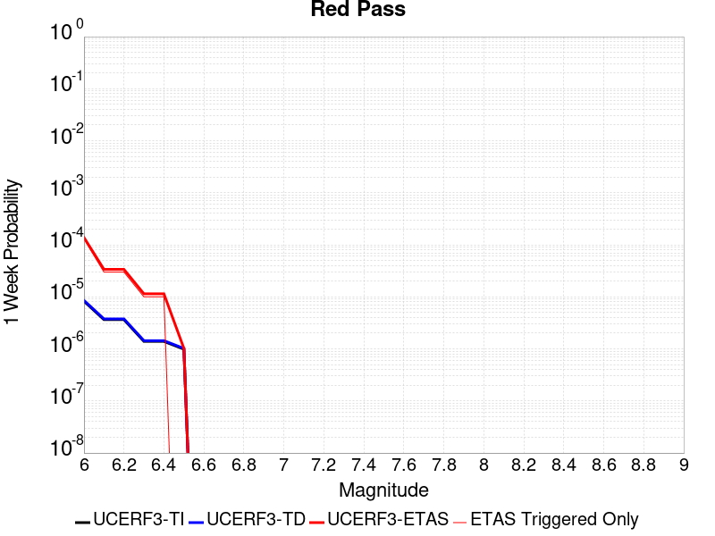 |  | 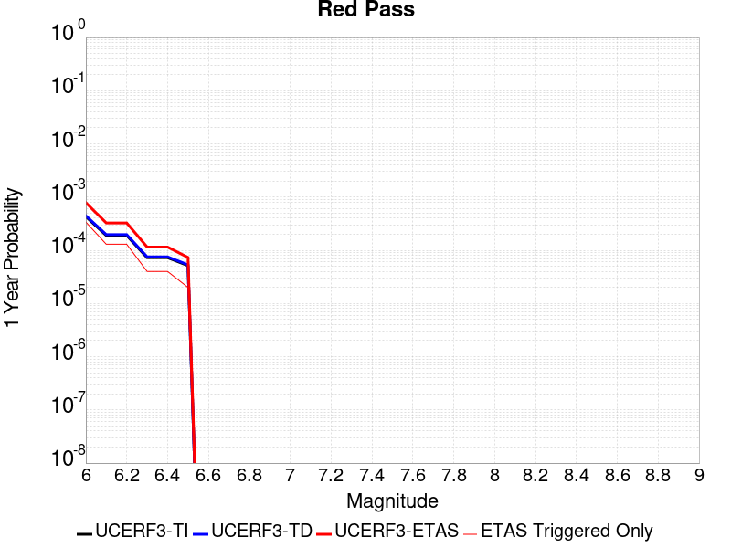 | 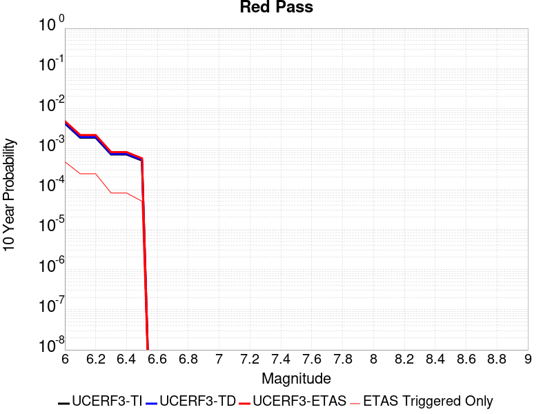 |

| Magnitude | 1 wk TI Prob | 1 wk TD Prob | 1 wk ETAS Prob | 1 wk ETAS/TD Gain | 1 wk ETAS Triggered Only | 1 mo TI Prob | 1 mo TD Prob | 1 mo ETAS Prob | 1 mo ETAS/TD Gain | 1 mo ETAS Triggered Only | 1 yr TI Prob | 1 yr TD Prob | 1 yr ETAS Prob | 1 yr ETAS/TD Gain | 1 yr ETAS Triggered Only | 10 yr TI Prob | 10 yr TD Prob | 10 yr ETAS Prob | 10 yr ETAS/TD Gain | 10 yr ETAS Triggered Only |
|-----|-----|-----|-----|-----|-----|-----|-----|-----|-----|-----|-----|-----|-----|-----|-----|-----|-----|-----|-----|-----|
| 6.0 | 8.258278E-6 | 8.551265E-6 | 1.4743897E-4 | 17.241774 | 1.3888889E-4 | 3.539214E-5 | 3.6647863E-5 | 2.4497358E-4 | 6.684525 | 2.0833334E-4 | 4.308141E-4 | 4.4611428E-4 | 7.2376814E-4 | 1.6223828 | 2.7777778E-4 | 0.0042997985 | 0.004453945 | 0.0047304854 | 1.062089 | 2.7777778E-4 |
| 6.1 | 3.649988E-6 | 3.7753161E-6 | 3.7753161E-6 | 1.0 | 0.0 | 1.5642712E-5 | 1.6179853E-5 | 1.6179853E-5 | 1.0 | 0.0 | 1.9043336E-4 | 1.9697666E-4 | 2.664074E-4 | 1.3524822 | 6.9444446E-5 | 0.0019027026 | 0.001968488 | 0.0021071036 | 1.0704173 | 1.3888889E-4 |
| 6.2 | 3.649988E-6 | 3.7753161E-6 | 3.7753161E-6 | 1.0 | 0.0 | 1.5642712E-5 | 1.6179853E-5 | 1.6179853E-5 | 1.0 | 0.0 | 1.9043336E-4 | 1.9697666E-4 | 2.664074E-4 | 1.3524822 | 6.9444446E-5 | 0.0019027026 | 0.001968488 | 0.0021071036 | 1.0704173 | 1.3888889E-4 |
| 6.3 | 1.3924937E-6 | 1.4411166E-6 | 1.4411166E-6 | 1.0 | 0.0 | 5.9678164E-6 | 6.1762075E-6 | 6.1762075E-6 | 1.0 | 0.0 | 7.265574E-5 | 7.519415E-5 | 7.519415E-5 | 1.0 | 0.0 | 7.263199E-4 | 7.518258E-4 | 7.518258E-4 | 1.0 | 0.0 |
| 6.4 | 1.3924937E-6 | 1.4411166E-6 | 1.4411166E-6 | 1.0 | 0.0 | 5.9678164E-6 | 6.1762075E-6 | 6.1762075E-6 | 1.0 | 0.0 | 7.265574E-5 | 7.519415E-5 | 7.519415E-5 | 1.0 | 0.0 | 7.263199E-4 | 7.518258E-4 | 7.518258E-4 | 1.0 | 0.0 |
| 6.5 | 9.876812E-7 | 1.0221912E-6 | 1.0221912E-6 | 1.0 | 0.0 | 4.2329125E-6 | 4.3808195E-6 | 4.3808195E-6 | 1.0 | 0.0 | 5.153449E-5 | 5.3336476E-5 | 5.3336476E-5 | 1.0 | 0.0 | 5.1522546E-4 | 5.333648E-4 | 5.333648E-4 | 1.0 | 0.0 |

## Deep Springs
*[(top)](#table-of-contents)*

| 1 Week | 1 Month | 1 Year | 10 Year |
|-----|-----|-----|-----|
|  |  |  |  |

| Magnitude | 1 wk TI Prob | 1 wk TD Prob | 1 wk ETAS Prob | 1 wk ETAS/TD Gain | 1 wk ETAS Triggered Only | 1 mo TI Prob | 1 mo TD Prob | 1 mo ETAS Prob | 1 mo ETAS/TD Gain | 1 mo ETAS Triggered Only | 1 yr TI Prob | 1 yr TD Prob | 1 yr ETAS Prob | 1 yr ETAS/TD Gain | 1 yr ETAS Triggered Only | 10 yr TI Prob | 10 yr TD Prob | 10 yr ETAS Prob | 10 yr ETAS/TD Gain | 10 yr ETAS Triggered Only |
|-----|-----|-----|-----|-----|-----|-----|-----|-----|-----|-----|-----|-----|-----|-----|-----|-----|-----|-----|-----|-----|
| 6.0 | 1.9810619E-5 | 2.311252E-5 | 9.255536E-5 | 4.004555 | 6.9444446E-5 | 8.489989E-5 | 9.905276E-5 | 1.6849033E-4 | 1.701016 | 6.9444446E-5 | 0.001033166 | 0.0012058079 | 0.0013445293 | 1.1150444 | 1.3888889E-4 | 0.010283757 | 0.012042425 | 0.012385465 | 1.028486 | 3.4722223E-4 |
| 6.1 | 1.9810619E-5 | 2.311252E-5 | 9.255536E-5 | 4.004555 | 6.9444446E-5 | 8.489989E-5 | 9.905276E-5 | 1.6849033E-4 | 1.701016 | 6.9444446E-5 | 0.001033166 | 0.0012058079 | 0.0013445293 | 1.1150444 | 1.3888889E-4 | 0.010283757 | 0.012042425 | 0.012385465 | 1.028486 | 3.4722223E-4 |
| 6.2 | 1.9810619E-5 | 2.311252E-5 | 9.255536E-5 | 4.004555 | 6.9444446E-5 | 8.489989E-5 | 9.905276E-5 | 1.6849033E-4 | 1.701016 | 6.9444446E-5 | 0.001033166 | 0.0012058079 | 0.0013445293 | 1.1150444 | 1.3888889E-4 | 0.010283757 | 0.012042425 | 0.012385465 | 1.028486 | 3.4722223E-4 |
| 6.3 | 1.9810619E-5 | 2.311252E-5 | 9.255536E-5 | 4.004555 | 6.9444446E-5 | 8.489989E-5 | 9.905276E-5 | 1.6849033E-4 | 1.701016 | 6.9444446E-5 | 0.001033166 | 0.0012058079 | 0.0013445293 | 1.1150444 | 1.3888889E-4 | 0.010283757 | 0.012042425 | 0.012385465 | 1.028486 | 3.4722223E-4 |
| 6.4 | 1.9810619E-5 | 2.311252E-5 | 9.255536E-5 | 4.004555 | 6.9444446E-5 | 8.489989E-5 | 9.905276E-5 | 1.6849033E-4 | 1.701016 | 6.9444446E-5 | 0.001033166 | 0.0012058079 | 0.0013445293 | 1.1150444 | 1.3888889E-4 | 0.010283757 | 0.012042425 | 0.012385465 | 1.028486 | 3.4722223E-4 |
| 6.5 | 1.7190405E-5 | 2.0050555E-5 | 8.949361E-5 | 4.463398 | 6.9444446E-5 | 7.367108E-5 | 8.593095E-5 | 1.5536943E-4 | 1.8080729 | 6.9444446E-5 | 8.9657627E-4 | 0.0010462094 | 0.0011849529 | 1.1326154 | 1.3888889E-4 | 0.008929676 | 0.010462056 | 0.010805646 | 1.0328414 | 3.4722223E-4 |
| 6.6 | 1.7190405E-5 | 2.0050555E-5 | 8.949361E-5 | 4.463398 | 6.9444446E-5 | 7.367108E-5 | 8.593095E-5 | 1.5536943E-4 | 1.8080729 | 6.9444446E-5 | 8.9657627E-4 | 0.0010462094 | 0.0011849529 | 1.1326154 | 1.3888889E-4 | 0.008929676 | 0.010462056 | 0.010805646 | 1.0328414 | 3.4722223E-4 |

## San Andreas (Creeping Section) 2011 CFM
*[(top)](#table-of-contents)*

| 1 Week | 1 Month | 1 Year | 10 Year |
|-----|-----|-----|-----|
|  |  |  |  |

| Magnitude | 1 wk TI Prob | 1 wk TD Prob | 1 wk ETAS Prob | 1 wk ETAS/TD Gain | 1 wk ETAS Triggered Only | 1 mo TI Prob | 1 mo TD Prob | 1 mo ETAS Prob | 1 mo ETAS/TD Gain | 1 mo ETAS Triggered Only | 1 yr TI Prob | 1 yr TD Prob | 1 yr ETAS Prob | 1 yr ETAS/TD Gain | 1 yr ETAS Triggered Only | 10 yr TI Prob | 10 yr TD Prob | 10 yr ETAS Prob | 10 yr ETAS/TD Gain | 10 yr ETAS Triggered Only |
|-----|-----|-----|-----|-----|-----|-----|-----|-----|-----|-----|-----|-----|-----|-----|-----|-----|-----|-----|-----|-----|
| 6.0 | 5.986481E-4 | 0.001228691 | 0.0013674092 | 1.1128992 | 1.3888889E-4 | 0.0025631124 | 0.005246795 | 0.0055231154 | 1.0526646 | 2.7777778E-4 | 0.030762846 | 0.061203245 | 0.061464023 | 1.0042608 | 2.7777778E-4 | 0.26835477 | 0.425928 | 0.42612734 | 1.000468 | 3.4722223E-4 |
| 6.1 | 5.015945E-4 | 0.0010230356 | 0.001092409 | 1.0678114 | 6.9444446E-5 | 0.00214792 | 0.004369436 | 0.0045768586 | 1.0474714 | 2.0833334E-4 | 0.025839351 | 0.051246606 | 0.051444262 | 1.003857 | 2.0833334E-4 | 0.23032776 | 0.37284943 | 0.37298012 | 1.0003505 | 2.0833334E-4 |
| 6.2 | 4.073338E-4 | 8.1157376E-4 | 8.8096183E-4 | 1.0854982 | 6.9444446E-5 | 0.0017445484 | 0.0034683137 | 0.0036067208 | 1.0399061 | 1.3888889E-4 | 0.021034058 | 0.04093177 | 0.041064974 | 1.0032543 | 1.3888889E-4 | 0.19150782 | 0.31302592 | 0.31312132 | 1.0003048 | 1.3888889E-4 |
| 6.3 | 3.464099E-4 | 6.7455834E-4 | 7.4395596E-4 | 1.1028786 | 6.9444446E-5 | 0.0014837692 | 0.0028832308 | 0.0030217194 | 1.0480324 | 1.3888889E-4 | 0.017915873 | 0.034187846 | 0.034321986 | 1.0039237 | 1.3888889E-4 | 0.16538359 | 0.27130842 | 0.27140963 | 1.000373 | 1.3888889E-4 |
| 6.4 | 2.935057E-4 | 5.5516965E-4 | 6.2457554E-4 | 1.1250174 | 6.9444446E-5 | 0.0012572751 | 0.0023727308 | 0.0025112901 | 1.0583966 | 1.3888889E-4 | 0.015200248 | 0.02826279 | 0.028397754 | 1.0047753 | 1.3888889E-4 | 0.14201577 | 0.23297668 | 0.2330832 | 1.0004573 | 1.3888889E-4 |
| 6.5 | 2.3409708E-4 | 4.2132285E-4 | 4.90738E-4 | 1.1647553 | 6.9444446E-5 | 0.0010028875 | 0.0018017791 | 0.0019404178 | 1.0769454 | 1.3888889E-4 | 0.012141965 | 0.021586355 | 0.021722246 | 1.0062952 | 1.3888889E-4 | 0.11499573 | 0.1868149 | 0.18692786 | 1.0006045 | 1.3888889E-4 |
| 6.6 | 1.5842178E-4 | 2.5068692E-4 | 3.2011396E-4 | 1.2769471 | 6.9444446E-5 | 6.7877385E-4 | 0.0010739256 | 0.0012126653 | 1.1291894 | 1.3888889E-4 | 0.0082328 | 0.012995283 | 0.013132367 | 1.0105487 | 1.3888889E-4 | 0.07934396 | 0.12313759 | 0.12325938 | 1.0009891 | 1.3888889E-4 |
| 6.7 | 1.5616413E-4 | 2.4605254E-4 | 3.154799E-4 | 1.2821648 | 6.9444446E-5 | 6.691031E-4 | 0.0010540807 | 0.0011928232 | 1.1316242 | 1.3888889E-4 | 0.0081159435 | 0.012757154 | 0.012894271 | 1.0107483 | 1.3888889E-4 | 0.0782586 | 0.12116472 | 0.12128678 | 1.0010074 | 1.3888889E-4 |
| 6.8 | 1.5538467E-4 | 2.442914E-4 | 3.137189E-4 | 1.2841995 | 6.9444446E-5 | 6.6576427E-4 | 0.001046539 | 0.0011852826 | 1.1325737 | 1.3888889E-4 | 0.008075596 | 0.012666538 | 0.012803667 | 1.0108261 | 1.3888889E-4 | 0.07788358 | 0.12039561 | 0.120517775 | 1.0010147 | 1.3888889E-4 |
| 6.9 | 1.5153569E-4 | 2.3538464E-4 | 3.0481274E-4 | 1.294956 | 6.9444446E-5 | 6.49277E-4 | 0.0010084033 | 0.0011471522 | 1.1375926 | 1.3888889E-4 | 0.007876333 | 0.012208726 | 0.012345919 | 1.0112373 | 1.3888889E-4 | 0.07602952 | 0.11646574 | 0.11658846 | 1.0010537 | 1.3888889E-4 |
| 7.0 | 1.4588932E-4 | 2.2395732E-4 | 2.9338623E-4 | 1.3100095 | 6.9444446E-5 | 6.250901E-4 | 9.59466E-4 | 0.0010982216 | 1.1446176 | 1.3888889E-4 | 0.0075839474 | 0.011619428 | 0.011756703 | 1.0118142 | 1.3888889E-4 | 0.073302895 | 0.11131206 | 0.111435495 | 1.0011089 | 1.3888889E-4 |
| 7.1 | 1.1565079E-4 | 1.6281323E-4 | 2.3224637E-4 | 1.4264588 | 6.9444446E-5 | 4.955521E-4 | 6.9758523E-4 | 8.363772E-4 | 1.1989607 | 1.3888889E-4 | 0.006016669 | 0.008460228 | 0.008597942 | 1.0162778 | 1.3888889E-4 | 0.058563538 | 0.08366478 | 0.08379205 | 1.0015212 | 1.3888889E-4 |
| 7.2 | 1.0393792E-4 | 1.4615392E-4 | 1.4615392E-4 | 1.0 | 0.0 | 4.4537216E-4 | 6.262243E-4 | 6.956253E-4 | 1.1108245 | 6.9444446E-5 | 0.005408933 | 0.0075977976 | 0.0076667145 | 1.0090706 | 6.9444446E-5 | 0.052791595 | 0.07561503 | 0.07567923 | 1.000849 | 6.9444446E-5 |
| 7.3 | 9.332884E-5 | 1.2780601E-4 | 1.2780601E-4 | 1.0 | 0.0 | 3.999194E-4 | 5.4762565E-4 | 6.1703206E-4 | 1.1267406 | 6.9444446E-5 | 0.0048581534 | 0.0066470946 | 0.006716077 | 1.0103779 | 6.9444446E-5 | 0.047533102 | 0.06647954 | 0.06654437 | 1.0009751 | 6.9444446E-5 |
| 7.4 | 8.670252E-5 | 1.1702972E-4 | 1.1702972E-4 | 1.0 | 0.0 | 3.715293E-4 | 5.014601E-4 | 5.708697E-4 | 1.1384151 | 6.9444446E-5 | 0.004513991 | 0.0060883067 | 0.0061573284 | 1.0113368 | 6.9444446E-5 | 0.044233937 | 0.061148684 | 0.06121388 | 1.0010662 | 6.9444446E-5 |
| 7.5 | 7.3036405E-5 | 9.005699E-5 | 9.005699E-5 | 1.0 | 0.0 | 3.129756E-4 | 3.859015E-4 | 4.5531915E-4 | 1.1798843 | 6.9444446E-5 | 0.0038038217 | 0.0046882504 | 0.0047573694 | 1.014743 | 6.9444446E-5 | 0.03739367 | 0.047875606 | 0.047941726 | 1.001381 | 6.9444446E-5 |
| 7.6 | 6.3935775E-5 | 8.280209E-5 | 8.280209E-5 | 1.0 | 0.0 | 2.7398168E-4 | 3.5481792E-4 | 4.2423772E-4 | 1.1956491 | 6.9444446E-5 | 0.0033306254 | 0.00431137 | 0.0043805153 | 1.0160378 | 6.9444446E-5 | 0.032811474 | 0.043990135 | 0.044056524 | 1.0015092 | 6.9444446E-5 |
| 7.7 | 5.5050095E-5 | 6.661729E-5 | 6.661729E-5 | 1.0 | 0.0 | 2.3590765E-4 | 2.8547147E-4 | 3.5489607E-4 | 1.2431929 | 6.9444446E-5 | 0.0028683927 | 0.0034700802 | 0.0035392835 | 1.0199429 | 6.9444446E-5 | 0.0283165 | 0.03579509 | 0.035862047 | 1.0018706 | 6.9444446E-5 |
| 7.8 | 5.027131E-5 | 6.1627725E-5 | 6.1627725E-5 | 1.0 | 0.0 | 2.1543067E-4 | 2.640921E-4 | 3.335182E-4 | 1.2628859 | 6.9444446E-5 | 0.0026197135 | 0.003210584 | 0.0032798054 | 1.0215604 | 6.9444446E-5 | 0.025890453 | 0.03312572 | 0.033192866 | 1.0020269 | 6.9444446E-5 |
| 7.9 | 3.7271806E-5 | 5.0224386E-5 | 5.0224386E-5 | 1.0 | 0.0 | 1.5972654E-4 | 2.1522962E-4 | 2.8465912E-4 | 1.3225834 | 6.9444446E-5 | 0.0019429359 | 0.0026172737 | 0.0026865364 | 1.0264636 | 6.9444446E-5 | 0.019260362 | 0.027066687 | 0.027134253 | 1.0024962 | 6.9444446E-5 |
| 8.0 | 2.7310243E-5 | 3.1428404E-5 | 3.1428404E-5 | 1.0 | 0.0 | 1.17038646E-4 | 1.3468621E-4 | 2.041213E-4 | 1.5155323 | 6.9444446E-5 | 0.0014240141 | 0.0016385721 | 0.0017079028 | 1.0423117 | 6.9444446E-5 | 0.014149235 | 0.01721387 | 0.017282117 | 1.0039648 | 6.9444446E-5 |
| 8.1 | 1.7940547E-5 | 1.7400796E-5 | 1.7400796E-5 | 1.0 | 0.0 | 7.688579E-5 | 7.457271E-5 | 7.457271E-5 | 1.0 | 0.0 | 9.3568244E-4 | 9.075451E-4 | 9.075451E-4 | 1.0 | 0.0 | 0.009317525 | 0.009799073 | 0.009799073 | 1.0 | 0.0 |
| 8.2 | 8.643924E-6 | 5.4748625E-6 | 5.4748625E-6 | 1.0 | 0.0 | 3.704486E-5 | 2.3463486E-5 | 2.3463486E-5 | 1.0 | 0.0 | 4.5092785E-4 | 2.8563058E-4 | 2.8563058E-4 | 1.0 | 0.0 | 0.0045001395 | 0.0032487072 | 0.0032487072 | 1.0 | 0.0 |
| 8.3 | 1.983087E-6 | 7.6599065E-7 | 7.6599065E-7 | 1.0 | 0.0 | 8.498917E-6 | 3.282813E-6 | 3.282813E-6 | 1.0 | 0.0 | 1.034694E-4 | 3.9967534E-5 | 3.9967534E-5 | 1.0 | 0.0 | 0.0010342124 | 4.719687E-4 | 4.719687E-4 | 1.0 | 0.0 |

## San Jacinto (San Bernardino)
*[(top)](#table-of-contents)*

| 1 Week | 1 Month | 1 Year | 10 Year |
|-----|-----|-----|-----|
|  |  |  |  |

| Magnitude | 1 wk TI Prob | 1 wk TD Prob | 1 wk ETAS Prob | 1 wk ETAS/TD Gain | 1 wk ETAS Triggered Only | 1 mo TI Prob | 1 mo TD Prob | 1 mo ETAS Prob | 1 mo ETAS/TD Gain | 1 mo ETAS Triggered Only | 1 yr TI Prob | 1 yr TD Prob | 1 yr ETAS Prob | 1 yr ETAS/TD Gain | 1 yr ETAS Triggered Only | 10 yr TI Prob | 10 yr TD Prob | 10 yr ETAS Prob | 10 yr ETAS/TD Gain | 10 yr ETAS Triggered Only |
|-----|-----|-----|-----|-----|-----|-----|-----|-----|-----|-----|-----|-----|-----|-----|-----|-----|-----|-----|-----|-----|
| 6.0 | 3.409352E-5 | 3.5986508E-5 | 3.5986508E-5 | 1.0 | 0.0 | 1.461069E-4 | 1.542188E-4 | 2.2365253E-4 | 1.4502288 | 6.9444446E-5 | 0.0017774 | 0.0018759987 | 0.0020839411 | 1.1108437 | 2.0833334E-4 | 0.01763251 | 0.019349935 | 0.019622337 | 1.0140777 | 2.7777778E-4 |
| 6.1 | 3.409352E-5 | 3.5986508E-5 | 3.5986508E-5 | 1.0 | 0.0 | 1.461069E-4 | 1.542188E-4 | 2.2365253E-4 | 1.4502288 | 6.9444446E-5 | 0.0017774 | 0.0018759987 | 0.0020839411 | 1.1108437 | 2.0833334E-4 | 0.01763251 | 0.019349935 | 0.019622337 | 1.0140777 | 2.7777778E-4 |
| 6.2 | 3.409352E-5 | 3.5986508E-5 | 3.5986508E-5 | 1.0 | 0.0 | 1.461069E-4 | 1.542188E-4 | 2.2365253E-4 | 1.4502288 | 6.9444446E-5 | 0.0017774 | 0.0018759987 | 0.0020839411 | 1.1108437 | 2.0833334E-4 | 0.01763251 | 0.019349935 | 0.019622337 | 1.0140777 | 2.7777778E-4 |
| 6.3 | 3.409352E-5 | 3.5986508E-5 | 3.5986508E-5 | 1.0 | 0.0 | 1.461069E-4 | 1.542188E-4 | 2.2365253E-4 | 1.4502288 | 6.9444446E-5 | 0.0017774 | 0.0018759987 | 0.0020839411 | 1.1108437 | 2.0833334E-4 | 0.01763251 | 0.019349935 | 0.019622337 | 1.0140777 | 2.7777778E-4 |
| 6.4 | 3.400795E-5 | 3.5879173E-5 | 3.5879173E-5 | 1.0 | 0.0 | 1.4574021E-4 | 1.5375883E-4 | 2.2319259E-4 | 1.4515758 | 6.9444446E-5 | 0.0017729428 | 0.0018704084 | 0.002078352 | 1.1111755 | 2.0833334E-4 | 0.017588645 | 0.019295016 | 0.019567436 | 1.0141186 | 2.7777778E-4 |
| 6.5 | 3.341482E-5 | 3.5139812E-5 | 3.5139812E-5 | 1.0 | 0.0 | 1.4319851E-4 | 1.5059051E-4 | 2.2002449E-4 | 1.4610782 | 6.9444446E-5 | 0.0017420477 | 0.0018318989 | 0.0019705335 | 1.075678 | 1.3888889E-4 | 0.017284546 | 0.018916558 | 0.01912095 | 1.0108049 | 2.0833334E-4 |
| 6.6 | 3.3364955E-5 | 3.5077028E-5 | 3.5077028E-5 | 1.0 | 0.0 | 1.4298483E-4 | 1.5032147E-4 | 2.1975547E-4 | 1.4619035 | 6.9444446E-5 | 0.0017394501 | 0.001828629 | 0.0019672639 | 1.0758135 | 1.3888889E-4 | 0.017258976 | 0.018884424 | 0.019088823 | 1.0108237 | 2.0833334E-4 |
| 6.7 | 3.335922E-5 | 3.5066805E-5 | 3.5066805E-5 | 1.0 | 0.0 | 1.4296026E-4 | 1.5027766E-4 | 2.1971166E-4 | 1.4620382 | 6.9444446E-5 | 0.0017391514 | 0.0018280965 | 0.0019667314 | 1.0758357 | 1.3888889E-4 | 0.017256035 | 0.018879214 | 0.019083615 | 1.0108267 | 2.0833334E-4 |
| 6.8 | 3.327683E-5 | 3.496087E-5 | 3.496087E-5 | 1.0 | 0.0 | 1.4260718E-4 | 1.498237E-4 | 2.1925774E-4 | 1.4634383 | 6.9444446E-5 | 0.0017348597 | 0.0018225788 | 0.0019612145 | 1.0760657 | 1.3888889E-4 | 0.017213784 | 0.018824987 | 0.019029398 | 1.0108585 | 2.0833334E-4 |
| 6.9 | 3.3235785E-5 | 3.4901823E-5 | 3.4901823E-5 | 1.0 | 0.0 | 1.4243131E-4 | 1.4957068E-4 | 2.1900474E-4 | 1.4642224 | 6.9444446E-5 | 0.0017327217 | 0.0018195034 | 0.0019581395 | 1.0761945 | 1.3888889E-4 | 0.017192734 | 0.018794855 | 0.018999273 | 1.0108763 | 2.0833334E-4 |
| 7.0 | 3.3197095E-5 | 3.4841752E-5 | 3.4841752E-5 | 1.0 | 0.0 | 1.422655E-4 | 1.4931326E-4 | 2.1874734E-4 | 1.4650228 | 6.9444446E-5 | 0.0017307063 | 0.0018163746 | 0.0019550112 | 1.076326 | 1.3888889E-4 | 0.017172894 | 0.018764233 | 0.018968657 | 1.0108943 | 2.0833334E-4 |
| 7.1 | 3.3129716E-5 | 3.4721965E-5 | 3.4721965E-5 | 1.0 | 0.0 | 1.4197677E-4 | 1.4879994E-4 | 2.1823405E-4 | 1.4666272 | 6.9444446E-5 | 0.0017271966 | 0.0018101353 | 0.0019487728 | 1.0765896 | 1.3888889E-4 | 0.017138338 | 0.018703312 | 0.01890775 | 1.0109305 | 2.0833334E-4 |
| 7.2 | 3.3034008E-5 | 3.458941E-5 | 3.458941E-5 | 1.0 | 0.0 | 1.4156665E-4 | 1.4823192E-4 | 2.1766608E-4 | 1.4684156 | 6.9444446E-5 | 0.0017222111 | 0.0018032312 | 0.0019418696 | 1.0768833 | 1.3888889E-4 | 0.017089253 | 0.018635705 | 0.018840156 | 1.010971 | 2.0833334E-4 |
| 7.3 | 3.2956614E-5 | 3.445717E-5 | 3.445717E-5 | 1.0 | 0.0 | 1.4123498E-4 | 1.4766524E-4 | 2.1709943E-4 | 1.4702135 | 6.9444446E-5 | 0.0017181796 | 0.0017963431 | 0.0019349825 | 1.0771787 | 1.3888889E-4 | 0.017049557 | 0.018568452 | 0.018772917 | 1.0110114 | 2.0833334E-4 |
| 7.4 | 3.2915937E-5 | 3.4378863E-5 | 3.4378863E-5 | 1.0 | 0.0 | 1.4106068E-4 | 1.4732967E-4 | 2.1676389E-4 | 1.4712846 | 6.9444446E-5 | 0.0017160608 | 0.0017922645 | 0.0019309045 | 1.0773547 | 1.3888889E-4 | 0.017028693 | 0.018528719 | 0.018733192 | 1.0110354 | 2.0833334E-4 |
| 7.5 | 3.281791E-5 | 3.4243778E-5 | 3.4243778E-5 | 1.0 | 0.0 | 1.406406E-4 | 1.4675081E-4 | 2.1618506E-4 | 1.4731439 | 6.9444446E-5 | 0.0017109542 | 0.0017852283 | 0.0019238692 | 1.0776601 | 1.3888889E-4 | 0.016978411 | 0.018459605 | 0.018664094 | 1.0110775 | 2.0833334E-4 |
| 7.6 | 3.2521442E-5 | 3.396873E-5 | 3.396873E-5 | 1.0 | 0.0 | 1.3937015E-4 | 1.4557215E-4 | 2.150065E-4 | 1.4769754 | 6.9444446E-5 | 0.0016955109 | 0.0017709016 | 0.0019095446 | 1.0782895 | 1.3888889E-4 | 0.016826328 | 0.018317232 | 0.01852175 | 1.0111653 | 2.0833334E-4 |
| 7.7 | 3.0287873E-5 | 3.245276E-5 | 3.245276E-5 | 1.0 | 0.0 | 1.297987E-4 | 1.3907586E-4 | 2.0851064E-4 | 1.4992584 | 6.9444446E-5 | 0.0015791537 | 0.0016919347 | 0.0018305886 | 1.08195 | 1.3888889E-4 | 0.01567979 | 0.01752809 | 0.017732773 | 1.0116774 | 2.0833334E-4 |
| 7.8 | 2.6316151E-5 | 2.9663592E-5 | 2.9663592E-5 | 1.0 | 0.0 | 1.1277862E-4 | 1.2712348E-4 | 1.9655911E-4 | 1.546206 | 6.9444446E-5 | 0.0013722149 | 0.0015466306 | 0.0016853047 | 1.0896621 | 1.3888889E-4 | 0.013637724 | 0.016069634 | 0.01627462 | 1.0127561 | 2.0833334E-4 |
| 7.9 | 2.0761147E-5 | 2.34181E-5 | 2.34181E-5 | 1.0 | 0.0 | 8.897331E-5 | 1.0035944E-4 | 1.6979691E-4 | 1.6918879 | 6.9444446E-5 | 0.0010827117 | 0.0012211921 | 0.0013599113 | 1.1135933 | 1.3888889E-4 | 0.010774517 | 0.012793174 | 0.012998843 | 1.0160764 | 2.0833334E-4 |
| 8.0 | 1.5738568E-5 | 1.6033575E-5 | 1.6033575E-5 | 1.0 | 0.0 | 6.744926E-5 | 6.871352E-5 | 1.3815319E-4 | 2.010568 | 6.9444446E-5 | 8.2088535E-4 | 8.3626667E-4 | 9.750394E-4 | 1.1659431 | 1.3888889E-4 | 0.008178596 | 0.008865921 | 0.009072407 | 1.0232899 | 2.0833334E-4 |
| 8.1 | 1.0105832E-5 | 8.3304985E-6 | 8.3304985E-6 | 1.0 | 0.0 | 4.3309992E-5 | 3.570165E-5 | 3.570165E-5 | 1.0 | 0.0 | 5.2717153E-4 | 4.345814E-4 | 4.345814E-4 | 1.0 | 0.0 | 0.005259227 | 0.004677232 | 0.004677232 | 1.0 | 0.0 |
| 8.2 | 4.189207E-6 | 1.5784357E-6 | 1.5784357E-6 | 1.0 | 0.0 | 1.7953622E-5 | 6.7647065E-6 | 6.7647065E-6 | 1.0 | 0.0 | 2.1856341E-4 | 8.235722E-5 | 8.235722E-5 | 1.0 | 0.0 | 0.0021834858 | 9.565867E-4 | 9.565867E-4 | 1.0 | 0.0 |
| 8.3 | 1.2758221E-6 | 3.6149942E-7 | 3.6149942E-7 | 1.0 | 0.0 | 5.4677976E-6 | 1.5492824E-6 | 1.5492824E-6 | 1.0 | 0.0 | 6.65684E-5 | 1.8862354E-5 | 1.8862354E-5 | 1.0 | 0.0 | 6.6548464E-4 | 2.2751294E-4 | 2.2751294E-4 | 1.0 | 0.0 |

## Death Valley (No)
*[(top)](#table-of-contents)*

| 1 Week | 1 Month | 1 Year | 10 Year |
|-----|-----|-----|-----|
|  |  |  | 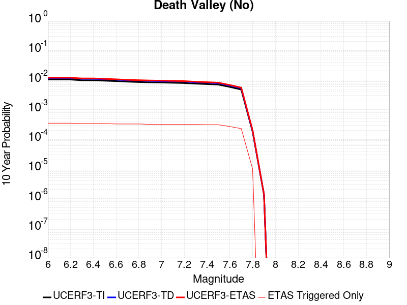 |

| Magnitude | 1 wk TI Prob | 1 wk TD Prob | 1 wk ETAS Prob | 1 wk ETAS/TD Gain | 1 wk ETAS Triggered Only | 1 mo TI Prob | 1 mo TD Prob | 1 mo ETAS Prob | 1 mo ETAS/TD Gain | 1 mo ETAS Triggered Only | 1 yr TI Prob | 1 yr TD Prob | 1 yr ETAS Prob | 1 yr ETAS/TD Gain | 1 yr ETAS Triggered Only | 10 yr TI Prob | 10 yr TD Prob | 10 yr ETAS Prob | 10 yr ETAS/TD Gain | 10 yr ETAS Triggered Only |
|-----|-----|-----|-----|-----|-----|-----|-----|-----|-----|-----|-----|-----|-----|-----|-----|-----|-----|-----|-----|-----|
| 6.0 | 2.0074807E-5 | 2.2500084E-5 | 2.2500084E-5 | 1.0 | 0.0 | 8.603206E-5 | 9.642541E-5 | 1.6586315E-4 | 1.7201188 | 6.9444446E-5 | 0.001046937 | 0.0011733545 | 0.0013120804 | 1.1182302 | 1.3888889E-4 | 0.010420183 | 0.011672506 | 0.011947042 | 1.0235199 | 2.7777778E-4 |
| 6.1 | 2.0074807E-5 | 2.2500084E-5 | 2.2500084E-5 | 1.0 | 0.0 | 8.603206E-5 | 9.642541E-5 | 1.6586315E-4 | 1.7201188 | 6.9444446E-5 | 0.001046937 | 0.0011733545 | 0.0013120804 | 1.1182302 | 1.3888889E-4 | 0.010420183 | 0.011672506 | 0.011947042 | 1.0235199 | 2.7777778E-4 |
| 6.2 | 2.0074807E-5 | 2.2500084E-5 | 2.2500084E-5 | 1.0 | 0.0 | 8.603206E-5 | 9.642541E-5 | 1.6586315E-4 | 1.7201188 | 6.9444446E-5 | 0.001046937 | 0.0011733545 | 0.0013120804 | 1.1182302 | 1.3888889E-4 | 0.010420183 | 0.011672506 | 0.011947042 | 1.0235199 | 2.7777778E-4 |
| 6.3 | 1.9050609E-5 | 2.1336948E-5 | 2.1336948E-5 | 1.0 | 0.0 | 8.164292E-5 | 9.1440896E-5 | 1.6087899E-4 | 1.7593768 | 6.9444446E-5 | 9.935491E-4 | 0.001112731 | 0.0012514654 | 1.1246791 | 1.3888889E-4 | 0.009891188 | 0.011072419 | 0.011347121 | 1.0248096 | 2.7777778E-4 |
| 6.4 | 1.9050609E-5 | 2.1336948E-5 | 2.1336948E-5 | 1.0 | 0.0 | 8.164292E-5 | 9.1440896E-5 | 1.6087899E-4 | 1.7593768 | 6.9444446E-5 | 9.935491E-4 | 0.001112731 | 0.0012514654 | 1.1246791 | 1.3888889E-4 | 0.009891188 | 0.011072419 | 0.011347121 | 1.0248096 | 2.7777778E-4 |
| 6.5 | 1.8367004E-5 | 2.0561009E-5 | 2.0561009E-5 | 1.0 | 0.0 | 7.8713354E-5 | 8.811567E-5 | 1.57554E-4 | 1.7880361 | 6.9444446E-5 | 9.5791375E-4 | 0.0010722869 | 0.0012110268 | 1.129387 | 1.3888889E-4 | 0.009537951 | 0.0106719155 | 0.010946729 | 1.0257511 | 2.7777778E-4 |
| 6.6 | 1.779439E-5 | 1.9910927E-5 | 1.9910927E-5 | 1.0 | 0.0 | 7.625944E-5 | 8.53298E-5 | 1.547683E-4 | 1.8137664 | 6.9444446E-5 | 9.280632E-4 | 0.0010384015 | 0.0011771462 | 1.1336137 | 1.3888889E-4 | 0.009241969 | 0.010336253 | 0.010611159 | 1.0265963 | 2.7777778E-4 |
| 6.7 | 1.7025437E-5 | 1.9043426E-5 | 1.9043426E-5 | 1.0 | 0.0 | 7.296412E-5 | 8.161216E-5 | 1.5105093E-4 | 1.8508385 | 6.9444446E-5 | 8.87976E-4 | 9.931813E-4 | 0.0011319323 | 1.1397035 | 1.3888889E-4 | 0.008844362 | 0.009888145 | 0.010163176 | 1.0278143 | 2.7777778E-4 |
| 6.8 | 1.6545107E-5 | 1.8512545E-5 | 1.8512545E-5 | 1.0 | 0.0 | 7.090568E-5 | 7.93371E-5 | 1.4877603E-4 | 1.8752391 | 6.9444446E-5 | 8.629347E-4 | 9.655073E-4 | 0.0011042621 | 1.1437118 | 1.3888889E-4 | 0.008595915 | 0.009613829 | 0.009888936 | 1.0286158 | 2.7777778E-4 |
| 6.9 | 1.615478E-5 | 1.8087594E-5 | 1.8087594E-5 | 1.0 | 0.0 | 6.9232934E-5 | 7.751599E-5 | 1.4695505E-4 | 1.8958031 | 6.9444446E-5 | 8.4258494E-4 | 9.433546E-4 | 0.0010821125 | 1.1470898 | 1.3888889E-4 | 0.008393973 | 0.009394196 | 0.0096693635 | 1.0292913 | 2.7777778E-4 |
| 7.0 | 1.5894311E-5 | 1.780555E-5 | 1.780555E-5 | 1.0 | 0.0 | 6.81167E-5 | 7.6307304E-5 | 1.4574645E-4 | 1.9099934 | 6.9444446E-5 | 8.2900526E-4 | 9.286515E-4 | 0.0010674114 | 1.1494209 | 1.3888889E-4 | 0.008259195 | 0.009248397 | 0.009523606 | 1.0297575 | 2.7777778E-4 |
| 7.1 | 1.5602263E-5 | 1.7483504E-5 | 1.7483504E-5 | 1.0 | 0.0 | 6.6865134E-5 | 7.492718E-5 | 1.4436642E-4 | 1.9267564 | 6.9444446E-5 | 8.137789E-4 | 9.118627E-4 | 0.001050625 | 1.1521745 | 1.3888889E-4 | 0.008108052 | 0.009081894 | 0.009357149 | 1.0303081 | 2.7777778E-4 |
| 7.2 | 1.5323829E-5 | 1.717063E-5 | 1.717063E-5 | 1.0 | 0.0 | 6.56719E-5 | 7.358637E-5 | 1.4302571E-4 | 1.9436439 | 6.9444446E-5 | 7.99262E-4 | 8.9555193E-4 | 0.0010343164 | 1.1549486 | 1.3888889E-4 | 0.007963934 | 0.008920107 | 0.009195407 | 1.0308628 | 2.7777778E-4 |
| 7.3 | 1.4556212E-5 | 1.6302456E-5 | 1.6302456E-5 | 1.0 | 0.0 | 6.238227E-5 | 6.9865826E-5 | 1.3930543E-4 | 1.9938992 | 6.9444446E-5 | 7.592395E-4 | 8.5029035E-4 | 9.890611E-4 | 1.163204 | 1.3888889E-4 | 0.0075665074 | 0.008471014 | 0.008746439 | 1.0325137 | 2.7777778E-4 |
| 7.4 | 1.411725E-5 | 1.580796E-5 | 1.580796E-5 | 1.0 | 0.0 | 6.0501097E-5 | 6.7746674E-5 | 1.3718642E-4 | 2.024991 | 6.9444446E-5 | 7.363519E-4 | 8.245094E-4 | 9.632838E-4 | 1.1683115 | 1.3888889E-4 | 0.0073391674 | 0.008215138 | 0.008490634 | 1.0335351 | 2.7777778E-4 |
| 7.5 | 1.3503312E-5 | 1.5126289E-5 | 1.5126289E-5 | 1.0 | 0.0 | 5.7870053E-5 | 6.482538E-5 | 1.3426531E-4 | 2.0711846 | 6.9444446E-5 | 7.043401E-4 | 7.8896893E-4 | 9.277483E-4 | 1.1758996 | 1.3888889E-4 | 0.007021119 | 0.007862304 | 0.0081378985 | 1.0350525 | 2.7777778E-4 |
| 7.6 | 1.1279839E-5 | 1.2626327E-5 | 1.2626327E-5 | 1.0 | 0.0 | 4.834127E-5 | 5.4111737E-5 | 1.2355243E-4 | 2.2832832 | 6.9444446E-5 | 5.88396E-4 | 6.5861654E-4 | 7.97414E-4 | 1.2107408 | 1.3888889E-4 | 0.005868405 | 0.006567199 | 0.006843152 | 1.04202 | 2.7777778E-4 |
| 7.7 | 9.189108E-6 | 1.0283358E-5 | 1.0283358E-5 | 1.0 | 0.0 | 3.93813E-5 | 4.407082E-5 | 1.135122E-4 | 2.5756772 | 6.9444446E-5 | 4.7936183E-4 | 5.3643517E-4 | 6.7524955E-4 | 1.258772 | 1.3888889E-4 | 0.004783291 | 0.005351914 | 0.005628205 | 1.0516248 | 2.7777778E-4 |
| 7.8 | 3.4586725E-7 | 3.6482615E-7 | 3.6482615E-7 | 1.0 | 0.0 | 1.4822873E-6 | 1.5635396E-6 | 1.5635396E-6 | 1.0 | 0.0 | 1.80467E-5 | 1.9035933E-5 | 1.9035933E-5 | 1.0 | 0.0 | 1.8045233E-4 | 1.9034347E-4 | 1.9034347E-4 | 1.0 | 0.0 |
| 7.9 | 2.5591178E-9 | 2.6696718E-9 | 2.6696718E-9 | 1.0 | 0.0 | 1.0967647E-8 | 1.14414505E-8 | 1.14414505E-8 | 1.0 | 0.0 | 1.335311E-7 | 1.3929966E-7 | 1.3929966E-7 | 1.0 | 0.0 | 1.3353102E-6 | 1.3929966E-6 | 1.3929966E-6 | 1.0 | 0.0 |

## Death Valley (Fish Lake Valley)
*[(top)](#table-of-contents)*

| 1 Week | 1 Month | 1 Year | 10 Year |
|-----|-----|-----|-----|
|  |  |  |  |

| Magnitude | 1 wk TI Prob | 1 wk TD Prob | 1 wk ETAS Prob | 1 wk ETAS/TD Gain | 1 wk ETAS Triggered Only | 1 mo TI Prob | 1 mo TD Prob | 1 mo ETAS Prob | 1 mo ETAS/TD Gain | 1 mo ETAS Triggered Only | 1 yr TI Prob | 1 yr TD Prob | 1 yr ETAS Prob | 1 yr ETAS/TD Gain | 1 yr ETAS Triggered Only | 10 yr TI Prob | 10 yr TD Prob | 10 yr ETAS Prob | 10 yr ETAS/TD Gain | 10 yr ETAS Triggered Only |
|-----|-----|-----|-----|-----|-----|-----|-----|-----|-----|-----|-----|-----|-----|-----|-----|-----|-----|-----|-----|-----|
| 6.0 | 3.872328E-5 | 4.7267473E-5 | 4.7267473E-5 | 1.0 | 0.0 | 1.6594635E-4 | 2.0256084E-4 | 2.7199122E-4 | 1.3427631 | 6.9444446E-5 | 0.0020185246 | 0.002463534 | 0.0026020808 | 1.056239 | 1.3888889E-4 | 0.02000288 | 0.024388181 | 0.024659185 | 1.0111121 | 2.7777778E-4 |
| 6.1 | 3.872328E-5 | 4.7267473E-5 | 4.7267473E-5 | 1.0 | 0.0 | 1.6594635E-4 | 2.0256084E-4 | 2.7199122E-4 | 1.3427631 | 6.9444446E-5 | 0.0020185246 | 0.002463534 | 0.0026020808 | 1.056239 | 1.3888889E-4 | 0.02000288 | 0.024388181 | 0.024659185 | 1.0111121 | 2.7777778E-4 |
| 6.2 | 3.872328E-5 | 4.7267473E-5 | 4.7267473E-5 | 1.0 | 0.0 | 1.6594635E-4 | 2.0256084E-4 | 2.7199122E-4 | 1.3427631 | 6.9444446E-5 | 0.0020185246 | 0.002463534 | 0.0026020808 | 1.056239 | 1.3888889E-4 | 0.02000288 | 0.024388181 | 0.024659185 | 1.0111121 | 2.7777778E-4 |
| 6.3 | 2.8356371E-5 | 3.3609853E-5 | 3.3609853E-5 | 1.0 | 0.0 | 1.2152165E-4 | 1.4403471E-4 | 2.1346916E-4 | 1.4820675 | 6.9444446E-5 | 0.0014785219 | 0.0017522911 | 0.0018909366 | 1.0791224 | 1.3888889E-4 | 0.014687235 | 0.017391782 | 0.017664729 | 1.015694 | 2.7777778E-4 |
| 6.4 | 2.8356371E-5 | 3.3609853E-5 | 3.3609853E-5 | 1.0 | 0.0 | 1.2152165E-4 | 1.4403471E-4 | 2.1346916E-4 | 1.4820675 | 6.9444446E-5 | 0.0014785219 | 0.0017522911 | 0.0018909366 | 1.0791224 | 1.3888889E-4 | 0.014687235 | 0.017391782 | 0.017664729 | 1.015694 | 2.7777778E-4 |
| 6.5 | 2.4448687E-5 | 2.8607552E-5 | 2.8607552E-5 | 1.0 | 0.0 | 1.0477588E-4 | 1.2259831E-4 | 1.9203425E-4 | 1.5663693 | 6.9444446E-5 | 0.0012748998 | 0.0014916632 | 0.0016303448 | 1.0929712 | 1.3888889E-4 | 0.012676105 | 0.014821377 | 0.015095037 | 1.018464 | 2.7777778E-4 |
| 6.6 | 2.1298161E-5 | 2.4660083E-5 | 2.4660083E-5 | 1.0 | 0.0 | 9.127464E-5 | 1.0568198E-4 | 1.7511909E-4 | 1.6570382 | 6.9444446E-5 | 0.0011107022 | 0.0012859525 | 0.0014246628 | 1.1078658 | 1.3888889E-4 | 0.011051672 | 0.012788526 | 0.013062751 | 1.0214431 | 2.7777778E-4 |
| 6.7 | 1.8959729E-5 | 2.1781025E-5 | 2.1781025E-5 | 1.0 | 0.0 | 8.125345E-5 | 9.334405E-5 | 1.6278202E-4 | 1.7438927 | 6.9444446E-5 | 9.888117E-4 | 0.001135897 | 0.0012746281 | 1.1221335 | 1.3888889E-4 | 0.009844234 | 0.01130357 | 0.011578208 | 1.0242965 | 2.7777778E-4 |
| 6.8 | 1.6691629E-5 | 1.9018353E-5 | 1.9018353E-5 | 1.0 | 0.0 | 7.153359E-5 | 8.150477E-5 | 1.5094355E-4 | 1.8519597 | 6.9444446E-5 | 8.7057345E-4 | 9.918857E-4 | 0.0011306368 | 1.1398863 | 1.3888889E-4 | 0.008671708 | 0.009876343 | 0.010151378 | 1.0278478 | 2.7777778E-4 |
| 6.9 | 1.450505E-5 | 1.638954E-5 | 1.638954E-5 | 1.0 | 0.0 | 6.216302E-5 | 7.0239046E-5 | 1.3967861E-4 | 1.9886178 | 6.9444446E-5 | 7.5657194E-4 | 8.5483363E-4 | 9.936038E-4 | 1.1623359 | 1.3888889E-4 | 0.007540013 | 0.008516385 | 0.008791798 | 1.0323391 | 2.7777778E-4 |
| 7.0 | 1.2940855E-5 | 1.4537972E-5 | 1.4537972E-5 | 1.0 | 0.0 | 5.545963E-5 | 6.230414E-5 | 1.3174425E-4 | 2.1145346 | 6.9444446E-5 | 6.750118E-4 | 7.5829466E-4 | 8.9707825E-4 | 1.1830206 | 1.3888889E-4 | 0.006729651 | 0.0075576897 | 0.007833368 | 1.0364765 | 2.7777778E-4 |
| 7.1 | 1.2544658E-5 | 1.4078208E-5 | 1.4078208E-5 | 1.0 | 0.0 | 5.3761712E-5 | 6.0333812E-5 | 1.2977407E-4 | 2.1509342 | 6.9444446E-5 | 6.5435225E-4 | 7.343222E-4 | 8.731091E-4 | 1.189 | 1.3888889E-4 | 0.006524288 | 0.007319551 | 0.0075952956 | 1.0376723 | 2.7777778E-4 |
| 7.2 | 1.2489416E-5 | 1.4015674E-5 | 1.4015674E-5 | 1.0 | 0.0 | 5.3524967E-5 | 6.0065824E-5 | 1.295061E-4 | 2.1560695 | 6.9444446E-5 | 6.514716E-4 | 7.310616E-4 | 8.69849E-4 | 1.1898435 | 1.3888889E-4 | 0.006495651 | 0.0072871596 | 0.007562913 | 1.037841 | 2.7777778E-4 |
| 7.3 | 1.2368307E-5 | 1.3879812E-5 | 1.3879812E-5 | 1.0 | 0.0 | 5.3005948E-5 | 5.9483587E-5 | 1.289239E-4 | 2.167386 | 6.9444446E-5 | 6.451563E-4 | 7.2397763E-4 | 8.6276594E-4 | 1.1917025 | 1.3888889E-4 | 0.0064328653 | 0.007216782 | 0.007492555 | 1.0382128 | 2.7777778E-4 |
| 7.4 | 1.2161707E-5 | 1.36478675E-5 | 1.36478675E-5 | 1.0 | 0.0 | 5.212056E-5 | 5.8489582E-5 | 1.2792996E-4 | 2.1872265 | 6.9444446E-5 | 6.3438306E-4 | 7.118836E-4 | 8.506736E-4 | 1.1949617 | 1.3888889E-4 | 0.006325751 | 0.0070966207 | 0.0073724273 | 1.0388645 | 2.7777778E-4 |
| 7.5 | 1.1707948E-5 | 1.3145515E-5 | 1.3145515E-5 | 1.0 | 0.0 | 5.0175953E-5 | 5.6336736E-5 | 1.2577727E-4 | 2.2325976 | 6.9444446E-5 | 6.10721E-4 | 6.856895E-4 | 8.2448317E-4 | 1.2024148 | 1.3888889E-4 | 0.0060904534 | 0.006836321 | 0.0071122 | 1.0403548 | 2.7777778E-4 |
| 7.6 | 1.0319538E-5 | 1.1579622E-5 | 1.1579622E-5 | 1.0 | 0.0 | 4.4225842E-5 | 4.9626036E-5 | 1.1906704E-4 | 2.3992856 | 6.9444446E-5 | 5.383166E-4 | 6.040347E-4 | 7.428397E-4 | 1.2297964 | 1.3888889E-4 | 0.0053701443 | 0.0060244603 | 0.006300565 | 1.0458305 | 2.7777778E-4 |
| 7.7 | 8.937764E-6 | 1.0022779E-5 | 1.0022779E-5 | 1.0 | 0.0 | 3.830414E-5 | 4.295409E-5 | 1.1239555E-4 | 2.616644 | 6.9444446E-5 | 4.6625308E-4 | 5.228456E-4 | 6.6166185E-4 | 1.2655015 | 1.3888889E-4 | 0.0046527605 | 0.005216664 | 0.005492993 | 1.0529704 | 2.7777778E-4 |
| 7.8 | 3.108007E-7 | 3.284654E-7 | 3.284654E-7 | 1.0 | 0.0 | 1.3320023E-6 | 1.407708E-6 | 1.407708E-6 | 1.0 | 0.0 | 1.6217007E-5 | 1.7138715E-5 | 1.7138715E-5 | 1.0 | 0.0 | 1.6215823E-4 | 1.7137431E-4 | 1.7137431E-4 | 1.0 | 0.0 |
| 7.9 | 2.5591178E-9 | 2.6696718E-9 | 2.6696718E-9 | 1.0 | 0.0 | 1.0967647E-8 | 1.14414505E-8 | 1.14414505E-8 | 1.0 | 0.0 | 1.335311E-7 | 1.3929966E-7 | 1.3929966E-7 | 1.0 | 0.0 | 1.3353102E-6 | 1.3929966E-6 | 1.3929966E-6 | 1.0 | 0.0 |

## Santa Rosa Island
*[(top)](#table-of-contents)*

| 1 Week | 1 Month | 1 Year | 10 Year |
|-----|-----|-----|-----|
|  |  |  |  |

| Magnitude | 1 wk TI Prob | 1 wk TD Prob | 1 wk ETAS Prob | 1 wk ETAS/TD Gain | 1 wk ETAS Triggered Only | 1 mo TI Prob | 1 mo TD Prob | 1 mo ETAS Prob | 1 mo ETAS/TD Gain | 1 mo ETAS Triggered Only | 1 yr TI Prob | 1 yr TD Prob | 1 yr ETAS Prob | 1 yr ETAS/TD Gain | 1 yr ETAS Triggered Only | 10 yr TI Prob | 10 yr TD Prob | 10 yr ETAS Prob | 10 yr ETAS/TD Gain | 10 yr ETAS Triggered Only |
|-----|-----|-----|-----|-----|-----|-----|-----|-----|-----|-----|-----|-----|-----|-----|-----|-----|-----|-----|-----|-----|
| 6.0 | 4.1143165E-5 | 4.7091133E-5 | 1.16532305E-4 | 2.4746125 | 6.9444446E-5 | 1.7631594E-4 | 2.0180465E-4 | 2.7123507E-4 | 1.3440478 | 6.9444446E-5 | 0.002144533 | 0.0024544 | 0.002592948 | 1.0564488 | 1.3888889E-4 | 0.021239553 | 0.024293551 | 0.024496824 | 1.0083673 | 2.0833334E-4 |
| 6.1 | 2.1061249E-5 | 2.3864959E-5 | 9.3307746E-5 | 3.9098222 | 6.9444446E-5 | 9.0259375E-5 | 1.0227455E-4 | 1.717119E-4 | 1.6789308 | 6.9444446E-5 | 0.0010983539 | 0.0012445104 | 0.0013138683 | 1.0557312 | 6.9444446E-5 | 0.01092941 | 0.012378449 | 0.012447033 | 1.0055406 | 6.9444446E-5 |
| 6.2 | 2.1061249E-5 | 2.3864959E-5 | 9.3307746E-5 | 3.9098222 | 6.9444446E-5 | 9.0259375E-5 | 1.0227455E-4 | 1.717119E-4 | 1.6789308 | 6.9444446E-5 | 0.0010983539 | 0.0012445104 | 0.0013138683 | 1.0557312 | 6.9444446E-5 | 0.01092941 | 0.012378449 | 0.012447033 | 1.0055406 | 6.9444446E-5 |
| 6.3 | 1.5158236E-5 | 1.7074419E-5 | 8.651768E-5 | 5.0670934 | 6.9444446E-5 | 6.496225E-5 | 7.3174095E-5 | 1.4261345E-4 | 1.948961 | 6.9444446E-5 | 7.906284E-4 | 8.905424E-4 | 9.59925E-4 | 1.0779105 | 6.9444446E-5 | 0.007878214 | 0.008870989 | 0.008939818 | 1.0077589 | 6.9444446E-5 |
| 6.4 | 1.2341918E-5 | 1.3852917E-5 | 8.32964E-5 | 6.012914 | 6.9444446E-5 | 5.2892858E-5 | 5.9368336E-5 | 1.2880866E-4 | 2.1696525 | 6.9444446E-5 | 6.437803E-4 | 7.225779E-4 | 7.919722E-4 | 1.096037 | 6.9444446E-5 | 0.006419184 | 0.007203121 | 0.0072720656 | 1.0095714 | 6.9444446E-5 |
| 6.5 | 9.061158E-6 | 1.0117031E-5 | 7.956077E-5 | 7.8640437 | 6.9444446E-5 | 3.883296E-5 | 4.3358013E-5 | 1.1279945E-4 | 2.6015825 | 6.9444446E-5 | 4.726887E-4 | 5.277613E-4 | 5.971691E-4 | 1.1315136 | 6.9444446E-5 | 0.004716845 | 0.0052656173 | 0.0053346963 | 1.0131189 | 6.9444446E-5 |
| 6.6 | 7.5461685E-6 | 8.400733E-6 | 7.78446E-5 | 9.266404 | 6.9444446E-5 | 3.2340322E-5 | 3.600267E-5 | 1.0544462E-4 | 2.9287999 | 6.9444446E-5 | 3.936723E-4 | 4.3824865E-4 | 5.0766265E-4 | 1.1583896 | 6.9444446E-5 | 0.003929756 | 0.0043742736 | 0.0044434145 | 1.0158062 | 6.9444446E-5 |
| 6.7 | 5.5023775E-6 | 6.087381E-6 | 7.55314E-5 | 12.407866 | 6.9444446E-5 | 2.3581404E-5 | 2.6088532E-5 | 9.553116E-5 | 3.6618068 | 6.9444446E-5 | 2.8706578E-4 | 3.1758484E-4 | 3.8700723E-4 | 1.2185948 | 6.9444446E-5 | 0.0028669522 | 0.0031716314 | 0.0032408556 | 1.021826 | 6.9444446E-5 |
| 6.8 | 3.7351679E-6 | 4.0831405E-6 | 4.0831405E-6 | 1.0 | 0.0 | 1.6007763E-5 | 1.749907E-5 | 1.749907E-5 | 1.0 | 0.0 | 1.948771E-4 | 2.1303284E-4 | 2.1303284E-4 | 1.0 | 0.0 | 0.0019470629 | 0.0021285315 | 0.0021285315 | 1.0 | 0.0 |
| 6.9 | 2.456366E-6 | 2.6292705E-6 | 2.6292705E-6 | 1.0 | 0.0 | 1.0527241E-5 | 1.1268254E-5 | 1.1268254E-5 | 1.0 | 0.0 | 1.2816161E-4 | 1.3718237E-4 | 1.3718237E-4 | 1.0 | 0.0 | 0.0012808773 | 0.0013709799 | 0.0013709799 | 1.0 | 0.0 |
| 7.0 | 2.3245157E-6 | 2.4827782E-6 | 2.4827782E-6 | 1.0 | 0.0 | 9.962172E-6 | 1.0640435E-5 | 1.0640435E-5 | 1.0 | 0.0 | 1.2128269E-4 | 1.2953962E-4 | 1.2953962E-4 | 1.0 | 0.0 | 0.0012121652 | 0.0012946434 | 0.0012946434 | 1.0 | 0.0 |
| 7.1 | 2.2248344E-6 | 2.37325E-6 | 2.37325E-6 | 1.0 | 0.0 | 9.53497E-6 | 1.0171032E-5 | 1.0171032E-5 | 1.0 | 0.0 | 1.1608207E-4 | 1.2382529E-4 | 1.2382529E-4 | 1.0 | 0.0 | 0.0011602144 | 0.001237565 | 0.001237565 | 1.0 | 0.0 |
| 7.2 | 2.1350402E-6 | 2.276154E-6 | 2.276154E-6 | 1.0 | 0.0 | 9.150141E-6 | 9.754909E-6 | 9.754909E-6 | 1.0 | 0.0 | 1.1139726E-4 | 1.1875956E-4 | 1.1875956E-4 | 1.0 | 0.0 | 0.0011134144 | 0.0011869629 | 0.0011869629 | 1.0 | 0.0 |
| 7.3 | 1.9793572E-6 | 2.108719E-6 | 2.108719E-6 | 1.0 | 0.0 | 8.482932E-6 | 9.037336E-6 | 9.037336E-6 | 1.0 | 0.0 | 1.032748E-4 | 1.10024026E-4 | 1.10024026E-4 | 1.0 | 0.0 | 0.0010322682 | 0.0010996973 | 0.0010996973 | 1.0 | 0.0 |
| 7.4 | 1.6951194E-6 | 1.8045733E-6 | 1.8045733E-6 | 1.0 | 0.0 | 7.264777E-6 | 7.733863E-6 | 7.733863E-6 | 1.0 | 0.0 | 8.844508E-5 | 9.415573E-5 | 9.415573E-5 | 1.0 | 0.0 | 8.840988E-4 | 9.4116E-4 | 9.4116E-4 | 1.0 | 0.0 |
| 7.5 | 8.987207E-7 | 9.5122147E-7 | 9.5122147E-7 | 1.0 | 0.0 | 3.8516546E-6 | 4.076657E-6 | 4.076657E-6 | 1.0 | 0.0 | 4.6892885E-5 | 4.963218E-5 | 4.963218E-5 | 1.0 | 0.0 | 4.688299E-4 | 4.9621216E-4 | 4.9621216E-4 | 1.0 | 0.0 |
| 7.6 | 3.8783037E-7 | 4.052932E-7 | 4.052932E-7 | 1.0 | 0.0 | 1.6621291E-6 | 1.7369698E-6 | 1.7369698E-6 | 1.0 | 0.0 | 2.0236233E-5 | 2.1147409E-5 | 2.1147409E-5 | 1.0 | 0.0 | 2.023439E-4 | 2.1145462E-4 | 2.1145462E-4 | 1.0 | 0.0 |
| 7.7 | 6.181804E-8 | 6.339035E-8 | 6.339035E-8 | 1.0 | 0.0 | 2.6493444E-7 | 2.7167292E-7 | 2.7167292E-7 | 1.0 | 0.0 | 3.225572E-6 | 3.3076128E-6 | 3.3076128E-6 | 1.0 | 0.0 | 3.225525E-5 | 3.307564E-5 | 3.307564E-5 | 1.0 | 0.0 |
| 7.8 | 1.3704449E-9 | 1.3964153E-9 | 1.3964153E-9 | 1.0 | 0.0 | 5.873335E-9 | 5.984637E-9 | 5.984637E-9 | 1.0 | 0.0 | 7.1507856E-8 | 7.286295E-8 | 7.286295E-8 | 1.0 | 0.0 | 7.1507833E-7 | 7.286294E-7 | 7.286294E-7 | 1.0 | 0.0 |

## Red Mountain
*[(top)](#table-of-contents)*

| 1 Week | 1 Month | 1 Year | 10 Year |
|-----|-----|-----|-----|
|  | 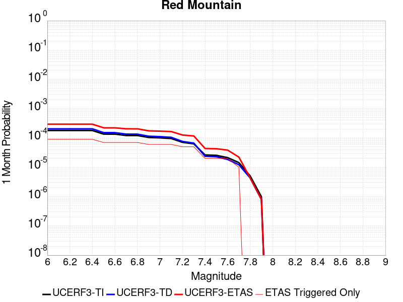 |  |  |

| Magnitude | 1 wk TI Prob | 1 wk TD Prob | 1 wk ETAS Prob | 1 wk ETAS/TD Gain | 1 wk ETAS Triggered Only | 1 mo TI Prob | 1 mo TD Prob | 1 mo ETAS Prob | 1 mo ETAS/TD Gain | 1 mo ETAS Triggered Only | 1 yr TI Prob | 1 yr TD Prob | 1 yr ETAS Prob | 1 yr ETAS/TD Gain | 1 yr ETAS Triggered Only | 10 yr TI Prob | 10 yr TD Prob | 10 yr ETAS Prob | 10 yr ETAS/TD Gain | 10 yr ETAS Triggered Only |
|-----|-----|-----|-----|-----|-----|-----|-----|-----|-----|-----|-----|-----|-----|-----|-----|-----|-----|-----|-----|-----|
| 6.0 | 4.1810763E-5 | 4.7589947E-5 | 1.8647223E-4 | 3.9183114 | 1.3888889E-4 | 1.7917668E-4 | 2.039419E-4 | 3.4280246E-4 | 1.6808829 | 1.3888889E-4 | 0.0021792934 | 0.0024803306 | 0.0026188751 | 1.0558572 | 1.3888889E-4 | 0.021580452 | 0.024544092 | 0.024747312 | 1.0082798 | 2.0833334E-4 |
| 6.1 | 4.1810763E-5 | 4.7589947E-5 | 1.8647223E-4 | 3.9183114 | 1.3888889E-4 | 1.7917668E-4 | 2.039419E-4 | 3.4280246E-4 | 1.6808829 | 1.3888889E-4 | 0.0021792934 | 0.0024803306 | 0.0026188751 | 1.0558572 | 1.3888889E-4 | 0.021580452 | 0.024544092 | 0.024747312 | 1.0082798 | 2.0833334E-4 |
| 6.2 | 4.1810763E-5 | 4.7589947E-5 | 1.8647223E-4 | 3.9183114 | 1.3888889E-4 | 1.7917668E-4 | 2.039419E-4 | 3.4280246E-4 | 1.6808829 | 1.3888889E-4 | 0.0021792934 | 0.0024803306 | 0.0026188751 | 1.0558572 | 1.3888889E-4 | 0.021580452 | 0.024544092 | 0.024747312 | 1.0082798 | 2.0833334E-4 |
| 6.3 | 4.1810763E-5 | 4.7589947E-5 | 1.8647223E-4 | 3.9183114 | 1.3888889E-4 | 1.7917668E-4 | 2.039419E-4 | 3.4280246E-4 | 1.6808829 | 1.3888889E-4 | 0.0021792934 | 0.0024803306 | 0.0026188751 | 1.0558572 | 1.3888889E-4 | 0.021580452 | 0.024544092 | 0.024747312 | 1.0082798 | 2.0833334E-4 |
| 6.4 | 4.1810763E-5 | 4.7589947E-5 | 1.8647223E-4 | 3.9183114 | 1.3888889E-4 | 1.7917668E-4 | 2.039419E-4 | 3.4280246E-4 | 1.6808829 | 1.3888889E-4 | 0.0021792934 | 0.0024803306 | 0.0026188751 | 1.0558572 | 1.3888889E-4 | 0.021580452 | 0.024544092 | 0.024747312 | 1.0082798 | 2.0833334E-4 |
| 6.5 | 3.154503E-5 | 3.5359728E-5 | 1.742437E-4 | 4.9277444 | 1.3888889E-4 | 1.3518598E-4 | 1.5153342E-4 | 2.9040125E-4 | 1.9164174 | 1.3888889E-4 | 0.0016446467 | 0.0018434501 | 0.001982083 | 1.075203 | 1.3888889E-4 | 0.01632528 | 0.018291233 | 0.018495757 | 1.0111815 | 2.0833334E-4 |
| 6.6 | 3.1535834E-5 | 3.534911E-5 | 1.742331E-4 | 4.9289246 | 1.3888889E-4 | 1.3514658E-4 | 1.5148791E-4 | 2.9035576E-4 | 1.9166926 | 1.3888889E-4 | 0.0016441676 | 0.001842897 | 0.00198153 | 1.0752256 | 1.3888889E-4 | 0.01632056 | 0.018285794 | 0.018490318 | 1.0111848 | 2.0833334E-4 |
| 6.7 | 2.8267326E-5 | 3.146934E-5 | 1.7035386E-4 | 5.413328 | 1.3888889E-4 | 1.2114006E-4 | 1.348621E-4 | 2.7373226E-4 | 2.0297196 | 1.3888889E-4 | 0.0014738824 | 0.0016407946 | 0.0017794556 | 1.0845084 | 1.3888889E-4 | 0.014641452 | 0.016295563 | 0.016500503 | 1.0125763 | 2.0833334E-4 |
| 6.8 | 2.8212884E-5 | 3.1407224E-5 | 1.7029175E-4 | 5.4220567 | 1.3888889E-4 | 1.20906756E-4 | 1.3459593E-4 | 2.734661E-4 | 2.0317564 | 1.3888889E-4 | 0.0014710457 | 0.0016375587 | 0.0017762202 | 1.0846757 | 1.3888889E-4 | 0.014613459 | 0.01626368 | 0.016468626 | 1.0126014 | 2.0833334E-4 |
| 6.9 | 2.4227871E-5 | 2.6706979E-5 | 9.614957E-5 | 3.6001666 | 6.9444446E-5 | 1.03829596E-4 | 1.14453884E-4 | 1.8389038E-4 | 1.6066766 | 6.9444446E-5 | 0.0012633923 | 0.0013926612 | 0.0014620089 | 1.0497952 | 6.9444446E-5 | 0.012562336 | 0.013847026 | 0.013983992 | 1.0098914 | 1.3888889E-4 |
| 7.0 | 2.348524E-5 | 2.5835763E-5 | 9.527841E-5 | 3.6878498 | 6.9444446E-5 | 1.0064714E-4 | 1.1072042E-4 | 1.8015718E-4 | 1.6271359 | 6.9444446E-5 | 0.0012246901 | 0.0013472632 | 0.001416614 | 1.0514754 | 6.9444446E-5 | 0.012179627 | 0.01339859 | 0.013535618 | 1.0102271 | 1.3888889E-4 |
| 7.1 | 2.2311642E-5 | 2.4462828E-5 | 9.3905575E-5 | 3.8387046 | 6.9444446E-5 | 9.561782E-5 | 1.048369E-4 | 1.7427407E-4 | 1.6623352 | 6.9444446E-5 | 0.0011635252 | 0.0012757168 | 0.0013450726 | 1.0543662 | 6.9444446E-5 | 0.01157452 | 0.012691451 | 0.012828577 | 1.0108047 | 1.3888889E-4 |
| 7.2 | 1.6533986E-5 | 1.7670347E-5 | 8.711356E-5 | 4.9299297 | 6.9444446E-5 | 7.085802E-5 | 7.572822E-5 | 1.451674E-4 | 1.9169526 | 6.9444446E-5 | 8.623549E-4 | 9.216645E-4 | 9.910449E-4 | 1.0752773 | 6.9444446E-5 | 0.008590161 | 0.009184699 | 0.009322312 | 1.0149829 | 1.3888889E-4 |
| 7.3 | 1.4703092E-5 | 1.555952E-5 | 8.500289E-5 | 5.4630785 | 6.9444446E-5 | 6.301173E-5 | 6.66823E-5 | 1.3612212E-4 | 2.041353 | 6.9444446E-5 | 7.668978E-4 | 8.1161625E-4 | 8.810043E-4 | 1.0854937 | 6.9444446E-5 | 0.0076425658 | 0.008092596 | 0.008230361 | 1.0170236 | 1.3888889E-4 |
| 7.4 | 6.1331984E-6 | 5.528872E-6 | 7.497293E-5 | 13.560259 | 6.9444446E-5 | 2.6284872E-5 | 2.3694953E-5 | 9.313775E-5 | 3.9307 | 6.9444446E-5 | 3.199713E-4 | 2.8844838E-4 | 3.578728E-4 | 1.2406822 | 6.9444446E-5 | 0.0031951098 | 0.0028807942 | 0.0029500388 | 1.0240365 | 6.9444446E-5 |
| 7.5 | 5.954766E-6 | 5.3385015E-6 | 7.4782576E-5 | 14.008159 | 6.9444446E-5 | 2.5520176E-5 | 2.2879094E-5 | 9.232195E-5 | 4.03521 | 6.9444446E-5 | 3.1066386E-4 | 2.785179E-4 | 3.47943E-4 | 1.2492663 | 6.9444446E-5 | 0.003102299 | 0.0027817423 | 0.0028509935 | 1.024895 | 6.9444446E-5 |
| 7.6 | 4.9726646E-6 | 4.315295E-6 | 7.375944E-5 | 17.09256 | 6.9444446E-5 | 2.1311245E-5 | 1.8493993E-5 | 8.793715E-5 | 4.754904 | 6.9444446E-5 | 2.5943352E-4 | 2.2514143E-4 | 2.9457023E-4 | 1.3083787 | 6.9444446E-5 | 0.0025913084 | 0.002249168 | 0.0023184563 | 1.0308062 | 6.9444446E-5 |
| 7.7 | 3.3613894E-6 | 2.8526642E-6 | 7.229691E-5 | 25.343645 | 6.9444446E-5 | 1.4405875E-5 | 1.2225649E-5 | 8.166924E-5 | 6.680156 | 6.9444446E-5 | 1.7537741E-4 | 1.4883737E-4 | 2.1827148E-4 | 1.4665099 | 6.9444446E-5 | 0.0017523908 | 0.0014874031 | 0.0015567442 | 1.0466189 | 6.9444446E-5 |
| 7.8 | 1.1828961E-6 | 1.0122756E-6 | 1.0122756E-6 | 1.0 | 0.0 | 5.069545E-6 | 4.338317E-6 | 4.338317E-6 | 1.0 | 0.0 | 6.171996E-5 | 5.281776E-5 | 5.281776E-5 | 1.0 | 0.0 | 6.170282E-4 | 5.2805495E-4 | 5.2805495E-4 | 1.0 | 0.0 |
| 7.9 | 2.2967266E-7 | 1.8618952E-7 | 1.8618952E-7 | 1.0 | 0.0 | 9.843111E-7 | 7.9795484E-7 | 7.9795484E-7 | 1.0 | 0.0 | 1.19839215E-5 | 9.7150605E-6 | 9.7150605E-6 | 1.0 | 0.0 | 1.1983275E-4 | 9.714664E-5 | 9.714664E-5 | 1.0 | 0.0 |

## Ludlow
*[(top)](#table-of-contents)*

| 1 Week | 1 Month | 1 Year | 10 Year |
|-----|-----|-----|-----|
|  |  |  |  |

| Magnitude | 1 wk TI Prob | 1 wk TD Prob | 1 wk ETAS Prob | 1 wk ETAS/TD Gain | 1 wk ETAS Triggered Only | 1 mo TI Prob | 1 mo TD Prob | 1 mo ETAS Prob | 1 mo ETAS/TD Gain | 1 mo ETAS Triggered Only | 1 yr TI Prob | 1 yr TD Prob | 1 yr ETAS Prob | 1 yr ETAS/TD Gain | 1 yr ETAS Triggered Only | 10 yr TI Prob | 10 yr TD Prob | 10 yr ETAS Prob | 10 yr ETAS/TD Gain | 10 yr ETAS Triggered Only |
|-----|-----|-----|-----|-----|-----|-----|-----|-----|-----|-----|-----|-----|-----|-----|-----|-----|-----|-----|-----|-----|
| 6.0 | 2.2407607E-5 | 2.3657254E-5 | 1.6254286E-4 | 6.870741 | 1.3888889E-4 | 9.602906E-5 | 1.0138454E-4 | 2.4025935E-4 | 2.369783 | 1.3888889E-4 | 0.0011685267 | 0.001233702 | 0.0013724194 | 1.1124401 | 1.3888889E-4 | 0.011624013 | 0.012273042 | 0.012547411 | 1.0223554 | 2.7777778E-4 |
| 6.1 | 2.2407607E-5 | 2.3657254E-5 | 1.6254286E-4 | 6.870741 | 1.3888889E-4 | 9.602906E-5 | 1.0138454E-4 | 2.4025935E-4 | 2.369783 | 1.3888889E-4 | 0.0011685267 | 0.001233702 | 0.0013724194 | 1.1124401 | 1.3888889E-4 | 0.011624013 | 0.012273042 | 0.012547411 | 1.0223554 | 2.7777778E-4 |
| 6.2 | 1.0781252E-5 | 1.1365663E-5 | 8.080932E-5 | 7.1099515 | 6.9444446E-5 | 4.620455E-5 | 4.8709102E-5 | 1.18150165E-4 | 2.4256282 | 6.9444446E-5 | 5.623952E-4 | 5.9287593E-4 | 6.6227926E-4 | 1.1170621 | 6.9444446E-5 | 0.00560974 | 0.0059133614 | 0.0060514286 | 1.0233485 | 1.3888889E-4 |
| 6.3 | 1.0781252E-5 | 1.1365663E-5 | 8.080932E-5 | 7.1099515 | 6.9444446E-5 | 4.620455E-5 | 4.8709102E-5 | 1.18150165E-4 | 2.4256282 | 6.9444446E-5 | 5.623952E-4 | 5.9287593E-4 | 6.6227926E-4 | 1.1170621 | 6.9444446E-5 | 0.00560974 | 0.0059133614 | 0.0060514286 | 1.0233485 | 1.3888889E-4 |
| 6.4 | 7.814439E-6 | 8.237729E-6 | 8.237729E-6 | 1.0 | 0.0 | 3.3490025E-5 | 3.530408E-5 | 3.530408E-5 | 1.0 | 0.0 | 4.0766477E-4 | 4.2974384E-4 | 4.2974384E-4 | 1.0 | 0.0 | 0.0040691774 | 0.0042892746 | 0.004358421 | 1.0161208 | 6.9444446E-5 |
| 6.5 | 6.4986366E-6 | 6.85092E-6 | 6.85092E-6 | 1.0 | 0.0 | 2.7851002E-5 | 2.9360759E-5 | 2.9360759E-5 | 1.0 | 0.0 | 3.390332E-4 | 3.5740953E-4 | 3.5740953E-4 | 1.0 | 0.0 | 0.003385164 | 0.0035684432 | 0.0035684432 | 1.0 | 0.0 |
| 6.6 | 5.582177E-6 | 5.8860055E-6 | 5.8860055E-6 | 1.0 | 0.0 | 2.3923398E-5 | 2.5225498E-5 | 2.5225498E-5 | 1.0 | 0.0 | 2.9122844E-4 | 3.0707786E-4 | 3.0707786E-4 | 1.0 | 0.0 | 0.0029084706 | 0.003066609 | 0.003066609 | 1.0 | 0.0 |
| 6.7 | 4.6858763E-6 | 4.940427E-6 | 4.940427E-6 | 1.0 | 0.0 | 2.0082172E-5 | 2.1173091E-5 | 2.1173091E-5 | 1.0 | 0.0 | 2.4447302E-4 | 2.5775246E-4 | 2.5775246E-4 | 1.0 | 0.0 | 0.0024420423 | 0.0025745912 | 0.0025745912 | 1.0 | 0.0 |
| 6.8 | 3.5584908E-6 | 3.7520183E-6 | 3.7520183E-6 | 1.0 | 0.0 | 1.5250586E-5 | 1.6079981E-5 | 1.6079981E-5 | 1.0 | 0.0 | 1.8566006E-4 | 1.957566E-4 | 1.957566E-4 | 1.0 | 0.0 | 0.0018550502 | 0.0019558826 | 0.0019558826 | 1.0 | 0.0 |
| 6.9 | 2.532834E-6 | 2.6710034E-6 | 2.6710034E-6 | 1.0 | 0.0 | 1.0854958E-5 | 1.1447109E-5 | 1.1447109E-5 | 1.0 | 0.0 | 1.3215111E-4 | 1.3935992E-4 | 1.3935992E-4 | 1.0 | 0.0 | 0.0013207254 | 0.0013927529 | 0.0013927529 | 1.0 | 0.0 |
| 7.0 | 1.7083285E-6 | 1.8019439E-6 | 1.8019439E-6 | 1.0 | 0.0 | 7.3213873E-6 | 7.722595E-6 | 7.722595E-6 | 1.0 | 0.0 | 8.913424E-5 | 9.40187E-5 | 9.40187E-5 | 1.0 | 0.0 | 8.9098496E-4 | 9.3980576E-4 | 9.3980576E-4 | 1.0 | 0.0 |
| 7.1 | 1.0905424E-6 | 1.1497619E-6 | 1.1497619E-6 | 1.0 | 0.0 | 4.6737446E-6 | 4.9275427E-6 | 4.9275427E-6 | 1.0 | 0.0 | 5.6901354E-5 | 5.999128E-5 | 5.999128E-5 | 1.0 | 0.0 | 5.6886784E-4 | 5.997606E-4 | 5.997606E-4 | 1.0 | 0.0 |
| 7.2 | 6.06668E-7 | 6.387277E-7 | 6.387277E-7 | 1.0 | 0.0 | 2.600003E-6 | 2.7374022E-6 | 2.7374022E-6 | 1.0 | 0.0 | 3.1654577E-5 | 3.3327433E-5 | 3.3327433E-5 | 1.0 | 0.0 | 3.1650066E-4 | 3.3323118E-4 | 3.3323118E-4 | 1.0 | 0.0 |

## Lost Hills
*[(top)](#table-of-contents)*

| 1 Week | 1 Month | 1 Year | 10 Year |
|-----|-----|-----|-----|
|  |  |  |  |

| Magnitude | 1 wk TI Prob | 1 wk TD Prob | 1 wk ETAS Prob | 1 wk ETAS/TD Gain | 1 wk ETAS Triggered Only | 1 mo TI Prob | 1 mo TD Prob | 1 mo ETAS Prob | 1 mo ETAS/TD Gain | 1 mo ETAS Triggered Only | 1 yr TI Prob | 1 yr TD Prob | 1 yr ETAS Prob | 1 yr ETAS/TD Gain | 1 yr ETAS Triggered Only | 10 yr TI Prob | 10 yr TD Prob | 10 yr ETAS Prob | 10 yr ETAS/TD Gain | 10 yr ETAS Triggered Only |
|-----|-----|-----|-----|-----|-----|-----|-----|-----|-----|-----|-----|-----|-----|-----|-----|-----|-----|-----|-----|-----|
| 6.0 | 2.233523E-5 | 2.5106583E-5 | 9.454929E-5 | 3.765916 | 6.9444446E-5 | 9.571891E-5 | 1.0759615E-4 | 1.7703313E-4 | 1.6453481 | 6.9444446E-5 | 0.0011647546 | 0.001309364 | 0.0015174246 | 1.158902 | 2.0833334E-4 | 0.011586686 | 0.013033091 | 0.013307248 | 1.0210354 | 2.7777778E-4 |
| 6.1 | 2.233523E-5 | 2.5106583E-5 | 9.454929E-5 | 3.765916 | 6.9444446E-5 | 9.571891E-5 | 1.0759615E-4 | 1.7703313E-4 | 1.6453481 | 6.9444446E-5 | 0.0011647546 | 0.001309364 | 0.0015174246 | 1.158902 | 2.0833334E-4 | 0.011586686 | 0.013033091 | 0.013307248 | 1.0210354 | 2.7777778E-4 |
| 6.2 | 2.233523E-5 | 2.5106583E-5 | 9.454929E-5 | 3.765916 | 6.9444446E-5 | 9.571891E-5 | 1.0759615E-4 | 1.7703313E-4 | 1.6453481 | 6.9444446E-5 | 0.0011647546 | 0.001309364 | 0.0015174246 | 1.158902 | 2.0833334E-4 | 0.011586686 | 0.013033091 | 0.013307248 | 1.0210354 | 2.7777778E-4 |
| 6.3 | 2.233523E-5 | 2.5106583E-5 | 9.454929E-5 | 3.765916 | 6.9444446E-5 | 9.571891E-5 | 1.0759615E-4 | 1.7703313E-4 | 1.6453481 | 6.9444446E-5 | 0.0011647546 | 0.001309364 | 0.0015174246 | 1.158902 | 2.0833334E-4 | 0.011586686 | 0.013033091 | 0.013307248 | 1.0210354 | 2.7777778E-4 |
| 6.4 | 1.2288092E-5 | 1.3781108E-5 | 1.3781108E-5 | 1.0 | 0.0 | 5.2662188E-5 | 5.906108E-5 | 5.906108E-5 | 1.0 | 0.0 | 6.409735E-4 | 7.189252E-4 | 7.8831974E-4 | 1.0965253 | 6.9444446E-5 | 0.006391279 | 0.0071752006 | 0.007313093 | 1.0192178 | 1.3888889E-4 |
| 6.5 | 1.2288092E-5 | 1.3781108E-5 | 1.3781108E-5 | 1.0 | 0.0 | 5.2662188E-5 | 5.906108E-5 | 5.906108E-5 | 1.0 | 0.0 | 6.409735E-4 | 7.189252E-4 | 7.8831974E-4 | 1.0965253 | 6.9444446E-5 | 0.006391279 | 0.0071752006 | 0.007313093 | 1.0192178 | 1.3888889E-4 |
| 6.6 | 8.58281E-6 | 9.63377E-6 | 9.63377E-6 | 1.0 | 0.0 | 3.6782953E-5 | 4.12874E-5 | 4.12874E-5 | 1.0 | 0.0 | 4.4774043E-4 | 5.026414E-4 | 5.720509E-4 | 1.1380895 | 6.9444446E-5 | 0.0044683935 | 0.005023205 | 0.005092301 | 1.0137553 | 6.9444446E-5 |
| 6.7 | 7.205685E-6 | 8.088302E-6 | 8.088302E-6 | 1.0 | 0.0 | 3.088114E-5 | 3.466415E-5 | 3.466415E-5 | 1.0 | 0.0 | 3.7591302E-4 | 4.2203604E-4 | 4.2203604E-4 | 1.0 | 0.0 | 0.0037527776 | 0.0042203604 | 0.0042203604 | 1.0 | 0.0 |

## San Andreas (Coachella) rev
*[(top)](#table-of-contents)*

| 1 Week | 1 Month | 1 Year | 10 Year |
|-----|-----|-----|-----|
|  |  | 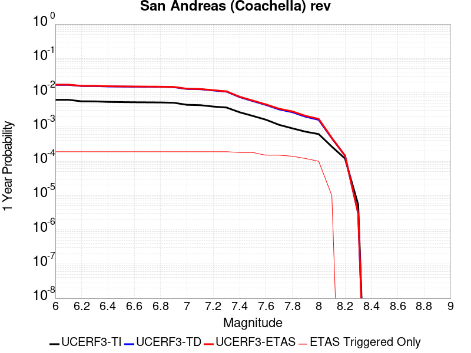 |  |

| Magnitude | 1 wk TI Prob | 1 wk TD Prob | 1 wk ETAS Prob | 1 wk ETAS/TD Gain | 1 wk ETAS Triggered Only | 1 mo TI Prob | 1 mo TD Prob | 1 mo ETAS Prob | 1 mo ETAS/TD Gain | 1 mo ETAS Triggered Only | 1 yr TI Prob | 1 yr TD Prob | 1 yr ETAS Prob | 1 yr ETAS/TD Gain | 1 yr ETAS Triggered Only | 10 yr TI Prob | 10 yr TD Prob | 10 yr ETAS Prob | 10 yr ETAS/TD Gain | 10 yr ETAS Triggered Only |
|-----|-----|-----|-----|-----|-----|-----|-----|-----|-----|-----|-----|-----|-----|-----|-----|-----|-----|-----|-----|-----|
| 6.0 | 1.1925945E-4 | 3.2729402E-4 | 5.3555914E-4 | 1.6363244 | 2.0833334E-4 | 5.110118E-4 | 0.0014019393 | 0.0016099806 | 1.1483953 | 2.0833334E-4 | 0.0062038354 | 0.016936364 | 0.017141169 | 1.0120926 | 2.0833334E-4 | 0.060334753 | 0.15265316 | 0.15288852 | 1.0015419 | 2.7777778E-4 |
| 6.1 | 1.1925945E-4 | 3.2729402E-4 | 5.3555914E-4 | 1.6363244 | 2.0833334E-4 | 5.110118E-4 | 0.0014019393 | 0.0016099806 | 1.1483953 | 2.0833334E-4 | 0.0062038354 | 0.016936364 | 0.017141169 | 1.0120926 | 2.0833334E-4 | 0.060334753 | 0.15265316 | 0.15288852 | 1.0015419 | 2.7777778E-4 |
| 6.2 | 1.07432395E-4 | 3.0230157E-4 | 5.1057193E-4 | 1.688949 | 2.0833334E-4 | 4.603433E-4 | 0.0012949388 | 0.0015030024 | 1.1606745 | 2.0833334E-4 | 0.005590286 | 0.015653009 | 0.01585808 | 1.0131011 | 2.0833334E-4 | 0.05451731 | 0.14182423 | 0.14206262 | 1.0016809 | 2.7777778E-4 |
| 6.3 | 1.0718766E-4 | 3.0175463E-4 | 5.100251E-4 | 1.6901981 | 2.0833334E-4 | 4.592948E-4 | 0.0012925972 | 0.0015006611 | 1.1609659 | 2.0833334E-4 | 0.005577586 | 0.015624908 | 0.015829986 | 1.0131251 | 2.0833334E-4 | 0.054396555 | 0.14159249 | 0.14183094 | 1.0016841 | 2.7777778E-4 |
| 6.4 | 1.0355944E-4 | 2.9383553E-4 | 5.0210766E-4 | 1.7088051 | 2.0833334E-4 | 4.4375064E-4 | 0.0012586913 | 0.0014667624 | 1.1653075 | 2.0833334E-4 | 0.0053892885 | 0.015217941 | 0.015423104 | 1.0134816 | 2.0833334E-4 | 0.052604496 | 0.13815255 | 0.13839196 | 1.0017328 | 2.7777778E-4 |
| 6.5 | 1.0227914E-4 | 2.9102986E-4 | 4.993026E-4 | 1.7156403 | 2.0833334E-4 | 4.382655E-4 | 0.0012466786 | 0.0014547522 | 1.1669024 | 2.0833334E-4 | 0.0053228354 | 0.01507372 | 0.015278913 | 1.0136126 | 2.0833334E-4 | 0.051971316 | 0.13693172 | 0.13717146 | 1.0017508 | 2.7777778E-4 |
| 6.6 | 1.0116757E-4 | 2.8868738E-4 | 4.969606E-4 | 1.7214489 | 2.0833334E-4 | 4.3350324E-4 | 0.0012366489 | 0.0014447246 | 1.1682577 | 2.0833334E-4 | 0.0052651367 | 0.01495329 | 0.015158509 | 1.013724 | 2.0833334E-4 | 0.051421247 | 0.1359099 | 0.13614993 | 1.0017661 | 2.7777778E-4 |
| 6.7 | 1.0050676E-4 | 2.8727303E-4 | 4.955465E-4 | 1.7250019 | 2.0833334E-4 | 4.3067214E-4 | 0.0012305931 | 0.0014386701 | 1.1690867 | 2.0833334E-4 | 0.005230834 | 0.014880571 | 0.015085803 | 1.013792 | 2.0833334E-4 | 0.051094085 | 0.13529462 | 0.13553482 | 1.0017754 | 2.7777778E-4 |
| 6.8 | 9.976819E-5 | 2.853096E-4 | 4.935835E-4 | 1.7299926 | 2.0833334E-4 | 4.2750788E-4 | 0.0012221863 | 0.001430265 | 1.1702513 | 2.0833334E-4 | 0.0051924936 | 0.0147796115 | 0.014984866 | 1.0138876 | 2.0833334E-4 | 0.050728295 | 0.13444631 | 0.13468674 | 1.0017883 | 2.7777778E-4 |
| 6.9 | 9.77719E-5 | 2.8027873E-4 | 4.8855366E-4 | 1.7430993 | 2.0833334E-4 | 4.1895514E-4 | 0.0012006456 | 0.0014087288 | 1.1733094 | 2.0833334E-4 | 0.0050888555 | 0.014520878 | 0.014726186 | 1.0141388 | 2.0833334E-4 | 0.049738888 | 0.1322748 | 0.13251585 | 1.0018222 | 2.7777778E-4 |
| 7.0 | 8.500761E-5 | 2.4762485E-4 | 4.5590661E-4 | 1.8411181 | 2.0833334E-4 | 3.6426744E-4 | 0.001060821 | 0.0012689333 | 1.1961805 | 2.0833334E-4 | 0.0044259406 | 0.012839786 | 0.013045444 | 1.0160173 | 2.0833334E-4 | 0.04338823 | 0.11813272 | 0.118377686 | 1.0020736 | 2.7777778E-4 |
| 7.1 | 8.319876E-5 | 2.4365232E-4 | 4.519349E-4 | 1.8548352 | 2.0833334E-4 | 3.5651738E-4 | 0.0010438096 | 0.0012519255 | 1.1993811 | 2.0833334E-4 | 0.004331963 | 0.012635092 | 0.0128407935 | 1.0162802 | 2.0833334E-4 | 0.042484846 | 0.116353 | 0.11659846 | 1.0021096 | 2.7777778E-4 |
| 7.2 | 7.563917E-5 | 2.2413683E-4 | 4.3242346E-4 | 1.9292834 | 2.0833334E-4 | 3.2412758E-4 | 9.602359E-4 | 0.0011683692 | 1.2167523 | 2.0833334E-4 | 0.0039391145 | 0.011628893 | 0.011834804 | 1.0177069 | 2.0833334E-4 | 0.03870018 | 0.10775925 | 0.108007096 | 1.0023 | 2.7777778E-4 |
| 7.3 | 7.082985E-5 | 2.0729867E-4 | 4.1558882E-4 | 2.004783 | 2.0833334E-4 | 3.0352117E-4 | 8.881233E-4 | 0.0010962716 | 1.2343687 | 2.0833334E-4 | 0.0036891096 | 0.010759917 | 0.0109660085 | 1.0191536 | 2.0833334E-4 | 0.03628465 | 0.100282 | 0.10053192 | 1.0024922 | 2.7777778E-4 |
| 7.4 | 5.146215E-5 | 1.4273795E-4 | 3.5104153E-4 | 2.459343 | 2.0833334E-4 | 2.2053342E-4 | 6.115915E-4 | 8.197974E-4 | 1.340433 | 2.0833334E-4 | 0.0026816884 | 0.0074208933 | 0.0076276804 | 1.0278655 | 2.0833334E-4 | 0.02649557 | 0.070849575 | 0.07110767 | 1.0036429 | 2.7777778E-4 |
| 7.5 | 4.0285166E-5 | 1.09416E-4 | 3.1772655E-4 | 2.9038398 | 2.0833334E-4 | 1.7263928E-4 | 4.6884175E-4 | 6.7707745E-4 | 1.4441491 | 2.0833334E-4 | 0.002099857 | 0.0056932783 | 0.0059004254 | 1.0363846 | 2.0833334E-4 | 0.020801254 | 0.055011146 | 0.055273645 | 1.0047717 | 2.7777778E-4 |
| 7.6 | 3.1168736E-5 | 8.4389096E-5 | 1.5382768E-4 | 1.8228383 | 6.9444446E-5 | 1.3357346E-4 | 3.6161754E-4 | 4.3103687E-4 | 1.1919689 | 6.9444446E-5 | 0.0016250437 | 0.0043938323 | 0.004462972 | 1.0157355 | 6.9444446E-5 | 0.016132116 | 0.04281005 | 0.042942993 | 1.0031054 | 1.3888889E-4 |
| 7.7 | 2.2100989E-5 | 6.238755E-5 | 1.3182766E-4 | 2.1130443 | 6.9444446E-5 | 9.4715084E-5 | 2.6734784E-4 | 3.3677372E-4 | 1.2596837 | 6.9444446E-5 | 0.001152546 | 0.0032501083 | 0.003319327 | 1.0212973 | 6.9444446E-5 | 0.011465867 | 0.0319002 | 0.032034658 | 1.004215 | 1.3888889E-4 |
| 7.8 | 1.7484861E-5 | 5.179572E-5 | 1.2123657E-4 | 2.3406677 | 6.9444446E-5 | 7.493296E-5 | 2.2196278E-4 | 2.913918E-4 | 1.3127959 | 6.9444446E-5 | 9.1192697E-4 | 0.0026990508 | 0.0027683077 | 1.0256598 | 6.9444446E-5 | 0.009081938 | 0.026640115 | 0.026775304 | 1.0050746 | 1.3888889E-4 |
| 7.9 | 1.3967285E-5 | 3.822255E-5 | 1.07664346E-4 | 2.8167753 | 6.9444446E-5 | 5.985842E-5 | 1.6380067E-4 | 2.3323373E-4 | 1.4238876 | 6.9444446E-5 | 7.2853256E-4 | 0.00199245 | 0.0020617563 | 1.0347843 | 6.9444446E-5 | 0.0072614877 | 0.019909438 | 0.02004556 | 1.0068371 | 1.3888889E-4 |
| 8.0 | 1.1887396E-5 | 3.106521E-5 | 1.00507496E-4 | 3.2353716 | 6.9444446E-5 | 5.094499E-5 | 1.3312983E-4 | 2.0256503E-4 | 1.5215601 | 6.9444446E-5 | 6.200787E-4 | 0.0016196516 | 0.0016889835 | 1.0428067 | 6.9444446E-5 | 0.006183513 | 0.016279267 | 0.016347582 | 1.0041964 | 6.9444446E-5 |
| 8.1 | 5.100864E-6 | 8.973418E-6 | 8.973418E-6 | 1.0 | 0.0 | 2.1860664E-5 | 3.8456936E-5 | 3.8456936E-5 | 1.0 | 0.0 | 2.6612106E-4 | 4.6811273E-4 | 4.6811273E-4 | 1.0 | 0.0 | 0.002658026 | 0.004917731 | 0.004917731 | 1.0 | 0.0 |
| 8.2 | 2.3004484E-6 | 2.7864487E-6 | 2.7864487E-6 | 1.0 | 0.0 | 9.859027E-6 | 1.1941868E-5 | 1.1941868E-5 | 1.0 | 0.0 | 1.2002704E-4 | 1.4538258E-4 | 1.4538258E-4 | 1.0 | 0.0 | 0.0011996223 | 0.0015973912 | 0.0015973912 | 1.0 | 0.0 |
| 8.3 | 1.0424446E-7 | 5.8161504E-8 | 5.8161504E-8 | 1.0 | 0.0 | 4.4676187E-7 | 2.4926356E-7 | 2.4926356E-7 | 1.0 | 0.0 | 5.439312E-6 | 3.03478E-6 | 3.03478E-6 | 1.0 | 0.0 | 5.4391792E-5 | 3.190716E-5 | 3.190716E-5 | 1.0 | 0.0 |

## San Andreas (Cholame) rev
*[(top)](#table-of-contents)*

| 1 Week | 1 Month | 1 Year | 10 Year |
|-----|-----|-----|-----|
|  |  |  | 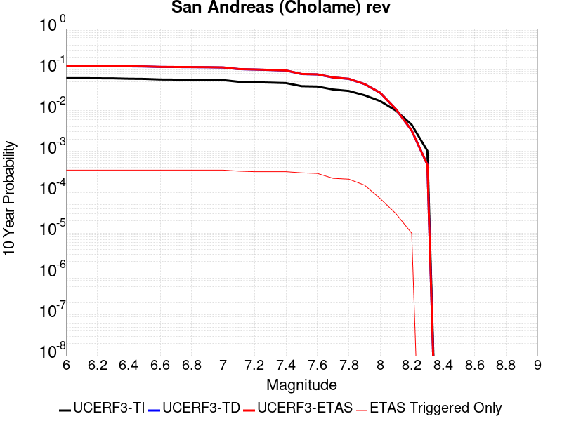 |

| Magnitude | 1 wk TI Prob | 1 wk TD Prob | 1 wk ETAS Prob | 1 wk ETAS/TD Gain | 1 wk ETAS Triggered Only | 1 mo TI Prob | 1 mo TD Prob | 1 mo ETAS Prob | 1 mo ETAS/TD Gain | 1 mo ETAS Triggered Only | 1 yr TI Prob | 1 yr TD Prob | 1 yr ETAS Prob | 1 yr ETAS/TD Gain | 1 yr ETAS Triggered Only | 10 yr TI Prob | 10 yr TD Prob | 10 yr ETAS Prob | 10 yr ETAS/TD Gain | 10 yr ETAS Triggered Only |
|-----|-----|-----|-----|-----|-----|-----|-----|-----|-----|-----|-----|-----|-----|-----|-----|-----|-----|-----|-----|-----|
| 6.0 | 1.2302514E-4 | 2.5204287E-4 | 3.9089675E-4 | 1.5509137 | 1.3888889E-4 | 5.27144E-4 | 0.0010797381 | 0.0012878466 | 1.1927397 | 2.0833334E-4 | 0.0063991086 | 0.0130670825 | 0.013272693 | 1.015735 | 2.0833334E-4 | 0.06217949 | 0.12439073 | 0.12463395 | 1.0019553 | 2.7777778E-4 |
| 6.1 | 1.2302514E-4 | 2.5204287E-4 | 3.9089675E-4 | 1.5509137 | 1.3888889E-4 | 5.27144E-4 | 0.0010797381 | 0.0012878466 | 1.1927397 | 2.0833334E-4 | 0.0063991086 | 0.0130670825 | 0.013272693 | 1.015735 | 2.0833334E-4 | 0.06217949 | 0.12439073 | 0.12463395 | 1.0019553 | 2.7777778E-4 |
| 6.2 | 1.2203569E-4 | 2.5021084E-4 | 3.8906498E-4 | 1.5549486 | 1.3888889E-4 | 5.2290526E-4 | 0.0010718931 | 0.0012800031 | 1.1941519 | 2.0833334E-4 | 0.006347804 | 0.01297271 | 0.01317834 | 1.015851 | 2.0833334E-4 | 0.061695136 | 0.12357691 | 0.12382036 | 1.00197 | 2.7777778E-4 |
| 6.3 | 1.2142645E-4 | 2.4907055E-4 | 3.8792487E-4 | 1.5574898 | 1.3888889E-4 | 5.202953E-4 | 0.0010670102 | 0.0012751212 | 1.1950413 | 2.0833334E-4 | 0.006316212 | 0.012913967 | 0.01311961 | 1.0159241 | 2.0833334E-4 | 0.06139677 | 0.12307103 | 0.12331463 | 1.0019792 | 2.7777778E-4 |
| 6.4 | 1.1865206E-4 | 2.44126E-4 | 3.82981E-4 | 1.5687841 | 1.3888889E-4 | 5.0840975E-4 | 0.0010458364 | 0.0012539518 | 1.1989943 | 2.0833334E-4 | 0.006172335 | 0.012659196 | 0.012864892 | 1.0162487 | 2.0833334E-4 | 0.060036868 | 0.1208638 | 0.12110801 | 1.0020205 | 2.7777778E-4 |
| 6.5 | 1.17443946E-4 | 2.4205919E-4 | 3.8091445E-4 | 1.5736418 | 1.3888889E-4 | 5.032341E-4 | 0.0010369857 | 0.001245103 | 1.2006944 | 2.0833334E-4 | 0.006109677 | 0.012552682 | 0.0127584 | 1.0163884 | 2.0833334E-4 | 0.059444077 | 0.11993805 | 0.120182514 | 1.0020382 | 2.7777778E-4 |
| 6.6 | 1.13579066E-4 | 2.3514954E-4 | 3.7400576E-4 | 1.5905018 | 1.3888889E-4 | 4.866766E-4 | 0.001007396 | 0.0012155195 | 1.2065954 | 2.0833334E-4 | 0.0059092017 | 0.012196515 | 0.012402307 | 1.016873 | 2.0833334E-4 | 0.057545185 | 0.11685214 | 0.11709747 | 1.0020994 | 2.7777778E-4 |
| 6.7 | 1.1271412E-4 | 2.3359268E-4 | 3.7244914E-4 | 1.5944383 | 1.3888889E-4 | 4.829711E-4 | 0.0010007289 | 0.0012088538 | 1.2079732 | 2.0833334E-4 | 0.005864331 | 0.012116249 | 0.012322058 | 1.0169863 | 2.0833334E-4 | 0.057119697 | 0.116155714 | 0.116401225 | 1.0021137 | 2.7777778E-4 |
| 6.8 | 1.1217975E-4 | 2.3247694E-4 | 3.7133356E-4 | 1.597292 | 1.3888889E-4 | 4.8068175E-4 | 9.959509E-4 | 0.0012040767 | 1.208972 | 2.0833334E-4 | 0.005836608 | 0.012058721 | 0.012264542 | 1.0170683 | 2.0833334E-4 | 0.056856725 | 0.11565396 | 0.115899615 | 1.0021241 | 2.7777778E-4 |
| 6.9 | 1.1146753E-4 | 2.3096445E-4 | 3.6982127E-4 | 1.6012043 | 1.3888889E-4 | 4.7763053E-4 | 9.894737E-4 | 0.0011976009 | 1.2103413 | 2.0833334E-4 | 0.0057996577 | 0.011980731 | 0.012186569 | 1.0171807 | 2.0833334E-4 | 0.056506127 | 0.11497439 | 0.115220234 | 1.0021383 | 2.7777778E-4 |
| 7.0 | 1.0965793E-4 | 2.2719789E-4 | 3.6605523E-4 | 1.6111735 | 1.3888889E-4 | 4.698779E-4 | 9.733434E-4 | 0.001181474 | 1.2138306 | 2.0833334E-4 | 0.005705768 | 0.011786487 | 0.011992364 | 1.0174673 | 2.0833334E-4 | 0.055614736 | 0.11327597 | 0.11352228 | 1.0021745 | 2.7777778E-4 |
| 7.1 | 9.927982E-5 | 2.0538924E-4 | 3.442496E-4 | 1.6760839 | 1.3888889E-4 | 4.2541555E-4 | 8.7994366E-4 | 0.0010880936 | 1.2365493 | 2.0833334E-4 | 0.0051671406 | 0.010660981 | 0.010867094 | 1.0193334 | 2.0833334E-4 | 0.05048634 | 0.1033706 | 0.103619665 | 1.0024095 | 2.7777778E-4 |
| 7.2 | 9.696786E-5 | 2.0043184E-4 | 3.392929E-4 | 1.6928093 | 1.3888889E-4 | 4.1551032E-4 | 8.5871184E-4 | 0.0010668662 | 1.2424031 | 2.0833334E-4 | 0.00504711 | 0.010404981 | 0.010611147 | 1.0198141 | 2.0833334E-4 | 0.04934009 | 0.1011086 | 0.101358294 | 1.0024695 | 2.7777778E-4 |
| 7.3 | 9.4727984E-5 | 1.9472468E-4 | 3.3358653E-4 | 1.7131188 | 1.3888889E-4 | 4.0591392E-4 | 8.3426846E-4 | 0.001042428 | 1.2495115 | 2.0833334E-4 | 0.0049308087 | 0.010110183 | 0.010316409 | 1.0203979 | 2.0833334E-4 | 0.048228268 | 0.09847952 | 0.09872994 | 1.0025429 | 2.7777778E-4 |
| 7.4 | 9.220358E-5 | 1.8843076E-4 | 3.2729347E-4 | 1.736943 | 1.3888889E-4 | 3.9509835E-4 | 8.073114E-4 | 0.0010154765 | 1.2578499 | 2.0833334E-4 | 0.004799717 | 0.009784967 | 0.009991261 | 1.0210829 | 2.0833334E-4 | 0.046973653 | 0.095557496 | 0.09580873 | 1.0026292 | 2.7777778E-4 |
| 7.5 | 7.71631E-5 | 1.5177966E-4 | 2.9064747E-4 | 1.9149302 | 1.3888889E-4 | 3.306571E-4 | 6.503223E-4 | 8.5852016E-4 | 1.3201456 | 2.0833334E-4 | 0.0040183207 | 0.007889002 | 0.008095691 | 1.0261997 | 2.0833334E-4 | 0.03946433 | 0.07828531 | 0.07847733 | 1.0024529 | 2.0833334E-4 |
| 7.6 | 7.5634416E-5 | 1.483744E-4 | 2.8724267E-4 | 1.9359316 | 1.3888889E-4 | 3.241072E-4 | 6.3573546E-4 | 8.4393634E-4 | 1.327496 | 2.0833334E-4 | 0.0039388672 | 0.0077126776 | 0.007919404 | 1.0268035 | 2.0833334E-4 | 0.038697794 | 0.07664872 | 0.076841086 | 1.0025097 | 2.0833334E-4 |
| 7.7 | 6.3783E-5 | 1.235872E-4 | 1.9302306E-4 | 1.561837 | 6.9444446E-5 | 2.7332708E-4 | 5.29552E-4 | 6.683673E-4 | 1.2621373 | 1.3888889E-4 | 0.0033226798 | 0.0064282627 | 0.0065662586 | 1.0214671 | 1.3888889E-4 | 0.032734364 | 0.06454029 | 0.06467022 | 1.0020131 | 1.3888889E-4 |
| 7.8 | 5.863422E-5 | 1.1416107E-4 | 1.8359759E-4 | 1.6082329 | 6.9444446E-5 | 2.512653E-4 | 4.8917E-4 | 6.27991E-4 | 1.2837887 | 1.3888889E-4 | 0.003054864 | 0.0059394026 | 0.0060774665 | 1.0232455 | 1.3888889E-4 | 0.030132094 | 0.059659187 | 0.059789788 | 1.0021892 | 1.3888889E-4 |
| 7.9 | 4.595283E-5 | 8.426331E-5 | 8.426331E-5 | 1.0 | 0.0 | 1.9692584E-4 | 3.610785E-4 | 4.304979E-4 | 1.1922556 | 6.9444446E-5 | 0.0023949358 | 0.0043872762 | 0.004456416 | 1.0157591 | 6.9444446E-5 | 0.023692891 | 0.044362005 | 0.04442837 | 1.001496 | 6.9444446E-5 |
| 8.0 | 3.2950178E-5 | 5.0772942E-5 | 5.0772942E-5 | 1.0 | 0.0 | 1.412074E-4 | 2.1758018E-4 | 2.8700952E-4 | 1.3190976 | 6.9444446E-5 | 0.0017178444 | 0.0026458222 | 0.002715083 | 1.0261774 | 6.9444446E-5 | 0.017046256 | 0.027180137 | 0.027247693 | 1.0024855 | 6.9444446E-5 |
| 8.1 | 1.9177472E-5 | 1.9185145E-5 | 1.9185145E-5 | 1.0 | 0.0 | 8.218658E-5 | 8.221946E-5 | 8.221946E-5 | 1.0 | 0.0 | 0.0010001622 | 0.0010005629 | 0.0010005629 | 1.0 | 0.0 | 0.009956728 | 0.010758142 | 0.010758142 | 1.0 | 0.0 |
| 8.2 | 8.643924E-6 | 5.4748625E-6 | 5.4748625E-6 | 1.0 | 0.0 | 3.704486E-5 | 2.3463486E-5 | 2.3463486E-5 | 1.0 | 0.0 | 4.5092785E-4 | 2.8563058E-4 | 2.8563058E-4 | 1.0 | 0.0 | 0.0045001395 | 0.0032487072 | 0.0032487072 | 1.0 | 0.0 |
| 8.3 | 1.983087E-6 | 7.6599065E-7 | 7.6599065E-7 | 1.0 | 0.0 | 8.498917E-6 | 3.282813E-6 | 3.282813E-6 | 1.0 | 0.0 | 1.034694E-4 | 3.9967534E-5 | 3.9967534E-5 | 1.0 | 0.0 | 0.0010342124 | 4.719687E-4 | 4.719687E-4 | 1.0 | 0.0 |

## Elsinore (Glen Ivy) rev
*[(top)](#table-of-contents)*

| 1 Week | 1 Month | 1 Year | 10 Year |
|-----|-----|-----|-----|
|  |  |  |  |

| Magnitude | 1 wk TI Prob | 1 wk TD Prob | 1 wk ETAS Prob | 1 wk ETAS/TD Gain | 1 wk ETAS Triggered Only | 1 mo TI Prob | 1 mo TD Prob | 1 mo ETAS Prob | 1 mo ETAS/TD Gain | 1 mo ETAS Triggered Only | 1 yr TI Prob | 1 yr TD Prob | 1 yr ETAS Prob | 1 yr ETAS/TD Gain | 1 yr ETAS Triggered Only | 10 yr TI Prob | 10 yr TD Prob | 10 yr ETAS Prob | 10 yr ETAS/TD Gain | 10 yr ETAS Triggered Only |
|-----|-----|-----|-----|-----|-----|-----|-----|-----|-----|-----|-----|-----|-----|-----|-----|-----|-----|-----|-----|-----|
| 6.0 | 1.6204086E-4 | 2.9360707E-4 | 4.3245518E-4 | 1.4729046 | 1.3888889E-4 | 6.94276E-4 | 0.0012578638 | 0.001396578 | 1.1102775 | 1.3888889E-4 | 0.008420097 | 0.015234485 | 0.015439644 | 1.0134668 | 2.0833334E-4 | 0.081081145 | 0.13969168 | 0.13987091 | 1.001283 | 2.0833334E-4 |
| 6.1 | 1.6204086E-4 | 2.9360707E-4 | 4.3245518E-4 | 1.4729046 | 1.3888889E-4 | 6.94276E-4 | 0.0012578638 | 0.001396578 | 1.1102775 | 1.3888889E-4 | 0.008420097 | 0.015234485 | 0.015439644 | 1.0134668 | 2.0833334E-4 | 0.081081145 | 0.13969168 | 0.13987091 | 1.001283 | 2.0833334E-4 |
| 6.2 | 1.6204086E-4 | 2.9360707E-4 | 4.3245518E-4 | 1.4729046 | 1.3888889E-4 | 6.94276E-4 | 0.0012578638 | 0.001396578 | 1.1102775 | 1.3888889E-4 | 0.008420097 | 0.015234485 | 0.015439644 | 1.0134668 | 2.0833334E-4 | 0.081081145 | 0.13969168 | 0.13987091 | 1.001283 | 2.0833334E-4 |
| 6.3 | 1.0111737E-4 | 1.7703383E-4 | 2.4646596E-4 | 1.3921971 | 6.9444446E-5 | 4.332882E-4 | 7.5861247E-4 | 8.280042E-4 | 1.0914719 | 6.9444446E-5 | 0.005262531 | 0.009217682 | 0.009355291 | 1.0149288 | 1.3888889E-4 | 0.0513964 | 0.0870191 | 0.0871459 | 1.0014572 | 1.3888889E-4 |
| 6.4 | 1.0111737E-4 | 1.7703383E-4 | 2.4646596E-4 | 1.3921971 | 6.9444446E-5 | 4.332882E-4 | 7.5861247E-4 | 8.280042E-4 | 1.0914719 | 6.9444446E-5 | 0.005262531 | 0.009217682 | 0.009355291 | 1.0149288 | 1.3888889E-4 | 0.0513964 | 0.0870191 | 0.0871459 | 1.0014572 | 1.3888889E-4 |
| 6.5 | 3.6624708E-5 | 4.6391084E-5 | 4.6391084E-5 | 1.0 | 0.0 | 1.569536E-4 | 1.9880582E-4 | 1.9880582E-4 | 1.0 | 0.0 | 0.001909235 | 0.0024181372 | 0.0024181372 | 1.0 | 0.0 | 0.01892915 | 0.023739954 | 0.023739954 | 1.0 | 0.0 |
| 6.6 | 2.5051324E-5 | 2.614772E-5 | 2.614772E-5 | 1.0 | 0.0 | 1.073584E-4 | 1.12057096E-4 | 1.12057096E-4 | 1.0 | 0.0 | 0.0013063047 | 0.0013634858 | 0.0013634858 | 1.0 | 0.0 | 0.012986525 | 0.013564618 | 0.013564618 | 1.0 | 0.0 |
| 6.7 | 2.2189772E-5 | 2.2072849E-5 | 2.2072849E-5 | 1.0 | 0.0 | 9.509556E-5 | 9.4594696E-5 | 9.4594696E-5 | 1.0 | 0.0 | 0.0011571734 | 0.0011511183 | 0.0011511183 | 1.0 | 0.0 | 0.011511663 | 0.011465415 | 0.011465415 | 1.0 | 0.0 |
| 6.8 | 1.6654378E-5 | 1.4437705E-5 | 1.4437705E-5 | 1.0 | 0.0 | 7.137396E-5 | 6.187444E-5 | 6.187444E-5 | 1.0 | 0.0 | 8.686314E-4 | 7.530661E-4 | 7.530661E-4 | 1.0 | 0.0 | 0.008652439 | 0.00751048 | 0.00751048 | 1.0 | 0.0 |
| 6.9 | 1.5042909E-5 | 1.2332022E-5 | 1.2332022E-5 | 1.0 | 0.0 | 6.446802E-5 | 5.285047E-5 | 5.285047E-5 | 1.0 | 0.0 | 7.8461546E-4 | 6.4326765E-4 | 6.4326765E-4 | 1.0 | 0.0 | 0.007818509 | 0.00641828 | 0.00641828 | 1.0 | 0.0 |
| 7.0 | 1.4361385E-5 | 1.1451324E-5 | 1.1451324E-5 | 1.0 | 0.0 | 6.154734E-5 | 4.9076196E-5 | 4.9076196E-5 | 1.0 | 0.0 | 7.490812E-4 | 5.973418E-4 | 5.973418E-4 | 1.0 | 0.0 | 0.007465612 | 0.0059613534 | 0.0059613534 | 1.0 | 0.0 |
| 7.1 | 1.3265571E-5 | 1.0244926E-5 | 1.0244926E-5 | 1.0 | 0.0 | 5.6851208E-5 | 4.39061E-5 | 4.39061E-5 | 1.0 | 0.0 | 6.919436E-4 | 5.344282E-4 | 5.344282E-4 | 1.0 | 0.0 | 0.006897931 | 0.0053347866 | 0.0053347866 | 1.0 | 0.0 |
| 7.2 | 1.1596403E-5 | 8.505067E-6 | 8.505067E-6 | 1.0 | 0.0 | 4.9697923E-5 | 3.6449786E-5 | 3.6449786E-5 | 1.0 | 0.0 | 6.049042E-4 | 4.436875E-4 | 4.436875E-4 | 1.0 | 0.0 | 0.006032603 | 0.0044294316 | 0.0044294316 | 1.0 | 0.0 |
| 7.3 | 1.0150827E-5 | 7.2387597E-6 | 7.2387597E-6 | 1.0 | 0.0 | 4.3502816E-5 | 3.1022897E-5 | 3.1022897E-5 | 1.0 | 0.0 | 5.2951806E-4 | 3.7763975E-4 | 3.7763975E-4 | 1.0 | 0.0 | 0.005282581 | 0.0037703665 | 0.0037703665 | 1.0 | 0.0 |
| 7.4 | 9.080705E-6 | 6.352519E-6 | 6.352519E-6 | 1.0 | 0.0 | 3.8916725E-5 | 2.7224805E-5 | 2.7224805E-5 | 1.0 | 0.0 | 4.7370812E-4 | 3.3141294E-4 | 3.3141294E-4 | 1.0 | 0.0 | 0.004726996 | 0.0033093381 | 0.0033093381 | 1.0 | 0.0 |
| 7.5 | 7.671649E-6 | 5.2256332E-6 | 5.2256332E-6 | 1.0 | 0.0 | 3.287808E-5 | 2.2395385E-5 | 2.2395385E-5 | 1.0 | 0.0 | 4.0021708E-4 | 2.7263095E-4 | 2.7263095E-4 | 1.0 | 0.0 | 0.0039949706 | 0.00272309 | 0.00272309 | 1.0 | 0.0 |
| 7.6 | 6.990086E-6 | 4.687545E-6 | 4.687545E-6 | 1.0 | 0.0 | 2.9957167E-5 | 2.008933E-5 | 2.008933E-5 | 1.0 | 0.0 | 3.6466747E-4 | 2.445613E-4 | 2.445613E-4 | 1.0 | 0.0 | 0.0036406964 | 0.002443038 | 0.002443038 | 1.0 | 0.0 |
| 7.7 | 4.163505E-6 | 2.3295343E-6 | 2.3295343E-6 | 1.0 | 0.0 | 1.7843471E-5 | 9.983683E-6 | 9.983683E-6 | 1.0 | 0.0 | 2.172226E-4 | 1.21545316E-4 | 1.21545316E-4 | 1.0 | 0.0 | 0.0021701038 | 0.0012148614 | 0.0012148614 | 1.0 | 0.0 |
| 7.8 | 2.2692414E-7 | 9.3854695E-8 | 9.3854695E-8 | 1.0 | 0.0 | 9.725317E-7 | 4.0223435E-7 | 4.0223435E-7 | 1.0 | 0.0 | 1.1840509E-5 | 4.8971956E-6 | 4.8971956E-6 | 1.0 | 0.0 | 1.1839878E-4 | 4.8971204E-5 | 4.8971204E-5 | 1.0 | 0.0 |
| 7.9 | 6.676829E-9 | 3.439853E-9 | 3.439853E-9 | 1.0 | 0.0 | 2.861498E-8 | 1.4742227E-8 | 1.4742227E-8 | 1.0 | 0.0 | 3.4838732E-7 | 1.7948659E-7 | 1.7948659E-7 | 1.0 | 0.0 | 3.4838679E-6 | 1.7948646E-6 | 1.7948646E-6 | 1.0 | 0.0 |

## Mono Lake 2011 CFM
*[(top)](#table-of-contents)*

| 1 Week | 1 Month | 1 Year | 10 Year |
|-----|-----|-----|-----|
| 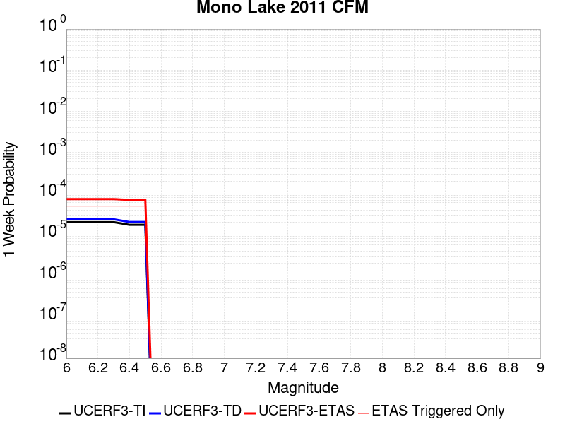 |  |  |  |

| Magnitude | 1 wk TI Prob | 1 wk TD Prob | 1 wk ETAS Prob | 1 wk ETAS/TD Gain | 1 wk ETAS Triggered Only | 1 mo TI Prob | 1 mo TD Prob | 1 mo ETAS Prob | 1 mo ETAS/TD Gain | 1 mo ETAS Triggered Only | 1 yr TI Prob | 1 yr TD Prob | 1 yr ETAS Prob | 1 yr ETAS/TD Gain | 1 yr ETAS Triggered Only | 10 yr TI Prob | 10 yr TD Prob | 10 yr ETAS Prob | 10 yr ETAS/TD Gain | 10 yr ETAS Triggered Only |
|-----|-----|-----|-----|-----|-----|-----|-----|-----|-----|-----|-----|-----|-----|-----|-----|-----|-----|-----|-----|-----|
| 6.0 | 2.0341662E-5 | 2.3828166E-5 | 1.6271374E-4 | 6.8286304 | 1.3888889E-4 | 8.717564E-5 | 1.0211971E-4 | 3.1043176E-4 | 3.039881 | 2.0833334E-4 | 0.0010608466 | 0.0012431298 | 0.0014512042 | 1.1673794 | 2.0833334E-4 | 0.010557966 | 0.012413835 | 0.012619582 | 1.016574 | 2.0833334E-4 |
| 6.1 | 2.0341662E-5 | 2.3828166E-5 | 1.6271374E-4 | 6.8286304 | 1.3888889E-4 | 8.717564E-5 | 1.0211971E-4 | 3.1043176E-4 | 3.039881 | 2.0833334E-4 | 0.0010608466 | 0.0012431298 | 0.0014512042 | 1.1673794 | 2.0833334E-4 | 0.010557966 | 0.012413835 | 0.012619582 | 1.016574 | 2.0833334E-4 |
| 6.2 | 2.0341662E-5 | 2.3828166E-5 | 1.6271374E-4 | 6.8286304 | 1.3888889E-4 | 8.717564E-5 | 1.0211971E-4 | 3.1043176E-4 | 3.039881 | 2.0833334E-4 | 0.0010608466 | 0.0012431298 | 0.0014512042 | 1.1673794 | 2.0833334E-4 | 0.010557966 | 0.012413835 | 0.012619582 | 1.016574 | 2.0833334E-4 |
| 6.3 | 2.0341662E-5 | 2.3828166E-5 | 1.6271374E-4 | 6.8286304 | 1.3888889E-4 | 8.717564E-5 | 1.0211971E-4 | 3.1043176E-4 | 3.039881 | 2.0833334E-4 | 0.0010608466 | 0.0012431298 | 0.0014512042 | 1.1673794 | 2.0833334E-4 | 0.010557966 | 0.012413835 | 0.012619582 | 1.016574 | 2.0833334E-4 |
| 6.4 | 1.749821E-5 | 2.0490985E-5 | 1.5937703E-4 | 7.7779093 | 1.3888889E-4 | 7.499018E-5 | 8.781851E-5 | 2.9613354E-4 | 3.3721087 | 2.0833334E-4 | 9.1262296E-4 | 0.0010691903 | 0.0012773009 | 1.1946431 | 2.0833334E-4 | 0.009088841 | 0.010691865 | 0.010897971 | 1.0192769 | 2.0833334E-4 |
| 6.5 | 1.749821E-5 | 2.0490985E-5 | 1.5937703E-4 | 7.7779093 | 1.3888889E-4 | 7.499018E-5 | 8.781851E-5 | 2.9613354E-4 | 3.3721087 | 2.0833334E-4 | 9.1262296E-4 | 0.0010691903 | 0.0012773009 | 1.1946431 | 2.0833334E-4 | 0.009088841 | 0.010691865 | 0.010897971 | 1.0192769 | 2.0833334E-4 |

## San Jacinto (Anza) rev
*[(top)](#table-of-contents)*

| 1 Week | 1 Month | 1 Year | 10 Year |
|-----|-----|-----|-----|
|  |  |  |  |

| Magnitude | 1 wk TI Prob | 1 wk TD Prob | 1 wk ETAS Prob | 1 wk ETAS/TD Gain | 1 wk ETAS Triggered Only | 1 mo TI Prob | 1 mo TD Prob | 1 mo ETAS Prob | 1 mo ETAS/TD Gain | 1 mo ETAS Triggered Only | 1 yr TI Prob | 1 yr TD Prob | 1 yr ETAS Prob | 1 yr ETAS/TD Gain | 1 yr ETAS Triggered Only | 10 yr TI Prob | 10 yr TD Prob | 10 yr ETAS Prob | 10 yr ETAS/TD Gain | 10 yr ETAS Triggered Only |
|-----|-----|-----|-----|-----|-----|-----|-----|-----|-----|-----|-----|-----|-----|-----|-----|-----|-----|-----|-----|-----|
| 6.0 | 6.3015636E-5 | 4.3302647E-5 | 4.3302647E-5 | 1.0 | 0.0 | 2.7003905E-4 | 1.8556965E-4 | 2.5500118E-4 | 1.3741536 | 6.9444446E-5 | 0.0032827691 | 0.0022569813 | 0.0023955568 | 1.0613986 | 1.3888889E-4 | 0.032346968 | 0.023296192 | 0.023499671 | 1.0087345 | 2.0833334E-4 |
| 6.1 | 6.3015636E-5 | 4.3302647E-5 | 4.3302647E-5 | 1.0 | 0.0 | 2.7003905E-4 | 1.8556965E-4 | 2.5500118E-4 | 1.3741536 | 6.9444446E-5 | 0.0032827691 | 0.0022569813 | 0.0023955568 | 1.0613986 | 1.3888889E-4 | 0.032346968 | 0.023296192 | 0.023499671 | 1.0087345 | 2.0833334E-4 |
| 6.2 | 6.3015636E-5 | 4.3302647E-5 | 4.3302647E-5 | 1.0 | 0.0 | 2.7003905E-4 | 1.8556965E-4 | 2.5500118E-4 | 1.3741536 | 6.9444446E-5 | 0.0032827691 | 0.0022569813 | 0.0023955568 | 1.0613986 | 1.3888889E-4 | 0.032346968 | 0.023296192 | 0.023499671 | 1.0087345 | 2.0833334E-4 |
| 6.3 | 6.3015636E-5 | 4.3302647E-5 | 4.3302647E-5 | 1.0 | 0.0 | 2.7003905E-4 | 1.8556965E-4 | 2.5500118E-4 | 1.3741536 | 6.9444446E-5 | 0.0032827691 | 0.0022569813 | 0.0023955568 | 1.0613986 | 1.3888889E-4 | 0.032346968 | 0.023296192 | 0.023499671 | 1.0087345 | 2.0833334E-4 |
| 6.4 | 6.3015636E-5 | 4.3302647E-5 | 4.3302647E-5 | 1.0 | 0.0 | 2.7003905E-4 | 1.8556965E-4 | 2.5500118E-4 | 1.3741536 | 6.9444446E-5 | 0.0032827691 | 0.0022569813 | 0.0023955568 | 1.0613986 | 1.3888889E-4 | 0.032346968 | 0.023296192 | 0.023499671 | 1.0087345 | 2.0833334E-4 |
| 6.5 | 5.811017E-5 | 4.0082516E-5 | 4.0082516E-5 | 1.0 | 0.0 | 2.4901982E-4 | 1.7177092E-4 | 2.4120344E-4 | 1.4042158 | 6.9444446E-5 | 0.0030276014 | 0.002089311 | 0.0022279094 | 1.066337 | 1.3888889E-4 | 0.02986684 | 0.021593736 | 0.021797571 | 1.0094395 | 2.0833334E-4 |
| 6.6 | 5.811017E-5 | 4.0082516E-5 | 4.0082516E-5 | 1.0 | 0.0 | 2.4901982E-4 | 1.7177092E-4 | 2.4120344E-4 | 1.4042158 | 6.9444446E-5 | 0.0030276014 | 0.002089311 | 0.0022279094 | 1.066337 | 1.3888889E-4 | 0.02986684 | 0.021593736 | 0.021797571 | 1.0094395 | 2.0833334E-4 |
| 6.7 | 5.712442E-5 | 3.9505223E-5 | 3.9505223E-5 | 1.0 | 0.0 | 2.4479596E-4 | 1.6929714E-4 | 2.3872983E-4 | 1.4101232 | 6.9444446E-5 | 0.0029763177 | 0.0020592497 | 0.0021978526 | 1.0673075 | 1.3888889E-4 | 0.029367693 | 0.021285562 | 0.021489462 | 1.0095792 | 2.0833334E-4 |
| 6.8 | 5.6967532E-5 | 3.9361643E-5 | 3.9361643E-5 | 1.0 | 0.0 | 2.4412372E-4 | 1.6868189E-4 | 2.3811462E-4 | 1.4116194 | 6.9444446E-5 | 0.0029681553 | 0.002051773 | 0.0021903769 | 1.0675533 | 1.3888889E-4 | 0.029288229 | 0.021210281 | 0.021414196 | 1.009614 | 2.0833334E-4 |
| 6.9 | 5.6211324E-5 | 3.9066435E-5 | 3.9066435E-5 | 1.0 | 0.0 | 2.4088343E-4 | 1.6741687E-4 | 2.368497E-4 | 1.4147301 | 6.9444446E-5 | 0.0029288116 | 0.0020364004 | 0.0021750063 | 1.0680642 | 1.3888889E-4 | 0.028905109 | 0.021049714 | 0.021253662 | 1.0096889 | 2.0833334E-4 |
| 7.0 | 5.4383527E-5 | 3.792697E-5 | 3.792697E-5 | 1.0 | 0.0 | 2.3305144E-4 | 1.6253405E-4 | 2.319672E-4 | 1.4271915 | 6.9444446E-5 | 0.0028337094 | 0.001977061 | 0.0021156752 | 1.0701113 | 1.3888889E-4 | 0.027978465 | 0.020440677 | 0.020644752 | 1.0099838 | 2.0833334E-4 |
| 7.1 | 5.1393665E-5 | 3.6389913E-5 | 3.6389913E-5 | 1.0 | 0.0 | 2.2023996E-4 | 1.5594746E-4 | 2.2538108E-4 | 1.4452372 | 6.9444446E-5 | 0.0026781242 | 0.0018970112 | 0.0020356367 | 1.0730757 | 1.3888889E-4 | 0.026460782 | 0.019614287 | 0.019818533 | 1.0104132 | 2.0833334E-4 |
| 7.2 | 4.785222E-5 | 3.4741795E-5 | 3.4741795E-5 | 1.0 | 0.0 | 2.0506482E-4 | 1.4888494E-4 | 2.1831904E-4 | 1.4663608 | 6.9444446E-5 | 0.0024938055 | 0.0018111705 | 0.0019498079 | 1.0765457 | 1.3888889E-4 | 0.024660049 | 0.018728992 | 0.018933423 | 1.0109153 | 2.0833334E-4 |
| 7.3 | 4.2143256E-5 | 3.383628E-5 | 3.383628E-5 | 1.0 | 0.0 | 1.8060145E-4 | 1.4500458E-4 | 2.1443896E-4 | 1.4788426 | 6.9444446E-5 | 0.002196605 | 0.0017640047 | 0.0019026486 | 1.0785961 | 1.3888889E-4 | 0.02175019 | 0.01823724 | 0.018441776 | 1.0112152 | 2.0833334E-4 |
| 7.4 | 4.0264713E-5 | 3.347446E-5 | 3.347446E-5 | 1.0 | 0.0 | 1.7255165E-4 | 1.4345412E-4 | 2.128886E-4 | 1.4840188 | 6.9444446E-5 | 0.002098792 | 0.0017451581 | 0.0018838046 | 1.0794464 | 1.3888889E-4 | 0.020790804 | 0.018041821 | 0.018246396 | 1.011339 | 2.0833334E-4 |
| 7.5 | 3.694492E-5 | 3.218847E-5 | 3.218847E-5 | 1.0 | 0.0 | 1.5832575E-4 | 1.379433E-4 | 2.0737817E-4 | 1.503358 | 6.9444446E-5 | 0.0019259118 | 0.001678169 | 0.0018168248 | 1.0826232 | 1.3888889E-4 | 0.01909306 | 0.01735827 | 0.017562987 | 1.0117936 | 2.0833334E-4 |
| 7.6 | 3.200565E-5 | 2.9504106E-5 | 2.9504106E-5 | 1.0 | 0.0 | 1.3715986E-4 | 1.2644005E-4 | 1.9587572E-4 | 1.5491588 | 6.9444446E-5 | 0.001668642 | 0.0015383229 | 0.0016769981 | 1.090147 | 1.3888889E-4 | 0.01656168 | 0.0159463 | 0.01615131 | 1.0128564 | 2.0833334E-4 |
| 7.7 | 2.731642E-5 | 2.6092788E-5 | 2.6092788E-5 | 1.0 | 0.0 | 1.1706512E-4 | 1.1182144E-4 | 1.8125812E-4 | 1.6209604 | 6.9444446E-5 | 0.001424336 | 0.0013605768 | 0.0014992767 | 1.101942 | 1.3888889E-4 | 0.014152412 | 0.014167004 | 0.014372387 | 1.0144972 | 2.0833334E-4 |
| 7.8 | 2.3466424E-5 | 2.3504817E-5 | 2.3504817E-5 | 1.0 | 0.0 | 1.0056651E-4 | 1.0073105E-4 | 1.701685E-4 | 1.6893351 | 6.9444446E-5 | 0.0012237094 | 0.0012257113 | 0.0013644301 | 1.113174 | 1.3888889E-4 | 0.012169928 | 0.012808893 | 0.013014558 | 1.0160564 | 2.0833334E-4 |
| 7.9 | 1.8611925E-5 | 1.8908117E-5 | 1.8908117E-5 | 1.0 | 0.0 | 7.9762955E-5 | 8.1032274E-5 | 1.504711E-4 | 1.8569279 | 6.9444446E-5 | 9.7068126E-4 | 9.861222E-4 | 0.0011248741 | 1.1407046 | 1.3888889E-4 | 0.0096645225 | 0.010393824 | 0.010599992 | 1.0198356 | 2.0833334E-4 |
| 8.0 | 1.5460775E-5 | 1.5740965E-5 | 1.5740965E-5 | 1.0 | 0.0 | 6.6258784E-5 | 6.7459536E-5 | 1.368993E-4 | 2.0293543 | 6.9444446E-5 | 8.0640207E-4 | 8.21011E-4 | 9.597859E-4 | 1.1690292 | 1.3888889E-4 | 0.008034821 | 0.0087028835 | 0.008909403 | 1.02373 | 2.0833334E-4 |
| 8.1 | 9.983884E-6 | 8.269952E-6 | 8.269952E-6 | 1.0 | 0.0 | 4.2787375E-5 | 3.544217E-5 | 3.544217E-5 | 1.0 | 0.0 | 5.2081177E-4 | 4.314235E-4 | 4.314235E-4 | 1.0 | 0.0 | 0.0051959283 | 0.004640022 | 0.004640022 | 1.0 | 0.0 |
| 8.2 | 4.1226E-6 | 1.5529788E-6 | 1.5529788E-6 | 1.0 | 0.0 | 1.7668166E-5 | 6.6556063E-6 | 6.6556063E-6 | 1.0 | 0.0 | 2.1508869E-4 | 8.102902E-5 | 8.102902E-5 | 1.0 | 0.0 | 0.0021488064 | 9.4050163E-4 | 9.4050163E-4 | 1.0 | 0.0 |
| 8.3 | 1.2750878E-6 | 3.612133E-7 | 3.612133E-7 | 1.0 | 0.0 | 5.4646503E-6 | 1.548056E-6 | 1.548056E-6 | 1.0 | 0.0 | 6.653009E-5 | 1.8847424E-5 | 1.8847424E-5 | 1.0 | 0.0 | 6.6510175E-4 | 2.2734253E-4 | 2.2734253E-4 | 1.0 | 0.0 |

## Manix-Afton Hills
*[(top)](#table-of-contents)*

| 1 Week | 1 Month | 1 Year | 10 Year |
|-----|-----|-----|-----|
| 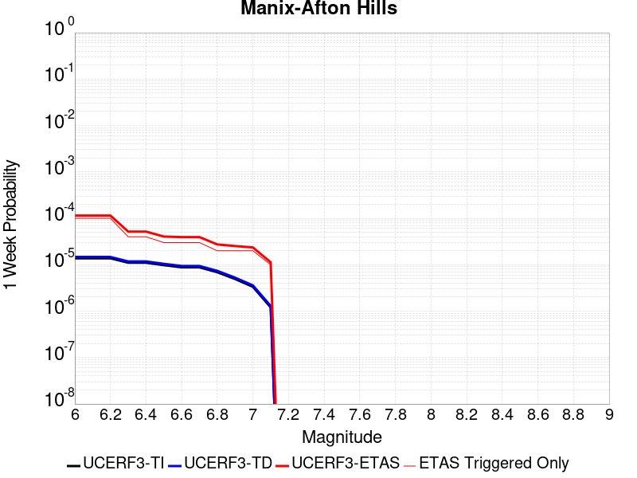 |  |  | 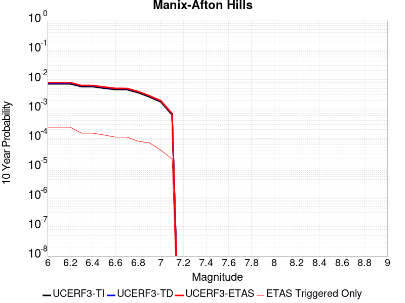 |

| Magnitude | 1 wk TI Prob | 1 wk TD Prob | 1 wk ETAS Prob | 1 wk ETAS/TD Gain | 1 wk ETAS Triggered Only | 1 mo TI Prob | 1 mo TD Prob | 1 mo ETAS Prob | 1 mo ETAS/TD Gain | 1 mo ETAS Triggered Only | 1 yr TI Prob | 1 yr TD Prob | 1 yr ETAS Prob | 1 yr ETAS/TD Gain | 1 yr ETAS Triggered Only | 10 yr TI Prob | 10 yr TD Prob | 10 yr ETAS Prob | 10 yr ETAS/TD Gain | 10 yr ETAS Triggered Only |
|-----|-----|-----|-----|-----|-----|-----|-----|-----|-----|-----|-----|-----|-----|-----|-----|-----|-----|-----|-----|-----|
| 6.0 | 1.3783202E-5 | 1.47110895E-5 | 8.415451E-5 | 5.7204814 | 6.9444446E-5 | 5.906953E-5 | 6.30461E-5 | 1.3248617E-4 | 2.1014173 | 6.9444446E-5 | 7.189342E-4 | 7.6733343E-4 | 8.367246E-4 | 1.0904316 | 6.9444446E-5 | 0.0071661277 | 0.007648596 | 0.0077864225 | 1.0180198 | 1.3888889E-4 |
| 6.1 | 1.3783202E-5 | 1.47110895E-5 | 8.415451E-5 | 5.7204814 | 6.9444446E-5 | 5.906953E-5 | 6.30461E-5 | 1.3248617E-4 | 2.1014173 | 6.9444446E-5 | 7.189342E-4 | 7.6733343E-4 | 8.367246E-4 | 1.0904316 | 6.9444446E-5 | 0.0071661277 | 0.007648596 | 0.0077864225 | 1.0180198 | 1.3888889E-4 |
| 6.2 | 1.3783202E-5 | 1.47110895E-5 | 8.415451E-5 | 5.7204814 | 6.9444446E-5 | 5.906953E-5 | 6.30461E-5 | 1.3248617E-4 | 2.1014173 | 6.9444446E-5 | 7.189342E-4 | 7.6733343E-4 | 8.367246E-4 | 1.0904316 | 6.9444446E-5 | 0.0071661277 | 0.007648596 | 0.0077864225 | 1.0180198 | 1.3888889E-4 |
| 6.3 | 1.10494875E-5 | 1.1793136E-5 | 8.123676E-5 | 6.8884783 | 6.9444446E-5 | 4.7354086E-5 | 5.054109E-5 | 1.19982025E-4 | 2.37395 | 6.9444446E-5 | 5.763835E-4 | 6.151744E-4 | 6.845761E-4 | 1.1128163 | 6.9444446E-5 | 0.005748908 | 0.0061357557 | 0.006273792 | 1.022497 | 1.3888889E-4 |
| 6.4 | 1.10494875E-5 | 1.1793136E-5 | 8.123676E-5 | 6.8884783 | 6.9444446E-5 | 4.7354086E-5 | 5.054109E-5 | 1.19982025E-4 | 2.37395 | 6.9444446E-5 | 5.763835E-4 | 6.151744E-4 | 6.845761E-4 | 1.1128163 | 6.9444446E-5 | 0.005748908 | 0.0061357557 | 0.006273792 | 1.022497 | 1.3888889E-4 |
| 6.5 | 9.788949E-6 | 1.045432E-5 | 1.045432E-5 | 1.0 | 0.0 | 4.1951964E-5 | 4.480351E-5 | 4.480351E-5 | 1.0 | 0.0 | 5.1064545E-4 | 5.453555E-4 | 5.453555E-4 | 1.0 | 0.0 | 0.0050947363 | 0.0054410985 | 0.0055101654 | 1.0126935 | 6.9444446E-5 |
| 6.6 | 8.810006E-6 | 9.4136285E-6 | 9.4136285E-6 | 1.0 | 0.0 | 3.775662E-5 | 4.0343548E-5 | 4.0343548E-5 | 1.0 | 0.0 | 4.5958988E-4 | 4.9108086E-4 | 4.9108086E-4 | 1.0 | 0.0 | 0.0045864056 | 0.004900839 | 0.0049699433 | 1.0141004 | 6.9444446E-5 |
| 6.7 | 8.80128E-6 | 9.404108E-6 | 9.404108E-6 | 1.0 | 0.0 | 3.7719226E-5 | 4.0302748E-5 | 4.0302748E-5 | 1.0 | 0.0 | 4.591348E-4 | 4.9058435E-4 | 4.9058435E-4 | 1.0 | 0.0 | 0.004581874 | 0.0048958957 | 0.0049650003 | 1.0141147 | 6.9444446E-5 |
| 6.8 | 6.8994877E-6 | 7.380076E-6 | 7.380076E-6 | 1.0 | 0.0 | 2.9568899E-5 | 3.162856E-5 | 3.162856E-5 | 1.0 | 0.0 | 3.5994186E-4 | 3.8501783E-4 | 3.8501783E-4 | 1.0 | 0.0 | 0.003593594 | 0.0038443129 | 0.0039134906 | 1.0179948 | 6.9444446E-5 |
| 6.9 | 4.9328037E-6 | 5.2709615E-6 | 5.2709615E-6 | 1.0 | 0.0 | 2.1140417E-5 | 2.2589675E-5 | 2.2589675E-5 | 1.0 | 0.0 | 2.5735417E-4 | 2.7500073E-4 | 2.7500073E-4 | 1.0 | 0.0 | 0.0025705635 | 0.0027472095 | 0.0027472095 | 1.0 | 0.0 |
| 7.0 | 3.347973E-6 | 3.59003E-6 | 3.59003E-6 | 1.0 | 0.0 | 1.4348378E-5 | 1.5385775E-5 | 1.5385775E-5 | 1.0 | 0.0 | 1.746775E-4 | 1.8730981E-4 | 1.8730981E-4 | 1.0 | 0.0 | 0.0017454025 | 0.0018719219 | 0.0018719219 | 1.0 | 0.0 |
| 7.1 | 1.2073567E-6 | 1.293482E-6 | 1.293482E-6 | 1.0 | 0.0 | 5.1743755E-6 | 5.543492E-6 | 5.543492E-6 | 1.0 | 0.0 | 6.29962E-5 | 6.749156E-5 | 6.749156E-5 | 1.0 | 0.0 | 6.297835E-4 | 6.7487074E-4 | 6.7487074E-4 | 1.0 | 0.0 |

## San Jacinto (San Jacinto Valley) rev
*[(top)](#table-of-contents)*

| 1 Week | 1 Month | 1 Year | 10 Year |
|-----|-----|-----|-----|
|  |  | 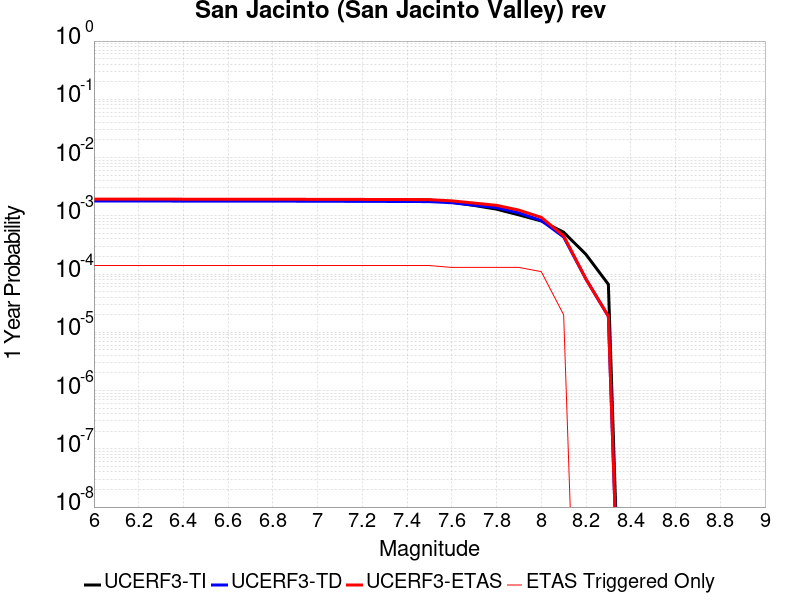 |  |

| Magnitude | 1 wk TI Prob | 1 wk TD Prob | 1 wk ETAS Prob | 1 wk ETAS/TD Gain | 1 wk ETAS Triggered Only | 1 mo TI Prob | 1 mo TD Prob | 1 mo ETAS Prob | 1 mo ETAS/TD Gain | 1 mo ETAS Triggered Only | 1 yr TI Prob | 1 yr TD Prob | 1 yr ETAS Prob | 1 yr ETAS/TD Gain | 1 yr ETAS Triggered Only | 10 yr TI Prob | 10 yr TD Prob | 10 yr ETAS Prob | 10 yr ETAS/TD Gain | 10 yr ETAS Triggered Only |
|-----|-----|-----|-----|-----|-----|-----|-----|-----|-----|-----|-----|-----|-----|-----|-----|-----|-----|-----|-----|-----|
| 6.0 | 3.652694E-5 | 3.4402394E-5 | 3.4402394E-5 | 1.0 | 0.0 | 1.5653463E-4 | 1.474305E-4 | 2.168647E-4 | 1.4709623 | 6.9444446E-5 | 0.0019041431 | 0.00179349 | 0.0019321297 | 1.0773017 | 1.3888889E-4 | 0.018879099 | 0.018526595 | 0.018731069 | 1.0110368 | 2.0833334E-4 |
| 6.1 | 3.652694E-5 | 3.4402394E-5 | 3.4402394E-5 | 1.0 | 0.0 | 1.5653463E-4 | 1.474305E-4 | 2.168647E-4 | 1.4709623 | 6.9444446E-5 | 0.0019041431 | 0.00179349 | 0.0019321297 | 1.0773017 | 1.3888889E-4 | 0.018879099 | 0.018526595 | 0.018731069 | 1.0110368 | 2.0833334E-4 |
| 6.2 | 3.652694E-5 | 3.4402394E-5 | 3.4402394E-5 | 1.0 | 0.0 | 1.5653463E-4 | 1.474305E-4 | 2.168647E-4 | 1.4709623 | 6.9444446E-5 | 0.0019041431 | 0.00179349 | 0.0019321297 | 1.0773017 | 1.3888889E-4 | 0.018879099 | 0.018526595 | 0.018731069 | 1.0110368 | 2.0833334E-4 |
| 6.3 | 3.652694E-5 | 3.4402394E-5 | 3.4402394E-5 | 1.0 | 0.0 | 1.5653463E-4 | 1.474305E-4 | 2.168647E-4 | 1.4709623 | 6.9444446E-5 | 0.0019041431 | 0.00179349 | 0.0019321297 | 1.0773017 | 1.3888889E-4 | 0.018879099 | 0.018526595 | 0.018731069 | 1.0110368 | 2.0833334E-4 |
| 6.4 | 3.646941E-5 | 3.432397E-5 | 3.432397E-5 | 1.0 | 0.0 | 1.5628811E-4 | 1.4709444E-4 | 2.1652867E-4 | 1.4720384 | 6.9444446E-5 | 0.0019011468 | 0.0017894056 | 0.001928046 | 1.0774784 | 1.3888889E-4 | 0.018849645 | 0.018486476 | 0.018690959 | 1.0110612 | 2.0833334E-4 |
| 6.5 | 3.646941E-5 | 3.432397E-5 | 3.432397E-5 | 1.0 | 0.0 | 1.5628811E-4 | 1.4709444E-4 | 2.1652867E-4 | 1.4720384 | 6.9444446E-5 | 0.0019011468 | 0.0017894056 | 0.001928046 | 1.0774784 | 1.3888889E-4 | 0.018849645 | 0.018486476 | 0.018690959 | 1.0110612 | 2.0833334E-4 |
| 6.6 | 3.6442503E-5 | 3.4287354E-5 | 3.4287354E-5 | 1.0 | 0.0 | 1.561728E-4 | 1.4693754E-4 | 2.1637179E-4 | 1.4725425 | 6.9444446E-5 | 0.0018997455 | 0.0017874985 | 0.0019261391 | 1.0775613 | 1.3888889E-4 | 0.018835869 | 0.018467745 | 0.018672232 | 1.0110726 | 2.0833334E-4 |
| 6.7 | 3.6432113E-5 | 3.4272925E-5 | 3.4272925E-5 | 1.0 | 0.0 | 1.5612828E-4 | 1.4687571E-4 | 2.1630996E-4 | 1.4727415 | 6.9444446E-5 | 0.0018992044 | 0.0017867472 | 0.001925388 | 1.0775939 | 1.3888889E-4 | 0.018830549 | 0.018460369 | 0.018664856 | 1.011077 | 2.0833334E-4 |
| 6.8 | 3.6409598E-5 | 3.424198E-5 | 3.424198E-5 | 1.0 | 0.0 | 1.560318E-4 | 1.4674311E-4 | 2.1617736E-4 | 1.4731687 | 6.9444446E-5 | 0.0018980318 | 0.0017851355 | 0.0019237763 | 1.0776641 | 1.3888889E-4 | 0.018819023 | 0.018444523 | 0.018649014 | 1.0110868 | 2.0833334E-4 |
| 6.9 | 3.638078E-5 | 3.4202407E-5 | 3.4202407E-5 | 1.0 | 0.0 | 1.5590832E-4 | 1.4657351E-4 | 2.1600779E-4 | 1.4737163 | 6.9444446E-5 | 0.0018965311 | 0.001783074 | 0.0019217153 | 1.077754 | 1.3888889E-4 | 0.018804269 | 0.018424258 | 0.018628752 | 1.0110992 | 2.0833334E-4 |
| 7.0 | 3.6294874E-5 | 3.408442E-5 | 3.408442E-5 | 1.0 | 0.0 | 1.5554018E-4 | 1.4606792E-4 | 2.1550222E-4 | 1.4753562 | 6.9444446E-5 | 0.0018920569 | 0.001776929 | 0.001915571 | 1.0780234 | 1.3888889E-4 | 0.018760284 | 0.018363839 | 0.018568346 | 1.0111364 | 2.0833334E-4 |
| 7.1 | 3.6260717E-5 | 3.4040702E-5 | 3.4040702E-5 | 1.0 | 0.0 | 1.5539382E-4 | 1.4588058E-4 | 2.153149E-4 | 1.4759668 | 6.9444446E-5 | 0.001890278 | 0.0017746518 | 0.0019132942 | 1.0781237 | 1.3888889E-4 | 0.018742796 | 0.018341439 | 0.018545952 | 1.0111502 | 2.0833334E-4 |
| 7.2 | 3.6210204E-5 | 3.397492E-5 | 3.397492E-5 | 1.0 | 0.0 | 1.5517735E-4 | 1.455987E-4 | 2.1503303E-4 | 1.4768884 | 6.9444446E-5 | 0.001887647 | 0.0017712255 | 0.0019098683 | 1.0782751 | 1.3888889E-4 | 0.01871693 | 0.01830772 | 0.018512238 | 1.0111712 | 2.0833334E-4 |
| 7.3 | 3.6119454E-5 | 3.386321E-5 | 3.386321E-5 | 1.0 | 0.0 | 1.5478847E-4 | 1.4511998E-4 | 2.1455434E-4 | 1.4784619 | 6.9444446E-5 | 0.0018829206 | 0.0017654065 | 0.0019040502 | 1.0785335 | 1.3888889E-4 | 0.018670462 | 0.018250274 | 0.018454803 | 1.011207 | 2.0833334E-4 |
| 7.4 | 3.607848E-5 | 3.381071E-5 | 3.381071E-5 | 1.0 | 0.0 | 1.5461289E-4 | 1.44895E-4 | 2.1432938E-4 | 1.4792048 | 6.9444446E-5 | 0.0018807866 | 0.0017626719 | 0.001901316 | 1.0786556 | 1.3888889E-4 | 0.018649481 | 0.018223269 | 0.018427806 | 1.0112239 | 2.0833334E-4 |
| 7.5 | 3.5856774E-5 | 3.3620483E-5 | 3.3620483E-5 | 1.0 | 0.0 | 1.5366284E-4 | 1.4407984E-4 | 2.1351427E-4 | 1.4819164 | 6.9444446E-5 | 0.0018692396 | 0.0017527633 | 0.0018914087 | 1.0791011 | 1.3888889E-4 | 0.018535944 | 0.018124366 | 0.018328924 | 1.0112864 | 2.0833334E-4 |
| 7.6 | 3.286655E-5 | 3.2143445E-5 | 3.2143445E-5 | 1.0 | 0.0 | 1.4084904E-4 | 1.3775036E-4 | 2.0718525E-4 | 1.5040631 | 6.9444446E-5 | 0.001713488 | 0.0016758227 | 0.0018144788 | 1.0827391 | 1.3888889E-4 | 0.017003361 | 0.017344031 | 0.017548751 | 1.0118035 | 2.0833334E-4 |
| 7.7 | 2.8882527E-5 | 2.9236293E-5 | 2.9236293E-5 | 1.0 | 0.0 | 1.237764E-4 | 1.2529238E-4 | 1.9472813E-4 | 1.5541897 | 6.9444446E-5 | 0.0015059357 | 0.0015243685 | 0.0016630457 | 1.0909735 | 1.3888889E-4 | 0.014957713 | 0.015830461 | 0.016035495 | 1.012952 | 2.0833334E-4 |
| 7.8 | 2.4950225E-5 | 2.6527203E-5 | 2.6527203E-5 | 1.0 | 0.0 | 1.0692515E-4 | 1.1368306E-4 | 1.8311961E-4 | 1.6107906 | 6.9444446E-5 | 0.0013010362 | 0.0013832134 | 0.0015219102 | 1.1002715 | 1.3888889E-4 | 0.012934455 | 0.014411755 | 0.014617085 | 1.0142474 | 2.0833334E-4 |
| 7.9 | 1.9881603E-5 | 2.1507445E-5 | 2.1507445E-5 | 1.0 | 0.0 | 8.520408E-5 | 9.217151E-5 | 1.6160955E-4 | 1.7533569 | 6.9444446E-5 | 0.001036866 | 0.0011216112 | 0.0012603444 | 1.123691 | 1.3888889E-4 | 0.010320415 | 0.011777027 | 0.011982907 | 1.0174814 | 2.0833334E-4 |
| 8.0 | 1.563292E-5 | 1.5937347E-5 | 1.5937347E-5 | 1.0 | 0.0 | 6.6996516E-5 | 6.8301124E-5 | 1.3774083E-4 | 2.01667 | 6.9444446E-5 | 8.153773E-4 | 8.3124964E-4 | 9.700231E-4 | 1.1669456 | 1.3888889E-4 | 0.00812392 | 0.008810506 | 0.009017004 | 1.0234376 | 2.0833334E-4 |
| 8.1 | 1.0045313E-5 | 8.301802E-6 | 8.301802E-6 | 1.0 | 0.0 | 4.305063E-5 | 3.5578672E-5 | 3.5578672E-5 | 1.0 | 0.0 | 5.2401534E-4 | 4.3308473E-4 | 4.3308473E-4 | 1.0 | 0.0 | 0.0052278144 | 0.0046591135 | 0.0046591135 | 1.0 | 0.0 |
| 8.2 | 4.1554413E-6 | 1.5655598E-6 | 1.5655598E-6 | 1.0 | 0.0 | 1.7808914E-5 | 6.709525E-6 | 6.709525E-6 | 1.0 | 0.0 | 2.1680194E-4 | 8.168544E-5 | 8.168544E-5 | 1.0 | 0.0 | 0.0021659054 | 9.482903E-4 | 9.482903E-4 | 1.0 | 0.0 |
| 8.3 | 1.2758221E-6 | 3.6149942E-7 | 3.6149942E-7 | 1.0 | 0.0 | 5.4677976E-6 | 1.5492824E-6 | 1.5492824E-6 | 1.0 | 0.0 | 6.65684E-5 | 1.8862354E-5 | 1.8862354E-5 | 1.0 | 0.0 | 6.6548464E-4 | 2.2751294E-4 | 2.2751294E-4 | 1.0 | 0.0 |

## San Jacinto (Stepovers Combined)
*[(top)](#table-of-contents)*

| 1 Week | 1 Month | 1 Year | 10 Year |
|-----|-----|-----|-----|
|  |  |  |  |

| Magnitude | 1 wk TI Prob | 1 wk TD Prob | 1 wk ETAS Prob | 1 wk ETAS/TD Gain | 1 wk ETAS Triggered Only | 1 mo TI Prob | 1 mo TD Prob | 1 mo ETAS Prob | 1 mo ETAS/TD Gain | 1 mo ETAS Triggered Only | 1 yr TI Prob | 1 yr TD Prob | 1 yr ETAS Prob | 1 yr ETAS/TD Gain | 1 yr ETAS Triggered Only | 10 yr TI Prob | 10 yr TD Prob | 10 yr ETAS Prob | 10 yr ETAS/TD Gain | 10 yr ETAS Triggered Only |
|-----|-----|-----|-----|-----|-----|-----|-----|-----|-----|-----|-----|-----|-----|-----|-----|-----|-----|-----|-----|-----|
| 6.0 | 4.0667746E-5 | 3.5272755E-5 | 3.5272755E-5 | 1.0 | 0.0 | 1.742787E-4 | 1.5116022E-4 | 2.2059416E-4 | 1.4593401 | 6.9444446E-5 | 0.0021197782 | 0.0018388226 | 0.001977456 | 1.0753925 | 1.3888889E-4 | 0.020996714 | 0.018986892 | 0.019191269 | 1.0107641 | 2.0833334E-4 |
| 6.1 | 4.0667746E-5 | 3.5272755E-5 | 3.5272755E-5 | 1.0 | 0.0 | 1.742787E-4 | 1.5116022E-4 | 2.2059416E-4 | 1.4593401 | 6.9444446E-5 | 0.0021197782 | 0.0018388226 | 0.001977456 | 1.0753925 | 1.3888889E-4 | 0.020996714 | 0.018986892 | 0.019191269 | 1.0107641 | 2.0833334E-4 |
| 6.2 | 4.0667746E-5 | 3.5272755E-5 | 3.5272755E-5 | 1.0 | 0.0 | 1.742787E-4 | 1.5116022E-4 | 2.2059416E-4 | 1.4593401 | 6.9444446E-5 | 0.0021197782 | 0.0018388226 | 0.001977456 | 1.0753925 | 1.3888889E-4 | 0.020996714 | 0.018986892 | 0.019191269 | 1.0107641 | 2.0833334E-4 |
| 6.3 | 4.0667746E-5 | 3.5272755E-5 | 3.5272755E-5 | 1.0 | 0.0 | 1.742787E-4 | 1.5116022E-4 | 2.2059416E-4 | 1.4593401 | 6.9444446E-5 | 0.0021197782 | 0.0018388226 | 0.001977456 | 1.0753925 | 1.3888889E-4 | 0.020996714 | 0.018986892 | 0.019191269 | 1.0107641 | 2.0833334E-4 |
| 6.4 | 4.0577226E-5 | 3.5144654E-5 | 3.5144654E-5 | 1.0 | 0.0 | 1.738908E-4 | 1.5061127E-4 | 2.2004526E-4 | 1.4610145 | 6.9444446E-5 | 0.0021150648 | 0.0018321523 | 0.0019707866 | 1.0756675 | 1.3888889E-4 | 0.020950472 | 0.018921461 | 0.01912585 | 1.0108021 | 2.0833334E-4 |
| 6.5 | 4.0577226E-5 | 3.5144654E-5 | 3.5144654E-5 | 1.0 | 0.0 | 1.738908E-4 | 1.5061127E-4 | 2.2004526E-4 | 1.4610145 | 6.9444446E-5 | 0.0021150648 | 0.0018321523 | 0.0019707866 | 1.0756675 | 1.3888889E-4 | 0.020950472 | 0.018921461 | 0.01912585 | 1.0108021 | 2.0833334E-4 |
| 6.6 | 4.053861E-5 | 3.509E-5 | 3.509E-5 | 1.0 | 0.0 | 1.7372532E-4 | 1.5037706E-4 | 2.1981107E-4 | 1.4617326 | 6.9444446E-5 | 0.0021130538 | 0.0018293057 | 0.0019679405 | 1.0757855 | 1.3888889E-4 | 0.020930743 | 0.018893538 | 0.019097935 | 1.0108184 | 2.0833334E-4 |
| 6.7 | 4.0516545E-5 | 3.5059067E-5 | 3.5059067E-5 | 1.0 | 0.0 | 1.7363077E-4 | 1.5024451E-4 | 2.1967852E-4 | 1.4621401 | 6.9444446E-5 | 0.002111905 | 0.001827695 | 0.00196633 | 1.0758524 | 1.3888889E-4 | 0.020919468 | 0.018877735 | 0.019082136 | 1.0108275 | 2.0833334E-4 |
| 6.8 | 4.049434E-5 | 3.5030633E-5 | 3.5030633E-5 | 1.0 | 0.0 | 1.7353562E-4 | 1.5012265E-4 | 2.1955668E-4 | 1.4625152 | 6.9444446E-5 | 0.0021107488 | 0.0018262138 | 0.0019648492 | 1.075914 | 1.3888889E-4 | 0.020908125 | 0.018863149 | 0.019067552 | 1.0108361 | 2.0833334E-4 |
| 6.9 | 4.046386E-5 | 3.499319E-5 | 3.499319E-5 | 1.0 | 0.0 | 1.73405E-4 | 1.4996222E-4 | 2.1939624E-4 | 1.4630102 | 6.9444446E-5 | 0.0021091616 | 0.0018242638 | 0.0019628992 | 1.0759953 | 1.3888889E-4 | 0.020892553 | 0.01884392 | 0.019048328 | 1.0108474 | 2.0833334E-4 |
| 7.0 | 4.036382E-5 | 3.487376E-5 | 3.487376E-5 | 1.0 | 0.0 | 1.7297632E-4 | 1.4945042E-4 | 2.1888448E-4 | 1.464596 | 6.9444446E-5 | 0.0021039525 | 0.0018180435 | 0.0019566799 | 1.0762558 | 1.3888889E-4 | 0.02084144 | 0.018782536 | 0.018986955 | 1.0108836 | 2.0833334E-4 |
| 7.1 | 4.0343282E-5 | 3.4852223E-5 | 3.4852223E-5 | 1.0 | 0.0 | 1.7288832E-4 | 1.4935812E-4 | 2.1879221E-4 | 1.4648831 | 6.9444446E-5 | 0.002102883 | 0.0018169218 | 0.0019555583 | 1.076303 | 1.3888889E-4 | 0.020830948 | 0.018771412 | 0.018975835 | 1.0108901 | 2.0833334E-4 |
| 7.2 | 4.0257353E-5 | 3.4756722E-5 | 3.4756722E-5 | 1.0 | 0.0 | 1.725201E-4 | 1.489489E-4 | 2.18383E-4 | 1.4661605 | 6.9444446E-5 | 0.0020984085 | 0.0018119477 | 0.0019505849 | 1.0765128 | 1.3888889E-4 | 0.020787042 | 0.018722152 | 0.018926585 | 1.0109193 | 2.0833334E-4 |
| 7.3 | 3.9940667E-5 | 3.4584376E-5 | 3.4584376E-5 | 1.0 | 0.0 | 1.7116306E-4 | 1.4821035E-4 | 2.1764451E-4 | 1.4684838 | 6.9444446E-5 | 0.0020819185 | 0.0018029709 | 0.0019416094 | 1.0768944 | 1.3888889E-4 | 0.020625217 | 0.018630784 | 0.018835235 | 1.0109739 | 2.0833334E-4 |
| 7.4 | 3.9721202E-5 | 3.4469766E-5 | 3.4469766E-5 | 1.0 | 0.0 | 1.7022261E-4 | 1.4771923E-4 | 2.1715341E-4 | 1.4700416 | 6.9444446E-5 | 0.0020704903 | 0.0017970012 | 0.0019356406 | 1.0771503 | 1.3888889E-4 | 0.020513052 | 0.018569905 | 0.018774372 | 1.0110105 | 2.0833334E-4 |
| 7.5 | 3.7036873E-5 | 3.3537188E-5 | 3.3537188E-5 | 1.0 | 0.0 | 1.5871979E-4 | 1.437229E-4 | 2.1315736E-4 | 1.4831134 | 6.9444446E-5 | 0.0019307006 | 0.0017484248 | 0.0018870708 | 1.0792977 | 1.3888889E-4 | 0.019140124 | 0.018071463 | 0.018276032 | 1.01132 | 2.0833334E-4 |
| 7.6 | 3.2940967E-5 | 3.1317984E-5 | 3.1317984E-5 | 1.0 | 0.0 | 1.4116794E-4 | 1.3421304E-4 | 2.0364817E-4 | 1.5173501 | 6.9444446E-5 | 0.0017173645 | 0.0016328214 | 0.0017714835 | 1.0849218 | 1.3888889E-4 | 0.01704153 | 0.016904354 | 0.017109165 | 1.012116 | 2.0833334E-4 |
| 7.7 | 2.8236149E-5 | 2.7883889E-5 | 2.7883889E-5 | 1.0 | 0.0 | 1.2100645E-4 | 1.19496915E-4 | 1.8893306E-4 | 1.5810707 | 6.9444446E-5 | 0.0014722579 | 0.001453905 | 0.001592592 | 1.0953892 | 1.3888889E-4 | 0.014625421 | 0.015115095 | 0.01532028 | 1.0135748 | 2.0833334E-4 |
| 7.8 | 2.4329287E-5 | 2.5207537E-5 | 2.5207537E-5 | 1.0 | 0.0 | 1.042642E-4 | 1.0802783E-4 | 1.7746477E-4 | 1.642769 | 6.9444446E-5 | 0.0012686774 | 0.0013144462 | 0.0014531525 | 1.1055245 | 1.3888889E-4 | 0.012614589 | 0.013712396 | 0.013917873 | 1.0149847 | 2.0833334E-4 |
| 7.9 | 1.9370926E-5 | 2.0421452E-5 | 2.0421452E-5 | 1.0 | 0.0 | 8.301561E-5 | 8.7517576E-5 | 1.5695594E-4 | 1.793422 | 6.9444446E-5 | 0.0010102465 | 0.0010650064 | 0.0012037473 | 1.1302724 | 1.3888889E-4 | 0.0100566605 | 0.011199483 | 0.011405482 | 1.0183938 | 2.0833334E-4 |
| 8.0 | 1.5583017E-5 | 1.588647E-5 | 1.588647E-5 | 1.0 | 0.0 | 6.6782646E-5 | 6.808309E-5 | 1.375228E-4 | 2.019926 | 6.9444446E-5 | 8.127754E-4 | 8.285971E-4 | 9.673709E-4 | 1.1674805 | 1.3888889E-4 | 0.008098091 | 0.008781809 | 0.008988313 | 1.023515 | 2.0833334E-4 |
| 8.1 | 1.0024873E-5 | 8.292404E-6 | 8.292404E-6 | 1.0 | 0.0 | 4.2963035E-5 | 3.5538393E-5 | 3.5538393E-5 | 1.0 | 0.0 | 5.229494E-4 | 4.3259456E-4 | 4.3259456E-4 | 1.0 | 0.0 | 0.0052172043 | 0.0046534105 | 0.0046534105 | 1.0 | 0.0 |
| 8.2 | 4.142796E-6 | 1.5610041E-6 | 1.5610041E-6 | 1.0 | 0.0 | 1.775472E-5 | 6.69E-6 | 6.69E-6 | 1.0 | 0.0 | 2.1614227E-4 | 8.144774E-5 | 8.144774E-5 | 1.0 | 0.0 | 0.0021593217 | 9.454649E-4 | 9.454649E-4 | 1.0 | 0.0 |
| 8.3 | 1.2750878E-6 | 3.612133E-7 | 3.612133E-7 | 1.0 | 0.0 | 5.4646503E-6 | 1.548056E-6 | 1.548056E-6 | 1.0 | 0.0 | 6.653009E-5 | 1.8847424E-5 | 1.8847424E-5 | 1.0 | 0.0 | 6.6510175E-4 | 2.2734253E-4 | 2.2734253E-4 | 1.0 | 0.0 |

## Brawley (Seismic Zone) alt 1
*[(top)](#table-of-contents)*

| 1 Week | 1 Month | 1 Year | 10 Year |
|-----|-----|-----|-----|
|  |  |  |  |

| Magnitude | 1 wk TI Prob | 1 wk TD Prob | 1 wk ETAS Prob | 1 wk ETAS/TD Gain | 1 wk ETAS Triggered Only | 1 mo TI Prob | 1 mo TD Prob | 1 mo ETAS Prob | 1 mo ETAS/TD Gain | 1 mo ETAS Triggered Only | 1 yr TI Prob | 1 yr TD Prob | 1 yr ETAS Prob | 1 yr ETAS/TD Gain | 1 yr ETAS Triggered Only | 10 yr TI Prob | 10 yr TD Prob | 10 yr ETAS Prob | 10 yr ETAS/TD Gain | 10 yr ETAS Triggered Only |
|-----|-----|-----|-----|-----|-----|-----|-----|-----|-----|-----|-----|-----|-----|-----|-----|-----|-----|-----|-----|-----|
| 6.0 | 2.2521618E-4 | 4.7632487E-4 | 6.151476E-4 | 1.2914455 | 1.3888889E-4 | 9.6485513E-4 | 0.0020398323 | 0.0021784378 | 1.0679495 | 1.3888889E-4 | 0.011683988 | 0.024546238 | 0.024681717 | 1.0055194 | 1.3888889E-4 | 0.11088423 | 0.21350002 | 0.21366388 | 1.0007675 | 2.0833334E-4 |
| 6.1 | 2.2521618E-4 | 4.7632487E-4 | 6.151476E-4 | 1.2914455 | 1.3888889E-4 | 9.6485513E-4 | 0.0020398323 | 0.0021784378 | 1.0679495 | 1.3888889E-4 | 0.011683988 | 0.024546238 | 0.024681717 | 1.0055194 | 1.3888889E-4 | 0.11088423 | 0.21350002 | 0.21366388 | 1.0007675 | 2.0833334E-4 |
| 6.2 | 2.198148E-4 | 4.6717093E-4 | 6.0599495E-4 | 1.297159 | 1.3888889E-4 | 9.417233E-4 | 0.0020006616 | 0.0021392726 | 1.0692827 | 1.3888889E-4 | 0.011405343 | 0.024080504 | 0.024216047 | 1.0056288 | 1.3888889E-4 | 0.10837428 | 0.20993657 | 0.21010117 | 1.000784 | 2.0833334E-4 |
| 6.3 | 2.1704129E-4 | 4.615278E-4 | 6.0035253E-4 | 1.300794 | 1.3888889E-4 | 9.298453E-4 | 0.0019765133 | 0.0021151279 | 1.0701307 | 1.3888889E-4 | 0.011262234 | 0.02379366 | 0.023929246 | 1.0056983 | 1.3888889E-4 | 0.107082725 | 0.20782755 | 0.20799258 | 1.000794 | 2.0833334E-4 |
| 6.4 | 1.876142E-4 | 4.00449E-4 | 5.392823E-4 | 1.346694 | 1.3888889E-4 | 8.038131E-4 | 0.0017150956 | 0.0018537462 | 1.0808414 | 1.3888889E-4 | 0.00974259 | 0.020680401 | 0.020816417 | 1.0065771 | 1.3888889E-4 | 0.093263686 | 0.18457815 | 0.18474804 | 1.0009204 | 2.0833334E-4 |
| 6.5 | 1.7390939E-4 | 3.7477075E-4 | 5.136076E-4 | 1.370458 | 1.3888889E-4 | 7.45113E-4 | 0.0016051838 | 0.0017438498 | 1.0863863 | 1.3888889E-4 | 0.009034078 | 0.019368723 | 0.019504922 | 1.0070319 | 1.3888889E-4 | 0.086755216 | 0.17440031 | 0.17457232 | 1.0009862 | 2.0833334E-4 |
| 6.6 | 1.591791E-4 | 3.4891962E-4 | 4.8776006E-4 | 1.3979152 | 1.3888889E-4 | 6.8201777E-4 | 0.0014945229 | 0.0016332042 | 1.092793 | 1.3888889E-4 | 0.008271996 | 0.018045569 | 0.018181952 | 1.0075576 | 1.3888889E-4 | 0.07970774 | 0.16380852 | 0.16398273 | 1.0010635 | 2.0833334E-4 |
| 6.7 | 1.4268003E-4 | 3.20582E-4 | 4.5942637E-4 | 1.4331009 | 1.3888889E-4 | 6.1134255E-4 | 0.0013732077 | 0.0015119058 | 1.101003 | 1.3888889E-4 | 0.007417723 | 0.016592601 | 0.016729187 | 1.0082316 | 1.3888889E-4 | 0.07174956 | 0.15193306 | 0.15210974 | 1.0011629 | 2.0833334E-4 |
| 6.8 | 1.239713E-4 | 2.9053655E-4 | 4.293851E-4 | 1.4779038 | 1.3888889E-4 | 5.3119735E-4 | 0.0012445687 | 0.0013832847 | 1.1114571 | 1.3888889E-4 | 0.0064481674 | 0.015048777 | 0.015185576 | 1.0090903 | 1.3888889E-4 | 0.06264243 | 0.13837762 | 0.13855714 | 1.0012972 | 2.0833334E-4 |
| 6.9 | 1.0180238E-4 | 2.625439E-4 | 4.0139633E-4 | 1.5288732 | 1.3888889E-4 | 4.3622297E-4 | 0.0011247073 | 0.0012634399 | 1.12335 | 1.3888889E-4 | 0.005298089 | 0.013608336 | 0.013745335 | 1.0100672 | 1.3888889E-4 | 0.05173543 | 0.124961674 | 0.12514398 | 1.0014589 | 2.0833334E-4 |
| 7.0 | 7.6619996E-5 | 2.23993E-4 | 3.6285078E-4 | 1.6199201 | 1.3888889E-4 | 3.283301E-4 | 9.5962E-4 | 0.0010983757 | 1.1445943 | 1.3888889E-4 | 0.0039900932 | 0.011621496 | 0.01175877 | 1.0118121 | 1.3888889E-4 | 0.039192066 | 0.107266866 | 0.107452855 | 1.0017339 | 2.0833334E-4 |
| 7.1 | 7.5127435E-5 | 2.2082464E-4 | 3.5968286E-4 | 1.6288167 | 1.3888889E-4 | 3.2193496E-4 | 9.4605127E-4 | 0.0010848087 | 1.1466702 | 1.3888889E-4 | 0.0039125155 | 0.011458045 | 0.011595342 | 1.0119827 | 1.3888889E-4 | 0.038443442 | 0.10583085 | 0.106017135 | 1.0017602 | 2.0833334E-4 |
| 7.2 | 6.788582E-5 | 2.0210193E-4 | 3.4096275E-4 | 1.6870831 | 1.3888889E-4 | 2.9090676E-4 | 8.6586666E-4 | 0.0010046354 | 1.1602656 | 1.3888889E-4 | 0.0035360386 | 0.0104916105 | 0.010629042 | 1.0130992 | 1.3888889E-4 | 0.034803 | 0.09750131 | 0.09768933 | 1.0019284 | 2.0833334E-4 |
| 7.3 | 6.399602E-5 | 1.8841137E-4 | 3.272741E-4 | 1.7370188 | 1.3888889E-4 | 2.7423984E-4 | 8.072303E-4 | 9.460071E-4 | 1.1719172 | 1.3888889E-4 | 0.0033337586 | 0.009784332 | 0.009921861 | 1.0140561 | 1.3888889E-4 | 0.03284188 | 0.09139617 | 0.09158546 | 1.0020711 | 2.0833334E-4 |
| 7.4 | 4.506759E-5 | 1.2529209E-4 | 2.6416357E-4 | 2.108382 | 1.3888889E-4 | 1.9313251E-4 | 5.368565E-4 | 6.756708E-4 | 1.2585688 | 1.3888889E-4 | 0.0023488526 | 0.0065168133 | 0.006654797 | 1.0211735 | 1.3888889E-4 | 0.023241805 | 0.062363707 | 0.062559046 | 1.0031323 | 2.0833334E-4 |
| 7.5 | 3.43289E-5 | 9.33541E-5 | 2.3223003E-4 | 2.4876254 | 1.3888889E-4 | 1.4711556E-4 | 4.00028E-4 | 5.388613E-4 | 1.347059 | 1.3888889E-4 | 0.0017896603 | 0.0048595266 | 0.0049977405 | 1.0284419 | 1.3888889E-4 | 0.01775316 | 0.04705519 | 0.04725372 | 1.004219 | 2.0833334E-4 |
| 7.6 | 2.5980507E-5 | 7.053101E-5 | 7.053101E-5 | 1.0 | 0.0 | 1.1134028E-4 | 3.0224086E-4 | 3.0224086E-4 | 1.0 | 0.0 | 0.001354725 | 0.003673598 | 0.003673598 | 1.0 | 0.0 | 0.013464959 | 0.035840835 | 0.03590779 | 1.0018681 | 6.9444446E-5 |
| 7.7 | 1.7292105E-5 | 4.9407296E-5 | 4.9407296E-5 | 1.0 | 0.0 | 7.4106916E-5 | 2.117284E-4 | 2.117284E-4 | 1.0 | 0.0 | 9.018782E-4 | 0.0025747516 | 0.0025747516 | 1.0 | 0.0 | 0.008982267 | 0.025290398 | 0.025358086 | 1.0026765 | 6.9444446E-5 |
| 7.8 | 1.2927471E-5 | 3.9693266E-5 | 3.9693266E-5 | 1.0 | 0.0 | 5.5402274E-5 | 1.7010293E-4 | 1.7010293E-4 | 1.0 | 0.0 | 6.743139E-4 | 0.0020690386 | 0.0020690386 | 1.0 | 0.0 | 0.0067227143 | 0.020431727 | 0.020499753 | 1.0033294 | 6.9444446E-5 |
| 7.9 | 1.0200774E-5 | 2.874569E-5 | 2.874569E-5 | 1.0 | 0.0 | 4.371687E-5 | 1.2319001E-4 | 1.2319001E-4 | 1.0 | 0.0 | 5.321229E-4 | 0.0014988075 | 0.0014988075 | 1.0 | 0.0 | 0.005308505 | 0.014991644 | 0.015060048 | 1.0045627 | 6.9444446E-5 |
| 8.0 | 8.650396E-6 | 2.3277367E-5 | 2.3277367E-5 | 1.0 | 0.0 | 3.70726E-5 | 9.975634E-5 | 9.975634E-5 | 1.0 | 0.0 | 4.5126543E-4 | 0.0012138576 | 0.0012138576 | 1.0 | 0.0 | 0.0045035016 | 0.012211097 | 0.012211097 | 1.0 | 0.0 |
| 8.1 | 3.9368224E-6 | 7.3279825E-6 | 7.3279825E-6 | 1.0 | 0.0 | 1.6871985E-5 | 3.140526E-5 | 3.140526E-5 | 1.0 | 0.0 | 2.0539707E-4 | 3.8229208E-4 | 3.8229208E-4 | 1.0 | 0.0 | 0.0020520731 | 0.004001185 | 0.004001185 | 1.0 | 0.0 |
| 8.2 | 1.7101195E-6 | 2.217876E-6 | 2.217876E-6 | 1.0 | 0.0 | 7.329063E-6 | 9.505149E-6 | 9.505149E-6 | 1.0 | 0.0 | 8.922769E-5 | 1.1571907E-4 | 1.1571907E-4 | 1.0 | 0.0 | 8.9191867E-4 | 0.0012666774 | 0.0012666774 | 1.0 | 0.0 |
| 8.3 | 3.0346666E-8 | 1.721586E-8 | 1.721586E-8 | 1.0 | 0.0 | 1.3005713E-7 | 7.378226E-8 | 7.378226E-8 | 1.0 | 0.0 | 1.5834444E-6 | 8.9829894E-7 | 8.9829894E-7 | 1.0 | 0.0 | 1.5834332E-5 | 9.367729E-6 | 9.367729E-6 | 1.0 | 0.0 |

## Imperial
*[(top)](#table-of-contents)*

| 1 Week | 1 Month | 1 Year | 10 Year |
|-----|-----|-----|-----|
|  |  |  |  |

| Magnitude | 1 wk TI Prob | 1 wk TD Prob | 1 wk ETAS Prob | 1 wk ETAS/TD Gain | 1 wk ETAS Triggered Only | 1 mo TI Prob | 1 mo TD Prob | 1 mo ETAS Prob | 1 mo ETAS/TD Gain | 1 mo ETAS Triggered Only | 1 yr TI Prob | 1 yr TD Prob | 1 yr ETAS Prob | 1 yr ETAS/TD Gain | 1 yr ETAS Triggered Only | 10 yr TI Prob | 10 yr TD Prob | 10 yr ETAS Prob | 10 yr ETAS/TD Gain | 10 yr ETAS Triggered Only |
|-----|-----|-----|-----|-----|-----|-----|-----|-----|-----|-----|-----|-----|-----|-----|-----|-----|-----|-----|-----|-----|
| 6.0 | 2.7496446E-4 | 5.0552754E-4 | 6.4434623E-4 | 1.2746016 | 1.3888889E-4 | 0.0011778869 | 0.002164787 | 0.0023033752 | 1.0640193 | 1.3888889E-4 | 0.0142467655 | 0.026038699 | 0.026173972 | 1.005195 | 1.3888889E-4 | 0.13367249 | 0.2280438 | 0.22820461 | 1.0007052 | 2.0833334E-4 |
| 6.1 | 2.5356023E-4 | 4.8656776E-4 | 6.253891E-4 | 1.2853073 | 1.3888889E-4 | 0.001086234 | 0.0020836622 | 0.0022222619 | 1.0665172 | 1.3888889E-4 | 0.013144928 | 0.025071215 | 0.025206622 | 1.0054009 | 1.3888889E-4 | 0.123940155 | 0.21947981 | 0.21964242 | 1.0007409 | 2.0833334E-4 |
| 6.2 | 2.4820742E-4 | 4.7752203E-4 | 6.1634457E-4 | 1.2907145 | 1.3888889E-4 | 0.0010633124 | 0.0020449557 | 0.0021835605 | 1.067779 | 1.3888889E-4 | 0.01286919 | 0.024611235 | 0.024746705 | 1.0055044 | 1.3888889E-4 | 0.12148927 | 0.21598552 | 0.21614885 | 1.0007563 | 2.0833334E-4 |
| 6.3 | 2.3205351E-4 | 4.5890483E-4 | 5.9773E-4 | 1.3025141 | 1.3888889E-4 | 9.94136E-4 | 0.0019652895 | 0.0021039054 | 1.0705321 | 1.3888889E-4 | 0.012036599 | 0.02366133 | 0.023796933 | 1.005731 | 1.3888889E-4 | 0.11405133 | 0.20793462 | 0.20809963 | 1.0007936 | 2.0833334E-4 |
| 6.4 | 2.0304754E-4 | 3.987652E-4 | 5.375987E-4 | 1.3481585 | 1.3888889E-4 | 8.6991355E-4 | 0.0017078889 | 0.0018465406 | 1.0811831 | 1.3888889E-4 | 0.010539869 | 0.020595672 | 0.020731699 | 1.0066047 | 1.3888889E-4 | 0.100537635 | 0.1850669 | 0.18523668 | 1.0009174 | 2.0833334E-4 |
| 6.5 | 1.854992E-4 | 3.6988858E-4 | 5.087261E-4 | 1.3753495 | 1.3888889E-4 | 7.9475436E-4 | 0.0015842861 | 0.0017229549 | 1.0875276 | 1.3888889E-4 | 0.009633281 | 0.01911948 | 0.019255714 | 1.0071254 | 1.3888889E-4 | 0.0922623 | 0.173298 | 0.17347023 | 1.0009938 | 2.0833334E-4 |
| 6.6 | 1.6586106E-4 | 3.403506E-4 | 4.7919224E-4 | 1.407937 | 1.3888889E-4 | 7.106394E-4 | 0.0014578402 | 0.0015965267 | 1.0951314 | 1.3888889E-4 | 0.008617763 | 0.01760642 | 0.017742863 | 1.0077497 | 1.3888889E-4 | 0.08291132 | 0.16077545 | 0.16095029 | 1.0010874 | 2.0833334E-4 |
| 6.7 | 1.4224656E-4 | 3.076692E-4 | 4.4651533E-4 | 1.4512839 | 1.3888889E-4 | 6.094856E-4 | 0.001317924 | 0.00145663 | 1.1052457 | 1.3888889E-4 | 0.0073952693 | 0.015929576 | 0.016066253 | 1.0085801 | 1.3888889E-4 | 0.07153955 | 0.14648417 | 0.14666198 | 1.0012139 | 2.0833334E-4 |
| 6.8 | 1.2317259E-4 | 2.779122E-4 | 4.167625E-4 | 1.4996192 | 1.3888889E-4 | 5.2777573E-4 | 0.0011905148 | 0.0013292383 | 1.116524 | 1.3888889E-4 | 0.0064067547 | 0.0143995695 | 0.014536459 | 1.0095065 | 1.3888889E-4 | 0.06225166 | 0.13293684 | 0.13311747 | 1.0013589 | 2.0833334E-4 |
| 6.9 | 9.859898E-5 | 2.5014306E-4 | 3.889972E-4 | 1.555099 | 1.3888889E-4 | 4.2249862E-4 | 0.0010716055 | 0.0012103455 | 1.1294694 | 1.3888889E-4 | 0.0051317946 | 0.012969712 | 0.0131068 | 1.0105698 | 1.3888889E-4 | 0.05014893 | 0.11940631 | 0.11958977 | 1.0015364 | 2.0833334E-4 |
| 7.0 | 7.3191884E-5 | 2.1266776E-4 | 3.5152712E-4 | 1.6529403 | 1.3888889E-4 | 3.136418E-4 | 9.1111806E-4 | 0.0010498804 | 1.1522989 | 1.3888889E-4 | 0.003811904 | 0.011037128 | 0.011174483 | 1.0124449 | 1.3888889E-4 | 0.037471764 | 0.10206493 | 0.102252 | 1.0018328 | 2.0833334E-4 |
| 7.1 | 7.1760296E-5 | 2.0968143E-4 | 3.485412E-4 | 1.6622416 | 1.3888889E-4 | 3.0750787E-4 | 8.983284E-4 | 0.0010370925 | 1.1544693 | 1.3888889E-4 | 0.003737482 | 0.010882978 | 0.011020356 | 1.0126232 | 1.3888889E-4 | 0.03675245 | 0.10070146 | 0.10088881 | 1.0018605 | 2.0833334E-4 |
| 7.2 | 6.46614E-5 | 1.9136685E-4 | 3.3022917E-4 | 1.7256341 | 1.3888889E-4 | 2.7709085E-4 | 8.1988896E-4 | 9.5866394E-4 | 1.1692607 | 1.3888889E-4 | 0.0033683628 | 0.0099370815 | 0.01007459 | 1.0138379 | 1.3888889E-4 | 0.033177625 | 0.09250898 | 0.09269804 | 1.0020437 | 2.0833334E-4 |
| 7.3 | 6.088115E-5 | 1.78084E-4 | 3.1694814E-4 | 1.7797678 | 1.3888889E-4 | 2.6089314E-4 | 7.6299673E-4 | 9.017796E-4 | 1.1818919 | 1.3888889E-4 | 0.0031717476 | 0.009250494 | 0.009388098 | 1.0148753 | 1.3888889E-4 | 0.031268585 | 0.08655989 | 0.086750194 | 1.0021985 | 2.0833334E-4 |
| 7.4 | 4.199346E-5 | 1.1510366E-4 | 2.5397656E-4 | 2.206503 | 1.3888889E-4 | 1.7995955E-4 | 4.9320905E-4 | 6.3202943E-4 | 1.2814636 | 1.3888889E-4 | 0.0021888057 | 0.0059884563 | 0.0061265132 | 1.0230539 | 1.3888889E-4 | 0.02167372 | 0.057439793 | 0.05763616 | 1.0034187 | 2.0833334E-4 |
| 7.5 | 3.130448E-5 | 8.33328E-5 | 2.2221012E-4 | 2.6665385 | 1.3888889E-4 | 1.3415517E-4 | 3.57092E-4 | 4.959313E-4 | 1.3888054 | 1.3888889E-4 | 0.0016321153 | 0.004338988 | 0.004477274 | 1.0318706 | 1.3888889E-4 | 0.016201803 | 0.04213201 | 0.042331565 | 1.0047364 | 2.0833334E-4 |
| 7.6 | 2.3074248E-5 | 6.0844646E-5 | 6.0844646E-5 | 1.0 | 0.0 | 9.888588E-5 | 2.6073685E-4 | 2.6073685E-4 | 1.0 | 0.0 | 0.0012032706 | 0.0031698733 | 0.0031698733 | 1.0 | 0.0 | 0.011967761 | 0.031026395 | 0.031093685 | 1.0021688 | 6.9444446E-5 |
| 7.7 | 1.45864815E-5 | 4.0124698E-5 | 4.0124698E-5 | 1.0 | 0.0 | 6.2511994E-5 | 1.7195169E-4 | 1.7195169E-4 | 1.0 | 0.0 | 7.608177E-4 | 0.0020915072 | 0.0020915072 | 1.0 | 0.0 | 0.007582182 | 0.020627763 | 0.020695776 | 1.0032971 | 6.9444446E-5 |
| 7.8 | 1.0352979E-5 | 3.0960902E-5 | 3.0960902E-5 | 1.0 | 0.0 | 4.4369157E-5 | 1.3268284E-4 | 1.3268284E-4 | 1.0 | 0.0 | 5.400606E-4 | 0.0016142189 | 0.0016142189 | 1.0 | 0.0 | 0.0053875 | 0.016016833 | 0.016085165 | 1.0042663 | 6.9444446E-5 |
| 7.9 | 8.137906E-6 | 2.2149103E-5 | 2.2149103E-5 | 1.0 | 0.0 | 3.4876273E-5 | 9.492128E-5 | 9.492128E-5 | 1.0 | 0.0 | 4.2453592E-4 | 0.0011550548 | 0.0011550548 | 1.0 | 0.0 | 0.004237258 | 0.011617903 | 0.01168654 | 1.0059079 | 6.9444446E-5 |
| 8.0 | 6.93792E-6 | 1.8008766E-5 | 1.8008766E-5 | 1.0 | 0.0 | 2.9733603E-5 | 7.717814E-5 | 7.717814E-5 | 1.0 | 0.0 | 3.6194647E-4 | 9.3923963E-4 | 9.3923963E-4 | 1.0 | 0.0 | 0.0036135751 | 0.00950155 | 0.00950155 | 1.0 | 0.0 |
| 8.1 | 3.4286315E-6 | 6.379872E-6 | 6.379872E-6 | 1.0 | 0.0 | 1.4694053E-5 | 2.7342023E-5 | 2.7342023E-5 | 1.0 | 0.0 | 1.7888541E-4 | 3.328384E-4 | 3.328384E-4 | 1.0 | 0.0 | 0.0017874148 | 0.003486031 | 0.003486031 | 1.0 | 0.0 |
| 8.2 | 1.4906886E-6 | 1.9366646E-6 | 1.9366646E-6 | 1.0 | 0.0 | 6.3886496E-6 | 8.299965E-6 | 8.299965E-6 | 1.0 | 0.0 | 7.7779034E-5 | 1.0104742E-4 | 1.0104742E-4 | 1.0 | 0.0 | 7.775182E-4 | 0.0011075331 | 0.0011075331 | 1.0 | 0.0 |
| 8.3 | 2.5758007E-8 | 1.4500102E-8 | 1.4500102E-8 | 1.0 | 0.0 | 1.10391454E-7 | 6.214329E-8 | 6.214329E-8 | 1.0 | 0.0 | 1.3440151E-6 | 7.565946E-7 | 7.565946E-7 | 1.0 | 0.0 | 1.344007E-5 | 7.887763E-6 | 7.887763E-6 | 1.0 | 0.0 |

## San Jacinto (Clark) rev
*[(top)](#table-of-contents)*

| 1 Week | 1 Month | 1 Year | 10 Year |
|-----|-----|-----|-----|
|  |  |  |  |

| Magnitude | 1 wk TI Prob | 1 wk TD Prob | 1 wk ETAS Prob | 1 wk ETAS/TD Gain | 1 wk ETAS Triggered Only | 1 mo TI Prob | 1 mo TD Prob | 1 mo ETAS Prob | 1 mo ETAS/TD Gain | 1 mo ETAS Triggered Only | 1 yr TI Prob | 1 yr TD Prob | 1 yr ETAS Prob | 1 yr ETAS/TD Gain | 1 yr ETAS Triggered Only | 10 yr TI Prob | 10 yr TD Prob | 10 yr ETAS Prob | 10 yr ETAS/TD Gain | 10 yr ETAS Triggered Only |
|-----|-----|-----|-----|-----|-----|-----|-----|-----|-----|-----|-----|-----|-----|-----|-----|-----|-----|-----|-----|-----|
| 6.0 | 4.482615E-5 | 2.1154196E-5 | 2.1154196E-5 | 1.0 | 0.0 | 1.9209793E-4 | 9.065773E-5 | 1.6009588E-4 | 1.7659373 | 6.9444446E-5 | 0.0023362834 | 0.0011032083 | 0.0012419439 | 1.1257565 | 1.3888889E-4 | 0.02311874 | 0.011503847 | 0.011709783 | 1.0179015 | 2.0833334E-4 |
| 6.1 | 4.482615E-5 | 2.1154196E-5 | 2.1154196E-5 | 1.0 | 0.0 | 1.9209793E-4 | 9.065773E-5 | 1.6009588E-4 | 1.7659373 | 6.9444446E-5 | 0.0023362834 | 0.0011032083 | 0.0012419439 | 1.1257565 | 1.3888889E-4 | 0.02311874 | 0.011503847 | 0.011709783 | 1.0179015 | 2.0833334E-4 |
| 6.2 | 4.482615E-5 | 2.1154196E-5 | 2.1154196E-5 | 1.0 | 0.0 | 1.9209793E-4 | 9.065773E-5 | 1.6009588E-4 | 1.7659373 | 6.9444446E-5 | 0.0023362834 | 0.0011032083 | 0.0012419439 | 1.1257565 | 1.3888889E-4 | 0.02311874 | 0.011503847 | 0.011709783 | 1.0179015 | 2.0833334E-4 |
| 6.3 | 4.482615E-5 | 2.1154196E-5 | 2.1154196E-5 | 1.0 | 0.0 | 1.9209793E-4 | 9.065773E-5 | 1.6009588E-4 | 1.7659373 | 6.9444446E-5 | 0.0023362834 | 0.0011032083 | 0.0012419439 | 1.1257565 | 1.3888889E-4 | 0.02311874 | 0.011503847 | 0.011709783 | 1.0179015 | 2.0833334E-4 |
| 6.4 | 4.482615E-5 | 2.1154196E-5 | 2.1154196E-5 | 1.0 | 0.0 | 1.9209793E-4 | 9.065773E-5 | 1.6009588E-4 | 1.7659373 | 6.9444446E-5 | 0.0023362834 | 0.0011032083 | 0.0012419439 | 1.1257565 | 1.3888889E-4 | 0.02311874 | 0.011503847 | 0.011709783 | 1.0179015 | 2.0833334E-4 |
| 6.5 | 3.7294863E-5 | 1.7356087E-5 | 1.7356087E-5 | 1.0 | 0.0 | 1.5982533E-4 | 7.438113E-5 | 1.4382042E-4 | 1.9335604 | 6.9444446E-5 | 0.0019441366 | 9.052186E-4 | 0.0010439818 | 1.1532924 | 1.3888889E-4 | 0.01927216 | 0.0094941035 | 0.0097004585 | 1.0217351 | 2.0833334E-4 |
| 6.6 | 3.7294863E-5 | 1.7356087E-5 | 1.7356087E-5 | 1.0 | 0.0 | 1.5982533E-4 | 7.438113E-5 | 1.4382042E-4 | 1.9335604 | 6.9444446E-5 | 0.0019441366 | 9.052186E-4 | 0.0010439818 | 1.1532924 | 1.3888889E-4 | 0.01927216 | 0.0094941035 | 0.0097004585 | 1.0217351 | 2.0833334E-4 |
| 6.7 | 3.6039248E-5 | 1.6604314E-5 | 1.6604314E-5 | 1.0 | 0.0 | 1.5444479E-4 | 7.1159426E-5 | 1.4059893E-4 | 1.9758301 | 6.9444446E-5 | 0.0018787434 | 8.6602574E-4 | 0.0010047944 | 1.1602361 | 1.3888889E-4 | 0.01862939 | 0.009096047 | 0.009302485 | 1.0226954 | 2.0833334E-4 |
| 6.8 | 3.5031844E-5 | 1.6232942E-5 | 1.6232942E-5 | 1.0 | 0.0 | 1.5012783E-4 | 6.956792E-5 | 1.3900753E-4 | 1.9981557 | 6.9444446E-5 | 0.0018262739 | 8.4666436E-4 | 9.854357E-4 | 1.1639036 | 1.3888889E-4 | 0.01811338 | 0.008895969 | 0.009102449 | 1.0232105 | 2.0833334E-4 |
| 6.9 | 3.435112E-5 | 1.6063195E-5 | 1.6063195E-5 | 1.0 | 0.0 | 1.4721078E-4 | 6.884047E-5 | 1.3828013E-4 | 2.0087042 | 6.9444446E-5 | 0.0017908178 | 8.3781447E-4 | 9.765871E-4 | 1.1656363 | 1.3888889E-4 | 0.017764548 | 0.008804181 | 0.009010679 | 1.0234547 | 2.0833334E-4 |
| 7.0 | 2.8959772E-5 | 1.4336745E-5 | 1.4336745E-5 | 1.0 | 0.0 | 1.241074E-4 | 6.144176E-5 | 1.3088193E-4 | 2.130179 | 6.9444446E-5 | 0.0015099603 | 7.477995E-4 | 8.865845E-4 | 1.1855912 | 1.3888889E-4 | 0.014997416 | 0.007868037 | 0.008074731 | 1.0262702 | 2.0833334E-4 |
| 7.1 | 2.6002877E-5 | 1.2829002E-5 | 1.2829002E-5 | 1.0 | 0.0 | 1.11436144E-4 | 5.498029E-5 | 1.2442091E-4 | 2.2630095 | 6.9444446E-5 | 0.0013558907 | 6.691816E-4 | 8.079775E-4 | 1.2074115 | 1.3888889E-4 | 0.013476475 | 0.0070465137 | 0.007253379 | 1.0293571 | 2.0833334E-4 |
| 7.2 | 2.2544838E-5 | 1.1262543E-5 | 1.1262543E-5 | 1.0 | 0.0 | 9.661716E-5 | 4.8267157E-5 | 1.1770825E-4 | 2.438682 | 6.9444446E-5 | 0.001175679 | 5.874956E-4 | 7.263029E-4 | 1.2362695 | 1.3888889E-4 | 0.011694785 | 0.0061927503 | 0.006399793 | 1.0334332 | 2.0833334E-4 |
| 7.3 | 1.75334E-5 | 1.0811715E-5 | 1.0811715E-5 | 1.0 | 0.0 | 7.514098E-5 | 4.6335106E-5 | 1.1577633E-4 | 2.4986742 | 6.9444446E-5 | 9.144575E-4 | 5.6398526E-4 | 7.027958E-4 | 1.2461244 | 1.3888889E-4 | 0.009107036 | 0.0059337732 | 0.0061408705 | 1.0349014 | 2.0833334E-4 |
| 7.4 | 1.5924552E-5 | 1.0611516E-5 | 1.0611516E-5 | 1.0 | 0.0 | 6.82463E-5 | 4.547714E-5 | 1.14918425E-4 | 2.5269492 | 6.9444446E-5 | 8.305819E-4 | 5.535449E-4 | 6.923569E-4 | 1.2507691 | 1.3888889E-4 | 0.008274844 | 0.0058210334 | 0.006028154 | 1.0355815 | 2.0833334E-4 |
| 7.5 | 1.3428931E-5 | 9.8519E-6 | 9.8519E-6 | 1.0 | 0.0 | 5.7551293E-5 | 4.2221753E-5 | 1.1166326E-4 | 2.6446857 | 6.9444446E-5 | 7.004617E-4 | 5.1392964E-4 | 6.5274717E-4 | 1.2701099 | 1.3888889E-4 | 0.006982579 | 0.0054066023 | 0.0056138095 | 1.0383248 | 2.0833334E-4 |
| 7.6 | 1.0688787E-5 | 8.614839E-6 | 8.614839E-6 | 1.0 | 0.0 | 4.5808283E-5 | 3.692022E-5 | 1.063621E-4 | 2.880863 | 6.9444446E-5 | 5.5757316E-4 | 4.4941145E-4 | 5.8823795E-4 | 1.3089073 | 1.3888889E-4 | 0.005561762 | 0.0047416524 | 0.004948998 | 1.0437286 | 2.0833334E-4 |
| 7.7 | 8.81236E-6 | 7.4680274E-6 | 7.4680274E-6 | 1.0 | 0.0 | 3.776671E-5 | 3.2005442E-5 | 1.01447666E-4 | 3.1697006 | 6.9444446E-5 | 4.597127E-4 | 3.8959677E-4 | 5.2843156E-4 | 1.3563551 | 1.3888889E-4 | 0.0045876284 | 0.0041346536 | 0.0043421257 | 1.0501788 | 2.0833334E-4 |
| 7.8 | 7.780431E-6 | 6.696579E-6 | 6.696579E-6 | 1.0 | 0.0 | 3.3344273E-5 | 2.8699309E-5 | 9.814176E-5 | 3.4196558 | 6.9444446E-5 | 4.0589093E-4 | 3.4935825E-4 | 4.8819862E-4 | 1.3974154 | 1.3888889E-4 | 0.0040515037 | 0.0037227906 | 0.0039303484 | 1.0557532 | 2.0833334E-4 |
| 7.9 | 6.5437994E-6 | 5.780382E-6 | 5.780382E-6 | 1.0 | 0.0 | 2.8044553E-5 | 2.477283E-5 | 9.421555E-5 | 3.803181 | 6.9444446E-5 | 3.4138895E-4 | 3.0156763E-4 | 4.4041465E-4 | 1.4604175 | 1.3888889E-4 | 0.0034086495 | 0.0032344845 | 0.003442144 | 1.0642017 | 2.0833334E-4 |
| 8.0 | 5.4488164E-6 | 4.8133406E-6 | 4.8133406E-6 | 1.0 | 0.0 | 2.3351862E-5 | 2.062844E-5 | 9.007145E-5 | 4.366372 | 6.9444446E-5 | 2.8427184E-4 | 2.5112246E-4 | 3.8997649E-4 | 1.5529335 | 1.3888889E-4 | 0.0028390845 | 0.002710839 | 0.0029186076 | 1.0766436 | 2.0833334E-4 |
| 8.1 | 2.8397242E-6 | 1.3670389E-6 | 1.3670389E-6 | 1.0 | 0.0 | 1.217019E-5 | 5.858725E-6 | 5.858725E-6 | 1.0 | 0.0 | 1.4816198E-4 | 7.132765E-5 | 7.132765E-5 | 1.0 | 0.0 | 0.0014806325 | 8.115382E-4 | 8.115382E-4 | 1.0 | 0.0 |
| 8.2 | 2.030244E-6 | 6.318974E-7 | 6.318974E-7 | 1.0 | 0.0 | 8.701017E-6 | 2.708129E-6 | 2.708129E-6 | 1.0 | 0.0 | 1.05929736E-4 | 3.2970976E-5 | 3.2970976E-5 | 1.0 | 0.0 | 0.0010587925 | 3.9486602E-4 | 3.9486602E-4 | 1.0 | 0.0 |
| 8.3 | 1.0659804E-6 | 2.9250086E-7 | 2.9250086E-7 | 1.0 | 0.0 | 4.568479E-6 | 1.2535745E-6 | 1.2535745E-6 | 1.0 | 0.0 | 5.5619817E-5 | 1.5262167E-5 | 1.5262167E-5 | 1.0 | 0.0 | 5.5605895E-4 | 1.8566217E-4 | 1.8566217E-4 | 1.0 | 0.0 |

## Mission Ridge-Arroyo Parida-Santa Ana
*[(top)](#table-of-contents)*

| 1 Week | 1 Month | 1 Year | 10 Year |
|-----|-----|-----|-----|
|  | 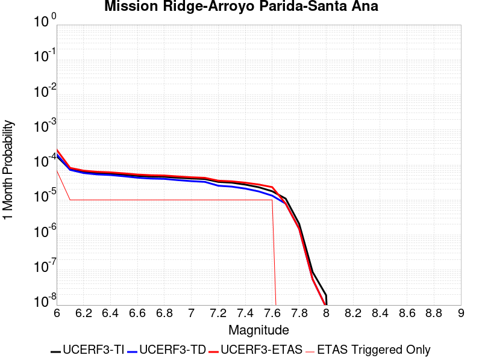 |  |  |

| Magnitude | 1 wk TI Prob | 1 wk TD Prob | 1 wk ETAS Prob | 1 wk ETAS/TD Gain | 1 wk ETAS Triggered Only | 1 mo TI Prob | 1 mo TD Prob | 1 mo ETAS Prob | 1 mo ETAS/TD Gain | 1 mo ETAS Triggered Only | 1 yr TI Prob | 1 yr TD Prob | 1 yr ETAS Prob | 1 yr ETAS/TD Gain | 1 yr ETAS Triggered Only | 10 yr TI Prob | 10 yr TD Prob | 10 yr ETAS Prob | 10 yr ETAS/TD Gain | 10 yr ETAS Triggered Only |
|-----|-----|-----|-----|-----|-----|-----|-----|-----|-----|-----|-----|-----|-----|-----|-----|-----|-----|-----|-----|-----|
| 6.0 | 4.169034E-5 | 4.7138263E-5 | 1.1657943E-4 | 2.473138 | 6.9444446E-5 | 1.7866064E-4 | 2.0201034E-4 | 2.7144075E-4 | 1.3436973 | 6.9444446E-5 | 0.0021730233 | 0.00245745 | 0.0025267238 | 1.0281893 | 6.9444446E-5 | 0.021518968 | 0.024384614 | 0.024520116 | 1.0055568 | 1.3888889E-4 |
| 6.1 | 1.73813E-5 | 1.6854226E-5 | 1.6854226E-5 | 1.0 | 0.0 | 7.4489166E-5 | 7.223046E-5 | 7.223046E-5 | 1.0 | 0.0 | 9.065282E-4 | 8.790618E-4 | 8.790618E-4 | 1.0 | 0.0 | 0.009028391 | 0.008756988 | 0.008825825 | 1.0078608 | 6.9444446E-5 |
| 6.2 | 1.4622182E-5 | 1.367329E-5 | 1.367329E-5 | 1.0 | 0.0 | 6.2664985E-5 | 5.8598518E-5 | 5.8598518E-5 | 1.0 | 0.0 | 7.6267915E-4 | 7.132073E-4 | 7.132073E-4 | 1.0 | 0.0 | 0.007600669 | 0.007109627 | 0.007178578 | 1.0096983 | 6.9444446E-5 |
| 6.3 | 1.3552434E-5 | 1.2482201E-5 | 1.2482201E-5 | 1.0 | 0.0 | 5.8080568E-5 | 5.3494066E-5 | 5.3494066E-5 | 1.0 | 0.0 | 7.069015E-4 | 6.510988E-4 | 6.510988E-4 | 1.0 | 0.0 | 0.00704657 | 0.006492275 | 0.0065612686 | 1.010627 | 6.9444446E-5 |
| 6.4 | 1.30977305E-5 | 1.1979156E-5 | 1.1979156E-5 | 1.0 | 0.0 | 5.613192E-5 | 5.1338247E-5 | 5.1338247E-5 | 1.0 | 0.0 | 6.831918E-4 | 6.248669E-4 | 6.248669E-4 | 1.0 | 0.0 | 0.006810953 | 0.0062314444 | 0.006300456 | 1.0110748 | 6.9444446E-5 |
| 6.5 | 1.225205E-5 | 1.1048803E-5 | 1.1048803E-5 | 1.0 | 0.0 | 5.2507727E-5 | 4.7351168E-5 | 4.7351168E-5 | 1.0 | 0.0 | 6.3909404E-4 | 5.7635066E-4 | 5.7635066E-4 | 1.0 | 0.0 | 0.006372592 | 0.005748869 | 0.0058179144 | 1.0120102 | 6.9444446E-5 |
| 6.6 | 1.1352241E-5 | 1.0063535E-5 | 1.0063535E-5 | 1.0 | 0.0 | 4.8651553E-5 | 4.3128734E-5 | 4.3128734E-5 | 1.0 | 0.0 | 5.921717E-4 | 5.2496797E-4 | 5.2496797E-4 | 1.0 | 0.0 | 0.0059059616 | 0.0052375244 | 0.0052375244 | 1.0 | 0.0 |
| 6.7 | 1.0864116E-5 | 9.517027E-6 | 9.517027E-6 | 1.0 | 0.0 | 4.6559664E-5 | 4.0786632E-5 | 4.0786632E-5 | 1.0 | 0.0 | 5.667165E-4 | 4.964661E-4 | 4.964661E-4 | 1.0 | 0.0 | 0.005652734 | 0.004953804 | 0.004953804 | 1.0 | 0.0 |
| 6.8 | 1.0666365E-5 | 9.299779E-6 | 9.299779E-6 | 1.0 | 0.0 | 4.571219E-5 | 3.9855597E-5 | 3.9855597E-5 | 1.0 | 0.0 | 5.564038E-4 | 4.8513585E-4 | 4.8513585E-4 | 1.0 | 0.0 | 0.005550127 | 0.0048410003 | 0.0048410003 | 1.0 | 0.0 |
| 6.9 | 1.0038665E-5 | 8.592046E-6 | 8.592046E-6 | 1.0 | 0.0 | 4.302214E-5 | 3.682254E-5 | 3.682254E-5 | 1.0 | 0.0 | 5.236687E-4 | 4.4822405E-4 | 4.4822405E-4 | 1.0 | 0.0 | 0.005224364 | 0.004473411 | 0.004473411 | 1.0 | 0.0 |
| 7.0 | 9.5379955E-6 | 8.025073E-6 | 8.025073E-6 | 1.0 | 0.0 | 4.0876483E-5 | 3.4392728E-5 | 3.4392728E-5 | 1.0 | 0.0 | 4.975576E-4 | 4.1865272E-4 | 4.1865272E-4 | 1.0 | 0.0 | 0.00496445 | 0.0041788397 | 0.0041788397 | 1.0 | 0.0 |
| 7.1 | 9.207389E-6 | 7.652375E-6 | 7.652375E-6 | 1.0 | 0.0 | 3.945964E-5 | 3.279549E-5 | 3.279549E-5 | 1.0 | 0.0 | 4.803152E-4 | 3.9921363E-4 | 3.9921363E-4 | 1.0 | 0.0 | 0.004792784 | 0.003985161 | 0.003985161 | 1.0 | 0.0 |
| 7.2 | 7.638091E-6 | 5.9311183E-6 | 5.9311183E-6 | 1.0 | 0.0 | 3.2734264E-5 | 2.541883E-5 | 2.541883E-5 | 1.0 | 0.0 | 3.984668E-4 | 3.0943064E-4 | 3.0943064E-4 | 1.0 | 0.0 | 0.0039775306 | 0.0030900547 | 0.0030900547 | 1.0 | 0.0 |
| 7.3 | 7.2500147E-6 | 5.5961527E-6 | 5.5961527E-6 | 1.0 | 0.0 | 3.1071122E-5 | 2.3983293E-5 | 2.3983293E-5 | 1.0 | 0.0 | 3.7822526E-4 | 2.9195778E-4 | 2.9195778E-4 | 1.0 | 0.0 | 0.0037758215 | 0.0029157975 | 0.0029157975 | 1.0 | 0.0 |
| 7.4 | 6.3899715E-6 | 4.9184964E-6 | 4.9184964E-6 | 1.0 | 0.0 | 2.7385306E-5 | 2.10791E-5 | 2.10791E-5 | 1.0 | 0.0 | 3.3336508E-4 | 2.5660804E-4 | 2.5660804E-4 | 1.0 | 0.0 | 0.0033286542 | 0.0025631618 | 0.0025631618 | 1.0 | 0.0 |
| 7.5 | 5.379025E-6 | 4.0838527E-6 | 4.0838527E-6 | 1.0 | 0.0 | 2.305276E-5 | 1.7502109E-5 | 1.7502109E-5 | 1.0 | 0.0 | 2.806312E-4 | 2.1306744E-4 | 2.1306744E-4 | 1.0 | 0.0 | 0.0028027708 | 0.002128643 | 0.002128643 | 1.0 | 0.0 |
| 7.6 | 4.1270696E-6 | 3.0883439E-6 | 3.0883439E-6 | 1.0 | 0.0 | 1.768732E-5 | 1.3235693E-5 | 1.3235693E-5 | 1.0 | 0.0 | 2.1532185E-4 | 1.6113273E-4 | 1.6113273E-4 | 1.0 | 0.0 | 0.0021511333 | 0.001610167 | 0.001610167 | 1.0 | 0.0 |
| 7.7 | 2.5406805E-6 | 1.8282013E-6 | 1.8282013E-6 | 1.0 | 0.0 | 1.0888585E-5 | 7.835125E-6 | 7.835125E-6 | 1.0 | 0.0 | 1.3256045E-4 | 9.538854E-5 | 9.538854E-5 | 1.0 | 0.0 | 0.0013248142 | 9.534821E-4 | 9.534821E-4 | 1.0 | 0.0 |
| 7.8 | 4.8608285E-7 | 3.5098864E-7 | 3.5098864E-7 | 1.0 | 0.0 | 2.0832106E-6 | 1.5042363E-6 | 1.5042363E-6 | 1.0 | 0.0 | 2.5362791E-5 | 1.8313924E-5 | 1.8313924E-5 | 1.0 | 0.0 | 2.5359896E-4 | 1.8312426E-4 | 1.8312426E-4 | 1.0 | 0.0 |
| 7.9 | 2.0472514E-8 | 1.2688783E-8 | 1.2688783E-8 | 1.0 | 0.0 | 8.7739345E-8 | 5.43805E-8 | 5.43805E-8 | 1.0 | 0.0 | 1.068226E-6 | 6.6208236E-7 | 6.6208236E-7 | 1.0 | 0.0 | 1.0682209E-5 | 6.620805E-6 | 6.620805E-6 | 1.0 | 0.0 |
| 8.0 | 4.443582E-9 | 2.0321211E-9 | 2.0321211E-9 | 1.0 | 0.0 | 1.9043922E-8 | 8.70909E-9 | 8.70909E-9 | 1.0 | 0.0 | 2.3185973E-7 | 1.0603316E-7 | 1.0603316E-7 | 1.0 | 0.0 | 2.3185949E-6 | 1.0603312E-6 | 1.0603312E-6 | 1.0 | 0.0 |

## Santa Cruz Island
*[(top)](#table-of-contents)*

| 1 Week | 1 Month | 1 Year | 10 Year |
|-----|-----|-----|-----|
|  | 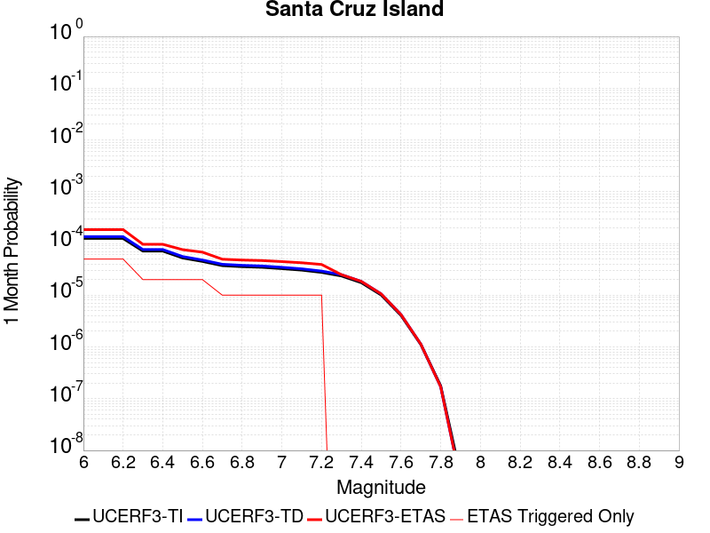 |  |  |

| Magnitude | 1 wk TI Prob | 1 wk TD Prob | 1 wk ETAS Prob | 1 wk ETAS/TD Gain | 1 wk ETAS Triggered Only | 1 mo TI Prob | 1 mo TD Prob | 1 mo ETAS Prob | 1 mo ETAS/TD Gain | 1 mo ETAS Triggered Only | 1 yr TI Prob | 1 yr TD Prob | 1 yr ETAS Prob | 1 yr ETAS/TD Gain | 1 yr ETAS Triggered Only | 10 yr TI Prob | 10 yr TD Prob | 10 yr ETAS Prob | 10 yr ETAS/TD Gain | 10 yr ETAS Triggered Only |
|-----|-----|-----|-----|-----|-----|-----|-----|-----|-----|-----|-----|-----|-----|-----|-----|-----|-----|-----|-----|-----|
| 6.0 | 2.9164563E-5 | 3.1599742E-5 | 1.01041995E-4 | 3.1975574 | 6.9444446E-5 | 1.2498499E-4 | 1.3542121E-4 | 2.0485625E-4 | 1.5127338 | 6.9444446E-5 | 0.0015206301 | 0.0016476426 | 0.0017169726 | 1.0420784 | 6.9444446E-5 | 0.015102667 | 0.016368 | 0.016504616 | 1.0083466 | 1.3888889E-4 |
| 6.1 | 2.9164563E-5 | 3.1599742E-5 | 1.01041995E-4 | 3.1975574 | 6.9444446E-5 | 1.2498499E-4 | 1.3542121E-4 | 2.0485625E-4 | 1.5127338 | 6.9444446E-5 | 0.0015206301 | 0.0016476426 | 0.0017169726 | 1.0420784 | 6.9444446E-5 | 0.015102667 | 0.016368 | 0.016504616 | 1.0083466 | 1.3888889E-4 |
| 6.2 | 2.9164563E-5 | 3.1599742E-5 | 1.01041995E-4 | 3.1975574 | 6.9444446E-5 | 1.2498499E-4 | 1.3542121E-4 | 2.0485625E-4 | 1.5127338 | 6.9444446E-5 | 0.0015206301 | 0.0016476426 | 0.0017169726 | 1.0420784 | 6.9444446E-5 | 0.015102667 | 0.016368 | 0.016504616 | 1.0083466 | 1.3888889E-4 |
| 6.3 | 1.6635553E-5 | 1.780436E-5 | 1.780436E-5 | 1.0 | 0.0 | 7.1293274E-5 | 7.630226E-5 | 7.630226E-5 | 1.0 | 0.0 | 8.6765E-4 | 9.2860236E-4 | 9.2860236E-4 | 1.0 | 0.0 | 0.008642701 | 0.009249094 | 0.009249094 | 1.0 | 0.0 |
| 6.4 | 1.6635553E-5 | 1.780436E-5 | 1.780436E-5 | 1.0 | 0.0 | 7.1293274E-5 | 7.630226E-5 | 7.630226E-5 | 1.0 | 0.0 | 8.6765E-4 | 9.2860236E-4 | 9.2860236E-4 | 1.0 | 0.0 | 0.008642701 | 0.009249094 | 0.009249094 | 1.0 | 0.0 |
| 6.5 | 1.2238748E-5 | 1.3042995E-5 | 1.3042995E-5 | 1.0 | 0.0 | 5.2450723E-5 | 5.5897377E-5 | 5.5897377E-5 | 1.0 | 0.0 | 6.3840044E-4 | 6.8034173E-4 | 6.8034173E-4 | 1.0 | 0.0 | 0.0063656955 | 0.0067829876 | 0.0067829876 | 1.0 | 0.0 |
| 6.6 | 1.0489767E-5 | 1.1156636E-5 | 1.1156636E-5 | 1.0 | 0.0 | 4.495537E-5 | 4.781329E-5 | 4.781329E-5 | 1.0 | 0.0 | 5.4719415E-4 | 5.819735E-4 | 5.819735E-4 | 1.0 | 0.0 | 0.005458487 | 0.0058047357 | 0.0058047357 | 1.0 | 0.0 |
| 6.7 | 8.699222E-6 | 9.236782E-6 | 9.236782E-6 | 1.0 | 0.0 | 3.7281847E-5 | 3.958561E-5 | 3.958561E-5 | 1.0 | 0.0 | 4.5381195E-4 | 4.8184878E-4 | 4.8184878E-4 | 1.0 | 0.0 | 0.0045288634 | 0.004808108 | 0.004808108 | 1.0 | 0.0 |
| 6.8 | 8.307732E-6 | 8.8169045E-6 | 8.8169045E-6 | 1.0 | 0.0 | 3.560408E-5 | 3.7786187E-5 | 3.7786187E-5 | 1.0 | 0.0 | 4.3339343E-4 | 4.5995016E-4 | 4.5995016E-4 | 1.0 | 0.0 | 0.004325492 | 0.0045900354 | 0.0045900354 | 1.0 | 0.0 |
| 6.9 | 8.073121E-6 | 8.564939E-6 | 8.564939E-6 | 1.0 | 0.0 | 3.459863E-5 | 3.6706366E-5 | 3.6706366E-5 | 1.0 | 0.0 | 4.2115687E-4 | 4.468088E-4 | 4.468088E-4 | 1.0 | 0.0 | 0.004203596 | 0.004459156 | 0.004459156 | 1.0 | 0.0 |
| 7.0 | 7.617019E-6 | 8.074664E-6 | 8.074664E-6 | 1.0 | 0.0 | 3.264396E-5 | 3.4605247E-5 | 3.4605247E-5 | 1.0 | 0.0 | 3.9736772E-4 | 4.212378E-4 | 4.212378E-4 | 1.0 | 0.0 | 0.003966579 | 0.0042044413 | 0.0042044413 | 1.0 | 0.0 |
| 7.1 | 7.1224836E-6 | 7.545788E-6 | 7.545788E-6 | 1.0 | 0.0 | 3.052457E-5 | 3.2338692E-5 | 3.2338692E-5 | 1.0 | 0.0 | 3.715733E-4 | 3.936528E-4 | 3.936528E-4 | 1.0 | 0.0 | 0.003709526 | 0.003929598 | 0.003929598 | 1.0 | 0.0 |
| 7.2 | 6.441115E-6 | 6.8273835E-6 | 6.8273835E-6 | 1.0 | 0.0 | 2.7604487E-5 | 2.9259887E-5 | 2.9259887E-5 | 1.0 | 0.0 | 3.360328E-4 | 3.5618112E-4 | 3.5618112E-4 | 1.0 | 0.0 | 0.0033552512 | 0.003556131 | 0.003556131 | 1.0 | 0.0 |
| 7.3 | 5.494274E-6 | 5.8199944E-6 | 5.8199944E-6 | 1.0 | 0.0 | 2.3546674E-5 | 2.4942596E-5 | 2.4942596E-5 | 1.0 | 0.0 | 2.8664304E-4 | 3.0363398E-4 | 3.0363398E-4 | 1.0 | 0.0 | 0.002862736 | 0.0030322142 | 0.0030322142 | 1.0 | 0.0 |
| 7.4 | 4.0802624E-6 | 4.312256E-6 | 4.312256E-6 | 1.0 | 0.0 | 1.7486722E-5 | 1.8480967E-5 | 1.8480967E-5 | 1.0 | 0.0 | 2.1288003E-4 | 2.2498262E-4 | 2.2498262E-4 | 1.0 | 0.0 | 0.0021267622 | 0.0022475575 | 0.0022475575 | 1.0 | 0.0 |
| 7.5 | 2.3584746E-6 | 2.4753094E-6 | 2.4753094E-6 | 1.0 | 0.0 | 1.0107709E-5 | 1.0608426E-5 | 1.0608426E-5 | 1.0 | 0.0 | 1.2305441E-4 | 1.2915E-4 | 1.2915E-4 | 1.0 | 0.0 | 0.0012298629 | 0.0012907543 | 0.0012907543 | 1.0 | 0.0 |
| 7.6 | 9.4981914E-7 | 9.86093E-7 | 9.86093E-7 | 1.0 | 0.0 | 4.0706473E-6 | 4.2261063E-6 | 4.2261063E-6 | 1.0 | 0.0 | 4.9559E-5 | 5.145164E-5 | 5.145164E-5 | 1.0 | 0.0 | 4.954795E-4 | 5.1439856E-4 | 5.1439856E-4 | 1.0 | 0.0 |
| 7.7 | 2.6013532E-7 | 2.6416603E-7 | 2.6416603E-7 | 1.0 | 0.0 | 1.1148652E-6 | 1.1321397E-6 | 1.1321397E-6 | 1.0 | 0.0 | 1.3573399E-5 | 1.3783714E-5 | 1.3783714E-5 | 1.0 | 0.0 | 1.357257E-4 | 1.3782867E-4 | 1.3782867E-4 | 1.0 | 0.0 |
| 7.8 | 4.1522263E-8 | 3.965679E-8 | 3.965679E-8 | 1.0 | 0.0 | 1.7795254E-7 | 1.6995766E-7 | 1.6995766E-7 | 1.0 | 0.0 | 2.16657E-6 | 2.0692328E-6 | 2.0692328E-6 | 1.0 | 0.0 | 2.1665488E-5 | 2.0692156E-5 | 2.0692156E-5 | 1.0 | 0.0 |
| 7.9 | 7.7242046E-10 | 5.9468175E-10 | 5.9468175E-10 | 1.0 | 0.0 | 3.3103735E-9 | 2.5486364E-9 | 2.5486364E-9 | 1.0 | 0.0 | 4.0303796E-8 | 3.1029646E-8 | 3.1029646E-8 | 1.0 | 0.0 | 4.030379E-7 | 3.1029643E-7 | 3.1029643E-7 | 1.0 | 0.0 |

## Lake Isabella (Seismicity)
*[(top)](#table-of-contents)*

| 1 Week | 1 Month | 1 Year | 10 Year |
|-----|-----|-----|-----|
|  |  |  |  |

| Magnitude | 1 wk TI Prob | 1 wk TD Prob | 1 wk ETAS Prob | 1 wk ETAS/TD Gain | 1 wk ETAS Triggered Only | 1 mo TI Prob | 1 mo TD Prob | 1 mo ETAS Prob | 1 mo ETAS/TD Gain | 1 mo ETAS Triggered Only | 1 yr TI Prob | 1 yr TD Prob | 1 yr ETAS Prob | 1 yr ETAS/TD Gain | 1 yr ETAS Triggered Only | 10 yr TI Prob | 10 yr TD Prob | 10 yr ETAS Prob | 10 yr ETAS/TD Gain | 10 yr ETAS Triggered Only |
|-----|-----|-----|-----|-----|-----|-----|-----|-----|-----|-----|-----|-----|-----|-----|-----|-----|-----|-----|-----|-----|
| 6.0 | 9.431637E-6 | 9.741651E-6 | 9.741651E-6 | 1.0 | 0.0 | 4.0420677E-5 | 4.1749343E-5 | 4.1749343E-5 | 1.0 | 0.0 | 4.920106E-4 | 5.0819275E-4 | 6.4701104E-4 | 1.2731607 | 1.3888889E-4 | 0.004909227 | 0.005071599 | 0.0052788756 | 1.0408701 | 2.0833334E-4 |
| 6.1 | 9.431637E-6 | 9.741651E-6 | 9.741651E-6 | 1.0 | 0.0 | 4.0420677E-5 | 4.1749343E-5 | 4.1749343E-5 | 1.0 | 0.0 | 4.920106E-4 | 5.0819275E-4 | 6.4701104E-4 | 1.2731607 | 1.3888889E-4 | 0.004909227 | 0.005071599 | 0.0052788756 | 1.0408701 | 2.0833334E-4 |
| 6.2 | 9.431637E-6 | 9.741651E-6 | 9.741651E-6 | 1.0 | 0.0 | 4.0420677E-5 | 4.1749343E-5 | 4.1749343E-5 | 1.0 | 0.0 | 4.920106E-4 | 5.0819275E-4 | 6.4701104E-4 | 1.2731607 | 1.3888889E-4 | 0.004909227 | 0.005071599 | 0.0052788756 | 1.0408701 | 2.0833334E-4 |
| 6.3 | 9.431637E-6 | 9.741651E-6 | 9.741651E-6 | 1.0 | 0.0 | 4.0420677E-5 | 4.1749343E-5 | 4.1749343E-5 | 1.0 | 0.0 | 4.920106E-4 | 5.0819275E-4 | 6.4701104E-4 | 1.2731607 | 1.3888889E-4 | 0.004909227 | 0.005071599 | 0.0052788756 | 1.0408701 | 2.0833334E-4 |
| 6.4 | 5.144063E-6 | 5.3000763E-6 | 5.3000763E-6 | 1.0 | 0.0 | 2.2045799E-5 | 2.2714434E-5 | 2.2714434E-5 | 1.0 | 0.0 | 2.6837454E-4 | 2.765166E-4 | 3.4594184E-4 | 1.2510709 | 6.9444446E-5 | 0.0026805066 | 0.0027620657 | 0.0028313184 | 1.0250728 | 6.9444446E-5 |
| 6.5 | 5.144063E-6 | 5.3000763E-6 | 5.3000763E-6 | 1.0 | 0.0 | 2.2045799E-5 | 2.2714434E-5 | 2.2714434E-5 | 1.0 | 0.0 | 2.6837454E-4 | 2.765166E-4 | 3.4594184E-4 | 1.2510709 | 6.9444446E-5 | 0.0026805066 | 0.0027620657 | 0.0028313184 | 1.0250728 | 6.9444446E-5 |
| 6.6 | 3.4009804E-6 | 3.498786E-6 | 3.498786E-6 | 1.0 | 0.0 | 1.4575549E-5 | 1.4994721E-5 | 1.4994721E-5 | 1.0 | 0.0 | 1.7744285E-4 | 1.8254704E-4 | 2.519788E-4 | 1.38035 | 6.9444446E-5 | 0.0017730123 | 0.0018241286 | 0.0018934463 | 1.0380005 | 6.9444446E-5 |
| 6.7 | 3.3880428E-6 | 3.4856528E-6 | 3.4856528E-6 | 1.0 | 0.0 | 1.4520103E-5 | 1.4938435E-5 | 1.4938435E-5 | 1.0 | 0.0 | 1.767679E-4 | 1.8186188E-4 | 2.5129368E-4 | 1.3817832 | 6.9444446E-5 | 0.0017662736 | 0.0018172882 | 0.0018866064 | 1.0381438 | 6.9444446E-5 |
| 6.8 | 2.6582E-6 | 2.7337003E-6 | 2.7337003E-6 | 1.0 | 0.0 | 1.1392236E-5 | 1.1715813E-5 | 1.1715813E-5 | 1.0 | 0.0 | 1.3869164E-4 | 1.4263204E-4 | 1.4263204E-4 | 1.0 | 0.0 | 0.0013860512 | 0.0014255369 | 0.0014255369 | 1.0 | 0.0 |
| 6.9 | 2.406011E-6 | 2.4743288E-6 | 2.4743288E-6 | 1.0 | 0.0 | 1.0311434E-5 | 1.0604231E-5 | 1.0604231E-5 | 1.0 | 0.0 | 1.2553448E-4 | 1.2910018E-4 | 1.2910018E-4 | 1.0 | 0.0 | 0.0012546359 | 0.0012903814 | 0.0012903814 | 1.0 | 0.0 |
| 7.0 | 1.6953097E-6 | 1.7429371E-6 | 1.7429371E-6 | 1.0 | 0.0 | 7.265593E-6 | 7.469715E-6 | 7.469715E-6 | 1.0 | 0.0 | 8.8455E-5 | 9.094104E-5 | 9.094104E-5 | 1.0 | 0.0 | 8.84198E-4 | 9.09141E-4 | 9.09141E-4 | 1.0 | 0.0 |
| 7.1 | 3.5013824E-7 | 3.5714822E-7 | 3.5714822E-7 | 1.0 | 0.0 | 1.5005916E-6 | 1.5306344E-6 | 1.5306344E-6 | 1.0 | 0.0 | 1.826955E-5 | 1.8635317E-5 | 1.8635317E-5 | 1.0 | 0.0 | 1.8268047E-4 | 1.863378E-4 | 1.863378E-4 | 1.0 | 0.0 |
| 7.2 | 2.2321095E-7 | 2.2750574E-7 | 2.2750574E-7 | 1.0 | 0.0 | 9.56618E-7 | 9.750242E-7 | 9.750242E-7 | 1.0 | 0.0 | 1.1646762E-5 | 1.1870856E-5 | 1.1870856E-5 | 1.0 | 0.0 | 1.1646151E-4 | 1.1870232E-4 | 1.1870232E-4 | 1.0 | 0.0 |
| 7.3 | 1.5760406E-7 | 1.6060922E-7 | 1.6060922E-7 | 1.0 | 0.0 | 6.7544585E-7 | 6.8832503E-7 | 6.8832503E-7 | 1.0 | 0.0 | 8.223522E-6 | 8.380326E-6 | 8.380326E-6 | 1.0 | 0.0 | 8.2232174E-5 | 8.3800165E-5 | 8.3800165E-5 | 1.0 | 0.0 |
| 7.4 | 1.1216497E-7 | 1.1431706E-7 | 1.1431706E-7 | 1.0 | 0.0 | 4.8070694E-7 | 4.899302E-7 | 4.899302E-7 | 1.0 | 0.0 | 5.852591E-6 | 5.964884E-6 | 5.964884E-6 | 1.0 | 0.0 | 5.8524372E-5 | 5.9647282E-5 | 5.9647282E-5 | 1.0 | 0.0 |
| 7.5 | 4.885185E-8 | 4.9787737E-8 | 4.9787737E-8 | 1.0 | 0.0 | 2.0936506E-7 | 2.13376E-7 | 2.13376E-7 | 1.0 | 0.0 | 2.5490165E-6 | 2.59785E-6 | 2.59785E-6 | 1.0 | 0.0 | 2.5489873E-5 | 2.5978214E-5 | 2.5978214E-5 | 1.0 | 0.0 |
| 7.6 | 1.504641E-9 | 1.5317903E-9 | 1.5317903E-9 | 1.0 | 0.0 | 6.4484613E-9 | 6.5648154E-9 | 6.5648154E-9 | 1.0 | 0.0 | 7.851001E-8 | 7.992663E-8 | 7.992663E-8 | 1.0 | 0.0 | 7.8509987E-7 | 7.992663E-7 | 7.992663E-7 | 1.0 | 0.0 |

## Sierra Nevada  (No Extension)
*[(top)](#table-of-contents)*

| 1 Week | 1 Month | 1 Year | 10 Year |
|-----|-----|-----|-----|
| 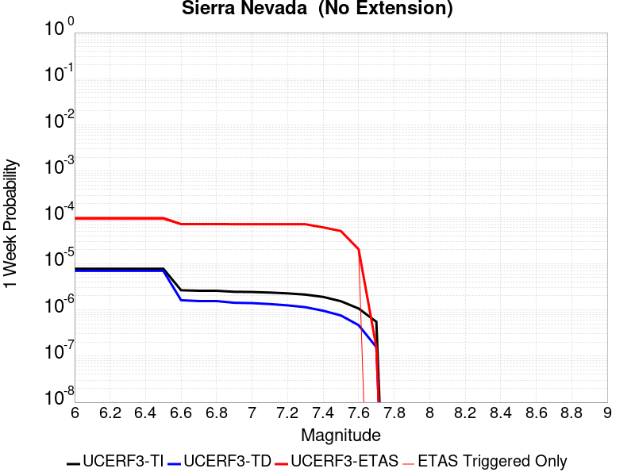 |  |  | 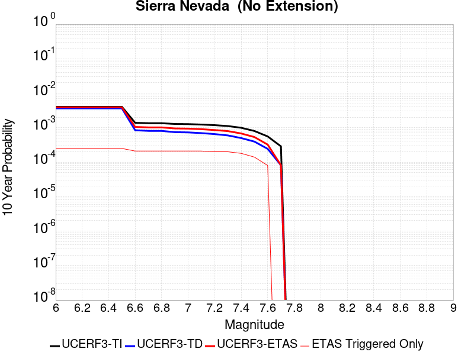 |

| Magnitude | 1 wk TI Prob | 1 wk TD Prob | 1 wk ETAS Prob | 1 wk ETAS/TD Gain | 1 wk ETAS Triggered Only | 1 mo TI Prob | 1 mo TD Prob | 1 mo ETAS Prob | 1 mo ETAS/TD Gain | 1 mo ETAS Triggered Only | 1 yr TI Prob | 1 yr TD Prob | 1 yr ETAS Prob | 1 yr ETAS/TD Gain | 1 yr ETAS Triggered Only | 10 yr TI Prob | 10 yr TD Prob | 10 yr ETAS Prob | 10 yr ETAS/TD Gain | 10 yr ETAS Triggered Only |
|-----|-----|-----|-----|-----|-----|-----|-----|-----|-----|-----|-----|-----|-----|-----|-----|-----|-----|-----|-----|-----|
| 6.0 | 7.7690465E-6 | 6.976322E-6 | 6.976322E-6 | 1.0 | 0.0 | 3.329549E-5 | 2.9898381E-5 | 9.934075E-5 | 3.322613 | 6.9444446E-5 | 4.0529718E-4 | 3.6398784E-4 | 5.7224534E-4 | 1.5721551 | 2.0833334E-4 | 0.004045588 | 0.0036374326 | 0.0038450083 | 1.0570664 | 2.0833334E-4 |
| 6.1 | 7.7690465E-6 | 6.976322E-6 | 6.976322E-6 | 1.0 | 0.0 | 3.329549E-5 | 2.9898381E-5 | 9.934075E-5 | 3.322613 | 6.9444446E-5 | 4.0529718E-4 | 3.6398784E-4 | 5.7224534E-4 | 1.5721551 | 2.0833334E-4 | 0.004045588 | 0.0036374326 | 0.0038450083 | 1.0570664 | 2.0833334E-4 |
| 6.2 | 7.7690465E-6 | 6.976322E-6 | 6.976322E-6 | 1.0 | 0.0 | 3.329549E-5 | 2.9898381E-5 | 9.934075E-5 | 3.322613 | 6.9444446E-5 | 4.0529718E-4 | 3.6398784E-4 | 5.7224534E-4 | 1.5721551 | 2.0833334E-4 | 0.004045588 | 0.0036374326 | 0.0038450083 | 1.0570664 | 2.0833334E-4 |
| 6.3 | 7.7690465E-6 | 6.976322E-6 | 6.976322E-6 | 1.0 | 0.0 | 3.329549E-5 | 2.9898381E-5 | 9.934075E-5 | 3.322613 | 6.9444446E-5 | 4.0529718E-4 | 3.6398784E-4 | 5.7224534E-4 | 1.5721551 | 2.0833334E-4 | 0.004045588 | 0.0036374326 | 0.0038450083 | 1.0570664 | 2.0833334E-4 |
| 6.4 | 7.7690465E-6 | 6.976322E-6 | 6.976322E-6 | 1.0 | 0.0 | 3.329549E-5 | 2.9898381E-5 | 9.934075E-5 | 3.322613 | 6.9444446E-5 | 4.0529718E-4 | 3.6398784E-4 | 5.7224534E-4 | 1.5721551 | 2.0833334E-4 | 0.004045588 | 0.0036374326 | 0.0038450083 | 1.0570664 | 2.0833334E-4 |
| 6.5 | 7.7690465E-6 | 6.976322E-6 | 6.976322E-6 | 1.0 | 0.0 | 3.329549E-5 | 2.9898381E-5 | 9.934075E-5 | 3.322613 | 6.9444446E-5 | 4.0529718E-4 | 3.6398784E-4 | 5.7224534E-4 | 1.5721551 | 2.0833334E-4 | 0.004045588 | 0.0036374326 | 0.0038450083 | 1.0570664 | 2.0833334E-4 |
| 6.6 | 2.653E-6 | 1.614854E-6 | 1.614854E-6 | 1.0 | 0.0 | 1.136995E-5 | 6.9207845E-6 | 6.9207845E-6 | 1.0 | 0.0 | 1.3842035E-4 | 8.425733E-5 | 2.2313451E-4 | 2.6482506 | 1.3888889E-4 | 0.0013833415 | 8.422573E-4 | 9.810291E-4 | 1.1647619 | 1.3888889E-4 |
| 6.7 | 2.5902466E-6 | 1.5501876E-6 | 1.5501876E-6 | 1.0 | 0.0 | 1.11010095E-5 | 6.643644E-6 | 6.643644E-6 | 1.0 | 0.0 | 1.351464E-4 | 8.0883394E-5 | 2.1976104E-4 | 2.7170107 | 1.3888889E-4 | 0.0013506424 | 8.0854254E-4 | 9.4731915E-4 | 1.171638 | 1.3888889E-4 |
| 6.8 | 2.5853892E-6 | 1.5469877E-6 | 1.5469877E-6 | 1.0 | 0.0 | 1.1080193E-5 | 6.629931E-6 | 6.629931E-6 | 1.0 | 0.0 | 1.34893E-4 | 8.071645E-5 | 2.1959412E-4 | 2.7205622 | 1.3888889E-4 | 0.0013481114 | 8.068743E-4 | 9.456511E-4 | 1.1719931 | 1.3888889E-4 |
| 6.9 | 2.458257E-6 | 1.4220619E-6 | 1.4220619E-6 | 1.0 | 0.0 | 1.0535345E-5 | 6.094537E-6 | 6.094537E-6 | 1.0 | 0.0 | 1.2826028E-4 | 7.4198484E-5 | 2.1307707E-4 | 2.8717172 | 1.3888889E-4 | 0.0012818627 | 7.4173906E-4 | 8.805249E-4 | 1.1871088 | 1.3888889E-4 |
| 7.0 | 2.4341468E-6 | 1.3990258E-6 | 1.3990258E-6 | 1.0 | 0.0 | 1.0432016E-5 | 5.9958115E-6 | 5.9958115E-6 | 1.0 | 0.0 | 1.270024E-4 | 7.2996576E-5 | 2.1187533E-4 | 2.9025378 | 1.3888889E-4 | 0.0012692984 | 7.297279E-4 | 8.6851546E-4 | 1.1901908 | 1.3888889E-4 |
| 7.1 | 2.3652476E-6 | 1.3339754E-6 | 1.3339754E-6 | 1.0 | 0.0 | 1.0136736E-5 | 5.717025E-6 | 5.717025E-6 | 1.0 | 0.0 | 1.2340778E-4 | 6.9602575E-5 | 2.084818E-4 | 2.9953172 | 1.3888889E-4 | 0.0012333926 | 6.9580943E-4 | 8.346017E-4 | 1.1994687 | 1.3888889E-4 |
| 7.2 | 2.272158E-6 | 1.2502821E-6 | 1.2502821E-6 | 1.0 | 0.0 | 9.737784E-6 | 5.3583412E-6 | 5.3583412E-6 | 1.0 | 0.0 | 1.1855107E-4 | 6.5235865E-5 | 1.3467578E-4 | 2.0644438 | 6.9444446E-5 | 0.0011848784 | 6.5216864E-4 | 7.2156783E-4 | 1.1064129 | 6.9444446E-5 |
| 7.3 | 2.1382127E-6 | 1.1419703E-6 | 1.1419703E-6 | 1.0 | 0.0 | 9.163737E-6 | 4.8941492E-6 | 4.8941492E-6 | 1.0 | 0.0 | 1.1156279E-4 | 5.958465E-5 | 1.2902495E-4 | 2.165406 | 6.9444446E-5 | 0.001115068 | 5.956879E-4 | 6.65091E-4 | 1.1165091 | 6.9444446E-5 |
| 7.4 | 1.9048055E-6 | 9.575242E-7 | 9.575242E-7 | 1.0 | 0.0 | 8.163426E-6 | 4.1036687E-6 | 4.1036687E-6 | 1.0 | 0.0 | 9.9385186E-5 | 4.996103E-5 | 1.1940201E-4 | 2.3899028 | 6.9444446E-5 | 9.934074E-4 | 4.994987E-4 | 5.689084E-4 | 1.1389588 | 6.9444446E-5 |
| 7.5 | 1.5373403E-6 | 7.560042E-7 | 7.560042E-7 | 1.0 | 0.0 | 6.5885843E-6 | 3.2400142E-6 | 3.2400142E-6 | 1.0 | 0.0 | 8.021306E-5 | 3.9446462E-5 | 1.0888817E-4 | 2.7604039 | 6.9444446E-5 | 8.0184115E-4 | 3.943951E-4 | 4.6381215E-4 | 1.1760089 | 6.9444446E-5 |
| 7.6 | 1.0680322E-6 | 4.6596554E-7 | 4.6596554E-7 | 1.0 | 0.0 | 4.577273E-6 | 1.9969937E-6 | 1.9969937E-6 | 1.0 | 0.0 | 5.5726876E-5 | 2.4313129E-5 | 2.4313129E-5 | 1.0 | 0.0 | 5.5712904E-4 | 2.4310495E-4 | 2.4310495E-4 | 1.0 | 0.0 |
| 7.7 | 5.509146E-7 | 1.5580486E-7 | 1.5580486E-7 | 1.0 | 0.0 | 2.3610605E-6 | 6.677349E-7 | 6.677349E-7 | 1.0 | 0.0 | 2.8745531E-5 | 8.129644E-6 | 8.129644E-6 | 1.0 | 0.0 | 2.8741814E-4 | 8.1293576E-5 | 8.1293576E-5 | 1.0 | 0.0 |

## Santa Ynez (West)
*[(top)](#table-of-contents)*

| 1 Week | 1 Month | 1 Year | 10 Year |
|-----|-----|-----|-----|
| 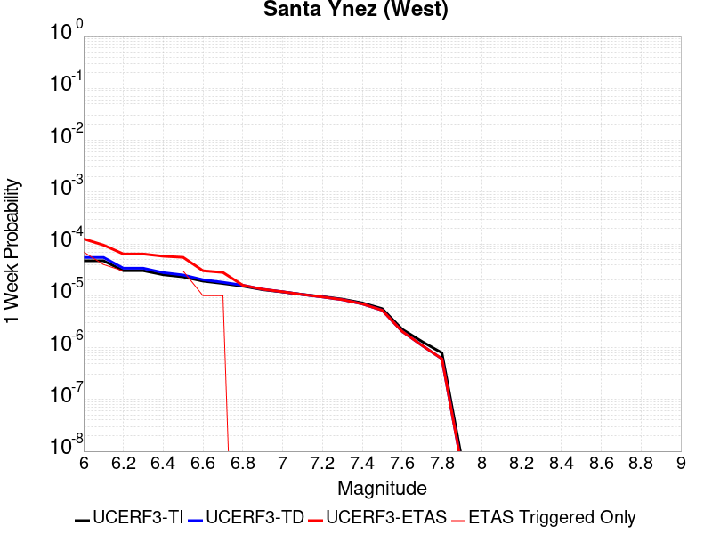 |  |  |  |

| Magnitude | 1 wk TI Prob | 1 wk TD Prob | 1 wk ETAS Prob | 1 wk ETAS/TD Gain | 1 wk ETAS Triggered Only | 1 mo TI Prob | 1 mo TD Prob | 1 mo ETAS Prob | 1 mo ETAS/TD Gain | 1 mo ETAS Triggered Only | 1 yr TI Prob | 1 yr TD Prob | 1 yr ETAS Prob | 1 yr ETAS/TD Gain | 1 yr ETAS Triggered Only | 10 yr TI Prob | 10 yr TD Prob | 10 yr ETAS Prob | 10 yr ETAS/TD Gain | 10 yr ETAS Triggered Only |
|-----|-----|-----|-----|-----|-----|-----|-----|-----|-----|-----|-----|-----|-----|-----|-----|-----|-----|-----|-----|-----|
| 6.0 | 4.7352758E-5 | 5.4972126E-5 | 5.4972126E-5 | 1.0 | 0.0 | 2.0292461E-4 | 2.3557522E-4 | 3.050033E-4 | 1.2947173 | 6.9444446E-5 | 0.0024678076 | 0.0028645284 | 0.0030030194 | 1.0483469 | 1.3888889E-4 | 0.024405818 | 0.028304417 | 0.028506855 | 1.0071521 | 2.0833334E-4 |
| 6.1 | 4.7352758E-5 | 5.4972126E-5 | 5.4972126E-5 | 1.0 | 0.0 | 2.0292461E-4 | 2.3557522E-4 | 2.3557522E-4 | 1.0 | 0.0 | 0.0024678076 | 0.0028645284 | 0.0028645284 | 1.0 | 0.0 | 0.024405818 | 0.028304417 | 0.028371897 | 1.0023841 | 6.9444446E-5 |
| 6.2 | 3.0415853E-5 | 3.392511E-5 | 3.392511E-5 | 1.0 | 0.0 | 1.3034715E-4 | 1.4538545E-4 | 1.4538545E-4 | 1.0 | 0.0 | 0.0015858212 | 0.0017686661 | 0.0017686661 | 1.0 | 0.0 | 0.015745522 | 0.017549807 | 0.017618032 | 1.0038875 | 6.9444446E-5 |
| 6.3 | 3.0415853E-5 | 3.392511E-5 | 3.392511E-5 | 1.0 | 0.0 | 1.3034715E-4 | 1.4538545E-4 | 1.4538545E-4 | 1.0 | 0.0 | 0.0015858212 | 0.0017686661 | 0.0017686661 | 1.0 | 0.0 | 0.015745522 | 0.017549807 | 0.017618032 | 1.0038875 | 6.9444446E-5 |
| 6.4 | 2.5452082E-5 | 2.7912422E-5 | 2.7912422E-5 | 1.0 | 0.0 | 1.09075794E-4 | 1.196193E-4 | 1.196193E-4 | 1.0 | 0.0 | 0.0013271887 | 0.0014554089 | 0.0014554089 | 1.0 | 0.0 | 0.013192902 | 0.014460951 | 0.014529391 | 1.0047327 | 6.9444446E-5 |
| 6.5 | 2.3143784E-5 | 2.5128256E-5 | 2.5128256E-5 | 1.0 | 0.0 | 9.9183875E-5 | 1.0768817E-4 | 1.0768817E-4 | 1.0 | 0.0 | 0.0012068948 | 0.0013103267 | 0.0013103267 | 1.0 | 0.0 | 0.012003611 | 0.01302768 | 0.01309622 | 1.0052611 | 6.9444446E-5 |
| 6.6 | 1.9118515E-5 | 2.035434E-5 | 2.035434E-5 | 1.0 | 0.0 | 8.193392E-5 | 8.7230015E-5 | 8.7230015E-5 | 1.0 | 0.0 | 9.97089E-4 | 0.001061516 | 0.001061516 | 1.0 | 0.0 | 0.00992627 | 0.010565365 | 0.010565365 | 1.0 | 0.0 |
| 6.7 | 1.722807E-5 | 1.8146347E-5 | 1.8146347E-5 | 1.0 | 0.0 | 7.3832496E-5 | 7.776777E-5 | 7.776777E-5 | 1.0 | 0.0 | 8.985399E-4 | 9.464169E-4 | 9.464169E-4 | 1.0 | 0.0 | 0.008949154 | 0.0094245095 | 0.0094245095 | 1.0 | 0.0 |
| 6.8 | 1.5317364E-5 | 1.5926486E-5 | 1.5926486E-5 | 1.0 | 0.0 | 6.56442E-5 | 6.82546E-5 | 6.82546E-5 | 1.0 | 0.0 | 7.98925E-4 | 8.306873E-4 | 8.306873E-4 | 1.0 | 0.0 | 0.007960589 | 0.00827631 | 0.00827631 | 1.0 | 0.0 |
| 6.9 | 1.3071226E-5 | 1.3329624E-5 | 1.3329624E-5 | 1.0 | 0.0 | 5.6018336E-5 | 5.7125722E-5 | 5.7125722E-5 | 1.0 | 0.0 | 6.8180985E-4 | 6.9528597E-4 | 6.9528597E-4 | 1.0 | 0.0 | 0.0067972173 | 0.006931367 | 0.006931367 | 1.0 | 0.0 |
| 7.0 | 1.1836986E-5 | 1.19327815E-5 | 1.19327815E-5 | 1.0 | 0.0 | 5.0728955E-5 | 5.11395E-5 | 5.11395E-5 | 1.0 | 0.0 | 6.1745E-4 | 6.2244723E-4 | 6.2244723E-4 | 1.0 | 0.0 | 0.006157372 | 0.006207231 | 0.006207231 | 1.0 | 0.0 |
| 7.1 | 1.0597169E-5 | 1.0542201E-5 | 1.0542201E-5 | 1.0 | 0.0 | 4.541565E-5 | 4.5180084E-5 | 4.5180084E-5 | 1.0 | 0.0 | 5.5279525E-4 | 5.4992986E-4 | 5.4992986E-4 | 1.0 | 0.0 | 0.0055142213 | 0.005485821 | 0.005485821 | 1.0 | 0.0 |
| 7.2 | 9.59113E-6 | 9.459144E-6 | 9.459144E-6 | 1.0 | 0.0 | 4.11042E-5 | 4.0538565E-5 | 4.0538565E-5 | 1.0 | 0.0 | 5.0032866E-4 | 4.934463E-4 | 4.934463E-4 | 1.0 | 0.0 | 0.004992037 | 0.0049236254 | 0.0049236254 | 1.0 | 0.0 |
| 7.3 | 8.586084E-6 | 8.379583E-6 | 8.379583E-6 | 1.0 | 0.0 | 3.679698E-5 | 3.5912013E-5 | 3.5912013E-5 | 1.0 | 0.0 | 4.4791115E-4 | 4.3714207E-4 | 4.3714207E-4 | 1.0 | 0.0 | 0.004470094 | 0.004362933 | 0.004362933 | 1.0 | 0.0 |
| 7.4 | 7.2622997E-6 | 6.9515427E-6 | 6.9515427E-6 | 1.0 | 0.0 | 3.112377E-5 | 2.979199E-5 | 2.979199E-5 | 1.0 | 0.0 | 3.78866E-4 | 3.626581E-4 | 3.626581E-4 | 1.0 | 0.0 | 0.0037822074 | 0.0036207628 | 0.0036207628 | 1.0 | 0.0 |
| 7.5 | 5.627296E-6 | 5.251588E-6 | 5.251588E-6 | 1.0 | 0.0 | 2.411676E-5 | 2.2506614E-5 | 2.2506614E-5 | 1.0 | 0.0 | 2.9358198E-4 | 2.739843E-4 | 2.739843E-4 | 1.0 | 0.0 | 0.0029319443 | 0.002736537 | 0.002736537 | 1.0 | 0.0 |
| 7.6 | 2.265244E-6 | 2.0608625E-6 | 2.0608625E-6 | 1.0 | 0.0 | 9.708152E-6 | 8.832238E-6 | 8.832238E-6 | 1.0 | 0.0 | 1.18190335E-4 | 1.0752728E-4 | 1.0752728E-4 | 1.0 | 0.0 | 0.001181275 | 0.0010747612 | 0.0010747612 | 1.0 | 0.0 |
| 7.7 | 1.3099874E-6 | 1.1016252E-6 | 1.1016252E-6 | 1.0 | 0.0 | 5.61422E-6 | 4.7212425E-6 | 4.7212425E-6 | 1.0 | 0.0 | 6.8350986E-5 | 5.7479636E-5 | 5.7479636E-5 | 1.0 | 0.0 | 6.832996E-4 | 5.7465007E-4 | 5.7465007E-4 | 1.0 | 0.0 |
| 7.8 | 7.903951E-7 | 6.0711415E-7 | 6.0711415E-7 | 1.0 | 0.0 | 3.3874032E-6 | 2.6019152E-6 | 2.6019152E-6 | 1.0 | 0.0 | 4.1240855E-5 | 3.167787E-5 | 3.167787E-5 | 1.0 | 0.0 | 4.12332E-4 | 3.167349E-4 | 3.167349E-4 | 1.0 | 0.0 |
| 7.9 | 7.0753297E-9 | 5.0899476E-9 | 5.0899476E-9 | 1.0 | 0.0 | 3.032284E-8 | 2.181406E-8 | 2.181406E-8 | 1.0 | 0.0 | 3.6918053E-7 | 2.6558615E-7 | 2.6558615E-7 | 1.0 | 0.0 | 3.691799E-6 | 2.6558594E-6 | 2.6558594E-6 | 1.0 | 0.0 |

## Ortigalita (North)
*[(top)](#table-of-contents)*

| 1 Week | 1 Month | 1 Year | 10 Year |
|-----|-----|-----|-----|
| 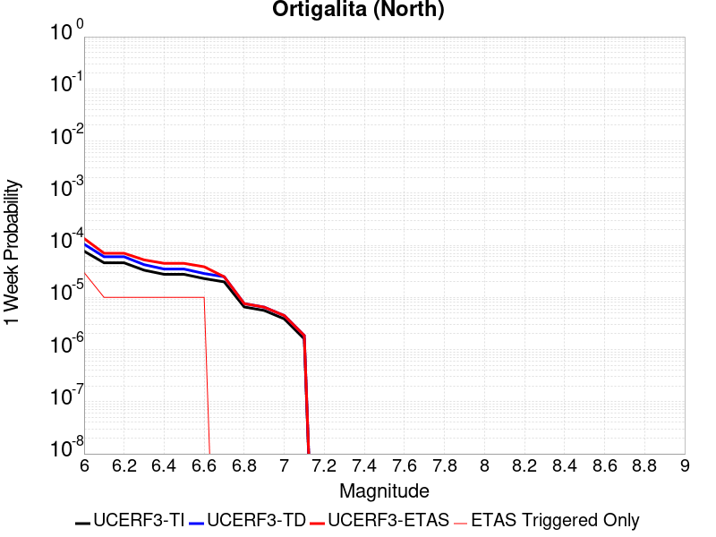 |  |  | 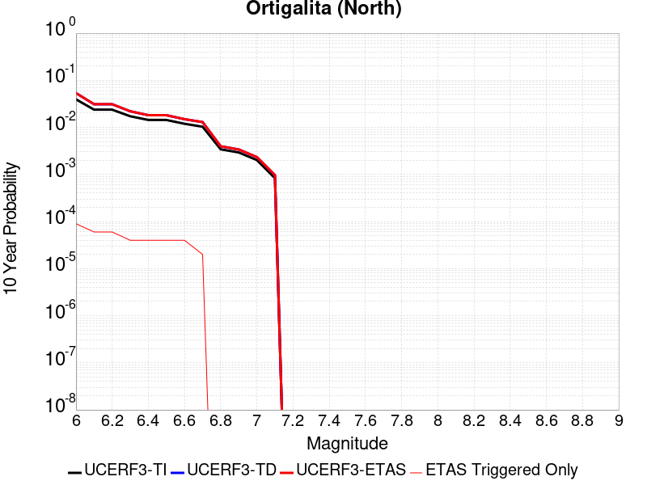 |

| Magnitude | 1 wk TI Prob | 1 wk TD Prob | 1 wk ETAS Prob | 1 wk ETAS/TD Gain | 1 wk ETAS Triggered Only | 1 mo TI Prob | 1 mo TD Prob | 1 mo ETAS Prob | 1 mo ETAS/TD Gain | 1 mo ETAS Triggered Only | 1 yr TI Prob | 1 yr TD Prob | 1 yr ETAS Prob | 1 yr ETAS/TD Gain | 1 yr ETAS Triggered Only | 10 yr TI Prob | 10 yr TD Prob | 10 yr ETAS Prob | 10 yr ETAS/TD Gain | 10 yr ETAS Triggered Only |
|-----|-----|-----|-----|-----|-----|-----|-----|-----|-----|-----|-----|-----|-----|-----|-----|-----|-----|-----|-----|-----|
| 6.0 | 7.711876E-5 | 1.05064966E-4 | 1.7450211E-4 | 1.6608973 | 6.9444446E-5 | 3.3046713E-4 | 4.502116E-4 | 5.196248E-4 | 1.154179 | 6.9444446E-5 | 0.004016016 | 0.0054681194 | 0.005606249 | 1.0252608 | 1.3888889E-4 | 0.039442103 | 0.053454787 | 0.053586252 | 1.0024594 | 1.3888889E-4 |
| 6.1 | 4.607858E-5 | 6.0239203E-5 | 6.0239203E-5 | 1.0 | 0.0 | 1.9746469E-4 | 2.5814527E-4 | 2.5814527E-4 | 1.0 | 0.0 | 0.0024014818 | 0.0031387596 | 0.0031387596 | 1.0 | 0.0 | 0.023756953 | 0.030975068 | 0.030975068 | 1.0 | 0.0 |
| 6.2 | 4.607858E-5 | 6.0239203E-5 | 6.0239203E-5 | 1.0 | 0.0 | 1.9746469E-4 | 2.5814527E-4 | 2.5814527E-4 | 1.0 | 0.0 | 0.0024014818 | 0.0031387596 | 0.0031387596 | 1.0 | 0.0 | 0.023756953 | 0.030975068 | 0.030975068 | 1.0 | 0.0 |
| 6.3 | 3.327423E-5 | 4.2475127E-5 | 4.2475127E-5 | 1.0 | 0.0 | 1.4259605E-4 | 1.8202531E-4 | 1.8202531E-4 | 1.0 | 0.0 | 0.0017347244 | 0.002214197 | 0.002214197 | 1.0 | 0.0 | 0.017212452 | 0.021945644 | 0.021945644 | 1.0 | 0.0 |
| 6.4 | 2.7732503E-5 | 3.4998593E-5 | 3.4998593E-5 | 1.0 | 0.0 | 1.1884817E-4 | 1.4998685E-4 | 1.4998685E-4 | 1.0 | 0.0 | 0.001446016 | 0.0018248095 | 0.0018248095 | 1.0 | 0.0 | 0.014366428 | 0.018121224 | 0.018121224 | 1.0 | 0.0 |
| 6.5 | 2.7689714E-5 | 3.4948407E-5 | 3.4948407E-5 | 1.0 | 0.0 | 1.186648E-4 | 1.497718E-4 | 1.497718E-4 | 1.0 | 0.0 | 0.0014437864 | 0.0018221956 | 0.0018221956 | 1.0 | 0.0 | 0.014344421 | 0.01809551 | 0.01809551 | 1.0 | 0.0 |
| 6.6 | 2.2976905E-5 | 2.8718265E-5 | 2.8718265E-5 | 1.0 | 0.0 | 9.846873E-5 | 1.230739E-4 | 1.230739E-4 | 1.0 | 0.0 | 0.0011981975 | 0.0014976363 | 0.0014976363 | 1.0 | 0.0 | 0.011917574 | 0.014898697 | 0.014898697 | 1.0 | 0.0 |
| 6.7 | 1.9871539E-5 | 2.4904411E-5 | 2.4904411E-5 | 1.0 | 0.0 | 8.516096E-5 | 1.0673023E-4 | 1.0673023E-4 | 1.0 | 0.0 | 0.0010363415 | 0.0012989145 | 0.0012989145 | 1.0 | 0.0 | 0.010315218 | 0.012936919 | 0.012936919 | 1.0 | 0.0 |
| 6.8 | 6.5640475E-6 | 7.6054926E-6 | 7.6054926E-6 | 1.0 | 0.0 | 2.813133E-5 | 3.2594577E-5 | 3.2594577E-5 | 1.0 | 0.0 | 3.424451E-4 | 3.9676955E-4 | 3.9676955E-4 | 1.0 | 0.0 | 0.0034191788 | 0.003960899 | 0.003960899 | 1.0 | 0.0 |
| 6.9 | 5.6219683E-6 | 6.5018376E-6 | 6.5018376E-6 | 1.0 | 0.0 | 2.4093928E-5 | 2.7864735E-5 | 2.7864735E-5 | 1.0 | 0.0 | 2.933041E-4 | 3.3920293E-4 | 3.3920293E-4 | 1.0 | 0.0 | 0.0029291727 | 0.003387109 | 0.003387109 | 1.0 | 0.0 |
| 7.0 | 3.875591E-6 | 4.4847548E-6 | 4.4847548E-6 | 1.0 | 0.0 | 1.6609569E-5 | 1.9220248E-5 | 1.9220248E-5 | 1.0 | 0.0 | 2.0220275E-4 | 2.339835E-4 | 2.339835E-4 | 1.0 | 0.0 | 0.0020201886 | 0.0023375798 | 0.0023375798 | 1.0 | 0.0 |
| 7.1 | 1.6017933E-6 | 1.8570418E-6 | 1.8570418E-6 | 1.0 | 0.0 | 6.8648105E-6 | 7.958732E-6 | 7.958732E-6 | 1.0 | 0.0 | 8.357586E-5 | 9.689432E-5 | 9.689432E-5 | 1.0 | 0.0 | 8.3544437E-4 | 9.686254E-4 | 9.686254E-4 | 1.0 | 0.0 |

## White Wolf (Extension)
*[(top)](#table-of-contents)*

| 1 Week | 1 Month | 1 Year | 10 Year |
|-----|-----|-----|-----|
|  | 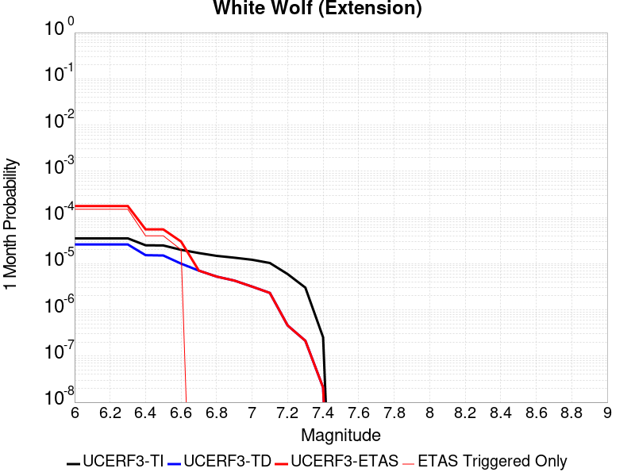 |  |  |

| Magnitude | 1 wk TI Prob | 1 wk TD Prob | 1 wk ETAS Prob | 1 wk ETAS/TD Gain | 1 wk ETAS Triggered Only | 1 mo TI Prob | 1 mo TD Prob | 1 mo ETAS Prob | 1 mo ETAS/TD Gain | 1 mo ETAS Triggered Only | 1 yr TI Prob | 1 yr TD Prob | 1 yr ETAS Prob | 1 yr ETAS/TD Gain | 1 yr ETAS Triggered Only | 10 yr TI Prob | 10 yr TD Prob | 10 yr ETAS Prob | 10 yr ETAS/TD Gain | 10 yr ETAS Triggered Only |
|-----|-----|-----|-----|-----|-----|-----|-----|-----|-----|-----|-----|-----|-----|-----|-----|-----|-----|-----|-----|-----|
| 6.0 | 8.222555E-6 | 6.0666657E-6 | 6.0666657E-6 | 1.0 | 0.0 | 3.5239045E-5 | 2.5999774E-5 | 9.544241E-5 | 3.670894 | 6.9444446E-5 | 4.289509E-4 | 3.1650788E-4 | 3.8593035E-4 | 1.2193388 | 6.9444446E-5 | 0.0042812387 | 0.003161223 | 0.0032996729 | 1.0437963 | 1.3888889E-4 |
| 6.1 | 8.222555E-6 | 6.0666657E-6 | 6.0666657E-6 | 1.0 | 0.0 | 3.5239045E-5 | 2.5999774E-5 | 9.544241E-5 | 3.670894 | 6.9444446E-5 | 4.289509E-4 | 3.1650788E-4 | 3.8593035E-4 | 1.2193388 | 6.9444446E-5 | 0.0042812387 | 0.003161223 | 0.0032996729 | 1.0437963 | 1.3888889E-4 |
| 6.2 | 8.222555E-6 | 6.0666657E-6 | 6.0666657E-6 | 1.0 | 0.0 | 3.5239045E-5 | 2.5999774E-5 | 9.544241E-5 | 3.670894 | 6.9444446E-5 | 4.289509E-4 | 3.1650788E-4 | 3.8593035E-4 | 1.2193388 | 6.9444446E-5 | 0.0042812387 | 0.003161223 | 0.0032996729 | 1.0437963 | 1.3888889E-4 |
| 6.3 | 8.222555E-6 | 6.0666657E-6 | 6.0666657E-6 | 1.0 | 0.0 | 3.5239045E-5 | 2.5999774E-5 | 9.544241E-5 | 3.670894 | 6.9444446E-5 | 4.289509E-4 | 3.1650788E-4 | 3.8593035E-4 | 1.2193388 | 6.9444446E-5 | 0.0042812387 | 0.003161223 | 0.0032996729 | 1.0437963 | 1.3888889E-4 |
| 6.4 | 5.821773E-6 | 3.5571766E-6 | 3.5571766E-6 | 1.0 | 0.0 | 2.4950215E-5 | 1.5244959E-5 | 8.468835E-5 | 5.5551705 | 6.9444446E-5 | 3.0372653E-4 | 1.8559267E-4 | 2.5502424E-4 | 1.3741072 | 6.9444446E-5 | 0.0030331176 | 0.001854485 | 0.0019931165 | 1.0747546 | 1.3888889E-4 |
| 6.5 | 5.766023E-6 | 3.4991106E-6 | 3.4991106E-6 | 1.0 | 0.0 | 2.4711293E-5 | 1.4996108E-5 | 8.443951E-5 | 5.6307616 | 6.9444446E-5 | 3.0081844E-4 | 1.8256342E-4 | 2.519952E-4 | 1.3803159 | 6.9444446E-5 | 0.0030041158 | 0.0018242426 | 0.001962878 | 1.0759962 | 1.3888889E-4 |
| 6.6 | 4.643576E-6 | 2.332624E-6 | 2.332624E-6 | 1.0 | 0.0 | 1.9900888E-5 | 9.996925E-6 | 7.944067E-5 | 7.9465113 | 6.9444446E-5 | 2.4226638E-4 | 1.2170619E-4 | 1.9114219E-4 | 1.5705215 | 6.9444446E-5 | 0.0024200242 | 0.0012164378 | 0.0012857977 | 1.0570189 | 6.9444446E-5 |
| 6.7 | 3.9529173E-6 | 1.6483477E-6 | 1.6483477E-6 | 1.0 | 0.0 | 1.6940963E-5 | 7.0643296E-6 | 7.0643296E-6 | 1.0 | 0.0 | 2.0623671E-4 | 8.6005006E-5 | 8.6005006E-5 | 1.0 | 0.0 | 0.002060454 | 8.597357E-4 | 8.597357E-4 | 1.0 | 0.0 |
| 6.8 | 3.4377522E-6 | 1.2245237E-6 | 1.2245237E-6 | 1.0 | 0.0 | 1.473314E-5 | 5.2479486E-6 | 5.2479486E-6 | 1.0 | 0.0 | 1.7936122E-4 | 6.3891996E-5 | 6.3891996E-5 | 1.0 | 0.0 | 0.0017921652 | 6.387454E-4 | 6.387454E-4 | 1.0 | 0.0 |
| 6.9 | 3.1367306E-6 | 1.0033783E-6 | 1.0033783E-6 | 1.0 | 0.0 | 1.3443062E-5 | 4.3001864E-6 | 4.3001864E-6 | 1.0 | 0.0 | 1.63657E-4 | 5.235359E-5 | 5.235359E-5 | 1.0 | 0.0 | 0.0016353652 | 5.2342017E-4 | 5.2342017E-4 | 1.0 | 0.0 |
| 7.0 | 2.8298145E-6 | 7.4286646E-7 | 7.4286646E-7 | 1.0 | 0.0 | 1.2127721E-5 | 3.1837099E-6 | 3.1837099E-6 | 1.0 | 0.0 | 1.47645E-4 | 3.8761027E-5 | 3.8761027E-5 | 1.0 | 0.0 | 0.0014754693 | 3.8754768E-4 | 3.8754768E-4 | 1.0 | 0.0 |
| 7.1 | 2.4091064E-6 | 5.4227525E-7 | 5.4227525E-7 | 1.0 | 0.0 | 1.03247E-5 | 2.3240348E-6 | 2.3240348E-6 | 1.0 | 0.0 | 1.2569598E-4 | 2.8294799E-5 | 2.8294799E-5 | 1.0 | 0.0 | 0.001256249 | 2.8291598E-4 | 2.8291598E-4 | 1.0 | 0.0 |
| 7.2 | 1.3875518E-6 | 1.0743063E-7 | 1.0743063E-7 | 1.0 | 0.0 | 5.9466374E-6 | 4.6041689E-7 | 4.6041689E-7 | 1.0 | 0.0 | 7.23979E-5 | 5.6055624E-6 | 5.6055624E-6 | 1.0 | 0.0 | 7.2374323E-4 | 5.6054323E-5 | 5.6054323E-5 | 1.0 | 0.0 |
| 7.3 | 7.056077E-7 | 5.002034E-8 | 5.002034E-8 | 1.0 | 0.0 | 3.0240296E-6 | 2.1437286E-7 | 2.1437286E-7 | 1.0 | 0.0 | 3.681694E-5 | 2.609987E-6 | 2.609987E-6 | 1.0 | 0.0 | 3.681084E-4 | 2.609961E-5 | 2.609961E-5 | 1.0 | 0.0 |
| 7.4 | 5.9334678E-8 | 4.8683537E-9 | 4.8683537E-9 | 1.0 | 0.0 | 2.5429145E-7 | 2.0864372E-8 | 2.0864372E-8 | 1.0 | 0.0 | 3.095994E-6 | 2.5402372E-7 | 2.5402372E-7 | 1.0 | 0.0 | 3.095951E-5 | 2.5402353E-6 | 2.5402353E-6 | 1.0 | 0.0 |

## Oceanic - West Huasna
*[(top)](#table-of-contents)*

| 1 Week | 1 Month | 1 Year | 10 Year |
|-----|-----|-----|-----|
|  |  |  |  |

| Magnitude | 1 wk TI Prob | 1 wk TD Prob | 1 wk ETAS Prob | 1 wk ETAS/TD Gain | 1 wk ETAS Triggered Only | 1 mo TI Prob | 1 mo TD Prob | 1 mo ETAS Prob | 1 mo ETAS/TD Gain | 1 mo ETAS Triggered Only | 1 yr TI Prob | 1 yr TD Prob | 1 yr ETAS Prob | 1 yr ETAS/TD Gain | 1 yr ETAS Triggered Only | 10 yr TI Prob | 10 yr TD Prob | 10 yr ETAS Prob | 10 yr ETAS/TD Gain | 10 yr ETAS Triggered Only |
|-----|-----|-----|-----|-----|-----|-----|-----|-----|-----|-----|-----|-----|-----|-----|-----|-----|-----|-----|-----|-----|
| 6.0 | 3.195567E-5 | 2.7926868E-5 | 1.6681188E-4 | 5.973168 | 1.3888889E-4 | 1.3694567E-4 | 1.1968133E-4 | 2.585536E-4 | 2.1603503 | 1.3888889E-4 | 0.0016660384 | 0.0014561893 | 0.001594876 | 1.0952394 | 1.3888889E-4 | 0.016536033 | 0.014471028 | 0.014607906 | 1.0094588 | 1.3888889E-4 |
| 6.1 | 2.1156782E-5 | 1.7573486E-5 | 1.5645994E-4 | 8.903181 | 1.3888889E-4 | 9.066878E-5 | 7.531282E-5 | 2.1419124E-4 | 2.844021 | 1.3888889E-4 | 0.0011033333 | 9.165572E-4 | 0.0010553189 | 1.1513944 | 1.3888889E-4 | 0.010978713 | 0.009128777 | 0.009266399 | 1.0150756 | 1.3888889E-4 |
| 6.2 | 1.6195117E-5 | 1.3327152E-5 | 8.277067E-5 | 6.2106795 | 6.9444446E-5 | 6.9405796E-5 | 5.7115132E-5 | 1.265556E-4 | 2.2157981 | 6.9444446E-5 | 8.44688E-4 | 6.9515745E-4 | 7.645536E-4 | 1.099828 | 6.9444446E-5 | 0.008414844 | 0.006930123 | 0.0069990866 | 1.0099512 | 6.9444446E-5 |
| 6.3 | 1.3559345E-5 | 1.1179142E-5 | 8.062281E-5 | 7.2118955 | 6.9444446E-5 | 5.811018E-5 | 4.7909736E-5 | 1.1735086E-4 | 2.4494154 | 6.9444446E-5 | 7.072618E-4 | 5.831459E-4 | 6.5254985E-4 | 1.1190164 | 6.9444446E-5 | 0.0070501505 | 0.0058162753 | 0.0058853156 | 1.0118703 | 6.9444446E-5 |
| 6.4 | 1.2120619E-5 | 1.0000977E-5 | 7.9444726E-5 | 7.943696 | 6.9444446E-5 | 5.1944477E-5 | 4.2860633E-5 | 1.123021E-4 | 2.620169 | 6.9444446E-5 | 6.322405E-4 | 5.2170374E-4 | 5.9111195E-4 | 1.1330414 | 6.9444446E-5 | 0.006304447 | 0.0052048573 | 0.0052739405 | 1.0132728 | 6.9444446E-5 |
| 6.5 | 1.13511915E-5 | 9.3674735E-6 | 7.881127E-5 | 8.41329 | 6.9444446E-5 | 4.8647056E-5 | 4.01457E-5 | 1.0958736E-4 | 2.7297409 | 6.9444446E-5 | 5.9211696E-4 | 4.886647E-4 | 5.580752E-4 | 1.1420412 | 6.9444446E-5 | 0.0059054173 | 0.0048759608 | 0.0049450668 | 1.0141728 | 6.9444446E-5 |
| 6.6 | 9.850605E-6 | 8.135418E-6 | 8.135418E-6 | 1.0 | 0.0 | 4.2216197E-5 | 3.4865614E-5 | 3.4865614E-5 | 1.0 | 0.0 | 5.1386096E-4 | 4.2440637E-4 | 4.2440637E-4 | 1.0 | 0.0 | 0.0051267436 | 0.004235991 | 0.004235991 | 1.0 | 0.0 |
| 6.7 | 8.8558645E-6 | 7.318433E-6 | 7.318433E-6 | 1.0 | 0.0 | 3.7953152E-5 | 3.1364336E-5 | 3.1364336E-5 | 1.0 | 0.0 | 4.6198163E-4 | 3.8179406E-4 | 3.8179406E-4 | 1.0 | 0.0 | 0.004610224 | 0.0038114067 | 0.0038114067 | 1.0 | 0.0 |
| 6.8 | 7.67136E-6 | 6.391756E-6 | 6.391756E-6 | 1.0 | 0.0 | 3.2876844E-5 | 2.7392953E-5 | 2.7392953E-5 | 1.0 | 0.0 | 4.0020206E-4 | 3.3345833E-4 | 3.3345833E-4 | 1.0 | 0.0 | 0.003994821 | 0.0033296007 | 0.0033296007 | 1.0 | 0.0 |
| 6.9 | 6.534529E-6 | 5.4583297E-6 | 5.4583297E-6 | 1.0 | 0.0 | 2.8004823E-5 | 2.3392633E-5 | 2.3392633E-5 | 1.0 | 0.0 | 3.4090536E-4 | 2.847682E-4 | 2.847682E-4 | 1.0 | 0.0 | 0.0034038287 | 0.0028440498 | 0.0028440498 | 1.0 | 0.0 |
| 7.0 | 5.460525E-6 | 4.5699517E-6 | 4.5699517E-6 | 1.0 | 0.0 | 2.3402039E-5 | 1.958536E-5 | 1.958536E-5 | 1.0 | 0.0 | 2.8488258E-4 | 2.3842578E-4 | 2.3842578E-4 | 1.0 | 0.0 | 0.0028451765 | 0.0023817138 | 0.0023817138 | 1.0 | 0.0 |
| 7.1 | 4.4825083E-6 | 3.7524428E-6 | 3.7524428E-6 | 1.0 | 0.0 | 1.9210609E-5 | 1.60818E-5 | 1.60818E-5 | 1.0 | 0.0 | 2.3386406E-4 | 1.9577841E-4 | 1.9577841E-4 | 1.0 | 0.0 | 0.002336181 | 0.0019560715 | 0.0019560715 | 1.0 | 0.0 |
| 7.2 | 2.821708E-6 | 2.4249334E-6 | 2.4249334E-6 | 1.0 | 0.0 | 1.2092979E-5 | 1.039253E-5 | 1.039253E-5 | 1.0 | 0.0 | 1.4722206E-4 | 1.2652173E-4 | 1.2652173E-4 | 1.0 | 0.0 | 0.0014712457 | 0.0012644994 | 0.0012644994 | 1.0 | 0.0 |
| 7.3 | 2.0644757E-6 | 1.7687412E-6 | 1.7687412E-6 | 1.0 | 0.0 | 8.847723E-6 | 7.5802973E-6 | 7.5802973E-6 | 1.0 | 0.0 | 1.0771569E-4 | 9.228622E-5 | 9.228622E-5 | 1.0 | 0.0 | 0.001076635 | 9.2248066E-4 | 9.2248066E-4 | 1.0 | 0.0 |
| 7.4 | 1.6980367E-6 | 1.4379892E-6 | 1.4379892E-6 | 1.0 | 0.0 | 7.27728E-6 | 6.162796E-6 | 6.162796E-6 | 1.0 | 0.0 | 8.8597284E-5 | 7.5029464E-5 | 7.5029464E-5 | 1.0 | 0.0 | 8.8561967E-4 | 7.500429E-4 | 7.500429E-4 | 1.0 | 0.0 |
| 7.5 | 1.3637683E-6 | 1.1302635E-6 | 1.1302635E-6 | 1.0 | 0.0 | 5.844708E-6 | 4.8439774E-6 | 4.8439774E-6 | 1.0 | 0.0 | 7.1156996E-5 | 5.897383E-5 | 5.897383E-5 | 1.0 | 0.0 | 7.1134215E-4 | 5.895833E-4 | 5.895833E-4 | 1.0 | 0.0 |
| 7.6 | 9.802994E-7 | 7.677247E-7 | 7.677247E-7 | 1.0 | 0.0 | 4.2012766E-6 | 3.2902446E-6 | 3.2902446E-6 | 1.0 | 0.0 | 5.1149345E-5 | 4.0057992E-5 | 4.0057992E-5 | 1.0 | 0.0 | 5.113757E-4 | 4.0050913E-4 | 4.0050913E-4 | 1.0 | 0.0 |
| 7.7 | 5.986191E-7 | 4.0050548E-7 | 4.0050548E-7 | 1.0 | 0.0 | 2.5655079E-6 | 1.7164509E-6 | 1.7164509E-6 | 1.0 | 0.0 | 3.1234613E-5 | 2.089759E-5 | 2.089759E-5 | 1.0 | 0.0 | 3.123022E-4 | 2.089576E-4 | 2.089576E-4 | 1.0 | 0.0 |
| 7.8 | 2.9189815E-7 | 1.5285792E-7 | 1.5285792E-7 | 1.0 | 0.0 | 1.2509914E-6 | 6.5510517E-7 | 6.5510517E-7 | 1.0 | 0.0 | 1.5230714E-5 | 7.9758765E-6 | 7.9758765E-6 | 1.0 | 0.0 | 1.522967E-4 | 7.9757214E-5 | 7.9757214E-5 | 1.0 | 0.0 |
| 7.9 | 1.2057845E-7 | 4.621248E-8 | 4.621248E-8 | 1.0 | 0.0 | 5.1676466E-7 | 1.9805347E-7 | 1.9805347E-7 | 1.0 | 0.0 | 6.2915915E-6 | 2.4112983E-6 | 2.4112983E-6 | 1.0 | 0.0 | 6.2914136E-5 | 2.4114026E-5 | 2.4114026E-5 | 1.0 | 0.0 |
| 8.0 | 3.3806387E-9 | 9.011393E-10 | 9.011393E-10 | 1.0 | 0.0 | 1.4488451E-8 | 3.8620254E-9 | 3.8620254E-9 | 1.0 | 0.0 | 1.7639688E-7 | 4.702016E-8 | 4.702016E-8 | 1.0 | 0.0 | 1.7639674E-6 | 4.7129527E-7 | 4.7129527E-7 | 1.0 | 0.0 |

## Elsinore (Temecula) rev
*[(top)](#table-of-contents)*

| 1 Week | 1 Month | 1 Year | 10 Year |
|-----|-----|-----|-----|
|  |  |  |  |

| Magnitude | 1 wk TI Prob | 1 wk TD Prob | 1 wk ETAS Prob | 1 wk ETAS/TD Gain | 1 wk ETAS Triggered Only | 1 mo TI Prob | 1 mo TD Prob | 1 mo ETAS Prob | 1 mo ETAS/TD Gain | 1 mo ETAS Triggered Only | 1 yr TI Prob | 1 yr TD Prob | 1 yr ETAS Prob | 1 yr ETAS/TD Gain | 1 yr ETAS Triggered Only | 10 yr TI Prob | 10 yr TD Prob | 10 yr ETAS Prob | 10 yr ETAS/TD Gain | 10 yr ETAS Triggered Only |
|-----|-----|-----|-----|-----|-----|-----|-----|-----|-----|-----|-----|-----|-----|-----|-----|-----|-----|-----|-----|-----|
| 6.0 | 2.9514995E-5 | 2.2517117E-5 | 1.6140287E-4 | 7.1680083 | 1.3888889E-4 | 1.264867E-4 | 9.649849E-5 | 2.3537397E-4 | 2.4391468 | 1.3888889E-4 | 0.0015388876 | 0.0011742581 | 0.0013129838 | 1.1181391 | 1.3888889E-4 | 0.015282745 | 0.011696897 | 0.011834162 | 1.0117351 | 1.3888889E-4 |
| 6.1 | 2.9514995E-5 | 2.2517117E-5 | 1.6140287E-4 | 7.1680083 | 1.3888889E-4 | 1.264867E-4 | 9.649849E-5 | 2.3537397E-4 | 2.4391468 | 1.3888889E-4 | 0.0015388876 | 0.0011742581 | 0.0013129838 | 1.1181391 | 1.3888889E-4 | 0.015282745 | 0.011696897 | 0.011834162 | 1.0117351 | 1.3888889E-4 |
| 6.2 | 2.9514995E-5 | 2.2517117E-5 | 1.6140287E-4 | 7.1680083 | 1.3888889E-4 | 1.264867E-4 | 9.649849E-5 | 2.3537397E-4 | 2.4391468 | 1.3888889E-4 | 0.0015388876 | 0.0011742581 | 0.0013129838 | 1.1181391 | 1.3888889E-4 | 0.015282745 | 0.011696897 | 0.011834162 | 1.0117351 | 1.3888889E-4 |
| 6.3 | 2.3223649E-5 | 1.8406454E-5 | 1.8406454E-5 | 1.0 | 0.0 | 9.952613E-5 | 7.888251E-5 | 7.888251E-5 | 1.0 | 0.0 | 0.001211057 | 9.599888E-4 | 9.599888E-4 | 1.0 | 0.0 | 0.012044783 | 0.009569948 | 0.009569948 | 1.0 | 0.0 |
| 6.4 | 2.3223649E-5 | 1.8406454E-5 | 1.8406454E-5 | 1.0 | 0.0 | 9.952613E-5 | 7.888251E-5 | 7.888251E-5 | 1.0 | 0.0 | 0.001211057 | 9.599888E-4 | 9.599888E-4 | 1.0 | 0.0 | 0.012044783 | 0.009569948 | 0.009569948 | 1.0 | 0.0 |
| 6.5 | 1.8338875E-5 | 1.4750118E-5 | 1.4750118E-5 | 1.0 | 0.0 | 7.8592806E-5 | 6.321331E-5 | 6.321331E-5 | 1.0 | 0.0 | 9.5644733E-4 | 7.69359E-4 | 7.69359E-4 | 1.0 | 0.0 | 0.009523412 | 0.0076739118 | 0.0076739118 | 1.0 | 0.0 |
| 6.6 | 1.8223333E-5 | 1.4612673E-5 | 1.4612673E-5 | 1.0 | 0.0 | 7.809766E-5 | 6.262429E-5 | 6.262429E-5 | 1.0 | 0.0 | 9.504242E-4 | 7.6219277E-4 | 7.6219277E-4 | 1.0 | 0.0 | 0.009463696 | 0.0076027405 | 0.0076027405 | 1.0 | 0.0 |
| 6.7 | 1.7512752E-5 | 1.402721E-5 | 1.402721E-5 | 1.0 | 0.0 | 7.505249E-5 | 6.011528E-5 | 6.011528E-5 | 1.0 | 0.0 | 9.13381E-4 | 7.3166634E-4 | 7.3166634E-4 | 1.0 | 0.0 | 0.00909636 | 0.00729892 | 0.00729892 | 1.0 | 0.0 |
| 6.8 | 1.7417142E-5 | 1.3951195E-5 | 1.3951195E-5 | 1.0 | 0.0 | 7.4642754E-5 | 5.9789512E-5 | 5.9789512E-5 | 1.0 | 0.0 | 9.083966E-4 | 7.277028E-4 | 7.277028E-4 | 1.0 | 0.0 | 0.009046922 | 0.0072594886 | 0.0072594886 | 1.0 | 0.0 |
| 6.9 | 1.6402591E-5 | 1.2988613E-5 | 1.2988613E-5 | 1.0 | 0.0 | 7.0294926E-5 | 5.5664343E-5 | 5.5664343E-5 | 1.0 | 0.0 | 8.5550465E-4 | 6.775103E-4 | 6.775103E-4 | 1.0 | 0.0 | 0.008522186 | 0.006760169 | 0.006760169 | 1.0 | 0.0 |
| 7.0 | 1.3912486E-5 | 1.0878233E-5 | 1.0878233E-5 | 1.0 | 0.0 | 5.9623577E-5 | 4.6620182E-5 | 4.6620182E-5 | 1.0 | 0.0 | 7.2567526E-4 | 5.674556E-4 | 5.674556E-4 | 1.0 | 0.0 | 0.0072331014 | 0.005663986 | 0.005663986 | 1.0 | 0.0 |
| 7.1 | 1.3405147E-5 | 1.03274215E-5 | 1.03274215E-5 | 1.0 | 0.0 | 5.7449364E-5 | 4.425964E-5 | 4.425964E-5 | 1.0 | 0.0 | 6.9922156E-4 | 5.3873047E-4 | 5.3873047E-4 | 1.0 | 0.0 | 0.0069702556 | 0.005377577 | 0.005377577 | 1.0 | 0.0 |
| 7.2 | 1.21402E-5 | 8.996737E-6 | 8.996737E-6 | 1.0 | 0.0 | 5.202839E-5 | 3.8556886E-5 | 3.8556886E-5 | 1.0 | 0.0 | 6.332616E-4 | 4.6933076E-4 | 4.6933076E-4 | 1.0 | 0.0 | 0.0063146 | 0.004684821 | 0.004684821 | 1.0 | 0.0 |
| 7.3 | 1.05047775E-5 | 7.571771E-6 | 7.571771E-6 | 1.0 | 0.0 | 4.5019697E-5 | 3.245005E-5 | 3.245005E-5 | 1.0 | 0.0 | 5.4797693E-4 | 3.950092E-4 | 3.950092E-4 | 1.0 | 0.0 | 0.005466277 | 0.00394346 | 0.00394346 | 1.0 | 0.0 |
| 7.4 | 9.624483E-6 | 6.7868696E-6 | 6.7868696E-6 | 1.0 | 0.0 | 4.124713E-5 | 2.9086266E-5 | 2.9086266E-5 | 1.0 | 0.0 | 5.0206814E-4 | 3.5406914E-4 | 3.5406914E-4 | 1.0 | 0.0 | 0.005009353 | 0.003535204 | 0.003535204 | 1.0 | 0.0 |
| 7.5 | 8.215151E-6 | 5.635538E-6 | 5.635538E-6 | 1.0 | 0.0 | 3.5207315E-5 | 2.4152088E-5 | 2.4152088E-5 | 1.0 | 0.0 | 4.2856473E-4 | 2.9401327E-4 | 2.9401327E-4 | 1.0 | 0.0 | 0.004277392 | 0.002936371 | 0.002936371 | 1.0 | 0.0 |
| 7.6 | 6.975058E-6 | 4.676045E-6 | 4.676045E-6 | 1.0 | 0.0 | 2.9892764E-5 | 2.0040046E-5 | 2.0040046E-5 | 1.0 | 0.0 | 3.6388362E-4 | 2.439614E-4 | 2.439614E-4 | 1.0 | 0.0 | 0.0036328835 | 0.002437052 | 0.002437052 | 1.0 | 0.0 |
| 7.7 | 4.159604E-6 | 2.3269924E-6 | 2.3269924E-6 | 1.0 | 0.0 | 1.7826753E-5 | 9.97279E-6 | 9.97279E-6 | 1.0 | 0.0 | 2.1701909E-4 | 1.21412704E-4 | 1.21412704E-4 | 1.0 | 0.0 | 0.0021680726 | 0.0012135367 | 0.0012135367 | 1.0 | 0.0 |
| 7.8 | 2.2692414E-7 | 9.3854695E-8 | 9.3854695E-8 | 1.0 | 0.0 | 9.725317E-7 | 4.0223435E-7 | 4.0223435E-7 | 1.0 | 0.0 | 1.1840509E-5 | 4.8971956E-6 | 4.8971956E-6 | 1.0 | 0.0 | 1.1839878E-4 | 4.8971204E-5 | 4.8971204E-5 | 1.0 | 0.0 |
| 7.9 | 6.676829E-9 | 3.439853E-9 | 3.439853E-9 | 1.0 | 0.0 | 2.861498E-8 | 1.4742227E-8 | 1.4742227E-8 | 1.0 | 0.0 | 3.4838732E-7 | 1.7948659E-7 | 1.7948659E-7 | 1.0 | 0.0 | 3.4838679E-6 | 1.7948646E-6 | 1.7948646E-6 | 1.0 | 0.0 |

## Baker
*[(top)](#table-of-contents)*

| 1 Week | 1 Month | 1 Year | 10 Year |
|-----|-----|-----|-----|
|  |  |  | 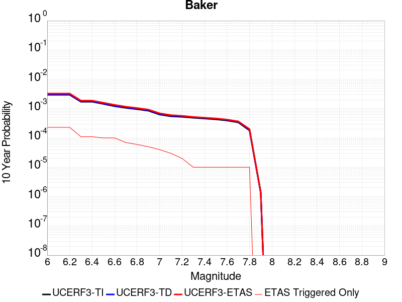 |

| Magnitude | 1 wk TI Prob | 1 wk TD Prob | 1 wk ETAS Prob | 1 wk ETAS/TD Gain | 1 wk ETAS Triggered Only | 1 mo TI Prob | 1 mo TD Prob | 1 mo ETAS Prob | 1 mo ETAS/TD Gain | 1 mo ETAS Triggered Only | 1 yr TI Prob | 1 yr TD Prob | 1 yr ETAS Prob | 1 yr ETAS/TD Gain | 1 yr ETAS Triggered Only | 10 yr TI Prob | 10 yr TD Prob | 10 yr ETAS Prob | 10 yr ETAS/TD Gain | 10 yr ETAS Triggered Only |
|-----|-----|-----|-----|-----|-----|-----|-----|-----|-----|-----|-----|-----|-----|-----|-----|-----|-----|-----|-----|-----|
| 6.0 | 5.695525E-6 | 5.8348373E-6 | 7.527888E-5 | 12.901625 | 6.9444446E-5 | 2.4409164E-5 | 2.5006228E-5 | 9.444894E-5 | 3.7770166 | 6.9444446E-5 | 2.9714106E-4 | 3.044123E-4 | 3.7383562E-4 | 1.2280568 | 6.9444446E-5 | 0.0029674405 | 0.0030403486 | 0.0031788154 | 1.045543 | 1.3888889E-4 |
| 6.1 | 5.695525E-6 | 5.8348373E-6 | 7.527888E-5 | 12.901625 | 6.9444446E-5 | 2.4409164E-5 | 2.5006228E-5 | 9.444894E-5 | 3.7770166 | 6.9444446E-5 | 2.9714106E-4 | 3.044123E-4 | 3.7383562E-4 | 1.2280568 | 6.9444446E-5 | 0.0029674405 | 0.0030403486 | 0.0031788154 | 1.045543 | 1.3888889E-4 |
| 6.2 | 5.695525E-6 | 5.8348373E-6 | 7.527888E-5 | 12.901625 | 6.9444446E-5 | 2.4409164E-5 | 2.5006228E-5 | 9.444894E-5 | 3.7770166 | 6.9444446E-5 | 2.9714106E-4 | 3.044123E-4 | 3.7383562E-4 | 1.2280568 | 6.9444446E-5 | 0.0029674405 | 0.0030403486 | 0.0031788154 | 1.045543 | 1.3888889E-4 |
| 6.3 | 3.2995713E-6 | 3.383667E-6 | 3.383667E-6 | 1.0 | 0.0 | 1.4140943E-5 | 1.4501353E-5 | 1.4501353E-5 | 1.0 | 0.0 | 1.7215237E-4 | 1.7654014E-4 | 1.7654014E-4 | 1.0 | 0.0 | 0.0017201907 | 0.001764046 | 0.001764046 | 1.0 | 0.0 |
| 6.4 | 3.2995713E-6 | 3.383667E-6 | 3.383667E-6 | 1.0 | 0.0 | 1.4140943E-5 | 1.4501353E-5 | 1.4501353E-5 | 1.0 | 0.0 | 1.7215237E-4 | 1.7654014E-4 | 1.7654014E-4 | 1.0 | 0.0 | 0.0017201907 | 0.001764046 | 0.001764046 | 1.0 | 0.0 |
| 6.5 | 2.782202E-6 | 2.8558404E-6 | 2.8558404E-6 | 1.0 | 0.0 | 1.1923668E-5 | 1.223926E-5 | 1.223926E-5 | 1.0 | 0.0 | 1.4516099E-4 | 1.4900314E-4 | 1.4900314E-4 | 1.0 | 0.0 | 0.001450662 | 0.0014890651 | 0.0014890651 | 1.0 | 0.0 |
| 6.6 | 2.3163404E-6 | 2.38092E-6 | 2.38092E-6 | 1.0 | 0.0 | 9.927136E-6 | 1.0203904E-5 | 1.0203904E-5 | 1.0 | 0.0 | 1.20856166E-4 | 1.2422565E-4 | 1.2422565E-4 | 1.0 | 0.0 | 0.0012079047 | 0.0012415823 | 0.0012415823 | 1.0 | 0.0 |
| 6.7 | 2.037056E-6 | 2.0965003E-6 | 2.0965003E-6 | 1.0 | 0.0 | 8.7302105E-6 | 8.984972E-6 | 8.984972E-6 | 1.0 | 0.0 | 1.0628513E-4 | 1.093867E-4 | 1.093867E-4 | 1.0 | 0.0 | 0.0010623431 | 0.0010933448 | 0.0010933448 | 1.0 | 0.0 |
| 6.8 | 1.8356744E-6 | 1.8915287E-6 | 1.8915287E-6 | 1.0 | 0.0 | 7.867153E-6 | 8.106527E-6 | 8.106527E-6 | 1.0 | 0.0 | 9.577837E-5 | 9.869264E-5 | 9.869264E-5 | 1.0 | 0.0 | 9.57371E-4 | 9.86502E-4 | 9.86502E-4 | 1.0 | 0.0 |
| 6.9 | 1.6310546E-6 | 1.6832072E-6 | 1.6832072E-6 | 1.0 | 0.0 | 6.9902153E-6 | 7.213726E-6 | 7.213726E-6 | 1.0 | 0.0 | 8.510255E-5 | 8.782368E-5 | 8.782368E-5 | 1.0 | 0.0 | 8.5069967E-4 | 8.7790104E-4 | 8.7790104E-4 | 1.0 | 0.0 |
| 7.0 | 1.2058036E-6 | 1.2508665E-6 | 1.2508665E-6 | 1.0 | 0.0 | 5.1677193E-6 | 5.3608455E-6 | 5.3608455E-6 | 1.0 | 0.0 | 6.291517E-5 | 6.5266366E-5 | 6.5266366E-5 | 1.0 | 0.0 | 6.289736E-4 | 6.524743E-4 | 6.524743E-4 | 1.0 | 0.0 |
| 7.1 | 1.052382E-6 | 1.0951609E-6 | 1.0951609E-6 | 1.0 | 0.0 | 4.5102006E-6 | 4.693538E-6 | 4.693538E-6 | 1.0 | 0.0 | 5.491031E-5 | 5.7142337E-5 | 5.7142337E-5 | 1.0 | 0.0 | 5.4896745E-4 | 5.7127734E-4 | 5.7127734E-4 | 1.0 | 0.0 |
| 7.2 | 1.0067454E-6 | 1.0487711E-6 | 1.0487711E-6 | 1.0 | 0.0 | 4.3146156E-6 | 4.4947255E-6 | 4.4947255E-6 | 1.0 | 0.0 | 5.252918E-5 | 5.4721917E-5 | 5.4721917E-5 | 1.0 | 0.0 | 5.251676E-4 | 5.470853E-4 | 5.470853E-4 | 1.0 | 0.0 |
| 7.3 | 9.3596316E-7 | 9.767723E-7 | 9.767723E-7 | 1.0 | 0.0 | 4.0112645E-6 | 4.1861604E-6 | 4.1861604E-6 | 1.0 | 0.0 | 4.8836053E-5 | 5.096532E-5 | 5.096532E-5 | 1.0 | 0.0 | 4.8825322E-4 | 5.095371E-4 | 5.095371E-4 | 1.0 | 0.0 |
| 7.4 | 8.8117395E-7 | 9.2076635E-7 | 9.2076635E-7 | 1.0 | 0.0 | 3.7764542E-6 | 3.9461356E-6 | 3.9461356E-6 | 1.0 | 0.0 | 4.5977362E-5 | 4.8043148E-5 | 4.8043148E-5 | 1.0 | 0.0 | 4.596785E-4 | 4.8032837E-4 | 4.8032837E-4 | 1.0 | 0.0 |
| 7.5 | 8.292386E-7 | 8.6745956E-7 | 8.6745956E-7 | 1.0 | 0.0 | 3.5538749E-6 | 3.7176785E-6 | 3.7176785E-6 | 1.0 | 0.0 | 4.326757E-5 | 4.5261804E-5 | 4.5261804E-5 | 1.0 | 0.0 | 4.3259145E-4 | 4.5252658E-4 | 4.5252658E-4 | 1.0 | 0.0 |
| 7.6 | 7.553842E-7 | 7.9144706E-7 | 7.9144706E-7 | 1.0 | 0.0 | 3.2373566E-6 | 3.3919116E-6 | 3.3919116E-6 | 1.0 | 0.0 | 3.9414106E-5 | 4.129575E-5 | 4.129575E-5 | 1.0 | 0.0 | 3.9407116E-4 | 4.1288146E-4 | 4.1288146E-4 | 1.0 | 0.0 |
| 7.7 | 6.5285366E-7 | 6.852797E-7 | 6.852797E-7 | 1.0 | 0.0 | 2.797941E-6 | 2.9369096E-6 | 2.9369096E-6 | 1.0 | 0.0 | 3.40644E-5 | 3.5756293E-5 | 3.5756293E-5 | 1.0 | 0.0 | 3.405918E-4 | 3.5750607E-4 | 3.5750607E-4 | 1.0 | 0.0 |
| 7.8 | 3.4586725E-7 | 3.6482615E-7 | 3.6482615E-7 | 1.0 | 0.0 | 1.4822873E-6 | 1.5635396E-6 | 1.5635396E-6 | 1.0 | 0.0 | 1.80467E-5 | 1.9035933E-5 | 1.9035933E-5 | 1.0 | 0.0 | 1.8045233E-4 | 1.9034347E-4 | 1.9034347E-4 | 1.0 | 0.0 |
| 7.9 | 2.5591178E-9 | 2.6696718E-9 | 2.6696718E-9 | 1.0 | 0.0 | 1.0967647E-8 | 1.14414505E-8 | 1.14414505E-8 | 1.0 | 0.0 | 1.335311E-7 | 1.3929966E-7 | 1.3929966E-7 | 1.0 | 0.0 | 1.3353102E-6 | 1.3929966E-6 | 1.3929966E-6 | 1.0 | 0.0 |

## North Frontal  (East)
*[(top)](#table-of-contents)*

| 1 Week | 1 Month | 1 Year | 10 Year |
|-----|-----|-----|-----|
|  |  | 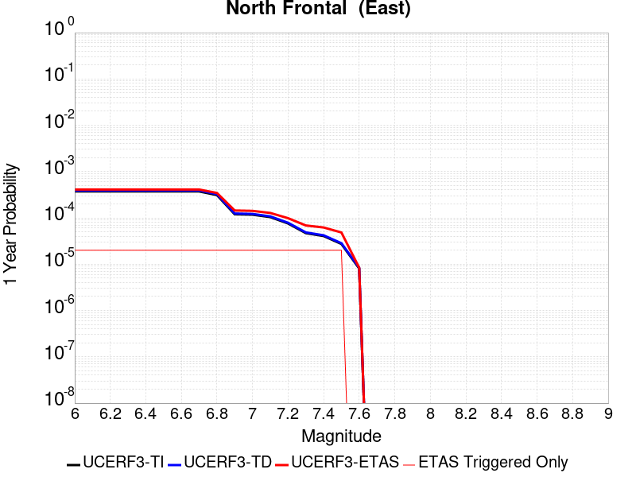 |  |

| Magnitude | 1 wk TI Prob | 1 wk TD Prob | 1 wk ETAS Prob | 1 wk ETAS/TD Gain | 1 wk ETAS Triggered Only | 1 mo TI Prob | 1 mo TD Prob | 1 mo ETAS Prob | 1 mo ETAS/TD Gain | 1 mo ETAS Triggered Only | 1 yr TI Prob | 1 yr TD Prob | 1 yr ETAS Prob | 1 yr ETAS/TD Gain | 1 yr ETAS Triggered Only | 10 yr TI Prob | 10 yr TD Prob | 10 yr ETAS Prob | 10 yr ETAS/TD Gain | 10 yr ETAS Triggered Only |
|-----|-----|-----|-----|-----|-----|-----|-----|-----|-----|-----|-----|-----|-----|-----|-----|-----|-----|-----|-----|-----|
| 6.0 | 7.135738E-6 | 7.4771765E-6 | 7.4771765E-6 | 1.0 | 0.0 | 3.0581377E-5 | 3.204476E-5 | 3.204476E-5 | 1.0 | 0.0 | 3.7226462E-4 | 3.9009505E-4 | 4.595124E-4 | 1.1779498 | 6.9444446E-5 | 0.0037164164 | 0.0038960609 | 0.0040344084 | 1.0355097 | 1.3888889E-4 |
| 6.1 | 7.135738E-6 | 7.4771765E-6 | 7.4771765E-6 | 1.0 | 0.0 | 3.0581377E-5 | 3.204476E-5 | 3.204476E-5 | 1.0 | 0.0 | 3.7226462E-4 | 3.9009505E-4 | 4.595124E-4 | 1.1779498 | 6.9444446E-5 | 0.0037164164 | 0.0038960609 | 0.0040344084 | 1.0355097 | 1.3888889E-4 |
| 6.2 | 7.135738E-6 | 7.4771765E-6 | 7.4771765E-6 | 1.0 | 0.0 | 3.0581377E-5 | 3.204476E-5 | 3.204476E-5 | 1.0 | 0.0 | 3.7226462E-4 | 3.9009505E-4 | 4.595124E-4 | 1.1779498 | 6.9444446E-5 | 0.0037164164 | 0.0038960609 | 0.0040344084 | 1.0355097 | 1.3888889E-4 |
| 6.3 | 7.135738E-6 | 7.4771765E-6 | 7.4771765E-6 | 1.0 | 0.0 | 3.0581377E-5 | 3.204476E-5 | 3.204476E-5 | 1.0 | 0.0 | 3.7226462E-4 | 3.9009505E-4 | 4.595124E-4 | 1.1779498 | 6.9444446E-5 | 0.0037164164 | 0.0038960609 | 0.0040344084 | 1.0355097 | 1.3888889E-4 |
| 6.4 | 7.135738E-6 | 7.4771765E-6 | 7.4771765E-6 | 1.0 | 0.0 | 3.0581377E-5 | 3.204476E-5 | 3.204476E-5 | 1.0 | 0.0 | 3.7226462E-4 | 3.9009505E-4 | 4.595124E-4 | 1.1779498 | 6.9444446E-5 | 0.0037164164 | 0.0038960609 | 0.0040344084 | 1.0355097 | 1.3888889E-4 |
| 6.5 | 7.135738E-6 | 7.4771765E-6 | 7.4771765E-6 | 1.0 | 0.0 | 3.0581377E-5 | 3.204476E-5 | 3.204476E-5 | 1.0 | 0.0 | 3.7226462E-4 | 3.9009505E-4 | 4.595124E-4 | 1.1779498 | 6.9444446E-5 | 0.0037164164 | 0.0038960609 | 0.0040344084 | 1.0355097 | 1.3888889E-4 |
| 6.6 | 7.135738E-6 | 7.4771765E-6 | 7.4771765E-6 | 1.0 | 0.0 | 3.0581377E-5 | 3.204476E-5 | 3.204476E-5 | 1.0 | 0.0 | 3.7226462E-4 | 3.9009505E-4 | 4.595124E-4 | 1.1779498 | 6.9444446E-5 | 0.0037164164 | 0.0038960609 | 0.0040344084 | 1.0355097 | 1.3888889E-4 |
| 6.7 | 7.135738E-6 | 7.4771765E-6 | 7.4771765E-6 | 1.0 | 0.0 | 3.0581377E-5 | 3.204476E-5 | 3.204476E-5 | 1.0 | 0.0 | 3.7226462E-4 | 3.9009505E-4 | 4.595124E-4 | 1.1779498 | 6.9444446E-5 | 0.0037164164 | 0.0038960609 | 0.0040344084 | 1.0355097 | 1.3888889E-4 |
| 6.8 | 5.959142E-6 | 6.236683E-6 | 6.236683E-6 | 1.0 | 0.0 | 2.553893E-5 | 2.6728469E-5 | 2.6728469E-5 | 1.0 | 0.0 | 3.108921E-4 | 3.253886E-4 | 3.9481043E-4 | 1.2133507 | 6.9444446E-5 | 0.0031045752 | 0.0032508948 | 0.0033893322 | 1.0425844 | 1.3888889E-4 |
| 6.9 | 2.2946929E-6 | 2.3824605E-6 | 2.3824605E-6 | 1.0 | 0.0 | 9.834361E-6 | 1.0210508E-5 | 1.0210508E-5 | 1.0 | 0.0 | 1.1972676E-4 | 1.2430632E-4 | 1.9374212E-4 | 1.5585864 | 6.9444446E-5 | 0.0011966228 | 0.0012424142 | 0.0013811307 | 1.1116506 | 1.3888889E-4 |
| 7.0 | 2.2468673E-6 | 2.3321538E-6 | 2.3321538E-6 | 1.0 | 0.0 | 9.629396E-6 | 9.994909E-6 | 9.994909E-6 | 1.0 | 0.0 | 1.1723159E-4 | 1.21681696E-4 | 1.9111768E-4 | 1.5706363 | 6.9444446E-5 | 0.0011716976 | 0.0012161969 | 0.001354917 | 1.1140604 | 1.3888889E-4 |
| 7.1 | 1.9921076E-6 | 2.0646032E-6 | 2.0646032E-6 | 1.0 | 0.0 | 8.537577E-6 | 8.848272E-6 | 8.848272E-6 | 1.0 | 0.0 | 1.0394004E-4 | 1.0772282E-4 | 1.7715979E-4 | 1.6445892 | 6.9444446E-5 | 0.0010389143 | 0.0010767487 | 0.0012154881 | 1.1288502 | 1.3888889E-4 |
| 7.2 | 1.4524545E-6 | 1.5045148E-6 | 1.5045148E-6 | 1.0 | 0.0 | 6.2247905E-6 | 6.447906E-6 | 6.447906E-6 | 1.0 | 0.0 | 7.5784184E-5 | 7.850068E-5 | 1.4793967E-4 | 1.8845656 | 6.9444446E-5 | 7.575835E-4 | 7.8475394E-4 | 9.235338E-4 | 1.1768451 | 1.3888889E-4 |
| 7.3 | 8.9802575E-7 | 9.3087283E-7 | 9.3087283E-7 | 1.0 | 0.0 | 3.848676E-6 | 3.9894494E-6 | 3.9894494E-6 | 1.0 | 0.0 | 4.685662E-5 | 4.857058E-5 | 1.1801165E-4 | 2.4296942 | 6.9444446E-5 | 4.6846745E-4 | 4.8561094E-4 | 6.244324E-4 | 1.2858697 | 1.3888889E-4 |
| 7.4 | 7.776139E-7 | 8.0604747E-7 | 8.0604747E-7 | 1.0 | 0.0 | 3.3326266E-6 | 3.4544853E-6 | 3.4544853E-6 | 1.0 | 0.0 | 4.0573974E-5 | 4.2057654E-5 | 1.1149918E-4 | 2.651103 | 6.9444446E-5 | 4.0566566E-4 | 4.205077E-4 | 4.8992294E-4 | 1.1650748 | 6.9444446E-5 |
| 7.5 | 5.244417E-7 | 5.441219E-7 | 5.441219E-7 | 1.0 | 0.0 | 2.2476054E-6 | 2.3319494E-6 | 2.3319494E-6 | 1.0 | 0.0 | 2.7364253E-5 | 2.839118E-5 | 9.7833654E-5 | 3.4459171 | 6.9444446E-5 | 2.7360884E-4 | 2.8388205E-4 | 3.5330676E-4 | 1.2445549 | 6.9444446E-5 |
| 7.6 | 1.5489647E-7 | 1.6089504E-7 | 1.6089504E-7 | 1.0 | 0.0 | 6.6384183E-7 | 6.895501E-7 | 6.895501E-7 | 1.0 | 0.0 | 8.082245E-6 | 8.395261E-6 | 8.395261E-6 | 1.0 | 0.0 | 8.08195E-5 | 8.395143E-5 | 8.395143E-5 | 1.0 | 0.0 |

## Big Pine (Central)
*[(top)](#table-of-contents)*

| 1 Week | 1 Month | 1 Year | 10 Year |
|-----|-----|-----|-----|
| 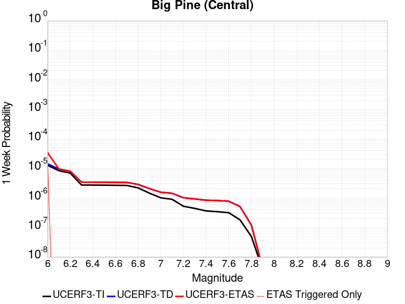 |  |  |  |

| Magnitude | 1 wk TI Prob | 1 wk TD Prob | 1 wk ETAS Prob | 1 wk ETAS/TD Gain | 1 wk ETAS Triggered Only | 1 mo TI Prob | 1 mo TD Prob | 1 mo ETAS Prob | 1 mo ETAS/TD Gain | 1 mo ETAS Triggered Only | 1 yr TI Prob | 1 yr TD Prob | 1 yr ETAS Prob | 1 yr ETAS/TD Gain | 1 yr ETAS Triggered Only | 10 yr TI Prob | 10 yr TD Prob | 10 yr ETAS Prob | 10 yr ETAS/TD Gain | 10 yr ETAS Triggered Only |
|-----|-----|-----|-----|-----|-----|-----|-----|-----|-----|-----|-----|-----|-----|-----|-----|-----|-----|-----|-----|-----|
| 6.0 | 1.2706755E-5 | 1.4250529E-5 | 1.4250529E-5 | 1.0 | 0.0 | 5.4456385E-5 | 6.107247E-5 | 6.107247E-5 | 1.0 | 0.0 | 6.628048E-4 | 7.433402E-4 | 7.433402E-4 | 1.0 | 0.0 | 0.006608314 | 0.0074135666 | 0.0074824966 | 1.0092977 | 6.9444446E-5 |
| 6.1 | 8.342579E-6 | 9.510762E-6 | 9.510762E-6 | 1.0 | 0.0 | 3.5753423E-5 | 4.0759893E-5 | 4.0759893E-5 | 1.0 | 0.0 | 4.3521097E-4 | 4.961604E-4 | 4.961604E-4 | 1.0 | 0.0 | 0.0043435963 | 0.0049540824 | 0.005023183 | 1.0139482 | 6.9444446E-5 |
| 6.2 | 6.923899E-6 | 7.967147E-6 | 7.967147E-6 | 1.0 | 0.0 | 2.9673516E-5 | 3.4144578E-5 | 3.4144578E-5 | 1.0 | 0.0 | 3.6121515E-4 | 4.156502E-4 | 4.156502E-4 | 1.0 | 0.0 | 0.003606286 | 0.0041520367 | 0.004221193 | 1.0166559 | 6.9444446E-5 |
| 6.3 | 2.728396E-6 | 3.4242908E-6 | 3.4242908E-6 | 1.0 | 0.0 | 1.1693074E-5 | 1.4675454E-5 | 1.4675454E-5 | 1.0 | 0.0 | 1.4235388E-4 | 1.7865987E-4 | 1.7865987E-4 | 1.0 | 0.0 | 0.0014226272 | 0.0017866704 | 0.0018559907 | 1.0387987 | 6.9444446E-5 |
| 6.4 | 2.7136944E-6 | 3.408584E-6 | 3.408584E-6 | 1.0 | 0.0 | 1.1630066E-5 | 1.4608141E-5 | 1.4608141E-5 | 1.0 | 0.0 | 1.4158686E-4 | 1.7784047E-4 | 1.7784047E-4 | 1.0 | 0.0 | 0.0014149669 | 0.0017784894 | 0.0018478103 | 1.0389774 | 6.9444446E-5 |
| 6.5 | 2.6971882E-6 | 3.3909291E-6 | 3.3909291E-6 | 1.0 | 0.0 | 1.1559327E-5 | 1.45324775E-5 | 1.45324775E-5 | 1.0 | 0.0 | 1.4072572E-4 | 1.7691942E-4 | 1.7691942E-4 | 1.0 | 0.0 | 0.0014063664 | 0.0017692937 | 0.0018386153 | 1.0391804 | 6.9444446E-5 |
| 6.6 | 2.669092E-6 | 3.3609497E-6 | 3.3609497E-6 | 1.0 | 0.0 | 1.1438916E-5 | 1.4403995E-5 | 1.4403995E-5 | 1.0 | 0.0 | 1.3925991E-4 | 1.753554E-4 | 1.753554E-4 | 1.0 | 0.0 | 0.0013917267 | 0.0017536782 | 0.0018230008 | 1.0395299 | 6.9444446E-5 |
| 6.7 | 2.6408059E-6 | 3.3309752E-6 | 3.3309752E-6 | 1.0 | 0.0 | 1.1317691E-5 | 1.4275535E-5 | 1.4275535E-5 | 1.0 | 0.0 | 1.3778417E-4 | 1.7379165E-4 | 1.7379165E-4 | 1.0 | 0.0 | 0.0013769877 | 0.0017380653 | 0.001807389 | 1.0398856 | 6.9444446E-5 |
| 6.8 | 2.1786943E-6 | 2.8544325E-6 | 2.8544325E-6 | 1.0 | 0.0 | 9.337228E-6 | 1.2233229E-5 | 1.2233229E-5 | 1.0 | 0.0 | 1.1367482E-4 | 1.4893012E-4 | 1.4893012E-4 | 1.0 | 0.0 | 0.0011361669 | 0.0014897975 | 0.0015591385 | 1.046544 | 6.9444446E-5 |
| 6.9 | 1.4411696E-6 | 2.068499E-6 | 2.068499E-6 | 1.0 | 0.0 | 6.1764263E-6 | 8.864968E-6 | 8.864968E-6 | 1.0 | 0.0 | 7.51954E-5 | 1.079259E-4 | 1.079259E-4 | 1.0 | 0.0 | 7.5169955E-4 | 0.0010801847 | 0.0011495542 | 1.06422 | 6.9444446E-5 |
| 7.0 | 1.0073411E-6 | 1.554261E-6 | 1.554261E-6 | 1.0 | 0.0 | 4.317169E-6 | 6.6611024E-6 | 6.6611024E-6 | 1.0 | 0.0 | 5.2560266E-5 | 8.1096056E-5 | 8.1096056E-5 | 1.0 | 0.0 | 5.2547833E-4 | 8.1210316E-4 | 8.814912E-4 | 1.0854424 | 6.9444446E-5 |
| 7.1 | 8.947104E-7 | 1.4302494E-6 | 1.4302494E-6 | 1.0 | 0.0 | 3.834468E-6 | 6.129627E-6 | 6.129627E-6 | 1.0 | 0.0 | 4.6683643E-5 | 7.46258E-5 | 7.46258E-5 | 1.0 | 0.0 | 4.6673836E-4 | 7.474457E-4 | 8.1683823E-4 | 1.0928396 | 6.9444446E-5 |
| 7.2 | 5.215166E-7 | 1.0111678E-6 | 1.0111678E-6 | 1.0 | 0.0 | 2.2350691E-6 | 4.3335694E-6 | 4.3335694E-6 | 1.0 | 0.0 | 2.7211627E-5 | 5.2759973E-5 | 5.2759973E-5 | 1.0 | 0.0 | 2.7208295E-4 | 5.2890263E-4 | 5.2890263E-4 | 1.0 | 0.0 |
| 7.3 | 4.4024807E-7 | 9.219589E-7 | 9.219589E-7 | 1.0 | 0.0 | 1.8867761E-6 | 3.9512465E-6 | 3.9512465E-6 | 1.0 | 0.0 | 2.2971257E-5 | 4.810541E-5 | 4.810541E-5 | 1.0 | 0.0 | 2.2968883E-4 | 4.8237795E-4 | 4.8237795E-4 | 1.0 | 0.0 |
| 7.4 | 3.6130905E-7 | 8.358523E-7 | 8.358523E-7 | 1.0 | 0.0 | 1.5484665E-6 | 3.5822195E-6 | 3.5822195E-6 | 1.0 | 0.0 | 1.8852415E-5 | 4.3612687E-5 | 4.3612687E-5 | 1.0 | 0.0 | 1.8850817E-4 | 4.374597E-4 | 4.374597E-4 | 1.0 | 0.0 |
| 7.5 | 3.408184E-7 | 8.108147E-7 | 8.108147E-7 | 1.0 | 0.0 | 1.4606494E-6 | 3.4749157E-6 | 3.4749157E-6 | 1.0 | 0.0 | 1.7783263E-5 | 4.2306317E-5 | 4.2306317E-5 | 1.0 | 0.0 | 1.778184E-4 | 4.2437963E-4 | 4.2437963E-4 | 1.0 | 0.0 |
| 7.6 | 3.1428627E-7 | 7.7316E-7 | 7.7316E-7 | 1.0 | 0.0 | 1.3469405E-6 | 3.3135389E-6 | 3.3135389E-6 | 1.0 | 0.0 | 1.6398877E-5 | 4.0341627E-5 | 4.0341627E-5 | 1.0 | 0.0 | 1.6397667E-4 | 4.0471106E-4 | 4.0471106E-4 | 1.0 | 0.0 |
| 7.7 | 1.7972785E-7 | 5.077752E-7 | 5.077752E-7 | 1.0 | 0.0 | 7.70262E-7 | 2.1761778E-6 | 2.1761778E-6 | 1.0 | 0.0 | 9.377899E-6 | 2.6494654E-5 | 2.6494654E-5 | 1.0 | 0.0 | 9.377503E-5 | 2.662899E-4 | 2.662899E-4 | 1.0 | 0.0 |
| 7.8 | 4.9230927E-8 | 1.198079E-7 | 1.198079E-7 | 1.0 | 0.0 | 2.1098968E-7 | 5.134623E-7 | 5.134623E-7 | 1.0 | 0.0 | 2.5687964E-6 | 6.2513873E-6 | 6.2513873E-6 | 1.0 | 0.0 | 2.5687666E-5 | 6.295415E-5 | 6.295415E-5 | 1.0 | 0.0 |
| 7.9 | 3.6805972E-9 | 4.105293E-9 | 4.105293E-9 | 1.0 | 0.0 | 1.5773987E-8 | 1.7594115E-8 | 1.7594115E-8 | 1.0 | 0.0 | 1.9204828E-7 | 2.1420831E-7 | 2.1420831E-7 | 1.0 | 0.0 | 1.920481E-6 | 2.1900614E-6 | 2.1900614E-6 | 1.0 | 0.0 |

## Kern Canyon (North Kern) 2011
*[(top)](#table-of-contents)*

| 1 Week | 1 Month | 1 Year | 10 Year |
|-----|-----|-----|-----|
|  |  |  |  |

| Magnitude | 1 wk TI Prob | 1 wk TD Prob | 1 wk ETAS Prob | 1 wk ETAS/TD Gain | 1 wk ETAS Triggered Only | 1 mo TI Prob | 1 mo TD Prob | 1 mo ETAS Prob | 1 mo ETAS/TD Gain | 1 mo ETAS Triggered Only | 1 yr TI Prob | 1 yr TD Prob | 1 yr ETAS Prob | 1 yr ETAS/TD Gain | 1 yr ETAS Triggered Only | 10 yr TI Prob | 10 yr TD Prob | 10 yr ETAS Prob | 10 yr ETAS/TD Gain | 10 yr ETAS Triggered Only |
|-----|-----|-----|-----|-----|-----|-----|-----|-----|-----|-----|-----|-----|-----|-----|-----|-----|-----|-----|-----|-----|
| 6.0 | 6.6264497E-6 | 6.75733E-6 | 7.620131E-5 | 11.276836 | 6.9444446E-5 | 2.8398761E-5 | 2.895971E-5 | 9.8402146E-5 | 3.3978982 | 6.9444446E-5 | 3.4570007E-4 | 3.5253543E-4 | 4.219554E-4 | 1.1969162 | 6.9444446E-5 | 0.0034516277 | 0.0035205502 | 0.00365895 | 1.039312 | 1.3888889E-4 |
| 6.1 | 6.6264497E-6 | 6.75733E-6 | 7.620131E-5 | 11.276836 | 6.9444446E-5 | 2.8398761E-5 | 2.895971E-5 | 9.8402146E-5 | 3.3978982 | 6.9444446E-5 | 3.4570007E-4 | 3.5253543E-4 | 4.219554E-4 | 1.1969162 | 6.9444446E-5 | 0.0034516277 | 0.0035205502 | 0.00365895 | 1.039312 | 1.3888889E-4 |
| 6.2 | 6.6264497E-6 | 6.75733E-6 | 7.620131E-5 | 11.276836 | 6.9444446E-5 | 2.8398761E-5 | 2.895971E-5 | 9.8402146E-5 | 3.3978982 | 6.9444446E-5 | 3.4570007E-4 | 3.5253543E-4 | 4.219554E-4 | 1.1969162 | 6.9444446E-5 | 0.0034516277 | 0.0035205502 | 0.00365895 | 1.039312 | 1.3888889E-4 |
| 6.3 | 6.6264497E-6 | 6.75733E-6 | 7.620131E-5 | 11.276836 | 6.9444446E-5 | 2.8398761E-5 | 2.895971E-5 | 9.8402146E-5 | 3.3978982 | 6.9444446E-5 | 3.4570007E-4 | 3.5253543E-4 | 4.219554E-4 | 1.1969162 | 6.9444446E-5 | 0.0034516277 | 0.0035205502 | 0.00365895 | 1.039312 | 1.3888889E-4 |
| 6.4 | 6.6264497E-6 | 6.75733E-6 | 7.620131E-5 | 11.276836 | 6.9444446E-5 | 2.8398761E-5 | 2.895971E-5 | 9.8402146E-5 | 3.3978982 | 6.9444446E-5 | 3.4570007E-4 | 3.5253543E-4 | 4.219554E-4 | 1.1969162 | 6.9444446E-5 | 0.0034516277 | 0.0035205502 | 0.00365895 | 1.039312 | 1.3888889E-4 |
| 6.5 | 3.2162225E-6 | 3.2570915E-6 | 7.270131E-5 | 22.32093 | 6.9444446E-5 | 1.3783738E-5 | 1.3958893E-5 | 8.340237E-5 | 5.9748554 | 6.9444446E-5 | 1.6780409E-4 | 1.6993708E-4 | 2.3936972E-4 | 1.4085785 | 6.9444446E-5 | 0.0016767744 | 0.001698151 | 0.001836804 | 1.0816494 | 1.3888889E-4 |
| 6.6 | 3.2162225E-6 | 3.2570915E-6 | 7.270131E-5 | 22.32093 | 6.9444446E-5 | 1.3783738E-5 | 1.3958893E-5 | 8.340237E-5 | 5.9748554 | 6.9444446E-5 | 1.6780409E-4 | 1.6993708E-4 | 2.3936972E-4 | 1.4085785 | 6.9444446E-5 | 0.0016767744 | 0.001698151 | 0.001836804 | 1.0816494 | 1.3888889E-4 |
| 6.7 | 2.1908265E-6 | 2.2071222E-6 | 7.165141E-5 | 32.46373 | 6.9444446E-5 | 9.389223E-6 | 9.459061E-6 | 7.890285E-5 | 8.341509 | 6.9444446E-5 | 1.1430779E-4 | 1.1515819E-4 | 1.8459464E-4 | 1.6029658 | 6.9444446E-5 | 0.0011424901 | 0.0011510046 | 0.001220369 | 1.0602643 | 6.9444446E-5 |
| 6.8 | 1.7303895E-6 | 1.7365529E-6 | 7.1180875E-5 | 40.989754 | 6.9444446E-5 | 7.415934E-6 | 7.4423488E-6 | 7.6886274E-5 | 10.330915 | 6.9444446E-5 | 9.028525E-5 | 9.0606925E-5 | 1.6004508E-4 | 1.766367 | 6.9444446E-5 | 9.024858E-4 | 9.057096E-4 | 9.750911E-4 | 1.0766046 | 6.9444446E-5 |
| 6.9 | 1.3700314E-6 | 1.3688622E-6 | 7.0813214E-5 | 51.731438 | 6.9444446E-5 | 5.87155E-6 | 5.8665396E-6 | 7.531058E-5 | 12.837309 | 6.9444446E-5 | 7.148377E-5 | 7.142282E-5 | 1.408623E-4 | 1.972231 | 6.9444446E-5 | 7.146078E-4 | 7.140032E-4 | 7.833981E-4 | 1.0971912 | 6.9444446E-5 |
| 7.0 | 1.1467797E-6 | 1.1413804E-6 | 7.0585746E-5 | 61.842438 | 6.9444446E-5 | 4.9147607E-6 | 4.8916213E-6 | 7.433572E-5 | 15.196541 | 6.9444446E-5 | 5.983557E-5 | 5.9553895E-5 | 1.289942E-4 | 2.1660078 | 6.9444446E-5 | 5.981946E-4 | 5.953825E-4 | 6.647856E-4 | 1.1165689 | 6.9444446E-5 |
| 7.1 | 9.3952065E-7 | 9.3026904E-7 | 7.037465E-5 | 75.64978 | 6.9444446E-5 | 4.026511E-6 | 3.9868614E-6 | 7.343103E-5 | 18.418255 | 6.9444446E-5 | 4.9021666E-5 | 4.8538972E-5 | 1.17980046E-4 | 2.4306252 | 6.9444446E-5 | 4.901085E-4 | 4.8528548E-4 | 5.5469625E-4 | 1.1430308 | 6.9444446E-5 |
| 7.2 | 6.858055E-7 | 6.7193E-7 | 7.011633E-5 | 104.35064 | 6.9444446E-5 | 2.939163E-6 | 2.879697E-6 | 7.232394E-5 | 25.115122 | 6.9444446E-5 | 3.5783723E-5 | 3.5059755E-5 | 1.0450176E-4 | 2.9806757 | 6.9444446E-5 | 3.5777962E-4 | 3.5054312E-4 | 4.1996324E-4 | 1.1980358 | 6.9444446E-5 |
| 7.3 | 5.1101983E-7 | 4.9393E-7 | 6.993834E-5 | 141.59566 | 6.9444446E-5 | 2.1900833E-6 | 2.116841E-6 | 7.156114E-5 | 33.805626 | 6.9444446E-5 | 2.6663936E-5 | 2.5772239E-5 | 9.521489E-5 | 3.694475 | 6.9444446E-5 | 2.6660739E-4 | 2.57693E-4 | 3.2711955E-4 | 1.2694157 | 6.9444446E-5 |
| 7.4 | 3.4999414E-7 | 3.2995905E-7 | 6.977438E-5 | 211.46376 | 6.9444446E-5 | 1.499974E-6 | 1.4141094E-6 | 7.0858456E-5 | 50.108185 | 6.9444446E-5 | 1.8262032E-5 | 1.721665E-5 | 8.66599E-5 | 5.033494 | 6.9444446E-5 | 1.826053E-4 | 1.7215339E-4 | 2.4158588E-4 | 1.4033176 | 6.9444446E-5 |
| 7.5 | 1.7021522E-7 | 1.4750044E-7 | 1.4750044E-7 | 1.0 | 0.0 | 7.2949354E-7 | 6.321446E-7 | 6.321446E-7 | 1.0 | 0.0 | 8.881548E-6 | 7.696334E-6 | 7.696334E-6 | 1.0 | 0.0 | 8.8811925E-5 | 7.696076E-5 | 7.696076E-5 | 1.0 | 0.0 |
| 7.6 | 2.572245E-8 | 1.7352555E-8 | 1.7352555E-8 | 1.0 | 0.0 | 1.10239064E-7 | 7.436809E-8 | 7.436809E-8 | 1.0 | 0.0 | 1.3421597E-6 | 9.054312E-7 | 9.054312E-7 | 1.0 | 0.0 | 1.3421517E-5 | 9.05428E-6 | 9.05428E-6 | 1.0 | 0.0 |

## Whittier alt 1
*[(top)](#table-of-contents)*

| 1 Week | 1 Month | 1 Year | 10 Year |
|-----|-----|-----|-----|
|  |  |  |  |

| Magnitude | 1 wk TI Prob | 1 wk TD Prob | 1 wk ETAS Prob | 1 wk ETAS/TD Gain | 1 wk ETAS Triggered Only | 1 mo TI Prob | 1 mo TD Prob | 1 mo ETAS Prob | 1 mo ETAS/TD Gain | 1 mo ETAS Triggered Only | 1 yr TI Prob | 1 yr TD Prob | 1 yr ETAS Prob | 1 yr ETAS/TD Gain | 1 yr ETAS Triggered Only | 10 yr TI Prob | 10 yr TD Prob | 10 yr ETAS Prob | 10 yr ETAS/TD Gain | 10 yr ETAS Triggered Only |
|-----|-----|-----|-----|-----|-----|-----|-----|-----|-----|-----|-----|-----|-----|-----|-----|-----|-----|-----|-----|-----|
| 6.0 | 4.2554693E-5 | 4.725218E-5 | 1.1669334E-4 | 2.4695864 | 6.9444446E-5 | 1.8236451E-4 | 2.0249544E-4 | 2.7192582E-4 | 1.3428738 | 6.9444446E-5 | 0.002218027 | 0.0024629154 | 0.0025321888 | 1.0281266 | 6.9444446E-5 | 0.02196019 | 0.024390234 | 0.024525736 | 1.0055555 | 1.3888889E-4 |
| 6.1 | 4.2554693E-5 | 4.725218E-5 | 1.1669334E-4 | 2.4695864 | 6.9444446E-5 | 1.8236451E-4 | 2.0249544E-4 | 2.7192582E-4 | 1.3428738 | 6.9444446E-5 | 0.002218027 | 0.0024629154 | 0.0025321888 | 1.0281266 | 6.9444446E-5 | 0.02196019 | 0.024390234 | 0.024525736 | 1.0055555 | 1.3888889E-4 |
| 6.2 | 4.2554693E-5 | 4.725218E-5 | 1.1669334E-4 | 2.4695864 | 6.9444446E-5 | 1.8236451E-4 | 2.0249544E-4 | 2.7192582E-4 | 1.3428738 | 6.9444446E-5 | 0.002218027 | 0.0024629154 | 0.0025321888 | 1.0281266 | 6.9444446E-5 | 0.02196019 | 0.024390234 | 0.024525736 | 1.0055555 | 1.3888889E-4 |
| 6.3 | 1.9617712E-5 | 1.8268593E-5 | 1.8268593E-5 | 1.0 | 0.0 | 8.40732E-5 | 7.829172E-5 | 7.829172E-5 | 1.0 | 0.0 | 0.0010231105 | 9.52804E-4 | 9.52804E-4 | 1.0 | 0.0 | 0.01018413 | 0.009490474 | 0.00955926 | 1.0072478 | 6.9444446E-5 |
| 6.4 | 1.5611336E-5 | 1.3604271E-5 | 1.3604271E-5 | 1.0 | 0.0 | 6.690401E-5 | 5.8302747E-5 | 5.8302747E-5 | 1.0 | 0.0 | 8.142519E-4 | 7.0961076E-4 | 7.0961076E-4 | 1.0 | 0.0 | 0.008112748 | 0.0070754145 | 0.0070754145 | 1.0 | 0.0 |
| 6.5 | 1.5150166E-5 | 1.3100925E-5 | 1.3100925E-5 | 1.0 | 0.0 | 6.492767E-5 | 5.6145647E-5 | 5.6145647E-5 | 1.0 | 0.0 | 7.9020765E-4 | 6.8336475E-4 | 6.8336475E-4 | 1.0 | 0.0 | 0.007874036 | 0.0068145846 | 0.0068145846 | 1.0 | 0.0 |
| 6.6 | 1.295588E-5 | 1.0380725E-5 | 1.0380725E-5 | 1.0 | 0.0 | 5.552402E-5 | 4.4488075E-5 | 4.4488075E-5 | 1.0 | 0.0 | 6.7579525E-4 | 5.4150965E-4 | 5.4150965E-4 | 1.0 | 0.0 | 0.006737438 | 0.0054033357 | 0.0054033357 | 1.0 | 0.0 |
| 6.7 | 1.2542085E-5 | 9.899369E-6 | 9.899369E-6 | 1.0 | 0.0 | 5.3750682E-5 | 4.242519E-5 | 4.242519E-5 | 1.0 | 0.0 | 6.542181E-4 | 5.164061E-4 | 5.164061E-4 | 1.0 | 0.0 | 0.006522954 | 0.0051534795 | 0.0051534795 | 1.0 | 0.0 |
| 6.8 | 1.2195878E-5 | 9.495415E-6 | 9.495415E-6 | 1.0 | 0.0 | 5.2267E-5 | 4.069401E-5 | 4.069401E-5 | 1.0 | 0.0 | 6.36165E-4 | 4.9533875E-4 | 4.9533875E-4 | 1.0 | 0.0 | 0.0063434686 | 0.004943688 | 0.004943688 | 1.0 | 0.0 |
| 6.9 | 1.1580298E-5 | 8.772933E-6 | 8.772933E-6 | 1.0 | 0.0 | 4.9628903E-5 | 3.7597754E-5 | 3.7597754E-5 | 1.0 | 0.0 | 6.040644E-4 | 4.5765814E-4 | 4.5765814E-4 | 1.0 | 0.0 | 0.00602425 | 0.0045684157 | 0.0045684157 | 1.0 | 0.0 |
| 7.0 | 1.0964795E-5 | 8.083994E-6 | 8.083994E-6 | 1.0 | 0.0 | 4.6991136E-5 | 3.4645236E-5 | 3.4645236E-5 | 1.0 | 0.0 | 5.7196687E-4 | 4.2172565E-4 | 4.2172565E-4 | 1.0 | 0.0 | 0.0057049696 | 0.004210462 | 0.004210462 | 1.0 | 0.0 |
| 7.1 | 1.0230601E-5 | 7.3266697E-6 | 7.3266697E-6 | 1.0 | 0.0 | 4.3844695E-5 | 3.1399642E-5 | 3.1399642E-5 | 1.0 | 0.0 | 5.336784E-4 | 3.8222488E-4 | 3.8222488E-4 | 1.0 | 0.0 | 0.005323986 | 0.0038168381 | 0.0038168381 | 1.0 | 0.0 |
| 7.2 | 9.40865E-6 | 6.543289E-6 | 6.543289E-6 | 1.0 | 0.0 | 4.032216E-5 | 2.8042374E-5 | 2.8042374E-5 | 1.0 | 0.0 | 4.908117E-4 | 3.4136363E-4 | 3.4136363E-4 | 1.0 | 0.0 | 0.0048972913 | 0.003409485 | 0.003409485 | 1.0 | 0.0 |
| 7.3 | 8.237384E-6 | 5.5977525E-6 | 5.5977525E-6 | 1.0 | 0.0 | 3.5302593E-5 | 2.3990153E-5 | 2.3990153E-5 | 1.0 | 0.0 | 4.2972428E-4 | 2.92042E-4 | 2.92042E-4 | 1.0 | 0.0 | 0.0042889426 | 0.002916903 | 0.002916903 | 1.0 | 0.0 |
| 7.4 | 7.5316966E-6 | 5.027819E-6 | 5.027819E-6 | 1.0 | 0.0 | 3.2278298E-5 | 2.1547625E-5 | 2.1547625E-5 | 1.0 | 0.0 | 3.9291743E-4 | 2.6231175E-4 | 2.6231175E-4 | 1.0 | 0.0 | 0.0039222343 | 0.0026201333 | 0.0026201333 | 1.0 | 0.0 |
| 7.5 | 6.149649E-6 | 3.933841E-6 | 3.933841E-6 | 1.0 | 0.0 | 2.6355372E-5 | 1.6859214E-5 | 1.6859214E-5 | 1.0 | 0.0 | 3.208294E-4 | 2.052425E-4 | 2.052425E-4 | 1.0 | 0.0 | 0.003203666 | 0.0020506186 | 0.0020506186 | 1.0 | 0.0 |
| 7.6 | 5.457711E-6 | 3.3953788E-6 | 3.3953788E-6 | 1.0 | 0.0 | 2.338998E-5 | 1.4551547E-5 | 1.4551547E-5 | 1.0 | 0.0 | 2.8473578E-4 | 1.771515E-4 | 1.771515E-4 | 1.0 | 0.0 | 0.0028437122 | 0.0017701836 | 0.0017701836 | 1.0 | 0.0 |
| 7.7 | 4.1676276E-6 | 2.3331952E-6 | 2.3331952E-6 | 1.0 | 0.0 | 1.7861139E-5 | 9.999374E-6 | 9.999374E-6 | 1.0 | 0.0 | 2.1743766E-4 | 1.2173632E-4 | 1.2173632E-4 | 1.0 | 0.0 | 0.0021722503 | 0.0012167693 | 0.0012167693 | 1.0 | 0.0 |
| 7.8 | 2.2692414E-7 | 9.3854695E-8 | 9.3854695E-8 | 1.0 | 0.0 | 9.725317E-7 | 4.0223435E-7 | 4.0223435E-7 | 1.0 | 0.0 | 1.1840509E-5 | 4.8971956E-6 | 4.8971956E-6 | 1.0 | 0.0 | 1.1839878E-4 | 4.8971204E-5 | 4.8971204E-5 | 1.0 | 0.0 |
| 7.9 | 6.676829E-9 | 3.439853E-9 | 3.439853E-9 | 1.0 | 0.0 | 2.861498E-8 | 1.4742227E-8 | 1.4742227E-8 | 1.0 | 0.0 | 3.4838732E-7 | 1.7948659E-7 | 1.7948659E-7 | 1.0 | 0.0 | 3.4838679E-6 | 1.7948646E-6 | 1.7948646E-6 | 1.0 | 0.0 |

## Great Valley 07 (Orestimba)
*[(top)](#table-of-contents)*

| 1 Week | 1 Month | 1 Year | 10 Year |
|-----|-----|-----|-----|
|  |  | 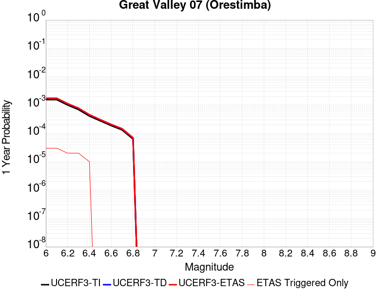 |  |

| Magnitude | 1 wk TI Prob | 1 wk TD Prob | 1 wk ETAS Prob | 1 wk ETAS/TD Gain | 1 wk ETAS Triggered Only | 1 mo TI Prob | 1 mo TD Prob | 1 mo ETAS Prob | 1 mo ETAS/TD Gain | 1 mo ETAS Triggered Only | 1 yr TI Prob | 1 yr TD Prob | 1 yr ETAS Prob | 1 yr ETAS/TD Gain | 1 yr ETAS Triggered Only | 10 yr TI Prob | 10 yr TD Prob | 10 yr ETAS Prob | 10 yr ETAS/TD Gain | 10 yr ETAS Triggered Only |
|-----|-----|-----|-----|-----|-----|-----|-----|-----|-----|-----|-----|-----|-----|-----|-----|-----|-----|-----|-----|-----|
| 6.0 | 2.9687902E-5 | 3.27575E-5 | 3.27575E-5 | 1.0 | 0.0 | 1.2722766E-4 | 1.4038214E-4 | 1.4038214E-4 | 1.0 | 0.0 | 0.0015478961 | 0.0017078844 | 0.0017078844 | 1.0 | 0.0 | 0.015371585 | 0.016955135 | 0.017023403 | 1.0040263 | 6.9444446E-5 |
| 6.1 | 2.9687902E-5 | 3.27575E-5 | 3.27575E-5 | 1.0 | 0.0 | 1.2722766E-4 | 1.4038214E-4 | 1.4038214E-4 | 1.0 | 0.0 | 0.0015478961 | 0.0017078844 | 0.0017078844 | 1.0 | 0.0 | 0.015371585 | 0.016955135 | 0.017023403 | 1.0040263 | 6.9444446E-5 |
| 6.2 | 1.9231524E-5 | 2.1159167E-5 | 2.1159167E-5 | 1.0 | 0.0 | 8.2418206E-5 | 9.067912E-5 | 9.067912E-5 | 1.0 | 0.0 | 0.0010029797 | 0.0011034822 | 0.0011034822 | 1.0 | 0.0 | 0.00998465 | 0.01098244 | 0.011051122 | 1.0062538 | 6.9444446E-5 |
| 6.3 | 1.324766E-5 | 1.4548534E-5 | 1.4548534E-5 | 1.0 | 0.0 | 5.6774446E-5 | 6.234942E-5 | 6.234942E-5 | 1.0 | 0.0 | 6.910097E-4 | 7.5884897E-4 | 7.5884897E-4 | 1.0 | 0.0 | 0.006888649 | 0.0075635235 | 0.0076324428 | 1.009112 | 6.9444446E-5 |
| 6.4 | 7.818645E-6 | 8.57284E-6 | 8.57284E-6 | 1.0 | 0.0 | 3.3508048E-5 | 3.6740246E-5 | 3.6740246E-5 | 1.0 | 0.0 | 4.078841E-4 | 4.4722404E-4 | 4.4722404E-4 | 1.0 | 0.0 | 0.004071363 | 0.0044635804 | 0.004532715 | 1.0154886 | 6.9444446E-5 |
| 6.5 | 5.3076565E-6 | 5.8178007E-6 | 5.8178007E-6 | 1.0 | 0.0 | 2.27469E-5 | 2.4933206E-5 | 2.4933206E-5 | 1.0 | 0.0 | 2.7690834E-4 | 3.035216E-4 | 3.035216E-4 | 1.0 | 0.0 | 0.0027656353 | 0.00303128 | 0.003100514 | 1.0228398 | 6.9444446E-5 |
| 6.6 | 3.6003578E-6 | 3.9484953E-6 | 3.9484953E-6 | 1.0 | 0.0 | 1.5430012E-5 | 1.6922022E-5 | 1.6922022E-5 | 1.0 | 0.0 | 1.8784421E-4 | 2.0600771E-4 | 2.0600771E-4 | 1.0 | 0.0 | 0.0018768552 | 0.0020583214 | 0.002127623 | 1.033669 | 6.9444446E-5 |
| 6.7 | 2.5361826E-6 | 2.7834678E-6 | 2.7834678E-6 | 1.0 | 0.0 | 1.0869308E-5 | 1.1929101E-5 | 1.1929101E-5 | 1.0 | 0.0 | 1.3232579E-4 | 1.4522845E-4 | 1.4522845E-4 | 1.0 | 0.0 | 0.0013224703 | 0.0014514653 | 0.0014514653 | 1.0 | 0.0 |
| 6.8 | 1.2115831E-6 | 1.3313797E-6 | 1.3313797E-6 | 1.0 | 0.0 | 5.1924885E-6 | 5.7059065E-6 | 5.7059065E-6 | 1.0 | 0.0 | 6.3216714E-5 | 6.9468166E-5 | 6.9468166E-5 | 1.0 | 0.0 | 6.3198735E-4 | 6.945596E-4 | 6.945596E-4 | 1.0 | 0.0 |

## Big Pine (East)
*[(top)](#table-of-contents)*

| 1 Week | 1 Month | 1 Year | 10 Year |
|-----|-----|-----|-----|
|  |  |  |  |

| Magnitude | 1 wk TI Prob | 1 wk TD Prob | 1 wk ETAS Prob | 1 wk ETAS/TD Gain | 1 wk ETAS Triggered Only | 1 mo TI Prob | 1 mo TD Prob | 1 mo ETAS Prob | 1 mo ETAS/TD Gain | 1 mo ETAS Triggered Only | 1 yr TI Prob | 1 yr TD Prob | 1 yr ETAS Prob | 1 yr ETAS/TD Gain | 1 yr ETAS Triggered Only | 10 yr TI Prob | 10 yr TD Prob | 10 yr ETAS Prob | 10 yr ETAS/TD Gain | 10 yr ETAS Triggered Only |
|-----|-----|-----|-----|-----|-----|-----|-----|-----|-----|-----|-----|-----|-----|-----|-----|-----|-----|-----|-----|-----|
| 6.0 | 9.916913E-6 | 1.2816984E-5 | 1.2816984E-5 | 1.0 | 0.0 | 4.250036E-5 | 5.49289E-5 | 5.49289E-5 | 1.0 | 0.0 | 5.173191E-4 | 6.685763E-4 | 6.685763E-4 | 1.0 | 0.0 | 0.0051611643 | 0.006670441 | 0.0068084034 | 1.0206827 | 1.3888889E-4 |
| 6.1 | 9.916913E-6 | 1.2816984E-5 | 1.2816984E-5 | 1.0 | 0.0 | 4.250036E-5 | 5.49289E-5 | 5.49289E-5 | 1.0 | 0.0 | 5.173191E-4 | 6.685763E-4 | 6.685763E-4 | 1.0 | 0.0 | 0.0051611643 | 0.006670441 | 0.0068084034 | 1.0206827 | 1.3888889E-4 |
| 6.2 | 9.916913E-6 | 1.2816984E-5 | 1.2816984E-5 | 1.0 | 0.0 | 4.250036E-5 | 5.49289E-5 | 5.49289E-5 | 1.0 | 0.0 | 5.173191E-4 | 6.685763E-4 | 6.685763E-4 | 1.0 | 0.0 | 0.0051611643 | 0.006670441 | 0.0068084034 | 1.0206827 | 1.3888889E-4 |
| 6.3 | 5.479711E-6 | 8.112951E-6 | 8.112951E-6 | 1.0 | 0.0 | 2.3484265E-5 | 3.4769346E-5 | 3.4769346E-5 | 1.0 | 0.0 | 2.858834E-4 | 4.2323777E-4 | 4.2323777E-4 | 1.0 | 0.0 | 0.0028551589 | 0.004227244 | 0.0042963945 | 1.0163584 | 6.9444446E-5 |
| 6.4 | 5.465009E-6 | 8.097245E-6 | 8.097245E-6 | 1.0 | 0.0 | 2.3421257E-5 | 3.4702036E-5 | 3.4702036E-5 | 1.0 | 0.0 | 2.851165E-4 | 4.2241855E-4 | 4.2241855E-4 | 1.0 | 0.0 | 0.0028475097 | 0.0042190826 | 0.0042882343 | 1.0163902 | 6.9444446E-5 |
| 6.5 | 4.826767E-6 | 7.422301E-6 | 7.422301E-6 | 1.0 | 0.0 | 2.068598E-5 | 3.180949E-5 | 3.180949E-5 | 1.0 | 0.0 | 2.518227E-4 | 3.872145E-4 | 3.872145E-4 | 1.0 | 0.0 | 0.0025153751 | 0.003868283 | 0.0039374586 | 1.0178828 | 6.9444446E-5 |
| 6.6 | 4.3146847E-6 | 6.8822374E-6 | 6.8822374E-6 | 1.0 | 0.0 | 1.8491375E-5 | 2.9494982E-5 | 2.9494982E-5 | 1.0 | 0.0 | 2.2510924E-4 | 3.590447E-4 | 3.590447E-4 | 1.0 | 0.0 | 0.0022488134 | 0.0035874986 | 0.0036566937 | 1.019288 | 6.9444446E-5 |
| 6.7 | 3.6968106E-6 | 5.9954727E-6 | 5.9954727E-6 | 1.0 | 0.0 | 1.5843378E-5 | 2.5694639E-5 | 2.5694639E-5 | 1.0 | 0.0 | 1.9287605E-4 | 3.1278885E-4 | 3.1278885E-4 | 1.0 | 0.0 | 0.0019270873 | 0.0031262483 | 0.0031954756 | 1.022144 | 6.9444446E-5 |
| 6.8 | 3.4671132E-6 | 5.702177E-6 | 5.702177E-6 | 1.0 | 0.0 | 1.4858972E-5 | 2.4437682E-5 | 2.4437682E-5 | 1.0 | 0.0 | 1.8089297E-4 | 2.974896E-4 | 2.974896E-4 | 1.0 | 0.0 | 0.0018074579 | 0.002973667 | 0.0030429051 | 1.0232837 | 6.9444446E-5 |
| 6.9 | 2.7686972E-6 | 4.825223E-6 | 4.825223E-6 | 1.0 | 0.0 | 1.1865792E-5 | 2.0679368E-5 | 2.0679368E-5 | 1.0 | 0.0 | 1.4445644E-4 | 2.5174298E-4 | 2.5174298E-4 | 1.0 | 0.0 | 0.0014436257 | 0.0025172636 | 0.0025865333 | 1.0275178 | 6.9444446E-5 |
| 7.0 | 2.1472624E-6 | 3.9850406E-6 | 3.9850406E-6 | 1.0 | 0.0 | 9.20252E-6 | 1.7078637E-5 | 1.7078637E-5 | 1.0 | 0.0 | 1.12034926E-4 | 2.079131E-4 | 2.079131E-4 | 1.0 | 0.0 | 0.0011197845 | 0.0020798394 | 0.0021491393 | 1.0333198 | 6.9444446E-5 |
| 7.1 | 1.7018335E-6 | 3.344876E-6 | 3.344876E-6 | 1.0 | 0.0 | 7.293552E-6 | 1.4335106E-5 | 1.4335106E-5 | 1.0 | 0.0 | 8.879537E-5 | 1.7451629E-4 | 1.7451629E-4 | 1.0 | 0.0 | 8.87599E-4 | 0.0017464145 | 0.0018157376 | 1.0396945 | 6.9444446E-5 |
| 7.2 | 1.25603E-6 | 2.794484E-6 | 2.794484E-6 | 1.0 | 0.0 | 5.3829745E-6 | 1.1976307E-5 | 1.1976307E-5 | 1.0 | 0.0 | 6.553574E-5 | 1.4580201E-4 | 1.4580201E-4 | 1.0 | 0.0 | 6.551642E-4 | 0.001459661 | 0.001459661 | 1.0 | 0.0 |
| 7.3 | 1.112297E-6 | 2.610332E-6 | 2.610332E-6 | 1.0 | 0.0 | 4.7669787E-6 | 1.118709E-5 | 1.118709E-5 | 1.0 | 0.0 | 5.803642E-5 | 1.3619453E-4 | 1.3619453E-4 | 1.0 | 0.0 | 5.802127E-4 | 0.0013635408 | 0.0013635408 | 1.0 | 0.0 |
| 7.4 | 1.0137181E-6 | 2.4834917E-6 | 2.4834917E-6 | 1.0 | 0.0 | 4.3444993E-6 | 1.0643494E-5 | 1.0643494E-5 | 1.0 | 0.0 | 5.2892992E-5 | 1.2957705E-4 | 1.2957705E-4 | 1.0 | 0.0 | 5.288041E-4 | 0.0012972289 | 0.0012972289 | 1.0 | 0.0 |
| 7.5 | 9.598608E-7 | 2.4071483E-6 | 2.4071483E-6 | 1.0 | 0.0 | 4.1136827E-6 | 1.031631E-5 | 1.031631E-5 | 1.0 | 0.0 | 5.0082934E-5 | 1.2559404E-4 | 1.2559404E-4 | 1.0 | 0.0 | 5.007165E-4 | 0.0012572526 | 0.0012572526 | 1.0 | 0.0 |
| 7.6 | 7.929459E-7 | 2.0448588E-6 | 2.0448588E-6 | 1.0 | 0.0 | 3.3983351E-6 | 8.763653E-6 | 8.763653E-6 | 1.0 | 0.0 | 4.1373947E-5 | 1.06692416E-4 | 1.06692416E-4 | 1.0 | 0.0 | 4.1366243E-4 | 0.0010685222 | 0.0010685222 | 1.0 | 0.0 |
| 7.7 | 4.155788E-7 | 1.1605589E-6 | 1.1605589E-6 | 1.0 | 0.0 | 1.7810507E-6 | 4.9738146E-6 | 4.9738146E-6 | 1.0 | 0.0 | 2.1684076E-5 | 6.0554554E-5 | 6.0554554E-5 | 1.0 | 0.0 | 2.1681961E-4 | 6.0857297E-4 | 6.0857297E-4 | 1.0 | 0.0 |
| 7.8 | 1.14666925E-7 | 2.592015E-7 | 2.592015E-7 | 1.0 | 0.0 | 4.914296E-7 | 1.1108631E-6 | 1.1108631E-6 | 1.0 | 0.0 | 5.9831386E-6 | 1.3524678E-5 | 1.3524678E-5 | 1.0 | 0.0 | 5.9829777E-5 | 1.3634123E-4 | 1.3634123E-4 | 1.0 | 0.0 |
| 7.9 | 2.9231824E-8 | 4.1463963E-8 | 4.1463963E-8 | 1.0 | 0.0 | 1.2527924E-7 | 1.7770269E-7 | 1.7770269E-7 | 1.0 | 0.0 | 1.5252737E-6 | 2.1635283E-6 | 2.1635283E-6 | 1.0 | 0.0 | 1.5252632E-5 | 2.1967755E-5 | 2.1967755E-5 | 1.0 | 0.0 |

## Cleghorn
*[(top)](#table-of-contents)*

| 1 Week | 1 Month | 1 Year | 10 Year |
|-----|-----|-----|-----|
|  |  |  |  |

| Magnitude | 1 wk TI Prob | 1 wk TD Prob | 1 wk ETAS Prob | 1 wk ETAS/TD Gain | 1 wk ETAS Triggered Only | 1 mo TI Prob | 1 mo TD Prob | 1 mo ETAS Prob | 1 mo ETAS/TD Gain | 1 mo ETAS Triggered Only | 1 yr TI Prob | 1 yr TD Prob | 1 yr ETAS Prob | 1 yr ETAS/TD Gain | 1 yr ETAS Triggered Only | 10 yr TI Prob | 10 yr TD Prob | 10 yr ETAS Prob | 10 yr ETAS/TD Gain | 10 yr ETAS Triggered Only |
|-----|-----|-----|-----|-----|-----|-----|-----|-----|-----|-----|-----|-----|-----|-----|-----|-----|-----|-----|-----|-----|
| 6.0 | 7.9267165E-6 | 9.831582E-6 | 9.831582E-6 | 1.0 | 0.0 | 3.39712E-5 | 4.2134732E-5 | 4.2134732E-5 | 1.0 | 0.0 | 4.1352084E-4 | 5.128803E-4 | 5.128803E-4 | 1.0 | 0.0 | 0.004127522 | 0.0051320773 | 0.0052702534 | 1.026924 | 1.3888889E-4 |
| 6.1 | 7.9267165E-6 | 9.831582E-6 | 9.831582E-6 | 1.0 | 0.0 | 3.39712E-5 | 4.2134732E-5 | 4.2134732E-5 | 1.0 | 0.0 | 4.1352084E-4 | 5.128803E-4 | 5.128803E-4 | 1.0 | 0.0 | 0.004127522 | 0.0051320773 | 0.0052702534 | 1.026924 | 1.3888889E-4 |
| 6.2 | 7.9267165E-6 | 9.831582E-6 | 9.831582E-6 | 1.0 | 0.0 | 3.39712E-5 | 4.2134732E-5 | 4.2134732E-5 | 1.0 | 0.0 | 4.1352084E-4 | 5.128803E-4 | 5.128803E-4 | 1.0 | 0.0 | 0.004127522 | 0.0051320773 | 0.0052702534 | 1.026924 | 1.3888889E-4 |
| 6.3 | 7.9267165E-6 | 9.831582E-6 | 9.831582E-6 | 1.0 | 0.0 | 3.39712E-5 | 4.2134732E-5 | 4.2134732E-5 | 1.0 | 0.0 | 4.1352084E-4 | 5.128803E-4 | 5.128803E-4 | 1.0 | 0.0 | 0.004127522 | 0.0051320773 | 0.0052702534 | 1.026924 | 1.3888889E-4 |
| 6.4 | 4.3445207E-6 | 6.0914435E-6 | 6.0914435E-6 | 1.0 | 0.0 | 1.8619241E-5 | 2.610593E-5 | 2.610593E-5 | 1.0 | 0.0 | 2.2666567E-4 | 3.1779436E-4 | 3.1779436E-4 | 1.0 | 0.0 | 0.0022643462 | 0.0031875873 | 0.0033260335 | 1.043433 | 1.3888889E-4 |
| 6.5 | 4.3445207E-6 | 6.0914435E-6 | 6.0914435E-6 | 1.0 | 0.0 | 1.8619241E-5 | 2.610593E-5 | 2.610593E-5 | 1.0 | 0.0 | 2.2666567E-4 | 3.1779436E-4 | 3.1779436E-4 | 1.0 | 0.0 | 0.0022643462 | 0.0031875873 | 0.0033260335 | 1.043433 | 1.3888889E-4 |
| 6.6 | 4.040109E-6 | 5.773851E-6 | 5.773851E-6 | 1.0 | 0.0 | 1.7314638E-5 | 2.4744846E-5 | 2.4744846E-5 | 1.0 | 0.0 | 2.1078532E-4 | 3.012278E-4 | 3.012278E-4 | 1.0 | 0.0 | 0.002105855 | 0.003022377 | 0.0031608462 | 1.0458146 | 1.3888889E-4 |
| 6.7 | 3.3632055E-6 | 5.067348E-6 | 5.067348E-6 | 1.0 | 0.0 | 1.4413658E-5 | 2.1717027E-5 | 2.1717027E-5 | 1.0 | 0.0 | 1.7547216E-4 | 2.6437303E-4 | 2.6437303E-4 | 1.0 | 0.0 | 0.0017533366 | 0.0026547113 | 0.0027932313 | 1.052179 | 1.3888889E-4 |
| 6.8 | 3.2902772E-6 | 4.9892556E-6 | 4.9892556E-6 | 1.0 | 0.0 | 1.4101111E-5 | 2.1382351E-5 | 2.1382351E-5 | 1.0 | 0.0 | 1.716675E-4 | 2.6029933E-4 | 2.6029933E-4 | 1.0 | 0.0 | 0.0017153495 | 0.0026140702 | 0.002752596 | 1.0529923 | 1.3888889E-4 |
| 6.9 | 3.031547E-6 | 4.6910186E-6 | 4.6910186E-6 | 1.0 | 0.0 | 1.299228E-5 | 2.0104211E-5 | 2.0104211E-5 | 1.0 | 0.0 | 1.5816953E-4 | 2.4474156E-4 | 2.4474156E-4 | 1.0 | 0.0 | 0.00158057 | 0.0024588439 | 0.0025973911 | 1.0563465 | 1.3888889E-4 |
| 7.0 | 2.8259715E-6 | 4.3705895E-6 | 4.3705895E-6 | 1.0 | 0.0 | 1.211125E-5 | 1.8730963E-5 | 1.8730963E-5 | 1.0 | 0.0 | 1.4744449E-4 | 2.2802586E-4 | 2.2802586E-4 | 1.0 | 0.0 | 0.001473467 | 0.0022920412 | 0.0024306118 | 1.0604572 | 1.3888889E-4 |
| 7.1 | 2.5962665E-6 | 4.0658106E-6 | 4.0658106E-6 | 1.0 | 0.0 | 1.1126809E-5 | 1.7424789E-5 | 1.7424789E-5 | 1.0 | 0.0 | 1.3546048E-4 | 2.1212637E-4 | 2.1212637E-4 | 1.0 | 0.0 | 0.0013537793 | 0.002133366 | 0.0022026622 | 1.0324821 | 6.9444446E-5 |
| 7.2 | 2.3247253E-6 | 3.6763672E-6 | 3.6763672E-6 | 1.0 | 0.0 | 9.96307E-6 | 1.5755764E-5 | 1.5755764E-5 | 1.0 | 0.0 | 1.21293626E-4 | 1.9180974E-4 | 1.9180974E-4 | 1.0 | 0.0 | 0.0012122744 | 0.0019305905 | 0.001999901 | 1.0359011 | 6.9444446E-5 |
| 7.3 | 2.056928E-6 | 3.2350938E-6 | 3.2350938E-6 | 1.0 | 0.0 | 8.815376E-6 | 1.3864615E-5 | 1.3864615E-5 | 1.0 | 0.0 | 1.0732192E-4 | 1.6878877E-4 | 1.6878877E-4 | 1.0 | 0.0 | 0.001072701 | 0.0017008206 | 0.001770147 | 1.0407605 | 6.9444446E-5 |
| 7.4 | 1.8055999E-6 | 2.8255042E-6 | 2.8255042E-6 | 1.0 | 0.0 | 7.738263E-6 | 1.2109249E-5 | 1.2109249E-5 | 1.0 | 0.0 | 9.4209274E-5 | 1.4742027E-4 | 1.4742027E-4 | 1.0 | 0.0 | 9.4169343E-4 | 0.0014875771 | 0.0014875771 | 1.0 | 0.0 |
| 7.5 | 1.4683443E-6 | 2.4247483E-6 | 2.4247483E-6 | 1.0 | 0.0 | 6.292889E-6 | 1.0391738E-5 | 1.0391738E-5 | 1.0 | 0.0 | 7.661323E-5 | 1.2651215E-4 | 1.2651215E-4 | 1.0 | 0.0 | 7.658682E-4 | 0.0012787961 | 0.0012787961 | 1.0 | 0.0 |
| 7.6 | 9.804088E-7 | 1.900266E-6 | 1.900266E-6 | 1.0 | 0.0 | 4.201745E-6 | 8.143972E-6 | 8.143972E-6 | 1.0 | 0.0 | 5.1155046E-5 | 9.91484E-5 | 9.91484E-5 | 1.0 | 0.0 | 5.114327E-4 | 0.001005471 | 0.001005471 | 1.0 | 0.0 |
| 7.7 | 7.3434086E-7 | 1.6284146E-6 | 1.6284146E-6 | 1.0 | 0.0 | 3.1471714E-6 | 6.978901E-6 | 6.978901E-6 | 1.0 | 0.0 | 3.831614E-5 | 8.4964835E-5 | 8.4964835E-5 | 1.0 | 0.0 | 3.8309532E-4 | 8.6378685E-4 | 8.6378685E-4 | 1.0 | 0.0 |
| 7.8 | 6.434184E-7 | 1.5220047E-6 | 1.5220047E-6 | 1.0 | 0.0 | 2.7575045E-6 | 6.5228614E-6 | 6.5228614E-6 | 1.0 | 0.0 | 3.35721E-5 | 7.941297E-5 | 7.941297E-5 | 1.0 | 0.0 | 3.3567028E-4 | 8.079678E-4 | 8.079678E-4 | 1.0 | 0.0 |
| 7.9 | 3.4943926E-7 | 7.574459E-7 | 7.574459E-7 | 1.0 | 0.0 | 1.497596E-6 | 3.2461926E-6 | 3.2461926E-6 | 1.0 | 0.0 | 1.8233079E-5 | 3.952169E-5 | 3.952169E-5 | 1.0 | 0.0 | 1.8231584E-4 | 4.040099E-4 | 4.040099E-4 | 1.0 | 0.0 |
| 8.0 | 6.717524E-8 | 5.838828E-8 | 5.838828E-8 | 1.0 | 0.0 | 2.8789387E-7 | 2.5023547E-7 | 2.5023547E-7 | 1.0 | 0.0 | 3.505102E-6 | 3.0466126E-6 | 3.0466126E-6 | 1.0 | 0.0 | 3.5050467E-5 | 3.273506E-5 | 3.273506E-5 | 1.0 | 0.0 |
| 8.1 | 3.1984914E-8 | 1.2956093E-8 | 1.2956093E-8 | 1.0 | 0.0 | 1.370782E-7 | 5.552611E-8 | 5.552611E-8 | 1.0 | 0.0 | 1.6689258E-6 | 6.760302E-7 | 6.760302E-7 | 1.0 | 0.0 | 1.6689133E-5 | 7.74454E-6 | 7.74454E-6 | 1.0 | 0.0 |
| 8.2 | 1.21887656E-8 | 3.6495305E-9 | 3.6495305E-9 | 1.0 | 0.0 | 5.2237567E-8 | 1.5640845E-8 | 1.5640845E-8 | 1.0 | 0.0 | 6.359922E-7 | 1.9042727E-7 | 1.9042727E-7 | 1.0 | 0.0 | 6.3599036E-6 | 2.2470974E-6 | 2.2470974E-6 | 1.0 | 0.0 |

## Elysian Park (Upper)
*[(top)](#table-of-contents)*

| 1 Week | 1 Month | 1 Year | 10 Year |
|-----|-----|-----|-----|
|  |  |  |  |

| Magnitude | 1 wk TI Prob | 1 wk TD Prob | 1 wk ETAS Prob | 1 wk ETAS/TD Gain | 1 wk ETAS Triggered Only | 1 mo TI Prob | 1 mo TD Prob | 1 mo ETAS Prob | 1 mo ETAS/TD Gain | 1 mo ETAS Triggered Only | 1 yr TI Prob | 1 yr TD Prob | 1 yr ETAS Prob | 1 yr ETAS/TD Gain | 1 yr ETAS Triggered Only | 10 yr TI Prob | 10 yr TD Prob | 10 yr ETAS Prob | 10 yr ETAS/TD Gain | 10 yr ETAS Triggered Only |
|-----|-----|-----|-----|-----|-----|-----|-----|-----|-----|-----|-----|-----|-----|-----|-----|-----|-----|-----|-----|-----|
| 6.0 | 3.1876025E-5 | 3.7035516E-5 | 1.0647739E-4 | 2.8750076 | 6.9444446E-5 | 1.3660437E-4 | 1.587167E-4 | 2.2815014E-4 | 1.4374676 | 6.9444446E-5 | 0.0016618895 | 0.0019311075 | 0.0020697282 | 1.071783 | 1.3888889E-4 | 0.016495159 | 0.019189782 | 0.019326007 | 1.0070988 | 1.3888889E-4 |
| 6.1 | 3.1876025E-5 | 3.7035516E-5 | 1.0647739E-4 | 2.8750076 | 6.9444446E-5 | 1.3660437E-4 | 1.587167E-4 | 2.2815014E-4 | 1.4374676 | 6.9444446E-5 | 0.0016618895 | 0.0019311075 | 0.0020697282 | 1.071783 | 1.3888889E-4 | 0.016495159 | 0.019189782 | 0.019326007 | 1.0070988 | 1.3888889E-4 |
| 6.2 | 3.1876025E-5 | 3.7035516E-5 | 1.0647739E-4 | 2.8750076 | 6.9444446E-5 | 1.3660437E-4 | 1.587167E-4 | 2.2815014E-4 | 1.4374676 | 6.9444446E-5 | 0.0016618895 | 0.0019311075 | 0.0020697282 | 1.071783 | 1.3888889E-4 | 0.016495159 | 0.019189782 | 0.019326007 | 1.0070988 | 1.3888889E-4 |
| 6.3 | 3.1876025E-5 | 3.7035516E-5 | 1.0647739E-4 | 2.8750076 | 6.9444446E-5 | 1.3660437E-4 | 1.587167E-4 | 2.2815014E-4 | 1.4374676 | 6.9444446E-5 | 0.0016618895 | 0.0019311075 | 0.0020697282 | 1.071783 | 1.3888889E-4 | 0.016495159 | 0.019189782 | 0.019326007 | 1.0070988 | 1.3888889E-4 |
| 6.4 | 1.9273462E-5 | 2.1202266E-5 | 2.1202266E-5 | 1.0 | 0.0 | 8.259794E-5 | 9.086466E-5 | 9.086466E-5 | 1.0 | 0.0 | 0.001005166 | 0.0011058892 | 0.0011058892 | 1.0 | 0.0 | 0.010006315 | 0.011020724 | 0.011020724 | 1.0 | 0.0 |
| 6.5 | 1.9273462E-5 | 2.1202266E-5 | 2.1202266E-5 | 1.0 | 0.0 | 8.259794E-5 | 9.086466E-5 | 9.086466E-5 | 1.0 | 0.0 | 0.001005166 | 0.0011058892 | 0.0011058892 | 1.0 | 0.0 | 0.010006315 | 0.011020724 | 0.011020724 | 1.0 | 0.0 |
| 6.6 | 9.813258E-6 | 9.665599E-6 | 9.665599E-6 | 1.0 | 0.0 | 4.205614E-5 | 4.1423376E-5 | 4.1423376E-5 | 1.0 | 0.0 | 5.119132E-4 | 5.0422014E-4 | 5.0422014E-4 | 1.0 | 0.0 | 0.005107356 | 0.0050314846 | 0.0050314846 | 1.0 | 0.0 |
| 6.7 | 9.801478E-6 | 9.653168E-6 | 9.653168E-6 | 1.0 | 0.0 | 4.2005657E-5 | 4.1370105E-5 | 4.1370105E-5 | 1.0 | 0.0 | 5.112989E-4 | 5.035719E-4 | 5.035719E-4 | 1.0 | 0.0 | 0.0051012407 | 0.0050250315 | 0.0050250315 | 1.0 | 0.0 |
| 6.8 | 8.102489E-6 | 7.773004E-6 | 7.773004E-6 | 1.0 | 0.0 | 3.4724493E-5 | 3.3312477E-5 | 3.3312477E-5 | 1.0 | 0.0 | 4.2268867E-4 | 4.055089E-4 | 4.055089E-4 | 1.0 | 0.0 | 0.004218856 | 0.0040481836 | 0.0040481836 | 1.0 | 0.0 |
| 6.9 | 6.08275E-6 | 5.4814514E-6 | 5.4814514E-6 | 1.0 | 0.0 | 2.6068668E-5 | 2.3491726E-5 | 2.3491726E-5 | 1.0 | 0.0 | 3.173398E-4 | 2.85975E-4 | 2.85975E-4 | 1.0 | 0.0 | 0.0031688702 | 0.0028561477 | 0.0028561477 | 1.0 | 0.0 |
| 7.0 | 5.5995934E-6 | 4.98278E-6 | 4.98278E-6 | 1.0 | 0.0 | 2.3998036E-5 | 2.13546E-5 | 2.13546E-5 | 1.0 | 0.0 | 2.9213692E-4 | 2.599619E-4 | 2.599619E-4 | 1.0 | 0.0 | 0.0029175316 | 0.0025966454 | 0.0025966454 | 1.0 | 0.0 |
| 7.1 | 4.709881E-6 | 4.0874015E-6 | 4.0874015E-6 | 1.0 | 0.0 | 2.0185047E-5 | 1.7517319E-5 | 1.7517319E-5 | 1.0 | 0.0 | 2.4572524E-4 | 2.132529E-4 | 2.132529E-4 | 1.0 | 0.0 | 0.002454537 | 0.002130524 | 0.002130524 | 1.0 | 0.0 |
| 7.2 | 3.6063436E-6 | 2.9779544E-6 | 2.9779544E-6 | 1.0 | 0.0 | 1.5455667E-5 | 1.27626E-5 | 1.27626E-5 | 1.0 | 0.0 | 1.881565E-4 | 1.5537368E-4 | 1.5537368E-4 | 1.0 | 0.0 | 0.0018799726 | 0.0015526618 | 0.0015526618 | 1.0 | 0.0 |
| 7.3 | 2.471135E-6 | 2.0954615E-6 | 2.0954615E-6 | 1.0 | 0.0 | 1.0590536E-5 | 8.980519E-6 | 8.980519E-6 | 1.0 | 0.0 | 1.2893214E-4 | 1.093324E-4 | 1.093324E-4 | 1.0 | 0.0 | 0.0012885736 | 0.0010927934 | 0.0010927934 | 1.0 | 0.0 |
| 7.4 | 1.163943E-6 | 1.0275091E-6 | 1.0275091E-6 | 1.0 | 0.0 | 4.988318E-6 | 4.4036033E-6 | 4.4036033E-6 | 1.0 | 0.0 | 6.0731076E-5 | 5.3612584E-5 | 5.3612584E-5 | 1.0 | 0.0 | 6.071448E-4 | 5.359995E-4 | 5.359995E-4 | 1.0 | 0.0 |
| 7.5 | 4.99459E-7 | 4.917604E-7 | 4.917604E-7 | 1.0 | 0.0 | 2.140537E-6 | 2.1075427E-6 | 2.1075427E-6 | 1.0 | 0.0 | 2.6060725E-5 | 2.5659048E-5 | 2.5659048E-5 | 1.0 | 0.0 | 2.605767E-4 | 2.5656243E-4 | 2.5656243E-4 | 1.0 | 0.0 |
| 7.6 | 2.4667852E-7 | 2.4778336E-7 | 2.4778336E-7 | 1.0 | 0.0 | 1.0571932E-6 | 1.0619283E-6 | 1.0619283E-6 | 1.0 | 0.0 | 1.2871251E-5 | 1.2928905E-5 | 1.2928905E-5 | 1.0 | 0.0 | 1.2870505E-4 | 1.2928189E-4 | 1.2928189E-4 | 1.0 | 0.0 |
| 7.7 | 8.2312795E-8 | 7.3864456E-8 | 7.3864456E-8 | 1.0 | 0.0 | 3.527691E-7 | 3.165619E-7 | 3.165619E-7 | 1.0 | 0.0 | 4.294955E-6 | 3.8541357E-6 | 3.8541357E-6 | 1.0 | 0.0 | 4.2948723E-5 | 3.8540802E-5 | 3.8540802E-5 | 1.0 | 0.0 |
| 7.8 | 2.7819295E-8 | 1.7566023E-8 | 1.7566023E-8 | 1.0 | 0.0 | 1.1922555E-7 | 7.5282955E-8 | 7.5282955E-8 | 1.0 | 0.0 | 1.45157E-6 | 9.165697E-7 | 9.165697E-7 | 1.0 | 0.0 | 1.45156055E-5 | 9.165675E-6 | 9.165675E-6 | 1.0 | 0.0 |

## Kern Canyon (South Kern) 2011
*[(top)](#table-of-contents)*

| 1 Week | 1 Month | 1 Year | 10 Year |
|-----|-----|-----|-----|
|  |  |  |  |

| Magnitude | 1 wk TI Prob | 1 wk TD Prob | 1 wk ETAS Prob | 1 wk ETAS/TD Gain | 1 wk ETAS Triggered Only | 1 mo TI Prob | 1 mo TD Prob | 1 mo ETAS Prob | 1 mo ETAS/TD Gain | 1 mo ETAS Triggered Only | 1 yr TI Prob | 1 yr TD Prob | 1 yr ETAS Prob | 1 yr ETAS/TD Gain | 1 yr ETAS Triggered Only | 10 yr TI Prob | 10 yr TD Prob | 10 yr ETAS Prob | 10 yr ETAS/TD Gain | 10 yr ETAS Triggered Only |
|-----|-----|-----|-----|-----|-----|-----|-----|-----|-----|-----|-----|-----|-----|-----|-----|-----|-----|-----|-----|-----|
| 6.0 | 4.105075E-6 | 4.1137264E-6 | 7.355789E-5 | 17.881083 | 6.9444446E-5 | 1.7593058E-5 | 1.763014E-5 | 8.7073364E-5 | 4.938892 | 6.9444446E-5 | 2.1417443E-4 | 2.1462646E-4 | 3.5348555E-4 | 1.6469803 | 1.3888889E-4 | 0.0021396813 | 0.0021442557 | 0.0022828467 | 1.0646336 | 1.3888889E-4 |
| 6.1 | 4.105075E-6 | 4.1137264E-6 | 7.355789E-5 | 17.881083 | 6.9444446E-5 | 1.7593058E-5 | 1.763014E-5 | 8.7073364E-5 | 4.938892 | 6.9444446E-5 | 2.1417443E-4 | 2.1462646E-4 | 3.5348555E-4 | 1.6469803 | 1.3888889E-4 | 0.0021396813 | 0.0021442557 | 0.0022828467 | 1.0646336 | 1.3888889E-4 |
| 6.2 | 4.105075E-6 | 4.1137264E-6 | 7.355789E-5 | 17.881083 | 6.9444446E-5 | 1.7593058E-5 | 1.763014E-5 | 8.7073364E-5 | 4.938892 | 6.9444446E-5 | 2.1417443E-4 | 2.1462646E-4 | 3.5348555E-4 | 1.6469803 | 1.3888889E-4 | 0.0021396813 | 0.0021442557 | 0.0022828467 | 1.0646336 | 1.3888889E-4 |
| 6.3 | 4.105075E-6 | 4.1137264E-6 | 7.355789E-5 | 17.881083 | 6.9444446E-5 | 1.7593058E-5 | 1.763014E-5 | 8.7073364E-5 | 4.938892 | 6.9444446E-5 | 2.1417443E-4 | 2.1462646E-4 | 3.5348555E-4 | 1.6469803 | 1.3888889E-4 | 0.0021396813 | 0.0021442557 | 0.0022828467 | 1.0646336 | 1.3888889E-4 |
| 6.4 | 4.105075E-6 | 4.1137264E-6 | 7.355789E-5 | 17.881083 | 6.9444446E-5 | 1.7593058E-5 | 1.763014E-5 | 8.7073364E-5 | 4.938892 | 6.9444446E-5 | 2.1417443E-4 | 2.1462646E-4 | 3.5348555E-4 | 1.6469803 | 1.3888889E-4 | 0.0021396813 | 0.0021442557 | 0.0022828467 | 1.0646336 | 1.3888889E-4 |
| 6.5 | 2.9849807E-6 | 2.9731548E-6 | 7.2417395E-5 | 24.357088 | 6.9444446E-5 | 1.2792712E-5 | 1.274203E-5 | 8.218559E-5 | 6.44996 | 6.9444446E-5 | 1.5574014E-4 | 1.5512333E-4 | 2.2455699E-4 | 1.447603 | 6.9444446E-5 | 0.0015563103 | 0.0015501656 | 0.0016195024 | 1.0447286 | 6.9444446E-5 |
| 6.6 | 2.9849807E-6 | 2.9731548E-6 | 7.2417395E-5 | 24.357088 | 6.9444446E-5 | 1.2792712E-5 | 1.274203E-5 | 8.218559E-5 | 6.44996 | 6.9444446E-5 | 1.5574014E-4 | 1.5512333E-4 | 2.2455699E-4 | 1.447603 | 6.9444446E-5 | 0.0015563103 | 0.0015501656 | 0.0016195024 | 1.0447286 | 6.9444446E-5 |
| 6.7 | 2.6756725E-6 | 2.6582206E-6 | 7.210248E-5 | 27.124338 | 6.9444446E-5 | 1.1467117E-5 | 1.1392325E-5 | 8.083598E-5 | 7.095652 | 6.9444446E-5 | 1.396032E-4 | 1.3869285E-4 | 2.0812766E-4 | 1.5006373 | 6.9444446E-5 | 0.0013951553 | 0.0013860738 | 0.001455422 | 1.0500321 | 6.9444446E-5 |
| 6.8 | 2.3283721E-6 | 2.3047787E-6 | 7.174906E-5 | 31.130564 | 6.9444446E-5 | 9.9787E-6 | 9.877586E-6 | 7.932135E-5 | 8.030437 | 6.9444446E-5 | 1.214839E-4 | 1.20253055E-4 | 1.8968915E-4 | 1.5774164 | 6.9444446E-5 | 0.001214175 | 0.0012018873 | 0.0012712482 | 1.05771 | 6.9444446E-5 |
| 6.9 | 2.0972677E-6 | 2.0696411E-6 | 7.151394E-5 | 34.553787 | 6.9444446E-5 | 8.988259E-6 | 8.869861E-6 | 7.8313686E-5 | 8.82919 | 6.9444446E-5 | 1.0942656E-4 | 1.0798526E-4 | 1.774222E-4 | 1.6430224 | 6.9444446E-5 | 0.0010937268 | 0.0010793337 | 0.0011487032 | 1.0642706 | 6.9444446E-5 |
| 7.0 | 1.7132242E-6 | 1.6787036E-6 | 7.112303E-5 | 42.367832 | 6.9444446E-5 | 7.3423685E-6 | 7.194424E-6 | 7.663837E-5 | 10.652468 | 6.9444446E-5 | 8.938967E-5 | 8.758863E-5 | 1.57027E-4 | 1.7927783 | 6.9444446E-5 | 8.935372E-4 | 8.7554497E-4 | 9.449286E-4 | 1.0792463 | 6.9444446E-5 |
| 7.1 | 1.4215541E-6 | 1.3815752E-6 | 7.0825925E-5 | 51.264618 | 6.9444446E-5 | 6.0923603E-6 | 5.9210233E-6 | 7.536506E-5 | 12.728384 | 6.9444446E-5 | 7.417196E-5 | 7.20861E-5 | 1.4152554E-4 | 1.9632847 | 6.9444446E-5 | 7.414721E-4 | 7.206299E-4 | 7.900243E-4 | 1.0962969 | 6.9444446E-5 |
| 7.2 | 9.097853E-7 | 8.6037755E-7 | 7.030476E-5 | 81.71385 | 6.9444446E-5 | 3.899074E-6 | 3.6873273E-6 | 7.3131516E-5 | 19.833204 | 6.9444446E-5 | 4.7470192E-5 | 4.4892295E-5 | 1.1433362E-4 | 2.5468428 | 6.9444446E-5 | 4.7460053E-4 | 4.4883334E-4 | 5.182466E-4 | 1.1546527 | 6.9444446E-5 |
| 7.3 | 6.144169E-7 | 5.628206E-7 | 7.000723E-5 | 124.38639 | 6.9444446E-5 | 2.6332125E-6 | 2.4120861E-6 | 7.185636E-5 | 29.79013 | 6.9444446E-5 | 3.205889E-5 | 2.9366758E-5 | 9.880916E-5 | 3.3646603 | 6.9444446E-5 | 3.2054266E-4 | 2.936293E-4 | 3.6305335E-4 | 1.2364343 | 6.9444446E-5 |
| 7.4 | 4.049844E-7 | 3.5728314E-7 | 6.98017E-5 | 195.36803 | 6.9444446E-5 | 1.7356463E-6 | 1.5312125E-6 | 7.097555E-5 | 46.352512 | 6.9444446E-5 | 2.1131287E-5 | 1.8642357E-5 | 8.808551E-5 | 4.72502 | 6.9444446E-5 | 2.1129279E-4 | 1.8640817E-4 | 2.5583967E-4 | 1.3724703 | 6.9444446E-5 |
| 7.5 | 1.9871162E-7 | 1.583044E-7 | 1.583044E-7 | 1.0 | 0.0 | 8.5162094E-7 | 6.7844724E-7 | 6.7844724E-7 | 1.0 | 0.0 | 1.0368436E-5 | 8.260065E-6 | 8.260065E-6 | 1.0 | 0.0 | 1.0367952E-4 | 8.259767E-5 | 8.259767E-5 | 1.0 | 0.0 |
| 7.6 | 2.572245E-8 | 1.7352555E-8 | 1.7352555E-8 | 1.0 | 0.0 | 1.10239064E-7 | 7.436809E-8 | 7.436809E-8 | 1.0 | 0.0 | 1.3421597E-6 | 9.054312E-7 | 9.054312E-7 | 1.0 | 0.0 | 1.3421517E-5 | 9.05428E-6 | 9.05428E-6 | 1.0 | 0.0 |

## Owens Valley
*[(top)](#table-of-contents)*

| 1 Week | 1 Month | 1 Year | 10 Year |
|-----|-----|-----|-----|
|  | 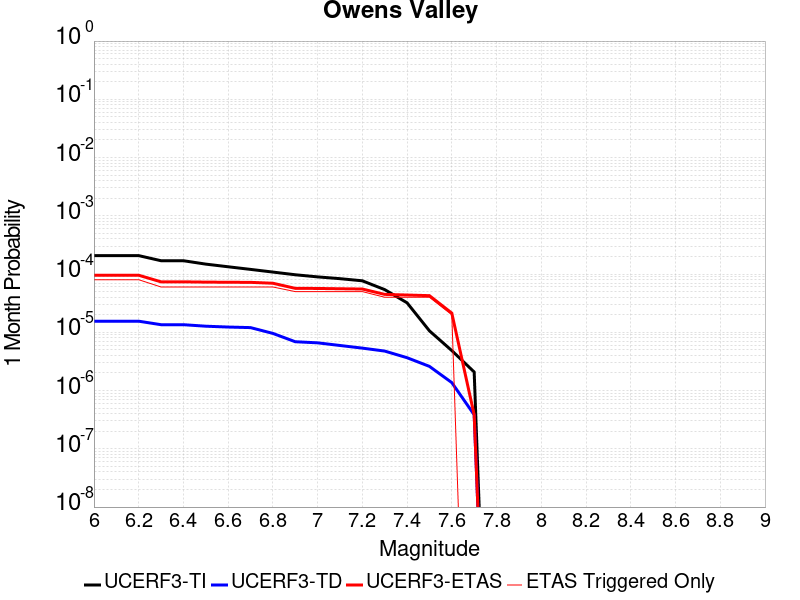 |  |  |

| Magnitude | 1 wk TI Prob | 1 wk TD Prob | 1 wk ETAS Prob | 1 wk ETAS/TD Gain | 1 wk ETAS Triggered Only | 1 mo TI Prob | 1 mo TD Prob | 1 mo ETAS Prob | 1 mo ETAS/TD Gain | 1 mo ETAS Triggered Only | 1 yr TI Prob | 1 yr TD Prob | 1 yr ETAS Prob | 1 yr ETAS/TD Gain | 1 yr ETAS Triggered Only | 10 yr TI Prob | 10 yr TD Prob | 10 yr ETAS Prob | 10 yr ETAS/TD Gain | 10 yr ETAS Triggered Only |
|-----|-----|-----|-----|-----|-----|-----|-----|-----|-----|-----|-----|-----|-----|-----|-----|-----|-----|-----|-----|-----|
| 6.0 | 4.83821E-5 | 3.626567E-6 | 7.307076E-5 | 20.14874 | 6.9444446E-5 | 2.0733538E-4 | 1.5542342E-5 | 8.498571E-5 | 5.4680114 | 6.9444446E-5 | 0.002521386 | 1.8921259E-4 | 3.280752E-4 | 1.7338973 | 1.3888889E-4 | 0.024929691 | 0.001925011 | 0.0020636325 | 1.0720108 | 1.3888889E-4 |
| 6.1 | 4.83821E-5 | 3.626567E-6 | 7.307076E-5 | 20.14874 | 6.9444446E-5 | 2.0733538E-4 | 1.5542342E-5 | 8.498571E-5 | 5.4680114 | 6.9444446E-5 | 0.002521386 | 1.8921259E-4 | 3.280752E-4 | 1.7338973 | 1.3888889E-4 | 0.024929691 | 0.001925011 | 0.0020636325 | 1.0720108 | 1.3888889E-4 |
| 6.2 | 4.83821E-5 | 3.626567E-6 | 7.307076E-5 | 20.14874 | 6.9444446E-5 | 2.0733538E-4 | 1.5542342E-5 | 8.498571E-5 | 5.4680114 | 6.9444446E-5 | 0.002521386 | 1.8921259E-4 | 3.280752E-4 | 1.7338973 | 1.3888889E-4 | 0.024929691 | 0.001925011 | 0.0020636325 | 1.0720108 | 1.3888889E-4 |
| 6.3 | 3.953008E-5 | 3.1553948E-6 | 7.259962E-5 | 23.008093 | 6.9444446E-5 | 1.6940363E-4 | 1.3523055E-5 | 8.296656E-5 | 6.135194 | 6.9444446E-5 | 0.002060538 | 1.6463149E-4 | 3.034975E-4 | 1.8434961 | 1.3888889E-4 | 0.020415364 | 0.0016592 | 0.0017978584 | 1.0835694 | 1.3888889E-4 |
| 6.4 | 3.953008E-5 | 3.1553948E-6 | 7.259962E-5 | 23.008093 | 6.9444446E-5 | 1.6940363E-4 | 1.3523055E-5 | 8.296656E-5 | 6.135194 | 6.9444446E-5 | 0.002060538 | 1.6463149E-4 | 3.034975E-4 | 1.8434961 | 1.3888889E-4 | 0.020415364 | 0.0016592 | 0.0017978584 | 1.0835694 | 1.3888889E-4 |
| 6.5 | 3.457342E-5 | 2.9715961E-6 | 7.241583E-5 | 24.369339 | 6.9444446E-5 | 1.4816338E-4 | 1.2735354E-5 | 8.2178914E-5 | 6.4528174 | 6.9444446E-5 | 0.0018023965 | 1.550426E-4 | 2.9390995E-4 | 1.8956722 | 1.3888889E-4 | 0.017878477 | 0.001555719 | 0.0016943917 | 1.0891374 | 1.3888889E-4 |
| 6.6 | 3.1127765E-5 | 2.8744932E-6 | 7.231874E-5 | 25.158777 | 6.9444446E-5 | 1.3339789E-4 | 1.2319203E-5 | 8.1762795E-5 | 6.6370196 | 6.9444446E-5 | 0.0016229092 | 1.4997667E-4 | 2.8884472E-4 | 1.9259311 | 1.3888889E-4 | 0.016111081 | 0.0015012559 | 0.0016399362 | 1.0923762 | 1.3888889E-4 |
| 6.7 | 2.806885E-5 | 2.8104134E-6 | 7.225466E-5 | 25.709621 | 6.9444446E-5 | 1.2028952E-4 | 1.20445775E-5 | 8.1488186E-5 | 6.7655497 | 6.9444446E-5 | 0.001463541 | 1.4663354E-4 | 2.8550206E-4 | 1.9470447 | 1.3888889E-4 | 0.014539397 | 0.0014657511 | 0.0016044364 | 1.0946172 | 1.3888889E-4 |
| 6.8 | 2.524524E-5 | 2.2353688E-6 | 7.167966E-5 | 32.066147 | 6.9444446E-5 | 1.0818939E-4 | 9.580118E-6 | 7.90239E-5 | 8.248739 | 6.9444446E-5 | 0.0013164099 | 1.16632E-4 | 2.5550468E-4 | 2.1906912 | 1.3888889E-4 | 0.01308639 | 0.0011659812 | 0.0013047081 | 1.1189787 | 1.3888889E-4 |
| 6.9 | 2.2704568E-5 | 1.6081682E-6 | 1.6081682E-6 | 1.0 | 0.0 | 9.730166E-5 | 6.8921313E-6 | 6.8921313E-6 | 1.0 | 0.0 | 0.0011840039 | 8.390849E-5 | 1.5334711E-4 | 1.8275517 | 6.9444446E-5 | 0.011777153 | 8.3897985E-4 | 9.08366E-4 | 1.082703 | 6.9444446E-5 |
| 7.0 | 2.0871712E-5 | 1.5395453E-6 | 1.5395453E-6 | 1.0 | 0.0 | 8.944713E-5 | 6.598035E-6 | 6.598035E-6 | 1.0 | 0.0 | 0.0010884746 | 8.032813E-5 | 1.4976699E-4 | 1.8644402 | 6.9444446E-5 | 0.010831586 | 8.0316263E-4 | 8.725513E-4 | 1.0863943 | 6.9444446E-5 |
| 7.1 | 1.944928E-5 | 1.3864178E-6 | 1.3864178E-6 | 1.0 | 0.0 | 8.335139E-5 | 5.941777E-6 | 5.941777E-6 | 1.0 | 0.0 | 0.0010143308 | 7.233874E-5 | 1.4177816E-4 | 1.9599202 | 6.9444446E-5 | 0.010097133 | 7.2330976E-4 | 7.9270394E-4 | 1.0959399 | 6.9444446E-5 |
| 7.2 | 1.7876306E-5 | 1.2489141E-6 | 1.2489141E-6 | 1.0 | 0.0 | 7.6610486E-5 | 5.352478E-6 | 5.352478E-6 | 1.0 | 0.0 | 9.3233347E-4 | 6.516448E-5 | 1.346044E-4 | 2.06561 | 6.9444446E-5 | 0.009284316 | 6.5159105E-4 | 7.2099024E-4 | 1.1065073 | 6.9444446E-5 |
| 7.3 | 1.2618672E-5 | 1.1115209E-6 | 1.1115209E-6 | 1.0 | 0.0 | 5.40789E-5 | 4.763652E-6 | 4.763652E-6 | 1.0 | 0.0 | 6.582117E-4 | 5.799593E-5 | 1.2743635E-4 | 2.1973326 | 6.9444446E-5 | 0.0065626553 | 5.7994033E-4 | 6.493445E-4 | 1.1196747 | 6.9444446E-5 |
| 7.4 | 7.4874442E-6 | 8.5486437E-7 | 8.5486437E-7 | 1.0 | 0.0 | 3.208865E-5 | 3.6636993E-6 | 3.6636993E-6 | 1.0 | 0.0 | 3.906093E-4 | 4.4604632E-5 | 1.1404598E-4 | 2.5568192 | 6.9444446E-5 | 0.003899234 | 4.4604883E-4 | 5.154623E-4 | 1.1556185 | 6.9444446E-5 |
| 7.5 | 2.4734156E-6 | 6.068616E-7 | 6.068616E-7 | 1.0 | 0.0 | 1.060031E-5 | 2.6008327E-6 | 2.6008327E-6 | 1.0 | 0.0 | 1.2905113E-4 | 3.166468E-5 | 1.01106925E-4 | 3.1930504 | 6.9444446E-5 | 0.0012897621 | 3.1660203E-4 | 3.8602448E-4 | 1.2192736 | 6.9444446E-5 |
| 7.6 | 1.1328841E-6 | 3.196531E-7 | 3.196531E-7 | 1.0 | 0.0 | 4.8552088E-6 | 1.3699412E-6 | 1.3699412E-6 | 1.0 | 0.0 | 5.9110564E-5 | 1.6678909E-5 | 1.6678909E-5 | 1.0 | 0.0 | 5.9094845E-4 | 1.6677675E-4 | 1.6677675E-4 | 1.0 | 0.0 |
| 7.7 | 4.8613185E-7 | 8.964689E-8 | 8.964689E-8 | 1.0 | 0.0 | 2.0834207E-6 | 3.8420092E-7 | 3.8420092E-7 | 1.0 | 0.0 | 2.536535E-5 | 4.6776368E-6 | 4.6776368E-6 | 1.0 | 0.0 | 2.5362454E-4 | 4.677545E-5 | 4.677545E-5 | 1.0 | 0.0 |

## North Frontal  (West)
*[(top)](#table-of-contents)*

| 1 Week | 1 Month | 1 Year | 10 Year |
|-----|-----|-----|-----|
|  |  |  |  |

| Magnitude | 1 wk TI Prob | 1 wk TD Prob | 1 wk ETAS Prob | 1 wk ETAS/TD Gain | 1 wk ETAS Triggered Only | 1 mo TI Prob | 1 mo TD Prob | 1 mo ETAS Prob | 1 mo ETAS/TD Gain | 1 mo ETAS Triggered Only | 1 yr TI Prob | 1 yr TD Prob | 1 yr ETAS Prob | 1 yr ETAS/TD Gain | 1 yr ETAS Triggered Only | 10 yr TI Prob | 10 yr TD Prob | 10 yr ETAS Prob | 10 yr ETAS/TD Gain | 10 yr ETAS Triggered Only |
|-----|-----|-----|-----|-----|-----|-----|-----|-----|-----|-----|-----|-----|-----|-----|-----|-----|-----|-----|-----|-----|
| 6.0 | 4.7316266E-6 | 4.8526726E-6 | 4.8526726E-6 | 1.0 | 0.0 | 2.0278241E-5 | 2.0797012E-5 | 2.0797012E-5 | 1.0 | 0.0 | 2.4685962E-4 | 2.5317568E-4 | 2.5317568E-4 | 1.0 | 0.0 | 0.0024658558 | 0.0025290183 | 0.002667556 | 1.0547792 | 1.3888889E-4 |
| 6.1 | 4.7316266E-6 | 4.8526726E-6 | 4.8526726E-6 | 1.0 | 0.0 | 2.0278241E-5 | 2.0797012E-5 | 2.0797012E-5 | 1.0 | 0.0 | 2.4685962E-4 | 2.5317568E-4 | 2.5317568E-4 | 1.0 | 0.0 | 0.0024658558 | 0.0025290183 | 0.002667556 | 1.0547792 | 1.3888889E-4 |
| 6.2 | 4.7316266E-6 | 4.8526726E-6 | 4.8526726E-6 | 1.0 | 0.0 | 2.0278241E-5 | 2.0797012E-5 | 2.0797012E-5 | 1.0 | 0.0 | 2.4685962E-4 | 2.5317568E-4 | 2.5317568E-4 | 1.0 | 0.0 | 0.0024658558 | 0.0025290183 | 0.002667556 | 1.0547792 | 1.3888889E-4 |
| 6.3 | 4.7316266E-6 | 4.8526726E-6 | 4.8526726E-6 | 1.0 | 0.0 | 2.0278241E-5 | 2.0797012E-5 | 2.0797012E-5 | 1.0 | 0.0 | 2.4685962E-4 | 2.5317568E-4 | 2.5317568E-4 | 1.0 | 0.0 | 0.0024658558 | 0.0025290183 | 0.002667556 | 1.0547792 | 1.3888889E-4 |
| 6.4 | 4.7316266E-6 | 4.8526726E-6 | 4.8526726E-6 | 1.0 | 0.0 | 2.0278241E-5 | 2.0797012E-5 | 2.0797012E-5 | 1.0 | 0.0 | 2.4685962E-4 | 2.5317568E-4 | 2.5317568E-4 | 1.0 | 0.0 | 0.0024658558 | 0.0025290183 | 0.002667556 | 1.0547792 | 1.3888889E-4 |
| 6.5 | 4.7316266E-6 | 4.8526726E-6 | 4.8526726E-6 | 1.0 | 0.0 | 2.0278241E-5 | 2.0797012E-5 | 2.0797012E-5 | 1.0 | 0.0 | 2.4685962E-4 | 2.5317568E-4 | 2.5317568E-4 | 1.0 | 0.0 | 0.0024658558 | 0.0025290183 | 0.002667556 | 1.0547792 | 1.3888889E-4 |
| 6.6 | 4.7316266E-6 | 4.8526726E-6 | 4.8526726E-6 | 1.0 | 0.0 | 2.0278241E-5 | 2.0797012E-5 | 2.0797012E-5 | 1.0 | 0.0 | 2.4685962E-4 | 2.5317568E-4 | 2.5317568E-4 | 1.0 | 0.0 | 0.0024658558 | 0.0025290183 | 0.002667556 | 1.0547792 | 1.3888889E-4 |
| 6.7 | 3.5382777E-6 | 3.6308859E-6 | 3.6308859E-6 | 1.0 | 0.0 | 1.516396E-5 | 1.5560852E-5 | 1.5560852E-5 | 1.0 | 0.0 | 1.8460557E-4 | 1.8943768E-4 | 1.8943768E-4 | 1.0 | 0.0 | 0.0018445229 | 0.0018928389 | 0.0020314648 | 1.0732371 | 1.3888889E-4 |
| 6.8 | 3.5382777E-6 | 3.6308859E-6 | 3.6308859E-6 | 1.0 | 0.0 | 1.516396E-5 | 1.5560852E-5 | 1.5560852E-5 | 1.0 | 0.0 | 1.8460557E-4 | 1.8943768E-4 | 1.8943768E-4 | 1.0 | 0.0 | 0.0018445229 | 0.0018928389 | 0.0020314648 | 1.0732371 | 1.3888889E-4 |
| 6.9 | 3.0428037E-6 | 3.1227605E-6 | 3.1227605E-6 | 1.0 | 0.0 | 1.30405215E-5 | 1.33831945E-5 | 1.33831945E-5 | 1.0 | 0.0 | 1.5875678E-4 | 1.6292889E-4 | 1.6292889E-4 | 1.0 | 0.0 | 0.0015864341 | 0.0016281615 | 0.0017668243 | 1.0851653 | 1.3888889E-4 |
| 7.0 | 2.538778E-6 | 2.6060904E-6 | 2.6060904E-6 | 1.0 | 0.0 | 1.0880432E-5 | 1.1168913E-5 | 1.1168913E-5 | 1.0 | 0.0 | 1.324612E-4 | 1.3597352E-4 | 1.3597352E-4 | 1.0 | 0.0 | 0.0013238228 | 0.0013589499 | 0.00149765 | 1.1020643 | 1.3888889E-4 |
| 7.1 | 2.2418935E-6 | 2.3012074E-6 | 2.3012074E-6 | 1.0 | 0.0 | 9.60808E-6 | 9.862282E-6 | 9.862282E-6 | 1.0 | 0.0 | 1.1697209E-4 | 1.2006712E-4 | 1.2006712E-4 | 1.0 | 0.0 | 0.0011691054 | 0.0012000664 | 0.0012694275 | 1.0577977 | 6.9444446E-5 |
| 7.2 | 1.6526745E-6 | 1.6924851E-6 | 1.6924851E-6 | 1.0 | 0.0 | 7.082872E-6 | 7.253489E-6 | 7.253489E-6 | 1.0 | 0.0 | 8.623055E-5 | 8.8307905E-5 | 8.8307905E-5 | 1.0 | 0.0 | 8.61971E-4 | 8.827532E-4 | 9.521363E-4 | 1.0785986 | 6.9444446E-5 |
| 7.3 | 1.0246019E-6 | 1.0442261E-6 | 1.0442261E-6 | 1.0 | 0.0 | 4.391144E-6 | 4.4752474E-6 | 4.4752474E-6 | 1.0 | 0.0 | 5.3460866E-5 | 5.448489E-5 | 5.448489E-5 | 1.0 | 0.0 | 5.344801E-4 | 5.4472685E-4 | 6.1413343E-4 | 1.1274154 | 6.9444446E-5 |
| 7.4 | 8.9045164E-7 | 9.0565584E-7 | 9.0565584E-7 | 1.0 | 0.0 | 3.8162157E-6 | 3.8813773E-6 | 3.8813773E-6 | 1.0 | 0.0 | 4.646144E-5 | 4.7254853E-5 | 4.7254853E-5 | 1.0 | 0.0 | 4.6451724E-4 | 4.7245892E-4 | 4.7245892E-4 | 1.0 | 0.0 |
| 7.5 | 6.3357E-7 | 6.4027006E-7 | 6.4027006E-7 | 1.0 | 0.0 | 2.7152971E-6 | 2.744012E-6 | 2.744012E-6 | 1.0 | 0.0 | 3.305824E-5 | 3.34079E-5 | 3.34079E-5 | 1.0 | 0.0 | 3.3053322E-4 | 3.3403534E-4 | 3.3403534E-4 | 1.0 | 0.0 |
| 7.6 | 2.5087024E-7 | 2.4361097E-7 | 2.4361097E-7 | 1.0 | 0.0 | 1.0751578E-6 | 1.0440467E-6 | 1.0440467E-6 | 1.0 | 0.0 | 1.3089967E-5 | 1.2711216E-5 | 1.2711216E-5 | 1.0 | 0.0 | 1.3089196E-4 | 1.2710695E-4 | 1.2710695E-4 | 1.0 | 0.0 |
| 7.7 | 3.282987E-8 | 2.2874195E-8 | 2.2874195E-8 | 1.0 | 0.0 | 1.4069944E-7 | 9.803227E-8 | 9.803227E-8 | 1.0 | 0.0 | 1.7130144E-6 | 1.1935423E-6 | 1.1935423E-6 | 1.0 | 0.0 | 1.7130013E-5 | 1.1935367E-5 | 1.1935367E-5 | 1.0 | 0.0 |
| 7.8 | 8.77499E-9 | 5.6815956E-9 | 5.6815956E-9 | 1.0 | 0.0 | 3.7607098E-8 | 2.4349696E-8 | 2.4349696E-8 | 1.0 | 0.0 | 4.578663E-7 | 2.9645753E-7 | 2.9645753E-7 | 1.0 | 0.0 | 4.5786537E-6 | 2.9645726E-6 | 2.9645726E-6 | 1.0 | 0.0 |

## Palos Verdes
*[(top)](#table-of-contents)*

| 1 Week | 1 Month | 1 Year | 10 Year |
|-----|-----|-----|-----|
|  |  | 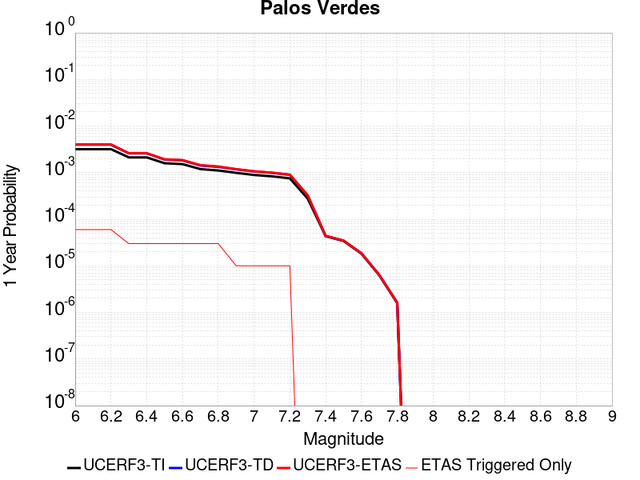 |  |

| Magnitude | 1 wk TI Prob | 1 wk TD Prob | 1 wk ETAS Prob | 1 wk ETAS/TD Gain | 1 wk ETAS Triggered Only | 1 mo TI Prob | 1 mo TD Prob | 1 mo ETAS Prob | 1 mo ETAS/TD Gain | 1 mo ETAS Triggered Only | 1 yr TI Prob | 1 yr TD Prob | 1 yr ETAS Prob | 1 yr ETAS/TD Gain | 1 yr ETAS Triggered Only | 10 yr TI Prob | 10 yr TD Prob | 10 yr ETAS Prob | 10 yr ETAS/TD Gain | 10 yr ETAS Triggered Only |
|-----|-----|-----|-----|-----|-----|-----|-----|-----|-----|-----|-----|-----|-----|-----|-----|-----|-----|-----|-----|-----|
| 6.0 | 6.126063E-5 | 7.622612E-5 | 2.1510442E-4 | 2.8219254 | 1.3888889E-4 | 2.6251914E-4 | 3.2664582E-4 | 4.6548934E-4 | 1.4250584 | 1.3888889E-4 | 0.0031914865 | 0.003970174 | 0.004108512 | 1.0348442 | 1.3888889E-4 | 0.031460393 | 0.039048895 | 0.03918236 | 1.0034178 | 1.3888889E-4 |
| 6.1 | 6.126063E-5 | 7.622612E-5 | 2.1510442E-4 | 2.8219254 | 1.3888889E-4 | 2.6251914E-4 | 3.2664582E-4 | 4.6548934E-4 | 1.4250584 | 1.3888889E-4 | 0.0031914865 | 0.003970174 | 0.004108512 | 1.0348442 | 1.3888889E-4 | 0.031460393 | 0.039048895 | 0.03918236 | 1.0034178 | 1.3888889E-4 |
| 6.2 | 6.126063E-5 | 7.622612E-5 | 2.1510442E-4 | 2.8219254 | 1.3888889E-4 | 2.6251914E-4 | 3.2664582E-4 | 4.6548934E-4 | 1.4250584 | 1.3888889E-4 | 0.0031914865 | 0.003970174 | 0.004108512 | 1.0348442 | 1.3888889E-4 | 0.031460393 | 0.039048895 | 0.03918236 | 1.0034178 | 1.3888889E-4 |
| 6.3 | 4.0838047E-5 | 4.9749437E-5 | 1.8863141E-4 | 3.7916293 | 1.3888889E-4 | 1.7500846E-4 | 2.1319572E-4 | 3.5205498E-4 | 1.6513231 | 1.3888889E-4 | 0.0021286458 | 0.0025927818 | 0.0027313107 | 1.0534286 | 1.3888889E-4 | 0.021083709 | 0.025646681 | 0.025782008 | 1.0052766 | 1.3888889E-4 |
| 6.4 | 4.0838047E-5 | 4.9749437E-5 | 1.8863141E-4 | 3.7916293 | 1.3888889E-4 | 1.7500846E-4 | 2.1319572E-4 | 3.5205498E-4 | 1.6513231 | 1.3888889E-4 | 0.0021286458 | 0.0025927818 | 0.0027313107 | 1.0534286 | 1.3888889E-4 | 0.021083709 | 0.025646681 | 0.025782008 | 1.0052766 | 1.3888889E-4 |
| 6.5 | 3.0512005E-5 | 3.656162E-5 | 1.7544543E-4 | 4.7986226 | 1.3888889E-4 | 1.3075917E-4 | 1.5668393E-4 | 2.9555106E-4 | 1.8862883 | 1.3888889E-4 | 0.0015908304 | 0.0019060767 | 0.0020447008 | 1.0727274 | 1.3888889E-4 | 0.015794903 | 0.018909154 | 0.019045416 | 1.0072062 | 1.3888889E-4 |
| 6.6 | 2.9255087E-5 | 3.515442E-5 | 1.7403843E-4 | 4.950684 | 1.3888889E-4 | 1.2537291E-4 | 1.5065377E-4 | 2.8952173E-4 | 1.921769 | 1.3888889E-4 | 0.0015253464 | 0.0018327828 | 0.001971417 | 1.0756414 | 1.3888889E-4 | 0.015149189 | 0.018188225 | 0.018324587 | 1.0074973 | 1.3888889E-4 |
| 6.7 | 2.287198E-5 | 2.7248278E-5 | 1.6613338E-4 | 6.097023 | 1.3888889E-4 | 9.801909E-5 | 1.16773626E-4 | 2.556463E-4 | 2.189247 | 1.3888889E-4 | 0.001192729 | 0.0014208833 | 0.0015595749 | 1.0976094 | 1.3888889E-4 | 0.011863477 | 0.014127217 | 0.014264144 | 1.0096924 | 1.3888889E-4 |
| 6.8 | 2.1325764E-5 | 2.5431877E-5 | 1.6431723E-4 | 6.461074 | 1.3888889E-4 | 9.139293E-5 | 1.0898971E-4 | 2.4786347E-4 | 2.2741914 | 1.3888889E-4 | 0.001112141 | 0.0013262323 | 0.001464937 | 1.1045855 | 1.3888889E-4 | 0.011065915 | 0.013192211 | 0.0133292675 | 1.0103892 | 1.3888889E-4 |
| 6.9 | 1.9009392E-5 | 2.2613547E-5 | 2.2613547E-5 | 1.0 | 0.0 | 8.1466285E-5 | 9.6912096E-5 | 9.6912096E-5 | 1.0 | 0.0 | 9.914007E-4 | 0.0011793535 | 0.0011793535 | 1.0 | 0.0 | 0.009869894 | 0.011739632 | 0.011739632 | 1.0 | 0.0 |
| 7.0 | 1.7098473E-5 | 2.0319356E-5 | 2.0319356E-5 | 1.0 | 0.0 | 7.3277115E-5 | 8.708052E-5 | 8.708052E-5 | 1.0 | 0.0 | 8.917837E-4 | 0.001059775 | 0.001059775 | 1.0 | 0.0 | 0.008882134 | 0.010555646 | 0.010555646 | 1.0 | 0.0 |
| 7.1 | 1.5982785E-5 | 1.899476E-5 | 1.899476E-5 | 1.0 | 0.0 | 6.849585E-5 | 8.1404054E-5 | 8.1404054E-5 | 1.0 | 0.0 | 8.336179E-4 | 9.907284E-4 | 9.907284E-4 | 1.0 | 0.0 | 0.008304977 | 0.009871479 | 0.009871479 | 1.0 | 0.0 |
| 7.2 | 1.4468002E-5 | 1.7197237E-5 | 1.7197237E-5 | 1.0 | 0.0 | 6.200425E-5 | 7.370083E-5 | 7.370083E-5 | 1.0 | 0.0 | 7.546402E-4 | 8.970222E-4 | 8.970222E-4 | 1.0 | 0.0 | 0.007520827 | 0.008942284 | 0.008942284 | 1.0 | 0.0 |
| 7.3 | 5.288233E-6 | 6.2036747E-6 | 6.2036747E-6 | 1.0 | 0.0 | 2.2663658E-5 | 2.6587102E-5 | 2.6587102E-5 | 1.0 | 0.0 | 2.7589512E-4 | 3.236848E-4 | 3.236848E-4 | 1.0 | 0.0 | 0.0027555283 | 0.0032355562 | 0.0032355562 | 1.0 | 0.0 |
| 7.4 | 8.279556E-7 | 8.408347E-7 | 8.408347E-7 | 1.0 | 0.0 | 3.5483763E-6 | 3.6035726E-6 | 3.6035726E-6 | 1.0 | 0.0 | 4.3200624E-5 | 4.3872686E-5 | 4.3872686E-5 | 1.0 | 0.0 | 4.3192226E-4 | 4.3864746E-4 | 4.3864746E-4 | 1.0 | 0.0 |
| 7.5 | 6.559831E-7 | 6.667229E-7 | 6.667229E-7 | 1.0 | 0.0 | 2.8113532E-6 | 2.857381E-6 | 2.857381E-6 | 1.0 | 0.0 | 3.4227687E-5 | 3.4788125E-5 | 3.4788125E-5 | 1.0 | 0.0 | 3.4222414E-4 | 3.4783344E-4 | 3.4783344E-4 | 1.0 | 0.0 |
| 7.6 | 3.5018968E-7 | 3.5620027E-7 | 3.5620027E-7 | 1.0 | 0.0 | 1.500812E-6 | 1.526572E-6 | 1.526572E-6 | 1.0 | 0.0 | 1.8272232E-5 | 1.8585903E-5 | 1.8585903E-5 | 1.0 | 0.0 | 1.8270731E-4 | 1.8584808E-4 | 1.8584808E-4 | 1.0 | 0.0 |
| 7.7 | 1.1986104E-7 | 1.2198376E-7 | 1.2198376E-7 | 1.0 | 0.0 | 5.1369005E-7 | 5.2278745E-7 | 5.2278745E-7 | 1.0 | 0.0 | 6.2541585E-6 | 6.364919E-6 | 6.364919E-6 | 1.0 | 0.0 | 6.2539824E-5 | 6.364741E-5 | 6.364741E-5 | 1.0 | 0.0 |
| 7.8 | 3.0445005E-8 | 3.1027582E-8 | 3.1027582E-8 | 1.0 | 0.0 | 1.3047858E-7 | 1.3297536E-7 | 1.3297536E-7 | 1.0 | 0.0 | 1.5885756E-6 | 1.6189739E-6 | 1.6189739E-6 | 1.0 | 0.0 | 1.5885644E-5 | 1.6189642E-5 | 1.6189642E-5 | 1.0 | 0.0 |

## Camp Rock 2011
*[(top)](#table-of-contents)*

| 1 Week | 1 Month | 1 Year | 10 Year |
|-----|-----|-----|-----|
|  |  |  |  |

| Magnitude | 1 wk TI Prob | 1 wk TD Prob | 1 wk ETAS Prob | 1 wk ETAS/TD Gain | 1 wk ETAS Triggered Only | 1 mo TI Prob | 1 mo TD Prob | 1 mo ETAS Prob | 1 mo ETAS/TD Gain | 1 mo ETAS Triggered Only | 1 yr TI Prob | 1 yr TD Prob | 1 yr ETAS Prob | 1 yr ETAS/TD Gain | 1 yr ETAS Triggered Only | 10 yr TI Prob | 10 yr TD Prob | 10 yr ETAS Prob | 10 yr ETAS/TD Gain | 10 yr ETAS Triggered Only |
|-----|-----|-----|-----|-----|-----|-----|-----|-----|-----|-----|-----|-----|-----|-----|-----|-----|-----|-----|-----|-----|
| 6.0 | 1.6710783E-5 | 4.25026E-6 | 7.369441E-5 | 17.338799 | 6.9444446E-5 | 7.161568E-5 | 1.8215276E-5 | 8.765846E-5 | 4.8123593 | 6.9444446E-5 | 8.7157206E-4 | 2.2174895E-4 | 2.91178E-4 | 1.3130975 | 6.9444446E-5 | 0.008681616 | 0.0022153298 | 0.0023539108 | 1.0625556 | 1.3888889E-4 |
| 6.1 | 1.6710783E-5 | 4.25026E-6 | 7.369441E-5 | 17.338799 | 6.9444446E-5 | 7.161568E-5 | 1.8215276E-5 | 8.765846E-5 | 4.8123593 | 6.9444446E-5 | 8.7157206E-4 | 2.2174895E-4 | 2.91178E-4 | 1.3130975 | 6.9444446E-5 | 0.008681616 | 0.0022153298 | 0.0023539108 | 1.0625556 | 1.3888889E-4 |
| 6.2 | 1.6710783E-5 | 4.25026E-6 | 7.369441E-5 | 17.338799 | 6.9444446E-5 | 7.161568E-5 | 1.8215276E-5 | 8.765846E-5 | 4.8123593 | 6.9444446E-5 | 8.7157206E-4 | 2.2174895E-4 | 2.91178E-4 | 1.3130975 | 6.9444446E-5 | 0.008681616 | 0.0022153298 | 0.0023539108 | 1.0625556 | 1.3888889E-4 |
| 6.3 | 1.6710783E-5 | 4.25026E-6 | 7.369441E-5 | 17.338799 | 6.9444446E-5 | 7.161568E-5 | 1.8215276E-5 | 8.765846E-5 | 4.8123593 | 6.9444446E-5 | 8.7157206E-4 | 2.2174895E-4 | 2.91178E-4 | 1.3130975 | 6.9444446E-5 | 0.008681616 | 0.0022153298 | 0.0023539108 | 1.0625556 | 1.3888889E-4 |
| 6.4 | 7.982846E-6 | 3.6820884E-6 | 7.312628E-5 | 19.86 | 6.9444446E-5 | 3.421175E-5 | 1.5780286E-5 | 8.522363E-5 | 5.4006395 | 6.9444446E-5 | 4.1644843E-4 | 1.9210839E-4 | 2.615395E-4 | 1.3614163 | 6.9444446E-5 | 0.0041566887 | 0.001919458 | 0.0020580804 | 1.0722195 | 1.3888889E-4 |
| 6.5 | 7.982846E-6 | 3.6820884E-6 | 7.312628E-5 | 19.86 | 6.9444446E-5 | 3.421175E-5 | 1.5780286E-5 | 8.522363E-5 | 5.4006395 | 6.9444446E-5 | 4.1644843E-4 | 1.9210839E-4 | 2.615395E-4 | 1.3614163 | 6.9444446E-5 | 0.0041566887 | 0.001919458 | 0.0020580804 | 1.0722195 | 1.3888889E-4 |
| 6.6 | 7.048869E-6 | 3.4243571E-6 | 7.286856E-5 | 21.279488 | 6.9444446E-5 | 3.0209088E-5 | 1.4675736E-5 | 8.411916E-5 | 5.731853 | 6.9444446E-5 | 3.677336E-4 | 1.7866275E-4 | 2.480948E-4 | 1.3886206 | 6.9444446E-5 | 0.0036712566 | 0.0017852228 | 0.0019238637 | 1.0776603 | 1.3888889E-4 |
| 6.7 | 6.987307E-6 | 3.3623348E-6 | 7.280654E-5 | 21.653568 | 6.9444446E-5 | 2.9945259E-5 | 1.4409929E-5 | 8.3853374E-5 | 5.819139 | 6.9444446E-5 | 3.6452254E-4 | 1.7542706E-4 | 2.4485931E-4 | 1.3957899 | 6.9444446E-5 | 0.0036392517 | 0.001752917 | 0.0018915624 | 1.0790942 | 1.3888889E-4 |
| 6.8 | 6.3737602E-6 | 3.1179077E-6 | 7.2562136E-5 | 23.272701 | 6.9444446E-5 | 2.731583E-5 | 1.3362394E-5 | 8.280591E-5 | 6.1969366 | 6.9444446E-5 | 3.3251947E-4 | 1.626753E-4 | 2.3210845E-4 | 1.4268205 | 6.9444446E-5 | 0.0033202237 | 0.0016255907 | 0.0017642538 | 1.0853001 | 1.3888889E-4 |
| 6.9 | 6.112211E-6 | 2.9331156E-6 | 7.2377356E-5 | 24.67593 | 6.9444446E-5 | 2.6194928E-5 | 1.2570436E-5 | 8.2014005E-5 | 6.5243564 | 6.9444446E-5 | 3.1887658E-4 | 1.5303459E-4 | 2.2246841E-4 | 1.4537132 | 6.9444446E-5 | 0.003184194 | 0.0015293199 | 0.0016679963 | 1.0906786 | 1.3888889E-4 |
| 7.0 | 5.5140117E-6 | 2.641923E-6 | 7.2086186E-5 | 27.285498 | 6.9444446E-5 | 2.3631264E-5 | 1.132248E-5 | 8.0766134E-5 | 7.1332555 | 6.9444446E-5 | 2.8767265E-4 | 1.3784273E-4 | 2.072776E-4 | 1.5037254 | 6.9444446E-5 | 0.0028730053 | 0.0013775975 | 0.001516295 | 1.1006807 | 1.3888889E-4 |
| 7.1 | 4.8151105E-6 | 2.1342705E-6 | 7.1578565E-5 | 33.53772 | 6.9444446E-5 | 2.0636026E-5 | 9.146843E-6 | 7.859065E-5 | 8.592108 | 6.9444446E-5 | 2.5121463E-4 | 1.1135734E-4 | 1.8079404E-4 | 1.6235486 | 6.9444446E-5 | 0.0025093083 | 0.0011130372 | 0.0012517716 | 1.1246448 | 1.3888889E-4 |
| 7.2 | 3.818335E-6 | 1.2937425E-6 | 7.07381E-5 | 54.67711 | 6.9444446E-5 | 1.6364189E-5 | 5.5445994E-6 | 7.498866E-5 | 13.5246315 | 6.9444446E-5 | 1.9921579E-4 | 6.750349E-5 | 1.3694324E-4 | 2.028684 | 6.9444446E-5 | 0.0019903728 | 6.748381E-4 | 8.136332E-4 | 1.2056718 | 1.3888889E-4 |
| 7.3 | 2.7166698E-6 | 7.3835776E-7 | 7.3835776E-7 | 1.0 | 0.0 | 1.1642818E-5 | 3.1643867E-6 | 3.1643867E-6 | 1.0 | 0.0 | 1.4174209E-4 | 3.8525748E-5 | 3.8525748E-5 | 1.0 | 0.0 | 0.0014165172 | 3.851927E-4 | 3.851927E-4 | 1.0 | 0.0 |
| 7.4 | 2.0893426E-6 | 5.4618386E-7 | 5.4618386E-7 | 1.0 | 0.0 | 8.954295E-6 | 2.3407858E-6 | 2.3407858E-6 | 1.0 | 0.0 | 1.0901308E-4 | 2.84987E-5 | 2.84987E-5 | 1.0 | 0.0 | 0.0010895962 | 2.84951E-4 | 2.84951E-4 | 1.0 | 0.0 |
| 7.5 | 1.1681728E-6 | 3.6030585E-7 | 3.6030585E-7 | 1.0 | 0.0 | 5.0064455E-6 | 1.544167E-6 | 1.544167E-6 | 1.0 | 0.0 | 6.0951766E-5 | 1.8800076E-5 | 1.8800076E-5 | 1.0 | 0.0 | 6.093505E-4 | 1.8798532E-4 | 1.8798532E-4 | 1.0 | 0.0 |
| 7.6 | 1.3154387E-7 | 7.1197384E-8 | 7.1197384E-8 | 1.0 | 0.0 | 5.6375933E-7 | 3.051316E-7 | 3.051316E-7 | 1.0 | 0.0 | 6.863748E-6 | 3.7149728E-6 | 3.7149728E-6 | 1.0 | 0.0 | 6.863536E-5 | 3.7149264E-5 | 3.7149264E-5 | 1.0 | 0.0 |

## Pinto Mtn
*[(top)](#table-of-contents)*

| 1 Week | 1 Month | 1 Year | 10 Year |
|-----|-----|-----|-----|
|  |  |  | 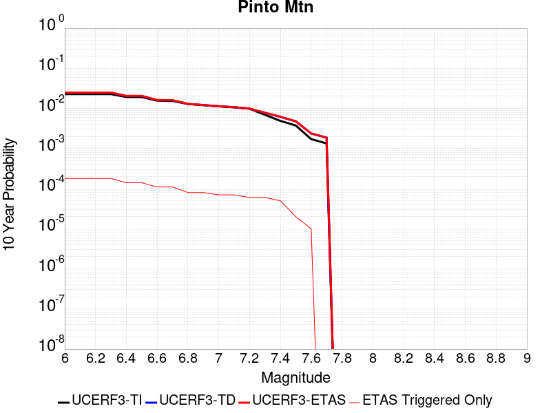 |

| Magnitude | 1 wk TI Prob | 1 wk TD Prob | 1 wk ETAS Prob | 1 wk ETAS/TD Gain | 1 wk ETAS Triggered Only | 1 mo TI Prob | 1 mo TD Prob | 1 mo ETAS Prob | 1 mo ETAS/TD Gain | 1 mo ETAS Triggered Only | 1 yr TI Prob | 1 yr TD Prob | 1 yr ETAS Prob | 1 yr ETAS/TD Gain | 1 yr ETAS Triggered Only | 10 yr TI Prob | 10 yr TD Prob | 10 yr ETAS Prob | 10 yr ETAS/TD Gain | 10 yr ETAS Triggered Only |
|-----|-----|-----|-----|-----|-----|-----|-----|-----|-----|-----|-----|-----|-----|-----|-----|-----|-----|-----|-----|-----|
| 6.0 | 4.4194956E-5 | 4.785362E-5 | 1.1729474E-4 | 2.4511154 | 6.9444446E-5 | 1.893932E-4 | 2.0507174E-4 | 2.7450194E-4 | 1.3385655 | 6.9444446E-5 | 0.0023034236 | 0.0024940541 | 0.0025633255 | 1.0277746 | 6.9444446E-5 | 0.022796938 | 0.024678145 | 0.024813605 | 1.0054891 | 1.3888889E-4 |
| 6.1 | 4.4194956E-5 | 4.785362E-5 | 1.1729474E-4 | 2.4511154 | 6.9444446E-5 | 1.893932E-4 | 2.0507174E-4 | 2.7450194E-4 | 1.3385655 | 6.9444446E-5 | 0.0023034236 | 0.0024940541 | 0.0025633255 | 1.0277746 | 6.9444446E-5 | 0.022796938 | 0.024678145 | 0.024813605 | 1.0054891 | 1.3888889E-4 |
| 6.2 | 4.4194956E-5 | 4.785362E-5 | 1.1729474E-4 | 2.4511154 | 6.9444446E-5 | 1.893932E-4 | 2.0507174E-4 | 2.7450194E-4 | 1.3385655 | 6.9444446E-5 | 0.0023034236 | 0.0024940541 | 0.0025633255 | 1.0277746 | 6.9444446E-5 | 0.022796938 | 0.024678145 | 0.024813605 | 1.0054891 | 1.3888889E-4 |
| 6.3 | 4.4194956E-5 | 4.785362E-5 | 1.1729474E-4 | 2.4511154 | 6.9444446E-5 | 1.893932E-4 | 2.0507174E-4 | 2.7450194E-4 | 1.3385655 | 6.9444446E-5 | 0.0023034236 | 0.0024940541 | 0.0025633255 | 1.0277746 | 6.9444446E-5 | 0.022796938 | 0.024678145 | 0.024813605 | 1.0054891 | 1.3888889E-4 |
| 6.4 | 3.729929E-5 | 3.9603186E-5 | 1.0904488E-4 | 2.753437 | 6.9444446E-5 | 1.5984432E-4 | 1.6971743E-4 | 2.3915009E-4 | 1.4091074 | 6.9444446E-5 | 0.0019443673 | 0.002064445 | 0.0021337462 | 1.0335689 | 6.9444446E-5 | 0.019274427 | 0.02046269 | 0.020598738 | 1.0066485 | 1.3888889E-4 |
| 6.5 | 3.729929E-5 | 3.9603186E-5 | 1.0904488E-4 | 2.753437 | 6.9444446E-5 | 1.5984432E-4 | 1.6971743E-4 | 2.3915009E-4 | 1.4091074 | 6.9444446E-5 | 0.0019443673 | 0.002064445 | 0.0021337462 | 1.0335689 | 6.9444446E-5 | 0.019274427 | 0.02046269 | 0.020598738 | 1.0066485 | 1.3888889E-4 |
| 6.6 | 3.0204548E-5 | 3.1205298E-5 | 1.0064757E-4 | 3.225336 | 6.9444446E-5 | 1.2944164E-4 | 1.3373033E-4 | 2.0316549E-4 | 1.5192177 | 6.9444446E-5 | 0.0015748127 | 0.0016269855 | 0.0016963169 | 1.0426135 | 6.9444446E-5 | 0.015636992 | 0.01615461 | 0.016291253 | 1.0084586 | 1.3888889E-4 |
| 6.7 | 2.9857754E-5 | 3.081468E-5 | 1.00256984E-4 | 3.253546 | 6.9444446E-5 | 1.2795553E-4 | 1.3205643E-4 | 2.0149171E-4 | 1.5258 | 6.9444446E-5 | 0.0015567453 | 0.001606636 | 0.0016759688 | 1.0431541 | 6.9444446E-5 | 0.015458848 | 0.01595405 | 0.01609072 | 1.0085666 | 1.3888889E-4 |
| 6.8 | 2.4819734E-5 | 2.5009364E-5 | 9.445207E-5 | 3.7766683 | 6.9444446E-5 | 1.0636595E-4 | 1.07178705E-4 | 1.7661571E-4 | 1.647862 | 6.9444446E-5 | 0.0012942362 | 0.0013041412 | 0.0013734951 | 1.0531797 | 6.9444446E-5 | 0.012867244 | 0.0129672475 | 0.013104335 | 1.0105718 | 1.3888889E-4 |
| 6.9 | 2.331124E-5 | 2.3337643E-5 | 9.2780465E-5 | 3.9755714 | 6.9444446E-5 | 9.990149E-5 | 1.00014746E-4 | 1.6945225E-4 | 1.6942726 | 6.9444446E-5 | 0.001215622 | 0.0012170197 | 0.0012863796 | 1.0569916 | 6.9444446E-5 | 0.012089936 | 0.012105742 | 0.012242949 | 1.0113341 | 1.3888889E-4 |
| 7.0 | 2.1818534E-5 | 2.1760772E-5 | 9.120371E-5 | 4.191198 | 6.9444446E-5 | 9.3504656E-5 | 9.325723E-5 | 1.626952E-4 | 1.7445854 | 6.9444446E-5 | 0.0011378246 | 0.0011348352 | 0.0012042009 | 1.061124 | 6.9444446E-5 | 0.011320163 | 0.011292503 | 0.011429824 | 1.0121603 | 1.3888889E-4 |
| 7.1 | 2.066081E-5 | 2.0540418E-5 | 8.9983434E-5 | 4.380799 | 6.9444446E-5 | 8.854332E-5 | 8.8027504E-5 | 1.5746584E-4 | 1.7888254 | 6.9444446E-5 | 0.0010774818 | 0.0010712275 | 0.0011405975 | 1.0647576 | 6.9444446E-5 | 0.010722724 | 0.010662688 | 0.010800096 | 1.0128868 | 1.3888889E-4 |
| 7.2 | 1.8990233E-5 | 1.9053701E-5 | 8.8496825E-5 | 4.6446 | 6.9444446E-5 | 8.138417E-5 | 8.1656275E-5 | 1.5109505E-4 | 1.8503789 | 6.9444446E-5 | 9.904018E-4 | 9.937311E-4 | 0.0010631065 | 1.0698131 | 6.9444446E-5 | 0.009859995 | 0.009894874 | 0.010032388 | 1.0138975 | 1.3888889E-4 |
| 7.3 | 1.3335872E-5 | 1.4906372E-5 | 8.4349784E-5 | 5.6586394 | 6.9444446E-5 | 5.7152483E-5 | 6.388296E-5 | 1.3332296E-4 | 2.086988 | 6.9444446E-5 | 6.956093E-4 | 7.775102E-4 | 8.469007E-4 | 1.089247 | 6.9444446E-5 | 0.006934359 | 0.0077491994 | 0.007887012 | 1.0177841 | 1.3888889E-4 |
| 7.4 | 9.414066E-6 | 1.186061E-5 | 1.186061E-5 | 1.0 | 0.0 | 4.0345374E-5 | 5.0830247E-5 | 5.0830247E-5 | 1.0 | 0.0 | 4.910942E-4 | 6.1869196E-4 | 6.1869196E-4 | 1.0 | 0.0 | 0.0049001034 | 0.006170644 | 0.0062396596 | 1.0111846 | 6.9444446E-5 |
| 7.5 | 7.2101157E-6 | 9.157893E-6 | 9.157893E-6 | 1.0 | 0.0 | 3.090013E-5 | 3.924757E-5 | 3.924757E-5 | 1.0 | 0.0 | 3.7614413E-4 | 4.7774217E-4 | 4.7774217E-4 | 1.0 | 0.0 | 0.0037550807 | 0.004767927 | 0.0048370403 | 1.0144955 | 6.9444446E-5 |
| 7.6 | 3.296375E-6 | 4.5453176E-6 | 4.5453176E-6 | 1.0 | 0.0 | 1.4127245E-5 | 1.9479796E-5 | 1.9479796E-5 | 1.0 | 0.0 | 1.7198564E-4 | 2.3714209E-4 | 2.3714209E-4 | 1.0 | 0.0 | 0.0017185259 | 0.0023690276 | 0.0024383075 | 1.0292441 | 6.9444446E-5 |
| 7.7 | 2.5741092E-6 | 3.584251E-6 | 3.584251E-6 | 1.0 | 0.0 | 1.103185E-5 | 1.5360993E-5 | 1.5360993E-5 | 1.0 | 0.0 | 1.3430449E-4 | 1.8700535E-4 | 1.8700535E-4 | 1.0 | 0.0 | 0.0013422335 | 0.0018686098 | 0.0018686098 | 1.0 | 0.0 |

## Cady
*[(top)](#table-of-contents)*

| 1 Week | 1 Month | 1 Year | 10 Year |
|-----|-----|-----|-----|
|  |  | 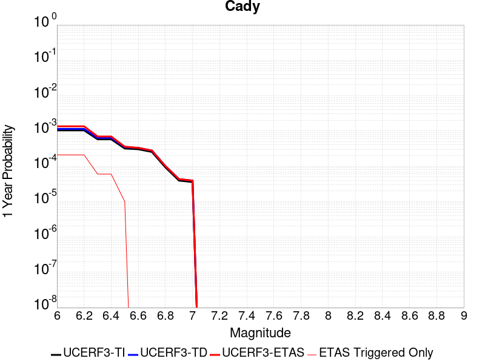 |  |

| Magnitude | 1 wk TI Prob | 1 wk TD Prob | 1 wk ETAS Prob | 1 wk ETAS/TD Gain | 1 wk ETAS Triggered Only | 1 mo TI Prob | 1 mo TD Prob | 1 mo ETAS Prob | 1 mo ETAS/TD Gain | 1 mo ETAS Triggered Only | 1 yr TI Prob | 1 yr TD Prob | 1 yr ETAS Prob | 1 yr ETAS/TD Gain | 1 yr ETAS Triggered Only | 10 yr TI Prob | 10 yr TD Prob | 10 yr ETAS Prob | 10 yr ETAS/TD Gain | 10 yr ETAS Triggered Only |
|-----|-----|-----|-----|-----|-----|-----|-----|-----|-----|-----|-----|-----|-----|-----|-----|-----|-----|-----|-----|-----|
| 6.0 | 1.9892565E-5 | 2.1858728E-5 | 2.1858728E-5 | 1.0 | 0.0 | 8.525106E-5 | 9.3677416E-5 | 9.3677416E-5 | 1.0 | 0.0 | 0.0010374374 | 0.0011400167 | 0.001209382 | 1.0608459 | 6.9444446E-5 | 0.010326075 | 0.011350701 | 0.011488013 | 1.0120972 | 1.3888889E-4 |
| 6.1 | 1.9892565E-5 | 2.1858728E-5 | 2.1858728E-5 | 1.0 | 0.0 | 8.525106E-5 | 9.3677416E-5 | 9.3677416E-5 | 1.0 | 0.0 | 0.0010374374 | 0.0011400167 | 0.001209382 | 1.0608459 | 6.9444446E-5 | 0.010326075 | 0.011350701 | 0.011488013 | 1.0120972 | 1.3888889E-4 |
| 6.2 | 1.9892565E-5 | 2.1858728E-5 | 2.1858728E-5 | 1.0 | 0.0 | 8.525106E-5 | 9.3677416E-5 | 9.3677416E-5 | 1.0 | 0.0 | 0.0010374374 | 0.0011400167 | 0.001209382 | 1.0608459 | 6.9444446E-5 | 0.010326075 | 0.011350701 | 0.011488013 | 1.0120972 | 1.3888889E-4 |
| 6.3 | 1.1117327E-5 | 1.2176583E-5 | 1.2176583E-5 | 1.0 | 0.0 | 4.764482E-5 | 5.2184492E-5 | 5.2184492E-5 | 1.0 | 0.0 | 5.7992124E-4 | 6.351925E-4 | 6.351925E-4 | 1.0 | 0.0 | 0.0057841022 | 0.0063368753 | 0.0064058797 | 1.0108893 | 6.9444446E-5 |
| 6.4 | 1.1117327E-5 | 1.2176583E-5 | 1.2176583E-5 | 1.0 | 0.0 | 4.764482E-5 | 5.2184492E-5 | 5.2184492E-5 | 1.0 | 0.0 | 5.7992124E-4 | 6.351925E-4 | 6.351925E-4 | 1.0 | 0.0 | 0.0057841022 | 0.0063368753 | 0.0064058797 | 1.0108893 | 6.9444446E-5 |
| 6.5 | 6.103093E-6 | 6.672021E-6 | 6.672021E-6 | 1.0 | 0.0 | 2.615585E-5 | 2.8594131E-5 | 2.8594131E-5 | 1.0 | 0.0 | 3.1840094E-4 | 3.480905E-4 | 3.480905E-4 | 1.0 | 0.0 | 0.0031794512 | 0.0034766865 | 0.0035458896 | 1.0199049 | 6.9444446E-5 |
| 6.6 | 5.817237E-6 | 6.3656585E-6 | 6.3656585E-6 | 1.0 | 0.0 | 2.4930776E-5 | 2.728118E-5 | 2.728118E-5 | 1.0 | 0.0 | 3.034899E-4 | 3.3211018E-4 | 3.3211018E-4 | 1.0 | 0.0 | 0.0030307577 | 0.0033173605 | 0.0033865746 | 1.0208642 | 6.9444446E-5 |
| 6.7 | 4.8846314E-6 | 5.3405684E-6 | 5.3405684E-6 | 1.0 | 0.0 | 2.0933967E-5 | 2.2888014E-5 | 2.2888014E-5 | 1.0 | 0.0 | 2.5484123E-4 | 2.7863772E-4 | 2.7863772E-4 | 1.0 | 0.0 | 0.0025454918 | 0.0027840391 | 0.0028532902 | 1.0248743 | 6.9444446E-5 |
| 6.8 | 1.7788773E-6 | 1.9399079E-6 | 1.9399079E-6 | 1.0 | 0.0 | 7.6237375E-6 | 8.313874E-6 | 8.313874E-6 | 1.0 | 0.0 | 9.281505E-5 | 1.01218284E-4 | 1.01218284E-4 | 1.0 | 0.0 | 9.2776294E-4 | 0.0010118765 | 0.0010812506 | 1.0685599 | 6.9444446E-5 |
| 6.9 | 7.5455404E-7 | 8.297092E-7 | 8.297092E-7 | 1.0 | 0.0 | 3.233799E-6 | 3.5558937E-6 | 3.5558937E-6 | 1.0 | 0.0 | 3.937079E-5 | 4.3292483E-5 | 4.3292483E-5 | 1.0 | 0.0 | 3.9363815E-4 | 4.3287344E-4 | 4.3287344E-4 | 1.0 | 0.0 |
| 7.0 | 6.8578805E-7 | 7.541816E-7 | 7.541816E-7 | 1.0 | 0.0 | 2.9390883E-6 | 3.2322048E-6 | 3.2322048E-6 | 1.0 | 0.0 | 3.578281E-5 | 3.9351715E-5 | 3.9351715E-5 | 1.0 | 0.0 | 3.577705E-4 | 3.9347992E-4 | 3.9347992E-4 | 1.0 | 0.0 |

## Tin Mountain
*[(top)](#table-of-contents)*

| 1 Week | 1 Month | 1 Year | 10 Year |
|-----|-----|-----|-----|
|  |  |  |  |

| Magnitude | 1 wk TI Prob | 1 wk TD Prob | 1 wk ETAS Prob | 1 wk ETAS/TD Gain | 1 wk ETAS Triggered Only | 1 mo TI Prob | 1 mo TD Prob | 1 mo ETAS Prob | 1 mo ETAS/TD Gain | 1 mo ETAS Triggered Only | 1 yr TI Prob | 1 yr TD Prob | 1 yr ETAS Prob | 1 yr ETAS/TD Gain | 1 yr ETAS Triggered Only | 10 yr TI Prob | 10 yr TD Prob | 10 yr ETAS Prob | 10 yr ETAS/TD Gain | 10 yr ETAS Triggered Only |
|-----|-----|-----|-----|-----|-----|-----|-----|-----|-----|-----|-----|-----|-----|-----|-----|-----|-----|-----|-----|-----|
| 6.0 | 4.083776E-6 | 4.1815365E-6 | 7.362569E-5 | 17.607328 | 6.9444446E-5 | 1.750178E-5 | 1.792077E-5 | 8.736397E-5 | 4.8750124 | 6.9444446E-5 | 2.1306332E-4 | 2.1816725E-4 | 2.8759654E-4 | 1.3182389 | 6.9444446E-5 | 0.0021285915 | 0.0021798965 | 0.0022491894 | 1.0317873 | 6.9444446E-5 |
| 6.1 | 4.083776E-6 | 4.1815365E-6 | 7.362569E-5 | 17.607328 | 6.9444446E-5 | 1.750178E-5 | 1.792077E-5 | 8.736397E-5 | 4.8750124 | 6.9444446E-5 | 2.1306332E-4 | 2.1816725E-4 | 2.8759654E-4 | 1.3182389 | 6.9444446E-5 | 0.0021285915 | 0.0021798965 | 0.0022491894 | 1.0317873 | 6.9444446E-5 |
| 6.2 | 4.083776E-6 | 4.1815365E-6 | 7.362569E-5 | 17.607328 | 6.9444446E-5 | 1.750178E-5 | 1.792077E-5 | 8.736397E-5 | 4.8750124 | 6.9444446E-5 | 2.1306332E-4 | 2.1816725E-4 | 2.8759654E-4 | 1.3182389 | 6.9444446E-5 | 0.0021285915 | 0.0021798965 | 0.0022491894 | 1.0317873 | 6.9444446E-5 |
| 6.3 | 4.083776E-6 | 4.1815365E-6 | 7.362569E-5 | 17.607328 | 6.9444446E-5 | 1.750178E-5 | 1.792077E-5 | 8.736397E-5 | 4.8750124 | 6.9444446E-5 | 2.1306332E-4 | 2.1816725E-4 | 2.8759654E-4 | 1.3182389 | 6.9444446E-5 | 0.0021285915 | 0.0021798965 | 0.0022491894 | 1.0317873 | 6.9444446E-5 |
| 6.4 | 4.083776E-6 | 4.1815365E-6 | 7.362569E-5 | 17.607328 | 6.9444446E-5 | 1.750178E-5 | 1.792077E-5 | 8.736397E-5 | 4.8750124 | 6.9444446E-5 | 2.1306332E-4 | 2.1816725E-4 | 2.8759654E-4 | 1.3182389 | 6.9444446E-5 | 0.0021285915 | 0.0021798965 | 0.0022491894 | 1.0317873 | 6.9444446E-5 |
| 6.5 | 2.3143427E-6 | 2.3731573E-6 | 7.1817434E-5 | 30.262402 | 6.9444446E-5 | 9.9185745E-6 | 1.0170638E-5 | 7.961438E-5 | 7.827864 | 6.9444446E-5 | 1.2075195E-4 | 1.2382126E-4 | 1.932571E-4 | 1.5607748 | 6.9444446E-5 | 0.0012068636 | 0.0012375986 | 0.0013069571 | 1.0560428 | 6.9444446E-5 |
| 6.6 | 2.3143427E-6 | 2.3731573E-6 | 7.1817434E-5 | 30.262402 | 6.9444446E-5 | 9.9185745E-6 | 1.0170638E-5 | 7.961438E-5 | 7.827864 | 6.9444446E-5 | 1.2075195E-4 | 1.2382126E-4 | 1.932571E-4 | 1.5607748 | 6.9444446E-5 | 0.0012068636 | 0.0012375986 | 0.0013069571 | 1.0560428 | 6.9444446E-5 |
| 6.7 | 1.7029532E-6 | 1.7497915E-6 | 7.119412E-5 | 40.6872 | 6.9444446E-5 | 7.2983503E-6 | 7.499088E-6 | 7.694301E-5 | 10.260316 | 6.9444446E-5 | 8.885379E-5 | 9.1298105E-5 | 1.607362E-4 | 1.7605646 | 6.9444446E-5 | 8.881827E-4 | 9.1265864E-4 | 9.820397E-4 | 1.0760208 | 6.9444446E-5 |
| 6.8 | 1.2914646E-6 | 1.3299378E-6 | 1.3299378E-6 | 1.0 | 0.0 | 5.534837E-6 | 5.6997237E-6 | 5.6997237E-6 | 1.0 | 0.0 | 6.738455E-5 | 6.939237E-5 | 6.939237E-5 | 1.0 | 0.0 | 6.736412E-4 | 6.9375033E-4 | 6.9375033E-4 | 1.0 | 0.0 |
| 6.9 | 5.8708974E-7 | 6.1169936E-7 | 6.1169936E-7 | 1.0 | 0.0 | 2.5160964E-6 | 2.6215664E-6 | 2.6215664E-6 | 1.0 | 0.0 | 3.0633044E-5 | 3.1917145E-5 | 3.1917145E-5 | 1.0 | 0.0 | 3.0628822E-4 | 3.191297E-4 | 3.191297E-4 | 1.0 | 0.0 |
| 7.0 | 4.6248786E-7 | 4.832015E-7 | 4.832015E-7 | 1.0 | 0.0 | 1.9820893E-6 | 2.0708624E-6 | 2.0708624E-6 | 1.0 | 0.0 | 2.413167E-5 | 2.5212494E-5 | 2.5212494E-5 | 1.0 | 0.0 | 2.412905E-4 | 2.5210003E-4 | 2.5210003E-4 | 1.0 | 0.0 |
| 7.1 | 3.804606E-7 | 3.987147E-7 | 3.987147E-7 | 1.0 | 0.0 | 1.6305444E-6 | 1.7087764E-6 | 1.7087764E-6 | 1.0 | 0.0 | 1.9851697E-5 | 2.0804187E-5 | 2.0804187E-5 | 1.0 | 0.0 | 1.9849923E-4 | 2.0802575E-4 | 2.0802575E-4 | 1.0 | 0.0 |
| 7.2 | 3.5864858E-7 | 3.7616863E-7 | 3.7616863E-7 | 1.0 | 0.0 | 1.5370645E-6 | 1.6121504E-6 | 1.6121504E-6 | 1.0 | 0.0 | 1.87136E-5 | 1.9627789E-5 | 1.9627789E-5 | 1.0 | 0.0 | 1.8712023E-4 | 1.9626386E-4 | 1.9626386E-4 | 1.0 | 0.0 |
| 7.3 | 3.342063E-7 | 3.506347E-7 | 3.506347E-7 | 1.0 | 0.0 | 1.4323119E-6 | 1.5027196E-6 | 1.5027196E-6 | 1.0 | 0.0 | 1.7438259E-5 | 1.829549E-5 | 1.829549E-5 | 1.0 | 0.0 | 1.743689E-4 | 1.8294314E-4 | 1.8294314E-4 | 1.0 | 0.0 |
| 7.4 | 2.971242E-7 | 3.1165817E-7 | 3.1165817E-7 | 1.0 | 0.0 | 1.2733886E-6 | 1.3356774E-6 | 1.3356774E-6 | 1.0 | 0.0 | 1.5503398E-5 | 1.6261785E-5 | 1.6261785E-5 | 1.0 | 0.0 | 1.5502315E-4 | 1.6260923E-4 | 1.6260923E-4 | 1.0 | 0.0 |
| 7.5 | 1.4326713E-7 | 1.5012525E-7 | 1.5012525E-7 | 1.0 | 0.0 | 6.140018E-7 | 6.433939E-7 | 6.433939E-7 | 1.0 | 0.0 | 7.4754466E-6 | 7.8333205E-6 | 7.8333205E-6 | 1.0 | 0.0 | 7.475195E-5 | 7.833321E-5 | 7.833321E-5 | 1.0 | 0.0 |

## Mission Creek
*[(top)](#table-of-contents)*

| 1 Week | 1 Month | 1 Year | 10 Year |
|-----|-----|-----|-----|
|  |  | 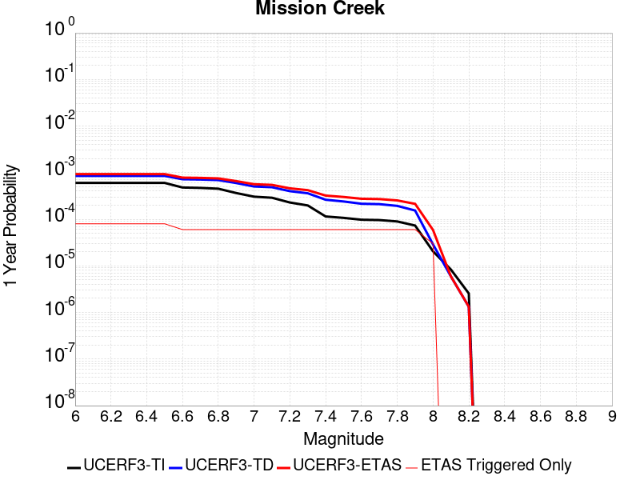 | 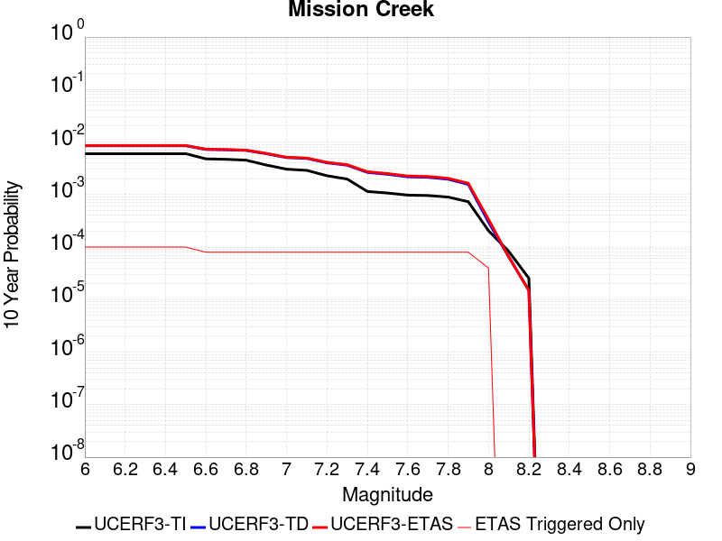 |

| Magnitude | 1 wk TI Prob | 1 wk TD Prob | 1 wk ETAS Prob | 1 wk ETAS/TD Gain | 1 wk ETAS Triggered Only | 1 mo TI Prob | 1 mo TD Prob | 1 mo ETAS Prob | 1 mo ETAS/TD Gain | 1 mo ETAS Triggered Only | 1 yr TI Prob | 1 yr TD Prob | 1 yr ETAS Prob | 1 yr ETAS/TD Gain | 1 yr ETAS Triggered Only | 10 yr TI Prob | 10 yr TD Prob | 10 yr ETAS Prob | 10 yr ETAS/TD Gain | 10 yr ETAS Triggered Only |
|-----|-----|-----|-----|-----|-----|-----|-----|-----|-----|-----|-----|-----|-----|-----|-----|-----|-----|-----|-----|-----|
| 6.0 | 1.1549387E-5 | 1.632237E-5 | 8.576568E-5 | 5.254487 | 6.9444446E-5 | 4.9496433E-5 | 6.9951224E-5 | 1.3939082E-4 | 1.9926858 | 6.9444446E-5 | 6.0245243E-4 | 8.513384E-4 | 9.207237E-4 | 1.0815015 | 6.9444446E-5 | 0.006008218 | 0.008509998 | 0.008578852 | 1.0080909 | 6.9444446E-5 |
| 6.1 | 1.1549387E-5 | 1.632237E-5 | 8.576568E-5 | 5.254487 | 6.9444446E-5 | 4.9496433E-5 | 6.9951224E-5 | 1.3939082E-4 | 1.9926858 | 6.9444446E-5 | 6.0245243E-4 | 8.513384E-4 | 9.207237E-4 | 1.0815015 | 6.9444446E-5 | 0.006008218 | 0.008509998 | 0.008578852 | 1.0080909 | 6.9444446E-5 |
| 6.2 | 1.1549387E-5 | 1.632237E-5 | 8.576568E-5 | 5.254487 | 6.9444446E-5 | 4.9496433E-5 | 6.9951224E-5 | 1.3939082E-4 | 1.9926858 | 6.9444446E-5 | 6.0245243E-4 | 8.513384E-4 | 9.207237E-4 | 1.0815015 | 6.9444446E-5 | 0.006008218 | 0.008509998 | 0.008578852 | 1.0080909 | 6.9444446E-5 |
| 6.3 | 1.1549387E-5 | 1.632237E-5 | 8.576568E-5 | 5.254487 | 6.9444446E-5 | 4.9496433E-5 | 6.9951224E-5 | 1.3939082E-4 | 1.9926858 | 6.9444446E-5 | 6.0245243E-4 | 8.513384E-4 | 9.207237E-4 | 1.0815015 | 6.9444446E-5 | 0.006008218 | 0.008509998 | 0.008578852 | 1.0080909 | 6.9444446E-5 |
| 6.4 | 1.1549387E-5 | 1.632237E-5 | 8.576568E-5 | 5.254487 | 6.9444446E-5 | 4.9496433E-5 | 6.9951224E-5 | 1.3939082E-4 | 1.9926858 | 6.9444446E-5 | 6.0245243E-4 | 8.513384E-4 | 9.207237E-4 | 1.0815015 | 6.9444446E-5 | 0.006008218 | 0.008509998 | 0.008578852 | 1.0080909 | 6.9444446E-5 |
| 6.5 | 1.1549387E-5 | 1.632237E-5 | 8.576568E-5 | 5.254487 | 6.9444446E-5 | 4.9496433E-5 | 6.9951224E-5 | 1.3939082E-4 | 1.9926858 | 6.9444446E-5 | 6.0245243E-4 | 8.513384E-4 | 9.207237E-4 | 1.0815015 | 6.9444446E-5 | 0.006008218 | 0.008509998 | 0.008578852 | 1.0080909 | 6.9444446E-5 |
| 6.6 | 9.202681E-6 | 1.3845646E-5 | 1.3845646E-5 | 1.0 | 0.0 | 3.9439463E-5 | 5.9337188E-5 | 5.9337188E-5 | 1.0 | 0.0 | 4.800697E-4 | 7.221998E-4 | 7.221998E-4 | 1.0 | 0.0 | 0.004790339 | 0.0072271815 | 0.0072271815 | 1.0 | 0.0 |
| 6.7 | 9.019164E-6 | 1.3651316E-5 | 1.3651316E-5 | 1.0 | 0.0 | 3.8652986E-5 | 5.8504378E-5 | 5.8504378E-5 | 1.0 | 0.0 | 4.7049852E-4 | 7.12067E-4 | 7.12067E-4 | 1.0 | 0.0 | 0.004695036 | 0.007126506 | 0.007126506 | 1.0 | 0.0 |
| 6.8 | 8.673558E-6 | 1.3273427E-5 | 1.3273427E-5 | 1.0 | 0.0 | 3.717186E-5 | 5.6884925E-5 | 5.6884925E-5 | 1.0 | 0.0 | 4.524734E-4 | 6.923627E-4 | 6.923627E-4 | 1.0 | 0.0 | 0.0045155324 | 0.006930694 | 0.006930694 | 1.0 | 0.0 |
| 6.9 | 7.002255E-6 | 1.1477657E-5 | 1.1477657E-5 | 1.0 | 0.0 | 3.000932E-5 | 4.9189068E-5 | 4.9189068E-5 | 1.0 | 0.0 | 3.653022E-4 | 5.9871917E-4 | 5.9871917E-4 | 1.0 | 0.0 | 0.0036470229 | 0.005999517 | 0.005999517 | 1.0 | 0.0 |
| 7.0 | 5.84644E-6 | 9.67498E-6 | 9.67498E-6 | 1.0 | 0.0 | 2.5055931E-5 | 4.1463565E-5 | 4.1463565E-5 | 1.0 | 0.0 | 3.0501327E-4 | 5.047066E-4 | 5.047066E-4 | 1.0 | 0.0 | 0.0030459496 | 0.0050638523 | 0.0050638523 | 1.0 | 0.0 |
| 7.1 | 5.54703E-6 | 9.329456E-6 | 9.329456E-6 | 1.0 | 0.0 | 2.377277E-5 | 3.9982795E-5 | 3.9982795E-5 | 1.0 | 0.0 | 2.8939504E-4 | 4.8668624E-4 | 4.8668624E-4 | 1.0 | 0.0 | 0.0028901845 | 0.004884446 | 0.004884446 | 1.0 | 0.0 |
| 7.2 | 4.384709E-6 | 7.68157E-6 | 7.68157E-6 | 1.0 | 0.0 | 1.8791474E-5 | 3.2920623E-5 | 3.2920623E-5 | 1.0 | 0.0 | 2.2876218E-4 | 4.0073853E-4 | 4.0073853E-4 | 1.0 | 0.0 | 0.0022852682 | 0.004028366 | 0.004028366 | 1.0 | 0.0 |
| 7.3 | 3.7888456E-6 | 6.915452E-6 | 6.915452E-6 | 1.0 | 0.0 | 1.623781E-5 | 2.9637333E-5 | 2.9637333E-5 | 1.0 | 0.0 | 1.9767738E-4 | 3.6077813E-4 | 3.6077813E-4 | 1.0 | 0.0 | 0.0019750162 | 0.0036301152 | 0.0036301152 | 1.0 | 0.0 |
| 7.4 | 2.1982462E-6 | 5.0237763E-6 | 5.0237763E-6 | 1.0 | 0.0 | 9.421021E-6 | 2.1530293E-5 | 2.1530293E-5 | 1.0 | 0.0 | 1.1469489E-4 | 2.621E-4 | 2.621E-4 | 1.0 | 0.0 | 0.0011463572 | 0.0026458844 | 0.0026458844 | 1.0 | 0.0 |
| 7.5 | 2.051923E-6 | 4.615016E-6 | 4.615016E-6 | 1.0 | 0.0 | 8.793926E-6 | 1.9778492E-5 | 1.9778492E-5 | 1.0 | 0.0 | 1.0706078E-4 | 2.4077666E-4 | 2.4077666E-4 | 1.0 | 0.0 | 0.0010700922 | 0.0024335422 | 0.0024335422 | 1.0 | 0.0 |
| 7.6 | 1.8733427E-6 | 4.1233748E-6 | 4.1233748E-6 | 1.0 | 0.0 | 8.028587E-6 | 1.7671488E-5 | 1.7671488E-5 | 1.0 | 0.0 | 9.774366E-5 | 2.151292E-4 | 2.151292E-4 | 1.0 | 0.0 | 9.770069E-4 | 0.0021780801 | 0.0021780801 | 1.0 | 0.0 |
| 7.7 | 1.8411953E-6 | 4.0430496E-6 | 4.0430496E-6 | 1.0 | 0.0 | 7.890813E-6 | 1.732724E-5 | 1.732724E-5 | 1.0 | 0.0 | 9.606641E-5 | 2.1093882E-4 | 2.1093882E-4 | 1.0 | 0.0 | 9.6024893E-4 | 0.0021363653 | 0.0021363653 | 1.0 | 0.0 |
| 7.8 | 1.7194251E-6 | 3.7104276E-6 | 3.7104276E-6 | 1.0 | 0.0 | 7.368944E-6 | 1.5901736E-5 | 1.5901736E-5 | 1.0 | 0.0 | 8.97132E-5 | 1.9358651E-4 | 1.9358651E-4 | 1.0 | 0.0 | 8.967699E-4 | 0.0019623525 | 0.0019623525 | 1.0 | 0.0 |
| 7.9 | 1.4035052E-6 | 2.9500632E-6 | 2.9500632E-6 | 1.0 | 0.0 | 6.0150082E-6 | 1.2643067E-5 | 1.2643067E-5 | 1.0 | 0.0 | 7.3230265E-5 | 1.5391852E-4 | 1.5391852E-4 | 1.0 | 0.0 | 7.3206134E-4 | 0.0015631086 | 0.0015631086 | 1.0 | 0.0 |
| 8.0 | 3.9318823E-7 | 5.528522E-7 | 5.528522E-7 | 1.0 | 0.0 | 1.6850913E-6 | 2.3693647E-6 | 2.3693647E-6 | 1.0 | 0.0 | 2.0515794E-5 | 2.8846638E-5 | 2.8846638E-5 | 1.0 | 0.0 | 2.0513899E-4 | 2.9899E-4 | 2.9899E-4 | 1.0 | 0.0 |
| 8.1 | 1.596793E-7 | 1.1380002E-7 | 1.1380002E-7 | 1.0 | 0.0 | 6.8433974E-7 | 4.877143E-7 | 4.877143E-7 | 1.0 | 0.0 | 8.331805E-6 | 5.937906E-6 | 5.937906E-6 | 1.0 | 0.0 | 8.331492E-5 | 6.549966E-5 | 6.549966E-5 | 1.0 | 0.0 |
| 8.2 | 4.9003038E-8 | 2.5444924E-8 | 2.5444924E-8 | 1.0 | 0.0 | 2.10013E-7 | 1.0904967E-7 | 1.0904967E-7 | 1.0 | 0.0 | 2.5569052E-6 | 1.327679E-6 | 1.327679E-6 | 1.0 | 0.0 | 2.556876E-5 | 1.495635E-5 | 1.495635E-5 | 1.0 | 0.0 |

## Pine Mtn
*[(top)](#table-of-contents)*

| 1 Week | 1 Month | 1 Year | 10 Year |
|-----|-----|-----|-----|
|  | 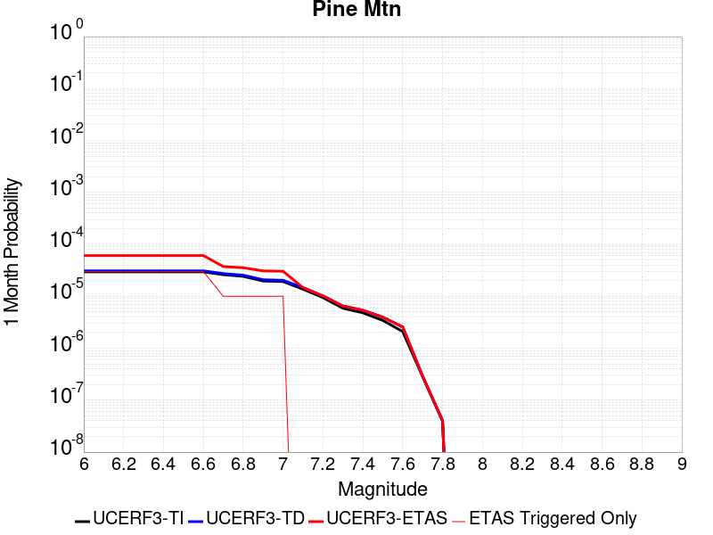 | 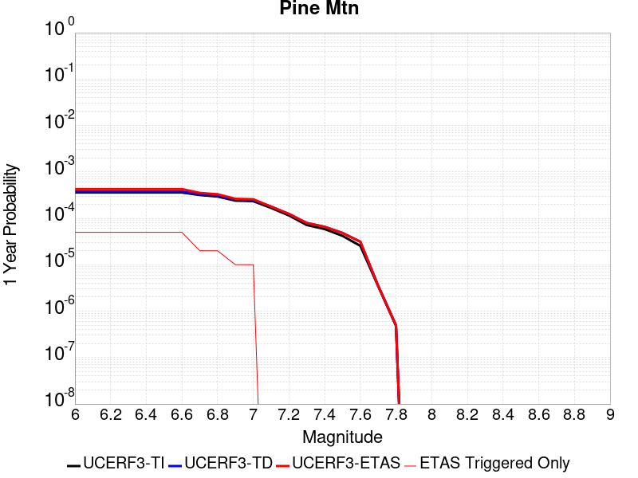 |  |

| Magnitude | 1 wk TI Prob | 1 wk TD Prob | 1 wk ETAS Prob | 1 wk ETAS/TD Gain | 1 wk ETAS Triggered Only | 1 mo TI Prob | 1 mo TD Prob | 1 mo ETAS Prob | 1 mo ETAS/TD Gain | 1 mo ETAS Triggered Only | 1 yr TI Prob | 1 yr TD Prob | 1 yr ETAS Prob | 1 yr ETAS/TD Gain | 1 yr ETAS Triggered Only | 10 yr TI Prob | 10 yr TD Prob | 10 yr ETAS Prob | 10 yr ETAS/TD Gain | 10 yr ETAS Triggered Only |
|-----|-----|-----|-----|-----|-----|-----|-----|-----|-----|-----|-----|-----|-----|-----|-----|-----|-----|-----|-----|-----|
| 6.0 | 6.894797E-6 | 7.225461E-6 | 7.225461E-6 | 1.0 | 0.0 | 2.9548795E-5 | 3.096591E-5 | 3.096591E-5 | 1.0 | 0.0 | 3.596972E-4 | 3.7694772E-4 | 3.7694772E-4 | 1.0 | 0.0 | 0.0035911554 | 0.003763381 | 0.003832564 | 1.0183833 | 6.9444446E-5 |
| 6.1 | 6.894797E-6 | 7.225461E-6 | 7.225461E-6 | 1.0 | 0.0 | 2.9548795E-5 | 3.096591E-5 | 3.096591E-5 | 1.0 | 0.0 | 3.596972E-4 | 3.7694772E-4 | 3.7694772E-4 | 1.0 | 0.0 | 0.0035911554 | 0.003763381 | 0.003832564 | 1.0183833 | 6.9444446E-5 |
| 6.2 | 6.894797E-6 | 7.225461E-6 | 7.225461E-6 | 1.0 | 0.0 | 2.9548795E-5 | 3.096591E-5 | 3.096591E-5 | 1.0 | 0.0 | 3.596972E-4 | 3.7694772E-4 | 3.7694772E-4 | 1.0 | 0.0 | 0.0035911554 | 0.003763381 | 0.003832564 | 1.0183833 | 6.9444446E-5 |
| 6.3 | 6.894797E-6 | 7.225461E-6 | 7.225461E-6 | 1.0 | 0.0 | 2.9548795E-5 | 3.096591E-5 | 3.096591E-5 | 1.0 | 0.0 | 3.596972E-4 | 3.7694772E-4 | 3.7694772E-4 | 1.0 | 0.0 | 0.0035911554 | 0.003763381 | 0.003832564 | 1.0183833 | 6.9444446E-5 |
| 6.4 | 6.894797E-6 | 7.225461E-6 | 7.225461E-6 | 1.0 | 0.0 | 2.9548795E-5 | 3.096591E-5 | 3.096591E-5 | 1.0 | 0.0 | 3.596972E-4 | 3.7694772E-4 | 3.7694772E-4 | 1.0 | 0.0 | 0.0035911554 | 0.003763381 | 0.003832564 | 1.0183833 | 6.9444446E-5 |
| 6.5 | 6.894797E-6 | 7.225461E-6 | 7.225461E-6 | 1.0 | 0.0 | 2.9548795E-5 | 3.096591E-5 | 3.096591E-5 | 1.0 | 0.0 | 3.596972E-4 | 3.7694772E-4 | 3.7694772E-4 | 1.0 | 0.0 | 0.0035911554 | 0.003763381 | 0.003832564 | 1.0183833 | 6.9444446E-5 |
| 6.6 | 6.894797E-6 | 7.225461E-6 | 7.225461E-6 | 1.0 | 0.0 | 2.9548795E-5 | 3.096591E-5 | 3.096591E-5 | 1.0 | 0.0 | 3.596972E-4 | 3.7694772E-4 | 3.7694772E-4 | 1.0 | 0.0 | 0.0035911554 | 0.003763381 | 0.003832564 | 1.0183833 | 6.9444446E-5 |
| 6.7 | 6.0867933E-6 | 6.3971133E-6 | 6.3971133E-6 | 1.0 | 0.0 | 2.6085996E-5 | 2.7415923E-5 | 2.7415923E-5 | 1.0 | 0.0 | 3.1755073E-4 | 3.3373994E-4 | 3.3373994E-4 | 1.0 | 0.0 | 0.0031709734 | 0.0033326065 | 0.0034018194 | 1.0207684 | 6.9444446E-5 |
| 6.8 | 5.6530425E-6 | 5.9505956E-6 | 5.9505956E-6 | 1.0 | 0.0 | 2.42271E-5 | 2.5502315E-5 | 2.5502315E-5 | 1.0 | 0.0 | 2.94925E-4 | 3.104485E-4 | 3.104485E-4 | 1.0 | 0.0 | 0.002945339 | 0.0031003528 | 0.003169582 | 1.0223294 | 6.9444446E-5 |
| 6.9 | 4.6015225E-6 | 4.863834E-6 | 4.863834E-6 | 1.0 | 0.0 | 1.9720663E-5 | 2.0844845E-5 | 2.0844845E-5 | 1.0 | 0.0 | 2.4007261E-4 | 2.5375787E-4 | 2.5375787E-4 | 1.0 | 0.0 | 0.0023981342 | 0.0025348254 | 0.0026040939 | 1.0273267 | 6.9444446E-5 |
| 7.0 | 4.4875965E-6 | 4.747473E-6 | 4.747473E-6 | 1.0 | 0.0 | 1.9232413E-5 | 2.0346162E-5 | 2.0346162E-5 | 1.0 | 0.0 | 2.3412947E-4 | 2.4768783E-4 | 2.4768783E-4 | 1.0 | 0.0 | 0.0023388295 | 0.0024742614 | 0.002543534 | 1.0279973 | 6.9444446E-5 |
| 7.1 | 3.203907E-6 | 3.4294096E-6 | 3.4294096E-6 | 1.0 | 0.0 | 1.3730958E-5 | 1.4697391E-5 | 1.4697391E-5 | 1.0 | 0.0 | 1.6716159E-4 | 1.789267E-4 | 1.789267E-4 | 1.0 | 0.0 | 0.0016703589 | 0.0017878925 | 0.0018572129 | 1.0387721 | 6.9444446E-5 |
| 7.2 | 2.2060601E-6 | 2.3784817E-6 | 2.3784817E-6 | 1.0 | 0.0 | 9.4545085E-6 | 1.0193455E-5 | 1.0193455E-5 | 1.0 | 0.0 | 1.15102564E-4 | 1.240987E-4 | 1.240987E-4 | 1.0 | 0.0 | 0.0011504296 | 0.0012403389 | 0.0012403389 | 1.0 | 0.0 |
| 7.3 | 1.3765207E-6 | 1.5216481E-6 | 1.5216481E-6 | 1.0 | 0.0 | 5.899361E-6 | 6.521333E-6 | 6.521333E-6 | 1.0 | 0.0 | 7.182235E-5 | 7.939443E-5 | 7.939443E-5 | 1.0 | 0.0 | 7.1799144E-4 | 7.936697E-4 | 7.936697E-4 | 1.0 | 0.0 |
| 7.4 | 1.1245983E-6 | 1.2587075E-6 | 1.2587075E-6 | 1.0 | 0.0 | 4.819698E-6 | 5.39445E-6 | 5.39445E-6 | 1.0 | 0.0 | 5.8678244E-5 | 6.567554E-5 | 6.567554E-5 | 1.0 | 0.0 | 5.866275E-4 | 6.5656955E-4 | 6.5656955E-4 | 1.0 | 0.0 |
| 7.5 | 8.031682E-7 | 9.276951E-7 | 9.276951E-7 | 1.0 | 0.0 | 3.4421448E-6 | 3.9758306E-6 | 3.9758306E-6 | 1.0 | 0.0 | 4.1907308E-5 | 4.840473E-5 | 4.840473E-5 | 1.0 | 0.0 | 4.1899405E-4 | 4.8394862E-4 | 4.8394862E-4 | 1.0 | 0.0 |
| 7.6 | 4.8953444E-7 | 6.003009E-7 | 6.003009E-7 | 1.0 | 0.0 | 2.098003E-6 | 2.5727159E-6 | 2.5727159E-6 | 1.0 | 0.0 | 2.5542888E-5 | 3.1322415E-5 | 3.1322415E-5 | 1.0 | 0.0 | 2.5539953E-4 | 3.1318486E-4 | 3.1318486E-4 | 1.0 | 0.0 |
| 7.7 | 6.634529E-8 | 6.788826E-8 | 6.788826E-8 | 1.0 | 0.0 | 2.843369E-7 | 2.9094966E-7 | 2.9094966E-7 | 1.0 | 0.0 | 3.4617963E-6 | 3.5423066E-6 | 3.5423066E-6 | 1.0 | 0.0 | 3.4617424E-5 | 3.542255E-5 | 3.542255E-5 | 1.0 | 0.0 |
| 7.8 | 9.235578E-9 | 9.488566E-9 | 9.488566E-9 | 1.0 | 0.0 | 3.9581046E-8 | 4.0665284E-8 | 4.0665284E-8 | 1.0 | 0.0 | 4.818991E-7 | 4.950997E-7 | 4.950997E-7 | 1.0 | 0.0 | 4.8189804E-6 | 4.950988E-6 | 4.950988E-6 | 1.0 | 0.0 |

## San Clemente
*[(top)](#table-of-contents)*

| 1 Week | 1 Month | 1 Year | 10 Year |
|-----|-----|-----|-----|
|  |  |  |  |

| Magnitude | 1 wk TI Prob | 1 wk TD Prob | 1 wk ETAS Prob | 1 wk ETAS/TD Gain | 1 wk ETAS Triggered Only | 1 mo TI Prob | 1 mo TD Prob | 1 mo ETAS Prob | 1 mo ETAS/TD Gain | 1 mo ETAS Triggered Only | 1 yr TI Prob | 1 yr TD Prob | 1 yr ETAS Prob | 1 yr ETAS/TD Gain | 1 yr ETAS Triggered Only | 10 yr TI Prob | 10 yr TD Prob | 10 yr ETAS Prob | 10 yr ETAS/TD Gain | 10 yr ETAS Triggered Only |
|-----|-----|-----|-----|-----|-----|-----|-----|-----|-----|-----|-----|-----|-----|-----|-----|-----|-----|-----|-----|-----|
| 6.0 | 6.681379E-5 | 8.163422E-5 | 8.163422E-5 | 1.0 | 0.0 | 2.8631336E-4 | 3.498173E-4 | 3.498173E-4 | 1.0 | 0.0 | 0.003480294 | 0.0042512873 | 0.0043204366 | 1.0162655 | 6.9444446E-5 | 0.03426291 | 0.041755714 | 0.04182226 | 1.0015937 | 6.9444446E-5 |
| 6.1 | 6.681379E-5 | 8.163422E-5 | 8.163422E-5 | 1.0 | 0.0 | 2.8631336E-4 | 3.498173E-4 | 3.498173E-4 | 1.0 | 0.0 | 0.003480294 | 0.0042512873 | 0.0042512873 | 1.0 | 0.0 | 0.03426291 | 0.041755714 | 0.041755714 | 1.0 | 0.0 |
| 6.2 | 3.9400576E-5 | 4.6451984E-5 | 4.6451984E-5 | 1.0 | 0.0 | 1.6884868E-4 | 1.9906509E-4 | 1.9906509E-4 | 1.0 | 0.0 | 0.0020537945 | 0.002420985 | 0.002420985 | 1.0 | 0.0 | 0.020349167 | 0.02395286 | 0.02395286 | 1.0 | 0.0 |
| 6.3 | 3.2590255E-5 | 3.7929087E-5 | 3.7929087E-5 | 1.0 | 0.0 | 1.3966505E-4 | 1.6254328E-4 | 1.6254328E-4 | 1.0 | 0.0 | 0.0016990956 | 0.0019771985 | 0.0019771985 | 1.0 | 0.0 | 0.01686163 | 0.019599866 | 0.019599866 | 1.0 | 0.0 |
| 6.4 | 2.9454652E-5 | 3.4097775E-5 | 3.4097775E-5 | 1.0 | 0.0 | 1.2622811E-4 | 1.4612528E-4 | 1.4612528E-4 | 1.0 | 0.0 | 0.0015357438 | 0.0017776482 | 0.0017776482 | 1.0 | 0.0 | 0.015251739 | 0.017637458 | 0.017637458 | 1.0 | 0.0 |
| 6.5 | 2.790836E-5 | 3.2247463E-5 | 3.2247463E-5 | 1.0 | 0.0 | 1.1960178E-4 | 1.3819622E-4 | 1.3819622E-4 | 1.0 | 0.0 | 0.001455179 | 0.0016812651 | 0.0016812651 | 1.0 | 0.0 | 0.014456868 | 0.016688475 | 0.016688475 | 1.0 | 0.0 |
| 6.6 | 2.2492153E-5 | 2.5762707E-5 | 2.5762707E-5 | 1.0 | 0.0 | 9.639138E-5 | 1.1040701E-4 | 1.1040701E-4 | 1.0 | 0.0 | 0.0011729331 | 0.0013433908 | 0.0013433908 | 1.0 | 0.0 | 0.011667615 | 0.013354415 | 0.013354415 | 1.0 | 0.0 |
| 6.7 | 1.9862755E-5 | 2.2666423E-5 | 2.2666423E-5 | 1.0 | 0.0 | 8.512331E-5 | 9.713826E-5 | 9.713826E-5 | 1.0 | 0.0 | 0.0010358836 | 0.0011820279 | 0.0011820279 | 1.0 | 0.0 | 0.010310682 | 0.011758701 | 0.011758701 | 1.0 | 0.0 |
| 6.8 | 1.6697575E-5 | 1.897771E-5 | 1.897771E-5 | 1.0 | 0.0 | 7.155907E-5 | 8.133056E-5 | 8.133056E-5 | 1.0 | 0.0 | 8.7088346E-4 | 9.897591E-4 | 9.897591E-4 | 1.0 | 0.0 | 0.008674784 | 0.0098545365 | 0.0098545365 | 1.0 | 0.0 |
| 6.9 | 1.5218415E-5 | 1.72694E-5 | 1.72694E-5 | 1.0 | 0.0 | 6.522015E-5 | 7.4009666E-5 | 7.4009666E-5 | 1.0 | 0.0 | 7.93766E-4 | 9.00704E-4 | 9.00704E-4 | 1.0 | 0.0 | 0.007909367 | 0.008971481 | 0.008971481 | 1.0 | 0.0 |
| 7.0 | 1.2392958E-5 | 1.4033016E-5 | 1.4033016E-5 | 1.0 | 0.0 | 5.3111595E-5 | 6.014015E-5 | 6.014015E-5 | 1.0 | 0.0 | 6.4644177E-4 | 7.319679E-4 | 7.319679E-4 | 1.0 | 0.0 | 0.0064456454 | 0.0072963564 | 0.0072963564 | 1.0 | 0.0 |
| 7.1 | 1.0934128E-5 | 1.2375138E-5 | 1.2375138E-5 | 1.0 | 0.0 | 4.6859706E-5 | 5.303527E-5 | 5.303527E-5 | 1.0 | 0.0 | 5.7036756E-4 | 6.455204E-4 | 6.455204E-4 | 1.0 | 0.0 | 0.0056890585 | 0.0064371997 | 0.0064371997 | 1.0 | 0.0 |
| 7.2 | 9.5798805E-6 | 1.0844935E-5 | 1.0844935E-5 | 1.0 | 0.0 | 4.1055984E-5 | 4.6477508E-5 | 4.6477508E-5 | 1.0 | 0.0 | 4.9974193E-4 | 5.657239E-4 | 5.657239E-4 | 1.0 | 0.0 | 0.0049861963 | 0.0056435615 | 0.0056435615 | 1.0 | 0.0 |
| 7.3 | 8.0167365E-6 | 9.083918E-6 | 9.083918E-6 | 1.0 | 0.0 | 3.4356988E-5 | 3.8930535E-5 | 3.8930535E-5 | 1.0 | 0.0 | 4.1821605E-4 | 4.7388324E-4 | 4.7388324E-4 | 1.0 | 0.0 | 0.0041742986 | 0.0047294297 | 0.0047294297 | 1.0 | 0.0 |
| 7.4 | 2.9581017E-6 | 3.3623792E-6 | 3.3623792E-6 | 1.0 | 0.0 | 1.2677518E-5 | 1.4410146E-5 | 1.4410146E-5 | 1.0 | 0.0 | 1.5433785E-4 | 1.7543444E-4 | 1.7543444E-4 | 1.0 | 0.0 | 0.001542307 | 0.0017534546 | 0.0017534546 | 1.0 | 0.0 |

## Dry Mountain
*[(top)](#table-of-contents)*

| 1 Week | 1 Month | 1 Year | 10 Year |
|-----|-----|-----|-----|
| 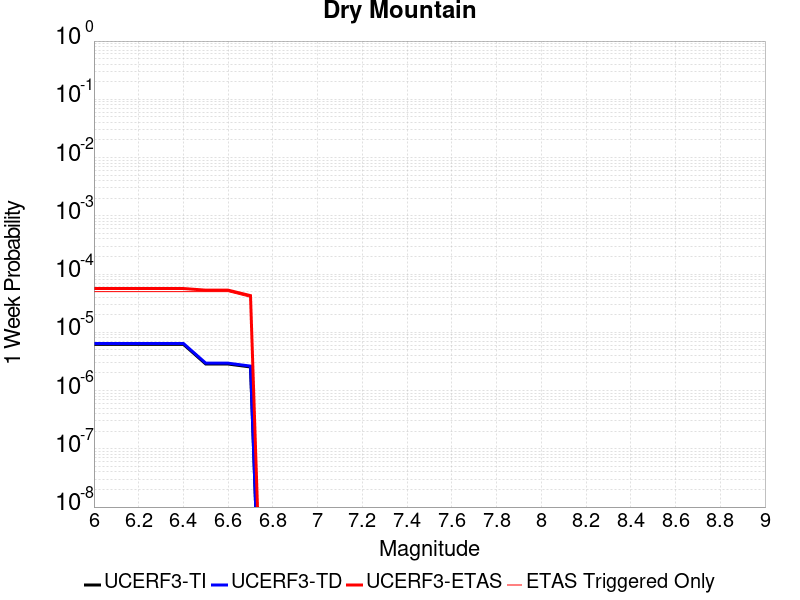 |  |  |  |

| Magnitude | 1 wk TI Prob | 1 wk TD Prob | 1 wk ETAS Prob | 1 wk ETAS/TD Gain | 1 wk ETAS Triggered Only | 1 mo TI Prob | 1 mo TD Prob | 1 mo ETAS Prob | 1 mo ETAS/TD Gain | 1 mo ETAS Triggered Only | 1 yr TI Prob | 1 yr TD Prob | 1 yr ETAS Prob | 1 yr ETAS/TD Gain | 1 yr ETAS Triggered Only | 10 yr TI Prob | 10 yr TD Prob | 10 yr ETAS Prob | 10 yr ETAS/TD Gain | 10 yr ETAS Triggered Only |
|-----|-----|-----|-----|-----|-----|-----|-----|-----|-----|-----|-----|-----|-----|-----|-----|-----|-----|-----|-----|-----|
| 6.0 | 6.222801E-6 | 6.439381E-6 | 6.439381E-6 | 1.0 | 0.0 | 2.6668875E-5 | 2.7597147E-5 | 2.7597147E-5 | 1.0 | 0.0 | 3.2464517E-4 | 3.3595937E-4 | 4.0538047E-4 | 1.2066355 | 6.9444446E-5 | 0.0032417132 | 0.0033560768 | 0.0034252882 | 1.0206227 | 6.9444446E-5 |
| 6.1 | 6.222801E-6 | 6.439381E-6 | 6.439381E-6 | 1.0 | 0.0 | 2.6668875E-5 | 2.7597147E-5 | 2.7597147E-5 | 1.0 | 0.0 | 3.2464517E-4 | 3.3595937E-4 | 4.0538047E-4 | 1.2066355 | 6.9444446E-5 | 0.0032417132 | 0.0033560768 | 0.0034252882 | 1.0206227 | 6.9444446E-5 |
| 6.2 | 6.222801E-6 | 6.439381E-6 | 6.439381E-6 | 1.0 | 0.0 | 2.6668875E-5 | 2.7597147E-5 | 2.7597147E-5 | 1.0 | 0.0 | 3.2464517E-4 | 3.3595937E-4 | 4.0538047E-4 | 1.2066355 | 6.9444446E-5 | 0.0032417132 | 0.0033560768 | 0.0034252882 | 1.0206227 | 6.9444446E-5 |
| 6.3 | 6.222801E-6 | 6.439381E-6 | 6.439381E-6 | 1.0 | 0.0 | 2.6668875E-5 | 2.7597147E-5 | 2.7597147E-5 | 1.0 | 0.0 | 3.2464517E-4 | 3.3595937E-4 | 4.0538047E-4 | 1.2066355 | 6.9444446E-5 | 0.0032417132 | 0.0033560768 | 0.0034252882 | 1.0206227 | 6.9444446E-5 |
| 6.4 | 6.222801E-6 | 6.439381E-6 | 6.439381E-6 | 1.0 | 0.0 | 2.6668875E-5 | 2.7597147E-5 | 2.7597147E-5 | 1.0 | 0.0 | 3.2464517E-4 | 3.3595937E-4 | 4.0538047E-4 | 1.2066355 | 6.9444446E-5 | 0.0032417132 | 0.0033560768 | 0.0034252882 | 1.0206227 | 6.9444446E-5 |
| 6.5 | 2.8528623E-6 | 2.9521684E-6 | 2.9521684E-6 | 1.0 | 0.0 | 1.22264955E-5 | 1.2652138E-5 | 1.2652138E-5 | 1.0 | 0.0 | 1.4884741E-4 | 1.540376E-4 | 1.540376E-4 | 1.0 | 0.0 | 0.0014874774 | 0.0015401616 | 0.0015401616 | 1.0 | 0.0 |
| 6.6 | 2.8528623E-6 | 2.9521684E-6 | 2.9521684E-6 | 1.0 | 0.0 | 1.22264955E-5 | 1.2652138E-5 | 1.2652138E-5 | 1.0 | 0.0 | 1.4884741E-4 | 1.540376E-4 | 1.540376E-4 | 1.0 | 0.0 | 0.0014874774 | 0.0015401616 | 0.0015401616 | 1.0 | 0.0 |
| 6.7 | 2.541E-6 | 2.6293578E-6 | 2.6293578E-6 | 1.0 | 0.0 | 1.0889954E-5 | 1.1268677E-5 | 1.1268677E-5 | 1.0 | 0.0 | 1.3257713E-4 | 1.3719614E-4 | 1.3719614E-4 | 1.0 | 0.0 | 0.0013249806 | 0.0013719613 | 0.0013719613 | 1.0 | 0.0 |

## Rose Canyon
*[(top)](#table-of-contents)*

| 1 Week | 1 Month | 1 Year | 10 Year |
|-----|-----|-----|-----|
|  |  | 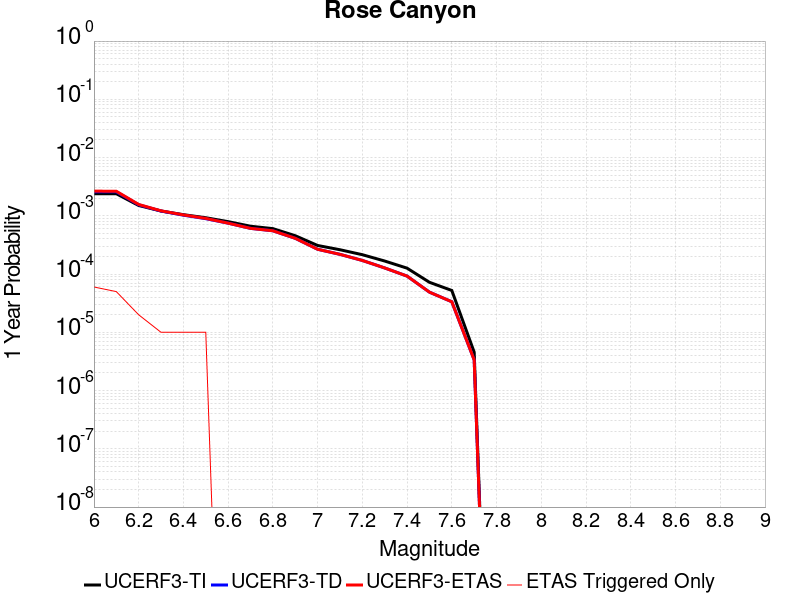 |  |

| Magnitude | 1 wk TI Prob | 1 wk TD Prob | 1 wk ETAS Prob | 1 wk ETAS/TD Gain | 1 wk ETAS Triggered Only | 1 mo TI Prob | 1 mo TD Prob | 1 mo ETAS Prob | 1 mo ETAS/TD Gain | 1 mo ETAS Triggered Only | 1 yr TI Prob | 1 yr TD Prob | 1 yr ETAS Prob | 1 yr ETAS/TD Gain | 1 yr ETAS Triggered Only | 10 yr TI Prob | 10 yr TD Prob | 10 yr ETAS Prob | 10 yr ETAS/TD Gain | 10 yr ETAS Triggered Only |
|-----|-----|-----|-----|-----|-----|-----|-----|-----|-----|-----|-----|-----|-----|-----|-----|-----|-----|-----|-----|-----|
| 6.0 | 4.5923203E-5 | 4.9714225E-5 | 1.19155215E-4 | 2.3968031 | 6.9444446E-5 | 1.9679888E-4 | 2.1304491E-4 | 2.8247456E-4 | 1.3258921 | 6.9444446E-5 | 0.0023933933 | 0.0025909345 | 0.0026601988 | 1.0267334 | 6.9444446E-5 | 0.023677798 | 0.02563999 | 0.025707655 | 1.002639 | 6.9444446E-5 |
| 6.1 | 4.5923203E-5 | 4.9714225E-5 | 4.9714225E-5 | 1.0 | 0.0 | 1.9679888E-4 | 2.1304491E-4 | 2.1304491E-4 | 1.0 | 0.0 | 0.0023933933 | 0.0025909345 | 0.0025909345 | 1.0 | 0.0 | 0.023677798 | 0.02563999 | 0.02563999 | 1.0 | 0.0 |
| 6.2 | 2.8844734E-5 | 2.9668723E-5 | 2.9668723E-5 | 1.0 | 0.0 | 1.2361443E-4 | 1.2714567E-4 | 1.2714567E-4 | 1.0 | 0.0 | 0.0015039665 | 0.0015468939 | 0.0015468939 | 1.0 | 0.0 | 0.0149382865 | 0.015374276 | 0.015374276 | 1.0 | 0.0 |
| 6.3 | 2.3171577E-5 | 2.3161238E-5 | 2.3161238E-5 | 1.0 | 0.0 | 9.9302975E-5 | 9.9258745E-5 | 9.9258745E-5 | 1.0 | 0.0 | 0.0012083431 | 0.0012078186 | 0.0012078186 | 1.0 | 0.0 | 0.012017938 | 0.012022437 | 0.012022437 | 1.0 | 0.0 |
| 6.4 | 2.0066604E-5 | 1.9667024E-5 | 1.9667024E-5 | 1.0 | 0.0 | 8.599689E-5 | 8.4284584E-5 | 8.4284584E-5 | 1.0 | 0.0 | 0.0010465092 | 0.0010256917 | 0.0010256917 | 1.0 | 0.0 | 0.010415946 | 0.010217559 | 0.010217559 | 1.0 | 0.0 |
| 6.5 | 1.776989E-5 | 1.7113807E-5 | 1.7113807E-5 | 1.0 | 0.0 | 7.615444E-5 | 7.334287E-5 | 7.334287E-5 | 1.0 | 0.0 | 9.267859E-4 | 8.925905E-4 | 8.925905E-4 | 1.0 | 0.0 | 0.009229303 | 0.008896211 | 0.008896211 | 1.0 | 0.0 |
| 6.6 | 1.5227364E-5 | 1.433926E-5 | 1.433926E-5 | 1.0 | 0.0 | 6.52585E-5 | 6.1452556E-5 | 6.1452556E-5 | 1.0 | 0.0 | 7.942326E-4 | 7.479332E-4 | 7.479332E-4 | 1.0 | 0.0 | 0.007914 | 0.007458359 | 0.007458359 | 1.0 | 0.0 |
| 6.7 | 1.2703898E-5 | 1.1673274E-5 | 1.1673274E-5 | 1.0 | 0.0 | 5.4444143E-5 | 5.0027378E-5 | 5.0027378E-5 | 1.0 | 0.0 | 6.626558E-4 | 6.089174E-4 | 6.089174E-4 | 1.0 | 0.0 | 0.006606833 | 0.0060750856 | 0.0060750856 | 1.0 | 0.0 |
| 6.8 | 1.1554917E-5 | 1.0609337E-5 | 1.0609337E-5 | 1.0 | 0.0 | 4.9520135E-5 | 4.546782E-5 | 4.546782E-5 | 1.0 | 0.0 | 6.0274085E-4 | 5.5343413E-4 | 5.5343413E-4 | 1.0 | 0.0 | 0.0060110865 | 0.0055225673 | 0.0055225673 | 1.0 | 0.0 |
| 6.9 | 8.732078E-6 | 7.881357E-6 | 7.881357E-6 | 1.0 | 0.0 | 3.7422655E-5 | 3.3776825E-5 | 3.3776825E-5 | 1.0 | 0.0 | 4.5552556E-4 | 4.111582E-4 | 4.111582E-4 | 1.0 | 0.0 | 0.0045459294 | 0.0041048084 | 0.0041048084 | 1.0 | 0.0 |
| 7.0 | 5.9337494E-6 | 5.1074853E-6 | 5.1074853E-6 | 1.0 | 0.0 | 2.5430107E-5 | 2.188904E-5 | 2.188904E-5 | 1.0 | 0.0 | 3.0956755E-4 | 2.664666E-4 | 2.664666E-4 | 1.0 | 0.0 | 0.0030913667 | 0.0026614866 | 0.0026614866 | 1.0 | 0.0 |
| 7.1 | 5.013409E-6 | 4.1773833E-6 | 4.1773833E-6 | 1.0 | 0.0 | 2.1485863E-5 | 1.7902948E-5 | 1.7902948E-5 | 1.0 | 0.0 | 2.6155898E-4 | 2.179467E-4 | 2.179467E-4 | 1.0 | 0.0 | 0.0026125133 | 0.0021773411 | 0.0021773411 | 1.0 | 0.0 |
| 7.2 | 4.120763E-6 | 3.2821383E-6 | 3.2821383E-6 | 1.0 | 0.0 | 1.7660293E-5 | 1.4066231E-5 | 1.4066231E-5 | 1.0 | 0.0 | 2.1499286E-4 | 1.7124301E-4 | 1.7124301E-4 | 1.0 | 0.0 | 0.0021478499 | 0.00171112 | 0.00171112 | 1.0 | 0.0 |
| 7.3 | 3.2081239E-6 | 2.4405372E-6 | 2.4405372E-6 | 1.0 | 0.0 | 1.374903E-5 | 1.0459404E-5 | 1.0459404E-5 | 1.0 | 0.0 | 1.6738157E-4 | 1.2733586E-4 | 1.2733586E-4 | 1.0 | 0.0 | 0.0016725556 | 0.001272636 | 0.001272636 | 1.0 | 0.0 |
| 7.4 | 2.4194755E-6 | 1.7680634E-6 | 1.7680634E-6 | 1.0 | 0.0 | 1.0369139E-5 | 7.577393E-6 | 7.577393E-6 | 1.0 | 0.0 | 1.2623696E-4 | 9.2250906E-5 | 9.2250906E-5 | 1.0 | 0.0 | 0.0012616527 | 9.2213147E-4 | 9.2213147E-4 | 1.0 | 0.0 |
| 7.5 | 1.3842889E-6 | 9.3786275E-7 | 9.3786275E-7 | 1.0 | 0.0 | 5.9326535E-6 | 4.019406E-6 | 4.019406E-6 | 1.0 | 0.0 | 7.222766E-5 | 4.8935202E-5 | 4.8935202E-5 | 1.0 | 0.0 | 7.220419E-4 | 4.892478E-4 | 4.892478E-4 | 1.0 | 0.0 |
| 7.6 | 1.0021575E-6 | 6.411463E-7 | 6.411463E-7 | 1.0 | 0.0 | 4.2949537E-6 | 2.7477672E-6 | 2.7477672E-6 | 1.0 | 0.0 | 5.2289808E-5 | 3.3453573E-5 | 3.3453573E-5 | 1.0 | 0.0 | 5.2277505E-4 | 3.344875E-4 | 3.344875E-4 | 1.0 | 0.0 |
| 7.7 | 8.7620116E-8 | 6.4492404E-8 | 6.4492404E-8 | 1.0 | 0.0 | 3.7551473E-7 | 2.76396E-7 | 2.76396E-7 | 1.0 | 0.0 | 4.5718825E-6 | 3.3651165E-6 | 3.3651165E-6 | 1.0 | 0.0 | 4.5717883E-5 | 3.3650686E-5 | 3.3650686E-5 | 1.0 | 0.0 |

## Chino alt 1
*[(top)](#table-of-contents)*

| 1 Week | 1 Month | 1 Year | 10 Year |
|-----|-----|-----|-----|
|  |  |  |  |

| Magnitude | 1 wk TI Prob | 1 wk TD Prob | 1 wk ETAS Prob | 1 wk ETAS/TD Gain | 1 wk ETAS Triggered Only | 1 mo TI Prob | 1 mo TD Prob | 1 mo ETAS Prob | 1 mo ETAS/TD Gain | 1 mo ETAS Triggered Only | 1 yr TI Prob | 1 yr TD Prob | 1 yr ETAS Prob | 1 yr ETAS/TD Gain | 1 yr ETAS Triggered Only | 10 yr TI Prob | 10 yr TD Prob | 10 yr ETAS Prob | 10 yr ETAS/TD Gain | 10 yr ETAS Triggered Only |
|-----|-----|-----|-----|-----|-----|-----|-----|-----|-----|-----|-----|-----|-----|-----|-----|-----|-----|-----|-----|-----|
| 6.0 | 3.939946E-5 | 4.8948554E-5 | 4.8948554E-5 | 1.0 | 0.0 | 1.6884391E-4 | 2.097656E-4 | 2.097656E-4 | 1.0 | 0.0 | 0.0020537362 | 0.0025513945 | 0.0025513945 | 1.0 | 0.0 | 0.020348595 | 0.025277847 | 0.025345536 | 1.0026778 | 6.9444446E-5 |
| 6.1 | 2.1505624E-5 | 2.6879026E-5 | 2.6879026E-5 | 1.0 | 0.0 | 9.2163704E-5 | 1.1519137E-4 | 1.1519137E-4 | 1.0 | 0.0 | 0.0011215154 | 0.001401664 | 0.001401664 | 1.0 | 0.0 | 0.011158722 | 0.013945141 | 0.014013617 | 1.0049103 | 6.9444446E-5 |
| 6.2 | 2.1505624E-5 | 2.6879026E-5 | 2.6879026E-5 | 1.0 | 0.0 | 9.2163704E-5 | 1.1519137E-4 | 1.1519137E-4 | 1.0 | 0.0 | 0.0011215154 | 0.001401664 | 0.001401664 | 1.0 | 0.0 | 0.011158722 | 0.013945141 | 0.014013617 | 1.0049103 | 6.9444446E-5 |
| 6.3 | 1.4290785E-5 | 1.8165128E-5 | 1.8165128E-5 | 1.0 | 0.0 | 6.1244784E-5 | 7.784848E-5 | 7.784848E-5 | 1.0 | 0.0 | 7.454001E-4 | 9.4743853E-4 | 9.4743853E-4 | 1.0 | 0.0 | 0.007429048 | 0.0094444575 | 0.0094444575 | 1.0 | 0.0 |
| 6.4 | 1.4290785E-5 | 1.8165128E-5 | 1.8165128E-5 | 1.0 | 0.0 | 6.1244784E-5 | 7.784848E-5 | 7.784848E-5 | 1.0 | 0.0 | 7.454001E-4 | 9.4743853E-4 | 9.4743853E-4 | 1.0 | 0.0 | 0.007429048 | 0.0094444575 | 0.0094444575 | 1.0 | 0.0 |
| 6.5 | 1.3017944E-5 | 1.6652088E-5 | 1.6652088E-5 | 1.0 | 0.0 | 5.5789995E-5 | 7.136439E-5 | 7.136439E-5 | 1.0 | 0.0 | 6.790315E-4 | 8.685589E-4 | 8.685589E-4 | 1.0 | 0.0 | 0.0067696036 | 0.008661949 | 0.008661949 | 1.0 | 0.0 |
| 6.6 | 9.470016E-6 | 1.2039424E-5 | 1.2039424E-5 | 1.0 | 0.0 | 4.058515E-5 | 5.1596704E-5 | 5.1596704E-5 | 1.0 | 0.0 | 4.940122E-4 | 6.280428E-4 | 6.280428E-4 | 1.0 | 0.0 | 0.004929154 | 0.0062718987 | 0.0062718987 | 1.0 | 0.0 |
| 6.7 | 8.314155E-6 | 1.0407736E-5 | 1.0407736E-5 | 1.0 | 0.0 | 3.5631605E-5 | 4.4604003E-5 | 4.4604003E-5 | 1.0 | 0.0 | 4.3372845E-4 | 5.429507E-4 | 5.429507E-4 | 1.0 | 0.0 | 0.004328829 | 0.005425775 | 0.005425775 | 1.0 | 0.0 |
| 6.8 | 3.4856364E-6 | 3.8133708E-6 | 3.8133708E-6 | 1.0 | 0.0 | 1.4938357E-5 | 1.6342927E-5 | 1.6342927E-5 | 1.0 | 0.0 | 1.8185932E-4 | 1.9895904E-4 | 1.9895904E-4 | 1.0 | 0.0 | 0.0018171056 | 0.0019894864 | 0.0019894864 | 1.0 | 0.0 |
| 6.9 | 2.2645952E-6 | 2.1529022E-6 | 2.1529022E-6 | 1.0 | 0.0 | 9.705372E-6 | 9.226692E-6 | 9.226692E-6 | 1.0 | 0.0 | 1.18156495E-4 | 1.123294E-4 | 1.123294E-4 | 1.0 | 0.0 | 0.0011809369 | 0.0011233423 | 0.0011233423 | 1.0 | 0.0 |
| 7.0 | 1.7864003E-6 | 1.5430785E-6 | 1.5430785E-6 | 1.0 | 0.0 | 7.655979E-6 | 6.613177E-6 | 6.613177E-6 | 1.0 | 0.0 | 9.3207556E-5 | 8.051251E-5 | 8.051251E-5 | 1.0 | 0.0 | 9.316847E-4 | 8.0528046E-4 | 8.0528046E-4 | 1.0 | 0.0 |
| 7.1 | 1.7315456E-6 | 1.4733511E-6 | 1.4733511E-6 | 1.0 | 0.0 | 7.420889E-6 | 6.3143466E-6 | 6.3143466E-6 | 1.0 | 0.0 | 9.034557E-5 | 7.6874516E-5 | 7.6874516E-5 | 1.0 | 0.0 | 9.0308854E-4 | 7.6891703E-4 | 7.6891703E-4 | 1.0 | 0.0 |
| 7.2 | 1.6008337E-6 | 1.3574215E-6 | 1.3574215E-6 | 1.0 | 0.0 | 6.860698E-6 | 5.817508E-6 | 5.817508E-6 | 1.0 | 0.0 | 8.352579E-5 | 7.082591E-5 | 7.082591E-5 | 1.0 | 0.0 | 8.34944E-4 | 7.0845755E-4 | 7.0845755E-4 | 1.0 | 0.0 |
| 7.3 | 1.3320939E-6 | 1.121782E-6 | 1.121782E-6 | 1.0 | 0.0 | 5.7089615E-6 | 4.807629E-6 | 4.807629E-6 | 1.0 | 0.0 | 6.9504385E-5 | 5.8531357E-5 | 5.8531357E-5 | 1.0 | 0.0 | 6.9482654E-4 | 5.8530393E-4 | 5.8530393E-4 | 1.0 | 0.0 |
| 7.4 | 1.114294E-6 | 9.237111E-7 | 9.237111E-7 | 1.0 | 0.0 | 4.775537E-6 | 3.958756E-6 | 3.958756E-6 | 1.0 | 0.0 | 5.8140613E-5 | 4.8196827E-5 | 4.8196827E-5 | 1.0 | 0.0 | 5.81254E-4 | 4.8188053E-4 | 4.8188053E-4 | 1.0 | 0.0 |
| 7.5 | 9.354081E-7 | 7.6234323E-7 | 7.6234323E-7 | 1.0 | 0.0 | 4.0088858E-6 | 3.2671815E-6 | 3.2671815E-6 | 1.0 | 0.0 | 4.8807087E-5 | 3.9777242E-5 | 3.9777242E-5 | 1.0 | 0.0 | 4.879637E-4 | 3.977046E-4 | 3.977046E-4 | 1.0 | 0.0 |
| 7.6 | 8.521771E-7 | 6.88071E-7 | 6.88071E-7 | 1.0 | 0.0 | 3.6521824E-6 | 2.9488726E-6 | 2.9488726E-6 | 1.0 | 0.0 | 4.4464414E-5 | 3.5901965E-5 | 3.5901965E-5 | 1.0 | 0.0 | 4.4455516E-4 | 3.589648E-4 | 3.589648E-4 | 1.0 | 0.0 |
| 7.7 | 2.1803626E-7 | 1.418649E-7 | 1.418649E-7 | 1.0 | 0.0 | 9.344408E-7 | 6.079923E-7 | 6.079923E-7 | 1.0 | 0.0 | 1.1376757E-5 | 7.4022914E-6 | 7.4022914E-6 | 1.0 | 0.0 | 1.13761744E-4 | 7.402141E-5 | 7.402141E-5 | 1.0 | 0.0 |

## Hosgri (Extension)
*[(top)](#table-of-contents)*

| 1 Week | 1 Month | 1 Year | 10 Year |
|-----|-----|-----|-----|
|  | 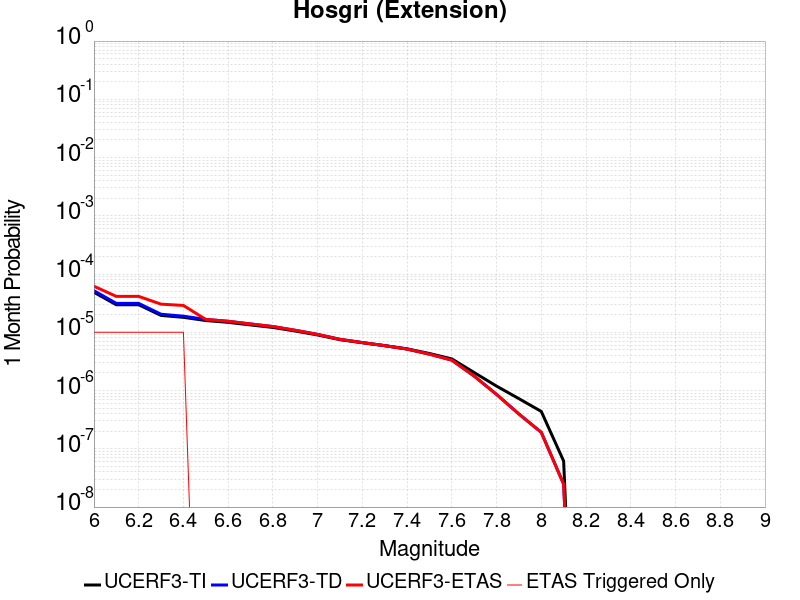 |  |  |

| Magnitude | 1 wk TI Prob | 1 wk TD Prob | 1 wk ETAS Prob | 1 wk ETAS/TD Gain | 1 wk ETAS Triggered Only | 1 mo TI Prob | 1 mo TD Prob | 1 mo ETAS Prob | 1 mo ETAS/TD Gain | 1 mo ETAS Triggered Only | 1 yr TI Prob | 1 yr TD Prob | 1 yr ETAS Prob | 1 yr ETAS/TD Gain | 1 yr ETAS Triggered Only | 10 yr TI Prob | 10 yr TD Prob | 10 yr ETAS Prob | 10 yr ETAS/TD Gain | 10 yr ETAS Triggered Only |
|-----|-----|-----|-----|-----|-----|-----|-----|-----|-----|-----|-----|-----|-----|-----|-----|-----|-----|-----|-----|-----|
| 6.0 | 1.1369135E-5 | 1.2083072E-5 | 1.2083072E-5 | 1.0 | 0.0 | 4.8723956E-5 | 5.1783692E-5 | 1.2122454E-4 | 2.340979 | 6.9444446E-5 | 5.9305265E-4 | 6.3030684E-4 | 6.997075E-4 | 1.1101062 | 6.9444446E-5 | 0.005914725 | 0.0062874397 | 0.0063564475 | 1.0109755 | 6.9444446E-5 |
| 6.1 | 6.934979E-6 | 7.324555E-6 | 7.324555E-6 | 1.0 | 0.0 | 2.9721E-5 | 3.1390595E-5 | 1.0083286E-4 | 3.2121997 | 6.9444446E-5 | 3.617931E-4 | 3.8211764E-4 | 4.5153554E-4 | 1.1816664 | 6.9444446E-5 | 0.0036120464 | 0.0038150186 | 0.0038841981 | 1.0181335 | 6.9444446E-5 |
| 6.2 | 6.934979E-6 | 7.324555E-6 | 7.324555E-6 | 1.0 | 0.0 | 2.9721E-5 | 3.1390595E-5 | 1.0083286E-4 | 3.2121997 | 6.9444446E-5 | 3.617931E-4 | 3.8211764E-4 | 4.5153554E-4 | 1.1816664 | 6.9444446E-5 | 0.0036120464 | 0.0038150186 | 0.0038841981 | 1.0181335 | 6.9444446E-5 |
| 6.3 | 4.5484676E-6 | 4.76933E-6 | 4.76933E-6 | 1.0 | 0.0 | 1.9493287E-5 | 2.043983E-5 | 8.988285E-5 | 4.3974366 | 6.9444446E-5 | 2.3730492E-4 | 2.4882692E-4 | 3.1825408E-4 | 1.2790179 | 6.9444446E-5 | 0.0023705168 | 0.0024855258 | 0.0025547976 | 1.02787 | 6.9444446E-5 |
| 6.4 | 4.218095E-6 | 4.4168614E-6 | 4.4168614E-6 | 1.0 | 0.0 | 1.8077424E-5 | 1.8929271E-5 | 8.83724E-5 | 4.668558 | 6.9444446E-5 | 2.2007042E-4 | 2.3043984E-4 | 2.9986826E-4 | 1.3012867 | 6.9444446E-5 | 0.002198526 | 0.0023020422 | 0.0023713268 | 1.030097 | 6.9444446E-5 |
| 6.5 | 3.717374E-6 | 3.8838775E-6 | 3.8838775E-6 | 1.0 | 0.0 | 1.5931506E-5 | 1.6645085E-5 | 1.6645085E-5 | 1.0 | 0.0 | 1.9394881E-4 | 2.0263524E-4 | 2.0263524E-4 | 1.0 | 0.0 | 0.0019377962 | 0.0020245234 | 0.0020245234 | 1.0 | 0.0 |
| 6.6 | 3.4605036E-6 | 3.608306E-6 | 3.608306E-6 | 1.0 | 0.0 | 1.4830645E-5 | 1.5464078E-5 | 1.5464078E-5 | 1.0 | 0.0 | 1.8054814E-4 | 1.8825903E-4 | 1.8825903E-4 | 1.0 | 0.0 | 0.0018040152 | 0.0018810101 | 0.0018810101 | 1.0 | 0.0 |
| 6.7 | 3.123439E-6 | 3.2465687E-6 | 3.2465687E-6 | 1.0 | 0.0 | 1.33860985E-5 | 1.3913792E-5 | 1.3913792E-5 | 1.0 | 0.0 | 1.6296357E-4 | 1.6938736E-4 | 1.6938736E-4 | 1.0 | 0.0 | 0.001628441 | 0.0016925934 | 0.0016925934 | 1.0 | 0.0 |
| 6.8 | 2.8290783E-6 | 2.9305404E-6 | 2.9305404E-6 | 1.0 | 0.0 | 1.2124565E-5 | 1.2559399E-5 | 1.2559399E-5 | 1.0 | 0.0 | 1.4760658E-4 | 1.5290003E-4 | 1.5290003E-4 | 1.0 | 0.0 | 0.0014750857 | 0.001527957 | 0.001527957 | 1.0 | 0.0 |
| 6.9 | 2.454112E-6 | 2.5283196E-6 | 2.5283196E-6 | 1.0 | 0.0 | 1.0517581E-5 | 1.0835611E-5 | 1.0835611E-5 | 1.0 | 0.0 | 1.2804402E-4 | 1.3191563E-4 | 1.3191563E-4 | 1.0 | 0.0 | 0.0012797028 | 0.0013183793 | 0.0013183793 | 1.0 | 0.0 |
| 7.0 | 2.1008145E-6 | 2.1498704E-6 | 2.1498704E-6 | 1.0 | 0.0 | 9.003459E-6 | 9.213698E-6 | 9.213698E-6 | 1.0 | 0.0 | 1.096116E-4 | 1.1217103E-4 | 1.1217103E-4 | 1.0 | 0.0 | 0.0010955755 | 0.0011211479 | 0.0011211479 | 1.0 | 0.0 |
| 7.1 | 1.744384E-6 | 1.7686352E-6 | 1.7686352E-6 | 1.0 | 0.0 | 7.47591E-6 | 7.5798434E-6 | 7.5798434E-6 | 1.0 | 0.0 | 9.1015405E-5 | 9.22807E-5 | 9.22807E-5 | 1.0 | 0.0 | 9.097813E-4 | 9.2242553E-4 | 9.2242553E-4 | 1.0 | 0.0 |
| 7.2 | 1.5456587E-6 | 1.5562882E-6 | 1.5562882E-6 | 1.0 | 0.0 | 6.6242346E-6 | 6.66979E-6 | 6.66979E-6 | 1.0 | 0.0 | 8.064707E-5 | 8.120168E-5 | 8.120168E-5 | 1.0 | 0.0 | 8.0617814E-4 | 8.117213E-4 | 8.117213E-4 | 1.0 | 0.0 |
| 7.3 | 1.3775123E-6 | 1.3766082E-6 | 1.3766082E-6 | 1.0 | 0.0 | 5.9036106E-6 | 5.899736E-6 | 5.899736E-6 | 1.0 | 0.0 | 7.187409E-5 | 7.182693E-5 | 7.182693E-5 | 1.0 | 0.0 | 7.185085E-4 | 7.180382E-4 | 7.180382E-4 | 1.0 | 0.0 |
| 7.4 | 1.214491E-6 | 1.2023461E-6 | 1.2023461E-6 | 1.0 | 0.0 | 5.2049513E-6 | 5.1529014E-6 | 5.1529014E-6 | 1.0 | 0.0 | 6.336844E-5 | 6.2734776E-5 | 6.2734776E-5 | 1.0 | 0.0 | 6.335037E-4 | 6.271715E-4 | 6.271715E-4 | 1.0 | 0.0 |
| 7.5 | 1.0101123E-6 | 9.842246E-7 | 9.842246E-7 | 1.0 | 0.0 | 4.3290456E-6 | 4.2180986E-6 | 4.2180986E-6 | 1.0 | 0.0 | 5.2704854E-5 | 5.1354145E-5 | 5.1354145E-5 | 1.0 | 0.0 | 5.2692357E-4 | 5.1342335E-4 | 5.1342335E-4 | 1.0 | 0.0 |
| 7.6 | 8.1558215E-7 | 7.765966E-7 | 7.765966E-7 | 1.0 | 0.0 | 3.4953473E-6 | 3.328267E-6 | 3.328267E-6 | 1.0 | 0.0 | 4.255502E-5 | 4.0520903E-5 | 4.0520903E-5 | 1.0 | 0.0 | 4.2546875E-4 | 4.0513556E-4 | 4.0513556E-4 | 1.0 | 0.0 |
| 7.7 | 4.757816E-7 | 4.1308888E-7 | 4.1308888E-7 | 1.0 | 0.0 | 2.0390623E-6 | 1.7703798E-6 | 1.7703798E-6 | 1.0 | 0.0 | 2.4825302E-5 | 2.155416E-5 | 2.155416E-5 | 1.0 | 0.0 | 2.482253E-4 | 2.1552083E-4 | 2.1552083E-4 | 1.0 | 0.0 |
| 7.8 | 2.782787E-7 | 2.0047722E-7 | 2.0047722E-7 | 1.0 | 0.0 | 1.1926223E-6 | 8.5918776E-7 | 8.5918776E-7 | 1.0 | 0.0 | 1.452008E-5 | 1.04605615E-5 | 1.04605615E-5 | 1.0 | 0.0 | 1.4519131E-4 | 1.04600724E-4 | 1.04600724E-4 | 1.0 | 0.0 |
| 7.9 | 1.6948086E-7 | 9.244227E-8 | 9.244227E-8 | 1.0 | 0.0 | 7.2634634E-7 | 3.961811E-7 | 3.961811E-7 | 1.0 | 0.0 | 8.843231E-6 | 4.8234942E-6 | 4.8234942E-6 | 1.0 | 0.0 | 8.842879E-5 | 4.8233902E-5 | 4.8233902E-5 | 1.0 | 0.0 |
| 8.0 | 1.0225492E-7 | 4.4738776E-8 | 4.4738776E-8 | 1.0 | 0.0 | 4.382353E-7 | 1.917376E-7 | 1.917376E-7 | 1.0 | 0.0 | 5.335502E-6 | 2.3344028E-6 | 2.3344028E-6 | 1.0 | 0.0 | 5.335374E-5 | 2.3343786E-5 | 2.3343786E-5 | 1.0 | 0.0 |
| 8.1 | 1.43711345E-8 | 5.787707E-9 | 5.787707E-9 | 1.0 | 0.0 | 6.1590576E-8 | 2.480446E-8 | 2.480446E-8 | 1.0 | 0.0 | 7.4986497E-7 | 3.0199428E-7 | 3.0199428E-7 | 1.0 | 0.0 | 7.4986247E-6 | 3.0199392E-6 | 3.0199392E-6 | 1.0 | 0.0 |

## Santa Ynez River
*[(top)](#table-of-contents)*

| 1 Week | 1 Month | 1 Year | 10 Year |
|-----|-----|-----|-----|
|  |  |  |  |

| Magnitude | 1 wk TI Prob | 1 wk TD Prob | 1 wk ETAS Prob | 1 wk ETAS/TD Gain | 1 wk ETAS Triggered Only | 1 mo TI Prob | 1 mo TD Prob | 1 mo ETAS Prob | 1 mo ETAS/TD Gain | 1 mo ETAS Triggered Only | 1 yr TI Prob | 1 yr TD Prob | 1 yr ETAS Prob | 1 yr ETAS/TD Gain | 1 yr ETAS Triggered Only | 10 yr TI Prob | 10 yr TD Prob | 10 yr ETAS Prob | 10 yr ETAS/TD Gain | 10 yr ETAS Triggered Only |
|-----|-----|-----|-----|-----|-----|-----|-----|-----|-----|-----|-----|-----|-----|-----|-----|-----|-----|-----|-----|-----|
| 6.0 | 1.6396456E-5 | 1.7209435E-5 | 1.7209435E-5 | 1.0 | 0.0 | 7.026863E-5 | 7.375284E-5 | 7.375284E-5 | 1.0 | 0.0 | 8.551848E-4 | 8.976064E-4 | 8.976064E-4 | 1.0 | 0.0 | 0.0085190125 | 0.008943358 | 0.009012181 | 1.0076954 | 6.9444446E-5 |
| 6.1 | 1.6396456E-5 | 1.7209435E-5 | 1.7209435E-5 | 1.0 | 0.0 | 7.026863E-5 | 7.375284E-5 | 7.375284E-5 | 1.0 | 0.0 | 8.551848E-4 | 8.976064E-4 | 8.976064E-4 | 1.0 | 0.0 | 0.0085190125 | 0.008943358 | 0.009012181 | 1.0076954 | 6.9444446E-5 |
| 6.2 | 1.6396456E-5 | 1.7209435E-5 | 1.7209435E-5 | 1.0 | 0.0 | 7.026863E-5 | 7.375284E-5 | 7.375284E-5 | 1.0 | 0.0 | 8.551848E-4 | 8.976064E-4 | 8.976064E-4 | 1.0 | 0.0 | 0.0085190125 | 0.008943358 | 0.009012181 | 1.0076954 | 6.9444446E-5 |
| 6.3 | 9.736976E-6 | 1.012233E-5 | 1.012233E-5 | 1.0 | 0.0 | 4.172923E-5 | 4.338072E-5 | 4.338072E-5 | 1.0 | 0.0 | 5.0793495E-4 | 5.280373E-4 | 5.280373E-4 | 1.0 | 0.0 | 0.005067755 | 0.005268332 | 0.005268332 | 1.0 | 0.0 |
| 6.4 | 9.736976E-6 | 1.012233E-5 | 1.012233E-5 | 1.0 | 0.0 | 4.172923E-5 | 4.338072E-5 | 4.338072E-5 | 1.0 | 0.0 | 5.0793495E-4 | 5.280373E-4 | 5.280373E-4 | 1.0 | 0.0 | 0.005067755 | 0.005268332 | 0.005268332 | 1.0 | 0.0 |
| 6.5 | 7.081964E-6 | 7.3298966E-6 | 7.3298966E-6 | 1.0 | 0.0 | 3.035092E-5 | 3.1413474E-5 | 3.1413474E-5 | 1.0 | 0.0 | 3.694598E-4 | 3.8239348E-4 | 3.8239348E-4 | 1.0 | 0.0 | 0.0036884616 | 0.0038175168 | 0.0038175168 | 1.0 | 0.0 |
| 6.6 | 5.873247E-6 | 6.059743E-6 | 6.059743E-6 | 1.0 | 0.0 | 2.5170815E-5 | 2.5970074E-5 | 2.5970074E-5 | 1.0 | 0.0 | 3.064116E-4 | 3.1614062E-4 | 3.1614062E-4 | 1.0 | 0.0 | 0.0030598943 | 0.0031569963 | 0.0031569963 | 1.0 | 0.0 |
| 6.7 | 4.973277E-6 | 5.115901E-6 | 5.115901E-6 | 1.0 | 0.0 | 2.1313872E-5 | 2.1925109E-5 | 2.1925109E-5 | 1.0 | 0.0 | 2.5946548E-4 | 2.66906E-4 | 2.66906E-4 | 1.0 | 0.0 | 0.0025916274 | 0.0026659032 | 0.0026659032 | 1.0 | 0.0 |
| 6.8 | 4.396492E-6 | 4.5109778E-6 | 4.5109778E-6 | 1.0 | 0.0 | 1.884197E-5 | 1.9332621E-5 | 1.9332621E-5 | 1.0 | 0.0 | 2.2937685E-4 | 2.3534958E-4 | 2.3534958E-4 | 1.0 | 0.0 | 0.0022914023 | 0.0023510386 | 0.0023510386 | 1.0 | 0.0 |
| 6.9 | 3.5255632E-6 | 3.6013332E-6 | 3.6013332E-6 | 1.0 | 0.0 | 1.5109469E-5 | 1.5434196E-5 | 1.5434196E-5 | 1.0 | 0.0 | 1.8394225E-4 | 1.8789528E-4 | 1.8789528E-4 | 1.0 | 0.0 | 0.0018379007 | 0.0018773803 | 0.0018773803 | 1.0 | 0.0 |
| 7.0 | 3.211603E-6 | 3.273654E-6 | 3.273654E-6 | 1.0 | 0.0 | 1.376394E-5 | 1.4029872E-5 | 1.4029872E-5 | 1.0 | 0.0 | 1.6756308E-4 | 1.7080043E-4 | 1.7080043E-4 | 1.0 | 0.0 | 0.0016743679 | 0.0017067058 | 0.0017067058 | 1.0 | 0.0 |
| 7.1 | 2.5094619E-6 | 2.5409204E-6 | 2.5409204E-6 | 1.0 | 0.0 | 1.0754793E-5 | 1.0889614E-5 | 1.0889614E-5 | 1.0 | 0.0 | 1.3093173E-4 | 1.3257304E-4 | 1.3257304E-4 | 1.0 | 0.0 | 0.0013085462 | 0.0013249456 | 0.0013249456 | 1.0 | 0.0 |
| 7.2 | 2.0515774E-6 | 2.0619375E-6 | 2.0619375E-6 | 1.0 | 0.0 | 8.792445E-6 | 8.836846E-6 | 8.836846E-6 | 1.0 | 0.0 | 1.0704277E-4 | 1.0758333E-4 | 1.0758333E-4 | 1.0 | 0.0 | 0.0010699122 | 0.0010753168 | 0.0010753168 | 1.0 | 0.0 |
| 7.3 | 1.6845745E-6 | 1.6773907E-6 | 1.6773907E-6 | 1.0 | 0.0 | 7.219585E-6 | 7.1887976E-6 | 7.1887976E-6 | 1.0 | 0.0 | 8.78949E-5 | 8.752012E-5 | 8.752012E-5 | 1.0 | 0.0 | 8.7860145E-4 | 8.7485946E-4 | 8.7485946E-4 | 1.0 | 0.0 |
| 7.4 | 1.3600285E-6 | 1.3333357E-6 | 1.3333357E-6 | 1.0 | 0.0 | 5.82868E-6 | 5.714284E-6 | 5.714284E-6 | 1.0 | 0.0 | 7.096187E-5 | 6.956921E-5 | 6.956921E-5 | 1.0 | 0.0 | 7.0939213E-4 | 6.954765E-4 | 6.954765E-4 | 1.0 | 0.0 |
| 7.5 | 9.735342E-7 | 9.290103E-7 | 9.290103E-7 | 1.0 | 0.0 | 4.172283E-6 | 3.9814668E-6 | 3.9814668E-6 | 1.0 | 0.0 | 5.079636E-5 | 4.8473295E-5 | 4.8473295E-5 | 1.0 | 0.0 | 5.0784746E-4 | 4.8462892E-4 | 4.8462892E-4 | 1.0 | 0.0 |
| 7.6 | 5.067187E-7 | 4.77857E-7 | 4.77857E-7 | 1.0 | 0.0 | 2.1716498E-6 | 2.047957E-6 | 2.047957E-6 | 1.0 | 0.0 | 2.6439517E-5 | 2.4933597E-5 | 2.4933597E-5 | 1.0 | 0.0 | 2.643637E-4 | 2.4930874E-4 | 2.4930874E-4 | 1.0 | 0.0 |
| 7.7 | 2.769089E-7 | 2.5759124E-7 | 2.5759124E-7 | 1.0 | 0.0 | 1.1867519E-6 | 1.1039621E-6 | 1.1039621E-6 | 1.0 | 0.0 | 1.4448608E-5 | 1.34406555E-5 | 1.34406555E-5 | 1.0 | 0.0 | 1.444767E-4 | 1.3439846E-4 | 1.3439846E-4 | 1.0 | 0.0 |
| 7.8 | 1.7044663E-7 | 1.5449015E-7 | 1.5449015E-7 | 1.0 | 0.0 | 7.3048534E-7 | 6.621005E-7 | 6.621005E-7 | 1.0 | 0.0 | 8.893623E-6 | 8.061043E-6 | 8.061043E-6 | 1.0 | 0.0 | 8.893267E-5 | 8.060753E-5 | 8.060753E-5 | 1.0 | 0.0 |
| 7.9 | 4.8344287E-8 | 4.0910923E-8 | 4.0910923E-8 | 1.0 | 0.0 | 2.0718979E-7 | 1.7533252E-7 | 1.7533252E-7 | 1.0 | 0.0 | 2.5225327E-6 | 2.1346711E-6 | 2.1346711E-6 | 1.0 | 0.0 | 2.5225041E-5 | 2.1346512E-5 | 2.1346512E-5 | 1.0 | 0.0 |

## Fontana (Seismicity)
*[(top)](#table-of-contents)*

| 1 Week | 1 Month | 1 Year | 10 Year |
|-----|-----|-----|-----|
| 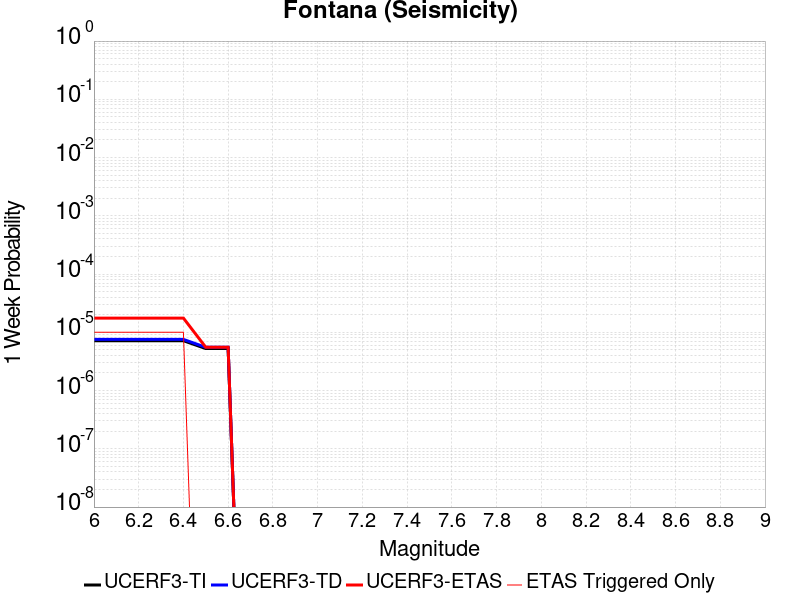 |  |  |  |

| Magnitude | 1 wk TI Prob | 1 wk TD Prob | 1 wk ETAS Prob | 1 wk ETAS/TD Gain | 1 wk ETAS Triggered Only | 1 mo TI Prob | 1 mo TD Prob | 1 mo ETAS Prob | 1 mo ETAS/TD Gain | 1 mo ETAS Triggered Only | 1 yr TI Prob | 1 yr TD Prob | 1 yr ETAS Prob | 1 yr ETAS/TD Gain | 1 yr ETAS Triggered Only | 10 yr TI Prob | 10 yr TD Prob | 10 yr ETAS Prob | 10 yr ETAS/TD Gain | 10 yr ETAS Triggered Only |
|-----|-----|-----|-----|-----|-----|-----|-----|-----|-----|-----|-----|-----|-----|-----|-----|-----|-----|-----|-----|-----|
| 6.0 | 7.1789214E-6 | 7.5520006E-6 | 7.5520006E-6 | 1.0 | 0.0 | 3.076644E-5 | 3.2365548E-5 | 3.2365548E-5 | 1.0 | 0.0 | 3.7451705E-4 | 3.9402005E-4 | 3.9402005E-4 | 1.0 | 0.0 | 0.003738865 | 0.003937214 | 0.0040063853 | 1.0175685 | 6.9444446E-5 |
| 6.1 | 7.1789214E-6 | 7.5520006E-6 | 7.5520006E-6 | 1.0 | 0.0 | 3.076644E-5 | 3.2365548E-5 | 3.2365548E-5 | 1.0 | 0.0 | 3.7451705E-4 | 3.9402005E-4 | 3.9402005E-4 | 1.0 | 0.0 | 0.003738865 | 0.003937214 | 0.0040063853 | 1.0175685 | 6.9444446E-5 |
| 6.2 | 7.1789214E-6 | 7.5520006E-6 | 7.5520006E-6 | 1.0 | 0.0 | 3.076644E-5 | 3.2365548E-5 | 3.2365548E-5 | 1.0 | 0.0 | 3.7451705E-4 | 3.9402005E-4 | 3.9402005E-4 | 1.0 | 0.0 | 0.003738865 | 0.003937214 | 0.0040063853 | 1.0175685 | 6.9444446E-5 |
| 6.3 | 7.1789214E-6 | 7.5520006E-6 | 7.5520006E-6 | 1.0 | 0.0 | 3.076644E-5 | 3.2365548E-5 | 3.2365548E-5 | 1.0 | 0.0 | 3.7451705E-4 | 3.9402005E-4 | 3.9402005E-4 | 1.0 | 0.0 | 0.003738865 | 0.003937214 | 0.0040063853 | 1.0175685 | 6.9444446E-5 |
| 6.4 | 7.1789214E-6 | 7.5520006E-6 | 7.5520006E-6 | 1.0 | 0.0 | 3.076644E-5 | 3.2365548E-5 | 3.2365548E-5 | 1.0 | 0.0 | 3.7451705E-4 | 3.9402005E-4 | 3.9402005E-4 | 1.0 | 0.0 | 0.003738865 | 0.003937214 | 0.0040063853 | 1.0175685 | 6.9444446E-5 |
| 6.5 | 5.2611317E-6 | 5.532726E-6 | 5.532726E-6 | 1.0 | 0.0 | 2.2547512E-5 | 2.3711682E-5 | 2.3711682E-5 | 1.0 | 0.0 | 2.744814E-4 | 2.8868974E-4 | 2.8868974E-4 | 1.0 | 0.0 | 0.002741426 | 0.0028868972 | 0.0029561413 | 1.0239856 | 6.9444446E-5 |
| 6.6 | 5.2611317E-6 | 5.532726E-6 | 5.532726E-6 | 1.0 | 0.0 | 2.2547512E-5 | 2.3711682E-5 | 2.3711682E-5 | 1.0 | 0.0 | 2.744814E-4 | 2.8868974E-4 | 2.8868974E-4 | 1.0 | 0.0 | 0.002741426 | 0.0028868972 | 0.0029561413 | 1.0239856 | 6.9444446E-5 |

## Los Osos 2011
*[(top)](#table-of-contents)*

| 1 Week | 1 Month | 1 Year | 10 Year |
|-----|-----|-----|-----|
|  |  |  |  |

| Magnitude | 1 wk TI Prob | 1 wk TD Prob | 1 wk ETAS Prob | 1 wk ETAS/TD Gain | 1 wk ETAS Triggered Only | 1 mo TI Prob | 1 mo TD Prob | 1 mo ETAS Prob | 1 mo ETAS/TD Gain | 1 mo ETAS Triggered Only | 1 yr TI Prob | 1 yr TD Prob | 1 yr ETAS Prob | 1 yr ETAS/TD Gain | 1 yr ETAS Triggered Only | 10 yr TI Prob | 10 yr TD Prob | 10 yr ETAS Prob | 10 yr ETAS/TD Gain | 10 yr ETAS Triggered Only |
|-----|-----|-----|-----|-----|-----|-----|-----|-----|-----|-----|-----|-----|-----|-----|-----|-----|-----|-----|-----|-----|
| 6.0 | 4.8871775E-6 | 4.9814835E-6 | 7.442558E-5 | 14.940446 | 6.9444446E-5 | 2.0944879E-5 | 2.1349055E-5 | 9.079202E-5 | 4.252742 | 6.9444446E-5 | 2.5497406E-4 | 2.5989654E-4 | 3.2932294E-4 | 1.2671309 | 6.9444446E-5 | 0.002546817 | 0.0025962002 | 0.0026654645 | 1.026679 | 6.9444446E-5 |
| 6.1 | 4.8871775E-6 | 4.9814835E-6 | 7.442558E-5 | 14.940446 | 6.9444446E-5 | 2.0944879E-5 | 2.1349055E-5 | 9.079202E-5 | 4.252742 | 6.9444446E-5 | 2.5497406E-4 | 2.5989654E-4 | 3.2932294E-4 | 1.2671309 | 6.9444446E-5 | 0.002546817 | 0.0025962002 | 0.0026654645 | 1.026679 | 6.9444446E-5 |
| 6.2 | 4.8871775E-6 | 4.9814835E-6 | 7.442558E-5 | 14.940446 | 6.9444446E-5 | 2.0944879E-5 | 2.1349055E-5 | 9.079202E-5 | 4.252742 | 6.9444446E-5 | 2.5497406E-4 | 2.5989654E-4 | 3.2932294E-4 | 1.2671309 | 6.9444446E-5 | 0.002546817 | 0.0025962002 | 0.0026654645 | 1.026679 | 6.9444446E-5 |
| 6.3 | 4.8871775E-6 | 4.9814835E-6 | 7.442558E-5 | 14.940446 | 6.9444446E-5 | 2.0944879E-5 | 2.1349055E-5 | 9.079202E-5 | 4.252742 | 6.9444446E-5 | 2.5497406E-4 | 2.5989654E-4 | 3.2932294E-4 | 1.2671309 | 6.9444446E-5 | 0.002546817 | 0.0025962002 | 0.0026654645 | 1.026679 | 6.9444446E-5 |
| 6.4 | 4.8871775E-6 | 4.9814835E-6 | 7.442558E-5 | 14.940446 | 6.9444446E-5 | 2.0944879E-5 | 2.1349055E-5 | 9.079202E-5 | 4.252742 | 6.9444446E-5 | 2.5497406E-4 | 2.5989654E-4 | 3.2932294E-4 | 1.2671309 | 6.9444446E-5 | 0.002546817 | 0.0025962002 | 0.0026654645 | 1.026679 | 6.9444446E-5 |
| 6.5 | 3.1724062E-6 | 3.223395E-6 | 3.223395E-6 | 1.0 | 0.0 | 1.3595956E-5 | 1.3814477E-5 | 1.3814477E-5 | 1.0 | 0.0 | 1.6551818E-4 | 1.681784E-4 | 1.681784E-4 | 1.0 | 0.0 | 0.0016539496 | 0.0016805249 | 0.0016805249 | 1.0 | 0.0 |
| 6.6 | 3.1022591E-6 | 3.1511045E-6 | 3.1511045E-6 | 1.0 | 0.0 | 1.3295328E-5 | 1.3504664E-5 | 1.3504664E-5 | 1.0 | 0.0 | 1.618586E-4 | 1.64407E-4 | 1.64407E-4 | 1.0 | 0.0 | 0.0016174077 | 0.0016428665 | 0.0016428665 | 1.0 | 0.0 |
| 6.7 | 2.611518E-6 | 2.6491832E-6 | 2.6491832E-6 | 1.0 | 0.0 | 1.1192172E-5 | 1.1353593E-5 | 1.1353593E-5 | 1.0 | 0.0 | 1.3625617E-4 | 1.3822126E-4 | 1.3822126E-4 | 1.0 | 0.0 | 0.0013617266 | 0.0013813575 | 0.0013813575 | 1.0 | 0.0 |
| 6.8 | 2.4780884E-6 | 2.5121592E-6 | 2.5121592E-6 | 1.0 | 0.0 | 1.0620336E-5 | 1.0766353E-5 | 1.0766353E-5 | 1.0 | 0.0 | 1.2929492E-4 | 1.3107249E-4 | 1.3107249E-4 | 1.0 | 0.0 | 0.0012921972 | 0.001309956 | 0.001309956 | 1.0 | 0.0 |
| 6.9 | 2.1376322E-6 | 2.1635055E-6 | 2.1635055E-6 | 1.0 | 0.0 | 9.161248E-6 | 9.272134E-6 | 9.272134E-6 | 1.0 | 0.0 | 1.1153249E-4 | 1.128824E-4 | 1.128824E-4 | 1.0 | 0.0 | 0.0011147653 | 0.0011282525 | 0.0011282525 | 1.0 | 0.0 |
| 7.0 | 1.9282882E-6 | 1.9494585E-6 | 1.9494585E-6 | 1.0 | 0.0 | 8.264066E-6 | 8.354796E-6 | 8.354796E-6 | 1.0 | 0.0 | 1.0061036E-4 | 1.017149E-4 | 1.017149E-4 | 1.0 | 0.0 | 0.0010056482 | 0.0010166848 | 0.0010166848 | 1.0 | 0.0 |
| 7.1 | 1.6353226E-6 | 1.6501118E-6 | 1.6501118E-6 | 1.0 | 0.0 | 7.0085066E-6 | 7.0718884E-6 | 7.0718884E-6 | 1.0 | 0.0 | 8.532523E-5 | 8.609685E-5 | 8.609685E-5 | 1.0 | 0.0 | 8.529247E-4 | 8.6063566E-4 | 8.6063566E-4 | 1.0 | 0.0 |
| 7.2 | 1.4446276E-6 | 1.4553341E-6 | 1.4553341E-6 | 1.0 | 0.0 | 6.191247E-6 | 6.237131E-6 | 6.237131E-6 | 1.0 | 0.0 | 7.537582E-5 | 7.593443E-5 | 7.593443E-5 | 1.0 | 0.0 | 7.535026E-4 | 7.590854E-4 | 7.590854E-4 | 1.0 | 0.0 |
| 7.3 | 1.2014582E-6 | 1.2069073E-6 | 1.2069073E-6 | 1.0 | 0.0 | 5.149096E-6 | 5.1724496E-6 | 5.1724496E-6 | 1.0 | 0.0 | 6.268844E-5 | 6.297276E-5 | 6.297276E-5 | 1.0 | 0.0 | 6.267076E-4 | 6.295495E-4 | 6.295495E-4 | 1.0 | 0.0 |
| 7.4 | 9.707733E-7 | 9.709773E-7 | 9.709773E-7 | 1.0 | 0.0 | 4.16045E-6 | 4.161325E-6 | 4.161325E-6 | 1.0 | 0.0 | 5.0652303E-5 | 5.066295E-5 | 5.066295E-5 | 1.0 | 0.0 | 5.064076E-4 | 5.065143E-4 | 5.065143E-4 | 1.0 | 0.0 |
| 7.5 | 7.174908E-7 | 7.1149134E-7 | 7.1149134E-7 | 1.0 | 0.0 | 3.074957E-6 | 3.0492452E-6 | 3.0492452E-6 | 1.0 | 0.0 | 3.743696E-5 | 3.712393E-5 | 3.712393E-5 | 1.0 | 0.0 | 3.7430652E-4 | 3.7117745E-4 | 3.7117745E-4 | 1.0 | 0.0 |
| 7.6 | 4.5535776E-7 | 4.420792E-7 | 4.420792E-7 | 1.0 | 0.0 | 1.9515319E-6 | 1.8946238E-6 | 1.8946238E-6 | 1.0 | 0.0 | 2.3759641E-5 | 2.3066801E-5 | 2.3066801E-5 | 1.0 | 0.0 | 2.37571E-4 | 2.3064416E-4 | 2.3064416E-4 | 1.0 | 0.0 |
| 7.7 | 2.1173553E-7 | 1.9060796E-7 | 1.9060796E-7 | 1.0 | 0.0 | 9.0743765E-7 | 8.1689103E-7 | 8.1689103E-7 | 1.0 | 0.0 | 1.1047998E-5 | 9.945603E-6 | 9.945603E-6 | 1.0 | 0.0 | 1.1047449E-4 | 9.945161E-5 | 9.945161E-5 | 1.0 | 0.0 |
| 7.8 | 9.873608E-8 | 7.3675665E-8 | 7.3675665E-8 | 1.0 | 0.0 | 4.2315455E-7 | 3.157528E-7 | 3.157528E-7 | 1.0 | 0.0 | 5.1518946E-6 | 3.8442836E-6 | 3.8442836E-6 | 1.0 | 0.0 | 5.1517753E-5 | 3.8442176E-5 | 3.8442176E-5 | 1.0 | 0.0 |
| 7.9 | 5.4399106E-8 | 3.1880155E-8 | 3.1880155E-8 | 1.0 | 0.0 | 2.33139E-7 | 1.3662923E-7 | 1.3662923E-7 | 1.0 | 0.0 | 2.8384638E-6 | 1.6634596E-6 | 1.6634596E-6 | 1.0 | 0.0 | 2.8384275E-5 | 1.6634473E-5 | 1.6634473E-5 | 1.0 | 0.0 |
| 8.0 | 1.817203E-8 | 8.420727E-9 | 8.420727E-9 | 1.0 | 0.0 | 7.7880124E-8 | 3.608883E-8 | 3.608883E-8 | 1.0 | 0.0 | 9.481901E-7 | 4.393814E-7 | 4.393814E-7 | 1.0 | 0.0 | 9.481861E-6 | 4.3938057E-6 | 4.3938057E-6 | 1.0 | 0.0 |

## Laguna Salada
*[(top)](#table-of-contents)*

| 1 Week | 1 Month | 1 Year | 10 Year |
|-----|-----|-----|-----|
|  |  |  |  |

| Magnitude | 1 wk TI Prob | 1 wk TD Prob | 1 wk ETAS Prob | 1 wk ETAS/TD Gain | 1 wk ETAS Triggered Only | 1 mo TI Prob | 1 mo TD Prob | 1 mo ETAS Prob | 1 mo ETAS/TD Gain | 1 mo ETAS Triggered Only | 1 yr TI Prob | 1 yr TD Prob | 1 yr ETAS Prob | 1 yr ETAS/TD Gain | 1 yr ETAS Triggered Only | 10 yr TI Prob | 10 yr TD Prob | 10 yr ETAS Prob | 10 yr ETAS/TD Gain | 10 yr ETAS Triggered Only |
|-----|-----|-----|-----|-----|-----|-----|-----|-----|-----|-----|-----|-----|-----|-----|-----|-----|-----|-----|-----|-----|
| 6.0 | 4.6465593E-5 | 4.634639E-5 | 1.1578762E-4 | 2.4983091 | 6.9444446E-5 | 1.9912305E-4 | 1.9861311E-4 | 2.6804375E-4 | 1.3495774 | 6.9444446E-5 | 0.0024216278 | 0.002415429 | 0.0024847058 | 1.0286809 | 6.9444446E-5 | 0.02395408 | 0.023975259 | 0.024043038 | 1.002827 | 6.9444446E-5 |
| 6.1 | 3.982297E-5 | 3.7246125E-5 | 3.7246125E-5 | 1.0 | 0.0 | 1.706587E-4 | 1.5961716E-4 | 1.5961716E-4 | 1.0 | 0.0 | 0.0020757897 | 0.0019417295 | 0.0019417295 | 1.0 | 0.0 | 0.020565065 | 0.019331863 | 0.019331863 | 1.0 | 0.0 |
| 6.2 | 3.6067784E-5 | 3.2602693E-5 | 3.2602693E-5 | 1.0 | 0.0 | 1.5456705E-4 | 1.3971896E-4 | 1.3971896E-4 | 1.0 | 0.0 | 0.0018802295 | 0.0016998611 | 0.0016998611 | 1.0 | 0.0 | 0.018644003 | 0.016949628 | 0.016949628 | 1.0 | 0.0 |
| 6.3 | 3.2859112E-5 | 2.8849448E-5 | 2.8849448E-5 | 1.0 | 0.0 | 1.4081717E-4 | 1.2363521E-4 | 1.2363521E-4 | 1.0 | 0.0 | 0.0017131006 | 0.0015043203 | 0.0015043203 | 1.0 | 0.0 | 0.016999546 | 0.015018767 | 0.015018767 | 1.0 | 0.0 |
| 6.4 | 2.9132116E-5 | 2.4852965E-5 | 2.4852965E-5 | 1.0 | 0.0 | 1.2484594E-4 | 1.0650887E-4 | 1.0650887E-4 | 1.0 | 0.0 | 0.0015189396 | 0.001296065 | 0.001296065 | 1.0 | 0.0 | 0.015085992 | 0.012956262 | 0.012956262 | 1.0 | 0.0 |
| 6.5 | 2.7075037E-5 | 2.2825836E-5 | 2.2825836E-5 | 1.0 | 0.0 | 1.1603071E-4 | 9.7821845E-5 | 9.7821845E-5 | 1.0 | 0.0 | 0.0014117584 | 0.0011904186 | 0.0011904186 | 1.0 | 0.0 | 0.014028233 | 0.011907749 | 0.011907749 | 1.0 | 0.0 |
| 6.6 | 2.2367465E-5 | 1.8573526E-5 | 1.8573526E-5 | 1.0 | 0.0 | 9.5857045E-5 | 7.959886E-5 | 7.959886E-5 | 1.0 | 0.0 | 0.0011664346 | 9.6876756E-4 | 9.6876756E-4 | 1.0 | 0.0 | 0.011603311 | 0.009702191 | 0.009702191 | 1.0 | 0.0 |
| 6.7 | 1.9458053E-5 | 1.5914242E-5 | 1.5914242E-5 | 1.0 | 0.0 | 8.338899E-5 | 6.8202564E-5 | 6.8202564E-5 | 1.0 | 0.0 | 0.001014788 | 8.3013024E-4 | 8.3013024E-4 | 1.0 | 0.0 | 0.010101665 | 0.0083209425 | 0.0083209425 | 1.0 | 0.0 |
| 6.8 | 1.0767866E-5 | 9.18435E-6 | 9.18435E-6 | 1.0 | 0.0 | 4.614718E-5 | 3.9361294E-5 | 3.9361294E-5 | 1.0 | 0.0 | 5.6169706E-4 | 4.7918706E-4 | 4.7918706E-4 | 1.0 | 0.0 | 0.0056027942 | 0.0048096925 | 0.0048096925 | 1.0 | 0.0 |
| 6.9 | 2.1384765E-6 | 1.7913675E-6 | 1.7913675E-6 | 1.0 | 0.0 | 9.164866E-6 | 7.677269E-6 | 7.677269E-6 | 1.0 | 0.0 | 1.1157654E-4 | 9.346713E-5 | 9.346713E-5 | 1.0 | 0.0 | 0.0011152053 | 9.343165E-4 | 9.343165E-4 | 1.0 | 0.0 |
| 7.0 | 2.0952946E-6 | 1.7493046E-6 | 1.7493046E-6 | 1.0 | 0.0 | 8.979802E-6 | 7.4970003E-6 | 7.4970003E-6 | 1.0 | 0.0 | 1.0932361E-4 | 9.1272545E-5 | 9.1272545E-5 | 1.0 | 0.0 | 0.0010926984 | 9.123888E-4 | 9.123888E-4 | 1.0 | 0.0 |
| 7.1 | 1.7887576E-6 | 1.4500254E-6 | 1.4500254E-6 | 1.0 | 0.0 | 7.666081E-6 | 6.2143813E-6 | 6.2143813E-6 | 1.0 | 0.0 | 9.333054E-5 | 7.565777E-5 | 7.565777E-5 | 1.0 | 0.0 | 9.329135E-4 | 7.563506E-4 | 7.563506E-4 | 1.0 | 0.0 |
| 7.2 | 9.723109E-7 | 7.135619E-7 | 7.135619E-7 | 1.0 | 0.0 | 4.16704E-6 | 3.0581198E-6 | 3.0581198E-6 | 1.0 | 0.0 | 5.073253E-5 | 3.7232137E-5 | 3.7232137E-5 | 1.0 | 0.0 | 5.072095E-4 | 3.7227524E-4 | 3.7227524E-4 | 1.0 | 0.0 |

## Newport-Inglewood (Offshore)
*[(top)](#table-of-contents)*

| 1 Week | 1 Month | 1 Year | 10 Year |
|-----|-----|-----|-----|
|  |  |  |  |

| Magnitude | 1 wk TI Prob | 1 wk TD Prob | 1 wk ETAS Prob | 1 wk ETAS/TD Gain | 1 wk ETAS Triggered Only | 1 mo TI Prob | 1 mo TD Prob | 1 mo ETAS Prob | 1 mo ETAS/TD Gain | 1 mo ETAS Triggered Only | 1 yr TI Prob | 1 yr TD Prob | 1 yr ETAS Prob | 1 yr ETAS/TD Gain | 1 yr ETAS Triggered Only | 10 yr TI Prob | 10 yr TD Prob | 10 yr ETAS Prob | 10 yr ETAS/TD Gain | 10 yr ETAS Triggered Only |
|-----|-----|-----|-----|-----|-----|-----|-----|-----|-----|-----|-----|-----|-----|-----|-----|-----|-----|-----|-----|-----|
| 6.0 | 1.9626508E-5 | 1.8965357E-5 | 1.8965357E-5 | 1.0 | 0.0 | 8.411089E-5 | 8.1277634E-5 | 8.1277634E-5 | 1.0 | 0.0 | 0.001023569 | 9.891186E-4 | 9.891186E-4 | 1.0 | 0.0 | 0.010188672 | 0.009848503 | 0.009917264 | 1.0069818 | 6.9444446E-5 |
| 6.1 | 1.331886E-5 | 1.2218092E-5 | 1.2218092E-5 | 1.0 | 0.0 | 5.707958E-5 | 5.2362207E-5 | 5.2362207E-5 | 1.0 | 0.0 | 6.947222E-4 | 6.3732493E-4 | 6.3732493E-4 | 1.0 | 0.0 | 0.006925544 | 0.006355149 | 0.0064241523 | 1.0108578 | 6.9444446E-5 |
| 6.2 | 1.2250852E-5 | 1.1076029E-5 | 1.1076029E-5 | 1.0 | 0.0 | 5.2502597E-5 | 4.7467838E-5 | 4.7467838E-5 | 1.0 | 0.0 | 6.3903164E-4 | 5.777687E-4 | 5.777687E-4 | 1.0 | 0.0 | 0.006371971 | 0.0057627866 | 0.005831831 | 1.011981 | 6.9444446E-5 |
| 6.3 | 1.2106258E-5 | 1.0918891E-5 | 1.0918891E-5 | 1.0 | 0.0 | 5.1882926E-5 | 4.6794412E-5 | 4.6794412E-5 | 1.0 | 0.0 | 6.3149154E-4 | 5.69574E-4 | 5.69574E-4 | 1.0 | 0.0 | 0.0062970007 | 0.005681259 | 0.005750309 | 1.012154 | 6.9444446E-5 |
| 6.4 | 1.1348758E-5 | 1.0109362E-5 | 1.0109362E-5 | 1.0 | 0.0 | 4.8636626E-5 | 4.3325123E-5 | 4.3325123E-5 | 1.0 | 0.0 | 5.919901E-4 | 5.273565E-4 | 5.273565E-4 | 1.0 | 0.0 | 0.005904155 | 0.0052611465 | 0.0053302255 | 1.0131301 | 6.9444446E-5 |
| 6.5 | 1.100837E-5 | 9.7433895E-6 | 9.7433895E-6 | 1.0 | 0.0 | 4.7177873E-5 | 4.1756717E-5 | 4.1756717E-5 | 1.0 | 0.0 | 5.7423924E-4 | 5.082702E-4 | 5.082702E-4 | 1.0 | 0.0 | 0.005727576 | 0.0050711688 | 0.005140261 | 1.0136245 | 6.9444446E-5 |
| 6.6 | 1.0634696E-5 | 9.345544E-6 | 9.345544E-6 | 1.0 | 0.0 | 4.557647E-5 | 4.0051716E-5 | 4.0051716E-5 | 1.0 | 0.0 | 5.5475225E-4 | 4.8752132E-4 | 4.8752132E-4 | 1.0 | 0.0 | 0.0055336943 | 0.0048646047 | 0.004933711 | 1.014206 | 6.9444446E-5 |
| 6.7 | 9.9780855E-6 | 8.667911E-6 | 8.667911E-6 | 1.0 | 0.0 | 4.276252E-5 | 3.7147664E-5 | 3.7147664E-5 | 1.0 | 0.0 | 5.205093E-4 | 4.5217964E-4 | 4.5217964E-4 | 1.0 | 0.0 | 0.0051929182 | 0.004512675 | 0.004581806 | 1.0153193 | 6.9444446E-5 |
| 6.8 | 9.59546E-6 | 8.27295E-6 | 8.27295E-6 | 1.0 | 0.0 | 4.1122752E-5 | 3.5455025E-5 | 3.5455025E-5 | 1.0 | 0.0 | 5.0055445E-4 | 4.315801E-4 | 4.315801E-4 | 1.0 | 0.0 | 0.004994285 | 0.004307495 | 0.004307495 | 1.0 | 0.0 |
| 6.9 | 9.000614E-6 | 7.70684E-6 | 7.70684E-6 | 1.0 | 0.0 | 3.857349E-5 | 3.30289E-5 | 3.30289E-5 | 1.0 | 0.0 | 4.6953102E-4 | 4.0205332E-4 | 4.0205332E-4 | 1.0 | 0.0 | 0.004685402 | 0.0040133307 | 0.0040133307 | 1.0 | 0.0 |
| 7.0 | 7.4070194E-6 | 6.148904E-6 | 6.148904E-6 | 1.0 | 0.0 | 3.1743984E-5 | 2.635218E-5 | 2.635218E-5 | 1.0 | 0.0 | 3.8641447E-4 | 3.207907E-4 | 3.207907E-4 | 1.0 | 0.0 | 0.0038574322 | 0.0032032963 | 0.0032032963 | 1.0 | 0.0 |
| 7.1 | 6.299615E-6 | 5.0565927E-6 | 5.0565927E-6 | 1.0 | 0.0 | 2.699807E-5 | 2.1670932E-5 | 2.1670932E-5 | 1.0 | 0.0 | 3.2865192E-4 | 2.638118E-4 | 2.638118E-4 | 1.0 | 0.0 | 0.003281663 | 0.002635001 | 0.002635001 | 1.0 | 0.0 |
| 7.2 | 5.096653E-6 | 3.892769E-6 | 3.892769E-6 | 1.0 | 0.0 | 2.1842614E-5 | 1.668319E-5 | 1.668319E-5 | 1.0 | 0.0 | 2.6590136E-4 | 2.0309901E-4 | 2.0309901E-4 | 1.0 | 0.0 | 0.0026558342 | 0.0020291451 | 0.0020291451 | 1.0 | 0.0 |
| 7.3 | 3.9753018E-6 | 2.9099103E-6 | 2.9099103E-6 | 1.0 | 0.0 | 1.7036897E-5 | 1.2470985E-5 | 1.2470985E-5 | 1.0 | 0.0 | 2.0740448E-4 | 1.5182374E-4 | 1.5182374E-4 | 1.0 | 0.0 | 0.00207211 | 0.0015172083 | 0.0015172083 | 1.0 | 0.0 |
| 7.4 | 3.0568392E-6 | 2.1449955E-6 | 2.1449955E-6 | 1.0 | 0.0 | 1.3100675E-5 | 9.192806E-6 | 9.192806E-6 | 1.0 | 0.0 | 1.5948903E-4 | 1.1191672E-4 | 1.1191672E-4 | 1.0 | 0.0 | 0.0015937461 | 0.0011186098 | 0.0011186098 | 1.0 | 0.0 |
| 7.5 | 1.7279019E-6 | 1.1469883E-6 | 1.1469883E-6 | 1.0 | 0.0 | 7.405273E-6 | 4.915655E-6 | 4.915655E-6 | 1.0 | 0.0 | 9.015547E-5 | 5.9846494E-5 | 5.9846494E-5 | 1.0 | 0.0 | 9.01189E-4 | 5.9830764E-4 | 5.9830764E-4 | 1.0 | 0.0 |
| 7.6 | 1.1156416E-6 | 7.223012E-7 | 7.223012E-7 | 1.0 | 0.0 | 4.7813123E-6 | 3.095573E-6 | 3.095573E-6 | 1.0 | 0.0 | 5.821092E-5 | 3.7687976E-5 | 3.7687976E-5 | 1.0 | 0.0 | 5.8195676E-4 | 3.7681818E-4 | 3.7681818E-4 | 1.0 | 0.0 |
| 7.7 | 9.117973E-8 | 6.734145E-8 | 6.734145E-8 | 1.0 | 0.0 | 3.907702E-7 | 2.886062E-7 | 2.886062E-7 | 1.0 | 0.0 | 4.757617E-6 | 3.513775E-6 | 3.513775E-6 | 1.0 | 0.0 | 4.7575148E-5 | 3.5137225E-5 | 3.5137225E-5 | 1.0 | 0.0 |

## Green Valley 2011 CFM
*[(top)](#table-of-contents)*

| 1 Week | 1 Month | 1 Year | 10 Year |
|-----|-----|-----|-----|
|  |  |  |  |

| Magnitude | 1 wk TI Prob | 1 wk TD Prob | 1 wk ETAS Prob | 1 wk ETAS/TD Gain | 1 wk ETAS Triggered Only | 1 mo TI Prob | 1 mo TD Prob | 1 mo ETAS Prob | 1 mo ETAS/TD Gain | 1 mo ETAS Triggered Only | 1 yr TI Prob | 1 yr TD Prob | 1 yr ETAS Prob | 1 yr ETAS/TD Gain | 1 yr ETAS Triggered Only | 10 yr TI Prob | 10 yr TD Prob | 10 yr ETAS Prob | 10 yr ETAS/TD Gain | 10 yr ETAS Triggered Only |
|-----|-----|-----|-----|-----|-----|-----|-----|-----|-----|-----|-----|-----|-----|-----|-----|-----|-----|-----|-----|-----|
| 6.0 | 9.9629346E-5 | 1.7305532E-4 | 2.4248775E-4 | 1.4012152 | 6.9444446E-5 | 4.2691303E-4 | 7.4143766E-4 | 8.108306E-4 | 1.0935924 | 6.9444446E-5 | 0.0051852856 | 0.008986705 | 0.009055525 | 1.007658 | 6.9444446E-5 | 0.050659515 | 0.085522056 | 0.085585564 | 1.0007426 | 6.9444446E-5 |
| 6.1 | 9.88615E-5 | 1.7152846E-4 | 2.4096099E-4 | 1.4047873 | 6.9444446E-5 | 4.2362334E-4 | 7.348976E-4 | 8.0429105E-4 | 1.0944259 | 6.9444446E-5 | 0.0051454236 | 0.0089077335 | 0.008976559 | 1.0077266 | 6.9444446E-5 | 0.050279044 | 0.084809676 | 0.08487323 | 1.0007493 | 6.9444446E-5 |
| 6.2 | 9.696895E-5 | 1.6791887E-4 | 2.3735166E-4 | 1.41349 | 6.9444446E-5 | 4.15515E-4 | 7.194366E-4 | 7.888311E-4 | 1.0964566 | 6.9444446E-5 | 0.0050471667 | 0.008721114 | 0.008789953 | 1.0078933 | 6.9444446E-5 | 0.04934063 | 0.0831186 | 0.083182275 | 1.000766 | 6.9444446E-5 |
| 6.3 | 9.275224E-5 | 1.5971228E-4 | 2.2914562E-4 | 1.4347403 | 6.9444446E-5 | 3.9744904E-4 | 6.842841E-4 | 7.53681E-4 | 1.1014154 | 6.9444446E-5 | 0.0048282105 | 0.008296439 | 0.008365307 | 1.0083009 | 6.9444446E-5 | 0.047246475 | 0.07925707 | 0.07932101 | 1.0008067 | 6.9444446E-5 |
| 6.4 | 8.391499E-5 | 1.4367796E-4 | 2.1311243E-4 | 1.4832646 | 6.9444446E-5 | 3.595861E-4 | 6.156248E-4 | 6.850265E-4 | 1.1127337 | 6.9444446E-5 | 0.004369175 | 0.0074670846 | 0.0075360104 | 1.0092306 | 6.9444446E-5 | 0.04284265 | 0.071630865 | 0.071695335 | 1.0009 | 6.9444446E-5 |
| 6.5 | 5.9519385E-5 | 9.9340905E-5 | 1.6877845E-4 | 1.6989825 | 6.9444446E-5 | 2.5505814E-4 | 4.2568138E-4 | 4.9509626E-4 | 1.1630677 | 6.9444446E-5 | 0.0031009112 | 0.005168295 | 0.0052373805 | 1.0133672 | 6.9444446E-5 | 0.030579966 | 0.050145864 | 0.050211824 | 1.0013154 | 6.9444446E-5 |
| 6.6 | 4.5361558E-5 | 7.402609E-5 | 7.402609E-5 | 1.0 | 0.0 | 1.9439218E-4 | 3.1721895E-4 | 3.1721895E-4 | 1.0 | 0.0 | 0.0023641558 | 0.0038539418 | 0.0038539418 | 1.0 | 0.0 | 0.023391623 | 0.037665963 | 0.037665963 | 1.0 | 0.0 |
| 6.7 | 3.8808106E-5 | 6.2651976E-5 | 6.2651976E-5 | 1.0 | 0.0 | 1.6630985E-4 | 2.6848342E-4 | 2.6848342E-4 | 1.0 | 0.0 | 0.0020229418 | 0.0032626586 | 0.0032626586 | 1.0 | 0.0 | 0.020046256 | 0.032005914 | 0.032005914 | 1.0 | 0.0 |
| 6.8 | 2.2284667E-5 | 3.1285235E-5 | 3.1285235E-5 | 1.0 | 0.0 | 9.550222E-5 | 1.3407279E-4 | 1.3407279E-4 | 1.0 | 0.0 | 0.0011621192 | 0.0016311078 | 0.0016311078 | 1.0 | 0.0 | 0.011560607 | 0.016165998 | 0.016165998 | 1.0 | 0.0 |
| 6.9 | 1.8050168E-5 | 2.4448054E-5 | 2.4448054E-5 | 1.0 | 0.0 | 7.735557E-5 | 1.047732E-4 | 1.047732E-4 | 1.0 | 0.0 | 9.4139716E-4 | 0.0012748708 | 0.0012748708 | 1.0 | 0.0 | 0.009374191 | 0.012667833 | 0.012667833 | 1.0 | 0.0 |
| 7.0 | 1.4763166E-5 | 1.9582854E-5 | 1.9582854E-5 | 1.0 | 0.0 | 6.326917E-5 | 8.3923835E-5 | 8.3923835E-5 | 1.0 | 0.0 | 7.7002996E-4 | 0.0010212966 | 0.0010212966 | 1.0 | 0.0 | 0.007673672 | 0.010165343 | 0.010165343 | 1.0 | 0.0 |
| 7.1 | 1.2399713E-5 | 1.6303715E-5 | 1.6303715E-5 | 1.0 | 0.0 | 5.3140546E-5 | 6.98712E-5 | 6.98712E-5 | 1.0 | 0.0 | 6.467941E-4 | 8.503518E-4 | 8.503518E-4 | 1.0 | 0.0 | 0.006449148 | 0.008471259 | 0.008471259 | 1.0 | 0.0 |
| 7.2 | 1.0584195E-5 | 1.3921742E-5 | 1.3921742E-5 | 1.0 | 0.0 | 4.5360044E-5 | 5.9663253E-5 | 5.9663253E-5 | 1.0 | 0.0 | 5.521186E-4 | 7.261596E-4 | 7.261596E-4 | 1.0 | 0.0 | 0.0055074887 | 0.007238285 | 0.007238285 | 1.0 | 0.0 |
| 7.3 | 7.998173E-6 | 1.054402E-5 | 1.054402E-5 | 1.0 | 0.0 | 3.4277433E-5 | 4.518788E-5 | 4.518788E-5 | 1.0 | 0.0 | 4.1724785E-4 | 5.500247E-4 | 5.500247E-4 | 1.0 | 0.0 | 0.004164653 | 0.0054868995 | 0.0054868995 | 1.0 | 0.0 |
| 7.4 | 6.7571127E-6 | 8.932697E-6 | 8.932697E-6 | 1.0 | 0.0 | 2.8958733E-5 | 3.828243E-5 | 3.828243E-5 | 1.0 | 0.0 | 3.5251552E-4 | 4.6598984E-4 | 4.6598984E-4 | 1.0 | 0.0 | 0.0035195686 | 0.0046503306 | 0.0046503306 | 1.0 | 0.0 |
| 7.5 | 5.69878E-6 | 7.516314E-6 | 7.516314E-6 | 1.0 | 0.0 | 2.4423114E-5 | 3.221238E-5 | 3.221238E-5 | 1.0 | 0.0 | 2.9731085E-4 | 3.9211605E-4 | 3.9211605E-4 | 1.0 | 0.0 | 0.002969134 | 0.0039143935 | 0.0039143935 | 1.0 | 0.0 |
| 7.6 | 4.503664E-6 | 5.9356807E-6 | 5.9356807E-6 | 1.0 | 0.0 | 1.9301275E-5 | 2.5438389E-5 | 2.5438389E-5 | 1.0 | 0.0 | 2.3496768E-4 | 3.096692E-4 | 3.096692E-4 | 1.0 | 0.0 | 0.002347194 | 0.003092502 | 0.003092502 | 1.0 | 0.0 |
| 7.7 | 1.0873546E-6 | 1.4106979E-6 | 1.4106979E-6 | 1.0 | 0.0 | 4.6600826E-6 | 6.045834E-6 | 6.045834E-6 | 1.0 | 0.0 | 5.6735033E-5 | 7.360557E-5 | 7.360557E-5 | 1.0 | 0.0 | 5.672055E-4 | 7.35814E-4 | 7.35814E-4 | 1.0 | 0.0 |
| 7.8 | 4.9373917E-8 | 6.1777136E-8 | 6.1777136E-8 | 1.0 | 0.0 | 2.1160248E-7 | 2.6475914E-7 | 2.6475914E-7 | 1.0 | 0.0 | 2.5762572E-6 | 3.223439E-6 | 3.223439E-6 | 1.0 | 0.0 | 2.5762274E-5 | 3.2232296E-5 | 3.2232296E-5 | 1.0 | 0.0 |

## San Andreas (Santa Cruz Mts) 2011 CFM
*[(top)](#table-of-contents)*

| 1 Week | 1 Month | 1 Year | 10 Year |
|-----|-----|-----|-----|
|  |  |  |  |

| Magnitude | 1 wk TI Prob | 1 wk TD Prob | 1 wk ETAS Prob | 1 wk ETAS/TD Gain | 1 wk ETAS Triggered Only | 1 mo TI Prob | 1 mo TD Prob | 1 mo ETAS Prob | 1 mo ETAS/TD Gain | 1 mo ETAS Triggered Only | 1 yr TI Prob | 1 yr TD Prob | 1 yr ETAS Prob | 1 yr ETAS/TD Gain | 1 yr ETAS Triggered Only | 10 yr TI Prob | 10 yr TD Prob | 10 yr ETAS Prob | 10 yr ETAS/TD Gain | 10 yr ETAS Triggered Only |
|-----|-----|-----|-----|-----|-----|-----|-----|-----|-----|-----|-----|-----|-----|-----|-----|-----|-----|-----|-----|-----|
| 6.0 | 1.7221631E-4 | 1.3793171E-4 | 2.0736657E-4 | 1.5034003 | 6.9444446E-5 | 7.378611E-4 | 5.9100403E-4 | 6.604074E-4 | 1.1174331 | 6.9444446E-5 | 0.008946515 | 0.007172124 | 0.0072410703 | 1.0096132 | 6.9444446E-5 | 0.08594794 | 0.0705551 | 0.07061964 | 1.0009148 | 6.9444446E-5 |
| 6.1 | 1.7221631E-4 | 1.3793171E-4 | 2.0736657E-4 | 1.5034003 | 6.9444446E-5 | 7.378611E-4 | 5.9100403E-4 | 6.604074E-4 | 1.1174331 | 6.9444446E-5 | 0.008946515 | 0.007172124 | 0.0072410703 | 1.0096132 | 6.9444446E-5 | 0.08594794 | 0.0705551 | 0.07061964 | 1.0009148 | 6.9444446E-5 |
| 6.2 | 1.7221631E-4 | 1.3793171E-4 | 2.0736657E-4 | 1.5034003 | 6.9444446E-5 | 7.378611E-4 | 5.9100403E-4 | 6.604074E-4 | 1.1174331 | 6.9444446E-5 | 0.008946515 | 0.007172124 | 0.0072410703 | 1.0096132 | 6.9444446E-5 | 0.08594794 | 0.0705551 | 0.07061964 | 1.0009148 | 6.9444446E-5 |
| 6.3 | 1.716926E-4 | 1.3712609E-4 | 2.06561E-4 | 1.5063583 | 6.9444446E-5 | 7.3561794E-4 | 5.875529E-4 | 6.569565E-4 | 1.1181232 | 6.9444446E-5 | 0.008919428 | 0.0071303817 | 0.0071993307 | 1.0096698 | 6.9444446E-5 | 0.08569809 | 0.070167266 | 0.07023184 | 1.0009203 | 6.9444446E-5 |
| 6.4 | 1.6392978E-4 | 1.3588481E-4 | 2.0531981E-4 | 1.5109843 | 6.9444446E-5 | 7.02367E-4 | 5.822355E-4 | 6.5163954E-4 | 1.1192026 | 6.9444446E-5 | 0.008517839 | 0.007066063 | 0.007135017 | 1.0097585 | 6.9444446E-5 | 0.08198654 | 0.06940135 | 0.06946598 | 1.0009311 | 6.9444446E-5 |
| 6.5 | 1.5742714E-4 | 1.2648388E-4 | 1.9591954E-4 | 1.5489684 | 6.9444446E-5 | 6.745133E-4 | 5.4196286E-4 | 6.113697E-4 | 1.1280656 | 6.9444446E-5 | 0.00818132 | 0.0065787593 | 0.0066477465 | 1.0104864 | 6.9444446E-5 | 0.078865945 | 0.06486309 | 0.06492803 | 1.0010012 | 6.9444446E-5 |
| 6.6 | 1.3038084E-4 | 1.1588213E-4 | 1.8531852E-4 | 1.5991985 | 6.9444446E-5 | 5.5865536E-4 | 4.9654447E-4 | 5.659544E-4 | 1.139786 | 6.9444446E-5 | 0.006780438 | 0.0060289134 | 0.006097939 | 1.0114491 | 6.9444446E-5 | 0.0657725 | 0.05932738 | 0.0593927 | 1.0011011 | 6.9444446E-5 |
| 6.7 | 1.2867592E-4 | 1.1314701E-4 | 1.825836E-4 | 1.6136847 | 6.9444446E-5 | 5.5135164E-4 | 4.8482692E-4 | 5.542377E-4 | 1.1431661 | 6.9444446E-5 | 0.0066920654 | 0.00588703 | 0.005956066 | 1.0117267 | 6.9444446E-5 | 0.06494093 | 0.058038417 | 0.05810383 | 1.0011271 | 6.9444446E-5 |
| 6.8 | 1.2801298E-4 | 1.1252261E-4 | 1.8195924E-4 | 1.6170905 | 6.9444446E-5 | 5.485117E-4 | 4.8215193E-4 | 5.515629E-4 | 1.1439607 | 6.9444446E-5 | 0.0066577005 | 0.0058546383 | 0.0059236763 | 1.011792 | 6.9444446E-5 | 0.06461738 | 0.057752274 | 0.057817705 | 1.001133 | 6.9444446E-5 |
| 6.9 | 1.269149E-4 | 1.1094465E-4 | 1.803814E-4 | 1.6258683 | 6.9444446E-5 | 5.4380763E-4 | 4.7539172E-4 | 5.4480316E-4 | 1.146009 | 6.9444446E-5 | 0.006600777 | 0.005772772 | 0.0058418154 | 1.0119603 | 6.9444446E-5 | 0.06408122 | 0.0570241 | 0.057089582 | 1.0011483 | 6.9444446E-5 |
| 7.0 | 1.2030331E-4 | 1.0824504E-4 | 1.7768197E-4 | 1.6414791 | 6.9444446E-5 | 5.154837E-4 | 4.638261E-4 | 5.3323834E-4 | 1.1496514 | 6.9444446E-5 | 0.006257969 | 0.0056326967 | 0.0057017496 | 1.0122594 | 6.9444446E-5 | 0.06084648 | 0.055696685 | 0.055762265 | 1.0011774 | 6.9444446E-5 |
| 7.1 | 8.049617E-5 | 5.3926604E-5 | 1.233673E-4 | 2.2876892 | 6.9444446E-5 | 3.4493793E-4 | 2.3109373E-4 | 3.0052214E-4 | 1.3004339 | 6.9444446E-5 | 0.0041915346 | 0.0028099709 | 0.00287922 | 1.0246441 | 6.9444446E-5 | 0.041133516 | 0.029618956 | 0.029686345 | 1.0022751 | 6.9444446E-5 |
| 7.2 | 7.093979E-5 | 4.2937932E-5 | 4.2937932E-5 | 1.0 | 0.0 | 3.0399222E-4 | 1.8400686E-4 | 1.8400686E-4 | 1.0 | 0.0 | 0.0036948253 | 0.0022380045 | 0.0022380045 | 1.0 | 0.0 | 0.03633994 | 0.023941692 | 0.023941692 | 1.0 | 0.0 |
| 7.3 | 6.193693E-5 | 2.8894141E-5 | 2.8894141E-5 | 1.0 | 0.0 | 2.6541698E-4 | 1.2382616E-4 | 1.2382616E-4 | 1.0 | 0.0 | 0.0032266637 | 0.0015065427 | 0.0015065427 | 1.0 | 0.0 | 0.031802133 | 0.016499156 | 0.016499156 | 1.0 | 0.0 |
| 7.4 | 5.906492E-5 | 2.702346E-5 | 2.702346E-5 | 1.0 | 0.0 | 2.5311083E-4 | 1.1580969E-4 | 1.1580969E-4 | 1.0 | 0.0 | 0.0030772698 | 0.0014090725 | 0.0014090725 | 1.0 | 0.0 | 0.030350044 | 0.015471023 | 0.015471023 | 1.0 | 0.0 |
| 7.5 | 5.424296E-5 | 2.4678277E-5 | 2.4678277E-5 | 1.0 | 0.0 | 2.324491E-4 | 1.05759755E-4 | 1.05759755E-4 | 1.0 | 0.0 | 0.002826395 | 0.0012868657 | 0.0012868657 | 1.0 | 0.0 | 0.027907165 | 0.014163188 | 0.014163188 | 1.0 | 0.0 |
| 7.6 | 4.43084E-5 | 1.990431E-5 | 1.990431E-5 | 1.0 | 0.0 | 1.8987931E-4 | 8.53014E-5 | 8.53014E-5 | 1.0 | 0.0 | 0.0023093296 | 0.0010380499 | 0.0010380499 | 1.0 | 0.0 | 0.022854783 | 0.011412679 | 0.011412679 | 1.0 | 0.0 |
| 7.7 | 4.118098E-5 | 1.8936442E-5 | 1.8936442E-5 | 1.0 | 0.0 | 1.7647797E-4 | 8.115366E-5 | 8.115366E-5 | 1.0 | 0.0 | 0.002146502 | 9.875982E-4 | 9.875982E-4 | 1.0 | 0.0 | 0.021258866 | 0.010870468 | 0.010870468 | 1.0 | 0.0 |
| 7.8 | 3.5408906E-5 | 1.856446E-5 | 1.856446E-5 | 1.0 | 0.0 | 1.5174363E-4 | 7.955955E-5 | 7.955955E-5 | 1.0 | 0.0 | 0.0018459131 | 9.682073E-4 | 9.682073E-4 | 1.0 | 0.0 | 0.018306552 | 0.010652021 | 0.010652021 | 1.0 | 0.0 |
| 7.9 | 2.5860836E-5 | 1.7315993E-5 | 1.7315993E-5 | 1.0 | 0.0 | 1.10827445E-4 | 7.420929E-5 | 7.420929E-5 | 1.0 | 0.0 | 0.001348489 | 9.031238E-4 | 9.031238E-4 | 1.0 | 0.0 | 0.013403354 | 0.009907599 | 0.009907599 | 1.0 | 0.0 |
| 8.0 | 1.9777332E-5 | 1.4839596E-5 | 1.4839596E-5 | 1.0 | 0.0 | 8.4757245E-5 | 6.3596715E-5 | 6.3596715E-5 | 1.0 | 0.0 | 0.0010314309 | 7.740152E-4 | 7.740152E-4 | 1.0 | 0.0 | 0.010266567 | 0.008508967 | 0.008508967 | 1.0 | 0.0 |
| 8.1 | 1.468494E-5 | 1.2107374E-5 | 1.2107374E-5 | 1.0 | 0.0 | 6.293394E-5 | 5.1887713E-5 | 5.1887713E-5 | 1.0 | 0.0 | 7.6595135E-4 | 6.3155E-4 | 6.3155E-4 | 1.0 | 0.0 | 0.0076331664 | 0.006969149 | 0.006969149 | 1.0 | 0.0 |
| 8.2 | 8.63836E-6 | 5.469061E-6 | 5.469061E-6 | 1.0 | 0.0 | 3.7021015E-5 | 2.3438623E-5 | 2.3438623E-5 | 1.0 | 0.0 | 4.5063766E-4 | 2.8532793E-4 | 2.8532793E-4 | 1.0 | 0.0 | 0.004497249 | 0.00324569 | 0.00324569 | 1.0 | 0.0 |
| 8.3 | 1.983087E-6 | 7.6599065E-7 | 7.6599065E-7 | 1.0 | 0.0 | 8.498917E-6 | 3.282813E-6 | 3.282813E-6 | 1.0 | 0.0 | 1.034694E-4 | 3.9967534E-5 | 3.9967534E-5 | 1.0 | 0.0 | 0.0010342124 | 4.719687E-4 | 4.719687E-4 | 1.0 | 0.0 |

## San Luis Range 2011 CFM
*[(top)](#table-of-contents)*

| 1 Week | 1 Month | 1 Year | 10 Year |
|-----|-----|-----|-----|
|  |  |  | 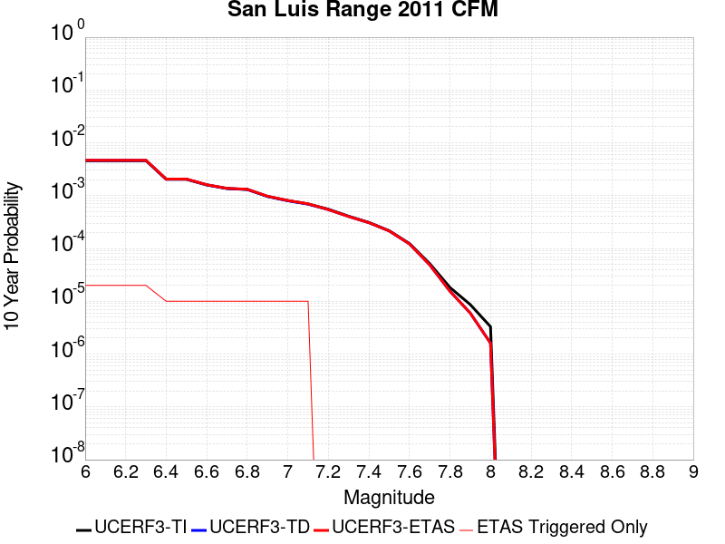 |

| Magnitude | 1 wk TI Prob | 1 wk TD Prob | 1 wk ETAS Prob | 1 wk ETAS/TD Gain | 1 wk ETAS Triggered Only | 1 mo TI Prob | 1 mo TD Prob | 1 mo ETAS Prob | 1 mo ETAS/TD Gain | 1 mo ETAS Triggered Only | 1 yr TI Prob | 1 yr TD Prob | 1 yr ETAS Prob | 1 yr ETAS/TD Gain | 1 yr ETAS Triggered Only | 10 yr TI Prob | 10 yr TD Prob | 10 yr ETAS Prob | 10 yr ETAS/TD Gain | 10 yr ETAS Triggered Only |
|-----|-----|-----|-----|-----|-----|-----|-----|-----|-----|-----|-----|-----|-----|-----|-----|-----|-----|-----|-----|-----|
| 6.0 | 8.8368415E-6 | 8.965454E-6 | 7.840928E-5 | 8.745712 | 6.9444446E-5 | 3.787163E-5 | 3.842285E-5 | 1.0786463E-4 | 2.8073041 | 6.9444446E-5 | 4.609895E-4 | 4.677057E-4 | 5.3711765E-4 | 1.1484095 | 6.9444446E-5 | 0.0046003438 | 0.0046679964 | 0.0047371164 | 1.0148072 | 6.9444446E-5 |
| 6.1 | 8.8368415E-6 | 8.965454E-6 | 7.840928E-5 | 8.745712 | 6.9444446E-5 | 3.787163E-5 | 3.842285E-5 | 1.0786463E-4 | 2.8073041 | 6.9444446E-5 | 4.609895E-4 | 4.677057E-4 | 5.3711765E-4 | 1.1484095 | 6.9444446E-5 | 0.0046003438 | 0.0046679964 | 0.0047371164 | 1.0148072 | 6.9444446E-5 |
| 6.2 | 8.8368415E-6 | 8.965454E-6 | 7.840928E-5 | 8.745712 | 6.9444446E-5 | 3.787163E-5 | 3.842285E-5 | 1.0786463E-4 | 2.8073041 | 6.9444446E-5 | 4.609895E-4 | 4.677057E-4 | 5.3711765E-4 | 1.1484095 | 6.9444446E-5 | 0.0046003438 | 0.0046679964 | 0.0047371164 | 1.0148072 | 6.9444446E-5 |
| 6.3 | 8.8368415E-6 | 8.965454E-6 | 7.840928E-5 | 8.745712 | 6.9444446E-5 | 3.787163E-5 | 3.842285E-5 | 1.0786463E-4 | 2.8073041 | 6.9444446E-5 | 4.609895E-4 | 4.677057E-4 | 5.3711765E-4 | 1.1484095 | 6.9444446E-5 | 0.0046003438 | 0.0046679964 | 0.0047371164 | 1.0148072 | 6.9444446E-5 |
| 6.4 | 3.9094193E-6 | 3.9412025E-6 | 7.3385374E-5 | 18.620045 | 6.9444446E-5 | 1.6754546E-5 | 1.689076E-5 | 8.633403E-5 | 5.111317 | 6.9444446E-5 | 2.039675E-4 | 2.056259E-4 | 2.7505605E-4 | 1.3376528 | 6.9444446E-5 | 0.0020378039 | 0.0020543851 | 0.002123687 | 1.0337336 | 6.9444446E-5 |
| 6.5 | 3.9094193E-6 | 3.9412025E-6 | 7.3385374E-5 | 18.620045 | 6.9444446E-5 | 1.6754546E-5 | 1.689076E-5 | 8.633403E-5 | 5.111317 | 6.9444446E-5 | 2.039675E-4 | 2.056259E-4 | 2.7505605E-4 | 1.3376528 | 6.9444446E-5 | 0.0020378039 | 0.0020543851 | 0.002123687 | 1.0337336 | 6.9444446E-5 |
| 6.6 | 3.0587726E-6 | 3.0753883E-6 | 7.251962E-5 | 23.580639 | 6.9444446E-5 | 1.3108959E-5 | 1.318017E-5 | 8.26237E-5 | 6.268789 | 6.9444446E-5 | 1.595899E-4 | 1.6045687E-4 | 2.2989017E-4 | 1.4327226 | 6.9444446E-5 | 0.0015947534 | 0.0016034221 | 0.0016727552 | 1.0432407 | 6.9444446E-5 |
| 6.7 | 2.6160574E-6 | 2.6251273E-6 | 7.2069386E-5 | 27.453674 | 6.9444446E-5 | 1.1211626E-5 | 1.1250498E-5 | 8.069416E-5 | 7.1724973 | 6.9444446E-5 | 1.3649299E-4 | 1.3696625E-4 | 2.064012E-4 | 1.5069492 | 6.9444446E-5 | 0.0013640919 | 0.0013688246 | 0.0014381739 | 1.0506635 | 6.9444446E-5 |
| 6.8 | 2.5110312E-6 | 2.51814E-6 | 7.196241E-5 | 28.577602 | 6.9444446E-5 | 1.0761518E-5 | 1.0791985E-5 | 8.023568E-5 | 7.434747 | 6.9444446E-5 | 1.310136E-4 | 1.3138456E-4 | 2.0081986E-4 | 1.5284892 | 6.9444446E-5 | 0.0013093639 | 0.0013130746 | 0.0013824279 | 1.0528175 | 6.9444446E-5 |
| 6.9 | 1.8564405E-6 | 1.852487E-6 | 7.12968E-5 | 38.487072 | 6.9444446E-5 | 7.95615E-6 | 7.939206E-6 | 7.73831E-5 | 9.746957 | 6.9444446E-5 | 9.686181E-5 | 9.665557E-5 | 1.6609329E-4 | 1.7184039 | 6.9444446E-5 | 9.68196E-4 | 9.661373E-4 | 0.0010355146 | 1.071809 | 6.9444446E-5 |
| 7.0 | 1.546127E-6 | 1.5369537E-6 | 7.098129E-5 | 46.1831 | 6.9444446E-5 | 6.626242E-6 | 6.586928E-6 | 7.603091E-5 | 11.542697 | 6.9444446E-5 | 8.06715E-5 | 8.0192905E-5 | 1.4963179E-4 | 1.865898 | 6.9444446E-5 | 8.0642226E-4 | 8.016404E-4 | 8.7102916E-4 | 1.0865585 | 6.9444446E-5 |
| 7.1 | 1.3368208E-6 | 1.3235326E-6 | 7.0767885E-5 | 53.46894 | 6.9444446E-5 | 5.7292195E-6 | 5.67227E-6 | 7.5116324E-5 | 13.242726 | 6.9444446E-5 | 6.975101E-5 | 6.905771E-5 | 1.3849736E-4 | 2.0055308 | 6.9444446E-5 | 6.972912E-4 | 6.9036294E-4 | 7.5975945E-4 | 1.1005218 | 6.9444446E-5 |
| 7.2 | 1.0623363E-6 | 1.0454368E-6 | 1.0454368E-6 | 1.0 | 0.0 | 4.5528623E-6 | 4.4804356E-6 | 4.4804356E-6 | 1.0 | 0.0 | 5.5429686E-5 | 5.4547938E-5 | 5.4547938E-5 | 1.0 | 0.0 | 5.5415864E-4 | 5.4534577E-4 | 5.4534577E-4 | 1.0 | 0.0 |
| 7.3 | 7.831679E-7 | 7.7273904E-7 | 7.7273904E-7 | 1.0 | 0.0 | 3.3564295E-6 | 3.3117344E-6 | 3.3117344E-6 | 1.0 | 0.0 | 4.086376E-5 | 4.0319625E-5 | 4.0319625E-5 | 1.0 | 0.0 | 4.0856248E-4 | 4.031232E-4 | 4.031232E-4 | 1.0 | 0.0 |
| 7.4 | 5.9558846E-7 | 5.910636E-7 | 5.910636E-7 | 1.0 | 0.0 | 2.5525194E-6 | 2.5331274E-6 | 2.5331274E-6 | 1.0 | 0.0 | 3.107648E-5 | 3.084039E-5 | 3.084039E-5 | 1.0 | 0.0 | 3.1072134E-4 | 3.083612E-4 | 3.083612E-4 | 1.0 | 0.0 |
| 7.5 | 4.1616502E-7 | 4.119631E-7 | 4.119631E-7 | 1.0 | 0.0 | 1.7835631E-6 | 1.7655549E-6 | 1.7655549E-6 | 1.0 | 0.0 | 2.1714664E-5 | 2.149542E-5 | 2.149542E-5 | 1.0 | 0.0 | 2.1712543E-4 | 2.1493346E-4 | 2.1493346E-4 | 1.0 | 0.0 |
| 7.6 | 2.3816014E-7 | 2.3376548E-7 | 2.3376548E-7 | 1.0 | 0.0 | 1.0206859E-6 | 1.0018516E-6 | 1.0018516E-6 | 1.0 | 0.0 | 1.242678E-5 | 1.2197475E-5 | 1.2197475E-5 | 1.0 | 0.0 | 1.2426086E-4 | 1.2196808E-4 | 1.2196808E-4 | 1.0 | 0.0 |
| 7.7 | 9.918777E-8 | 9.3867584E-8 | 9.3867584E-8 | 1.0 | 0.0 | 4.2509038E-7 | 4.0228957E-7 | 4.0228957E-7 | 1.0 | 0.0 | 5.1754632E-6 | 4.8978645E-6 | 4.8978645E-6 | 1.0 | 0.0 | 5.1753424E-5 | 4.897757E-5 | 4.897757E-5 | 1.0 | 0.0 |
| 7.8 | 3.4982556E-8 | 2.968655E-8 | 2.968655E-8 | 1.0 | 0.0 | 1.4992524E-7 | 1.2722806E-7 | 1.2722806E-7 | 1.0 | 0.0 | 1.8253382E-6 | 1.5490006E-6 | 1.5490006E-6 | 1.0 | 0.0 | 1.8253233E-5 | 1.5489897E-5 | 1.5489897E-5 | 1.0 | 0.0 |
| 7.9 | 1.6624908E-8 | 1.1477036E-8 | 1.1477036E-8 | 1.0 | 0.0 | 7.12496E-8 | 4.91873E-8 | 4.91873E-8 | 1.0 | 0.0 | 8.6746354E-7 | 5.988552E-7 | 5.988552E-7 | 1.0 | 0.0 | 8.674601E-6 | 5.988536E-6 | 5.988536E-6 | 1.0 | 0.0 |
| 8.0 | 6.3352315E-9 | 3.0888412E-9 | 3.0888412E-9 | 1.0 | 0.0 | 2.715099E-8 | 1.3237893E-8 | 1.3237893E-8 | 1.0 | 0.0 | 3.3056327E-7 | 1.6117131E-7 | 1.6117131E-7 | 1.0 | 0.0 | 3.3056278E-6 | 1.611712E-6 | 1.611712E-6 | 1.0 | 0.0 |

## Independence rev 2011
*[(top)](#table-of-contents)*

| 1 Week | 1 Month | 1 Year | 10 Year |
|-----|-----|-----|-----|
|  |  |  | 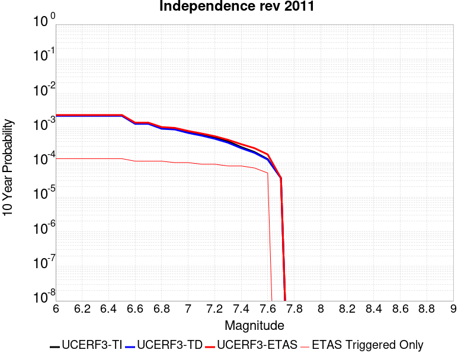 |

| Magnitude | 1 wk TI Prob | 1 wk TD Prob | 1 wk ETAS Prob | 1 wk ETAS/TD Gain | 1 wk ETAS Triggered Only | 1 mo TI Prob | 1 mo TD Prob | 1 mo ETAS Prob | 1 mo ETAS/TD Gain | 1 mo ETAS Triggered Only | 1 yr TI Prob | 1 yr TD Prob | 1 yr ETAS Prob | 1 yr ETAS/TD Gain | 1 yr ETAS Triggered Only | 10 yr TI Prob | 10 yr TD Prob | 10 yr ETAS Prob | 10 yr ETAS/TD Gain | 10 yr ETAS Triggered Only |
|-----|-----|-----|-----|-----|-----|-----|-----|-----|-----|-----|-----|-----|-----|-----|-----|-----|-----|-----|-----|-----|
| 6.0 | 4.422171E-6 | 4.326227E-6 | 7.3770374E-5 | 17.051895 | 6.9444446E-5 | 1.8952025E-5 | 1.8540857E-5 | 8.7984015E-5 | 4.7454123 | 6.9444446E-5 | 2.3071647E-4 | 2.2571455E-4 | 2.951433E-4 | 1.3075955 | 6.9444446E-5 | 0.0023047708 | 0.0022551466 | 0.0023244345 | 1.0307243 | 6.9444446E-5 |
| 6.1 | 4.422171E-6 | 4.326227E-6 | 7.3770374E-5 | 17.051895 | 6.9444446E-5 | 1.8952025E-5 | 1.8540857E-5 | 8.7984015E-5 | 4.7454123 | 6.9444446E-5 | 2.3071647E-4 | 2.2571455E-4 | 2.951433E-4 | 1.3075955 | 6.9444446E-5 | 0.0023047708 | 0.0022551466 | 0.0023244345 | 1.0307243 | 6.9444446E-5 |
| 6.2 | 4.422171E-6 | 4.326227E-6 | 7.3770374E-5 | 17.051895 | 6.9444446E-5 | 1.8952025E-5 | 1.8540857E-5 | 8.7984015E-5 | 4.7454123 | 6.9444446E-5 | 2.3071647E-4 | 2.2571455E-4 | 2.951433E-4 | 1.3075955 | 6.9444446E-5 | 0.0023047708 | 0.0022551466 | 0.0023244345 | 1.0307243 | 6.9444446E-5 |
| 6.3 | 4.422171E-6 | 4.326227E-6 | 7.3770374E-5 | 17.051895 | 6.9444446E-5 | 1.8952025E-5 | 1.8540857E-5 | 8.7984015E-5 | 4.7454123 | 6.9444446E-5 | 2.3071647E-4 | 2.2571455E-4 | 2.951433E-4 | 1.3075955 | 6.9444446E-5 | 0.0023047708 | 0.0022551466 | 0.0023244345 | 1.0307243 | 6.9444446E-5 |
| 6.4 | 4.422171E-6 | 4.326227E-6 | 7.3770374E-5 | 17.051895 | 6.9444446E-5 | 1.8952025E-5 | 1.8540857E-5 | 8.7984015E-5 | 4.7454123 | 6.9444446E-5 | 2.3071647E-4 | 2.2571455E-4 | 2.951433E-4 | 1.3075955 | 6.9444446E-5 | 0.0023047708 | 0.0022551466 | 0.0023244345 | 1.0307243 | 6.9444446E-5 |
| 6.5 | 4.422171E-6 | 4.326227E-6 | 7.3770374E-5 | 17.051895 | 6.9444446E-5 | 1.8952025E-5 | 1.8540857E-5 | 8.7984015E-5 | 4.7454123 | 6.9444446E-5 | 2.3071647E-4 | 2.2571455E-4 | 2.951433E-4 | 1.3075955 | 6.9444446E-5 | 0.0023047708 | 0.0022551466 | 0.0023244345 | 1.0307243 | 6.9444446E-5 |
| 6.6 | 2.663744E-6 | 2.5319862E-6 | 7.1976254E-5 | 28.426796 | 6.9444446E-5 | 1.1415996E-5 | 1.0851327E-5 | 8.0295016E-5 | 7.3995576 | 6.9444446E-5 | 1.3898089E-4 | 1.3210738E-4 | 2.0154266E-4 | 1.5255972 | 6.9444446E-5 | 0.0013889399 | 0.0013203367 | 0.0013896895 | 1.0525266 | 6.9444446E-5 |
| 6.7 | 2.663744E-6 | 2.5319862E-6 | 7.1976254E-5 | 28.426796 | 6.9444446E-5 | 1.1415996E-5 | 1.0851327E-5 | 8.0295016E-5 | 7.3995576 | 6.9444446E-5 | 1.3898089E-4 | 1.3210738E-4 | 2.0154266E-4 | 1.5255972 | 6.9444446E-5 | 0.0013889399 | 0.0013203367 | 0.0013896895 | 1.0525266 | 6.9444446E-5 |
| 6.8 | 1.9716529E-6 | 1.8322585E-6 | 7.1276576E-5 | 38.90094 | 6.9444446E-5 | 8.449913E-6 | 7.852514E-6 | 7.729641E-5 | 9.843525 | 6.9444446E-5 | 1.0287284E-4 | 9.5600284E-5 | 1.6503809E-4 | 1.7263347 | 6.9444446E-5 | 0.0010282523 | 9.556045E-4 | 0.0010249825 | 1.0726012 | 6.9444446E-5 |
| 6.9 | 1.8788617E-6 | 1.7429993E-6 | 1.7429993E-6 | 1.0 | 0.0 | 8.0522395E-6 | 7.4699765E-6 | 7.4699765E-6 | 1.0 | 0.0 | 9.80316E-5 | 9.0943286E-5 | 9.0943286E-5 | 1.0 | 0.0 | 9.798837E-4 | 9.0907275E-4 | 9.0907275E-4 | 1.0 | 0.0 |
| 7.0 | 1.5045488E-6 | 1.3849503E-6 | 1.3849503E-6 | 1.0 | 0.0 | 6.44805E-6 | 5.9354884E-6 | 5.9354884E-6 | 1.0 | 0.0 | 7.8502184E-5 | 7.226223E-5 | 7.226223E-5 | 1.0 | 0.0 | 7.8474457E-4 | 7.2239246E-4 | 7.2239246E-4 | 1.0 | 0.0 |
| 7.1 | 1.272341E-6 | 1.1625096E-6 | 1.1625096E-6 | 1.0 | 0.0 | 5.4528787E-6 | 4.982175E-6 | 4.982175E-6 | 1.0 | 0.0 | 6.6386776E-5 | 6.0656326E-5 | 6.0656326E-5 | 1.0 | 0.0 | 6.636695E-4 | 6.064009E-4 | 6.064009E-4 | 1.0 | 0.0 |
| 7.2 | 1.0416892E-6 | 9.4098806E-7 | 9.4098806E-7 | 1.0 | 0.0 | 4.464375E-6 | 4.0328E-6 | 4.0328E-6 | 1.0 | 0.0 | 5.4352407E-5 | 4.909825E-5 | 4.909825E-5 | 1.0 | 0.0 | 5.4339116E-4 | 4.9087586E-4 | 4.9087586E-4 | 1.0 | 0.0 |
| 7.3 | 7.9450155E-7 | 7.235002E-7 | 7.235002E-7 | 1.0 | 0.0 | 3.4050022E-6 | 3.1007114E-6 | 3.1007114E-6 | 1.0 | 0.0 | 4.1455114E-5 | 3.775052E-5 | 3.775052E-5 | 1.0 | 0.0 | 4.144738E-4 | 3.7744216E-4 | 3.7744216E-4 | 1.0 | 0.0 |
| 7.4 | 5.3893444E-7 | 5.019512E-7 | 5.019512E-7 | 1.0 | 0.0 | 2.309717E-6 | 2.1512178E-6 | 2.1512178E-6 | 1.0 | 0.0 | 2.8120441E-5 | 2.6190766E-5 | 2.6190766E-5 | 1.0 | 0.0 | 2.8116882E-4 | 2.6187726E-4 | 2.6187726E-4 | 1.0 | 0.0 |
| 7.5 | 3.8852085E-7 | 3.682554E-7 | 3.682554E-7 | 1.0 | 0.0 | 1.6650882E-6 | 1.5782365E-6 | 1.5782365E-6 | 1.0 | 0.0 | 2.027226E-5 | 1.9214862E-5 | 1.9214862E-5 | 1.0 | 0.0 | 2.0270412E-4 | 1.9213221E-4 | 1.9213221E-4 | 1.0 | 0.0 |
| 7.6 | 2.414929E-7 | 2.345755E-7 | 2.345755E-7 | 1.0 | 0.0 | 1.0349692E-6 | 1.0053232E-6 | 1.0053232E-6 | 1.0 | 0.0 | 1.2600677E-5 | 1.2239742E-5 | 1.2239742E-5 | 1.0 | 0.0 | 1.2599962E-4 | 1.223908E-4 | 1.223908E-4 | 1.0 | 0.0 |
| 7.7 | 6.8298014E-8 | 6.85897E-8 | 6.85897E-8 | 1.0 | 0.0 | 2.9270575E-7 | 2.9395582E-7 | 2.9395582E-7 | 1.0 | 0.0 | 3.5636867E-6 | 3.5789067E-6 | 3.5789067E-6 | 1.0 | 0.0 | 3.5636294E-5 | 3.5788536E-5 | 3.5788536E-5 | 1.0 | 0.0 |

## Hartley Springs 2011 CFM
*[(top)](#table-of-contents)*

| 1 Week | 1 Month | 1 Year | 10 Year |
|-----|-----|-----|-----|
|  |  |  |  |

| Magnitude | 1 wk TI Prob | 1 wk TD Prob | 1 wk ETAS Prob | 1 wk ETAS/TD Gain | 1 wk ETAS Triggered Only | 1 mo TI Prob | 1 mo TD Prob | 1 mo ETAS Prob | 1 mo ETAS/TD Gain | 1 mo ETAS Triggered Only | 1 yr TI Prob | 1 yr TD Prob | 1 yr ETAS Prob | 1 yr ETAS/TD Gain | 1 yr ETAS Triggered Only | 10 yr TI Prob | 10 yr TD Prob | 10 yr ETAS Prob | 10 yr ETAS/TD Gain | 10 yr ETAS Triggered Only |
|-----|-----|-----|-----|-----|-----|-----|-----|-----|-----|-----|-----|-----|-----|-----|-----|-----|-----|-----|-----|-----|
| 6.0 | 1.4352418E-5 | 1.4434182E-5 | 8.3877625E-5 | 5.8110414 | 6.9444446E-5 | 6.1508916E-5 | 6.1860235E-5 | 1.3130039E-4 | 2.1225328 | 6.9444446E-5 | 7.486137E-4 | 7.5305253E-4 | 8.224447E-4 | 1.0921478 | 6.9444446E-5 | 0.007460968 | 0.0075211283 | 0.007590051 | 1.0091639 | 6.9444446E-5 |
| 6.1 | 1.4352418E-5 | 1.4434182E-5 | 8.3877625E-5 | 5.8110414 | 6.9444446E-5 | 6.1508916E-5 | 6.1860235E-5 | 1.3130039E-4 | 2.1225328 | 6.9444446E-5 | 7.486137E-4 | 7.5305253E-4 | 8.224447E-4 | 1.0921478 | 6.9444446E-5 | 0.007460968 | 0.0075211283 | 0.007590051 | 1.0091639 | 6.9444446E-5 |
| 6.2 | 1.4352418E-5 | 1.4434182E-5 | 8.3877625E-5 | 5.8110414 | 6.9444446E-5 | 6.1508916E-5 | 6.1860235E-5 | 1.3130039E-4 | 2.1225328 | 6.9444446E-5 | 7.486137E-4 | 7.5305253E-4 | 8.224447E-4 | 1.0921478 | 6.9444446E-5 | 0.007460968 | 0.0075211283 | 0.007590051 | 1.0091639 | 6.9444446E-5 |
| 6.3 | 1.4352418E-5 | 1.4434182E-5 | 8.3877625E-5 | 5.8110414 | 6.9444446E-5 | 6.1508916E-5 | 6.1860235E-5 | 1.3130039E-4 | 2.1225328 | 6.9444446E-5 | 7.486137E-4 | 7.5305253E-4 | 8.224447E-4 | 1.0921478 | 6.9444446E-5 | 0.007460968 | 0.0075211283 | 0.007590051 | 1.0091639 | 6.9444446E-5 |
| 6.4 | 1.4352418E-5 | 1.4434182E-5 | 8.3877625E-5 | 5.8110414 | 6.9444446E-5 | 6.1508916E-5 | 6.1860235E-5 | 1.3130039E-4 | 2.1225328 | 6.9444446E-5 | 7.486137E-4 | 7.5305253E-4 | 8.224447E-4 | 1.0921478 | 6.9444446E-5 | 0.007460968 | 0.0075211283 | 0.007590051 | 1.0091639 | 6.9444446E-5 |
| 6.5 | 1.2279858E-5 | 1.2133106E-5 | 8.1576705E-5 | 6.723481 | 6.9444446E-5 | 5.26269E-5 | 5.1998883E-5 | 1.2143971E-4 | 2.3354294 | 6.9444446E-5 | 6.4054417E-4 | 6.3306064E-4 | 7.024611E-4 | 1.1096269 | 6.9444446E-5 | 0.0063870098 | 0.006328085 | 0.00639709 | 1.0109046 | 6.9444446E-5 |
| 6.6 | 1.2279858E-5 | 1.2133106E-5 | 8.1576705E-5 | 6.723481 | 6.9444446E-5 | 5.26269E-5 | 5.1998883E-5 | 1.2143971E-4 | 2.3354294 | 6.9444446E-5 | 6.4054417E-4 | 6.3306064E-4 | 7.024611E-4 | 1.1096269 | 6.9444446E-5 | 0.0063870098 | 0.006328085 | 0.00639709 | 1.0109046 | 6.9444446E-5 |
| 6.7 | 2.1282601E-6 | 8.8948315E-7 | 8.8948315E-7 | 1.0 | 0.0 | 9.121083E-6 | 3.8120663E-6 | 3.8120663E-6 | 1.0 | 0.0 | 1.11043526E-4 | 4.641118E-5 | 4.641118E-5 | 1.0 | 0.0 | 0.0011098806 | 4.6404017E-4 | 4.6404017E-4 | 1.0 | 0.0 |
| 6.8 | 2.00516E-6 | 8.517597E-7 | 8.517597E-7 | 1.0 | 0.0 | 8.593515E-6 | 3.650395E-6 | 3.650395E-6 | 1.0 | 0.0 | 1.04621024E-4 | 4.444291E-5 | 4.444291E-5 | 1.0 | 0.0 | 0.0010457177 | 4.4436535E-4 | 4.4436535E-4 | 1.0 | 0.0 |
| 6.9 | 2.00516E-6 | 8.517597E-7 | 8.517597E-7 | 1.0 | 0.0 | 8.593515E-6 | 3.650395E-6 | 3.650395E-6 | 1.0 | 0.0 | 1.04621024E-4 | 4.444291E-5 | 4.444291E-5 | 1.0 | 0.0 | 0.0010457177 | 4.4436535E-4 | 4.4436535E-4 | 1.0 | 0.0 |
| 7.0 | 1.8366732E-6 | 8.237307E-7 | 8.237307E-7 | 1.0 | 0.0 | 7.871433E-6 | 3.5302712E-6 | 3.5302712E-6 | 1.0 | 0.0 | 9.583048E-5 | 4.298046E-5 | 4.298046E-5 | 1.0 | 0.0 | 9.5789164E-4 | 4.2974652E-4 | 4.2974652E-4 | 1.0 | 0.0 |
| 7.1 | 1.5097997E-6 | 7.1902616E-7 | 7.1902616E-7 | 1.0 | 0.0 | 6.470554E-6 | 3.0815384E-6 | 3.0815384E-6 | 1.0 | 0.0 | 7.877615E-5 | 3.7517326E-5 | 3.7517326E-5 | 1.0 | 0.0 | 7.874823E-4 | 3.7513362E-4 | 3.7513362E-4 | 1.0 | 0.0 |
| 7.2 | 1.3490993E-6 | 6.405254E-7 | 6.405254E-7 | 1.0 | 0.0 | 5.7818415E-6 | 2.7451074E-6 | 2.7451074E-6 | 1.0 | 0.0 | 7.0391645E-5 | 3.3421402E-5 | 3.3421402E-5 | 1.0 | 0.0 | 7.0369354E-4 | 3.341867E-4 | 3.341867E-4 | 1.0 | 0.0 |
| 7.3 | 7.900015E-7 | 4.0889498E-7 | 4.0889498E-7 | 1.0 | 0.0 | 3.3857161E-6 | 1.752407E-6 | 1.752407E-6 | 1.0 | 0.0 | 4.1220315E-5 | 2.1335554E-5 | 2.1335554E-5 | 1.0 | 0.0 | 4.121267E-4 | 2.1335555E-4 | 2.1335555E-4 | 1.0 | 0.0 |

## San Diego Trough north alt1
*[(top)](#table-of-contents)*

| 1 Week | 1 Month | 1 Year | 10 Year |
|-----|-----|-----|-----|
|  |  |  |  |

| Magnitude | 1 wk TI Prob | 1 wk TD Prob | 1 wk ETAS Prob | 1 wk ETAS/TD Gain | 1 wk ETAS Triggered Only | 1 mo TI Prob | 1 mo TD Prob | 1 mo ETAS Prob | 1 mo ETAS/TD Gain | 1 mo ETAS Triggered Only | 1 yr TI Prob | 1 yr TD Prob | 1 yr ETAS Prob | 1 yr ETAS/TD Gain | 1 yr ETAS Triggered Only | 10 yr TI Prob | 10 yr TD Prob | 10 yr ETAS Prob | 10 yr ETAS/TD Gain | 10 yr ETAS Triggered Only |
|-----|-----|-----|-----|-----|-----|-----|-----|-----|-----|-----|-----|-----|-----|-----|-----|-----|-----|-----|-----|-----|
| 6.0 | 7.329252E-5 | 8.821093E-5 | 8.821093E-5 | 1.0 | 0.0 | 3.14073E-4 | 3.7799572E-4 | 4.474139E-4 | 1.1836481 | 6.9444446E-5 | 0.0038171355 | 0.004593027 | 0.0046621524 | 1.01505 | 6.9444446E-5 | 0.03752231 | 0.045044992 | 0.045111306 | 1.0014722 | 6.9444446E-5 |
| 6.1 | 3.7940346E-5 | 4.4885E-5 | 4.4885E-5 | 1.0 | 0.0 | 1.6259136E-4 | 1.9235066E-4 | 1.9235066E-4 | 1.0 | 0.0 | 0.0019777524 | 0.0023394432 | 0.0023394432 | 1.0 | 0.0 | 0.019602431 | 0.023156688 | 0.023156688 | 1.0 | 0.0 |
| 6.2 | 2.8645263E-5 | 3.329678E-5 | 3.329678E-5 | 1.0 | 0.0 | 1.2275964E-4 | 1.4269284E-4 | 1.4269284E-4 | 1.0 | 0.0 | 0.0014935739 | 0.0017359189 | 0.0017359189 | 1.0 | 0.0 | 0.0148357535 | 0.017226247 | 0.017226247 | 1.0 | 0.0 |
| 6.3 | 2.8645263E-5 | 3.329678E-5 | 3.329678E-5 | 1.0 | 0.0 | 1.2275964E-4 | 1.4269284E-4 | 1.4269284E-4 | 1.0 | 0.0 | 0.0014935739 | 0.0017359189 | 0.0017359189 | 1.0 | 0.0 | 0.0148357535 | 0.017226247 | 0.017226247 | 1.0 | 0.0 |
| 6.4 | 2.2204576E-5 | 2.5448318E-5 | 2.5448318E-5 | 1.0 | 0.0 | 9.5159E-5 | 1.0905972E-4 | 1.0905972E-4 | 1.0 | 0.0 | 0.001157945 | 0.0013270034 | 0.0013270034 | 1.0 | 0.0 | 0.011519298 | 0.013191955 | 0.013191955 | 1.0 | 0.0 |
| 6.5 | 2.1004838E-5 | 2.4024694E-5 | 2.4024694E-5 | 1.0 | 0.0 | 9.0017624E-5 | 1.0295896E-4 | 1.0295896E-4 | 1.0 | 0.0 | 0.0010954136 | 0.0012528138 | 0.0012528138 | 1.0 | 0.0 | 0.010900296 | 0.012458589 | 0.012458589 | 1.0 | 0.0 |
| 6.6 | 1.820557E-5 | 2.0704787E-5 | 2.0704787E-5 | 1.0 | 0.0 | 7.802154E-5 | 8.873181E-5 | 8.873181E-5 | 1.0 | 0.0 | 9.4949827E-4 | 0.0010797799 | 0.0010797799 | 1.0 | 0.0 | 0.009454516 | 0.010746004 | 0.010746004 | 1.0 | 0.0 |
| 6.7 | 1.5884485E-5 | 1.7983646E-5 | 1.7983646E-5 | 1.0 | 0.0 | 6.807459E-5 | 7.707051E-5 | 7.707051E-5 | 1.0 | 0.0 | 8.284929E-4 | 9.3793223E-4 | 9.3793223E-4 | 1.0 | 0.0 | 0.008254109 | 0.009340104 | 0.009340104 | 1.0 | 0.0 |
| 6.8 | 1.4331171E-5 | 1.6201066E-5 | 1.6201066E-5 | 1.0 | 0.0 | 6.141786E-5 | 6.94313E-5 | 6.94313E-5 | 1.0 | 0.0 | 7.4750587E-4 | 8.450002E-4 | 8.450002E-4 | 1.0 | 0.0 | 0.0074499645 | 0.008418139 | 0.008418139 | 1.0 | 0.0 |
| 6.9 | 1.2574203E-5 | 1.4205835E-5 | 1.4205835E-5 | 1.0 | 0.0 | 5.3888325E-5 | 6.0880735E-5 | 6.0880735E-5 | 1.0 | 0.0 | 6.558929E-4 | 7.409723E-4 | 7.409723E-4 | 1.0 | 0.0 | 0.0065396037 | 0.007385203 | 0.007385203 | 1.0 | 0.0 |
| 7.0 | 1.0883844E-5 | 1.2289262E-5 | 1.2289262E-5 | 1.0 | 0.0 | 4.664421E-5 | 5.2667205E-5 | 5.2667205E-5 | 1.0 | 0.0 | 5.677453E-4 | 6.4103556E-4 | 6.4103556E-4 | 1.0 | 0.0 | 0.00566297 | 0.006391993 | 0.006391993 | 1.0 | 0.0 |
| 7.1 | 9.393088E-6 | 1.060702E-5 | 1.060702E-5 | 1.0 | 0.0 | 4.025547E-5 | 4.545787E-5 | 4.545787E-5 | 1.0 | 0.0 | 4.900001E-4 | 5.533098E-4 | 5.533098E-4 | 1.0 | 0.0 | 0.0048892107 | 0.005519418 | 0.005519418 | 1.0 | 0.0 |
| 7.2 | 8.190791E-6 | 9.258625E-6 | 9.258625E-6 | 1.0 | 0.0 | 3.510292E-5 | 3.9679224E-5 | 3.9679224E-5 | 1.0 | 0.0 | 4.2729423E-4 | 4.8298817E-4 | 4.8298817E-4 | 1.0 | 0.0 | 0.0042647356 | 0.004819465 | 0.004819465 | 1.0 | 0.0 |
| 7.3 | 6.268162E-6 | 7.089716E-6 | 7.089716E-6 | 1.0 | 0.0 | 2.6863276E-5 | 3.0384144E-5 | 3.0384144E-5 | 1.0 | 0.0 | 3.2701128E-4 | 3.6986457E-4 | 3.6986457E-4 | 1.0 | 0.0 | 0.003265305 | 0.003692536 | 0.003692536 | 1.0 | 0.0 |
| 7.4 | 4.985186E-6 | 5.6426816E-6 | 5.6426816E-6 | 1.0 | 0.0 | 2.1364907E-5 | 2.4182698E-5 | 2.4182698E-5 | 1.0 | 0.0 | 2.600867E-4 | 2.9438498E-4 | 2.9438498E-4 | 1.0 | 0.0 | 0.002597825 | 0.0029399914 | 0.0029399914 | 1.0 | 0.0 |
| 7.5 | 1.7489613E-6 | 1.969678E-6 | 1.969678E-6 | 1.0 | 0.0 | 7.495527E-6 | 8.4414505E-6 | 8.4414505E-6 | 1.0 | 0.0 | 9.125422E-5 | 1.02770035E-4 | 1.02770035E-4 | 1.0 | 0.0 | 9.1216754E-4 | 0.0010272472 | 0.0010272472 | 1.0 | 0.0 |
| 7.6 | 1.6988751E-7 | 1.7533823E-7 | 1.7533823E-7 | 1.0 | 0.0 | 7.2808916E-7 | 7.5144936E-7 | 7.5144936E-7 | 1.0 | 0.0 | 8.864449E-6 | 9.14886E-6 | 9.14886E-6 | 1.0 | 0.0 | 8.8640954E-5 | 9.1485024E-5 | 9.1485024E-5 | 1.0 | 0.0 |

## South Cuyama
*[(top)](#table-of-contents)*

| 1 Week | 1 Month | 1 Year | 10 Year |
|-----|-----|-----|-----|
|  |  |  |  |

| Magnitude | 1 wk TI Prob | 1 wk TD Prob | 1 wk ETAS Prob | 1 wk ETAS/TD Gain | 1 wk ETAS Triggered Only | 1 mo TI Prob | 1 mo TD Prob | 1 mo ETAS Prob | 1 mo ETAS/TD Gain | 1 mo ETAS Triggered Only | 1 yr TI Prob | 1 yr TD Prob | 1 yr ETAS Prob | 1 yr ETAS/TD Gain | 1 yr ETAS Triggered Only | 10 yr TI Prob | 10 yr TD Prob | 10 yr ETAS Prob | 10 yr ETAS/TD Gain | 10 yr ETAS Triggered Only |
|-----|-----|-----|-----|-----|-----|-----|-----|-----|-----|-----|-----|-----|-----|-----|-----|-----|-----|-----|-----|-----|
| 6.0 | 1.2747308E-6 | 1.2818697E-6 | 7.072622E-5 | 55.17427 | 6.9444446E-5 | 5.4631205E-6 | 5.4937163E-6 | 7.493778E-5 | 13.6406355 | 6.9444446E-5 | 6.6511464E-5 | 6.6884015E-5 | 1.3632381E-4 | 2.0382123 | 6.9444446E-5 | 6.649156E-4 | 6.686458E-4 | 7.380438E-4 | 1.1037889 | 6.9444446E-5 |
| 6.1 | 1.2747308E-6 | 1.2818697E-6 | 7.072622E-5 | 55.17427 | 6.9444446E-5 | 5.4631205E-6 | 5.4937163E-6 | 7.493778E-5 | 13.6406355 | 6.9444446E-5 | 6.6511464E-5 | 6.6884015E-5 | 1.3632381E-4 | 2.0382123 | 6.9444446E-5 | 6.649156E-4 | 6.686458E-4 | 7.380438E-4 | 1.1037889 | 6.9444446E-5 |
| 6.2 | 1.2747308E-6 | 1.2818697E-6 | 7.072622E-5 | 55.17427 | 6.9444446E-5 | 5.4631205E-6 | 5.4937163E-6 | 7.493778E-5 | 13.6406355 | 6.9444446E-5 | 6.6511464E-5 | 6.6884015E-5 | 1.3632381E-4 | 2.0382123 | 6.9444446E-5 | 6.649156E-4 | 6.686458E-4 | 7.380438E-4 | 1.1037889 | 6.9444446E-5 |
| 6.3 | 1.2747308E-6 | 1.2818697E-6 | 7.072622E-5 | 55.17427 | 6.9444446E-5 | 5.4631205E-6 | 5.4937163E-6 | 7.493778E-5 | 13.6406355 | 6.9444446E-5 | 6.6511464E-5 | 6.6884015E-5 | 1.3632381E-4 | 2.0382123 | 6.9444446E-5 | 6.649156E-4 | 6.686458E-4 | 7.380438E-4 | 1.1037889 | 6.9444446E-5 |
| 6.4 | 1.2747308E-6 | 1.2818697E-6 | 7.072622E-5 | 55.17427 | 6.9444446E-5 | 5.4631205E-6 | 5.4937163E-6 | 7.493778E-5 | 13.6406355 | 6.9444446E-5 | 6.6511464E-5 | 6.6884015E-5 | 1.3632381E-4 | 2.0382123 | 6.9444446E-5 | 6.649156E-4 | 6.686458E-4 | 7.380438E-4 | 1.1037889 | 6.9444446E-5 |
| 6.5 | 1.2747308E-6 | 1.2818697E-6 | 7.072622E-5 | 55.17427 | 6.9444446E-5 | 5.4631205E-6 | 5.4937163E-6 | 7.493778E-5 | 13.6406355 | 6.9444446E-5 | 6.6511464E-5 | 6.6884015E-5 | 1.3632381E-4 | 2.0382123 | 6.9444446E-5 | 6.649156E-4 | 6.686458E-4 | 7.380438E-4 | 1.1037889 | 6.9444446E-5 |
| 6.6 | 1.2747308E-6 | 1.2818697E-6 | 7.072622E-5 | 55.17427 | 6.9444446E-5 | 5.4631205E-6 | 5.4937163E-6 | 7.493778E-5 | 13.6406355 | 6.9444446E-5 | 6.6511464E-5 | 6.6884015E-5 | 1.3632381E-4 | 2.0382123 | 6.9444446E-5 | 6.649156E-4 | 6.686458E-4 | 7.380438E-4 | 1.1037889 | 6.9444446E-5 |
| 6.7 | 1.2747308E-6 | 1.2818697E-6 | 7.072622E-5 | 55.17427 | 6.9444446E-5 | 5.4631205E-6 | 5.4937163E-6 | 7.493778E-5 | 13.6406355 | 6.9444446E-5 | 6.6511464E-5 | 6.6884015E-5 | 1.3632381E-4 | 2.0382123 | 6.9444446E-5 | 6.649156E-4 | 6.686458E-4 | 7.380438E-4 | 1.1037889 | 6.9444446E-5 |
| 6.8 | 1.2747308E-6 | 1.2818697E-6 | 7.072622E-5 | 55.17427 | 6.9444446E-5 | 5.4631205E-6 | 5.4937163E-6 | 7.493778E-5 | 13.6406355 | 6.9444446E-5 | 6.6511464E-5 | 6.6884015E-5 | 1.3632381E-4 | 2.0382123 | 6.9444446E-5 | 6.649156E-4 | 6.686458E-4 | 7.380438E-4 | 1.1037889 | 6.9444446E-5 |
| 6.9 | 8.4566324E-7 | 8.507883E-7 | 7.029517E-5 | 82.62358 | 6.9444446E-5 | 3.624266E-6 | 3.6462304E-6 | 7.309042E-5 | 20.045475 | 6.9444446E-5 | 4.4124543E-5 | 4.439196E-5 | 1.13833325E-4 | 2.564278 | 6.9444446E-5 | 4.4115784E-4 | 4.4383196E-4 | 5.132456E-4 | 1.1563962 | 6.9444446E-5 |
| 7.0 | 8.2277904E-7 | 8.27782E-7 | 7.0272166E-5 | 84.89212 | 6.9444446E-5 | 3.526191E-6 | 3.5476323E-6 | 7.299183E-5 | 20.5748 | 6.9444446E-5 | 4.293053E-5 | 4.3191576E-5 | 1.12633024E-4 | 2.6077542 | 6.9444446E-5 | 4.292224E-4 | 4.3183283E-4 | 5.012473E-4 | 1.1607438 | 6.9444446E-5 |
| 7.1 | 6.7661887E-7 | 6.80913E-7 | 7.012531E-5 | 102.98718 | 6.9444446E-5 | 2.899792E-6 | 2.9181954E-6 | 7.236244E-5 | 24.796982 | 6.9444446E-5 | 3.5304394E-5 | 3.5528454E-5 | 1.0497043E-4 | 2.9545455 | 6.9444446E-5 | 3.5298787E-4 | 3.552281E-4 | 4.246479E-4 | 1.1954231 | 6.9444446E-5 |
| 7.2 | 5.783336E-7 | 5.8211907E-7 | 5.8211907E-7 | 1.0 | 0.0 | 2.4785702E-6 | 2.4947938E-6 | 2.4947938E-6 | 1.0 | 0.0 | 3.0176174E-5 | 3.0373692E-5 | 3.0373692E-5 | 1.0 | 0.0 | 3.0172078E-4 | 3.0369565E-4 | 3.0369565E-4 | 1.0 | 0.0 |
| 7.3 | 5.136759E-7 | 5.170938E-7 | 5.170938E-7 | 1.0 | 0.0 | 2.2014663E-6 | 2.2161144E-6 | 2.2161144E-6 | 1.0 | 0.0 | 2.6802521E-5 | 2.698086E-5 | 2.698086E-5 | 1.0 | 0.0 | 2.679929E-4 | 2.6977606E-4 | 2.6977606E-4 | 1.0 | 0.0 |
| 7.4 | 4.3370295E-7 | 4.3665364E-7 | 4.3665364E-7 | 1.0 | 0.0 | 1.8587256E-6 | 1.8713713E-6 | 1.8713713E-6 | 1.0 | 0.0 | 2.2629749E-5 | 2.278371E-5 | 2.278371E-5 | 1.0 | 0.0 | 2.2627445E-4 | 2.278139E-4 | 2.278139E-4 | 1.0 | 0.0 |
| 7.5 | 3.3242574E-7 | 3.3476465E-7 | 3.3476465E-7 | 1.0 | 0.0 | 1.4246809E-6 | 1.4347048E-6 | 1.4347048E-6 | 1.0 | 0.0 | 1.7345352E-5 | 1.7467393E-5 | 1.7467393E-5 | 1.0 | 0.0 | 1.7343998E-4 | 1.7466032E-4 | 1.7466032E-4 | 1.0 | 0.0 |
| 7.6 | 2.0627535E-7 | 2.07789E-7 | 2.07789E-7 | 1.0 | 0.0 | 8.840369E-7 | 8.90524E-7 | 8.90524E-7 | 1.0 | 0.0 | 1.0763096E-5 | 1.0842076E-5 | 1.0842076E-5 | 1.0 | 0.0 | 1.0762575E-4 | 1.0841556E-4 | 1.0841556E-4 | 1.0 | 0.0 |
| 7.7 | 6.15236E-8 | 6.1983044E-8 | 6.1983044E-8 | 1.0 | 0.0 | 2.6367252E-7 | 2.656416E-7 | 2.656416E-7 | 1.0 | 0.0 | 3.2102084E-6 | 3.2341818E-6 | 3.2341818E-6 | 1.0 | 0.0 | 3.210162E-5 | 3.234136E-5 | 3.234136E-5 | 1.0 | 0.0 |
| 7.8 | 1.1765573E-8 | 1.1873414E-8 | 1.1873414E-8 | 1.0 | 0.0 | 5.0423886E-8 | 5.0886058E-8 | 5.0886058E-8 | 1.0 | 0.0 | 6.1391063E-7 | 6.195376E-7 | 6.195376E-7 | 1.0 | 0.0 | 6.1390897E-6 | 6.19536E-6 | 6.19536E-6 | 1.0 | 0.0 |
| 7.9 | 6.0381755E-10 | 6.10058E-10 | 6.10058E-10 | 1.0 | 0.0 | 2.5877895E-9 | 2.614534E-9 | 2.614534E-9 | 1.0 | 0.0 | 3.1506335E-8 | 3.1831952E-8 | 3.1831952E-8 | 1.0 | 0.0 | 3.1506332E-7 | 3.183195E-7 | 3.183195E-7 | 1.0 | 0.0 |

## Pitas Point (Lower West)
*[(top)](#table-of-contents)*

| 1 Week | 1 Month | 1 Year | 10 Year |
|-----|-----|-----|-----|
|  |  |  |  |

| Magnitude | 1 wk TI Prob | 1 wk TD Prob | 1 wk ETAS Prob | 1 wk ETAS/TD Gain | 1 wk ETAS Triggered Only | 1 mo TI Prob | 1 mo TD Prob | 1 mo ETAS Prob | 1 mo ETAS/TD Gain | 1 mo ETAS Triggered Only | 1 yr TI Prob | 1 yr TD Prob | 1 yr ETAS Prob | 1 yr ETAS/TD Gain | 1 yr ETAS Triggered Only | 10 yr TI Prob | 10 yr TD Prob | 10 yr ETAS Prob | 10 yr ETAS/TD Gain | 10 yr ETAS Triggered Only |
|-----|-----|-----|-----|-----|-----|-----|-----|-----|-----|-----|-----|-----|-----|-----|-----|-----|-----|-----|-----|-----|
| 6.0 | 8.151497E-6 | 7.855762E-6 | 7.7299665E-5 | 9.839868 | 6.9444446E-5 | 3.493452E-5 | 3.3667122E-5 | 1.03109225E-4 | 3.062609 | 6.9444446E-5 | 4.252448E-4 | 4.0982084E-4 | 4.7923683E-4 | 1.1693813 | 6.9444446E-5 | 0.0042443196 | 0.0040907315 | 0.004159892 | 1.0169066 | 6.9444446E-5 |
| 6.1 | 8.151497E-6 | 7.855762E-6 | 7.7299665E-5 | 9.839868 | 6.9444446E-5 | 3.493452E-5 | 3.3667122E-5 | 1.03109225E-4 | 3.062609 | 6.9444446E-5 | 4.252448E-4 | 4.0982084E-4 | 4.7923683E-4 | 1.1693813 | 6.9444446E-5 | 0.0042443196 | 0.0040907315 | 0.004159892 | 1.0169066 | 6.9444446E-5 |
| 6.2 | 8.151497E-6 | 7.855762E-6 | 7.7299665E-5 | 9.839868 | 6.9444446E-5 | 3.493452E-5 | 3.3667122E-5 | 1.03109225E-4 | 3.062609 | 6.9444446E-5 | 4.252448E-4 | 4.0982084E-4 | 4.7923683E-4 | 1.1693813 | 6.9444446E-5 | 0.0042443196 | 0.0040907315 | 0.004159892 | 1.0169066 | 6.9444446E-5 |
| 6.3 | 8.151497E-6 | 7.855762E-6 | 7.7299665E-5 | 9.839868 | 6.9444446E-5 | 3.493452E-5 | 3.3667122E-5 | 1.03109225E-4 | 3.062609 | 6.9444446E-5 | 4.252448E-4 | 4.0982084E-4 | 4.7923683E-4 | 1.1693813 | 6.9444446E-5 | 0.0042443196 | 0.0040907315 | 0.004159892 | 1.0169066 | 6.9444446E-5 |
| 6.4 | 8.151497E-6 | 7.855762E-6 | 7.7299665E-5 | 9.839868 | 6.9444446E-5 | 3.493452E-5 | 3.3667122E-5 | 1.03109225E-4 | 3.062609 | 6.9444446E-5 | 4.252448E-4 | 4.0982084E-4 | 4.7923683E-4 | 1.1693813 | 6.9444446E-5 | 0.0042443196 | 0.0040907315 | 0.004159892 | 1.0169066 | 6.9444446E-5 |
| 6.5 | 8.151497E-6 | 7.855762E-6 | 7.7299665E-5 | 9.839868 | 6.9444446E-5 | 3.493452E-5 | 3.3667122E-5 | 1.03109225E-4 | 3.062609 | 6.9444446E-5 | 4.252448E-4 | 4.0982084E-4 | 4.7923683E-4 | 1.1693813 | 6.9444446E-5 | 0.0042443196 | 0.0040907315 | 0.004159892 | 1.0169066 | 6.9444446E-5 |
| 6.6 | 8.151497E-6 | 7.855762E-6 | 7.7299665E-5 | 9.839868 | 6.9444446E-5 | 3.493452E-5 | 3.3667122E-5 | 1.03109225E-4 | 3.062609 | 6.9444446E-5 | 4.252448E-4 | 4.0982084E-4 | 4.7923683E-4 | 1.1693813 | 6.9444446E-5 | 0.0042443196 | 0.0040907315 | 0.004159892 | 1.0169066 | 6.9444446E-5 |
| 6.7 | 8.151497E-6 | 7.855762E-6 | 7.7299665E-5 | 9.839868 | 6.9444446E-5 | 3.493452E-5 | 3.3667122E-5 | 1.03109225E-4 | 3.062609 | 6.9444446E-5 | 4.252448E-4 | 4.0982084E-4 | 4.7923683E-4 | 1.1693813 | 6.9444446E-5 | 0.0042443196 | 0.0040907315 | 0.004159892 | 1.0169066 | 6.9444446E-5 |
| 6.8 | 8.151497E-6 | 7.855762E-6 | 7.7299665E-5 | 9.839868 | 6.9444446E-5 | 3.493452E-5 | 3.3667122E-5 | 1.03109225E-4 | 3.062609 | 6.9444446E-5 | 4.252448E-4 | 4.0982084E-4 | 4.7923683E-4 | 1.1693813 | 6.9444446E-5 | 0.0042443196 | 0.0040907315 | 0.004159892 | 1.0169066 | 6.9444446E-5 |
| 6.9 | 8.151497E-6 | 7.855762E-6 | 7.7299665E-5 | 9.839868 | 6.9444446E-5 | 3.493452E-5 | 3.3667122E-5 | 1.03109225E-4 | 3.062609 | 6.9444446E-5 | 4.252448E-4 | 4.0982084E-4 | 4.7923683E-4 | 1.1693813 | 6.9444446E-5 | 0.0042443196 | 0.0040907315 | 0.004159892 | 1.0169066 | 6.9444446E-5 |
| 7.0 | 8.103535E-6 | 7.805192E-6 | 7.72491E-5 | 9.897142 | 6.9444446E-5 | 3.4728975E-5 | 3.3450397E-5 | 1.0289252E-4 | 3.075973 | 6.9444446E-5 | 4.2274324E-4 | 4.0718322E-4 | 4.765994E-4 | 1.1704789 | 6.9444446E-5 | 0.0042193993 | 0.004064452 | 0.0041336142 | 1.0170164 | 6.9444446E-5 |
| 7.1 | 7.853298E-6 | 7.540883E-6 | 7.6984805E-5 | 10.20899 | 6.9444446E-5 | 3.3656554E-5 | 3.2317676E-5 | 1.0175988E-4 | 3.1487377 | 6.9444446E-5 | 4.096915E-4 | 3.9339735E-4 | 4.6281447E-4 | 1.1764555 | 6.9444446E-5 | 0.00408937 | 0.0039270855 | 0.003996257 | 1.017614 | 6.9444446E-5 |
| 7.2 | 7.771102E-6 | 7.453165E-6 | 7.689709E-5 | 10.317374 | 6.9444446E-5 | 3.33043E-5 | 3.194175E-5 | 1.0138397E-4 | 3.1740272 | 6.9444446E-5 | 4.0540437E-4 | 3.8882208E-4 | 4.5823952E-4 | 1.1785327 | 6.9444446E-5 | 0.0040466557 | 0.0038814936 | 0.0039506685 | 1.0178217 | 6.9444446E-5 |
| 7.3 | 7.3945344E-6 | 7.0492697E-6 | 7.649323E-5 | 10.851227 | 6.9444446E-5 | 3.1690477E-5 | 3.021081E-5 | 9.965315E-5 | 3.2985928 | 6.9444446E-5 | 3.8576324E-4 | 3.6775516E-4 | 4.3717405E-4 | 1.188764 | 6.9444446E-5 | 0.0038509427 | 0.0036715334 | 0.0037407228 | 1.0188448 | 6.9444446E-5 |
| 7.4 | 6.964645E-6 | 6.5901186E-6 | 7.6034106E-5 | 11.537593 | 6.9444446E-5 | 2.9848137E-5 | 2.8243063E-5 | 9.7685544E-5 | 3.4587448 | 6.9444446E-5 | 3.6334046E-4 | 3.4380553E-4 | 4.1322608E-4 | 1.2019181 | 6.9444446E-5 | 0.0036274698 | 0.0034327896 | 0.0035019957 | 1.0201603 | 6.9444446E-5 |
| 7.5 | 6.6525035E-6 | 6.259157E-6 | 7.570317E-5 | 12.094787 | 6.9444446E-5 | 2.851042E-5 | 2.6824686E-5 | 9.6267264E-5 | 3.5887566 | 6.9444446E-5 | 3.4705905E-4 | 3.265421E-4 | 3.9596387E-4 | 1.2125967 | 6.9444446E-5 | 0.0034651754 | 0.0032606742 | 0.0033298922 | 1.0212281 | 6.9444446E-5 |
| 7.6 | 5.613338E-6 | 5.151386E-6 | 7.4595475E-5 | 14.48066 | 6.9444446E-5 | 2.405694E-5 | 2.2077185E-5 | 9.1520094E-5 | 4.1454606 | 6.9444446E-5 | 2.928539E-4 | 2.6875688E-4 | 3.3818264E-4 | 1.2583219 | 6.9444446E-5 | 0.0029246826 | 0.0026843501 | 0.0027536082 | 1.0258007 | 6.9444446E-5 |
| 7.7 | 4.494704E-6 | 3.996911E-6 | 7.344108E-5 | 18.374458 | 6.9444446E-5 | 1.9262876E-5 | 1.7129507E-5 | 8.657276E-5 | 5.0540137 | 6.9444446E-5 | 2.3450027E-4 | 2.0853203E-4 | 2.7796198E-4 | 1.3329463 | 6.9444446E-5 | 0.0023425296 | 0.0020833875 | 0.0021526874 | 1.033263 | 6.9444446E-5 |
| 7.8 | 2.6075882E-6 | 2.1836374E-6 | 2.1836374E-6 | 1.0 | 0.0 | 1.117533E-5 | 9.358413E-6 | 9.358413E-6 | 1.0 | 0.0 | 1.3605114E-4 | 1.1393277E-4 | 1.1393277E-4 | 1.0 | 0.0 | 0.0013596788 | 0.0011387484 | 0.0011387484 | 1.0 | 0.0 |
| 7.9 | 4.045984E-7 | 3.242375E-7 | 3.242375E-7 | 1.0 | 0.0 | 1.733992E-6 | 1.3895885E-6 | 1.3895885E-6 | 1.0 | 0.0 | 2.1111147E-5 | 1.6918111E-5 | 1.6918111E-5 | 1.0 | 0.0 | 2.1109142E-4 | 1.6916855E-4 | 1.6916855E-4 | 1.0 | 0.0 |
| 8.0 | 7.791402E-9 | 5.683497E-9 | 5.683497E-9 | 1.0 | 0.0 | 3.3391725E-8 | 2.4357844E-8 | 2.4357844E-8 | 1.0 | 0.0 | 4.0654416E-7 | 2.9655675E-7 | 2.9655675E-7 | 1.0 | 0.0 | 4.065434E-6 | 2.9655655E-6 | 2.9655655E-6 | 1.0 | 0.0 |

## Pitas Point (Lower)-Montalvo
*[(top)](#table-of-contents)*

| 1 Week | 1 Month | 1 Year | 10 Year |
|-----|-----|-----|-----|
|  |  |  |  |

| Magnitude | 1 wk TI Prob | 1 wk TD Prob | 1 wk ETAS Prob | 1 wk ETAS/TD Gain | 1 wk ETAS Triggered Only | 1 mo TI Prob | 1 mo TD Prob | 1 mo ETAS Prob | 1 mo ETAS/TD Gain | 1 mo ETAS Triggered Only | 1 yr TI Prob | 1 yr TD Prob | 1 yr ETAS Prob | 1 yr ETAS/TD Gain | 1 yr ETAS Triggered Only | 10 yr TI Prob | 10 yr TD Prob | 10 yr ETAS Prob | 10 yr ETAS/TD Gain | 10 yr ETAS Triggered Only |
|-----|-----|-----|-----|-----|-----|-----|-----|-----|-----|-----|-----|-----|-----|-----|-----|-----|-----|-----|-----|-----|
| 6.0 | 5.2543637E-6 | 4.8378706E-6 | 7.4281976E-5 | 15.354272 | 6.9444446E-5 | 2.2518509E-5 | 2.0733567E-5 | 9.0176574E-5 | 4.3493032 | 6.9444446E-5 | 2.7412834E-4 | 2.5240227E-4 | 3.2182917E-4 | 1.2750646 | 6.9444446E-5 | 0.0027379042 | 0.0025211885 | 0.0025904577 | 1.0274749 | 6.9444446E-5 |
| 6.1 | 5.2543637E-6 | 4.8378706E-6 | 7.4281976E-5 | 15.354272 | 6.9444446E-5 | 2.2518509E-5 | 2.0733567E-5 | 9.0176574E-5 | 4.3493032 | 6.9444446E-5 | 2.7412834E-4 | 2.5240227E-4 | 3.2182917E-4 | 1.2750646 | 6.9444446E-5 | 0.0027379042 | 0.0025211885 | 0.0025904577 | 1.0274749 | 6.9444446E-5 |
| 6.2 | 5.2543637E-6 | 4.8378706E-6 | 7.4281976E-5 | 15.354272 | 6.9444446E-5 | 2.2518509E-5 | 2.0733567E-5 | 9.0176574E-5 | 4.3493032 | 6.9444446E-5 | 2.7412834E-4 | 2.5240227E-4 | 3.2182917E-4 | 1.2750646 | 6.9444446E-5 | 0.0027379042 | 0.0025211885 | 0.0025904577 | 1.0274749 | 6.9444446E-5 |
| 6.3 | 5.2543637E-6 | 4.8378706E-6 | 7.4281976E-5 | 15.354272 | 6.9444446E-5 | 2.2518509E-5 | 2.0733567E-5 | 9.0176574E-5 | 4.3493032 | 6.9444446E-5 | 2.7412834E-4 | 2.5240227E-4 | 3.2182917E-4 | 1.2750646 | 6.9444446E-5 | 0.0027379042 | 0.0025211885 | 0.0025904577 | 1.0274749 | 6.9444446E-5 |
| 6.4 | 5.2543637E-6 | 4.8378706E-6 | 7.4281976E-5 | 15.354272 | 6.9444446E-5 | 2.2518509E-5 | 2.0733567E-5 | 9.0176574E-5 | 4.3493032 | 6.9444446E-5 | 2.7412834E-4 | 2.5240227E-4 | 3.2182917E-4 | 1.2750646 | 6.9444446E-5 | 0.0027379042 | 0.0025211885 | 0.0025904577 | 1.0274749 | 6.9444446E-5 |
| 6.5 | 5.2543637E-6 | 4.8378706E-6 | 7.4281976E-5 | 15.354272 | 6.9444446E-5 | 2.2518509E-5 | 2.0733567E-5 | 9.0176574E-5 | 4.3493032 | 6.9444446E-5 | 2.7412834E-4 | 2.5240227E-4 | 3.2182917E-4 | 1.2750646 | 6.9444446E-5 | 0.0027379042 | 0.0025211885 | 0.0025904577 | 1.0274749 | 6.9444446E-5 |
| 6.6 | 5.2543637E-6 | 4.8378706E-6 | 7.4281976E-5 | 15.354272 | 6.9444446E-5 | 2.2518509E-5 | 2.0733567E-5 | 9.0176574E-5 | 4.3493032 | 6.9444446E-5 | 2.7412834E-4 | 2.5240227E-4 | 3.2182917E-4 | 1.2750646 | 6.9444446E-5 | 0.0027379042 | 0.0025211885 | 0.0025904577 | 1.0274749 | 6.9444446E-5 |
| 6.7 | 5.2543637E-6 | 4.8378706E-6 | 7.4281976E-5 | 15.354272 | 6.9444446E-5 | 2.2518509E-5 | 2.0733567E-5 | 9.0176574E-5 | 4.3493032 | 6.9444446E-5 | 2.7412834E-4 | 2.5240227E-4 | 3.2182917E-4 | 1.2750646 | 6.9444446E-5 | 0.0027379042 | 0.0025211885 | 0.0025904577 | 1.0274749 | 6.9444446E-5 |
| 6.8 | 5.2543637E-6 | 4.8378706E-6 | 7.4281976E-5 | 15.354272 | 6.9444446E-5 | 2.2518509E-5 | 2.0733567E-5 | 9.0176574E-5 | 4.3493032 | 6.9444446E-5 | 2.7412834E-4 | 2.5240227E-4 | 3.2182917E-4 | 1.2750646 | 6.9444446E-5 | 0.0027379042 | 0.0025211885 | 0.0025904577 | 1.0274749 | 6.9444446E-5 |
| 6.9 | 5.2543637E-6 | 4.8378706E-6 | 7.4281976E-5 | 15.354272 | 6.9444446E-5 | 2.2518509E-5 | 2.0733567E-5 | 9.0176574E-5 | 4.3493032 | 6.9444446E-5 | 2.7412834E-4 | 2.5240227E-4 | 3.2182917E-4 | 1.2750646 | 6.9444446E-5 | 0.0027379042 | 0.0025211885 | 0.0025904577 | 1.0274749 | 6.9444446E-5 |
| 7.0 | 5.2543637E-6 | 4.8378706E-6 | 7.4281976E-5 | 15.354272 | 6.9444446E-5 | 2.2518509E-5 | 2.0733567E-5 | 9.0176574E-5 | 4.3493032 | 6.9444446E-5 | 2.7412834E-4 | 2.5240227E-4 | 3.2182917E-4 | 1.2750646 | 6.9444446E-5 | 0.0027379042 | 0.0025211885 | 0.0025904577 | 1.0274749 | 6.9444446E-5 |
| 7.1 | 5.2543637E-6 | 4.8378706E-6 | 7.4281976E-5 | 15.354272 | 6.9444446E-5 | 2.2518509E-5 | 2.0733567E-5 | 9.0176574E-5 | 4.3493032 | 6.9444446E-5 | 2.7412834E-4 | 2.5240227E-4 | 3.2182917E-4 | 1.2750646 | 6.9444446E-5 | 0.0027379042 | 0.0025211885 | 0.0025904577 | 1.0274749 | 6.9444446E-5 |
| 7.2 | 5.2458695E-6 | 4.8290244E-6 | 7.4273135E-5 | 15.380568 | 6.9444446E-5 | 2.2482105E-5 | 2.0695656E-5 | 9.013867E-5 | 4.3554387 | 6.9444446E-5 | 2.7368523E-4 | 2.519408E-4 | 3.2136773E-4 | 1.2755685 | 6.9444446E-5 | 0.0027334841 | 0.0025165842 | 0.002585854 | 1.0275253 | 6.9444446E-5 |
| 7.3 | 5.22665E-6 | 4.8089414E-6 | 7.4253054E-5 | 15.440622 | 6.9444446E-5 | 2.2399736E-5 | 2.0609588E-5 | 9.00526E-5 | 4.3694515 | 6.9444446E-5 | 2.7268266E-4 | 2.5089315E-4 | 3.203202E-4 | 1.2767195 | 6.9444446E-5 | 0.002723483 | 0.0025061315 | 0.002575402 | 1.0276403 | 6.9444446E-5 |
| 7.4 | 5.210642E-6 | 4.792154E-6 | 7.423627E-5 | 15.491211 | 6.9444446E-5 | 2.233113E-5 | 2.0537642E-5 | 8.998066E-5 | 4.3812556 | 6.9444446E-5 | 2.718476E-4 | 2.5001742E-4 | 3.194445E-4 | 1.277689 | 6.9444446E-5 | 0.002715153 | 0.0024973939 | 0.002566665 | 1.0277374 | 6.9444446E-5 |
| 7.5 | 5.1226016E-6 | 4.7000403E-6 | 7.414416E-5 | 15.775217 | 6.9444446E-5 | 2.1953823E-5 | 2.0142877E-5 | 8.958592E-5 | 4.4475236 | 6.9444446E-5 | 2.67255E-4 | 2.4521223E-4 | 3.1463965E-4 | 1.283132 | 6.9444446E-5 | 0.0026693381 | 0.0024494485 | 0.0025187228 | 1.0282816 | 6.9444446E-5 |
| 7.6 | 4.8796987E-6 | 4.4449403E-6 | 7.3889074E-5 | 16.623186 | 6.9444446E-5 | 2.0912828E-5 | 1.9049607E-5 | 8.849273E-5 | 4.6453834 | 6.9444446E-5 | 2.5458392E-4 | 2.3190459E-4 | 3.013329E-4 | 1.2993832 | 6.9444446E-5 | 0.0025429246 | 0.0023166565 | 0.00238594 | 1.0299067 | 6.9444446E-5 |
| 7.7 | 4.0834398E-6 | 3.6091124E-6 | 7.305331E-5 | 20.24135 | 6.9444446E-5 | 1.7500339E-5 | 1.5467534E-5 | 8.4910906E-5 | 5.489621 | 6.9444446E-5 | 2.1304579E-4 | 1.8830119E-4 | 2.5773255E-4 | 1.3687251 | 6.9444446E-5 | 0.0021284167 | 0.00188144 | 0.0019507539 | 1.0368408 | 6.9444446E-5 |
| 7.8 | 2.5445438E-6 | 2.121228E-6 | 2.121228E-6 | 1.0 | 0.0 | 1.0905142E-5 | 9.090945E-6 | 9.090945E-6 | 1.0 | 0.0 | 1.3276201E-4 | 1.1067669E-4 | 1.1067669E-4 | 1.0 | 0.0 | 0.0013268272 | 0.0011062203 | 0.0011062203 | 1.0 | 0.0 |
| 7.9 | 4.1677114E-7 | 3.3293693E-7 | 3.3293693E-7 | 1.0 | 0.0 | 1.7861609E-6 | 1.4268718E-6 | 1.4268718E-6 | 1.0 | 0.0 | 2.1746291E-5 | 1.737203E-5 | 1.737203E-5 | 1.0 | 0.0 | 2.1744163E-4 | 1.7370703E-4 | 1.7370703E-4 | 1.0 | 0.0 |
| 8.0 | 7.791402E-9 | 5.683497E-9 | 5.683497E-9 | 1.0 | 0.0 | 3.3391725E-8 | 2.4357844E-8 | 2.4357844E-8 | 1.0 | 0.0 | 4.0654416E-7 | 2.9655675E-7 | 2.9655675E-7 | 1.0 | 0.0 | 4.065434E-6 | 2.9655655E-6 | 2.9655655E-6 | 1.0 | 0.0 |

## San Jacinto (Superstition Mtn)
*[(top)](#table-of-contents)*

| 1 Week | 1 Month | 1 Year | 10 Year |
|-----|-----|-----|-----|
|  |  | 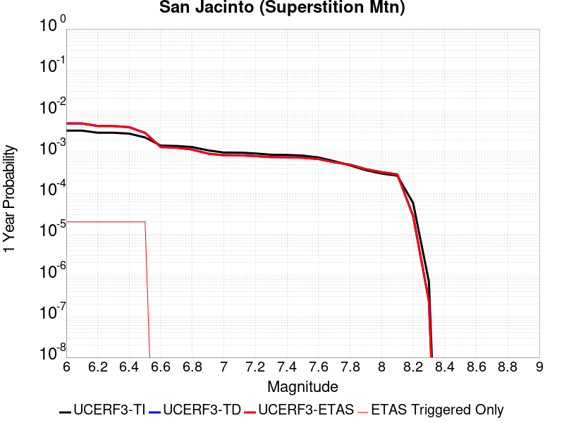 |  |

| Magnitude | 1 wk TI Prob | 1 wk TD Prob | 1 wk ETAS Prob | 1 wk ETAS/TD Gain | 1 wk ETAS Triggered Only | 1 mo TI Prob | 1 mo TD Prob | 1 mo ETAS Prob | 1 mo ETAS/TD Gain | 1 mo ETAS Triggered Only | 1 yr TI Prob | 1 yr TD Prob | 1 yr ETAS Prob | 1 yr ETAS/TD Gain | 1 yr ETAS Triggered Only | 10 yr TI Prob | 10 yr TD Prob | 10 yr ETAS Prob | 10 yr ETAS/TD Gain | 10 yr ETAS Triggered Only |
|-----|-----|-----|-----|-----|-----|-----|-----|-----|-----|-----|-----|-----|-----|-----|-----|-----|-----|-----|-----|-----|
| 6.0 | 6.4193904E-5 | 9.599367E-5 | 9.599367E-5 | 1.0 | 0.0 | 2.7508775E-4 | 4.1134638E-4 | 4.8076225E-4 | 1.1687529 | 6.9444446E-5 | 0.0033440501 | 0.0049980893 | 0.005067187 | 1.0138247 | 6.9444446E-5 | 0.03294174 | 0.048823986 | 0.04889004 | 1.0013529 | 6.9444446E-5 |
| 6.1 | 6.4193904E-5 | 9.599367E-5 | 9.599367E-5 | 1.0 | 0.0 | 2.7508775E-4 | 4.1134638E-4 | 4.8076225E-4 | 1.1687529 | 6.9444446E-5 | 0.0033440501 | 0.0049980893 | 0.005067187 | 1.0138247 | 6.9444446E-5 | 0.03294174 | 0.048823986 | 0.04889004 | 1.0013529 | 6.9444446E-5 |
| 6.2 | 5.7023593E-5 | 8.3144434E-5 | 8.3144434E-5 | 1.0 | 0.0 | 2.4436394E-4 | 3.5629404E-4 | 4.2571372E-4 | 1.1948383 | 6.9444446E-5 | 0.002971072 | 0.0043308944 | 0.004400038 | 1.0159652 | 6.9444446E-5 | 0.029316625 | 0.04250403 | 0.042570524 | 1.0015644 | 6.9444446E-5 |
| 6.3 | 5.6940098E-5 | 8.298979E-5 | 8.298979E-5 | 1.0 | 0.0 | 2.4400617E-4 | 3.5563146E-4 | 4.2505123E-4 | 1.1952014 | 6.9444446E-5 | 0.002966728 | 0.00432286 | 0.004392004 | 1.015995 | 6.9444446E-5 | 0.029274331 | 0.042427283 | 0.04249378 | 1.0015674 | 6.9444446E-5 |
| 6.4 | 5.4171585E-5 | 7.7483564E-5 | 7.7483564E-5 | 1.0 | 0.0 | 2.3214328E-4 | 3.3203943E-4 | 4.0146083E-4 | 1.2090757 | 6.9444446E-5 | 0.0028226813 | 0.0040367353 | 0.004105899 | 1.0171337 | 6.9444446E-5 | 0.02787096 | 0.03971653 | 0.039783217 | 1.0016791 | 6.9444446E-5 |
| 6.5 | 4.375144E-5 | 5.642133E-5 | 5.642133E-5 | 1.0 | 0.0 | 1.874927E-4 | 2.4178992E-4 | 3.1121756E-4 | 1.2871404 | 6.9444446E-5 | 0.0022803338 | 0.002940994 | 0.003010234 | 1.0235431 | 6.9444446E-5 | 0.022570757 | 0.029236801 | 0.029304216 | 1.0023057 | 6.9444446E-5 |
| 6.6 | 2.772192E-5 | 2.5488358E-5 | 2.5488358E-5 | 1.0 | 0.0 | 1.1880282E-4 | 1.09231354E-4 | 1.09231354E-4 | 1.0 | 0.0 | 0.0014454646 | 0.0013290998 | 0.0013290998 | 1.0 | 0.0 | 0.014360986 | 0.01354049 | 0.01354049 | 1.0 | 0.0 |
| 6.7 | 2.7124124E-5 | 2.4699386E-5 | 2.4699386E-5 | 1.0 | 0.0 | 1.1624106E-4 | 1.05850326E-4 | 1.05850326E-4 | 1.0 | 0.0 | 0.0014143161 | 0.001287985 | 0.001287985 | 1.0 | 0.0 | 0.014053487 | 0.013133943 | 0.013133943 | 1.0 | 0.0 |
| 6.8 | 2.5475807E-5 | 2.216446E-5 | 2.216446E-5 | 1.0 | 0.0 | 1.0917746E-4 | 9.4987154E-5 | 9.4987154E-5 | 1.0 | 0.0 | 0.001328425 | 0.001155867 | 0.001155867 | 1.0 | 0.0 | 0.0132051185 | 0.011822182 | 0.011822182 | 1.0 | 0.0 |
| 6.9 | 2.1162023E-5 | 1.7626244E-5 | 1.7626244E-5 | 1.0 | 0.0 | 9.069123E-5 | 7.5538876E-5 | 7.5538876E-5 | 1.0 | 0.0 | 0.0011036064 | 9.193016E-4 | 9.193016E-4 | 1.0 | 0.0 | 0.010981417 | 0.00944688 | 0.00944688 | 1.0 | 0.0 |
| 7.0 | 1.8754288E-5 | 1.6161559E-5 | 1.6161559E-5 | 1.0 | 0.0 | 8.037304E-5 | 6.9261994E-5 | 6.9261994E-5 | 1.0 | 0.0 | 9.781026E-4 | 8.4294105E-4 | 8.4294105E-4 | 1.0 | 0.0 | 0.009738087 | 0.008670042 | 0.008670042 | 1.0 | 0.0 |
| 7.1 | 1.8678527E-5 | 1.6086702E-5 | 1.6086702E-5 | 1.0 | 0.0 | 8.0048376E-5 | 6.89412E-5 | 6.89412E-5 | 1.0 | 0.0 | 9.7415317E-4 | 8.3903834E-4 | 8.3903834E-4 | 1.0 | 0.0 | 0.009698939 | 0.008630998 | 0.008630998 | 1.0 | 0.0 |
| 7.2 | 1.7804578E-5 | 1.5381282E-5 | 1.5381282E-5 | 1.0 | 0.0 | 7.6303106E-5 | 6.5918124E-5 | 6.5918124E-5 | 1.0 | 0.0 | 9.285943E-4 | 8.022599E-4 | 8.022599E-4 | 1.0 | 0.0 | 0.009247236 | 0.008262311 | 0.008262311 | 1.0 | 0.0 |
| 7.3 | 1.6583685E-5 | 1.4530388E-5 | 1.4530388E-5 | 1.0 | 0.0 | 7.1070994E-5 | 6.227162E-5 | 6.227162E-5 | 1.0 | 0.0 | 8.649459E-4 | 7.5789524E-4 | 7.5789524E-4 | 1.0 | 0.0 | 0.00861587 | 0.007817623 | 0.007817623 | 1.0 | 0.0 |
| 7.4 | 1.6387552E-5 | 1.4395274E-5 | 1.4395274E-5 | 1.0 | 0.0 | 7.023047E-5 | 6.169258E-5 | 6.169258E-5 | 1.0 | 0.0 | 8.5472054E-4 | 7.5085036E-4 | 7.5085036E-4 | 1.0 | 0.0 | 0.008514405 | 0.0077470057 | 0.0077470057 | 1.0 | 0.0 |
| 7.5 | 1.5790754E-5 | 1.4035962E-5 | 1.4035962E-5 | 1.0 | 0.0 | 6.767291E-5 | 6.0152746E-5 | 6.0152746E-5 | 1.0 | 0.0 | 8.236062E-4 | 7.321156E-4 | 7.321156E-4 | 1.0 | 0.0 | 0.008205604 | 0.007557569 | 0.007557569 | 1.0 | 0.0 |
| 7.6 | 1.4248672E-5 | 1.3054932E-5 | 1.3054932E-5 | 1.0 | 0.0 | 6.106431E-5 | 5.594852E-5 | 5.594852E-5 | 1.0 | 0.0 | 7.432043E-4 | 6.8096205E-4 | 6.8096205E-4 | 1.0 | 0.0 | 0.007407237 | 0.0070401574 | 0.0070401574 | 1.0 | 0.0 |
| 7.7 | 1.15449975E-5 | 1.090368E-5 | 1.090368E-5 | 1.0 | 0.0 | 4.947762E-5 | 4.6729223E-5 | 4.6729223E-5 | 1.0 | 0.0 | 6.022235E-4 | 5.687805E-4 | 5.687805E-4 | 1.0 | 0.0 | 0.006005941 | 0.0059101824 | 0.0059101824 | 1.0 | 0.0 |
| 7.8 | 9.1391985E-6 | 9.514299E-6 | 9.514299E-6 | 1.0 | 0.0 | 3.9167408E-5 | 4.0774932E-5 | 4.0774932E-5 | 1.0 | 0.0 | 4.767588E-4 | 4.963223E-4 | 4.963223E-4 | 1.0 | 0.0 | 0.0047573727 | 0.0051766867 | 0.0051766867 | 1.0 | 0.0 |
| 7.9 | 6.973017E-6 | 7.3821784E-6 | 7.3821784E-6 | 1.0 | 0.0 | 2.9884017E-5 | 3.1637526E-5 | 3.1637526E-5 | 1.0 | 0.0 | 3.6377716E-4 | 3.8511935E-4 | 3.8511935E-4 | 1.0 | 0.0 | 0.0036318225 | 0.0040517948 | 0.0040517948 | 1.0 | 0.0 |
| 8.0 | 5.7638235E-6 | 6.259972E-6 | 6.259972E-6 | 1.0 | 0.0 | 2.4701867E-5 | 2.6828178E-5 | 2.6828178E-5 | 1.0 | 0.0 | 3.0070372E-4 | 3.2658462E-4 | 3.2658462E-4 | 1.0 | 0.0 | 0.0030029714 | 0.0034534496 | 0.0034534496 | 1.0 | 0.0 |
| 8.1 | 5.1124434E-6 | 5.4956718E-6 | 5.4956718E-6 | 1.0 | 0.0 | 2.1910288E-5 | 2.355267E-5 | 2.355267E-5 | 1.0 | 0.0 | 2.6672508E-4 | 2.867165E-4 | 2.867165E-4 | 1.0 | 0.0 | 0.0026640517 | 0.003040336 | 0.003040336 | 1.0 | 0.0 |
| 8.2 | 1.1075938E-6 | 5.336568E-7 | 5.336568E-7 | 1.0 | 0.0 | 4.7468216E-6 | 2.2870988E-6 | 2.2870988E-6 | 1.0 | 0.0 | 5.779102E-5 | 2.7845093E-5 | 2.7845093E-5 | 1.0 | 0.0 | 5.777599E-4 | 3.1346595E-4 | 3.1346595E-4 | 1.0 | 0.0 |
| 8.3 | 1.3584393E-8 | 4.473836E-9 | 4.473836E-9 | 1.0 | 0.0 | 5.8218827E-8 | 1.9173582E-8 | 1.9173582E-8 | 1.0 | 0.0 | 7.0881396E-7 | 2.3343837E-7 | 2.3343837E-7 | 1.0 | 0.0 | 7.0881174E-6 | 2.6163038E-6 | 2.6163038E-6 | 1.0 | 0.0 |

## San Jacinto (Lytle Creek connector)
*[(top)](#table-of-contents)*

| 1 Week | 1 Month | 1 Year | 10 Year |
|-----|-----|-----|-----|
| 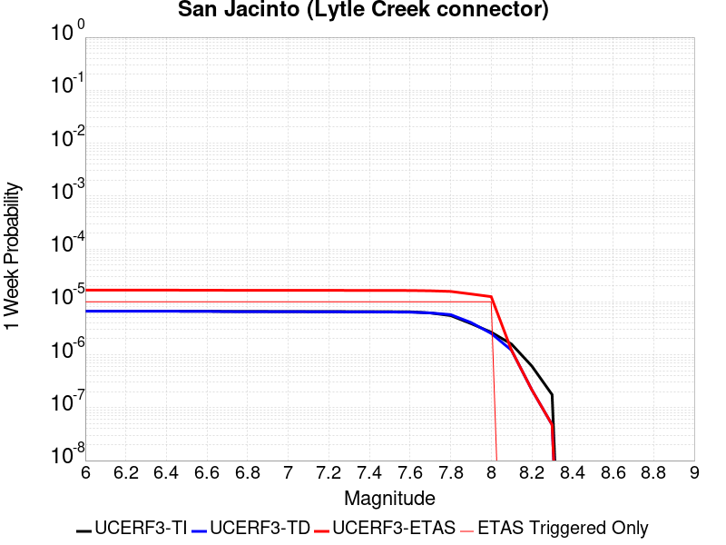 |  |  |  |

| Magnitude | 1 wk TI Prob | 1 wk TD Prob | 1 wk ETAS Prob | 1 wk ETAS/TD Gain | 1 wk ETAS Triggered Only | 1 mo TI Prob | 1 mo TD Prob | 1 mo ETAS Prob | 1 mo ETAS/TD Gain | 1 mo ETAS Triggered Only | 1 yr TI Prob | 1 yr TD Prob | 1 yr ETAS Prob | 1 yr ETAS/TD Gain | 1 yr ETAS Triggered Only | 10 yr TI Prob | 10 yr TD Prob | 10 yr ETAS Prob | 10 yr ETAS/TD Gain | 10 yr ETAS Triggered Only |
|-----|-----|-----|-----|-----|-----|-----|-----|-----|-----|-----|-----|-----|-----|-----|-----|-----|-----|-----|-----|-----|
| 6.0 | 6.693995E-6 | 6.660216E-6 | 6.660216E-6 | 1.0 | 0.0 | 2.8688235E-5 | 2.854347E-5 | 2.854347E-5 | 1.0 | 0.0 | 3.492233E-4 | 3.4746144E-4 | 3.4746144E-4 | 1.0 | 0.0 | 0.00348675 | 0.0035493854 | 0.0036185833 | 1.0194957 | 6.9444446E-5 |
| 6.1 | 6.693995E-6 | 6.660216E-6 | 6.660216E-6 | 1.0 | 0.0 | 2.8688235E-5 | 2.854347E-5 | 2.854347E-5 | 1.0 | 0.0 | 3.492233E-4 | 3.4746144E-4 | 3.4746144E-4 | 1.0 | 0.0 | 0.00348675 | 0.0035493854 | 0.0036185833 | 1.0194957 | 6.9444446E-5 |
| 6.2 | 6.693995E-6 | 6.660216E-6 | 6.660216E-6 | 1.0 | 0.0 | 2.8688235E-5 | 2.854347E-5 | 2.854347E-5 | 1.0 | 0.0 | 3.492233E-4 | 3.4746144E-4 | 3.4746144E-4 | 1.0 | 0.0 | 0.00348675 | 0.0035493854 | 0.0036185833 | 1.0194957 | 6.9444446E-5 |
| 6.3 | 6.693995E-6 | 6.660216E-6 | 6.660216E-6 | 1.0 | 0.0 | 2.8688235E-5 | 2.854347E-5 | 2.854347E-5 | 1.0 | 0.0 | 3.492233E-4 | 3.4746144E-4 | 3.4746144E-4 | 1.0 | 0.0 | 0.00348675 | 0.0035493854 | 0.0036185833 | 1.0194957 | 6.9444446E-5 |
| 6.4 | 6.693995E-6 | 6.660216E-6 | 6.660216E-6 | 1.0 | 0.0 | 2.8688235E-5 | 2.854347E-5 | 2.854347E-5 | 1.0 | 0.0 | 3.492233E-4 | 3.4746144E-4 | 3.4746144E-4 | 1.0 | 0.0 | 0.00348675 | 0.0035493854 | 0.0036185833 | 1.0194957 | 6.9444446E-5 |
| 6.5 | 6.6561875E-6 | 6.6204343E-6 | 6.6204343E-6 | 1.0 | 0.0 | 2.8526205E-5 | 2.837298E-5 | 2.837298E-5 | 1.0 | 0.0 | 3.472512E-4 | 3.4538636E-4 | 3.4538636E-4 | 1.0 | 0.0 | 0.0034670907 | 0.003528701 | 0.0035979003 | 1.0196104 | 6.9444446E-5 |
| 6.6 | 6.6561875E-6 | 6.6204343E-6 | 6.6204343E-6 | 1.0 | 0.0 | 2.8526205E-5 | 2.837298E-5 | 2.837298E-5 | 1.0 | 0.0 | 3.472512E-4 | 3.4538636E-4 | 3.4538636E-4 | 1.0 | 0.0 | 0.0034670907 | 0.003528701 | 0.0035979003 | 1.0196104 | 6.9444446E-5 |
| 6.7 | 6.5802237E-6 | 6.539611E-6 | 6.539611E-6 | 1.0 | 0.0 | 2.8200653E-5 | 2.8026603E-5 | 2.8026603E-5 | 1.0 | 0.0 | 3.4328885E-4 | 3.4117055E-4 | 3.4117055E-4 | 1.0 | 0.0 | 0.0034275902 | 0.0034866752 | 0.0035558776 | 1.0198476 | 6.9444446E-5 |
| 6.8 | 6.575632E-6 | 6.5341005E-6 | 6.5341005E-6 | 1.0 | 0.0 | 2.8180975E-5 | 2.8002989E-5 | 2.8002989E-5 | 1.0 | 0.0 | 3.4304935E-4 | 3.4088313E-4 | 3.4088313E-4 | 1.0 | 0.0 | 0.0034252026 | 0.00348381 | 0.0035530126 | 1.0198641 | 6.9444446E-5 |
| 6.9 | 6.570433E-6 | 6.525495E-6 | 6.525495E-6 | 1.0 | 0.0 | 2.8158694E-5 | 2.7966107E-5 | 2.7966107E-5 | 1.0 | 0.0 | 3.4277816E-4 | 3.4043423E-4 | 3.4043423E-4 | 1.0 | 0.0 | 0.0034224992 | 0.0034793352 | 0.003548538 | 1.0198897 | 6.9444446E-5 |
| 7.0 | 6.5643826E-6 | 6.515616E-6 | 6.515616E-6 | 1.0 | 0.0 | 2.8132765E-5 | 2.792377E-5 | 2.792377E-5 | 1.0 | 0.0 | 3.424626E-4 | 3.3991894E-4 | 3.3991894E-4 | 1.0 | 0.0 | 0.0034193532 | 0.0034741985 | 0.0035434016 | 1.0199192 | 6.9444446E-5 |
| 7.1 | 6.557402E-6 | 6.5043278E-6 | 6.5043278E-6 | 1.0 | 0.0 | 2.8102848E-5 | 2.7875392E-5 | 2.7875392E-5 | 1.0 | 0.0 | 3.4209844E-4 | 3.3933012E-4 | 3.3933012E-4 | 1.0 | 0.0 | 0.0034157229 | 0.0034683298 | 0.0035375333 | 1.019953 | 6.9444446E-5 |
| 7.2 | 6.546394E-6 | 6.4862943E-6 | 6.4862943E-6 | 1.0 | 0.0 | 2.8055672E-5 | 2.7798109E-5 | 2.7798109E-5 | 1.0 | 0.0 | 3.4152428E-4 | 3.3838948E-4 | 3.3838948E-4 | 1.0 | 0.0 | 0.0034099987 | 0.0034589572 | 0.0035281614 | 1.0200073 | 6.9444446E-5 |
| 7.3 | 6.5364216E-6 | 6.4670803E-6 | 6.4670803E-6 | 1.0 | 0.0 | 2.8012933E-5 | 2.7715765E-5 | 2.7715765E-5 | 1.0 | 0.0 | 3.4100408E-4 | 3.3738726E-4 | 3.3738726E-4 | 1.0 | 0.0 | 0.003404813 | 0.0034489788 | 0.0035181837 | 1.0200653 | 6.9444446E-5 |
| 7.4 | 6.5269523E-6 | 6.4481674E-6 | 6.4481674E-6 | 1.0 | 0.0 | 2.7972354E-5 | 2.7634711E-5 | 2.7634711E-5 | 1.0 | 0.0 | 3.4051016E-4 | 3.3640073E-4 | 3.3640073E-4 | 1.0 | 0.0 | 0.0033998888 | 0.003439161 | 0.0035083664 | 1.0201228 | 6.9444446E-5 |
| 7.5 | 6.5111835E-6 | 6.424442E-6 | 6.424442E-6 | 1.0 | 0.0 | 2.7904773E-5 | 2.7533031E-5 | 2.7533031E-5 | 1.0 | 0.0 | 3.3968766E-4 | 3.3516317E-4 | 3.3516317E-4 | 1.0 | 0.0 | 0.0033916887 | 0.003426834 | 0.0034960406 | 1.0201955 | 6.9444446E-5 |
| 7.6 | 6.4768806E-6 | 6.383551E-6 | 6.383551E-6 | 1.0 | 0.0 | 2.7757764E-5 | 2.735779E-5 | 2.735779E-5 | 1.0 | 0.0 | 3.3789838E-4 | 3.3303024E-4 | 3.3303024E-4 | 1.0 | 0.0 | 0.0033738504 | 0.0034055663 | 0.003474774 | 1.020322 | 6.9444446E-5 |
| 7.7 | 6.1655364E-6 | 6.1760365E-6 | 6.1760365E-6 | 1.0 | 0.0 | 2.642346E-5 | 2.646846E-5 | 2.646846E-5 | 1.0 | 0.0 | 3.2165812E-4 | 3.2220592E-4 | 3.2220592E-4 | 1.0 | 0.0 | 0.0032119295 | 0.0032971818 | 0.0033663972 | 1.0209923 | 6.9444446E-5 |
| 7.8 | 5.5043524E-6 | 5.737097E-6 | 5.737097E-6 | 1.0 | 0.0 | 2.3589868E-5 | 2.4587327E-5 | 2.4587327E-5 | 1.0 | 0.0 | 2.871688E-4 | 2.9930964E-4 | 2.9930964E-4 | 1.0 | 0.0 | 0.0028679797 | 0.0030672832 | 0.0031365147 | 1.022571 | 6.9444446E-5 |
| 7.9 | 3.889249E-6 | 4.076761E-6 | 4.076761E-6 | 1.0 | 0.0 | 1.6668104E-5 | 1.7471715E-5 | 1.7471715E-5 | 1.0 | 0.0 | 2.0291525E-4 | 2.1269741E-4 | 2.1269741E-4 | 1.0 | 0.0 | 0.0020273007 | 0.0021943315 | 0.0022636235 | 1.0315777 | 6.9444446E-5 |
| 8.0 | 2.668535E-6 | 2.5315155E-6 | 2.5315155E-6 | 1.0 | 0.0 | 1.1436528E-5 | 1.0849307E-5 | 1.0849307E-5 | 1.0 | 0.0 | 1.3923083E-4 | 1.3208234E-4 | 1.3208234E-4 | 1.0 | 0.0 | 0.0013914363 | 0.0013757964 | 0.0014451452 | 1.0504063 | 6.9444446E-5 |
| 8.1 | 1.5911459E-6 | 1.218661E-6 | 1.218661E-6 | 1.0 | 0.0 | 6.8191785E-6 | 5.2228224E-6 | 5.2228224E-6 | 1.0 | 0.0 | 8.3020335E-5 | 6.3586034E-5 | 6.3586034E-5 | 1.0 | 0.0 | 8.298933E-4 | 6.6932244E-4 | 6.6932244E-4 | 1.0 | 0.0 |
| 8.2 | 6.1294963E-7 | 2.1812275E-7 | 2.1812275E-7 | 1.0 | 0.0 | 2.6269242E-6 | 9.3481145E-7 | 9.3481145E-7 | 1.0 | 0.0 | 3.1982334E-5 | 1.138127E-5 | 1.138127E-5 | 1.0 | 0.0 | 3.1977732E-4 | 1.2784546E-4 | 1.2784546E-4 | 1.0 | 0.0 |
| 8.3 | 1.762871E-7 | 4.7546838E-8 | 4.7546838E-8 | 1.0 | 0.0 | 7.5551594E-7 | 2.0377215E-7 | 2.0377215E-7 | 1.0 | 0.0 | 9.1983675E-6 | 2.480923E-6 | 2.480923E-6 | 1.0 | 0.0 | 9.197987E-5 | 2.868753E-5 | 2.868753E-5 | 1.0 | 0.0 |

## Simi-Santa Rosa
*[(top)](#table-of-contents)*

| 1 Week | 1 Month | 1 Year | 10 Year |
|-----|-----|-----|-----|
|  |  |  |  |

| Magnitude | 1 wk TI Prob | 1 wk TD Prob | 1 wk ETAS Prob | 1 wk ETAS/TD Gain | 1 wk ETAS Triggered Only | 1 mo TI Prob | 1 mo TD Prob | 1 mo ETAS Prob | 1 mo ETAS/TD Gain | 1 mo ETAS Triggered Only | 1 yr TI Prob | 1 yr TD Prob | 1 yr ETAS Prob | 1 yr ETAS/TD Gain | 1 yr ETAS Triggered Only | 10 yr TI Prob | 10 yr TD Prob | 10 yr ETAS Prob | 10 yr ETAS/TD Gain | 10 yr ETAS Triggered Only |
|-----|-----|-----|-----|-----|-----|-----|-----|-----|-----|-----|-----|-----|-----|-----|-----|-----|-----|-----|-----|-----|
| 6.0 | 2.198912E-5 | 2.2275442E-5 | 9.171834E-5 | 4.1174645 | 6.9444446E-5 | 9.4235686E-5 | 9.5462936E-5 | 1.6490075E-4 | 1.7273798 | 6.9444446E-5 | 0.0011467156 | 0.0011616853 | 0.0012310492 | 1.0597095 | 6.9444446E-5 | 0.011408163 | 0.011560575 | 0.011629216 | 1.0059376 | 6.9444446E-5 |
| 6.1 | 2.198912E-5 | 2.2275442E-5 | 9.171834E-5 | 4.1174645 | 6.9444446E-5 | 9.4235686E-5 | 9.5462936E-5 | 1.6490075E-4 | 1.7273798 | 6.9444446E-5 | 0.0011467156 | 0.0011616853 | 0.0012310492 | 1.0597095 | 6.9444446E-5 | 0.011408163 | 0.011560575 | 0.011629216 | 1.0059376 | 6.9444446E-5 |
| 6.2 | 1.69983E-5 | 1.6668559E-5 | 8.6111846E-5 | 5.1661243 | 6.9444446E-5 | 7.284782E-5 | 7.143489E-5 | 1.4087437E-4 | 1.9720668 | 6.9444446E-5 | 8.865613E-4 | 8.6940196E-4 | 9.38786E-4 | 1.0798067 | 6.9444446E-5 | 0.008830327 | 0.008662928 | 0.00873177 | 1.0079468 | 6.9444446E-5 |
| 6.3 | 1.69983E-5 | 1.6668559E-5 | 8.6111846E-5 | 5.1661243 | 6.9444446E-5 | 7.284782E-5 | 7.143489E-5 | 1.4087437E-4 | 1.9720668 | 6.9444446E-5 | 8.865613E-4 | 8.6940196E-4 | 9.38786E-4 | 1.0798067 | 6.9444446E-5 | 0.008830327 | 0.008662928 | 0.00873177 | 1.0079468 | 6.9444446E-5 |
| 6.4 | 1.4666188E-5 | 1.4052543E-5 | 8.349601E-5 | 5.9417014 | 6.9444446E-5 | 6.285358E-5 | 6.0223934E-5 | 1.296642E-4 | 2.1530342 | 6.9444446E-5 | 7.6497364E-4 | 7.3300465E-4 | 8.023982E-4 | 1.0946699 | 6.9444446E-5 | 0.0076234564 | 0.007308344 | 0.007377281 | 1.0094327 | 6.9444446E-5 |
| 6.5 | 1.4666188E-5 | 1.4052543E-5 | 8.349601E-5 | 5.9417014 | 6.9444446E-5 | 6.285358E-5 | 6.0223934E-5 | 1.296642E-4 | 2.1530342 | 6.9444446E-5 | 7.6497364E-4 | 7.3300465E-4 | 8.023982E-4 | 1.0946699 | 6.9444446E-5 | 0.0076234564 | 0.007308344 | 0.007377281 | 1.0094327 | 6.9444446E-5 |
| 6.6 | 1.4377586E-5 | 1.3729583E-5 | 8.317307E-5 | 6.057946 | 6.9444446E-5 | 6.1616774E-5 | 5.883988E-5 | 1.2828024E-4 | 2.1801581 | 6.9444446E-5 | 7.4992597E-4 | 7.1616494E-4 | 7.8555965E-4 | 1.0968977 | 6.9444446E-5 | 0.007474003 | 0.0071410383 | 0.007209987 | 1.0096552 | 6.9444446E-5 |
| 6.7 | 1.3881404E-5 | 1.320755E-5 | 8.265108E-5 | 6.257866 | 6.9444446E-5 | 5.9490372E-5 | 5.66027E-5 | 1.2604322E-4 | 2.2268057 | 6.9444446E-5 | 7.240546E-4 | 6.8894465E-4 | 7.583413E-4 | 1.1007289 | 6.9444446E-5 | 0.007217 | 0.006870538 | 0.0069395057 | 1.0100381 | 6.9444446E-5 |
| 6.8 | 1.0176516E-5 | 9.154151E-6 | 9.154151E-6 | 1.0 | 0.0 | 4.3612912E-5 | 3.9231574E-5 | 3.9231574E-5 | 1.0 | 0.0 | 5.308578E-4 | 4.7755634E-4 | 4.7755634E-4 | 1.0 | 0.0 | 0.0052959146 | 0.004766934 | 0.004766934 | 1.0 | 0.0 |
| 6.9 | 9.699797E-6 | 8.774719E-6 | 8.774719E-6 | 1.0 | 0.0 | 4.15699E-5 | 3.7605492E-5 | 3.7605492E-5 | 1.0 | 0.0 | 5.05996E-4 | 4.577671E-4 | 4.577671E-4 | 1.0 | 0.0 | 0.005048454 | 0.0045698597 | 0.0045698597 | 1.0 | 0.0 |
| 7.0 | 7.4049476E-6 | 6.559333E-6 | 6.559333E-6 | 1.0 | 0.0 | 3.1735104E-5 | 2.8111197E-5 | 2.8111197E-5 | 1.0 | 0.0 | 3.8630638E-4 | 3.422127E-4 | 3.422127E-4 | 1.0 | 0.0 | 0.0038563553 | 0.0034180996 | 0.0034180996 | 1.0 | 0.0 |
| 7.1 | 3.873439E-6 | 2.7595095E-6 | 2.7595095E-6 | 1.0 | 0.0 | 1.6600346E-5 | 1.1826417E-5 | 1.1826417E-5 | 1.0 | 0.0 | 2.0209046E-4 | 1.4397735E-4 | 1.4397735E-4 | 1.0 | 0.0 | 0.0020190678 | 0.0014388643 | 0.0014388643 | 1.0 | 0.0 |
| 7.2 | 3.417706E-6 | 2.3676484E-6 | 2.3676484E-6 | 1.0 | 0.0 | 1.4647229E-5 | 1.0147027E-5 | 1.0147027E-5 | 1.0 | 0.0 | 1.7831543E-4 | 1.2353327E-4 | 1.2353327E-4 | 1.0 | 0.0 | 0.0017817242 | 0.0012346683 | 0.0012346683 | 1.0 | 0.0 |
| 7.3 | 1.90225E-6 | 1.4073753E-6 | 1.4073753E-6 | 1.0 | 0.0 | 8.152474E-6 | 6.0315947E-6 | 6.0315947E-6 | 1.0 | 0.0 | 9.9251854E-5 | 7.343221E-5 | 7.343221E-5 | 1.0 | 0.0 | 9.920754E-4 | 7.340817E-4 | 7.340817E-4 | 1.0 | 0.0 |
| 7.4 | 1.5170556E-6 | 1.1024773E-6 | 1.1024773E-6 | 1.0 | 0.0 | 6.5016507E-6 | 4.724894E-6 | 4.724894E-6 | 1.0 | 0.0 | 7.915472E-5 | 5.7524077E-5 | 5.7524077E-5 | 1.0 | 0.0 | 7.9126534E-4 | 5.7509297E-4 | 5.7509297E-4 | 1.0 | 0.0 |
| 7.5 | 1.178732E-6 | 8.535102E-7 | 8.535102E-7 | 1.0 | 0.0 | 5.0516987E-6 | 3.6578958E-6 | 3.6578958E-6 | 1.0 | 0.0 | 6.1502695E-5 | 4.453398E-5 | 4.453398E-5 | 1.0 | 0.0 | 6.148568E-4 | 4.452515E-4 | 4.452515E-4 | 1.0 | 0.0 |
| 7.6 | 6.8722386E-7 | 4.793198E-7 | 4.793198E-7 | 1.0 | 0.0 | 2.9452417E-6 | 2.054226E-6 | 2.054226E-6 | 1.0 | 0.0 | 3.5857727E-5 | 2.5009915E-5 | 2.5009915E-5 | 1.0 | 0.0 | 3.5851944E-4 | 2.5007114E-4 | 2.5007114E-4 | 1.0 | 0.0 |
| 7.7 | 5.5126515E-7 | 3.6731157E-7 | 3.6731157E-7 | 1.0 | 0.0 | 2.3625628E-6 | 1.5741915E-6 | 1.5741915E-6 | 1.0 | 0.0 | 2.8763823E-5 | 1.9165615E-5 | 1.9165615E-5 | 1.0 | 0.0 | 2.87601E-4 | 1.9163972E-4 | 1.9163972E-4 | 1.0 | 0.0 |
| 7.8 | 3.3860243E-7 | 2.0075942E-7 | 2.0075942E-7 | 1.0 | 0.0 | 1.4511525E-6 | 8.6039717E-7 | 8.6039717E-7 | 1.0 | 0.0 | 1.7667637E-5 | 1.0475286E-5 | 1.0475286E-5 | 1.0 | 0.0 | 1.7666233E-4 | 1.04747975E-4 | 1.04747975E-4 | 1.0 | 0.0 |
| 7.9 | 2.7955386E-7 | 1.4649108E-7 | 1.4649108E-7 | 1.0 | 0.0 | 1.1980875E-6 | 6.278188E-7 | 6.278188E-7 | 1.0 | 0.0 | 1.4586617E-5 | 7.643667E-6 | 7.643667E-6 | 1.0 | 0.0 | 1.458566E-4 | 7.643409E-5 | 7.643409E-5 | 1.0 | 0.0 |
| 8.0 | 5.6259015E-8 | 3.3355324E-8 | 3.3355324E-8 | 1.0 | 0.0 | 2.4111003E-7 | 1.4295138E-7 | 1.4295138E-7 | 1.0 | 0.0 | 2.9355108E-6 | 1.7404317E-6 | 1.7404317E-6 | 1.0 | 0.0 | 2.935472E-5 | 1.7404194E-5 | 1.7404194E-5 | 1.0 | 0.0 |

## Kern Canyon (Lake Isabella) 2011
*[(top)](#table-of-contents)*

| 1 Week | 1 Month | 1 Year | 10 Year |
|-----|-----|-----|-----|
|  |  |  |  |

| Magnitude | 1 wk TI Prob | 1 wk TD Prob | 1 wk ETAS Prob | 1 wk ETAS/TD Gain | 1 wk ETAS Triggered Only | 1 mo TI Prob | 1 mo TD Prob | 1 mo ETAS Prob | 1 mo ETAS/TD Gain | 1 mo ETAS Triggered Only | 1 yr TI Prob | 1 yr TD Prob | 1 yr ETAS Prob | 1 yr ETAS/TD Gain | 1 yr ETAS Triggered Only | 10 yr TI Prob | 10 yr TD Prob | 10 yr ETAS Prob | 10 yr ETAS/TD Gain | 10 yr ETAS Triggered Only |
|-----|-----|-----|-----|-----|-----|-----|-----|-----|-----|-----|-----|-----|-----|-----|-----|-----|-----|-----|-----|-----|
| 6.0 | 4.2387383E-6 | 4.001639E-6 | 7.344581E-5 | 18.353931 | 6.9444446E-5 | 1.8165894E-5 | 1.7149778E-5 | 8.6593034E-5 | 5.0492215 | 6.9444446E-5 | 2.2114732E-4 | 2.087804E-4 | 2.7821035E-4 | 1.33255 | 6.9444446E-5 | 0.0022092736 | 0.0020860266 | 0.002155326 | 1.0332209 | 6.9444446E-5 |
| 6.1 | 4.2387383E-6 | 4.001639E-6 | 7.344581E-5 | 18.353931 | 6.9444446E-5 | 1.8165894E-5 | 1.7149778E-5 | 8.6593034E-5 | 5.0492215 | 6.9444446E-5 | 2.2114732E-4 | 2.087804E-4 | 2.7821035E-4 | 1.33255 | 6.9444446E-5 | 0.0022092736 | 0.0020860266 | 0.002155326 | 1.0332209 | 6.9444446E-5 |
| 6.2 | 4.2387383E-6 | 4.001639E-6 | 7.344581E-5 | 18.353931 | 6.9444446E-5 | 1.8165894E-5 | 1.7149778E-5 | 8.6593034E-5 | 5.0492215 | 6.9444446E-5 | 2.2114732E-4 | 2.087804E-4 | 2.7821035E-4 | 1.33255 | 6.9444446E-5 | 0.0022092736 | 0.0020860266 | 0.002155326 | 1.0332209 | 6.9444446E-5 |
| 6.3 | 4.2387383E-6 | 4.001639E-6 | 7.344581E-5 | 18.353931 | 6.9444446E-5 | 1.8165894E-5 | 1.7149778E-5 | 8.6593034E-5 | 5.0492215 | 6.9444446E-5 | 2.2114732E-4 | 2.087804E-4 | 2.7821035E-4 | 1.33255 | 6.9444446E-5 | 0.0022092736 | 0.0020860266 | 0.002155326 | 1.0332209 | 6.9444446E-5 |
| 6.4 | 4.2387383E-6 | 4.001639E-6 | 7.344581E-5 | 18.353931 | 6.9444446E-5 | 1.8165894E-5 | 1.7149778E-5 | 8.6593034E-5 | 5.0492215 | 6.9444446E-5 | 2.2114732E-4 | 2.087804E-4 | 2.7821035E-4 | 1.33255 | 6.9444446E-5 | 0.0022092736 | 0.0020860266 | 0.002155326 | 1.0332209 | 6.9444446E-5 |
| 6.5 | 2.7857532E-6 | 2.517867E-6 | 7.196214E-5 | 28.580595 | 6.9444446E-5 | 1.1938888E-5 | 1.0790815E-5 | 8.023451E-5 | 7.435445 | 6.9444446E-5 | 1.4534626E-4 | 1.3137059E-4 | 2.0080591E-4 | 1.5285454 | 6.9444446E-5 | 0.0014525123 | 0.001312962 | 0.0013823153 | 1.052822 | 6.9444446E-5 |
| 6.6 | 2.2233348E-6 | 1.9441236E-6 | 7.138844E-5 | 36.72011 | 6.9444446E-5 | 9.528543E-6 | 8.331932E-6 | 7.7775796E-5 | 9.334665 | 6.9444446E-5 | 1.1600384E-4 | 1.01436635E-4 | 1.7087403E-4 | 1.6845397 | 6.9444446E-5 | 0.001159433 | 0.001013912 | 0.001083286 | 1.0684222 | 6.9444446E-5 |
| 6.7 | 2.1635126E-6 | 1.8835036E-6 | 7.132782E-5 | 37.869755 | 6.9444446E-5 | 9.272164E-6 | 8.072134E-6 | 7.7516015E-5 | 9.602916 | 6.9444446E-5 | 1.1288274E-4 | 9.827388E-5 | 1.6771149E-4 | 1.7065725 | 6.9444446E-5 | 0.0011282542 | 9.823124E-4 | 0.0010516886 | 1.0706254 | 6.9444446E-5 |
| 6.8 | 1.8685711E-6 | 1.5831425E-6 | 7.1027476E-5 | 44.864864 | 6.9444446E-5 | 8.008137E-6 | 6.784879E-6 | 7.6228855E-5 | 11.235108 | 6.9444446E-5 | 9.74947E-5 | 8.260282E-5 | 1.5204152E-4 | 1.8406336 | 6.9444446E-5 | 9.745194E-4 | 8.2572614E-4 | 8.951132E-4 | 1.0840316 | 6.9444446E-5 |
| 6.9 | 1.5815071E-6 | 1.3064928E-6 | 7.0750844E-5 | 54.15326 | 6.9444446E-5 | 6.77787E-6 | 5.599243E-6 | 7.5043296E-5 | 13.402401 | 6.9444446E-5 | 8.251744E-5 | 6.816868E-5 | 1.3760838E-4 | 2.0186453 | 6.9444446E-5 | 8.248681E-4 | 6.8148033E-4 | 7.508775E-4 | 1.1018329 | 6.9444446E-5 |
| 7.0 | 1.3772564E-6 | 1.1210718E-6 | 7.056544E-5 | 62.944622 | 6.9444446E-5 | 5.9025137E-6 | 4.8045845E-6 | 7.4248695E-5 | 15.453718 | 6.9444446E-5 | 7.186073E-5 | 5.8494268E-5 | 1.2793465E-4 | 2.1871314 | 6.9444446E-5 | 7.18375E-4 | 5.847908E-4 | 6.541946E-4 | 1.1186814 | 6.9444446E-5 |
| 7.1 | 1.0916998E-6 | 8.763777E-7 | 7.032076E-5 | 80.24024 | 6.9444446E-5 | 4.678705E-6 | 3.7558991E-6 | 7.3200084E-5 | 19.489363 | 6.9444446E-5 | 5.6961744E-5 | 4.5727127E-5 | 1.151684E-4 | 2.5186012 | 6.9444446E-5 | 5.6947145E-4 | 4.571785E-4 | 5.265912E-4 | 1.1518284 | 6.9444446E-5 |
| 7.2 | 7.6277024E-7 | 5.901454E-7 | 7.003455E-5 | 118.67337 | 6.9444446E-5 | 3.2690114E-6 | 2.5291922E-6 | 7.197346E-5 | 28.457092 | 6.9444446E-5 | 3.9799485E-5 | 3.0792486E-5 | 1.0023479E-4 | 3.2551703 | 6.9444446E-5 | 3.9792358E-4 | 3.0788282E-4 | 3.7730587E-4 | 1.2254853 | 6.9444446E-5 |
| 7.3 | 5.3265916E-7 | 4.3824414E-7 | 6.9882655E-5 | 159.46056 | 6.9444446E-5 | 2.282823E-6 | 1.878188E-6 | 7.13225E-5 | 37.974102 | 6.9444446E-5 | 2.7793016E-5 | 2.2866701E-5 | 9.230956E-5 | 4.0368547 | 6.9444446E-5 | 2.778954E-4 | 2.2864387E-4 | 2.9807244E-4 | 1.3036537 | 6.9444446E-5 |
| 7.4 | 3.4946007E-7 | 3.006571E-7 | 6.974508E-5 | 231.97551 | 6.9444446E-5 | 1.497685E-6 | 1.2885298E-6 | 7.073289E-5 | 54.894257 | 6.9444446E-5 | 1.8234163E-5 | 1.568774E-5 | 8.513109E-5 | 5.4266005 | 6.9444446E-5 | 1.8232666E-4 | 1.5686655E-4 | 2.263001E-4 | 1.4426281 | 6.9444446E-5 |
| 7.5 | 1.8317026E-7 | 1.4244812E-7 | 1.4244812E-7 | 1.0 | 0.0 | 7.850152E-7 | 6.104918E-7 | 6.104918E-7 | 1.0 | 0.0 | 9.557518E-6 | 7.432713E-6 | 7.432713E-6 | 1.0 | 0.0 | 9.5571064E-5 | 7.432472E-5 | 7.432472E-5 | 1.0 | 0.0 |
| 7.6 | 2.572245E-8 | 1.7352555E-8 | 1.7352555E-8 | 1.0 | 0.0 | 1.10239064E-7 | 7.436809E-8 | 7.436809E-8 | 1.0 | 0.0 | 1.3421597E-6 | 9.054312E-7 | 9.054312E-7 | 1.0 | 0.0 | 1.3421517E-5 | 9.05428E-6 | 9.05428E-6 | 1.0 | 0.0 |

## Pleito
*[(top)](#table-of-contents)*

| 1 Week | 1 Month | 1 Year | 10 Year |
|-----|-----|-----|-----|
|  |  |  |  |

| Magnitude | 1 wk TI Prob | 1 wk TD Prob | 1 wk ETAS Prob | 1 wk ETAS/TD Gain | 1 wk ETAS Triggered Only | 1 mo TI Prob | 1 mo TD Prob | 1 mo ETAS Prob | 1 mo ETAS/TD Gain | 1 mo ETAS Triggered Only | 1 yr TI Prob | 1 yr TD Prob | 1 yr ETAS Prob | 1 yr ETAS/TD Gain | 1 yr ETAS Triggered Only | 10 yr TI Prob | 10 yr TD Prob | 10 yr ETAS Prob | 10 yr ETAS/TD Gain | 10 yr ETAS Triggered Only |
|-----|-----|-----|-----|-----|-----|-----|-----|-----|-----|-----|-----|-----|-----|-----|-----|-----|-----|-----|-----|-----|
| 6.0 | 1.6763008E-5 | 2.4763838E-5 | 2.4763838E-5 | 1.0 | 0.0 | 7.183948E-5 | 1.0612683E-4 | 1.0612683E-4 | 1.0 | 0.0 | 8.742947E-4 | 0.0012914003 | 0.0012914003 | 1.0 | 0.0 | 0.00870863 | 0.0129538905 | 0.013022435 | 1.0052915 | 6.9444446E-5 |
| 6.1 | 1.6763008E-5 | 2.4763838E-5 | 2.4763838E-5 | 1.0 | 0.0 | 7.183948E-5 | 1.0612683E-4 | 1.0612683E-4 | 1.0 | 0.0 | 8.742947E-4 | 0.0012914003 | 0.0012914003 | 1.0 | 0.0 | 0.00870863 | 0.0129538905 | 0.013022435 | 1.0052915 | 6.9444446E-5 |
| 6.2 | 1.6763008E-5 | 2.4763838E-5 | 2.4763838E-5 | 1.0 | 0.0 | 7.183948E-5 | 1.0612683E-4 | 1.0612683E-4 | 1.0 | 0.0 | 8.742947E-4 | 0.0012914003 | 0.0012914003 | 1.0 | 0.0 | 0.00870863 | 0.0129538905 | 0.013022435 | 1.0052915 | 6.9444446E-5 |
| 6.3 | 1.6763008E-5 | 2.4763838E-5 | 2.4763838E-5 | 1.0 | 0.0 | 7.183948E-5 | 1.0612683E-4 | 1.0612683E-4 | 1.0 | 0.0 | 8.742947E-4 | 0.0012914003 | 0.0012914003 | 1.0 | 0.0 | 0.00870863 | 0.0129538905 | 0.013022435 | 1.0052915 | 6.9444446E-5 |
| 6.4 | 1.6763008E-5 | 2.4763838E-5 | 2.4763838E-5 | 1.0 | 0.0 | 7.183948E-5 | 1.0612683E-4 | 1.0612683E-4 | 1.0 | 0.0 | 8.742947E-4 | 0.0012914003 | 0.0012914003 | 1.0 | 0.0 | 0.00870863 | 0.0129538905 | 0.013022435 | 1.0052915 | 6.9444446E-5 |
| 6.5 | 1.6763008E-5 | 2.4763838E-5 | 2.4763838E-5 | 1.0 | 0.0 | 7.183948E-5 | 1.0612683E-4 | 1.0612683E-4 | 1.0 | 0.0 | 8.742947E-4 | 0.0012914003 | 0.0012914003 | 1.0 | 0.0 | 0.00870863 | 0.0129538905 | 0.013022435 | 1.0052915 | 6.9444446E-5 |
| 6.6 | 9.910213E-6 | 1.7214623E-5 | 1.7214623E-5 | 1.0 | 0.0 | 4.247165E-5 | 7.377489E-5 | 7.377489E-5 | 1.0 | 0.0 | 5.169696E-4 | 8.978429E-4 | 8.978429E-4 | 1.0 | 0.0 | 0.0051576863 | 0.009050702 | 0.009050702 | 1.0 | 0.0 |
| 6.7 | 9.910213E-6 | 1.7214623E-5 | 1.7214623E-5 | 1.0 | 0.0 | 4.247165E-5 | 7.377489E-5 | 7.377489E-5 | 1.0 | 0.0 | 5.169696E-4 | 8.978429E-4 | 8.978429E-4 | 1.0 | 0.0 | 0.0051576863 | 0.009050702 | 0.009050702 | 1.0 | 0.0 |
| 6.8 | 8.300162E-6 | 1.5474232E-5 | 1.5474232E-5 | 1.0 | 0.0 | 3.557164E-5 | 6.631646E-5 | 6.631646E-5 | 1.0 | 0.0 | 4.3299864E-4 | 8.071053E-4 | 8.071053E-4 | 1.0 | 0.0 | 0.004321559 | 0.008150139 | 0.008150139 | 1.0 | 0.0 |
| 6.9 | 8.183114E-6 | 1.5345448E-5 | 1.5345448E-5 | 1.0 | 0.0 | 3.5070017E-5 | 6.576455E-5 | 6.576455E-5 | 1.0 | 0.0 | 4.2689382E-4 | 8.003907E-4 | 8.003907E-4 | 1.0 | 0.0 | 0.0042607468 | 0.008083483 | 0.008083483 | 1.0 | 0.0 |
| 7.0 | 7.1748823E-6 | 1.413244E-5 | 1.413244E-5 | 1.0 | 0.0 | 3.0749135E-5 | 6.0566195E-5 | 6.0566195E-5 | 1.0 | 0.0 | 3.743064E-4 | 7.371445E-4 | 7.371445E-4 | 1.0 | 0.0 | 0.0037367654 | 0.007454939 | 0.007454939 | 1.0 | 0.0 |
| 7.1 | 7.1671807E-6 | 1.412281E-5 | 1.412281E-5 | 1.0 | 0.0 | 3.0716128E-5 | 6.052493E-5 | 6.052493E-5 | 1.0 | 0.0 | 3.7390468E-4 | 7.366424E-4 | 7.366424E-4 | 1.0 | 0.0 | 0.0037327618 | 0.0074499524 | 0.0074499524 | 1.0 | 0.0 |
| 7.2 | 7.0649667E-6 | 1.39701015E-5 | 1.39701015E-5 | 1.0 | 0.0 | 3.0278077E-5 | 5.9870494E-5 | 5.9870494E-5 | 1.0 | 0.0 | 3.6857324E-4 | 7.2868E-4 | 7.2868E-4 | 1.0 | 0.0 | 0.0036796255 | 0.0073707094 | 0.0073707094 | 1.0 | 0.0 |
| 7.3 | 7.02082E-6 | 1.3913556E-5 | 1.3913556E-5 | 1.0 | 0.0 | 3.008888E-5 | 5.9628168E-5 | 5.9628168E-5 | 1.0 | 0.0 | 3.6627054E-4 | 7.2573166E-4 | 7.2573166E-4 | 1.0 | 0.0 | 0.0036566744 | 0.007341209 | 0.007341209 | 1.0 | 0.0 |
| 7.4 | 6.987146E-6 | 1.3873118E-5 | 1.3873118E-5 | 1.0 | 0.0 | 2.9944567E-5 | 5.945487E-5 | 5.945487E-5 | 1.0 | 0.0 | 3.6451413E-4 | 7.2362315E-4 | 7.2362315E-4 | 1.0 | 0.0 | 0.0036391679 | 0.007320144 | 0.007320144 | 1.0 | 0.0 |
| 7.5 | 6.9494554E-6 | 1.3830024E-5 | 1.3830024E-5 | 1.0 | 0.0 | 2.9783041E-5 | 5.9270187E-5 | 5.9270187E-5 | 1.0 | 0.0 | 3.625482E-4 | 7.2137616E-4 | 7.2137616E-4 | 1.0 | 0.0 | 0.0036195726 | 0.0072977724 | 0.0072977724 | 1.0 | 0.0 |
| 7.6 | 6.92694E-6 | 1.3789138E-5 | 1.3789138E-5 | 1.0 | 0.0 | 2.9686547E-5 | 5.909497E-5 | 5.909497E-5 | 1.0 | 0.0 | 3.6137376E-4 | 7.1924424E-4 | 7.1924424E-4 | 1.0 | 0.0 | 0.0036078666 | 0.0072765257 | 0.0072765257 | 1.0 | 0.0 |
| 7.7 | 6.395867E-6 | 1.2668219E-5 | 1.2668219E-5 | 1.0 | 0.0 | 2.741057E-5 | 5.429124E-5 | 5.429124E-5 | 1.0 | 0.0 | 3.336726E-4 | 6.6079566E-4 | 6.6079566E-4 | 1.0 | 0.0 | 0.0033317201 | 0.0066951844 | 0.0066951844 | 1.0 | 0.0 |
| 7.8 | 5.8664327E-6 | 1.153586E-5 | 1.153586E-5 | 1.0 | 0.0 | 2.5141611E-5 | 4.9438466E-5 | 4.9438466E-5 | 1.0 | 0.0 | 3.060561E-4 | 6.017473E-4 | 6.017473E-4 | 1.0 | 0.0 | 0.0030563495 | 0.0061006667 | 0.0061006667 | 1.0 | 0.0 |
| 7.9 | 3.7167474E-6 | 7.1140853E-6 | 7.1140853E-6 | 1.0 | 0.0 | 1.592882E-5 | 3.0488582E-5 | 3.0488582E-5 | 1.0 | 0.0 | 1.9391612E-4 | 3.7113542E-4 | 3.7113542E-4 | 1.0 | 0.0 | 0.0019374699 | 0.0037674906 | 0.0037674906 | 1.0 | 0.0 |
| 8.0 | 1.0903841E-6 | 1.2879392E-6 | 1.2879392E-6 | 1.0 | 0.0 | 4.6730665E-6 | 5.5197274E-6 | 5.5197274E-6 | 1.0 | 0.0 | 5.68931E-5 | 6.720063E-5 | 6.720063E-5 | 1.0 | 0.0 | 5.6878536E-4 | 6.941948E-4 | 6.941948E-4 | 1.0 | 0.0 |
| 8.1 | 2.6894583E-7 | 1.1060341E-7 | 1.1060341E-7 | 1.0 | 0.0 | 1.1526245E-6 | 4.740145E-7 | 4.740145E-7 | 1.0 | 0.0 | 1.4033113E-5 | 5.7711113E-6 | 5.7711113E-6 | 1.0 | 0.0 | 1.4032227E-4 | 6.456908E-5 | 6.456908E-5 | 1.0 | 0.0 |
| 8.2 | 5.2967013E-9 | 2.4578228E-9 | 2.4578228E-9 | 1.0 | 0.0 | 2.2700148E-8 | 1.0533527E-8 | 1.0533527E-8 | 1.0 | 0.0 | 2.7637427E-7 | 1.2824569E-7 | 1.2824569E-7 | 1.0 | 0.0 | 2.7637393E-6 | 1.4592787E-6 | 1.4592787E-6 | 1.0 | 0.0 |

## Clamshell-Sawpit
*[(top)](#table-of-contents)*

| 1 Week | 1 Month | 1 Year | 10 Year |
|-----|-----|-----|-----|
|  |  |  |  |

| Magnitude | 1 wk TI Prob | 1 wk TD Prob | 1 wk ETAS Prob | 1 wk ETAS/TD Gain | 1 wk ETAS Triggered Only | 1 mo TI Prob | 1 mo TD Prob | 1 mo ETAS Prob | 1 mo ETAS/TD Gain | 1 mo ETAS Triggered Only | 1 yr TI Prob | 1 yr TD Prob | 1 yr ETAS Prob | 1 yr ETAS/TD Gain | 1 yr ETAS Triggered Only | 10 yr TI Prob | 10 yr TD Prob | 10 yr ETAS Prob | 10 yr ETAS/TD Gain | 10 yr ETAS Triggered Only |
|-----|-----|-----|-----|-----|-----|-----|-----|-----|-----|-----|-----|-----|-----|-----|-----|-----|-----|-----|-----|-----|
| 6.0 | 3.202998E-6 | 3.0127644E-6 | 3.0127644E-6 | 1.0 | 0.0 | 1.3727062E-5 | 1.2911788E-5 | 1.2911788E-5 | 1.0 | 0.0 | 1.6711417E-4 | 1.5719049E-4 | 2.26624E-4 | 1.4417158 | 6.9444446E-5 | 0.0016698855 | 0.0015708724 | 0.0016402077 | 1.0441381 | 6.9444446E-5 |
| 6.1 | 3.202998E-6 | 3.0127644E-6 | 3.0127644E-6 | 1.0 | 0.0 | 1.3727062E-5 | 1.2911788E-5 | 1.2911788E-5 | 1.0 | 0.0 | 1.6711417E-4 | 1.5719049E-4 | 2.26624E-4 | 1.4417158 | 6.9444446E-5 | 0.0016698855 | 0.0015708724 | 0.0016402077 | 1.0441381 | 6.9444446E-5 |
| 6.2 | 3.202998E-6 | 3.0127644E-6 | 3.0127644E-6 | 1.0 | 0.0 | 1.3727062E-5 | 1.2911788E-5 | 1.2911788E-5 | 1.0 | 0.0 | 1.6711417E-4 | 1.5719049E-4 | 2.26624E-4 | 1.4417158 | 6.9444446E-5 | 0.0016698855 | 0.0015708724 | 0.0016402077 | 1.0441381 | 6.9444446E-5 |
| 6.3 | 3.202998E-6 | 3.0127644E-6 | 3.0127644E-6 | 1.0 | 0.0 | 1.3727062E-5 | 1.2911788E-5 | 1.2911788E-5 | 1.0 | 0.0 | 1.6711417E-4 | 1.5719049E-4 | 2.26624E-4 | 1.4417158 | 6.9444446E-5 | 0.0016698855 | 0.0015708724 | 0.0016402077 | 1.0441381 | 6.9444446E-5 |
| 6.4 | 3.202998E-6 | 3.0127644E-6 | 3.0127644E-6 | 1.0 | 0.0 | 1.3727062E-5 | 1.2911788E-5 | 1.2911788E-5 | 1.0 | 0.0 | 1.6711417E-4 | 1.5719049E-4 | 2.26624E-4 | 1.4417158 | 6.9444446E-5 | 0.0016698855 | 0.0015708724 | 0.0016402077 | 1.0441381 | 6.9444446E-5 |
| 6.5 | 2.5862723E-6 | 2.380775E-6 | 2.380775E-6 | 1.0 | 0.0 | 1.1083977E-5 | 1.0203283E-5 | 1.0203283E-5 | 1.0 | 0.0 | 1.3493907E-4 | 1.2421819E-4 | 1.2421819E-4 | 1.0 | 0.0 | 0.0013485716 | 0.0012415178 | 0.0012415178 | 1.0 | 0.0 |
| 6.6 | 2.5862723E-6 | 2.380775E-6 | 2.380775E-6 | 1.0 | 0.0 | 1.1083977E-5 | 1.0203283E-5 | 1.0203283E-5 | 1.0 | 0.0 | 1.3493907E-4 | 1.2421819E-4 | 1.2421819E-4 | 1.0 | 0.0 | 0.0013485716 | 0.0012415178 | 0.0012415178 | 1.0 | 0.0 |
| 6.7 | 2.5862723E-6 | 2.380775E-6 | 2.380775E-6 | 1.0 | 0.0 | 1.1083977E-5 | 1.0203283E-5 | 1.0203283E-5 | 1.0 | 0.0 | 1.3493907E-4 | 1.2421819E-4 | 1.2421819E-4 | 1.0 | 0.0 | 0.0013485716 | 0.0012415178 | 0.0012415178 | 1.0 | 0.0 |
| 6.8 | 2.4098806E-6 | 2.1977307E-6 | 2.1977307E-6 | 1.0 | 0.0 | 1.0328019E-5 | 9.4188135E-6 | 9.4188135E-6 | 1.0 | 0.0 | 1.2573638E-4 | 1.1466829E-4 | 1.1466829E-4 | 1.0 | 0.0 | 0.0012566525 | 0.0011461178 | 0.0011461178 | 1.0 | 0.0 |
| 6.9 | 2.0073985E-6 | 1.7784248E-6 | 1.7784248E-6 | 1.0 | 0.0 | 8.603109E-6 | 7.621799E-6 | 7.621799E-6 | 1.0 | 0.0 | 1.0473781E-4 | 9.279157E-5 | 9.279157E-5 | 1.0 | 0.0 | 0.0010468846 | 9.275401E-4 | 9.275401E-4 | 1.0 | 0.0 |
| 7.0 | 1.8166766E-6 | 1.5807095E-6 | 1.5807095E-6 | 1.0 | 0.0 | 7.785734E-6 | 6.7744522E-6 | 6.7744522E-6 | 1.0 | 0.0 | 9.478718E-5 | 8.247593E-5 | 8.247593E-5 | 1.0 | 0.0 | 9.4746763E-4 | 8.244633E-4 | 8.244633E-4 | 1.0 | 0.0 |
| 7.1 | 1.5471421E-6 | 1.3052961E-6 | 1.3052961E-6 | 1.0 | 0.0 | 6.6305925E-6 | 5.5941146E-6 | 5.5941146E-6 | 1.0 | 0.0 | 8.072447E-5 | 6.8106274E-5 | 6.8106274E-5 | 1.0 | 0.0 | 8.0695155E-4 | 6.808595E-4 | 6.808595E-4 | 1.0 | 0.0 |
| 7.2 | 1.3608037E-6 | 1.1153443E-6 | 1.1153443E-6 | 1.0 | 0.0 | 5.8320024E-6 | 4.7800386E-6 | 4.7800386E-6 | 1.0 | 0.0 | 7.1002316E-5 | 5.8195463E-5 | 5.8195463E-5 | 1.0 | 0.0 | 7.097964E-4 | 5.818069E-4 | 5.818069E-4 | 1.0 | 0.0 |
| 7.3 | 1.0749634E-6 | 8.384254E-7 | 8.384254E-7 | 1.0 | 0.0 | 4.6069777E-6 | 3.593247E-6 | 3.593247E-6 | 1.0 | 0.0 | 5.608851E-5 | 4.374693E-5 | 4.374693E-5 | 1.0 | 0.0 | 5.6074356E-4 | 4.37386E-4 | 4.37386E-4 | 1.0 | 0.0 |
| 7.4 | 8.416856E-7 | 6.200048E-7 | 6.200048E-7 | 1.0 | 0.0 | 3.607219E-6 | 2.6571608E-6 | 2.6571608E-6 | 1.0 | 0.0 | 4.3917007E-5 | 3.2350472E-5 | 3.2350472E-5 | 1.0 | 0.0 | 4.390833E-4 | 3.2345962E-4 | 3.2345962E-4 | 1.0 | 0.0 |
| 7.5 | 6.2779594E-7 | 4.496886E-7 | 4.496886E-7 | 1.0 | 0.0 | 2.6905511E-6 | 1.9272356E-6 | 1.9272356E-6 | 1.0 | 0.0 | 3.275697E-5 | 2.346386E-5 | 2.346386E-5 | 1.0 | 0.0 | 3.275214E-4 | 2.346157E-4 | 2.346157E-4 | 1.0 | 0.0 |
| 7.6 | 4.3822078E-7 | 3.0595405E-7 | 3.0595405E-7 | 1.0 | 0.0 | 1.8780877E-6 | 1.311231E-6 | 1.311231E-6 | 1.0 | 0.0 | 2.2865479E-5 | 1.5964137E-5 | 1.5964137E-5 | 1.0 | 0.0 | 2.2863125E-4 | 1.5963144E-4 | 1.5963144E-4 | 1.0 | 0.0 |
| 7.7 | 1.8704569E-7 | 1.12379205E-7 | 1.12379205E-7 | 1.0 | 0.0 | 8.0162414E-7 | 4.816251E-7 | 4.816251E-7 | 1.0 | 0.0 | 9.75973E-6 | 5.86377E-6 | 5.86377E-6 | 1.0 | 0.0 | 9.7593016E-5 | 5.863622E-5 | 5.863622E-5 | 1.0 | 0.0 |
| 7.8 | 3.5378733E-8 | 2.1838144E-8 | 2.1838144E-8 | 1.0 | 0.0 | 1.5162313E-7 | 9.359204E-8 | 9.359204E-8 | 1.0 | 0.0 | 1.84601E-6 | 1.1394826E-6 | 1.1394826E-6 | 1.0 | 0.0 | 1.8459947E-5 | 1.139477E-5 | 1.139477E-5 | 1.0 | 0.0 |
| 7.9 | 7.504945E-9 | 5.1920326E-9 | 5.1920326E-9 | 1.0 | 0.0 | 3.2164053E-8 | 2.225157E-8 | 2.225157E-8 | 1.0 | 0.0 | 3.9159727E-7 | 2.7091284E-7 | 2.7091284E-7 | 1.0 | 0.0 | 3.915966E-6 | 2.7091257E-6 | 2.7091257E-6 | 1.0 | 0.0 |
| 8.0 | 1.6554036E-10 | 1.4180768E-10 | 1.4180768E-10 | 1.0 | 0.0 | 7.0945894E-10 | 6.077475E-10 | 6.077475E-10 | 1.0 | 0.0 | 8.637662E-9 | 7.3993256E-9 | 7.3993256E-9 | 1.0 | 0.0 | 8.6376616E-8 | 7.3993256E-8 | 7.3993256E-8 | 1.0 | 0.0 |

## Channel Islands Thrust
*[(top)](#table-of-contents)*

| 1 Week | 1 Month | 1 Year | 10 Year |
|-----|-----|-----|-----|
|  |  |  |  |

| Magnitude | 1 wk TI Prob | 1 wk TD Prob | 1 wk ETAS Prob | 1 wk ETAS/TD Gain | 1 wk ETAS Triggered Only | 1 mo TI Prob | 1 mo TD Prob | 1 mo ETAS Prob | 1 mo ETAS/TD Gain | 1 mo ETAS Triggered Only | 1 yr TI Prob | 1 yr TD Prob | 1 yr ETAS Prob | 1 yr ETAS/TD Gain | 1 yr ETAS Triggered Only | 10 yr TI Prob | 10 yr TD Prob | 10 yr ETAS Prob | 10 yr ETAS/TD Gain | 10 yr ETAS Triggered Only |
|-----|-----|-----|-----|-----|-----|-----|-----|-----|-----|-----|-----|-----|-----|-----|-----|-----|-----|-----|-----|-----|
| 6.0 | 2.2156251E-5 | 2.4092022E-5 | 2.4092022E-5 | 1.0 | 0.0 | 9.495191E-5 | 1.03248036E-4 | 1.03248036E-4 | 1.0 | 0.0 | 0.0011554264 | 0.0012564264 | 0.0012564264 | 1.0 | 0.0 | 0.011494373 | 0.0125038205 | 0.012572397 | 1.0054845 | 6.9444446E-5 |
| 6.1 | 2.2156251E-5 | 2.4092022E-5 | 2.4092022E-5 | 1.0 | 0.0 | 9.495191E-5 | 1.03248036E-4 | 1.03248036E-4 | 1.0 | 0.0 | 0.0011554264 | 0.0012564264 | 0.0012564264 | 1.0 | 0.0 | 0.011494373 | 0.0125038205 | 0.012572397 | 1.0054845 | 6.9444446E-5 |
| 6.2 | 2.2156251E-5 | 2.4092022E-5 | 2.4092022E-5 | 1.0 | 0.0 | 9.495191E-5 | 1.03248036E-4 | 1.03248036E-4 | 1.0 | 0.0 | 0.0011554264 | 0.0012564264 | 0.0012564264 | 1.0 | 0.0 | 0.011494373 | 0.0125038205 | 0.012572397 | 1.0054845 | 6.9444446E-5 |
| 6.3 | 2.2156251E-5 | 2.4092022E-5 | 2.4092022E-5 | 1.0 | 0.0 | 9.495191E-5 | 1.03248036E-4 | 1.03248036E-4 | 1.0 | 0.0 | 0.0011554264 | 0.0012564264 | 0.0012564264 | 1.0 | 0.0 | 0.011494373 | 0.0125038205 | 0.012572397 | 1.0054845 | 6.9444446E-5 |
| 6.4 | 2.2156251E-5 | 2.4092022E-5 | 2.4092022E-5 | 1.0 | 0.0 | 9.495191E-5 | 1.03248036E-4 | 1.03248036E-4 | 1.0 | 0.0 | 0.0011554264 | 0.0012564264 | 0.0012564264 | 1.0 | 0.0 | 0.011494373 | 0.0125038205 | 0.012572397 | 1.0054845 | 6.9444446E-5 |
| 6.5 | 2.2156251E-5 | 2.4092022E-5 | 2.4092022E-5 | 1.0 | 0.0 | 9.495191E-5 | 1.03248036E-4 | 1.03248036E-4 | 1.0 | 0.0 | 0.0011554264 | 0.0012564264 | 0.0012564264 | 1.0 | 0.0 | 0.011494373 | 0.0125038205 | 0.012572397 | 1.0054845 | 6.9444446E-5 |
| 6.6 | 2.2156251E-5 | 2.4092022E-5 | 2.4092022E-5 | 1.0 | 0.0 | 9.495191E-5 | 1.03248036E-4 | 1.03248036E-4 | 1.0 | 0.0 | 0.0011554264 | 0.0012564264 | 0.0012564264 | 1.0 | 0.0 | 0.011494373 | 0.0125038205 | 0.012572397 | 1.0054845 | 6.9444446E-5 |
| 6.7 | 1.0601296E-5 | 1.1379544E-5 | 1.1379544E-5 | 1.0 | 0.0 | 4.5433335E-5 | 4.876859E-5 | 4.876859E-5 | 1.0 | 0.0 | 5.5301044E-4 | 5.936007E-4 | 5.936007E-4 | 1.0 | 0.0 | 0.005516363 | 0.005920653 | 0.005920653 | 1.0 | 0.0 |
| 6.8 | 1.0246747E-5 | 1.0996669E-5 | 1.0996669E-5 | 1.0 | 0.0 | 4.391389E-5 | 4.7127756E-5 | 4.7127756E-5 | 1.0 | 0.0 | 5.345204E-4 | 5.7363417E-4 | 5.7363417E-4 | 1.0 | 0.0 | 0.0053323656 | 0.005722025 | 0.005722025 | 1.0 | 0.0 |
| 6.9 | 9.049551E-6 | 9.699645E-6 | 9.699645E-6 | 1.0 | 0.0 | 3.878322E-5 | 4.1569267E-5 | 4.1569267E-5 | 1.0 | 0.0 | 4.7208337E-4 | 5.059924E-4 | 5.059924E-4 | 1.0 | 0.0 | 0.0047108172 | 0.0050488203 | 0.0050488203 | 1.0 | 0.0 |
| 7.0 | 8.6542195E-6 | 9.274603E-6 | 9.274603E-6 | 1.0 | 0.0 | 3.7088983E-5 | 3.9747716E-5 | 3.9747716E-5 | 1.0 | 0.0 | 4.5146482E-4 | 4.8382508E-4 | 4.8382508E-4 | 1.0 | 0.0 | 0.004505487 | 0.004828129 | 0.004828129 | 1.0 | 0.0 |
| 7.1 | 8.391028E-6 | 8.992924E-6 | 8.992924E-6 | 1.0 | 0.0 | 3.5961057E-5 | 3.854056E-5 | 3.854056E-5 | 1.0 | 0.0 | 4.3773788E-4 | 4.6913436E-4 | 4.6913436E-4 | 1.0 | 0.0 | 0.004368766 | 0.0046818503 | 0.0046818503 | 1.0 | 0.0 |
| 7.2 | 5.965188E-6 | 6.3716952E-6 | 6.3716952E-6 | 1.0 | 0.0 | 2.556484E-5 | 2.7306982E-5 | 2.7306982E-5 | 1.0 | 0.0 | 3.1120746E-4 | 3.3241234E-4 | 3.3241234E-4 | 1.0 | 0.0 | 0.00310772 | 0.0033192092 | 0.0033192092 | 1.0 | 0.0 |
| 7.3 | 4.877518E-6 | 5.2060063E-6 | 5.2060063E-6 | 1.0 | 0.0 | 2.0903482E-5 | 2.2311267E-5 | 2.2311267E-5 | 1.0 | 0.0 | 2.5447016E-4 | 2.716063E-4 | 2.716063E-4 | 1.0 | 0.0 | 0.0025417898 | 0.0027127895 | 0.0027127895 | 1.0 | 0.0 |
| 7.4 | 3.8829853E-6 | 4.141863E-6 | 4.141863E-6 | 1.0 | 0.0 | 1.664126E-5 | 1.7750723E-5 | 1.7750723E-5 | 1.0 | 0.0 | 2.0258849E-4 | 2.1609402E-4 | 2.1609402E-4 | 1.0 | 0.0 | 0.002024039 | 0.0021588807 | 0.0021588807 | 1.0 | 0.0 |
| 7.5 | 1.3489616E-6 | 1.4277903E-6 | 1.4277903E-6 | 1.0 | 0.0 | 5.7812517E-6 | 6.119087E-6 | 6.119087E-6 | 1.0 | 0.0 | 7.038446E-5 | 7.449738E-5 | 7.449738E-5 | 1.0 | 0.0 | 7.036218E-4 | 7.44728E-4 | 7.44728E-4 | 1.0 | 0.0 |
| 7.6 | 6.058192E-7 | 6.353778E-7 | 6.353778E-7 | 1.0 | 0.0 | 2.5963652E-6 | 2.7230449E-6 | 2.7230449E-6 | 1.0 | 0.0 | 3.161029E-5 | 3.3152584E-5 | 3.3152584E-5 | 1.0 | 0.0 | 3.1605794E-4 | 3.31478E-4 | 3.31478E-4 | 1.0 | 0.0 |
| 7.7 | 2.2170494E-7 | 2.2607902E-7 | 2.2607902E-7 | 1.0 | 0.0 | 9.5016367E-7 | 9.689098E-7 | 9.689098E-7 | 1.0 | 0.0 | 1.1568181E-5 | 1.1796425E-5 | 1.1796425E-5 | 1.0 | 0.0 | 1.1567579E-4 | 1.1795909E-4 | 1.1795909E-4 | 1.0 | 0.0 |
| 7.8 | 2.1613102E-8 | 1.5466682E-8 | 1.5466682E-8 | 1.0 | 0.0 | 9.262757E-8 | 6.628578E-8 | 6.628578E-8 | 1.0 | 0.0 | 1.1277401E-6 | 8.070291E-7 | 8.070291E-7 | 1.0 | 0.0 | 1.1277344E-5 | 8.070269E-6 | 8.070269E-6 | 1.0 | 0.0 |

## San Diego Trough south
*[(top)](#table-of-contents)*

| 1 Week | 1 Month | 1 Year | 10 Year |
|-----|-----|-----|-----|
| 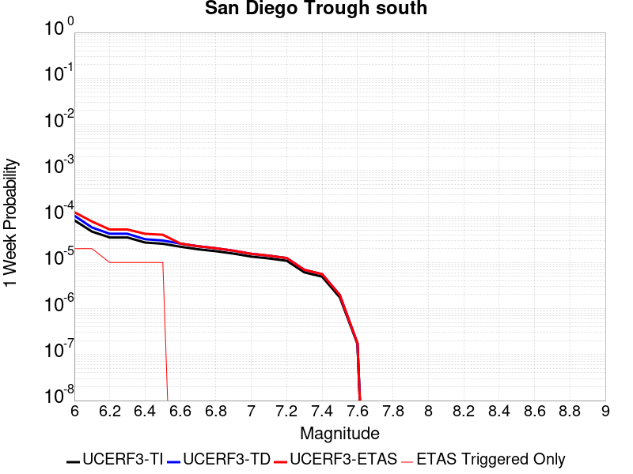 |  |  |  |

| Magnitude | 1 wk TI Prob | 1 wk TD Prob | 1 wk ETAS Prob | 1 wk ETAS/TD Gain | 1 wk ETAS Triggered Only | 1 mo TI Prob | 1 mo TD Prob | 1 mo ETAS Prob | 1 mo ETAS/TD Gain | 1 mo ETAS Triggered Only | 1 yr TI Prob | 1 yr TD Prob | 1 yr ETAS Prob | 1 yr ETAS/TD Gain | 1 yr ETAS Triggered Only | 10 yr TI Prob | 10 yr TD Prob | 10 yr ETAS Prob | 10 yr ETAS/TD Gain | 10 yr ETAS Triggered Only |
|-----|-----|-----|-----|-----|-----|-----|-----|-----|-----|-----|-----|-----|-----|-----|-----|-----|-----|-----|-----|-----|
| 6.0 | 8.279495E-5 | 1.04241306E-4 | 1.736785E-4 | 1.6661198 | 6.9444446E-5 | 3.5478722E-4 | 4.4667677E-4 | 5.160902E-4 | 1.1553997 | 6.9444446E-5 | 0.004310982 | 0.0054256152 | 0.005494683 | 1.0127299 | 6.9444446E-5 | 0.042283054 | 0.05299221 | 0.053057972 | 1.001241 | 6.9444446E-5 |
| 6.1 | 4.6961468E-5 | 5.772944E-5 | 1.2716987E-4 | 2.2028599 | 6.9444446E-5 | 2.0124791E-4 | 2.473894E-4 | 3.1681667E-4 | 1.2806396 | 6.9444446E-5 | 0.00244744 | 0.0030079768 | 0.0030772123 | 1.0230173 | 6.9444446E-5 | 0.024206603 | 0.029679462 | 0.029746845 | 1.0022703 | 6.9444446E-5 |
| 6.2 | 3.5079658E-5 | 4.214154E-5 | 4.214154E-5 | 1.0 | 0.0 | 1.5033272E-4 | 1.8059435E-4 | 1.8059435E-4 | 1.0 | 0.0 | 0.0018287642 | 0.0021965632 | 0.0021965632 | 1.0 | 0.0 | 0.018137876 | 0.021751117 | 0.021751117 | 1.0 | 0.0 |
| 6.3 | 3.5079658E-5 | 4.214154E-5 | 4.214154E-5 | 1.0 | 0.0 | 1.5033272E-4 | 1.8059435E-4 | 1.8059435E-4 | 1.0 | 0.0 | 0.0018287642 | 0.0021965632 | 0.0021965632 | 1.0 | 0.0 | 0.018137876 | 0.021751117 | 0.021751117 | 1.0 | 0.0 |
| 6.4 | 2.7196904E-5 | 3.2087162E-5 | 3.2087162E-5 | 1.0 | 0.0 | 1.16552954E-4 | 1.3750927E-4 | 1.3750927E-4 | 1.0 | 0.0 | 0.0014181085 | 0.0016729041 | 0.0016729041 | 1.0 | 0.0 | 0.014090929 | 0.016604643 | 0.016604643 | 1.0 | 0.0 |
| 6.5 | 2.5584688E-5 | 3.010164E-5 | 3.010164E-5 | 1.0 | 0.0 | 1.0964406E-4 | 1.2900073E-4 | 1.2900073E-4 | 1.0 | 0.0 | 0.0013340989 | 0.0015694655 | 0.0015694655 | 1.0 | 0.0 | 0.013261181 | 0.015585314 | 0.015585314 | 1.0 | 0.0 |
| 6.6 | 2.2034688E-5 | 2.5742738E-5 | 2.5742738E-5 | 1.0 | 0.0 | 9.443096E-5 | 1.1032141E-4 | 1.1032141E-4 | 1.0 | 0.0 | 0.0011490905 | 0.0013423424 | 0.0013423424 | 1.0 | 0.0 | 0.011431668 | 0.013343317 | 0.013343317 | 1.0 | 0.0 |
| 6.7 | 1.9394853E-5 | 2.254176E-5 | 2.254176E-5 | 1.0 | 0.0 | 8.311815E-5 | 9.6603995E-5 | 9.6603995E-5 | 1.0 | 0.0 | 0.0010114936 | 0.0011755243 | 0.0011755243 | 1.0 | 0.0 | 0.01006902 | 0.011693766 | 0.011693766 | 1.0 | 0.0 |
| 6.8 | 1.7615313E-5 | 2.0403182E-5 | 2.0403182E-5 | 1.0 | 0.0 | 7.549201E-5 | 8.74393E-5 | 8.74393E-5 | 1.0 | 0.0 | 9.1872766E-4 | 0.0010640579 | 0.0010640579 | 1.0 | 0.0 | 0.009149387 | 0.010590198 | 0.010590198 | 1.0 | 0.0 |
| 6.9 | 1.5621423E-5 | 1.8026114E-5 | 1.8026114E-5 | 1.0 | 0.0 | 6.6947236E-5 | 7.725251E-5 | 7.725251E-5 | 1.0 | 0.0 | 8.147778E-4 | 9.40147E-4 | 9.40147E-4 | 1.0 | 0.0 | 0.008117969 | 0.009362142 | 0.009362142 | 1.0 | 0.0 |
| 7.0 | 1.3444376E-5 | 1.544809E-5 | 1.544809E-5 | 1.0 | 0.0 | 5.7617483E-5 | 6.620443E-5 | 6.620443E-5 | 1.0 | 0.0 | 7.0126704E-4 | 8.057436E-4 | 8.057436E-4 | 1.0 | 0.0 | 0.006990582 | 0.008028555 | 0.008028555 | 1.0 | 0.0 |
| 7.1 | 1.2268361E-5 | 1.407303E-5 | 1.407303E-5 | 1.0 | 0.0 | 5.2577634E-5 | 6.0311606E-5 | 6.0311606E-5 | 1.0 | 0.0 | 6.399447E-4 | 7.3404907E-4 | 7.3404907E-4 | 1.0 | 0.0 | 0.0063810493 | 0.0073165493 | 0.0073165493 | 1.0 | 0.0 |
| 7.2 | 1.0922655E-5 | 1.2513563E-5 | 1.2513563E-5 | 1.0 | 0.0 | 4.681054E-5 | 5.3628468E-5 | 5.3628468E-5 | 1.0 | 0.0 | 5.697693E-4 | 6.5273355E-4 | 6.5273355E-4 | 1.0 | 0.0 | 0.0056831064 | 0.0065084435 | 0.0065084435 | 1.0 | 0.0 |
| 7.3 | 6.1106753E-6 | 6.928925E-6 | 6.928925E-6 | 1.0 | 0.0 | 2.6188345E-5 | 2.9695057E-5 | 2.9695057E-5 | 1.0 | 0.0 | 3.1879646E-4 | 3.6147775E-4 | 3.6147775E-4 | 1.0 | 0.0 | 0.0031833951 | 0.003608943 | 0.003608943 | 1.0 | 0.0 |
| 7.4 | 4.933187E-6 | 5.5895525E-6 | 5.5895525E-6 | 1.0 | 0.0 | 2.114206E-5 | 2.3955008E-5 | 2.3955008E-5 | 1.0 | 0.0 | 2.5737417E-4 | 2.9161357E-4 | 2.9161357E-4 | 1.0 | 0.0 | 0.002570763 | 0.0029123505 | 0.0029123505 | 1.0 | 0.0 |
| 7.5 | 1.7489613E-6 | 1.969678E-6 | 1.969678E-6 | 1.0 | 0.0 | 7.495527E-6 | 8.4414505E-6 | 8.4414505E-6 | 1.0 | 0.0 | 9.125422E-5 | 1.02770035E-4 | 1.02770035E-4 | 1.0 | 0.0 | 9.1216754E-4 | 0.0010272472 | 0.0010272472 | 1.0 | 0.0 |
| 7.6 | 1.6988751E-7 | 1.7533823E-7 | 1.7533823E-7 | 1.0 | 0.0 | 7.2808916E-7 | 7.5144936E-7 | 7.5144936E-7 | 1.0 | 0.0 | 8.864449E-6 | 9.14886E-6 | 9.14886E-6 | 1.0 | 0.0 | 8.8640954E-5 | 9.1485024E-5 | 9.1485024E-5 | 1.0 | 0.0 |

## Bullion Mountains
*[(top)](#table-of-contents)*

| 1 Week | 1 Month | 1 Year | 10 Year |
|-----|-----|-----|-----|
|  |  |  |  |

| Magnitude | 1 wk TI Prob | 1 wk TD Prob | 1 wk ETAS Prob | 1 wk ETAS/TD Gain | 1 wk ETAS Triggered Only | 1 mo TI Prob | 1 mo TD Prob | 1 mo ETAS Prob | 1 mo ETAS/TD Gain | 1 mo ETAS Triggered Only | 1 yr TI Prob | 1 yr TD Prob | 1 yr ETAS Prob | 1 yr ETAS/TD Gain | 1 yr ETAS Triggered Only | 10 yr TI Prob | 10 yr TD Prob | 10 yr ETAS Prob | 10 yr ETAS/TD Gain | 10 yr ETAS Triggered Only |
|-----|-----|-----|-----|-----|-----|-----|-----|-----|-----|-----|-----|-----|-----|-----|-----|-----|-----|-----|-----|-----|
| 6.0 | 1.6420427E-5 | 1.4692089E-5 | 1.4692089E-5 | 1.0 | 0.0 | 7.037136E-5 | 6.296479E-5 | 6.296479E-5 | 1.0 | 0.0 | 8.5643446E-4 | 7.663651E-4 | 8.357563E-4 | 1.0905459 | 6.9444446E-5 | 0.008531413 | 0.007641016 | 0.0077099297 | 1.0090189 | 6.9444446E-5 |
| 6.1 | 1.6420427E-5 | 1.4692089E-5 | 1.4692089E-5 | 1.0 | 0.0 | 7.037136E-5 | 6.296479E-5 | 6.296479E-5 | 1.0 | 0.0 | 8.5643446E-4 | 7.663651E-4 | 8.357563E-4 | 1.0905459 | 6.9444446E-5 | 0.008531413 | 0.007641016 | 0.0077099297 | 1.0090189 | 6.9444446E-5 |
| 6.2 | 1.6420427E-5 | 1.4692089E-5 | 1.4692089E-5 | 1.0 | 0.0 | 7.037136E-5 | 6.296479E-5 | 6.296479E-5 | 1.0 | 0.0 | 8.5643446E-4 | 7.663651E-4 | 8.357563E-4 | 1.0905459 | 6.9444446E-5 | 0.008531413 | 0.007641016 | 0.0077099297 | 1.0090189 | 6.9444446E-5 |
| 6.3 | 1.2046778E-5 | 9.862335E-6 | 9.862335E-6 | 1.0 | 0.0 | 5.1628023E-5 | 4.2266598E-5 | 4.2266598E-5 | 1.0 | 0.0 | 6.283899E-4 | 5.144975E-4 | 5.839062E-4 | 1.1349058 | 6.9444446E-5 | 0.0062661595 | 0.005135345 | 0.0052044326 | 1.0134534 | 6.9444446E-5 |
| 6.4 | 1.2046778E-5 | 9.862335E-6 | 9.862335E-6 | 1.0 | 0.0 | 5.1628023E-5 | 4.2266598E-5 | 4.2266598E-5 | 1.0 | 0.0 | 6.283899E-4 | 5.144975E-4 | 5.839062E-4 | 1.1349058 | 6.9444446E-5 | 0.0062661595 | 0.005135345 | 0.0052044326 | 1.0134534 | 6.9444446E-5 |
| 6.5 | 1.0244343E-5 | 7.879458E-6 | 7.879458E-6 | 1.0 | 0.0 | 4.390359E-5 | 3.3768785E-5 | 3.3768785E-5 | 1.0 | 0.0 | 5.343951E-4 | 4.110781E-4 | 4.80494E-4 | 1.168863 | 6.9444446E-5 | 0.005331118 | 0.004105208 | 0.0041743675 | 1.0168468 | 6.9444446E-5 |
| 6.6 | 9.605408E-6 | 7.1774966E-6 | 7.1774966E-6 | 1.0 | 0.0 | 4.1165385E-5 | 3.076045E-5 | 3.076045E-5 | 1.0 | 0.0 | 5.010733E-4 | 3.744645E-4 | 4.4388292E-4 | 1.1853806 | 6.9444446E-5 | 0.00499945 | 0.003740332 | 0.0038095168 | 1.018497 | 6.9444446E-5 |
| 6.7 | 8.60418E-6 | 6.1240044E-6 | 6.1240044E-6 | 1.0 | 0.0 | 3.687454E-5 | 2.624558E-5 | 2.624558E-5 | 1.0 | 0.0 | 4.48855E-4 | 3.1951256E-4 | 3.8893483E-4 | 1.2172755 | 6.9444446E-5 | 0.004479495 | 0.0031924439 | 0.0032616665 | 1.0216833 | 6.9444446E-5 |
| 6.8 | 5.187994E-6 | 2.5631666E-6 | 2.5631666E-6 | 1.0 | 0.0 | 2.223407E-5 | 1.0984976E-5 | 1.0984976E-5 | 1.0 | 0.0 | 2.7066618E-4 | 1.3373788E-4 | 1.3373788E-4 | 1.0 | 0.0 | 0.0027033675 | 0.0013369655 | 0.0013369655 | 1.0 | 0.0 |
| 6.9 | 4.5302368E-6 | 2.3443165E-6 | 2.3443165E-6 | 1.0 | 0.0 | 1.9415156E-5 | 1.0047055E-5 | 1.0047055E-5 | 1.0 | 0.0 | 2.3635388E-4 | 1.2232E-4 | 1.2232E-4 | 1.0 | 0.0 | 0.0023610266 | 0.0012229157 | 0.0012229157 | 1.0 | 0.0 |
| 7.0 | 3.431668E-6 | 1.6882402E-6 | 1.6882402E-6 | 1.0 | 0.0 | 1.4707065E-5 | 7.235315E-6 | 7.235315E-6 | 1.0 | 0.0 | 1.7904381E-4 | 8.808996E-5 | 8.808996E-5 | 1.0 | 0.0 | 0.0017889962 | 8.808996E-4 | 8.808996E-4 | 1.0 | 0.0 |

## Concord 2011 CFM
*[(top)](#table-of-contents)*

| 1 Week | 1 Month | 1 Year | 10 Year |
|-----|-----|-----|-----|
|  |  |  |  |

| Magnitude | 1 wk TI Prob | 1 wk TD Prob | 1 wk ETAS Prob | 1 wk ETAS/TD Gain | 1 wk ETAS Triggered Only | 1 mo TI Prob | 1 mo TD Prob | 1 mo ETAS Prob | 1 mo ETAS/TD Gain | 1 mo ETAS Triggered Only | 1 yr TI Prob | 1 yr TD Prob | 1 yr ETAS Prob | 1 yr ETAS/TD Gain | 1 yr ETAS Triggered Only | 10 yr TI Prob | 10 yr TD Prob | 10 yr ETAS Prob | 10 yr ETAS/TD Gain | 10 yr ETAS Triggered Only |
|-----|-----|-----|-----|-----|-----|-----|-----|-----|-----|-----|-----|-----|-----|-----|-----|-----|-----|-----|-----|-----|
| 6.0 | 5.7865112E-5 | 9.759152E-5 | 1.6702918E-4 | 1.7115134 | 6.9444446E-5 | 2.4796976E-4 | 4.1818706E-4 | 4.8760246E-4 | 1.1659913 | 6.9444446E-5 | 0.0030148525 | 0.005079467 | 0.0051485584 | 1.0136021 | 6.9444446E-5 | 0.029742775 | 0.049248982 | 0.049315006 | 1.0013406 | 6.9444446E-5 |
| 6.1 | 5.7865112E-5 | 9.759152E-5 | 1.6702918E-4 | 1.7115134 | 6.9444446E-5 | 2.4796976E-4 | 4.1818706E-4 | 4.8760246E-4 | 1.1659913 | 6.9444446E-5 | 0.0030148525 | 0.005079467 | 0.0051485584 | 1.0136021 | 6.9444446E-5 | 0.029742775 | 0.049248982 | 0.049315006 | 1.0013406 | 6.9444446E-5 |
| 6.2 | 5.6789337E-5 | 9.5795076E-5 | 1.6523286E-4 | 1.7248576 | 6.9444446E-5 | 2.4336016E-4 | 4.104905E-4 | 4.7990642E-4 | 1.1691048 | 6.9444446E-5 | 0.0029588845 | 0.0049861916 | 0.0050552897 | 1.013858 | 6.9444446E-5 | 0.029197963 | 0.04836556 | 0.048431646 | 1.0013664 | 6.9444446E-5 |
| 6.3 | 5.203322E-5 | 8.803056E-5 | 1.574689E-4 | 1.7887981 | 6.9444446E-5 | 2.2298045E-4 | 3.7722368E-4 | 4.466419E-4 | 1.1840241 | 6.9444446E-5 | 0.0027114071 | 0.0045838105 | 0.0046529365 | 1.0150805 | 6.9444446E-5 | 0.026785625 | 0.04453672 | 0.044603072 | 1.0014899 | 6.9444446E-5 |
| 6.4 | 4.7120942E-5 | 7.897404E-5 | 1.4841299E-4 | 1.8792632 | 6.9444446E-5 | 2.0193127E-4 | 3.3842045E-4 | 4.0784138E-4 | 1.2051322 | 6.9444446E-5 | 0.0024557412 | 0.00411323 | 0.0041823885 | 1.0168138 | 6.9444446E-5 | 0.024287801 | 0.040065527 | 0.04013219 | 1.0016638 | 6.9444446E-5 |
| 6.5 | 2.9598437E-5 | 4.667486E-5 | 1.1611606E-4 | 2.4877646 | 6.9444446E-5 | 1.2684427E-4 | 2.0002096E-4 | 2.6945153E-4 | 1.3471164 | 6.9444446E-5 | 0.001543235 | 0.0024327459 | 0.0025020214 | 1.0284762 | 6.9444446E-5 | 0.015325619 | 0.023909973 | 0.023977757 | 1.0028349 | 6.9444446E-5 |
| 6.6 | 2.0443718E-5 | 2.998433E-5 | 2.998433E-5 | 1.0 | 0.0 | 8.7613E-5 | 1.2849816E-4 | 1.2849816E-4 | 1.0 | 0.0 | 0.0010661662 | 0.0015633785 | 0.0015633785 | 1.0 | 0.0 | 0.010610655 | 0.015466996 | 0.015466996 | 1.0 | 0.0 |
| 6.7 | 1.798539E-5 | 2.5557381E-5 | 2.5557381E-5 | 1.0 | 0.0 | 7.7077966E-5 | 1.0952716E-4 | 1.0952716E-4 | 1.0 | 0.0 | 9.380202E-4 | 0.001332699 | 0.001332699 | 1.0 | 0.0 | 0.009340706 | 0.013217433 | 0.013217433 | 1.0 | 0.0 |
| 6.8 | 1.613555E-5 | 2.1959211E-5 | 2.1959211E-5 | 1.0 | 0.0 | 6.915052E-5 | 9.4107585E-5 | 9.4107585E-5 | 1.0 | 0.0 | 8.4158237E-4 | 0.0011451716 | 0.0011451716 | 1.0 | 0.0 | 0.008384023 | 0.0113782035 | 0.0113782035 | 1.0 | 0.0 |
| 6.9 | 1.2916435E-5 | 1.7081054E-5 | 1.7081054E-5 | 1.0 | 0.0 | 5.5354973E-5 | 7.32025E-5 | 7.32025E-5 | 1.0 | 0.0 | 6.7373837E-4 | 8.908818E-4 | 8.908818E-4 | 1.0 | 0.0 | 0.006716994 | 0.008867139 | 0.008867139 | 1.0 | 0.0 |
| 7.0 | 9.81129E-6 | 1.2630829E-5 | 1.2630829E-5 | 1.0 | 0.0 | 4.2047708E-5 | 5.413101E-5 | 5.413101E-5 | 1.0 | 0.0 | 5.118106E-4 | 6.588474E-4 | 6.588474E-4 | 1.0 | 0.0 | 0.005106334 | 0.006569153 | 0.006569153 | 1.0 | 0.0 |
| 7.1 | 8.0889195E-6 | 1.0418261E-5 | 1.0418261E-5 | 1.0 | 0.0 | 3.4666336E-5 | 4.4648932E-5 | 4.4648932E-5 | 1.0 | 0.0 | 4.219809E-4 | 5.434662E-4 | 5.434662E-4 | 1.0 | 0.0 | 0.004211805 | 0.0054215975 | 0.0054215975 | 1.0 | 0.0 |
| 7.2 | 6.267438E-6 | 8.115699E-6 | 8.115699E-6 | 1.0 | 0.0 | 2.6860173E-5 | 3.4781104E-5 | 3.4781104E-5 | 1.0 | 0.0 | 3.2697353E-4 | 4.233784E-4 | 4.233784E-4 | 1.0 | 0.0 | 0.0032649285 | 0.004225969 | 0.004225969 | 1.0 | 0.0 |
| 7.3 | 3.6761196E-6 | 4.8401653E-6 | 4.8401653E-6 | 1.0 | 0.0 | 1.5754704E-5 | 2.0743402E-5 | 2.0743402E-5 | 1.0 | 0.0 | 1.9179663E-4 | 2.5252186E-4 | 2.5252186E-4 | 1.0 | 0.0 | 0.0019163118 | 0.002522487 | 0.002522487 | 1.0 | 0.0 |
| 7.4 | 2.8044356E-6 | 3.7096036E-6 | 3.7096036E-6 | 1.0 | 0.0 | 1.2018954E-5 | 1.5898204E-5 | 1.5898204E-5 | 1.0 | 0.0 | 1.4632095E-4 | 1.9354356E-4 | 1.9354356E-4 | 1.0 | 0.0 | 0.0014622464 | 0.0019338481 | 0.0019338481 | 1.0 | 0.0 |
| 7.5 | 2.4578699E-6 | 3.2447442E-6 | 3.2447442E-6 | 1.0 | 0.0 | 1.0533685E-5 | 1.3905973E-5 | 1.3905973E-5 | 1.0 | 0.0 | 1.2824008E-4 | 1.6929218E-4 | 1.6929218E-4 | 1.0 | 0.0 | 0.0012816609 | 0.001691713 | 0.001691713 | 1.0 | 0.0 |
| 7.6 | 1.7713267E-6 | 2.3351192E-6 | 2.3351192E-6 | 1.0 | 0.0 | 7.591378E-6 | 1.0007616E-5 | 1.0007616E-5 | 1.0 | 0.0 | 9.2421105E-5 | 1.21836E-4 | 1.21836E-4 | 1.0 | 0.0 | 9.2382677E-4 | 0.0012177454 | 0.0012177454 | 1.0 | 0.0 |
| 7.7 | 5.1912366E-7 | 6.8290143E-7 | 6.8290143E-7 | 1.0 | 0.0 | 2.2248137E-6 | 2.9267171E-6 | 2.9267171E-6 | 1.0 | 0.0 | 2.708677E-5 | 3.5632213E-5 | 3.5632213E-5 | 1.0 | 0.0 | 2.708347E-4 | 3.5627294E-4 | 3.5627294E-4 | 1.0 | 0.0 |

